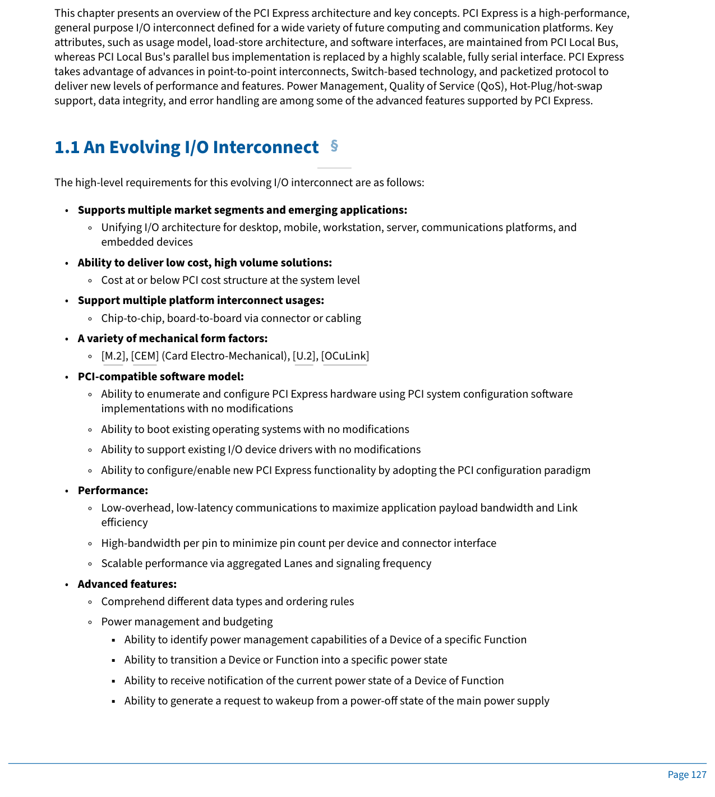
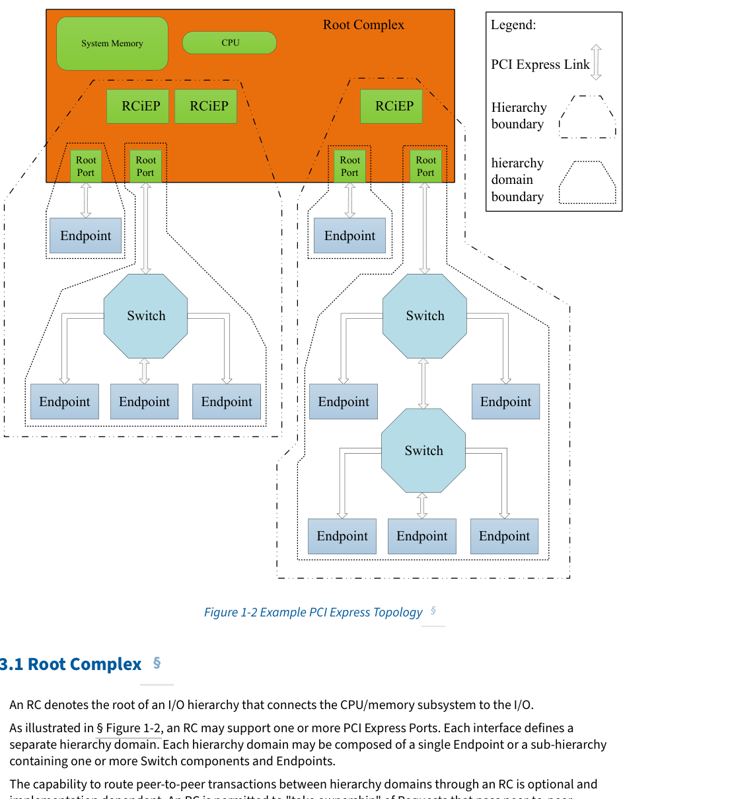
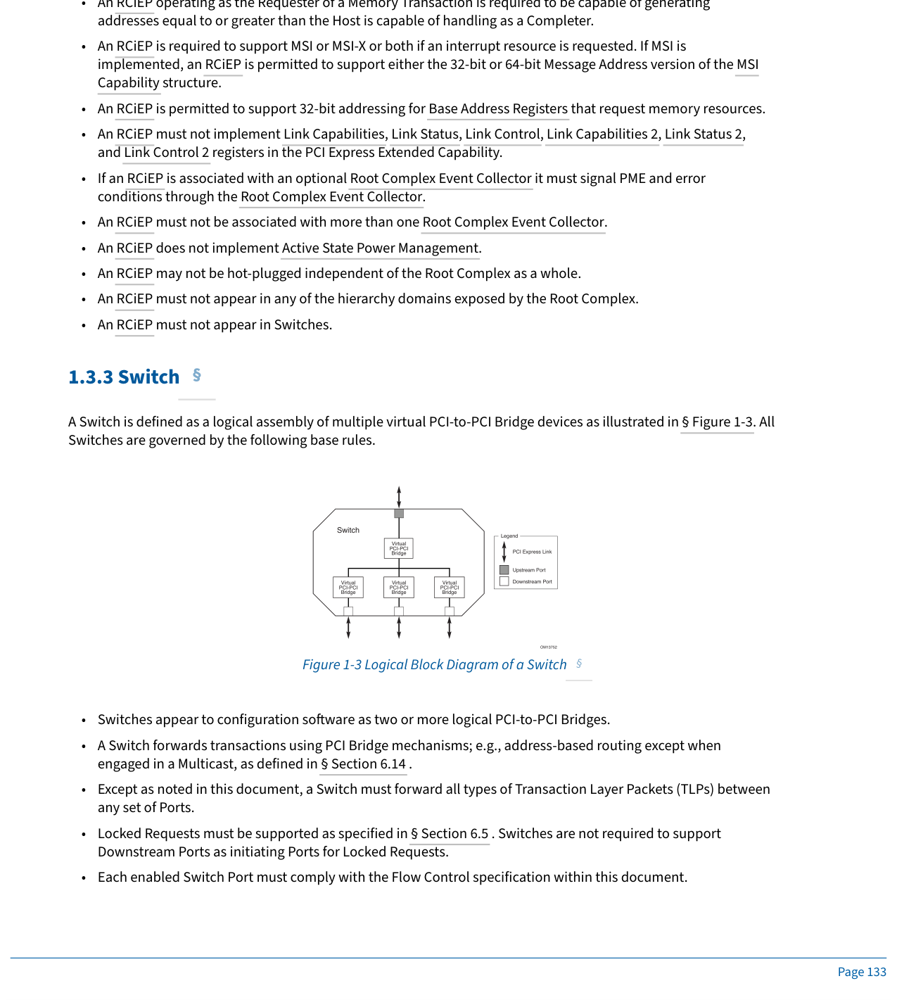
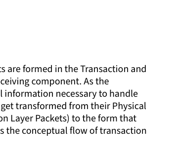
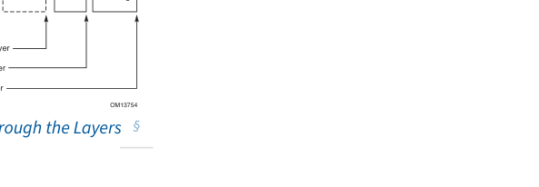

# 📘 第 1 章　Introduction (Chapter 1. Introduction)

**PCI Express® Base Specification — Revision 6.2, Version 1.0 — January 25, 2024**

> 📄 **Source pages**: 127–140 (PDF 1-indexed) | 📁 **File**: `chapter_01_raw.md`
> 🎨 **Format**: 中英对照双语 · 图表原始保留 · 中文背景色灰色 · GitHub Flavored Markdown
> 📚 **Template**: CXL 3.2 Spec translation (CXL_zh/)

---

## 📑 本章目录 (Table of Contents)

> 由合并阶段自动生成。请使用浏览器/GitHub 渲染时,各小节标题链接跳转。

## 🖼 本章图表 (Figures)

> 所有图已抽取为 PNG 存放在 `figures/chapter_01/`。

## 📊 本章表格 (Tables)

> 各章表格以标准 Markdown 表格形式嵌入正文。

---

---

# 📘 第 1 章　Introduction (引言)

> 📄 **Source pages**: 127–140 | 📁 **File**: `chapter_01.md`
> 🎨 **Format**: 中英对照双语 · 图表原始保留 · 中文背景色灰色 · GitHub Flavored Markdown

---

## 1. Introduction | 引言

<table>
<thead>
<tr>
<th width="50%">🇬🇧 English</th>
<th width="50%" style="background-color:#e8e8e8">🇨🇳 中文</th>
</tr>
</thead>
<tbody>
<tr>
<td>

This chapter presents an overview of the PCI Express architecture and key concepts. PCI Express is a high-performance, general purpose I/O interconnect defined for a wide variety of future computing and communication platforms. Key attributes, such as usage model, load-store architecture, and software interfaces, are maintained from PCI Local Bus, whereas PCI Local Bus's parallel bus implementation is replaced by a highly scalable, fully serial interface. PCI Express takes advantage of advances in point-to-point interconnects, Switch-based technology, and packetized protocol to deliver new levels of performance and features. Power Management, Quality of Service (QoS), Hot-Plug/hot-swap support, data integrity, and error handling are among some of the advanced features supported by PCI Express.

The high-level requirements for this evolving I/O interconnect are as follows:

- Supports multiple market segments and emerging applications:
  - Unifying I/O architecture for desktop, mobile, workstation, server, communications platforms, and embedded devices
- Ability to deliver low cost, high volume solutions:
  - Cost at or below PCI cost structure at the system level
- Support multiple platform interconnect usages:
  - Chip-to-chip, board-to-board via connector or cabling
- A variety of mechanical form factors:
  - [M.2], [CEM] (Card Electro-Mechanical), [U.2], [OCuLink]
- PCI-compatible software model:
  - Ability to enumerate and configure PCI Express hardware using PCI system configuration software implementations with no modifications
  - Ability to boot existing operating systems with no modifications
  - Ability to support existing I/O device drivers with no modifications
  - Ability to configure/enable new PCI Express functionality by adopting the PCI configuration paradigm
- Performance:
  - Low-overhead, low-latency communications to maximize application payload bandwidth and Link efficiency
  - High-bandwidth per pin to minimize pin count per device and connector interface
  - Scalable performance via aggregated Lanes and signaling frequency
- Advanced features:
  - Comprehend different data types and ordering rules
  - Power management and budgeting
    - Ability to identify power management capabilities of a Device of a specific Function
    - Ability to transition a Device or Function into a specific power state
    - Ability to receive notification of the current power state of a Device of Function
    - Ability to generate a request to wakeup from a power-off state of the main power supply

</td>
<td style="background-color:#e8e8e8">

本章概述 PCI Express 体系结构及关键概念。PCI Express 是一种高性能、通用的 I/O 互连，定义用于各种未来的计算与通信平台。使用模型、加载-存储 (load-store) 体系结构以及软件接口等关键属性沿袭自 PCI Local Bus，而 PCI Local Bus 的并行总线实现则被替换为高度可扩展的全串行接口。PCI Express 利用点对点互连、基于交换机 (Switch) 的技术以及分组化协议 (packetized protocol) 的最新进展，提供了全新的性能水平与特性集。电源管理、服务质量 (QoS)、热插拔 (Hot-Plug/hot-swap) 支持、数据完整性以及错误处理等均属于 PCI Express 支持的高级特性。

这一不断演进的 I/O 互连的高层需求如下：

- 支持多个细分市场与新兴应用：
  - 统一桌面、移动、工作站、服务器、通信平台及嵌入式设备的 I/O 体系结构
- 提供低成本、高量产解决方案的能力：
  - 系统级成本不高于 PCI 成本结构
- 支持多种平台互连用途：
  - 芯片到芯片、通过连接器或线缆的板到板
- 多种机械外形规格 (Form Factor)：
  - [M.2]、[CEM] (Card Electro-Mechanical)、[U.2]、[OCuLink]
- 兼容 PCI 的软件模型：
  - 能够在不做任何修改的情况下，使用 PCI 系统配置软件实现来枚举与配置 PCI Express 硬件
  - 能够在不做任何修改的情况下启动现有操作系统
  - 能够在不做任何修改的情况下支持现有 I/O 设备驱动
  - 能够通过采用 PCI 配置范式来配置/启用新的 PCI Express 功能
- 性能：
  - 低开销、低延迟通信，以最大化应用负载带宽与链路 (Link) 效率
  - 每引脚高带宽，以最小化每设备与连接器接口的引脚数
  - 通过聚合通道 (Lane) 与信令频率实现可扩展的性能
- 高级特性：
  - 理解不同的数据类型与排序规则
  - 电源管理与预算
    - 能够识别特定功能 (Function) 设备的电源管理能力
    - 能够将设备或功能转入特定的电源状态 (Power State)
    - 能够接收设备或功能当前电源状态的通知
    - 能够生成从主电源掉电状态唤醒的请求

</td>
</tr>
</tbody>
</table>

[⬆️ 返回目录](#-本章目录-table-of-contents)

---

<<<PAGE_BREAK>>> page_128

▪
Ability to sequence Device power-up to allow graceful platform policy in power budgeting
◦
Ability to support differentiated services, i.e., different (QoS)
▪
Ability to have dedicated Link resources per QoS data flow to improve fabric efficiency and
effective application-level performance in the face of head-of-line blocking
▪
Ability to configure fabric QoS arbitration policies within every component
▪
Ability to tag end-to-end QoS with each packet
▪
Ability to create end-to-end isochronous (time-based, injection rate control) solutions
◦
Hot-Plug support
▪
Ability to support existing PCI Hot-Plug solutions
▪
Ability to support native Hot-Plug solutions (no sideband signals required)
▪
Ability to support async removal
▪
Ability to support a unified software model for all form factors
◦
Data Integrity
▪
Ability to support Link-level data integrity for all types of transaction and Data Link packets
▪
Ability to support end-to-end data integrity for high availability solutions
◦
Error handling
▪
Ability to support PCI-Compatible error handling
▪
Ability to support advanced error reporting and handling to improve fault isolation and
recovery solutions
◦
Process Technology Independence
▪
Ability to support different DC common mode voltages at Transmitter and Receiver
◦
Ease of Testing
▪
Ability to test electrical compliance via simple connection to test equipment
A Link represents a dual-simplex communications channel between two components. The fundamental PCI Express Link
consists of two, low-voltage, differentially driven signal pairs: a Transmit pair and a Receive pair as shown in § Figure 1-1.
A PCI Express Link consists of a PCIe PHY as defined in § Chapter 4. .
OM13750
Component A
Component B
Packet
Packet
Figure 1-1 PCI Express Link
The primary Link attributes for PCI Express Link are:
1.2 PCI Express Link §
§

## 1.1 An Evolving I/O Interconnect | 不断演进的 I/O 互连

table>
<thead>
<tr>
<th width="50%">🇬🇧 English</th>
<th width="50%" style="background-color:#e8e8e8">🇨🇳 中文</th>
</tr>
</thead>
<tbody>
<tr>
<td>

- Ability to sequence Device power-up to allow graceful platform policy in power budgeting
- Ability to support differentiated services, i.e., different (QoS)
  - Ability to have dedicated Link resources per QoS data flow to improve fabric efficiency and effective application-level performance in the face of head-of-line blocking
  - Ability to configure fabric QoS arbitration policies within every component
  - Ability to tag end-to-end QoS with each packet
  - Ability to create end-to-end isochronous (time-based, injection rate control) solutions
- Hot-Plug support
  - Ability to support existing PCI Hot-Plug solutions
  - Ability to support native Hot-Plug solutions (no sideband signals required)
  - Ability to support async removal
  - Ability to support a unified software model for all form factors
- Data Integrity
  - Ability to support Link-level data integrity for all types of transaction and Data Link packets
  - Ability to support end-to-end data integrity for high availability solutions
- Error handling
  - Ability to support PCI-Compatible error handling
  - Ability to support advanced error reporting and handling to improve fault isolation and recovery solutions
- Process Technology Independence
  - Ability to support different DC common mode voltages at Transmitter and Receiver
- Ease of Testing
  - Ability to test electrical compliance via simple connection to test equipment

</td>
<td style="background-color:#e8e8e8">

- 能够对设备上电进行排序，以在功率预算中实现平稳的平台策略
- 支持差异化服务，即不同的服务质量 (QoS)
  - 每个 QoS 数据流拥有专用的链路 (Link) 资源，以在出现头阻阻塞时提升 Fabric 效率与有效的应用级性能
  - 能够在每个组件内配置 Fabric 的 QoS 仲裁策略
  - 能够为每个报文打上端到端 QoS 标签
  - 能够创建端到端等时 (基于时间、注入速率控制) 解决方案
- 热插拔 (Hot-Plug) 支持
  - 能够支持现有 PCI 热插拔解决方案
  - 能够支持原生热插拔解决方案 (无需边带信号)
  - 能够支持异步移除
  - 能够为所有外形规格 (Form Factor) 提供统一的软件模型
- 数据完整性
  - 能够为所有类型的事务及数据链路报文提供链路级数据完整性
  - 能够为高可用性解决方案提供端到端数据完整性
- 错误处理
  - 能够支持 PCI 兼容 (PCI-Compatible) 的错误处理
  - 能够支持高级错误上报与处理，以改善故障隔离与恢复解决方案
- 工艺技术无关性
  - 能够在发送器 (Transmitter) 与接收器 (Receiver) 处支持不同的直流共模电压
- 测试便捷性
  - 能够通过简单地连接测试设备完成电气一致性测试

</td>
</tr>
</tbody>
</table>

[⬆️ 返回目录](#-本章目录-table-of-contents)

---

## 1.2 PCI Express Link | PCI Express 链路

<table>
<thead>
<tr>
<th width="50%">🇬🇧 English</th>
<th width="50%" style="background-color:#e8e8e8">🇨🇳 中文</th>
</tr>
</thead>
<tbody>
<tr>
<td>

A Link represents a dual-simplex communications channel between two components. The fundamental PCI Express Link consists of two, low-voltage, differentially driven signal pairs: a Transmit pair and a Receive pair as shown in § Figure 1-1.

A PCI Express Link consists of a PCIe PHY as defined in § Chapter 4.

The primary Link attributes for PCI Express Link are:

</td>
<td style="background-color:#e8e8e8">

链路 (Link) 表示两个组件之间的双单工通信通道。最基本的 PCI Express 链路由两对低压差分驱动的信号对组成：一对用于发送，一对用于接收，如图 1-1 所示。

PCI Express 链路由 § 第 4 章 定义的 PCIe PHY 组成。

PCI Express 链路的主要属性如下：

</td>
</tr>
</tbody>
</table>

> **Figure 1-1.** PCI Express Link
> 

[⬆️ 返回目录](#-本章目录-table-of-contents)

---

<<<PAGE_BREAK>>> page_129

•
The basic Link - PCI Express Link consists of dual unidirectional differential Links, implemented as a Transmit
pair and a Receive pair. A data clock is embedded using an encoding scheme (see § Chapter 4. ) to achieve very
high data rates.
•
The Signaling method – Each major revision of PCI Express signaling has evolved one (or more) characteristics
to increase bandwidth. Throughout this specification, the term GT/s is used to refer to the number of encoded
bits transferred in a second on a direction of a Lane. The actual effective data rate is dependent on a
combination of modulation method, encoding method, and data rate. § Table 1-1 provides a summary of Max
Data Rate, Modulation Scheme, Encoding Method, and Effective Max Data Rate with the accounting of only
encoding overhead for all the six major revisions of PCI Express.
2 See § Chapter 4. for more information about
the combined signaling method and § Chapter 8. for electrical specification details for each major PCI Express
revision.
Table 1-1 PCIe Signaling Characteristics
Data Rate
Modulation
Encoding
Effective Data Rate
(after removing Encoding overhead)
Base Specification Revision
6.x
5.x
4.x
3.0
2.0
1.0
2.5 GT/s
NRZ
8b/10b
2 Gbit/s
✓
✓
✓
✓
✓
✓
5.0 GT/s
NRZ
8b/10b
4 Gbit/s
✓
✓
✓
✓
✓
✓
8.0 GT/s
NRZ
128b/130b
~8 Gbit/s
✓
✓
✓
✓
✓
16.0 GT/s
NRZ
128b/130b
~16 Gbit/s
✓
✓
✓
✓
32.0 GT/s
NRZ
128b/130b
~32 Gbit/s
✓
✓
64.0 GT/s
PAM4
1b/1b
64 Gbit/s
✓
•
Lanes - A Link must support at least one Lane - each Lane represents a set of differential signal pairs (one pair
for transmission, one pair for reception). To scale bandwidth, a Link may aggregate multiple Lanes denoted by
xN where N may be any of the supported Link widths. A x8 Link operating at the 2.5 GT/s data rate represents
an aggregate bandwidth of 20 Gigabits/second of raw bandwidth in each direction. This specification describes
operations for x1, x2, x4, x8, and x16 Lane widths.
•
Data Stream – PCI Express uses Data Stream in Flit Mode and Data Stream in Non-Flit Mode (see § Section 4.2 ,
including § Table 4-1 and § Table 4-2). Support of Data Stream in Non-Flit Mode is mandatory, while support of
Data Stream in Flit Mode is mandatory only if a data rate that exceeds 32.0 GT/s is supported.
•
Initialization - During hardware initialization, each PCI Express Link is set up following a negotiation of Link
width, data rate, and Flit mode by the two agents at each end of the Link. No firmware or operating system
software is involved.
•
Symmetry - Each Link must support a symmetric number of Lanes in each direction, i.e., a x16 Link indicates
there are 16 differential signal pairs in each direction.
A fabric is defined as a set of point-to-point Links that interconnect a set of components - an example fabric topology is
shown in § Figure 1-2. This figure illustrates a single fabric instance with two Hierarchies composed of a Root Complex
(RC), multiple Endpoints, and multiple Switches, interconnected via PCI Express Links.
1.3 PCI Express Fabric Topology §
§
2. Terms like “PCIe Gen3” are ambiguous and should be avoided. For example, “gen3” could mean (1) compliant with Base 3.0, (2) compliant with Base 3.1 (last
revision of 3.x), (3) compliant with Base 3.0 and supporting 8.0 GT/s, (4) compliant with Base 3.0 or later and supporting 8.0 GT/s, ….

<table>
<thead>
<tr>
<th width="50%">🇬🇧 English</th>
<th width="50%" style="background-color:#e8e8e8">🇨🇳 中文</th>
</tr>
</thead>
<tbody>
<tr>
<td>

- **The basic Link** - PCI Express Link consists of dual unidirectional differential Links, implemented as a Transmit pair and a Receive pair. A data clock is embedded using an encoding scheme (see § Chapter 4) to achieve very high data rates.
- **The Signaling method** – Each major revision of PCI Express signaling has evolved one (or more) characteristics to increase bandwidth. Throughout this specification, the term GT/s is used to refer to the number of encoded bits transferred in a second on a direction of a Lane. The actual effective data rate is dependent on a combination of modulation method, encoding method, and data rate. § Table 1-1 provides a summary of Max Data Rate, Modulation Scheme, Encoding Method, and Effective Max Data Rate with the accounting of only encoding overhead for all the six major revisions of PCI Express.2 See § Chapter 4 for more information about the combined signaling method and § Chapter 8 for electrical specification details for each major PCI Express revision.

**Table 1-1. PCIe Signaling Characteristics | 表 1-1. PCIe 信令特性**

| Data Rate | Modulation | Encoding | Effective Data Rate (after removing Encoding overhead) | 6.x | 5.x | 4.x | 3.0 | 2.0 | 1.0 |
|-----------|------------|----------|---|---|---|---|---|---|---|
| 2.5 GT/s | NRZ | 8b/10b | 2 Gbit/s | ✓ | ✓ | ✓ | ✓ | ✓ | ✓ |
| 5.0 GT/s | NRZ | 8b/10b | 4 Gbit/s | ✓ | ✓ | ✓ | ✓ | ✓ | ✓ |
| 8.0 GT/s | NRZ | 128b/130b | ~8 Gbit/s | ✓ | ✓ | ✓ | ✓ | ✓ |  |
| 16.0 GT/s | NRZ | 128b/130b | ~16 Gbit/s | ✓ | ✓ | ✓ | ✓ |  |  |
| 32.0 GT/s | NRZ | 128b/130b | ~32 Gbit/s | ✓ | ✓ |  |  |  |  |
| 64.0 GT/s | PAM4 | 1b/1b | 64 Gbit/s | ✓ |  |  |  |  |  |

- **Lanes** - A Link must support at least one Lane - each Lane represents a set of differential signal pairs (one pair for transmission, one pair for reception). To scale bandwidth, a Link may aggregate multiple Lanes denoted by xN where N may be any of the supported Link widths. A x8 Link operating at the 2.5 GT/s data rate represents an aggregate bandwidth of 20 Gigabits/second of raw bandwidth in each direction. This specification describes operations for x1, x2, x4, x8, and x16 Lane widths.
- **Data Stream** – PCI Express uses Data Stream in Flit Mode and Data Stream in Non-Flit Mode (see § Section 4.2, including § Table 4-1 and § Table 4-2). Support of Data Stream in Non-Flit Mode is mandatory, while support of Data Stream in Flit Mode is mandatory only if a data rate that exceeds 32.0 GT/s is supported.
- **Initialization** - During hardware initialization, each PCI Express Link is set up following a negotiation of Link width, data rate, and Flit mode by the two agents at each end of the Link. No firmware or operating system software is involved.
- **Symmetry** - Each Link must support a symmetric number of Lanes in each direction, i.e., a x16 Link indicates there are 16 differential signal pairs in each direction.

</td>
<td style="background-color:#e8e8e8">

- **基本链路** - PCI Express 链路由两对单向差分链路组成，分别实现为发送对与接收对。数据时钟通过一种编码方案 (参见 § 第 4 章) 嵌入其中，以实现非常高的数据速率。
- **信令方法** – PCI Express 信令的每一次主要修订都通过一个 (或多个) 特性演进以提升带宽。在本规范中，术语 GT/s 用来表示一个通道 (Lane) 方向上每秒传输的编码比特数。实际有效数据速率取决于调制方式、编码方式与数据速率的组合。§ 表 1-1 总结了 PCI Express 全部六次主要修订的最大数据速率、调制方式、编码方式以及仅考虑编码开销后的有效最大数据速率。2 有关组合信令方法的更多信息，参见 § 第 4 章；有关每次主要 PCI Express 修订的电气规范细节，参见 § 第 8 章。

**表 1-1. PCIe 信令特性**

| 数据速率 | 调制方式 | 编码方式 | 有效数据速率 (去除编码开销后) | 6.x | 5.x | 4.x | 3.0 | 2.0 | 1.0 |
|-----------|------------|----------|---|---|---|---|---|---|---|
| 2.5 GT/s | NRZ (非归零编码) | 8b/10b 编码 | 2 Gbit/s | ✓ | ✓ | ✓ | ✓ | ✓ | ✓ |
| 5.0 GT/s | NRZ (非归零编码) | 8b/10b 编码 | 4 Gbit/s | ✓ | ✓ | ✓ | ✓ | ✓ | ✓ |
| 8.0 GT/s | NRZ (非归零编码) | 128b/130b 编码 | ~8 Gbit/s | ✓ | ✓ | ✓ | ✓ | ✓ |  |
| 16.0 GT/s | NRZ (非归零编码) | 128b/130b 编码 | ~16 Gbit/s | ✓ | ✓ | ✓ | ✓ |  |  |
| 32.0 GT/s | NRZ (非归零编码) | 128b/130b 编码 | ~32 Gbit/s | ✓ | ✓ |  |  |  |  |
| 64.0 GT/s | PAM4 (四电平脉冲幅度调制) | 1b/1b 编码 | 64 Gbit/s | ✓ |  |  |  |  |  |

- **通道 (Lane)** - 链路必须至少支持一个通道，每个通道表示一组差分信号对 (一对用于发送，一对用于接收)。为扩展带宽，一条链路可聚合多个通道，记作 xN，其中 N 可以是所支持链路宽度中的任意值。在 2.5 GT/s 数据速率下工作的 x8 链路每个方向的原始带宽合计为 20 Gbit/s。本规范描述了 x1、x2、x4、x8 与 x16 通道宽度的操作。
- **数据流 (Data Stream)** – PCI Express 使用 Flit 模式下的数据流 (Data Stream in Flit Mode) 和非 Flit 模式下的数据流 (Data Stream in Non-Flit Mode) (参见 § 4.2 节，包括 § 表 4-1 与 § 表 4-2)。支持非 Flit 模式下的数据流是强制性的；而 Flit 模式下的数据流仅在支持超过 32.0 GT/s 数据速率时才是强制性的。
- **初始化 (Initialization)** - 在硬件初始化过程中，每条 PCI Express 链路都会由链路两端的两个代理通过协商链路宽度、数据速率与 Flit 模式来建立。整个过程不涉及固件或操作系统软件。
- **对称性 (Symmetry)** - 每条链路必须在每个方向上支持对称的通道数，即 x16 链路表示每个方向上各有 16 对差分信号对。

</td>
</tr>
</tbody>
</table>

[⬆️ 返回目录](#-本章目录-table-of-contents)

---

## 1.3 PCI Express Fabric Topology | PCI Express Fabric 拓扑

table>
<thead>
<tr>
<th width="50%">🇬🇧 English</th>
<th width="50%" style="background-color:#e8e8e8">🇨🇳 中文</th>
</tr>
</thead>
<tbody>
<tr>
<td>

A fabric is defined as a set of point-to-point Links that interconnect a set of components - an example fabric topology is shown in § Figure 1-2. This figure illustrates a single fabric instance with two Hierarchies composed of a Root Complex (RC), multiple Endpoints, and multiple Switches, interconnected via PCI Express Links.

> **Figure 1-2.** Example PCI Express Topology
> 

</td>
<td style="background-color:#e8e8e8">

Fabric (互连网络) 定义为一组点对点链路，它们互连一组组件——一个 Fabric 拓扑示例如图 1-2 所示。该图展示了一个由根复合体 (Root Complex, RC)、多个端点 (Endpoint) 与多个交换机 (Switch) 组成、包含两个层级 (Hierarchy) 并通过 PCI Express 链路互连的 Fabric 实例。

</td>
</tr>
</tbody>
</table>

[⬆️ 返回目录](#-本章目录-table-of-contents)

---

<<<PAGE_BREAK>>> page_130

Endpoint
System Memory
CPU
Root 
Port
Endpoint
RCiEP
Root Complex
Root 
Port
Root 
Port
Root 
Port
Switch
PCI Express Link
RCiEP
RCiEP
Endpoint
Endpoint
Endpoint
Switch
Endpoint
Endpoint
Endpoint
Switch
Endpoint
Endpoint
Legend:
Hierarchy 
boundary
hierarchy 
domain 
boundary
Figure 1-2 Example PCI Express Topology
•
An RC denotes the root of an I/O hierarchy that connects the CPU/memory subsystem to the I/O.
•
As illustrated in § Figure 1-2, an RC may support one or more PCI Express Ports. Each interface defines a
separate hierarchy domain. Each hierarchy domain may be composed of a single Endpoint or a sub-hierarchy
containing one or more Switch components and Endpoints.
•
The capability to route peer-to-peer transactions between hierarchy domains through an RC is optional and
implementation dependent. An RC is permitted to "take ownership" of Requests that pass peer-to-peer
between Root Ports, reforming and potentially spliting a Request such that it may appear to the ultimate
Completer that the RC was the origin of the Request, and subsequently the RC must reform the Completion(s)
1.3.1 Root Complex §
§

## 1.3.1 Root Complex | 根复合体

<table>
<thead>
<tr>
<th width="50%">🇬🇧 English</th>
<th width="50%" style="background-color:#e8e8e8">🇨🇳 中文</th>
</tr>
</thead>
<tbody>
<tr>
<td>

- An RC denotes the root of an I/O hierarchy that connects the CPU/memory subsystem to the I/O.
- As illustrated in § Figure 1-2, an RC may support one or more PCI Express Ports. Each interface defines a separate hierarchy domain. Each hierarchy domain may be composed of a single Endpoint or a sub-hierarchy containing one or more Switch components and Endpoints.
- The capability to route peer-to-peer transactions between hierarchy domains through an RC is optional and implementation dependent. An RC is permitted to "take ownership" of Requests that pass peer-to-peer between Root Ports, reforming and potentially splitting a Request such that it may appear to the ultimate Completer that the RC was the origin of the Request, and subsequently the RC must reform the Completion(s)

</td>
<td style="background-color:#e8e8e8">

- RC 表示一个 I/O 层级 (Hierarchy) 的根，它将 CPU/内存子系统连接到 I/O。
- 如图 1-2 所示，RC 可以支持一个或多个 PCI Express 端口 (Port)。每个接口定义一个独立的层级域 (hierarchy domain)。每个层级域可以由单个端点 (Endpoint) 组成，也可以由包含一个或多个交换机组件与端点的子层级 (sub-hierarchy) 组成。
- RC 是否支持跨层级域的对等 (peer-to-peer) 事务路由是可选的，且与实现相关。RC 允许"接管"在根端口 (Root Port) 之间对等传递的请求 (Request)，对请求进行重组并可能拆分 (split)，使得对最终完成者 (Completer) 而言 RC 看起来是请求的发起方；之后 RC 还必须对返回给原始请求者 (Requester) 的完成报文 (Completion) 进行重组

</td>
</tr>
</tbody>
</table>

[⬆️ 返回目录](#-本章目录-table-of-contents)

---

<<<PAGE_BREAK>>> page_131

being returned to the original Requester. Alternately, an RC implementation may incorporate a real or virtual
Switch internally within the Root Complex to enable full peer-to-peer support in a software transparent way.
Unlike the rules for a Switch, an RC is generally permitted to split a packet into smaller packets when routing
transactions peer-to-peer between hierarchy domains (except as noted below), e.g., split a single packet with a
256-byte payload into two packets of 128 bytes payload each. The resulting packets are subject to the normal
packet formation rules contained in this specification (e.g., Max_Payload_Size, Read Completion Boundary (RCB),
etc.). Component designers should note that splitting a packet into smaller packets may have negative
performance consequences, especially for a transaction addressing a device behind a PCI Express to PCI/PCI-X
bridge.
Exception: An RC that supports UIO peer-to-peer routing is permitted to split UIO Memory Write Requests only
at naturally aligned 64B boundaries.
Exception: An RC that supports peer-to-peer routing of Deferrable Memory Write Requests is not permitted to
split a Deferrable Memory Write Request packet into smaller packets (see § Section 6.32 ).
Exception: An RC that supports peer-to-peer routing of Vendor-Defined Messages is not permitted to split a
Vendor-Defined Message packet into smaller packets except at 128-byte boundaries (i.e., all resulting packets
except the last must be an integral multiple of 128 bytes in length) in order to retain the ability to forward the
Message across a PCI Express to PCI/PCI-X Bridge.
•
An RC must support generation of Configuration Requests as a Requester.
•
An RC is permitted to support the generation of I/O Requests as a Requester.
◦
An RC is permitted to generate I/O Requests to either or both of locations 80h and 84h to a selected
Root Port, without regard to that Root Port's PCI Bridge I/O decode configuration; it is recommended
that this mechanism only be enabled when specifically needed.
•
An RC must not support Lock semantics as a Completer.
•
An RC is permitted to support generation of Locked Requests as a Requester.
Endpoint refers to a type of Function that can be the Requester or Completer of a PCI Express transaction either on its
own behalf or on behalf of a distinct non-PCI Express device (other than a PCI device or host CPU), e.g., a PCI Express
attached graphics controller or a PCI Express-USB host controller. Endpoints are classified as either legacy, PCI Express,
or Root Complex Integrated Endpoints (RCiEPs).
•
A Legacy Endpoint must be a Function with a Type 00h Configuration Space header.
•
A Legacy Endpoint must support Configuration Requests as a Completer.
•
A Legacy Endpoint may support I/O Requests as a Completer.
◦
A Legacy Endpoint is permitted to accept I/O Requests to either or both of locations 80h and 84h,
without regard to that Endpoint's I/O decode configuration.
•
A Legacy Endpoint may generate I/O Requests.
•
A Legacy Endpoint may support Lock memory semantics as a Completer if that is required by the device’s
legacy software support requirements.
•
A Legacy Endpoint must not issue a Locked Request.
1.3.2 Endpoints §
1.3.2.1 Legacy Endpoint Rules §

table>
<thead>
<tr>
<th width="50%">🇬🇧 English</th>
<th width="50%" style="background-color:#e8e8e8">🇨🇳 中文</th>
</tr>
</thead>
<tbody>
<tr>
<td>

being returned to the original Requester. Alternately, an RC implementation may incorporate a real or virtual Switch internally within the Root Complex to enable full peer-to-peer support in a software transparent way.

Unlike the rules for a Switch, an RC is generally permitted to split a packet into smaller packets when routing transactions peer-to-peer between hierarchy domains (except as noted below), e.g., split a single packet with a 256-byte payload into two packets of 128 bytes payload each. The resulting packets are subject to the normal packet formation rules contained in this specification (e.g., Max_Payload_Size, Read Completion Boundary (RCB), etc.). Component designers should note that splitting a packet into smaller packets may have negative performance consequences, especially for a transaction addressing a device behind a PCI Express to PCI/PCI-X bridge.

**Exception:** An RC that supports UIO peer-to-peer routing is permitted to split UIO Memory Write Requests only at naturally aligned 64B boundaries.

**Exception:** An RC that supports peer-to-peer routing of Deferrable Memory Write Requests is not permitted to split a Deferrable Memory Write Request packet into smaller packets (see § Section 6.32).

**Exception:** An RC that supports peer-to-peer routing of Vendor-Defined Messages is not permitted to split a Vendor-Defined Message packet into smaller packets except at 128-byte boundaries (i.e., all resulting packets except the last must be an integral multiple of 128 bytes in length) in order to retain the ability to forward the Message across a PCI Express to PCI/PCI-X Bridge.

- An RC must support generation of Configuration Requests as a Requester.
- An RC is permitted to support the generation of I/O Requests as a Requester.
  - An RC is permitted to generate I/O Requests to either or both of locations 80h and 84h to a selected Root Port, without regard to that Root Port's PCI Bridge I/O decode configuration; it is recommended that this mechanism only be enabled when specifically needed.
- An RC must not support Lock semantics as a Completer.
- An RC is permitted to support generation of Locked Requests as a Requester.

</td>
<td style="background-color:#e8e8e8">

从而被返回给原始请求者。或者，RC 实现可在根复合体内部集成一个真实或虚拟的交换机 (Switch)，以在软件透明的方式下提供完整的对等支持。

与交换机的规则不同，RC 通常被允许在跨层级域对等路由事务时将一个报文拆分为更小的报文 (除下述例外)，例如将一个具有 256 字节负载 (payload) 的单报文拆分为两个各 128 字节负载的报文。拆分所得的报文须遵循本规范中规定的正常报文构造规则 (例如 Max_Payload_Size、读完成边界 (Read Completion Boundary, RCB) 等)。组件设计者应注意到，将报文拆分为更小的报文可能会对性能产生负面影响，特别是当事务寻址的对象位于 PCI Express 到 PCI/PCI-X 桥 (Bridge) 后面的设备时。

**例外：** 支持 UIO 对等路由的 RC 仅允许在自然对齐的 64B 边界处拆分 UIO 内存写请求。

**例外：** 支持可延迟内存写请求 (Deferrable Memory Write Request) 对等路由的 RC 不允许将可延迟内存写请求报文拆分为更小的报文 (参见 § 6.32 节)。

**例外：** 支持厂商定义消息 (Vendor-Defined Messages) 对等路由的 RC 不允许将厂商定义消息报文拆分为更小的报文，除非按 128 字节边界拆分 (即除最后一个外的所有结果报文长度必须为 128 字节的整数倍)，以便保留跨 PCI Express 到 PCI/PCI-X 桥转发该消息的能力。

- RC 必须支持作为请求者 (Requester) 生成配置请求 (Configuration Request)。
- RC 可以支持作为请求者生成 I/O 请求 (I/O Request)。
  - RC 允许向所选根端口的 80h 和/或 84h 地址生成 I/O 请求，无须考虑该根端口的 PCI 桥 I/O 解码配置；建议仅在确有需要时启用此机制。
- RC 作为完成者 (Completer) 时不得支持锁语义 (Lock semantics)。
- RC 可以支持作为请求者生成锁定请求 (Locked Request)。

</td>
</tr>
</tbody>
</table>

[⬆️ 返回目录](#-本章目录-table-of-contents)

---

## 1.3.2 Endpoints | 端点

<table>
<thead>
<tr>
<th width="50%">🇬🇧 English</th>
<th width="50%" style="background-color:#e8e8e8">🇨🇳 中文</th>
</tr>
</thead>
<tbody>
<tr>
<td>

Endpoint refers to a type of Function that can be the Requester or Completer of a PCI Express transaction either on its own behalf or on behalf of a distinct non-PCI Express device (other than a PCI device or host CPU), e.g., a PCI Express attached graphics controller or a PCI Express-USB host controller. Endpoints are classified as either legacy, PCI Express, or Root Complex Integrated Endpoints (RCiEPs).

</td>
<td style="background-color:#e8e8e8">

端点 (Endpoint) 指的是一种功能 (Function)，它可以代表自身或代表一个独立的非 PCI Express 设备 (PCI 设备或主机 CPU 除外) 作为 PCI Express 事务的请求者 (Requester) 或完成者 (Completer)，例如 PCI Express 附加的图形控制器或 PCI Express-USB 主机控制器。端点分为传统端点 (Legacy)、PCI Express 端点或根复合体集成端点 (RCiEP) 三类。

</td>
</tr>
</tbody>
</table>

[⬆️ 返回目录](#-本章目录-table-of-contents)

---

## 1.3.2.1 Legacy Endpoint Rules | 传统端点规则

<table>
<thead>
<tr>
<th width="50%">🇬🇧 English</th>
<th width="50%" style="background-color:#e8e8e8">🇨🇳 中文</th>
</tr>
</thead>
<tbody>
<tr>
<td>

- A Legacy Endpoint must be a Function with a Type 00h Configuration Space header.
- A Legacy Endpoint must support Configuration Requests as a Completer.
- A Legacy Endpoint may support I/O Requests as a Completer.
  - A Legacy Endpoint is permitted to accept I/O Requests to either or both of locations 80h and 84h, without regard to that Endpoint's I/O decode configuration.
- A Legacy Endpoint may generate I/O Requests.
- A Legacy Endpoint may support Lock memory semantics as a Completer if that is required by the device's legacy software support requirements.
- A Legacy Endpoint must not issue a Locked Request.

</td>
<td style="background-color:#e8e8e8">

- 传统端点 (Legacy Endpoint) 必须是一个 Type 00h 配置空间 (Configuration Space) 头部的功能。
- 传统端点必须支持作为完成者响应配置请求 (Configuration Request)。
- 传统端点可以支持作为完成者响应 I/O 请求 (I/O Request)。
  - 传统端点允许接受针对 80h 和/或 84h 地址的 I/O 请求，无须考虑该端点的 I/O 解码配置。
- 传统端点可以生成 I/O 请求。
- 若设备遗留软件支持要求所需，传统端点可以作为完成者支持锁内存语义 (Lock memory semantics)。
- 传统端点不得发起锁定请求 (Locked Request)。

</td>
</tr>
</tbody>
</table>

[⬆️ 返回目录](#-本章目录-table-of-contents)

---

<<<PAGE_BREAK>>> page_132

•
A Legacy Endpoint may implement Extended Configuration Space Capabilities, but such Capabilities may be
ignored by software.
•
A Legacy Endpoint operating as the Requester of a Memory Transaction is not required to be capable of
generating addresses 4 GB or greater.
•
A Legacy Endpoint is required to support MSI or MSI-X or both if an interrupt resource is requested. If MSI is
implemented, a Legacy Endpoint is permitted to support either the 32-bit or 64-bit Message Address version of
the MSI Capability structure.
•
A Legacy Endpoint is permitted to support 32-bit addressing for Base Address Registers that request memory
resources.
•
A Legacy Endpoint must appear within one of the hierarchy domains originated by the Root Complex.
•
A PCI Express Endpoint must be a Function with a Type 00h Configuration Space header.
•
A PCI Express Endpoint must support Configuration Requests as a Completer.
•
A PCI Express Endpoint must not depend on operating system allocation of I/O resources claimed through
BAR(s).
•
A PCI Express Endpoint must not generate I/O Requests.
•
A PCI Express Endpoint must not support Locked Requests as a Completer or generate them as a Requester.
PCI Express-compliant device drivers and applications must be written to prevent the use of lock semantics
when accessing a PCI Express Endpoint.
•
A PCI Express Endpoint operating as the Requester of a Memory Transaction is required to be capable of
generating addresses greater than 4 GB.
•
A PCI Express Endpoint is required to support MSI or MSI-X or both if an interrupt resource is requested. If MSI is
implemented, a PCI Express Endpoint must support the 64-bit Message Address version of the MSI Capability
structure.
•
A PCI Express Endpoint requesting memory resources through a BAR must set the BAR’s Prefetchable bit unless
the range contains locations with read side-effects or locations in which the Function does not tolerate write
merging. See § Section 7.5.1.2.1 for additional guidance on having the Prefetchable bit Set.
•
For a PCI Express Endpoint, 64-bit addressing must be supported for all BARs that have the Prefetchable bit
Set. 32-bit addressing is permitted for all BARs that do not have the Prefetchable bit Set.
•
The minimum memory address range requested by a BAR is 128 bytes.
•
A PCI Express Endpoint must appear within one of the hierarchy domains originated by the Root Complex.
•
A Root Complex Integrated Endpoint (RCiEP) is implemented on internal logic of Root Complexes that contains
the Root Ports.
•
An RCiEP must be a Function with a Type 00h Configuration Space header.
•
An RCiEP must support Configuration Requests as a Completer.
•
An RCiEP must not require I/O resources claimed through BAR(s).
•
An RCiEP must not generate I/O Requests.
1.3.2.2 PCI Express Endpoint Rules §
1.3.2.3 Root Complex Integrated Endpoint Rules §

table>
<thead>
<tr>
<th width="50%">🇬🇧 English</th>
<th width="50%" style="background-color:#e8e8e8">🇨🇳 中文</th>
</tr>
</thead>
<tbody>
<tr>
<td>

- A Legacy Endpoint may implement Extended Configuration Space Capabilities, but such Capabilities may be ignored by software.
- A Legacy Endpoint operating as the Requester of a Memory Transaction is not required to be capable of generating addresses 4 GB or greater.
- A Legacy Endpoint is required to support MSI or MSI-X or both if an interrupt resource is requested. If MSI is implemented, a Legacy Endpoint is permitted to support either the 32-bit or 64-bit Message Address version of the MSI Capability structure.
- A Legacy Endpoint is permitted to support 32-bit addressing for Base Address Registers that request memory resources.
- A Legacy Endpoint must appear within one of the hierarchy domains originated by the Root Complex.

</td>
<td style="background-color:#e8e8e8">

- 传统端点 (Legacy Endpoint) 可以实现扩展配置空间能力 (Extended Configuration Space Capabilities)，但软件可能会忽略这些能力。
- 传统端点作为内存事务 (Memory Transaction) 的请求者时，不要求具备生成 4 GB 或更大地址的能力。
- 如果请求中断资源，传统端点必须支持 MSI 或 MSI-X 或两者皆支持。如果实现了 MSI，传统端点可以支持 MSI 能力结构 (MSI Capability) 的 32 位或 64 位消息地址版本。
- 传统端点对请求内存资源的基址寄存器 (BAR) 允许仅支持 32 位寻址。
- 传统端点必须出现在由根复合体发起的某个层级域 (hierarchy domain) 中。

</td>
</tr>
</tbody>
</table>

[⬆️ 返回目录](#-本章目录-table-of-contents)

---

## 1.3.2.2 PCI Express Endpoint Rules | PCI Express 端点规则

<table>
<thead>
<tr>
<th width="50%">🇬🇧 English</th>
<th width="50%" style="background-color:#e8e8e8">🇨🇳 中文</th>
</tr>
</thead>
<tbody>
<tr>
<td>

- A PCI Express Endpoint must be a Function with a Type 00h Configuration Space header.
- A PCI Express Endpoint must support Configuration Requests as a Completer.
- A PCI Express Endpoint must not depend on operating system allocation of I/O resources claimed through BAR(s).
- A PCI Express Endpoint must not generate I/O Requests.
- A PCI Express Endpoint must not support Locked Requests as a Completer or generate them as a Requester. PCI Express-compliant device drivers and applications must be written to prevent the use of lock semantics when accessing a PCI Express Endpoint.
- A PCI Express Endpoint operating as the Requester of a Memory Transaction is required to be capable of generating addresses greater than 4 GB.
- A PCI Express Endpoint is required to support MSI or MSI-X or both if an interrupt resource is requested. If MSI is implemented, a PCI Express Endpoint must support the 64-bit Message Address version of the MSI Capability structure.
- A PCI Express Endpoint requesting memory resources through a BAR must set the BAR's Prefetchable bit unless the range contains locations with read side-effects or locations in which the Function does not tolerate write merging. See § Section 7.5.1.2.1 for additional guidance on having the Prefetchable bit Set.
- For a PCI Express Endpoint, 64-bit addressing must be supported for all BARs that have the Prefetchable bit Set. 32-bit addressing is permitted for all BARs that do not have the Prefetchable bit Set.
- The minimum memory address range requested by a BAR is 128 bytes.
- A PCI Express Endpoint must appear within one of the hierarchy domains originated by the Root Complex.

</td>
<td style="background-color:#e8e8e8">

- PCI Express 端点必须是一个 Type 00h 配置空间头部的功能。
- PCI Express 端点必须支持作为完成者响应配置请求。
- PCI Express 端点不得依赖操作系统对通过 BAR 申领的 I/O 资源的分配。
- PCI Express 端点不得生成 I/O 请求。
- PCI Express 端点不得作为完成者支持锁定请求，也不得作为请求者生成锁定请求。兼容 PCI Express 的设备驱动程序和应用程序在访问 PCI Express 端点时必须编写为禁止使用锁语义。
- PCI Express 端点作为内存事务的请求者时，必须具备生成大于 4 GB 地址的能力。
- 如果请求中断资源，PCI Express 端点必须支持 MSI 或 MSI-X 或两者皆支持。如果实现了 MSI，PCI Express 端点必须支持 MSI 能力结构的 64 位消息地址版本。
- PCI Express 端点通过 BAR 请求内存资源时，必须设置该 BAR 的可预取 (Prefetchable) 位，除非该范围包含具有读副作用 (read side-effects) 的位置或功能 (Function) 不容忍写合并 (write merging) 的位置。有关 Prefetchable 位置 1 的更多指导，参见 § 7.5.1.2.1 节。
- 对于 PCI Express 端点，所有 Prefetchable 位为 1 的 BAR 必须支持 64 位寻址。所有 Prefetchable 位为 0 的 BAR 允许使用 32 位寻址。
- BAR 请求的最小内存地址范围为 128 字节。
- PCI Express 端点必须出现在由根复合体发起的某个层级域中。

</td>
</tr>
</tbody>
</table>

[⬆️ 返回目录](#-本章目录-table-of-contents)

---

## 1.3.2.3 Root Complex Integrated Endpoint Rules | 根复合体集成端点规则

table>
<thead>
<tr>
<th width="50%">🇬🇧 English</th>
<th width="50%" style="background-color:#e8e8e8">🇨🇳 中文</th>
</tr>
</thead>
<tbody>
<tr>
<td>

- A Root Complex Integrated Endpoint (RCiEP) is implemented on internal logic of Root Complexes that contains the Root Ports.
- An RCiEP must be a Function with a Type 00h Configuration Space header.
- An RCiEP must support Configuration Requests as a Completer.
- An RCiEP must not require I/O resources claimed through BAR(s).
- An RCiEP must not generate I/O Requests.

</td>
<td style="background-color:#e8e8e8">

- 根复合体集成端点 (RCiEP) 实现于包含根端口 (Root Port) 的根复合体内部逻辑中。
- RCiEP 必须是一个 Type 00h 配置空间头部的功能。
- RCiEP 必须支持作为完成者响应配置请求。
- RCiEP 不得要求通过 BAR 申领 I/O 资源。
- RCiEP 不得生成 I/O 请求。

</td>
</tr>
</tbody>
</table>

[⬆️ 返回目录](#-本章目录-table-of-contents)

---

<<<PAGE_BREAK>>> page_133

•
An RCiEP must not support Locked Requests as a Completer or generate them as a Requester. PCI
Express-compliant device drivers and applications must be written to prevent the use of lock semantics when
accessing an RCiEP.
•
An RCiEP operating as the Requester of a Memory Transaction is required to be capable of generating
addresses equal to or greater than the Host is capable of handling as a Completer.
•
An RCiEP is required to support MSI or MSI-X or both if an interrupt resource is requested. If MSI is
implemented, an RCiEP is permitted to support either the 32-bit or 64-bit Message Address version of the MSI
Capability structure.
•
An RCiEP is permitted to support 32-bit addressing for Base Address Registers that request memory resources.
•
An RCiEP must not implement Link Capabilities, Link Status, Link Control, Link Capabilities 2, Link Status 2,
and Link Control 2 registers in the PCI Express Extended Capability.
•
If an RCiEP is associated with an optional Root Complex Event Collector it must signal PME and error
conditions through the Root Complex Event Collector.
•
An RCiEP must not be associated with more than one Root Complex Event Collector.
•
An RCiEP does not implement Active State Power Management.
•
An RCiEP may not be hot-plugged independent of the Root Complex as a whole.
•
An RCiEP must not appear in any of the hierarchy domains exposed by the Root Complex.
•
An RCiEP must not appear in Switches.
A Switch is defined as a logical assembly of multiple virtual PCI-to-PCI Bridge devices as illustrated in § Figure 1-3. All
Switches are governed by the following base rules.
OM13752
Virtual
PCI-PCI
Bridge
PCI Express Link
Downstream Port
Upstream Port
Legend
Switch
Virtual
PCI-PCI
Bridge
Virtual
PCI-PCI
Bridge
Virtual
PCI-PCI
Bridge
Figure 1-3 Logical Block Diagram of a Switch
•
Switches appear to configuration software as two or more logical PCI-to-PCI Bridges.
•
A Switch forwards transactions using PCI Bridge mechanisms; e.g., address-based routing except when
engaged in a Multicast, as defined in § Section 6.14 .
•
Except as noted in this document, a Switch must forward all types of Transaction Layer Packets (TLPs) between
any set of Ports.
•
Locked Requests must be supported as specified in § Section 6.5 . Switches are not required to support
Downstream Ports as initiating Ports for Locked Requests.
•
Each enabled Switch Port must comply with the Flow Control specification within this document.
1.3.3 Switch §
§

<table>
<thead>
<tr>
<th width="50%">🇬🇧 English</th>
<th width="50%" style="background-color:#e8e8e8">🇨🇳 中文</th>
</tr>
</thead>
<tbody>
<tr>
<td>

- An RCiEP must not support Locked Requests as a Completer or generate them as a Requester. PCI Express-compliant device drivers and applications must be written to prevent the use of lock semantics when accessing an RCiEP.
- An RCiEP operating as the Requester of a Memory Transaction is required to be capable of generating addresses equal to or greater than the Host is capable of handling as a Completer.
- An RCiEP is required to support MSI or MSI-X or both if an interrupt resource is requested. If MSI is implemented, an RCiEP is permitted to support either the 32-bit or 64-bit Message Address version of the MSI Capability structure.
- An RCiEP is permitted to support 32-bit addressing for Base Address Registers that request memory resources.
- An RCiEP must not implement Link Capabilities, Link Status, Link Control, Link Capabilities 2, Link Status 2, and Link Control 2 registers in the PCI Express Extended Capability.
- If an RCiEP is associated with an optional Root Complex Event Collector it must signal PME and error conditions through the Root Complex Event Collector.
- An RCiEP must not be associated with more than one Root Complex Event Collector.
- An RCiEP does not implement Active State Power Management.
- An RCiEP may not be hot-plugged independent of the Root Complex as a whole.
- An RCiEP must not appear in any of the hierarchy domains exposed by the Root Complex.
- An RCiEP must not appear in Switches.

</td>
<td style="background-color:#e8e8e8">

- RCiEP 不得作为完成者支持锁定请求，也不得作为请求者生成锁定请求。兼容 PCI Express 的设备驱动程序和应用程序在访问 RCiEP 时必须编写为禁止使用锁语义。
- RCiEP 作为内存事务的请求者时，必须具备生成等于或大于主机作为完成者所能处理地址的能力。
- 如果请求中断资源，RCiEP 必须支持 MSI 或 MSI-X 或两者皆支持。如果实现了 MSI，RCiEP 可以支持 MSI 能力结构的 32 位或 64 位消息地址版本。
- RCiEP 对请求内存资源的基址寄存器 (BAR) 允许仅支持 32 位寻址。
- RCiEP 不得在 PCI Express 扩展能力 (Extended Capability) 中实现 Link Capabilities、Link Status、Link Control、Link Capabilities 2、Link Status 2 与 Link Control 2 寄存器。
- 如果 RCiEP 与可选的根复合体事件收集器 (Root Complex Event Collector) 关联，则必须通过该根复合体事件收集器上报 PME (电源管理事件) 与错误状态。
- RCiEP 不得与多个根复合体事件收集器关联。
- RCiEP 不实现主动状态电源管理 (Active State Power Management, ASPM)。
- RCiEP 不得独立于整个根复合体进行热插拔。
- RCiEP 不得出现在根复合体所暴露的任何层级域中。
- RCiEP 不得出现在交换机 (Switch) 中。

</td>
</tr>
</tbody>
</table>

[⬆️ 返回目录](#-本章目录-table-of-contents)

---

## 1.3.3 Switch | 交换机

table>
<thead>
<tr>
<th width="50%">🇬🇧 English</th>
<th width="50%" style="background-color:#e8e8e8">🇨🇳 中文</th>
</tr>
</thead>
<tbody>
<tr>
<td>

A Switch is defined as a logical assembly of multiple virtual PCI-to-PCI Bridge devices as illustrated in § Figure 1-3. All Switches are governed by the following base rules.

> **Figure 1-3.** Logical Block Diagram of a Switch
> 

- Switches appear to configuration software as two or more logical PCI-to-PCI Bridges.
- A Switch forwards transactions using PCI Bridge mechanisms; e.g., address-based routing except when engaged in a Multicast, as defined in § Section 6.14.
- Except as noted in this document, a Switch must forward all types of Transaction Layer Packets (TLPs) between any set of Ports.
- Locked Requests must be supported as specified in § Section 6.5. Switches are not required to support Downstream Ports as initiating Ports for Locked Requests.
- Each enabled Switch Port must comply with the Flow Control specification within this document.

</td>
<td style="background-color:#e8e8e8">

交换机 (Switch) 定义为多个虚拟 PCI-PCI 桥 (Bridge) 设备的逻辑组合，如图 1-3 所示。所有交换机均遵循以下基本规则。

- 交换机对配置软件呈现为两个或更多逻辑 PCI-PCI 桥。
- 交换机使用 PCI 桥机制转发事务；例如基于地址的路由，但在进行组播 (Multicast) 时除外，组播在 § 6.14 节中定义。
- 除本规范另有规定外，交换机必须在任意一组端口 (Port) 之间转发所有类型的事务层包 (TLP)。
- 锁定请求必须按 § 6.5 节的规定得到支持。交换机不要求将下游端口 (Downstream Port) 作为发起端口支持锁定请求。
- 每个已启用的交换机端口必须遵循本文档中的流控 (Flow Control) 规范。

</td>
</tr>
</tbody>
</table>

[⬆️ 返回目录](#-本章目录-table-of-contents)

---

<<<PAGE_BREAK>>> page_134

•
A Switch is not allowed to split a packet into smaller packets, e.g., a single packet with a 256-byte payload must
not be divided into two packets of 128 bytes payload each.
•
Arbitration between Ingress Ports (inbound Link) of a Switch may be implemented using round robin or
weighted round robin when contention occurs on the same Virtual Channel. This is described in more detail
later within the specification.
•
Endpoints (represented by Type 00h Configuration Space headers) must not appear to configuration software
on the Switch’s internal bus as peers of the virtual PCI-to-PCI Bridges representing the Switch Downstream
Ports.
•
A Root Complex Event Collector (RCEC) provides support for terminating error and PME messages from RCiEPs.
•
A Root Complex Event Collector must follow all rules for an RCiEP (unless otherwise specified).
•
A Root Complex Event Collector is not required to decode any memory or I/O resources.
•
A Root Complex Event Collector is identified by its Device/Port Type value (see § Section 7.5.3.2 ).
•
A Root Complex Event Collector has the Base Class 08h, Sub-Class 07h and Programming Interface 00h.
3
•
A Root Complex Event Collector resides on a Bus in the Root Complex. Multiple Root Complex Event Collectors
are permitted to reside on a single Bus.
•
A Root Complex Event Collector explicitly declares supported RCiEPs through the Root Complex Event
Collector Endpoint Association Extended Capability.
•
Root Complex Event Collectors are optional.
•
A PCI Express to PCI/PCI-X Bridge provides a connection between a PCI Express fabric and a PCI/PCI-X
hierarchy.
The PCI/PCIe hardware/software model includes architectural constructs necessary to discover, configure, and use a
Function, without needing Function-specific knowledge. Key elements include:
•
A configuration model which provides system software the means to discover hardware Functions available in
a system
•
Mechanisms to perform basic resource allocation for addressable resources such as memory space and
interrupts
•
Enable/disable controls for Function response to received Requests, and initiation of Requests
•
Well-defined ordering and flow control models to support the consistent and robust implementation of
hardware/software interfaces
1.3.4 Root Complex Event Collector §
1.3.5 PCI Express to PCI/PCI-X Bridge §
1.4 Hardware/Software Model for Discovery, Configuration and
Operation §
3. Since an earlier version of this specification used Sub-Class 06h for this purpose, an implementation is still permitted to use Sub-Class 06h, but this is strongly
discouraged.

<table>
<thead>
<tr>
<th width="50%">🇬🇧 English</th>
<th width="50%" style="background-color:#e8e8e8">🇨🇳 中文</th>
</tr>
</thead>
<tbody>
<tr>
<td>

- A Switch is not allowed to split a packet into smaller packets, e.g., a single packet with a 256-byte payload must not be divided into two packets of 128 bytes payload each.
- Arbitration between Ingress Ports (inbound Link) of a Switch may be implemented using round robin or weighted round robin when contention occurs on the same Virtual Channel. This is described in more detail later within the specification.
- Endpoints (represented by Type 00h Configuration Space headers) must not appear to configuration software on the Switch's internal bus as peers of the virtual PCI-to-PCI Bridges representing the Switch Downstream Ports.

</td>
<td style="background-color:#e8e8e8">

- 交换机不允许将一个报文拆分为更小的报文，例如具有 256 字节负载的单报文不得被划分为两个各 128 字节负载的报文。
- 交换机的入向端口 (Ingress Port，即入站链路) 之间的仲裁 (Arbitration) 可以在同一虚通道 (Virtual Channel, VC) 上发生争用时使用轮询 (round robin) 或加权轮询 (weighted round robin) 实现。本规范后续部分将更详细地描述这一点。
- 端点 (由 Type 00h 配置空间头标识) 在配置软件中不得作为交换机下游端口对应虚拟 PCI-PCI 桥的对等设备出现在交换机内部总线上。

</td>
</tr>
</tbody>
</table>

[⬆️ 返回目录](#-本章目录-table-of-contents)

---

## 1.3.4 Root Complex Event Collector | 根复合体事件收集器

table>
<thead>
<tr>
<th width="50%">🇬🇧 English</th>
<th width="50%" style="background-color:#e8e8e8">🇨🇳 中文</th>
</tr>
</thead>
<tbody>
<tr>
<td>

- A Root Complex Event Collector (RCEC) provides support for terminating error and PME messages from RCiEPs.
- A Root Complex Event Collector must follow all rules for an RCiEP (unless otherwise specified).
- A Root Complex Event Collector is not required to decode any memory or I/O resources.
- A Root Complex Event Collector is identified by its Device/Port Type value (see § Section 7.5.3.2).
- A Root Complex Event Collector has the Base Class 08h, Sub-Class 07h and Programming Interface 00h.3
- A Root Complex Event Collector resides on a Bus in the Root Complex. Multiple Root Complex Event Collectors are permitted to reside on a single Bus.
- A Root Complex Event Collector explicitly declares supported RCiEPs through the Root Complex Event Collector Endpoint Association Extended Capability.
- Root Complex Event Collectors are optional.

</td>
<td style="background-color:#e8e8e8">

- 根复合体事件收集器 (Root Complex Event Collector, RCEC) 提供对来自 RCiEP 的错误与 PME 消息的终结 (terminating) 支持。
- 根复合体事件收集器必须遵循 RCiEP 的所有规则 (除非另有规定)。
- 根复合体事件收集器不要求解码任何内存或 I/O 资源。
- 根复合体事件收集器通过其 Device/Port Type 值标识 (参见 § 7.5.3.2 节)。
- 根复合体事件收集器的基本类 (Base Class) 为 08h，子类 (Sub-Class) 为 07h，编程接口 (Programming Interface) 为 00h。3
- 根复合体事件收集器驻留在根复合体内部的一条总线上。允许在同一条总线上驻留多个根复合体事件收集器。
- 根复合体事件收集器通过根复合体事件收集器端点关联扩展能力 (RCEC Endpoint Association Extended Capability) 显式声明其所支持的 RCiEP。
- 根复合体事件收集器是可选的。

</td>
</tr>
</tbody>
</table>

[⬆️ 返回目录](#-本章目录-table-of-contents)

---

## 1.3.5 PCI Express to PCI/PCI-X Bridge | PCI Express 到 PCI/PCI-X 桥

<table>
<thead>
<tr>
<th width="50%">🇬🇧 English</th>
<th width="50%" style="background-color:#e8e8e8">🇨🇳 中文</th>
</tr>
</thead>
<tbody>
<tr>
<td>

A PCI Express to PCI/PCI-X Bridge provides a connection between a PCI Express fabric and a PCI/PCI-X hierarchy.

</td>
<td style="background-color:#e8e8e8">

PCI Express 到 PCI/PCI-X 桥 (Bridge) 提供了 PCI Express Fabric 与 PCI/PCI-X 层级之间的连接。

</td>
</tr>
</tbody>
</table>

[⬆️ 返回目录](#-本章目录-table-of-contents)

---

## 1.4 Hardware/Software Model for Discovery, Configuration and Operation | 用于发现、配置与操作的硬件/软件模型

<table>
<thead>
<tr>
<th width="50%">🇬🇧 English</th>
<th width="50%" style="background-color:#e8e8e8">🇨🇳 中文</th>
</tr>
</thead>
<tbody>
<tr>
<td>

The PCI/PCIe hardware/software model includes architectural constructs necessary to discover, configure, and use a Function, without needing Function-specific knowledge. Key elements include:

- A configuration model which provides system software the means to discover hardware Functions available in a system
- Mechanisms to perform basic resource allocation for addressable resources such as memory space and interrupts
- Enable/disable controls for Function response to received Requests, and initiation of Requests
- Well-defined ordering and flow control models to support the consistent and robust implementation of hardware/software interfaces

</td>
<td style="background-color:#e8e8e8">

PCI/PCIe 硬件/软件模型包含发现、配置与使用功能 (Function) 所需的体系结构构件，无需了解特定功能的专门知识。关键要素包括：

- 一种配置模型，向系统软件提供发现系统中可用硬件功能 (Function) 的手段
- 对可寻址资源 (如内存空间和中断) 执行基本资源分配的机制
- 对功能 (Function) 响应所接收请求以及发起请求的使能/禁用控制
- 良定义的排序 (ordering) 与流控 (Flow Control) 模型，以支持硬件/软件接口的一致、健壮实现

</td>
</tr>
</tbody>
</table>

[⬆️ 返回目录](#-本章目录-table-of-contents)

---

<<<PAGE_BREAK>>> page_135

The PCI Express configuration model supports two mechanisms:
•
PCI-compatible configuration mechanism: The PCI-compatible mechanism supports 100% binary
compatibility with Conventional PCI aware operating systems and their corresponding bus enumeration and
configuration software.
•
PCI Express enhanced configuration mechanism: The enhanced mechanism is provided to increase the size of
available Configuration Space and to optimize access mechanisms.
Each PCI Express Link is mapped through a virtual PCI-to-PCI Bridge structure and has a Logical Bus associated with it.
The virtual PCI-to-PCI Bridge structure may be part of a PCI Express Root Complex Port, a Switch Upstream Port, or a
Switch Downstream Port. A Root Port is a virtual PCI-to-PCI Bridge structure that originates a PCI Express hierarchy
domain from a PCI Express Root Complex. Devices are mapped into Configuration Space such that each will respond to a
particular Device Number.
This document specifies the architecture in terms of three discrete logical layers: the Transaction Layer, the Data Link
Layer, and the Physical Layer. Each of these layers is divided into two sections: one that processes outbound (to be
transmitted) information and one that processes inbound (received) information, as shown in § Figure 1-4.
The fundamental goal of this layering definition is to facilitate the reader’s understanding of the specification. Note that
this layering does not imply a particular PCI Express implementation.
OM13753
Data Link
Data Link
RX
TX
Logical Sub-block
Electrical Sub-block
Physical
RX
TX
Logical Sub-block
Electrical Sub-block
Physical
Transaction
Transaction
Figure 1-4 High-Level Layering Diagram
PCI Express uses packets to communicate information between components. Packets are formed in the Transaction and
Data Link Layers to carry the information from the transmitting component to the receiving component. As the
transmitted packets flow through the other layers, they are extended with additional information necessary to handle
packets at those layers. At the receiving side the reverse process occurs and packets get transformed from their Physical
Layer representation to the Data Link Layer representation and finally (for Transaction Layer Packets) to the form that
can be processed by the Transaction Layer of the receiving device. § Figure 1-5 shows the conceptual flow of transaction
level packet information through the layers.
1.5 PCI Express Layering Overview §
§

table>
<thead>
<tr>
<th width="50%">🇬🇧 English</th>
<th width="50%" style="background-color:#e8e8e8">🇨🇳 中文</th>
</tr>
</thead>
<tbody>
<tr>
<td>

The PCI Express configuration model supports two mechanisms:

- **PCI-compatible configuration mechanism:** The PCI-compatible mechanism supports 100% binary compatibility with Conventional PCI aware operating systems and their corresponding bus enumeration and configuration software.
- **PCI Express enhanced configuration mechanism:** The enhanced mechanism is provided to increase the size of available Configuration Space and to optimize access mechanisms.

Each PCI Express Link is mapped through a virtual PCI-to-PCI Bridge structure and has a Logical Bus associated with it. The virtual PCI-to-PCI Bridge structure may be part of a PCI Express Root Complex Port, a Switch Upstream Port, or a Switch Downstream Port. A Root Port is a virtual PCI-to-PCI Bridge structure that originates a PCI Express hierarchy domain from a PCI Express Root Complex. Devices are mapped into Configuration Space such that each will respond to a particular Device Number.

This document specifies the architecture in terms of three discrete logical layers: the Transaction Layer, the Data Link Layer, and the Physical Layer. Each of these layers is divided into two sections: one that processes outbound (to be transmitted) information and one that processes inbound (received) information, as shown in § Figure 1-4.

The fundamental goal of this layering definition is to facilitate the reader's understanding of the specification. Note that this layering does not imply a particular PCI Express implementation.

> **Figure 1-4.** High-Level Layering Diagram
> 

PCI Express uses packets to communicate information between components. Packets are formed in the Transaction and Data Link Layers to carry the information from the transmitting component to the receiving component. As the transmitted packets flow through the other layers, they are extended with additional information necessary to handle packets at those layers. At the receiving side the reverse process occurs and packets get transformed from their Physical Layer representation to the Data Link Layer representation and finally (for Transaction Layer Packets) to the form that can be processed by the Transaction Layer of the receiving device. § Figure 1-5 shows the conceptual flow of transaction level packet information through the layers.

</td>
<td style="background-color:#e8e8e8">

PCI Express 配置模型支持两种机制：

- **PCI 兼容 (PCI-compatible) 配置机制：** PCI 兼容机制支持与传统 PCI 感知操作系统及其相应总线枚举与配置软件之间的 100% 二进制兼容性。
- **PCI Express 增强配置机制：** 提供增强机制以增加可用配置空间的大小并优化访问机制。

每条 PCI Express 链路通过一个虚拟 PCI-PCI 桥结构映射，并关联一条逻辑总线 (Logical Bus)。该虚拟 PCI-PCI 桥结构可以是 PCI Express 根复合体端口、交换机上游端口 (Upstream Port) 或交换机下游端口 (Downstream Port) 的一部分。根端口 (Root Port) 是一个虚拟 PCI-PCI 桥结构，它从 PCI Express 根复合体发出一条 PCI Express 层级域。设备被映射到配置空间中，使得每个设备会响应一个特定的设备号 (Device Number)。

本文档按三个独立的逻辑层来描述体系结构：事务层 (Transaction Layer)、数据链路层 (Data Link Layer) 和物理层 (Physical Layer)。每一层又分为两部分：一部分处理出向 (outbound，将要发送) 的信息，另一部分处理入向 (inbound，接收的) 信息，如图 1-4 所示。

本分层定义的根本目的是便于读者理解本规范。请注意，这种分层并不意味着特定的 PCI Express 实现方式。

PCI Express 使用报文在组件之间传递信息。报文在事务层和数据链路层中形成，以将信息从发送组件传送到接收组件。当发出的报文流经其他层时，会被附加在该层处理报文所必需的额外信息。在接收端则发生相反的过程：报文从其物理层表示形式转换为数据链路层表示形式，最后 (对于事务层包 TLP 而言) 转换为接收设备事务层可以处理的形式。图 1-5 展示了事务级报文信息流经各层的概念性流程。

</td>
</tr>
</tbody>
</table>

[⬆️ 返回目录](#-本章目录-table-of-contents)

---

## 1.5 PCI Express Layering Overview | PCI Express 分层概述

<table>
<thead>
<tr>
<th width="50%">🇬🇧 English</th>
<th width="50%" style="background-color:#e8e8e8">🇨🇳 中文</th>
</tr>
</thead>
<tbody>
<tr>
<td></td>
<td style="background-color:#e8e8e8">

</td>
</tr>
</tbody>
</table>

[⬆️ 返回目录](#-本章目录-table-of-contents)

---

<<<PAGE_BREAK>>> page_136

OM13754
Framing
Sequence 
Number
Header
Data
ECRC
LCRC
Framing
Transaction Layer
Data Link Layer
Physical Layer
Figure 1-5 Packet Flow Through the Layers
Note that a simpler form of packet communication is supported between two Data Link Layers (connected to the same
Link) for the purpose of Link management.
The upper Layer of the architecture is the Transaction Layer. The Transaction Layer’s primary responsibility is the
assembly and disassembly of TLPs. TLPs are used to communicate transactions, such as read and write, as well as
certain types of events. The Transaction Layer is also responsible for managing credit-based flow control for TLPs.
Every request packet requiring a response packet is implemented as a Split Transaction. Each packet has a unique
identifier that enables response packets to be directed to the correct originator. The packet format supports different
forms of addressing depending on the type of the transaction (Memory, I/O, Configuration, and Message). The Packets
may also have attributes such as No Snoop, Relaxed Ordering, and ID-Based Ordering (IDO).
The Transaction Layer supports four address spaces: it includes the three PCI address spaces (memory, I/O, and
configuration) and adds Message Space. This specification uses Message Space to support all prior sideband signals,
such as interrupts, power-management requests, and so on, as in-band Message transactions. You could think of PCI
Express Message transactions as “virtual wires” since their effect is to eliminate the wide array of sideband signals
currently used in a platform implementation.
The middle Layer in the stack, the Data Link Layer, serves as an intermediate stage between the Transaction Layer and
the Physical Layer. The primary responsibilities of the Data Link Layer include Link management and data integrity,
including error detection and error correction.
The transmission side of the Data Link Layer accepts TLPs assembled by the Transaction Layer, calculates and applies a
data protection code and TLP sequence number, and submits them to Physical Layer for transmission across the Link.
The receiving Data Link Layer is responsible for checking the integrity of received TLPs and for submitting them to the
Transaction Layer for further processing. On detection of TLP error(s), this Layer is responsible for requesting
retransmission of TLPs until information is correctly received, or the Link is determined to have failed.
The Data Link Layer also generates and consumes packets that are used for Link management functions. To differentiate
these packets from those used by the Transaction Layer (TLP), the term Data Link Layer Packet (DLLP) will be used when
referring to packets that are generated and consumed at the Data Link Layer.
The Physical Layer includes all circuitry for interface operation, including driver and input buffers, parallel-to-serial and
serial-to-parallel conversion, PLL(s), and impedance matching circuitry. It also includes logical functions related to
1.5.1 Transaction Layer §
1.5.2 Data Link Layer §
1.5.3 Physical Layer §
§

> **Figure 1-5.** Packet Flow Through the Layers
> 

<table>
<thead>
<tr>
<th width="50%">🇬🇧 English</th>
<th width="50%" style="background-color:#e8e8e8">🇨🇳 中文</th>
</tr>
</thead>
<tbody>
<tr>
<td>

Note that a simpler form of packet communication is supported between two Data Link Layers (connected to the same Link) for the purpose of Link management.

The upper Layer of the architecture is the Transaction Layer. The Transaction Layer's primary responsibility is the assembly and disassembly of TLPs. TLPs are used to communicate transactions, such as read and write, as well as certain types of events. The Transaction Layer is also responsible for managing credit-based flow control for TLPs.

Every request packet requiring a response packet is implemented as a Split Transaction. Each packet has a unique identifier that enables response packets to be directed to the correct originator. The packet format supports different forms of addressing depending on the type of the transaction (Memory, I/O, Configuration, and Message). The Packets may also have attributes such as No Snoop, Relaxed Ordering, and ID-Based Ordering (IDO).

The Transaction Layer supports four address spaces: it includes the three PCI address spaces (memory, I/O, and configuration) and adds Message Space. This specification uses Message Space to support all prior sideband signals, such as interrupts, power-management requests, and so on, as in-band Message transactions. You could think of PCI Express Message transactions as "virtual wires" since their effect is to eliminate the wide array of sideband signals currently used in a platform implementation.

The middle Layer in the stack, the Data Link Layer, serves as an intermediate stage between the Transaction Layer and the Physical Layer. The primary responsibilities of the Data Link Layer include Link management and data integrity, including error detection and error correction.

The transmission side of the Data Link Layer accepts TLPs assembled by the Transaction Layer, calculates and applies a data protection code and TLP sequence number, and submits them to Physical Layer for transmission across the Link.

The receiving Data Link Layer is responsible for checking the integrity of received TLPs and for submitting them to the Transaction Layer for further processing. On detection of TLP error(s), this Layer is responsible for requesting retransmission of TLPs until information is correctly received, or the Link is determined to have failed.

The Data Link Layer also generates and consumes packets that are used for Link management functions. To differentiate these packets from those used by the Transaction Layer (TLP), the term Data Link Layer Packet (DLLP) will be used when referring to packets that are generated and consumed at the Data Link Layer.

The Physical Layer includes all circuitry for interface operation, including driver and input buffers, parallel-to-serial and serial-to-parallel conversion, PLL(s), and impedance matching circuitry. It also includes logical functions related to

</td>
<td style="background-color:#e8e8e8">

请注意，在两个数据链路层 (连接到同一链路) 之间支持一种更简单的报文通信形式，用于链路管理目的。

体系结构中的上层是事务层。事务层的主要职责是组装与拆解 TLP。TLP 用于传送事务 (如读和写) 以及某些类型的事件。事务层还负责管理 TLP 基于信用的流控 (credit-based flow control)。

每个需要响应报文的请求报文都实现为分离事务 (Split Transaction)。每个报文都拥有唯一标识符，使响应报文能够被定向到正确的发起方。报文格式根据事务类型 (内存、I/O、配置和消息) 支持不同的寻址形式。报文还可以具有 No Snoop、Relaxed Ordering 和基于 ID 的排序 (IDO) 等属性。

事务层支持四种地址空间：包括三种 PCI 地址空间 (内存、I/O 和配置) 并新增了消息空间 (Message Space)。本规范使用消息空间来支持所有先前的边带信号 (Sideband)，如中断、电源管理请求等，并将它们作为带内 (In-Band) 消息事务来处理。可以将 PCI Express 消息事务视为"虚拟连线 (virtual wires)"，因为其效果是消除当前平台实现中使用的各种边带信号。

协议栈中的中间层，即数据链路层，是事务层与物理层之间的中间阶段。数据链路层的主要职责包括链路管理和数据完整性，包括错误检测与错误纠正。

数据链路层的发送侧接受由事务层组装好的 TLP，计算并应用数据保护码与 TLP 序列号，然后提交给物理层跨链路发送。

接收侧的数据链路层负责检查所接收 TLP 的完整性，并将其提交给事务层进行进一步处理。在检测到 TLP 错误时，该层负责请求 TLP 重传，直到信息被正确接收或判定链路已失效。

数据链路层还会生成与消费用于链路管理功能的报文。为了将这些报文与事务层使用的报文 (TLP) 区分开来，在指代由数据链路层生成与消费的报文时，将使用术语"数据链路层包 (DLLP)"。

物理层包括用于接口操作的所有电路，包括驱动器与输入缓冲、并行-串行与串行-并行转换、PLL 以及阻抗匹配电路。它还包括与

</td>
</tr>
</tbody>
</table>

[⬆️ 返回目录](#-本章目录-table-of-contents)

---

## 1.5.1 Transaction Layer | 事务层

table>
<thead>
<tr>
<th width="50%">🇬🇧 English</th>
<th width="50%" style="background-color:#e8e8e8">🇨🇳 中文</th>
</tr>
</thead>
<tbody>
<tr>
<td>

The upper Layer of the architecture is the Transaction Layer. The Transaction Layer's primary responsibility is the assembly and disassembly of TLPs. TLPs are used to communicate transactions, such as read and write, as well as certain types of events. The Transaction Layer is also responsible for managing credit-based flow control for TLPs.

Every request packet requiring a response packet is implemented as a Split Transaction. Each packet has a unique identifier that enables response packets to be directed to the correct originator. The packet format supports different forms of addressing depending on the type of the transaction (Memory, I/O, Configuration, and Message). The Packets may also have attributes such as No Snoop, Relaxed Ordering, and ID-Based Ordering (IDO).

The Transaction Layer supports four address spaces: it includes the three PCI address spaces (memory, I/O, and configuration) and adds Message Space. This specification uses Message Space to support all prior sideband signals, such as interrupts, power-management requests, and so on, as in-band Message transactions. You could think of PCI Express Message transactions as "virtual wires" since their effect is to eliminate the wide array of sideband signals currently used in a platform implementation.

</td>
<td style="background-color:#e8e8e8">

体系结构中的上层是事务层 (Transaction Layer)。事务层的主要职责是组装与拆解 TLP。TLP 用于传送事务 (如读和写) 以及某些类型的事件。事务层还负责管理 TLP 基于信用的流控 (credit-based flow control)。

每个需要响应报文的请求报文都实现为分离事务 (Split Transaction)。每个报文都拥有唯一标识符，使响应报文能够被定向到正确的发起方。报文格式根据事务类型 (内存、I/O、配置和消息) 支持不同的寻址形式。报文还可以具有 No Snoop、Relaxed Ordering 和基于 ID 的排序 (IDO) 等属性。

事务层支持四种地址空间：包括三种 PCI 地址空间 (内存、I/O 和配置) 并新增了消息空间 (Message Space)。本规范使用消息空间来支持所有先前的边带信号 (Sideband)，如中断、电源管理请求等，并将它们作为带内 (In-Band) 消息事务来处理。可以将 PCI Express 消息事务视为"虚拟连线 (virtual wires)"，因为其效果是消除当前平台实现中使用的各种边带信号。

</td>
</tr>
</tbody>
</table>

[⬆️ 返回目录](#-本章目录-table-of-contents)

---

## 1.5.2 Data Link Layer | 数据链路层

<table>
<thead>
<tr>
<th width="50%">🇬🇧 English</th>
<th width="50%" style="background-color:#e8e8e8">🇨🇳 中文</th>
</tr>
</thead>
<tbody>
<tr>
<td>

The middle Layer in the stack, the Data Link Layer, serves as an intermediate stage between the Transaction Layer and the Physical Layer. The primary responsibilities of the Data Link Layer include Link management and data integrity, including error detection and error correction.

The transmission side of the Data Link Layer accepts TLPs assembled by the Transaction Layer, calculates and applies a data protection code and TLP sequence number, and submits them to Physical Layer for transmission across the Link.

The receiving Data Link Layer is responsible for checking the integrity of received TLPs and for submitting them to the Transaction Layer for further processing. On detection of TLP error(s), this Layer is responsible for requesting retransmission of TLPs until information is correctly received, or the Link is determined to have failed.

The Data Link Layer also generates and consumes packets that are used for Link management functions. To differentiate these packets from those used by the Transaction Layer (TLP), the term Data Link Layer Packet (DLLP) will be used when referring to packets that are generated and consumed at the Data Link Layer.

</td>
<td style="background-color:#e8e8e8">

协议栈中的中间层，即数据链路层 (Data Link Layer)，是事务层与物理层之间的中间阶段。数据链路层的主要职责包括链路管理 (Link management) 和数据完整性，包括错误检测与错误纠正。

数据链路层的发送侧接受由事务层组装好的 TLP，计算并应用数据保护码与 TLP 序列号，然后提交给物理层跨链路发送。

接收侧的数据链路层负责检查所接收 TLP 的完整性，并将其提交给事务层进行进一步处理。在检测到 TLP 错误时，该层负责请求 TLP 重传，直到信息被正确接收或判定链路已失效。

数据链路层还会生成与消费用于链路管理功能的报文。为了将这些报文与事务层使用的报文 (TLP) 区分开来，在指代由数据链路层生成与消费的报文时，将使用术语"数据链路层包 (DLLP)"。

</td>
</tr>
</tbody>
</table>

[⬆️ 返回目录](#-本章目录-table-of-contents)

---

## 1.5.3 Physical Layer | 物理层

table>
<thead>
<tr>
<th width="50%">🇬🇧 English</th>
<th width="50%" style="background-color:#e8e8e8">🇨🇳 中文</th>
</tr>
</thead>
<tbody>
<tr>
<td>

The Physical Layer includes all circuitry for interface operation, including driver and input buffers, parallel-to-serial and serial-to-parallel conversion, PLL(s), and impedance matching circuitry. It also includes logical functions related to

</td>
<td style="background-color:#e8e8e8">

物理层 (Physical Layer) 包括用于接口操作的所有电路，包括驱动器与输入缓冲、并行-串行与串行-并行转换、PLL 以及阻抗匹配电路。它还包括与以下内容相关的逻辑功能

</td>
</tr>
</tbody>
</table>

[⬆️ 返回目录](#-本章目录-table-of-contents)

---

<<<PAGE_BREAK>>> page_137

interface initialization and maintenance. The Physical Layer exchanges information with the Data Link Layer in an
implementation specific format. This Layer is responsible for converting information received from the Data Link Layer
into an appropriate serialized format and transmitting it across the PCI Express Link at a frequency and width
compatible with the component connected to the other side of the Link.
The PCI Express architecture has “hooks” to support future performance enhancements via speed upgrades and
advanced encoding techniques. The future speeds, encoding techniques or media may only impact the Physical Layer
definition.
The Transaction Layer, in the process of generating and receiving TLPs, exchanges Flow Control information with its
complementary Transaction Layer on the other side of the Link. It is also responsible for supporting both software and
hardware-initiated power management.
Initialization and configuration functions require the Transaction Layer to:
•
Store Link configuration information generated by the processor or management device,
•
Store Link capabilities generated by Physical Layer hardware negotiation of width and operational frequency.
A Transaction Layer’s Packet generation and processing services require it to:
•
Generate TLPs from device core Requests
•
Convert received Request TLPs into Requests for the device core,
•
Convert received Completion Packets into a payload, or status information, deliverable to the core,
•
Detect unsupported TLPs and invoke appropriate mechanisms for handling them,
•
If end-to-end data integrity is supported, generate the end-to-end data integrity CRC and update the TLP
header accordingly.
Flow Control services:
•
The Transaction Layer tracks Flow Control credits for TLPs across the Link.
•
Transaction credit status is periodically transmitted to the remote Transaction Layer using transport services of
the Data Link Layer.
•
Remote Flow Control information is used to throttle TLP transmission.
Ordering rules:
•
PCI/PCI-X compliant producer/consumer ordering model,
•
Extensions to support Relaxed Ordering,
•
Extensions to support ID-Based Ordering,
•
Support for UIO ordering model.
Power management services:
•
Software-controlled power management through mechanisms, as dictated by system software.
1.5.4 Layer Functions and Services §
1.5.4.1 Transaction Layer Services §

<table>
<thead>
<tr>
<th width="50%">🇬🇧 English</th>
<th width="50%" style="background-color:#e8e8e8">🇨🇳 中文</th>
</tr>
</thead>
<tbody>
<tr>
<td>

interface initialization and maintenance. The Physical Layer exchanges information with the Data Link Layer in an implementation specific format. This Layer is responsible for converting information received from the Data Link Layer into an appropriate serialized format and transmitting it across the PCI Express Link at a frequency and width compatible with the component connected to the other side of the Link.

The PCI Express architecture has "hooks" to support future performance enhancements via speed upgrades and advanced encoding techniques. The future speeds, encoding techniques or media may only impact the Physical Layer definition.

The Transaction Layer, in the process of generating and receiving TLPs, exchanges Flow Control information with its complementary Transaction Layer on the other side of the Link. It is also responsible for supporting both software and hardware-initiated power management.

**Initialization and configuration functions require the Transaction Layer to:**

- Store Link configuration information generated by the processor or management device,
- Store Link capabilities generated by Physical Layer hardware negotiation of width and operational frequency.

**A Transaction Layer's Packet generation and processing services require it to:**

- Generate TLPs from device core Requests
- Convert received Request TLPs into Requests for the device core,
- Convert received Completion Packets into a payload, or status information, deliverable to the core,
- Detect unsupported TLPs and invoke appropriate mechanisms for handling them,
- If end-to-end data integrity is supported, generate the end-to-end data integrity CRC and update the TLP header accordingly.

**Flow Control services:**

- The Transaction Layer tracks Flow Control credits for TLPs across the Link.
- Transaction credit status is periodically transmitted to the remote Transaction Layer using transport services of the Data Link Layer.
- Remote Flow Control information is used to throttle TLP transmission.

**Ordering rules:**

- PCI/PCI-X compliant producer/consumer ordering model,
- Extensions to support Relaxed Ordering,
- Extensions to support ID-Based Ordering,
- Support for UIO ordering model.

**Power management services:**

- Software-controlled power management through mechanisms, as dictated by system software.

</td>
<td style="background-color:#e8e8e8">

接口的初始化与维护相关的逻辑功能。物理层以实现相关的格式与数据链路层交换信息。该层负责将从数据链路层接收到的信息转换为适当的串行格式，并以与链路另一端所连接组件兼容的频率和宽度通过 PCI Express 链路进行发送。

PCI Express 体系结构预留了"钩子 (hooks)"，以通过速率升级和高级编码技术来支持未来的性能增强。未来的速率、编码技术或介质可能仅会影响物理层的定义。

事务层在生成与接收 TLP 的过程中，与链路另一侧的对应事务层交换流控 (Flow Control) 信息。它还负责同时支持软件和硬件发起的电源管理。

**初始化与配置功能要求事务层完成以下工作：**

- 存储由处理器或管理设备生成的链路配置信息，
- 存储由物理层硬件通过协商得到的链路能力 (包括宽度和工作频率)。

**事务层的报文生成与处理服务要求其完成以下工作：**

- 从设备核心的请求生成 TLP
- 将接收到的请求 TLP 转换为设备核心的请求，
- 将接收到的完成报文 (Completion Packet) 转换为可交付给核心的负载 (payload) 或状态信息，
- 检测到不受支持的 TLP 时，调用适当的处理机制，
- 如果支持端到端数据完整性，则生成端到端数据完整性 CRC 并相应更新 TLP 头部。

**流控 (Flow Control) 服务：**

- 事务层跨链路跟踪 TLP 的流控信用 (Flow Control Credit)。
- 事务信用状态会通过数据链路层的传输服务周期性地发送到远端事务层。
- 远端流控信息用于节流 (throttle) TLP 的发送。

**排序 (Ordering) 规则：**

- 兼容 PCI/PCI-X 的生产者/消费者 (producer/consumer) 排序模型，
- 支持 Relaxed Ordering 的扩展，
- 支持基于 ID 的排序 (IDO) 的扩展，
- 支持 UIO 排序模型。

**电源管理服务：**

- 由系统软件决定的、采用相应机制实现的软件可控电源管理。

</td>
</tr>
</tbody>
</table>

[⬆️ 返回目录](#-本章目录-table-of-contents)

---

## 1.5.4 Layer Functions and Services | 层的功能与服务

table>
<thead>
<tr>
<th width="50%">🇬🇧 English</th>
<th width="50%" style="background-color:#e8e8e8">🇨🇳 中文</th>
</tr>
</thead>
<tbody>
<tr>
<td></td>
<td style="background-color:#e8e8e8">

</td>
</tr>
</tbody>
</table>

[⬆️ 返回目录](#-本章目录-table-of-contents)

---

## 1.5.4.1 Transaction Layer Services | 事务层服务

<table>
<thead>
<tr>
<th width="50%">🇬🇧 English</th>
<th width="50%" style="background-color:#e8e8e8">🇨🇳 中文</th>
</tr>
</thead>
<tbody>
<tr>
<td>

The Transaction Layer, in the process of generating and receiving TLPs, exchanges Flow Control information with its complementary Transaction Layer on the other side of the Link. It is also responsible for supporting both software and hardware-initiated power management.

**Initialization and configuration functions require the Transaction Layer to:**

- Store Link configuration information generated by the processor or management device,
- Store Link capabilities generated by Physical Layer hardware negotiation of width and operational frequency.

**A Transaction Layer's Packet generation and processing services require it to:**

- Generate TLPs from device core Requests
- Convert received Request TLPs into Requests for the device core,
- Convert received Completion Packets into a payload, or status information, deliverable to the core,
- Detect unsupported TLPs and invoke appropriate mechanisms for handling them,
- If end-to-end data integrity is supported, generate the end-to-end data integrity CRC and update the TLP header accordingly.

**Flow Control services:**

- The Transaction Layer tracks Flow Control credits for TLPs across the Link.
- Transaction credit status is periodically transmitted to the remote Transaction Layer using transport services of the Data Link Layer.
- Remote Flow Control information is used to throttle TLP transmission.

**Ordering rules:**

- PCI/PCI-X compliant producer/consumer ordering model,
- Extensions to support Relaxed Ordering,
- Extensions to support ID-Based Ordering,
- Support for UIO ordering model.

**Power management services:**

- Software-controlled power management through mechanisms, as dictated by system software.

</td>
<td style="background-color:#e8e8e8">

事务层在生成与接收 TLP 的过程中，与链路另一侧的对应事务层交换流控 (Flow Control) 信息。它还负责同时支持软件和硬件发起的电源管理。

**初始化与配置功能要求事务层完成以下工作：**

- 存储由处理器或管理设备生成的链路配置信息，
- 存储由物理层硬件通过协商得到的链路能力 (包括宽度和工作频率)。

**事务层的报文生成与处理服务要求其完成以下工作：**

- 从设备核心的请求生成 TLP
- 将接收到的请求 TLP 转换为设备核心的请求，
- 将接收到的完成报文 (Completion Packet) 转换为可交付给核心的负载 (payload) 或状态信息，
- 检测到不受支持的 TLP 时，调用适当的处理机制，
- 如果支持端到端数据完整性，则生成端到端数据完整性 CRC 并相应更新 TLP 头部。

**流控 (Flow Control) 服务：**

- 事务层跨链路跟踪 TLP 的流控信用 (Flow Control Credit)。
- 事务信用状态会通过数据链路层的传输服务周期性地发送到远端事务层。
- 远端流控信息用于节流 (throttle) TLP 的发送。

**排序 (Ordering) 规则：**

- 兼容 PCI/PCI-X 的生产者/消费者 (producer/consumer) 排序模型，
- 支持 Relaxed Ordering 的扩展，
- 支持基于 ID 的排序 (IDO) 的扩展，
- 支持 UIO 排序模型。

**电源管理服务：**

- 由系统软件决定的、采用相应机制实现的软件可控电源管理。

</td>
</tr>
</tbody>
</table>

[⬆️ 返回目录](#-本章目录-table-of-contents)

---

<<<PAGE_BREAK>>> page_138

•
Hardware-controlled autonomous power management minimizes power during full-on power states.
Virtual Channels and Traffic Class:
•
The combination of Virtual Channel mechanism and Traffic Class identification is provided to support
differentiated services and QoS support for certain classes of applications. They are also used to provide
separate ordering domains for UIO and non-UIO Virtual Channels.
•
Virtual Channels: Virtual Channels provide a means to support multiple independent logical data flows over
given common physical resources of the Link. Conceptually this involves multiplexing different data flows onto
a single physical Link.
•
Traffic Class: The Traffic Class is a Transaction Layer Packet label that is transmitted unmodified end-to-end
through the fabric. At every service point (e.g., Switch) within the fabric, Traffic Class labels are used to apply
appropriate servicing policies. Each Traffic Class label defines a unique ordering domain - no ordering
guarantees are provided for packets that contain different Traffic Class labels.
The Data Link Layer is responsible for reliably exchanging information with its counterpart on the opposite side of the
Link.
Initialization and power management services:
•
Accept power state Requests from the Transaction Layer and convey to the Physical Layer
•
Convey active/reset/disconnected/power managed state to the Transaction Layer
Data protection, error checking, and retry services:
•
CRC generation
•
Transmitted TLP storage for Data Link level retry
•
Error checking
•
TLP acknowledgement and retry Messages
•
Error indication for error reporting and logging
Interface initialization, maintenance control, and status tracking:
•
Reset/Hot-Plug control/status
•
Interconnect power management
•
Width and Lane mapping negotiation
•
Lane polarity inversion
Symbol and special Ordered Set generation:
•
8b/10b encoding/decoding
•
Embedded clock tuning and alignment
1.5.4.2 Data Link Layer Services §
1.5.4.3 Physical Layer Services §

table>
<thead>
<tr>
<th width="50%">🇬🇧 English</th>
<th width="50%" style="background-color:#e8e8e8">🇨🇳 中文</th>
</tr>
</thead>
<tbody>
<tr>
<td>

- Hardware-controlled autonomous power management minimizes power during full-on power states.

**Virtual Channels and Traffic Class:**

- The combination of Virtual Channel mechanism and Traffic Class identification is provided to support differentiated services and QoS support for certain classes of applications. They are also used to provide separate ordering domains for UIO and non-UIO Virtual Channels.
- **Virtual Channels:** Virtual Channels provide a means to support multiple independent logical data flows over given common physical resources of the Link. Conceptually this involves multiplexing different data flows onto a single physical Link.
- **Traffic Class:** The Traffic Class is a Transaction Layer Packet label that is transmitted unmodified end-to-end through the fabric. At every service point (e.g., Switch) within the fabric, Traffic Class labels are used to apply appropriate servicing policies. Each Traffic Class label defines a unique ordering domain - no ordering guarantees are provided for packets that contain different Traffic Class labels.

</td>
<td style="background-color:#e8e8e8">

- 由硬件控制的自主电源管理可在全功率工作状态 (full-on power state) 下最大限度地降低功耗。

**虚通道 (Virtual Channel) 与流量类 (Traffic Class)：**

- 提供虚通道机制与流量类标识的组合，以支持差异化服务以及针对特定应用类别的 QoS 支持。它们还用于为 UIO 与非 UIO 虚通道提供独立的排序域 (ordering domain)。
- **虚通道 (Virtual Channel, VC)：** 虚通道提供了一种在链路给定的公共物理资源之上支持多个独立逻辑数据流的方式。概念上，它涉及将不同数据流复用到单一物理链路上。
- **流量类 (Traffic Class, TC)：** 流量类是事务层包 (TLP) 上的一个标签，会在穿越 Fabric 时端到端保持不变地传输。在 Fabric 内的每个服务点 (如交换机) 处，流量类标签用于应用相应的服务策略。每个流量类标签定义一个唯一的排序域——对包含不同流量类标签的报文之间不提供排序保证。

</td>
</tr>
</tbody>
</table>

[⬆️ 返回目录](#-本章目录-table-of-contents)

---

## 1.5.4.2 Data Link Layer Services | 数据链路层服务

<table>
<thead>
<tr>
<th width="50%">🇬🇧 English</th>
<th width="50%" style="background-color:#e8e8e8">🇨🇳 中文</th>
</tr>
</thead>
<tbody>
<tr>
<td>

The Data Link Layer is responsible for reliably exchanging information with its counterpart on the opposite side of the Link.

**Initialization and power management services:**

- Accept power state Requests from the Transaction Layer and convey to the Physical Layer
- Convey active/reset/disconnected/power managed state to the Transaction Layer

**Data protection, error checking, and retry services:**

- CRC generation
- Transmitted TLP storage for Data Link level retry
- Error checking
- TLP acknowledgement and retry Messages
- Error indication for error reporting and logging

</td>
<td style="background-color:#e8e8e8">

数据链路层负责与链路另一侧的对应层可靠地交换信息。

**初始化与电源管理服务：**

- 接收来自事务层的电源状态 (Power State) 请求并传递给物理层
- 将激活/复位/断开连接/电源管理等状态传递给事务层

**数据保护、错误检查与重传服务：**

- CRC 生成
- 已发送 TLP 的存储，用于数据链路级重传
- 错误检查
- TLP 确认 (acknowledgement) 与重传消息
- 用于错误报告与记录的错误指示

</td>
</tr>
</tbody>
</table>

[⬆️ 返回目录](#-本章目录-table-of-contents)

---

## 1.5.4.3 Physical Layer Services | 物理层服务

table>
<thead>
<tr>
<th width="50%">🇬🇧 English</th>
<th width="50%" style="background-color:#e8e8e8">🇨🇳 中文</th>
</tr>
</thead>
<tbody>
<tr>
<td>

**Interface initialization, maintenance control, and status tracking:**

- Reset/Hot-Plug control/status
- Interconnect power management
- Width and Lane mapping negotiation
- Lane polarity inversion

**Symbol and special Ordered Set generation:**

- 8b/10b encoding/decoding
- Embedded clock tuning and alignment

</td>
<td style="background-color:#e8e8e8">

**接口初始化、维护控制与状态跟踪：**

- 复位 (Reset) / 热插拔 (Hot-Plug) 控制/状态
- 互连电源管理
- 宽度与通道映射协商 (negotiation)
- 通道极性反转 (Lane polarity inversion)

**符号 (Symbol) 与特殊有序集合 (Ordered Set) 生成：**

- 8b/10b 编码/解码
- 嵌入式时钟的调谐与对齐

</td>
</tr>
</tbody>
</table>

[⬆️ 返回目录](#-本章目录-table-of-contents)

---

<<<PAGE_BREAK>>> page_139

Block and special Ordered Set generation:
•
128b/130b encoding/decoding
•
1b/1b encoding/decoding
•
Link Equalization
Symbol transmission and alignment:
•
Transmission circuits
•
Reception circuits
•
Elastic buffer at receiving side
•
Multi-Lane de-skew (for widths > x1) at receiving side
System Design For Testability (DFT) support features:
•
Compliance Pattern (see § Section 4.2.9 , § Section 4.2.11 , and § Section 4.2.14 )
•
Modified Compliance Pattern (see § Section 4.2.10 , § Section 4.2.12 , and § Section 4.2.15 )
•
Jitter Measurement Pattern (see § Section 4.2.13 and § Section 4.2.16 )
•
Flit Error Injection (see § Section 7.8.13 )
The Transaction to Data Link interface provides:
•
Byte or multi-byte data to be sent across the Link
◦
Local TLP-transfer handshake mechanism
◦
TLP boundary information
•
Requested power state for the Link
The Data Link to Transaction interface provides:
•
Byte or multi-byte data received from the PCI Express Link
•
TLP framing information for the received byte
•
Actual power state for the Link
•
Link status information
The Data Link to Physical interface provides:
•
Byte or multi-byte wide data to be sent across the Link
◦
Data transfer handshake mechanism
1.5.4.4 Inter-Layer Interfaces §
1.5.4.4.1 Transaction/Data Link Interface §
1.5.4.4.2 Data Link/Physical Interface §

<table>
<thead>
<tr>
<th width="50%">🇬🇧 English</th>
<th width="50%" style="background-color:#e8e8e8">🇨🇳 中文</th>
</tr>
</thead>
<tbody>
<tr>
<td>

**Block and special Ordered Set generation:**

- 128b/130b encoding/decoding
- 1b/1b encoding/decoding
- Link Equalization

**Symbol transmission and alignment:**

- Transmission circuits
- Reception circuits
- Elastic buffer at receiving side
- Multi-Lane de-skew (for widths > x1) at receiving side

**System Design For Testability (DFT) support features:**

- Compliance Pattern (see § Section 4.2.9, § Section 4.2.11, and § Section 4.2.14)
- Modified Compliance Pattern (see § Section 4.2.10, § Section 4.2.12, and § Section 4.2.15)
- Jitter Measurement Pattern (see § Section 4.2.13 and § Section 4.2.16)
- Flit Error Injection (see § Section 7.8.13)

</td>
<td style="background-color:#e8e8e8">

**块 (Block) 与特殊有序集合生成：**

- 128b/130b 编码/解码
- 1b/1b 编码/解码
- 链路均衡 (Link Equalization)

**符号发送与对齐：**

- 发送电路
- 接收电路
- 接收侧的弹性缓冲 (Elastic buffer)
- 接收侧的多通道去偏移 (Multi-Lane de-skew，宽度 > x1 时)

**面向系统可测试性设计 (DFT) 的支持特性：**

- 一致性测试码型 (Compliance Pattern) (参见 § 4.2.9 节、§ 4.2.11 节与 § 4.2.14 节)
- 修改型一致性测试码型 (Modified Compliance Pattern) (参见 § 4.2.10 节、§ 4.2.12 节与 § 4.2.15 节)
- 抖动测量码型 (Jitter Measurement Pattern) (参见 § 4.2.13 节与 § 4.2.16 节)
- Flit 错误注入 (Flit Error Injection) (参见 § 7.8.13 节)

</td>
</tr>
</tbody>
</table>

[⬆️ 返回目录](#-本章目录-table-of-contents)

---

## 1.5.4.4 Inter-Layer Interfaces | 层间接口

table>
<thead>
<tr>
<th width="50%">🇬🇧 English</th>
<th width="50%" style="background-color:#e8e8e8">🇨🇳 中文</th>
</tr>
</thead>
<tbody>
<tr>
<td></td>
<td style="background-color:#e8e8e8">

</td>
</tr>
</tbody>
</table>

[⬆️ 返回目录](#-本章目录-table-of-contents)

---

## 1.5.4.4.1 Transaction/Data Link Interface | 事务层/数据链路层接口

<table>
<thead>
<tr>
<th width="50%">🇬🇧 English</th>
<th width="50%" style="background-color:#e8e8e8">🇨🇳 中文</th>
</tr>
</thead>
<tbody>
<tr>
<td>

**The Transaction to Data Link interface provides:**

- Byte or multi-byte data to be sent across the Link
  - Local TLP-transfer handshake mechanism
  - TLP boundary information
- Requested power state for the Link

**The Data Link to Transaction interface provides:**

- Byte or multi-byte data received from the PCI Express Link
- TLP framing information for the received byte
- Actual power state for the Link
- Link status information

</td>
<td style="background-color:#e8e8e8">

**事务层到数据链路层接口提供：**

- 通过链路发送的单字节或多字节数据
  - 本地 TLP 传输握手 (handshake) 机制
  - TLP 边界信息
- 链路所请求的电源状态

**数据链路层到事务层接口提供：**

- 从 PCI Express 链路接收的单字节或多字节数据
- 所接收字节的 TLP 帧定界信息
- 链路的实际电源状态
- 链路状态信息

</td>
</tr>
</tbody>
</table>

[⬆️ 返回目录](#-本章目录-table-of-contents)

---

## 1.5.4.4.2 Data Link/Physical Interface | 数据链路层/物理层接口

<table>
<thead>
<tr>
<th width="50%">🇬🇧 English</th>
<th width="50%" style="background-color:#e8e8e8">🇨🇳 中文</th>
</tr>
</thead>
<tbody>
<tr>
<td>

**The Data Link to Physical interface provides:**

- Byte or multi-byte wide data to be sent across the Link
  - Data transfer handshake mechanism

</td>
<td style="background-color:#e8e8e8">

**数据链路层到物理层接口提供：**

- 通过链路发送的单字节或多字节宽数据
  - 数据传输握手 (handshake) 机制

</td>
</tr>
</tbody>
</table>

[⬆️ 返回目录](#-本章目录-table-of-contents)

---

<<<PAGE_BREAK>>> page_140

◦
TLP and DLLP boundary information for bytes
•
Requested power state for the Link
The Physical to Data Link interface provides:
•
Byte or multi-byte wide data received from the PCI Express Link
•
TLP and DLLP framing information for data
•
Indication of errors detected by the Physical Layer
•
Actual power state for the Link
•
Connection status information

<table>
<thead>
<tr>
<th width="50%">🇬🇧 English</th>
<th width="50%" style="background-color:#e8e8e8">🇨🇳 中文</th>
</tr>
</thead>
<tbody>
<tr>
<td>

  - TLP and DLLP boundary information for bytes
- Requested power state for the Link

**The Physical to Data Link interface provides:**

- Byte or multi-byte wide data received from the PCI Express Link
- TLP and DLLP framing information for data
- Indication of errors detected by the Physical Layer
- Actual power state for the Link
- Connection status information

</td>
<td style="background-color:#e8e8e8">

  - 字节的 TLP 与 DLLP 边界信息
- 链路所请求的电源状态

**物理层到数据链路层接口提供：**

- 从 PCI Express 链路接收的单字节或多字节宽数据
- 数据的 TLP 与 DLLP 帧定界信息
- 由物理层检测到的错误的指示
- 链路的实际电源状态
- 连接状态信息

</td>
</tr>
</tbody>
</table>

[⬆️ 返回目录](#-本章目录-table-of-contents)

---

---

## 📑 本章目录 (Table of Contents) — Auto-Generated

- [1. Introduction | 引言](#sec-1-0)
- [1.1 An Evolving I/O Interconnect | 不断演进的 I/O 互连](#sec-1-1)
- [1.2 PCI Express Link | PCI Express 链路](#sec-1-2)
- [1.3 PCI Express Fabric Topology | PCI Express Fabric 拓扑](#sec-1-3)
- [1.3.1 Root Complex | 根复合体](#sec-1-3-1)
- [1.3.2 Endpoints | 端点](#sec-1-3-2)
- [1.3.2.1 Legacy Endpoint Rules | 传统端点规则](#sec-1-3-2-1)
- [1.3.2.2 PCI Express Endpoint Rules | PCI Express 端点规则](#sec-1-3-2-2)
- [1.3.2.3 Root Complex Integrated Endpoint Rules | 根复合体集成端点规则](#sec-1-3-2-3)
- [1.3.3 Switch | 交换机](#sec-1-3-3)
- [1.3.4 Root Complex Event Collector | 根复合体事件收集器](#sec-1-3-4)
- [1.3.5 PCI Express to PCI/PCI-X Bridge | PCI Express 到 PCI/PCI-X 桥](#sec-1-3-5)
- [1.4 Hardware/Software Model for Discovery, Configuration and Operation | 用于发现、配置与操作的硬件/软件模型](#sec-1-4)
- [1.5 PCI Express Layering Overview | PCI Express 分层概述](#sec-1-5)
- [1.5.1 Transaction Layer | 事务层](#sec-1-5-1)
- [1.5.2 Data Link Layer | 数据链路层](#sec-1-5-2)
- [1.5.3 Physical Layer | 物理层](#sec-1-5-3)
- [1.5.4 Layer Functions and Services | 层的功能与服务](#sec-1-5-4)
- [1.5.4.1 Transaction Layer Services | 事务层服务](#sec-1-5-4-1)
- [1.5.4.2 Data Link Layer Services | 数据链路层服务](#sec-1-5-4-2)
- [1.5.4.3 Physical Layer Services | 物理层服务](#sec-1-5-4-3)
- [1.5.4.4 Inter-Layer Interfaces | 层间接口](#sec-1-5-4-4)
- [1.5.4.4.1 Transaction/Data Link Interface | 事务层/数据链路层接口](#sec-1-5-4-4-1)
- [1.5.4.4.2 Data Link/Physical Interface | 数据链路层/物理层接口](#sec-1-5-4-4-2)
