# 📘 第 2 章　Transaction Layer Specification (Chapter 2. Transaction Layer Specification)

**PCI Express® Base Specification — Revision 6.2, Version 1.0 — January 25, 2024**

> 📄 **Source pages**: 141–308 (PDF 1-indexed) | 📁 **File**: `chapter_02_raw.md`
> 🎨 **Format**: 中英对照双语 · 图表原始保留 · 中文背景色灰色 · GitHub Flavored Markdown
> 📚 **Template**: CXL 3.2 Spec translation (CXL_zh/)

---

## 📑 本章目录 (Table of Contents)

> 由合并阶段自动生成。请使用浏览器/GitHub 渲染时,各小节标题链接跳转。

## 🖼 本章图表 (Figures)

> 所有图已抽取为 PNG 存放在 `figures/chapter_02/`。

## 📊 本章表格 (Tables)

> 各章表格以标准 Markdown 表格形式嵌入正文。

---


---

# 📘 第 2 章　Transaction Layer Specification (事务层规范)

> 📄 **Source pages**: 141–171 | 📁 **File**: `chapter_02_aa.md`
> 🎨 **Format**: 中英对照双语 · 图表原始保留 · 中文背景色灰色 · GitHub Flavored Markdown

---


## 2. Transaction Layer Specification | 事务层规范


<div style="overflow-x: auto; max-width: 100%;">
<table>
<thead>
<tr>
<th width="50%">🇬🇧 English</th>
<th width="50%" style="background-color:#e8e8e8">🇨🇳 中文</th>
</tr>
</thead>
<tbody>
<tr>
<td>

At a high level, the key aspects of the Transaction Layer are:

- A pipelined full Split-Transaction protocol
- Mechanisms for differentiating the ordering and processing requirements of Transaction Layer Packets (TLPs)
- Credit-based flow control
- Optional support for data poisoning and end-to-end data integrity detection.

The Transaction Layer comprehends the following:

- TLP construction and processing
- Association of transaction-level mechanisms with device resources including:
  - Flow Control
  - Virtual Channel management
- Rules for ordering and management of TLPs
  - PCI/PCI-X compatible ordering
  - Traffic Class differentiation
  - UIO Ordering

This chapter specifies the behaviors associated with the Transaction Layer.

Transactions form the basis for information transfer between a Requester and Completer. Four address spaces are defined, and different Transaction types are defined, each with its own unique intended usage, as shown in § Table 2-1.

</td>
<td style="background-color:#e8e8e8">

从宏观层面看,事务层 (Transaction Layer) 的关键特性包括:

- 流水线化的全分离事务 (Split-Transaction) 协议
- 用于区分事务层包 (Transaction Layer Packet, TLP) 排序与处理需求的机制
- 基于信用的流控 (Flow Control)
- 可选的数据中毒 (Data Poisoning) 与端到端数据完整性检测支持

事务层涵盖以下内容:

- TLP 的构造与处理
- 事务级机制与设备资源的关联,包括:
  - 流控 (Flow Control)
  - 虚通道 (Virtual Channel) 管理
- TLP 排序与管理的规则
  - PCI/PCI-X 兼容的排序
  - 流量类 (Traffic Class) 区分
  - UIO 排序

本章规定了与事务层相关联的行为。

事务是请求者 (Requester) 与完成者 (Completer) 之间信息传输的基础。共定义了四种地址空间,并为每种地址空间定义了不同的事务类型,每种类型都有其独特的预期用途,详见 § 表 2-1。

</td>
</tr>
</tbody>
</table>
</div>


[⬆️ 返回目录](#-本章目录-table-of-contents)

---

<a id="sec-2-1"></a>
## 2.1 Transaction Layer Overview | 事务层概述

<table>
<thead>
<tr>
<th width="50%">🇬🇧 English</th>
<th width="50%" style="background-color:#e8e8e8">🇨🇳 中文</th>
</tr>
</thead>
<tbody>
<tr>
<td>

[This section is the container/parent of 2.1.1 - the content is presented in subsequent sub-sections.]

</td>
<td style="background-color:#e8e8e8">

[本节是 2.1.1 的父级容器,内容在各子小节中呈现。]

</td>
</tr>
</tbody>
</table>

[⬆️ 返回目录](#-本章目录-table-of-contents)

---

<a id="sec-2-1-1"></a>
## 2.1.1 Address Spaces, Transaction Types, and Usage | 地址空间、事务类型与用途


<div style="overflow-x: auto; max-width: 100%;">
<table>
<thead>
<tr>
<th width="50%">🇬🇧 English</th>
<th width="50%" style="background-color:#e8e8e8">🇨🇳 中文</th>
</tr>
</thead>
<tbody>
<tr>
<td>

Details about the rules associated with usage of these address formats and the associated TLP formats are described later in this chapter.

Memory Transactions include the following types:

- Read Request/Completion
- Write Request (and Completions for UIO)
- Deferrable Memory Write Request/Completion
- AtomicOp Request/Completion

Memory Transactions use two different address formats:

- Short Address Format: 32-bit address
- Long Address Format: 64-bit address

Certain Memory Transactions can optionally include a PASID TLP Prefix (Non-Flit Mode) or OHC (Flit Mode) containing the Process Address Space ID (PASID). See § Section 6.20 for details.

Certain Memory Transactions are required to use only 64-bit address formats.

PCI Express supports I/O Space for compatibility with legacy devices that require their use. Future revisions of this specification may deprecate the use of I/O Space. I/O Transactions include the following types:

- Read Request/Completion
- Write Request/Completion

I/O Transactions use a single address format:

- Short Address Format: 32-bit address

</td>
<td style="background-color:#e8e8e8">

与这些地址格式的使用规则及相应 TLP 格式相关的详细内容将在本章后续描述。

内存事务 (Memory Transactions) 包括以下类型:

- 读请求/完成 (Read Request/Completion)
- 写请求 (Write Request) (以及 UIO 的完成)
- 可延迟内存写请求/完成 (Deferrable Memory Write Request/Completion)
- 原子操作 (AtomicOp) 请求/完成

内存事务使用两种不同的地址格式:

- 短地址格式 (Short Address Format):32 位地址
- 长地址格式 (Long Address Format):64 位地址

某些内存事务可选择包含 PASID TLP 前缀 (非 Flit 模式) 或 OHC (Flit 模式),其中带有进程地址空间 ID (Process Address Space ID, PASID)。详见 § 第 6.20 节。

某些内存事务必须仅使用 64 位地址格式。

PCI Express 支持 I/O 空间 (I/O Space) 以兼容需要使用 I/O 空间的传统设备。本规范未来的修订版可能会弃用 I/O 空间。I/O 事务 (I/O Transactions) 包括以下类型:

- 读请求/完成
- 写请求/完成

I/O 事务使用单一地址格式:

- 短地址格式:32 位地址

</td>
</tr>
</tbody>
</table>
</div>


[⬆️ 返回目录](#-本章目录-table-of-contents)

---

**Table 2-1. Transaction Types for Different Address Spaces | 表 2-1. 不同地址空间的事务类型**

| Address Space 地址空间 | Transaction Types 事务类型 | Basic Usage 基本用途 |
|---|---|---|
| Memory 内存 | Read 读 / Write 写 | Transfer data to/from a memory-mapped location 在内存映射位置之间传输数据 |
| I/O | Read 读 / Write 写 | Transfer data to/from an I/O-mapped location 在 I/O 映射位置之间传输数据 |
| Configuration 配置 | Read 读 / Write 写 | Device Function configuration/setup 设备功能 (Function) 的配置/设置 |
| Message 消息 | Baseline (including Vendor Defined) 基线 (含厂商定义) | From event signaling mechanism to general purpose messaging 从事件信令机制到通用消息传递 |

---

<a id="sec-2-1-1-1"></a>
## 2.1.1.1 Memory Transactions | 内存事务

<table>
<thead>
<tr>
<th width="50%">🇬🇧 English</th>
<th width="50%" style="background-color:#e8e8e8">🇨🇳 中文</th>
</tr>
</thead>
<tbody>
<tr>
<td>

Memory Transactions include the following types: Read Request/Completion, Write Request (and Completions for UIO), Deferrable Memory Write Request/Completion, AtomicOp Request/Completion.

Memory Transactions use two different address formats: Short Address Format (32-bit) and Long Address Format (64-bit).

Certain Memory Transactions can optionally include a PASID TLP Prefix (Non-Flit Mode) or OHC (Flit Mode) containing the Process Address Space ID (PASID).

Certain Memory Transactions are required to use only 64-bit address formats.

</td>
<td style="background-color:#e8e8e8">

内存事务包括以下类型:读请求/完成、写请求 (以及 UIO 的完成)、可延迟内存写请求/完成、原子操作 (AtomicOp) 请求/完成。

内存事务使用两种不同的地址格式:短地址格式 (32 位) 和长地址格式 (64 位)。

某些内存事务可选择包含 PASID TLP 前缀 (非 Flit 模式) 或 OHC (Flit 模式),其中带有进程地址空间 ID (PASID)。

某些内存事务必须仅使用 64 位地址格式。

</td>
</tr>
</tbody>
</table>

[⬆️ 返回目录](#-本章目录-table-of-contents)

---

<a id="sec-2-1-1-2"></a>
## 2.1.1.2 I/O Transactions | I/O 事务

<table>
<thead>
<tr>
<th width="50%">🇬🇧 English</th>
<th width="50%" style="background-color:#e8e8e8">🇨🇳 中文</th>
</tr>
</thead>
<tbody>
<tr>
<td>

PCI Express supports I/O Space for compatibility with legacy devices that require their use. Future revisions of this specification may deprecate the use of I/O Space. I/O Transactions include the following types: Read Request/Completion, Write Request/Completion.

I/O Transactions use a single address format: Short Address Format, 32-bit address.

</td>
<td style="background-color:#e8e8e8">

PCI Express 支持 I/O 空间以兼容需要使用 I/O 空间的传统设备。本规范未来的修订版可能会弃用 I/O 空间。I/O 事务包括以下类型:读请求/完成、写请求/完成。

I/O 事务使用单一地址格式:短地址格式,即 32 位地址。

</td>
</tr>
</tbody>
</table>

[⬆️ 返回目录](#-本章目录-table-of-contents)

---

<<<PAGE_BREAK>>> page_142

<a id="sec-2-1-1-3"></a>
## 2.1.1.3 Configuration Transactions | 配置事务

<table>
<thead>
<tr>
<th width="50%">🇬🇧 English</th>
<th width="50%" style="background-color:#e8e8e8">🇨🇳 中文</th>
</tr>
</thead>
<tbody>
<tr>
<td>

Configuration Transactions are used to access configuration registers of Functions within devices. Configuration Transactions include the following types:

- Read Request/Completion
- Write Request/Completion

</td>
<td style="background-color:#e8e8e8">

配置事务 (Configuration Transactions) 用于访问设备内功能 (Function) 的配置寄存器。配置事务包括以下类型:

- 读请求/完成
- 写请求/完成

</td>
</tr>
</tbody>
</table>

[⬆️ 返回目录](#-本章目录-table-of-contents)

---

<a id="sec-2-1-1-4"></a>
## 2.1.1.4 Message Transactions | 消息事务


<div style="overflow-x: auto; max-width: 100%;">
<table>
<thead>
<tr>
<th width="50%">🇬🇧 English</th>
<th width="50%" style="background-color:#e8e8e8">🇨🇳 中文</th>
</tr>
</thead>
<tbody>
<tr>
<td>

The Message Transactions, or simply Messages, are used to support in-band communication of events between devices. In addition to specific Messages defined in this document, PCI Express provides support for Vendor-Defined Messages using specified Message codes. Except for Vendor-Defined Messages that use the PCI-SIG® Vendor ID (0001h), the definition of specific Vendor-Defined Messages is outside the scope of this document.

This specification establishes a standard framework within which vendors can specify their own Vendor-Defined Messages tailored to fit the specific requirements of their platforms (see § Section 2.2.8.6).

Note that these Vendor-Defined Messages are not guaranteed to be interoperable with components from different vendors.

</td>
<td style="background-color:#e8e8e8">

消息事务 (Message Transactions),或简称消息 (Messages),用于支持设备间带内 (in-band) 的事件通信。除了本文档中定义的具体消息外,PCI Express 还通过指定的消息代码支持厂商定义消息 (Vendor-Defined Messages)。除使用 PCI-SIG® 厂商 ID (0001h) 的厂商定义消息外,具体厂商定义消息的定义不在本文档范围内。

本规范建立了一个标准框架,厂商可在该框架内定义适合其平台特定需求的厂商定义消息 (见 § 第 2.2.8.6 节)。

请注意,这些厂商定义消息不保证与来自不同厂商的组件之间可互操作。

</td>
</tr>
</tbody>
</table>
</div>


[⬆️ 返回目录](#-本章目录-table-of-contents)

---

<a id="sec-2-1-2"></a>
## 2.1.2 Packet Format Overview | 包格式概述

<table>
<thead>
<tr>
<th width="50%">🇬🇧 English</th>
<th width="50%" style="background-color:#e8e8e8">🇨🇳 中文</th>
</tr>
</thead>
<tbody>
<tr>
<td>

Transactions consist of Requests and Completions, which are communicated using packets. § Figure 2-2 shows a high level serialized view of a TLP, consisting of one or more optional TLP Prefixes, a TLP header, a data payload (for some types of packets), and an optional TLP Digest. § Figure 2-3 shows a more detailed view of the TLP. The following sections of this chapter define the detailed structure of the packet headers and digest.

PCI Express conceptually transfers information as a serialized stream of bytes as shown in § Figure 2-2. Note that at the byte level, information is transmitted/received over the interconnect with the left-most byte of the TLP as shown in § Figure 2-2 being transmitted/received first (byte 0 if one or more optional TLP Prefixes are present else byte H). Refer to § Section 4.2 for details on how individual bytes of the packet are encoded and transmitted over the physical media.

Detailed layouts of the TLP Prefix, TLP Header and TLP Digest (presented in generic form in § Figure 2-3) are drawn with the lower numbered bytes on the left rather than on the right as has traditionally been depicted in other PCI specifications. The header layout is optimized for performance on a serialized interconnect, driven by the requirement that the most time critical information be transferred first. For example, within the TLP header, the most significant byte of the address field is transferred first so that it may be used for early address decode.

</td>
<td style="background-color:#e8e8e8">

事务由请求 (Requests) 和完成 (Completions) 组成,二者通过包进行通信。§ 图 2-2 展示了 TLP 的高层次串行化视图,它由一个或多个可选的 TLP 前缀 (TLP Prefix)、TLP 包头 (TLP Header)、数据负载 (Data Payload) (针对某些类型的包) 以及可选的 TLP 摘要 (TLP Digest) 组成。§ 图 2-3 展示了 TLP 更详细的视图。本章后续各节将定义包头与摘要的详细结构。

如 § 图 2-2 所示,PCI Express 在概念上以串行化的字节流形式传输信息。请注意,在字节层面,信息通过互连进行发送/接收时,§ 图 2-2 中所示的最左侧字节最先被发送/接收 (若存在一个或多个可选的 TLP 前缀,则为字节 0;否则为字节 H)。有关包内单个字节如何编码并通过物理介质传输的详细信息,请参阅 § 第 4.2 节。

TLP 前缀、TLP 包头和 TLP 摘要的详细布局 (以 § 图 2-3 中的通用形式呈现) 按编号较低的字节位于左侧绘制,而非像其他 PCI 规范中传统绘制的那样位于右侧。包头布局针对串行化互连上的性能进行了优化,这是由于要求时间上最关键的信息优先传输。例如,在 TLP 包头内,地址字段的最高有效字节最先传输,以便可用于早期地址解码。

</td>
</tr>
</tbody>
</table>

[⬆️ 返回目录](#-本章目录-table-of-contents)

---

> **Figure 2-2.** Serial View of a TLP
> 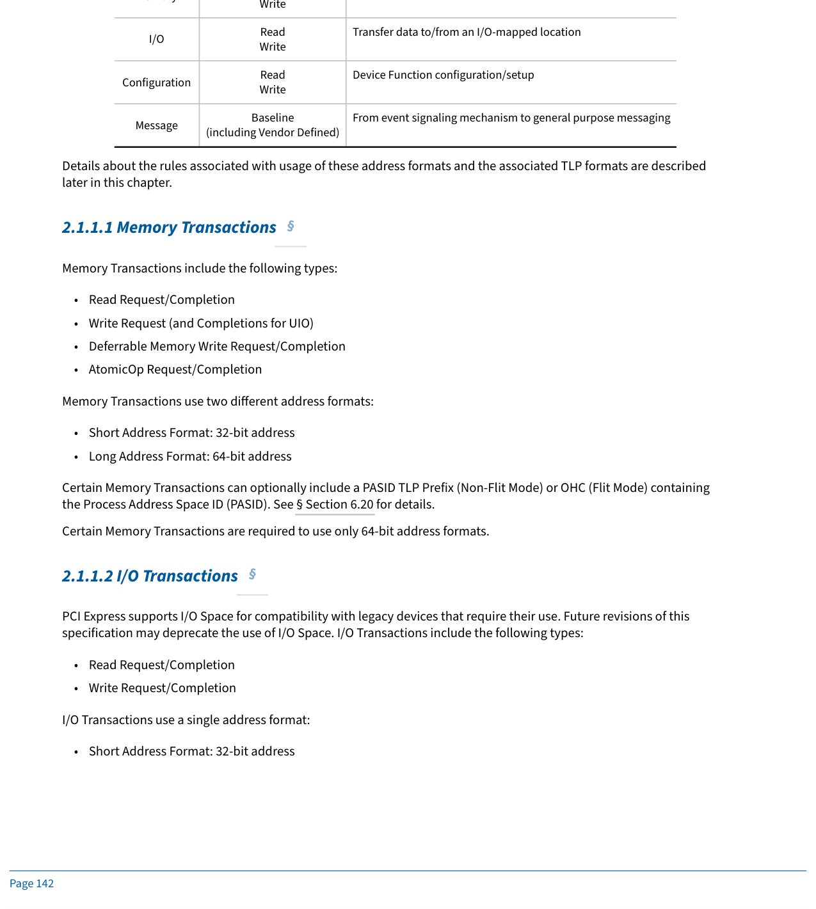

<<<PAGE_BREAK>>> page_143

> **Figure 2-3.** Generic TLP Format - Non-Flit Mode
> 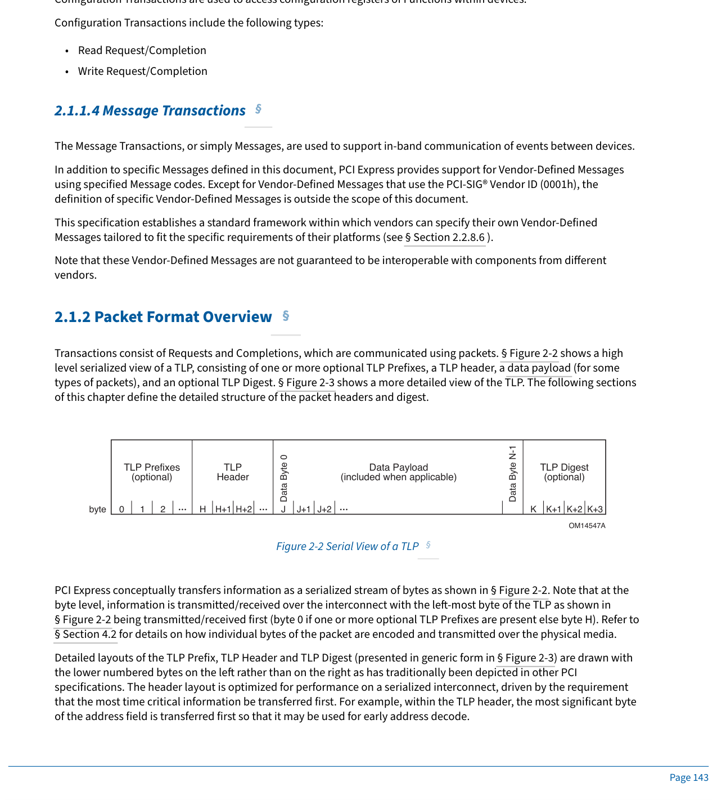


<div style="overflow-x: auto; max-width: 100%;">
<table>
<thead>
<tr>
<th width="50%">🇬🇧 English</th>
<th width="50%" style="background-color:#e8e8e8">🇨🇳 中文</th>
</tr>
</thead>
<tbody>
<tr>
<td>

The data payload within a TLP is depicted with the lowest addressed byte (byte J in § Figure 2-3) shown to the upper left. Detailed layouts depicting data structure organization (such as the Configuration Space depictions in § Chapter 7.) retain the traditional PCI byte layout with the lowest addressed byte shown on the right. Regardless of depiction, all bytes are conceptually transmitted over the Link in increasing byte number order.

Depending on the type of a packet, the header for that packet will include some of the following types of fields:

- Format of the packet
- Type of the packet
- Length for any associated data
- Transaction Descriptor, including:
  - Transaction ID
  - Attributes
  - Traffic Class
- Address/routing information
- Byte Enables
- Message encoding
- Completion status

</td>
<td style="background-color:#e8e8e8">

TLP 内的数据负载以最低地址字节 (§ 图 2-3 中的字节 J) 显示在左上角的方式呈现。描绘数据结构组织的详细布局 (例如 § 第 7 章 中的配置空间表示) 保留传统的 PCI 字节布局,即最低地址字节显示在右侧。无论如何表示,所有字节在概念上都是按递增的字节编号顺序通过链路 (Link) 传输。

根据包的类型,该包的包头将包含以下几种类型的字段:

- 包的格式 (Format)
- 包的类型 (Type)
- 任何相关数据的长度 (Length)
- 事务描述符 (Transaction Descriptor),包括:
  - 事务 ID (Transaction ID)
  - 属性 (Attributes)
  - 流量类 (Traffic Class)
- 地址/路由信息
- 字节使能 (Byte Enables)
- 消息编码
- 完成状态 (Completion Status)

</td>
</tr>
</tbody>
</table>
</div>


[⬆️ 返回目录](#-本章目录-table-of-contents)

---

<<<PAGE_BREAK>>> page_144

> **Figure 2-3.** Generic TLP Format - Non-Flit Mode (continued)
> 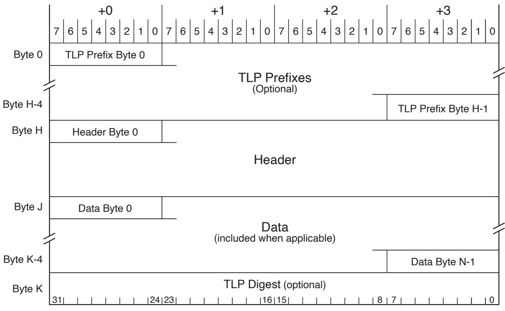

<<<PAGE_BREAK>>> page_145

<a id="sec-2-2"></a>
## 2.2 Transaction Layer Protocol - Packet Definition | 事务层协议 - 包定义

<table>
<thead>
<tr>
<th width="50%">🇬🇧 English</th>
<th width="50%" style="background-color:#e8e8e8">🇨🇳 中文</th>
</tr>
</thead>
<tbody>
<tr>
<td>

PCI Express uses a packet based protocol to exchange information between the Transaction Layers of the two components communicating with each other over the Link. PCI Express supports the following basic transaction types: Memory, I/O, Configuration, and Messages. Two addressing formats for Memory Requests are supported: 32 bit and 64 bit.

A UIO TLP is a TLP that is associated with a UIO Virtual Channel.

Transactions are carried using Requests and Completions. Completions are used only where required, for example, to return read data, or to acknowledge Completion of I/O and Configuration Write Transactions. All UIO Requests require Completions. Completions are associated with their corresponding Requests by the value in the Transaction ID field of the Packet header.

All TLP fields marked Reserved (sometimes abbreviated as R) must be filled with all 0's when a TLP is formed. Values in such fields must be ignored by Receivers and forwarded unmodified by Switches. Note that for certain fields there are both specified and Reserved values - the handling of Reserved values in these cases is specified separately for each case.

There are different header formats for Non-Flit Mode (NFM) and Flit Mode (FM). Routing elements must translate between the FM and NFM TLP formats when the Ingress Port and Egress Port are in different modes. In some cases translation is not possible, and the handling of such cases is also defined in this Chapter.

</td>
<td style="background-color:#e8e8e8">

PCI Express 使用基于包的协议,来在通过链路 (Link) 相互通信的两个组件的事务层之间交换信息。PCI Express 支持以下基本事务类型:内存、I/O、配置和消息。内存请求支持两种地址格式:32 位和 64 位。

UIO TLP 是与 UIO 虚通道 (Virtual Channel) 相关联的 TLP。

事务通过请求 (Requests) 和完成 (Completions) 承载。完成仅在需要时使用,例如,用于返回读数据,或用于确认 I/O 和配置写事务的完成。所有 UIO 请求都需要完成。完成通过包头中的事务 ID 字段的值与其对应的请求相关联。

所有标记为保留 (Reserved,有时简写为 R) 的 TLP 字段在形成 TLP 时必须全部填为 0。接收器 (Receiver) 必须忽略这些字段中的值,且交换机 (Switch) 必须未经修改地转发这些值。请注意,对于某些字段既有规定的值又有保留值 - 这些情况下保留值的处理方式会针对每种情况单独规定。

非 Flit 模式 (Non-Flit Mode, NFM) 和 Flit 模式 (Flit Mode, FM) 具有不同的包头格式。当入端口 (Ingress Port) 和出端口 (Egress Port) 处于不同模式时,路由元素必须在 FM 和 NFM TLP 格式之间进行转换。在某些情况下无法进行转换,这些情况的处理方式也将在本章中定义。

</td>
</tr>
</tbody>
</table>

[⬆️ 返回目录](#-本章目录-table-of-contents)

---

<a id="sec-2-2-1"></a>
## 2.2.1 Common Packet Header Fields | 公共包头字段

<table>
<thead>
<tr>
<th width="50%">🇬🇧 English</th>
<th width="50%" style="background-color:#e8e8e8">🇨🇳 中文</th>
</tr>
</thead>
<tbody>
<tr>
<td>

All TLP prefixes and headers contain the following fields (see § Figure 2-4):

- **Fmt[2:0]** - Format of TLP (see § Table 2-2) - bits 7:5 of byte 0
- **Type[4:0]** - Type of TLP - bits 4:0 of byte 0

</td>
<td style="background-color:#e8e8e8">

所有 TLP 前缀和包头均包含以下字段 (见 § 图 2-4):

- **Fmt[2:0]** —— TLP 的格式 (见 § 表 2-2) —— 字节 0 的 bit 7:5
- **Type[4:0]** —— TLP 的类型 —— 字节 0 的 bit 4:0

</td>
</tr>
</tbody>
</table>

[⬆️ 返回目录](#-本章目录-table-of-contents)

---

> **Figure 2-4.** Fields Present in All TLPs
> 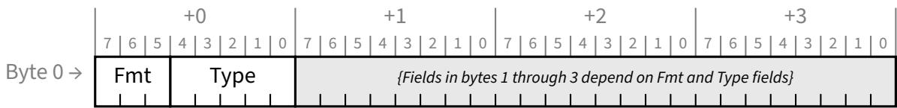


<div style="overflow-x: auto; max-width: 100%;">
<table>
<thead>
<tr>
<th width="50%">🇬🇧 English</th>
<th width="50%" style="background-color:#e8e8e8">🇨🇳 中文</th>
</tr>
</thead>
<tbody>
<tr>
<td>

The Fmt field(s) indicates the presence of one or more TLP Prefixes and the Type field(s) indicates the associated TLP Prefix type(s).

The Fmt and Type fields of the TLP Header provide the information required to determine the size of the remaining part of the TLP Header, and if the packet contains a data payload following the header.

The Fmt, Type, TD, and Length fields of the TLP Header contain all information necessary to determine the overall size of the non-prefix portion of the TLP. The Type field, in addition to defining the type of the TLP also determines how the TLP is routed by a Switch. Different types of TLPs are discussed in more detail in the following sections.

</td>
<td style="background-color:#e8e8e8">

Fmt 字段指示一个或多个 TLP 前缀的存在,Type 字段指示相关联的 TLP 前缀类型。

TLP 包头的 Fmt 和 Type 字段提供确定 TLP 包头其余部分大小所需的信息,以及包在包头之后是否包含数据负载。

TLP 包头的 Fmt、Type、TD 和 Length 字段包含确定 TLP 非前缀部分整体大小所需的全部信息。除了定义 TLP 的类型外,Type 字段还决定了交换机 (Switch) 如何路由该 TLP。不同类型的 TLP 将在后续小节中更详细地讨论。

</td>
</tr>
</tbody>
</table>
</div>


[⬆️ 返回目录](#-本章目录-table-of-contents)

---

<a id="sec-2-2-1-1"></a>
## 2.2.1.1 Common Packet Header Fields for Non-Flit Mode | 非 Flit 模式的公共包头字段

<table>
<thead>
<tr>
<th width="50%">🇬🇧 English</th>
<th width="50%" style="background-color:#e8e8e8">🇨🇳 中文</th>
</tr>
</thead>
<tbody>
<tr>
<td>

[Common packet header fields for Non-Flit Mode are detailed below, including the field definitions for Figure 2-5 and Tables 2-2 and 2-3.]

</td>
<td style="background-color:#e8e8e8">

[非 Flit 模式的公共包头字段详细说明如下,包括图 2-5 以及表 2-2 和 2-3 的字段定义。]

</td>
</tr>
</tbody>
</table>

[⬆️ 返回目录](#-本章目录-table-of-contents)

---

<<<PAGE_BREAK>>> page_146

> **Figure 2-5.** Fields Present in All Non-Flit Mode TLP Headers
> 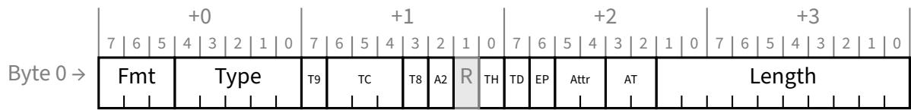


<div style="overflow-x: auto; max-width: 100%;">
<table>
<thead>
<tr>
<th width="50%">🇬🇧 English</th>
<th width="50%" style="background-color:#e8e8e8">🇨🇳 中文</th>
</tr>
</thead>
<tbody>
<tr>
<td>

- Permitted Fmt[2:0] and Type[4:0] field values are shown in § Table 2-3.
  - All other encodings are Reserved (see § Section 2.3).
- **TC[2:0]** - Traffic Class (see § Section 2.2.6.6) - bits [6:4] of byte 1
- **R** (byte 1 bit 1) - Reserved; formerly was the Lightweight Notification (LN) bit, but is now available for reassignment.
- **TLP Hints (TH)** - 1b indicates the presence of TLP Processing Hints (TPH) in the TLP header and optional TPH TLP Prefix (if present) - bit 0 of byte 1 (see § Section 2.2.7.1.1)
- **Attr[1:0]** - Attributes (see § Section 2.2.6.3) - bits [5:4] of byte 2
- **Attr[2]** - Attribute (see § Section 2.2.6.3) - bit 2 of byte 1 (shown as A2 in figures)
- **TD** - 1b indicates presence of TLP Digest in the form of a single Double Word (DW) at the end of the TLP (see § Section 2.2.3) - bit 7 of byte 2
- **Error Poisoned (EP)** - indicates the TLP is poisoned (see § Section 2.7) - bit 6 of byte 2
- **Length[9:0]** - Length of data payload, or of data referenced, in DW (see § Table 2-4) - bits 1:0 of byte 2 concatenated with bits 7:0 of byte 3
  - TLP data must be 4-byte naturally aligned and in increments of 4-byte DW.
  - Reserved for TLPs that do not contain or refer to data payloads, including Cpl, CplLk, and Messages (except as specified)

</td>
<td style="background-color:#e8e8e8">

- 允许的 Fmt[2:0] 和 Type[4:0] 字段值如 § 表 2-3 所示。
  - 所有其他编码均保留 (Reserved) (见 § 第 2.3 节)。
- **TC[2:0]** —— 流量类 (Traffic Class) (见 § 第 2.2.6.6 节) —— 字节 1 的 bit [6:4]
- **R** (字节 1 bit 1) —— 保留;此前为轻量级通知 (Lightweight Notification, LN) 位,现已可用于重新分配。
- **TLP Hints (TH)** —— 1b 表示 TLP 包头和可选的 TPH TLP 前缀 (若存在) 中存在 TLP 处理提示 (TLP Processing Hints, TPH) —— 字节 1 的 bit 0 (见 § 第 2.2.7.1.1 节)
- **Attr[1:0]** —— 属性 (见 § 第 2.2.6.3 节) —— 字节 2 的 bit [5:4]
- **Attr[2]** —— 属性 (见 § 第 2.2.6.3 节) —— 字节 1 的 bit 2 (在图中以 A2 表示)
- **TD** —— 1b 表示 TLP 末尾存在以单个双字 (Double Word, DW) 形式表示的 TLP 摘要 (见 § 第 2.2.3 节) —— 字节 2 的 bit 7
- **Error Poisoned (EP)** —— 指示 TLP 已被中毒 (见 § 第 2.7 节) —— 字节 2 的 bit 6
- **Length[9:0]** —— 数据负载或所引用数据的长度,以 DW 为单位 (见 § 表 2-4) —— 字节 2 的 bit 1:0 与字节 3 的 bit 7:0 拼接
  - TLP 数据必须以 4 字节自然对齐,且以 4 字节 DW 为单位递增。
  - 对于不包含或不引用数据负载的 TLP (包括 Cpl、CplLk 和消息,除非另有规定) 保留。

</td>
</tr>
</tbody>
</table>
</div>


[⬆️ 返回目录](#-本章目录-table-of-contents)

---

**Table 2-2. Fmt[2:0] Field Values | 表 2-2. Fmt[2:0] 字段值**

| Fmt[2:0] | Corresponding TLP Format 对应 TLP 格式 |
|---|---|
| 000b | 3 DW header, no data 3 DW 包头,无数据 |
| 001b | 4 DW header, no data 4 DW 包头,无数据 |
| 010b | 3 DW header, with data 3 DW 包头,带数据 |
| 011b | 4 DW header, with data 4 DW 包头,带数据 |
| 100b | TLP Prefix TLP 前缀 |

> All encodings not shown above are Reserved (see § Section 2.3). 上表未列出的所有编码均保留 (见 § 第 2.3 节)。

---

**Table 2-3. Fmt[2:0] and Type[4:0] Field Encodings | 表 2-3. Fmt[2:0] 和 Type[4:0] 字段编码**

| TLP Type | Fmt[2:0] (b) | Type[4:0] (b) | Description 描述 |
|---|---|---|---|
| MRd | 000 / 001 | 0 0000 | Memory Read Request 内存读请求 |
| MRdLk | 000 / 001 | 0 0001 | Memory Read Request-Locked 内存读请求-锁定 |
| MWr | 010 / 011 | 0 0000 | Memory Write Request 内存写请求 |
| IORd | 000 | 0 0010 | I/O Read Request I/O 读请求 |
| IOWr | 010 | 0 0010 | I/O Write Request I/O 写请求 |
| CfgRd0 | 000 | 0 0100 | Type 0 Configuration Read Request Type 0 配置读请求 |
| CfgWr0 | 010 | 0 0100 | Type 0 Configuration Write Request Type 0 配置写请求 |
| CfgRd1 | 000 | 0 0101 | Type 1 Configuration Read Request Type 1 配置读请求 |
| CfgWr1 | 010 | 0 0101 | Type 1 Configuration Write Request Type 1 配置写请求 |
| TCfgRd | 000 | 1 1011 | Deprecated TLP Type 5 弃用的 TLP 类型 5 |
| DMWr | 010 / 011 | 1 1011 | Deferrable Memory Write Request 可延迟内存写请求 |
| Msg | 001 | 1 0r2r1r0 | Message Request - The sub-field r[2:0] specifies the Message routing mechanism (see § Table 2-20) 消息请求 - 子字段 r[2:0] 指定消息路由机制 (见 § 表 2-20) |
| MsgD | 011 | 1 0r2r1r0 | Message Request with data payload - The sub-field r[2:0] specifies the Message routing mechanism (see § Table 2-20) 带数据负载的消息请求 - 子字段 r[2:0] 指定消息路由机制 (见 § 表 2-20) |
| Cpl | 000 | 0 1010 | Completion without Data - Used for I/O, Configuration Write, and Deferrable Memory Write Completions with any Completion Status. Also used for AtomicOp Completions and Read Completions (I/O, Configuration, or Memory) with Completion Status other than Successful Completion. 无数据完成 - 用于 I/O、配置写和可延迟内存写完成,且任何完成状态均可。也用于原子操作完成以及完成状态非"成功完成"的读完成 (I/O、配置或内存)。 |
| CplD | 010 | 0 1010 | Completion with Data - Used for Memory, I/O, and Configuration Read Completions. Also used for AtomicOp Completions. 带数据完成 - 用于内存、I/O 和配置读完成。也用于原子操作完成。 |
| CplLk | 000 | 0 1011 | Completion for Locked Memory Read without Data - Used only in error case. 锁定内存读的无数据完成 - 仅在错误情况下使用。 |
| CplDLk | 010 | 0 1011 | Completion for Locked Memory Read - Otherwise like CplD. 锁定内存读的完成 - 其他方面同 CplD。 |
| FetchAdd | 010 / 011 | 0 1100 | Fetch and Add AtomicOp Request Fetch and Add 原子操作请求 |
| Swap | 010 / 011 | 0 1101 | Unconditional Swap AtomicOp Request 无条件 Swap 原子操作请求 |
| CAS | 010 / 011 | 0 1110 | Compare and Swap AtomicOp Request 比较与交换原子操作请求 |
| LPrfx | 100 | 0 L3L2L1L0 | Local TLP Prefix - The sub-field L[3:0] specifies the Local TLP Prefix type (see § Table 2-38) 本地 TLP 前缀 - 子字段 L[3:0] 指定本地 TLP 前缀类型 (见 § 表 2-38) |
| EPrfx | 100 | 1 E3E2E1E0 | End-End TLP Prefix - The sub-field E[3:0] specifies the End-End TLP Prefix type (see § Table 2-39) 端到端 TLP 前缀 - 子字段 E[3:0] 指定端到端 TLP 前缀类型 (见 § 表 2-39) |

> **Notes 注释:**
> 4. Requests with two Fmt[2:0] values shown can use either 32 bits (the first value) or 64 bits (the second value) Addressing Packet formats. 显示两个 Fmt[2:0] 值的请求可使用 32 位 (第一个值) 或 64 位 (第二个值) 地址包格式。
> 5. Deprecated TLP Types: previously used for Trusted Configuration Space (TCS), which is no longer supported by this specification. If a Receiver does not implement TCS, the Receiver must treat such Requests as Malformed Packets. 弃用的 TLP 类型:此前用于可信配置空间 (TCS),本规范不再支持。如果接收器未实现 TCS,则必须将这些请求视为格式错误包。
> 6. This TLP Type value was previously used for Trusted Configuration Space (TCS) Writes, which are no longer supported by this specification. 此 TLP 类型值此前用于可信配置空间 (TCS) 写操作,本规范不再支持。

---

<<<PAGE_BREAK>>> page_147

<table>
<thead>
<tr>
<th width="50%">🇬🇧 English</th>
<th width="50%" style="background-color:#e8e8e8">🇨🇳 中文</th>
</tr>
</thead>
<tbody>
<tr>
<td>

All encodings not shown above are Reserved (see § Section 2.3).

**The TLP grammar is defined as:**

- zero or more 1DW Local TLP prefixes
- TLP Header Base with size indicated by Type[7:0] field, followed by zero to 7 DW of Orthogonal Header Content (OHC) as indicated by OHC[4:0] field
- TLP data payload of 0 to 1024DW
- TLP Trailer, if present as indicated by TS[2:0] field

It is required to transmit NOP TLPs while TLP transmission is active if there are no other TLPs to transmit. NOP TLPs must be discarded without effect by the Receiver. All header fields other than the Type field are Reserved for NOP TLPs.

Other notable differences between Flit Mode and Non-Flit Mode TLPs include the following:

- Content that in Non-Flit Mode is included in End-to-End TLP prefixes is now incorporated within the header, as OHC.
- In Flit Mode, Steering Tags are not overloaded with the Byte Enables. The PH, Steering Tags, and AMA/AV fields are consolidated in OHC.

</td>
<td style="background-color:#e8e8e8">

上表未列出的所有编码均保留 (见 § 第 2.3 节)。

**TLP 语法定义如下:**

- 零个或多个 1 DW 本地 TLP 前缀
- TLP 包头基 (Header Base),其大小由 Type[7:0] 字段指示,其后跟随 0 到 7 DW 的正交包头内容 (Orthogonal Header Content, OHC),由 OHC[4:0] 字段指示
- TLP 数据负载,大小为 0 到 1024 DW
- TLP 尾部 (Trailer),若存在则由 TS[2:0] 字段指示

当 TLP 传输处于活跃状态且没有其他 TLP 可发送时,必须传输 NOP TLP。NOP TLP 必须被接收器丢弃而不产生任何效果。NOP TLP 中除 Type 字段外的所有包头字段均保留。

Flit 模式与非 Flit 模式 TLP 之间的其他显著差异包括:

- 非 Flit 模式下包含在端到端 TLP 前缀中的内容,现在作为 OHC 并入包头内。
- 在 Flit 模式下,Steering Tag 不再与字节使能 (Byte Enables) 共用。PH、Steering Tag 和 AMA/AV 字段合并在 OHC 中。

</td>
</tr>
</tbody>
</table>

[⬆️ 返回目录](#-本章目录-table-of-contents)

---

**Table 2-4. Length[9:0] Field Encoding | 表 2-4. Length[9:0] 字段编码**

| Length[9:0] | Corresponding TLP Data Payload Size 对应 TLP 数据负载大小 |
|---|---|
| 00 0000 0001b | 1 DW |
| 00 0000 0010b | 2 DW |
| ... | ... |
| 11 1111 1111b | 1023 DW |
| 00 0000 0000b | 1024 DW |

---

<<<PAGE_BREAK>>> page_148

<a id="sec-2-2-1-2"></a>
## 2.2.1.2 Common Packet Header Fields for Flit Mode | Flit 模式的公共包头字段


<div style="overflow-x: auto; max-width: 100%;">
<table>
<thead>
<tr>
<th width="50%">🇬🇧 English</th>
<th width="50%" style="background-color:#e8e8e8">🇨🇳 中文</th>
</tr>
</thead>
<tbody>
<tr>
<td>

All Flit Mode TLPs contain the same fields in the first DW of the Header Base (see § Figure 2-6). § Table 2-5 defines the values for the Type[7:0] field for Flit Mode.

- The Type[7:0] field must be fully decoded by all Receivers regardless of which specific encodings are supported.
- All Receivers must handle Flow Control for all Type[7:0] field encodings as specified.
  - For TLPs, where the FC Type is none, Receivers are not required to buffer the TLP, and must silently discard the TLP; for other FC Types:
    - Switch Ports must buffer and route TLPs, including Reserved entries, as specified.
    - Endpoint Upstream Ports and Root Ports are required to buffer, including for Header Logging, up to the largest Header Base size plus all OHC content, but are permitted, after accounting for Flow Control, to discard Header Base and OHC content that is not supported by the Port and not including that information in header logging.
- For all Reserved entries, TLP routing must be handled as indicated in the Description field, and the Header Base fields used for routing are at the same location within the Header as with the non-Reserved Header Base formats.
  - Entries marked "Local … Terminate at receiver" must be discarded at the Receiving Port.
- Endpoint Upstream Ports and Root Ports must handle received TLPs using Reserved Type[7:0] encodings of FC Type PR and NPR as Unsupported Requests, and of FC Type CPL as Unexpected Completions.
- UIO Requests using FC Type PR are referred to as UIO PR-FC TLPs; UIO Requests using FC Type NPR are referred to as UIO NPR-FC TLPs.

</td>
<td style="background-color:#e8e8e8">

所有 Flit 模式 TLP 在包头基的第一个 DW 中均包含相同的字段 (见 § 图 2-6)。§ 表 2-5 定义了 Flit 模式下 Type[7:0] 字段的值。

- Type[7:0] 字段必须由所有接收器完全解码,无论支持哪些具体编码。
- 所有接收器必须按规定处理所有 Type[7:0] 字段编码的流控 (Flow Control)。
  - 对于 FC Type 为 none 的 TLP,接收器无需缓存该 TLP,且必须静默丢弃该 TLP;对于其他 FC Type:
    - 交换机端口 (Switch Port) 必须按规定缓存并路由 TLP (包括保留项)。
    - 端点上游端口 (Endpoint Upstream Port) 和根端口 (Root Port) 必须进行缓存 (包括用于包头日志记录),最大至最大包头基大小加上所有 OHC 内容;但是在考虑流控后,允许丢弃该端口不支持的、且不包含在包头日志记录中的包头基和 OHC 内容。
- 对于所有保留项,TLP 路由必须按描述字段中的说明进行处理,用于路由的包头基字段在包头中的位置与非保留包头基格式中的位置相同。
  - 标记为 "Local … Terminate at receiver" (本地……在接收器终止) 的项必须在接收端口丢弃。
- 端点上游端口和根端口必须将使用 FC Type PR 和 NPR 的保留 Type[7:0] 编码接收到的 TLP 作为不支持的请求 (Unsupported Requests) 处理,将 FC Type CPL 的作为意外完成 (Unexpected Completions) 处理。
- 使用 FC Type PR 的 UIO 请求称为 UIO PR-FC TLP;使用 FC Type NPR 的 UIO 请求称为 UIO NPR-FC TLP。

</td>
</tr>
</tbody>
</table>
</div>


[⬆️ 返回目录](#-本章目录-table-of-contents)

---

> **Figure 2-6.** First DW of Header Base
> 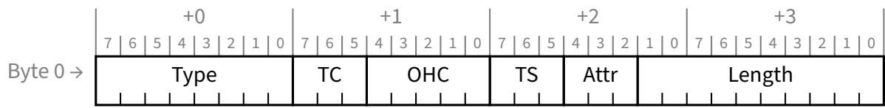

<<<PAGE_BREAK>>> page_149

<table>
<thead>
<tr>
<th width="50%">🇬🇧 English</th>
<th width="50%" style="background-color:#e8e8e8">🇨🇳 中文</th>
</tr>
</thead>
<tbody>
<tr>
<td>

In the Translation Rule column, an entry of "1:1" indicates that there is no change in meaning or behavior when translating between Non-Flit Mode and Flit Mode in either direction. For TLPs that cannot be translated, those not handled by the Ingress Port must be handled by the Egress Port as follows, logging a TLP Translation Egress Blocked error when an error is reported.

- PR FC Type: block at Egress; if TLP is UIO, report no error, else handle as Uncorrectable
- NPR FC Type: block at Egress; report no error
- CPL FC Type: block at Egress; handle as Uncorrectable

UIO is defined only for FM, and no translation of UIO TLPs to NFM is permitted. UIO TLPs targeting an Egress Port in NFM must be handled as described in the preceding paragraph. Note that error cases involving UIO VC mis-matches are addressed in § Section 2.5.2.

UIO TLPs are indicated as UIO in the Description column. Entries marked Reserved in the description column do not have an assigned VC restriction. A restriction, if required, will be specified when those entries become defined. Entries #0, #141-143 do not have an assigned VC restriction. All other entries are non-UIO TLPs.

</td>
<td style="background-color:#e8e8e8">

在"转换规则"列中,"1:1"项表示在非 Flit 模式与 Flit 模式之间任一方向进行转换时,含义或行为没有变化。对于无法转换的 TLP,未被入端口处理的部分必须按以下方式由出端口处理,在报告错误时记录 TLP 转换出端口阻塞 (TLP Translation Egress Blocked) 错误。

- PR FC Type:在出端口阻塞;若 TLP 是 UIO,则不上报错误,否则按不可纠正错误处理
- NPR FC Type:在出端口阻塞;不上报错误
- CPL FC Type:在出端口阻塞;按不可纠正错误处理

UIO 仅在 FM 中定义,不允许将 UIO TLP 转换为 NFM。目标为 NFM 出端口的 UIO TLP 必须按上一段所述处理。请注意,涉及 UIO VC 不匹配的错误情况在 § 第 2.5.2 节中讨论。

UIO TLP 在"描述"列中标为 UIO。在描述列中标记为"保留"的项没有分配的 VC 限制。如果需要限制,将在定义这些项时予以指定。条目 #0、#141-143 没有分配的 VC 限制。所有其他条目均为非 UIO TLP。

</td>
</tr>
</tbody>
</table>

[⬆️ 返回目录](#-本章目录-table-of-contents)

---

**Table 2-5. Flit Mode TLP Header Type Encodings | 表 2-5. Flit 模式 TLP 包头类型编码**

> Note: This table is a comprehensive Flit Mode TLP Header Type encoding table covering all 256 possible Type[7:0] values, with columns: #, Type[7:0] (bits 7-0), Description, Name, FC Type, Data Payload?, Header Base Size (DW), New for Flit Mode, Translation Rule. Entries are presented in summary form below. 注释:此表是涵盖所有 256 个 Type[7:0] 值的 Flit 模式 TLP 包头类型编码综合表,包括以下列:#、Type[7:0] (bit 7-0)、描述、名称、FC Type、是否有数据负载、包头基大小 (DW)、是否为 Flit 模式新增、转换规则。条目以摘要形式呈现如下。

| # | Type (b7..b0) | Description | Name | FC Type | Data? | HB Size (DW) | Flit New | Translation Rule |
|---|---|---|---|---|---|---|---|---|
| 0 | 0000 0000 | No Operation – Local TLP – Terminate at Receiver | NOP | none | n | 1 | y | NFM uses this Type code for MRd (see #3) |
| 1 | 0000 0001 | Memory Read Request Locked, 32b | MRdLk | NPR | n | 3 | n | 1:1 |
| 2 | 0000 0010 | I/O Read Request | IORd | NPR | n | 3 | n | 1:1 |
| 3 | 0000 0011 | Memory Read Request, 32b address routed | MRd | NPR | n | 3 | y/n | Requires change of Type field value |
| 4 | 0000 0100 | Type 0 Configuration Read Request | CfgRd0 | NPR | n | 3 | n | 1:1 |
| 5 | 0000 0101 | Type 1 Configuration Read Request | CfgRd1 | NPR | n | 3 | n | 1:1 |
| 6 | 0000 0110 | Reserved – ID routed | CPL | Length | 4 | y | Block at NFM Egress – Uncorrectable |
| 7 | 0000 0111 | (Reserved) | CPL | Length | 4 | y | |
| 8 | 0000 1000 | Reserved – ID routed | PR | n | 3 | y | Block at NFM Egress – if UIO TLP report no error, else handle as Uncorrectable |
| 9 | 0000 1001 | (Reserved) | PR | n | 3 | y | |
| 10 | 0000 1010 | Completion without Data | Cpl | CPL | n | 3 | n | 1:1 |
| 11 | 0000 1011 | Completion without Data, Locked (only for error cases) | CplLk | CPL | n | 3 | n | 1:1 |
| 12 | 0000 1100 | UIO Write Completion | UIOWrCpl | CPL | n | 3 | y | Block at NFM Egress – Uncorrectable |
| 13 | 0000 1101 | UIO Read Completion – No Data | UIORdCpl | CPL | n | 3 | y | Block at NFM Egress – Uncorrectable |
| 14-15 | 0000 111X | Reserved – ID routed | CPL | n | 3 | y | Block at NFM Egress – Uncorrectable |
| 16-19 | 0001 00XX | Reserved – 64b address routed | NPR | Length | 5 | y | Block at NFM Egress – report no error |
| 20-21 | 0001 010X | Reserved – 64b address routed | NPR | Length | 5 | y | Block at NFM Egress – report no error |
| 22-23 | 0001 011X | Reserved – 64b address routed | NPR | Length | 7 | y | Block at NFM Egress – report no error |
| 24 | 0001 1000 | Reserved – ID routed | CPL | n | 7 | y | Block at NFM Egress – Uncorrectable |
| 25 | 0001 1001 | (Reserved) | CPL | n | 7 | y | |
| 26 | 0001 1010 | (Reserved) | CPL | Length | 7 | y | |
| 27 | 0001 1011 | Reserved – ID routed {was: Trusted Configuration Read (deprecated)} | CPL | Length | 7 | y | |
| 28-29 | 0001 110X | Reserved – ID routed | NPR | n | 3 | y | Block at NFM Egress – report no error |
| 30-31 | 0001 111X | Reserved – ID routed | NPR | n | 6 | y | Block at NFM Egress – report no error |
| 32 | 0010 0000 | Memory Read Request, 64b address routed | MRd | NPR | n | 4 | n | 1:1 |
| 33 | 0010 0001 | Memory Read Request Locked, 64b address routed | MRdLk | NPR | n | 4 | n | 1:1 |
| 34 | 0010 0010 | UIO Memory Read Request | UIOMRd | NPR | n | 4 | y | Block at NFM Egress – report no error |
| 35 | 0010 0011 | Reserved – 64b address routed | NPR | n | 4 | y | |
| 36-39 | 0010 01XX | (Reserved) | NPR | n | 4 | y | |
| 40-43 | 0010 10XX | Reserved – ID routed | CPL | n | 4 | y | Block at NFM Egress – Uncorrectable |
| 44-45 | 0010 110X | Reserved – ID routed | PR | n | 4 | y | Block at NFM Egress – if UIO TLP report no error |
| 46-47 | 0010 111X | Reserved – ID routed | PR | n | 5 | y | Block at NFM Egress – if UIO TLP report no error, else handle as Uncorrectable |
| 48 | 0011 0000 | Message w/o Data, Routed to Root Complex | Msg | PR | n | 4 | n | 1:1 |
| 49 | 0011 0001 | Message w/o Data, Routed by Address (64b) - NONE DEFINED | Msg | PR | n | 4 | n | 1:1 |
| 50 | 0011 0010 | Message w/o Data, Routed by ID | Msg | PR | n | 4 | n | 1:1 |
| 51 | 0011 0011 | Message w/o Data, Broadcast from Root Complex | Msg | PR | n | 4 | n | 1:1 |
| 52 | 0011 0100 | Message w/o Data, Local - terminate at Receiver | Msg | PR | n | 4 | n | 1:1 |
| 53 | 0011 0101 | Message w/o Data, Gathered and routed to RC (PME_TO_Ack) | Msg | PR | n | 4 | n | 1:1 |
| 54 | 0011 0110 | Message w/o Data -- RESERVED | Msg | PR | n | 4 | n | Terminate at FM Ingress Port |
| 55 | 0011 0111 | (Reserved) | Msg | PR | n | 4 | n | |
| 56-59 | 0011 10XX | Reserved – 64b address routed | NPR | n | 4 | y | Block at NFM Egress – report no error |
| 60-61 | 0011 110X | Reserved – ID routed | NPR | n | 4 | y | |
| 62-63 | 0011 111X | Reserved – ID routed | NPR | n | 5 | y | |
| 64 | 0100 0000 | Memory Write Request, 32b address routed | MWr | PR | Length | 3 | n | 1:1 |
| 65 | 0100 0001 | Reserved – ID routed | PR | Length | 6 | y | Block at NFM Egress – if UIO TLP report no error, else handle as Uncorrectable |
| 66 | 0100 0010 | I/O Write Request | IOWr | NPR | Length | 3 | n | 1:1 |
| 67 | 0100 0011 | Reserved – ID routed | PR | Length | 6 | y | Block at NFM Egress – if UIO TLP report no error, else handle as Uncorrectable |
| 68 | 0100 0100 | Type 0 Configuration Write Request | CfgWr0 | NPR | Length | 3 | n | 1:1 |
| 69 | 0100 0101 | Type 1 Configuration Write Request | CfgWr1 | NPR | Length | 3 | n | 1:1 |
| 70 | 0100 0110 | Reserved – ID routed | NPR | Length | 3 | y | Block at NFM Egress – report no error |
| 71 | 0100 0111 | (Reserved) | NPR | Length | 3 | y | |
| 72 | 0100 1000 | UIO Read Completion with Data | UIORdCplD | CPL | Length | 3 | y | Block at NFM Egress – Uncorrectable |
| 73 | 0100 1001 | Reserved – ID routed | CPL | Length | 3 | y | Block at NFM Egress – Uncorrectable |
| 74 | 0100 1010 | Completion with Data | CplD | CPL | Length | 3 | n | 1:1 |
| 75 | 0100 1011 | Completion with Data, Locked | CplDLk | CPL | Length | 3 | n | 1:1 |
| 76 | 0100 1100 | Fetch and Add AtomicOp Request, 32b address routed | FetchAdd | NPR | Length | 3 | n | 1:1 |
| 77 | 0100 1101 | Unconditional Swap AtomicOp Request, 32b address routed | Swap | NPR | Length | 3 | n | 1:1 |
| 78 | 0100 1110 | Compare and Swap AtomicOp Request, 32b address routed | CAS | NPR | Length | 3 | n | 1:1 |
| 79 | 0100 1111 | Reserved – 64b address routed | PR | n | 4 | y | Block at NFM Egress – if UIO TLP report no error, else handle as Uncorrectable |
| 80-83 | 0101 00XX | Reserved – 64b address routed | NPR | Length | 6 | y | Block at NFM Egress – report no error |
| 84-85 | 0101 010X | Reserved – 64b address routed | NPR | Length | 6 | y | |
| 86-87 | 0101 011X | Reserved – 64b address routed | NPR | Length | 7 | y | |
| 88-89 | 0101 100X | Reserved – ID routed | PR | Length | 3 | y | Block at NFM Egress – if UIO TLP report no error, else handle as Uncorrectable |
| 90 | 0101 1010 | Reserved – 64b address routed | PR | Length | 4 | y | |
| 91 | 0101 1011 | Deferrable Memory Write Request, 32b address routed {was: Trusted Configuration Write (deprecated)} | DMWr | NPR | Length | 3 | n | 1:1 |
| 92-93 | 0101 110X | Reserved – ID routed | PR | Length | 4 | y | Block at NFM Egress – if UIO TLP report no error, else handle as Uncorrectable |
| 94-95 | 0101 111X | Reserved – ID routed | PR | Length | 5 | y | |
| 96 | 0110 0000 | Memory Write Request, 64b address routed | MWr | PR | Length | 4 | n | 1:1 |
| 97 | 0110 0001 | UIO Memory Write Request | UIOMWr | PR | Length | 4 | y | Block at NFM Egress – if UIO TLP report no error, else handle as Uncorrectable |
| 98-99 | 0110 001X | Reserved – 64b address routed | PR | Length | 4 | y | |
| 100-103 | 0110 01XX | (Reserved) | PR | Length | 4 | y | |
| 104-107 | 0110 10XX | Reserved – 64b address routed | PR | Length | 4 | y | Block at NFM Egress – if UIO TLP report no error, else handle as Uncorrectable |
| 108 | 0110 1100 | Fetch and Add AtomicOp Request, 64b address routed | FetchAdd | NPR | Length | 4 | n | 1:1 |
| 109 | 0110 1101 | Unconditional Swap AtomicOp Request, 64b address routed | Swap | NPR | Length | 4 | n | 1:1 |
| 110 | 0110 1110 | Compare and Swap AtomicOp Request, 64b address routed | CAS | NPR | Length | 4 | n | 1:1 |
| 111 | 0110 1111 | Reserved – 64b address routed | NPR | Length | 4 | y | Block at NFM Egress – report no error |
| 112 | 0111 0000 | Message with Data, Routed to Root Complex | MsgD | PR | Length | 4 | n | 1:1 |
| 113 | 0111 0001 | Message with Data, Routed by Address (64b) - NONE DEFINED | MsgD | PR | Length | 4 | n | 1:1 |
| 114 | 0111 0010 | Message with Data, Routed by ID | MsgD | PR | Length | 4 | n | 1:1 |
| 115 | 0111 0011 | Message with Data, Broadcast from Root Complex | MsgD | PR | Length | 4 | n | 1:1 |
| 116 | 0111 0100 | Message with Data, Local - terminate at Receiver | MsgD | PR | Length | 4 | n | 1:1 |
| 117 | 0111 0101 | Message with Data, Gathered and routed to RC (MsgD NOT USED) | MsgD | PR | Length | 4 | n | 1:1 |
| 118 | 0111 0110 | Message with Data -- RESERVED | MsgD | PR | Length | 4 | n | Terminate at FM Ingress Port |
| 119 | 0111 0111 | (Reserved) | MsgD | PR | Length | 4 | n | |
| 120 | 0111 1000 | Reserved – 64b address routed | NPR | Length | 4 | y | Block at NFM Egress – report no error |
| 121 | 0111 1001 | (Reserved) | NPR | Length | 4 | y | |
| 122 | 0111 1010 | (Reserved) | NPR | Length | 4 | y | |
| 123 | 0111 1011 | Deferrable Memory Write Request, 64b address routed | DMWr | NPR | Length | 4 | n | 1:1 |
| 124-127 | 0111 11XX | Reserved – 64b address routed | NPR | Length | 4 | y | Block at NFM Egress – report no error |
| 128-135 | 1000 0XXX | Reserved – Local TLP Prefix – Terminate at receiver | none | n | 1 | n | Terminate at FM Ingress Port |
| 136-139 | 1000 1XXX | Reserved – Local TLP Prefix – Terminate at receiver | none | n | 1 | n | Terminate at FM Ingress Port |
| 140 | 1000 1100 | (Reserved) | none | n | 1 | n | |
| 141 | 1000 1101 | Flit Mode Local TLP Prefix | FlitModePrefix | none | n | 1 | n | Terminate at FM Ingress Port |
| 142 | 1000 1110 | 1 DW Prefix - Vendor Defined Local 0 | VendPrefixL0 | none | n | 1 | n | Terminate at FM Ingress Port, Vendor Defined behavior |
| 143 | 1000 1111 | 1 DW Prefix - Vendor Defined Local 1 | VendPrefixL1 | none | n | 1 | n | Terminate at FM Ingress Port, Vendor Defined behavior |
| 144-147 | 1001 00XX | Reserved – 64b address routed | PR | n | 4 | y | Terminate at FM Ingress Port |
| 148-151 | 1001 01XX | Reserved – 64b address routed | PR | n | 5 | y | |
| 152-155 | 1001 10XX | Reserved – 64b address routed | PR | n | 6 | y | Terminate at FM Ingress Port |
| 156-159 | 1001 11XX | Reserved – 64b address routed | PR | n | 7 | y | |
| 160-167 | 1010 0XXX | Reserved – 64b address routed | NPR | n | 5 | y | Block at NFM Egress – report no error |
| 168-169 | 1010 100X | Reserved – ID routed | PR | n | 6 | y | Block at NFM Egress – if UIO TLP report no error, else handle as Uncorrectable |
| 170-171 | 1010 101X | Reserved – ID routed | PR | n | 7 | y | Block at NFM Egress – if UIO TLP report no error, else handle as Uncorrectable |
| 172-173 | 1010 110X | Reserved – ID routed | CPL | n | 5 | y | Block at NFM Egress – Uncorrectable |
| 174-175 | 1010 111X | Reserved – ID routed | CPL | n | 6 | y | Block at NFM Egress – Uncorrectable |
| 176-183 | 1011 0XXX | Reserved – 64b address routed | PR | Length | 5 | y | Block at NFM Egress – if UIO TLP report no error, else handle as Uncorrectable |
| 184-191 | 1011 1XXX | Reserved – 64b address routed | PR | Length | 5 | y | Block at NFM Egress – if UIO TLP report no error, else handle as Uncorrectable |
| 192-199 | 1100 0XXX | Reserved – 64b address routed | NPR | n | 6 | y | Block at NFM Egress – report no error |
| 200-201 | 1100 100X | Reserved – ID routed | NPR | n | 7 | y | Block at NFM Egress – report no error |
| 202-203 | 1100 101X | Reserved – ID routed | CPL | Length | 5 | y | Block at NFM Egress – Uncorrectable |
| 204-205 | 1100 110X | Reserved – ID routed | CPL | Length | 6 | y | Block at NFM Egress – Uncorrectable |
| 206-207 | 1100 111X | Reserved – ID routed | PR | Length | 7 | y | Block at NFM Egress – if UIO TLP report no error, else handle as Uncorrectable |
| 208-215 | 1101 0XXX | Reserved – 64b address routed | PR | Length | 6 | y | Block at NFM Egress – if UIO TLP report no error, else handle as Uncorrectable |
| 216-223 | 1101 1XXX | Reserved – 64b address routed | PR | Length | 6 | y | Block at NFM Egress – if UIO TLP report no error, else handle as Uncorrectable |
| 224-225 | 1110 000X | Reserved – Local TLP – Terminate at receiver | none | n | 4 | y | Terminate at FM Ingress Port |
| 226-227 | 1110 001X | Reserved – Local TLP – Terminate at receiver | none | n | 6 | y | Terminate at FM Ingress Port |
| 228-229 | 1110 010X | Reserved – Local TLP – Terminate at receiver | none | Length | 4 | y | Terminate at FM Ingress Port |
| 230-231 | 1110 011X | Reserved – Local TLP – Terminate at receiver | none | Length | 6 | y | Terminate at FM Ingress Port |
| 232-239 | 1110 1XXX | Reserved – 64b address routed | NPR | n | 7 | y | Block at NFM Egress – report no error |
| 240-241 | 1111 000X | Reserved – ID routed | NPR | Length | 4 | y | Block at NFM Egress – report no error |
| 242-243 | 1111 001X | Reserved – ID routed | NPR | Length | 5 | y | Block at NFM Egress – report no error |
| 244-245 | 1111 010X | Reserved – ID routed | NPR | Length | 6 | y | Block at NFM Egress – report no error |
| 246-247 | 1111 011X | Reserved – ID routed | NPR | Length | 7 | y | Block at NFM Egress – report no error |
| 248-255 | 1111 1XXX | Reserved – 64b address routed | PR | Length | 7 | y | Block at NFM Egress – if UIO TLP report no error, else handle as Uncorrectable |

> Note: "UIO TLPs are indicated as UIO in the Description column." This full table contains all 256 Type[7:0] encodings; full descriptions for the encoded/Reserved entries follow. 注释:"UIO TLP 在描述列中标为 UIO。" 此完整表格包含全部 256 个 Type[7:0] 编码;已编码/保留条目的完整描述见后文。

---

<<<PAGE_BREAK>>> page_158


<div style="overflow-x: auto; max-width: 100%;">
<table>
<thead>
<tr>
<th width="50%">🇬🇧 English</th>
<th width="50%" style="background-color:#e8e8e8">🇨🇳 中文</th>
</tr>
</thead>
<tbody>
<tr>
<td>

The TS[2:0] field indicates Trailer Size and use encoded as:

- 000b – No Trailer
- 001b – 1DW Trailer containing ECRC
- 010b – 1DW Trailer – Content Reserved
- 011b – 2DW Trailer – Content Reserved
- 100b – 2DW Trailer – Content Reserved
- 101b – 3DW Trailer with IDE MAC if and only if OHC-C present and indicates IDE TLP; Else 3DW Trailer – Content Reserved
- 110b – 4DW Trailer with IDE MAC and PCRC if and only if OHC-C present and indicates IDE TLP; Else 4DW Trailer – Content Reserved
- 111b – 5DW Trailer – Content Reserved

The definitions of the TC, Attr and Length fields in Flit Mode are the same as in Non-Flit Mode.

Bit 1 in byte 1 of Non-Flit Mode is now Reserved, but it was the LN bit associated with the now deprecated Lightweight Notification (LN) protocol. This bit is not supported in Flit Mode. Thus, it must be ignored when translating from Non-Flit Mode to Flit Mode, and it must be set to 0b when translating from Flit Mode to Non-Flit Mode.

</td>
<td style="background-color:#e8e8e8">

TS[2:0] 字段指示尾部大小 (Trailer Size) 及其使用,编码如下:

- 000b —— 无尾部
- 001b —— 包含 ECRC 的 1 DW 尾部
- 010b —— 1 DW 尾部 —— 内容保留
- 011b —— 2 DW 尾部 —— 内容保留
- 100b —— 2 DW 尾部 —— 内容保留
- 101b —— 3 DW 尾部,当且仅当 OHC-C 存在并指示 IDE TLP 时,包含 IDE MAC;否则 3 DW 尾部 —— 内容保留
- 110b —— 4 DW 尾部,当且仅当 OHC-C 存在并指示 IDE TLP 时,包含 IDE MAC 和 PCRC;否则 4 DW 尾部 —— 内容保留
- 111b —— 5 DW 尾部 —— 内容保留

Flit 模式下 TC、Attr 和 Length 字段的定义与非 Flit 模式相同。

非 Flit 模式字节 1 的 bit 1 当前为保留位,但它曾是现已弃用的轻量级通知 (Lightweight Notification, LN) 协议的 LN 位。Flit 模式不支持此位。因此,在从非 Flit 模式转换为 Flit 模式时必须忽略该位,在从 Flit 模式转换为非 Flit 模式时必须将其设置为 0b。

</td>
</tr>
</tbody>
</table>
</div>


[⬆️ 返回目录](#-本章目录-table-of-contents)

---

<<<PAGE_BREAK>>> page_160

<table>
<thead>
<tr>
<th width="50%">🇬🇧 English</th>
<th width="50%" style="background-color:#e8e8e8">🇨🇳 中文</th>
</tr>
</thead>
<tbody>
<tr>
<td>

The OHC[4:0] field indicates the presence of "Orthogonal Header Content" (OHC) encoded as:

- 0 0000b = No OHC present
- x xxx1b = OHC-A present
- x xx1xb = OHC-B present
- x x1xxb = OHC-C present
- 0 0xxxb = No OHC-E present
- 0 1xxxb = OHC-E1 present
- 1 0xxxb = OHC-E2 present
- 1 1xxxb = OHC-E4 present

When present, OHC must follow the Header Base. It is permitted for any combination of OHC content to be present, but, when present, must follow the Header Base, in A-B-C-E order. The contents of the OHC in some cases varies depending on the TLP type.

For specific TLP types, as defined in this specification, specific OHC content must be included by the Transmitter. Receivers must check for violations of these rules. If a Receiver determines that a Request violates a rule requiring specific OHC content, the Request must be handled as an Unsupported Request. If a Receiver determines that a Completion violates a rule requiring specific OHC content, the Completion must be handled as an Unexpected Completion.

</td>
<td style="background-color:#e8e8e8">

OHC[4:0] 字段指示"正交包头内容" (Orthogonal Header Content, OHC) 的存在,编码如下:

- 0 0000b = 不存在 OHC
- x xxx1b = 存在 OHC-A
- x xx1xb = 存在 OHC-B
- x x1xxb = 存在 OHC-C
- 0 0xxxb = 不存在 OHC-E
- 0 1xxxb = 存在 OHC-E1
- 1 0xxxb = 存在 OHC-E2
- 1 1xxxb = 存在 OHC-E4

若存在,OHC 必须跟在包头基之后。允许 OHC 内容的任意组合存在,但若存在,必须按 A-B-C-E 顺序跟在包头基之后。在某些情况下,OHC 的内容会因 TLP 类型的不同而不同。

对于本规范中定义的特定 TLP 类型,发送器必须包含特定的 OHC 内容。接收器必须检查这些规则的违规行为。如果接收器确定请求违反了要求特定 OHC 内容的规则,则该请求必须作为不支持的请求 (Unsupported Request) 处理。如果接收器确定完成违反了要求特定 OHC 内容的规则,则该完成必须作为意外完成 (Unexpected Completion) 处理。

</td>
</tr>
</tbody>
</table>

[⬆️ 返回目录](#-本章目录-table-of-contents)

---

**Table 2-6. OHC-A Included Fields for OHC-A1 through OHC-A5 | 表 2-6. OHC-A1 至 OHC-A5 包含的字段 (见 § 图 2-7 至 § 图 2-11)**

| Name 名称 | Required for 用于 | Byte Enables | PASID, PV | ER, PMR | Destination Segment, DSV | Completer Segment | Completion Status | Lower Address[1:0] | NW Flag |
|---|---|---|---|---|---|---|---|---|---|
| OHC-A1 | Memory Requests with explicit Byte Enables and/or PASID; Address Routed Messages with PASID and Route to Root Complex Messages with PASID; Translation Requests | Y | Y | Y | Y | | | | Y |
| OHC-A2 | IO Requests | Y | | | | | | | |
| OHC-A3 | Configuration Requests | Y | | | Y | | | | |
| OHC-A4 | ID-Routed Messages that require Destination Segment and/or PASID | | Y | | Y | | | | |
| OHC-A5 | Completions when required as defined in § Section 2.2.9.2 | | | | Y | Y | Y | Y | |
| OHC-Ax | Others 其他 | When OHC-A is present on other TLPs, all OHC-A bits are Reserved 当 OHC-A 出现在其他 TLP 上时,所有 OHC-A 位均保留 | | | | | | | |

---

<<<PAGE_BREAK>>> page_161

> **Figure 2-7.** OHC-A1
> 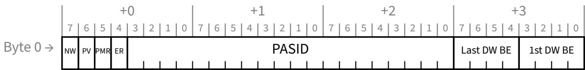


<div style="overflow-x: auto; max-width: 100%;">
<table>
<thead>
<tr>
<th width="50%">🇬🇧 English</th>
<th width="50%" style="background-color:#e8e8e8">🇨🇳 中文</th>
</tr>
</thead>
<tbody>
<tr>
<td>

**In OHC-A1:**

- The ER bit is Execute Requested, and the PMR bit is Privileged Mode Requested (see § Section 6.20). These bits are Reserved for all Requests other than Translation Requests (see § Section 10.2.2) and Page Requests (see § Section 10.4).
- When OHC-A1 is included with a TLP, if the PASID is not known or has not been assigned, then the PV ("PASID Valid") bit must be Clear.
- The ER and PMR bits are Reserved if PV is Clear.
- The PASID field is Reserved if PV is Clear.
- The NW bit is No Write (NW). This bit is Reserved for all Requests other than Translation Requests.
- OHC-A1 is required as specified in § Section 2.2.5.2.

</td>
<td style="background-color:#e8e8e8">

**在 OHC-A1 中:**

- ER 位表示"执行请求" (Execute Requested),PMR 位表示"特权模式请求" (Privileged Mode Requested) (见 § 第 6.20 节)。除转换请求 (Translation Requests) (见 § 第 10.2.2 节) 和页请求 (Page Requests) (见 § 第 10.4 节) 之外,这些位对所有其他请求均保留。
- 当 OHC-A1 与 TLP 一同包含时,如果 PASID 未知或尚未分配,则 PV ("PASID 有效", PASID Valid) 位必须清零。
- 如果 PV 清零,则 ER 和 PMR 位保留。
- 如果 PV 清零,则 PASID 字段保留。
- NW 位表示"无写入" (No Write, NW)。除转换请求外,此位对所有其他请求均保留。
- OHC-A1 按 § 第 2.2.5.2 节所述要求。

</td>
</tr>
</tbody>
</table>
</div>


[⬆️ 返回目录](#-本章目录-table-of-contents)

---

> **Figure 2-8.** OHC-A2
> 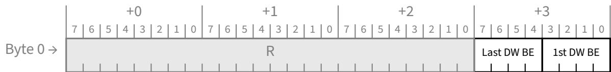

<table>
<thead>
<tr>
<th width="50%">🇬🇧 English</th>
<th width="50%" style="background-color:#e8e8e8">🇨🇳 中文</th>
</tr>
</thead>
<tbody>
<tr>
<td>

**In OHC-A2:**

- OHC-A2 is required as specified in § Section 2.2.5.2.

</td>
<td style="background-color:#e8e8e8">

**在 OHC-A2 中:**

- OHC-A2 按 § 第 2.2.5.2 节所述要求。

</td>
</tr>
</tbody>
</table>

[⬆️ 返回目录](#-本章目录-table-of-contents)

---

> **Figure 2-9.** OHC-A3
> 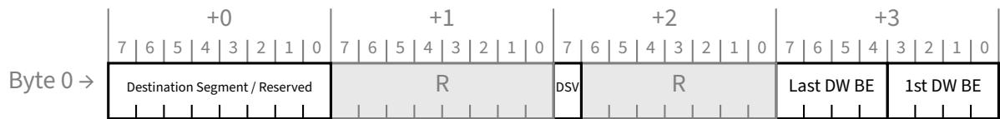

<table>
<thead>
<tr>
<th width="50%">🇬🇧 English</th>
<th width="50%" style="background-color:#e8e8e8">🇨🇳 中文</th>
</tr>
</thead>
<tbody>
<tr>
<td>

**In OHC-A3:**

- Destination Segment is Reserved if DSV is Clear.
- OHC-A3 is required as specified in § Section 2.2.5.2.

</td>
<td style="background-color:#e8e8e8">

**在 OHC-A3 中:**

- 如果 DSV 清零,则 Destination Segment 保留。
- OHC-A3 按 § 第 2.2.5.2 节所述要求。

</td>
</tr>
</tbody>
</table>

[⬆️ 返回目录](#-本章目录-table-of-contents)

---

<<<PAGE_BREAK>>> page_162

> **Figure 2-10.** OHC-A4
> 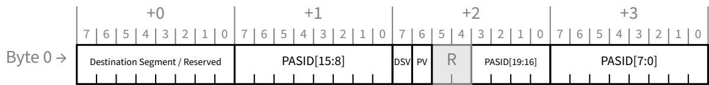

<table>
<thead>
<tr>
<th width="50%">🇬🇧 English</th>
<th width="50%" style="background-color:#e8e8e8">🇨🇳 中文</th>
</tr>
</thead>
<tbody>
<tr>
<td>

**In OHC-A4:**

- When OHC-A4 is included with a TLP, if the PASID is not known or has not been assigned, then the PV ("PASID Valid") bit must be Clear.
- The PASID field is Reserved if PV is Clear.
- The Destination Segment field is Reserved if DSV is Clear.
- OHC-A4 must be included in ID Routed Messages when Destination Segment or PASID is required.

</td>
<td style="background-color:#e8e8e8">

**在 OHC-A4 中:**

- 当 OHC-A4 与 TLP 一同包含时,如果 PASID 未知或尚未分配,则 PV ("PASID 有效") 位必须清零。
- 如果 PV 清零,则 PASID 字段保留。
- 如果 DSV 清零,则 Destination Segment 字段保留。
- 当需要 Destination Segment 或 PASID 时,OHC-A4 必须包含在 ID 路由消息中。

</td>
</tr>
</tbody>
</table>

[⬆️ 返回目录](#-本章目录-table-of-contents)

---

> **Figure 2-11.** OHC-A5
> 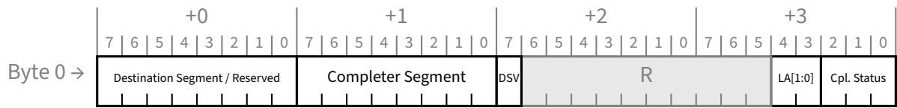

<table>
<thead>
<tr>
<th width="50%">🇬🇧 English</th>
<th width="50%" style="background-color:#e8e8e8">🇨🇳 中文</th>
</tr>
</thead>
<tbody>
<tr>
<td>

**In OHC-A5:**

- LA[1:0] is Lower Address[1:0].
- The Destination Segment field is Reserved if DSV is Clear.
- OHC-A5 is required as specified in § Section 2.2.9.2.

</td>
<td style="background-color:#e8e8e8">

**在 OHC-A5 中:**

- LA[1:0] 为 Lower Address[1:0]。
- 如果 DSV 清零,则 Destination Segment 字段保留。
- OHC-A5 按 § 第 2.2.9.2 节所述要求。

</td>
</tr>
</tbody>
</table>

[⬆️ 返回目录](#-本章目录-table-of-contents)

---

> **Figure 2-12.** OHC-B
> 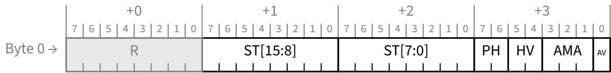

<table>
<thead>
<tr>
<th width="50%">🇬🇧 English</th>
<th width="50%" style="background-color:#e8e8e8">🇨🇳 中文</th>
</tr>
</thead>
<tbody>
<tr>
<td>

**In OHC-B:**

- OHC-B is defined for Address Routed Requests only. When OHC-B is present on other TLPs, all OHC-B bits are Reserved.
- When TLP Processing Hints (TPH) are used OHC-B must be included with the appropriate PH and ST values.
- The PH and ST fields are qualified by the HV[1:0] ("Hints Valid") field, defined as:

</td>
<td style="background-color:#e8e8e8">

**在 OHC-B 中:**

- OHC-B 仅为地址路由请求 (Address Routed Requests) 定义。当 OHC-B 出现在其他 TLP 上时,所有 OHC-B 位均保留。
- 当使用 TLP 处理提示 (TLP Processing Hints, TPH) 时,OHC-B 必须与相应的 PH 和 ST 值一同包含。
- PH 和 ST 字段由 HV[1:0] ("提示有效", Hints Valid) 字段限定,定义如下:

</td>
</tr>
</tbody>
</table>

[⬆️ 返回目录](#-本章目录-table-of-contents)

---

<<<PAGE_BREAK>>> page_163

<table>
<thead>
<tr>
<th width="50%">🇬🇧 English</th>
<th width="50%" style="background-color:#e8e8e8">🇨🇳 中文</th>
</tr>
</thead>
<tbody>
<tr>
<td>

- 00b: PH[1:0], ST[15:0] are not valid and are Reserved
- 01b: PH[1:0] and ST[7:0] are valid, ST[15:8] is not valid and is Reserved
- 10b: Reserved encoding, Receivers must treat as 00b.
- 11b: PH[1:0] and ST[15:0] are valid

- AMA[2:0] is Reserved when AV is Clear.

</td>
<td style="background-color:#e8e8e8">

- 00b:PH[1:0]、ST[15:0] 无效,均保留
- 01b:PH[1:0] 和 ST[7:0] 有效,ST[15:8] 无效并保留
- 10b:保留编码,接收器必须按 00b 处理。
- 11b:PH[1:0] 和 ST[15:0] 有效

- 当 AV 清零时,AMA[2:0] 保留。

</td>
</tr>
</tbody>
</table>

[⬆️ 返回目录](#-本章目录-table-of-contents)

---

> **Figure 2-13.** OHC-C
> 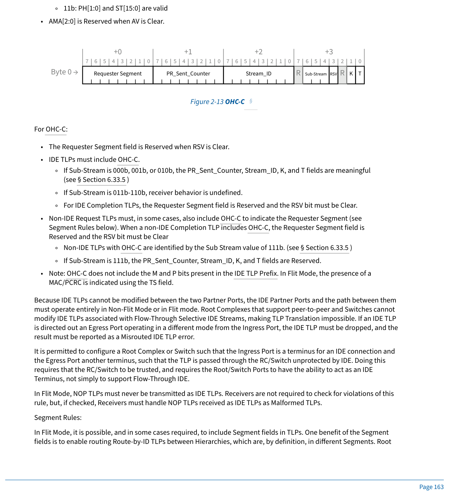


<div style="overflow-x: auto; max-width: 100%;">
<table>
<thead>
<tr>
<th width="50%">🇬🇧 English</th>
<th width="50%" style="background-color:#e8e8e8">🇨🇳 中文</th>
</tr>
</thead>
<tbody>
<tr>
<td>

**For OHC-C:**

- The Requester Segment field is Reserved when RSV is Clear.
- IDE TLPs must include OHC-C.
  - If Sub-Stream is 000b, 001b, or 010b, the PR_Sent_Counter, Stream_ID, K, and T fields are meaningful (see § Section 6.33.5)
  - If Sub-Stream is 011b-110b, receiver behavior is undefined.
  - For IDE Completion TLPs, the Requester Segment field is Reserved and the RSV bit must be Clear.
- Non-IDE Request TLPs must, in some cases, also include OHC-C to indicate the Requester Segment (see Segment Rules below). When a non-IDE Completion TLP includes OHC-C, the Requester Segment field is Reserved and the RSV bit must be Clear.
  - Non-IDE TLPs with OHC-C are identified by the Sub Stream value of 111b. (see § Section 6.33.5)
  - If Sub-Stream is 111b, the PR_Sent_Counter, Stream_ID, K, and T fields are Reserved.
- Note: OHC-C does not include the M and P bits present in the IDE TLP Prefix. In Flit Mode, the presence of a MAC/PCRC is indicated using the TS field.

Because IDE TLPs cannot be modified between the two Partner Ports, the IDE Partner Ports and the path between them must operate entirely in Non-Flit Mode or in Flit mode. Root Complexes that support peer-to-peer and Switches cannot modify IDE TLPs associated with Flow-Through Selective IDE Streams, making TLP Translation impossible. If an IDE TLP is directed out an Egress Port operating in a different mode from the Ingress Port, the IDE TLP must be dropped, and the result must be reported as a Misrouted IDE TLP error.

It is permitted to configure a Root Complex or Switch such that the Ingress Port is a terminus for an IDE connection and the Egress Port another terminus, such that the TLP is passed through the RC/Switch unprotected by IDE. Doing this requires that the RC/Switch to be trusted, and requires the Root/Switch Ports to have the ability to act as an IDE Terminus, not simply to support Flow-Through IDE.

In Flit Mode, NOP TLPs must never be transmitted as IDE TLPs. Receivers are not required to check for violations of this rule, but, if checked, Receivers must handle NOP TLPs received as IDE TLPs as Malformed TLPs.

**Segment Rules:**

In Flit Mode, it is possible, and in some cases required, to include Segment fields in TLPs. One benefit of the Segment fields is to enable routing Route-by-ID TLPs between Hierarchies, which are, by definition, in different Segments. Root Complexes are the only place where peer-to-peer Requests will traverse from one Hierarchy to another.

</td>
<td style="background-color:#e8e8e8">

**关于 OHC-C:**

- 当 RSV 清零时,Requester Segment 字段保留。
- IDE TLP 必须包含 OHC-C。
  - 如果 Sub-Stream 为 000b、001b 或 010b,PR_Sent_Counter、Stream_ID、K 和 T 字段有意义 (见 § 第 6.33.5 节)
  - 如果 Sub-Stream 为 011b-110b,接收器行为未定义。
  - 对于 IDE 完成 TLP,Requester Segment 字段保留,RSV 位必须清零。
- 非 IDE 请求 TLP 在某些情况下也必须包含 OHC-C 以指示 Requester Segment (见下文 Segment 规则)。当非 IDE 完成 TLP 包含 OHC-C 时,Requester Segment 字段保留,RSV 位必须清零。
  - 带有 OHC-C 的非 IDE TLP 通过 Sub Stream 值 111b 标识 (见 § 第 6.33.5 节)。
  - 如果 Sub-Stream 为 111b,PR_Sent_Counter、Stream_ID、K 和 T 字段均保留。
- 注:OHC-C 不包括 IDE TLP 前缀中存在的 M 和 P 位。在 Flit 模式下,MAC/PCRC 的存在使用 TS 字段指示。

由于 IDE TLP 不能在两个 Partner Port 之间修改,IDE Partner Port 及它们之间的路径必须完全在非 Flit 模式或 Flit 模式下运行。支持点对点的根复合体 (Root Complex) 和交换机不能修改与 Flow-Through Selective IDE Stream 关联的 IDE TLP,这使得 TLP 转换不可能。如果 IDE TLP 被引导到与入端口模式不同的出端口,则必须丢弃该 IDE TLP,并且必须将结果报告为 Misrouted IDE TLP 错误。

允许配置根复合体或交换机,使入端口作为 IDE 连接的终点 (terminus),出端口作为另一个终点,这样 TLP 在不受 IDE 保护的情况下通过 RC/Switch。这样做要求 RC/Switch 可信,并要求根/交换机端口具有充当 IDE 终点的能力,不仅仅是支持 Flow-Through IDE。

在 Flit 模式下,NOP TLP 绝不能作为 IDE TLP 传输。接收器不需要检查此规则的违规行为,但如果检查,接收器必须将作为 IDE TLP 接收的 NOP TLP 作为格式错误 TLP 处理。

**Segment 规则:**

在 Flit 模式下,TLP 中可以 (在某些情况下必须) 包含 Segment 字段。Segment 字段的一个好处是能够在不同层级 (Hierarchy) 之间路由 Route-by-ID TLP,这些层级根据定义处于不同的 Segment 中。根复合体是对等请求从一个层级穿越到另一个层级的唯一场所。

</td>
</tr>
</tbody>
</table>
</div>


[⬆️ 返回目录](#-本章目录-table-of-contents)

---

<<<PAGE_BREAK>>> page_164

<table>
<thead>
<tr>
<th width="50%">🇬🇧 English</th>
<th width="50%" style="background-color:#e8e8e8">🇨🇳 中文</th>
</tr>
</thead>
<tbody>
<tr>
<td>

Peer-to-peer Route-by-ID Message Requests can traverse Hierarchies when the Requester includes a valid Destination Segment field. Memory Requests are address routed between Hierarchies, but the associated Completions are ID routed. To aid in Root Complex routing of Completions between Hierarchies, FM Completions can include the Destination Segment field which reflects the value of the Requester Segment field from the associated NP or UIO Memory Request. This allows a Root Complex to route Non-Posted or UIO Memory Requests between Hierarchies without the need to assume ownership of each outstanding transaction for the purpose of routing the associated Completions back to the Hierarchy of the original Requester. This can lead to performance improvements for peer-to-peer transfers between Hierarchies.

A second use of the Segment fields is to improve error logging. When FM TLP headers are logged in the AER Capability structure the Segment fields will be included. The Segment fields improve traceability when identical Requester/Completer IDs exist in different Hierarchies. The rules in this section allow the Segment fields to be omitted in some cases to reduce FM TLP overhead. It should be noted that omitting the Segment fields in these cases could forfeit the improved error-logging traceability benefit. It is permitted to use implementation specific mechanisms to select when optional Segment fields are included (e.g., during debug) while still achieving optimal performance during normal operation by omitting non-required Segment fields.

These fields, which exist only in FM, are used to communicate Segment information:

- The Requester Segment field indicates the Hierarchy in which the Requester is located. This field exists in OHC-C and is sometimes included in Memory and Message Requests.
  - The Requester Segment Valid (RSV) bit, when Set, indicates that the Requester Segment field is valid.
  - When Requester Segment Valid (RSV) is Clear then the Requester Segment field is Reserved.
  - For TLPs with OHC-C that are not IDE TLPs, the Sub-Stream[2:0] field must be 111b, and the Stream ID, PR_Sent_Counter, K and T fields/bits are Reserved.
  - In earlier versions of this specification, Sub-Stream was 4 bits in Symbol 3, bits 7:4. Bit 7 is now Reserved. If TEE-IO Supported is Set, components must implement bit 7 as Reserved. If TEE-IO Supported is Clear, components are permitted to treat bit 7 as part of Sub-Stream
  - IDE Requests (see § Section 6.33) other than Configuration Requests must include Requester Segment in OHC-C.
- The Completer Segment field indicates the Hierarchy in which the Completer is located. This field exists in OHC-A5 and is sometimes included in Completions.
- The Destination Segment field indicates the Hierarchy to which the TLP should be routed for ID Based Routing. In Configuration Write Requests this field is also used to configure the Segment of the completing Function. Configuration Requests in FM always include this field in OHC-A3 unless the Request had previously traversed a NFM Link. Route-by-ID Message Requests sometimes include this field in OHC-A4. Completions sometimes include this field in OHC-A5.
  - The Destination Segment Valid (DSV) bit, when Set, indicates that the Destination Segment field is valid.
  - When Destination Segment Valid (DSV) is Clear then the Destination Segment field is Reserved.

In addition to the following rules that apply specifically to Root Complexes, Requesters and Completers within Root Complexes must also follow the rules later in this section that apply to Requesters and Completers.

- All Configuration Requests transmitted by a Root Port in Flit Mode, including those initiated through the SFI Configuration Access Method, must include OHC-A3 with the DSV bit set and a valid Destination Segment. The Destination Segment is necessary for the Completer to capture its Segment as described in § Section 2.2.6.2
  - The Root Complex must indicate the correct Segment value in the Destination Segment field, even if only one Segment is implemented.

</td>
<td style="background-color:#e8e8e8">

当 Requester 包含有效的 Destination Segment 字段时,对等 Route-by-ID 消息请求可以穿越层级。内存请求在层级之间进行地址路由,但相关完成采用 ID 路由。为了帮助根复合体在层级之间路由完成,FM 完成可以包含 Destination Segment 字段,该字段反映来自相关 NP 或 UIO 内存请求的 Requester Segment 字段的值。这允许根复合体在层级之间路由 Non-Posted 或 UIO 内存请求,无需为了将相关完成路由回原始 Requester 所在层级而承担每个未完成事务的所有权。这可以提高层级之间点对点传输的性能。

Segment 字段的第二个用途是改进错误日志记录。当 FM TLP 包头记录在 AER 能力结构中时,将包含 Segment 字段。当不同的层级中存在相同的 Requester/Completer ID 时,Segment 字段可提高可追溯性。本节中的规则允许在某些情况下省略 Segment 字段,以减少 FM TLP 开销。值得注意的是,在这些情况下省略 Segment 字段可能会丧失改进的错误日志记录可追溯性优势。允许使用特定于实现的机制来选择何时包含可选的 Segment 字段 (例如,在调试期间),同时在正常运行期间通过省略非必需的 Segment 字段来实现最佳性能。

这些仅存在于 FM 中的字段用于传递 Segment 信息:

- Requester Segment 字段指示 Requester 所在的层级。此字段存在于 OHC-C 中,有时包含在内存和消息请求中。
  - Requester Segment Valid (RSV) 位,置 1 时表示 Requester Segment 字段有效。
  - 当 Requester Segment Valid (RSV) 清零时,Requester Segment 字段保留。
  - 对于带 OHC-C 但不是 IDE TLP 的 TLP,Sub-Stream[2:0] 字段必须为 111b,并且 Stream ID、PR_Sent_Counter、K 和 T 字段/位均保留。
  - 在本规范的早期版本中,Sub-Stream 是 Symbol 3 中的 4 位,bit 7:4。Bit 7 现在为保留位。如果 TEE-IO Supported 置 1,则组件必须将 bit 7 实现为保留。如果 TEE-IO Supported 清零,则允许组件将 bit 7 视为 Sub-Stream 的一部分。
  - 除配置请求外的 IDE 请求 (见 § 第 6.33 节) 必须在 OHC-C 中包含 Requester Segment。
- Completer Segment 字段指示 Completer 所在的层级。此字段存在于 OHC-A5 中,有时包含在完成中。
- Destination Segment 字段指示 TLP 应路由到的层级,用于基于 ID 的路由。在配置写请求中,此字段还用于配置正在完成的功能的 Segment。除非请求先前穿越了 NFM 链路,否则 FM 中的配置请求始终在 OHC-A3 中包含此字段。Route-by-ID 消息请求有时在 OHC-A4 中包含此字段。完成有时在 OHC-A5 中包含此字段。
  - Destination Segment Valid (DSV) 位,置 1 时表示 Destination Segment 字段有效。
  - 当 Destination Segment Valid (DSV) 清零时,Destination Segment 字段保留。

除了以下专门适用于根复合体的规则外,根复合体内的 Requester 和 Completer 还必须遵守本节后面适用于 Requester 和 Completer 的规则。

- 根端口在 Flit 模式下传输的所有配置请求,包括通过 SFI 配置访问方法发起的请求,都必须包含 OHC-A3,DSV 位置 1 且 Destination Segment 有效。Destination Segment 对于 Completer 捕获其 Segment 是必要的,如 § 第 2.2.6.2 节所述。
  - 即使只实现了一个 Segment,根复合体也必须在 Destination Segment 字段中指示正确的 Segment 值。

</td>
</tr>
</tbody>
</table>

[⬆️ 返回目录](#-本章目录-table-of-contents)

---

<<<PAGE_BREAK>>> page_165

<table>
<thead>
<tr>
<th width="50%">🇬🇧 English</th>
<th width="50%" style="background-color:#e8e8e8">🇨🇳 中文</th>
</tr>
</thead>
<tbody>
<tr>
<td>

- Completions associated with Configuration Requests must be identifiable solely by Transaction ID when received at a RP. Such Completions will not include a Destination Segment field because Configuration Requests do not include a Requester Segment field.

</td>
<td style="background-color:#e8e8e8">

- 在根端口 (RP) 接收时,与配置请求关联的完成必须仅通过事务 ID 即可识别。此类完成将不包含 Destination Segment 字段,因为配置请求不包含 Requester Segment 字段。

</td>
</tr>
</tbody>
</table>

[⬆️ 返回目录](#-本章目录-table-of-contents)

---

<<<PAGE_BREAK>>> page_166

> **Figure 2-14.** Example Topology Illustrating Multiple Segments and NFM Subtrees
> 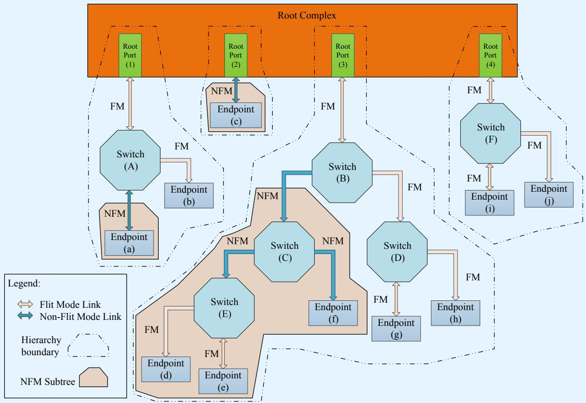


<div style="overflow-x: auto; max-width: 100%;">
<table>
<thead>
<tr>
<th width="50%">🇬🇧 English</th>
<th width="50%" style="background-color:#e8e8e8">🇨🇳 中文</th>
</tr>
</thead>
<tbody>
<tr>
<td>

**IMPLEMENTATION NOTE:**
**ROOT COMPLEX SUPPORT FOR PEER-TO-PEER NON-POSTED MEMORY TRANSACTIONS THAT TRAVERSE HIERARCHIES**

Because Segment fields aren't communicated across Links in NFM, Root Complexes take on additional burden for peer-to-peer non-UIO NP Memory Requests that cross from one Hierarchy to another. With the loss of the Requester Segment field when a Request is translated to NFM, the Requester ID that remains in the original NP Memory Request might be indistinguishable from that of other Requesters within the hierarchy domain. Unless all Links along the path from the egress RP to the Completer are known to be in FM, Root Complexes must replace the Requester ID in peer-to-peer NP Memory Requests that cross from one Hierarchy to another. The Requester ID supplied by the Root Complex must be an ID associated with the Root Complex itself. This action is sometimes called "taking ownership" of the NP Request. It is necessary for the Root Complex to take ownership of such Requests to ensure that the Requester ID remains unique within the hierarchy domain of the egress RP, and that the associated Completions can be routed correctly by any Switches within that hierarchy domain. The egress RP also must track all such outstanding NP Memory Requests in order to route the associated Completion(s) to the Hierarchy of the original Requester within the Root Complex, as well as to restore the original Requester ID (Destination BDF/BF in FM) within the Completion(s).

</td>
<td style="background-color:#e8e8e8">

**实现说明:**
**根复合体对穿越层级的对等 Non-Posted 内存事务的支持**

由于 Segment 字段不在 NFM 中的链路上传递,因此对于从一个层级穿越到另一个层级的对等非 UIO NP 内存请求,根复合体承担了额外的负担。当请求被转换为 NFM 时,Requester Segment 字段会丢失,原始 NP 内存请求中保留的 Requester ID 可能无法与层级域内其他 Requester 的 ID 区分开来。除非已知从出端口 RP 到 Completer 路径上的所有链路都处于 FM 模式,否则根复合体必须替换从一个层级穿越到另一个层级的对等 NP 内存请求中的 Requester ID。根复合体提供的 Requester ID 必须是与根复合体自身相关联的 ID。此操作有时称为"接管" (taking ownership) NP 请求。根复合体有必要接管此类请求,以确保 Requester ID 在出端口 RP 的层级域内保持唯一,并确保相关完成可以由该层级域内的任何交换机正确路由。出端口 RP 还必须跟踪所有此类未完成的 NP 内存请求,以便将相关完成路由到根复合体内原始 Requester 所在的层级,并在完成中恢复原始的 Requester ID (FM 中为 Destination BDF/BF)。

</td>
</tr>
</tbody>
</table>
</div>


[⬆️ 返回目录](#-本章目录-table-of-contents)

---

<<<PAGE_BREAK>>> page_167

<table>
<thead>
<tr>
<th width="50%">🇬🇧 English</th>
<th width="50%" style="background-color:#e8e8e8">🇨🇳 中文</th>
</tr>
</thead>
<tbody>
<tr>
<td>

- It is not permitted to configure a Selective IDE Stream passing peer-to-peer between different Hierarchies unless it is known that the RC supports flow-through IDE between the two Root Ports, and that all Links on the path between the two Partner Ports, including both the Root Ports, are in FM.
  - Root Complexes are not required to support Selective IDE Streams passing peer-to-peer through the RC.
  - If a condition exists that precludes the RC from passing an IDE TLP associated with a Selective IDE Stream configured to flow-through the RC, then the RC must treat the TLP as a Misrouted IDE TLP error at either the Ingress Port or the Egress Port.
- If a Message or Memory Request received at a RP includes a Requester Segment that does not match the Hierarchy associated with the receiving RP, the Request must be handled by the RP as an Unsupported Request.
- A RP is permitted to add a Requester Segment indication to a non-IDE Memory Write Request, or a non-IDE Route by Address Message Request, passing peer-to-peer through the RC if that TLP did not include a Requester Segment at the ingress RP, where the Requester Segment must correspond to the Segment of the Ingress RP.
- Route by ID Message Requests received at a RP without a Destination Segment, or received in NFM, are implied to be destined for a Completer within the same Hierarchy as the Ingress RP.
- When taking ownership of an NP or UIO Memory Request passing peer-to-peer through the RC:
  - The Requester ID in the Request must be replaced with one associated with the Root Complex.

The No NFM Subtree Below This Root Port bit defaults to Clear to indicate that one or more NFM subtree(s) may exist below a Root Port. Referring to the example shown in § Figure 2-14, each Root Port is in a unique Segment/Hierarchy, and Root Ports 1 through 3 have NFM subtrees below the Root Port. For RP 2, the Link immediately below the RP is in NFM, but for RP 1 and 3 the Root Port cannot directly determine the existence of a NFM subtree within its hierarchy domain, and so the default value of the No NFM Subtree Below This Root Port bit ensures that the Root Complex will take ownership of NP Requests Egressing from those Root Ports. In all cases, it is necessary that system software ensure the No NFM Subtree Below This Root Port bit for a Root Port is Clear in cases where the Root Port has one or more NFM Links or subtrees below it.

However, Root Port 4 does not have any NFM Links below it, and therefore it is not necessary for the Root Complex to take ownership of NP Requests Egressing that Root Port. It is strongly recommended that system software Set the No NFM Subtree Below This Root Port bit in such cases, and it is strongly recommended that Root Complex implementations use the value in the No NFM Subtree Below This Root Port bit to avoid taking ownership of NP Requests when it is not necessary to do so.

Note that for non-IDE Requests directed Upstream to the RC, the existence of a NFM Link between the original Requester and the Root Port is not a factor, because the RC inherently knows the Hierarchy of the Requester based on the Ingress RP of the Request, and can add the Requester Segment if needed.

Regardless of the value of the No NFM Subtree Below This Root Port bit, a Root Complex need not apply NP Memory Request tracking mechanisms for peer-to-peer Selective IDE Stream transactions that cross from one Hierarchy to another, and IDE TLPs cannot in any case be modified between the two IDE Partner Ports. When a Selective IDE Stream is established passing peer-to-peer between Hierarchies, software must ensure that the RC supports such routing, and that the entire path between the two Partner Ports is entirely in FM.

A NFM device could be hot-added into a subtree for which the No NFM Subtree Below This Root Port bit had previously been Set. In such cases it is necessary for system software to Clear the No NFM Subtree Below This Root Port bit prior to allowing the hot-added NFM device to act as a Completer for any NP Memory Request passing peer-to-peer through the RC.

</td>
<td style="background-color:#e8e8e8">

- 除非已知 RC 支持两个根端口之间的 flow-through IDE,且两个 Partner Port 之间路径上的所有链路 (包括两个根端口) 都处于 FM 模式,否则不允许配置在不同层级之间点对点传递的 Selective IDE Stream。
  - 根复合体不需要支持通过 RC 点对点传递的 Selective IDE Stream。
  - 如果存在某种情况使 RC 无法传递与配置为 flow-through RC 的 Selective IDE Stream 关联的 IDE TLP,则 RC 必须在入端口或出端口处将 TLP 视为 Misrouted IDE TLP 错误。
- 如果在 RP 处接收的消息或内存请求包含的 Requester Segment 与接收 RP 关联的层级不匹配,则 RP 必须将该请求作为不支持的请求 (Unsupported Request) 处理。
- RP 允许对通过 RC 点对点传递的非 IDE 内存写请求或非 IDE Route by Address 消息请求添加 Requester Segment 指示 (如果该 TLP 在入端口 RP 处未包含 Requester Segment),其中 Requester Segment 必须与入端口 RP 的 Segment 相对应。
- 在 RP 处接收的不带 Destination Segment 的 Route by ID 消息请求,或在 NFM 中接收的此类请求,被隐含地视为发往入端口 RP 同一层级内的 Completer。
- 当接管通过 RC 点对点传递的 NP 或 UIO 内存请求时:
  - 请求中的 Requester ID 必须替换为与根复合体相关联的 ID。

"No NFM Subtree Below This Root Port" 位默认为清零,指示根端口下方可能存在一个或多个 NFM 子树。参考 § 图 2-14 所示示例,每个根端口都处于唯一的 Segment/层级中,根端口 1 到 3 在根端口下方具有 NFM 子树。对于 RP 2,RP 正下方的链路处于 NFM 模式;但对于 RP 1 和 3,根端口无法直接确定其层级域内是否存在 NFM 子树,因此 "No NFM Subtree Below This Root Port" 位的默认值可确保根复合体将接管从这些根端口出端口的 NP 请求。在所有情况下,系统软件都必须确保在根端口下方存在一个或多个 NFM 链路或子树的情况下,该根端口的 "No NFM Subtree Below This Root Port" 位清零。

然而,根端口 4 下方没有任何 NFM 链路,因此根复合体不需要接管从该根端口出端口的 NP 请求。强烈建议系统软件在这种情况下置 1 "No NFM Subtree Below This Root Port" 位,并强烈建议根复合体实现使用 "No NFM Subtree Below This Root Port" 位中的值,以避免在不必要时接管 NP 请求。

请注意,对于定向到上游 RC 的非 IDE 请求,原始 Requester 与根端口之间是否存在 NFM 链路并不重要,因为 RC 根据请求的入端口 RP 本质上就知道 Requester 的层级,并可以在需要时添加 Requester Segment。

无论 "No NFM Subtree Below This Root Port" 位的值如何,对于从一个层级穿越到另一个层级的对等 Selective IDE Stream 事务,根复合体无需应用 NP 内存请求跟踪机制,并且在任何情况下都不能在两个 IDE Partner Port 之间修改 IDE TLP。当建立跨层级点对点传递的 Selective IDE Stream 时,软件必须确保 RC 支持此类路由,并确保两个 Partner Port 之间的整个路径完全处于 FM 模式。

可能将 NFM 设备热添加到此前已置 1 "No NFM Subtree Below This Root Port" 位的子树中。在这种情况下,系统软件必须先清零 "No NFM Subtree Below This Root Port" 位,然后才允许热添加的 NFM 设备充当通过 RC 点对点传递的任何 NP 内存请求的 Completer。

</td>
</tr>
</tbody>
</table>

[⬆️ 返回目录](#-本章目录-table-of-contents)

---

<<<PAGE_BREAK>>> page_168


<div style="overflow-x: auto; max-width: 100%;">
<table>
<thead>
<tr>
<th width="50%">🇬🇧 English</th>
<th width="50%" style="background-color:#e8e8e8">🇨🇳 中文</th>
</tr>
</thead>
<tbody>
<tr>
<td>

- The Request must either use the Requester Segment value associated with the hierarchy domain of the Egress RP, or must not include a Requester Segment.
- The RC is permitted to replace the Tag in the Request, and must ensure the Transaction ID satisfies uniqueness requirements for Requests associated with the same Requester ID used for taking ownership.
  - For non-UIO Requests, the RC is permitted to change the size of the Tag. If this is done, it is permitted to use implementation specific means to determine what size of tag is appropriate.
  - The Tag in the Completion(s) must be restored to the Tag from the original Request, as received at the Ingress RP, before returning those Completion(s).
- Completions associated with the Request must be identifiable solely by Transaction ID when received at the RP. Such Completions will not include a Destination Segment if the RP did not include a Requester Segment in the Request or if a NFM Link exists between the RP and the Completer.
- The Requester ID value in the Completion(s) must be restored to the Requester ID from the original Request, as received at the Ingress RP, before returning those Completion(s).
- If the RP that received the Request is in FM and OHC-A5 is returned to the Requester with the Completion(s):
  - The Destination Segment must be set to 00h and the DSV bit must be clear in OHC-A5 that is returned to the original Requester.
  - The Completer Segment field must not be modified if the RP receiving the Completion is in FM and OHC-A5 was received with the Completion. The Completer Segment in OHC-A5 returned to the Requester must be set to 00h if the RP receiving the Completion is in NFM or if OHC-A5 was not received with the Completion.
- When passing an NP or UIO Memory Request peer-to-peer through the RC without taking ownership:
  - The Requester ID and Tag in the Request must not be modified.
  - For non-IDE NP Memory Requests passing peer-to-peer through the RC that do not include a Requester Segment at the Ingress RP, the RC must add a Requester Segment indication at the Egress RP, using the Segment value associated with the Ingress RP.
  - Any Completion received with the DSV bit set and a Destination Segment not matching the value associated with the hierarchy domain of the receiving RP must be routed through the RC to the specified Hierarchy.
  - The Requester ID and Tag fields returned to the Requester must not be modified from the values received with the Completion in the destination hierarchy domain.
  - If the RP that received the Request is in FM and OHC-A5 is returned to the Requester with the Completion(s) the DSV bit, Destination Segment, and Completer Segment fields must not be modified from the values received with OHC-A5 in the destination hierarchy domain.

**RP Segment Exceptions** – There are specific cases where a RP is not required to include Segment information:
- A RP is not required to include the Requester Segment field in any non-IDE Memory Request initiated by a Requester within the Root Complex.
- A RP is not required to include a Requester Segment field with Memory Write Requests passing peer-to-peer through the RC.
- A RP is not required to include a Requester Segment field with NP Memory Requests passing peer-to-peer through the RC if the Egress RP is taking ownership of the Request.
- A RP is not required to include the Completer Segment or Destination Segment fields in Completions associated with NP Memory Requests targeting system memory or another element of the Root Complex itself. OHC-A5 must be included if required as described in § Section 2.2.9.2.

</td>
<td style="background-color:#e8e8e8">

- 请求必须使用与出端口 RP 的层级域关联的 Requester Segment 值,或者必须不包含 Requester Segment。
- RC 可以替换请求中的 Tag,且必须确保事务 ID 满足与用于接管的相同 Requester ID 关联的请求的唯一性要求。
  - 对于非 UIO 请求,RC 可以更改 Tag 的大小。如果这样做,允许使用特定于实现的方式来确定适当的 Tag 大小。
  - 完成中的 Tag 必须在返回这些完成之前恢复为在入端口 RP 接收的原始请求中的 Tag。
- 与请求关联的完成在 RP 处接收时必须仅通过事务 ID 即可识别。如果 RP 未在请求中包含 Requester Segment,或者 RP 与 Completer 之间存在 NFM 链路,则此类完成将不包含 Destination Segment。
- 完成中的 Requester ID 值必须在返回这些完成之前恢复为在入端口 RP 接收的原始请求中的 Requester ID。
- 如果接收请求的 RP 处于 FM 模式,且 OHC-A5 与完成一同返回给 Requester:
  - 返回给原始 Requester 的 OHC-A5 中 Destination Segment 必须设置为 00h,DSV 位必须清零。
  - 如果接收完成的 RP 处于 FM 模式且随完成一起接收了 OHC-A5,则 Completer Segment 字段不得修改。如果接收完成的 RP 处于 NFM 模式,或完成中未包含 OHC-A5,则返回给 Requester 的 OHC-A5 中 Completer Segment 必须设置为 00h。
- 当未接管 NP 或 UIO 内存请求而是通过 RC 点对点传递时:
  - 请求中的 Requester ID 和 Tag 不得修改。
  - 对于通过 RC 点对点传递的、在入端口 RP 处未包含 Requester Segment 的非 IDE NP 内存请求,RC 必须在出端口 RP 处添加 Requester Segment 指示,使用与入端口 RP 关联的 Segment 值。
  - 接收的任何完成,如果 DSV 置 1 且 Destination Segment 与接收 RP 的层级域关联的值不匹配,则必须通过 RC 路由到指定的层级。
  - 返回给 Requester 的 Requester ID 和 Tag 字段不得修改为目的层级域内随完成接收的值。
  - 如果接收请求的 RP 处于 FM 模式,且 OHC-A5 与完成一同返回给 Requester,则 DSV 位、Destination Segment 和 Completer Segment 字段不得修改为目的层级域内随 OHC-A5 接收的值。

**RP Segment 例外** —— 在某些特定情况下,RP 不需要包含 Segment 信息:
- RP 不需要在由根复合体内的 Requester 发起的任何非 IDE 内存请求中包含 Requester Segment 字段。
- RP 不需要为通过 RC 点对点传递的内存写请求包含 Requester Segment 字段。
- 如果出端口 RP 正在接管请求,则 RP 不需要为通过 RC 点对点传递的 NP 内存请求包含 Requester Segment 字段。
- RP 不需要在与目标为系统内存或根复合体本身另一元素的 NP 内存请求关联的完成中包含 Completer Segment 或 Destination Segment 字段。如果 § 第 2.2.9.2 节所述要求包含 OHC-A5,则必须包含。

</td>
</tr>
</tbody>
</table>
</div>


[⬆️ 返回目录](#-本章目录-table-of-contents)

---

<<<PAGE_BREAK>>> page_169

<table>
<thead>
<tr>
<th width="50%">🇬🇧 English</th>
<th width="50%" style="background-color:#e8e8e8">🇨🇳 中文</th>
</tr>
</thead>
<tbody>
<tr>
<td>

- A RP is not required to include the Completer Segment or Destination Segment fields in Completions associated with NP Memory Requests passing peer-to-peer through the RC. OHC-A5 must be included if required as described in § Section 2.2.9.2.

Each Switch exists entirely within a single Hierarchy by definition. However, Switches are required to comprehend Segment fields in some TLP types for routing purposes. The following rules apply to Switches:

- For TLPs in FM for both the Ingress and Egress Ports, Switches must never modify, add, or remove any Segment field or the DSV/RSV bit(s) within the TLP.
- For Configuration Requests initiated in FM through the SFI Configuration Access Method on a Switch Downstream Port, the Destination Segment and DSV fields must reflect the values received in the associated Configuration Write or Read Request to the SFI CAM Data Register.
- A Switch for which Segment Captured is Set must handle as a TLP Translation Egress Blocked error an NP Memory Request received at the Upstream Port destined for a Downstream Port in NFM that includes a Requester Segment that does not match the Switch's captured Segment value.
  - The Request must not be forwarded to the Downstream Port.
- If a condition exists that precludes the Switch from passing an IDE TLP associated with a Selective IDE Stream configured to flow-through the Switch without modification, then the Switch must handle the TLP as a Misrouted IDE TLP error at either the Ingress Port or the Egress Port.
- When a Switch must translate a TLP from NFM to FM:
  - If Segment Captured is Clear, OHC-C must not be added to a Request.
  - If Segment Captured is Set, the Switch is permitted to add OHC-C to Memory and Message Requests with the Requester Segment containing the value established when the Switch itself was configured.
  - OHC-C must not be added to Configuration Requests.
  - If any OHC-A with DSV and Destination Segment fields is added, the DSV bit must be Clear and the Destination Segment must be 00h.
  - For a Completion that requires OHC-A5 (see § Section 2.2.9.2),
    - if Segment Captured is Set, then the Switch must apply in the Completer Segment field the Segment value established when the Switch itself was configured,
    - if Segment Captured is Clear, then the Switch must apply in the Completer Segment field the value 00h.
- Switches must route Configuration Requests solely by the BDF fields (Destination BDF/BF in FM); the Destination Segment field must not be considered for routing.
- A Switch for which Segment Captured is Set must route Completions and Route by ID Message Requests Upstream if DSV Set and the Destination Segment does not match the Switch's captured Segment value.
- Completions and Route by ID Message Requests must be routed solely by Requester ID / Destination BDF / Destination Device ID if the Ingress Port is in NFM, a Destination Segment is not included (DSV bit is clear), or the included Destination Segment matches the Switch's captured Segment value.
- A Switch for which Segment Captured is Clear must signal a TLP Translation Egress Blocked error if a Completion or Route by ID Message Request is received with DSV Set, and the TLP must not be forwarded.
- A Switch for which Segment Captured is Clear must signal a TLP Translation Egress Blocked error if a received Message or Memory Request includes a Requester Segment. The Request must not be forwarded.
- A Switch for which Segment Captured is Set must signal a TLP Translation Egress Blocked error if a Message or Memory Request received on a Downstream Port includes a Requester Segment that does not match the Switch's captured Segment value. The Request must not be forwarded.

</td>
<td style="background-color:#e8e8e8">

- RP 不需要在与通过 RC 点对点传递的 NP 内存请求关联的完成中包含 Completer Segment 或 Destination Segment 字段。如果 § 第 2.2.9.2 节所述要求包含 OHC-A5,则必须包含。

每个交换机根据定义完全存在于单一层级内。然而,出于路由目的,交换机需要理解某些 TLP 类型中的 Segment 字段。以下规则适用于交换机:

- 对于入端口和出端口均为 FM 模式的 TLP,交换机绝不能修改、添加或删除 TLP 中的任何 Segment 字段或 DSV/RSV 位。
- 对于通过交换机下游端口上的 SFI 配置访问方法在 FM 中发起的配置请求,Destination Segment 和 DSV 字段必须反映与 SFI CAM 数据寄存器的关联配置写或读请求中接收的值。
- Segment Captured 置 1 的交换机必须将上游端口接收的、目标为 NFM 下游端口的、且包含的 Requester Segment 与交换机捕获的 Segment 值不匹配的 NP 内存请求作为 TLP Translation Egress Blocked 错误处理。
  - 请求不得转发到下游端口。
- 如果存在某种情况使交换机无法在不作修改的情况下传递与配置为 flow-through 交换机的 Selective IDE Stream 关联的 IDE TLP,则交换机必须在入端口或出端口处将该 TLP 视为 Misrouted IDE TLP 错误处理。
- 当交换机必须将 TLP 从 NFM 转换为 FM 时:
  - 如果 Segment Captured 清零,则不得向请求添加 OHC-C。
  - 如果 Segment Captured 置 1,则允许交换机向内存和消息请求添加 OHC-C,Requester Segment 包含交换机自身配置时建立的值。
  - 不得向配置请求添加 OHC-C。
  - 如果添加任何带 DSV 和 Destination Segment 字段的 OHC-A,则 DSV 位必须清零,Destination Segment 必须为 00h。
  - 对于需要 OHC-A5 的完成 (见 § 第 2.2.9.2 节):
    - 如果 Segment Captured 置 1,则交换机必须在 Completer Segment 字段中应用交换机自身配置时建立的 Segment 值,
    - 如果 Segment Captured 清零,则交换机必须在 Completer Segment 字段中应用值 00h。
- 交换机必须仅通过 BDF 字段 (FM 中为 Destination BDF/BF) 路由配置请求;不得将 Destination Segment 字段考虑用于路由。
- Segment Captured 置 1 的交换机,如果 DSV 置 1 且 Destination Segment 与交换机捕获的 Segment 值不匹配,则必须将完成和 Route by ID 消息请求向上游路由。
- 如果入端口处于 NFM 模式、未包含 Destination Segment (DSV 位清零),或包含的 Destination Segment 与交换机捕获的 Segment 值匹配,则完成和 Route by ID 消息请求必须仅通过 Requester ID / Destination BDF / Destination Device ID 进行路由。
- Segment Captured 清零的交换机,如果接收到 DSV 置 1 的完成或 Route by ID 消息请求,则必须发出 TLP Translation Egress Blocked 错误信号,且不得转发 TLP。
- Segment Captured 清零的交换机,如果接收到的消息或内存请求包含 Requester Segment,则必须发出 TLP Translation Egress Blocked 错误信号,且不得转发请求。
- Segment Captured 置 1 的交换机,如果在下游端口接收的消息或内存请求包含的 Requester Segment 与交换机捕获的 Segment 值不匹配,则必须发出 TLP Translation Egress Blocked 错误信号,且不得转发请求。

</td>
</tr>
</tbody>
</table>

[⬆️ 返回目录](#-本章目录-table-of-contents)

---

<<<PAGE_BREAK>>> page_170


<div style="overflow-x: auto; max-width: 100%;">
<table>
<thead>
<tr>
<th width="50%">🇬🇧 English</th>
<th width="50%" style="background-color:#e8e8e8">🇨🇳 中文</th>
</tr>
</thead>
<tbody>
<tr>
<td>

- When reordering Completions with other Completions, Switches are permitted to consider Destination Segment fields included in the Completions as effectively part of the Transaction ID. When not included, the Destination Segment is implied to be the same Segment where the Completion exists.
- When reordering TLPs based on ID Based Ordering (IDO), Switches must consider Requester Segment fields included in Requests, and Destination Segment fields included in Completions, as effectively part of the Transaction ID. When the Destination Segment is not included, for reordering purposes the Destination Segment must be considered to be the same Segment where the Completion exists. When the Requester Segment is not included in a Request, Switches must assume a matching value for IDO purposes.

**The following rules apply to Requesters:**

- When the Requester Segment field is included in a Request it must be set to the value captured from a Configuration Write Request as described in § Section 2.2.6.2.
- When the Segment Captured bit is Clear all non-IDE Message and Memory Requests initiated by the Requester must not include OHC-C.
- When the Segment Captured bit is Set all Message Requests initiated by the Requester must include OHC-C with Requester Segment.
- When the Segment Captured bit is Set a Requester is permitted to include OHC-C with Requester Segment in Memory Requests.
- When the Segment Captured bit is Clear, Route by ID Message Requests initiated by the Requester must not include a Destination Segment (the DSV bit must be clear).
- When the Segment Captured bit is Set a Requester is required to include a Destination Segment, and set the DSV bit, in Route by ID Message Requests destined for a different Hierarchy. Requesters use implementation specific means to determine the Hierarchy to which a Route by ID Message Request should be routed. When the Segment Captured bit is Set the Destination Segment is required in ATS Invalidate Request, Invalidate Completion, and PRG Response Messages even if the target is in the same Hierarchy. For other Route by ID Message Requests the Destination Segment is optional when the Segment Captured bit is Set and the Requester knows, by definition or through programming, that the target of the Request is in the same Hierarchy.
- Requesters must accept any value in the Destination Segment field (if present) in received Completions.
- A Requester is not required to include the Requester Segment field in any non-IDE Memory Request.

**The following rules apply to Completers:**

- Completers must capture their Segment value from Configuration Write Requests as described in § Section 2.2.6.2.
- When the Segment Captured bit is Clear, Completers must set the Completer Segment field to 00h in any OHC-A5 that is included in a Completion.
- When the Segment Captured bit is Set, Completers must set the Completer Segment field in any OHC-A5 that is included in a Completion to the Segment value that was captured as described in § Section 2.2.6.2.
  - If the Completion associated with the first Configuration Write Request includes OHC-A5, the Completer Segment field must be set to the value captured from that Request.
- Completers must clear the DSV bit and set the Destination Segment field to 00h in any OHC-A5 that is included with a Completion associated with a Configuration Request.
- For an NP or UIO Memory Request received without a Requester Segment field, Completers must clear the DSV bit and set the Destination Segment field to 00h in any OHC-A5 that is included with the associated Completion(s).

</td>
<td style="background-color:#e8e8e8">

- 在对完成与其他完成进行重排序时,允许交换机将完成中包含的 Destination Segment 字段视为有效的事务 ID 的一部分。当未包含时,Destination Segment 隐含为完成所在 Segment 的同一 Segment。
- 在根据基于 ID 的排序 (IDO, ID Based Ordering) 对 TLP 进行重排序时,交换机必须将请求中包含的 Requester Segment 字段以及完成中包含的 Destination Segment 字段视为有效的事务 ID 的一部分。当 Destination Segment 未包含时,就重排序而言,Destination Segment 必须视为完成所在 Segment 的同一 Segment。当 Requester Segment 未包含在请求中时,出于 IDO 目的,交换机必须假定一个匹配的值。

**以下规则适用于 Requester:**

- 当 Requester Segment 字段包含在请求中时,必须将其设置为从配置写请求捕获的值,如 § 第 2.2.6.2 节所述。
- 当 Segment Captured 位清零时,由 Requester 发起的所有非 IDE 消息和内存请求不得包含 OHC-C。
- 当 Segment Captured 位置 1 时,由 Requester 发起的所有消息请求必须包含带 Requester Segment 的 OHC-C。
- 当 Segment Captured 位置 1 时,允许 Requester 在内存请求中包含带 Requester Segment 的 OHC-C。
- 当 Segment Captured 位清零时,由 Requester 发起的 Route by ID 消息请求不得包含 Destination Segment (DSV 位必须清零)。
- 当 Segment Captured 位置 1 时,Requester 必须在发往不同层级的 Route by ID 消息请求中包含 Destination Segment 并置 1 DSV 位。Requester 使用特定于实现的方式确定 Route by ID 消息请求应路由到的层级。当 Segment Captured 位置 1 时,即使目标在同一层级,ATS Invalidate Request、Invalidate Completion 和 PRG Response 消息中也要求 Destination Segment。对于其他 Route by ID 消息请求,当 Segment Captured 位置 1 且 Requester 根据定义或通过编程知道请求的目标在同一层级时,Destination Segment 是可选的。
- Requester 必须接受所接收完成中 Destination Segment 字段 (若存在) 的任何值。
- Requester 不需要在任何非 IDE 内存请求中包含 Requester Segment 字段。

**以下规则适用于 Completer:**

- Completer 必须按照 § 第 2.2.6.2 节所述从配置写请求捕获其 Segment 值。
- 当 Segment Captured 位清零时,Completer 必须在包含于完成中的任何 OHC-A5 中将 Completer Segment 字段设置为 00h。
- 当 Segment Captured 位置 1 时,Completer 必须将包含于完成中的任何 OHC-A5 中的 Completer Segment 字段设置为按 § 第 2.2.6.2 节所述捕获的 Segment 值。
  - 如果与第一个配置写请求关联的完成包含 OHC-A5,则 Completer Segment 字段必须设置为从该请求捕获的值。
- Completer 必须在包含于与配置请求关联的完成的任何 OHC-A5 中清零 DSV 位并将 Destination Segment 字段设置为 00h。
- 对于未带 Requester Segment 字段接收的 NP 或 UIO 内存请求,Completer 必须在与相关完成一同包含的任何 OHC-A5 中清零 DSV 位并将 Destination Segment 字段设置为 00h。

</td>
</tr>
</tbody>
</table>
</div>


[⬆️ 返回目录](#-本章目录-table-of-contents)

---

<<<PAGE_BREAK>>> page_171

<table>
<thead>
<tr>
<th width="50%">🇬🇧 English</th>
<th width="50%" style="background-color:#e8e8e8">🇨🇳 中文</th>
</tr>
</thead>
<tbody>
<tr>
<td>

- For an NP or UIO Memory Request received with a Requester Segment field, Completers must set the DSV bit and set the Destination Segment field to the value of the received Requester Segment in any OHC-A5 that is included with the associated Completion(s). See RP Segment Exceptions for cases where RPs are not required to include Segment information.
- When the Segment Captured bit is Set and an NP Memory Request is received with a Requester Segment value not matching the Completer's captured Segment value, all Completions associated with the Request must include OHC-A5.
- Completers must not qualify the acceptance of a Route by ID Message Request based on the value of the Destination Segment field in the Request.
- Completers must include OHC-A5 with a Completion if required as described in § Section 2.2.9.2 and § Section 6.33.4.
- Completers must not include OHC-A5 with a Completion when all of the following are true:
  - Completion Status is successful.
  - Lower Address[1:0] equal to 00b.
  - The Completer's Segment Captured bit is Clear.
- Completers are permitted to not include OHC-A5 with a Completion when all of the following are true:
  - Completion Status is successful.
  - Lower Address[1:0] equal to 00b.
  - The Completer's Segment Captured bit is Set.
  - The associated Request either did not include a Requester Segment field or included a Requester Segment field matching the Completer's captured Segment value.
  - TEE-IO Supported is Clear or Completion is not on a Selective IDE Stream. See § Section 6.33.4.
- Length is specified as an integral number of DW
- Length[9:0] is Reserved for all Messages except those that explicitly refer to a data length
  - Refer to the Message Code tables in § Section 2.2.8.
- A Function transmitting a TLP with a data payload must not allow the data payload length as indicated by the TLP's Length field to exceed the Function's applicable MPS setting. If the Function's Mixed_MPS_Supported bit is Clear or the target is host memory, the applicable MPS setting must be the Function's computed Tx_MPS_Limit, as defined below. If the Mixed_MPS_Supported bit is Set, the Function must have an implementation specific mechanism capable of supporting different MPS settings for different targets, and must handle both Request and Completion TLPs. Target-specific MPS settings are permitted to be above or below the Function's Tx_MPS_Limit, but they must never exceed the Function's Max_Payload_Size Supported field value. The Function's Tx_MPS_Limit is determined as follows:
  - For a single-Function device, the Tx_MPS_Limit must be its Max_Payload_Size field value, its "MPS setting".
  - Otherwise, for an ARI Device, the Tx_MPS_Limit must be the MPS setting in Function 0. The MPS settings in other Functions of an MFD must be ignored.
  - Otherwise, for a Function in a non-ARI MFD whose MPS settings are identical across all Functions, the Tx_MPS_Limit must be the common MPS setting.
  - Otherwise, for a Function in a non-ARI MFD whose MPS settings are not identical across all Functions, the Tx_MPS_Limit must be the MPS setting in an implementation specific Function.

</td>
<td style="background-color:#e8e8e8">

- 对于带 Requester Segment 字段接收的 NP 或 UIO 内存请求,Completer 必须在与相关完成一同包含的任何 OHC-A5 中置 1 DSV 位并将 Destination Segment 字段设置为所接收的 Requester Segment 的值。有关 RP 不需要包含 Segment 信息的情况,请参阅 RP Segment 例外。
- 当 Segment Captured 位置 1 且接收的 NP 内存请求的 Requester Segment 值与 Completer 捕获的 Segment 值不匹配时,与该请求关联的所有完成必须包含 OHC-A5。
- Completer 不得根据请求中 Destination Segment 字段的值来限定是否接受 Route by ID 消息请求。
- 如果按 § 第 2.2.9.2 节和 § 第 6.33.4 节所述要求,则 Completer 必须随完成包含 OHC-A5。
- Completer 不得在以下所有条件均成立时随完成包含 OHC-A5:
  - 完成状态为成功。
  - Lower Address[1:0] 等于 00b。
  - Completer 的 Segment Captured 位清零。
- Completer 允许在以下所有条件均成立时不随完成包含 OHC-A5:
  - 完成状态为成功。
  - Lower Address[1:0] 等于 00b。
  - Completer 的 Segment Captured 位置 1。
  - 关联的请求要么未包含 Requester Segment 字段,要么包含的 Requester Segment 字段与 Completer 捕获的 Segment 值匹配。
  - TEE-IO Supported 清零或完成不在 Selective IDE Stream 上。见 § 第 6.33.4 节。
- Length 以整数个 DW 指定
- 除显式引用数据长度的消息外,所有消息的 Length[9:0] 均保留
  - 请参阅 § 第 2.2.8 节中的消息代码表。
- 传输带数据负载 TLP 的功能 (Function) 不得允许 TLP 的 Length 字段所指示的数据负载长度超过该功能的适用 MPS 设置。如果功能的 Mixed_MPS_Supported 位清零或目标是主机内存,则适用 MPS 设置必须是该功能计算出的 Tx_MPS_Limit,定义如下。如果 Mixed_MPS_Supported 位置 1,则该功能必须具有能够为不同目标支持不同 MPS 设置的特定于实现的机制,并且必须同时处理请求和完成 TLP。允许特定目标的 MPS 设置高于或低于功能的 Tx_MPS_Limit,但绝不能超过功能的 Max_Payload_Size Supported 字段值。功能的 Tx_MPS_Limit 确定如下:
  - 对于单功能 (Function) 设备,Tx_MPS_Limit 必须是其 Max_Payload_Size 字段值,即其"MPS 设置"。
  - 否则,对于 ARI 设备,Tx_MPS_Limit 必须是 Function 0 中的 MPS 设置。MFD 中其他 Function 的 MPS 设置必须忽略。
  - 否则,对于非 ARI MFD 中所有 Function 的 MPS 设置相同的功能,Tx_MPS_Limit 必须是公共 MPS 设置。
  - 否则,对于非 ARI MFD 中所有 Function 的 MPS 设置不相同的功能,Tx_MPS_Limit 必须是特定于实现的 Function 中的 MPS 设置。

</td>
</tr>
</tbody>
</table>

[⬆️ 返回目录](#-本章目录-table-of-contents)

---


---

<a id="sec-2-2-2"></a>
## 2.2.2 TLPs with Data Payloads - Rules | 含数据负载的 TLP - 规则


<div style="overflow-x: auto; max-width: 100%;">
<table>
<thead>
<tr>
<th width="50%">🇬🇧 English</th>
<th width="50%" style="background-color:#e8e8e8">🇨🇳 中文</th>
</tr>
</thead>
<tbody>
<tr>
<td>

- Transmitter implementations are encouraged to use the MPS setting from the Function that generated the transaction, or else the smallest MPS setting across all Functions.
- Software should not configure the MPS setting in different Functions to different values unless software is aware of the specific implementation.
  - MPS settings apply only to TLPs with data payloads; Memory Read Requests are not restricted in length by MPS settings. The size of the Memory Read Request is controlled by the TLP's Length field.
- The data payload size in a Received TLP as indicated by the TLP's Length field must not exceed a computed Rx_MPS_Limit for the receiving Function, as determined by MPS-related parameters as indicated below.
  - Receivers must check for violations of this rule. If a Receiver determines that a TLP violates this rule, the TLP must be handled as a Malformed TLP.
    - This is a reported error associated with the Receiving Port (see § Section 6.2).
  - In Flit Mode, Receivers must handle the full range of the Length field for the purpose of determining the total size of each TLP and deciding which symbol is the start of the next TLP.
  - In the receiving Function, if the Rx_MPS_Fixed bit is Set, the Rx_MPS_Limit must be the Max_Payload_Size Supported field. Otherwise, the Rx_MPS_Limit must be determined by the Max_Payload_Size field (the "MPS setting") in one or more Functions as follows:
    - For a single-Function device, the Rx_MPS_Limit must be its MPS setting.
    - Otherwise, for an ARI Device, the Rx_MPS_Limit must be the MPS setting in Function 0. MPS settings in other Functions must be ignored.
    - Otherwise, for an Upstream Port associated with a non-ARI MFD whose MPS settings are identical across all Functions, the Rx_MPS_Limit must be the common MPS setting.
    - Otherwise, for an Upstream Port associated with a non-ARI MFD whose MPS settings are not identical across all Functions, the Rx_MPS_Limit must be the MPS setting in an implementation specific Function.
    - Receiver implementations are encouraged to use the MPS setting from the Function targeted by the transaction, or else the largest MPS setting across all Functions.
    - Software should not configure the MPS setting in different Functions to different values unless software is aware of the specific implementation.
- For TLPs that include data, the value in the Length field and the actual amount of data included in the TLP must match.
  - In NFM, Receivers must check for violations of this rule. If a Receiver determines that a TLP violates this rule, the TLP is a Malformed TLP.
    - This is a Reported Error associated with the Receiving Port (see § Section 6.2).
- The value in the Length field applies only to data - the TLP Digest is not included in the Length.
- When a data payload associated with a byte address is included in a TLP other than an AtomicOp Request or an AtomicOp Completion, the first byte of data following the header corresponds to the byte address closest to zero and the succeeding bytes are in increasing byte address sequence.
  - Example: For a 16-byte write to location 100h, the first byte following the header would be the byte to be written to location 100h, and the second byte would be written to location 101h, and so on, with the final byte written to location 10Fh.
- The data payload in AtomicOp Requests and AtomicOp Completions must be formatted such that the first byte of data following the TLP header is the least significant byte of the first data value, and subsequent bytes of data are strictly increasing in significance. With Compare And Swap (CAS) Requests, the second data value immediately follows the first data value, and must be in the same format.

</td>
<td style="background-color:#e8e8e8">

- 建议发送器实现采用发起该事务的 Function 所设置的 MPS 值,或采用所有 Function 中最小的 MPS 值。
- 软件不应将不同 Function 的 MPS 配置为不同值,除非软件了解具体实现。
  - MPS 设置仅适用于含数据负载的 TLP;Memory Read 请求 (Request) 的长度不受 MPS 设置限制。Memory Read 请求的规模由 TLP 的 Length 字段控制。
- 接收到的 TLP 中由其 Length 字段所指示的数据负载大小,不得超过为接收 Function 所计算的 Rx_MPS_Limit。该限制由下文所述的 MPS 相关参数决定。
  - 接收器必须检查是否违反此规则。若接收器判定 TLP 违反此规则,则该 TLP 必须按 Malformed TLP (畸形 TLP) 处理。
    - 这是一个与接收端口 (Receiving Port) 相关联的可报告错误 (参见 § 6.2 节)。
  - 在 Flit 模式下,接收器必须处理 Length 字段的完整取值范围,以确定每个 TLP 的总大小并判断下一个 TLP 的起始符号位置。
  - 在接收 Function 中,若 Rx_MPS_Fixed 位被置位,则 Rx_MPS_Limit 必须取 Max_Payload_Size Supported 字段的值。否则,Rx_MPS_Limit 必须由一个或多个 Function 中的 Max_Payload_Size 字段(即"MPS 设置")按下述规则确定:
    - 对于单 Function 设备,Rx_MPS_Limit 必须为其 MPS 设置。
    - 否则,对于 ARI 设备,Rx_MPS_Limit 必须为 Function 0 中的 MPS 设置。其他 Function 的 MPS 设置必须忽略。
    - 否则,对于与非 ARI 多功能设备 (MFD) 相关联的上游端口 (Upstream Port),若其各 Function 的 MPS 设置相同,则 Rx_MPS_Limit 必须为该公共 MPS 设置。
    - 否则,对于与非 ARI 多功能设备 (MFD) 相关联的上游端口,若其各 Function 的 MPS 设置不同,则 Rx_MPS_Limit 必须为某个实现所指定 Function 中的 MPS 设置。
    - 建议接收器实现采用事务目标 Function 的 MPS 设置,或采用所有 Function 中最大的 MPS 设置。
    - 软件不应将不同 Function 的 MPS 配置为不同值,除非软件了解具体实现。
- 对于包含数据的 TLP,Length 字段的值与 TLP 中实际包含的数据量必须一致。
  - 在 NFM 下,接收器必须检查是否违反此规则。若接收器判定 TLP 违反此规则,则该 TLP 为 Malformed TLP。
    - 这是一个与接收端口相关联的可报告错误 (参见 § 6.2 节)。
- Length 字段的值仅适用于数据 —— TLP Digest (TLP 摘要) 不计入 Length。
- 当 TLP 中包含与字节地址相关联的数据负载,且该 TLP 既非 AtomicOp 请求也非 AtomicOp 完成报文 (Completion) 时,紧随包头 (Header) 之后的第一个数据字节对应于最接近零的字节地址,后续字节按递增的字节地址顺序排列。
  - 示例:对地址 100h 的 16 字节写操作,紧随包头之后的第一个字节将写入地址 100h,第二个字节写入 101h,依此类推,最后一个字节写入 10Fh。
- AtomicOp 请求和 AtomicOp 完成报文中的数据负载必须按如下方式格式化:紧随 TLP 包头之后的第一个数据字节为第一个数据值的最低有效字节,后续数据字节的权重依次严格递增。对于比较并交换 (Compare And Swap, CAS) 请求,第二个数据值紧接第一个数据值之后,且格式必须相同。

</td>
</tr>
</tbody>
</table>
</div>


[⬆️ 返回目录](#-本章目录-table-of-contents)

---

<<<PAGE_BREAK>>> page_173

<a id="sec-2-2-2-endian"></a>
## 2.2.2 TLPs with Data Payloads (continued) | 含数据负载的 TLP (续)

<table>
<thead>
<tr>
<th width="50%">🇬🇧 English</th>
<th width="50%" style="background-color:#e8e8e8">🇨🇳 中文</th>
</tr>
</thead>
<tbody>
<tr>
<td>

- The endian format used by AtomicOp Completers to read and write data at the target location is implementation specific, and is permitted to be whatever the Completer determines is appropriate for the target memory (e.g., little endian, big endian, etc.). Endian format capability reporting and controls for AtomicOp Completers are outside the scope of this specification.
- Little endian example: For a 64-bit (8-byte) Swap Request targeting location 100h with the target memory in little endian format, the first byte following the header is written to location 100h, the second byte is written to location 101h, and so on, with the final byte written to location 107h. Note that before performing the writes, the Completer first reads the target memory locations so it can return the original value in the Completion. The byte address correspondence to the data in the Completion is identical to that in the Request.
- Big endian example: For a 64-bit (8-byte) Swap Request targeting location 100h with the target memory in big endian format, the first byte following the header is written to location 107h, the second byte is written to location 106h, and so on, with the final byte written to location 100h. Note that before performing the writes, the Completer first reads the target memory locations so it can return the original value in the Completion. The byte address correspondence to the data in the Completion is identical to that in the Request.
- § Figure 2-15 shows little endian and big endian examples of Completer target memory access for a 64-bit (8-byte) FetchAdd. The bytes in the operands and results are numbered 0-7, with byte 0 being least significant and byte 7 being most significant. In each case, the Completer fetches the target memory operand using the appropriate endian format. Next, AtomicOp compute logic in the Completer performs the FetchAdd operation using the original target memory value and the "add" value from the FetchAdd Request. Finally, the Completer stores the FetchAdd result back to target memory using the same endian format used for the fetch.

</td>
<td style="background-color:#e8e8e8">

- AtomicOp 完成者 (Completer) 用于在目标位置读写数据的字节序 (endian) 格式由实现自行决定,可采用完成者认为适合目标存储器的任何格式 (例如小端、大端等)。AtomicOp 完成者对字节序格式的能力上报与控制不在本规范的范围内。
- 小端示例:对于目标地址 100h 的 64 位 (8 字节) Swap 请求,若目标存储器采用小端格式,则紧随包头之后的第一个字节写入地址 100h,第二个字节写入 101h,依此类推,最后一个字节写入 107h。注意,在执行写入之前,完成者首先读取目标存储器位置,以便在完成报文中返回原始值。完成报文中数据与字节地址的对应关系与请求中的对应关系相同。
- 大端示例:对于目标地址 100h 的 64 位 (8 字节) Swap 请求,若目标存储器采用大端格式,则紧随包头之后的第一个字节写入地址 107h,第二个字节写入 106h,依此类推,最后一个字节写入 100h。注意,在执行写入之前,完成者首先读取目标存储器位置,以便在完成报文中返回原始值。完成报文中数据与字节地址的对应关系与请求中的对应关系相同。
- § 图 2-15 展示了完成者访问目标存储器的 64 位 (8 字节) FetchAdd 操作的小端与大端示例。操作数与结果中的字节编号为 0-7,其中字节 0 为最低有效字节,字节 7 为最高有效字节。在每种情况下,完成者使用适当的字节序格式读取目标存储器操作数;接着,完成者中的 AtomicOp 计算逻辑使用原始目标存储器值和来自 FetchAdd 请求的"add"值执行 FetchAdd 操作;最后,完成者使用与读取时相同的字节序格式将 FetchAdd 结果存回目标存储器。

</td>
</tr>
</tbody>
</table>

> **Figure 2-15.** Examples of Completer Target Memory Access for FetchAdd
> 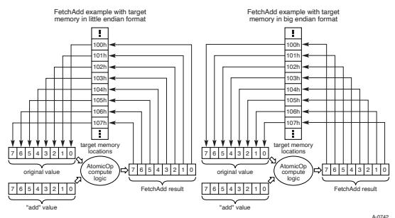

[⬆️ 返回目录](#-本章目录-table-of-contents)

---

<<<PAGE_BREAK>>> page_174

<a id="sec-2-2-2-impl"></a>
## 2.2.2 TLPs with Data Payloads (continued) | 含数据负载的 TLP (续)


<div style="overflow-x: auto; max-width: 100%;">
<table>
<thead>
<tr>
<th width="50%">🇬🇧 English</th>
<th width="50%" style="background-color:#e8e8e8">🇨🇳 中文</th>
</tr>
</thead>
<tbody>
<tr>
<td>

- For any TLP, a value of 1b in the TD bit indicates the presence of the TLP Digest field including an end-to-end CRC (ECRC) value at the end of the TLP.
  - A TLP where the TD bit value does not correspond with the observed size (accounting for the data payload, if present) is a Malformed TLP.
    - This is a reported error associated with the Receiving Port (see § Section 6.2).
- If an intermediate or ultimate PCI Express Receiver of the TLP does not support ECRC checking, the Receiver must ignore the TLP Digest[^8].
  - If the Receiver of the TLP supports ECRC checking, the Receiver interprets the value in the TLP Digest field as an ECRC value, according to the rules in § Section 2.7.1.

---

**IMPLEMENTATION NOTE:**
**ENDIAN FORMAT SUPPORT BY RC ATOMICOP COMPLETERS**

One key reason for permitting an AtomicOp Completer to access target memory using an endian format of its choice is so that PCI Express devices targeting host memory with AtomicOps can interoperate with host software that uses atomic operation instructions (or instruction sequences). Some host environments have limited endian format support with atomic operations, and by supporting the "right" endian format(s), an RC AtomicOp Completer may significantly improve interoperability.

For an RC with AtomicOp Completer capability on a platform supporting little-endian-only processors, there is little envisioned benefit for the RC AtomicOp Completer to support any endian format other than little endian.

For an RC with AtomicOp Completer capability on a platform supporting bi-endian processors, there may be benefit in supporting both big endian and little endian formats, and perhaps having the endian format configurable for different regions of host memory.

There is no PCI Express requirement that an RC AtomicOp Completer support the host processor's "native" format (if there is one), nor is there necessarily significant benefit to doing so. For example, some processors can use load-link/store-conditional or similar instruction sequences to do atomic operations in non-native endian formats and thus not need the RC AtomicOp Completer to support alternative endian formats.

---

**IMPLEMENTATION NOTE:**
**MAINTAINING ALIGNMENT IN DATA PAYLOADS**

§ Section 2.3.1.1 discusses rules for forming Read Completions respecting certain natural address boundaries. Memory Write performance can be significantly improved by respecting similar address boundaries in the formation of the Write Request. Specifically, forming Write Requests such that natural address boundaries of 64 or 128 bytes are respected will help to improve system performance.

</td>
<td style="background-color:#e8e8e8">

- 对于任何 TLP,TD 位 (TD bit) 取值为 1b 表示 TLP 末尾存在 TLP Digest 字段,该字段包含端到端 CRC (ECRC) 值。
  - 若 TD 位的值与 TLP 的实际大小 (考虑数据负载,若存在) 不一致,则该 TLP 为 Malformed TLP。
    - 这是一个与接收端口相关联的可报告错误 (参见 § 6.2 节)。
- 若 TLP 的中间或最终 PCI Express 接收器不支持 ECRC 校验,则接收器必须忽略 TLP Digest[^8]。
  - 若 TLP 接收器支持 ECRC 校验,则接收器根据 § 2.7.1 节中的规则,将 TLP Digest 字段中的值解释为 ECRC 值。

---

**实现注记：**
**RC ATOMICOP 完成者的字节序格式支持**

允许 AtomicOp 完成者使用其自行选择的字节序格式访问目标存储器的一个关键原因在于:通过 AtomicOp 访问主机存储器的 PCI Express 设备可与使用原子操作指令 (或指令序列) 的主机软件实现互操作。部分主机环境对原子操作的字节序格式支持有限,通过对"合适"字节序格式的支持,RC AtomicOp 完成者可显著改善互操作性。

对于在仅支持小端处理器平台上具备 AtomicOp 完成者能力的 RC 而言,RC AtomicOp 完成者支持小端以外字节序格式的预期收益较小。

对于在支持双端处理器平台上具备 AtomicOp 完成者能力的 RC 而言,支持大端与小端两种格式可能带来收益,并可针对主机存储器的不同区域将字节序格式设为可配置。

本规范并不要求 RC AtomicOp 完成者必须支持主机处理器的"原生"格式 (若存在原生格式),这样做也未必带来显著收益。例如,部分处理器可使用 load-link/store-conditional 或类似的指令序列,以非原生字节序格式执行原子操作,因而无需 RC AtomicOp 完成者支持其他字节序格式。

---

**实现注记：**
**数据负载中保持对齐**

§ 2.3.1.1 节讨论了关于在组装读完成报文 (Read Completion) 时遵循特定自然地址边界的规则。遵循类似的地址边界组装写请求 (Write Request) 可显著提升 Memory Write 性能。具体而言,在组装写请求时遵循 64 或 128 字节的自然地址边界,有助于提升系统性能。

</td>
</tr>
</tbody>
</table>
</div>


[⬆️ 返回目录](#-本章目录-table-of-contents)

---

<a id="sec-2-2-3"></a>
## 2.2.3 TLP Digest Rules - Non-Flit Mode Only | TLP Digest 规则 —— 仅适用于非 Flit 模式

<table>
<thead>
<tr>
<th width="50%">🇬🇧 English</th>
<th width="50%" style="background-color:#e8e8e8">🇨🇳 中文</th>
</tr>
</thead>
<tbody>
<tr>
<td>

[Reserved for future content - this section is reserved for TLP Digest rules in Non-Flit Mode only.]

</td>
<td style="background-color:#e8e8e8">

[预留供未来内容使用 —— 本节为非 Flit 模式下 TLP Digest 规则的预留内容。]

</td>
</tr>
</tbody>
</table>

[⬆️ 返回目录](#-本章目录-table-of-contents)

---

[^8]: An exception is an Intermediate Receiver forwarding a Multicast TLP out an Egress Port with MC_Overlay enabled. See § Section 6.14.5.

<<<PAGE_BREAK>>> page_175

<a id="sec-2-2-4"></a>
## 2.2.4 Routing and Addressing Rules | 路由与寻址规则


<div style="overflow-x: auto; max-width: 100%;">
<table>
<thead>
<tr>
<th width="50%">🇬🇧 English</th>
<th width="50%" style="background-color:#e8e8e8">🇨🇳 中文</th>
</tr>
</thead>
<tbody>
<tr>
<td>

There are three principal mechanisms for TLP routing: address, ID, and implicit. This section defines the rules for the address and ID routing mechanisms. Implicit routing is used only with Message Requests, and is covered in § Section 2.2.8.

- Address routing is used with Memory, I/O Requests and Address Routed Messages.
- In NFM, two address formats are specified:
  - a 32-bit format with a 3 DW header (see § Figure 2-16)
  - a 64-bit format with a 4 DW header (see § Figure 2-17)
- In FM, five address formats are specified:
  - a 32-bit format with a 3 DW header (see § Figure 2-18)
  - a 64-bit format with a 4 DW header (see § Figure 2-19)
  - a 64-bit format with a 5 DW header (see § Figure 2-20)
  - a 64-bit format with a 6 DW header (see § Figure 2-21)
  - a 64-bit format with a 7 DW header (see § Figure 2-22)

</td>
<td style="background-color:#e8e8e8">

TLP 路由主要有三种机制:地址路由、ID 路由和隐式路由。本节定义地址路由和 ID 路由机制的规则。隐式路由仅用于 Message 请求 (Message Request),将在 § 2.2.8 节中介绍。

- 地址路由 (Address routing) 用于 Memory 请求、I/O 请求以及地址路由消息 (Address Routed Message)。
- 在 NFM 下,规定了两种地址格式:
  - 32 位格式,采用 3 DW 包头 (参见 § 图 2-16)
  - 64 位格式,采用 4 DW 包头 (参见 § 图 2-17)
- 在 FM 下,规定了五种地址格式:
  - 32 位格式,采用 3 DW 包头 (参见 § 图 2-18)
  - 64 位格式,采用 4 DW 包头 (参见 § 图 2-19)
  - 64 位格式,采用 5 DW 包头 (参见 § 图 2-20)
  - 64 位格式,采用 6 DW 包头 (参见 § 图 2-21)
  - 64 位格式,采用 7 DW 包头 (参见 § 图 2-22)

</td>
</tr>
</tbody>
</table>
</div>


> **Figure 2-16.** 32-bit Address Routing - Non-Flit Mode
> 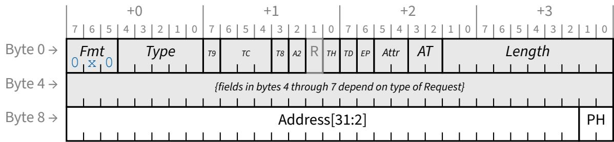

[⬆️ 返回目录](#-本章目录-table-of-contents)

---

> **Figure 2-17.** 64-bit Address Routing - Non-Flit Mode
> 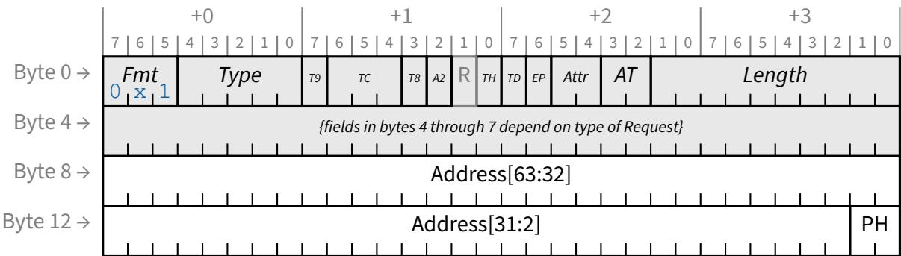

[⬆️ 返回目录](#-本章目录-table-of-contents)

---

<a id="sec-2-2-4-1"></a>
## 2.2.4.1 Address-Based Routing Rules | 基于地址的路由规则

<table>
<thead>
<tr>
<th width="50%">🇬🇧 English</th>
<th width="50%" style="background-color:#e8e8e8">🇨🇳 中文</th>
</tr>
</thead>
<tbody>
<tr>
<td>

[Section reserved for address-based routing rules - refer to subsequent figures and tables.]

</td>
<td style="background-color:#e8e8e8">

[本节为基于地址的路由规则预留 —— 请参阅后续图与表。]

</td>
</tr>
</tbody>
</table>

[⬆️ 返回目录](#-本章目录-table-of-contents)

---

<<<PAGE_BREAK>>> page_176

<a id="sec-2-2-4-1-figures"></a>
## 2.2.4.1 Address-Based Routing Rules (continued) | 基于地址的路由规则 (续)

<table>
<thead>
<tr>
<th width="50%">🇬🇧 English</th>
<th width="50%" style="background-color:#e8e8e8">🇨🇳 中文</th>
</tr>
</thead>
<tbody>
<tr>
<td>

[Address-based routing format figures for Flit Mode - see Figure 2-18 through Figure 2-22.]

</td>
<td style="background-color:#e8e8e8">

[Flit 模式下基于地址的路由格式图 —— 参见图 2-18 至图 2-22。]

</td>
</tr>
</tbody>
</table>

> **Figure 2-18.** 32-bit Address Routing - Flit Mode
> 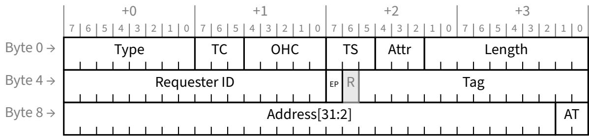

[⬆️ 返回目录](#-本章目录-table-of-contents)

---

> **Figure 2-19.** 64-bit Address Routing - Flit Mode
> 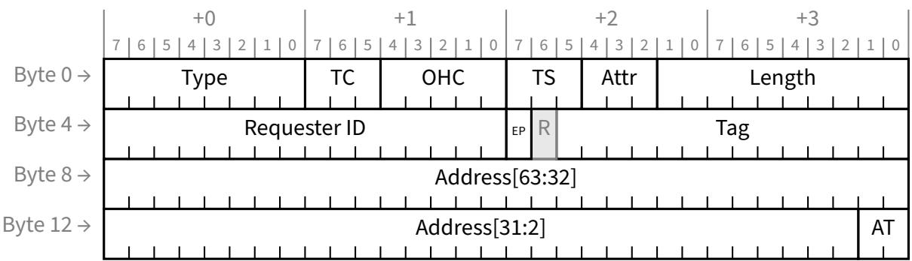

[⬆️ 返回目录](#-本章目录-table-of-contents)

---

> **Figure 2-20.** 64-bit Address Routing - Flit Mode - 5 DW
> 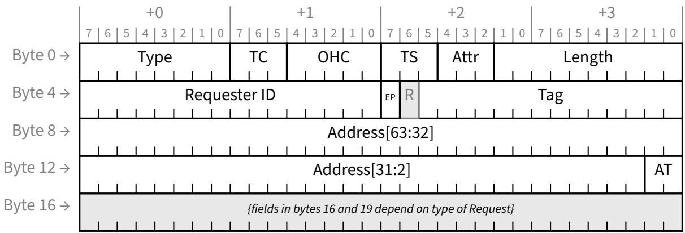

[⬆️ 返回目录](#-本章目录-table-of-contents)

---

<<<PAGE_BREAK>>> page_177

<a id="sec-2-2-4-1-figures-cont"></a>
## 2.2.4.1 Address-Based Routing Rules (continued) | 基于地址的路由规则 (续)

<table>
<thead>
<tr>
<th width="50%">🇬🇧 English</th>
<th width="50%" style="background-color:#e8e8e8">🇨🇳 中文</th>
</tr>
</thead>
<tbody>
<tr>
<td>

[Continued address-based routing format figures for Flit Mode - see Figure 2-21 and Figure 2-22.]

</td>
<td style="background-color:#e8e8e8">

[Flit 模式下基于地址的路由格式图 (续) —— 参见图 2-21 与图 2-22。]

</td>
</tr>
</tbody>
</table>

> **Figure 2-21.** 64-bit Address Routing - Flit Mode - 6 DW
> 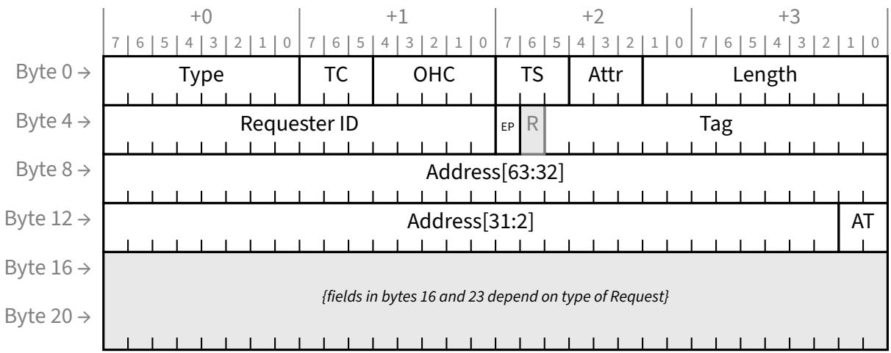

[⬆️ 返回目录](#-本章目录-table-of-contents)

---

> **Figure 2-22.** 64-bit Address Routing - Flit Mode - 7 DW
> 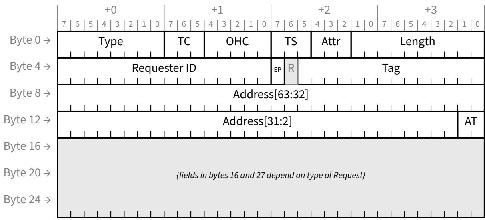

[⬆️ 返回目录](#-本章目录-table-of-contents)

---

<a id="sec-2-2-4-1-rules"></a>
## 2.2.4.1 Address-Based Routing Rules - Body | 基于地址的路由规则 - 正文


<div style="overflow-x: auto; max-width: 100%;">
<table>
<thead>
<tr>
<th width="50%">🇬🇧 English</th>
<th width="50%" style="background-color:#e8e8e8">🇨🇳 中文</th>
</tr>
</thead>
<tbody>
<tr>
<td>

- For Memory Read, Memory Write, DMWr, and AtomicOp Requests, the Address Type (AT) field is encoded as shown in § Table 10-1. For Address Routed Messages in Flit Mode, the Address Type (AT) field is encoded as shown in § Table 10-1 with the exception that the value of 01b is reserved. For all other Requests, the AT field is Reserved unless explicitly stated otherwise.
- If TH is Set, the PH field is encoded as shown in § Table 2-18. If TH is Clear, the PH field is Reserved.
- Address mapping to the TLP header is shown in § Table 2-7.

**Table 2-7 Address Field Mapping | 表 2-7 地址字段映射**

| Address Bits | 32-bit Addressing | 64-bit Addressing |
|--------------|-------------------|-------------------|
| 63:56 | Not Applicable | Bits 7:0 of Byte 8 |
| 55:48 | Not Applicable | Bits 7:0 of Byte 9 |
| 47:40 | Not Applicable | Bits 7:0 of Byte 10 |
| 39:32 | Not Applicable | Bits 7:0 of Byte 11 |
| 31:24 | Bits 7:0 of Byte 8 | Bits 7:0 of Byte 12 |
| 23:16 | Bits 7:0 of Byte 9 | Bits 7:0 of Byte 13 |
| 15:8 | Bits 7:0 of Byte 10 | Bits 7:0 of Byte 14 |
| 7:2 | Bits 7:2 of Byte 11 | Bits 7:2 of Byte 15 |

- Except when explicitly required otherwise, non-UIO Memory Read, Memory Write, DMWr, and AtomicOp Requests use both formats.
  - For Addresses below 4 GB, Requesters must use the 32-bit format. The behavior of the Receiver is not specified if a 64-bit format Request addressing below 4 GB (i.e., with the upper 32 bits of address all 0) is received.
- The following address routed Requests must use 64-bit addressing (when addressing below 4 GB the upper 32 address bits must be to 0000 0000h):
  - All Address Routed UIO Requests
  - IDE TLPs with partial header encryption
  - This MUST@FLIT include Address Routed Messages. See § Table 2-20.[^9]
- I/O Read Requests and I/O Write Requests use the 32-bit format.
- All agents must decode all address bits in the header - address aliasing is not allowed.

---

**IMPLEMENTATION NOTE:**
**PREVENTION OF ADDRESS ALIASING**

For correct software operation, full address decoding is required even in systems where it may be known to the system hardware architect/designer that fewer than 64 bits of address are actually meaningful in the system.

</td>
<td style="background-color:#e8e8e8">

- 对于 Memory Read、Memory Write、DMWr 和 AtomicOp 请求,地址类型 (Address Type, AT) 字段按 § 表 10-1 进行编码。对于 Flit 模式下的地址路由消息,AT 字段按 § 表 10-1 进行编码,但 01b 值除外,该值被保留。对于所有其他请求,AT 字段为保留字段,除非另有明确说明。
- 若 TH 被置位,则 PH 字段按 § 表 2-18 进行编码。若 TH 被清零,则 PH 字段为保留字段。
- 地址到 TLP 包头的映射如 § 表 2-7 所示。

**表 2-7 地址字段映射 (Address Field Mapping)**

| 地址位 | 32 位寻址 | 64 位寻址 |
|--------|-----------|-----------|
| 63:56 | 不适用 | Byte 8 的位 7:0 |
| 55:48 | 不适用 | Byte 9 的位 7:0 |
| 47:40 | 不适用 | Byte 10 的位 7:0 |
| 39:32 | 不适用 | Byte 11 的位 7:0 |
| 31:24 | Byte 8 的位 7:0 | Byte 12 的位 7:0 |
| 23:16 | Byte 9 的位 7:0 | Byte 13 的位 7:0 |
| 15:8 | Byte 10 的位 7:0 | Byte 14 的位 7:0 |
| 7:2 | Byte 11 的位 7:2 | Byte 15 的位 7:2 |

- 除明确要求外,非 UIO 的 Memory Read、Memory Write、DMWr 和 AtomicOp 请求可使用上述两种格式。
  - 对于低于 4 GB 的地址,请求者必须使用 32 位格式。若接收到使用 64 位格式但地址低于 4 GB (即地址的高 32 位全为 0) 的请求,则接收器的行为不在本规范规定范围内。
- 以下地址路由请求必须使用 64 位寻址 (当地址低于 4 GB 时,高 32 位地址必须为 0000 0000h):
  - 所有地址路由 UIO 请求
  - 采用部分包头加密的 IDE TLP
  - 在 Flit 模式下 MUST 包含地址路由消息。参见 § 表 2-20。[^9]
- I/O Read 请求和 I/O Write 请求使用 32 位格式。
- 所有代理必须对包头中的所有地址位进行解码 —— 不允许地址别名 (address aliasing)。

---

**实现注记：**
**防止地址别名**

为了软件的正确运行,即使系统硬件架构师/设计者已知系统中实际有效的地址位数少于 64 位,仍要求进行完整的地址解码。

</td>
</tr>
</tbody>
</table>
</div>


[⬆️ 返回目录](#-本章目录-table-of-contents)

---

<a id="sec-2-2-4-2"></a>
## 2.2.4.2 ID Based Routing Rules | 基于 ID 的路由规则

<table>
<thead>
<tr>
<th width="50%">🇬🇧 English</th>
<th width="50%" style="background-color:#e8e8e8">🇨🇳 中文</th>
</tr>
</thead>
<tbody>
<tr>
<td>

- ID routing is used with Configuration Requests, with ID Routed Messages, and with Completions. This specification defines several Messages that are ID Routed (see § Table F-1). Other specifications are permitted to define additional ID Routed Messages.
- ID routing uses the Bus, Device, and Function Numbers (as applicable) to specify the destination for the TLP:
  - For non-ARI Routing IDs, Bus, Device, and (3-bit) Function Number to TLP header mapping is shown in § Table 2-8, § Figure 2-23, and § Figure 2-25.
  - For ARI Routing IDs, the Bus and (8-bit) Function Number to TLP header mapping is shown in § Table 2-9, § Figure 2-24, and § Figure 2-26.

</td>
<td style="background-color:#e8e8e8">

- ID 路由 (ID routing) 用于配置请求 (Configuration Request)、ID 路由消息 (ID Routed Message) 以及完成报文 (Completion)。本规范定义了若干 ID 路由的消息 (参见 § 表 F-1)。其他规范可定义额外的 ID 路由消息。
- ID 路由使用 Bus 号、Device 号和 Function 号 (按适用情况) 指定 TLP 的目标:
  - 对于非 ARI 路由 ID,Bus、Device 和 (3 位) Function 号到 TLP 包头的映射如 § 表 2-8、§ 图 2-23 和 § 图 2-25 所示。
  - 对于 ARI 路由 ID,Bus 和 (8 位) Function 号到 TLP 包头的映射如 § 表 2-9、§ 图 2-24 和 § 图 2-26 所示。

</td>
</tr>
</tbody>
</table>

[⬆️ 返回目录](#-本章目录-table-of-contents)

---

[^9]: Earlier versions of this specification did not specify address routed message behavior when the address was below 4 GB.

<<<PAGE_BREAK>>> page_179

<a id="sec-2-2-4-2-cont"></a>
## 2.2.4.2 ID Based Routing Rules (continued) | 基于 ID 的路由规则 (续)


<div style="overflow-x: auto; max-width: 100%;">
<table>
<thead>
<tr>
<th width="50%">🇬🇧 English</th>
<th width="50%" style="background-color:#e8e8e8">🇨🇳 中文</th>
</tr>
</thead>
<tbody>
<tr>
<td>

- In FM, Completions and ID Routed Messages with a different destination Hierarchy than the Hierarchy in which they originate must be routed to the destination Hierarchy using the Destination Segment field and then routed within the destination Hierarchy by the destination Bus, Device, and Function Numbers.
- In NFM, two ID routing formats are specified, one used with a 4 DW header (see § Figure 2-23 and § Figure 2-24) and one used with a 3 DW header (see § Figure 2-26 and § Figure 2-24).
  - Header field locations are the same for both formats (see § Table 2-8 and § Table 2-9).
- In FM, five ID routing formats are specified:
  - One with a 3 DW header (see § Figure 2-27)
  - One with a 4 DW header (see § Figure 2-28)
  - One with a 5 DW Header (see § Figure 2-29)
  - One with a 6 DW Header (see § Figure 2-30)
  - One with a 7 DW Header (see § Figure 2-31)

**Table 2-8 Header Field Locations for non-ARI ID Routing - Non-Flit Mode | 表 2-8 非 ARI ID 路由的包头字段位置 —— 非 Flit 模式**

| Field | Header Location |
|-------|-----------------|
| Bus Number[7:0] | Bits 7:0 of Byte 8 |
| Device Number[4:0] | Bits 7:3 of Byte 9 |
| Function Number[2:0] | Bits 2:0 of Byte 9 |

**Table 2-9 Header Field Locations for ARI ID Routing | 表 2-9 ARI ID 路由的包头字段位置**

| Field | Header Location |
|-------|-----------------|
| Bus Number[7:0] | Bits 7:0 of Byte 8 |
| Function Number[7:0] | Bits 7:0 of Byte 9 |

</td>
<td style="background-color:#e8e8e8">

- 在 FM 下,目标层级 (Hierarchy) 与发起层级不同的完成报文和 ID 路由消息,必须先使用目标段 (Destination Segment) 字段路由至目标层级,然后再通过目标 Bus、Device 和 Function 号在目标层级内进行路由。
- 在 NFM 下,规定了两种 ID 路由格式:一种使用 4 DW 包头 (参见 § 图 2-23 和 § 图 2-24),另一种使用 3 DW 包头 (参见 § 图 2-26 和 § 图 2-24)。
  - 两种格式的包头字段位置相同 (参见 § 表 2-8 和 § 表 2-9)。
- 在 FM 下,规定了五种 ID 路由格式:
  - 使用 3 DW 包头 (参见 § 图 2-27)
  - 使用 4 DW 包头 (参见 § 图 2-28)
  - 使用 5 DW 包头 (参见 § 图 2-29)
  - 使用 6 DW 包头 (参见 § 图 2-30)
  - 使用 7 DW 包头 (参见 § 图 2-31)

**表 2-8 非 ARI ID 路由的包头字段位置 —— 非 Flit 模式 (Header Field Locations for non-ARI ID Routing - Non-Flit Mode)**

| 字段 | 包头位置 |
|------|----------|
| Bus Number[7:0] | Byte 8 的位 7:0 |
| Device Number[4:0] | Byte 9 的位 7:3 |
| Function Number[2:0] | Byte 9 的位 2:0 |

**表 2-9 ARI ID 路由的包头字段位置 (Header Field Locations for ARI ID Routing)**

| 字段 | 包头位置 |
|------|----------|
| Bus Number[7:0] | Byte 8 的位 7:0 |
| Function Number[7:0] | Byte 9 的位 7:0 |

</td>
</tr>
</tbody>
</table>
</div>


> **Figure 2-23.** Non-ARI ID Routing with 4 DW Header - Non-Flit Mode
> 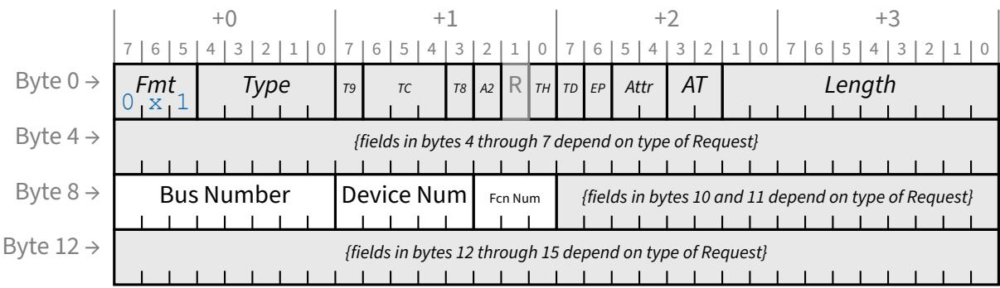

[⬆️ 返回目录](#-本章目录-table-of-contents)

---

<<<PAGE_BREAK>>> page_180

<a id="sec-2-2-4-2-figures"></a>
## 2.2.4.2 ID Based Routing Rules (continued) | 基于 ID 的路由规则 (续)

<table>
<thead>
<tr>
<th width="50%">🇬🇧 English</th>
<th width="50%" style="background-color:#e8e8e8">🇨🇳 中文</th>
</tr>
</thead>
<tbody>
<tr>
<td>

[ID routing format figures for Non-Flit Mode and Flit Mode - see Figure 2-24 through Figure 2-26.]

</td>
<td style="background-color:#e8e8e8">

[非 Flit 模式与 Flit 模式下的 ID 路由格式图 —— 参见图 2-24 至图 2-26。]

</td>
</tr>
</tbody>
</table>

> **Figure 2-24.** ARI ID Routing with 4 DW Header - Non-Flit Mode
> 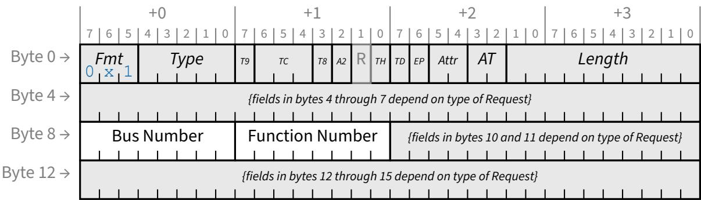

[⬆️ 返回目录](#-本章目录-table-of-contents)

---

> **Figure 2-25.** Non-ARI ID Routing with 3 DW Header - Non-Flit Mode
> 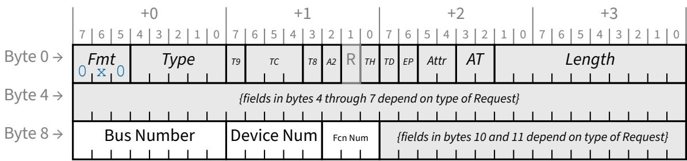

[⬆️ 返回目录](#-本章目录-table-of-contents)

---

> **Figure 2-26.** ARI ID Routing with 3 DW Header - Non-Flit Mode
> 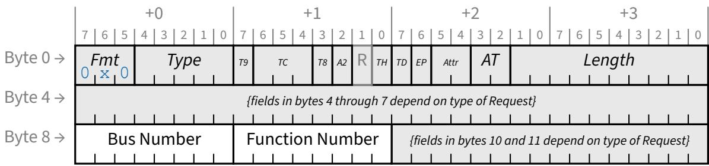

[⬆️ 返回目录](#-本章目录-table-of-contents)

---

> **Figure 2-27.** ID Routing with 3 DW Header - Flit Mode
> 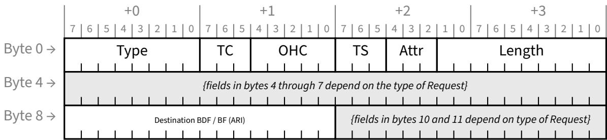

[⬆️ 返回目录](#-本章目录-table-of-contents)

---

<<<PAGE_BREAK>>> page_181

<a id="sec-2-2-4-2-figures-fm"></a>
## 2.2.4.2 ID Based Routing Rules (continued) | 基于 ID 的路由规则 (续)

<table>
<thead>
<tr>
<th width="50%">🇬🇧 English</th>
<th width="50%" style="background-color:#e8e8e8">🇨🇳 中文</th>
</tr>
</thead>
<tbody>
<tr>
<td>

[Continued ID routing format figures for Flit Mode - see Figure 2-28 through Figure 2-30.]

</td>
<td style="background-color:#e8e8e8">

[Flit 模式下 ID 路由格式图 (续) —— 参见图 2-28 至图 2-30。]

</td>
</tr>
</tbody>
</table>

> **Figure 2-28.** ID Routing with 4 DW Header - Flit Mode
> 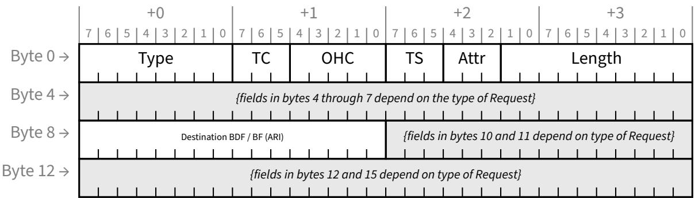

[⬆️ 返回目录](#-本章目录-table-of-contents)

---

> **Figure 2-29.** ID Routing with 5 DW Header - Flit Mode
> 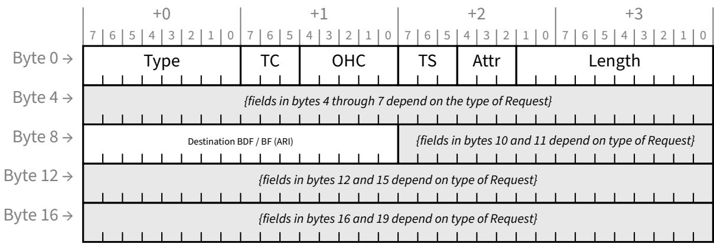

[⬆️ 返回目录](#-本章目录-table-of-contents)

---

> **Figure 2-30.** ID Routing with 6 DW Header - Flit Mode
> 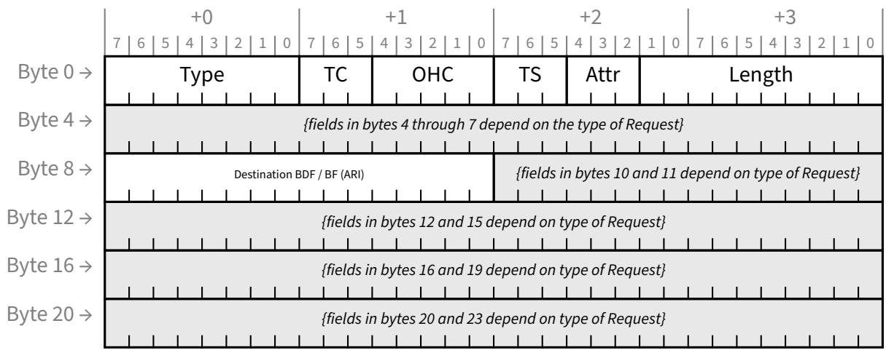

[⬆️ 返回目录](#-本章目录-table-of-contents)

---

<<<PAGE_BREAK>>> page_182

<a id="sec-2-2-5-prelude"></a>
## 2.2.4.2 ID Based Routing Rules (continued) | 基于 ID 的路由规则 (续)

<table>
<thead>
<tr>
<th width="50%">🇬🇧 English</th>
<th width="50%" style="background-color:#e8e8e8">🇨🇳 中文</th>
</tr>
</thead>
<tbody>
<tr>
<td>

[Figure 2-31 - ID Routing with 7 DW Header - Flit Mode.]

</td>
<td style="background-color:#e8e8e8">

[图 2-31 —— Flit 模式下 7 DW 包头 ID 路由。]

</td>
</tr>
</tbody>
</table>

> **Figure 2-31.** ID Routing with 7 DW Header - Flit Mode
> 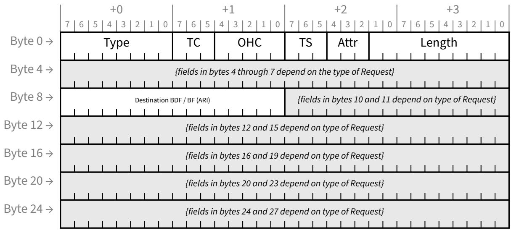

[⬆️ 返回目录](#-本章目录-table-of-contents)

---

<a id="sec-2-2-5-intro"></a>
## 2.2.5 First/Last DW Byte Enables Rules - Introduction | 首/尾 DW 字节使能规则 - 引言


<div style="overflow-x: auto; max-width: 100%;">
<table>
<thead>
<tr>
<th width="50%">🇬🇧 English</th>
<th width="50%" style="background-color:#e8e8e8">🇨🇳 中文</th>
</tr>
</thead>
<tbody>
<tr>
<td>

The general function of TLP Byte Enables is similar in Non-Flit Mode and Flit Mode, however the detailed rules differ.

Byte Enables are included with Memory, I/O, and Configuration Requests. This section defines the corresponding rules.

Byte Enables, when present in the Request header, are located in byte 7 of the header (see § Figure 2-32). For Memory Read Requests and DMWr Requests that have the TH bit Set, the Byte Enable fields are repurposed to carry the ST[7:0] field (refer to § Section 2.2.7.1.1 for details), and values for the Byte Enables are implied as defined below. The TH bit must only be Set in Memory Read Requests and DMWr Requests when it is acceptable to complete those Requests as if all bytes for the requested data were enabled.

</td>
<td style="background-color:#e8e8e8">

TLP 字节使能 (Byte Enable) 的一般功能在非 Flit 模式与 Flit 模式下类似,但详细规则有所不同。

字节使能包含在 Memory、I/O 和 Configuration 请求中。本节定义相关规则。

字节使能位于请求包头 (Request header) 的 byte 7 (参见 § 图 2-32)。对于 TH 位置位的 Memory Read 请求和 DMWr 请求,字节使能字段被重新用于承载 ST[7:0] 字段 (详见 § 2.2.7.1.1 节),字节使能的实际取值按下文隐含定义。TH 位仅在如下情况下可置位:对于 Memory Read 请求和 DMWr 请求,可以接受按"请求数据的所有字节均使能"的方式完成。

</td>
</tr>
</tbody>
</table>
</div>


[⬆️ 返回目录](#-本章目录-table-of-contents)

---


---

<a id="sec-2-2-5"></a>
## 2.2.5 First/Last DW Byte Enables Rules | 首/尾 DW 字节使能规则

<table>
<thead>
<tr>
<th width="50%">🇬🇧 English</th>
<th width="50%" style="background-color:#e8e8e8">🇨🇳 中文</th>
</tr>
</thead>
<tbody>
<tr>
<td>

**IMPLEMENTATION NOTE:**
**SECURITY ISSUES ASSOCIATED WITH NON-ENABLED BYTES**

The data included with a Write or Read Completion necessarily is DW aligned, and so in cases where some bytes are not enabled, the content of the non-enabled bytes is undefined. To optimize platform security, it is strongly recommended that non-enabled bytes be filled with zeros to avoid data being inadvertently leaked ("leaky bytes").

As a best practice, it is strongly recommended that devices receiving non-enabled bytes also ensure that the values provided in those bytes are discarded by hardware, such that the values cannot be visible to software. Hardware that fails to do so can provide a path for an attacker to observe confidential data without the need for physical access to a system.

</td>
<td style="background-color:#e8e8e8">

**实现注记：**
**与未使能字节相关的安全问题**

写入或读完成 (Read Completion) 中所携带的数据必然是 DW 对齐的，因此当存在部分字节未使能时，这些未使能字节的内容是未定义的。为了优化平台安全性，强烈建议将未使能的字节填零，以避免数据被意外泄漏（"leaky bytes"，泄漏字节）。

作为一项最佳实践，强烈建议接收未使能字节的设备同时通过硬件确保丢弃这些字节所携带的值，使其对软件不可见。未能做到这一点的硬件可能为攻击者提供一条观察机密数据的路径，而无需物理接触系统。

</td>
</tr>
</tbody>
</table>

[⬆️ 返回目录](#-本章目录-table-of-contents)

---

<a id="sec-2-2-5-1"></a>
## 2.2.5.1 Byte Enable Rules for Non-Flit Mode | 非 Flit 模式的字节使能规则


<div style="overflow-x: auto; max-width: 100%;">
<table>
<thead>
<tr>
<th width="50%">🇬🇧 English</th>
<th width="50%" style="background-color:#e8e8e8">🇨🇳 中文</th>
</tr>
</thead>
<tbody>
<tr>
<td>

- For Memory Read Requests and DMWr Requests that have the TH bit Set, the following values are implied for the Byte Enables. See § Section 2.2.7 for additional requirements.
  - If the Length field for this Request indicates a length of 1 DW, then the value for the First DW Byte Enables is implied to be 1111b and the value for the Last DW Byte Enables is implied to be 0000b.
  - If the Length field for this Request indicates a length of greater than 1 DW, then the value for the First DW Byte Enables and the Last DW Byte Enables is implied to be 1111b.

</td>
<td style="background-color:#e8e8e8">

- 对 TH 位置位的内存读请求和 DMWr 请求，字节使能 (Byte Enables) 隐含取以下值。补充要求参见 § 2.2.7 节。
  - 若该请求的 Length 字段指示长度为 1 DW，则 First DW Byte Enables 隐含为 1111b，Last DW Byte Enables 隐含为 0000b。
  - 若该请求的 Length 字段指示长度大于 1 DW，则 First DW Byte Enables 与 Last DW Byte Enables 均隐含为 1111b。

</td>
</tr>
</tbody>
</table>
</div>


[⬆️ 返回目录](#-本章目录-table-of-contents)

---

<<<PAGE_BREAK>>> page_183

<table>
<thead>
<tr>
<th width="50%">🇬🇧 English</th>
<th width="50%" style="background-color:#e8e8e8">🇨🇳 中文</th>
</tr>
</thead>
<tbody>
<tr>
<td>

> **Figure 2-32 Location of Byte Enables in TLP Header - Non-Flit Mode**
> 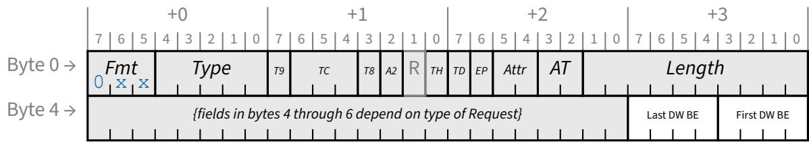

</td>
<td style="background-color:#e8e8e8">


</td>
</tr>
</tbody>
</table>

[⬆️ 返回目录](#-本章目录-table-of-contents)

---

<a id="sec-2-2-5-1-rules"></a>
## 2.2.5.1 Byte Enable Rules (cont.) | 字节使能规则（续）


<div style="overflow-x: auto; max-width: 100%;">
<table>
<thead>
<tr>
<th width="50%">🇬🇧 English</th>
<th width="50%" style="background-color:#e8e8e8">🇨🇳 中文</th>
</tr>
</thead>
<tbody>
<tr>
<td>

- The First DW BE[3:0] field contains Byte Enables for the first (or only) DW referenced by a Request.
  - If the Length field for a Request indicates a length of greater than 1 DW, this field must not equal 0000b.
- The Last DW BE[3:0] field contains Byte Enables for the last DW of a Request.
  - If the Length field for a Request indicates a length of 1 DW, this field must equal 0000b.
  - If the Length field for a Request indicates a length of greater than 1 DW, this field must not equal 0000b.
- For each bit of the Byte Enables fields:
  - a value of 0b indicates that the corresponding byte of data must not be written or, if non-prefetchable, must not be read at the Completer.
  - a value of 1b indicates that the corresponding byte of data must be written or read at the Completer.
- Non-contiguous Byte Enables (enabled bytes separated by non-enabled bytes) are permitted in the First DW BE field for all Requests with length of 1 DW.
  - Non-contiguous Byte Enable examples: 1010b, 0101b, 1001b, 1011b, 1101b
- Non-contiguous Byte Enables are permitted in both Byte Enables fields for Quad Word (QW) aligned Memory Requests with length of 2 DW (1 QW).
- All non-QW aligned Memory Requests with length of 2 DW (1 QW) and Memory Requests with length of 3 DW or more must enable only bytes that are contiguous with the data between the first and last DW of the Request.

</td>
<td style="background-color:#e8e8e8">

- First DW BE[3:0] 字段包含请求所引用的第一个（或唯一一个）DW 的字节使能。
  - 若请求的 Length 字段指示长度大于 1 DW，则该字段不得等于 0000b。
- Last DW BE[3:0] 字段包含请求最后一个 DW 的字节使能。
  - 若请求的 Length 字段指示长度为 1 DW，则该字段必须等于 0000b。
  - 若请求的 Length 字段指示长度大于 1 DW，则该字段不得等于 0000b。
- 字节使能字段的每一位：
  - 取值 0b 表示在 Completer 端，对应的数据字节不得被写入，或（若为非预取）不得被读出。
  - 取值 1b 表示在 Completer 端，对应的数据字节必须被写入或读出。
- 对所有长度为 1 DW 的请求，其 First DW BE 字段允许出现非连续字节使能（使能字节之间被未使能字节分隔）。
  - 非连续字节使能示例：1010b、0101b、1001b、1011b、1101b
- 对 QW（Quad Word）对齐、长度为 2 DW（1 QW）的内存请求，其两个字节使能字段均允许出现非连续字节使能。
- 所有非 QW 对齐的、长度为 2 DW（1 QW）的内存请求，以及长度为 3 DW 或更长的内存请求，只能使能与请求首尾 DW 之间数据连续的字节。

</td>
</tr>
</tbody>
</table>
</div>


[⬆️ 返回目录](#-本章目录-table-of-contents)

---

<table>
<thead>
<tr>
<th width="50%">🇬🇧 English</th>
<th width="50%" style="background-color:#e8e8e8">🇨🇳 中文</th>
</tr>
</thead>
<tbody>
<tr>
<td>

**IMPLEMENTATION NOTE:**
**READ REQUEST WITH TPH TO NON-PREFETCHABLE SPACE**

Memory Read Requests with the TH bit Set and that target Non-Prefetchable Memory Space should only be issued when it can be guaranteed that completion of such reads will not create undesirable side effects. See § Section 7.5.1.2.1 for consideration of certain BARs that may have the Prefetchable bit Set even though they map some locations with read side-effects.

</td>
<td style="background-color:#e8e8e8">

**实现注记：**
**针对非预取空间的带 TPH 读请求**

TH 位置位且目标为非预取内存空间 (Non-Prefetchable Memory Space) 的内存读请求，只有在能够保证此类读操作的完成不会产生不良副作用时才能发出。某些 BAR 尽管 Prefetchable 位置位，但其所映射的部分位置具有读副作用，相关考虑参见 § 7.5.1.2.1 节。

</td>
</tr>
</tbody>
</table>

[⬆️ 返回目录](#-本章目录-table-of-contents)

---

<<<PAGE_BREAK>>> page_184

<table>
<thead>
<tr>
<th width="50%">🇬🇧 English</th>
<th width="50%" style="background-color:#e8e8e8">🇨🇳 中文</th>
</tr>
</thead>
<tbody>
<tr>
<td>

- Contiguous Byte Enables examples:
  - First DW BE: 1100b, Last DW BE: 0011b
  - First DW BE: 1000b, Last DW BE: 0111b
- § Table 2-10 shows the correspondence between the bits of the Byte Enables fields, their location in the Request header, and the corresponding bytes of the referenced data.

</td>
<td style="background-color:#e8e8e8">

- 连续字节使能示例：
  - First DW BE：1100b，Last DW BE：0011b
  - First DW BE：1000b，Last DW BE：0111b
- § 表 2-10 给出字节使能字段各比特、在请求包头中的位置以及所引用数据字节之间的对应关系。

</td>
</tr>
</tbody>
</table>

[⬆️ 返回目录](#-本章目录-table-of-contents)

---

**Table 2-10 Byte Enables Location and Correspondence | 表 2-10 字节使能位置与对应关系**

| Byte Enables | Header Location | Affected Data Byte ¹⁰ |
|---|---|---|
| First DW BE[0] | Bit 0 of Byte 7 | Byte 0 |
| First DW BE[1] | Bit 1 of Byte 7 | Byte 1 |
| First DW BE[2] | Bit 2 of Byte 7 | Byte 2 |
| First DW BE[3] | Bit 3 of Byte 7 | Byte 3 |
| Last DW BE[0] | Bit 4 of Byte 7 | Byte N-4 |
| Last DW BE[1] | Bit 5 of Byte 7 | Byte N-3 |
| Last DW BE[2] | Bit 6 of Byte 7 | Byte N-2 |
| Last DW BE[3] | Bit 7 of Byte 7 | Byte N-1 |

¹⁰ 假设所引用的数据共 N 字节（Byte 0 至 Byte N-1）。注意：仅当数据长度大于 1 DW 时，最后 DW 字节使能才被使用。

[⬆️ 返回目录](#-本章目录-table-of-contents)

---


<div style="overflow-x: auto; max-width: 100%;">
<table>
<thead>
<tr>
<th width="50%">🇬🇧 English</th>
<th width="50%" style="background-color:#e8e8e8">🇨🇳 中文</th>
</tr>
</thead>
<tbody>
<tr>
<td>

- A Write Request with a length of 1 DW with no bytes enabled is permitted, and has no effect at the Completer unless otherwise specified.
- If a Read Request of 1 DW specifies that no bytes are enabled to be read (First DW BE[3:0] field = 0000b), the corresponding Completion must specify a length of 1 DW, and include a data payload of 1 DW. The contents of the data payload within the Completion packet is unspecified and may be any value.
- Receiver/Completer behavior is undefined for a TLP violating the Byte Enables rules specified in this section.
- Receivers may optionally check for violations of the Byte Enables rules specified in this section. If a Receiver implementing such checks determines that a TLP violates one or more Byte Enables rules, the TLP is a Malformed TLP. These checks are independently optional (see § Section 6.2.3.4).
  - If Byte Enables rules are checked, a violation is a reported error associated with the Receiving Port (see § Section 6.2).

</td>
<td style="background-color:#e8e8e8">

- 长度为 1 DW 且没有任何字节被使能的写请求是允许的；除非另有规定，否则在 Completer 端不产生任何效果。
- 若 1 DW 的读请求指明不读出任何字节（First DW BE[3:0] = 0000b），则对应的完成报文 (Completion) 必须指明长度为 1 DW，并附带 1 DW 的数据负载。该完成报文中数据负载的内容未规定，可为任意值。
- 对违反本节字节使能规则的 TLP，接收方/Completer 的行为是未定义的。
- 接收方可选择性地检查本节所规定的字节使能规则违规。实现此类检查的接收方若判定某个 TLP 违反了一条或多条字节使能规则，则该 TLP 为畸形 TLP (Malformed TLP)。这些检查各自独立可选（参见 § 6.2.3.4 节）。
  - 若进行字节使能规则检查，则违规是与接收端口相关联的上报错误（参见 § 6.2 节）。

</td>
</tr>
</tbody>
</table>
</div>


[⬆️ 返回目录](#-本章目录-table-of-contents)

---

<table>
<thead>
<tr>
<th width="50%">🇬🇧 English</th>
<th width="50%" style="background-color:#e8e8e8">🇨🇳 中文</th>
</tr>
</thead>
<tbody>
<tr>
<td>

**IMPLEMENTATION NOTE:**
**ZERO-LENGTH WRITE**

A Memory Write Request of 1 DW with no bytes enabled, or "zero-length Write," may be used by devices under certain protocols, in order to achieve an intended side effect.

</td>
<td style="background-color:#e8e8e8">

**实现注记：**
**零长度写入**

长度为 1 DW 且无任何字节使能的内存写请求（即"零长度写入"）可被设备在某些协议下使用，以实现期望的副作用。

</td>
</tr>
</tbody>
</table>

[⬆️ 返回目录](#-本章目录-table-of-contents)

---

<<<PAGE_BREAK>>> page_185


<div style="overflow-x: auto; max-width: 100%;">
<table>
<thead>
<tr>
<th width="50%">🇬🇧 English</th>
<th width="50%" style="background-color:#e8e8e8">🇨🇳 中文</th>
</tr>
</thead>
<tbody>
<tr>
<td>

The flush semantic has wide application, and all Completers must implement the functionality associated with this semantic. Since a Requester may use the flush semantic without comprehending the characteristics of the Completer, Completers must ensure that zero-length reads do not have side-effects. This is really just a specific case of the rule that in a non-prefetchable space, non-enabled bytes must not be read at the Completer. Note that the flush applies only to traffic in the same Traffic Class as the zero-length Read.

Except as defined in this section, all Byte Enable Rules in Flit Mode are the same as in Non-Flit Mode.

For all Memory Requests, it is permitted for OHC-A1 (see § Figure 2-7) to be present. OHC-A1 must be included for Requests that require any of the fields included in OHC-A1. For Memory Requests, when OHC-A1 is not present, the value of the Last DW Byte Enable field must be treated as 1111b for Requests with Length greater than or equal to 2 DW, and the value of the 1st DW Byte Enable field must be treated as 1111b. If a Request requires Byte Enables field values other than these, then OHC-A1 must be present. When OHC-A1 is present, the PASID, PMR and ER fields are valid if and only if the PV bit is Set.

OHC-A2 must be included for all IO Requests.

OHC-A3 must be included for all Configuration Requests.

In all cases where OHC-A is present, the Byte Enable fields must be handled as defined in § Section 2.2.5.1.

</td>
<td style="background-color:#e8e8e8">

刷新 (flush) 语义具有广泛的应用，所有 Completer 必须实现与该语义相关联的功能。由于 Requester 可能在不理解 Completer 特征的情况下使用刷新语义，Completer 必须确保零长度读不会产生副作用。这其实只是"在非预取空间内，Completer 不得读出未使能字节"规则的一种特例。注意：刷新仅对与零长度读相同流量类 (TC) 的流量生效。

除本节规定之外，Flit 模式下的所有字节使能规则均与非 Flit 模式相同。

对所有内存请求，允许存在 OHC-A1（参见 § 图 2-7）。若请求需要使用 OHC-A1 中包含的任一字段，则 OHC-A1 必须被包含。对内存请求，若 OHC-A1 不存在，则对长度大于等于 2 DW 的请求，Last DW Byte Enable 字段须按 1111b 处理；1st DW Byte Enable 字段须按 1111b 处理。若请求所需的字节使能字段值与此不同，则 OHC-A1 必须存在。当 OHC-A1 存在时，PASID、PMR 和 ER 字段仅在 PV 位置位时有效。

所有 IO 请求必须包含 OHC-A2。

所有配置请求必须包含 OHC-A3。

在所有 OHC-A 存在的情况下，字节使能字段必须按照 § 2.2.5.1 节的规定进行处理。

</td>
</tr>
</tbody>
</table>
</div>


[⬆️ 返回目录](#-本章目录-table-of-contents)

---

<a id="sec-2-2-5-2"></a>
## 2.2.5.2 Byte Enable Rules for Flit Mode | Flit 模式的字节使能规则

<table>
<thead>
<tr>
<th width="50%">🇬🇧 English</th>
<th width="50%" style="background-color:#e8e8e8">🇨🇳 中文</th>
</tr>
</thead>
<tbody>
<tr>
<td>

The Transaction Descriptor is a mechanism for carrying Transaction information between the Requester and the Completer. Transaction Descriptors are composed of three fields:

- Transaction ID - identifies outstanding Transactions
- Attributes field - specifies characteristics of the Transaction
- Traffic Class (TC) field - associates Transaction with type of required service

§ Figure 2-33 shows the fields of the Transaction Descriptor. Note that these fields are shown together to highlight their relationship as parts of a single logical entity. The fields are not contiguous in the packet header.

</td>
<td style="background-color:#e8e8e8">

事务描述符 (Transaction Descriptor) 是一种在 Requester 与 Completer 之间传递事务信息的机制。事务描述符由三个字段组成：

- Transaction ID —— 标识未完成的事务
- Attributes 字段 —— 指定事务的特征
- Traffic Class (TC) 字段 —— 将事务与所需服务类型相关联

§ 图 2-33 展示事务描述符的字段。注意此处将各字段合并显示，是为了突出它们作为同一逻辑实体组成部分的关系；这些字段在包头中并不连续。

</td>
</tr>
</tbody>
</table>

[⬆️ 返回目录](#-本章目录-table-of-contents)

---

<a id="sec-2-2-6"></a>
## 2.2.6 Transaction Descriptor | 事务描述符

<table>
<thead>
<tr>
<th width="50%">🇬🇧 English</th>
<th width="50%" style="background-color:#e8e8e8">🇨🇳 中文</th>
</tr>
</thead>
<tbody>
<tr>
<td>

**IMPLEMENTATION NOTE:**
**ZERO-LENGTH READ**

A Memory Read Request of 1 DW with no bytes enabled, or "zero-length Read," may be used by devices as a type of flush Request. For a Requester, the flush semantic allows a device to ensure that previously issued Posted Writes have been completed at their PCI Express destination. To be effective in all cases, the address for the zero-length Read must target the same device as the Posted Writes that are being flushed. One recommended approach is using the same address as one of the Posted Writes being flushed.

</td>
<td style="background-color:#e8e8e8">

**实现注记：**
**零长度读**

长度为 1 DW 且无任何字节使能的内存读请求（即"零长度读"）可被设备用作一种刷新 (flush) 请求。对 Requester 而言，刷新语义允许设备确保此前发出的 Posted 写入已在 PCI Express 目标端完成。为在所有情况下都有效，零长度读的地址必须指向与被刷新的 Posted 写入相同的设备。一种推荐的做法是使用与被刷新 Posted 写入之一相同的地址。

</td>
</tr>
</tbody>
</table>

[⬆️ 返回目录](#-本章目录-table-of-contents)

---

<a id="sec-2-2-6-1"></a>
## 2.2.6.1 Overview | 概述

<table>
<thead>
<tr>
<th width="50%">🇬🇧 English</th>
<th width="50%" style="background-color:#e8e8e8">🇨🇳 中文</th>
</tr>
</thead>
<tbody>
<tr>
<td>

> **Figure 2-33 Transaction Descriptor**
> 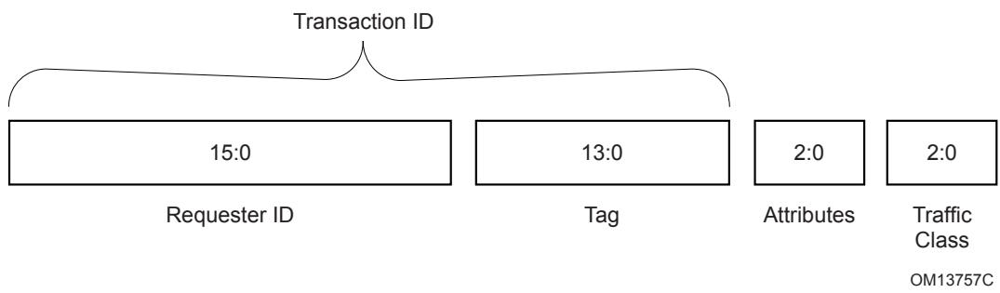

</td>
<td style="background-color:#e8e8e8">


</td>
</tr>
</tbody>
</table>

[⬆️ 返回目录](#-本章目录-table-of-contents)

---

<<<PAGE_BREAK>>> page_186

<a id="sec-2-2-6-2"></a>
## 2.2.6.2 Transaction Descriptor - Transaction ID Field | 事务描述符 - Transaction ID 字段


<div style="overflow-x: auto; max-width: 100%;">
<table>
<thead>
<tr>
<th width="50%">🇬🇧 English</th>
<th width="50%" style="background-color:#e8e8e8">🇨🇳 中文</th>
</tr>
</thead>
<tbody>
<tr>
<td>

> **Figure 2-34 Transaction ID**
> 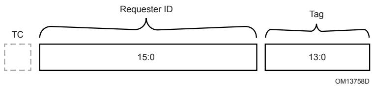

In some cases (defined below) the Traffic Class (TC) is also included in the Transaction ID.

The Transaction ID is used to associate Completions with Requests. There are three groups of Request/Completion types for which the Transaction ID has differing rules. The groups are distinguished by the Completion Type expected for the Request type(s) in that group. Each group forms a distinct namespace, and there is no requirement for Transaction ID uniqueness between groups. These groups and their high-level requirements are:

- **Group I: Cpl / CplD**, which apply to Non-UIO Requests:
  - The Transaction ID consists of Requester ID[15:0] and Tag[13:0]¹¹
  - Requesters must assign Tag values such that Transaction ID values are unique for all outstanding Non-Posted Requests in Group I, without regard to TC or any other field.
- **Group II: UIOWrCpl**, which applies to UIO Memory Write (UIOMWr) Requests:
  - The Transaction ID consists of the TC[2:0], Requester ID[15:0] and Tag[13:0].
  - Requesters are permitted to assign Tag values such that multiple outstanding Requests in Group II have the same Transaction ID (see § Section 2.2.9.2).
- **Group III: UIORdCplD and UIORdCpl**, which apply to UIO Memory Read (UIOMRd) Requests:
  - The Transaction ID consists of the TC[2:0], Requester ID[15:0] and Tag[13:0].
  - Requesters must assign Tag values such that Transaction ID values are unique for all outstanding Requests in Group III.

</td>
<td style="background-color:#e8e8e8">


在某些情况（见下文定义）下，Traffic Class (TC) 也包含在 Transaction ID 内。

Transaction ID 用于将完成报文与请求关联起来。共有三组请求/完成报文类型，其 Transaction ID 规则各不相同。各组按该组请求类型所期望的完成报文类型加以区分。每一组构成一个独立的命名空间，组与组之间对 Transaction ID 的唯一性没有要求。这些组及其高层要求如下：

- **第 I 组：Cpl / CplD**，适用于非 UIO 请求：
  - Transaction ID 由 Requester ID[15:0] 和 Tag[13:0] 组成¹¹
  - Requester 必须为 Tag 赋值，使得在第 I 组内所有未完成的 Non-Posted 请求的 Transaction ID 唯一，与 TC 或任何其他字段无关。
- **第 II 组：UIOWrCpl**，适用于 UIO Memory Write (UIOMWr) 请求：
  - Transaction ID 由 TC[2:0]、Requester ID[15:0] 和 Tag[13:0] 组成。
  - 允许 Requester 为 Tag 赋值使得第 II 组内多个未完成请求具有相同的 Transaction ID（参见 § 2.2.9.2 节）。
- **第 III 组：UIORdCplD 和 UIORdCpl**，适用于 UIO Memory Read (UIOMRd) 请求：
  - Transaction ID 由 TC[2:0]、Requester ID[15:0] 和 Tag[13:0] 组成。
  - Requester 必须为 Tag 赋值，使得第 III 组内所有未完成请求的 Transaction ID 唯一。

</td>
</tr>
</tbody>
</table>
</div>


[⬆️ 返回目录](#-本章目录-table-of-contents)

---

<<<PAGE_BREAK>>> page_187

<table>
<thead>
<tr>
<th width="50%">🇬🇧 English</th>
<th width="50%" style="background-color:#e8e8e8">🇨🇳 中文</th>
</tr>
</thead>
<tbody>
<tr>
<td>

Four Tag sizes are architected for operation: 14-bit, 10-bit, 8-Bit and 5-bit. A given Function may support different Tag sizes when operating as a Requester versus operating as a Completer. Below are the rules regarding operational Tag sizes. Also see the "Considerations for Implementing Larger-Tag Capabilities" Implementation Note later in this section.

- 14-Bit Tags and 10-Bit Tags are referred to as "larger" Tags.
- 8-Bit Tags and 5-Bit Tags are referred to as "smaller" Tags.
- All Functions must support 8-Bit Tag Completer capability.
  - UIO Completers must support 14-bit Tags.
- A Function that supports Flit Mode must support 14-Bit Tag Completer capability, and thus it automatically supports 10-Bit Tag Completer capability.
- Functions¹² (including those in Switches) that support 16.0 GT/s data rates or greater must support 10-Bit Tag Completer capability.
- A Function must not support 14-Bit Tag Requester capability unless it supports 14-Bit Tag Completer capability.
- A Function must not support 10-Bit Tag Requester capability unless it supports 10-Bit Tag Completer capability.
- In Non-Flit Mode, Tag[8] and Tag[9], are not contiguous with other Tag field bits in the TLP Header. These bits were Reserved prior to 10-Bit Tags being architected. Requesters in Non-Flit Mode that do not support 10-Bit Tag Requester capability must set Tag[9:8] to 00b.
- RCs containing elements that indicate support for 14-Bit Tag Completer capability or 10-Bit Tag Completer capability must handle supported Tag-sized Requests correctly by all registers and memory regions supported as targets of PCIe Requesters; e.g., host memory targeted by DMA Requests or MMIO regions in RCiEPs.
  - Each RP indicating support must handle such Requests received by its Ingress Port.
  - Each RCiEP indicating support must handle such Requests coming from supported internal paths, including those coming through RPs.
- If an RC contains RCiEPs that indicate support for 14-Bit Tag Requester capability or 10-Bit Tag Requester capability, the RC must handle Requests from those RCiEPs correctly by all registers and memory regions supported as targets of those RCiEPs; e.g., host memory targeted by DMA Requests or MMIO regions in RCiEPs.
- Receivers/Completers must handle 8-bit Tag values correctly regardless of the setting of their Extended Tag Field Enable bit (see § Section 7.5.3.4). Refer to the PCI Express to PCI/PCI-X Bridge Specification for details on the bridge handling of Extended Tags.
- Receivers/Completers that support 14-Bit Tag Completer capability or 10-Bit Tag Completer capability must handle the supported Tag-size values correctly, regardless of their corresponding Tag Requester Enable bit setting. See § Section 7.5.3.16.
- 14-Bit Tag capability and 10-Bit Tag capability are not architected for PCI Express to PCI/PCI-X Bridges, and they must not indicate the associated Tag Requester capability or Tag Completer capability.
- If one or both larger-Tag Requester Enable bits are Set, the following rules apply.
  - If both larger-Tag Requester Enable bits are Set in an Endpoint¹³, then 14-Bit Tags are permitted for Requests that target host memory. An implementation specific hardware mechanism in the Endpoint is permitted to limit those Requests to 10-Bit Tags or smaller Tags, but generic software or firmware should not Set the 14-Bit Tag Requester Enable bit unless the host supports 14-Bit Tag Completer capability for host memory.

</td>
<td style="background-color:#e8e8e8">

架构定义了四种 Tag 长度供运行使用：14-bit、10-bit、8-Bit 和 5-bit。一个给定的 Function 在作为 Requester 与作为 Completer 时可以支持不同的 Tag 长度。以下是关于运行 Tag 长度的规则。另请参见本节稍后"实现更大 Tag 能力的考虑"实现注记。

- 14-Bit Tag 和 10-Bit Tag 称为"更大"Tag。
- 8-Bit Tag 和 5-Bit Tag 称为"更小"Tag。
- 所有 Function 必须支持 8-Bit Tag Completer 能力。
  - UIO Completer 必须支持 14-bit Tag。
- 支持 Flit 模式的 Function 必须支持 14-Bit Tag Completer 能力，因此自动支持 10-Bit Tag Completer 能力。
- 支持 16.0 GT/s 或更高数据速率的 Function¹²（包括 Switch 中的 Function）必须支持 10-Bit Tag Completer 能力。
- 除非支持 14-Bit Tag Completer 能力，否则 Function 不得支持 14-Bit Tag Requester 能力。
- 除非支持 10-Bit Tag Completer 能力，否则 Function 不得支持 10-Bit Tag Requester 能力。
- 在非 Flit 模式下，Tag[8] 和 Tag[9] 与 TLP 包头中的其他 Tag 字段比特并不连续。在 10-Bit Tag 被纳入架构之前，这些比特是 Reserved 的。不支持 10-Bit Tag Requester 能力的非 Flit 模式 Requester 必须将 Tag[9:8] 设为 00b。
- 包含指示支持 14-Bit Tag Completer 能力或 10-Bit Tag Completer 能力之元素的 RC，必须通过作为 PCIe Requester 目标的所有寄存器和内存区域正确处理所支持 Tag 长度的请求；例如，作为 DMA 请求目标的宿主内存，或 RCiEP 中的 MMIO 区域。
  - 每个指示支持的 RP 必须正确处理其 Ingress Port 收到的此类请求。
  - 每个指示支持的 RCiEP 必须正确处理来自所支持内部路径（包括通过 RP 到达的请求）的此类请求。
- 若 RC 中包含指示支持 14-Bit Tag Requester 能力或 10-Bit Tag Requester 能力的 RCiEP，则 RC 必须通过作为这些 RCiEP 目标的所有寄存器和内存区域正确处理来自这些 RCiEP 的请求；例如，作为 DMA 请求目标的宿主内存，或 RCiEP 中的 MMIO 区域。
- 接收方/Completer 必须正确处理 8-bit Tag 值，而无论其 Extended Tag Field Enable 位的设置如何（参见 § 7.5.3.4 节）。关于桥对 Extended Tag 的处理细节，请参见《PCI Express to PCI/PCI-X Bridge Specification》。
- 支持 14-Bit Tag Completer 能力或 10-Bit Tag Completer 能力的接收方/Completer 必须正确处理所支持的 Tag 长度值，而无论其对应 Tag Requester Enable 位的设置如何。参见 § 7.5.3.16 节。
- PCI Express to PCI/PCI-X 桥未对 14-Bit Tag 能力和 10-Bit Tag 能力进行架构定义，因此不得指示对应的 Tag Requester 能力或 Tag Completer 能力。
- 若一个或两个更大 Tag Requester Enable 位置位，则适用以下规则。
  - 若 Endpoint¹³ 中两个更大 Tag Requester Enable 位均置位，则对目标为宿主内存的请求允许使用 14-Bit Tag。允许 Endpoint 内的特定实现硬件机制将这些请求限制为 10-Bit Tag 或更小 Tag，但通用软件或固件不应在宿主不支持针对宿主内存的 14-Bit Tag Completer 能力时置位 14-Bit Tag Requester Enable 位。

</td>
</tr>
</tbody>
</table>

[⬆️ 返回目录](#-本章目录-table-of-contents)

---

<<<PAGE_BREAK>>> page_188


<div style="overflow-x: auto; max-width: 100%;">
<table>
<thead>
<tr>
<th width="50%">🇬🇧 English</th>
<th width="50%" style="background-color:#e8e8e8">🇨🇳 中文</th>
</tr>
</thead>
<tbody>
<tr>
<td>

- If an Endpoint¹⁴ supports sending Requests to other Endpoints (as opposed to host memory), the Endpoint must not send larger-Tag Requests to another given Endpoint unless an implementation specific mechanism determines that the Endpoint supports the corresponding larger Tag Completer capability. Not sending larger-Tag Requests to other Endpoints at all may be acceptable for some implementations. More sophisticated mechanisms are outside the scope of this specification.
- If a PIO Requester has larger-Tag Requester capability, how the Requester determines when to use larger Tags versus smaller Tags is outside the scope of this specification. One example approach is to use smaller Tags for all PIO Requests and use larger Tags for integrated data-mover engines that use the same Requester ID. A similar approach might be used for integrated hardware that takes ownership of P2P requests.
- With 14-Bit Tags, determination of valid Tag values is complicated by inconsistencies in previous versions of this specification. The strongly recommended behavior is for all Tag[13:10] values except 0000b to be valid, and for 14-Bit Requesters not to generate Tag values with Tag[13:10] equal to 0000b. This enables a Requester to determine if a Completion it receives that should have a 14-Bit Tag contains an invalid Tag value. However, for backward compatibility with previous versions of this specification, 14-bit Requesters are permitted to generate any Tag[13:8] values except 00 0000b, and such Tag values are valid.
- With 10-Bit Tags, all Tag[9:8] values except 00b are valid. 10-Bit Tag values with Tag[9:8] equal to 00b are invalid, and must not be generated by the Requester. This enables a Requester to determine if a Completion it receives that should have a 10-Bit Tag contains an invalid Tag value, usually caused by the Completer not supporting 10-Bit Tag Completer capability.
- If a Requester sends a larger-Tag Request to a Completer that lacks the associated larger-Tag Completer capability, the returned Completion(s) will have Tags with invalid Tag values. Such Completions will be handled as Unexpected Completions¹⁵, which by default are Advisory Non-Fatal Errors. The Requester must follow standard PCI Express error handling requirements.
- When a Requester handles a Completion with an invalid Tag as an Unexpected Completion, the original Request will likely incur a Completion Timeout. If the Requester handles the Completion Timeout condition in some device-specific manner that avoids data corruption, the Requester is permitted to suppress handling the Completion Timeout by standard PCI Express error handling mechanisms as required otherwise.
- If a Requester supports sending larger-Tag Requests to some Completers and smaller-Tag Requests to other Completers concurrently, the Requester must honor the Extended Tag Field Enable bit setting for the smaller-Tag Requests. That is, if the bit is Clear, only the lower 5 bits of the Tag field may be non-Zero; if the bit is Set, only the lower 8 bits of the Tag field may be non-Zero.
- If a Requester supports sending larger-Tag Requests to some Completers and smaller-Tag Requests to other Completers concurrently, the Requester must ensure that no outstanding larger Tags can alias to an outstanding smaller Tag if any larger-Tag Request is completed by a Completer that lacks larger-Tag Completer capability. See the "Using Larger Tags and Smaller Tags Concurrently" Implementation Note later in this section.
- The default value of the Extended Tag Field Enable bit is implementation specific. The default value of the 14-Bit Tag Requester Enable bit and the 10-Bit Tag Requester Enable bit is 0b.
- Receiver/Completer behavior is undefined if multiple uncompleted Requests other than UIO Memory Writes, are issued from the same Requester with non-unique Transaction ID values. In FM, Completers must be designed to handle simultaneous uncompleted Requests with non-unique Transaction ID values from Requesters that reside in different Hierarchies, as indicated by implied or explicit Segment numbers associated with each Request.

</td>
<td style="background-color:#e8e8e8">

- 若 Endpoint¹⁴ 支持向其他 Endpoint 发送请求（而非向宿主内存发送），则该 Endpoint 不得向另一给定的 Endpoint 发送更大 Tag 请求，除非存在某种特定实现的机制判定该 Endpoint 支持对应更大的 Tag Completer 能力。对某些实现而言，不向其他 Endpoint 发送任何更大 Tag 请求也是可以接受的。更为复杂的机制不在本规范范围内。
- 若 PIO Requester 具有更大 Tag Requester 能力，则 Requester 如何决定在何种情况下使用更大 Tag 而在何种情况下使用更小 Tag 不在本规范范围内。一种示例方法是对所有 PIO 请求使用更小 Tag，而对使用同一 Requester ID 的集成数据搬移引擎使用更大 Tag。类似的方法也可用于接管 P2P 请求的集成硬件。
- 对 14-Bit Tag 而言，由于本规范早期版本的不一致性，确定合法 Tag 值较为复杂。强烈推荐的行为是：除 0000b 外的所有 Tag[13:10] 值均合法；14-Bit Requester 不得生成 Tag[13:10] 等于 0000b 的 Tag 值。这使得 Requester 能够判断所收到的本应携带 14-Bit Tag 的完成报文是否包含非法 Tag 值。然而，为保持与本规范早期版本的向后兼容，允许 14-bit Requester 生成 Tag[13:8] 任意除 00 0000b 之外的 Tag 值，且这些 Tag 值是合法的。
- 对 10-Bit Tag 而言，除 00b 外的所有 Tag[9:8] 值均合法。Tag[9:8] 等于 00b 的 10-Bit Tag 值非法，且 Requester 不得生成。这使得 Requester 能够判断所收到的本应携带 10-Bit Tag 的完成报文是否包含非法 Tag 值——这种非法值通常由 Completer 不支持 10-Bit Tag Completer 能力引起。
- 若 Requester 向不具备对应更大 Tag Completer 能力的 Completer 发送更大 Tag 请求，则返回的完成报文将带有非法 Tag 值的 Tag。此类完成报文将作为意外完成报文 (Unexpected Completion)¹⁵ 处理，默认属于可恢复非致命错误 (Advisory Non-Fatal Error)。Requester 必须遵循标准的 PCI Express 错误处理要求。
- 当 Requester 将带有非法 Tag 的完成报文作为意外完成报文处理时，原始请求很可能会触发完成超时 (Completion Timeout)。若 Requester 以某种设备特定的方式处理完成超时条件以避免数据损坏，则允许 Requester 抑制按标准 PCI Express 错误处理机制处理该完成超时——若其他规范另有要求时仍按要求处理。
- 若 Requester 同时支持向某些 Completer 发送更大 Tag 请求而向其他 Completer 发送更小 Tag 请求，则 Requester 必须对更小 Tag 请求遵守 Extended Tag Field Enable 位的设置。即：若该位为清零，则 Tag 字段中只有低 5 位可以非零；若该位为置位，则只有低 8 位可以非零。
- 若 Requester 同时支持向某些 Completer 发送更大 Tag 请求而向其他 Completer 发送更小 Tag 请求，则 Requester 必须确保：当任一更大 Tag 请求被不支持更大 Tag Completer 能力的 Completer 完成时，任意未完成的更大 Tag 都不会别名到任意未完成的更小 Tag。参见本节稍后的"同时使用更大 Tag 与更小 Tag"实现注记。
- Extended Tag Field Enable 位的默认值是实现特定的。14-Bit Tag Requester Enable 位和 10-Bit Tag Requester Enable 位的默认值为 0b。
- 若同一 Requester 对 UIO Memory Write 之外的多个未完成请求发出 Transaction ID 不唯一的请求，则接收方/Completer 的行为是未定义的。在 FM 中，Completer 必须能够处理来自不同层级 (Hierarchy) 的 Requester 所发出的 Transaction ID 不唯一且同时未完成的请求——层级通过与每个请求相关联的隐式或显式 Segment 编号加以区分。

</td>
</tr>
</tbody>
</table>
</div>


[⬆️ 返回目录](#-本章目录-table-of-contents)

---

<<<PAGE_BREAK>>> page_189

<table>
<thead>
<tr>
<th width="50%">🇬🇧 English</th>
<th width="50%" style="background-color:#e8e8e8">🇨🇳 中文</th>
</tr>
</thead>
<tbody>
<tr>
<td>

- If Phantom Function Numbers are used to extend the number of outstanding Requests, the combination of the Phantom Function Number and the Tag field must be unique for all outstanding Requests that require a Completion for that Requester, without regard to TC or any other field.
- If Shadow Functions are used to extend the number of outstanding Requests, the combination of the Shadow Function Number and the Tag field must be unique for all outstanding Requests that require a Completion for that Requester, without regard to TC or any other field.
- § Table 2-11 indicates how the three tag enable bits determine the maximum tag size and permitted tag value ranges a Requester must use for different Completers and their associated paths. For a given combination of Tag enable settings, a Requester must use a Tag size within its enabled maximum and within the Tag capabilities of the Completer and its associated path. For each Request, the Requester is permitted to use a Tag size smaller than the greatest common Tag size supported by the Completer/path, but the Requester must still abide by the permitted Tag value range for the Tag size that it uses.

</td>
<td style="background-color:#e8e8e8">

- 若使用 Phantom Function Number 来扩展未完成请求的数量，则 Phantom Function Number 与 Tag 字段的组合必须对该 Requester 而言在所有需要完成的未完成请求中唯一，与 TC 或任何其他字段无关。
- 若使用 Shadow Function 来扩展未完成请求的数量，则 Shadow Function Number 与 Tag 字段的组合必须对该 Requester 而言在所有需要完成的未完成请求中唯一，与 TC 或任何其他字段无关。
- § 表 2-11 展示三个 Tag 使能位如何决定 Requester 必须对不同 Completer 及其关联路径所使用的最大 Tag 长度及允许的 Tag 值范围。对给定的 Tag 使能位组合，Requester 必须使用一个不超过其使能最大值且在 Completer/路径 Tag 能力范围内的 Tag 长度。对每个请求，Requester 允许使用小于 Completer/路径所支持的最大公约 Tag 长度的 Tag 长度，但仍须遵守其所使用 Tag 长度对应的允许 Tag 值范围。

</td>
</tr>
</tbody>
</table>

[⬆️ 返回目录](#-本章目录-table-of-contents)

---

**Table 2-11 Tag Enables, Sizes, and Permitted Ranges for non-UIO Transactions | 表 2-11 非 UIO 事务的 Tag 使能位、长度与允许范围**

| 14-bit Tag Requester Enable | 10-bit Tag Requester Enable | Extended Tag Field Enable | Maximum Request Tag size | Permitted range for an 8-bit Tag Completer/path | Permitted range for a 10-bit Tag Completer/path | Permitted range for a 14-bit Tag Completer/path |
|---|---|---|---|---|---|---|
| 0 | 0 | 0 | 5 bits | 0 to 31 | 0 to 31 | 0 to 31 |
| 0 | 0 | 1 | 8 bits | 0 to 255 | 0 to 255 | 0 to 255 |
| 0 | 1 | 0 | 10 bits | 0 to 31 | 256 to 1023 | 256 to 1023 |
| 0 | 1 | 1 | 10 bits | 0 to 255 | 256 to 1023 | 256 to 1023 |
| 1 | 0 | 0 | 14 bits | 0 to 31 | 0 to 31 | 1024 to 16383 |
| 1 | 0 | 1 | 14 bits | 0 to 255 | 0 to 255 | 1024 to 16383 |
| 1 | 1 | 0 | 14 bits | 0 to 31 | 256 to 1023 | 1024 to 16383 ¹⁶ |
| 1 | 1 | 1 | 14 bits | 0 to 255 | 256 to 1023 | 1024 to 16383 ¹⁷ |

**Notes:**

1. The permitted range for a 5-bit Tag Completer/path is always 0 to 31, so there is no column in the table to indicate this.
2. The "X-bit Tag Completer/path" is the greatest common Tag size capability of the Completer and all routing elements along the path between the Requester and the targeted Completer. If a routing element is not the targeted Completer, but detects an Uncorrectable Error with a Request, the routing element may serve as the Completer for the Request.
3. If a Requester supports sending larger-Tag Requests to some Completers and smaller-Tag Requests to other Completers concurrently, the Requester must ensure that no outstanding larger Tags can alias to an outstanding smaller Tag if any larger-Tag Request is completed by a Completer that lacks larger-Tag Completer capability.

**注释：**

1. 5-bit Tag Completer/路径的允许范围始终为 0 到 31，因此表中未列出对应列。
2. "X-bit Tag Completer/路径"是 Completer 与 Requester 和目标 Completer 之间路径上所有路由元素所支持 Tag 长度的最大公约值。若某路由元素并非目标 Completer，但检测到请求的不可纠正错误 (Uncorrectable Error)，则该路由元素可作为该请求的 Completer。
3. 若 Requester 同时支持向某些 Completer 发送更大 Tag 请求而向其他 Completer 发送更小 Tag 请求，则 Requester 必须确保：当任一更大 Tag 请求被不支持更大 Tag Completer 能力的 Completer 完成时，任意未完成的更大 Tag 都不会别名到任意未完成的更小 Tag。

¹⁶ 强烈推荐 1024 到 16383 的允许范围，但为保持与本规范早期版本的向后兼容，允许 256 到 16383。
¹⁷ 强烈推荐 1024 到 16383 的允许范围，但为保持与本规范早期版本的向后兼容，允许 256 到 16383。

[⬆️ 返回目录](#-本章目录-table-of-contents)

---

<table>
<thead>
<tr>
<th width="50%">🇬🇧 English</th>
<th width="50%" style="background-color:#e8e8e8">🇨🇳 中文</th>
</tr>
</thead>
<tbody>
<tr>
<td>

- For Posted Requests, the Tag[13:8] field is Reserved in Non-Flit Mode, and Tag[13:0] is Reserved in Flit Mode.
  - An exception to this rule is allowed for the uses defined in [MCTP-VDM].

</td>
<td style="background-color:#e8e8e8">

- 对 Posted 请求，在非 Flit 模式下 Tag[13:8] 字段为 Reserved，在 Flit 模式下 Tag[13:0] 字段为 Reserved。
  - 此规则的例外情况允许用于 [MCTP-VDM] 中定义的用途。

</td>
</tr>
</tbody>
</table>

[⬆️ 返回目录](#-本章目录-table-of-contents)

---

<<<PAGE_BREAK>>> page_190


<div style="overflow-x: auto; max-width: 100%;">
<table>
<thead>
<tr>
<th width="50%">🇬🇧 English</th>
<th width="50%" style="background-color:#e8e8e8">🇨🇳 中文</th>
</tr>
</thead>
<tbody>
<tr>
<td>

- In Non-Flit Mode, for Posted Requests with the TH bit Set, the Tag[7:0] field is repurposed for the ST[7:0] field (refer to § Section 2.2.7.1.1 for details). For Posted Requests with the TH bit Clear, the Tag[7:0] field is undefined and may contain any value. (Refer to § Table F-1 for exceptions to this rule for certain Vendor-Defined Messages.)
  - For Posted Requests with the TH field Clear, the value in the Tag[7:0] field must not affect Receiver processing of the Request.
  - For Posted Requests with the TH bit Set, the value in the ST[7:0] field may affect Completer processing of the Request (refer to 2.2.7.1 for details).
- A Transaction ID must be unique for each pending Transaction within a Hierarchy.
- Transaction ID is included with all Requests and Completions.
- The Requester ID is a 16-bit value that is unique for every PCI Express Function within a Hierarchy.
- Functions must capture the Bus and Device Numbers¹⁸ supplied with all Type 0 Configuration Write Requests completed by the Function and supply these numbers in the Bus and Device Number fields of the Requester ID¹⁹ for all Requests initiated without the use of Shadow Functions by the Device/Function. See § Section 7.9.25, for details of how the Requester ID may be modified by the use of Shadow Functions. It is recommended that Numbers are captured for successfully completed Requests only.

Exception: The assignment of Bus and Device Numbers to the Devices within a Root Complex, and Device Numbers to the Downstream Ports within a Switch, may be done in an implementation specific way.

Note that the Bus Number and Device Number²⁰ may be changed at run time, and so it is necessary to re-capture this information with each and every Type 0 Configuration Write Request to the Device. Configuration Write Requests addressed to unimplemented Functions MUST@FLIT not affect captured Bus and Device Numbers for implemented Functions.

- When generating Requests on their own behalf (for example, for error reporting), Switches must use the Requester ID associated with the primary side of the bridge logically associated with the Port (see § Section 7.1) causing the Request generation.
- Prior to the initial Configuration Write to a Function, the Function is not permitted to initiate Non-Posted Requests. (A valid Requester ID is required to properly route the resulting completions.)
  - Exception: Functions within a Root Complex are permitted to initiate Requests prior to software-initiated configuration for accesses to system boot device(s).

Note that this rule and the exception are consistent with the existing PCI model for system initialization and configuration.

- Each Function associated with a Device must be designed to respond to a unique Function Number for Configuration Requests addressing that Device. Note: Each non-ARI Device may contain up to eight Functions. Each ARI Device may contain up to 256 Functions.
- A Switch must forward Requests without modifying the Transaction ID, except when this is not possible due to any non-zero Tag[13:10] bits. For a Request from an Ingress Port operating in FM targeting an Egress Port operating in NFM, the presence of any non-zero Tag[13:10] bits must be handled by the Egress Port first by blocking the TLP and then reporting a TLP Translation Egress Blocked error for a Posted Request or reporting no error for a Non-Posted Request. Such Tag bits cannot be conveyed in NFM.
- In some circumstances, a PCI Express to PCI/PCI-X Bridge is required to generate Transaction IDs for Requests it forwards from a PCI or PCI-X bus.

¹⁸ In ARI Devices, Functions are only required to capture the Bus Number. ARI Devices are permitted to retain the captured Bus Number on either a per-Device or a per-Function basis. If the captured Bus Number is retained on a per-Device basis, all Functions are required to update and use the common Bus Number.
¹⁹ An ARI Requester ID does not contain a Device Number field. See § Section 2.2.4.2.
²⁰ With ARI Devices, only the Bus Number can change.

</td>
<td style="background-color:#e8e8e8">

- 在非 Flit 模式下，对 TH 位置位的 Posted 请求，Tag[7:0] 字段被重新用于 ST[7:0] 字段（详见 § 2.2.7.1.1 节）。对 TH 位清零的 Posted 请求，Tag[7:0] 字段未定义，可为任意值。（关于该规则在某些厂商定义消息 (Vendor-Defined Message) 中的例外，请参见 § 表 F-1。）
  - 对 TH 位清零的 Posted 请求，Tag[7:0] 字段中的值不得影响接收方对该请求的处理。
  - 对 TH 位置位的 Posted 请求，ST[7:0] 字段中的值可能影响 Completer 对该请求的处理（详见 § 2.2.7.1 节）。
- 在同一层级 (Hierarchy) 内，Transaction ID 对每个挂起的事务必须唯一。
- Transaction ID 包含在所有请求和完成报文中。
- Requester ID 是一个 16-bit 值，在同一层级内对每个 PCI Express Function 唯一。
- Function 必须捕获由该 Function 完成的所有 Type 0 Configuration Write 请求所携带的 Bus 和 Device Number¹⁸，并在该 Device/Function 在不使用 Shadow Function 的情况下发起所有请求时，将这些编号填入 Requester ID 的 Bus 和 Device Number 字段¹⁹。Shadow Function 如何修改 Requester ID 的细节，参见 § 7.9.25 节。推荐仅对成功完成的请求捕获这些编号。

例外：根复合体内各 Device 的 Bus 和 Device Number 编号，以及 Switch 内各 Downstream Port 的 Device Number 编号，可以以实现特定方式分配。

注意 Bus Number 和 Device Number²⁰ 可在运行时改变，因此对 Device 的每一次 Type 0 Configuration Write 请求都必须重新捕获此信息。发往未实现 Function 的 Configuration Write 请求 MUST@FLIT 不得影响已实现 Function 已捕获的 Bus 和 Device Number。

- 当 Switch 自身为产生请求时（例如为错误上报），Switch 必须使用与该 Port（参见 § 7.1 节）逻辑关联的桥之 Primary 侧所对应的 Requester ID。
- 在对 Function 进行首次 Configuration Write 之前，Function 不得发起 Non-Posted 请求。（路由返回完成报文需要合法的 Requester ID。）
  - 例外：根复合体内的 Function 允许在软件发起配置之前为访问系统引导设备而发起请求。

注意本规则及例外与既有的 PCI 系统初始化和配置模型一致。

- 与某 Device 关联的每个 Function 必须设计为：针对访问该 Device 的配置请求，以唯一的 Function Number 进行响应。注意：每个非 ARI Device 最多可包含 8 个 Function；每个 ARI Device 最多可包含 256 个 Function。
- Switch 转发请求时不得修改 Transaction ID，除非因 Tag[13:10] 任一比特非零而无法做到。对于从运行在 FM 的 Ingress Port 发出、目标为运行在 NFM 的 Egress Port 的请求，若 Tag[13:10] 中存在任何非零比特，则 Egress Port 必须首先阻塞该 TLP，随后对 Posted 请求上报 TLP Translation Egress Blocked 错误，对 Non-Posted 请求不上报错误。这些 Tag 比特在 NFM 中无法传达。
- 在某些情况下，PCI Express to PCI/PCI-X 桥需要为其从 PCI 或 PCI-X 总线转发的请求生成 Transaction ID。

¹⁸ 在 ARI Device 中，Function 仅需捕获 Bus Number。ARI Device 允许按 Device 或 Function 为单位保留所捕获的 Bus Number。若按 Device 为单位保留 Bus Number，则所有 Function 均须更新并使用公共 Bus Number。
¹⁹ ARI Requester ID 不含 Device Number 字段。参见 § 2.2.4.2 节。
²⁰ 对 ARI Device，仅 Bus Number 可变。

</td>
</tr>
</tbody>
</table>
</div>


[⬆️ 返回目录](#-本章目录-table-of-contents)

---

<<<PAGE_BREAK>>> page_191

<table>
<thead>
<tr>
<th width="50%">🇬🇧 English</th>
<th width="50%" style="background-color:#e8e8e8">🇨🇳 中文</th>
</tr>
</thead>
<tbody>
<tr>
<td>

- In Flit Mode, Functions must capture the value of the Destination Segment supplied with all Type 0 Configuration Write Requests successfully completed by the Function. It is permitted for each Function of a Device to independently capture the Destination Segment value, or for all Functions of a Device to use the value captured by Function 0. All Functions within a Switch share a common Segment value that is captured by Functions associated with the Upstream Port. Functions also must capture the DSV bit in Type 0 Configuration Write Requests as described in the Segment Captured bit description in § Section 7.7.9.4.
  - The Segment is effectively an extension of the Requester ID, but is formally defined as a distinct field to avoid confusion with the use of the term Transaction ID in Non-Flit Mode operation.
  - In systems that support multiple Segments, each Hierarchy must be associated with a single Segment. It is permitted for multiple hierarchy domains to be associated with a single Segment.
- In Flit-Mode, in some circumstances, the captured Segment is also explicitly indicated in a TLP, which enables the Transaction ID to be unique between Hierarchies.

</td>
<td style="background-color:#e8e8e8">

- 在 Flit 模式下，Function 必须捕获由该 Function 成功完成的所有 Type 0 Configuration Write 请求所携带的 Destination Segment 值。允许 Device 的每个 Function 独立捕获 Destination Segment 值，也允许 Device 的所有 Function 统一使用 Function 0 所捕获的值。Switch 内的所有 Function 共享一个公共的 Segment 值，该值由与 Upstream Port 关联的 Function 捕获。Function 还须按照 § 7.7.9.4 节中 Segment Captured 位的描述，捕获 Type 0 Configuration Write 请求中的 DSV 位。
  - Segment 实际上是 Requester ID 的扩展，但为了避免与在非 Flit 模式下使用 Transaction ID 一词相混淆，形式上将其定义为一个独立字段。
  - 在支持多 Segment 的系统中，每个层级 (Hierarchy) 必须与单一 Segment 相关联。允许将多个层级域关联到同一 Segment。
- 在 Flit 模式下，在某些情况下，所捕获的 Segment 也会在 TLP 中显式指示，从而使 Transaction ID 在各层级之间保持唯一。

</td>
</tr>
</tbody>
</table>

[⬆️ 返回目录](#-本章目录-table-of-contents)

---


<div style="overflow-x: auto; max-width: 100%;">
<table>
<thead>
<tr>
<th width="50%">🇬🇧 English</th>
<th width="50%" style="background-color:#e8e8e8">🇨🇳 中文</th>
</tr>
</thead>
<tbody>
<tr>
<td>

**IMPLEMENTATION NOTE:**
**INCREASING THE NUMBER OF OUTSTANDING REQUESTS**
**USING PHANTOM FUNCTIONS OR SHADOW FUNCTIONS**

To increase the maximum possible number of outstanding Requests requiring Completion beyond that possible using Tag bits alone, a device may, if the Phantom Functions Enable bit is Set (see § Section 7.5.3.4), or the Shadow Functions Enable bit is Set (see § Section 7.9.25.3), use Function Numbers not assigned to implemented Functions to logically extend the Tag identifier. For a single-Function Device, this can allow a significant increase in the maximum number of outstanding Requests.

When the Phantom Functions Enable bit is Set, unclaimed Function Numbers are referred to as Phantom Function Numbers.

Phantom Functions have a number of architectural limitations, including a lack of support by ARI Devices, Virtual Functions (VFs), and Physical Functions (PFs) when VFs are enabled. In addition, Address Translation Services (ATS) and ID-Based Ordering (IDO) do not comprehend Phantom Functions. Shadow Functions have fewer limitations. Thus, for many implementations, the use of larger Tags and Shadow Functions are better ways to increase the number of outstanding Non-Posted Requests.

</td>
<td style="background-color:#e8e8e8">

**实现注记：**
**使用 PHANTOM FUNCTION 或 SHADOW FUNCTION**
**增加未完成请求数量**

为使需要完成的未完成请求的最大可能数量超过仅靠 Tag 位所能达到的上限，设备可在 Phantom Functions Enable 位置位时（参见 § 7.5.3.4 节），或在 Shadow Functions Enable 位置位时（参见 § 7.9.25.3 节），使用未分配给已实现 Function 的 Function Number 来在逻辑上扩展 Tag 标识符。对单 Function Device 而言，这可显著提高最大未完成请求数。

当 Phantom Functions Enable 位置位时，未被占用的 Function Number 称为 Phantom Function Number。

Phantom Function 在架构上存在诸多限制，包括 ARI Device、虚拟功能 (VF) 以及启用 VF 时的物理功能 (PF) 不支持。此外，地址转换服务 (ATS) 和基于 ID 的排序 (IDO) 也不理解 Phantom Function。Shadow Function 的限制较少。因此，对许多实现而言，使用更大 Tag 与 Shadow Function 是增加未完成 Non-Posted 请求数量的更好方式。

</td>
</tr>
</tbody>
</table>
</div>


[⬆️ 返回目录](#-本章目录-table-of-contents)

---

<<<PAGE_BREAK>>> page_192

<table>
<thead>
<tr>
<th width="50%">🇬🇧 English</th>
<th width="50%" style="background-color:#e8e8e8">🇨🇳 中文</th>
</tr>
</thead>
<tbody>
<tr>
<td>

**IMPLEMENTATION NOTE:**
**CONSIDERATIONS FOR IMPLEMENTING LARGER-TAG**
**CAPABILITIES**

The use of "larger" (i.e., 10-bit or 14-bit) Tags enables a Requester to increase its number of outstanding Non-Posted Requests (NPRs) substantially, which for very high rates of NPRs or very large round-trip times can avoid Tag availability from becoming a bottleneck. The following formula gives the basic relationship between payload bandwidth, number of outstanding NPRs, and other factors:

```
BW = S * N / RTT, where
BW = payload bandwidth
S = transaction payload size
N = number of outstanding NPRs
RTT = transaction round-trip time
```

Generally only high-speed Requesters on high-speed Links using relatively small transactions will benefit from increasing their number of outstanding NPRs beyond 256, although this can also help maintain performance in configurations where the transaction round-trip time is high.

In configurations where a Requester with larger-Tag Requester capability needs to target multiple Completers, one needs to ensure that the Requester sends larger-Tag Requests only to Completers that have sufficient larger-Tag Completer capability. This is greatly simplified if all Completer have larger-Tag capability.

For general industry enablement of larger Tags, it is strongly recommended that all Functions²¹ support larger-Tag Completer capability. With new implementations, Completers that don't need to operate on higher numbers of NPRs concurrently themselves can generally track larger Tags internally and return them in Completions with modest incremental investment.

Completers that actually process higher numbers of NPRs concurrently may require substantial additional hardware resources, but the full performance benefits of larger Tags generally can't be realized unless Completers actually do process higher numbers of NPRs concurrently.

For platforms where the RC supports larger-Tag Completer capability, it is strongly recommended for platform firmware or operating system software that configures PCIe hierarchies to Set one of the larger-Tag Requester Enable bits automatically in Endpoints with larger-Tag Requester capability. This enables the important class of larger-Tag capable adapters that send Memory Read Requests only to host memory.

For Endpoints other than RCiEPs, one can determine if the RC supports larger-Tag Completer capability for each one by checking the larger-Tag Completer Supported bits in its associated RP. RCiEPs have no associated RP, so for this reason they are not permitted to have one of their larger-Tag Requester Supported bits Set unless the RC supports sufficient larger-Tag Completer capability for them. Thus, software does not need to perform a separate check for RCiEPs.

Non-Flit Mode Switches that lack 10-bit Tag Completer capability are still able to forward NPRs and Completions carrying 10-bit Tags correctly, since the two new Tag bits are in TLP Header bits that were formerly Reserved, and Switches are required to forward Reserved TLP Header bits without modification. However, if such a Switch detects an error with an NPR carrying a 10-bit Tag, and that Switch handles the error by acting as the Completer for the NPR, the resulting Completion will have an invalid 10-bit Tag. Thus, it is strongly recommended that Non-Flit Mode Switches between any components using 10-bit Tags support 10-bit Completer capability. Note that Switches supporting 16.0 GT/s data rates or greater must support 10-bit Tag Completer capability.

²¹ An exception is PCI Express to PCI/PCI-X Bridges, since larger-Tag capability is not architected for these Functions.

</td>
<td style="background-color:#e8e8e8">

**实现注记：**
**实现更大 TAG 能力的考虑**

使用"更大"Tag（即 10-bit 或 14-bit）可使 Requester 显著增加其未完成 Non-Posted 请求 (NPR) 数量；在 NPR 速率极高或往返时间很大的情况下，可避免 Tag 可用性成为瓶颈。以下公式给出负载带宽、未完成 NPR 数量与其他因素之间的基本关系：

```
BW = S * N / RTT，其中
BW = 负载带宽
S  = 事务负载大小
N  = 未完成 NPR 数量
RTT = 事务往返时间
```

通常只有使用相对较小事务的高速 Requester 在高速链路上，才会从将其未完成 NPR 数增加到 256 以上中获益；不过在事务往返时间较长的配置中，这也有助于维持性能。

在具有更大 Tag Requester 能力的 Requester 需要面向多个 Completer 的配置中，必须确保 Requester 仅向具备充分更大 Tag Completer 能力的 Completer 发送更大 Tag 请求。若所有 Completer 都具备更大 Tag 能力，则可大大简化这一要求。

为了在业界普遍启用更大 Tag，强烈建议所有 Function²¹ 支持更大 Tag Completer 能力。对新实现而言，自身并不需要并发处理大量 NPR 的 Completer 通常可以以较小的额外开销在内部跟踪更大 Tag 并在完成报文中回传。

真正并发处理大量 NPR 的 Completer 可能需要大量额外的硬件资源；但除非 Completer 真正并发处理大量 NPR，否则通常无法实现更大 Tag 的全部性能收益。

在 RC 支持更大 Tag Completer 能力的平台上，强烈建议配置 PCIe 层级的平台固件或操作系统软件自动在具有更大 Tag Requester 能力的 Endpoint 中置位其中一个更大 Tag Requester Enable 位。这对"仅向宿主内存发送内存读请求"这一重要类别的具备更大 Tag 能力的适配器尤为重要。

对 RCiEP 之外的 Endpoint，可通过检查其关联 RP 中的更大 Tag Completer Supported 位，确定 RC 是否对该 Endpoint 支持更大 Tag Completer 能力。RCiEP 没有关联的 RP，因此除非 RC 为其支持充分的更大 Tag Completer 能力，否则不允许 RCiEP 置位其任意一个更大 Tag Requester Supported 位。因此，软件无需对 RCiEP 进行单独的检查。

不支持 10-bit Tag Completer 能力的非 Flit 模式 Switch 仍可正确转发携带 10-bit Tag 的 NPR 和完成报文，因为这两个新增 Tag 位位于 TLP 包头中原本 Reserved 的比特上，而 Switch 需要在不修改的情况下转发 Reserved 的 TLP 包头比特。然而，若此类 Switch 检测到携带 10-bit Tag 的 NPR 的错误，并以作为该 NPR 的 Completer 的方式处理该错误，则产生的完成报文将带有非法的 10-bit Tag。因此，强烈建议位于使用 10-bit Tag 的组件之间的非 Flit 模式 Switch 支持 10-bit Completer 能力。注意：支持 16.0 GT/s 或更高数据速率的 Switch 必须支持 10-bit Tag Completer 能力。

²¹ 例外是 PCI Express to PCI/PCI-X 桥，因为对这些 Function 未架构定义更大 Tag 能力。

</td>
</tr>
</tbody>
</table>

[⬆️ 返回目录](#-本章目录-table-of-contents)

---

<<<PAGE_BREAK>>> page_193


<div style="overflow-x: auto; max-width: 100%;">
<table>
<thead>
<tr>
<th width="50%">🇬🇧 English</th>
<th width="50%" style="background-color:#e8e8e8">🇨🇳 中文</th>
</tr>
</thead>
<tbody>
<tr>
<td>

The Attributes field is used to provide additional information that allows modification of the default handling of Transactions. These modifications apply to different aspects of handling the Transactions within the system, such as:

- Ordering
- Hardware coherency management (snoop)

Attributes are hints that allow, but do not require, optimizations in the handling of traffic. The level of optimization support is dependent on the target applications of particular PCI Express peripherals and platform building blocks. In Flit Mode the Attributes Field is contiguous in the TLP Header. In Non-Flit Mode, attribute bit 2 is sometimes labeled A2 and is not adjacent to bits 1 and 0 (see § Figure 2-36 and § Figure 2-37).

For configurations where a Requester with larger-Tag Requester capability targets Completers where some do and some do not have sufficient larger-Tag Completer capability, how the Requester determines which NPRs include larger Tags is outside the scope of this specification.

</td>
<td style="background-color:#e8e8e8">

Attributes 字段用于提供额外信息，以允许对事务的默认处理方式进行修改。这些修改涉及系统内事务处理的多个方面，例如：

- 排序
- 硬件一致性管理（监听）

Attributes 是允许但并不要求对流量处理进行优化的提示。优化支持的水平取决于特定 PCI Express 外设和平台构件的目标应用。在 Flit 模式下，Attributes 字段在 TLP 包头中是连续的；在非 Flit 模式下，属性 bit 2 有时标记为 A2，且不与 bit 1、bit 0 相邻（参见 § 图 2-36 和 § 图 2-37）。

对 Requester 具有更大 Tag Requester 能力、且其目标的 Completer 中有些具备、有些不具备充分更大 Tag Completer 能力的配置，Requester 如何决定哪些 NPR 包含更大 Tag 不在本规范范围内。

</td>
</tr>
</tbody>
</table>
</div>


[⬆️ 返回目录](#-本章目录-table-of-contents)

---

<table>
<thead>
<tr>
<th width="50%">🇬🇧 English</th>
<th width="50%" style="background-color:#e8e8e8">🇨🇳 中文</th>
</tr>
</thead>
<tbody>
<tr>
<td>

**IMPLEMENTATION NOTE:**
**USING LARGER TAGS AND SMALLER TAGS CONCURRENTLY**

As stated earlier in this section, if a Requester supports sending larger-Tag Requests to some Completers and smaller-Tag Requests to other Completers concurrently, the Requester must ensure that no outstanding larger Tags can alias to an outstanding smaller Tag if any larger-Tag Request is completed by a Completer that lacks sufficient larger-Tag Completer capability.

For 10-bit Tags, one implementation approach is to have the Requester partition its 8-bit Tag space into 2 regions: one that will only be used for smaller Tags (8-bit or 5-bit Tags), and one that will only be used for the lower 8 bits of 10-bit Tags. Note that this forces a tradeoff between the Tag space available for 10-bit Tags and smaller Tags. For example, if a Requester partitions its 8-bit Tag space to use only the lowest 4 bits for smaller Tags, this supports up to 16 outstanding smaller Tags, and it reduces the 10-bit Tag space by 3*16 values, supporting 768-48=720 outstanding 10-bit Tags. Many other partitioning options are possible, all of which reduce the total number of outstanding Requests. In general, reserving N values for smaller Tags reduces 10-bit Tag space by 3*N values, and the total for smaller Tags plus 10-bit Tags ends up being 768 - 2*N.

Similar implementation approaches for 14-Bit Tags are possible, and they are straight-forward if only 14-Bit and 8-Bit/5-Bit Tags are supported. If a Requester implementation needs to handle 14-Bit, 10-Bit, and 8-Bit/5-Bit Tag sizes concurrently, the general approach of partitioning the Requester's Tag spaces still works, but the complexity increases significantly.

</td>
<td style="background-color:#e8e8e8">

**实现注记：**
**同时使用更大 TAG 与更小 TAG**

如本节前文所述，若 Requester 同时支持向某些 Completer 发送更大 Tag 请求而向其他 Completer 发送更小 Tag 请求，则 Requester 必须确保：当任一更大 Tag 请求被不具备充分更大 Tag Completer 能力的 Completer 完成时，任意未完成的更大 Tag 都不会别名到任意未完成的更小 Tag。

对 10-bit Tag，一种实现方法是由 Requester 将其 8-bit Tag 空间划分为两个区域：一个仅用于更小 Tag（8-bit 或 5-bit Tag），另一个仅用于 10-bit Tag 的低 8 位。注意：这会强制在 10-bit Tag 与更小 Tag 的可用 Tag 空间之间进行权衡。例如，若 Requester 划分 8-bit Tag 空间，使得更小 Tag 仅使用最低 4 位，则最多支持 16 个未完成更小 Tag，并将 10-bit Tag 空间减少 3×16=48 个值，从而支持 768−48=720 个未完成 10-bit Tag。还有许多其他划分方式，但均会减少未完成请求的总数。一般来说，为更小 Tag 保留 N 个值会使 10-bit Tag 空间减少 3×N 个值，更小 Tag 加 10-bit Tag 的总数为 768−2×N。

对 14-Bit Tag 也可采用类似的实现方法，若仅支持 14-Bit 和 8-Bit/5-Bit Tag 则较为直接。若 Requester 实现需要同时处理 14-Bit、10-Bit 和 8-Bit/5-Bit Tag 长度，则划分 Requester Tag 空间的一般方法仍然适用，但复杂度将显著增加。

</td>
</tr>
</tbody>
</table>

[⬆️ 返回目录](#-本章目录-table-of-contents)

---

<<<PAGE_BREAK>>> page_194

<a id="sec-2-2-6-3"></a>
## 2.2.6.3 Transaction Descriptor - Attributes Field | 事务描述符 - Attributes 字段

<table>
<thead>
<tr>
<th width="50%">🇬🇧 English</th>
<th width="50%" style="background-color:#e8e8e8">🇨🇳 中文</th>
</tr>
</thead>
<tbody>
<tr>
<td>

> **Figure 2-35 Attributes Field of Transaction Descriptor**
> 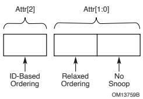

</td>
<td style="background-color:#e8e8e8">


</td>
</tr>
</tbody>
</table>

[⬆️ 返回目录](#-本章目录-table-of-contents)

---

<table>
<thead>
<tr>
<th width="50%">🇬🇧 English</th>
<th width="50%" style="background-color:#e8e8e8">🇨🇳 中文</th>
</tr>
</thead>
<tbody>
<tr>
<td>

§ Table 2-12 defines the states of the Relaxed Ordering and ID-Based Ordering attribute fields. These attributes are discussed in § Section 2.4. Note that Relaxed Ordering and ID-Based Ordering attributes are not adjacent in location (see § Figure 2-5).

</td>
<td style="background-color:#e8e8e8">

§ 表 2-12 定义 Relaxed Ordering 与 ID-Based Ordering 属性字段的状态。这些属性将在 § 2.4 节中讨论。注意：Relaxed Ordering 与 ID-Based Ordering 属性在位置上并不相邻（参见 § 图 2-5）。

</td>
</tr>
</tbody>
</table>

[⬆️ 返回目录](#-本章目录-table-of-contents)

---

**Table 2-12 Ordering Attributes | 表 2-12 排序属性**

| Attribute Bit [2] | Attribute Bit [1] | Ordering Type | Ordering Model |
|---|---|---|---|
| 0 | 0 | Default Ordering | PCI Strongly Ordered Model |
| 0 | 1 | Relaxed Ordering | PCI-X Relaxed Ordering Model |
| 1 | 0 | ID-Based Ordering | Independent ordering based on Requester/Completer ID |
| 1 | 1 | Relaxed Ordering plus ID-Based Ordering | Logical "OR" of Relaxed Ordering and IDO |

[⬆️ 返回目录](#-本章目录-table-of-contents)

---


<div style="overflow-x: auto; max-width: 100%;">
<table>
<thead>
<tr>
<th width="50%">🇬🇧 English</th>
<th width="50%" style="background-color:#e8e8e8">🇨🇳 中文</th>
</tr>
</thead>
<tbody>
<tr>
<td>

Attribute bit [1] is not applicable and must be Clear for Configuration Requests, I/O Requests, Memory Requests that are Message Signaled Interrupts, and Message Requests (except where specifically permitted).

Attribute bit [2], IDO, is Reserved for Configuration Requests and I/O Requests. IDO is not Reserved for all Memory Requests, including Message Signaled Interrupts (MSI/MSI-X). IDO is not Reserved for Message Requests unless specifically prohibited. A Requester is permitted to Set IDO only if the IDO Request Enable bit in the Device Control 2 register is Set.

The value of the IDO bit must not be considered by Receivers when determining if a TLP is a Malformed Packet.

A Completer is permitted to Set IDO only if the IDO Completion Enable bit in the Device Control 2 register is Set. It is not required to copy the value of IDO from the Request into the Completion(s) for that Request. If the Completer has IDO enabled, it is recommended that the Completer set IDO for all Completions, unless there is a specific reason not to (see § Appendix E.).

A Root Complex that supports peer-to-peer forwarding TLPs between Root Ports is not required to preserve the IDO bit from the Ingress to Egress Port.

§ Table 2-13 defines the states of the No Snoop attribute field. Note that the No Snoop attribute does not alter Transaction ordering.

</td>
<td style="background-color:#e8e8e8">

对 Configuration 请求、I/O 请求、作为消息信号中断 (MSI) 的内存请求以及 Message 请求（除明确允许的情况外），属性 bit [1] 不适用且必须清零。

属性 bit [2]（IDO）对 Configuration 请求和 I/O 请求为 Reserved。IDO 对所有内存请求（包括消息信号中断 MSI/MSI-X）不构成 Reserved。除非明确禁止，否则对 Message 请求 IDO 也不构成 Reserved。仅当 Device Control 2 寄存器中的 IDO Request Enable 位置位时，Requester 才允许置位 IDO。

接收方在判断 TLP 是否为畸形包 (Malformed Packet) 时，不得考虑 IDO 位的值。

仅当 Device Control 2 寄存器中的 IDO Completion Enable 位置位时，Completer 才允许置位 IDO。Completer 不必将 Request 中的 IDO 值复制到该 Request 对应的 Completion(s)。若 Completer 已使能 IDO，建议 Completer 为所有 Completion 置位 IDO，除非有特定理由不这样做（参见 § 附录 E）。

支持在 Root Port 之间对等转发 TLP 的根复合体 (RC) 不需要在 Ingress Port 与 Egress Port 之间保留 IDO 位。

§ 表 2-13 定义 No Snoop 属性字段的状态。注意：No Snoop 属性不改变事务排序。

</td>
</tr>
</tbody>
</table>
</div>


[⬆️ 返回目录](#-本章目录-table-of-contents)

---


---

<<<PAGE_BREAK>>> page_194

<a id="sec-2-2-6-4"></a>
## 2.2.6.4 Relaxed Ordering and ID-Based Ordering Attributes | 宽松排序与基于 ID 的排序属性

<table>
<thead>
<tr>
<th width="50%">🇬🇧 English</th>
<th width="50%" style="background-color:#e8e8e8">🇨🇳 中文</th>
</tr>
</thead>
<tbody>
<tr>
<td>

Relaxed Ordering and ID-Based Ordering Attributes

</td>
<td style="background-color:#e8e8e8">

宽松排序与基于 ID 的排序 (IDO) 属性

</td>
</tr>
</tbody>
</table>

[⬆️ 返回目录](#-本章目录-table-of-contents)

---

<a id="sec-2-2-6-5"></a>
## 2.2.6.5 No Snoop Attribute | No Snoop 属性


<div style="overflow-x: auto; max-width: 100%;">
<table>
<thead>
<tr>
<th width="50%">🇬🇧 English</th>
<th width="50%" style="background-color:#e8e8e8">🇨🇳 中文</th>
</tr>
</thead>
<tbody>
<tr>
<td>

This attribute is not applicable and must be Clear for Configuration Requests, I/O Requests, Memory Requests that are Message Signaled Interrupts (MSI/MSI-X), and Message Requests (except where specifically permitted).

The Traffic Class (TC) is a 3-bit field that allows differentiation of transactions into eight traffic classes. Together with the PCI Express Virtual Channel support, the TC mechanism is a fundamental element for enabling differentiated traffic servicing. Every PCI Express Transaction Layer Packet (TLP) uses TC information as an Invariant label that is carried end to end within the PCI Express fabric. As the packet traverses across the fabric, this information is used at every Link and within each Switch element to make decisions with regards to proper servicing of the traffic. A key aspect of servicing is the routing of the packets based on their TC labels through corresponding Virtual Channels. § Section 2.5 covers the details of the VC mechanism.

§ Table 2-14 defines the TC encodings.

</td>
<td style="background-color:#e8e8e8">

此属性不适用，且对于配置请求、I/O 请求、作为消息信号中断 (MSI/MSI-X) 的内存请求，以及消息请求 (除非明确允许)，必须为 0 (Clear)。

流量类 (Traffic Class, TC) 是一个 3 位字段，允许将事务区分成八种流量类。结合 PCI Express 虚通道 (VC) 支持，TC 机制是实现差异化流量服务的核心要素。每个 PCI Express 事务层包 (TLP) 都将 TC 信息作为一个不变量 (Invariant) 标签，端到端地在 PCI Express 互连中承载。当报文穿越互连时，该信息会在每条链路以及每个交换机 (Switch) 内部被使用，以决定如何对流量进行恰当的服务。服务的一个关键方面是：基于报文的 TC 标签，通过相应的虚通道进行路由。VC 机制的详细信息见 § 2.5 节。

TC 编码定义见 § 表 2-14。

</td>
</tr>
</tbody>
</table>
</div>


**Table 2-14 Definition of TC Field Encodings | 表 2-14 TC 字段编码定义**

| TC Field Value (b) | Definition |
|-------------------|------------|
| 000 | TC0: Best Effort service class (General Purpose I/O)<br>(Default TC - must be supported by every PCI Express device) |
| 001 to 111 | TC1 to TC7: Differentiated service classes<br>(Differentiation based on Weighted-Round-Robin (WRR) and/or priority) |

<table>
<thead>
<tr>
<th width="50%">🇬🇧 English</th>
<th width="50%" style="background-color:#e8e8e8">🇨🇳 中文</th>
</tr>
</thead>
<tbody>
<tr>
<td>

It is up to the system software to determine TC labeling and TC/VC mapping in order to provide differentiated services that meet target platform requirements.

The concept of Traffic Class applies only within the PCI Express interconnect fabric. Specific requirements of how PCI Express TC service policies are translated into policies on non-PCI Express interconnects is outside of the scope of this specification.

The general requirements for Memory, I/O, and Configuration Requests are similar in Non-Flit Mode and Flit Mode, however some specific rules differ. Rules that are common between Non-Flit Mode and Flit-Mode follow, with rules that are specific to each in subsequent sub-sections.

The following rule applies to all Memory, I/O, and Configuration Requests. Additional rules specific to each type of Request follow.

</td>
<td style="background-color:#e8e8e8">

由系统软件决定 TC 标签及 TC/VC 映射，以便提供满足目标平台需求的差异化服务。

流量类的概念仅在 PCI Express 互连内部适用。如何将 PCI Express 的 TC 服务策略转换为非 PCI Express 互连上的策略，超出了本规范的范围。

内存、I/O 和配置请求的一般性要求在非 Flit 模式 (Non-Flit Mode) 和 Flit 模式 (Flit Mode) 中相似，但一些具体规则存在差异。非 Flit 模式和 Flit 模式共同的规则如下，针对各模式的特定规则将在后续子节中给出。

以下规则适用于所有内存、I/O 和配置请求。每种请求类型的附加规则将在后面给出。

</td>
</tr>
</tbody>
</table>

---

<<<PAGE_BREAK>>> page_195

<a id="sec-2-2-6-6"></a>
## 2.2.6.6 Transaction Descriptor - Traffic Class Field | 事务描述符 - 流量类字段

<table>
<thead>
<tr>
<th width="50%">🇬🇧 English</th>
<th width="50%" style="background-color:#e8e8e8">🇨🇳 中文</th>
</tr>
</thead>
<tbody>
<tr>
<td>

Transaction Descriptor - Traffic Class Field

</td>
<td style="background-color:#e8e8e8">

事务描述符 - 流量类 (TC) 字段

</td>
</tr>
</tbody>
</table>

[⬆️ 返回目录](#-本章目录-table-of-contents)

---

<a id="sec-2-2-7"></a>
## 2.2.7 Memory, I/O, and Configuration Request Rules | 内存、I/O 和配置请求规则

<table>
<thead>
<tr>
<th width="50%">🇬🇧 English</th>
<th width="50%" style="background-color:#e8e8e8">🇨🇳 中文</th>
</tr>
</thead>
<tbody>
<tr>
<td>

Memory, I/O, and Configuration Request Rules

</td>
<td style="background-color:#e8e8e8">

内存、I/O 和配置请求规则

</td>
</tr>
</tbody>
</table>

[⬆️ 返回目录](#-本章目录-table-of-contents)

---

<a id="sec-2-2-7-1"></a>
## 2.2.7.1 Non-Flit Mode | 非 Flit 模式


<div style="overflow-x: auto; max-width: 100%;">
<table>
<thead>
<tr>
<th width="50%">🇬🇧 English</th>
<th width="50%" style="background-color:#e8e8e8">🇨🇳 中文</th>
</tr>
</thead>
<tbody>
<tr>
<td>

- All Memory, I/O, and Configuration Requests include the following fields in addition to the common header fields:
  - Requester ID[15:0] and Tag[9:0], forming the Transaction ID. In Non-Flit Mode, the Tag field is 10 bits.
  - Last DW BE[3:0] and First DW BE[3:0]. For Memory Read Requests, DMWr Requests, and AtomicOp Requests with the TH bit Set, the byte location for the Last DW BE[3:0] and First DW BE[3:0] fields in the header are repurposed to carry ST[7:0] field.
  - For Memory Read Requests and DMWr Requests with the TH bit Clear, see § Section 2.2.5 for First/Last DW Byte Enable Rules.
  - For AtomicOp Requests and DMWr Requests with TH bit Set, the values for the DW BE fields are implied to be Reserved. For AtomicOp Requests with TH bit Clear, the DW BE fields are Reserved.
- For Memory Requests, the following rules apply:
  - Memory Requests route by address, using either 64-bit or 32-bit Addressing (see § Figure 2-36 and § Figure 2-37).
  - For Memory Read Requests, Length must not exceed the value specified by Max_Read_Request_Size (see § Section 7.5.3.4).
  - For AtomicOp Requests, architected operand sizes and their associated Length field values are specified in § Table 2-15. If a Completer supports AtomicOps, the following rules apply. The Completer must check the Length field value. If the value does not match an architected value, the Completer must handle the TLP as a Malformed TLP. Otherwise, if the value does not match an operand size that the Completer supports, the Completer must handle the TLP as an Unsupported Request (UR). This is a reported error associated with the Receiving Port (see § Section 6.2).

</td>
<td style="background-color:#e8e8e8">

- 除公共包头字段外，所有内存、I/O 和配置请求还包含以下字段：
  - Requester ID[15:0] 和 Tag[9:0]，组成事务 ID (Transaction ID)。在非 Flit 模式中，Tag 字段为 10 位。
  - Last DW BE[3:0] 和 First DW BE[3:0]。对于内存读请求、DMWr 请求以及 TH 位置位的 AtomicOp 请求，包头中 Last DW BE[3:0] 和 First DW BE[3:0] 字段所在的字节位置被改用于承载 ST[7:0] 字段。
  - 对于 TH 位清零的内存读请求和 DMWr 请求，First/Last DW 字节使能规则参见 § 2.2.5 节。
  - 对于 TH 位置位的 AtomicOp 请求和 DMWr 请求，DW BE 字段的值隐含为保留 (Reserved)。对于 TH 位清零的 AtomicOp 请求，DW BE 字段为保留。
- 对于内存请求，适用以下规则：
  - 内存请求按地址路由，使用 64 位或 32 位寻址（见 § 图 2-36 和 § 图 2-37）。
  - 对于内存读请求，Length 不得超过 Max_Read_Request_Size 指定的值（见 § 7.5.3.4 节）。
  - 对于 AtomicOp 请求，规整化的操作数大小及其对应的 Length 字段值见 § 表 2-15。如果完成方 (Completer) 支持 AtomicOp，则适用以下规则：完成方必须检查 Length 字段值。如果该值不匹配任何规整化值，则完成方必须将该 TLP 视为畸形 TLP (Malformed TLP)。否则，如果该值与完成方支持的操作数大小不匹配，则完成方必须将该 TLP 视为不支持请求 (Unsupported Request, UR)。此为与接收端口 (Receiving Port) 相关的上报错误（见 § 6.2 节）。

</td>
</tr>
</tbody>
</table>
</div>


**Table 2-15 Length Field Values for AtomicOp Requests | 表 2-15 AtomicOp 请求的 Length 字段值**

| AtomicOp Request | Length Field Value for Architected Operand Sizes |||  |
|---|---|---|---|---|
|  | **32 Bits** | **64 Bits** | **128 Bits** |  |
| FetchAdd, Swap | 1 DW | 2 DW | N/A |  |
| CAS | 2 DW | 4 DW | 8 DW |  |

<table>
<thead>
<tr>
<th width="50%">🇬🇧 English</th>
<th width="50%" style="background-color:#e8e8e8">🇨🇳 中文</th>
</tr>
</thead>
<tbody>
<tr>
<td>

- A FetchAdd Request contains one operand, the "add" value.
- A Swap Request contains one operand, the "swap" value.
- A CAS Request contains two operands. The first in the data area is the "compare" value, and the second is the "swap" value.
- For AtomicOp Requests, the Address must be naturally aligned with the operand size. The Completer must check for violations of this rule. If a TLP violates this rule, the TLP is a Malformed TLP. This is a reported error associated with the Receiving Port (see § Section 6.2).
- Requests must not specify an Address/Length combination that causes a Memory Space access to cross a 4-KB boundary.
  - Receivers may optionally check for violations of this rule. If a Receiver implementing this check determines that a TLP violates this rule, the TLP is a Malformed TLP.
    - If checked, this is a reported error associated with the Receiving Port (see § Section 6.2).
    - It is recommended that this optional check only occur in Completers and never in intermediate Receivers.

</td>
<td style="background-color:#e8e8e8">

- FetchAdd 请求包含一个操作数，即"add"值。
- Swap 请求包含一个操作数，即"swap"值。
- CAS 请求包含两个操作数。数据区中的第一个是"compare"值，第二个是"swap"值。
- 对于 AtomicOp 请求，地址必须与操作数大小自然对齐。完成方必须检查对此规则的违反。如果 TLP 违反此规则，则该 TLP 为畸形 TLP。此为与接收端口相关的上报错误（见 § 6.2 节）。
- 请求不能指定会导致内存空间访问跨越 4-KB 边界的 Address/Length 组合。
  - 接收方可选择性地检查对此规则的违反。实现该检查的接收方如果判定 TLP 违反此规则，则该 TLP 为畸形 TLP。
    - 如果实施检查，此为与接收端口相关的上报错误（见 § 6.2 节）。
    - 建议此可选检查仅在完成方中执行，永远不在中间接收方中执行。

</td>
</tr>
</tbody>
</table>

---

<<<PAGE_BREAK>>> page_196


<div style="overflow-x: auto; max-width: 100%;">
<table>
<thead>
<tr>
<th width="50%">🇬🇧 English</th>
<th width="50%" style="background-color:#e8e8e8">🇨🇳 中文</th>
</tr>
</thead>
<tbody>
<tr>
<td>

  - Intermediate Receivers are not permitted to implement this check for TLPs with Reserved Type values (see § Table 2-5). The relationship between the TLP Length field and the length of the affected memory range depends on the Request Type (for an example where they are different, see AtomicOp CAS Request).
  - For AtomicOp Requests, the mandatory Completer check for natural alignment of the Address (see above) already guarantees that the access will not cross a 4-KB boundary, so a separate 4-KB boundary check is not necessary.
  - If a 4-KB boundary check is performed for AtomicOp CAS Requests, this check must comprehend that the TLP Length value is based on the size of two operands, whereas the access to Memory Space is based on the size of one operand.

</td>
<td style="background-color:#e8e8e8">

  - 中间接收方不允许对具有保留 Type 值的 TLP 实施此检查（见 § 表 2-5）。TLP Length 字段与所影响内存范围长度之间的关系取决于请求类型（关于两者不同的示例，请参见 AtomicOp CAS 请求）。
  - 对于 AtomicOp 请求，强制性的完成方对地址自然对齐的检查（见上文）已保证访问不会跨越 4-KB 边界，因此不再需要单独的 4-KB 边界检查。
  - 如果对 AtomicOp CAS 请求执行 4-KB 边界检查，该检查必须理解：TLP Length 值基于两个操作数的大小，而对内存空间的访问基于一个操作数的大小。

</td>
</tr>
</tbody>
</table>
</div>


> **Figure 2-36.** Request Header Format for 64-bit Addressing of Memory
> 

<table>
<thead>
<tr>
<th width="50%">🇬🇧 English</th>
<th width="50%" style="background-color:#e8e8e8">🇨🇳 中文</th>
</tr>
</thead>
<tbody>
<tr>
<td>

Figure 2-36: Layout (4 DW header) for 64-bit memory requests. Byte 0 contains Fmt, Type, TC, and other common fields; bytes 4-7 carry the 64-bit Address and Last DW BE; bytes 8-11 carry First DW BE, Tag, Requester ID, Length, AT, Attr, EP, TD; byte 12 contains PH.

</td>
<td style="background-color:#e8e8e8">

图 2-36：64 位内存请求的请求包头格式 (4 DW 包头)。Byte 0 包含 Fmt、Type、TC 等公共字段；Byte 4-7 承载 64 位地址和 Last DW BE；Byte 8-11 承载 First DW BE、Tag、Requester ID、Length、AT、Attr、EP、TD；Byte 12 包含 PH。

</td>
</tr>
</tbody>
</table>

> **Figure 2-37.** Request Header Format for 32-bit Addressing of Memory

<table>
<thead>
<tr>
<th width="50%">🇬🇧 English</th>
<th width="50%" style="background-color:#e8e8e8">🇨🇳 中文</th>
</tr>
</thead>
<tbody>
<tr>
<td>

Figure 2-37: Layout (3 DW header) for 32-bit memory requests. Byte 0 contains Fmt, Type, TC, etc.; bytes 4-7 carry the 32-bit Address and Last DW BE; bytes 8-11 carry First DW BE, Tag, Requester ID, Length, AT, Attr, EP, TD.

</td>
<td style="background-color:#e8e8e8">

图 2-37：32 位内存请求的请求包头格式 (3 DW 包头)。Byte 0 包含 Fmt、Type、TC 等；Byte 4-7 承载 32 位地址和 Last DW BE；Byte 8-11 承载 First DW BE、Tag、Requester ID、Length、AT、Attr、EP、TD。

</td>
</tr>
</tbody>
</table>

<table>
<thead>
<tr>
<th width="50%">🇬🇧 English</th>
<th width="50%" style="background-color:#e8e8e8">🇨🇳 中文</th>
</tr>
</thead>
<tbody>
<tr>
<td>

For I/O Requests, the following rules apply:

</td>
<td style="background-color:#e8e8e8">

对于 I/O 请求，适用以下规则：

</td>
</tr>
</tbody>
</table>

> **IMPLEMENTATION NOTE:** GENERATION OF 64-BIT ADDRESSES
> 
> It is strongly recommended that PCI Express Endpoints be capable of generating the full range of 64-bit addresses. However, if a PCI Express Endpoint supports a smaller address range, and is unable to reach the full address range required by a given platform environment, the corresponding device driver must ensure that all Memory Transaction target buffers fall within the address range supported by the Endpoint. The exact means of ensuring this is platform and operating system specific, and beyond the scope of this specification.

> **实现注记：** 64 位地址的生成
> 
> 强烈建议 PCI Express 端点 (Endpoint) 能够生成完整范围的 64 位地址。但是，如果 PCI Express 端点支持的地址范围较小，无法到达给定平台环境所需的完整地址范围，则相应的设备驱动程序必须确保所有内存事务目标缓冲区都落在该端点所支持的地址范围内。确保此点的具体方法因平台和操作系统而异，超出了本规范的范围。

---

<<<PAGE_BREAK>>> page_197


<div style="overflow-x: auto; max-width: 100%;">
<table>
<thead>
<tr>
<th width="50%">🇬🇧 English</th>
<th width="50%" style="background-color:#e8e8e8">🇨🇳 中文</th>
</tr>
</thead>
<tbody>
<tr>
<td>

- I/O Requests route by address, using 32-bit Addressing (see § Figure 2-38).
- I/O Requests have the following restrictions:
  - TC[2:0] must be 000b
  - TH is not applicable to I/O Request and the bit is Reserved
  - Attr[2] is Reserved
  - Attr[1:0] must be 00b
  - AT[1:0] must be 00b. Receivers are not required or encouraged to check this.
  - Length[9:0] must be 00 0000 0001b
  - Last DW BE[3:0] must be 0000b
- Receivers may optionally check for violations of these rules (but must not check Reserved bits). These checks are independently optional (see § Section 6.2.3.4). If a Receiver implementing these checks determines that a TLP violates these rules, the TLP is a Malformed TLP.
  - If checked, this is a reported error associated with the Receiving Port (see § Section 6.2).

</td>
<td style="background-color:#e8e8e8">

- I/O 请求按地址路由，使用 32 位寻址（见 § 图 2-38）。
- I/O 请求有如下限制：
  - TC[2:0] 必须为 000b
  - TH 不适用于 I/O 请求，该位为保留
  - Attr[2] 为保留
  - Attr[1:0] 必须为 00b
  - AT[1:0] 必须为 00b。接收方无需也不鼓励检查此项。
  - Length[9:0] 必须为 00 0000 0001b
  - Last DW BE[3:0] 必须为 0000b
- 接收方可选择性地检查对这些规则的违反（但不得检查保留位）。这些检查彼此独立可选（见 § 6.2.3.4 节）。实现这些检查的接收方如果判定 TLP 违反这些规则，则该 TLP 为畸形 TLP。
  - 如果实施检查，此为与接收端口相关的上报错误（见 § 6.2 节）。

</td>
</tr>
</tbody>
</table>
</div>


> **Figure 2-38.** Request Header Format for I/O Transactions - Non-Flit Mode
> 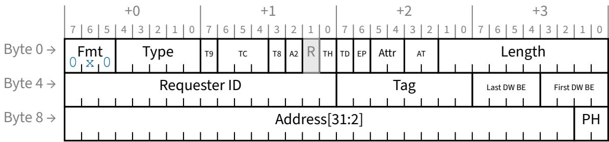

<table>
<thead>
<tr>
<th width="50%">🇬🇧 English</th>
<th width="50%" style="background-color:#e8e8e8">🇨🇳 中文</th>
</tr>
</thead>
<tbody>
<tr>
<td>

Figure 2-38: Non-Flit Mode I/O Request header (3 DW). Byte 0 contains Fmt=0010b (Type=IO), TC=000b, etc.; bytes 4-7 carry the 32-bit Address and Last DW BE=0000b; bytes 8-11 carry First DW BE, Tag, Requester ID, Length=00 0000 0001b, AT=00b, Attr=00b, EP, TD.

</td>
<td style="background-color:#e8e8e8">

图 2-38：非 Flit 模式的 I/O 请求包头 (3 DW)。Byte 0 包含 Fmt=0010b (Type=IO)、TC=000b 等；Byte 4-7 承载 32 位地址和 Last DW BE=0000b；Byte 8-11 承载 First DW BE、Tag、Requester ID、Length=00 0000 0001b、AT=00b、Attr=00b、EP、TD。

</td>
</tr>
</tbody>
</table>


<div style="overflow-x: auto; max-width: 100%;">
<table>
<thead>
<tr>
<th width="50%">🇬🇧 English</th>
<th width="50%" style="background-color:#e8e8e8">🇨🇳 中文</th>
</tr>
</thead>
<tbody>
<tr>
<td>

For Configuration Requests, the following rules apply:

- Configuration Requests route by ID, and use a 3 DW header.
- In addition to the header fields included in all Memory, I/O, and Configuration Requests and the ID routing fields, Configuration Requests contain the following additional fields (see § Figure 2-39):
  - Register Number[5:0]
  - Extended Register Number[3:0]
- Configuration Requests have the following restrictions:
  - TC[2:0] must be 000b
  - TH is not applicable to Configuration Requests and the bit is Reserved
  - Attr[2] is Reserved
  - Attr[1:0] must be 00b
  - AT[1:0] must be 00b. Receivers are not required or encouraged to check this.
  - Length[9:0] must be 00 0000 0001b
  - Last DW BE[3:0] must be 0000b

</td>
<td style="background-color:#e8e8e8">

对于配置请求，适用以下规则：

- 配置请求按 ID 路由，并使用 3 DW 包头。
- 除所有内存、I/O 和配置请求所共有的包头字段以及 ID 路由字段外，配置请求还包含以下附加字段（见 § 图 2-39）：
  - Register Number[5:0]
  - Extended Register Number[3:0]
- 配置请求有如下限制：
  - TC[2:0] 必须为 000b
  - TH 不适用于配置请求，该位为保留
  - Attr[2] 为保留
  - Attr[1:0] 必须为 00b
  - AT[1:0] 必须为 00b。接收方无需也不鼓励检查此项。
  - Length[9:0] 必须为 00 0000 0001b
  - Last DW BE[3:0] 必须为 0000b

</td>
</tr>
</tbody>
</table>
</div>


---

<<<PAGE_BREAK>>> page_198

<table>
<thead>
<tr>
<th width="50%">🇬🇧 English</th>
<th width="50%" style="background-color:#e8e8e8">🇨🇳 中文</th>
</tr>
</thead>
<tbody>
<tr>
<td>

- Receivers may optionally check for violations of these rules (but must not check reserved bits). These checks are independently optional (see § Section 6.2.3.4). If a Receiver implementing these checks determines that a TLP violates these rules, the TLP is a Malformed TLP.
  - If checked, this is a reported error associated with the Receiving Port (see § Section 6.2).

</td>
<td style="background-color:#e8e8e8">

- 接收方可选择性地检查对这些规则的违反（但不得检查保留位）。这些检查彼此独立可选（见 § 6.2.3.4 节）。实现这些检查的接收方如果判定 TLP 违反这些规则，则该 TLP 为畸形 TLP。
  - 如果实施检查，此为与接收端口相关的上报错误（见 § 6.2 节）。

</td>
</tr>
</tbody>
</table>

> **Figure 2-39.** Request Header Format for Configuration Transactions - Non-Flit Mode
> 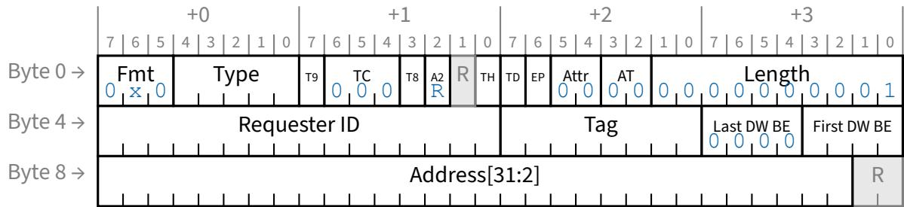

<table>
<thead>
<tr>
<th width="50%">🇬🇧 English</th>
<th width="50%" style="background-color:#e8e8e8">🇨🇳 中文</th>
</tr>
</thead>
<tbody>
<tr>
<td>

Figure 2-39: Non-Flit Mode Configuration Request header (3 DW). Byte 0: Fmt=0000b (Type=Cfg), TC=000b. Bytes 4-7: Register Number, Ext Reg Num, Reserved, Destination ID. Bytes 8-11: First DW BE, Last DW BE=0000b, Tag, Requester ID, Length=00 0000 0001b, AT=00b, Attr=00b, EP, TD.

</td>
<td style="background-color:#e8e8e8">

图 2-39：非 Flit 模式的配置请求包头 (3 DW)。Byte 0：Fmt=0000b (Type=Cfg)，TC=000b。Byte 4-7：Register Number、Ext Reg Num、保留、Destination ID。Byte 8-11：First DW BE、Last DW BE=0000b、Tag、Requester ID、Length=00 0000 0001b、AT=00b、Attr=00b、EP、TD。

</td>
</tr>
</tbody>
</table>


<div style="overflow-x: auto; max-width: 100%;">
<table>
<thead>
<tr>
<th width="50%">🇬🇧 English</th>
<th width="50%" style="background-color:#e8e8e8">🇨🇳 中文</th>
</tr>
</thead>
<tbody>
<tr>
<td>

MSI/MSI-X mechanisms use Memory Write Requests to represent interrupt Messages (see § Section 6.1.4). The Request format used for MSI/MSI-X transactions is identical to the Memory Write Request format defined above, and MSI/MSI-X Requests are indistinguishable from memory writes with regard to ordering, Flow Control, and data integrity.

- Two formats are specified for TPH. The Baseline TPH format (see § Figure 2-41 and § Figure 2-42) must be used for all Requests that provide TPH. The format with the optional TPH TLP Prefix extends the TPH fields (see § Figure 2-40) to provide additional bits for the Steering Tag (ST) field.

</td>
<td style="background-color:#e8e8e8">

MSI/MSI-X 机制使用内存写请求来表示中断消息（见 § 6.1.4 节）。MSI/MSI-X 事务所使用的请求格式与上文定义的内存写请求格式相同，并且 MSI/MSI-X 请求在排序、流控 (Flow Control) 和数据完整性方面与内存写请求不可区分。

- TPH 指定了两种格式。所有提供 TPH 的请求必须使用基线 TPH 格式（见 § 图 2-41 和 § 图 2-42）。带有可选 TPH TLP 前缀的格式扩展了 TPH 字段（见 § 图 2-40），为 Steering Tag (ST) 字段提供额外的比特位。

</td>
</tr>
</tbody>
</table>
</div>


> **Figure 2-40.** TPH TLP Prefix
> 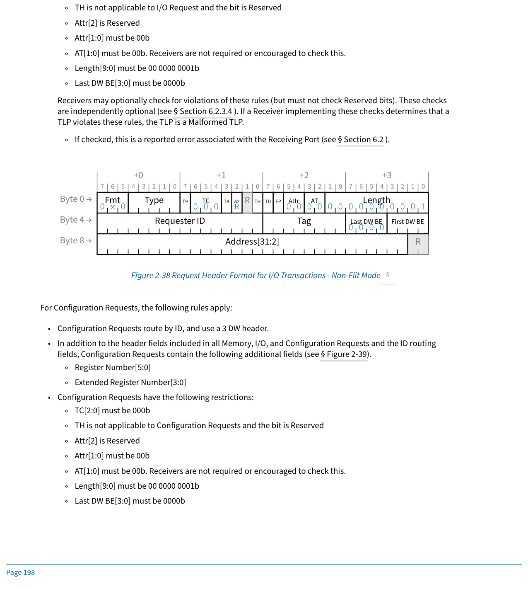

<table>
<thead>
<tr>
<th width="50%">🇬🇧 English</th>
<th width="50%" style="background-color:#e8e8e8">🇨🇳 中文</th>
</tr>
</thead>
<tbody>
<tr>
<td>

Figure 2-40: TPH TLP Prefix (4 bytes). Byte 0 (after the header) is decoded to detect the presence of a TPH TLP Prefix. Bytes 1-3 contain: ST[15:8] (byte 1, bits 7:0), AMA[2:0] (byte 2, bits 7:5), AV (byte 2, bit 4), Reserved (byte 2, bits 3:0; byte 3, bits 7:0).

</td>
<td style="background-color:#e8e8e8">

图 2-40：TPH TLP 前缀 (4 字节)。包头之后的 Byte 0 用于解码以检测 TPH TLP 前缀是否存在。Byte 1-3 包含：ST[15:8]（Byte 1，位 7:0）、AMA[2:0]（Byte 2，位 7:5）、AV（Byte 2，位 4）、保留（Byte 2 位 3:0；Byte 3 位 7:0）。

</td>
</tr>
</tbody>
</table>

<table>
<thead>
<tr>
<th width="50%">🇬🇧 English</th>
<th width="50%" style="background-color:#e8e8e8">🇨🇳 中文</th>
</tr>
</thead>
<tbody>
<tr>
<td>

- The optional TPH TLP Prefix is used to provide additional TPH information.
  - The presence of a TPH TLP Prefix is determined by decoding byte 0.

</td>
<td style="background-color:#e8e8e8">

- 可选的 TPH TLP 前缀用于提供附加的 TPH 信息。
  - TPH TLP 前缀的存在通过解码 Byte 0 来确定。

</td>
</tr>
</tbody>
</table>

**Table 2-16 TPH TLP Prefix | 表 2-16 TPH TLP 前缀**

| Bit Mapping | Fields | TPH TLP Prefix |
|---|---|---|
| Bits 7:0 of byte 1 | ST[15:8] |  |
| Bits 7:5 of byte 2 | AMA[2:0] |  |
| Bit 4 of byte 2 | AV |  |
| Bits 3:0 of byte 2 | Reserved |  |
| Bits 7:0 of byte 3 | Reserved |  |

---

<<<PAGE_BREAK>>> page_199

<a id="sec-2-2-7-1-1"></a>
## 2.2.7.1.1 TPH Rules | TPH 规则

<table>
<thead>
<tr>
<th width="50%">🇬🇧 English</th>
<th width="50%" style="background-color:#e8e8e8">🇨🇳 中文</th>
</tr>
</thead>
<tbody>
<tr>
<td>

TPH Rules

</td>
<td style="background-color:#e8e8e8">

TPH 规则

</td>
</tr>
</tbody>
</table>

[⬆️ 返回目录](#-本章目录-table-of-contents)

---


<div style="overflow-x: auto; max-width: 100%;">
<table>
<thead>
<tr>
<th width="50%">🇬🇧 English</th>
<th width="50%" style="background-color:#e8e8e8">🇨🇳 中文</th>
</tr>
</thead>
<tbody>
<tr>
<td>

- The TPH TLP Prefix is used to send a non-Zero value for any of:
  - AMA
  - ST[15:8]
- For Requests that target Memory Space, a value of 1b in the TH bit indicates the presence of TPH in the TLP header and optional TPH TLP Prefix (if present).
  - The TH bit must be Set for Requests that provide TPH.
  - The TH bit is permitted to be Set for Requests with a TPH TLP Prefix. When the TH bit is 1b, then ST[15:8] is present and meaningful in the TPH TLP Prefix.
  - When the TH bit is Clear, the PH field is Reserved.
  - The TH bit and the PH field are not applicable and are Reserved for all other Requests.
- For Requests that target Memory Space, the TPH TLP Prefix may be present if the value of the TH bit is 0b. When the AMA Valid (AV) bit is 1b and the TPH TLP Prefix is present, AMA is present and meaningful in the TPH TLP Prefix.
- For Requests that target Memory Space with the AT field not set to 10b, the AMA field in the TPH TLP Prefix is Reserved.
- The Processing Hints (PH) fields mapping is shown in § Figure 2-41, § Figure 2-42 and § Table 2-17.

</td>
<td style="background-color:#e8e8e8">

- TPH TLP 前缀用于发送以下任一字段的非零值：
  - AMA
  - ST[15:8]
- 对于目标为内存空间的请求，TH 位为 1b 表示 TLP 包头中存在 TPH，以及（若存在）可选的 TPH TLP 前缀。
  - 提供 TPH 的请求必须将 TH 位置 1 (Set)。
  - 对于带有 TPH TLP 前缀的请求，允许将 TH 位置 1。当 TH 位为 1b 时，ST[15:8] 在 TPH TLP 前缀中存在且有效。
  - 当 TH 位清零 (Clear) 时，PH 字段为保留。
  - TH 位和 PH 字段对所有其他请求不适用，且为保留。
- 对于目标为内存空间的请求，当 TH 位为 0b 时，TPH TLP 前缀可以存在。当 AMA Valid (AV) 位为 1b 且 TPH TLP 前缀存在时，AMA 在 TPH TLP 前缀中存在且有效。
- 对于目标为内存空间且 AT 字段未设置为 10b 的请求，TPH TLP 前缀中的 AMA 字段为保留。
- 处理提示 (Processing Hints, PH) 字段映射见 § 图 2-41、§ 图 2-42 和 § 表 2-17。

</td>
</tr>
</tbody>
</table>
</div>


> **Figure 2-41.** Location of PH[1:0] in a 4 DW Request Header - Non-Flit Mode
> 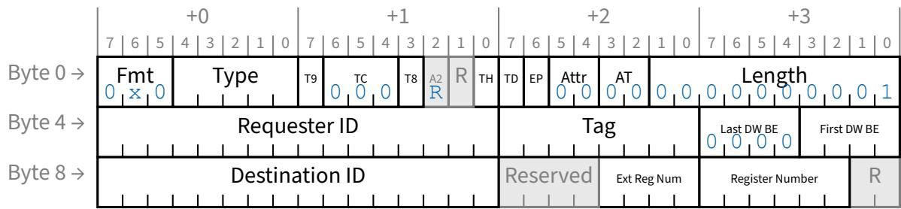

<table>
<thead>
<tr>
<th width="50%">🇬🇧 English</th>
<th width="50%" style="background-color:#e8e8e8">🇨🇳 中文</th>
</tr>
</thead>
<tbody>
<tr>
<td>

Figure 2-41: 4 DW Request Header layout in Non-Flit Mode, showing the location of the PH[1:0] field (in byte 11, bits 1:0 for 32-bit addressing; in byte 15, bits 1:0 for 64-bit addressing).

</td>
<td style="background-color:#e8e8e8">

图 2-41：非 Flit 模式下 4 DW 请求包头格式，展示了 PH[1:0] 字段的位置（32 位寻址时位于 Byte 11 的位 1:0；64 位寻址时位于 Byte 15 的位 1:0）。

</td>
</tr>
</tbody>
</table>

---

<<<PAGE_BREAK>>> page_200

> **Figure 2-42.** Location of PH[1:0] in a 3 DW Request Header - Non-Flit Mode
> 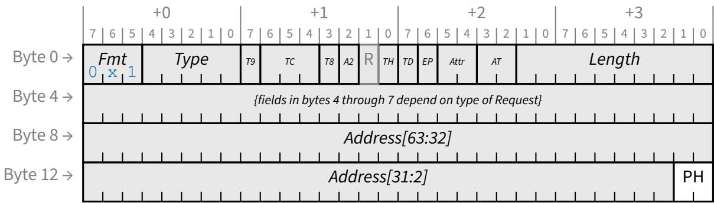

<table>
<thead>
<tr>
<th width="50%">🇬🇧 English</th>
<th width="50%" style="background-color:#e8e8e8">🇨🇳 中文</th>
</tr>
</thead>
<tbody>
<tr>
<td>

Figure 2-42: 3 DW Request Header layout in Non-Flit Mode, showing the location of the PH[1:0] field.

</td>
<td style="background-color:#e8e8e8">

图 2-42：非 Flit 模式下 3 DW 请求包头格式，展示了 PH[1:0] 字段的位置。

</td>
</tr>
</tbody>
</table>

**Table 2-17 Location of PH[1:0] in TLP Header | 表 2-17 PH[1:0] 在 TLP 包头中的位置**

| PH[1:0] | 32-bit Addressing | 64-bit Addressing |
|---|---|---|
| 1:0 | Bits 1:0 of Byte 11 | Bits 1:0 of Byte 15 |

<table>
<thead>
<tr>
<th width="50%">🇬🇧 English</th>
<th width="50%" style="background-color:#e8e8e8">🇨🇳 中文</th>
</tr>
</thead>
<tbody>
<tr>
<td>

- The PH[1:0] field provides information about the data access patterns and is defined as described in § Table 2-18.

</td>
<td style="background-color:#e8e8e8">

- PH[1:0] 字段提供有关数据访问模式的信息，定义见 § 表 2-18。

</td>
</tr>
</tbody>
</table>

**Table 2-18 Processing Hint Encoding | 表 2-18 处理提示编码**

| PH[1:0] (b) | Processing Hint | Description |
|---|---|---|
| 00 | Bi-directional data structure | Indicates frequent read and/or write access to data by Host and device |
| 01 | Requester | Indicates frequent read and/or write access to data by device |
| 10 | Target | Indicates frequent read and/or write access to data by Host |
| 11 | Target with Priority | Indicates frequent read and/or write access by Host and indicates high temporal locality for accessed data |

<table>
<thead>
<tr>
<th width="50%">🇬🇧 English</th>
<th width="50%" style="background-color:#e8e8e8">🇨🇳 中文</th>
</tr>
</thead>
<tbody>
<tr>
<td>

The Steering Tag (ST) fields are mapped to the TLP header as shown in § Figure 2-43, § Figure 2-44 and § Table 2-19.

</td>
<td style="background-color:#e8e8e8">

Steering Tag (ST) 字段在 TLP 包头中的映射见 § 图 2-43、§ 图 2-44 和 § 表 2-19。

</td>
</tr>
</tbody>
</table>

> **Figure 2-43.** Location of ST[7:0] in the Memory Write Request Header - Non-Flit Mode
> 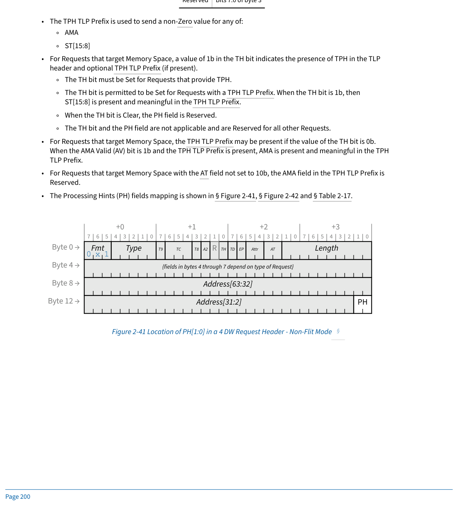

<table>
<thead>
<tr>
<th width="50%">🇬🇧 English</th>
<th width="50%" style="background-color:#e8e8e8">🇨🇳 中文</th>
</tr>
</thead>
<tbody>
<tr>
<td>

Figure 2-43: Non-Flit Mode Memory Write Request header (3 DW) showing the location of the ST[7:0] field (in byte 6, bits 7:0, replacing Last DW BE).

</td>
<td style="background-color:#e8e8e8">

图 2-43：非 Flit 模式的内存写请求包头 (3 DW)，展示了 ST[7:0] 字段的位置（位于 Byte 6 的位 7:0，替代 Last DW BE）。

</td>
</tr>
</tbody>
</table>

---

<<<PAGE_BREAK>>> page_201

> **Figure 2-44.** Location of ST[7:0] in Memory Read, DMWr, and AtomicOp Request Headers - Non-Flit Mode
> 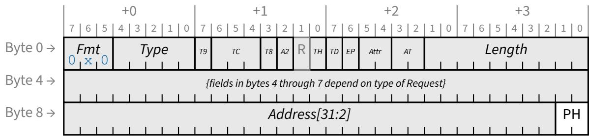

<table>
<thead>
<tr>
<th width="50%">🇬🇧 English</th>
<th width="50%" style="background-color:#e8e8e8">🇨🇳 中文</th>
</tr>
</thead>
<tbody>
<tr>
<td>

Figure 2-44: Non-Flit Mode Memory Read / DMWr / AtomicOp Request header (3 DW) showing the location of the ST[7:0] field (in byte 7, bits 7:0).

</td>
<td style="background-color:#e8e8e8">

图 2-44：非 Flit 模式的内存读 / DMWr / AtomicOp 请求包头 (3 DW)，展示了 ST[7:0] 字段的位置（位于 Byte 7 的位 7:0）。

</td>
</tr>
</tbody>
</table>

**Table 2-19 Location of ST[7:0] in TLP Headers | 表 2-19 ST[7:0] 在 TLP 包头中的位置**

| ST Bits | Memory Write Request | Memory Read Request or AtomicOp Request |
|---|---|---|
| 7:0 | Bits 7:0 of Byte 6 | Bits 7:0 of Byte 7 |


<div style="overflow-x: auto; max-width: 100%;">
<table>
<thead>
<tr>
<th width="50%">🇬🇧 English</th>
<th width="50%" style="background-color:#e8e8e8">🇨🇳 中文</th>
</tr>
</thead>
<tbody>
<tr>
<td>

- ST[7:0] field carries the Steering Tag value
  - A value of Zero indicates no Steering Tag preference
  - A total of 255 unique Steering Tag values are provided
- A Function that does not support the TPH Completer or Routing capability and receives a transaction with the TH bit Set is required to ignore the TH bit and handle the Request in the same way as Requests of the same transaction type without the TH bit Set.

Except as stated, rules that apply in Non-Flit Mode also apply in Flit Mode.

- All Memory, I/O, and Configuration Requests include the following fields in addition to the common header fields:
  - A Transaction ID, consisting of Requester ID[15:0] and Tag[13:0], and, for Memory Requests, sometimes also including the Requester Segment[7:0]
- Byte Enable rules are in § Section 2.2.5.2.
- For non-UIO Memory Requests, including AtomicOp and DMWr, the rules for the formation and processing of Header Fields are the same as in Non-Flit Mode.
- For UIO Requests, the rules for the formation and processing of Header Fields are the same as in Non-Flit Mode with the following exception:
  - Attr[2:1], corresponding to IDO and RO in non-UIO Memory Requests, are Reserved
  - AT[1:0] value of 01b is Reserved (See § Section 10.2.2)
  - When multiple outstanding Group II UIO Requests are issued using the same Transaction ID (see § Section 2.2.6.2), all outstanding Requests using a given Transaction ID must have the same value for Attr[0] (i.e., No Snoop).
- For IO Requests, the rules for the formation and processing of Header Fields are the same as in Non-Flit Mode.
- Configuration Requests must include OHC-A3.
- Configuration Requests must only include OHC-C when they are associated with an IDE stream.
- UIO Requests are only defined for Flit Mode.

</td>
<td style="background-color:#e8e8e8">

- ST[7:0] 字段承载 Steering Tag 值
  - 零值表示无 Steering Tag 偏好
  - 共提供 255 个唯一的 Steering Tag 值
- 不支持 TPH 完成方 (Completer) 或路由 (Routing) 能力的 Function，在收到 TH 位置位的请求时，必须忽略 TH 位，并以与同类型未置位 TH 的请求相同的方式处理该请求。

除非另有说明，适用于非 Flit 模式的规则同样适用于 Flit 模式。

- 除公共包头字段外，所有内存、I/O 和配置请求还包含以下字段：
  - 一个事务 ID (Transaction ID)，由 Requester ID[15:0] 和 Tag[13:0] 组成，对于内存请求，有时还包括 Requester Segment[7:0]
- 字节使能 (Byte Enable) 规则见 § 2.2.5.2 节。
- 对于非 UIO 内存请求（包括 AtomicOp 和 DMWr），包头字段的构成和处理规则与非 Flit 模式相同。
- 对于 UIO 请求，包头字段的构成和处理规则与非 Flit 模式相同，但有以下例外：
  - Attr[2:1]（在非 UIO 内存请求中对应 IDO 和 RO）为保留
  - AT[1:0] 值 01b 为保留（见 § 10.2.2 节）
  - 当使用同一事务 ID 发出多个未完成的 Group II UIO 请求时（见 § 2.2.6.2 节），使用给定事务 ID 的所有未完成请求的 Attr[0]（即 No Snoop）必须具有相同的值。
- 对于 I/O 请求，包头字段的构成和处理规则与非 Flit 模式相同。
- 配置请求必须包含 OHC-A3。
- 配置请求仅在与 IDE 流关联时，才必须包含 OHC-C。
- UIO 请求仅在 Flit 模式中定义。

</td>
</tr>
</tbody>
</table>
</div>


---

<<<PAGE_BREAK>>> page_202

<a id="sec-2-2-7-2"></a>
## 2.2.7.2 Flit Mode | Flit 模式

<table>
<thead>
<tr>
<th width="50%">🇬🇧 English</th>
<th width="50%" style="background-color:#e8e8e8">🇨🇳 中文</th>
</tr>
</thead>
<tbody>
<tr>
<td>

Flit Mode

</td>
<td style="background-color:#e8e8e8">

Flit 模式

</td>
</tr>
</tbody>
</table>

[⬆️ 返回目录](#-本章目录-table-of-contents)

---

<table>
<thead>
<tr>
<th width="50%">🇬🇧 English</th>
<th width="50%" style="background-color:#e8e8e8">🇨🇳 中文</th>
</tr>
</thead>
<tbody>
<tr>
<td>

- The following figures illustrate currently defined Flit Mode Request Headers:
  - Reserved Requests (as indicated in § Table 2-5), are defined in § Section 2.2.4.1 and § Section 2.2.4.2.

</td>
<td style="background-color:#e8e8e8">

- 以下图示展示了当前已定义的 Flit 模式请求包头：
  - 保留请求（如 § 表 2-5 所示）定义于 § 2.2.4.1 节和 § 2.2.4.2 节。

</td>
</tr>
</tbody>
</table>

> **Figure 2-45.** Flit Mode Mem64 Request
> 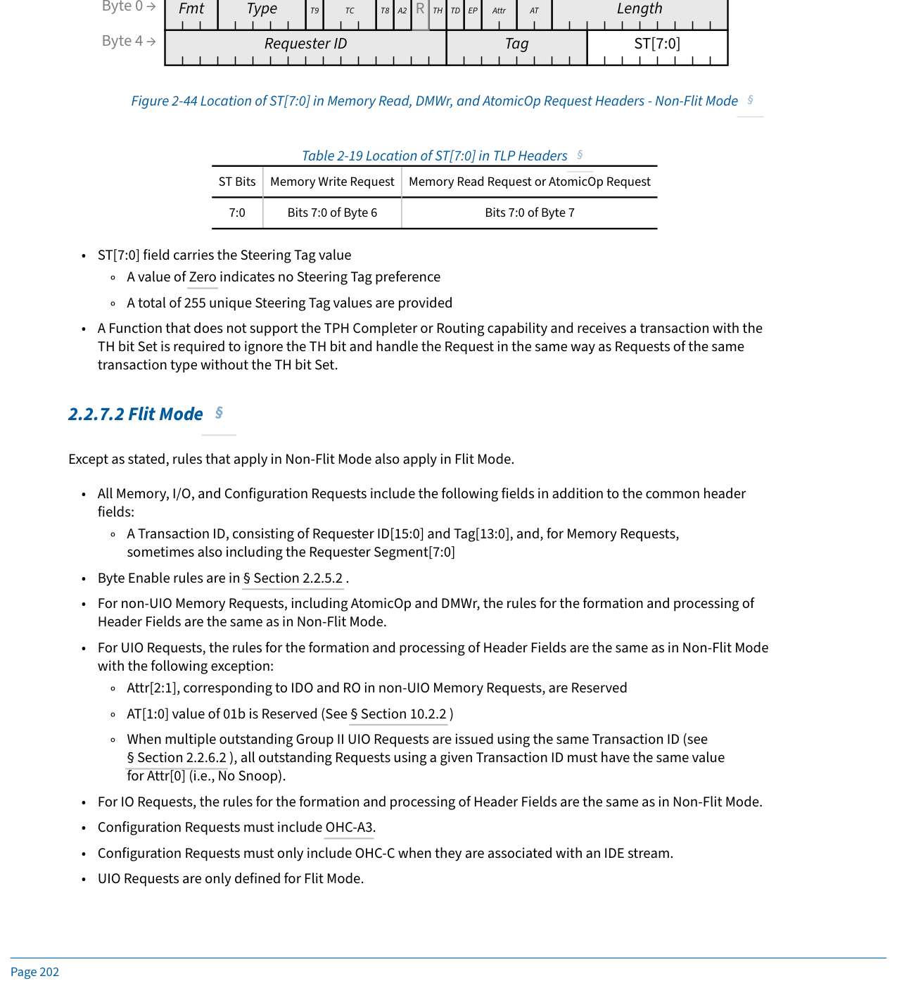

<table>
<thead>
<tr>
<th width="50%">🇬🇧 English</th>
<th width="50%" style="background-color:#e8e8e8">🇨🇳 中文</th>
</tr>
</thead>
<tbody>
<tr>
<td>

Figure 2-45: Flit Mode 64-bit Memory Request (4 DW). Byte 0: Type. Bytes 4-7: AT, Address[31:2], Address[63:32]. Bytes 8-11: Tag, R, EP, Requester ID, Length, Attr, TS, OHC, TC. Bytes 12-15: per request type.

</td>
<td style="background-color:#e8e8e8">

图 2-45：Flit 模式 64 位内存请求 (4 DW)。Byte 0：Type。Byte 4-7：AT、Address[31:2]、Address[63:32]。Byte 8-11：Tag、保留、EP、Requester ID、Length、Attr、TS、OHC、TC。Byte 12-15：依请求类型而定。

</td>
</tr>
</tbody>
</table>

> **Figure 2-46.** Flit Mode Mem32 Request

<table>
<thead>
<tr>
<th width="50%">🇬🇧 English</th>
<th width="50%" style="background-color:#e8e8e8">🇨🇳 中文</th>
</tr>
</thead>
<tbody>
<tr>
<td>

Figure 2-46: Flit Mode 32-bit Memory Request (3 DW). Byte 0: Type. Bytes 4-7: AT, Address[31:2]. Bytes 8-11: Tag, R, EP, Requester ID, Length, Attr, TS, OHC, TC.

</td>
<td style="background-color:#e8e8e8">

图 2-46：Flit 模式 32 位内存请求 (3 DW)。Byte 0：Type。Byte 4-7：AT、Address[31:2]。Byte 8-11：Tag、保留、EP、Requester ID、Length、Attr、TS、OHC、TC。

</td>
</tr>
</tbody>
</table>

> **Figure 2-47.** Flit Mode IO Request

<table>
<thead>
<tr>
<th width="50%">🇬🇧 English</th>
<th width="50%" style="background-color:#e8e8e8">🇨🇳 中文</th>
</tr>
</thead>
<tbody>
<tr>
<td>

Figure 2-47: Flit Mode I/O Request (3 DW). Byte 0: Type=IO. Bytes 4-7: R, Address[31:2]. Bytes 8-11: Tag, R, EP, Requester ID, Length=00 0000 0001b, Attr, TS, OHC, TC=000b.

</td>
<td style="background-color:#e8e8e8">

图 2-47：Flit 模式 I/O 请求 (3 DW)。Byte 0：Type=IO。Byte 4-7：保留、Address[31:2]。Byte 8-11：Tag、保留、EP、Requester ID、Length=00 0000 0001b、Attr、TS、OHC、TC=000b。

</td>
</tr>
</tbody>
</table>

---

<<<PAGE_BREAK>>> page_203

> **Figure 2-48.** Flit Mode Configuration Request
> 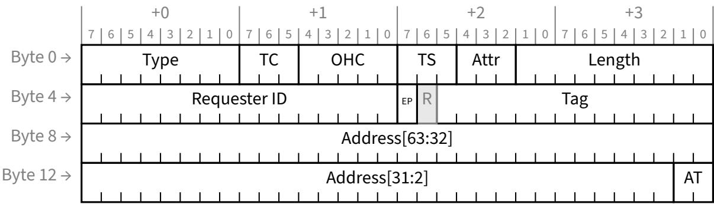

<table>
<thead>
<tr>
<th width="50%">🇬🇧 English</th>
<th width="50%" style="background-color:#e8e8e8">🇨🇳 中文</th>
</tr>
</thead>
<tbody>
<tr>
<td>

Figure 2-48: Flit Mode Configuration Request (3 DW). Byte 0: Type=Cfg. Bytes 4-7: R, Register Number, R, Destination BDF/BF (ARI). Bytes 8-11: Tag, R, EP, Requester ID, Length=00 0000 0001b, Attr, TS, OHC, TC=000b.

</td>
<td style="background-color:#e8e8e8">

图 2-48：Flit 模式配置请求 (3 DW)。Byte 0：Type=Cfg。Byte 4-7：保留、Register Number、保留、Destination BDF/BF (ARI)。Byte 8-11：Tag、保留、EP、Requester ID、Length=00 0000 0001b、Attr、TS、OHC、TC=000b。

</td>
</tr>
</tbody>
</table>

<a id="sec-2-2-8"></a>
## 2.2.8 Message Request Rules | 消息请求规则


<div style="overflow-x: auto; max-width: 100%;">
<table>
<thead>
<tr>
<th width="50%">🇬🇧 English</th>
<th width="50%" style="background-color:#e8e8e8">🇨🇳 中文</th>
</tr>
</thead>
<tbody>
<tr>
<td>

Message Request Rules

This document defines the following groups of Messages:

- INTx Interrupt Signaling
- Power Management
- Error Signaling
- Locked Transaction Support
- Slot Power Limit Support
- Vendor-Defined Messages
- Latency Tolerance Reporting (LTR) Messages
- Optimized Buffer Flush/Fill (OBFF) Messages
- Device Readiness Status (DRS) Messages
- Function Readiness Status (FRS) Messages
- Hierarchy ID Messages
- Precision Time Measurement (PTM) Messages
- Integrity and Data Encryption (IDE) Messages

The following rules apply to all Message Requests. Additional rules specific to each type of Message follow.

- All Message Requests include the following fields in addition to the common header fields (see § Figure 2-49 and § Figure 2-50):
  - Requester ID[15:0]
  - Message Code[7:0] - Indicates the particular Message embodied in the Request.
  - EP - For Messages with data only, indicates data payload is poisoned (see § Section 2.7); Reserved for Messages without data.
- All Message Requests use the Msg or MsgD TLP Type.
- The Message Code field must be fully decoded (Message aliasing is not permitted).
- The Attr[2] field is not Reserved unless specifically indicated as Reserved.
- Except as noted, the Attr[1:0] field is Reserved.
- Except as noted, TH is not applicable to Message Requests and the bit is Reserved.

</td>
<td style="background-color:#e8e8e8">

消息请求规则

本规范定义了以下几组消息：

- INTx 中断信令
- 电源管理
- 错误信令
- 锁定事务支持
- 插槽功率限制支持
- 厂商自定义消息
- 延迟容忍上报 (LTR) 消息
- 优化缓冲区刷新/填充 (OBFF) 消息
- 设备就绪状态 (DRS) 消息
- 功能就绪状态 (FRS) 消息
- 层级 ID 消息
- 精确时间测量 (PTM) 消息
- 完整性与数据加密 (IDE) 消息

以下规则适用于所有消息请求。每种消息类型的附加规则将在后面给出。

- 除公共包头字段外，所有消息请求还包含以下字段（见 § 图 2-49 和 § 图 2-50）：
  - Requester ID[15:0]
  - Message Code[7:0] - 指示该请求中所包含的具体消息。
  - EP - 仅对带数据的消息有效，指示数据有效负载被中毒 (poisoned)（见 § 2.7 节）；对不带数据的消息为保留。
- 所有消息请求均使用 Msg 或 MsgD TLP 类型。
- Message Code 字段必须被完全解码（不允许消息别名）。
- Attr[2] 字段不被保留，除非明确标注为保留。
- 除特别说明外，Attr[1:0] 字段为保留。
- 除特别说明外，TH 不适用于消息请求，该位为保留。

</td>
</tr>
</tbody>
</table>
</div>


---

<<<PAGE_BREAK>>> page_204

<table>
<thead>
<tr>
<th width="50%">🇬🇧 English</th>
<th width="50%" style="background-color:#e8e8e8">🇨🇳 中文</th>
</tr>
</thead>
<tbody>
<tr>
<td>

- AT[1:0] must be 00b except for Routed by Address Messages in Flit Mode (see § Table 2-20). Receivers are not required or encouraged to check this.
- Bytes 8 through 15 are Reserved unless specifically defined.
- Bytes 8 through 15 must be copied intact during Translation between Flit Mode and Non-Flit Mode, regardless of Message Code.
- Byte 6, bits 6:0 must be copied intact during Translation between Flit Mode and Non-Flit Mode, regardless of Message Code.
- Message Requests are posted and do not require Completion.
- Message Requests follow the same ordering rules as Memory Write Requests.

Many types of Messages, including Vendor-Defined Messages, are potentially usable in non-D0 states, and it is strongly recommended that the handling of Messages by Ports be the same when the Port's Bridge Function is in D1, D2, and D3Hot as it is in D0. It is strongly recommended that Type 0 Functions support the generation and reception of Messages in non-D0 states.

</td>
<td style="background-color:#e8e8e8">

- AT[1:0] 必须为 00b，Flit 模式中按地址路由的消息除外（见 § 表 2-20）。接收方无需也不鼓励检查此项。
- Byte 8 至 Byte 15 为保留，除非另行明确定义。
- 在 Flit 模式与非 Flit 模式之间进行转换 (Translation) 时，Byte 8 至 Byte 15 必须原样复制，无论 Message Code 为何。
- 在 Flit 模式与非 Flit 模式之间进行转换时，Byte 6 的位 6:0 必须原样复制，无论 Message Code 为何。
- 消息请求是 Posted (有数据,无完成) 的，不需要完成报文 (Completion)。
- 消息请求遵循与内存写请求相同的排序规则。

包括厂商自定义消息在内的多种消息在非 D0 状态下也可能被使用。强烈建议端口 (Port) 在其桥 Function 处于 D1、D2 和 D3Hot 状态时，对消息的处理与处于 D0 状态时保持一致。强烈建议 Type 0 Function 支持在非 D0 状态下生成和接收消息。

</td>
</tr>
</tbody>
</table>

> **Figure 2-49.** Message Request Header - Non-Flit Mode
> 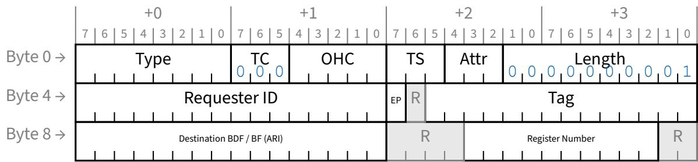

<table>
<thead>
<tr>
<th width="50%">🇬🇧 English</th>
<th width="50%" style="background-color:#e8e8e8">🇨🇳 中文</th>
</tr>
</thead>
<tbody>
<tr>
<td>

Figure 2-49: Non-Flit Mode Message Request Header (4 DW). Byte 0: Fmt=10r2r1r0b, Type. Byte 4-7: Requester ID, Message Code, Reserved (except as noted). Byte 8-15: Reserved (except as noted), Length, AT=00b, Attr, EP, TD, TH, R, A2, T8, TC, T9.

</td>
<td style="background-color:#e8e8e8">

图 2-49：非 Flit 模式消息请求包头 (4 DW)。Byte 0：Fmt=10r2r1r0b，Type。Byte 4-7：Requester ID、Message Code、保留（除特别说明外）。Byte 8-15：保留（除特别说明外）、Length、AT=00b、Attr、EP、TD、TH、保留、A2、T8、TC、T9。

</td>
</tr>
</tbody>
</table>

> **Figure 2-50.** Message Request Header - Flit Mode

<table>
<thead>
<tr>
<th width="50%">🇬🇧 English</th>
<th width="50%" style="background-color:#e8e8e8">🇨🇳 中文</th>
</tr>
</thead>
<tbody>
<tr>
<td>

Figure 2-50: Flit Mode Message Request Header. Byte 0: Type=0110r2r1r0b. Bytes 4-7: EP, Requester ID, Length, Attr, TS, OHC, TC. Bytes 8-11: Message Code, Reserved (except as noted). Bytes 12-15: Reserved (except as noted).

</td>
<td style="background-color:#e8e8e8">

图 2-50：Flit 模式消息请求包头。Byte 0：Type=0110r2r1r0b。Byte 4-7：EP、Requester ID、Length、Attr、TS、OHC、TC。Byte 8-11：Message Code、保留（除特别说明外）。Byte 12-15：保留（除特别说明外）。

</td>
</tr>
</tbody>
</table>

<table>
<thead>
<tr>
<th width="50%">🇬🇧 English</th>
<th width="50%" style="background-color:#e8e8e8">🇨🇳 中文</th>
</tr>
</thead>
<tbody>
<tr>
<td>

In addition to address and ID routing, Messages support several other routing mechanisms. These mechanisms are referred to as "implicit" because no address or ID specifies the destination, but rather the destination is implied by the routing type. The following rules cover Message routing mechanisms:

- Message routing is determined using the r[2:0] sub-field of the Type field

</td>
<td style="background-color:#e8e8e8">

除地址和 ID 路由外，消息还支持其他几种路由机制。这些机制被称为"隐式"路由，因为没有地址或 ID 明确指定目的地，而是由路由类型隐含决定。下列规则涵盖消息路由机制：

- 消息路由通过 Type 字段的 r[2:0] 子字段决定

</td>
</tr>
</tbody>
</table>

---

<<<PAGE_BREAK>>> page_205


<div style="overflow-x: auto; max-width: 100%;">
<table>
<thead>
<tr>
<th width="50%">🇬🇧 English</th>
<th width="50%" style="background-color:#e8e8e8">🇨🇳 中文</th>
</tr>
</thead>
<tbody>
<tr>
<td>

  - Message Routing r[2:0] values are defined in § Table 2-20
  - Permitted values are defined in the following sections for each Message

In Flit Mode, when Route by ID is used and the Destination Segment is different from the Requester Segment, OHC-A4 must be present and include the Destination Segment in byte 0 and DSV must be Set. DSV is permitted to be Set when the Destination Segment is the same as the Requester Segment. DSV must be Clear when Route by ID is not used. When DSV is clear, the Destination Segment field must be set to 00h. OHC-A4 must be present for Route by ID Messages that require PASID. OHC-A1 must be present for Routed to Root Complex Messages that require PASID, ER or PMR.

A Message Signaled Interrupt (MSI or MSI-X) is the preferred interrupt signaling mechanism in PCI Express (see § Section 6.1). However, in some systems, there may be Functions that cannot support the MSI or MSI-X mechanisms. The INTx virtual wire interrupt signaling mechanism is used to support Legacy Endpoints and PCI Express/PCI(-X) Bridges in cases where the MSI or MSI-X mechanisms cannot be used. Switches must support this mechanism. The following rules apply to the INTx Interrupt Signaling mechanism:

- The INTx mechanism uses eight distinct Messages (see § Table 2-21).
- Assert_INTx/Deassert_INTx Messages do not include a data payload (TLP Type is Msg).
- The Length field is Reserved.
- With Assert_INTx/Deassert_INTx Messages, the Function Number field in the Requester ID must be 0. Note that the Function Number field is a different size for non-ARI and ARI Requester IDs.
- Assert_INTx/Deassert_INTx Messages are only issued by Upstream Ports.
  - Receivers may optionally check for violations of this rule. If a Receiver implementing this check determines that an Assert_INTx/Deassert_INTx violates this rule, it must handle the TLP as a Malformed TLP.
    - This is a reported error associated with the Receiving Port (see § Section 6.2).
- Assert_INTx and Deassert_INTx interrupt Messages must use the default Traffic Class designator (TC0). Receivers must check for violations of this rule. If a Receiver determines that a TLP violates this rule, it must handle the TLP as a Malformed TLP.

</td>
<td style="background-color:#e8e8e8">

  - 消息路由 r[2:0] 值定义见 § 表 2-20
  - 允许的值将在后续各消息的章节中定义

在 Flit 模式中，当使用按 ID 路由 (Route by ID) 且目标段 (Destination Segment) 与请求者段 (Requester Segment) 不同时，OHC-A4 必须存在，并在 byte 0 包含目标段，同时 DSV 必须置位 (Set)。当目标段与请求者段相同时，允许置位 DSV。当不使用按 ID 路由时，DSV 必须清零 (Clear)。当 DSV 清零时，目标段字段必须设置为 00h。需要 PASID 的按 ID 路由消息必须存在 OHC-A4。需要 PASID、ER 或 PMR 的路由至根复合体 (Routed to Root Complex) 消息必须存在 OHC-A1。

消息信号中断 (MSI 或 MSI-X) 是 PCI Express 中首选的中断信令机制（见 § 6.1 节）。但是，在某些系统中，可能存在无法支持 MSI 或 MSI-X 机制的 Function。在不能使用 MSI 或 MSI-X 机制的情况下，INTx 虚拟线中断信令机制用于支持传统端点 (Legacy Endpoint) 和 PCI Express/PCI(-X) Bridge。交换机 (Switch) 必须支持此机制。以下规则适用于 INTx 中断信令机制：

- INTx 机制使用八种不同的消息（见 § 表 2-21）。
- Assert_INTx/Deassert_INTx 消息不包含数据有效负载（TLP 类型为 Msg）。
- Length 字段为保留。
- 对于 Assert_INTx/Deassert_INTx 消息，Requester ID 中的 Function Number 字段必须为 0。注意：非 ARI 和 ARI Requester ID 的 Function Number 字段大小不同。
- Assert_INTx/Deassert_INTx 消息仅由上游端口 (Upstream Port) 发出。
  - 接收方可选择性地检查对此规则的违反。实现该检查的接收方如果判定 Assert_INTx/Deassert_INTx 违反此规则，则必须将该 TLP 视为畸形 TLP。
    - 此为与接收端口相关的上报错误（见 § 6.2 节）。
- Assert_INTx 和 Deassert_INTx 中断消息必须使用默认的流量类标识 (TC0)。接收方必须检查对此规则的违反。如果接收方判定 TLP 违反此规则，则必须将其视为畸形 TLP。

</td>
</tr>
</tbody>
</table>
</div>


<a id="sec-2-2-8-1"></a>
## 2.2.8.1 INTx Interrupt Signaling - Rules | INTx 中断信令 - 规则

<table>
<thead>
<tr>
<th width="50%">🇬🇧 English</th>
<th width="50%" style="background-color:#e8e8e8">🇨🇳 中文</th>
</tr>
</thead>
<tbody>
<tr>
<td>

INTx Interrupt Signaling - Rules

</td>
<td style="background-color:#e8e8e8">

INTx 中断信令 - 规则

</td>
</tr>
</tbody>
</table>

[⬆️ 返回目录](#-本章目录-table-of-contents)

---

> Footnote 22: Except as noted, e.g., Vendor-Defined Messages.
> 
> Footnote 23: Note that no Messages defined in this document use Address routing.
> 
> Footnote 24: This routing type is used only for PME_TO_Ack, and is described in § Section 5.3.3.2.1.

> 脚注 22：除特别说明外，例如厂商自定义消息。
> 
> 脚注 23：注意本规范中定义的消息均不使用地址路由。
> 
> 脚注 24：该路由类型仅用于 PME_TO_Ack，详见 § 5.3.3.2.1 节。

**Table 2-20 Message Routing | 表 2-20 消息路由**

| r[2:0] (b) | Description | Bytes 8 to 15 |
|---|---|---|
| 000 | Routed to Root Complex | Reserved |
| 001 | Routed by Address + AT, in Flit Mode | Address/AT |
| 010 | Routed by ID | See § Section 2.2.4.2 |
| 011 | Broadcast from Root Complex | Reserved |
| 100 | Local - Terminate at Receiver | Reserved |
| 101 | Gathered and routed to Root Complex | Reserved |
| 110 to 111 | Reserved - Terminate at Receiver | Reserved |

---

<<<PAGE_BREAK>>> page_206

<table>
<thead>
<tr>
<th width="50%">🇬🇧 English</th>
<th width="50%" style="background-color:#e8e8e8">🇨🇳 中文</th>
</tr>
</thead>
<tbody>
<tr>
<td>

  - This is a reported error associated with the Receiving Port (see § Section 6.2).

</td>
<td style="background-color:#e8e8e8">

  - 此为与接收端口相关的上报错误（见 § 6.2 节）。

</td>
</tr>
</tbody>
</table>

**Table 2-21 INTx Mechanism Messages | 表 2-21 INTx 机制消息**

| Name | Code[7:0] (b) | Routing r[2:0] (b) | Support | Description/Comments |
|---|---|---|---|---|
| Assert_INTA | 0010 0000 | 100 | All: r<br>As Required: t | Assert INTA virtual wire<br>Note: These Messages are used for Conventional PCI-compatible INTx emulation. |
| Assert_INTB | 0010 0001 | 100 | All: r<br>As Required: t | Assert INTB virtual wire |
| Assert_INTC | 0010 0010 | 100 | All: r<br>As Required: t | Assert INTC virtual wire |
| Assert_INTD | 0010 0011 | 100 | All: r<br>As Required: t | Assert INTD virtual wire |
| Deassert_INTA | 0010 0100 | 100 | All: r<br>As Required: t | Deassert INTA virtual wire |
| Deassert_INTB | 0010 0101 | 100 | All: r<br>As Required: t | Deassert INTB virtual wire |
| Deassert_INTC | 0010 0110 | 100 | All: r<br>As Required: t | Deassert INTC virtual wire |
| Deassert_INTD | 0010 0111 | 100 | All: r<br>As Required: t | Deassert INTD virtual wire |

<table>
<thead>
<tr>
<th width="50%">🇬🇧 English</th>
<th width="50%" style="background-color:#e8e8e8">🇨🇳 中文</th>
</tr>
</thead>
<tbody>
<tr>
<td>

> Abbreviations: RC = Root Complex; Sw = Switch (only used with "Link" routing); Ep = Endpoint; Br = PCI Express (primary) to PCI/PCI-X (secondary) Bridge; r = Supports as Receiver; t = Supports as Transmitter.

</td>
<td style="background-color:#e8e8e8">

> 缩写：RC = 根复合体 (Root Complex)；Sw = 交换机（仅用于"Link"路由）；Ep = 端点 (Endpoint)；Br = PCI Express（主）到 PCI/PCI-X（次）桥；r = 作为接收方支持；t = 作为发送方支持。

</td>
</tr>
</tbody>
</table>

---

<<<PAGE_BREAK>>> page_207


<div style="overflow-x: auto; max-width: 100%;">
<table>
<thead>
<tr>
<th width="50%">🇬🇧 English</th>
<th width="50%" style="background-color:#e8e8e8">🇨🇳 中文</th>
</tr>
</thead>
<tbody>
<tr>
<td>

The Assert_INTx/Deassert_INTx Message pairs constitute four "virtual wires" for each of the legacy PCI interrupts designated A, B, C, and D. The following rules describe the operation of these virtual wires:

- The components at both ends of each Link must track the logical state of the four virtual wires using the Assert/Deassert Messages to represent the active and inactive transitions (respectively) of each corresponding virtual wire.
  - An Assert_INTx represents the active going transition of the INTx (x = A, B, C, or D) virtual wire
  - A Deassert_INTx represents the inactive going transition of the INTx (x = A, B, C, or D) virtual wire
- When the local logical state of an INTx virtual wire changes at an Upstream Port, the Port must communicate this change in state to the Downstream Port on the other side of the same Link using the appropriate Assert_INTx or Deassert_INTx Message.
  - Note: Duplicate Assert_INTx/Deassert_INTx Messages have no effect, but are not errors.
- INTx Interrupt Signaling is disabled when the Interrupt Disable bit of the Command register (see § Section 7.5.1.1.3) is Set.
  - Any INTx virtual wires that are active when the Interrupt Disable bit is Set must be deasserted by transmitting the appropriate Deassert_INTx Message(s).
- Virtual and actual PCI to PCI Bridges must map the virtual wires tracked on the secondary side of the Bridge according to the Device Number of the device on the secondary side of the Bridge, as shown in § Table 2-22.
- Switches must track the state of the four virtual wires independently for each Downstream Port, and present a "collapsed" set of virtual wires on its Upstream Port.
- If a Switch Downstream Port goes to DL_Down status, the INTx virtual wires associated with that Port must be deasserted, and the Switch Upstream Port virtual wire state updated accordingly.
  - If this results in deassertion of any Upstream INTx virtual wires, the appropriate Deassert_INTx Message(s) must be sent by the Upstream Port.
- The Root Complex must track the state of the four INTx virtual wires independently for each of its Downstream Ports, and map these virtual signals to system interrupt resources.
  - Details of this mapping are system implementation specific.
- If a Downstream Port of the Root Complex goes to DL_Down status, the INTx virtual wires associated with that Port must be deasserted, and any associated system interrupt resource request(s) must be discarded.

</td>
<td style="background-color:#e8e8e8">

Assert_INTx/Deassert_INTx 消息对为传统 PCI 中断 A、B、C、D 各自构成一条"虚拟线"。以下规则描述这些虚拟线的操作：

- 链路两端的组件必须使用 Assert/Deassert 消息跟踪四条虚拟线的逻辑状态，分别表示相应虚拟线的激活和撤销状态转换。
  - Assert_INTx 表示 INTx（x = A、B、C 或 D）虚拟线的激活状态转换
  - Deassert_INTx 表示 INTx（x = A、B、C 或 D）虚拟线的撤销状态转换
- 当上游端口 (Upstream Port) 处的 INTx 虚拟线本地逻辑状态发生变化时，该端口必须使用相应的 Assert_INTx 或 Deassert_INTx 消息将状态变化通知同一链路的另一侧下游端口 (Downstream Port)。
  - 注意：重复的 Assert_INTx/Deassert_INTx 消息不产生效果，但不视为错误。
- 当 Command 寄存器的 Interrupt Disable 位置位 (Set) 时，INTx 中断信令被禁用（见 § 7.5.1.1.3 节）。
  - 在 Interrupt Disable 位置位时处于激活状态的任何 INTx 虚拟线，必须通过发送相应的 Deassert_INTx 消息予以撤销。
- 虚拟及实际的 PCI 到 PCI 桥必须根据桥次级侧设备的 Device Number 映射桥次级侧跟踪的虚拟线，如 § 表 2-22 所示。
- 交换机 (Switch) 必须为每个下游端口独立跟踪四条虚拟线的状态，并在其上游端口上呈现一组"合并"后的虚拟线。
- 如果交换机下游端口进入 DL_Down 状态，则必须撤销与该端口关联的 INTx 虚拟线，并相应地更新交换机上游端口的虚拟线状态。
  - 如果导致任何上游 INTx 虚拟线被撤销，则上游端口必须发送相应的 Deassert_INTx 消息。
- 根复合体 (Root Complex) 必须为其每个下游端口独立跟踪四条 INTx 虚拟线的状态，并将这些虚拟信号映射到系统中断资源。
  - 该映射的具体细节因系统实现而异。
- 如果根复合体的下游端口进入 DL_Down 状态，则必须撤销与该端口关联的 INTx 虚拟线，并丢弃任何相关的系统中断资源请求。

</td>
</tr>
</tbody>
</table>
</div>


---

<<<PAGE_BREAK>>> page_208

**Table 2-22 Bridge Mapping for INTx Virtual Wires | 表 2-22 INTx 虚拟线的桥映射**

| Requester ID[7:3] from the Assert_INTx/Deassert_INTx Message received on Secondary Side of Bridge (Interrupt Source)<br>If ARI Forwarding is enabled, the value 0 must be used instead of Requester ID[7:3]. | INTx Virtual Wire on Secondary Side of Bridge | Mapping to INTx Virtual Wire on Primary Side of Bridge |
|---|---|---|
| 0,4,8,12,16,20,24,28 | INTA | INTA |
|  | INTB | INTB |
|  | INTC | INTC |
|  | INTD | INTD |
| 1,5,9,13,17,21,25,29 | INTA | INTB |
|  | INTB | INTC |
|  | INTC | INTD |
|  | INTD | INTA |
| 2,6,10,14,18,22,26,30 | INTA | INTC |
|  | INTB | INTD |
|  | INTC | INTA |
|  | INTD | INTB |
| 3,7,11,15,19,23,27,31 | INTA | INTD |
|  | INTB | INTA |
|  | INTC | INTB |
|  | INTD | INTC |

> **IMPLEMENTATION NOTE:** SYSTEM INTERRUPT MAPPING
> 
> Note that system software (including BIOS and operating system) needs to comprehend the remapping of legacy interrupts (INTx mechanism) in the entire topology of the system (including hierarchically connected Switches and subordinate PCI Express/PCI Bridges) to establish proper correlation between PCI Express device interrupt and associated interrupt resources in the system interrupt controller. The remapping described by § Table 2-22 is applied hierarchically at every Switch. In addition, PCI Express/PCI and PCI/PCI Bridges perform a similar mapping function.

> **实现注记：** 系统中断映射
> 
> 注意，系统软件（包括 BIOS 和操作系统）需要理解整个系统拓扑中（包括分层连接的交换机 (Switch) 和下级 PCI Express/PCI 桥）传统中断 (INTx 机制) 的重映射，以在 PCI Express 设备中断与系统中断控制器中的关联中断资源之间建立正确的对应关系。§ 表 2-22 中描述的重映射在每个交换机上分层应用。此外，PCI Express/PCI 和 PCI/PCI 桥执行类似的映射功能。

> Footnote 26: The Requester ID of an Assert_INTx/Deassert_INTx Message will correspond to the Transmitter of the Message on that Link, and not necessarily to the original source of the interrupt.
> 
> 脚注 26：Assert_INTx/Deassert_INTx 消息的 Requester ID 对应于该链路上消息的发送方，而不一定对应该中断的原始来源。

---

<<<PAGE_BREAK>>> page_209

<table>
<thead>
<tr>
<th width="50%">🇬🇧 English</th>
<th width="50%" style="background-color:#e8e8e8">🇨🇳 中文</th>
</tr>
</thead>
<tbody>
<tr>
<td>

These Messages are used to support PCI Express power management, which is described in detail in § Chapter 5. The following rules define the Power Management Messages:

- § Table 2-23 defines the Power Management Messages.
- Power Management Messages do not include a data payload (TLP Type is Msg).
- The Length field is Reserved.
- With PM_Active_State_Nak Messages, the Function Number field in the Requester ID must contain the Function Number of the Downstream Port that sent the Message, or else 000b for compatibility with earlier revisions of this specification.
- With PME_TO_Ack Messages, the Function Number field in the Requester ID must be Reserved, or else for compatibility with earlier revisions of this specification must contain the Function Number of one of the Functions associated with the Upstream Port. Note that the Function Number field is a different size for non-ARI and ARI Requester IDs.
- Power Management Messages must use the default Traffic Class designator (TC0). Receivers must check for violations of this rule. If a Receiver determines that a TLP violates this rule, it must handle the TLP as a Malformed TLP.
  - This is a reported error associated with the Receiving Port (see § Section 6.2).

</td>
<td style="background-color:#e8e8e8">

这些消息用于支持 PCI Express 电源管理，详见 § 第 5 章。以下规则定义电源管理消息：

- 电源管理消息定义见 § 表 2-23。
- 电源管理消息不包含数据有效负载（TLP 类型为 Msg）。
- Length 字段为保留。
- 对于 PM_Active_State_Nak 消息，Requester ID 中的 Function Number 字段必须包含发送该消息的下游端口 (Downstream Port) 的 Function Number，或者为兼容本规范早期版本而为 000b。
- 对于 PME_TO_Ack 消息，Requester ID 中的 Function Number 字段必须为保留，或者为兼容本规范早期版本而必须包含与上游端口关联的某一 Function 的 Function Number。注意：非 ARI 和 ARI Requester ID 的 Function Number 字段大小不同。
- 电源管理消息必须使用默认的流量类标识 (TC0)。接收方必须检查对此规则的违反。如果接收方判定 TLP 违反此规则，则必须将其视为畸形 TLP。
  - 此为与接收端口相关的上报错误（见 § 6.2 节）。

</td>
</tr>
</tbody>
</table>

**Table 2-23 Power Management Messages | 表 2-23 电源管理消息**

| Name | Code[7:0] (b) | Routing r[2:0] (b) | Support | Description/Comments |
|---|---|---|---|---|
| PM_Active_State_Nak | 0001 0100 | 100 | t, r, tr, r | Terminate at Receiver |
| PM_PME | 0001 1000 | 000 | All: r, tr, t<br>If PME supported: t | Sent Upstream by PME-requesting component. Propagates Upstream. |


<div style="overflow-x: auto; max-width: 100%;">
<table>
<thead>
<tr>
<th width="50%">🇬🇧 English</th>
<th width="50%" style="background-color:#e8e8e8">🇨🇳 中文</th>
</tr>
</thead>
<tbody>
<tr>
<td>

> **IMPLEMENTATION NOTE:** VIRTUAL WIRE MAPPING FOR INTX INTERRUPTS FROM ARI DEVICES
> 
> The implied Device Number for an ARI Device is 0. When ARI-aware software (including BIOS and operating system) enables ARI Forwarding in the Downstream Port immediately above an ARI Device in order to access its Extended Functions, software must comprehend that the Downstream Port will use Device Number 0 for the virtual wire mappings of INTx interrupts coming from all Functions of the ARI Device. If non-ARI-aware software attempts to determine the virtual wire mappings for Extended Functions, it can come up with incorrect mappings by examining the traditional Device Number field and finding it to be non-0.

</td>
<td style="background-color:#e8e8e8">

> **实现注记：** 来自 ARI 设备的 INTx 中断虚拟线映射
> 
> ARI 设备的隐含 Device Number 为 0。当支持 ARI 的软件（包括 BIOS 和操作系统）在 ARI 设备正上方的下游端口中启用 ARI Forwarding 以访问其扩展 Function 时，软件必须理解该下游端口将使用 Device Number 0 进行来自 ARI 设备所有 Function 的 INTx 中断的虚拟线映射。如果不支持 ARI 的软件试图通过检查传统 Device Number 字段并发现其非 0 来确定扩展 Function 的虚拟线映射，则会得出错误的映射。

</td>
</tr>
</tbody>
</table>
</div>


---

<<<PAGE_BREAK>>> page_211

<a id="sec-2-2-8-2"></a>
## 2.2.8.2 Power Management Messages | 电源管理消息

<table>
<thead>
<tr>
<th width="50%">🇬🇧 English</th>
<th width="50%" style="background-color:#e8e8e8">🇨🇳 中文</th>
</tr>
</thead>
<tbody>
<tr>
<td>

| Name | Code[7:0] (b) | Routing r[2:0] (b) | Support (RC / Ep / Sw / Br) | Description/Comments |
|------|---------------|--------------------|-----------------------------|---------------------|
| PME_Turn_Off | 0001 1001 | 011 | t / r / r / (—) | Broadcast Downstream |
| PME_TO_Ack | 0001 1011 | 101 | r / t / t / (—) | Sent Upstream by Upstream Port. See § Section 5.3.3.2.1. (Note: Switch handling is special) |

Error Signaling Messages are used to signal errors that occur on specific transactions and errors that are not necessarily associated with a particular transaction. These Messages are initiated by the agent that detected the error.

- § Table 2-24 defines the Error Signaling Messages.
- Error Signaling Messages do not include a data payload (TLP Type is Msg).
- The Length field is Reserved.
- With Error Signaling Messages, the Function Number field in the Requester ID must indicate which Function is signaling the error. Note that the Function Number field is a different size for non-ARI and ARI Requester IDs.
- Error Signaling Messages must use the default Traffic Class designator (TC0). Receivers must check for violations of this rule. If a Receiver determines that a TLP violates this rule, it must handle the TLP as a Malformed TLP.
  - This is a reported error associated with the Receiving Port (see § Section 6.2).

</td>
<td style="background-color:#e8e8e8">

| 名称 | Code[7:0] (b) | 路由 r[2:0] (b) | 支持 (RC / Ep / Sw / Br) | 描述/说明 |
|------|---------------|------------------|---------------------------|-----------|
| PME_Turn_Off | 0001 1001 | 011 | t / r / r / (—) | 向下游广播 |
| PME_TO_Ack | 0001 1011 | 101 | r / t / t / (—) | 由上游端口 (Upstream Port) 上行发送。参见 § 5.3.3.2.1 节。（注：交换机 (Switch) 处理方式特殊） |

错误信号消息 (Error Signaling Messages) 用于对发生在特定事务上的错误，以及不一定与特定事务相关联的错误进行信号通知。这些消息由检测到错误的代理 (agent) 发起。

- § 表 2-24 定义了错误信号消息。
- 错误信号消息不包含数据负载 (TLP 类型为 Msg)。
- Length 字段为保留。
- 对于错误信号消息，Requester ID 中的 Function Number 字段必须指明是哪个 Function 在通报错误。注意：对于非 ARI 和 ARI 的 Requester ID，Function Number 字段的大小不同。
- 错误信号消息必须使用默认的流量类 (Traffic Class) 标识符 (TC0)。接收器必须检查是否违反此规则。如果接收器确定某个 TLP 违反了该规则，则必须将该 TLP 视为格式错误 TLP (Malformed TLP)。
  - 这是一个与接收端口 (Receiving Port) 相关的可报告错误 (参见 § 6.2 节)。

</td>
</tr>
</tbody>
</table>

**Table 2-24 Error Signaling Messages | 表 2-24 错误信号消息**

| Name | Code[7:0] (b) | Routing r[2:0] (b) | Support (RC / Ep / Sw / Br) | Description/Comments |
|------|---------------|--------------------|-----------------------------|---------------------|
| ERR_COR | 0011 0000 | 000 | r / t / tr / t | This Message is issued when the Function or Device detects a correctable error on the PCI Express interface. |
| ERR_NONFATAL | 0011 0001 | 000 | r / t / tr / t | This Message is issued when the Function or Device detects a Non-Fatal, uncorrectable error on the PCI Express interface. |
| ERR_FATAL | 0011 0011 | 000 | r / t / tr / t | This Message is issued when the Function or Device detects a Fatal, uncorrectable error on the PCI Express interface. |

<table>
<thead>
<tr>
<th width="50%">🇬🇧 English</th>
<th width="50%" style="background-color:#e8e8e8">🇨🇳 中文</th>
</tr>
</thead>
<tbody>
<tr>
<td>

The initiator of the Message is identified with the Requester ID of the Message header. The Root Complex translates these error Messages into platform level events. Refer to § Section 6.2 for details on uses for these Messages.

- ERR_COR Messages have an ERR_COR Subclass (ECS) field in the Message header that enables different subclasses to be distinguished from each other. See § Figure 2-51. ERR_NONFATAL and ERR_FATAL Messages do not have the ECS field.

</td>
<td style="background-color:#e8e8e8">

消息的发起者由消息头的 Requester ID 标识。根复合体 (Root Complex) 将这些错误消息转换为平台级事件。有关这些消息的用途详情，请参见 § 6.2 节。

- ERR_COR 消息在消息头中包含一个 ERR_COR 子类 (ECS) 字段，可用于区分不同的子类。参见 § 图 2-51。ERR_NONFATAL 和 ERR_FATAL 消息没有 ECS 字段。

</td>
</tr>
</tbody>
</table>

---

<a id="sec-2-2-8-3"></a>
## 2.2.8.3 Error Signaling Messages | 错误信号消息

<table>
<thead>
<tr>
<th width="50%">🇬🇧 English</th>
<th width="50%" style="background-color:#e8e8e8">🇨🇳 中文</th>
</tr>
</thead>
<tbody>
<tr>
<td>

- The ERR_COR Subclass (ECS) field is encoded as shown in § Table 2-25, indicating the ERR_COR Message subclass.

</td>
<td style="background-color:#e8e8e8">

- ERR_COR 子类 (ECS) 字段按 § 表 2-25 中所示进行编码，用于指示 ERR_COR 消息的子类。

</td>
</tr>
</tbody>
</table>

> **Figure 2-51.** ERR_COR Message - Non-Flit Mode
> 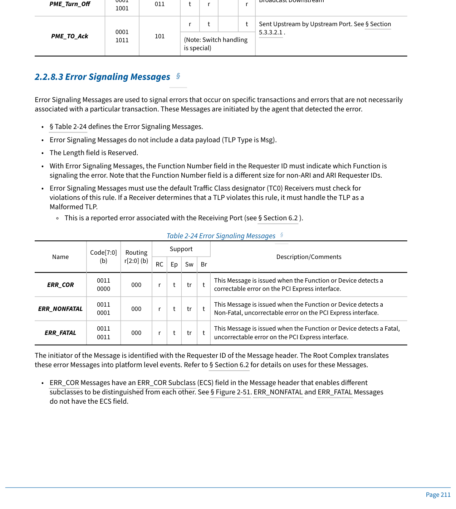

> **Figure 2-52.** ERR_COR Message - Flit Mode


**Table 2-25 ERR_COR Subclass (ECS) Field Encodings | 表 2-25 ERR_COR 子类 (ECS) 字段编码**

| ECS | Coding | Description |
|-----|--------|-------------|
| 00 | ECS Legacy | The value inherently used if a Requester does not support ECS capability. ECS-capable Requesters must not use this value. See see § Section 7.5.3.3. |
| 01 | ECS SIG_SFW | Must be used by an ECS-capable Requester when signaling a DPC or SFI event with an ERR_COR Message. |
| 10 | ECS SIG_OS | Must be used by an ECS-capable Requester when signaling an AER or RP PIO event with an ERR_COR Message. |
| 11 | ECS Extended | Intended for possible future use. Requesters must not use this value. Receivers must handle the signal internally the same as ECS SIG_OS. |

<table>
<thead>
<tr>
<th width="50%">🇬🇧 English</th>
<th width="50%" style="background-color:#e8e8e8">🇨🇳 中文</th>
</tr>
</thead>
<tbody>
<tr>
<td>

| ECS | 编码 | 描述 |
|-----|------|------|
| 00 | ECS Legacy (传统) | 如果 Requester 不支持 ECS 能力时默认使用的值。支持 ECS 的 Requester 不得使用此值。参见 § 7.5.3.3 节。 |
| 01 | ECS SIG_SFW | 当支持 ECS 的 Requester 使用 ERR_COR 消息通报 DPC 或 SFI 事件时，必须使用此值。 |
| 10 | ECS SIG_OS | 当支持 ECS 的 Requester 使用 ERR_COR 消息通报 AER 或 RP PIO 事件时，必须使用此值。 |
| 11 | ECS Extended (扩展) | 保留供未来可能使用。Requester 不得使用此值。接收器必须在内部将此信号视为与 ECS SIG_OS 相同。 |

The Unlock Message is used to support Lock Transaction sequences. Refer to § Section 6.5 for details on Lock Transaction sequences. The following rules apply to the formation of the Unlock Message:

</td>
<td style="background-color:#e8e8e8">

Unlock 消息用于支持 Lock 事务序列。有关 Lock 事务序列的详细信息，请参见 § 6.5 节。Unlock 消息的构成需遵循以下规则：

</td>
</tr>
</tbody>
</table>

---

<a id="sec-2-2-8-4"></a>
## 2.2.8.4 Locked Transactions Support | 锁定事务支持


<div style="overflow-x: auto; max-width: 100%;">
<table>
<thead>
<tr>
<th width="50%">🇬🇧 English</th>
<th width="50%" style="background-color:#e8e8e8">🇨🇳 中文</th>
</tr>
</thead>
<tbody>
<tr>
<td>

- § Table 2-26 defines the Unlock Messages.
- The Unlock Message does not include a data payload (TLP Type is Msg).
- The Length field is Reserved.
- With Unlock Messages, the Function Number field in the Requester ID is Reserved.
- The Unlock Message must use the default Traffic Class designator (TC0). Receivers must check for violations of this rule. If a Receiver determines that a TLP violates this rule, it must handle the TLP as a Malformed TLP.
  - This is a reported error associated with the Receiving Port (see § Section 6.2).

</td>
<td style="background-color:#e8e8e8">

- § 表 2-26 定义了 Unlock 消息。
- Unlock 消息不包含数据负载 (TLP 类型为 Msg)。
- Length 字段为保留。
- 对于 Unlock 消息，Requester ID 中的 Function Number 字段为保留。
- Unlock 消息必须使用默认的流量类 (Traffic Class) 标识符 (TC0)。接收器必须检查是否违反此规则。如果接收器确定某个 TLP 违反了该规则，则必须将该 TLP 视为格式错误 TLP (Malformed TLP)。
  - 这是一个与接收端口 (Receiving Port) 相关的可报告错误 (参见 § 6.2 节)。

</td>
</tr>
</tbody>
</table>
</div>


**Table 2-26 Unlock Message | 表 2-26 Unlock 消息**

| Name | Code[7:0] (b) | Routing r[2:0] (b) | Support (RC / Ep / Sw / Br) | Description/Comments |
|------|---------------|--------------------|-----------------------------|---------------------|
| Unlock | 0000 0000 | 011 | t / r / tr / r | Unlock Completer |

<table>
<thead>
<tr>
<th width="50%">🇬🇧 English</th>
<th width="50%" style="background-color:#e8e8e8">🇨🇳 中文</th>
</tr>
</thead>
<tbody>
<tr>
<td>

This Message is used to convey a slot power limitation value from a Downstream Port (of a Root Complex or a Switch) to an Upstream Port of a component (with Endpoint, Switch, or PCI Express-PCI Bridge Functions) attached to the same Link.

- § Table 2-27 defines the Set_Slot_Power_Limit Message.
- The Set_Slot_Power_Limit Message includes a 1 DW data payload (TLP Type is MsgD).
- The Set_Slot_Power_Limit Message must use the default Traffic Class designator (TC0). Receivers must check for violations of this rule. If a Receiver determines that a TLP violates this rule, it must handle the TLP as a Malformed TLP.
  - This is a reported error associated with the Receiving Port (see § Section 6.2).

</td>
<td style="background-color:#e8e8e8">

此消息用于将插槽 (slot) 功率限制值从下游端口 (Downstream Port，根复合体或交换机的) 传递到连接到同一条链路的组件 (具有 Endpoint、Switch 或 PCI Express-PCI Bridge Function) 的上游端口 (Upstream Port)。

- § 表 2-27 定义了 Set_Slot_Power_Limit 消息。
- Set_Slot_Power_Limit 消息包含 1 DW 的数据负载 (TLP 类型为 MsgD)。
- Set_Slot_Power_Limit 消息必须使用默认的流量类 (Traffic Class) 标识符 (TC0)。接收器必须检查是否违反此规则。如果接收器确定某个 TLP 违反了该规则，则必须将该 TLP 视为格式错误 TLP (Malformed TLP)。
  - 这是一个与接收端口 (Receiving Port) 相关的可报告错误 (参见 § 6.2 节)。

</td>
</tr>
</tbody>
</table>

**Table 2-27 Set_Slot_Power_Limit Message | 表 2-27 Set_Slot_Power_Limit 消息**

| Name | Code[7:0] (b) | Routing r[2:0] (b) | Support (RC / Ep / Sw / Br) | Description/Comments |
|------|---------------|--------------------|-----------------------------|---------------------|
| Set_Slot_Power_Limit | 0101 0000 | 100 | t / r / tr / r | Set Slot Power Limit in Upstream Port |


<div style="overflow-x: auto; max-width: 100%;">
<table>
<thead>
<tr>
<th width="50%">🇬🇧 English</th>
<th width="50%" style="background-color:#e8e8e8">🇨🇳 中文</th>
</tr>
</thead>
<tbody>
<tr>
<td>

The Set_Slot_Power_Limit Message includes a one DW data payload. The data payload is copied from the Slot Capabilities register of the Downstream Port and is written into the Device Capabilities register of the Upstream Port on the other side of the Link. Bits 1:0 of Byte 1 of the data payload map to the Slot Power Limit Scale field and bits 7:0 of Byte 0 map to the Slot Power Limit Value field. Bits 7:0 of Byte 3, 7:0 of Byte 2, and 7:2 of Byte 1 of the data payload must all be set to zero by the Transmitter and ignored by the Receiver. This Message must be sent automatically by the Downstream Port (of a Root Complex or a Switch) when one of the following events occurs:

- On a Configuration Write to the Slot Capabilities register (see § Section 7.5.3.9) when the Data Link Layer reports DL_Up status.
- Any time when a Link transitions from a non-DL_Up status to a DL_Up status (see § Section 2.9.2) and the Auto Slot Power Limit Disable bit is Clear in the Slot Control Register. This transmission is optional if the Slot Capabilities register has not yet been initialized.

</td>
<td style="background-color:#e8e8e8">

Set_Slot_Power_Limit 消息包含一个 DW 的数据负载。该数据负载从下游端口 (Downstream Port) 的 Slot Capabilities 寄存器复制而来，并被写入链路另一侧上游端口 (Upstream Port) 的 Device Capabilities 寄存器。数据负载的 Byte 1 的位 1:0 映射到 Slot Power Limit Scale 字段，Byte 0 的位 7:0 映射到 Slot Power Limit Value 字段。数据负载 Byte 3 的位 7:0、Byte 2 的位 7:0 以及 Byte 1 的位 7:2 必须全部由发送器 (Transmitter) 清零，并由接收器 (Receiver) 忽略。在发生以下任一事件时，该消息必须由下游端口 (根复合体或交换机的) 自动发送：

- 当数据链路层 (Data Link Layer) 报告 DL_Up 状态时，对 Slot Capabilities 寄存器进行配置写 (参见 § 7.5.3.9 节)。
- 当链路 (Link) 从非 DL_Up 状态转换到 DL_Up 状态时 (参见 § 2.9.2 节)，并且 Slot Control 寄存器中的 Auto Slot Power Limit Disable 位为 0 (Clear)。如果 Slot Capabilities 寄存器尚未初始化，则此传输是可选的。

</td>
</tr>
</tbody>
</table>
</div>


---

<a id="sec-2-2-8-5"></a>
## 2.2.8.5 Slot Power Limit Support | 插槽功率限制支持

<table>
<thead>
<tr>
<th width="50%">🇬🇧 English</th>
<th width="50%" style="background-color:#e8e8e8">🇨🇳 中文</th>
</tr>
</thead>
<tbody>
<tr>
<td>

The component on the other side of the Link (with Endpoint, Switch, or Bridge Functions) that receives Set_Slot_Power_Limit Message must copy the values in the data payload into the Device Capabilities register associated with the component's Upstream Port. PCI Express components that are targeted exclusively for integration on the system planar (e.g., system board) as well as components that are targeted for integration on an adapter where power consumption of the entire adapter is below the lowest power limit specified for the adapter form factor (as defined in the corresponding form factor specification) are permitted to hardwire the value of all 0's in the Captured Slot Power Limit Scale and Captured Slot Power Limit Value fields of the Device Capabilities Register, and are not required to copy the Set_Slot_Power_Limit Message payload into that register.

For more details on Power Limit control mechanism see § Section 6.9.

</td>
<td style="background-color:#e8e8e8">

链路另一侧接收 Set_Slot_Power_Limit 消息的组件 (具有 Endpoint、Switch 或 Bridge Function) 必须将数据负载中的值复制到与该组件上游端口 (Upstream Port) 相关联的 Device Capabilities 寄存器中。仅作为系统板 (system planar，例如系统主板) 集成目标而设计的 PCI Express 组件，以及作为适配器集成目标而设计、且整个适配器功耗低于相应外形规格 (Form Factor) 规范所规定的最低功率限制的组件，允许将 Device Capabilities 寄存器中 Captured Slot Power Limit Scale 和 Captured Slot Power Limit Value 字段硬连线 (hardwire) 为全 0，并且无需将 Set_Slot_Power_Limit 消息负载复制到该寄存器中。

有关功率限制控制机制的更多详细信息，请参见 § 6.9 节。

</td>
</tr>
</tbody>
</table>

---

<a id="sec-2-2-8-6"></a>
## 2.2.8.6 Vendor-Defined Messages | 厂商自定义消息 (Vendor-Defined Messages)


<div style="overflow-x: auto; max-width: 100%;">
<table>
<thead>
<tr>
<th width="50%">🇬🇧 English</th>
<th width="50%" style="background-color:#e8e8e8">🇨🇳 中文</th>
</tr>
</thead>
<tbody>
<tr>
<td>

The Vendor-Defined Messages allow expansion of PCI Express messaging capabilities, either as a general extension to [PCIe] or a vendor-specific extension. This section defines the rules associated with these Messages generically.

- The Vendor-Defined Messages (see § Table 2-28) use the header format shown in § Figure 2-53.
  - The Requester ID is implementation specific. The Requester ID field MUST@FLIT contain the value associated with the Requester.<sup>27</sup>
  - If the Route by ID routing is used, bytes 8 and 9 form a 16-bit field for the destination ID - otherwise these bytes are Reserved.
  - Bytes 10 and 11 form a 16-bit field for the Vendor ID, as defined by PCI-SIG®, of the vendor defining the Message.
  - Bytes 12 through 15 are available for vendor definition.
  - The low 7 bits of byte 6 is available for vendor definition. Byte 6, bit 7 is Reserved in Non-Flit Mode and is the EP bit in Flit Mode.

</td>
<td style="background-color:#e8e8e8">

厂商自定义消息 (Vendor-Defined Messages, VDM) 允许扩展 PCI Express 的消息传递能力，既可以作为 [PCIe] 的一般扩展，也可以作为厂商特定的扩展。本节通用地定义了与这些消息相关的规则。

- 厂商自定义消息 (参见 § 表 2-28) 使用 § 图 2-53 中所示的包头格式。
  - Requester ID 是实现特定的。Requester ID 字段 MUST@FLIT 包含与 Requester 关联的值。<sup>27</sup>
  - 如果使用基于 ID 的路由 (Route by ID)，则字节 8 和字节 9 构成一个 16 位字段，作为目标 ID —— 否则这些字节为保留。
  - 字节 10 和字节 11 构成一个 16 位字段，作为定义该消息的厂商的 Vendor ID (由 PCI-SIG® 定义)。
  - 字节 12 至字节 15 可供厂商自定义使用。
  - 字节 6 的低 7 位可供厂商自定义使用。字节 6 的位 7 在非 Flit 模式 (Non-Flit Mode) 中为保留，在 Flit 模式 (Flit Mode) 中为 EP 位。

</td>
</tr>
</tbody>
</table>
</div>


**Table 2-28 Vendor-Defined Messages | 表 2-28 厂商自定义消息**

| Name | Code[7:0] (b) | Routing r[2:0] (b) | Support (RC / Ep / Sw / Br) | Description/Comments |
|------|---------------|--------------------|-----------------------------|---------------------|
| Vendor-Defined Type 0 | 0111 1110 | 000, 010, 011, 100 | See Note 1. | Triggers detection of UR by Completer if not implemented. |
| Vendor-Defined Type 1 | 0111 1111 | 000, 010, 011, 100 | See Note 1. | Silently discarded by Completer if not implemented. |

1. Note 1: Transmission by Endpoint/Root Complex/Bridge is implementation specific. Switches must forward received Messages using Routing r[2:0] field values of 000b, 010b, and 011b.

<table>
<thead>
<tr>
<th width="50%">🇬🇧 English</th>
<th width="50%" style="background-color:#e8e8e8">🇨🇳 中文</th>
</tr>
</thead>
<tbody>
<tr>
<td>

1. 注 1：由 Endpoint / Root Complex / Bridge 发送是实现特定的。Switch 必须使用 Routing r[2:0] 字段值 000b、010b 和 011b 转发接收到的消息。

</td>
<td style="background-color:#e8e8e8">

---

27. ACS Source Validation (see § Section 6.12.1.1) checks the Requester ID on all Requests, including Vendor-Defined Messages. This validation depends on the Requester ID properly identifying the Requester.

</td>
</tr>
</tbody>
</table>

<sup>27. ACS Source Validation (参见 § 6.12.1.1 节) 会检查所有请求上的 Requester ID，包括厂商自定义消息。此验证依赖于 Requester ID 正确标识 Requester。</sup>

---

<<<PAGE_BREAK>>> page_215

<table>
<thead>
<tr>
<th width="50%">🇬🇧 English</th>
<th width="50%" style="background-color:#e8e8e8">🇨🇳 中文</th>
</tr>
</thead>
<tbody>
<tr>
<td></td>
<td style="background-color:#e8e8e8">

</td>
</tr>
</tbody>
</table>

> **Figure 2-53.** Header for Vendor-Defined Messages - Non-Flit Mode
> 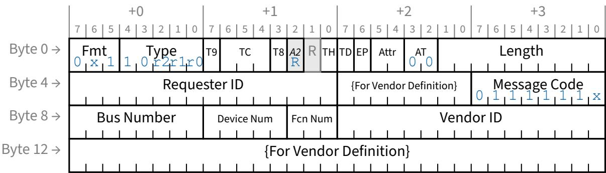

> **Figure 2-54.** Header for Vendor-Defined Messages - Flit Mode
> 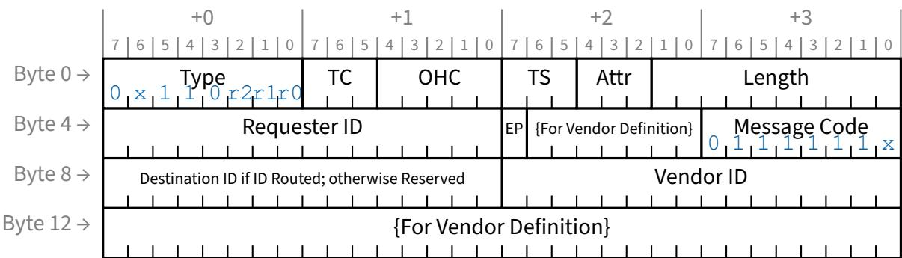


<div style="overflow-x: auto; max-width: 100%;">
<table>
<thead>
<tr>
<th width="50%">🇬🇧 English</th>
<th width="50%" style="background-color:#e8e8e8">🇨🇳 中文</th>
</tr>
</thead>
<tbody>
<tr>
<td>

- A data payload may be included with either type of Vendor-Defined Message (TLP type is Msg if no data payload is included or MsgD if a data payload is included).
- For both types of Vendor-Defined Messages, the Attr[1:0] and Attr[2] fields are not Reserved.
- Messages defined by different vendors or by PCI-SIG are distinguished by the value in the Vendor ID field.
  - The further differentiation of Messages defined by a particular vendor is beyond the scope of this document.
  - Support for Messages defined by a particular vendor is implementation specific, and beyond the scope of this document.
- Completers silently discard Vendor-Defined Type 1 Messages that they are not designed to receive - this is not an error condition.
  - When an ID Routed Message targeting a Function that is not implemented is detected, it is implementation specific whether that message is silently discarded or signals Unsupported Request.
- Completers handle the receipt of an unsupported Vendor-Defined Type 0 Message as an Unsupported Request, and the error is reported according to § Section 6.2.

[PCIe-to-PCI-PCI-X-Bridge] defines additional requirements for Vendor-Defined Messages that are designed to be interoperable with PCI-X Device ID Messages. This includes restrictions on the contents of the Tag[7:0] field and the Length[9:0] field as well as specific use of Bytes 12 through 15 of the message header. Vendor-Defined Messages intended for use solely within a PCI Express environment (i.e., not intended to address targets behind a PCI Express to

</td>
<td style="background-color:#e8e8e8">

- 任意类型的厂商自定义消息都可以包含数据负载 (若不包含数据负载，则 TLP 类型为 Msg；若包含数据负载，则为 MsgD)。
- 对于两种类型的厂商自定义消息，Attr[1:0] 和 Attr[2] 字段均不是保留的。
- 由不同厂商或由 PCI-SIG 定义的消息通过 Vendor ID 字段的值加以区分。
  - 进一步区分某个特定厂商定义的消息超出了本规范的范围。
  - 对特定厂商定义的消息的支持是实现特定的，超出了本规范的范围。
- 完成者 (Completer) 静默丢弃其未设计接收的厂商自定义 Type 1 消息 —— 这不是一个错误条件。
  - 当检测到目标为未实现 Function 的 ID 路由消息时，是静默丢弃还是上报 Unsupported Request (不支持的请求) 取决于具体实现。
- 完成者 (Completer) 将收到的、其不支持的厂商自定义 Type 0 消息作为 Unsupported Request 处理，并根据 § 6.2 节上报该错误。

[PCIe-to-PCI-PCI-X-Bridge] 定义了为与 PCI-X Device ID 消息兼容而设计的厂商自定义消息的附加要求。这包括对 Tag[7:0] 字段和 Length[9:0] 字段内容的限制，以及对消息头字节 12 至 15 的特定使用。仅在 PCI Express 环境中使用 (即不用于寻址 PCI Express 到

</td>
</tr>
</tbody>
</table>
</div>


---

<<<PAGE_BREAK>>> page_216

<table>
<thead>
<tr>
<th width="50%">🇬🇧 English</th>
<th width="50%" style="background-color:#e8e8e8">🇨🇳 中文</th>
</tr>
</thead>
<tbody>
<tr>
<td>

PCI/PCI-X Bridge) are not subject to the additional rules. Refer to [PCIe-to-PCI-PCI-X-Bridge] for details. Refer to § Section 2.2.6.2 for considerations regarding larger-Tag capabilities.

PCI-SIG-Defined VDMs are Vendor-Defined Type 1 Messages that use the PCI-SIG® Vendor ID (0001h). As a Vendor-Defined Type 1 Message, each is silently discarded by a Completer if the Completer does not implement it.

Beyond the rules for other Vendor-Defined Type 1 Messages, the following rules apply to the formation of the PCI-SIG-Defined VDMs:

- PCI-SIG-Defined VDMs use the Header format shown in § Figure 2-55.
- The Requester ID field must contain the value associated with the Requester.
- The Message Code must be 01111111b.
- The Vendor ID must be 0001h, which is assigned to the PCI-SIG.
- The Subtype field distinguishes the specific PCI-SIG-Defined VDMs. See § Appendix F for a list of PCI-SIG-Defined VDMs.

> **Figure 2-55.** Header for PCI-SIG-Defined VDMs - Non-Flit Mode
> 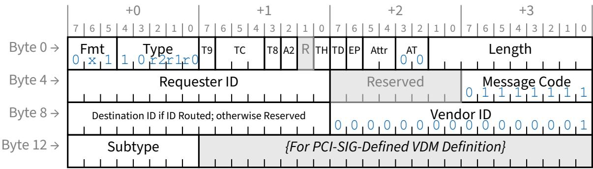

> **Figure 2-56.** Header for PCI-SIG-Defined VDMs - Flit Mode
> 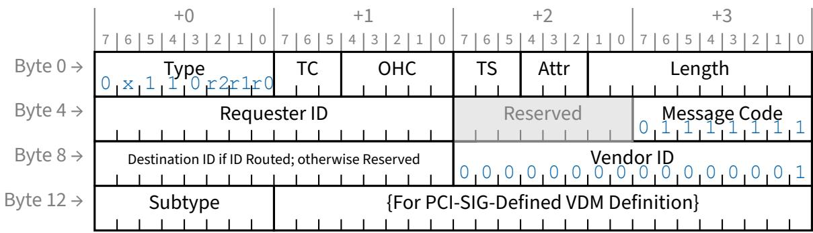

</td>
<td style="background-color:#e8e8e8">

PCI/PCI-X 桥后方目标) 的厂商自定义消息不受这些附加规则的约束。详情请参见 [PCIe-to-PCI-PCI-X-Bridge]。关于更大 Tag 能力的注意事项，请参见 § 2.2.6.2 节。

PCI-SIG 定义的 VDM (PCI-SIG-Defined VDMs) 是使用 PCI-SIG® Vendor ID (0001h) 的厂商自定义 Type 1 消息。作为厂商自定义 Type 1 消息，如果完成者 (Completer) 未实现该消息，则会将其静默丢弃。

除了适用于其他厂商自定义 Type 1 消息的规则外，PCI-SIG 定义的 VDM 的构成还需遵循以下规则：

- PCI-SIG 定义的 VDM 使用 § 图 2-55 中所示的包头格式。
- Requester ID 字段必须包含与 Requester 关联的值。
- Message Code 必须为 01111111b。
- Vendor ID 必须为 0001h，分配给 PCI-SIG。
- Subtype 字段用于区分具体的 PCI-SIG 定义的 VDM。有关 PCI-SIG 定义的 VDM 列表，请参见 § 附录 F。


</td>
</tr>
</tbody>
</table>

---

<a id="sec-2-2-8-6-1"></a>
## 2.2.8.6.1 PCI-SIG Defined VDMs | PCI-SIG 定义的 VDM


<div style="overflow-x: auto; max-width: 100%;">
<table>
<thead>
<tr>
<th width="50%">🇬🇧 English</th>
<th width="50%" style="background-color:#e8e8e8">🇨🇳 中文</th>
</tr>
</thead>
<tbody>
<tr>
<td>

The Device Readiness Status (DRS) protocol (see § Section 6.22.1) uses the PCI-SIG-Defined VDM mechanism (see § Section 2.2.8.6.1). The DRS Message is a PCI-SIG-Defined VDM (Vendor-Defined Type 1 Message) with no payload.

Beyond the rules for other PCI-SIG-Defined VDMs, the following rules apply to the formation of DRS Messages:

- § Table 2-29 and § Figure 2-57 illustrate and define the DRS Message.
- The TLP Type must be Msg.
- The TC[2:0] field must be 000b.
- The Attr[2:0] field is Reserved.
- The Tag field is Reserved.
- The Subtype field must be 08h.
- The Message Routing field must be set to 100b - Local - Terminate at Receiver.

Receivers may optionally check for violations of these rules (but must not check reserved bits). These checks are independently optional (see § Section 6.2.3.4). If a Receiver implementing these checks determines that a TLP violates these rules, the TLP is a Malformed TLP.

- If checked, this is a reported error associated with the Receiving Port (see § Section 6.2).

</td>
<td style="background-color:#e8e8e8">

设备就绪状态 (Device Readiness Status, DRS) 协议 (参见 § 6.22.1 节) 使用 PCI-SIG 定义的 VDM 机制 (参见 § 2.2.8.6.1 节)。DRS 消息是一种 PCI-SIG 定义的 VDM (厂商自定义 Type 1 消息)，不带负载。

除了适用于其他 PCI-SIG 定义的 VDM 的规则外，DRS 消息的构成还需遵循以下规则：

- § 表 2-29 和 § 图 2-57 给出并定义了 DRS 消息。
- TLP Type 必须为 Msg。
- TC[2:0] 字段必须为 000b。
- Attr[2:0] 字段为保留。
- Tag 字段为保留。
- Subtype 字段必须为 08h。
- Message Routing 字段必须设置为 100b - Local - Terminate at Receiver (本地 - 在接收器处终止)。

接收器可选择性地检查是否违反这些规则 (但不得检查保留位)。这些检查彼此独立可选 (参见 § 6.2.3.4 节)。如果实现了这些检查的接收器确定某个 TLP 违反了这些规则，则该 TLP 为格式错误 TLP (Malformed TLP)。

- 如果进行检查，则这是一个与接收端口 (Receiving Port) 相关的可报告错误 (参见 § 6.2 节)。

</td>
</tr>
</tbody>
</table>
</div>


**Table 2-29 DRS Message | 表 2-29 DRS 消息**

| Name | Code[7:0] (b) | Routing r[2:0] (b) | Support (RC / Ep / Sw / Br) | Description/Comments |
|------|---------------|--------------------|-----------------------------|---------------------|
| DRS Message | 0111 1111 | 100 | r / t / tr / (—) | Device Readiness Status |

<table>
<thead>
<tr>
<th width="50%">🇬🇧 English</th>
<th width="50%" style="background-color:#e8e8e8">🇨🇳 中文</th>
</tr>
</thead>
<tbody>
<tr>
<td>

The format of the DRS Message is shown in § Figure 2-57 below:

> **Figure 2-57.** DRS Message - Non-Flit Mode
> 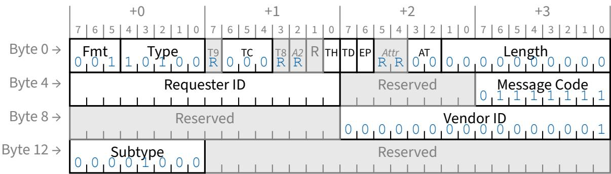

</td>
<td style="background-color:#e8e8e8">

DRS 消息的格式见下方 § 图 2-57：


</td>
</tr>
</tbody>
</table>

---

<a id="sec-2-2-8-6-2"></a>
## 2.2.8.6.2 Device Readiness Status (DRS) Message | 设备就绪状态 (DRS) 消息


<div style="overflow-x: auto; max-width: 100%;">
<table>
<thead>
<tr>
<th width="50%">🇬🇧 English</th>
<th width="50%" style="background-color:#e8e8e8">🇨🇳 中文</th>
</tr>
</thead>
<tbody>
<tr>
<td>

The Function Readiness Status (FRS) protocol (see § Section 6.22.2) uses the PCI-SIG-Defined VDM mechanism (see § Section 2.2.8.6.1). The FRS message is a PCI-SIG-Defined VDM (Vendor-Defined Type 1 Message) with no payload.

Beyond the rules for other PCI-SIG-Defined VDMs, the following rules apply to the formation of FRS Messages:

- § Table 2-30 and § Figure 2-59 illustrate and define the FRS Message.
- The TLP Type must be Msg.
- The TC[2:0] field must be 000b.
- The Attr[2:0] field is Reserved.
- The Tag field is Reserved.
- The Subtype field must be 09h.
- The FRS Reason[3:0] field indicates why the FRS Message was generated:

  0001b: DRS Message Received
  The Downstream Port indicated by the Message Requester ID received a DRS Message and has the DRS Signaling Control field in the Link Control Register set to DRS to FRS Signaling Enabled.

  0010b: D3Hot to D0 Transition Completed
  A D3Hot to D0 transition has completed, and the Function indicated by the Message Requester ID is now Configuration-Ready and has returned to the D0<sub>uninitialized</sub> or D0<sub>active</sub> state depending on the setting of the No_Soft_Reset bit (see § Section 7.5.2.2).

  0011b: FLR Completed
  An FLR has completed, and the Function indicated by the Message Requester ID is now Configuration-Ready.

  1000b: VF Enabled
  The Message Requester ID indicates a Physical Function (PF) - All Virtual Functions (VFs) associated with that PF are now Configuration-Ready.

  1001b: VF Disabled
  The Message Requester ID indicates a PF - All VFs associated with that PF have been disabled and the Single Root I/O Virtualization (SR-IOV) data structures in that PF may now be accessed.

</td>
<td style="background-color:#e8e8e8">

功能就绪状态 (Function Readiness Status, FRS) 协议 (参见 § 6.22.2 节) 使用 PCI-SIG 定义的 VDM 机制 (参见 § 2.2.8.6.1 节)。FRS 消息是一种 PCI-SIG 定义的 VDM (厂商自定义 Type 1 消息)，不带负载。

除了适用于其他 PCI-SIG 定义的 VDM 的规则外，FRS 消息的构成还需遵循以下规则：

- § 表 2-30 和 § 图 2-59 给出并定义了 FRS 消息。
- TLP Type 必须为 Msg。
- TC[2:0] 字段必须为 000b。
- Attr[2:0] 字段为保留。
- Tag 字段为保留。
- Subtype 字段必须为 09h。
- FRS Reason[3:0] 字段用于指示生成 FRS 消息的原因：

  0001b：已收到 DRS 消息
  由消息 Requester ID 指示的下游端口 (Downstream Port) 已收到 DRS 消息，并且其 Link Control 寄存器中的 DRS Signaling Control 字段被设置为 DRS to FRS Signaling Enabled。

  0010b：D3Hot 到 D0 转换完成
  D3Hot 到 D0 的转换已完成，并且由消息 Requester ID 指示的 Function 现在已处于 Configuration-Ready (配置就绪) 状态，并根据 No_Soft_Reset 位的设置返回到 D0<sub>uninitialized</sub> 或 D0<sub>active</sub> 状态 (参见 § 7.5.2.2 节)。

  0011b：FLR 已完成
  FLR (Function Level Reset) 已完成，并且由消息 Requester ID 指示的 Function 现在已处于 Configuration-Ready 状态。

  1000b：VF 已使能
  消息 Requester ID 指示一个物理功能 (Physical Function, PF) —— 与该 PF 关联的所有虚拟功能 (Virtual Functions, VFs) 现在已处于 Configuration-Ready 状态。

  1001b：VF 已禁用
  消息 Requester ID 指示一个 PF —— 与该 PF 关联的所有 VFs 已被禁用，并且该 PF 中的单根 I/O 虚拟化 (SR-IOV) 数据结构现在可以被访问。

</td>
</tr>
</tbody>
</table>

> **Figure 2-58.** DRS Message - Flit Mode
> 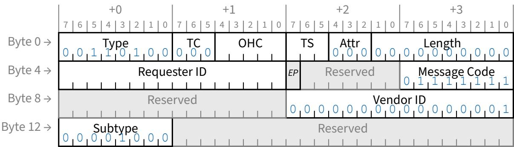

</div>


---

<a id="sec-2-2-8-6-3"></a>
## 2.2.8.6.3 Function Readiness Status Message (FRS Message) | 功能就绪状态消息 (FRS 消息)

<table>
<thead>
<tr>
<th width="50%">🇬🇧 English</th>
<th width="50%" style="background-color:#e8e8e8">🇨🇳 中文</th>
</tr>
</thead>
<tbody>
<tr>
<td>

Others:
All other values Reserved.

- The Message Routing field must be Cleared to 000b - Routed to Root Complex.

Receivers may optionally check for violations of these rules (but must not check reserved bits). These checks are independently optional (see § Section 6.2.3.4). If a Receiver implementing these checks determines that a TLP violates these rules, the TLP is a Malformed TLP.

- If checked, this is a reported error associated with the Receiving Port (see § Section 6.2).

</td>
<td style="background-color:#e8e8e8">

其他：
所有其他值均为保留。

- Message Routing 字段必须清零 (Cleared) 为 000b - Routed to Root Complex (路由到根复合体)。

接收器可选择性地检查是否违反这些规则 (但不得检查保留位)。这些检查彼此独立可选 (参见 § 6.2.3.4 节)。如果实现了这些检查的接收器确定某个 TLP 违反了这些规则，则该 TLP 为格式错误 TLP (Malformed TLP)。

- 如果进行检查，则这是一个与接收端口 (Receiving Port) 相关的可报告错误 (参见 § 6.2 节)。

</td>
</tr>
</tbody>
</table>

**Table 2-30 FRS Message | 表 2-30 FRS 消息**

| Name | Code[7:0] (b) | Routing r[2:0] (b) | Support (RC / Ep / Sw / Br) | Description/Comments |
|------|---------------|--------------------|-----------------------------|---------------------|
| FRS Message | 0111 1111 | 000 | r / t / tr / (—) | Function Readiness Status |

<table>
<thead>
<tr>
<th width="50%">🇬🇧 English</th>
<th width="50%" style="background-color:#e8e8e8">🇨🇳 中文</th>
</tr>
</thead>
<tbody>
<tr>
<td>

The format of the FRS Message is shown in § Figure 2-59 and § Figure 2-60 below:

</td>
<td style="background-color:#e8e8e8">

FRS 消息的格式见下方 § 图 2-59 和 § 图 2-60：

</td>
</tr>
</tbody>
</table>

> **Figure 2-59.** FRS Message - Non-Flit Mode
> 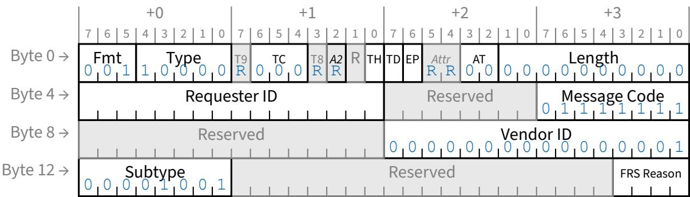

> **Figure 2-60.** FRS Message - Flit Mode
> 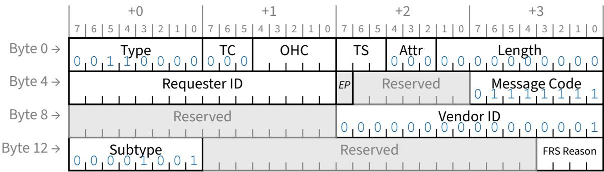


---

<<<PAGE_BREAK>>> page_220

<a id="sec-2-2-8-6-4"></a>
## 2.2.8.6.4 Hierarchy ID Message | 层级 ID 消息


<div style="overflow-x: auto; max-width: 100%;">
<table>
<thead>
<tr>
<th width="50%">🇬🇧 English</th>
<th width="50%" style="background-color:#e8e8e8">🇨🇳 中文</th>
</tr>
</thead>
<tbody>
<tr>
<td>

Hierarchy ID uses the PCI-SIG-Defined VDM mechanism (see § Section 2.2.8.6.1). The Hierarchy ID Message is a PCI-SIG-Defined VDM (Vendor-Defined Type 1 Message) with payload (MsgD).

Beyond the rules for other PCI-SIG-Defined VDMs, the following rules apply to the formation of Hierarchy ID Messages:

- § Table 2-31 and § Figure 2-61 illustrate and define the Hierarchy ID Message.
- The TLP Type must be MsgD.
- Each Message must include a 4-DWORD data payload.
- The Length field must be 4.
- The TC[2:0] field must be 000b.
- The Attr[2:0] field is Reserved.
- The Tag field is Reserved.
- The Subtype field is 01h.
- The Message Routing field must be 011b - Broadcast from Root Complex.

Receivers may optionally check for violations of these rules (but must not check reserved bits). These checks are independently optional (see § Section 6.2.3.4). If a Receiver implementing these checks determines that a TLP violates these rules, the TLP is a Malformed TLP.

- If checked, this is a reported error associated with the Receiving Port (see § Section 6.2).

The payload of each Hierarchy ID Message contains the lower 128-bits of the System GUID.

For details of the Hierarchy ID, GUID Authority ID, and System GUID fields see § Section 6.25.

</td>
<td style="background-color:#e8e8e8">

层级 ID (Hierarchy ID) 使用 PCI-SIG 定义的 VDM 机制 (参见 § 2.2.8.6.1 节)。层级 ID 消息是一种 PCI-SIG 定义的 VDM (厂商自定义 Type 1 消息)，带有负载 (MsgD)。

除了适用于其他 PCI-SIG 定义的 VDM 的规则外，层级 ID 消息的构成还需遵循以下规则：

- § 表 2-31 和 § 图 2-61 给出并定义了层级 ID 消息。
- TLP Type 必须为 MsgD。
- 每条消息必须包含 4 个 DWORD 的数据负载。
- Length 字段必须为 4。
- TC[2:0] 字段必须为 000b。
- Attr[2:0] 字段为保留。
- Tag 字段为保留。
- Subtype 字段为 01h。
- Message Routing 字段必须为 011b - Broadcast from Root Complex (从根复合体广播)。

接收器可选择性地检查是否违反这些规则 (但不得检查保留位)。这些检查彼此独立可选 (参见 § 6.2.3.4 节)。如果实现了这些检查的接收器确定某个 TLP 违反了这些规则，则该 TLP 为格式错误 TLP (Malformed TLP)。

- 如果进行检查，则这是一个与接收端口 (Receiving Port) 相关的可报告错误 (参见 § 6.2 节)。

每条层级 ID 消息的负载包含 System GUID 的低 128 位。

有关层级 ID、GUID Authority ID 和 System GUID 字段的详细信息，请参见 § 6.25 节。

</td>
</tr>
</tbody>
</table>
</div>


**Table 2-31 Hierarchy ID Message | 表 2-31 层级 ID 消息**

| Name | Code[7:0] (b) | Routing r[2:0] (b) | Support (RC / Ep / Sw / Br) | Description/Comments |
|------|---------------|--------------------|-----------------------------|---------------------|
| Hierarchy ID Message | 0111 1111 | 011 | t / r / tr / (—) | Hierarchy ID |

<table>
<thead>
<tr>
<th width="50%">🇬🇧 English</th>
<th width="50%" style="background-color:#e8e8e8">🇨🇳 中文</th>
</tr>
</thead>
<tbody>
<tr>
<td>

The format of the Hierarchy ID Message is shown in § Figure 2-61 and § Figure 2-62 below:

> **Figure 2-61.** Hierarchy ID Message - Non-Flit Mode
> 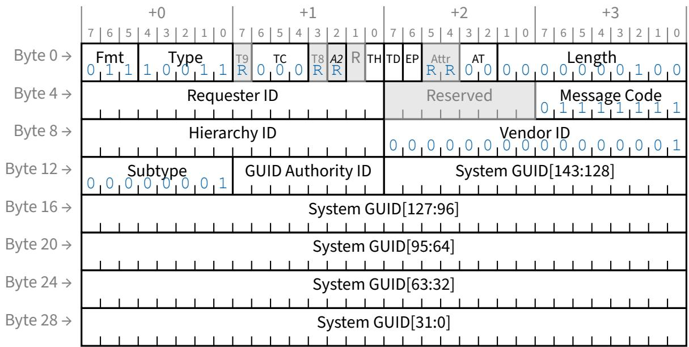

> **Figure 2-62.** Hierarchy ID Message - Flit Mode
> 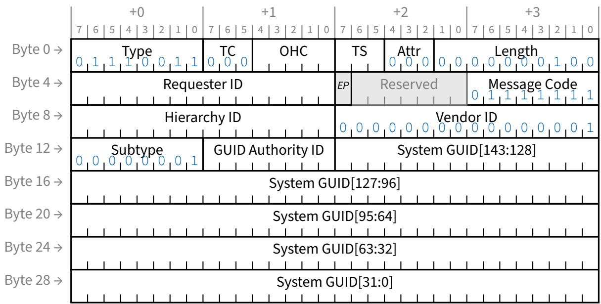

</td>
<td style="background-color:#e8e8e8">

层级 ID 消息的格式见下方 § 图 2-61 和 § 图 2-62：


</td>
</tr>
</tbody>
</table>

<table>
<thead>
<tr>
<th width="50%">🇬🇧 English</th>
<th width="50%" style="background-color:#e8e8e8">🇨🇳 中文</th>
</tr>
</thead>
<tbody>
<tr>
<td>

The messages listed in § Table 2-32 were previously used for a mechanism (Hot-Plug Signaling) that is no longer supported. Transmitters MUST@FLIT not transmit these messages. If message transmission is implemented, it must conform to the requirements of [PCIe-1.0a].

</td>
<td style="background-color:#e8e8e8">

§ 表 2-32 中列出的消息此前用于一个不再受支持的机制 (热插拔信号通知, Hot-Plug Signaling)。发送器 (Transmitter) MUST@FLIT 不得发送这些消息。如果实现了消息发送，则必须符合 [PCIe-1.0a] 的要求。

</td>
</tr>
</tbody>
</table>

---


---

<<<PAGE_BREAK>>> page_222

<a id="sec-2-2-8-7"></a>
## 2.2.8.7 Ignored Messages | 忽略消息


<div style="overflow-x: auto; max-width: 100%;">
<table>
<thead>
<tr>
<th width="50%">🇬🇧 English</th>
<th width="50%" style="background-color:#e8e8e8">🇨🇳 中文</th>
</tr>
</thead>
<tbody>
<tr>
<td>

Beyond normal Link-Layer processing and mandatory checking for properly-formed TLPs, Receivers MUST@FLIT not
process these messages further (i.e., carry out their originally architected Transaction-Layer functionality). If complete
processing of these messages is implemented, Receivers must process these messages in conformance with the
requirements [PCIe-1.0a].

Ignored messages listed in § Table 2-32 are handled by the Receiver as follows:
- The Physical and Data Link Layers must handle these messages identical to handling any other TLP.
- The Transaction Layer must account for flow control credit but take no other action in response to these
messages.

</td>
<td style="background-color:#e8e8e8">

除了正常的链路层 (Link Layer) 处理以及对格式正确的 TLP 的强制检查之外,接收器 (Receiver) **必须 (MUST)@FLIT** 不得对这些消息进行进一步处理 (即,不再执行其原本在架构上定义的事务层功能)。如果实现了这些消息的完整处理,则接收器必须按照 [PCIe-1.0a] 的要求处理这些消息。

§ 表 2-32 列出的忽略消息由接收器按如下方式处理:
- 物理层 (Physical Layer) 和数据链路层 (Data Link Layer) 必须以与处理任何其他 TLP 完全相同的方式处理这些消息。
- 事务层 (Transaction Layer) 必须为流控信用 (Flow Control Credit) 进行记账,但对这些消息不采取其他任何动作。

</td>
</tr>
</tbody>
</table>
</div>


**Table 2-32 Ignored Messages | 表 2-32 忽略消息**

| Name | Code[7:0] (b) | Routing r[2:0] (b) | Support (RC) | Support (Ep) | Support (Sw) | Support (Br) | Description/Comments |
|------|---------------|---------------------|--------------|--------------|--------------|--------------|----------------------|
| Ignored Message | 0100 0001 | 100 | | | | | Ignored Message |
| Ignored Message | 0100 0011 | 100 | | | | | Ignored Message |
| Ignored Message | 0100 0000 | 100 | | | | | Ignored Message |
| Ignored Message | 0100 0101 | 100 | | | | | Ignored Message |
| Ignored Message | 0100 0111 | 100 | | | | | Ignored Message |
| Ignored Message | 0100 0100 | 100 | | | | | Ignored Message |
| Ignored Message | 0100 1000 | 100 | | | | | Ignored Message |

<table>
<thead>
<tr>
<th width="50%">🇬🇧 English</th>
<th width="50%" style="background-color:#e8e8e8">🇨🇳 中文</th>
</tr>
</thead>
<tbody>
<tr>
<td>

<a id="sec-2-2-8-8"></a>
### 2.2.8.8 Latency Tolerance Reporting (LTR) Message | 延迟容忍度上报 (LTR) 消息

The LTR Message is optionally used to report device behaviors regarding its tolerance of Read/Write service latencies.
Refer to § Section 6.18 for details on LTR. The following rules apply to the formation of the LTR Message:
- § Table 2-33 defines the LTR Message.
- The LTR Message does not include a data payload (the TLP Type is Msg).
- The Length field is Reserved.
- The LTR Message must use the default Traffic Class designator (TC0). Receivers that implement LTR support
must check for violations of this rule. If a Receiver determines that a TLP violates this rule, it must handle the
TLP as a Malformed TLP.
  - This is a reported error associated with the Receiving Port (see § Section 6.2 ).

</td>
<td style="background-color:#e8e8e8">

LTR 消息可选地用于上报设备对读/写服务延迟的容忍行为。有关 LTR 的详细信息,请参阅 § 6.18 节。以下规则适用于 LTR 消息的构造:
- § 表 2-33 定义了 LTR 消息。
- LTR 消息不包含数据有效载荷 (TLP 类型为 Msg)。
- Length 字段为保留 (Reserved)。
- LTR 消息必须使用默认的流量类 (Traffic Class) 标识符 (TC0)。实现 LTR 支持的接收器必须检查是否违反此规则。如果接收器判定某 TLP 违反此规则,则必须将该 TLP 视为格式错误 TLP (Malformed TLP)。
  - 这是一个与接收端口 (Receiving Port) 相关联的可上报错误 (参见 § 6.2 节)。

</td>
</tr>
</tbody>
</table>

**Table 2-33 LTR Message | 表 2-33 LTR 消息**

| Name | Code[7:0] (b) | Routing r[2:0] (b) | Support¹ (RC) | Support (Ep) | Support (Sw) | Support (Br) | Description/Comments |
|------|---------------|---------------------|---------------|--------------|--------------|--------------|----------------------|
| LTR | 0001 0000 | 100 | r | t | tr | | Latency Tolerance Reporting |

**Notes:**
1. Support for LTR is optional. Functions that support LTR must implement the reporting and enable mechanisms described in § Chapter 7. , Software Initialization and Configuration.

---

> **Figure 2-63.** LTR Message - Non-Flit Mode
> 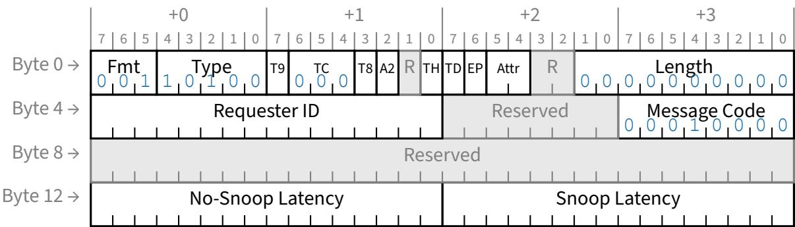

<<<PAGE_BREAK>>> page_223


<div style="overflow-x: auto; max-width: 100%;">
<table>
<thead>
<tr>
<th width="50%">🇬🇧 English</th>
<th width="50%" style="background-color:#e8e8e8">🇨🇳 中文</th>
</tr>
</thead>
<tbody>
<tr>
<td>

<a id="sec-2-2-8-9"></a>
### 2.2.8.9 Optimized Buffer Flush/Fill (OBFF) Message | 优化的缓冲区冲刷/填充 (OBFF) 消息

The OBFF Message is optionally used to report platform central resource states to Endpoints. This mechanism is
described in detail in § Section 6.19 .

The following rules apply to the formation of the OBFF Message:
- § Table 2-34 defines the OBFF Message.
- The OBFF Message does not include a data payload (TLP Type is Msg).
- The Length field is Reserved.
- The Requester ID must be set to the Transmitting Port's ID.
- The OBFF Message must use the default Traffic Class designator (TC0). Receivers that implement OBFF support
must check for violations of this rule. If a Receiver determines that a TLP violates this rule, it must handle the
TLP as a Malformed TLP.
  - This is a reported error associated with the Receiving Port (see § Section 6.2 ).

</td>
<td style="background-color:#e8e8e8">

OBFF 消息可选地用于将平台中心资源状态上报给端点 (Endpoint)。该机制的详细说明见 § 6.19 节。

以下规则适用于 OBFF 消息的构造:
- § 表 2-34 定义了 OBFF 消息。
- OBFF 消息不包含数据有效载荷 (TLP 类型为 Msg)。
- Length 字段为保留 (Reserved)。
- 请求者 ID (Requester ID) 必须设置为发送端口 (Transmitting Port) 的 ID。
- OBFF 消息必须使用默认的流量类 (Traffic Class) 标识符 (TC0)。实现 OBFF 支持的接收器必须检查是否违反此规则。如果接收器判定某 TLP 违反此规则,则必须将该 TLP 视为格式错误 TLP (Malformed TLP)。
  - 这是一个与接收端口 (Receiving Port) 相关联的可上报错误 (参见 § 6.2 节)。

</td>
</tr>
</tbody>
</table>
</div>


**Table 2-34 OBFF Message | 表 2-34 OBFF 消息**

| Name | Code[7:0] (b) | Routing r[2:0] (b) | Support¹ (RC) | Support (Ep) | Support (Sw) | Support (Br) | Description/Comments |
|------|---------------|---------------------|---------------|--------------|--------------|--------------|----------------------|
| OBFF | 0001 0010 | 100 | t | r | tr | | Optimized Buffer Flush/Fill |

**Notes:**
1. Support for OBFF is optional. Functions that support OBFF must implement the reporting and enable mechanisms described in § Chapter 7. , Software Initialization and Configuration.

---

> **Figure 2-65.** OBFF Message - Non-Flit Mode
> 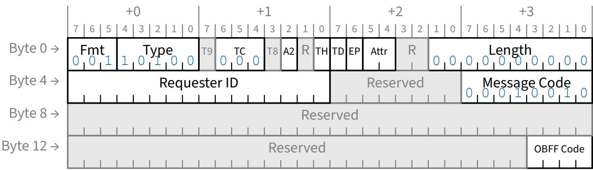

<<<PAGE_BREAK>>> page_224

<table>
<thead>
<tr>
<th width="50%">🇬🇧 English</th>
<th width="50%" style="background-color:#e8e8e8">🇨🇳 中文</th>
</tr>
</thead>
<tbody>
<tr>
<td>

<a id="sec-2-2-8-10"></a>
### 2.2.8.10 Precision Time Measurement (PTM) Messages | 精确时间测量 (PTM) 消息

§ Table 2-35 defines the PTM Messages.

The following rules apply to the formation of the PTM Messages:
- The PTM Request and PTM Response Messages must use a TLP Type of Msg, and must not include a data
payload. The Length field is reserved.
  - § Figure 2-67 illustrates the format of the PTM Request and Response Messages.
- The PTM ResponseD Message must use a TLP Type of MsgD, and must include a 64 bit PTM Master Time field in
bytes 8 through 15 of the TLP header and a 1 DW data payload containing the 32 bit Propagation Delay field.
  - § Figure 2-68 illustrates the format of the PTM ResponseD Message.
  - Refer to § Section 6.21.3.2 for details regarding how to populate the PTM ResponseD Message.
- The Requester ID must be set to the Transmitting Port's ID.
- A PTM dialog is defined as a matched pair of messages consisting of a PTM Request and the corresponding PTM
Response or PTM ResponseD message.
- The PTM Messages must use the default Traffic Class designator (TC0). Receivers implementing PTM must
check for violations of this rule. If a Receiver determines that a TLP violates this rule, it must handle the TLP as
a Malformed TLP.
  - This is a reported error associated with the Receiving Port (see § Section 6.2 ).

</td>
<td style="background-color:#e8e8e8">

§ 表 2-35 定义了 PTM 消息。

以下规则适用于 PTM 消息的构造:
- PTM Request 与 PTM Response 消息必须使用 TLP 类型 Msg,且不得包含数据有效载荷。Length 字段为保留。
  - § 图 2-67 给出了 PTM Request 和 Response 消息的格式。
- PTM ResponseD 消息必须使用 TLP 类型 MsgD,且必须在 TLP 报头 (Header) 的字节 8 至 15 中包含一个 64 位 PTM Master Time 字段,并在数据有效载荷中包含一个 1 DW 的 32 位 Propagation Delay 字段。
  - § 图 2-68 给出了 PTM ResponseD 消息的格式。
  - 有关如何填充 PTM ResponseD 消息的详细信息,请参阅 § 6.21.3.2 节。
- 请求者 ID (Requester ID) 必须设置为发送端口 (Transmitting Port) 的 ID。
- 一个 PTM 对话 (PTM dialog) 定义为一对匹配的消息,由一个 PTM Request 与对应的 PTM Response 或 PTM ResponseD 消息组成。
- PTM 消息必须使用默认的流量类 (Traffic Class) 标识符 (TC0)。实现 PTM 的接收器必须检查是否违反此规则。如果接收器判定某 TLP 违反此规则,则必须将该 TLP 视为格式错误 TLP (Malformed TLP)。
  - 这是一个与接收端口 (Receiving Port) 相关联的可上报错误 (参见 § 6.2 节)。

</td>
</tr>
</tbody>
</table>

**Table 2-35 Precision Time Measurement Messages | 表 2-35 精确时间测量 (PTM) 消息**

| Name | TLP Type | Code[7:0] (b) | Routing r[2:0] (b) | Support (RC) | Support (EP) | Support (Sw) | Support (Br) | Description/Comments |
|------|----------|---------------|---------------------|--------------|--------------|--------------|--------------|----------------------|
| PTM Request | Msg | 0101 0010 | 100 | r | t | tr | | Initiates PTM dialog |
| PTM Response | Msg | 0101 0011 | 100 | t | r | tr | | Completes current PTM dialog - does not carry timing information |
| PTM ResponseD | MsgD | 0101 0011 | 100 | t | r | tr | | Completes current PTM dialog - carries timing information |

---

> **Figure 2-67.** PTM Request/Response Message - Non-Flit Mode
> 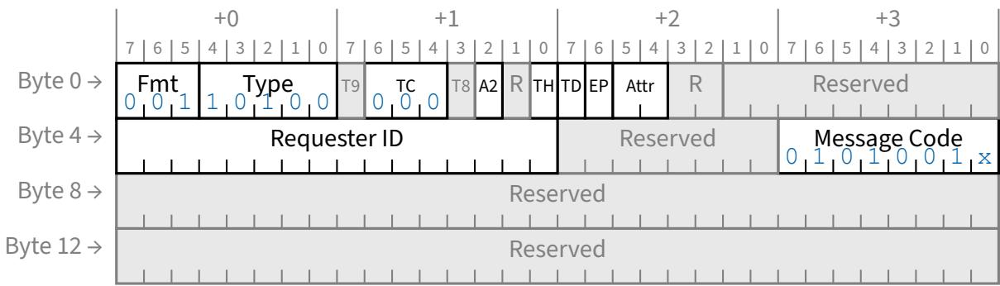

<<<PAGE_BREAK>>> page_225


<div style="overflow-x: auto; max-width: 100%;">
<table>
<thead>
<tr>
<th width="50%">🇬🇧 English</th>
<th width="50%" style="background-color:#e8e8e8">🇨🇳 中文</th>
</tr>
</thead>
<tbody>
<tr>
<td>

<a id="sec-2-2-8-11"></a>
### 2.2.8.11 Integrity and Data Encryption (IDE) Messages | 完整性与数据加密 (IDE) 消息

IDE Messages are used with the optional Integrity and Data Encryption (IDE) mechanism (see § Section 6.33 ). The
following rules apply to the formation of IDE Messages:
- § Table 2-36 defines the IDE Messages.
- The IDE Messages do not include a data payload (TLP Type is Msg).
- The Length field is Reserved.
- The Requester ID must be set to the RID of the Function implementing IDE at the Transmitting Port.
- IDE Sync and IDE Fail Messages associated with a Link IDE Stream must use Local routing (100b).
- IDE Sync and IDE Fail Messages associated with a Selective IDE Stream must use Route by ID (010b), and the
Destination ID must contain the value in the RID Base field of the Selective IDE RID Association Register Block.
These Messages must only be Transmitted if the Valid bit is Set in the Selective IDE RID Association Register for
the Selective IDE Stream.
- IDE Sync and IDE Fail Messages must use the same Traffic Class designator as the associated IDE Stream.
- IDE Sync Messages are implicitly associated with the same IDE Stream as indicated in the IDE Prefix applied to
the IDE Sync Message .

</td>
<td style="background-color:#e8e8e8">

IDE 消息与可选的完整性与数据加密 (Integrity and Data Encryption, IDE) 机制配合使用 (参见 § 6.33 节)。以下规则适用于 IDE 消息的构造:
- § 表 2-36 定义了 IDE 消息。
- IDE 消息不包含数据有效载荷 (TLP 类型为 Msg)。
- Length 字段为保留 (Reserved)。
- 请求者 ID (Requester ID) 必须设置为发送端口 (Transmitting Port) 上实现 IDE 的功能的 RID。
- 与链路 IDE 流 (Link IDE Stream) 相关联的 IDE Sync 和 IDE Fail 消息必须使用本地路由 (Local routing, 100b)。
- 与选择性 IDE 流 (Selective IDE Stream) 相关联的 IDE Sync 和 IDE Fail 消息必须使用按 ID 路由 (Route by ID, 010b),且 Destination ID 必须包含 Selective IDE RID Association Register Block 中 RID Base 字段的值。仅当该 Selective IDE Stream 对应的 Selective IDE RID Association Register 中的 Valid 位被设置时,才允许发送这些消息。
- IDE Sync 和 IDE Fail 消息必须使用与所关联的 IDE 流相同的流量类 (Traffic Class) 标识符。
- IDE Sync 消息与其应用于自身的 IDE Prefix 中所指示的 IDE 流隐式关联。

</td>
</tr>
</tbody>
</table>

> **Figure 2-68.** PTM ResponseD Message - Non-Flit Mode
> 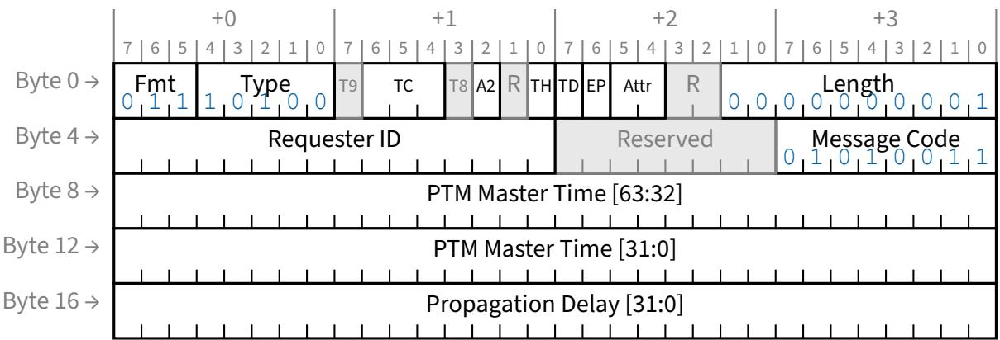

</div>


> **IMPLEMENTATION NOTE: PROPOGATION DELAY[31:0] ENDIANNESS**
>
> The bytes within the Propagation Delay[31:0] field (shown in § Figure 2-68) are such that:
> - Data Byte 0 contains Propagation Delay [31:24]
> - Data Byte 1 contains Propagation Delay [23:16]
> - Data Byte 2 contains Propagation Delay [15:8]
> - Data Byte 3 contains Propagation Delay [7:0]
>
> Due to ambiguity in previous versions of this document, some implementations made this interpretation:
> - Data Byte 0 contains Propagation Delay [7:0]
> - Data Byte 1 contains Propagation Delay [15:8]
> - Data Byte 2 contains Propagation Delay [23:16]
> - Data Byte 3 contains Propagation Delay [31:24]
>
> As a result, it is recommended that implementations provide mechanisms for adapting to either byte
> interpretation. One such mechanism is the optional PTM Propagation Delay Adaptation Capability.

> **实现提示:PROPOGATION DELAY[31:0] 字节序**
>
> § 图 2-68 中所示的 Propagation Delay[31:0] 字段内的字节排列如下:
> - Data Byte 0 包含 Propagation Delay [31:24]
> - Data Byte 1 包含 Propagation Delay [23:16]
> - Data Byte 2 包含 Propagation Delay [15:8]
> - Data Byte 3 包含 Propagation Delay [7:0]
>
> 由于本规范历史版本中存在歧义,部分实现采用了以下解释:
> - Data Byte 0 包含 Propagation Delay [7:0]
> - Data Byte 1 包含 Propagation Delay [15:8]
> - Data Byte 2 包含 Propagation Delay [23:16]
> - Data Byte 3 包含 Propagation Delay [31:24]
>
> 因此,建议实现提供可适配上述任一字节解释的机制。可选的 PTM Propagation Delay Adaptation Capability 即是这样一种机制。

<<<PAGE_BREAK>>> page_226

<table>
<thead>
<tr>
<th width="50%">🇬🇧 English</th>
<th width="50%" style="background-color:#e8e8e8">🇨🇳 中文</th>
</tr>
</thead>
<tbody>
<tr>
<td>

**Table 2-36 IDE Messages | 表 2-36 IDE 消息**

| Name | TLP Type | Code[7:0] (b) | Routing r[2:0] (b) | Support¹ (RC) | Support (EP) | Support (Sw) | Support (Br) | Description/Comments |
|------|----------|---------------|---------------------|----------------|--------------|--------------|--------------|----------------------|
| IDE Sync | Msg | 0101 0100 | 010 / 100 | tr | tr | tr | | Synchronization of IDE PR Count for the associated IDE Stream |
| IDE Fail | Msg | 0101 0101 | 010 / 100 | tr | tr | tr | | Notification of IDE failure for a specific IDE Stream from the detecting Port to the IDE Partner Port |

**Notes:**
1. Support for these messages is required when the optional IDE mechanism is implemented

</td>
<td style="background-color:#e8e8e8">

| Name | TLP Type | Code[7:0] (b) | Routing r[2:0] (b) | Support¹ (RC) | Support (EP) | Support (Sw) | Support (Br) | Description/Comments |
|------|----------|---------------|---------------------|----------------|--------------|--------------|--------------|----------------------|
| IDE Sync | Msg | 0101 0100 | 010 / 100 | tr | tr | tr | | 对所关联 IDE 流的 IDE PR 计数进行同步 |
| IDE Fail | Msg | 0101 0101 | 010 / 100 | tr | tr | tr | | 由检测到失败的端口向 IDE 对端端口 (IDE Partner Port) 通知某个特定 IDE 流的 IDE 失败 |

**注释:**
1. 当实现可选的 IDE 机制时,必须支持这些消息。

</td>
</tr>
</tbody>
</table>

---

> **Figure 2-71.** IDE Sync Message for Link IDE Stream - Non-Flit Mode
> 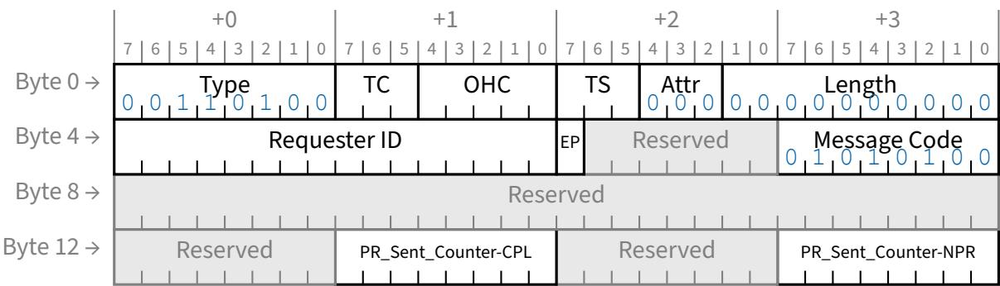

<<<PAGE_BREAK>>> page_227


<div style="overflow-x: auto; max-width: 100%;">
<table>
<thead>
<tr>
<th width="50%">🇬🇧 English</th>
<th width="50%" style="background-color:#e8e8e8">🇨🇳 中文</th>
</tr>
</thead>
<tbody>
<tr>
<td></td>
<td style="background-color:#e8e8e8">

</td>
</tr>
</tbody>
</table>

> **Figure 2-73.** IDE Sync Message for Selective IDE Stream - Non-Flit Mode
> 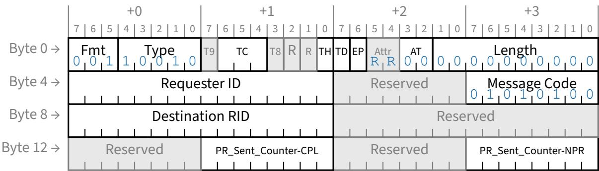

> **Figure 2-76.** IDE Fail Message for Link IDE Stream - Flit Mode
> 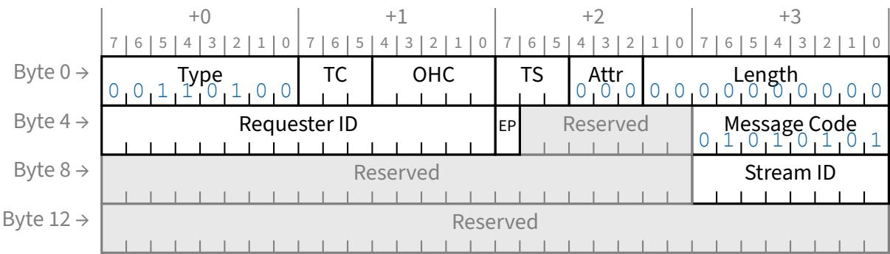

</div>


<<<PAGE_BREAK>>> page_228

<a id="sec-2-2-9"></a>
## 2.2.9 Completion Rules | 完成规则

<table>
<thead>
<tr>
<th width="50%">🇬🇧 English</th>
<th width="50%" style="background-color:#e8e8e8">🇨🇳 中文</th>
</tr>
</thead>
<tbody>
<tr>
<td>

All Read, Non-Posted Write, UIO, DMWR, and AtomicOp Requests require Completion. Completions include a Completion
header that, for some types of Completions, will be followed by some number of DWs of data. The rules for each of the
fields of the Completion header are defined in the following sections.

- Completions route by ID, and use a 3 DW header.
  - Note that the routing ID fields correspond directly to the Requester ID supplied with the
corresponding Request. Thus, for Completions these fields will be referred to collectively as the
Requester ID instead of the distinct fields used generically for ID routing.
- In addition to the header fields included in all TLPs and the ID routing fields, Completions contain the
following additional fields (see § Figure 2-79):
  - Completer ID[15:0] - Identifies the Completer - described in detail below
  - Completion Status[2:0] - Indicates the status for a Completion (see § Table 2-37)
    - Rules for determining the value in the Completion Status[2:0] field are in § Section 2.3.1 .
  - BCM - Byte Count Modified - this bit must not be set by PCI Express Completers, and may only be set
by PCI-X completers
  - Byte Count[11:0] - The remaining Byte Count for Request
    - The Byte Count value is specified as a binary number, with 0000 0000 0001b indicating 1
byte, 1111 1111 1111b indicating 4095 bytes, and 0000 0000 0000b indicating 4096 bytes.
    - For Memory Read Completions, Byte Count[11:0] is set according to the rules in § Section
2.3.1.1 .
    - For AtomicOp Completions, the Byte Count value must equal the associated AtomicOp
operand size in bytes.
    - For all other types of Completions, the Byte Count value must be 4.
  - Tag[9:0] - in combination with the Requester ID field, corresponds to the Transaction ID. In Non-Flit
Mode, the Tag field is 10 bits.
  - Lower Address[6:0] - lower byte address for starting byte of Completion
    - For Memory Read Completions, the value in this field is the byte address for the first
enabled byte of data returned with the Completion (see the rules in § Section 2.3.1.1 ).
    - For AtomicOp Completions, the Lower Address field is Reserved.
    - This field is set to all 0's for all remaining types of Completions. Receivers may optionally
check for violations of this rule. See § Section 2.3.2 , second bullet, for details.

</td>
<td style="background-color:#e8e8e8">

所有读 (Read)、Non-Posted 写、UIO、DMWR 和 AtomicOp 请求都需要完成 (Completion)。完成报文包含一个 Completion 报头 (Header),对于某些类型的完成报文,后面会跟随若干 DW 的数据。完成报头中每个字段的规则将在以下各节中定义。

- 完成报文按 ID 路由 (route by ID),并使用 3 DW 报头。
  - 请注意,路由 ID 字段与相应请求中提供的 Requester ID 一一对应。因此,对于完成报文,这些字段将统称为 Requester ID,而不是通常在 ID 路由中使用的各个独立字段。
- 除所有 TLP 都包含的报头字段和 ID 路由字段外,完成报文还包含以下附加字段 (参见 § 图 2-79):
  - Completer ID[15:0] - 标识完成方 (Completer) - 详见下文
  - Completion Status[2:0] - 指示完成报文的状态 (参见 § 表 2-37)
    - 关于如何确定 Completion Status[2:0] 字段值的规则,见 § 2.3.1 节。
  - BCM - Byte Count Modified - 该位不得由 PCI Express 完成方设置,仅可由 PCI-X 完成方设置
  - Byte Count[11:0] - 请求的剩余字节数 (Byte Count)
    - Byte Count 值以二进制数表示,0000 0000 0001b 表示 1 字节,1111 1111 1111b 表示 4095 字节,0000 0000 0000b 表示 4096 字节。
    - 对于内存读完成 (Memory Read Completion),Byte Count[11:0] 根据 § 2.3.1.1 节中的规则设置。
    - 对于 AtomicOp 完成,Byte Count 值必须等于相关 AtomicOp 操作数的大小 (以字节为单位)。
    - 对于所有其他类型的完成,Byte Count 值必须为 4。
  - Tag[9:0] - 与 Requester ID 字段一起对应于事务 ID (Transaction ID)。在非 Flit 模式 (Non-Flit Mode) 下,Tag 字段为 10 位。
  - Lower Address[6:0] - 完成报文起始字节的低位字节地址
    - 对于内存读完成,此字段中的值是随该完成报文一起返回数据的第一个使能字节的字节地址 (参见 § 2.3.1.1 节的规则)。
    - 对于 AtomicOp 完成,Lower Address 字段为保留 (Reserved)。
    - 对于所有其他类型的完成,此字段全部置 0。接收器可选地检查是否违反此规则。详见 § 2.3.2 节第二条。

</td>
</tr>
</tbody>
</table>

---

<a id="sec-2-2-9-1"></a>
### 2.2.9.1 Completion Rules for Non-Flit Mode | 非 Flit 模式下的完成规则

<<<PAGE_BREAK>>> page_229

**Table 2-37 Completion Status Field Values | 表 2-37 Completion Status 字段值**

| Cpl. Status[2:0] Field Value (b) | Completion Status |
|----------------------------------|--------------------|
| 000 | Successful Completion (SC) |
| 001 | Unsupported Request (UR) |
| 010 | Request Retry Status (RRS) |
| 100 | Completer Abort (CA) |
| all others | Reserved |

<table>
<thead>
<tr>
<th width="50%">🇬🇧 English</th>
<th width="50%" style="background-color:#e8e8e8">🇨🇳 中文</th>
</tr>
</thead>
<tbody>
<tr>
<td>

- The Completer ID[15:0] is a 16-bit value that is unique for every PCI Express Function within a Hierarchy (see
§ Figure 2-80 and § Figure 2-81)

</td>
<td style="background-color:#e8e8e8">

- Completer ID[15:0] 是一个 16 位值,在同一层级 (Hierarchy) 内对每个 PCI Express 功能 (Function) 都是唯一的 (参见 § 图 2-80 和 § 图 2-81)

</td>
</tr>
</tbody>
</table>

> **Figure 2-80 (Non-ARI) Completer ID**
> 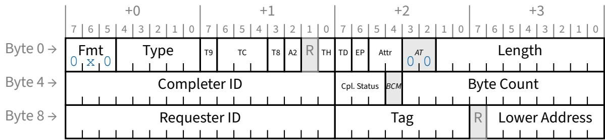


<div style="overflow-x: auto; max-width: 100%;">
<table>
<thead>
<tr>
<th width="50%">🇬🇧 English</th>
<th width="50%" style="background-color:#e8e8e8">🇨🇳 中文</th>
</tr>
</thead>
<tbody>
<tr>
<td>

- Functions must capture the Bus and Device Numbers
supplied with all Type 0 Configuration Write Requests
completed by the Function, and supply these numbers in the Bus and Device Number fields of the Completer
ID for all Completions generated by the Device/Function.
  - If a Function must generate a Completion prior to the initial device Configuration Write Request, 0's
must be entered into the Bus Number and Device Number fields
  - Note that Bus Number and Device Number may be changed at run time, and so it is necessary to
re-capture this information with each and every Configuration Write Request.
  - Exception: The assignment of Bus Numbers to the Devices within a Root Complex may be done in an
implementation specific way.
- In some cases, a Completion with UR Completion Status may be generated by an MFD without associating the
Completion with a specific Function within the device - in this case, the Function Number field
is Reserved.
  - Example: An MFD receives a Read Request that does not target any resource associated with any of
the Functions of the device - the device generates a Completion with UR status and sets a value of all
0's in the Function Number field of the Completer ID.
- Completion headers must supply the same values for the Requester ID, Tag, and Traffic Class as were supplied
in the header of the corresponding Request.
- Completion headers must supply the same values for the Attribute as were supplied in the header of the
corresponding Request, except as explicitly allowed:
  - when IDO is used (see § Section 2.2.6.4 )
  - when RO is used in a Translation Completion (see § Section 10.2.3 )
- The TH bit is reserved for Completions.
- AT[1:0] must be 00b. Receivers are not required or encouraged to check this.
- The Completer ID field is not meaningful prior to the software initialization and configuration of the completing
device (using at least one Configuration Write Request), and for this case the Requester must ignore the value
returned in the Completer ID field.
- A Completion including a data payload must specify the actual amount of data returned in that Completion,
and must include the amount of data specified.
  - It is a TLP formation error to include more or less data than specified in the Length field, and the
resulting TLP is a Malformed TLP.
Note: This is simply a specific case of the general rule requiring the TLP data payload length to match the value in the
Length field.

</td>
<td style="background-color:#e8e8e8">

- 功能 (Function) 必须捕获该功能所完成的所有 Type 0 配置写请求 (Configuration Write Request) 中提供的 Bus Number 和 Device Number,并在由该设备/功能所生成的所有完成报文的 Completer ID 的 Bus Number 和 Device Number 字段中提供这些值。
  - 如果某个功能必须在初始设备配置写请求之前生成完成报文,则 Bus Number 和 Device Number 字段必须填入 0。
  - 请注意,Bus Number 和 Device Number 在运行时可能发生变化,因此必须在每一次配置写请求时重新捕获该信息。
  - 例外:根复合体 (Root Complex) 内将 Bus Number 分配给各个设备的方式可以是实现特定的。
- 在某些情况下,一个多功能设备 (MFD) 可能生成具有 UR 完成状态的完成报文,但不将其与设备内某个具体功能相关联 — 在此情况下,Function Number 字段为保留 (Reserved)。
  - 示例:某个 MFD 收到一个读请求,但该请求并非针对设备内任何功能所关联的资源 — 此时设备生成一个具有 UR 状态的完成报文,并在 Completer ID 的 Function Number 字段中填入全 0。
- 完成报文报头必须为 Requester ID、Tag 和 Traffic Class 提供与对应请求报头中相同的值。
- 完成报文报头必须为 Attribute (属性) 提供与对应请求报头中相同的值,除以下明确允许的情况外:
  - 使用 IDO 时 (参见 § 2.2.6.4 节)
  - 在转换完成 (Translation Completion) 中使用 RO 时 (参见 § 10.2.3 节)
- TH 位对完成报文为保留 (Reserved)。
- AT[1:0] 必须为 00b。接收器不要求也不鼓励对此进行检查。
- 在完成设备经过软件初始化和配置 (使用至少一个配置写请求) 之前,Completer ID 字段没有意义;在这种情况下,请求方必须忽略 Completer ID 字段返回的值。
- 包含数据有效载荷的完成报文必须指定该完成报文实际返回的数据量,并必须包含所指定的数据量。
  - 在 TLP 中包含多于或少于 Length 字段所指定的数据属于 TLP 构造错误,所得到的 TLP 为格式错误 TLP (Malformed TLP)。
注:这只是一般规则 (要求 TLP 数据有效载荷长度与 Length 字段值匹配) 的一个具体应用。

</td>
</tr>
</tbody>
</table>
</div>


> 28. With ARI Devices, Functions are only required to capture the Bus Number. ARI Devices are permitted to retain the captured Bus Number on either a per-Device or a per-Function basis. See § Section 2.2.6.2 .
> 29. An ARI Completer ID does not contain a Device Number field. See § Section 2.2.4.2 .

> 28. 对于 ARI 设备,功能 (Function) 仅被要求捕获 Bus Number。ARI 设备被允许以按设备 (per-Device) 或按功能 (per-Function) 的方式保留所捕获的 Bus Number。参见 § 2.2.6.2 节。
> 29. ARI Completer ID 不包含 Device Number 字段。参见 § 2.2.4.2 节。

<<<PAGE_BREAK>>> page_230

<table>
<thead>
<tr>
<th width="50%">🇬🇧 English</th>
<th width="50%" style="background-color:#e8e8e8">🇨🇳 中文</th>
</tr>
</thead>
<tbody>
<tr>
<td>

<a id="sec-2-2-9-2"></a>
### 2.2.9.2 Completion Rules for Flit Mode | Flit 模式下的完成规则

In Flit Mode, the rules for non-UIO Completions are the same as in Non-Flit Mode, except as defined in this section. In Flit
Mode, Completions must use the Completion Header Base (see § Figure 2-82). UIO Write Completions and UIO Read
Completions with Completion Status other than Successful Completion (i.e., without Data) must use the Header Base
Format shown in § Figure 2-83. UIO Read Completions with Data must use the UIO Completion Header Base Format
shown in § Figure 2-84.

In Flit Mode, the Tag field is 14 bits.
Reserved Completions (as indicated in § Table 2-5), are ID Routed TLPs as defined in § Section 2.2.4.2 .

</td>
<td style="background-color:#e8e8e8">

在 Flit 模式下,非 UIO 完成报文的规则与非 Flit 模式相同,本节中另有规定者除外。在 Flit 模式下,完成报文必须使用 Completion Header Base (参见 § 图 2-82)。UIO 写完成报文 (UIO Write Completions) 以及完成状态不是成功完成 (Successful Completion) 的 UIO 读完成报文 (即不带数据) 必须使用 § 图 2-83 所示的 Header Base Format。带数据的 UIO 读完成报文必须使用 § 图 2-84 所示的 UIO Completion Header Base Format。

在 Flit 模式下,Tag 字段为 14 位。
保留的完成报文 (如 § 表 2-5 所示) 是按 ID 路由的 TLP,定义见 § 2.2.4.2 节。

</td>
</tr>
</tbody>
</table>

> **Figure 2-82.** Completion Header Base Format - Flit Mode
> 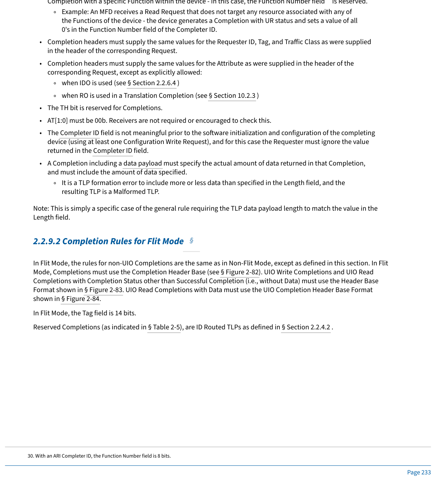

<<<PAGE_BREAK>>> page_231


<div style="overflow-x: auto; max-width: 100%;">
<table>
<thead>
<tr>
<th width="50%">🇬🇧 English</th>
<th width="50%" style="background-color:#e8e8e8">🇨🇳 中文</th>
</tr>
</thead>
<tbody>
<tr>
<td>

OHC-A5 (see § Figure 2-11) is required for all:
- Unsuccessful Completions
- Non-UIO Completions with Lower Address[1:0] not equal to 00b
- Completions that require the Destination Segment due to the associated Non-Posted Request containing a
Requester Segment that does not match the Completer's captured Segment.

When OHC-A5 is not present it is implied that the Completion Status is Successful, that Completer Segment and
Destination Segment need not be explicitly indicated (see Segment rules in § Section 2.2.1.2 ), and that, for non-UIO
Completions, the Lower Address[1:0] = 00b.

When OHC-A5 is present:
- the Completion Status and, for non-UIO Completions, Lower Address[1:0] fields must contain valid values
  - For UIO Completions, Lower Address[1:0] is Reserved
- the Completer Segment field must contain the Segment value captured by the Function as described in
§ Section 2.2.6.2 ; the Completer Segment field must be 00h if Segment Captured is Clear
- if the associated Request did not include a Requester Segment, the Destination Segment field must be 00h and
the DSV bit must be clear. If the associated Request included a Requester Segment, the Destination Segment
field must reflect the value of the Requester Segment and the DSV bit must be Set. See RP Segment Exceptions
for cases where RPs are not required to include Segment information.

The BCM field, present in Non-Flit Mode Completions, is not supported in Flit Mode.

For all UIO Completions:
- The Read Completion Boundary and Write Completion Boundary rules defined in § Section 2.3.1.2 and
§ Section 2.3.1.3 , respectively, must be followed.
- Length[9:0] indicates the total number of DW represented by this Completion. See § Table 2-4 for values.
  - Regardless of Completion Status, Completers must return Completions corresponding to all DW in a
UIO Request.
  - Byte Enables must not be considered when determining the Length value for UIO Completions.
    - For a Zero Length UIO Write (where in the Request, Length is 00_0000_0001b and First Byte
Enable 0000b), one DW must be considered to have been written.
- The Tag field value must match the Tag field value for the corresponding UIO Request(s)
  - UIO Write Completions are permitted to be coalesced or split, for a given Transaction ID, provided all
DW Completion accounting remains accurate (see § Section 2.3.1.3 ).
  - UIO Read Completions are permitted to be split, for a given Transaction ID, provided all DW
Completion accounting remains accurate (see § Section 2.3.1.2 ).
- Lower Address [1:0] is Reserved.
- For UIO Completions without Data (see § Figure 2-83)
  - Lower Address [6:2] is Reserved
- For UIO Completions with Data (see § Figure 2-84)
  - Lower Address [11:2] must be present
- The CDL[1:0] field is assigned for use by [CXL]; this field must be treated as Reserved for use cases not covered
by [CXL].
- UIO Requesters must accept UIO Completions in any order.
- UIO Memory Request(s) associated with a Transaction ID are considered completed only when the sum of all
DW completed, as indicated by the Length[9:0] field value(s) in the Completion(s), equals the sum of all DW
expected for the associated Request(s).
  - Only UIO Memory Writes are allowed to have multiple outstanding Requests with the same
Transaction ID. If it is necessary for a Requester to ensure that UIO Memory Write Requests issued
with a given Transaction ID have completed, the Requester must delay issuing additional Requests
with that Transaction ID until it has received Completions accounting for all outstanding UIO Memory
Write Requests using that Transaction ID.
- When fully completed, all Requests associated with the same Transaction ID are represented by the same
Completion Status. However, individual Completions of a UIO Request may indicate different Completion
Status values. At any point where UIO Completions are coalesced, including at the Requester, the coalesced
Completion Status is determined according to the following rules:

</td>
<td style="background-color:#e8e8e8">

以下情况均要求 OHC-A5 (参见 § 图 2-11):
- 不成功的完成报文 (Unsuccessful Completions)
- Lower Address[1:0] 不等于 00b 的非 UIO 完成报文
- 由于关联的 Non-Posted 请求所包含的 Requester Segment 与完成方 (Completer) 所捕获的 Segment 不匹配,而需要 Destination Segment 的完成报文。

当 OHC-A5 不存在时,意味着:Completion Status 为 Successful;Completer Segment 和 Destination Segment 不需要显式给出 (参见 § 2.2.1.2 节的 Segment 规则);并且对于非 UIO 完成报文,Lower Address[1:0] = 00b。

当 OHC-A5 存在时:
- Completion Status 以及 (对于非 UIO 完成报文) Lower Address[1:0] 字段必须包含有效值
  - 对于 UIO 完成报文,Lower Address[1:0] 为保留
- Completer Segment 字段必须包含该功能所捕获的 Segment 值,详见 § 2.2.6.2 节;若 Segment Captured 为 Clear,则 Completer Segment 字段必须为 00h
- 如果关联的请求不包含 Requester Segment,则 Destination Segment 字段必须为 00h,且 DSV 位必须为 Clear;如果关联的请求包含 Requester Segment,则 Destination Segment 字段必须反映 Requester Segment 的值,且 DSV 位必须被 Set。RP 不要求包含 Segment 信息的情况,请参见 "RP Segment Exceptions"。

BCM 字段存在于非 Flit 模式完成报文中,在 Flit 模式中不予支持。

对于所有 UIO 完成报文:
- 必须遵循 § 2.3.1.2 节和 § 2.3.1.3 节中分别定义的 Read Completion Boundary 和 Write Completion Boundary 规则。
- Length[9:0] 表示该完成报文所代表的 DW 总数。值的定义参见 § 表 2-4。
  - 无论 Completion Status 如何,完成方必须为 UIO 请求中的所有 DW 返回完成报文。
  - 在确定 UIO 完成报文的 Length 值时,不得考虑 Byte Enables。
    - 对于零长度 UIO 写 (Zero Length UIO Write,请求中 Length = 00_0000_0001b 且 First Byte Enable = 0000b),视为已写入一个 DW。
- Tag 字段值必须与对应 UIO 请求的 Tag 字段值相匹配
  - 对于给定的 Transaction ID,允许合并 (coalesce) 或拆分 (split) UIO 写完成报文,前提是所有 DW 完成报文账目保持准确 (参见 § 2.3.1.3 节)。
  - 对于给定的 Transaction ID,允许拆分 (split) UIO 读完成报文,前提是所有 DW 完成报文账目保持准确 (参见 § 2.3.1.2 节)。
- Lower Address[1:0] 为保留。
- 对于不带数据的 UIO 完成报文 (参见 § 图 2-83)
  - Lower Address[6:2] 为保留
- 对于带数据的 UIO 完成报文 (参见 § 图 2-84)
  - Lower Address[11:2] 必须存在
- CDL[1:0] 字段分配给 [CXL] 使用;对于 [CXL] 未涵盖的使用场景,该字段必须视为保留 (Reserved)。
- UIO 请求方必须接受以任何顺序到达的 UIO 完成报文。
- 与某个 Transaction ID 相关联的 UIO 内存请求 (UIO Memory Request),仅当完成报文中 Length[9:0] 字段值所指示的已完成 DW 总和等于该请求所期望的 DW 总和时,才被视为完成。
  - 仅 UIO 内存写 (UIO Memory Writes) 允许就同一 Transaction ID 同时存在多个未完成的请求 (outstanding Requests)。如果请求方需要确保以某个 Transaction ID 发出的 UIO 内存写请求已完成,则必须推迟以该 Transaction ID 发出进一步的请求,直到收到能账目所有使用该 Transaction ID 的、尚未完成的 UIO 内存写请求的完成报文为止。
- 当完全完成时,与同一 Transaction ID 相关联的所有请求以同一 Completion Status 表示。但是,一个 UIO 请求的各个完成报文可以指示不同的 Completion Status 值。在合并 (coalesce) UIO 完成报文的任何位置 (包括请求方在内),合并后的 Completion Status 按以下规则确定:

</td>
</tr>
</tbody>
</table>
</div>


<<<PAGE_BREAK>>> page_232

<table>
<thead>
<tr>
<th width="50%">🇬🇧 English</th>
<th width="50%" style="background-color:#e8e8e8">🇨🇳 中文</th>
</tr>
</thead>
<tbody>
<tr>
<td>

  - UR if any of the UIO Completions have UR Completion Status, or a Reserved Completion Status
  - CA if none of the UIO Completions have UR Completions Status, and any have CA Completion Status
  - RRS if none of the UIO Completions have UR or CA Completions Status, and any have RRS Completion
Status
  - SC if all UIO Completions have Successful Completion Status.
- UIO Completions for UIO Read Requests that have a Completion Status other than Successful Completion must
use TLP Type UIORdCpl
  - The Length value for UIORdCpl is not constrained by Max Payload Size or Max Read Request Size.
- Attr[2:0], corresponding to IDO, RO and NS in non-UIO Memory Requests, are Reserved
- The EP is Reserved for UIOWrCpl and UIORdCpl.

</td>
<td style="background-color:#e8e8e8">

  - 若任一 UIO 完成报文的 Completion Status 为 UR 或为保留的 Completion Status,则合并后为 UR
  - 若无 UIO 完成报文的 Completion Status 为 UR,但任一为 CA,则合并后为 CA
  - 若无 UIO 完成报文的 Completion Status 为 UR 或 CA,但任一为 RRS,则合并后为 RRS
  - 若所有 UIO 完成报文的 Completion Status 均为 Successful Completion (SC),则合并后为 SC。
- 对于完成状态不是 Successful Completion 的 UIO 读请求 (UIO Read Request),其 UIO 完成报文必须使用 TLP 类型 UIORdCpl
  - UIORdCpl 的 Length 值不受 Max Payload Size 或 Max Read Request Size 的限制。
- 非 UIO 内存请求中对应 IDO、RO 和 NS 的 Attr[2:0] 字段为保留
- EP 对于 UIOWrCpl 和 UIORdCpl 为保留。

</td>
</tr>
</tbody>
</table>

> 30. With an ARI Completer ID, the Function Number field is 8 bits.

> 30. 对于 ARI Completer ID,Function Number 字段为 8 位。

<a id="sec-2-2-10"></a>
## 2.2.10 TLP Prefix Rules | TLP Prefix 规则


<div style="overflow-x: auto; max-width: 100%;">
<table>
<thead>
<tr>
<th width="50%">🇬🇧 English</th>
<th width="50%" style="background-color:#e8e8e8">🇨🇳 中文</th>
</tr>
</thead>
<tbody>
<tr>
<td>

In NFM, the following rules apply to any TLP that contains a TLP Prefix:
- For any TLP, a value of 100b in the Fmt[2:0] field in byte 0 of the TLP indicates the presence of a TLP Prefix and
the Type[4] bit indicates the type of TLP Prefix.
  - A value of 0b in the Type[4] bit indicates the presence of a Local TLP Prefix
  - A value of 1b in the Type[4] bit indicates the presence of an End-End TLP Prefix
- The format for bytes 1 through 3 of a TLP Prefix is defined by its TLP Prefix type.
- A TLP that contains a TLP Prefix must have an underlying TLP Header. A received TLP that violates this rule is
handled as a Malformed TLP. This is a reported error associated with the Receiving Port (see § Section 6.2 ).
- It is permitted for a TLP to contain more than one TLP Prefix of any type
  - When a combination of Local and End-End TLP Prefixes are present in TLP, it is required that all the
Local TLP Prefixes precede any End-End TLP Prefixes. A received TLP that violates this rule is handled
as a Malformed TLP. This is a reported error associated with the Receiving Port (see § Section 6.2 ).
- The size of each TLP Prefix is 1 DW. A TLP Prefix may be repeated to provide space for additional data.
- If the value in the Fmt and Type field indicates the presence of a Local TLP Prefix, handle according to the Local
TLP Prefix handling (see § Section 2.2.10.2 ).
- If the value in the Fmt and Type field indicates the presence of an End-End TLP Prefix, handle according to the
End-End TLP Prefix handling (see § Section 2.2.10.4 ).

The following rules apply to Local TLP Prefixes:
- In Flit Mode, TLP Prefix types are determined using the Type[7:0] field (see § Table 2-5)
- In Non-Flit Mode, Local TLP Prefix types are determined using the L[3:0] sub-field of the Type field
  - Type[4] must be 0b
  - Local TLP Prefix L[3:0] values are defined in § Table 2-38

</td>
<td style="background-color:#e8e8e8">

在 NFM 中,以下规则适用于任何包含 TLP Prefix 的 TLP:
- 对于任何 TLP,TLP 第 0 字节中 Fmt[2:0] 字段为 100b 表示该 TLP 包含一个 TLP Prefix,Type[4] 位指示该 TLP Prefix 的类型。
  - Type[4] 位为 0b 表示存在 Local TLP Prefix (本地 TLP Prefix)
  - Type[4] 位为 1b 表示存在 End-End TLP Prefix (端到端 TLP Prefix)
- TLP Prefix 第 1 至 3 字节的格式由其 TLP Prefix 类型定义。
- 包含 TLP Prefix 的 TLP 必须具有一个底层 TLP Header。收到的违反此规则的 TLP 将被视为格式错误 TLP (Malformed TLP)。这是一个与接收端口 (Receiving Port) 相关联的可上报错误 (参见 § 6.2 节)。
- 允许一个 TLP 包含多个任意类型的 TLP Prefix
  - 当 TLP 中同时存在 Local 和 End-End TLP Prefix 时,要求所有 Local TLP Prefix 必须位于任何 End-End TLP Prefix 之前。收到的违反此规则的 TLP 将被视为格式错误 TLP (Malformed TLP)。这是一个与接收端口相关联的可上报错误 (参见 § 6.2 节)。
- 每个 TLP Prefix 的大小为 1 DW。可以通过重复 TLP Prefix 来为附加数据提供空间。
- 如果 Fmt 和 Type 字段的值表示存在 Local TLP Prefix,则按照 Local TLP Prefix 的处理方式处理 (参见 § 2.2.10.2 节)。
- 如果 Fmt 和 Type 字段的值表示存在 End-End TLP Prefix,则按照 End-End TLP Prefix 的处理方式处理 (参见 § 2.2.10.4 节)。

以下规则适用于 Local TLP Prefix:
- 在 Flit 模式 (Flit Mode) 下,TLP Prefix 类型由 Type[7:0] 字段确定 (参见 § 表 2-5)
- 在非 Flit 模式 (Non-Flit Mode) 下,Local TLP Prefix 类型由 Type 字段的 L[3:0] 子字段确定
  - Type[4] 必须为 0b
  - Local TLP Prefix 的 L[3:0] 值定义于 § 表 2-38

</td>
</tr>
</tbody>
</table>
</div>


---


---

<a id="sec-2-2-10-1"></a>
## 2.2.10.1 TLP Prefix General Rules - Non-Flit Mode | TLP Prefix 通用规则 - 非 Flit 模式

<table>
<thead>
<tr>
<th width="50%">🇬🇧 English</th>
<th width="50%" style="background-color:#e8e8e8">🇨🇳 中文</th>
</tr>
</thead>
<tbody>
<tr>
<td>

2.2.10.1 TLP Prefix General Rules - Non-Flit Mode §
2.2.10.2 Local TLP Prefix Processing §

</td>
<td style="background-color:#e8e8e8">

2.2.10.1 TLP Prefix 通用规则 - 非 Flit 模式 §
2.2.10.2 本地 TLP Prefix 处理 §

</td>
</tr>
</tbody>
</table>

[⬆️ 返回目录](#-本章目录-table-of-contents)

---

<<<PAGE_BREAK>>> page_237

**Table 2-38 Local TLP Prefix Types | 表 2-38 本地 TLP Prefix 类型**

| Local TLP Prefix Type | L[3:0] (b) | Description |
|-----------------------|------------|-------------|
| MR-IOV | 0000 | MR-IOV TLP Prefix - Refer to [MR-IOV] for details. |
| FlitModePrefix | 1101 | Flit Mode Local TLP Prefix - See § Section 2.2.10.3 |
| VendPrefixL0 | 1110 | Vendor Defined Local TLP Prefix - Refer to § Section 2.2.10.2.1 for further details. |
| VendPrefixL1 | 1111 | Vendor Defined Local TLP Prefix - Refer to § Section 2.2.10.2.1 for further details. |

All other encodings are Reserved.

<a id="sec-2-2-10-1-tbl"></a>

<div style="overflow-x: auto; max-width: 100%;">
<table>
<thead>
<tr>
<th width="50%">🇬🇧 English</th>
<th width="50%" style="background-color:#e8e8e8">🇨🇳 中文</th>
</tr>
</thead>
<tbody>
<tr>
<td>

- The size, routing, and flow control rules are specific to each Local TLP Prefix type.
- It is an error to receive a TLP with a Local TLP Prefix type not supported by the Receiver. If the Extended Fmt Field Supported bit is Set, TLPs in violation of this rule are handled as a Malformed TLP unless explicitly stated differently in another specification. This is a reported error associated with the Receiving Port (see § Section 6.2). If the Extended Fmt Field Supported bit is Clear, behavior is device specific.
- No Local TLP Prefixes are protected by ECRC even if the underlying TLP is protected by ECRC.

As described in § Table 2-38, Types VendPrefixL0 and VendPrefixL1 are defined for use as Vendor Defined Local TLP Prefixes. To maximize interoperability and flexibility the following rules are applied to such prefixes:

- Components must not send TLPs containing Vendor Defined Local TLP Prefixes unless this has been explicitly enabled (using vendor-specific mechanisms).
- Components that support any usage of Vendor Defined Local TLP Prefixes must support the 3-bit definition of the Fmt field and have the Extended Fmt Field Supported bit Set (see § Section 7.5.3.15).
- It is recommended that components be configurable (using vendor-specific mechanisms) so that all vendor defined prefixes can be sent using either of the two Vendor Defined Local TLP Prefix encodings. Such configuration need not be symmetric (for example each end of a Link could transmit the same Prefix using a different encoding).

</td>
<td style="background-color:#e8e8e8">

- 大小、路由和流控规则因本地 TLP Prefix 类型而异。
- 接收器收到不支持的本地 TLP Prefix 类型的 TLP 属于错误。如果 Extended Fmt Field Supported 位置位,则违反此规则的 TLP 将作为 Malformed TLP 处理,除非其他规范另有明确规定。此错误是与接收端口相关联的上报错误(参见 § Section 6.2)。如果 Extended Fmt Field Supported 位清零,则行为由设备自行决定。
- 即使底层 TLP 受 ECRC 保护,本地 TLP Prefix 也不受 ECRC 保护。

如 § Table 2-38 所述,VendPrefixL0 和 VendPrefixL1 类型被定义为厂商定义本地 TLP Prefix 使用。为最大化互操作性和灵活性,以下规则适用于此类 Prefix:

- 组件不得发送包含厂商定义本地 TLP Prefix 的 TLP,除非已通过厂商特定机制明确启用。
- 支持任何厂商定义本地 TLP Prefix 使用的组件必须支持 Fmt 字段的 3 位定义,并将 Extended Fmt Field Supported 位置位(参见 § Section 7.5.3.15)。
- 建议组件可配置(使用厂商特定机制),以便所有厂商定义 Prefix 都可以使用两种厂商定义本地 TLP Prefix 编码中的任意一种进行发送。此类配置不需要对称(例如,链路的两端可以使用不同编码传输相同的 Prefix)。

</td>
</tr>
</tbody>
</table>
</div>


<a id="sec-2-2-10-2"></a>
## 2.2.10.2 Local TLP Prefix Processing | 本地 TLP Prefix 处理

<table>
<thead>
<tr>
<th width="50%">🇬🇧 English</th>
<th width="50%" style="background-color:#e8e8e8">🇨🇳 中文</th>
</tr>
</thead>
<tbody>
<tr>
<td>

This prefix (see § Figure 2-85) is only permitted when operating in Flit Mode.

> **Figure 2-85.** Flit Mode Local TLP Prefix
> 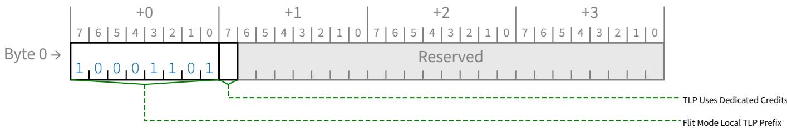

| Byte | 7 | 6 | 5 | 4 | 3 | 2 | 1 | 0 |
|------|---|---|---|---|---|---|---|---|
| +0   | Reserved | Reserved | Reserved | Reserved | Reserved | Reserved | Reserved | TLP Uses Dedicated Credits |
| +1   | Reserved | Reserved | Reserved | Reserved | Reserved | Reserved | Reserved | Reserved |
| +2   | Reserved | Reserved | Reserved | Reserved | Reserved | Reserved | Reserved | Reserved |
| +3   | Reserved | Reserved | Reserved | Reserved | Reserved | Reserved | Reserved | Reserved |

Flit Mode Local TLP Prefix: 1 0 0 0 1 1 0 1 (Byte 0)

</td>
<td style="background-color:#e8e8e8">

此 Prefix(参见 § Figure 2-85)仅在 Flit 模式下运行时才允许使用。

| 字节 | 7 | 6 | 5 | 4 | 3 | 2 | 1 | 0 |
|------|---|---|---|---|---|---|---|---|
| +0   | Reserved | Reserved | Reserved | Reserved | Reserved | Reserved | Reserved | TLP Uses Dedicated Credits |
| +1   | Reserved | Reserved | Reserved | Reserved | Reserved | Reserved | Reserved | Reserved |
| +2   | Reserved | Reserved | Reserved | Reserved | Reserved | Reserved | Reserved | Reserved |
| +3   | Reserved | Reserved | Reserved | Reserved | Reserved | Reserved | Reserved | Reserved |

Flit 模式本地 TLP Prefix: 1 0 0 0 1 1 0 1(字节 0)

</td>
</tr>
</tbody>
</table>

[⬆️ 返回目录](#-本章目录-table-of-contents)

---

<a id="sec-2-2-10-2-1"></a>
## 2.2.10.2.1 Vendor Defined Local TLP Prefix | 厂商定义本地 TLP Prefix

<table>
<thead>
<tr>
<th width="50%">🇬🇧 English</th>
<th width="50%" style="background-color:#e8e8e8">🇨🇳 中文</th>
</tr>
</thead>
<tbody>
<tr>
<td>

2.2.10.2.1 Vendor Defined Local TLP Prefix §
2.2.10.3 Flit Mode Local TLP Prefix §

§
§

</td>
<td style="background-color:#e8e8e8">

2.2.10.2.1 厂商定义本地 TLP Prefix §
2.2.10.3 Flit 模式本地 TLP Prefix §

§
§

</td>
</tr>
</tbody>
</table>

[⬆️ 返回目录](#-本章目录-table-of-contents)

---

<<<PAGE_BREAK>>> page_238

<a id="sec-2-2-10-3"></a>
## 2.2.10.3 Flit Mode Local TLP Prefix | Flit 模式本地 TLP Prefix


<div style="overflow-x: auto; max-width: 100%;">
<table>
<thead>
<tr>
<th width="50%">🇬🇧 English</th>
<th width="50%" style="background-color:#e8e8e8">🇨🇳 中文</th>
</tr>
</thead>
<tbody>
<tr>
<td>

If the Flit Mode Local TLP Prefix is applied to a NFM TLP, this is an error that MUST@FLIT be handled as a Malformed TLP.

It is permitted to apply the Flit Mode Local TLP Prefix to any FM TLP, but it is strongly recommended that the Flit Mode Local TLP Prefix is only applied to TLPs that specifically require the Prefix to be present.

The Flit Mode Local TLP Prefix includes:

- **TLP Uses Dedicated Credits** – This bit when Set indicates that the associated TLP must be handled using dedicated flow control credits. If this bit is Clear, or if the Flit Mode Local TLP Prefix is not present, the associated TLP must be handled using shared flow control credits.

The following rules apply to End-End TLP Prefixes

- End-End TLP Prefix types are determined using the E[3:0] sub-field of the Type field
  - Type[4] must be 1b
  - End-End TLP Prefix E[3:0] values are defined in § Table 2-39

</td>
<td style="background-color:#e8e8e8">

如果将 Flit 模式本地 TLP Prefix 应用于 NFM TLP,则属于 MUST@FLIT 错误,必须作为 Malformed TLP 处理。

允许将 Flit 模式本地 TLP Prefix 应用于任何 FM TLP,但强烈建议仅在特定需要 Prefix 存在时才将 Flit 模式本地 TLP Prefix 应用于 TLP。

Flit 模式本地 TLP Prefix 包括:

- **TLP 使用专用信用 (TLP Uses Dedicated Credits)** – 当此位置位时,表示相关 TLP 必须使用专用流控信用 (dedicated flow control credits) 进行处理。如果此位清零,或 Flit 模式本地 TLP Prefix 不存在,则相关 TLP 必须使用共享流控信用 (shared flow control credits) 进行处理。

以下规则适用于 End-End TLP Prefix:

- End-End TLP Prefix 类型由 Type 字段的 E[3:0] 子字段决定
  - Type[4] 必须为 1b
  - End-End TLP Prefix E[3:0] 值在 § Table 2-39 中定义

</td>
</tr>
</tbody>
</table>
</div>


**Table 2-39 End-End TLP Prefix Types | 表 2-39 End-End TLP Prefix 类型**

| End-End TLP Prefix Type | E[3:0] (b) | Description |
|-------------------------|------------|-------------|
| TPH | 0000 | TPH - Refer to § Section 2.2.7.1.1 and § Section 6.17 for further details. |
| PASID | 0001 | PASID - Refer to § Section 6.20 for further details. |
| IDE | 0010 | Identifies an IDE TLP - Refer to § Section 6.33 for further details. |
| VendPrefixE0 | 1110 | Vendor Defined End-End TLP Prefix - Refer to § Section 2.2.10.4.1 for further details. |
| VendPrefixE1 | 1111 | Vendor Defined End-End TLP Prefix - Refer to § Section 2.2.10.4.1 for further details. |

All other encodings are Reserved.

[⬆️ 返回目录](#-本章目录-table-of-contents)

---

<<<PAGE_BREAK>>> page_239

<a id="sec-2-2-10-4"></a>
## 2.2.10.4 End-End TLP Prefix Processing - Non-Flit Mode | End-End TLP Prefix 处理 - 非 Flit 模式

<table>
<thead>
<tr>
<th width="50%">🇬🇧 English</th>
<th width="50%" style="background-color:#e8e8e8">🇨🇳 中文</th>
</tr>
</thead>
<tbody>
<tr>
<td>

- The maximum number of End-End TLP Prefixes permitted in a TLP is 4:
  - A Receiver supporting TLP Prefixes must check this rule. If a Receiver determines that a TLP violates this rule, the TLP is a Malformed TLP. This is a reported error associated with the Receiving Port (see § Section 6.2).
- The presence of an End-End TLP Prefix does not alter the routing of a TLP. TLPs are routed based on the routing rules covered in § Section 2.2.4.
- Functions indicate how many End-End TLP Prefixes they support by the Max End-End TLP Prefixes field in the Device Capabilities 2 register (see § Section 7.5.3.15).
  - For Root Ports, the Max End-End TLP Prefixes field is permitted to return a value indicating support for fewer End-End TLP Prefixes than what the Root Port hardware actually implements; however, the error handling semantics must still be based on the value contained in the field. TLPs received that contain more End-End TLP Prefixes than are supported by the Root Port must be handled as follows.

It is recommended that Requests be handled as Unsupported Requests, but otherwise they must be handled as Malformed TLPs. It is recommended that Completions be handled as Unexpected Completions, but otherwise they must be handled as Malformed TLPs. For TLPs received by the Ingress Port, this is a reported error associated with the Ingress Port. For TLPs received internally to be transmitted out the Egress Port, this is a reported error associated with the Egress Port. See § Section 6.2.

- For all other Function types, TLPs received that contain more End-End TLP Prefixes than are supported by a Function must be handled as Malformed TLPs. This is a reported error associated with the Receiving Port (see § Section 6.2).

Advanced Error Reporting (AER) logging (if supported) occurs as specified in § Section 6.2.4.4.

- Switches must support forwarding of TLPs with up to 4 End-End TLP Prefixes if the End-End TLP Prefix Supported bit is Set.
- Different Root Ports with the End-End TLP Prefix Supported bit Set are permitted to report different values for Max End-End TLP Prefixes.
- All End-End TLP Prefixes are protected by ECRC if the underlying TLP is protected by ECRC.
- It is an error to receive a TLP with an End-End TLP Prefix by a Receiver that does not support End-End TLP Prefixes. A TLP in violation of this rule is handled as a Malformed TLP. This is a reported error associated with the Receiving Port (see § Section 6.2).
- Software should ensure that TLPs containing End-End TLP Prefixes are not sent to components that do not support them. Components where the Extended Fmt Field Supported bit is Clear may misinterpret TLPs containing TLP Prefixes.
- If one Function of an Upstream Port has the End-End TLP Prefix Supported bit Set, all Functions of that Upstream Port must handle the receipt of a Request addressed to them that contains an unsupported End-End TLP Prefix type as an Unsupported Request. This is a reported error associated with the Receiving Port (see § Section 6.2).
- If one Function of an Upstream Port has the End-End TLP Prefix Supported bit Set, all Functions of that Upstream Port must handle the receipt of a Completion addressed to them that contains an unsupported End-End TLP Prefix type as an Unexpected Completion. This is a reported error associated with the Receiving Port (see § Section 6.2).
- For Routing Elements, the End-End TLP Prefix Blocking bit in each Egress Port determines whether TLPs containing End-End TLP Prefixes can be transmitted via that Egress Port (see § Section 7.5.3.16). If forwarding is blocked the entire TLP is dropped and a TLP Prefix Blocked Error is reported. If the blocked TLP is a Non-Posted Request, the Egress Port returns a Completion with Unsupported Request Completion Status. The TLP Prefix Blocked Error is a reported error associated with the Egress Port (see § Section 6.2).
- For routing elements where Multicast is enabled (see § Section 6.14). End-End TLP Prefixes are replicated in all Multicast copies of a TLP. TLP Prefix Egress Blocking of Multicast packets is performed independently at each Egress Port.

</td>
<td style="background-color:#e8e8e8">

- 一个 TLP 中允许的最大 End-End TLP Prefix 数为 4:
  - 支持 TLP Prefix 的接收器必须检查此规则。如果接收器确定 TLP 违反此规则,则该 TLP 是 Malformed TLP。这是与接收端口相关联的上报错误(参见 § Section 6.2)。
- End-End TLP Prefix 的存在不会改变 TLP 的路由。TLP 根据 § Section 2.2.4 中所述的路由规则进行路由。
- Function 通过 Device Capabilities 2 寄存器中的 Max End-End TLP Prefixes 字段指示其支持的 End-End TLP Prefix 数量(参见 § Section 7.5.3.15)。
  - 对于根端口,Max End-End TLP Prefixes 字段允许返回一个值,表示支持的 End-End TLP Prefix 数量少于根端口硬件实际实现的数量;但错误处理语义必须仍基于该字段中包含的值。接收到的包含的 End-End TLP Prefix 数量超过根端口支持的 TLP 必须按以下方式处理。

建议将请求 (Requests) 作为 Unsupported Requests 处理,但在其他情况下必须作为 Malformed TLP 处理。建议将完成报文 (Completions) 作为 Unexpected Completions 处理,但在其他情况下必须作为 Malformed TLP 处理。对于由 Ingress Port 接收的 TLP,这是与 Ingress Port 相关联的上报错误。对于在内部接收以通过 Egress Port 发送的 TLP,这是与 Egress Port 相关联的上报错误。参见 § Section 6.2。

- 对于所有其他 Function 类型,接收到的包含的 End-End TLP Prefix 数量超过 Function 所支持的 TLP 必须作为 Malformed TLP 处理。这是与接收端口相关联的上报错误(参见 § Section 6.2)。

高级错误报告 (Advanced Error Reporting, AER) 日志记录(如果支持)按 § Section 6.2.4.4 中的规定进行。

- 如果 End-End TLP Prefix Supported 位置位,则交换机 (Switch) 必须支持转发包含最多 4 个 End-End TLP Prefix 的 TLP。
- 不同的根端口 (Root Ports) 在 End-End TLP Prefix Supported 位置位时,允许为 Max End-End TLP Prefixes 报告不同的值。
- 如果底层 TLP 受 ECRC 保护,则所有 End-End TLP Prefix 也受 ECRC 保护。
- 不支持 End-End TLP Prefix 的接收器收到包含 End-End TLP Prefix 的 TLP 属于错误。违反此规则的 TLP 将作为 Malformed TLP 处理。这是与接收端口相关联的上报错误(参见 § Section 6.2)。
- 软件应确保包含 End-End TLP Prefix 的 TLP 不会发送到不支持它们的组件。Extended Fmt Field Supported 位清零的组件可能会错误地解释包含 TLP Prefix 的 TLP。
- 如果上游端口 (Upstream Port) 的某个 Function 的 End-End TLP Prefix Supported 位置位,则该上游端口的所有 Function 必须将收到的发送给它们的包含不受支持的 End-End TLP Prefix 类型的请求作为 Unsupported Request 处理。这是与接收端口相关联的上报错误(参见 § Section 6.2)。
- 如果上游端口的某个 Function 的 End-End TLP Prefix Supported 位置位,则该上游端口的所有 Function 必须将收到的发送给它们的包含不受支持的 End-End TLP Prefix 类型的完成报文作为 Unexpected Completion 处理。这是与接收端口相关联的上报错误(参见 § Section 6.2)。
- 对于路由元素 (Routing Elements),每个 Egress Port 中的 End-End TLP Prefix Blocking 位决定是否可以通过该 Egress Port 传输包含 End-End TLP Prefix 的 TLP(参见 § Section 7.5.3.16)。如果转发被阻止,则整个 TLP 将被丢弃,并上报 TLP Prefix Blocked Error。如果被阻止的 TLP 是 Non-Posted Request,则 Egress Port 返回带有 Unsupported Request Completion Status 的完成报文。TLP Prefix Blocked Error 是与 Egress Port 相关联的上报错误(参见 § Section 6.2)。
- 对于启用了 Multicast 的路由元素(参见 § Section 6.14),End-End TLP Prefix 会在 TLP 的所有 Multicast 副本中复制。Multicast 数据包的 TLP Prefix Egress Blocking 在每个 Egress Port 独立执行。

</td>
</tr>
</tbody>
</table>

[⬆️ 返回目录](#-本章目录-table-of-contents)

---

As described in § Table 2-39, Types VendPrefixE0 and VendPrefixE1 are defined for use as Vendor Defined End-End TLP Prefixes. To maximize interoperability and flexibility the following rules are applied to such prefixes:


<div style="overflow-x: auto; max-width: 100%;">
<table>
<thead>
<tr>
<th width="50%">🇬🇧 English</th>
<th width="50%" style="background-color:#e8e8e8">🇨🇳 中文</th>
</tr>
</thead>
<tbody>
<tr>
<td>

- Components must not send TLPs containing Vendor Defined End-End TLP Prefixes unless this has been explicitly enabled (using vendor-specific mechanisms).
- It is recommended that components be configurable (using vendor-specific mechanisms) to use either of the two Vendor Defined End-End TLP Prefix encodings. Doing so allows two different Vendor Defined End-End TLP Prefixes to be in use simultaneously within a single PCI Express topology while not requiring that every source understand the ultimate destination of every TLP it sends.

2.2.10.4.1 Vendor Defined End-End TLP Prefix §

</td>
<td style="background-color:#e8e8e8">

- 组件不得发送包含厂商定义 End-End TLP Prefix 的 TLP,除非已通过厂商特定机制明确启用。
- 建议组件可配置(使用厂商特定机制)以使用两种厂商定义 End-End TLP Prefix 编码中的任意一种。这样,两个不同的厂商定义 End-End TLP Prefix 可以在单个 PCI Express 拓扑中同时使用,而无需每个源都了解其发送的每个 TLP 的最终目的地。

2.2.10.4.1 厂商定义 End-End TLP Prefix §

</td>
</tr>
</tbody>
</table>
</div>


[⬆️ 返回目录](#-本章目录-table-of-contents)

---

<<<PAGE_BREAK>>> page_240

<a id="sec-2-2-10-4-1"></a>
## 2.2.10.4.1 Vendor Defined End-End TLP Prefix | 厂商定义 End-End TLP Prefix

<table>
<thead>
<tr>
<th width="50%">🇬🇧 English</th>
<th width="50%" style="background-color:#e8e8e8">🇨🇳 中文</th>
</tr>
</thead>
<tbody>
<tr>
<td>

Support for peer-to-peer routing of TLPs containing End-End TLP Prefixes between Root Ports is optional and implementation dependent. If an RC supports End-End TLP Prefix routing capability between two or more Root Ports, it must indicate that capability in each associated Root Port via the End-End TLP Prefix Supported bit in the Device Capabilities 2 register.

An RC is not required to support End-End TLP Prefix routing between all pairs of Root Ports that have the End-End TLP Prefix Supported bit Set. A Request with End-End TLP Prefixes that would require routing between unsupported pairs of Root Ports must be handled as a UR. A Completion with End-End TLP Prefixes that would require routing between unsupported pairs of Root Ports must be handled as an Unexpected Completion (UC). In both cases, this error is reported by the "sending" Port.

The End-End TLP Prefix Supported bit must be Set for any Root Port that supports forwarding of TLPs with End-End TLP Prefixes initiated by host software or Root Complex Integrated Endpoints (RCiEPs). The End-End TLP Prefix Supported bit must be Set for any Root Ports that support forwarding of TLPs with End-End TLP Prefixes received on their Ingress Port to RCiEPs.

Different Root Ports with the End-End TLP Prefix Supported bit Set are permitted to report different values for Max End-End TLP Prefixes.

An RC that splits a TLP into smaller TLPs when performing peer-to-peer routing between Root Ports must replicate the original TLP's End-End TLP Prefixes in each of the smaller TLPs (see § Section 1.3.1).

End-End TLP Prefixes in Non-Flit Mode are replaced by OHC-E in Flit Mode (see § Figure 2-86, § Figure 2-87, and § Figure 2-88).

</td>
<td style="background-color:#e8e8e8">

根端口之间对包含 End-End TLP Prefix 的 TLP 进行对等路由 (peer-to-peer routing) 的支持是可选的,具体取决于实现。如果 RC 支持在两个或多个根端口之间进行 End-End TLP Prefix 路由功能,则必须通过 Device Capabilities 2 寄存器中的 End-End TLP Prefix Supported 位在每个相关联的根端口中指示此能力。

RC 不需要支持所有 End-End TLP Prefix Supported 位置位的根端口对之间的 End-End TLP Prefix 路由。需要在不受支持的根端口对之间路由的、带有 End-End TLP Prefix 的请求必须作为 UR 处理。需要在不受支持的根端口对之间路由的、带有 End-End TLP Prefix 的完成报文必须作为 Unexpected Completion (UC) 处理。在两种情况下,此错误均由"发送"sending 端口上报。

对于支持转发由主机软件或 RCiEP 启动的、带有 End-End TLP Prefix 的 TLP 的任何根端口,必须将 End-End TLP Prefix Supported 位置位。对于支持将在其 Ingress Port 上接收的、带有 End-End TLP Prefix 的 TLP 转发到 RCiEP 的任何根端口,必须将 End-End TLP Prefix Supported 位置位。

不同的根端口在 End-End TLP Prefix Supported 位置位时,允许为 Max End-End TLP Prefixes 报告不同的值。

在根端口之间执行对等路由时将 TLP 拆分为较小 TLP 的 RC,必须在每个较小的 TLP 中复制原始 TLP 的 End-End TLP Prefix(参见 § Section 1.3.1)。

非 Flit 模式下的 End-End TLP Prefix 在 Flit 模式中由 OHC-E 替代(参见 § Figure 2-86、§ Figure 2-87 和 § Figure 2-88)。

</td>
</tr>
</tbody>
</table>

> **Figure 2-86.** OHC-E1
> 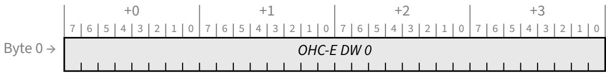

<table>
<thead>
<tr>
<th width="50%">🇬🇧 English</th>
<th width="50%" style="background-color:#e8e8e8">🇨🇳 中文</th>
</tr>
</thead>
<tbody>
<tr>
<td>

| Byte | 7 | 6 | 5 | 4 | 3 | 2 | 1 | 0 |
|------|---|---|---|---|---|---|---|---|
| +0   | R | R | R | R | R | R | R | R |
| +1   | R | R | R | R | R | R | R | R |
| +2   | R | R | R | R | R | R | R | R |
| +3   | R | R | R | R | R | R | R | R |

OHC-E DW 0 (Byte 0)

</td>
<td style="background-color:#e8e8e8">

| 字节 | 7 | 6 | 5 | 4 | 3 | 2 | 1 | 0 |
|------|---|---|---|---|---|---|---|---|
| +0   | R | R | R | R | R | R | R | R |
| +1   | R | R | R | R | R | R | R | R |
| +2   | R | R | R | R | R | R | R | R |
| +3   | R | R | R | R | R | R | R | R |

OHC-E DW 0(字节 0)

</td>
</tr>
</tbody>
</table>

> **Figure 2-87.** OHC-E2
> 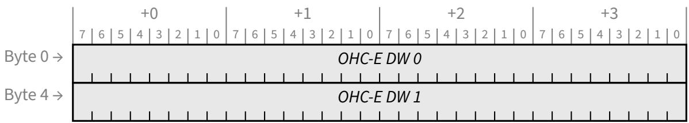

<table>
<thead>
<tr>
<th width="50%">🇬🇧 English</th>
<th width="50%" style="background-color:#e8e8e8">🇨🇳 中文</th>
</tr>
</thead>
<tbody>
<tr>
<td>

| Byte | 7 | 6 | 5 | 4 | 3 | 2 | 1 | 0 |
|------|---|---|---|---|---|---|---|---|
| +0   | R | R | R | R | R | R | R | R |
| +1   | R | R | R | R | R | R | R | R |
| +2   | R | R | R | R | R | R | R | R |
| +3   | R | R | R | R | R | R | R | R |

OHC-E DW 1, OHC-E DW 0 (Byte 0, Byte 4)

</td>
<td style="background-color:#e8e8e8">

| 字节 | 7 | 6 | 5 | 4 | 3 | 2 | 1 | 0 |
|------|---|---|---|---|---|---|---|---|
| +0   | R | R | R | R | R | R | R | R |
| +1   | R | R | R | R | R | R | R | R |
| +2   | R | R | R | R | R | R | R | R |
| +3   | R | R | R | R | R | R | R | R |

OHC-E DW 1、OHC-E DW 0(字节 0、字节 4)

</td>
</tr>
</tbody>
</table>

[⬆️ 返回目录](#-本章目录-table-of-contents)

---

<a id="sec-2-2-10-4-2"></a>
## 2.2.10.4.2 Root Ports with End-End TLP Prefix Supported | 支持 End-End TLP Prefix 的根端口

<table>
<thead>
<tr>
<th width="50%">🇬🇧 English</th>
<th width="50%" style="background-color:#e8e8e8">🇨🇳 中文</th>
</tr>
</thead>
<tbody>
<tr>
<td>

2.2.10.4.2 Root Ports with End-End TLP Prefix Supported §
2.2.11 OHC-E Rules - Flit Mode §

§
§

</td>
<td style="background-color:#e8e8e8">

2.2.10.4.2 支持 End-End TLP Prefix 的根端口 §
2.2.11 OHC-E 规则 - Flit 模式 §

§
§

</td>
</tr>
</tbody>
</table>

[⬆️ 返回目录](#-本章目录-table-of-contents)

---

<<<PAGE_BREAK>>> page_241

<a id="sec-2-2-11"></a>
## 2.2.11 OHC-E Rules - Flit Mode | OHC-E 规则 - Flit 模式


<div style="overflow-x: auto; max-width: 100%;">
<table>
<thead>
<tr>
<th width="50%">🇬🇧 English</th>
<th width="50%" style="background-color:#e8e8e8">🇨🇳 中文</th>
</tr>
</thead>
<tbody>
<tr>
<td>

| Byte | 7 | 6 | 5 | 4 | 3 | 2 | 1 | 0 |
|------|---|---|---|---|---|---|---|---|
| +0   | R | R | R | R | R | R | R | R |
| +1   | R | R | R | R | R | R | R | R |
| +2   | R | R | R | R | R | R | R | R |
| +3   | R | R | R | R | R | R | R | R |

OHC-E DW 3, OHC-E DW 2, OHC-E DW 1, OHC-E DW 0 (Byte 0, Byte 4, Byte 8, Byte 12)

</td>
<td style="background-color:#e8e8e8">

| 字节 | 7 | 6 | 5 | 4 | 3 | 2 | 1 | 0 |
|------|---|---|---|---|---|---|---|---|
| +0   | R | R | R | R | R | R | R | R |
| +1   | R | R | R | R | R | R | R | R |
| +2   | R | R | R | R | R | R | R | R |
| +3   | R | R | R | R | R | R | R | R |

OHC-E DW 3、OHC-E DW 2、OHC-E DW 1、OHC-E DW 0(字节 0、字节 4、字节 8、字节 12)

</td>
</tr>
</tbody>
</table>

> **Figure 2-88.** OHC-E4
> 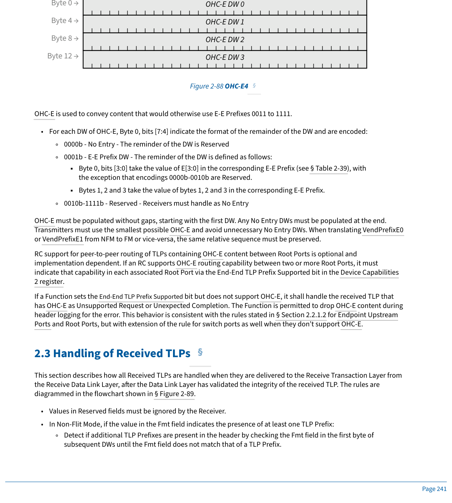

</div>


<table>
<thead>
<tr>
<th width="50%">🇬🇧 English</th>
<th width="50%" style="background-color:#e8e8e8">🇨🇳 中文</th>
</tr>
</thead>
<tbody>
<tr>
<td>

OHC-E is used to convey content that would otherwise use E-E Prefixes 0011 to 1111.

- For each DW of OHC-E, Byte 0, bits [7:4] indicate the format of the remainder of the DW and are encoded:
  - 0000b - No Entry - The reminder of the DW is Reserved
  - 0001b - E-E Prefix DW - The reminder of the DW is defined as follows:
    - Byte 0, bits [3:0] take the value of E[3:0] in the corresponding E-E Prefix (see § Table 2-39), with the exception that encodings 0000b-0010b are Reserved.
    - Bytes 1, 2 and 3 take the value of bytes 1, 2 and 3 in the corresponding E-E Prefix.
  - 0010b-1111b - Reserved - Receivers must handle as No Entry

OHC-E must be populated without gaps, starting with the first DW. Any No Entry DWs must be populated at the end. Transmitters must use the smallest possible OHC-E and avoid unnecessary No Entry DWs. When translating VendPrefixE0 or VendPrefixE1 from NFM to FM or vice-versa, the same relative sequence must be preserved.

RC support for peer-to-peer routing of TLPs containing OHC-E content between Root Ports is optional and implementation dependent. If an RC supports OHC-E routing capability between two or more Root Ports, it must indicate that capability in each associated Root Port via the End-End TLP Prefix Supported bit in the Device Capabilities 2 register.

If a Function sets the End-End TLP Prefix Supported bit but does not support OHC-E, it shall handle the received TLP that has OHC-E as Unsupported Request or Unexpected Completion. The Function is permitted to drop OHC-E content during header logging for the error. This behavior is consistent with the rules stated in § Section 2.2.1.2 for Endpoint Upstream Ports and Root Ports, but with extension of the rule for switch ports as well when they don't support OHC-E.

</td>
<td style="background-color:#e8e8e8">

OHC-E 用于传递原本将使用 E-E Prefix 0011 到 1111 的内容。

- 对于 OHC-E 的每个 DW,字节 0 的位 [7:4] 指示该 DW 其余部分的格式,编码如下:
  - 0000b - No Entry - 该 DW 的其余部分为 Reserved
  - 0001b - E-E Prefix DW - 该 DW 的其余部分定义如下:
    - 字节 0 的位 [3:0] 采用相应 E-E Prefix 中 E[3:0] 的值(参见 § Table 2-39),但编码 0000b-0010b 为 Reserved。
    - 字节 1、2 和 3 采用相应 E-E Prefix 中字节 1、2 和 3 的值。
  - 0010b-1111b - Reserved - 接收器必须将其作为 No Entry 处理

OHC-E 必须从第一个 DW 开始无间隔地填充。任何 No Entry DW 必须填充在末尾。发送器必须使用尽可能小的 OHC-E 并避免不必要的 No Entry DW。将 VendPrefixE0 或 VendPrefixE1 从 NFM 转换为 FM,或反之时,必须保留相同的相对顺序。

RC 对根端口之间包含 OHC-E 内容的 TLP 进行对等路由的支持是可选的,具体取决于实现。如果 RC 支持在两个或多个根端口之间进行 OHC-E 路由功能,则必须通过 Device Capabilities 2 寄存器中的 End-End TLP Prefix Supported 位在每个相关联的根端口中指示此能力。

如果 Function 设置了 End-End TLP Prefix Supported 位但不支持 OHC-E,则应将收到的包含 OHC-E 的 TLP 作为 Unsupported Request 或 Unexpected Completion 处理。该 Function 允许在错误的包头日志记录过程中丢弃 OHC-E 内容。此行为与 § Section 2.2.1.2 中针对端点上游端口 (Endpoint Upstream Ports) 和根端口所述的规则一致,但在交换机端口不支持 OHC-E 时,该规则也扩展到交换机端口。

</td>
</tr>
</tbody>
</table>

[⬆️ 返回目录](#-本章目录-table-of-contents)

---

<a id="sec-2-3"></a>
## 2.3 Handling of Received TLPs | 接收 TLP 的处理


<div style="overflow-x: auto; max-width: 100%;">
<table>
<thead>
<tr>
<th width="50%">🇬🇧 English</th>
<th width="50%" style="background-color:#e8e8e8">🇨🇳 中文</th>
</tr>
</thead>
<tbody>
<tr>
<td>

This section describes how all Received TLPs are handled when they are delivered to the Receive Transaction Layer from the Receive Data Link Layer, after the Data Link Layer has validated the integrity of the received TLP. The rules are diagrammed in the flowchart shown in § Figure 2-89.

- Values in Reserved fields must be ignored by the Receiver.
- In Non-Flit Mode, if the value in the Fmt field indicates the presence of at least one TLP Prefix:
  - Detect if additional TLP Prefixes are present in the header by checking the Fmt field in the first byte of subsequent DWs until the Fmt field does not match that of a TLP Prefix.

</td>
<td style="background-color:#e8e8e8">

本节描述了在数据链路层 (Data Link Layer) 验证了所接收 TLP 的完整性后,从接收数据链路层传递到接收事务层 (Receive Transaction Layer) 的所有接收 TLP 的处理方式。这些规则在 § Figure 2-89 所示的流程图中进行了说明。

- 接收器必须忽略 Reserved 字段中的值。
- 在非 Flit 模式下,如果 Fmt 字段中的值表示至少存在一个 TLP Prefix:
  - 通过检查后续 DW 第一个字节中的 Fmt 字段来检测包头中是否存在其他 TLP Prefix,直到 Fmt 字段与 TLP Prefix 的 Fmt 不匹配为止。

</td>
</tr>
</tbody>
</table>
</div>


[⬆️ 返回目录](#-本章目录-table-of-contents)

---

<<<PAGE_BREAK>>> page_242

<table>
<thead>
<tr>
<th width="50%">🇬🇧 English</th>
<th width="50%" style="background-color:#e8e8e8">🇨🇳 中文</th>
</tr>
</thead>
<tbody>
<tr>
<td>

- Handle all received TLP Prefixes according to TLP Prefix Handling Rules (see § Section 2.2.10.1).
- In Flit Mode, if the value in the Type field indicates the presence of at least one Local TLP Prefix:
  - Detect if additional Local TLP Prefixes are present in subsequent DWs.
  - Handle all received Local TLP Prefixes according to TLP Prefix Handling Rules (see § Section 2.2.10.3).
- In Non-Flit Mode, if the Extended Fmt Field Supported bit is Set, Received TLPs that use encodings of Fmt and Type that are Reserved are Malformed TLPs (see § Table 2-1 and § Table 2-3).
  - This is a reported error associated with the Receiving Port (see § Section 6.2).
- In Non-Flit Mode, if the Extended Fmt Field Supported bit is Clear, processing of Received TLPs that have Fmt[2] Set is undefined.<sup>31</sup>
- In Non-Flit Mode, all Received TLPs with Fmt[2] Clear and that use undefined Type field values are Malformed TLPs.
This is a reported error associated with the Receiving Port (see § Section 6.2).
- All Received Malformed TLPs must be discarded.
  - Received Malformed TLPs that are ambiguous with respect to which buffer to release or are mapped to an uninitialized or disabled Virtual Channel must be discarded without updating Receiver Flow Control information.
  - All other Received Malformed TLPs must be discarded, optionally not updating Receiver Flow Control information.
- Otherwise, update Receiver Flow Control tracking information (see § Section 2.6).
- If the value in the Type field indicates the TLP is a Request, handle according to Request Handling Rules, otherwise, the TLP is a Completion so handle according to Completion Handling Rules (see § Section 2.3.2).

<sup>31</sup>. An earlier version of this specification reserved the bit now defined for Fmt[2].

</td>
<td style="background-color:#e8e8e8">

- 根据 TLP Prefix 处理规则处理所有接收到的 TLP Prefix(参见 § Section 2.2.10.1)。
- 在 Flit 模式下,如果 Type 字段中的值表示至少存在一个本地 TLP Prefix:
  - 检测后续 DW 中是否存在其他本地 TLP Prefix。
  - 根据 TLP Prefix 处理规则处理所有接收到的本地 TLP Prefix(参见 § Section 2.2.10.3)。
- 在非 Flit 模式下,如果 Extended Fmt Field Supported 位置位,则使用 Fmt 和 Type 的 Reserved 编码的接收 TLP 是 Malformed TLP(参见 § Table 2-1 和 § Table 2-3)。
  - 这是与接收端口相关联的上报错误(参见 § Section 6.2)。
- 在非 Flit 模式下,如果 Extended Fmt Field Supported 位清零,则对 Fmt[2] 置位的接收 TLP 的处理是未定义的。<sup>31</sup>
- 在非 Flit 模式下,所有 Fmt[2] 清零且使用未定义 Type 字段值的接收 TLP 都是 Malformed TLP。
这是与接收端口相关联的上报错误(参见 § Section 6.2)。
- 所有接收的 Malformed TLP 必须被丢弃。
  - 对于在释放哪个缓冲区方面存在歧义或映射到未初始化或禁用的虚通道 (Virtual Channel) 的接收 Malformed TLP,必须在不更新接收器流控 (Receiver Flow Control) 信息的情况下丢弃。
  - 所有其他接收的 Malformed TLP 必须被丢弃,可以选择不更新接收器流控信息。
- 否则,更新接收器流控跟踪信息(参见 § Section 2.6)。
- 如果 Type 字段中的值表示 TLP 是请求 (Request),则根据请求处理规则处理;否则,该 TLP 是完成报文 (Completion),因此根据完成报文处理规则处理(参见 § Section 2.3.2)。

<sup>31</sup>. 本规范的早期版本保留了当前为 Fmt[2] 定义的位。

</td>
</tr>
</tbody>
</table>

[⬆️ 返回目录](#-本章目录-table-of-contents)

---

<<<PAGE_BREAK>>> page_243

> **Figure 2-89.** Flowchart for Handling of Received TLPs
> 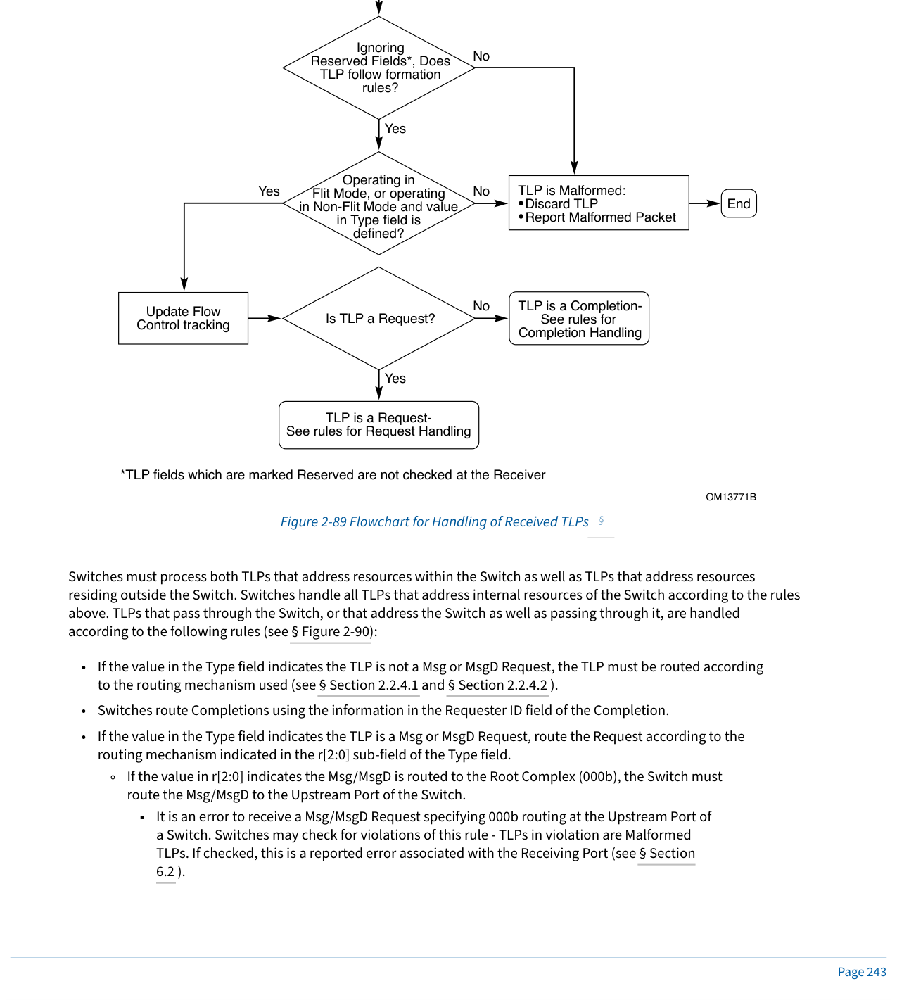


<div style="overflow-x: auto; max-width: 100%;">
<table>
<thead>
<tr>
<th width="50%">🇬🇧 English</th>
<th width="50%" style="background-color:#e8e8e8">🇨🇳 中文</th>
</tr>
</thead>
<tbody>
<tr>
<td>

Flowchart steps (OM13771B):
- Start
- Operating in Flit Mode, or operating in Non-Flit Mode and value in Type field is defined? → Yes/No
- Ignoring Reserved Fields, Does TLP follow formation rules? → Yes/No
- Is TLP a Request? → Yes/No
- TLP is a Request - See rules for Request Handling
- TLP is a Completion - See rules for Completion Handling
- Update Flow Control tracking
- TLP is Malformed: Discard TLP, Report Malformed Packet
- End

*Note: TLP fields which are marked Reserved are not checked at the Receiver.

</td>
<td style="background-color:#e8e8e8">

流程图步骤 (OM13771B):
- 开始
- 在 Flit 模式下运行,或在非 Flit 模式下运行且 Type 字段中的值是已定义的? → 是/否
- 忽略 Reserved 字段,TLP 是否遵循格式规则? → 是/否
- TLP 是请求 (Request) 吗? → 是/否
- TLP 是请求 - 参见请求处理规则
- TLP 是完成报文 (Completion) - 参见完成报文处理规则
- 更新流控跟踪
- TLP 是 Malformed:丢弃 TLP,上报 Malformed 数据包
- 结束

*注:标记为 Reserved 的 TLP 字段不会被接收器检查。

</td>
</tr>
</tbody>
</table>
</div>


[⬆️ 返回目录](#-本章目录-table-of-contents)

---

<table>
<thead>
<tr>
<th width="50%">🇬🇧 English</th>
<th width="50%" style="background-color:#e8e8e8">🇨🇳 中文</th>
</tr>
</thead>
<tbody>
<tr>
<td>

Switches must process both TLPs that address resources within the Switch as well as TLPs that address resources residing outside the Switch. Switches handle all TLPs that address internal resources of the Switch according to the rules above. TLPs that pass through the Switch, or that address the Switch as well as passing through it, are handled according to the following rules (see § Figure 2-90):

- If the value in the Type field indicates the TLP is not a Msg or MsgD Request, the TLP must be routed according to the routing mechanism used (see § Section 2.2.4.1 and § Section 2.2.4.2).
- Switches route Completions using the information in the Requester ID field of the Completion.
- If the value in the Type field indicates the TLP is a Msg or MsgD Request, route the Request according to the routing mechanism indicated in the r[2:0] sub-field of the Type field.
  - If the value in r[2:0] indicates the Msg/MsgD is routed to the Root Complex (000b), the Switch must route the Msg/MsgD to the Upstream Port of the Switch.
    - It is an error to receive a Msg/MsgD Request specifying 000b routing at the Upstream Port of a Switch. Switches may check for violations of this rule - TLPs in violation are Malformed TLPs. If checked, this is a reported error associated with the Receiving Port (see § Section 6.2).

</td>
<td style="background-color:#e8e8e8">

交换机 (Switch) 必须处理寻址交换机内资源的 TLP 以及寻址交换机外部资源的 TLP。交换机根据上述规则处理所有寻址交换机内部资源的 TLP。通过交换机的 TLP,或寻址交换机同时通过交换机的 TLP,按以下规则处理(参见 § Figure 2-90):

- 如果 Type 字段中的值表示 TLP 不是 Msg 或 MsgD 请求,则必须根据所使用的路由机制对 TLP 进行路由(参见 § Section 2.2.4.1 和 § Section 2.2.4.2)。
- 交换机使用完成报文 (Completion) 的 Requester ID 字段中的信息来路由完成报文。
- 如果 Type 字段中的值表示 TLP 是 Msg 或 MsgD 请求,则根据 Type 字段的 r[2:0] 子字段指示的路由机制对请求进行路由。
  - 如果 r[2:0] 中的值表示 Msg/MsgD 路由到根复合体 (Root Complex)(000b),则交换机必须将 Msg/MsgD 路由到交换机的上游端口 (Upstream Port)。
    - 在交换机的上游端口接收到指定 000b 路由的 Msg/MsgD 请求属于错误。交换机可以检查是否违反此规则——违反的 TLP 是 Malformed TLP。如果检查,这是与接收端口相关联的上报错误(参见 § Section 6.2)。

</td>
</tr>
</tbody>
</table>

[⬆️ 返回目录](#-本章目录-table-of-contents)

---

<<<PAGE_BREAK>>> page_244


<div style="overflow-x: auto; max-width: 100%;">
<table>
<thead>
<tr>
<th width="50%">🇬🇧 English</th>
<th width="50%" style="background-color:#e8e8e8">🇨🇳 中文</th>
</tr>
</thead>
<tbody>
<tr>
<td>

- If the value in r[2:0] indicates the Msg/MsgD is routed by address (001b), the Switch must route the Msg/MsgD in the same way it would route a Memory Request by address.
- If the value in r[2:0] indicates the Msg/MsgD is routed by ID (010b), the Switch must route the Msg/MsgD in the same way it would route a Completion by ID.
- If the value in r[2:0] indicates the Msg/MsgD is a broadcast from the Root Complex (011b), the Switch must route the Msg/MsgD to all Downstream Ports of the Switch.
  - It is an error to receive a Msg/MsgD Request specifying 011b routing at the Downstream Port of a Switch. Switches may check for violations of this rule - TLPs in violation are Malformed TLPs. If checked, this is a reported error associated with the Receiving Port (see § Section 6.2).
- If the value in r[2:0] indicates the Msg/MsgD terminates at the Receiver (100b or a Reserved value), or if the Message Code field value is defined and corresponds to a Message that must be comprehended by the Switch, the Switch must process the Message according to the Message processing rules.
- If the value in r[2:0] indicates Gathered and routed to Root Complex (101b), see § Section 5.3.3.2.1 for Message handling rules.
- It is an error to receive any Msg/MsgD Request other than a PME_TO_Ack that specifies 101b routing. It is an error to receive a PME_TO_Ack at the Upstream Port of a Switch. Switches may optionally check for violations of these rules. These checks are independently optional (see § Section 6.2.3.4). If checked, violations are Malformed TLPs, and are reported errors associated with the Receiving Port (see § Section 6.2).

</td>
<td style="background-color:#e8e8e8">

- 如果 r[2:0] 中的值表示 Msg/MsgD 按地址路由 (001b),则交换机必须以路由按地址的内存请求 (Memory Request) 的相同方式路由 Msg/MsgD。
- 如果 r[2:0] 中的值表示 Msg/MsgD 按 ID 路由 (010b),则交换机必须以路由按 ID 的完成报文的相同方式路由 Msg/MsgD。
- 如果 r[2:0] 中的值表示 Msg/MsgD 是来自根复合体的广播 (011b),则交换机必须将 Msg/MsgD 路由到交换机的所有下游端口 (Downstream Ports)。
  - 在交换机的下游端口接收到指定 011b 路由的 Msg/MsgD 请求属于错误。交换机可以检查是否违反此规则——违反的 TLP 是 Malformed TLP。如果检查,这是与接收端口相关联的上报错误(参见 § Section 6.2)。
- 如果 r[2:0] 中的值表示 Msg/MsgD 终止于接收器(100b 或 Reserved 值),或者如果 Message Code 字段值已定义且对应于交换机必须理解的消息 (Message),则交换机必须根据消息处理规则处理该消息。
- 如果 r[2:0] 中的值表示聚集并路由到根复合体 (101b),请参见 § Section 5.3.3.2.1 了解消息处理规则。
- 接收到除 PME_TO_Ack 之外的、任何指定 101b 路由的 Msg/MsgD 请求均属于错误。在交换机的上游端口接收到 PME_TO_Ack 属于错误。交换机可以选择性地检查是否违反这些规则。这些检查是独立可选的(参见 § Section 6.2.3.4)。如果检查,违反行为是 Malformed TLP,并且是与接收端口相关联的上报错误(参见 § Section 6.2)。

</td>
</tr>
</tbody>
</table>
</div>


[⬆️ 返回目录](#-本章目录-table-of-contents)

---

<<<PAGE_BREAK>>> page_245

> **Figure 2-90.** Flowchart for Switch Handling of TLPs
> 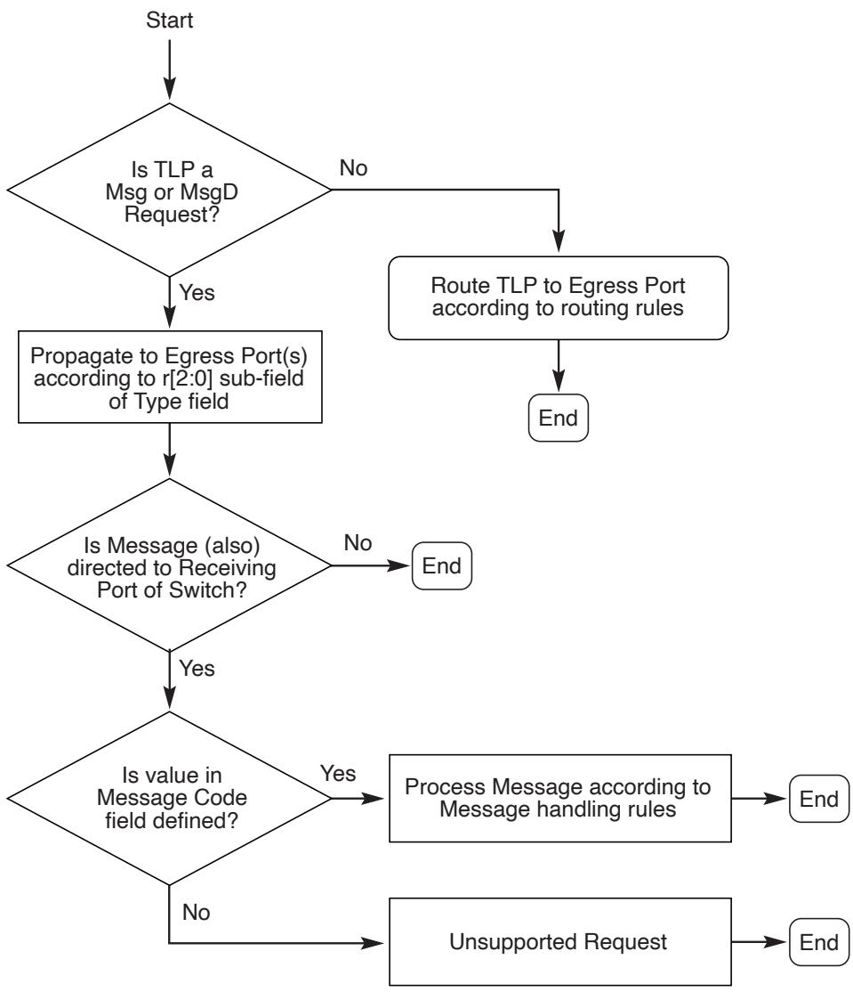

<table>
<thead>
<tr>
<th width="50%">🇬🇧 English</th>
<th width="50%" style="background-color:#e8e8e8">🇨🇳 中文</th>
</tr>
</thead>
<tbody>
<tr>
<td>

Flowchart steps (OM13772A):
- Start
- Is TLP a Msg or MsgD Request? → Yes/No
- Is Message (also) directed to Receiving Port of Switch? → Yes/No
- Is value in Message Code field defined? → Yes/No
- Route TLP to Egress Port according to routing rules
- Process Message according to Message handling rules
- Propagate to Egress Port(s) according to r[2:0] sub-field of Type field
- Unsupported Request
- End

</td>
<td style="background-color:#e8e8e8">

流程图步骤 (OM13772A):
- 开始
- TLP 是 Msg 或 MsgD 请求吗? → 是/否
- 消息是否也指向交换机的接收端口? → 是/否
- Message Code 字段中的值是已定义的吗? → 是/否
- 根据路由规则将 TLP 路由到 Egress Port
- 根据消息处理规则处理消息
- 根据 Type 字段的 r[2:0] 子字段传播到 Egress Port(s)
- Unsupported Request
- 结束

</td>
</tr>
</tbody>
</table>

[⬆️ 返回目录](#-本章目录-table-of-contents)

---

<a id="sec-2-3-1"></a>
## 2.3.1 Request Handling Rules | 请求处理规则


<div style="overflow-x: auto; max-width: 100%;">
<table>
<thead>
<tr>
<th width="50%">🇬🇧 English</th>
<th width="50%" style="background-color:#e8e8e8">🇨🇳 中文</th>
</tr>
</thead>
<tbody>
<tr>
<td>

This section describes how Received Requests are handled, following the initial processing done with all TLPs. The rules are diagrammed in the flowchart shown in § Figure 2-91.

- If the Request Type is defined in § Table 2-2, and § Table 2-3 (NFM), or is a non-Reserved value in § Table 2-5 (FM), but is not supported (by design or because of configuration settings) by the device, the Request must be handled as an Unsupported Request (UR). This is an error associated with the Receiving Port (see § Section 6.2)
  - If the Request requires a Completion, a Completion Status of UR must be returned (see § Section 2.2.9).
- For a Receiver that decodes UIO Type values, if the Request is a UIO Request, but the Receiver cannot forward or process the Request, then the Request must be dropped.

</td>
<td style="background-color:#e8e8e8">

本节描述了在完成所有 TLP 的初始处理之后,如何处理已接收的请求 (Requests)。这些规则在 § Figure 2-91 所示的流程图中进行了说明。

- 如果请求类型在 § Table 2-2 和 § Table 2-3 (NFM) 中已定义,或在 § Table 2-5 (FM) 中是非 Reserved 值,但设备不支持(由于设计或配置设置的原因),则必须将该请求作为 Unsupported Request (UR) 处理。这是与接收端口相关联的错误(参见 § Section 6.2)
  - 如果请求需要完成报文 (Completion),则必须返回 UR 的 Completion Status(参见 § Section 2.2.9)。
- 对于解码 UIO 类型值的接收器,如果请求是 UIO 请求,但接收器无法转发或处理该请求,则必须丢弃该请求。

</td>
</tr>
</tbody>
</table>
</div>


[⬆️ 返回目录](#-本章目录-table-of-contents)

---

<<<PAGE_BREAK>>> page_246

<table>
<thead>
<tr>
<th width="50%">🇬🇧 English</th>
<th width="50%" style="background-color:#e8e8e8">🇨🇳 中文</th>
</tr>
</thead>
<tbody>
<tr>
<td>

- In Flit Mode, if the Receiver is the ultimate destination of the TLP, and the Type value is defined in § Table 2-3 as a Reserved value, the Request must be discarded following the update of flow control credits.
- If the Request is a Message, and the Message Code, routing field, or Msg / MsgD indication corresponds to a combination that is undefined, or that corresponds to a Message not supported by the device Function (other than Vendor-Defined Type 1, which is not treated as an error - see § Table F-1), the Request is an Unsupported Request (UR). This is a reported error associated with the Receiving Port and is reported according to § Section 6.2
  - If the Message Code is a supported value, process the Message according to the corresponding Message processing rules; if the Message Code is an Ignored Message and the Receiver is ignoring it, ignore the Message without reporting any error (see § Section 2.2.8.7)
- If the Request is a Message with a routing field that indicates Routed by ID, and if the Request is received by a device Function with Type 0 headers, the device MUST@FLIT be treated as the target of the Message regardless

> **IMPLEMENTATION NOTE:**
> **WHEN REQUESTS ARE TERMINATED USING UNSUPPORTED REQUEST**
>
> In Conventional PCI, a device "claims" a request on the bus by asserting DEVSEL#. If no device claims a request after a set number of clocks, the request is terminated as a Master Abort. Since PCI Express is a point to point interconnect, there is no equivalent mechanism for claiming a request on a Link, since all transmissions by one component are always sent to the other component on the Link. Therefore, it is necessary for the receiver of a request to determine if the request should be claimed. If the request is not claimed, then it is handled as an Unsupported Request, which is the PCI Express equivalent of Conventional PCI's Master Abort termination. In general, one can determine the correct behavior by asking the question: Would the device assert DEVSEL# for this request in conventional PCI?
>
> For device Functions with Type 0 headers (all types of Endpoints), it is relatively simple to answer this question. For Memory and I/O Requests, this determination is based on the address ranges the Function has been programmed to respond to. For Configuration requests, the Type 0 request format indicates the device is by definition the "target", although the device will still not claim the Configuration Request if it addresses an unimplemented Function.
>
> For device Functions with Type 1 headers (Root Ports, Switches and Bridges), the same question can generally be applied, but since the behavior of a conventional PCI bridge is more complicated than that of a Type 0 Function, it is somewhat more difficult to determine the answers. One must consider Root Ports and Switch Ports as if they were actually composed of conventional PCI to PCI bridges, and then at each stage consider the configuration settings of the virtual bridge to determine the correct behavior.
>
> PCI Express Messages do not exist in conventional PCI, so the above guideline cannot be applied. This specification describes specifically for each type of Message when a device must handle the request as an Unsupported Request. Messages pass through Root and Switch Ports unaffected by conventional PCI control mechanisms including Bus Master Enable and power state setting.
>
> Note that CA, which is the PCI Express equivalent to Target Abort, is used only to indicate a serious error that makes the Completer permanently unable to respond to a request that it would otherwise have normally responded to. Since Target Abort is used in conventional PCI only when a target has asserted DEVSEL#, it is incorrect to use a CA for any case where a Conventional PCI target would have ignored a request by not asserting DEVSEL#.

</td>
<td style="background-color:#e8e8e8">

- 在 Flit 模式下,如果接收器是 TLP 的最终目的地,并且 Type 值在 § Table 2-3 中被定义为 Reserved 值,则必须在更新流控信用 (flow control credits) 之后丢弃该请求。
- 如果请求是消息 (Message),且 Message Code、路由字段或 Msg / MsgD 指示的组合是未定义的,或对应于设备 Function 不支持的消息(厂商定义 Type 1 除外,不视为错误 - 参见 § Table F-1),则该请求是 Unsupported Request (UR)。这是与接收端口相关联的上报错误,根据 § Section 6.2 上报
  - 如果 Message Code 是受支持的值,则根据相应的消息处理规则处理消息;如果 Message Code 是 Ignored Message 且接收器正在忽略它,则忽略该消息且不上报任何错误(参见 § Section 2.2.8.7)
- 如果请求是路由字段指示按 ID 路由 (Routed by ID) 的消息,并且该请求由具有 Type 0 包头的设备 Function 接收,则设备 MUST@FLIT 被视为消息的目标,无论

> **实现说明 (IMPLEMENTATION NOTE):**
> **使用 UNSUPPORTED REQUEST 终止请求时 (WHEN REQUESTS ARE TERMINATED USING UNSUPPORTED REQUEST)**
>
> 在传统 PCI 中,设备通过断言 DEVSEL# 在总线上"声明"请求。如果在经过设定的时钟数后没有设备声明请求,则该请求作为 Master Abort 终止。由于 PCI Express 是点对点互连,因此没有等效的机制来声明链路 (Link) 上的请求,因为一个组件的所有传输始终发送到链路上的另一个组件。因此,请求的接收器必须确定是否应声明该请求。如果请求未被声明,则作为 Unsupported Request 处理,这是 PCI Express 等效于传统 PCI 的 Master Abort 终止的方式。通常,可以通过问以下问题来确定正确的行为:在传统 PCI 中,设备是否会为此请求断言 DEVSEL#?
>
> 对于具有 Type 0 包头的设备 Function(所有类型的端点),回答此问题相对简单。对于内存 (Memory) 和 I/O 请求,此判定基于 Function 已编程响应地址范围。对于配置请求 (Configuration requests),Type 0 请求格式按定义表示设备是"目标",但如果该配置请求寻址未实现的 Function,则设备仍不会声明该配置请求。
>
> 对于具有 Type 1 包头的设备 Function(根端口、交换机和桥),通常可以应用相同的问题,但由于传统 PCI 桥的行为比 Type 0 Function 的行为更复杂,因此确定答案要稍微困难一些。必须将根端口和交换机端口视为实际上由传统 PCI 到 PCI 桥组成,然后在每个阶段考虑虚拟桥的配置设置以确定正确的行为。
>
> 传统 PCI 中不存在 PCI Express 消息,因此无法应用上述指南。本规范针对每种类型的消息具体描述了设备何时必须将请求作为 Unsupported Request 处理。消息通过根端口和交换机端口时不受传统 PCI 控制机制的影响,包括 Bus Master Enable 和电源状态设置。
>
> 请注意,CA(Completer Abort)是 PCI Express 等效于 Target Abort 的错误,仅用于指示严重错误,该错误使完成方 (Completer) 永久无法响应其原本能够正常响应的请求。由于 Target Abort 仅在目标已断言 DEVSEL# 时在传统 PCI 中使用,因此对于传统 PCI 目标本应通过不断言 DEVSEL# 来忽略请求的任何情况,使用 CA 都是不正确的。

</td>
</tr>
</tbody>
</table>

[⬆️ 返回目录](#-本章目录-table-of-contents)

---

<<<PAGE_BREAK>>> page_247


<div style="overflow-x: auto; max-width: 100%;">
<table>
<thead>
<tr>
<th width="50%">🇬🇧 English</th>
<th width="50%" style="background-color:#e8e8e8">🇨🇳 中文</th>
</tr>
</thead>
<tbody>
<tr>
<td>

of the Bus Number and, for non-ARI Devices, the Device Number specified in the Destination ID field of the Request

- If the Function specified in the Destination ID field is unimplemented, the Request MUST@FLIT be handled as an Unsupported Request (UR) and is a reported error associated with the Recieving Port (see § Section 6.2).
- Earlier versions of this specification recommended ignoring the Bus Number and Device Number fields with the Destination ID comparison in certain cases. While this behavior is still permitted, it is no longer recommended.

If the Request is not a Message, and is a supported Type, specific implementations may be optimized based on a defined programming model that ensures that certain types of (otherwise legal) Requests will never occur. Such implementations may take advantage of the following rule:

- If the Request violates the programming model of the device Function, the Function may optionally treat the Request as a Completer Abort, instead of handling the Request normally
  - If the Request is treated as a Completer Abort, this is a reported error associated with the Function (see § Section 6.2)
  - If the Request requires Completion, a Completion Status of CA is returned (see § Section 2.2.9)
- For DMWr Requests, refer to the rules in § Section 6.32.
- Otherwise (supported Request Type, not a DMWr, not a Message), process the Request
  - If the Completer is permanently unable to process the Request due to a device-specific error condition the Completer must, if possible, handle the Request as a Completer Abort
    - This is a reported error associated with the Receiving Function, if the error can be isolated to a specific Function in the component, or to the Receiving Port if the error cannot be isolated (see § Section 6.2)

> **IMPLEMENTATION NOTE:**
> **OPTIMIZATIONS BASED ON RESTRICTED PROGRAMMING MODEL**
>
> When a device's programming model restricts (versus what is otherwise permitted in PCI Express) the characteristics of a Request, that device is permitted to return a UR or a CA Completion Status, or to terminate the Request in a suitable implementation-specific way for any Request that violates the programming model. Examples include unaligned or wrong-size access to a register block and unsupported size of request to a Memory Space.
>
> Generally, devices are able to rely on a restricted programming model when all communication will be between the device's driver software and the device itself. Devices directly accessed via other software (e.g., operating system, application software) may not be able to rely on a restricted programming.
>
> Devices that implement legacy capabilities should be designed to support all types of Requests that are possible in the existing usage model for the device. If this is not done, the device may fail to operate with existing software.

If the Request arrives between the time an FLR has been initiated and the completion of the FLR by the targeted Function, the Request is permitted to be silently discarded (following update of flow control credits) without logging or signaling it as an error. It is recommended that the Request be handled as an Unsupported Request (UR).

</td>
<td style="background-color:#e8e8e8">

请求的 Destination ID 字段中指定的 Bus Number,以及非 ARI 设备的 Device Number 无关

- 如果 Destination ID 字段中指定的 Function 未实现,则请求 MUST@FLIT 作为 Unsupported Request (UR) 处理,并且是与接收端口相关联的上报错误(参见 § Section 6.2)。
- 本规范的早期版本建议在某些情况下忽略 Destination ID 比较中的 Bus Number 和 Device Number 字段。虽然此行为仍然允许,但不再推荐。

如果请求不是消息,并且是受支持的类型,则可以根据已定义的编程模型优化特定实现,以确保某些类型的(原本合法的)请求永远不会发生。此类实现可以利用以下规则:

- 如果请求违反设备 Function 的编程模型,则该 Function 可以选择将请求作为 Completer Abort 处理,而不是正常处理该请求
  - 如果请求被视为 Completer Abort,这是与 Function 相关联的上报错误(参见 § Section 6.2)
  - 如果请求需要完成报文,则返回 CA 的 Completion Status(参见 § Section 2.2.9)
- 对于 DMWr 请求,请参考 § Section 6.32 中的规则。
- 否则(受支持的请求类型,非 DMWr,非消息),处理该请求
  - 如果完成方由于设备特定的错误条件而永久无法处理该请求,则完成方必须在可能的情况下将请求作为 Completer Abort 处理
    - 如果错误可以隔离到组件中的特定 Function,这是与接收 Function 相关联的上报错误;如果无法隔离错误,则是与接收端口相关联的上报错误(参见 § Section 6.2)

> **实现说明 (IMPLEMENTATION NOTE):**
> **基于受限编程模型的优化 (OPTIMIZATIONS BASED ON RESTRICTED PROGRAMMING MODEL)**
>
> 当设备的编程模型限制(相对于 PCI Express 中允许的内容)请求的特征时,该设备可以针对违反编程模型的任何请求返回 UR 或 CA 的 Completion Status,或以适合实现的特定方式终止该请求。示例包括对寄存器块的未对齐或错误大小的访问,以及对内存空间 (Memory Space) 的不受支持大小的请求。
>
> 通常,当所有通信都将在设备的驱动程序软件和设备本身之间进行时,设备能够依赖受限的编程模型。直接通过其他软件(例如操作系统、应用程序软件)访问的设备可能无法依赖受限编程。
>
> 实现旧式功能 (legacy capabilities) 的设备应设计为支持设备现有使用模型中可能出现的所有类型的请求。如果不这样做,设备可能无法与现有软件一起运行。

如果请求在 FLR 启动之后和目标 Function 完成 FLR 之前到达,则允许静默丢弃该请求(在更新流控信用之后),无需将其记录或发出为错误。建议将请求作为 Unsupported Request (UR) 处理。

</td>
</tr>
</tbody>
</table>
</div>


[⬆️ 返回目录](#-本章目录-table-of-contents)

---

<<<PAGE_BREAK>>> page_248

<table>
<thead>
<tr>
<th width="50%">🇬🇧 English</th>
<th width="50%" style="background-color:#e8e8e8">🇨🇳 中文</th>
</tr>
</thead>
<tbody>
<tr>
<td>

- For Configuration Requests, if Device Readiness Status (DRS) is supported<sup>32</sup>, then:
  - Following any DRS Event (see § Section 6.22), once the Link is in L0, a Function associated with an Upstream Port MUST@FLIT return a Completion Status of RRS until the Upstream Port has transmitted a Device Readiness Status Message.
  - Once the Upstream Port has transmitted a Device Readiness Status Message, all non-VF Functions of the Upstream Port must respond to all properly formed Configuration Requests with a Completion Status of Successful Completion.
- For Configuration Requests only, if Device Readiness Status is not supported, following reset it is permitted for a Function to terminate the request and indicate that it is temporarily unable to process the Request, but will be able to process the Request in the future - in this case, the Request Retry Status (RRS) Completion Status must be used (see § Section 6.6). Valid reset conditions after which a device/Function is permitted to return RRS in response to a Configuration Request are:
  - Cold, Warm, and Hot Resets
  - FLRs
  - A reset initiated in response to a D3Hot to D0uninitialized device state transition
- A device Function is explicitly not permitted to return RRS in response to a Configuration Request following a software-initiated reset (other than an FLR) of the device, e.g., by the device's software driver writing to a device-specific reset bit. A device Function is not permitted to return RRS in response to a Configuration Request after it has indicated that it is Configuration-Ready (see § Section 6.22) without an intervening valid reset (i.e., FLR or Conventional Reset) condition, or if the Immediate Readiness bit in the Function's Status register is Set. Additionally, a device Function is not permitted to return RRS in response to a Configuration Request after having previously returned a Successful Completion without an intervening valid reset (i.e., FLR or Conventional Reset) condition.
- A Function that implements the Readiness Time Reporting Extended Capability must not return RRS in response to Configuration Requests that are received after the relevant times reported in that Extended Capability.
- In the process of servicing the Request, the Completer may determine that the (otherwise acceptable) Request must be handled as an error, in which case the Request is handled according to the type of the error
  - Example: A PCI Express/PCI Bridge may initially accept a Request because it specifies a Memory Space range mapped to the secondary side of the Bridge, but the Request may Master Abort or Target Abort on the PCI side of the Bridge. From the PCI Express perspective, the status of the Request in this case is UR (for Master Abort) or CA (for Target Abort). If the Request requires Completion on PCI Express, the corresponding Completion Status is returned.
- If the Request is a type that requires a Completion to be returned, generate a Completion according to the rules for Completion formation (see § Section 2.2.9)
  - The Completion Status is determined by the result of handling the Request
  - If the Request has an ECRC Check Failed error, then it is implementation specific whether to return a Completion or not. If a Completion is returned, the Completion MUST@FLIT have a UR Completion Status.
- Under normal operating conditions, PCI Express Endpoints and Legacy Endpoints must never delay the acceptance of a Posted Request for more than 10 μs, which is called the Posted Request Acceptance Limit. The device must either (a) be designed to process received Posted Requests and return associated Flow Control credits within the necessary time limit, or (b) rely on a restricted programming model to ensure that a Posted

<sup>32</sup>. If Flit Mode is supported then Device Readiness Status must be supported.

</td>
<td style="background-color:#e8e8e8">

- 对于配置请求 (Configuration Requests),如果支持 Device Readiness Status (DRS)<sup>32</sup>,则:
  - 在任何 DRS 事件之后(参见 § Section 6.22),一旦链路 (Link) 处于 L0 状态,与上游端口相关联的 Function MUST@FLIT 返回 RRS 的 Completion Status,直到上游端口已发送 Device Readiness Status Message。
  - 一旦上游端口发送了 Device Readiness Status Message,上游端口的所有非 VF Function 必须以 Successful Completion 的 Completion Status 响应所有格式正确的配置请求。
- 仅对于配置请求,如果不支持 Device Readiness Status,则在复位后,允许 Function 终止该请求并表示其暂时无法处理该请求,但能够在将来处理该请求 - 在这种情况下,必须使用 Request Retry Status (RRS) 的 Completion Status(参见 § Section 6.6)。设备/Function 在以下有效复位条件之后允许以 RRS 响应配置请求:
  - 冷复位 (Cold Reset)、热复位 (Warm Reset) 和热重置 (Hot Reset)
  - FLR
  - 响应 D3Hot 到 D0uninitialized 设备状态转换而发起的复位
- 明确不允许设备 Function 在设备的软件发起复位(FLR 除外)之后以 RRS 响应配置请求,例如,由设备的软件驱动程序写入设备特定的复位位。在 Function 表示其已 Configuration-Ready 之后(参见 § Section 6.22),不允许设备 Function 在没有有效的复位(即 FLR 或 Conventional Reset)条件介入的情况下以 RRS 响应配置请求,或者如果 Function 的 Status 寄存器中的 Immediate Readiness 位置位。同样,在先前已返回 Successful Completion 之后,不允许设备 Function 在没有有效的复位(即 FLR 或 Conventional Reset)条件介入的情况下以 RRS 响应配置请求。
- 实现 Readiness Time Reporting Extended Capability 的 Function 不得针对在该 Extended Capability 中报告的相关时间之后收到的配置请求返回 RRS。
- 在处理请求的过程中,完成方可以确定(原本可接受的)请求必须作为错误处理,在这种情况下,根据错误的类型处理该请求
  - 示例:PCI Express/PCI 桥最初可能因为请求指定映射到桥次级侧的内存空间 (Memory Space) 范围而接受该请求,但该请求可能在桥的 PCI 端产生 Master Abort 或 Target Abort。从 PCI Express 的角度来看,这种情况下请求的状态是 UR(对于 Master Abort)或 CA(对于 Target Abort)。如果 PCI Express 上的请求需要完成报文,则返回相应的 Completion Status。
- 如果请求是需要返回完成报文的类型,则根据完成报文 (Completion) 构成规则生成完成报文(参见 § Section 2.2.9)
  - Completion Status 由处理请求的结果决定
  - 如果请求存在 ECRC Check Failed 错误,则是否返回完成报文因实现而异。如果返回完成报文,则完成报文 MUST@FLIT 具有 UR 的 Completion Status。
- 在正常操作条件下,PCI Express 端点 (Endpoints) 和传统端点 (Legacy Endpoints) 绝不能延迟 Posted Request 的接受超过 10 μs,此时间称为 Posted Request Acceptance Limit。设备必须(a)设计为在必要的时间限制内处理收到的 Posted Request 并返回相关流控 (Flow Control) 信用,或(b)依赖受限编程模型以确保在设备无法在必要的时间限制内接受新的 Posted Request 时,软件或其他设备永远不会向该端点发起 Posted Request。

<sup>32</sup>. 如果支持 Flit 模式,则必须支持 Device Readiness Status。

</td>
</tr>
</tbody>
</table>

[⬆️ 返回目录](#-本章目录-table-of-contents)

---

<<<PAGE_BREAK>>> page_249


<div style="overflow-x: auto; max-width: 100%;">
<table>
<thead>
<tr>
<th width="50%">🇬🇧 English</th>
<th width="50%" style="background-color:#e8e8e8">🇨🇳 中文</th>
</tr>
</thead>
<tbody>
<tr>
<td>

Request is never initiated to the Endpoint either by software or by other devices while the Endpoint is unable to accept a new Posted Request within the necessary time limit.

- The following are not considered normal operating conditions under which the Posted Request Acceptance Limit applies:
  - The period immediately following a Fundamental Reset (see § Section 6.6)
  - TLP retransmissions or Link retraining
  - One or more dropped Flow Control Packets (FCPs)
  - The device being in a diagnostic mode
  - The device being in a device-specific mode that is not intended for normal use
- The following are considered normal operating conditions, but any delays they cause do not count against the Posted Request Acceptance Limit:
  - Upstream TLP traffic delaying Upstream FCPs
  - The Link coming out of a low-power state
  - Arbitration with traffic on other VCs
- Though not a requirement, it is strongly recommended that RCiEPs also honor the Posted Request Acceptance Limit.
- If the device/Function supports being a target for I/O Write Requests, which are Non-Posted Requests, it is strongly recommended that each associated Completion be returned within the same time limit as for Posted Request acceptance, although this is not a requirement.
- If the device/Function supports being a target for DMWr Requests, each associated Completion must be returned within the Posted Request Acceptance Limit<sup>33</sup>

> **IMPLEMENTATION NOTE:**
> **RESTRICTED PROGRAMMING MODEL FOR MEETING THE POSTED REQUEST ACCEPTANCE LIMIT**
>
> Some hardware designs may not be able to process every DMWr or Posted Request within the required Posted Request Acceptance Limit. An example is writing to a command queue where commands can take longer than the acceptance time limit to complete. Subsequent writes to such a device when it is currently processing a previous write could experience acceptance delays that exceed the limit. Such devices may rely on a restricted programming model, where the device driver limits the rate of DMWr/memory writes issued to the device, the driver polls the device to determine buffer availability before issuing the transaction, or the driver implements some other software-based flow control mechanism.

<sup>33</sup>. Although DMWr is a Non-Posted Request, the Posted Request Acceptance Limit is applied because many (but not all) of the same concerns apply as with Posted Requests. The name Posted Request Acceptance Limit is retained for historical reasons.

</td>
<td style="background-color:#e8e8e8">

Request 既不会被软件也不会被其他设备发起到端点。

- 以下不被视为适用 Posted Request Acceptance Limit 的正常操作条件:
  - 基本复位 (Fundamental Reset) 之后的紧接时段(参见 § Section 6.6)
  - TLP 重传或链路重训练 (Link retraining)
  - 一个或多个丢弃的流控数据包 (Flow Control Packets, FCPs)
  - 设备处于诊断模式
  - 设备处于不适用于正常使用的设备特定模式
- 以下被视为正常操作条件,但它们造成的任何延迟不计入 Posted Request Acceptance Limit:
  - 上游 TLP 流量延迟上游 FCP
  - 链路退出低功耗状态
  - 与其他 VC 上的流量进行仲裁 (Arbitration)
- 虽然不是一项要求,但强烈建议 RCiEP 也遵守 Posted Request Acceptance Limit。
- 如果设备/Function 支持作为 I/O Write Requests(Non-Posted Requests)的目标,则强烈建议在相同的时间限制内返回每个相关完成报文,如同 Posted Request 接受一样,尽管这不是必需的。
- 如果设备/Function 支持作为 DMWr Requests 的目标,则每个相关完成报文必须在 Posted Request Acceptance Limit<sup>33</sup> 内返回

> **实现说明 (IMPLEMENTATION NOTE):**
> **满足 POSTED REQUEST ACCEPTANCE LIMIT 的受限编程模型 (RESTRICTED PROGRAMMING MODEL FOR MEETING THE POSTED REQUEST ACCEPTANCE LIMIT)**
>
> 某些硬件设计可能无法在所需的 Posted Request Acceptance Limit 内处理每个 DMWr 或 Posted Request。例如,写入命令队列时,命令可能需要超过接受时间限制才能完成。当此类设备当前正在处理先前的写入时,对其的后续写入可能会经历超过限制的接受延迟。此类设备可依赖受限编程模型,其中设备驱动程序限制对设备发出的 DMWr/内存写入的速率,驱动程序在发出事务之前轮询设备以确定缓冲区可用性,或驱动程序实现其他一些基于软件的流控机制。

<sup>33</sup>. 虽然 DMWr 是 Non-Posted Request,但仍应用 Posted Request Acceptance Limit,因为其中许多(尽管不是全部)问题与 Posted Request 相同。保留 Posted Request Acceptance Limit 名称是出于历史原因。

</td>
</tr>
</tbody>
</table>
</div>


[⬆️ 返回目录](#-本章目录-table-of-contents)

---

<<<PAGE_BREAK>>> page_250

> **Figure 2-91.** Flowchart for Handling of Received Request
> 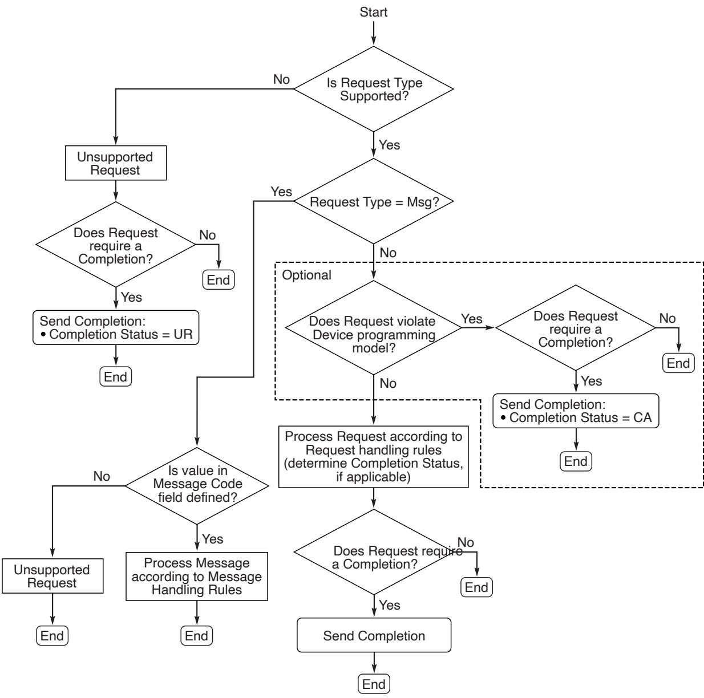

<table>
<thead>
<tr>
<th width="50%">🇬🇧 English</th>
<th width="50%" style="background-color:#e8e8e8">🇨🇳 中文</th>
</tr>
</thead>
<tbody>
<tr>
<td>

Flowchart steps (OM13773):
- Start
- Is Request Type Supported? → Yes/No
- Request Type = Msg? → Yes/No
- Does Request violate Device programming model? → Yes/No (Optional)
- Is value in Message Code field defined? → Yes/No
- Does Request require a Completion? → Yes/No
- TLP is a Request - See rules for Request Handling
- TLP is a Completion - See rules for Completion Handling
- Process Request according to Request handling rules (determine Completion Status, if applicable)
- Process Message according to Message Handling Rules
- Unsupported Request
- Send Completion: Completion Status = UR
- Send Completion: Completion Status = CA
- Send Completion
- End

</td>
<td style="background-color:#e8e8e8">

流程图步骤 (OM13773):
- 开始
- 请求类型受支持吗? → 是/否
- 请求类型 = Msg? → 是/否
- 请求是否违反设备编程模型? → 是/否(可选)
- Message Code 字段中的值是已定义的吗? → 是/否
- 请求需要完成报文吗? → 是/否
- TLP 是请求 - 参见请求处理规则
- TLP 是完成报文 - 参见完成报文处理规则
- 根据请求处理规则处理请求(确定 Completion Status,如适用)
- 根据消息处理规则处理消息
- Unsupported Request
- 发送完成报文:Completion Status = UR
- 发送完成报文:Completion Status = CA
- 发送完成报文
- 结束

</td>
</tr>
</tbody>
</table>

[⬆️ 返回目录](#-本章目录-table-of-contents)

---

<<<PAGE_BREAK>>> page_251


<div style="overflow-x: auto; max-width: 100%;">
<table>
<thead>
<tr>
<th width="50%">🇬🇧 English</th>
<th width="50%" style="background-color:#e8e8e8">🇨🇳 中文</th>
</tr>
</thead>
<tbody>
<tr>
<td>

- Individual Completions for Memory Read Requests may provide less than the full amount of data Requested so long as all Completions for a given Request when combined return exactly the amount of data Requested in the Read Request.
  - Completions for different Requests cannot be combined.
  - I/O and Configuration Reads must be completed with exactly one Completion.
  - A Completion with Completion Status other than Successful Completion must:
    - be of type Cpl or CplLk,
    - for a Read Request, including an ATS Translation Request, be the final Completion returned.
- Completions must not include more data than permitted by the Transmitting Function's Tx_MPS_Limit.
  - A Receiving Function must check for violations of its Rx_MPS_Limit.

> **IMPLEMENTATION NOTE:**
> **REQUEST RETRY STATUS FOR CONFIGURATION REQUESTS**
>
> Some devices require a lengthy self-initialization sequence to complete before they are able to service Configuration Requests. In specified circumstances it is permitted for a device/Function to "hold off" initial configuration via the Request Retry Status (RRS) Completion Status mechanism. A device in receipt of a Configuration Request following a valid reset condition may respond with an RRS Completion Status to terminate the Request, and thus effectively stall the Configuration Request until such time that the subsystem has completed local initialization and is ready to communicate with the host. Note that it is only legal in specified circumstances to respond with an RRS Completion Status in response to a Configuration Request. Readiness Notifications (see § Section 6.22) and Immediate Readiness (see § Section 7.5.1.1.4 and § Section 7.5.2.1) also forbid the use of RRS Completion Status in response to a Configuration Request in certain situations.
>
> Receipt by the Requester of a Completion with RRS Completion Status terminates the Configuration Request. Further action by the Root Complex regarding the original Configuration Request is specified in § Section 2.3.2.
>
> Root Complexes that implement Configuration RRS Software Visibility have the ability to report the receipt of RRS Completion Status for a Configuration Request to software, enabling software to attend to other tasks rather than being stalled while the device completes its self-initialization. Software that intends to take advantage of this mechanism must ensure that the first access made to a device following a valid reset condition is a Configuration Read Request accessing both bytes of the Vendor ID field in the device's Configuration Space header. For this case only, the Root Complex, if enabled, will synthesize a special read-data value for the Vendor ID field to indicate to software that RRS Completion Status has been returned by the device in response to a Configuration Request. For Configuration Requests to other addresses, or when Configuration RRS Software Visibility is not enabled, the Root Complex will generally re-issue the Configuration Request until it completes with a status other than RRS as described in § Section 2.3.2.
>
> Systems that contain PCIe components whose self-initialization time may require them to return a RRS Completion Status in response to a Configuration Request (by the rules in § Section 6.6) should provide some mechanism for re-issuing Configuration Requests terminated with RRS status. In systems running legacy PCI/PCI-X based software, the Root Complex must re-issue the Configuration Request using a hardware mechanism to ensure proper enumeration of the system.
>
> Refer to § Section 6.6 for more information on reset.

</td>
<td style="background-color:#e8e8e8">

- 内存读请求 (Memory Read Requests) 的各个完成报文可以提供少于所请求的全部数据量,只要给定请求的所有完成报文合并后返回的数据量与读请求中请求的数据量完全相同。
  - 不同请求的完成报文不能合并。
  - I/O 和配置读 (Configuration Reads) 必须仅以一个完成报文完成。
  - Completion Status 不是 Successful Completion 的完成报文必须:
    - 类型为 Cpl 或 CplLk,
    - 对于读请求(包括 ATS Translation Request),必须是返回的最后一个完成报文。
- 完成报文包含的数据不得超过发送 Function 的 Tx_MPS_Limit 所允许的数据量。
  - 接收 Function 必须检查是否违反其 Rx_MPS_Limit。

> **实现说明 (IMPLEMENTATION NOTE):**
> **配置请求的 REQUEST RETRY STATUS (REQUEST RETRY STATUS FOR CONFIGURATION REQUESTS)**
>
> 某些设备需要冗长的自初始化序列才能完成,然后才能为配置请求提供服务。在指定的情况下,允许设备/Function 通过 Request Retry Status (RRS) Completion Status 机制"推迟"初始配置。在有效复位条件之后收到配置请求的设备可以以 RRS 的 Completion Status 响应以终止该请求,从而有效地暂停配置请求,直到子系统完成本地初始化并准备好与主机通信为止。请注意,在指定的情况下,以 RRS 的 Completion Status 响应配置请求才是合法的。Readiness Notifications(参见 § Section 6.22)和 Immediate Readiness(参见 § Section 7.5.1.1.4 和 § Section 7.5.2.1)在某些情况下也禁止在响应配置请求时使用 RRS 的 Completion Status。
>
> 请求方收到带有 RRS 的 Completion Status 的完成报文将终止配置请求。有关根复合体 (Root Complex) 针对原始配置请求的进一步操作,请参见 § Section 2.3.2 中的规定。
>
> 实现 Configuration RRS Software Visibility 的根复合体能够将配置请求的 RRS 的 Completion Status 的接收情况报告给软件,从而使软件能够处理其他任务,而不是在设备完成自初始化时停滞。打算利用此机制的软件必须确保在有效复位条件之后对设备进行的第一次访问是访问设备配置空间 (Configuration Space) 头中 Vendor ID 字段两个字节的配置读请求。仅对于这种情况,根复合体(如果启用)将为 Vendor ID 字段合成特殊的读数据值,以向软件表明设备已以 RRS 的 Completion Status 响应配置请求。对于其他地址的配置请求,或未启用 Configuration RRS Software Visibility 时,根复合体通常会重新发出配置请求,直到以 RRS 以外的状态完成,详见 § Section 2.3.2。
>
> 包含 PCIe 组件的系统,其自初始化时间可能需要以 RRS 的 Completion Status 响应配置请求(根据 § Section 6.6 中的规则)应提供一些机制以重新发出以 RRS 状态终止的配置请求。在运行旧式 PCI/PCI-X 软件的系统中,根复合体必须使用硬件机制重新发出配置请求,以确保正确枚举系统。
>
> 有关复位的更多信息,请参考 § Section 6.6。

</td>
</tr>
</tbody>
</table>
</div>


[⬆️ 返回目录](#-本章目录-table-of-contents)

---


---

<a id="sec-2-3-1-1"></a>
## 2.3.1.1 Data Return for Non-UIO Read Requests | 非 UIO 读请求的数据返回

<table>
<thead>
<tr>
<th width="50%">🇬🇧 English</th>
<th width="50%" style="background-color:#e8e8e8">🇨🇳 中文</th>
</tr>
</thead>
<tbody>
<tr>
<td>

2.3.1.1 Data Return for Non-UIO Read Requests §

</td>
<td style="background-color:#e8e8e8">

2.3.1.1 非 UIO 读请求的数据返回 §

</td>
</tr>
</tbody>
</table>

[⬆️ 返回目录](#-本章目录-table-of-contents)

---

<<<PAGE_BREAK>>> page_252


<div style="overflow-x: auto; max-width: 100%;">
<table>
<thead>
<tr>
<th width="50%">🇬🇧 English</th>
<th width="50%" style="background-color:#e8e8e8">🇨🇳 中文</th>
</tr>
</thead>
<tbody>
<tr>
<td>

- See § Section 2.2.2 for important details with both Transmitters and Receivers.
- Note: This is simply a specific case of the rules that apply to all TLPs with data payloads
- Memory Read Requests may be completed with one, or in some cases, multiple Completions
- Read Completion Boundary (RCB) determines the naturally aligned address boundaries on which a Completer is permitted to break up the response for a single Read Request into multiple Completions.
  - For a Root Complex, RCB is 64 bytes or 128 bytes.
    - This value is reported Read Completion Boundary field in the Link Control Register (see § Section 7.5.3.7).
      - Note: Bridges and Endpoints may implement a corresponding command bit that may be set by system software to indicate the RCB value for the Root Complex, allowing the Bridge or Endpoint to optimize its behavior when the Root Complex's RCB is 128 bytes.
- For all other System Elements, RCB is 128 bytes.
- Completions for Requests that do not cross the naturally aligned address boundaries at integer multiples of RCB bytes must include all data specified in the Request.
- Requests that do cross the address boundaries at integer multiples of RCB bytes are permitted to be completed using more than one Completion subject to the following rules:
  - The first Completion must start with the address specified in the Request, and if successful must end at one of the following:
    - The address that satisfies the entire Request
    - An address boundary between the start and end of the Request at an integer multiple of RCB bytes
  - If the final Completion is successful, it must end at the address that satisfies the entire Request
  - All Completions between, but not including, the first and final Completions must be an integer multiple of RCB bytes in length
- Receivers may optionally check for violations of RCB. If a Receiver implementing this check determines that a Completion violates this rule, it must handle the Completion as a Malformed TLP.
  - This is a reported error associated with the Receiving Port (see § Section 6.2).
- Multiple Memory Read Completions for a single Read Request must return data in increasing address order.
- If all the Memory Read Completions for a single Memory Read Request have a Successful Completion Status, the sum of their payloads must equal the size requested. See § Section 10.2.4 for an exception for Memory Reads that are ATS Translation Requests.
- For each Memory Read Completion, the Byte Count field must indicate the remaining number of bytes required to complete the Request including the number of bytes returned with the Completion, except when the BCM bit is Set.<sup>34</sup>
  - The total number of bytes required to complete a Memory Read Request is calculated as shown in § Table 2-40.
  - If a Memory Read Request is completed using multiple Completions, the Byte Count value for each successive Completion is the value indicated by the preceding Completion minus the number of bytes returned with the preceding Completion.

</td>
<td style="background-color:#e8e8e8">

- 有关发送器与接收器的相关重要细节,请参阅 § Section 2.2.2。
- 注:这只是适用于所有带数据负载 TLP 规则的一个具体情形
- 内存读请求可以使用一个完成报文(Completion)完成,在某些情况下也可以使用多个完成报文
- 读完成边界(Read Completion Boundary, RCB)确定了自然对齐的地址边界,完成方(Completer)可以在这些边界上将单个读请求的响应拆分为多个完成报文。
  - 对于根复合体(RC)而言,RCB 为 64 字节或 128 字节。
    - 该值在链路控制寄存器(Link Control Register)的 Read Completion Boundary 字段中报告(参见 § Section 7.5.3.7)。
      - 注:桥(Bridge)与端点(Endpoint)可实现相应的命令位,由系统软件设置以指示 RC 的 RCB 值,从而在 RC 的 RCB 为 128 字节时允许桥或端点优化其行为。
- 对于所有其他系统元素,RCB 为 128 字节。
- 对于未跨越 RCB 字节整数倍自然对齐地址边界的请求,其完成报文必须包含请求中指定的所有数据。
- 允许使用多个完成报文来完成那些跨越 RCB 字节整数倍地址边界的请求,但须遵守以下规则:
  - 第一个完成报文必须从请求中指定的地址开始,如果成功,则必须在以下地址之一结束:
    - 满足整个请求的地址
    - 请求起止范围内 RCB 字节整数倍的地址边界
  - 如果最终的完成报文成功,则必须以满足整个请求的地址结束
  - 首尾完成报文之间的所有完成报文(不含首尾)的长度必须为 RCB 字节的整数倍
- 接收器可选择性地检查是否违反 RCB 规则。如果实现此检查的接收器判定某个完成报文违反了该规则,则必须将该完成报文作为格式错误的 TLP(Malformed TLP)处理。
  - 这是与接收端口相关联的上报错误(参见 § Section 6.2)。
- 单个读请求的多个内存读完成报文必须按地址递增的顺序返回数据。
- 如果单个内存读请求的所有内存读完成报文的状态均为成功完成(Successful Completion),则其有效负载之和必须等于所请求的大小。有关作为 ATS 转换请求的内存读的例外情况,请参见 § Section 10.2.4。
- 对于每个内存读完成报文,字节计数(Byte Count)字段必须指示完成该请求还需要的剩余字节数(包括该完成报文所返回的字节数),BCM 位置位时除外。<sup>34</sup>
  - 完成内存读请求所需的总字节数按 § Table 2-40 所示方式计算。
  - 如果内存读请求使用多个完成报文完成,则每个后续完成报文的 Byte Count 值为前一个完成报文所指示的值减去前一个完成报文所返回的字节数。

</td>
</tr>
</tbody>
</table>
</div>


<sup>34. Only PCI-X completers Set the BCM bit. PCI Express completers are not permitted to set the BCM bit. In Flit Mode, the BCM bit is deprecated. When translating from Non-Flit Mode to Flit Mode, if the BCM bit is 1b a TLP Translation Egress Blocked error must be indicated. When translating from Flit Mode to Non-Flit Mode the BCM bit must be Clear in the Non-Flit Mode Header.</sup>

---

<<<PAGE_BREAK>>> page_253

<table>
<thead>
<tr>
<th width="50%">🇬🇧 English</th>
<th width="50%" style="background-color:#e8e8e8">🇨🇳 中文</th>
</tr>
</thead>
<tbody>
<tr>
<td>

- The Completion Data area begins at the DW address specified by the Request. In the first or only Data DW of the first or only Completion, only the bytes configured as active in the First DW BE field in the Request contain valid data. Bytes configured as inactive in the First DW BE field in the Request will return undefined content.
- In the last Data DW of the last successful Completion, only the bytes configured as active in the Last DW BE field in the Request contain valid data. Bytes configured as inactive in the Last DW BE field in the Request will return undefined content.
- All the Completion Data bytes, including those with undefined content, are included in all CRC calculations.
- § Figure 2-92 presents an example of the above. The example assumes a single Completion TLP is returned.

> **Figure 2-92.** Example Completion Data when some Byte Enables are 0b
> 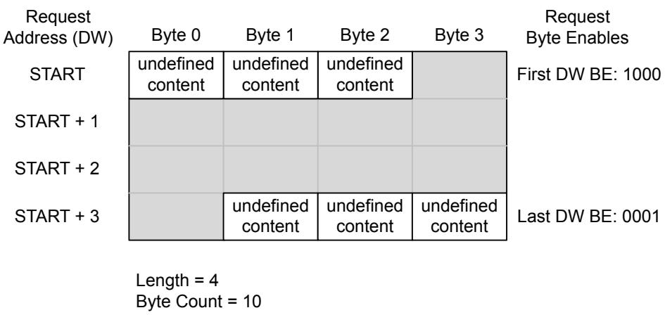

> **IMPLEMENTATION NOTE: BCM BIT USAGE**
> To satisfy certain PCI-X protocol constraints, a PCI-X Bridge or PCI-X Completer for a PCI-X burst read in some cases will set the Byte Count field in the first PCI-X transaction of the Split Completion sequence to indicate the size of just that first transaction instead of the entire burst read. When this occurs, the PCI-X Bridge/PCI-X Completer will also Set the BCM bit in that first PCI-X transaction, to indicate that the Byte Count field has been modified from its normal usage. Refer to the [PCI-X] for further details.
> A PCI Express Memory Read Requester needs to correctly handle the case when a PCI-X Bridge/PCI-X Completer sets the BCM bit. When this occurs, the first Read Completion packet returned to the Requester will have the BCM bit Set, indicating that the Byte Count field reports the size of just that first packet instead of the entire remaining Byte Count. The Requester should not conclude at this point that other packets of the Read Completion are missing.
> The BCM bit will never be Set in subsequent packets of the Read Completion, so the Byte Count field in those subsequent packets will always indicate the remaining Byte Count in each instance. Thus, the Requester can use the Byte Count field in these packets to determine if other packets of the Read Completion are missing.
> PCI Express Completers will never Set the BCM bit.
> The BCM bit is not present in Flit Mode.

</td>
<td style="background-color:#e8e8e8">

- 完成报文的数据区从请求所指定的 DW 地址开始。在第一个(或唯一的)完成报文的第一个(或唯一的)数据 DW 中,只有请求的 First DW BE 字段中配置为有效的字节才包含有效数据。请求的 First DW BE 字段中配置为无效的字节将返回未定义内容。
- 在最后一个成功完成报文的最后一个数据 DW 中,只有请求的 Last DW BE 字段中配置为有效的字节才包含有效数据。请求的 Last DW BE 字段中配置为无效的字节将返回未定义内容。
- 所有完成报文数据字节(包括未定义内容的字节)均参与所有 CRC 计算。
- § Figure 2-92 给出了上述规则的一个示例。示例假定返回一个完成报文 TLP。

> **实现说明:BCM 位使用**
> 为了满足某些 PCI-X 协议约束,针对 PCI-X 突发读,PCI-X 桥或 PCI-X 完成方在某些情况下会在 Split Completion 序列的第一个 PCI-X 事务中设置 Byte Count 字段,使其仅指示该第一个事务的大小,而不是整个突发读的大小。出现这种情况时,PCI-X 桥/PCI-X 完成方还会在该第一个 PCI-X 事务中置位 BCM 位,以指示 Byte Count 字段已偏离其正常使用方式。更多详细信息请参阅 [PCI-X]。
> PCI Express 内存读请求方需要正确处理 PCI-X 桥/PCI-X 完成方置位 BCM 位的情况。出现这种情况时,返回给请求方的第一个读完成报文将置位 BCM 位,表明 Byte Count 字段报告的只是该第一个报文的大小,而不是整个剩余字节数。请求方此时不应断定读完成报文的其他报文丢失。
> 读完成报文的后续报文中永远不会置位 BCM 位,因此这些后续报文中的 Byte Count 字段始终指示当时的剩余字节数。因此,请求方可以使用这些报文中的 Byte Count 字段来判断读完成报文的其他报文是否丢失。
> PCI Express 完成方永远不会置位 BCM 位。
> 在 Flit 模式下不存在 BCM 位。

</td>
</tr>
</tbody>
</table>

---

<<<PAGE_BREAK>>> page_254

**Table 2-40 Calculating Byte Count from Length and Byte Enables | 表 2-40 根据 Length 和字节使能计算 Byte Count**

| First DW BE[3:0] (b) | Last DW BE[3:0] (b) | Total Byte Count |
|----------------------|---------------------|------------------|
| 1xx1                 | 0000<sup>35</sup>   | 4                |
| 01x1                 | 0000                | 3                |
| 1x10                 | 0000                | 3                |
| 0011                 | 0000                | 2                |
| 0110                 | 0000                | 2                |
| 1100                 | 0000                | 2                |
| 0001                 | 0000                | 1                |
| 0010                 | 0000                | 1                |
| 0100                 | 0000                | 1                |
| 1000                 | 0000                | 1                |
| 0000                 | 0000                | 1                |
| xxx1                 | 1xxx                | Length<sup>36</sup> * 4 |
| xxx1                 | 01xx                | (Length * 4) - 1 |
| xxx1                 | 001x                | (Length * 4) - 2 |
| xxx1                 | 0001                | (Length * 4) - 3 |
| xx10                 | 1xxx                | (Length * 4) - 1 |
| xx10                 | 01xx                | (Length * 4) - 2 |
| xx10                 | 001x                | (Length * 4) - 3 |
| xx10                 | 0001                | (Length * 4) - 4 |
| x100                 | 1xxx                | (Length * 4) - 2 |
| x100                 | 01xx                | (Length * 4) - 3 |
| x100                 | 001x                | (Length * 4) - 4 |
| x100                 | 0001                | (Length * 4) - 5 |
| 1000                 | 1xxx                | (Length * 4) - 3 |
| 1000                 | 01xx                | (Length * 4) - 4 |
| 1000                 | 001x                | (Length * 4) - 5 |
| 1000                 | 0001                | (Length * 4) - 6 |

<sup>35. Note that Last DW BE of 0000b is permitted only with a Length of 1 DW.</sup>
<sup>36. Length is the number of DW as indicated by the value in the Length field, and is multiplied by 4 to yield a number in bytes.</sup>

---

<<<PAGE_BREAK>>> page_255


<div style="overflow-x: auto; max-width: 100%;">
<table>
<thead>
<tr>
<th width="50%">🇬🇧 English</th>
<th width="50%" style="background-color:#e8e8e8">🇨🇳 中文</th>
</tr>
</thead>
<tbody>
<tr>
<td>

- For all Memory Read Completions, the Lower Address field must indicate the lower bits of the byte address for the first enabled byte of data returned with the Completion.
  - For the first (or only) Completion, the Completer can generate this field from the least significant 5 bits of the address of the Request concatenated with 2 bits of byte-level address formed as shown in § Table 2-41.
  - For any subsequent Completions, the Lower Address field will always be zero except for Completions generated by a Root Complex with an RCB value of 64 bytes. In this case the least significant 6 bits of the Lower Address field will always be zero and the most significant bit of the Lower Address field will toggle according to the alignment of the 64-byte data payload.

**Table 2-41 Calculating Lower Address from First DW BE | 表 2-41 根据 First DW BE 计算 Lower Address**

| First DW BE[3:0] (b) | Lower Address[1:0] (b) |
|----------------------|------------------------|
| 0000                 | 00                     |
| xxx1                 | 00                     |
| xx10                 | 01                     |
| x100                 | 10                     |
| 1000                 | 11                     |

- When a Read Completion is generated with a Completion Status other than Successful Completion:
  - No data is included with the Completion
    - The Cpl (or CplLk) encoding is used instead of CplD (or CplDLk)
  - This Completion is the final Completion for the Request
    - The Completer must not transmit additional Completions for this Request
    - Example: Completer split the Request into four parts for servicing; the second Completion had a Completer Abort Completion Status; the Completer terminated servicing for the Request, and did not Transmit the remaining two Completions.
  - The Byte Count field must indicate the remaining number of bytes that would be required to complete the Request (as if the Completion Status were Successful Completion)
  - The Lower Address field must indicate the lower bits of the byte address for the first enabled byte of data that would have been returned with the Completion if the Completion Status were Successful Completion

</td>
<td style="background-color:#e8e8e8">

- 对于所有内存读完成报文,Lower Address 字段必须指示该完成报文所返回数据的第一个使能字节的字节地址低位。
  - 对于第一个(或唯一的)完成报文,完成方可以根据请求地址的最低 5 位与按 § Table 2-41 形成的 2 位字节级地址相拼接来生成此字段。
  - 对于任何后续完成报文,Lower Address 字段将始终为零,但由 RCB 为 64 字节的根复合体生成的完成报文除外。在这种情况下,Lower Address 字段的最低 6 位始终为零,最高位根据 64 字节数据负载的对齐情况进行切换。

**Table 2-41 根据 First DW BE 计算 Lower Address**

| First DW BE[3:0] (b) | Lower Address[1:0] (b) |
|----------------------|------------------------|
| 0000                 | 00                     |
| xxx1                 | 00                     |
| xx10                 | 01                     |
| x100                 | 10                     |
| 1000                 | 11                     |

- 当生成的读完成报文的完成状态不是成功完成(Successful Completion)时:
  - 该完成报文不携带数据
    - 使用 Cpl(或 CplLk)编码,而不是 CplD(或 CplDLk)
  - 该完成报文是此请求的最后一个完成报文
    - 完成方不得再为该请求发送额外的完成报文
    - 示例:完成方将请求拆分为四部分进行服务;第二个完成报文的完成状态为 Completer Abort;完成方终止对该请求的服务,且未发送剩余的两个完成报文。
  - Byte Count 字段必须指示完成该请求还需要的剩余字节数(如同完成状态为 Successful Completion 一样)
  - Lower Address 字段必须指示:如果完成状态为 Successful Completion,本应随该完成报文一起返回数据的第一个使能字节的字节地址低位

</td>
</tr>
</tbody>
</table>
</div>


---

<<<PAGE_BREAK>>> page_256

<table>
<thead>
<tr>
<th width="50%">🇬🇧 English</th>
<th width="50%" style="background-color:#e8e8e8">🇨🇳 中文</th>
</tr>
</thead>
<tbody>
<tr>
<td>

- UIO Read Completions must follow the same rules as non-UIO Read Completions, with the following exceptions:
  - Multiple UIO Read Completions for a single UIO Read Request are permitted to be returned in any address order.

> **IMPLEMENTATION NOTE: RESTRICTED PROGRAMMING MODEL**
> When a device's programming model restricts (vs. what is otherwise permitted in PCI Express) the size and/or alignment of Read Requests directed to the device, that device is permitted to use a Completer Abort Completion Status for Read Requests that violate the programming model. An implication of this is that such devices, generally devices where all communication will be between the device's driver software and the device itself, need not necessarily implement the buffering required to generate Completions of length RCB. However, in all cases, the boundaries specified by RCB must be respected for all reads that the device will complete with Successful Completion status.
> Examples:
> 1. Memory Read Request with Address of 1 0000h and Length of C0h bytes (192 decimal) could be completed by a Root Complex with an RCB value of 64 bytes with one of the following combinations of Completions (bytes):
>    192 -or- 128, 64 -or- 64, 128 -or- 64, 64, 64
> 2. Memory Read Request with Address of 1 0000h and Length of C0h bytes (192 decimal) could be completed by a Root Complex with an RCB value of 128 bytes in one of the following combinations of Completions (bytes):
>    192 -or- 128, 64
> 3. Memory Read Request with Address of 1 0020h and Length of 100h bytes (256 decimal) could be completed by a Root Complex with an RCB value of 64 bytes in one of the following combinations of Completions (bytes):
>    256 -or-
>    32, 224 -or- 32, 64, 160 -or- 32, 64, 64, 96 -or- 32, 64, 64, 64, 32 -or-
>    32, 64, 128, 32 -or- 32, 128, 96 -or- 32, 128, 64, 32 -or-
>    96, 160 -or- 96, 128, 32 -or- 96, 64, 96 -or- 96, 64, 64, 32 -or-
>    160, 96 -or- 160, 64, 32 -or- 224, 32
> 4. Memory Read Request with Address of 1 0020h and Length of 100h bytes (256 decimal) could be completed by an Endpoint in one of the following combinations of Completions (bytes):
>    256 -or- 96, 160 -or- 96, 128, 32 -or- 224, 32

</td>
<td style="background-color:#e8e8e8">

- UIO 读完成报文必须遵循与非 UIO 读完成报文相同的规则,但有以下例外:
  - 允许以任意地址顺序返回单个 UIO 读请求的多个 UIO 读完成报文。

> **实现说明:受限编程模型**
> 当设备的编程模型对指向该设备的读请求的大小和/或对齐有所限制(相对于 PCI Express 中通常所允许的)时,允许该设备对违反编程模型的读请求使用 Completer Abort 完成状态。其含义是,对于此类设备(通常所有通信都将在设备驱动程序软件与设备本身之间进行的设备),不必实现生成长度为 RCB 的完成报文所需的缓冲。但在所有情况下,对于设备将以 Successful Completion 状态完成的所有读操作,都必须遵守 RCB 规定的边界。
> 示例:
> 1. 地址为 1 0000h、长度为 C0h 字节(即 192,十进制)的内存读请求,可以由 RCB 为 64 字节的根复合体以以下完成报文组合之一(单位:字节)完成:
>    192 -或- 128, 64 -或- 64, 128 -或- 64, 64, 64
> 2. 地址为 1 0000h、长度为 C0h 字节(即 192,十进制)的内存读请求,可以由 RCB 为 128 字节的根复合体以以下完成报文组合之一(单位:字节)完成:
>    192 -或- 128, 64
> 3. 地址为 1 0020h、长度为 100h 字节(即 256,十进制)的内存读请求,可以由 RCB 为 64 字节的根复合体以以下完成报文组合之一(单位:字节)完成:
>    256 -或-
>    32, 224 -或- 32, 64, 160 -或- 32, 64, 64, 96 -或- 32, 64, 64, 64, 32 -或-
>    32, 64, 128, 32 -或- 32, 128, 96 -或- 32, 128, 64, 32 -或-
>    96, 160 -或- 96, 128, 32 -或- 96, 64, 96 -或- 96, 64, 64, 32 -或-
>    160, 96 -或- 160, 64, 32 -或- 224, 32
> 4. 地址为 1 0020h、长度为 100h 字节(即 256,十进制)的内存读请求,可以由端点(Endpoint)以以下完成报文组合之一(单位:字节)完成:
>    256 -或- 96, 160 -或- 96, 128, 32 -或- 224, 32

</td>
</tr>
</tbody>
</table>

---

<a id="sec-2-3-1-2"></a>
## 2.3.1.2 UIO Read Completions | UIO 读完成报文

<table>
<thead>
<tr>
<th width="50%">🇬🇧 English</th>
<th width="50%" style="background-color:#e8e8e8">🇨🇳 中文</th>
</tr>
</thead>
<tbody>
<tr>
<td>

2.3.1.2 UIO Read Completions §

</td>
<td style="background-color:#e8e8e8">

2.3.1.2 UIO 读完成报文 §

</td>
</tr>
</tbody>
</table>

[⬆️ 返回目录](#-本章目录-table-of-contents)

---

<<<PAGE_BREAK>>> page_257


<div style="overflow-x: auto; max-width: 100%;">
<table>
<thead>
<tr>
<th width="50%">🇬🇧 English</th>
<th width="50%" style="background-color:#e8e8e8">🇨🇳 中文</th>
</tr>
</thead>
<tbody>
<tr>
<td>

- UIO Write Completions must follow these rules:
  - Write Completion Boundary (WCB) is 64B, and indicates the naturally aligned address boundaries on which a Completer is permitted to break up the response for a single UIO Write Request into multiple Completions.
  - Multiple UIO Write Completions for a single UIO Write Request are permitted to be returned in any address order.
- It is permitted for UIO Completers to coalesce UIO Write Completions with the same Transaction ID.
  - Completion coalescing must not exceed the number of DWORDs that can be represented in the Length[9:0] field.
  - It is recommended that UIO Completers coalesce opportunistically, and, in most cases, it is recommended not to delay the return of a UIO Completion in order to coalesce it with a subsequent UIO Completion. Specific policies for UIO Completion coalescing are implementation-specific.
- Switches are not permitted to coalesce UIO Completions.
- When a device receives a Completion that does not match the Transaction ID for any of the outstanding Requests issued by that device, the Completion is called an "Unexpected Completion".
- If a received Completion matches the Transaction ID of an outstanding Request, but in other TLP fields does not match the corresponding Request, the Receiver MUST@FLIT handle the Completion as an Unexpected Completion.
  - The Requester must not check the IDO Attribute (Attribute Bit 2) in the Completion, since the Completer is not required to copy the value of IDO from the Request into the Completion for that request as stated in § Section 2.2.6.4 and § Section 2.2.9.
  - However, if the Completion is otherwise properly formed, it is permitted for the Receiver to handle the Completion as a Malformed TLP.
- When an Ingress Port of a Switch receives a Completion that cannot be forwarded, that Ingress Port must handle the Completion as an Unexpected Completion. This includes Completions that target:
  - a non-existent Function in the Device associated with the Upstream Port,
  - a non-existent Device on the Bus associated with the Upstream Port,
  - a non-existent Device or Function on the internal switching fabric, or
  - a Bus Number within the Upstream Port's Bus Number aperture but not claimed by any Downstream Port.
- Receipt of an Unexpected Completion is an error and must be handled according to the following rules:
  - The agent receiving an Unexpected Completion must discard the Completion.
  - An Unexpected Completion is a reported error associated with the Receiving Port (see § Section 6.2).

> Note: Unexpected Completions are assumed to occur mainly due to Switch misrouting of the Completion. The Requester of the Request may not receive a Completion for its Request in this case, and the Requester's Completion Timeout mechanism (see § Section 2.8) will terminate the Request.

</td>
<td style="background-color:#e8e8e8">

- UIO 写完成报文必须遵循以下规则:
  - 写完成边界(Write Completion Boundary, WCB)为 64 字节,指出了自然对齐的地址边界,完成方可以在这些边界上将单个 UIO 写请求的响应拆分为多个完成报文。
  - 允许以任意地址顺序返回单个 UIO 写请求的多个 UIO 写完成报文。
- 允许 UIO 完成方合并具有相同 Transaction ID 的 UIO 写完成报文。
  - 完成的合并不得超过 Length[9:0] 字段所能表示的 DWORD 数。
  - 建议 UIO 完成方进行机会式合并,并且在大多数情况下,建议不要为了与后续的 UIO 完成报文合并而延迟返回 UIO 完成报文。UIO 完成合并的具体策略因实现而异。
- 交换机(Switch)不得合并 UIO 完成报文。
- 当设备收到的完成报文与该设备发出的任何未完成请求的 Transaction ID 都不匹配时,该完成报文称为"意外完成报文"(Unexpected Completion)。
- 如果收到的完成报文与某个未完成请求的 Transaction ID 匹配,但其他 TLP 字段与对应请求不匹配,则接收方 MUST@FLIT 将该完成报文作为意外完成报文处理。
  - 请求方不得检查完成报文中的 IDO 属性(Attribute Bit 2),因为如 § Section 2.2.6.4 和 § Section 2.2.9 所述,完成方无需将该请求中 IDO 的值复制到对应的完成报文中。
  - 但是,如果该完成报文在其他方面格式正确,则允许接收方将其作为格式错误的 TLP(Malformed TLP)处理。
- 当交换机的入口端口(Ingress Port)收到无法转发的完成报文时,该入口端口必须将其作为意外完成报文处理。这包括目标为以下对象的完成报文:
  - 与上游端口相关联的设备中不存在的功能(Function),
  - 与上游端口相关联的总线上不存在的设备,
  - 内部交换网络中不存在的设备或功能,或
  - 位于上游端口总线号范围内,但未被任何下游端口认领的总线号。
- 收到意外完成报文是一种错误,必须按以下规则处理:
  - 收到意外完成报文的代理必须丢弃该完成报文。
  - 意外完成报文是与接收端口相关联的上报错误(参见 § Section 6.2)。

> 注:意外完成报文被认为主要是由交换机对完成报文的错误路由引起的。在这种情况下,该请求的请求方可能收不到其请求的完成报文,请求方的完成超时机制(参见 § Section 2.8)将终止该请求。

</td>
</tr>
</tbody>
</table>
</div>


---

<a id="sec-2-3-1-3"></a>
## 2.3.1.3 UIO Write Completions | UIO 写完成报文

<table>
<thead>
<tr>
<th width="50%">🇬🇧 English</th>
<th width="50%" style="background-color:#e8e8e8">🇨🇳 中文</th>
</tr>
</thead>
<tbody>
<tr>
<td>

2.3.1.3 UIO Write Completions §

</td>
<td style="background-color:#e8e8e8">

2.3.1.3 UIO 写完成报文 §

</td>
</tr>
</tbody>
</table>

[⬆️ 返回目录](#-本章目录-table-of-contents)

---

<a id="sec-2-3-2"></a>
## 2.3.2 Completion Handling Rules | 完成报文处理规则

<table>
<thead>
<tr>
<th width="50%">🇬🇧 English</th>
<th width="50%" style="background-color:#e8e8e8">🇨🇳 中文</th>
</tr>
</thead>
<tbody>
<tr>
<td>

2.3.2 Completion Handling Rules §

</td>
<td style="background-color:#e8e8e8">

2.3.2 完成报文处理规则 §

</td>
</tr>
</tbody>
</table>

[⬆️ 返回目录](#-本章目录-table-of-contents)

---

<<<PAGE_BREAK>>> page_258


<div style="overflow-x: auto; max-width: 100%;">
<table>
<thead>
<tr>
<th width="50%">🇬🇧 English</th>
<th width="50%" style="background-color:#e8e8e8">🇨🇳 中文</th>
</tr>
</thead>
<tbody>
<tr>
<td>

- Completions with a Completion Status other than Successful Completion or Request Retry Status (in response to Configuration Request) must cause the Requester to:
  - Free Completion buffer space and other resources associated with the Request.
  - Handle the error via a Requester-specific mechanism (see § Section 6.2.3.2.5).

  > If the Completion arrives between the time an FLR has been initiated and the completion of the FLR by the targeted Function, the Completion is permitted to be handled as an Unexpected Completion or to be silently discarded (following update of flow control credits) without logging or signaling it as an error. Once the FLR has completed, received Completions corresponding to Requests issued prior to the FLR must be handled as Unexpected Completions, unless the Function has been re-enabled to issue Requests.

- Root Complex handling of a Completion with Request Retry Status for a Configuration Request is implementation specific, except for the period following system reset (see § Section 6.6). For Root Complexes that support Configuration RRS Software Visibility, the following rules apply:
  - If Configuration RRS Software Visibility is not enabled, the Root Complex must re-issue the Configuration Request as a new Request.
  - If Configuration RRS Software Visibility is enabled (see below):
    - For a Configuration Read Request that includes both bytes of the Vendor ID field of a device Function's Configuration Space Header, the Root Complex must complete the Request to the host by returning a read-data value of 0001h for the Vendor ID field and all '1's for any additional bytes included in the request. This read-data value has been reserved specifically for this use by the PCI-SIG and does not correspond to any assigned Vendor ID.
    - For a Configuration Write Request or for any other Configuration Read Request, the Root Complex must re-issue the Configuration Request as a new Request.

  > A Root Complex implementation may choose to limit the number of Configuration Request/RRS Completion Status loops before determining that something is wrong with the target of the Request and taking appropriate action (e.g., complete the Request to system software as a failed transaction).
  > Configuration RRS Software Visibility may be enabled through the Configuration RRS Software Visibility Enable bit in the Root Control Register (see § Section 7.5.3.12) to control Root Complex behavior on an individual Root Port basis. Alternatively, Root Complex behavior may be managed through the Configuration RRS Software Visibility Enable bit in the Root Complex Register Block (RCRB) Control register as described in § Section 7.9.7.4, permitting the behavior of one or more Root Ports or RCiEPs to be controlled by a single Enable bit. For this alternate case, each Root Port or RCiEP declares its association with a particular Enable bit via an RCRB header association in a Root Complex Link Declaration Capability (see § Section 7.9.8). Each Root Port or RCiEP is permitted to be controlled by at most one Enable bit. Thus, for example, it is prohibited for a Root Port whose Root Control register contains an Enable bit to declare an RCRB header association to an RCRB that also includes an Enable bit in its RCRB Header Capability. The presence of an Enable bit in a Root Port or RCRB Header Capability is indicated by the corresponding Configuration RRS Software Visibility bit (see § Section 7.5.3.13 and § Section 7.9.7.3, respectively).

- Completions with a Reserved Completion Status value are treated as if the Completion Status was Unsupported Request (UR).
- Completions with a Completion Status of Unsupported Request or Completer Abort are reported using the conventional PCI reporting mechanisms (see § Section 7.5.1.1.4).
  - Note that the error condition that triggered the generation of such a Completion is reported by the Completer as described in § Section 6.2.
- When a Completion for a Read, AtomicOp, of DMWr Request is received with a Completion Status other than Successful Completion:

</td>
<td style="background-color:#e8e8e8">

- 对于完成状态不是成功完成(Successful Completion)或请求重试状态(Request Retry Status,作为对配置请求的响应)的完成报文,必须使请求方:
  - 释放与该请求相关联的完成报文缓冲空间及其他资源。
  - 通过请求方特定的机制处理该错误(参见 § Section 6.2.3.2.5)。

  > 如果完成报文在已发起 FLR 与目标功能完成 FLR 之间的这段时间内到达,则允许将该完成报文作为意外完成报文处理,或在更新流控信用后将其静默丢弃,而不将其作为错误记录或上报。FLR 一旦完成,对于 FLR 之前发出的请求所对应的、已收到的完成报文,必须作为意外完成报文处理,除非该功能已被重新使能以发起请求。

- 根复合体对配置请求的 Request Retry Status 完成报文的处理方式因实现而异,但系统复位后的一段时间除外(参见 § Section 6.6)。对于支持 Configuration RRS Software Visibility 的根复合体,适用以下规则:
  - 如果未启用 Configuration RRS Software Visibility,根复合体必须将该配置请求作为新请求重新发起。
  - 如果启用了 Configuration RRS Software Visibility(见下文):
    - 对于包含设备功能配置空间头标中 Vendor ID 字段全部两个字节的配置读请求,根复合体必须通过向主机返回该请求的完成数据来完成该请求:Vendor ID 字段返回 0001h,请求中包含的任何其他字节全部返回 '1'。该读数据值已由 PCI-SIG 专门为此用途保留,不对应任何已分配的 Vendor ID。
    - 对于配置写请求或任何其他配置读请求,根复合体必须将该配置请求作为新请求重新发起。

  > 根复合体实现可选择在判定请求目标出现问题并采取适当措施(例如,作为失败事务完成到系统软件)之前,限制 Configuration Request/RRS Completion Status 循环的次数。
  > 可以通过 Root Control 寄存器中的 Configuration RRS Software Visibility Enable 位(参见 § Section 7.5.3.12)按单个根端口(Root Port)粒度启用 Configuration RRS Software Visibility,以控制根复合体的行为。或者,根复合体的行为也可以通过根复合体寄存器块(RCRB)控制寄存器中的 Configuration RRS Software Visibility Enable 位(如 § Section 7.9.7.4 所述)进行管理,从而允许通过单个 Enable 位控制一个或多个根端口或 RCiEP 的行为。对于后一种情况,每个根端口或 RCiEP 通过 Root Complex Link Declaration Capability(参见 § Section 7.9.8)中的 RCRB 头标关联来声明其与特定 Enable 位的关联。每个根端口或 RCiEP 至多受一个 Enable 位控制。因此,举例来说,如果某个根端口的 Root Control 寄存器中包含 Enable 位,则禁止该根端口声明对同样在其 RCRB Header Capability 中包含 Enable 位的 RCRB 的 RCRB 头标关联。根端口或 RCRB Header Capability 中是否存在 Enable 位,由对应的 Configuration RRS Software Visibility 位指示(分别参见 § Section 7.5.3.13 与 § Section 7.9.7.3)。

- 具有保留完成状态(Reserved Completion Status)值的完成报文,按完成状态为 Unsupported Request (UR) 处理。
- 完成状态为 Unsupported Request 或 Completer Abort 的完成报文使用传统 PCI 上报机制进行上报(参见 § Section 7.5.1.1.4)。
  - 请注意,触发生成此类完成报文的错误条件由完成方按 § Section 6.2 所述进行上报。
- 当读、AtomicOp 或 DMWr 请求的完成报文收到的完成状态不是 Successful Completion 时:

</td>
</tr>
</tbody>
</table>
</div>


---

<<<PAGE_BREAK>>> page_259

<table>
<thead>
<tr>
<th width="50%">🇬🇧 English</th>
<th width="50%" style="background-color:#e8e8e8">🇨🇳 中文</th>
</tr>
</thead>
<tbody>
<tr>
<td>

  - No data is included with the Completion
    - The Cpl (or CplLk) encoding is used instead of CplD (CplDLk)
  - This Completion is the final Completion for the Request
    - The Requester must consider the Request terminated, and not expect additional Completions
    - Handling of partial Completions Received earlier is implementation specific

  > Example: The Requester received 32 bytes of Read data for a 128-byte Read Request it had issued, then it receives a Completion with the Completer Abort Completion Status. The Requester then must free the internal resources that had been allocated for that particular Read Request.

  The rules defined in this section apply uniformly to all types of Transactions on PCI Express including Memory, I/O, Configuration, and Messages, except for UIO Requests/Completions (see § Section 2.4.2) and Flow-Through IDE Streams which have modified ordering requirements (see § Section 6.33.4). The ordering rules defined in this table apply within a single Traffic Class (TC). There is no ordering requirement among transactions with different TC labels. Note that this also implies that there is no ordering required between traffic that flows through different Virtual Channels since transactions with the same TC label are not allowed to be mapped to multiple VCs on any PCI Express Link.

  For § Table 2-42, the columns represent a first issued transaction and the rows represent a subsequently issued transaction. The table entry indicates the ordering relationship between the two transactions. The table entries are defined as follows:
  - **Yes**: The second transaction (row) must be allowed to pass the first (column) to avoid deadlock. (When blocking occurs, the second transaction is required to pass the first transaction. Fairness must be comprehended to prevent starvation.)
  - **Y/N**: There are no requirements. The second transaction may optionally pass the first transaction or be blocked by it.
  - **No**: The second transaction must not be allowed to pass the first transaction. This is required to support the producer/consumer strong ordering model.

> **IMPLEMENTATION NOTE: READ DATA VALUES WITH UR COMPLETION STATUS**
> Some system configuration software depends on reading a data value of all 1's when a Configuration Read Request is terminated as an Unsupported Request, particularly when probing to determine the existence of a device in the system. A Root Complex intended for use with software that depends on a read-data value of all 1's must synthesize this value when UR Completion Status is returned for a Configuration Read Request.

</td>
<td style="background-color:#e8e8e8">

  - 该完成报文不携带数据
    - 使用 Cpl(或 CplLk)编码,而不是 CplD(CplDLk)
  - 该完成报文是此请求的最后一个完成报文
    - 请求方必须认为该请求已终止,且不再期待额外的完成报文
    - 对此前已收到的部分完成报文的处理因实现而异

  > 示例:请求方对所发起的 128 字节读请求已收到 32 字节的读数据,之后又收到一个完成状态为 Completer Abort 的完成报文。此时,请求方必须释放为该特定读请求所分配的内部资源。

  本节定义的规则统一适用于 PCI Express 上的所有类型事务,包括内存、I/O、配置和消息,例外是 UIO 请求/完成报文(参见 § Section 2.4.2)以及具有修改后排序要求的 Flow-Through IDE Streams(参见 § Section 6.33.4)。本表所定义的排序规则在单个流量类(TC)内适用。不同 TC 标签的事务之间没有排序要求。注意,这也意味着,流经不同虚通道(VC)的流量之间不需要排序,因为任何 PCI Express 链路上具有相同 TC 标签的事务都不允许映射到多个 VC。

  对于 § Table 2-42,列表示先发起的事务,行表示后发起的事务。表项指示这两个事务之间的排序关系。表项定义如下:
  - **Yes(是)**:后一事务(行)必须被允许超越前一事务(列),以避免死锁。(当出现阻塞时,要求后一事务超越前一事务。必须兼顾公平性以避免饥饿。)
  - **Y/N**:无要求。后一事务可选择性地超越前一事务,或被其阻塞。
  - **No(否)**:后一事务不得被允许超越前一事务。这是为了支持生产者/消费者强排序模型所必需的。

> **实现说明:带 UR 完成状态的读数据值**
> 某些系统配置软件依赖于在配置读请求以 Unsupported Request 终止时读取全 1 的数据值,尤其是在探测系统中设备是否存在时。设计用于依赖全 1 读数据值的软件的根复合体,必须在配置读请求返回 UR Completion Status 时合成该值。

</td>
</tr>
</tbody>
</table>

---

<a id="sec-2-4"></a>
## 2.4 Transaction Ordering | 事务排序

<table>
<thead>
<tr>
<th width="50%">🇬🇧 English</th>
<th width="50%" style="background-color:#e8e8e8">🇨🇳 中文</th>
</tr>
</thead>
<tbody>
<tr>
<td>

2.4 Transaction Ordering §

</td>
<td style="background-color:#e8e8e8">

2.4 事务排序 §

</td>
</tr>
</tbody>
</table>

[⬆️ 返回目录](#-本章目录-table-of-contents)

---

<a id="sec-2-4-1"></a>
## 2.4.1 Transaction Ordering Rules for TLPs not using UIO or Flow-Through IDE Streams | 不使用 UIO 或 Flow-Through IDE Streams 的 TLP 事务排序规则

<table>
<thead>
<tr>
<th width="50%">🇬🇧 English</th>
<th width="50%" style="background-color:#e8e8e8">🇨🇳 中文</th>
</tr>
</thead>
<tbody>
<tr>
<td>

2.4.1 Transaction Ordering Rules for TLPs not using UIO or Flow-Through IDE Streams §

</td>
<td style="background-color:#e8e8e8">

2.4.1 不使用 UIO 或 Flow-Through IDE Streams 的 TLP 事务排序规则 §

</td>
</tr>
</tbody>
</table>

[⬆️ 返回目录](#-本章目录-table-of-contents)

---

<<<PAGE_BREAK>>> page_260

**Table 2-42 Ordering Rules Summary | 表 2-42 排序规则汇总**

| Row Pass Column? | Posted Request (Col 2) | Read Request (Col 3) | NPR with Data (Col 4) | Completion (Col 5) |
|------------------|------------------------|----------------------|------------------------|--------------------|
| **Posted Request (Row A)** | a) No<br>b) Y/N | Yes | Yes | a) Y/N<br>b) Yes |
| **Non-Posted Request – Read Request (Row B)** | a) No<br>b) Y/N | Y/N | Y/N | Y/N |
| **Non-Posted Request – NPR with Data (Row C)** | a) No<br>b) Y/N | Y/N | Y/N | Y/N |
| **Completion (Row D)** | a) No<br>b) Y/N | Yes | Yes | a) Y/N<br>b) No |


<div style="overflow-x: auto; max-width: 100%;">
<table>
<thead>
<tr>
<th width="50%">🇬🇧 English</th>
<th width="50%" style="background-color:#e8e8e8">🇨🇳 中文</th>
</tr>
</thead>
<tbody>
<tr>
<td>

**Explanation of the row and column headers in § Table 2-42:**

A Posted Request is a Memory Write Request or a Message Request.

A Read Request is a Configuration Read Request, an I/O Read Request, or a Memory Read Request.

An NPR (Non-Posted Request) with Data is a Configuration Write Request, an I/O Write Request, an AtomicOp Request, or a DMWr.

A Non-Posted Request is a Read Request or an NPR with Data.

**Explanation of the entries in § Table 2-42:**

- **A2a**: A Posted Request must not pass another Posted Request unless A2b applies.
- **A2b**: A Posted Request with RO<sup>37</sup> Set is permitted to pass another Posted Request. A Posted Request with IDO Set is permitted to pass another Posted Request if the two Requester IDs (including Requester Segment when in FM) are different. Additionally, a Posted Request with IDO Set is permitted to pass another Posted Request with the same Requester ID if both Requests contain a PASID and the two PASID values are different.
- **A3, A4**: A Posted Request must be able to pass Non-Posted Requests to avoid deadlocks.
- **A5a**: A Posted Request is permitted to pass a Completion, but is not required to be able to pass Completions unless A5b applies.
- **A5b**: Inside a PCI Express to PCI/PCI-X Bridge whose PCI/PCI-X bus segment is operating in conventional PCI mode, for transactions traveling in the PCI Express to PCI direction, a Posted Request must be able to pass Completions to avoid deadlock.
- **B2a**: A Read Request must not pass a Posted Request unless B2b applies.

</td>
<td style="background-color:#e8e8e8">

**§ Table 2-42 中行和列表头的解释:**

Posted Request 是内存写请求或消息请求。

Read Request 是配置读请求、I/O 读请求或内存读请求。

带数据的 NPR(Non-Posted Request with Data)是配置写请求、I/O 写请求、AtomicOp 请求或 DMWr。

Non-Posted Request 是 Read Request 或 NPR with Data。

**§ Table 2-42 中条目的解释:**

- **A2a**:Posted Request 不得超越另一个 Posted Request,除非 A2b 适用。
- **A2b**:RO<sup>37</sup> 置位的 Posted Request 允许超越另一个 Posted Request。IDO 置位的 Posted Request,若两个 Requester ID(包括处于 FM 时的 Requester Segment)不同,则允许超越另一个 Posted Request。此外,IDO 置位的 Posted Request,若两个 Requester ID 相同,但两个请求均包含 PASID 且 PASID 值不同,也允许超越另一个 Posted Request。
- **A3、A4**:Posted Request 必须能够超越 Non-Posted Request,以避免死锁。
- **A5a**:Posted Request 允许超越 Completion,但除非 A5b 适用,否则不要求其能够超越 Completion。
- **A5b**:在 PCI/PCI-X 总线段以传统 PCI 模式运行的 PCI Express 到 PCI/PCI-X 桥内,对于沿 PCI Express 到 PCI 方向传输的事务,Posted Request 必须能够超越 Completion,以避免死锁。
- **B2a**:Read Request 不得超越 Posted Request,除非 B2b 适用。

</td>
</tr>
</tbody>
</table>
</div>


<sup>37. In this section, "RO" is an abbreviation for the Relaxed Ordering Attribute field.</sup>
<sup>38. Some usages are enabled by not implementing this passing (see the No RO-enabled PR-PR Passing bit in § Section 7.5.3.15).</sup>

---

<<<PAGE_BREAK>>> page_261

<table>
<thead>
<tr>
<th width="50%">🇬🇧 English</th>
<th width="50%" style="background-color:#e8e8e8">🇨🇳 中文</th>
</tr>
</thead>
<tbody>
<tr>
<td>

- **B2b**: A Read Request with IDO Set is permitted to pass a Posted Request if the two Requester IDs (including Requester Segment in FM) are different. Additionally, a Read Request with IDO Set is permitted to pass a Posted Request with the same Requester ID if both Requests contain a PASID and the two PASID values are different.
- **C2a**: An NPR with Data must not pass a Posted Request unless C2b applies.
- **C2b**: An NPR with Data and with RO Set<sup>39</sup> is permitted to pass Posted Requests. An NPR with Data and with IDO Set is permitted to pass a Posted Request if the two Requester IDs (including Requester Segment in FM) are different. Additionally, an NPR with Data and with IDO Set is permitted to pass a Posted Request with the same Requester ID if both Requests contain a PASID and the two PASID values are different.
- **B3, B4, C3, C4**: A Non-Posted Request is permitted to pass another Non-Posted Request.
- **B5, C5**: A Non-Posted Request is permitted to pass a Completion.
- **D2a**: A Completion must not pass a Posted Request unless D2b applies.
- **D2b**: An I/O or Configuration Write Completion<sup>40</sup> is permitted to pass a Posted Request. A Completion with RO Set is permitted to pass a Posted Request. A Completion with IDO Set is permitted to pass a Posted Request if the Completer ID of the Completion is different from the Requester ID of the Posted Request.
- **D3, D4**: A Completion must be able to pass Non-Posted Requests to avoid deadlocks.
- **D5a**: Completions with different Transaction IDs are permitted to pass each other.
- **D5b**: Completions with the same Transaction ID must not pass each other. This ensures that multiple Completions associated with a single Memory Read Request will remain in ascending address order.

**Additional Rules:**

- PCI Express Switches are permitted to allow a Memory Write or Message Request with the Relaxed Ordering bit set to pass any previously posted Memory Write or Message Request moving in the same direction. Switches must forward the Relaxed Ordering attribute unmodified. The Root Complex is also permitted to allow data bytes within the Request to be written to system memory in any order. (The bytes must be written to the correct system memory locations. Only the order in which they are written is unspecified).
- For Root Complex and Switch, Memory Write combining (as defined in the [PCI]) is prohibited.
  - Note: This is required so that devices can be permitted to optimize their receive buffer and control logic for Memory Write sizes matching their natural expected sizes, rather than being required to support the maximum possible Memory Write payload size.
- Combining of Memory Read Requests, and/or Completions for different Requests is prohibited.

</td>
<td style="background-color:#e8e8e8">

- **B2b**:IDO 置位的 Read Request,若两个 Requester ID(包括处于 FM 时的 Requester Segment)不同,则允许超越 Posted Request。此外,IDO 置位的 Read Request,若两个 Requester ID 相同,但两个请求均包含 PASID 且 PASID 值不同,也允许超越 Posted Request。
- **C2a**:NPR with Data 不得超越 Posted Request,除非 C2b 适用。
- **C2b**:RO 置位<sup>39</sup> 的 NPR with Data 允许超越 Posted Request。IDO 置位的 NPR with Data,若两个 Requester ID(包括处于 FM 时的 Requester Segment)不同,则允许超越 Posted Request。此外,IDO 置位的 NPR with Data,若两个 Requester ID 相同,但两个请求均包含 PASID 且 PASID 值不同,也允许超越 Posted Request。
- **B3、B4、C3、C4**:Non-Posted Request 允许超越另一个 Non-Posted Request。
- **B5、C5**:Non-Posted Request 允许超越 Completion。
- **D2a**:Completion 不得超越 Posted Request,除非 D2b 适用。
- **D2b**:I/O 或配置写完成报文<sup>40</sup> 允许超越 Posted Request。RO 置位的 Completion 允许超越 Posted Request。IDO 置位的 Completion,若其 Completer ID 与 Posted Request 的 Requester ID 不同,则允许超越 Posted Request。
- **D3、D4**:Completion 必须能够超越 Non-Posted Request,以避免死锁。
- **D5a**:具有不同 Transaction ID 的 Completion 允许互相超越。
- **D5b**:具有相同 Transaction ID 的 Completion 不得互相超越。这确保了与单个内存读请求相关联的多个 Completion 将保持地址升序。

**附加规则:**

- PCI Express 交换机允许将 Relaxed Ordering 位置位的内存写或消息请求超越沿同一方向流动的任何先前已发送(Posted)的内存写或消息请求。交换机必须按原样转发 Relaxed Ordering 属性。根复合体也允许请求中的数据字节以任意顺序写入系统内存。(字节必须写入正确的系统内存位置,未指定的只是写入的顺序。)
- 对于根复合体和交换机,禁止进行内存写合并(其定义见 [PCI])。
  - 注:这一要求是为了使设备能够针对与其自然预期大小相匹配的内存写大小优化其接收缓冲区和控制逻辑,而不必支持最大可能的内存写有效负载大小。
- 禁止将不同请求的内存读请求以及/或完成报文进行合并。

</td>
</tr>
</tbody>
</table>

<sup>39. Note: Not all NPR with Data transactions are permitted to have RO Set.</sup>
<sup>40. Note: Not all components can distinguish I/O and Configuration Write Completions from other Completions. In particular, routing elements not serving as the associated Requester or Completer generally cannot make this distinction. A component must not apply this rule for I/O and Configuration Write Completions unless it is certain of the associated Request type.</sup>

---

<<<PAGE_BREAK>>> page_262


<div style="overflow-x: auto; max-width: 100%;">
<table>
<thead>
<tr>
<th width="50%">🇬🇧 English</th>
<th width="50%" style="background-color:#e8e8e8">🇨🇳 中文</th>
</tr>
</thead>
<tbody>
<tr>
<td>

- The No Snoop bit does not affect the required ordering behavior.
- For Root Ports and Switch Downstream Ports, acceptance of a Posted Request or Completion must not depend upon the transmission of a Non-Posted Request within the same traffic class.<sup>41</sup>
- For Switch Upstream Ports, acceptance of a Posted Request or Completion must not depend upon the transmission on a Downstream Port of Non-Posted Request within the same traffic class.<sup>42</sup>
- For Endpoint, Bridge, and Switch Upstream Ports, the acceptance of a Posted Request must not depend upon the transmission of any TLP from that same Upstream Port within the same traffic class.<sup>43</sup>
- For Endpoint, Bridge, and Switch Upstream Ports, the acceptance of a Non-posted Request must not depend upon the transmission of a Non-Posted Request from that same Upstream Port within the same traffic class.<sup>44</sup>
- For Endpoint, Bridge, and Switch Upstream Ports, the acceptance of a Completion must not depend upon the transmission of any TLP from that same Upstream Port within the same traffic class.<sup>45</sup>

  > Note that Endpoints are never permitted to block acceptance of a Completion.

- Completions issued for Non-Posted requests must be returned in the same Traffic Class as the corresponding Non-Posted request.
- Root Complexes that support peer-to-peer operation and Switches must enforce these transaction ordering rules for all forwarded traffic.

> To ensure deadlock-free operation, devices should not forward traffic from one Virtual Channel to another. The specification of constraints used to avoid deadlock in systems where devices forward or translate transactions between Virtual Channels is outside the scope of this document (see § Appendix D. for a discussion of relevant issues).

</td>
<td style="background-color:#e8e8e8">

- No Snoop 位不影响所要求的排序行为。
- 对于根端口和交换机下游端口,Posted Request 或 Completion 的接收不得依赖于同一流量类内 Non-Posted Request 的发送。<sup>41</sup>
- 对于交换机上游端口,Posted Request 或 Completion 的接收不得依赖于在同一流量类内经下游端口发送的 Non-Posted Request。<sup>42</sup>
- 对于端点、桥和交换机上游端口,Posted Request 的接收不得依赖于同一流量类内从同一上游端口发送的任何 TLP。<sup>43</sup>
- 对于端点、桥和交换机上游端口,Non-Posted Request 的接收不得依赖于同一流量类内从同一上游端口发送的 Non-Posted Request。<sup>44</sup>
- 对于端点、桥和交换机上游端口,Completion 的接收不得依赖于同一流量类内从同一上游端口发送的任何 TLP。<sup>45</sup>

  > 请注意,端点永远不允许阻塞对 Completion 的接收。

- 针对 Non-Posted 请求发出的 Completion,必须与对应 Non-Posted 请求在同一流量类(TC)内返回。
- 支持对等(peer-to-peer)操作的根复合体以及交换机必须对所有转发流量强制实施这些事务排序规则。

> 为确保无死锁运行,设备不应将流量从一个虚通道转发到另一个虚通道。在设备在虚通道之间转发或转换事务的系统中,用于避免死锁的约束规范不在本文档范围内(相关讨论参见 § Appendix D)。

</td>
</tr>
</tbody>
</table>
</div>


<sup>41. Satisfying the above rules is a necessary, but not sufficient condition to ensure deadlock free operation. Deadlock free operation is dependent upon the system topology, the number of Virtual Channels supported and the configured Traffic Class to Virtual Channel mappings. Specification of platform and system constraints to ensure deadlock free operation is outside the scope of this specification (see § Appendix D. for a discussion of relevant issues).</sup>
<sup>42. Satisfying the above rules is a necessary, but not sufficient condition to ensure deadlock free operation. Deadlock free operation is dependent upon the system topology, the number of Virtual Channels supported and the configured Traffic Class to Virtual Channel mappings. Specification of platform and system constraints to ensure deadlock free operation is outside the scope of this specification (see § Appendix D. for a discussion of relevant issues).</sup>
<sup>43. Satisfying the above rules is a necessary, but not sufficient condition to ensure deadlock free operation. Deadlock free operation is dependent upon the system topology, the number of Virtual Channels supported and the configured Traffic Class to Virtual Channel mappings. Specification of platform and system constraints to ensure deadlock free operation is outside the scope of this specification (see § Appendix D. for a discussion of relevant issues).</sup>
<sup>44. Satisfying the above rules is a necessary, but not sufficient condition to ensure deadlock free operation. Deadlock free operation is dependent upon the system topology, the number of Virtual Channels supported and the configured Traffic Class to Virtual Channel mappings. Specification of platform and system constraints to ensure deadlock free operation is outside the scope of this specification (see § Appendix D. for a discussion of relevant issues).</sup>
<sup>45. Satisfying the above rules is a necessary, but not sufficient condition to ensure deadlock free operation. Deadlock free operation is dependent upon the system topology, the number of Virtual Channels supported and the configured Traffic Class to Virtual Channel mappings. Specification of platform and system constraints to ensure deadlock free operation is outside the scope of this specification (see § Appendix D. for a discussion of relevant issues).</sup>

---

<<<PAGE_BREAK>>> page_263

<table>
<thead>
<tr>
<th width="50%">🇬🇧 English</th>
<th width="50%" style="background-color:#e8e8e8">🇨🇳 中文</th>
</tr>
</thead>
<tbody>
<tr>
<td>

> **IMPLEMENTATION NOTE: DEADLOCKS CAUSED BY PORT ACCEPTANCE DEPENDENCIES**
> With certain configurations and communication paradigms, systems whose Ports have acceptance dependencies may experience deadlocks. In this context, Port acceptance dependencies refer to the Ingress Port making the acceptance of a Posted Request or Completion dependent upon the Egress Port first being able to transmit one or more TLPs. As stated earlier in this section, Endpoints, Bridges, and Switch Upstream Ports are forbidden to have these dependences. However, Downstream Ports are allowed to have these dependencies.
> In certain cases, Downstream Port acceptance dependencies are unavoidable. For example, the ACS P2P Request Redirect mechanism may be redirecting some peer-to-peer Posted Requests Upstream through an RP for validation in the Root Complex. Validated Posted Requests are then reflected back down through the same RP so they can make their way to their original targets. The validated Posted Requests set up the acceptance dependency due to this internal looping. For traffic within one system, Downstream Port acceptance dependencies do not contribute to deadlocks. However, for certain types of traffic between systems, Downstream Port acceptance dependencies can contribute to deadlocks.
> One general case where this may contribute to deadlocks is when two or more systems have an interconnect that enables each host to map host memory in other hosts for Programmed I/O (PIO) access, as shown on the left side of Figure x. A specific example is when two systems each have a PCIe Switch with one or more integrated by Non-Transparent Bridges (NTBs), and the two systems are connected as shown on the right side of the figure.
> Deadlock can occur if each host CPU is doing a heavy stream of Posted Requests to host memory in the opposite host. If Posted Request traffic in each direction gets congested, and the Root Port (RP) in each host stops accepting Posted Requests because the RP can't transmit outbound TLPs, deadlock occurs. The root cause of deadlock in this case is actually the adapter to the system-to-system interconnect setting up an acceptance dependency, which is forbidden for Endpoints. For the example case of PCIe Switches with integrated NTBs, the NTBs are Endpoints, and the Switch Upstream Port has the acceptance dependency. While the Root Port's acceptance dependency is not the root cause of the deadlock, it contributes to the deadlock.
> Solutions using this paradigm for intersystem communications will either need to determine that their systems don't have these acceptance dependencies or rely on other mechanisms to avoid these potential deadlocks. Such mechanisms are outside the scope of this specification.

</td>
<td style="background-color:#e8e8e8">

> **实现说明:由端口接收依赖引起的死锁**
> 在某些配置和通信模式下,其端口存在接收依赖关系的系统可能会遇到死锁。此处的端口接收依赖关系是指:入口端口将 Posted Request 或 Completion 的接收依赖于出口端口首先能够发送一个或多个 TLP。正如本节前面所述,端点、桥和交换机上游端口被禁止具有这些依赖关系。然而,下游端口允许具有这些依赖关系。
> 在某些情况下,下游端口的接收依赖关系是不可避免的。例如,ACS P2P Request Redirect 机制可能会将一些对等的(peer-to-peer)Posted Request 通过 RP 重定向到上游,以在根复合体中进行验证。已验证的 Posted Request 随后会通过同一 RP 反射回下游,从而能够到达其原始目标。已验证的 Posted Request 由于这种内部循环而建立了接收依赖关系。对于单个系统内的流量,下游端口接收依赖关系不会导致死锁。但是,对于系统间某些类型的流量,下游端口接收依赖关系可能导致死锁。
> 一种可能引发死锁的常见情况是:两个或多个系统通过一种互连使每个主机能够将其他主机的主机内存映射过来用于编程 I/O(PIO)访问,如图 x 左侧所示。一个具体示例是:两个系统各有一个 PCIe 交换机,交换机上集成有一个或多个非透明桥(NTB),且两个系统按图右侧的方式连接。
> 如果每个主机 CPU 都在向对端主机的主机内存发送大量 Posted Request 流,则可能发生死锁。如果各方向的 Posted Request 流量出现拥塞,且各主机中的根端口(RP)由于无法发送出站 TLP 而停止接收 Posted Request,则会发生死锁。在这种情况下,死锁的根本原因实际上是系统间互连适配器建立了接收依赖关系,而这对端点是被禁止的。对于 PCIe 交换机集成 NTB 的示例情况,NTB 是端点,交换机上游端口存在接收依赖关系。虽然根端口的接收依赖关系并非死锁的根本原因,但它会促成死锁。
> 采用此模式进行系统间通信的解决方案,要么需要确认其系统不存在这些接收依赖关系,要么需要依赖其他机制来避免这些潜在的死锁。这些机制不在本规范范围内。

</td>
</tr>
</tbody>
</table>

---

<<<PAGE_BREAK>>> page_264

<table>
<thead>
<tr>
<th width="50%">🇬🇧 English</th>
<th width="50%" style="background-color:#e8e8e8">🇨🇳 中文</th>
</tr>
</thead>
<tbody>
<tr>
<td></td>
<td style="background-color:#e8e8e8">

</td>
</tr>
</tbody>
</table>

> **Figure 2-93.** Deadlock Examples with Intersystem Interconnects
> 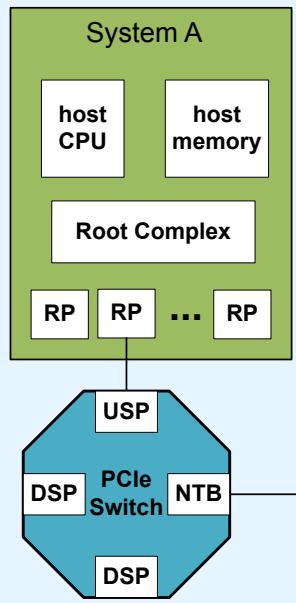


---

<<<PAGE_BREAK>>> page_265


<div style="overflow-x: auto; max-width: 100%;">
<table>
<thead>
<tr>
<th width="50%">🇬🇧 English</th>
<th width="50%" style="background-color:#e8e8e8">🇨🇳 中文</th>
</tr>
</thead>
<tbody>
<tr>
<td>

The rules defined in this section apply to UIO TLPs. UIO and non-UIO TLPs are never mixed within a TC/VC, and ordering dependencies between UIO and non-UIO TLPs are not permitted.

The ordering rules for UIO TLPs are (see § Table 2-43):

- UIO Completions must be allowed to pass UIO Requests
- UIO allows arbitrary reordering for all other cases

**Table 2-43 UIO TLP Ordering Rules | 表 2-43 UIO TLP 排序规则**

| Row Pass Col? | UIO PR-FC TLP (Col U1) | UIO NPR-FC TLP (Col U2) | UIO Completion (Col U3) |
|---------------|------------------------|--------------------------|--------------------------|
| **UIO PR-FC TLP (Row UA)** | Yes/No | Yes/No | Yes/No |
| **UIO NPR-FC TLP (Row UB)** | Yes/No | Yes/No | Yes/No |
| **UIO Completion (Row UC)** | Yes | Yes | Yes/No |

> **IMPLEMENTATION NOTE: LARGE MEMORY READS VS. MULTIPLE SMALLER MEMORY READS**
> Note that the rule associated with entry D5b in § Table 2-42 ensures that for a single Memory Read Request serviced with multiple Completions, the Completions will be returned in address order. However, the rule associated with entry D5a permits that different Completions associated with distinct Memory Read Requests may be returned in a different order than the issue order for the Requests. For example, if a device issues a single Memory Read Request for 256 bytes from location 1000h, and the Request is returned using two Completions (see § Section 2.3.1.1) of 128 bytes each, it is guaranteed that the two Completions will return in the following order:
> 1st Completion returned: Data from 1000h to 107Fh.
> 2nd Completion returned: Data from 1080h to 10FFh.
> However, if the device issues two Memory Read Requests for 128 bytes each, first to location 1000h, then to location 1080h, the two Completions may return in either order:
> 1st Completion returned: Data from 1000h to 107Fh.
> 2nd Completion returned: Data from 1080h to 10FFh.
> - or -
> 1st Completion returned: Data from 1080h to 10FFh.
> 2nd Completion returned: Data from 1000h to 107Fh.

</td>
<td style="background-color:#e8e8e8">

本节定义的规则适用于 UIO TLP。在同一 TC/VC 中,UIO 与非 UIO TLP 永远不会被混合使用,且 UIO 与非 UIO TLP 之间不允许存在排序依赖关系。

UIO TLP 的排序规则如下(参见 § Table 2-43):

- 允许 UIO Completion 超越 UIO Request
- 对于其他所有情况,UIO 允许任意重排序

**Table 2-43 UIO TLP 排序规则**

| Row Pass Col? | UIO PR-FC TLP (Col U1) | UIO NPR-FC TLP (Col U2) | UIO Completion (Col U3) |
|---------------|------------------------|--------------------------|--------------------------|
| **UIO PR-FC TLP (Row UA)** | Yes/No | Yes/No | Yes/No |
| **UIO NPR-FC TLP (Row UB)** | Yes/No | Yes/No | Yes/No |
| **UIO Completion (Row UC)** | Yes | Yes | Yes/No |

> **实现说明:大块内存读与多个小块内存读**
> 请注意,§ Table 2-43 中 D5b 条目所关联的规则确保:对于由多个 Completion 提供服务的单个内存读请求,这些 Completion 将按地址顺序返回。然而,D5a 条目所关联的规则允许:与不同内存读请求相关联的不同 Completion 可以按与请求发起顺序不同的顺序返回。例如,如果设备从位置 1000h 发起一个 256 字节的内存读请求,且该请求以两个各 128 字节的 Completion 形式返回(参见 § Section 2.3.1.1),则可保证这两个 Completion 按以下顺序返回:
> 返回的第 1 个 Completion:来自 1000h 至 107Fh 的数据。
> 返回的第 2 个 Completion:来自 1080h 至 10FFh 的数据。
> 但是,如果设备发起两个各 128 字节的内存读请求,第一个针对位置 1000h,第二个针对位置 1080h,则这两个 Completion 可能以任意顺序返回:
> 返回的第 1 个 Completion:来自 1000h 至 107Fh 的数据。
> 返回的第 2 个 Completion:来自 1080h 至 10FFh 的数据。
> - 或 -
> 返回的第 1 个 Completion:来自 1080h 至 10FFh 的数据。
> 返回的第 2 个 Completion:来自 1000h 至 107Fh 的数据。

</td>
</tr>
</tbody>
</table>
</div>


---


---

<a id="sec-2-4-2"></a>
## 2.4.2 Ordering Rules for UIO | UIO 排序规则

<table>
<thead>
<tr>
<th width="50%">🇬🇧 English</th>
<th width="50%" style="background-color:#e8e8e8">🇨🇳 中文</th>
</tr>
</thead>
<tbody>
<tr>
<td>

2.4.2 Ordering Rules for UIO §

It is recommended that permitted UIO reordering cases be supported and implemented.

The deadlock avoidance rules for UIO TLPs are covered in § Table 2-44 and § Table 2-45.

- For considerations on acceptance dependencies, see IMPLEMENTATION NOTE: DEADLOCKS CAUSED BY PORT ACCEPTANCE DEPENDENCIES
- Downstream Ports include Root Ports and Switch Downstream Ports
- Upstream Ports include Switch Upstream Ports and Endpoint Upstream Ports

</td>
<td style="background-color:#e8e8e8">

2.4.2 UIO 排序规则 §

建议支持并实现允许的 UIO 重排序情形。

UIO TLP 的死锁避免规则见 § Table 2-44 和 § Table 2-45。

- 关于接受依赖关系的考量,请参阅 IMPLEMENTATION NOTE: DEADLOCKS CAUSED BY PORT ACCEPTANCE DEPENDENCIES
- 下游端口 (Downstream Port) 包括根端口 (Root Port) 和交换机下游端口 (Switch Downstream Port)
- 上游端口 (Upstream Port) 包括交换机上游端口 (Switch Upstream Port) 和端点上游端口 (Endpoint Upstream Port)

</td>
</tr>
</tbody>
</table>

[⬆️ 返回目录](#-本章目录-table-of-contents)

---

<<<PAGE_BREAK>>> page_266

**Table 2-44 UIO Acceptance Dependency Rules – Downstream Ports | 表 2-44 UIO 接受依赖规则 – 下游端口**

| Row Independent of Col?<br>Egress transmission →<br>Ingress Acceptance ↓ | UIO Memory Write Request<br>(Col 1) | Other UIO Memory Request<br>(Col 2) | UIO Completion<br>(Col 3) |
|--------------------------------------------------------------------------|---------------------------------------|---------------------------------------|---------------------------|
| UIO Memory Write Request (Row A)                                        | Yes/No                                | Yes/No                                | Yes/No                    |
| Other UIO Memory Request (Row B)                                        | Yes/No                                | Yes/No                                | Yes/No                    |
| UIO Completion (Row C)                                                  | Yes                                   | Yes                                   | Yes/No                    |

**Table 2-45 UIO Acceptance Dependency Rules – Upstream Ports | 表 2-45 UIO 接受依赖规则 – 上游端口**

| Row Independent of Col?<br>Egress transmission →<br>Ingress Acceptance ↓ | UIO Memory Write Request<br>(Col 1) | Other UIO Memory Request<br>(Col 2) | UIO Completion<br>(Col 3) |
|--------------------------------------------------------------------------|---------------------------------------|---------------------------------------|---------------------------|
| UIO Memory Write Request (Row A)                                        | Yes                                   | Yes                                   | Yes/No                    |
| Other UIO Memory Request (Row B)                                        | Yes                                   | Yes                                   | Yes/No                    |
| UIO Completion (Row C)                                                  | Yes                                   | Yes                                   | Yes                       |

<a id="sec-2-4-3"></a>
## 2.4.3 Update Ordering and Granularity Observed by a Read Transaction | 读事务观察到的更新排序与粒度


<div style="overflow-x: auto; max-width: 100%;">
<table>
<thead>
<tr>
<th width="50%">🇬🇧 English</th>
<th width="50%" style="background-color:#e8e8e8">🇨🇳 中文</th>
</tr>
</thead>
<tbody>
<tr>
<td>

2.4.3 Update Ordering and Granularity Observed by a Read Transaction §
2.4.3.1 Ordering and Granularity for Non-UIO Reads §

If a Requester using a single transaction reads a block of data from a Completer, and the Completer's data buffer is concurrently being updated, the ordering of multiple updates and granularity of each update reflected in the data returned by the read is outside the scope of this specification, unless otherwise specified (see § Section 6.32). This applies both to updates performed by PCI Express write transactions and updates performed by other mechanisms such as host CPUs updating host memory.

If a Requester using a single transaction reads a block of data from a Completer, and the Completer's data buffer is concurrently being updated by one or more entities not on the PCI Express fabric, the ordering of multiple updates and granularity of each update reflected in the data returned by the read is outside the scope of this specification, unless otherwise specified (see § Section 6.32).

</td>
<td style="background-color:#e8e8e8">

2.4.3 读事务观察到的更新排序与粒度 §
2.4.3.1 非 UIO 读事务的排序与粒度 §

如果请求者 (Requester) 使用单个事务从完成者 (Completer) 读取一个数据块,并且完成者的数据缓冲区正在被并发更新,则读返回数据所反映的多次更新的排序以及每次更新的粒度不在本规范的范围内,除非另有规定(参见 § Section 6.32)。此规定既适用于通过 PCI Express 写事务执行的更新,也适用于通过其他机制(如 host CPU 更新主机内存)执行的更新。

如果请求者使用单个事务从完成者读取一个数据块,并且完成者的数据缓冲区正在被一个或多个不在 PCI Express 互连网络 (Fabric) 上的实体并发更新,则读返回数据所反映的多次更新的排序以及每次更新的粒度不在本规范的范围内,除非另有规定(参见 § Section 6.32)。

</td>
</tr>
</tbody>
</table>
</div>


[⬆️ 返回目录](#-本章目录-table-of-contents)

---

<<<PAGE_BREAK>>> page_267

<a id="sec-2-4-3-1"></a>
## 2.4.3.1 Ordering and Granularity for Non-UIO Reads | 非 UIO 读事务的排序与粒度

<table>
<thead>
<tr>
<th width="50%">🇬🇧 English</th>
<th width="50%" style="background-color:#e8e8e8">🇨🇳 中文</th>
</tr>
</thead>
<tbody>
<tr>
<td>

As an example of update ordering, assume that the block of data is in host memory, and a host CPU writes first to location A and then to a different location B. A Requester reading that data block with a single read transaction is not guaranteed to observe those updates in order. In other words, the Requester may observe an updated value in location B and an old value in location A, regardless of the placement of locations A and B within the data block. Unless a Completer makes its own guarantees (outside this specification) with respect to update ordering, a Requester that relies on update ordering must observe the update to location B via one read transaction before initiating a subsequent read to location A to return its updated value.

As an example of update granularity, if a host CPU writes a QW to host memory, a Requester reading that QW from host memory may observe a portion of the QW updated and another portion of it containing the old value.

While not required by this specification, it is strongly recommended that host platforms guarantee that when a host CPU writes aligned DWs or aligned QWs to host memory, the update granularity observed by a PCI Express read will not be smaller than a DW.

**IMPLEMENTATION NOTE: NO ORDERING REQUIRED BETWEEN CACHELINES**

A Root Complex serving as a Completer to a single Memory Read that requests multiple cachelines from host memory is permitted to fetch multiple cachelines concurrently, to help facilitate multi-cacheline completions, subject to Tx_MPS_Limit. No ordering relationship between these cacheline fetches is required.

</td>
<td style="background-color:#e8e8e8">

作为更新排序的示例,假设数据块位于主机内存中,且 host CPU 先写入位置 A,再写入不同的位置 B。使用单个读事务读取该数据块的请求者不保证能按顺序观察到这些更新。换言之,无论位置 A 和 B 在数据块中的位置如何,请求者都可能观察到位置 B 已被更新而位置 A 仍为旧值。除非完成者就更新排序作出其自身保证(在本规范之外),依赖更新排序的请求者必须先通过一次读事务观察到对位置 B 的更新,再发起对位置 A 的后续读以返回其更新后的值。

作为更新粒度的示例,如果 host CPU 向主机内存写入一个 QW (Quad Word,四字),则从主机内存读取该 QW 的请求者可能会观察到该 QW 的一部分已更新,而另一部分仍为旧值。

虽然本规范未作要求,但强烈建议 host 平台保证:当 host CPU 向主机内存写入对齐的 DW 或对齐的 QW 时,PCI Express 读所观察到的更新粒度不会小于一个 DW。

**实现说明:高速缓存行之间不需要排序**

作为单个内存读请求完成者的根复合体 (Root Complex) 允许从主机内存并发取回多个高速缓存行,以便支持多高速缓存行的完成报文 (Completion),前提是受 Tx_MPS_Limit 约束。这些高速缓存行取回之间不需要任何排序关系。

</td>
</tr>
</tbody>
</table>

[⬆️ 返回目录](#-本章目录-table-of-contents)

---

<a id="sec-2-4-3-2"></a>
## 2.4.3.2 Ordering and Granularity for UIO Reads | UIO 读事务的排序与粒度


<div style="overflow-x: auto; max-width: 100%;">
<table>
<thead>
<tr>
<th width="50%">🇬🇧 English</th>
<th width="50%" style="background-color:#e8e8e8">🇨🇳 中文</th>
</tr>
</thead>
<tbody>
<tr>
<td>

If a Requester uses a single UIO Read Request to read a block of data from a Completer, and the Completer's data buffer is concurrently being updated using UIO Write Requests, the granularity of each update reflected in the data returned by the read must, within each 64B aligned block, be observed such that each UIO Write Request is either fully completed or not-at-all completed.

Once a Completer transmits a UIO Read Completion reflecting the updated value resulting from a UIO Write Request to a 64B aligned block, subsequently received UIO Requests must observe the UIO Write as fully completed for that 64B aligned block. Thus, at any other Link or Port between a Requester and Completer, observation of a UIO Read Completion at that Link/Port reflecting the updated value resulting from a UIO Write Request to that 64B aligned block implies that all other UIO Requests passing on that Link/Port will observe the UIO Write as fully completed for that 64B aligned block.

The observed sequence is permitted to be different for each 64B aligned block.

A Completer is permitted to implement, through a restricted programming model, an update granularity of less than 64B for some or all of a resource mapped by means of a BAR. In order to maintain the 64B ordering/granularity requirements, such a Completer is permitted to terminate Requests that exceed this smaller update granularity in an implementation specific way.

If a single write transaction containing multiple DWs and the Relaxed Ordering bit Clear is accepted by a Completer, the observed ordering of the updates to locations within the Completer's data buffer must be in increasing address order.

</td>
<td style="background-color:#e8e8e8">

如果请求者使用单个 UIO 读请求从完成者读取一个数据块,并且完成者的数据缓冲区正在使用 UIO 写请求被并发更新,则读返回数据所反映的每次更新的粒度,在每个 64B 对齐块内,必须被观察为该 UIO 写请求要么完全完成,要么完全未完成。

一旦完成者发出一个 UIO 读完成报文,反映针对某个 64B 对齐块的 UIO 写请求所产生的更新值,则后续接收到的 UIO 请求必须将该 UIO 写视为针对该 64B 对齐块已完全完成。因此,在请求者与完成者之间的任何其他链路 (Link) 或端口 (Port) 上,在该链路/端口观察到反映针对该 64B 对齐块的 UIO 写请求所产生的更新值的 UIO 读完成报文,即意味着该链路/端口上传递的所有其他 UIO 请求都将该 UIO 写视为针对该 64B 对齐块已完全完成。

每个 64B 对齐块所观察到的顺序允许不同。

允许完成者通过受限的编程模型,对通过 BAR (基址寄存器) 映射的某些或全部资源实现小于 64B 的更新粒度。为维持 64B 排序/粒度要求,允许此类完成者以实现特定的方式终止超过该更小更新粒度的请求 (Request)。

如果完成者接受一个包含多个 DW 且 Relaxed Ordering 位清零的单个写事务,则对完成者数据缓冲区内各位置更新的观察顺序必须按地址递增的顺序。

</td>
</tr>
</tbody>
</table>
</div>


[⬆️ 返回目录](#-本章目录-table-of-contents)

---

<a id="sec-2-4-4"></a>
## 2.4.4 Update Ordering and Granularity Provided by a Write Transaction | 写事务提供的更新排序与粒度

<table>
<thead>
<tr>
<th width="50%">🇬🇧 English</th>
<th width="50%" style="background-color:#e8e8e8">🇨🇳 中文</th>
</tr>
</thead>
<tbody>
<tr>
<td>

2.4.4 Update Ordering and Granularity Provided by a Write Transaction §
2.4.4.1 Ordering and Granularity for Non-UIO Writes §

This semantic is required in case a PCI or PCI-X Bridge along the path combines multiple write transactions into the single one. However, the observed granularity of the updates to the Completer's data buffer is outside the scope of this specification.

While not required by this specification, it is strongly recommended that host platforms guarantee that when a PCI Express write updates host memory, the update granularity observed by a host CPU will not be smaller than a DW.

As an example of update ordering and granularity, if a Requester writes a QW to host memory, in some cases a host CPU reading that QW from host memory could observe the first DW updated and the second DW containing the old value.

</td>
<td style="background-color:#e8e8e8">

2.4.4 写事务提供的更新排序与粒度 §
2.4.4.1 非 UIO 写事务的排序与粒度 §

当路径上的 PCI 或 PCI-X 桥 (Bridge) 将多个写事务合并为单个写事务时,需要此语义。然而,对完成者数据缓冲区更新所观察到的粒度不在本规范的范围内。

虽然本规范未作要求,但强烈建议 host 平台保证:当 PCI Express 写更新主机内存时,host CPU 所观察到的更新粒度不会小于一个 DW。

作为更新排序与粒度的示例,如果请求者向主机内存写入一个 QW,则在某些情况下,host CPU 从主机内存读取该 QW 时可能观察到第一个 DW 已更新而第二个 DW 仍为旧值。

</td>
</tr>
</tbody>
</table>

[⬆️ 返回目录](#-本章目录-table-of-contents)

---

<<<PAGE_BREAK>>> page_268

<a id="sec-2-4-4-2"></a>
## 2.4.4.2 Ordering and Granularity for UIO Writes | UIO 写事务的排序与粒度


<div style="overflow-x: auto; max-width: 100%;">
<table>
<thead>
<tr>
<th width="50%">🇬🇧 English</th>
<th width="50%" style="background-color:#e8e8e8">🇨🇳 中文</th>
</tr>
</thead>
<tbody>
<tr>
<td>

For each 64B naturally aligned block updated in-full or in-part by a single UIO Write Request, all bytes updated within the 64B aligned block must be fully observable or not-at-all observable to any read, whether the read is performed by a PCI Express transaction or another mechanism. The observed sequence is permitted to be different for each 64B aligned block but the observed sequence must be consistent for all readers of a particular 64B aligned block.

Once a Completer has Transmitted a UIO Write Completion for a 64B aligned block, the Completer must ensure that all UIO Requests it receives must observe the UIO Write as fully completed for that 64B aligned block. Thus, at any other Link or Port between a Requester and Completer, observation of a UIO Write Completion at that Link/Port implies that all other UIO Requests passing on that Link/Port will observe the UIO Write as fully completed for that 64B aligned block.

The observed sequence is permitted to be different for each 64B aligned block.

A Completer is permitted to implement, through a restricted programming model, an update granularity of less than 64B for some or all of a resource mapped by means of a BAR. In order to maintain the 64B ordering/granularity requirements, such a Completer is permitted to terminate Requests that exceed this smaller update granularity in an implementation specific way.

</td>
<td style="background-color:#e8e8e8">

对于由单个 UIO 写请求全部或部分更新的每个 64B 自然对齐块,该 64B 对齐块内所有已更新的字节对任何读都必须被完全可观察或完全不可观察,无论该读是由 PCI Express 事务还是其他机制执行。每个 64B 对齐块所观察到的顺序允许不同,但对于特定 64B 对齐块的所有读者,所观察到的顺序必须一致。

一旦完成者已发出针对某个 64B 对齐块的 UIO 写完成报文,则完成者必须确保其接收的所有 UIO 请求将该 UIO 写视为针对该 64B 对齐块已完全完成。因此,在请求者与完成者之间的任何其他链路或端口上,在该链路/端口观察到 UIO 写完成报文,即意味着该链路/端口上传递的所有其他 UIO 请求都将该 UIO 写视为针对该 64B 对齐块已完全完成。

每个 64B 对齐块所观察到的顺序允许不同。

允许完成者通过受限的编程模型,对通过 BAR 映射的某些或全部资源实现小于 64B 的更新粒度。为维持 64B 排序/粒度要求,允许此类完成者以实现特定的方式终止超过该更小更新粒度的请求。

</td>
</tr>
</tbody>
</table>
</div>


[⬆️ 返回目录](#-本章目录-table-of-contents)

---

<a id="sec-2-5"></a>
## 2.5 Virtual Channel (VC) Mechanism | 虚通道 (VC, Virtual Channel) 机制

<table>
<thead>
<tr>
<th width="50%">🇬🇧 English</th>
<th width="50%" style="background-color:#e8e8e8">🇨🇳 中文</th>
</tr>
</thead>
<tbody>
<tr>
<td>

2.5 Virtual Channel (VC) Mechanism §

The Virtual Channel (VC) mechanism provides support for carrying, throughout the fabric, traffic that is differentiated using TC labels. The foundations of VCs are independent fabric resources (queues/buffers and associated control logic). These resources are used to move information across Links with fully independent Flow Control between different VCs (Link Flow Control is defined in § Section 2.6). This is key to solving the problem of flow-control induced blocking where a single traffic flow may create a bottleneck for all traffic within the system.

As Link speed increases, the buffer space required to support fully independent Flow Control between different VCs while also supporting full Link bandwidth on any given VC also increases. In Flit Mode, the Shared Flow Control (FC) mechanism can be used to reduce this resource requirement. Flow Control is defined in § Section 2.6.

Traffic is associated with VCs by mapping packets with particular TC labels to their corresponding VCs. The Streamlined Virtual Channel, Virtual Channel, and Multi-Function Virtual Channel (MFVC) mechanisms allow flexible mapping of TCs onto the VCs. In the simplest form, TCs can be mapped to VCs on a 1:1 basis. To allow performance/cost tradeoffs, PCI Express provides the capability of mapping multiple TCs onto a single VC. § Section 2.5.2 covers details of TC to VC mapping.

A Virtual Channel is established when one or multiple TCs are associated with a physical VC resource designated by Virtual Channel Identification (VC ID). This process is controlled by configuration software as described in § Section 6.3, § Section 7.9.1, and § Section 7.9.2.

In Flit Mode, initially, VC0 is initialized automatically by hardware with a dedicated FC credit pool, and a shared FC pool. As system software enables other VCs, the enabled VCs are also initialized with a dedicated FC credit pool and a Shared FC pool per VC. The Shared FC credits for additional VCs expand the Shared FC pool available to all VCs (and are permitted to be zero when the appropriate Shared FC credits were granted earlier). When only a single VC is supported and merged credits are not used, there is a single "shared" credit pool and VC0 is initialized with zero dedicated credits. When only a single VC is supported and merged credits are used, there is a single "shared" non-Posted credit pool and VC0 is initialized with zero non-Posted dedicated credits (posted and completion do have dedicated credits).

Once system software has completed enabling all VCs that are to be enabled, it is recommended that system software Set, as appropriate, VC Enablement Completed in the SVC Port Control Register, the All VCs Enabled bit in the Port VC Control Register or the MFVC Port VC Control Register to indicate that VC initialization is completed. Once this bit has been Set, behavior is undefined if additional VCs are enabled or disabled.

The Shared Flow Control Usage Limit mechanism allows system software to manage the allocation of Shared FC by Transmitters, for example to support Quality of Service (QoS) policies.

Support for TCs and VCs beyond the default TC0/VC0 pair is optional although some optional mechanisms also require support for additional TC/VC. The association of TC0 with VC0 is fixed, i.e., hardwired, and must be supported by all components. Therefore, the baseline TC/VC setup does not require any VC-specific hardware or software configuration.

In order to ensure interoperability where possible, components that do not implement any of the optional SVC, VC, or MFVC Extended Capability structures must obey the following rules:

- A Requester must only generate requests with TC0 label. (Note that if the Requester initiates requests with a TC label other than TC0, the requests may be treated as malformed by the component on the other side of the Link that implements the extended VC Extended Capability and applies TC Filtering.)
- A Completer must accept requests with TC label other than TC0, and must preserve the TC label. That is, any completion that it generates must have the same TC label as the label of the request.
- A Switch must map all TCs to VC0 and must forward all transactions regardless of the TC label.

Even with the above rules, in some cases interoperability may not be possible, such as when TC/VC mechanisms are used to implement protocols that cannot be mapped onto TC0/VC0. The SVC mechanism and its associated requirements provide a framework for interoperable hardware and software, and it is strongly recommended that hardware implementing support for VCs beyond VC0 support SVC.

A Port containing Functions capable of generating Requests with TC labels other than TC0 must implement suitable SVC, VC, or MFVC Extended Capability structures (as applicable), even if it only supports the default VC. Example Function types are Endpoints and Root Ports. This is required in order to enable mapping of TCs beyond the default configuration. It must follow the TC/VC mapping rules according to the software programming of the SVC, VC, and MFVC Extended Capability structures.

SVC provides explicit support for architecturally-defined TC/VC applications via a combination of hardware requirements and software guidance. Ports supporting UIO must implement the SVC Extended Capability. The TC/VC default HW assignments in § Table 2-46 are mandatory for SVC.

</td>
<td style="background-color:#e8e8e8">

2.5 虚通道 (VC) 机制 §

虚通道 (VC) 机制为在整个 Fabric (互连网络) 中传送使用 TC 标签区分的流量提供支持。VC 的基础是独立的 Fabric 资源(队列/缓冲区及相关控制逻辑)。这些资源用于在不同 VC 之间以完全独立的流控 (Flow Control) 在链路上传送信息(链路流控定义见 § Section 2.6)。这是解决流控引发的阻塞问题的关键,因为单个流量流可能成为系统内所有流量的瓶颈。

随着链路速率的提升,在支持不同 VC 之间完全独立流控的同时,还需要在任何给定 VC 上支持全链路带宽,所需的缓冲区空间也随之增加。在 Flit 模式下,可使用共享流控 (Shared FC) 机制来降低此资源需求。流控定义见 § Section 2.6。

流量通过将携带特定 TC 标签的分组映射到其对应的 VC 来与 VC 关联。精简虚通道 (Streamlined Virtual Channel)、虚通道 (Virtual Channel) 和多功能虚通道 (MFVC) 机制允许灵活地将 TC 映射到 VC。最简单的形式是,TC 可以 1:1 地映射到 VC。为了实现性能/成本的权衡,PCI Express 提供了将多个 TC 映射到单个 VC 的能力。§ Section 2.5.2 详细介绍了 TC 到 VC 的映射。

当一个或多个 TC 与由虚通道标识 (VC ID) 指定的物理 VC 资源关联时,即建立一个虚通道。此过程由配置软件控制,详见 § Section 6.3、§ Section 7.9.1 和 § Section 7.9.2。

在 Flit 模式下,初始时,VC0 由硬件自动初始化,具有专用 FC 信用池和共享 FC 池。当系统软件使能其他 VC 时,使能的 VC 也以每个 VC 拥有专用 FC 信用池和共享 FC 池的方式进行初始化。附加 VC 的共享 FC 信用会扩展所有 VC 可用的共享 FC 池(当此前已授予相应共享 FC 信用时允许为零)。当仅支持单个 VC 且不使用合并信用时,存在单个"共享"信用池,VC0 以零个专用信用初始化。当仅支持单个 VC 且使用合并信用时,存在单个"共享"非 Posted 信用池,VC0 以零个非 Posted 专用信用初始化(Posted 和完成报文确实有专用信用)。

一旦系统软件完成使能所有要使能的 VC,建议系统软件根据需要在 SVC 端口控制寄存器的 VC Enablement Completed 位、端口 VC 控制寄存器的 All VCs Enabled 位或 MFVC 端口 VC 控制寄存器中置位,以表明 VC 初始化已完成。该位置位后,如果再使能或禁用其他 VC,则行为未定义。

共享流控使用限制 (Shared Flow Control Usage Limit) 机制允许系统软件管理发送器对共享 FC 的分配,例如用以支持服务质量 (QoS, Quality of Service) 策略。

除默认的 TC0/VC0 对之外,对 TC 和 VC 的支持是可选的,尽管某些可选机制也要求支持额外的 TC/VC。TC0 与 VC0 的关联是固定的(即硬连线),且所有组件都必须支持。因此,基线 TC/VC 设置不要求任何 VC 特定的硬件或软件配置。

为确保在可能的情况下实现互操作,未实现任何可选的 SVC、VC 或 MFVC 扩展能力结构的组件必须遵守以下规则:

- 请求者 (Requester) 必须仅生成带有 TC0 标签的请求。(注意,如果请求者使用 TC0 以外的 TC 标签发起请求,则链路另一侧实现扩展 VC 扩展能力并应用 TC 过滤的组件可能将这些请求视为格式错误。)
- 完成者 (Completer) 必须接受带有 TC0 以外 TC 标签的请求,并必须保留 TC 标签。即,其生成的任何完成报文必须具有与对应请求相同的 TC 标签。
- 交换机 (Switch) 必须将所有 TC 映射到 VC0,且无论 TC 标签如何都必须转发所有事务。

即便有上述规则,在某些情况下仍可能无法实现互操作,例如当 TC/VC 机制用于实现无法映射到 TC0/VC0 的协议时。SVC 机制及其相关要求为可互操作的硬件和软件提供了框架,因此强烈建议支持超出 VC0 范围 VC 的硬件实现 SVC。

包含能够生成带有非 TC0 标签请求 (Request) 的功能 (Function) 的端口,即使仅支持默认 VC,也必须实现适用的 SVC、VC 或 MFVC 扩展能力结构(视情况而定)。功能类型的示例包括端点 (Endpoint) 和根端口 (Root Port)。这是支持超出默认配置的 TC 映射所必需的。其必须按照 SVC、VC 和 MFVC 扩展能力结构的软件编程遵循 TC/VC 映射规则。

SVC 通过硬件要求与软件指导相结合,为架构定义的 TC/VC 应用提供明确的支持。支持 UIO 的端口必须实现 SVC 扩展能力。§ Table 2-46 中的 TC/VC 默认硬件分配对 SVC 是强制性的。

</td>
</tr>
</tbody>
</table>

[⬆️ 返回目录](#-本章目录-table-of-contents)

---

<<<PAGE_BREAK>>> page_269

**Table 2-46 Streamlined VC (SVC) TC/VC Default Assignments | 表 2-46 精简 VC (SVC) TC/VC 默认分配**

| TC | VC | Description |
|----|----|-------------|
| TC0 | VC0 | TC0 VC0 Default TC/VC - configured automatically by hardware – required to be used for certain mechanisms as defined in this specification |
| TC1 | VC1 | Reserved |
| TC2 | VC2 | Reserved |
| TC3 | VC3 | UIO TC/VC (Required if UIO is supported) |
| TC4 | VC4 | UIO TC/VC (Optional if UIO is supported) |
| TC5 | VC5 | Reserved |
| TC6 | VC6 | Reserved |
| TC7 | VC7 | Reserved |


<div style="overflow-x: auto; max-width: 100%;">
<table>
<thead>
<tr>
<th width="50%">🇬🇧 English</th>
<th width="50%" style="background-color:#e8e8e8">🇨🇳 中文</th>
</tr>
</thead>
<tbody>
<tr>
<td>

TC0/VC0 默认 TC/VC – 由硬件自动配置 – 本规范定义的某些机制必须使用
TC1/VC1 保留
TC2/VC2 保留
TC3/VC3 UIO TC/VC(支持 UIO 时必需)
TC4/VC4 UIO TC/VC(支持 UIO 时可选)
TC5/VC5 保留
TC6/VC6 保留
TC7/VC7 保留

§ Figure 2-94 illustrates the concept of Virtual Channel. Conceptually, traffic that flows through VCs is multiplexed onto a common physical Link resource on the Transmit side and de-multiplexed into separate VC paths on the Receive side.

**IMPLEMENTATION NOTE: MULTI-HOST FABRICS AND STREAMLINED VC (SVC) TC/VC DEFAULT ASSIGNMENTS**

When PCIe and/or related switching fabrics support multiple hosts, and one or more fabric Links carry traffic from multiple hosts concurrently, the use of TCs across the fabric and TC/VC mappings on each fabric Link may conflict. E.g., if one host relies on TC3 mapping to a UIO VC while another host relies on TC3 mapping to a non-UIO VC, the resulting behavior is undefined.

To avoid TC conflicts on multi-host fabric Links, it is recommended for system software that configures TC/VC mappings to:

- support Streamlined VC (SVC) Extended Capability,
- preserve any TC/VC assignments already configured in Switch Ports, whether such VCs are enabled or not
- configure and enable TC/VC assignments on each RP to match such Switch Ports, to the extent permitted by RP hardware capability.

This allows a Fabric Manager to preconfigure TC/VC assignments fabric-wide, and rely on OS cooperation.

For cases where a Fabric Manager does not preconfigure TC/VC assignments, § Table 2-46 provides reasonable defaults that can work in envisioned multi-host fabrics.

System software should use the SVC Extended Capability for TC/VC configuration in all hardware that supports SVC. If it enables VCs other than VC0 in hardware that supports only the VC and/or MFVC Extended Capabilities, it should configure enabled TC/VCs to match the SVC default assignments.

</td>
<td style="background-color:#e8e8e8">

TC0/VC0 默认 TC/VC – 由硬件自动配置 – 本规范定义的某些机制必须使用
TC1/VC1 保留
TC2/VC2 保留
TC3/VC3 UIO TC/VC(支持 UIO 时必需)
TC4/VC4 UIO TC/VC(支持 UIO 时可选)
TC5/VC5 保留
TC6/VC6 保留
TC7/VC7 保留

§ Figure 2-94 说明了虚通道的概念。从概念上讲,在 VC 中流动的流量在发送侧被多路复用到一条公共的物理链路资源上,在接收侧则被解复用为独立的 VC 路径。

**实现说明:多主机 Fabric 与精简 VC (SVC) TC/VC 默认分配**

当 PCIe 和/或相关交换 Fabric 支持多主机,且一条或多条 Fabric 链路同时承载来自多个主机的流量时,整个 Fabric 中 TC 的使用以及每条 Fabric 链路上 TC/VC 映射可能发生冲突。例如,若一个主机依赖 TC3 映射到 UIO VC,而另一主机依赖 TC3 映射到非 UIO VC,则由此导致的行为未定义。

为避免多主机 Fabric 链路上的 TC 冲突,建议配置 TC/VC 映射的系统软件:

- 支持精简 VC (SVC) 扩展能力,
- 保留交换机端口中已配置的所有 TC/VC 分配,无论此类 VC 是否已使能
- 在每个 RP 上配置并使能 TC/VC 分配以匹配此类交换机端口,前提是 RP 硬件能力允许。

这允许 Fabric 管理器 (Fabric Manager) 在全 Fabric 范围内预配置 TC/VC 分配,并依赖操作系统的配合。

对于 Fabric 管理器未预配置 TC/VC 分配的情况,§ Table 2-46 提供了可在预期的多主机 Fabric 中工作的合理默认值。

系统软件应在所有支持 SVC 的硬件中使用 SVC 扩展能力进行 TC/VC 配置。如果在仅支持 VC 和/或 MFVC 扩展能力的硬件中使能 VC0 之外的 VC,则应配置已使能的 TC/VC 以匹配 SVC 的默认分配。

</td>
</tr>
</tbody>
</table>
</div>


[⬆️ 返回目录](#-本章目录-table-of-contents)

---

<<<PAGE_BREAK>>> page_270

> **Figure 2-94.** Virtual Channel Concept - An Illustration
> 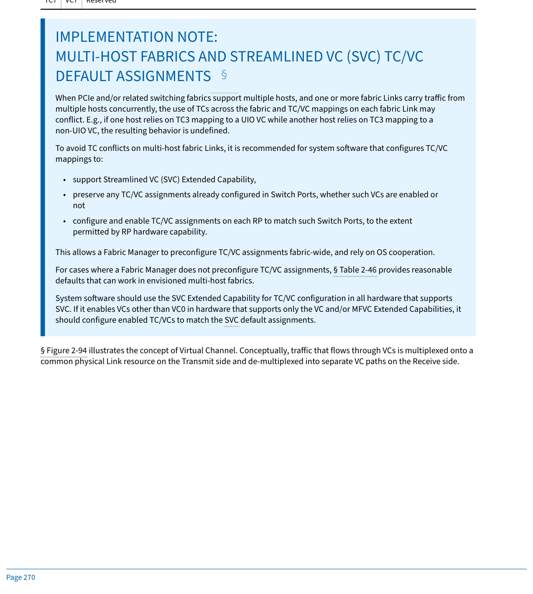


<a id="sec-2-5-1"></a>
## 2.5.1 Virtual Channel Identification (VC ID) | 虚通道标识 (VC ID)

<table>
<thead>
<tr>
<th width="50%">🇬🇧 English</th>
<th width="50%" style="background-color:#e8e8e8">🇨🇳 中文</th>
</tr>
</thead>
<tbody>
<tr>
<td>

Internal to the Switch, every Virtual Channel requires dedicated physical resources (queues/buffers and control logic) that support independent traffic flows inside the Switch. § Figure 2-95 shows conceptually the VC resources within the Switch (shown in § Figure 2-94) that are required to support traffic flow in the Upstream direction.

> **Figure 2-95.** Virtual Channel Concept - Switch Internals (Upstream Flow)


An MFD may implement Virtual Channel resources similar to a subset of those in a Switch, for the purpose of managing the Quality of Service (QoS) for Upstream requests from the different Functions to the device's Upstream Egress Port.

PCI Express Ports can support 1 to 8 Virtual Channels - each Port is independently configured/managed therefore allowing implementations to vary the number of VCs supported per Port based on usage model-specific requirements. These VCs are uniquely identified using the VC ID mechanism.

Note that while DLLPs contain VC ID information for Flow Control accounting, TLPs do not. The association of TLPs with VC ID for the purpose of Flow Control accounting is done at each Port of the Link using TC to VC mapping as discussed in § Section 2.5.2.

Rules for assigning VC ID to VC hardware resources within a Port are as follows:

- VC ID assignment must be unique per Port - The same VC ID cannot be assigned to different VC hardware resources within the same Port.
- VC ID assignment must be the same (matching in the terms of numbers of VCs and their IDs) for the two Ports on both sides of a Link.
- If an MFD implements an MFVC Extended Capability structure, its VC hardware resources are distinct from the VC hardware resources associated with any VC Extended Capability structures of its Functions. The VC ID uniqueness requirement (first bullet above) still applies individually for the MFVC and any VC Extended Capability structures. In addition, the VC ID cross-Link matching requirement (second bullet above) applies for the MFVC Extended Capability structure, but not the VC Extended Capability structures of the Functions.
- VC ID 0 is assigned and fixed to the default VC.
- It is permitted to implement VCs that support only specific protocols and/or use models
  - If software maps such VCs in a way that is incompatible with their protocol/use model requirements, the resulting hardware behavior is undefined

</td>
<td style="background-color:#e8e8e8">

在交换机内部,每个虚通道都需要专用物理资源(队列/缓冲区和控制逻辑)以支持交换机内部独立的流量流。§ Figure 2-95 概念性地展示了交换机内(在 § Figure 2-94 中)支持上游方向流量流所需的 VC 资源。


多功能设备 (MFD) 可实现类似于交换机中部分 VC 资源的虚通道资源,用于管理来自不同功能 (Function) 的上游请求到设备上游出口端口 (Upstream Egress Port) 的服务质量 (QoS)。

PCI Express 端口可支持 1 到 8 个虚通道 – 每个端口独立配置/管理,因此允许实现根据使用模型特定的要求改变每个端口支持的 VC 数量。这些 VC 通过 VC ID 机制唯一标识。

注意,DLLP 中包含用于流控记账的 VC ID 信息,而 TLP 中不包含。为流控记账将 TLP 与 VC ID 关联,是在链路的每个端口上使用 TC 到 VC 映射完成的,详见 § Section 2.5.2。

端口内将 VC ID 分配给 VC 硬件资源的规则如下:

- VC ID 分配必须在每个端口内唯一 – 同一 VC ID 不得分配给同一端口内的不同 VC 硬件资源。
- 链路两侧的两个端口的 VC ID 分配必须相同(在 VC 数量及其 ID 方面匹配)。
- 如果 MFD 实现了 MFVC 扩展能力结构,则其 VC 硬件资源与其任何功能的 VC 扩展能力结构相关联的 VC 硬件资源不同。VC ID 唯一性要求(上述第一条)对 MFVC 和任何 VC 扩展能力结构单独适用。此外,VC ID 跨链路匹配要求(上述第二条)对 MFVC 扩展能力结构适用,但对其功能的 VC 扩展能力结构不适用。
- VC ID 0 分配给默认 VC 且固定不变。
- 允许实现仅支持特定协议和/或使用模型的 VC
  - 如果软件以与其协议/使用模型要求不兼容的方式映射此类 VC,则由此产生的硬件行为未定义

</td>
</tr>
</tbody>
</table>

[⬆️ 返回目录](#-本章目录-table-of-contents)

---

<<<PAGE_BREAK>>> page_271

<a id="sec-2-5-2"></a>
## 2.5.2 TC to VC Mapping | TC 到 VC 映射


<div style="overflow-x: auto; max-width: 100%;">
<table>
<thead>
<tr>
<th width="50%">🇬🇧 English</th>
<th width="50%" style="background-color:#e8e8e8">🇨🇳 中文</th>
</tr>
</thead>
<tbody>
<tr>
<td>

Every Traffic Class that is supported must be mapped to one of the Virtual Channels. The mapping of TC0 to VC0 is fixed. The mapping of TCs other than TC0 must obey the following rules:

**IMPLEMENTATION NOTE: VC AND VC BUFFERING CONSIDERATIONS**

The amount of buffering beyond the architectural minimums per supported VC is implementation specific. Buffering beyond the architectural minimums is not required to be identical across all VCs on a given Link. That is, an implementation may provide greater buffer depth for selected VCs as a function of implementation usage models and other Link attributes (e.g., Link width and signaling).

Implementations may adjust their buffering per VC based on implementation specific policies derived from configuration and VC enablement. For example, if a four VC implementation has only two VCs enabled, the implementation may assign the non-enabled VC buffering to the enabled VCs to improve fabric efficiency/performance by reducing the probability of fabric backpressure due to Link-level flow control.

The number of VCs supported, and the associated buffering per VC per Port, are not required to be the same for all Ports of a multi-Port component (e.g., a Switch or Root Complex).

- One or multiple TCs can be mapped to a VC.
- One TC must not be mapped to multiple VCs in any Port or Endpoint Function.
- TC/VC mapping must be identical for Ports on both sides of a Link.
- If UIO is supported, VC3 must be supported, and it must support UIO, and enabling VC3 is required to use UIO.
- If UIO is supported, and if a second UIO VC is supported, then the second UIO VC must be VC4 (and so VC4 must support UIO traffic); if UIO is enabled using only one VC it must be VC3, if UIO is enabled using two VCs they must be VC3 and VC4.
- If a UIO TLP targets an Egress Port where the TC maps to a non-UIO VC, or a non-UIO TLP targets an Egress Port where the TC maps to a UIO VC, such TLPs must be handled as specified in § Section 2.2.1.2 for other TLPs that cannot be translated. Note that this rule partially overlaps with the rule in § Section 2.2.1.2 regarding a UIO TLP targeting an Egress Port in NFM.

§ Table 2-47 provides an example of TC to VC mapping.

</td>
<td style="background-color:#e8e8e8">

每个受支持的流量类 (Traffic Class) 必须映射到某个虚通道。TC0 到 VC0 的映射是固定的。TC0 以外 TC 的映射必须遵守以下规则:

**实现说明:VC 与 VC 缓冲考量**

每个受支持 VC 超出架构最小值之外的缓冲量是实现特定的。超出架构最小值之外的缓冲量无需在给定链路上的所有 VC 间保持一致。即,实现可针对所选 VC 根据其实现使用模型和其他链路属性(例如链路宽度和信号速率)提供更大的缓冲深度。

实现可根据配置和 VC 使能情况,按照实现特定策略调整每个 VC 的缓冲。例如,如果一个四 VC 实现仅使能了两个 VC,则该实现可将其未使能 VC 的缓冲分配给已使能的 VC,通过降低因链路级流控导致的 Fabric 背压概率来提升 Fabric 效率/性能。

多端口组件(如交换机或根复合体)的所有端口支持的 VC 数量,以及每端口每 VC 的关联缓冲,无需保持一致。

- 一个或多个 TC 可映射到一个 VC。
- 在任何端口或端点功能中,一个 TC 不得映射到多个 VC。
- 链路两侧端口的 TC/VC 映射必须相同。
- 如果支持 UIO,则必须支持 VC3,且 VC3 必须支持 UIO,使用 UIO 必须使能 VC3。
- 如果支持 UIO,且支持第二个 UIO VC,则该第二个 UIO VC 必须是 VC4(因此 VC4 必须支持 UIO 流量);如果仅使用一个 VC 使能 UIO,则该 VC 必须是 VC3;如果使用两个 VC 使能 UIO,则必须为 VC3 和 VC4。
- 如果 UIO TLP 寻址一个将 TC 映射到非 UIO VC 的出口端口,或非 UIO TLP 寻址一个将 TC 映射到 UIO VC 的出口端口,则此类 TLP 必须按照 § Section 2.2.1.2 中针对其他无法转换的 TLP 所规定的方式处理。注意,此规则与 § Section 2.2.1.2 中关于在 NFM 中寻址出口端口的 UIO TLP 的规则部分重叠。

§ Table 2-47 提供了 TC 到 VC 映射的示例。

</td>
</tr>
</tbody>
</table>
</div>


[⬆️ 返回目录](#-本章目录-table-of-contents)

---

**Table 2-47 TC to VC Mapping Example | 表 2-47 TC 到 VC 映射示例**

| Supported VC Configurations | TC/VC Mapping Options |
|------------------------------|------------------------|
| VC0                          | TC(0-7)/VC0            |
| VC0, VC1                     | TC(0-6)/VC0, TC7/VC1   |
| VC0-VC3                      | TC(0-1)/VC0, TC(2-4)/VC1, TC(5-6)/VC2, TC7/VC3 |
| VC0-VC7                      | TC[0:7]/VC[0:7]        |

**Notes on conventions: | 关于约定的说明:**

- **TCn mapped to VCk** - **TCn 映射到 VCk**
- **TC(n-m)/VCk** - all TCs in the range n-m mapped to VCk (i.e., to the same VC) - **TC(n-m)/VCk** - 范围 n-m 内的所有 TC 映射到 VCk(即映射到同一 VC)
- **TC[n:m]/VC[n:m]** - TCn/VCn, TCn+1/VCn+1, ..., TCm/VCm - **TC[n:m]/VC[n:m]** - TCn/VCn、TCn+1/VCn+1、…、TCm/VCm

§ Figure 2-96 provides a graphical illustration of TC to VC mapping in several different Link configurations. For additional considerations on TC/VC, refer to § Section 6.3.

> **Figure 2-96.** An Example of TC/VC Configurations
> 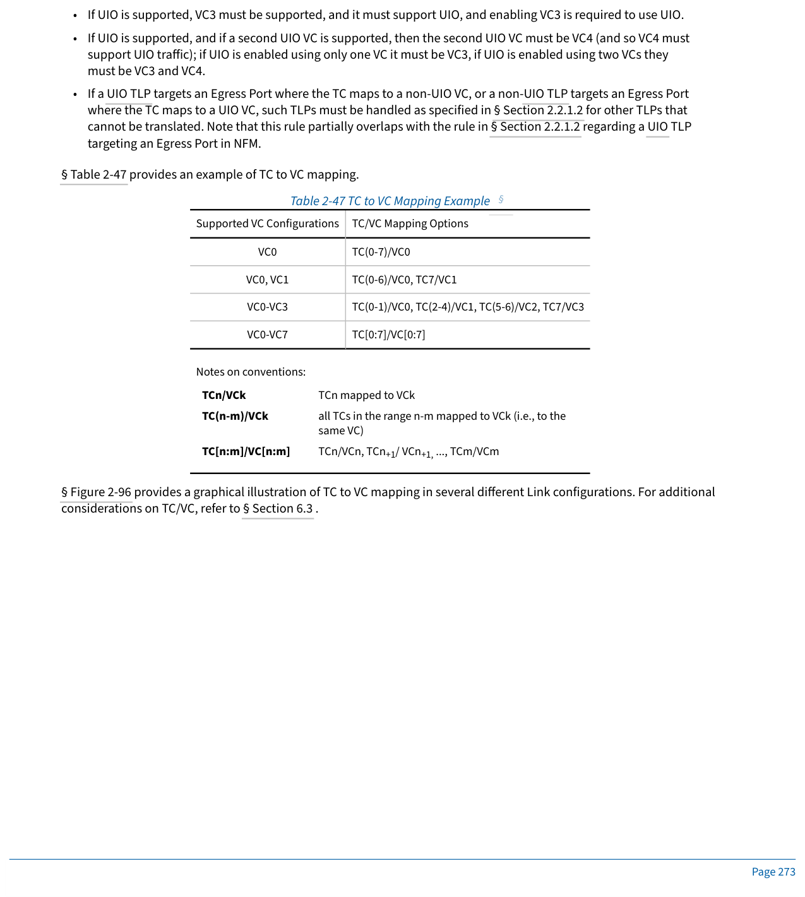


---

<<<PAGE_BREAK>>> page_272

<a id="sec-2-5-2-impl"></a>
## 2.5.2 TC to VC Mapping (Key Rules Summary) | 2.5.2 TC 到 VC 映射(关键规则总结)

<table>
<thead>
<tr>
<th width="50%">🇬🇧 English</th>
<th width="50%" style="background-color:#e8e8e8">🇨🇳 中文</th>
</tr>
</thead>
<tbody>
<tr>
<td>

Here is a summary of key rules associated with the TC/VC mechanism:

- All devices must support the general purpose I/O Traffic Class (i.e., TC0 and must implement the default VC0).
- Each Virtual Channel (VC) has independent Flow Control.
- There are no ordering relationships required between different TCs.
- There are no ordering relationships required between different VCs.
- A Switch's peer-to-peer capability applies to all Virtual Channels supported by the Switch.
- An MFD's peer-to-peer capability between different Functions applies to all Virtual Channels supported by the MFD.
- Transactions with a TC that is not mapped to any enabled VC in an Ingress Port are treated as Malformed TLPs by the receiving device.
- For Switches, transactions with a TC that is not mapped to any of the enabled VCs in the target Egress Port are treated as Malformed TLPs.

</td>
<td style="background-color:#e8e8e8">

以下是 TC/VC 机制相关关键规则的总结:

- 所有设备必须支持通用 I/O 流量类(即 TC0)且必须实现默认 VC0。
- 每个虚通道 (VC) 具有独立的流控。
- 不同 TC 之间不要求排序关系。
- 不同 VC 之间不要求排序关系。
- 交换机的对等 (peer-to-peer) 能力适用于该交换机支持的所有虚通道。
- MFD 不同功能之间的对等能力适用于该 MFD 支持的所有虚通道。
- 对于入口端口,TC 未映射到任何已使能 VC 的事务,接收设备将其视为格式错误 TLP (Malformed TLP)。
- 对于交换机,在目标出口端口 TC 未映射到任何已使能 VC 的事务,被视为格式错误 TLP。

</td>
</tr>
</tbody>
</table>

[⬆️ 返回目录](#-本章目录-table-of-contents)

---


---

<a id="sec-2-5-3"></a>
## 2.5.3 VC and TC Rules | VC 与 TC 规则


<div style="overflow-x: auto; max-width: 100%;">
<table>
<thead>
<tr>
<th width="50%">🇬🇧 English</th>
<th width="50%" style="background-color:#e8e8e8">🇨🇳 中文</th>
</tr>
</thead>
<tbody>
<tr>
<td>

- For a Root Port, transactions with a TC that is not mapped to any of the enabled VCs in the target RCRB are treated as Malformed TLPs.
- For MFDs with an MFVC Extended Capability structure, any transaction with a TC that is not mapped to an enabled VC in the MFVC Extended Capability structure is treated as a Malformed TLP.
- Switches must support independent TC/VC mapping configuration for each Port.
- A Root Complex must support independent TC/VC mapping configuration for each RCRB, the associated Root Ports, and any RCiEPs.

For more details on the VC and TC mechanisms, including configuration, mapping, and arbitration, refer to § Section 6.3.

</td>
<td style="background-color:#e8e8e8">

- 对于根端口 (Root Port)，使用未在目标 RCRB 已启用 VC 中映射的 TC 发起的事务将被视为 Malformed TLP (畸形 TLP)。
- 对于具有 MFVC Extended Capability 结构的 MFD，任何使用未在该 MFVC Extended Capability 结构中已启用 VC 上映射的 TC 发起的事务都被视为 Malformed TLP。
- 交换机 (Switch) 必须支持每个端口 (Port) 独立的 TC/VC 映射配置。
- 根复合体 (Root Complex) 必须为每个 RCRB、关联的根端口以及任何 RCiEP 支持独立的 TC/VC 映射配置。

关于 VC 与 TC 机制的更多细节，包括配置、映射与仲裁 (Arbitration)，请参阅 § Section 6.3。

</td>
</tr>
</tbody>
</table>
</div>


[⬆️ 返回目录](#-本章目录-table-of-contents)

---

<<<PAGE_BREAK>>> page_275

<a id="sec-2-6"></a>
## 2.6 Ordering and Receive Buffer Flow Control | 排序与接收缓冲流控

<table>
<thead>
<tr>
<th width="50%">🇬🇧 English</th>
<th width="50%" style="background-color:#e8e8e8">🇨🇳 中文</th>
</tr>
</thead>
<tbody>
<tr>
<td>

Flow Control (FC) is used to prevent overflow of Receiver buffers and to enable compliance with the ordering rules defined in § Section 2.4. Note that the Flow Control mechanism is used by the Requester to track the queue/buffer space available in the agent across the Link as shown in § Figure 2-97. That is, Flow Control is point-to-point (across a Link) and not end-to-end. Flow Control does not imply that a Request has reached its ultimate Completer.

> **Figure 2-97.** Relationship Between Requester and Ultimate Completer
> 

Flow Control is orthogonal to the data integrity mechanisms used to implement reliable information exchange between Transmitter and Receiver. Flow Control can treat the flow of TLP information from Transmitter to Receiver as perfect, since the data integrity mechanisms ensure that corrupted and lost TLPs are corrected through retransmission (see § Section 3.6).

In Non-Flit Mode each Virtual Channel (VC) maintains an independent FC credit pool.

In Flit Mode, the Shared FC mechanism can be used to reduce VC resource requirements. There are two sets of resources associated with each VC: a (typically small) pool of dedicated resources associated independently with each FC/VC (to avoid deadlock by allowing that the Transmitter to transmit at least one TLP in that VC/FC using only dedicated credit(s)), and a portion of the (typically larger) pool of shared resources. The Transmitter gate function (defined later in this section) uses the sum of all Shared FC returned across all VCs. The transmitter gate function also provides a Usage Limit mechanism to avoid over-consumption of buffers by stalled VCs. This Usage Limit mechanism is configured by software and defaults to disabled. To support Usage Limit, credits are returned to the Transmitter indicating the VC for the TLP(s) that, by making forward progress, freed those credits. The FC information is conveyed between two sides of the Link using DLLPs. The VC ID field of the DLLP is used to carry the VC ID that is required for proper Flow Control credit accounting. Additionally, [Merged] FC enables the sharing of buffers for Posted Requests and Completions, further reducing resource requirements.

Flow Control mechanisms used internally within an MFD are outside the scope of this specification.

</td>
<td style="background-color:#e8e8e8">

流控 (Flow Control, FC) 用于防止接收器 (Receiver) 缓冲区溢出，并保证符合 § Section 2.4 中定义的排序规则。请注意，流控机制由请求者 (Requester) 使用，以追踪链路 (Link) 对端代理中可用的队列/缓冲空间，如 § Figure 2-97 所示。也就是说，流控是点对点的（跨越一条链路），而非端到端的。流控并不意味着请求 (Request) 已到达其最终完成方 (Ultimate Completer)。

流控与用于在发送器 (Transmitter) 与接收器之间实现可靠信息交换的数据完整性机制相互独立。流控可以将 TLP 信息从发送器到接收器的流动视为理想的，因为数据完整性机制确保被损坏或丢失的 TLP 通过重传得到纠正（参见 § Section 3.6）。

在非 Flit 模式 (Non-Flit Mode) 下，每个虚通道 (Virtual Channel, VC) 维护一个独立的 FC 信用 (Credit) 池。

在 Flit 模式下，可使用共享 FC (Shared FC) 机制来减少 VC 资源需求。每个 VC 关联两类资源：一类是（通常较小的）专用资源池，与各 FC/VC 独立关联（通过允许发送器仅使用专用信用即可在该 VC/FC 中传输至少一个 TLP 来避免死锁）；另一类是（通常较大的）共享资源池的一部分。发送器门控功能（本节后文定义）使用跨所有 VC 返回的 Shared FC 总量。发送器门控功能还提供 Usage Limit 机制以避免被阻塞的 VC 过度消耗缓冲区。该 Usage Limit 机制由软件配置，默认为禁用。为支持 Usage Limit，信用会返回到发送器，并指明因取得前向进度而释放这些信用的 TLP 所属的 VC。FC 信息通过 DLLP 在链路两端之间传递。DLLP 中的 VC ID 字段用于携带正确流控信用记账所需的 VC ID。此外，[Merged] FC 允许 Posted 请求 (Posted Request) 与完成报文 (Completion) 共享缓冲区，进一步降低资源需求。

MFD 内部使用的流控机制不在本规范范围内。

</td>
</tr>
</tbody>
</table>

[⬆️ 返回目录](#-本章目录-table-of-contents)

---

<a id="sec-2-6-1"></a>
## 2.6.1 Flow Control (FC) Rules | 流控 (FC) 规则


<div style="overflow-x: auto; max-width: 100%;">
<table>
<thead>
<tr>
<th width="50%">🇬🇧 English</th>
<th width="50%" style="background-color:#e8e8e8">🇨🇳 中文</th>
</tr>
</thead>
<tbody>
<tr>
<td>

Flow Control is handled by the Transaction Layer in cooperation with the Data Link Layer. The Transaction Layer performs Flow Control accounting functions for Received TLPs and "gates" TLP Transmissions based on available credits for transmission even if those TLPs are eventually nullified.

Note: Flow Control is a function of the Transaction Layer and, therefore, the following types of information transmitted on the interface are not associated with Flow Control Credits: LCRC, Packet Framing Symbols, other Special Symbols, and Data Link Layer to Data Link Layer inter-communication packets. An implication of this fact is that these types of information must be processed by the Receiver at the rate they arrive (except as explicitly noted in this specification). Also, any TLPs transferred from the Transaction Layer to the Data Link and Physical Layers must have first passed the Flow Control gate. Thus, both Transmit and Receive Flow Control mechanisms are unaware if the Data Link Layer transmits a TLP repeatedly due to errors on the Link.

In this and other sections of this specification, rules are described using conceptual "registers" that a device could use in order to implement a compliant implementation. This description does not imply or require a particular implementation and is used only to clarify the requirements.

</td>
<td style="background-color:#e8e8e8">

流控由事务层 (Transaction Layer) 协同数据链路层 (Data Link Layer) 共同处理。事务层为接收的 TLP 执行流控记账功能，并根据可用于发送的信用对 TLP 传输进行"门控"，即使这些 TLP 最终被作废（nullified）。

注：流控是事务层的功能，因此接口上传输的以下类型信息不与流控信用关联：LCRC、Packet Framing Symbols、其他 Special Symbols，以及数据链路层到数据链路层之间通信的包。这一事实的隐含意义是：这些类型的信息必须由接收器以到达速率处理（除本规范明确说明外）。同样，任何从事务层传送到数据链路层和物理层 (Physical Layer) 的 TLP 必须先通过流控门控。因此，发送与接收流控机制都感知不到数据链路层是否因链路错误而重复发送同一 TLP。

在本规范的本节以及其他节中，规则通过概念性"寄存器"进行描述，设备可使用这些寄存器来实现符合规范的实现。此描述并不暗示也不要求特定实现，仅用于澄清需求。

</td>
</tr>
</tbody>
</table>
</div>


[⬆️ 返回目录](#-本章目录-table-of-contents)

---

<<<PAGE_BREAK>>> page_276

<table>
<thead>
<tr>
<th width="50%">🇬🇧 English</th>
<th width="50%" style="background-color:#e8e8e8">🇨🇳 中文</th>
</tr>
</thead>
<tbody>
<tr>
<td>

- Flow Control (FC) information is transferred using Flow Control Packets (FCPs), which are a type of DLLP (see § Section 3.5), and, in some cases, the Optimized_Update_FC.
- FC Unit Size indicates the number of DW covered by one flow control credit:
  - For Data, the FC Unit Size is 4 DW.
  - For Headers in Non-Flit Mode:
    - For Receivers that do not support TLP Prefixes, FC Unit Size is the sum of one maximum-size Header and TLP Digest.
    - For Receivers that support End-End TLP Prefixes, FC Unit Size is the sum of one maximum-size Header, TLP Digest, and the maximum number of End-End TLP Prefixes permitted in a TLP.
    - The management of FC for Receivers that support Local TLP Prefixes is dependent on the Local TLP Prefix type.
  - For Headers in Flit Mode:
    - For Switch Port Receivers, FC Unit Size is the sum of one maximum-size Base Header, OHC-A, OHC-B, OHC-C, OHC-E if supported, and one maximum-size TLP Trailer.
    - For Endpoint Upstream Port and Root Port Receivers, FC Unit Size is the sum of one Base Header of the largest supported size, OHC-A, OHC-B, OHC-C, OHC-E if supported, and one TLP Trailer of the largest size supported.
- For NFM and for dedicated credits in FM, each Virtual Channel has independent FC.
- In FM, each Virtual Channel has some amount of independent FC referred to as dedicated credits, and some amount of shared FC.
  - When only one single VC is implemented and [Merged] is not used, there are no dedicated credits, all flow control uses shared credits (see § Table 3-3, Notes 3 and 4).
- It is permitted for a Transmitter to use dedicated credits when Transmitting a TLP, even when sufficient shared credits are available.
- The Transmitter indicates the use of dedicated credits for a specific TLP by applying the Flit Mode Local TLP Prefix with the TLP Uses Dedicated Credits bit Set.
- Flow Control distinguishes three types of TLPs (note relationship to ordering rules - see § Section 2.4):
  - Posted Requests (P) - Messages and Memory Writes
  - Non-Posted Requests (NP) - All Reads, I/O Writes, Configuration Writes, AtomicOps, and DMWrs.
  - Completions (Cpl) - Associated with corresponding NP Requests
- In addition, Flow Control distinguishes the following types of TLP information within each of the three types:
  - Headers (H)
  - Data (D)
- Thus, there are six types of information tracked by Flow Control for each Virtual Channel, as shown in § Table 2-48.

**Table 2-48 Flow Control Credit Types | 表 2-48 流控信用类型**

| Credit Type | Applies to This Type of TLP Information |
|-------------|----------------------------------------|
| PH | Posted Request headers |
| PD | Posted Request Data payload |
| NPH | Non-Posted Request headers |
| NPD | Non-Posted Request Data payload |
| CplH | Completion headers |
| CplD | Completion Data payload |

- TLPs consume Flow Control credits as shown in § Table 2-49.

**Table 2-49 TLP Flow Control Credit Consumption | 表 2-49 TLP 流控信用消耗**

| TLP | Credit Consumed |
|-----|-----------------|
| Memory, I/O, Configuration Read Request | 1 NPH unit |
| Memory Write Request | 1 PH + n PD units |
| I/O, Configuration Write Request | 1 NPH + 1 NPD |
| AtomicOp, DMWr Request | 1 NPH + n NPD units |
| Message Requests without data | 1 PH unit |
| Message Requests with data | 1 PH + n PD units |
| Memory Read Completion | 1 CplH + n CplD units |
| I/O, Configuration Read Completions | 1 CplH unit + 1 CplD unit |
| I/O, Configuration Write, and DMWr Completions | 1 CplH unit |
| AtomicOp Completion | 1 CplH unit + 1 CplD unit |

Note: size of data written is never more than 1 (aligned) DW

Note: size of data returned is never more than 4 (aligned) DWs.

</td>
<td style="background-color:#e8e8e8">

- 流控 (FC) 信息通过流控包 (Flow Control Packets, FCP) 传递，FCP 是一种 DLLP（参见 § Section 3.5），某些情况下也使用 Optimized_Update_FC。
- FC 单元大小 (FC Unit Size) 指示一个流控信用覆盖的 DW 数：
  - 对于数据 (Data)，FC 单元大小为 4 DW。
  - 对于非 Flit 模式下的包头 (Header)：
    - 对于不支持 TLP Prefix 的接收器，FC 单元大小为一个最大尺寸 Header 与 TLP Digest 之和。
    - 对于支持 End-End TLP Prefix 的接收器，FC 单元大小为一个最大尺寸 Header、TLP Digest 与一个 TLP 中允许的最大 End-End TLP Prefix 数量之和。
    - 对于支持 Local TLP Prefix 的接收器，其 FC 管理取决于 Local TLP Prefix 的类型。
  - 对于 Flit 模式下的包头：
    - 对于交换机端口 (Switch Port) 接收器，FC 单元大小为一个最大尺寸 Base Header、OHC-A、OHC-B、OHC-C、OHC-E（若支持）以及一个最大尺寸 TLP Trailer 之和。
    - 对于端点上游端口 (Endpoint Upstream Port) 与根端口接收器，FC 单元大小为一个所支持最大尺寸的 Base Header、OHC-A、OHC-B、OHC-C、OHC-E（若支持）以及一个所支持最大尺寸的 TLP Trailer 之和。
- 在 NFM 中以及在 FM 的专用信用 (dedicated credits) 情况下，每个虚通道具有独立的 FC。
- 在 FM 中，每个虚通道具有一定数量的独立 FC（称为专用信用）以及一定数量的共享 FC (shared FC)。
  - 当仅实现单个 VC 且未使用 [Merged] 时，不存在专用信用，所有流控均使用共享信用（参见 § Table 3-3 的 Note 3 与 Note 4）。
- 即使在共享信用充足时，发送器在发送 TLP 时被允许使用专用信用。
- 发送器通过在 Flit Mode Local TLP Prefix 中将 TLP Uses Dedicated Credits 位置位来指示该 TLP 使用了专用信用。
- 流控区分三种 TLP 类型（请注意其与排序规则的关系 - 参见 § Section 2.4）：
  - Posted 请求 (P) - 消息 (Messages) 与内存写 (Memory Writes)
  - Non-Posted 请求 (NP) - 所有读 (Reads)、I/O 写 (I/O Writes)、配置写 (Configuration Writes)、AtomicOp 与 DMWr
  - 完成报文 (Cpl) - 与对应 NP 请求关联
- 此外，流控在上述三种类型中进一步区分以下 TLP 信息类型：
  - 包头 (H, Headers)
  - 数据 (D, Data)
- 因此，每个虚通道存在 6 种流控所跟踪的信息类型，如 § Table 2-48 所示。

**Table 2-48 流控信用类型**

| 信用类型 | 适用的 TLP 信息类型 |
|-------------|--------------------------|
| PH | Posted 请求包头 |
| PD | Posted 请求数据负载 |
| NPH | Non-Posted 请求包头 |
| NPD | Non-Posted 请求数据负载 |
| CplH | 完成报文包头 |
| CplD | 完成报文数据负载 |

- TLP 按 § Table 2-49 所示消耗流控信用。

**Table 2-49 TLP 流控信用消耗**

| TLP | 消耗的信用 |
|-----|---------------|
| 内存、I/O、配置读请求 | 1 NPH 单元 |
| 内存写请求 | 1 PH + n PD 单元 |
| I/O、配置写请求 | 1 NPH + 1 NPD |
| AtomicOp、DMWr 请求 | 1 NPH + n NPD 单元 |
| 不带数据的 Message 请求 | 1 PH 单元 |
| 带数据的 Message 请求 | 1 PH + n PD 单元 |
| 内存读完成 | 1 CplH + n CplD 单元 |
| I/O、配置读完成 | 1 CplH 单元 + 1 CplD 单元 |
| I/O、配置写与 DMWr 完成 | 1 CplH 单元 |
| AtomicOp 完成 | 1 CplH 单元 + 1 CplD 单元 |

注：写入数据的大小永远不超过 1（对齐的）DW。

注：返回数据的大小永远不超过 4（对齐的）DW。

</td>
</tr>
</tbody>
</table>

[⬆️ 返回目录](#-本章目录-table-of-contents)

---

<<<PAGE_BREAK>>> page_277


<div style="overflow-x: auto; max-width: 100%;">
<table>
<thead>
<tr>
<th width="50%">🇬🇧 English</th>
<th width="50%" style="background-color:#e8e8e8">🇨🇳 中文</th>
</tr>
</thead>
<tbody>
<tr>
<td>

- FC must be initialized autonomously by hardware only for the default Virtual Channel (VC0).
  - VC0 is initialized when the Data Link Layer is in the DL_Init state following reset (see § Section 3.2 and § Section 3.4).
- When Virtual Channels other than VC0 are enabled by software, each newly enabled VC must follow the Flow Control initialization protocol (see § Section 3.4).
  - Software enables a Virtual Channel by setting the VC Enable bits for that Virtual Channel in both components on a Link (see § Section 7.9.1 and § Section 7.9.2).

Note: It is possible for multiple VCs to be following the Flow Control initialization protocol simultaneously - each follows the initialization protocol as an independent process.

- Software disables a Virtual Channel by clearing the VC Enable bits for that Virtual Channel in both components on a Link.
  - Disabling a Virtual Channel for a component resets the Flow Control tracking mechanisms for that Virtual Channel in that component.
  - In Flit Mode, disabling a Virtual Channel resets the Flow Control tracking mechanisms for dedicated credits for that Virtual Channel in that component and has no effect on Shared Flow Control credit tracking.
  - In Flit Mode, behavior is undefined if a VC is disabled and subsequently re-enabled while the link remains up.
- InitFC1 and InitFC2 FCPs are used only for Flow Control initialization (see § Section 3.4).
- An InitFC1, InitFC2, UpdateFC FCP, or Optimized_Update_FC that specifies a Virtual Channel that is disabled must be discarded without effect.
- During FC initialization for any Virtual Channel, including the default VC initialized as a part of Link initialization, Receivers must initially advertise VC credit values equal to or greater than those shown in § Table 2-50.
  - Scaled Flow Control is activated when both Ports on a Link perform the Data Link Feature mechanism with the Scaled Flow Control Supported bit Set (i.e., Local Scaled Flow Control Supported and Remote Scaled Flow Control Supported are both Set, see § Section 3.3).
  - If Scaled Flow Control is not supported or supported but not activated, use the values in the "Scale Factor 1" column.
- If Scaled Flow Control is supported and activated, use the values in the column for the scaling factor associated with that credit type (see § Section 3.4.2).
- For a Multi-Function Device where different Functions have different Rx_MPS_Limit values, the largest Rx_MPS_Limit value across all Functions must be used.
- In Flit Mode, for each Credit Type, shared credit advertisement during initialization must either:
  - Advertise [Infinite.3] on all VCs, or
  - Advertise a combination of [Zero] and non-[Zero] on all VCs.
    - When multiple VCs are supported, it is permitted for all VCs to advertise [Zero] shared credits.
    - All VCs advertising non-[Zero] shared credits must have the same Scale Factor.
  - If any VC advertised non-[Zero] shared credits:
    - All VCs advertising [Zero] shared credits must use that Scale Factor in subsequent UpdateFCs.
    - The sum of the advertisements across all VCs must be greater than or equal to the value in § Table 2-50 multiplied by the number of enabled VCs. The § Table 2-50 minimum values do not apply to an individual VC as long as this rule applies.
    - When [Merged] flow control is used, the sum of the Posted advertisements across all VCs must be greater than or equal to the value in § Table 2-50 multiplied by two times the number of enabled VCs (i.e., Posted minimum must account for Completions as well).
    - See § Table 3-3 Note 6.
- In Flit Mode, dedicated credits are permitted to use any Scale Factor on any VC for any Credit Type.

</td>
<td style="background-color:#e8e8e8">

- FC 必须仅由硬件自主初始化默认虚通道 (VC0)。
  - VC0 在复位后数据链路层处于 DL_Init 状态时初始化（参见 § Section 3.2 与 § Section 3.4）。
- 当软件启用 VC0 以外的虚通道时，每个新启用的 VC 必须遵循流控初始化协议（参见 § Section 3.4）。
  - 软件通过在链路两端组件中为该虚通道置位 VC Enable 位来启用虚通道（参见 § Section 7.9.1 与 § Section 7.9.2）。

注：可能存在多个 VC 同时遵循流控初始化协议的情况——每个 VC 独立地执行该初始化协议。

- 软件通过在链路两端组件中清除该虚通道的 VC Enable 位来禁用虚通道。
  - 在某个组件上禁用虚通道将复位该组件中该虚通道的流控跟踪机制。
  - 在 Flit 模式下，禁用虚通道会复位该组件中该虚通道专用信用的流控跟踪机制，且不影响共享流控信用跟踪。
  - 在 Flit 模式下，若某 VC 被禁用后在链路保持运行期间被重新启用，则行为未定义。
- InitFC1 与 InitFC2 FCP 仅用于流控初始化（参见 § Section 3.4）。
- 指定已禁用虚通道的 InitFC1、InitFC2、UpdateFC FCP 或 Optimized_Update_FC 必须被丢弃，不产生任何效果。
- 在任何虚通道的 FC 初始化过程中，包括作为链路初始化一部分而被初始化的默认 VC，接收器必须初始通告大于等于 § Table 2-50 所示值的 VC 信用值。
  - 当链路两端端口在 Data Link Feature 机制中均将 Scaled Flow Control Supported 位置位（即 Local Scaled Flow Control Supported 与 Remote Scaled Flow Control Supported 均置位，参见 § Section 3.3）时，缩放流控 (Scaled Flow Control) 被激活。
  - 如果不支持或支持但未激活缩放流控，则使用 "Scale Factor 1" 列中的值。
- 如果支持并激活了缩放流控，则使用与该信用类型关联的 Scale Factor 列下的值（参见 § Section 3.4.2）。
- 对于多 Function 设备 (Multi-Function Device)，当不同 Function 具有不同 Rx_MPS_Limit 值时，必须使用跨所有 Function 的最大 Rx_MPS_Limit 值。
- 在 Flit 模式下，对每种信用类型，初始化期间的共享信用通告必须满足以下二者之一：
  - 在所有 VC 上通告 [Infinite.3]，或
  - 在所有 VC 上通告 [Zero] 与非 [Zero] 的组合。
    - 当支持多个 VC 时，允许所有 VC 通告 [Zero] 共享信用。
    - 通告非 [Zero] 共享信用的所有 VC 必须使用相同的 Scale Factor。
  - 若任一 VC 通告了非 [Zero] 共享信用：
    - 通告 [Zero] 共享信用的所有 VC 在后续 UpdateFC 中必须使用该 Scale Factor。
    - 跨所有 VC 的通告总和必须大于等于 § Table 2-50 中的值乘以已启用 VC 数量。只要本规则满足，§ Table 2-50 最小值不适用于单个 VC。
    - 当使用 [Merged] 流控时，跨所有 VC 的 Posted 通告总和必须大于等于 § Table 2-50 中的值乘以已启用 VC 数量的两倍（即 Posted 最小值也必须考虑完成报文）。
    - 参见 § Table 3-3 Note 6。
- 在 Flit 模式下，专用信用允许在任何 VC 上对任何信用类型使用任意 Scale Factor。

</td>
</tr>
</tbody>
</table>
</div>


[⬆️ 返回目录](#-本章目录-table-of-contents)

---

<<<PAGE_BREAK>>> page_278

<table>
<thead>
<tr>
<th width="50%">🇬🇧 English</th>
<th width="50%" style="background-color:#e8e8e8">🇨🇳 中文</th>
</tr>
</thead>
<tbody>
<tr>
<td>

**Table 2-50 Minimum Initial Flow Control Advertisements | 表 2-50 最小初始流控通告**

| Credit Type | No Scaling or Scale Factor 1 | Scale Factor 4 | Scale Factor 16 |
|-------------|------------------------------|----------------|-----------------|
| PH | Shared credits in Flit Mode: 4 units – credit value of 04h. Otherwise: 1 unit - credit value of 01h. | 4 Units - credit value of 01h. | 16 Units - credit value of 01h. |
| PD | Shared credits in Flit Mode: Ceiling(Rx_MPS_Limit/FC Unit Size)+4. Otherwise: Rx_MPS_Limit divided by FC Unit Size. Example: If the Rx_MPS_Limit is 1024 bytes, the smallest permitted initial credit value would be 040h (44h for shared credits in Flit Mode). | Ceiling(Rx_MPS_Limit / (FC Unit Size * 4)) + 1. Example: If the Rx_MPS_Limit is 1024 bytes, the smallest permitted initial credit value would be 011h. | Ceiling(Rx_MPS_Limit / (FC Unit Size * 16)) + 1. Example: If the Rx_MPS_Limit is 1024 bytes, the smallest permitted initial credit value would be 005h. |
| NPH | Shared credits in Flit Mode: 4 units – credit value of 04h. Otherwise: 1 unit - credit value of 01h. | 4 Units - credit value of 01h. | 16 Units - credit value of 01h. |
| NPD | Shared credits in Flit Mode: Max(Rx_NP_MPS_Limit / FC Unit Size, 4)+4 (Note 3) Otherwise: Rx_NP_MPS_Limit divided by FC Unit Size (Note 3) | Ceiling(Rx_NP_MPS_Limit / (FC Unit Size * 4)) + 1 (Note 3) | Ceiling(Rx_NP_MPS_Limit / (FC Unit Size * 16)) + 1 (Note 3) |
| CplH | Root Complex (supporting peer-to-peer traffic between all Root Ports) and Switch: for shared credits in Flit Mode: 4 units – credit value of 04h, otherwise 1 FC unit - credit value of 01h. | Root Complex (supporting peer-to-peer traffic between all Root Ports) and Switch: 4 FC units - credit value of 01h. | Root Complex (supporting peer-to-peer traffic between all Root Ports) and Switch: 16 FC units - credit value of 01h. |
| CplH (cont.) | Root Complex (not supporting peer-to-peer traffic between all Root Ports) and Endpoint: infinite FC units (Note 1). In Flit Mode, if [Merged] is enabled (see § Section 3.4.1), PH credits are used for Completions in the shared pool. | Root Complex (not supporting peer-to-peer traffic between all Root Ports) and Endpoint: infinite FC units (Note 1). In Flit Mode, if [Merged] is enabled (see § Section 3.4.1), PH credits are used for Completions in the shared pool. | Root Complex (not supporting peer-to-peer traffic between all Root Ports) and Endpoint: infinite FC units (Note 1). In Flit Mode, if [Merged] is enabled (see § Section 3.4.1), PH credits are used for Completions in the shared pool. |
| CplD | Root Complex (supporting peer-to-peer traffic between all Root Ports) and Switch: for shared credits in Flit Mode Max(Rx_MPS_Limit / FC Unit Size, 4)+4 (Note 3), otherwise Rx_MPS_Limit divided by FC Unit Size. Root Complex (not supporting peer-to-peer traffic between all Root Ports) and Endpoint: infinite FC units (Note 2). In Flit Mode, if [Merged] is enabled (see § Section 3.4.1), PD credits are used for Completions in the shared pool. | Root Complex (supporting peer-to-peer traffic between all Root Ports) and Switch: Ceiling(Rx_MPS_Limit / (FC Unit Size * 4)) + 1. Root Complex (not supporting peer-to-peer traffic between all Root Ports) and Endpoint: infinite FC units (Note 2). In Flit Mode, if [Merged] is enabled (see § Section 3.4.1), PD credits are used for Completions in the shared pool. | Root Complex (supporting peer-to-peer traffic between all Root Ports) and Switch: Ceiling(Rx_MPS_Limit / (FC Unit Size * 16)) + 1. Root Complex (not supporting peer-to-peer traffic between all Root Ports) and Endpoint: infinite FC units (Note 2). In Flit Mode, if [Merged] is enabled (see § Section 3.4.1), PD credits are used for Completions in the shared pool. |

**Notes: | 注：**

1. Infinite header credits is an encoding that is interpreted as infinite by the Transmitter, which will, therefore, never throttle. In Flit Mode the [Infinite.3] encoding is used (see § Table 3-3). In Non-Flit Mode the [Infinite.1] or [Infinite.2] encodings are used (see § Table 3-2).

2. Infinite data credits is an encoding that is interpreted as infinite by the Transmitter, which will, therefore, never throttle. In Flit Mode the [Infinite.3] encoding is used (see § Table 3-3). In Non-Flit Mode the [Infinite.1] or [Infinite.2] encodings are used (see § Table 3-2).

3. Rx_NP_MPS_Limit is the maximum size Non-Posted TLP Payload accepted by the Receiver (in DW). Larger of:
   - Payload size supported by any implemented earmarked TLP Type values.
   - Receiver that supports DMWr routing capability or DMWr Completer capability:
     - If DMWr Request Routing Supported is 1: 128 bytes (8 credit units)
     - If DMWr Request Routing Supported is 0 and DMWr Completer Supported is 1 and DMWr Lengths Supported is 00b: 64 bytes (4 credit units)
     - If DMWr Request Routing Supported is 0 and DMWr Completer Supported is 1 and DMWr Lengths Supported is not 00b: 128 bytes (8 credit units)
   - Receiver that supports AtomicOp routing capability or any AtomicOp Completer capability:
     - If AtomicOp Routing Supported is 1: 32 bytes (2 credit units)
     - If AtomicOp Routing Supported is 0 and 128-bit CAS Completer Supported is 0: 16 bytes (1 credit unit)
     - If AtomicOp Routing Supported is 0 and 128-bit CAS Completer Supported is 1: 32 bytes (2 credit units)
   - 16 bytes (1 credit unit)

</td>
<td style="background-color:#e8e8e8">

**Table 2-50 最小初始流控通告**

| 信用类型 | 无缩放或 Scale Factor 1 | Scale Factor 4 | Scale Factor 16 |
|-------------|------------------------------|----------------|-----------------|
| PH | Flit 模式下的共享信用：4 单元 – 信用值 04h。其他情况：1 单元 - 信用值 01h。 | 4 单元 - 信用值 01h。 | 16 单元 - 信用值 01h。 |
| PD | Flit 模式下的共享信用：Ceiling(Rx_MPS_Limit/FC Unit Size)+4。其他情况：Rx_MPS_Limit 除以 FC Unit Size。示例：若 Rx_MPS_Limit 为 1024 字节，则允许的最小初始信用值为 040h（Flit 模式下共享信用为 44h）。 | Ceiling(Rx_MPS_Limit / (FC Unit Size * 4)) + 1。示例：若 Rx_MPS_Limit 为 1024 字节，则允许的最小初始信用值为 011h。 | Ceiling(Rx_MPS_Limit / (FC Unit Size * 16)) + 1。示例：若 Rx_MPS_Limit 为 1024 字节，则允许的最小初始信用值为 005h。 |
| NPH | Flit 模式下的共享信用：4 单元 – 信用值 04h。其他情况：1 单元 - 信用值 01h。 | 4 单元 - 信用值 01h。 | 16 单元 - 信用值 01h。 |
| NPD | Flit 模式下的共享信用：Max(Rx_NP_MPS_Limit / FC Unit Size, 4)+4（注 3）。其他情况：Rx_NP_MPS_Limit 除以 FC Unit Size（注 3）。 | Ceiling(Rx_NP_MPS_Limit / (FC Unit Size * 4)) + 1（注 3）。 | Ceiling(Rx_NP_MPS_Limit / (FC Unit Size * 16)) + 1（注 3）。 |
| CplH | 根复合体（支持所有根端口间对等流量）与交换机：Flit 模式下的共享信用：4 单元 – 信用值 04h；其他情况 1 FC 单元 - 信用值 01h。 | 根复合体（支持所有根端口间对等流量）与交换机：4 FC 单元 - 信用值 01h。 | 根复合体（支持所有根端口间对等流量）与交换机：16 FC 单元 - 信用值 01h。 |
| CplH（续） | 根复合体（不支持所有根端口间对等流量）与端点：无限 FC 单元（注 1）。在 Flit 模式下，若 [Merged] 已启用（参见 § Section 3.4.1），PH 信用用于共享池中的完成报文。 | 根复合体（不支持所有根端口间对等流量）与端点：无限 FC 单元（注 1）。在 Flit 模式下，若 [Merged] 已启用（参见 § Section 3.4.1），PH 信用用于共享池中的完成报文。 | 根复合体（不支持所有根端口间对等流量）与端点：无限 FC 单元（注 1）。在 Flit 模式下，若 [Merged] 已启用（参见 § Section 3.4.1），PH 信用用于共享池中的完成报文。 |
| CplD | 根复合体（支持所有根端口间对等流量）与交换机：Flit 模式下的共享信用 Max(Rx_MPS_Limit / FC Unit Size, 4)+4（注 3），其他情况下 Rx_MPS_Limit 除以 FC Unit Size。根复合体（不支持所有根端口间对等流量）与端点：无限 FC 单元（注 2）。在 Flit 模式下，若 [Merged] 已启用（参见 § Section 3.4.1），PD 信用用于共享池中的完成报文。 | 根复合体（支持所有根端口间对等流量）与交换机：Ceiling(Rx_MPS_Limit / (FC Unit Size * 4)) + 1。根复合体（不支持所有根端口间对等流量）与端点：无限 FC 单元（注 2）。在 Flit 模式下，若 [Merged] 已启用（参见 § Section 3.4.1），PD 信用用于共享池中的完成报文。 | 根复合体（支持所有根端口间对等流量）与交换机：Ceiling(Rx_MPS_Limit / (FC Unit Size * 16)) + 1。根复合体（不支持所有根端口间对等流量）与端点：无限 FC 单元（注 2）。在 Flit 模式下，若 [Merged] 已启用（参见 § Section 3.4.1），PD 信用用于共享池中的完成报文。 |

**注：**

1. 无限包头信用是一种由发送器解释为无限的编码，因此永远不会节流。在 Flit 模式下使用 [Infinite.3] 编码（参见 § Table 3-3）。在非 Flit 模式下使用 [Infinite.1] 或 [Infinite.2] 编码（参见 § Table 3-2）。

2. 无限数据信用是一种由发送器解释为无限的编码，因此永远不会节流。在 Flit 模式下使用 [Infinite.3] 编码（参见 § Table 3-3）。在非 Flit 模式下使用 [Infinite.1] 或 [Infinite.2] 编码（参见 § Table 3-2）。

3. Rx_NP_MPS_Limit 是接收器所接受的最大 Non-Posted TLP 负载大小（以 DW 为单位）。取以下较大值：
   - 任意已实现的 earmarked TLP 类型所支持的负载大小。
   - 支持 DMWr 路由能力或 DMWr Completer 能力的接收器：
     - 若 DMWr Request Routing Supported 为 1：128 字节（8 信用单元）
     - 若 DMWr Request Routing Supported 为 0 且 DMWr Completer Supported 为 1 且 DMWr Lengths Supported 为 00b：64 字节（4 信用单元）
     - 若 DMWr Request Routing Supported 为 0 且 DMWr Completer Supported 为 1 且 DMWr Lengths Supported 不为 00b：128 字节（8 信用单元）
   - 支持 AtomicOp 路由能力或任何 AtomicOp Completer 能力的接收器：
     - 若 AtomicOp Routing Supported 为 1：32 字节（2 信用单元）
     - 若 AtomicOp Routing Supported 为 0 且 128-bit CAS Completer Supported 为 0：16 字节（1 信用单元）
     - 若 AtomicOp Routing Supported 为 0 且 128-bit CAS Completer Supported 为 1：32 字节（2 信用单元）
   - 16 字节（1 信用单元）

</td>
</tr>
</tbody>
</table>

[⬆️ 返回目录](#-本章目录-table-of-contents)

---

<<<PAGE_BREAK>>> page_279


<div style="overflow-x: auto; max-width: 100%;">
<table>
<thead>
<tr>
<th width="50%">🇬🇧 English</th>
<th width="50%" style="background-color:#e8e8e8">🇨🇳 中文</th>
</tr>
</thead>
<tbody>
<tr>
<td>

- A Root Complex that supports no peer-to-peer traffic between Root Ports must advertise infinite Completion credits on every Root Port.
- A Root Complex that supports peer-to-peer traffic between some or all of its Root Ports may optionally advertise non-infinite Completion credits on those Root Ports. In this case, the Root Complex must ensure that deadlocks are avoided and forward progress is maintained for completions directed towards the Root Complex. Note that temporary stalls of completion traffic (due to a temporary lack of credit) are possible since Non-Posted requests forwarded by the RC may not have explicitly allocated completion buffer space.
- A Receiver that does not support Scaled Flow Control must never cumulatively issue more than 2047 outstanding unused credits to the Transmitter for data or 127 for header. A Receiver that supports Scaled Flow Control must never cumulatively issue more outstanding unused data or header credits to the Transmitter than the Max Credits values shown in § Table 3-4.
  - Components may optionally check for violations of this rule. If a component implementing this check determines a violation of this rule, the violation is a Flow Control Protocol Error (FCPE).
    - If checked, this is a reported error associated with the Receiving Port (see § Section 6.2).
- If [Infinite.1], [Infinite.2], or [Infinite.3] credit advertisement has been made during initialization, no Flow Control updates are required following initialization.
  - If UpdateFC DLLPs or Optimized_Update_FCs are sent, the credit value fields must be Clear and must be ignored by the Receiver. The Receiver may optionally check for non-zero update values (in violation of this rule). If a component implementing this check determines a violation of this rule, the violation is a Flow Control Protocol Error (FCPE).
    - If checked, this is a reported error associated with the Receiving Port (see § Section 6.2).
- If Scaled Flow Control is activated, the HdrScale and DataScale fields in the UpdateFCs must match the values advertised during initialization (see § Section 3.4.2) with the following exceptions.
  - In Flit Mode, when more than one VC is supported, it is permitted to advertise [Zero] shared credits during initialization. For VCs that initialized with [Zero] shared credits, the HdrScale and DataScale fields in shared credit UpdateFCs must match the non-[Zero] HdrScale and DataScale values used by other VCs. If [Zero] shared credits were advertised on all VCs, the HdrScale and DataScale fields in the corresponding shared credit UpdateFCs are undefined.
  - In Flit Mode, it is permitted to advertise [Merged] shared completion credits during initialization. In this situation, the HdrScale and DataScale fields in shared completion credit UpdateFCs must match the values advertised for shared posted credits during initialization. When [Merged] shared completion credits are advertised, at least one VC must advertize non-[Zero] shared posted completion credits.
  - The Receiver may optionally check for violations of this rule. If a Receiver implementing this check determines a violation of this rule, the violation is a Flow Control Protocol Error (FCPE).
    - If checked, this is a reported error associated with the Receiving Port (see § Section 6.2).
- A received TLP using a VC that is not enabled is a Malformed TLP.
  - VC0 is always enabled.
  - For VCs 1-7, a VC is considered enabled when the corresponding VC Enable bit in the VC Resource Control register has been Set, and once FC negotiation for that VC has exited the FC_INIT1 state and progressed to the FC_INIT2 state (see § Section 3.4).
  - This is a reported error associated with the Receiving Port (see § Section 6.2).
- TLP transmission using any VC 0-7 is not permitted until initialization for that VC has completed by exiting FC_INIT2 state.

For VCs 1-7, software must use the VC Negotiation Pending bit in the corresponding VC Resource Status Register to ensure that a VC is not used until negotiation has completed by exiting the FC_INIT2 state in both components on a Link.

In Flit Mode, if software disables VC 1-7:

- Dedicated Credit counts are cleared.
- Shared credit counts are not affected. Shared credits are returned as usual when the associated TLPs are consumed by the receiver and are available for use by the remaining VCs.
- Behavior is undefined if software subsequently re-enables VC1-7.

The [Field Size] parameter used in the following sections is described in § Table 2-51 (see § Section 3.4.2 for details of Scaled Flow Control).

</td>
<td style="background-color:#e8e8e8">

- 不支持根端口间对等流量的根复合体必须在每个根端口上通告无限完成信用。
- 支持部分或全部根端口间对等流量的根复合体可选择性地在这些根端口上通告非无限的完成信用。在此情况下，根复合体必须确保避免死锁，并维持发往该根复合体的完成报文的前向进度。请注意，由于根复合体转发的 Non-Posted 请求可能并未显式分配完成缓冲区空间，因此可能出现完成流量的临时停顿（由于临时缺少信用）。
- 不支持缩放流控 (Scaled Flow Control) 的接收器对数据的累计未使用信用数不得超过 2047，对包头不得超过 127。支持缩放流控的接收器对数据或包头的累计未使用信用数不得超过 § Table 3-4 所示的 Max Credits 值。
  - 组件可选择性地检查对本规则的违反。若实现此检查的组件判定本规则被违反，则该违反为流控协议错误 (Flow Control Protocol Error, FCPE)。
    - 若检查，该错误为与接收端口 (Receiving Port) 关联的可报告错误（参见 § Section 6.2）。
- 若初始化期间已进行 [Infinite.1]、[Infinite.2] 或 [Infinite.3] 信用通告，则初始化后无需任何流控更新。
  - 若发送 UpdateFC DLLP 或 Optimized_Update_FC，则信用值字段必须为 Clear，并必须被接收器忽略。接收器可选择性地检查非零更新值（违反本规则）。若实现此检查的组件判定本规则被违反，则该违反为流控协议错误 (FCPE)。
    - 若检查，该错误为与接收端口关联的可报告错误（参见 § Section 6.2）。
- 若激活了缩放流控，则 UpdateFC 中的 HdrScale 与 DataScale 字段必须与初始化期间通告的值匹配（参见 § Section 3.4.2），以下情形例外。
  - 在 Flit 模式下，当支持多于一个 VC 时，允许在初始化期间通告 [Zero] 共享信用。对于以 [Zero] 共享信用初始化的 VC，其共享信用 UpdateFC 中的 HdrScale 与 DataScale 字段必须与其他 VC 所使用的非 [Zero] HdrScale 与 DataScale 值匹配。若所有 VC 均通告了 [Zero] 共享信用，则对应共享信用 UpdateFC 中的 HdrScale 与 DataScale 字段未定义。
  - 在 Flit 模式下，允许在初始化期间通告 [Merged] 共享完成信用。在此情况下，共享完成信用 UpdateFC 中的 HdrScale 与 DataScale 字段必须与初始化期间为共享 Posted 信用通告的值匹配。当通告 [Merged] 共享完成信用时，至少一个 VC 必须通告非 [Zero] 共享 Posted 完成信用。
  - 接收器可选择性地检查对本规则的违反。若实现此检查的接收器判定本规则被违反，则该违反为流控协议错误 (FCPE)。
    - 若检查，该错误为与接收端口关联的可报告错误（参见 § Section 6.2）。
- 收到的 TLP 若使用未启用的 VC 则为 Malformed TLP。
  - VC0 始终处于启用状态。
  - 对于 VC1-7，当 VC Resource Control 寄存器中对应的 VC Enable 位已被置位，且该 VC 的 FC 协商已退出 FC_INIT1 状态并进入 FC_INIT2 状态时，该 VC 才被视为已启用（参见 § Section 3.4）。
  - 该错误为与接收端口关联的可报告错误（参见 § Section 6.2）。
- 在该 VC 的初始化通过退出 FC_INIT2 状态完成之前，不允许使用任何 VC0-7 发送 TLP。

对于 VC1-7，软件必须使用对应 VC Resource Status 寄存器中的 VC Negotiation Pending 位，以确保在链路两端组件的 FC 协商均已通过退出 FC_INIT2 状态完成之前不使用该 VC。

在 Flit 模式下，若软件禁用 VC1-7：

- 专用信用 (Dedicated Credit) 计数被清零。
- 共享信用计数不受影响。共享信用在相关 TLP 被接收器消耗时正常返回，并可供剩余 VC 使用。
- 若软件随后重新启用 VC1-7，则行为未定义。

后续小节使用的 [Field Size] 参数在 § Table 2-51 中描述（缩放流控细节请参见 § Section 3.4.2）。

</td>
</tr>
</tbody>
</table>
</div>


[⬆️ 返回目录](#-本章目录-table-of-contents)

---

<<<PAGE_BREAK>>> page_280

<table>
<thead>
<tr>
<th width="50%">🇬🇧 English</th>
<th width="50%" style="background-color:#e8e8e8">🇨🇳 中文</th>
</tr>
</thead>
<tbody>
<tr>
<td>

**Table 2-51 [Field Size] Values | 表 2-51 [Field Size] 值**

| Scaled Flow Control Supported | HdrScale or DataScale | [Field Size] for PH, NPH, CplH | [Field Size] for PD, NPD, CplD |
|-------------------------------|------------------------|--------------------------------|--------------------------------|
| No | x | 8 | 12 |
| Yes | 00b | 8 | 12 |
| Yes | 01b | 8 | 12 |
| Yes | 10b | 10 | 14 |
| Yes | 11b | 12 | 16 |

In Flit Mode, the following rules apply to [Merged] FC credits:

- Receivers are permitted to support [Merged] FC; Transmitters must support [Merged] FC.
- When [Merged] FC is enabled:
  - Shared Completion Header credits are [Merged] with shared Posted Header credits.
    - During FC initialization, shared Posted Header credits must be used to indicate the total [Merged] shared Header credit pool.
    - FC updates must indicate either shared Posted Header credits or shared Completion Header credits according to the type of credit freed by the Receiver.
  - Shared Completion Data credits are [Merged] with shared Posted Data credits.
    - During FC initialization, shared Posted Data credits must be used to indicate the total [Merged] shared Data credit pool.
    - FC updates must indicate either shared Posted Data credits or shared Completion Data credits according to the type of credit freed by the Receiver.
- Dedicated Header credits must not be [Merged].
- Dedicated Data credits must not be [Merged].
- Merging behavior for each link direction is independent. The Receivers on each end of a given Link choose whether or not to merge independently.
- Use of [Merged] shared credits must be consistent across VCs. If one VC uses [Merged] shared credits, all VCs must also use [Merged] shared credits.
- Use of [Merged] shared credits must be consistent between Hdr and Data. If Hdr uses [Merged] shared credits, Data must also use [Merged] shared credits.
- When [Merged] FC is enabled, it must be ensured that a Requester's rate of Completion processing be matched to that Requester's rate of issuing the corresponding Requests as measured within a sliding window of not more than 100 μs.

In Flit Mode, the Receiver must return credits indicating the VC of the buffer(s) freed. If [Merged] FC is enabled, the Receiver must return credits indicating the FC Type of the buffer(s) freed.

When more than one VC advertises shared credits with scale factor 01b, 10b, or 11b, that scale factor must be able to express all allocated shared credits, regardless of VC. For example, if VC0 and VC1 each advertise 120 header credits (i.e., a total of 240 credits), they must do so using a scale factor other than 1 (01b) since that scale factor is limited to 127 outstanding credits.

In Flit Mode, shared credits for Header and Data are managed in credit blocks, where a credit block consists of 4 credits of the appropriate type. Credit blocks are not affected by the scale factor. Credit blocks do not apply to dedicated credits.

Rules for FC accounting with credit blocks:

- In each VC, per FC Type, shared credits must be reserved by the Transmitter and released by the Receiver in units of credit blocks.
- When a single TLP does not fully consume all the credits in a credit block, the remaining credits in the credit block must be allocated for consumption only by TLP(s) in the same VC and of the same FC Type.
  - Credit block allocation must distinguish between Posted and Completion FC Types, regardless of whether [Merged] credits are used for FC accounting.
  - Once a credit block is allocated, it must be held open until fully consumed by TLP(s) in the same VC and of the same FC Type, or until the associated VC is disabled and/or a DL_Down condition is entered.
  - Once a credit block is allocated, it must be applied only for TLP(s) in the same VC and of the same FC Type, even if TLP(s) in other VCs and/or of other FC Types are Transmitted/Received.
- Receivers must advertise credits in units of whole credit blocks.

If Shared credits are infinite for a given FC/VC, Shared and Dedicated credits in all VCs for that FC must be infinite. For Example, if VC0 and VC1 are enabled and Shared Completion Header credits are infinite in VC0:

- Dedicated Completion Header credits in VC0 must be infinite.
- Dedicated Completion Header credits in VC1 must be infinite.
- Shared Completion Header credits in VC1 must be infinite.

</td>
<td style="background-color:#e8e8e8">

**Table 2-51 [Field Size] 值**

| 缩放流控是否支持 | HdrScale 或 DataScale | PH、NPH、CplH 的 [Field Size] | PD、NPD、CplD 的 [Field Size] |
|----------------------|------------------------|--------------------------------|--------------------------------|
| 否 | x | 8 | 12 |
| 是 | 00b | 8 | 12 |
| 是 | 01b | 8 | 12 |
| 是 | 10b | 10 | 14 |
| 是 | 11b | 12 | 16 |

在 Flit 模式下，以下规则适用于 [Merged] FC 信用：

- 接收器可选择支持 [Merged] FC；发送器必须支持 [Merged] FC。
- 当启用 [Merged] FC 时：
  - 共享完成报文包头信用与共享 Posted 包头信用进行 [Merged] 合并。
    - 在 FC 初始化期间，必须使用共享 Posted 包头信用来指示 [Merged] 共享包头信用池的总量。
    - FC 更新必须根据接收器所释放的信用类型，指示共享 Posted 包头信用或共享完成报文包头信用。
  - 共享完成报文数据信用与共享 Posted 数据信用进行 [Merged] 合并。
    - 在 FC 初始化期间，必须使用共享 Posted 数据信用来指示 [Merged] 共享数据信用池的总量。
    - FC 更新必须根据接收器所释放的信用类型，指示共享 Posted 数据信用或共享完成报文数据信用。
- 专用包头信用不得进行 [Merged] 合并。
- 专用数据信用不得进行 [Merged] 合并。
- 每个链路方向的合并行为相互独立。给定链路两端的接收器独立决定是否进行合并。
- [Merged] 共享信用的使用必须在所有 VC 间保持一致。若一个 VC 使用 [Merged] 共享信用，则所有 VC 也必须使用 [Merged] 共享信用。
- [Merged] 共享信用的使用必须在 Hdr 与 Data 之间保持一致。若 Hdr 使用 [Merged] 共享信用，则 Data 也必须使用 [Merged] 共享信用。
- 启用 [Merged] FC 时，必须确保请求者 (Requester) 完成报文处理速率与该请求者发出对应请求的速率相匹配，测量窗口为不超过 100 μs 的滑动窗口。

在 Flit 模式下，接收器返回信用时必须指明所释放缓冲区所属的 VC。若启用 [Merged] FC，接收器还必须指明所释放缓冲区所属的 FC 类型。

当多于一个 VC 通告 scale factor 为 01b、10b 或 11b 的共享信用时，该 scale factor 必须能表示所有已分配的共享信用，而与 VC 无关。例如，若 VC0 与 VC1 各通告 120 个包头信用（即总共 240 个信用），则必须使用非 1（01b）的 scale factor，因为 01b 最多只能表示 127 个未完成信用。

在 Flit 模式下，Header 与 Data 的共享信用以信用块 (credit block) 进行管理，一个信用块由 4 个对应类型的信用组成。信用块不受 scale factor 影响。信用块不适用于专用信用。

使用信用块进行 FC 记账的规则：

- 在每个 VC 内，对于每种 FC 类型，共享信用必须由发送器以信用块为单位预留，并由接收器以信用块为单位释放。
- 当单个 TLP 未完全消耗某信用块内的所有信用时，该信用块内剩余信用必须仅分配给同一 VC 内同一 FC 类型的 TLP 使用。
  - 信用块分配必须区分 Posted 与 Completion FC 类型，无论 FC 记账是否使用 [Merged] 信用。
  - 一旦信用块被分配，则必须保持开启，直至被同一 VC 同一 FC 类型的 TLP 完全消耗，或直至关联 VC 被禁用及/或进入 DL_Down 状态。
  - 一旦信用块被分配，则必须仅用于同一 VC 同一 FC 类型的 TLP，即便其他 VC 及/或其他 FC 类型的 TLP 正在被发送/接收。
- 接收器必须以整信用块为单位通告信用。

若给定 FC/VC 的共享信用为无限，则该 FC 在所有 VC 中的共享与专用信用均必须为无限。例如，若 VC0 与 VC1 已启用且 VC0 的共享完成报文包头信用为无限：

- VC0 的专用完成报文包头信用必须为无限。
- VC1 的专用完成报文包头信用必须为无限。
- VC1 的共享完成报文包头信用必须为无限。

</td>
</tr>
</tbody>
</table>

[⬆️ 返回目录](#-本章目录-table-of-contents)

---

<<<PAGE_BREAK>>> page_281


<div style="overflow-x: auto; max-width: 100%;">
<table>
<thead>
<tr>
<th width="50%">🇬🇧 English</th>
<th width="50%" style="background-color:#e8e8e8">🇨🇳 中文</th>
</tr>
</thead>
<tbody>
<tr>
<td>

- For each type of information tracked, there are two quantities (Non-Flit Mode) or six quantities (Flit Mode) tracked for Flow Control TLP Transmission gating:
  - CREDITS_CONSUMED (per VC, all modes)
    - In Non-Flit Mode, CREDITS_CONSUMED is updated for all TLPs.
    - In Flit Mode, CREDITS_CONSUMED is updated for TLPs transmitted using dedicated credits.
    - Count of the total number of FC units consumed by TLP Transmissions made since Flow Control initialization, modulo 2[Field Size] (where [Field Size] is defined in § Table 2-51).
    - Set to all 0's at interface initialization
    - Set to 0 when VC Enable for VC[i] is Cleared.
    - Updated for each TLP the Transaction Layer allows to pass the Flow Control gate for Transmission as shown:

CREDITS_CONSUMED := (CREDITS_CONSUMED + Increment) mod 2[Field Size]

**Equation 2-1 CREDITS_CONSUMED**

(Where Increment is the size in FC credits of the corresponding part of the TLP passed through the gate, and [Field Size] is defined in § Table 2-51)

- SHARED_CREDITS_CONSUMED (per VC, Flit Mode only)
  - In Non-Flit Mode, SHARED_CREDITS_CONSUMED is not used.
  - In Flit Mode, SHARED_CREDITS_CONSUMED is updated for TLPs transmitted using shared credits.
  - Count of the total number of FC units consumed by TLP Transmissions made since Flow Control initialization, modulo 2[Field Size] (where [Field Size] is defined in § Table 2-51).
  - Set to all 0's at interface initialization
  - Updated for each TLP the Transaction Layer allows to pass the Flow Control gate for Transmission using shared credits as shown:

SHARED_CREDITS_CONSUMED := (SHARED_CREDITS_CONSUMED + Increment) mod 2[Field Size]

**Equation 2-2 SHARED_CREDITS_CONSUMED**

(Where Increment is the size in FC credits of the corresponding part of the TLP passed through the gate, and [Field Size] is defined in § Table 2-51)

- SHARED_CREDITS_CONSUMED is 0 for VCs that are not implemented or have never been enabled.
- SHARED_CREDITS_CONSUMED is preserved when VC Enable for VC 1-7 is Cleared.
- SHARED_CREDITS_CONSUMED is maintained independently for Posted and Completion credits even when [Merged] was selected by the Receiver.

- SUM_SHARED_CREDITS_CONSUMED (per Port, Flit Mode only)

</td>
<td style="background-color:#e8e8e8">

- 对每种被跟踪的信息类型，存在 2 个量（非 Flit 模式）或 6 个量（Flit 模式）用于流控 TLP 发送门控：
  - CREDITS_CONSUMED（每 VC，所有模式）
    - 在非 Flit 模式下，CREDITS_CONSUMED 对所有 TLP 进行更新。
    - 在 Flit 模式下，CREDITS_CONSUMED 对使用专用信用发送的 TLP 进行更新。
    - 自流控初始化以来通过 TLP 发送消耗的 FC 单元总数，按 2[Field Size] 取模（[Field Size] 定义见 § Table 2-51）。
    - 接口初始化时设为全 0
    - 当 VC[i] 的 VC Enable 被清除时设为 0。
    - 对事务层允许通过流控门控发送的每个 TLP 按下式更新：

CREDITS_CONSUMED := (CREDITS_CONSUMED + Increment) mod 2[Field Size]

**Equation 2-1 CREDITS_CONSUMED**

（其中 Increment 为通过门控的 TLP 对应部分的 FC 信用大小，[Field Size] 定义见 § Table 2-51）

- SHARED_CREDITS_CONSUMED（每 VC，仅 Flit 模式）
  - 在非 Flit 模式下，SHARED_CREDITS_CONSUMED 不被使用。
  - 在 Flit 模式下，SHARED_CREDITS_CONSUMED 对使用共享信用发送的 TLP 进行更新。
  - 自流控初始化以来通过 TLP 发送消耗的 FC 单元总数，按 2[Field Size] 取模（[Field Size] 定义见 § Table 2-51）。
  - 接口初始化时设为全 0
  - 对事务层允许通过流控门控使用共享信用发送的每个 TLP 按下式更新：

SHARED_CREDITS_CONSUMED := (SHARED_CREDITS_CONSUMED + Increment) mod 2[Field Size]

**Equation 2-2 SHARED_CREDITS_CONSUMED**

（其中 Increment 为通过门控的 TLP 对应部分的 FC 信用大小，[Field Size] 定义见 § Table 2-51）

- 对于未实现或从未启用的 VC，SHARED_CREDITS_CONSUMED 为 0。
- 当 VC1-7 的 VC Enable 被清除时，SHARED_CREDITS_CONSUMED 被保留。
- 即使接收器选择了 [Merged]，SHARED_CREDITS_CONSUMED 仍对 Posted 与 Completion 信用独立维护。

- SUM_SHARED_CREDITS_CONSUMED（每 Port，仅 Flit 模式）

</td>
</tr>
</tbody>
</table>
</div>


[⬆️ 返回目录](#-本章目录-table-of-contents)

---

<<<PAGE_BREAK>>> page_282

<table>
<thead>
<tr>
<th width="50%">🇬🇧 English</th>
<th width="50%" style="background-color:#e8e8e8">🇨🇳 中文</th>
</tr>
</thead>
<tbody>
<tr>
<td>

**Equation 2-3 SUM_SHARED_CREDITS_CONSUMED**

SUM_SHARED_CREDITS_CONSUMED = (Σ from i=0 to 7 of SHARED_CREDITS_CONSUMED[i]) mod 2[Field Size]

- SHARED_CREDITS_CONSUMED_CURRENTLY (per VC, Flit Mode only, abbreviated as SCCC below)
  - In Non-Flit Mode, SHARED_CREDITS_CONSUMED_CURRENTLY is not used.
  - In Flit Mode, SHARED_CREDITS_CONSUMED_CURRENTLY is updated for TLPs transmitted using shared credits and for UpdateFCs that return shared credits.
  - Set to all 0's at interface initialization
  - Updated for each TLP the Transaction Layer allows to pass the Flow Control gate for Transmission using shared credits as shown:

SCCC[i] := (SCCC[i] + Increment) mod 2[Field Size+1]

**Equation 2-4 TLP SHARED_CREDITS_CONSUMED_CURRENTLY**

(Where Increment is the size in FC credits of the corresponding part of the TLP passed through the gate, and [Field Size] is defined in § Table 2-51)

- Updated for each UpdateFC releasing shared credit from VC[i]:

SCCC[i] := (SCCC[i] – (UpdateFC value – SHARED_CREDIT_LIMIT[i]) mod 2[Field Size]) mod 2[Field Size+1]

**Equation 2-5 FC SHARED_CREDITS_CONSUMED_CURRENTLY**

- SHARED_CREDITS_CONSUMED_CURRENTLY is preserved when VC Enable for VC 1-7 is Cleared.
- SHARED_CREDITS_CONSUMED_CURRENTLY is maintained independently for Posted and Completion credits even when [Merged] was selected by the Receiver.

- TOTAL_SHARED_CREDITS_AVAILABLE (per Port, Flit Mode only)
  - In Non-Flit Mode, TOTAL_SHARED_CREDITS_AVAILABLE is not used.
  - In Flit Mode, TOTAL_SHARED_CREDITS_AVAILABLE contains the sum of the shared credits granted for all VCs during flow control initialization.
  - For [Merged], this initial value for all shared Completion credits is 0.
  - For [Zero], this initial value for that VC is 0.
  - TOTAL_SHARED_CREDITS_AVAILABLE is not affected when VC Enable for VC 1-7 is Cleared.

- CREDIT_LIMIT (per VC, all modes)
  - In Non-Flit Mode, CREDIT_LIMIT reflects all credit flow control updates.
  - In Flit Mode, CREDIT_LIMIT reflects dedicated credit flow control updates.
  - CREDIT_LIMIT contains the most recent number of FC units legally advertised by the Receiver. This quantity represents the total number of FC credits made available by the Receiver since Flow Control initialization, modulo 2[Field Size] (where [Field Size] is defined in § Table 2-51).
  - Undefined at interface initialization
  - Set to the value indicated during Flow Control initialization
  - For "infinite" credits, this value is 0
  - For each FC update received,
    - if CREDIT_LIMIT is not equal to the update value, set CREDIT_LIMIT to the update value

- SHARED_CREDIT_LIMIT (per VC, Flit Mode only)
  - In Non-Flit Mode, SHARED_CREDIT_LIMIT is not used.
  - In Flit Mode, SHARED_CREDIT_LIMIT reflects shared credit flow control updates.
  - SHARED_CREDIT_LIMIT contains the most recent number of FC units legally advertised by the Receiver. This quantity represents the total number of shared FC credits made available by the Receiver since Flow Control initialization, modulo 2[Field Size] (where [Field Size] is defined in § Table 2-51).
  - Undefined at interface initialization
  - Set to the value indicated during initial Flow Control initialization.
  - For [Merged], this initial value for all shared Completion credits is 0.
  - For [Zero], this initial value is 0.
  - SHARED_CREDIT_LIMIT is preserved when VC Enable for VC 1-7 is Cleared and also preserved during subsequent Flow Control initialization.
  - For each FC update received,
    - if SHARED_CREDIT_LIMIT is not equal to the update value, set SHARED_CREDIT_LIMIT to the update value

- SUM_SHARED_CREDIT_LIMIT (per Port, flit Mode only)
  - In Non-Flit Mode, SUM_SHARED_CREDIT_LIMIT is not used.
  - In Flit Mode, SUM_SHARED_CREDIT_LIMIT is defined by § Equation 2-6.

SUM_SHARED_CREDIT_LIMIT = (Σ from i=0 to 7 of SHARED_CREDIT_LIMIT[i]) mod 2[Field Size]

**Equation 2-6 SUM_SHARED_CREDIT_LIMIT**

This equation is not affected by [Merged]. When [Merged] is requested by the receiver, Posted and Completion credits have distinct versions of SUM_SHARED_CREDIT_LIMIT.

- If a Transmitter detects that a TLP it is preparing to transmit is malformed, the Transmitter MUST@FLIT discard the TLP and handle the condition as an Uncorrectable Internal Error.

</td>
<td style="background-color:#e8e8e8">

**Equation 2-3 SUM_SHARED_CREDITS_CONSUMED**

SUM_SHARED_CREDITS_CONSUMED = (从 i=0 到 7 对 SHARED_CREDITS_CONSUMED[i] 求和) mod 2[Field Size]

- SHARED_CREDITS_CONSUMED_CURRENTLY（每 VC，仅 Flit 模式，以下简称 SCCC）
  - 在非 Flit 模式下，SHARED_CREDITS_CONSUMED_CURRENTLY 不被使用。
  - 在 Flit 模式下，SHARED_CREDITS_CONSUMED_CURRENTLY 对使用共享信用发送的 TLP 以及返回共享信用的 UpdateFC 进行更新。
  - 接口初始化时设为全 0
  - 对事务层允许通过流控门控使用共享信用发送的每个 TLP 按下式更新：

SCCC[i] := (SCCC[i] + Increment) mod 2[Field Size+1]

**Equation 2-4 TLP SHARED_CREDITS_CONSUMED_CURRENTLY**

（其中 Increment 为通过门控的 TLP 对应部分的 FC 信用大小，[Field Size] 定义见 § Table 2-51）

- 对每个释放 VC[i] 共享信用的 UpdateFC 按下式更新：

SCCC[i] := (SCCC[i] – (UpdateFC value – SHARED_CREDIT_LIMIT[i]) mod 2[Field Size]) mod 2[Field Size+1]

**Equation 2-5 FC SHARED_CREDITS_CONSUMED_CURRENTLY**

- 当 VC1-7 的 VC Enable 被清除时，SHARED_CREDITS_CONSUMED_CURRENTLY 被保留。
- 即使接收器选择了 [Merged]，SHARED_CREDITS_CONSUMED_CURRENTLY 仍对 Posted 与 Completion 信用独立维护。

- TOTAL_SHARED_CREDITS_AVAILABLE（每 Port，仅 Flit 模式）
  - 在非 Flit 模式下，TOTAL_SHARED_CREDITS_AVAILABLE 不被使用。
  - 在 Flit 模式下，TOTAL_SHARED_CREDITS_AVAILABLE 包含流控初始化期间为所有 VC 授予的共享信用总和。
  - 对于 [Merged]，所有共享完成报文信用的该初始值为 0。
  - 对于 [Zero]，该 VC 的该初始值为 0。
  - 当 VC1-7 的 VC Enable 被清除时，TOTAL_SHARED_CREDITS_AVAILABLE 不受影响。

- CREDIT_LIMIT（每 VC，所有模式）
  - 在非 Flit 模式下，CREDIT_LIMIT 反映所有信用流控更新。
  - 在 Flit 模式下，CREDIT_LIMIT 反映专用信用流控更新。
  - CREDIT_LIMIT 包含接收器合法通告的最新 FC 单元数。此数量表示自流控初始化以来接收器所提供的 FC 信用总数，按 2[Field Size] 取模（[Field Size] 定义见 § Table 2-51）。
  - 接口初始化时未定义
  - 设为流控初始化期间指示的值
  - 对于"无限"信用，此值为 0
  - 对收到的每次 FC 更新：
    - 若 CREDIT_LIMIT 与更新值不相等，则将 CREDIT_LIMIT 设为该更新值

- SHARED_CREDIT_LIMIT（每 VC，仅 Flit 模式）
  - 在非 Flit 模式下，SHARED_CREDIT_LIMIT 不被使用。
  - 在 Flit 模式下，SHARED_CREDIT_LIMIT 反映共享信用流控更新。
  - SHARED_CREDIT_LIMIT 包含接收器合法通告的最新 FC 单元数。此数量表示自流控初始化以来接收器所提供的共享 FC 信用总数，按 2[Field Size] 取模（[Field Size] 定义见 § Table 2-51）。
  - 接口初始化时未定义
  - 设为初始流控初始化期间指示的值。
  - 对于 [Merged]，所有共享完成报文信用的该初始值为 0。
  - 对于 [Zero]，该初始值为 0。
  - 当 VC1-7 的 VC Enable 被清除时，SHARED_CREDIT_LIMIT 被保留，并在后续流控初始化中也被保留。
  - 对收到的每次 FC 更新：
    - 若 SHARED_CREDIT_LIMIT 与更新值不相等，则将 SHARED_CREDIT_LIMIT 设为该更新值

- SUM_SHARED_CREDIT_LIMIT（每 Port，仅 Flit 模式）
  - 在非 Flit 模式下，SUM_SHARED_CREDIT_LIMIT 不被使用。
  - 在 Flit 模式下，SUM_SHARED_CREDIT_LIMIT 由 § Equation 2-6 定义。

SUM_SHARED_CREDIT_LIMIT = (从 i=0 到 7 对 SHARED_CREDIT_LIMIT[i] 求和) mod 2[Field Size]

**Equation 2-6 SUM_SHARED_CREDIT_LIMIT**

此公式不受 [Merged] 影响。当接收器请求 [Merged] 时，Posted 与 Completion 信用分别具有各自版本的 SUM_SHARED_CREDIT_LIMIT。

- 若发送器检测到其准备发送的 TLP 为畸形 (malformed)，则发送器 MUST@FLIT 丢弃该 TLP，并将此情况作为不可纠正内部错误 (Uncorrectable Internal Error) 处理。

</td>
</tr>
</tbody>
</table>

[⬆️ 返回目录](#-本章目录-table-of-contents)

---

<<<PAGE_BREAK>>> page_283


<div style="overflow-x: auto; max-width: 100%;">
<table>
<thead>
<tr>
<th width="50%">🇬🇧 English</th>
<th width="50%" style="background-color:#e8e8e8">🇨🇳 中文</th>
</tr>
</thead>
<tbody>
<tr>
<td>

- If a Transmitter detects that a TLP it is preparing to transmit appears to be properly formed but with bad ECRC, the Transmitter MUST@FLIT transmit the TLP and update its internal Flow Control credits accordingly.
- The Transmitter gating function must determine if sufficient credits have been advertised to permit the transmission of a given TLP. If the Transmitter does not have enough credits to transmit the TLP, it must block the transmission of the TLP, possibly stalling other TLPs that are using the same Virtual Channel. The Transmitter must follow the ordering and deadlock avoidance rules specified in § Section 2.4, which require that certain types of TLPs must bypass other specific types of TLPs when the latter are blocked. Note that TLPs using different Virtual Channels have no ordering relationship and must not block each other.
- In Flit Mode, the shared transmitter gating function test is performed as follows:
  - Credits must be allocated to specific VCs per the credit block rules defined in § Section 2.6.1.
  - For each required type of credit, the number of credits required is calculated as:

SHARED_CUMULATIVE_CREDITS_REQUIRED = (SUM_SHARED_CREDITS_CONSUMED + credit units required for pending TLP) mod 2[Field Size]

**Equation 2-7 SHARED_CUMULATIVE_CREDITS_REQUIRED**

This equation is not affected by [Merged]. When [Merged] is requested by the receiver, Posted and Completion credits have distinct versions of SHARED_CUMULATIVE_CREDITS_REQUIRED.

  - The transmitter is permitted to transmit a TLP if any of the following are true:
    - SHARED_CREDIT_LIMIT was "infinite" during Flow Control initialization.
    - For Non-Posted credits and for Posted and Completion credits when [Merged] was not requested by the receiver, Shared Flow Control Usage Limit Enable is Clear and, for each type of information in the TLP, § Equation 2-8 is satisfied (using unsigned arithmetic):

(SUM_SHARED_CREDIT_LIMIT – SHARED_CUMULATIVE_CREDITS_REQUIRED) mod 2[Field Size] < (2[Field Size])/2

**Equation 2-8 Shared Transmitter Gate non-[Merged]**

    - For Posted and Completion credits when [Merged] was requested by the receiver, Shared Flow Control Usage Limit Enable is Clear and, for each type of information in the TLP, § Equation 2-9 is satisfied (using unsigned arithmetic):

(SUM_SHARED_CREDIT_LIMIT_POSTED + SUM_SHARED_CREDIT_LIMIT_COMPLETION – SHARED_CUMULATIVE_CREDITS_REQUIRED_POSTED – SHARED_CUMULATIVE_CREDITS_REQUIRED_COMPLETION) mod 2[Field Size] < (2[Field Size])/2

**Equation 2-9 Shared Transmitter Gate [Merged]**

    - For Non-Posted credits and for Posted and Completion credits when [Merged] was not requested by the receiver, Shared Flow Control Usage Limit Enable is Set and, for each type of information in the TLP, § Equation 2-8 and § Equation 2-10 are both satisfied (using unsigned arithmetic):

SCCC + credit units required for pending TLP ≤ TOTAL_SHARED_CREDITS_AVAILABLE × Shared Flow Control Usage Limit × 0.125

**Equation 2-10 Shared Transmitter Usage Limit Gate non-[Merged]**

    - For Posted and Completion credits when [Merged] was requested by the receiver, Shared Flow Control Usage Limit Enable is Set and, for each type of information in the TLP, § Equation 2-9 and § Equation 2-11 are both satisfied (using unsigned arithmetic):

SCCC + credit units required for pending TLP ≤ (TOTAL_SHARED_CREDITS_AVAILABLE_POSTED + TOTAL_SHARED_CREDITS_AVAILABLE_COMPLETION) × Shared Flow Control Usage Limit × 0.125

**Equation 2-11 Shared Transmitter Usage Limit Gate [Merged]**

  - If the above test does not permit a TLP to be transmitted, continue with the Transmitter gating function test below.
  - Shared Flow Control is independent of the VC Arbitration mechanism described in § Section 6.3.3.2.

</td>
<td style="background-color:#e8e8e8">

- 若发送器检测到其准备发送的 TLP 形式正确但 ECRC 错误 (bad ECRC)，则发送器 MUST@FLIT 发送该 TLP，并相应更新其内部流控信用。
- 发送器门控功能必须判断接收器已通告的信用是否足以允许发送给定 TLP。若发送器没有足够信用来发送该 TLP，则必须阻塞该 TLP 的发送，并可能阻塞同一虚通道上的其他 TLP。发送器必须遵循 § Section 2.4 中规定的排序与死锁避免规则，这些规则要求在被阻塞的某些类型 TLP 之后，其他特定类型的 TLP 必须旁路通过。请注意，使用不同虚通道的 TLP 之间没有排序关系，不得相互阻塞。
- 在 Flit 模式下，共享发送器门控功能测试按以下方式执行：
  - 信用必须按 § Section 2.6.1 定义的信用块规则分配给特定 VC。
  - 对每种所需信用类型，所需信用数按下式计算：

SHARED_CUMULATIVE_CREDITS_REQUIRED = (SUM_SHARED_CREDITS_CONSUMED + 待发送 TLP 所需信用单元) mod 2[Field Size]

**Equation 2-7 SHARED_CUMULATIVE_CREDITS_REQUIRED**

此公式不受 [Merged] 影响。当接收器请求 [Merged] 时，Posted 与 Completion 信用分别具有各自版本的 SHARED_CUMULATIVE_CREDITS_REQUIRED。

  - 若满足以下任一条件，发送器可发送 TLP：
    - SHARED_CREDIT_LIMIT 在流控初始化期间为"无限"。
    - 对于 Non-Posted 信用以及在接收器未请求 [Merged] 时的 Posted 与 Completion 信用，若 Shared Flow Control Usage Limit Enable 为 Clear，且对 TLP 中的每种信息类型，§ Equation 2-8 成立（使用无符号算术）：

(SUM_SHARED_CREDIT_LIMIT – SHARED_CUMULATIVE_CREDITS_REQUIRED) mod 2[Field Size] < (2[Field Size])/2

**Equation 2-8 共享发送器门控 non-[Merged]**

    - 对于接收器请求了 [Merged] 时的 Posted 与 Completion 信用，若 Shared Flow Control Usage Limit Enable 为 Clear，且对 TLP 中的每种信息类型，§ Equation 2-9 成立（使用无符号算术）：

(SUM_SHARED_CREDIT_LIMIT_POSTED + SUM_SHARED_CREDIT_LIMIT_COMPLETION – SHARED_CUMULATIVE_CREDITS_REQUIRED_POSTED – SHARED_CUMULATIVE_CREDITS_REQUIRED_COMPLETION) mod 2[Field Size] < (2[Field Size])/2

**Equation 2-9 共享发送器门控 [Merged]**

    - 对于 Non-Posted 信用以及在接收器未请求 [Merged] 时的 Posted 与 Completion 信用，若 Shared Flow Control Usage Limit Enable 为 Set，且对 TLP 中的每种信息类型，§ Equation 2-8 与 § Equation 2-10 同时成立（使用无符号算术）：

SCCC + 待发送 TLP 所需信用单元 ≤ TOTAL_SHARED_CREDITS_AVAILABLE × Shared Flow Control Usage Limit × 0.125

**Equation 2-10 共享发送器 Usage Limit 门控 non-[Merged]**

    - 对于接收器请求了 [Merged] 时的 Posted 与 Completion 信用，若 Shared Flow Control Usage Limit Enable 为 Set，且对 TLP 中的每种信息类型，§ Equation 2-9 与 § Equation 2-11 同时成立（使用无符号算术）：

SCCC + 待发送 TLP 所需信用单元 ≤ (TOTAL_SHARED_CREDITS_AVAILABLE_POSTED + TOTAL_SHARED_CREDITS_AVAILABLE_COMPLETION) × Shared Flow Control Usage Limit × 0.125

**Equation 2-11 共享发送器 Usage Limit 门控 [Merged]**

  - 若上述测试不允许 TLP 发送，则继续执行下方的发送器门控功能测试。
  - 共享流控与 § Section 6.3.3.2 中描述的 VC 仲裁 (Arbitration) 机制相互独立。

</td>
</tr>
</tbody>
</table>
</div>


[⬆️ 返回目录](#-本章目录-table-of-contents)

---

<<<PAGE_BREAK>>> page_284

<table>
<thead>
<tr>
<th width="50%">🇬🇧 English</th>
<th width="50%" style="background-color:#e8e8e8">🇨🇳 中文</th>
</tr>
</thead>
<tbody>
<tr>
<td>

- The Transmitter gating function test is performed as follows:
  - In Non-Flit Mode, this test applies to all TLPs.
  - In Flit Mode, this test applies to TLPs using dedicated credits. The shared transmitter gating function is used for TLPs using shared credits.
  - For each required type of credit, the number of credits required is calculated as:

CUMULATIVE_CREDITS_REQUIRED = (CREDITS_CONSUMED + credit units required for pending TLP) mod 2[Field Size]

**Equation 2-12 CUMULATIVE_CREDITS_REQUIRED**

  - Unless CREDIT_LIMIT was specified as "infinite" during Flow Control initialization, the Transmitter is permitted to Transmit a TLP if, for each type of information in the TLP, the following equation is satisfied (using unsigned arithmetic):

(CREDIT_LIMIT - CUMULATIVE_CREDITS_REQUIRED) mod 2[Field Size] ≤ 2[Field Size]/2

**Equation 2-13 Transmitter Gate**

  - If CREDIT_LIMIT was specified as "infinite" during Flow Control initialization, then the gating function is unconditionally satisfied for that type of credit.
  - In Flit Mode, the TLP is transmitted with a Flit Mode Local TLP Prefix with the TLP Uses Dedicated Credits bit Set. This indicates that the flit is consuming dedicated credits.
  - Note that some types of Transactions require more than one type of credit. (For example, Memory Write requests require PH and PD credits.)

- When accounting for credit use and return, information from different TLPs must not be mixed within one credit.
- When some TLP is blocked from Transmission by a lack of FC Credit, Transmitters must follow the ordering rules specified in § Section 2.4 when determining what types of TLPs must be permitted to bypass the stalled TLP.
- The return of FC credits for a Transaction must not be interpreted to mean that the Transaction has completed or achieved system visibility.
  - Flow Control credit return is used for receive buffer management only, and agents must not make any judgment about the Completion status or system visibility of a Transaction based on the return or lack of return of Flow Control information.
- In Non-Flit Mode, when a Transmitter sends a nullified TLP, the Transmitter does not modify CREDITS_CONSUMED for that TLP (see § Section 3.6.2.1).
- In Flit Mode, for all TLPs Transmitted, including nullified TLPs, Transmitters must modify CREDITS_CONSUMED or SHARED_CREDITS_CONSUMED and both SHARED_CREDITS_CONSUMED_CURRENTLY.
- For each type of information tracked, the following quantities are tracked for Flow Control TLP Receiver accounting. In Flit Mode, shared and dedicated credit versions of these are tracked independently.
  - CREDITS_ALLOCATED
    - Count of the total number of credits granted to the Transmitter since initialization, modulo 2[Field Size] (where [Field Size] is defined in § Table 2-51)
    - Initially set according to the buffer size and allocation policies of the Receiver
    - If [Zero] or [Merged] were advertised by this Receiver, the corresponding CREDITS_ALLOCATED is set to 0
    - This value is included in the InitFC and UpdateFC DLLPs and in the Optimized_Update_FC (see § Section 3.5)
    - Incremented as the Receiver Transaction Layer makes additional receive buffer space available by processing Received TLPs. Optionally permitted to be incremented for dedicated credits or for shared credits when a single VC is using the shared pool, when the Receiver Transaction Layer make additional buffer space available through other mechanisms (e.g., increasing the pool size).
    - Updated as shown:

CREDITS_ALLOCATED := (CREDITS_ALLOCATED + Increment) mod 2[Field Size]

**Equation 2-14 CREDITS_ALLOCATED**

(Where Increment corresponds to the credits made available, and [Field Size] is defined in § Table 2-51)

</td>
<td style="background-color:#e8e8e8">

- 发送器门控功能测试按以下方式执行：
  - 在非 Flit 模式下，此测试适用于所有 TLP。
  - 在 Flit 模式下，此测试适用于使用专用信用的 TLP。共享发送器门控功能用于使用共享信用的 TLP。
  - 对每种所需信用类型，所需信用数按下式计算：

CUMULATIVE_CREDITS_REQUIRED = (CREDITS_CONSUMED + 待发送 TLP 所需信用单元) mod 2[Field Size]

**Equation 2-12 CUMULATIVE_CREDITS_REQUIRED**

  - 除非 CREDIT_LIMIT 在流控初始化期间被指定为"无限"，否则若对 TLP 中的每种信息类型满足下式（使用无符号算术），则发送器被允许发送该 TLP：

(CREDIT_LIMIT - CUMULATIVE_CREDITS_REQUIRED) mod 2[Field Size] ≤ 2[Field Size]/2

**Equation 2-13 发送器门控**

  - 若 CREDIT_LIMIT 在流控初始化期间被指定为"无限"，则该类型信用的门控功能无条件通过。
  - 在 Flit 模式下，TLP 发送时附带一个 Flit Mode Local TLP Prefix，其中 TLP Uses Dedicated Credits 位置位。这表示该 Flit 正在消耗专用信用。
  - 请注意，某些类型的事务需要多种信用（例如，内存写请求需要 PH 与 PD 信用）。

- 在对信用的使用与返还进行记账时，不同 TLP 的信息不得混合在同一个信用中。
- 当某些 TLP 因缺乏 FC 信用而被阻塞时，发送器在确定哪些类型的 TLP 可旁路被阻塞的 TLP 时，必须遵循 § Section 2.4 中规定的排序规则。
- 事务的 FC 信用返还不得被解释为该事务已完成或已具备系统可见性。
  - 流控信用返还仅用于接收缓冲区管理，代理不得基于流控信息的返还或不返还对事务的完成状态或系统可见性做出任何判断。
- 在非 Flit 模式下，当发送器发送作废 (nullified) TLP 时，发送器不会修改该 TLP 的 CREDITS_CONSUMED（参见 § Section 3.6.2.1）。
- 在 Flit 模式下，对所有发送的 TLP（包括作废 TLP），发送器必须修改 CREDITS_CONSUMED 或 SHARED_CREDITS_CONSUMED 以及 SHARED_CREDITS_CONSUMED_CURRENTLY。
- 对每种被跟踪的信息类型，接收器使用以下量进行流控 TLP 接收记账。在 Flit 模式下，共享与专用信用版本独立跟踪。
  - CREDITS_ALLOCATED
    - 自初始化以来授予发送器的信用总数，按 2[Field Size] 取模（[Field Size] 定义见 § Table 2-51）
    - 初始值根据接收器的缓冲区大小与分配策略设置
    - 若该接收器通告了 [Zero] 或 [Merged]，则对应的 CREDITS_ALLOCATED 设为 0
    - 此值包含在 InitFC 与 UpdateFC DLLP 以及 Optimized_Update_FC 中（参见 § Section 3.5）
    - 当接收器事务层通过处理已接收 TLP 而提供更多接收缓冲区空间时递增。当单个 VC 正在使用共享池时，允许通过其他机制（如增大池大小）使接收器事务层提供更多缓冲区空间时，可选地对专用信用或共享信用递增。
    - 按下式更新：

CREDITS_ALLOCATED := (CREDITS_ALLOCATED + Increment) mod 2[Field Size]

**Equation 2-14 CREDITS_ALLOCATED**

（其中 Increment 对应所提供的信用数，[Field Size] 定义见 § Table 2-51）

</td>
</tr>
</tbody>
</table>

[⬆️ 返回目录](#-本章目录-table-of-contents)

---

<<<PAGE_BREAK>>> page_285

<a id="sec-2-6-1-1"></a>
## 2.6.1.1 FC Information Tracked by Transmitter | 2.6.1.1 发送器跟踪的 FC 信息


<div style="overflow-x: auto; max-width: 100%;">
<table>
<thead>
<tr>
<th width="50%">🇬🇧 English</th>
<th width="50%" style="background-color:#e8e8e8">🇨🇳 中文</th>
</tr>
</thead>
<tbody>
<tr>
<td>

- For shared credits, CREDITS_ALLOCATED is preserved when VC Enable for VC 1-7 is Cleared and also preserved during subsequent Flow Control initialization.

- CREDITS_RECEIVED
  - Mandatory for shared credits in Flit Mode.
  - Otherwise, implemented when the optional error check described below is implemented.
  - Count of the total number of FC units consumed by valid TLPs Received since Flow Control initialization, modulo 2[Field Size] (where [Field Size] is defined in § Table 2-51)
  - Set to all 0's at interface initialization
  - Updated as shown:

CREDITS_RECEIVED := (CREDITS_RECEIVED + Increment) mod 2[Field Size]

**Equation 2-15 CREDITS_RECEIVED**

(Where Increment is the size in FC units of the corresponding part of the received TLP, and [Field Size] is defined in § Table 2-51)

- for each Received TLP, provided that TLP:
  - passes the Data Link Layer integrity checks
  - is not malformed or (optionally) is malformed and is not ambiguous with respect to which buffer to release and is mapped to an initialized Virtual Channel
  - does not consume more credits than have been allocated (see following rule)

For a TLP with an ECRC Check Failed error, but which otherwise is unambiguous with respect to which buffer to release, CREDITS_RECEIVED MUST@FLIT be updated.

- For shared credits, CREDITS_RECEIVED is preserved when VC Enable for VC 1-7 is Cleared and also preserved during subsequent Flow Control initialization.

- In Flit Mode, the receiver accounting is modified as follows:
  - If the TLP contained a Flit Mode Local TLP Prefix with the TLP Uses Dedicated Credits bit Set, update the dedicated CREDITS_ALLOCATED and dedicated CREDITS_RECEIVED for the associated VC.
  - Otherwise, update the shared CREDITS_ALLOCATED and shared CREDITS_RECEIVED for the associated VC.
    - This accounting is not affected by [Merged]. Tracking is independent for Posted and Completion credits.
  - Receivers are permitted to optimize their credit return mechanism to return shared and dedicated credits in a different order. For example, if shared TLP S and dedicated TLP D have the same credit type and VC and are received and processed in the order S followed by D, it is permitted to return dedicated credits when processing S as long as the corresponding shared credits are returned later when processing D.

- In Non-Flit Mode, if a Receiver implements the CREDITS_RECEIVED counter, then when a nullified TLP is received, the Receiver does not modify CREDITS_RECEIVED for that TLP (see § Section 3.6.2.1).
- In Flit Mode, Receivers that implement the CREDITS_RECEIVED counter modify CREDITS_RECEIVED even for nullified TLPs.
- A Receiver may optionally check for Receiver Overflow errors (TLPs exceeding CREDITS_ALLOCATED):

</td>
<td style="background-color:#e8e8e8">

- 对于共享信用，当 VC1-7 的 VC Enable 被清除时，CREDITS_ALLOCATED 被保留，并在后续流控初始化中也被保留。

- CREDITS_RECEIVED
  - 在 Flit 模式下对共享信用强制要求实现。
  - 其他情况下，在实现下文所述可选错误检查时实现。
  - 自流控初始化以来通过有效 TLP 接收消耗的 FC 单元总数，按 2[Field Size] 取模（[Field Size] 定义见 § Table 2-51）
  - 接口初始化时设为全 0
  - 按下式更新：

CREDITS_RECEIVED := (CREDITS_RECEIVED + Increment) mod 2[Field Size]

**Equation 2-15 CREDITS_RECEIVED**

（其中 Increment 为已接收 TLP 对应部分的 FC 单元大小，[Field Size] 定义见 § Table 2-51）

- 对每个已接收的 TLP，需满足以下条件：
  - 通过数据链路层完整性检查
  - 不畸形，或（可选地）畸形但就释放哪个缓冲区而言无歧义且映射到已初始化的虚通道
  - 消耗的信用未超过已分配数量（见下方规则）

对于发生 ECRC Check Failed 错误的 TLP，但就释放哪个缓冲区而言无歧义的，CREDITS_RECEIVED MUST@FLIT 被更新。

- 对于共享信用，当 VC1-7 的 VC Enable 被清除时，CREDITS_RECEIVED 被保留，并在后续流控初始化中也被保留。

- 在 Flit 模式下，接收器记账按如下方式修改：
  - 若 TLP 包含 Flit Mode Local TLP Prefix 且 TLP Uses Dedicated Credits 位置位，则更新关联 VC 的专用 CREDITS_ALLOCATED 与专用 CREDITS_RECEIVED。
  - 否则，更新关联 VC 的共享 CREDITS_ALLOCATED 与共享 CREDITS_RECEIVED。
    - 此记账不受 [Merged] 影响。Posted 与 Completion 信用的跟踪相互独立。
  - 接收器被允许优化其信用返还机制，以不同的顺序返回共享与专用信用。例如，若共享 TLP S 与专用 TLP D 具有相同的信用类型与 VC，并以 S 在前、D 在后的顺序被接收与处理，则允许在处理 S 时返回 D 的专用信用，只要对应的共享信用在处理 D 时晚些时候被返回即可。

- 在非 Flit 模式下，若接收器实现 CREDITS_RECEIVED 计数器，则当收到作废 TLP 时，接收器不会修改该 TLP 的 CREDITS_RECEIVED（参见 § Section 3.6.2.1）。
- 在 Flit 模式下，实现 CREDITS_RECEIVED 计数器的接收器即使对作废 TLP 也会修改 CREDITS_RECEIVED。
- 接收器可选择性地检查接收器溢出 (Receiver Overflow) 错误（超过 CREDITS_ALLOCATED 的 TLP）：

</td>
</tr>
</tbody>
</table>
</div>


[⬆️ 返回目录](#-本章目录-table-of-contents)

---

<<<PAGE_BREAK>>> page_286

<table>
<thead>
<tr>
<th width="50%">🇬🇧 English</th>
<th width="50%" style="background-color:#e8e8e8">🇨🇳 中文</th>
</tr>
</thead>
<tbody>
<tr>
<td>

- For Non-Flit Mode and for dedicated credits in Flit Mode, this is accomplished by checking § Equation 2-16 using unsigned arithmetic:

(CREDITS_ALLOCATED - CREDITS_RECEIVED) mod 2[Field Size] ≥ 2[Field Size]/2

**Equation 2-16 Receiver Overflow Error Check Non-Flit / Dedicated**

- For shared Non-Posted and for shared Posted and Completion when [Merged] was not advertised by the receiver, this is accomplished by checking § Equation 2-17 using unsigned arithmetic:

(Σ from i=0 to 7 of (CREDITS_ALLOCATED[i] – CREDITS_RECEIVED[i])) mod 2[Field Size] ≥ 2[Field Size]/2

**Equation 2-17 Receiver Overflow Error Check Non-Posted / Not [Merged]**

- For shared Posted and Completion when [Merged] was advertised by the receiver, this is accomplished, by checking § Equation 2-18 using unsigned arithmetic:

temp1[i] ≡ CREDITS_ALLOCATED_POSTED[i] + CREDITS_ALLOCATED_COMPLETION[i]
temp2[i] ≡ CREDITS_RECEIVED_POSTED[i] + CREDITS_RECEIVED_COMPLETION[i]
(Σ from i=0 to 7 of (temp1[i] – temp2[i])) mod 2[Field Size] ≥ 2[Field Size]/2

**Equation 2-18 Receiver Overflow Error Check [Merged]**

If the check is implemented and this equation evaluates as true, the Receiver must:

- discard the TLP(s) without modifying the CREDITS_RECEIVED
- de-allocate any resources that it had allocated for the TLP(s)

If checked, this is a reported error associated with the Receiving Port (see § Section 6.2).

Note: Following a Receiver Overflow error, Receiver behavior is undefined, but it is encouraged that the Receiver continues to operate, processing Flow Control updates and accepting any TLPs that do not exceed allocated credits.

- For non-infinite NPH, NPD, PH, and CplH types, a Flow Control Update must be scheduled for Transmission each time the following events occur: In Non-Flit Mode, a Flow Control Update is an UpdateFC FCP. In Flit Mode, a Flow Control Update is either an UpdateFC FCP (for NPH, NPD, PH, and CplH, both Shared and Dedicated) or an Optimized_Update_FC (for Shared NPH and PH):

  a. when scaled flow control is not activated and the number of available FC credits of a particular type is zero and one or more units of that type are made available by TLPs processed,
  b. when scaled flow control is not activated, the NPD credit drops below 2, the Receiver supports either the AtomicOp routing capability or the 128-bit CAS Completer capability, and one or more NPD credits are made available by TLPs processed,
  c. when scaled flow control is activated and the number of available FC credits of a particular type is zero or is below the scaled threshold and one or more units of that type are made available by TLPs processed so that the number of available credits is equal to or greater than the scaled threshold:
    - For Non-Flit Mode and for dedicated credits in Flit Mode, this threshold is 1 for HdrScale or DataScale of 01b, 4 for HdrScale or DataScale of 10b, and 16 for HdrScale or DataScale of 11b.
    - For shared credits in Flit Mode, this threshold is 4 for HdrScale or DataScale of 01b, 4 for HdrScale or DataScale of 10b, and 16 for HdrScale or DataScale of 11b.
  d. when scaled flow control is activated in Non-Flit Mode and for dedicated credits in Flit Mode, the DataScale used for NPD is 01b, the NPD credit drops below 2, the Receiver supports either the AtomicOp routing capability or the 128-bit CAS Completer capability, and one or more NPD credits are made available by TLPs processed.
  e. For shared Non-Posted Data credits in Flit Mode, when the DataScale used for NPD is 01b, the NPD credit drops below 4, and 4 or more NPD credits are made available by TLPs processed.

- For non-infinite PD and CplD types, when the number of available credits is less than the number needed for the Rx_MPS_Limit, a Flow Control Update must be scheduled for Transmission each time one or more units of that type are made available by TLPs processed. In Non-Flit Mode, a Flow Control Update is an UpdateFC FCP. In Flit Mode, a Flow Control Update is either an UpdateFC FCP or an Optimized_Update_FC (for PD type).

  - For a Multi-Function Device where different Functions have different Rx_MPS_Limit values, the largest Rx_MPS_Limit value across all Functions must be used.

When multiple TLPs have been received, and some of the TLP(s) received consumed dedicated credits while other TLPs(s) consumed shared credits, the Receiver must return all consumed dedicated credits prior to returning shared credits consumed by TLPs received after the TLP(s) received using dedicated credits. The Receiver is permitted to return the dedicated credits consumed prior to returning shared credits consumed by TLPs received after the TLP(s) using dedicated credits.

</td>
<td style="background-color:#e8e8e8">

- 对于非 Flit 模式以及 Flit 模式下的专用信用，通过使用无符号算术检查 § Equation 2-16 来实现：

(CREDITS_ALLOCATED - CREDITS_RECEIVED) mod 2[Field Size] ≥ 2[Field Size]/2

**Equation 2-16 接收器溢出错误检查 非 Flit / 专用**

- 对于共享 Non-Posted 信用以及接收器未通告 [Merged] 时的共享 Posted 与 Completion 信用，通过使用无符号算术检查 § Equation 2-17 来实现：

(从 i=0 到 7 对 (CREDITS_ALLOCATED[i] – CREDITS_RECEIVED[i]) 求和) mod 2[Field Size] ≥ 2[Field Size]/2

**Equation 2-17 接收器溢出错误检查 Non-Posted / 非 [Merged]**

- 对于接收器通告了 [Merged] 时的共享 Posted 与 Completion 信用，通过使用无符号算术检查 § Equation 2-18 来实现：

temp1[i] ≡ CREDITS_ALLOCATED_POSTED[i] + CREDITS_ALLOCATED_COMPLETION[i]
temp2[i] ≡ CREDITS_RECEIVED_POSTED[i] + CREDITS_RECEIVED_COMPLETION[i]
(从 i=0 到 7 对 (temp1[i] – temp2[i]) 求和) mod 2[Field Size] ≥ 2[Field Size]/2

**Equation 2-18 接收器溢出错误检查 [Merged]**

若实现了该检查且此公式评估为真，则接收器必须：

- 丢弃该 TLP，不修改 CREDITS_RECEIVED
- 释放已为该 TLP 分配的任何资源

若检查，该错误为与接收端口关联的可报告错误（参见 § Section 6.2）。

注：发生接收器溢出错误后，接收器行为未定义，但鼓励接收器继续运行，处理流控更新并接受任何未超出已分配信用的 TLP。

- 对于非无限的 NPH、NPD、PH 与 CplH 类型，每当发生以下事件时，必须安排发送一次流控更新：在非 Flit 模式下，流控更新为 UpdateFC FCP。在 Flit 模式下，流控更新为 UpdateFC FCP（NPH、NPD、PH 与 CplH，共享与专用均可）或 Optimized_Update_FC（针对共享 NPH 与 PH）：

  a. 当未激活缩放流控且某类型可用 FC 信用数为零，且由已处理 TLP 提供一个或多个该类型单元时；
  b. 当未激活缩放流控，NPD 信用降至 2 以下，接收器支持 AtomicOp 路由能力或 128-bit CAS Completer 能力，且由已处理 TLP 提供一个或多个 NPD 信用时；
  c. 当已激活缩放流控，且某类型可用 FC 信用数为零或低于缩放阈值，并由已处理 TLP 提供一个或多个该类型单元，使可用信用数大于等于缩放阈值时：
    - 对于非 Flit 模式以及 Flit 模式下的专用信用，当 HdrScale 或 DataScale 为 01b 时阈值为 1，为 10b 时为 4，为 11b 时为 16。
    - 对于 Flit 模式下的共享信用，当 HdrScale 或 DataScale 为 01b 时阈值为 4，为 10b 时为 4，为 11b 时为 16。
  d. 当在非 Flit 模式下以及 Flit 模式的专用信用场景下已激活缩放流控，NPD 使用的 DataScale 为 01b，NPD 信用降至 2 以下，接收器支持 AtomicOp 路由能力或 128-bit CAS Completer 能力，且由已处理 TLP 提供一个或多个 NPD 信用时。
  e. 对于 Flit 模式下共享 Non-Posted Data 信用，当 NPD 使用的 DataScale 为 01b，NPD 信用降至 4 以下，且由已处理 TLP 提供 4 个或更多 NPD 信用时。

- 对于非无限的 PD 与 CplD 类型，当可用信用数小于 Rx_MPS_Limit 所需数量时，每当由已处理 TLP 提供一个或多个该类型单元，必须安排发送一次流控更新。在非 Flit 模式下，流控更新为 UpdateFC FCP。在 Flit 模式下，流控更新为 UpdateFC FCP 或 Optimized_Update_FC（针对 PD 类型）。

  - 对于多 Function 设备 (Multi-Function Device)，当不同 Function 具有不同 Rx_MPS_Limit 值时，必须使用跨所有 Function 的最大 Rx_MPS_Limit 值。

当多个 TLP 已被接收，且其中部分 TLP 消耗了专用信用而其他 TLP 消耗了共享信用时，接收器必须先返回使用专用信用的 TLP 之后接收的 TLP 消耗的所有专用信用，然后再返回这些 TLP 消耗的共享信用。接收器被允许在使用专用信用的 TLP 之后接收的 TLP 消耗的共享信用之前返回已消耗的专用信用。

</td>
</tr>
</tbody>
</table>

[⬆️ 返回目录](#-本章目录-table-of-contents)

---

<<<PAGE_BREAK>>> page_287


<div style="overflow-x: auto; max-width: 100%;">
<table>
<thead>
<tr>
<th width="50%">🇬🇧 English</th>
<th width="50%" style="background-color:#e8e8e8">🇨🇳 中文</th>
</tr>
</thead>
<tbody>
<tr>
<td>

Other rules related to Flow Control:

- UpdateFC FCPs and Optimized_Update_FCs are permitted to be scheduled for Transmission more frequently than is required.
- When the Link is in the L0 or L0s Link state, Update FCPs or Optimized_Update_FCs for each enabled type of non-infinite FC credit must be scheduled for transmission at least once every 30 μs (-0%/+50%), except in Non-Flit Mode when the Extended Synch bit is Set, in which case the limit is 120 μs (-0%/+50%).
  - This rule is optional when [Zero] dedicated FC credits are required as shown in § Table 3-3.
  - A timeout mechanism MUST@FLIT be implemented. If implemented, such a mechanism must:
    - be active only when the Link is in the L0 or L0s Link state
    - use a timer with a limit of 200 μs (-0%/+50%), where the timer is reset by the receipt of any Init or Update FCP. Alternately, the timer may be reset by the receipt of any DLLP (see § Section 3.5)
    - upon timer expiration, instruct the Physical Layer to retrain the Link (via the LTSSM Recovery state, § Section 4.2.7.4)
    - in Non-Flit Mode, if an Infinite Credit advertisement has been made during initialization for all three FC types, this timeout mechanism must be disabled for that VC
    - in Flit Mode, if an Infinite Credit advertisement has been made during initialization for all six FC types, this timeout mechanism must be disabled for that VC

**IMPLEMENTATION NOTE:**
**RECEIVER HANDLING OF CREDIT RETURN FOR DEDICATED & SHARED CREDITS**

The purpose of having some amount of Dedicated Credit per VC is to ensure that one VC cannot completely block another VC by consuming all available Shared Credit. To maintain this property it is necessary for the Receiver to ensure that Dedicated Credit is returned in a timely way - such that dedicated credits are returned at or before when the associated TLP(s) is(/are) consumed. In some implementations, buffers may be shared between Dedicated and Shared credits, and the distinction between the two types of Credits lies in how the buffer space is accounted for. In such implementations, it may be desirable to change the accounting for buffer space consumed using shared credits so that dedicated credits can be returned earlier to the Transmitter. To illustrate how this could work, consider the following example - TLPs A, B, C, and D are Received and consumed in that order. C uses dedicated credits while A, B, and D use shared credits.

- If sizeA ≥ sizeC, the receiver can return the dedicated credits for C when A is consumed.
- If sizeB ≥ sizeC, the receiver can return the dedicated credits for C when B is consumed.
- If sizeA + sizeB ≥ sizeC, the receiver can return the dedicated credits for C when B is consumed.
- The receiver is not permitted to delay the return of the dedicated credits for C to follow the time when D is consumed.

</td>
<td style="background-color:#e8e8e8">

与流控相关的其他规则：

- UpdateFC FCP 与 Optimized_Update_FC 被允许以高于所需频率的速率安排发送。
- 当链路处于 L0 或 L0s 链路状态时，对于每种已启用的非无限 FC 信用类型，必须至少每 30 μs (-0%/+50%) 安排发送一次 Update FCP 或 Optimized_Update_FC，但在非 Flit 模式下当 Extended Synch 位置位时例外，此时间限制为 120 μs (-0%/+50%)。
  - 当如 § Table 3-3 所示需要 [Zero] 专用 FC 信用时，本规则可选。
  - 必须实现 MUST@FLIT 一种超时机制。若实现，该机制必须：
    - 仅在链路处于 L0 或 L0s 链路状态时激活
    - 使用一个 200 μs (-0%/+50%) 限制的定时器，可由任何 Init 或 Update FCP 的接收重置。也可由任何 DLLP 的接收重置（参见 § Section 3.5）
    - 在定时器到期时，指示物理层重新训练链路（通过 LTSSM Recovery 状态，§ Section 4.2.7.4）
    - 在非 Flit 模式下，若初始化期间对全部三种 FC 类型进行了 Infinite Credit 通告，则必须对该 VC 禁用此超时机制
    - 在 Flit 模式下，若初始化期间对全部六种 FC 类型进行了 Infinite Credit 通告，则必须对该 VC 禁用此超时机制

**实现注：**
**专用与共享信用的接收器返还处理**

为每个 VC 配置一定数量专用信用的目的是确保一个 VC 不能通过消耗所有可用共享信用来完全阻塞另一个 VC。为保持此特性，接收器必须确保专用信用能够及时返回——即专用信用在相关 TLP 被消耗时或更早返回。在某些实现中，专用与共享信用可能共享缓冲区，二者的区别在于缓冲区空间如何记账。在此类实现中，可能希望调整对使用共享信用消耗的缓冲区空间的记账方式，以便专用信用能更早返回给发送器。为说明其工作方式，考虑以下示例——TLP A、B、C 与 D 按此顺序被接收与消耗。C 使用专用信用，而 A、B、D 使用共享信用。

- 若 sizeA ≥ sizeC，则接收器可在 A 被消耗时返回 C 的专用信用。
- 若 sizeB ≥ sizeC，则接收器可在 B 被消耗时返回 C 的专用信用。
- 若 sizeA + sizeB ≥ sizeC，则接收器可在 B 被消耗时返回 C 的专用信用。
- 接收器不得将 C 的专用信用返还延迟到 D 被消耗之后。

</td>
</tr>
</tbody>
</table>
</div>


[⬆️ 返回目录](#-本章目录-table-of-contents)

---

<<<PAGE_BREAK>>> page_288

<table>
<thead>
<tr>
<th width="50%">🇬🇧 English</th>
<th width="50%" style="background-color:#e8e8e8">🇨🇳 中文</th>
</tr>
</thead>
<tbody>
<tr>
<td>

**IMPLEMENTATION NOTE:**
**USE OF "INFINITE" FC ADVERTISEMENT**

For a given implementation it is possible that not all of the queue types need to be physically implemented in hardware for all Virtual Channels. For example, in a Device that does not support Flit Mode and whose Functions have no AtomicOp Completer, AtomicOp Routing capability, DMWr Completer, or DMWr Routing capability, there is no need to implement a Non-Posted Data queue for Virtual Channels other than VC0, since Non-Posted Requests with data are only allowed on Virtual Channel 0 for such Devices. For unimplemented queues, the Receiver can eliminate the need to present the appearance of tracking Flow Control credits by advertising infinite Flow Control credits during initialization.

**IMPLEMENTATION NOTE:**
**NON-FLIT MODE FLOW CONTROL UPDATE LATENCY**

For components subject to receiving streams of TLPs, it is desirable to implement receive buffers larger than the minimum size required to prevent Transmitter throttling due to lack of available credits. Likewise, it is desirable to transmit UpdateFC FCPs such that the time required to send, receive and process the UpdateFC prevents Transmitter throttling. Recommended maximum values for UpdateFC transmission latency during normal operation are shown in § Table 2-52, § Table 2-53, and § Table 2-54. Note that the values given in these tables do not account for any delays caused by the Receiver or Transmitter being in L0s, in Recovery, or for any delays caused by Retimers (see § Section 4.3.8). For improved performance and/or power-saving, it may be desirable to use a Flow Control update policy that is more sophisticated than a simple timer. Any such policy is implementation specific, and beyond the scope of this document.

The values in the Tables are measured starting from when the Receiver Transaction Layer makes additional receive buffer space available by processing a received TLP, to when the first Symbol of the corresponding UpdateFC DLLP is transmitted.

For a Multi-Function Device where different Functions have different Rx_MPS_Limit values, it is strongly recommended that the smallest Rx_MPS_Limit value across all Functions be used.

</td>
<td style="background-color:#e8e8e8">

**实现注：**
**"无限" FC 通告的使用**

对于给定的实现，并非所有队列类型都需要在硬件中为所有虚通道物理实现。例如，在不支持 Flit 模式且其 Function 不具备 AtomicOp Completer、AtomicOp Routing capability、DMWr Completer 或 DMWr Routing capability 的设备中，由于此类设备的带数据 Non-Posted 请求仅允许在虚通道 0 上发送，因此不需要为 VC0 以外的虚通道实现 Non-Posted Data 队列。对于未实现的队列，接收器可通过在初始化期间通告无限流控信用，免去对流控信用跟踪的呈现需求。

**实现注：**
**非 Flit 模式流控更新延迟**

对于会接收 TLP 流的组件而言，期望实现大于最小所需尺寸的接收缓冲区，以避免因缺乏可用信用而导致发送器节流。同样，期望按以下方式发送 UpdateFC FCP：发送、接收与处理 UpdateFC 所需时间能防止发送器节流。正常运行期间 UpdateFC 发送延迟的推荐最大值如 § Table 2-52、§ Table 2-53 与 § Table 2-54 所示。请注意，这些表中所列值未考虑由接收器或发送器处于 L0s、Recovery 状态所引起的任何延迟，也未考虑由 Retimer 引起的任何延迟（参见 § Section 4.3.8）。为改进性能及/或省电，期望采用比简单定时器更复杂的流控更新策略。任何此类策略均为实现特定的，超出本文档范围。

表中的值从接收器事务层通过处理已接收 TLP 而提供更多接收缓冲区空间的时刻起，测量到对应 UpdateFC DLLP 的第一个 Symbol 发送时刻。

对于多 Function 设备 (Multi-Function Device)，当不同 Function 具有不同 Rx_MPS_Limit 值时，强烈建议使用跨所有 Function 的最小 Rx_MPS_Limit 值。

</td>
</tr>
</tbody>
</table>

[⬆️ 返回目录](#-本章目录-table-of-contents)

---

<<<PAGE_BREAK>>> page_289


<div style="overflow-x: auto; max-width: 100%;">
<table>
<thead>
<tr>
<th width="50%">🇬🇧 English</th>
<th width="50%" style="background-color:#e8e8e8">🇨🇳 中文</th>
</tr>
</thead>
<tbody>
<tr>
<td>

**Table 2-52 Maximum UpdateFC Transmission Latency Guidelines for 2.5 GT/s (Symbol Times) | 表 2-52 2.5 GT/s 下最大 UpdateFC 发送延迟指南 (Symbol Times)**

| Rx_MPS_Limit (bytes) | x1 | x2 | x4 | x8 | x12 | x16 | x32 |
|----------------------|----|----|----|----|------|------|------|
| 128 | 237 | 128 | 73 | 67 | 58 | 48 | 33 |
| 256 | 416 | 217 | 118 | 107 | 90 | 72 | 45 |
| 512 | 559 | 289 | 154 | 86 | 109 | 86 | 52 |
| 1024 | 1071 | 545 | 282 | 150 | 194 | 150 | 84 |
| 2048 | 2095 | 1057 | 538 | 278 | 365 | 278 | 148 |
| 4096 | 4143 | 2081 | 1050 | 534 | 706 | 534 | 276 |

**Table 2-53 Maximum UpdateFC Transmission Latency Guidelines for 5.0 GT/s (Symbol Times) | 表 2-53 5.0 GT/s 下最大 UpdateFC 发送延迟指南 (Symbol Times)**

| Rx_MPS_Limit (bytes) | x1 | x2 | x4 | x8 | x12 | x16 | x32 |
|----------------------|----|----|----|----|------|------|------|
| 128 | 288 | 179 | 124 | 118 | 109 | 99 | 84 |
| 256 | 467 | 268 | 169 | 158 | 141 | 123 | 96 |
| 512 | 610 | 340 | 205 | 137 | 160 | 137 | 103 |
| 1024 | 1122 | 596 | 333 | 201 | 245 | 201 | 135 |
| 2048 | 2146 | 1108 | 589 | 329 | 416 | 329 | 199 |
| 4096 | 4194 | 2132 | 1101 | 585 | 757 | 585 | 327 |

**Table 2-54 Maximum UpdateFC Transmission Latency Guidelines for 8.0 GT/s and Higher Data Rates (Symbol Times) | 表 2-54 8.0 GT/s 及更高数据速率下最大 UpdateFC 发送延迟指南 (Symbol Times)**

| Rx_MPS_Limit (bytes) | x1 | x2 | x4 | x8 | x12 | x16 | x32 |
|----------------------|----|----|----|----|------|------|------|
| 128 | 333 | 224 | 169 | 163 | 154 | 144 | 129 |
| 256 | 512 | 313 | 214 | 203 | 186 | 168 | 141 |
| 512 | 655 | 385 | 250 | 182 | 205 | 182 | 148 |
| 1024 | 1167 | 641 | 378 | 246 | 290 | 246 | 180 |
| 2048 | 2191 | 1153 | 634 | 374 | 461 | 374 | 244 |
| 4096 | 4239 | 2177 | 1146 | 630 | 802 | 630 | 372 |

Data integrity across a Link is provided by the Data Link Layer for NFM and by the Physical Layer Logical Block for FM. As TLPs are routed through intermediate components (i.e., Switches) a TLP may become corrupted, and the Link data integrity mechanisms will not detect such corruption. To ensure end-to-end data integrity detection in systems that require high data reliability, a Transaction Layer end-to-end 32-bit CRC (ECRC) can be applied to a TLP. The ECRC covers all bits that do not change as the TLP traverses the path (invariant fields). The ECRC is generated by the Transaction Layer in the source component, and checked (if supported) by the ultimate PCI Express Receiver, and optionally by intermediate Receivers. A Switch that supports ECRC checking must check ECRC on TLPs targeting the Switch itself. Such a Switch can optionally check ECRC on TLPs that it forwards. On TLPs that the Switch forwards, the Switch must preserve the error detecting properties of the ECRC, regardless of whether the Switch checks the ECRC, or if the ECRC check fails.

In some cases, the data in a TLP payload is known to be corrupt at the time the TLP is generated, or may become corrupted while passing through an intermediate component, such as a Switch. In these cases, error forwarding, also known as data poisoning, can be used to indicate the corruption to the device consuming the data. In FM, there are two different mechanisms for data poisoning, in support of distinct use models.

The capability to generate and check ECRC is reported to software, and the ability to do so is enabled by software (see § Section 7.8.4.7).

</td>
<td style="background-color:#e8e8e8">

**Table 2-52 2.5 GT/s 下最大 UpdateFC 发送延迟指南 (Symbol Times)**

| Rx_MPS_Limit (字节) | x1 | x2 | x4 | x8 | x12 | x16 | x32 |
|----------------------|----|----|----|----|------|------|------|
| 128 | 237 | 128 | 73 | 67 | 58 | 48 | 33 |
| 256 | 416 | 217 | 118 | 107 | 90 | 72 | 45 |
| 512 | 559 | 289 | 154 | 86 | 109 | 86 | 52 |
| 1024 | 1071 | 545 | 282 | 150 | 194 | 150 | 84 |
| 2048 | 2095 | 1057 | 538 | 278 | 365 | 278 | 148 |
| 4096 | 4143 | 2081 | 1050 | 534 | 706 | 534 | 276 |

**Table 2-53 5.0 GT/s 下最大 UpdateFC 发送延迟指南 (Symbol Times)**

| Rx_MPS_Limit (字节) | x1 | x2 | x4 | x8 | x12 | x16 | x32 |
|----------------------|----|----|----|----|------|------|------|
| 128 | 288 | 179 | 124 | 118 | 109 | 99 | 84 |
| 256 | 467 | 268 | 169 | 158 | 141 | 123 | 96 |
| 512 | 610 | 340 | 205 | 137 | 160 | 137 | 103 |
| 1024 | 1122 | 596 | 333 | 201 | 245 | 201 | 135 |
| 2048 | 2146 | 1108 | 589 | 329 | 416 | 329 | 199 |
| 4096 | 4194 | 2132 | 1101 | 585 | 757 | 585 | 327 |

**Table 2-54 8.0 GT/s 及更高数据速率下最大 UpdateFC 发送延迟指南 (Symbol Times)**

| Rx_MPS_Limit (字节) | x1 | x2 | x4 | x8 | x12 | x16 | x32 |
|----------------------|----|----|----|----|------|------|------|
| 128 | 333 | 224 | 169 | 163 | 154 | 144 | 129 |
| 256 | 512 | 313 | 214 | 203 | 186 | 168 | 141 |
| 512 | 655 | 385 | 250 | 182 | 205 | 182 | 148 |
| 1024 | 1167 | 641 | 378 | 246 | 290 | 246 | 180 |
| 2048 | 2191 | 1153 | 634 | 374 | 461 | 374 | 244 |
| 4096 | 4239 | 2177 | 1146 | 630 | 802 | 630 | 372 |

跨链路的数据完整性由 NFM 下的数据链路层以及 FM 下的物理层逻辑块 (Physical Layer Logical Block) 提供。当 TLP 经过中间组件（即交换机 Switch）路由时，TLP 可能被损坏，而链路数据完整性机制将无法检测到这种损坏。为在要求高数据可靠性的系统中确保端到端数据完整性检测，可对 TLP 应用事务层端到端 32 位 CRC (ECRC)。ECRC 覆盖 TLP 穿越路径时不发生变化的所有位（不变字段）。ECRC 由源组件的事务层生成，并由最终 PCI Express 接收器（若支持）进行检查，中间接收器可选择进行检查。支持 ECRC 检查的交换机必须对发往该交换机自身的 TLP 检查 ECRC。此类交换机可选择对其转发的 TLP 检查 ECRC。对于交换机转发的 TLP，无论交换机是否检查 ECRC 或 ECRC 检查是否失败，交换机必须保留 ECRC 的错误检测特性。

在某些情况下，TLP 负载中的数据在生成时已知被损坏，或在通过中间组件（如交换机）时可能被损坏。在这种情况下，可使用错误转发（也称为数据中毒 Data Poisoning）来向消费该数据的设备指示损坏。在 FM 下，存在两种不同的数据中毒机制以支持不同的使用模型。

生成与检查 ECRC 的能力会上报给软件，而启用该能力的开关也由软件控制（参见 § Section 7.8.4.7）。

</td>
</tr>
</tbody>
</table>
</div>


[⬆️ 返回目录](#-本章目录-table-of-contents)

---


---

<a id="sec-2-7"></a>
## 2.7 End-to-End Data Integrity | 端到端数据完整性

<table>
<thead>
<tr>
<th width="50%">🇬🇧 English</th>
<th width="50%" style="background-color:#e8e8e8">🇨🇳 中文</th>
</tr>
</thead>
<tbody>
<tr>
<td>

> **Note 49:** An exception is a Multicast TLP that an Egress Port is modifying due to the MC_Overlay mechanism. See § Section 6.14.5.

</td>
<td style="background-color:#e8e8e8">

> **注释 49:** 一个例外是出口端口（Egress Port）由于 MC_Overlay 机制正在修改的多播 TLP (Multicast TLP)。参见 § 第 6.14.5 节。

</td>
</tr>
</tbody>
</table>

[⬆️ 返回目录](#-本章目录-table-of-contents)

---

<<<PAGE_BREAK>>> page_298

<a id="sec-2-7-1"></a>
## 2.7.1 ECRC Rules | ECRC 规则


<div style="overflow-x: auto; max-width: 100%;">
<table>
<thead>
<tr>
<th width="50%">🇬🇧 English</th>
<th width="50%" style="background-color:#e8e8e8">🇨🇳 中文</th>
</tr>
</thead>
<tbody>
<tr>
<td>

- If a device Function is enabled to generate ECRC, it must calculate and apply ECRC for all TLPs originated by the Function.
- For non-IDE TLPs that do not require FM/NFM translation, Switches must pass TLPs with ECRC unchanged from the Ingress Port to the Egress Port.<sup>50</sup>
  - For non-IDE TLPs that require FM/NFM translation, Switches must apply ECRC to the translated TLP and must ensure that the error detection capability of ECRC is maintained between the Ingress and Egress Ports; how this is done is outside the scope of this specification.
  - These rules do not apply for IDE TLPs, for which ECRC is not supported and FM/NFM translation is not possible.
- If a device supports ECRC generation/checking, at least one of its Functions must support Advanced Error Reporting (AER) (see § Section 6.2).
- If a device Function is enabled to check ECRC, it must do so for all TLPs with ECRC where the device is the ultimate PCI Express Receiver.
  - Note that it is still possible for the Function to receive TLPs without ECRC, and these are processed normally - this is not an error.

Note that a Switch may optionally perform ECRC checking on TLPs passing through the Switch. ECRC Errors detected by the Switch are reported as described in § Table 6-5, but do not alter the TLPs' passage through the Switch.<sup>51</sup>

A 32-bit ECRC is calculated for the TLP (End-End TLP Prefixes/OHC, header, and data payload), but not, in FM, including any Trailer, using the following algorithm and appended to the end of the TLP (see § Figure 2-3):

- The ECRC value is calculated using the following algorithm (see § Figure 2-99).
- The polynomial used has coefficients expressed as 04C1 1DB7h.
- The seed value (initial value for ECRC storage registers) is FFFF FFFFh.
- All header fields, all End-End TLP Prefixes/OHC (if present), and the entire data payload (if present) are included in the ECRC calculation.
- Local TLP Prefixes (if present) are not included in the ECRC calculation.
- All Variant bits must be treated as Set for ECRC calculations.
- In Non-Flit Mode, the following bits are Variant:
  - TLP Header symbol 0, bit 0. This is bit 0 of the Type field<sup>52</sup>. This bit in an End-End TLP Prefix is invariant.
  - TLP Header symbol 2, bit 6. This is either the EP bit or Reserved.
- In Flit Mode, the following bits are Variant:
  - TLP Header symbol 0, bit 0. This is bit 0 of the Type field<sup>53</sup>.
  - TLP Header symbol 6, bit 7. This is either the EP bit or Reserved.
- All other fields are Invariant.
- ECRC calculation starts with bit 0 of byte 0 and proceeds from bit 0 to bit 7 of each byte of the TLP.
- The result of the ECRC calculation is complemented, and the complemented result bits are mapped into the 32-bit TLP Digest field (NFM), or Trailer (FM), as shown in § Table 2-55.

> **Note 50:** An exception is a Multicast TLP that an Egress Port is modifying due to the MC_Overlay mechanism. See § Section 6.14.5.
> **Note 51:** An exception is a Multicast TLP that an Egress Port is modifying due to the MC_Overlay mechanism. See § Section 6.14.5.
> **Note 52:** Bit 0 of the Type field changes when a Configuration Request is changed from Type 1 to Type 0.
> **Note 53:** Bit 0 of the Type field changes when a Configuration Request is changed from Type 1 to Type 0.

</td>
<td style="background-color:#e8e8e8">

- 如果设备功能（Function）被使能生成 ECRC (端到端 CRC, End-to-End CRC)，则必须为其产生的所有 TLP 计算并应用 ECRC。
- 对于不需要 FM/NFM 翻译（Flit 模式/非 Flit 模式翻译）的非 IDE TLP，交换机（Switch）必须将带有 ECRC 的 TLP 从入口端口（Ingress Port）原样转发到出口端口（Egress Port）。<sup>50</sup>
  - 对于需要 FM/NFM 翻译的非 IDE TLP，交换机必须对翻译后的 TLP 应用 ECRC，并必须保证在入口端口和出口端口之间 ECRC 的错误检测能力得以保持；具体实现方式不在本规范的范围内。
  - 这些规则不适用于 IDE TLP，IDE TLP 不支持 ECRC，也无法进行 FM/NFM 翻译。
- 如果设备支持 ECRC 生成/检查，则其至少有一个功能（Function）必须支持高级错误报告（AER, Advanced Error Reporting）（参见 § 第 6.2 节）。
- 如果设备功能被使能检查 ECRC，则当设备是最终的 PCI Express 接收器（ultimate PCI Express Receiver）时，必须对所有带有 ECRC 的 TLP 进行 ECRC 检查。
  - 注意：功能仍可能接收到没有 ECRC 的 TLP，这些 TLP 将被正常处理——这不算错误。

注意：交换机（Switch）可以选择性地对经过交换机的 TLP 进行 ECRC 检查。交换机检测到的 ECRC 错误按 § 表 6-5 描述的方式上报，但不会改变 TLP 在交换机中的转发过程。<sup>51</sup>

为 TLP（端到端 TLP 前缀/OHC、包头和数据负载，FM 模式下不包含任何尾部 Trailer）计算一个 32 位 ECRC，使用如下算法并附加到 TLP 的末尾（参见 § 图 2-3）：

- ECRC 值使用如下算法计算（参见 § 图 2-99）。
- 所用多项式的系数表示为 04C1 1DB7h。
- 种子值（ECRC 存储寄存器的初始值）为 FFFF FFFFh。
- 所有包头字段、所有端到端 TLP 前缀/OHC（若存在）以及整个数据负载（若存在）都包含在 ECRC 计算中。
- 本地 TLP 前缀（Local TLP Prefix，若存在）不包含在 ECRC 计算中。
- 计算 ECRC 时，所有 Variant 位（可变位）都必须被视为置 1（Set）。
- 在非 Flit 模式（Non-Flit Mode, NFM）下，以下位为 Variant：
  - TLP 包头符号 0 的 bit 0，即 Type 字段（类型）的 bit 0<sup>52</sup>。该位在端到端 TLP 前缀中是不变的（invariant）。
  - TLP 包头符号 2 的 bit 6。该位是 EP 位（中毒位）或保留位。
- 在 Flit 模式（Flit Mode, FM）下，以下位为 Variant：
  - TLP 包头符号 0 的 bit 0，即 Type 字段的 bit 0<sup>53</sup>。
  - TLP 包头符号 6 的 bit 7。该位是 EP 位或保留位。
- 所有其他字段均为 Invariant（不变位）。
- ECRC 计算从 byte 0 的 bit 0 开始，并按 TLP 每个字节从 bit 0 到 bit 7 依次进行。
- ECRC 计算结果按位取反，取反后的结果位映射到 32 位 TLP Digest 字段（NFM）或 Trailer（FM）中，如 § 表 2-55 所示。

> **注释 50:** 一个例外是出口端口由于 MC_Overlay 机制正在修改的多播 TLP。参见 § 第 6.14.5 节。
> **注释 51:** 一个例外是出口端口由于 MC_Overlay 机制正在修改的多播 TLP。参见 § 第 6.14.5 节。
> **注释 52:** Type 字段的 bit 0 在配置请求（Configuration Request）从 Type 1 改为 Type 0 时会发生变化。
> **注释 53:** Type 字段的 bit 0 在配置请求从 Type 1 改为 Type 0 时会发生变化。

</td>
</tr>
</tbody>
</table>
</div>


[⬆️ 返回目录](#-本章目录-table-of-contents)

---

<<<PAGE_BREAK>>> page_299

**Table 2-55. Mapping of Bits into ECRC Field | 表 2-55. ECRC 字段位映射**

| ECRC Result Bit | Corresponding Bit Position in the 32-bit TLP ECRC Field |
|-----------------|--------------------------------------------------------|
| 0               | 7                                                      |
| 1               | 6                                                      |
| 2               | 5                                                      |
| 3               | 4                                                      |
| 4               | 3                                                      |
| 5               | 2                                                      |
| 6               | 1                                                      |
| 7               | 0                                                      |
| 8               | 15                                                     |
| 9               | 14                                                     |
| 10              | 13                                                     |
| 11              | 12                                                     |
| 12              | 11                                                     |
| 13              | 10                                                     |
| 14              | 9                                                      |
| 15              | 8                                                      |
| 16              | 23                                                     |
| 17              | 22                                                     |
| 18              | 21                                                     |
| 19              | 20                                                     |
| 20              | 19                                                     |
| 21              | 18                                                     |
| 22              | 17                                                     |
| 23              | 16                                                     |
| 24              | 31                                                     |
| 25              | 30                                                     |
| 26              | 29                                                     |
| 27              | 28                                                     |
| 28              | 27                                                     |
| 29              | 26                                                     |
| 30              | 25                                                     |
| 31              | 24                                                     |

[⬆️ 返回目录](#-本章目录-table-of-contents)

---

<<<PAGE_BREAK>>> page_300

<a id="sec-2-7-1-cont"></a>
## 2.7.1 ECRC Rules (continued) | 2.7.1 ECRC 规则（续）

<table>
<thead>
<tr>
<th width="50%">🇬🇧 English</th>
<th width="50%" style="background-color:#e8e8e8">🇨🇳 中文</th>
</tr>
</thead>
<tbody>
<tr>
<td>

- In NFM, the 32-bit ECRC value is placed in the TLP Digest field at the end of the TLP (see § Figure 2-3). In FM, the 32-bit ECRC value is placed in the TLP Trailer.
- For TLPs including a TLP Digest field used for an ECRC value, Receivers that support end-to-end data integrity checking check the ECRC value in the TLP Digest field by:
  - applying the same algorithm used for ECRC calculation (above) to the received TLP, not including the 32-bit TLP Digest field of the received TLP, and then:
  - comparing the calculated result with the value in the TLP Digest field of the received TLP.
- Receivers that support end-to-end data integrity checks report violations as an ECRC Error. This reported error is associated with the Receiving Port (see § Section 6.2).

Beyond the stated error reporting semantics contained elsewhere in this specification, how ultimate PCI Express Receivers make use of the end-to-end data integrity check provided through the ECRC is beyond the scope of this document. Intermediate Receivers are still required to forward TLPs whose ECRC checks fail. A PCI Express-to-PCI/PCI-X Bridge is classified as an ultimate PCI Express Receiver with regard to ECRC checking.

</td>
<td style="background-color:#e8e8e8">

- 在 NFM 模式下，32 位 ECRC 值放置在 TLP 末尾的 TLP Digest 字段中（参见 § 图 2-3）。在 FM 模式下，32 位 ECRC 值放置在 TLP Trailer（尾部）中。
- 对于包含用作 ECRC 值的 TLP Digest 字段的 TLP，支持端到端数据完整性检查的接收器按以下方式检查 TLP Digest 字段中的 ECRC 值：
  - 对收到的 TLP（不包括收到的 TLP 中的 32 位 TLP Digest 字段）应用 ECRC 计算所用的相同算法（见上文），然后：
  - 将计算结果与收到 TLP 的 TLP Digest 字段中的值进行比较。
- 支持端到端数据完整性检查的接收器将违反情况作为 ECRC 错误（ECRC Error）上报。该上报的错误与接收端口（Receiving Port）相关联（参见 § 第 6.2 节）。

除本规范其他部分所述的错误上报语义外，最终的 PCI Express 接收器如何使用通过 ECRC 提供的端到端数据完整性检查不在本文档的范围内。中间接收器仍必须转发 ECRC 检查失败的 TLP。PCI Express-to-PCI/PCI-X 桥在 ECRC 检查方面被归类为最终的 PCI Express 接收器。

</td>
</tr>
</tbody>
</table>

[⬆️ 返回目录](#-本章目录-table-of-contents)

---

<<<PAGE_BREAK>>> page_301

> **Figure 2-99.** Calculation of 32-bit ECRC for TLP End to End Data Integrity Protection
> 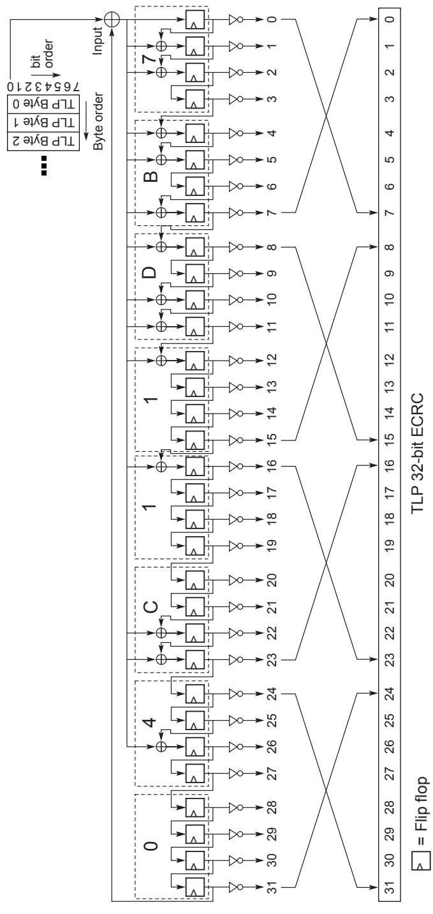


---

<<<PAGE_BREAK>>> page_302

<a id="sec-2-7-2"></a>
## 2.7.2 Error Forwarding (Data Poisoning) | 错误转发（数据中毒）


<div style="overflow-x: auto; max-width: 100%;">
<table>
<thead>
<tr>
<th width="50%">🇬🇧 English</th>
<th width="50%" style="background-color:#e8e8e8">🇨🇳 中文</th>
</tr>
</thead>
<tbody>
<tr>
<td>

Error Forwarding (also known as data poisoning), is indicated by Setting the EP bit, or additionally, in FM, through the use of Physical Layer Logical Block mechanisms. In FM, either or both mechanisms are permitted to be applied to a TLP with a data payload, and the requirements defined in this specification for Receiver handling of poisoned TLPs are the same regardless of the poisoning mechanism applied. It is permitted for Receivers to additionally implement differentiated handling based on the type of poisoning mechanism applied, but such handling is outside the scope of this specification.

The rules for the use of the EP bit are specified in § Section 2.7.2.1. The rules for the use of Physical Layer Logical Block mechanisms for data poisoning are specified in § Section 4.2.3.4. Here are some examples of cases where Error Forwarding might be used:

- **Example #1:** A read from parity or ECC-protected memory encounters an uncorrectable error (EP bit).
- **Example #2:** An error detected at the source of a write directed towards system memory (EP bit).
- **Example #3:** Data integrity error on an internal data buffer or cache within a routing element (EP bit or Physical Layer Logical Block).

**Considerations for the use of Error Forwarding:**

- Error Forwarding is only used for Read Completion Data, AtomicOp Completion Data, AtomicOp Request Data, or Write Data, never for the cases when the error is in the "header" (request phase, address/command, etc.). Requests/Completions with header errors cannot be forwarded in general since true destination cannot be positively known and, therefore, forwarding may cause direct or side effects such as data corruption, system failures, etc.
- Error Forwarding is used for controlled propagation of errors through the system, system diagnostics, etc.

> **IMPLEMENTATION NOTE:**
> **PROTECTION OF TD BIT INSIDE SWITCHES (NFM)**
>
> It is of utmost importance that Switches insure and maintain the integrity of the TD bit in TLPs that they receive and forward (i.e., by applying a special internal protection mechanism), since corruption of the TD bit will cause the ultimate target device to misinterpret the presence or absence of the TLP Digest field.
>
> Similarly, it is strongly recommended that Switches provide internal protection to other Variant bits in TLPs that they receive and forward, as the end-to-end integrity of Variant bits is not sustained by the ECRC.

> **IMPLEMENTATION NOTE:**
> **DATA LINK LAYER DOES NOT HAVE INTERNAL TLP VISIBILITY (NFM)**
>
> Since the Data Link Layer does not process the TLP header (it determines the start and end of the TLP based on indications from the Physical Layer), it is not aware of the existence of the TLP Digest field, and simply passes it to the Transaction Layer as a part of the TLP.

</td>
<td style="background-color:#e8e8e8">

错误转发（Error Forwarding，也称为数据中毒，Data Poisoning）通过置位（Set）EP 位（中毒位）来表示，在 FM 模式下还可以通过使用物理层逻辑块（Physical Layer Logical Block）机制来表示。在 FM 模式下，允许对带有数据负载的 TLP 使用其中任一或两种机制，且本规范中规定的接收器对中毒 TLP 的处理要求不因所采用的中毒机制不同而有所区别。允许接收器根据所采用的中毒机制类型实现差异化处理，但此类处理不在本规范的范围内。

EP 位的使用规则在 § 第 2.7.2.1 节中规定。物理层逻辑块机制用于数据中毒的规则在 § 第 4.2.3.4 节中规定。以下是一些可能使用错误转发的示例：

- **示例 #1：** 对奇偶校验或 ECC 保护内存的读取遇到不可纠正的错误（EP 位）。
- **示例 #2：** 在指向系统内存的写入源端检测到错误（EP 位）。
- **示例 #3：** 路由元素（routing element）内部数据缓冲区或缓存发生数据完整性错误（EP 位或物理层逻辑块）。

**使用错误转发的注意事项：**

- 错误转发仅用于读完成数据（Read Completion Data）、原子操作完成数据（AtomicOp Completion Data）、原子操作请求数据（AtomicOp Request Data）或写数据（Write Data），绝不用于错误位于"包头"（请求阶段、地址/命令等）中的情况。带有包头错误的请求/完成（Requests/Completions）通常不能被转发，因为无法确定真正的目标地址，因此转发可能导致数据损坏、系统故障等直接或副作用。
- 错误转发用于在系统中进行受控的错误传播、系统诊断等。

> **实现注意事项：**
> **交换机内 TD 位的保护（NFM）**
>
> 交换机确保并维护其接收和转发的 TLP 中 TD 位（中毒数据位，TLP Digest 位）的完整性（即通过应用特殊的内部保护机制）是至关重要的，因为 TD 位的损坏将导致最终的目标设备错误地解读 TLP Digest 字段的存在与否。
>
> 类似地，强烈建议交换机为其接收和转发的 TLP 中的其他 Variant 位提供内部保护，因为 Variant 位的端到端完整性不能由 ECRC 来维持。

> **实现注意事项：**
> **数据链路层不具有 TLP 内部可见性（NFM）**
>
> 由于数据链路层（Data Link Layer）不处理 TLP 包头（它根据物理层的指示确定 TLP 的开始和结束），因此它不知道 TLP Digest 字段的存在，并仅将其作为 TLP 的一部分传递给事务层（Transaction Layer）。

</td>
</tr>
</tbody>
</table>
</div>


[⬆️ 返回目录](#-本章目录-table-of-contents)

---

<<<PAGE_BREAK>>> page_303

<a id="sec-2-7-2-1"></a>
## 2.7.2.1 Rules For Use of Data Poisoning | 数据中毒的使用规则

<table>
<thead>
<tr>
<th width="50%">🇬🇧 English</th>
<th width="50%" style="background-color:#e8e8e8">🇨🇳 中文</th>
</tr>
</thead>
<tbody>
<tr>
<td>

- Note that Error forwarding does not cause Data Link Layer Retry - Poisoned TLPs will be retried only if there are transmission errors on the Link as determined by the TLP error detection mechanisms in the Data Link Layer.
  - The Poisoned TLP may ultimately cause the originator of the request to re-issue it (at the Transaction Layer or above) in the case of read operation or to take some other action. Such use of Error Forwarding information is beyond the scope of this specification.
- Support for TLP poisoning in a Transmitter is optional.
  - In FM, a Transmitter is permitted to support only the EP bit mechanism, only the Physical Layer Logical Block mechanism, or both, or neither.
- Data poisoning applies only to the data payload<sup>54</sup> within a Write Request (Posted or Non-Posted), a Message with Data, an AtomicOp Request, a Read Completion, or an AtomicOp Completion.
- Poisoning of a TLP with a data payload in the Transaction Layer is indicated by a Set EP bit.
- When a routing element is translating a TLP from NFM to FM, if the EP bit is Set in the NFM TLP, then the EP bit must be Set in the FM TLP.
- When a routing element is translating a TLP from FM to NFM, if either poisoning mechanism has been applied to the FM TLP, then the EP bit must be Set in the NFM TLP.
- Transmitters are only permitted to poison TLPs that include a data payload. In FM, the EP bit is Reserved for TLPs that do not include a data payload. In NFM, the behavior of the Receiver is not specified if poisoning is indicated for any TLP that does not include a data payload.
- For IDE TLPs:
  - Only the original Transmitting Port is permitted to poison a TLP and must do so using the EP bit.
  - It is not permitted to use Physical Layer Logical Block mechanisms to poison a TLP; if data corruption is detected in an IDE TLP after the time the MAC has been generated, the IDE TLP must be forwarded without consideration of the detected corruption.
- If a Transmitter supports data poisoning, TLPs that are known at the Transaction Layer of the Transmitter to include a bad data payload must use the EP bit poison mechanism.
- For a routing element that supports data poisoning, if a non-IDE TLP is Received as poisoned using Physical Layer Logical Block mechanisms, that TLP must be transmitted at the Egress Port marked as poisoned using the EP bit mechanism.
- If a Downstream Port supports Poisoned TLP Egress Blocking, the Poisoned TLP Egress Blocking Enable bit is Set, and a poisoned TLP targets going out the Egress Port, the Port must handle the TLP as a Poisoned TLP Egress Blocked error unless there is a higher precedence error. See § Section 6.2.3.2.3, § Section 6.2.5, and § Section 7.9.14.3. Further:
  - The Port must not transmit the TLP.
  - If DPC is not triggered and the TLP is a Non-Posted Request received on a non-UIO VC, the Port must return a Completion with Unsupported Request Completion Status. See § Section 6.2.3.2.4.1.
  - If DPC is triggered the Port must behave as described in § Section 2.9.3.
- For ultimate Completers:
  - The following Requests with poisoned data payload must not modify the value of the target location:
    - Configuration Write Request

> **Note 54:** A data payload includes TLPs with no bytes enabled (e.g., zero-length writes).

</td>
<td style="background-color:#e8e8e8">

- 注意：错误转发不会引起数据链路层重试（Data Link Layer Retry）——中毒 TLP（Poisoned TLP）仅在链路上存在传输错误时（由数据链路层中的 TLP 错误检测机制确定）才会被重试。
  - 中毒 TLP 最终可能导致请求的发起方（在事务层或更高层）针对读操作重新发起请求或采取其他动作。对错误转发信息的这种使用不在本规范的范围内。
- 发送器（Transmitter）中对 TLP 中毒的支持是可选的。
  - 在 FM 模式下，发送器允许仅支持 EP 位机制、仅支持物理层逻辑块机制、两者都支持或都不支持。
- 数据中毒仅适用于写请求（Posted 或 Non-Posted）、带数据的报文（Message with Data）、原子操作请求（AtomicOp Request）、读完成（Read Completion）或原子操作完成（AtomicOp Completion）中的数据负载<sup>54</sup>。
- 在事务层中，对带数据负载的 TLP 进行中毒通过置位（Set）EP 位来指示。
- 当路由元素将 TLP 从 NFM 翻译为 FM 时，如果 NFM TLP 中 EP 位置位，则 FM TLP 中的 EP 位必须置位。
- 当路由元素将 TLP 从 FM 翻译为 NFM 时，如果对 FM TLP 应用了任一中毒机制，则 NFM TLP 中的 EP 位必须置位。
- 发送器仅允许对包含数据负载的 TLP 进行中毒。在 FM 模式下，对于不包含数据负载的 TLP，EP 位为保留位。在 NFM 模式下，如果对任何不包含数据负载的 TLP 指示了中毒，则接收器的行为不在本规范中规定。
- 对于 IDE TLP：
  - 仅原始的发送端口（original Transmitting Port）允许对 TLP 进行中毒，并且必须使用 EP 位进行。
  - 不允许使用物理层逻辑块机制对 TLP 进行中毒；如果在生成 MAC 之后在 IDE TLP 中检测到数据损坏，则 IDE TLP 必须在不考虑所检测到的损坏的情况下转发。
- 如果发送器支持数据中毒，则发送器在事务层已知包含错误数据负载的 TLP 必须使用 EP 位中毒机制。
- 对于支持数据中毒的路由元素，如果使用物理层逻辑块机制将非 IDE TLP 接收为中毒的，则该 TLP 必须在出口端口（Egress Port）使用 EP 位机制标记为中毒后发送出去。
- 如果下游端口（Downstream Port）支持中毒 TLP 出口阻塞（Poisoned TLP Egress Blocking），且中毒 TLP 出口阻塞使能位（Poisoned TLP Egress Blocking Enable bit）已置位，并且中毒 TLP 的目标是经过出口端口发出，则该端口必须将该 TLP 作为中毒 TLP 出口阻塞错误（Poisoned TLP Egress Blocked error）处理，除非存在更高优先级的错误。参见 § 第 6.2.3.2.3 节、§ 第 6.2.5 节和 § 第 7.9.14.3 节。此外：
  - 该端口必须不发送（transmit）该 TLP。
  - 如果 DPC 未触发且 TLP 是在非 UIO 虚通道（VC）上接收的 Non-Posted 请求（Non-Posted Request），则该端口必须返回带"不支持的请求"完成状态（Unsupported Request Completion Status）的完成报文（Completion）。参见 § 第 6.2.3.2.4.1 节。
  - 如果 DPC 触发，则该端口必须按 § 第 2.9.3 节所述行为进行处理。
- 对于最终完成者（ultimate Completer）：
  - 以下带有中毒数据负载的请求不得修改目标位置的值：
    - 配置写请求（Configuration Write Request）

> **注释 54:** 数据负载包括未使能任何字节的 TLP（例如零长度写）。

</td>
</tr>
</tbody>
</table>

[⬆️ 返回目录](#-本章目录-table-of-contents)

---

<<<PAGE_BREAK>>> page_304

<a id="sec-2-7-2-1-cont"></a>
## 2.7.2.1 Rules For Use of Data Poisoning (continued) | 2.7.2.1 数据中毒的使用规则（续）


<div style="overflow-x: auto; max-width: 100%;">
<table>
<thead>
<tr>
<th width="50%">🇬🇧 English</th>
<th width="50%" style="background-color:#e8e8e8">🇨🇳 中文</th>
</tr>
</thead>
<tbody>
<tr>
<td>

  - Any of the following that target a control register or control structure in the Completer: I/O Write Request, Memory Write Request, or non-vendor-defined Message with data
  - AtomicOp Request
  - DMWr Request (see § Section 6.32)

Unless there is a higher precedence error, a Completer must handle these Requests as a Poisoned TLP Received error<sup>55</sup>, and the Completer must also return a Completion with a Completion Status of Unsupported Request (UR) if the Request is Non-Posted (see § Section 6.2.3.2.3, § Section 6.2.3.2.4, and § Section 6.2.5). Regardless of the severity of the reported error, the reported error must be handled as an uncorrectable error, not an Advisory Non-Fatal Error.

A Switch must route these Requests the same way it would route the same Request if it were not poisoned, unless a Request targets a location in the Switch itself, in which case the Switch is the Completer for that Request and must follow the above rules.

For some applications it may be desirable for the Completer to use poisoned data in Write Requests that do not target control registers or control structures - such use is not forbidden. Similarly, it may be desirable for the Requester to use data marked poisoned in Completions - such use is also not forbidden. The appropriate use of poisoned information is application specific, and is not discussed in this document.

This document does not define any mechanism for determining which part or parts of the data payload of a Poisoned TLP are actually corrupt and which, if any, are not corrupt.

> **Note 55:** Due to ambiguous language in earlier versions of this specification, a component is permitted to handle this error as an Unsupported Request, but this is strongly discouraged.

</td>
<td style="background-color:#e8e8e8">

  - 以下任一项若目标是完成者中的控制寄存器或控制结构：I/O 写请求（I/O Write Request）、内存写请求（Memory Write Request）或带数据的非厂商定义报文（non-vendor-defined Message with data）
  - 原子操作请求（AtomicOp Request）
  - DMWr 请求（参见 § 第 6.32 节）

除非存在更高优先级的错误，否则完成者必须将这些请求作为中毒 TLP 接收错误（Poisoned TLP Received error）<sup>55</sup>进行处理，并且如果该请求是 Non-Posted 请求（Non-Posted Request），则完成者还必须返回完成状态（Completion Status）为"不支持的请求"（UR, Unsupported Request）的完成报文（参见 § 第 6.2.3.2.3 节、§ 第 6.2.3.2.4 节和 § 第 6.2.5 节）。无论所上报错误的严重程度如何，所上报的错误必须作为不可纠正错误（uncorrectable error）处理，而不是建议性非致命错误（Advisory Non-Fatal Error）。

交换机必须按与路由未中毒的相同请求相同的方式来路由这些请求，除非请求的目标是交换机自身中的位置，在这种情况下交换机是该请求的完成者并必须遵循上述规则。

对于某些应用，完成者（Completer）可能希望在目标不是控制寄存器或控制结构的写请求中使用中毒数据——此类使用未被禁止。类似地，请求者（Requester）可能希望在完成报文（Completions）中使用标记为中毒的数据——此类使用也未被禁止。对中毒信息的适当使用取决于具体应用，本文档不讨论该问题。

本文档未定义任何机制来确定中毒 TLP 数据负载的哪些部分（如果有的话）实际已损坏、哪些未损坏。

> **注释 55:** 由于本规范早期版本中含糊不清的措辞，允许组件将此错误作为"不支持的请求"（Unsupported Request）进行处理，但强烈不鼓励这样做。

</td>
</tr>
</tbody>
</table>
</div>


[⬆️ 返回目录](#-本章目录-table-of-contents)

---

<a id="sec-2-8"></a>
## 2.8 Completion Timeout Mechanism | 完成超时机制

<table>
<thead>
<tr>
<th width="50%">🇬🇧 English</th>
<th width="50%" style="background-color:#e8e8e8">🇨🇳 中文</th>
</tr>
</thead>
<tbody>
<tr>
<td>

In any split transaction protocol, there is a risk associated with the failure of a Requester to receive an expected Completion. To allow Requesters to attempt recovery from this situation in a standard manner, the Completion Timeout mechanism is defined. This mechanism is intended to be activated only when there is no reasonable expectation that the Completion will be returned, and should never occur under normal operating conditions. Note that the values specified here do not reflect expected service latencies, and must not be used to estimate typical response times.

PCI Express device Functions that issue Requests requiring Completions must implement the Completion Timeout mechanism. An exception is made for Configuration Requests (see below). The Completion Timeout mechanism is activated for each Request that requires one or more Completions when the Request is transmitted. Since Switches do not autonomously initiate Requests that need Completions, the requirement for Completion Timeout support is limited only to Root Complexes, PCI Express-PCI Bridges, and Endpoints.

The Completion Timeout mechanism may be disabled by configuration software by means of the Completion Timeout Disable mechanism (see § Section 7.5.3.15 and § Section 7.5.3.16).

The Completion Timeout limit is set in the Completion Timeout Value field of the Device Control 2 register. A Completion Timeout is a reported error associated with the Requester Function (see § Section 6.2). If the Completion Timeout programming mechanism is not supported, the Function MUST@FLIT implement a timeout value in the range 40 ms to 50 ms; when Flit Mode Supported is Clear, the Function must implement a timeout value in the range 50 μs to 50 ms, and it is strongly recommended that the value be at least 10 ms.

A Request for which there are multiple Completions must be considered completed only when all Completions have been received by the Requester.

For a Memory Read Request, if some, but not all, requested data is returned before the Completion Timeout timer expires, the Requester is permitted to keep or to discard the data that was returned prior to timer expiration.

</td>
<td style="background-color:#e8e8e8">

在任意分离事务协议中，都存在请求者（Requester）未收到预期完成报文（Completion）的相关风险。为了允许请求者以标准方式尝试从此情况中恢复，定义了完成超时机制（Completion Timeout mechanism）。该机制仅在没有理由预期完成报文会被返回时才应被激活，在正常操作条件下不应发生。注意：此处指定的值并不反映预期的服务延迟，不得用于估算典型响应时间。

发出需要完成报文的请求的 PCI Express 设备功能（Function）必须实现完成超时机制。配置请求（Configuration Requests）为例外（见下文）。完成超时机制在每个需要一项或多项完成报文的请求被发送时被激活。由于交换机不会主动发起需要完成报文的请求，因此对完成超时支持的要求仅限于根复合体（Root Complex）、PCI Express-PCI 桥和端点（Endpoint）。

完成超时机制可以由配置软件通过完成超时禁用机制（Completion Timeout Disable mechanism）禁用（参见 § 第 7.5.3.15 节和 § 第 7.5.3.16 节）。

完成超时限制在 Device Control 2 寄存器的 Completion Timeout Value 字段中设置。完成超时是与请求者功能（Requester Function）相关联的上报错误（参见 § 第 6.2 节）。如果不支持完成超时编程机制，则该功能在 Flit 模式下必须实现 40 ms 到 50 ms 范围内的超时值；当 Flit Mode Supported 位清零时，该功能必须实现 50 μs 到 50 ms 范围内的超时值，并强烈建议该值至少为 10 ms。

对于具有多项完成报文的请求，只有当请求者已收到所有完成报文时，该请求才被视为已完成。

对于内存读请求（Memory Read Request），如果在完成超时定时器到期之前已返回部分（但非全部）请求的数据，则请求者可以保留或丢弃在定时器到期之前已返回的数据。

</td>
</tr>
</tbody>
</table>

[⬆️ 返回目录](#-本章目录-table-of-contents)

---

<<<PAGE_BREAK>>> page_305

<a id="sec-2-8-cont"></a>
## 2.8 Completion Timeout Mechanism (continued) | 2.8 完成超时机制（续）


<div style="overflow-x: auto; max-width: 100%;">
<table>
<thead>
<tr>
<th width="50%">🇬🇧 English</th>
<th width="50%" style="background-color:#e8e8e8">🇨🇳 中文</th>
</tr>
</thead>
<tbody>
<tr>
<td>

Completion Timeout expiration for a UIO Request does not necessarily indicate that the Request, or portions of the Request, succeeded or failed.

For a series of UIO Requests using the same Transaction ID, the Completion Timeout mechanism must be restarted for each UIO Request issued.

Completion Timeouts for Configuration Requests have special requirements for the support of PCI Express to PCI/PCI-X Bridges. PCI Express to PCI/PCI-X Bridges, by default, are not enabled to return Request Retry Status (RRS) for Configuration Requests to a PCI/PCI-X device behind the Bridge. This may result in lengthy completion delays that must be comprehended by the Completion Timeout value in the Root Complex. System software may enable PCI Express to PCI/PCI-X Bridges to return RRS for Configuration Requests by setting the Bridge Configuration Retry Enable bit in the Device Control register, subject to the restrictions noted in the [PCIe-to-PCI-PCI-X-Bridge].

</td>
<td style="background-color:#e8e8e8">

UIO 请求的完成超时到期并不一定表示该请求或该请求的部分已成功或失败。

对于使用同一事务 ID（Transaction ID）的一系列 UIO 请求，必须为每个发出的 UIO 请求重新启动完成超时机制。

配置请求的完成超时有对 PCI Express-to-PCI/PCI-X 桥支持的特殊要求。默认情况下，PCI Express-to-PCI/PCI-X 桥未使能向桥后面的 PCI/PCI-X 设备的配置请求返回请求重试状态（RRS, Request Retry Status）。这可能导致较长的完成延迟，根复合体（Root Complex）中的完成超时值必须考虑这种延迟。系统软件可以通过设置 Device Control 寄存器中的 Bridge Configuration Retry Enable 位来使能 PCI Express-to-PCI/PCI-X 桥为配置请求返回 RRS，但须遵守 [PCIe-to-PCI-PCI-X-Bridge] 中所述的限制。

</td>
</tr>
</tbody>
</table>
</div>


[⬆️ 返回目录](#-本章目录-table-of-contents)

---

<a id="sec-2-9"></a>
## 2.9 Link Status Dependencies | 链路状态依赖关系

<table>
<thead>
<tr>
<th width="50%">🇬🇧 English</th>
<th width="50%" style="background-color:#e8e8e8">🇨🇳 中文</th>
</tr>
</thead>
<tbody>
<tr>
<td>

DL_Down status indicates that there is no connection with another component on the Link, or that the connection with the other component has been lost and is not recoverable by the Physical or Data Link Layers. This section specifies the Transaction Layer's behavior if DPC has not been triggered and the Data Link Layer reports DL_Down status to the Transaction Layer, indicating that the Link is non-operational. § Section 2.9.3 specifies the behavior if DPC has been triggered.

- For a Port with DL_Down status, the Transaction Layer is not required to accept received TLPs from the Data Link Layer, provided that these TLPs have not been acknowledged by the Data Link Layer. Such TLPs do not modify receive Flow Control credits.

For a Downstream Port, DL_Down status is handled by:

- Initializing back to their default state any buffers or internal states associated with outstanding requests transmitted Downstream.
  - Port configuration registers must not be affected, except as required to update status associated with the transition to DL_Down.

> **IMPLEMENTATION NOTE:**
> **COMPLETION TIMEOUT PREFIX/HEADER LOG CAPABLE**
>
> The prefix/header of the Request TLP associated with a Completion Timeout may optionally be recorded by Requesters that implement the AER Capability. Support for recording of the prefix/header is indicated by the value of the Completion Timeout Prefix/Header Log Capable bit in the Advanced Error Capabilities and Control register.
>
> A Completion Timeout may be the result of improper configuration, system failure, or async removal (see § Section 6.7.6). In order for host software to distinguish a Completion Timeout error after which continued normal operation is not possible (e.g., after one caused by improper configuration or a system failure) from one where continued normal operation is possible (e.g., after an async removal), it is strongly encouraged that Requesters log the Request TLP prefix/header associated with the Completion Timeout.

</td>
<td style="background-color:#e8e8e8">

DL_Down 状态表示与链路上另一个组件无连接，或者与另一组件的连接已丢失且无法由物理层或数据链路层恢复。本节规定在 DPC 未被触发且数据链路层向事务层上报 DL_Down 状态（表示链路不可操作）时事务层的行为。§ 第 2.9.3 节规定在 DPC 已被触发时的行为。

- 对于处于 DL_Down 状态的端口（Port），事务层不需要从数据链路层接受已收到的 TLP，前提是这些 TLP 尚未被数据链路层确认（acknowledged）。此类 TLP 不会修改接收流控（Flow Control）信用（credit）。

对于下游端口（Downstream Port），DL_Down 状态按以下方式处理：

- 将与向下传输（Downstream）的未完成请求（outstanding request）相关联的任何缓冲区或内部状态初始化回其默认状态。
  - 端口配置寄存器不得受到影响，除非需要更新与向 DL_Down 转换相关联的状态。

> **实现注意事项：**
> **支持完成超时前缀/包头日志记录**
>
> 与完成超时相关联的请求 TLP 的前缀/包头可选择性地由实现 AER 能力（Capability）的请求者进行记录。对前缀/包头记录的支持由 Advanced Error Capabilities and Control 寄存器中的 Completion Timeout Prefix/Header Log Capable 位的值指示。
>
> 完成超时可能是由于配置不当、系统故障或异步移除（async removal）（参见 § 第 6.7.6 节）造成的。为了使主机软件能够区分在完成超时错误发生后无法继续正常运行的情况（例如由配置不当或系统故障引起）与可以继续正常运行的情况（例如由异步移除引起），强烈建议请求者记录与完成超时相关联的请求 TLP 前缀/包头。

</td>
</tr>
</tbody>
</table>

[⬆️ 返回目录](#-本章目录-table-of-contents)

---


---

<a id="sec-2-9-1"></a>
## 2.9.1 Transaction Layer Behavior in DL_Down Status | DL_Down 状态下的事务层行为


<div style="overflow-x: auto; max-width: 100%;">
<table>
<thead>
<tr>
<th width="50%">🇬🇧 English</th>
<th width="50%" style="background-color:#e8e8e8">🇨🇳 中文</th>
</tr>
</thead>
<tbody>
<tr>
<td>

- For Non-Posted Requests, forming completions for any Requests submitted by the device core for Transmission, returning Unsupported Request Completion Status, then discarding the Requests
  - This is a reported error associated with the Function for the (virtual) Bridge associated with the Port (see § Section 6.2). For Root Ports, the reporting of this error is optional.
  - Non-Posted Requests already being processed by the Transaction Layer, for which it may not be practical to return Completions, are discarded.
    - Note: This is equivalent to the case where the Request had been Transmitted but not yet Completed before the Link status became DL_Down.
    - These cases are handled by the Requester using the Completion Timeout mechanism.
    - Note: The point at which a Non-Posted Request becomes "uncompletable" is implementation specific.
- The Port must terminate any PME_Turn_Off handshake Requests targeting the Port in such a way that the Port is considered to have acknowledged the PME_Turn_Off request (see the Implementation Note in § Section 5.3.3.2.1).
- The Port must handle Vendor-Defined Message Requests as described in § Section 2.2.8.6 (e.g., silently discard Vendor-Defined Type 1 Messages Requests that it is not designed to receive) since the DL_Down prevents the Request from reaching its targeted Function.
- For all other Posted Requests, discarding the Requests
  - This is a reported error associated with the Function for the (virtual) Bridge associated with the Port (see § Section 6.2), and must be reported as an Unsupported Request. For Root Ports, the reporting of this error is optional.
  - For a Posted Request already being processed by the Transaction Layer, the Port is permitted not to report the error.
    - Note: This is equivalent to the case where the Request had been Transmitted before the Link status became DL_Down
    - Note: The point at which a Posted Request becomes "unreportable" is implementation specific.
- Discarding all Completions submitted by the device core for Transmission

For an Upstream Port, DL_Down status is handled as a reset by:

- Returning all PCI Express-specific registers, state machines and externally observable state to the specified default or initial conditions (except for registers defined as sticky - see § Section 7.4)
- Discarding all TLPs being processed
- For Switch and Bridge propagating hot reset to all associated Downstream Ports. In Switches that support Link speeds greater than 5.0 GT/s, the Upstream Port must direct the LTSSM of each Downstream Port to the Hot Reset state, but not hold the LTSSMs in that state. This permits each Downstream Port to begin Link training immediately after its hot reset completes. This behavior is recommended for all Switches.

</td>
<td style="background-color:#e8e8e8">

- 对于 Non-Posted 请求（Non-Posted Request），为由设备核心 (device core) 提交传输 (Transmission) 的任何请求 (Request) 形成完成报文 (Completion)，返回 Unsupported Request (UR) 完成状态 (Completion Status)，然后丢弃这些请求
  - 这是一个与该端口 (Port) 所关联的（虚拟）桥 (Bridge) 下的功能 (Function) 相关的已上报错误（见 § Section 6.2）。对于根端口 (Root Port)，该错误的上报是可选的。
  - 事务层 (Transaction Layer) 正在处理、但已不再实际可行返回完成报文的 Non-Posted 请求将被丢弃。
    - 注：这等价于请求已经被发送 (Transmitted)，但在链路 (Link) 状态变为 DL_Down 之前尚未完成 (Completed) 的情况。
    - 这些情况由请求者 (Requester) 通过完成超时 (Completion Timeout) 机制来处理。
    - 注：Non-Posted 请求在何时变为“无法完成 (uncompletable)”是具体实现相关的。
- 端口 (Port) 必须以使该端口被视为已应答 (acknowledged) PME_Turn_Off 请求的方式，终止 (terminate) 任何以该端口为目标的 PME_Turn_Off 握手请求 (handshake Request)（见 § Section 5.3.3.2.1 中的实现说明 Implementation Note）。
- 端口必须按照 § Section 2.2.8.6 中所述的方式处理 Vendor-Defined Message 请求（例如，静默丢弃 (silently discard) 它并未被设计接收的 Vendor-Defined Type 1 Message 请求），因为 DL_Down 状态会阻止该请求到达其目标功能 (targeted Function)。
- 对于所有其他 Posted 请求 (Posted Request)，直接丢弃这些请求
  - 这是一个与该端口所关联的（虚拟）桥下的功能相关的已上报错误（见 § Section 6.2），且必须作为 Unsupported Request 上报。对于根端口，该错误的上报是可选的。
  - 对于事务层正在处理的 Posted 请求，端口可以不上报该错误。
    - 注：这等价于请求在链路状态变为 DL_Down 之前已经被发送的情况。
    - 注：Posted 请求在何时变为“无法上报 (unreportable)”是具体实现相关的。
- 丢弃由设备核心提交传输的所有完成报文 (Completion)

对于上游端口 (Upstream Port)，DL_Down 状态被作为一次复位 (reset) 处理，方式如下：

- 将所有 PCI Express 专用寄存器、状态机和外部可观测状态恢复到指定的默认或初始条件（被定义为粘性 (sticky) 的寄存器除外，参见 § Section 7.4）
- 丢弃所有正在被处理的 TLP
- 对交换机 (Switch) 和桥 (Bridge) 向所有关联的下游端口 (Downstream Port) 传播热复位 (hot reset)。在支持高于 5.0 GT/s 链路速率的交换机中，上游端口必须将各下游端口的 LTSSM (链路训练与状态机, Link Training and Status State Machine) 引导至 Hot Reset 状态，但不要将 LTSSM 保持在该状态。这允许各下游端口在热复位完成后立即开始链路训练 (Link training)。建议所有交换机都采用此行为。

</td>
</tr>
</tbody>
</table>
</div>


<<<PAGE_BREAK>>> page_306

---

<a id="sec-2-9-2"></a>
## 2.9.2 Transaction Layer Behavior in DL_Up Status | DL_Up 状态下的事务层行为

<table>
<thead>
<tr>
<th width="50%">🇬🇧 English</th>
<th width="50%" style="background-color:#e8e8e8">🇨🇳 中文</th>
</tr>
</thead>
<tbody>
<tr>
<td>

DL_Up status indicates that a connection has been established with another component on the associated Link. This section specifies the Transaction Layer's behavior when the Data Link Layer reports entry to the DL_Up status to the Transaction Layer, indicating that the Link is operational. The Transaction Layer of a Port with DL_Up status must accept received TLPs that conform to the other rules of this specification.

For a Downstream Port on a Root Complex or a Switch:

- When transitioning from a non-DL_Up status to a DL_Up status and the Auto Slot Power Limit Disable bit is Clear in the Slot Control Register, the Port must initiate the transmission of a Set_Slot_Power_Limit Message to the other component on the Link to convey the value programmed in the Slot Power Limit Scale and Slot Power Limit Value fields of the Slot Capabilities Register. This Transmission is optional if the Slot Capabilities Register has not yet been initialized.

</td>
<td style="background-color:#e8e8e8">

DL_Up 状态表示已与相关链路上另一个组件建立连接。本节规定当数据链路层 (Data Link Layer) 向事务层上报进入 DL_Up 状态时事务层的行为，此时表示链路是可操作的 (operational)。处于 DL_Up 状态的端口的事务层必须接收符合本规范其他规则的所收到的 TLP。

对于根复合体 (Root Complex) 或交换机上的下游端口 (Downstream Port)：

- 当从非 DL_Up 状态转换到 DL_Up 状态，且 Slot Control 寄存器 (Slot Control Register) 中的 Auto Slot Power Limit Disable 位为 0 (Clear) 时，端口必须启动向链路上另一组件发送 Set_Slot_Power_Limit 消息 (Message)，以传递 Slot Capabilities 寄存器 (Slot Capabilities Register) 中 Slot Power Limit Scale 和 Slot Power Limit Value 字段所编程的值。如果 Slot Capabilities 寄存器尚未被初始化，则该传输 (Transmission) 是可选的。

</td>
</tr>
</tbody>
</table>

<<<PAGE_BREAK>>> page_307

---

<a id="sec-2-9-3"></a>
## 2.9.3 Transaction Layer Behavior During Downstream Port Containment | Downstream Port Containment (DPC) 期间的事务层行为


<div style="overflow-x: auto; max-width: 100%;">
<table>
<thead>
<tr>
<th width="50%">🇬🇧 English</th>
<th width="50%" style="background-color:#e8e8e8">🇨🇳 中文</th>
</tr>
</thead>
<tbody>
<tr>
<td>

During Downstream Port Containment (DPC), the LTSSM associated with the Downstream Port is directed to the Disabled state. Once it reaches the Disabled state, it remains there as long as the DPC Trigger Status bit in the DPC Status Register is Set. See § Section 6.2.11 for requirements on how long software must leave the Downstream Port in DPC. This section specifies the Transaction Layer's behavior once DPC has been triggered, and as long as the Downstream Port remains in DPC.

- Once DPC has been triggered, no additional (Upstream) TLPs are accepted from the Data Link Layer.
- If the condition that triggered DPC was associated with an Upstream TLP, any subsequent Upstream TLPs that were already accepted from the Data Link Layer must be discarded silently.
- The Downstream Port handles (Downstream) TLPs submitted by the device core in the following manner.
- If the condition that triggered DPC was associated with a Downstream TLP, any prior Downstream TLPs are permitted to be dropped silently or transmitted before the Link goes down. Otherwise, the following rules apply.
  - For each Non-Posted Request, the Port must return a Completion and discard the Request silently. The Completer ID field must contain the value associated with the Downstream Port.
    - If the DPC Completion Control bit is Set in the DPC Control Register, then Completions are generated with Unsupported Request (UR) Completion Status.
    - If the DPC Completion Control bit is Clear, Completions are generated with Completer Abort (CA) Completion Status.
  - The Port must terminate any PME_Turn_Off handshake Requests targeting the Port in such a way that the Port is considered to have acknowledged the PME_Turn_Off Request (see the Implementation Note in § Section 5.3.3.2.1).
  - The Port must handle Vendor-Defined Message Requests as described in § Section 2.2.8.6. (e.g., silently discard Vendor Defined_Type 1 Message Requests that it is not designed to receive) since the DL_Down prevents the Request from reaching its targeted Function.
  - For all other Posted Requests and Completions, the Port must silently discard the TLP.

For any outstanding Non-Posted Requests where DPC being triggered prevents their associated Completions from being returned, the following apply:

- For Root Ports that support RP Extensions for DPC, the Root Port may track certain Non-Posted Requests, and when DPC is triggered, synthesize a Completion for each tracked Request. This helps avoid Completion Timeouts that would otherwise occur as a side-effect of DPC being triggered. Each synthesized Completion must have a UR or CA Completion Status as determined by the DPC Completion Control bit. The set of Non-Posted Requests that get tracked is implementation specific, but it is strongly recommended that all Non-Posted Requests that are generated by host processor instructions (e.g., "read", "write", "load", "store", or one that corresponds to an AtomicOp) be tracked. Other candidates for tracking include peer-to-peer Requests coming from other Root Ports and Requests coming from RCiEPs.

</td>
<td style="background-color:#e8e8e8">

在 Downstream Port Containment (DPC，下游端口抑制) 期间，与该下游端口关联的 LTSSM (链路训练与状态机) 被引导至 Disabled (禁用) 状态。一旦到达 Disabled 状态，只要 DPC Status 寄存器 (DPC Status Register) 中的 DPC Trigger Status 位被置 1 (Set)，它就一直保持在该状态。关于软件必须使下游端口停留在 DPC 状态多久的要求，请参见 § Section 6.2.11。本节规定 DPC 被触发之后、以及在该下游端口处于 DPC 状态期间的事务层行为。

- 一旦 DPC 被触发，就不再从数据链路层接收任何额外的（上游方向 Upstream）TLP。
- 如果触发 DPC 的条件与一个上游 TLP 相关，那么从数据链路层已经接收的任何后续上游 TLP 必须被静默丢弃 (discarded silently)。
- 下游端口按以下方式处理由设备核心 (device core) 提交的（下游方向 Downstream）TLP。
- 如果触发 DPC 的条件与一个下游 TLP 相关，那么在链路断开 (Link goes down) 之前，先前到达的任何下游 TLP 可以被静默丢弃 (dropped silently) 或者被发送 (transmitted)。除此之外，适用以下规则。
  - 对于每个 Non-Posted 请求，端口必须返回一个完成报文 (Completion) 并静默丢弃该请求。Completer ID 字段必须包含与该下游端口相关联的值。
    - 如果 DPC Control 寄存器 (DPC Control Register) 中的 DPC Completion Control 位被置 1 (Set)，则所生成的完成报文使用 Unsupported Request (UR) 完成状态 (Completion Status)。
    - 如果 DPC Completion Control 位为 0 (Clear)，则所生成的完成报文使用 Completer Abort (CA) 完成状态 (Completion Status)。
  - 端口必须以使该端口被视为已应答 (acknowledged) PME_Turn_Off 请求的方式，终止 (terminate) 任何以该端口为目标的 PME_Turn_Off 握手请求 (handshake Request)（见 § Section 5.3.3.2.1 中的实现说明 Implementation Note）。
  - 端口必须按照 § Section 2.2.8.6 中所述的方式处理 Vendor-Defined Message 请求（例如，静默丢弃它并未被设计接收的 Vendor Defined_Type 1 Message 请求），因为 DL_Down 状态会阻止该请求到达其目标功能。
  - 对于所有其他 Posted 请求和完成报文，端口必须静默丢弃该 TLP。

对于任何 DPC 触发后导致其相关完成报文无法被返回的未完成 (outstanding) Non-Posted 请求，适用以下规定：

- 对于支持 DPC 的 RP Extensions 的根端口 (Root Port)，根端口可以跟踪 (track) 特定的 Non-Posted 请求，并在 DPC 触发时为每个被跟踪的请求合成 (synthesize) 一个完成报文。这有助于避免本会因 DPC 触发而作为副作用出现的完成超时 (Completion Timeout)。每个合成的完成报文必须根据 DPC Completion Control 位来决定其完成状态是 UR 还是 CA。被跟踪的 Non-Posted 请求集合是具体实现相关的，但强烈建议跟踪所有由主机处理器指令（例如 "read"、"write"、"load"、"store"，或对应于 AtomicOp 的指令）生成的 Non-Posted 请求。其他可被跟踪的候选请求包括来自其他根端口的对等 (peer-to-peer) 请求，以及来自 RCiEP 的请求。

</td>
</tr>
</tbody>
</table>
</div>


<<<PAGE_BREAK>>> page_308

---

<table>
<thead>
<tr>
<th width="50%">🇬🇧 English</th>
<th width="50%" style="background-color:#e8e8e8">🇨🇳 中文</th>
</tr>
</thead>
<tbody>
<tr>
<td>

- Otherwise, the associated Requesters may encounter Completion Timeouts. The software solution stack should comprehend and account for this possibility.

</td>
<td style="background-color:#e8e8e8">

- 否则，相关请求者 (Requester) 可能会遇到完成超时 (Completion Timeout)。软件解决方案栈 (software solution stack) 应当理解并考虑这种可能性。

</td>
</tr>
</tbody>
</table>


---

## 📑 本章目录 (Table of Contents) — Auto-Generated

- [2. Transaction Layer Specification | 事务层规范](#sec-2-0)
- [2.1 Transaction Layer Overview | 事务层概述](#sec-2-1)
- [2.1.1 Address Spaces, Transaction Types, and Usage | 地址空间、事务类型与用途](#sec-2-1-1)
- [2.1.1.1 Memory Transactions | 内存事务](#sec-2-1-1-1)
- [2.1.1.2 I/O Transactions | I/O 事务](#sec-2-1-1-2)
- [2.1.1.3 Configuration Transactions | 配置事务](#sec-2-1-1-3)
- [2.1.1.4 Message Transactions | 消息事务](#sec-2-1-1-4)
- [2.1.2 Packet Format Overview | 包格式概述](#sec-2-1-2)
- [2.2 Transaction Layer Protocol - Packet Definition | 事务层协议 - 包定义](#sec-2-2)
- [2.2.1 Common Packet Header Fields | 公共包头字段](#sec-2-2-1)
- [2.2.1.1 Common Packet Header Fields for Non-Flit Mode | 非 Flit 模式的公共包头字段](#sec-2-2-1-1)
- [2.2.1.2 Common Packet Header Fields for Flit Mode | Flit 模式的公共包头字段](#sec-2-2-1-2)
- [2.2.2 TLPs with Data Payloads - Rules | 含数据负载的 TLP - 规则](#sec-2-2-2)
- [2.2.3 TLP Digest Rules - Non-Flit Mode Only | TLP Digest 规则 —— 仅适用于非 Flit 模式](#sec-2-2-3)
- [2.2.4 Routing and Addressing Rules | 路由与寻址规则](#sec-2-2-4)
- [2.2.4.1 Address-Based Routing Rules | 基于地址的路由规则](#sec-2-2-4-1)
- [2.2.4.2 ID Based Routing Rules | 基于 ID 的路由规则](#sec-2-2-4-2)
- [2.2.5 First/Last DW Byte Enables Rules | 首/尾 DW 字节使能规则](#sec-2-2-5)
- [2.2.5.1 Byte Enable Rules for Non-Flit Mode | 非 Flit 模式的字节使能规则](#sec-2-2-5-1)
- [2.2.5.2 Byte Enable Rules for Flit Mode | Flit 模式的字节使能规则](#sec-2-2-5-2)
- [2.2.6 Transaction Descriptor | 事务描述符](#sec-2-2-6)
- [2.2.6.1 Overview | 概述](#sec-2-2-6-1)
- [2.2.6.2 Transaction Descriptor - Transaction ID Field | 事务描述符 - Transaction ID 字段](#sec-2-2-6-2)
- [2.2.6.3 Transaction Descriptor - Attributes Field | 事务描述符 - Attributes 字段](#sec-2-2-6-3)
- [2.2.6.4 Relaxed Ordering and ID-Based Ordering Attributes | 宽松排序与基于 ID 的排序属性](#sec-2-2-6-4)
- [2.2.6.5 No Snoop Attribute | No Snoop 属性](#sec-2-2-6-5)
- [2.2.6.6 Transaction Descriptor - Traffic Class Field | 事务描述符 - 流量类字段](#sec-2-2-6-6)
- [2.2.7 Memory, I/O, and Configuration Request Rules | 内存、I/O 和配置请求规则](#sec-2-2-7)
- [2.2.7.1 Non-Flit Mode | 非 Flit 模式](#sec-2-2-7-1)
- [2.2.7.1.1 TPH Rules | TPH 规则](#sec-2-2-7-1-1)
- [2.2.7.2 Flit Mode | Flit 模式](#sec-2-2-7-2)
- [2.2.8 Message Request Rules | 消息请求规则](#sec-2-2-8)
- [2.2.8.1 INTx Interrupt Signaling - Rules | INTx 中断信令 - 规则](#sec-2-2-8-1)
- [2.2.8.2 Power Management Messages | 电源管理消息](#sec-2-2-8-2)
- [2.2.8.3 Error Signaling Messages | 错误信号消息](#sec-2-2-8-3)
- [2.2.8.4 Locked Transactions Support | 锁定事务支持](#sec-2-2-8-4)
- [2.2.8.5 Slot Power Limit Support | 插槽功率限制支持](#sec-2-2-8-5)
- [2.2.8.6 Vendor-Defined Messages | 厂商自定义消息 (Vendor-Defined Messages)](#sec-2-2-8-6)
- [2.2.8.6.1 PCI-SIG Defined VDMs | PCI-SIG 定义的 VDM](#sec-2-2-8-6-1)
- [2.2.8.6.2 Device Readiness Status (DRS) Message | 设备就绪状态 (DRS) 消息](#sec-2-2-8-6-2)
- [2.2.8.6.3 Function Readiness Status Message (FRS Message) | 功能就绪状态消息 (FRS 消息)](#sec-2-2-8-6-3)
- [2.2.8.6.4 Hierarchy ID Message | 层级 ID 消息](#sec-2-2-8-6-4)
- [2.2.8.7 Ignored Messages | 忽略消息](#sec-2-2-8-7)
- [2.2.9 Completion Rules | 完成规则](#sec-2-2-9)
- [2.2.10 TLP Prefix Rules | TLP Prefix 规则](#sec-2-2-10)
- [2.2.10.1 TLP Prefix General Rules - Non-Flit Mode | TLP Prefix 通用规则 - 非 Flit 模式](#sec-2-2-10-1)
- [2.2.10.2 Local TLP Prefix Processing | 本地 TLP Prefix 处理](#sec-2-2-10-2)
- [2.2.10.2.1 Vendor Defined Local TLP Prefix | 厂商定义本地 TLP Prefix](#sec-2-2-10-2-1)
- [2.2.10.3 Flit Mode Local TLP Prefix | Flit 模式本地 TLP Prefix](#sec-2-2-10-3)
- [2.2.10.4 End-End TLP Prefix Processing - Non-Flit Mode | End-End TLP Prefix 处理 - 非 Flit 模式](#sec-2-2-10-4)
- [2.2.10.4.1 Vendor Defined End-End TLP Prefix | 厂商定义 End-End TLP Prefix](#sec-2-2-10-4-1)
- [2.2.10.4.2 Root Ports with End-End TLP Prefix Supported | 支持 End-End TLP Prefix 的根端口](#sec-2-2-10-4-2)
- [2.2.11 OHC-E Rules - Flit Mode | OHC-E 规则 - Flit 模式](#sec-2-2-11)
- [2.3 Handling of Received TLPs | 接收 TLP 的处理](#sec-2-3)
- [2.3.1 Request Handling Rules | 请求处理规则](#sec-2-3-1)
- [2.3.1.1 Data Return for Non-UIO Read Requests | 非 UIO 读请求的数据返回](#sec-2-3-1-1)
- [2.3.1.2 UIO Read Completions | UIO 读完成报文](#sec-2-3-1-2)
- [2.3.1.3 UIO Write Completions | UIO 写完成报文](#sec-2-3-1-3)
- [2.3.2 Completion Handling Rules | 完成报文处理规则](#sec-2-3-2)
- [2.4 Transaction Ordering | 事务排序](#sec-2-4)
- [2.4.1 Transaction Ordering Rules for TLPs not using UIO or Flow-Through IDE Streams | 不使用 UIO 或 Flow-Through IDE Streams 的 TLP 事务排序规则](#sec-2-4-1)
- [2.4.2 Ordering Rules for UIO | UIO 排序规则](#sec-2-4-2)
- [2.4.3 Update Ordering and Granularity Observed by a Read Transaction | 读事务观察到的更新排序与粒度](#sec-2-4-3)
- [2.4.3.1 Ordering and Granularity for Non-UIO Reads | 非 UIO 读事务的排序与粒度](#sec-2-4-3-1)
- [2.4.3.2 Ordering and Granularity for UIO Reads | UIO 读事务的排序与粒度](#sec-2-4-3-2)
- [2.4.4 Update Ordering and Granularity Provided by a Write Transaction | 写事务提供的更新排序与粒度](#sec-2-4-4)
- [2.4.4.2 Ordering and Granularity for UIO Writes | UIO 写事务的排序与粒度](#sec-2-4-4-2)
- [2.5 Virtual Channel (VC) Mechanism | 虚通道 (VC, Virtual Channel) 机制](#sec-2-5)
- [2.5.1 Virtual Channel Identification (VC ID) | 虚通道标识 (VC ID)](#sec-2-5-1)
- [2.5.2 TC to VC Mapping | TC 到 VC 映射](#sec-2-5-2)
- [2.5.3 VC and TC Rules | VC 与 TC 规则](#sec-2-5-3)
- [2.6 Ordering and Receive Buffer Flow Control | 排序与接收缓冲流控](#sec-2-6)
- [2.6.1 Flow Control (FC) Rules | 流控 (FC) 规则](#sec-2-6-1)
- [2.6.1.1 FC Information Tracked by Transmitter | 2.6.1.1 发送器跟踪的 FC 信息](#sec-2-6-1-1)
- [2.7 End-to-End Data Integrity | 端到端数据完整性](#sec-2-7)
- [2.7.1 ECRC Rules | ECRC 规则](#sec-2-7-1)
- [2.7.2 Error Forwarding (Data Poisoning) | 错误转发（数据中毒）](#sec-2-7-2)
- [2.7.2.1 Rules For Use of Data Poisoning | 数据中毒的使用规则](#sec-2-7-2-1)
- [2.8 Completion Timeout Mechanism | 完成超时机制](#sec-2-8)
- [2.9 Link Status Dependencies | 链路状态依赖关系](#sec-2-9)
- [2.9.1 Transaction Layer Behavior in DL_Down Status | DL_Down 状态下的事务层行为](#sec-2-9-1)
- [2.9.2 Transaction Layer Behavior in DL_Up Status | DL_Up 状态下的事务层行为](#sec-2-9-2)
- [2.9.3 Transaction Layer Behavior During Downstream Port Containment | Downstream Port Containment (DPC) 期间的事务层行为](#sec-2-9-3)
