# 📘 第 3 章　Data Link Layer Specification (Chapter 3. Data Link Layer Specification)

**PCI Express® Base Specification — Revision 6.2, Version 1.0 — January 25, 2024**

> 📄 **Source pages**: 309–350 (PDF 1-indexed) | 📁 **File**: `chapter_03_raw.md`
> 🎨 **Format**: 中英对照双语 · 图表原始保留 · 中文背景色灰色 · GitHub Flavored Markdown
> 📚 **Template**: CXL 3.2 Spec translation (CXL_zh/)

---

## 📑 章节索引 (Sections)

| # | Section | 小节 | Page |
|:-:|:--------|:-----|:----:|
| 3.1 | Data Link Layer Overview | 数据链路层概述 | p.309 |
| 3.2 | Data Link Control and Management St… | 数据链路控制与管理状态机 | p.312 |
| 3.2.1 | Data Link Control and Management St… | 数据链路控制与管理状态机规则 | p.312 |
| 3.3 | Data Link Feature Exchange | 数据链路特性交换 | p.313 |
| 3.4 | Flow Control Initialization Protoco… | 流控初始化协议 | p.313 |
| 3.4.1 | Flow Control Initialization State M… | 流控初始化状态机规则 | p.313 |
| 3.4.2 | Scaled Flow Control | 缩放流控 (Scaled Flow Control) | p.333 |
| 3.5 | Data Link Layer Packets (DLLPs) | 数据链路层包 (DLLP) | p.333 |
| 3.5.1 | Data Link Layer Packet Rules | 数据链路层包规则 | p.333 |
| 3.6 | Data Integrity Mechanisms | 数据完整性机制 | p.348 |
| 3.6.1 | Introduction | 引言 | p.348 |
| 3.6.2 | LCRC, Sequence Number, and Retry Ma… | LCRC、序列号与重试管理(TLP 发送器) | p.348 |
| 3.6.2.1 | LCRC and Sequence Number Rules (TLP… | LCRC 和序列号规则(TLP 发送器) | p.348 |
| 3.6.2.2 | Handling of Received DLLPs (Non-Fli… | 已接收 DLLP 的处理(非 Flit 模式) | p.348 |
| 3.6.2.3 | Handling of Received DLLPs (Flit Mo… | 已接收 DLLP 的处理(Flit 模式) | p.348 |
| 3.6.3 | LCRC and Sequence Number (TLP Recei… | LCRC 和序列号(TLP 接收器)(非 Flit 模式) | p.348 |
| 3.6.3.1 | LCRC and Sequence Number Rules (TLP… | LCRC 和序列号规则(TLP 接收器) | p.348 |

## 🖼 本章图表 (Figures)

| Figure | Title | 图标题 | Page |
|:------:|:------|:-------|:----:|
| 1 | Layering Diagram Highlighting … |  | p.309 |
| 2 | Data Link Control and Manageme… |  | p.312 |
| 3 | VC0 Flow Control Initializatio… |  | p.333 |
| 4 | DLLP Type and CRC Fields (Non-… |  | p.333 |
| 5 | DLLP Type Field (Flit Mode) |  | p.333 |
| 6 | Data Link Layer Packet Format … |  | p.333 |
| 7 | Data Link Layer Packet Format … |  | p.333 |
| 8 | Data Link Layer Packet Format … |  | p.333 |
| 9 | Data Link Layer Packet Format … |  | p.333 |
| 10 | Data Link Layer Packet Format … |  | p.333 |
| 11 | Data Link Layer Packet Format … |  | p.333 |
| 12 | Data Link Layer Packet Format … |  | p.333 |
| 13 | Data Link Layer Packet Format … |  | p.333 |
| 14 | Data Link Layer Packet Format … |  | p.333 |
| 15 | Data Packet Layer Format for L… |  | p.333 |
| 16 | Diagram of CRC Calculation for… |  | p.348 |
| 17 | TLP with LCRC and TLP Sequence… |  | p.348 |
| 18 | TLP Following Application of T… |  | p.348 |
| 19 | Calculation of LCRC |  | p.348 |
| 20 | Received DLLP Error Check Flow… |  | p.348 |
| 21 | Ack/Nak DLLP Processing Flowch… |  | p.348 |
| 22 | Receive Data Link Layer Handli… |  | p.348 |

## 📊 本章表格 (Tables)

| Table | Title | 表标题 | Page |
|:-----:|:------|:-------|:----:|
| 1 | Data Link Feature Supported Bi… | 表 3-1 数据链路特性支持位定义 | p.313 |
| 2 | InitFC1 / InitFC2 Options – No… | 表 3-2 InitFC1 / InitFC2 选项 — 非… | p.313 |
| 3 | InitFC1 / InitFC2 Options – Fl… | 表 3-3 InitFC1 / InitFC2 选项 — F… | p.313 |
| 4 | Scaled Flow Control Scaling Fa… | 表 3-4 缩放流控缩放因子 | p.333 |
| 5 | DLLP Type Encodings | 表 3-5 DLLP 类型编码 | p.333 |
| 6 | HdrScale and DataScale Encodin… | 表 3-6 HdrScale 和 DataScale 编码 | p.333 |
| 7 | Mapping of Bits into CRC Field | 表 3-7 CRC 字段位映射 | p.333 |
| 8 | Mapping of Bits into LCRC Fiel… | 表 3-8 LCRC 字段位映射 | p.348 |
| 10 | Maximum Ack Latency Limits for… | 表 3-10 2.5 GT/s 下的最大 Ack 延迟限制 | p.348 |
| 11 | Maximum Ack Latency Limits for… | 表 3-11 5.0 GT/s 下的最大 Ack 延迟限制 | p.348 |
| 12 | Maximum Ack Latency Limits for… | 表 3-12 8.0 GT/s 及更高数据速率下的最大 Ac… | p.348 |

---

---

---

# 📘 第 3 章　Data Link Layer Specification (数据链路层规范)

> 📄 **Source pages**: 309–350 | 📁 **File**: `chapter_03.md`
> 🎨 **Format**: 中英对照双语 · 图表原始保留 · 中文背景色灰色 · GitHub Flavored Markdown

---

<!-- 📄 Page 309 -->
---

## 3. Data Link Layer Specification | 数据链路层规范

<table>
<thead>
<tr>
<th width="50%">🇬🇧 English</th>
<th width="50%" style="background-color:#e8e8e8">🏆 中文</th>
</tr>
</thead>
<tbody>
<tr>
<td>

The Data Link Layer acts as an intermediate stage between the Transaction Layer and the Physical Layer. Its primary responsibility is to provide a reliable mechanism for exchanging Transaction Layer Packets (TLPs) between the two components on a Link.

</td>
<td style="background-color:#e8e8e8">

数据链路层 (Data Link Layer) 充当事务层 (Transaction Layer) 与物理层 (Physical Layer) 之间的中间阶段。其主要职责是为在链路 (Link) 上两个组件之间交换事务层包 (Transaction Layer Packets, TLP) 提供可靠的机制。

</td>
</tr>
</tbody>
</table>

[⬆️ 返回目录](#-本章目录-table-of-contents)

---

> **Figure 3-1.** Layering Diagram Highlighting the Data Link Layer
> 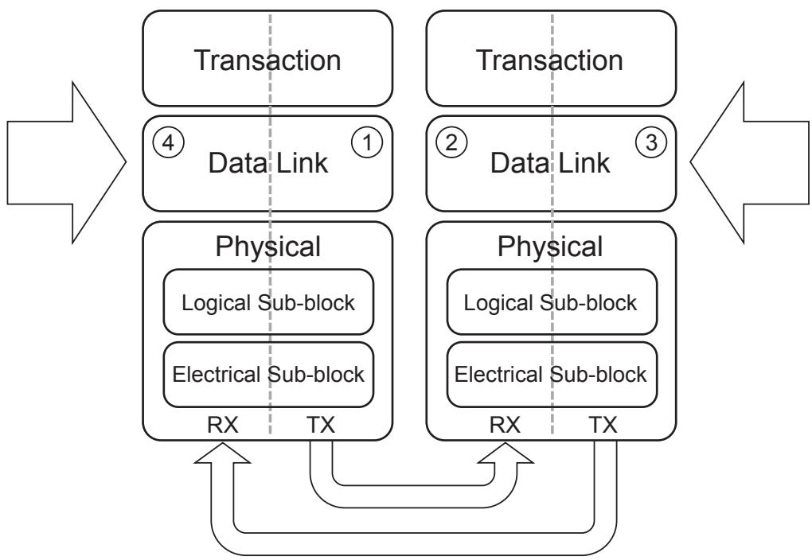

[⬆️ 返回目录](#-本章目录-table-of-contents)

---

## 3.1 Data Link Layer Overview | 数据链路层概述

<table>
<thead>
<tr>
<th width="50%">🇬🇧 English</th>
<th width="50%" style="background-color:#e8e8e8">🏆 中文</th>
</tr>
</thead>
<tbody>
<tr>
<td>

The Data Link Layer is responsible for reliably conveying TLPs supplied by the Transaction Layer across a PCI Express Link to the other component's Transaction Layer. Services provided by the Data Link Layer include:

**Data Exchange:**

- Accept TLPs for transmission from the Transmit Transaction Layer and convey them to the Transmit Physical Layer
- Accept TLPs received over the Link from the Physical Layer and convey them to the Receive Transaction Layer

**Error Detection and Retry (Non-Flit Mode):**

- TLP Sequence Number and LCRC generation
- Transmitted TLP storage for Data Link Layer Retry

</td>
<td style="background-color:#e8e8e8">

数据链路层负责将由事务层提供的 TLP 通过 PCI Express 链路可靠地传送到对端组件的事务层。数据链路层提供的服务包括:

**数据交换 (Data Exchange):**

- 接受来自发送事务层待发送的 TLP,并将其传送到发送物理层
- 接受从物理层经由链路接收的 TLP,并将其传送到接收事务层

**错误检测与重试 (Error Detection and Retry, 非 Flit 模式):**

- 生成 TLP 序列号 (Sequence Number) 和 LCRC
- 存储已发送的 TLP 以供数据链路层重试 (Retry) 使用

</td>
</tr>
</tbody>
</table>

[⬆️ 返回目录](#-本章目录-table-of-contents)

---

<!-- 📄 Page 310 -->
---

<table>
<thead>
<tr>
<th width="50%">🇬🇧 English</th>
<th width="50%" style="background-color:#e8e8e8">🏆 中文</th>
</tr>
</thead>
<tbody>
<tr>
<td>

- Data integrity checking for TLPs and Data Link Layer Packets (DLLPs)
- Positive and negative acknowledgement DLLPs
- Error indications for error reporting and logging mechanisms
- Link Acknowledgement Timeout replay mechanism

**Initialization and power management:**

- Track Link state and convey active/reset/disconnected state to Transaction Layer

**DLLPs are:**

- used for Link Management functions including TLP acknowledgement, power management, and exchange of Flow Control information.
- transferred between Data Link Layers of the two directly connected components on a Link

DLLPs are sent point-to-point, between the two components on one Link. TLPs are routed from one component to another, potentially through one or more intermediate components.

In Non-Flit Mode, Data integrity checking for DLLPs and TLPs is done using a CRC included with each packet sent across the Link. DLLPs use a 16-bit CRC and TLPs (which can be much longer than DLLPs) use a 32-bit LCRC. TLPs additionally include a sequence number, which is used to detect cases where one or more entire TLPs have been lost.

- Received DLLPs that fail the CRC check are discarded. The mechanisms that use DLLPs may suffer a performance penalty from this loss of information, but are self-repairing such that a successive DLLP will supersede any information lost.
- TLPs that fail the data integrity checks (LCRC and sequence number), or that are lost in transmission from one component to another, are re-sent by the Transmitter. The Transmitter stores a copy of all TLPs sent, re-sending these copies when required, and purges the copies only when it receives a positive acknowledgement of error-free receipt from the other component. If a positive acknowledgement has not been received within a specified time period, the Transmitter will automatically start re-transmission. The Receiver can request an immediate re-transmission using a negative acknowledgement.

In Flit Mode, both DLLPs and TLPs are sent using Flits. Flits contain the data integrity checks (LCRC, FEC, and sequence number). Replay occurs at the Flit level (see § Section 4.2.3.4 and § Section 4.2.3.4.2.1 ).

The Data Link Layer appears as an information conduit with varying latency to the Transaction Layer. On any given individual Link all TLPs fed into the Transmit Data Link Layer (1 and 3) will appear at the output of the Receive Data Link Layer (2 and 4) in the same order at a later time, as illustrated in § Figure 3-1. The latency will depend on a number of factors, including pipeline latencies, width and operational frequency of the Link, transmission of electrical signals across the Link, and delays caused by Data Link Layer Retry. As a result of these delays, the Transmit Data Link Layer (1 and 3) can apply backpressure to the Transmit Transaction Layer, and the Receive Data Link Layer (2 and 4) communicates the presence or absence of valid information to the Receive Transaction Layer.

The Data Link Layer tracks the state of the Link. It communicates Link status with the Transaction and Physical Layers, and performs Link management through the Physical Layer. The Data Link Layer contains the Data Link Control and Management State Machine (DLCMSM) to perform these tasks. The states for this machine are described below, and are shown in § Figure 3-2.

</td>
<td style="background-color:#e8e8e8">

- 对 TLP 和数据链路层包 (Data Link Layer Packets, DLLP) 进行数据完整性检查
- 肯定与否定确认 DLLP
- 用于错误报告和记录机制的错误指示
- 链路确认超时 (Link Acknowledgement Timeout) 重放机制

**初始化与电源管理 (Initialization and power management):**

- 跟踪链路状态,并向事务层传达 active(工作)/reset(复位)/disconnected(断开)状态

**DLLP 的用途:**

- 用于链路管理 (Link Management) 功能,包括 TLP 确认、电源管理以及流控 (Flow Control) 信息交换
- 在一条链路上两个直接相连组件的数据链路层之间传输

DLLP 以点对点方式在一对链路的两个组件之间发送。TLP 则从一个组件路由到另一个组件,期间可能经过一个或多个中间组件。

在非 Flit 模式 (Non-Flit Mode) 下,对 DLLP 和 TLP 的数据完整性检查通过随每个包一起跨链路发送的 CRC 完成。DLLP 使用 16 位 CRC,而 TLP(可以比 DLLP 长得多)使用 32 位 LCRC。TLP 还额外包含一个序列号 (Sequence Number),用于检测一个或多个完整 TLP 丢失的情况。

- CRC 校验失败的已接收 DLLP 会被丢弃。使用 DLLP 的机制可能因这种信息丢失而出现性能下降,但具备自修复能力,后续 DLLP 将取代任何已丢失的信息。
- 数据完整性检查(LCRC 和序列号)失败的 TLP,或在一个组件到另一个组件传输过程中丢失的 TLP,由发送器 (Transmitter) 重新发送。发送器保存所有已发送 TLP 的副本,在需要时重新发送这些副本,只有在收到对端组件发来的、对正确接收的肯定确认时才会清除这些副本。若在指定时间内未收到肯定确认,发送器将自动开始重传。接收器 (Receiver) 可以使用否定确认来请求立即重传。

在 Flit 模式下,DLLP 和 TLP 都通过 Flit 发送。Flit 包含数据完整性检查(LCRC、FEC 和序列号)。重放 (Replay) 在 Flit 级别进行(见 § Section 4.2.3.4 和 § Section 4.2.3.4.2.1)。

数据链路层对事务层呈现为具有可变延迟 (Latency) 的信息管道。在任何给定的链路上,送入发送数据链路层(路径 1 和 3)的所有 TLP 稍后将按相同顺序出现在接收数据链路层(路径 2 和 4)的输出端,如 § Figure 3-1 所示。延迟取决于多种因素,包括流水线延迟、链路宽度和运行频率、电信号跨链路传输的时间以及数据链路层重试造成的延迟。由于这些延迟,发送数据链路层(路径 1 和 3)可对发送事务层施加背压 (backpressure),而接收数据链路层(路径 2 和 4)则向接收事务层传达是否存在有效信息。

数据链路层跟踪链路状态。它与事务层和物理层通信链路状态,并通过物理层执行链路管理。数据链路层包含数据链路控制与管理状态机 (Data Link Control and Management State Machine, DLCMSM) 来执行这些任务。该状态机的状态如下所述,并在 § Figure 3-2 中给出。

</td>
</tr>
</tbody>
</table>

[⬆️ 返回目录](#-本章目录-table-of-contents)

---

<!-- 📄 Page 311 -->
---
<!-- 📄 Page 312 -->
---

## 3.2 Data Link Control and Management State Machine | 数据链路控制与管理状态机

<table>
<thead>
<tr>
<th width="50%">🇬🇧 English</th>
<th width="50%" style="background-color:#e8e8e8">🏆 中文</th>
</tr>
</thead>
<tbody>
<tr>
<td>

**States:**

- **DL_Inactive** - Physical Layer reporting Link is non-operational or nothing is connected to the Port
- **DL_Feature (optional)** - Physical Layer reporting Link is operational, perform the Data Link Feature Exchange
- **DL_Init** - Physical Layer reporting Link is operational, initialize Flow Control for the default Virtual Channel
- **DL_Active** - Normal operation mode

**Status Outputs:**

- **DL_Down** - The Data Link Layer is not communicating with the component on the other side of the Link.
- **DL_Up** - The Data Link Layer is communicating with the component on the other side of the Link.

</td>
<td style="background-color:#e8e8e8">

**状态 (States):**

- **DL_Inactive** — 物理层报告链路不可操作,或端口上没有任何连接
- **DL_Feature(可选)** — 物理层报告链路可操作,执行数据链路特性交换 (Data Link Feature Exchange)
- **DL_Init** — 物理层报告链路可操作,为默认虚通道 (Virtual Channel) 初始化流控 (Flow Control)
- **DL_Active** — 正常工作模式

**状态输出 (Status Outputs):**

- **DL_Down** — 数据链路层未与链路对端的组件通信。
- **DL_Up** — 数据链路层正与链路对端的组件通信。

</td>
</tr>
</tbody>
</table>

[⬆️ 返回目录](#-本章目录-table-of-contents)

---

> **Figure 3-2.** Data Link Control and Management State Machine
> 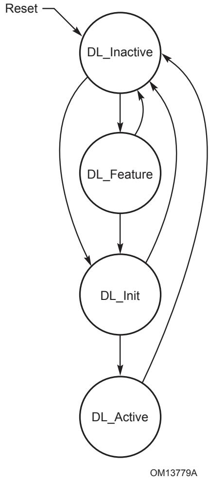

[⬆️ 返回目录](#-本章目录-table-of-contents)

---

## 3.2.1 Data Link Control and Management State Machine Rules | 数据链路控制与管理状态机规则

<table>
<thead>
<tr>
<th width="50%">🇬🇧 English</th>
<th width="50%" style="background-color:#e8e8e8">🏆 中文</th>
</tr>
</thead>
<tbody>
<tr>
<td>

Rules per state:

- **DL_Inactive**
  - Initial state following PCI Express Hot, Warm, or Cold Reset (see § Section 6.6 ). Note that DL states are unaffected by an FLR (see § Section 6.6 ).

  - Upon entry to DL_Inactive:
    - Reset all Data Link Layer state information to default values
    - If the Port supports the optional Data Link Feature Exchange, the Remote Data Link Feature Supported, and Remote Data Link Feature Supported Valid fields must be cleared.
    - Discard the contents of the Data Link Layer Retry Buffer (see § Section 3.6 )

  - While in DL_Inactive:
    - Report DL_Down status to the Transaction Layer as well as to the rest of the Data Link Layer

      Note: This will cause the Transaction Layer to discard any outstanding transactions and to terminate internally any attempts to transmit a TLP. For a Downstream Port, this is equivalent to a Hot-Remove. For an Upstream Port, having the Link go down is equivalent to a hot reset (see § Section 2.9 ).
    - Discard TLP information from the Transaction and Physical Layers
    - Do not generate or accept DLLPs

  - Exit to DL_Feature if all of the following conditions are satisfied:
    - the Port supports Data Link Feature Exchange
    - either the Data Link Feature Exchange is Enabled bit in the Data Link Feature Extended Capability is Set or the Data Link Feature Extended Capability is not implemented
    - the Transaction Layer indicates that the Link is not disabled by software
    - the Physical Layer reports Physical LinkUp = 1b

  - Exit to DL_Init if:
    - The Port does not support the optional Data Link Feature Exchange, the Transaction Layer indicates that the Link is not disabled by software, and the Physical Layer reports Physical LinkUp = 1b
    - or
    - The Port supports the optional Data Link Feature Exchange, the Data Link Feature Exchange is Enabled bit is Clear, the Transaction Layer indicates that the Link is not disabled by software, and the Physical Layer reports Physical LinkUp = 1b

</td>
<td style="background-color:#e8e8e8">

按状态的规则:

- **DL_Inactive**
  - PCI Express 热复位 (Hot Reset)、热复位 (Warm Reset) 或冷复位 (Cold Reset) 之后的初始状态(见 § Section 6.6)。注意:DL 状态不受 FLR 影响(见 § Section 6.6)。

  - 进入 DL_Inactive 时:
    - 将所有数据链路层状态信息复位为默认值
    - 如果端口支持可选的数据链路特性交换,则必须清除 Remote Data Link Feature Supported 与 Remote Data Link Feature Supported Valid 字段
    - 丢弃数据链路层重试缓冲 (Retry Buffer) 中的内容(见 § Section 3.6)

  - 处于 DL_Inactive 期间:
    - 向事务层以及数据链路层其余部分报告 DL_Down 状态

      注:这将使事务层丢弃所有未完成的事务,并在内部终止任何发送 TLP 的尝试。对于下游端口 (Downstream Port),这等同于热移除 (Hot-Remove)。对于上游端口 (Upstream Port),链路 down 等同于热复位(见 § Section 2.9)。
    - 丢弃来自事务层和物理层的 TLP 信息
    - 不生成也不接受 DLLP

  - 当以下所有条件都满足时,退出至 DL_Feature:
    - 端口支持数据链路特性交换
    - 数据链路特性扩展能力结构 (Data Link Feature Extended Capability) 中的 "Data Link Feature Exchange is Enabled" 位被置位,或该能力结构未实现
    - 事务层指示链路未被软件禁用
    - 物理层报告 Physical LinkUp = 1b

  - 在以下情况下退出至 DL_Init:
    - 端口不支持可选的数据链路特性交换,事务层指示链路未被软件禁用,且物理层报告 Physical LinkUp = 1b
    - 或
    - 端口支持可选的数据链路特性交换,但 "Data Link Feature Exchange is Enabled" 位为清零状态,事务层指示链路未被软件禁用,且物理层报告 Physical LinkUp = 1b

</td>
</tr>
</tbody>
</table>

[⬆️ 返回目录](#-本章目录-table-of-contents)

---

<!-- 📄 Page 313 -->
---

<table>
<thead>
<tr>
<th width="50%">🇬🇧 English</th>
<th width="50%" style="background-color:#e8e8e8">🏆 中文</th>
</tr>
</thead>
<tbody>
<tr>
<td>

- **DL_Feature**
  - While in DL_Feature:
    - Perform the Data Link Feature Exchange protocol as described in § Section 3.3
    - Report DL_Down status
    - The Data Link Layer of a Port with DL_Down status is permitted to discard any received TLPs provided that it does not acknowledge those TLPs by sending one or more Ack DLLPs

  - Exit to DL_Init if:
    - Data Link Feature Exchange completes successfully, and the Physical Layer continues to report Physical LinkUp = 1b,
    - or
    - Data Link Feature Exchange determines that the remote Data Link Layer does not support the optional Data Link Feature Exchange protocol, and the Physical Layer continues to report Physical LinkUp = 1b

  - Terminate the Data Link Feature Exchange protocol and exit to DL_Inactive if:
    - Physical Layer reports Physical LinkUp = 0b

- **DL_Init**
  - While in DL_Init:
    - Initialize Flow Control for the default Virtual Channel, VC0, following the Flow Control initialization protocol described in § Section 3.4
    - Report DL_Down status while in state FC_INIT1; DL_Up status while in state FC_INIT2
    - The Data Link Layer of a Port with DL_Down status is permitted to discard any received TLPs provided that it does not acknowledge those TLPs by sending one or more Ack DLLPs

  - Exit to DL_Active if:
    - Flow Control initialization completes successfully, and the Physical Layer continues to report Physical LinkUp = 1b

  - Terminate attempt to initialize Flow Control for VC0 and exit to DL_Inactive if:
    - Physical Layer reports Physical LinkUp = 0b

- **DL_Active**
  - DL_Active is referred to as the normal operating state
  - While in DL_Active:
    - Accept and transfer TLP information with the Transaction and Physical Layers as specified in this chapter
    - Generate and accept DLLPs as specified in this chapter
    - Report DL_Up status to the Transaction and Data Link Layers

  - Exit to DL_Inactive if:
    - Physical Layer reports Physical LinkUp = 0b
    - Downstream Ports that are Surprise Down Error Reporting Capable (see § Section 7.5.3.6 ) must treat this transition from DL_Active to DL_Inactive as a Surprise Down error, except in the following cases where this error detection is blocked:
      - If the Secondary Bus Reset bit in the Bridge Control Register has been Set by software, then the subsequent transition to DL_Inactive must not be considered an error.
      - If the Link Disable bit has been Set by software or if DPC has been triggered, then the subsequent transition to DL_Inactive must not be considered an error.
      - If a Switch Downstream Port transitions to DL_Inactive due to an event above that Port, that transition to DL_Inactive must not be considered an error. Example events include the Switch Upstream Port propagating Hot Reset, the Switch Upstream Link transitioning to DL_Down, and the Secondary Bus Reset bit in the Switch Upstream Port being Set.
      - If a PME_Turn_Off Message has been sent through this Port, then the subsequent transition to DL_Inactive must not be considered an error.
        - Note that the DL_Inactive transition for this condition will not occur until a power off, a reset, or a request to restore the Link is sent to the Physical Layer.
        - Note also that in the case where the PME_Turn_Off/PME_TO_Ack handshake fails to complete successfully, a Surprise Down error may be detected.
      - If the Port is associated with a hot-pluggable slot (the Hot-Plug Capable bit in the Slot Capabilities register Set), and the Hot-Plug Surprise bit in the Slot Capabilities register is Set, then any transition to DL_Inactive must not be considered an error.
      - If the Port is associated with a hot-pluggable slot (Hot-Plug Capable bit in the Slot Capabilities register Set), and Power Controller Control bit in Slot Control register is Set (Power-Off), then any transition to DL_Inactive must not be considered an error.

  - Error blocking initiated by one or more of the above cases must remain in effect until the Port exits DL_Active and subsequently returns to DL_Active with none of the blocking cases in effect at the time of the return to DL_Active.
  - Note that the transition out of DL_Active is simply the expected transition as anticipated per the error detection blocking condition.
  - If implemented, this is a reported error associated with the detecting Port (see § Section 6.2 ).

</td>
<td style="background-color:#e8e8e8">

- **DL_Feature**
  - 处于 DL_Feature 期间:
    - 按照 § Section 3.3 所述执行数据链路特性交换协议
    - 报告 DL_Down 状态
    - 处于 DL_Down 状态的端口,其数据链路层可以丢弃任何已接收的 TLP,前提是该数据链路层不通过发送一个或多个 ACK DLLP (Ack DLLP) 来确认这些 TLP

  - 在以下情况下退出至 DL_Init:
    - 数据链路特性交换成功完成,且物理层继续报告 Physical LinkUp = 1b
    - 或
    - 数据链路特性交换判定远端数据链路层不支持可选的数据链路特性交换协议,且物理层继续报告 Physical LinkUp = 1b

  - 在以下情况下终止数据链路特性交换协议并退出至 DL_Inactive:
    - 物理层报告 Physical LinkUp = 0b

- **DL_Init**
  - 处于 DL_Init 期间:
    - 按照 § Section 3.4 中描述的流控初始化协议,为默认虚通道 VC0 初始化流控 (Flow Control)
    - 在 FC_INIT1 子状态期间报告 DL_Down 状态;在 FC_INIT2 子状态期间报告 DL_Up 状态
    - 处于 DL_Down 状态的端口,其数据链路层可以丢弃任何已接收的 TLP,前提是该数据链路层不通过发送一个或多个 ACK DLLP 来确认这些 TLP

  - 在以下情况下退出至 DL_Active:
    - 流控初始化成功完成,且物理层继续报告 Physical LinkUp = 1b

  - 在以下情况下终止 VC0 的流控初始化尝试并退出至 DL_Inactive:
    - 物理层报告 Physical LinkUp = 0b

- **DL_Active**
  - DL_Active 被称为正常工作状态
  - 处于 DL_Active 期间:
    - 按照本章规定接受并传输与事务层和物理层之间的 TLP 信息
    - 按照本章规定生成并接受 DLLP
    - 向事务层和数据链路层报告 DL_Up 状态

  - 在以下情况下退出至 DL_Inactive:
    - 物理层报告 Physical LinkUp = 0b
    - 支持意外 Down 错误报告 (Surprise Down Error Reporting) 的下游端口(见 § Section 7.5.3.6)必须将此次从 DL_Active 到 DL_Inactive 的转换视为 Surprise Down 错误,以下例外情况不视为错误:
      - 如果 Bridge Control 寄存器中的 Secondary Bus Reset 位已被软件置位,则随后到 DL_Inactive 的转换不得视为错误。
      - 如果 Link Disable 位已被软件置位或 DPC 已被触发,则随后到 DL_Inactive 的转换不得视为错误。
      - 如果交换机的下游端口因该端口之上的事件而转入 DL_Inactive,则该转换不得视为错误。示例事件包括:交换机的上游端口传播热复位、交换机的上游链路转入 DL_Down、交换机上游端口中的 Secondary Bus Reset 位被置位。
      - 如果 PME_Turn_Off 消息已通过本端口发送,则随后到 DL_Inactive 的转换不得视为错误。
        - 注:在断电、复位或向物理层发出恢复链路的请求之前,该条件导致的 DL_Inactive 转换不会发生。
        - 注:在 PME_Turn_Off/PME_TO_Ack 握手未能成功完成的情况下,仍可能检测到 Surprise Down 错误。
      - 如果端口与支持热插拔 (Hot-Plug) 的插槽相关联(Slot Capabilities 寄存器中的 Hot-Plug Capable 位已置位),且 Slot Capabilities 寄存器中的 Hot-Plug Surprise 位已置位,则任何到 DL_Inactive 的转换均不得视为错误。
      - 如果端口与支持热插拔的插槽相关联(Hot-Plug Capable 位已置位),且 Slot Control 寄存器中的 Power Controller Control 位已置位(断电),则任何到 DL_Inactive 的转换均不得视为错误。

  - 由上述一种或多种情况发起的错误屏蔽必须持续有效,直到端口退出 DL_Active 并且在没有任何屏蔽条件生效的情况下再次返回 DL_Active。
  - 注意:退出 DL_Active 仅是根据错误检测屏蔽条件预期发生的转换。
  - 如果实现,这是与检测端口相关联的一个已报告错误(见 § Section 6.2)。

</td>
</tr>
</tbody>
</table>

[⬆️ 返回目录](#-本章目录-table-of-contents)

---

## 3.3 Data Link Feature Exchange | 数据链路特性交换

<table>
<thead>
<tr>
<th width="50%">🇬🇧 English</th>
<th width="50%" style="background-color:#e8e8e8">🏆 中文</th>
</tr>
</thead>
<tbody>
<tr>
<td>

The Data Link Feature Exchange protocol is required for Ports that support Flit Mode and for Ports that support 16.0 GT/s and higher data rates. It is optional for other Ports. Downstream Ports that implement this protocol must contain the Data Link Feature Extended Capability (see § Section 7.7.4 ). Upstream Ports that implement this protocol are optionally permitted to include the Data Link Feature Extended Capability. This capability contains four fields:

- The Local Data Link Feature Supported field indicates the Data Link Features supported by the local Port
- The Remote Data Link Feature Supported field indicates the Data Link Features supported by the remote Port
- The Remote Data Link Feature Supported Valid bit indicates that the Remote Data Link Feature Supported field contains valid data
- The Data Link Feature Exchange is Enabled field permits systems to disable the Data Link Feature Exchange. This can be used to work around legacy hardware that does not correctly ignore the DLLP.

The Data Link Feature Exchange protocol transmits a Port's Local Feature Supported information to the Remote Port and captures that Remote Port's Feature Supported information.

Rules for this protocol are:

- On entry to DL_Feature:
  - It is permitted to Clear the Remote Data Link Feature Supported and Remote Data Link Feature Supported Valid fields

- While in DL_Feature:
  - Transaction Layer must block transmission of TLPs
  - Transmit the Data Link Feature DLLP

**IMPLEMENTATION NOTE:**
**PHYSICAL LAYER THROTTLING**
Note that there are conditions where the Physical Layer may be temporarily unable to accept TLPs and DLLPs from the Data Link Layer. The Data Link Layer must comprehend this by providing mechanisms for the Physical Layer to communicate this condition, and for TLPs and DLLPs to be temporarily blocked by the condition.

- The transmitted Feature Supported field must use the value in the Local Data Link Feature Supported field.
- The transmitted Feature Ack bit must use the value in the Remote Data Link Feature Supported Valid bit.
- The Data Link Feature DLLP must be transmitted at least once every 34 μs. Time spent in the Recovery or Configuration LTSSM states does not contribute to this limit.
- Process received Data Link Feature DLLPs:
  - If the Remote Data Link Feature Supported Valid bit is Clear, record the Feature Supported field from the received Data Link Feature DLLP in the Remote Data Link Feature Supported field and Set the Remote Data Link Feature Supported Valid bit.

- Exit DL_Feature if:
  - An InitFC1 DLLP has been received.
  - An MR-IOV MRInit DLLP (encoding 0000 0001b) has been received. MR-IOV is deprecated so this clause has no effect in new designs.
  - or
  - While in DL_Feature, at least one Data Link Feature DLLP has been received with the Feature Ack bit Set.

A Data Link Feature is a field representing a protocol feature. Protocol features are either activated, not activated, or not supported. A Data Link Feature is activated when Remote Data Link Feature Supported Valid is Set and when the associated Feature Supported bit is Set in both the Local Data Link Feature Supported and Remote Data Link Feature Supported fields.

A Data Link Parameter is a field that communicates a value across the interface. Data Link Parameters have a parameter-specific mechanism for software to determine when the field value is meaningful. For example, the field might be meaningful if its value is non-zero or the field might be meaningful if some other field(s) have specific values.

Data Link Features and their corresponding bit locations are shown in § Table 3-1.

</td>
<td style="background-color:#e8e8e8">

数据链路特性交换协议对支持 Flit 模式的端口和支持 16.0 GT/s 及更高数据速率的端口是必需的。对其他端口是可选的。实现此协议的下游端口必须包含数据链路特性扩展能力结构(见 § Section 7.7.4)。实现此协议的上游端口可以选择性地包含数据链路特性扩展能力结构。该能力结构包含四个字段:

- Local Data Link Feature Supported 字段:表示本地端口所支持的数据链路特性
- Remote Data Link Feature Supported 字段:表示远端端口所支持的数据链路特性
- Remote Data Link Feature Supported Valid 位:表示 Remote Data Link Feature Supported 字段包含有效数据
- Data Link Feature Exchange is Enabled 字段:允许系统禁用数据链路特性交换。这可用于规避无法正确忽略 DLLP 的旧硬件。

数据链路特性交换协议将一个端口的 Local Feature Supported 信息传送给远端端口,并捕获该远端端口的 Feature Supported 信息。

该协议的规则如下:

- 进入 DL_Feature 时:
  - 允许清除 Remote Data Link Feature Supported 与 Remote Data Link Feature Supported Valid 字段

- 处于 DL_Feature 期间:
  - 事务层必须阻塞 TLP 的发送
  - 发送 Data Link Feature DLLP

**实现注:**
**物理层限流 (PHYSICAL LAYER THROTTLING)**
注意:在某些条件下,物理层可能暂时无法接受来自数据链路层的 TLP 和 DLLP。数据链路层必须理解这一点,提供机制让物理层传达此状态,并允许 TLP 和 DLLP 被该状态暂时阻塞。

- 发送的 Feature Supported 字段必须使用 Local Data Link Feature Supported 字段中的值。
- 发送的 Feature Ack 位必须使用 Remote Data Link Feature Supported Valid 位的值。
- Data Link Feature DLLP 必须至少每 34 μs 发送一次。处于 Recovery 或 Configuration LTSSM 状态的时间不计入此限制。
- 处理接收到的 Data Link Feature DLLP:
  - 如果 Remote Data Link Feature Supported Valid 位为清零状态,则将接收到的 Data Link Feature DLLP 中的 Feature Supported 字段记录到 Remote Data Link Feature Supported 字段中,并置位 Remote Data Link Feature Supported Valid 位。

- 出现以下情况时退出 DL_Feature:
  - 收到 InitFC1 DLLP。
  - 收到 MR-IOV MRInit DLLP(编码 0000 0001b)。MR-IOV 已被弃用,因此本条款在新设计中无效果。
  - 或
  - 处于 DL_Feature 期间,至少收到一个 Feature Ack 位置位的 Data Link Feature DLLP。

数据链路特性 (Data Link Feature) 是表示协议特性的字段。协议特性可以是已激活、未激活或不支持。当 Remote Data Link Feature Supported Valid 被置位,且 Local Data Link Feature Supported 与 Remote Data Link Feature Supported 字段中对应 Feature Supported 位均被置位时,该数据链路特性被激活。

数据链路参数 (Data Link Parameter) 是跨接口传递值的字段。数据链路参数具有参数专用的机制,由软件确定该字段值何时有意义。例如,该字段可能在其值非零时有意义,或在其他某些字段具有特定值时有意义。

数据链路特性及其对应的位位置如 § Table 3-1 所示。

</td>
</tr>
</tbody>
</table>

[⬆️ 返回目录](#-本章目录-table-of-contents)

---

**Table 3-1. Data Link Feature Supported Bit Definition | 表 3-1 数据链路特性支持位定义**

| Bit Location | Description | Type |
|--------------|-------------|------|
| 0 | Scaled Flow Control – indicates support for Scaled Flow Control. Must be Set in Ports that support 16.0 GT/s or higher data rates. Must be Set if Flit Mode is enabled. | Data Link Feature |
| 1 | Immediate Readiness – indicates that all non-Virtual Functions in the sending Port have Immediate Readiness Set (see § Section 7.5.1.1.4 ). In Flit Mode, this bit is always meaningful. In Non-Flit Mode, this bit is meaningful when Set, but when Clear indicates either that some non-Virtual Function has Immediate Readiness Clear or that the sending Port is not providing this information. | Data Link Parameter |
| 4:2 | Extended VC Count – This field indicates the number of VC Resources supported by the sending Port. This is the value of the Extended VC Count field in either the Multi-Function Virtual Channel Extended Capability or the Virtual Channel Extended Capability (with Capability ID 0002h). This field is meaningful in Flit Mode. In Non-Flit Mode, this field must be zero. | Data Link Parameter |
| 7:5 | L0p Exit Latency - This field indicates sending Port's L0p Exit Latency. The value reported indicates the length of time the sending Port requires to complete widening a link using L0p. If the sending Port does not support L0p, this field must contain 000b. Defined encodings are: 000b: Less than 1 μs 001b: 1 μs to less than 2 μs 010b: 2 μs to less than 4 μs 011b: 4 μs to less than 8 μs 100b: 8 μs to less than 16 μs 101b: 16 μs to less than 32 μs 110b: 32 μs - 64 μs 111b: More than 64 μs This field is meaningful in Flit Mode. In Non-Flit Mode, this field must be zero. | Data Link Parameter |
| 22:8 | Reserved | Reserved |

[⬆️ 返回目录](#-本章目录-table-of-contents)

---

## 3.4 Flow Control Initialization Protocol | 流控初始化协议

<table>
<thead>
<tr>
<th width="50%">🇬🇧 English</th>
<th width="50%" style="background-color:#e8e8e8">🏆 中文</th>
</tr>
</thead>
<tbody>
<tr>
<td>

Before starting normal operation following power-up or interconnect reset, it is necessary to initialize Flow Control for the default Virtual Channel, VC0 (see § Section 6.6 ). In addition, when additional Virtual Channels (VCs) are enabled, the Flow Control initialization process must be completed for each newly enabled VC before it can be used (see § Section 2.6.1 ). This section describes the initialization process that is used for all VCs. Note that since VC0 is enabled before all other VCs, no TLP traffic of any kind will be active prior to initialization of VC0. However, when additional VCs are being initialized there will typically be TLP traffic flowing on other, already enabled, VCs. Such traffic has no direct effect on the initialization process for the additional VC(s).

Shared Flow Control is enabled in Flit Mode. Shared Flow Control is disabled in Non-Flit Mode.

There are two states in the VC initialization process. These states are:

- FC_INIT1
- FC_INIT2

The rules for this process are given in the following section.

- If at any time during initialization for VCs 1-7 the VC is disabled, the flow control initialization process for the VC is terminated

</td>
<td style="background-color:#e8e8e8">

在上电或互连复位之后开始正常运行之前,需要为默认虚通道 (Virtual Channel) VC0 初始化流控 (Flow Control)(见 § Section 6.6)。此外,当额外的虚通道 (VC) 被使能时,在新使能的 VC 可用之前,必须为每个新使能的 VC 完成流控初始化流程(见 § Section 2.6.1)。本节描述用于所有 VC 的初始化流程。注意:由于 VC0 在所有其他 VC 之前被使能,因此在 VC0 初始化之前不会有任何 TLP 流量活动。但是,在初始化额外 VC 时,通常会有 TLP 流量在已经使能的其他 VC 上流动。这些流量对额外 VC 的初始化流程没有直接影响。

共享流控 (Shared Flow Control) 在 Flit 模式下被使能。在非 Flit 模式下,共享流控被禁用。

VC 初始化流程中有两个状态:

- FC_INIT1
- FC_INIT2

该流程的规则在下一节给出。

- 在 VC1–VC7 的初始化期间,任何时候只要该 VC 被禁用,该 VC 的流控初始化流程即被终止

</td>
</tr>
</tbody>
</table>

[⬆️ 返回目录](#-本章目录-table-of-contents)

---

## 3.4.1 Flow Control Initialization State Machine Rules | 流控初始化状态机规则

<table>
<thead>
<tr>
<th width="50%">🇬🇧 English</th>
<th width="50%" style="background-color:#e8e8e8">🏆 中文</th>
</tr>
</thead>
<tbody>
<tr>
<td>

**Rules for state FC_INIT1:**

- Entered when initialization of a VC (VCx) is required
  - When the DL_Init state is entered (VCx = VC0)
  - When VC (VCx = VC1-7) is enabled by software (see § Section 7.9.1 and § Section 7.9.2 )

- While in FC_INIT1:
  - Transaction Layer must block transmission of TLPs using VCx
  - In Non-Flit Mode, transmit the following three InitFC1 DLLPs for VCx in the following relative order:
    - InitFC1-P [Dedicated] (first)
    - InitFC1-NP [Dedicated] (second)
    - InitFC1-Cpl [Dedicated] (third)
  - In Flit Mode, transmit the following six InitFC1 DLLPs for VCx in the following relative order:
    - InitFC1-P [Dedicated] (first)
    - InitFC1-NP [Dedicated] (second)
    - InitFC1-Cpl [Dedicated] (third)
    - InitFC1-P [Shared] (fourth)
    - InitFC1-NP [Shared] (fifth)
    - InitFC1-Cpl [Shared] (sixth)
  - The three (or six) InitFC1 DLLPs must be transmitted at least once every 34 μs.
    - Time spent in the Recovery or Configuration LTSSM states does not contribute to this limit.
    - It is strongly encouraged that the InitFC1 DLLP transmissions are repeated frequently, particularly when there are no other TLPs or DLLPs available for transmission.
  - Set DataFC, DataScale, HdrFC, and HdrScale as shown in § Table 3-2 and § Table 3-3
  - When DataFC or HdrFC is 0, the following encodings of DataScale and HdrScale are used:
    - Non-Flit Mode, no Scaled FC:
      - [Infinite.1]: DataScale/HdrScale = 00b
      - [Reserved]: DataScale/HdrScale = 01b, 10b, or 11b
    - Non-Flit Mode, Scaled FC:
      - [Infinite.2]: DataScale/HdrScale = 01b, 10b, or 11b
      - [Reserved]: DataScale/HdrScale = 00b
    - Flit Mode:
      - [Infinite.3]: DataScale/HdrScale = 00b
      - [Zero]: DataScale/HdrScale = 01b
      - [Merged]: DataScale/HdrScale = 10b
      - [Reserved]: DataScale/HdrScale = 11b

</td>
<td style="background-color:#e8e8e8">

**FC_INIT1 状态的规则:**

- 当需要初始化某个 VC(VCx)时进入此状态
  - 当进入 DL_Init 状态时(VCx = VC0)
  - 当 VC(VCx = VC1–VC7)被软件使能时(见 § Section 7.9.1 和 § Section 7.9.2)

- 处于 FC_INIT1 期间:
  - 事务层必须阻塞使用 VCx 的 TLP 发送
  - 在非 Flit 模式下,按以下相对顺序发送 VCx 的三个 InitFC1 DLLP:
    - InitFC1-P [Dedicated](第一)
    - InitFC1-NP [Dedicated](第二)
    - InitFC1-Cpl [Dedicated](第三)
  - 在 Flit 模式下,按以下相对顺序发送 VCx 的六个 InitFC1 DLLP:
    - InitFC1-P [Dedicated](第一)
    - InitFC1-NP [Dedicated](第二)
    - InitFC1-Cpl [Dedicated](第三)
    - InitFC1-P [Shared](第四)
    - InitFC1-NP [Shared](第五)
    - InitFC1-Cpl [Shared](第六)
  - 这三个(或六个)InitFC1 DLLP 必须至少每 34 μs 发送一次。
    - 处于 Recovery 或 Configuration LTSSM 状态的时间不计入此限制。
    - 强烈建议频繁重复 InitFC1 DLLP 的发送,特别是在没有其他 TLP 或 DLLP 可发送时。
  - 按照 § Table 3-2 和 § Table 3-3 设置 DataFC、DataScale、HdrFC 和 HdrScale
  - 当 DataFC 或 HdrFC 为 0 时,使用以下 DataScale 和 HdrScale 编码:
    - 非 Flit 模式,无 Scaled FC:
      - [Infinite.1]:DataScale/HdrScale = 00b
      - [Reserved]:DataScale/HdrScale = 01b、10b 或 11b
    - 非 Flit 模式,Scaled FC:
      - [Infinite.2]:DataScale/HdrScale = 01b、10b 或 11b
      - [Reserved]:DataScale/HdrScale = 00b
    - Flit 模式:
      - [Infinite.3]:DataScale/HdrScale = 00b
      - [Zero]:DataScale/HdrScale = 01b
      - [Merged]:DataScale/HdrScale = 10b
      - [Reserved]:DataScale/HdrScale = 11b

</td>
</tr>
</tbody>
</table>

[⬆️ 返回目录](#-本章目录-table-of-contents)

---

**Table 3-2. InitFC1 / InitFC2 Options – Non-Flit Mode | 表 3-2 InitFC1 / InitFC2 选项 — 非 Flit 模式**

| Row | Scaled Flow Control Supported and Activated | Local and Remote Extended VC Count | Merged InitFC Count | Dedicated / Shared | DataScale and HdrScale | DataFC and HdrFC | Notes |
|-----|-------------------------------------------|-----------------------------------|--------------------|--------------------|------------------------|------------------|-------|
| 1 | No Scaled FC | 0 (Reserved) | Not Applicable | 3 | 0b (Reserved) [Infinite.1] | 1 | 00b ≠ 0 | 2 | Scaled FC | 0 (Reserved) | Not Applicable | 3 | 0b (Reserved) [Infinite.2] | 1, 2 | { 01b \| 10b \| 11b } ≠ 0 |

**Notes:**
1. Backwards compatibility: In earlier versions of this specification, the DataScale and HdrScale bits are Reserved.
2. Backwards compatibility: In earlier versions of this specification, any non-zero DataScale/HdrScale means [Infinite.2].

[⬆️ 返回目录](#-本章目录-table-of-contents)

---

**Table 3-3. InitFC1 / InitFC2 Options – Flit Mode | 表 3-3 InitFC1 / InitFC2 选项 — Flit 模式**

| Row | Local and Remote Extended VC Count | Merged InitFC Count | Dedicated / Shared | Kind | DataScale and HdrScale | DataFC and HdrFC | Notes |
|-----|-----------------------------------|--------------------|--------------------|------|------------------------|------------------|-------|
| 3 | Local = 0 OR optionally (Local ≠0 and Remote = 0) | Not Merged | 6 | 0b (shared) | P, NP, Cpl | [Infinite.3] | 5, 9 | { 01b \| 10b \| 11b } ≠ 0 |
| 4 | 1b (dedicated) | P, NP, Cpl | [Zero] | 3, 5, 9 |
| 5 | Local = 0 OR optionally (Local ≠0 and Remote = 0) | Merged | 6 | 0b (shared) | P, NP | [Infinite.3] | 8 | { 01b \| 10b \| 11b } ≠ 0 |
| 6 | Cpl | [Merged] | 7, 8 |
| 7 | 1b (dedicated) | P, Cpl | [Infinite.3] | 8, 10 | { 01b \| 10b \| 11b } ≠ 0 |
| 8 | NP | [Zero] | 4, 8 |
| 9 | Local ≠0 | Not Merged | 6 | 0b (shared) | P, NP, Cpl | [Infinite.3] | 5, 6 | [Zero] | { 01b \| 10b \| 11b } ≠ 0 |
| 10 | 1b (dedicated) | P, NP, Cpl | [Infinite.3] | 5 | { 01b \| 10b \| 11b } ≠ 0 |
| 11 | Local ≠0 | Merged | 6 | 0b (shared) | P, NP | [Infinite.3] | 6, 8 | [Zero] | { 01b \| 10b \| 11b } ≠ 0 |
| 12 | Cpl | [Merged] | 7, 8 |
| 13 | 1b (dedicated) | P, NP, Cpl | [Infinite.3] | 8, 10 | { 01b \| 10b \| 11b } ≠ 0 |

**Notes:**
3. Since Extended VC Count is 0, only 1 VC is possible. [Zero] dedicated credits allocated. All credits are Shared.
4. Since Extended VC Count is 0, only 1 VC is possible. [Zero] Non-Posted dedicated credits are allocated and all Non-Posted credits are Shared.
5. When (Local ≠0 and Remote = 0), rows 3-4 are recommended but rows 9-10 are permitted.
6. [Zero] shared credits indicates that no additional shared credits are being allocated. All shared credits are (were) allocated by other VCs (and are usable by this VC). When more than one VC advertises shared credits with scale factor 01b, 10b, or 11b, that scale factor must be able to express all allocated shared credits, regardless of VC. For example, if VC0 and VC1 each advertise 120 header credits (i.e., a total of 240 credits), they must do so using a scale factor other than 1 (01b) since that scale factor is limited to 127 outstanding credits. Use of [Infinite.3] shared credits must be consistent across VCs. If one VC uses [Infinite.3] shared credits for a given credit type (P/NP/Cpl, Hdr/Data), all VCs must also use [Infinite.3] shared credits for that credit type. Use of scale values (HdrScale or DataScale) 01b, 10b, or 11b for shared credits must be consistent across VCs. If one VC uses scale value 01b, 10b, or 11b for a given credit type (P/NP/Cpl, Hdr/Data), all other VCs must either use the same scale value or must use [Zero] for that credit type. When one VC uses [Zero] shared credits for a given credit type (P/NP/Cpl, Hdr/Data), at least one VC must use a scale value of 01b, 10b, or 11b for that credit type. For that credit type, shared credit UpdateFC DLLPs for all VCs must use this non-00b scale value, including VCs that advertised [Zero] during initialization. It is permitted for all VCs to offer [Zero] shared credits resulting in only dedicated credits being available. Doing so means that every TLP will contain a Flit Mode Local TLP Prefix.
7. [Merged] for Shared Completion credits indicates that Shared Completions and Shared Posted credits share a common pool of credits. [Merged] is not permitted on Shared Posted or Shared Non-Posted credits. Dedicated credits are never merged. Use of [Merged] shared credits must be consistent across VCs. If one VC uses [Merged] shared credits, all VCs must also use [Merged] shared credits. Use of [Merged] shared credits must be consistent between Hdr and Data. If CplH uses [Merged] shared credits, CplD must also use [Merged] shared credits. When [Merged] is used, and P Hdr shared credits are not [Infinite.3], UpdateFC DLLPs for CplH must use the same scale factor as PH. When [Merged] is used, and P Data shared credits are not [Infinite.3], UpdateFC DLLPs for CplD must use the same scale factor as PD. When [Merged], UpdateFC DLLPs and Optimized_Update_FCs return credits as if [Merged] was not enabled (i.e., based on the type of TLP being freed even though there is a single shared credit pool). Doing this provides the transmitter visibility into remote buffer occupancy (Posted vs Completion) and allows it to implement vendor specific mechanisms to manage that occupancy. When [Merged] is used and P Hdr shared credits are not [Infinite.3], and at least one VC must use non [Zero] P Hdr shared credits. When [Merged] is used and P Data shared credits are not [Infinite.3], and at least one VC must use non [Zero] P Data shared credits.
8. When (Local ≠0 and Remote = 0), rows 5-8 are recommended, but rows 11-13 are permitted.
9. The Shared / Dedicated mechanism is defined so that shared credits are the common case. TLPs consuming dedicated credits use the Flit Mode Local TLP Prefix and thus consume an additional DW. In rows 3-4, all credits are shared.
10. To avoid deadlock, Posted and Completion credits must not be [Zero].

[⬆️ 返回目录](#-本章目录-table-of-contents)

---

<!-- 📄 Page 314 -->
---
<!-- 📄 Page 315 -->
---

<!-- 📄 Page 316 -->
---
<!-- 📄 Page 317 -->
---
<!-- 📄 Page 318 -->
---
<!-- 📄 Page 319 -->
---

<!-- 📄 Page 320 -->
---
<!-- 📄 Page 321 -->
---

---

<!-- 📄 Page 322 -->
---

<table>
<thead>
<tr>
<th width="50%">🇬🇧 English</th>
<th width="50%" style="background-color:#e8e8e8">🏆 中文</th>
</tr>
</thead>
<tbody>
<tr>
<td>

- Except as needed to ensure at least the required frequency of InitFC1 DLLP transmission, the Data Link Layer must not block other transmissions.
  - Note that this includes all Physical Layer initiated transmissions (e.g., Ordered Sets), Ack and Nak DLLPs (when applicable), and TLPs using VCs that have previously completed initialization (when applicable)
- Process received InitFC1 and InitFC2 DLLPs:
  - Record the indicated HdrFC and DataFC values
  - If the Receiver supports Scaled Flow Control, record the indicated HdrScale and DataScale values.
  - Set flag FI1 once FC unit values have been recorded for each of P, NP, and Cpl for VCx.
    - In Non-Flit Mode flag FI1 is Set when the three dedicated FC unit values have been recorded.
    - In Flit Mode, flag FI1 is Set when all six FC unit values have been recorded.

- Exit to FC_INIT2 if:
  - Flag FI1 has been Set indicating that FC unit values have been recorded for each of P, NP, and Cpl for VCx

**Rules for state FC_INIT2:**

- While in FC_INIT2:
  - Transaction Layer must block transmission of TLPs using VCx
  - In non-Flit Flit-Mode, transmit the following three InitFC2 DLLPs for VCx in the following relative order:
    - InitFC2-P [Dedicated] (first)
    - InitFC2-NP [Dedicated] (second)
    - InitFC2-Cpl [Dedicated] (third)
  - In Flit Mode, transmit the following six InitFC2 DLLPs for VCx in the following relative order:
    - InitFC2-P [Dedicated] (first)
    - InitFC2-NP [Dedicated] (second)
    - InitFC2-Cpl [Dedicated] (third)
    - InitFC2-P [Shared] (fourth)
    - InitFC2-NP [Shared] (fifth)
    - InitFC2-Cpl [Shared] (sixth)
  - The three (six) InitFC2 DLLPs must be transmitted at least once every 34 μs.
    - Time spent in the Recovery or Configuration LTSSM states does not contribute to this limit.
    - It is strongly encouraged that the InitFC2 DLLP transmissions are repeated frequently, particularly when there are no other TLPs or DLLPs available for transmission.
  - Set DataFC, DataScale, HdrFC, and HdrScale as shown in § Table 3-2 and § Table 3-3
  - Except as needed to ensure at least the required frequency of InitFC2 DLLP transmission, the Data Link Layer must not block other transmissions
    - Note that this includes all Physical Layer initiated transmissions (for example, Ordered Sets), Ack and Nak DLLPs (when applicable), and TLPs using VCs that have previously completed initialization (when applicable)
  - Process received InitFC1 and InitFC2 DLLPs:
    - Ignore the received HdrFC, HdrScale, DataFC, and DataScale values
    - Set flag FI2 on receipt of any InitFC2 DLLP for VCx
    - Set flag FI2 on receipt of any TLP on VCx, any UpdateFC DLLP for VCx, or, in Flit Mode, any Optimized_Update_FC

- Signal completion and exit if:
  - Flag FI2 has been Set
  - If Scaled Flow Control is activated on the Link, the Transmitter must send 01b, 10b, or 11b for HdrScale and DataScale in all UpdateFC DLLPs for VCx.
  - If the Scaled Flow Control is not supported or if Scaled Flow Control is not activated on the Link, the Transmitter must send 00b for HdrScale and DataScale in all UpdateFC DLLPs for VCx.

</td>
<td style="background-color:#e8e8e8">

- 除了为保证 InitFC1 DLLP 的最低发送频率所需之外,数据链路层不得阻塞其他发送。
  - 注意:这包括所有由物理层发起的发送(例如 Ordered Sets)、Ack 和 Nak DLLP(适用时)以及使用先前已完成初始化的 VC 的 TLP(适用时)
- 处理接收到的 InitFC1 和 InitFC2 DLLP:
  - 记录所指示的 HdrFC 和 DataFC 值
  - 如果接收器支持 Scaled Flow Control,则记录所指示的 HdrScale 和 DataScale 值。
  - 当 VCx 的 P、NP 和 Cpl 的 FC 单元值都已被记录后,置位标志 FI1。
    - 在非 Flit 模式下,当三个专用 FC 单元值都已被记录时,置位 FI1。
    - 在 Flit 模式下,当全部六个 FC 单元值都已被记录时,置位 FI1。

- 出现以下情况时退出至 FC_INIT2:
  - FI1 已被置位,表示 VCx 的 P、NP 和 Cpl 的 FC 单元值都已被记录

**FC_INIT2 状态的规则:**

- 处于 FC_INIT2 期间:
  - 事务层必须阻塞使用 VCx 的 TLP 发送
  - 在非 Flit Flit 模式下,按以下相对顺序发送 VCx 的三个 InitFC2 DLLP:
    - InitFC2-P [Dedicated](第一)
    - InitFC2-NP [Dedicated](第二)
    - InitFC2-Cpl [Dedicated](第三)
  - 在 Flit 模式下,按以下相对顺序发送 VCx 的六个 InitFC2 DLLP:
    - InitFC2-P [Dedicated](第一)
    - InitFC2-NP [Dedicated](第二)
    - InitFC2-Cpl [Dedicated](第三)
    - InitFC2-P [Shared](第四)
    - InitFC2-NP [Shared](第五)
    - InitFC2-Cpl [Shared](第六)
  - 这三个(六个)InitFC2 DLLP 必须至少每 34 μs 发送一次。
    - 处于 Recovery 或 Configuration LTSSM 状态的时间不计入此限制。
    - 强烈建议频繁重复 InitFC2 DLLP 的发送,特别是在没有其他 TLP 或 DLLP 可发送时。
  - 按照 § Table 3-2 和 § Table 3-3 设置 DataFC、DataScale、HdrFC 和 HdrScale
  - 除了为保证 InitFC2 DLLP 的最低发送频率所需之外,数据链路层不得阻塞其他发送
    - 注意:这包括所有由物理层发起的发送(例如 Ordered Sets)、Ack 和 Nak DLLP(适用时)以及使用先前已完成初始化的 VC 的 TLP(适用时)
  - 处理接收到的 InitFC1 和 InitFC2 DLLP:
    - 忽略所接收到的 HdrFC、HdrScale、DataFC 和 DataScale 值
    - 收到 VCx 的任何 InitFC2 DLLP 时,置位标志 FI2
    - 收到 VCx 的任何 TLP、任何 VCx 的 UpdateFC DLLP,或在 Flit 模式下的任何 Optimized_Update_FC 时,置位标志 FI2

- 出现以下情况时表示完成并退出:
  - FI2 已被置位
  - 如果链路上已激活 Scaled Flow Control,则发送器在 VCx 的所有 UpdateFC DLLP 中必须为 HdrScale 和 DataScale 发送 01b、10b 或 11b。
  - 如果不支持 Scaled Flow Control,或链路上未激活 Scaled Flow Control,则发送器在 VCx 的所有 UpdateFC DLLP 中必须为 HdrScale 和 DataScale 发送 00b。

</td>
</tr>
</tbody>
</table>

[⬆️ 返回目录](#-本章目录-table-of-contents)

---

**IMPLEMENTATION NOTE:**
**EXAMPLE OF FLOW CONTROL INITIALIZATION**

§ Figure 3-3 illustrates an example of the Flow Control initialization protocol for VC0 between a Switch and a Downstream component. In this example, each component advertises the minimum permitted values for each type of Flow Control credit. For both components the Rx_MPS_Limit is 1024 bytes, corresponding to a data payload credit advertisement of 040h. All DLLPs are shown as received without error.

[⬆️ 返回目录](#-本章目录-table-of-contents)

---

<!-- 📄 Page 323 -->
---
<!-- 📄 Page 324 -->
---
<!-- 📄 Page 325 -->
---
<!-- 📄 Page 326 -->
---
<!-- 📄 Page 327 -->
---
<!-- 📄 Page 328 -->
---
<!-- 📄 Page 329 -->
---
<!-- 📄 Page 330 -->
---
<!-- 📄 Page 331 -->
---
<!-- 📄 Page 332 -->
---
<!-- 📄 Page 333 -->
---

> **Figure 3-3.** VC0 Flow Control Initialization Example with 8b/10b Encoding-based Framing
> 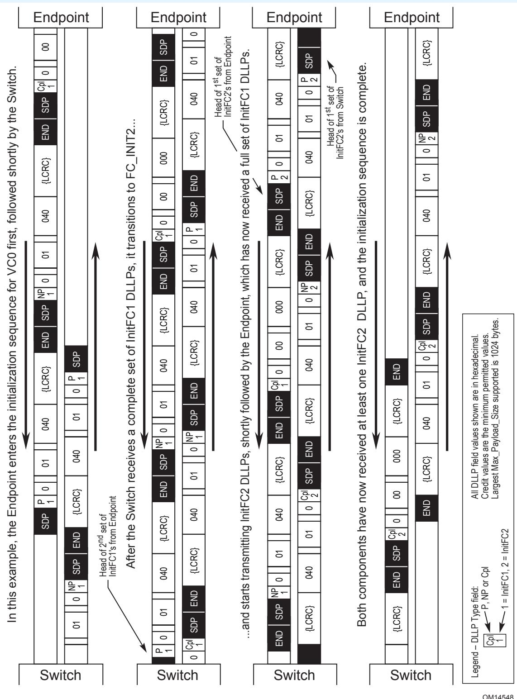

In this example, the Endpoint enters the initialization sequence for VC0 first, followed shortly by the Switch. After the Switch receives a complete set of InitFC1 DLLPs, it transitions to FC_INIT2... Both components have now received at least one InitFC2 DLLP, and the initialization sequence is complete.

All DLLP field values shown are in hexadecimal.
Credit values are the minimum permitted values.
Largest Max_Payload_Size supported is 1024 bytes.

Legend – DLLP Type field: P, NP or Cpl. 1 = InitFC1, 2 = InitFC2.

[⬆️ 返回目录](#-本章目录-table-of-contents)

---

## 3.4.2 Scaled Flow Control | 缩放流控 (Scaled Flow Control)

<table>
<thead>
<tr>
<th width="50%">🇬🇧 English</th>
<th width="50%" style="background-color:#e8e8e8">🏆 中文</th>
</tr>
</thead>
<tbody>
<tr>
<td>

Link performance can be affected when there are insufficient flow control credits available to account for the Link round trip time. This effect becomes more noticeable at higher Link speeds and the limitation of 127 header credits and 2047 data credits can limit performance. The Scaled Flow Control mechanism is designed to address this limitation.

All Ports are permitted to support Scaled Flow Control. Ports that support 16.0 GT/s and higher data rates must support Scaled Flow Control. Scaled Flow Control activation does not affect the ability to operate at 16.0 GT/s and higher data rates.

The following rules apply when Scaled Flow Control is not activated for the Link:

- The InitFC1, InitFC2, and UpdateFC DLLPs must contain 00b in the HdrScale and DataScale fields.
- The HdrFC counter is 8 bits wide and the HdrFC field includes all bits of the counter.
- The DataFC counter is 12 bits wide and the DataFC field includes all bits of the counter.

The following rules apply when Scaled Flow Control is activated for the Link:

- The InitFC1 and InitFC2 DLLPs that are transmitted must contain 01b, 10b, or 11b in the HdrScale field. The value is determined by the maximum number of header credits that will be outstanding of the indicated credit type as defined in § Table 3-4.
- The InitFC1 and InitFC2 DLLPs that are transmitted must contain 01b, 10b, or 11b in the DataScale field. The value is determined by the maximum number of data payload credits that will be outstanding of the indicated credit type as defined in § Table 3-4.

</td>
<td style="background-color:#e8e8e8">

当可用于覆盖链路往返时间的流控信用不足时,链路性能会受到影响。在更高的链路速率下,这种影响更加明显,而 127 个包头信用和 2047 个数据信用的限制可能会限制性能。Scaled Flow Control 机制旨在解决此限制。

所有端口都被允许支持 Scaled Flow Control。支持 16.0 GT/s 及更高数据速率的端口必须支持 Scaled Flow Control。Scaled Flow Control 的激活不影响在 16.0 GT/s 及更高数据速率下运行的能力。

当链路上未激活 Scaled Flow Control 时,适用以下规则:

- InitFC1、InitFC2 和 UpdateFC DLLP 的 HdrScale 和 DataScale 字段必须为 00b。
- HdrFC 计数器为 8 位宽,HdrFC 字段包含计数器的所有位。
- DataFC 计数器为 12 位宽,DataFC 字段包含计数器的所有位。

当链路上已激活 Scaled Flow Control 时,适用以下规则:

- 发送的 InitFC1 和 InitFC2 DLLP 的 HdrScale 字段必须为 01b、10b 或 11b。该值由所指示信用类型的最大未完成包头信用数决定,定义见 § Table 3-4。
- 发送的 InitFC1 和 InitFC2 DLLP 的 DataScale 字段必须为 01b、10b 或 11b。该值由所指示信用类型的最大未完成数据载荷信用数决定,定义见 § Table 3-4。

</td>
</tr>
</tbody>
</table>

[⬆️ 返回目录](#-本章目录-table-of-contents)

---

**Table 3-4. Scaled Flow Control Scaling Factors | 表 3-4 缩放流控缩放因子**

| Scale Factor | Scaled Flow Control Supported and Activated | Credit Type | Min Credits | Max Credits | Field Width | FC DLLP field Transmitted | FC DLLP field Received |
|--------------|-------------------------------------------|-------------|-------------|-------------|-------------|---------------------------|------------------------|
| 00b | No | Hdr | 1 | 127 | 8 bits | HdrFC | HdrFC |
| 00b | No | Data | 1 | 2,047 | 12 bits | DataFC | DataFC |
| 01b | Yes | Hdr | 1 | 127 | 8 bits | HdrFC | HdrFC |
| 01b | Yes | Data | 1 | 2,047 | 12 bits | DataFC | DataFC |
| 10b | Yes | Hdr | 4 | 508 | 10 bits | HdrFC >> 2 | HdrFC << 2 |
| 10b | Yes | Data | 4 | 8,188 | 14 bits | DataFC >> 2 | DataFC << 2 |
| 11b | Yes | Hdr | 16 | 2,032 | 12 bits | HdrFC >> 4 | HdrFC << 4 |
| 11b | Yes | Data | 16 | 32,752 | 16 bits | DataFC >> 4 | DataFC << 4 |

[⬆️ 返回目录](#-本章目录-table-of-contents)

---

## 3.5 Data Link Layer Packets (DLLPs) | 数据链路层包 (DLLP)

<table>
<thead>
<tr>
<th width="50%">🇬🇧 English</th>
<th width="50%" style="background-color:#e8e8e8">🏆 中文</th>
</tr>
</thead>
<tbody>
<tr>
<td>

The following DLLPs are used to support Link operations:

- Data Link Feature DLLP: For negotiation of supported features
- Ack DLLP: TLP Sequence Number acknowledgement; used to indicate successful receipt of some number of TLPs (NFM only)
- Nak DLLP: TLP Sequence Number negative acknowledgement; used to initiate a Data Link Layer Retry (NFM only)
- InitFC1, InitFC2, and UpdateFC DLLPs; used for Flow Control
- DLLPs used for Power Management
- DLLPs used for Link Management (L0p)

All DLLP fields marked Reserved (sometimes abbreviated as R) must be filled with all 0's when a DLLP is formed. Values in such fields must be ignored by Receivers. The handling of Reserved values in encoded fields is specified for each case.

In Non-Flit Mode, all DLLPs include the following fields:

- DLLP Type - Specifies the type of DLLP. The defined encodings are shown in § Table 3-5.
- 24 bits of DLLP Type specific information
- 16-bit CRC

In Flit Mode, DLLPs are transmitted in the DLP bytes of a Flit. They consist of:

- DLLP Type - Specifies the type of DLLP. The defined encodings are shown in § Table 3-5.
- 24 bits of DLLP Type specific information

See § Figure 3-4 and § Figure 3-5 below.

</td>
<td style="background-color:#e8e8e8">

以下 DLLP 用于支持链路操作:

- Data Link Feature DLLP:用于协商所支持的特性
- Ack DLLP:TLP 序列号确认;用于指示已成功接收若干 TLP(仅限 NFM)
- Nak DLLP:TLP 序列号否定确认;用于发起数据链路层重试 (Data Link Layer Retry)(仅限 NFM)
- InitFC1、InitFC2 和 UpdateFC DLLP:用于流控
- 用于电源管理 (Power Management) 的 DLLP
- 用于链路管理 (Link Management, L0p) 的 DLLP

所有标记为 Reserved(有时缩写为 R)的 DLLP 字段在形成 DLLP 时必须全部填 0。接收器必须忽略这些字段中的值。已编码字段中 Reserved 值的处理方式针对每种情况单独规定。

在非 Flit 模式下,所有 DLLP 包含以下字段:

- DLLP Type — 指定 DLLP 类型。已定义的编码见 § Table 3-5。
- 24 位 DLLP Type 专属信息
- 16 位 CRC

在 Flit 模式下,DLLP 在 Flit 的 DLP 字节中传输。它由以下部分组成:

- DLLP Type — 指定 DLLP 类型。已定义的编码见 § Table 3-5。
- 24 位 DLLP Type 专属信息

见下面的 § Figure 3-4 和 § Figure 3-5。

</td>
</tr>
</tbody>
</table>

[⬆️ 返回目录](#-本章目录-table-of-contents)

---

> **Figure 3-4.** DLLP Type and CRC Fields (Non-Flit Mode)
> 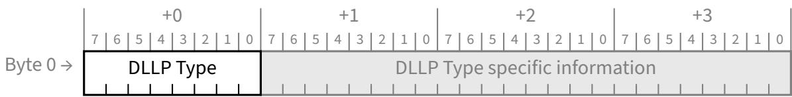

> **Figure 3-5.** DLLP Type Field (Flit Mode)

[⬆️ 返回目录](#-本章目录-table-of-contents)

---

## 3.5.1 Data Link Layer Packet Rules | 数据链路层包规则

<table>
<thead>
<tr>
<th width="50%">🇬🇧 English</th>
<th width="50%" style="background-color:#e8e8e8">🏆 中文</th>
</tr>
</thead>
<tbody>
<tr>
<td>

- For Ack and Nak DLLPs (see § Figure 3-6):
  - The AckNak_Seq_Num field is used to indicate what TLPs are affected
  - Transmission and reception is handled by the Data Link Layer according to the rules provided in § Section 3.6 .
  - These DLLPs are not used in Flit Mode. In Flit Mode, the Ack encoding is used for the NOP2.

- For InitFC1, InitFC2, and UpdateFC DLLPs:
  - The HdrFC field contains the credit value for headers of the indicated type (P, NP, or Cpl).
  - The DataFC field contains the credit value for data payload of the indicated type (P, NP, or Cpl).
  - When Scaled Flow Control is supported, the HdrScale field contains the scaling factor for headers of the indicated type. Encodings are defined in § Table 3-6.
  - When Scaled Flow Control is supported, the DataScale field contains the scaling factor for data payload of the indicated type. Encodings are defined in § Table 3-6.
  - When Scaled Flow Control is not supported, the HdrScale and Data Scale fields are Reserved.
  - If Scaled Flow Control is activated, the HdrScale and DataScale fields must be set to 01b, 10b, or 11b in all InitFC1, InitFC2, and UpdateFC DLLPs transmitted.
  - In UpdateFCs, a Transmitter is only permitted to send non-zero values in the HdrScale and DataScale fields if it supports Scaled Flow Control, Scaled Flow control is activated, and it received non-zero values for HdrScale and DataScale in the InitFC1s and InitFC2s it received for this VC.

In Flit Mode, the Optimized_Update_FC mechanism is supported in addition to the UpdateFC DLLP. Optimized_Update_FCs do not contain HdrScale and DataScale fields , so the Transmitter and Receiver must treat the HdrFC and DataFC fields using corresponding HdrScale and DataScale fields advertised during initialization. For debug as well as ease of use by debug tools such as Logic Analyzers, devices must send at least one DLLP every 10 μs with an Update_FC DLLP per VC with the scaled credit information. It is strongly recommended that a Transmitter cycles through the VCs with finite non-0 credits in the Optimized_Update_FC as long as there is a credit to be released in the corresponding VC.

- The packet formats are shown in § Figure 3-9, § Figure 3-10, and § Figure 3-11.
- Transmission is triggered by the Data Link Layer when initializing Flow Control for a Virtual Channel (see § Section 3.4 ), and following Flow Control initialization by the Transaction Layer according to the rules in § Section 2.6 .
- Checked for integrity on reception by the Data Link Layer and if correct, the information content of the DLLP is passed to the Transaction Layer. If the check fails, the information must be discarded.

Note: InitFC1 and InitFC2 DLLPs are used only for VC initialization

</td>
<td style="background-color:#e8e8e8">

- 对于 Ack 和 Nak DLLP(见 § Figure 3-6):
  - AckNak_Seq_Num 字段用于指示受影响的 TLP
  - 发送和接收由数据链路层根据 § Section 3.6 中给出的规则处理。
  - 这些 DLLP 在 Flit 模式中不使用。在 Flit 模式中,Ack 编码用于 NOP2。

- 对于 InitFC1、InitFC2 和 UpdateFC DLLP:
  - HdrFC 字段包含所指示类型(P、NP 或 Cpl)包头的信用值。
  - DataFC 字段包含所指示类型(P、NP 或 Cpl)数据载荷的信用值。
  - 当支持 Scaled Flow Control 时,HdrScale 字段包含所指示类型包头的缩放因子。编码在 § Table 3-6 中定义。
  - 当支持 Scaled Flow Control 时,DataScale 字段包含所指示类型数据载荷的缩放因子。编码在 § Table 3-6 中定义。
  - 当不支持 Scaled Flow Control 时,HdrScale 和 DataScale 字段为 Reserved。
  - 如果已激活 Scaled Flow Control,则在发送的所有 InitFC1、InitFC2 和 UpdateFC DLLP 中,HdrScale 和 DataScale 字段必须设置为 01b、10b 或 11b。
  - 在 UpdateFC 中,仅当发送器支持 Scaled Flow Control、已激活 Scaled Flow Control,并且该 VC 接收到的 InitFC1 和 InitFC2 中的 HdrScale 和 DataScale 为非零值时,才允许在 HdrScale 和 DataScale 字段中发送非零值。

在 Flit 模式中,除 UpdateFC DLLP 外,还支持 Optimized_Update_FC 机制。Optimized_Update_FC 不包含 HdrScale 和 DataScale 字段,因此发送器和接收器必须使用初始化期间通告的相应 HdrScale 和 DataScale 字段来处理 HdrFC 和 DataFC 字段。出于调试以及便于逻辑分析仪等调试工具使用的目的,设备必须每 10 μs 为每个 VC 至少发送一个带有缩放信用信息的 Update_FC DLLP。强烈建议发送器在 Optimized_Update_FC 中循环遍历有有限非 0 信用的 VC,只要对应 VC 中有可释放的信用。

- 包格式见 § Figure 3-9、§ Figure 3-10 和 § Figure 3-11。
- 由数据链路层在为虚通道初始化流控时(见 § Section 3.4)触发发送,以及在流控初始化后由事务层根据 § Section 2.6 中的规则触发发送。
- 接收时由数据链路层进行完整性检查,如果正确,DLLP 的信息内容被传递给事务层。如果检查失败,则必须丢弃该信息。

注:InitFC1 和 InitFC2 DLLP 仅用于 VC 初始化

</td>
</tr>
</tbody>
</table>

[⬆️ 返回目录](#-本章目录-table-of-contents)

---

**Table 3-5. DLLP Type Encodings | 表 3-5 DLLP 类型编码**

| Encodings (b) | DLLP Type (Note 3) | References |
|---------------|--------------------|------------|
| 0000 0000 | Ack (Non-Flit Node) / NOP2 (Flit Mode) | § Figure 3-6, § Figure 3-8 |
| 0000 0001 | MRInit (Non-Flit Mode) (Deprecated) / Reserved (Flit Mode) | See [MR-IOV] Note 1 |
| 0000 0010 | Data Link Feature | § Figure 3-14, |
| 0000 0011 | Alternate Protocol Use 1 — Not used by PCI Express. Only permitted after an Alternate Protocol has been negotiated (see § Section 4.2.5.2 ). Meaning is Alternate Protocol specific. For example, see [CXL-3.0]. | |
| 0000 0100 | Alternate Protocol Use 2 | |
| 0001 0000 | Nak (Non-Flit Mode) / Reserved (Flit Mode) | § Figure 3-6, |
| 0010 0000 | PM_Enter_L1 | § Figure 3-12, § Section 5.3.2.1 |
| 0010 0001 | PM_Enter_L23 | § Figure 3-12, § Section 5.3.2.3 |
| 0010 0011 | PM_Active_State_Request_L1 | § Figure 3-12, § Section 5.4.1.3.1 |
| 0010 0100 | PM_Request_Ack | § Figure 3-12, § Section 5.4.1.3.1, § Section 5.3.2.1 |
| 0010 1000 | Reserved (Non-Flit Mode) / Link Management (Flit Mode) | § Figure 3-15, § Table 4-44 |
| 0011 0000 | Vendor-Specific | § Figure 3-13, |
| 0011 0001 | NOP | § Figure 3-7, |
| 0100 0v2v1v0 / 0100 1v2v1v0 | InitFC1-P (v[2:0] specifies Virtual Channel) | § Figure 3-9, |
| 0101 0v2v1v0 / 0101 1v2v1v0 | InitFC1-NP | |
| 0110 0v2v1v0 / 0110 1v2v1v0 | InitFC1-Cpl | |
| 0111 0v2v1v0 | MRInitFC1 (Non-Flit-Mode) (Deprecated) / Reserved (Flit Mode) | See [MR-IOV] Note 2 |
| 1100 0v2v1v0 / 1100 1v2v1v0 | InitFC2-P | § Figure 3-10, |
| 1101 0v2v1v0 / 1101 1v2v1v0 | InitFC2-NP | |
| 1110 0v2v1v0 / 1110 1v2v1v0 | InitFC2-Cpl | |
| 1111 0v2v1v0 | MRInitFC2 (Non-Flit-Mode) (Deprecated) / Reserved (Flit Mode) | See [MR-IOV] Note 2 |
| 1000 0v2v1v0 / 1000 1v2v1v0 | UpdateFC-P | § Figure 3-11, |
| 1001 0v2v1v0 / 1001 1v2v1v0 | UpdateFC-NP | |
| 1010 0v2v1v0 / 1010 1v2v1v0 | UpdateFC-Cpl | |
| 1011 0v2v1v0 | MRUpdateFC (Non-Flit Mode) (Deprecated) / Reserved (Flit Mode) | See [MR-IOV] Note 2 |
| All other encodings | Reserved | |

**Notes:**
1. The deprecated MR-IOV protocol uses this encoding for the MRInit negotiation. The MR-IOV protocol assumes that non-MR-IOV components will silently ignore these DLLPs.
2. The deprecated MR-IOV protocol uses these encodings only after the successful completion of MRInit negotiation.
3. Received DLLPs not supported by the receiver are silently ignored. See § Section 3.6.2.2 and § Section 3.6.2.3 .

In § Figure 3-6 through § Figure 3-15 the 16-bit CRC is not shown. In Non-Flit Mode, the CRC is present as shown in § Figure 3-4.

[⬆️ 返回目录](#-本章目录-table-of-contents)

---

**Table 3-6. HdrScale and DataScale Encodings | 表 3-6 HdrScale 和 DataScale 编码**

| HdrScale or DataScale Value | Scaled Flow Control Supported | Scaling Factor | HdrFC Field | DataFC Field |
|-----------------------------|-------------------------------|----------------|-------------|--------------|
| 00b | No | 1 | HdrFC[7:0] | DataFC[11:0] |
| 01b | Yes | 1 | HdrFC[7:0] | DataFC[11:0] |
| 10b | Yes | 4 | HdrFC[9:2] | DataFC[13:2] |
| 11b | Yes | 16 | HdrFC[11:4] | DataFC[15:4] |

[⬆️ 返回目录](#-本章目录-table-of-contents)

---

<table>
<thead>
<tr>
<th width="50%">🇬🇧 English</th>
<th width="50%" style="background-color:#e8e8e8">🏆 中文</th>
</tr>
</thead>
<tbody>
<tr>
<td>

- For Power Management (PM) DLLPs (see § Figure 3-12):
  - Transmission is triggered by the component's power management logic according to the rules in § Chapter 5.
  - Checked for integrity on reception by the Data Link Layer, then passed to the component's power management logic

- For Vendor-Specific DLLPs (see § Figure 3-13)
  - It is recommended that receivers silently ignore Vendor-Specific DLLPs unless enabled by implementation specific mechanisms.
  - It is recommended that transmitters not send Vendor-Specific DLLPs unless enabled by implementation specific mechanisms.

- For NOP DLLPs (see § Figure 3-7) and NOP2 DLLPs (see § Figure 3-8).
  - Receivers shall discard this DLLP without action, unless otherwise specified, after checking it for data integrity.

- For Data Link Feature DLLPs (see § Figure 3-14)
  - The Feature Ack bit is Set to 1b to indicate that the transmitting Port has received a Data Link Feature DLLP.
  - The Feature Supported field indicates the Data Link Features supported and/or attribute values for the transmitting Port. The individual bits of this field are defined in § Table 3-1.

- For Link Management DLLPs (see § Figure 3-15)
  - In Non-Flit Mode, receivers shall discard this DLLP without action after checking it for data integrity.

</td>
<td style="background-color:#e8e8e8">

- 对于电源管理 (PM) DLLP(见 § Figure 3-12):
  - 由组件的电源管理逻辑根据 § Chapter 5 中的规则触发发送。
  - 接收时由数据链路层进行完整性检查,然后传递给组件的电源管理逻辑

- 对于厂商特定 (Vendor-Specific) DLLP(见 § Figure 3-13)
  - 建议接收器静默忽略厂商特定 DLLP,除非由实现特定机制启用。
  - 建议发送器不要发送厂商特定 DLLP,除非由实现特定机制启用。

- 对于 NOP DLLP(见 § Figure 3-7)和 NOP2 DLLP(见 § Figure 3-8)。
  - 接收器在完成数据完整性检查后,除非另有规定,应丢弃此 DLLP 而不采取行动。

- 对于 Data Link Feature DLLP(见 § Figure 3-14)
  - Feature Ack 位置 1b,表示发送端口已收到一个 Data Link Feature DLLP。
  - Feature Supported 字段表示发送端口所支持的数据链路特性和/或属性值。该字段的各个位在 § Table 3-1 中定义。

- 对于 Link Management DLLP(见 § Figure 3-15)
  - 在非 Flit 模式下,接收器在完成数据完整性检查后应丢弃此 DLLP 而不采取行动。

</td>
</tr>
</tbody>
</table>

[⬆️ 返回目录](#-本章目录-table-of-contents)

---

> **Figure 3-6.** Data Link Layer Packet Format for Ack and Nak (Non-Flit Mode)
> 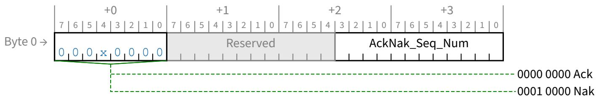

> **Figure 3-7.** Data Link Layer Packet Format for NOP
> 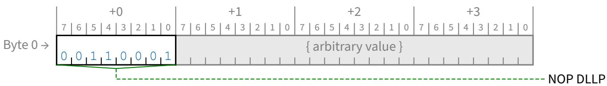

> **Figure 3-8.** Data Link Layer Packet Format for NOP2 (Flit Mode)
> 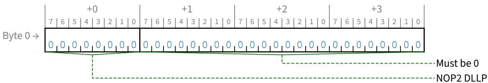

> **Figure 3-9.** Data Link Layer Packet Format for InitFC1
> 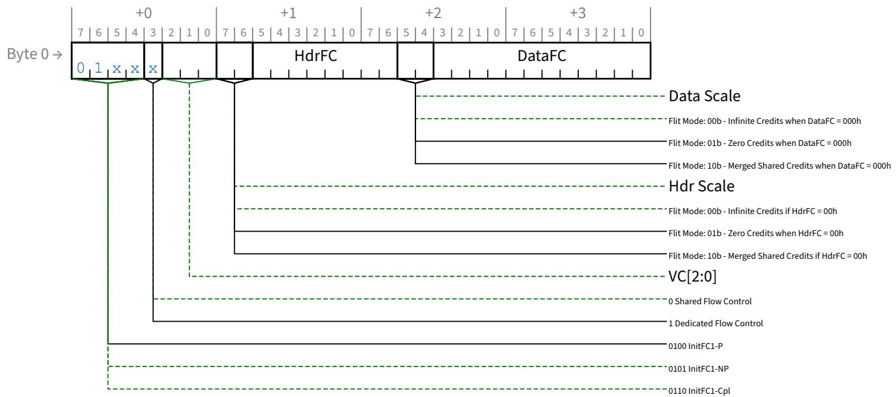

> **Figure 3-10.** Data Link Layer Packet Format for InitFC2
> 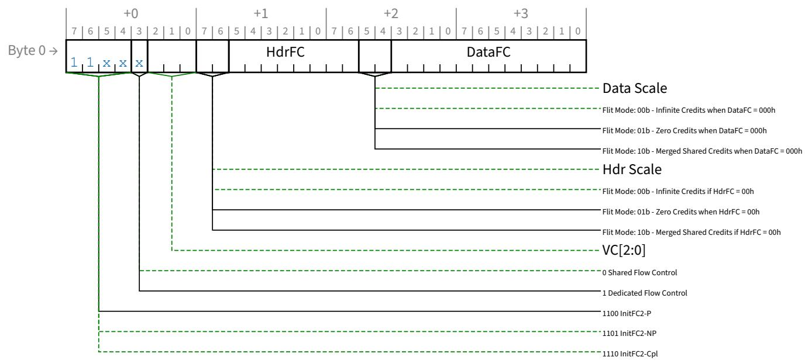

> **Figure 3-11.** Data Link Layer Packet Format for UpdateFC
> 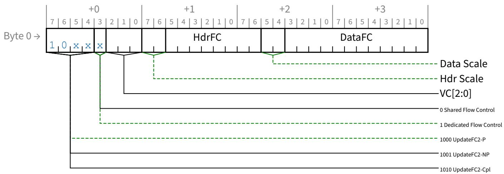

> **Figure 3-12.** Data Link Layer Packet Format for Power Management
> 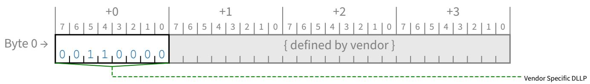

> **Figure 3-13.** Data Link Layer Packet Format for Vendor-Specific

> **Figure 3-14.** Data Link Layer Packet Format for Data Link Feature DLLP
> 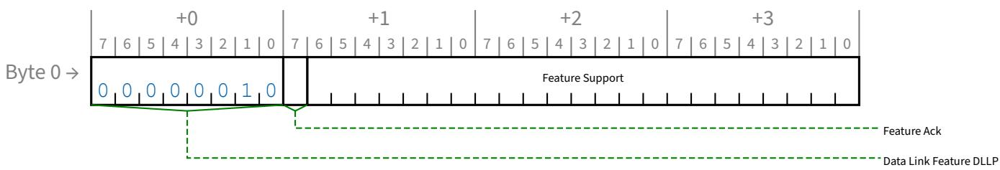

> **Figure 3-15.** Data Packet Layer Format for Link Management (Flit Mode)
> 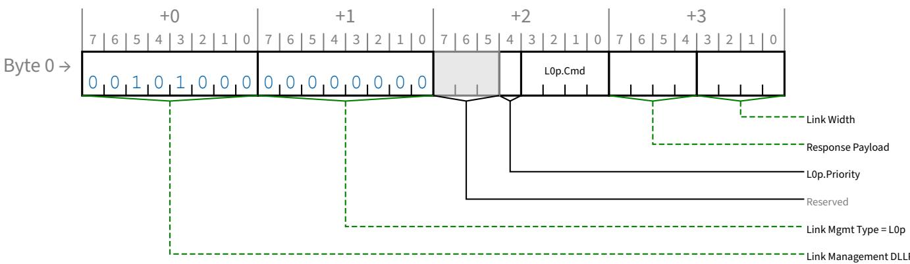

[⬆️ 返回目录](#-本章目录-table-of-contents)

---

<table>
<thead>
<tr>
<th width="50%">🇬🇧 English</th>
<th width="50%" style="background-color:#e8e8e8">🏆 中文</th>
</tr>
</thead>
<tbody>
<tr>
<td>

The following are the characteristics and rules associated with Data Link Layer Packets (DLLPs):

- DLLPs are differentiated from TLPs when they are presented to, or received from, the Physical Layer.
- DLLP data integrity is protected using a 16-bit CRC (NFM only)
- The CRC value is calculated using the following rules (see § Figure 3-16):
  - The polynomial used for CRC calculation has a coefficient expressed as 100Bh
  - The seed value (initial value for CRC storage registers) is FFFFh
  - CRC calculation starts with bit 0 of byte 0 and proceeds from bit 0 to bit 7 of each byte
  - Note that CRC calculation uses all bits of the DLLP, regardless of field type, including Reserved fields. The result of the calculation is complemented, then placed into the 16-bit CRC field of the DLLP as shown in § Table 3-7.

</td>
<td style="background-color:#e8e8e8">

以下是与数据链路层包 (DLLP) 相关的特性和规则:

- 在提交给物理层或从物理层接收时,DLLP 与 TLP 是可区分的。
- DLLP 的数据完整性使用 16 位 CRC 保护(仅限 NFM)
- CRC 值的计算遵循以下规则(见 § Figure 3-16):
  - CRC 计算使用的多项式系数表示为 100Bh
  - 种子值(CRC 存储寄存器的初始值)为 FFFFh
  - CRC 计算从 byte 0 的 bit 0 开始,按 bit 0 到 bit 7 的顺序逐字节进行
  - 注意:CRC 计算使用 DLLP 的所有位,与字段类型无关,包括 Reserved 字段。计算结果取反后,放入 DLLP 的 16 位 CRC 字段,映射关系见 § Table 3-7。

</td>
</tr>
</tbody>
</table>

[⬆️ 返回目录](#-本章目录-table-of-contents)

---

**Table 3-7. Mapping of Bits into CRC Field | 表 3-7 CRC 字段位映射**

| CRC Result Bit | Corresponding Bit Position in the 16-Bit CRC Field |
|----------------|---------------------------------------------------|
| 0 | 7 |
| 1 | 6 |
| 2 | 5 |
| 3 | 4 |
| 4 | 3 |
| 5 | 2 |
| 6 | 1 |
| 7 | 0 |
| 8 | 15 |
| 9 | 14 |
| 10 | 13 |
| 11 | 12 |
| 12 | 11 |
| 13 | 10 |
| 14 | 9 |
| 15 | 8 |

[⬆️ 返回目录](#-本章目录-table-of-contents)

---

<!-- 📄 Page 334 -->
---
<!-- 📄 Page 335 -->
---
<!-- 📄 Page 336 -->
---
<!-- 📄 Page 337 -->
---
<!-- 📄 Page 338 -->
---
<!-- 📄 Page 339 -->
---
<!-- 📄 Page 340 -->
---
<!-- 📄 Page 341 -->
---
<!-- 📄 Page 342 -->
---
<!-- 📄 Page 343 -->
---
<!-- 📄 Page 344 -->
---
<!-- 📄 Page 345 -->
---
<!-- 📄 Page 346 -->
---
<!-- 📄 Page 347 -->
---
<!-- 📄 Page 348 -->
---

> **Figure 3-16.** Diagram of CRC Calculation for DLLPs
> 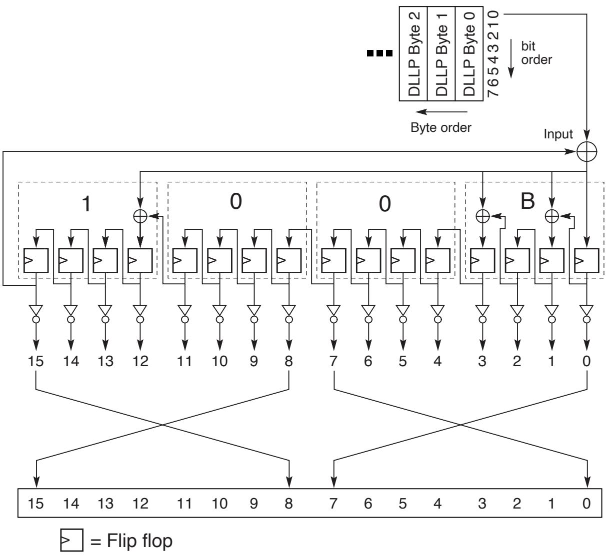

[⬆️ 返回目录](#-本章目录-table-of-contents)

---

## 3.6 Data Integrity Mechanisms | 数据完整性机制

<table>
<thead>
<tr>
<th width="50%">🇬🇧 English</th>
<th width="50%" style="background-color:#e8e8e8">🏆 中文</th>
</tr>
</thead>
<tbody>
<tr>
<td>

The Transaction Layer provides TLP boundary information to the Data Link Layer. This allows the Data Link Layer to apply a TLP Sequence Number and a Link CRC (LCRC) for error detection to the TLP. The Receive Data Link Layer validates received TLPs by checking the TLP Sequence Number, LCRC code and any error indications from the Receive Physical Layer. In case any of these errors are in a TLP, Data Link Layer Retry is used for recovery.

The format of a TLP with the TLP Sequence Number and LCRC code applied is shown in § Figure 3-17.

</td>
<td style="background-color:#e8e8e8">

事务层向数据链路层提供 TLP 边界信息。这使数据链路层能够为 TLP 应用 TLP 序列号 (TLP Sequence Number) 和链路 CRC (LCRC) 用于错误检测。接收数据链路层通过检查 TLP 序列号、LCRC 码以及来自接收物理层的任何错误指示来验证已接收的 TLP。如果 TLP 中存在任何这些错误,则使用数据链路层重试 (Data Link Layer Retry) 进行恢复。

应用了 TLP 序列号和 LCRC 码的 TLP 格式如 § Figure 3-17 所示。

</td>
</tr>
</tbody>
</table>

[⬆️ 返回目录](#-本章目录-table-of-contents)

---

## 3.6.1 Introduction | 引言

<table>
<thead>
<tr>
<th width="50%">🇬🇧 English</th>
<th width="50%" style="background-color:#e8e8e8">🏆 中文</th>
</tr>
</thead>
<tbody>
<tr>
<td>

On Ports that support Protocol Multiplexing, packets containing a non-zero value in Symbol +0, bits 7:4 are PMUX Packets. For TLPs, these bits must be 0000b. See § Appendix G. for details.

On Ports that do not support Protocol Multiplexing, Symbol +0, bits 7:4 are Reserved.

The TLP transmission path through the Data Link Layer (paths labeled 1 and 3 in § Figure 3-1) prepares each TLP for transmission by applying a sequence number, then calculating and appending a Link CRC (LCRC), which is used to ensure the integrity of TLPs during transmission across a Link from one component to another. TLPs are stored in a retry buffer, and are re-sent unless a positive acknowledgement of receipt is received from the other component. If repeated attempts to transmit a TLP are unsuccessful, the Transmitter will determine that the Link is not operating correctly, and will instruct the Physical Layer to retrain the Link (via the LTSSM Recovery state, § Section 4.2.7 ). If Link retraining fails, the Physical Layer will indicate that the Link is no longer up, causing the DLCMSM to move to the DL_Inactive state.

The mechanisms used to determine the TLP LCRC and the Sequence Number and to support Data Link Layer Retry are described in terms of conceptual counters and flags. This description does not imply nor require a particular implementation and is used only to clarify the requirements.

The following counters and timer are used to explain the remaining rules in this section:

- The following 12-bit counters are used:
  - NEXT_TRANSMIT_SEQ - Stores the packet sequence number applied to TLPs
    - Set to 000h in DL_Inactive state
  - ACKD_SEQ - Stores the sequence number acknowledged in the most recently received Ack or Nak DLLP.
    - Set to FFFh in DL_Inactive state

- The following 3-bit counter is used:
  - REPLAY_NUM - Counts the number of times the Retry Buffer has been re-transmitted
  - Set to 000b in DL_Inactive state

- The following timer is used:
  - REPLAY_TIMER - Counts time that determines when a replay is required, according to the following rules:
    - Started at the last Symbol of any TLP transmission or retransmission, if not already running
    - For each replay, reset and restart REPLAY_TIMER when sending the last Symbol of the first TLP to be retransmitted
    - Resets and restarts for each Ack DLLP received while there are more unacknowledged TLPs outstanding, if, and only if, the received Ack DLLP acknowledges some TLP in the retry buffer.
      - Note: This ensures that REPLAY_TIMER is reset only when forward progress is being made
    - Reset and hold until restart conditions are met for each Nak received (except during a replay) or when the REPLAY_TIMER expires
    - Not advanced during Link retraining (holds its value when the LTSSM is in the Recovery or Configuration state). Refer to § Section 4.2.6.3 and § Section 4.2.6.4 .
    - If Protocol Multiplexing is supported, optionally not advanced during the reception of PMUX Packets (see § Appendix G. ).
    - Resets and holds when there are no outstanding unacknowledged TLPs

</td>
<td style="background-color:#e8e8e8">

在支持协议复用 (Protocol Multiplexing) 的端口上,Symbol +0 的 bit 7:4 包含非零值的包是 PMUX 包。对于 TLP,这些位必须为 0000b。详见 § Appendix G。

在不支持协议复用的端口上,Symbol +0 的 bit 7:4 为 Reserved。

TLP 通过数据链路层的发送路径(§ Figure 3-1 中标记为 1 和 3 的路径)为每个 TLP 做发送准备:应用序列号,然后计算并追加链路 CRC (LCRC),用于保证 TLP 在一个组件到另一个组件跨链路传输期间的完整性。TLP 存储在重试缓冲 (Retry Buffer) 中,除非从对端收到已正确接收的肯定确认,否则会重新发送。如果多次尝试发送 TLP 均未成功,发送器将判定链路工作不正常,并指示物理层对链路进行重训练(通过 LTSSM Recovery 状态,见 § Section 4.2.7)。如果链路重训练失败,物理层将指示链路不再 up,导致 DLCMSM 转移至 DL_Inactive 状态。

用于确定 TLP LCRC 和序列号并支持数据链路层重试的机制以概念计数器和标志的形式描述。该描述并不意味着也不要求特定实现,仅用于澄清需求。

以下计数器和定时器用于解释本节中剩余的规则:

- 使用以下 12 位计数器:
  - NEXT_TRANSMIT_SEQ — 存储应用于 TLP 的包序列号
    - 在 DL_Inactive 状态下被设置为 000h
  - ACKD_SEQ — 存储最近收到的 Ack 或 Nak DLLP 中确认的序列号。
    - 在 DL_Inactive 状态下被设置为 FFFh

- 使用以下 3 位计数器:
  - REPLAY_NUM — 计数重试缓冲已重传的次数
  - 在 DL_Inactive 状态下被设置为 000b

- 使用以下定时器:
  - REPLAY_TIMER (重放定时器) — 计数决定何时需要重放的时间,遵循以下规则:
    - 若尚未运行,则在任何 TLP 发送或重传的最后一个 Symbol 处启动
    - 每次重放时,在发送要重传的第一个 TLP 的最后一个 Symbol 时复位并重启 REPLAY_TIMER
    - 当仍有更多未确认的 TLP 未完成时,每收到一个确认重试缓冲中某些 TLP 的 Ack DLLP,REPLAY_TIMER 复位并重启
      - 注:这确保仅在取得前向进展时才复位 REPLAY_TIMER
    - 对每次收到的 Nak(重放期间除外)或在 REPLAY_TIMER 到期时,保持复位直至满足重启条件
    - 链路重训练期间不前进(在 LTSSM 处于 Recovery 或 Configuration 状态时保持其值)。参考 § Section 4.2.6.3 和 § Section 4.2.6.4。
    - 如果支持协议复用,则在接收 PMUX 包期间可选择不前进(见 § Appendix G)。
    - 当没有未完成的未确认 TLP 时,复位并保持

</td>
</tr>
</tbody>
</table>

[⬆️ 返回目录](#-本章目录-table-of-contents)

---

> **Figure 3-17.** TLP with LCRC and TLP Sequence Number Applied - Non-Flit Mode
> 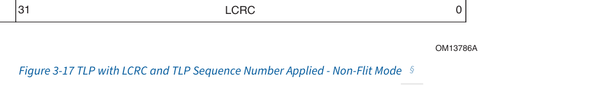

[⬆️ 返回目录](#-本章目录-table-of-contents)

---

## 3.6.2 LCRC, Sequence Number, and Retry Management (TLP Transmitter) | LCRC、序列号与重试管理(TLP 发送器)

<table>
<thead>
<tr>
<th width="50%">🇬🇧 English</th>
<th width="50%" style="background-color:#e8e8e8">🏆 中文</th>
</tr>
</thead>
<tbody>
<tr>
<td>

The following rules describe how a TLP is prepared for transmission before being passed to the Physical Layer:

- The Transaction Layer indicates the start and end of the TLP to the Data Link Layer while transferring the TLP
  - The Data Link Layer treats the TLP as a "black box" and does not process or modify the contents of the TLP
- Each TLP is assigned a 12-bit sequence number when it is accepted from the Transmit side of the Transaction Layer
  - Upon acceptance of the TLP from the Transaction Layer, the packet sequence number is applied to the TLP by:
    - prepending the 12-bit value in NEXT_TRANSMIT_SEQ to the TLP
    - prepending 4 bits to the TLP, preceding the sequence number (see § Figure 3-18)
  - If the equation:

    (NEXT_TRANSMIT_SEQ - ACKD_SEQ) mod 4096 >= 2048
    
    **Equation 3-1 Tx SEQ Stall**

    is true, the Transmitter must cease accepting TLPs from the Transaction Layer until the equation is no longer true
  - Following the application of NEXT_TRANSMIT_SEQ to a TLP accepted from the Transmit side of the Transaction Layer, NEXT_TRANSMIT_SEQ is incremented (except in the case where the TLP is nullified):

    NEXT_TRANSMIT_SEQ = (NEXT_TRANSMIT_SEQ + 1) mod 4096
    
    **Equation 3-2 Tx SEQ Update**

</td>
<td style="background-color:#e8e8e8">

以下规则描述 TLP 在传递给物理层之前如何为发送做准备:

- 事务层在传输 TLP 时向数据链路层指示 TLP 的开始和结束
  - 数据链路层将 TLP 视为"黑盒",不会处理或修改 TLP 的内容
- 每个 TLP 在从事务层的发送侧被接受时被分配一个 12 位序列号
  - 在从事务层接受 TLP 时,通过以下方式将包序列号应用于该 TLP:
    - 将 NEXT_TRANSMIT_SEQ 中的 12 位值前置到 TLP
    - 在 TLP 前再前置 4 位,该 4 位位于序列号之前(见 § Figure 3-18)
  - 如果以下等式成立:

    (NEXT_TRANSMIT_SEQ - ACKD_SEQ) mod 4096 >= 2048
    
    **Equation 3-1 Tx SEQ Stall**

    则发送器必须停止从事务层接受 TLP,直至该等式不再成立
  - 在对从事务层发送侧接受的 TLP 应用 NEXT_TRANSMIT_SEQ 之后(除该 TLP 被 nullify 的情况外),NEXT_TRANSMIT_SEQ 递增:

    NEXT_TRANSMIT_SEQ = (NEXT_TRANSMIT_SEQ + 1) mod 4096
    
    **Equation 3-2 Tx SEQ Update**

</td>
</tr>
</tbody>
</table>

[⬆️ 返回目录](#-本章目录-table-of-contents)

---

> **Figure 3-18.** TLP Following Application of TLP Sequence Number and 4 Bits
> 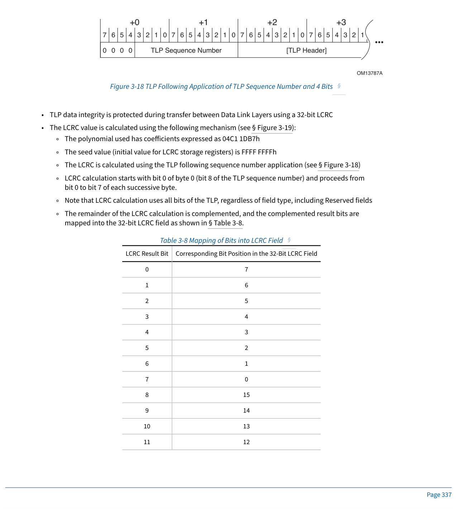

[⬆️ 返回目录](#-本章目录-table-of-contents)

---

<table>
<thead>
<tr>
<th width="50%">🇬🇧 English</th>
<th width="50%" style="background-color:#e8e8e8">🏆 中文</th>
</tr>
</thead>
<tbody>
<tr>
<td>

- TLP data integrity is protected during transfer between Data Link Layers using a 32-bit LCRC
- The LCRC value is calculated using the following mechanism (see § Figure 3-19):
  - The polynomial used has coefficients expressed as 04C1 1DB7h
  - The seed value (initial value for LCRC storage registers) is FFFF FFFFh
  - The LCRC is calculated using the TLP following sequence number application (see § Figure 3-18)
  - LCRC calculation starts with bit 0 of byte 0 (bit 8 of the TLP sequence number) and proceeds from bit 0 to bit 7 of each successive byte.
  - Note that LCRC calculation uses all bits of the TLP, regardless of field type, including Reserved fields
  - The remainder of the LCRC calculation is complemented, and the complemented result bits are mapped into the 32-bit LCRC field as shown in § Table 3-8.

</td>
<td style="background-color:#e8e8e8">

- TLP 数据完整性在数据链路层之间传输期间使用 32 位 LCRC 保护
- LCRC 值的计算机制如下(见 § Figure 3-19):
  - 所使用的多项式系数表示为 04C1 1DB7h
  - 种子值(LCRC 存储寄存器的初始值)为 FFFF FFFFh
  - LCRC 使用应用序列号之后的 TLP 进行计算(见 § Figure 3-18)
  - LCRC 计算从 byte 0 的 bit 0(即 TLP 序列号的 bit 8)开始,按 bit 0 到 bit 7 的顺序逐字节进行。
  - 注意:LCRC 计算使用 TLP 的所有位,与字段类型无关,包括 Reserved 字段
  - LCRC 计算的余数取反,取反后的结果位映射到 32 位 LCRC 字段,映射方式见 § Table 3-8。

</td>
</tr>
</tbody>
</table>

[⬆️ 返回目录](#-本章目录-table-of-contents)

---

**Table 3-8. Mapping of Bits into LCRC Field | 表 3-8 LCRC 字段位映射**

| LCRC Result Bit | Corresponding Bit Position in the 32-Bit LCRC Field |
|-----------------|------------------------------------------------------|
| 0 | 7 |
| 1 | 6 |
| 2 | 5 |
| 3 | 4 |
| 4 | 3 |
| 5 | 2 |
| 6 | 1 |
| 7 | 0 |
| 8 | 15 |
| 9 | 14 |
| 10 | 13 |
| 11 | 12 |
| 12 | 11 |
| 13 | 10 |
| 14 | 9 |
| 15 | 8 |
| 16 | 23 |
| 17 | 22 |
| 18 | 21 |
| 19 | 20 |
| 20 | 19 |
| 21 | 18 |
| 22 | 17 |
| 23 | 16 |
| 24 | 31 |
| 25 | 30 |
| 26 | 29 |
| 27 | 28 |
| 28 | 27 |
| 29 | 26 |
| 30 | 25 |
| 31 | 24 |

[⬆️ 返回目录](#-本章目录-table-of-contents)

---

> **Figure 3-19.** Calculation of LCRC
> 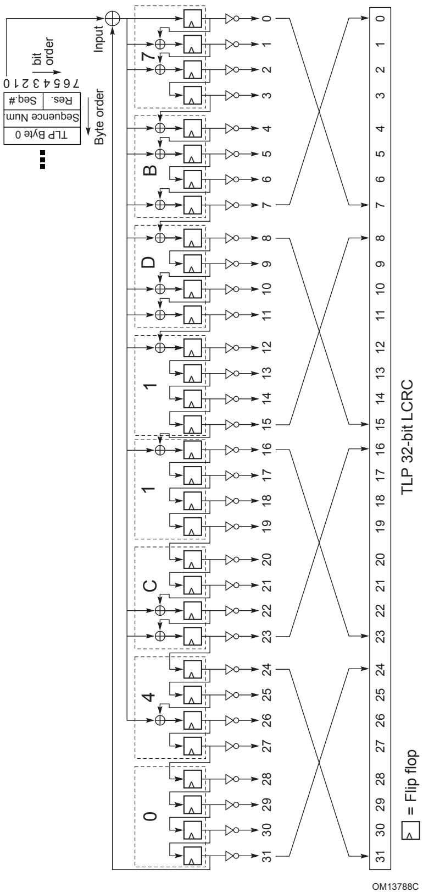

[⬆️ 返回目录](#-本章目录-table-of-contents)

---

<table>
<thead>
<tr>
<th width="50%">🇬🇧 English</th>
<th width="50%" style="background-color:#e8e8e8">🏆 中文</th>
</tr>
</thead>
<tbody>
<tr>
<td>

The 32-bit LCRC field is appended to the TLP following the bytes received from the Transaction Layer (see § Figure 3-17).

To support cut-through routing of TLPs, a Transmitter is permitted to modify a transmitted TLP to indicate that the Receiver must ignore that TLP ("nullify" the TLP).

- A Transmitter is permitted to nullify a TLP being transmitted. To do this in a way that will robustly prevent misinterpretation or corruption, the Transmitter must do the following:
  - Transmit all DWs of the TLP when the Physical Layer is using 128b/130b encoding (see § Section 4.2.2.3.1 )
  - Use the remainder of the calculated LCRC value without inversion (the logical inverse of the value normally used)
  - Indicate to the Transmit Physical Layer that the TLP is nullified
- When this is done, the Transmitter does not increment NEXT_TRANSMIT_SEQ

The following rules describe the operation of the Data Link Layer Retry Buffer, from which TLPs are re-transmitted when necessary:

- Copies of Transmitted TLPs must be stored in the Data Link Layer Retry Buffer, except for nullified TLPs.

When a replay is initiated, either due to reception of a Nak or due to REPLAY_TIMER expiration, the following rules describe the sequence of operations that must be followed:

- If all TLPs transmitted have been acknowledged (the Retry Buffer is empty), terminate replay, otherwise continue.

  Note: In Flit Mode, Replay occurs at the Flit Level. See § Section 4.2.3.4.2.1.7 .

- Increment REPLAY_NUM by 2 when operating in Non-Flit Mode. If the Data Rate is 32.0 GT/s or lower, increment REPLAY_NUM by 2. When the replay is initiated by the reception of a Nak that acknowledged some TLPs in the retry buffer, REPLAY_NUM is reset. It is then permitted (but not required) to be incremented.
  - If REPLAY_NUM rolls over from 110b or 111b to either 000b or 001b, the Transmitter signals the Physical Layer to retrain the Link, and waits for the completion of retraining before proceeding with the replay. This is a reported error associated with the Port (see § Section 6.2 ).

    Note that Data Link Layer state, including the contents of the Retry Buffer, are not reset by this action unless the Physical Layer reports Physical LinkUp = 0b (causing the Data Link Control and Management State Machine to transition to the DL_Inactive state).

  - If REPLAY_NUM does not roll over from 110b or 111b to either 000b or 001b, continue with the replay.
- Block acceptance of new TLPs from the Transmit Transaction Layer.
- Complete transmission of any TLP currently being transmitted.
- Retransmit unacknowledged TLPs, starting with the oldest unacknowledged TLP and continuing in original transmission order
  - Reset and restart REPLAY_TIMER when sending the last Symbol of the first TLP to be retransmitted
  - Once all unacknowledged TLPs have been re-transmitted, return to normal operation.
  - If any Ack or Nak DLLPs are received during a replay, the Transmitter is permitted to complete the replay without regard to the Ack or Nak DLLP(s), or to skip retransmission of any newly acknowledged TLPs.
    - Once the Transmitter has started to resend a TLP, it must complete transmission of that TLP in all cases.
  - Ack and Nak DLLPs received during a replay must be processed, and may be collapsed
    - Example: If multiple Acks are received, only the one specifying the latest Sequence Number value must be considered - Acks specifying earlier Sequence Number values are effectively "collapsed" into this one
    - Example: During a replay, Nak is received, followed by an Ack specifying a later Sequence Number - the Ack supersedes the Nak, and the Nak is ignored.

    Note: Since all entries in the Retry Buffer have already been allocated space in the Receiver by the Transmitter's Flow Control gating logic, no further flow control synchronization is necessary.

- Re-enable acceptance of new TLPs from the Transmit Transaction Layer.

</td>
<td style="background-color:#e8e8e8">

32 位 LCRC 字段被追加到从事务层收到的字节之后的 TLP 末尾(见 § Figure 3-17)。

为了支持 TLP 的直通路由 (cut-through routing),允许发送器修改已发送的 TLP 以指示接收器必须忽略该 TLP(即"nullify"该 TLP)。

- 允许发送器对正在发送的 TLP 进行 nullify。为了以能可靠防止误解释或损坏的方式执行此操作,发送器必须执行以下操作:
  - 当物理层使用 128b/130b 编码(见 § Section 4.2.2.3.1)时,发送 TLP 的所有 DW
  - 使用未经取反的 LCRC 计算余数(即通常使用值的逻辑反)
  - 向发送物理层指示该 TLP 已被 nullify
- 当执行此操作时,发送器不递增 NEXT_TRANSMIT_SEQ

以下规则描述数据链路层重试缓冲 (Retry Buffer) 的操作,在必要时从中重传 TLP:

- 必须将已发送 TLP 的副本存储在数据链路层重试缓冲中,但被 nullify 的 TLP 除外。

当重放被发起时(无论是由于收到 Nak 还是 REPLAY_TIMER 到期),以下规则描述必须遵循的操作顺序:

- 如果所有已发送的 TLP 都已被确认(重试缓冲为空),则终止重放,否则继续。

  注:在 Flit 模式下,Replay 在 Flit 级别进行。详见 § Section 4.2.3.4.2.1.7。

- 在非 Flit 模式下,将 REPLAY_NUM 递增 2。如果数据速率为 32.0 GT/s 或更低,则将 REPLAY_NUM 递增 2。当重放是由收到的、确认了重试缓冲中某些 TLP 的 Nak 发起时,REPLAY_NUM 复位。然后允许(但不要求)递增。
  - 如果 REPLAY_NUM 从 110b 或 111b 翻转为 000b 或 001b,发送器向物理层发出信号以重训练链路,并等待重训练完成后继续执行重放。这是与该端口相关联的一个已报告错误(见 § Section 6.2)。

    注意:数据链路层状态(包括重试缓冲的内容)不会被该动作复位,除非物理层报告 Physical LinkUp = 0b(导致数据链路控制与管理状态机转移至 DL_Inactive 状态)。

  - 如果 REPLAY_NUM 没有从 110b 或 111b 翻转为 000b 或 001b,则继续重放。
- 阻塞从事务发送层接受新 TLP。
- 完成任何当前正在发送的 TLP 的发送。
- 重传未确认的 TLP,从最旧的未确认 TLP 开始,按原始发送顺序继续
  - 在发送要重传的第一个 TLP 的最后一个 Symbol 时,复位并重启 REPLAY_TIMER
  - 一旦所有未确认的 TLP 都已重传,返回正常操作。
  - 如果在重放期间收到任何 Ack 或 Nak DLLP,发送器可以完成该重放而不考虑 Ack 或 Nak DLLP,或跳过对新确认的 TLP 的重传。
    - 一旦发送器已开始重新发送 TLP,则在所有情况下都必须完成该 TLP 的发送。
  - 在重放期间收到的 Ack 和 Nak DLLP 必须被处理,并且可以折叠 (collapsed)
    - 示例:如果收到多个 Ack,则只需考虑指定最新序列号值的 Ack — 指定较早序列号值的 Ack 实际上被"折叠"到该 Ack 中
    - 示例:在重放期间,先收到 Nak,然后收到指定较晚序列号的 Ack — 该 Ack 取代 Nak,Nak 被忽略。

    注:由于重试缓冲中的所有条目已由发送器的流控门控逻辑在接收器中分配了空间,因此无需进一步的流控同步。

- 重新启用从事务发送层接受新 TLP。

</td>
</tr>
</tbody>
</table>

[⬆️ 返回目录](#-本章目录-table-of-contents)

---

## 3.6.2.1 LCRC and Sequence Number Rules (TLP Transmitter) | LCRC 和序列号规则(TLP 发送器)

<table>
<thead>
<tr>
<th width="50%">🇬🇧 English</th>
<th width="50%" style="background-color:#e8e8e8">🏆 中文</th>
</tr>
</thead>
<tbody>
<tr>
<td>

A replay can be initiated by the expiration of REPLAY_TIMER, or by the receipt of a Nak. The following rule covers the expiration of REPLAY_TIMER:

- If the Transmit Retry Buffer contains TLPs for which no Ack or Nak DLLP has been received, and (as indicated by REPLAY_TIMER) no Ack or Nak DLLP has been received for a period exceeding the applicable REPLAY_TIMER Limit, the Transmitter initiates a replay.
  - Simplified REPLAY_TIMER Limits are:
    - A value from 24,000 to 31,000 (inclusive) Symbol Times (-0%/+0%) when the Extended Synch bit is Clear.
    - A value from 80,000 to 100,000 (inclusive) Symbol Times (-0%/+0%) when the Extended Synch bit is Set.
    - If the Extended Synch bit changes state while unacknowledged TLPs are outstanding, implementations are permitted to adjust their REPLAY_TIMER Limit when the Extended Synch bit changes state or the next time the REPLAY_TIMER is reset.
  - Implementations that support 16.0 GT/s or higher data rates must use the Simplified REPLAY_TIMER Limits for operation at all data rates when operating in Non-Flit Mode.
  - Implementations that only support data rates less than 16.0 GT/s are strongly recommended to use the Simplified REPLAY_TIMER Limits for operation at all data rates when operating in Non-Flit Mode, but they are permitted to use the REPLAY_TIMER Limits described in the [PCIe-3.1].
  - The Replay Timeout rules defined in Replay Schedule Rule 0 in § Section 4.2.3.4.2.1.6 must be used for operation at all data rates in Flit Mode.

  This is a Replay Timer Timeout error and it is a reported error associated with the Port (see § Section 6.2 ).

TLP Transmitters and compliance tests must base replay timing as measured at the Port of the TLP Transmitter. Timing starts with either the last Symbol of a transmitted TLP, or else the last Symbol of a received Ack DLLP, whichever determines the oldest unacknowledged TLP. Timing ends with the First Symbol of TLP retransmission.

**IMPLEMENTATION NOTE:**
**DETERMINING REPLAY_TIMER LIMIT VALUES**
Replays are initiated primarily with a Nak DLLP, and the REPLAY_TIMER serves as a secondary mechanism. Since it is a secondary mechanism, the REPLAY_TIMER Limit has a relatively small effect on the average time required to convey a TLP across a Link. The Simplified REPLAY_TIMER Limits have been defined so that no adjustments are required for ASPM L0s, Retimers, or other items as in previous revisions of this specification.

When measuring replay timing to the point when TLP retransmission begins, compliance tests must allow for any other TLP or DLLP transmission already in progress in that direction (thus preventing the TLP retransmission).

**IMPLEMENTATION NOTE:**
**RECOMMENDED PRIORITY OF SCHEDULED TRANSMISSIONS**
When multiple DLLPs of the same type are scheduled for transmission but have not yet been transmitted, it is possible in many cases to "collapse" them into a single DLLP. For example, if a scheduled Ack DLLP transmission is stalled waiting for another transmission to complete, and during this time another Ack is scheduled for transmission, it is only necessary to transmit the second Ack, since the information it provides will supersede the information in the first Ack.

In addition to any TLP from the Transaction Layer (or the Retry Buffer, if a replay is in progress), multiple DLLPs of different types may be scheduled for transmission at the same time, and must be prioritized for transmission. The following list shows the preferred priority order for selecting information for transmission. Note that the priority of the NOP DLLP and the Vendor-Specific DLLP is not listed, as usage of these DLLPs is completely implementation specific, and there is no recommended priority. Note that this priority order is a guideline, and that in all cases a fairness mechanism is strongly recommended to ensure that no type of traffic is blocked for an extended or indefinite period of time by any other type of traffic. Note that the Ack Latency Limit value and REPLAY_TIMER Limit specify requirements measured at the Port of the component, and the internal arbitration policy of the component must ensure that these externally measured requirements are met.

In Flit Mode, DLP information is contained in every Flit and can contain either a DLLP, Optimized_Update_FC, or a Flit_Marker. Currently defined Flit_Markers are related to a specific TLP and have the higest priority. Future Flit_Markers may have lower priorities.

| Recommended Priority | Non-Flit Mode | Flit Mode |
|---------------------|---------------|-----------|
| 1 | Completion of any transmission (TLP or DLLP) currently in progress (highest priority). | n/a: DLP information is independent of TLPs |
| 2 | n/a: Poison and Nullify use TLP Framing | Poisoned TLP and Nullified TLP Flit_Markers |
| 3 | Nak DLLP Transmissions | n/a: Ack and Nak use dedicated DLP Symbols, not DLLPs |
| 4 | Ack DLLP transmissions scheduled for transmission as soon as possible due to: receipt of a duplicate TLP -OR- expiration of the Ack latency timer (see § Section 3.6.3.1 ). | |
| 5 | Flow Control required to satisfy § Section 2.6 : UpdateFC DLLPs | Flow Control required to satisfy § Section 2.6 : UpdateFC DLLPs and/or Optimized_Update_FC |
| 6 | Retry Buffer re-transmissions | n/a: DLP information is independent of TLPs |
| 7 | TLPs from the Transaction Layer | |
| 8 | Flow Control other than that required to satisfy § Section 2.6 : UpdateFC DLLPs | Flow Control other than that required to satisfy § Section 2.6 : Optimized_Update_FC and/or UpdateFC DLLPs |
| 9 | All other DLLP transmissions (lowest priority) | |

</td>
<td style="background-color:#e8e8e8">

重放可以由 REPLAY_TIMER 到期或收到 Nak 来发起。以下规则涵盖 REPLAY_TIMER 的到期:

- 如果发送重试缓冲中包含尚未收到 Ack 或 Nak DLLP 的 TLP,并且(如 REPLAY_TIMER 所指示)在超过适用的 REPLAY_TIMER Limit 的时间内未收到 Ack 或 Nak DLLP,则发送器发起重放。
  - 简化的 REPLAY_TIMER Limit 为:
    - 当 Extended Synch 位为清零状态时,取值范围为 24,000 至 31,000(含)Symbol Times(-0%/+0%)。
    - 当 Extended Synch 位为置位状态时,取值范围为 80,000 至 100,000(含)Symbol Times(-0%/+0%)。
    - 如果在有未确认的 TLP 时 Extended Synch 位状态发生变化,则允许实现在 Extended Synch 位状态变化时或下一次 REPLAY_TIMER 复位时调整其 REPLAY_TIMER Limit。
  - 支持 16.0 GT/s 或更高数据速率的实现,在非 Flit 模式下所有数据速率的运行必须使用简化的 REPLAY_TIMER Limit。
  - 仅支持低于 16.0 GT/s 数据速率的实现,强烈建议在非 Flit 模式下所有数据速率的运行使用简化的 REPLAY_TIMER Limit,但允许使用 [PCIe-3.1] 中描述的 REPLAY_TIMER Limit。
  - 在 Flit 模式下,所有数据速率的运行必须使用 § Section 4.2.3.4.2.1.6 中 Replay Schedule Rule 0 所定义的重放超时规则。

  这是一个 Replay Timer Timeout 错误,是与该端口相关联的一个已报告错误(见 § Section 6.2)。

TLP 发送器和一致性测试必须以在 TLP 发送器端口测量得到的重放定时为基础。定时从已发送 TLP 的最后一个 Symbol 或收到的 Ack DLLP 的最后一个 Symbol(以决定最旧未确认 TLP 者)开始。定时以 TLP 重传的首个 Symbol 结束。

**实现注:**
**确定 REPLAY_TIMER Limit 值**
重放主要由 Nak DLLP 发起,REPLAY_TIMER 作为辅助机制。由于它是辅助机制,REPLAY_TIMER Limit 对跨链路传送 TLP 所需的平均时间影响相对较小。简化的 REPLAY_TIMER Limit 已定义为不需要针对 ASPM L0s、Retimers 或其他项目进行调整,不像本规范早期修订版本那样。

在测量到 TLP 重传开始时的重放定时时,一致性测试必须允许该方向上已在进行中的任何其他 TLP 或 DLLP 发送(从而阻止该 TLP 重传)。

**实现注:**
**计划发送的建议优先级**
当多个相同类型的 DLLP 已被计划发送但尚未实际发送时,通常可以将它们"折叠"为单个 DLLP。例如,如果一个计划中的 Ack DLLP 发送因等待另一个发送完成而停滞,在此期间又计划了另一个 Ack 发送,则只需发送第二个 Ack,因为其提供的信息将取代第一个 Ack 中的信息。

除了来自事务层(或重试缓冲,如果正在重放中)的任何 TLP 外,多个不同类型的 DLLP 可能同时被计划发送,必须按优先级进行发送选择。以下列表显示了选择信息进行发送的首选优先级顺序。注意:NOP DLLP 和厂商特定 DLLP 的优先级未列出,因为这些 DLLP 的使用完全由实现决定,没有建议的优先级。注意:此优先级顺序仅作指导,在所有情况下,强烈建议采用公平性机制以确保任何类型的流量不会被其他类型的流量阻塞过长时间。注意:Ack Latency Limit 值和 REPLAY_TIMER Limit 指定在组件端口处测得的要求,组件的内部仲裁策略必须确保满足这些外部测得的要求。

在 Flit 模式下,DLP 信息包含在每个 Flit 中,可包含 DLLP、Optimized_Update_FC 或 Flit_Marker 中的一种。当前已定义的 Flit_Marker 与特定 TLP 相关,具有最高优先级。未来的 Flit_Marker 可能具有较低的优先级。

| 建议优先级 | 非 Flit 模式 | Flit 模式 |
|-----------|--------------|-----------|
| 1 | 完成当前正在进行的任何发送(TLP 或 DLLP)(最高优先级) | n/a:DLP 信息独立于 TLP |
| 2 | n/a:Poison 和 Nullify 使用 TLP 帧 | Poisoned TLP 和 Nullified TLP Flit_Marker |
| 3 | Nak DLLP 发送 | n/a:Ack 和 Nak 使用专用 DLP Symbol,而不是 DLLP |
| 4 | 由于以下原因而尽快计划发送的 Ack DLLP:收到重复 TLP — 或 — Ack 延迟定时器到期(见 § Section 3.6.3.1) | |
| 5 | 满足 § Section 2.6 所需的流控:UpdateFC DLLP | 满足 § Section 2.6 所需的流控:UpdateFC DLLP 和/或 Optimized_Update_FC |
| 6 | 重试缓冲重传 | n/a:DLP 信息独立于 TLP |
| 7 | 来自事务层的 TLP | |
| 8 | 满足 § Section 2.6 以外的流控:UpdateFC DLLP | 满足 § Section 2.6 以外的流控:Optimized_Update_FC 和/或 UpdateFC DLLP |
| 9 | 所有其他 DLLP 发送(最低优先级) | |

</td>
</tr>
</tbody>
</table>

[⬆️ 返回目录](#-本章目录-table-of-contents)

---

## 3.6.2.2 Handling of Received DLLPs (Non-Flit Mode) | 已接收 DLLP 的处理(非 Flit 模式)

<table>
<thead>
<tr>
<th width="50%">🇬🇧 English</th>
<th width="50%" style="background-color:#e8e8e8">🏆 中文</th>
</tr>
</thead>
<tbody>
<tr>
<td>

Since Ack/Nak and Flow Control DLLPs affect TLPs flowing in the opposite direction across the Link, the TLP transmission mechanisms in the Data Link Layer are also responsible for Ack/Nak and Flow Control DLLPs received from the other component on the Link. These DLLPs are processed according to the following rules (see § Figure 3-20):

- If the Physical Layer indicates a Receiver Error, discard any DLLP currently being received and free any storage allocated for the DLLP. Note that reporting such errors to software is done by the Physical Layer (and, therefore, are not reported by the Data Link Layer).
- For all received DLLPs, the CRC value is checked by:
  - Applying the same algorithm used for calculation of transmitted DLLPs to the received DLLP, not including the 16-bit CRC field of the received DLLP
  - Comparing the calculated result with the value in the CRC field of the received DLLP
    - If not equal, the DLLP is corrupt
  - A corrupt received DLLP is discarded. This is a Bad DLLP error and is a reported error associated with the Port (see § Section 6.2 ).
- A received DLLP that is not corrupt, but that uses unsupported DLLP Type encodings is discarded without further action. This is not considered an error.
- Values in Reserved fields are ignored.
- Receivers must process all DLLPs received at the rate they are received

</td>
<td style="background-color:#e8e8e8">

由于 Ack/Nak 和流控 DLLP 影响跨链路上反方向流动的 TLP,因此数据链路层中的 TLP 发送机制也负责处理从链路上对端组件接收到的 Ack/Nak 和流控 DLLP。这些 DLLP 按以下规则处理(见 § Figure 3-20):

- 如果物理层指示接收器错误 (Receiver Error),则丢弃当前正在接收的任何 DLLP,并释放为该 DLLP 分配的所有存储。注意:将此类错误报告给软件由物理层完成(因此不由数据链路层报告)。
- 对于所有已接收的 DLLP,通过以下方式检查 CRC 值:
  - 将计算已发送 DLLP 时使用的相同算法应用于已接收的 DLLP,但不包括已接收 DLLP 的 16 位 CRC 字段
  - 将计算结果与已接收 DLLP 的 CRC 字段中的值进行比较
    - 如果不相等,则该 DLLP 已损坏
  - 已损坏的已接收 DLLP 被丢弃。这是一个 Bad DLLP 错误,是与该端口相关联的一个已报告错误(见 § Section 6.2)。
- 接收到的未损坏但使用了不支持的 DLLP Type 编码的 DLLP,将被丢弃而不采取进一步动作。这不视为错误。
- Reserved 字段中的值将被忽略。
- 接收器必须以所接收 DLLP 的速率处理所有已接收的 DLLP

</td>
</tr>
</tbody>
</table>

[⬆️ 返回目录](#-本章目录-table-of-contents)

---

> **Figure 3-20.** Received DLLP Error Check Flowchart
> 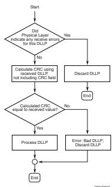

[⬆️ 返回目录](#-本章目录-table-of-contents)

---

<table>
<thead>
<tr>
<th width="50%">🇬🇧 English</th>
<th width="50%" style="background-color:#e8e8e8">🏆 中文</th>
</tr>
</thead>
<tbody>
<tr>
<td>

- Received NOP DLLPs are discarded
  - Note: NOP2 DLLPs do not exist in Non-Flit Mode, as that encoding encoding is used for the Ack DLLP.
- Received FC DLLPs are passed to the Transaction Layer
- Received PM DLLPs are passed to the component's power management control logic
- For Ack and Nak DLLPs, the following steps are followed (see § Figure 3-21):
  - If the Sequence Number specified by the AckNak_Seq_Num does not correspond to an unacknowledged TLP, or to the value in ACKD_SEQ, the DLLP is discarded
    - This is a Data Link Protocol Error, which is a reported error associated with the Port (see § Section 6.2 ).

    Note that it is not an error to receive an Ack DLLP when there are no outstanding unacknowledged TLPs, including the time between reset and the first TLP transmission, as long as the specified Sequence Number matches the value in ACKD_SEQ.

  - If the AckNak_Seq_Num does not specify the Sequence Number of the most recently acknowledged TLP, then the DLLP acknowledges some TLPs in the retry buffer:
    - Purge from the retry buffer all TLPs from the oldest to the one corresponding to the AckNak_Seq_Num
    - Load ACKD_SEQ with the value in the AckNak_Seq_Num field
    - Reset REPLAY_NUM and REPLAY_TIMER
  - If the DLLP is a Nak, initiate a replay (see above)

    Note: Receipt of a Nak is not a reported error.

</td>
<td style="background-color:#e8e8e8">

- 已接收的 NOP DLLP 被丢弃
  - 注:在非 Flit 模式中不存在 NOP2 DLLP,因为该编码用于 Ack DLLP。
- 已接收的 FC DLLP 被传递给事务层
- 已接收的 PM DLLP 被传递给组件的电源管理控制逻辑
- 对于 Ack 和 Nak DLLP,按以下步骤处理(见 § Figure 3-21):
  - 如果 AckNak_Seq_Num 指定的序列号不对应于未确认的 TLP,也不对应于 ACKD_SEQ 中的值,则丢弃该 DLLP
    - 这是一个数据链路协议错误 (Data Link Protocol Error),是与该端口相关联的一个已报告错误(见 § Section 6.2)。

    注意:在没有未完成的未确认 TLP 时收到 Ack DLLP(包含复位与第一次 TLP 发送之间的时间)不视为错误,只要所指定的序列号与 ACKD_SEQ 中的值匹配。

  - 如果 AckNak_Seq_Num 未指定最近确认的 TLP 的序列号,则该 DLLP 确认了重试缓冲中的某些 TLP:
    - 从重试缓冲中清除从最旧的 TLP 到与 AckNak_Seq_Num 对应的 TLP 的所有 TLP
    - 将 AckNak_Seq_Num 字段的值加载到 ACKD_SEQ
    - 复位 REPLAY_NUM 和 REPLAY_TIMER
  - 如果该 DLLP 是 Nak,则发起重放(见上文)

    注:收到 Nak 不是已报告错误。

</td>
</tr>
</tbody>
</table>

[⬆️ 返回目录](#-本章目录-table-of-contents)

---

> **Figure 3-21.** Ack/Nak DLLP Processing Flowchart
> 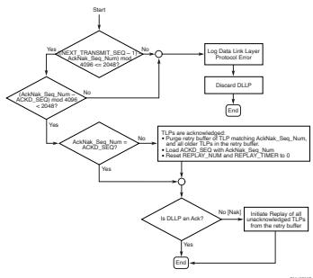

[⬆️ 返回目录](#-本章目录-table-of-contents)

---

## 3.6.2.3 Handling of Received DLLPs (Flit Mode) | 已接收 DLLP 的处理(Flit 模式)

<table>
<thead>
<tr>
<th width="50%">🇬🇧 English</th>
<th width="50%" style="background-color:#e8e8e8">🏆 中文</th>
</tr>
</thead>
<tbody>
<tr>
<td>

The following rules describe the operation of the Data Link Layer Retry Buffer, from which TLPs are re-transmitted when necessary:

- Copies of Transmitted TLPs must be stored in the Data Link Layer Retry Buffer

Since Flow Control DLLPs affect TLPs flowing in the opposite direction across the Link, the TLP transmission mechanisms in the Data Link Layer are also responsible for Flow Control DLLPs received from the other component on the Link. These DLLPs are processed according to the following rules:

- In Flit Mode, detection of corrupt DLLPs occurs at the Flit level and there is no corruption check for DLLPs in the Data Link Layer.
- In Flit Mode, replay occurs at the Flit level and the Ack and Nak DLLPs are not used.
- DLLPs and Optimized_Update_FCs are not stored in the Replay Buffer.
  - When a Flit is replayed, the DLP information is likely to be different from the original value.
  - Flit_Markers are associated with the TLP payload and are stored in the Replay Buffer.
- A received DLLP that uses unsupported DLLP Type encodings is discarded without further action. This is not considered an error.
- Non-zero values in Reserved fields are ignored.
- Receivers must process all DLLPs received at the rate they are received
- Received NOP DLLPs and NOP2 DLLPs are discarded
- Received FC DLLPs are passed to the Transaction Layer
- Received Optimized_Update_FCs are passed to the Transaction Layer
- Received PM DLLPs are passed to the component's power management control logic
- Received Link Management DLLPs are passed to the component's L0p control logic

</td>
<td style="background-color:#e8e8e8">

以下规则描述数据链路层重试缓冲 (Retry Buffer) 的操作,在必要时从中重传 TLP:

- 必须将已发送 TLP 的副本存储在数据链路层重试缓冲中

由于流控 DLLP 影响跨链路上反方向流动的 TLP,因此数据链路层中的 TLP 发送机制也负责处理从链路上对端组件接收到的流控 DLLP。这些 DLLP 按以下规则处理:

- 在 Flit 模式下,对损坏 DLLP 的检测在 Flit 级别进行,数据链路层不对 DLLP 进行损坏检查。
- 在 Flit 模式下,重放在 Flit 级别进行,不使用 Ack 和 Nak DLLP。
- DLLP 和 Optimized_Update_FC 不存储在 Replay Buffer 中。
  - 当重放一个 Flit 时,DLP 信息很可能与原始值不同。
  - Flit_Marker 与 TLP 负载相关联,并存储在 Replay Buffer 中。
- 接收到的使用了不支持的 DLLP Type 编码的 DLLP,将被丢弃而不采取进一步动作。这不视为错误。
- Reserved 字段中的非零值将被忽略。
- 接收器必须以所接收 DLLP 的速率处理所有已接收的 DLLP
- 已接收的 NOP DLLP 和 NOP2 DLLP 被丢弃
- 已接收的 FC DLLP 被传递给事务层
- 已接收的 Optimized_Update_FC 被传递给事务层
- 已接收的 PM DLLP 被传递给组件的电源管理控制逻辑
- 已接收的 Link Management DLLP 被传递给组件的 L0p 控制逻辑

</td>
</tr>
</tbody>
</table>

[⬆️ 返回目录](#-本章目录-table-of-contents)

---

## 3.6.3 LCRC and Sequence Number (TLP Receiver) (Non-Flit Mode) | LCRC 和序列号(TLP 接收器)(非 Flit 模式)

<table>
<thead>
<tr>
<th width="50%">🇬🇧 English</th>
<th width="50%" style="background-color:#e8e8e8">🏆 中文</th>
</tr>
</thead>
<tbody>
<tr>
<td>

The TLP Receive path through the Data Link Layer (paths labeled 2 and 4 in § Figure 3-1) processes TLPs received by the Physical Layer by checking the LCRC and sequence number, passing the TLP to the Receive Transaction Layer if OK and requesting a replay if corrupted.

The mechanisms used to check the TLP LCRC and the Sequence Number and to support Data Link Layer Retry are described in terms of conceptual counters and flags. This description does not imply or require a particular implementation and is used only to clarify the requirements.

The following counter, flag, and timer are used to explain the remaining rules in this section:

- The following 12-bit counter is used:
  - NEXT_RCV_SEQ - Stores the expected Sequence Number for the next TLP
    - Set to 000h in DL_Inactive state
- The following flag is used:
  - NAK_SCHEDULED
    - Cleared when in DL_Inactive state
- The following timer is used:
  - AckNak_LATENCY_TIMER - Counts time that determines when an Ack DLLP becomes scheduled for transmission, according to the following rules:
    - Set to 0 in DL_Inactive state
    - Restart from 0 each time an Ack or Nak DLLP is scheduled for transmission; Reset to 0 when all TLPs received have been acknowledged with an Ack DLLP
    - If there are initially no unacknowledged TLPs and a TLP is then received, the AckNak_LATENCY_TIMER starts counting only when the TLP has been forwarded to the Receive Transaction Layer

</td>
<td style="background-color:#e8e8e8">

通过数据链路层的 TLP 接收路径(§ Figure 3-1 中标记为 2 和 4 的路径)处理物理层已接收的 TLP,检查 LCRC 和序列号,如果正确则将 TLP 传递给接收事务层,如果损坏则请求重放。

用于检查 TLP LCRC 和序列号并支持数据链路层重试的机制以概念计数器和标志的形式描述。该描述并不意味着也不要求特定实现,仅用于澄清需求。

以下计数器、标志和定时器用于解释本节中剩余的规则:

- 使用以下 12 位计数器:
  - NEXT_RCV_SEQ — 存储下一个 TLP 的预期序列号
    - 在 DL_Inactive 状态下被设置为 000h
- 使用以下标志:
  - NAK_SCHEDULED
    - 在 DL_Inactive 状态下被清零
- 使用以下定时器:
  - AckNak_LATENCY_TIMER — 计数决定何时将 Ack DLLP 计划发送的时间,遵循以下规则:
    - 在 DL_Inactive 状态下被设置为 0
    - 每次计划发送 Ack 或 Nak DLLP 时,从 0 重新开始;当所有已接收的 TLP 都已用 Ack DLLP 确认时,复位为 0
    - 如果最初没有未确认的 TLP,然后收到一个 TLP,则 AckNak_LATENCY_TIMER 仅在该 TLP 已被转发到接收事务层时才开始计数

</td>
</tr>
</tbody>
</table>

[⬆️ 返回目录](#-本章目录-table-of-contents)

---

## 3.6.3.1 LCRC and Sequence Number Rules (TLP Receiver) | LCRC 和序列号规则(TLP 接收器)

<table>
<thead>
<tr>
<th width="50%">🇬🇧 English</th>
<th width="50%" style="background-color:#e8e8e8">🏆 中文</th>
</tr>
</thead>
<tbody>
<tr>
<td>

The following rules are applied in sequence to describe how received TLPs are processed, and what events trigger the transmission of Ack and Nak DLLPs (see § Figure 3-22):

- If the Physical Layer indicates a Receiver Error, discard any TLP currently being received and free any storage allocated for the TLP. Note that reporting such errors to software is done by the Physical Layer (and so are not reported by the Data Link Layer).
  - If a TLP was being received at the time the Receiver Error was indicated and the NAK_SCHEDULED flag is clear,
    - Schedule a Nak DLLP for transmission immediately
    - Set the NAK_SCHEDULED flag
- If the Physical Layer reports that the received TLP was nullified, and the LCRC is the logical NOT of the calculated value, discard the TLP and free any storage allocated for the TLP. This is not considered an error.
- If TLP was nullified but the LCRC does not match the logical NOT of the calculated value, the TLP is corrupt - discard the TLP and free any storage allocated for the TLP.
  - If the NAK_SCHEDULED flag is clear,
    - Schedule a Nak DLLP for transmission immediately
    - Set the NAK_SCHEDULED flag

  This is a Bad TLP error and is a reported error associated with the Port (see § Section 6.2 ).

- The LCRC value is checked by:
  - Applying the same algorithm used for calculation (above) to the received TLP, not including the 32-bit LCRC field of the received TLP
  - Comparing the calculated result with the value in the LCRC field of the received TLP
    - if not equal, the TLP is corrupt - discard the TLP and free any storage allocated for the TLP
    - If the NAK_SCHEDULED flag is clear,
      - schedule a Nak DLLP for transmission immediately
      - set the NAK_SCHEDULED flag

  This is a Bad TLP error and is a reported error associated with the Port (see § Section 6.2 ).

- If the TLP Sequence Number is not equal to the expected value, stored in NEXT_RCV_SEQ:
  - Discard the TLP and free any storage allocated for the TLP
  - If the TLP Sequence Number satisfies the following equation:

    (NEXT_RCV_SEQ - TLP Sequence Number) mod 4096 <= 2048

    the TLP is a duplicate, and an Ack DLLP is scheduled for transmission (per transmission priority rules)
  - Otherwise, the TLP is out of sequence (indicating one or more lost TLPs):
    - if the NAK_SCHEDULED flag is clear,
      - schedule a Nak DLLP for transmission immediately
      - set the NAK_SCHEDULED flag
    - This is a Bad TLP error and is a reported error associated with the Port (see § Section 6.2 ).
    - if the NAK_SCHEDULED flag is Set, the Port is permitted to, but is not recommended to, report a Bad TLP error associated with the Port (see § Section 6.2 ) and this permission is shown in § Figure 3-20.

- If the TLP Sequence Number is equal to the expected value stored in NEXT_RCV_SEQ:
  - The four bits, TLP Sequence Number, and LCRC (see § Figure 3-17) are removed and the remainder of the TLP is forwarded to the Receive Transaction Layer
    - The Data Link Layer indicates the start and end of the TLP to the Transaction Layer while transferring the TLP
    - The Data Link Layer treats the TLP as a "black box" and does not process or modify the contents of the TLP
    - Note that the Receiver Flow Control mechanisms do not account for any received TLPs until the TLP(s) are forwarded to the Receive Transaction Layer
  - NEXT_RCV_SEQ is incremented
  - If Set, the NAK_SCHEDULED flag is cleared

</td>
<td style="background-color:#e8e8e8">

以下规则按顺序应用,描述如何处理已接收的 TLP,以及什么事件触发 Ack 和 Nak DLLP 的发送(见 § Figure 3-22):

- 如果物理层指示接收器错误 (Receiver Error),则丢弃当前正在接收的任何 TLP,并释放为该 TLP 分配的所有存储。注意:将此类错误报告给软件由物理层完成(因此不由数据链路层报告)。
  - 如果在指示接收器错误时正在接收 TLP,且 NAK_SCHEDULED 标志为清零状态,
    - 立即计划发送一个 Nak DLLP
    - 置位 NAK_SCHEDULED 标志
- 如果物理层报告已接收的 TLP 已被 nullify,且 LCRC 为计算值的逻辑非,则丢弃该 TLP 并释放为该 TLP 分配的所有存储。这不视为错误。
- 如果 TLP 已被 nullify 但 LCRC 与计算值的逻辑非不匹配,则该 TLP 已损坏 — 丢弃该 TLP 并释放为该 TLP 分配的所有存储。
  - 如果 NAK_SCHEDULED 标志为清零状态,
    - 立即计划发送一个 Nak DLLP
    - 置位 NAK_SCHEDULED 标志

  这是一个 Bad TLP 错误,是与该端口相关联的一个已报告错误(见 § Section 6.2)。

- LCRC 值通过以下方式检查:
  - 将用于计算(上文)的相同算法应用于已接收的 TLP,但不包括已接收 TLP 的 32 位 LCRC 字段
  - 将计算结果与已接收 TLP 的 LCRC 字段中的值进行比较
    - 如果不相等,则该 TLP 已损坏 — 丢弃该 TLP 并释放为该 TLP 分配的所有存储
    - 如果 NAK_SCHEDULED 标志为清零状态,
      - 立即计划发送一个 Nak DLLP
      - 置位 NAK_SCHEDULED 标志

  这是一个 Bad TLP 错误,是与该端口相关联的一个已报告错误(见 § Section 6.2)。

- 如果 TLP 序列号不等于存储在 NEXT_RCV_SEQ 中的预期值:
  - 丢弃该 TLP 并释放为该 TLP 分配的所有存储
  - 如果 TLP 序列号满足以下等式:

    (NEXT_RCV_SEQ - TLP Sequence Number) mod 4096 <= 2048

    则该 TLP 是重复的,按发送优先级规则计划发送一个 Ack DLLP
  - 否则,该 TLP 序列号失序(表示一个或多个 TLP 丢失):
    - 如果 NAK_SCHEDULED 标志为清零状态,
      - 立即计划发送一个 Nak DLLP
      - 置位 NAK_SCHEDULED 标志
    - 这是一个 Bad TLP 错误,是与该端口相关联的一个已报告错误(见 § Section 6.2)。
    - 如果 NAK_SCHEDULED 标志为置位状态,则允许(但不建议)报告与该端口相关联的 Bad TLP 错误(见 § Section 6.2),此权限如 § Figure 3-20 所示。

- 如果 TLP 序列号等于存储在 NEXT_RCV_SEQ 中的预期值:
  - 移除 4 位、TLP 序列号和 LCRC(见 § Figure 3-17),并将 TLP 的其余部分转发到接收事务层
    - 数据链路层在传输 TLP 时向事务层指示 TLP 的开始和结束
    - 数据链路层将 TLP 视为"黑盒",不会处理或修改 TLP 的内容
    - 注意:接收器流控机制在任何已接收的 TLP 被转发到接收事务层之前,都不会将其计入
  - NEXT_RCV_SEQ 递增
  - 如果已置位,则清除 NAK_SCHEDULED 标志

</td>
</tr>
</tbody>
</table>

[⬆️ 返回目录](#-本章目录-table-of-contents)

---

> **Figure 3-22.** Receive Data Link Layer Handling of TLPs Flowchart
> 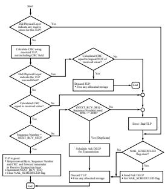

[⬆️ 返回目录](#-本章目录-table-of-contents)

---

<table>
<thead>
<tr>
<th width="50%">🇬🇧 English</th>
<th width="50%" style="background-color:#e8e8e8">🏆 中文</th>
</tr>
</thead>
<tbody>
<tr>
<td>

- A TLP Receiver must schedule an Ack DLLP such that it will be transmitted no later than when all of the following conditions are true:
  - The Data Link Control and Management State Machine is in the DL_Active state
  - TLPs have been forwarded to the Receive Transaction Layer, but not yet acknowledged by sending an Ack DLLP
  - The AckNak_LATENCY_TIMER reaches or exceeds the value specified in § Table 3-10 for 2.5 GT/s operation, § Table 3-11 for 5.0 GT/s operation, § Table 3-12 for 8.0 GT/s and higher operation
  - The Link used for Ack DLLP transmission is already in L0 or has transitioned to L0
    - Note: if not already in L0, the Link must transition to L0 in order to transmit the Ack DLLP
  - Another TLP or DLLP is not currently being transmitted on the Link used for Ack DLLP transmission
  - The NAK_SCHEDULED flag is clear
    - Note: The AckNak_LATENCY_TIMER must be restarted from 0 each time an Ack or Nak DLLP is scheduled for transmission
- Data Link Layer Ack DLLPs may be scheduled for transmission more frequently than required
- Data Link Layer Ack and Nak DLLPs specify the value (NEXT_RCV_SEQ - 1) in the AckNak_Seq_Num field

§ Table 3-10, § Table 3-11, and § Table 3-12 define the threshold values for the AckNak_LATENCY_TIMER, which for any specific case is called the Ack Latency Limit.

TLP Receivers and compliance tests must base Ack Latency timing as measured at the Port of the TLP Receiver, starting with the time the last Symbol of a TLP is received to the first Symbol of the Ack DLLP being transmitted.

When measuring until the Ack DLLP is transmitted, compliance tests must allow for any TLP or other DLLP transmission already in progress in that direction (thus preventing the Ack DLLP transmission). If L0s is enabled, compliance tests must allow for the L0s exit latency of the Link in the direction that the Ack DLLP is being transmitted. If the Extended Synch bit is Set, compliance tests must also allow for its effect on L0s exit latency.

TLP Receivers are not required to adjust their Ack DLLP scheduling based upon L0s exit latency or the value of the Extended Synch bit.

For a Multi-Function Device where different Functions have different Rx_MPS_Limit values, it is strongly recommended that the smallest Rx_MPS_Limit value across all Functions be used.

</td>
<td style="background-color:#e8e8e8">

- TLP 接收器必须计划发送 Ack DLLP,以使其在以下所有条件均成立时不晚于该时刻发送:
  - 数据链路控制与管理状态机处于 DL_Active 状态
  - TLP 已被转发到接收事务层,但尚未通过发送 Ack DLLP 进行确认
  - AckNak_LATENCY_TIMER 达到或超过 § Table 3-10 中针对 2.5 GT/s 运行、§ Table 3-11 中针对 5.0 GT/s 运行、§ Table 3-12 中针对 8.0 GT/s 及更高运行所指定的值
  - 用于 Ack DLLP 发送的链路已处于 L0,或已转入 L0
    - 注:如果尚未处于 L0,则链路必须转入 L0 才能发送 Ack DLLP
  - 用于 Ack DLLP 发送的链路上当前没有其他 TLP 或 DLLP 正在发送
  - NAK_SCHEDULED 标志为清零状态
    - 注:每次计划发送 Ack 或 Nak DLLP 时,AckNak_LATENCY_TIMER 必须从 0 重新启动
- 数据链路层 Ack DLLP 可以比要求的更频繁地计划发送
- 数据链路层 Ack 和 Nak DLLP 在 AckNak_Seq_Num 字段中指定 (NEXT_RCV_SEQ - 1) 的值

§ Table 3-10、§ Table 3-11 和 § Table 3-12 定义了 AckNak_LATENCY_TIMER 的阈值,在任何特定情况下称为 Ack Latency Limit。

TLP 接收器和一致性测试必须基于在 TLP 接收器端口测得的 Ack Latency 定时,从收到 TLP 最后一个 Symbol 的时刻到开始发送 Ack DLLP 首个 Symbol 的时刻。

在测量到 Ack DLLP 发送完成时,一致性测试必须允许该方向上已在进行中的任何 TLP 或其他 DLLP 发送(从而阻止 Ack DLLP 发送)。如果启用了 L0s,则一致性测试必须允许 Ack DLLP 发送方向上链路的 L0s 退出延迟。如果 Extended Synch 位为置位状态,则一致性测试还必须允许其对 L0s 退出延迟的影响。

TLP 接收器不需要根据 L0s 退出延迟或 Extended Synch 位的值来调整其 Ack DLLP 调度。

对于多功能设备 (Multi-Function Device) 中不同功能 (Function) 具有不同 Rx_MPS_Limit 值的情况,强烈建议使用所有功能中最小的 Rx_MPS_Limit 值。

</td>
</tr>
</tbody>
</table>

[⬆️ 返回目录](#-本章目录-table-of-contents)

---

**Table 3-10. Maximum Ack Latency Limits for 2.5 GT/s | 表 3-10 2.5 GT/s 下的最大 Ack 延迟限制**
**(Symbol Times) (-0%/+0%)**

| Rx_MPS_Limit (bytes) | x1 | x2 | x4 | x8 | x16 |
|----------------------|----|----|----|----|-----|
| 128 | 237 | 128 | 73 | 67 | 48 |
| 256 | 416 | 217 | 118 | 107 | 72 |
| 512 | 559 | 289 | 154 | 86 | 86 |
| 1024 | 1071 | 545 | 282 | 150 | 150 |
| 2048 | 2095 | 1057 | 538 | 278 | 278 |
| 4096 | 4143 | 2081 | 1050 | 534 | 534 |

[⬆️ 返回目录](#-本章目录-table-of-contents)

---

**Table 3-11. Maximum Ack Latency Limits for 5.0 GT/s | 表 3-11 5.0 GT/s 下的最大 Ack 延迟限制**
**(Symbol Times) (-0%/+0%)**

| Rx_MPS_Limit (bytes) | x1 | x2 | x4 | x8 | x16 |
|----------------------|----|----|----|----|-----|
| 128 | 288 | 179 | 124 | 118 | 99 |
| 256 | 467 | 268 | 169 | 158 | 123 |
| 512 | 610 | 340 | 205 | 137 | 137 |
| 1024 | 1122 | 596 | 333 | 201 | 201 |
| 2048 | 2146 | 1108 | 589 | 329 | 329 |
| 4096 | 4194 | 2132 | 1101 | 585 | 585 |

[⬆️ 返回目录](#-本章目录-table-of-contents)

---

**Table 3-12. Maximum Ack Latency Limits for 8.0 GT/s and higher data rates | 表 3-12 8.0 GT/s 及更高数据速率下的最大 Ack 延迟限制**
**(Symbol Times)**

| Rx_MPS_Limit (bytes) | x1 | x2 | x4 | x8 | x16 |
|----------------------|----|----|----|----|-----|
| 128 | 333 | 224 | 169 | 163 | 144 |
| 256 | 512 | 313 | 214 | 203 | 168 |
| 512 | 655 | 385 | 250 | 182 | 182 |
| 1024 | 1167 | 641 | 378 | 246 | 246 |
| 2048 | 2191 | 1153 | 634 | 374 | 374 |
| 4096 | 4239 | 2177 | 1146 | 630 | 630 |

[⬆️ 返回目录](#-本章目录-table-of-contents)

---

<!-- 📄 Page 349 -->
---

**IMPLEMENTATION NOTE:**
**RETRY BUFFER SIZING**
The Retry Buffer should be large enough to ensure that under normal operating conditions, transmission is never throttled because the retry buffer is full. In determining the optimal buffer size, one must consider the Ack Latency value, Ack delay caused by the Receiver already transmitting another TLP or DLLP, the delays caused by the physical Link interconnect, and the time required to process the received Ack DLLP.

Given two components A and B, the L0s exit latency required by A's Receiver should be accounted for when sizing A's transmit retry buffer, as is demonstrated in the following example:

- A exits L0s on its Transmit path to B and starts transmitting a long burst of write Requests to B
- B initiates L0s exit on its Transmit path to A, but the L0s exit time required by A's Receiver is large
- Meanwhile, B is unable to send Ack DLLPs to A, and A stalls due to lack of Retry Buffer space
- The Transmit path from B to A returns to L0, B transmits an Ack DLLP to A, and the stall is resolved

This stall can be avoided by matching the size of a component's Transmitter Retry Buffer to the L0s exit latency required by the component's Receiver, or, conversely, by matching the Receiver L0s exit latency to the desired size of the Retry Buffer.

Ack Latency Limit values were chosen to allow implementations to achieve good performance without requiring an uneconomically large retry buffer. To enable consistent performance across a general purpose interconnect with differing implementations and applications, it is necessary to set the same requirements for all components without regard to the application space of any specific component. If a component does not require the full transmission bandwidth of the Link, it may reduce the size of its retry buffer below the minimum size required to maintain available retry buffer space with the Ack Latency Limit values specified.

Note that the Ack Latency Limit values specified ensure that the range of permitted outstanding TLP Sequence Numbers will never be the limiting factor causing transmission stalls.

Retimers add latency (see § Section 4.3.8 ) and operating in SRIS can add latency. Implementations are strongly encouraged to consider these effects when determining the optimal buffer size.

[⬆️ 返回目录](#-本章目录-table-of-contents)

---

<!-- 📄 Page 350 -->
---

---

## 📑 本章目录 (Table of Contents) — Auto-Generated

- [3. Data Link Layer Specification | 数据链路层规范](#sec-3-0)
- [3.1 Data Link Layer Overview | 数据链路层概述](#sec-3-1)
- [3.2 Data Link Control and Management State Machine | 数据链路控制与管理状态机](#sec-3-2)
- [3.2.1 Data Link Control and Management State Machine Rules | 数据链路控制与管理状态机规则](#sec-3-2-1)
- [3.3 Data Link Feature Exchange | 数据链路特性交换](#sec-3-3)
- [3.4 Flow Control Initialization Protocol | 流控初始化协议](#sec-3-4)
- [3.4.1 Flow Control Initialization State Machine Rules | 流控初始化状态机规则](#sec-3-4-1)
- [3.4.2 Scaled Flow Control | 缩放流控 (Scaled Flow Control)](#sec-3-4-2)
- [3.5 Data Link Layer Packets (DLLPs) | 数据链路层包 (DLLP)](#sec-3-5)
- [3.5.1 Data Link Layer Packet Rules | 数据链路层包规则](#sec-3-5-1)
- [3.6 Data Integrity Mechanisms | 数据完整性机制](#sec-3-6)
- [3.6.1 Introduction | 引言](#sec-3-6-1)
- [3.6.2 LCRC, Sequence Number, and Retry Management (TLP Transmitter) | LCRC、序列号与重试管理(TLP 发送器)](#sec-3-6-2)
- [3.6.2.1 LCRC and Sequence Number Rules (TLP Transmitter) | LCRC 和序列号规则(TLP 发送器)](#sec-3-6-2-1)
- [3.6.2.2 Handling of Received DLLPs (Non-Flit Mode) | 已接收 DLLP 的处理(非 Flit 模式)](#sec-3-6-2-2)
- [3.6.2.3 Handling of Received DLLPs (Flit Mode) | 已接收 DLLP 的处理(Flit 模式)](#sec-3-6-2-3)
- [3.6.3 LCRC and Sequence Number (TLP Receiver) (Non-Flit Mode) | LCRC 和序列号(TLP 接收器)(非 Flit 模式)](#sec-3-6-3)
- [3.6.3.1 LCRC and Sequence Number Rules (TLP Receiver) | LCRC 和序列号规则(TLP 接收器)](#sec-3-6-3-1)
