# 📘 第 4 章　Physical Layer Logical Block (Chapter 4. Physical Layer Logical Block)

**PCI Express® Base Specification — Revision 6.2, Version 1.0 — January 25, 2024**

> 📄 **Source pages**: 351–650 (PDF 1-indexed) | 📁 **File**: `chapter_04_raw.md`
> 🎨 **Format**: 中英对照双语 · 图表原始保留 · 中文背景色灰色 · GitHub Flavored Markdown
> 📚 **Template**: CXL 3.2 Spec translation (CXL_zh/)

---


## 📑 章节索引 (Sections)

| # | Section | 小节 | Page |
|:-:|:--------|:-----|:----:|
| 4.1 | Introduction § | 概述 § | p.351 |
| 4.2 | Logical Sub-block § | 逻辑子块 § | p.351 |
| 4.2.1 | 8b/10b Encoding for 2.5 GT/s and 5.… | 2.5 GT/s 与 5.0 GT/s 数据速率下的 8b/… | p.353 |
| 4.2.1.1 | Symbol Encoding § | 符号编码 § | p.353 |
| 4.2.1.1.1 | Serialization and De-serialization … | 数据的串行化与解串行化 § | p.354 |
| 4.2.1.1.2 | Special Symbols for Framing and Lin… | 成帧与链路管理的特殊符号 (K 码) § | p.355 |
| 4.2.1.1.3 | 8b/10b Decode Rules § | 8b/10b 解码规则 § | p.355 |
| 4.2.1.2 | Framing and Application of Symbols … | 符号的成帧与到通道的应用 § | p.357 |
| 4.2.1.2.1 | Framing and Application of Symbols … | 非 Flit 模式下 TLP 和 DLLP 的成帧与到通道的… | p.357 |
| 4.2.1.3 | Data Scrambling § | 数据加扰 § | p.360 |
| 4.2.2 | 128b/130b Encoding for 8.0 GT/s, 16… | 8.0 GT/s、16.0 GT/s 与 32.0 GT/s… | p.361 |
| 4.2.2.1 | Lane Level Encoding | 通道级编码 | p.362 |
| 4.2.2.2 | Ordered Set Blocks | 有序集块 | p.362 |
| 4.2.2.2.1 | Block Alignment | 块对齐 | p.362 |
| 4.2.2.3 | Data Blocks | 数据块 | p.362 |
| 4.2.2.3.1 | Framing Tokens in Non-Flit-Mode | 非 Flit 模式下的帧定界符 | p.362 |
| 4.2.2.3.2 | Transmitter Framing Requirements in… | 非 Flit 模式下的发送器帧定界要求 | p.369 |
| 4.2.2.3.3 | Receiver Framing Requirements in No… | 非 Flit 模式下的接收器帧定界要求 | p.370 |
| 4.2.2.3.4 | Receiver Framing Requirements in Fl… | Flit 模式下的接收器帧定界要求 | p.372 |
| 4.2.2.3.5 | Recovery from Framing Errors in Non… | 非 Flit 模式与 Flit 模式下的帧错误恢复 | p.373 |
| 4.2.2.4 | Scrambling in Non-Flit Mode and Fli… | 非 Flit 模式与 Flit 模式下的加扰 | p.373 |
| 4.2.2.5 | Precoding | 预编码 (Precoding) | p.378 |
| 4.2.2.5.1 | Precoding at 32.0 GT/s Data Rate | 32.0 GT/s 数据速率下的预编码 | p.380 |
| 4.2.2.6 | Loopback with 128b/130b Code in Non… | 非 Flit 模式与 Flit 模式下使用 128b/130… | p.380 |
| 4.2.3 | Flit Mode Operation | Flit 模式操作 | p.380 |
| 4.2.3.1 | 1b/1b Encoding for 64.0 GT/s and hi… | 64.0 GT/s 及更高数据速率下的 1b/1b 编码 | p.380 |
| 4.2.3.1.1 | PAM4 Signaling | PAM4（四电平脉冲幅度调制）信令 | p.384 |
| 4.2.3.1.2 | 1b/1b Scrambling | 1b/1b 加扰 | p.384 |
| 4.2.3.1.3 | Gray Coding at 64.0 GT/s and Higher… | 64.0 GT/s 及更高数据速率下的格雷编码 | p.384 |
| 4.2.3.1.4 | Precoding at 64.0 GT/s and Higher D… | 64.0 GT/s 及更高数据速率下的预编码 | p.384 |
| 4.2.3.1.5 | Ordered Set Blocks at 64.0 GT/s and… | 64.0 GT/s 及更高数据速率下的有序集块 | p.384 |
| 4.2.3.1.6 | Alignment at Block/Flit Level for 1… | 1b/1b 编码下的块/Flit 级对齐 | p.384 |
| 4.2.3.2 | Processing of Ordered Sets During F… | Flit 模式数据流中有序集的处理 | p.384 |
| 4.2.3.3 | Data Stream in Flit Mode | Flit 模式数据流 | p.384 |
| 4.2.3.4 | Bytes in Flit Layout | Flit 布局中的字节 | p.384 |
| 4.2.3.4.1 | TLP Bytes in Flit | Flit 中的 TLP 字节 | p.384 |
| 4.2.3.4.2 | DLP Bytes in Flit | Flit 中的 DLP 字节 | p.403 |
| 4.2.3.4.2.1 | Flit Sequence Number and Retry Mech… | Flit 序列号与重传机制 | p.407 |
| 4.2.3.4.2.1.1 | IDLE Flit Handshake Phase | IDLE Flit 握手阶段 | p.413 |
| 4.2.3.4.2.1.2 | Sequence Number Handshake Phase | 序列号握手阶段 | p.413 |
| 4.2.3.4.2.1.3 | Normal Flit Exchange Phase | 正常 Flit 交换阶段 | p.415 |
| 4.2.3.4.2.1.4 | Received Ack and Nak Processing | 已接收 Ack 与 Nak 的处理 | p.415 |
| 4.2.3.4.2.1.5 | Ack, Nak, and Discard Rules | Ack、Nak 与丢弃规则 | p.416 |
| 4.2.3.4.2.1.5 | Nak/Ack/Discard Schedule Definition… | Nak/Ack/丢弃调度定义 | p.418 |
| 4.2.3.4.2.1.6 | Flit Replay Scheduling | Flit 重放调度 | p.424 |
| 4.2.3.4.2.1.7 | Flit Replay Transmit Rules | Flit 重放发送规则 | p.426 |
| 4.2.3.4.3 | CRC Bytes in Flit | Flit 中的 CRC 字节 | p.430 |
| 4.2.3.4.4 | ECC Bytes in Flit | Flit 中的 ECC 字节 | p.431 |
| 4.2.3.4.4 | (续) ECC Bytes in Flit | ECC 字节(续) | p.433 |
| 4.2.3.4.4 | ECC Bytes - FEC Check Bits Arrangem… | ECC 字节 - FEC 校验位排列 | p.434 |
| 4.2.3.4.4 | ECC Bytes - Byte Mapping and Decode | ECC 字节 - 字节映射与解码 | p.435 |
| 4.2.3.4.5 | Ordered Set insertion in Data Strea… | Flit 模式下数据流中的有序集插入 | p.437 |
| 4.2.4 | Link Equalization Procedure for 8.0… | 4.2.4 8.0 GT/s 及更高数据速率的链路均衡 (E… | p.438 |
| 4.2.4 | Equalization Bypass and Highest NRZ… | 4.2.4 均衡绕过与最高 NRZ 速率 | p.439 |
| 4.2.4 | Autonomous Equalization Mechanism | 4.2.4 自主均衡机制 | p.440 |
| 4.2.4 | Software-Based Equalization and DLL… | 4.2.4 基于软件的均衡与 DLLP 阻塞 | p.441 |
| 4.2.4 | Equalization Setting Problem Report… | 4.2.4 均衡设置问题上报 | p.442 |
| 4.2.4 | Redo Equalization and Rate Change | 4.2.4 重新均衡与速率切换 | p.443 |
| 4.2.4 | Table 4-22 (Continued) | 4.2.4 表 4-22(续) | p.444 |
| 4.2.4 | Equalization Phases 0-3 | 4.2.4 均衡阶段 0-3 | p.445 |
| 4.2.4 | Phase 2 and Phase 3 | 4.2.4 阶段 2 与阶段 3 | p.446 |
| 4.2.4 | Loopback and Compliance for Equaliz… | 4.2.4 均衡的 Loopback 与 Complianc… | p.447 |
| 4.2.4 | Equalization Flow Examples | 4.2.4 均衡流程示例 | p.448 |
| 4.2.4 | FIR Coefficients and Equalization B… | 4.2.4 FIR 系数与均衡绕过示例 | p.450 |
| 4.2.4.1 | Rules for Transmitter Coefficients | 发送器系数规则 | p.450 |
| 4.2.4.2 | Encoding of Presets | 4.2.4.2 预设的编码 | p.450 |
| 4.2.5 | Link Initialization and Training | 4.2.5 链路初始化与训练 | p.452 |
| 4.2.5.1 | Training Sequences | 4.2.5.1 训练序列 | p.452 |
| 4.2.5.1 | 续 (Alternate Protocol Negotiation) | 4.2.5.1 续 (备用协议协商) | p.459 |
| 4.2.5.2 | Alternate Protocol Negotiation | 替代协议协商 | p.459 |
| 4.2.5.2 | Alternate Protocol Negotiation (con… | 替代协议协商(续) | p.474 |
| 4.2.5.3 | Electrical Idle Sequences (EIOS and… | 电气空闲序列 (EIOS 和 EIEOS) | p.476 |
| 4.2.5.4 | Inferring Electrical Idle | 推断电气空闲 | p.481 |
| 4.2.5.5 | Lane Polarity Inversion | 通道极性反转 | p.482 |
| 4.2.5.6 | Fast Training Sequence (FTS) | 快速训练序列 (FTS) | p.482 |
| 4.2.5.7 | Start of Data Stream Ordered Set (S… | 数据流起始有序集 (SDS 有序集) | p.484 |
| 4.2.5.8 | Link Error Recovery | 链路错误恢复 | p.484 |
| 4.2.5.9 | Reset | 复位 | p.485 |
| 4.2.5.9.1 | Fundamental Reset | 基本复位 | p.485 |
| 4.2.5.9.2 | Hot Reset | 热复位 | p.486 |
| 4.2.5.10 | Link Data Rate Negotiation | 链路数据速率协商 | p.486 |
| 4.2.5.11 | Link Width and Lane Sequence Negoti… | 链路宽度与通道序列协商 | p.486 |
| 4.2.5.11.1 | Required and Optional Port Behavior | 端口的必需与可选行为 | p.486 |
| 4.2.5.12 | Lane-to-Lane De-skew | 通道间去偏斜 | p.487 |
| 4.2.5.13 | Lane vs. Link Training | 通道训练与链路训练 | p.488 |
| 4.2.6 | Link Training and Status State Mach… | 链路训练与状态机 (LTSSM) 描述 | p.488 |
| 4.2.6.1 | Detect Overview | Detect 概述 | p.489 |
| 4.2.6.2 | Polling Overview | Polling 概述 | p.489 |
| 4.2.6.3 | Configuration Overview | Configuration 概述 | p.489 |
| 4.2.6.4 | Recovery Overview | Recovery 概述 | p.489 |
| 4.2.6.5 | L0 Overview | L0 概述 | p.489 |
| 4.2.6.6 | L0s Overview | L0s 概述 | p.490 |
| 4.2.6.7 | L0p Overview | L0p 概述 | p.490 |
| 4.2.6.7.1 | L0p Request/Response Rules | L0p 请求/响应规则 | p.490 |
| 4.2.6.7.2 | L0p Ack/Nak Rules | L0p Ack/Nak 规则 | p.491 |
| 4.2.6.7.3 | L0p Priority Rules | L0p 优先级规则 | p.491 |
| 4.2.6.7.4 | L0p Down-Size and Up-Size | L0p Down-Size 和 Up-Size | p.492 |
| 4.2.6.7.5 | L0p Down-Size Lane Deactivation | L0p Down-Size 通道去激活 | p.492 |
| 4.2.6.7.6 | Link Management DLLP Encoding | Link Management DLLP 编码 | p.493 |
| 4.2.6.7.7 | Link Management DLLP Encoding (cont… | Link Management DLLP 编码(续) | p.494 |
| 4.2.6.7.8 | L0p Flow Example | L0p 流程示例 | p.495 |
| 4.2.6.8 | L1 Overview | L1 概述 | p.496 |
| 4.2.6.9 | L2 Overview | L2 概述 | p.497 |
| 4.2.6.10 | Disabled Overview | Disabled 概述 | p.497 |
| 4.2.6.10 | Disabled Overview | 禁用状态概述 | p.497 |
| 4.2.6.11 | Loopback Overview | 回环状态概述 | p.498 |
| 4.2.6.12 | Hot Reset Overview | 热复位状态概述 | p.498 |
| 4.2.7 | Link Training and Status State Rule… | 链路训练与状态机规则 | p.498 |
| 4.2.7.1 | Detect | 检测状态 | p.500 |
| 4.2.7.1.1 | Detect.Quiet | Detect.Quiet(静默检测) | p.500 |
| 4.2.7.1.2 | Detect.Active | Detect.Active(主动检测) | p.501 |
| 4.2.7.2 | Polling | 轮询状态 | p.501 |
| 4.2.7.2.1 | Polling.Active | Polling.Active(主动轮询) | p.501 |
| 4.2.7.2.1 | Polling.Active (continued) | Polling.Active(续) | p.503 |
| 4.2.7.2.2 | Polling.Compliance | Polling.Compliance(一致性轮询) | p.504 |
| 4.2.7.2.2 | Polling.Compliance (continued) | Polling.Compliance(续) | p.505 |
| 4.2.7.2.3 | Polling.Configuration | Polling.Configuration 子状态 | p.509 |
| 4.2.7.2.4 | Polling.Speed | Polling.Speed 子状态 | p.509 |
| 4.2.7.3 | Configuration | Configuration 状态 | p.510 |
| 4.2.7.3.1 | Configuration.Linkwidth.Start | Configuration.Linkwidth.Start … | p.511 |
| 4.2.7.3.1.1 | Downstream Lanes | 下游通道 | p.511 |
| 4.2.7.3.1.2 | Upstream Lanes | 上游通道 | p.512 |
| 4.2.7.3.2 | Configuration.Linkwidth.Accept | Configuration.Linkwidth.Accept… | p.514 |
| 4.2.7.3.2.1 | Downstream Lanes | 下游通道 | p.514 |
| 4.2.7.3.2.2 | Upstream Lanes | 上游通道 | p.515 |
| 4.2.7.3.3 | Configuration.Lanenum.Accept | Configuration.Lanenum.Accept 子… | p.517 |
| 4.2.7.3.3.1 | Downstream Lanes | 下游通道 | p.518 |
| 4.2.7.3.3.2 | Upstream Lanes | 上游通道 | p.519 |
| 4.2.7.3.4 | Configuration.Lanenum.Wait | Configuration.Lanenum.Wait 子状态 | p.520 |
| 4.2.7.3.4.1 | Downstream Lanes | 下游通道 | p.520 |
| 4.2.7.3.4.2 | Upstream Lanes | 上游通道 | p.520 |
| 4.2.7.3.5 | Configuration.Complete | Configuration.Complete 子状态 | p.521 |
| 4.2.7.3.5.1 | Downstream Lanes | 下游通道 | p.521 |
| 4.2.7.3.5.2 | Upstream Lanes | 上游通道 | p.523 |
| 4.2.7.3.6 | Configuration.Idle | Configuration.Idle 子状态 | p.525 |
| 4.2.7.4 | Recovery | Recovery 状态 | p.529 |
| 4.2.7.4.1 | Recovery.RcvrLock | Recovery.RcvrLock 子状态 | p.529 |
| 4.2.7.4 | Recovery | Recovery 状态 | p.529 |
| 4.2.7.4.1 | Recovery.RcvrLock | Recovery.RcvrLock 子状态 | p.529 |
| 4.2.7.4.2 | Recovery.Equalization | Recovery.Equalization 子状态 | p.535 |
| 4.2.7.4.2 | Recovery.Equalization | Recovery.Equalization 子状态 | p.535 |
| 4.2.7.4.2.1 | Downstream Lanes | Downstream 通道 | p.536 |
| 4.2.7.4.2.1 | Downstream Lanes | Downstream 通道 | p.536 |
| 4.2.7.4.2.1.1 | Phase 1 of Transmitter Equalization | 发送器均衡 Phase 1 | p.537 |
| 4.2.7.4.2.1.1 | Phase 1 of Transmitter Equalization… | 发送器均衡 Phase 1(续) | p.538 |
| 4.2.7.4.2.1.2 | Phase 2 of Transmitter Equalization | 发送器均衡 Phase 2 | p.539 |
| 4.2.7.4.2.1.2 | Phase 2 of Transmitter Equalization… | 发送器均衡 Phase 2(续) | p.540 |
| 4.2.7.4.2.1.3 | Phase 3 of Transmitter Equalization | 发送器均衡 Phase 3 | p.541 |
| 4.2.7.4.2.2 | Upstream Lanes | 上游 Lane | p.542 |
| 4.2.7.4.2.2 | Upstream Lanes (cont.) | 上游 Lane(续) | p.543 |
| 4.2.7.4.2.2.1 | Phase 0 of Transmitter Equalization | 发送器均衡 Phase 0 | p.544 |
| 4.2.7.4.2.2.2 | Phase 1 of Transmitter Equalization | 发送器均衡 Phase 1(上游) | p.545 |
| 4.2.7.4.2.2.3 | Phase 2 of Transmitter Equalization | 发送器均衡 Phase 2 | p.546 |
| 4.2.7.4.2.2.3 | Phase 2 of Transmitter Equalization… | 发送器均衡 Phase 2(续) | p.548 |
| 4.2.7.4.2.2.4 | Phase 3 of Transmitter Equalization | 发送器均衡 Phase 3 | p.548 |
| 4.2.7.4.3 | Recovery.Speed | Recovery.Speed 子状态 | p.550 |
| 4.2.7.4.4 | Recovery.RcvrCfg | Recovery.RcvrCfg 子状态 | p.551 |
| 4.2.7.4.4 | Recovery.RcvrCfg (continued) | Recovery.RcvrCfg 子状态(续) | p.553 |
| 4.2.7.4.4 | Recovery.RcvrCfg (continued) | Recovery.RcvrCfg 子状态(续) | p.554 |
| 4.2.7.4.4 | Recovery.RcvrCfg (continued) | Recovery.RcvrCfg 子状态(续) | p.555 |
| 4.2.7.4.4 | Recovery.RcvrCfg (continued) | Recovery.RcvrCfg 子状态(续) | p.556 |
| 4.2.7.4.4 | Recovery.RcvrCfg (continued) | Recovery.RcvrCfg 子状态(续) | p.557 |
| 4.2.7.4.4 | Recovery.RcvrCfg (continued) | Recovery.RcvrCfg 子状态(续) | p.558 |
| 4.2.7.4.5 | Recovery.Idle | Recovery.Idle 子状态 | p.559 |
| 4.2.7.4.5 | Recovery.Idle (continued) | Recovery.Idle 子状态(续) | p.560 |
| 4.2.7.4.6 | L0 State | L0 状态 | p.561 |
| 4.2.7.5 | L0 | L0 | p.561 |
| 4.2.7.6 | L0s | L0s | p.563 |
| 4.2.7.6.1 | Receiver L0s | 接收器 L0s | p.563 |
| 4.2.7.6.1.1 | Rx_L0s.Entry | Rx_L0s.Entry | p.563 |
| 4.2.7.6.1.2 | Rx_L0s.Idle | Rx_L0s.Idle | p.563 |
| 4.2.7.6.1.3 | Rx_L0s.FTS | Rx_L0s.FTS | p.563 |
| 4.2.7.6.2 | Transmitter L0s | 发送器 L0s | p.563 |
| 4.2.7.6.2.1 | Tx_L0s.Entry | Tx_L0s.Entry | p.563 |
| 4.2.7.6.2.2 | Tx_L0s.Idle | Tx_L0s.Idle | p.563 |
| 4.2.7.6.2.3 | Tx_L0s.FTS | Tx_L0s.FTS | p.565 |
| 4.2.7.7 | L1 | L1 | p.566 |
| 4.2.7.7.1 | L1.Entry | L1.Entry | p.567 |
| 4.2.7.7.2 | L1.Idle | L1.Idle | p.567 |
| 4.2.7.8 | L2 | L2 | p.568 |
| 4.2.7.8.1 | L2.Idle | L2.Idle | p.568 |
| 4.2.7.8.2 | L2.TransmitWake | L2.TransmitWake | p.569 |
| 4.2.7.9 | Disabled | Disabled | p.570 |
| 4.2.7.10 | Loopback | Loopback | p.571 |
| 4.2.7.10.1 | Loopback.Entry | Loopback.Entry | p.572 |
| 4.2.7.10.2 | Loopback.Active | Loopback.Active | p.573 |
| 4.2.7.10.3 | Loopback.Exit | Loopback.Exit | p.574 |
| 4.2.7.11 | Hot Reset | 热复位 | p.578 |
| 4.2.8 | Clock Tolerance Compensation | 时钟容差补偿 | p.578 |
| 4.2.8.1 | SKP Ordered Set for 8b/10b Encoding | 8b/10b 编码的 SKP Ordered Set | p.579 |
| 4.2.8.2 | SKP Ordered Set for 128b/130b Encod… | 128b/130b 编码的 SKP Ordered Set | p.579 |
| 4.2.8.3 | SKP Ordered Set for 1b/1b Encoding | 1b/1b 编码的 SKP Ordered Set | p.583 |
| 4.2.8.4 | Rules for Transmitters | 发送器规则 | p.587 |
| 4.2.8.5 | Rules for Receivers | 接收器规则 | p.590 |
| 4.2.9 | Compliance Pattern in 8b/10b Encodi… | 8b/10b 编码下的一致性测试码型 | p.591 |
| 4.2.10 | Modified Compliance Pattern in 8b/1… | 8b/10b 编码下修改后的一致性测试码型 | p.592 |
| 4.2.11 | Compliance Pattern in 128b/130b Enc… | 128b/130b 编码下的一致性测试码型 | p.593 |
| 4.2.11 | (Continued) | 4.2.11（续） | p.594 |
| 4.2.12 | Modified Compliance Pattern in 128b… | 128b/130b 编码下修改后的一致性测试码型 | p.595 |
| 4.2.13 | Jitter Measurement Pattern in 128b/… | 128b/130b 编码下的抖动测量码型 | p.596 |
| 4.2.14 | Compliance Pattern in 1b/1b Encodin… | 1b/1b 编码下的一致性测试码型 | p.596 |
| 4.2.15 | Modified Compliance Pattern in 1b/1… | 1b/1b 编码下修改后的一致性测试码型 | p.597 |
| 4.2.16 | Jitter Measurement Pattern in 1b/1b… | 1b/1b 编码中的抖动测量码型 | p.598 |
| 4.2.17 | Toggle Patterns in 1b/1b encoding | 1b/1b 编码中的翻转码型 | p.598 |
| 4.2.18 | Lane Margining at Receiver | 接收端通道裕量测试 | p.598 |
| 4.2.18.1 | Receiver Number, Margin Type, Usage… | 4.2.18.1 Receiver Number、Margi… | p.600 |
| 4.2.18.1.1 | Step Margin Execution Status | 4.2.18.1.1 Step Margin 执行状态 | p.604 |
| 4.2.18.1.2 | Margin Payload for Step Margin Comm… | 4.2.18.1.2 Step Margin 命令的 Mar… | p.604 |
| 4.2.18.2 | Margin Command and Response Flow | 4.2.18.2 Margin Command 与响应流程 | p.605 |
| 4.2.18.3 | Flit Mode 8.0 GT/s Margining Behavi… | 4.2.18.3 Flit 模式下 8.0 GT/s 的裕量… | p.608 |
| 4.2.18.4 | Receiver Margin Testing Requirement… | 接收器裕量测试要求 | p.608 |
| 4.2.18.4 | (续) Receiver Margin Testing Require… | 接收器裕量测试要求 | p.611 |
| 4.2.18.4 | (续) Implementation Note: Example So… | 实现说明:接收器通道裕量测试的示例软件流程 | p.612 |
| 4.2.18.4 | (续) Example Software Flow Steps B3 … | 示例软件流程 步骤 B3 – C3 | p.613 |
| 4.2.18.4 | (续) Example Software Flow Steps C5 … | 示例软件流程 步骤 C5 – C8 | p.614 |
| 4.3 | Retimers | 重定时器 (Retimer) | p.614 |
| 4.3 | (续) Retimers | 重定时器 (Retimer) | p.615 |
| 4.3.1 | Retimer Requirements | 重定时器 (Retimer) 要求 | p.615 |
| 4.3.1 | (续) Retimer Requirements | 重定时器 (Retimer) 要求 | p.616 |
| 4.3.2 | Supported Retimer Topologies | 受支持的重定时器 (Retimer) 拓扑 | p.616 |
| 4.3.3 | Variables | 变量 | p.617 |
| 4.3.3 | (续) Variables | 变量 | p.618 |
| 4.3.4 | Receiver Impedance Propagation Rule… | 接收器阻抗传播规则 | p.618 |
| 4.3.6 | Forwarding Rules | 转发规则 | p.618 |
| 4.3.6.1 | Forwarding Type Rules | 转发类型规则 | p.618 |
| 4.3.6.2 | Orientation, Lane Numbers, and Data… | 方向、通道号与数据流模式规则 | p.618 |
| 4.3.6.7 | Ordered Set Modification Rules | 有序集修改规则 | p.627 |
| 4.3.6.7 | Ordered Set Modification Rules (con… | 有序集修改规则（续） | p.628 |
| 4.3.6.8 | DLLP, TLP, Logical Idle, and Flit M… | DLLP、TLP、逻辑空闲和 Flit 修改规则 | p.629 |
| 4.3.6.9 | 8b/10b Encoding Rules | 8b/10b 编码规则 | p.629 |
| 4.3.6.10 | 8b/10b Scrambling Rules | 8b/10b 加扰规则 | p.630 |
| 4.3.6.11 | Hot Reset Rules | 热复位规则 | p.630 |
| 4.3.6.12 | Disable Link Rules | 禁用链路规则 | p.631 |
| 4.3.6.13 | Loopback | 回环 | p.631 |
| 4.3.6.14 | Compliance Receive Rules | 一致性接收规则 | p.632 |
| 4.3.6.14 | Compliance Receive Rules (continued… | 一致性接收规则（续） | p.633 |
| 4.3.6.15 | Enter Compliance Rules | 进入一致性规则 | p.634 |
| 4.3.6.15 | Enter Compliance Rules (continued) | 进入一致性规则（续） | p.635 |
| 4.3.7 | Execution Mode Rules | 执行模式规则 | p.637 |
| 4.3.7.1.1 | CompLoadBoard.Entry | CompLoadBoard.Entry 状态 | p.637 |
| 4.3.7.1.2 | CompLoadBoard.Pattern | CompLoadBoard.Pattern 状态 | p.637 |
| 4.3.7.1.3 | CompLoadBoard.Exit | CompLoadBoard.Exit 状态 | p.638 |
| 4.3.7.2 | Link Equalization Rules | 链路均衡规则 | p.638 |
| 4.3.7.2.1.1 | Phase 1 | Phase 1 阶段 | p.639 |
| 4.3.7.2.1.2 | Phase 2 | Phase 2 阶段 | p.639 |
| 4.3.7.2.1.3 | Phase 3 Active | Phase 3 Active 阶段 | p.639 |
| 4.3.7.2.1.4 | Phase 3 Passive | Phase 3 Passive 阶段 | p.639 |
| 4.3.7.2.2.1 | Phase 0 | Phase 0 阶段 | p.640 |
| 4.3.7.2.2.2 | Phase 1 Active | Phase 1 Active 阶段 | p.640 |
| 4.3.7.2.2.3 | Phase 2 Active | Phase 2 Active 阶段 | p.640 |
| 4.3.7.2.2.3 | Phase 2 Active (续) | Phase 2 Active（续） | p.641 |
| 4.3.7.2.2.4 | Phase 2 Passive | 第 2 阶段被动 | p.641 |
| 4.3.7.2.2.5 | Phase 3 | 第 3 阶段 | p.641 |
| 4.3.7.2.3 | Force Timeout | 强制超时 | p.641 |
| 4.3.7.3 | Follower Loopback | Follower Loopback | p.642 |
| 4.3.7.3.1 | Follower Loopback.Entry | Follower Loopback.Entry | p.642 |
| 4.3.7.3.2 | Follower Loopback.Active | Follower Loopback.Active | p.642 |
| 4.3.7.3.3 | Follower Loopback.Exit | Follower Loopback.Exit | p.643 |
| 4.3.8 | Retimer Latency | Retimer 延迟 | p.643 |
| 4.3.8.1 | Measurement | 测量方法 | p.643 |
| 4.3.8.2 | Maximum Limit on Retimer Latency | Retimer 延迟的最大限制 | p.643 |
| 4.3.8.3 | Impacts on Upstream and Downstream … | 对上游端口和下游端口的影响 | p.643 |
| 4.3.9 | SRIS | SRIS | p.644 |
| 4.3.10 | L1 PM Substates Support | L1 PM 子状态支持 | p.646 |
| 4.3.11 | Retimer Configuration Parameters | Retimer 配置参数 | p.647 |
| 4.3.11.1 | Global Parameters | 全局参数 | p.648 |
| 4.3.11.2 | Per Physical Pseudo Port Parameters | 按物理 Pseudo Port 参数 | p.648 |
| 4.3.12 | In Band Register Access | 带内寄存器访问 | p.649 |

## 🖼 本章图表 (Figures)

| Figure | Title | 图标题 | Page |
|:------:|:------|:-------|:----:|
| 1 | Layering Diagram Highlighting … |  | p.351 |
| 2 | Character to Symbol Mapping |  | p.353 |
| 4 | Bit Transmission Order on Phys… |  | p.354 |
| 5 | TLP with Framing Symbols Appli… |  | p.357 |
| 6 | DLLP with Framing Symbols Appl… |  | p.357 |
| 8 | Framed TLP on a x2 Link |  | p.359 |
| 10 | LFSR with 8b/10b Scrambling Po… |  | p.360 |
| 11 | Example of Bit Transmission Or… |  | p.361 |
| 12 | Example of Bit Placement in a … |  | p.362 |
| 13 | Layout of Framing Tokens |  | p.366 |
| 14 | TLP and DLLP Layout |  | p.366 |
| 15 | Packet Transmission in a x8 Li… |  | p.368 |
| 16 | Nullified TLP Layout in a x8 L… |  | p.368 |
| 17 | SKP Ordered Set of Length 66-b… |  | p.369 |
| 18 | LFSR with Scrambling Polynomia… | 8.0 GT/s 及以上数据速率下带加扰多项式的 LFSR | p.376 |
| 19 | Alternate Implementation of th… | 用于解扰的 LFSR 替代实现 | p.378 |
| 20 | Precoding working the scramble… | 预编码与加扰器/解扰器协同工作 | p.380 |
| 21 | Example of Symbol placement in… | 使用 1b/1b 编码时 x4 链路上的符号放置示例 | p.383 |
| 22 | Transmit side at 64.0 GT/s | 64.0 GT/s 下的发送侧 | p.384 |
| 23 | Receive side at 64.0 GT/s | 64.0 GT/s 下的接收侧 | p.384 |
| 24 | PAM4 Signaling at UI level: Vo… | UI 级别的 PAM4 信令：电压电平、2 比特编码及其对应… | p.384 |
| 25 | The Sequence of Gray Coding, P… | 在按通道对齐的 2 比特边界上，格雷编码、预编码及 PAM4… | p.384 |
| 29 | DLP Byte to Bit Number Assignm… |  | p.404 |
| 30 | DLP Bit usage |  | p.404 |
| 31 | Optimized_Update_FC |  | p.405 |
| 32 | Flit_Marker |  | p.406 |
| 33 | Flit Ack, Nak, and Discard Rul… |  | p.424 |
| 34 | Flit Ack/Nak/Replay Example |  | p.429 |
| 35 | CRC generation/ checking in Fl… |  | p.430 |
| 40 | ECC Decoder function |  | p.436 |
| 41 | 3-way ECC decode followed by C… |  | p.437 |
| 42 | 8.0 GT/s Equalization Flow |  | p.448 |
| 43 | 16.0 GT/s Equalization Flow |  | p.448 |
| 44 | 64.0 GT/s Equalization Flow |  | p.449 |
| 45 | Equalization Bypass Example |  | p.450 |
| 46 | Alternate Protocol Negotiation… |  | p.474 |
| 47 | Electrical Idle Exit Ordered S… | .** 8.0 GT/s 至 32.0 GT/s 数据速率的… | p.478 |
| 48 | Example of L0p flow in a x16 L… |  | p.496 |
| 49 | Main State Diagram for Link Tr… |  | p.499 |
| 50 | Detect Substate Machine |  | p.501 |
| 52 | Configuration Substate Machine |  | p.528 |
| 54 | L0s Substate Machine |  | p.566 |
| 55 | L1 Substate Machine / 图 4-55 L… |  | p.568 |
| 56 | L2 Substate Machine / 图 4-56 L… |  | p.569 |
| 57 | Loopback Substate Machine / 图 … |  | p.577 |
| 62 | Supported Retimer Topologies |  | p.616 |

## 📊 本章表格 (Tables)

| Table | Title | 表标题 | Page |
|:-----:|:------|:-------|:----:|
| 1 |  | 有效的编码与数据流模式组合 | p.351 |
| 2 |  | 有序集的有效编码 | p.351 |
| 3 |  | 8b/10b 编码中的特殊符号 | p.354 |
| 6 |  | 各种 PAM4 电压电平在通道上 ±1 电压电平错误的影响—… | p.384 |
| 7 |  | 发送端预编码真值表 | p.384 |
| 8 |  | 接收端预编码真值表 | p.384 |
| 21 |  | 数据流开始后按 Flit 数计的有序集插入间隔 | p.437 |
| 22 |  | 不同条件下的均衡要求 | p.443 |
| 48 | Link Status Mapped to the LTSS… | 表 4-48 链路状态与 LTSSM 的映射 | p.498 |
| 49 | Compliance Pattern Settings | 表 4-49 一致性测试码型设置 | p.505 |
| 51 | Use of TS0 or TS1 Ordered Sets… | 不同 Phase 中 TS0 或 TS1 Ordered S… | p.536 |
| 51 | Use of TS0 or TS1 Ordered Sets… | 不同 Phase 中 TS0 或 TS1 Ordered S… | p.536 |
| 64 | Maximum Retimer Exit Latency | 最大 Retimer 退出延迟 | p.622 |
| 65 | Inferring Electrical Idle | 推断电气空闲 | p.624 |

---

---

---

# 📘 第 4 章　Physical Layer Logical Block (Chapter 4. Physical Layer Logical Block)

> 📄 **Source pages**: 351–362 | 📁 **File**: `chapter_04_aa.md`
> 🎨 **Format**: 中英对照双语 · 图表原始保留 · 中文背景色灰色 · GitHub Flavored Markdown

---

<!-- 📄 Page 351 -->
---

<a id="sec-4"></a>
## 4. Physical Layer Logical Block § | 物理层逻辑块 §


<div style="overflow-x: auto; max-width: 100%;">
<table>
<thead>
<tr>
<th width="50%">🇬🇧 English</th>
<th width="50%" style="background-color:#e8e8e8">🇨🇳 中文</th>
</tr>
</thead>
<tbody>
<tr>
<td>

The Physical Layer isolates the Transaction and Data Link Layers from the signaling technology used for Link data interchange. The Physical Layer is divided into the logical and electrical sub-blocks (see § Figure 4-1).

§ Chapter 4. describes the logical sub-block and § Chapter 8. describes the electrical sub-block.

The logical sub-block has two main sections: a Transmit section that prepares outgoing information passed from the Data Link Layer for transmission by the electrical sub-block, and a Receiver section that identifies and prepares received information before passing it to the Data Link Layer.

The logical sub-block and electrical sub-block coordinate the state of each Transceiver through a status and control register interface or functional equivalent. The logical sub-block directs control and management functions of the Physical Layer.

PCI Express uses three types of encoding (8b/10b, 128b/130b, and 1b/1b) and two Data Stream modes (Flit Mode and Non-Flit Mode). A Data Stream in the Non-Flit Mode is defined as a contiguous collection of TLPs, DLLPs, and Logical Idle/IDL Token, starting at the end of an Ordered Set and ending with another Ordered Set or a Link Electrical Idle. A Data Stream in Flit Mode is defined as a set of Flits (see § Section 4.2.3), starting at the end of the first SKP Ordered Set after an SDS Ordered Set, and ending with the last Flit prior to an Ordered Set other than SKP Ordered Set that causes the Link to exit out of L0 state or if the Link enters Electrical Idle. The encoding is determined by the Data Rate of the Link.

The Data Stream mode is determined during initial Link training. If not disabled (see Flit Mode Disable) and if both the Ports (and all Pseudo-Ports, if any) support it, (see Flit Mode Supported), Flit Mode is chosen. Otherwise, Non-Flit Mode is chosen. See § Table 4-1 for valid encoding and symbol placement mode combinations.

> **Note 58.** Prior to [PCIe-4.0] § Chapter 4. described both logical and electrical sub-blocks. With [PCIe-4.0], the electrtical section was moved to a new § Chapter 8. and a new Retimer section was added.

</td>
<td style="background-color:#e8e8e8">

物理层 (Physical Layer) 将事务层 (Transaction Layer) 和数据链路层 (Data Link Layer) 与链路 (Link) 数据交互所使用的信号技术隔离开。物理层被划分为逻辑子块 (Logical Sub-block) 与电气子块 (Electrical Sub-block) (见 § 图 4-1)。

§ 第 4 章 描述逻辑子块,§ 第 8 章 描述电气子块。

逻辑子块包含两个主要部分:发送 (Transmit) 部分负责准备从数据链路层下发的待发送信息,以供电气子块传输;接收 (Receiver) 部分负责识别并准备接收到的信息,再将其传递给数据链路层。

逻辑子块和电气子块通过状态和控制寄存器接口 (或功能等价机制) 协调各个收发器 (Transceiver) 的状态。逻辑子块主导物理层的控制和管理功能。

PCI Express 使用三种编码 (8b/10b 编码、128b/130b 编码 与 1b/1b 编码) 以及两种数据流模式 (Flit 模式 (Flit Mode) 与 非 Flit 模式 (Non-Flit Mode))。非 Flit 模式下的数据流 (Data Stream) 定义为:从某个有序集 (Ordered Set) 的结尾开始,到另一个有序集或链路电气空闲 (Electrical Idle) 处结束的,由 TLP、DLLP 和逻辑空闲/IDL Token (Logical Idle/IDL Token) 组成的连续集合。Flit 模式下的数据流定义为:从 SDS 有序集之后第一个 SKP 有序集结束处开始,到导致链路退出 L0 状态的非 SKP 有序集之前最后一个 Flit 处 (或链路进入电气空闲时) 结束的一组 Flit (见 § 第 4.2.3 节)。编码方式由链路的数据速率 (Data Rate) 决定。

数据流模式在初始链路训练 (Link Training) 期间确定。如果未被禁用 (见 Flit Mode Disable) 并且两个端口 (及所有伪端口,如有) 都支持 Flit 模式 (见 Flit Mode Supported),则选择 Flit 模式;否则选择非 Flit 模式。有效的编码与符号放置模式组合见 § 表 4-1。

> **注释 58.** 在 [PCIe-4.0] 之前,§ 第 4 章 同时描述逻辑子块和电气子块。自 [PCIe-4.0] 起,电气部分被移至新的 § 第 8 章,新增 Retimer (重定时器) 部分。

</td>
</tr>
</tbody>
</table>

> **Figure 4-1.** Layering Diagram Highlighting Physical Layer
> 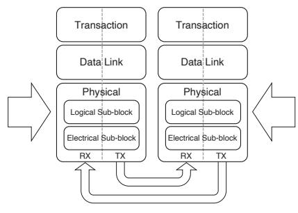

</div>


[⬆️ 返回目录](#-本章目录-table-of-contents)

---

<a id="sec-4-1"></a>
## 4.1 Introduction § | 概述 §

<table>
<thead>
<tr>
<th width="50%">🇬🇧 English</th>
<th width="50%" style="background-color:#e8e8e8">🇨🇳 中文</th>
</tr>
</thead>
<tbody>
<tr>
<td>

(no content)

</td>
<td style="background-color:#e8e8e8">

(无内容)

</td>
</tr>
</tbody>
</table>

[⬆️ 返回目录](#-本章目录-table-of-contents)

---

<a id="sec-4-2"></a>
## 4.2 Logical Sub-block § | 逻辑子块 §


<div style="overflow-x: auto; max-width: 100%;">
<table>
<thead>
<tr>
<th width="50%">🇬🇧 English</th>
<th width="50%" style="background-color:#e8e8e8">🇨🇳 中文</th>
</tr>
</thead>
<tbody>
<tr>
<td>

**Table 4-1 Valid Encoding and Data Stream Mode Combinations**

| Current Data Rate | Flit Mode Negotiated during Configuration when LinkUp=0b | Encoding | Data Stream |
|---|---|---|---|
| 2.5 GT/s, 5.0 GT/s | No | 8b/10b | Non-Flit Mode |
| 2.5 GT/s, 5.0 GT/s | Yes | 8b/10b | Flit Mode |
| 8.0 GT/s, 16.0 GT/s, 32.0 GT/s | No | 128b/130b | Non-Flit Mode |
| 8.0 GT/s, 16.0 GT/s, 32.0 GT/s | Yes | 128b/130b | Flit Mode |
| 64.0 GT/s | Yes (mandatory) | 1b/1b | Flit Mode |

The Ordered Set encoding follows the 8b/10b, 128b/130b, and 1b/1b encoding as defined in § Table 4-2.

**Table 4-2 Valid Encoding for Ordered Sets**

| Current Data Rate | Flit Mode Negotiated during Configuration when LinkUp=0b | Encoding | Comments |
|---|---|---|---|
| 2.5 GT/s, 5.0 GT/s | Yes / No | 8b/10b | Same Ordered Sets are used in Flit Mode as well as Non-Flit Mode. |
| 8.0 GT/s | No | 128b/130b | Only Standard SKP Ordered Set sent when SKP OS needs to be sent. Rest of the Ordered Sets are identical for Non-Flit Mode and Flit Mode in 8.0 GT/s. |
| 16.0 GT/s, 32.0 GT/s | No | 128b/130b | Alternates between Standard SKP OS and Control SKP OS, when SKP OS needs to be sent. Rest of the Ordered Sets are identical for Non-Flit Mode and Flit Mode in the corresponding Data Rate. |
| 8.0 GT/s, 16.0 GT/s, 32.0 GT/s | Yes | 128b/130b | Alternates between Standard SKP OS and Control SKP OS, when SKP OS needs to be sent. Rest of the Ordered Sets are identical for Non-Flit Mode and Flit Mode in the corresponding Data Rate. |
| 64.0 GT/s | Yes (mandatory) | 1b/1b | All Ordered Sets follow 1b/1b encoding at 64.0 GT/s with PAM4 signaling. Only Control SKP OS sent when SKP OS needs to be sent. |

</td>
<td style="background-color:#e8e8e8">

**表 4-1 有效的编码与数据流模式组合**

| 当前数据速率 | 配置阶段 LinkUp=0b 时协商的 Flit 模式 | 编码 | 数据流 |
|---|---|---|---|
| 2.5 GT/s、5.0 GT/s | No | 8b/10b | 非 Flit 模式 |
| 2.5 GT/s、5.0 GT/s | Yes | 8b/10b | Flit 模式 |
| 8.0 GT/s、16.0 GT/s、32.0 GT/s | No | 128b/130b | 非 Flit 模式 |
| 8.0 GT/s、16.0 GT/s、32.0 GT/s | Yes | 128b/130b | Flit 模式 |
| 64.0 GT/s | Yes (mandatory,强制) | 1b/1b | Flit 模式 |

有序集 (Ordered Set) 的编码遵循 8b/10b、128b/130b 与 1b/1b 编码,定义见 § 表 4-2。

**表 4-2 有序集的有效编码**

| 当前数据速率 | 配置阶段 LinkUp=0b 时协商的 Flit 模式 | 编码 | 注释 |
|---|---|---|---|
| 2.5 GT/s、5.0 GT/s | Yes / No | 8b/10b | Flit 模式与非 Flit 模式使用相同的有序集。 |
| 8.0 GT/s | No | 128b/130b | 需要发送 SKP OS 时,仅发送标准 SKP 有序集。8.0 GT/s 下其余有序集在非 Flit 模式与 Flit 模式中完全相同。 |
| 16.0 GT/s、32.0 GT/s | No | 128b/130b | 需要发送 SKP OS 时,在标准 SKP OS 与控制 SKP OS 之间交替。其余有序集在对应数据速率的非 Flit 模式与 Flit 模式中完全相同。 |
| 8.0 GT/s、16.0 GT/s、32.0 GT/s | Yes | 128b/130b | 需要发送 SKP OS 时,在标准 SKP OS 与控制 SKP OS 之间交替。其余有序集在对应数据速率的非 Flit 模式与 Flit 模式中完全相同。 |
| 64.0 GT/s | Yes (mandatory,强制) | 1b/1b | 64.0 GT/s 下所有有序集采用 1b/1b 编码,配合 PAM4 信号。需要发送 SKP OS 时,仅发送控制 SKP OS。 |

</td>
</tr>
</tbody>
</table>
</div>


[⬆️ 返回目录](#-本章目录-table-of-contents)

---

<!-- 📄 Page 352 -->
---

---

<!-- 📄 Page 353 -->
---

<a id="sec-4-2-1"></a>
## 4.2.1 8b/10b Encoding for 2.5 GT/s and 5.0 GT/s Data Rates § | 2.5 GT/s 与 5.0 GT/s 数据速率下的 8b/10b 编码 §

<table>
<thead>
<tr>
<th width="50%">🇬🇧 English</th>
<th width="50%" style="background-color:#e8e8e8">🇨🇳 中文</th>
</tr>
</thead>
<tbody>
<tr>
<td>

At 2.5 and 5.0 GT/s, PCI Express uses an 8b/10b transmission code. The definition of this transmission code is identical to that specified in ANSI X3.230-1994, clause 11 (and also IEEE 802.3z, 36.2.4). Using this scheme, 8-bit data characters are treated as 3 bits and 5 bits mapped onto a 4-bit code group and a 6-bit code group, respectively. The control bit in conjunction with the data character is used to identify when to encode one of the 12 Special Symbols included in the 8b/10b transmission code. These code groups are concatenated to form a 10-bit Symbol. As shown in § Figure 4-2, ABCDE maps to abcdei and FGH maps to fghj.

**IMPLEMENTATION NOTE:**
**FLIT MODE IDENTIFICATION THROUGHOUT THE DOCUMENT**

Support for Flit Mode behavior is referenced five times in the specification through the use of the following fields/variables:

**Flit Mode Supported bit** - Bit 0 of the Data Rate Identifier Symbol of 8b/10b and 128b/130b encoded TS1s and TS2s. This bit is Set when the Flit Mode Supported bit in the PCI Express Capabilities Register is Set and the Flit Mode Disable bit in the Link Control Register is Clear. See § Table 4-25, § Table 4-26, and § Table 4-27.

**Flit_Mode_Enabled** - Variable that indicates whether or not Flit Mode has been sucesfully negotiated. See § Section 4.2.7.1.1 and § Section 4.2.7.3.2.

**Flit Mode Supported** - Field in the PCI Express Capabilities Register. Flit Mode is supported when this bit is Set. See § Section 7.5.3.2.

**Flit Mode Disable** - Field in the Link Control Register. This bit used to disable Flit Mode. This bit is most useful in Downstream Ports but is also defined for Upstream Ports (useful for crosslinks or by device firmware). See § Section 7.5.3.7. Setting this bit may be useful to workaround faulty hardware.

**Flit Mode Status** - Field in the Link Status 2 Register. Indicates that that the Link is or will be operating in Flit Mode. Should match the Flit_Mode_Enabled variable. See § Section 7.5.3.20.

</td>
<td style="background-color:#e8e8e8">

在 2.5 GT/s 与 5.0 GT/s 速率下,PCI Express 使用 8b/10b 传输编码。该传输编码的定义与 ANSI X3.230-1994 第 11 节 (亦即 IEEE 802.3z 第 36.2.4 节) 中的规定完全相同。在该方案中,8 位数据字符被拆分为 3 位和 5 位两组,分别映射到 4 位码组 (code group) 和 6 位码组。控制位 (control bit) 与数据字符一起用于指示何时将 8b/10b 传输码中包含的 12 个特殊符号 (Special Symbols) 之一进行编码。这些码组被串接形成一个 10 位的符号 (Symbol)。如 § 图 4-2 所示,ABCDE 映射为 abcdei,FGH 映射为 fghj。

**实现提示 (IMPLEMENTATION NOTE):**
**全文档的 Flit 模式识别**

本规范中有 5 处通过以下字段/变量引用 Flit 模式支持:

**Flit Mode Supported bit** (Flit 模式支持位) — 8b/10b 与 128b/130b 编码 TS1 和 TS2 中 Data Rate Identifier Symbol (数据速率标识符号) 的 Bit 0。当 PCI Express 能力寄存器 (Capabilities Register) 中的 Flit Mode Supported 位置 1 且链路控制寄存器 (Link Control Register) 中的 Flit Mode Disable 位清 0 时,此位置 1。参见 § 表 4-25、§ 表 4-26 与 § 表 4-27。

**Flit_Mode_Enabled** — 表示 Flit 模式是否已成功协商的变量。参见 § 第 4.2.7.1.1 节 与 § 第 4.2.7.3.2 节。

**Flit Mode Supported** (Flit 模式支持) — PCI Express 能力寄存器中的字段。该位置 1 时表示支持 Flit 模式。参见 § 第 7.5.3.2 节。

**Flit Mode Disable** (Flit 模式禁用) — 链路控制寄存器中的字段。该位用于禁用 Flit 模式。该位对下游端口 (Downstream Port) 最为有用,但在上游端口 (Upstream Port) 中也有定义 (可用于交叉链路 crosslink 或由设备固件使用)。参见 § 第 7.5.3.7 节。设置该位可能有助于绕过有缺陷的硬件。

**Flit Mode Status** (Flit 模式状态) — 链路状态 2 寄存器 (Link Status 2 Register) 中的字段。表示链路正在或将要在 Flit 模式下工作,应与 Flit_Mode_Enabled 变量一致。参见 § 第 7.5.3.20 节。

</td>
</tr>
</tbody>
</table>

[⬆️ 返回目录](#-本章目录-table-of-contents)

---

<a id="sec-4-2-1-1"></a>
## 4.2.1.1 Symbol Encoding § | 符号编码 §

<table>
<thead>
<tr>
<th width="50%">🇬🇧 English</th>
<th width="50%" style="background-color:#e8e8e8">🇨🇳 中文</th>
</tr>
</thead>
<tbody>
<tr>
<td>

The bits of a Symbol are placed on a Lane starting with bit "a" and ending with bit "j". Examples are shown in § Figure 4-3 and § Figure 4-4.

</td>
<td style="background-color:#e8e8e8">

符号的各个位在通道 (Lane) 上以位 "a" 起始、位 "j" 结束的顺序发送。示例如 § 图 4-3 与 § 图 4-4 所示。

</td>
</tr>
</tbody>
</table>

> **Figure 4-2.** Character to Symbol Mapping
> 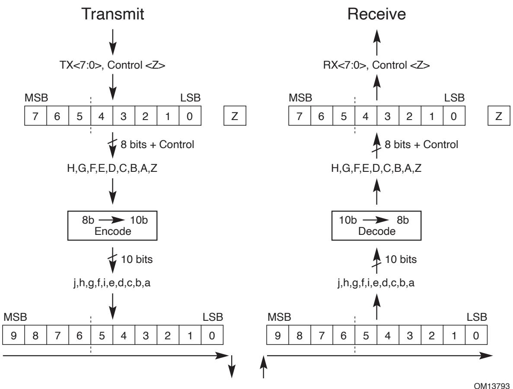


[⬆️ 返回目录](#-本章目录-table-of-contents)

---

<!-- 📄 Page 354 -->
---

<a id="sec-4-2-1-1-1"></a>
## 4.2.1.1.1 Serialization and De-serialization of Data § | 数据的串行化与解串行化 §


<div style="overflow-x: auto; max-width: 100%;">
<table>
<thead>
<tr>
<th width="50%">🇬🇧 English</th>
<th width="50%" style="background-color:#e8e8e8">🇨🇳 中文</th>
</tr>
</thead>
<tbody>
<tr>
<td>

The 8b/10b encoding scheme provides Special Symbols that are distinct from the Data Symbols used to represent Characters. These Special Symbols are used for various Link Management mechanisms described later in this chapter. Special Symbols are also used to frame DLLPs and TLPs in Non-Flit Mode, using distinct Special Symbols to allow these two types of Packets to be quickly and easily distinguished. When Flit Mode is enabled, each Symbol (Byte) of the Data Stream is still encoded with 8b/10b encoding without the Framing described. The Flit Mode operation is described in § Section 4.2.3.1. Even when Flit Mode is enabled, the Ordered Sets follow the description provided in § Section 4.2.1, when operating in 2.5 GT/s or 5.0 GT/s Data Rates.

§ Table 4-3 shows the Special Symbols used for PCI Express and provides a brief description for each. These Symbols will be discussed in greater detail in following sections. Each of these Special Symbols, as well as the data Symbols, must be interpreted by looking at the 10-bit Symbol in its entirety.

**Table 4-3 Special Symbols in 8b/10b Encoding**

| Encoding | Symbol | Name | Description |
|---|---|---|---|
| K28.5 | COM | Comma | Used for Lane and Link initialization and management |
| K27.7 | STP | Start TLP | Marks the start of a Transaction Layer Packet in Non-Flit Mode. Reserved in Flit Mode. |
| K28.2 | SDP | Start DLLP | Marks the start of a Data Link Layer Packet in Non-Flit Mode. Reserved in Flit Mode. |
| K29.7 | END | End | Marks the end of a Transaction Layer Packet or a Data Link Layer Packet in Non-Flit Mode. Reserved in Flit Mode. |
| K30.7 | EDB | EnD Bad | Marks the end of a nullified TLP in Non-Flit Mode. Reserved in Flit Mode. |
| K23.7 | PAD | Pad | Used in Framing in Non-Flit Mode only. It is also used in Link Width and Lane ordering negotiations in both Non-Flit Mode and Flit Mode. |
| K28.0 | SKP | Skip | Used for compensating for different bit rates for two communicating Ports. Used identically in Flit Mode and Non-Flit Mode. |
| K28.1 | FTS | Fast Training Sequence | Used within an Ordered Set to exit from L0s to L0 in Non-Flit Mode. No usage for this Encoding is defined in Flit Mode. |
| K28.3 | IDL | Idle | Used in the Electrical Idle Ordered Set (EIOS). Used identically in Flit Mode and Non-Flit Mode. |
| K28.4 | Reserved | Reserved | |
| K28.6 | Reserved | Reserved | |
| K28.7 | EIE | Electrical Idle Exit | Reserved in 2.5 GT/s. Used in the Electrical Idle Exit Ordered Set (EIEOS) and sent prior to sending FTS at data rates other than 2.5 GT/s |

The Symbol tables for the valid 8b/10b codes are given in Appendix B. These tables have one column for the positive disparity and one column for the negative disparity.

> **Note 59.** In § Chapter 4., PMUX packets follow the TLP framing rules for Non-Flit Mode. PMUX is not supported in Flit Mode.

</td>
<td style="background-color:#e8e8e8">

8b/10b 编码方案提供了一组与表示字符的数据符号 (Data Symbols) 不同的特殊符号 (Special Symbols)。这些特殊符号用于本章后述的各种链路管理 (Link Management) 机制。在非 Flit 模式中,特殊符号还用于对 DLLP 和 TLP 进行成帧 (Framing),使用不同的特殊符号以便快速、轻松地区分这两类报文。当 Flit 模式使能时,数据流的每个符号 (字节) 仍然使用 8b/10b 编码,但不使用上述成帧机制。Flit 模式的操作在 § 第 4.2.3.1 节 中描述。即使 Flit 模式使能,在 2.5 GT/s 或 5.0 GT/s 数据速率下,有序集仍然遵循 § 第 4.2.1 节 中给出的描述。

§ 表 4-3 列出了 PCI Express 使用的特殊符号,并对每个符号给出了简要说明。这些符号将在后续小节中详细讨论。每个特殊符号以及数据符号都必须通过查看完整的 10 位符号来解释。

**表 4-3 8b/10b 编码中的特殊符号**

| 编码 | 符号 | 名称 | 描述 |
|---|---|---|---|
| K28.5 | COM | Comma (逗号) | 用于通道和链路的初始化与管理 |
| K27.7 | STP | Start TLP (TLP 起始) | 在非 Flit 模式下标记 TLP (Transaction Layer Packet, 事务层包) 的开始。在 Flit 模式中保留。 |
| K28.2 | SDP | Start DLLP (DLLP 起始) | 在非 Flit 模式下标记 DLLP (Data Link Layer Packet, 数据链路层包) 的开始。在 Flit 模式中保留。 |
| K29.7 | END | End (结束) | 在非 Flit 模式下标记 TLP 或 DLLP 的结束。在 Flit 模式中保留。 |
| K30.7 | EDB | EnD Bad (错误结束) | 在非 Flit 模式下标记作废 (nullified) TLP 的结束。在 Flit 模式中保留。 |
| K23.7 | PAD | Pad (填充) | 仅在非 Flit 模式的成帧中使用。同时也用于 Flit 模式和非 Flit 模式下的链路宽度 (Link Width) 与通道排序 (Lane ordering) 协商。 |
| K28.0 | SKP | Skip (跳过) | 用于补偿两个通信端口之间的比特率差异。Flit 模式与非 Flit 模式中的使用相同。 |
| K28.1 | FTS | Fast Training Sequence (快速训练序列) | 在非 Flit 模式下,作为有序集的一部分用于从 L0s 退出至 L0。Flit 模式中未定义此编码的用途。 |
| K28.3 | IDL | Idle (空闲) | 用于电气空闲有序集 (EIOS, Electrical Idle Ordered Set)。Flit 模式与非 Flit 模式中的使用相同。 |
| K28.4 | Reserved | 保留 | |
| K28.6 | Reserved | 保留 | |
| K28.7 | EIE | Electrical Idle Exit (电气空闲退出) | 在 2.5 GT/s 速率下保留。在其他数据速率下,用于电气空闲退出有序集 (EIEOS, Electrical Idle Exit Ordered Set),在发送 FTS 之前发送 |

有效的 8b/10b 编码符号表见附录 B。这些表分别为正极性 (positive) 和负极性 (negative) 不平衡度 (disparity) 提供一列。

> **注释 59.** 在 § 第 4 章 中,PMUX 报文遵循非 Flit 模式的 TLP 成帧规则。Flit 模式不支持 PMUX。

</td>
</tr>
</tbody>
</table>

> **Figure 4-3.** Bit Transmission Order on Physical Lanes - x1 Example
> 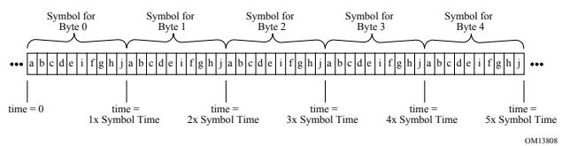

**Figure 4-3 | 图 4-3**: 物理通道上的比特传输顺序 - x1 示例 (Bit Transmission Order on Physical Lanes - x1 Example)

> **Figure 4-4.** Bit Transmission Order on Physical Lanes - x4 Example
> 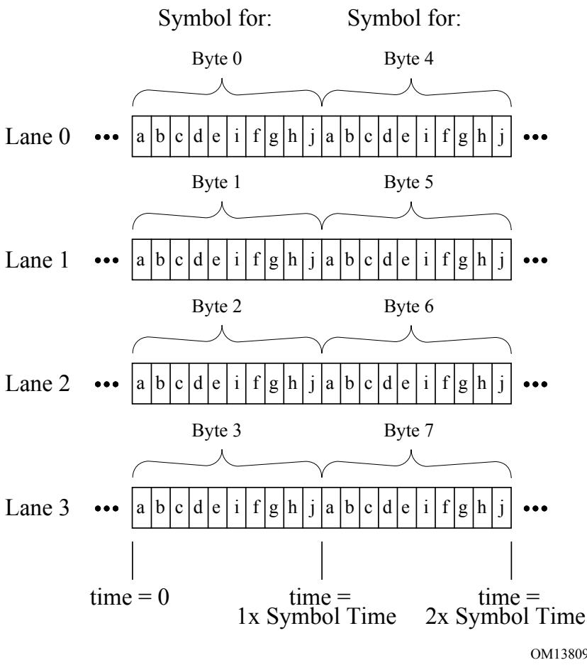

</div>


[⬆️ 返回目录](#-本章目录-table-of-contents)

---

<!-- 📄 Page 355 -->
---

<a id="sec-4-2-1-1-2"></a>
## 4.2.1.1.2 Special Symbols for Framing and Link Management (K Codes) § | 成帧与链路管理的特殊符号 (K 码) §

<table>
<thead>
<tr>
<th width="50%">🇬🇧 English</th>
<th width="50%" style="background-color:#e8e8e8">🇨🇳 中文</th>
</tr>
</thead>
<tbody>
<tr>
<td>

(see Table 4-3 above for the full Special Symbols table)

(See following sections for Symbol tables for the valid 8b/10b codes in Appendix B. These tables have one column for the positive disparity and one column for the negative disparity.)

</td>
<td style="background-color:#e8e8e8">

(完整特殊符号表见上方 表 4-3)

(完整的 8b/10b 编码符号表见附录 B,这些表分别为正负极性不平衡度提供一列。)

</td>
</tr>
</tbody>
</table>

[⬆️ 返回目录](#-本章目录-table-of-contents)

---

<a id="sec-4-2-1-1-3"></a>
## 4.2.1.1.3 8b/10b Decode Rules § | 8b/10b 解码规则 §


<div style="overflow-x: auto; max-width: 100%;">
<table>
<thead>
<tr>
<th width="50%">🇬🇧 English</th>
<th width="50%" style="background-color:#e8e8e8">🇨🇳 中文</th>
</tr>
</thead>
<tbody>
<tr>
<td>

A Transmitter is permitted to pick any disparity, unless otherwise required, when first transmitting differential data after being in an Electrical Idle state. The Transmitter must then follow proper 8b/10b encoding rules until the next Electrical Idle state is entered.

The initial disparity for a Receiver that detects an exit from Electrical Idle is set to the disparity of the first Symbol used to obtain Symbol lock. Disparity may also be re-initialized if Symbol lock is lost and regained during the transmission of differential information due to an implementation specific number of errors. All following received Symbols after the initial disparity is set must be found in the proper column corresponding to the current running disparity.

If a received Symbol is found in the column corresponding to the incorrect running disparity or if the Symbol does not correspond to either column, the Physical Layer must notify the Data Link Layer that the received Symbol is invalid. This is a Receiver Error, and is a reported error associated with the Port (see § Section 6.2) in Non-Flit Mode. In Flit Mode, the Symbol in error is passed to the FEC logic to correct; the Receiver is permitted to send any 8-bit value to the FEC logic if an 8b/10b error or k-char is detected inside the Flit boundary.

There are two classes of framing and application of Symbols to Lanes. The first class consists of the Ordered Sets. The second class consists of TLPs and DLLPs in the Data Stream. Ordered Sets are always transmitted serially on each Lane, such that a full Ordered Set appears simultaneously on all Lanes of a multi-Lane Link. The Non-Flit Mode of Data Stream is described below. The Flit Mode description for Data Stream is described in § Section 4.2.3.2 and § Section 4.2.3.3.

There are no defined framing-related errors while using 8b/10b encoding in Flit Mode.

The Framing mechanism uses Special Symbol K28.2 "SDP" to start a DLLP and Special Symbol K27.7 "STP" to start a TLP. The Special Symbol K29.7 "END" is used to mark the end of either a TLP or a DLLP.

The conceptual stream of Symbols must be mapped from its internal representation, which is implementation dependent, onto the external Lanes. The Symbols are mapped onto the Lanes such that the first Symbol (representing Character 0) is placed onto Lane 0; the second is placed onto Lane 1; etc. The x1 Link represents a degenerate case and the mapping is trivial, with all Symbols placed onto the single Lane in order.

When no packet information or special Ordered Sets are being transmitted, the Transmitter is in the Logical Idle state. During this time idle data must be transmitted. The idle data must consist of the data byte 0 (00h), scrambled according to the rules of § Section 4.2.1.3 and 8b/10b encoded according to the rules of § Section 4.2.1.1, in the same way that TLP and DLLP Data Symbols are scrambled and encoded. Likewise, when the Receiver is not receiving any packet information or special Ordered Sets, the Receiver is in Logical Idle and shall receive idle data as described above. During transmission of the idle data, the SKP Ordered Set must continue to be transmitted as specified in § Section 4.2.8.

For the following rules, "placed" is defined to mean a requirement on the Transmitter to put the Symbol into the proper Lane of a Link.

</td>
<td style="background-color:#e8e8e8">

在从电气空闲 (Electrical Idle) 状态退出后首次发送差分数据时,允许发送器 (Transmitter) 选择任意极性的不平衡度,除非另有要求。此后发送器必须遵循正确的 8b/10b 编码规则,直到下一次进入电气空闲状态。

对于检测到退出电气空闲的接收器 (Receiver),其初始不平衡度被设置为用于获得符号锁定 (Symbol lock) 的第一个符号的不平衡度。如果在差分数据传输过程中由于特定于实现的错误数导致符号锁定丢失并重新获得,不平衡度也可以被重新初始化。在设定初始不平衡度之后,所有后续接收到的符号必须出现在与当前运行不平衡度 (running disparity) 相对应的正确列中。

如果接收到的符号出现在与当前运行不平衡度不对应的列中,或者该符号在两列中均无对应项,则物理层必须通知数据链路层该接收符号无效。这是一个接收器错误 (Receiver Error),在非 Flit 模式下是与该端口 (Port) 关联的可报告错误 (见 § 第 6.2 节)。在 Flit 模式下,出错的符号会被传递给 FEC (前向纠错) 逻辑进行纠正;如果在 Flit 边界内检测到 8b/10b 错误或 k-char,接收器可以向 FEC 逻辑发送任意 8 位值。

符号到通道的成帧与应用分为两类。第一类是有序集。第二类是数据流中的 TLP 和 DLLP。有序集总是以串行方式在每个通道上发送,使得完整的有序集同时出现在多通道链路的全部通道上。数据流的非 Flit 模式描述如下;数据流的 Flit 模式描述见 § 第 4.2.3.2 节 与 § 第 4.2.3.3 节。

在 Flit 模式中使用 8b/10b 编码时,没有定义与成帧相关的错误。

成帧机制使用特殊符号 K28.2 "SDP" 来开始一个 DLLP,使用特殊符号 K27.7 "STP" 来开始一个 TLP。特殊符号 K29.7 "END" 用于标记 TLP 或 DLLP 的结束。

符号的内部概念流必须从其依赖于实现的内部表示映射到外部通道。符号到通道的映射方式为:第一个符号 (表示字符 0) 放在 Lane 0 上,第二个放在 Lane 1 上,依此类推。x1 链路是一种退化情况,映射方式很平凡,所有符号按顺序放在单个通道上。

当没有发送任何报文信息或特殊有序集时,发送器处于逻辑空闲 (Logical Idle) 状态。在此期间必须发送空闲数据。空闲数据必须由数据字节 0 (00h) 组成,按 § 第 4.2.1.3 节 的规则进行加扰 (scrambling),并按 § 第 4.2.1.1 节 的规则进行 8b/10b 编码,其方式与 TLP 和 DLLP 数据符号的加扰和编码方式相同。同样,当接收器未接收到任何报文信息或特殊有序集时,接收器处于逻辑空闲状态,并应按上述描述接收空闲数据。在发送空闲数据期间,必须按照 § 第 4.2.8 节 的规定继续发送 SKP 有序集。

在下列规则中,"放置 (placed)" 的定义是要求发送器将符号放入链路的正确通道上。

</td>
</tr>
</tbody>
</table>
</div>


[⬆️ 返回目录](#-本章目录-table-of-contents)

---

<!-- 📄 Page 356 -->
---

---

<!-- 📄 Page 357 -->
---

<a id="sec-4-2-1-2"></a>
## 4.2.1.2 Framing and Application of Symbols to Lanes § | 符号的成帧与到通道的应用 §

<table>
<thead>
<tr>
<th width="50%">🇬🇧 English</th>
<th width="50%" style="background-color:#e8e8e8">🇨🇳 中文</th>
</tr>
</thead>
<tbody>
<tr>
<td>

- TLPs must be framed by placing an STP Symbol at the start of the TLP and an END Symbol or EDB Symbol at the end of the TLP (see § Figure 4-5).
- A properly formed TLP contains a minimum of 18 symbols between the STP and END or EDB Symbols. If a received sequence has less than 18 symbols between the STP and END or EDB symbols, the receiver is permitted to treat this as a Receiver Error.
  - If checked, this is a reported error associated with the Receiving Port (see § Section 6.2).
- DLLPs must be framed by placing an SDP Symbol at the start of the DLLP and an END Symbol at the end of the DLLP (see § Figure 4-6).

</td>
<td style="background-color:#e8e8e8">

- TLP 必须通过在 TLP 起始处放置一个 STP 符号,在 TLP 结束处放置一个 END 符号或 EDB 符号进行成帧 (见 § 图 4-5)。
- 一个正常组成的 TLP 在 STP 与 END 或 EDB 符号之间至少包含 18 个符号。如果接收到的序列在 STP 与 END 或 EDB 符号之间少于 18 个符号,接收器可将其视为接收器错误。
  - 如果进行检查,则这是与接收端口 (Receiving Port) 关联的可报告错误 (见 § 第 6.2 节)。
- DLLP 必须通过在 DLLP 起始处放置一个 SDP 符号,在 DLLP 结束处放置一个 END 符号进行成帧 (见 § 图 4-6)。

</td>
</tr>
</tbody>
</table>

[⬆️ 返回目录](#-本章目录-table-of-contents)

---

<a id="sec-4-2-1-2-1"></a>
## 4.2.1.2.1 Framing and Application of Symbols to Lanes for TLPs and DLLPs in Non-Flit Mode § | 非 Flit 模式下 TLP 和 DLLP 的成帧与到通道的应用 §


<div style="overflow-x: auto; max-width: 100%;">
<table>
<thead>
<tr>
<th width="50%">🇬🇧 English</th>
<th width="50%" style="background-color:#e8e8e8">🇨🇳 中文</th>
</tr>
</thead>
<tbody>
<tr>
<td>

- Logical Idle is defined to be a period of one or more Symbol Times when no information: TLPs, DLLPs or any type of Special Symbol is being Transmitted/Received. Unlike Electrical Idle, during Logical Idle the Idle data Symbol (00h) is being transmitted and received.
  - When the Transmitter is in Logical Idle, the Idle data Symbol (00h) shall be transmitted on all Lanes. This is scrambled according to the rules in § Section 4.2.1.3.
  - Receivers must ignore incoming Idle data Symbols, and must not have any dependency other than scramble sequencing on any specific data patterns.
- For Links wider than x1, the STP Symbol (representing the start of a TLP) must be placed in Lane 0 when starting Transmission of a TLP from a Logical Idle Link condition.
- For Links wider than x1, the SDP Symbol (representing the start of a DLLP) must be placed in Lane 0 when starting Transmission of a DLLP from a Logical Idle Link condition.
- The STP Symbol must not be placed on the Link more frequently than once per Symbol Time.
- The SDP Symbol must not be placed on the Link more frequently than once per Symbol Time.
- As long as the above rules are satisfied, TLP and DLLP Transmissions are permitted to follow each other successively.
- One STP Symbol and one SDP Symbol may be placed on the Link in the same Symbol Time.
  - Links wider than x4 can have STP and SDP Symbols placed in Lane 4*N, where N is a positive integer. For example, for x8, STP and SDP Symbols can be placed in Lanes 0 and 4; and for x16, STP and SDP Symbols can be placed in Lanes 0, 4, 8, or 12.
- For xN Links where N is 8 or more, if an END or EDB Symbol is placed in a Lane K, where K does not equal N-1, and is not followed by an STP or SDP Symbol in Lane K+1 (i.e., there is no TLP or DLLP immediately following), then PAD Symbols must be placed in Lanes K+1 to Lane N-1.
  - For example, on a x8 Link, if END or EDB is placed in Lane 3, PAD must be placed in Lanes 4 to 7, when not followed by STP or SDP.
- The EDB Symbol is used to mark the end of a nullified TLP. Refer to § Section 3.6.2.1 for information on the usage of EDB.
- Receivers may optionally check for violations of the rules of this section. These checks are independently optional (see § Section 6.2.3.4). If checked, violations are Receiver Errors, and are reported errors associated with the Port (see § Section 6.2).

</td>
<td style="background-color:#e8e8e8">

- 逻辑空闲 (Logical Idle) 定义为一个或多个符号时间 (Symbol Time) 的时间段,在此期间没有传输/接收任何信息:TLP、DLLP 或任何类型的特殊符号。与电气空闲不同,在逻辑空闲期间,空闲数据符号 (00h) 正在被发送和接收。
  - 当发送器处于逻辑空闲时,空闲数据符号 (00h) 应在所有通道上发送。此数据按 § 第 4.2.1.3 节 的规则进行加扰。
  - 接收器必须忽略输入的空闲数据符号,且除加扰序列之外,不得对任何特定数据模式产生依赖。
- 对于宽度大于 x1 的链路,STP 符号 (表示 TLP 的开始) 在从逻辑空闲链路状态开始发送 TLP 时必须放置在 Lane 0。
- 对于宽度大于 x1 的链路,SDP 符号 (表示 DLLP 的开始) 在从逻辑空闲链路状态开始发送 DLLP 时必须放置在 Lane 0。
- STP 符号在链路上放置的频率不得超过每个符号时间一次。
- SDP 符号在链路上放置的频率不得超过每个符号时间一次。
- 只要满足上述规则,TLP 和 DLLP 的传输可以紧接彼此连续进行。
- 一个 STP 符号和一个 SDP 符号可以放置在同一符号时间的链路上。
  - 宽度大于 x4 的链路可以将 STP 和 SDP 符号放置在 Lane 4*N 上,其中 N 为正整数。例如,对于 x8,STP 和 SDP 符号可放置在 Lane 0 和 Lane 4;对于 x16,STP 和 SDP 符号可放置在 Lane 0、4、8 或 12。
- 对于 N ≥ 8 的 xN 链路,如果 END 或 EDB 符号被放置在 Lane K 上 (K ≠ N-1),且其后没有紧跟 STP 或 SDP 符号 (即没有立即跟随的 TLP 或 DLLP),则必须在 Lane K+1 到 Lane N-1 上放置 PAD 符号。
  - 例如,在 x8 链路上,如果 END 或 EDB 被放置在 Lane 3,当其后没有 STP 或 SDP 时,PAD 必须被放置在 Lane 4 到 Lane 7。
- EDB 符号用于标记作废 TLP 的结束。EDB 的使用信息见 § 第 3.6.2.1 节。
- 接收器可选择性地检查对本节规则的违反。这些检查可独立启用 (见 § 第 6.2.3.4 节)。如果进行检查,违反规则将作为接收器错误,作为与该端口关联的可报告错误上报 (见 § 第 6.2 节)。

</td>
</tr>
</tbody>
</table>

> **Figure 4-5.** TLP with Framing Symbols Applied
> 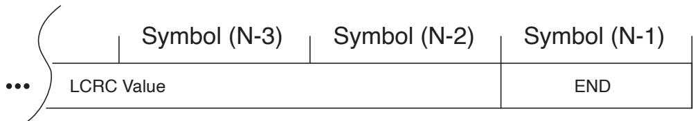

> **Figure 4-6.** DLLP with Framing Symbols Applied
> 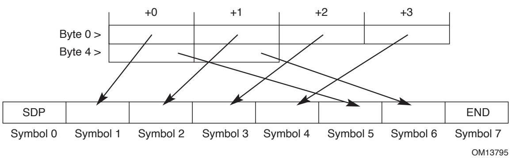

> **Figure 4-7.** Framed TLP on a x1 Link
> 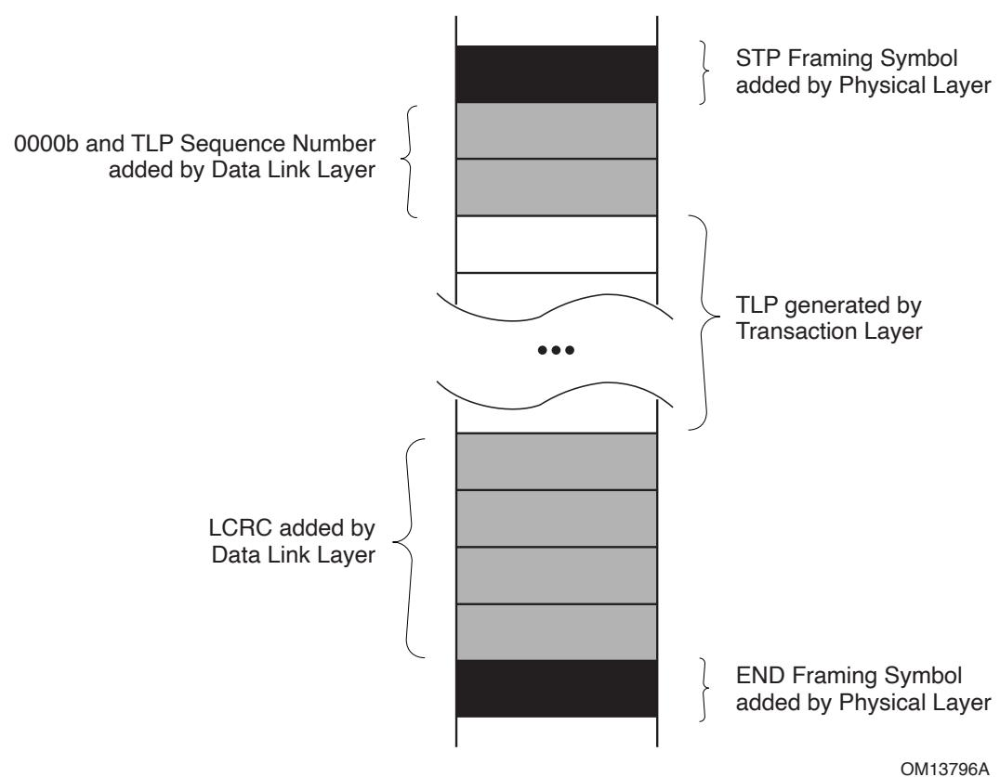

**Figure 4-7 | 图 4-7**: x1 链路上成帧后的 TLP (Framed TLP on a x1 Link)

> **Figure 4-8.** Framed TLP on a x2 Link
> 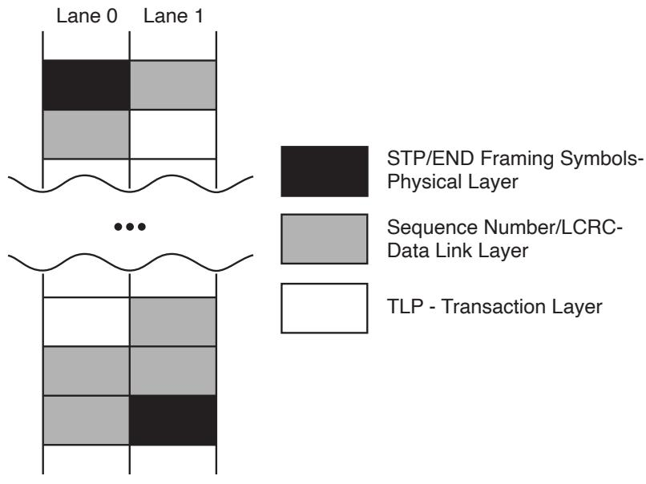

**Figure 4-8 | 图 4-8**: x2 链路上成帧后的 TLP (Framed TLP on a x2 Link)

</div>


[⬆️ 返回目录](#-本章目录-table-of-contents)

---

<!-- 📄 Page 358 -->
---

---

<!-- 📄 Page 359 -->
---

<table>
<thead>
<tr>
<th width="50%">🇬🇧 English</th>
<th width="50%" style="background-color:#e8e8e8">🇨🇳 中文</th>
</tr>
</thead>
<tbody>
<tr>
<td>

In order to improve electrical characteristics of a Link, data is typically scrambled. This is applicable for both the Flit Mode as well as Non-Flit Mode at 2.5 GT/s and 5.0 GT/s Data Rates. This involves XORing the data stream with a pattern generated by a Linear Feedback Shift Register (LFSR). On the Transmit side, scrambling is applied to characters prior to the 8b/10b encoding. On the Receive side, de-scrambling is applied to characters after 8b/10b decoding.

On a multi-Lane Link, the scrambling function can be implemented with one or many LFSRs. When there is more than one Transmit LFSR per Link, these must operate in concert, maintaining the same simultaneous (Lane-to-Lane Output Skew) value in each LFSR. When there is more than one Receive LFSR per Link, these must operate in concert, maintaining the same simultaneous (Lane-to-Lane Skew) value in each LFSR. Regardless of how they are implemented, LFSRs must interact with data on a Lane-by-Lane basis as if there was a separate LFSR as described here for each Lane within that Link.

The LFSR is graphically represented in § Figure 4-10. Scrambling or unscrambling is performed by serially XORing the 8-bit (D0-D7) character with the 16-bit (D0-D15) output of the LFSR. An output of the LFSR, D15, is XORed with D0 of the data to be processed. The LFSR and data register are then serially advanced and the output processing is repeated for D1 through D7. The LFSR is advanced after the data is XORed. The LFSR implements the polynomial:

G(X) = X^16 + X^5 + X^4 + X^3 + 1

</td>
<td style="background-color:#e8e8e8">


为了改善链路的电气特性,数据通常会被加扰 (scramble)。这在 2.5 GT/s 和 5.0 GT/s 数据速率下的 Flit 模式与非 Flit 模式中均适用。该过程将数据流与一个由线性反馈移位寄存器 (Linear Feedback Shift Register, LFSR) 生成的模式进行异或 (XOR)。在发送端,加扰在 8b/10b 编码之前对字符进行;在接收端,解扰在 8b/10b 解码之后对字符进行。

在多通道链路上,加扰功能可以使用一个或多个 LFSR 实现。当一条链路上有多个发送 LFSR 时,这些 LFSR 必须协同工作,在每个 LFSR 中保持相同的同步 (Lane-to-Lane Output Skew,通道间输出偏移) 值。当一条链路上有多个接收 LFSR 时,这些 LFSR 必须协同工作,在每个 LFSR 中保持相同的同步 (Lane-to-Lane Skew,通道间偏移) 值。无论如何实现,LFSR 必须以逐通道 (Lane-by-Lane) 的方式与数据交互,就好像该链路内每条通道都有一个独立的 LFSR 一样。

LFSR 的图形化表示见 § 图 4-10。加扰或解扰通过对 8 位 (D0-D7) 字符与 LFSR 的 16 位 (D0-D15) 输出进行串行异或完成。LFSR 的输出 D15 与待处理数据的 D0 进行异或。然后 LFSR 和数据寄存器串行前进,重复对 D1 到 D7 进行输出处理。LFSR 在数据异或之后前进。该 LFSR 实现的多项式为:

G(X) = X^16 + X^5 + X^4 + X^3 + 1

</td>
</tr>
</tbody>
</table>

[⬆️ 返回目录](#-本章目录-table-of-contents)

---

<!-- 📄 Page 360 -->
---

<a id="sec-4-2-1-3"></a>
## 4.2.1.3 Data Scrambling § | 数据加扰 §


<div style="overflow-x: auto; max-width: 100%;">
<table>
<thead>
<tr>
<th width="50%">🇬🇧 English</th>
<th width="50%" style="background-color:#e8e8e8">🇨🇳 中文</th>
</tr>
</thead>
<tbody>
<tr>
<td>

The mechanism(s) and/or interface(s) utilized by the Data Link Layer to notify the Physical Layer to disable scrambling is implementation specific and beyond the scope of this specification.

The data scrambling rules are the following:

- The COM Symbol initializes the LFSR.
- The LFSR value is advanced eight serial shifts for each Symbol except the SKP.
- All data Symbols (D codes) except those within Ordered Sets (e.g., TS1, TS2, EIEOS), the Compliance Pattern (see § Section 4.2.9), and the Modified Compliance Pattern (see § Section 4.2.10) are scrambled.
- All special Symbols (K codes) are not scrambled.
- The initialized value of an LFSR seed (D0-D15) is FFFFh. Immediately after a COM exits the Transmit LFSR, the LFSR on the Transmit side is initialized. Every time a COM enters the Receive LFSR on any Lane of that Link, the LFSR on the Receive side is initialized.
- Scrambling can only be disabled at the end of Configuration (see § Section 4.2.7.3.5).
- Scrambling does not apply to a Loopback Follower.
- Scrambling is always enabled in Detect by default.

For more information on scrambling, see § Appendix C.

</td>
<td style="background-color:#e8e8e8">

数据链路层用于通知物理层禁用加扰的机制和/或接口是实现相关的,超出本规范的范围。

数据加扰的规则如下:

- COM 符号用于初始化 LFSR。
- LFSR 的值在每个符号上前进 8 次串行移位,SKP 除外。
- 除有序集 (例如 TS1、TS2、EIEOS)、一致性测试码型 (Compliance Pattern,见 § 第 4.2.9 节) 和修改后的一致性测试码型 (Modified Compliance Pattern,见 § 第 4.2.10 节) 内的数据符号外,所有数据符号 (D codes) 都会被加扰。
- 所有特殊符号 (K codes) 不被加扰。
- LFSR 种子 (D0-D15) 的初始值为 FFFFh。在 COM 离开发送 LFSR 后,发送端的 LFSR 立即被初始化。每当 COM 在该链路的任何一条通道上进入接收 LFSR 时,接收端的 LFSR 即被初始化。
- 加扰只能在配置 (Configuration) 结束时被禁用 (见 § 第 4.2.7.3.5 节)。
- 加扰不适用于 Loopback Follower (回环从端)。
- 默认情况下,Detect 状态中加扰始终处于使能状态。

有关加扰的更多信息,见 § 附录 C。

</td>
</tr>
</tbody>
</table>

> **Figure 4-10.** LFSR with 8b/10b Scrambling Polynomial
> 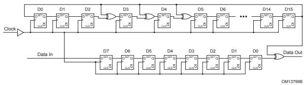

</div>


[⬆️ 返回目录](#-本章目录-table-of-contents)

---

<!-- 📄 Page 361 -->
---

<a id="sec-4-2-2"></a>
## 4.2.2 128b/130b Encoding for 8.0 GT/s, 16.0 GT/s, and 32.0 GT/s Data Rates § | 8.0 GT/s、16.0 GT/s 与 32.0 GT/s 数据速率下的 128b/130b 编码 §

<table>
<thead>
<tr>
<th width="50%">🇬🇧 English</th>
<th width="50%" style="background-color:#e8e8e8">🇨🇳 中文</th>
</tr>
</thead>
<tbody>
<tr>
<td>

> **IMPLEMENTATION NOTE:**
> **DISABLING SCRAMBLING**
>
> Disabling scrambling is intended to help simplify test and debug equipment. Control of the exact data patterns is useful in a test and debug environment. Since scrambling is reset at the Physical Layer there is no reasonable way to reliably control the state of the data transitions through software. Thus, the Disable Scrambling bit in the TS1 and TS2 Ordered Sets is provided for these purposes.
>
> The mechanism(s) and/or interface(s) utilized by the Data Link Layer to notify the Physical Layer to disable scrambling is implementation specific and beyond the scope of this specification.

When a PCI Express Link is operating at a data rate of 8.0 GT/s, 16.0 GT/s, or 32.0 GT/s, it uses the 128b/130b encoding rules described in this section. For backwards compatibility, the Link initially trains to L0 at the 2.5 GT/s data rate using 8b/10b encoding as described in § Section 4.2.1, then when the data rate is changed to 8.0 GT/s, 16.0 GT/s, or 32.0 GT/s, 128b/130b encoding is used. 128b/130b encoding uses a Link-wide packetization mechanism in Non-Flit Mode and a per-Lane block code with scrambling in both Flit Mode and Non-Flit Modes. In the Flit Mode, the Data Stream follows the same mechanism described in § Section 4.2.3.1, for the 128b payload inside the 128b/130b Data Block(s).

The basic entity of data transmission is an 8-bit data character, referred to as a Symbol, as shown in § Figure 4-11 and § Figure 4-12.

The Physical Layer uses a per-Lane block code. Each Block consists of a 2-bit Sync Header and a payload. There are two valid Sync Header encodings: 10b and 01b. The Sync Header defines the type of payload that the Block contains.

A Sync Header of 10b indicates a Data Block. Each Data Block has a 128 bit payload, resulting in a Block size of 130 bits. The payload is a Data Stream described in § Section 4.2.2.3.

A Sync Header of 01b indicates an Ordered Set Block. Each Ordered Set Block has a 128 bit payload, resulting in a Block size of 130 bits except for the SKP Ordered Set which can be of variable length.

All Lanes of a multi-Lane Link must transmit Blocks with the same Sync Header simultaneously, except when transmitting Jitter Measurement Pattern in Polling.Compliance.

The bit transmission order is as follows. A Sync Header represented as 'H1H0' is placed on a Lane starting with 'H0' and ending with 'H1'. A Symbol, represented as 'S7S6S5S4S3S2S1S0', is placed on a Lane starting with 'S0' and ending with 'S7'. In the diagrams that show a time scale, bits represent the transmission order. In layout diagrams, bits are arranged in little-endian format, consistent with packet layout diagrams in other chapters of this specification.

> **Figure 4-11.** Example of Bit Transmission Order in a x1 Link Showing 130 Bits of a Block
> 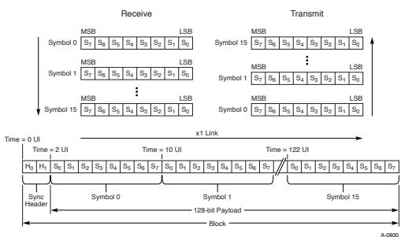

> **IMPLEMENTATION NOTE:**
> **SYMBOL IN 128B/130B ENCODING SCHEME**
> In the 128b/130b encoding scheme, the Symbol is one byte long, similar to the 10-bit Symbol of 8b/10b encoding.

</td>
<td style="background-color:#e8e8e8">

> **实现提示 (IMPLEMENTATION NOTE):**
> **禁用加扰 (DISABLING SCRAMBLING)**
>
> 禁用加扰的目的是简化测试和调试设备。对精确数据模式的控制在测试与调试环境中非常有用。由于加扰在物理层被复位,无法通过软件以合理方式可靠地控制数据转换的状态。因此,TS1 与 TS2 有序集中提供了 Disable Scrambling 位 (禁用加扰位) 用于此目的。
>
> 数据链路层用于通知物理层禁用加扰的机制和/或接口是实现相关的,超出本规范的范围。

当 PCI Express 链路以 8.0 GT/s、16.0 GT/s 或 32.0 GT/s 的数据速率工作时,它使用本节描述的 128b/130b 编码规则。为保持向后兼容,链路最初使用 § 第 4.2.1 节 描述的 8b/10b 编码在 2.5 GT/s 数据速率下训练到 L0,之后当数据速率切换到 8.0 GT/s、16.0 GT/s 或 32.0 GT/s 时,改用 128b/130b 编码。128b/130b 编码在非 Flit 模式下使用一种链路范围 (Link-wide) 的成包机制,并在 Flit 模式和非 Flit 模式下都使用一种带加扰的逐通道 (per-Lane) 块编码。在 Flit 模式中,数据流遵循 § 第 4.2.3.1 节 中针对 128b/130b 数据块内 128 位载荷所描述的相同机制。

数据传输的基本实体是一个 8 位数据字符,称为符号 (Symbol),如 § 图 4-11 和 § 图 4-12 所示。

物理层使用逐通道的块编码。每个块 (Block) 由 2 位同步头 (Sync Header) 和一个载荷 (payload) 组成。同步头有两个有效的编码值:10b 和 01b。同步头定义了块所包含的载荷类型。

同步头 10b 表示这是一个数据块 (Data Block)。每个数据块具有 128 位载荷,因此块大小为 130 位。载荷是 § 第 4.2.2.3 节 描述的数据流。

同步头 01b 表示这是一个有序集块 (Ordered Set Block)。每个有序集块具有 128 位载荷,因此块大小为 130 位,SKP 有序集除外,它的长度是可变的。

多通道链路的所有通道必须同时发送具有相同同步头的块,但在 Polling.Compliance 中发送抖动测量码型 (Jitter Measurement Pattern) 时除外。

位传输顺序如下。表示为 'H1H0' 的同步头从 'H0' 开始、到 'H1' 结束地放置在通道上。表示为 'S7S6S5S4S3S2S1S0' 的符号从 'S0' 开始、到 'S7' 结束地放置在通道上。在带时间刻度的图中,位表示传输顺序;在布局图中,位按小端 (little-endian) 格式排列,与本规范其他章节中的报文布局图保持一致。


> **实现提示 (IMPLEMENTATION NOTE):**
> **128b/130b 编码方案中的符号 (SYMBOL IN 128B/130B ENCODING SCHEME)**
> 在 128b/130b 编码方案中,符号长度为 1 字节,与 8b/10b 编码中的 10 位符号类似。

</td>
</tr>
</tbody>
</table>

[⬆️ 返回目录](#-本章目录-table-of-contents)

---

<!-- 📄 Page 362 -->
---


---

<a id="sec-4-2-2-1"></a>
## 4.2.2.1 Lane Level Encoding | 通道级编码


<div style="overflow-x: auto; max-width: 100%;">
<table>
<thead>
<tr>
<th width="50%">🇬🇧 English</th>
<th width="50%" style="background-color:#e8e8e8">🇨🇳 中文</th>
</tr>
</thead>
<tbody>
<tr>
<td>

An Ordered Set Block contains a Sync Header followed by one Ordered Set. All Lanes of a multi-Lane Link must transmit the same Ordered Set type simultaneously. The first Symbol of the Ordered Set defines the type of Ordered Set. Subsequent symbols of the Ordered Set are defined by the Ordered Set type and need not be identical across lanes of a multi-Lane Link. The Ordered Sets are described in detail in § Section 4.2.5 and § Section 4.2.8 . Ordered Set Blocks are the same for both Flit Mode and Non-Flit Mode except for the use and frequency of SKP Ordered Set. In Flit Mode at 8.0 GT/s, both Standard SKP Ordered Sets and Control SKP Ordered Sets are used.

During Link training, the 130 bits of the Electrical Idle Exit Ordered Set (EIEOS) are a unique bit pattern that Receivers use to determine the location of the Block Sync Headers in the received bit stream. Conceptually, Receivers can be in three different phases of Block alignment: Unaligned, Aligned, and Locked. These phases are defined to illustrate the required behavior, but are not meant to specify a required implementation.

**Unaligned Phase**

Receivers enter this phase after a period of Electrical Idle, such as when the data rate is changed to one that uses 128b/130b encoding or when they exit a low-power Link state, or if directed (by an implementation specific method). In this phase, Receivers monitor the received bit stream for the EIEOS bit pattern. When one is detected, they adjust their alignment to it and proceed to the Aligned phase.

**Aligned Phase**

Receivers monitor the received bit stream for the EIEOS bit pattern and the received Blocks for a Start of Data Stream (SDS) Ordered Set. If an EIEOS bit pattern is detected on an alignment that does not match the current alignment, Receivers must adjust their alignment to the newly received EIEOS bit pattern. If an SDS Ordered Set is received, Receivers proceed to the Locked phase. Receivers are permitted to return to the Unaligned phase if an undefined Sync Header (00b or 11b) is received.

**Locked Phase**

Receivers must not adjust their Block alignment while in this phase. The Data Stream starts after an SDS Ordered Set, and adjusting the Block alignment would interfere with the processing of these Blocks. Receivers must return to the Unaligned or Aligned phase if an undefined Sync Header is received.

</td>
<td style="background-color:#e8e8e8">

有序集 Block (Ordered Set Block) 由一个 Sync Header 后跟一个 Ordered Set 组成。多通道链路 (multi-Lane Link) 的所有通道必须同时发送相同类型的有序集。有序集的第一个 Symbol 定义有序集的类型。有序集的后续符号由有序集类型定义,在多通道链路的不同通道之间不必完全相同。有序集的详细描述见 § 4.2.5 和 § 4.2.8。除了 SKP 有序集的使用和频率外,Flit 模式和非 Flit 模式的有序集 Block 相同。在 8.0 GT/s 的 Flit 模式下,使用标准 SKP 有序集和控制 SKP 有序集两种。

在链路训练 (Link Training) 期间,电气空闲退出有序集 (Electrical Idle Exit Ordered Set, EIEOS) 的 130 个比特构成一个唯一的比特模式,接收器 (Receiver) 使用它来确定接收比特流中 Block Sync Header 的位置。从概念上讲,接收器在块对齐 (Block Alignment) 中可能处于三个不同阶段:未对齐 (Unaligned)、已对齐 (Aligned) 和锁定 (Locked)。定义这些阶段是为了说明所要求的行为,但并不指定具体的实现方式。

**未对齐阶段 (Unaligned Phase)**

在经历一段电气空闲 (Electrical Idle) 之后,例如当数据速率切换到使用 128b/130b 编码的速率,或退出低功耗链路状态时,或被(以实现特定的方式)指示时,接收器进入此阶段。在此阶段,接收器监视接收到的比特流中的 EIEOS 比特模式。一旦检测到 EIEOS,接收器将其对齐调整到该 EIEOS,然后进入已对齐阶段。

**已对齐阶段 (Aligned Phase)**

接收器监视接收比特流中的 EIEOS 比特模式,并监视接收 Block 中的数据流开始 (Start of Data Stream, SDS) 有序集。如果在与当前对齐位置不匹配的位置上检测到 EIEOS 比特模式,接收器必须将其对齐调整到新接收的 EIEOS 比特模式。如果接收到 SDS 有序集,接收器进入锁定阶段。如果接收到未定义的 Sync Header(00b 或 11b),允许接收器返回到未对齐阶段。

**锁定阶段 (Locked Phase)**

在此阶段,接收器不得调整其块对齐。数据流从 SDS 有序集之后开始,调整块对齐会干扰对这些 Block 的处理。如果接收到未定义的 Sync Header,接收器必须返回到未对齐或已对齐阶段。

</td>
</tr>
</tbody>
</table>

> **Figure 4-12.** Example of Bit Placement in a x4 Link with One Block per Lane
> 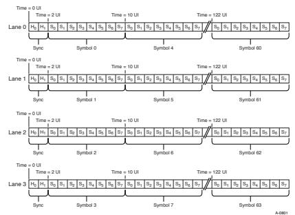

</div>


[⬆️ 返回目录](#-本章目录-table-of-contents)

---

<a id="sec-4-2-2-2"></a>
## 4.2.2.2 Ordered Set Blocks | 有序集块

<table>
<thead>
<tr>
<th width="50%">🇬🇧 English</th>
<th width="50%" style="background-color:#e8e8e8">🇨🇳 中文</th>
</tr>
</thead>
<tbody>
<tr>
<td>

**Additional Requirements:**

- While in the Aligned or Locked phase, Receivers must adjust their alignment as necessary when a SKP Ordered Set is received. See § Section 4.2.8 for more information on SKP Ordered Sets.
- After any LTSSM transition to Recovery, Receivers must ignore all received TS Ordered Sets until they receive an EIEOS. Conceptually, receiving an EIEOS validates the Receiver's alignment and allows TS Ordered Set processing to proceed. If a received EIEOS initiates an LTSSM transition from L0 to Recovery, Receivers are permitted to process any TS Ordered Sets that follow the EIEOS or ignore them until another EIEOS is received after entering Recovery.
- Receivers are permitted to transition from the Locked phase to the Unaligned or Aligned phase as long as Data Stream processing is stopped. See § Section 4.2.2.3 for more information on Data Stream requirements.
- **Loopback Leads:** While in Loopback.Entry, Leads must be capable of adjusting their Receiver's Block alignment to received EIEOS bit patterns. While in Loopback.Active, Leads are permitted to transmit an EIEOS and adjust their Receiver's Block alignment to the looped back bit stream.
- **Loopback Followers:** While in Loopback.Entry, Followers must be capable of adjusting their Receiver's Block alignment to received EIEOS bit patterns. While in Loopback.Active, Followers must not adjust their Receiver's Block alignment. Conceptually, the Receiver is directed to the Locked phase when the Follower starts to loop back the received bit stream.

</td>
<td style="background-color:#e8e8e8">

**附加要求:**

- 在已对齐或锁定阶段,接收到 SKP 有序集时,接收器必须根据需要调整其对齐。有关 SKP 有序集的更多信息,请参见 § 4.2.8。
- 在 LTSSM (链路训练与状态机) 任何向 Recovery 状态的转换之后,接收器必须忽略所有接收到的 TS 有序集,直到接收到 EIEOS。从概念上讲,接收到 EIEOS 即验证了接收器的对齐,并允许 TS 有序集处理继续进行。如果接收到的 EIEOS 启动了 LTSSM 从 L0 到 Recovery 的转换,则允许接收器处理该 EIEOS 之后紧跟的 TS 有序集,也可以忽略它们,直到进入 Recovery 之后再接收到另一个 EIEOS 为止。
- 只要停止数据流处理,允许接收器从锁定阶段转换到未对齐或已对齐阶段。有关数据流要求的更多信息,请参见 § 4.2.2.3。
- **回环引导方 (Loopback Leads):** 在 Loopback.Entry 期间,引导方 (Leads) 必须能够根据接收到的 EIEOS 比特模式调整其接收器的块对齐。在 Loopback.Active 期间,允许引导方发送 EIEOS 并将其接收器的块对齐调整到环回的比特流。
- **回环跟随方 (Loopback Followers):** 在 Loopback.Entry 期间,跟随方 (Followers) 必须能够根据接收到的 EIEOS 比特模式调整其接收器的块对齐。在 Loopback.Active 期间,跟随方不得调整其接收器的块对齐。从概念上讲,当跟随方开始环回接收到的比特流时,其接收器被引导进入锁定阶段。

</td>
</tr>
</tbody>
</table>

[⬆️ 返回目录](#-本章目录-table-of-contents)

---

<a id="sec-4-2-2-2-1"></a>
## 4.2.2.2.1 Block Alignment | 块对齐

<table>
<thead>
<tr>
<th width="50%">🇬🇧 English</th>
<th width="50%" style="background-color:#e8e8e8">🇨🇳 中文</th>
</tr>
</thead>
<tbody>
<tr>
<td>

> **IMPLEMENTATION NOTE: DETECTION OF LOSS OF BLOCK ALIGNMENT**
> The sequence of EIEOS and TS Ordered Sets transmitted during training sequences will cause misaligned Receivers to detect an undefined Sync Header.

</td>
<td style="background-color:#e8e8e8">

> **实现说明:块对齐丢失的检测**
> 在训练序列期间发送的 EIEOS 和 TS 有序集序列将使未对齐的接收器检测到未定义的 Sync Header。

</td>
</tr>
</tbody>
</table>

[⬆️ 返回目录](#-本章目录-table-of-contents)

---

<a id="sec-4-2-2-3"></a>
## 4.2.2.3 Data Blocks | 数据块


<div style="overflow-x: auto; max-width: 100%;">
<table>
<thead>
<tr>
<th width="50%">🇬🇧 English</th>
<th width="50%" style="background-color:#e8e8e8">🇨🇳 中文</th>
</tr>
</thead>
<tbody>
<tr>
<td>

The payload of Data Blocks is a stream of Symbols defined as a "Data Stream". In Non-Flit Mode, the Data Stream consists of Framing Tokens, TLPs, and DLLPs. In Flit Mode, the Data Stream is described in § Section 4.2.3.1 . Each Symbol of the Data Stream is placed on a single Lane of the Link, and the stream of Symbols is striped across all Lanes of the Link and spans Block boundaries.

A Data Stream starts with the first Symbol of the Data Block that follows an SDS Ordered Set. It ends either when a Framing Error is detected or with the last Symbol of the Data Block that precedes an Ordered Set other than a SKP Ordered Set. SKP Ordered Sets that occur within a Data Stream have specific requirements as described in the following sections.

The Framing Tokens used by the Physical Layer in Non-Flit Mode are shown in § Table 4-4. Each Framing Token specifies or implies the number of Symbols associated with the Token and therefore the location of the next Framing Token. § Figure 4-15 shows an example of TLPs, DLLPs, and IDLs transmitted on a x8 link.

The first Framing Token of a Data Stream is always located in Symbol 0 of Lane 0 of the first Data Block of the Data Stream. For the rest of this chapter, the terms Framing Token and Token are used interchangeably.

</td>
<td style="background-color:#e8e8e8">

数据块 (Data Block) 的有效负载是定义为"数据流 (Data Stream)"的 Symbol 流。在非 Flit 模式 (Non-Flit Mode) 下,数据流由帧定界符 (Framing Token)、TLP 和 DLLP 组成。在 Flit 模式下,数据流的描述见 § 4.2.3.1。数据流的每个 Symbol 放置在链路的一个通道 (Lane) 上,Symbol 流以条带方式分布在链路的所有通道上,并跨越 Block 边界。

数据流从 SDS 有序集之后第一个数据块的第一个 Symbol 开始。它在以下两种情况下结束:检测到帧错误 (Framing Error),或者到达非 SKP 有序集之前最后一个数据块的最后一个 Symbol。数据流中出现的 SKP 有序集具有以下各节中所述的特定要求。

非 Flit 模式下物理层使用的帧定界符如 § 表 4-4 所示。每个帧定界符指定或隐含了与该 Token 关联的 Symbol 数,因此也就指定了下一个帧定界符的位置。§ 图 4-15 显示了在 x8 链路上发送 TLP、DLLP 和 IDL 的示例。

数据流的第一个帧定界符始终位于数据流第一个数据块 Lane 0 的 Symbol 0。在本章其余部分,术语"Framing Token"和"Token"可互换使用。

</td>
</tr>
</tbody>
</table>
</div>


[⬆️ 返回目录](#-本章目录-table-of-contents)

---

<a id="sec-4-2-2-3-1"></a>
## 4.2.2.3.1 Framing Tokens in Non-Flit-Mode | 非 Flit 模式下的帧定界符

<table>
<thead>
<tr>
<th width="50%">🇬🇧 English</th>
<th width="50%" style="background-color:#e8e8e8">🇨🇳 中文</th>
</tr>
</thead>
<tbody>
<tr>
<td>

**Table 4-4 Framing Token Encoding | 表 4-4 帧定界符编码**

| Framing Token | Type | Description |
|---|---|---|
| **IDL** | Logical Idle | Logical Idle. The Framing Token is 1 Symbol. This Token is transmitted when no TLPs or DLLPs or other Framing Tokens are being transmitted. |
| **SDP** | Start of DLLP | Start of DLLP. The Framing Token is 2 Symbols long and is followed by the DLLP information. |
| **STP** | Start of TLP | Start of TLP. The Framing Token is 4 Symbols long and includes the 12-bit TLP Sequence Number. It is followed by the TLP information. |
| **EDB** | EnD Bad | EnD Bad. The Framing Token is 4 Symbols long and is used to confirm that the previous TLP was nullified. |
| **EDS** | End of Data Stream | End of Data Stream. The Framing Token is four Symbols long and indicates that the next Block will be an Ordered Set Block. |

</td>
<td style="background-color:#e8e8e8">

**Table 4-4 Framing Token Encoding | 表 4-4 帧定界符编码**

| 帧定界符 | 类型 | 描述 |
|---|---|---|
| **IDL** | 逻辑空闲 (Logical Idle) | 逻辑空闲。该帧定界符为 1 个 Symbol。当没有 TLP、DLLP 或其他帧定界符正在发送时,发送此 Token。 |
| **SDP** | DLLP 起始 (Start of DLLP) | DLLP 起始。该帧定界符长 2 个 Symbol,后跟 DLLP 信息。 |
| **STP** | TLP 起始 (Start of TLP) | TLP 起始。该帧定界符长 4 个 Symbol,包含 12 位的 TLP 序列号 (Sequence Number),后跟 TLP 信息。 |
| **EDB** | 异常结束 (EnD Bad) | 异常结束。该帧定界符长 4 个 Symbol,用于确认前一个 TLP 已被作废 (nullified)。 |
| **EDS** | 数据流结束 (End of Data Stream) | 数据流结束。该帧定界符长 4 个 Symbol,表示下一个 Block 将是有序集 Block。 |

</td>
</tr>
</tbody>
</table>

[⬆️ 返回目录](#-本章目录-table-of-contents)

---

<!-- 📄 Page 366 -->
---

<a id="sec-4-2-2-3-1-fig"></a>
### 图 4-13 / Figure 4-14 帧定界符布局

<table>
<thead>
<tr>
<th width="50%">🇬🇧 English</th>
<th width="50%" style="background-color:#e8e8e8">🇨🇳 中文</th>
</tr>
</thead>
<tbody>
<tr>
<td>

The Physical Layer DLLP layout is shown in § Figure 4-14. Symbols 0 and 1 are the SDP Token, and Symbols 2 through 7 are the Data Link Layer DLLP information.

</td>
<td style="background-color:#e8e8e8">

物理层 DLLP 布局如 § 图 4-14 所示。Symbol 0 和 1 是 SDP Token,Symbol 2 到 7 是数据链路层 DLLP 信息。

</td>
</tr>
</tbody>
</table>

> **Figure 4-13.** Layout of Framing Tokens
> 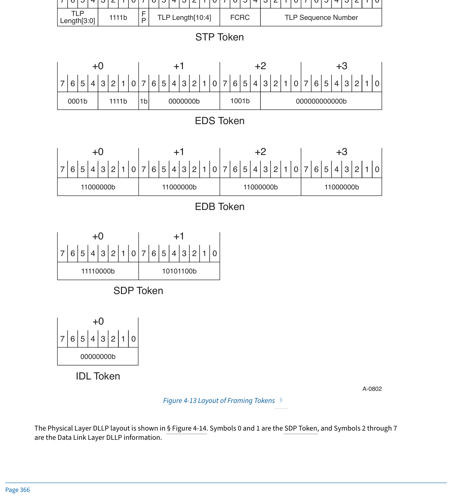

> **Figure 4-14.** TLP and DLLP Layout
> 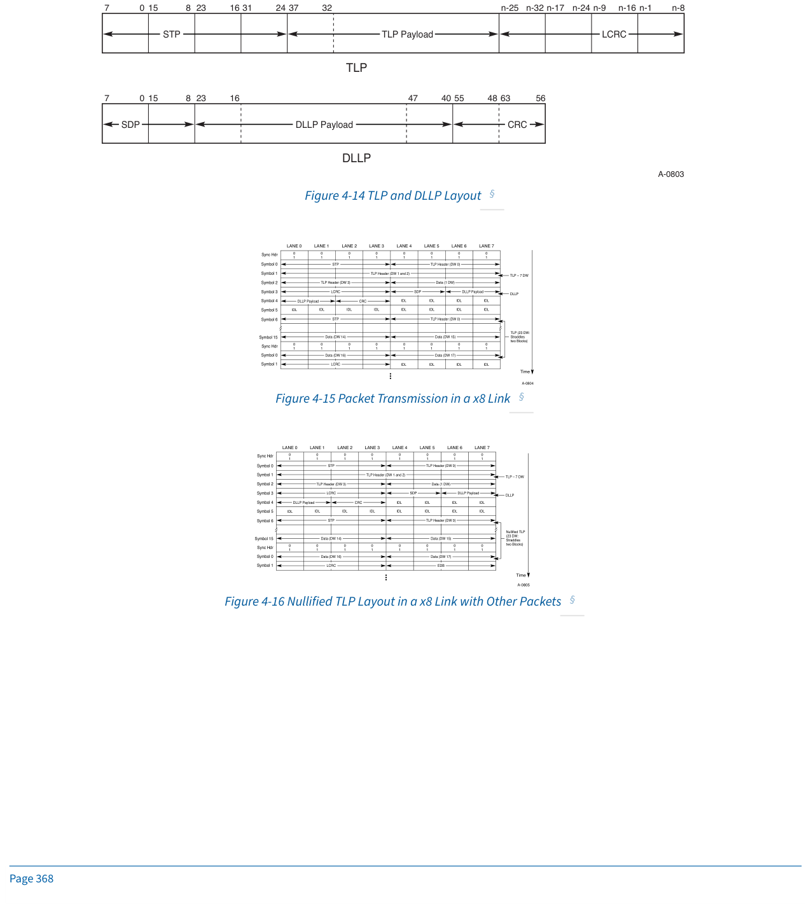


[⬆️ 返回目录](#-本章目录-table-of-contents)

---

<a id="sec-4-2-2-3-1-tlp-layout"></a>
### 物理层 TLP 布局 / Physical Layer TLP Layout


<div style="overflow-x: auto; max-width: 100%;">
<table>
<thead>
<tr>
<th width="50%">🇬🇧 English</th>
<th width="50%" style="background-color:#e8e8e8">🇨🇳 中文</th>
</tr>
</thead>
<tbody>
<tr>
<td>

The Physical Layer TLP layout is shown in § Figure 4-14. Details of the STP Framing Token are shown in § Figure 4-13. The length of the TLP (in DWs) being transmitted is specified by an 11-bit field called TLP Length. The TLP Length field is the total amount of information transferred, including the Framing Token, TLP Prefixes (if any), TLP Header, TLP data payload (if any), TLP digest (if any), TLP PCRC (if any), TLP MAC (if any), and TLP LCRC. For example, if a TLP has a 3 DW header, a 1 DW data payload, and does not include a TLP digest, the TLP Length field value is 6: 1 (Framing Token) + 0 (TLP Prefixes) + 3 (TLP header) + 1 (TLP data payload) + 0 (TLP digest) + 1 (TLP LCRC). If the same TLP included a TLP digest, the TLP Length field value would be 7. When a TLP is nullified, the EDB Token is considered an extension of the TLP but is not included in the calculation of the TLP Length field.

The TLP Length field is protected by a 4-bit CRC (Frame CRC), and an even parity bit (Frame Parity) protects both the TLP Length and Frame CRC fields. The Frame CRC and Frame Parity are calculated as follows:

```
C[0] = L[10] ^ L[7] ^ L[6] ^ L[4] ^ L[2] ^ L[1] ^ L[0]
C[1] = L[10] ^ L[9] ^ L[7] ^ L[5] ^ L[4] ^ L[3] ^ L[2]
C[2] = L[9] ^ L[8] ^ L[6] ^ L[4] ^ L[3] ^ L[2] ^ L[1]
C[3] = L[8] ^ L[7] ^ L[5] ^ L[3] ^ L[2] ^ L[1] ^ L[0]
P = L[10] ^ L[9] ^ L[8] ^ L[7] ^ L[6] ^ L[5] ^ L[4] ^ L[3] ^ L[2] ^ L[1] ^ L[0] ^ C[3] ^ C[2] ^ C[1] ^ C[0]
```

The Frame Parity reduces to `P = L[10] ^ L[9] ^ L[8] ^ L[6] ^ L[5] ^ L[2] ^ L[0]`

The TLP Length field is represented in the above equations as L[10:0], where L[0] is the least significant bit and L[10] is the most significant bit. Transmitters calculate the Frame CRC and Frame Parity before transmission. Receivers must calculate the Frame CRC and Frame Parity using the same algorithm as the transmitter and then compare the calculated values to the received values.

STP Tokens do not have a TLP Length field value of 1. If a received sequence of Symbols matches the format of an STP Token with a TLP Length field value of 1, the Symbols are evaluated to determine whether they match the EDS Token.

Note that, for TLPs, the Data Link Layer prepends 4 Reserved bits (0000b) to the TLP Sequence Number field before it calculates the LCRC. These Reserved bits are not explicitly transmitted when using 128b/130b encoding, and Receivers assume that the 4 bits received are 0000b when calculating the LCRC.

Packets containing a TLP Length field that is greater than 1535 are PMUX Packets. For such packets, the actual packet length is computed differently, the TLP Sequence Number field in the STP Token contains other information, and the Link CRC is computed using different rules. See § Appendix G. for details.

Packets containing a TLP Length field that is between 1152 and 1535 (inclusive) are reserved for future standardization.

Transmitters must transmit all DWs of a TLP specified by the TLP Length field of the STP Framing Token. TLPs are never truncated when using 128b/130b encoding - even when nullified. § Figure 4-16 shows an example of a nullified 23 DW TLP.

> **IMPLEMENTATION NOTE: FRAME CRC AND FRAME PARITY**
> The Frame CRC bits are effectively calculated as (L[0] X14 + L[1] X13 + … + L[9] X5 + L[10] X4) mod (X4 + X +1). It should be noted that X4 + X + 1 is a primitive polynomial and the CRC can detect two bit errors. The Frame Parity bit can detect an odd number of bit errors. Thus, the Frame CRC and Frame Parity together guarantee three bit error detection for the TLP Length field. It must be noted that even though in the reduced Frame Parity equation all terms are not present, it still maintains the property of detecting odd bit errors. Only those TLP Length field bits which are present in an even number of CRC terms are used in the calculation.

</td>
<td style="background-color:#e8e8e8">

物理层 TLP 布局如 § 图 4-14 所示。STP 帧定界符的详细信息如 § 图 4-13 所示。正在发送的 TLP 长度(以 DW 为单位)由一个称为 TLP Length 的 11 位字段指定。TLP Length 字段是所传输信息的总量,包括帧定界符、TLP 前缀 (Prefix, 如果有)、TLP 包头 (Header)、TLP 数据负载 (Payload, 如果有)、TLP 摘要 (Digest, 如果有)、TLP PCRC(如果有)、TLP MAC(如果有)和 TLP LCRC。例如,如果一个 TLP 包含 3 DW 包头、1 DW 数据负载且不含 TLP 摘要,则 TLP Length 字段值为 6:1(帧定界符)+ 0(TLP 前缀)+ 3(TLP 包头)+ 1(TLP 数据负载)+ 0(TLP 摘要)+ 1(TLP LCRC)。如果同一 TLP 包含 TLP 摘要,则 TLP Length 字段值为 7。当 TLP 被作废时,EDB Token 被视为 TLP 的扩展,但不计入 TLP Length 字段的计算。

TLP Length 字段由 4 位 CRC(Frame CRC)保护,一位偶校验位 (Frame Parity) 同时保护 TLP Length 和 Frame CRC 字段。Frame CRC 和 Frame Parity 的计算方法如下:

```
C[0] = L[10] ^ L[7] ^ L[6] ^ L[4] ^ L[2] ^ L[1] ^ L[0]
C[1] = L[10] ^ L[9] ^ L[7] ^ L[5] ^ L[4] ^ L[3] ^ L[2]
C[2] = L[9] ^ L[8] ^ L[6] ^ L[4] ^ L[3] ^ L[2] ^ L[1]
C[3] = L[8] ^ L[7] ^ L[5] ^ L[3] ^ L[2] ^ L[1] ^ L[0]
P = L[10] ^ L[9] ^ L[8] ^ L[7] ^ L[6] ^ L[5] ^ L[4] ^ L[3] ^ L[2] ^ L[1] ^ L[0] ^ C[3] ^ C[2] ^ C[1] ^ C[0]
```

Frame Parity 可化简为 `P = L[10] ^ L[9] ^ L[8] ^ L[6] ^ L[5] ^ L[2] ^ L[0]`

在上述等式中,TLP Length 字段表示为 L[10:0],其中 L[0] 是最低有效位,L[10] 是最高有效位。发送器在发送前计算 Frame CRC 和 Frame Parity。接收器必须使用与发送器相同的算法计算 Frame CRC 和 Frame Parity,然后将计算值与接收值进行比较。

STP Token 的 TLP Length 字段值不会为 1。如果接收到的 Symbol 序列与 TLP Length 字段值为 1 的 STP Token 格式相匹配,则会进一步评估这些 Symbol,以确定它们是否与 EDS Token 匹配。

请注意,对于 TLP,数据链路层在计算 LCRC 之前会在 TLP Sequence Number 字段前添加 4 个保留比特 (0000b)。使用 128b/130b 编码时,这些保留比特不会被显式发送,接收器在计算 LCRC 时假设接收到的 4 个比特为 0000b。

TLP Length 字段值大于 1535 的报文是 PMUX 报文 (PMUX Packet)。对于这些报文,实际报文长度的计算方法不同,STP Token 中的 TLP Sequence Number 字段包含其他信息,并且链路 CRC 使用不同的规则计算。详见 § 附录 G。

TLP Length 字段值在 1152 到 1535(含)之间的报文保留供未来标准化使用。

发送器必须发送 STP 帧定界符的 TLP Length 字段所指定 TLP 的所有 DW。在使用 128b/130b 编码时,TLP 永远不会被截断,即使被作废也不会。§ 图 4-16 显示了一个 23 DW 的已作废 TLP 的示例。

> **实现说明:FRAME CRC 与 FRAME PARITY**
> Frame CRC 位的有效计算为 (L[0] X14 + L[1] X13 + … + L[9] X5 + L[10] X4) mod (X4 + X +1)。值得注意的是 X4 + X + 1 是一个本原多项式,该 CRC 可以检测两个比特错误。Frame Parity 位可以检测奇数个比特错误。因此,Frame CRC 和 Frame Parity 共同保证对 TLP Length 字段的三位比特错误检测能力。必须注意,即使在化简后的 Frame Parity 等式中并非所有项都出现,它仍保持检测奇数个比特错误的特性。仅在偶数个 CRC 项中出现的那些 TLP Length 字段比特才参与该计算。

</td>
</tr>
</tbody>
</table>
</div>


[⬆️ 返回目录](#-本章目录-table-of-contents)

---

<!-- 📄 Page 368 -->
---

<a id="sec-4-2-2-3-1-fig-15-16"></a>
### 图 4-15 与图 4-16: TLP/DLLP 传输与作废示例

<table>
<thead>
<tr>
<th width="50%">🇬🇧 English</th>
<th width="50%" style="background-color:#e8e8e8">🇨🇳 中文</th>
</tr>
</thead>
<tbody>
<tr>
<td>

§ Figure 4-17 shows an example of TLPs, DLLPs, IDLs, and an EDS Token followed by a SKP Ordered Set. SKP Ordered Sets are defined in § Section 4.2.8.2 .

> **Figure 4-15.** Packet Transmission in a x8 Link
> 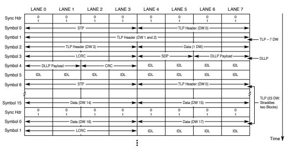

> **Figure 4-16.** Nullified TLP Layout in a x8 Link with Other Packets
> 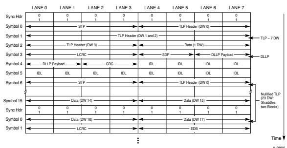

</td>
<td style="background-color:#e8e8e8">

§ 图 4-17 显示了在 x8 链路上发送的 TLP、DLLP、IDL 以及一个 EDS Token 之后跟随一个 SKP 有序集的示例。SKP 有序集的定义见 § 4.2.8.2。


</td>
</tr>
</tbody>
</table>

[⬆️ 返回目录](#-本章目录-table-of-contents)

---

<!-- 📄 Page 369 -->
---

<a id="sec-4-2-2-3-1-fig-17"></a>
### 图 4-17: SKP 有序集示例

<table>
<thead>
<tr>
<th width="50%">🇬🇧 English</th>
<th width="50%" style="background-color:#e8e8e8">🇨🇳 中文</th>
</tr>
</thead>
<tbody>
<tr>
<td></td>
<td style="background-color:#e8e8e8">

</td>
</tr>
</tbody>
</table>

> **Figure 4-17.** SKP Ordered Set of Length 66-bit in a x8 Link
> 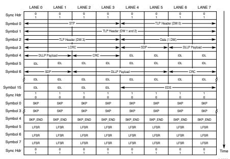


[⬆️ 返回目录](#-本章目录-table-of-contents)

---

<a id="sec-4-2-2-3-2"></a>
## 4.2.2.3.2 Transmitter Framing Requirements in Non-Flit Mode | 非 Flit 模式下的发送器帧定界要求


<div style="overflow-x: auto; max-width: 100%;">
<table>
<thead>
<tr>
<th width="50%">🇬🇧 English</th>
<th width="50%" style="background-color:#e8e8e8">🇨🇳 中文</th>
</tr>
</thead>
<tbody>
<tr>
<td>

The following requirements apply to the transmitted Data Stream.

**To Transmit a TLP:**

- Transmit an STP Token immediately followed by the complete TLP information provided by the Data Link Layer.
- All DWs of the TLP, as specified by the TLP Length field of the STP Token, must be transmitted, even if the TLP is nullified.
- If the TLP is nullified, an EDB Token must be transmitted immediately following the TLP. There must be no Symbols between the last Symbol of the TLP and the first Symbol of the EDB Token. The value of the TLP Length field of a nullified TLP's STP Token is not adjusted to account for the EDB Token.
- The STP Token must not be transmitted more frequently than once per Symbol Time.

**To Transmit a DLLP:**

- Transmit an SDP Token immediately followed by the complete DLLP information provided by the Data Link Layer.
- All 6 Symbols of the DLLP must be transmitted.
- The SDP Token must not be transmitted more frequently than once per Symbol Time.

**To Transmit a SKP Ordered Set within a Data Stream:**

- Transmit an EDS Token in the last DW of the current Data Block. For example, the Token is transmitted on Lane 0 in Symbol Times 12-15 of the Block for a x1 Link, and on Lanes 12-15 of Symbol Time 15 of the Block for a x16 Link.
- Transmit the SKP Ordered Set following the current Data Block.
- Transmit a Data Block following the SKP Ordered Set. The Data Stream resumes with the first Symbol of the Data Block. If multiple SKP Ordered Sets are scheduled for transmission, each SKP Ordered Set must be preceded by a Data Block with an EDS Token.

**To end a Data Stream:**

- Transmit an EDS Token in the last DW of the current Data Block, followed in the next block by an EIOS or an EIEOS. An EIOS is transmitted for LTSSM power management state transitions, and an EIEOS is transmitted for all other cases. For example, the Token is transmitted on Lane 0 in Symbol Times 12-15 of the Block for a x1 Link, and on Lanes 12-15 of Symbol Time 15 of the Block for a x16 Link.

- The IDL Token must be transmitted on all Lanes when not transmitting a TLP, DLLP, or other Framing Token.

**Multi-Lane Links:**

- After transmitting an IDL Token, the first Symbol of the next STP or SDP Token must be transmitted in Lane 0 of a future Symbol Time. An EDS Token can be transmitted after an IDL Token in the same Symbol Time, since it must be transmitted in the last DW of a Block.
- For xN Links where N is 8 or more, if an EDB Token, TLP, or DLLP ends in a Lane K, where K does not equal N-1, and it is not followed by the first Symbol of an STP, SDP, or EDB Token in Lane K+1, then IDL Tokens must be placed in Lanes K+1 to N-1. For example, on a x8 Link, if a TLP or DLLP ends in Lane 3, IDL Tokens must be placed in Lanes 4 to 7. The EDS Token is an exception to this requirement, and can be transmitted following IDL Tokens.
- Tokens, TLPs, and DLLPs are permitted to follow each other successively such that more than one Token may be transmitted in the same Symbol Time as long as their transmission conforms with the other requirements stated in this section.
  - Links wider than x4 can have Tokens placed starting on Lane 4*N, where N is a positive integer. For example, Tokens can be placed in Lanes 0 and 4 of a x8 Link, and Tokens can be placed in Lanes 0, 4, 8, or 12 of a x16 Link.

</td>
<td style="background-color:#e8e8e8">

以下要求适用于所发送的数据流。

**发送 TLP:**

- 发送一个 STP Token,紧接其后是由数据链路层提供的完整 TLP 信息。
- TLP 的所有 DW(由 STP Token 的 TLP Length 字段指定)都必须发送,即使 TLP 已被作废也是如此。
- 如果 TLP 被作废,必须在 TLP 之后立即发送一个 EDB Token。TLP 的最后一个 Symbol 与 EDB Token 的第一个 Symbol 之间不得有任何 Symbol。已作废 TLP 的 STP Token 中 TLP Length 字段的值不因 EDB Token 而调整。
- STP Token 的发送频率不得高于每个 Symbol Time 一次。

**发送 DLLP:**

- 发送一个 SDP Token,紧接其后是由数据链路层提供的完整 DLLP 信息。
- DLLP 的全部 6 个 Symbol 都必须发送。
- SDP Token 的发送频率不得高于每个 Symbol Time 一次。

**在数据流中发送 SKP 有序集:**

- 在当前数据块的最后一个 DW 发送一个 EDS Token。例如,对于 x1 链路,该 Token 在 Block 的 Symbol Time 12-15 的 Lane 0 上发送;对于 x16 链路,该 Token 在 Block 的 Symbol Time 15 的 Lanes 12-15 上发送。
- 在当前数据块之后发送 SKP 有序集。
- 在 SKP 有序集之后发送一个数据块。数据流从该数据块的第一个 Symbol 处恢复。如果安排了多个 SKP 有序集发送,则每个 SKP 有序集都必须由一个带有 EDS Token 的数据块作为前缀。

**结束数据流:**

- 在当前数据块的最后一个 DW 发送一个 EDS Token,然后在下一个块中发送 EIOS 或 EIEOS。LTSSM 电源管理状态转换发送 EIOS,其他所有情况发送 EIEOS。例如,对于 x1 链路,该 Token 在 Block 的 Symbol Time 12-15 的 Lane 0 上发送;对于 x16 链路,该 Token 在 Block 的 Symbol Time 15 的 Lanes 12-15 上发送。

- 当不发送 TLP、DLLP 或其他帧定界符时,必须在所有通道上发送 IDL Token。

**多通道链路:**

- 在发送 IDL Token 之后,下一个 STP 或 SDP Token 的第一个 Symbol 必须在未来某个 Symbol Time 的 Lane 0 上发送。EDS Token 可在同一 Symbol Time 中 IDL Token 之后发送,因为它必须在 Block 的最后一个 DW 中发送。
- 对于 N 为 8 或更大的 xN 链路,如果 EDB Token、TLP 或 DLLP 在 Lane K(K 不等于 N-1)上结束,且其后的 Lane K+1 上未紧跟 STP、SDP 或 EDB Token 的第一个 Symbol,则必须在 Lanes K+1 到 N-1 上填充 IDL Token。例如,在 x8 链路上,如果 TLP 或 DLLP 在 Lane 3 结束,则必须在 Lanes 4 到 7 填充 IDL Token。EDS Token 是此要求的例外,可以在 IDL Token 之后发送。
- Token、TLP 和 DLLP 允许依次紧接发送,只要其发送符合本节中的其他要求,就可以在同一 Symbol Time 中发送多个 Token。
  - 宽度大于 x4 的链路可以将 Token 放置在从 Lane 4*N 开始的通道上,其中 N 是正整数。例如,在 x8 链路上,Token 可以放置在 Lanes 0 和 4;在 x16 链路上,Token 可以放置在 Lanes 0、4、8 或 12。

</td>
</tr>
</tbody>
</table>
</div>


[⬆️ 返回目录](#-本章目录-table-of-contents)

---

<!-- 📄 Page 370 -->
---

<a id="sec-4-2-2-3-3"></a>
## 4.2.2.3.3 Receiver Framing Requirements in Non-Flit Mode | 非 Flit 模式下的接收器帧定界要求

<table>
<thead>
<tr>
<th width="50%">🇬🇧 English</th>
<th width="50%" style="background-color:#e8e8e8">🇨🇳 中文</th>
</tr>
</thead>
<tbody>
<tr>
<td>

The following requirements apply to the received Data Stream and the Block type transitions that occur at the beginning and end of the Data Stream.

- When processing Symbols that are expected to be a Framing Token, receiving a Symbol or sequence of Symbols that does not match the definition of a Framing Token is a Framing Error. It is strongly recommended that Receivers of a multi-Lane Link report an error in the Lane Error Status Register for the Lane that receives the first Symbol of an expected Framing Token when that Symbol does not match Symbol +0 of an STP (bits [3:0] only), IDL, SDP, EDB, or EDS Token (see § Figure 4-13).
- All optional error checks and error reports in this section are independently optional (see § Section 6.2.3.4 ).
- **When an STP Token is received:**
  - Receivers must calculate the Frame CRC and Frame Parity of the received TLP Length field and compare the results to the received Frame CRC and Frame Parity fields. A Frame CRC or Frame Parity mismatch is a Framing Error.
    - An STP Token with Framing Error is not considered part of a TLP for the purpose of reporting to the Data Link Layer.
  - If the TLP Length field is 1, the Symbols are not an STP Token and are instead evaluated to determine whether they are an EDS Token.
  - Receivers are permitted to check whether the TLP Length field has a value of 0. If checked, receiving a TLP Length field of 0 is a Framing Error.
  - Receivers are permitted to check whether the TLP Length field has a value of 2, 3, or 4. If checked, receiving such a TLP Length field is a Framing Error.
  - Receivers are permitted to check whether the TLP Length field has a value between 1152 and 1535 (inclusive). If checked, receiving such a TLP Length field is a Framing Error.
  - Receivers on Ports that do not support Protocol Multiplexing are permitted to check whether the TLP Length field has a value greater than 1535. If checked, receiving such a TLP Length field is a Framing Error.
  - Receivers on Ports that support Protocol Multiplexing, shall process STP Tokens with a TLP Length field that is greater than 1535 as the start of a PMUX Packet as defined in § Appendix G. .

</td>
<td style="background-color:#e8e8e8">

以下要求适用于所接收的数据流以及数据流开始和结束处发生的 Block 类型转换。

- 在处理预期为帧定界符的 Symbol 时,接收到与帧定界符定义不匹配的 Symbol 或 Symbol 序列,即为帧错误 (Framing Error)。强烈建议多通道链路的接收器在 Lane Error Status Register 中,对于接收到的预期帧定界符第一个 Symbol 与 STP(仅 [3:0] 位)、IDL、SDP、EDB 或 EDS Token 的 Symbol +0 不匹配的通道(参见 § 图 4-13)报告错误。
- 本节中的所有可选错误检查和错误报告都是各自独立的(参见 § 6.2.3.4)。
- **当接收到 STP Token 时:**
  - 接收器必须对所接收 TLP Length 字段计算 Frame CRC 和 Frame Parity,并将结果与所接收的 Frame CRC 和 Frame Parity 字段进行比较。Frame CRC 或 Frame Parity 不匹配即为帧错误。
    - 在向数据链路层报告时,带有帧错误的 STP Token 不视为 TLP 的一部分。
  - 如果 TLP Length 字段为 1,则这些 Symbol 不是 STP Token,而是进一步评估以确定它们是否是 EDS Token。
  - 允许接收器检查 TLP Length 字段值是否为 0。如果检查,接收到 TLP Length 字段为 0 即为帧错误。
  - 允许接收器检查 TLP Length 字段值是否为 2、3 或 4。如果检查,接收到这样的 TLP Length 字段即为帧错误。
  - 允许接收器检查 TLP Length 字段值是否在 1152 到 1535(含)之间。如果检查,接收到这样的 TLP Length 字段即为帧错误。
  - 对于不支持协议多路复用 (Protocol Multiplexing) 的端口上的接收器,允许检查 TLP Length 字段值是否大于 1535。如果检查,接收到这样的 TLP Length 字段即为帧错误。
  - 对于支持协议多路复用的端口上的接收器,必须将 TLP Length 字段值大于 1535 的 STP Token 作为 § 附录 G 所定义的 PMUX 报文的起始处理。

</td>
</tr>
</tbody>
</table>

[⬆️ 返回目录](#-本章目录-table-of-contents)

---

<!-- 📄 Page 371 -->
---

<a id="sec-4-2-2-3-3-cont"></a>
### 非 Flit 模式接收器帧定界要求(续)


<div style="overflow-x: auto; max-width: 100%;">
<table>
<thead>
<tr>
<th width="50%">🇬🇧 English</th>
<th width="50%" style="background-color:#e8e8e8">🇨🇳 中文</th>
</tr>
</thead>
<tbody>
<tr>
<td>

  - The next Token to be processed begins with the Symbol immediately following the last DW of the TLP, as determined by the TLP Length field.
    - Receivers must evaluate this Symbol and determine whether it is the first Symbol of an EDB Token and therefore whether the TLP is nullified. See the EDB Token requirements.
  - Receivers are permitted to check whether more than one STP Token is received in a single Symbol Time. If checked, receiving more than one STP Token in a single Symbol Time is a Framing Error.
- **When an EDB Token is received:**
  - If an EDB Token is received immediately following a TLP (there are no Symbols between the last Symbol of the TLP and the first Symbol of the EDB Token), receivers must inform the Data Link Layer that an EDB Token has been received. Receivers are permitted to inform the Data Link Layer that an EDB Token has been received after processing the first Symbol of the EDB Token or after processing any or all of the remaining Symbols of the EDB Token. Regardless of when they inform the Data Link Layer of a received EDB Token, Receivers must check all Symbols of the EDB Token. Receiving a Symbol that does not match the definition of an EDB Token is a Framing Error.
  - Receiving an EDB Token at any time other than immediately following a TLP is a Framing Error.
  - The next Token to be processed begins with the Symbol immediately following the EDB Token.
- **When an EDS Token is received in the last four Symbols of the Data Block across the Link:**
  - Receivers must stop processing the Data Stream.
  - Receiving an Ordered Set other than SKP, EIOS, or EIEOS in the Block following the EDS Token is a Framing Error.
  - If a SKP Ordered Set is received in the Block following the EDS Token, Receivers resume Data Stream processing with the first Symbol of the Data Block that follows the SKP Ordered Set unless a Framing Error has been detected.
- **When an SDP Token is received:**
  - The next Token to be processed begins with the Symbol immediately following the last Symbol of the DLLP.
  - Receivers are permitted to check whether more than one SDP Token is received in a single Symbol Time. If checked, receiving more than one SDP Token in a single Symbol Time is a Framing Error.
- **When an IDL Token is received:**
  - For a x1 Link, the next Token to be processed begins with the next Symbol received.
  - For a x2 Link, the next Token to be processed begins with the Symbol received in Lane 0 of the next Symbol Time. It is strongly recommended that Receivers check whether the Symbol received in Lane 1, if it did not receive IDL, after an IDL Token was received in Lane 0 is also IDL and report an error for Lane 1 in the Lane Error Status Register. If checked, receiving a Symbol other than IDL is a Framing Error.
  - For a x4 Link, the next Token to be processed begins with the Symbol received in Lane 0 of the next Symbol Time. It is strongly recommended that Receivers check whether the Symbols received in Lanes 1-3, after an IDL Token was received in Lane 0 are also IDL and report an error for the Lane(s) that did not receive IDL, in the Lane Error Status Register. If checked, receiving a Symbol other than IDL is a Framing Error.
  - For x8 and x16 Links, the next Token to be processed begins with the Symbol received in the next DW aligned Lane following the IDL Token. For example, if an IDL Token is received in Lane 4 of a x16 Link, the next Token location begins with Lane 8 of the same Symbol Time. However, if an IDL Token is received on Lane 4 of a x8 Link, the next Token location begins with Lane 0 of the following Symbol Time. It is strongly recommended that Receivers check whether the Symbols received between the IDL Token and the next Token location are also IDL and report an error for the Lane(s) that did not receive IDL, in the Lane Error Status Register. If checked, receiving a Symbol other than IDL is a Framing Error.

</td>
<td style="background-color:#e8e8e8">

  - 下一个待处理的 Token 从 TLP 最后一个 DW 之后紧接的 Symbol 开始,该 DW 由 TLP Length 字段确定。
    - 接收器必须评估该 Symbol,以确定它是否是 EDB Token 的第一个 Symbol,从而确定 TLP 是否被作废。参见 EDB Token 要求。
  - 允许接收器检查在单个 Symbol Time 中是否接收到多个 STP Token。如果检查,在单个 Symbol Time 中接收到多个 STP Token 即为帧错误。
- **当接收到 EDB Token 时:**
  - 如果在 TLP 之后立即接收到 EDB Token(即 TLP 的最后一个 Symbol 与 EDB Token 的第一个 Symbol 之间没有任何 Symbol),接收器必须通知数据链路层已接收到 EDB Token。允许接收器在处理 EDB Token 的第一个 Symbol 之后,或处理 EDB Token 其余 Symbol 中的任何一个或全部之后,通知数据链路层已接收到 EDB Token。无论接收器何时通知数据链路层已接收到 EDB Token,都必须检查 EDB Token 的所有 Symbol。接收到与 EDB Token 定义不匹配的 Symbol 即为帧错误。
  - 在 TLP 之后立即接收之外的其他任何时间接收到 EDB Token,即为帧错误。
  - 下一个待处理的 Token 从 EDB Token 之后紧接的 Symbol 开始。
- **当在数据块横跨链路的最后四个 Symbol 中接收到 EDS Token 时:**
  - 接收器必须停止处理数据流。
  - 在 EDS Token 之后的 Block 中接收到非 SKP、EIOS 或 EIEOS 的有序集即为帧错误。
  - 如果在 EDS Token 之后的 Block 中接收到 SKP 有序集,则接收器在 SKP 有序集之后的数据块的第一个 Symbol 处恢复数据流处理,除非已检测到帧错误。
- **当接收到 SDP Token 时:**
  - 下一个待处理的 Token 从 DLLP 最后一个 Symbol 之后紧接的 Symbol 开始。
  - 允许接收器检查在单个 Symbol Time 中是否接收到多个 SDP Token。如果检查,在单个 Symbol Time 中接收到多个 SDP Token 即为帧错误。
- **当接收到 IDL Token 时:**
  - 对于 x1 链路,下一个待处理的 Token 从下一个接收到的 Symbol 开始。
  - 对于 x2 链路,下一个待处理的 Token 从下一个 Symbol Time 的 Lane 0 中接收到的 Symbol 开始。强烈建议接收器检查在 Lane 0 接收到 IDL Token 之后,Lane 1 中接收到的 Symbol(若未接收到 IDL)是否也是 IDL,并在 Lane Error Status Register 中针对 Lane 1 报告错误。如果检查,接收到非 IDL 的 Symbol 即为帧错误。
  - 对于 x4 链路,下一个待处理的 Token 从下一个 Symbol Time 的 Lane 0 中接收到的 Symbol 开始。强烈建议接收器检查在 Lane 0 接收到 IDL Token 之后,Lanes 1-3 中接收到的 Symbol 是否也是 IDL,并在 Lane Error Status Register 中针对未接收到 IDL 的通道报告错误。如果检查,接收到非 IDL 的 Symbol 即为帧错误。
  - 对于 x8 和 x16 链路,下一个待处理的 Token 从 IDL Token 之后下一个 DW 对齐的通道中接收到的 Symbol 开始。例如,如果在 x16 链路的 Lane 4 接收到 IDL Token,则下一个 Token 位置从同一 Symbol Time 的 Lane 8 开始。但是,如果在 x8 链路的 Lane 4 接收到 IDL Token,则下一个 Token 位置从下一个 Symbol Time 的 Lane 0 开始。强烈建议接收器检查 IDL Token 与下一个 Token 位置之间接收到的 Symbol 是否也是 IDL,并在 Lane Error Status Register 中针对未接收到 IDL 的通道报告错误。如果检查,接收到非 IDL 的 Symbol 即为帧错误。

</td>
</tr>
</tbody>
</table>
</div>


[⬆️ 返回目录](#-本章目录-table-of-contents)

---

<!-- 📄 Page 372 -->
---

<a id="sec-4-2-2-3-3-cont2"></a>
### 非 Flit 模式接收器帧定界要求(续 2)

<table>
<thead>
<tr>
<th width="50%">🇬🇧 English</th>
<th width="50%" style="background-color:#e8e8e8">🇨🇳 中文</th>
</tr>
</thead>
<tbody>
<tr>
<td>

**Note:** The only Tokens expected to be received in the same Symbol Time following an IDL Token are additional IDL Tokens or an EDS Token.

- While processing the Data Stream, Receivers must also check the Block type received by each Lane, after accounting for Lane-to-Lane de-skew, for the following conditions:
  - Receiving an Ordered Set Block on any Lane immediately following an SDS Ordered Set is a Framing Error.
  - Receiving a Block with an undefined Block type (a Sync Header of 11b or 00b) is a Framing Error. It is strongly recommended that Receivers of a multi-Lane Link report an error for any Lane that received the undefined Block type in the Lane Error Status register.
  - Receiving an Ordered Set Block on any Lane without receiving an EDS Token in the preceding Block is a Framing Error. For example, receiving a SKP Ordered Set without a preceding EDS Token is a Framing Error. In addition, receiving a SKP Ordered Set followed immediately by another Ordered Set Block (including another SKP Ordered Set) within a Data Stream is a Framing Error. It is strongly recommended that if the first Symbol of the Ordered Set is SKP, Receivers of a multi-Lane Link report an error for the Lane(s) in the Lane Error Status register if the received Symbol number 1 through 4N does not match the corresponding Symbol in § Table 4-52 or § Table 4-53.
  - Receiving a Data Block on any Lane when the previous block contained an EDS Token is a Framing Error. It is strongly recommended that Receivers of a multi-Lane Link report an error for the Lane(s) that received the Data Block in the Lane Error Status register.
  - Receivers are permitted to check for different Ordered Sets on different Lanes. If checked, receiving different Ordered Sets is a Framing Error. For example, if Lane 0 receives a SKP Ordered Set and Lane 1 receives an EIOS, it would be a Framing Error.

</td>
<td style="background-color:#e8e8e8">

**注:** 在 IDL Token 之后同一 Symbol Time 中预期接收到的 Token 仅为额外的 IDL Token 或一个 EDS Token。

- 在处理数据流期间,接收器还必须考虑通道间去偏斜(Lane-to-Lane de-skew)后,检查每个通道所接收的 Block 类型,条件如下:
  - 在 SDS 有序集之后,任何通道立即接收到有序集 Block 即为帧错误。
  - 接收到具有未定义 Block 类型的 Block(Sync Header 为 11b 或 00b)即为帧错误。强烈建议多通道链路的接收器在 Lane Error Status 寄存器中针对接收到未定义 Block 类型的任何通道报告错误。
  - 在任何通道上接收到有序集 Block,而前一个 Block 中未接收到 EDS Token,即为帧错误。例如,接收到 SKP 有序集而前面没有 EDS Token 即为帧错误。此外,在数据流中接收到 SKP 有序集后立即又接收到另一个有序集 Block(包括另一个 SKP 有序集)亦为帧错误。强烈建议当有序集的第一个 Symbol 为 SKP 时,如果接收到的 Symbol 1 到 4N 与 § 表 4-52 或 § 表 4-53 中对应的 Symbol 不匹配,则多通道链路的接收器在 Lane Error Status 寄存器中针对相应通道报告错误。
  - 在前一个 Block 包含 EDS Token 的情况下,任何通道接收到数据 Block 即为帧错误。强烈建议多通道链路的接收器在 Lane Error Status 寄存器中针对接收到数据 Block 的通道报告错误。
  - 允许接收器检查不同通道上是否接收到不同的有序集。如果检查,接收到不同的有序集即为帧错误。例如,如果 Lane 0 接收到 SKP 有序集而 Lane 1 接收到 EIOS,则为帧错误。

</td>
</tr>
</tbody>
</table>

[⬆️ 返回目录](#-本章目录-table-of-contents)

---

<a id="sec-4-2-2-3-4"></a>
## 4.2.2.3.4 Receiver Framing Requirements in Flit Mode | Flit 模式下的接收器帧定界要求


<div style="overflow-x: auto; max-width: 100%;">
<table>
<thead>
<tr>
<th width="50%">🇬🇧 English</th>
<th width="50%" style="background-color:#e8e8e8">🇨🇳 中文</th>
</tr>
</thead>
<tbody>
<tr>
<td>

While processing the Data Stream, Receivers must check the Block type received by each Lane, after accounting for Lane-to-Lane de-skew, for the following conditions:

- Not receiving a SKP Ordered Set followed by a Data Block on any Lane immediately following an SDS Ordered Set is a Framing Error.
- Receiving a Block with an undefined Block type (a Sync Header of 11b or 00b) is a Framing Error. It is strongly recommended that Receivers of a multi-Lane Link report an error for any Lane that received the undefined Block type in the Lane Error Status register.
- For Lanes that are not entering or exiting the electrical idle state as part of L0p state, the following conditions result in a Framing Error. It is strongly recommended that Receivers of a multi-Lane Link report an error for any Lane that caused the Framing Error in the Lane Error Status register.
  - Receiving an Ordered Set Block on any Lane in an unscheduled Block boundary, as defined in § Section 4.2.3.1
  - Not receiving one of these three Ordered Sets of the appropriate length at the scheduled Block boundary: EIEOS, SKP Ordered Set, or EIOS
  - Receivers are permitted to check for different Ordered Sets on different Lanes, except as permitted for an L0p width transition. If checked, receiving different Ordered Sets is a Framing Error. For example, if Lane 0 receives a SKP Ordered Set and Lane 1 receives an EIOS and no L0p transition is expected, it would be a Framing Error.

</td>
<td style="background-color:#e8e8e8">

在处理数据流期间,接收器必须考虑通道间去偏斜后,检查每个通道所接收的 Block 类型,条件如下:

- 在 SDS 有序集之后,任何通道未接收到 SKP 有序集后接数据 Block,即为帧错误。
- 接收到具有未定义 Block 类型的 Block(Sync Header 为 11b 或 00b)即为帧错误。强烈建议多通道链路的接收器在 Lane Error Status 寄存器中针对接收到未定义 Block 类型的任何通道报告错误。
- 对于未作为 L0p 状态的一部分进入或退出电气空闲状态的通道,以下条件会导致帧错误。强烈建议多通道链路的接收器在 Lane Error Status 寄存器中针对导致帧错误的任何通道报告错误。
  - 在任何通道上,在未调度的 Block 边界接收到有序集 Block,如 § 4.2.3.1 中所定义。
  - 在调度的 Block 边界未接收到下列三种有序集中适当长度之一:EIEOS、SKP 有序集或 EIOS。
  - 允许接收器检查不同通道上是否接收到不同的有序集,L0p 宽度转换所允许的情况除外。如果检查,接收到不同的有序集即为帧错误。例如,如果 Lane 0 接收到 SKP 有序集而 Lane 1 接收到 EIOS,且未预期 L0p 转换,则为帧错误。

</td>
</tr>
</tbody>
</table>
</div>


[⬆️ 返回目录](#-本章目录-table-of-contents)

---

<!-- 📄 Page 373 -->
---

<a id="sec-4-2-2-3-4-cont"></a>
### Flit 模式接收器帧定界要求与加扰 (续)

<table>
<thead>
<tr>
<th width="50%">🇬🇧 English</th>
<th width="50%" style="background-color:#e8e8e8">🇨🇳 中文</th>
</tr>
</thead>
<tbody>
<tr>
<td>

If a Receiver detects a Framing Error while processing the Data Stream, it must:

- Report a Receiver Error as described in § Section 4.2.5.8 .
- Stop processing the Data Stream. Processing of a new Data Stream is initiated when the next SDS Ordered Set is received as previously described.
- Initiate the error recovery process as described in § Section 4.2.5.8 . If the LTSSM state is L0, direct the LTSSM to Recovery. If the LTSSM state is Configuration.Complete or Configuration.Idle when the Framing Error is detected, the error recovery process is satisfied by either a transition from Configuration.Idle to Recovery.RcvrLock due to the specified timeout, or a transition to Recovery through L0. If the LTSSM state is Recovery.RcvrCfg or Recovery.Idle when the Framing Error is detected, the error recovery process is satisfied by either a transition from Recovery.Idle to Recovery.RcvrLock due to the specified timeout, or a directed transition from L0 to Recovery. If the LTSSM substate is either Recovery.RcvrLock or Configuration.Linkwidth.Start, the error recovery process is satisfied upon exit from these substates and no direction of the LTSSM to Recovery is required.

  - **Note:** The framing error recovery mechanism is not expected to directly cause any Data Link Layer initiated recovery action such as NAK.

Each Lane of the transmitter in a multi-Lane Link may implement a separate LFSR for scrambling. Each Lane of the receiver in a multi-Lane Link may implement a separate LFSR for descrambling. Implementations may choose to implement fewer LFSRs but must achieve the same functionality as independent LFSRs.

The LFSR uses the following polynomial: `G(X) = X23 + X21 + X16 + X8 + X5 + X2 + 1` and is demonstrated in § Figure 4-18.

The scrambling rules are as follows:

- The two bits of the Sync Header used in 8.0 GT/s, 16.0 GT/s, or 32.0 GT/s Data Rate are not scrambled and do not advance the LFSR.
- All 16 Symbols of an Electrical Idle Exit Ordered Set (EIEOS) bypass scrambling. Except during L0p, the scrambling LFSR is initialized after the last Symbol of an EIEOS is transmitted, and the descrambling LFSR is initialized after the last Symbol of an EIEOS is received.
- **TS1 and TS2 Ordered Sets for 8.0 GT/s, 16.0 GT/s, or 32.0 GT/s Data Rate:**
  - Symbol 0 of a TS1 or TS2 Ordered Set bypasses scrambling.
  - Symbols 1-13 are scrambled.

</td>
<td style="background-color:#e8e8e8">

如果接收器在处理数据流时检测到帧错误,则必须:

- 按 § 4.2.5.8 中所述报告接收器错误 (Receiver Error)。
- 停止处理数据流。当接收到下一个 SDS 有序集时,如前所述,将启动新数据流的处理。
- 按 § 4.2.5.8 中所述启动错误恢复流程。如果 LTSSM 状态为 L0,则将 LTSSM 引导至 Recovery。如果在检测到帧错误时 LTSSM 状态为 Configuration.Complete 或 Configuration.Idle,则错误恢复流程可由 Configuration.Idle 到 Recovery.RcvrLock 的超时触发的转换,或经由 L0 的 Recovery 转换来满足。如果在检测到帧错误时 LTSSM 状态为 Recovery.RcvrCfg 或 Recovery.Idle,则错误恢复流程可由 Recovery.Idle 到 Recovery.RcvrLock 的超时触发的转换,或从 L0 到 Recovery 的引导转换来满足。如果 LTSSM 子状态为 Recovery.RcvrLock 或 Configuration.Linkwidth.Start,则错误恢复流程在这些子状态退出时即得到满足,无需将 LTSSM 引导至 Recovery。

  - **注:** 帧错误恢复机制预期不会直接导致任何数据链路层发起的恢复动作(例如 NAK)。

多通道链路中发送器的每个通道可以实现单独的 LFSR 用于加扰 (Scrambling)。多通道链路中接收器的每个通道可以实现单独的 LFSR 用于解扰 (De-scrambling)。实现可以选择使用更少的 LFSR,但必须实现与独立 LFSR 相同的功能。

LFSR 使用以下多项式:`G(X) = X23 + X21 + X16 + X8 + X5 + X2 + 1`,如 § 图 4-18 所示。

加扰规则如下:

- 8.0 GT/s、16.0 GT/s 或 32.0 GT/s 数据速率下使用的 Sync Header 的 2 个比特不加扰,也不会推进 LFSR。
- 电气空闲退出有序集 (EIEOS) 的全部 16 个 Symbol 旁路加扰。在 L0p 期间除外,加扰 LFSR 在 EIEOS 最后一个 Symbol 发送之后初始化,解扰 LFSR 在 EIEOS 最后一个 Symbol 接收之后初始化。
- **8.0 GT/s、16.0 GT/s 或 32.0 GT/s 数据速率下的 TS1 和 TS2 有序集:**
  - TS1 或 TS2 有序集的 Symbol 0 旁路加扰。
  - Symbol 1-13 进行加扰。

</td>
</tr>
</tbody>
</table>

[⬆️ 返回目录](#-本章目录-table-of-contents)

---


---

<a id="sec-4-2-2-3-5"></a>
## 4.2.2.3.5 Recovery from Framing Errors in Non-Flit Mode and Flit Mode | 非 Flit 模式与 Flit 模式下的帧错误恢复

<table>
<thead>
<tr>
<th width="50%">🇬🇧 English</th>
<th width="50%" style="background-color:#e8e8e8">🇨🇳 中文</th>
</tr>
</thead>
<tbody>
<tr>
<td>

**IMPLEMENTATION NOTE:**
**TIME SPENT IN RECOVERY DUE TO DETECTION OF A FRAMING ERROR**

When using 128b/130b encoding, all Framing Errors require Link recovery. It is expected that implementations will require less than 1 microsecond to recover from a Framing Error as measured from the time that both Ports have entered the Recovery state.

</td>
<td style="background-color:#e8e8e8">

**实现注意事项：**
**检测到帧错误时恢复所耗费的时间**

当使用 128b/130b 编码时，所有帧错误都需要进行链路恢复。预期实现从双方端口进入 Recovery 状态起，恢复一个帧错误所需时间应小于 1 微秒。

</td>
</tr>
</tbody>
</table>

---

<a id="sec-4-2-2-4"></a>
## 4.2.2.4 Scrambling in Non-Flit Mode and Flit Mode | 非 Flit 模式与 Flit 模式下的加扰


<div style="overflow-x: auto; max-width: 100%;">
<table>
<thead>
<tr>
<th width="50%">🇬🇧 English</th>
<th width="50%" style="background-color:#e8e8e8">🇨🇳 中文</th>
</tr>
</thead>
<tbody>
<tr>
<td>

◦ Symbols 14 and 15 bypass scrambling if required for DC Balance, but they are scrambled if not required for DC Balance.

</td>
<td style="background-color:#e8e8e8">

◦ 符号 14 和 15 在需要时为保持直流平衡（DC Balance）而旁路加扰，否则仍执行加扰。

</td>
</tr>
<tr>
<td>

• All 16 Symbols of a Fast Training Sequence (FTS) Ordered Set used in 8.0 GT/s, 16.0 GT/s, or 32.0 GT/s bypass scrambling.

</td>
<td style="background-color:#e8e8e8">

• 在 8.0 GT/s、16.0 GT/s 或 32.0 GT/s 下使用的快速训练序列（FTS, Fast Training Sequence）有序集的全部 16 个符号均旁路加扰。

</td>
</tr>
<tr>
<td>

• All 16 Symbols of a Start of Data Stream (SDS) Ordered Set bypass scrambling.

</td>
<td style="background-color:#e8e8e8">

• 数据流起始（SDS, Start of Data Stream）有序集的全部 16 个符号均旁路加扰。

</td>
</tr>
<tr>
<td>

• All 16 Symbols of an Electrical Idle Ordered Set (EIOS) bypass scrambling.

</td>
<td style="background-color:#e8e8e8">

• 电气空闲有序集（EIOS, Electrical Idle Ordered Set）的全部 16 个符号均旁路加扰。

</td>
</tr>
<tr>
<td>

• All Symbols of a SKP Ordered Set bypass scrambling.

</td>
<td style="background-color:#e8e8e8">

• SKP 有序集的全部符号均旁路加扰。

</td>
</tr>
<tr>
<td>

• Transmitters advance their LFSR for all Symbols of all Ordered Sets except for the SKP Ordered Set. The LFSR is not advanced for any Symbols of a SKP Ordered Set.

</td>
<td style="background-color:#e8e8e8">

• 发送器对所有有序集的全部符号推进其 LFSR（线性反馈移位寄存器），但 SKP 有序集除外。SKP 有序集的任何符号都不推进 LFSR。

</td>
</tr>
<tr>
<td>

• Receivers evaluate Ordered Sets to determine whether to advance their LFSR. If the Ordered Set is a SKP Ordered Set (see § Section 4.2.8), or an EIOS with L0p in the midst of a data stream then the LFSR is not advanced for any Symbol of the Ordered Set. Otherwise, the LFSR is advanced for all Symbols of the Ordered Set.

</td>
<td style="background-color:#e8e8e8">

• 接收器评估有序集以决定是否推进其 LFSR。若有序集是 SKP 有序集（参见 § 4.2.8 节），或数据流中处于 L0p 状态时的 EIOS，则该有序集的任何符号都不推进 LFSR；否则，对该有序集的所有符号推进 LFSR。

</td>
</tr>
<tr>
<td>

• In L0p, the scrambler on the Transmit and Receive sides associated with all the Lanes must advance whenever the scrambler associated with Lane 0 advances and does not advance whenever the scrambler associated Lane 0 does not advance. As a result, in L0p, the transmit or receipt of an EIEOS does not reset the scrambler associated with the Lane, if it is not Lane 0.

</td>
<td style="background-color:#e8e8e8">

• 在 L0p 状态下，与各 Lane 相关联的发送和接收侧加扰器，必须在 Lane 0 的加扰器推进时推进，在 Lane 0 的加扰器不推进时不推进。因此，在 L0p 状态下，对非 Lane 0 通道，发送或接收 EIEOS 不会复位该 Lane 的加扰器。

</td>
</tr>
<tr>
<td>

• All 16 Symbols of a Data Block are scrambled and advance the scrambler.

</td>
<td style="background-color:#e8e8e8">

• 数据块（Data Block）的全部 16 个符号都加扰并推进加扰器。

</td>
</tr>
<tr>
<td>

• For Symbols that need to be scrambled, the least significant bit is scrambled first and the most significant bit is scrambled last.

</td>
<td style="background-color:#e8e8e8">

• 对于需要加扰的符号，最低有效位先加扰，最高有效位最后加扰。

</td>
</tr>
<tr>
<td>

• The seed value of the LFSR is dependent on the Lane number Default Lane numbers are assigned in an implementation specific manner which is invariant to Link width and Lane reversal negotiation. These default numbers must be unique. For example, each Lane of a x16 Link must be assigned a unique Lane number from 0

</td>
<td style="background-color:#e8e8e8">

• LFSR 的种子值依赖于 Lane 编号。默认的 Lane 编号以实现特定的方式分配，且不受链路宽度和 Lane 反转协商的影响。这些默认编号必须唯一。例如，x16 链路的每个 Lane 必须被分配一个 0 开始的唯一 Lane 编号。

</td>
</tr>
</tbody>
</table>
</div>


**Table 4-X. LFSR Seed Values per Lane | 表 4-X. 各 Lane 的 LFSR 种子值**

| Lane | Seed   |
|------|--------|
| 0    | 1DBFBCh |
| 1    | 0607BBh |
| 2    | 1EC760h |
| 3    | 18C0DBh |
| 4    | 010F12h |
| 5    | 19CFC9h |
| 6    | 0277CEh |
| 7    | 1BB807h |

<table>
<thead>
<tr>
<th width="50%">🇬🇧 English</th>
<th width="50%" style="background-color:#e8e8e8">🇨🇳 中文</th>
</tr>
</thead>
<tbody>
<tr>
<td>

**IMPLEMENTATION NOTE:**
**ELASTIC BUFFER AND L0P**

For implementations that descramble prior to putting entries into the elastic buffer, one way to handle the scramblers advancing in the idle lane during L0p is as follows:

◦ The Lane which goes to electrical idle will tie its decision to advance the scrambler, accounting for sync hdr, if any, and SKP Ordered Set to Lane 0. Since the EIOS in the Lane coincides with SKP OS in Lane 0, the scrambler in the idle Lane should be synchronized with the Lane 0 on receipt of EIOS

◦ The TS1/TS2 Ordered Sets exchanged when trying to upsize the Link on L0p will be scrambled using the continually running LFSR.

◦ Depending on the implementation, any differences in scrambler synchronization on the receive side for lanes which have recently become active can be determined on the SKP Ordered Set boundary following block alignment and adjusted accordingly.

◦ The special scrambler rules for L0p above apply only to 128b/130b and 1b/1b encoding since the Ordered Sets are scrambled, and different Lanes can have different seeds/taps which must run continuously without being reset during the data stream. In contrast, 8b/10b encoding does not scramble Ordered Sets and all the scramblers across all Lanes will be reset during SKP Ordered Sets during the link width up-size.

</td>
<td style="background-color:#e8e8e8">

**实现注意事项：**
**弹性缓冲与 L0P**

对于在将数据送入弹性缓冲器之前先解扰的实现，处理 L0p 期间空闲 Lane 加扰器推进的一种方法如下：

◦ 进入电气空闲的 Lane 将其加扰器推进决策与 Lane 0 绑定，考虑同步头（如有）和 SKP 有序集。由于该 Lane 的 EIOS 与 Lane 0 的 SKP OS 同时出现，因此空闲 Lane 的加扰器应在收到 EIOS 时与 Lane 0 保持同步。

◦ 在 L0p 中尝试扩大链路时交换的 TS1/TS2 有序集将使用持续运行的 LFSR 进行加扰。

◦ 根据实现方式的不同，接收侧最近才激活的 Lane，其加扰器同步的任何差异可在块对齐后的 SKP 有序集边界上确定并做相应调整。

◦ 上述 L0p 的特殊加扰规则仅适用于 128b/130b 和 1b/1b 编码，因为这些编码对有序集加扰，不同 Lane 可具有不同的种子/抽头，且在数据流期间必须连续运行而不能被复位。相比之下，8b/10b 编码不对有序集加扰，且所有 Lane 的加扰器在链路宽度增加过程中的 SKP 有序集期间都会被复位。

</td>
</tr>
</tbody>
</table>


<div style="overflow-x: auto; max-width: 100%;">
<table>
<thead>
<tr>
<th width="50%">🇬🇧 English</th>
<th width="50%" style="background-color:#e8e8e8">🇨🇳 中文</th>
</tr>
</thead>
<tbody>
<tr>
<td>

◦ The seed values for Lane number modulo 8 are:

[Lane / Seed table — see Table 4-X above]

• The seed value of the LFSR does not change while LinkUp=1. Link reconfiguration through the LTSSM Configuration state does not modify the initial Lane number assignment as long as LinkUp remains 1 (even though the Lane assignment may change during Configuration).

• Scrambling cannot be disabled in Configuration.Complete when using 128b/130b encoding.

• A Loopback Follower must not descramble or scramble the looped-back bit stream.

</td>
<td style="background-color:#e8e8e8">

◦ Lane 编号模 8 所对应的种子值如下：

[Lane / Seed 表格 — 参见上表 4-X]

• 在 LinkUp=1 期间，LFSR 的种子值不变。只要 LinkUp 保持 1，通过 LTSSM Configuration 状态进行的链路重配置不会修改初始 Lane 编号分配（即使 Lane 分配在 Configuration 期间可能发生变化）。

• 使用 128b/130b 编码时，不能在 Configuration.Complete 中关闭加扰。

• Loopback Follower 不得对回环比特流进行解扰或加扰。

</td>
</tr>
</tbody>
</table>
</div>


<table>
<thead>
<tr>
<th width="50%">🇬🇧 English</th>
<th width="50%" style="background-color:#e8e8e8">🇨🇳 中文</th>
</tr>
</thead>
<tbody>
<tr>
<td>

**IMPLEMENTATION NOTE:**
**SCRAMBLING PSEUDO-CODE**

The pseudo-code for the scrambler along with examples are provided in § Section C.2 of § Appendix C.

</td>
<td style="background-color:#e8e8e8">

**实现注意事项：**
**加扰伪代码**

加扰器的伪代码及示例见 § 附录 C 的 § C.2 节。

</td>
</tr>
</tbody>
</table>

---

<!-- 📄 Page 376 -->
---

> **Figure 4-18.** LFSR with Scrambling Polynomial in 8.0 GT/s and Above Data Rate
> 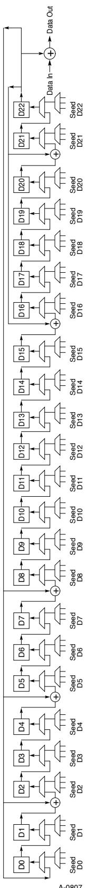

**Figure 4-18 | 图 4-18**: 8.0 GT/s 及以上数据速率下带加扰多项式的 LFSR (LFSR with Scrambling Polynomial in 8.0 GT/s and Above Data Rate)

---


<div style="overflow-x: auto; max-width: 100%;">
<table>
<thead>
<tr>
<th width="50%">🇬🇧 English</th>
<th width="50%" style="background-color:#e8e8e8">🇨🇳 中文</th>
</tr>
</thead>
<tbody>
<tr>
<td>

**IMPLEMENTATION NOTE:**
**LFSR IMPLEMENTATION WITH A SHARED LFSR**

Implementations may choose to implement one LFSR and take different tap points as shown in § Figure 4-19, which is equivalent to the individual LFSR per-lane with different seeds, as shown in § Figure 4-18. It should also be noted that the tap equations of four Lanes are the XOR of the tap equations of two neighboring Lanes. For example, Lane 0 can be obtained by XORing the output of Lanes 1 and 7; Lane 2 is the XOR of Lanes 1 and 3; Lane 4 is the XOR of Lanes 3 and 5; and Lane 6 is the XOR of Lanes 5 and 7. This can be used to help reduce the gate count at the expense of potential delay due to the XOR results of the two Lanes.

</td>
<td style="background-color:#e8e8e8">

**实现注意事项：**
**采用共享 LFSR 的实现**

实现可选择只实现一个 LFSR，并取不同的抽头点（如图 4-19 所示），其效果等同于图 4-18 中按 Lane 使用不同种子的独立 LFSR。还需要注意，四个 Lane 的抽头方程等于其相邻两个 Lane 抽头方程的异或（XOR）。例如，Lane 0 可由 Lane 1 和 Lane 7 的输出异或得到；Lane 2 是 Lane 1 和 Lane 3 的异或；Lane 4 是 Lane 3 和 Lane 5 的异或；Lane 6 是 Lane 5 和 Lane 7 的异或。这可用来减少门数，代价是由于两个 Lane 的异或结果可能带来额外延迟。

</td>
</tr>
</tbody>
</table>
</div>


---

<!-- 📄 Page 378 -->
---

> **Figure 4-19.** Alternate Implementation of the LFSR for Descrambling
> 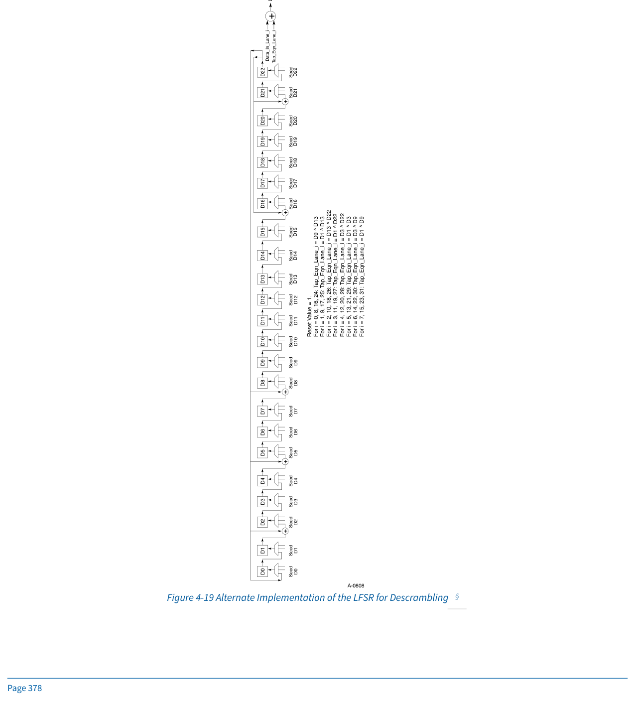

**Figure 4-19 | 图 4-19**: 用于解扰的 LFSR 替代实现 (Alternate Implementation of the LFSR for Descrambling)

抽头方程（Tap Equations）:

- For i = 0, 8, 16, 24: Tap_Eqn_Lane_i = D9 ^ D13
- For i = 1, 9, 17, 25: Tap_Eqn_Lane_i = D1 ^ D13
- For i = 2, 10, 18, 26: Tap_Eqn_Lane_i = D13 ^ D22
- For i = 3, 11, 19, 27: Tap_Eqn_Lane_i = D1 ^ D22
- For i = 4, 12, 20, 28: Tap_Eqn_Lane_i = D3 ^ D22
- For i = 5, 13, 21, 29: Tap_Eqn_Lane_i = D1 ^ D3
- For i = 6, 14, 22, 30: Tap_Eqn_Lane_i = D3 ^ D9
- For i = 7, 15, 23, 31: Tap_Eqn_Lane_i = D1 ^ D9

Reset Value = 1.

---

<a id="sec-4-2-2-5"></a>
## 4.2.2.5 Precoding | 预编码 (Precoding)

<table>
<thead>
<tr>
<th width="50%">🇬🇧 English</th>
<th width="50%" style="background-color:#e8e8e8">🇨🇳 中文</th>
</tr>
</thead>
<tbody>
<tr>
<td>

A Receiver may request precoding from its transmitter for operating at data rates of 32.0 GT/s and higher. Precoding, when enabled at a Data Rate, applies to both Flit Mode and Non-Flit Mode at that data rate. The precoding rules are as follows:

• A Port or Pseudo-Port must request precoding on all configured Lanes of the Link. Behavior is undefined if precoding is requested on some Lanes but not others by a Port or Pseudo-Port.

• A Port or Pseudo-Port may request precoding independent of other Ports or Pseudo-Ports. For example, it is possible that precoding may be turned on only in the Upstream Port in the case with no Retimers in § Figure 4-61, or on all the Lanes in Tx(A) and Tx(E) in the two Retimer example in § Figure 4-61.

• Precoding is turned off for all data rates when the LTSSM is in the Detect state.

• If a precoding request for a data rate is to be made, it must be made prior to entering that data rate. A precoding request is made by setting the Transmitter Precode Request bit in the EQ TS2 or the 128b/130b EQ TS2 Ordered Sets prior to the transition to Recovery.Speed for the data rate at which the precoding will be turned on. Prior to the first Link speed negotiation to 32.0 GT/s since exiting Detect, the Transmitter Precode Request bit represents the precoding request for 32.0 GT/s when the Supported Link Speeds field in the EQ TS2 or the 128b/130b EQ TS2 Ordered sets is 32.0 GT/s or above. If the Link speed has been negotiated to 32.0 GT/s since exiting Detect, the Transmitter Precode Request bit represents the precoding request for the same data rate that the values in the Transmitter Preset field apply to. For each data rate of 32.0 GT/s or higher, the precoding request must be made independently.

</td>
<td style="background-color:#e8e8e8">

接收器可向其发送器请求预编码，以在 32.0 GT/s 及更高的数据速率下运行。预编码在某个数据速率下使能后，将同时适用于该数据速率下的 Flit 模式和非 Flit 模式。预编码规则如下：

• 端口或伪端口必须在链路的所有已配置 Lane 上请求预编码。如果一个端口或伪端口仅在部分 Lane 上请求预编码，则行为未定义。

• 端口或伪端口可独立于其他端口或伪端口请求预编码。例如，如图 4-61 中无 Retimer 的情况，可能仅在上游端口使能预编码；或者在图 4-61 中两个 Retimer 的示例中，Tx(A) 和 Tx(E) 的所有 Lane 都使能预编码。

• 当 LTSSM 处于 Detect 状态时，所有数据速率下都关闭预编码。

• 若要针对某一数据速率提出预编码请求，必须在进入该数据速率之前提出。预编码请求通过在进入该数据速率对应的 Recovery.Speed 之前，在 EQ TS2 或 128b/130b EQ TS2 有序集中设置 Transmitter Precode Request 位来实现。在退出 Detect 后第一次协商到 32.0 GT/s 之前，当 EQ TS2 或 128b/130b EQ TS2 有序集中的 Supported Link Speeds 字段为 32.0 GT/s 或更高时，Transmitter Precode Request 位表示对 32.0 GT/s 的预编码请求。如果自退出 Detect 后链路速度已经协商到 32.0 GT/s，则 Transmitter Precode Request 位表示与 Transmitter Preset 字段所适用的同一数据速率的预编码请求。针对 32.0 GT/s 及以上的每个数据速率，预编码请求必须独立提出。

</td>
</tr>
<tr>
<td>

• Each (pseudo) Port must store the precoding request along with the Tx Eq values from the most recent equalization procedure in each Lane. If the Link operates at 32.0 GT/s or higher data rate without performing equalization through the No Equalization Needed mechanism it negotiated in the TS1/TS2 Ordered Sets or modified TS1/TS2 Ordered Sets or the Link operates at the 32.0 GT/s or higher data rate in Polling.Compliance or Loopback, the precoding requests from the last equalization results that are being used must be enforced. If no equalization has ever been performed on the Link (prior to the current Link up), then precoding will not be turned on.

</td>
<td style="background-color:#e8e8e8">

• 每个（伪）端口必须将预编码请求连同各 Lane 最近一次均衡过程中得到的 Tx Eq 值一起存储。如果链路在 32.0 GT/s 或更高数据速率下运行时，未通过 TS1/TS2 有序集或修改版 TS1/TS2 有序集协商出的 "No Equalization Needed" 机制进行均衡；或链路在 Polling.Compliance 或 Loopback 状态下以 32.0 GT/s 或更高数据速率运行，则必须强制使用最近一次均衡结果中的预编码请求。若在当前 Link up 之前链路从未进行过均衡，则不会使能预编码。

</td>
</tr>
<tr>
<td>

• If the Transmitter Precode Request bit is Set to 1b in each of the received eight consecutive EQ TS2 or 128b/130b EQ TS2 Ordered Sets during Recovery.RcvrCfg prior to entry to Recovery.Speed, the Transmitter must turn on the precoding for the data rate at which the Link will operate on exit from Recovery.Speed if the data rate is 32.0 GT/s or higher and the precoding request was intended for the data rate of operation. If the precoding request applies to a speed other than the data rate at which the Link will operate on exit from Recovery.Speed, the received Transmitter Precode Request bit must be ignored and the Precoding setting must not be updated for any data rate. Once turned on, precoding will be in effect for that data rate until the Transmitter receives another set of eight consecutive EQ TS2 or 128b/130b EQ TS2 Ordered Sets with Transmitter Precode Request set to 0b during Recovery.RcvrCfg prior to entry to Recovery.Speed for the same data rate.

</td>
<td style="background-color:#e8e8e8">

• 若在进入 Recovery.Speed 之前的 Recovery.RcvrCfg 期间，连续收到的 8 个 EQ TS2 或 128b/130b EQ TS2 有序集中 Transmitter Precode Request 位均为 1b，则发送器必须在退出 Recovery.Speed 后的数据速率为 32.0 GT/s 或更高且该预编码请求正是针对该工作数据速率时，为该数据速率开启预编码。若预编码请求针对的是与退出 Recovery.Speed 后将运行的数据速率不同的速率，则必须忽略所收到的 Transmitter Precode Request 位，并且不得为任何数据速率更新预编码设置。预编码一旦开启，将在该数据速率下一直生效，直到发送器在进入同一数据速率的 Recovery.Speed 之前，于 Recovery.RcvrCfg 期间再次收到连续 8 个 Transmitter Precode Request 为 0b 的 EQ TS2 或 128b/130b EQ TS2 有序集为止。

</td>
</tr>
<tr>
<td>

• A Transmitter must not turn on precoding for any data rates lower than 32.0 GT/s.

</td>
<td style="background-color:#e8e8e8">

• 发送器不得为任何低于 32.0 GT/s 的数据速率开启预编码。

</td>
</tr>
<tr>
<td>

• In data rates of 32.0 GT/s or higher, a Transmitter must set the Transmitter Precoding On bit to 1b in the TS1 Ordered Sets that it transmits in Recovery if its precoding is on for the current data rate; else the bit must be set to 0b.

</td>
<td style="background-color:#e8e8e8">

• 在 32.0 GT/s 及更高的数据速率下，若发送器在当前数据速率已开启预编码，则其在 Recovery 中发送的 TS1 有序集中必须将 Transmitter Precoding On 位置 1b；否则该位必须置 0b。

</td>
</tr>
<tr>
<td>

• A Transmitter that has turned on precoding for the 32.0 GT/s data rate on Lane 0 must set the 32.0 GT/s Transmitter Precoding On bit to 1b in the 32.0 GT/s Status Register; else, it must set the bit to 0b. A Receiver that has requested, or will request, its link partner to turn on precoding at the 32.0 GT/s data rate must set the 32.0 GT/s Transmitter Precode Request to 1b in the 32.0 GT/s Status Register; else it must set the bit to 0b.

</td>
<td style="background-color:#e8e8e8">

• 在 Lane 0 上已为 32.0 GT/s 数据速率开启预编码的发送器，必须将 32.0 GT/s Status Register 中的 "32.0 GT/s Transmitter Precoding On" 位置 1b；否则必须置 0b。已请求或将要请求其链路伙伴在 32.0 GT/s 数据速率开启预编码的接收器，必须将 32.0 GT/s Status Register 中的 "32.0 GT/s Transmitter Precode Request" 位置 1b；否则必须置 0b。

</td>
</tr>
<tr>
<td>

• A Transmitter that has turned on precoding for the 64.0 GT/s data rate on Lane 0 must set the 64.0 GT/s Transmitter Precoding On bit to 1b in the 64.0 GT/s Status Register; else it must set the bit to 0b. A Receiver that has requested, or will request, its link partner to turn on precoding at the 64.0 GT/s data rate must set the 64.0 GT/s Transmitter Precode Request to 1b in the 64.0 GT/s Status Register; else it must set the bit to 0b.

</td>
<td style="background-color:#e8e8e8">

• 在 Lane 0 上已为 64.0 GT/s 数据速率开启预编码的发送器，必须将 64.0 GT/s Status Register 中的 "64.0 GT/s Transmitter Precoding On" 位置 1b；否则必须置 0b。已请求或将要请求其链路伙伴在 64.0 GT/s 数据速率开启预编码的接收器，必须将 64.0 GT/s Status Register 中的 "64.0 GT/s Transmitter Precode Request" 位置 1b；否则必须置 0b。

</td>
</tr>
<tr>
<td>

• See § Section 4.2.2.5.1 for 32.0 GT/s precoding requirements. See § Section 4.2.3.1.4 for 64.0 GT/s and above data rate precoding requirements.

</td>
<td style="background-color:#e8e8e8">

• 32.0 GT/s 预编码要求见 § 4.2.2.5.1 节。64.0 GT/s 及以上数据速率的预编码要求见 § 4.2.3.1.4 节。

</td>
</tr>
</tbody>
</table>

---

<!-- 📄 Page 380 -->
---

<table>
<thead>
<tr>
<th width="50%">🇬🇧 English</th>
<th width="50%" style="background-color:#e8e8e8">🇨🇳 中文</th>
</tr>
</thead>
<tbody>
<tr>
<td>

When precoding is on at 32.0 GT/s, the following rules apply (see § Figure 4-20):

• Only scrambled bits are precoded.

• The "previous bit" used for precoding is set to 1b on every block boundary and gets updated by the last scrambled and precoded bit transmitted within the current block boundary.

• For symbols that are scrambled, Receivers must first decode the precoded bits before sending them to the descrambler.

</td>
<td style="background-color:#e8e8e8">

在 32.0 GT/s 开启预编码时，遵循以下规则（参见 § 图 4-20）：

• 仅对加扰后的比特进行预编码。

• 用于预编码的"前一个比特"在每个块边界上被设为 1b，并随当前块边界内最后发送的已加扰且已预编码的比特而更新。

• 对于已加扰的符号，接收器必须先对预编码比特进行解码，然后再送入解扰器。

</td>
</tr>
</tbody>
</table>

> **Figure 4-20.** Precoding working the scrambler / de-scrambler
> 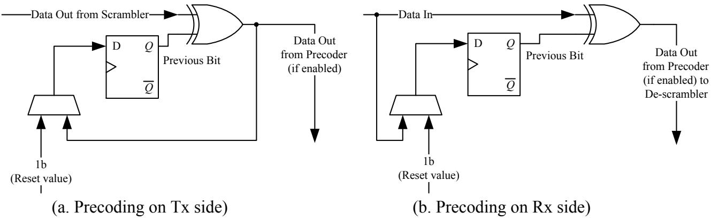

**Figure 4-20 | 图 4-20**: 预编码与加扰器/解扰器协同工作 (Precoding working the scrambler/de-scrambler)

- (a. Precoding on Tx side) — (a. 发送侧预编码)
- (b. Precoding on Rx side) — (b. 接收侧预编码)

---

<a id="sec-4-2-2-5-1"></a>
## 4.2.2.5.1 Precoding at 32.0 GT/s Data Rate | 32.0 GT/s 数据速率下的预编码


<div style="overflow-x: auto; max-width: 100%;">
<table>
<thead>
<tr>
<th width="50%">🇬🇧 English</th>
<th width="50%" style="background-color:#e8e8e8">🇨🇳 中文</th>
</tr>
</thead>
<tbody>
<tr>
<td>

**IMPLEMENTATION NOTE:**
**PARITY IN THE SKP ORDERED SET WHEN PRECODING IS TURNED ON**

As per the rules of § Section 4.2.5.1 and § Section 4.2.8.2, when precoding is turned on, the parity in the SKP Ordered Sets should be calculated before precoding is applied on the Transmit side. Thus, the order in the Transmitter is:

1. scrambling,
2. followed by parity bit calculation,
3. followed by precoding for the scrambled bits.

Accordingly, in the Receiver, the order is:

1. precoding (if turned on by the Transmitter),
2. followed by parity bit calculation,
3. followed by descrambling.

The rationale for this order is that in a Link with one or two Retimers, different Link segments may have the precoding on or off. Let us consider an example system with one retimer between the Root Port and End Point to illustrate this. In the upstream direction, the End Point has precoding on in its Transmitter Lanes since the Retimer Receiver needs it but the Retimer to Root Port Link segment has the precoding off since the Root Port does not need precoding at its Receiver. Since the Retimer does not change the parity bit, the Root Port would get a parity error if the parity calculation was done by the Transmitter (of the End Point) after precoding.

</td>
<td style="background-color:#e8e8e8">

**实现注意事项：**
**预编码开启时 SKP 有序集中的奇偶校验位**

按照 § 4.2.5.1 节和 § 4.2.8.2 节的规则，当预编码开启时，SKP 有序集中的奇偶校验位应在发送侧应用预编码之前计算。因此，发送器中的顺序为：

1. 加扰；
2. 之后进行奇偶校验位计算；
3. 再对已加扰的比特进行预编码。

相应地，接收器中的顺序为：

1. 预编码（若发送器已开启）；
2. 之后进行奇偶校验位计算；
3. 再解扰。

采用此顺序的原因在于：当链路中含一个或两个 Retimer 时，不同的链路段可能独立开启或关闭预编码。考虑一个示例系统——根端口和端点之间有一个 Retimer 以说明此情况。在上游方向，端点在其发送器 Lane 上开启预编码，因为 Retimer 接收器需要它；而 Retimer 到根端口之间的链路段则关闭预编码，因为根端口的接收器不需要预编码。由于 Retimer 不会改变奇偶校验位，如果发送器（端点的）在预编码之后再计算奇偶校验位，那么根端口将得到奇偶校验错误。

</td>
</tr>
<tr>
<td>

**IMPLEMENTATION NOTE:**
**LOOPBACK LEAD'S BEHAVIOR IF PRECODING IS ON IN ANY LINK SEGMENT**

As per the rules of precoding mentioned in this section and § Section 4.2.7.4, a Loopback Lead operating at a data rate of 32.0 GT/s or higher should account for precoding to be on some link segments and off in other link segments. This is particularly relevant when the Loopback Follower transitions from sending TS1 Ordered Sets to looping back the bits. This is where the precoding on the receiver of the Loopback Lead may switch (between precoding on and off). The Loopback Lead is permitted to use implementation specific mechanisms to handle this scenario.

</td>
<td style="background-color:#e8e8e8">

**实现注意事项：**
**任一链路段开启预编码时 Loopback Lead 的行为**

按照本节及 § 4.2.7.4 节所述的预编码规则，工作于 32.0 GT/s 或更高数据速率的 Loopback Lead 应考虑不同链路段可能独立开启或关闭预编码的情况。当 Loopback Follower 从发送 TS1 有序集切换为对收到的比特进行回环时尤其需要关注：此时 Loopback Lead 接收器上的预编码状态可能会在开启和关闭之间切换。允许 Loopback Lead 使用实现特定机制处理该场景。

</td>
</tr>
<tr>
<td>

**IMPLEMENTATION NOTE:**
**TS1/TS2 ORDERED SETS WHEN PRECODING IS TURNED ON**

As per the rules in this section, when precoding is turned on, the 'previous bit' used for precoding is 1b for the first bit of Symbol 1 since Symbol 0 is not scrambled and the 'previous bit' gets set to 1b at the block boundary.

</td>
<td style="background-color:#e8e8e8">

**实现注意事项：**
**预编码开启时的 TS1/TS2 有序集**

根据本节规则，当预编码开启时，由于符号 0 不加扰，因此用于预编码的"前一个比特"在符号 1 的第 1 个比特处为 1b，且"前一个比特"在块边界被设为 1b。

</td>
</tr>
</tbody>
</table>
</div>


---

<a id="sec-4-2-2-6"></a>
## 4.2.2.6 Loopback with 128b/130b Code in Non-Flit Mode and Flit Mode | 非 Flit 模式与 Flit 模式下使用 128b/130b 编码的回环

<table>
<thead>
<tr>
<th width="50%">🇬🇧 English</th>
<th width="50%" style="background-color:#e8e8e8">🇨🇳 中文</th>
</tr>
</thead>
<tbody>
<tr>
<td>

When using 128b/130b encoding, Loopback Leads must transmit Blocks with the defined 01b and 10b Sync Headers. However, they are not required to transmit an SDS Ordered Set when transitioning from Ordered Set Blocks to Data Blocks, nor are they required to transmit an EDS Token when transitioning from Data Blocks to Ordered Set Blocks. Leads must transmit SKP Ordered Sets periodically as defined in § Section 4.2.8, and they must be capable of processing received (looped-back) SKP Ordered Sets of varying length. Leads are permitted to transmit Electrical Idle Exit Ordered Sets (EIEOS) as defined in § Section 4.2.2.2.1. Leads are permitted to transmit any payload in Data Blocks and Ordered Set Blocks that they expect to be looped-back. If the Loopback Lead transmits an Ordered Set Block whose first symbol matches the first symbol of SKP OS, EIEOS, or EIOS, that Ordered Set Block must be a complete and valid SKP OS, EIEOS, or EIOS.

</td>
<td style="background-color:#e8e8e8">

使用 128b/130b 编码时，Loopback Lead 必须在所发送的块中使用规定的 01b 和 10b 同步头。但从有序集块过渡到数据块时，无需发送 SDS 有序集；从数据块过渡到有序集块时，也无需发送 EDS 标记。Lead 必须按 § 4.2.8 节的规定周期性发送 SKP 有序集，并且必须能处理长度可变的接收（已回环）SKP 有序集。允许 Lead 发送 § 4.2.2.2.1 节中规定的电气空闲退出有序集（EIEOS）。允许 Lead 在数据块和有序集块中发送其预期被回环的任何有效负载。如果 Loopback Lead 发送的有序集块的第 1 个符号与 SKP OS、EIEOS 或 EIOS 的第 1 个符号匹配，则该有序集块必须是完整且有效的 SKP OS、EIEOS 或 EIOS。

</td>
</tr>
<tr>
<td>

When using 128b/130b encoding, Loopback Followers must retransmit all bits received without modification, except for SKP Ordered Sets which can be adjusted as needed for clock compensation. If clock compensation is required, Followers must add or remove 4 SKP Symbols per Ordered Set. The modified SKP Ordered Set must meet the definition of § Section 4.2.8.2 (i.e., it must have between 4 to 20 SKP Symbols followed by the SKP_END Symbol and the three Symbols that follow it as transmitted by the Loopback Leads. If a Follower is unable to obtain Block alignment or it is misaligned, it may be unable to perform clock compensation and therefore unable to loop-back all bits received. In this case, it is permitted to add or remove Symbols as necessary to continue operation. Followers must not check for a received SDS Ordered Set when a transition from Ordered Set Blocks to Data Blocks is detected, and they must not check for a received EDS Token when a transition from Data Blocks to Ordered Set Blocks is detected.

</td>
<td style="background-color:#e8e8e8">

使用 128b/130b 编码时，Loopback Follower 必须将收到的所有比特原样回传（不做修改），但 SKP 有序集可按需调整以补偿时钟。若需要进行时钟补偿，Follower 必须在每个有序集中增加或删除 4 个 SKP 符号。修改后的 SKP 有序集必须符合 § 4.2.8.2 节的定义（即必须包含 4 至 20 个 SKP 符号，后接 SKP_END 符号以及由 Loopback Lead 发送的紧随其后的 3 个符号）。如果 Follower 无法获得块对齐或发生失对齐，则可能无法执行时钟补偿，从而无法回环所收到的全部比特。此时允许其按需增加或删除符号以维持运行。当检测到从有序集块到数据块的过渡时，Follower 不应检查收到的 SDS 有序集；检测到从数据块到有序集块的过渡时，也不应检查收到的 EDS 标记。

</td>
</tr>
</tbody>
</table>

---

<a id="sec-4-2-3"></a>
## 4.2.3 Flit Mode Operation | Flit 模式操作


<div style="overflow-x: auto; max-width: 100%;">
<table>
<thead>
<tr>
<th width="50%">🇬🇧 English</th>
<th width="50%" style="background-color:#e8e8e8">🇨🇳 中文</th>
</tr>
</thead>
<tbody>
<tr>
<td>

Flit definition and Symbol placement is specified in this section.

Flits encoded with 8b/10b encoding follow the rules in § Section 4.2.1 with the following exception:

• Since the Flit Mode has its fixed TLP and DLP placement, the packet markers such as STP, SDP, END, EDB are not used.

Flits Encoded with 128b/130b encoding follow the rules in § Section 4.2.2 with the following exceptions:

• Since the Flit Mode has its fixed TLP and DLP placement, the Framing Tokens are not used.

1b/1b encoding is specified in Section 4.2.3.1.

</td>
<td style="background-color:#e8e8e8">

Flit 定义与符号放置由本节规定。

采用 8b/10b 编码的 Flit 遵循 § 4.2.1 节的规则，但有以下例外：

• 由于 Flit 模式具有固定的 TLP 和 DLP 放置，因此不使用 STP、SDP、END、EDB 等报文起始/结束标记。

采用 128b/130b 编码的 Flit 遵循 § 4.2.2 节的规则，但有以下例外：

• 由于 Flit 模式具有固定的 TLP 和 DLP 放置，因此不使用 Framing Tokens（帧标记）。

1b/1b 编码的规定见 § 4.2.3.1 节。

</td>
</tr>
</tbody>
</table>
</div>


---

<a id="sec-4-2-3-1"></a>
## 4.2.3.1 1b/1b Encoding for 64.0 GT/s and higher Data Rates | 64.0 GT/s 及更高数据速率下的 1b/1b 编码

<table>
<thead>
<tr>
<th width="50%">🇬🇧 English</th>
<th width="50%" style="background-color:#e8e8e8">🇨🇳 中文</th>
</tr>
</thead>
<tbody>
<tr>
<td>

When the PCI Express Link is operating at 64.0 GT/s or higher Data Rates, it uses Flit Mode. A Symbol (8 bits) is the basic unit of transfer per Lane. PAM4 signaling is used for all Symbols, whether it belongs to a Data Stream or an Ordered Set. PAM4 operates on 2-bit aligned boundaries. A Symbol, represented as 'S7S6S5S4S3S2S1S0', is placed on a Lane starting with the voltage encoding of 'S1S0' and ending with 'S7S6'. An example placement of Flits (described later) or Ordered Set on a x4 Link is shown in § Figure 4-21 below.

</td>
<td style="background-color:#e8e8e8">

当 PCI Express 链路以 64.0 GT/s 或更高的数据速率运行时，使用 Flit 模式。符号（Symbol，8 比特）是每条 Lane 的基本传输单位。所有符号（无论属于数据流还是有序集）均使用 PAM4 信号。PAM4 在 2 比特对齐的边界上工作。一个符号记为 'S7S6S5S4S3S2S1S0'，在 Lane 上以 'S1S0' 的电压编码开始，以 'S7S6' 结束。x4 链路上 Flit（稍后描述）或有序集的放置示例如下方 § 图 4-21 所示。

</td>
</tr>
</tbody>
</table>

---

<!-- 📄 Page 383 -->
---

> **Figure 4-21.** Example of Symbol placement in a x4 Link with 1b/1b encoding
> 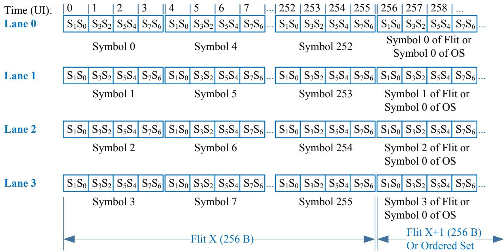

**Figure 4-21 | 图 4-21**: 使用 1b/1b 编码时 x4 链路上的符号放置示例 (Example of Symbol placement in a x4 Link with 1b/1b encoding)

- Lane 0 / Lane 1 / Lane 2 / Lane 3
- Symbol 0 of Flit or Symbol 0 of OS
- Symbol 1 of Flit or Symbol 0 of OS
- Symbol 2 of Flit or Symbol 0 of OS
- Symbol 3 of Flit or Symbol 0 of OS
- Flit X (256 B)
- Flit X+1 (256 B) Or Ordered Set
- Time (UI): 0, 1, 2, 3, 4, 5, 6, 7 ... 252, 253, 254, 255, 256, 257, 258 ...


<div style="overflow-x: auto; max-width: 100%;">
<table>
<thead>
<tr>
<th width="50%">🇬🇧 English</th>
<th width="50%" style="background-color:#e8e8e8">🇨🇳 中文</th>
</tr>
</thead>
<tbody>
<tr>
<td>

A conceptual diagram of the Transmit side and Receive side is shown in § Figure 4-22 and § Figure 4-23 respectively. These diagrams are provided to explain the order of operations that must be performed on the Transmit and Receive side. An implementation may choose to operate on different widths depending on the design goals and constraints.

At a Flit level, on the Transmit side, CRC is first applied followed by FEC generation. After that, each Lane is allotted its Symbol in the byte interleaved fashion for the Flit. On a per Lane basis, Scrambling is performed, if required, followed by Gray Coding at a 2-bit aligned boundary, after which Precoding is performed at 2-bit aligned UI level, if enabled and required. Thus, in the Symbol above, Gray Coding and Precoding will be applied for the bits corresponding to 'S1S0', 'S3S2', …, 'S7S6'. As shown in the diagram below, the scrambled symbols of the TS1/TS2 Ordered sets also undergo the precoding logic (including bypass). All Symbols, whether they belong to a Flit (Data Stream) or scrambled Symbols of an Ordered Set or any pattern where explicitly mentioned (e.g., scrambled part of modified compliance pattern) undergo the Gray Coding and PAM4 encoding, whereas unscrambled Symbols of an Ordered Set or any pattern only undergo the PAM4 encoding (the gray coding and DC-balance is effectively taken care of through the bit definition). For the cases where parts of a pattern may be expressed as a repeated sequence of UIs, the Symbol here refers to the aligned 4 UI interval of that pattern.

</td>
<td style="background-color:#e8e8e8">

发送侧和接收侧的概念图分别见 § 图 4-22 和 § 图 4-23。这些图用于说明在发送侧和接收侧必须执行的操作顺序。实现可根据设计目标和约束选择不同的位宽运行。

在 Flit 级别，发送侧首先进行 CRC 计算，然后进行 FEC 生成。之后，每条 Lane 按字节交织方式获得 Flit 中对应的符号。在每条 Lane 上，如果需要，先进行加扰，然后在 2 比特对齐边界上进行格雷编码（Gray Coding），之后在 2 比特对齐的 UI 级别上按需进行预编码（若已使能）。因此，在上述符号中，'S1S0'、'S3S2'、…、'S7S6' 对应的比特都将经过格雷编码和预编码。如下图所示，TS1/TS2 有序集中已加扰的符号同样会经过预编码逻辑（包括旁路）。无论符号属于 Flit（数据流）、有序集的已加扰符号，还是任何明确说明需要加扰的码型（如修改版 Compliance Pattern 的加扰部分），都要经过格雷编码和 PAM4 编码；而有序集或任何码型的未加扰符号则只经过 PAM4 编码（格雷编码和直流平衡实际上已通过比特定义得到保证）。对于码型的某些部分可能表示为 UI 的重复序列的情况，此处的符号指的是该码型对齐的 4 UI 间隔。

</td>
</tr>
</tbody>
</table>
</div>


---

<!-- 📄 Page 384 -->
---

> **Figure 4-22.** Transmit side at 64.0 GT/s
> 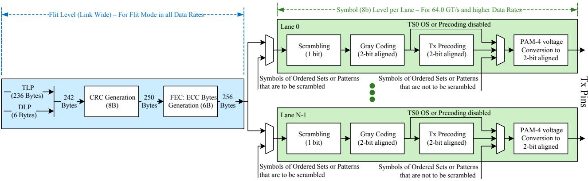

**Figure 4-22 | 图 4-22**: 64.0 GT/s 下的发送侧 (Transmit side at 64.0 GT/s)

- Lane 0 ... Lane N-1
- Scrambling (1 bit) — 加扰（1 比特）
- Tx Precoding (2-bit aligned) — 发送预编码（2 比特对齐）
- TS0 OS or Precoding disabled — TS0 有序集或预编码关闭
- Gray Coding (2-bit aligned) — 格雷编码（2 比特对齐）
- Symbols of Ordered Sets or Patterns that are to be scrambled — 需要加扰的有序集或码型符号
- Symbols of Ordered Sets or Patterns that are not to be scrambled — 不需要加扰的有序集或码型符号
- PAM-4 voltage Conversion to 2-bit aligned — PAM-4 电压转换为 2 比特对齐
- Tx Pins — 发送引脚
- DLP (6 Bytes) — 数据链路负载（6 字节）
- CRC Generation (8B) — CRC 生成（8 字节）
- TLP (236 Bytes) — 事务层包（236 字节）
- FEC: ECC Bytes Generation (6B) — FEC：ECC 字节生成（6 字节）
- 242 Bytes / 250 Bytes / 256 Bytes
- Flit Level (Link Wide) – For Flit Mode in all Data Rates — Flit 级别（链路级）—— 适用于所有数据速率的 Flit 模式
- Symbol (8b) Level per Lane – For 64.0 GT/s and higher Data Rates — 每条 Lane 的符号（8 比特）级 —— 适用于 64.0 GT/s 及更高数据速率

<table>
<thead>
<tr>
<th width="50%">🇬🇧 English</th>
<th width="50%" style="background-color:#e8e8e8">🇨🇳 中文</th>
</tr>
</thead>
<tbody>
<tr>
<td>

The Receive side is similar to the Transmit side in the opposite direction. After the PAM4 voltage is converted to a 2-bit aligned quantity, it undergoes the Receive side precoding if applicable followed by the decoding of the Gray code, followed by descrambling on a single bit level, if applicable. The Data Stream (Flit) is aggregated across all Lanes and undergoes the FEC decode and correction followed by the CRC check before sending up the Transactions and Data Link Payload.

</td>
<td style="background-color:#e8e8e8">

接收侧与发送侧类似，只是方向相反。PAM4 电压被转换为 2 比特对齐的量后，若适用，先进行接收侧预编码，再进行格雷解码，然后按单比特级别解扰（若适用）。数据流（Flit）跨所有 Lane 聚合后，进行 FEC 解码与纠错，再进行 CRC 校验，最后将事务和数据链路负载向上层递交。

</td>
</tr>
</tbody>
</table>

---

> **Figure 4-23.** Receive side at 64.0 GT/s
> 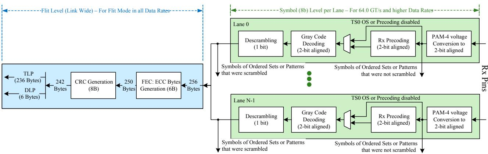

**Figure 4-23 | 图 4-23**: 64.0 GT/s 下的接收侧 (Receive side at 64.0 GT/s)

- Lane 0 ... Lane N-1
- Descrambling (1 bit) — 解扰（1 比特）
- Rx Precoding (2-bit aligned) — 接收预编码（2 比特对齐）
- TS0 OS or Precoding disabled — TS0 有序集或预编码关闭
- Gray Code Decoding (2-bit aligned) — 格雷解码（2 比特对齐）
- Symbols of Ordered Sets or Patterns that were scrambled — 已加扰的有序集或码型符号
- Symbols of Ordered Sets or Patterns that were not scrambled — 未加扰的有序集或码型符号
- PAM-4 voltage Conversion to 2-bit aligned — PAM-4 电压转换为 2 比特对齐
- Rx Pins — 接收引脚
- DLP (6 Bytes) — 数据链路负载（6 字节）
- CRC Generation (8B) — CRC 生成（8 字节）
- TLP (236 Bytes) — 事务层包（236 字节）
- FEC: ECC Bytes Generation (6B) — FEC：ECC 字节生成（6 字节）
- 242 Bytes / 250 Bytes / 256 Bytes
- Flit Level (Link Wide) – For Flit Mode in all Data Rates — Flit 级别（链路级）—— 适用于所有数据速率的 Flit 模式
- Symbol (8b) Level per Lane – For 64.0 GT/s and higher Data Rates — 每条 Lane 的符号（8 比特）级 —— 适用于 64.0 GT/s 及更高数据速率


<div style="overflow-x: auto; max-width: 100%;">
<table>
<thead>
<tr>
<th width="50%">🇬🇧 English</th>
<th width="50%" style="background-color:#e8e8e8">🇨🇳 中文</th>
</tr>
</thead>
<tbody>
<tr>
<td>

PAM4 stands for Pulse Amplitude Modulation 4-levels. It is a signaling mechanism where 4 levels (2 bits) are encoded in same Unit Interval (UI) resulting in 3 eyes, as shown in § Figure 4-24. It is deployed only for 64.0 GT/s or higher Data Rates. As described in § Chapter 8, PAM4 helps with the channel loss as it has the same Nyquist frequency as 32.0 GT/s for 64.0 GT/s Data Rate. The four voltage levels 0, 1, 2, and 3, nominally map to -400 mV, -133 mV, +133 mV and +400 mV respectively, and the Gray code encoded values of 00b, 01b, 11b, and 10b respectively, with the little-endian bit order, as shown in § Figure 4-24. The corresponding DC Balance values to be used when designing Ordered Sets to meet the DC

</td>
<td style="background-color:#e8e8e8">

PAM4 即四电平脉冲幅度调制（Pulse Amplitude Modulation 4-levels）。它是一种信号机制，在同一单位间隔（UI, Unit Interval）内编码 4 个电平（2 比特），形成 3 个眼图，如 § 图 4-24 所示。PAM4 仅在 64.0 GT/s 或更高的数据速率下部署。如 § 第 8 章 所述，PAM4 有助于应对信道损耗，因为在 64.0 GT/s 数据速率下其奈奎斯特频率与 32.0 GT/s 相同。四个电压电平 0、1、2、3 分别标称映射为 -400 mV、-133 mV、+133 mV 和 +400 mV，相应的格雷编码值按小端比特顺序分别为 00b、01b、11b 和 10b，如 § 图 4-24 所示。在设计满足直流平衡（DC

</td>
</tr>
</tbody>
</table>
</div>


---


---

<a id="sec-4-2-3-1-1"></a>
## 4.2.3.1.1 PAM4 Signaling | PAM4（四电平脉冲幅度调制）信令

PAM4 stands for Pulse Amplitude Modulation 4-levels. It is a signaling mechanism where 4 levels (2 bits) are encoded in same Unit Interval (UI) resulting in 3 eyes, as shown in § Figure 4-24. It is deployed only for 64.0 GT/s or higher Data Rates. As described in § Chapter 8., PAM4 helps with the channel loss as it has the same Nyquist frequency as 32.0 GT/s for 64.0 GT/s Data Rate. The four voltage levels 0, 1, 2, and 3, nominally map to -400 mV, -133 mV, +133 mV and +400 mV respectively, and the Gray code encoded values of 00b, 01b, 11b, and 10b respectively, with the little-endian bit order, as shown in § Figure 4-24. The corresponding DC Balance values to be used when designing Ordered Sets to meet the DC balance needs is also shown in § Figure 4-24. The Reduced voltage levels (eye height or EH) and eye width (EW) increases susceptibility to errors. Gray coding is used to help minimize errors within a UI for the voltage levels.

> PAM4 即四电平脉冲幅度调制（Pulse Amplitude Modulation 4-levels）。它是一种信令机制，在同一单位间隔（UI）内编码 4 个电平（2 比特），形成 3 个眼图，如 § 图 4-24 所示。它仅用于 64.0 GT/s 及更高的数据速率。如 § 第 8 章 所述，PAM4 有助于应对信道损耗，因为对于 64.0 GT/s 数据速率，PAM4 与 32.0 GT/s 具有相同的奈奎斯特频率。四个电压电平 0、1、2、3 分别标称映射为 -400 mV、-133 mV、+133 mV 和 +400 mV，相应的格雷编码值分别为 00b、01b、11b、10b（采用小端比特顺序），如 § 图 4-24 所示。在设计有序集以满足直流平衡（DC Balance）需求时所使用的对应直流平衡值也在 § 图 4-24 中示出。降低的电压幅度（眼高 EH，即 Eye Height）和眼宽（EW，即 Eye Width）会增加误码敏感性。格雷编码（Gray Coding）用于在 UI 范围内尽量减少电压电平所产生的误码。

> **Figure 4-24.** PAM4 Signaling at UI level: Voltage levels, 2-bit encoding, and their corresponding DC balance values
> 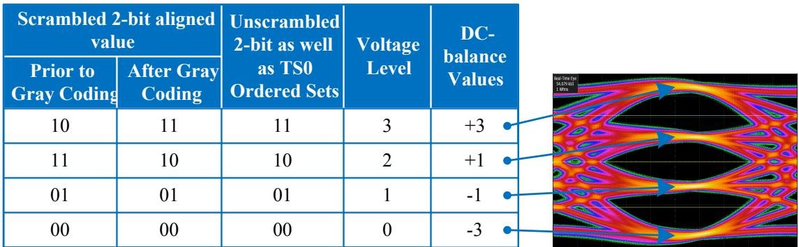

**Figure 4-24 | 图 4-24**: UI 级别的 PAM4 信令：电压电平、2 比特编码及其对应的直流平衡值 (PAM4 Signaling at UI level: Voltage levels, 2-bit encoding, and their corresponding DC balance values)

<div style="overflow-x: auto; max-width: 100%;">
<table>
<thead>
<tr>
<th width="50%">🇬🇧 English</th>
<th width="50%" style="background-color:#e8e8e8">🇨🇳 中文</th>
</tr>
</thead>
<tbody>
<tr>
<td>

With PAM4 encoding, the bit error rate (BER) is expected to be significantly worse than the 10-12 BER target of the lower data rates (2.5, 5.0, 8.0, 16.0, and 32.0 GT/s). In addition, errors are expected to occur in bursts in a Lane and some amount of Lane to Lane correlation is also expected. The electrical spec parameters along with FBER (First Bit Error Rate) < 10-6 described in § Chapter 8. must be met to ensure probability of a Flit error after FEC to be less than 3×10-5.

</td>
<td style="background-color:#e8e8e8">

使用 PAM4 编码时，预期误码率（BER）将明显高于较低数据速率（2.5、5.0、8.0、16.0 和 32.0 GT/s）所对应的 10⁻¹² BER 目标。此外，预期错误会成串（burst）地出现在同一通道（Lane）上，并且不同通道之间也会存在一定程度的相关性。必须满足 § 第 8 章 中所描述的电气规范参数以及 FBER（First Bit Error Rate）< 10⁻⁶ 的要求，以保证 FEC（Forward Error Correction，前向纠错）之后的 Flit 错误概率小于 3×10⁻⁵。

</td>
</tr>
<tr>
<td>

With PAM4 encoding, the bit error rate (BER) is expected to be significantly worse than the 10-12 BER target of the lower data rates (2.5, 5.0, 8.0, 16.0, and 32.0 GT/s). In addition, errors are expected to occur in bursts in a Lane and some amount of Lane to Lane correlation is also expected. The electrical spec parameters along with FBER (First Bit Error Rate) < 10-6 described in § Chapter 8. must be met to ensure probability of a Flit error after FEC to be less than 3×10-5.

</td>
<td style="background-color:#e8e8e8">

使用 PAM4 编码时，预期误码率（BER）将明显高于较低数据速率（2.5、5.0、8.0、16.0 和 32.0 GT/s）所对应的 10⁻¹² BER 目标。此外，预期错误会成串（burst）地出现在同一通道（Lane）上，并且不同通道之间也会存在一定程度的相关性。必须满足 § 第 8 章 中所描述的电气规范参数以及 FBER（First Bit Error Rate）< 10⁻⁶ 的要求，以保证 FEC（Forward Error Correction，前向纠错）之后的 Flit 错误概率小于 3×10⁻⁵。

</td>
</tr>
<tr>
<td>

A Forward Error Correction (FEC) mechanism is used to deal with the high FBER in the Data Stream. Since FEC works on fixed sized code words, Flit (flow control unit) will be used for sending/receiving TLPs and DLLPs in a data stream. A low-overhead FEC will be used to keep the latency low. This will be augmented with a strong CRC at Flit level for high reliability. Link level retry will be deployed at the Flit level in Flit Mode. Ordered Sets will be protected through replication for Data Rates of 64.0 GT/s and above. Additionally, the precoding mechanism described below will be used for all scrambled bits to help minimize the number of errors in an error burst within a Lane.

</td>
<td style="background-color:#e8e8e8">

采用前向纠错（FEC, Forward Error Correction）机制来处理数据流中的高 FBER。由于 FEC 作用于固定大小的码字，Flit（流量控制单元）将用于在数据流中发送/接收 TLP（事务层包）和 DLLP（数据链路层包）。使用低开销的 FEC 以保持较低的延迟，并辅以 Flit 级别的强 CRC 以获得高可靠性。在 Flit 模式下，链路级别的重传（Retry）将以 Flit 为单位进行。对于 64.0 GT/s 及以上数据速率，有序集（Ordered Set）将通过复制（Replication）进行保护。此外，下文所述的预编码（Precoding）机制将作用于所有加扰比特，以减少通道内错误串中的错误数。

</td>
</tr>
<tr>
<td>

The scrambling mechanism in the 64.0 GT/s Data Rate is identical to that for the 8.0, 16.0, and 32.0 GT/s Data Rates and is already covered in § Section 4.2.2.4, except for the TS0 / TS1 / TS2 / SKP Ordered Set rules defined below. § Figure 4-25 demonstrates the scrambler on the Transmitter side. All Data Stream bits as well as some Ordered Set bits are scrambled.

</td>
<td style="background-color:#e8e8e8">

64.0 GT/s 数据速率下的加扰机制与 8.0、16.0 和 32.0 GT/s 数据速率下的加扰机制完全相同，已在 § 第 4.2.2.4 节 中涵盖，但下文定义的 TS0/TS1/TS2/SKP 有序集规则除外。§ 图 4-25 演示了发送器端的加扰器。所有数据流比特以及部分有序集比特都会被加扰。

</td>
</tr>
<tr>
<td>

- TS1 and TS2 Ordered Sets:
  - Symbols 0 and 8 bypass scrambling.
  - Symbols 1 through 6 and Symbols 9 through 14 are scrambled.
  - Symbols 7 and 15 bypass scrambling if required for DC Balance, but they are scrambled if not required for DC Balance.
- TS0 Ordered Sets:
  - Symbols 0 and 8 bypass scrambling
  - Symbols 1 through 6 and Symbols 9 through14 use NRZ-based scrambling
    - NRZ-based scrambling consists of scrambling all 8 bits and then, in place of gray-coding, forcing the even bit 2i to be identical to the odd bit (2i+1) [where 0≤i≤3]. This ensures that only voltage levels 0 and 3 are sent.

</td>
<td style="background-color:#e8e8e8">

- TS1 和 TS2 有序集：
  - 符号 0 和 8 旁路加扰。
  - 符号 1 至 6 以及符号 9 至 14 进行加扰。
  - 符号 7 和 15 在需要时为保持直流平衡（DC Balance）而旁路加扰，否则仍执行加扰。
- TS0 有序集：
  - 符号 0 和 8 旁路加扰
  - 符号 1 至 6 以及符号 9 至 14 使用基于 NRZ 的加扰
    - 基于 NRZ 的加扰首先对全部 8 比特加扰，然后以"令偶数位 2i 与奇数位 (2i+1) 相同 [其中 0≤i≤3]"代替格雷编码。这样可以保证只发送电压电平 0 和 3。

</td>
</tr>
</tbody>
</table>
</div>

---

<a id="sec-4-2-3-1-2"></a>
## 4.2.3.1.2 1b/1b Scrambling | 1b/1b 加扰


<div style="overflow-x: auto; max-width: 100%;">
<table>
<thead>
<tr>
<th width="50%">🇬🇧 English</th>
<th width="50%" style="background-color:#e8e8e8">🇨🇳 中文</th>
</tr>
</thead>
<tbody>
<tr>
<td>

- Symbols 7 and 15 bypass scrambling if required for DC Balance; else they carry even parity of Symbols 1 through 6 and Symbols 9 through 14 respectively with NRZ-scrambling
- All Symbols in TS0 are NRZ-based (i.e., each UI maps to voltage levels 0 or 3, encoded as 00b or 10b). Only TS0 Ordered Set is designed to be NRZ-based in 64.0 GT/s Data Rate.
- SKP Ordered Sets:
  - When processing Ordered Sets outside of a Data Stream, receivers use the 1b/1b SKP decode rules in § Section 4.2.3.1.5. When processing Ordered Sets inside a Data Stream, receivers use the 1b/1b SKP decode rules in § Section 4.2.3.2. If it is determined by the Receiver that the Ordered Set is a SKP Ordered Set, then the LFSR is not advanced for any Symbol of the Block, as specified in § Section 4.2.2.4.

</td>
<td style="background-color:#e8e8e8">

- 符号 7 和 15 在需要时为保持直流平衡（DC Balance）而旁路加扰；否则它们分别承载符号 1 至 6 和符号 9 至 14 的偶校验，并进行 NRZ 加扰
- TS0 中的所有符号均基于 NRZ（即每个 UI 映射为电压电平 0 或 3，编码为 00b 或 10b）。在 64.0 GT/s 数据速率下，仅 TS0 有序集被设计为基于 NRZ。
- SKP 有序集：
  - 在数据流之外处理有序集时，接收器使用 § 第 4.2.3.1.5 节 中的 1b/1b SKP 解码规则。在数据流之内处理有序集时，接收器使用 § 第 4.2.3.2 节 中的 1b/1b SKP 解码规则。如果接收器判定该有序集为 SKP 有序集，则按 § 第 4.2.2.4 节 中的规定，该块中任何符号对应的 LFSR 都不推进。

</td>
</tr>
<tr>
<td>

Only scrambled bits on a 2-bit aligned boundary are Gray coded, when both bits are scrambled. All bits in the Data Stream are scrambled and Gray coded. Only some Symbols of the TS1/TS2 Ordered Sets are scrambled – those are Gray coded, while the unscrambled symbols are not Gray coded. All TS0 Ordered Set Symbols to be Half Scrambled undergo NRZ-based scrambling, as described in § Section 4.2.3.1.2. § Figure 4-25 represents the sequence of Gray Coding, which is followed by Tx Precoding, when enabled, followed by the PAM4 voltage translation on the Tx side as well as the Rx side, considering an error En that may affect the nth 2-bit quantity on the channel.

</td>
<td style="background-color:#e8e8e8">

仅当 2 比特对齐边界上的两个比特均被加扰时，才对其进行格雷编码（Gray Coding）。数据流中的所有比特均加扰并执行格雷编码。TS1/TS2 有序集中只有部分符号被加扰——这些被加扰的符号执行格雷编码，而未加扰的符号不执行格雷编码。所有需"半加扰"的 TS0 有序集符号按 § 第 4.2.3.1.2 节 中所述进行基于 NRZ 的加扰。§ 图 4-25 表示格雷编码的顺序，其后（若启用）为发送器预编码（Tx Precoding），再其后为 Tx 端与 Rx 端的 PAM4 电压转换，并考虑可能影响通道上第 n 个 2 比特量的错误 En。

</td>
</tr>
<tr>
<td>

Gray Coding is only enabled in the PAM4 mode (at 64.0 GT/s and above Data Rates). Gray-coding works on aligned 2-bit quantities on a per-Lane basis. On the Transmit side, input Gn (Gn1Gn0) is transformed to output Pn (Pn1Pn0), using the Gray code encoding where the input 00b, 01b, 10b, 11b becomes 00b, 01b, 11b, and 10b respectively in the output. This can be represented by the equations: Pn1 = Gn1 and Pn0 = Gn1 ^ Gn0. The Receive side is identical and can be represented as: G′n1 = P′n1 and G′n0 = P′n1 ^ P′n0. § Table 4-6 demonstrates how a likely error of ±1 on voltage level at most affects one bit with Gray Coding.

</td>
<td style="background-color:#e8e8e8">

格雷编码仅在 PAM4 模式（即 64.0 GT/s 及以上数据速率）下启用。格雷编码按通道（per-Lane）作用于对齐的 2 比特量。在发送端，输入 Gn (Gn1Gn0) 经格雷编码变换为输出 Pn (Pn1Pn0)，即输入 00b、01b、10b、11b 分别对应输出 00b、01b、11b、10b。该变换可由公式表示为：Pn1 = Gn1，Pn0 = Gn1 ^ Gn0。接收端与此相同，可表示为：G′n1 = P′n1，G′n0 = P′n1 ^ P′n0。§ 表 4-6 演示了采用格雷编码时，电压电平上 ±1 的常见错误至多影响 1 比特。

</td>
</tr>
<tr>
<td>

Channel (Error En)

Symbols of Ordered Sets or patterns to be scrambled

Scrambling (1-bit)

Flit

Gray Coding (2-bit aligned)

Gn

TS0 OS or Precoding disabled

Tx Precoding (2-bit aligned)

Tn

Pn

PAM-4 voltage Level generation (2-bit aligned)

PAM-4 voltage Conversion to 2-bit aligned

Rn

Rx Precoding (2-bit aligned)

R′n

TS0 OS or Precoding disabled

Gray Coding (2-bit aligned)

Tn

Scrambling (1 bit level)

P′n

Flit

Symbols of Ordered Sets or Patterns that were scrambled

At these points, the mappings are:
00 = V0, 01 = V1, 10 = V2, 11 = V3

Symbols of Ordered Sets or Patterns that were not scrambled

Symbols or Ordered Sets or Patterns that are not to be scrambled

Figure 4-25 The Sequence of Gray Coding, Precoding, and PAM4 voltage translation on an aligned 2-bit boundary on a per Lane

</td>
<td style="background-color:#e8e8e8">

通道（错误 En）

待加扰的有序集或码型符号

加扰（1 比特）

Flit

格雷编码（2 比特对齐）

Gn

TS0 OS 或预编码禁用

发送端预编码（2 比特对齐）

Tn

Pn

PAM4 电压电平生成（2 比特对齐）

PAM4 电压至 2 比特对齐转换

Rn

接收端预编码（2 比特对齐）

R′n

TS0 OS 或预编码禁用

格雷编码（2 比特对齐）

Tn

加扰（1 比特）

P′n

Flit

已加扰的有序集或码型符号

这些点的映射关系为：
00 = V0，01 = V1，10 = V2，11 = V3

未加扰的有序集或码型符号

不需加扰的符号或有序集或码型

图 4-25 在按通道对齐的 2 比特边界上，格雷编码、预编码及 PAM4 电压转换的顺序

</td>
</tr>
</tbody>
</table>
</div>

> **Figure 4-25.** The Sequence of Gray Coding, Precoding, and PAM4 voltage translation on an aligned 2-bit boundary on a per Lane
> 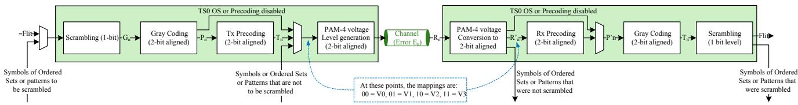
>
> *Note: 该图位于第 386 页底部（4.2.3.1.2 与 4.2.3.1.3 之间）。fig_0386_1.png 为该页文本截图，已包含 § 4-25 图标题，但流程图主体未单独抽取。请以原始 PDF 第 386 页 Figure 4-25 流程图为准（详见 Figure 4-25 在 4.2.3.1.2 末尾的描述）。*

**Figure 4-25 | 图 4-25**: 在按通道对齐的 2 比特边界上，格雷编码、预编码及 PAM4 电压转换的顺序 (The Sequence of Gray Coding, Precoding, and PAM4 voltage translation on an aligned 2-bit boundary on a per Lane)

<div style="overflow-x: auto; max-width: 100%;">
<table>
<thead>
<tr>
<th width="50%">🇬🇧 English</th>
<th width="50%" style="background-color:#e8e8e8">🇨🇳 中文</th>
</tr>
</thead>
<tbody>
<tr>
<td>

**IMPLEMENTATION NOTE:**
**NRZ-BASED SCRAMBLING**

During NRZ-based scrambling, forcing the even bit 2i to be identical to the odd bit (2i+1) [where 0≤i≤3] can be performed after gray-coding or instead of gray-coding. The result will be the same either way.

</td>
<td style="background-color:#e8e8e8">

**实现注意事项：**
**基于 NRZ 的加扰**

在基于 NRZ 的加扰过程中，"令偶数位 2i 与奇数位 (2i+1) 相同 [其中 0≤i≤3]"这一操作可在格雷编码之后执行，也可代替格雷编码执行。两种方式的结果相同。

</td>
</tr>
</tbody>
</table>
</div>


---

<a id="sec-4-2-3-1-3"></a>
## 4.2.3.1.3 Gray Coding at 64.0 GT/s and Higher Data Rates | 64.0 GT/s 及更高数据速率下的格雷编码

<table>
<thead>
<tr>
<th width="50%">🇬🇧 English</th>
<th width="50%" style="background-color:#e8e8e8">🇨🇳 中文</th>
</tr>
</thead>
<tbody>
<tr>
<td>

**Table 4-6 Effect of +/-1 voltage level error on the wire for various PAM4 voltage levels – at most one bit flips with an error on a UI**

| Voltage Level | Resulting Voltage Level (Error of +1) | Resulting Voltage Level (Error of -1) |
|---|---|---|
| 0 | 1 | 0 (no error) |
| 1 | 2 | 0 |
| 2 | 3 | 1 |
| 3 | 3 (no error) | 2 |

</td>
<td style="background-color:#e8e8e8">

**表 4-6 各种 PAM4 电压电平在通道上 ±1 电压电平错误的影响——UI 上至多翻转 1 比特**

| 电压电平 | 错误 +1 后电压电平 | 错误 -1 后电压电平 |
|---|---|---|
| 0 | 1 | 0（无错误）|
| 1 | 2 | 0 |
| 2 | 3 | 1 |
| 3 | 3（无错误）| 2 |

</td>
</tr>
</tbody>
</table>

---

<a id="sec-4-2-3-1-4"></a>
## 4.2.3.1.4 Precoding at 64.0 GT/s and Higher Data Rates | 64.0 GT/s 及更高数据速率下的预编码


<div style="overflow-x: auto; max-width: 100%;">
<table>
<thead>
<tr>
<th width="50%">🇬🇧 English</th>
<th width="50%" style="background-color:#e8e8e8">🇨🇳 中文</th>
</tr>
</thead>
<tbody>
<tr>
<td>

Only scrambled bits on a 2-bit aligned boundary are precoded, when both bits are scrambled and precoding is enabled. Precoding is bypassed for all Symbols of TS0 Ordered Sets. Other than the precoding mechanism described here, all the precoding rules in § Section 4.2.2.5 apply to 1b/1b encoding with the exception of TS0 Ordered Set. § Figure 4-25 represents the Precoding on the Transmit as well as Receive side. On the Transmit side, the input is Pn and the output is Tn. Tn−1 represents the output from the precoder in the previous UI. When the prior UI was unscrambled and precoding is enabled, Tn−1 is set to 00b. The output Tn will be converted to the PAM4 voltage levels described above, when precoding is enabled. The channel may inject an error En (no error means En = 00b). On the Receive side, Rn = Tn + En. The input to the Precoding logic is R′n (Rn = Tn + en), where en is inclusive of the error on the wire En as well as any internal DFE propagated error. The output of the precoding logic is P′n, when precoding is enabled. The Truth Table for the Precoding function for the Transmit and Receive side is shown in § Table 4-7 and § Table 4-8. Precoding can help mitigate the number of errors in a burst.

</td>
<td style="background-color:#e8e8e8">

仅当 2 比特对齐边界上的两个比特均被加扰、且预编码（Precoding）启用时，才对其进行预编码。TS0 有序集的所有符号均旁路预编码。除了此处所述的预编码机制外，§ 第 4.2.2.5 节 中的所有预编码规则均适用于 1b/1b 编码（TS0 有序集除外）。§ 图 4-25 展示了发送端与接收端的预编码。在发送端，输入为 Pn，输出为 Tn。Tn−1 表示前一个 UI 中预编码器的输出。当前一 UI 未加扰且预编码启用时，Tn−1 被设置为 00b。当预编码启用时，输出 Tn 将被转换为前述 PAM4 电压电平。通道可能引入错误 En（无错误表示 En = 00b）。在接收端，Rn = Tn + En。预编码逻辑的输入为 R′n（Rn = Tn + en），其中 en 包含通道上的错误 En 以及任何内部 DFE 传播的错误。当预编码启用时，预编码逻辑的输出为 P′n。发送端与接收端预编码功能的真值表分别如 § 表 4-7 和 § 表 4-8 所示。预编码有助于减少错误串中的错误数。

</td>
</tr>
<tr>
<td>

**Table 4-7 Truth Table for Precoding on the Transmit side**

| Tn / Tn-1 | 00 | 01 | 11 | 10 |
|---|---|---|---|---|
| 00 | 00 | 11 | 01 | 10 |
| 01 | 01 | 00 | 10 | 11 |
| 11 | 11 | 10 | 00 | 01 |
| 10 | 10 | 01 | 11 | 00 |

</td>
<td style="background-color:#e8e8e8">

**表 4-7 发送端预编码真值表**

| Tn / Tn-1 | 00 | 01 | 11 | 10 |
|---|---|---|---|---|
| 00 | 00 | 11 | 01 | 10 |
| 01 | 01 | 00 | 10 | 11 |
| 11 | 11 | 10 | 00 | 01 |
| 10 | 10 | 01 | 11 | 00 |

</td>
</tr>
<tr>
<td>

**Table 4-8 Truth Table for Precoding on the Receive side**

| P′n / R′n-1 | 00 | 01 | 11 | 10 |
|---|---|---|---|---|
| 00 | 00 | 01 | 11 | 10 |
| 01 | 01 | 10 | 00 | 11 |
| 11 | 11 | 00 | 10 | 01 |
| 10 | 10 | 11 | 01 | 00 |

</td>
<td style="background-color:#e8e8e8">

**表 4-8 接收端预编码真值表**

| P′n / R′n-1 | 00 | 01 | 11 | 10 |
|---|---|---|---|---|
| 00 | 00 | 01 | 11 | 10 |
| 01 | 01 | 10 | 00 | 11 |
| 11 | 11 | 00 | 10 | 01 |
| 10 | 10 | 11 | 01 | 00 |

</td>
</tr>
</tbody>
</table>
</div>


---

<a id="sec-4-2-3-1-5"></a>
## 4.2.3.1.5 Ordered Set Blocks at 64.0 GT/s and Higher Data Rates | 64.0 GT/s 及更高数据速率下的有序集块

<table>
<thead>
<tr>
<th width="50%">🇬🇧 English</th>
<th width="50%" style="background-color:#e8e8e8">🇨🇳 中文</th>
</tr>
</thead>
<tbody>
<tr>
<td>

All Ordered Sets with the exception SKP Ordered Sets (i.e., TS0, TS1, TS2, EIOS, EIEOS and SDS) are 16 Bytes long on both the Transmit and the Receive side. SKP Ordered Sets are 40 Bytes long on the Transmit side and can be 24, 32, 40, 48 or 56 bytes long on the Receive side. Ordered Sets exhibit a greater degree of redundancy than the corresponding Ordered Sets at Data Rates lower than 64.0 GT/s. The redundancy is required due to the high FBER with correlated errors with PAM4 signaling. The Ordered Sets are described in detail in § Section 4.2.5.1, § Section 4.2.5.3, § Section 4.2.5.7, and § Section 4.2.8.3.

</td>
<td style="background-color:#e8e8e8">

除 SKP 有序集外，所有有序集（即 TS0、TS1、TS2、EIOS、EIEOS 和 SDS）在发送端与接收端均为 16 字节长。SKP 有序集在发送端为 40 字节长，在接收端可为 24、32、40、48 或 56 字节长。与低于 64.0 GT/s 的数据速率下对应的有序集相比，有序集表现出更高程度的冗余。该冗余是 PAM4 信令下高 FBER 且错误相关的需求。详细的有序集描述见 § 第 4.2.5.1 节、§ 第 4.2.5.3 节、§ 第 4.2.5.7 节 和 § 第 4.2.8.3 节。

</td>
</tr>
<tr>
<td>

While processing Ordered Sets outside of a Data Stream, the following rules apply for the EIEOS, SKP OS, and EIOS, after obtaining Block alignment:

</td>
<td style="background-color:#e8e8e8">

在数据流之外处理有序集时，获得块对齐（Block Alignment）后，EIEOS、SKP OS 和 EIOS 适用以下规则：

</td>
</tr>
<tr>
<td>

- An EIEOS is considered to be received under the following conditions:
  - any 5 or more aligned and consecutive bytes in each of the first and last 8 bytes of a Block match the corresponding bytes of an EIEOS and
  - either Symbol 0 or Symbol 8 of the Block matches the corresponding byte of an EIEOS. A Receiver is permitted to ignore up to one bit mismatch for this comparison

While in Aligned phase, a Receiver must switch the block boundary by > 1 UI on an EIEOS Ordered Set or should shift the Block boundary by ≤ 1 UI only if it receives an EIEOS followed by a valid first symbol of an expected Ordered Set.

While searching for an EIEOS, the 8-byte boundary can begin in any aligned UI and the bits must be looked at prior to performing gray coding, precoding, or descrambling in the Receiver side.

</td>
<td style="background-color:#e8e8e8">

- 满足以下条件时认为已接收到 EIEOS：
  - 在一个块的前 8 字节和后 8 字节中，每一段均有 5 个或以上对齐且连续的字节与 EIEOS 的对应字节匹配；并且
  - 块的符号 0 或符号 8 与 EIEOS 的对应字节匹配。允许接收器在该比较中忽略至多 1 比特不匹配

在 Aligned 阶段，接收器在 EIEOS 有序集上必须将块边界切换 > 1 UI；或者仅当接收器在 EIEOS 之后接收到预期有序集的有效首符号时，才可将块边界移动 ≤ 1 UI。

在搜索 EIEOS 时，8 字节边界可以从任一对齐的 UI 开始，且必须在执行格雷编码、预编码或解扰之前查看这些比特。

</td>
</tr>
<tr>
<td>

- An EIOS is considered to be received under the following conditions:
  - any 5 or more aligned bytes of the first 8 bytes of a Block match the corresponding bytes of an EIOS and
  - either Symbol 0 or Symbol 8 of the Block matches the corresponding byte of an EIOS. When an EIOS is received, the Lane is ready to enter Electrical Idle irrespective of what is received in the last 7 Bytes of the Block.

</td>
<td style="background-color:#e8e8e8">

- 满足以下条件时认为已接收到 EIOS：
  - 块的前 8 字节中有任意 5 个或以上对齐字节与 EIOS 的对应字节匹配；并且
  - 块的符号 0 或符号 8 与 EIOS 的对应字节匹配。当接收到 EIOS 时，无论块的最后 7 字节接收到什么，该通道都已准备好进入电气空闲（Electrical Idle）。

</td>
</tr>
<tr>
<td>

- A SKP OS is considered to begin under the following conditions: (i) any 5 or more aligned bytes of the first 8 bytes of a Block match a SKP, and (ii) either Symbol 0 is a SKP or Symbol 8 of the Block is either a SKP or a SKP_END. It looks at each subsequent aligned 8 byte chunks and applies the following rules:
  - If any 5 or more aligned bytes match SKP_END or the current chunk is the fifth 8 byte chunk after the start of the SKP OS (i.e., current set is bytes 40 through 47 from the start of the SKP OS), the SKP OS will terminate after the next aligned 8 byte chunk.

</td>
<td style="background-color:#e8e8e8">

- 满足以下条件时认为 SKP OS 开始：(i) 块的前 8 字节中有任意 5 个或以上对齐字节与 SKP 匹配；并且 (ii) 符号 0 为 SKP，或者块的符号 8 为 SKP 或 SKP_END。然后对后续每个对齐的 8 字节块应用以下规则：
  - 如果任意 5 个或以上对齐字节与 SKP_END 匹配，或者当前块是 SKP OS 开始后的第 5 个 8 字节块（即当前集合为 SKP OS 起始后第 40 至 47 字节），则在下一个对齐的 8 字节块之后 SKP OS 终止。

</td>
</tr>
</tbody>
</table>

---

<a id="sec-4-2-3-1-6"></a>
## 4.2.3.1.6 Alignment at Block/Flit Level for 1b/1b Encoding | 1b/1b 编码下的块/Flit 级对齐


<div style="overflow-x: auto; max-width: 100%;">
<table>
<thead>
<tr>
<th width="50%">🇬🇧 English</th>
<th width="50%" style="background-color:#e8e8e8">🇨🇳 中文</th>
</tr>
</thead>
<tbody>
<tr>
<td>

With 1b/1b encoding, Block alignment aligns with the Ordered Set boundary on a per-Lane basis. Once this is accomplished, the Flit-level alignment at the Link level occurs automatically with the Data Stream that starts at the end of the Control SKP Ordered Set that immediately follows the SDS Ordered Set sequence. Once the Flit alignment starts, it adjusts to the Flit boundary. When an Ordered Set is scheduled to be received and the received Ordered Set is a Control SKP Ordered Set, the Flit boundary is automatically adjusted to start at the conclusion of the Ordered Set.

</td>
<td style="background-color:#e8e8e8">

在 1b/1b 编码下，块对齐按通道（per-Lane）与有序集边界对齐。完成该对齐后，链路级的 Flit 级对齐将自动发生在数据流中——该数据流起始于紧接 SDS 有序集序列之后的控制 SKP 有序集的末尾。一旦 Flit 对齐开始，它便调整到 Flit 边界。当预期接收一个有序集且接收到的有序集是控制 SKP 有序集时，Flit 边界会自动调整，使其起始于该有序集的结束处。

</td>
</tr>
<tr>
<td>

The Block level alignment occurs with the EIEOS Ordered Set in Configuration or Recovery states. The EIEOS is a unique pattern that Receivers use to determine the start/end of the Ordered Set boundary in the received bit stream. Conceptually, Receivers can be in three different phases of alignment: Unaligned, Aligned, and Locked. These phases are defined to illustrate the required behavior, but are not meant to specify a required implementation.

</td>
<td style="background-color:#e8e8e8">

块级对齐在 Configuration 或 Recovery 状态下使用 EIEOS 有序集实现。EIEOS 是一种独特的码型，接收器使用它来确定所接收比特流中有序集边界的开始/结束。从概念上讲，接收器可处于三种不同的对齐阶段：Unaligned、Aligned 和 Locked。定义这些阶段是为了说明所需的行为，并非规定必须的实现方式。

</td>
</tr>
<tr>
<td>

**Unaligned Phase**

Receivers enter this phase after a period of Electrical Idle, such as when the data rate is changed to one that uses 1b/1b encoding or when they exit a low-power Link state, or if directed (by an implementation specific method). In this phase, Receivers monitor the received bit stream for a match against all 128 bits of the EIEOS bit pattern. When one is detected, they adjust their alignment to it and proceed to the Aligned Phase.

</td>
<td style="background-color:#e8e8e8">

**Unaligned 阶段**

接收器在经历一段电气空闲（Electrical Idle）后进入该阶段，例如当数据速率切换到使用 1b/1b 编码的速率时，或退出低功耗链路状态时，或被（通过实现特定的方法）指示进入该阶段时。在该阶段，接收器监视接收到的比特流，查找与 EIEOS 比特码型（全部 128 比特）完全匹配的模式。当检测到一个匹配时，它们将自己的对齐调整到该匹配处，并进入 Aligned 阶段。

</td>
</tr>
<tr>
<td>

**Aligned Phase**

Receivers monitor the received bit stream for the EIEOS OS and the received Blocks for a Start of Data Stream (SDS) Ordered Set. If an EIEOS bit pattern is detected on an alignment that does not match the current alignment and the LTSSM is in the Recovery.RcvrLock state, Receivers must adjust their alignment to the newly received EIEOS bit pattern. If an EIEOS bit pattern is detected on an alignment that does not match the current alignment, the LTSSM is in the Recovery.RcvrCfg state, and the subsequent Symbol matches the first Symbol of an expected Ordered Set, Receivers must adjust their alignment to the newly received EIEOS bit pattern. If an SDS Ordered Set is received, Receivers proceed to the Locked phase. The Data Stream starts after the SDS Ordered Set sequence is received, though Flits start after the Control SKP Ordered Set immediately succeeding the SDS Ordered Set sequence. The conclusion of the SKP Ordered Set immediately following an SDS Ordered Set sequence marks the start of the Flit boundary at the end of the Control SKP Ordered Set.

</td>
<td style="background-color:#e8e8e8">

**Aligned 阶段**

接收器监视接收到的比特流中是否存在 EIEOS OS，并监视接收到的块中是否存在数据流起始（SDS, Start of Data Stream）有序集。如果在与当前对齐不一致的对齐位置检测到 EIEOS 比特码型，且 LTSSM 处于 Recovery.RcvrLock 状态，则接收器必须将自身对齐调整到新接收到的 EIEOS 比特码型上。如果在与当前对齐不一致的对齐位置检测到 EIEOS 比特码型，且 LTSSM 处于 Recovery.RcvrCfg 状态，且后续符号与预期有序集的首符号匹配，则接收器必须将自身对齐调整到新接收到的 EIEOS 比特码型上。如果接收到 SDS 有序集，则接收器进入 Locked 阶段。数据流在 SDS 有序集序列接收完毕之后开始，而 Flit 在紧接 SDS 有序集序列之后的控制 SKP 有序集之后开始。紧随 SDS 有序集序列的 SKP 有序集的结束标志着该控制 SKP 有序集末尾处的 Flit 边界的开始。

</td>
</tr>
<tr>
<td>

**IMPLEMENTATION NOTE:**
**INFERRING ORDERED SETS WITHIN AND OUTSIDE OF DATA STREAMS**

Since most bytes of TS0/TS1/TS2 Ordered Sets are scrambled (except Symbols 0 and 8), one has to get an exact match in at least Symbol 0 or 8, in addition to the match in 5 Byte positions to infer the EIEOS, EIOS, or SKP OS, while not in a Data Stream. The rules for detection of TS0, TS1, TS2, and SDS Ordered Set appears with the description of the Ordered Set. Since SKP, EIEOS, and EIOS can appear within a Data Stream, there are slightly different rules for inferring those in a Data Stream than while not in a Data Stream, taking advantage of the fact that none of these Ordered Sets have any scrambling, to ensure higher fault tolerance during a Data Stream. Hence the rules for detection of EIOS, EIEOS and SKP OS are specified twice; in this section as well as in § Section 4.2.8.3.

</td>
<td style="background-color:#e8e8e8">

**实现注意事项：**
**在数据流内和数据流外推断有序集**

由于 TS0/TS1/TS2 有序集的大多数字节都被加扰（符号 0 和 8 除外），在非数据流状态下，除了 5 个字节位置的匹配外，还必须在符号 0 或 8 中至少获得一个完全匹配，才能推断为 EIEOS、EIOS 或 SKP OS。TS0、TS1、TS2 和 SDS 有序集的检测规则随各自的有序集描述给出。由于 SKP、EIEOS 和 EIOS 可出现在数据流内，因此在数据流内推断这些有序集的规则与在数据流外略有不同，这利用了这些有序集均不执行加扰这一事实，从而在数据流中获得更高的容错能力。因此，EIOS、EIEOS 和 SKP OS 的检测规则在本节以及 § 第 4.2.8.3 节 中各规定一次。

</td>
</tr>
</tbody>
</table>
</div>


---

<a id="sec-4-2-3-2"></a>
## 4.2.3.2 Processing of Ordered Sets During Flit Mode Data Stream | Flit 模式数据流中有序集的处理

<table>
<thead>
<tr>
<th width="50%">🇬🇧 English</th>
<th width="50%" style="background-color:#e8e8e8">🇨🇳 中文</th>
</tr>
</thead>
<tbody>
<tr>
<td>

**Locked Phase**

Receivers must not adjust their Block or Flit alignment while in this phase. Data Blocks are expected to be received after the Control SKP Ordered Set following the SDS Ordered Set sequence, and adjusting the Block alignment would interfere with the processing of these Blocks. Receivers must return to the Unaligned or Aligned Phase if the Data Stream is terminated by the Link entering Recovery and/or a Framing Error is detected.

</td>
<td style="background-color:#e8e8e8">

**Locked 阶段**

处于该阶段时，接收器不得调整其块对齐或 Flit 对齐。预期在 SDS 有序集序列之后的控制 SKP 有序集之后接收数据块，调整块对齐会干扰对这些块的处理。如果数据流因链路进入 Recovery 或检测到帧错误而终止，则接收器必须返回 Unaligned 或 Aligned 阶段。

</td>
</tr>
<tr>
<td>

**Additional Requirements:**

- While in the Aligned Phase, Receivers must adjust their Block alignment, as necessary, when a Control SKP Ordered Set is received. See § Section 4.2.8 for more information on SKP Ordered Sets.
- While in the Locked phase, Receivers must adjust their Block and Flit alignment, as necessary, when a Control SKP Ordered Set is received.
- After any LTSSM transition to Recovery, Receivers must ignore all received TS Ordered Sets until they receive an EIEOS. Conceptually, receiving an EIEOS validates the Receiver's alignment and allows TS Ordered Set processing to proceed. If a received EIEOS initiates an LTSSM transition from L0 to Recovery, Receivers are permitted to process any TS Ordered Sets that follow the EIEOS or ignore them until another EIEOS is received after entering Recovery.
- Receivers are permitted to transition from the Locked phase to the Unaligned or Aligned phase as long as Data Stream processing is stopped.
- **Loopback Leads:** While in Loopback.Entry, Leads must be capable of adjusting their Receiver's Block/Flit alignment to received EIEOS bit patterns. While in Loopback.Active, Leads are permitted to transmit an EIEOS and adjust their Receiver's Block alignment to the looped back bit stream.
- **Loopback Followers:** While in Loopback.Entry, Followers must be capable of adjusting their Receiver's Block alignment to received EIEOS bit patterns. While in Loopback.Active, Followers must not adjust their Receiver's Block alignment, except at the scheduled Control SKP Ordered Set boundary. Conceptually, the Receiver is directed to the Locked phase when the Follower starts to loop back the received bit stream.

</td>
<td style="background-color:#e8e8e8">

**附加要求：**

- 在 Aligned 阶段，接收器必须在接收到控制 SKP 有序集时按需调整其块对齐。有关 SKP 有序集的更多信息，请参见 § 第 4.2.8 节。
- 在 Locked 阶段，接收器必须在接收到控制 SKP 有序集时按需调整其块对齐和 Flit 对齐。
- 在 LTSSM 转入 Recovery 之后，接收器必须忽略所有已接收的 TS 有序集，直至接收到 EIEOS。从概念上讲，接收到 EIEOS 即验证了接收器的对齐正确性，并允许继续处理 TS 有序集。如果接收到的 EIEOS 引发了 LTSSM 从 L0 进入 Recovery 的转移，则允许接收器处理该 EIEOS 之后紧随的 TS 有序集，也允许忽略它们，直至在进入 Recovery 之后再次接收到 EIEOS 为止。
- 在数据流处理已停止的前提下，允许接收器从 Locked 阶段转移到 Unaligned 或 Aligned 阶段。
- **Loopback Leader（回环主导方）**：在 Loopback.Entry 期间，Leader 必须能够将其接收器的块/Flit 对齐调整到接收到的 EIEOS 比特码型。在 Loopback.Active 期间，允许 Leader 发送一个 EIEOS，并将其接收器的块对齐调整到回环比特流上。
- **Loopback Follower（回环从属方）**：在 Loopback.Entry 期间，Follower 必须能够将其接收器的块对齐调整到接收到的 EIEOS 比特码型。在 Loopback.Active 期间，Follower 不得调整其接收器的块对齐，仅在预定的控制 SKP 有序集边界处例外。从概念上讲，当 Follower 开始回环所接收的比特流时，其接收器被引导进入 Locked 阶段。

</td>
</tr>
<tr>
<td>

Flit Mode does not employ the EDS ('End of Data Stream') token. Instead, a Data Stream can be terminated by either an EIOS (prior to entering a low power state, such as L1) or an EIEOS (upon entry into Recovery). SKP Ordered Sets appear at periodic intervals during the Data Stream (as defined in § Table 4-21. When necessary, the EIOS or EIEOS must be transmitted in place of the SKP Ordered Set, as defined in § Section 4.2.3.4.5. Therefore, these three Ordered Sets are defined such that one cannot alias to another even with a burst error.

</td>
<td style="background-color:#e8e8e8">

Flit 模式不使用 EDS（End of Data Stream）令牌。数据流的终止可通过 EIOS（在进入低功耗状态如 L1 之前）或 EIEOS（进入 Recovery 时）实现。SKP 有序集在数据流中按 § 表 4-21 中所定义的周期性间隔出现。必要时，必须按 § 第 4.2.3.4.5 节 中的规定在 SKP 有序集所在位置发送 EIOS 或 EIEOS。因此，这三种有序集被定义为即使在突发错误下也不会相互混叠（alias）。

</td>
</tr>
<tr>
<td>

Ordered Set processing during or at the end of a Data Stream must be performed as follows by the Receiver for 64.0 GT/s or higher Data Rates:

</td>
<td style="background-color:#e8e8e8">

对于 64.0 GT/s 或更高数据速率，接收器在数据流内或数据流末尾的有序集处理必须按以下方式执行：

</td>
</tr>
<tr>
<td>

- Receiver checks the first 8 bytes of the Ordered Set in the place where an Ordered Set is expected to appear.
- Any 5 or more aligned bytes of the first aligned 8 byte chunk matches the corresponding bytes of either a SKP, EIOS, or EIEOS for the corresponding Ordered Set to be considered valid in each of the active Lanes. Failure to meet this requirement is considered a framing error and the Link must enter Recovery.
- If a SKP Ordered Set is inferred from the first 8 bytes, the Receiver looks at each subsequent aligned 8 byte chunks and applies the following rules:
  - If at least each of any 5 aligned bytes matches SKP_END or the current chunk is the fifth 8 byte chunk after the start of the SKP OS (i.e., current set is bytes 40 through 47), the SKP OS will terminate after the next aligned 8 byte chunk. At the conclusion of the SKP OS the Data Stream resumes, if the SKP OS terminated with the receipt of 5 aligned bytes of SKP_END. If the SKP OS is being terminated without receipt of 5 aligned bytes of SKP_END, a Framing Error occurs.

</td>
<td style="background-color:#e8e8e8">

- 接收器在预期出现有序集的位置检查有序集的前 8 字节。
- 在每个活动通道上，第一个对齐 8 字节块中任意 5 个或以上对齐字节与 SKP、EIOS 或 EIEOS 的对应字节匹配，对应有序集才视为有效。未满足此要求视为帧错误（Framing Error），链路必须进入 Recovery。
- 如果从前 8 字节推断为 SKP 有序集，则接收器检查后续每个对齐 8 字节块并应用以下规则：
  - 如果任意 5 个对齐字节与 SKP_END 匹配，或者当前块是 SKP OS 起始后的第 5 个 8 字节块（即当前集合为第 40 至 47 字节），则 SKP OS 将在下一个对齐 8 字节块之后终止。如果 SKP OS 终止时收到了 5 个对齐字节的 SKP_END，则数据流在 SKP OS 结束后恢复。如果 SKP OS 终止时未收到 5 个对齐字节的 SKP_END，则发生帧错误。

</td>
</tr>
<tr>
<td>

- Any of the following conditions are Framing Error even with the receipt of a proper OS on each of active Lanes and the Link must enter Recovery:
  - Receiving any combination of these ordered sets simultaneously on any two active Lanes: EIEOS and EIOS or EIEOS and SKP OS,
  - Receiving a SKP OS of unequal lengths across all Lanes
  - Receiving a combination of EIOS and SKP OS and any of the following conditions is true:
    - L0p has not been enabled in the Link
    - The set of Lanes receiving EIOS are not contiguous
    - The set of Lanes receiving SKP OS are not contiguous
    - The number of Lanes receiving SKP OS is not a valid link width (1, 2, 4, or 8)
    - Any of these Lanes is receiving neither SKP OS nor EIOS.
- If an EIEOS is inferred from the first 8 bytes on any active Lane, the Data Stream ends with the receipt of the EIEOS and the Link must enter Recovery when permitted by the LTSSM.
- If an EIOS is inferred from the first 8 bytes across any active Lanes, the Link prepares to enter the low-power state for which the negotiation has occurred (L0p or L1 or L2).
- Data stream continues on a reduced set of Lanes at the conclusion of the OS if all of the following conditions are true:
  - An EIOS is inferred from the first 8 bytes on some active Lanes,
  - The remaining active Lanes received the SKP OS on 1, 2, 4 or 8 Lanes, and
  - L0p has been enabled in the Link

</td>
<td style="background-color:#e8e8e8">

- 即使在每个活动通道上均收到正确的 OS，以下任一情况仍视为帧错误，链路必须进入 Recovery：
  - 在任意两个活动通道上同时接收到以下组合之一：EIEOS 与 EIOS，或 EIEOS 与 SKP OS；
  - 跨所有通道接收到长度不一致的 SKP OS；
  - 同时接收到 EIOS 和 SKP OS 的组合，并满足以下任一条件：
    - 链路上未启用 L0p
    - 接收到 EIOS 的通道集合不连续
    - 接收到 SKP OS 的通道集合不连续
    - 接收到 SKP OS 的通道数不是有效的链路宽度（1、2、4 或 8）
    - 上述通道中有任一通道既未接收到 SKP OS 也未接收到 EIOS。
- 如果从任一活动通道的前 8 字节推断为 EIEOS，则数据流在收到 EIEOS 时结束，且当 LTSSM 允许时链路必须进入 Recovery。
- 如果跨任一活动通道的前 8 字节推断为 EIOS，则链路准备进入已协商好的低功耗状态（L0p、L1 或 L2）。
- 在 OS 结束后，如果同时满足以下所有条件，则数据流在缩减后的通道集合上继续：
  - 在部分活动通道的前 8 字节推断为 EIOS，
  - 其余活动通道在 1、2、4 或 8 个通道上接收到 SKP OS，并且
  - 链路上已启用 L0p

</td>
</tr>
</tbody>
</table>

---

<a id="sec-4-2-3-3"></a>
## 4.2.3.3 Data Stream in Flit Mode | Flit 模式数据流


<div style="overflow-x: auto; max-width: 100%;">
<table>
<thead>
<tr>
<th width="50%">🇬🇧 English</th>
<th width="50%" style="background-color:#e8e8e8">🇨🇳 中文</th>
</tr>
</thead>
<tbody>
<tr>
<td>

The flit size is 256 Bytes, allocated as follows:

- 236 Bytes for TLPs (Bytes 0 through 235 in the Flit, as shown in § Table 4-10 through § Table 4-14)
- 6 Bytes for Data Link Layer Payload (DLP in Bytes 236 through 241 in the Flit, shown as DLP0..6 in § Table 4-10 through § Table 4-14)
- 8 Bytes for CRC (Bytes 242 through 249 in the Flit, shown as CRC0..7 in § Table 4-10 through § Table 4-14), and
- 6 Bytes for ECC (Bytes 250 through 255 arranged as 3 groups of ECC0[0:1], ECC1[0:1], ECC2[0:1], as shown in § Table 4-10 through § Table 4-14).

A flit is interleaved across the Lanes in the Link in a Byte aligned fashion, as shown in § Table 4-10 through § Table 4-14. Each Byte corresponds to a Symbol in the 64.0 GT/s and above Data Rates, a Symbol within the Data Block with 128b/130b encoding, for 8.0 GT/s, 16.0 GT/s, and 32.0 GT/s; and gets converted to a 10b Symbol using the 8b/10b encoding for 2.5 GT/s and 5.0 GT/s Data Rates. Since the TLP and DLP have fixed allocation of bytes within each flit, the Port will schedule the packets of each type accordingly. The 8 Bytes of CRC protects the TLP and DLLP Bytes (and not the ECC bytes). The 6 Bytes of ECC protects the entire flit, including the CRC. Even though the ECC protection is needed only with the high FBER with the PAM4 signaling at 64.0 GT/s and higher Data Rates, it will be deployed for the lower Data Rates for consistency.

</td>
<td style="background-color:#e8e8e8">

Flit 大小为 256 字节，分配如下：

- 236 字节用于 TLP（Flit 中的字节 0 至 235，如 § 表 4-10 至 § 表 4-14 所示）
- 6 字节用于数据链路层载荷（DLP，Flit 中的字节 236 至 241，在 § 表 4-10 至 § 表 4-14 中以 DLP0..6 表示）
- 8 字节用于 CRC（Flit 中的字节 242 至 249，在 § 表 4-10 至 § 表 4-14 中以 CRC0..7 表示），以及
- 6 字节用于 ECC（Flit 中的字节 250 至 255，排列为 ECC0[0:1]、ECC1[0:1]、ECC2[0:1] 三组，如 § 表 4-10 至 § 表 4-14 所示）。

Flit 按字节对齐在链路的各通道之间交错排列，如 § 表 4-10 至 § 表 4-14 所示。在 64.0 GT/s 及以上数据速率下，每一字节对应一个符号（Symbol）；在 8.0 GT/s、16.0 GT/s 和 32.0 GT/s 数据速率下，每一字节对应 128b/130b 编码数据块内的一个符号；在 2.5 GT/s 和 5.0 GT/s 数据速率下，每一字节使用 8b/10b 编码转换为 10b 符号。由于 TLP 和 DLP 在每个 Flit 中具有固定的字节分配，端口将相应地调度各类型的包。8 字节 CRC 保护 TLP 和 DLLP 字节（不保护 ECC 字节）。6 字节 ECC 保护整个 Flit，包括 CRC。尽管 ECC 保护仅在 64.0 GT/s 及更高数据速率 PAM4 信令高 FBER 情况下才需要，但为保持一致性，也会在较低数据速率下使用。

</td>
</tr>
<tr>
<td>

On a Link layer retry, only the TLPs will be replayed, and not the DLP. Thus, the link layer payload in each flit (DLP) does not enter the Link Layer Retry Buffer (LLRB) at the Transmitter. The DLP fields in the retried flits will reflect the latest Data Link Layer Payload. Thus, a DLP can be lost and the same mechanism of replication/aggregation for DLLPs ensures that the data link layer messages gets delivered to the Link partner.

</td>
<td style="background-color:#e8e8e8">

在链路层重传时，仅 TLP 会被重放，DLP 不会被重放。因此，每个 Flit 中的链路层载荷（DLP）不进入发送器中的链路层重传缓冲（LLRB, Link Layer Retry Buffer）。被重传的 Flit 中的 DLP 字段将反映最新的数据链路层载荷。因此，DLP 可能丢失，而针对 DLLP 的复制/聚合机制可保证数据链路层消息仍能传递到链路对端。

</td>
</tr>
<tr>
<td>

The FEC is a 3-way interleaved ECC, with each ECC code capable of correcting a single Byte error. The interleaving is done so that a burst error of up to 16 bits in any Lane does not impact more than a Byte in each interleaved ECC code word. Each of the interleaved ECC has a different color. Thus, all blue colored Bytes [e.g., 0, 3, 6, 9,…, 231, 234, DLP1, DLP4, CRC1, CRC4, and CRC7] are part of ECC Group 0 and are covered by the 2 blue colored ECC0[0] and ECC0[1] bytes (which are placed in the last Symbol of the flit in Lanes 12 and 15 respectively).

</td>
<td style="background-color:#e8e8e8">

FEC 采用 3 路交织的 ECC，每路 ECC 码可纠正 1 字节错误。进行交织后，任何通道上长达 16 比特的突发错误不会影响每个交织 ECC 码字中的超过 1 字节。每个交织 ECC 码对应不同的颜色。因此，所有蓝色字节 [例如 0、3、6、9、…、231、234、DLP1、DLP4、CRC1、CRC4 和 CRC7] 均属于 ECC 组 0，并由 2 个蓝色字节 ECC0[0] 和 ECC0[1] 进行覆盖（这两个字节分别位于 Flit 最后一个符号的通道 12 和 15 中）。

</td>
</tr>
</tbody>
</table>
</div>


---

**Table 4-10 Flit Layout in a x16 Link | 表 4-10 x16 链路中的 Flit 布局**

> **Figure 4-26 Processing of Ordered Sets during or at the end of a Data Stream in Flit mode at 64.0 GT/s Data Rate**
> 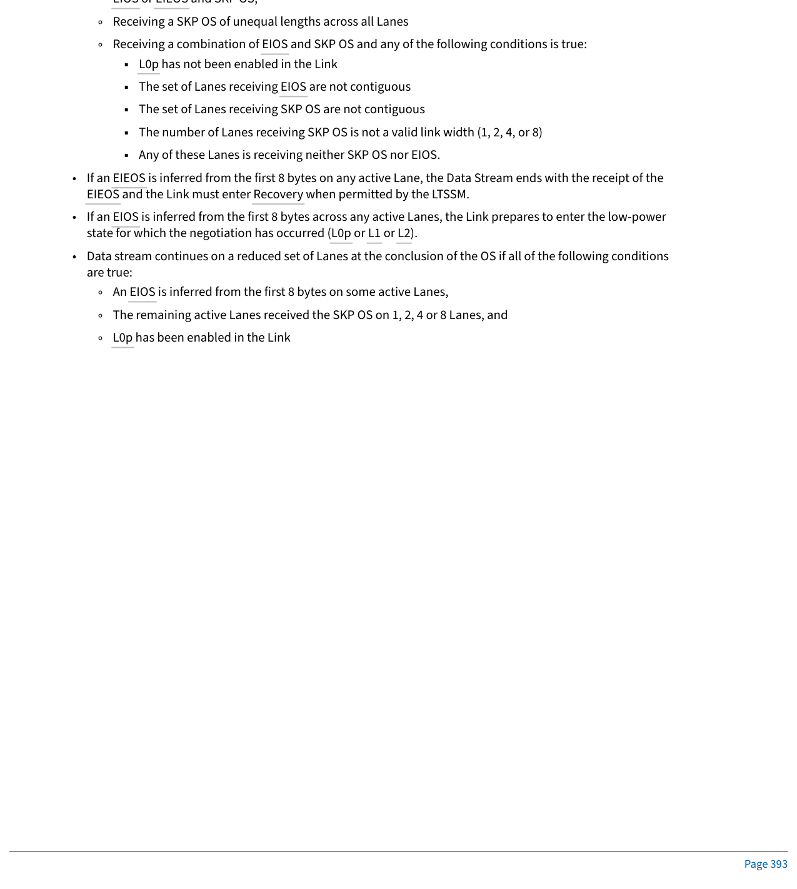

| Description | Lane 0 | Lane 1 | Lane 2 | Lane 3 | Lane 4 | Lane 5 | Lane 6 | Lane 7 | Lane 8 | Lane 9 | Lane 10 | Lane 11 | Lane 12 | Lane 13 | Lane 14 | Lane 15 |
|---|---|---|---|---|---|---|---|---|---|---|---|---|---|---|---|---|
| 128 UI TLP Bytes [0…223] | 0–15 | 16–31 | 32–47 | 48–63 | 64–79 | 80–95 | 96–111 | 112–127 | 128–143 | 144–159 | 160–175 | 176–191 | 192–207 | 208–223 | 224–239 | 240–255 |
| TLP, DLP (Bytes 224–235) | 224 | 225 | 226 | 227 | 228 | 229 | 230 | 231 | 232 | 233 | 234 | 235 | DLP0 | DLP1 | DLP2 | DLP3 |
| DLP, CRC, ECC | DLP4 | DLP5 | CRC0 | CRC1 | CRC2 | CRC3 | CRC4 | CRC5 | CRC6 | CRC7 | ECC1[0] | ECC2[0] | ECC0[0] | ECC1[1] | ECC2[1] | ECC0[1] |

**IMPLEMENTATION NOTE:** The first 236 Bytes (0..235) are for TLP(s), next 6 Bytes are for Data Link Layer Payload (DLP0..5), next 8 Bytes for CRC (CRC0..7) and the last 6 Bytes are for ECC (ecc 0..1). The FEC is a 3-way interleaved ECC, each capable of correcting a single Byte, with the interleaving shown in 3 colors.

**实现注意事项：** 前 236 字节（0..235）用于 TLP，接下来 6 字节用于数据链路层载荷（DLP0..5），再接下来 8 字节用于 CRC（CRC0..7），最后 6 字节用于 ECC（ecc 0..1）。FEC 采用 3 路交织 ECC，每路可纠正 1 字节错误，交织以 3 种颜色显示。

---

**Table 4-11 Flit interleaving in a x8 Link | 表 4-11 x8 链路中的 Flit 交织**

| Description | Lane 0 | Lane 1 | Lane 2 | Lane 3 | Lane 4 | Lane 5 | Lane 6 | Lane 7 |
|---|---|---|---|---|---|---|---|---|
| 256 UI TLP Bytes [0…231] | 0–31 | 32–63 | 64–95 | 96–127 | 128–159 | 160–191 | 192–223 | 224–231 |
| TLP Bytes [231…235], DLP Bytes (232–235) | 232 | 233 | 234 | 235 | DLP0 | DLP1 | DLP2 | DLP3 |
| DLP, CRC Bytes | DLP4 | DLP5 | CRC0 | CRC1 | CRC2 | CRC3 | CRC4 | CRC5 |
| CRC, ECC Bytes | CRC6 | CRC7 | ECC1[0] | ECC2[0] | ECC0[0] | ECC1[1] | ECC2[1] | ECC0[1] |

**IMPLEMENTATION NOTE:** Note that the same set of Bytes form the same ECC group in the 3-way interleaved FEC as in a x16 Link. The first 236 Bytes (0..235) are for TLP(s), next 6 Bytes are for Data Link Layer Payload (DLP0..5), next 8 Bytes for CRC (CRC0..7) and the last 6 Bytes are for ECC (ecc 0..1). The FEC is a 3-way interleaved ECC, each capable of correcting a single Byte, with the interleaving shown in 3 colors.

**实现注意事项：** 注意与 x16 链路一样，相同的字节集合构成 3 路交织 FEC 中相同的 ECC 组。前 236 字节（0..235）用于 TLP，接下来 6 字节用于数据链路层载荷（DLP0..5），再接下来 8 字节用于 CRC（CRC0..7），最后 6 字节用于 ECC（ecc 0..1）。FEC 采用 3 路交织 ECC，每路可纠正 1 字节错误，交织以 3 种颜色显示。

---

**Table 4-12 Flit interleaving in a x4 Link | 表 4-12 x4 链路中的 Flit 交织**

| Description | Lane 0 | Lane 1 | Lane 2 | Lane 3 |
|---|---|---|---|---|
| 512 UI TLP Bytes [0…235] | 0–63 | 64–127 | 128–191 | 192–235 |
| DLP, CRC, ECC Bytes | DLP0 | DLP1 | DLP2 | DLP3 |
| DLP, CRC, ECC Bytes | DLP4 | DLP5 | CRC0 | CRC1 |
| DLP, CRC, ECC Bytes | CRC2 | CRC3 | CRC4 | CRC5 |
| DLP, CRC, ECC Bytes | CRC6 | CRC7 | ECC1[0] ECC2[0] | ECC0[0] |
| DLP, CRC, ECC Bytes | ECC1[1] | ECC2[1] | ECC0[1] | – |

**IMPLEMENTATION NOTE:** Note that the same set of Bytes form the same ECC group in the 3-way interleaved FEC as in a x16/x8 Link. The first 236 Bytes (0..235) are for TLP(s), next 6 Bytes are for Data Link Layer Payload (DLP0..5), next 8 Bytes for CRC (CRC0..7) and the last 6 Bytes are for ECC (ecc 0..1). The FEC is a 3-way interleaved ECC, each capable of correcting a single Byte, with the interleaving shown in 3 colors.

**实现注意事项：** 注意与 x16/x8 链路一样，相同的字节集合构成 3 路交织 FEC 中相同的 ECC 组。前 236 字节（0..235）用于 TLP，接下来 6 字节用于数据链路层载荷（DLP0..5），再接下来 8 字节用于 CRC（CRC0..7），最后 6 字节用于 ECC（ecc 0..1）。FEC 采用 3 路交织 ECC，每路可纠正 1 字节错误，交织以 3 种颜色显示。

---

**Table 4-13 Flit interleaving in a x2 Link | 表 4-13 x2 链路中的 Flit 交织**

| Description | Lane 0 | Lane 1 |
|---|---|---|
| 1024 UI TLP Bytes [0…235] | 0–127 | 128–235 |
| DLP Bytes | DLP0 | DLP1 |
| DLP Bytes | DLP2 | DLP3 |
| DLP Bytes | DLP4 | DLP5 |
| CRC Bytes | CRC0 | CRC1 |
| CRC Bytes | CRC2 | CRC3 |
| CRC Bytes | CRC4 | CRC5 |
| CRC Bytes | CRC6 | CRC7 |
| ECC Bytes | ECC1[0] ECC2[0] | ECC0[0] ECC1[1] |
| ECC Bytes | ECC2[1] | ECC0[1] |

**IMPLEMENTATION NOTE:** Note that the same set of Bytes form the same ECC group in the 3-way interleaved FEC as in a x16/x8/x4 Link. The first 236 Bytes (0..235) are for TLP(s), next 6 Bytes are for Data Link Layer Payload (DLP0..5), next 8 Bytes for CRC (CRC0..7) and the last 6 Bytes are for ECC (ecc 0..1). The FEC is a 3-way interleaved ECC, each capable of correcting a single Byte, with the interleaving shown in 3 colors.

**实现注意事项：** 注意与 x16/x8/x4 链路一样，相同的字节集合构成 3 路交织 FEC 中相同的 ECC 组。前 236 字节（0..235）用于 TLP，接下来 6 字节用于数据链路层载荷（DLP0..5），再接下来 8 字节用于 CRC（CRC0..7），最后 6 字节用于 ECC（ecc 0..1）。FEC 采用 3 路交织 ECC，每路可纠正 1 字节错误，交织以 3 种颜色显示。

---

**Table 4-14 Flit arrangement in a x1 Link | 表 4-14 x1 链路中的 Flit 排列**

| Description | Lane 0 |
|---|---|
| 2048 UI TLP Bytes [0…235] | 0–235 |
| DLP Bytes | DLP0 |
| DLP Bytes | DLP1 |
| DLP Bytes | DLP2 |
| DLP Bytes | DLP3 |
| DLP Bytes | DLP4 |
| DLP Bytes | DLP5 |
| CRC Bytes | CRC0 |
| CRC Bytes | CRC1 |
| CRC Bytes | CRC2 |
| CRC Bytes | CRC3 |
| CRC Bytes | CRC4 |
| CRC Bytes | CRC5 |
| CRC Bytes | CRC6 |
| CRC Bytes | CRC7 |
| ECC Bytes | ECC1[0] |
| ECC Bytes | ECC2[0] |
| ECC Bytes | ECC0[0] |
| ECC Bytes | ECC1[1] |
| ECC Bytes | ECC2[1] |
| ECC Bytes | ECC0[1] |

**IMPLEMENTATION NOTE:** Note that the same set of Bytes form the same ECC group in the 3-way interleaved FEC as in a x16/x8/x4/x2 Link. The first 236 Bytes (0..235) are for TLP(s), next 6 Bytes are for Data Link Layer Payload (DLP0..5), next 8 Bytes for CRC (CRC0..7) and the last 6 Bytes are for ECC (ecc 0..1). The FEC is a 3-way interleaved ECC, each capable of correcting a single Byte, with the interleaving shown in 3 colors.

**实现注意事项：** 注意与 x16/x8/x4/x2 链路一样，相同的字节集合构成 3 路交织 FEC 中相同的 ECC 组。前 236 字节（0..235）用于 TLP，接下来 6 字节用于数据链路层载荷（DLP0..5），再接下来 8 字节用于 CRC（CRC0..7），最后 6 字节用于 ECC（ecc 0..1）。FEC 采用 3 路交织 ECC，每路可纠正 1 字节错误，交织以 3 种颜色显示。

---

<table>
<thead>
<tr>
<th width="50%">🇬🇧 English</th>
<th width="50%" style="background-color:#e8e8e8">🇨🇳 中文</th>
</tr>
</thead>
<tbody>
<tr>
<td>

A conceptual representation of the processing of Symbols in the Flit Mode for the 64.0 GT/s Data Rate on the Transmit and the Receive side is demonstrated in § Figure 4-21, § Figure 4-22, and § Figure 4-25. A conceptual representation of the Flit Mode and Non-Flit Mode processing with 8b/10b encoding for 2.5 GT/s and 5.0 GT/s as well as with 128b/130b encoding for 8.0 GT/s, 16.0 GT/s, and 32.0 GT/s for the Transmit and Receive side is shown in and respectively.

**Figure 4-27 Flit Mode and Non-Flit Mode processing with 8b/10b and 128b/130b encoding on the Transmit side**

> **Figure 4-27 Flit Mode and Non-Flit Mode processing with 8b/10b and 128b/130b encoding on the Transmit side**
> 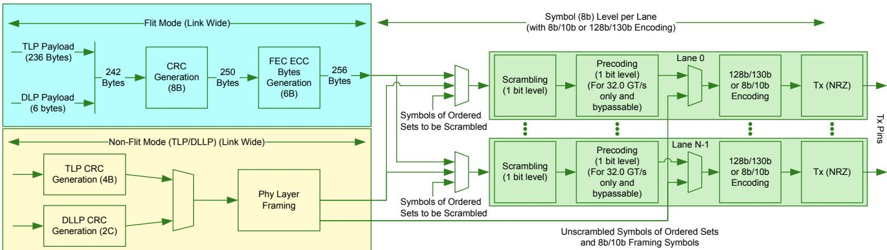

</td>
<td style="background-color:#e8e8e8">

在发送端和接收端，64.0 GT/s 数据速率下 Flit 模式中符号处理的概念性表示见 § 图 4-21、§ 图 4-22 和 § 图 4-25。发送端和接收端在 2.5 GT/s 和 5.0 GT/s 下使用 8b/10b 编码、在 8.0 GT/s、16.0 GT/s 和 32.0 GT/s 下使用 128b/130b 编码时，Flit 模式与非 Flit 模式处理的概念性表示分别示于（发送）和（接收）。

**图 4-27 发送端 8b/10b 与 128b/130b 编码下的 Flit 模式与非 Flit 模式处理**


</td>
</tr>
<tr>
<td>

**Figure 4-28 Flit Mode and Non-Flit Mode processing with 8b/10b and 128b/130b encoding on the Receive side**

> **Figure 4-28 Flit Mode and Non-Flit Mode processing with 8b/10b and 128b/130b encoding on the Receive side**
> 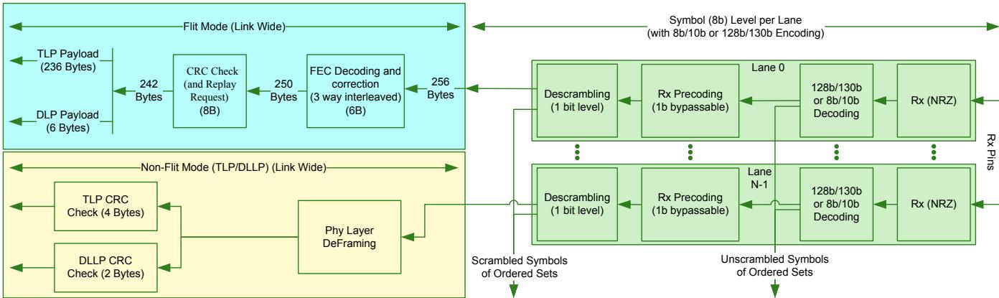

</td>
<td style="background-color:#e8e8e8">

**图 4-28 接收端 8b/10b 与 128b/130b 编码下的 Flit 模式与非 Flit 模式处理**


</td>
</tr>
<tr>
<td>

The TLP Bytes in the flit carry Transaction Layer TLPs. Since the Flit Mode does not support STP tokens, these TLP bytes must be populated by the Transaction Layer, irrespective of whether it has a TLP to send or not. A TLP may span across multiple flits depending on its length and placement. The following rules must be observed:

</td>
<td style="background-color:#e8e8e8">

Flit 中的 TLP 字节承载事务层 TLP。由于 Flit 模式不支持 STP（Start of TLP）令牌，无论是否有 TLP 待发送，事务层都必须填充这些 TLP 字节。一个 TLP 可能会根据其长度与位置跨越多个 Flit。必须遵守以下规则：

</td>
</tr>
<tr>
<td>

- When the transaction layer does not have a TLP to send, it sends a NOP TLP (1DW). Once a NOP TLP is scheduled to be sent, NOP TLPs must be scheduled till the next 4DW aligned boundary within the Flit or the Flit boundary, whichever is earlier.
- NOP TLPs do not consume any credits.
- The TLPs in Flit Mode have information in predetermined position to determine the length of the TLPs, including the case where TLP prefix is used. See § Chapter 2. for details.
- The following rules apply for the non-NOP TLPs in bytes 0 through 127 of the Flit (i.e., the TLP bytes within the first Flit half) and bytes 128 through 235 of the Flit (i.e., the TLP bytes within the second Flit half):
  - No more than 8 TLPs, including partial TLPs.
    Receivers are permitted to check this rule.
    - If checked, this is logged as a Data Link Protocol Error in the receiving Port (see § Section 6.2).
- If a TLP at the end of a Flit gets poisoned or nullified through Flit_Status, and if that TLP extends to subsequent Flits, each of those Flits must also be poisoned or nullified through Flit_Status so that the poisoned or nullified Flit_Status is set in the Flit where the TLP ends. A Receiver is permitted to only look at the poison bit in the Flit where the TLP ends.
- A TLP that gets nullified through the Flit_Status field in the DLP Bytes described below is ignored by the Receiver if the Flit is valid, but the credits must be released.
- A TLP that gets EDB'ed or Poisoned through the Flit_Status field in the DLP Bytes described below must be succeeded by only NOP TLPs through the end of the Flit.

</td>
<td style="background-color:#e8e8e8">

- 当事务层没有 TLP 待发送时，它发送一个 NOP TLP（1DW）。一旦计划发送 NOP TLP，则必须持续安排 NOP TLP 直至 Flit 内下一个 4DW 对齐边界或 Flit 边界，以先到者为准。
- NOP TLP 不消耗任何信用（Credit）。
- Flit 模式中的 TLP 在预定位置包含用于确定 TLP 长度（包括使用 TLP 前缀的情况）的信息。详见 § 第 2 章。
- 以下规则适用于 Flit 的字节 0 至 127（即第一个 Flit 半部分内的 TLP 字节）以及字节 128 至 235（即第二个 Flit 半部分内的 TLP 字节）中的非 NOP TLP：
  - 包括部分 TLP 在内，TLP 总数不超过 8 个。
    允许接收器检查此规则。
    - 如果检查，记录为接收端口中的数据链路协议错误（Data Link Protocol Error）（见 § 第 6.2 节）。
- 如果 Flit 末尾的 TLP 通过 Flit_Status 被标记为中毒（Poisoned）或作废（Nullified），且该 TLP 延伸到后续 Flit，则这些后续 Flit 也必须通过 Flit_Status 标记为中毒或作废，以使中毒或作废的 Flit_Status 设置在 TLP 结束的 Flit 中。允许接收器仅查看 TLP 结束的 Flit 中的中毒位（Poison bit）。
- 如果 TLP 通过下文所述 DLP 字节中的 Flit_Status 字段被作废（Nullified），则当 Flit 有效时，接收器忽略该 TLP，但必须释放相应的信用。
- 如果 TLP 通过下文所述 DLP 字节中的 Flit_Status 字段被标记为 EDB 或中毒（Poisoned），则在该 Flit 结束之前，其后必须仅接 NOP TLP。

</td>
</tr>
</tbody>
</table>

---

[⬆️ 返回目录](#-本章目录-table-of-contents)


---

<a id="sec-4-2-3-4"></a>
## 4.2.3.4 Bytes in Flit Layout | Flit 布局中的字节

<a id="sec-4-2-3-4-1"></a>
## 4.2.3.4.1 TLP Bytes in Flit | Flit 中的 TLP 字节

<!-- 📄 Page 401 -->
---

<table>
<thead>
<tr>
<th width="50%">🇬🇧 English</th>
<th width="50%" style="background-color:#e8e8e8">🇨🇳 中文</th>
</tr>
</thead>
<tbody>
<tr>
<td>

**IMPLEMENTATION NOTE:**
**HANDLING TLPS SPANNING MULTIPLE FLITS**

When a TLP spans multiple Flits, it may be interrupted by SKPs, NOP Flits, transitions through Recovery and/or other unavoidable scenarios. Transmitters should attempt to avoid this interruption whenever possible for optimal bandwidth and latency and Receivers must be able to deal with scenarios where the TLP may be interrupted.

</td>
<td style="background-color:#e8e8e8">

**实现注意事项：**
**处理跨多个 Flit 的 TLP**

当一个 TLP 跨越多个 Flit 时，它可能会被 SKP（跳过有序集）、NOP Flit、Recovery 状态切换和/或其他不可避免的情况中断。为了获得最佳的带宽 (Bandwidth) 和延迟 (Latency)，发送器 (Transmitter) 应尽可能避免此类中断；而接收器 (Receiver) 必须能够处理 TLP 可能被中断的场景。

</td>
</tr>
</tbody>
</table>

---

<!-- 📄 Page 402 -->
---


<div style="overflow-x: auto; max-width: 100%;">
<table>
<thead>
<tr>
<th width="50%">🇬🇧 English</th>
<th width="50%" style="background-color:#e8e8e8">🇨🇳 中文</th>
</tr>
</thead>
<tbody>
<tr>
<td>

**Example:** § Table 4-15 shows an example of TLP placement in the Flit Mode for a x16 Link. For narrower Link widths, similar arrangements will exist subject to the rules mentioned above.

- This flit starts with a continuation of the remaining 2 DWs from TLP 19 (the 3rd DW of Hdr and 1 DW of Data).
- TLP 20 (4DW Hdr and 1DW Data) immediately starts in Lane 8 and ends in Lane 11 in the following Symbol.
- Since the Transmitter has nothing to send, it sends NOP sending till the 4DW aligned boundary, which is in Lane 15.
- TLPs 22, and 23 are scheduled without any intervening NOP.
- After TLP 23, the Transmitter did not have anything to send and sends 7 NOPs, aligned to a 4DW boundary till TLP 24 is ready, which continues till the flit boundary for TLP Bytes.
- After that we have 6 Bytes of DLP, 8 Bytes of CRC covering the 236 Bytes of TLP and 6 Bytes of DLP in the flit.
- Then we have the 3 sets of interleaved ECC, 2 bytes each, covering the entire 256B flit.

It should be noted that every Byte of each TLP as well the DLP is covered by one of the 3 ECC groups and each TLP/DLP is a member of all 3 ECC groups, and as indicated in the color code.

</td>
<td style="background-color:#e8e8e8">

**示例：** § 表 4-15 展示了在 x16 链路 (Link) 的 Flit 模式 (Flit Mode) 中 TLP 放置的示例。对于更窄的链路宽度，类似的布局将根据上述规则存在。

- 该 Flit 起始于 TLP 19 剩余的 2 个 DW（包头 (Hdr) 的第 3 个 DW 和 1 个数据 DW）的延续。
- TLP 20（4 DW 包头 + 1 DW 数据）紧接着从通道 (Lane) 8 开始，并在下一个 Symbol 的通道 11 结束。
- 由于发送器没有内容可发送，它发送 NOP 直到 4 DW 对齐边界，即通道 15。
- TLP 22 和 TLP 23 在调度时没有插入任何 NOP。
- 在 TLP 23 之后，发送器没有内容可发送，于是发送 7 个 NOP，对齐到 4 DW 边界，直到 TLP 24 就绪为止，TLP 24 一直延续到 TLP 字节 (TLP Bytes) 的 Flit 边界。
- 之后，Flit 中包含 6 字节的 DLP、覆盖 236 字节 TLP 的 8 字节 CRC 以及 6 字节的 DLP。
- 然后是 3 组交织的 ECC，每组 2 字节，覆盖整个 256 字节的 Flit。

值得注意的是，每个 TLP 的每个字节以及 DLP 均被 3 个 ECC 组中的某一个所覆盖，每个 TLP/DLP 同时属于全部 3 个 ECC 组，如色码所示。

</td>
</tr>
</tbody>
</table>
</div>


**Table 4-15 Example TLP Placement in Flit Mode on a x16 Link | 表 4-15 Flit 模式下 x16 链路的 TLP 放置示例**

| Description | Lane 0 | Lane 1 | Lane 2 | Lane 3 | Lane 4 | Lane 5 | Lane 6 | Lane 7 | Lane 8 | Lane 9 | Lane 10 | Lane 11 | Lane 12 | Lane 13 | Lane 14 | Lane 15 |
|---|---|---|---|---|---|---|---|---|---|---|---|---|---|---|---|---|
| 128 UI | TLP Bytes [0…223] | | | | | | | | | | | | | | | |
| … TLP 19 → | H2 | H2 | H2 | H2 | D0 D0 D0 D0 | H0 H0 | H0 | H0 | H1 | H1 | H1 | H1 | | | | |
| ← TLP 20 … | H2 | H2 | H2 | H2 | H3 | H3 | H3 | H3 D0 D0 | D0 | D0 | | | | | | |
| … TLP 20 → | NOP | H0 | H0 H0 H0 | H1 | H1 | H1 | H1 | H2 | H2 | H2 | H2 | H3 | H3 | H3 | H3 | |
| ← TLP 21 … | D0 | D0 D0 D0 | D1 | D1 | D1 | D1 | | | | | | | | | | |
| … TLP 21 → | NOP | H0 | H0 H0 H0 | H1 | H1 | H1 | H1 | H2 | H2 | H2 | H2 | H0 | H0 | H0 | H0 | |
| ← TLP 22 → | | | | | | | | | | | | | | | | |
| ← TLP 23 … | H1 | H1 | H1 | H1 | H2 | H2 | H2 | H2 | H3 | H3 | H3 | H3 | D0 | D0 | D0 | D0 |
| … TLP 23 … | D1 | D1 | D1 | D1 | D2 | D2 | D2 | D2 | D3 | D3 | D3 | D3 | D4 | D4 | D4 | D4 |
| … TLP 23 → | D5 | D5 | D5 | D5 | | | | | | | | | | | | |
| | NOP | NOP | H0 | H0 H0 H0 | H1 | H1 | H1 | H1 | H2 | H2 | H2 | H2 | D0 | D0 | D0 | D0 |
| ← TLP 24 … | D1 | D1 | D1 | D1 | D2 | D2 | D2 | D2 | D3 | D3 | D3 | D3 | D4 | D4 | D4 | D4 |
| … TLP 24 … | D5 | D5 | D5 | D5 | D6 | D6 | D6 | D6 | D7 | D7 | D7 | D7 | D8 | D8 | D8 | D8 |
| … TLP 24 … | D9 | D9 | D9 | D9 | D10 D10 D10 D10 | D11 D11 | D11 | D11 | D12 | D12 | D12 | D12 | | | | |

---

<!-- 📄 Page 403 -->
---

| Description | Lane 0 | Lane 1 | Lane 2 | Lane 3 | Lane 4 | Lane 5 | Lane 6 | Lane 7 | Lane 8 | Lane 9 | Lane 10 | Lane 11 | Lane 12 | Lane 13 | Lane 14 | Lane 15 |
|---|---|---|---|---|---|---|---|---|---|---|---|---|---|---|---|---|
| … TLP 24 … | D13 D13 D13 D13 | D14 D14 D14 D14 | D15 D15 | D15 | D15 | D16 | D16 | D16 | D16 | | | | | | | |
| TLP, DLP | D17 D17 D17 D17 | D18 D18 D18 D18 | D19 D19 | D19 | D19 | DLP 0 | DLP 1 | DLP 2 | DLP 3 | | | | | | | |
| … TLP 24 → | | | | | | | | | | | | | | | | |
| ← DLP … | | | | | | | | | | | | | | | | |
| DLP, CRC, ECC | DLP 4 | DLP 5 | CRC 0 | CRC 1 | CRC 2 | CRC 3 | CRC 4 | CRC 5 | CRC 6 | CRC 7 | ECC1 [0] | ECC2 [0] | ECC0 [0] | ECC1 [1] | ECC2 [1] | ECC0 [1] |
| | … DLP → | | | | | | | | | | | | | | | | |
| | ← CRC → | | | | | | | | | | | | | | | | |
| | ← ECC → | | | | | | | | | | | | | | | | |

<table>
<thead>
<tr>
<th width="50%">🇬🇧 English</th>
<th width="50%" style="background-color:#e8e8e8">🇨🇳 中文</th>
</tr>
</thead>
<tbody>
<tr>
<td>

In every flit, 6 bytes are allotted to carry the information carried by the Data Link Layer Packets (DLLPs) described in § Chapter 3. While the DLP bytes are designed to reuse the DLLP mechanism and formats for the most part, some optimizations have been made to effectively carry the Ack/Nak flit along with an optimized credit release (Optimized_Update_FC, defined below) or a traditional DLLP. An encoding has been added in the DLP to provide Update_FC credits for PRH, PRD, and NPRH within one 32 bit payload of DLP. The following table summarizes the DLP encodings.

Three Flit Types have been defined in § Table 4-16, along with their intended usages. They all have the same CRC and FEC mechanism. The distinction is made for ease of reference based on the TLP and DLP Bytes they carry. An IDLE Flit uses the sequence number of 0 along with the appropriate Replay Command (00b) as described in § Table 4-16. IDLE Flits are only sent after the Control SKP Ordered Set following the SDS Ordered Set Sequence with 128b/130b and 1b/1b encoding. For 8b/10b encoding, an IDLE Flit will be sent at the conclusion of the TS2 Ordered Set (or after a SKP OS following the last TS2 Ordered Set, depending on the SKP insertion interval). With 8b/10b encoding, an Ordered Set vs. a Flit is distinguished the lack of a COM at the end of a SKP OS. IDLE Flits continue to be sent until a Flit other than an IDLE Flit must be sent. Devices that advertise infinite credits across all FC/VC are permitted to send NOP DLLP if there is no DLLP to be sent in dlp 2, 3, 4, and 5.

A valid Flit is one that passes the CRC check after performing the FEC correction, if required, and none of the ECC groups in the FEC are reporting an uncorrectable error (by ECC), as described in § Section 4.2.3.4.4, and the Flit Usage as well as the Flit Status fields do not have a Reserved encoding defined below.

An FEC-correctable Flit is a valid Flit that passes the CRC check after performing the FEC correction.

An FEC uncorrectable error is an error in a Flit that is detected by the CRC after FEC correction or 'uncorrectable error' reported by an ECC group in the FEC which may result in a NAK and a replay.

An invalid Flit is a Flit that is not a valid Flit.

A valid non-IDLE Flit is a valid Flit that is either a NOP Flit or a Payload Flit. All subsequent Flits after the first valid non-IDLE Flit are non-IDLE Flits while the Link is in L0.

</td>
<td style="background-color:#e8e8e8">

在每个 Flit 中，分配了 6 字节用于承载第 3 章所述数据链路层包 (DLLP, Data Link Layer Packet) 中携带的信息。虽然 DLP 字节在设计上大部分复用了 DLLP 的机制和格式，但进行了一些优化，以便有效地承载 Ack/Nak Flit 以及优化的信用 (Credit) 释放 (Optimized_Update_FC，下文定义) 或传统的 DLLP。在 DLP 中新增了一种编码 (Encoding)，用于在 DLP 的一个 32 位有效载荷内提供 PRH、PRD 和 NPRH 的 Update_FC 信用。如下表总结了 DLP 编码。

§ 表 4-16 定义了三种 Flit 类型及其预期用途。它们均使用相同的 CRC 和 FEC 机制。区分依据是它们承载的 TLP 和 DLP 字节，以便于引用。IDLE Flit 使用序列号 0 以及 § 表 4-16 所述的相应 Replay Command (00b)。IDLE Flit 仅在 SDS 有序集序列之后的控制 SKP 有序集之后发送，且使用 128b/130b 编码和 1b/1b 编码。对于 8b/10b 编码，IDLE Flit 将在 TS2 有序集结束时发送（或在最后一个 TS2 有序集之后的 SKP OS 之后发送，具体取决于 SKP 插入间隔）。在使用 8b/10b 编码时，有序集与 Flit 的区别在于 SKP OS 末尾是否存在 COM。IDLE Flit 会持续发送，直到必须发送非 IDLE Flit 为止。通告所有 FC/VC 拥有无限信用的设备，如果 dlp 2、3、4、5 中没有 DLLP 可发送，则允许发送 NOP DLLP。

有效 Flit 是指在执行 FEC 校正（如果需要）后通过 CRC 校验，并且 FEC 中的所有 ECC 组均未报告不可纠正错误（ECC 层面）的 Flit，如 § 第 4.2.3.4.4 节所述，且 Flit Usage 字段和 Flit Status 字段未使用下文定义的保留编码 (Reserved encoding)。

FEC 可纠正 Flit 是指在执行 FEC 校正后通过 CRC 校验的有效 Flit。

FEC 不可纠正错误是指在 FEC 校正后由 CRC 检测到的 Flit 错误，或 FEC 中某个 ECC 组报告的"不可纠正错误"，可能导致 NAK 和重放 (Replay)。

无效 Flit 是指不是有效 Flit 的 Flit。

有效非 IDLE Flit 是指 NOP Flit 或 Payload Flit 中的有效 Flit。当链路 (Link) 处于 L0 状态时，第一个有效非 IDLE Flit 之后的所有后续 Flit 都是非 IDLE Flit。

</td>
</tr>
</tbody>
</table>

<a id="sec-4-2-3-4-2"></a>
## 4.2.3.4.2 DLP Bytes in Flit | Flit 中的 DLP 字节

---

<!-- 📄 Page 404 -->
---

**Figure 4-29 DLP Byte to Bit Number Assignment | 图 4-29 DLP 字节到位号分配**

> **Figure 4-29.** DLP Byte to Bit Number Assignment
> 

| Bit Range | DLP Byte |
|---|---|
| 00b 0–7 | DLP 5 |
| 8–15 | DLP 4 |
| 16–23 | DLP 3 |
| 24–31 | DLP 2 |
| 01b 0–7 | DLP 5 |
| 8–15 | DLP 4 |
| 16–23 | DLP 3 |
| 24–31 | DLP 2 |
| 32–39 | DLP 1 |
| 40–47 | DLP 0 |
| Others | ... |

**Figure 4-30 DLP Bit usage | 图 4-30 DLP 位使用**

> **Figure 4-30.** DLP Bit usage
> 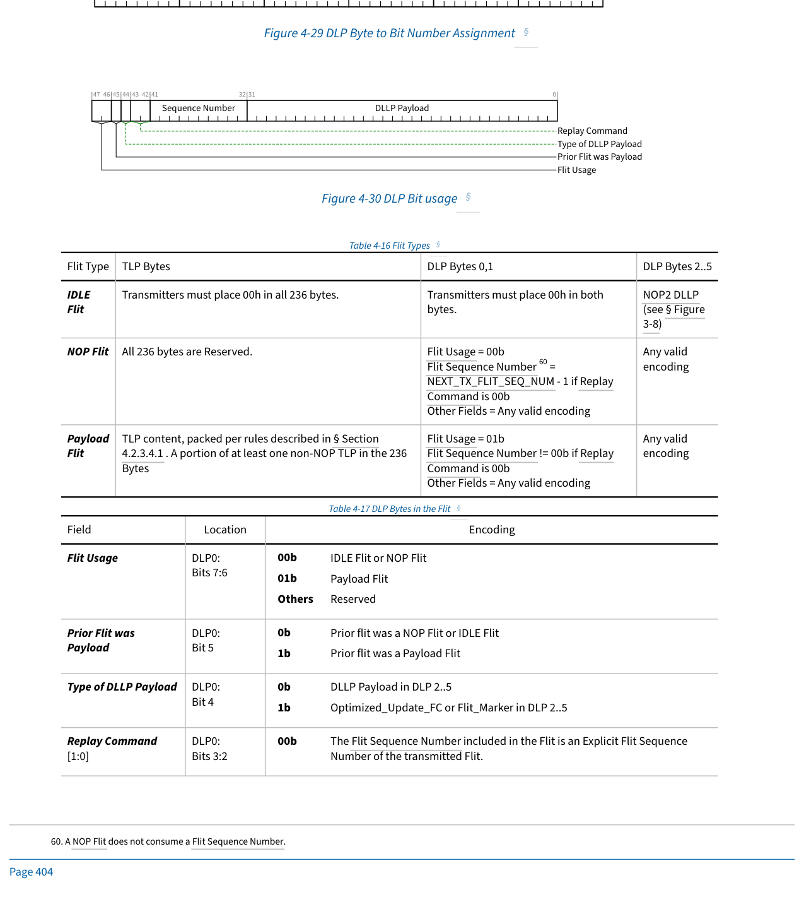

| Bit Range | Field |
|---|---|
| 0–31 | DLLP Payload (DLLP 有效载荷) |
| 32–41 | Sequence Number (序列号) |
| 42–43 | Replay Command (重放命令) |
| 44 | Type of DLLP Payload (DLLP 有效载荷类型) |
| 45 | Prior Flit was Payload (前一个 Flit 是 Payload Flit) |
| 46–47 | Flit Usage (Flit 用途) |

**Table 4-16 Flit Types | 表 4-16 Flit 类型**

| Flit Type | TLP Bytes | DLP Bytes 0,1 | DLP Bytes 2..5 |
|---|---|---|---|
| **IDLE Flit** | Transmitters must place 00h in all 236 bytes. (发送器必须在全部 236 字节中放置 00h。) | Transmitters must place 00h in both bytes. (发送器必须在两个字节中均放置 00h。) | NOP2 DLLP (see § Figure 3-8) |
| **NOP Flit** | All 236 bytes are Reserved. (全部 236 字节保留。) | Flit Usage = 00b<br>Flit Sequence Number⁶⁰ = NEXT_TX_FLIT_SEQ_NUM - 1 if Replay Command is 00b<br>Other Fields = Any valid encoding | Any valid encoding |
| **Payload Flit** | TLP content, packed per rules described in § Section 4.2.3.4.1. A portion of at least one non-NOP TLP in the 236 Bytes (TLP 内容，按 § 第 4.2.3.4.1 节所述规则打包。在 236 字节中至少包含一个非 NOP TLP 的一部分) | Flit Usage = 01b<br>Flit Sequence Number != 00b if Replay Command is 00b<br>Other Fields = Any valid encoding | Any valid encoding |

**Table 4-17 DLP Bytes in the Flit | 表 4-17 Flit 中的 DLP 字节**

| Field | Location | Encoding |
|---|---|---|
| Flit Usage | DLP0: Bits 7:6 | **00b** IDLE Flit or NOP Flit<br>**01b** Payload Flit<br>**Others** Reserved |
| Prior Flit was Payload | DLP0: Bit 5 | **0b** Prior flit was a NOP Flit or IDLE Flit (前一个 Flit 是 NOP Flit 或 IDLE Flit)<br>**1b** Prior flit was a Payload Flit (前一个 Flit 是 Payload Flit) |
| Type of DLLP Payload | DLP0: Bit 4 | **0b** DLLP Payload in DLP 2..5 (DLP 2..5 中为 DLLP 有效载荷)<br>**1b** Optimized_Update_FC or Flit_Marker in DLP 2..5 (DLP 2..5 中为 Optimized_Update_FC 或 Flit_Marker) |
| Replay Command [1:0] | DLP0: Bits 3:2 | **00b** The Flit Sequence Number included in the Flit is an Explicit Flit Sequence Number of the transmitted Flit. (Flit 中包含的 Flit 序列号是所发送 Flit 的显式 Flit 序列号。)<br>**01b** Ack of Flit Sequence Number from Receiver. The included Flit Sequence Number indicates the Flit Sequence Number of the last valid Flit received. (来自接收器的 Flit 序列号确认。所包含的 Flit 序列号表示接收到的最后一个有效 Flit 的 Flit 序列号。)<br>**10b** Nak requesting a Replay of all unacknowledged Flits. The included Flit Sequence Number indicates the Flit Sequence Number of the last valid Flit received. (Nak 请求重放所有未确认的 Flit。所包含的 Flit 序列号表示接收到的最后一个有效 Flit 的 Flit 序列号。)<br>**11b** Nak requesting a Replay of a single Flit (Flit Sequence Number + 1). The included Flit Sequence Number indicates the Flit Sequence Number of the last valid Flit received. (Nak 请求重放单个 Flit（Flit 序列号 + 1）。所包含的 Flit 序列号表示接收到的最后一个有效 Flit 的 Flit 序列号。) |
| Flit Sequence Number [9:0] | { DLP0: Bits 1:0, DLP1: Bits 7:0 } | 10-bit sequence number applied to Flits. See Flit Sequence Number Rules. (应用于 Flit 的 10 位序列号。参见 Flit 序列号规则。)<br>DLP0[1:0] contains Flit Sequence Number[9:8] and DLP1[7:0] has Flit Sequence Number[7:0]. |
| DLLP Payload | { DLP2, DLP3, DLP4, DLP5 } Bits 31:0 | DLP2 is 31:24<br>DLP3 is 23:16<br>DLP4 is 15:8<br>DLP5 is 7:0<br>Type of DLLP Payload is 0b → Regular DLLP Payload (see § Chapter 3.)<br>Type of DLLP Payload is 1b and bit 31 = 0b → Optimized_Update_FC (see § Table 4-18)<br>Type of DLLP Payload is 1b and bit 31 = 1b → Flit_Marker (see § Table 4-19) |

> In the Table above, a Transmitter must not use the Reserved encodings. (在上表中，发送器不得使用保留编码。)

> 60. A NOP Flit does not consume a Flit Sequence Number. (NOP Flit 不消耗 Flit 序列号。)

---

<!-- 📄 Page 405 -->
---

**Figure 4-31 Optimized_Update_FC | 图 4-31 Optimized_Update_FC**

> **Figure 4-31.** Optimized_Update_FC
> 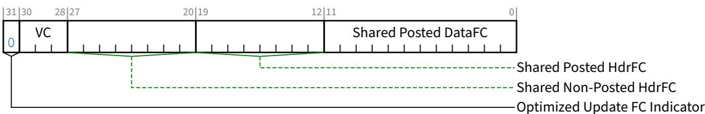

| Bit Range | Field |
|---|---|
| 0–11 | Shared Posted DataFC (共享 Posted 数据流控) |
| 12–19 | Shared Posted HdrFC (共享 Posted 包头流控) |
| 20–27 | Shared Non-Posted HdrFC (共享 Non-Posted 包头流控) |
| 28–30 | VC (虚通道) |
| 31 | Optimized Update FC Indicator (Optimized Update FC 指示) |

**Table 4-18 Optimized_Update_FC | 表 4-18 Optimized_Update_FC**

| Bit Location | Description |
|---|---|
| 31 | Optimized Update FC Indicator — Must be "0" |
| 30:28 | VC |
| 27:20 | Shared Non-Posted HdrFC – Shared credits on this VC (此 VC 上的共享信用) |
| 19:12 | Shared Posted HdrFC – Shared credits on this VC |
| 11:0 | Shared Posted DataFC – Shared credits on this VC |

---

<!-- 📄 Page 406 -->
---

**Figure 4-32 Flit_Marker | 图 4-32 Flit_Marker**

> **Figure 4-32.** Flit_Marker
> 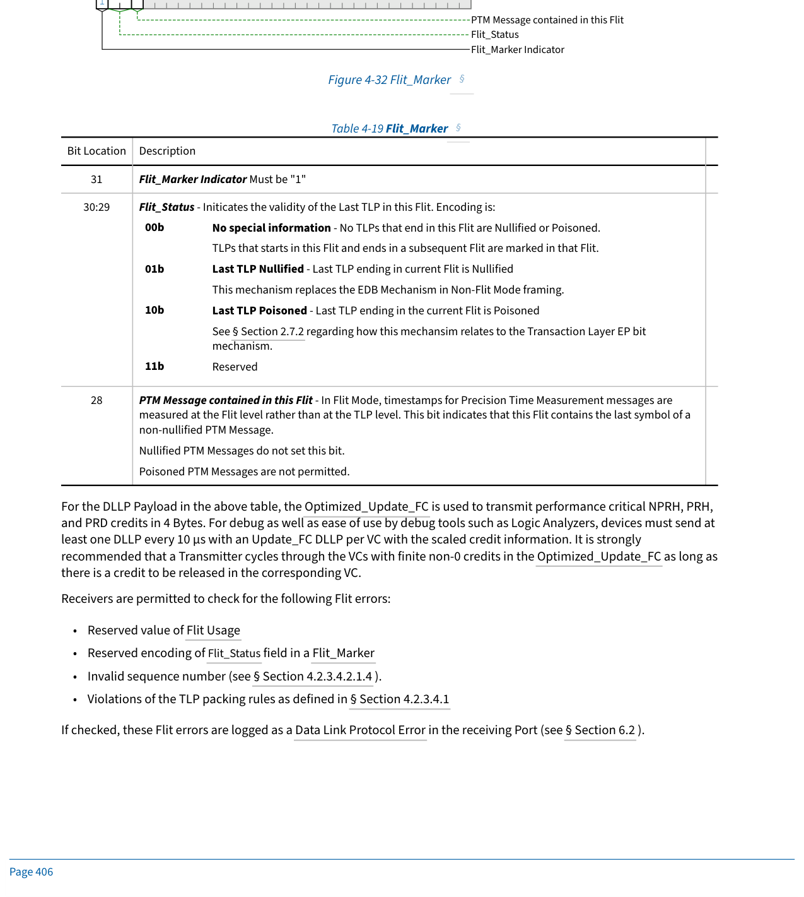

| Bit Range | Field |
|---|---|
| 0–27 | **00b** Reserved<br>**01b** PTM Message contained in this Flit (此 Flit 中包含 PTM 消息)<br>**10b** Flit_Status<br>**11b** Flit_Marker Indicator |
| 28 | PTM Message contained in this Flit |
| 29–30 | Flit_Status |
| 31 | Flit_Marker Indicator |

**Table 4-19 Flit_Marker | 表 4-19 Flit_Marker**

| Bit Location | Description |
|---|---|
| 31 | Flit_Marker Indicator — Must be "1" |
| 30:29 | Flit_Status - Indicates the validity of the Last TLP in this Flit. Encoding is: (指示此 Flit 中最后一个 TLP 的有效性。编码为：)<br>**00b** No special information - No TLPs that end in this Flit are Nullified or Poisoned. (无特殊信息 - 在此 Flit 中结束的 TLP 均未被作废 (Nullified) 或中毒 (Poisoned)。)<br>TLPs that starts in this Flit and ends in a subsequent Flit are marked in that Flit. (在此 Flit 中开始并在后续 Flit 中结束的 TLP 在该 Flit 中标记。)<br>**01b** Last TLP Nullified - Last TLP ending in current Flit is Nullified (最后一个 TLP 作废 - 当前 Flit 中结束的最后一个 TLP 被作废)<br>This mechanism replaces the EDB Mechanism in Non-Flit Mode framing. (此机制替代了非 Flit 模式 (Non-Flit Mode) 帧中的 EDB 机制。)<br>**10b** Last TLP Poisoned - Last TLP ending in the current Flit is Poisoned (最后一个 TLP 中毒 - 当前 Flit 中结束的最后一个 TLP 被中毒)<br>See § Section 2.7.2 regarding how this mechanism relates to the Transaction Layer EP bit mechanism.<br>**11b** Reserved |
| 28 | PTM Message contained in this Flit - In Flit Mode, timestamps for Precision Time Measurement messages are measured at the Flit level rather than at the TLP level. This bit indicates that this Flit contains the last symbol of a non-nullified PTM Message. (在 Flit 模式下，精确定时测量 (Precision Time Measurement) 消息的时间戳在 Flit 级别而非 TLP 级别测量。该位指示此 Flit 包含非作废 PTM 消息的最后一个符号。)<br>Nullified PTM Messages do not set this bit. (作废的 PTM 消息不设置此位。)<br>Poisoned PTM Messages are not permitted. (不允许中毒的 PTM 消息。) |


<div style="overflow-x: auto; max-width: 100%;">
<table>
<thead>
<tr>
<th width="50%">🇬🇧 English</th>
<th width="50%" style="background-color:#e8e8e8">🇨🇳 中文</th>
</tr>
</thead>
<tbody>
<tr>
<td>

For the DLLP Payload in the above table, the Optimized_Update_FC is used to transmit performance critical NPRH, PRH, and PRD credits in 4 Bytes. For debug as well as ease of use by debug tools such as Logic Analyzers, devices must send at least one DLLP every 10 μs with an Update_FC DLLP per VC with the scaled credit information. It is strongly recommended that a Transmitter cycles through the VCs with finite non-0 credits in the Optimized_Update_FC as long as there is a credit to be released in the corresponding VC.

Receivers are permitted to check for the following Flit errors:

- Reserved value of Flit Usage
- Reserved encoding of Flit_Status field in a Flit_Marker
- Invalid sequence number (see § Section 4.2.3.4.2.1.4).
- Violations of the TLP packing rules as defined in § Section 4.2.3.4.1

If checked, these Flit errors are logged as a Data Link Protocol Error in the receiving Port (see § Section 6.2).

</td>
<td style="background-color:#e8e8e8">

对于上表中的 DLLP 有效载荷，Optimized_Update_FC 用于在 4 字节内传输性能关键的 NPRH、PRH 和 PRD 信用 (Credit)。为了调试以及方便逻辑分析仪等调试工具的使用，设备必须每 10 μs 至少发送一个 DLLP，并为每个 VC 发送一个包含缩放信用信息的 Update_FC DLLP。强烈建议发送器在 Optimized_Update_FC 中循环遍历具有有限非零信用的 VC，只要相应 VC 中有待释放的信用。

允许接收器 (Receiver) 检查以下 Flit 错误：

- Flit Usage 的保留值
- Flit_Marker 中 Flit_Status 字段的保留编码
- 无效的序列号 (参见 § 第 4.2.3.4.2.1.4 节)
- 违反 § 第 4.2.3.4.1 节定义的 TLP 打包规则

如果进行检查，这些 Flit 错误将作为数据链路协议错误记录在接收端口 (Port) 中（参见 § 第 6.2 节）。

</td>
</tr>
</tbody>
</table>
</div>


---

<!-- 📄 Page 407 -->
---

<a id="sec-4-2-3-4-2-1"></a>
## 4.2.3.4.2.1 Flit Sequence Number and Retry Mechanism | Flit 序列号与重传机制

<table>
<thead>
<tr>
<th width="50%">🇬🇧 English</th>
<th width="50%" style="background-color:#e8e8e8">🇨🇳 中文</th>
</tr>
</thead>
<tbody>
<tr>
<td>

**Term Definitions**

**Explicit Sequence Number Flit:** A Payload Flit or NOP Flit with Replay Command 00b.

**Ack Flit:** A Flit with Replay Command 01b.

**Standard Nak Flit:** A Flit with Replay Command 10b.

**Selective Nak Flit:** A Flit with Replay Command 11b.

**Nak Flit:** A Flit with either Replay Command 10b or 11b.

**Standard Nak:** A Nak that requests a Replay of all unacknowledged Flits.

**Selective Nak:** A Nak that requests a Replay of a specific Flit.

**Standard Replay:** A Replay of all unacknowledged Flits in the TX Retry Buffer.

**Selective Replay:** A Replay of a specific Flit from the TX Retry Buffer.

**TX Retry Buffer:** The buffer which stores information for transmitted Flits until the Flit has been acknowledged by the Link partner.⁶¹

**RX Retry Buffer:** The buffer which stores information for received Flits until the Flit has been consumed by the Receiver.⁶²

**Nak Ignore Window:** A time window in which received Nak Flits are ignored for a specific Flit Sequence Number.
- The Nak Ignore Window is started when a Payload Explicit Sequence Number Flit is sent with Flit Sequence Number = NAK_IGNORE_FLIT_SEQ_NUM + 1 and NAK_IGNORE_FLIT_SEQ_NUM != 0.⁶³

**Flags and Counters**

**NEXT_TX_FLIT_SEQ_NUM:** 10-bit unsigned counter that tracks the Flit Sequence Number for transmitted Flits.
- Set to 001h in DL_Inactive state.
- Behavior defined in NEXT_TX_FLIT_SEQ_NUM Rules.
- Usage defined in § Section 4.2.3.4.2.1.2, § Section 4.2.3.4.2.1.3, § Section 4.2.3.4.2.1.4, and § Section 4.2.3.4.2.1.6.

**TX_ACKNAK_FLIT_SEQ_NUM:** Stores the 10-bit Sequence Number to be transmitted in the next Ack Flit or Nak Flit.

</td>
<td style="background-color:#e8e8e8">

**术语定义**

**显式序列号 Flit (Explicit Sequence Number Flit)：** Replay Command 为 00b 的 Payload Flit 或 NOP Flit。

**Ack Flit：** Replay Command 为 01b 的 Flit。

**标准 Nak Flit (Standard Nak Flit)：** Replay Command 为 10b 的 Flit。

**选择性 Nak Flit (Selective Nak Flit)：** Replay Command 为 11b 的 Flit。

**Nak Flit：** Replay Command 为 10b 或 11b 的 Flit。

**标准 Nak (Standard Nak)：** 请求重放所有未确认 Flit 的 Nak。

**选择性 Nak (Selective Nak)：** 请求重放特定 Flit 的 Nak。

**标准重放 (Standard Replay)：** 重放 TX Retry Buffer (发送重试缓冲) 中所有未确认的 Flit。

**选择性重放 (Selective Replay)：** 从 TX Retry Buffer 中重放特定的 Flit。

**TX Retry Buffer (发送重试缓冲)：** 用于存储已发送 Flit 信息的缓冲器，直到该 Flit 获得链路对端的确认。⁶¹

**RX Retry Buffer (接收重试缓冲)：** 用于存储已接收 Flit 信息的缓冲器，直到该 Flit 被接收器使用。⁶²

**Nak Ignore Window (Nak 忽略窗口)：** 在此时间窗口内，针对特定 Flit 序列号接收到的 Nak Flit 会被忽略。
- 当发送 Flit Sequence Number = NAK_IGNORE_FLIT_SEQ_NUM + 1 且 NAK_IGNORE_FLIT_SEQ_NUM != 0 的 Payload 显式序列号 Flit 时，启动 Nak 忽略窗口。⁶³

**标志与计数器**

**NEXT_TX_FLIT_SEQ_NUM：** 10 位无符号计数器，用于跟踪已发送 Flit 的 Flit 序列号。
- 在 DL_Inactive 状态下设置为 001h。
- 行为定义见 NEXT_TX_FLIT_SEQ_NUM 规则。
- 使用定义见 § 第 4.2.3.4.2.1.2 节、§ 第 4.2.3.4.2.1.3 节、§ 第 4.2.3.4.2.1.4 节及 § 第 4.2.3.4.2.1.6 节。

**TX_ACKNAK_FLIT_SEQ_NUM：** 存储下一个 Ack Flit 或 Nak Flit 中要发送的 10 位序列号。

</td>
</tr>
</tbody>
</table>

---

<!-- 📄 Page 408 -->
---


<div style="overflow-x: auto; max-width: 100%;">
<table>
<thead>
<tr>
<th width="50%">🇬🇧 English</th>
<th width="50%" style="background-color:#e8e8e8">🇨🇳 中文</th>
</tr>
</thead>
<tbody>
<tr>
<td>

- Set to 1023 in DL_Inactive state.
- Usage defined in § Section 4.2.3.4.2.1.2, § Section 4.2.3.4.2.1.3, and § Section 4.2.3.4.2.1.5.

**CONSECUTIVE_TX_EXPLICIT_SEQ_NUM_FLITS:** 2-bit unsigned counter which tracks how many consecutive Explicit Sequence Number Flits have been sent by the Transmitter.
- Set to 00b IDLE Flit Handshake Phase.
- Behavior defined in CONSECUTIVE_TX_EXPLICIT_SEQ_NUM_FLITS Rules
- Usage defined in § Section 4.2.3.4.2.1.2 and § Section 4.2.3.4.2.1.3.

**CONSECUTIVE_TX_NAK_FLITS:** 3-bit unsigned counter which tracks how many consecutive Nak Flits have been sent by the Transmitter.
- Set to 000b in the IDLE Flit Handshake Phase.
- This counter saturates at 111b and does not roll over to 000b.
- Behavior defined in CONSECUTIVE_TX_NAK_FLITS Rules.
- Usage defined in § Section 4.2.3.4.2.1.3 and § Section 4.2.3.4.2.1.7.

**NEXT_EXPECTED_RX_FLIT_SEQ_NUM:** 10-bit unsigned counter that stores the expected Flit Sequence Number of the next valid non-IDLE non-duplicate Flit to be received.
- Set to 001h in DL_Inactive state.
- Behavior and usage defined in § Section 4.2.3.4.2.1.5.

**IMPLICIT_RX_FLIT_SEQ_NUM:** 10-bit unsigned counter that tracks the implicit Flit Sequence Number of received Flits.
- Set to 000h in DL_Inactive state.
- Behavior defined in IMPLICIT_RX_FLIT_SEQ_NUM Rules.
- Usage defined in § Section 4.2.3.4.2.1.5.

**ACKD_FLIT_SEQ_NUM:** Stores the 10-bit Flit Sequence Number received in the most recently processed valid Ack Flit or Nak Flit.
- Set to 3FFh in DL_Inactive state.
- Behavior defined in § Section 4.2.3.4.2.1.4.
- Usage defined in § Section 4.2.3.4.2.1.4 and § Section 4.2.3.4.2.1.6.

**NON_IDLE_EXPLICIT_SEQ_NUM_FLIT_RCVD:** Flag to indicate that a Non-IDLE Explicit Sequence Number Flit has been received since the last entry to IDLE Flit Handshake Phase.
- Set to 1 when first Non-IDLE Explicit Sequence Number Flit is received after last entry to IDLE Flit Handshake Phase.
  - This must be updated before evaluating Ack, Nak, and Discard Rules in § Section 4.2.3.4.2.1.5.
- Cleared on entry to IDLE Flit Handshake Phase.
- Usage defined in IMPLICIT_RX_FLIT_SEQ_NUM Rules.

**REPLAY_SCHEDULED:** Flag to indicate that a Flit has been scheduled to be replayed from the TX Retry Buffer.
- Cleared when in DL_Inactive state.

</td>
<td style="background-color:#e8e8e8">

- 在 DL_Inactive 状态下设置为 1023。
- 使用定义见 § 第 4.2.3.4.2.1.2 节、§ 第 4.2.3.4.2.1.3 节及 § 第 4.2.3.4.2.1.5 节。

**CONSECUTIVE_TX_EXPLICIT_SEQ_NUM_FLITS：** 2 位无符号计数器，用于跟踪发送器已发送的连续显式序列号 Flit 的数量。
- 在 IDLE Flit 握手阶段设置为 00b。
- 行为定义见 CONSECUTIVE_TX_EXPLICIT_SEQ_NUM_FLITS 规则。
- 使用定义见 § 第 4.2.3.4.2.1.2 节及 § 第 4.2.3.4.2.1.3 节。

**CONSECUTIVE_TX_NAK_FLITS：** 3 位无符号计数器，用于跟踪发送器已发送的连续 Nak Flit 的数量。
- 在 IDLE Flit 握手阶段设置为 000b。
- 此计数器饱和值为 111b，不会回绕至 000b。
- 行为定义见 CONSECUTIVE_TX_NAK_FLITS 规则。
- 使用定义见 § 第 4.2.3.4.2.1.3 节及 § 第 4.2.3.4.2.1.7 节。

**NEXT_EXPECTED_RX_FLIT_SEQ_NUM：** 10 位无符号计数器，存储下一个预期接收的有效非 IDLE 且非重复 Flit 的 Flit 序列号。
- 在 DL_Inactive 状态下设置为 001h。
- 行为与使用定义见 § 第 4.2.3.4.2.1.5 节。

**IMPLICIT_RX_FLIT_SEQ_NUM：** 10 位无符号计数器，用于跟踪已接收 Flit 的隐式 Flit 序列号。
- 在 DL_Inactive 状态下设置为 000h。
- 行为定义见 IMPLICIT_RX_FLIT_SEQ_NUM 规则。
- 使用定义见 § 第 4.2.3.4.2.1.5 节。

**ACKD_FLIT_SEQ_NUM：** 存储最近处理的有效 Ack Flit 或 Nak Flit 中接收到的 10 位 Flit 序列号。
- 在 DL_Inactive 状态下设置为 3FFh。
- 行为定义见 § 第 4.2.3.4.2.1.4 节。
- 使用定义见 § 第 4.2.3.4.2.1.4 节及 § 第 4.2.3.4.2.1.6 节。

**NON_IDLE_EXPLICIT_SEQ_NUM_FLIT_RCVD：** 标志，指示自上次进入 IDLE Flit 握手阶段以来是否已接收到非 IDLE 显式序列号 Flit。
- 在 IDLE Flit 握手阶段后接收到第一个非 IDLE 显式序列号 Flit 时设置为 1。
  - 在评估 § 第 4.2.3.4.2.1.5 节中的 Ack、Nak 和 Discard 规则之前必须更新此标志。
- 在进入 IDLE Flit 握手阶段时清除。
- 使用定义见 IMPLICIT_RX_FLIT_SEQ_NUM 规则。

**REPLAY_SCHEDULED：** 标志，指示已调度从 TX Retry Buffer 重放一个 Flit。
- 在 DL_Inactive 状态下清除。

</td>
</tr>
</tbody>
</table>
</div>


---

<!-- 📄 Page 409 -->
---

<table>
<thead>
<tr>
<th width="50%">🇬🇧 English</th>
<th width="50%" style="background-color:#e8e8e8">🇨🇳 中文</th>
</tr>
</thead>
<tbody>
<tr>
<td>

- Behavior defined in § Section 4.2.3.4.2.1.6.
- Usage defined in § Section 4.2.3.4.2.1.2, § Section 4.2.3.4.2.1.6, and § Section 4.2.3.4.2.1.7.

**REPLAY_SCHEDULED_TYPE:** Indicates whether a Standard Replay or a Selective Replay has been scheduled.
- If REPLAY_SCHEDULED is 1b:
  - REPLAY_SCHEDULED_TYPE 0b indicates a Standard Replay.
    - REPLAY_SCHEDULED_TYPE of 0b will be referred to as STANDARD_REPLAY.
  - REPLAY_SCHEDULED_TYPE 1b indicates a Selective Replay.
    - REPLAY_SCHEDULED_TYPE of 1b will be referred to as SELECTIVE_REPLAY.
- Behavior defined in § Section 4.2.3.4.2.1.6.
- Usage defined in § Section 4.2.3.4.2.1.6 and § Section 4.2.3.4.2.1.7.

**REPLAY_IN_PROGRESS:** Flag to indicate that the Transmitter is sending Flits from the TX Retry Buffer.
- Cleared when in DL_Inactive state.
- Behavior defined in REPLAY_IN_PROGRESS Rules.
- Usage defined in § Section 4.2.3.4.2.1.2, § Section 4.2.3.4.2.1.6, and § Section 4.2.3.4.2.1.7.

**TX_REPLAY_FLIT_SEQ_NUM:** Stores the 10-bit Flit Sequence Number of the first Flit to be replayed from the TX Retry Buffer.
- Set to 000h in DL_Inactive state.
- Behavior defined in § Section 4.2.3.4.2.1.6.
- Usage defined in § Section 4.2.3.4.2.1.4, § Section 4.2.3.4.2.1.6, and § Section 4.2.3.4.2.1.7.

**FLIT_REPLAY_NUM:** 3-bit unsigned counter that tracks the number of times that a Replay has been initiated without making forward progress.
- Set to 000b in DL_Inactive state.
- Behavior defined in § Section 4.2.3.4.2.1.4 and § Section 4.2.3.4.2.1.7.
- Usage defined in § Section 4.2.3.4.2.1.7.

**REPLAY_TIMEOUT_FLIT_COUNT:** 11-bit unsigned counter that counts the number of Payload Flits and NOP Flits sent since the last Ack of an outstanding Flit.
- Set to 000h in DL_Inactive state.
- This counter saturates at 7FFh and does not roll over to 000h.
- Behavior defined in REPLAY_TIMEOUT_FLIT_COUNT Rules
- Usage defined in § Section 4.2.3.4.2.1.6.

**NAK_SCHEDULED:** Flag to indicate that a Nak Flit has been scheduled for transmission.
- Cleared when in DL_Inactive state.
- Behavior defined in § Section 4.2.3.4.2.1.5.
- Usage defined in § Section 4.2.3.4.2.1.2, § Section 4.2.3.4.2.1.3, and § Section 4.2.3.4.2.1.5.

**NAK_SCHEDULED_TYPE:** Indicates whether a Standard Nak Flit or a Selective Nak Flit should be sent.

</td>
<td style="background-color:#e8e8e8">

- 行为定义见 § 第 4.2.3.4.2.1.6 节。
- 使用定义见 § 第 4.2.3.4.2.1.2 节、§ 第 4.2.3.4.2.1.6 节及 § 第 4.2.3.4.2.1.7 节。

**REPLAY_SCHEDULED_TYPE：** 指示已调度的是标准重放 (Standard Replay) 还是选择性重放 (Selective Replay)。
- 如果 REPLAY_SCHEDULED 为 1b：
  - REPLAY_SCHEDULED_TYPE 0b 指示标准重放。
    - REPLAY_SCHEDULED_TYPE 为 0b 时将称为 STANDARD_REPLAY。
  - REPLAY_SCHEDULED_TYPE 1b 指示选择性重放。
    - REPLAY_SCHEDULED_TYPE 为 1b 时将称为 SELECTIVE_REPLAY。
- 行为定义见 § 第 4.2.3.4.2.1.6 节。
- 使用定义见 § 第 4.2.3.4.2.1.6 节及 § 第 4.2.3.4.2.1.7 节。

**REPLAY_IN_PROGRESS：** 标志，指示发送器正在从 TX Retry Buffer 发送 Flit。
- 在 DL_Inactive 状态下清除。
- 行为定义见 REPLAY_IN_PROGRESS 规则。
- 使用定义见 § 第 4.2.3.4.2.1.2 节、§ 第 4.2.3.4.2.1.6 节及 § 第 4.2.3.4.2.1.7 节。

**TX_REPLAY_FLIT_SEQ_NUM：** 存储从 TX Retry Buffer 重放的第一个 Flit 的 10 位 Flit 序列号。
- 在 DL_Inactive 状态下设置为 000h。
- 行为定义见 § 第 4.2.3.4.2.1.6 节。
- 使用定义见 § 第 4.2.3.4.2.1.4 节、§ 第 4.2.3.4.2.1.6 节及 § 第 4.2.3.4.2.1.7 节。

**FLIT_REPLAY_NUM：** 3 位无符号计数器，用于跟踪在未取得前向进展的情况下启动重放的次数。
- 在 DL_Inactive 状态下设置为 000b。
- 行为定义见 § 第 4.2.3.4.2.1.4 节及 § 第 4.2.3.4.2.1.7 节。
- 使用定义见 § 第 4.2.3.4.2.1.7 节。

**REPLAY_TIMEOUT_FLIT_COUNT：** 11 位无符号计数器，对自上次确认未完成 Flit 以来已发送的 Payload Flit 和 NOP Flit 的数量进行计数。
- 在 DL_Inactive 状态下设置为 000h。
- 此计数器饱和值为 7FFh，不会回绕至 000h。
- 行为定义见 REPLAY_TIMEOUT_FLIT_COUNT 规则。
- 使用定义见 § 第 4.2.3.4.2.1.6 节。

**NAK_SCHEDULED：** 标志，指示已调度一个 Nak Flit 用于发送。
- 在 DL_Inactive 状态下清除。
- 行为定义见 § 第 4.2.3.4.2.1.5 节。
- 使用定义见 § 第 4.2.3.4.2.1.2 节、§ 第 4.2.3.4.2.1.3 节及 § 第 4.2.3.4.2.1.5 节。

**NAK_SCHEDULED_TYPE：** 指示应发送标准 Nak Flit 还是选择性 Nak Flit。

</td>
</tr>
</tbody>
</table>

---

<!-- 📄 Page 410 -->
---


<div style="overflow-x: auto; max-width: 100%;">
<table>
<thead>
<tr>
<th width="50%">🇬🇧 English</th>
<th width="50%" style="background-color:#e8e8e8">🇨🇳 中文</th>
</tr>
</thead>
<tbody>
<tr>
<td>

- Set to 0b when in DL_Inactive state.
- If NAK_SCHEDULED is 1b,
  - NAK_SCHEDULED_TYPE 0b indicates a Standard Nak Flit.
    - NAK_SCHEDULED_TYPE of 0b will be referred to as STANDARD_NAK.
  - NAK_SCHEDULED_TYPE 1b indicates a Selective Nak Flit.
    - NAK_SCHEDULED_TYPE of 1b will be referred to as SELECTIVE_NAK.
- Behavior defined in § Section 4.2.3.4.2.1.5.
- Usage defined in § Section 4.2.3.4.2.1.2, § Section 4.2.3.4.2.1.3, and § Section 4.2.3.4.2.1.5.

**NAK_WITHDRAWAL_ALLOWED:** Flag that indicates an invalid Flit was received but should not be Nak'd if the subsequent received Flit has Prior Flit was Payload set to 0b (indicating that the invalid Flit was a NOP Flit).
- Cleared when in DL_Inactive state.
- Behavior and usage defined in § Section 4.2.3.4.2.1.5.

**NAK_IGNORE_FLIT_SEQ_NUM:** Stores the 10-bit Flit Sequence Number to be ignored during the Nak Ignore Window.
- Set to 000h when in DL_Inactive state.
- Behavior defined in § Section 4.2.3.4.2.1.4 and § Section 4.2.3.4.2.1.6
- Usage defined in § Section 4.2.3.4.2.1.6.

**NEXT_RX_FLIT_SEQ_NUM_TO_STORE:** Stores the 10-bit Flit Sequence Number of the next Flit to be stored in the RX Retry Buffer.
- Cleared when in DL_Inactive state.
- Behavior and usage defined in § Section 4.2.3.4.2.1.5.

**RX_RETRY_BUFFER_OVERFLOW:** Flag to indicate that a Flit was unable to be stored in the RX Retry Buffer due to the buffer becoming full before a Selective Replay was received for an outstanding Selective Nak.
- Cleared when in DL_Inactive state.
- Behavior and usage defined in § Section 4.2.3.4.2.1.5.

**RX_RETRY_BUFFER_LAST_FLIT_SEQ_NUM:** Stores the 10-bit Flit Sequence Number of the last Flit stored in the RX Retry Buffer if the RX Retry Buffer overflows.
- Cleared when in DL_Inactive state.
- Behavior and usage defined in § Section 4.2.3.4.2.1.5.

**MAX_UNACKNOWLEDGED_FLITS:** Maximum number of unacknowledged Flits outstanding.
- Set to the lesser of:
  - Number of Flits that can be stored in the TX Retry Buffer.
  - 511 Flits
- Usage defined in § Section 4.2.3.4.2.1.4, § Section 4.2.3.4.2.1.5, and § Section 4.2.3.4.2.1.6.

**General Rules**

**Flit Sequence Number Rules:**

- The valid range of Flit Sequence Numbers for Payload Flits is 1-1023.

</td>
<td style="background-color:#e8e8e8">

- 在 DL_Inactive 状态下设置为 0b。
- 如果 NAK_SCHEDULED 为 1b：
  - NAK_SCHEDULED_TYPE 0b 指示标准 Nak Flit。
    - NAK_SCHEDULED_TYPE 为 0b 时将称为 STANDARD_NAK。
  - NAK_SCHEDULED_TYPE 1b 指示选择性 Nak Flit。
    - NAK_SCHEDULED_TYPE 为 1b 时将称为 SELECTIVE_NAK。
- 行为定义见 § 第 4.2.3.4.2.1.5 节。
- 使用定义见 § 第 4.2.3.4.2.1.2 节、§ 第 4.2.3.4.2.1.3 节及 § 第 4.2.3.4.2.1.5 节。

**NAK_WITHDRAWAL_ALLOWED：** 标志，指示已收到无效 Flit，但如果后续收到的 Flit 的"前一个 Flit 是 Payload Flit"字段为 0b（指示该无效 Flit 是 NOP Flit），则不应发起 Nak。
- 在 DL_Inactive 状态下清除。
- 行为与使用定义见 § 第 4.2.3.4.2.1.5 节。

**NAK_IGNORE_FLIT_SEQ_NUM：** 存储在 Nak 忽略窗口期间应忽略的 10 位 Flit 序列号。
- 在 DL_Inactive 状态下设置为 000h。
- 行为定义见 § 第 4.2.3.4.2.1.4 节及 § 第 4.2.3.4.2.1.6 节。
- 使用定义见 § 第 4.2.3.4.2.1.6 节。

**NEXT_RX_FLIT_SEQ_NUM_TO_STORE：** 存储下一个要存储到 RX Retry Buffer 中的 Flit 的 10 位 Flit 序列号。
- 在 DL_Inactive 状态下清除。
- 行为与使用定义见 § 第 4.2.3.4.2.1.5 节。

**RX_RETRY_BUFFER_OVERFLOW：** 标志，指示由于在收到未完成的选择性 Nak 的选择性重放之前缓冲器已满，导致 Flit 无法存储到 RX Retry Buffer。
- 在 DL_Inactive 状态下清除。
- 行为与使用定义见 § 第 4.2.3.4.2.1.5 节。

**RX_RETRY_BUFFER_LAST_FLIT_SEQ_NUM：** 如果 RX Retry Buffer 溢出，存储最后存入 RX Retry Buffer 的 Flit 的 10 位 Flit 序列号。
- 在 DL_Inactive 状态下清除。
- 行为与使用定义见 § 第 4.2.3.4.2.1.5 节。

**MAX_UNACKNOWLEDGED_FLITS：** 允许存在的最大未确认 Flit 数。
- 设置为以下两者的较小值：
  - TX Retry Buffer 可存储的 Flit 数量。
  - 511 个 Flit。
- 使用定义见 § 第 4.2.3.4.2.1.4 节、§ 第 4.2.3.4.2.1.5 节及 § 第 4.2.3.4.2.1.6 节。

**通用规则**

**Flit 序列号规则：**

- Payload Flit 的 Flit 序列号有效范围为 1–1023。

</td>
</tr>
</tbody>
</table>
</div>


---

<!-- 📄 Page 411 -->
---

<table>
<thead>
<tr>
<th width="50%">🇬🇧 English</th>
<th width="50%" style="background-color:#e8e8e8">🇨🇳 中文</th>
</tr>
</thead>
<tbody>
<tr>
<td>

- Flit Sequence Number 0 is only used for IDLE Flits.
- NOP Flits do not consume a Flit Sequence Number.
  - A NOP Flit that is also an Explicit Sequence Number Flit sets Flit Sequence Number to NEXT_TX_FLIT_SEQ_NUM - 1.
    - If no Payload Flits have been transmitted, Flit Sequence Number 1023 is used.
- All Flit Sequence Number counters will roll-over from 1023 to 1.
- Whenever text in this section refers to adding to, subtracting from, incrementing, or decrementing a sequence number, it is implied that sequence number rollover rules stated above will be followed.
- Two transmitted or received Flits are considered consecutive, even if they are separated by a SKP OS.
- The Nak Ignore Window should be the lesser of:
  - Measured Ack/Nak Latency of the Link + 1 maximum sized SKP Ordered Set + 2 Flits
  - 300ns
- It is strongly recommended that an Ack or Nak for a received Flit is transmitted within the following times of receiving the Flit on the receiver pins. The following times apply unless the transmitter is sending an Ordered Set. The measurement is from the first bit of the received Flit on the receiver pins to the first bit of the associated Ack Flit or Nak Flit on the transmitter pins. § Section 4.2.3.4.2.1.5 describes when an Ack or Nak should be scheduled.
  - x16: 50ns
  - x8: 52ns
  - x4: 56ns
  - x2: 64ns
  - x1: 80ns

**Transmitter Rules**

- The Transmitter must store the following information of transmitted Payload Flits in the TX Retry Buffer:
  - TLP Bytes associated with non-NOP TLPs
  - Flit Status
  - Flit Sequence Number

**MAX_UNACKNOWLEDGED_FLITS Outstanding:**

- If (NEXT_TX_FLIT_SEQ_NUM - ACKD_FLIT_SEQ_NUM) mod 1023 > MAX_UNACKNOWLEDGED_FLITS:
  - The Transmitter must not accept any new TLPs from the Transaction Layer.
  - The Transmitter must send a NOP Flit if REPLAY_SCHEDULED is 0b and REPLAY_IN_PROGRESS is 0b.

**REPLAY_IN_PROGRESS Rules:**

- If REPLAY_IN_PROGRESS is 1b:
  - The Transmitter must not accept any new TLPs from the Transaction Layer.
  - REPLAY_IN_PROGRESS is cleared if either of the following conditions are true:
    - REPLAY_SCHEDULED_TYPE is STANDARD_REPLAY and all unacknowledged Flits in the TX Retry Buffer have been transmitted.
    - REPLAY_SCHEDULED_TYPE is SELECTIVE_REPLAY and Flit with Flit Sequence Number equal to TX_REPLAY_FLIT_SEQ_NUM has been transmitted.

</td>
<td style="background-color:#e8e8e8">

- Flit 序列号 0 仅用于 IDLE Flit。
- NOP Flit 不消耗 Flit 序列号。
  - 同时也是显式序列号 Flit 的 NOP Flit 将 Flit 序列号设置为 NEXT_TX_FLIT_SEQ_NUM - 1。
    - 如果尚未发送任何 Payload Flit，则使用 Flit 序列号 1023。
- 所有 Flit 序列号计数器将从 1023 回绕至 1。
- 当本节文本涉及对序列号进行加、减、递增或递减操作时，意味着将遵循上述序列号回绕规则。
- 即使两个已发送或已接收的 Flit 之间被 SKP OS 分隔，它们仍被视为连续的。
- Nak 忽略窗口应取以下两者的较小值：
  - 测量得到的链路 Ack/Nak 延迟 + 1 个最大尺寸的 SKP 有序集 + 2 个 Flit
  - 300 ns
- 强烈建议对已接收 Flit 的 Ack 或 Nak 在以下时间内从接收器引脚接收 Flit 之后发送。除非发送器正在发送有序集，否则以下时间适用。测量从接收器引脚上接收 Flit 的第一位开始，到发送器引脚上相关 Ack Flit 或 Nak Flit 的第一位结束。§ 第 4.2.3.4.2.1.5 节描述了何时应调度 Ack 或 Nak。
  - x16: 50 ns
  - x8: 52 ns
  - x4: 56 ns
  - x2: 64 ns
  - x1: 80 ns

**发送器规则**

- 发送器必须将已发送 Payload Flit 的以下信息存储到 TX Retry Buffer 中：
  - 与非 NOP TLP 关联的 TLP 字节 (TLP Bytes)
  - Flit Status
  - Flit 序列号

**MAX_UNACKNOWLEDGED_FLITS 超限：**

- 如果 (NEXT_TX_FLIT_SEQ_NUM - ACKD_FLIT_SEQ_NUM) mod 1023 > MAX_UNACKNOWLEDGED_FLITS：
  - 发送器不得从事务层 (Transaction Layer) 接受任何新的 TLP。
  - 如果 REPLAY_SCHEDULED 为 0b 且 REPLAY_IN_PROGRESS 为 0b，则发送器必须发送一个 NOP Flit。

**REPLAY_IN_PROGRESS 规则：**

- 如果 REPLAY_IN_PROGRESS 为 1b：
  - 发送器不得从事务层接受任何新的 TLP。
  - 在以下任一条件成立时清除 REPLAY_IN_PROGRESS：
    - REPLAY_SCHEDULED_TYPE 为 STANDARD_REPLAY，且 TX Retry Buffer 中所有未确认的 Flit 都已发送。
    - REPLAY_SCHEDULED_TYPE 为 SELECTIVE_REPLAY，且 Flit 序列号等于 TX_REPLAY_FLIT_SEQ_NUM 的 Flit 已发送。

</td>
</tr>
</tbody>
</table>

---

<!-- 📄 Page 412 -->
---


<div style="overflow-x: auto; max-width: 100%;">
<table>
<thead>
<tr>
<th width="50%">🇬🇧 English</th>
<th width="50%" style="background-color:#e8e8e8">🇨🇳 中文</th>
</tr>
</thead>
<tbody>
<tr>
<td>

**CONSECUTIVE_TX_EXPLICIT_SEQ_NUM_FLITS Rules**

- When an Explicit Sequence Number Flit is transmitted:
  - CONSECUTIVE_TX_EXPLICIT_SEQ_NUM_FLITS is incremented.
- When a non-Explicit Sequence Number Flit is transmitted:
  - CONSECUTIVE_TX_EXPLICIT_SEQ_NUM_FLITS is set to 0b.
- Also see Replay Schedule Rule 0.

**REPLAY_TIMEOUT_FLIT_COUNT Rules:**

- When a Payload Flit or a NOP Flit is transmitted and the TX Retry Buffer is not empty:
  - REPLAY_TIMEOUT_FLIT_COUNT is incremented.
- When an Ack or Nak is received that causes a Flit stored TX Retry Buffer to be purged:
  - REPLAY_TIMEOUT_FLIT_COUNT is set to 0b.
- Also see Replay Schedule Rule 0.

**NEXT_TX_FLIT_SEQ_NUM Rules**

- After the Transmitter applies the Replay Command to a Payload Flit which is NOT being replayed from the TX Retry Buffer:
  - NEXT_TX_FLIT_SEQ_NUM is incremented.
- NEXT_TX_FLIT_SEQ_NUM does not change when sending any of the following:
  - An IDLE Flit
  - A NOP Flit
  - A Flit being replayed from the TX Retry Buffer

**Receiver Rules**

- If a Receiver has scheduled a Selective Nak Flit, it must continue to store non-NOP TLP bytes and Flit Sequence Number of subsequent Flits in the RX Retry Buffer.
  - After the Replay for a Selective Nak is received, received Flits must continue to be processed in order of Flit Sequence Number. The management of storage and processing of Flits received after the Selective Replay Flit is received is implementation specific
- See § Section 4.2.3.4.2.1.5 for Ack, Nak, and Discard rules.

**IMPLICIT_RX_FLIT_SEQ_NUM Rules**

- The value of IMPLICIT_RX_FLIT_SEQ_NUM must be updated before evaluating the rules in § Section 4.2.3.4.2.1.5
- IMPLICIT_RX_FLIT_SEQ_NUM does not change if ANY of the following are true:
  - An IDLE Flit is received.
  - An Explicit Sequence Number Flit is received with Flit Sequence Number 0.
  - Both of the following are true:
    - NON_IDLE_EXPLICIT_SEQ_NUM_FLIT_RCVD is 0b
    - Either of the following are true:
      - An invalid Flit is received.
      - A valid non-Explicit Sequence Number Flit is received.
  - Both of the following are true:
    - A valid NOP Flit is received with a non-explicit Flit Sequence Number.
    - Either of the following are true:

</td>
<td style="background-color:#e8e8e8">

**CONSECUTIVE_TX_EXPLICIT_SEQ_NUM_FLITS 规则**

- 当发送显式序列号 Flit 时：
  - CONSECUTIVE_TX_EXPLICIT_SEQ_NUM_FLITS 递增。
- 当发送非显式序列号 Flit 时：
  - CONSECUTIVE_TX_EXPLICIT_SEQ_NUM_FLITS 设置为 0b。
- 另请参见重放调度规则 0。

**REPLAY_TIMEOUT_FLIT_COUNT 规则：**

- 当发送 Payload Flit 或 NOP Flit，且 TX Retry Buffer 不为空时：
  - REPLAY_TIMEOUT_FLIT_COUNT 递增。
- 当收到导致 TX Retry Buffer 中已存储 Flit 被清除的 Ack 或 Nak 时：
  - REPLAY_TIMEOUT_FLIT_COUNT 设置为 0b。
- 另请参见重放调度规则 0。

**NEXT_TX_FLIT_SEQ_NUM 规则**

- 发送器对**非**从 TX Retry Buffer 重放的 Payload Flit 应用 Replay Command 之后：
  - NEXT_TX_FLIT_SEQ_NUM 递增。
- 发送以下任意一项时 NEXT_TX_FLIT_SEQ_NUM 不变：
  - IDLE Flit
  - NOP Flit
  - 从 TX Retry Buffer 重放的 Flit

**接收器规则**

- 如果接收器已调度一个选择性 Nak Flit，则必须继续在 RX Retry Buffer 中存储后续 Flit 的非 NOP TLP 字节和 Flit 序列号。
  - 收到针对选择性 Nak 的重放后，已接收 Flit 必须继续按 Flit 序列号顺序进行处理。在收到选择性重放 Flit 之后所接收 Flit 的存储和处理的管理方式由实现自行决定。
- 有关 Ack、Nak 和 Discard 规则，请参见 § 第 4.2.3.4.2.1.5 节。

**IMPLICIT_RX_FLIT_SEQ_NUM 规则**

- 在评估 § 第 4.2.3.4.2.1.5 节中的规则之前，必须先更新 IMPLICIT_RX_FLIT_SEQ_NUM 的值。
- 在以下任一条件成立时，IMPLICIT_RX_FLIT_SEQ_NUM 不变：
  - 收到 IDLE Flit。
  - 收到 Flit 序列号为 0 的显式序列号 Flit。
  - 以下两者同时成立：
    - NON_IDLE_EXPLICIT_SEQ_NUM_FLIT_RCVD 为 0b
    - 以下任一条件成立：
      - 收到无效 Flit。
      - 收到有效的非显式序列号 Flit。
  - 以下两者同时成立：
    - 收到 Flit 序列号为非显式的有效 NOP Flit。
    - 以下任一条件成立：

</td>
</tr>
</tbody>
</table>
</div>


---

<!-- 📄 Page 413 -->
---

<table>
<thead>
<tr>
<th width="50%">🇬🇧 English</th>
<th width="50%" style="background-color:#e8e8e8">🇨🇳 中文</th>
</tr>
</thead>
<tbody>
<tr>
<td>

      - NAK_WITHDRAWAL_ALLOWED is 0b
      - NAK_WITHDRAWAL_ALLOWED is 1b and Prior Flit was Payload is 1b
  - All of the following are true:
    - A valid Payload Flit with a non-explicit Flit Sequence Number is received.
    - NAK_WITHDRAWAL_ALLOWED is 1b
    - Prior Flit was Payload is 0b
- IMPLICIT_RX_FLIT_SEQ_NUM is incremented if both of the following are true:
  - NON_IDLE_EXPLICIT_SEQ_NUM_FLIT_RCVD is 1b
  - Any of the following are true:
    - A valid Payload Flit with a non-explicit Flit Sequence Number is received and NAK_WITHDRAWAL_ALLOWED is 0b.
    - A valid Payload Flit with a non-explicit Flit Sequence Number is received with Prior Flit was Payload set to 1b and NAK_WITHDRAWAL_ALLOWED is 1b.
    - A invalid Flit is received.
- IMPLICIT_RX_FLIT_SEQ_NUM is set to N if both of the following are true:
  - A valid non-IDLE Explicit Sequence Number Flit is received with Flit Sequence Number N.
  - N != 0.
- IMPLICIT_RX_FLIT_SEQ_NUM is decremented if ALL of the following are true:
  - A valid NOP Flit with a non-explicit Flit Sequence Number is received.
  - NAK_WITHDRAWAL_ALLOWED is 1b.
  - Prior Flit was Payload is 0b.

**General Rules**

- A Port enters this phase when the LTSSM enters Configuration.Idle or Recovery.Idle states.

**Transmitter Rules**

- The Transmitter must send IDLE Flits as required by the LTSSM rules.
- The Transmitter moves to the Sequence Number Handshake Phase when the LTSSM enters the L0 state.

**Receiver Rules**

- All received Flits are discarded.
- The Receiver moves to the Sequence Number Handshake Phase when two consecutive valid IDLE Flits have been received.

**General Rules**

- Devices are permitted to perform Data Link Feature Exchange and Flow Control Initialization in this phase if the Data Link Control and Management State Machine is in the DL_Feature or DL_Init states, respectively.
- The Port transitions to the Normal Flit Exchange Phase when both of the following are true:

</td>
<td style="background-color:#e8e8e8">

      - NAK_WITHDRAWAL_ALLOWED 为 0b
      - NAK_WITHDRAWAL_ALLOWED 为 1b 且 Prior Flit was Payload 为 1b
  - 以下全部成立：
    - 收到 Flit 序列号为非显式的有效 Payload Flit。
    - NAK_WITHDRAWAL_ALLOWED 为 1b
    - Prior Flit was Payload 为 0b
- 在以下两者同时成立时，IMPLICIT_RX_FLIT_SEQ_NUM 递增：
  - NON_IDLE_EXPLICIT_SEQ_NUM_FLIT_RCVD 为 1b
  - 以下任一条件成立：
    - 收到 Flit 序列号为非显式的有效 Payload Flit，且 NAK_WITHDRAWAL_ALLOWED 为 0b。
    - 收到 Flit 序列号为非显式、Prior Flit was Payload 为 1b 且 NAK_WITHDRAWAL_ALLOWED 为 1b 的有效 Payload Flit。
    - 收到无效 Flit。
- 在以下两者同时成立时，IMPLICIT_RX_FLIT_SEQ_NUM 设置为 N：
  - 收到 Flit 序列号为 N 的有效非 IDLE 显式序列号 Flit。
  - N != 0。
- 在以下全部成立时，IMPLICIT_RX_FLIT_SEQ_NUM 递减：
  - 收到 Flit 序列号为非显式的有效 NOP Flit。
  - NAK_WITHDRAWAL_ALLOWED 为 1b。
  - Prior Flit was Payload 为 0b。

<a id="sec-4-2-3-4-2-1-1"></a>
## 4.2.3.4.2.1.1 IDLE Flit Handshake Phase | IDLE Flit 握手阶段

**通用规则**

- 当 LTSSM 进入 Configuration.Idle 或 Recovery.Idle 状态时，端口 (Port) 进入此阶段。

**发送器规则**

- 发送器必须按 LTSSM 规则的要求发送 IDLE Flit。
- 当 LTSSM 进入 L0 状态时，发送器移至序列号握手阶段 (Sequence Number Handshake Phase)。

**接收器规则**

- 所有已接收的 Flit 都会被丢弃。
- 当接收到两个连续的有效 IDLE Flit 时，接收器移至序列号握手阶段。

<a id="sec-4-2-3-4-2-1-2"></a>
## 4.2.3.4.2.1.2 Sequence Number Handshake Phase | 序列号握手阶段

**通用规则**

- 如果数据链路控制与管理状态机分别处于 DL_Feature 或 DL_Init 状态，则允许设备在此阶段执行数据链路特性交换 (Data Link Feature Exchange) 和流控初始化 (Flow Control Initialization)。
- 当以下两个条件同时成立时，端口将转换至正常 Flit 交换阶段 (Normal Flit Exchange Phase)：

</td>
</tr>
</tbody>
</table>

---

<!-- 📄 Page 414 -->
---


<div style="overflow-x: auto; max-width: 100%;">
<table>
<thead>
<tr>
<th width="50%">🇬🇧 English</th>
<th width="50%" style="background-color:#e8e8e8">🇨🇳 中文</th>
</tr>
</thead>
<tbody>
<tr>
<td>

  - The Port has transmitted 3 or more Ack Flits with non-zero Flit Sequence Numbers after having received one or more Explicit Sequence Number Flits with a non-zero Flit Sequence Number.
  - The Port has transmitted 9 or more Explicit Sequence Number Flits with a non-zero Flit Sequence Number.
- If the Port is in this phase after sending 512 Flits with 1b/1b encoding or 256 Flits with 8b/10b or 128b/130b encoding, the Port must enter Recovery.

**Transmitter Rules**

**Flit Replay Command Rules**

- The Transmitter alternates between sending three consecutive Explicit Sequence Number Flit and one Ack Flit or Nak Flit while in this phase.
  - The following conditions are listed in order of priority.
  - A Transmitter must send an Explicit Sequence Number Flit if the following is true:
    - CONSECUTIVE_TX_EXPLICIT_SEQ_NUM_FLITS < 3.
  - A Transmitter must send a Standard Nak Flit if all of the following are true:
    - NAK_SCHEDULED is 1b.
    - NAK_SCHEDULED_TYPE is STANDARD_NAK.
    - The conditions for sending an Explicit Sequence Number Flit were not met.
  - A Transmitter must send a Selective Nak Flit if all of the following are true:
    - NAK_SCHEDULED is 1b.
    - NAK_SCHEDULED_TYPE is SELECTIVE_NAK.
    - The conditions for sending an Explicit Sequence Number Flit were not met.
    - The conditions for sending a Standard Nak Flit were not met.
  - A Transmitter must send an Ack Flit if all of the following are true:
    - The conditions for sending an Explicit Sequence Number Flit were not met.
    - The conditions for sending a Standard Nak Flit were not met.
    - The conditions for sending a Selective Nak Flit were not met.
- The Transmitter may send up to six consecutive Explicit Sequence Number Flits if the CONSECUTIVE_TX_EXPLICIT_SEQ_NUM_FLITS counter is reset due to Replay Schedule Rule 0.

**Flit Replay Transmit Rules**

- The Transmitter must only begin replaying Flits from the TX Retry Buffer when sending an Explicit Sequence Number Flit and CONSECUTIVE_TX_EXPLICIT_SEQ_NUM_FLITS is 0b.
- If the Transmitter is replaying a Flit from the TX Retry Buffer, it must use the sequence number of the Flit from its TX Retry Buffer when sending an Explicit Sequence Number Flit.
- See § Section 4.2.3.4.2.1.7 for additional replay transmit rules.

**Flit Sequence Number Rules**

- When transmitting an Ack Flit or Nak Flit with a non-0 Flit Sequence Number:
  - The Flit Sequence Number is set to the value of TX_ACKNAK_FLIT_SEQ_NUM.
- When transmitting an Explicit Sequence Number Flit:
  - A NOP Flit must set Flit Sequence Number to NEXT_TX_FLIT_SEQ_NUM - 1.
  - A replayed Payload Flit must set Flit Sequence Number to the value stored for the Flit in the TX Retry Buffer.

</td>
<td style="background-color:#e8e8e8">

  - 在已收到一个或多个 Flit 序列号非零的显式序列号 Flit 之后，端口已发送 3 个或更多 Flit 序列号非零的 Ack Flit。
  - 端口已发送 9 个或更多 Flit 序列号非零的显式序列号 Flit。
- 如果端口在使用 1b/1b 编码发送 512 个 Flit 之后，或在使用 8b/10b 或 128b/130b 编码发送 256 个 Flit 之后仍处于此阶段，则端口必须进入 Recovery 状态。

**发送器规则**

**Flit Replay Command 规则**

- 在此阶段，发送器在发送三个连续的显式序列号 Flit 与一个 Ack Flit 或 Nak Flit 之间交替进行。
  - 以下条件按优先级顺序列出。
  - 在以下条件成立时，发送器必须发送显式序列号 Flit：
    - CONSECUTIVE_TX_EXPLICIT_SEQ_NUM_FLITS < 3。
  - 在以下全部条件成立时，发送器必须发送标准 Nak Flit：
    - NAK_SCHEDULED 为 1b。
    - NAK_SCHEDULED_TYPE 为 STANDARD_NAK。
    - 不满足发送显式序列号 Flit 的条件。
  - 在以下全部条件成立时，发送器必须发送选择性 Nak Flit：
    - NAK_SCHEDULED 为 1b。
    - NAK_SCHEDULED_TYPE 为 SELECTIVE_NAK。
    - 不满足发送显式序列号 Flit 的条件。
    - 不满足发送标准 Nak Flit 的条件。
  - 在以下全部条件成立时，发送器必须发送 Ack Flit：
    - 不满足发送显式序列号 Flit 的条件。
    - 不满足发送标准 Nak Flit 的条件。
    - 不满足发送选择性 Nak Flit 的条件。
- 如果 CONSECUTIVE_TX_EXPLICIT_SEQ_NUM_FLITS 计数器因重放调度规则 0 而复位，发送器可以发送最多 6 个连续的显式序列号 Flit。

**Flit Replay 发送规则**

- 发送器仅在发送显式序列号 Flit 且 CONSECUTIVE_TX_EXPLICIT_SEQ_NUM_FLITS 为 0b 时，才能开始从 TX Retry Buffer 重放 Flit。
- 如果发送器从 TX Retry Buffer 重放 Flit，则在发送显式序列号 Flit 时必须使用 TX Retry Buffer 中该 Flit 的序列号。
- 有关其他重放发送规则，请参见 § 第 4.2.3.4.2.1.7 节。

**Flit 序列号规则**

- 当发送 Flit 序列号非 0 的 Ack Flit 或 Nak Flit 时：
  - Flit 序列号设置为 TX_ACKNAK_FLIT_SEQ_NUM 的值。
- 当发送显式序列号 Flit 时：
  - NOP Flit 必须将 Flit 序列号设置为 NEXT_TX_FLIT_SEQ_NUM - 1。
  - 重放的 Payload Flit 必须将 Flit 序列号设置为 TX Retry Buffer 中为该 Flit 存储的值。

</td>
</tr>
</tbody>
</table>
</div>


---

<!-- 📄 Page 415 -->
---

<table>
<thead>
<tr>
<th width="50%">🇬🇧 English</th>
<th width="50%" style="background-color:#e8e8e8">🇨🇳 中文</th>
</tr>
</thead>
<tbody>
<tr>
<td>

  - A non-replayed Payload Flit must set Flit Sequence Number to NEXT_TX_FLIT_SEQ_NUM.

**Receiver Rules**

- Refer to § Section 4.2.3.4.2.1.4 for Ack and Nak processing rules.
- Refer to § Section 4.2.3.4.2.1.5 for Ack and Nak scheduling rules.
- Refer to § Section 4.2.3.4.2.1.6 for Replay scheduling rules.

**Transmitter Rules**

- While in this Phase, Explicit Sequence Number Flits are only sent according to the Flit Replay Command Rules defined in this section.
- If a Nak Flit is sent in this phase:
  - A minimum of three consecutive Nak Flits must be sent unless any of the following are true:
    - CONSECUTIVE_TX_NAK_FLITS is reset due to Replay Schedule Rule 0.
    - The transmission of Flits is interrupted by an exit from the L0 state.
    - The NAK_SCHEDULED flag is cleared.
- If an Explicit Sequence Number Flit is sent in this phase:
  - Exactly three consecutive Explicit Sequence Number Flits must be sent unless either of the following are true:
    - CONSECUTIVE_TX_EXPLICIT_SEQ_NUM_FLITS is reset due to Replay Schedule Rule 0.
    - The transmission of Flits is interrupted by an exit from the L0 state.

**Flit Replay Command Rules**

- The following conditions are listed in order of priority.
- A Transmitter must send an Explicit Sequence Number Flit if all of the following are true:
  - Any of the following are true:
    - REPLAY_SCHEDULED is 1b.
    - REPLAY_IN_PROGRESS is 1b.
    - CONSECUTIVE_TX_EXPLICIT_SEQ_NUM_FLITS > 0.
    - All of the following are true⁶⁴:
      - REPLAY_SCHEDULED is 0b.
      - REPLAY_IN_PROGRESS is 0b.
      - NAK_IGNORE_FLIT_SEQ_NUM != 000h
  - CONSECUTIVE_TX_EXPLICIT_SEQ_NUM_FLITS < 3.
  - Either of the following are true:
    - CONSECUTIVE_TX_NAK_FLITS equals 0.
    - CONSECUTIVE_TX_NAK_FLITS > 2.
- A Transmitter must send a Standard Nak Flit if all of the following are true:
  - NAK_SCHEDULED is 1b.
  - NAK_SCHEDULED_TYPE is STANDARD_NAK.

</td>
<td style="background-color:#e8e8e8">

  - 非重放的 Payload Flit 必须将 Flit 序列号设置为 NEXT_TX_FLIT_SEQ_NUM。

**接收器规则**

- 有关 Ack 和 Nak 处理规则，请参见 § 第 4.2.3.4.2.1.4 节。
- 有关 Ack 和 Nak 调度规则，请参见 § 第 4.2.3.4.2.1.5 节。
- 有关 Replay 调度规则，请参见 § 第 4.2.3.4.2.1.6 节。

**发送器规则**

- 在此阶段，显式序列号 Flit 仅按本节定义的 Flit Replay Command 规则进行发送。
- 如果在此阶段发送 Nak Flit：
  - 必须至少发送三个连续的 Nak Flit，除非以下任一条件成立：
    - CONSECUTIVE_TX_NAK_FLITS 因重放调度规则 0 而复位。
    - Flit 发送因退出 L0 状态而中断。
    - NAK_SCHEDULED 标志被清除。
- 如果在此阶段发送显式序列号 Flit：
  - 必须恰好发送三个连续的显式序列号 Flit，除非以下任一条件成立：
    - CONSECUTIVE_TX_EXPLICIT_SEQ_NUM_FLITS 因重放调度规则 0 而复位。
    - Flit 发送因退出 L0 状态而中断。

**Flit Replay Command 规则**

- 以下条件按优先级顺序列出。
- 在以下全部条件成立时，发送器必须发送显式序列号 Flit：
  - 以下任一条件成立：
    - REPLAY_SCHEDULED 为 1b。
    - REPLAY_IN_PROGRESS 为 1b。
    - CONSECUTIVE_TX_EXPLICIT_SEQ_NUM_FLITS > 0。
    - 以下全部条件成立⁶⁴：
      - REPLAY_SCHEDULED 为 0b。
      - REPLAY_IN_PROGRESS 为 0b。
      - NAK_IGNORE_FLIT_SEQ_NUM != 000h
  - CONSECUTIVE_TX_EXPLICIT_SEQ_NUM_FLITS < 3。
  - 以下任一条件成立：
    - CONSECUTIVE_TX_NAK_FLITS 等于 0。
    - CONSECUTIVE_TX_NAK_FLITS > 2。
- 在以下全部条件成立时，发送器必须发送标准 Nak Flit：
  - NAK_SCHEDULED 为 1b。
  - NAK_SCHEDULED_TYPE 为 STANDARD_NAK。

</td>
</tr>
</tbody>
</table>


---

<a id="sec-4-2-3-4-2-1-3"></a>
## 4.2.3.4.2.1.3 Normal Flit Exchange Phase | 正常 Flit 交换阶段


<div style="overflow-x: auto; max-width: 100%;">
<table>
<thead>
<tr>
<th width="50%">🇬🇧 English</th>
<th width="50%" style="background-color:#e8e8e8">🇨🇳 中文</th>
</tr>
</thead>
<tbody>
<tr>
<td>

64. This covers the case where a Nak is received with Flit Sequence Number = NEXT_TX_FLIT_SEQ_NUM - 1.

◦
The conditions for sending an Explicit Sequence Number Flit were not met.

- A Transmitter must send a Selective Nak Flit if all of the following are true:
  - NAK_SCHEDULED is 1b.
  - NAK_SCHEDULED_TYPE is SELECTIVE_NAK.
  - The conditions for sending an Explicit Sequence Number Flit were not met.
  - The conditions for sending a Standard Nak Flit were not met.
- A Transmitter must send an Ack Flit if all of the following are true:
  - The conditions for sending an Explicit Sequence Number Flit were not met.
  - The conditions for sending a Standard Nak Flit were not met.
  - The conditions for sending a Selective Nak Flit were not met.
- The Transmitter may send up to six consecutive Explicit Sequence Number Flits if the CONSECUTIVE_TX_EXPLICIT_SEQ_NUM_FLITS counter is reset due to Replay Schedule Rule 0.

**Flit Replay Transmit Rules**

- The Transmitter must only begin replaying Flits from the TX Retry Buffer when sending an Explicit Sequence Number Flit and CONSECUTIVE_TX_EXPLICIT_SEQ_NUM_FLITS is 0b.
- If the Transmitter is replaying a Flit from the TX Retry Buffer, it must use the sequence number of the Flit from its TX Retry Buffer when sending an Explicit Sequence Number Flit.
- See § Section 4.2.3.4.2.1.7 for additional replay transmit rules.

**Flit Sequence Number Rules**

- When transmitting an Ack Flit or Nak Flit:
  - The Flit Sequence Number is set to the value of TX_ACKNAK_FLIT_SEQ_NUM.
- When transmitting an Explicit Sequence Number Flit:
  - A NOP Flit must set Flit Sequence Number to NEXT_TX_FLIT_SEQ_NUM - 1.
  - A replayed Payload Flit must set Flit Sequence Number to the value stored for the Flit in the TX Retry Buffer.
  - A non-replayed Payload Flit must set Flit Sequence Number to NEXT_TX_FLIT_SEQ_NUM.

**CONSECUTIVE_TX_NAK_FLITS Rules**

- When a Nak Flit is transmitted:
  - CONSECUTIVE_TX_NAK_FLITS is incremented.
- When a non-Nak Flit is transmitted:
  - CONSECUTIVE_TX_NAK_FLITS is set to 0b.
- Also see Replay Schedule Rule 0.

**Receiver Rules**

- Refer to § Section 4.2.3.4.2.1.4 for Ack and Nak processing rules.
- Refer to § Section 4.2.3.4.2.1.5 for Ack and Nak scheduling rules.
- Refer to § Section 4.2.3.4.2.1.6 for Replay scheduling rules.
- A received Ack or Nak with Flit Sequence Number 0 must be ignored.

</td>
<td style="background-color:#e8e8e8">

64. 此处涵盖接收到 Flit Sequence Number = NEXT_TX_FLIT_SEQ_NUM - 1 的 Nak 的情形。

◦
不满足发送 Explicit Sequence Number Flit 的条件。

- 当以下所有条件均成立时,发送器必须发送 Selective Nak Flit:
  - NAK_SCHEDULED 为 1b。
  - NAK_SCHEDULED_TYPE 为 SELECTIVE_NAK。
  - 不满足发送 Explicit Sequence Number Flit 的条件。
  - 不满足发送 Standard Nak Flit 的条件。
- 当以下所有条件均成立时,发送器必须发送 Ack Flit:
  - 不满足发送 Explicit Sequence Number Flit 的条件。
  - 不满足发送 Standard Nak Flit 的条件。
  - 不满足发送 Selective Nak Flit 的条件。
- 如果 CONSECUTIVE_TX_EXPLICIT_SEQ_NUM_FLITS 计数器因 Replay Schedule Rule 0 而被复位,则发送器最多可发送 6 个连续的 Explicit Sequence Number Flit。

**Flit 重放发送规则 (Flit Replay Transmit Rules)**

- 发送器仅在发送 Explicit Sequence Number Flit 且 CONSECUTIVE_TX_EXPLICIT_SEQ_NUM_FLITS 为 0b 时,才能从 TX Retry Buffer 开始重放 Flit。
- 如果发送器正在从 TX Retry Buffer 重放 Flit,则在发送 Explicit Sequence Number Flit 时必须使用 TX Retry Buffer 中该 Flit 的序列号。
- 其它重放发送规则请参见 § Section 4.2.3.4.2.1.7。

**Flit 序列号规则 (Flit Sequence Number Rules)**

- 在发送 Ack Flit 或 Nak Flit 时:
  - Flit 序列号设置为 TX_ACKNAK_FLIT_SEQ_NUM 的值。
- 在发送 Explicit Sequence Number Flit 时:
  - NOP Flit 必须将 Flit 序列号设置为 NEXT_TX_FLIT_SEQ_NUM - 1。
  - 重放的 Payload Flit 必须将 Flit 序列号设置为 TX Retry Buffer 中为该 Flit 存储的值。
  - 非重放的 Payload Flit 必须将 Flit 序列号设置为 NEXT_TX_FLIT_SEQ_NUM。

**CONSECUTIVE_TX_NAK_FLITS 规则**

- 当发送 Nak Flit 时:
  - CONSECUTIVE_TX_NAK_FLITS 加 1。
- 当发送非 Nak Flit 时:
  - CONSECUTIVE_TX_NAK_FLITS 置为 0b。
- 另见 Replay Schedule Rule 0。

**接收器规则 (Receiver Rules)**

- 有关 Ack 和 Nak 处理规则,请参见 § Section 4.2.3.4.2.1.4。
- 有关 Ack 和 Nak 调度规则,请参见 § Section 4.2.3.4.2.1.5。
- 有关 Replay 调度规则,请参见 § Section 4.2.3.4.2.1.6。
- 收到的 Flit 序列号为 0 的 Ack 或 Nak 必须被忽略。

</td>
</tr>
</tbody>
</table>
</div>


[⬆️ 返回目录](#-本章目录-table-of-contents)

---

<a id="sec-4-2-3-4-2-1-4"></a>
## 4.2.3.4.2.1.4 Received Ack and Nak Processing | 已接收 Ack 与 Nak 的处理

<table>
<thead>
<tr>
<th width="50%">🇬🇧 English</th>
<th width="50%" style="background-color:#e8e8e8">🇨🇳 中文</th>
</tr>
</thead>
<tbody>
<tr>
<td>

- Processing of received Ack or Nak Flits must not interrupt a replay in progress.
- Handling an invalid Flit Sequence Number in a received Ack Flit or Nak Flit:
  - If:
    - A valid Ack Flit or Nak Flit is received with Flit Sequence Number N where one or more of the following are true:
    - ((NEXT_TX_FLIT_SEQ_NUM - 1) - N) mod 1023 > MAX_UNACKNOWLEDGED_FLITS
    - (N - ACKD_FLIT_SEQ_NUM) mod 1023 > MAX_UNACKNOWLEDGED_FLITS
  - Then:
    - The received Ack or Nak is ignored.
    - A Data Link Protocol Error is logged in the receiving Port (see § Section 6.2 ).
- If a Receiver receives a valid Ack Flit or Nak Flit with Flit Sequence Number N, it must:
  - Purge all Flits stored the TX Retry Buffer that are older than and including the Flit with Flit Sequence Number N.
  - If (N - ACKD_FLIT_SEQ_NUM) mod 1023 > 0:
    - FLIT_REPLAY_NUM is cleared.
    - ACKD_FLIT_SEQ_NUM is set to N.
  - If the received Flit was an Ack Flit:
    - NAK_IGNORE_FLIT_SEQ_NUM is cleared to 000h.
    - If (N - TX_REPLAY_FLIT_SEQ_NUM) mod 1023 < MAX_UNACKNOWLEDGED_FLITS:
      - Set TX_REPLAY_FLIT_SEQ_NUM to 000h
      - Set REPLAY_SCHEDULED to 0b
  - If the received Flit was a Nak Flit:
    - If N = NEXT_TX_FLIT_SEQ_NUM - 1:
      - NAK_IGNORE_FLIT_SEQ_NUM is set to N.
      - NAK_IGNORE_FLIT_SEQ_NUM is cleared to 000h if all of the following are true:
        - A valid Nak Flit is received with Flit Sequence Number N.
        - N != NAK_IGNORE_FLIT_SEQ_NUM
        - N != NEXT_TX_FLIT_SEQ_NUM - 1
        - It is recommended that NAK_IGNORE_FLIT_SEQ_NUM is cleared to 000h if all of the following are true:
          - A valid Standard Nak Flit is received with Flit Sequence Number N.
          - N == NAK_IGNORE_FLIT_SEQ_NUM
          - REPLAY_SCHEDULED_TYPE is SELECTIVE_REPLAY
          - TX_REPLAY_FLIT_SEQ_NUM == N + 1
          - Schedule a replay as necessary, following the Flit Replay Scheduling rules in § Section 4.2.3.4.2.1.6 .
          - The value of NAK_IGNORE_FLIT_SEQ_NUM must be updated before evaluating the rules in § Section 4.2.3.4.2.1.6 .

</td>
<td style="background-color:#e8e8e8">

- 对已接收 Ack 或 Nak Flit 的处理不得打断正在进行的重放。
- 处理已接收 Ack Flit 或 Nak Flit 中无效的 Flit Sequence Number:
  - 如果:
    - 收到一个有效的 Ack Flit 或 Nak Flit,其 Flit Sequence Number N 满足以下条件之一:
    - ((NEXT_TX_FLIT_SEQ_NUM - 1) - N) mod 1023 > MAX_UNACKNOWLEDGED_FLITS
    - (N - ACKD_FLIT_SEQ_NUM) mod 1023 > MAX_UNACKNOWLEDGED_FLITS
  - 那么:
    - 忽略收到的 Ack 或 Nak。
    - 在接收端口 (Port) 记录一个 Data Link Protocol Error(参见 § Section 6.2)。
- 如果接收器收到一个 Flit Sequence Number 为 N 的有效 Ack Flit 或 Nak Flit,则必须:
  - 从 TX Retry Buffer 中清除所有早于(含)Flit Sequence Number N 的 Flit。
  - 如果 (N - ACKD_FLIT_SEQ_NUM) mod 1023 > 0:
    - 清零 FLIT_REPLAY_NUM。
    - 将 ACKD_FLIT_SEQ_NUM 置为 N。
  - 如果收到的 Flit 是 Ack Flit:
    - 将 NAK_IGNORE_FLIT_SEQ_NUM 清零为 000h。
    - 如果 (N - TX_REPLAY_FLIT_SEQ_NUM) mod 1023 < MAX_UNACKNOWLEDGED_FLITS:
      - 将 TX_REPLAY_FLIT_SEQ_NUM 置为 000h
      - 将 REPLAY_SCHEDULED 置为 0b
  - 如果收到的 Flit 是 Nak Flit:
    - 如果 N = NEXT_TX_FLIT_SEQ_NUM - 1:
      - 将 NAK_IGNORE_FLIT_SEQ_NUM 置为 N。
      - 当以下所有条件均成立时,NAK_IGNORE_FLIT_SEQ_NUM 清零为 000h:
        - 收到一个 Flit Sequence Number 为 N 的有效 Nak Flit。
        - N != NAK_IGNORE_FLIT_SEQ_NUM
        - N != NEXT_TX_FLIT_SEQ_NUM - 1
        - 建议当以下所有条件均成立时,NAK_IGNORE_FLIT_SEQ_NUM 清零为 000h:
          - 收到一个 Flit Sequence Number 为 N 的有效 Standard Nak Flit。
          - N == NAK_IGNORE_FLIT_SEQ_NUM
          - REPLAY_SCHEDULED_TYPE 为 SELECTIVE_REPLAY
          - TX_REPLAY_FLIT_SEQ_NUM == N + 1
          - 按照 § Section 4.2.3.4.2.1.6 中的 Flit Replay Scheduling 规则,在必要时调度一次重放。
          - NAK_IGNORE_FLIT_SEQ_NUM 的值必须在求值 § Section 4.2.3.4.2.1.6 中的规则之前更新。

</td>
</tr>
</tbody>
</table>

[⬆️ 返回目录](#-本章目录-table-of-contents)

---

<!-- 📄 Page 416 -->
---

<a id="sec-4-2-3-4-2-1-5"></a>
## 4.2.3.4.2.1.5 Ack, Nak, and Discard Rules | Ack、Nak 与丢弃规则


<div style="overflow-x: auto; max-width: 100%;">
<table>
<thead>
<tr>
<th width="50%">🇬🇧 English</th>
<th width="50%" style="background-color:#e8e8e8">🇨🇳 中文</th>
</tr>
</thead>
<tbody>
<tr>
<td>

```
if (NON_IDLE_EXPLICIT_SEQ_NUM_FLIT_RCVD == 0b) {
  See Receiver Rules in IDLE Flit Handshake Phase
}
# Invalid Flit Handling
else if (Received Invalid Flit) {
  if (NAK_SCHEDULED == 1) {
    if (NAK_SCHEDULED_TYPE == STANDARD_NAK) {
      Flit Discard 1
    }
    else {
      Nak Schedule 6
    }
  }
  else {
    if (NAK_WITHDRAWAL_ALLOWED == 1) {
      Nak Schedule 1
    }
    else {
      Nak Schedule 0
    }
  }
}
# Valid Flit Handling
else if (Received Valid Flit) {
  if ((Explicit Sequence Number Flit) && (Flit Sequence Number == 0)) {
    Flit Discard 2
  }
  else if (NAK_WITHDRAWAL_ALLOWED == 1b) {
    NAK_WITHDRAWAL_ALLOWED = 0b;
    if (Prior Flit was Payload) {
      if (NOP Flit) {
        # Schedule a Standard or Selective Nak
        Discard Flit's TLP Bytes
        NAK_SCHEDULED = 1b;
        TX_ACKNAK_FLIT_SEQ_NUM = NEXT_EXPECTED_RX_FLIT_SEQ_NUM - 1;
        NAK_SCHEDULED_TYPE = STANDARD_NAK or SELECTIVE_NAK
        NEXT_EXPECTED_RX_FLIT_SEQ_NUM does not change;
        if (Scheduling a Selective Nak) {
          NEXT_RX_FLIT_SEQ_NUM_TO_STORE = NEXT_EXPECTED_RX_FLIT_SEQ_NUM + 1
        }
      }
      # Current Flit is Payload Flit
      else {
        # Schedule a Standard Nak
        if (Scheduling a Standard Nak) {
          standard_nak_procedure()
        }
        # Schedule a Selective Nak
        else {
          NEXT_RX_FLIT_SEQ_NUM_TO_STORE = NEXT_EXPECT_RX_FLIT_SEQ_NUM + 1;
          selective_nak_procedure()
        }
      }
    }
    # Prior Flit was NOP
    else {
      if (bad_sequence_number() || ((NOP Flit) && bad_nop_sequence_number())) {
        Nak Schedule 2
      }
      # Withdraw Nak
      else {
        if (((Payload Flit) && duplicate_sequence_number()) || (NOP Flit)) {
          # Schedule Ack for NEXT_EXPECTED_RX_FLIT_SEQ_NUM - 1
          TX_ACKNAK_FLIT_SEQ_NUM is set to NEXT_EXPECTED_RX_FLIT_SEQ_NUM - 1
          Discard Flit's TLP Bytes
        }
        if ((Payload Flit) && (NEXT_EXPECTED_RX_FLIT_SEQ_NUM == IMPLICIT_RX_FLIT_SEQ_NUM)) {
          # Schedule Ack for NEXT_EXPECTED_RX_FLIT_SEQ_NUM
          TX_ACKNAK_FLIT_SEQ_NUM is set to NEXT_EXPECTED_RX_FLIT_SEQ_NUM
          Increment NEXT_EXPECTED_RX_FLIT_SEQ_NUM
        }
      }
    }
  }
  # NAK_WITHDRAWAL_ALLOWED == 0b
  else {
    if (NAK_SCHEDULED == 1b) {
      if (NAK_SCHEDULED_TYPE == Standard Nak) {
        if (NOP Flit) {
          if ((Explicit Sequence Number Flit) &&
              (IMPLICIT_RX_FLIT_SEQ_NUM == (NEXT_EXPECTED_RX_FLIT_SEQ_NUM-1))) {
            NAK_SCHEDULED = 0b
            Discard Flit's TLP Bytes
          }
          else {
            Flit Discard 0
          }
        }
        # Payload Flit
        else {
          standard_nak_procedure()
        }
      }
      # Selective Nak
      else {
        if (NOP Flit) {
          Flit Discard 0
        }
        # Payload Flit
        else {
          selective_nak_procedure()
        }
      }
    }
    else {
      if (NOP Flit) {
        if (bad_nop_sequence_number())) {
          Nak Schedule 2
        }
        else {
          Flit Discard 0
        }
      }
      # Payload Flit
      else {
        if (duplicate_sequence_number()) {
          Flit Discard 0
        }
        else if (bad_sequence_number()){
          Nak Schedule 2
        }
        else {
          # Forward Progress
          Ack Schedule 0
        }
      }
    }
  }
}

# Bad Sequence Number Check Logic
def bad_sequence_number() {
  return (NEXT_EXPECT_RX_FLIT_SEQ_NUM - IMPLICIT_RX_FLIT_SEQ_NUM) mod 1023 > 511
}
def bad_nop_sequence_number() {
  return bad_sequence_number() || (IMPLICIT_RX_FLIT_SEQ_NUM == NEXT_EXPECTED_RX_FLIT_SEQ_NUM)
}
# Duplicate Sequence Number Check Logic
def duplicate_sequence_number() {
  return ((TX_ACKNAK_FLIT_SEQ_NUM - IMPLICIT_RX_FLIT_SEQ_NUM) mod 1023 < 511)
}

# Ack/Nak/Discard Logic when scheduling a Standard Nak or when a Standard Nak is
outstanding.
def standard_nak_procedure() {
  if (duplicate_sequence_number()) {
    if (NAK_SCHEDULED == 1b) {
      Flit Discard 0
    }
    else {
      Nak Schedule 2
    }
  }
  else if ((Received Flit is Explicit Sequence Number Flit) &&
           (IMPLICIT_RX_FLIT_SEQ_NUM == NEXT_EXPECTED_RX_FLIT_SEQ_NUM)) {
    Ack Schedule 1
  }
  else {
    if (NAK_SCHEDULED == 1b) {
      Flit Discard 0
    }
    else {
      Nak Schedule 2
    }
  }
}

# Ack/Nak/Discard Logic when scheduling a Selective Nak or when a Selective Nak is
outstanding.
def selective_nak_procedure() {
  if (duplicate_sequence_number()) {
    Flit Discard 0
  }
  else if ((Received Flit is Explicit Sequence Number Flit) &&
           (IMPLICIT_RX_FLIT_SEQ_NUM == NEXT_EXPECTED_RX_FLIT_SEQ_NUM)) {
    if (RX_RETRY_BUFFER_OVERFLOW == 1) {
      Nak Schedule 5
    }
    else {
      Ack Schedule 2
    }
  }
  else if (IMPLICIT_RX_FLIT_SEQ_NUM == NEXT_RX_FLIT_SEQ_NUM_TO_STORE) {
    if (RX RETRY BUFFER FULL) {
      Nak Schedule 4
    }
    else {
      Nak Schedule 3
    }
  }
  else {
    # RX Retry Buffer Overflow
    if ((Received Flit is Valid) && (RX_RETRY_BUFFER_OVERFLOW == 1)) {
      Either Flit Discard 0 or NAK Schedule 2 65
    }
    # Bad Sequence Number
    else {
      Nak Schedule 2
    }
  }
}
```

65. Flit Discard 0 is the preferred behavior in this scenario. Nak Schedule 2 is allowed but is less performant.

</td>
<td style="background-color:#e8e8e8">

```
if (NON_IDLE_EXPLICIT_SEQ_NUM_FLIT_RCVD == 0b) {
  参见 IDLE Flit 握手阶段的接收器规则
}
# 无效 Flit 处理
else if (收到无效 Flit) {
  if (NAK_SCHEDULED == 1) {
    if (NAK_SCHEDULED_TYPE == STANDARD_NAK) {
      Flit Discard 1
    }
    else {
      Nak Schedule 6
    }
  }
  else {
    if (NAK_WITHDRAWAL_ALLOWED == 1) {
      Nak Schedule 1
    }
    else {
      Nak Schedule 0
    }
  }
}
# 有效 Flit 处理
else if (收到有效 Flit) {
  if ((Explicit Sequence Number Flit) && (Flit Sequence Number == 0)) {
    Flit Discard 2
  }
  else if (NAK_WITHDRAWAL_ALLOWED == 1b) {
    NAK_WITHDRAWAL_ALLOWED = 0b;
    if (前一 Flit 是 Payload) {
      if (NOP Flit) {
        # 调度 Standard 或 Selective Nak
        丢弃该 Flit 的 TLP 字节
        NAK_SCHEDULED = 1b;
        TX_ACKNAK_FLIT_SEQ_NUM = NEXT_EXPECTED_RX_FLIT_SEQ_NUM - 1;
        NAK_SCHEDULED_TYPE = STANDARD_NAK 或 SELECTIVE_NAK
        NEXT_EXPECTED_RX_FLIT_SEQ_NUM 不变;
        if (正在调度 Selective Nak) {
          NEXT_RX_FLIT_SEQ_NUM_TO_STORE = NEXT_EXPECTED_RX_FLIT_SEQ_NUM + 1
        }
      }
      # 当前 Flit 是 Payload Flit
      else {
        # 调度 Standard Nak
        if (正在调度 Standard Nak) {
          standard_nak_procedure()
        }
        # 调度 Selective Nak
        else {
          NEXT_RX_FLIT_SEQ_NUM_TO_STORE = NEXT_EXPECT_RX_FLIT_SEQ_NUM + 1;
          selective_nak_procedure()
        }
      }
    }
    # 前一 Flit 是 NOP
    else {
      if (bad_sequence_number() || ((NOP Flit) && bad_nop_sequence_number())) {
        Nak Schedule 2
      }
      # 撤回 Nak
      else {
        if (((Payload Flit) && duplicate_sequence_number()) || (NOP Flit)) {
          # 为 NEXT_EXPECTED_RX_FLIT_SEQ_NUM - 1 调度 Ack
          TX_ACKNAK_FLIT_SEQ_NUM 置为 NEXT_EXPECTED_RX_FLIT_SEQ_NUM - 1
          丢弃该 Flit 的 TLP 字节
        }
        if ((Payload Flit) && (NEXT_EXPECTED_RX_FLIT_SEQ_NUM == IMPLICIT_RX_FLIT_SEQ_NUM)) {
          # 为 NEXT_EXPECTED_RX_FLIT_SEQ_NUM 调度 Ack
          TX_ACKNAK_FLIT_SEQ_NUM 置为 NEXT_EXPECTED_RX_FLIT_SEQ_NUM
          NEXT_EXPECTED_RX_FLIT_SEQ_NUM 加 1
        }
      }
    }
  }
  # NAK_WITHDRAWAL_ALLOWED == 0b
  else {
    if (NAK_SCHEDULED == 1b) {
      if (NAK_SCHEDULED_TYPE == Standard Nak) {
        if (NOP Flit) {
          if ((Explicit Sequence Number Flit) &&
              (IMPLICIT_RX_FLIT_SEQ_NUM == (NEXT_EXPECTED_RX_FLIT_SEQ_NUM-1))) {
            NAK_SCHEDULED = 0b
            丢弃该 Flit 的 TLP 字节
          }
          else {
            Flit Discard 0
          }
        }
        # Payload Flit
        else {
          standard_nak_procedure()
        }
      }
      # Selective Nak
      else {
        if (NOP Flit) {
          Flit Discard 0
        }
        # Payload Flit
        else {
          selective_nak_procedure()
        }
      }
    }
    else {
      if (NOP Flit) {
        if (bad_nop_sequence_number())) {
          Nak Schedule 2
        }
        else {
          Flit Discard 0
        }
      }
      # Payload Flit
      else {
        if (duplicate_sequence_number()) {
          Flit Discard 0
        }
        else if (bad_sequence_number()){
          Nak Schedule 2
        }
        else {
          # 推进 (Forward Progress)
          Ack Schedule 0
        }
      }
    }
  }
}

# 错误序列号检查逻辑
def bad_sequence_number() {
  return (NEXT_EXPECT_RX_FLIT_SEQ_NUM - IMPLICIT_RX_FLIT_SEQ_NUM) mod 1023 > 511
}
def bad_nop_sequence_number() {
  return bad_sequence_number() || (IMPLICIT_RX_FLIT_SEQ_NUM == NEXT_EXPECTED_RX_FLIT_SEQ_NUM)
}
# 重复序列号检查逻辑
def duplicate_sequence_number() {
  return ((TX_ACKNAK_FLIT_SEQ_NUM - IMPLICIT_RX_FLIT_SEQ_NUM) mod 1023 < 511)
}

# 调度 Standard Nak 或 Standard Nak 未决时的 Ack/Nak/丢弃逻辑
def standard_nak_procedure() {
  if (duplicate_sequence_number()) {
    if (NAK_SCHEDULED == 1b) {
      Flit Discard 0
    }
    else {
      Nak Schedule 2
    }
  }
  else if ((收到的 Flit 是 Explicit Sequence Number Flit) &&
           (IMPLICIT_RX_FLIT_SEQ_NUM == NEXT_EXPECTED_RX_FLIT_SEQ_NUM)) {
    Ack Schedule 1
  }
  else {
    if (NAK_SCHEDULED == 1b) {
      Flit Discard 0
    }
    else {
      Nak Schedule 2
    }
  }
}

# 调度 Selective Nak 或 Selective Nak 未决时的 Ack/Nak/丢弃逻辑
def selective_nak_procedure() {
  if (duplicate_sequence_number()) {
    Flit Discard 0
  }
  else if ((收到的 Flit 是 Explicit Sequence Number Flit) &&
           (IMPLICIT_RX_FLIT_SEQ_NUM == NEXT_EXPECTED_RX_FLIT_SEQ_NUM)) {
    if (RX_RETRY_BUFFER_OVERFLOW == 1) {
      Nak Schedule 5
    }
    else {
      Ack Schedule 2
    }
  }
  else if (IMPLICIT_RX_FLIT_SEQ_NUM == NEXT_RX_FLIT_SEQ_NUM_TO_STORE) {
    if (RX RETRY BUFFER FULL) {
      Nak Schedule 4
    }
    else {
      Nak Schedule 3
    }
  }
  else {
    # RX Retry Buffer 溢出
    if ((收到的 Flit 有效) && (RX_RETRY_BUFFER_OVERFLOW == 1)) {
      Flit Discard 0 或 NAK Schedule 2 65
    }
    # 错误序列号
    else {
      Nak Schedule 2
    }
  }
}
```

65. 在此场景下,Flit Discard 0 是推荐行为。Nak Schedule 2 也被允许,但性能较差。

</td>
</tr>
</tbody>
</table>
</div>


[⬆️ 返回目录](#-本章目录-table-of-contents)

---

<!-- 📄 Page 418 -->
---

<a id="sec-4-2-3-4-2-1-5-schedules"></a>
## 4.2.3.4.2.1.5 Nak/Ack/Discard Schedule Definitions | Nak/Ack/丢弃调度定义

<table>
<thead>
<tr>
<th width="50%">🇬🇧 English</th>
<th width="50%" style="background-color:#e8e8e8">🇨🇳 中文</th>
</tr>
</thead>
<tbody>
<tr>
<td>

**Nak Schedule 0**

- The received Flit is discarded.
- NAK_WITHDRAWAL_ALLOWED is set to 1b.
- NEXT_EXPECTED_RX_FLIT_SEQ_NUM does not change.

**Nak Schedule 1**

- The received Flit is discarded.
- NAK_SCHEDULED is set to 1b.
- TX_ACKNAK_FLIT_SEQ_NUM is set to NEXT_EXPECTED_RX_FLIT_SEQ_NUM - 1.
- NAK_SCHEDULED_TYPE is set to STANDARD_NAK.
- NAK_WITHDRAWAL_ALLOWED is cleared.
- NEXT_EXPECTED_RX_FLIT_SEQ_NUM does not change.

**Nak Schedule 2**

- The TLP Bytes of the received Flit are discarded.
- TX_ACKNAK_FLIT_SEQ_NUM is set to NEXT_EXPECTED_RX_FLIT_SEQ_NUM - 1.
- NAK_SCHEDULED is set to 1b.
- NAK_SCHEDULED_TYPE is set to STANDARD_NAK.
- RX_RETRY_BUFFER_LAST_FLIT_SEQ_NUM is set to 000h.
- NEXT_EXPECTED_RX_FLIT_SEQ_NUM does not change.

**Nak Schedule 3**

- If NAK_SCHEDULED is 0b
  - NAK_SCHEDULED is set to 1b.
  - NAK_SCHEDULED_TYPE is set to SELECTIVE_NAK
  - TX_ACKNAK_FLIT_SEQ_NUM is set to NEXT_EXPECTED_RX_FLIT_SEQ_NUM - 1.
- Store the Received Flit in the RX Retry Buffer.
- RX_RETRY_BUFFER_LAST_FLIT_SEQ_NUM is set to IMPLICIT_RX_FLIT_SEQ_NUM.
- NEXT_RX_FLIT_SEQ_NUM_TO_STORE is incremented.
- NEXT_EXPECTED_RX_FLIT_SEQ_NUM does not change.

**Nak Schedule 4**

- The TLP Bytes of the received Flit that cannot be stored in the RX Retry Buffer are discarded.
- If the Receiver chooses to continue with the Selective Nak:
  - RX_RETRY_BUFFER_OVERFLOW is set to 1b.
  - RX_RETRY_BUFFER_LAST_FLIT_SEQ_NUM does not change.
- If the Receiver chooses to change the Selective Nak to a Standard Nak:
  - NAK_SCHEDULED_TYPE is set to STANDARD_NAK.
  - TX_ACKNAK_FLIT_SEQ_NUM is set to NEXT_EXPECTED_RX_FLIT_SEQ_NUM - 1.
  - All Flits stored in the RX Retry Buffer are purged.
  - RX_RETRY_BUFFER_LAST_FLIT_SEQ_NUM is set to 000h.
- NEXT_EXPECTED_RX_FLIT_SEQ_NUM does not change.

**Nak Schedule 5**

- NAK_SCHEDULED remains 1b.
- NAK_SCHEDULED_TYPE is set to STANDARD_NAK.
- TX_ACKNAK_FLIT_SEQ_NUM is set to RX_RETRY_BUFFER_LAST_FLIT_SEQ_NUM.
- RX_RETRY_BUFFER_OVERFLOW is cleared.
- NEXT_EXPECTED_RX_FLIT_SEQ_NUM is set to RX_RETRY_BUFFER_LAST_FLIT_SEQ_NUM + 1.
- RX_RETRY_BUFFER_LAST_FLIT_SEQ_NUM is set to 000h.

**Nak Schedule 6**

- The received Flit is discarded.
- NAK_SCHEDULED remains 1b.
- NAK_SCHEDULED_TYPE is set to STANDARD_NAK.
- RX_RETRY_BUFFER_OVERFLOW is cleared.
- TX_ACKNAK_FLIT_SEQ_NUM is set to NEXT_EXPECTED_RX_FLIT_SEQ_NUM - 1.
- All Flits stored in the RX Retry Buffer are purged.
- RX_RETRY_BUFFER_LAST_FLIT_SEQ_NUM is set to 000h.

**Nak Schedule 7**

- A Receiver is permitted to change a scheduled Selective Nak of TX_ACKNAK_FLIT_SEQ_NUM to a Standard Nak of TX_ACKNAK_FLIT_SEQ_NUM for any reason.

**Ack Schedule 0**

- TX_ACKNAK_FLIT_SEQ_NUM is set to NEXT_EXPECTED_RX_FLIT_SEQ_NUM.
- NEXT_EXPECTED_RX_FLIT_SEQ_NUM is incremented.

**Ack Schedule 1**

- NAK_SCHEDULED is cleared.
- TX_ACKNAK_FLIT_SEQ_NUM is set to IMPLICIT_RX_FLIT_SEQ_NUM.
- NEXT_EXPECTED_RX_FLIT_SEQ_NUM is set to IMPLICIT_RX_FLIT_SEQ_NUM + 1.

**Ack Schedule 2**

- NAK_SCHEDULED is cleared.
- If RX Retry Buffer is empty:
  - TX_ACKNAK_FLIT_SEQ_NUM is set to IMPLICIT_RX_FLIT_SEQ_NUM.
  - NEXT_EXPECTED_RX_FLIT_SEQ_NUM is set to IMPLICIT_RX_FLIT_SEQ_NUM + 1.
- If RX Retry Buffer is NOT empty:
  - TX_ACKNAK_FLIT_SEQ_NUM is set to RX_RETRY_BUFFER_LAST_FLIT_SEQ_NUM.
  - NEXT_EXPECTED_RX_FLIT_SEQ_NUM is set to RX_RETRY_BUFFER_LAST_FLIT_SEQ_NUM + 1.
- RX_RETRY_BUFFER_LAST_FLIT_SEQ_NUM is set to 000h.

**Flit Discard 0**

- The TLP Bytes of the received Flit are discarded.
- NEXT_EXPECTED_RX_FLIT_SEQ_NUM does not change.

**Flit Discard 1**

- The received Flit is discarded.
- NEXT_EXPECTED_RX_FLIT_SEQ_NUM does not change.

**Flit Discard 2**

- The received Flit is discarded.
- A Data Link Protocol Error is logged in the receiving Port (see § Section 6.2 ).
- NEXT_EXPECTED_RX_FLIT_SEQ_NUM does not change.
- NAK_WITHDRAWAL_ALLOWED is cleared.

</td>
<td style="background-color:#e8e8e8">

**Nak Schedule 0**

- 丢弃收到的 Flit。
- NAK_WITHDRAWAL_ALLOWED 置为 1b。
- NEXT_EXPECTED_RX_FLIT_SEQ_NUM 不变。

**Nak Schedule 1**

- 丢弃收到的 Flit。
- NAK_SCHEDULED 置为 1b。
- TX_ACKNAK_FLIT_SEQ_NUM 置为 NEXT_EXPECTED_RX_FLIT_SEQ_NUM - 1。
- NAK_SCHEDULED_TYPE 置为 STANDARD_NAK。
- 清零 NAK_WITHDRAWAL_ALLOWED。
- NEXT_EXPECTED_RX_FLIT_SEQ_NUM 不变。

**Nak Schedule 2**

- 丢弃收到的 Flit 的 TLP 字节。
- TX_ACKNAK_FLIT_SEQ_NUM 置为 NEXT_EXPECTED_RX_FLIT_SEQ_NUM - 1。
- NAK_SCHEDULED 置为 1b。
- NAK_SCHEDULED_TYPE 置为 STANDARD_NAK。
- RX_RETRY_BUFFER_LAST_FLIT_SEQ_NUM 置为 000h。
- NEXT_EXPECTED_RX_FLIT_SEQ_NUM 不变。

**Nak Schedule 3**

- 如果 NAK_SCHEDULED 为 0b
  - NAK_SCHEDULED 置为 1b。
  - NAK_SCHEDULED_TYPE 置为 SELECTIVE_NAK
  - TX_ACKNAK_FLIT_SEQ_NUM 置为 NEXT_EXPECTED_RX_FLIT_SEQ_NUM - 1。
- 将收到的 Flit 存入 RX Retry Buffer。
- RX_RETRY_BUFFER_LAST_FLIT_SEQ_NUM 置为 IMPLICIT_RX_FLIT_SEQ_NUM。
- NEXT_RX_FLIT_SEQ_NUM_TO_STORE 加 1。
- NEXT_EXPECTED_RX_FLIT_SEQ_NUM 不变。

**Nak Schedule 4**

- 丢弃 RX Retry Buffer 中无法存储的该 Flit 的 TLP 字节。
- 如果接收器选择继续 Selective Nak:
  - RX_RETRY_BUFFER_OVERFLOW 置为 1b。
  - RX_RETRY_BUFFER_LAST_FLIT_SEQ_NUM 不变。
- 如果接收器选择将 Selective Nak 改为 Standard Nak:
  - NAK_SCHEDULED_TYPE 置为 STANDARD_NAK。
  - TX_ACKNAK_FLIT_SEQ_NUM 置为 NEXT_EXPECTED_RX_FLIT_SEQ_NUM - 1。
  - 清空 RX Retry Buffer 中的所有 Flit。
  - RX_RETRY_BUFFER_LAST_FLIT_SEQ_NUM 置为 000h。
- NEXT_EXPECTED_RX_FLIT_SEQ_NUM 不变。

**Nak Schedule 5**

- NAK_SCHEDULED 保持为 1b。
- NAK_SCHEDULED_TYPE 置为 STANDARD_NAK。
- TX_ACKNAK_FLIT_SEQ_NUM 置为 RX_RETRY_BUFFER_LAST_FLIT_SEQ_NUM。
- 清零 RX_RETRY_BUFFER_OVERFLOW。
- NEXT_EXPECTED_RX_FLIT_SEQ_NUM 置为 RX_RETRY_BUFFER_LAST_FLIT_SEQ_NUM + 1。
- RX_RETRY_BUFFER_LAST_FLIT_SEQ_NUM 置为 000h。

**Nak Schedule 6**

- 丢弃收到的 Flit。
- NAK_SCHEDULED 保持为 1b。
- NAK_SCHEDULED_TYPE 置为 STANDARD_NAK。
- 清零 RX_RETRY_BUFFER_OVERFLOW。
- TX_ACKNAK_FLIT_SEQ_NUM 置为 NEXT_EXPECTED_RX_FLIT_SEQ_NUM - 1。
- 清空 RX Retry Buffer 中的所有 Flit。
- RX_RETRY_BUFFER_LAST_FLIT_SEQ_NUM 置为 000h。

**Nak Schedule 7**

- 接收器可出于任何原因将已调度的 Selective Nak(TX_ACKNAK_FLIT_SEQ_NUM)更改为 Standard Nak(TX_ACKNAK_FLIT_SEQ_NUM)。

**Ack Schedule 0**

- TX_ACKNAK_FLIT_SEQ_NUM 置为 NEXT_EXPECTED_RX_FLIT_SEQ_NUM。
- NEXT_EXPECTED_RX_FLIT_SEQ_NUM 加 1。

**Ack Schedule 1**

- 清零 NAK_SCHEDULED。
- TX_ACKNAK_FLIT_SEQ_NUM 置为 IMPLICIT_RX_FLIT_SEQ_NUM。
- NEXT_EXPECTED_RX_FLIT_SEQ_NUM 置为 IMPLICIT_RX_FLIT_SEQ_NUM + 1。

**Ack Schedule 2**

- 清零 NAK_SCHEDULED。
- 如果 RX Retry Buffer 为空:
  - TX_ACKNAK_FLIT_SEQ_NUM 置为 IMPLICIT_RX_FLIT_SEQ_NUM。
  - NEXT_EXPECTED_RX_FLIT_SEQ_NUM 置为 IMPLICIT_RX_FLIT_SEQ_NUM + 1。
- 如果 RX Retry Buffer 非空:
  - TX_ACKNAK_FLIT_SEQ_NUM 置为 RX_RETRY_BUFFER_LAST_FLIT_SEQ_NUM。
  - NEXT_EXPECTED_RX_FLIT_SEQ_NUM 置为 RX_RETRY_BUFFER_LAST_FLIT_SEQ_NUM + 1。
- RX_RETRY_BUFFER_LAST_FLIT_SEQ_NUM 置为 000h。

**Flit Discard 0**

- 丢弃收到的 Flit 的 TLP 字节。
- NEXT_EXPECTED_RX_FLIT_SEQ_NUM 不变。

**Flit Discard 1**

- 丢弃收到的 Flit。
- NEXT_EXPECTED_RX_FLIT_SEQ_NUM 不变。

**Flit Discard 2**

- 丢弃收到的 Flit。
- 在接收端口 (Port) 记录一个 Data Link Protocol Error(参见 § Section 6.2)。
- NEXT_EXPECTED_RX_FLIT_SEQ_NUM 不变。
- 清零 NAK_WITHDRAWAL_ALLOWED。

</td>
</tr>
</tbody>
</table>

[⬆️ 返回目录](#-本章目录-table-of-contents)

---

<!-- 📄 Page 424 -->
---

> **Figure 4-33.** Flit Ack, Nak, and Discard Rules Flow Chart (Zoom-In to View)
> 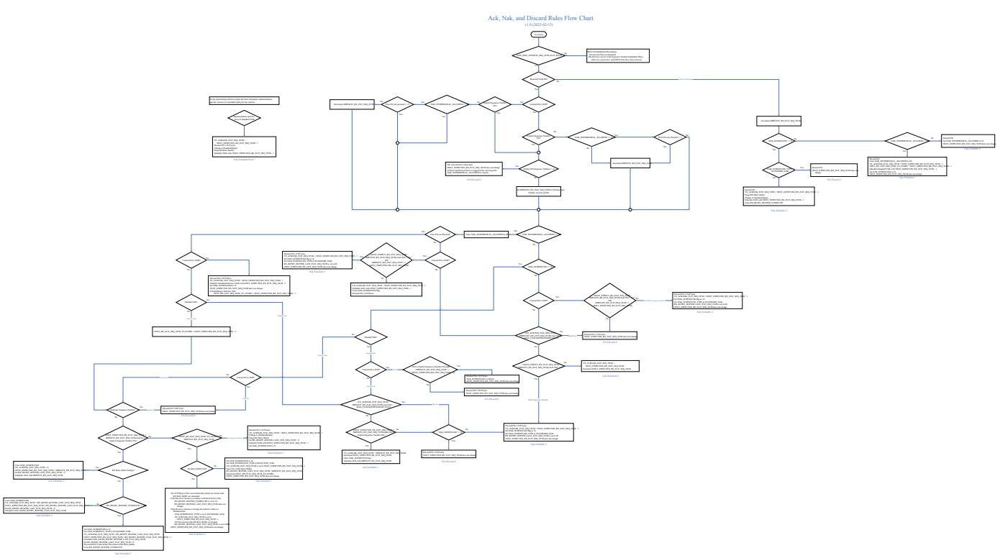

<a id="sec-4-2-3-4-2-1-5-flowchart"></a>
## Ack, Nak, and Discard Rules Flow Chart | Ack、Nak 与丢弃规则流程图


<div style="overflow-x: auto; max-width: 100%;">
<table>
<thead>
<tr>
<th width="50%">🇬🇧 English</th>
<th width="50%" style="background-color:#e8e8e8">🇨🇳 中文</th>
</tr>
</thead>
<tbody>
<tr>
<td>

**Ack, Nak, and Discard Rules Flow Chart (v1.0, 2022-02-15)**

[Flow chart contents describing the logic of processing received Flits and scheduling Ack, Nak, or Discard operations. Key decision points include:]

- **Received Valid Flit?**
  - Set IMPLICIT_RX_FLIT_SEQ_NUM to Flit Sequence Number of received Flit
  - If Explicit Sequence Number Flit? → Increment IMPLICIT_RX_FLIT_SEQ_NUM
- **Duplicate Sequence Number check**: (TX_ACKNAK_FLIT_SEQ_NUM - IMPLICIT_RX_FLIT_SEQ_NUM) mod 1023 < MAX_UNACKNOWLEDGED_FLITS
- **Bad Sequence Number check**: (NEXT_EXPECT_RX_FLIT_SEQ_NUM - IMPLICIT_RX_FLIT_SEQ_NUM) mod 1023 > 511
- **NAK_SCHEDULED == 1b?** — yes/no branch
- **NAK_SCHEDULED_TYPE == STANDARD_NAK?** — yes/no branch
- **Nak Schedule branches** (Standard Nak / Selective Nak)
- **Ack Schedule branches** (Ack Schedule 0 / 1 / 2)
- **Flit Discard branches** (Flit Discard 0 / 1 / 2)
- **IDLE Flit Handshake Phase Rules:**
  - All received Flits are discarded.
  - The Receiver moves to the Sequence Number Handshake Phase when two consecutive valid IDLE Flits have been received.
- **Implementation specific move to Standard NAK** — at any point during selective replay has been scheduled, implementation specific can move to standard replay for any reasons.
- **Nak Schedule Rule 7**

</td>
<td style="background-color:#e8e8e8">

**Ack、Nak 与丢弃规则流程图 (v1.0, 2022-02-15)**

[流程图内容,描述处理收到的 Flit 并调度 Ack、Nak 或丢弃操作的逻辑。关键决策点包括:]

- **是否收到有效 Flit?**
  - 将 IMPLICIT_RX_FLIT_SEQ_NUM 置为所收到 Flit 的 Flit Sequence Number
  - 若为 Explicit Sequence Number Flit? → IMPLICIT_RX_FLIT_SEQ_NUM 加 1
- **重复序列号检查**:(TX_ACKNAK_FLIT_SEQ_NUM - IMPLICIT_RX_FLIT_SEQ_NUM) mod 1023 < MAX_UNACKNOWLEDGED_FLITS
- **错误序列号检查**:(NEXT_EXPECT_RX_FLIT_SEQ_NUM - IMPLICIT_RX_FLIT_SEQ_NUM) mod 1023 > 511
- **NAK_SCHEDULED == 1b?** —— 是/否分支
- **NAK_SCHEDULED_TYPE == STANDARD_NAK?** —— 是/否分支
- **Nak Schedule 分支**(Standard Nak / Selective Nak)
- **Ack Schedule 分支**(Ack Schedule 0 / 1 / 2)
- **Flit Discard 分支**(Flit Discard 0 / 1 / 2)
- **IDLE Flit 握手阶段规则:**
  - 所有收到的 Flit 都被丢弃。
  - 当连续收到两个有效的 IDLE Flit 时,接收器进入 Sequence Number Handshake Phase。
- **实现相关的 Standard NAK 切换** —— 在已调度 selective replay 期间的任何时刻,出于实现相关的原因,可切换至 standard replay。
- **Nak Schedule Rule 7**

</td>
</tr>
</tbody>
</table>
</div>


[⬆️ 返回目录](#-本章目录-table-of-contents)

---

<a id="sec-4-2-3-4-2-1-6"></a>
## 4.2.3.4.2.1.6 Flit Replay Scheduling | Flit 重放调度

<table>
<thead>
<tr>
<th width="50%">🇬🇧 English</th>
<th width="50%" style="background-color:#e8e8e8">🇨🇳 中文</th>
</tr>
</thead>
<tbody>
<tr>
<td>

**Replay Schedule Rule 0**
Replay Timeout

- If all of the following are true:
  - REPLAY_TIMEOUT_FLIT_COUNT >= 1500 66
  - REPLAY_SCHEDULED is 0b.
  - REPLAY_IN_PROGRESS is 0b.
- Then:
  - REPLAY_SCHEDULED is set to 1b.
  - REPLAY_SCHEDULED_TYPE is set to STANDARD_REPLAY.
  - TX_REPLAY_FLIT_SEQ_NUM is set to (ACKD_FLIT_SEQ_NUM + 1).
  - CONSECUTIVE_TX_EXPLICIT_SEQ_NUM_FLITS is set to 0b. 67
  - CONSECUTIVE_TX_NAK_FLITS is set to 0b. 68
  - REPLAY_TIMEOUT_FLIT_COUNT is set to 0b.
  - A Replay Timer Timeout error is logged in the Port (see § Section 6.2 ).

**Replay Schedule Rule 1**
Received Nak for Payload Flit.

- If all of the following are true:
  - Received a valid Nak Flit with Flit Sequence Number N.
  - A Payload Flit with Flit Sequence Number N + 1 is stored in the TX Retry Buffer.
  - REPLAY_SCHEDULED is 0b.
  - REPLAY_IN_PROGRESS is 0b.
  - Either of the following are true:
    - NAK_IGNORE_FLIT_SEQ_NUM != N.
    - The Nak Ignore Window has not been started or has elapsed.
- Then:
  - REPLAY_SCHEDULED is set to 1b.
  - TX_REPLAY_FLIT_SEQ_NUM is set to N + 1.
  - NAK_IGNORE_FLIT_SEQ_NUM is set to N.
  - If the received Flit is Standard Nak Flit:
    - REPLAY_SCHEDULED_TYPE is set to STANDARD_REPLAY.
  - If the received Flit is a Selective Nak Flit:
    - REPLAY_SCHEDULED_TYPE is set to SELECTIVE_REPLAY.

**Replay Schedule Rule 2**
Received Standard Nak after Selective Nak for Payload Flit.

- If all of the following are true:
  - Received a valid Standard Nak Flit with Flit Sequence Number N.
  - N+1 equals TX_REPLAY_FLIT_SEQ_NUM.
  - REPLAY_SCHEDULED is 1b.
  - REPLAY_IN_PROGRESS is 0b.
  - REPLAY_SCHEDULED_TYPE is SELECTIVE_REPLAY.
- Then:
  - REPLAY_SCHEDULED is set to 1b.
  - TX_REPLAY_FLIT_SEQ_NUM does not change.
  - REPLAY_SCHEDULED_TYPE is set to STANDARD_REPLAY.

66. The max Ordered set insertion interval in § Table 4-21 is 748. 1500 is 748*2 rounded up.
67. CONSECUTIVE_TX_EXPLICIT_SEQ_NUM_FLITS is cleared to allow the Transmitter to begin replaying Flits right away and avoid overflowing the TX Retry Buffer sending NOP Flits while waiting to send another Explicit Sequence Number Flit to begin the replay.
68. Same reason as clearing CONSECUTIVE_TX_EXPLICIT_SEQ_NUM_FLITS above.

</td>
<td style="background-color:#e8e8e8">

**Replay Schedule Rule 0**
重放超时 (Replay Timeout)

- 如果以下所有条件均成立:
  - REPLAY_TIMEOUT_FLIT_COUNT >= 1500 66
  - REPLAY_SCHEDULED 为 0b。
  - REPLAY_IN_PROGRESS 为 0b。
- 那么:
  - REPLAY_SCHEDULED 置为 1b。
  - REPLAY_SCHEDULED_TYPE 置为 STANDARD_REPLAY。
  - TX_REPLAY_FLIT_SEQ_NUM 置为 (ACKD_FLIT_SEQ_NUM + 1)。
  - CONSECUTIVE_TX_EXPLICIT_SEQ_NUM_FLITS 置为 0b。67
  - CONSECUTIVE_TX_NAK_FLITS 置为 0b。68
  - REPLAY_TIMEOUT_FLIT_COUNT 置为 0b。
  - 在端口 (Port) 记录一个 Replay Timer Timeout 错误(参见 § Section 6.2)。

**Replay Schedule Rule 1**
收到针对 Payload Flit 的 Nak。

- 如果以下所有条件均成立:
  - 收到一个 Flit Sequence Number 为 N 的有效 Nak Flit。
  - TX Retry Buffer 中存有 Flit Sequence Number 为 N + 1 的 Payload Flit。
  - REPLAY_SCHEDULED 为 0b。
  - REPLAY_IN_PROGRESS 为 0b。
  - 以下条件之一为真:
    - NAK_IGNORE_FLIT_SEQ_NUM != N。
    - Nak Ignore Window 尚未启动或已到期。
- 那么:
  - REPLAY_SCHEDULED 置为 1b。
  - TX_REPLAY_FLIT_SEQ_NUM 置为 N + 1。
  - NAK_IGNORE_FLIT_SEQ_NUM 置为 N。
  - 如果收到的 Flit 是 Standard Nak Flit:
    - REPLAY_SCHEDULED_TYPE 置为 STANDARD_REPLAY。
  - 如果收到的 Flit 是 Selective Nak Flit:
    - REPLAY_SCHEDULED_TYPE 置为 SELECTIVE_REPLAY。

**Replay Schedule Rule 2**
针对 Payload Flit,在 Selective Nak 之后收到 Standard Nak。

- 如果以下所有条件均成立:
  - 收到一个 Flit Sequence Number 为 N 的有效 Standard Nak Flit。
  - N + 1 等于 TX_REPLAY_FLIT_SEQ_NUM。
  - REPLAY_SCHEDULED 为 1b。
  - REPLAY_IN_PROGRESS 为 0b。
  - REPLAY_SCHEDULED_TYPE 为 SELECTIVE_REPLAY。
- 那么:
  - REPLAY_SCHEDULED 置为 1b。
  - TX_REPLAY_FLIT_SEQ_NUM 不变。
  - REPLAY_SCHEDULED_TYPE 置为 STANDARD_REPLAY。

66. § Table 4-21 中 Ordered set 插入的最大间隔为 748。1500 是 748*2 向上取整。
67. 清零 CONSECUTIVE_TX_EXPLICIT_SEQ_NUM_FLITS 是为了允许发送器立即开始重放 Flit,避免在等待发送下一个 Explicit Sequence Number Flit 以开始重放时,因持续发送 NOP Flit 而导致 TX Retry Buffer 溢出。
68. 与清零 CONSECUTIVE_TX_EXPLICIT_SEQ_NUM_FLITS 同理。

</td>
</tr>
</tbody>
</table>

[⬆️ 返回目录](#-本章目录-table-of-contents)

---

<!-- 📄 Page 426 -->
---

<a id="sec-4-2-3-4-2-1-7"></a>
## 4.2.3.4.2.1.7 Flit Replay Transmit Rules | Flit 重放发送规则


<div style="overflow-x: auto; max-width: 100%;">
<table>
<thead>
<tr>
<th width="50%">🇬🇧 English</th>
<th width="50%" style="background-color:#e8e8e8">🇨🇳 中文</th>
</tr>
</thead>
<tbody>
<tr>
<td>

**Flit Replay Transmit Rule 0**
Standard Replay Scenario.

- If all of the following conditions are true:
  - REPLAY_SCHEDULED is 1b.
  - REPLAY_IN_PROGRESS is 0b.
  - REPLAY_SCHEDULED_TYPE is STANDARD_REPLAY.
  - Either of the following are true:
    - The transmitter is in the Sequence Number Handshake Phase.
    - CONSECUTIVE_TX_NAK_FLITS is either 0 or greater than 2.
  - Either of the following are true:
    - Data rate is 64.0 GT/s and FLIT_REPLAY_NUM < 111b.
    - Data rate <= 32.0 GT/s and FLIT_REPLAY_NUM < 110b.
- Then:
  - The Transmitter must replay all unacknowledged Flits from the TX Retry Buffer beginning with the Flit containing Flit Sequence Number TX_REPLAY_FLIT_SEQ_NUM.
  - If the data rate is 64.0 GT/s:
    - FLIT_REPLAY_NUM is incremented by 1.
  - If the data rate <= 32.0 GT/s:
    - FLIT_REPLAY_NUM is incremented by 2 69.
  - REPLAY_IN_PROGRESS is set to 1b.
  - REPLAY_SCHEDULED is set to 0b.

**Flit Replay Transmit Rule 1**
Selective Replay Scenario.

- If all of the following conditions are true:
  - REPLAY_SCHEDULED is 1b.
  - REPLAY_IN_PROGRESS is 0b.
  - REPLAY_SCHEDULED_TYPE is SELECTIVE_REPLAY.
  - Either of the following are true:
    - The transmitter is in the Sequence Number Handshake Phase.
    - CONSECUTIVE_TX_NAK_FLITS is either 0 or greater than 2.
  - Either of the following are true:
    - Data rate is 64.0 GT/s and FLIT_REPLAY_NUM < 111b.
    - Data rate <= 32.0 GT/s and FLIT_REPLAY_NUM < 110b.
- Then:
  - The Transmitter must replay the Flit from the TX Retry Buffer which contains the Flit Sequence Number that matches TX_REPLAY_FLIT_SEQ_NUM.
  - If the data rate is 64.0 GT/s:
    - FLIT_REPLAY_NUM is incremented by 1.
  - If the data rate <= 32.0 GT/s:
    - FLIT_REPLAY_NUM is incremented by 2. 70
  - REPLAY_IN_PROGRESS is set to 1b.
  - REPLAY_SCHEDULED is set to 0b.

**Flit Replay Transmit Rule 2**
Replay Rollover Scenario.

- If all of the following conditions are true:
  - REPLAY_SCHEDULED is 1b.
  - REPLAY_IN_PROGRESS is 0b.
  - Either of the following are true:
    - Data rate is 64.0 GT/s and FLIT_REPLAY_NUM equals 111b.
    - Data rate <= 32.0 GT/s and FLIT_REPLAY_NUM >= 110b.
- Then:
  - If the data rate is 64.0 GT/s:
    - FLIT_REPLAY_NUM is incremented by 1 (causing a rollover to 000b).
  - If the data rate <= 32.0 GT/s:
    - FLIT_REPLAY_NUM is incremented by 2 (causing a rollover to 000b or 001b).
  - A REPLAY_NUM Rollover error is logged in the Port (see § Section 6.2 ).
  - The Port must enter Recovery.

69. Replays should happen less often at speeds lower than 64.0 GT/s. We increment FLIT_REPLAY_NUM by 2 so that the Replay Rollover will happen after fewer Replays.
70. Previous versions of this specification had this as increment by 1. This remains permitted, although not optimal, behavior.

</td>
<td style="background-color:#e8e8e8">

**Flit Replay Transmit Rule 0**
Standard Replay 场景。

- 如果以下所有条件均成立:
  - REPLAY_SCHEDULED 为 1b。
  - REPLAY_IN_PROGRESS 为 0b。
  - REPLAY_SCHEDULED_TYPE 为 STANDARD_REPLAY。
  - 以下条件之一为真:
    - 发送器处于 Sequence Number Handshake Phase。
    - CONSECUTIVE_TX_NAK_FLITS 为 0 或大于 2。
  - 以下条件之一为真:
    - 数据速率为 64.0 GT/s 且 FLIT_REPLAY_NUM < 111b。
    - 数据速率 <= 32.0 GT/s 且 FLIT_REPLAY_NUM < 110b。
- 那么:
  - 发送器必须从 TX Retry Buffer 中重放所有未确认的 Flit,从 Flit Sequence Number 等于 TX_REPLAY_FLIT_SEQ_NUM 的 Flit 开始。
  - 如果数据速率为 64.0 GT/s:
    - FLIT_REPLAY_NUM 加 1。
  - 如果数据速率 <= 32.0 GT/s:
    - FLIT_REPLAY_NUM 加 2。69
  - REPLAY_IN_PROGRESS 置为 1b。
  - REPLAY_SCHEDULED 置为 0b。

**Flit Replay Transmit Rule 1**
Selective Replay 场景。

- 如果以下所有条件均成立:
  - REPLAY_SCHEDULED 为 1b。
  - REPLAY_IN_PROGRESS 为 0b。
  - REPLAY_SCHEDULED_TYPE 为 SELECTIVE_REPLAY。
  - 以下条件之一为真:
    - 发送器处于 Sequence Number Handshake Phase。
    - CONSECUTIVE_TX_NAK_FLITS 为 0 或大于 2。
  - 以下条件之一为真:
    - 数据速率为 64.0 GT/s 且 FLIT_REPLAY_NUM < 111b。
    - 数据速率 <= 32.0 GT/s 且 FLIT_REPLAY_NUM < 110b。
- 那么:
  - 发送器必须从 TX Retry Buffer 中重放 Flit Sequence Number 与 TX_REPLAY_FLIT_SEQ_NUM 匹配的 Flit。
  - 如果数据速率为 64.0 GT/s:
    - FLIT_REPLAY_NUM 加 1。
  - 如果数据速率 <= 32.0 GT/s:
    - FLIT_REPLAY_NUM 加 2。70
  - REPLAY_IN_PROGRESS 置为 1b。
  - REPLAY_SCHEDULED 置为 0b。

**Flit Replay Transmit Rule 2**
Replay Rollover 场景。

- 如果以下所有条件均成立:
  - REPLAY_SCHEDULED 为 1b。
  - REPLAY_IN_PROGRESS 为 0b。
  - 以下条件之一为真:
    - 数据速率为 64.0 GT/s 且 FLIT_REPLAY_NUM 等于 111b。
    - 数据速率 <= 32.0 GT/s 且 FLIT_REPLAY_NUM >= 110b。
- 那么:
  - 如果数据速率为 64.0 GT/s:
    - FLIT_REPLAY_NUM 加 1(产生回绕至 000b)。
  - 如果数据速率 <= 32.0 GT/s:
    - FLIT_REPLAY_NUM 加 2(产生回绕至 000b 或 001b)。
  - 在端口 (Port) 记录一个 REPLAY_NUM Rollover 错误(参见 § Section 6.2)。
  - 端口必须进入 Recovery。

69. 在低于 64.0 GT/s 的速率下,重放应更少发生。我们将 FLIT_REPLAY_NUM 加 2,以便在更少的重放次数后就发生 Replay Rollover。
70. 此规范的早期版本规定此处加 1。该行为仍被允许,但不是最优。

</td>
</tr>
</tbody>
</table>
</div>


[⬆️ 返回目录](#-本章目录-table-of-contents)

---

<!-- 📄 Page 428 -->
---

<a id="sec-impl-note-flit-ack-nak-replay-example"></a>
## IMPLEMENTATION NOTE: FLIT ACK/NAK/REPLAY EXAMPLE | 实现说明:FLIT ACK/NAK/REPLAY 示例

<table>
<thead>
<tr>
<th width="50%">🇬🇧 English</th>
<th width="50%" style="background-color:#e8e8e8">🇨🇳 中文</th>
</tr>
</thead>
<tbody>
<tr>
<td>

Consider two devices A and B connected through a Retimer, as shown in § Figure 4-34.

1. Both Device A and Device B are in the Normal Flit Exchange Phase
2. B receives valid Payload Flits 1 through 10 from A. B sends Acks for those Flits back to A. (Ack Schedule 0)
3. B receives an invalid NOP Flit 10 71 and sets NAK_WITHDRAWAL_ALLOWED to 1b. (Nak Schedule 0)
4. B then receives a valid Flit 11 with Prior Flit was Payload set to 0b, indicating that prior Flit was a NOP Flit. B sends an Ack with Flit Sequence Number 11 to A.
   - NAK_WITHDRAWAL_ALLOWED is cleared and a Nak is never sent for the invalid NOP Flit 10.
5. B then receives an invalid Payload Flit 12 and sends sets NAK_WITHDRAWAL_ALLOWED to 1b. (Nak Schedule 0)
6. B then receives a valid Flit 13 that indicates that Flit 12 was a Payload Flit, and sends a Selective Nak Flit with Flit Sequence Number 11, requesting A to Replay only Flit 12. (Nak Schedule 1)
   - B will then send a minimum of three consecutive Selective Nak Flits with Flit Sequence Number 11.
   - If B was sending Explicit Sequence Number Flits when the Nak of invalid Flit 12 was scheduled, it would have held off sending the Nak Flit until it had finished sending 3 consecutive Explicit Sequence Number Flits (Replay Command Rules in Normal Flit Exchange Phase).
   - The choice of a Selective Nak by B is an optimization in this case. B has enough space in its RX Retry Buffer to store the subsequent Flits.
   - If B were to receive an invalid Flit with a Selective Nak outstanding, it would be required to change the outstanding Selective Nak to a Standard Nak. (Nak Schedule 6)
   - B is also permitted to change the outstanding Selective Nak to a Standard Nak for any implementation specific reason. (Nak Schedule 7)
7. After B sends 3 consecutive Nak Flits with Flit Sequence Number 11, B will continue following the Replay Command Rules in Normal Flit Exchange Phase to determine whether to send Nak Flits or Explicit Sequence Number Flits.
8. In the time it took for A to receive the Selective Nak of Flit 12 and schedule a Replay of Flit 12, valid Payload Flits 13 and 14 and NOP Flit 14 were received by B. B stores Payload Flits 13 and 14 in its RX Retry Buffer. The TLP Bytes of NOP Flit 14 are discarded and the Flit is not stored in the RX Retry Buffer (Flit Discard 0).
9. B then receives replayed Flit 12 from A and processes Flit 12 as well as Payload Flits 13 and 14 that were stored in the B's RX Retry Buffer.
   - Note that Payload Flits 12 and 15 and NOP Flit 15 are all sent with explicit Flit Sequence Numbers in adherence to the Replay Command Rules in Normal Flit Exchange Phase
10. Next, B receives valid Payload Flit 15, and then invalid NOP Flit 15. B sets NAK_WITHDRAWAL_ALLOWED to 1b.
11. B then receives invalid Flit 16, and since there's no way for B to know that the previous invalid Flit was a NOP Flit, the Nak can't be withdrawn and B sends a Standard Nak with Flit Sequence Number 15.
    - Note that B cannot send a Selective Nak since two consecutive invalid Flits were received.
12. B then receives valid Payload Flits 17 and 18, but since B has a Standard Nak outstanding, the TLP Bytes of these Flits are discarded (Flit Discard 0).
13. A then replays all unacknowledged Flits from its TX Retry Buffer (Flits 16, 17, and 18), which B receives as valid Flits and Acks accordingly.

71. NOP Flits do not consume a Flit Sequence Number and just use the Flit Sequence Number of the last non-replay Payload Flit sent.

</td>
<td style="background-color:#e8e8e8">

考虑通过 Retimer 连接的两个设备 A 和 B,如图 § Figure 4-34 所示。

1. 设备 A 和设备 B 均处于 Normal Flit Exchange Phase。
2. B 收到来自 A 的有效 Payload Flit 1 至 10。B 向 A 发送这些 Flit 的 Ack。(Ack Schedule 0)
3. B 收到一个无效的 NOP Flit 10 71,并将 NAK_WITHDRAWAL_ALLOWED 置为 1b。(Nak Schedule 0)
4. 然后 B 收到一个有效的 Flit 11,其 Prior Flit was Payload 为 0b,表明前一 Flit 是 NOP Flit。B 向 A 发送 Flit Sequence Number 为 11 的 Ack。
   - 清零 NAK_WITHDRAWAL_ALLOWED,且永远不会为无效的 NOP Flit 10 发送 Nak。
5. 接着 B 收到一个无效的 Payload Flit 12,并将 NAK_WITHDRAWAL_ALLOWED 置为 1b。(Nak Schedule 0)
6. 接着 B 收到一个有效的 Flit 13,表明 Flit 12 是 Payload Flit,并发送一个 Flit Sequence Number 为 11 的 Selective Nak Flit,请求 A 仅重放 Flit 12。(Nak Schedule 1)
   - 随后 B 将至少连续发送 3 个 Flit Sequence Number 为 11 的 Selective Nak Flit。
   - 如果在为无效的 Flit 12 调度 Nak 时,B 正在发送 Explicit Sequence Number Flit,则它将延迟发送该 Nak Flit,直到连续发送完 3 个 Explicit Sequence Number Flit 为止(Normal Flit Exchange Phase 中的 Replay Command Rules)。
   - 在此情况下 B 选择 Selective Nak 是一种优化。B 的 RX Retry Buffer 有足够空间存储后续 Flit。
   - 如果 B 在已发出 Selective Nak 的情况下又收到一个无效 Flit,则必须将已发出的 Selective Nak 更改为 Standard Nak。(Nak Schedule 6)
   - B 出于任何实现相关的原因,也可将已发出的 Selective Nak 更改为 Standard Nak。(Nak Schedule 7)
7. 在 B 连续发送 3 个 Flit Sequence Number 为 11 的 Nak Flit 之后,B 将继续遵循 Normal Flit Exchange Phase 中的 Replay Command Rules,以决定发送 Nak Flit 还是 Explicit Sequence Number Flit。
8. 在 A 收到针对 Flit 12 的 Selective Nak 并调度 Flit 12 的重放这段时间内,B 收到了有效 Payload Flit 13 和 14 以及 NOP Flit 14。B 将 Payload Flit 13 和 14 存入其 RX Retry Buffer。NOP Flit 14 的 TLP 字节被丢弃,该 Flit 不被存入 RX Retry Buffer(Flit Discard 0)。
9. 然后 B 收到 A 重放的 Flit 12,并处理 Flit 12 以及先前存放在 B 的 RX Retry Buffer 中的 Payload Flit 13 和 14。
   - 注意,Payload Flit 12 和 15 以及 NOP Flit 15 均按 Normal Flit Exchange Phase 中 Replay Command Rules 的要求,使用显式 Flit Sequence Number 发送。
10. 接着,B 收到有效 Payload Flit 15,然后收到无效 NOP Flit 15。B 将 NAK_WITHDRAWAL_ALLOWED 置为 1b。
11. 然后 B 收到无效 Flit 16。由于 B 无法得知上一个无效 Flit 是 NOP Flit,因此 Nak 无法被撤回,B 发送 Flit Sequence Number 为 15 的 Standard Nak。
    - 注意 B 不能发送 Selective Nak,因为已收到两个连续的无效 Flit。
12. 接着 B 收到有效 Payload Flit 17 和 18,但由于 B 有未决的 Standard Nak,这些 Flit 的 TLP 字节被丢弃(Flit Discard 0)。
13. 之后 A 从其 TX Retry Buffer(Flit 16、17 和 18)中重放所有未确认的 Flit,B 将这些 Flit 作为有效 Flit 接收并相应地发送 Ack。

71. NOP Flit 不消耗 Flit Sequence Number,而是直接使用上一次发送的非重放 Payload Flit 的 Flit Sequence Number。

</td>
</tr>
</tbody>
</table>

[⬆️ 返回目录](#-本章目录-table-of-contents)

---

<!-- 📄 Page 429 -->
---

> **Figure 4-34.** Flit Ack/Nak/Replay Example
> 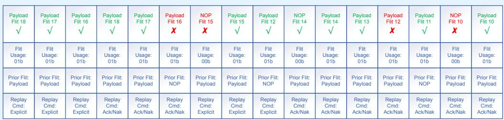

| Time | Device A → Retimer → Device B | Flit Usage | Prior Flit | Replay Cmd | Valid/Invalid |
|------|------------------------------|------------|------------|------------|---------------|
| t = N | Payload Flit 10 ✓ | 01b | Payload | Ack/Nak | Valid |
| t = N | NOP Flit 10 ✗ | 00b | Payload | Ack/Nak | Invalid |
| t = N | Payload Flit 11 ✓ | 01b | NOP | Ack/Nak | Valid |
| t = N | Payload Flit 12 ✗ | 01b | Payload | Ack/Nak | Invalid |
| t = N | Payload Flit 13 ✓ | 01b | Payload | Ack/Nak | Valid |
| t = N | Payload Flit 14 ✓ | 01b | Payload | Ack/Nak | Valid |
| t = N | NOP Flit 14 ✓ | 00b | Payload | Ack/Nak | Valid |
| t = N+16 Flit Times | Payload Flit 12 (replay) ✓ | 01b | NOP | Explicit | Valid |
| t = N+16 Flit Times | Payload Flit 15 ✓ | 01b | Payload | Explicit | Valid |
| t = N+16 Flit Times | NOP Flit 15 ✗ | 00b | Payload | Explicit | Invalid |
| t = N+16 Flit Times | Payload Flit 16 ✗ | 01b | NOP | Ack/Nak | Invalid |
| t = N+16 Flit Times | Payload Flit 17 ✓ | 01b | Payload | Ack/Nak | Valid |
| t = N+16 Flit Times | Payload Flit 18 ✓ | 01b | Payload | Ack/Nak | Valid |
| t = N+16 Flit Times | Payload Flit 16 (replay) ✓ | 01b | Payload | Explicit | Valid |
| t = N+16 Flit Times | Payload Flit 17 (replay) ✓ | 01b | Payload | Explicit | Valid |
| t = N+16 Flit Times | Payload Flit 18 (replay) ✓ | 01b | Payload | Explicit | Valid |

<!-- 📄 Page 430 -->
---

<a id="sec-impl-note-tx-throttling"></a>
## IMPLEMENTATION NOTE: TRANSMITTER THROTTLING AFTER SELECTIVE REPLAY | 实现说明:SELECTIVE REPLAY 之后的发送器限流


<div style="overflow-x: auto; max-width: 100%;">
<table>
<thead>
<tr>
<th width="50%">🇬🇧 English</th>
<th width="50%" style="background-color:#e8e8e8">🇨🇳 中文</th>
</tr>
</thead>
<tbody>
<tr>
<td>

In some situations, it will reduce link latency if the transmitter throttles its Flit transmission rate after sending a Selective Replay Flit.

When the receiver issues a Selective Nak and is waiting for the selective replay, it stores valid Payload Flits in an RX retry buffer and processes these Flits after the selective replay is received. Payload Flits that arrive after the selective replay must also be stored in the RX retry buffer. All Payload Flits are processed in sequence number order.

Without transmitter throttling, this RX retry buffer adds latency to the receive path since all the entries must be consumed in order. Latency can be reduced and this performance impact can be mitigated if the transmitter throttles Flit transmission earlier allowing the RX retry buffer to drain. This early transmitter throttling does not affect overall performance – the TLPs that get delayed at the transmitter would have been delayed at the receiver. Performing early throttling at the transmitter allows the RX retry buffer to drain so that subsequent TLPs have reduced latency.

Throttling is only needed when the Link is operating at the drain rate of the receiver. If the Link is operating at a reduced width (e.g., due to L0p), throttling may not be needed as the RX retry buffer drain rate may be faster than the Link rate.

To compute how to throttle, the Transmitter can assume that the initial link width is the drain rate of the receiver. On receiving a selective Nak, the Transmitter can compute the number of Payload Flits in the Receiver's RX retry buffer (or on the way to that buffer) since it knows how many Payload Flits are currently in its TX retry buffer. The transmitter should throttle and/or enforce a certain bandwidth efficiency (i.e., restrict the number of NOP TLPs in a Payload Flit) in each new Payload Flit it transmits from its Transaction Layer to allow the Receiver's RX retry buffer to drain.

For example, suppose a x8 Link receives a selective Nak for Flit number X and the Transmitter has sent 4 Payload Flits after it initially sent Flit number X. In this case, the transmitter should throttle its upper layers to create a 4 Flit "bubble". For a x8 Link, Flits are 16 Symbols and SKP Ordered Sets are 32 Symbols so this "bubble" is either 4 NOP Flits, 2 NOP Flits and 1 SKP Ordered Set, or 2 SKP Ordered Sets. One mechanism to implement the throttling is for the transmitter to enforce <Y% NOP TLPs (e.g., Y = 25) in its Payload Flits until it has sent the "bubble" (if TLPs are constantly being transmitted this could take 2 SKP Ordered Sets).

</td>
<td style="background-color:#e8e8e8">

在某些情况下,如果发送器在发送 Selective Replay Flit 之后对其 Flit 发送速率进行限流,将有助于降低链路延迟。

当接收器发出 Selective Nak 并等待 selective replay 时,它会将有效的 Payload Flit 存入 RX retry buffer,并在收到 selective replay 后处理这些 Flit。Selective replay 之后到达的 Payload Flit 也必须存入 RX retry buffer。所有 Payload Flit 按序列号顺序处理。

若不进行发送器限流,该 RX retry buffer 会增加接收路径的延迟,因为所有条目必须按顺序消耗。如果发送器更早地对 Flit 发送进行限流,使 RX retry buffer 能够排空,则可以降低延迟并缓解该性能影响。这种早期发送器限流不影响整体性能——在发送器被延迟的 TLP 本来在接收器侧也会被延迟。在发送器侧进行早期限流,可使 RX retry buffer 排空,从而使后续 TLP 的延迟降低。

仅当链路以接收器的排空速率 (drain rate) 运行时才需要限流。如果链路以较窄的宽度运行(例如因 L0p),由于 RX retry buffer 的排空速率可能快于链路速率,因此可能无需限流。

为计算限流程度,发送器可假设初始链路宽度即为接收器的排空速率。在收到 selective Nak 时,发送器可计算接收器 RX retry buffer 中(或在通往该 buffer 路径上)的 Payload Flit 数,因为它知道其 TX retry buffer 中当前有多少 Payload Flit。发送器应在从其事务层 (Transaction Layer) 发送的每个新 Payload Flit 中进行限流并/或强制一定的带宽效率(即限制 Payload Flit 中 NOP TLP 的数量),以使接收器的 RX retry buffer 能够排空。

例如,假设 x8 链路收到针对 Flit X 的 selective Nak,且发送器在最初发送 Flit X 之后已发送了 4 个 Payload Flit。在这种情况下,发送器应对其上层进行限流,以形成一个 4 Flit 的"气泡"。对于 x8 链路,Flit 为 16 个 Symbol,SKP Ordered Set 为 32 个 Symbol,因此该"气泡"可以是 4 个 NOP Flit、2 个 NOP Flit + 1 个 SKP Ordered Set、或 2 个 SKP Ordered Set。一种实现限流的机制是:发送器在已发送"气泡"之前,强制其 Payload Flit 中 NOP TLP 的比例小于 Y%(例如 Y = 25)(若 TLP 持续传输,这可能需要 2 个 SKP Ordered Set)。

</td>
</tr>
</tbody>
</table>
</div>


[⬆️ 返回目录](#-本章目录-table-of-contents)

---

<a id="sec-4-2-3-4-3"></a>
## 4.2.3.4.3 CRC Bytes in Flit | Flit 中的 CRC 字节

<table>
<thead>
<tr>
<th width="50%">🇬🇧 English</th>
<th width="50%" style="background-color:#e8e8e8">🇨🇳 中文</th>
</tr>
</thead>
<tbody>
<tr>
<td>

The CRC generator polynomial, defined over GF(28), is g(x) = (x+α)(x+α2)… (x+α8), where α is the root of the primitive polynomial of degree 8: x8+x5+x3+x+1. Thus, g(x) = x8+ α172 x7 + α116 x6 + α186 x5+ α172 x4+ α195 x3+ α134 x2+ α199 x+ α36.

Figure 4-35 demonstrates how CRC bytes are generated for the Transmit as well as Receive side. On the Receive side the generated CRC bytes are compared against the received CRC bytes (after the FEC decode/ correct) and any mismatch represents an uncorrectable error.

The CRC generator using MATLAB code to output the generator matrix, the generator matrix, as well as the RTL code is provided in § Appendix K. The CRC bytes are generated by 242 Bytes of Data * Gen Matrix. Thus, Data is 1x1936 bits, Gen matrix is 1936x64 bits. Data is arranged from MSB to LSB – [(241,7), (241,6), (241,5), (241,4) ……….. (0,7), (0,6),(0,5),(0,4),(0,3),(0,2),(0,1),(0,0)] where (x,y) is yth bit of xth byte. The generator matrix appears in § Appendix K. and must be considered the standard to implement the CRC during encode and decode. Any pipelined implementation must match this mechanism. The code is provided for the Transmit side. It takes 242 Bytes as input and generates the 8B of CRC. On the Receive side, after the ECC decode/ correction, the first 242 Bytes of the Flit will be used to generate the expected 8 Bytes of CRC and each of these 8 Bytes will be compared against the received 8B of CRC. Any mismatch results in the Flit being declared not Valid and a replay requested, if needed, as described earlier.

The FEC code is a 3-way interleaved, as described before, where the ECC Symbols are defined over GF(28). Thus, three consecutive Bytes in a wire belong to three different ECC groups, as shown by different colors in § Table 4-10 through § Table 4-14. Thus, any burst of length ≤16 in a wire is guaranteed not to impact more than one Symbol in a code word which is capable of correcting single byte errors in an effort to minimize the FEC latency.

A sample RTL code for the FEC is provided in § Appendix J. The rest of this section describes the construction of the FEC code. The sample RTL in the appendix is the reference should any confusion arise out of the description here. While an implementation may follow a different approach (e.g., pipelining), it must still match the RTL sample results for all permutations of values in the bytes both for the encoder as well as the decoder function.

Let α be the root of a primitive polynomial x8+x4+x3+x2+1 (represented as 0x1D). Hence, α8= α4+ α3+ α2+1 which can also be represented as {0001_1101}. Thus, each 8-bit symbol (over GF(28)) can be expressed as a polynomial as powers of alpha (1 through 254) or as a degree 8 polynomial. We calculate powers of α along with an 8-bit representation as follows: Should be: α0 (=1): {0000_0001}, α1: {0000_0010}, …, α7: {1000_0000}, α8: {0001_1101},… α255 = 1. Thus, we get 255 distinct numbers as powers of α (all 0s is not a power of α), as shown in § Figure 4-36. The log function is given in § Figure 4-37 (which is basically the inverse of constructing the power of α from a given 8-bit non-zero Syndrome which will be used for error correction). The H matrix consists of two parts: Horizontal Parity and Check bits, as shown in § Figure 4-38 and § Figure 4-39. The Horizontal Parity is the bit-wise XORs of Symbols (see § Equation 4-1). The Check bits (see § Equation 4-2) is similar to a CRC calculation represented as follows:

</td>
<td style="background-color:#e8e8e8">

CRC 生成多项式在 GF(28) 上定义,为 g(x) = (x+α)(x+α2)…(x+α8),其中 α 是 8 次本原多项式 x8+x5+x3+x+1 的根。因此,g(x) = x8+ α172 x7 + α116 x6 + α186 x5+ α172 x4+ α195 x3+ α134 x2+ α199 x+ α36。

§ Figure 4-35 演示了在发送侧和接收侧如何生成 CRC 字节。在接收侧,将生成的 CRC 字节与收到的 CRC 字节(在 FEC 解码/纠错之后)进行比较,任何不匹配都表示一个不可纠正的错误。

CRC 生成器使用 MATLAB 代码输出生成矩阵,生成矩阵以及 RTL 代码见 § Appendix K。CRC 字节由 242 字节数据 × 生成矩阵生成。因此,Data 为 1x1936 位,Gen matrix 为 1936x64 位。数据按从 MSB 到 LSB 排列——[(241,7), (241,6), (241,5), (241,4) ……….. (0,7), (0,6),(0,5),(0,4),(0,3),(0,2),(0,1),(0,0)],其中 (x,y) 表示第 x 字节的第 y 位。生成矩阵见 § Appendix K,必须将其视为编码和解码过程中实现 CRC 的标准。任何流水线实现必须与该机制匹配。代码为发送侧提供,接收 242 字节作为输入,并生成 8 字节 CRC。在接收侧,经过 ECC 解码/纠错后,将使用 Flit 的前 242 字节生成预期的 8 字节 CRC,并将这 8 字节逐一与收到的 8 字节 CRC 进行比较。任何不匹配都导致该 Flit 被判定为无效(Not Valid),并在需要时按前文所述请求重放。

FEC 码是 3 路交织的,如前所述,其中 ECC 符号在 GF(28) 上定义。因此,线缆上 3 个连续的字节属于 3 个不同的 ECC 组,如 § Table 4-10 至 § Table 4-14 中以不同颜色所示。因此,线缆上长度 ≤ 16 的突发错误保证不会影响同一码字中的多于一个 Symbol;FEC 能够纠正单字节错误,以尽量减小 FEC 延迟。

FEC 的示例 RTL 代码见 § Appendix J。本节其余部分描述 FEC 码的构造。如果此处描述存在任何歧义,附录中的示例 RTL 即为参考。尽管实现可以采用不同的方法(例如流水线),但无论编码器还是解码器,都必须与 RTL 示例对所有字节取值排列所得到的结果完全匹配。

设 α 为本原多项式 x8+x4+x3+x2+1(表示为 0x1D)的根。因此,α8 = α4+ α3+ α2+1,也可表示为 {0001_1101}。每个 8 位符号(在 GF(28) 上)既可表示为 α 的幂(1 到 254)的多项式,也可表示为 8 次多项式。我们按如下方式计算 α 的幂及其 8 位表示:应为:α0 (=1):{0000_0001},α1:{0000_0010},…,α7:{1000_0000},α8:{0001_1101},…α255 = 1。因此,如 § Figure 4-36 所示,共有 255 个不同的数(全 0 不是 α 的幂)。对数函数见 § Figure 4-37(其本质上是从给定的 8 位非零 Syndrome 构造 α 的幂的逆过程,用于纠错)。H 矩阵由两部分组成:水平奇偶校验 (Horizontal Parity) 和校验位 (Check bits),如 § Figure 4-38 和 § Figure 4-39 所示。Horizontal Parity 是各 Symbol 的按位异或(见 § Equation 4-1)。Check bits(见 § Equation 4-2)与 CRC 计算类似,具体表示如下:

</td>
</tr>
</tbody>
</table>

[⬆️ 返回目录](#-本章目录-table-of-contents)

---

> **Figure 4-35.** CRC generation/ checking in Flit
> 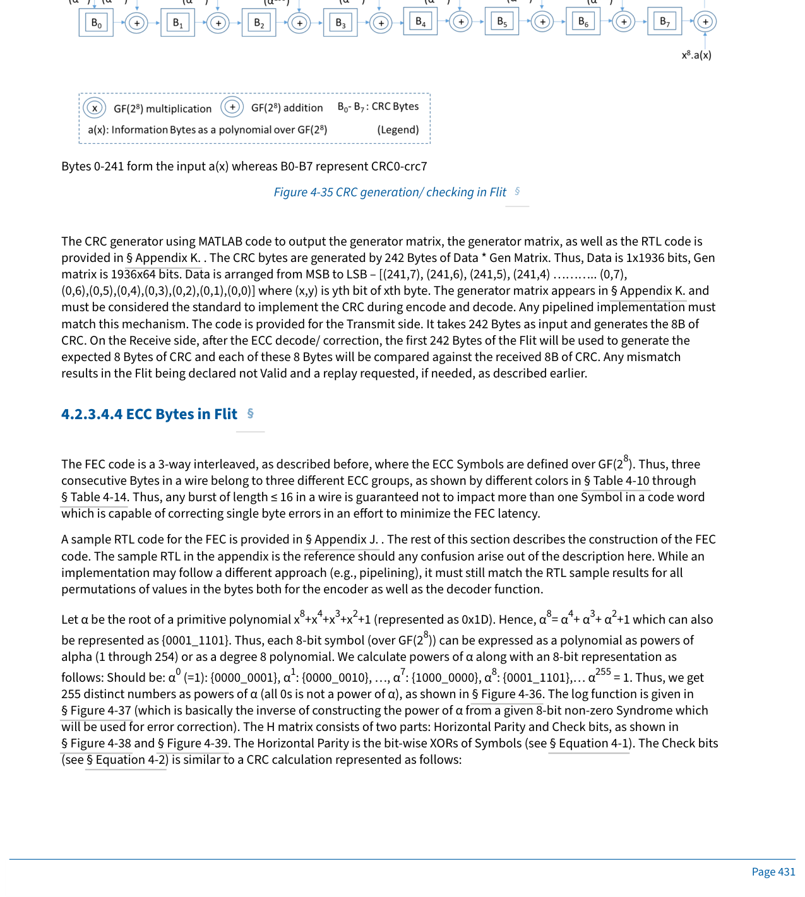

*[Figure caption: Bytes 0-241 form the input a(x) whereas B0-B7 represent CRC0-crc7]*

*[图注:字节 0-241 构成输入 a(x),B0-B7 表示 CRC0-crc7]*

<!-- 📄 Page 431 -->
---


---

<a id="sec-4-2-3-4-4"></a>
## 4.2.3.4.4 ECC Bytes in Flit | Flit 中的 ECC 字节


<div style="overflow-x: auto; max-width: 100%;">
<table>
<thead>
<tr>
<th width="50%">🇬🇧 English</th>
<th width="50%" style="background-color:#e8e8e8">🇨🇳 中文</th>
</tr>
</thead>
<tbody>
<tr>
<td>

```
P = Σ(i=0 to 83) Bi
Equation 4-1 Parity bytes

C = Σ(i=0 to 83) Bi × α^(84−i)
Equation 4-2 Check bytes

α is the root of the primitive polynomial x^8 + x^4 + x^3 + x^2 + 1

i → α^i (in hex)
00: 01  01: 02  02: 04  03: 08  04: 10  05: 20  06: 40  07: 80
08: 1d  09: 3a  0a: 74  0b: e8  0c: cd  0d: 87  0e: 13  0f: 26
10: 4c  11: 98  12: 2d  13: 5a  14: b4  15: 75  16: ea  17: c9
18: 8f  19: 03  1a: 06  1b: 0c  1c: 18  1d: 30  1e: 60  1f: c0
20: 9d  21: 27  22: 4e  23: 9c  24: 25  25: 4a  26: 94  27: 35
28: 6a  29: d4  2a: b5  2b: 77  2c: ee  2d: c1  2e: 9f  2f: 23
30: 46  31: 8c  32: 05  33: 0a  34: 14  35: 28  36: 50  37: a0
38: 5d  39: ba  3a: 69  3b: d2  3c: b9  3d: 6f  3e: de  3f: a1
40: 5f  41: be  42: 61  43: c2  44: 99  45: 2f  46: 5e  47: bc
48: 65  49: ca  4a: 89  4b: 0f  4c: 1e  4d: 3c  4e: 78  4f: f0
50: fd  51: e7  52: d3  53: bb  54: 6b  55: d6  56: b1  57: 7f
58: fe  59: e1  5a: df  5b: a3  5c: 5b  5d: b6  5e: 71  5f: e2
60: d9  61: af  62: 43  63: 86  64: 11  65: 22  66: 44  67: 88
68: 0d  69: 1a  6a: 34  6b: 68  6c: d0  6d: bd  6e: 67  6f: ce
70: 81  71: 1f  72: 3e  73: 7c  74: f8  75: ed  76: c7  77: 93
78: 3b  79: 76  7a: ec  7b: c5  7c: 97  7d: 33  7e: 66  7f: cc
80: 85  81: 17  82: 2e  83: 5c  84: b8  85: 6d  86: da  87: a9
88: 4f  89: 9e  8a: 21  8b: 42  8c: 84  8d: 15  8e: 2a  8f: 54
90: a8  91: 4d  92: 9a  93: 29  94: 52  95: a4  96: 55  97: aa
98: 49  99: 92  9a: 39  9b: 72  9c: e4  9d: d5  9e: b7  9f: 73
a0: e6  a1: d1  a2: bf  a3: 63  a4: c6  a5: 91  a6: 3f  a7: 7e
a8: fc  a9: e5  aa: d7  ab: b3  ac: 7b  ad: f6  ae: f1  af: ff
b0: e3  b1: db  b2: ab  b3: 4b  b4: 96  b5: 31  b6: 62  b7: c4
b8: 95  b9: 37  ba: 6e  bb: dc  bc: a5  bd: 57  be: ae  bf: 41
c0: 82  c1: 19  c2: 32  c3: 64  c4: c8  c5: 8d  c6: 07  c7: 0e
c8: 1c  c9: 38  ca: 70  cb: e0  cc: dd  cd: a7  ce: 53  cf: a6
d0: 51  d1: a2  d2: 59  d3: b2  d4: 79  d5: f2  d6: f9  d7: ef
d8: c3  d9: 9b  da: 2b  db: 56  dc: ac  dd: 45  de: 8a  df: 09
e0: 12  e1: 24  e2: 48  e3: 90  e4: 3d  e5: 7a  e6: f4  e7: f5
e8: f7  e9: f3  ea: fb  eb: eb  ec: cb  ed: 8b  ee: 0b  ef: 16
f0: 2c  f1: 58  f2: b0  f3: 7d  f4: fa  f5: e9  f6: cf  f7: 83
f8: 1b  f9: 36  fa: 6c  fb: d8  fc: ad  fd: 47  fe: 8e  ff: 01
```

**Figure 4-36 FEC Table: i to α^i**

</td>
<td style="background-color:#e8e8e8">

```
P = Σ(i=0 至 83) Bi
公式 4-1 奇偶校验字节 (Parity bytes)

C = Σ(i=0 至 83) Bi × α^(84−i)
公式 4-2 校验字节 (Check bytes)

α 为本原多项式 x^8 + x^4 + x^3 + x^2 + 1 的根

i → α^i (十六进制)
00: 01  01: 02  02: 04  03: 08  04: 10  05: 20  06: 40  07: 80
08: 1d  09: 3a  0a: 74  0b: e8  0c: cd  0d: 87  0e: 13  0f: 26
10: 4c  11: 98  12: 2d  13: 5a  14: b4  15: 75  16: ea  17: c9
18: 8f  19: 03  1a: 06  1b: 0c  1c: 18  1d: 30  1e: 60  1f: c0
20: 9d  21: 27  22: 4e  23: 9c  24: 25  25: 4a  26: 94  27: 35
28: 6a  29: d4  2a: b5  2b: 77  2c: ee  2d: c1  2e: 9f  2f: 23
30: 46  31: 8c  32: 05  33: 0a  34: 14  35: 28  36: 50  37: a0
38: 5d  39: ba  3a: 69  3b: d2  3c: b9  3d: 6f  3e: de  3f: a1
40: 5f  41: be  42: 61  43: c2  44: 99  45: 2f  46: 5e  47: bc
48: 65  49: ca  4a: 89  4b: 0f  4c: 1e  4d: 3c  4e: 78  4f: f0
50: fd  51: e7  52: d3  53: bb  54: 6b  55: d6  56: b1  57: 7f
58: fe  59: e1  5a: df  5b: a3  5c: 5b  5d: b6  5e: 71  5f: e2
60: d9  61: af  62: 43  63: 86  64: 11  65: 22  66: 44  67: 88
68: 0d  69: 1a  6a: 34  6b: 68  6c: d0  6d: bd  6e: 67  6f: ce
70: 81  71: 1f  72: 3e  73: 7c  74: f8  75: ed  76: c7  77: 93
78: 3b  79: 76  7a: ec  7b: c5  7c: 97  7d: 33  7e: 66  7f: cc
80: 85  81: 17  82: 2e  83: 5c  84: b8  85: 6d  86: da  87: a9
88: 4f  89: 9e  8a: 21  8b: 42  8c: 84  8d: 15  8e: 2a  8f: 54
90: a8  91: 4d  92: 9a  93: 29  94: 52  95: a4  96: 55  97: aa
98: 49  99: 92  9a: 39  9b: 72  9c: e4  9d: d5  9e: b7  9f: 73
a0: e6  a1: d1  a2: bf  a3: 63  a4: c6  a5: 91  a6: 3f  a7: 7e
a8: fc  a9: e5  aa: d7  ab: b3  ac: 7b  ad: f6  ae: f1  af: ff
b0: e3  b1: db  b2: ab  b3: 4b  b4: 96  b5: 31  b6: 62  b7: c4
b8: 95  b9: 37  ba: 6e  bb: dc  bc: a5  bd: 57  be: ae  bf: 41
c0: 82  c1: 19  c2: 32  c3: 64  c4: c8  c5: 8d  c6: 07  c7: 0e
c8: 1c  c9: 38  ca: 70  cb: e0  cc: dd  cd: a7  ce: 53  cf: a6
d0: 51  d1: a2  d2: 59  d3: b2  d4: 79  d5: f2  d6: f9  d7: ef
d8: c3  d9: 9b  da: 2b  db: 56  dc: ac  dd: 45  de: 8a  df: 09
e0: 12  e1: 24  e2: 48  e3: 90  e4: 3d  e5: 7a  e6: f4  e7: f5
e8: f7  e9: f3  ea: fb  eb: eb  ec: cb  ed: 8b  ee: 0b  ef: 16
f0: 2c  f1: 58  f2: b0  f3: 7d  f4: fa  f5: e9  f6: cf  f7: 83
f8: 1b  f9: 36  fa: 6c  fb: d8  fc: ad  fd: 47  fe: 8e  ff: 01
```

**图 4-36 FEC 表:i 到 α^i**

> 


</td>
</tr>
</tbody>
</table>
</div>


[⬆️ 返回目录](#-本章目录-table-of-contents)

---

<!-- 📄 Page 433 -->
---

<a id="sec-4-2-3-4-4-cont"></a>
## 4.2.3.4.4 (续) ECC Bytes in Flit | ECC 字节(续)

<table>
<thead>
<tr>
<th width="50%">🇬🇧 English</th>
<th width="50%" style="background-color:#e8e8e8">🇨🇳 中文</th>
</tr>
</thead>
<tbody>
<tr>
<td>

α is the root of the primitive polynomial x^8 + x^4 + x^3 + x^2 + 1

α^i → i (in hex)
00: ff  01: 00  02: 01  03: 19  04: 02  05: 32  06: 1a  07: c6
08: 03  09: df  0a: 33  0b: ee  0c: 1b  0d: 68  0e: c7  0f: 4b
10: 04  11: 64  12: e0  13: 0e  14: 34  15: 8d  16: ef  17: 81
18: 1c  19: c1  1a: 69  1b: f8  1c: c8  1d: 08  1e: 4c  1f: 71
20: 05  21: 8a  22: 65  23: 2f  24: e1  25: 24  26: 0f  27: 21
28: 35  29: 93  2a: 8e  2b: da  2c: f0  2d: 12  2e: 82  2f: 45
30: 1d  31: b5  32: c2  33: 7d  34: 6a  35: 27  36: f9  37: b9
38: c9  39: 9a  3a: 09  3b: 78  3c: 4d  3d: e4  3e: 72  3f: a6
40: 06  41: bf  42: 8b  43: 62  44: 66  45: dd  46: 30  47: fd
48: e2  49: 98  4a: 25  4b: b3  4c: 10  4d: 91  4e: 22  4f: 88
50: 36  51: d0  52: 94  53: ce  54: 8f  55: 96  56: db  57: bd
58: f1  59: d2  5a: 13  5b: 5c  5c: 83  5d: 38  5e: 46  5f: 40
60: 1e  61: 42  62: b6  63: a3  64: c3  65: 48  66: 7e  67: 6e
68: 6b  69: 3a  6a: 28  6b: 54  6c: fa  6d: 85  6e: ba  6f: 3d
70: ca  71: 5e  72: 9b  73: 9f  74: 0a  75: 15  76: 79  77: 2b
78: 4e  79: d4  7a: e5  7b: ac  7c: 73  7d: f3  7e: a7  7f: 57
80: 07  81: 70  82: c0  83: f7  84: 8c  85: 80  86: 63  87: 0d
88: 67  89: 4a  8a: de  8b: ed  8c: 31  8d: c5  8e: fe  8f: 18
90: e3  91: a5  92: 99  93: 77  94: 26  95: b8  96: b4  97: 7c
98: 11  99: 44  9a: 92  9b: d9  9c: 23  9d: 20  9e: 89  9f: 2e
a0: 37  a1: 3f  a2: d1  a3: 5b  a4: 95  a5: bc  a6: cf  a7: cd
a8: 90  a9: 87  aa: 97  ab: b2  ac: dc  ad: fc  ae: be  af: 61
b0: f2  b1: 56  b2: d3  b3: ab  b4: 14  b5: 2a  b6: 5d  b7: 9e
b8: 84  b9: 3c  ba: 39  bb: 53  bc: 47  bd: 6d  be: 41  bf: a2
c0: 1f  c1: 2d  c2: 43  c3: d8  c4: b7  c5: 7b  c6: a4  c7: 76
c8: c4  c9: 17  ca: 49  cb: ec  cc: 7f  cd: 0c  ce: 6f  cf: f6
d0: 6c  d1: a1  d2: 3b  d3: 52  d4: 29  d5: 9d  d6: 55  d7: aa
d8: fb  d9: 60  da: 86  db: b1  dc: bb  dd: cc  de: 3e  df: 5a
e0: cb  e1: 59  e2: 5f  e3: b0  e4: 9c  e5: a9  e6: a0  e7: 51
e8: 0b  e9: f5  ea: 16  eb: eb  ec: 7a  ed: 75  ee: 2c  ef: d7
f0: 4f  f1: ae  f2: d5  f3: e9  f4: e6  f5: e7  f6: ad  f7: e8
f8: 74  f9: d6  fa: f4  fb: ea  fc: a8  fd: 50  fe: 58  ff: af

**Figure 4-37 FEC Log Table: α^i to i**

```
H = |  1  α^84  1  α^83  ...  ...  1  α  0  |
    |  1   1    0 | ← Row Parity
    ← Check Bits
```

**Figure 4-38 H-matrix of the FEC**

</td>
<td style="background-color:#e8e8e8">

α 为本原多项式 x^8 + x^4 + x^3 + x^2 + 1 的根

α^i → i (十六进制)
00: ff  01: 00  02: 01  03: 19  04: 02  05: 32  06: 1a  07: c6
08: 03  09: df  0a: 33  0b: ee  0c: 1b  0d: 68  0e: c7  0f: 4b
10: 04  11: 64  12: e0  13: 0e  14: 34  15: 8d  16: ef  17: 81
18: 1c  19: c1  1a: 69  1b: f8  1c: c8  1d: 08  1e: 4c  1f: 71
20: 05  21: 8a  22: 65  23: 2f  24: e1  25: 24  26: 0f  27: 21
28: 35  29: 93  2a: 8e  2b: da  2c: f0  2d: 12  2e: 82  2f: 45
30: 1d  31: b5  32: c2  33: 7d  34: 6a  35: 27  36: f9  37: b9
38: c9  39: 9a  3a: 09  3b: 78  3c: 4d  3d: e4  3e: 72  3f: a6
40: 06  41: bf  42: 8b  43: 62  44: 66  45: dd  46: 30  47: fd
48: e2  49: 98  4a: 25  4b: b3  4c: 10  4d: 91  4e: 22  4f: 88
50: 36  51: d0  52: 94  53: ce  54: 8f  55: 96  56: db  57: bd
58: f1  59: d2  5a: 13  5b: 5c  5c: 83  5d: 38  5e: 46  5f: 40
60: 1e  61: 42  62: b6  63: a3  64: c3  65: 48  66: 7e  67: 6e
68: 6b  69: 3a  6a: 28  6b: 54  6c: fa  6d: 85  6e: ba  6f: 3d
70: ca  71: 5e  72: 9b  73: 9f  74: 0a  75: 15  76: 79  77: 2b
78: 4e  79: d4  7a: e5  7b: ac  7c: 73  7d: f3  7e: a7  7f: 57
80: 07  81: 70  82: c0  83: f7  84: 8c  85: 80  86: 63  87: 0d
88: 67  89: 4a  8a: de  8b: ed  8c: 31  8d: c5  8e: fe  8f: 18
90: e3  91: a5  92: 99  93: 77  94: 26  95: b8  96: b4  97: 7c
98: 11  99: 44  9a: 92  9b: d9  9c: 23  9d: 20  9e: 89  9f: 2e
a0: 37  a1: 3f  a2: d1  a3: 5b  a4: 95  a5: bc  a6: cf  a7: cd
a8: 90  a9: 87  aa: 97  ab: b2  ac: dc  ad: fc  ae: be  af: 61
b0: f2  b1: 56  b2: d3  b3: ab  b4: 14  b5: 2a  b6: 5d  b7: 9e
b8: 84  b9: 3c  ba: 39  bb: 53  bc: 47  bd: 6d  be: 41  bf: a2
c0: 1f  c1: 2d  c2: 43  c3: d8  c4: b7  c5: 7b  c6: a4  c7: 76
c8: c4  c9: 17  ca: 49  cb: ec  cc: 7f  cd: 0c  ce: 6f  cf: f6
d0: 6c  d1: a1  d2: 3b  d3: 52  d4: 29  d5: 9d  d6: 55  d7: aa
d8: fb  d9: 60  da: 86  db: b1  dc: bb  dd: cc  de: 3e  df: 5a
e0: cb  e1: 59  e2: 5f  e3: b0  e4: 9c  e5: a9  e6: a0  e7: 51
e8: 0b  e9: f5  ea: 16  eb: eb  ec: 7a  ed: 75  ee: 2c  ef: d7
f0: 4f  f1: ae  f2: d5  f3: e9  f4: e6  f5: e7  f6: ad  f7: e8
f8: 74  f9: d6  fa: f4  fb: ea  fc: a8  fd: 50  fe: 58  ff: af

**图 4-37 FEC 对数表:α^i 到 i**

```
H = |  1  α^84  1  α^83  ...  ...  1  α  0  |
    |  1   1    0 | ← 行奇偶校验 (Row Parity)
    ← 校验位 (Check Bits)
```

**图 4-38 FEC 的 H 矩阵 (H-matrix)**

</td>
</tr>
</tbody>
</table>

[⬆️ 返回目录](#-本章目录-table-of-contents)

---

<!-- 📄 Page 434 -->
---

<a id="sec-4-2-3-4-4-fec-arrangement"></a>
## 4.2.3.4.4 ECC Bytes - FEC Check Bits Arrangement | ECC 字节 - FEC 校验位排列


<div style="overflow-x: auto; max-width: 100%;">
<table>
<thead>
<tr>
<th width="50%">🇬🇧 English</th>
<th width="50%" style="background-color:#e8e8e8">🇨🇳 中文</th>
</tr>
</thead>
<tbody>
<tr>
<td>

```
        α^84  α^85  α^86  α^87  α^88  α^89  α^90  α^91
         0     1     2     3     4     5     6     7
B0       1     1     1     1     1     1     1     1
B1       α     1     1     1     1     1     1     1
B2       α^2   α     1     1     1     1     1     1
...
B82      α^82  α^81  α^80  α^79  α^78  α^77  α^76  α^75
B83      α^83  α^82  α^81  α^80  α^79  α^78  α^77  α^76
B84      α^84  α^85  α^86  α^87  α^88  α^89  α^90  α^91    ← Check Bits
B85      p0    p1    p2    p3    p4    p5    p6    p7      ← Row Parity [N-3:0]
```

**Powers of alpha for the check bits for Bytes 0 to 84**

**Figure 4-39 Weight of check bits for different Bytes/bits**

The Transmitter has to calculate B[N-1] (horizontal parity) and B[N-2] (Check Symbol) during encoding from the remaining (N-2) Bytes, as described above. The same mechanism will be used to compute the corresponding two Syndrome bytes at the Receiver. N = 86. However, only one of the three groups has 86B in its code word, whereas the other two have 85 Bytes each to form the 256B Flit. This is resolved by forcing B83 = 0 for the information part so that two groups that have 85 Bytes each effectively become 86B with 84B as information (the last Byte being 0) and two Bytes of ECC. The mapping of the Flit Byte i to an ECC group and the Byte-offset within the group can be derived as follows:

</td>
<td style="background-color:#e8e8e8">

```
        α^84  α^85  α^86  α^87  α^88  α^89  α^90  α^91
         0     1     2     3     4     5     6     7
B0       1     1     1     1     1     1     1     1
B1       α     1     1     1     1     1     1     1
B2       α^2   α     1     1     1     1     1     1
...
B82      α^82  α^81  α^80  α^79  α^78  α^77  α^76  α^75
B83      α^83  α^82  α^81  α^80  α^79  α^78  α^77  α^76
B84      α^84  α^85  α^86  α^87  α^88  α^89  α^90  α^91    ← 校验位 (Check Bits)
B85      p0    p1    p2    p3    p4    p5    p6    p7      ← 行奇偶校验 [N-3:0]
```

**字节 0 到 84 的校验位 α 幂次**

**图 4-39 不同字节/位的校验位权重**

发送器在编码时,需要从剩余的 (N-2) 个字节计算 B[N-1](水平奇偶校验)和 B[N-2](校验符号),如上所述。同样的机制也将用于在接收器处计算对应的两个 Syndrome 字节。N = 86。然而,只有三个组中的一个组的码字包含 86B,而其他两个组各包含 85 个字节,以构成 256B Flit。解决方法是将信息部分的 B83 强制设为 0,这样两个各包含 85 字节的组实际上变成了 86B,其中 84B 为信息(最后一个字节为 0)和两个字节的 ECC。Flit 字节 i 到 ECC 组的映射以及组内的字节偏移可以按如下方式推导:

</td>
</tr>
</tbody>
</table>
</div>


[⬆️ 返回目录](#-本章目录-table-of-contents)

---

<!-- 📄 Page 435 -->
---

<a id="sec-4-2-3-4-4-ecc-mapping"></a>
## 4.2.3.4.4 ECC Bytes - Byte Mapping and Decode | ECC 字节 - 字节映射与解码

<table>
<thead>
<tr>
<th width="50%">🇬🇧 English</th>
<th width="50%" style="background-color:#e8e8e8">🇨🇳 中文</th>
</tr>
</thead>
<tbody>
<tr>
<td>

For 0 ≤ i ≤ 249,
- Byte i in Flit is mapped to ECC Group i mod 3
- with Byte Offset floor(i/3)
- ECC Group 1 Byte Offset 83 is 0
- ECC Group 2 Byte Offset 83 is 0

For 250 ≤ i ≤ 255 (the ECC Bytes),
- Byte i in Flit is mapped to ECC Group (i-249) mod 3
- with Byte Offset ceil(i/3)

Thus:
- Byte 0 of Flit maps to ECC Group 0, Byte offset 0;
- Byte 1 of Flit maps to ECC Group 1, Byte offset 0;
- Byte 2 of Flit maps to ECC group 2, Byte offset 0;
- Byte 3 of Flit maps to ECC Group 0, Byte offset 1;
- Byte 4 of Flit maps to ECC Group 1, Byte offset 1;
- ...
- Byte 248 maps to ECC group 2, Byte Offset 82;
- Byte 249 maps to ECC group 0, Byte offset 83.
- ECC group 1, Byte offset 83 is 00h.
- ECC group 2, Byte offset 83 is 00h.

The ECC Bytes are then allocated as:
- Bytes 250 and 253 of the Flit maps to ECC Group 1, Byte offsets 84 and 85 respectively;
- Bytes 251 and 254 of the Flit maps to ECC Group 2, Byte offsets 84 and 85 respectively; and
- Bytes 252 and 255 of the Flit maps to ECC Group 0, Bytes offsets 84 and 85 respectively.

The basic idea is that horizontal parity (Synd_Parity) identifies the bits in the Symbol (or Byte) that has flipped and the check bits (Synd_Check) identifies the Symbol number that has the error. Looking at the expanded bit arrangement, one can see that knowing the bit positions one can reverse map the column number. Figure 4-40 shows the ECC decode function. The Syndrome Parity is the XOR of B0..B83 and B85 (Synd_Parity). The Syndrome Check (Synd_Check) is calculated by computing the expected B84 from B0..B83 received and XORing with received B84. Once the two Syndrome Symbols (Bytes) are calculated, the following steps are taken:

**Table 4-20: ECC Decode Actions (paraphrased)**

| Synd_Check | Synd_Parity | Description |
|------------|-------------|-------------|
| = 00h | = 00h | No error |
| = 00h | ≠ 00h | Error in B85: Corrected B85 = B85 ^ Synd_Parity |
| ≠ 00h | = 00h | Error in B84: Corrected B84 = B84 ^ Synd_Check |
| ≠ 00h | ≠ 00h | Follow the log table for Synd_Check, Synd_Parity and then follow the modulo subtraction +1 logic to identify the failing column number. It is possible that we point to a non-existing column, in that case it is an uncorrectable error. Once the column number is known, we can correct the Symbol and the corresponding CRC correction (if applicable) |

</td>
<td style="background-color:#e8e8e8">

对于 0 ≤ i ≤ 249:
- Flit 中的字节 i 映射到 ECC Group i mod 3
- 字节偏移为 floor(i/3)
- ECC Group 1 的 Byte Offset 83 为 0
- ECC Group 2 的 Byte Offset 83 为 0

对于 250 ≤ i ≤ 255(即 ECC 字节):
- Flit 中的字节 i 映射到 ECC Group (i-249) mod 3
- 字节偏移为 ceil(i/3)

因此:
- Flit 的 Byte 0 映射到 ECC Group 0,Byte offset 0;
- Flit 的 Byte 1 映射到 ECC Group 1,Byte offset 0;
- Flit 的 Byte 2 映射到 ECC group 2,Byte offset 0;
- Flit 的 Byte 3 映射到 ECC Group 0,Byte offset 1;
- Flit 的 Byte 4 映射到 ECC Group 1,Byte offset 1;
- ...
- Byte 248 映射到 ECC group 2,Byte Offset 82;
- Byte 249 映射到 ECC group 0,Byte offset 83。
- ECC group 1 的 Byte offset 83 为 00h。
- ECC group 2 的 Byte offset 83 为 00h。

ECC 字节的分配如下:
- Flit 的 Bytes 250 和 253 映射到 ECC Group 1,字节偏移分别为 84 和 85;
- Flit 的 Bytes 251 和 254 映射到 ECC Group 2,字节偏移分别为 84 和 85;以及
- Flit 的 Bytes 252 和 255 映射到 ECC Group 0,字节偏移分别为 84 和 85。

基本思想是:水平奇偶校验 (Synd_Parity) 标识发生翻转的 Symbol(或 Byte)中的位,而校验位 (Synd_Check) 标识出错的 Symbol 编号。查看扩展的位排列,可知一旦知道位位置,就可以反向映射出列号。图 4-40 显示了 ECC 解码功能。Syndrome Parity 是 B0..B83 与 B85 的 XOR 结果(Synd_Parity)。Syndrome Check (Synd_Check) 通过根据接收到的 B0..B83 计算期望的 B84,并与接收到的 B84 进行 XOR 计算得出。一旦计算出两个 Syndrome Symbols(字节),将执行以下步骤:

**表 4-20:ECC 解码操作(释义)**

| Synd_Check | Synd_Parity | 描述 |
|------------|-------------|------|
| = 00h | = 00h | 无错误 |
| = 00h | ≠ 00h | B85 出错:纠正后的 B85 = B85 ^ Synd_Parity |
| ≠ 00h | = 00h | B84 出错:纠正后的 B84 = B84 ^ Synd_Check |
| ≠ 00h | ≠ 00h | 根据 Synd_Check、Synd_Parity 查阅对数表,然后按照模减 +1 逻辑确定出错的列号。如果指向不存在的列,则属于不可纠正错误。一旦知道列号,就可以纠正 Symbol 并执行相应的 CRC 纠正(如果适用) |

</td>
</tr>
</tbody>
</table>

[⬆️ 返回目录](#-本章目录-table-of-contents)

---

<!-- 📄 Page 436 -->
---

<a id="fig-4-40"></a>
#### Figure 4-40 ECC Decoder Function | 图 4-40 ECC 解码器功能

<table>
<thead>
<tr>
<th width="50%">🇬🇧 English</th>
<th width="50%" style="background-color:#e8e8e8">🇨🇳 中文</th>
</tr>
</thead>
<tbody>
<tr>
<td>

The Receive side check is as follows on the 256B flit (as shown in Figure 4-41). Each of the three ECC decoders, performs correction and error reporting as needed. In the final stage of CRC check, a decision is made whether the received flit can be accepted or retried.

</td>
<td style="background-color:#e8e8e8">

接收端的检查过程如下(如图 4-41 所示)。三个 ECC 解码器中的每一个,根据需要执行纠正和错误报告。在 CRC 检查的最后阶段,会做出决定,判断接收到的 flit 可以被接受还是需要重试。

</td>
</tr>
</tbody>
</table>

> **Figure 4-40.** ECC Decoder function
> 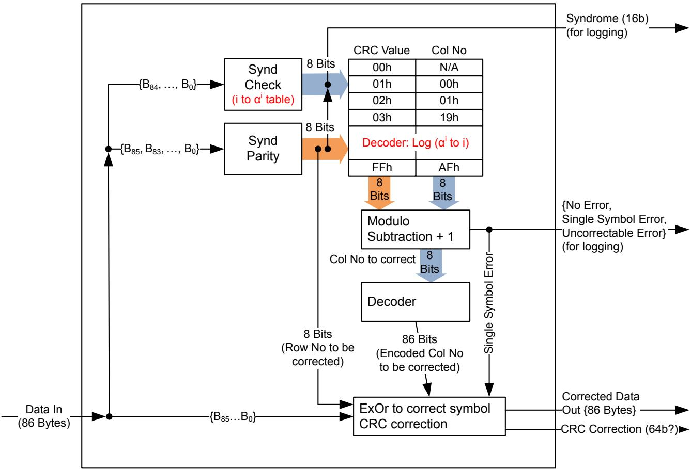


[⬆️ 返回目录](#-本章目录-table-of-contents)

---

<!-- 📄 Page 437 -->
---

<a id="fig-4-41"></a>
#### Figure 4-41 3-way ECC Decode on Receive Side | 图 4-41 接收端 3 路 ECC 解码


<div style="overflow-x: auto; max-width: 100%;">
<table>
<thead>
<tr>
<th width="50%">🇬🇧 English</th>
<th width="50%" style="background-color:#e8e8e8">🇨🇳 中文</th>
</tr>
</thead>
<tbody>
<tr>
<td>

For Data Rates of 2.5 GT/s or 5.0 GT/s, the SKP Ordered Set insertion interval does not change (e.g., between 1180 and 1538 Symbols), but occurs at the Flit boundary. The other Ordered Sets that can occur with up-size or down-size with L0p is provided in Section 4.2.6.7.

For Data Rates of 8.0 GT/s and above, the following rules apply:
- A Control SKP Ordered Set must immediately follow the SDS Ordered Set sequence marking the start of the Data Stream, irrespective of when the prior Control SKP Ordered Set was transmitted.
- Once the Data Stream has started, an Ordered Set must be transmitted in fixed intervals, as defined Table 4-21, as follows:
  - If the Data Stream will continue, a SKP Ordered Set must be transmitted on all the active (or to be activated) Lanes.
    - On an up-size with L0p: The Lanes that will be activated to join the active Lanes, an SDS Ordered Set must be transmitted on all the Lanes that will be activated (not in those that are already active) just prior to sending the SKP Ordered Set across all the wider Link, after which Flits will be sent on the wider Link
  - Else If the Link will enter a low-power state, an EIOSQ must be transmitted on all the active Lanes
  - Else (the Link needs to enter Recovery): An EIEOS must be transmitted on all the configured Lanes of the Link
  - If the Link enters Recovery, the appropriate SKP Ordered Set must be transmitted immediately after the first Ordered Set (EIEOS).

</td>
<td style="background-color:#e8e8e8">

对于 2.5 GT/s 或 5.0 GT/s 的数据速率,SKP 有序集的插入间隔不变(例如,在 1180 到 1538 个 Symbol 之间),但插入位置在 Flit 边界处发生。L0p 状态下随链路加宽或变窄可能出现的其他有序集,请参见 § Section 4.2.6.7。

对于 8.0 GT/s 及以上的数据速率,适用以下规则:
- Control SKP 有序集必须紧跟在标记数据流开始的 SDS 有序集序列之后,无论先前的 Control SKP 有序集何时发送。
- 一旦数据流开始,必须按固定间隔发送有序集(定义见 表 4-21),具体如下:
  - 如果数据流将继续,则必须在所有活动(或将要激活)通道 (Lane) 上发送 SKP 有序集。
    - 在 L0p 加宽时:对于将要激活以加入活动通道的通道,必须在这些将要激活的通道(而非已经处于活动状态的通道)上,在跨更宽链路发送 SKP 有序集之前,先发送 SDS 有序集;之后将在更宽的链路上发送 Flit。
  - 否则,如果链路将进入低功耗状态,则必须在所有活动通道上发送 EIOSQ。
  - 否则(链路需要进入 Recovery):必须在链路的所有已配置通道上发送 EIEOS。
  - 如果链路进入 Recovery,则必须在第一个有序集(EIEOS)之后立即发送相应的 SKP 有序集。

</td>
</tr>
</tbody>
</table>

> **Figure 4-41.** 3-way ECC decode followed by CRC check of flit on the Receive side
> 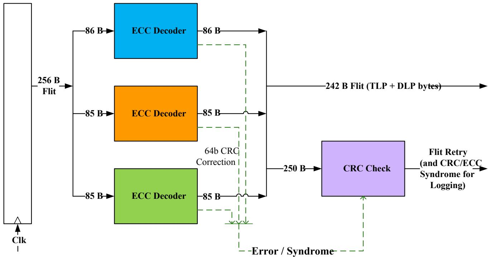

</div>


[⬆️ 返回目录](#-本章目录-table-of-contents)

---

<a id="sec-4-2-3-4-5"></a>
## 4.2.3.4.5 Ordered Set insertion in Data Stream in Flit Mode | Flit 模式下数据流中的有序集插入

<table>
<thead>
<tr>
<th width="50%">🇬🇧 English</th>
<th width="50%" style="background-color:#e8e8e8">🇨🇳 中文</th>
</tr>
</thead>
<tbody>
<tr>
<td>

**Table 4-21 Ordered Set insertion interval once Data Stream starts in terms of number of Flits**

| Link Width and Clocking Modes | x16 | x8 | x4 | x2 | x1 |
|---|---|---|---|---|---|
| Common Clock/SRNS Mode with 1b/1b encoding | 748 | 374 | 187 | 93 | 46 |
| Common Clock/SRNS Mode with 128b/130b encoding | 374 | 187 | 93 | 46 | 23 |
| SRIS Mode with 1b/1b encoding | 74 | 37 | 18 | 9 | 4 |
| SRIS Mode with 128b/130b encoding | 37 | 18 | 9 | 4 | 2 |

</td>
<td style="background-color:#e8e8e8">

**表 4-21 数据流开始后按 Flit 数计的有序集插入间隔**

| 链路宽度与时钟模式 | x16 | x8 | x4 | x2 | x1 |
|---|---|---|---|---|---|
| 共同时钟/SRNS 模式,1b/1b 编码 | 748 | 374 | 187 | 93 | 46 |
| 共同时钟/SRNS 模式,128b/130b 编码 | 374 | 187 | 93 | 46 | 23 |
| SRIS 模式,1b/1b 编码 | 74 | 37 | 18 | 9 | 4 |
| SRIS 模式,128b/130b 编码 | 37 | 18 | 9 | 4 | 2 |

</td>
</tr>
</tbody>
</table>

[⬆️ 返回目录](#-本章目录-table-of-contents)

---

<!-- 📄 Page 438 -->
---

<a id="sec-4-2-4"></a>
## 4.2.4 Link Equalization Procedure for 8.0 GT/s and Higher Data Rates | 4.2.4 8.0 GT/s 及更高数据速率的链路均衡 (Equalization) 过程


<div style="overflow-x: auto; max-width: 100%;">
<table>
<thead>
<tr>
<th width="50%">🇬🇧 English</th>
<th width="50%" style="background-color:#e8e8e8">🇨🇳 中文</th>
</tr>
</thead>
<tbody>
<tr>
<td>

The Link equalization procedure enables components to adjust the Transmitter and the Receiver setup of each Lane to improve the signal quality and meet the requirements specified in Chapter 8., when operating at 8.0 GT/s and higher data rates. All the Lanes that are associated with the LTSSM (i.e., those Lanes that are currently operational or may be operational in the future due to Link Upconfigure) must participate in the equalization procedure. The procedure must be executed during the first data rate change to any data rate at 8.0 GT/s or above, unless all components in the Link have advertised that no equalization is needed. Components must arrive at the appropriate Transmitter setup for all the operating conditions and data rates that they will encounter in the future when LinkUp=1b. Components must not require that the equalization procedure be repeated at any data rate for reliable operation, although there is provision to repeat the procedure. Components must store the Transmitter setups that were agreed to during the equalization procedures and use them for future operation at 8.0 GT/s and higher data rates. Components are permitted to fine-tune their Receiver setup even after the equalization procedure is complete as long as doing so does not cause the Link to be unreliable (i.e., does not meet the requirements in Chapter 8.) or go to Recovery.

The Link equalization procedure is not required for any data rates and can be completely bypassed if all components in the Link have advertised that no equalization is needed in its TS1/TS2 Ordered Sets or Modified TS1/TS2 Ordered Sets (see Table 4-25, Table 4-26, and Table 4-27). A component may choose to advertise that it does not need equalization at any rates above 5.0 GT/s if it supports 32.0 GT/s or higher data rates and can either operate reliably with equalization settings stored from a prior equalization procedure or does not need equalization for reliable operation.

The equalization procedure can be initiated either autonomously or by software. It is strongly recommended that components use the autonomous mechanism for all the data rates above 5.0 GT/s that they intend to operate in. However, a component that chooses not to participate in the autonomous mechanism for all the data rates above 5.0 GT/s must have its associated software ensure that the software based mechanism is applied to the data rates above 5.0 GT/s where the autonomous mechanism was not applied, prior to operating at that data rate.

> **IMPLEMENTATION NOTE:**
> **CONSECUTIVE SKP ORDERED SETS IN FLIT MODE**
>
> Two consecutive SKP Ordered Sets in a Data Stream in Flit Mode are always equidistant for a given width and clocking mode when either 1b/1b encoding or 128b/130b encoding is used. For example, for a x1 Link in SRIS Mode with 128b/130b encoding, a SKP Ordered Set is always sent after two Flits, which will occupy 32 Data Blocks. However, the same spacing cannot be guaranteed with 8b/10b encoding, as the SKPs are "scheduled" every 1180 to 1583 Symbol times in non-SRIS mode and less than 154 Symbol times in SRIS mode. For example, a x1 Link in SRIS mode with 8b/10b encoding sends an average of 1.66 (=256/154) SKP Ordered Sets after every Flit (256 Symbols): sometimes it sends one SKP Ordered Set after every Flit and other times it sends two back-to-back SKP Ordered Sets.

</td>
<td style="background-color:#e8e8e8">

链路均衡 (Equalization) 过程使组件能够在 8.0 GT/s 及更高数据速率下,调整每个通道 (Lane) 的发送器和接收器设置,以改善信号质量并满足第 8 章规定的要求。与 LTSSM 相关联的所有通道(即当前可运行的通道,或由于链路加宽配置 (Link Upconfigure) 在未来可能可运行的通道)必须参与均衡过程。该过程必须在向 8.0 GT/s 或以上数据速率的首次速率切换期间执行,除非链路中的所有组件都已通告无需均衡。组件必须为未来 LinkUp=1b 时将遇到的所有工作条件和数据速率准备好合适的发送器设置。组件不得要求在任何数据速率上重复均衡过程以保证可靠运行,尽管规范中允许重复此过程。组件必须存储均衡过程中商定的发送器设置,并将其用于未来 8.0 GT/s 及更高数据速率的运行。即使在均衡过程完成之后,也允许组件对其接收器设置进行微调,只要这样做不会导致链路不可靠(即不满足第 8 章要求)或进入 Recovery。

如果链路中的所有组件已在 TS1/TS2 有序集或 Modified TS1/TS2 有序集(参见 表 4-25、表 4-26 和 表 4-27)中通告其无需均衡,则任何数据速率下都不需要链路均衡过程,并且可以完全绕过。组件可选择在 5.0 GT/s 以上的任何速率上通告其不需要均衡,前提是该组件支持 32.0 GT/s 或更高的数据速率,并且既可以使用先前均衡过程中存储的均衡设置可靠运行,或者在任何 5.0 GT/s 以上的数据速率中均不需要均衡即可可靠运行。

均衡过程可以由自主 (autonomous) 方式发起,也可以由软件发起。强烈建议组件对其打算运行的所有 5.0 GT/s 以上数据速率使用自主机制。然而,对于选择不参与 5.0 GT/s 以上所有数据速率自主机制的组件,其关联的软件必须确保在运行该数据速率之前,对那些未应用自主机制的 5.0 GT/s 以上数据速率应用基于软件的机制。

> **实现注意 (IMPLEMENTATION NOTE):**
> **FLIT 模式下连续的 SKP 有序集**
>
> 在 Flit 模式下的数据流中,使用 1b/1b 编码或 128b/130b 编码时,两个连续的 SKP 有序集在给定的宽度和时钟模式下始终是等距的。例如,对于 x1 链路在 SRIS 模式下使用 128b/130b 编码,总是在每两个 Flit(即 32 个 Data Blocks)之后发送一个 SKP 有序集。但是,使用 8b/10b 编码时,无法保证相同的间距,因为 SKP 在非 SRIS 模式下每 1180 到 1583 个 Symbol 时间"调度"一次,在 SRIS 模式下少于 154 个 Symbol 时间。例如,x1 链路在 SRIS 模式下使用 8b/10b 编码时,每发送一个 Flit(256 个 Symbols)平均发送 1.66 (=256/154) 个 SKP 有序集:有时在每个 Flit 后发送一个 SKP 有序集,有时发送两个背靠背的 SKP 有序集。

</td>
</tr>
</tbody>
</table>
</div>


[⬆️ 返回目录](#-本章目录-table-of-contents)

---

<!-- 📄 Page 439 -->
---

<a id="sec-4-2-4-equalization-rules"></a>
### 4.2.4 Equalization Bypass and Highest NRZ Rate | 4.2.4 均衡绕过与最高 NRZ 速率

<table>
<thead>
<tr>
<th width="50%">🇬🇧 English</th>
<th width="50%" style="background-color:#e8e8e8">🇨🇳 中文</th>
</tr>
</thead>
<tbody>
<tr>
<td>

Normally, equalization is performed at a higher data rate only if equalization has successfully completed at all lower data rates above 5.0 GT/s. For example, a Link will complete equalization successfully at 8.0 GT/s, followed by 16.0 GT/s, followed by 32.0 GT/s, followed by 64.0 GT/s. However, an optional mechanism to begin the equalization procedures at the highest NRZ rate supported, 32.0 GT/s, is permitted if all components support data rates of 32.0 GT/s or higher and the mechanism is supported by all components in the Link, as advertised in the TS1/TS2 Ordered sets or Modified TS1/TS2 Ordered Sets. When this optional mechanism is enabled and successfully negotiated between the components, equalization is not performed the 8.0 GT/s and 16.0 GT/s data rates; the equalization procedures are performed at all common data rates above 16.0 GT/s beginning with the 32.0 GT/s data rate For all the data rates above 5.0 GT/s where equalization is not performed (specifically 8.0 GT/s and 16.0 GT/s), the expectation is that the Link will not operate at those data rates and the components will not advertise those data rates (neither 8.0 GT/s nor 16.0 GT/s) as the highest data rate supported. For example, a Link may train to L0 in 2.5 GT/s, enter Recovery and perform equalization at 32.0 GT/s, and then re-enter Recovery and perform equalization at 64.0 GT/s, skipping equalization at 8.0 GT/s and 16.0 GT/s. In this case, the intended data rates of operation of the Link are 2.5 GT/s, 5.0 GT/s, 32.0 GT/s, or 64.0 GT/s. If any of the equalization procedures attempted at 32.0 GT/s or 64.0 GT/s is unsuccessful even after re-equalization attempts and the Link needs to equalize at lower data rates, the Downstream Port must stop advertising Equalization Bypass to Highest NRZ Rate Support and ensure that the Link returns to operation at 2.5 GT/s or 5.0 GT/s. The required equalization procedures are then performed as they would have been if the optional mechanism to skip over equalization to the highest common data rate(s) was never supported. If the equalization procedure at the highest NRZ rate supported is initially successful but the Link is not able to operate reliably at that data rate, the Downstream Port is permitted to initiate a speed change to any lower data rate followed by an equalization procedure at that rate (when necessary). The requirements of Table 4-22 must be followed. The Upstream Port must disable Equalization Bypass to Highest NRZ Rate support as soon as an equalization procedure at the 8.0 GT/s data rate is performed. If the equalization procedure at the lower data rates is driven by software, it must set the Equalization Bypass to Highest NRZ Rate Disable and No Equalization Needed Disable register bits to 1b each; set the target Link speed such that the Link will be operational at 2.5 GT/s or 5.0 GT/s; and then set the target Link speed to equalize at the lower rates starting with 8.0 GT/s onwards. A port must not advertise the Equalization Bypass to Highest NRZ Rate Support if the Equalization Bypass to Highest NRZ Rate Disable bit is Set to 1b.

Another optional mechanism to skip the entire equalization process and go directly to the highest common data rate is permitted if all components support data rates of 32.0 GT/s or higher and the No Equalization Needed mechanism is supported by all components in the Link, as advertised in the TS1/TS2 or Modified TS1/TS2 Ordered sets. This is done if a component is either able to retrieve the equalization and other circuit settings at all the data rates from a prior equalization that will work for the component, or it does not need equalization at all in all data rates above 5.0 GT/s. A component must not advertise this capability if the Equalization Bypass to Highest NRZ Rate Disable bit is Set to 1b. Components supporting 64.0 GT/s or higher data rate are strongly encouraged to support this mode, especially after the equalization has been performed at least once since power was applied. This would be helpful for faster resume times after the devices in the Link go through deep power savings states.

If one direction of the Link is advertising No Equalization Needed and the other side is advertising Equalization Bypass to Highest NRZ Rate Support in the TS1/TS2 Ordered Sets, the Link will operate in the Equalization Bypass to Highest NRZ Rate Support since the No Equalization Needed bit also indicates that the device is capable of bypassing Equalization to the highest data rate. In the Modified TS1/TS2 Ordered Sets, a device that sets No Equalization Needed bit to 1b must also set the Equalization Bypass to Highest NRZ Rate Support to 1b. If one direction of the Link is advertising No Equalization Needed bit and the other side is advertising Equalization Bypass to Highest NRZ Rate Support only in the Modified TS1/TS2 Ordered Sets, the Link will operate in the Equalization Bypass to Highest NRZ Rate Support. Link operation is undefined if a device advertises No Equalization Needed bit as 1b and Equalization Bypass to Highest NRZ Rate Support to 0b in the Modified TS1/TS2 Ordered Sets it transmits. Components are permitted to go straight to 64.0 GT/s from any data rate without having to go through 32.0 GT/s data rate if No Equalization Needed has been negotiated, since no equalization is involved.

</td>
<td style="background-color:#e8e8e8">

通常,只有在 5.0 GT/s 以上的所有较低数据速率上均衡已成功完成时,才在更高的数据速率上执行均衡。例如,链路将依次在 8.0 GT/s、16.0 GT/s、32.0 GT/s、64.0 GT/s 成功完成均衡。然而,如果所有组件都支持 32.0 GT/s 或更高的数据速率,并且该机制得到链路中所有组件的支持(如 TS1/TS2 有序集或 Modified TS1/TS2 有序集所通告),则允许使用一种可选机制,直接从所支持的最高 NRZ 速率(32.0 GT/s)开始均衡过程。当启用此可选机制并在组件之间成功协商后,8.0 GT/s 和 16.0 GT/s 数据速率将不执行均衡;均衡过程将在 16.0 GT/s 以上的所有公共数据速率上执行,从 32.0 GT/s 数据速率开始。对于 5.0 GT/s 以上未执行均衡的数据速率(具体指 8.0 GT/s 和 16.0 GT/s),预期链路不会以这些数据速率运行,并且组件也不会将这些数据速率(8.0 GT/s 和 16.0 GT/s)通告为所支持的最高数据速率。例如,链路可能在 2.5 GT/s 训练到 L0,进入 Recovery 并在 32.0 GT/s 执行均衡,然后再次进入 Recovery 并在 64.0 GT/s 执行均衡,跳过 8.0 GT/s 和 16.0 GT/s 的均衡。在这种情况下,链路计划运行的数据速率为 2.5 GT/s、5.0 GT/s、32.0 GT/s 或 64.0 GT/s。如果在 32.0 GT/s 或 64.0 GT/s 尝试的均衡过程即使在重新均衡尝试后仍未成功,并且链路需要在较低的数据速率上均衡,则 Downstream Port 必须停止通告 Equalization Bypass to Highest NRZ Rate Support,并确保链路恢复到 2.5 GT/s 或 5.0 GT/s 运行。然后执行所需的均衡过程,就像从未支持跳到最高公共数据速率的可选机制一样。如果在所支持的最高 NRZ 速率下均衡过程最初成功,但链路不能在该数据速率下可靠运行,则允许 Downstream Port 发起向任何较低数据速率的速率切换,并在必要时在该速率下执行均衡过程。必须遵循表 4-22 的要求。一旦在 8.0 GT/s 数据速率上执行了均衡过程,Upstream Port 必须立即禁用 Equalization Bypass to Highest NRZ Rate 支持。如果在较低数据速率下的均衡过程由软件驱动,则必须将 Equalization Bypass to Highest NRZ Rate Disable 和 No Equalization Needed Disable 寄存器位各置 1b;将目标链路速度设置为使链路可在 2.5 GT/s 或 5.0 GT/s 运行;然后将目标链路速度设置为从 8.0 GT/s 开始在较低速率下均衡。如果 Equalization Bypass to Highest NRZ Rate Disable 位被置 1b,则端口不得通告 Equalization Bypass to Highest NRZ Rate Support。

如果所有组件都支持 32.0 GT/s 或更高的数据速率,并且 No Equalization Needed 机制得到链路中所有组件的支持(如 TS1/TS2 或 Modified TS1/TS2 有序集所通告),则允许使用另一种可选机制,跳过整个均衡过程并直接进入最高公共数据速率。如果组件能够从先前的均衡中获取在该组件上有效的所有数据速率的均衡和其他电路设置,或者在 5.0 GT/s 以上的所有数据速率中均不需要均衡,则会执行此机制。如果 Equalization Bypass to Highest NRZ Rate Disable 位被置 1b,则组件不得通告此能力。强烈鼓励支持 64.0 GT/s 或更高数据速率的组件支持此模式,特别是在上电后至少完成了一次均衡的情况下。这将有助于在链路中的设备经历深度节能状态后更快地恢复。

如果链路的一个方向在 TS1/TS2 有序集中通告 No Equalization Needed,而另一侧通告 Equalization Bypass to Highest NRZ Rate Support,则链路将以 Equalization Bypass to Highest NRZ Rate Support 模式运行,因为 No Equalization Needed 位也表示设备能够将均衡绕过到最高数据速率。在 Modified TS1/TS2 有序集中,将 No Equalization Needed 位置 1b 的设备也必须将 Equalization Bypass to Highest NRZ Rate Support 置 1b。如果链路的一个方向通告 No Equalization Needed 位,另一侧仅在 Modified TS1/TS2 有序集中通告 Equalization Bypass to Highest NRZ Rate Support,则链路将以 Equalization Bypass to Highest NRZ Rate Support 模式运行。如果设备在其发送的 Modified TS1/TS2 有序集中将 No Equalization Needed 位通告为 1b,而将 Equalization Bypass to Highest NRZ Rate Support 通告为 0b,则链路操作未定义。如果已经协商好 No Equalization Needed,则允许组件从任何数据速率直接跳到 64.0 GT/s,无需经过 32.0 GT/s 数据速率,因为不涉及均衡。

</td>
</tr>
</tbody>
</table>

[⬆️ 返回目录](#-本章目录-table-of-contents)

---

<!-- 📄 Page 440 -->
---

<a id="sec-4-2-4-autonomous"></a>
### 4.2.4 Autonomous Equalization Mechanism | 4.2.4 自主均衡机制


<div style="overflow-x: auto; max-width: 100%;">
<table>
<thead>
<tr>
<th width="50%">🇬🇧 English</th>
<th width="50%" style="background-color:#e8e8e8">🇨🇳 中文</th>
</tr>
</thead>
<tbody>
<tr>
<td>

The autonomous mechanism is executed if both components advertise that they are capable of at least the 8.0 GT/s data rate (via the TS1 and TS2 Ordered Sets) during the initial Link negotiation (when LinkUp is set to 1b) and the Downstream Port chooses to perform the equalization procedure at the intended data rates of operation above 5.0 GT/s. While not recommended, the Downstream Port may choose to perform the autonomous mechanism only on a subset of the intended data rates of operation above 5.0 GT/s. In that case, the software based mechanism must be executed in order to perform the equalization procedure for the intended data rates of operation above 5.0 GT/s, not covered by the autonomous mechanism. For example, if both components advertised 8.0 GT/s, 16.0 GT/s, and 32.0 GT/s Data Rates but autonomous equalization was performed for only 8.0 GT/s and 16.0 GT/s Data Rates, then software based mechanism must be adopted for equalization at 32.0 GT/s Data Rate.

In the autonomous mechanism, after entering L0, irrespective of the current Link speed, neither component must transmit any DLLP, except the NOP2 DLLP, if the equalization procedure must be performed and until the equalization procedure completes. The equalization procedure is considered complete once the Transmitter and Receiver setup of each Lane has been adjusted for each common data rate supported above 5.0 GT/s for which the Downstream Port intends to perform equalization using the autonomous mechanism. The Downstream Port is required to initiate the speed change to the data rate where the equalization needs to be performed. During any equalization (autonomous or software initiated or re-equalization), the Downstream Port must not advertise support for any data rate above the data rate for which equalization needs to be performed in Recovery. The following example is provided to illustrate the equalization flow.

**Example:** Consider a Link where equalization needs to be performed autonomously at 8.0 GT/s, and 16.0 GT/s. The Downstream Port enters Recovery to perform equalization at 8.0 GT/s by not advertising any data rates above 8.0 GT/s. The 8.0 GT/s equalization procedure is deemed to have been successfully executed if the Equalization 8.0 GT/s Phase 3 Successful bit and Equalization 8.0 GT/s Complete bit of the Link Status 2 register are both set to 1b. Immediately following the transition from Recovery to L0, after the initial data rate change to 8.0 GT/s, the Downstream Port is required to transition from L0 to Recovery, advertise 16.0 GT/s data rate support (but not advertise support for 32.0 GT/s, even if it is capable of supporting 32.0 GT/s), change the data rate to 16.0 GT/s and perform the 16.0 GT/s equalization procedure.

If the Downstream Port detects equalization problems or the Upstream Port made an equalization redo request (by setting the Request Equalization bit to 1b) the Downstream Port may redo equalization prior to proceeding to operate at the data rate where the equalization failed or performing equalization at a higher data rate. The number of back-to-back equalization redos at a given data rate is implementation specific but must be finite. If at the conclusion of the initial or subsequent equalization process and the execution of an implementation specific number of equalization redo's, the Link is not able to operate reliably at the data rate where equalization was performed, then it must revert back to a lower data rate of operation.

Components using the autonomous mechanism must not initiate any autonomous Link width downsizing until the equalization procedure completes. An Upstream Port must not transmit any DLLP, except the NOP2 DLLP, until it receives a non-NOP2 DLLP from the Downstream Port. If the Downstream Port performs equalization again, it must not transmit any DLLP, except the NOP2 DLLP, until it completes the equalization procedure. A Downstream Port may perform equalization again based on its own needs or based on the request from the Upstream Port, if it can meet its system requirements. Executing equalization multiple times may interfere with software determination of Link and device status, as described in Section 6.6.

</td>
<td style="background-color:#e8e8e8">

在初始链路协商期间(当 LinkUp 被置 1b 时),如果两个组件都通过 TS1 和 TS2 有序集通告其至少支持 8.0 GT/s 数据速率,并且 Downstream Port 选择在 5.0 GT/s 以上的目标运行数据速率上执行均衡过程,则执行自主机制。虽然不推荐,但 Downstream Port 可以选择仅对 5.0 GT/s 以上目标运行数据速率的子集执行自主机制。在这种情况下,对于自主机制未覆盖的 5.0 GT/s 以上的目标运行数据速率,必须执行基于软件的机制以执行均衡过程。例如,如果两个组件均通告支持 8.0 GT/s、16.0 GT/s 和 32.0 GT/s 数据速率,但仅对 8.0 GT/s 和 16.0 GT/s 数据速率执行了自主均衡,则在 32.0 GT/s 数据速率下必须采用基于软件的机制进行均衡。

在自主机制中,进入 L0 之后,无论当前链路速度如何,如果必须执行均衡过程,则任何组件都不得发送除 NOP2 DLLP 之外的任何 DLLP,直到均衡过程完成。一旦为 Downstream Port 计划使用自主机制执行均衡的 5.0 GT/s 以上的每个公共数据速率,调整了每个通道 (Lane) 的发送器和接收器设置,均衡过程即视为完成。Downstream Port 负责发起向需要执行均衡的数据速率的速率切换。在任何均衡过程中(自主、软件发起或重新均衡),Downstream Port 在 Recovery 中不得通告支持高于需要执行均衡的数据速率的任何数据速率。下面提供一个示例以说明均衡流程。

**示例:** 考虑一条需要在 8.0 GT/s 和 16.0 GT/s 自主执行均衡的链路。Downstream Port 进入 Recovery,通过不通告任何高于 8.0 GT/s 的数据速率,在 8.0 GT/s 执行均衡。如果 Link Status 2 寄存器的 Equalization 8.0 GT/s Phase 3 Successful 位和 Equalization 8.0 GT/s Complete 位均被置 1b,则 8.0 GT/s 均衡过程被视为已成功执行。在首次数据速率切换到 8.0 GT/s 之后,紧接从 Recovery 到 L0 的转换之后,Downstream Port 必须从 L0 转换到 Recovery,通告 16.0 GT/s 数据速率支持(但不通告 32.0 GT/s 的支持,即使它能够支持 32.0 GT/s),将数据速率切换到 16.0 GT/s,并执行 16.0 GT/s 均衡过程。

如果 Downstream Port 检测到均衡问题,或 Upstream Port 发出均衡重做请求(通过将 Request Equalization 位置 1b),则 Downstream Port 可在继续运行均衡失败的数据速率或执行更高数据速率均衡之前重新进行均衡。在给定数据速率上连续均衡重做的次数是实现特定的,但必须是有限的。如果在初始或后续均衡过程结束时,以及执行实现特定次数的均衡重做之后,链路仍不能在执行均衡的数据速率上可靠运行,则必须恢复到较低的数据速率运行。

使用自主机制的组件在均衡过程完成之前不得启动任何自主链路宽度收窄。Upstream Port 不得发送除 NOP2 DLLP 之外的任何 DLLP,直到从 Downstream Port 接收到非 NOP2 DLLP。如果 Downstream Port 再次执行均衡,则不得发送除 NOP2 DLLP 之外的任何 DLLP,直到均衡过程完成。Downstream Port 可根据自身需要或根据 Upstream Port 的请求再次执行均衡(若能满足其系统要求)。多次执行均衡可能会干扰软件对链路和设备状态的判断,详见 § Section 6.6。

</td>
</tr>
</tbody>
</table>
</div>


[⬆️ 返回目录](#-本章目录-table-of-contents)

---

<!-- 📄 Page 441 -->
---

<a id="sec-4-2-4-sw-mechanism"></a>
### 4.2.4 Software-Based Equalization and DLLP Blocking | 4.2.4 基于软件的均衡与 DLLP 阻塞

<table>
<thead>
<tr>
<th width="50%">🇬🇧 English</th>
<th width="50%" style="background-color:#e8e8e8">🇨🇳 中文</th>
</tr>
</thead>
<tbody>
<tr>
<td>

When using the software based mechanism, software must guarantee that there will be no side-effects for transactions in flight (e.g., no timeout), if any, due to the Link undergoing the equalization procedure. Software can write 1b to the Perform Equalization bit in the Link Control 3 Register, followed by a write to the Target Link Speed field in the Link Control 2 register to enable the Link to run at 8.0 GT/s or higher, followed by a write of 1b to the Retrain Link bit in the Link Control register of the Downstream Port to perform equalization. Software must not enable the Link to run at a data rate above 8.0 GT/s during a software initiated equalization procedure if the equalization procedure at all the lower data rates starting with 8.0 GT/s have not been successfully executed and the Link is not capable of bypassing equalization to higher data rate(s) (i.e., either Equalization Bypass to Highest NRZ Rate Supported is 0b or Equalization Bypass to Highest NRZ Rate Disable is 1b). The equalization procedure is deemed successful as follows for the following data rates:
- 8.0 GT/s: Equalization 8.0 GT/s Phase 3 Successful bit and Equalization 8.0 GT/s Complete bit of the Link Status 2 register are both set to 1b
- 16.0 GT/s: Equalization 16.0 GT/s Phase 3 Successful bit and Equalization 16.0 GT/s Complete bit of the 16.0 GT/s Status Register are both set to 1b
- 32.0 GT/s: Equalization 32.0 GT/s Phase 3 Successful bit and Equalization 32.0 GT/s Complete bit of the 32.0 GT/s Link Status Register are both set to 1b
- 64.0 GT/s: Equalization 64.0 GT/s Phase 3 Successful bit and Equalization 64.0 GT/s Complete bit of the 64.0 GT/s Link Status Register are both set to 1b

Software may set the Hardware Autonomous Width Disable bit of the Link Control register in both components, or use some other mechanism to ensure that the Link is in its full functional width prior to setting the Perform Equalization bit in the Downstream Port. The component that had initiated the autonomous width downsizing is responsible to upconfigure the Link to go to its full functional width by initiating the transition to Recovery and Configuration within 1 ms of the Hardware Autonomous Width Disable bit being set to 1b. If an Upstream Port does not advertise the 8.0 GT/s data rate, the 16.0 GT/s data rate, the 32.0 GT/s, or the 64.0 GT/s data rate initially and did not participate in the autonomous

> **IMPLEMENTATION NOTE:**
> **DLLP BLOCKING DURING AUTONOMOUS EQUALIZATION**
>
> When using the autonomous mechanism for equalization at 8.0 GT/s or higher data rates, the Downstream Port is required to block the transmission of DLLPs until equalization has completed at all data rates for which the autonomous equalization mechanism will be performed, and the Upstream Port is required to block the transmission of DLLPs until a DLLP is received from the Downstream Port. If both components advertise that they are capable of the 16.0 GT/s (or higher) data rate but the Downstream Port only uses the autonomous mechanism for equalization at 8.0 GT/s, the Downstream Port is only required to block DLLP transmission until 8.0 GT/s equalization has completed. Similarly, if both components advertise that they are capable of the 32.0 GT/s data rate but the Downstream Port only uses the autonomous mechanism for equalization at 16.0 GT/s, the Downstream Port is only required to block DLLP transmission until 16.0 GT/s equalization has completed. If the Downstream Port delays entering Recovery from L0 while DLLP transmission is blocked, either the L0 Inferred Electrical Idle timeout (see Section 4.2.5.4) or the DLLP timeout (see Section 2.6.1.2) may expire in the Upstream or Downstream Ports. If either of these two timeouts occurs, it will result in the initiation of an entry to Recovery to perform Link retraining. Neither of these two timeouts is a reportable error condition, and the resulting Link retraining has no impact on proper Link operation.
>
> The DLLP limitations described in this implementation note do not apply to NOP2 DLLPs. When operating in Flit Mode, since entry to Recovery must happen on an Ordered Set boundary, Flit transmission may occur prior to the completion of equalization at all data rates for which the autonomous equalization mechanism will be performed. These Flits will be transmitting NOP2 DLLPs. The receipt of NOP2 DLLPs cannot be used by the Upstream Port to unblock the transmission of non-NOP2 DLLPs.

</td>
<td style="background-color:#e8e8e8">

使用基于软件的机制时,软件必须保证正在进行的交易(若有)不会因链路正在进行均衡过程而产生副作用(例如,不会超时)。软件可向 Link Control 3 寄存器中的 Perform Equalization 位写 1b,然后向 Link Control 2 寄存器中的 Target Link Speed 字段写入以使链路运行在 8.0 GT/s 或更高,接着向 Downstream Port 的 Link Control 寄存器中的 Retrain Link 位写 1b 以执行均衡。如果从 8.0 GT/s 开始的所有较低数据速率的均衡过程未成功执行,且链路无法绕过均衡到更高数据速率(即,Equalization Bypass to Highest NRZ Rate Supported 为 0b 或 Equalization Bypass to Highest NRZ Rate Disable 为 1b),则软件不得在软件发起的均衡过程中使链路运行在 8.0 GT/s 以上的数据速率。各数据速率下均衡成功的判定标准如下:
- 8.0 GT/s:Link Status 2 寄存器的 Equalization 8.0 GT/s Phase 3 Successful 位和 Equalization 8.0 GT/s Complete 位均被置 1b
- 16.0 GT/s:16.0 GT/s Status 寄存器的 Equalization 16.0 GT/s Phase 3 Successful 位和 Equalization 16.0 GT/s Complete 位均被置 1b
- 32.0 GT/s:32.0 GT/s Link Status 寄存器的 Equalization 32.0 GT/s Phase 3 Successful 位和 Equalization 32.0 GT/s Complete 位均被置 1b
- 64.0 GT/s:64.0 GT/s Link Status 寄存器的 Equalization 64.0 GT/s Phase 3 Successful 位和 Equalization 64.0 GT/s Complete 位均被置 1b

软件可在两个组件中将 Link Control 寄存器的 Hardware Autonomous Width Disable 位置 1b,或使用其他机制以确保在 Downstream Port 设置 Perform Equalization 位之前,链路处于其全功能宽度。启动自主宽度收窄的组件负责通过在 Hardware Autonomous Width Disable 位置 1b 后 1 ms 内发起向 Recovery 和 Configuration 的转换,将链路加宽到其全功能宽度。如果 Upstream Port 初始未通告 8.0 GT/s、16.0 GT/s、32.0 GT/s 或 64.0 GT/s 数据速率,并且未参与针对未通告速率的自主均衡机制,

> **实现注意 (IMPLEMENTATION NOTE):**
> **自主均衡期间的 DLLP 阻塞**
>
> 在 8.0 GT/s 或更高数据速率下使用自主机制进行均衡时,Downstream Port 必须阻塞 DLLP 的发送,直到自主均衡机制将执行的所有数据速率的均衡完成;Upstream Port 必须阻塞 DLLP 的发送,直到从 Downstream Port 接收到 DLLP。如果两个组件都通告其支持 16.0 GT/s(或更高)数据速率,但 Downstream Port 仅在 8.0 GT/s 数据速率上使用自主均衡机制,则 Downstream Port 只需阻塞 DLLP 发送,直到 8.0 GT/s 均衡完成。类似地,如果两个组件都通告其支持 32.0 GT/s 数据速率,但 Downstream Port 仅在 16.0 GT/s 数据速率上使用自主均衡机制,则 Downstream Port 只需阻塞 DLLP 发送,直到 16.0 GT/s 均衡完成。如果 Downstream Port 在 DLLP 发送被阻塞时延迟从 L0 进入 Recovery,则 L0 Inferred Electrical Idle 超时(参见 § Section 4.2.5.4)或 DLLP 超时(参见 § Section 2.6.1.2)可能在 Upstream 或 Downstream Port 中到期。如果这两个超时中的任何一个发生,将启动进入 Recovery 以执行链路重训练。这两个超时都不是可报告的错误状态,由此产生的链路重训练不会影响链路的正常运行。
>
> 本实现注意中描述的 DLLP 限制不适用于 NOP2 DLLP。在 Flit 模式下运行时,由于进入 Recovery 必须发生在有序集边界,因此 Flit 发送可能在自主均衡机制将执行的所有数据速率的均衡完成之前发生。这些 Flit 将发送 NOP2 DLLP。Upstream Port 不得使用接收到 NOP2 DLLP 来解除对非 NOP2 DLLP 发送的阻塞。

</td>
</tr>
</tbody>
</table>

[⬆️ 返回目录](#-本章目录-table-of-contents)

---

<!-- 📄 Page 442 -->
---

<a id="sec-4-2-4-eq-problems"></a>
### 4.2.4 Equalization Setting Problem Reporting | 4.2.4 均衡设置问题上报


<div style="overflow-x: auto; max-width: 100%;">
<table>
<thead>
<tr>
<th width="50%">🇬🇧 English</th>
<th width="50%" style="background-color:#e8e8e8">🇨🇳 中文</th>
</tr>
</thead>
<tbody>
<tr>
<td>

equalization mechanism for the non-advertised rates, its associated software must ensure there will be no side-effects for transactions in flight, if any, during equalization, before it instructs the Upstream Port to go to Recovery and advertise the previously non-advertised data rates and initiate a speed change. The Downstream Port subsequently initiates the equalization procedure during the initial speed change to the data rate advertised by the Upstream Port when it transitions to Recovery.

Upstream Ports are required to check for equalization setting problems in the Recovery.RcvrLock state (see Section 4.2.7.4.1). However, both Downstream and Upstream Ports are permitted to use implementation specific methods to detect equalization problems at any time. A Port that detects a problem with its equalization settings is required to undertake the following actions, for each the following data rates:
- 8.0 GT/s: Link Equalization Request 8.0 GT/s bit in the Link Status 2 Register is set to 1b.
- 16.0 GT/s: Link Equalization Request 16.0 GT/s bit in the 16.0 GT/s Status Register is set to 1b.
- 32.0 GT/s: Link Equalization Request 32.0 GT/s bit in the 32.0 GT/s Status Register is set to 1b.
- 64.0 GT/s: Link Equalization Request 64.0 GT/s bit in the 64.0 GT/s Status Register is set to 1b.

In addition to setting the appropriate Link Equalization Request bit to 1b, an Upstream Port must initiate a transition to Recovery (if necessary) and request equalization at the appropriate data rate in the Recovery.RcvrCfg state by setting the Request Equalization bit of its transmitted TS2 Ordered Sets to 1b and the Equalization Request Data Rate bits to the data rate of the detected problem. If it requests equalization, it must request equalization for each detected problem only once. When requesting equalization, the Upstream Port is also permitted, but not required, to set the Quiesce Guarantee bit to 1b to inform the Downstream Port that an equalization process initiated within 1 ms will not cause any side-effects to its operation.

When a Downstream Port receives an equalization request from an Upstream Port (when it is in the Recovery.RcvrCfg state and receives 8 consecutive TS2 Ordered Sets with the Request Equalization bit set to 1b), it must either initiate an equalization process at the requested data rate (as defined by the received Equalization Request Data Rate bits) within 1 ms of completing the next Recovery to L0 transition, or it must set the appropriate Link Equalization Request 8.0 GT/s in its Link Status 2 register, Link Equalization Request 16.0 GT/s bit in its 16.0 GT/s Status Register, Link Equalization Request 32.0 GT/s bit in its 32.0 GT/s Status Register, or Link Equalization Request 64.0 GT/s bit in its 64.0 GT/s Status Register. It should initiate an equalization process only if it can guarantee that executing the equalization process will not cause any side-effects to either its operation or the Upstream Port's operation. The Downstream Port is permitted, but not required, to use the received Quiesce Guarantee bit to determine the Upstream Port's ability to execute an equalization process without side-effects.

If a Downstream Port wants to initiate an equalization process and can guarantee that it will not cause side-effects to its own operation but is unable to directly determine whether the equalization process will cause side-effects to the Upstream Port's operation, then it is permitted to request that the Upstream Port initiate an equalization request. The Downstream Port does so by transitioning to Recovery and in the Recovery.RcvrCfg state setting the Request Equalization bit of its transmitted TS2 Ordered Sets to 1b, the Equalization Request Data Rate bits to the desired data rate, and the Quiesce Guarantee bit to 1b. When an Upstream Port receives such an equalization request from a Downstream Port (when it is in the Recovery.RcvrCfg state and receives 8 consecutive TS2 Ordered Sets with the Request Equalization and Quiesce Guarantee bits set to 1b), it is permitted, but not required, to quiesce its operation and prepare to execute an equalization process at the data rate requested by the Downstream Port, and then request equalization at that same data rate (using the method described previously for reporting equalization setting problems) and with the Quiesce Guarantee bit set to 1b. There is no time limit on how long the Upstream Port can take to respond, but it should attempt to do so as quickly as possible. If a Downstream Port makes a request and receives such a response from the Upstream Port, then it must either initiate an equalization process at the agreed-upon data rate within 1 ms of completing the next Recovery to L0 transition if it can still guarantee that executing the equalization process will not cause any side-effects to its operation, or it must set the appropriate Link Equalization Request 8.0 GT/s bit in its Link Status 2 register, Link Equalization Request 16.0 GT/s bit in its 16.0 GT/s Status Register, Link Equalization Request 32.0 GT/s bit in its 32.0 GT/s Status Register, or Link Equalization Request 64.0 GT/s bit in its 64.0 GT/s Status Register.

</td>
<td style="background-color:#e8e8e8">

其关联的软件必须确保均衡期间正在进行的交易(若有)不会产生副作用,然后再指示 Upstream Port 进入 Recovery 并通告之前未通告的数据速率并发起速率切换。当过渡到 Recovery 时,Downstream Port 随后在 Upstream Port 通告的数据速率的初始速率切换期间启动均衡过程。

Upstream Port 需要在 Recovery.RcvrCfg 状态(参见 § Section 4.2.7.4.1)检查均衡设置问题。但是,Downstream 和 Upstream Port 都允许使用实现特定的方法在任何时间检测均衡问题。检测到均衡设置存在问题的端口必须针对以下每个数据速率执行以下操作:
- 8.0 GT/s:Link Status 2 寄存器中的 Link Equalization Request 8.0 GT/s 位置 1b。
- 16.0 GT/s:16.0 GT/s Status 寄存器中的 Link Equalization Request 16.0 GT/s 位置 1b。
- 32.0 GT/s:32.0 GT/s Status 寄存器中的 Link Equalization Request 32.0 GT/s 位置 1b。
- 64.0 GT/s:64.0 GT/s Status 寄存器中的 Link Equalization Request 64.0 GT/s 位置 1b。

除了将相应的 Link Equalization Request 位置 1b 外,Upstream Port 还必须启动向 Recovery 的转换(如有必要),并在 Recovery.RcvrCfg 状态中,通过将其发送的 TS2 有序集的 Request Equalization 位置 1b、Equalization Request Data Rate 位设置为检测到问题的数据速率,来在相应的数据速率上请求均衡。如果请求均衡,则必须仅对每个检测到的问题请求一次均衡。请求均衡时,Upstream Port 也允许(但不是必须)将 Quiesce Guarantee 位置 1b,以通知 Downstream Port 在 1 ms 内发起的均衡过程不会对其操作造成任何副作用。

当 Downstream Port 接收到来自 Upstream Port 的均衡请求时(当它处于 Recovery.RcvrCfg 状态并接收到 8 个连续的 Request Equalization 位置 1b 的 TS2 有序集时),它必须执行以下操作之一:在完成下一次 Recovery 到 L0 转换后的 1 ms 内,在所请求的数据速率(由接收到的 Equalization Request Data Rate 位定义)上启动均衡过程;或将其 Link Status 2 寄存器中相应的 Link Equalization Request 8.0 GT/s 位、16.0 GT/s Status 寄存器中 Link Equalization Request 16.0 GT/s 位、32.0 GT/s Status 寄存器中 Link Equalization Request 32.0 GT/s 位,或 64.0 GT/s Status 寄存器中 Link Equalization Request 64.0 GT/s 位置 1b。仅当 Downstream Port 能保证执行均衡过程不会对其自身操作或 Upstream Port 的操作造成任何副作用时,才应启动均衡过程。Downstream Port 允许(但不是必须)使用接收到的 Quiesce Guarantee 位来判断 Upstream Port 是否能够在没有副作用的情况下执行均衡过程。

如果 Downstream Port 希望启动均衡过程,并且能够保证不会对其自身操作造成副作用,但无法直接确定均衡过程是否会对 Upstream Port 的操作造成副作用,则允许其请求 Upstream Port 发起均衡请求。Downstream Port 通过转换到 Recovery 并在 Recovery.RcvrCfg 状态中将其发送的 TS2 有序集的 Request Equalization 位置 1b、Equalization Request Data Rate 位设置为所需的数据速率、Quiesce Guarantee 位置 1b 来实现。当 Upstream Port 收到来自 Downstream Port 的此类均衡请求时(当它处于 Recovery.RcvrCfg 状态并接收到 8 个连续的 Request Equalization 和 Quiesce Guarantee 位均置 1b 的 TS2 有序集时),允许(但不是必须)暂停其操作并准备在 Downstream Port 请求的数据速率上执行均衡过程,然后以 Quiesce Guarantee 位置 1b 在相同的数据速率上请求均衡(使用先前描述的用于上报均衡设置问题的方法)。Upstream Port 响应所花费的时间没有限制,但应尽快完成。如果 Downstream Port 发出请求并收到 Upstream Port 的此类响应,则在完成下一次 Recovery 到 L0 转换后的 1 ms 内,如果仍能保证执行均衡过程不会对其操作造成任何副作用,则必须在协商一致的数据速率上启动均衡过程;或将其 Link Status 2 寄存器中相应的 Link Equalization Request 8.0 GT/s 位、16.0 GT/s Status 寄存器中 Link Equalization Request 16.0 GT/s 位、32.0 GT/s Status 寄存器中 Link Equalization Request 32.0 GT/s 位,或 64.0 GT/s Status 寄存器中 Link Equalization Request 64.0 GT/s 位置 1b。

</td>
</tr>
</tbody>
</table>
</div>


[⬆️ 返回目录](#-本章目录-table-of-contents)

---

<!-- 📄 Page 443 -->
---

<a id="sec-4-2-4-redo-eq"></a>
### 4.2.4 Redo Equalization and Rate Change | 4.2.4 重新均衡与速率切换

<table>
<thead>
<tr>
<th width="50%">🇬🇧 English</th>
<th width="50%" style="background-color:#e8e8e8">🇨🇳 中文</th>
</tr>
</thead>
<tbody>
<tr>
<td>

A component may operate at a lower data rate after reporting its equalization problems, either by timing out through Recovery.Speed or by initiating a data rate change to a lower data rate. Any data rate change required to perform the equalization procedure is exempt from the 200 ms requirement in Section 6.11. Table 4-22 describes the mechanism for performing redo Equalization. Sometimes it may be necessary to perform a speed change to an intermediate data rate to redo equalization. For example, if the Downstream Port wants to redo equalization at 16.0 GT/s, bypass equalization is not supported, and the current data rate is either 2.5 GT/s or 5.0 GT/s, the Downstream Port must first initiate a speed change to 8.0 GT/s (the 8.0 GT/s equalization procedure will not be executed unless necessary) from which it will launch the redo equalization for 16.0 GT/s. The equalization procedure can be performed at most once in each trip through the Recovery state.

**Table 4-22 Equalization Requirements Under Different Conditions**

| From | Conditions | Mechanism |
|---|---|---|
| 2.5 GT/s or 5.0 GT/s to 8.0 GT/s Equalization | | The mechanisms described here are identical for all flavors of equalization: initial or redo equalization; autonomous or software initiated.<br><br>The Downstream Port communicates the Transmitter preset values and the Receiver preset hints, if applicable, for each Lane to the Upstream Port using 8b/10b encoding. These values are communicated using the EQ TS2 Ordered Sets (defined in Section 4.2.5.1) in Recovery.RcvrCfg, when a data rate change to the higher data rate has been negotiated, prior to transitioning to the higher data rate to perform equalization. The preset values sent in the EQ TS2 Ordered Sets are derived as follows:<br>- For equalization at 8.0 GT/s: Upstream Port 8.0 GT/s Transmitter Preset and Upstream Port 8.0 GT/s Receiver Preset Hint fields of each Lane Equalization Control Register Entry.<br><br>After the data rate change to the higher data rate where equalization needs to be performed, the Upstream Port transmits TS1 Ordered Sets with the preset values it received. The preset values must be within the operable range defined in Section 8.3.3.3 if reduced swing will be used by the Transmitter.<br><br>After the data rate change to the higher data rate where equalization needs to be performed, the Downstream Port transmits TS1 Ordered Sets with the preset values as follows with the assumption that the preset values must be within the operable range defined in Section 8.3.3.3 if reduced swing will be used by the Transmitter:<br>- For equalization at 8.0 GT/s: Downstream Port 8.0 GT/s Transmitter Preset and optionally Downstream Port 8.0 GT/s Receiver Preset Hint fields of each Lane Equalization Control Register Entry.<br><br>To perform redo equalization, the Downstream Port must request speed change through EQ TS1 Ordered Sets in Recovery.RcvrLock at 2.5 GT/s or 5.0 GT/s to inform the Upstream Port that it intends to redo equalization at the higher data rate. An Upstream Port should advertise the higher data rate in Recovery if it receives EQ TS1 Ordered Sets with speed change bit set to 1b and if it intends to operate at the higher data rate in the future. |
| 8.0 GT/s to 16.0 GT/s Equalization, OR from 16.0 GT/s to 32.0 GT/s Equalization, OR from 32.0 GT/s to 64.0 GT/s Equalization | | The mechanisms described here are identical for all flavors of equalization: initial or redo equalization; autonomous or software initiated.<br><br>When negotiating to the higher data rate, the Downstream Port communicates the Transmitter preset values for each Lane to the Upstream Port using 128b/130b encoding. These values are communicated using 128b/130b EQ TS2 Ordered Sets (defined in Section 4.2.5.1) in Recovery.RcvrCfg, when a data rate change to the higher data rate has been negotiated, prior to transitioning to the higher data rate. The preset values sent in the 128b/130b EQ TS2 Ordered Sets are derived as follows:<br>- For equalization at 16.0 GT/s: Upstream Port 16.0 GT/s Transmitter Preset field of the 16.0 GT/s Lane Equalization Control Register Entry corresponding to the Lane.<br>- For equalization at 32.0 GT/s: Upstream Port 32.0 GT/s Transmitter Preset field of the 32.0 GT/s Lane Equalization Control Register Entry corresponding to the Lane.<br>- For equalization at 64.0 GT/s: Upstream Port 64.0 GT/s Transmitter Preset field of the 64.0 GT/s Lane Equalization Control Register Entry corresponding to the Lane.<br><br>Optionally, the Upstream Port communicates initial Transmitter preset settings to the Downstream Port using the 128b/130b EQ TS2 Ordered Sets sent in Recovery.RcvrCfg, when a data rate change to the higher data rate has been negotiated, prior to transitioning to the higher data rate at which equalization needs to be performed. These preset values are determined by implementation specific means. After the data rate change to the higher data rate, the Upstream Port transmits TS1 Ordered Sets with the preset values it received. If the Downstream Port did not receive preset values in Recovery.RcvrCfg, after the data rate change to the higher data rate, it transmits TS1 Ordered Sets with the presets as follows:<br>- For equalization at 16.0 GT/s: Downstream Port 16.0 GT/s Transmitter Preset field of the 16.0 GT/s Lane Equalization Control Register Entry corresponding to the Lane.<br>- For equalization at 32.0 GT/s: Downstream Port 32.0 GT/s Transmitter Preset field of the 32.0 GT/s Lane Equalization Control Register Entry corresponding to the Lane.<br>- For equalization at 64.0 GT/s: Downstream Port 64.0 GT/s Transmitter Preset field of the 64.0 GT/s Lane Equalization Control Register Entry corresponding to the Lane.<br>The preset values must be within the operable range defined in Section 8.3.3.3 if reduced swing will be used by the Transmitter.<br><br>To perform redo equalization, the Downstream Port must request speed change through TS1 Ordered Sets in Recovery.RcvrLock with the Equalization Redo bit set to 1b to inform the Upstream Port that it intends to redo equalization. An Upstream Port should advertise the higher data rate in Recovery if it receives TS1 Ordered Sets with speed change bit set to 1b, Equalization Redo bit set to 1b and it intends to operate at the higher data rate in the future. |

</td>
<td style="background-color:#e8e8e8">

组件在上报其均衡问题后,可以通过在 Recovery.Speed 状态超时或通过发起向较低数据速率的速率切换来以较低数据速率运行。执行均衡过程所需的任何数据速率切换都免于遵守 § Section 6.11 中的 200 ms 要求。表 4-22 描述了执行重新均衡的机制。有时可能需要先切换到中间数据速率才能重新均衡。例如,如果 Downstream Port 希望在 16.0 GT/s 重新均衡,不支持均衡绕过,且当前数据速率为 2.5 GT/s 或 5.0 GT/s,则 Downstream Port 必须首先发起向 8.0 GT/s 的速率切换(8.0 GT/s 均衡过程将不会执行,除非必要),从该数据速率启动针对 16.0 GT/s 的重新均衡。每次通过 Recovery 状态的过程中最多只能执行一次均衡过程。

**表 4-22 不同条件下的均衡要求**

| 起始 | 条件 | 机制 |
|---|---|---|
| 从 2.5 GT/s 或 5.0 GT/s 到 8.0 GT/s 均衡 | | 此处描述的机制对于所有类型的均衡均相同:初始或重新均衡;自主或软件发起。<br><br>Downstream Port 使用 8b/10b 编码,将每个通道 (Lane) 的发送器预设值和接收器预设提示(若适用)传达给 Upstream Port。这些值使用 Recovery.RcvrCfg 中的 EQ TS2 有序集(在 § Section 4.2.5.1 中定义)进行传达,在已协商向更高数据速率的切换、且过渡到更高数据速率以执行均衡之前传达。EQ TS2 有序集中发送的预设值推导如下:<br>- 8.0 GT/s 均衡:每个通道均衡控制寄存器条目的 Upstream Port 8.0 GT/s Transmitter Preset 和 Upstream Port 8.0 GT/s Receiver Preset Hint 字段。<br><br>在切换到需要执行均衡的更高数据速率之后,Upstream Port 发送带有其接收到的预设值的 TS1 有序集。如果发送器使用降摆幅,则预设值必须在 § Section 8.3.3.3 定义的可操作范围内。<br><br>在切换到需要执行均衡的更高数据速率之后,Downstream Port 按以下方式发送带有预设值的 TS1 有序集,假设如果发送器使用降摆幅,则预设值必须在 § Section 8.3.3.3 定义的可操作范围内:<br>- 8.0 GT/s 均衡:每个通道均衡控制寄存器条目的 Downstream Port 8.0 GT/s Transmitter Preset 字段,以及可选的 Downstream Port 8.0 GT/s Receiver Preset Hint 字段。<br><br>要执行重新均衡,Downstream Port 必须在 2.5 GT/s 或 5.0 GT/s 的 Recovery.RcvrCfg 状态下,通过 EQ TS1 有序集请求速率切换,以通知 Upstream Port 它打算在更高数据速率上重新均衡。如果 Upstream Port 接收到 speed change 位置 1b 的 EQ TS1 有序集,并且打算将来以更高数据速率运行,则应在 Recovery 中通告更高的数据速率。 |
| 从 8.0 GT/s 到 16.0 GT/s 均衡,或从 16.0 GT/s 到 32.0 GT/s 均衡,或从 32.0 GT/s 到 64.0 GT/s 均衡 | | 此处描述的机制对于所有类型的均衡均相同:初始或重新均衡;自主或软件发起。<br><br>在协商向更高数据速率切换时,Downstream Port 使用 128b/130b 编码,将每个通道 (Lane) 的发送器预设值传达给 Upstream Port。这些值使用 128b/130b EQ TS2 有序集(在 § Section 4.2.5.1 中定义)进行传达,在已协商向更高数据速率的切换、过渡到更高数据速率之前传达。128b/130b EQ TS2 有序集中发送的预设值推导如下:<br>- 16.0 GT/s 均衡:对应通道的 16.0 GT/s 通道均衡控制寄存器条目的 Upstream Port 16.0 GT/s Transmitter Preset 字段。<br>- 32.0 GT/s 均衡:对应通道的 32.0 GT/s 通道均衡控制寄存器条目的 Upstream Port 32.0 GT/s Transmitter Preset 字段。<br>- 64.0 GT/s 均衡:对应通道的 64.0 GT/s 通道均衡控制寄存器条目的 Upstream Port 64.0 GT/s Transmitter Preset 字段。<br><br>可选地,Upstream Port 使用在 Recovery.RcvrCfg 中发送的 128b/130b EQ TS2 有序集,在已协商向更高数据速率的切换、过渡到需要执行均衡的更高数据速率之前,将初始发送器预设设置传达给 Downstream Port。这些预设值由实现特定的方式确定。在切换到更高数据速率之后,Upstream Port 发送带有其接收到的预设值的 TS1 有序集。如果 Downstream Port 在 Recovery.RcvrCfg 中未接收到预设值,则在切换到更高数据速率之后,按以下方式发送带有预设值的 TS1 有序集:<br>- 16.0 GT/s 均衡:对应通道的 16.0 GT/s 通道均衡控制寄存器条目的 Downstream Port 16.0 GT/s Transmitter Preset 字段。<br>- 32.0 GT/s 均衡:对应通道的 32.0 GT/s 通道均衡控制寄存器条目的 Downstream Port 32.0 GT/s Transmitter Preset 字段。<br>- 64.0 GT/s 均衡:对应通道的 64.0 GT/s 通道均衡控制寄存器条目的 Downstream Port 64.0 GT/s Transmitter Preset 字段。<br>如果发送器使用降摆幅,则预设值必须在 § Section 8.3.3.3 定义的可操作范围内。<br><br>要执行重新均衡,Downstream Port 必须在 Recovery.RcvrCfg 状态下,通过将 Equalization Redo 位置 1b 的 TS1 有序集请求速率切换,以通知 Upstream Port 它打算重新均衡。如果 Upstream Port 接收到 speed change 位和 Equalization Redo 位均置 1b 的 TS1 有序集,并且打算将来以更高数据速率运行,则应在 Recovery 中通告更高的数据速率。 |

</td>
</tr>
</tbody>
</table>

[⬆️ 返回目录](#-本章目录-table-of-contents)

---

<!-- 📄 Page 444 -->
---

<a id="sec-4-2-4-table-4-22-cont"></a>
### 4.2.4 Table 4-22 (Continued) | 4.2.4 表 4-22(续)


<div style="overflow-x: auto; max-width: 100%;">
<table>
<thead>
<tr>
<th width="50%">🇬🇧 English</th>
<th width="50%" style="background-color:#e8e8e8">🇨🇳 中文</th>
</tr>
</thead>
<tbody>
<tr>
<td>

> **IMPLEMENTATION NOTE:**
> **USING QUIESCE GUARANTEE MECHANISM**
>
> Side-effects due to executing equalization after the Data Link Layer is in DL_Active can occur at the Port, Device, or system level. For example, the time required to execute the equalization process could cause a Completion Timeout error to occur - possibly in a different system component. The Quiesce Guarantee information allows Ports to decide whether to execute a requested equalization or not.

**Table 4-22 (Continued) Equalization Requirements Under Different Conditions**

| From | Conditions | Mechanism |
|---|---|---|
| 2.5 GT/s or 5.0 GT/s to 32.0 GT/s Equalization | | Equalization to 32.0 GT/s from 2.5 GT/s or 5.0 GT/s is possible only if the Link is capable of bypassing equalization to higher data rate(s) (i.e., Equalization Bypass to Highest NRZ Rate Supported in 32.0 GT/s Capabilities register is 1b and Equalization Bypass to Highest NRZ Rate Disable in the 32.0 GT/s Control Register is 0b).<br><br>The mechanisms described here are identical for all flavors of equalization: initial or redo equalization; autonomous or software initiated.<br><br>The Downstream Port communicates the Transmitter preset values and the Receiver preset hints, if applicable, for each Lane to the Upstream Port using 8b/10b encoding. These values are communicated using the EQ TS2 Ordered Sets (defined in Section 4.2.5.1) in Recovery.RcvrCfg, when a data rate change to the higher data rate has been negotiated, prior to transitioning to the higher data rate to perform equalization. The preset values sent in the EQ TS2 Ordered Sets are derived as follows:<br>- For equalization at 32.0 GT/s: Upstream Port 32.0 GT/s Transmitter Preset field of the 32.0 GT/s Lane Equalization Control Register Entry corresponding to the Lane. The Receiver Preset Hint field must be set to 000b.<br><br>After the data rate change to the higher data rate where equalization needs to be performed, the Upstream Port transmits TS1 Ordered Sets with the preset values it received. The preset values must be within the operable range defined in Section 8.3.3.3 if reduced swing will be used by the Transmitter. |
| 2.5 GT/s or 5.0 GT/s to 64.0 GT/s Equalization | | Equalization to 64.0 GT/s from 2.5 GT/s or 5.0 GT/s is not supported. All equalization procedures at the 64.0 GT/s data rate, including re-equalization, must be initiated from the 32.0 GT/s data rate only. |
| Equalization at a data rate from a data rate equal to the target equalization data rate | | This is only possible with a redo equalization. The combinations covered here are: 8.0 GT/s equalization from 8.0 GT/s data rate, 16.0 GT/s equalization from 16.0 GT/s data rate, and 32.0 GT/s equalization from 32.0 GT/s data rate.<br><br>In this case, the initial preset used during equalization is equal to the initial preset used during the last time the equalization was performed at the data rate where equalization is being performed.<br>64.0 GT/s equalization from 64.0 GT/s is not supported. |

</td>
<td style="background-color:#e8e8e8">

> **实现注意 (IMPLEMENTATION NOTE):**
> **使用 QUIESCE GUARANTEE 机制**
>
> 在数据链路层 (Data Link Layer) 处于 DL_Active 之后执行均衡所引起的副作用可能发生在端口、设备或系统级别。例如,执行均衡过程所需的时间可能导致完成超时 (Completion Timeout) 错误——可能发生在不同的系统组件中。Quiesce Guarantee 信息允许端口决定是否执行所请求的均衡。

**表 4-22(续) 不同条件下的均衡要求**

| 起始 | 条件 | 机制 |
|---|---|---|
| 从 2.5 GT/s 或 5.0 GT/s 到 32.0 GT/s 均衡 | | 只有在链路能够绕过均衡到更高数据速率时(即 32.0 GT/s Capabilities 寄存器中的 Equalization Bypass to Highest NRZ Rate Supported 为 1b,且 32.0 GT/s Control 寄存器中的 Equalization Bypass to Highest NRZ Rate Disable 为 0b),才支持从 2.5 GT/s 或 5.0 GT/s 均衡到 32.0 GT/s。<br><br>此处描述的机制对于所有类型的均衡均相同:初始或重新均衡;自主或软件发起。<br><br>Downstream Port 使用 8b/10b 编码,将每个通道 (Lane) 的发送器预设值和接收器预设提示(若适用)传达给 Upstream Port。这些值使用 Recovery.RcvrCfg 中的 EQ TS2 有序集(在 § Section 4.2.5.1 中定义)进行传达,在已协商向更高数据速率的切换、过渡到更高数据速率以执行均衡之前传达。EQ TS2 有序集中发送的预设值推导如下:<br>- 32.0 GT/s 均衡:对应通道的 32.0 GT/s 通道均衡控制寄存器条目的 Upstream Port 32.0 GT/s Transmitter Preset 字段。Receiver Preset Hint 字段必须设置为 000b。<br><br>在切换到需要执行均衡的更高数据速率之后,Upstream Port 发送带有其接收到的预设值的 TS1 有序集。如果发送器使用降摆幅,则预设值必须在 § Section 8.3.3.3 定义的可操作范围内。 |
| 从 2.5 GT/s 或 5.0 GT/s 到 64.0 GT/s 均衡 | | 不支持从 2.5 GT/s 或 5.0 GT/s 均衡到 64.0 GT/s。所有 64.0 GT/s 数据速率下的均衡过程(包括重新均衡)必须只能从 32.0 GT/s 数据速率发起。 |
| 在等于目标均衡数据速率的数据速率上均衡 | | 这仅在重新均衡时可行。此处涵盖的组合包括:从 8.0 GT/s 数据速率到 8.0 GT/s 均衡、从 16.0 GT/s 数据速率到 16.0 GT/s 均衡,以及从 32.0 GT/s 数据速率到 32.0 GT/s 均衡。<br><br>在这种情况下,均衡期间使用的初始预设在执行均衡的数据速率上,与上次执行均衡时使用的初始预设相同。<br>不支持从 64.0 GT/s 到 64.0 GT/s 的均衡。 |

</td>
</tr>
</tbody>
</table>
</div>


[⬆️ 返回目录](#-本章目录-table-of-contents)

---

<!-- 📄 Page 445 -->
---

<a id="sec-4-2-4-eq-phases"></a>
### 4.2.4 Equalization Phases 0-3 | 4.2.4 均衡阶段 0-3

<table>
<thead>
<tr>
<th width="50%">🇬🇧 English</th>
<th width="50%" style="background-color:#e8e8e8">🇨🇳 中文</th>
</tr>
</thead>
<tbody>
<tr>
<td>

The equalization procedure consists of up to four Phases, as described below. When operating at 8.0 GT/s or higher data rates, the Phase information is transmitted using the Equalization Control (EC) field in the TS0 or TS1 Ordered Sets.

**Phase 0**
This phase is executed while negotiating (and prior to) to the data rate where equalization would be performed. The preset to be used for equalization is determined as described in Table 4-22.

**Phase 1**
Both components make the Link operational enough at the current data rate to be able to exchange TS1 Ordered Sets to complete the remaining phases for the fine-tuning of their Transmitter/Receiver pairs. For the Data Rates of 8.0 GT/s, 16.0 GT/s, and 32.0 GT/s, TS1 Ordered Sets are exchanged in this Phase. For the Data Rate of 64.0 GT/s, TS0 Ordered Sets are exchanged in this Phase and each Pseudo-Port or Port must be able to exchange the TS0 Ordered Sets for Phase 1 and Phase 2 in the Upstream Direction (from the Upstream Port to Downstream Port) reliably when it exits this Phase. It is expected that the Link will operate at a BER of less than 10-4 before the component is ready to move on to the next Phase. Each Transmitter uses the preset values as described in Table 4-22.

The Downstream Port initiates Phase 1 by transmitting TS1 Ordered Sets for Data Rates of 8.0 GT/s, 16.0 GT/s and 32.0 GT/s and TS0 Ordered Sets for the Data Rate of 64.0 GT/s with EC=01b (indicating Phase 1). The Upstream Port, after adjusting its Receiver, if necessary, to ensure that it can progress with the equalization process, receives these TS0 or TS1 Ordered Sets and transitions to Phase 1 (where it transmits TS1 Ordered Sets with EC=01b if the Data Rate is 8.0 GT/s, 16.0 GT/s, or 32.0 GT/s or TS0 Ordered Sets with EC=01b if the Data Rate is 64.0 GT/s). The Downstream Port ensures that it can reliably receive the bit stream from the Upstream Port to continue through the rest of the Phases when it receives TS0 or TS1 Ordered Sets from the Upstream Port with EC=01b before it moves on to Phase 2.

After the data rate change to the higher data rate where equalization needs to be performed, the Downstream Port transmits TS1 Ordered Sets with the preset values as follows with the assumption that the preset values must be within the operable range defined in Section 8.3.3.3 if reduced swing will be used by the Transmitter:
- If eight consecutive EQ TS2 Ordered Sets were received with supported Transmitter Preset values in the most recent transition through Recovery.RcvrCfg, the Transmitter Preset value from those EQ TS2 Ordered Sets must be used.
- Otherwise: Downstream Port 32.0 GT/s Transmitter Preset field of the 32.0 GT/s Lane Equalization Control Register Entry corresponding to the Lane must be used.

To perform redo equalization, the Downstream Port must request speed change through EQ TS1 Ordered Sets in Recovery.RcvrLock at 2.5 GT/s or 5.0 GT/s to inform the Upstream Port that it intends to redo equalization at the higher data rate. An Upstream Port should advertise the higher data rate in Recovery if it receives EQ TS1 Ordered Sets with speed change bit set to 1b and if it intends to operate at the higher data rate in the future.

</td>
<td style="background-color:#e8e8e8">

均衡过程最多包含四个阶段,如下所述。在 8.0 GT/s 或更高数据速率下运行时,阶段信息使用 TS0 或 TS1 有序集中的 Equalization Control (EC) 字段传送。

**阶段 0 (Phase 0)**
此阶段在协商(以及协商之前)将要执行均衡的数据速率时执行。均衡使用的预设如 表 4-22 中所述确定。

**阶段 1 (Phase 1)**
两个组件使链路在当前数据速率下能够运行得足够好,以便能够交换 TS1 有序集,从而完成对其发送器/接收器对进行微调的剩余阶段。对于 8.0 GT/s、16.0 GT/s 和 32.0 GT/s 的数据速率,在此阶段交换 TS1 有序集。对于 64.0 GT/s 的数据速率,在此阶段交换 TS0 有序集,并且每个 Pseudo-Port 或 Port 在退出此阶段时必须能够在上游方向(从 Upstream Port 到 Downstream Port)可靠地交换 Phase 1 和 Phase 2 的 TS0 有序集。预期链路将在组件准备进入下一阶段之前以小于 10^-4 的 BER 运行。每个发送器使用 表 4-22 中所述的预设值。

Downstream Port 通过发送 Data Rate 为 8.0 GT/s、16.0 GT/s 和 32.0 GT/s 时的 TS1 有序集,以及 Data Rate 为 64.0 GT/s 时的 TS0 有序集(EC=01b,表示 Phase 1)来启动 Phase 1。Upstream Port 在必要时调整其接收器以确保其能够推进均衡过程,接收到这些 TS0 或 TS1 有序集后,转换到 Phase 1(如果 Data Rate 为 8.0 GT/s、16.0 GT/s 或 32.0 GT/s,则发送 EC=01b 的 TS1 有序集;如果 Data Rate 为 64.0 GT/s,则发送 EC=01b 的 TS0 有序集)。Downstream Port 确保在从 Upstream Port 接收到 EC=01b 的 TS0 或 TS1 有序集之后,在进入 Phase 2 之前,可以可靠地接收来自 Upstream Port 的比特流,以继续完成其余阶段。

在切换到需要执行均衡的更高数据速率之后,Downstream Port 按以下方式发送带有预设值的 TS1 有序集,假设如果发送器使用降摆幅,则预设值必须在 § Section 8.3.3.3 定义的可操作范围内:
- 如果在最近一次经过 Recovery.RcvrCfg 的过程中,接收到 8 个连续的、带有受支持发送器预设值的 EQ TS2 有序集,则必须使用这些 EQ TS2 有序集中的发送器预设值。
- 否则:必须使用对应通道的 32.0 GT/s 通道均衡控制寄存器条目的 Downstream Port 32.0 GT/s Transmitter Preset 字段。

要执行重新均衡,Downstream Port 必须在 2.5 GT/s 或 5.0 GT/s 的 Recovery.RcvrCfg 状态下,通过 EQ TS1 有序集请求速率切换,以通知 Upstream Port 它打算在更高数据速率上重新均衡。如果 Upstream Port 接收到 speed change 位置 1b 的 EQ TS1 有序集,并且打算将来以更高数据速率运行,则应在 Recovery 中通告更高的数据速率。

</td>
</tr>
</tbody>
</table>

[⬆️ 返回目录](#-本章目录-table-of-contents)

---

<!-- 📄 Page 446 -->
---

<a id="sec-4-2-4-phase-2-3"></a>
### 4.2.4 Phase 2 and Phase 3 | 4.2.4 阶段 2 与阶段 3


<div style="overflow-x: auto; max-width: 100%;">
<table>
<thead>
<tr>
<th width="50%">🇬🇧 English</th>
<th width="50%" style="background-color:#e8e8e8">🇨🇳 中文</th>
</tr>
</thead>
<tbody>
<tr>
<td>

**Phase 2**
In this Phase the Upstream Port adjusts the Transmitter setting of the Downstream Port along with its own Receiver setting, independently, on each Lane, to ensure it receives the bit stream compliant with the requirements in Chapter 8. (e.g., each operational Downstream Lane has a BER less than 10-12 for a Data Rate of 32.0 GT/s or lower or 10-6 for the Data Rate of 64.0 GT/s). If the Data Rate is 8.0 GT/s, 16.0 GT/s or 32.0 GT/s, both the Downstream Port and the Upstream Port transmit TS1 Ordered Sets. If the Data Rate is 64.0 GT/s, the Downstream Port transmits TS0 Ordered Sets until it receives TS0 Ordered Sets and then it transmits TS1 Ordered Sets whereas the Upstream Port transmits TS0 Ordered Sets. The Downstream Port initiates the move to Phase 2 by transmitting TS0/TS1 Ordered Sets with EC=10b to the Upstream Port. The Downstream Port advertises the Transmitter coefficients and the preset it is using per the rules below in Phase 1 for preset only and in Phase 2 for preset and coefficients. The Upstream Port receives these Ordered Sets and may request different coefficient or preset settings and continue to evaluate each setting until it arrives at the best setting for operating the Downstream Lanes. After the Upstream Port has completed this Phase, it moves the Link to Phase 3 by transmitting TS1 Ordered Sets for a Data Rate of 32.0 GT/s or lower and TS0 Ordered Sets for a Data Rate of 64.0 GT/s with EC=11b to the Downstream Port.

**Phase 3**
In this Phase the Downstream Port adjusts the Transmitter setting of the Upstream Port along with its own Receiver setting, independently, on each Lane, using a handshake and evaluation process similar to Phase 2 with the exception that EC=11b. The Downstream Port signals the end of Phase 3 (and the equalization procedure) by transmitting TS1 Ordered Sets with EC=00b.

The algorithm used by a component to adjust the transmitter of its Link partner and the evaluation of that Transmitter set-up with its Receiver set-up is implementation specific. A component may request changes to any number of Lanes and can request different settings for each Lane. Each requested setting can be a preset or a set of coefficients that meets the requirements defined in Section 4.2.4.1. Each component is responsible for ensuring that at the end of the fine-tuning (Phase 2 for Upstream Ports and Phase 3 for Downstream Ports), its Link partner has the Transmitter setting in each Lane that will cause the Link to meet the requirements in Chapter 8.

A Link partner receiving the request to adjust its Transmitter must evaluate the request and act on it. If a valid preset value is requested and the Transmitter is operating in full swing mode, it must be reflected in the Transmitter set-up and subsequently in the preset and coefficient fields of the TS1 Ordered Set that the Link partner transmits. If a preset value is requested, the Transmitter is operating in reduced swing mode, and the requested preset is supported as defined in Section 8.3.3.3 it must be reflected in the Transmitter set-up and subsequently in the preset and coefficient fields of the TS1 Ordered Set that the Link partner transmits. Transmitters operating in reduced swing mode are permitted to reject preset requests that are not supported as defined in Section 8.3.3.3. A request for adjusting the coefficients may be accepted or rejected. If the set of coefficients requested for a Lane is accepted, it must be reflected in the Transmitter set-up and subsequently in the transmitted TS1 Ordered Sets. If the set of coefficients requested for a Lane is rejected, the Transmitter set-up is not changed, but the transmitted TS1 Ordered Sets must reflect the requested coefficients along with the Reject Coefficient Values bit set to 1b. In either case of responding to a coefficient request, the preset field of the transmitted TS1 Ordered Sets is not changed from the last preset value that was transmitted. A request for adjusting the coefficients may be rejected by the Link partner only if the set of coefficients requested is not compliant with the rules defined in Section 4.2.4.1.

When performing equalization of a crosslink, the component that played the role of the Downstream Port during the earlier crosslink initialization at the lower data rate also assumes the responsibility of the Downstream Port for equalization.

If a Lane receives a Transmitter Preset value (from a TS0, TS1 or TS2 sequence) with a Reserved or unsupported value in Polling.Compliance, Loopback, or Phase 0 or Phase 1 of Recovery.Equalization, then the Lane is permitted to use any supported Transmitter preset setting in an implementation specific manner. The Reserved or unsupported Transmitter preset value is transmitted in any subsequent compliance patterns or Ordered Sets, and not the implementation specific Transmitter preset value chosen by the Lane. For example, if a Lane of an Upstream Port receives a Transmitter preset value 1111b (Reserved) with the EQ TS2 Ordered Sets it receives in Recovery.RcvrCfg, it is permitted to use any supported Transmitter preset value for its transmitter setting after changing the data rate to 8.0 GT/s, but it must

</td>
<td style="background-color:#e8e8e8">

**阶段 2 (Phase 2)**
在此阶段,Upstream Port 在每个通道上独立调整 Downstream Port 的发送器设置及其自身的接收器设置,以确保其接收到的比特流符合第 8 章中的要求(例如,对于 32.0 GT/s 或更低的数据速率,每个可运行的 Downstream Lane 的 BER 应小于 10^-12;对于 64.0 GT/s 的数据速率,BER 应小于 10^-6)。如果数据速率为 8.0 GT/s、16.0 GT/s 或 32.0 GT/s,则 Downstream Port 和 Upstream Port 都发送 TS1 有序集。如果数据速率为 64.0 GT/s,则 Downstream Port 在接收到 TS0 有序集之前发送 TS0 有序集,之后发送 TS1 有序集;而 Upstream Port 发送 TS0 有序集。Downstream Port 通过向 Upstream Port 发送 EC=10b 的 TS0/TS1 有序集来启动向 Phase 2 的切换。Downstream Port 按以下规则通告其正在使用的发送器系数和预设:在 Phase 1 中仅通告预设;在 Phase 2 中通告预设和系数。Upstream Port 接收到这些有序集后,可以请求不同的系数或预设设置,并继续评估每个设置,直到找到运行 Downstream Lanes 的最佳设置。在 Upstream Port 完成此阶段后,它通过向 Downstream Port 发送 32.0 GT/s 或更低数据速率的 EC=11b 的 TS1 有序集,以及 64.0 GT/s 数据速率的 EC=11b 的 TS0 有序集,将链路推进到 Phase 3。

**阶段 3 (Phase 3)**
在此阶段,Downstream Port 在每个通道上独立调整 Upstream Port 的发送器设置及其自身的接收器设置,使用与 Phase 2 类似的握手和评估过程,区别在于 EC=11b。Downstream Port 通过发送 EC=00b 的 TS1 有序集来发出 Phase 3(以及均衡过程)结束的信号。

组件用于调整其链路伙伴的发送器,以及使用其接收器设置评估该发送器设置的算法是实现特定的。组件可以请求对任意数量的通道进行更改,并可以为每个通道请求不同的设置。每个请求的设置可以是预设或一组满足 § Section 4.2.4.1 中定义要求的系数。每个组件负责确保在微调结束时(Upstream Port 为 Phase 2,Downstream Port 为 Phase 3),其链路伙伴在每个通道上的发送器设置将使链路满足第 8 章中的要求。

接收到调整其发送器请求的链路伙伴必须评估该请求并采取行动。如果请求了有效的预设值,并且发送器正在以全摆幅 (Full Swing) 模式运行,则必须将其反映在发送器设置中,并随后反映在链路伙伴发送的 TS1 有序集的预设和系数字段中。如果请求了预设值,发送器正在以降摆幅 (Reduced Swing) 模式运行,并且所请求的预设为 § Section 8.3.3.3 中定义的受支持预设,则必须将其反映在发送器设置中,并随后反映在链路伙伴发送的 TS1 有序集的预设和系数字段中。以降摆幅模式运行的发送器允许拒绝 § Section 8.3.3.3 中定义的、不受支持的预设请求。调整系数的请求可以被接受或拒绝。如果为某通道请求的系数集被接受,则必须将其反映在发送器设置中,并随后反映在发送的 TS1 有序集中。如果为某通道请求的系数集被拒绝,则发送器设置不变,但发送的 TS1 有序集必须反映所请求的系数,同时 Reject Coefficient Values 位置 1b。无论以何种方式响应系数请求,发送的 TS1 有序集的预设字段都不会从上次发送的预设值更改。仅当为某通道请求的系数集不符合 § Section 4.2.4.1 中定义的规则时,链路伙伴才能拒绝调整系数的请求。

对 crosslink 执行均衡时,在较低数据速率的早期 crosslink 初始化中扮演 Downstream Port 角色的组件,也会在均衡中承担 Downstream Port 的责任。

如果通道接收到带有 Reserved 或不受支持的 Transmitter Preset 值(来自 TS0、TS1 或 TS2 序列),在 Polling.Compliance、Loopback 或 Recovery.Equalization 的 Phase 0 或 Phase 1 中,则允许该通道以实现特定的方式使用任何受支持的 Transmitter Preset 设置。Reserved 或不受支持的 Transmitter Preset 值会在随后的任何一致性码型或有序集中发送,而不是该通道选择的实现特定的 Transmitter Preset 值。例如,如果 Upstream Port 的某通道在 Recovery.RcvrCfg 中接收到的 EQ TS2 有序集中接收到 Transmitter Preset 值 1111b(Reserved),则允许该通道在将数据速率切换到 8.0 GT/s 后,使用任何受支持的 Transmitter Preset 值作为其发送器设置,但必须

</td>
</tr>
</tbody>
</table>
</div>


[⬆️ 返回目录](#-本章目录-table-of-contents)

---

<!-- 📄 Page 447 -->
---

<a id="sec-4-2-4-loopback-compliance"></a>
### 4.2.4 Loopback and Compliance for Equalization | 4.2.4 均衡的 Loopback 与 Compliance

<table>
<thead>
<tr>
<th width="50%">🇬🇧 English</th>
<th width="50%" style="background-color:#e8e8e8">🇨🇳 中文</th>
</tr>
</thead>
<tbody>
<tr>
<td>

transmit 1111b as its Transmitter preset value in the TS1 Ordered Sets it transmits in Phase 0 and Phase 1 of Recovery.Equalization.

In the Loopback state, the Loopback Lead is responsible for communicating the Transmitter and Receiver settings it wants the Follower to use through the EQ TS1 Ordered Sets it transmits in the 2.5 GT/s or 5.0 GT/s data rate, and the preset or coefficient settings it wants the device under test to operate under in the TS1 Ordered Sets it transmits in the 8.0 GT/s or higher data rate. Similarly, if the Polling.Compliance state for 8.0 GT/s or higher Data Rates is entered through TS1 Ordered Sets, the entity that is performing the test is required to send the appropriate settings in EQ TS1 Ordered Sets and preseets for the device under test to operate with, according to the mechanism defined in Section 4.2.7.2.

</td>
<td style="background-color:#e8e8e8">

在 Recovery.Equalization 的 Phase 0 和 Phase 1 中发送的 TS1 有序集中,将 1111b 作为其 Transmitter Preset 值发送。

在 Loopback 状态中,Loopback Lead 负责通过其在 2.5 GT/s 或 5.0 GT/s 数据速率下发送的 EQ TS1 有序集,向 Follower 传达其希望使用的 Transmitter 和 Receiver 设置;并通过其在 8.0 GT/s 或更高数据速率下发送的 TS1 有序集,传达其希望被测设备 (DUT) 使用的 Preset 或 Coefficient 设置。类似地,如果 8.0 GT/s 或更高数据速率的 Polling.Compliance 状态是通过 TS1 有序集进入的,则执行测试的实体需要根据 § Section 4.2.7.2 中定义的机制,在 EQ TS1 有序集和 Presets 中发送适当的设置,以供被测设备使用。

</td>
</tr>
</tbody>
</table>

[⬆️ 返回目录](#-本章目录-table-of-contents)

---

<!-- 📄 Page 448 -->
---

<a id="sec-4-2-4-eq-examples"></a>
### 4.2.4 Equalization Flow Examples | 4.2.4 均衡流程示例


<div style="overflow-x: auto; max-width: 100%;">
<table>
<thead>
<tr>
<th width="50%">🇬🇧 English</th>
<th width="50%" style="background-color:#e8e8e8">🇨🇳 中文</th>
</tr>
</thead>
<tbody>
<tr>
<td>

> **IMPLEMENTATION NOTE:**
> **EQUALIZATION EXAMPLE**
>
> Some examples are presented in this note to help explain Link equalization. This is not a complete listing of all allowable equalization scenarios.
>
> The following diagram is an example illustrating how two devices may complete the equalization procedure. If the maximum common data rate supported by both Ports is 8.0 GT/s, the equalization procedure is complete at the conclusion of the 8.0 GT/s equalization procedure. If the maximum common data rate supported by both Ports is 16.0 GT/s, the 8.0 GT/s equalization procedure is followed by the 16.0 GT/s equalization procedure. If either the 8.0 GT/s or 16.0 GT/s equalization procedure is repeated and is performed while the Link is in 8.0 GT/s data rate (for the 8.0 GT/s equalization) or in 16.0 GT/s (for the 16.0 GT/s equalization), Phase 0 may be skipped since there is no need for the Link to go back to 2.5 GT/s or 5.0 GT/s (for the 8.0 GT/s equalization) or 8.0 GT/s (for the 16.0 GT/s equalization) to resend the same EQ TS2 Ordered Sets to convey the presets. A Downstream Port may choose to skip Phase 2 and Phase 3 if it determines that fine-tuning of the Transmitter is not needed based on the channel and components in the platform.
>
> Figure 4-44 shows an example flow for 64.0 GT/s after the Link completes the 32.0 GT/s equalization with the use of TS0 and TS1 Ordered Sets.
>
> Note that some transitions may not be covered; such as the transition from receiving TS0 to receiving TS1 in a given sub-state.

</td>
<td style="background-color:#e8e8e8">

> **实现注意 (IMPLEMENTATION NOTE):**
> **均衡示例 (EQUALIZATION EXAMPLE)**
>
> 本说明中给出了一些示例,以帮助解释链路均衡。这里并未列出所有允许的均衡场景。
>
> 下图是一个示例,说明两个设备如何完成均衡过程。如果两个端口共同支持的最大数据速率为 8.0 GT/s,则均衡过程在 8.0 GT/s 均衡过程结束时完成。如果两个端口共同支持的最大数据速率为 16.0 GT/s,则在 8.0 GT/s 均衡过程之后,接着进行 16.0 GT/s 均衡过程。如果重复执行 8.0 GT/s 或 16.0 GT/s 均衡过程,并且在链路处于 8.0 GT/s 数据速率(对于 8.0 GT/s 均衡)或 16.0 GT/s 数据速率(对于 16.0 GT/s 均衡)时执行,则可以跳过 Phase 0,因为链路无需返回到 2.5 GT/s 或 5.0 GT/s(对于 8.0 GT/s 均衡)或 8.0 GT/s(对于 16.0 GT/s 均衡)以重新发送相同的 EQ TS2 有序集来传达预设。Downstream Port 可以根据平台上的通道和组件,判断是否不需要对发送器进行微调,从而选择跳过 Phase 2 和 Phase 3。
>
> 图 4-44 显示了在链路使用 TS0 和 TS1 有序集完成 32.0 GT/s 均衡之后,64.0 GT/s 的示例流程。
>
> 请注意,某些转换可能未涵盖,例如在给定子状态中从接收 TS0 转换到接收 TS1。

</td>
</tr>
</tbody>
</table>

> **Figure 4-42.** 8.0 GT/s Equalization Flow
> 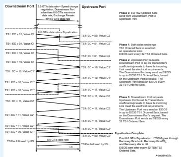

> **Figure 4-43.** 16.0 GT/s Equalization Flow

> 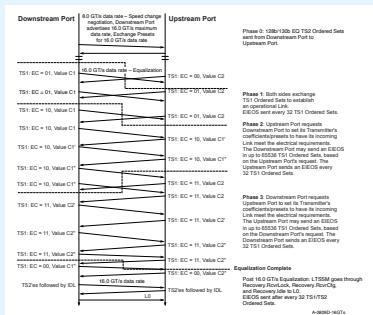

>
> *Note: 源图提取时 16.0 GT/s 专用流程图未单独抽取（仅 fig_0448_1.png 可用），此处暂用 8.0 GT/s 流程图占位。请以原始规范第 4-43 图为准。*

</div>


[⬆️ 返回目录](#-本章目录-table-of-contents)

---

<!-- 📄 Page 449 -->
---

<a id="fig-4-44"></a>
#### Figure 4-44 64.0 GT/s Equalization Flow | 图 4-44 64.0 GT/s 均衡流程

<table>
<thead>
<tr>
<th width="50%">🇬🇧 English</th>
<th width="50%" style="background-color:#e8e8e8">🇨🇳 中文</th>
</tr>
</thead>
<tbody>
<tr>
<td>

> **Figure 4-44.** 64.0 GT/s Equalization Flow
> 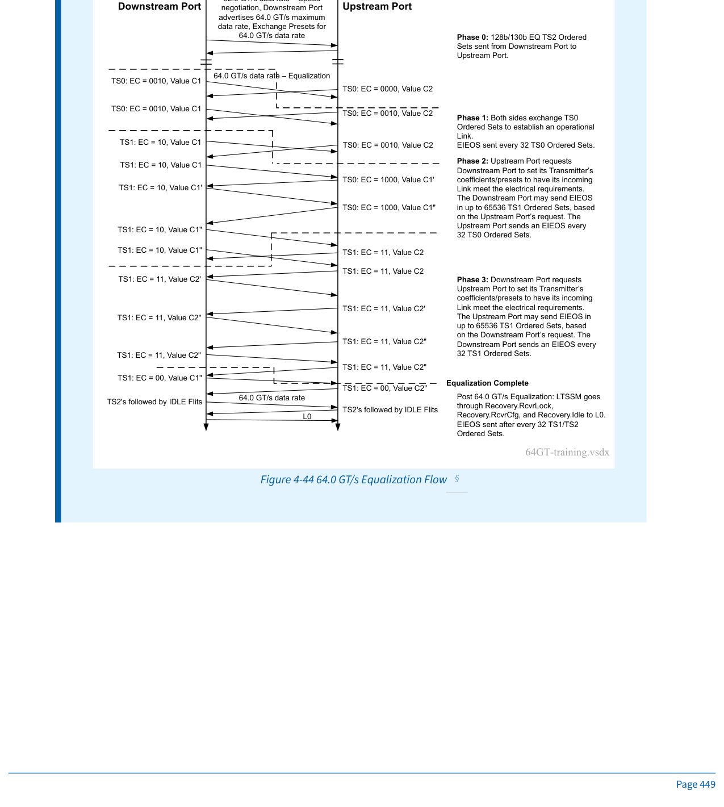

**Description of Figure 4-44 (64.0 GT/s Equalization Flow):**

*Phase 0: 128b/130b EQ TS2 Ordered Sets sent from Downstream Port to Upstream Port.*

*Phase 1: Both sides exchange TS0 Ordered Sets to establish an operational Link. EIEOS sent every 32 TS0 Ordered Sets.*

*Phase 2: Upstream Port requests Downstream Port to set its Transmitter's coefficients/presets to have its incoming Link meet the electrical requirements. The Downstream Port may send EIEOS in up to 65536 TS1 Ordered Sets, based on the Upstream Port's request. The Upstream Port sends an EIEOS every 32 TS0 Ordered Sets.*

*Phase 3: Downstream Port requests Upstream Port to set its Transmitter's coefficients/presets to have its incoming Link meet the electrical requirements. The Upstream Port may send EIEOS in up to 65536 TS1 Ordered Sets, based on the Downstream Port's request. The Downstream Port sends an EIEOS every 32 TS1 Ordered Sets.*

*Post 64.0 GT/s Equalization: LTSSM goes through Recovery.RcvrLock, Recovery.RcvrCfg, and Recovery.Idle to L0. EIEOS sent after every 32 TS1/TS2 Ordered Sets.*

*Equalization Complete:*
- 32.0 GT/s data rate – Speed negotiation, Downstream Port advertises 64.0 GT/s maximum data rate, Exchange Presets for 64.0 GT/s data rate
- 64.0 GT/s data rate – Equalization
- 64.0 GT/s data rate L0

*TS0: EC = 0010, Value C1 (Downstream Port)*
*TS0: EC = 0000, Value C2 (Upstream Port)*
*TS0: EC = 0010, Value C2 (Upstream Port)*
*TS0: EC = 1000, Value C1', C1" (Upstream Port)*
*TS1: EC = 10, Value C1, C1', C1" (Downstream Port)*
*TS1: EC = 11, Value C2, C2', C2" (Upstream Port)*
*TS1: EC = 00, Value C1" (Downstream Port)*
*TS1: EC = 00, Value C2" (Upstream Port)*
*TS2's followed by IDLE Flits*

</td>
<td style="background-color:#e8e8e8">


**图 4-44 说明(64.0 GT/s 均衡流程):**

*阶段 0 (Phase 0):从 Downstream Port 向 Upstream Port 发送 128b/130b EQ TS2 有序集。*

*阶段 1 (Phase 1):双方交换 TS0 有序集以建立可运行的链路。每 32 个 TS0 有序集发送一次 EIEOS。*

*阶段 2 (Phase 2):Upstream Port 请求 Downstream Port 设置其发送器的系数/预设,以使其入向链路满足电气要求。根据 Upstream Port 的请求,Downstream Port 可在最多 65536 个 TS1 有序集中发送 EIEOS。Upstream Port 每 32 个 TS0 有序集发送一次 EIEOS。*

*阶段 3 (Phase 3):Downstream Port 请求 Upstream Port 设置其发送器的系数/预设,以使其入向链路满足电气要求。根据 Downstream Port 的请求,Upstream Port 可在最多 65536 个 TS1 有序集中发送 EIEOS。Downstream Port 每 32 个 TS1 有序集发送一次 EIEOS。*

*64.0 GT/s 均衡之后:LTSSM 经过 Recovery.RcvrLock、Recovery.RcvrCfg 和 Recovery.Idle 转换到 L0。每 32 个 TS1/TS2 有序集之后发送 EIEOS。*

*均衡完成:*
- 32.0 GT/s 数据速率 – 速率协商,Downstream Port 通告 64.0 GT/s 最大数据速率,交换 64.0 GT/s 数据速率的预设
- 64.0 GT/s 数据速率 – 均衡
- 64.0 GT/s 数据速率 L0

*TS0:EC = 0010,Value C1(Downstream Port)*
*TS0:EC = 0000,Value C2(Upstream Port)*
*TS0:EC = 0010,Value C2(Upstream Port)*
*TS0:EC = 1000,Value C1'、C1"(Upstream Port)*
*TS1:EC = 10,Value C1、C1'、C1"(Downstream Port)*
*TS1:EC = 11,Value C2、C2'、C2"(Upstream Port)*
*TS1:EC = 00,Value C1"(Downstream Port)*
*TS1:EC = 00,Value C2"(Upstream Port)*
*TS2 之后跟随 IDLE Flits*

</td>
</tr>
</tbody>
</table>

[⬆️ 返回目录](#-本章目录-table-of-contents)

---

<!-- 📄 Page 450 -->
---

<a id="sec-4-2-4-fir-coefficients"></a>
### 4.2.4 FIR Coefficients and Equalization Bypass Example | 4.2.4 FIR 系数与均衡绕过示例


<div style="overflow-x: auto; max-width: 100%;">
<table>
<thead>
<tr>
<th width="50%">🇬🇧 English</th>
<th width="50%" style="background-color:#e8e8e8">🇨🇳 中文</th>
</tr>
</thead>
<tbody>
<tr>
<td>

The explanation of the coefficients and the FIR filter it represents are provided in Section 8.3.3.1. The following rules apply to both the advertised as well as requested coefficient settings.

1. C-2, C-1, and C+1 are the coefficients used in the FIR equation and represent the 2nd pre-cursor, pre-cursor and post-cursor, respectively. The pre-cursors and post-cursor values communicated in the TS1 Ordered Sets represent their absolute values. C0 represents the cursor coefficient setting and is a positive entity. The coefficient C-2 is used only for 64.0 GT/s and higher Data Rates.

2. The sum of the absolute values of the coefficients defines the FS (Full Swing; FS = |C-2|+|C-1|+C0+|C+1|). FS is advertised to the Link partner in Phase 1. The Transmitter FS range is defined below:
   - FS ∈ {24, …, 63} (i.e., FS must have a value from 24 through 63) for full swing mode.
   - FS ∈ {12, …, 63} for reduced swing mode.
   - C-2 is set to 0 for Data Rates lower than 64.0 GT/s.

> **IMPLEMENTATION NOTE:**
> **EQUALIZATION BYPASS EXAMPLE**
>
> The following flow-chart provides an example flow where a Link may bypass equalization at lower Data Rates and go to the highest supported NRZ rate for equalization. For example, when n=5, the Link can train to L0 in Gen 1 data rate, establish that all components (including Retimers, if any) can bypass equalization to Gen 5, change the data rate to Gen 5 and just perform equalization at Gen 5.

</td>
<td style="background-color:#e8e8e8">

关于系数及其所代表的 FIR 滤波器的说明,请参见 § Section 8.3.3.1。以下规则适用于通告的以及请求的系数设置。

1. C-2、C-1 和 C+1 是 FIR 等式中使用的系数,分别表示第二前游标 (2nd pre-cursor)、前游标 (pre-cursor) 和后游标 (post-cursor)。TS1 有序集中传达的前游标和后游标值表示其绝对值。C0 表示游标系数设置,是一个正值。系数 C-2 仅用于 64.0 GT/s 及更高的数据速率。

2. 系数绝对值之和定义了 FS(全摆幅,FS = |C-2|+|C-1|+C0+|C+1|)。FS 在 Phase 1 中通告给链路伙伴。发送器 FS 范围定义如下:
   - FS ∈ {24, …, 63}(即 FS 必须具有 24 到 63 之间的值)用于全摆幅模式。
   - FS ∈ {12, …, 63}用于降摆幅模式。
   - 对于低于 64.0 GT/s 的数据速率,C-2 设置为 0。

> **实现注意 (IMPLEMENTATION NOTE):**
> **均衡绕过示例 (EQUALIZATION BYPASS EXAMPLE)**
>
> 下面的流程图给出了一个示例流程,说明链路如何在较低数据速率上绕过均衡,并直接进入所支持的最高 NRZ 速率以执行均衡。例如,当 n=5 时,链路可在 Gen 1 数据速率训练到 L0,确认所有组件(包括 Retimers,若有)能够将均衡绕过到 Gen 5,将数据速率切换到 Gen 5,并仅在 Gen 5 执行均衡。

</td>
</tr>
</tbody>
</table>

> **Figure 4-45.** Equalization Bypass Example
> 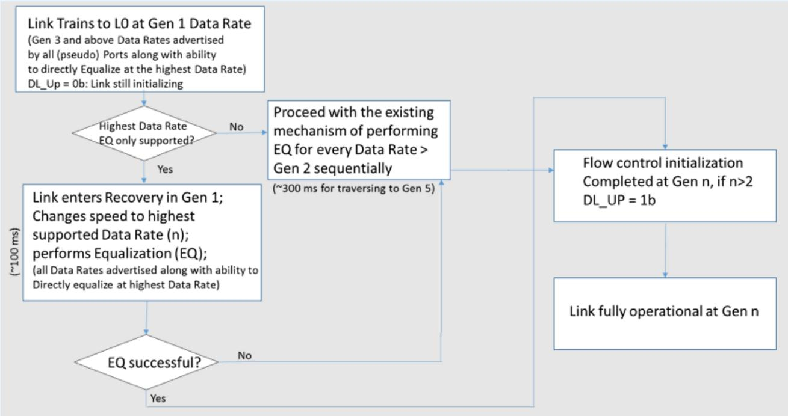

</div>


[⬆️ 返回目录](#-本章目录-table-of-contents)

---


---

<a id="sec-4-2-4-1"></a>
### 4.2.4.1 Rules for Transmitter Coefficients | 发送器系数规则

<table>
<thead>
<tr>
<th width="50%">🇬🇧 English</th>
<th width="50%" style="background-color:#e8e8e8">🇨🇳 中文</th>
</tr>
</thead>
<tbody>
<tr>
<td>

3. A Transmitter advertises its LF (Low Frequency) value during Phase 1.

   - This corresponds to the minimum differential voltage that can be generated by the Transmitter which is LF/FS times the Transmitters maximum differential voltage. The Transmitter must ensure that LF meets the electrical requirements defined in § Section 8.3.3.9 for VTX-EIEOS-FS and VTX-EIEOS-RS.

4. The following rules must be satisfied before a set of coefficients can be requested of the Link partner's Transmitter. Upon reception of an update request for TX coefficient settings, a Port must verify that the new request meets the following conditions and reject the request if any of following conditions are violated:

   a. |C-1| ≤ Floor (FS/4)

   b. |C-1| + |C-2| + C0 + |C+1| = FS
      (Do not allow peak power to change with adaptation)

   c. C0 − |C-1| + |C-2| − |C+1| ≥ LF

   d. |C-2| ≤ Floor (FS/8)

Definition of the Transmitter and Receiver Preset Hints appears in § Chapter 8. The encoding for the Transmitter Preset and Receiver Preset Hint are provided in § Table 4-23 and § Table 4-24. There are two classes of presets: P0 through P10 are defined for data rates of 8.0 GT/s, 16.0 GT/s, and 32.0 GT/s whereas Q0 through Q10 are defined for the data rate of 64.0 GT/s. Even though 8 of the 11 presets across these two sets overlap, it is possible that the same preset values may get different encodings between the two classes. Receiver Preset Hints are optional and only defined for the 8.0 GT/s data rate.

</td>
<td style="background-color:#e8e8e8">

3. 发送器 (Transmitter) 在 Phase 1 期间通告其 LF (Low Frequency, 低频) 值。

   - LF/FS 对应发送器可产生的最小差分电压与发送器最大差分电压的比值。发送器必须确保 LF 满足 § 8.3.3.9 节中 VTX-EIEOS-FS 和 VTX-EIEOS-RS 的电气要求。

4. 在向链路对端 (Link partner) 发送器请求一组系数之前,必须满足以下规则。端口 (Port) 在接收到 TX 系数设置的更新请求时,必须验证新请求是否满足以下条件;若违反任何条件,必须拒绝该请求:

   a. |C-1| ≤ Floor (FS/4)

   b. |C-1| + |C-2| + C0 + |C+1| = FS
      (不允许峰值功率随适配而变化)

   c. C0 − |C-1| + |C-2| − |C+1| ≥ LF

   d. |C-2| ≤ Floor (FS/8)

发送器预设 (Transmitter Preset) 和接收器预设提示 (Receiver Preset Hint) 的定义见 § 第 8 章。发送器预设和接收器预设提示的编码见 § 表 4-23 和 § 表 4-24。预设分为两类:P0 至 P10 定义用于 8.0 GT/s、16.0 GT/s 和 32.0 GT/s 数据率;Q0 至 Q10 定义用于 64.0 GT/s 数据率。尽管这两组 11 个预设中有 8 个是重叠的,但同一预设值在两类之间可能有不同的编码。接收器预设提示是可选的,仅针对 8.0 GT/s 数据率定义。

</td>
</tr>
</tbody>
</table>

**Table 4-23 Transmitter Preset Encoding | 表 4-23 发送器预设编码**

| Encoding | Preset Number in § Table 8-1 | Preset Number in § Table 8-2 |
|----------|------------------------------|------------------------------|
| 0000b    | P0                           | Q0                           |
| 0001b    | P1                           | Q1                           |
| 0010b    | P2                           | Q2                           |
| 0011b    | P3                           | Q3                           |
| 0100b    | P4                           | Q4                           |
| 0101b    | P5                           | Q5                           |
| 0110b    | P6                           | Q6                           |
| 0111b    | P7                           | Q7                           |
| 1000b    | P8                           | Q8                           |
| 1001b    | P9                           | Q9                           |
| 1010b    | P10                          | Q10                          |
| 1011b through 1111b | Reserved         | Reserved                     |

[⬆️ 返回目录](#-本章目录-table-of-contents)

---

<a id="sec-4-2-4-2"></a>
### 4.2.4.2 Encoding of Presets | 4.2.4.2 预设的编码


<div style="overflow-x: auto; max-width: 100%;">
<table>
<thead>
<tr>
<th width="50%">🇬🇧 English</th>
<th width="50%" style="background-color:#e8e8e8">🇨🇳 中文</th>
</tr>
</thead>
<tbody>
<tr>
<td>

This section defines the Physical Layer control process that configures and initializes each Link for normal operation. This section covers the following features:

- configuring and initializing the Link
- supporting normal packet transfers
- supported state transitions when recovering from Link errors
- restarting a Port from low power states.

The following are discovered and determined during the training process:

- Link width
- Link data rate
- Lane reversal
- Lane polarity

Training does:

- Link data rate negotiation
- Bit lock per Lane

</td>
<td style="background-color:#e8e8e8">

本节定义物理层 (Physical Layer) 的控制过程,该过程配置和初始化每个链路 (Link) 以便正常工作。本节涵盖以下特性:

- 配置和初始化链路
- 支持正常的数据包传输
- 从链路错误恢复时支持的状态转换
- 从低功耗状态重启端口 (Port)

训练过程中发现和确定以下内容:

- 链路宽度 (Link width)
- 链路数据率 (Link data rate)
- 通道反转 (Lane reversal)
- 通道极性 (Lane polarity)

训练执行的操作:

- 链路数据率协商
- 每条通道的位锁定 (Bit lock)

</td>
</tr>
</tbody>
</table>
</div>


**Table 4-24 Receiver Preset Hint | 表 4-24 接收器预设提示**

| Encoding | Encoding for 8.0 GT/s | Receiver Preset Value |
|----------|----------------------|------------------------|
| 000b     | -6 dB                | -6 dB                  |
| 001b     | -7 dB                | -7 dB                  |
| 010b     | -8 dB                | -8 dB                  |
| 011b     | -9 dB                | -9 dB                  |
| 100b     | -10 dB               | -10 dB                 |
| 101b     | -11 dB               | -11 dB                 |
| 110b     | -12 dB               | -12 dB                 |
| 111b     | Reserved             | Reserved               |

[⬆️ 返回目录](#-本章目录-table-of-contents)

---

<!-- 📄 Page 451 -->
---

>>> IMPLEMENTATION NOTE
>>> QUANTIZATION ERRORS AT 64.0 GT/S
>>> Due to the tighter preset tolerance at 64.0 GT/s some FS values will result in a quantization error larger than is allowed for the specified tolerance of the presets in § Table 8-2 of § Section 8.3.3.3. The implementation must compensate for any quantization error from its selection of FS to meet the specified preset accuracy.

>>> 实现说明:64.0 GT/s 的量化误差
>>> 由于 64.0 GT/s 下预设容差更严,某些 FS 值会导致量化误差超过 § 8.3.3.3 节 § 表 8-2 中指定的预设容差。实现必须补偿因选择 FS 而产生的任何量化误差,以满足指定的预设精度。

<!-- 📄 Page 452 -->
---

<a id="sec-4-2-5"></a>
## 4.2.5 Link Initialization and Training | 4.2.5 链路初始化与训练

<table>
<thead>
<tr>
<th width="50%">🇬🇧 English</th>
<th width="50%" style="background-color:#e8e8e8">🇨🇳 中文</th>
</tr>
</thead>
<tbody>
<tr>
<td>

- Lane polarity
- Symbol lock or Block alignment per Lane
- Lane ordering within a Link
- Link width negotiation
- Lane-to-Lane de-skew within a multi-Lane Link.

Training sequences are composed of Ordered Sets used for initializing bit alignment, Symbol alignment and to exchange Physical Layer parameters.

1. When the data rate is 2.5 GT/s or 5.0 GT/s, Ordered Sets are never scrambled but are always 8b/10b encoded.
2. When the data rate is between 8.0 GT/s and 32.0 GT/s, the 128b/130b encoding is used and Symbols may or may not be scrambled, according to the rules in § Section 4.2.2.4.
3. When the data rate is 64.0 GT/s the 1b/1b encoding is used and Symbols may or may not be scrambled, according to the rules in § Section 4.2.3.1.2.

Training sequences (TS0, TS1, TS2, Modified TS1, or Modified TS2) are transmitted consecutively and can only be interrupted by SKP Ordered Sets (see § Section 4.2.8) or, for data rates other than 2.5 GT/s, EIEOS (see § Section 4.2.5.3).

When 8.0 GT/s or higher data rates are supported, a TS1 (or TS2) Ordered Set using 8b/10b encoding (i.e., 2.5 or 5.0 GT/s data rate) can be either a standard TS1 (or TS2) Ordered Set (i.e., Symbol 6 is D10.2 for a TS1 Ordered Set or D5.2 for a TS2 Ordered Set) or an EQ TS1 Ordered Set (or EQ TS2 Ordered Set) (i.e., Symbol 6 bit 7 is 1b). The ability to transmit EQ TS1 Ordered Sets is implementation specific. Ports supporting 8.0 GT/s or higher data rates must accept either TS1 (or TS2) type in the LTSSM states unless explicitly required to look for a specific type. Ports that do not support the 8.0 GT/s data rate are permitted, but not required, to accept EQ TS1 (or TS2) Ordered Sets.

When the 16.0 GT/s and higher data rate is supported, a TS2 using 128b/130b encoding (i.e., 8.0 or higher data rate) can be either a standard TS2 Ordered Set (i.e., Symbol 7 is 45h) or an 128b/130b EQ TS2 (i.e., Symbol 7 bit 7 is 1b). Ports supporting the 16.0 GT/s or higher data rate must accept either TS2 type in the LTSSM states unless explicitly required to look for a specific type. Ports that do not support the 16.0 GT/s data rate are permitted, but not required, to accept 128b/130b EQ TS2 Ordered Sets.

When using 8b/10b encoding, TS1 or TS2 Ordered Sets are considered consecutive only if Symbol 6 matches Symbol 6 of the previous TS1 or TS2 Ordered Set.

Components that intend to either negotiate alternate protocols or pass a Training Set Message must use Modified TS1/TS2 Ordered Sets instead of standard TS1/TS2 Ordered Sets in Configuration.Lanenum.Wait, Configuration.Lanenum.Accept, and Configuration.Complete substates. In order to be eligible to send the Modified TS1/TS2 Ordered Sets, components must set the Enhanced Link behavior Control bits (bit 7:6 of Symbol 5) in TS1 and TS2 Ordered Sets to 11b in Polling.Active, Polling.Configuration, Configuration.Linkwidth.Start, and Configuration.Linkwidth.Accept substates and follow through the steps outlined on transition to Configuration.Lanenum.Wait substate when LinkUp=0b. If the Link partner does not support Modified TS1/TS2 Ordered Sets, then starting with Configuration.Lanenum.Wait, the standard TSs should stop sending 11b in the Enhanced Link Behavior Control field and switch to the appropriate encodings.

When using 8b/10b encoding, modified TS1 or modified TS2 Ordered Sets are considered consecutive only if all Symbols matches the corresponding Symbols of the previous modified TS1 or modified TS2 Ordered Sets and the parity in Symbol 15 matches with the expected value. Symbols 8-14 must be identical in each Modified TS1/TS2 Ordered Sets across all Lanes of a Link.

</td>
<td style="background-color:#e8e8e8">

- 通道极性
- 每条通道的符号锁定 (Symbol lock) 或块对齐 (Block alignment)
- 链路内通道排序
- 链路宽度协商
- 多通道链路内的通道间去偏斜 (Lane-to-Lane de-skew)。

训练序列 (Training Sequence, TS) 由有序集合 (Ordered Sets) 组成,用于初始化位对齐、符号对齐以及交换物理层参数。

1. 当数据率为 2.5 GT/s 或 5.0 GT/s 时,有序集合从不加扰,始终采用 8b/10b 编码。
2. 当数据率介于 8.0 GT/s 至 32.0 GT/s 之间时,使用 128b/130b 编码,根据 § 4.2.2.4 节的规则,符号可能加扰也可能不加扰。
3. 当数据率为 64.0 GT/s 时,使用 1b/1b 编码,根据 § 4.2.3.1.2 节的规则,符号可能加扰也可能不加扰。

训练序列 (TS0、TS1、TS2、Modified TS1 或 Modified TS2) 连续传输,只能被 SKP 有序集合 (见 § 4.2.8 节) 中断,或者在 2.5 GT/s 以外的数据率下被 EIEOS (见 § 4.2.5.3 节) 中断。

当支持 8.0 GT/s 或更高数据率时,使用 8b/10b 编码 (即 2.5 或 5.0 GT/s 数据率) 的 TS1 (或 TS2) 有序集合可以是标准 TS1 (或 TS2) 有序集合 (即 TS1 有序集合的 Symbol 6 为 D10.2,TS2 有序集合的 Symbol 6 为 D5.2),也可以是 EQ TS1 有序集合 (或 EQ TS2 有序集合) (即 Symbol 6 的 bit 7 为 1b)。是否能够发送 EQ TS1 有序集合是实现特定的。除非明确要求查找特定类型,支持 8.0 GT/s 或更高数据率的端口在 LTSSM 状态中必须接受任一 TS1 (或 TS2) 类型。不支持 8.0 GT/s 数据率的端口被允许 (但非必需) 接受 EQ TS1 (或 TS2) 有序集合。

当支持 16.0 GT/s 及更高数据率时,使用 128b/130b 编码 (即 8.0 或更高数据率) 的 TS2 可以是标准 TS2 有序集合 (即 Symbol 7 为 45h),也可以是 128b/130b EQ TS2 (即 Symbol 7 的 bit 7 为 1b)。除非要明确查找特定类型,支持 16.0 GT/s 或更高数据率的端口在 LTSSM 状态中必须接受任一 TS2 类型。不支持 16.0 GT/s 数据率的端口被允许 (但非必需) 接受 128b/130b EQ TS2 有序集合。

使用 8b/10b 编码时,只有当 Symbol 6 与前一个 TS1 或 TS2 有序集合的 Symbol 6 匹配时,才认为这些 TS1 或 TS2 有序集合是连续的。

打算协商备用协议 (alternate protocols) 或传递训练集消息 (Training Set Message) 的组件必须在 Configuration.Lanenum.Wait、Configuration.Lanenum.Accept 和 Configuration.Complete 子状态中使用 Modified TS1/TS2 有序集合替代标准 TS1/TS2 有序集合。为了有资格发送 Modified TS1/TS2 有序集合,组件必须将 TS1 和 TS2 有序集合中 Symbol 5 的 bit 7:6 (Enhanced Link behavior Control 增强链路行为控制位) 在 Polling.Active、Polling.Configuration、Configuration.Linkwidth.Start 和 Configuration.Linkwidth.Accept 子状态下设置为 11b,并在 LinkUp=0b 时按转换到 Configuration.Lanenum.Wait 子状态的步骤执行。如果链路对端不支持 Modified TS1/TS2 有序集合,则从 Configuration.Lanenum.Wait 开始,标准 TS 应停止在 Enhanced Link Behavior Control 字段中发送 11b,并切换到适当的编码。

使用 8b/10b 编码时,只有当所有符号与前一个 modified TS1 或 modified TS2 有序集合的对应符号匹配,且 Symbol 15 中的奇偶校验与预期值匹配时,才认为这些 modified TS1 或 modified TS2 有序集合是连续的。链路所有通道的每个 Modified TS1/TS2 有序集合中,Symbols 8-14 必须相同。

</td>
</tr>
</tbody>
</table>

[⬆️ 返回目录](#-本章目录-table-of-contents)

---

<a id="sec-4-2-5-1"></a>
## 4.2.5.1 Training Sequences | 4.2.5.1 训练序列


<div style="overflow-x: auto; max-width: 100%;">
<table>
<thead>
<tr>
<th width="50%">🇬🇧 English</th>
<th width="50%" style="background-color:#e8e8e8">🇨🇳 中文</th>
</tr>
</thead>
<tbody>
<tr>
<td>

When using 128b/130b encoding, TS1 or TS2 Ordered Sets are considered consecutive only if Symbols 6-9 match Symbols 6-9 of the previous TS1 or TS2 Ordered Set, with Reserved bits treated as described below.

With 1b/1b encoding, TS0, TS1 and TS2 Ordered Sets consist of the first 8 symbols of the Ordered Set being replicated in the second 8 symbols of the Ordered Set, as shown in § Table 4-28 and § Table 4-29. The TS0 Ordered Set is used with 1b/1b encoding during the Recovery.Equalization, as described in the LTSSM section. Each UI in the TS0 Ordered Set is either voltage level 0 or 3 with PAM-4 signaling, as shown in § Figure 4-24. Hence, the scrambled symbols in TS0 Ordered Sets are Half scrambled; the odd bit positions are scrambled whereas even bit position j is identical to the odd bit position j+1. Precoding is bypassed in both the Transmitter and Receiver.

In 1b/1b encoding, a received TS0, TS1, or TS2 Ordered Set is considered valid when either half is valid:

- The first half is valid if Symbol 0 is a valid TS0/TS1/TS2 encoding, Symbols 0 to 7 passes its parity check after decoding Gray code and descrambling, and Symbol 7 is not equal to a DC balance pattern prior to performing gray code and descrambling.
- The second half is valid if Symbol 8 is a valid TS0/TS1/TS2 encoding, Symbols 8 to 15 passes its parity check after decoding Gray code and descrambling, and symbol 15 is not equal to a DC balance pattern prior to performing gray code and descrambling.
- Both halves are valid if Symbols 0 to 6 are identical to Symbols 8 to 14 after decoding Gray code and descrambling, and Symbols 7 and 15 are DC balance symbols prior to decoding Gray code and descrambling.
- The type of the Ordered Set (TS0, TS1, or TS2) is determined by the first symbol of the valid half.
- The even bits in the half-scrambled Symbols must be ignored after descrambling in the Receiver. (Note: because the gray code was done by forcing the even bit to be identical to the odd bit in the Transmitter, the even bit position may not be identical to the odd bit position on the Receiver after descrambling.)

With 1b/1b encoding, two TS0, TS1 or TS2 Ordered Sets are considered consecutive if all of the following conditions apply to both the Ordered Sets:

- both Ordered Sets are of the same type
- they arrived one after the other, even though they may be separated by one or more SKP Ordered Set(s)
- each ordered set has a valid half and the first 7 symbols of the valid halves of each of the Ordered Set are identical, with Reserved bits treated as described below.

An invalid Ordered Set is a Training Set that does not pass the checks in § Section 4.2.5.1.

Reserved bits in TS0, TS1, TS2, Modified TS1 or Modified TS2 Ordered Sets must be handled as follows:

</td>
<td style="background-color:#e8e8e8">

使用 128b/130b 编码时,只有当 Symbols 6-9 与前一个 TS1 或 TS2 有序集合的 Symbols 6-9 匹配时,才认为这些 TS1 或 TS2 有序集合是连续的,Reserved 位的处理方法如下所述。

使用 1b/1b 编码时,TS0、TS1 和 TS2 有序集合由有序集合的前 8 个符号组成,这 8 个符号会在有序集合的后 8 个符号中复制,如 § 表 4-28 和 § 表 4-29 所示。TS0 有序集合在 Recovery.Equalization 期间与 1b/1b 编码一起使用,如 LTSSM 节所述。在使用 PAM4 (PAM-4, 四电平脉冲幅度调制) 信号时,TS0 有序集合中的每个 UI 要么是电压电平 0,要么是电压电平 3,如 § 图 4-24 所示。因此,TS0 有序集合中的加扰符号是半加扰 (Half scrambled) 的:奇数位位置被加扰,而偶数位位置 j 与奇数位位置 j+1 相同。发送器和接收器都旁路预编码 (Precoding)。

在 1b/1b 编码中,接收到的 TS0、TS1 或 TS2 有序集合只要有一半有效即认为该有序集合有效:

- 第一半有效条件:Symbol 0 是有效的 TS0/TS1/TS2 编码;Symbols 0 至 7 在完成 Gray 码解码和解扰后通过奇偶校验;在进行 Gray 码解码和解扰之前,Symbol 7 不等于 DC 平衡模式。
- 第二半有效条件:Symbol 8 是有效的 TS0/TS1/TS2 编码;Symbols 8 至 15 在完成 Gray 码解码和解扰后通过奇偶校验;在进行 Gray 码解码和解扰之前,Symbol 15 不等于 DC 平衡模式。
- 完整两半有效条件:在完成 Gray 码解码和解扰后,Symbols 0 至 6 与 Symbols 8 至 14 相同;在进行 Gray 码解码和解扰之前,Symbols 7 和 15 是 DC 平衡符号。
- 有序集合的类型 (TS0、TS1 或 TS2) 由有效一半的第一个符号决定。
- 接收器在解扰后必须忽略半加扰符号中的偶数位。(注:由于 Gray 码编码是通过强制偶数位与奇数位相同来实现的,所以接收器解扰后,偶数位位置可能与发送器中的偶数位位置不一致。)

在 1b/1b 编码下,两个 TS0、TS1 或 TS2 有序集合被认为连续的条件是同时满足以下所有条件:

- 两个有序集合类型相同
- 它们前后相继到达,即使可能被一个或多个 SKP 有序集合隔开
- 每个有序集合都有一半有效,且各有序集合有效一半的前 7 个符号相同,Reserved 位按以下所述处理。

无效有序集合是指未通过 § 4.2.5.1 节检查的训练集。

TS0、TS1、TS2、Modified TS1 或 Modified TS2 有序集合中的 Reserved 位处理方式如下:

</td>
</tr>
</tbody>
</table>
</div>


>>> IMPLEMENTATION NOTE
>>> HALF SCRAMBLING EXAMPLE
>>> Since the half-scrambled symbols are not fully gray-coded on the transmitter, rather the even bit is made identical to odd bit to have that UI be either a voltage level 0 or voltage level 3, it is possible that an even bit position in the half-scrambled symbol in the Receiver after gray-coding and descrambling may not match what was transmitted. For example, the Transmitter intends to send 80h prior to scrambling. After scrambling, the symbol becomes 57h and the gray-coded value by forcing the even bit to be identical to the odd bit becomes 03h. On the receiver side, 03h after gray coding remains at 03h and after descrambling becomes 94h. Here bit 0 is different between the transmitted side 80h vs. the receive side 94h. However, all the odd bit positions that carry meaningful information are identical. By AND'ing 94h with AAh, we get 80h which was sent.

>>> 实现说明:半加扰示例
>>> 由于半加扰符号在发送器中并未完全进行 Gray 编码,而是通过使偶数位与奇数位相同来使该 UI 处于电压电平 0 或电压电平 3,因此接收器在 Gray 编码和解扰后,半加扰符号中的偶数位位置可能与发送的不一致。例如,发送器打算在加扰前发送 80h。加扰后,符号变为 57h,再通过强制偶数位与奇数位相同进行 Gray 编码,得到 03h。在接收器侧,03h 经 Gray 编码仍为 03h,解扰后变为 94h。这里发送侧的 80h 和接收侧的 94h 的 bit 0 不同。然而,所有携带有效信息的奇数位位置都相同。将 94h 与 AAh 进行按位与 (AND) 运算,即可得到发送的 80h。

[⬆️ 返回目录](#-本章目录-table-of-contents)

---

<!-- 📄 Page 453 -->
---

<table>
<thead>
<tr>
<th width="50%">🇬🇧 English</th>
<th width="50%" style="background-color:#e8e8e8">🇨🇳 中文</th>
</tr>
</thead>
<tbody>
<tr>
<td>

- The Transmitter must transmit 0s for Reserved bits.
- The Receiver:
  - must not determine that a TS0, TS1, TS2, Modified TS1 or Modified TS2 Ordered Set is invalid based on the received value of Reserved bits
  - must use the received value of Reserved bits for the purpose of a parity computation if the Reserved bits are included in a parity calculation
  - may optionally compare the received value of Reserved bits within Symbols that are explicitly called out as being required to be identical in TS0, TS1, TS2, Modified TS1, or Modified TS2 Ordered Sets to determine if they are consecutive
  - must not otherwise take any functional action based on the value of any received Reserved bits

When using 128b/130b or 1b/1b encoding, Transmitters are required to track the running DC Balance of the bits transmitted on the wire (after Gray code in 1b/1b, scrambling, and if turned on: precoding) that constitute the TS0, TS1, and TS2 Ordered Sets only. The running DC Balance is the difference between the number of 1s transmitted and the number of 0s transmitted in 8.0 GT/s, 16.0 GT/s or 32.0 GT/s Data Rates. The running DC Balance is the running sum of the DC balance values assigned to each voltage level in each UI, as shown in § Figure 4-24, for 64.0 GT/s Data Rate. Each Lane must track its running DC Balance independently and be capable of tracking a difference of at least +/-511 bits. Any counters used must saturate at their limit (not roll-over) and continue to track reductions after their limit is reached. For example, a counter that can track a difference of 511 will saturate at 511 if a difference of 513 is detected, and then change to 509 if the difference is reduced by 2 in the future.

The running DC Balance is set to 0 by two events:

1. The Transmitter exiting Electrical Idle;
2. Transmission of an EIEOS following a Data Block.

For every TS1 or TS2 Ordered Set transmitted with 128b/130b encoding, Transmitters must evaluate the running DC Balance and transmit one of the DC Balance Symbols defined for Symbols 14 and 15 as defined by the algorithm below. If the number of 1s needs to be reduced, the DC Balance Symbols 20h (for Symbol 14) and 08h (for Symbol 15) are transmitted. If the number of 0s needs to be reduced, the DC Balance Symbols DFh (for Symbol 14) and F7h (for Symbol 15) are transmitted. If no change is required, the appropriate TS1 or TS2 Identifier Symbol is transmitted. Any DC Balance Symbols transmitted for Symbols 14 or 15 bypass scrambling, while TS1 and TS2 Identifier Symbols follow the standard scrambling rules. The following algorithm must be used to control the DC Balance with 128b/130b encoding:

- If the running DC Balance is >31 at the end of Symbol 11 of the TS Ordered Set, transmit DFh for Symbol 14 and F7h for Symbol 15 to reduce the number of 0s, or 20h for Symbol 14 and 08h for Symbol 15 to reduce the number of 1s.
- Else, if the running DC Balance is >15 at the end of Symbol 11 of the TS Ordered Set, transmit F7h for Symbol 15 to reduce the number of 0s, or 08h for Symbol 15 to reduce the number of 1s. Transmit the normal TS Identifier Symbol (scrambled) for Symbol 14.
- Else, transmit the normal TS Identifier Symbol (scrambled) for Symbols 14 and 15.

Receivers are permitted, but not required, to check Symbols 14 and 15 for the following values when determining whether a TS1 or TS2 Ordered Set is valid with 128b/130b encoding:

- The appropriate TS Identifier Symbol after de-scrambling, or
- a valid DC Balance Symbol of DFh or 20h before de-scrambling for Symbol 14, or
- a valid DC Balance Symbol of F7h or 08h before de-scrambling for Symbol 15.

</td>
<td style="background-color:#e8e8e8">

- 发送器必须为 Reserved 位发送 0。
- 接收器:
  - 不得仅因接收到的 Reserved 位的值而判定 TS0、TS1、TS2、Modified TS1 或 Modified TS2 有序集合无效
  - 在奇偶校验计算中,如果 Reserved 位包含在奇偶校验中,则必须使用接收到的 Reserved 位的值进行奇偶校验计算
  - 可选择在 TS0、TS1、TS2、Modified TS1 或 Modified TS2 有序集合中显式要求相同的符号中,比较接收到的 Reserved 位的值,以判断这些有序集合是否连续
  - 此外,不得根据任何接收到的 Reserved 位的值采取任何功能性动作

当使用 128b/130b 或 1b/1b 编码时,发送器需要跟踪链路上传输的、构成 TS0、TS1 和 TS2 有序集合的比特 (在 1b/1b 中 Gray 编码、加扰之后,以及在开启预编码时的预编码之后) 的运行 DC 平衡 (running DC Balance)。运行 DC 平衡是指在 8.0 GT/s、16.0 GT/s 或 32.0 GT/s 数据率下,发送的 1 的数量与 0 的数量之差。对于 64.0 GT/s 数据率,运行 DC 平衡是每个 UI 中分配给每个电压电平的 DC 平衡值的累计和,如 § 图 4-24 所示。每条通道必须独立跟踪其运行 DC 平衡,并能跟踪至少 +/-511 比特的差值。所使用的任何计数器必须在其极限处饱和 (不回绕),并在达到极限后继续跟踪减少量。例如,一个能跟踪 511 比特差值的计数器,在检测到 513 比特差值时会饱和在 511;之后如果差值减少 2,则该计数器变为 509。

运行 DC 平衡在以下两种事件时重置为 0:

1. 发送器退出电气空闲 (Electrical Idle);
2. 在数据块 (Data Block) 之后传输 EIEOS。

对于以 128b/130b 编码传输的每个 TS1 或 TS2 有序集合,发送器必须评估运行 DC 平衡,并按下面的算法传输为 Symbol 14 和 Symbol 15 定义的某个 DC 平衡符号。如果需要减少 1 的数量,则传输 DC 平衡符号 20h (Symbol 14) 和 08h (Symbol 15)。如果需要减少 0 的数量,则传输 DC 平衡符号 DFh (Symbol 14) 和 F7h (Symbol 15)。如果不需要变化,则传输适当的 TS1 或 TS2 标识符符号。为 Symbol 14 或 Symbol 15 传输的任何 DC 平衡符号都旁路加扰,而 TS1 和 TS2 标识符符号遵循标准加扰规则。必须使用以下算法来控制 128b/130b 编码的 DC 平衡:

- 如果在 TS 有序集合 Symbol 11 结束时运行 DC 平衡 >31,则 Symbol 14 传输 DFh,Symbol 15 传输 F7h 以减少 0 的数量;或 Symbol 14 传输 20h,Symbol 15 传输 08h 以减少 1 的数量。
- 否则,如果在 TS 有序集合 Symbol 11 结束时运行 DC 平衡 >15,则 Symbol 15 传输 F7h 以减少 0 的数量,或 Symbol 15 传输 08h 以减少 1 的数量。Symbol 14 传输正常的 TS 标识符符号 (加扰)。
- 否则,Symbol 14 和 Symbol 15 都传输正常的 TS 标识符符号 (加扰)。

允许 (但非必需) 接收器在判断 128b/130b 编码的 TS1 或 TS2 有序集合是否有效时,检查 Symbol 14 和 Symbol 15 是否为以下值:

- 解扰后是适当的 TS 标识符符号;或
- Symbol 14 在解扰前是有效的 DC 平衡符号 DFh 或 20h;或
- Symbol 15 在解扰前是有效的 DC 平衡符号 F7h 或 08h。

</td>
</tr>
</tbody>
</table>

[⬆️ 返回目录](#-本章目录-table-of-contents)

---

<!-- 📄 Page 454 -->
---

>>> IMPLEMENTATION NOTE
>>> SYNC HEADER AND DC BALANCE
>>> Block Sync Header bits and the first Symbol of TS1 and TS2 Ordered Sets do not affect the running DC Balance, because they have equal an number of 1s and 0s.

>>> 实现说明:同步头与 DC 平衡
>>> 块同步头 (Block Sync Header) 位以及 TS1 和 TS2 有序集合的第一个符号不会影响运行 DC 平衡,因为它们包含相同数量的 1 和 0。


<div style="overflow-x: auto; max-width: 100%;">
<table>
<thead>
<tr>
<th width="50%">🇬🇧 English</th>
<th width="50%" style="background-color:#e8e8e8">🇨🇳 中文</th>
</tr>
</thead>
<tbody>
<tr>
<td>

If a Receiver receives a DC balance pattern in Symbol 14 in 128b/130b encoding, it is possible that the pattern is scrambled (and precoded). Thus, if the Receiver is performing this optional check, it must keep descrambler and receive precoding running for checking Symbol 15, which can be either scrambled (and precoded) or the DC balance pattern.

For every TS0, TS1 or TS2 Ordered Set transmitted with 1b/1b encoding, Transmitters must evaluate the running DC Balance and transmit one of the DC Balance Symbols defined for Symbols 7 and 15 as defined by the algorithm below. Any DC Balance Symbols transmitted in Symbols 7 and 15 bypass scrambling, while the byte-wise parity, if sent in Symbols 7 and 15, follows the standard scrambling rules.

- If the running DC Balance was >+47 at the start of the TS Ordered Set, transmit 00h in Symbols 7 and 15 without scrambling.
- If the running DC Balance was <-47 at the start of the TS Ordered Set, transmit FFh in Symbols 7 and 15 without scrambling.
- Else, transmit the even byte parity of Symbols 0-6 (pre-scrambling) in Symbols 7 and 15 with scrambling.

While using TS0 Ordered Sets, the coefficients are not the full 6-bit value but adjusted to the appropriate number of bits that the corresponding coefficients, based on the constraints. For example, 3 bits are enough for the 2nd pre-cursor since it cannot be higher than 7.

The Training Control bits Hot Reset bit, Disable Link bit, and Loopback bit are mutually exclusive, only one of these bits is permitted to be set at a time as well as transmitted on all Lanes in a configured (all Lanes that were in L0) or possible (all Lanes in Configuration) Link. If more than one of Hot Reset bit, Disable Link bit, or Loopback bit are Set at the same time, the Link behavior is undefined.

The TS1 Ordered Set's Retimer Equalization Extend bit is always set to 0b when transmitted by an Upstream Port or Downstream Port. Retimers set the bit to 1b as described in § Section 4.3.7.2.

</td>
<td style="background-color:#e8e8e8">

如果接收器在 128b/130b 编码中接收到 Symbol 14 中的 DC 平衡模式,则该模式可能是加扰 (且预编码) 的。因此,如果接收器执行此可选检查,则必须保持解扰器和接收预编码运行,以便检查 Symbol 15,它可能是加扰 (且预编码) 的,或者是 DC 平衡模式。

对于以 1b/1b 编码传输的每个 TS0、TS1 或 TS2 有序集合,发送器必须评估运行 DC 平衡,并按下面的算法传输为 Symbol 7 和 Symbol 15 定义的某个 DC 平衡符号。Symbol 7 和 Symbol 15 中传输的任何 DC 平衡符号都旁路加扰;而字节级奇偶校验 (如果在 Symbol 7 和 Symbol 15 中发送) 遵循标准加扰规则。

- 如果在 TS 有序集合开始时运行 DC 平衡 >+47,则 Symbol 7 和 Symbol 15 传输 00h 且不加扰。
- 如果在 TS 有序集合开始时运行 DC 平衡 <-47,则 Symbol 7 和 Symbol 15 传输 FFh 且不加扰。
- 否则,Symbol 7 和 Symbol 15 传输 Symbols 0-6 (加扰前) 的偶字节奇偶校验,带加扰。

在使用 TS0 有序集合时,系数并非完整的 6 位值,而是根据约束调整为相应系数的适当位数。例如,2nd pre-cursor 只需要 3 位,因为它不会高于 7。

Training Control 位中的 Hot Reset 位、Disable Link 位和 Loopback 位是互斥的,在任何时刻都只允许设置其中一位,并且在已配置 (所有通道都在 L0) 或可能的 (Configuration 中的所有通道) 链路的所有通道上发送。如果同时设置了 Hot Reset 位、Disable Link 位或 Loopback 位中的多个位,则链路行为是未定义的。

TS1 有序集合的 Retimer Equalization Extend 位在上游端口 (Upstream Port) 或下游端口 (Downstream Port) 发送时始终设置为 0b。Retimer 按 § 4.3.7.2 节所述将该位设置为 1b。

</td>
</tr>
</tbody>
</table>
</div>


[⬆️ 返回目录](#-本章目录-table-of-contents)

---

**Table 4-25 TS1 Ordered Set in 8b/10b and 128b/130b Encoding | 表 4-25 8b/10b 和 128b/130b 编码中的 TS1 有序集合**

> 注:表 4-25 详细列出了 TS1 有序集合中每个 Symbol 编号 (0-15) 在不同数据率 (2.5/5.0 GT/s、8.0 GT/s 及以上) 下的字段含义,包括 TS1 Identifier、Link Number、Lane Number within Link、N_FTS、Data Rate Identifier (含 Flit Mode Supported bit、Supported Link Speeds、Autonomous Change / Selectable De-emphasis、speed_change / SRIS Clocking)、Training Control (含 Hot Reset、Disable Link、Loopback、Disable Scrambling、Compliance Receive、Transmit Modified Compliance Pattern in Loopback、Enhanced Link Behavior Control)、Equalization Control (EC)、Reset EIEOS Interval Count、Transmitter Preset、Use Preset / Equalization Redo、FS、Pre-cursor Coefficient、Transmitter Precoding On、Retimer Equalization Extend bit、LF、Cursor Coefficient、Post-cursor Coefficient、Reject Coefficient Values bit、Parity (P) 等字段;以及 ID/DC Balance Symbol 等。

*(Table 4-25 见源文件 - 详细内容按原表格保留原始字段位级编码定义)*

<!-- 📄 Page 455 -->
---

>>> IMPLEMENTATION NOTE
>>> EXPECTED USAGE OF THE 64.0 GT/S SUPPORTED LINK SPEEDS ENCODING
>>> The TS1 and TS2 Ordered Sets for 8b/10b and 128b/130b encoding are permitted to have the Supported Link Speeds field encoded as 1 0111b (indicating 2.5 GT/s to 64.0 GT/s support, inclusive) in the following scenarios:
>>>
>>> 1. Initial Link Training to L0 (Configuration.Complete and beyond)
>>>    The Link is training to L0 and Flit Mode has been negotiated during the training procedure (i.e., when LinkUp=0b). In this scenario the 1 0111b encoding is permitted to be used once the Link enters Configuration.Complete.
>>>
>>> 2. Configuration.Linkwidth.Start (as a Receiver only)
>>>    When the Link transitions from Configuration.Linkwidth.Start to Loopback when LinkUp=0b, the Loopback Lead is permitted to transmit TS1 Ordered Sets with the Supported Link Speeds advertising 1 0111b if it has prior knowledge that the Loopback Follower (i.e., the Receiver, which is still in Configuration.Linkwidth.Start) supports 64.0 GT/s. How the Loopback Lead obtains the prior knowledge of 64.0 GT/s support is outside the scope of the specification.
>>>
>>> 3. Recovery.Equalization when LinkUp=0b
>>>    Advertising the 1 0111b encoding in Phase 1 of Recovery.Equalization when "Equalization for Loopback" is being performed. More specifically, this is the test scenario where Recovery.Equalization is entered from Loopback, the Link is equalized at the current data rate and then the Link returns to Loopback. In the case where the data rate is less than required (i.e., Link is equalized for 32.0 GT/s but 64.0 GT/s is needed), the 1 0111b setting will be used to indicate to the Link partner the ability to transition to 64.0 GT/s upon re-entry to Loopback (after which an equalization procedure at 64.0 GT/s will be performed followed by a return to Loopback).
>>>
>>> 4. Loopback
>>>    When Loopback is entered through Configuration.Linkwidth.Start and LinkUp=0b, the Loopback Lead is permitted to use the 1 0111b encoding in the TS1 Ordered sets that it transmits upon entry to Loopback.Entry (prior to the EIOSQ that proceeds Electrical Idle and the speed change).
>>>
>>> 5. Polling.Active (as a Receiver only)
>>>    Test apparatus that understands the capabilities of the Port (i.e., that the Port being exercised is capable of 64.0 GT/s operation) may transmit TS1 Ordered Sets with the Supported Link Speeds field set to the 64.0 GT/s supported encoding (1 0111b), and the Flit Mode Supported bit set (1b) in Polling.Active when the TS1 Ordered Sets also have the Compliance Receive bit asserted and the Loopback bit de-asserted. A Port that transitions to Polling.Compliance from Polling.Active because it received the appropriate TS1 Ordered Sets in Polling.Active will accept 1 0111b as a valid Supported Link Speeds encoding (and consider it in its determination of the highest common data rate) if it supports the 64.0 GT/s data rate.

>>> 实现说明:64.0 GT/s 支持的链路速率编码的预期使用
>>> 8b/10b 和 128b/130b 编码的 TS1 和 TS2 有序集合允许在以下场景中将 Supported Link Speeds 字段编码为 1 0111b (表示支持 2.5 GT/s 至 64.0 GT/s,含):
>>>
>>> 1. 至 L0 的初始链路训练 (Configuration.Complete 及之后)
>>>    链路正在训练到 L0,且在训练过程中已协商 Flit 模式 (即 LinkUp=0b 时)。在此场景下,1 0111b 编码允许在链路进入 Configuration.Complete 后使用。
>>>
>>> 2. Configuration.Linkwidth.Start (仅作为接收器)
>>>    当 LinkUp=0b 时,链路从 Configuration.Linkwidth.Start 转换到 Loopback,如果 Loopback Lead 事先知道 Loopback Follower (即仍处于 Configuration.Linkwidth.Start 的接收器) 支持 64.0 GT/s,则 Loopback Lead 允许在 TS1 有序集合中以 1 0111b 通告 Supported Link Speeds。Loopback Lead 如何获得 64.0 GT/s 支持的先验知识不在本规范范围内。
>>>
>>> 3. Recovery.Equalization (LinkUp=0b 时)
>>>    在执行 "Equalization for Loopback" 时,在 Recovery.Equalization 的 Phase 1 阶段通告 1 0111b 编码。更具体地说,这是从 Loopback 进入 Recovery.Equalization 的测试场景:链路在当前数据率完成均衡,然后返回 Loopback。如果当前数据率不够 (即链路已为 32.0 GT/s 完成均衡,但需要 64.0 GT/s),将使用 1 0111b 设置向链路对端指示再次进入 Loopback 后能够转换到 64.0 GT/s 的能力 (之后再进行 64.0 GT/s 的均衡过程,然后返回 Loopback)。
>>>
>>> 4. Loopback
>>>    当通过 Configuration.Linkwidth.Start 进入 Loopback 且 LinkUp=0b 时,Loopback Lead 允许在进入 Loopback.Entry 时发送的 TS1 有序集合中使用 1 0111b 编码 (在引发电气空闲和速率变化的 EIOSQ 之前)。
>>>
>>> 5. Polling.Active (仅作为接收器)
>>>    了解端口能力的测试设备 (即知道被测试的端口能够运行 64.0 GT/s) 可以在 Polling.Active 中发送 Supported Link Speeds 字段设置为 64.0 GT/s 支持编码 (1 0111b) 且 Flit Mode Supported 位置 1 的 TS1 有序集合,但前提是这些 TS1 有序集合同时将 Compliance Receive 位置 1,Loopback 位清零。如果端口因为在 Polling.Active 中收到合适的 TS1 有序集合而从 Polling.Active 转换到 Polling.Compliance,则只要它支持 64.0 GT/s 数据率,就会接受 1 0111b 作为有效的 Supported Link Speeds 编码 (并将其纳入最高公共数据率的判定中)。

[⬆️ 返回目录](#-本章目录-table-of-contents)

---

<!-- 📄 Page 456 -->
---

**Table 4-26 TS2 Ordered Set in 8b/10b and 128b/130b Encoding | 表 4-26 8b/10b 和 128b/130b 编码中的 TS2 有序集合**

> 注:表 4-26 详细列出了 TS2 有序集合中每个 Symbol 编号 (0-15) 在不同数据率 (2.5/5.0 GT/s、8.0 GT/s 及以上) 下的字段含义,包括 TS2 Identifier、Link Number、Lane Number within Link、N_FTS、Data Rate Identifier (含 Flit Mode Supported bit、Supported Link Speeds、Autonomous Change / Selectable De-emphasis / Link Upconfigure / L0p Capability、speed_change / SRIS Clocking)、Training Control (含 Hot Reset、Disable Link、Loopback、Disable Scrambling、Retimer Present、Two Retimers Present、Enhanced Link Behavior Control)、Equalization Control (EC)、Equalization Request Data Rate、Quiesce Guarantee、Request Equalization、Transmitter Precode Request、128b/130b Transmitter Preset、ID/DC Balance Symbol 等。

*(Table 4-26 见源文件 - 详细内容按原表格保留原始字段位级编码定义)*

<!-- 📄 Page 457 -->
---

**Table 4-27 Modified TS1/TS2 Ordered Set (8b/10b encoding) | 表 4-27 Modified TS1/TS2 有序集合 (8b/10b 编码)**

> 注:表 4-27 详细列出了 Modified TS1/TS2 有序集合 (8b/10b 编码) 中每个 Symbol 编号 (0-15) 的字段含义,包括 COM (K28.5) for Symbol alignment、Link Number、Lane Number within Link、N_FTS、Data Rate Identifier (含 Flit Mode Supported bit、Data Rates Supported、Link Upconfigure / L0p Capability、SRIS Clocking)、Training / Equalization Control (含 Equalization Bypass to Highest NRZ Rate Support、No Equalization Needed bit、Retimer Present bit、Two Retimers Present bit)、TS1/TS2 Identifier (D10.2/D5.2)、Modified TS Usage、Modified TS Information 1、Vendor ID、Modified TS Information 2、Bit-wise even parity 等。

*(Table 4-27 见源文件 - 详细内容按原表格保留原始字段位级编码定义)*

<!-- 📄 Page 458 -->
---

**Table 4-28 TS1/TS2 Ordered Set with 1b/1b Encoding | 表 4-28 1b/1b 编码下的 TS1/TS2 有序集合**

> 注:表 4-28 详细列出了 1b/1b 编码下的 TS1/TS2 有序集合中每对 Symbol (0/8 至 7/15) 的字段含义,包括 TS1/TS2 Identifier (1Bh/39h,Unscrambled)、Link Number / Equalization Byte 0 (含 Equalization Control、Reset EIEOS Interval Count、Transmitter Preset、Use Preset/Equalization Redo / Equalization Request Data Rate、Quiesce Guarantee、Request Equalization)、Lane Number / Equalization Byte 1 (含 Cursor |C0|、Transmitter Precoding On、Retimer Equalization Extend bit)、First/Second Pre-cursor Coefficient|Post-cursor Coefficient、Data Rate Identifier (含 Data Rates Supported、Autonomous Change / Selectable De-emphasis、speed_change)、Training Control (含 Hot Reset、Disable Link、Loopback、Compliance Receive)、DC Balance Symbol / Byte level even parity 等。

*(Table 4-28 见源文件 - 详细内容按原表格保留原始字段位级编码定义)*

<!-- 📄 Page 459 -->
---

**Table 4-29 TS0 Ordered Set | 表 4-29 TS0 有序集合**

> 注:表 4-29 详细列出了 1b/1b 编码下 TS0 有序集合中每对 Symbol (0/8 至 7/15) 的字段含义,包括 TS0 Identifier (33h,Unscrambled)、Equalization Byte 0 (含 Equalization Control (Phase 0/1/2/3)、Reset EIEOS Interval Count、Use Preset,Half Scrambled)、Equalization Byte 1 (含 FS[3:0]、First Pre-Cursor Coefficient[3:0] |C-1|,Half Scrambled)、Equalization Byte 2 (含 FS[5:4]、Post-Cursor Coefficient[1:0] |C+1|、LF[1:0]、Post-Cursor Coefficient[3:2] |C+1|,Half Scrambled)、Equalization Byte 3 (含 LF[2]、Post-Cursor Coefficient[4] |C+1|,Half Scrambled)、Equalization Byte 4 (含 LF[5:3]、Second Pre-Cursor Coefficient[2:0] |C-2|,Half Scrambled)、Equalization Byte 5 (含 Transmitter Preset [3:0] / Cursor [3:0] |C0|、Cursor [5:4] |C0|、Retimer Equalization Extend,Half Scrambled)、00h or FFh (DC Balance) / Byte level even parity (Half Scrambled) 等。

*(Table 4-29 见源文件 - 详细内容按原表格保留原始字段位级编码定义)*

---

<a id="sec-4-2-5-1-1"></a>
### 4.2.5.1 续 (Alternate Protocol Negotiation) | 4.2.5.1 续 (备用协议协商)

<table>
<thead>
<tr>
<th width="50%">🇬🇧 English</th>
<th width="50%" style="background-color:#e8e8e8">🇨🇳 中文</th>
</tr>
</thead>
<tbody>
<tr>
<td>

In addition to the decision to skip equalization, alternate protocols can also be negotiated during the Configuration.Lanenum.Wait, Configuration.Lanenum.Accept, and Configuration.Complete substates, while LinkUp=0b, through the exchange of Modified TS1/TS2 Ordered sets in the 8b/10b encoding. It is strongly recommended that a data rate of 32.0 GT/s or higher is advertised in all three substates throughout the entire alternate protocol negotiation procedure.

Alternate protocol(s) are permitted to be supported with PCIe PHY in 128b/130b or 1b/1b encodings. An alternate protocol is defined to be a non-PCIe protocol using the PCIe PHY layer. One may choose to run PCIe protocol in addition to one or multiple alternate protocols in the alternate protocol mode. The Ordered Set blocks are used as-is, along with the rules governing SKP Ordered Set insertion and the transition between Ordered Set and Data Blocks. The contents of the Data Blocks, however, may be modified according to the rules of the alternate protocol.

The following diagram represents the states where alternate protocol and equalization bypass negotiation occurs:

</td>
<td style="background-color:#e8e8e8">

除了跳过均衡的决定之外,备用协议 (alternate protocols) 也可以在 LinkUp=0b 时,通过在 8b/10b 编码下交换 Modified TS1/TS2 有序集合,在 Configuration.Lanenum.Wait、Configuration.Lanenum.Accept 和 Configuration.Complete 子状态期间协商。强烈建议在整个备用协议协商过程中,在这三个子状态中都通告 32.0 GT/s 或更高的数据率。

允许 PCIe PHY 在 128b/130b 或 1b/1b 编码下支持备用协议。备用协议定义为使用 PCIe PHY 层的非 PCIe 协议。可以选择除了一个或多个备用协议之外,还运行 PCIe 协议。Ordered Set 块按原样使用,以及管理 SKP 有序集合插入和有序集合与数据块之间转换的规则也按原样使用。但是,数据块的内容可以根据备用协议的规则进行修改。

下图表示发生备用协议和均衡旁路协商的状态:

</td>
</tr>
</tbody>
</table>

[⬆️ 返回目录](#-本章目录-table-of-contents)

---


---

<a id="sec-4-2-5-2"></a>
## 4.2.5.2 Alternate Protocol Negotiation | 替代协议协商

<table>
<thead>
<tr>
<th width="50%">🇬🇧 English</th>
<th width="50%" style="background-color:#e8e8e8">🇨🇳 中文</th>
</tr>
</thead>
<tbody>
<tr>
<td>

> **IMPLEMENTATION NOTE:**
> **ALTERNATE PROTOCOLS SHOULD HAVE AN EDS TOKEN EQUIVALENT**
>
> The EDS Token is used in PCI Express to indicate a switch from Data Blocks to Ordered Set blocks. This additional "redundant" information ensures that a random bit error in the 2 bit block header isn't incorrectly interpreted as the end of a data stream. This is one mechanism used by PCI Express to accomplish an undetected data error Hamming Distance of 4.
>
> Alternate protocols should have an equivalent mechanism. §

</td>
<td style="background-color:#e8e8e8">

> **实现说明:**
> **替代协议应具有 EDS 标记 (Token) 的等价机制**
>
> EDS 标记 (Token) 在 PCI Express 中用于指示从数据块 (Data Block) 切换到有序集 (Ordered Set) 块。该额外的"冗余"信息可确保 2 位块头中的随机比特错误不会被错误地解释为数据流的结束。这是 PCI Express 用于实现未检测数据错误汉明距离 (Hamming Distance) 为 4 的机制之一。
>
> 替代协议应具有等价的机制。§

</td>
</tr>
</tbody>
</table>

<!-- 📄 Page 474 -->
---

<a id="fig-4-46"></a>

<table>
<thead>
<tr>
<th width="50%">🇬🇧 English</th>
<th width="50%" style="background-color:#e8e8e8">🇨🇳 中文</th>
</tr>
</thead>
<tbody>
<tr>
<td>

</td>
<td style="background-color:#e8e8e8">

</td>
</tr>
</tbody>
</table>

> **Figure 4-46.** Alternate Protocol Negotiation with Equalization Bypass LTSSM States
> 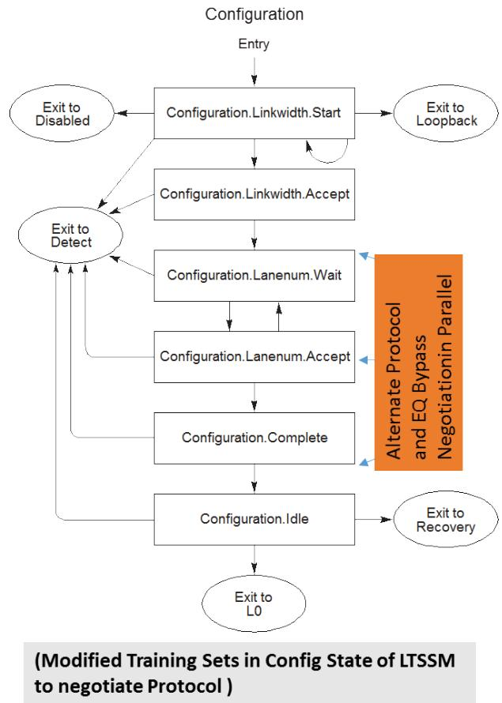


<a id="sec-4-2-5-2-body"></a>
## 4.2.5.2 Alternate Protocol Negotiation (cont.) | 替代协议协商(续)


<div style="overflow-x: auto; max-width: 100%;">
<table>
<thead>
<tr>
<th width="50%">🇬🇧 English</th>
<th width="50%" style="background-color:#e8e8e8">🇨🇳 中文</th>
</tr>
</thead>
<tbody>
<tr>
<td>

Downstream Ports manage Alternate Protocol Negotiation and Training Set Messages based on the value of the Modified TS Usage Mode Selected field when the Port is in Configuration.Lanenum.Wait, Configuration.Lanenum.Accept, and Configuration.Complete substates with LinkUp = 0.

Upstream Ports must respond to unsupported Modified TS Usage values by transmitting Modified TS Usage 000b.

If Modified TS Usage Mode Selected is:

**000b**
No Alternate Protocol Negotiation or Training Set Message occurs. The link will operate as a PCI Express Link.

**001b**
Training Set Messages are enabled. Modified TS Information 1 and Modified TS Information 2 fields carry the vendor specific messages defined by the Training Set Message Vendor ID field.

**010b**
Alternate Protocol Negotiation is enabled. Modified TS Information 1 and Modified TS Information 2 fields carry the alternate protocol details defined by the Alternate Protocol Vendor ID field. A protocol request or response is associated with the protocol defined by the Alternate Protocol Vendor ID field.

The Alternate Protocol Negotiation Status field indicates the progress of the negotiation protocol.

**others**
Reserved §

</td>
<td style="background-color:#e8e8e8">

当端口处于 `LinkUp = 0` 的 Configuration.Lanenum.Wait、Configuration.Lanenum.Accept 和 Configuration.Complete 子状态时,下游端口 (Downstream Port) 根据 Modified TS Usage Mode Selected 字段的值管理替代协议协商和训练集消息。

上游端口 (Upstream Port) 必须通过发送 Modified TS Usage 000b 来响应其不支持的 Modified TS Usage 值。

如果 Modified TS Usage Mode Selected 为:

**000b**
不进行替代协议协商或训练集消息。链路将作为 PCI Express 链路运行。

**001b**
启用训练集消息。Modified TS Information 1 和 Modified TS Information 2 字段携带由 Training Set Message Vendor ID 字段定义的厂商特定消息。

**010b**
启用替代协议协商。Modified TS Information 1 和 Modified TS Information 2 字段携带由 Alternate Protocol Vendor ID 字段定义的替代协议详细信息。协议请求或响应与 Alternate Protocol Vendor ID 字段定义的协议相关联。

Alternate Protocol Negotiation Status 字段指示协商协议的进度。

**其他**
保留 §

</td>
</tr>
</tbody>
</table>
</div>


<!-- 📄 Page 475 -->
---

**Table 4-30.** Modified TS Information 1 field in Modified TS1/TS2 Ordered Sets if Modified TS Usage = 010b (Alternate Protocol) | 表 4-30. Modified TS Usage = 010b (替代协议)时,Modified TS1/TS2 有序集中的 Modified TS Information 1 字段

| Bits | Field | Description | 说明 |
|------|-------|-------------|------|
| 4:3 | Alternate Protocol Negotiation Status | For Modified TS1 Ordered Sets:<br>00b — DP: Indicates a protocol request from the Downstream Port asking whether the Upstream Port supports a particular alternate protocol.<br>UP: Reserved<br>01b — DP: Reserved<br>UP: Indicates that the Upstream Port does not have an answer for a protocol request yet. This occurs either when it is evaluating the protocol request or it has not received two consecutive Modified TS1s to perform the evaluation. In the former case, Alternate Protocol Vendor ID and Alternate Protocol Details reflect what it received, while Modified TS Information 2 is protocol specific. In the latter case, all 3 fields must be 0.<br>10b — DP: Reserved<br>UP: Indicates that the Upstream Port does not support the requested protocol. Alternate Protocol Vendor ID and Alternate Protocol Details reflect what it received. Modified TS Information 2 must be all 0s.<br>11b — DP: Reserved<br>UP: Indicates that the Upstream Port supports the requested protocol. Alternate Protocol Vendor ID and Alternate Protocol Details reflect what it received, while Modified TS Information 2 field is protocol specific.<br>For Modified TS2 Ordered Sets:<br>00b, 01b, 10b, 11b — DP/UP: Indicates a protocol confirmation from the Downstream Port as well as the Upstream Port. Behavior is undefined if the Downstream Port had not earlier received status 10b for this protocol in this instance of protocol negotiation during the Modified TS1 Ordered Sets. Similarly, behavior is undefined if the Upstream Port had not earlier transmitted status 10b for this protocol in this instance of protocol negotiation during the Modified TS1 Ordered Sets. No protocol is selected unless the Downstream Port sends and receives a protocol confirmation in the Modified TS2 Ordered Sets. If the Downstream Port decides not to use any Alternate Protocol, it must indicate this by transmitting Modified TS2 Ordered Set with Modified TS Usage of 000b or 001b. | 替代协议协商状态 (Alternate Protocol Negotiation Status)<br><br>对于 Modified TS1 有序集:<br>00b — DP: 表示来自下游端口 (DP) 的协议请求,询问上游端口 (UP) 是否支持特定的替代协议。<br>UP: 保留<br>01b — DP: 保留<br>UP: 表示上游端口 (UP) 尚未对协议请求给出答复。这可能发生在它正在评估协议请求时,或尚未收到两个连续的 Modified TS1 来执行评估。在前一种情况下,Alternate Protocol Vendor ID 和 Alternate Protocol Details 反映其接收到的内容,而 Modified TS Information 2 是协议特定的。在后一种情况下,所有 3 个字段必须为 0。<br>10b — DP: 保留<br>UP: 表示上游端口 (UP) 不支持所请求的协议。Alternate Protocol Vendor ID 和 Alternate Protocol Details 反映其接收到的内容。Modified TS Information 2 必须全为 0。<br>11b — DP: 保留<br>UP: 表示上游端口 (UP) 支持所请求的协议。Alternate Protocol Vendor ID 和 Alternate Protocol Details 反映其接收到的内容,而 Modified TS Information 2 字段是协议特定的。<br><br>对于 Modified TS2 有序集:<br>00b、01b、10b、11b — DP/UP: 表示来自下游端口 (DP) 以及上游端口 (UP) 的协议确认。如果在 Modified TS1 有序集期间的本次协议协商实例中,下游端口 (DP) 之前未收到此协议的 10b 状态,则行为未定义。类似地,如果在 Modified TS1 有序集期间的本次协议协商实例中,上游端口 (UP) 之前未发送此协议的 10b 状态,则行为未定义。除非下游端口 (DP) 在 Modified TS2 有序集中发送并接收到协议确认,否则不会选择任何协议。如果下游端口 (DP) 决定不使用任何替代协议,则必须通过发送 Modified TS Usage 为 000b 或 001b 的 Modified TS2 有序集来指示。 |
| 15:5 | Alternate Protocol Details | Alternate Protocol Details is protocol specific. (Modified TS Usage = 010b). | 替代协议详细信息 (Alternate Protocol Details) 是协议特定的。(Modified TS Usage = 010b)。 |

If Modified TS Usage = 001b, then Modified TS Information 1 and Modified TS Information 2 contain details of the training set messages.

Alternate Protocol Negotiation must be concurrent with the Lane number negotiation. The Downstream Port is responsible for ensuring that they arrive at a consensus on the Alternate Protocol Negotiation prior to transitioning to Configuration.Complete substate. It is permitted to fall back to PCIe protocol if the Alternate Protocol Negotiation does not arrive at a consensus. On a successful negotiation to alternate protocol, the Link moves to L0 at 2.5 GT/s, changes the data rate to the higher data rates, performing equalization, if needed and enters L0 at the highest data rate desired. After §

如果 Modified TS Usage = 001b,则 Modified TS Information 1 和 Modified TS Information 2 包含训练集消息的详细信息。

替代协议协商必须与通道号协商同时进行。下游端口 (DP) 负责确保在转换到 Configuration.Complete 子状态之前,双方就替代协议协商达成共识。如果替代协议协商未达成共识,允许回退到 PCIe 协议。在成功协商到替代协议后,链路以 2.5 GT/s 进入 L0,改变数据速率到更高的数据速率,执行均衡(如果需要),并以期望的最高数据速率进入 L0。在 § 之后

<!-- 📄 Page 476 -->
---

<table>
<thead>
<tr>
<th width="50%">🇬🇧 English</th>
<th width="50%" style="background-color:#e8e8e8">🇨🇳 中文</th>
</tr>
</thead>
<tbody>
<tr>
<td>

transmitting the SDS Ordered Set in the highest data rate after equalization has been performed, the Data Blocks will carry the alternate protocol and the Link will be under the control of the alternate protocol.

Before a Transmitter enters Electrical Idle, it must always send an Electrical Idle Ordered Set Sequence (EIOSQ), unless otherwise specified. An Electrical Idle Ordered Set Sequence (EIOSQ) is defined as one EIOS if the current Data Rate is 2.5 GT/s, 8.0 GT/s, 16.0 GT/s, 32.0 GT/s, or 64.0 GT/s Data Rate, or two consecutive EIOSs if the current Data Rate is 5.0 GT/s.

When using 8b/10b encoding, an EIOS is a K28.5 (COM) followed by three K28.3 (IDL) Symbols. Transmitters must transmit all Symbols of an EIOS. An EIOS is received when the COM and two of the three IDL Symbols are received. When using 128b/130b encoding, an EIOS is an Ordered Set block, as defined in § Table 4-32. When using 1b/1b encoding, an EIOS is an Ordered Set block, as defined in § Table 4-33. Transmitters must transmit all Symbols of an EIOS if additional EIOSs are to be transmitted following it. Transmitters must transmit Symbols 0-13 of an EIOS, but are permitted to terminate the EIOS anywhere in Symbols 14 or 15, when transitioning to Electrical Idle after it. An EIOS is considered received when Symbols 0-3 of an Ordered Set Block match the definition of an EIOS if the data rate is less than 64.0 GT/s. At 64.0 GT/s, the rules governing receipt of an EIOS appears in § Section 4.2.3.1.5 .

After transmitting the last Symbol of the last Electrical Idle Ordered Set, the Transmitter must be in a valid Electrical Idle state as specified by TTX-IDLE-SET-TO-IDLE (see § Table 8-7).

</td>
<td style="background-color:#e8e8e8">

在最高数据速率下完成均衡后发送 SDS 有序集,数据块 (Data Block) 将携带替代协议,并且链路将由替代协议控制。

在发送器 (Transmitter) 进入电气空闲 (Electrical Idle) 之前,除非另有规定,否则它必须始终发送电气空闲有序集序列 (Electrical Idle Ordered Set Sequence, EIOSQ)。如果当前数据速率为 2.5 GT/s、8.0 GT/s、16.0 GT/s、32.0 GT/s 或 64.0 GT/s,则 EIOSQ 定义为一个 EIOS;如果当前数据速率为 5.0 GT/s,则定义为两个连续的 EIOS。

当使用 8b/10b 编码时,EIOS 是一个 K28.5 (COM) 后跟三个 K28.3 (IDL) 符号 (Symbol)。发送器必须发送 EIOS 的所有符号。当接收到 COM 和三个 IDL 符号中的两个时,即视为接收到 EIOS。当使用 128b/130b 编码时,EIOS 是一个有序集块 (Ordered Set Block),如 § 表 4-32 所定义。当使用 1b/1b 编码时,EIOS 是一个有序集块 (Ordered Set Block),如 § 表 4-33 所定义。如果要在 EIOS 之后发送额外的 EIOS,则发送器必须发送 EIOS 的所有符号。发送器必须发送 EIOS 的符号 0-13,但当之后过渡到电气空闲时,允许在符号 14 或 15 内的任意位置终止 EIOS。如果数据速率小于 64.0 GT/s,则当有序集块的符号 0-3 匹配 EIOS 的定义时,视为已接收到 EIOS。在 64.0 GT/s 时,关于接收 EIOS 的规则见 § 4.2.3.1.5 节。

在发送最后一个电气空闲有序集 (Electrical Idle Ordered Set) 的最后一个符号后,发送器必须处于由 TTX-IDLE-SET-TO-IDLE(见 § 表 8-7)指定的有效电气空闲状态。

</td>
</tr>
</tbody>
</table>

**Table 4-31.** Electrical Idle Ordered Set (EIOS) for 2.5 GT/s and 5.0 GT/s Data Rates | 表 4-31. 2.5 GT/s 和 5.0 GT/s 数据速率的电气空闲有序集 (EIOS)

| Symbol Number | Encoded Values | Description | 说明 |
|---------------|----------------|-------------|------|
| 0 | K28.5 | COM for Symbol alignment | 用于符号 (Symbol) 对齐的 COM |
| 1 | K28.3 | IDL | IDL |
| 2 | K28.3 | IDL | IDL |
| 3 | K28.3 | IDL | IDL |

**Table 4-32.** Electrical Idle Ordered Set (EIOS) for 128b/130b Encoding | 表 4-32. 128b/130b 编码的电气空闲有序集 (EIOS)

| Symbol Numbers | Value | Description | 说明 |
|----------------|-------|-------------|------|
| 0-15 | 66h | EIOS Identifier and Payload | EIOS 标识符和有效负载 |

<a id="sec-4-2-5-3"></a>
## 4.2.5.3 Electrical Idle Sequences (EIOS and EIEOS) | 电气空闲序列 (EIOS 和 EIEOS)

<table>
<thead>
<tr>
<th width="50%">🇬🇧 English</th>
<th width="50%" style="background-color:#e8e8e8">🇨🇳 中文</th>
</tr>
</thead>
<tbody>
<tr>
<td>

> **IMPLEMENTATION NOTE:**
> **TRUNCATION OF EIOS ORDERED SET**
>
> Truncation in the last EIOS is allowed to help implementations where a transmitter may terminate on an internal clock boundary that may not align on a Symbol boundary due to 128b/130b encoding. Truncation is okay since Receivers will just look at the first four Symbols to conclude it is an EIOS. §

</td>
<td style="background-color:#e8e8e8">

> **实现说明:**
> **EIOS 有序集的截断**
>
> 允许在最后一个 EIOS 中截断,以帮助实现以下场景:由于 128b/130b 编码,发送器可能在内部时钟边界上终止,而该边界可能未在符号 (Symbol) 边界上对齐。截断是可以接受的,因为接收器 (Receiver) 只会查看前四个符号即可断定其为 EIOS。§

</td>
</tr>
</tbody>
</table>

<!-- 📄 Page 477 -->
---

**Table 4-33.** Electrical Idle Ordered Set (EIOS) for 1b/1b Encoding | 表 4-33. 1b/1b 编码的电气空闲有序集 (EIOS)

| Symbol Numbers | Value | Description | 说明 |
|----------------|-------|-------------|------|
| 0, 2, 4, 6, 8, 10, 12, 14 | 0Fh | EIOS Identifier and Payload | EIOS 标识符和有效负载 |
| 1, 3, 5, 7, 9, 11, 13, 15 | F0h | EIOS Identifier and Payload | EIOS 标识符和有效负载 |

**Table 4-34.** Electrical Idle Exit Ordered Set (EIEOS) for 5.0 GT/s Data Rate | 表 4-34. 5.0 GT/s 数据速率的电气空闲退出有序集 (EIEOS)

| Symbol Number | Encoded Values | Description | 说明 |
|---------------|----------------|-------------|------|
| 0 | K28.5 | COM for Symbol alignment | 用于符号 (Symbol) 对齐的 COM |
| 1-14 | K28.7 | EIE - K Symbol with low frequency components for helping achieve exit from Electrical Idle | EIE — 具有低频分量的 K 符号,有助于实现电气空闲退出 |
| 15 | D10.2 | TS1 Identifier (See Note 1) | TS1 标识符(见注释 1) |

**Notes:**
1. This symbol is not scrambled. Previous versions of this specification were less clear and some implementations may have incorrectly scrambled this symbol. It is recommended that devices be tolerant of receiving EIEOS in which this symbol is scrambled.

**注释:**
1. 该符号不加扰 (Scrambling)。此规范的早期版本表述不够清晰,某些实现可能错误地对该符号进行了加扰。建议设备容忍接收此符号已加扰的 EIEOS。

**Table 4-35.** Electrical Idle Exit Ordered Set (EIEOS) for 8.0 GT/s Data Rate | 表 4-35. 8.0 GT/s 数据速率的电气空闲退出有序集 (EIEOS)

| Symbol Numbers | Value | Description | 说明 |
|----------------|-------|-------------|------|
| 0, 2, 4, 6, 8, 10, 12, 14 | 00h | Symbol 0: EIEOS Identifier<br>A low frequency pattern that alternates between eight 0s and eight 1s. | Symbol 0:EIEOS 标识符<br>在八个 0 和八个 1 之间交替的低频模式。 |
| 1, 3, 5, 7, 9, 11, 13, 15 | FFh | A low frequency pattern that alternates between eight 0s and eight 1s. | 在八个 0 和八个 1 之间交替的低频模式。 |

**Table 4-36.** Electrical Idle Exit Ordered Set (EIEOS) for 16.0 GT/s Data Rate | 表 4-36. 16.0 GT/s 数据速率的电气空闲退出有序集 (EIEOS)

| Symbol Numbers | Value | Description | 说明 |
|----------------|-------|-------------|------|
| 0, 1, 4, 5, 8, 9, 12, 13 | 00h | Symbol 0: EIEOS Identifier<br>A low frequency pattern that alternates between sixteen 0s and sixteen 1s. | Symbol 0:EIEOS 标识符<br>在十六个 0 和十六个 1 之间交替的低频模式。 |
| 2, 3, 6, 7, 10, 11, 14, 15 | FFh | A low frequency pattern that alternates between sixteen 0s and sixteen 1s. | 在十六个 0 和十六个 1 之间交替的低频模式。 |

**Table 4-37.** Electrical Idle Exit Ordered Set (EIEOS) for 32.0 GT/s Data Rate | 表 4-37. 32.0 GT/s 数据速率的电气空闲退出有序集 (EIEOS)

| Symbol Numbers | Value | Description | 说明 |
|----------------|-------|-------------|------|
| 0, 1, 2, 3, 8, 9, 10, 11 | 00h | Symbol 0: EIEOS Identifier<br>A low frequency pattern that alternates between thirty-two 0s and thirty-two 1s. | Symbol 0:EIEOS 标识符<br>在三十二个 0 和三十二个 1 之间交替的低频模式。 |
| 4, 5, 6, 7, 12, 13, 14, 15 | FFh | A low frequency pattern that alternates between thirty-two 0s and thirty-two 1s. | 在三十二个 0 和三十二个 1 之间交替的低频模式。 |

<!-- 📄 Page 478 -->
---

**Table 4-38.** Electrical Idle Exit Ordered Set (EIEOS) for 64.0 GT/s Data Rate | 表 4-38. 64.0 GT/s 数据速率的电气空闲退出有序集 (EIEOS)

| Symbol Numbers | Value | Description | 说明 |
|----------------|-------|-------------|------|
| 0 - 7 | 00h | Voltage level 0 for 32 UI | 32 UI 内的电压电平 0 |
| 8 - 15 | FFh | Voltage level 3 for 32 UI | 32 UI 内的电压电平 3 |

<a id="fig-4-47"></a>

> **Figure 4-47.** Electrical Idle Exit Ordered Set for 8.0 GT/s to 32.0 GT/s Data Rates (EIEOS)
>
> 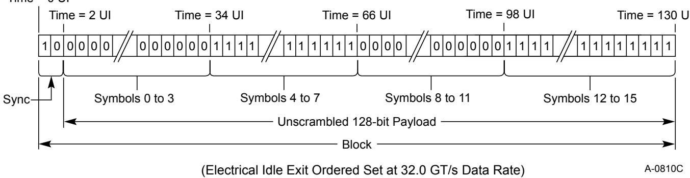

> **图 4-47.** 8.0 GT/s 至 32.0 GT/s 数据速率的电气空闲退出有序集 (EIEOS)
>

<table>
<thead>
<tr>
<th width="50%">🇬🇧 English</th>
<th width="50%" style="background-color:#e8e8e8">🇨🇳 中文</th>
</tr>
</thead>
<tbody>
<tr>
<td>

The Electrical Idle Exit Ordered Set (EIEOS) is transmitted only when operating at speeds other than 2.5 GT/s. It is a low frequency pattern transmitted periodically to help ensure that receiver Electrical Idle exit detection circuitry can detect an exit from Electrical Idle. When using 128b/130b encoding, it is also used for Block Alignment as described in § Section 4.2.2.2.1 . §

</td>
<td style="background-color:#e8e8e8">

电气空闲退出有序集 (EIEOS) 仅在以 2.5 GT/s 以外的速度运行时发送。它是一种周期性发送的低频模式,用于帮助确保接收器 (Receiver) 电气空闲退出检测电路能够检测到电气空闲的退出。当使用 128b/130b 编码时,它还用于块对齐 (Block Alignment),如 § 4.2.2.2.1 节所述。§

</td>
</tr>
</tbody>
</table>

<!-- 📄 Page 479 -->
---


<div style="overflow-x: auto; max-width: 100%;">
<table>
<thead>
<tr>
<th width="50%">🇬🇧 English</th>
<th width="50%" style="background-color:#e8e8e8">🇨🇳 中文</th>
</tr>
</thead>
<tbody>
<tr>
<td>

An Electrical Idle Exit Ordered Set Sequence (EIEOSQ) comprises of two consecutive EIEOS for the Data Rate of 32.0 GT/s and one EIEOS for 5.0 GT/s, 8.0 GT/s, and 16.0 GT/s. The two EIEOS at 32.0 GT/s must be back to back and uninterrupted in order to be considered consecutive and form an EIEOSQ. Irrespective of the length of the EIEOSQ, block alignment still occurs on an EIEOS.

At the Data Rate of 64.0 GT/s, an EIEOSQ is defined as follows:

- On entry to Recovery.RcvrLock either from Recovery.Speed or from L1, until either the Receiver detects exit Electrical Idle on all Lanes or it receives two consecutive valid TS1 Ordered Sets on any Lane:
  - Four consecutive EIEOS, uninterrupted by any other Ordered Set including the Control SKP Ordered Set
- While increasing Link Width with L0p till the Receiver detects exit Electrical Idle on all Lanes that need to be activated or receives two consecutive valid TS1 Ordered Sets on any Lane that needs to be activated:
  - Four consecutive EIEOS, uninterrupted by any other Ordered Set including the Control SKP Ordered Set
- On entry to the Loopback state from electrical idle till the Receiver detects exit Electrical Idle on all Lanes that need to be activated or receives two consecutive valid TS1 Ordered Sets on any Lane:
  - Four consecutive EIEOS, uninterrupted by any other Ordered Set including the Control SKP Ordered Set
- While transmitting Compliance Patterns or Modified Compliance Patterns:
  - One EIEOS
- Else one EIEOS

When using 8b/10b encoding and operating at 5.0 GT/s, an EIEOSQ, as defined in § Table 4-34, is transmitted in the following situations:

- Before the first TS1 Ordered Set after entering the LTSSM Configuration.Linkwidth.Start state.
- Before the first TS1 Ordered Set after entering the LTSSM Recovery.RcvrLock state.
- After every 32 TS1 or TS2 Ordered Sets are transmitted in the LTSSM Configuration.Linkwidth.Start, Recovery.RcvrLock, and Recovery.RcvrCfg states. The TS1/TS2 count is set to 0 when:
  - An EIEOS is transmitted.
  - The first TS2 Ordered Set is received while in the LTSSM Recovery.RcvrCfg state.

When using 128b/130b encoding, an EIEOSQ, as defined in § Table 4-35 through § Table 4-37 and § Figure 4-47, is transmitted in the following situations:

- Before the first TS1 Ordered Set after entering the LTSSM Configuration.Linkwidth.Start substate.
- Before the first TS1 Ordered Set after entering the LTSSM Recovery.RcvrLock substate.
- Immediately following an EDS Framing Token in Non-Flit Mode when ending a Data Stream and not transmitting an EIOS and not entering the LTSSM Recovery.RcvrLock substate.
- At the scheduled Ordered Set interval to end a Data Stream in Flit Mode.
- After every 32 TS1 or TS2 Ordered Sets are transmitted in all LTSSM states which require transmission of TS1 or TS2 Ordered Sets. The TS1/TS2 count is set to 0 when:
  - An EIEOS is transmitted.
  - The first TS2 Ordered Set is received while in the LTSSM Recovery.RcvrCfg state.
  - The first TS2 Ordered Set is received while in the LTSSM Configuration.Complete state.

</td>
<td style="background-color:#e8e8e8">

电气空闲退出有序集序列 (EIEOSQ) 由两个连续的 EIEOS 组成(数据速率为 32.0 GT/s 时),或由一个 EIEOS 组成(数据速率为 5.0 GT/s、8.0 GT/s 和 16.0 GT/s 时)。32.0 GT/s 下的两个 EIEOS 必须背靠背且不中断才能视为连续并构成 EIEOSQ。无论 EIEOSQ 的长度如何,块对齐 (Block Alignment) 仍然发生在 EIEOS 上。

在 64.0 GT/s 数据速率下,EIEOSQ 定义如下:

- 在从 Recovery.Speed 或 L1 进入 Recovery.RcvrLock 时,直到接收器 (Receiver) 在所有通道 (Lane) 上检测到电气空闲退出,或在任一通道上接收到两个连续的有效 TS1 有序集:
  - 四个连续的 EIEOS,不被任何其他有序集(包括 Control SKP 有序集)中断
- 在使用 L0p 增加链路宽度 (Link Width) 时,直到接收器 (Receiver) 在所有需要激活的通道上检测到电气空闲退出,或在任一需要激活的通道上接收到两个连续的有效 TS1 有序集:
  - 四个连续的 EIEOS,不被任何其他有序集(包括 Control SKP 有序集)中断
- 在从电气空闲进入 Loopback 状态时,直到接收器 (Receiver) 在所有需要激活的通道上检测到电气空闲退出,或在任一需要激活的通道上接收到两个连续的有效 TS1 有序集:
  - 四个连续的 EIEOS,不被任何其他有序集(包括 Control SKP 有序集)中断
- 在发送一致性测试码型 (Compliance Pattern) 或修改后的一致性测试码型 (Modified Compliance Pattern) 时:
  - 一个 EIEOS
- 其他情况:一个 EIEOS

当使用 8b/10b 编码并以 5.0 GT/s 运行时,如 § 表 4-34 所定义的 EIEOSQ 在以下情况下发送:

- 在进入 LTSSM Configuration.Linkwidth.Start 状态后,发送第一个 TS1 有序集之前。
- 在进入 LTSSM Recovery.RcvrLock 状态后,发送第一个 TS1 有序集之前。
- 在 LTSSM Configuration.Linkwidth.Start、Recovery.RcvrLock 和 Recovery.RcvrCfg 状态中,每发送 32 个 TS1 或 TS2 有序集后。TS1/TS2 计数在以下情况下重置为 0:
  - 发送 EIEOS。
  - 在 LTSSM Recovery.RcvrCfg 状态中接收到第一个 TS2 有序集。

当使用 128b/130b 编码时,如 § 表 4-35 至 § 表 4-37 以及 § 图 4-47 所定义的 EIEOSQ 在以下情况下发送:

- 在进入 LTSSM Configuration.Linkwidth.Start 子状态后,发送第一个 TS1 有序集之前。
- 在进入 LTSSM Recovery.RcvrLock 子状态后,发送第一个 TS1 有序集之前。
- 在非 Flit 模式 (Non-Flit Mode) 中结束数据流 (Data Stream) 时,紧跟 EDS 帧标记 (Framing Token) 之后,既不发送 EIOS 也不进入 LTSSM Recovery.RcvrLock 子状态。
- 在 Flit 模式 (Flit Mode) 中,在调度的有序集间隔处以结束数据流 (Data Stream)。
- 在所有需要发送 TS1 或 TS2 有序集的 LTSSM 状态中,每发送 32 个 TS1 或 TS2 有序集后。TS1/TS2 计数在以下情况下重置为 0:
  - 发送 EIEOS。
  - 在 LTSSM Recovery.RcvrCfg 状态中接收到第一个 TS2 有序集。
  - 在 LTSSM Configuration.Complete 状态中接收到第一个 TS2 有序集。

</td>
</tr>
</tbody>
</table>
</div>


<!-- 📄 Page 480 -->
---

<table>
<thead>
<tr>
<th width="50%">🇬🇧 English</th>
<th width="50%" style="background-color:#e8e8e8">🇨🇳 中文</th>
</tr>
</thead>
<tbody>
<tr>
<td>

  - A Downstream Port is in Phase 2 of the LTSSM Recovery.Equalization state and two consecutive TS1 Ordered Sets are received on any Lane with the Reset EIEOS Interval Count bit set.
  - An Upstream Port is in Phase 3 of the LTSSM Recovery.Equalization state and two consecutive TS1 Ordered Sets are received on any Lane with the Reset EIEOS Interval Count bit set.

- After every 65,536 TS1 Ordered Sets are transmitted in the LTSSM Recovery.Equalization state if the Reset EIEOS Interval Count bit has prevented it from being transmitted for that interval. Implementations are permitted to satisfy this requirement by transmitting an EIEOSQ within two TS1 Ordered Sets of whenever the current scrambling LFSR matches its seed value.
- As part of an FTS Ordered Set, Compliance Pattern, or Modified Compliance Pattern as described in the relevant sections.

When using 1b/1b encoding, an EIEOSQ, as defined in § Table 4-38 is transmitted in the following situations:

- Before the first TS1 Ordered Set after entering the LTSSM Configuration.Linkwidth.Start substate.
- Before the first TS1 Ordered Set after entering the LTSSM Recovery.RcvrLock substate.
- Before the first TS0 Ordered Set after entering Recovery.Equalization substate.
- At the scheduled Ordered Set interval to indicate the end of the Data Stream.
- After every 32 TS1, TS2, or TS0 Ordered Sets are transmitted in all LTSSM states which require transmission of TS1, TS2, or TS0 Ordered Sets. The TS1/TS2/TS0 count is set to 0 when:
  - An EIEOS is transmitted.
  - The first TS2 Ordered Set is received while in the LTSSM Recovery.RcvrCfg state.
  - The first TS2 Ordered Set is received while in the LTSSM Configuration.Complete state.
  - The first TS1 Ordered Set is received while in the LTSSM Recovery.Equalization state if the TS1 Ordered Set is received after TS0 Ordered Sets.
  - A Downstream Port is in Phase 2 of the LTSSM Recovery.Equalization state and two consecutive TS0 Ordered Sets are received on any Lane with the Reset EIEOS Interval Count bit set.
  - An Upstream Port is in Phase 3 of the LTSSM Recovery.Equalization state and two consecutive TS1 Ordered Sets are received on any Lane with the Reset EIEOS Interval Count bit set.
- After every 65,536 TS1 Ordered Sets are transmitted in the LTSSM Recovery.Equalization state if the Reset EIEOS Interval Count bit has prevented it from being transmitted for that interval. Implementations are permitted to satisfy this requirement by transmitting an EIEOSQ within two TS1 Ordered Sets of whenever the current scrambling LFSR matches its seed value.
- As part of a Compliance Pattern, or Modified Compliance Pattern as described in the relevant sections.

**Example:** An LTSSM enters Recovery.RcvrLock from L0 in 5.0 GT/s data rate. It transmits an EIEOS followed by TS1 Ordered Sets. It transmits 32 TS1 Ordered Sets following which it transmits the second EIEOS. Subsequently it sends two more TS1 Ordered Sets and enters Recovery.RcvrCfg where it transmits the third EIEOS after transmitting 30 TS2 Ordered Sets. It transmits 31 more TS2 Ordered Sets (after the first 30 TS2 Ordered Sets) in Recovery.RcvrCfg when it receives a TS2 Ordered Set. Since it receives its first TS2 Ordered Set, it will reset its EIEOS interval count to 0 and keep transmitting another 16 TS2 Ordered Sets before transitioning to Recovery.Idle. Thus, it did not send an EIEOS in the midst of the last 47 TS2 Ordered Sets since the EIEOS interval count got reset to 0. From Recovery.Idle, the LTSSM transitions to Configuration.Linkwidth.Start and transmits an EIEOS after which it starts transmitting the TS1 Ordered Sets.

While operating in speeds other than 2.5 GT/s, an implementation is permitted to not rely on the output of the Electrical Idle detection circuitry except when receiving the EIEOS during certain LTSSM states or during the receipt of the FTS prepended by the four consecutive EIE Symbols (see § Section 4.2.5.6 ) at the Receiver during Rx L0s or the Modified Compliance Pattern in Polling.Compliance when the circuitry is required to signal an exit from Electrical Idle.

</td>
<td style="background-color:#e8e8e8">

  - 下游端口 (DP) 处于 LTSSM Recovery.Equalization 状态的 Phase 2,且在任何通道上接收到两个连续的 TS1 有序集,且这些有序集设置了 Reset EIEOS Interval Count 位。
  - 上游端口 (UP) 处于 LTSSM Recovery.Equalization 状态的 Phase 3,且在任何通道上接收到两个连续的 TS1 有序集,且这些有序集设置了 Reset EIEOS Interval Count 位。

- 如果 Reset EIEOS Interval Count 位阻止了 EIEOSQ 在该间隔内发送,则在 LTSSM Recovery.Equalization 状态中,每发送 65,536 个 TS1 有序集后发送 EIEOSQ。允许实现通过在当前加扰 (Scrambling) LFSR 匹配其种子值时的两个 TS1 有序集内发送 EIEOSQ 来满足此要求。
- 作为 FTS 有序集、一致性测试码型 (Compliance Pattern) 或修改后的一致性测试码型 (Modified Compliance Pattern) 的一部分,详见相关章节。

当使用 1b/1b 编码时,如 § 表 4-38 所定义的 EIEOSQ 在以下情况下发送:

- 在进入 LTSSM Configuration.Linkwidth.Start 子状态后,发送第一个 TS1 有序集之前。
- 在进入 LTSSM Recovery.RcvrLock 子状态后,发送第一个 TS1 有序集之前。
- 在进入 Recovery.Equalization 子状态后,发送第一个 TS0 有序集之前。
- 在调度的有序集间隔处,用于指示数据流 (Data Stream) 的结束。
- 在所有需要发送 TS1、TS2 或 TS0 有序集的 LTSSM 状态中,每发送 32 个 TS1、TS2 或 TS0 有序集后。TS1/TS2/TS0 计数在以下情况下重置为 0:
  - 发送 EIEOS。
  - 在 LTSSM Recovery.RcvrCfg 状态中接收到第一个 TS2 有序集。
  - 在 LTSSM Configuration.Complete 状态中接收到第一个 TS2 有序集。
  - 如果 TS1 有序集是在 TS0 有序集之后接收的,则在 LTSSM Recovery.Equalization 状态中接收到第一个 TS1 有序集。
  - 下游端口 (DP) 处于 LTSSM Recovery.Equalization 状态的 Phase 2,且在任何通道上接收到两个连续的 TS0 有序集,且这些有序集设置了 Reset EIEOS Interval Count 位。
  - 上游端口 (UP) 处于 LTSSM Recovery.Equalization 状态的 Phase 3,且在任何通道上接收到两个连续的 TS1 有序集,且这些有序集设置了 Reset EIEOS Interval Count 位。
- 如果 Reset EIEOS Interval Count 位阻止了 EIEOSQ 在该间隔内发送,则在 LTSSM Recovery.Equalization 状态中,每发送 65,536 个 TS1 有序集后发送 EIEOSQ。允许实现通过在当前加扰 (Scrambling) LFSR 匹配其种子值时的两个 TS1 有序集内发送 EIEOSQ 来满足此要求。
- 作为一致性测试码型 (Compliance Pattern) 或修改后的一致性测试码型 (Modified Compliance Pattern) 的一部分,详见相关章节。

**示例:** LTSSM 在 5.0 GT/s 数据速率下从 L0 进入 Recovery.RcvrLock。它发送一个 EIEOS,后跟 TS1 有序集。发送 32 个 TS1 有序集后,再发送第二个 EIEOS。随后再发送两个 TS1 有序集,并进入 Recovery.RcvrCfg,在其中发送 30 个 TS2 有序集后发送第三个 EIEOS。在 Recovery.RcvrCfg 中接收到 TS2 有序集时,再发送 31 个 TS2 有序集(在最初的 30 个 TS2 有序集之后)。由于接收到第一个 TS2 有序集,它将 EIEOS 间隔计数重置为 0,并在转换到 Recovery.Idle 之前再发送 16 个 TS2 有序集。因此,在最后 47 个 TS2 有序集中没有发送 EIEOS,因为 EIEOS 间隔计数被重置为 0。从 Recovery.Idle 开始,LTSSM 转换到 Configuration.Linkwidth.Start,并发送一个 EIEOS,之后开始发送 TS1 有序集。

在以 2.5 GT/s 以外的速度运行时,允许实现不依赖电气空闲检测电路的输出,除非在某些 LTSSM 状态期间接收 EIEOS 时,或在 Rx L0s 期间接收器 (Receiver) 接收由四个连续 EIE 符号前置的 FTS 时(见 § 4.2.5.6 节),或在 Polling.Compliance 中当电路需要发信号通知电气空闲退出时接收修改后的一致性测试码型 (Modified Compliance Pattern) 时。

</td>
</tr>
</tbody>
</table>

<!-- 📄 Page 481 -->
---

<table>
<thead>
<tr>
<th width="50%">🇬🇧 English</th>
<th width="50%" style="background-color:#e8e8e8">🇨🇳 中文</th>
</tr>
</thead>
<tbody>
<tr>
<td>

A device is permitted in all speeds of operation to infer Electrical Idle instead of detecting Electrical Idle using analog circuitry. § Table 4-39 summarizes the conditions to infer Electrical Idle in the various substates.

</td>
<td style="background-color:#e8e8e8">

在所有运行速度下,允许设备推断电气空闲 (Electrical Idle),而不是使用模拟电路检测电气空闲。§ 表 4-39 总结了在不同子状态中推断电气空闲的条件。

</td>
</tr>
</tbody>
</table>

**Table 4-39.** Electrical Idle Inference Conditions | 表 4-39. 电气空闲推断条件

| State | 2.5 GT/s | 5.0 GT/s | 8.0 GT/s and higher data rates | 8.0 GT/s 及更高数据速率 |
|-------|----------|----------|--------------------------------|--------------------------|
| L0 | Absence of at least one of: an UpdateFC DLLP, an Optimized_Update_FC (in Flit Mode), or a SKP Ordered Set in a 128 μs window | Absence of at least one of: an UpdateFC DLLP, an Optimized_Update_FC (in Flit Mode), or a SKP Ordered Set in a 128 μs window | Absence of at least one of: an UpdateFC DLLP, an Optimized_Update_FC (in Flit Mode), or a SKP Ordered Set in a 128 μs window | 在 128 μs 窗口内缺少以下至少一项:UpdateFC DLLP、Optimized_Update_FC(在 Flit 模式中)或 SKP 有序集 |
| Recovery.RcvrCfg | Absence of a TS1 or TS2 Ordered Set in a 1280 UI interval | Absence of a TS1 or TS2 Ordered Set in a 4 ms window | Absence of a TS1 or TS2 Ordered Set in a 4 ms window | 在 1280 UI 间隔内缺少 TS1 或 TS2 有序集 / 在 4 ms 窗口内缺少 TS1 或 TS2 有序集 |
| Recovery.Speed when successful_speed_negotiation = 1b | Absence of a TS1 or TS2 Ordered Set in a 1280 UI interval | Absence of a TS1 or TS2 Ordered Set in a 4680 UI interval | Absence of a TS1 or TS2 Ordered Set in a 4680 UI interval | 在 1280 UI 间隔内缺少 TS1 或 TS2 有序集 / 在 4680 UI 间隔内缺少 TS1 或 TS2 有序集 |
| Recovery.Speed when successful_speed_negotiation = 0b | Absence of an exit from Electrical Idle in a 2000 UI interval | Absence of an exit from Electrical Idle in a 16000 UI interval | Absence of an exit from Electrical Idle in a 16000 UI interval | 在 2000 UI 间隔内缺少电气空闲退出 / 在 16000 UI 间隔内缺少电气空闲退出 |
| Loopback.Active (as Follower) | Absence of an exit from Electrical Idle in a 128 μs window | N/A | N/A | 在 128 μs 窗口内缺少电气空闲退出 / 不适用 / 不适用 |

<table>
<thead>
<tr>
<th width="50%">🇬🇧 English</th>
<th width="50%" style="background-color:#e8e8e8">🇨🇳 中文</th>
</tr>
</thead>
<tbody>
<tr>
<td>

The Electrical Idle exit condition must not be determined based on inference of Electrical Idle condition. For area efficiency, an implementation is permitted to choose to implement a common timeout counter per LTSSM and look for the Electrical Idle inference condition within the common timeout window determined by the common counter for each of the Lanes the LTSSM controls instead of having a timeout counter per Lane.

</td>
<td style="background-color:#e8e8e8">

电气空闲退出条件不得基于对电气空闲条件的推断来确定。出于面积效率考虑,允许实现选择为每个 LTSSM 实现一个公共超时计数器,并在由公共计数器确定的公共超时窗口内查找 LTSSM 控制的每个通道 (Lane) 的电气空闲推断条件,而不是为每个通道 (Lane) 设置一个超时计数器。

</td>
</tr>
</tbody>
</table>

<a id="sec-4-2-5-4"></a>
## 4.2.5.4 Inferring Electrical Idle | 推断电气空闲


<div style="overflow-x: auto; max-width: 100%;">
<table>
<thead>
<tr>
<th width="50%">🇬🇧 English</th>
<th width="50%" style="background-color:#e8e8e8">🇨🇳 中文</th>
</tr>
</thead>
<tbody>
<tr>
<td>

> **IMPLEMENTATION NOTE:**
> **INFERENCE OF ELECTRICAL IDLE**
>
> In the L0 state, one or more Flow Control Update DLLPs are expected to be received in a 128 μs window. Also in L0, one or more SKP Ordered Sets are expected to be received in a 128 μs window. As a simplification, it is permitted to use either one (or both) of these indicators to infer Electrical Idle. Hence, the absence of a Flow Control Update DLLP and/or a SKP Ordered Set in any 128 μs window can be inferred as Electrical Idle. In Recovery.RcvrCfg as well as Recovery.Speed with successful speed negotiation, the Receiver should receive TS1 or TS2 Ordered Sets continuously with the exception of the EIEOS and the SKP Ordered Set. Hence, the absence of a TS1 or TS2 Ordered Set in the interval specified above must be treated as Electrical Idle for components that implement the inference mechanism. In the event that the device enters Recovery.Speed with successful_speed_negotiation = 0b, there is a possibility that the device had failed to receive Symbols. Hence, the Electrical Idle inference is done as an absence of exit from Electrical Idle. In data rates other than 2.5 GT/s, Electrical Idle exit is guaranteed only on receipt of an EIEOS. Hence, the window is set to 16000 UI for detecting an exit from Electrical Idle in 5.0 GT/s and above data rates. In 2.5 GT/s data rate, Electrical Idle exit must be detected with every Symbol received. Hence, absence of Electrical Idle exit in a 2000 UI window constitutes an Electrical Idle condition. §

</td>
<td style="background-color:#e8e8e8">

> **实现说明:**
> **电气空闲的推断**
>
> 在 L0 状态,预期在 128 μs 窗口内接收到一个或多个流控 (Flow Control) 更新 DLLP。同样在 L0 中,预期在 128 μs 窗口内接收到一个或多个 SKP 有序集。为简化起见,允许使用这两个指示器中的任意一个(或两者)来推断电气空闲。因此,在任何 128 μs 窗口中缺少流控 (Flow Control) 更新 DLLP 和/或 SKP 有序集可被推断为电气空闲。在 Recovery.RcvrCfg 以及成功进行速率协商的 Recovery.Speed 中,接收器 (Receiver) 应持续接收 TS1 或 TS2 有序集,EIEOS 和 SKP 有序集除外。因此,对于实现推断机制的组件,在上述指定间隔内缺少 TS1 或 TS2 有序集必须被视为电气空闲。在设备以 successful_speed_negotiation = 0b 进入 Recovery.Speed 的情况下,有可能设备未能接收到符号 (Symbol)。因此,电气空闲推断是通过缺少电气空闲退出来完成的。在 2.5 GT/s 以外的数据速率下,只有在收到 EIEOS 时才能保证电气空闲退出。因此,在 5.0 GT/s 及以上数据速率中,用于检测电气空闲退出的窗口设置为 16000 UI。在 2.5 GT/s 数据速率下,必须对每个接收到的符号 (Symbol) 检测电气空闲退出。因此,在 2000 UI 窗口内缺少电气空闲退出构成电气空闲状态。§

</td>
</tr>
</tbody>
</table>
</div>


<!-- 📄 Page 482 -->
---

<table>
<thead>
<tr>
<th width="50%">🇬🇧 English</th>
<th width="50%" style="background-color:#e8e8e8">🇨🇳 中文</th>
</tr>
</thead>
<tbody>
<tr>
<td>

During the training sequence in Polling, the Receiver looks at Symbols 6-15 of the TS1 and TS2 Ordered Sets as the indicator of Lane polarity inversion (D+ and D- are swapped). If Lane polarity inversion occurs, the TS1 Symbols 6-15 received will be D21.5 as opposed to the expected D10.2. Similarly, if Lane polarity inversion occurs, Symbols 6-15 of the TS2 Ordered Set will be D26.5 as opposed to the expected D5.2. This provides the clear indication of Lane polarity inversion.

If polarity inversion is detected the Receiver must invert the received data. The Transmitter must never invert the transmitted data. Support for Lane Polarity Inversion is required on all PCI Express Receivers across all Lanes independently.

Fast Training Sequence (FTS) is the mechanism that is used for bit and Symbol lock when transitioning from L0s to L0. The FTS is used by the Receiver to detect the exit from Electrical Idle and align the Receiver's bit and Symbol receive circuitry to the incoming data. Refer to § Section 4.2.6 for a description of L0 and L0s.

- At 2.5 GT/s and 5.0 GT/s data rates:
  A single FTS is comprised of one K28.5 (COM) Symbol followed by three K28.1 Symbols. The maximum number of FTSs (N_FTS) that a component can request is 255, providing a bit time lock of 4 * 255 * 10 * UI. If the data rate is 5.0 GT/s, four consecutive EIE Symbols are transmitted at valid signal levels prior to transmitting the first FTS. These Symbols will help the Receiver detect exit from Electrical Idle. An implementation that does not guarantee proper signaling levels for up to the allowable time on the Transmitter pins (see § Section 4.2.5.6 ) since exiting Electrical Idle condition is required to prepend its first FTS by extra EIE Symbols so that the Receiver can receive at least four EIE Symbols at valid signal levels. Implementations must not transmit more than eight EIE Symbols prior to transmitting the first FTS. A component is permitted to advertise different N_FTS rates at different speeds. At 5.0 GT/s, a component may choose to advertise an appropriate N_FTS number considering that it will receive the four EIE Symbols. 4096 FTSs must be sent when the Extended Synch bit is Set in order to provide external Link monitoring tools with enough time to achieve bit and framing synchronization. SKP Ordered Sets must be scheduled and transmitted between FTSs as necessary to meet the definitions in § Section 4.2.8 with the exception that no SKP Ordered Sets can be transmitted during the first N_FTS FTSs. A single SKP Ordered Set is always sent after the last FTS is transmitted. It is permitted for this SKP Ordered Set to affect or not affect the scheduling of subsequent SKP Ordered Sets for Clock Tolerance Compensation by the Transmitter as described in § Section 4.2.8 . Note that it is possible that two SKP Ordered Sets can be transmitted back to back (one SKP Ordered Set to signify the completion of the 4096 FTSs and one scheduled and transmitted to meet the definitions described in § Section 4.2.8 ).

- At 8.0 GT/s, 16.0 GT/s, or 32.0 GT/s data rates:
  A single FTS is a 130-bit unscrambled Ordered Set Block, as shown in § Table 4-40. The maximum number of FTSs (N_FTS) that a component can request is 255, providing a bit time lock of 130 * 255 UI (130 * 263 or 273 UI if including the periodic EIEOS). A component is permitted to advertise different N_FTS values at different speeds. On exit from L0s, the transmitter first transmits an EIEOSQ which will help the receiver detect exit from Electrical Idle due to its low frequency content. After that first EIEOSQ, the transmitter must send the required number of FTS (4096 when the Extended Synch bit is Set; otherwise N_FTS), with an EIEOSQ transmitted after every 32 FTS. The FTS sequence will enable the receiver obtain bit lock (and optionally to do Block alignment). When the Extended Synch bit is Set, SKP Ordered Sets must be scheduled and transmitted between FTSs and EIEOSQ as necessary to meet the definitions in § Section 4.2.8 . The last FTS Ordered Set of the FTS sequence, if any (no FTS Ordered Sets are sent if N_FTS is equal to zero), is followed by a final EIEOSQ that will help the receiver acquire Block alignment. Implementations are permitted to send two EIEOS back to back even at a data rate below 32.0 GT/s following the last FTS Ordered Set if the N_FTS is a multiple of 32. The EIEOS resets

</td>
<td style="background-color:#e8e8e8">

在 Polling 中的训练序列期间,接收器 (Receiver) 将 TS1 和 TS2 有序集的符号 6-15 视为通道 (Lane) 极性反转(D+ 和 D- 交换)的指示符。如果发生通道 (Lane) 极性反转,接收到的 TS1 符号 6-15 将是 D21.5,而不是预期的 D10.2。类似地,如果发生通道 (Lane) 极性反转,TS2 有序集的符号 6-15 将是 D26.5,而不是预期的 D5.2。这为通道 (Lane) 极性反转提供了明确的指示。

如果检测到极性反转,接收器 (Receiver) 必须对接收到的数据进行反转。发送器 (Transmitter) 永远不得反转发送的数据。所有 PCI Express 接收器 (Receiver) 都需要独立支持所有通道 (Lane) 的极性反转。

快速训练序列 (Fast Training Sequence, FTS) 是从 L0s 转换到 L0 时用于比特和符号 (Symbol) 锁定的机制。FTS 由接收器 (Receiver) 用于检测电气空闲退出,并将接收器 (Receiver) 的比特和符号 (Symbol) 接收电路与传入数据对齐。有关 L0 和 L0s 的说明,请参阅 § 4.2.6 节。

- 在 2.5 GT/s 和 5.0 GT/s 数据速率下:
  单个 FTS 由一个 K28.5 (COM) 符号 (Symbol) 后跟三个 K28.1 符号 (Symbol) 组成。组件可以请求的最大 FTS 数 (N_FTS) 为 255,提供 4 * 255 * 10 * UI 的比特时间锁定。如果数据速率为 5.0 GT/s,则在发送第一个 FTS 之前,会以有效信号电平发送四个连续的 EIE 符号 (Symbol)。这些符号 (Symbol) 将帮助接收器 (Receiver) 检测电气空闲退出。对于无法保证自退出电气空闲条件起在发送器 (Transmitter) 引脚上达到允许时间的适当信号电平(见 § 4.2.5.6 节)的实现,需要在第一个 FTS 之前加上额外的 EIE 符号 (Symbol),以便接收器 (Receiver) 可以在有效信号电平下接收至少四个 EIE 符号 (Symbol)。实现不得在发送第一个 FTS 之前发送超过八个 EIE 符号 (Symbol)。允许组件在不同速度下通告不同的 N_FTS 速率。在 5.0 GT/s 时,组件可考虑将接收四个 EIE 符号 (Symbol) 的因素考虑在内,选择通告适当的 N_FTS 数。当设置 Extended Synch 位时,必须发送 4096 个 FTS,以便为外部链路 (Link) 监控工具提供足够的时间来实现比特和帧同步。必须根据需要调度和发送 FTS 之间的 SKP 有序集,以满足 § 4.2.8 节中的定义,但在第一个 N_FTS 个 FTS 期间不能发送 SKP 有序集。在发送最后一个 FTS 后,始终发送单个 SKP 有序集。允许此 SKP 有序集影响或不影响 § 4.2.8 节所述发送器 (Transmitter) 用于时钟容差补偿的后续 SKP 有序集的调度。请注意,可能存在背靠背发送两个 SKP 有序集的情况(一个 SKP 有序集表示 4096 个 FTS 的完成,另一个按 § 4.2.8 节所述的定义进行调度和发送)。

- 在 8.0 GT/s、16.0 GT/s 或 32.0 GT/s 数据速率下:
  单个 FTS 是 130 位未加扰的有序集块 (Ordered Set Block),如 § 表 4-40 所示。组件可以请求的最大 FTS 数 (N_FTS) 为 255,提供 130 * 255 UI 的比特时间锁定(如果包括周期性 EIEOS,则为 130 * 263 或 273 UI)。允许组件在不同速度下通告不同的 N_FTS 值。在退出 L0s 时,发送器 (Transmitter) 首先发送 EIEOSQ,这将由于其低频内容帮助接收器 (Receiver) 检测电气空闲退出。在第一个 EIEOSQ 之后,发送器 (Transmitter) 必须发送所需数量的 FTS(当设置 Extended Synch 位时为 4096;否则为 N_FTS),每 32 个 FTS 后发送一个 EIEOSQ。FTS 序列将使接收器 (Receiver) 获得比特锁定(并可选地执行块对齐 (Block Alignment))。当设置 Extended Synch 位时,必须根据需要在 FTS 和 EIEOSQ 之间调度和发送 SKP 有序集,以满足 § 4.2.8 节中的定义。FTS 序列的最后一个 FTS 有序集(如果有,如果 N_FTS 等于零则不发送 FTS 有序集)之后跟一个最终的 EIEOSQ,这将帮助接收器 (Receiver) 获取块对齐 (Block Alignment)。即使在低于 32.0 GT/s 的数据速率下,只要 N_FTS 是 32 的倍数,允许实现在最后一个 FTS 有序集之后背靠背发送两个 EIEOS。EIEOS 重置

</td>
</tr>
</tbody>
</table>

<a id="sec-4-2-5-5"></a>
## 4.2.5.5 Lane Polarity Inversion | 通道极性反转

[⬆️ Back to Table of Contents](#)


---

<a id="sec-4-2-5-6"></a>
## 4.2.5.6 Fast Training Sequence (FTS) | 快速训练序列 (FTS)

<!-- 📄 Page 483 -->
---

<table>
<thead>
<tr>
<th width="50%">🇬🇧 English</th>
<th width="50%" style="background-color:#e8e8e8">🇨🇳 中文</th>
</tr>
</thead>
<tbody>
<tr>
<td>

the scrambler in both the Transmitter as well as the Receiver. Following the final EIEOSQ, an SDS Ordered Set is transmitted to help the receiver perform de-skew and to indicate the transition from Ordered Sets to Data Stream. After the SDS Ordered Set is transmitted, a Data Block must be transmitted.

</td>
<td style="background-color:#e8e8e8">

发送器 (Transmitter) 与接收器 (Receiver) 中的加扰器 (Scrambler)。在最后一个 EIEOS 之后，发送一个 SDS 有序集 (Ordered Set) 以辅助接收器执行去偏斜 (De-skew)，并指示从有序集到数据流 (Data Stream) 的过渡。SDS 有序集发送完毕后，必须发送一个数据块 (Data Block)。

</td>
</tr>
</tbody>
</table>

**Table 4-40 FTS for 8.0 GT/s and Above Data Rates | 表 4-40 8.0 GT/s 及以上数据速率的 FTS**

| Symbol Number | Value |
|---------------|-------|
| 0 | 55h |
| 1 | 47h |
| 2 | 4Eh |
| 3 | C7h |
| 4 | CCh |
| 5 | C6h |
| 6 | C9h |
| 7 | 25h |
| 8 | 6Eh |
| 9 | ECh |
| 10 | 88h |
| 11 | 7Fh |
| 12 | 80h |
| 13 | 8Dh |
| 14 | 8Bh |
| 15 | 8Eh |


<div style="overflow-x: auto; max-width: 100%;">
<table>
<thead>
<tr>
<th width="50%">🇬🇧 English</th>
<th width="50%" style="background-color:#e8e8e8">🇨🇳 中文</th>
</tr>
</thead>
<tbody>
<tr>
<td>

N_FTS defines the number of FTSs that must be transmitted when transitioning from L0s to L0. At the 2.5 GT/s data rate, the value that can be requested by a component corresponds to a Symbol lock time of 16 ns (N_FTS set to 0b and one SKP Ordered Set) to ~4 μs (N_FTS set to 255), except when the Extended Synch bit is Set, which requires the transmission of 4096 FTSs resulting in a bit lock time of 64 μs. For 8.0 GT/s and above data rates, when the Extended Synch bit is Set, the transmitter is required to send 4096 FTS Ordered Set Blocks. Note that the N_FTS value reported by a component

</td>
<td style="background-color:#e8e8e8">

N_FTS 定义从 L0s 状态过渡到 L0 状态时必须发送的 FTS 数量。在 2.5 GT/s 数据速率下，组件可请求的值对应 16 ns（N_FTS 设为 0b，并发送一个 SKP 有序集）到约 4 μs（N_FTS 设为 255）的 Symbol 锁定时间，除非 Extended Synch 位被置位，此时需要发送 4096 个 FTS，对应 64 μs 的比特锁定时间。对于 8.0 GT/s 及以上的数据速率，当 Extended Synch 位被置位时，发送器 (Transmitter) 需要发送 4096 个 FTS 有序集块 (Ordered Set Block)。注意，组件所报告的 N_FTS 值

</td>
</tr>
</tbody>
</table>
</div>


<table>
<thead>
<tr>
<th width="50%">🇬🇧 English</th>
<th width="50%" style="background-color:#e8e8e8">🇨🇳 中文</th>
</tr>
</thead>
<tbody>
<tr>
<td>

**IMPLEMENTATION NOTE:**
**SCRAMBLING LFSR DURING FTS TRANSMISSION IN 128B/130B ENCODING**

Since the scrambler is reset on the last EIEOS, and none of the Ordered Set in the FTS sequence is scrambled, it does not matter whether implementations choose to advance the scrambler or not during the time FTS is received.

</td>
<td style="background-color:#e8e8e8">

**实现注意事项：**
**128b/130b 编码下 FTS 传输期间的扰码 LFSR**

由于扰码器 (Scrambler) 在最后一个 EIEOS 处被复位，并且 FTS 序列中没有哪个有序集 (Ordered Set) 会被加扰，因此实现在接收 FTS 期间是否推进扰码器并不重要。

</td>
</tr>
</tbody>
</table>

---

<!-- 📄 Page 484 -->
---

<table>
<thead>
<tr>
<th width="50%">🇬🇧 English</th>
<th width="50%" style="background-color:#e8e8e8">🇨🇳 中文</th>
</tr>
</thead>
<tbody>
<tr>
<td>

may change; for example, due to software modifying the value in the Common Clock Configuration bit (see § Section 7.5.3.7).

If the N_FTS period of time expires before the Receiver obtains bit lock, Symbol lock or Block alignment, and Lane-to-Lane de-skew on all Lanes of the configured Link, the Receiver must transition to the Recovery state. This sequence is detailed in the LTSSM in § Section 4.2.6.

</td>
<td style="background-color:#e8e8e8">

可能会发生变化；例如，软件修改了 Common Clock Configuration 位的值（参见 § 第 7.5.3.7 节）。

如果在 N_FTS 时间段结束之前，接收器 (Receiver) 仍无法在已配置链路 (Link) 的所有通道 (Lane) 上获得比特锁定、Symbol 锁定、块对齐 (Block Alignment) 以及通道间去偏斜 (Lane-to-Lane De-skew)，则接收器必须过渡到 Recovery 状态。该序列的详细说明在 § 第 4.2.6 节的 LTSSM (链路训练与状态机, Link Training and Status State Machine) 中给出。

</td>
</tr>
</tbody>
</table>

<a id="sec-4-2-5-7"></a>
## 4.2.5.7 Start of Data Stream Ordered Set (SDS Ordered Set) | 数据流起始有序集 (SDS 有序集)


<div style="overflow-x: auto; max-width: 100%;">
<table>
<thead>
<tr>
<th width="50%">🇬🇧 English</th>
<th width="50%" style="background-color:#e8e8e8">🇨🇳 中文</th>
</tr>
</thead>
<tbody>
<tr>
<td>

The Start of Data Stream (SDS) Ordered Set, described in § Table 4-41, § Table 4-42, and § Table 4-43 is defined only for 128b/130b encoding and 1b/1b encoding. It is transmitted in the Configuration.Idle, Recovery.Idle, and Tx_L0s.FTS LTSSM states to define the transition from Ordered Set Blocks to a Data Stream, and Loopback Leads are permitted to transmit it as described in § Section 4.2.2.6. It must not be transmitted at any other time. While not in the Loopback state, the Block following an SDS Ordered Set must be a Data Block in Non-Flit Mode, and the first Symbol of that Data Block is the first Symbol of the Data Stream. In 1b/1b encoding, the Transmitter must send two back to back SDS when the conditions to send an SDS are met. The SDS Ordered Set in 1b/1b encoding must be on an aligned 128b (16B) boundary. An SDS Ordered Set sequence refers to either the single SDS Ordered set with 128b/130b encoding or the two back to back SDS Ordered Sets with 1b/1b encoding. In Flit Mode, with 128b/130b encoding and 1b/1b encoding, a Control SKP Ordered Set must be sent after the SDS Ordered Set. The first Symbol of the Data Stream starts immediately after the Control SKP Ordered Set. With 1b/1b encoding, a Receiver considers an SDS sequence valid if four good B1_C6_C6_C6 (4B) sets are received, at least two of which are in an even 4 byte aligned position (i.e., bytes 0-3, 8-11).

</td>
<td style="background-color:#e8e8e8">

数据流起始 (Start of Data Stream, SDS) 有序集（详见 § 表 4-41、§ 表 4-42 和 § 表 4-43）仅针对 128b/130b 编码 (Encoding) 和 1b/1b 编码定义。它在 Configuration.Idle、Recovery.Idle 和 Tx_L0s.FTS 等 LTSSM 状态中发送，用于标识从有序集块 (Ordered Set Block) 向数据流 (Data Stream) 的过渡，Loopback 主导端 (Loopback Lead) 可按 § 第 4.2.2.6 节所述发送该有序集。除此之外的其他任何时刻均不得发送。在非 Loopback 状态下，SDS 有序集之后的块必须是非 Flit 模式 (Non-Flit Mode) 下的数据块 (Data Block)，该数据块的第一个 Symbol 即为数据流的第一个 Symbol。在 1b/1b 编码下，当满足发送 SDS 的条件时，发送器 (Transmitter) 必须发送两个背靠背的 SDS。1b/1b 编码下的 SDS 有序集必须位于对齐的 128b (16B) 边界上。SDS 有序集序列 (SDS Ordered Set sequence) 是指 128b/130b 编码下的单个 SDS 有序集，或 1b/1b 编码下的两个背靠背 SDS 有序集。在 Flit 模式 (Flit Mode) 下，无论采用 128b/130b 还是 1b/1b 编码，都必须在 SDS 有序集之后发送一个控制 SKP (Control SKP) 有序集。数据流的第一个 Symbol 在控制 SKP 有序集之后立即开始。在 1b/1b 编码下，接收器 (Receiver) 在接收到四个良好的 B1_C6_C6_C6 (4B) 序列（其中至少两个位于偶数 4 字节对齐位置，即字节 0-3、8-11）时，即认为该 SDS 序列有效。

</td>
</tr>
</tbody>
</table>
</div>


**Table 4-41 SDS Ordered Set (for 8.0 GT/s and 16.0 GT/s Data Rate) | 表 4-41 SDS 有序集 (适用于 8.0 GT/s 和 16.0 GT/s 数据速率)**

| Symbol Number | Value | Description |
|---------------|-------|-------------|
| 0 | E1h | SDS Ordered Set Identifier |
| 1-15 | 55h | Body of SDS Ordered Set |

**Table 4-42 SDS Ordered Set (for 32.0 GT/s) | 表 4-42 SDS 有序集 (适用于 32.0 GT/s)**

| Symbol Number | Value | Description |
|---------------|-------|-------------|
| 0 | E1h | SDS Ordered Set Identifier |
| 1-15 | 87h | Body of SDS Ordered Set |

**Table 4-43 SDS Ordered Set (for 64.0 GT/s) | 表 4-43 SDS 有序集 (适用于 64.0 GT/s)**

| Symbol Number | Value | Description |
|---------------|-------|-------------|
| 0, 4, 8, 12 | B1h | SDS Ordered Set Identifier |
| 1-3, 5-7, 9-11, 13-15 | C6h | Body of SDS Ordered Set |

<a id="sec-4-2-5-8"></a>
## 4.2.5.8 Link Error Recovery | 链路错误恢复

<table>
<thead>
<tr>
<th width="50%">🇬🇧 English</th>
<th width="50%" style="background-color:#e8e8e8">🇨🇳 中文</th>
</tr>
</thead>
<tbody>
<tr>
<td>

- Link Errors, when operating with 8b/10b encoding are:
  - 8b/10b decode errors, Non-Flit Mode framing related errors defined in § Section 4.2.1.2.1, loss of Symbol lock, Elasticity Buffer Overflow/Underflow, or loss of Lane-to-Lane de-skew.
  - 8b/10b decode errors must be checked and must trigger a Receiver Error in specified LTSSM states (see § Table 4-48), which is a reported error associated with the Port (see § Section 6.2). Triggering a

</td>
<td style="background-color:#e8e8e8">

- 在使用 8b/10b 编码 (Encoding) 时的链路错误 (Link Error) 包括：
  - 8b/10b 解码错误、§ 第 4.2.1.2.1 节中定义的非 Flit 模式 (Non-Flit Mode) 帧相关错误、Symbol 锁定丢失、弹性缓冲区 (Elasticity Buffer) 上溢/下溢或通道间去偏斜 (Lane-to-Lane De-skew) 丢失。
  - 必须检查 8b/10b 解码错误，并在指定的 LTSSM 状态（见 § 表 4-48）下触发接收器错误 (Receiver Error)，这是一项与端口 (Port) 关联的已报告错误 (参见 § 第 6.2 节)。是否针对 § 第 4.2.1.2.1 节中定义的

</td>
</tr>
</tbody>
</table>

---

<!-- 📄 Page 485 -->
---


<div style="overflow-x: auto; max-width: 100%;">
<table>
<thead>
<tr>
<th width="50%">🇬🇧 English</th>
<th width="50%" style="background-color:#e8e8e8">🇨🇳 中文</th>
</tr>
</thead>
<tbody>
<tr>
<td>

Receiver Error on any or all of Non-Flit Mode framing related errors defined in § Section 4.2.1.2.1, loss of Symbol Lock, Lane De-skew Error, and Elasticity Buffer Overflow/Underflow is optional.

- Link Errors, when operating with 128b/130b encoding, are:
  - Framing Errors, loss of Block Alignment, Elasticity Buffer Overflow/Underflow, or loss of Lane-to-Lane de-skew.
  - Framing errors must be checked and trigger a Receiver Error in the LTSSM states specified in § Table 4-48. The Receiver Error is a reported error associated with the Port (see § Section 6.2). Triggering a Receiver Error on any of all of loss of Block Alignment, Elasticity Buffer Overflow/Underflow, and loss of Lane-to-Lane de-skew is optional.

- Link Errors, when operating with 1b/1b encoding, are:
  - Framing Errors, Elasticity Buffer Overflow/Underflow, or loss of Lane-to-Lane de-skew.
  - Framing errors must be checked and trigger a Receiver Error in the LTSSM states specified in § Table 4-48. The Receiver Error is a reported error associated with the Port (see § Section 6.2). Triggering a Receiver Error on any of all of Elasticity Buffer Overflow/Underflow, and loss of Lane-to-Lane de-skew is optional.

- On a configured Link, which is in L0, error recovery will at a minimum be managed in a Layer above the Physical Layer (as described in § Section 3.6) by directing the Link to transition to Recovery.
  - Note: Link Errors may also result in the Physical Layer initiating an LTSSM state transition from L0 to Recovery.

- All LTSSM states other than L0 make progress<sup>72</sup> when Link Errors occur.
  - When operating with 8b/10b encoding, Link Errors that occur in LTSSM states other than L0 must not result in the Physical Layer initiating an LTSSM state transition.
  - When operating with 128b/130b encoding and not processing a Data Stream, Link Errors that occur in LTSSM states other than L0 must not result in the Physical Layer initiating an LTSSM state transition.

- When operating with 8b/10b encoding, if a Lane detects an implementation specific number of 8b/10b errors, Symbol lock must be verified or re-established as soon as possible.<sup>73</sup>

</td>
<td style="background-color:#e8e8e8">

非 Flit 模式帧相关错误、Symbol 锁定丢失、通道去偏斜错误 (Lane De-skew Error) 以及弹性缓冲区上溢/下溢中的任意一项或全部触发接收器错误是可选的。

- 在使用 128b/130b 编码时的链路错误包括：
  - 帧错误 (Framing Error)、块对齐 (Block Alignment) 丢失、弹性缓冲区上溢/下溢或通道间去偏斜丢失。
  - 必须检查帧错误，并在 § 表 4-48 指定的 LTSSM 状态中触发接收器错误。该接收器错误是一项与端口关联的已报告错误（参见 § 第 6.2 节）。是否针对块对齐丢失、弹性缓冲区上溢/下溢以及通道间去偏斜丢失中的任意一项或全部触发接收器错误是可选的。

- 在使用 1b/1b 编码时的链路错误包括：
  - 帧错误、弹性缓冲区上溢/下溢或通道间去偏斜丢失。
  - 必须检查帧错误，并在 § 表 4-48 指定的 LTSSM 状态中触发接收器错误。该接收器错误是一项与端口关联的已报告错误（参见 § 第 6.2 节）。是否针对弹性缓冲区上溢/下溢以及通道间去偏斜丢失中的任意一项或全部触发接收器错误是可选的。

- 在已配置且处于 L0 状态的链路上，错误恢复至少由物理层 (Physical Layer) 之上的层（如 § 第 3.6 节所述）通过指示链路过渡到 Recovery 来管理。
  - 注：链路错误也可能导致物理层发起从 L0 到 Recovery 的 LTSSM 状态过渡。

- 除 L0 以外的所有 LTSSM 状态在发生链路错误时都应继续推进 (make progress)<sup>72</sup>。
  - 在使用 8b/10b 编码时，发生在 L0 之外 LTSSM 状态中的链路错误不得导致物理层发起 LTSSM 状态过渡。
  - 在使用 128b/130b 编码且未处理数据流 (Data Stream) 时，发生在 L0 之外 LTSSM 状态中的链路错误不得导致物理层发起 LTSSM 状态过渡。

- 在使用 8b/10b 编码时，如果某个通道检测到实现所指定数量的 8b/10b 错误，则必须尽快验证或重新建立 Symbol 锁定。<sup>73</sup>

</td>
</tr>
</tbody>
</table>
</div>


<a id="sec-4-2-5-9"></a>
## 4.2.5.9 Reset | 复位

<table>
<thead>
<tr>
<th width="50%">🇬🇧 English</th>
<th width="50%" style="background-color:#e8e8e8">🇨🇳 中文</th>
</tr>
</thead>
<tbody>
<tr>
<td>

Reset is described from a system point of view in § Section 6.6.

</td>
<td style="background-color:#e8e8e8">

复位的系统级描述见 § 第 6.6 节。

</td>
</tr>
</tbody>
</table>

<a id="sec-4-2-5-9-1"></a>
## 4.2.5.9.1 Fundamental Reset | 基本复位

<table>
<thead>
<tr>
<th width="50%">🇬🇧 English</th>
<th width="50%" style="background-color:#e8e8e8">🇨🇳 中文</th>
</tr>
</thead>
<tbody>
<tr>
<td>

When Fundamental Reset is asserted:

- The Receiver terminations are required to meet ZRX-HIGH-IMP-DC-POS and ZRX-HIGH-IMP-DC-NEG (see § Table 8-12).
- The Transmitter is required only to meet ITX-SHORT (see § Table 8-7).
- The Transmitter holds a constant DC common mode voltage.<sup>74</sup>

When Fundamental Reset is deasserted:

</td>
<td style="background-color:#e8e8e8">

当基本复位 (Fundamental Reset) 有效时：

- 接收器 (Receiver) 端接必须满足 ZRX-HIGH-IMP-DC-POS 与 ZRX-HIGH-IMP-DC-NEG（参见 § 表 8-12）。
- 发送器 (Transmitter) 只需满足 ITX-SHORT（参见 § 表 8-7）。
- 发送器维持恒定的 DC 共模电压。<sup>74</sup>

当基本复位撤销时：

</td>
</tr>
</tbody>
</table>

<sup>72</sup> 在本上下文中，"推进" (progress) 定义为 LTSSM 不会无限期停留在某一状态中，但 Detect 或 Disabled 状态可能例外。
<sup>73</sup> 验证和重新建立 Symbol 锁定的方法由实现自行决定。
<sup>74</sup> 所驱动的共模不要求满足 L0 与 Electrical Idle 之间的 DC 共模绝对差 (VTX-CM-DC-ACTIVE-IDLE-DELTA) 规范（参见 § 表 8-7）。

---

<!-- 📄 Page 486 -->
---

<table>
<thead>
<tr>
<th width="50%">🇬🇧 English</th>
<th width="50%" style="background-color:#e8e8e8">🇨🇳 中文</th>
</tr>
</thead>
<tbody>
<tr>
<td>

- The Port LTSSM (see § Section 4.2.6) is initialized (see § Section 6.6.1 for additional requirements).

</td>
<td style="background-color:#e8e8e8">

- 端口 (Port) 的 LTSSM (链路训练与状态机, Link Training and Status State Machine)（参见 § 第 4.2.6 节）被初始化（更多要求见 § 第 6.6.1 节）。

</td>
</tr>
</tbody>
</table>

<a id="sec-4-2-5-9-2"></a>
## 4.2.5.9.2 Hot Reset | 热复位

<table>
<thead>
<tr>
<th width="50%">🇬🇧 English</th>
<th width="50%" style="background-color:#e8e8e8">🇨🇳 中文</th>
</tr>
</thead>
<tbody>
<tr>
<td>

Hot Reset is a protocol reset defined in § Section 4.2.6.12.

</td>
<td style="background-color:#e8e8e8">

热复位 (Hot Reset) 是 § 第 4.2.6.12 节定义的协议复位。

</td>
</tr>
</tbody>
</table>

<a id="sec-4-2-5-10"></a>
## 4.2.5.10 Link Data Rate Negotiation | 链路数据速率协商

<table>
<thead>
<tr>
<th width="50%">🇬🇧 English</th>
<th width="50%" style="background-color:#e8e8e8">🇨🇳 中文</th>
</tr>
</thead>
<tbody>
<tr>
<td>

All devices are required to start Link initialization using a 2.5 GT/s data rate on each Lane. A field in the training sequence Ordered Set (see § Section 4.2.5.1) is used to advertise all supported data rates. The Link trains to L0 initially in 2.5 GT/s data rate after which a data rate change occurs by going through the Recovery state.

</td>
<td style="background-color:#e8e8e8">

所有设备在每条通道 (Lane) 上都必须以 2.5 GT/s 的数据速率启动链路初始化。训练序列有序集 (TS, Training Sequence Ordered Set)（参见 § 第 4.2.5.1 节）中的一个字段用于通告 (Advertise) 所有受支持的数据速率。链路首先以 2.5 GT/s 数据速率训练至 L0 状态，之后通过进入 Recovery 状态完成数据速率变更。

</td>
</tr>
</tbody>
</table>

<a id="sec-4-2-5-11"></a>
## 4.2.5.11 Link Width and Lane Sequence Negotiation | 链路宽度与通道序列协商


<div style="overflow-x: auto; max-width: 100%;">
<table>
<thead>
<tr>
<th width="50%">🇬🇧 English</th>
<th width="50%" style="background-color:#e8e8e8">🇨🇳 中文</th>
</tr>
</thead>
<tbody>
<tr>
<td>

PCI Express Links must consist of 1, 2, 4, 8, or 16 Lanes in parallel, referred to as x1, x2, x4, x8, and x16 Links, respectively. All Lanes within a Link must simultaneously transmit data based on the same frequency with a skew between Lanes not to exceed LTX-SKEW (§ Table 8-6). The negotiation process is described as a sequence of steps.

The negotiation establishes values for Link number and Lane number for each Lane that is part of a valid Link; each Lane that is not part of a valid Link exits the negotiation to become a separate Link or remains in Electrical Idle.

During Link width and Lane number negotiation, the two communicating Ports must accommodate the maximum allowed Lane-to-Lane skew as specified by LRX-SKEW in § Table 8-12.

Optional Link negotiation behaviors include Lane reversal, variable width Links, splitting of Ports into multiple Links and the configuration of a crosslink.

Other specifications may impose other rules and restrictions that must be comprehended by components compliant to those other specifications; it is the intent of this specification to comprehend interoperability for a broad range of component capabilities.

</td>
<td style="background-color:#e8e8e8">

PCI Express 链路 (Link) 必须由 1、2、4、8 或 16 条并行通道 (Lane) 组成，分别称为 x1、x2、x4、x8 和 x16 链路。同一链路内的所有通道必须以同一频率同时发送数据，通道间的偏斜不得超过 LTX-SKEW（§ 表 8-6）。协商过程以一系列步骤描述。

协商为属于有效链路的每条通道建立链路号和通道号；不属于有效链路的每条通道退出协商，成为独立链路或保持电气空闲 (Electrical Idle)。

在链路宽度和通道号协商期间，通信的两个端口必须容忍 § 表 8-12 中 LRX-SKEW 所规定的最大允许通道间偏斜。

可选的链路协商行为包括通道反转 (Lane Reversal)、可变宽度链路、将端口拆分为多个链路以及交叉链路 (Crosslink) 的配置。

其他规范可能会施加其组件必须遵守的其他规则与限制；本规范旨在涵盖广泛组件能力的互操作性。

</td>
</tr>
</tbody>
</table>
</div>


<a id="sec-4-2-5-11-1"></a>
## 4.2.5.11.1 Required and Optional Port Behavior | 端口的必需与可选行为

<table>
<thead>
<tr>
<th width="50%">🇬🇧 English</th>
<th width="50%" style="background-color:#e8e8e8">🇨🇳 中文</th>
</tr>
</thead>
<tbody>
<tr>
<td>

- The ability for a xN Port to form a xN Link as well as a x1 Link (where N can be 16, 8, 4, 2, and 1) is required.
  - Designers must connect Ports between two different components in a way that allows those components to meet the above requirement. If the Ports between components are connected in ways that are not consistent with intended usage as defined by the component's Port descriptions/data sheets, behavior is undefined.
- The ability for a xN Port to form any Link width between N and 1 is optional.
  - An example of this behavior includes a x16 Port which can only configure into only one Link, but the width of the Link can be configured to be x8, x4, x2 as well as the required widths of x16 and x1.
- The ability to split a Port into two or more Links is optional.
  - An example of this behavior would be a x16 Port that may be able to configure two x8 Links, four x4 Links, or 16 x1 Links.
- Support for Lane reversal is optional.
  - If implemented, Lane reversal must be done for both the Transmitter and Receiver of a given Port for a multi-Lane Link.

</td>
<td style="background-color:#e8e8e8">

- 要求 xN 端口 (Port) 既能组成 xN 链路，也能组成 x1 链路（其中 N 可以是 16、8、4、2 和 1）。
  - 设计者必须以使两个不同组件均能满足上述要求的方式互连其端口。如果组件之间的端口连接方式与组件端口描述/数据手册中定义的预期用途不一致，则行为是未定义的。
- xN 端口能组成 N 到 1 之间任意宽度链路的能力是可选的。
  - 此行为的一个示例：x16 端口只能配置为一条链路，但该链路的宽度可配置为 x8、x4、x2 以及必需的 x16 和 x1。
- 将一个端口拆分为两条或多条链路的能力是可选的。
  - 此行为的一个示例：x16 端口可配置为两条 x8 链路、四条 x4 链路或 16 条 x1 链路。
- 对通道反转 (Lane Reversal) 的支持是可选的。
  - 如果实现通道反转，则对于多通道链路的给定端口，其发送器 (Transmitter) 和接收器 (Receiver) 都必须执行通道反转。

</td>
</tr>
</tbody>
</table>

---

<!-- 📄 Page 487 -->
---


<div style="overflow-x: auto; max-width: 100%;">
<table>
<thead>
<tr>
<th width="50%">🇬🇧 English</th>
<th width="50%" style="background-color:#e8e8e8">🇨🇳 中文</th>
</tr>
</thead>
<tbody>
<tr>
<td>

  - An example of Lane reversal consists of Lane 0 of an Upstream Port attached to Lane N-1 of a Downstream Port where either the Downstream or Upstream device may reverse the Lane order to configure a xN Link.

Support for formation of a crosslink is optional. In this context, a Downstream Port connected to a Downstream Port or an Upstream Port connected to an Upstream Port is a crosslink.

Current and future electromechanical and/or form factor specifications may require the implementation of some optional features listed above. Component designers must read the specifications for the systems that the component(s) they are designing will used in to ensure compliance to those specifications.

</td>
<td style="background-color:#e8e8e8">

  - 通道反转的一个示例：上游端口 (Upstream Port) 的通道 0 与下游端口 (Downstream Port) 的通道 N-1 相连接，其中下游或上游设备均可反转通道顺序以配置 xN 链路。

对交叉链路 (Crosslink) 形成能力支持是可选的。在本规范中，下游端口与下游端口相连、或上游端口与上游端口相连称为交叉链路。

当前及未来的电气机械和/或外形规格 (Form Factor) 规范可能要求实现上述某些可选特性。组件设计者必须阅读其设计组件将要使用之系统的相关规范，以确保符合这些规范。

</td>
</tr>
</tbody>
</table>
</div>


<a id="sec-4-2-5-12"></a>
## 4.2.5.12 Lane-to-Lane De-skew | 通道间去偏斜

<table>
<thead>
<tr>
<th width="50%">🇬🇧 English</th>
<th width="50%" style="background-color:#e8e8e8">🇨🇳 中文</th>
</tr>
</thead>
<tbody>
<tr>
<td>

The Receiver must compensate for the allowable skew between all Lanes within a multi-Lane Link (see § Table 8-7 and § Table 8-12) before delivering the data and control to the Data Link Layer.

When using 8b/10b encoding, an unambiguous Lane-to-Lane de-skew mechanism may use one or more of the following:

- The COM Symbol of a received TS1 or TS2 Ordered Set
- The COM Symbol of a received Electrical Idle Exit Ordered Set
- The COM Symbol of the first received SKP Ordered Set after an FTS sequence
- The COM Symbol of a received SKP Ordered Set during a training sequence when not using SRIS.

When using 128b/130b encoding, an unambiguous Lane-to-Lane de-skew mechanism may use one or more of the following:

- A received SDS Ordered Set
- A received Electrical Idle Exit Ordered Set except when exiting L0s
- The first received Electrical Idle Exit Ordered Set after an FTS Ordered Set when exiting L0s
- When operating at 8.0 GT/s, a received SKP Ordered Set
- When operating at a data rate of 16.0 GT/s or higher, the first received SKP Ordered Set after an FTS sequence
- When operating at a data rate of 16.0 GT/s or higher, a received SKP Ordered Set except when:
  - exiting a training sequence or
  - two SKP Ordered Sets are separated by an EDS

When using 1b/1b encoding, an unambiguous Lane-to-Lane de-skew mechanism may use one or more of the following:

- A received SDS Ordered Set
- A received Electrical Idle Exit Ordered Set
- A received Control SKP Ordered Set

Other de-skew mechanisms may also be employed, provided they are unambiguous. Lane-to-Lane de-skew must be performed during Configuration, Recovery, and L0s in the LTSSM.

</td>
<td style="background-color:#e8e8e8">

接收器 (Receiver) 必须在将数据和控制信息交付给数据链路层 (Data Link Layer) 之前，补偿多通道链路内所有通道之间所允许的偏斜（参见 § 表 8-7 和 § 表 8-12）。

在使用 8b/10b 编码 (Encoding) 时，可使用以下一项或多项作为无歧义的通道间去偏斜 (Lane-to-Lane De-skew) 机制：

- 接收到的 TS1 或 TS2 有序集 (Ordered Set) 的 COM Symbol
- 接收到的电气空闲退出有序集 (Electrical Idle Exit Ordered Set) 的 COM Symbol
- FTS 序列之后第一个接收到的 SKP 有序集的 COM Symbol
- 不使用 SRIS 时训练序列期间所接收到的 SKP 有序集的 COM Symbol。

在使用 128b/130b 编码时，可使用以下一项或多项作为无歧义的通道间去偏斜机制：

- 接收到的 SDS 有序集
- 接收到的电气空闲退出有序集（退出 L0s 时除外）
- 退出 L0s 时 FTS 有序集之后的第一个接收到的电气空闲退出有序集
- 在 8.0 GT/s 数据速率下运行时，接收到的 SKP 有序集
- 在 16.0 GT/s 或更高数据速率下运行时，FTS 序列之后第一个接收到的 SKP 有序集
- 在 16.0 GT/s 或更高数据速率下运行时，接收到的 SKP 有序集，但以下情况除外：
  - 正在退出训练序列；或
  - 两个 SKP 有序集之间被 EDS 隔开。

在使用 1b/1b 编码时，可使用以下一项或多项作为无歧义的通道间去偏斜机制：

- 接收到的 SDS 有序集
- 接收到的电气空闲退出有序集
- 接收到的控制 SKP (Control SKP) 有序集

只要是无歧义的机制，也可采用其他去偏斜方案。通道间去偏斜必须在 LTSSM 的 Configuration、Recovery 和 L0s 状态中执行。

</td>
</tr>
</tbody>
</table>

---

<!-- 📄 Page 488 -->
---

<a id="sec-4-2-5-13"></a>
## 4.2.5.13 Lane vs. Link Training | 通道训练与链路训练


<div style="overflow-x: auto; max-width: 100%;">
<table>
<thead>
<tr>
<th width="50%">🇬🇧 English</th>
<th width="50%" style="background-color:#e8e8e8">🇨🇳 中文</th>
</tr>
</thead>
<tbody>
<tr>
<td>

The Link initialization process builds unassociated Lanes of a Port into associated Lanes that form a Link. For Lanes to configure properly into a desired Link, the TS1 and TS2 Ordered Sets must have the appropriate fields (Symbol 3, 4, and 5) set to the same values on all Lanes.

Links are formed at the conclusion of Configuration.

- If the optional behavior of a Port being able to configure multiple Links is employed, the following observations can be made:
  - A separate LTSSM is needed for each separate Link that is desired to be configured by any given Port.
  - The LTSSM Rules are written for configuring one Link. The decision to configure Links in a serial fashion or parallel is implementation specific.

</td>
<td style="background-color:#e8e8e8">

链路初始化过程将一个端口 (Port) 的未关联通道 (Lane) 组合为形成链路的关联通道。为了使通道正确配置为所需的链路，TS1 和 TS2 有序集 (Ordered Set) 必须在所有通道上将相应字段（Symbol 3、4 和 5）设置为相同的值。

链路在 Configuration 结束时形成。

- 如果采用端口能够配置多条链路的可选行为，则可得出以下观察：
  - 任何一个给定端口要配置的多条独立链路，每条都需要一个独立的 LTSSM (链路训练与状态机, Link Training and Status State Machine)。
  - LTSSM 规则是为配置一条链路而编写的。串行或并行配置链路的决定由实现自行决定。

</td>
</tr>
</tbody>
</table>
</div>


<table>
<thead>
<tr>
<th width="50%">🇬🇧 English</th>
<th width="50%" style="background-color:#e8e8e8">🇨🇳 中文</th>
</tr>
</thead>
<tbody>
<tr>
<td>

The LTSSM states are illustrated in § Figure 4-49. These states are described in following sections.

All timeout values specified for the Link Training and Status state machine (LTSSM) are minus 0 seconds and plus 50% unless explicitly stated otherwise. All timeout values must be set to the specified values after Fundamental Reset. All counter values must be set to the specified values after Fundamental Reset.

</td>
<td style="background-color:#e8e8e8">

LTSSM 状态如 § 图 4-49 所示。这些状态将在后续章节中描述。

除非另有明确说明，链路训练与状态机 (LTSSM, Link Training and Status State Machine) 所规定的所有超时值均允许负 0 秒、正 50% 的偏差。所有超时值必须在基本复位 (Fundamental Reset) 之后被设置为规定值。所有计数值也必须在基本复位之后被设置为规定值。

</td>
</tr>
</tbody>
</table>


<div style="overflow-x: auto; max-width: 100%;">
<table>
<thead>
<tr>
<th width="50%">🇬🇧 English</th>
<th width="50%" style="background-color:#e8e8e8">🇨🇳 中文</th>
</tr>
</thead>
<tbody>
<tr>
<td>

**IMPLEMENTATION NOTE:**
**UNAMBIGUOUS LANE-TO-LANE DE-SKEW:**

The max skew at 2.5 GT/s that a receiver must be able to de-skew is 20 ns. A nominal SKP Ordered Set (i.e., one that does not have SKP Symbols added or removed by a Retimer (重定时器)) is 4 Symbols long, or 16 ns, at 2.5 GT/s. Generally SKP Ordered Sets are transmitted such that they are well spaced out, and no particular care is needed to use them for de-skew (i.e., they provide an unambiguous mechanism). If back-to-back SKP Ordered Sets are transmitted, an implementation that simply looks for the COM of the SKP Ordered Set to occur on each Lane at the same point in time may fail. When exiting L0s a transmitter may send back-to-back SKP Ordered Sets after the last FTS Ordered Set of the Fast Training Sequence. De-skew must be obtained in L0s, therefore the implementation must comprehend back-to-back SKP Ordered Sets when performing de-skew in this case.

Exceptions to the unambiguous mechanism in § Section 4.2.5.12 occur because back-to-back Ordered Sets might be sent (i.e., EIEOS might be sent back-to-back when exiting L0s when using 128b/130b encoding.) EIEOS can still be used for de-skew in this case, however the implementation must comprehend back-to-back EIEOS when performing de-skew.

When operating at a data rate of 16.0 GT/s or higher, a transmitter may send back-to-back SKP Ordered Sets at the end of a Training Sequence (e.g., TS2 Ordered Set, SKP Ordered Set, SKP Ordered Set, SDS Ordered Set). Implementations that choose to use SKP Ordered Sets for de-skew in this case are recommended to recognize that the back-to-back SKP Ordered Sets are different (i.e., Standard SKP Ordered Set followed by Control SKP Ordered Set).

</td>
<td style="background-color:#e8e8e8">

**实现注意事项：**
**无歧义的通道间去偏斜 (Lane-to-Lane De-skew)：**

在 2.5 GT/s 下，接收器必须能够补偿的最大偏斜为 20 ns。标称 SKP 有序集（即未被 Retimer (重定时器) 添加或删除 SKP Symbol 的有序集）在 2.5 GT/s 下长度为 4 个 Symbol，即 16 ns。通常，SKP 有序集以充分间隔的方式发送，无需特别处理即可用于去偏斜（即它们提供了一种无歧义的机制）。如果发送的是背靠背的 SKP 有序集，那么仅查找每条通道上同一时刻出现 SKP 有序集 COM 的简单实现可能会失败。在退出 L0s 时，发送器可能在快速训练序列的最后一个 FTS 有序集之后发送背靠背的 SKP 有序集。此时必须完成 L0s 中的去偏斜，因此实现在去偏斜时必须考虑背靠背 SKP 有序集的情况。

§ 第 4.2.5.12 节中无歧义机制的例外情况发生于可能发送背靠背有序集时（即在使用 128b/130b 编码退出 L0s 时，EIEOS 可能背靠背发送）。在这种情况下 EIEOS 仍可用于去偏斜，但实现在去偏斜时必须考虑背靠背的 EIEOS。

当数据速率为 16.0 GT/s 或更高时，发送器可能在训练序列结束时发送背靠背的 SKP 有序集（例如：TS2 有序集、SKP 有序集、SKP 有序集、SDS 有序集）。在此情况下，选择使用 SKP 有序集进行去偏斜的实现应能识别这两种背靠背 SKP 有序集之间的差异（即标准 SKP 有序集后跟随控制 SKP 有序集）。

</td>
</tr>
</tbody>
</table>
</div>


---


---

<a id="sec-4-2-6"></a>
## 4.2.6 Link Training and Status State Machine (LTSSM) Descriptions | 链路训练与状态机 (LTSSM) 描述

<table>
<thead>
<tr>
<th width="50%">🇬🇧 English</th>
<th width="50%" style="background-color:#e8e8e8">🇨🇳 中文</th>
</tr>
</thead>
<tbody>
<tr>
<td>

<!-- 📄 Page 489 -->
---

The purpose of this state is to detect when a far end termination is present.
The Port transmits training Ordered Sets and responds to the received training Ordered Sets. In this state, bit lock and
Symbol lock are established and Lane polarity is configured.
The Polling state includes Polling.Compliance (see § Section 4.2.7.2.2 ). This state is intended for use with test equipment
used to assess if the Transmitter and the interconnect present in the device under test setup is compliant with the
voltage and timing specifications in § Table 8-6, § Table 8-7, and § Table 8-12.
The Polling.Compliance state also includes a simplified inter-operability testing scheme that is intended to be
performed using a wide array of test and measurement equipment (i.e., pattern generator, oscilloscope, BERT, etc.). This
portion of the Polling.Compliance state is logically entered by at least one component asserting the Compliance Receive
bit (bit 4 in Symbol 5 of TS1) while not asserting the Loopback bit (bit 2 in Symbol 5 of TS1) upon entering Polling.Active.
The ability to set the Compliance Receive bit is implementation specific. A provision for changing data rates to that
indicated by the highest common transmitted and received Data Rate Identifiers (Symbol 4 of TS1) is also included to
make this behavior scalable to various data rates.
In Configuration, both the Transmitter and Receiver are sending and receiving data at the negotiated data rate. The
Lanes of a Port configure into a Link through a width and Lane negotiation sequence. Also, Lane-to-Lane de-skew must
occur, scrambling can be disabled if permitted, the N_FTS is set, and the Disabled or Loopback states can be entered.
In Recovery, both the Transmitter and Receiver are sending and receiving data using the configured Link and Lane
number as well as the previously supported data rate(s). Recovery allows a configured Link to change the data rate of
operation if desired, re-establish bit lock, Symbol lock or Block alignment, and Lane-to-Lane de-skew. Recovery is also
used to set a new N_FTS value and enter the Loopback, Disabled, Hot Reset, and Configuration states.

</td>
<td style="background-color:#e8e8e8">

<!-- 📄 Page 489 -->
---

该状态的目的是检测是否存在远端终结。
端口发送训练有序集 (Ordered Sets) 并对收到的训练有序集进行响应。在此状态下,建立位锁定 (bit lock) 和符号锁定 (Symbol lock),并完成通道 (Lane) 极性配置。
Polling 状态包含 Polling.Compliance(参见 § Section 4.2.7.2.2 )。该状态供测试设备使用,用于评估被测设备设置中的发送器 (Transmitter) 和互连是否符合 § Table 8-6、§ Table 8-7 和 § Table 8-12 中的电压与时序规范。
Polling.Compliance 状态还包含一种简化的互操作性测试方案,旨在使用各种测试和测量设备(例如码型发生器、示波器、BERT 等)执行。当至少一个组件在进入 Polling.Active 时置位 Compliance Receive 位(TS1 的 Symbol 5 中的第 4 位)且未置位 Loopback 位(TS1 的 Symbol 5 中的第 2 位)时,逻辑上进入 Polling.Compliance 状态的这一部分。
置位 Compliance Receive 位的能力是实现特定的。还包含将数据速率更改为由最高公共发送和接收的 Data Rate Identifiers(TS1 的 Symbol 4)所指示的值的机制,以使此行为可扩展到各种数据速率。
在 Configuration 中,发送器和接收器均以协商的数据速率收发数据。端口的各个通道通过宽度和通道协商序列配置为链路 (Link)。此外,必须完成通道间去偏斜 (Lane-to-Lane de-skew),可在允许时禁用加扰 (scrambling),设置 N_FTS,并可进入 Disabled 或 Loopback 状态。
在 Recovery 中,发送器和接收器均使用已配置的链路号和通道号以及先前支持的数据速率收发数据。Recovery 允许已配置的链路根据需要更改工作数据速率,重新建立位锁定、符号锁定或块对齐 (Block alignment),并完成通道间去偏斜。Recovery 还用于设置新的 N_FTS 值,并进入 Loopback、Disabled、Hot Reset 和 Configuration 状态。

</td>
</tr>
</tbody>
</table>

---

<a id="sec-4-2-6-1"></a>
## 4.2.6.1 Detect Overview | Detect 概述

<table>
<thead>
<tr>
<th width="50%">🇬🇧 English</th>
<th width="50%" style="background-color:#e8e8e8">🇨🇳 中文</th>
</tr>
</thead>
<tbody>
<tr>
<td>

[Refer to section 4.2.6]

</td>
<td style="background-color:#e8e8e8">

[参见 4.2.6 节]

</td>
</tr>
</tbody>
</table>

---

<a id="sec-4-2-6-2"></a>
## 4.2.6.2 Polling Overview | Polling 概述

<table>
<thead>
<tr>
<th width="50%">🇬🇧 English</th>
<th width="50%" style="background-color:#e8e8e8">🇨🇳 中文</th>
</tr>
</thead>
<tbody>
<tr>
<td>

IMPLEMENTATION NOTE:
USE OF POLLING.COMPLIANCE
Polling.Compliance is intended for a compliance test environment and not entered during normal operation and
cannot be disabled for any reason. Polling.Compliance is entered based on the physical system environment or
configuration register access mechanism as described in § Section 4.2.7.2.1 . Any other mechanism that causes a
Transmitter to output the compliance pattern is implementation specific and is beyond the scope of this
specification.

</td>
<td style="background-color:#e8e8e8">

**实现说明 (IMPLEMENTATION NOTE):**
**POLLING.COMPLIANCE 的使用 (USE OF POLLING.COMPLIANCE)**
Polling.Compliance 用于一致性测试环境,正常运行期间不会进入,且出于任何原因均不能被禁用。Polling.Compliance 根据物理系统环境或配置寄存器访问机制进入,详见 § Section 4.2.7.2.1。任何其他导致发送器输出一致性码型的机制均为实现特定的,不在本规范范围内。

</td>
</tr>
</tbody>
</table>

---

<a id="sec-4-2-6-3"></a>
## 4.2.6.3 Configuration Overview | Configuration 概述

<table>
<thead>
<tr>
<th width="50%">🇬🇧 English</th>
<th width="50%" style="background-color:#e8e8e8">🇨🇳 中文</th>
</tr>
</thead>
<tbody>
<tr>
<td>

[Refer to section 4.2.6]

</td>
<td style="background-color:#e8e8e8">

[参见 4.2.6 节]

</td>
</tr>
</tbody>
</table>

---

<a id="sec-4-2-6-4"></a>
## 4.2.6.4 Recovery Overview | Recovery 概述

<table>
<thead>
<tr>
<th width="50%">🇬🇧 English</th>
<th width="50%" style="background-color:#e8e8e8">🇨🇳 中文</th>
</tr>
</thead>
<tbody>
<tr>
<td>

[Refer to section 4.2.6]

</td>
<td style="background-color:#e8e8e8">

[参见 4.2.6 节]

</td>
</tr>
</tbody>
</table>

---

<a id="sec-4-2-6-5"></a>
## 4.2.6.5 L0 Overview | L0 概述

<table>
<thead>
<tr>
<th width="50%">🇬🇧 English</th>
<th width="50%" style="background-color:#e8e8e8">🇨🇳 中文</th>
</tr>
</thead>
<tbody>
<tr>
<td>

<!-- 📄 Page 490 -->
---

L0 is the normal operational state where data and control packets can be transmitted and received. All power
management states are entered from this state.

</td>
<td style="background-color:#e8e8e8">

<!-- 📄 Page 490 -->
---

L0 是正常工作状态,可发送和接收数据包与控制包。所有电源管理状态均从该状态进入。

</td>
</tr>
</tbody>
</table>

---

<a id="sec-4-2-6-6"></a>
## 4.2.6.6 L0s Overview | L0s 概述


<div style="overflow-x: auto; max-width: 100%;">
<table>
<thead>
<tr>
<th width="50%">🇬🇧 English</th>
<th width="50%" style="background-color:#e8e8e8">🇨🇳 中文</th>
</tr>
</thead>
<tbody>
<tr>
<td>

<!-- 📄 Page 490 -->
---

L0s is intended as a power savings state.
- L0s is not supported in Flit Mode Mode and hardware must ignore the value of the L0s Enable bit for a Link
operating in FM,
- L0s is not supported on a Link that contains Retimers, or
- L0s is not supported when operating with separate reference clocks with independent Spread Spectrum
Clocking (SSC) (see § Section 4.2.8 and § Section 4.3.9 ).
L0s allows a Link to quickly enter and recover from a power conservation state without going through Recovery.
The entry to L0s occurs after receiving an EIOS.
The exit from L0s to L0 must re-establish bit lock, Symbol lock or Block alignment, and Lane-to-Lane de-skew.
A Transmitter and Receiver Lane pair on a Port are not required to both be in L0s simultaneously.

</td>
<td style="background-color:#e8e8e8">

<!-- 📄 Page 490 -->
---

L0s 旨在作为一种节能状态。
- 在 Flit 模式 (Flit Mode, FM) 中不支持 L0s,对于在 FM 中运行的链路 (Link),硬件必须忽略 L0s Enable 位的值。
- 在包含 Retimer (重定时器) 的链路上不支持 L0s。
- 在使用具有独立扩频时钟 (Spread Spectrum Clocking, SSC) 的独立参考时钟运行时,不支持 L0s(参见 § Section 4.2.8 和 § Section 4.3.9 )。
L0s 允许链路快速进入和退出节能状态,无需经过 Recovery。
进入 L0s 发生在收到 EIOS 之后。
从 L0s 退出到 L0 必须重新建立位锁定、符号锁定或块对齐,以及通道间去偏斜。
端口上的发送器与接收器通道对无需同时处于 L0s。

</td>
</tr>
</tbody>
</table>
</div>


---

<a id="sec-4-2-6-7"></a>
## 4.2.6.7 L0p Overview | L0p 概述

<table>
<thead>
<tr>
<th width="50%">🇬🇧 English</th>
<th width="50%" style="background-color:#e8e8e8">🇨🇳 中文</th>
</tr>
</thead>
<tbody>
<tr>
<td>

<!-- 📄 Page 490 -->
---

L0p is a part of the L0 state and intended as a power savings state. L0p is supported only in Flit Mode, for all data rates.
L0p support is optional but strongly recommended for Ports. L0p support is mandatory for Pseudo-Ports (Retimers) that
support Flit Mode. L0p enables a Link to have some Lanes active while the remaining Lanes will be in electrical idle state.
With Flit Mode, Link Upconfigure, which performs dynamic link width adjustment through the state transition L0 →
Recovery → Configuration → L0, is not supported.
L0p is symmetric in width. All legal widths (x1, x2, x4, x8, x16) up to the configured Link width must be supported by
Ports that support L0p. When the Link is in L0p, at least one Lane in each direction must be active. L0p support is
negotiated only during Configuration.Complete state when LinkUp=0b, as described in § Section 4.2.7 .
Device Port Functions indicate support for L0p by Setting L0p Supported and by supplying a Port L0p Exit Latency value.
A Port Function for which L0p Enable is set to 1b, Hardware Autonomous Width Disable is set to 0b, and Target Link Width is set
to 111b, is permitted to initiate L0p requests with no architected software intervention by sending Link Management
DLLPs (see § Section 4.2.6.7.1 ) to its Link Partner. System software can direct a Port Function to initiate an L0p Link
Width change by sending to that Function a CfgWr TLP to set L0p Enable to 1b and Target Link Width to a value from 000b
through 100b. It is strongly recommended that system software leave Target Link Width unchanged (i.e., 111b) other than
for usage cases such as test or debug.
If the link is L0p capable and the Link width has been changed by entering the Configuration state, the following rules
apply:
1. On entry to Recovery the Link will revert to its configured Link width on the last entry to L0
2. L0p cannot be used to turn on Lanes that were turned off in Configuration state.

</td>
<td style="background-color:#e8e8e8">

<!-- 📄 Page 490 -->
---

L0p 是 L0 状态的一部分,旨在作为一种节能状态。L0p 仅在 Flit 模式的所有数据速率下受支持。
L0p 支持对端口是可选的,但强烈建议支持。L0p 支持对支持 Flit 模式的伪端口 (Pseudo-Ports,Retimer) 是强制的。L0p 使链路能够使部分通道保持活动状态,而其余通道处于电气空闲 (electrical idle) 状态。
在 Flit 模式下,不通过 L0 → Recovery → Configuration → L0 的状态转换执行动态链路宽度调整的 Link Upconfigure 不受支持。
L0p 在宽度上是对称的。支持 L0p 的端口必须支持已配置链路宽度以内的所有合法宽度(x1、x2、x4、x8、x16)。当链路处于 L0p 时,每个方向上至少必须有一个通道处于活动状态。如 § Section 4.2.7 所述,L0p 支持仅在 LinkUp=0b 时的 Configuration.Complete 状态期间协商。
设备端口功能 (Device Port Functions) 通过置位 L0p Supported 并提供 Port L0p Exit Latency 值来表明对 L0p 的支持。
对于 L0p Enable 置 1b、Hardware Autonomous Width Disable 置 0b 且 Target Link Width 置 111b 的端口功能,允许通过向其链路伙伴 (Link Partner) 发送 Link Management DLLP(参见 § Section 4.2.6.7.1 )来发起 L0p 请求,而无需架构化软件的干预。系统软件可通过向该功能发送 CfgWr TLP,将 L0p Enable 置 1b、Target Link Width 置为 000b 至 100b 之间的值,从而指示端口功能发起 L0p 链路宽度变更。强烈建议系统软件将 Target Link Width 保持不变(即 111b),测试或调试等使用场景除外。
如果链路支持 L0p 且链路宽度已通过进入 Configuration 状态而改变,则适用以下规则:
1. 在进入 Recovery 时,链路将在最近一次进入 L0 时恢复到其已配置的链路宽度。
2. L0p 不能用于开启在 Configuration 状态中关闭的通道。

</td>
</tr>
</tbody>
</table>

---

<a id="sec-4-2-6-7-1"></a>
## 4.2.6.7.1 L0p Request/Response Rules | L0p 请求/响应规则


<div style="overflow-x: auto; max-width: 100%;">
<table>
<thead>
<tr>
<th width="50%">🇬🇧 English</th>
<th width="50%" style="background-color:#e8e8e8">🇨🇳 中文</th>
</tr>
</thead>
<tbody>
<tr>
<td>

<!-- 📄 Page 491 -->
---

With L0p, any Lane that goes to electrical idle must be in electrical idle for a minimum time of TTX-IDLE-MIN. The DC
common mode voltage in TX during electrical idle must be within specification. The Receiver needs to wait a minimum
of TTX-IDLE-MIN to start looking for Electrical Idle Exit.
Once L0p Is enabled, any Port can request a Link width change by sending up to three identical Link Management DLLPs
within five consecutive Flits. Two Flits are considered consecutive even if they are separated by an Ordered Set. This can
be either up-size to increase the number of active Lanes or down-size to reduce the number of active Lanes. The Link
partner must either Ack or Nak each L0p request on a valid Flit, unless it is required to ignore the request. A Port must
respond to an L0p request within the following time interval of receiving a valid Flit with the request: 4 μs if 8b/10b
encoding is used, 1 μs otherwise. Time is measured from the last bit of the Flit with the request on the ingress package
pin to the first bit of the Flit with the response on the egress package pin. A Port that has requested a Link width change
but has not received a response within the follwing time interval of issuing the request must either re-request the
identical Link width change or abandon the request: 8 μs if 8b/10b encoding is used, 4 μs otherwise. If identical L0p
requests are received within five consecutive Flits, the same response must be sent. After responding to a request, the
Link partner must consider the request to be abandoned if one of the following conditions are true:
- On an up-size request:
  - the requester did not initiate the Link width upsize within 16 μs after the Flit with the Ack was
  transmitted AND
  - the requester did not re-send the up-size request within 8 μs after the Flit with the Ack was
  transmitted
- On a down-size request with an Ack response:
  - the requester did not resend the Link width downsize request within 4 μs after the Flit with the Ack
  was transmitted, AND
  - the requester did not initiate the Link width downsize within 16 μs after the Flit with the Ack
  was transmitted and the Link Partner did not down-size the Link by sending an EIOSQ
- On a down-size request with a Nak response:
  - the requester did not resend the Link width down-size request within 4 μs after the Flit with the Nak
  was transmitted

</td>
<td style="background-color:#e8e8e8">

<!-- 📄 Page 491 -->
---

对于 L0p,任何进入电气空闲的通道必须保持电气空闲至少 TTX-IDLE-MIN 时间。电气空闲期间 TX 的 DC 共模电压必须在规范范围内。接收器需要至少等待 TTX-IDLE-MIN 后才能开始检测 Electrical Idle Exit。
一旦使能 L0p,任何端口都可以通过在五个连续的 Flit 内发送最多三个相同的 Link Management DLLP 来请求链路宽度变更。即使两个 Flit 被有序集 (Ordered Set) 分隔,它们也被视为连续的。这可以是增加活动通道数量的 up-size,也可以是减少活动通道数量的 down-size。除非要求忽略请求,否则链路伙伴必须在有效的 Flit 上对每个 L0p 请求进行 Ack 或 Nak。端口必须在收到包含请求的有效 Flit 后的以下时间间隔内响应 L0p 请求:若使用 8b/10b 编码 (8b/10b 编码),则为 4 μs,否则为 1 μs。时间从入口封装引脚上包含请求的 Flit 的最后一位测量到出口封装引脚上包含响应的 Flit 的第一位。已请求链路宽度变更但在发出请求后以下时间间隔内未收到响应的端口必须重新请求相同的链路宽度变更或放弃该请求:若使用 8b/10b 编码,则为 8 μs,否则为 4 μs。如果在五个连续的 Flit 内收到相同的 L0p 请求,则必须发送相同的响应。响应请求后,链路伙伴必须在以下任一条件成立时认为该请求已被放弃:
- 对于 up-size 请求:
  - 请求者在发送包含 Ack 的 Flit 后 16 μs 内未发起链路宽度增大,并且
  - 请求者在发送包含 Ack 的 Flit 后 8 μs 内未重新发送 up-size 请求
- 对于带有 Ack 响应的 down-size 请求:
  - 请求者在发送包含 Ack 的 Flit 后 4 μs 内未重新发送链路宽度缩小请求,并且
  - 请求者在发送包含 Ack 的 Flit 后 16 μs 内未发起链路宽度缩小,且链路伙伴未通过发送 EIOSQ 来缩小链路
- 对于带有 Nak 响应的 down-size 请求:
  - 请求者在发送包含 Nak 的 Flit 后 4 μs 内未重新发送链路宽度缩小请求

</td>
</tr>
</tbody>
</table>
</div>


---

<a id="sec-4-2-6-7-2"></a>
## 4.2.6.7.2 L0p Ack/Nak Rules | L0p Ack/Nak 规则

<table>
<thead>
<tr>
<th width="50%">🇬🇧 English</th>
<th width="50%" style="background-color:#e8e8e8">🇨🇳 中文</th>
</tr>
</thead>
<tbody>
<tr>
<td>

<!-- 📄 Page 491 -->
---

The following rules must be followed for L0p:
- If the Hardware Autonomous Width Disable bit in the Link Control register is set to 1b or if the L0p Enable bit is set
to 0b, a Port:
  - Must not request any down-size.
  - Must initiate an up-size request to fully configured Link width if the Link is not at the fully configured
  width.
- L0p Ack and Nak Rules:
  - A Port is permitted to Nak an L0p Request for a lower width than the current width if L0p.Priority is
  not set.
  - If a Port is requesting link width down-size due to thermal throttling or reliability reasons, then it
  should set L0p.Priority in the L0p Request. The Link partner must Ack priority L0p Requests if it is not
  requesting an L0p width change and it is not going to request an L0p width change in the next Flit. If

</td>
<td style="background-color:#e8e8e8">

<!-- 📄 Page 491 -->
---

L0p 必须遵循以下规则:
- 如果 Link Control 寄存器中的 Hardware Autonomous Width Disable 位置 1b,或 L0p Enable 位置 0b,则端口:
  - 不得请求任何 down-size。
  - 如果链路未处于完全配置的宽度,则必须发起 up-size 请求以达到完全配置的链路宽度。
- L0p Ack 和 Nak 规则:
  - 如果 L0p.Priority 未置位,允许端口对请求宽度低于当前宽度的 L0p 请求进行 Nak。
  - 如果端口因热节流 (thermal throttling) 或可靠性原因而请求链路宽度 down-size,则应在 L0p 请求中置位 L0p.Priority。链路伙伴必须对优先级 L0p 请求进行 Ack,前提是它未请求 L0p 宽度变更且在下一个 Flit 中也不会请求 L0p 宽度变更。如果

</td>
</tr>
</tbody>
</table>

---

<a id="sec-4-2-6-7-3"></a>
## 4.2.6.7.3 L0p Priority Rules | L0p 优先级规则


<div style="overflow-x: auto; max-width: 100%;">
<table>
<thead>
<tr>
<th width="50%">🇬🇧 English</th>
<th width="50%" style="background-color:#e8e8e8">🇨🇳 中文</th>
</tr>
</thead>
<tbody>
<tr>
<td>

<!-- 📄 Page 492 -->
---

the Link partner is going to request an L0p width change in the next Flit, it must show up on the
Transmitter pins in 100 ns with L0p.Priority set in the L0p Request. The requirements for setting
L0p.Priority are implementation specific and behavior is undefined if L0p.Priority bit is set on an
upsize.
- Any Port requesting a link width down-size that receives an Ack from its Link partner is responsible
for initiating the up-size request eventually when the underlying conditions no longer prohibit the
link from operating at full width.
- If both Ports are simultaneously requesting link width change the following rules apply to determine
which request wins. A Port is permitted to consider a pending request for L0p as simultaneous as
long as it has the L0p request scheduled to appear in its Transmitter pins within 100 ns. The Port that
does not win must Ack the request to the winning Port through the proper L0p response.
  - If both requests have L0p.Priority set:
    - if both sides are requesting the same width, the Downstream Port wins
    - else, the request with the lower width wins
  - If one request has L0p.Priority set, it wins
  - If neither side has L0p.Priority set:
    - if both sides are requesting the same width, the Downstream Port wins
    - else, the request with the higher width wins
- A Port Is permitted to Nak a request for a lower width than the current L0p width if L0p.Priority is not
set.
- A Port must ignore another L0p Request with the same width if it has already Ack'ed an L0p request
and its Transmitter Lanes are already at or in the process of transitioning to the same width.
- An entry to Recovery results in the Link going to its configured Link width on the most recent
transition from Configuration to L0 and all the associated L0p transition states (such as width change
request/ response and all the tracking information such as time since Ack/ Nak) are reset as if no
width change request was made.
Once an L0p request to change link width has been initiated, it must be completed or abandoned.
A Port must not initiate a request for a new Link width unless the following conditions are met:
1. No link width resizing has been in progress in the last 1 μs if 1b/1b or 128b/130b encoding is used or 4 μs if 8b/
10b encoding is used.
2. At least 16 μs, has elapsed since the Port abandoned its last L0p Request, if any
3. The last L0p request from the remote Port, if any, was abandoned after being Ack'ed by the Port

</td>
<td style="background-color:#e8e8e8">

<!-- 📄 Page 492 -->
---

链路伙伴将在下一个 Flit 中请求 L0p 宽度变更,则它必须在 100 ns 内出现在发送器引脚上,且 L0p 请求中置位 L0p.Priority。置位 L0p.Priority 的要求是实现特定的;如果在 upsize 上置位 L0p.Priority 位,则行为未定义。
- 任何请求链路宽度 down-size 并从其链路伙伴收到 Ack 的端口负责在根本条件不再禁止链路以全宽运行时最终发起 up-size 请求。
- 如果两个端口同时请求链路宽度变更,则适用以下规则以确定哪个请求获胜。允许端口将挂起的 L0p 请求视为同时的,只要该 L0p 请求已安排在 100 ns 内出现在其发送器引脚上。未获胜的端口必须通过适当的 L0p 响应向获胜的端口 Ack 该请求。
  - 如果两个请求都置位了 L0p.Priority:
    - 如果两侧请求相同的宽度,则下游端口 (Downstream Port) 获胜
    - 否则,请求较低宽度的请求获胜
  - 如果一个请求置位了 L0p.Priority,则该请求获胜
  - 如果两侧都未置位 L0p.Priority:
    - 如果两侧请求相同的宽度,则下游端口获胜
    - 否则,请求较高宽度的请求获胜
- 如果 L0p.Priority 未置位,允许端口对请求宽度低于当前 L0p 宽度的请求进行 Nak。
- 如果端口已对 L0p 请求进行 Ack,且其发送器通道已处于或正在过渡到相同宽度,则必须忽略具有相同宽度的另一个 L0p 请求。
- 进入 Recovery 会使链路恢复为最近一次从 Configuration 转换到 L0 时的已配置链路宽度,并且所有相关的 L0p 转换状态(例如宽度变更请求/响应以及自 Ack/Nak 以来的时间等所有跟踪信息)被复位,就好像从未发出过宽度变更请求一样。
一旦发起 L0p 链路宽度变更请求,则必须完成或放弃该请求。
除非满足以下条件,否则端口不得发起新链路宽度的请求:
1. 在最近 1 μs(若使用 1b/1b 或 128b/130b 编码)或 4 μs(若使用 8b/10b 编码)内,链路宽度调整未在进行中。
2. 自端口放弃其最近一次 L0p 请求(如果有)以来已过去至少 16 μs。
3. 来自远端端口的最近一次 L0p 请求(如果有)已被该端口 Ack 后放弃。

</td>
</tr>
</tbody>
</table>
</div>


---

<a id="sec-4-2-6-7-4"></a>
## 4.2.6.7.4 L0p Down-Size and Up-Size | L0p Down-Size 和 Up-Size

<table>
<thead>
<tr>
<th width="50%">🇬🇧 English</th>
<th width="50%" style="background-color:#e8e8e8">🇨🇳 中文</th>
</tr>
</thead>
<tbody>
<tr>
<td>

<!-- 📄 Page 492 -->
---

On a Link width down-size, the following steps must be taken by each Port independently after the Link width
down-configure request has been 'Ack'ed:
- On the next scheduled SKP Ordered Set interval, the Lanes that are being turned off will send an EIOSQ instead
of a SKP Ordered Set.
- The Lanes that sent an EIOSQ go to Electrical Idle after the EIOSQ is sent. The Lanes that sent a SKP Ordered
Set resume transmitting Flits with a SKP Ordered Set insertion interval that corresponds to the new Link width
(see § Section 4.2.3.4.5 ).
- If the requesting Port did not receive an Ack for the L0p request, but sees the Link Partner sending the EIOSQ
Ordered Set, it must treat that as an 'Ack'. (An example scenario where this may happen is if the Flit containing
the Ack DLLP was corrupted.)

</td>
<td style="background-color:#e8e8e8">

<!-- 📄 Page 492 -->
---

对于链路宽度 down-size,在链路宽度下配置请求已被 'Ack' 后,每个端口必须独立执行以下步骤:
- 在下一个调度的 SKP (跳过有序集) 有序集间隔,即将关闭的通道将发送 EIOSQ 而不是 SKP 有序集。
- 发送了 EIOSQ 的通道在 EIOSQ 发送完成后进入电气空闲 (Electrical Idle)。发送了 SKP 有序集的通道以对应于新链路宽度的 SKP 有序集插入间隔恢复发送 Flit(参见 § Section 4.2.3.4.5 )。
- 如果请求端口未收到 L0p 请求的 Ack,但看到链路伙伴发送 EIOSQ 有序集,则必须将其视为 'Ack'。(可能发生这种情况的一个示例场景是包含 Ack DLLP 的 Flit 被损坏。)

</td>
</tr>
</tbody>
</table>

---

<a id="sec-4-2-6-7-5"></a>
## 4.2.6.7.5 L0p Down-Size Lane Deactivation | L0p Down-Size 通道去激活


<div style="overflow-x: auto; max-width: 100%;">
<table>
<thead>
<tr>
<th width="50%">🇬🇧 English</th>
<th width="50%" style="background-color:#e8e8e8">🇨🇳 中文</th>
</tr>
</thead>
<tbody>
<tr>
<td>

<!-- 📄 Page 493 -->
---

- During the down-size negotiation, an EIOS must be received on all lanes to be deactivated at the same time
after adjusting for lane to lane skew; else the LTSSM must enter Recovery.
  - A Port is permitted to enter Recovery after 24 msec of sending the EIOSQ on a downsize if the Link did
  not achieve the desired Link width in both directions
On a Link width up-size the following steps must be taken:
- The up-sizing action must be initiated by the requesting port. The non-requesting Port waits for detection of
Electrical Idle exit on the lanes to be activated before starting the up-sizing actions.
- Data Stream continues on the active Lanes
- For the Lanes to be activated the following sequence must be followed:
  - SKP Ordered Sets must be scheduled at the same time as Lane 0 and the same number of SKPs must
  be added or deleted as Lane 0 by the Receiver in the (Pseudo-)Port. A Port is permitted to truncate a
  TS1/TS2 Ordered Set in 8b/10b encoding to transmit the SKP Ordered Set at the same time as Lane 0.
  - Transmit TS1 Ordered Sets meeting the requirements for TS1 Ordered Sets in § Section 4.2.7.4.1 and
  § Section 4.2.5.3 . The Transmitter must ensure it follows the EIEOSQ rule of not being broken up by a
  SKP Ordered Set even though it has to send SKP Ordered Set at the same time as the active Lanes.
  This can be done by scheduling the start of EIEOSQ appropriately. However, a Transmitter is
  permitted to restart the EIEOSQ sequence after the SKP Ordered Set if the SKP Ordered Set
  interrupted an EIEOSQ in progress. If an EIEOSQ is scheduled to precede a subsequent scheduled
  SDS Ordered Set within 256 UI, the transmitter is permitted to not send that EIEOSQ or to delay the
  SDS until the next SKP interval.
  - If eight consecutive TS1 or TS2 Ordered sets are received on all Lanes that are to be activated, the
  transmitter must transition to sending TS2 Ordered Sets meeting the requirements for TS2 Ordered
  Sets in § Section 4.2.7.4.4 and § Section 4.2.5.3 .
  - After receiving eight consecutive TS2 Ordered Sets and sending at least 16 TS2 Ordered sets after the
  receipt of one TS2 Ordered Set on all the Lanes to be activated, the Port sends an SDS Ordered Set
  sequence if the data rate is 8.0 GT/s or higher just prior to sending the next scheduled SKP Ordered
  Set that will be sent (on the active as well as to be activated Lanes).
  - Lane to Lane de-skew must be completed by the Receiver using the SKP Ordered Set across all the
  currently active as well as the Lanes being activated that have received eight consecutive TS2
  Ordered Set and the SDS Ordered Set, if the data rate is 8.0 GT/s or higher. Starting with the SKP
  Ordered Set that follows the SDS Ordered Set, the SKP Ordered Set insertion interval that
  corresponds to the new Link width takes effect (see § Section 4.2.3.4.5 ).
  - If 24 ms has elapsed since the start of activation and the Lanes are not part of the active Lanes, the
  LTSSM must be directed to enter Recovery.
The DLLP encoding for the various L0p commands and responses is shown in § Figure 3-15. The definition of the various
fields in the DLLP are shown in § Table 4-44.

75. This is similar but not identical to Recovery.

</td>
<td style="background-color:#e8e8e8">

<!-- 📄 Page 493 -->
---

- 在 down-size 协商期间,在对通道间偏斜进行调整后,必须在所有要停用的通道上同时收到 EIOS;否则 LTSSM (链路训练与状态机) 必须进入 Recovery。
  - 如果在 down-size 上发送 EIOSQ 之后 24 ms 内链路未在两个方向上达到所需的链路宽度,则允许端口进入 Recovery。
对于链路宽度 up-size,必须执行以下步骤:
- up-sizing 操作必须由请求端口发起。非请求端口在开始 up-sizing 操作之前,等待检测要激活的通道上的 Electrical Idle exit。
- 数据流 (Data Stream) 在活动通道上继续。
- 对于要激活的通道,必须遵循以下序列:
  - SKP 有序集必须与 Lane 0 同时调度,且接收器在(伪)端口中必须添加或删除与 Lane 0 相同数量的 SKP。允许端口在 8b/10b 编码中截断 TS1/TS2 有序集以与 Lane 0 同时发送 SKP 有序集。
  - 发送满足 § Section 4.2.7.4.1 和 § Section 4.2.5.3 中 TS1 有序集要求的 TS1 有序集。发送器必须确保遵循 EIEOSQ 规则,即尽管必须与活动通道同时发送 SKP 有序集,但 EIEOSQ 不应被 SKP 有序集打断。这可以通过适当地调度 EIEOSQ 的开始来实现。但是,如果 SKP 有序集打断了正在进行的 EIEOSQ,则允许发送器在 SKP 有序集之后重新启动 EIEOSQ 序列。如果计划在后续调度的 SDS 有序集之前 256 UI 内调度 EIEOSQ,则发送器可以不发送该 EIEOSQ,或将 SDS 延迟到下一个 SKP 间隔。
  - 如果在所有要激活的通道上收到八个连续的 TS1 或 TS2 有序集,则发送器必须转换为发送满足 § Section 4.2.7.4.4 和 § Section 4.2.5.3 中 TS2 有序集要求的 TS2 有序集。
  - 在所有要激活的通道上收到八个连续的 TS2 有序集并发送至少 16 个 TS2 有序集后(从收到一个 TS2 有序集起),如果数据速率为 8.0 GT/s 或更高,端口在即将发送的下一个调度的 SKP 有序集之前(在活动通道和要激活的通道上)发送 SDS 有序集序列。
  - 接收器必须使用 SKP 有序集在所有当前活动的以及已收到八个连续 TS2 有序集和 SDS 有序集(如果数据速率为 8.0 GT/s 或更高)的要激活的通道上完成通道间去偏斜。从 SDS 有序集之后的 SKP 有序集开始,对应于新链路宽度的 SKP 有序集插入间隔生效(参见 § Section 4.2.3.4.5 )。
  - 如果自激活开始以来已过去 24 ms 且通道仍不是活动通道的一部分,则必须指示 LTSSM 进入 Recovery。
各种 L0p 命令和响应的 DLLP 编码如 § Figure 3-15 所示。DLLP 中各个字段的定义如 § Table 4-44 所示。

75. 这与 Recovery 类似但不完全相同。

</td>
</tr>
</tbody>
</table>
</div>


---

<a id="sec-4-2-6-7-6"></a>
## 4.2.6.7.6 Link Management DLLP Encoding | Link Management DLLP 编码

<table>
<thead>
<tr>
<th width="50%">🇬🇧 English</th>
<th width="50%" style="background-color:#e8e8e8">🇨🇳 中文</th>
</tr>
</thead>
<tbody>
<tr>
<td>

<!-- 📄 Page 494 -->
---

**Table 4-44 Link Management DLLP**

| Field | Description |
|-------|-------------|
| Byte 0 | Link Management DLLP - must be 0010 1000b |
| Byte 1 | Link Mgmt Type - qualifies Bytes 2 and 3 |
| | 00h - L0p DLLP |
| | Others - Reserved |
| Byte 2, Bit [4] | L0p.Priority - L0p Priority Request - Meaning of this field varies by L0p.Cmd value |
| | If L0p.Cmd is: L0p Request |
| | 0b - Normal Priority L0p Request |
| | 1b - High Priority L0p Request |
| | Others - Reserved |
| | Reserved if Link Mgmt Type is other than 00h. |
| Byte 2, Bits [3:0] | L0p.Cmd - L0p Command or Response |
| | 0000b - L0p Request |
| | 0001b - L0p Request Ack |
| | 0010b - L0p Request Nak |
| | 0100b - Reserved |
| | 0110b - Reserved |
| | 0111b - Reserved |
| | Others - Reserved |
| | Reserved if Link Mgmt Type is other than 00h. |
| Byte 3, Bits [7:4] | Meaning of this field varies by L0p.Cmd value |
| | If L0p.Cmd is: L0p Request Ack - Response Payload - Reflects the value of L0p Link Width of the corresponding command |
| | If L0p.Cmd is: L0p Request Nak - Response Payload - Reflects the value of L0p Link Width of the corresponding command |

</td>
<td style="background-color:#e8e8e8">

<!-- 📄 Page 494 -->
---

**Table 4-44 Link Management DLLP | 表 4-44 Link Management DLLP**

| 字段 | 描述 |
|-------|-------------|
| Byte 0 | Link Management DLLP - 必须为 0010 1000b |
| Byte 1 | Link Mgmt Type - 限定 Bytes 2 和 3 |
| | 00h - L0p DLLP |
| | 其他 - 保留 |
| Byte 2, Bit [4] | L0p.Priority - L0p 优先级请求 - 此字段的含义因 L0p.Cmd 值而异 |
| | 若 L0p.Cmd 为:L0p Request |
| | 0b - 正常优先级 L0p 请求 |
| | 1b - 高优先级 L0p 请求 |
| | 其他 - 保留 |
| | 若 Link Mgmt Type 不为 00h,则保留。 |
| Byte 2, Bits [3:0] | L0p.Cmd - L0p 命令或响应 |
| | 0000b - L0p Request |
| | 0001b - L0p Request Ack |
| | 0010b - L0p Request Nak |
| | 0100b - 保留 |
| | 0110b - 保留 |
| | 0111b - 保留 |
| | 其他 - 保留 |
| | 若 Link Mgmt Type 不为 00h,则保留。 |
| Byte 3, Bits [7:4] | 此字段的含义因 L0p.Cmd 值而异 |
| | 若 L0p.Cmd 为:L0p Request Ack - Response Payload - 反映相应命令的 L0p Link Width 值 |
| | 若 L0p.Cmd 为:L0p Request Nak - Response Payload - 反映相应命令的 L0p Link Width 值 |

</td>
</tr>
</tbody>
</table>

---

<a id="sec-4-2-6-7-7"></a>
## 4.2.6.7.7 Link Management DLLP Encoding (continued) | Link Management DLLP 编码(续)


<div style="overflow-x: auto; max-width: 100%;">
<table>
<thead>
<tr>
<th width="50%">🇬🇧 English</th>
<th width="50%" style="background-color:#e8e8e8">🇨🇳 中文</th>
</tr>
</thead>
<tbody>
<tr>
<td>

<!-- 📄 Page 495 -->
---

| Field | Description |
|-------|-------------|
| Byte 3, Bits [3:0] | Meaning of this field varies by L0p.Cmd value |
| | If L0p.Cmd is: L0p Request - L0p Link Width - Desired Link Width |
| | 0001b - x1 |
| | 0010b - x2 |
| | 0100b - x4 |
| | 1000b - x8 |
| | 0000b - x16 |
| | Others - Reserved |
| | Reserved if Link Mgmt Type is other than 00h. |

Receivers must silently ignore Link Management DLLPs if:
- The Link is operating in Non-Flit Mode.
- The Link Mgmt Type field contains a Reserved value.
- The Link Mgmt Type field is 00h and the L0p.Cmd field contains a reserved value.
- The Link Mgmt Type field is 00h, the L0p.Cmd field contains L0p Request and the L0p Link Width field contains
a reserved value.
- The Link Mgmt Type field is 00h, the L0p.Cmd field contains L0p Request Ack or L0p Request Nak and Response
Payload contains a reserved value.

</td>
<td style="background-color:#e8e8e8">

<!-- 📄 Page 495 -->
---

| 字段 | 描述 |
|-------|-------------|
| Byte 3, Bits [3:0] | 此字段的含义因 L0p.Cmd 值而异 |
| | 若 L0p.Cmd 为:L0p Request - L0p Link Width - 期望的链路宽度 |
| | 0001b - x1 |
| | 0010b - x2 |
| | 0100b - x4 |
| | 1000b - x8 |
| | 0000b - x16 |
| | 其他 - 保留 |
| | 若 Link Mgmt Type 不为 00h,则保留。 |

在以下情况下,接收器必须静默忽略 Link Management DLLP:
- 链路在非 Flit 模式 (Non-Flit Mode) 下运行。
- Link Mgmt Type 字段包含保留值。
- Link Mgmt Type 字段为 00h 且 L0p.Cmd 字段包含保留值。
- Link Mgmt Type 字段为 00h,L0p.Cmd 字段包含 L0p Request 且 L0p Link Width 字段包含保留值。
- Link Mgmt Type 字段为 00h,L0p.Cmd 字段包含 L0p Request Ack 或 L0p Request Nak 且 Response Payload 包含保留值。

</td>
</tr>
</tbody>
</table>
</div>


---

<a id="sec-4-2-6-7-8"></a>
## 4.2.6.7.8 L0p Flow Example | L0p 流程示例

<table>
<thead>
<tr>
<th width="50%">🇬🇧 English</th>
<th width="50%" style="background-color:#e8e8e8">🇨🇳 中文</th>
</tr>
</thead>
<tbody>
<tr>
<td>

<!-- 📄 Page 496 -->
---

Example of L0p Flows: § Figure 4-48 demonstrates L0p flows in a x16 Link.

1. L0p is enabled on the Link during the Configuration.Complete state.
2. The USP requests the Link to downsize to x8 which is Ack'ed by the DSP.
3. On the next SKP Ordered Set the L0p indication is provided by the Port on a per-Lane basis. Lanes 0-7 continue
with the traffic whereas Lanes 8-15 send an EIOSQ and go to electrical Idle. Thus, the Link now has 8 active
Lanes and 8 Lanes in idle state.
4. At a later point, the DSP requests upsizing the Link to x16 while the USP has made a request to further
downsize to x4. The x4 request gets NAK'ed, the x16 gets Ack'ed. Then link training proceeds in Lanes 8-15,
initiated by the DSP with the exchange of TS1/TS2 Ordered Sets with EIEOS inserted at appropriate intervals.
When Lanes 8-15 are ready, an SDS is sent immediately preceding the next scheduled SKP Ordered Set in the
Lanes.
5. The Link operates as a x16 Link after sending the SKP Ordered Set across all 16 Lanes. Even though L0p is
symmetric during the transitions, the two sides may be operating at different widths for a while. This is similar
to the situation during entry to L1 or L0.

Note that if the data rates is 2.5 GT/s, the EIEOS and SDS will not be present. If the data rate is 5.0 GT/s, EIEOS will be
present but not SDS.

</td>
<td style="background-color:#e8e8e8">

<!-- 📄 Page 496 -->
---

L0p 流程示例:§ Figure 4-48 演示了 x16 链路中的 L0p 流程。

1. L0p 在 Configuration.Complete 状态期间在链路上使能。
2. USP (上游端口) 请求将链路缩小到 x8,DSP (下游端口) 进行 Ack。
3. 在下一个 SKP 有序集上,L0p 指示由端口按通道提供。通道 0-7 继续传输流量,而通道 8-15 发送 EIOSQ 并进入电气空闲。因此,链路现在有 8 个活动通道和 8 个处于空闲状态的通道。
4. 在稍后某个时刻,DSP 请求将链路 upsize 到 x16,而 USP 已发出进一步缩小到 x4 的请求。x4 请求被 NAK,x16 请求被 Ack。然后通道 8-15 中的链路训练继续进行,由 DSP 启动,交换 TS1/TS2 有序集,并在适当间隔插入 EIEOS。当通道 8-15 就绪时,在通道中下一个调度的 SKP 有序集之前立即发送 SDS。
5. 在所有 16 个通道上发送 SKP 有序集后,链路以 x16 链路运行。尽管 L0p 在转换过程中是对称的,但两侧可能在一段时间内以不同宽度运行。这与进入 L1 或 L0 时的情况类似。

请注意,如果数据速率为 2.5 GT/s,则不会出现 EIEOS 和 SDS。如果数据速率为 5.0 GT/s,则会出现 EIEOS,但不会出现 SDS。

</td>
</tr>
</tbody>
</table>

---

> **Figure 4-48.** Example of L0p flow in a x16 Link | x16 链路中 L0p 流程示例

> 

> 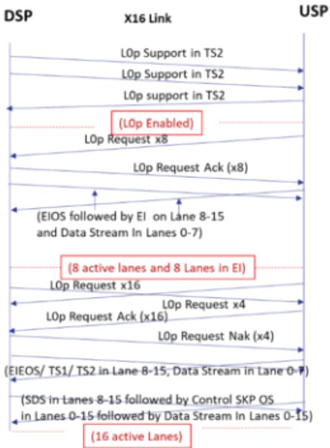

---

<a id="sec-4-2-6-8"></a>
## 4.2.6.8 L1 Overview | L1 概述

<table>
<thead>
<tr>
<th width="50%">🇬🇧 English</th>
<th width="50%" style="background-color:#e8e8e8">🇨🇳 中文</th>
</tr>
</thead>
<tbody>
<tr>
<td>

<!-- 📄 Page 497 -->
---

L1 is intended as a power savings state.
The L1 state allows an additional power savings over L0s at the cost of additional resume latency.
The entry to L1 occurs after being directed by the Data Link Layer and receiving an EIOS.

</td>
<td style="background-color:#e8e8e8">

<!-- 📄 Page 497 -->
---

L1 旨在作为一种节能状态。
L1 状态以额外的恢复延迟 (resume latency) 为代价,提供比 L0s 更大的节能效果。
在数据链路层指示并收到 EIOS 之后进入 L1。

</td>
</tr>
</tbody>
</table>

---

<a id="sec-4-2-6-9"></a>
## 4.2.6.9 L2 Overview | L2 概述


<div style="overflow-x: auto; max-width: 100%;">
<table>
<thead>
<tr>
<th width="50%">🇬🇧 English</th>
<th width="50%" style="background-color:#e8e8e8">🇨🇳 中文</th>
</tr>
</thead>
<tbody>
<tr>
<td>

<!-- 📄 Page 497 -->
---

Power can be aggressively conserved in L2. Most of the Transmitter and Receiver may be shut off.
76 Main power and
clocks are not guaranteed, but Aux
77 power is available.
When Beacon support is required by the associated system or form factor specification, an Upstream Port that supports
the wakeup capability must be able to send; and a Downstream Port must be able to receive; a wakeup signal referred to
as a Beacon.
The entry to L2 occurs after being directed by the Data Link Layer and receiving an EIOS.

</td>
<td style="background-color:#e8e8e8">

<!-- 📄 Page 497 -->
---

L2 中可以积极节省功耗。大多数发送器和接收器可以关闭。
76 主电源和时钟无法保证,但辅助
77 电源可用。
当相关系统或外形规格 (form factor) 规范要求 Beacon 支持时,支持唤醒功能的上游端口 (Upstream Port) 必须能够发送唤醒信号;下游端口 (Downstream Port) 必须能够接收唤醒信号;该唤醒信号称为 Beacon。
在数据链路层指示并收到 EIOS 之后进入 L2。

</td>
</tr>
</tbody>
</table>
</div>


---

<a id="sec-4-2-6-10-2"></a>
## 4.2.6.10 Disabled Overview | Disabled 概述

<table>
<thead>
<tr>
<th width="50%">🇬🇧 English</th>
<th width="50%" style="background-color:#e8e8e8">🇨🇳 中文</th>
</tr>
</thead>
<tbody>
<tr>
<td>

<!-- 📄 Page 497 -->
---

The intent of the Disabled state is to allow a configured Link to be disabled as long as directed or until Electrical Idle is
exited (i.e., due to a hot removal and insertion) after entering Disabled.

</td>
<td style="background-color:#e8e8e8">

<!-- 📄 Page 497 -->
---

Disabled 状态的目的是允许在已配置链路被指示期间或进入 Disabled 之后直到退出电气空闲(即由于热移除和插入)为止禁用该链路。

</td>
</tr>
</tbody>
</table>

---


---

<a id="sec-4-2-6-10"></a>
## 4.2.6.10 Disabled Overview | 禁用状态概述

<table>
<thead>
<tr>
<th width="50%">🇬🇧 English</th>
<th width="50%" style="background-color:#e8e8e8">🇨🇳 中文</th>
</tr>
</thead>
<tbody>
<tr>
<td>

76. The exception is the Receiver termination, which must remain in a low impedance state.
77. In this context, Aux power means a power source which can be used to drive the Beacon circuitry.

</td>
<td style="background-color:#e8e8e8">

76. 例外的是接收器端接(Receiver termination),它必须保持在低阻抗状态。
77. 在此上下文中,辅助电源 (Aux power) 指的是可用于驱动 Beacon 信号电路的电源。

</td>
</tr>
</tbody>
</table>

[⬆️ 返回目录](#-本章目录-table-of-contents)

---

<!-- 📄 Page 498 -->
---

<a id="sec-4-2-6-11"></a>
## 4.2.6.11 Loopback Overview | 回环状态概述


<div style="overflow-x: auto; max-width: 100%;">
<table>
<thead>
<tr>
<th width="50%">🇬🇧 English</th>
<th width="50%" style="background-color:#e8e8e8">🇨🇳 中文</th>
</tr>
</thead>
<tbody>
<tr>
<td>

Loopback is intended for test and fault isolation use. Only the entry and exit behavior is specified, all other details are implementation specific. Loopback can operate on either a per-Lane or configured Link basis.

A Loopback Lead is the component requesting Loopback.

A Loopback Follower is the component looping back the data.

In 8b/10b and 128b/130b encoding, Loopback uses bit 2 (Loopback) in the Training Control Field of TS1 and TS2 Ordered Sets (see § Table 4-25 and § Table 4-26). In 1b/1b encoding, Loopback uses an encoding of bits 3:0 in the Training Control field of TS1 and TS2 Ordered Sets (see § Table 4-28).

The entry mechanism for a Loopback Lead is device specific.

The Loopback Follower device enters Loopback whenever two consecutive TS1 Ordered Sets are received with the Loopback bit set.

> **IMPLEMENTATION NOTE:**
> **USE OF LOOPBACK**
>
> Once in the Loopback state, the Lead can send any pattern of Symbols as long as the encoding rules are followed. Once in Loopback, the concept of data scrambling is no longer relevant; what is sent out is looped back. The mechanism(s) and/or interface(s) utilized by the Data Link Layer to notify the Physical Layer to enter the Loopback state is implementation specific and beyond the scope of this specification.
> §

> **IMPLEMENTATION NOTE:**
> **LOOPBACK LEAD AND LOOPBACK FOLLOWER REPLACING OLDER TERMS**
>
> The terms Loopback Lead and Loopback Follower are newer terms while preserving the identical Loopback functionality as in [PCIe-5.0]. These terms appropriately represent the functionality performed by the component. Any Port or a test equipment can be a Loopback Lead if it has that optional capability. Every Port is required to be a Loopback Follower. The test set up needs to comprehend that in such a way that it designates one Port to be the Loopback Lead and its Link Partner to be the Loopback Follower.
> §

</td>
<td style="background-color:#e8e8e8">

回环 (Loopback) 旨在用于测试和故障隔离。只有进入和退出行为是规范定义的,所有其他细节都是实现特定的。回环可以按 Lane (通道) 方式或按已配置 Link (链路) 方式运行。

回环引导方 (Loopback Lead) 是请求回环的组件。

回环跟随方 (Loopback Follower) 是回送数据的组件。

在 8b/10b 编码和 128b/130b 编码中,回环使用 TS1 和 TS2 有序集 (Ordered Sets) 训练控制字段中的 bit 2(Loopback 位)(参见 § Table 4-25 和 § Table 4-26)。在 1b/1b 编码中,回环使用 TS1 和 TS2 有序集训练控制字段中 bits 3:0 的编码(参见 § Table 4-28)。

回环引导方的进入机制由设备自行定义。

回环跟随方设备在收到两个连续的、Loopback 位置 1 的 TS1 有序集时,即进入回环。

> **实现说明:**
> **回环的使用**
>
> 一旦进入回环状态,引导方只要遵循编码规则,就可以发送任意码型的符号 (Symbol)。进入回环后,数据加扰 (Scrambling) 的概念不再相关;发送出去的内容会被回送回来。数据链路层 (Data Link Layer) 用于通知物理层 (Physical Layer) 进入回环状态所用的机制和/或接口是实现特定的,不在本规范的范围之内。
> §

> **实现说明:**
> **回环引导方和回环跟随方取代旧术语**
>
> 回环引导方 (Loopback Lead) 和回环跟随方 (Loopback Follower) 是较新的术语,但保留了与 [PCIe-5.0] 中完全相同的回环功能。这些术语恰当地反映了组件所执行的功能。任何端口 (Port) 或测试设备只要具备该可选能力,都可以作为回环引导方。每个端口都必须能够作为回环跟随方。测试设置需要以这样的方式来理解:它指定一个端口作为回环引导方,其链路对端 (Link Partner) 作为回环跟随方。
> §

</td>
</tr>
</tbody>
</table>
</div>


[⬆️ 返回目录](#-本章目录-table-of-contents)

---

<a id="sec-4-2-6-12"></a>
## 4.2.6.12 Hot Reset Overview | 热复位状态概述

<table>
<thead>
<tr>
<th width="50%">🇬🇧 English</th>
<th width="50%" style="background-color:#e8e8e8">🇨🇳 中文</th>
</tr>
</thead>
<tbody>
<tr>
<td>

The intent of the Hot Reset state is to allow a configured Link and associated downstream device to be reset using in-band signaling.

</td>
<td style="background-color:#e8e8e8">

热复位 (Hot Reset) 状态的目的是允许使用带内 (in-band) 信号对已配置的链路及其关联的下游设备进行复位。

</td>
</tr>
</tbody>
</table>

[⬆️ 返回目录](#-本章目录-table-of-contents)

---

<a id="sec-4-2-7"></a>
## 4.2.7 Link Training and Status State Rules | 链路训练与状态机规则


<div style="overflow-x: auto; max-width: 100%;">
<table>
<thead>
<tr>
<th width="50%">🇬🇧 English</th>
<th width="50%" style="background-color:#e8e8e8">🇨🇳 中文</th>
</tr>
</thead>
<tbody>
<tr>
<td>

Various Link status bits are monitored through software with the exception of LinkUp which is monitored by the Data Link Layer. § Table 4-48 describes how the Link status bits must be handled throughout the LTSSM (for more information, see § Section 3.2 for LinkUp; § Section 7.5.3.8 for Link Speed, Link Width, and Link Training; § Section 6.2 for Receiver Error; and § Section 6.7 for In-Band Presence). A Receiver may also optionally report an 8b/10b Error in the Lane Error Status Register when operating in 8b/10b encoding, when allowed to report the error as a Receiver Error in § Table 4-48.

</td>
<td style="background-color:#e8e8e8">

各种链路状态位都通过软件来监控,LinkUp 例外,它由数据链路层监控。§ Table 4-48 描述了链路状态位在整个 LTSSM (链路训练与状态机) 中必须如何处理(更多信息请参见:§ Section 3.2 中关于 LinkUp;§ Section 7.5.3.8 中关于链路速度、链路宽度和链路训练;§ Section 6.2 中关于接收器错误 (Receiver Error);§ Section 6.7 中关于带内存在 (In-Band Presence))。在使用 8b/10b 编码时,当 § Table 4-48 允许将该错误作为接收器错误上报时,接收器也可以选择在 Lane 错误状态寄存器中上报 8b/10b 错误。

</td>
</tr>
</tbody>
</table>
</div>


[⬆️ 返回目录](#-本章目录-table-of-contents)

---

**Table 4-48. Link Status Mapped to the LTSSM | 表 4-48 链路状态与 LTSSM 的映射**

| LTSSM State | Link Width | Link Speed | LinkUp | Link Training | Receiver Error | In-Band Presence |
|-------------|------------|------------|--------|---------------|----------------|------------------|
| Detect | Undefined | Undefined | 0b | 0b | No action | 0b |
| Polling | Undefined | Set to 2.5 GT/s on entry from Detect. Link speed may change on entry to Polling.Compliance. | 0b | 0b | No action | 1b |
| Configuration | Set | No action | 0b/1b <sup>79</sup> | 1b | Set on 8b/10b Error. Optional: Set on Link Error when using 128b/130b encoding. | 1b |
| Recovery | No action | Set to new speed when speed changes | 1b | 1b | Optionally set on Link Error. | 1b |
| L0 | No action | No action | 1b | 0b | Set on Link Error. | 1b |
| L0s | No action | No action | 1b | 0b | No action | 1b |
| L1 | No action | No action | 1b | 0b | No action | 1b |
| L2 | No action | No action | 1b | 0b | No action | 1b |
| Disabled | Undefined | Undefined | 0b | 0b | Optional: Set on 8b/10b Error | 1b |
| Loopback | No action | Link speed may change on entry to Loopback from Configuration. | 0b | 0b | No action | 1b |
| Hot Reset | No action | No action | 0b | 0b | Optional: Set on 8b/10b Error | 1b |

[⬆️ 返回目录](#-本章目录-table-of-contents)

---

<table>
<thead>
<tr>
<th width="50%">🇬🇧 English</th>
<th width="50%" style="background-color:#e8e8e8">🇨🇳 中文</th>
</tr>
</thead>
<tbody>
<tr>
<td>

The state machine rules for configuring and operating a PCI Express Link are defined in the following sections.

> **IMPLEMENTATION NOTE:**
> **RECEIVER ERRORS DURING CONFIGURATION AND RECOVERY STATES**
>
> Allowing Receiver Errors to be set while in Configuration or Recovery is intended to allow implementations to report Link Errors that occur while processing packets in those states. For example, if the LTSSM transitions from L0 to Recovery while a TLP is being received, a Link Error that occurs after the LTSSM transition can be reported.
> §

</td>
<td style="background-color:#e8e8e8">

配置和操作 PCI Express 链路的状态机规则在后续各节中定义。

> **实现说明:**
> **Configuration 和 Recovery 状态期间的接收器错误**
>
> 允许在 Configuration 或 Recovery 状态下置位接收器错误,目的是让实现能够报告在这些状态下处理数据包时发生的链路错误。例如,如果 LTSSM 在接收 TLP 的过程中从 L0 转换到 Recovery,那么在 LTSSM 转换之后发生的链路错误就可以被报告。
> §

</td>
</tr>
</tbody>
</table>

[⬆️ 返回目录](#-本章目录-table-of-contents)

---

<table>
<thead>
<tr>
<th width="50%">🇬🇧 English</th>
<th width="50%" style="background-color:#e8e8e8">🇨🇳 中文</th>
</tr>
</thead>
<tbody>
<tr>
<td>

78. In-band refers to the fact that no sideband signals are used to calculate the presence of a powered up device on the other end of a Link.
79. LinkUp will always be 0 if coming into Configuration via Detect → Polling → Configuration and LinkUp will always be 1 if coming into Configuration from any other state.

</td>
<td style="background-color:#e8e8e8">

78. "带内 (in-band)" 是指不使用任何边带 (sideband) 信号来判断链路另一端是否存在已上电设备。
79. 如果是通过 Detect → Polling → Configuration 进入 Configuration,则 LinkUp 始终为 0;如果从任何其他状态进入 Configuration,则 LinkUp 始终为 1。

</td>
</tr>
</tbody>
</table>

[⬆️ 返回目录](#-本章目录-table-of-contents)

---

<!-- 📄 Page 499 -->
---

<a id="sec-4-2-7-Matching-Lane-1b1b"></a>
## Matching Link and Lane Numbers for 1b/1b Encoding | 1b/1b 编码下的链路号与通道号匹配


<div style="overflow-x: auto; max-width: 100%;">
<table>
<thead>
<tr>
<th width="50%">🇬🇧 English</th>
<th width="50%" style="background-color:#e8e8e8">🇨🇳 中文</th>
</tr>
</thead>
<tbody>
<tr>
<td>

With 1b/1b encoding, the Link and Lane numbers are not sent explicitly in the TS1/TS2 Ordered Sets in any States other than those listed in § Table 4-28. Thus, when using 1b/1b encoding in any LTSSM state other than where Link and Lane numbers are transmitted, any references to an exact match in the Link and/or Lane numbers between the transmitted and received TS0/TS1/TS2 Ordered Sets must be assumed to be true as long as the Ordered Set is a valid one. Similarly, when using 1b/1b encoding in any LTSSM state other than Configuration, any references to transmitting a TS0/TS1/TS2 Ordered Set using the Link number and/or Lane number negotiated during the Configuration LTSSM state must be interpreted as using the Lane number for the purposes of scrambling in the TS0/TS1/TS2 Ordered Set.

</td>
<td style="background-color:#e8e8e8">

在 1b/1b 编码下,除了 § Table 4-28 中所列的状态之外,链路号和通道号不会在 TS1/TS2 有序集中显式发送。因此,在传输链路号和通道号以外的任何 LTSSM 状态下使用 1b/1b 编码时,只要有序集是合法的,所发送和接收的 TS0/TS1/TS2 有序集之间关于链路号和/或通道号"完全匹配"的任何引用,都必须视为成立。类似地,在 Configuration 以外的任何 LTSSM 状态下使用 1b/1b 编码时,任何引用"使用在 Configuration LTSSM 状态期间协商好的链路号和/或通道号来传输 TS0/TS1/TS2 有序集"的地方,在 TS0/TS1/TS2 有序集加扰 (scrambling) 的目的上,都必须解释为使用通道号。

</td>
</tr>
</tbody>
</table>
</div>


[⬆️ 返回目录](#-本章目录-table-of-contents)

---

> **Figure 4-49.** Main State Diagram for Link Training and Status State Machine
> 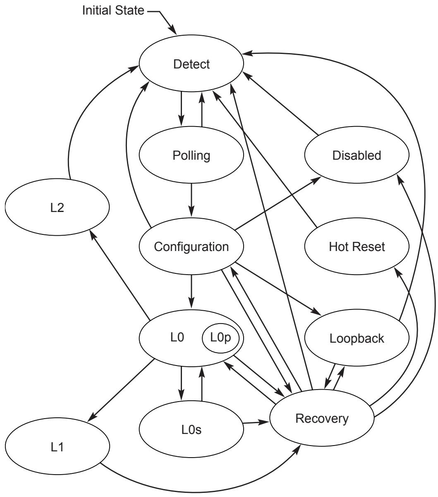


---

<!-- 📄 Page 500 -->
---

<a id="sec-4-2-7-1"></a>
## 4.2.7.1 Detect | 检测状态

<table>
<thead>
<tr>
<th width="50%">🇬🇧 English</th>
<th width="50%" style="background-color:#e8e8e8">🇨🇳 中文</th>
</tr>
</thead>
<tbody>
<tr>
<td>

The Detect substate machine is shown in § Figure 4-50.

- Transmitter is in an Electrical Idle state.
  - The DC common mode voltage is not required to be within specification.

- 2.5 GT/s data rate is selected as the frequency of operation. If the frequency of operation was not 2.5 GT/s data rate on entry to this substate, the LTSSM must stay in this substate for at least 1 ms, during which the frequency of operation must be changed to the 2.5 GT/s data rate.
  - Note: This does not affect the advertised data rate in the TS1 and TS2 Ordered Sets.

- All Receivers must meet the Z<sub>RX-DC</sub> specification for 2.5 GT/s within 1 ms (see § Table 8-12) of entering this substate. The LTSSM must stay in this substate until the Z<sub>RX-DC</sub> specification for 2.5 GT/s is met.

- LinkUp = 0b (status is cleared).

- The Equalization 8.0 GT/s Phase 1 Successful, Equalization 8.0 GT/s Phase 2 Successful, Equalization 8.0 GT/s Phase 3 Successful, and Equalization 8.0 GT/s Complete bits of the Link Status 2 Register are all set to 0b.

  The Equalization 16.0 GT/s Phase 1 Successful, Equalization 16.0 GT/s Phase 2 Successful, Equalization 16.0 GT/s Phase 3 Successful and Equalization 16.0 GT/s Complete bits of the 16.0 GT/s Status Register are all set to 0b.

  The Equalization 32.0 GT/s Phase 1 Successful, Equalization 32.0 GT/s Phase 2 Successful, Equalization 32.0 GT/s Phase 3 Successful and Equalization 32.0 GT/s Complete bits of the 32.0 GT/s Status Register are all set to 0b.

  The Equalization 64.0 GT/s Phase 1 Successful, Equalization 64.0 GT/s Phase 2 Successful, Equalization 64.0 GT/s Phase 3 Successful, and Equalization 64.0 GT/s Complete bits of the 64.0 GT/s Status Register are all set to 0b.

- The use_modified_TS1_TS2_Ordered_Set variable is reset to 0b.

- The Remote L0p Supported bit in the Device Status 3 Register is reset to 0b.

- The Flit_Mode_Enabled variable is reset to 0b. (When Flit_Mode_Enabled is set to 0b, the link will not operate in Flit Mode.)

- The L0p_capable variable is reset to 0b.

- The SRIS_Mode_Enabled variable is reset to 0b. When the SRIS_Mode_Enabled variable is set to 1b in Flit Mode, the SKP Ordered Set transmission frequency must follow the SRIS mode frequency for the data rate of operation. Otherwise, the SKP Ordered Set transmission frequency for the SRNS / Common Clock must be followed.

- The directed_speed_change variable is reset to 0b. The upconfigure_capable variable is reset to 0b. The idle_to_rlock_transitioned variable is reset to 00h. The select_deemphasis variable must be set to either 0b or 1b based on platform specific needs for an Upstream Port and identical to the Selectable Preset/De-emphasis bit in the Link Control 2 Register for a Downstream Port. The equalization_done_8GT_data_rate, equalization_done_16GT_data_rate, equalization_done_32GT_data_rate, and equalization_done_64GT_data_rate variables are reset to 0b. The perform_equalization_for_loopback and perform_equalization_for_loopback_64GT variables are reset to 0b.
  - Note that since these variables are defined with [PCIe-2.0], earlier devices would not implement these variables and will always take the path as if the directed_speed_change and upconfigure_capable variables are constantly reset to 0b and the idle_to_rlock_transitioned variable is constantly set to FFh.

</td>
<td style="background-color:#e8e8e8">

Detect 子状态机如 § Figure 4-50 所示。

- 发送器 (Transmitter) 处于电气空闲 (Electrical Idle) 状态。
  - DC 共模电压不要求在规范范围内。

- 选择 2.5 GT/s 数据速率作为工作频率。如果在进入此子状态时工作频率不是 2.5 GT/s 数据速率,则 LTSSM 必须在此子状态中至少停留 1 ms,期间必须将工作频率切换到 2.5 GT/s 数据速率。
  - 注:这不会影响 TS1 和 TS2 有序集中所通告 (advertise) 的数据速率。

- 进入此子状态后 1 ms 内,所有接收器都必须满足 2.5 GT/s 下的 Z<sub>RX-DC</sub> 规范(参见 § Table 8-12)。在满足 2.5 GT/s 下的 Z<sub>RX-DC</sub> 规范之前,LTSSM 必须一直停留在该子状态。

- LinkUp = 0b(状态被清零)。

- Link Status 2 寄存器中的 Equalization 8.0 GT/s Phase 1 Successful、Equalization 8.0 GT/s Phase 2 Successful、Equalization 8.0 GT/s Phase 3 Successful 和 Equalization 8.0 GT/s Complete 位均置为 0b。

  16.0 GT/s Status 寄存器中的 Equalization 16.0 GT/s Phase 1 Successful、Equalization 16.0 GT/s Phase 2 Successful、Equalization 16.0 GT/s Phase 3 Successful 和 Equalization 16.0 GT/s Complete 位均置为 0b。

  32.0 GT/s Status 寄存器中的 Equalization 32.0 GT/s Phase 1 Successful、Equalization 32.0 GT/s Phase 2 Successful、Equalization 32.0 GT/s Phase 3 Successful 和 Equalization 32.0 GT/s Complete 位均置为 0b。

  64.0 GT/s Status 寄存器中的 Equalization 64.0 GT/s Phase 1 Successful、Equalization 64.0 GT/s Phase 2 Successful、Equalization 64.0 GT/s Phase 3 Successful 和 Equalization 64.0 GT/s Complete 位均置为 0b。

- use_modified_TS1_TS2_Ordered_Set 变量复位为 0b。

- Device Status 3 寄存器中的 Remote L0p Supported 位复位为 0b。

- Flit_Mode_Enabled 变量复位为 0b。(当 Flit_Mode_Enabled 被设置为 0b 时,链路将不会以 Flit 模式运行。)

- L0p_capable 变量复位为 0b。

- SRIS_Mode_Enabled 变量复位为 0b。当在 Flit 模式下将 SRIS_Mode_Enabled 变量置 1b 时,SKP 有序集的发送频率必须遵循当前工作数据速率所对应的 SRIS 模式频率。否则,必须遵循 SRNS / 共同时钟 (Common Clock) 对应的 SKP 有序集发送频率。

- directed_speed_change 变量复位为 0b。upconfigure_capable 变量复位为 0b。idle_to_rlock_transitioned 变量复位为 00h。对于上游端口 (Upstream Port),select_deemphasis 变量必须根据平台特定需求设为 0b 或 1b;对于下游端口 (Downstream Port),则必须与 Link Control 2 寄存器中的 Selectable Preset/De-emphasis 位相同。equalization_done_8GT_data_rate、equalization_done_16GT_data_rate、equalization_done_32GT_data_rate 和 equalization_done_64GT_data_rate 变量复位为 0b。perform_equalization_for_loopback 和 perform_equalization_for_loopback_64GT 变量复位为 0b。
  - 请注意,由于这些变量是在 [PCIe-2.0] 中定义的,更早的设备不会实现这些变量,它们的行为将永远等同于 directed_speed_change 和 upconfigure_capable 变量恒定复位为 0b,且 idle_to_rlock_transitioned 变量恒定设置为 FFh 时所走的路径。

</td>
</tr>
</tbody>
</table>

[⬆️ 返回目录](#-本章目录-table-of-contents)

---

<a id="sec-4-2-7-1-1"></a>
## 4.2.7.1.1 Detect.Quiet | Detect.Quiet(静默检测)

<table>
<thead>
<tr>
<th width="50%">🇬🇧 English</th>
<th width="50%" style="background-color:#e8e8e8">🇨🇳 中文</th>
</tr>
</thead>
<tbody>
<tr>
<td>

80. The common mode being driven is not required to meet the Absolute Delta Between DC Common Mode During L0 and Electrical Idle (V<sub>TX-CM-DC-ACTIVE-IDLE-DELTA</sub>) specification (see § Table 8-7).

</td>
<td style="background-color:#e8e8e8">

80. 此时所驱动的共模电压不要求满足 L0 工作期间与电气空闲之间的 DC 共模绝对差 (V<sub>TX-CM-DC-ACTIVE-IDLE-DELTA</sub>) 规范(参见 § Table 8-7)。

</td>
</tr>
</tbody>
</table>

[⬆️ 返回目录](#-本章目录-table-of-contents)

---

<!-- 📄 Page 501 -->
---

<a id="sec-4-2-7-1-2"></a>
## 4.2.7.1.2 Detect.Active | Detect.Active(主动检测)


<div style="overflow-x: auto; max-width: 100%;">
<table>
<thead>
<tr>
<th width="50%">🇬🇧 English</th>
<th width="50%" style="background-color:#e8e8e8">🇨🇳 中文</th>
</tr>
</thead>
<tbody>
<tr>
<td>

- The next state is Detect.Active after a 12 ms timeout or if Electrical Idle Exit is detected on any Lane. If the transition to this state is from Hot Reset, it is strongly recommended that the Downstream Port wait for 2 ms before enabling Electrical Idle Exit detection.

- The Transmitter performs a Receiver Detection sequence on all un-configured Lanes that can form one or more Links (see § Section 8.4.5.7 for more information).

- Next state is Polling if a Receiver is detected on all unconfigured Lanes.

- Next state is Detect.Quiet if a Receiver is not detected on any Lane.

- If at least one but not all un-configured Lanes detect a Receiver, then:
  1. Wait for 12 ms.
  2. The Transmitter performs a Receiver Detection sequence on all un-configured Lanes that can form one or more Links (see § Section 8.4.5.7 for more information).
     - The next state is Polling if exactly the same Lanes detect a Receiver as the first Receiver Detection sequence.
       - Lanes that did not detect a Receiver must:
         i. Be associated with a new LTSSM if this optional feature is supported.
         
         **or**
         
         ii. All Lanes that cannot be associated with an optional new LTSSM must transition to Electrical Idle. <sup>80</sup>
         
         - These Lanes must be re-associated with the LTSSM immediately after the LTSSM in progress transitions back to Detect.
         - An EIOS does not need to be sent before transitioning to Electrical Idle.
     - Otherwise, the next state is Detect.Quiet.

</td>
<td style="background-color:#e8e8e8">

- 在 12 ms 超时之后,或者在任何 Lane 上检测到退出电气空闲 (Electrical Idle Exit) 时,下一状态为 Detect.Active。如果是从 Hot Reset 转换到本状态,强烈建议下游端口 (Downstream Port) 在使能退出电气空闲检测之前等待 2 ms。

- 发送器在所有可以组成一条或多条链路的未配置 Lane 上执行一次接收器检测 (Receiver Detection) 序列(更多信息参见 § Section 8.4.5.7)。

- 如果在所有未配置 Lane 上都检测到接收器,则下一状态为 Polling。

- 如果没有任何 Lane 检测到接收器,则下一状态为 Detect.Quiet。

- 如果在至少一个、但并非所有未配置 Lane 上检测到接收器,则:
  1. 等待 12 ms。
  2. 发送器在所有可以组成一条或多条链路的未配置 Lane 上再次执行一次接收器检测序列(更多信息参见 § Section 8.4.5.7)。
     - 如果检测到接收器的 Lane 与第一次接收器检测序列完全相同,则下一状态为 Polling。
       - 对于没有检测到接收器的 Lane,必须满足以下条件之一:
         i. 如果支持此可选特性,则将其关联到一个新的 LTSSM。
         
         **或者**
         
         ii. 任何无法关联到可选新 LTSSM 的 Lane 必须转换到电气空闲。<sup>80</sup>
         
         - 这些 Lane 必须在进行中的 LTSSM 转换回 Detect 后立即重新关联到该 LTSSM。
         - 在转换到电气空闲之前不需要发送 EIOS。
     - 否则,下一状态为 Detect.Quiet。

</td>
</tr>
</tbody>
</table>
</div>


[⬆️ 返回目录](#-本章目录-table-of-contents)

---

> **Figure 4-50.** Detect Substate Machine
> 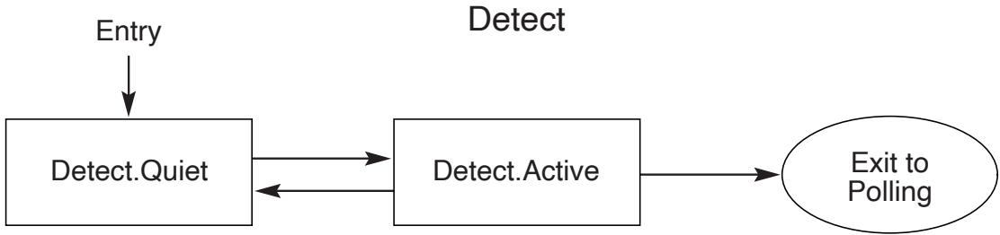


---

<a id="sec-4-2-7-2"></a>
## 4.2.7.2 Polling | 轮询状态

<table>
<thead>
<tr>
<th width="50%">🇬🇧 English</th>
<th width="50%" style="background-color:#e8e8e8">🇨🇳 中文</th>
</tr>
</thead>
<tbody>
<tr>
<td>

The Polling substate machine is shown in § Figure 4-51.

</td>
<td style="background-color:#e8e8e8">

Polling 子状态机如 § Figure 4-51 所示。

</td>
</tr>
</tbody>
</table>

[⬆️ 返回目录](#-本章目录-table-of-contents)

---

<a id="sec-4-2-7-2-1"></a>
## 4.2.7.2.1 Polling.Active | Polling.Active(主动轮询)


<div style="overflow-x: auto; max-width: 100%;">
<table>
<thead>
<tr>
<th width="50%">🇬🇧 English</th>
<th width="50%" style="background-color:#e8e8e8">🇨🇳 中文</th>
</tr>
</thead>
<tbody>
<tr>
<td>

- Transmitter sends TS1 Ordered Sets with Lane and Link numbers set to PAD on all Lanes that detected a Receiver during Detect.
  - The Data Rate Identifier Symbol of the TS1 Ordered Sets must advertise all data rates between 2.5 GT/s and 32.0 GT/s that the Port supports, including those that it does not intend to use.
    Note: Ports are not permitted to advertise higher than 32.0 GT/s data rates in this state.
  - The Transmitter must wait for its TX common mode to settle before exiting from Electrical Idle and transmitting the TS1 Ordered Sets.
    - The Transmitter must drive patterns in the default voltage level of the Transmit Margin field within 192 ns from entry to this state. This transmit voltage level will remain in effect until Polling.Compliance or Recovery.RcvrLock is entered.

- Next state is Polling.Compliance if the Enter Compliance bit (bit 4) in the Link Control 2 Register is 1b. If the Enter Compliance bit was set prior to entry to Polling.Active, the transition to Polling.Compliance must be immediate without sending any TS1 Ordered Sets.

- Next state is Polling.Configuration after at least 1024 TS1 Ordered Sets were transmitted, and all Lanes that detected a Receiver during Detect receive eight consecutive training sequences (or their complement) satisfying any of the following conditions:
  - TS1 with Lane and Link numbers set to PAD and the Compliance Receive bit (bit 4 of Symbol 5) is 0b.
  - TS1 with Lane and Link numbers set to PAD and the Loopback bit (bit 2 of Symbol 5) is 1b.
  - TS2 with Lane and Link numbers set to PAD.

- Otherwise, after a 24 ms timeout the next state is:
  - Polling.Configuration if,
    i. Any Lane, which detected a Receiver during Detect, received eight consecutive training sequences (or their complement) satisfying any of the following conditions:
       1. TS1 with Lane and Link numbers set to PAD and the Compliance Receive bit (bit 4 of Symbol 5) is 0b.
       2. TS1 with Lane and Link numbers set to PAD and the Loopback bit (bit 2 of Symbol 5) is 1b.
       3. TS2 with Lane and Link numbers set to PAD.
       
       and a minimum of 1024 TS1 Ordered Sets are transmitted after receiving one TS1 or TS2 Ordered Set <sup>81</sup>.
       
       **And**
    
    ii. At least a predetermined set of Lanes that detected a Receiver during Detect have detected an exit from Electrical Idle at least once since entering Polling.Active.
       - Note: This may prevent one or more bad Receivers or Transmitters from holding up a valid Link from being configured, and allow for additional training in Polling.Configuration. The exact set of predetermined Lanes is implementation specific. Note that up to [PCIe-1.1] this predetermined set was equal to the total set of Lanes that detected a Receiver.

</td>
<td style="background-color:#e8e8e8">

- 发送器在 Detect 期间检测到接收器的所有 Lane 上发送通道号和链路号置为 PAD 的 TS1 有序集。
  - TS1 有序集中的数据速率标识符 (Data Rate Identifier) 符号必须通告该端口所支持的 2.5 GT/s 到 32.0 GT/s 之间的所有数据速率,包括那些它并不打算使用的数据速率。
    注:不允许端口在本状态中通告高于 32.0 GT/s 的数据速率。
  - 发送器必须等待其 TX 共模电压稳定之后,才能退出电气空闲并发送 TS1 有序集。
    - 发送器必须在进入本状态后的 192 ns 内,以 Transmit Margin 字段的默认电压电平驱动码型。该发送电压电平将保持有效,直到进入 Polling.Compliance 或 Recovery.RcvrLock 为止。

- 如果 Link Control 2 寄存器中的 Enter Compliance 位(bit 4)为 1b,则下一状态为 Polling.Compliance。如果在进入 Polling.Active 之前 Enter Compliance 位已被置 1,则必须立即转换到 Polling.Compliance,且不发送任何 TS1 有序集。

- 至少发送了 1024 个 TS1 有序集,并且 Detect 期间检测到接收器的所有 Lane 都接收到了八个连续的、满足以下任一条件的训练序列(或其反码)时,下一状态为 Polling.Configuration:
  - Lane 和 Link 号置为 PAD 且 Compliance Receive 位(Symbol 5 的 bit 4)为 0b 的 TS1。
  - Lane 和 Link 号置为 PAD 且 Loopback 位(Symbol 5 的 bit 2)为 1b 的 TS1。
  - Lane 和 Link 号置为 PAD 的 TS2。

- 否则,在 24 ms 超时之后,下一状态为:
  - Polling.Configuration,如果同时满足以下条件:
    i. 在 Detect 期间检测到接收器的任何一个 Lane 接收到了八个连续的、满足以下任一条件的训练序列(或其反码):
       1. Lane 和 Link 号置为 PAD 且 Compliance Receive 位(Symbol 5 的 bit 4)为 0b 的 TS1。
       2. Lane 和 Link 号置为 PAD 且 Loopback 位(Symbol 5 的 bit 2)为 1b 的 TS1。
       3. Lane 和 Link 号置为 PAD 的 TS2。
       
       并且在收到一个 TS1 或 TS2 有序集之后,至少发送 1024 个 TS1 有序集<sup>81</sup>。
       
       **且**
    
    ii. 自进入 Polling.Active 以来,Detect 期间检测到接收器的至少一组预先确定的 Lane 至少检测到一次退出电气空闲。
       - 注:这可以防止一个或多个存在缺陷的接收器或发送器阻碍一条有效链路的建立,并允许在 Polling.Configuration 中进行额外的训练。这一预先确定的 Lane 集合的具体内容是实现特定的。请注意,直到 [PCIe-1.1],这一预先确定的集合等于 Detect 期间检测到接收器的所有 Lane 的集合。

</td>
</tr>
</tbody>
</table>
</div>


[⬆️ 返回目录](#-本章目录-table-of-contents)

---

<table>
<thead>
<tr>
<th width="50%">🇬🇧 English</th>
<th width="50%" style="background-color:#e8e8e8">🇨🇳 中文</th>
</tr>
</thead>
<tbody>
<tr>
<td>

81. Earlier versions of this specification required transmission of 1024 TS1 Ordered Sets after receiving one TS1 Ordered Set. This behavior is still permitted but the implementation will be more robust if it follows the behavior of transmitting 1024 TS1 Ordered Sets after receiving one TS1 or TS2 Ordered Set.

</td>
<td style="background-color:#e8e8e8">

81. 早期版本的本规范要求在收到一个 TS1 有序集之后发送 1024 个 TS1 有序集。该行为目前仍然允许,但如果实现遵循"在收到一个 TS1 或 TS2 有序集之后发送 1024 个 TS1 有序集"的行为,将更具鲁棒性。

</td>
</tr>
</tbody>
</table>

[⬆️ 返回目录](#-本章目录-table-of-contents)

---

<!-- 📄 Page 503 -->
---

<a id="sec-4-2-7-2-1-continued"></a>
## 4.2.7.2.1 Polling.Active (continued) | Polling.Active(续)


<div style="overflow-x: auto; max-width: 100%;">
<table>
<thead>
<tr>
<th width="50%">🇬🇧 English</th>
<th width="50%" style="background-color:#e8e8e8">🇨🇳 中文</th>
</tr>
</thead>
<tbody>
<tr>
<td>

  - Note: Any Lane that receives eight consecutive TS1 or TS2 Ordered Sets should have detected an exit from Electrical Idle at least once since entering Polling.Active.

  - Else Polling.Compliance if either (a) or (b) is true:
    a. not all Lanes from the predetermined set of Lanes from (ii) above have detected an exit from Electrical Idle since entering Polling.Active.
    b. any Lane that detected a Receiver during Detect received eight consecutive TS1 Ordered Sets (or their complement) with the Lane and Link numbers set to PAD, the Compliance Receive bit (bit 4 of Symbol 5) is 1b, and the Loopback bit (bit 2 of Symbol 5) is 0b.
       - A port that is capable of transmitting at the 64.0 GT/s data rate may receive TS1 Ordered Sets with the Flit Mode Supported bit set to 1b and the Supported Link Speeds field set to 1 0111b.
       - Note: If a passive test load is applied on all Lanes then the device will go to Polling.Compliance.

  - Else Detect if the conditions to transition to Polling.Configuration or Polling.Compliance are not met

- The Transmit Margin field of the Link Control 2 Register is sampled on entry to this substate and becomes effective on the transmit package pins within 192 ns of entry to this substate and remains effective through the time the LTSSM is in this substate.

</td>
<td style="background-color:#e8e8e8">

  - 注:任何接收到八个连续 TS1 或 TS2 有序集的 Lane,自进入 Polling.Active 以来应当至少检测到一次退出电气空闲。

  - 否则,如果(a)或(b)任一为真,则下一状态为 Polling.Compliance:
    a. 自进入 Polling.Active 以来,上面 (ii) 中预先确定的 Lane 集合中并非所有 Lane 都检测到退出电气空闲。
    b. Detect 期间检测到接收器的任何一个 Lane 接收到了八个连续的(或者其反码)TS1 有序集,其中通道号和链路号置为 PAD,Compliance Receive 位(Symbol 5 的 bit 4)为 1b,Loopback 位(Symbol 5 的 bit 2)为 0b。
       - 支持 64.0 GT/s 数据速率发送的端口可能会收到 Flit Mode Supported 位置 1b 且 Supported Link Speeds 字段为 1 0111b 的 TS1 有序集。
       - 注:如果所有 Lane 上都施加被动测试负载,则设备将进入 Polling.Compliance。

  - 否则,如果转换到 Polling.Configuration 或 Polling.Compliance 的条件都不满足,则下一状态为 Detect。

- Link Control 2 寄存器的 Transmit Margin 字段在进入本子状态时被采样,并在进入本子状态后的 192 ns 内在发送封装引脚 (transmit package pins) 上生效,且在 LTSSM 处于本子状态的整个期间保持有效。

</td>
</tr>
</tbody>
</table>
</div>


[⬆️ 返回目录](#-本章目录-table-of-contents)

---

<!-- 📄 Page 504 -->
---

<a id="sec-4-2-7-2-2"></a>
## 4.2.7.2.2 Polling.Compliance | Polling.Compliance(一致性轮询)

<table>
<thead>
<tr>
<th width="50%">🇬🇧 English</th>
<th width="50%" style="background-color:#e8e8e8">🇨🇳 中文</th>
</tr>
</thead>
<tbody>
<tr>
<td>

- The data rate and de-emphasis level for transmitting the compliance pattern are determined on the transition from Polling.Active to Polling.Compliance using the following algorithm.
  - If the Port is capable of transmitting at the 2.5 GT/s data rate only, the data rate for transmitting the compliance pattern is 2.5 GT/s and the de-emphasis level is -3.5 dB.
  - Else if the Port entered Polling.Compliance due to detecting eight consecutive TS1 Ordered Sets in Polling.Active with the Compliance Receive bit (bit 4 of Symbol 5) asserted and the Loopback bit (bit 2 of Symbol 5) deasserted then the data rate for transmission is determined as follows:
    - If the port is capable of transmitting at the 64.0 GT/s data rate and the eight consecutive TS1 Ordered Sets received in Polling.Active that directed the port to this state had the Flit Mode Supported bit set to 1b and the Supported Link Speeds field set to 1 0111b, the data rate for transmitting the compliance pattern must be 64.0 GT/s.
    - Else, the data rate for transmission is determined by the highest common transmitted and received Data Rate Identifiers (Symbols 4 of the TS1 sequence) advertised in the eight consecutive TS1 Ordered Sets received on any Lane that detected a Receiver during Detect.
      
      The select_deemphasis variable must be set equal to the Selectable De-emphasis bit (Symbol 4 bit 6) in the eight consecutive TS1 Ordered Sets it received in Polling.Active substate. If the common data rate is 8.0 GT/s or higher, the select_preset variable on each Lane is set to the Transmitter preset value advertised in the Transmitter Preset bits of the eight consecutive EQ TS1 Ordered Sets on the corresponding Lane, provided the value is not a Reserved encoding, and this value must be used by the transmitter (for 8.0 GT/s Data Rate, use of the Receiver preset hint value advertised in those eight consecutive EQ TS1 Ordered Sets is optional). If the common Data Rate is 8.0 GT/s or higher, any Lanes that did not receive eight consecutive EQ TS1 Ordered Sets with Transmitter preset information, or that received a value for a Reserved encoding, can use any supported Transmitter preset in an implementation specific manner.
  - Else if the Enter Compliance bit in the Link Control 2 Register is 1b, the data rate for transmitting the compliance pattern is defined by the Target Link Speed field in the Link Control 2 Register. The

</td>
<td style="background-color:#e8e8e8">

- 发送一致性测试码型 (Compliance Pattern) 时使用的数据速率和去加重 (de-emphasis) 电平,在从 Polling.Active 转换到 Polling.Compliance 时按照下面的算法确定。
  - 如果该端口仅支持 2.5 GT/s 数据速率的发送,则一致性测试码型的数据速率为 2.5 GT/s,去加重电平为 -3.5 dB。
  - 否则,如果该端口进入 Polling.Compliance 是因为在 Polling.Active 中检测到八个连续的、Compliance Receive 位(Symbol 5 的 bit 4)置位且 Loopback 位(Symbol 5 的 bit 2)未置位的 TS1 有序集,则发送数据速率按如下方式确定:
    - 如果该端口支持 64.0 GT/s 数据速率的发送,并且 Polling.Active 中收到的那八个连续 TS1 有序集(正是将端口引导至本状态的那一组)中 Flit Mode Supported 位置 1b 且 Supported Link Speeds 字段为 1 0111b,则一致性测试码型的数据速率必须为 64.0 GT/s。
    - 否则,发送数据速率由 Detect 期间检测到接收器的任何 Lane 上收到的八个连续 TS1 有序集中所通告的、发送与接收两端 Data Rate Identifier(TS1 序列的 Symbol 4)中最高的公共数据速率决定。
      
      select_deemphasis 变量必须被设置为在 Polling.Active 子状态中收到的八个连续 TS1 有序集内的 Selectable De-emphasis 位(Symbol 4 bit 6)的值。如果公共数据速率为 8.0 GT/s 或更高,则每个 Lane 上的 select_preset 变量被设置为该 Lane 上对应的八个连续 EQ TS1 有序集中 Transmitter Preset 位所通告的发送器预设 (preset) 值,前提是该值不是保留 (Reserved) 编码,发送器必须使用该值(对于 8.0 GT/s 数据速率,使用这八个连续 EQ TS1 有序集中所通告的 Receiver Preset Hint 值是可选的)。如果公共数据速率为 8.0 GT/s 或更高,任何没有收到带有 Transmitter Preset 信息的八个连续 EQ TS1 有序集的 Lane,或者收到的值为保留编码的 Lane,可以以实现特定的方式使用任何受支持的发送器预设。
  - 否则,如果 Link Control 2 寄存器中的 Enter Compliance 位为 1b,则发送一致性测试码型的数据速率由 Link Control 2 寄存器中的 Target Link Speed 字段定义。

</td>
</tr>
</tbody>
</table>

[⬆️ 返回目录](#-本章目录-table-of-contents)

---

<!-- 📄 Page 505 -->
---

<a id="sec-4-2-7-2-2-continued"></a>
## 4.2.7.2.2 Polling.Compliance (continued) | Polling.Compliance(续)


<div style="overflow-x: auto; max-width: 100%;">
<table>
<thead>
<tr>
<th width="50%">🇬🇧 English</th>
<th width="50%" style="background-color:#e8e8e8">🇨🇳 中文</th>
</tr>
</thead>
<tbody>
<tr>
<td>

select_deemphasis variable is Set when the Compliance Preset/De-emphasis field in the Link Control 2 Register equals 0001b if the data rate will be 5.0 GT/s. If the data rate will be 8.0 GT/s or higher, the select_preset variable on each Lane is set to, and the transmitter must operate with, the preset value provided in the Compliance Preset/De-emphasis Value (bits 15:12) in the Link Control 2 Register provided the value is not a Reserved encoding.

  - Else the data rate, preset, and de-emphasis level settings are defined as follows based on the component's maximum supported data rate and the number of times Polling.Compliance has been entered with this entry criteria, in the same sequence of setting numbers as described in § Table 4-49:

</td>
<td style="background-color:#e8e8e8">

当数据速率为 5.0 GT/s 时,如果 Link Control 2 寄存器中 Compliance Preset/De-emphasis 字段等于 0001b,则 select_deemphasis 变量被置位。如果数据速率为 8.0 GT/s 或更高,则每个 Lane 上的 select_preset 变量被设置为 Link Control 2 寄存器中 Compliance Preset/De-emphasis Value 字段(bits 15:12)所提供的预设值,并且发送器必须以此预设值工作,前提是该值不是保留编码。

  - 否则,数据速率、预设值和去加重电平设置根据组件支持的最大数据速率以及以本进入条件进入 Polling.Compliance 的次数,按照与 § Table 4-49 相同的设置编号顺序定义如下:

</td>
</tr>
</tbody>
</table>
</div>


[⬆️ 返回目录](#-本章目录-table-of-contents)

---

**Table 4-49. Compliance Pattern Settings | 表 4-49 一致性测试码型设置**

| Setting Nos | Data Rate | Transmitter De-emphasis or preset sequence |
|-------------|-----------|--------------------------------------------|
| #1 | 2.5 GT/s | -3.5 dB |
| #2, #3 | 5.0 GT/s | -3.5 dB followed by -6 dB |
| #4 through #14 | 8.0 GT/s | Transmitter Preset Encoding 0000b through 1010b, as defined in § Section 4.2.4.2, in increasing order |
| #15 through #25 | 16.0 GT/s | Transmitter Preset Encoding 0000b through 1010b, as defined in § Section 4.2.4.2, in increasing order |
| #26 through #34 | 16.0 GT/s | Transmitter Preset Encoding 0100b as defined in § Section 4.2.4.2 |
| #35 through #45 | 32.0 GT/s | Transmitter Preset Encoding 0000b through 1010b, as defined in § Section 4.2.4.2, in increasing order |
| #46 through #54 | 32.0 GT/s | Transmitter Preset Encoding 0100b as defined in § Section 4.2.4.2 |
| #55 through #65 | 64.0 GT/s | Transmitter Preset Encoding 0000b through 1010b, as defined in § Section 4.2.4.2, in increasing order |
| #66 through #84 | 64.0 GT/s | Transmitter Preset Encoding 0000b as defined in § Section 4.2.4.2 |

[⬆️ 返回目录](#-本章目录-table-of-contents)

---

<table>
<thead>
<tr>
<th width="50%">🇬🇧 English</th>
<th width="50%" style="background-color:#e8e8e8">🇨🇳 中文</th>
</tr>
</thead>
<tbody>
<tr>
<td>

Subsequent entries to Polling.Compliance repeat the above sequence. For example, the state sequence which causes a Port to transmit the Compliance Pattern at a data rate of 5.0 GT/s and a de-emphasis level of -6 dB is: Polling.Active, Polling.Compliance (2.5 GT/s and -3.5 dB), Polling.Active, Polling.Compliance (5.0 GT/s and -3.5 dB), Polling.Active, Polling.Compliance (5.0 GT/s and -6 dB).

The sequence must be set to Setting #1 in the Polling.Configuration state if the Port supports 16.0 GT/s or higher Data Rates, or the Port's Receivers do not meet the Z<sub>RX-DC</sub> specification for 2.5 GT/s when they are operating at 8.0 GT/s or higher data rates (see § Table 8-12). All Ports are permitted to set the sequence to Setting #1 in the Polling.Configuration state.

§

</td>
<td style="background-color:#e8e8e8">

后续进入 Polling.Compliance 时重复上述序列。例如,使端口以 5.0 GT/s 数据速率和 -6 dB 去加重电平发送一致性测试码型的状态序列为:Polling.Active, Polling.Compliance(2.5 GT/s 且 -3.5 dB),Polling.Active, Polling.Compliance(5.0 GT/s 且 -3.5 dB),Polling.Active, Polling.Compliance(5.0 GT/s 且 -6 dB)。

如果端口支持 16.0 GT/s 或更高的数据速率,或者端口的接收器在 8.0 GT/s 或更高数据速率下工作时不能满足 2.5 GT/s 的 Z<sub>RX-DC</sub> 规范(参见 § Table 8-12),则该序列必须在 Polling.Configuration 状态中被设置为 Setting #1。所有端口都允许在 Polling.Configuration 状态中将该序列设置为 Setting #1。

§

</td>
</tr>
</tbody>
</table>

[⬆️ 返回目录](#-本章目录-table-of-contents)

---

<!-- 📄 Page 506 -->
---


<div style="overflow-x: auto; max-width: 100%;">
<table>
<thead>
<tr>
<th width="50%">🇬🇧 English</th>
<th width="50%" style="background-color:#e8e8e8">🇨🇳 中文</th>
</tr>
</thead>
<tbody>
<tr>
<td>

- If the compliance pattern data rate is not 2.5 GT/s and any TS1 Ordered Sets were transmitted in Polling.Active prior to entering Polling.Compliance:
  - The Transmitter sends two Compliance TS1 Ordered Sets if all of the following conditions are true:
    - The current data rate is 2.5 GT/s.
    - Flit Mode is supported.
    - The Transmitter is sequencing through one of the settings defined in § Table 4-49.
  - Transmitter sends either one EIOS or two consecutive EIOSs prior to entering Electrical Idle.

- If the compliance pattern data rate is not 2.5 GT/s and TS1 Ordered Sets were not transmitted in Polling.Active prior to entering Polling.Compliance, the Transmitter must enter Electrical Idle without transmitting any EIOSs. During the period of Electrical Idle, the data rate is changed to the new speed and stabilized. If the frequency of operation will be 5.0 GT/s, the de-emphasis/preset level must be set to -3.5 dB if the select_deemphasis variable is 1b else it must be set to -6 dB. If the frequency of operation will be 8.0 GT/s or higher, the Transmitter preset value must be set to the value in the select_preset variable. The period of Electrical Idle is greater than 1 ms but it is not to exceed 2 ms.

</td>
<td style="background-color:#e8e8e8">

- 如果一致性测试码型的数据速率不是 2.5 GT/s,并且在进入 Polling.Compliance 之前曾在 Polling.Active 中发送过任何 TS1 有序集:
  - 在同时满足以下所有条件时,发送器发送两个 Compliance TS1 有序集:
    - 当前数据速率为 2.5 GT/s。
    - 支持 Flit 模式。
    - 发送器正在按 § Table 4-49 中定义的某个设置顺序循环。
  - 在进入电气空闲之前,发送器发送一个 EIOS 或两个连续的 EIOS。

- 如果一致性测试码型的数据速率不是 2.5 GT/s,并且在进入 Polling.Compliance 之前没有在 Polling.Active 中发送过 TS1 有序集,则发送器必须在不发送任何 EIOS 的情况下进入电气空闲。在电气空闲期间,数据速率被切换到新速率并稳定下来。如果工作频率将为 5.0 GT/s,则当 select_deemphasis 变量为 1b 时,去加重/预设电平必须设置为 -3.5 dB,否则必须设置为 -6 dB。如果工作频率将为 8.0 GT/s 或更高,则发送器预设值必须设置为 select_preset 变量中的值。电气空闲时长大于 1 ms 但不超过 2 ms。

</td>
</tr>
</tbody>
</table>
</div>


[⬆️ 返回目录](#-本章目录-table-of-contents)

---

<table>
<thead>
<tr>
<th width="50%">🇬🇧 English</th>
<th width="50%" style="background-color:#e8e8e8">🇨🇳 中文</th>
</tr>
</thead>
<tbody>
<tr>
<td>

- Behavior during Polling.Compliance after the data rate and de-emphasis/preset level are determined must follow the following rules:
  - If the Port entered Polling.Compliance due to detecting eight consecutive TS1 Ordered Sets in Polling.Active with the Compliance Receive bit (bit 4 of Symbol 5) asserted and the Loopback bit (bit 2 of Symbol 5) deasserted **or** both the Enter Compliance bit and the Enter Modified Compliance bit in the Link Control 2 Register are set to 1b then the Transmitter sends out the Modified Compliance Pattern at the above determined data rate with the error status Symbol set to all 0's on all Lanes that detected a Receiver during Detect.
    - If the data rate is 2.5 GT/s or 5.0 GT/s, a particular Lane's Receiver independently signifies a successful lock to the incoming Modified Compliance Pattern by looking for any one occurrence of the Modified Compliance Pattern and then setting the Pattern Lock bit (bit 7 of the error status Symbol) in the same Lane of its own transmitted Modified Compliance Pattern.
    - The error status Symbols are not to be used for the lock process since they are undefined at any given moment.
    - An occurrence is defined above as the following sequence of 8b/10b Symbols; K28.5, D21.5, K28.5, and D10.2 or the complement of each of the individual Symbols.
    - The device under test must set the Pattern Lock bit of the Modified Compliance Pattern it transmits at the Transmitter package pin(s) after successfully locking to

> **IMPLEMENTATION NOTE:**
> **COMPLIANCE LOAD BOARD USAGE TO GENERATE COMPLIANCE PATTERNS**
>
> It is envisioned that the compliance load (base) board may send a 100 MHz signal for about 1 ms on one leg of a differential pair at 350 mV peak-to-peak on any Lane to cycle the device to the desired speed and de-emphasis level. The device under test is required, based on its maximum supported data rate, to cycle through the following settings in order, for each entry to Polling.Compliance from Polling.Active, starting with the first setting on the first entry to Polling.Compliance after the Fundamental Reset as defined in § Table 4-49.
> §

</td>
<td style="background-color:#e8e8e8">

- 在确定数据速率和去加重/预设电平之后,Polling.Compliance 期间的行为必须遵循以下规则:
  - 如果该端口是因为在 Polling.Active 中检测到八个连续的、Compliance Receive 位(Symbol 5 的 bit 4)置位且 Loopback 位(Symbol 5 的 bit 2)未置位的 TS1 有序集而进入 Polling.Compliance,**或者** Link Control 2 寄存器中的 Enter Compliance 位和 Enter Modified Compliance 位都被置 1b,则发送器在 Detect 期间检测到接收器的所有 Lane 上,以所确定的数据速率发送 Modified Compliance Pattern(修改后的一致性测试码型),且错误状态 (error status) 符号设为全 0。
    - 如果数据速率为 2.5 GT/s 或 5.0 GT/s,某个 Lane 的接收器通过寻找 Modified Compliance Pattern 的任意一次出现,即可独立地表示其已成功锁定到输入的 Modified Compliance Pattern,然后在其自身发送的 Modified Compliance Pattern 的同一个 Lane 的错误状态符号中置位 Pattern Lock 位(bit 7)。
    - 错误状态符号不能用于锁定过程,因为它们在任意时刻都是未定义的。
    - 上述"出现一次"定义为由以下 8b/10b 符号组成的序列:K28.5、D21.5、K28.5 和 D10.2,或其中每个符号各自的反码。
    - 被测设备 (DUT) 必须在成功锁定到其接收封装引脚 (Receiver package pin(s)) 上的输入 Modified Compliance Pattern 之后,才在其发送封装引脚上发送的 Modified Compliance Pattern 中置位 Pattern Lock 位。

> **实现说明:**
> **使用一致性测试负载板生成一致性测试码型**
>
> 预期一致性测试负载(底)板可在任意 Lane 上以 350 mV 峰峰值在差分对的一侧发送约 1 ms 的 100 MHz 信号,以使设备循环到期望的速度和去加重电平。被测设备 (DUT) 需要根据其所支持的最大数据速率,在每次从 Polling.Active 进入 Polling.Compliance 时,按照 § Table 4-49 中定义的顺序循环以下设置,首次进入 Polling.Compliance 的设置从基本复位 (Fundamental Reset) 之后的第一次进入 Polling.Compliance 的第一个设置开始。
> §

</td>
</tr>
</tbody>
</table>

[⬆️ 返回目录](#-本章目录-table-of-contents)

---

<!-- 📄 Page 507 -->
---


<div style="overflow-x: auto; max-width: 100%;">
<table>
<thead>
<tr>
<th width="50%">🇬🇧 English</th>
<th width="50%" style="background-color:#e8e8e8">🇨🇳 中文</th>
</tr>
</thead>
<tbody>
<tr>
<td>

the incoming Modified Compliance Pattern within 1 ms of receiving the Modified Compliance Pattern at its Receiver package pin(s).

    - If the data rate is 8.0 GT/s or higher: The Error_Status field is set to 00h on entry to this substate. Each Lane sets the Pattern Lock bit independently when it achieves Block Alignment as described in § Section 4.2.2.2.1. After Pattern Lock is achieved, Symbols received in Data Blocks are compared to the Idle data Symbol (00h) and each mismatched Symbol causes the Receiver Error Count field to be incremented by 1. The Receiver Error Count saturates at 127 (further mismatched Symbols do not change the Receiver Error Count). The Pattern Lock and Receiver Error Count information for each Lane is transmitted as part of the SKP Ordered Sets transmitted in that Lane's Modified Compliance Pattern. See § Section 4.2.8 for more information. The device under test must set the Pattern Lock bit in the SKP Ordered Set it transmits within 4 ms of receiving the Modified Compliance Pattern at its Receiver package pin(s).

- The scrambling requirements defined in § Section 4.2.2.4 are applied to the received Modified Compliance Pattern. For example, the scrambling LFSR seed is set per Lane, an EIEOS initializes the LFSR and SKP Ordered Sets do not advance the LFSR.

- If the data rate is 2.5 GT/s or 5.0 GT/s, once a particular Lane indicates it has locked to the incoming Modified Compliance Pattern the Receiver Error Count for that particular Lane is incremented every time a Receiver Error occurs.
  - The error status Symbol uses the lower 7 bits as the Receiver Error Count field and this field will remain stuck at all 1's if the count reaches 127.
  - The Receiver must not make any assumption about the 10-bit patterns it will receive when in this substate if 8b/10b encoding is used.

- If the Enter Compliance bit in the Link Control 2 Register is 0b, the next state is Detect if directed

- Else if the Enter Compliance bit was set to 1b on entry to Polling.Compliance, next state is Polling.Active if any of the following conditions apply:
  - The Enter Compliance bit in the Link Control 2 Register has changed to 0b
  - The Port is an Upstream Port and an EIOS is received on any Lane. The Enter Compliance bit is reset to 0b when this condition is true.

If the Transmitter was transmitting at a data rate other than 2.5 GT/s, or the Enter Compliance bit in the Link Control 2 Register was set to 1b during entry to Polling.Compliance, the Transmitter sends eight consecutive EIOS and enters Electrical Idle prior to transitioning to Polling.Active. During the period of Electrical Idle, the data rate is changed to 2.5 GT/s and stabilized and the de-emphasis level is set to -3.5 dB. The period of Electrical Idle is greater than 1 ms but must not exceed 2 ms.

Note: Sending multiple EIOS provides enough robustness such that the other Port detects at least one EIOS and exits Polling.Compliance substate when the configuration register mechanism was used for entry.

> **IMPLEMENTATION NOTE:**
> **HANDLING BIT SLIP AND BLOCK ALIGNMENT**
>
> Devices should ensure that their Receivers have stabilized before attempting to obtain Block alignment and signaling Pattern Lock. For example, if an implementation expects to see bit slips in the initial few bits, it should wait for that time to be over before settling on a Block Alignment. Devices may also want to revalidate their Block alignment prior to setting the Pattern Lock bit.
> §

</td>
<td style="background-color:#e8e8e8">

并且必须在收到其接收封装引脚上的 Modified Compliance Pattern 之后的 1 ms 之内完成。

    - 如果数据速率为 8.0 GT/s 或更高:Error_Status 字段在进入本子状态时被设置为 00h。每个 Lane 在获得块对齐 (Block Alignment) 时,会按 § Section 4.2.2.2.1 中的描述独立地置位 Pattern Lock 位。获得 Pattern Lock 之后,数据块 (Data Blocks) 中接收到的符号与 Idle 数据符号(00h)进行比较,每出现一个不匹配的符号,Receiver Error Count 字段就加 1。Receiver Error Count 在 127 处饱和(之后即使再有更多不匹配符号,Receiver Error Count 也不会改变)。每个 Lane 的 Pattern Lock 和 Receiver Error Count 信息作为该 Lane 的 Modified Compliance Pattern 中所发送 SKP 有序集的一部分进行传输。更多信息参见 § Section 4.2.8。被测设备 (DUT) 必须在收到其接收封装引脚上的 Modified Compliance Pattern 之后的 4 ms 之内,在其所发送的 SKP 有序集中置位 Pattern Lock 位。

- § Section 4.2.2.4 中定义的加扰要求适用于收到的 Modified Compliance Pattern。例如,加扰 LFSR 种子按 Lane 设置,EIEOS 用于初始化 LFSR,SKP 有序集不推进 LFSR。

- 如果数据速率为 2.5 GT/s 或 5.0 GT/s,则一旦某个 Lane 指示其已锁定到输入的 Modified Compliance Pattern,该 Lane 的 Receiver Error Count 就会在每次发生接收器错误 (Receiver Error) 时加 1。
  - 错误状态符号使用低 7 位作为 Receiver Error Count 字段,当计数达到 127 时,该字段将"卡"在全部为 1 的状态。
  - 在本子状态中,如果使用 8b/10b 编码,接收器不得对其将要接收的 10 位码型做任何假设。

- 如果 Link Control 2 寄存器中的 Enter Compliance 位为 0b,且被指示的话,下一状态为 Detect。

- 否则,如果在进入 Polling.Compliance 时 Enter Compliance 位被置 1b,则在满足以下任一条件时,下一状态为 Polling.Active:
  - Link Control 2 寄存器中的 Enter Compliance 位已变为 0b。
  - 该端口是上游端口 (Upstream Port) 且在任何 Lane 上收到了一个 EIOS。当满足此条件时,Enter Compliance 位被复位为 0b。

如果发送器原本正在以 2.5 GT/s 以外的数据速率发送,或者在进入 Polling.Compliance 时 Link Control 2 寄存器中的 Enter Compliance 位被置 1b,则发送器会发送八个连续的 EIOS 并在转换到 Polling.Active 之前进入电气空闲。在电气空闲期间,数据速率被切换到 2.5 GT/s 并稳定下来,去加重电平被设置为 -3.5 dB。电气空闲时长大于 1 ms 但不得超过 2 ms。

注:通过配置寄存器机制进入时,发送多个 EIOS 提供了足够的鲁棒性,以使对端端口至少能检测到一个 EIOS 并退出 Polling.Compliance 子状态。

> **实现说明:**
> **位滑移 (Bit Slip) 和块对齐 (Block Alignment) 的处理**
>
> 设备应确保其接收器在尝试获取块对齐并指示 Pattern Lock 之前已经稳定。例如,如果某个实现预期在最初几个比特上会发生位滑移,则应当等待该段时间过去之后再确定块对齐。设备在置位 Pattern Lock 位之前,也可以选择重新确认其块对齐。
> §

</td>
</tr>
</tbody>
</table>
</div>


[⬆️ 返回目录](#-本章目录-table-of-contents)

---

<!-- 📄 Page 508 -->
---

<table>
<thead>
<tr>
<th width="50%">🇬🇧 English</th>
<th width="50%" style="background-color:#e8e8e8">🇨🇳 中文</th>
</tr>
</thead>
<tbody>
<tr>
<td>

- Else if the Port entered Polling.Compliance due to the Enter Compliance bit of the Link Control 2 Register being set to 1b and the Enter Modified Compliance bit of the Link Control 2 Register being set to 0b:
  a. Transmitter sends out the compliance pattern on all Lanes that detected a Receiver during Detect at the data rate and de-emphasis/preset level determined above.
  b. Next state is Polling.Active if any of the following two conditions are true:
     1. The Enter Compliance bit in the Link Control 2 Register has changed to 0b (from 1b) since entering Polling.Compliance.
     2. The Port is an Upstream Port, the Enter Compliance bit in the Link Control 2 Register is set to 1b and an EIOS has been detected on any Lane. The Enter Compliance bit is reset to 0b when this condition is true.
  
  The Transmitter sends eight consecutive EIOSs and enters Electrical Idle prior to transitioning to Polling.Active. During the period of Electrical Idle, the data rate is changed to 2.5 GT/s and stabilized. The period of Electrical Idle is greater than 1 ms but must not exceed 2 ms.
  
  Note: Sending multiple EIOSs provides enough robustness such that the other Port detects at least one EIOS and exits Polling.

- Else:
  a. Transmitter sends out the following patterns on Lanes that detected a Receiver during Detect at the data rate and de-emphasis/preset level determined above:
     - For Settings #1 to #25, #35 to #45, and #55 to #65: Compliance Pattern on all Lanes.
     - For Setting #26, #46, #66: Jitter Measurement Pattern on all Lanes.
     - For Setting #27, #47, #67: Jitter Measurement Pattern on Lanes 0/8 and Compliance Pattern on all other Lanes.
     - For Setting #28, #48, #68: Jitter Measurement Pattern on Lanes 1/9 and Compliance Pattern on all other Lanes.
     - For Setting #29, #49, #69: Jitter Measurement Pattern on Lanes 2/10 and Compliance Pattern on all other Lanes.
     - For Setting #30, #50, #70: Jitter Measurement Pattern on Lanes 3/11 and Compliance Pattern on all other Lanes.
     - For Setting #31, #51, #71: Jitter Measurement Pattern on Lanes 4/12 and Compliance Pattern on all other Lanes.
     - For Setting #32, #52, #72: Jitter Measurement Pattern on Lanes 5/13 and Compliance Pattern on all other Lanes.
     - For Setting #33, #53, #73: Jitter Measurement Pattern on Lanes 6/14 and Compliance Pattern on all other Lanes.
     - For Setting #34, #54, #74: Jitter Measurement Pattern on Lanes 7/15 and Compliance Pattern on all other Lanes.
     - For Setting #75: High Swing Toggle Pattern on all Lanes
     - For Setting #76: High Swing Toggle Pattern on Lanes 0/8 and Compliance Pattern on all other Lanes.
     - For Setting #77: High Swing Toggle Pattern on Lanes 1/9 and Compliance Pattern on all other Lanes.
     - For Setting #78: High Swing Toggle Pattern on Lanes 2/10 and Compliance Pattern on all other Lanes.

</td>
<td style="background-color:#e8e8e8">

- 否则,如果该端口进入 Polling.Compliance 是因为 Link Control 2 寄存器中的 Enter Compliance 位被置 1b 且 Enter Modified Compliance 位被置 0b:
  a. 发送器在 Detect 期间检测到接收器的所有 Lane 上,以所确定的数据速率和去加重/预设电平发送一致性测试码型。
  b. 当满足以下两个条件中的任意一个时,下一状态为 Polling.Active:
     1. 自进入 Polling.Compliance 以来,Link Control 2 寄存器中的 Enter Compliance 位已变为 0b(从 1b)。
     2. 该端口是上游端口 (Upstream Port),Link Control 2 寄存器中的 Enter Compliance 位被置 1b,且在任何 Lane 上检测到一个 EIOS。当满足此条件时,Enter Compliance 位被复位为 0b。
  
  发送器发送八个连续的 EIOS 并在转换到 Polling.Active 之前进入电气空闲。在电气空闲期间,数据速率被切换到 2.5 GT/s 并稳定下来。电气空闲时长大于 1 ms 但不得超过 2 ms。
  
  注:发送多个 EIOS 提供了足够的鲁棒性,以使对端端口至少能检测到一个 EIOS 并退出 Polling。

- 否则:
  a. 发送器在 Detect 期间检测到接收器的 Lane 上,以所确定的数据速率和去加重/预设电平发送以下码型:
     - 对于 Settings #1 至 #25、#35 至 #45 和 #55 至 #65:在所有 Lane 上发送一致性测试码型 (Compliance Pattern)。
     - 对于 Setting #26、#46、#66:在所有 Lane 上发送抖动测量码型 (Jitter Measurement Pattern)。
     - 对于 Setting #27、#47、#67:在 Lane 0/8 上发送抖动测量码型,在其他所有 Lane 上发送一致性测试码型。
     - 对于 Setting #28、#48、#68:在 Lane 1/9 上发送抖动测量码型,在其他所有 Lane 上发送一致性测试码型。
     - 对于 Setting #29、#49、#69:在 Lane 2/10 上发送抖动测量码型,在其他所有 Lane 上发送一致性测试码型。
     - 对于 Setting #30、#50、#70:在 Lane 3/11 上发送抖动测量码型,在其他所有 Lane 上发送一致性测试码型。
     - 对于 Setting #31、#51、#71:在 Lane 4/12 上发送抖动测量码型,在其他所有 Lane 上发送一致性测试码型。
     - 对于 Setting #32、#52、#72:在 Lane 5/13 上发送抖动测量码型,在其他所有 Lane 上发送一致性测试码型。
     - 对于 Setting #33、#53、#73:在 Lane 6/14 上发送抖动测量码型,在其他所有 Lane 上发送一致性测试码型。
     - 对于 Setting #34、#54、#74:在 Lane 7/15 上发送抖动测量码型,在其他所有 Lane 上发送一致性测试码型。
     - 对于 Setting #75:在所有 Lane 上发送高幅摆动翻转码型 (High Swing Toggle Pattern)。
     - 对于 Setting #76:在 Lane 0/8 上发送高幅摆动翻转码型,在其他所有 Lane 上发送一致性测试码型。
     - 对于 Setting #77:在 Lane 1/9 上发送高幅摆动翻转码型,在其他所有 Lane 上发送一致性测试码型。
     - 对于 Setting #78:在 Lane 2/10 上发送高幅摆动翻转码型,在其他所有 Lane 上发送一致性测试码型。

</td>
</tr>
</tbody>
</table>

[⬆️ 返回目录](#-本章目录-table-of-contents)

---

<!-- 📄 Page 509 -->
---


<div style="overflow-x: auto; max-width: 100%;">
<table>
<thead>
<tr>
<th width="50%">🇬🇧 English</th>
<th width="50%" style="background-color:#e8e8e8">🇨🇳 中文</th>
</tr>
</thead>
<tbody>
<tr>
<td>

     - For Setting #79: High Swing Toggle Pattern on Lanes 3/11 and Compliance pattern on all other Lanes.
     - For Setting #80: High Swing Toggle Pattern on Lanes 4/12 and Compliance Pattern on all other Lanes.
     - For Setting #81: High Swing Toggle Pattern on Lanes 5/13 and Compliance Pattern on all other Lanes.
     - For Setting #82: High Swing Toggle Pattern on Lanes 6/14 and Compliance Pattern on all other Lanes.
     - For Setting #83: High Swing Toggle Pattern on Lanes 7/15 and Compliance Pattern on all other Lanes.
     - For Setting #84: Low Swing Toggle Pattern on all Lanes
  
  b. Next state is Polling.Active if an exit of Electrical Idle is detected at the Receiver of any Lane that detected a Receiver during Detect. If the Transmitter is transmitting at a data rate other than 2.5 GT/s, the Transmitter sends eight consecutive EIOSs and enters Electrical Idle prior to transitioning to Polling.Active. During the period of Electrical Idle, the data rate is changed to 2.5 GT/s and stabilized. The period of Electrical Idle is greater than 1 ms but must not exceed 2 ms.

- Receiver must invert polarity if necessary (see § Section 4.2.5.5).

- The Transmit Margin field of the Link Control 2 Register must be reset to 000b on entry to this substate.

- The Transmitter's Polling.Compliance sequence setting is updated, if required, as described in § Section 4.2.7.2.2.

- Transmitter sends TS2 Ordered Sets with Link and Lane numbers set to PAD on all Lanes that detected a Receiver during Detect.
  - The Data Rate Identifier Symbol of the TS2 Ordered Sets must advertise all data rates between 2.5 GT/s and 32.0 GT/s that the Port supports, including those that it does not intend to use.
    Note: Ports are not permitted to advertise higher than 32.0 GT/s data rates in this state.

- The next state is Configuration after eight consecutive TS2 Ordered Sets, with Link and Lane numbers set to PAD, are received on any Lanes that detected a Receiver during Detect, and 16 TS2 Ordered Sets are transmitted after receiving one TS2 Ordered Set.

- Otherwise, next state is Detect after a 48 ms timeout.

This state is unreachable given that the Link comes up to L0 in 2.5 GT/s data rate only and changes speed by entering Recovery.

</td>
<td style="background-color:#e8e8e8">

     - 对于 Setting #79:在 Lane 3/11 上发送高幅摆动翻转码型,在其他所有 Lane 上发送一致性测试码型。
     - 对于 Setting #80:在 Lane 4/12 上发送高幅摆动翻转码型,在其他所有 Lane 上发送一致性测试码型。
     - 对于 Setting #81:在 Lane 5/13 上发送高幅摆动翻转码型,在其他所有 Lane 上发送一致性测试码型。
     - 对于 Setting #82:在 Lane 6/14 上发送高幅摆动翻转码型,在其他所有 Lane 上发送一致性测试码型。
     - 对于 Setting #83:在 Lane 7/15 上发送高幅摆动翻转码型,在其他所有 Lane 上发送一致性测试码型。
     - 对于 Setting #84:在所有 Lane 上发送低幅摆动翻转码型 (Low Swing Toggle Pattern)。
  
  b. 如果在 Detect 期间检测到接收器的任意一个 Lane 的接收器上检测到退出电气空闲,则下一状态为 Polling.Active。如果发送器原本正在以 2.5 GT/s 以外的数据速率发送,则发送器会发送八个连续的 EIOS 并在转换到 Polling.Active 之前进入电气空闲。在电气空闲期间,数据速率被切换到 2.5 GT/s 并稳定下来。电气空闲时长大于 1 ms 但不得超过 2 ms。

- 接收器必须在必要时反转极性(参见 § Section 4.2.5.5)。

- Link Control 2 寄存器的 Transmit Margin 字段必须在进入本子状态时复位为 000b。

- 发送器的 Polling.Compliance 序列设置将按 § Section 4.2.7.2.2 中的描述在需要时进行更新。

- 发送器在 Detect 期间检测到接收器的所有 Lane 上发送 Link 和 Lane 号置为 PAD 的 TS2 有序集。
  - TS2 有序集中的 Data Rate Identifier 符号必须通告该端口所支持的 2.5 GT/s 到 32.0 GT/s 之间的所有数据速率,包括那些它并不打算使用的数据速率。
    注:不允许端口在本状态中通告高于 32.0 GT/s 的数据速率。

- 在 Detect 期间检测到接收器的任意 Lane 上接收到八个连续的、Link 和 Lane 号置为 PAD 的 TS2 有序集,并且在收到一个 TS2 有序集之后发送了 16 个 TS2 有序集时,下一状态为 Configuration。

- 否则,在 48 ms 超时之后,下一状态为 Detect。

由于链路仅在 2.5 GT/s 数据速率下建立到 L0,且通过进入 Recovery 来改变速度,因此本状态是不可达的。

</td>
</tr>
</tbody>
</table>
</div>


[⬆️ 返回目录](#-本章目录-table-of-contents)

---


---

<a id="sec-4-2-7-2-3"></a>
## 4.2.7.2.3 Polling.Configuration | Polling.Configuration 子状态

<table>
<thead>
<tr>
<th width="50%">🇬🇧 English</th>
<th width="50%" style="background-color:#e8e8e8">🇨🇳 中文</th>
</tr>
</thead>
<tbody>
<tr>
<td>

4.2.7.2.3 Polling.Configuration §

</td>
<td style="background-color:#e8e8e8">

4.2.7.2.3 Polling.Configuration §

</td>
</tr>
</tbody>
</table>

<a id="sec-4-2-7-2-4"></a>
## 4.2.7.2.4 Polling.Speed | Polling.Speed 子状态

<table>
<thead>
<tr>
<th width="50%">🇬🇧 English</th>
<th width="50%" style="background-color:#e8e8e8">🇨🇳 中文</th>
</tr>
</thead>
<tbody>
<tr>
<td>

4.2.7.2.4 Polling.Speed §

</td>
<td style="background-color:#e8e8e8">

4.2.7.2.4 Polling.Speed §

</td>
</tr>
</tbody>
</table>

---

<!-- 📄 Page 510 -->
---

<a id="sec-4-2-7-2-fig-4-51"></a>
### Figure 4-51: Polling Substate Machine | Polling 子状态机


<div style="overflow-x: auto; max-width: 100%;">
<table>
<thead>
<tr>
<th width="50%">🇬🇧 English</th>
<th width="50%" style="background-color:#e8e8e8">🇨🇳 中文</th>
</tr>
</thead>
<tbody>
<tr>
<td>

> **Figure 4-51. Polling Substate Machine**
> 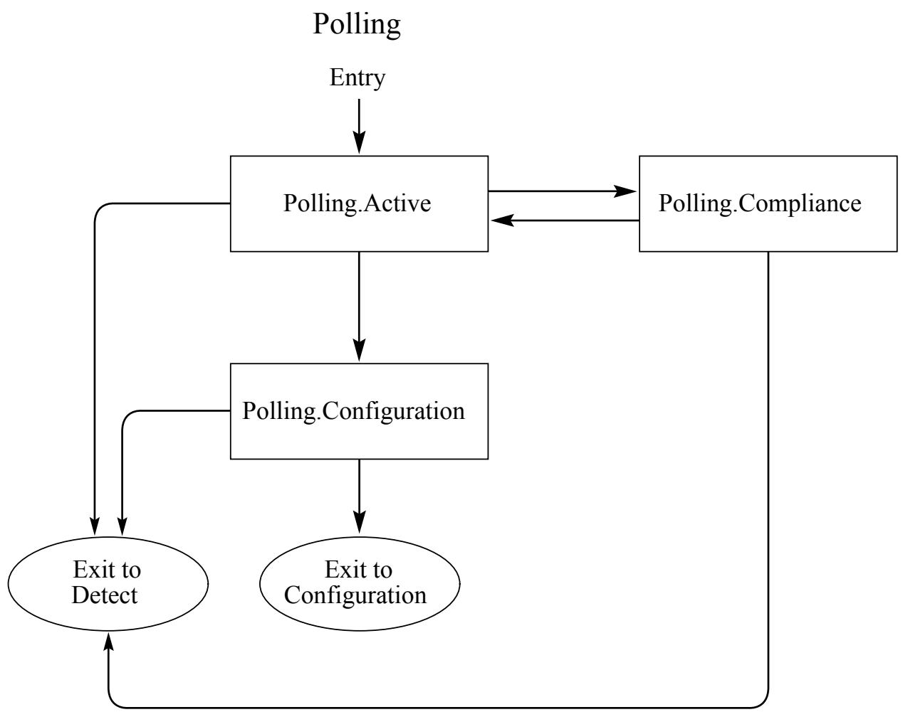
>
> The Configuration substate machine is shown in § Figure 4-52.
>
> **IMPLEMENTATION NOTE:**
> **SUPPORT FOR HIGHER DATA RATES THAN 2.5 GT/S**
>
> A Link will initially train to the L0 state at the 2.5 GT/s data rate even if both sides are capable of operating at a data rate greater than 2.5 GT/s. Supported higher data rates are advertised in the TS Ordered Sets. The other side's speed capability is registered during the Configuration.Complete substate. Based on the highest supported common data rate, either side can initiate a change in speed from the L0 state by transitioning to Recovery.
> §

</td>
<td style="background-color:#e8e8e8">

>
> Configuration 子状态机如 § Figure 4-52 所示。
>
> **实现说明 (IMPLEMENTATION NOTE):**
> **支持高于 2.5 GT/s 的数据速率 (SUPPORT FOR HIGHER DATA RATES THAN 2.5 GT/S)**
>
> 即使链路双方均具备高于 2.5 GT/s 的工作能力,链路最初也会以 2.5 GT/s 的数据速率训练到 L0 状态。所支持的更高数据速率在 TS (训练序列) 有序集中进行通告。对端的速度能力在 Configuration.Complete 子状态期间被记录。基于双方共同支持的最高数据速率,任一方可通过转入 Recovery 状态来发起从 L0 状态的速度切换。
> §

</td>
</tr>
</tbody>
</table>
</div>


<a id="sec-4-2-7-3"></a>
## 4.2.7.3 Configuration | Configuration 状态

<table>
<thead>
<tr>
<th width="50%">🇬🇧 English</th>
<th width="50%" style="background-color:#e8e8e8">🇨🇳 中文</th>
</tr>
</thead>
<tbody>
<tr>
<td>

4.2.7.3 Configuration §
§

</td>
<td style="background-color:#e8e8e8">

4.2.7.3 Configuration §
§

</td>
</tr>
</tbody>
</table>

---

<!-- 📄 Page 511 -->
---

<a id="sec-4-2-7-3-rules"></a>
### Configuration 状态规则 | Configuration State Rules


<div style="overflow-x: auto; max-width: 100%;">
<table>
<thead>
<tr>
<th width="50%">🇬🇧 English</th>
<th width="50%" style="background-color:#e8e8e8">🇨🇳 中文</th>
</tr>
</thead>
<tbody>
<tr>
<td>

- Next state is Disabled if directed.
  - Note: "if directed" applies to a Downstream Port that is instructed by a higher Layer to assert the Disable Link bit (TS1 and TS2) on all Lanes that detected a Receiver during Detect.
- Next state is Loopback if directed by an implementation specific method and the Transmitter is capable of being a Loopback Lead.
  - Note: "if directed" applies to a Port that is instructed by a higher Layer to assert the Loopback bit (TS1 and TS2) on all Lanes that detected a Receiver during Detect.
- In the optional case where a crosslink is supported, the next state is Disabled after all Lanes that are transmitting TS1 Ordered Sets receive two consecutive TS1 Ordered Sets with the Disable Link bit asserted.
- Next state is Loopback if one of the following two conditions are satisfied:
  - All Lanes that are transmitting TS1 Ordered Sets, that are also receiving TS1 Ordered Sets, receive the Loopback bit asserted in two consecutive TS1 Ordered Sets.
  - Any Lane that is transmitting TS1 Ordered Sets receives two consecutive TS1 Ordered Sets with the Loopback bit asserted and with the Enhanced Link Behavior Control bits set to 01b.

  A Port that is capable of transmitting at the 64.0 GT/s data rate may receive TS1 Ordered Sets with the Flit Mode Supported bit set to 1b and the Supported Link Speeds field set to 1 0111b.

  The device receiving the Ordered Set with the Loopback bit set becomes the Loopback Follower. If the Loopback Follower supports 1b/1b encoding, it must take into account whether SRIS clocking is enabled (Symbol 4, Bit 7) for identifying SKP OS boundary during Loopback.

- The Transmitter sends TS1 Ordered Sets with selected Link numbers and sets Lane numbers to PAD on all the active Downstream Lanes if LinkUp is 0b or if the LTSSM is not initiating upconfiguration of the Link width. In addition, if upconfigure_capable is set to 1b, and the LTSSM is not initiating upconfiguration of the Link width, the LTSSM sends TS1 Ordered Sets with the selected Link number and sets the Lane number to PAD on each inactive Lane after it detected an exit from Electrical Idle since entering Recovery and has subsequently received two consecutive TS1 Ordered Sets with the Link and Lane numbers each set to PAD while in this substate.
  - On transition to this substate from Polling, any Lane that detected a Receiver during Detect is considered an active Lane.
  - On transition to this substate from Recovery, any Lane that is part of the configured Link the previous time through Configuration.Complete is considered an active Lane.
  - The Data Rate Identifier Symbol of the TS1 Ordered Sets must advertise all data rates that the Port supports, including those that it does not intend to use.

- If LinkUp is 1b and the LTSSM is initiating upconfiguration of the Link width, initially it transmits TS1 Ordered Sets with both the Link and Lane numbers set to PAD on the current set of active Lanes; the inactive Lanes it intends to activate; and those Lanes where it detected an exit from Electrical Idle since entering Recovery and has received two consecutive TS1 Ordered Sets with the Link and Lane numbers each set to PAD. The LTSSM transmits TS1 Ordered Sets with the selected Link number and the Lane number set to PAD when each of the Lanes transmitting TS1 Ordered Sets receives two consecutive TS1 Ordered Sets with the Link and Lane numbers each set to PAD or 1 ms has expired since entering this substate.
  - After activating any inactive Lane, the Transmitter must wait for its TX common mode to settle before exiting from Electrical Idle and transmitting the TS1 Ordered Sets.

</td>
<td style="background-color:#e8e8e8">

- 若被指示,则下一状态为 Disabled。
  - 注:"if directed"(若被指示)适用于被更高层指示在 Detect 期间检测到接收器的所有通道上断言 Disable Link 位(TS1 和 TS2)的下游端口 (Downstream Port)。
- 若由特定实现方法指示且发送器 (Transmitter) 能够作为 Loopback 主导方,则下一状态为 Loopback (回环)。
  - 注:"if directed"(若被指示)适用于被更高层指示在 Detect 期间检测到接收器的所有通道上断言 Loopback 位(TS1 和 TS2)的端口 (Port)。
- 在支持 crosslink(交叉链路)的可选情况下,当所有正在发送 TS1 有序集的通道接收到两个连续的、Disable Link 位被断言的 TS1 有序集之后,下一状态为 Disabled。
- 若满足以下两个条件之一,则下一状态为 Loopback:
  - 所有正在发送 TS1 有序集且也正在接收 TS1 有序集的通道,在两个连续的 TS1 有序集中接收到被断言的 Loopback 位。
  - 任何正在发送 TS1 有序集的通道接收到两个连续的、Loopback 位被断言且 Enhanced Link Behavior Control 位为 01b 的 TS1 有序集。

  能够在 64.0 GT/s 数据速率下发送的端口,可能接收到 Flit Mode Supported 位为 1b 且 Supported Link Speeds 字段为 1 0111b 的 TS1 有序集。

  接收到 Loopback 位被设置的有序集的设备成为 Loopback Follower。如果 Loopback Follower 支持 1b/1b 编码,则必须考虑 SRIS 时钟是否已启用(Symbol 4, Bit 7),以便在 Loopback 期间识别 SKP OS 边界。

- 若 LinkUp 为 0b 或 LTSSM (链路训练与状态机) 未启动对链路宽度 (Link width) 的向上配置 (upconfiguration),则发送器在所有活动的下游通道 (Downstream Lanes) 上发送带有选定链路号 (Link number) 且将通道号 (Lane number) 置为 PAD 的 TS1 有序集。此外,若 upconfigure_capable 被设置为 1b 且 LTSSM 未启动对链路宽度的向上配置,则 LTSSM 在每个非活动通道上发送带有选定链路号且通道号置为 PAD 的 TS1 有序集——该非活动通道须是在进入 Recovery 之后检测到退出 Electrical Idle 且随后在该子状态中接收到两个连续的、链路号和通道号均置为 PAD 的 TS1 有序集。
  - 从 Polling 转入此子状态时,任何在 Detect 期间检测到接收器的通道都被视为活动通道 (active Lane)。
  - 从 Recovery 转入此子状态时,任何在上一次经过 Configuration.Complete 时属于已配置链路的通道都被视为活动通道。
  - TS1 有序集的 Data Rate Identifier 符号必须通告该端口支持的所有数据速率,包括其不打算使用的那些数据速率。

- 若 LinkUp 为 1b 且 LTSSM 正在启动对链路宽度的向上配置,则其最初在以下通道上发送链路号和通道号均置为 PAD 的 TS1 有序集:当前的活动通道集合;其打算激活的非活动通道;以及自进入 Recovery 之后检测到退出 Electrical Idle 且已接收到两个连续的、链路号和通道号均置为 PAD 的 TS1 有序集的通道。当发送 TS1 有序集的每个通道接收到两个连续的、链路号和通道号均置为 PAD 的 TS1 有序集,或自进入此子状态起 1 ms 过期时(以先发生者为准),LTSSM 发送带有选定链路号且通道号置为 PAD 的 TS1 有序集。
  - 在激活任何非活动通道之后,发送器必须等待其 TX 共模 (common mode) 稳定,然后才能退出 Electrical Idle 并发送 TS1 有序集。

</td>
</tr>
</tbody>
</table>
</div>


<a id="sec-4-2-7-3-1"></a>
## 4.2.7.3.1 Configuration.Linkwidth.Start | Configuration.Linkwidth.Start 子状态

<table>
<thead>
<tr>
<th width="50%">🇬🇧 English</th>
<th width="50%" style="background-color:#e8e8e8">🇨🇳 中文</th>
</tr>
</thead>
<tbody>
<tr>
<td>

4.2.7.3.1 Configuration.Linkwidth.Start §

</td>
<td style="background-color:#e8e8e8">

4.2.7.3.1 Configuration.Linkwidth.Start §

</td>
</tr>
</tbody>
</table>

<a id="sec-4-2-7-3-1-1"></a>
## 4.2.7.3.1.1 Downstream Lanes | 下游通道

<table>
<thead>
<tr>
<th width="50%">🇬🇧 English</th>
<th width="50%" style="background-color:#e8e8e8">🇨🇳 中文</th>
</tr>
</thead>
<tbody>
<tr>
<td>

4.2.7.3.1.1 Downstream Lanes §

</td>
<td style="background-color:#e8e8e8">

4.2.7.3.1.1 Downstream Lanes §

</td>
</tr>
</tbody>
</table>

---

<!-- 📄 Page 512 -->
---

<a id="sec-4-2-7-3-1-1-body"></a>
### Downstream Lanes 子状态规则 | Downstream Lanes Substate Rules


<div style="overflow-x: auto; max-width: 100%;">
<table>
<thead>
<tr>
<th width="50%">🇬🇧 English</th>
<th width="50%" style="background-color:#e8e8e8">🇨🇳 中文</th>
</tr>
</thead>
<tbody>
<tr>
<td>

- Link numbers are only permitted to be different for groups of Lanes capable of being a unique Link.
  - Note: An example of Link number assignments is a set of eight Downstream Lanes capable of negotiating to become one x8 Port when connected to one component or two x4 Ports when connected to two different components. The Downstream Lanes send out TS1 Ordered Sets with the Link number set to N on four Lanes and Link number set to N+1 on the other four Lanes. The Lane numbers are all set to PAD.
- If any Lanes first received at least one or more TS1 Ordered Sets with a Link and Lane number set to PAD, the next state is Configuration.Linkwidth.Accept immediately after any of those same Downstream Lanes receive two consecutive TS1 Ordered Sets with a non-PAD Link number that matches any of the transmitted Link numbers, and with a Lane number set to PAD.
  - If the crosslink configuration is not supported, the condition of first receiving a Link and Lane number set to PAD is always true.
- Else: Optionally, if LinkUp is 0b and if crosslinks are supported, then all Downstream Lanes that detected a Receiver during Detect must first transmit 16 to 32 TS1 Ordered Sets with a non-PAD Link number and PAD Lane number and after this occurs if any Downstream Lanes receive two consecutive TS1 Ordered Sets with a Link number different than PAD and a Lane Number set to PAD, the Downstream Lanes are now designated as Upstream Lanes and a new random crosslink timeout is chosen (see Tcrosslink in § Table 8-7). The next state is Configuration.Linkwidth.Start as Upstream Lanes.
  - Note: This supports the optional crosslink where both sides may try to act as a Downstream Port. This is resolved by making both Ports become Upstream and assigning a random timeout until one side of the Link becomes a Downstream Port and the other side remains an Upstream Port. This timeout must be random even when hooking up two of the same devices so as to eventually break any possible deadlock.
  - If crosslinks are supported, receiving a sequence of TS1 Ordered Sets with a Link number of PAD followed by a Link number of non-PAD that matches the transmitted Link number is only valid when not interrupted by the reception of a TS2 Ordered Set.
- The next state is Detect after a 24 ms timeout.
- In the optional case where crosslinks are supported the next state is Disabled if directed.
  - Note: "if directed" only applies to an optional crosslink Port that is instructed by a higher Layer to assert the Disable Link bit (TS1 and TS2) on all Lanes that detected a Receiver during Detect.
- Next state is Loopback if directed to this state by an implementation specific method.
  - Note: "if directed" applies to a Port that is instructed by a higher Layer to assert the Loopback bit (TS1 and TS2) on all Lanes that detected a Receiver during Detect.

**IMPLEMENTATION NOTE:**
**CROSSLINK INITIALIZATION**

In the case where the Downstream Lanes are connected to both Downstream Lanes (crosslink) and Upstream Lanes, the Port with the Downstream Lanes may continue with a single LTSSM as described in this section or optionally, split into multiple LTSSMs.
§

</td>
<td style="background-color:#e8e8e8">

- 链路号 (Link number) 仅允许在能够成为唯一链路的通道组之间取不同值。
  - 注:链路号分配的一个示例是一组八个下游通道 (Downstream Lanes),它们在连接到一个组件时能够协商成为一个 x8 端口 (Port),或者在连接到两个不同组件时协商成为两个 x4 端口。下游通道在四个通道上发送链路号置为 N 的 TS1 有序集,在另外四个通道上发送链路号置为 N+1 的 TS1 有序集。所有通道的通道号均置为 PAD。
- 若任何通道首次接收到至少一个或多个链路号和通道号均置为 PAD 的 TS1 有序集,则在那些相同的下游通道中,任意一个接收到两个连续的、带有匹配所发送链路号中任一非 PAD 链路号且通道号置为 PAD 的 TS1 有序集之后,下一状态立即为 Configuration.Linkwidth.Accept。
  - 如果不支持 crosslink 配置,则"首次接收到链路号和通道号均置为 PAD"这一条件始终为真。
- 否则(可选):若 LinkUp 为 0b 且支持 crosslink,则在 Detect 期间检测到接收器的所有下游通道必须首先发送 16 到 32 个带有非 PAD 链路号和 PAD 通道号的 TS1 有序集。在此之后,若任何下游通道接收到两个连续的、链路号不为 PAD 且通道号置为 PAD 的 TS1 有序集,则这些下游通道被重新指定为上游通道 (Upstream Lanes),并选择一个新的随机 crosslink 超时(参见 § Table 8-7 中的 Tcrosslink)。下一状态为 Configuration.Linkwidth.Start(以 Upstream Lanes 身份)。
  - 注:此机制支持可选的 crosslink 场景——链路两端可能都试图充当 Downstream Port。其解决方法为让两个端口都变为 Upstream,并分配一个随机超时,直到链路一侧成为 Downstream Port 而另一侧保持为 Upstream Port。该超时必须是随机的,即使连接的是两个相同的设备也是如此,以便最终打破任何可能的死锁。
  - 若支持 crosslink,则只有在接收 TS2 有序集的过程未被中断时,接收"链路号为 PAD 后随链路号为非 PAD 且与所发送链路号匹配"这一 TS1 有序集序列才是有效的。
- 在 24 ms 超时之后,下一状态为 Detect。
- 在支持 crosslink 的可选情况下,若被指示,则下一状态为 Disabled。
  - 注:"if directed"(若被指示)仅适用于被更高层指示在 Detect 期间检测到接收器的所有通道上断言 Disable Link 位(TS1 和 TS2)的可选 crosslink 端口。
- 若由特定实现方法指示进入此状态,则下一状态为 Loopback。
  - 注:"if directed"(若被指示)适用于被更高层指示在 Detect 期间检测到接收器的所有通道上断言 Loopback 位(TS1 和 TS2)的端口。

**实现说明 (IMPLEMENTATION NOTE):**
**CROSSLINK 初始化 (CROSSLINK INITIALIZATION)**

在下游通道同时连接到下游通道(crosslink)和上游通道的情况下,拥有下游通道的端口可按本节所述继续使用单个 LTSSM,或者可选地拆分为多个 LTSSM。
§

</td>
</tr>
</tbody>
</table>
</div>


<a id="sec-4-2-7-3-1-2"></a>
## 4.2.7.3.1.2 Upstream Lanes | 上游通道

<table>
<thead>
<tr>
<th width="50%">🇬🇧 English</th>
<th width="50%" style="background-color:#e8e8e8">🇨🇳 中文</th>
</tr>
</thead>
<tbody>
<tr>
<td>

4.2.7.3.1.2 Upstream Lanes §

</td>
<td style="background-color:#e8e8e8">

4.2.7.3.1.2 Upstream Lanes §

</td>
</tr>
</tbody>
</table>

---

<!-- 📄 Page 513 -->
---

<a id="sec-4-2-7-3-1-2-body"></a>
### Upstream Lanes 子状态规则 | Upstream Lanes Substate Rules


<div style="overflow-x: auto; max-width: 100%;">
<table>
<thead>
<tr>
<th width="50%">🇬🇧 English</th>
<th width="50%" style="background-color:#e8e8e8">🇨🇳 中文</th>
</tr>
</thead>
<tbody>
<tr>
<td>

- Next state is Disabled after any Lanes that are transmitting TS1 Ordered Sets receive two consecutive TS1 Ordered Sets with the Disable Link bit asserted.
  - In the optional case where a crosslink is supported, the next state is Disabled only after all Lanes that are transmitting TS1 Ordered Sets, that are also receiving TS1 Ordered Sets, receive the Disable Link bit asserted in two consecutive TS1 Ordered Sets.
- Next state is Loopback if one of the following two conditions are satisfied:
  - All Lanes that are transmitting TS1 Ordered Sets, that are also receiving TS1 Ordered Sets, receive the Loopback bit asserted in two consecutive TS1 Ordered Sets.
  - Any Lane that is transmitting TS1 Ordered Sets receives two consecutive TS1 Ordered Sets with the Loopback bit asserted and with the Enhanced Link Behavior Control bits set to 01b.

  A Port that is capable of transmitting at the 64.0 GT/s data rate may receive TS1 Ordered Sets with the Flit Mode Supported bit set to 1b and the Supported Link Speeds field set to 1 0111b.

  The device receiving the Ordered Set with the Loopback bit set becomes the Loopback Follower. If the Loopback Follower supports 1b/1b encoding, it must take into account whether SRIS Clocking is enabled (Symbol 4, Bit 7 = 1b) for identifying SKP OS boundaries during Loopback.

- The Transmitter sends out TS1 Ordered Sets with Link numbers and Lane numbers set to PAD on all the active Upstream Lanes; the inactive Lanes it is initiating to upconfigure the Link width; and if upconfigure_capable is set to 1b, on each of the inactive Lanes where it detected an exit from Electrical Idle since entering Recovery and has subsequently received two consecutive TS1 Ordered Sets with Link and Lane numbers, each set to PAD, in this substate.
  - On transition to this substate from Polling, any Lane that detected a Receiver during Detect is considered an active Lane.
  - On transition to this substate from Recovery, any Lane that is part of the configured Link the previous time through Configuration.Complete is considered an active Lane.
  - On transition to this substate from Recovery, if the transition is not caused by LTSSM timeout, the Transmitter must set the Autonomous Change bit (Symbol 4 bit 6) to 1b in the TS1 Ordered Sets that it sends while in the Configuration state if the Transmitter intends to change the Link width for autonomous reasons.
  - The Data Rate Identifier Symbol of the TS1 Ordered Sets must advertise all data rates that the Port supports, including those that it does not intend to use.
- If any Lane receives two consecutive TS1 Ordered Sets with Link numbers that are different than PAD and Lane number set to PAD, a single Link number is selected and Lane number set to PAD are transmitted on all Lanes that both detected a Receiver and also received two consecutive TS1 Ordered Sets with Link numbers that are different than PAD and Lane number set to PAD. Any left over Lanes that detected a Receiver during Detect must transmit TS1 Ordered Sets with the Link and Lane number set to PAD. The next state is Configuration.Linkwidth.Accept:
  - If the LTSSM is initiating upconfiguration of the Link width, it waits until it receives two consecutive TS1 Ordered Sets with a non-PAD Link Number and a PAD Lane number on all the inactive Lanes it wants to activate, or, 1 ms after entry to this substate, it receives two consecutive TS1 Ordered Sets on any Lane with a non-PAD Link number and PAD Lane number, whichever occurs earlier, before transmitting TS1 Ordered Sets with selected Link number and Lane number set to PAD.
  - It is recommended that any possible multi-Lane Link that received an error in a TS1 Ordered Set or lost 128b/130b Block Alignment or Block/Flit alignment with 1b/1b encoding on a subset of the received Lanes; delay the evaluation listed above by an additional two, or more, TS1 Ordered Sets when using 8b/10b encoding, or by an additional 34, or more, TS1 Ordered Sets when using 128b/130b or 1b/1b encoding, but must not exceed 1 ms, so as not to prematurely configure a smaller Link than possible.

</td>
<td style="background-color:#e8e8e8">

- 在任何正在发送 TS1 有序集的通道接收到两个连续的、Disable Link 位被断言的 TS1 有序集之后,下一状态为 Disabled。
  - 在支持 crosslink 的可选情况下,只有在所有正在发送 TS1 有序集且也正在接收 TS1 有序集的通道,在两个连续的 TS1 有序集中接收到被断言的 Disable Link 位之后,下一状态才为 Disabled。
- 若满足以下两个条件之一,则下一状态为 Loopback:
  - 所有正在发送 TS1 有序集且也正在接收 TS1 有序集的通道,在两个连续的 TS1 有序集中接收到被断言的 Loopback 位。
  - 任何正在发送 TS1 有序集的通道接收到两个连续的、Loopback 位被断言且 Enhanced Link Behavior Control 位为 01b 的 TS1 有序集。

  能够在 64.0 GT/s 数据速率下发送的端口,可能接收到 Flit Mode Supported 位为 1b 且 Supported Link Speeds 字段为 1 0111b 的 TS1 有序集。

  接收到 Loopback 位被设置的有序集的设备成为 Loopback Follower。如果 Loopback Follower 支持 1b/1b 编码,则必须考虑 SRIS Clocking 是否已启用(Symbol 4, Bit 7 = 1b),以便在 Loopback 期间识别 SKP OS 边界。

- 发送器在所有活动的上游通道 (Upstream Lanes) 上,以及在其启动向上配置链路宽度的非活动通道上,发送链路号和通道号均置为 PAD 的 TS1 有序集;此外,若 upconfigure_capable 被设置为 1b,则还在自进入 Recovery 之后检测到退出 Electrical Idle 且随后在该子状态中接收到两个连续的、链路号和通道号均置为 PAD 的 TS1 有序集的每个非活动通道上,发送链路号和通道号均置为 PAD 的 TS1 有序集。
  - 从 Polling 转入此子状态时,任何在 Detect 期间检测到接收器的通道都被视为活动通道。
  - 从 Recovery 转入此子状态时,任何在上一次经过 Configuration.Complete 时属于已配置链路的通道都被视为活动通道。
  - 从 Recovery 转入此子状态时,若该转换不是由 LTSSM 超时引起,且发送器打算因自主原因更改链路宽度,则发送器必须在 Configuration 状态期间所发送的 TS1 有序集中将 Autonomous Change 位(Symbol 4 bit 6)置为 1b。
  - TS1 有序集的 Data Rate Identifier 符号必须通告该端口支持的所有数据速率,包括其不打算使用的那些数据速率。
- 若任何通道接收到两个连续的、链路号不为 PAD 且通道号置为 PAD 的 TS1 有序集,则在所有既检测到接收器又接收到两个连续的、链路号不为 PAD 且通道号置为 PAD 的 TS1 有序集的通道上,选择单一链路号进行发送,且通道号置为 PAD。任何在 Detect 期间检测到接收器但未满足上述条件的剩余通道,必须发送链路号和通道号均置为 PAD 的 TS1 有序集。下一状态为 Configuration.Linkwidth.Accept:
  - 若 LTSSM 正在启动对链路宽度的向上配置,则它会等待以下事件中较早发生者,之后才发送带有选定链路号且通道号置为 PAD 的 TS1 有序集:在其打算激活的所有非活动通道上接收到两个连续的、带有非 PAD 链路号和 PAD 通道号的 TS1 有序集;或自进入此子状态起 1 ms 之后,任意通道接收到两个连续的、带有非 PAD 链路号和 PAD 通道号的 TS1 有序集。
  - 推荐任何可能的多通道链路(Multi-Lane Link)在部分接收通道上接收到 TS1 有序集错误,或在使用 1b/1b 编码时丢失 128b/130b 块对齐 (Block Alignment) 或 Block/Flit 对齐时,延迟上述评估:使用 8b/10b 编码时额外延迟两个或更多 TS1 有序集,使用 128b/130b 或 1b/1b 编码时额外延迟 34 个或更多 TS1 有序集,但延迟不得超过 1 ms,以免过早配置出比实际可能更小的链路。

</td>
</tr>
</tbody>
</table>
</div>


---

<!-- 📄 Page 514 -->
---

<a id="sec-4-2-7-3-1-2-cont"></a>
### Upstream Lanes 子状态规则(续) | Upstream Lanes Substate Rules (cont.)

<table>
<thead>
<tr>
<th width="50%">🇬🇧 English</th>
<th width="50%" style="background-color:#e8e8e8">🇨🇳 中文</th>
</tr>
</thead>
<tbody>
<tr>
<td>

- After activating any inactive Lane, the Transmitter must wait for its TX common mode to settle before exiting Electrical Idle and transmitting the TS1 Ordered Sets.
- Optionally, if LinkUp is 0b and if crosslinks are supported, then all Upstream Lanes that detected a Receiver during Detect must first transmit 16-32 TS1 Ordered Sets with a PAD Link number and PAD Lane number and after this occurs and if any Upstream Lanes first receive two consecutive TS1 Ordered Sets with Link and Lane numbers set to PAD, then:
  - The Transmitter continues to send out TS1 Ordered Sets with Link numbers and Lane numbers set to PAD.
  - If any Lanes receive two consecutive TS1 Ordered Sets with Link numbers that are different than PAD and Lane number set to PAD, a single Link number is selected and Lane number set to PAD are transmitted on all Lanes that both detected a Receiver and also received two consecutive TS1 Ordered Sets with Link numbers that are different than PAD and Lane number set to PAD. Any left over Lanes that detected a Receiver during Detect must transmit TS1 Ordered Sets with the Link and Lane number set to PAD. The next state is Configuration.Linkwidth.Accept.
    - It is recommended that any possible multi-Lane Link that received an error in a TS1 Ordered Set or lost 128b/130b Block Alignment or Block/Flit alignment with 1b/1b encoding on a subset of the received Lanes; delay the evaluation listed above by an additional two, or more, TS1 Ordered Sets when using 8b/10b encoding, or by an additional 34, or more, TS1 Ordered Sets when using 128b/130b or 1b/1b encoding, but must not exceed 1 ms, so as not to prematurely configure a smaller Link than possible.
  - Otherwise, after a Tcrosslink timeout, 16 to 32 TS2 Ordered Sets with PAD Link numbers and PAD Lane numbers are sent. The Upstream Lanes become Downstream Lanes and the next state is Configuration.Linkwidth.Start as Downstream Lanes.
    - Note: This optional behavior is required for crosslink behavior where two Ports may start off with Upstream Ports, and one will eventually take the lead as a Downstream Port.
- The next state is Detect after a 24 ms timeout.
- If a configured Link can be formed with at least one group of Lanes that received two consecutive TS1 Ordered Sets with the same received Link number (non-PAD and matching one that was transmitted by the Downstream Lanes), TS1 Ordered Sets are transmitted with the same Link number and unique non-PAD Lane numbers are assigned to all these same Lanes. The next state is Configuration.Lanenum.Wait.
  - The assigned non-PAD Lane numbers must range from 0 to n-1, be assigned sequentially to the same grouping of Lanes that are receiving the same Link number, and Downstream Lanes which are not receiving TS1 Ordered Sets must not disrupt the initial sequential numbering of the widest possible Link. Any left over Lanes must transmit TS1 Ordered Sets with the Link and Lane number set to PAD.
  - It is recommended that any possible multi-Lane Link that received an error in a TS1 Ordered Set or lost 128b/130b Block Alignment or Block/Flit alignment with 1b/1b encoding on a subset of the received Lanes delay the evaluation listed above by an additional two, or more, TS1 Ordered Sets when using 8b/10b encoding, or by an additional 34, or more, TS1 Ordered Sets when using 128b/130b or 1b/1b encoding, but must not exceed 1 ms, so as not to prematurely configure a smaller Link than possible.
  - The use_modified_TS1_TS2_Ordered_Set variable must be set to 1b if all of the following conditions are true:

</td>
<td style="background-color:#e8e8e8">

- 在激活任何非活动通道之后,发送器必须等待其 TX 共模 (common mode) 稳定,然后才能退出 Electrical Idle 并发送 TS1 有序集。
- 可选地,若 LinkUp 为 0b 且支持 crosslink,则在 Detect 期间检测到接收器的所有上游通道必须首先发送 16 至 32 个带有 PAD 链路号和 PAD 通道号的 TS1 有序集。在此之后,若任何上游通道首次接收到两个连续的、链路号和通道号均置为 PAD 的 TS1 有序集,则:
  - 发送器继续发送链路号和通道号均置为 PAD 的 TS1 有序集。
  - 若任何通道接收到两个连续的、链路号不为 PAD 且通道号置为 PAD 的 TS1 有序集,则在所有既检测到接收器又接收到两个连续的、链路号不为 PAD 且通道号置为 PAD 的 TS1 有序集的通道上,选择单一链路号进行发送,且通道号置为 PAD。任何在 Detect 期间检测到接收器但未满足上述条件的剩余通道,必须发送链路号和通道号均置为 PAD 的 TS1 有序集。下一状态为 Configuration.Linkwidth.Accept。
    - 推荐任何可能的多通道链路在部分接收通道上接收到 TS1 有序集错误,或在使用 1b/1b 编码时丢失 128b/130b 块对齐或 Block/Flit 对齐时,延迟上述评估:使用 8b/10b 编码时额外延迟两个或更多 TS1 有序集,使用 128b/130b 或 1b/1b 编码时额外延迟 34 个或更多 TS1 有序集,但延迟不得超过 1 ms,以免过早配置出比实际可能更小的链路。
  - 否则,经过 Tcrosslink 超时之后,发送 16 至 32 个带有 PAD 链路号和 PAD 通道号的 TS2 有序集。上游通道变更为下游通道,下一状态为 Configuration.Linkwidth.Start(以 Downstream Lanes 身份)。
    - 注:对于两个端口最初可能均为 Upstream Port、且最终将有一个作为 Downstream Port 主导的 crosslink 行为,需要采用此可选行为。
- 在 24 ms 超时之后,下一状态为 Detect。
- 若可由至少一组通道(这些通道接收到两个连续的、带有相同接收链路号——非 PAD 且与下游通道所发送的某一链路号相匹配)的 TS1 有序集来形成已配置的链路,则发送带有相同链路号的 TS1 有序集,并向所有这些相同通道分配唯一的非 PAD 通道号。下一状态为 Configuration.Lanenum.Wait。
  - 所分配的非 PAD 通道号必须从 0 到 n-1 范围内,并按顺序分配给正在接收相同链路号的同一组通道;且未接收到 TS1 有序集的下游通道不得打乱最宽可能链路的初始顺序编号。任何剩余通道必须发送链路号和通道号均置为 PAD 的 TS1 有序集。
  - 推荐任何可能的多通道链路在部分接收通道上接收到 TS1 有序集错误,或在使用 1b/1b 编码时丢失 128b/130b 块对齐或 Block/Flit 对齐时,延迟上述评估:使用 8b/10b 编码时额外延迟两个或更多 TS1 有序集,使用 128b/130b 或 1b/1b 编码时额外延迟 34 个或更多 TS1 有序集,但延迟不得超过 1 ms,以免过早配置出比实际可能更小的链路。
  - use_modified_TS1_TS2_Ordered_Set 变量必须在以下所有条件均满足时被设置为 1b:

</td>
</tr>
</tbody>
</table>

<a id="sec-4-2-7-3-2"></a>
## 4.2.7.3.2 Configuration.Linkwidth.Accept | Configuration.Linkwidth.Accept 子状态

<table>
<thead>
<tr>
<th width="50%">🇬🇧 English</th>
<th width="50%" style="background-color:#e8e8e8">🇨🇳 中文</th>
</tr>
</thead>
<tbody>
<tr>
<td>

4.2.7.3.2 Configuration.Linkwidth.Accept §

</td>
<td style="background-color:#e8e8e8">

4.2.7.3.2 Configuration.Linkwidth.Accept §

</td>
</tr>
</tbody>
</table>

<a id="sec-4-2-7-3-2-1"></a>
## 4.2.7.3.2.1 Downstream Lanes | 下游通道

<table>
<thead>
<tr>
<th width="50%">🇬🇧 English</th>
<th width="50%" style="background-color:#e8e8e8">🇨🇳 中文</th>
</tr>
</thead>
<tbody>
<tr>
<td>

4.2.7.3.2.1 Downstream Lanes §

</td>
<td style="background-color:#e8e8e8">

4.2.7.3.3.2.1 Downstream Lanes §

</td>
</tr>
</tbody>
</table>

---

<!-- 📄 Page 515 -->
---

<a id="sec-4-2-7-3-2-1-body"></a>
### Configuration.Linkwidth.Accept — Downstream Lanes | 下游通道配置链路宽度接受


<div style="overflow-x: auto; max-width: 100%;">
<table>
<thead>
<tr>
<th width="50%">🇬🇧 English</th>
<th width="50%" style="background-color:#e8e8e8">🇨🇳 中文</th>
</tr>
</thead>
<tbody>
<tr>
<td>

- LinkUp = 0b
- The component had transmitted Modified TS1/TS2 Ordered Sets supported value (11b) in the Enhanced Link Behavior Control field in Symbol 5 of TS1 and TS2 Ordered Sets in Polling and Configuration states since entering the Polling State
- The received eight consecutive TS2 Ordered Sets on all Lanes of the configured Link that could be formed (see 1st bullet of § Section 4.2.7.3.2.1 ) that were part of the group that caused the transition from Polling.Configuration to Configuration state had the Modified TS1/TS2 Ordered Sets supported value (11b) in the Enhanced Link Behavior Control field in Symbol 5 and 32.0 GT/s data rate is supported bit is Set to 1b in the received eight consecutive TS2 Ordered Sets
- The Flit_Mode_Enabled variable must be set to 1b if all of the following conditions are true:
  - LinkUp = 0b
  - The component had transmitted Flit Mode Supported bit in the 'Data Rate Identifier' field (Symbol 4, Bit 0) in the TS1 and TS2 Ordered Sets in Polling and Configuration states since entering the Polling State
  - The received eight consecutive TS2 Ordered Sets on all Lanes of the currently configured Link that caused the transition from Polling.Configuration to Configuration state had the Flit Mode Supported bit in the Data Rate Identifier field (Symbol 4, Bit 0) set to 1b in the received eight consecutive TS2 Ordered Sets
- The next state is Detect after a 2 ms timeout or if no Link can be configured or if all Lanes receive two consecutive TS1 Ordered Sets with Link and Lane numbers set to PAD.
- If a configured Link can be formed using Lanes that transmitted a non-PAD Link number which are receiving two consecutive TS1 Ordered Sets with the same non-PAD Link number and any non-PAD Lane number, TS1 Ordered Sets are transmitted with the same non-PAD Link number and Lane numbers that, if possible, match the received Lane numbers or are different, if necessary (i.e., Lane reversed). The next state is Configuration.Lanenum.Wait.
  - The received consecutive TS1 Ordered Sets may be either standard TS1 Ordered Sets or Modified TS1 Ordered Sets. Modified TS1 Ordered Sets will only be received if the conditions to Set the use_modified_TS1_TS2_Ordered_Set variable (as described below) are met.
  - The newly assigned Lane numbers must range from 0 to m-1, be assigned sequentially only to some continuous grouping of Lanes that are receiving non-PAD Lane numbers (i.e., Lanes which are not receiving any TS1 Ordered Sets always disrupt a continuous grouping and must not be included in this grouping), must include either Lane 0 or Lane n-1 (largest received Lane number), and m-1 must be equal to or smaller than the largest received Lane number (n-1). Remaining Lanes must transmit TS1 Ordered Sets with Link and Lane numbers set to PAD.
  - If any possible multi-Lane Link received an error in a TS1 Ordered Set, lost 128b/130b Block Alignment, or lost Block/Flit alignment with 1b/1b encoding on a subset of the received Lanes, it is recommended to do the following to avoid configuring a smaller Link than is possible:
    - When using 8b/10b encoding, delay the evaluation listed above by an additional two or more TS1 Ordered Sets, but must not delay by more than 1 ms.
    - When using 128b/130b or 1b/1b encoding, delay the evaluation listed above by an additional 34 or more TS1 Ordered Sets, but must not delay by more than 1 ms.
  - The use_modified_TS1_TS2_Ordered_Set variable must be set to 1b if all of the following conditions are true:

</td>
<td style="background-color:#e8e8e8">

- LinkUp = 0b
- 组件自进入 Polling 状态以来,在 Polling 和 Configuration 状态期间,在 TS1 和 TS2 有序集的 Symbol 5 中的 Enhanced Link Behavior Control 字段中已发送 Modified TS1/TS2 有序集支持值(11b)
- 在所形成已配置链路(参见 § Section 4.2.7.3.2.1 的第 1 项)所有通道上、属于引发从 Polling.Configuration 转到 Configuration 状态的那一组的、接收到的八个连续 TS2 有序集,在 Symbol 5 中的 Enhanced Link Behavior Control 字段中具有 Modified TS1/TS2 有序集支持值(11b),且在这接收到的八个连续 TS2 有序集中 32.0 GT/s 数据速率支持位被设置为 1b
- Flit_Mode_Enabled 变量必须在以下所有条件均满足时被设置为 1b:
  - LinkUp = 0b
  - 组件自进入 Polling 状态以来,在 Polling 和 Configuration 状态期间,在 TS1 和 TS2 有序集的 'Data Rate Identifier' 字段(Symbol 4, Bit 0)中已发送 Flit Mode Supported 位
  - 在当前已配置链路上、引发从 Polling.Configuration 转到 Configuration 状态的所有通道上接收到的八个连续 TS2 有序集,在 Data Rate Identifier 字段(Symbol 4, Bit 0)中 Flit Mode Supported 位被设置为 1b
- 在 2 ms 超时之后,或若无法配置任何链路,或若所有通道接收到两个连续的、链路号和通道号均置为 PAD 的 TS1 有序集,则下一状态为 Detect。
- 若可使用发送了非 PAD 链路号且正在接收两个连续的、带有相同非 PAD 链路号和任意非 PAD 通道号的 TS1 有序集的通道来形成已配置链路,则发送带有相同非 PAD 链路号以及通道号的 TS1 有序集;通道号在可能时与所接收的通道号匹配,必要时也可不同(即通道反转 (Lane reversed))。下一状态为 Configuration.Lanenum.Wait。
  - 所接收的连续 TS1 有序集既可以是标准 TS1 有序集,也可以是 Modified TS1 有序集。仅当满足设置 use_modified_TS1_TS2_Ordered_Set 变量的条件(如下所述)时,才会接收到 Modified TS1 有序集。
  - 新分配的通道号必须从 0 到 m-1 范围内,且仅按顺序分配给某些正在接收非 PAD 通道号的连续通道组(即不接收任何 TS1 有序集的通道总是会打断连续组,不得被包含在此组中),该组必须包含 Lane 0 或 Lane n-1(最大接收通道号)之一,且 m-1 必须等于或小于最大接收通道号(n-1)。其余通道必须发送链路号和通道号均置为 PAD 的 TS1 有序集。
  - 若任何可能的多通道链路在部分接收通道上接收到 TS1 有序集错误、丢失 128b/130b 块对齐 (Block Alignment) 或在使用 1b/1b 编码时丢失 Block/Flit 对齐,则推荐执行以下操作以避免配置出比实际可能更小的链路:
    - 使用 8b/10b 编码时,将上述评估额外延迟两个或更多 TS1 有序集,但延迟不得超过 1 ms。
    - 使用 128b/130b 或 1b/1b 编码时,将上述评估额外延迟 34 个或更多 TS1 有序集,但延迟不得超过 1 ms。
  - use_modified_TS1_TS2_Ordered_Set 变量必须在以下所有条件均满足时被设置为 1b:

</td>
</tr>
</tbody>
</table>
</div>


<a id="sec-4-2-7-3-2-2"></a>
## 4.2.7.3.2.2 Upstream Lanes | 上游通道

<table>
<thead>
<tr>
<th width="50%">🇬🇧 English</th>
<th width="50%" style="background-color:#e8e8e8">🇨🇳 中文</th>
</tr>
</thead>
<tbody>
<tr>
<td>

4.2.7.3.2.2 Upstream Lanes §

</td>
<td style="background-color:#e8e8e8">

4.2.7.3.2.2 Upstream Lanes §

</td>
</tr>
</tbody>
</table>

---

<!-- 📄 Page 516 -->
---

<a id="sec-4-2-7-3-2-2-body"></a>
### Configuration.Linkwidth.Accept — Upstream Lanes | 上游通道配置链路宽度接受


<div style="overflow-x: auto; max-width: 100%;">
<table>
<thead>
<tr>
<th width="50%">🇬🇧 English</th>
<th width="50%" style="background-color:#e8e8e8">🇨🇳 中文</th>
</tr>
</thead>
<tbody>
<tr>
<td>

- LinkUp = 0b
- The component has transmitted Modified TS1/TS2 Ordered Sets supported value (11b) in the Enhanced Link Behavior Control field in Symbol 5 of all TS1 and TS2 Ordered Sets in Polling and Configuration states since entering the Polling State
- The received eight consecutive TS2 Ordered Sets on all Lanes of the configured Link that could be formed (see 1st bullet of § Section 4.2.7.3.2.2 ) that were part of the group that caused the transition from Polling.Configuration to Configuration state had the Modified TS1/TS2 Ordered Sets supported value (11b) in the Enhanced Link Behavior Control field in Symbol 5 and 32.0 GT/s data rate is supported bit is Set to 1b in the received eight consecutive TS2 Ordered Sets
- The Flit_Mode_Enabled variable must be set to 1b if all of the following conditions are true:
  - LinkUp = 0b
  - The component had transmitted Flit Mode Supported bit in the 'Data Rate Identifier' field (Symbol 4, Bit 0) in the TS1 and TS2 Ordered Sets in Polling and Configuration states since entering the Polling State
  - The received eight consecutive TS2 Ordered Sets on all Lanes of the currently configured Link that caused the transition from Polling.Configuration to Configuration state had the Flit Mode Supported bit in the Data Rate Identifier field (Symbol 4, Bit 0) set to 1b in the received eight consecutive TS2 Ordered Sets
- The next state is Detect after a 2 ms timeout or if no Link can be configured or if all Lanes receive two consecutive TS1 Ordered Sets with Link and Lane numbers set to PAD.

**IMPLEMENTATION NOTE:**
**NEGOTIATING FLIT MODE AND THE**
**MODIFIED TS1/TS2 USAGE**

Negotiating Flit Mode and the Modified TS1/TS2 usage is orthogonal (i.e., a device can advertise and negotiate support for neither, either, or both). This note applies to the Downstream and Upstream Ports.
§

</td>
<td style="background-color:#e8e8e8">

- LinkUp = 0b
- 组件自进入 Polling 状态以来,在 Polling 和 Configuration 状态期间,在所有 TS1 和 TS2 有序集的 Symbol 5 中的 Enhanced Link Behavior Control 字段中已发送 Modified TS1/TS2 有序集支持值(11b)
- 在所形成已配置链路(参见 § Section 4.2.7.3.2.2 的第 1 项)所有通道上、属于引发从 Polling.Configuration 转到 Configuration 状态的那一组的、接收到的八个连续 TS2 有序集,在 Symbol 5 中的 Enhanced Link Behavior Control 字段中具有 Modified TS1/TS2 有序集支持值(11b),且在这接收到的八个连续 TS2 有序集中 32.0 GT/s 数据速率支持位被设置为 1b
- Flit_Mode_Enabled 变量必须在以下所有条件均满足时被设置为 1b:
  - LinkUp = 0b
  - 组件自进入 Polling 状态以来,在 Polling 和 Configuration 状态期间,在 TS1 和 TS2 有序集的 'Data Rate Identifier' 字段(Symbol 4, Bit 0)中已发送 Flit Mode Supported 位
  - 在当前已配置链路上、引发从 Polling.Configuration 转到 Configuration 状态的所有通道上接收到的八个连续 TS2 有序集,在 Data Rate Identifier 字段(Symbol 4, Bit 0)中 Flit Mode Supported 位被设置为 1b
- 在 2 ms 超时之后,或若无法配置任何链路,或若所有通道接收到两个连续的、链路号和通道号均置为 PAD 的 TS1 有序集,则下一状态为 Detect。

**实现说明 (IMPLEMENTATION NOTE):**
**协商 Flit 模式与 Modified TS1/TS2 使用 (NEGOTIATING FLIT MODE AND THE MODIFIED TS1/TS2 USAGE)**

Flit 模式与 Modified TS1/TS2 的使用彼此正交(orthogonal)(即设备可以通告和协商支持两者皆不支持、任一支持或两者皆支持)。本说明同时适用于下游端口 (Downstream Port) 和上游端口 (Upstream Port)。
§

</td>
</tr>
</tbody>
</table>
</div>


---

<!-- 📄 Page 517 -->
---

<a id="sec-4-2-7-3-2-modified"></a>
### Modified TS1 有序集使用 | Modified TS1 Ordered Set Usage

<table>
<thead>
<tr>
<th width="50%">🇬🇧 English</th>
<th width="50%" style="background-color:#e8e8e8">🇨🇳 中文</th>
</tr>
</thead>
<tbody>
<tr>
<td>

In this sub-state, if use_modified_TS1_TS2_Ordered_Set variable is set to 1b:

- Transmitter must send Modified TS1 Ordered sets instead of TS1 Ordered Sets

**IMPLEMENTATION NOTE:**
**EXAMPLE CASES**

Notable examples related to the configuration of Downstream Lanes:

1. A x8 Downstream Port, which can be divided into two x4 Links, sends two different Link numbers on to two x4 Upstream Ports. The Upstream Ports respond simultaneously by picking the two Link numbers. The Downstream Port will have to choose one of these sets of Link numbers to configure as a Link, and leave the other for a secondary LTSSM to configure (which will ultimately happen in Configuration.Complete).
2. A x8 Downstream Port where only seven Lanes are receiving TS1 Ordered Sets with the same received Link number (non-PAD and matching one that was transmitted by the Downstream Lanes) and an eighth Lane, which is in the middle or adjacent to those same Lanes, is not receiving a TS1 Ordered Set. In this case, the eighth Lane is treated the same as the other seven Lanes and Lane numbering for a x8 Lane should occur as described above.

Notable examples related to the configuration of Upstream Lanes:

1. A x8 Upstream Port is presented with Lane numbers that are backward from the preferred numbering. If the optional behavior of Lane reversal is supported by the Upstream Port, the Upstream Port transmits the same Lane numbers back to the Downstream Port. Otherwise, the opposite Lane numbers are transmitted back to the Downstream Port, and it will be up to the Downstream Port to optionally fix the Lane ordering or exit Configuration.

   Optional Lane reversal behavior is required to configure a Link where the Lane numbers are reversed and the Downstream Port does not support Lane reversal. Specifically, the Upstream Port Lane reversal will accommodate the scenario where the default Upstream sequential Lane numbering (0 to n-1) is receiving a reversed Downstream sequential Lane number (n-1 to 0).
2. A x8 Upstream Port is not receiving TS1 Ordered Sets on the Upstream Port Lane 0:
   a. In the case where the Upstream Port can only support a x8 or x1 Link and the Upstream Port can support Lane reversal. The Upstream Port will assign a Lane 0 to only the received Lane 7 (received Lane number n-1) and the remaining seven Lanes must transmit TS1 Ordered Sets with Link and Lane numbers set to PAD.
   b. In the case where the Upstream Port can only support a x8 or x1 Link and the Upstream Port cannot support Lane reversal. No Link can be formed and the Upstream Port will eventually timeout after 2 ms and exit to Detect.
3. An optional x8 Upstream crosslink Port, which can be divided into two x4 Links, is attached to two x4 Downstream Ports that present the same Link number, and each x4 Downstream Port presents Lane numbers simultaneously that were each numbered 0 to 3. The Upstream Port will have to choose one of these sets of Lane numbers to configure as a Link, and leave the other for a second pass through Configuration.
§

</td>
<td style="background-color:#e8e8e8">

在此子状态中,若 use_modified_TS1_TS2_Ordered_Set 变量被设置为 1b:

- 发送器必须发送 Modified TS1 有序集来代替 TS1 有序集

**实现说明 (IMPLEMENTATION NOTE):**
**示例情形 (EXAMPLE CASES)**

与下游通道 (Downstream Lanes) 配置相关的值得关注的示例:

1. 一个可被划分为两个 x4 链路的 x8 下游端口,向两个 x4 上游端口分别发送两个不同的链路号 (Link number)。两个上游端口同时通过选定这两个链路号进行响应。下游端口此时必须从这两组链路号中选择一组用于配置一条链路,并将另一组留给次级 LTSSM 进行配置(此配置最终将在 Configuration.Complete 中完成)。
2. 一个 x8 下游端口,仅在七个通道上接收到带有相同接收链路号(非 PAD 且与下游通道所发送的某一链路号相匹配)的 TS1 有序集,而第八个通道(位于这七个通道中间或与之相邻)未接收到 TS1 有序集。在此情况下,该第八个通道被当作与另外七个通道相同,应按上述方式对一个 x8 链路进行通道编号 (Lane numbering)。

与上游通道 (Upstream Lanes) 配置相关的值得关注的示例:

1. 一个 x8 上游端口所接收到的通道号与所期望的编号顺序相反。若该上游端口支持通道反转 (Lane reversal) 这一可选行为,则上游端口将相同的通道号回传给下游端口。否则,上游端口将相反的通道号回传给下游端口,由下游端口可选地修正通道顺序,或退出 Configuration 状态。

   当通道号被反转且下游端口不支持通道反转时,需要采用可选的通道反转行为来配置该链路。具体而言,上游端口的通道反转将适应如下场景:默认的上游顺序通道编号(0 到 n-1)正在接收反转的下游顺序通道编号(n-1 到 0)。
2. 一个 x8 上游端口在其 Upstream Port Lane 0 上未接收到 TS1 有序集:
   a. 在上游端口仅能支持 x8 或 x1 链路、且上游端口支持通道反转的情况下,上游端口将仅把 Lane 0 分配给所接收的 Lane 7(接收通道号 n-1),其余七个通道必须发送链路号和通道号均置为 PAD 的 TS1 有序集。
   b. 在上游端口仅能支持 x8 或 x1 链路、且上游端口不支持通道反转的情况下,无法形成任何链路,上游端口最终将在 2 ms 后超时并退出至 Detect 状态。
3. 一个可选的 x8 上游 crosslink 端口(可被划分为两个 x4 链路)连接到两个呈现相同链路号的 x4 下游端口,且每个 x4 下游端口同时呈现各自编号为 0 到 3 的通道号。上游端口必须从这两组通道号中选择一组用于配置一条链路,并将另一组留待 Configuration 的第二次遍历时配置。
§

</td>
</tr>
</tbody>
</table>


---

<a id="sec-4-2-7-3-3"></a>
## 4.2.7.3.3 Configuration.Lanenum.Accept | Configuration.Lanenum.Accept 子状态

<!-- 📄 Page 518 -->
---


<div style="overflow-x: auto; max-width: 100%;">
<table>
<thead>
<tr>
<th width="50%">🇬🇧 English</th>
<th width="50%" style="background-color:#e8e8e8">🇨🇳 中文</th>
</tr>
</thead>
<tbody>
<tr>
<td>

- Receiver must check for receipt of Modified TS1 Ordered Sets instead of TS1 Ordered Sets [Note: See § Section 4.2.5.1 for the definition of identical consecutive modified TS1 Ordered Sets.]
- If two consecutive TS1 Ordered Sets are received with non-PAD Link and non-PAD Lane numbers that match all the non-PAD Link and non-PAD Lane numbers (or reversed Lane numbers if Lane reversal is optionally supported) that are being transmitted in Downstream Lane TS1 Ordered Sets, the next state is Configuration.Complete. If the use_modified_TS1_TS2_Ordered_Set variable is Set and an Alternate Protocol Negotiation is being performed, the transition to Configuration.Complete must be delayed for 10 μs or until the Downstream Port receives the Upstream Port's response to that protocol request (whichever happens first). See § Section 4.2.5.2 for Alternate Protocol Negotiation details. Note that Retimers are permitted to delay the transition to Configuration.Complete, as described in § Section 4.3.9 .
  - The SRIS_Mode_Enabled variable is Set to 1b if all of the following conditions are true:
    - LinkUp = 0b
    - The Port has been transmitting SRIS Clocking (Symbol 4, bit 7 = 1b) in the transmitted TS1 Ordered Sets since it entered Configuration state.
  - The Link Bandwidth Management Status and Link Autonomous Bandwidth Status bits of the Link Status Register must be updated as follows on a Link bandwidth change if the current transition to Configuration state was from the Recovery state:
    a. If the bandwidth change was initiated by the Downstream Port due to reliability issues, the Link Bandwidth Management Status bit is Set.
    b. Else if the bandwidth change was not initiated by the Downstream Port and the Autonomous Change bit (Symbol 4 bit 6) in two consecutive received TS1 Ordered Sets is 0b, the Link Bandwidth Management Status bit is Set.
    c. Else the Link Autonomous Bandwidth Status bit is Set.
  - The condition of Reversed Lane numbers is defined strictly as the Downstream Lane 0 receiving a TS1 Ordered Set with a Lane number equal to n-1 and the Downstream Lane n-1 receiving a TS1 Ordered Set with a Lane number equal to 0.
  - If any possible multi-Lane Link received an error in a TS1 Ordered Set, lost 128b/130b Block Alignment, or lost Block/Flit alignment with 1b/1b encoding on a subset of the received Lanes, it is recommended to do the following to avoid configuring a smaller Link than is possible:
    - When using 8b/10b encoding, delay the evaluation listed above by an additional two or more TS1 Ordered Sets, but must not delay by more than 1 ms.
    - When using 128b/130b or 1b/1b encoding, delay the evaluation listed above by an additional 34 or more TS1 Ordered Sets, but must not delay by more than 1 ms.
- If a configured Link can be formed with any subset of the Lanes that receive two consecutive TS1 Ordered Sets with the same transmitted non-PAD Link numbers and any non-PAD Lane numbers, TS1 Ordered Sets are transmitted with the same non-PAD Link numbers and new Lane numbers assigned and the next state is Configuration.Lanenum.Wait.
  - The newly assigned transmitted Lane numbers must range from 0 to m-1, be assigned sequentially only to some continuous grouping of the Lanes that are receiving non-PAD Lane numbers (i.e., Lanes which are not receiving any TS1 Ordered Sets always disrupt a continuous grouping and must not be included in this grouping), must include either Lane 0 or Lane n-1 (largest received Lane number), and m-1 must be equal to or smaller than the largest received Lane number (n-1). Any left over Lanes must transmit TS1 Ordered Sets with the Link and Lane number set to PAD.

</td>
<td style="background-color:#e8e8e8">

- 接收器 (Receiver) 必须检查是否收到了 Modified TS1 Ordered Set（修改型 TS1 有序集）而非 TS1 Ordered Set [注：相同连续修改型 TS1 有序集的定义见 § 4.2.5.1。]
- 若在两个连续的 TS1 Ordered Set 中接收到的非 PAD 链路号与非 PAD 通道号，与在下游通道 TS1 Ordered Set 中发送的所有非 PAD 链路号及非 PAD 通道号全部匹配（若可选支持通道反转，则为反转后的通道号），则下一状态为 Configuration.Complete。若 use_modified_TS1_TS2_Ordered_Set 变量已被置位且正在执行 Alternate Protocol Negotiation（替代协议协商），则向 Configuration.Complete 的跃迁必须延迟 10 μs，或延迟到下游端口 (Downstream Port) 收到上游端口 (Upstream Port) 对该协议请求的响应为止（以先发生者为准）。替代协议协商的详细信息见 § 4.2.5.2。Retimer 允许延迟向 Configuration.Complete 的跃迁，详见 § 4.3.9。
  - 当以下所有条件均满足时，SRIS_Mode_Enabled 变量被置为 1b：
    - LinkUp = 0b
    - 自进入 Configuration 状态以来，端口 (Port) 一直在发送的 TS1 Ordered Set 中携带 SRIS Clocking（Symbol 4，bit 7 = 1b）。
  - 若当前向 Configuration 状态的跃迁来自 Recovery 状态，则当发生链路带宽 (Bandwidth) 变更时，Link Status 寄存器中的 Link Bandwidth Management Status 与 Link Autonomous Bandwidth Status 比特必须按如下规则更新：
    a. 若带宽变更是下游端口因可靠性问题而发起的，则将 Link Bandwidth Management Status 位置 1。
    b. 否则，若带宽变更并非由下游端口发起，且在连续两个接收到的 TS1 Ordered Set 中 Autonomous Change bit（Symbol 4 bit 6）为 0b，则将 Link Bandwidth Management Status 位置 1。
    c. 否则，将 Link Autonomous Bandwidth Status 位置 1。
  - 反转通道号条件严格定义为：下游通道 0 收到通道号为 n-1 的 TS1 Ordered Set，同时下游通道 n-1 收到通道号为 0 的 TS1 Ordered Set。
  - 若任何可能的多通道链路 (multi-Lane Link) 在部分接收通道上出现 TS1 Ordered Set 错误、丢失 128b/130b 块对齐 (Block Alignment)，或在使用 1b/1b 编码时丢失 Block/Flit 对齐 (alignment)，建议采取以下措施以避免配置出小于实际可用的链路宽度：
    - 使用 8b/10b 编码时，将上述评估额外延迟两个或更多 TS1 Ordered Set，但总延迟不得超过 1 ms。
    - 使用 128b/130b 编码或 1b/1b 编码时，将上述评估额外延迟 34 个或更多 TS1 Ordered Set，但总延迟不得超过 1 ms。
- 若能利用任意一个接收通道子集（这些通道接收到两个连续的 TS1 Ordered Set，其携带相同的发送端非 PAD 链路号与任意非 PAD 通道号）形成一条已配置的链路 (Link)，则以相同的非 PAD 链路号并分配新通道号发送 TS1 Ordered Set，下一状态为 Configuration.Lanenum.Wait。
  - 新分配的发送通道号必须从 0 到 m-1 连续编号，仅分配给那些正在接收非 PAD 通道号的通道的某一连续组（即未收到任何 TS1 Ordered Set 的通道会中断该连续组，不得纳入此组），必须包含通道 0 或通道 n-1（最大接收通道号）之一，且 m-1 必须等于或小于最大接收通道号 (n-1)。其余通道必须以链路号与通道号均置为 PAD 的 TS1 Ordered Set 进行发送。

</td>
</tr>
</tbody>
</table>
</div>


---

<a id="sec-4-2-7-3-3-1"></a>
## 4.2.7.3.3.1 Downstream Lanes | 下游通道

<!-- 📄 Page 519 -->
---

<table>
<thead>
<tr>
<th width="50%">🇬🇧 English</th>
<th width="50%" style="background-color:#e8e8e8">🇨🇳 中文</th>
</tr>
</thead>
<tbody>
<tr>
<td>

- If any possible multi-Lane Link received an error in a TS1 Ordered Set, lost 128b/130b Block Alignment, or lost Block/Flit alignment with 1b/1b encoding on a subset of the received Lanes, it is recommended to do the following to avoid configuring a smaller Link than is possible:
  - When using 8b/10b encoding, delay the evaluation listed above by an additional two or more TS1 Ordered Sets, but must not delay by more than 1 ms.
  - When using 128b/130b or 1b/1b encoding, delay the evaluation listed above by an additional 34 or more TS1 Ordered Sets, but must not delay by more than 1 ms.
- The next state is Detect if no Link can be configured or if all Lanes receive two consecutive TS1 Ordered Sets with Link and Lane numbers set to PAD.
- If two consecutive TS2 Ordered Sets are received with non-PAD Link and non-PAD Lane numbers that match all non-PAD Link and non-PAD Lane numbers that are being transmitted in Upstream Lane TS1 Ordered Sets, the next state is Configuration.Complete. If the use_modified_TS1_TS2_Ordered_Set variable is Set, an Alternate Protocol Negotiation was performed, and the Downstream Port decided not to use any Alternate Protocol, the received TS2 Ordered Sets will have Modified TS Usage set to a value as defined in § Table 4-30. See § Section 4.2.5.2 for Alternate Protocol Negotiation details.

  The SRIS_Mode_Enabled variable is set to 1b if all of the following conditions are true:
  - LinkUp = 0b
  - Any configured Lane in the Port has the SRIS Clocking bit set (Symbol 4, bit 7 = 1b) in the two consecutive TS2 Ordered Sets

  Note that Retimers are permitted to delay the transition to Configuration.Complete, as described in § Section 4.3.9 .
- If a configured Link can be formed with any subset of the Lanes that receive two consecutive TS1 Ordered Sets with the same transmitted non-PAD Link numbers and any non-PAD Lane numbers, TS1 Ordered Sets are transmitted with the same non-PAD Link numbers and new Lane numbers assigned and the next state is Configuration.Lanenum.Wait.
  - The newly assigned transmitted Lane numbers must range from 0 to m-1, be assigned sequentially only to some continuous grouping of Lanes that are receiving non-PAD Lane numbers (i.e., Lanes which are not receiving any TS1 Ordered Sets always disrupt a continuous grouping and must not be included in this grouping), must include either Lane 0 or Lane n-1 (largest received Lane number), and m-1 must be equal to or smaller than the largest received Lane number (n-1). Any left over Lanes must transmit TS1 Ordered Sets with the Link and Lane number set to PAD.
  - If any possible multi-Lane Link received an error in a TS1 Ordered Set, lost 128b/130b Block Alignment, or lost Block/Flit alignment with 1b/1b encoding on a subset of the received Lanes, it is recommended to do the following to avoid configuring a smaller Link than is possible:

</td>
<td style="background-color:#e8e8e8">

- 若任何可能的多通道链路在部分接收通道上出现 TS1 Ordered Set 错误、丢失 128b/130b 块对齐，或在使用 1b/1b 编码时丢失 Block/Flit 对齐，建议采取以下措施以避免配置出小于实际可用的链路宽度：
  - 使用 8b/10b 编码时，将上述评估额外延迟两个或更多 TS1 Ordered Set，但总延迟不得超过 1 ms。
  - 使用 128b/130b 编码或 1b/1b 编码时，将上述评估额外延迟 34 个或更多 TS1 Ordered Set，但总延迟不得超过 1 ms。
- 若无法配置链路，或所有通道均收到两个连续的、链路号与通道号均置为 PAD 的 TS1 Ordered Set，则下一状态为 Detect。
- 若在两个连续的 TS2 Ordered Set 中接收到的非 PAD 链路号与非 PAD 通道号，与上游通道 TS1 Ordered Set 中发送的所有非 PAD 链路号及非 PAD 通道号全部匹配，则下一状态为 Configuration.Complete。若 use_modified_TS1_TS2_Ordered_Set 变量已置位、且已执行过替代协议协商且下游端口决定不使用任何替代协议，则接收到的 TS2 Ordered Set 中 Modified TS Usage 将按 § 表 4-30 所定义的值进行设置。替代协议协商的详细信息见 § 4.2.5.2。

  当以下所有条件均满足时，SRIS_Mode_Enabled 变量被置为 1b：
  - LinkUp = 0b
  - 端口中任何已配置通道在两个连续 TS2 Ordered Set 中的 SRIS Clocking bit（Symbol 4，bit 7）已置 1b。

  Retimer 允许延迟向 Configuration.Complete 的跃迁，详见 § 4.3.9。
- 若能利用任意一个接收通道子集（这些通道接收到两个连续的 TS1 Ordered Set，其携带相同的发送端非 PAD 链路号与任意非 PAD 通道号）形成一条已配置的链路，则以相同的非 PAD 链路号并分配新通道号发送 TS1 Ordered Set，下一状态为 Configuration.Lanenum.Wait。
  - 新分配的发送通道号必须从 0 到 m-1 连续编号，仅分配给那些正在接收非 PAD 通道号的通道的某一连续组（即未收到任何 TS1 Ordered Set 的通道会中断该连续组，不得纳入此组），必须包含通道 0 或通道 n-1（最大接收通道号）之一，且 m-1 必须等于或小于最大接收通道号 (n-1)。其余通道必须以链路号与通道号均置为 PAD 的 TS1 Ordered Set 进行发送。
  - 若任何可能的多通道链路在部分接收通道上出现 TS1 Ordered Set 错误、丢失 128b/130b 块对齐，或在使用 1b/1b 编码时丢失 Block/Flit 对齐，建议采取以下措施以避免配置出小于实际可用的链路宽度：

</td>
</tr>
</tbody>
</table>

---

<a id="sec-4-2-7-3-3-2"></a>
## 4.2.7.3.3.2 Upstream Lanes | 上游通道

<table>
<thead>
<tr>
<th width="50%">🇬🇧 English</th>
<th width="50%" style="background-color:#e8e8e8">🇨🇳 中文</th>
</tr>
</thead>
<tbody>
<tr>
<td>

**IMPLEMENTATION NOTE:**
**CLOCKING WITH SRIS MODE VS. NON-SRIS MODE**

Clocking with SRIS mode vs. non-SRIS mode advertisement was added for Flit Mode support since there is no sync hdr in the 1b/1b encoding. It is advertised by the Downstream Port. However, it is defined as orthogonal to Flit Mode support. This note applies to the Downstream and Upstream Ports.

</td>
<td style="background-color:#e8e8e8">

**实现注意事项：**
**SRIS 模式与非 SRIS 模式的时钟通告**

之所以新增 SRIS 模式与非 SRIS 模式的时钟通告，是为了支持 Flit 模式 (Flit Mode)，因为 1b/1b 编码中不存在同步头 (sync hdr)。该通告由下游端口发出。但其定义与 Flit 模式支持相互独立。本说明同时适用于下游端口与上游端口。

</td>
</tr>
</tbody>
</table>

<!-- 📄 Page 520 -->
---


<div style="overflow-x: auto; max-width: 100%;">
<table>
<thead>
<tr>
<th width="50%">🇬🇧 English</th>
<th width="50%" style="background-color:#e8e8e8">🇨🇳 中文</th>
</tr>
</thead>
<tbody>
<tr>
<td>

  - When using 8b/10b encoding, delay the evaluation listed above by an additional two or more TS1 Ordered Sets, but must not delay by more than 1 ms.
  - When using 128b/130b or 1b/1b encoding, delay the evaluation listed above by an additional 34 or more TS1 Ordered Sets, but must not delay by more than 1 ms.
- The next state is Detect if no Link can be configured or if all Lanes receive two consecutive TS1 Ordered Sets with Link and Lane numbers set to PAD.

In this sub-state, if use_modified_TS1_TS2_Ordered_Set variable is set to 1b:
- Transmitter must send Modified TS1 Ordered Sets instead of TS1 Ordered Sets
- Receiver must check for receipt of Modified TS1 Ordered Sets instead of TS1 Ordered Sets though it may receive TS1 Ordered Sets initially while the Link partner is transitioning to this sub-state [Note: These must be identical consecutive Modified TS1 Ordered Sets with valid parity in the last Symbol]
- The next state is Configuration.Lanenum.Accept if any of the Lanes that detected a Receiver during Detect receive two consecutive TS1 Ordered Sets which have a Lane number different from when the Lane first entered Configuration.Lanenum.Wait, and not all the Lanes' Link numbers are set to PAD or two consecutive TS1 Ordered Sets have been received on all Lanes, with Link and Lane numbers that match what is being transmitted on all Lanes.

The Upstream Lanes are permitted to delay up to 1 ms before transitioning to Configuration.Lanenum.Accept. The reason for delaying up to 1 ms before transitioning is to prevent received errors or skew between Lanes affecting the final configured Link width.

The condition of requiring reception of any Lane number different from when the Lane(s) first entered Configuration.Lanenum.Wait is necessary in order to allow the two Ports to settle on an agreed upon Link width. The exact meaning of the statement "any of the Lanes receive two consecutive TS1 Ordered Sets, which have a Lane number different from when the Lane first entered Configuration.Lanenum.Wait" requires that a Lane number must have changed from when the Lanes most recently entered Configuration.Lanenum.Wait before a transition to Configuration.Lanenum.Accept can occur.
- The next state is Detect after a 2 ms timeout or if all Lanes receive two consecutive TS1 Ordered Sets with Link and Lane numbers set to PAD.
- The next state is Configuration.Lanenum.Accept
  a. If any of the Lanes receive two consecutive TS1 Ordered Sets that have a Lane number different from when the Lane first entered Configuration.Lanenum.Wait, and not all the Lanes' Link numbers are set to PAD

  or

  b. If any Lane receives two consecutive TS2 Ordered Sets

</td>
<td style="background-color:#e8e8e8">

  - 使用 8b/10b 编码时，将上述评估额外延迟两个或更多 TS1 Ordered Set，但总延迟不得超过 1 ms。
  - 使用 128b/130b 编码或 1b/1b 编码时，将上述评估额外延迟 34 个或更多 TS1 Ordered Set，但总延迟不得超过 1 ms。
- 若无法配置链路，或所有通道均收到两个连续的、链路号与通道号均置为 PAD 的 TS1 Ordered Set，则下一状态为 Detect。

在本子状态中，若 use_modified_TS1_TS2_Ordered_Set 变量被置 1b：
- 发送器 (Transmitter) 必须发送 Modified TS1 Ordered Set 而非 TS1 Ordered Set。
- 接收器必须检查是否收到了 Modified TS1 Ordered Set 而非 TS1 Ordered Set，尽管在链路对端正在跃迁至本子状态时，初始阶段仍可能收到 TS1 Ordered Set [注：这些必须是最后 Symbol 具有有效奇偶校验的相同连续 Modified TS1 Ordered Set]。
- 若 Detect 期间检测到接收器的任意通道收到两个连续的 TS1 Ordered Set，且其通道号与该通道首次进入 Configuration.Lanenum.Wait 时的通道号不同，且并非所有通道的链路号均置为 PAD；或者所有通道均已接收到两个连续的 TS1 Ordered Set，且其链路号与通道号与所有通道上正在发送的内容匹配，则下一状态为 Configuration.Lanenum.Accept。

允许上游通道在跃迁至 Configuration.Lanenum.Accept 之前最多延迟 1 ms。延迟最多 1 ms 的原因在于防止接收错误或通道间偏移影响最终配置的链路宽度。

要求接收到的通道号与通道首次进入 Configuration.Lanenum.Wait 时的通道号不同这一条件，是为了让两个端口就一致的链路宽度达成共识所必需的。"任意通道接收到两个连续的 TS1 Ordered Set，且其通道号与该通道首次进入 Configuration.Lanenum.Wait 时的通道号不同"这一表述的准确含义是：在跃迁至 Configuration.Lanenum.Accept 之前，通道号必须相对最近一次进入 Configuration.Lanenum.Wait 时发生变化。
- 2 ms 超时之后，或所有通道均接收到两个连续的、链路号与通道号均置为 PAD 的 TS1 Ordered Set 时，下一状态为 Detect。
- 满足以下条件时，下一状态为 Configuration.Lanenum.Accept：
  a. 若任意通道接收到两个连续的 TS1 Ordered Set，且其通道号与该通道首次进入 Configuration.Lanenum.Wait 时的通道号不同，且并非所有通道的链路号均置为 PAD；

  或

  b. 若任意通道接收到两个连续的 TS2 Ordered Set。

</td>
</tr>
</tbody>
</table>
</div>


---

<a id="sec-4-2-7-3-4"></a>
## 4.2.7.3.4 Configuration.Lanenum.Wait | Configuration.Lanenum.Wait 子状态

<a id="sec-4-2-7-3-4-1"></a>
## 4.2.7.3.4.1 Downstream Lanes | 下游通道

<a id="sec-4-2-7-3-4-2"></a>
## 4.2.7.3.4.2 Upstream Lanes | 上游通道

<!-- 📄 Page 521 -->
---

<table>
<thead>
<tr>
<th width="50%">🇬🇧 English</th>
<th width="50%" style="background-color:#e8e8e8">🇨🇳 中文</th>
</tr>
</thead>
<tbody>
<tr>
<td>

- The next state is Detect after a 2 ms timeout or if all Lanes receive two consecutive TS1 Ordered Sets with Link and Lane numbers set to PAD.
- A Port is allowed to change the supported data rates that it advertises when it enters this substate, but it must not change those values while in this substate.
- If Flit_Mode_Enabled is 0b and LinkUp=1b, a Port is permitted to change the Upconfigure that it advertises when it enters this substate, but it must not change the value while in this substate.
- If Flit_Mode_Enabled is 1b and LinkUp=0b, a Port is permitted to change the L0p Capability that it advertises when it enters this substate, but it must not change the value while in this substate.
- In this sub-state, if use_modified_TS1_TS2_Ordered_Set variable is set to 1b:
  - Transmitter must send Modified TS2 Ordered sets instead of TS2 Ordered Sets
  - Receiver must check for receipt of Modified TS2 Ordered Sets, instead of TS2 Ordered Sets [Note: See § Section 4.2.5.1 for the definition of identical consecutive Modified TS1 Ordered Sets.]
- TS2 Ordered Sets are transmitted using Link and Lane numbers that match the received TS1 Ordered Set Link and Lane numbers.
  - The Link Upconfigure / L0p Capability bit of the TS2 Ordered Sets is permitted to be set to 1b to indicate that the Port is capable of supporting down to a x1 Link on the currently assigned Lane 0 and up-configuring the Link while LinkUp = 1b. Advertising this capability is optional.
- N_FTS must be noted for use in L0s when leaving this state.
- When using 8b/10b encoding, Lane-to-Lane de-skew must be completed when leaving this state.
- Scrambling is disabled if all configured Lanes have the Disable Scrambling bit asserted in two consecutively received TS2 Ordered Sets.
  - The Port that is sending the Disable Scrambling bit on all of the configured Lanes must also disable scrambling. Scrambling can only be disabled when using 8b/10b encoding.
- The next state is Configuration.Idle immediately after all Lanes that are transmitting TS2 Ordered Sets receive eight consecutive TS2 Ordered Sets with matching Lane and Link numbers (non-PAD) and identical data rate identifiers (including identical Link Upconfigure / L0p Capability bit(Symbol 4 bit 6)), and 16 TS2 Ordered Sets are sent after receiving one TS2 Ordered Set. Implementations with the Retimer Presence Detect Supported bit of the Link Capabilities 2 Register set to 1b must also receive the eight consecutive TS2 Ordered Sets with identical Retimer Present (Symbol 5 bit 4) when the data rate is 2.5 GT/s. Implementations with Two Retimers Presence Detect Supported bit of the Link Capabilities 2 Register set to 1b must also receive the eight consecutive TS2 Ordered Sets with identical Retimer Present (Symbol 5 bits 5:4) when the data rate is 2.5 GT/s.
  - If the data rate of operation is 2.5 GT/s:
    - If the Retimer Presence Detect Supported bit of the Link Capabilities 2 Register is set to 1b and any configured Lane received the Retimer Present bit set to 1b in the eight consecutively received TS2 Ordered Sets, then the Retimer Presence Detected bit must be set to 1b in the Link Status 2 Register otherwise the Retimer Presence Detected bit must be set to 0b.
    - If the Two Retimers Presence Detect Supported bit of the Link Capabilities 2 Register is set to 1b and any configured Lane received the Two Retimers Present bit set to 1b in the eight

</td>
<td style="background-color:#e8e8e8">

- 2 ms 超时之后，或所有通道均接收到两个连续的、链路号与通道号均置为 PAD 的 TS1 Ordered Set 时，下一状态为 Detect。
- 端口在进入本子状态时可以更改其所通告的所支持数据速率，但在本子状态期间不得更改这些值。
- 若 Flit_Mode_Enabled 为 0b 且 LinkUp=1b，则允许端口在进入本子状态时更改其通告的 Upconfigure 能力，但在本子状态期间不得更改该值。
- 若 Flit_Mode_Enabled 为 1b 且 LinkUp=0b，则允许端口在进入本子状态时更改其通告的 L0p Capability（L0p 能力），但在本子状态期间不得更改该值。
- 在本子状态中，若 use_modified_TS1_TS2_Ordered_Set 变量被置 1b：
  - 发送器必须发送 Modified TS2 Ordered Set 而非 TS2 Ordered Set。
  - 接收器必须检查是否收到了 Modified TS2 Ordered Set 而非 TS2 Ordered Set [注：相同连续 Modified TS1 Ordered Set 的定义见 § 4.2.5.1。]
- TS2 Ordered Set 的发送使用与所接收的 TS1 Ordered Set 的链路号与通道号相匹配的链路号与通道号。
  - 允许将 TS2 Ordered Set 的 Link Upconfigure / L0p Capability bit 置为 1b，以表示该端口能够在当前所分配的 Lane 0 上支持低至 x1 链路，并在 LinkUp = 1b 时上配置 (up-configure) 链路。是否通告该能力为可选项。
- 必须记录 N_FTS，以便在离开本状态进入 L0s 时使用。
- 使用 8b/10b 编码时，必须在离开本状态时完成通道间去歪斜 (Lane-to-Lane de-skew)。
- 若所有已配置通道在连续两个接收到的 TS2 Ordered Set 中均将 Disable Scrambling bit 置位，则禁用加扰 (Scrambling)。
  - 在所有已配置通道上发送 Disable Scrambling bit 的端口也必须禁用加扰。加扰仅在使用 8b/10b 编码时才可被禁用。
- 在所有正在发送 TS2 Ordered Set 的通道均接收到八个连续的、通道号与链路号（非 PAD）匹配且数据速率标识符相同（包括 Link Upconfigure / L0p Capability bit（Symbol 4 bit 6）相同）的 TS2 Ordered Set，且在收到一个 TS2 Ordered Set 之后已发送 16 个 TS2 Ordered Set 时，下一状态立即为 Configuration.Idle。对于 Link Capabilities 2 寄存器的 Retimer Presence Detect Supported bit 置 1b 的实现，在数据速率为 2.5 GT/s 时，还必须接收到八个连续的 Retimer Present（Symbol 5 bit 4）相同的 TS2 Ordered Set。对于 Link Capabilities 2 寄存器的 Two Retimers Presence Detect Supported bit 置 1b 的实现，在数据速率为 2.5 GT/s 时，还必须接收到八个连续的 Retimer Present（Symbol 5 bits 5:4）相同的 TS2 Ordered Set。
  - 若运行数据速率为 2.5 GT/s：
    - 若 Link Capabilities 2 寄存器的 Retimer Presence Detect Supported bit 被置 1b，且任何已配置通道在连续八个接收到的 TS2 Ordered Set 中收到了 Retimer Present bit 置 1b，则 Link Status 2 寄存器中的 Retimer Presence Detected bit 必须置 1b，否则该 bit 必须置 0b。
    - 若 Link Capabilities 2 寄存器的 Two Retimers Presence Detect Supported bit 被置 1b，且任何已配置通道在连续八个

</td>
</tr>
</tbody>
</table>

---

<a id="sec-4-2-7-3-5"></a>
## 4.2.7.3.5 Configuration.Complete | Configuration.Complete 子状态

<a id="sec-4-2-7-3-5-1"></a>
## 4.2.7.3.5.1 Downstream Lanes | 下游通道

<!-- 📄 Page 522 -->
---


<div style="overflow-x: auto; max-width: 100%;">
<table>
<thead>
<tr>
<th width="50%">🇬🇧 English</th>
<th width="50%" style="background-color:#e8e8e8">🇨🇳 中文</th>
</tr>
</thead>
<tbody>
<tr>
<td>

consecutively received TS2 Ordered Sets then the Two Retimers Presence Detected bit must be set to 1b in the Link Status 2 Register, otherwise the Two Retimers Presence Detected bit must be set to 0b.
- If the device supports greater than 2.5 GT/s data rate, it must record the data rate identifier received on any configured Lane of the Link. This will override any previously recorded value. A variable to track speed change in recovery state, changed_speed_recovery, is reset to 0b.
- If Flit_Mode_Enabled is 0b:

  If the device sends TS2 Ordered Sets with the Link Upconfigure / L0p Capability bit (Symbol 4 bit 6) set to 1b, and receives eight consecutive TS2 Ordered Sets with the Link Upconfigure / L0p Capability bit set to 1b, the variable upconfigure_capable is set to 1b, else it is reset to 0b.
- If Flit_Mode_Enabled is 1b and LinkUp=0b:

  If the device sends TS2 Ordered Sets with the Link Upconfigure / L0p Capability bit (Symbol 4 bit 6) set to 1b, and receives eight consecutive TS2 Ordered Sets with the Link Upconfigure / L0p Capability bit set to 1b:
  - The variable L0p_capable is set to 1b.
  - The Remote L0p Supported bit in the Device Status 3 Register is set to 1b.
- All remaining Lanes that are not part of the configured Link are no longer associated with the LTSSM in progress and must:
  i. Be associated with a new LTSSM if this optional feature is supported.

  or

  ii. All Lanes that cannot be associated with an optional new LTSSM must transition to Electrical Idle.<sup>82</sup> Those Lanes that formed a Link up to the L0 state, and LinkUp has been 1b since then, but are not a part of the currently configured Link, must be associated with the same LTSSM if the LTSSM advertises Link width upconfigure capability. It is recommended that the Receiver terminations of these Lanes be left on. If they are not left on, they must be turned on when the LTSSM enters the Recovery.RcvrCfg substate until it reaches the Configuration.Complete substate if upconfigure_capable is set to 1b to allow for potential Link width upconfiguration. Any Lane that was not part of the LTSSM during the initial Link training through L0 cannot become a part of the LTSSM as part of the Link width upconfiguration process.
  - In the case of an optional crosslink, the Receiver terminations are required to meet ZRX-HIGH-IMP-DC-POS and ZRX-HIGH-IMP-DC-NEG (see § Table 8-12).
  - These Lanes must be re-associated with the LTSSM immediately after the LTSSM in progress transitions back to Detect.
  - An EIOS does not need to be sent before transitioning to Electrical Idle, and the transition to Electrical Idle does not need to occur on a Symbol or Ordered Set boundary.
- After a 2 ms timeout:
  - The next state is Detect if the current data rate is 2.5 GT/s or 5.0 GT/s.
  - The next state is Configuration.Idle if the idle_to_rlock_transitioned variable is less than FFh and the current data rate is 8.0 GT/s or higher.
    i. The changed_speed_recovery variable is reset to 0b.

</td>
<td style="background-color:#e8e8e8">

连续接收到的 TS2 Ordered Set 中收到了 Two Retimers Present bit 置 1b，则 Link Status 2 寄存器中的 Two Retimers Presence Detected bit 必须置 1b，否则该 bit 必须置 0b。
- 若设备支持高于 2.5 GT/s 的数据速率，则必须记录在链路的任何已配置通道上接收到的数据速率标识符。该值将覆盖此前记录的所有值。用于跟踪 Recovery 状态中速率变更的变量 changed_speed_recovery 被复位为 0b。
- 若 Flit_Mode_Enabled 为 0b：

  若设备发送的 TS2 Ordered Set 中 Link Upconfigure / L0p Capability bit（Symbol 4 bit 6）置 1b，且接收到八个连续的 Link Upconfigure / L0p Capability bit 置 1b 的 TS2 Ordered Set，则变量 upconfigure_capable 被置 1b，否则被复位为 0b。
- 若 Flit_Mode_Enabled 为 1b 且 LinkUp=0b：

  若设备发送的 TS2 Ordered Set 中 Link Upconfigure / L0p Capability bit（Symbol 4 bit 6）置 1b，且接收到八个连续的 Link Upconfigure / L0p Capability bit 置 1b 的 TS2 Ordered Set：
  - 变量 L0p_capable 被置 1b。
  - Device Status 3 寄存器中的 Remote L0p Supported bit 被置 1b。
- 其余所有不属于已配置链路的通道不再与正在进行的 LTSSM (链路训练与状态机) 关联，并且必须：
  i. 若支持此可选特性，则与一个新的 LTSSM 关联。

  或

  ii. 任何无法与可选的新 LTSSM 关联的通道必须跃迁至电气空闲 (Electrical Idle)。<sup>82</sup> 那些此前曾经形成过链路进入 L0 状态、且自此 LinkUp 一直为 1b、但并不属于当前已配置链路的通道，若 LTSSM 通告具有链路宽度上配置能力，则必须与同一 LTSSM 关联。建议保持这些通道接收器端接 (Receiver termination) 处于开启状态。若未保持开启，则当 upconfigure_capable 置 1b 时，必须在 LTSSM 进入 Recovery.RcvrCfg 子状态时将其打开，直至到达 Configuration.Complete 子状态，以允许潜在的链路宽度上配置。在初始链路训练至 L0 期间不属于该 LTSSM 的任何通道，均不能在链路宽度上配置过程中成为该 LTSSM 的一部分。
  - 在可选 crosslink 情况下，接收器端接必须满足 ZRX-HIGH-IMP-DC-POS 与 ZRX-HIGH-IMP-DC-NEG（见 § 表 8-12）。
  - 这些通道必须在正在进行的 LTSSM 跃迁回 Detect 之后立即重新与该 LTSSM 关联。
  - 在跃迁至电气空闲之前无需发送 EIOS，且向电气空闲的跃迁也无需发生在 Symbol 或 Ordered Set 边界。
- 2 ms 超时之后：
  - 若当前数据速率为 2.5 GT/s 或 5.0 GT/s，则下一状态为 Detect。
  - 若 idle_to_rlock_transitioned 变量小于 FFh 且当前数据速率为 8.0 GT/s 或更高，则下一状态为 Configuration.Idle。
    i. 变量 changed_speed_recovery 被复位为 0b。

</td>
</tr>
</tbody>
</table>
</div>


<sup>82</sup> The common mode being driven does not need to meet the Absolute Delta Between DC Common Mode During L0 and Electrical Idle (VTX-CM-DC-ACTIVE-IDLE-DELTA) specification (see § Table 8-7).

<table>
<thead>
<tr>
<th width="50%">🇬🇧 English</th>
<th width="50%" style="background-color:#e8e8e8">🇨🇳 中文</th>
</tr>
</thead>
<tbody>
<tr>
<td>

<sup>82</sup> The common mode being driven does not need to meet the Absolute Delta Between DC Common Mode During L0 and Electrical Idle (VTX-CM-DC-ACTIVE-IDLE-DELTA) specification (see § Table 8-7).

</td>
<td style="background-color:#e8e8e8">

<sup>82</sup> 所驱动的共模电压无需满足 L0 与电气空闲 (Electrical Idle) 之间直流共模绝对差 (VTX-CM-DC-ACTIVE-IDLE-DELTA) 的规范（见 § 表 8-7）。

</td>
</tr>
</tbody>
</table>

---

<!-- 📄 Page 523 -->
---


<div style="overflow-x: auto; max-width: 100%;">
<table>
<thead>
<tr>
<th width="50%">🇬🇧 English</th>
<th width="50%" style="background-color:#e8e8e8">🇨🇳 中文</th>
</tr>
</thead>
<tbody>
<tr>
<td>

  ii. Lanes that are not part of the configured Link are no longer associated with the LTSSM in progress and must meet requirement (i) or (ii) specified above for the non-timeout transition to Configuration.Idle.
  iii. The upconfigure_capable variable is permitted, but not required, to be updated if at least one Lane received eight consecutive TS2 Ordered Sets with matching Lane and Link numbers (non-PAD). If updated, the upconfigure_capable variable is set to 1b when the transmitted and received Link Upconfigure bits are 1b, else it is reset to 0b.
- Else the next state is Detect.
- TS2 Ordered Sets are transmitted using Link and Lane numbers that match the received TS2 Link and Lane numbers.
  - The Link Upconfigure / L0p Capability bit of the TS2 Ordered Sets is permitted to be set to 1b to indicate that the Port is capable of supporting a x1 Link on the currently assigned Lane 0 and up-configuring the Link while LinkUp = 1b. Advertising this capability is optional.
- N_FTS must be noted for use in L0s when leaving this state.
- When using 8b/10b encoding, Lane-to-Lane de-skew must be completed when leaving this state.
- Scrambling is disabled if all configured Lanes have the Disable Scrambling bit asserted in two consecutively received TS2 Ordered Sets.
  - The Port that is sending the Disable Scrambling bit on all of the configured Lanes must also disable scrambling. Scrambling can only be disabled when using 8b/10b encoding.
- The next state is Configuration.Idle immediately after all Lanes that are transmitting TS2 Ordered Sets receive eight consecutive TS2 Ordered Sets with matching Lane and Link numbers (non-PAD) and identical data rate identifiers (including identical Link Upconfigure / L0p Capability bit (Symbol 4 bit 6)), and 16 consecutive TS2 Ordered Sets are sent after receiving one TS2 Ordered Set. Implementations with the Retimer Presence Detect Supported bit of the Link Capabilities 2 Register set to 1b must also receive the eight consecutive TS2 Ordered Sets with identical Retimer Present (Symbol 5 bit 4) when the data rate is 2.5 GT/s. Implementations with Two Retimers Presence Detect Supported bit of the Link Capabilities 2 Register set to 1b must also receive the eight consecutive TS2 Ordered Sets with identical Retimer Present (Symbol 5 bits 5:4) when the data rate is 2.5 GT/s.
  - If the data rate of operation is 2.5 GT/s:
    - If the Retimer Presence Detect Supported bit of the Link Capabilities 2 Register is set to 1b and any configured Lane received the Retimer Present bit set to 1b in the eight consecutively received TS2 Ordered Sets, then the Retimer Presence Detected bit must be set to 1b in the Link Status 2 Register otherwise the Retimer Presence Detected bit must be set to 0b.
    - If the Two Retimers Presence Detect Supported bit of the Link Capabilities 2 Register is set to 1b and any configured Lane received the Two Retimers Present bit set to 1b in the eight consecutively received TS2 Ordered Sets then the Two Retimers Presence Detected bit must be set to 1b in the Link Status 2 Register, otherwise the Two Retimers Presence Detected bit must be set to 0b.
  - If the device supports greater than 2.5 GT/s data rate, it must record the data rate identifier received on any configured Lane of the Link. This will override any previously recorded value. A variable to track speed change in recovery state, changed_speed_recovery, is reset to 0b.
  - If Flit_Mode_Enabled is 0b:

</td>
<td style="background-color:#e8e8e8">

  ii. 不属于已配置链路的通道不再与正在进行的 LTSSM 关联，并且必须满足上文针对非超时跃迁至 Configuration.Idle 时所规定的要求 (i) 或 (ii)。
  iii. 若至少有一个通道接收到八个连续的、通道号与链路号（非 PAD）匹配的 TS2 Ordered Set，则允许（但非必须）更新 upconfigure_capable 变量。若更新，当发送与接收的 Link Upconfigure bit 均为 1b 时，upconfigure_capable 被置 1b，否则被复位为 0b。
- 否则，下一状态为 Detect。
- TS2 Ordered Set 的发送使用与所接收的 TS2 链路号与通道号相匹配的链路号与通道号。
  - 允许将 TS2 Ordered Set 的 Link Upconfigure / L0p Capability bit 置为 1b，以表示该端口能够在当前所分配的 Lane 0 上支持 x1 链路，并在 LinkUp = 1b 时上配置 (up-configure) 链路。是否通告该能力为可选项。
- 必须记录 N_FTS，以便在离开本状态进入 L0s 时使用。
- 使用 8b/10b 编码时，必须在离开本状态时完成通道间去歪斜。
- 若所有已配置通道在连续两个接收到的 TS2 Ordered Set 中均将 Disable Scrambling bit 置位，则禁用加扰。
  - 在所有已配置通道上发送 Disable Scrambling bit 的端口也必须禁用加扰。加扰仅在使用 8b/10b 编码时才可被禁用。
- 在所有正在发送 TS2 Ordered Set 的通道均接收到八个连续的、通道号与链路号（非 PAD）匹配且数据速率标识符相同（包括 Link Upconfigure / L0p Capability bit（Symbol 4 bit 6）相同）的 TS2 Ordered Set，且在收到一个 TS2 Ordered Set 之后已发送 16 个连续的 TS2 Ordered Set 时，下一状态立即为 Configuration.Idle。对于 Link Capabilities 2 寄存器的 Retimer Presence Detect Supported bit 置 1b 的实现，在数据速率为 2.5 GT/s 时，还必须接收到八个连续的 Retimer Present（Symbol 5 bit 4）相同的 TS2 Ordered Set。对于 Link Capabilities 2 寄存器的 Two Retimers Presence Detect Supported bit 置 1b 的实现，在数据速率为 2.5 GT/s 时，还必须接收到八个连续的 Retimer Present（Symbol 5 bits 5:4）相同的 TS2 Ordered Set。
  - 若运行数据速率为 2.5 GT/s：
    - 若 Link Capabilities 2 寄存器的 Retimer Presence Detect Supported bit 被置 1b，且任何已配置通道在连续八个接收到的 TS2 Ordered Set 中收到了 Retimer Present bit 置 1b，则 Link Status 2 寄存器中的 Retimer Presence Detected bit 必须置 1b，否则该 bit 必须置 0b。
    - 若 Link Capabilities 2 寄存器的 Two Retimers Presence Detect Supported bit 被置 1b，且任何已配置通道在连续八个接收到的 TS2 Ordered Set 中收到了 Two Retimers Present bit 置 1b，则 Link Status 2 寄存器中的 Two Retimers Presence Detected bit 必须置 1b，否则该 bit 必须置 0b。
  - 若设备支持高于 2.5 GT/s 的数据速率，则必须记录在链路的任何已配置通道上接收到的数据速率标识符。该值将覆盖此前记录的所有值。用于跟踪 Recovery 状态中速率变更的变量 changed_speed_recovery 被复位为 0b。
  - 若 Flit_Mode_Enabled 为 0b：

</td>
</tr>
</tbody>
</table>
</div>


---

<a id="sec-4-2-7-3-5-2"></a>
## 4.2.7.3.5.2 Upstream Lanes | 上游通道

<!-- 📄 Page 524 -->
---

<table>
<thead>
<tr>
<th width="50%">🇬🇧 English</th>
<th width="50%" style="background-color:#e8e8e8">🇨🇳 中文</th>
</tr>
</thead>
<tbody>
<tr>
<td>

  If the device sends TS2 Ordered Sets with the Link Upconfigure / L0p Capability bit (Symbol 4 bit 6) set to 1b, as well as receives eight consecutive TS2 Ordered Sets with the Link Upconfigure / L0p Capability bit set to 1b, the variable upconfigure_capable is set to 1b, else it is reset to 0b.
- If Flit_Mode_Enabled is 1b and LinkUp=0b:

  If the device sends TS2 Ordered Sets with the Link Upconfigure / L0p Capability bit (Symbol 4 bit 6) set to 1b, and receives eight consecutive TS2 Ordered Sets with the Link Upconfigure / L0p Capability bit set to 1b:
  - The variable L0p_capable is set to 1b.
  - The Remote L0p Supported bit in the Device Status 3 Register is set to 1b.
- All remaining Lanes that are not part of the configured Link are no longer associated with the LTSSM in progress and must:
  i. Optionally be associated with a new crosslink LTSSM if this feature is supported.

  or

  ii. All remaining Lanes that are not associated with a new crosslink LTSSM must transition to Electrical Idle,<sup>83</sup> and Receiver terminations are required to meet ZRX-HIGH-IMP-DC-POS and ZRX-HIGH-IMP-DC-NEG (see § Table 8-12). Those Lanes that formed a Link up to the L0 state, and LinkUp has been 1b since then, but are not a part of the currently configured Link, must be associated with the same LTSSM if the LTSSM advertises Link width upconfigure capability. It is recommended that the Receiver terminations of these Lanes be left on. If they are not left on, they must be turned on when the LTSSM enters the Recovery.RcvrCfg substate until it reaches the Configuration.Complete substate if upconfigure_capable is set to 1b to allow for potential Link width upconfiguration. Any Lane that was not part of the LTSSM during the initial Link training through L0 cannot become a part of the LTSSM as part of the Link width upconfiguration process.
  - These Lanes must be re-associated with the LTSSM immediately after the LTSSM in progress transitions back to Detect.
  - EIOS does not need to be sent before transitioning to Electrical Idle, and the transition to Electrical Idle does not need to occur on a Symbol or Ordered Set boundary.
- After a 2 ms timeout:
  - The next state is Detect if the current data rate is 2.5 GT/s or 5.0 GT/s.
  - The next state is Configuration.Idle if the idle_to_rlock_transitioned variable is less than FFh and the current data rate is 8.0 GT/s or higher.
    i. The changed_speed_recovery variable is reset to 0b.
    ii. Lanes that are not part of the configured Link are no longer associated with the LTSSM in progress and must meet requirement (i) or (ii) specified above for the non-timeout transition to Configuration.Idle.
    iii. The upconfigure_capable variable is permitted, but not required, to be updated if at least one Lane received eight consecutive TS2 Ordered Sets with matching Lane and Link numbers (non-PAD). If updated, the upconfigure_capable variable is set to 1b when the transmitted and received Link Upconfigure bits are 1b, else it is reset to 0b.
- Else the next state is Detect.

</td>
<td style="background-color:#e8e8e8">

  若设备发送的 TS2 Ordered Set 中 Link Upconfigure / L0p Capability bit（Symbol 4 bit 6）置 1b，并且接收到八个连续的 Link Upconfigure / L0p Capability bit 置 1b 的 TS2 Ordered Set，则变量 upconfigure_capable 被置 1b，否则被复位为 0b。
- 若 Flit_Mode_Enabled 为 1b 且 LinkUp=0b：

  若设备发送的 TS2 Ordered Set 中 Link Upconfigure / L0p Capability bit（Symbol 4 bit 6）置 1b，且接收到八个连续的 Link Upconfigure / L0p Capability bit 置 1b 的 TS2 Ordered Set：
  - 变量 L0p_capable 被置 1b。
  - Device Status 3 寄存器中的 Remote L0p Supported bit 被置 1b。
- 其余所有不属于已配置链路的通道不再与正在进行的 LTSSM 关联，并且必须：
  i. 若支持 crosslink 特性，可选择与一个新的 crosslink LTSSM 关联。

  或

  ii. 所有未与新 crosslink LTSSM 关联的其余通道必须跃迁至电气空闲，<sup>83</sup> 且接收器端接必须满足 ZRX-HIGH-IMP-DC-POS 与 ZRX-HIGH-IMP-DC-NEG（见 § 表 8-12）。那些此前曾经形成过链路进入 L0 状态、且自此 LinkUp 一直为 1b、但并不属于当前已配置链路的通道，若 LTSSM 通告具有链路宽度上配置能力，则必须与同一 LTSSM 关联。建议保持这些通道接收器端接处于开启状态。若未保持开启，则当 upconfigure_capable 置 1b 时，必须在 LTSSM 进入 Recovery.RcvrCfg 子状态时将其打开，直至到达 Configuration.Complete 子状态，以允许潜在的链路宽度上配置。在初始链路训练至 L0 期间不属于该 LTSSM 的任何通道，均不能在链路宽度上配置过程中成为该 LTSSM 的一部分。
  - 这些通道必须在正在进行的 LTSSM 跃迁回 Detect 之后立即重新与该 LTSSM 关联。
  - 在跃迁至电气空闲之前无需发送 EIOS，且向电气空闲的跃迁也无需发生在 Symbol 或 Ordered Set 边界。
- 2 ms 超时之后：
  - 若当前数据速率为 2.5 GT/s 或 5.0 GT/s，则下一状态为 Detect。
  - 若 idle_to_rlock_transitioned 变量小于 FFh 且当前数据速率为 8.0 GT/s 或更高，则下一状态为 Configuration.Idle。
    i. 变量 changed_speed_recovery 被复位为 0b。
    ii. 不属于已配置链路的通道不再与正在进行的 LTSSM 关联，并且必须满足上文针对非超时跃迁至 Configuration.Idle 时所规定的要求 (i) 或 (ii)。
    iii. 若至少有一个通道接收到八个连续的、通道号与链路号（非 PAD）匹配的 TS2 Ordered Set，则允许（但非必须）更新 upconfigure_capable 变量。若更新，当发送与接收的 Link Upconfigure bit 均为 1b 时，upconfigure_capable 被置 1b，否则被复位为 0b。
- 否则，下一状态为 Detect。

</td>
</tr>
</tbody>
</table>

<sup>83</sup> The common mode being driven does not need to meet the Absolute Delta Between DC Common Mode During L0 and Electrical Idle (VTX-CM-DC-ACTIVE-IDLE-DELTA) specification (see § Table 8-7).

<table>
<thead>
<tr>
<th width="50%">🇬🇧 English</th>
<th width="50%" style="background-color:#e8e8e8">🇨🇳 中文</th>
</tr>
</thead>
<tbody>
<tr>
<td>

<sup>83</sup> The common mode being driven does not need to meet the Absolute Delta Between DC Common Mode During L0 and Electrical Idle (VTX-CM-DC-ACTIVE-IDLE-DELTA) specification (see § Table 8-7).

</td>
<td style="background-color:#e8e8e8">

<sup>83</sup> 所驱动的共模电压无需满足 L0 与电气空闲 (Electrical Idle) 之间直流共模绝对差 (VTX-CM-DC-ACTIVE-IDLE-DELTA) 的规范（见 § 表 8-7）。

</td>
</tr>
</tbody>
</table>

---

<!-- 📄 Page 525 -->
---


<div style="overflow-x: auto; max-width: 100%;">
<table>
<thead>
<tr>
<th width="50%">🇬🇧 English</th>
<th width="50%" style="background-color:#e8e8e8">🇨🇳 中文</th>
</tr>
</thead>
<tbody>
<tr>
<td>

- When using 8b/10b encoding, the Transmitter sends Idle data Symbols on all configured Lanes in Non-Flit Mode and IDLE Flits across all configured Lanes in Flit Mode.
- If LinkUp = 0b and 64.0 GT/s data rate is supported by all components in the Link, as advertised in the eight consecutive TS2 or eight consecutive and identical Modified TS2 Ordered Sets received prior to entering Configuration.Idle:
  - If the No Equalization Needed bit (bit 1 of Symbol 5) was set to 1b in the received eight consecutive and identical Modified TS2 Ordered Sets and in the transmitted Modified TS2 Ordered Sets in all the configured Lanes of the Link or if No Equalization Needed value (10b) was received in the Enhanced Link Behavior Control field (bits 7:6 of Symbol 5) in the eight consecutive TS2 Ordered Sets and was also set in the Enhanced Link Behavior Control field of the transmitted TS2 Ordered Sets:
    - The equalization_done_8GT_data_rate, equalization_done_16GT_data_rate, equalization_done_32GT_data_rate, and equalization_done_64GT_data_rate variables are each set to 1b.
    - The No Equalization Needed Received bit in the 64.0 GT/s Status Register is set to 1b.
  - Else If the Equalization Bypass to Highest NRZ Rate bit (bit 0 of Symbol 5) was set to 1b in the received eight consecutive and identical Modified TS2 Ordered Sets as well as in the transmitted Modified TS2 Ordered Sets in all the configured Lanes of the Link or if either No Equalization Needed or Equalization Bypass to Highest NRZ Rate value (01b or 10b) was received in the Enhanced Link Behavior Control field (bits 7:6 of Symbol 5) in the eight consecutive TS2 Ordered Sets and either No Equalization Needed or Equalization Bypass to Highest NRZ Rate value (01b or 10b) was also set in the Enhanced Link Behavior Control field of the transmitted TS2 Ordered Sets:
    - The equalization_done_8GT_data_rate and equalization_done_16GT_data_rate variables are each set to 1b.
  - If entry to this sub-state was caused by receipt of eight consecutive and identical Modified TS2 Ordered Sets and LinkUp = 0b
    - If the Modified TS Usage field in the received eight consecutive Modified TS2 Ordered Sets was set to 010b (Alternate Protocols) and the same value was set in the Modified TS Usage field of the transmitted Modified TS2 Ordered Sets and the Modified TS Information 1 and Alternate Protocol Vendor ID fields are identical between the transmitted and received Modified TS2 Ordered Sets in all the configured Lanes of the Link:
      - The Modified TS Received bit in the 32.0 GT/s Status Register is set to 1b. The details of the negotiation will be reflected in the Received Modified TS Data 1 Register and Received Modified TS Data 2 Register based on the eight consecutive Modified TS2 Ordered Sets received.
- If LinkUp = 0b and 32.0 GT/s data rate is supported by all components in the Link, as advertised in the eight consecutive TS2 or eight consecutive and identical Modified TS2 Ordered Sets received prior to entering Configuration.Idle:
  - If the No Equalization Needed bit (bit 1 of Symbol 5) was set to 1b in the received eight consecutive and identical Modified TS2 Ordered Sets and was also set in the transmitted Modified TS2 Ordered Sets in all the configured Lanes of the Link or if No Equalization Needed value (10b) was received in the Enhanced Link Behavior Control field (bits 7:6 of Symbol 5) in the eight consecutive TS2 Ordered Sets and was also set in the Enhanced Link Behavior Control field of the transmitted TS2 Ordered Sets:
    - The equalization_done_8GT_data_rate, equalization_done_16GT_data_rate, and equalization_done_32GT_data_rate variables are each set to 1b.

</td>
<td style="background-color:#e8e8e8">

- 使用 8b/10b 编码时，发送器在非 Flit 模式 (Non-Flit Mode) 下在所有已配置通道上发送 Idle 数据 Symbol；在 Flit 模式下在所有已配置通道上发送 IDLE Flit。
- 若 LinkUp = 0b 且链路上所有组件均支持 64.0 GT/s 数据速率（依据进入 Configuration.Idle 之前接收到的八个连续 TS2 或八个连续且相同的 Modified TS2 Ordered Set 的通告）：
  - 若在接收到的八个连续且相同的 Modified TS2 Ordered Set 以及链路所有已配置通道上发送的 Modified TS2 Ordered Set 中，No Equalization Needed bit（Symbol 5 bit 1）均被置 1b；或在八个连续 TS2 Ordered Set 的 Enhanced Link Behavior Control 字段（Symbol 5 bits 7:6）中收到 No Equalization Needed 值（10b），且在发送的 TS2 Ordered Set 的 Enhanced Link Behavior Control 字段中也设置了该值：
    - 变量 equalization_done_8GT_data_rate、equalization_done_16GT_data_rate、equalization_done_32GT_data_rate 与 equalization_done_64GT_data_rate 均被置 1b。
    - 64.0 GT/s Status 寄存器中的 No Equalization Needed Received bit 被置 1b。
  - 否则，若在接收到的八个连续且相同的 Modified TS2 Ordered Set 以及链路所有已配置通道上发送的 Modified TS2 Ordered Set 中，Equalization Bypass to Highest NRZ Rate bit（Symbol 5 bit 0）均被置 1b；或在八个连续 TS2 Ordered Set 的 Enhanced Link Behavior Control 字段（Symbol 5 bits 7:6）中收到 No Equalization Needed 或 Equalization Bypass to Highest NRZ Rate 值（01b 或 10b），且在发送的 TS2 Ordered Set 的 Enhanced Link Behavior Control 字段中也设置了 No Equalization Needed 或 Equalization Bypass to Highest NRZ Rate 值（01b 或 10b）：
    - 变量 equalization_done_8GT_data_rate 与 equalization_done_16GT_data_rate 均被置 1b。
  - 若进入本子状态是因接收到八个连续且相同的 Modified TS2 Ordered Set 且 LinkUp = 0b 所致：
    - 若接收到的八个连续 Modified TS2 Ordered Set 的 Modified TS Usage 字段被设置为 010b（替代协议 Alternate Protocols），且发送的 Modified TS2 Ordered Set 的 Modified TS Usage 字段也设置为相同值，并且链路所有已配置通道上的发送与接收 Modified TS2 Ordered Set 中的 Modified TS Information 1 和 Alternate Protocol Vendor ID 字段均相同：
      - 32.0 GT/s Status 寄存器中的 Modified TS Received bit 被置 1b。协商的具体细节将基于接收到的八个连续 Modified TS2 Ordered Set，反映在 Received Modified TS Data 1 寄存器与 Received Modified TS Data 2 寄存器中。
- 若 LinkUp = 0b 且链路上所有组件均支持 32.0 GT/s 数据速率（依据进入 Configuration.Idle 之前接收到的八个连续 TS2 或八个连续且相同的 Modified TS2 Ordered Set 的通告）：
  - 若在接收到的八个连续且相同的 Modified TS2 Ordered Set 中，No Equalization Needed bit（Symbol 5 bit 1）被置 1b，且在链路所有已配置通道上发送的 Modified TS2 Ordered Set 中也设置了该 bit；或在八个连续 TS2 Ordered Set 的 Enhanced Link Behavior Control 字段（Symbol 5 bits 7:6）中收到 No Equalization Needed 值（10b），且在发送的 TS2 Ordered Set 的 Enhanced Link Behavior Control 字段中也设置了该值：
    - 变量 equalization_done_8GT_data_rate、equalization_done_16GT_data_rate 与 equalization_done_32GT_data_rate 均被置 1b。

</td>
</tr>
</tbody>
</table>
</div>


---


---

<a id="sec-4-2-7-3-6"></a>
## 4.2.7.3.6 Configuration.Idle | Configuration.Idle 子状态

<!-- 📄 Page 526 -->
---

<table>
<thead>
<tr>
<th width="50%">🇬🇧 English</th>
<th width="50%" style="background-color:#e8e8e8">🇨🇳 中文</th>
</tr>
</thead>
<tbody>
<tr>
<td>

- The No Equalization Needed Received bit in the 32.0 GT/s Status Register is set to 1b.
- Else If the Equalization Bypass to Highest NRZ Rate bit (bit 0 of Symbol 5) was set to 1b in the received eight consecutive and identical Modified TS2 Ordered Sets and was also set in the transmitted Modified TS2 Ordered Sets in all the configured Lanes of the Link or if either No Equalization Needed or Equalization Bypass to Highest NRZ Rate value (01b or 10b) was received in the Enhanced Link Behavior Control field (bits 7:6 of Symbol 5) in the eight consecutive TS2 Ordered Sets and either No Equalization Needed or Equalization Bypass to Highest NRZ Rate value (01b or 10b) was also set in the Enhanced Link Behavior Control field of the transmitted TS2 Ordered Sets:
  - The equalization_done_8GT_data_rate and equalization_done_16GT_data_rate variables are each set to 1b.
- If entry to this sub-state was caused by receipt of eight consecutive and identical Modified TS2 Ordered Sets and LinkUp = 0b
  - If the Modified TS Usage field in the received eight consecutive Modified TS2 Ordered Sets was set to 010b (Alternate Protocols) and the same value was set in the Modified TS Usage field of the transmitted Modified TS2 Ordered Sets and the Modified TS Information 1 and Alternate Protocol Vendor ID fields are identical between the transmitted and received Modified TS2 Ordered Sets in all the configured Lanes of the Link:
    - The Modified TS Received bit in the 32.0 GT/s Status Register is set to 1b. The details of the negotiation will be reflected in the Received Modified TS Data 1 Register and Received Modified TS Data 2 Register based on the eight consecutive modified TS2 Ordered Sets received.
- When using 128b/130b encoding in Non-Flit Mode:
  - If the data rate is 8.0 GT/s, the Transmitter sends one SDS Ordered Set on all configured Lanes to start a Data Stream and then sends Idle data Symbols on all configured Lanes. The first Idle data Symbol transmitted on Lane 0 is the first Symbol of the Data Stream.
  - If the data rate is 16.0 GT/s or higher, the Transmitter sends one Control SKP Ordered Set followed immediately by one SDS Ordered Set on all configured Lanes to start a Data Stream and then sends Idle data Symbols on all configured Lanes. The first Idle data Symbol transmitted on Lane 0 is the first Symbol of the Data Stream.
- When using 1b/1b encoding or 128b/130b encoding in Flit Mode:
  - Transmitter sends an SDS Ordered Set sequence followed by one Control SKP Ordered Set on all configured Lanes to start a Data Stream with IDLE Flits.
- Receiver waits for Idle data in Non-Flit Mode and for IDLE Flits in Flit Mode.
- LinkUp = 1b
- When using 8b/10b encoding in Non-Flit Mode, the next state is L0 if eight consecutive Symbol Times of Idle data are received on all configured Lanes and 16 Idle data Symbols are sent after receiving one Idle data Symbol.
  - If software has written a 1b to the Retrain Link bit in the Link Control Register since the last transition to L0 from Recovery or Configuration, the Downstream Port must set the Link Bandwidth Management Status bit of the Link Status Register to 1b.
  - The use_modified_TS1_TS2_Ordered_Set variable is reset to 0b on transition to L0.
- When using 128b/130b encoding in Non-Flit Mode, next state is L0 if eight consecutive Symbol Times of Idle data are received on all configured Lanes, 16 Idle data Symbols are sent after receiving one Idle data Symbol, and this state was not entered by a timeout from Configuration.Complete.
  - The Idle data Symbols must be received in Data Blocks.
  - Lane-to-Lane de-skew must be completed before Data Stream processing starts.

</td>
<td style="background-color:#e8e8e8">

- 32.0 GT/s Status 寄存器中的 No Equalization Needed Received 比特被置为 1b。
- 否则，若 Equalization Bypass to Highest NRZ Rate 比特（Symbol 5 的 bit 0）在接收到的 8 个连续且相同的 Modified TS2 Ordered Set 中被置为 1b，且在链路 (Link) 所有已配置通道 (Lane) 发送的 Modified TS2 Ordered Set 中也已被置 1b；或者在 8 个连续 TS2 Ordered Set 的 Enhanced Link Behavior Control 字段（Symbol 5 的 bits 7:6）中收到了 No Equalization Needed 或 Equalization Bypass to Highest NRZ Rate 的值（01b 或 10b），且发送的 TS2 Ordered Set 的 Enhanced Link Behavior Control 字段中也已置入 No Equalization Needed 或 Equalization Bypass to Highest NRZ Rate 的值（01b 或 10b）：
  - equalization_done_8GT_data_rate 与 equalization_done_16GT_data_rate 变量均被置为 1b。
- 若进入本子状态是由于收到了 8 个连续且相同的 Modified TS2 Ordered Set，且 LinkUp = 0b
  - 若接收到的 8 个连续 Modified TS2 Ordered Set 中的 Modified TS Usage 字段被置为 010b（Alternate Protocols），且发送的 Modified TS2 Ordered Set 中 Modified TS Usage 字段也被置为相同值，且在链路所有已配置通道上发送与接收的 Modified TS2 Ordered Set 中的 Modified TS Information 1 与 Alternate Protocol Vendor ID 字段均相同：
    - 32.0 GT/s Status 寄存器中的 Modified TS Received 比特被置为 1b。协商的细节将根据所接收到的 8 个连续 modified TS2 Ordered Set，反映在 Received Modified TS Data 1 寄存器与 Received Modified TS Data 2 寄存器中。
- 在非 Flit 模式 (Non-Flit Mode) 下使用 128b/130b 编码时：
  - 若数据速率为 8.0 GT/s，发送器 (Transmitter) 在所有已配置通道上发送一个 SDS Ordered Set 以启动 Data Stream，随后在所有已配置通道上发送 Idle data Symbol。Lane 0 上发送的第一个 Idle data Symbol 即为 Data Stream 的第一个 Symbol。
  - 若数据速率为 16.0 GT/s 或更高，发送器在所有已配置通道上发送一个 Control SKP Ordered Set 后紧接发送一个 SDS Ordered Set 以启动 Data Stream，随后在所有已配置通道上发送 Idle data Symbol。Lane 0 上发送的第一个 Idle data Symbol 即为 Data Stream 的第一个 Symbol。
- 在 Flit 模式 (Flit Mode) 下使用 1b/1b 编码或 128b/130b 编码时：
  - 发送器在所有已配置通道上发送一个 SDS Ordered Set 序列后紧接发送一个 Control SKP Ordered Set，以启动包含 IDLE Flit 的 Data Stream。
- 接收器 (Receiver) 在非 Flit 模式下等待 Idle data，在 Flit 模式下等待 IDLE Flit。
- LinkUp = 1b
- 在非 Flit 模式下使用 8b/10b 编码时，若在所有已配置通道上接收到 8 个连续 Symbol Time 的 Idle data，且在接收到一个 Idle data Symbol 后发送了 16 个 Idle data Symbol，则下一状态为 L0。
  - 若自上一次从 Recovery 或 Configuration 向 L0 的跃迁以来，软件已向 Link Control 寄存器的 Retrain Link 比特写入 1b，则下游端口 (Downstream Port) 必须将 Link Status 寄存器的 Link Bandwidth Management Status 比特置为 1b。
  - 在向 L0 跃迁时，use_modified_TS1_TS2_Ordered_Set 变量被复位为 0b。
- 在非 Flit 模式下使用 128b/130b 编码时，若在所有已配置通道上接收到 8 个连续 Symbol Time 的 Idle data，且在接收到一个 Idle data Symbol 后发送了 16 个 Idle data Symbol，并且本状态并非因 Configuration.Complete 的超时而进入，则下一状态为 L0。
  - Idle data Symbol 必须以 Data Block 形式接收。
  - 在 Data Stream 处理开始之前，必须完成 Lane-to-Lane de-skew。

</td>
</tr>
</tbody>
</table>

<!-- 📄 Page 527 -->
---


<div style="overflow-x: auto; max-width: 100%;">
<table>
<thead>
<tr>
<th width="50%">🇬🇧 English</th>
<th width="50%" style="background-color:#e8e8e8">🇨🇳 中文</th>
</tr>
</thead>
<tbody>
<tr>
<td>

- If software has written a 1b to the Retrain Link bit in the Link Control Register since the last transition to L0 from Recovery or Configuration, the Downstream Port must set the Link Bandwidth Management Status bit of the Link Status Register to 1b.
- The idle_to_rlock_transitioned variable is reset to 00h on transition to L0.
- In Flit Mode, the next state is L0 if two consecutive IDLE Flits are received and the minimum number of IDLE Flits are sent after receiving one IDLE Flit and this state was not entered by a timeout from Configuration.Complete. The minimum number of IDLE Flits to send is 4 with 8b/10b or 128b/130b encoding and 8 with 1b/1b encoding.
  - Lane-to-Lane de-skew must be completed before Data Stream processing starts.
  - If software has written a 1b to the Retrain Link bit in the Link Control Register since the last transition to L0 from Recovery or Configuration, the Downstream Port must set the Link Bandwidth Management Status bit of the Link Status Register to 1b.
  - The idle_to_rlock_transitioned variable is reset to 00h and the use_modified_TS1_TS2_Ordered_Set variable is reset to 0b on transition to L0.
- Otherwise, after a minimum 2 ms timeout:
  - If the idle_to_rlock_transitioned variable is less than FFh, the next state is Recovery.RcvrLock.
    - On transition to Recovery.RcvrLock:
      - If the data rate is 8.0 GT/s or higher, the idle_to_rlock_transitioned variable is incremented by 1.
      - If the data rate is 2.5 GT/s or 5.0 GT/s, the idle_to_rlock_transitioned variable is set to FFh and the use_modified_TS1_TS2_Ordered_Set variable is reset to 0b.
  - Else the next state is Detect.

</td>
<td style="background-color:#e8e8e8">

- 若自上一次从 Recovery 或 Configuration 向 L0 的跃迁以来，软件已向 Link Control 寄存器的 Retrain Link 比特写入 1b，则下游端口必须将 Link Status 寄存器的 Link Bandwidth Management Status 比特置为 1b。
- 在向 L0 跃迁时，idle_to_rlock_transitioned 变量被复位为 00h。
- 在 Flit 模式下，若接收到两个连续的 IDLE Flit 且在接收到一个 IDLE Flit 后发送了最少数量的 IDLE Flit，并且本状态并非因 Configuration.Complete 的超时而进入，则下一状态为 L0。在使用 8b/10b 或 128b/130b 编码时，所发送的 IDLE Flit 最少数量为 4 个；使用 1b/1b 编码时为 8 个。
  - 在 Data Stream 处理开始之前，必须完成 Lane-to-Lane de-skew。
  - 若自上一次从 Recovery 或 Configuration 向 L0 的跃迁以来，软件已向 Link Control 寄存器的 Retrain Link 比特写入 1b，则下游端口必须将 Link Status 寄存器的 Link Bandwidth Management Status 比特置为 1b。
  - 在向 L0 跃迁时，idle_to_rlock_transitioned 变量被复位为 00h，use_modified_TS1_TS2_Ordered_Set 变量被复位为 0b。
- 否则，在最短 2 ms 超时之后：
  - 若 idle_to_rlock_transitioned 变量小于 FFh，则下一状态为 Recovery.RcvrLock。
    - 在向 Recovery.RcvrLock 跃迁时：
      - 若数据速率为 8.0 GT/s 或更高，idle_to_rlock_transitioned 变量加 1。
      - 若数据速率为 2.5 GT/s 或 5.0 GT/s，idle_to_rlock_transitioned 变量被置为 FFh，且 use_modified_TS1_TS2_Ordered_Set 变量被复位为 0b。
  - 否则下一状态为 Detect。

</td>
</tr>
</tbody>
</table>
</div>


<!-- 📄 Page 528 -->
---

<table>
<thead>
<tr>
<th width="50%">🇬🇧 English</th>
<th width="50%" style="background-color:#e8e8e8">🇨🇳 中文</th>
</tr>
</thead>
<tbody>
<tr>
<td>

> **Figure 4-52.** Configuration Substate Machine
> 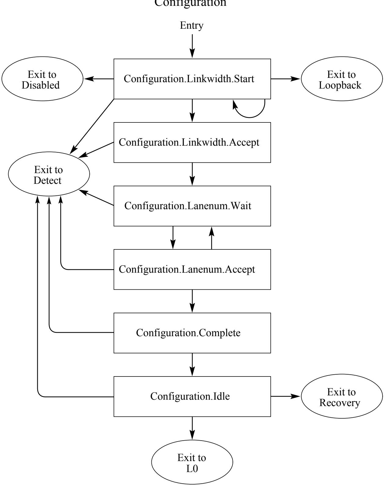

State transitions for Configuration substate machine:

- Entry: Configuration
- Exit to Recovery: Configuration.Linkwidth.Start, Configuration.Linkwidth.Accept, Configuration.Lanenum.Wait, Configuration.Lanenum.Accept, Configuration.Complete, Configuration.Idle
- Exit to L0
- Exit to Loopback
- Exit to Disabled
- Exit to Detect

OM13802C

</td>
<td style="background-color:#e8e8e8">


Configuration 子状态机的状态跃迁：

- 进入：Configuration
- 跃迁至 Recovery：Configuration.Linkwidth.Start、Configuration.Linkwidth.Accept、Configuration.Lanenum.Wait、Configuration.Lanenum.Accept、Configuration.Complete、Configuration.Idle
- 跃迁至 L0
- 跃迁至 Loopback
- 跃迁至 Disabled
- 跃迁至 Detect

OM13802C

</td>
</tr>
</tbody>
</table>

<!-- 📄 Page 529 -->
---


<div style="overflow-x: auto; max-width: 100%;">
<table>
<thead>
<tr>
<th width="50%">🇬🇧 English</th>
<th width="50%" style="background-color:#e8e8e8">🇨🇳 中文</th>
</tr>
</thead>
<tbody>
<tr>
<td>

The Recovery substate machine is shown in § Figure 4-53. For the data rate of 64.0 GT/s, any reference to Pre-cursor implies the two pre-cursors used.

If the Link is operating at a data rate of 8.0 GT/s or higher, a Receiver must consider any TS0, TS1, or TS2 Ordered Set to be received only after it obtains Block Alignment in that Lane. If entry to this substate is from L1 or Recovery.Speed or L0s, the Block Alignment must be obtained after exiting Electrical Idle condition. If entry to this substate is from L0, the Block Alignment must be obtained after the end of the last Data Stream.

- If the data rate of operation is 8.0 GT/s or higher:
  - If the start_equalization_w_preset variable is set to 1b:
    - An Upstream Port must use the Transmitter preset values it registered from the received appropriate eight consecutive TS2 Ordered Sets (EQ TS2 if 8.0 GT/s, EQ TS2 if 32.0 GT/s and Equalization Bypass to Highest NRZ Rate was negotiated, and 128b/130b EQ TS2 if 16.0 GT/s, 32.0 GT/s, or 64.0 GT/s) in Recovery.RcvrCfg in its Transmitter setting as soon as it starts transmitting in the data rate at which equalization will be performed and ensure that it meets the preset definition in § Chapter 8. . Lanes that received a Reserved or unsupported Transmitter preset value must use an implementation specific method to choose a supported Transmitter preset setting for use as soon as it starts transmitting at the data rate where equalization needs to be performed.
    - A Downstream Port must use the Transmitter preset settings according to the rules below as soon as it starts transmitting at the data rate where equalization must be performed:
      1. If the data rate of equalization is 16.0 GT/s or 32.0 GT/s or 64.0 GT/s and eight consecutive EQ TS2 Ordered Sets (for the case where equalization bypass to 32.0 GT/s is to be performed) or 128b/130b EQ TS2 Ordered Sets were received with supported Transmitter Preset values in the most recent transition through Recovery.RcvrCfg, the Transmitter Preset value from those EQ TS2 or 128b/130b EQ TS2 Ordered Sets must be used.
      2. Else, if the Transmitter Preset value defined in the Downstream Port Transmitter Preset field of the appropriate Lane Equalization Control Register Entry, as defined below is supported, then it must be used:

| Data Rate of Equalization | Transmitter Preset value to be used as soon as the Link transitions to the data rate of equalization |
|---|---|
| 8.0 GT/s | Transmitter Preset field defined in the Lane Equalization Control Register Entry for each Lane. The Downstream Port may optionally use the Downstream Port 8.0 GT/s Receiver Preset Hint field defined in the Lane Equalization Control Register Entry for each of its Receivers corresponding to the Lane, if they are not Reserved values. |
| 16.0 GT/s | Downstream Port 16.0 GT/s Transmitter Preset field of the 16.0 GT/s Lane Equalization Control Register Entry |
| 32.0 GT/s | Downstream Port 32.0 GT/s Transmitter Preset field of the 32.0 GT/s Lane Equalization Control Register Entry |

<a id="sec-4-2-7-4-2"></a>
<a id="sec-4-2-7-4-1-2"></a>

## 4.2.7.4 Recovery | Recovery 状态

## 4.2.7.4.1 Recovery.RcvrLock | Recovery.RcvrLock 子状态

</td>
<td style="background-color:#e8e8e8">

Recovery 子状态机如 § 图 4-53 所示。对于 64.0 GT/s 数据速率，任何对 Pre-cursor 的引用均隐含使用了两个 pre-cursor。

若链路以 8.0 GT/s 或更高的数据速率运行，则接收器必须在获得该通道的 Block Alignment (块对齐) 之后，才可认为已收到 TS0、TS1 或 TS2 Ordered Set。若本子状态由 L1、Recovery.Speed 或 L0s 进入，则 Block Alignment 必须在退出电气空闲 (Electrical Idle) 状态之后获得。若本子状态由 L0 进入，则 Block Alignment 必须在最后一个 Data Stream 结束之后获得。

- 若运行的数据速率为 8.0 GT/s 或更高：
  - 若 start_equalization_w_preset 变量被置为 1b：
    - 上游端口 (Upstream Port) 必须使用在 Recovery.RcvrCfg 中从所接收到的 8 个连续 TS2 Ordered Set（8.0 GT/s 时为 EQ TS2，32.0 GT/s 且已协商 Equalization Bypass to Highest NRZ Rate 时为 EQ TS2，16.0 GT/s、32.0 GT/s 或 64.0 GT/s 时为 128b/130b EQ TS2）所登记的 Transmitter preset (预设) 值，作为其发送器在即将进行均衡 (Equalization) 的数据速率下开始发送时所使用的发送器设置，并确保其满足 § 第 8 章 中的 preset 定义。对于收到 Reserved 或不受支持的 Transmitter preset 值的通道，必须使用实现特定 (implementation specific) 的方法选择一种受支持的 Transmitter preset 设置，以便在即将进行均衡的数据速率下开始发送时使用。
    - 下游端口必须按照以下规则使用 Transmitter preset 设置，作为其在即将进行均衡的数据速率下开始发送时所使用的发送器设置：
      1. 若均衡的数据速率为 16.0 GT/s、32.0 GT/s 或 64.0 GT/s，且在最近一次通过 Recovery.RcvrCfg 的跃迁中收到了 8 个连续的 EQ TS2 Ordered Set（针对将执行 equalization bypass to 32.0 GT/s 的情况）或 128b/130b EQ TS2 Ordered Set，且其中包含受支持的 Transmitter Preset 值，则必须使用这些 EQ TS2 或 128b/130b EQ TS2 Ordered Set 中的 Transmitter Preset 值。
      2. 否则，若相应 Lane Equalization Control Register Entry 的 Downstream Port Transmitter Preset 字段中定义的 Transmitter Preset 值受支持，则必须使用该值：

| 均衡数据速率 | 链路跃迁至均衡数据速率时所使用的 Transmitter Preset 值 |
|---|---|
| 8.0 GT/s | 每个通道的 Lane Equalization Control Register Entry 中定义的 Transmitter Preset 字段。若对应通道的每个接收器的 Lane Equalization Control Register Entry 中定义的 Downstream Port 8.0 GT/s Receiver Preset Hint 字段不是 Reserved 值，下游端口可选择性地使用该字段。 |
| 16.0 GT/s | 16.0 GT/s Lane Equalization Control Register Entry 的 Downstream Port 16.0 GT/s Transmitter Preset 字段 |
| 32.0 GT/s | 32.0 GT/s Lane Equalization Control Register Entry 的 Downstream Port 32.0 GT/s Transmitter Preset 字段 |

<a id="sec-4-2-7-4"></a>
<a id="sec-4-2-7-4-1"></a>

## 4.2.7.4 Recovery | Recovery 状态

## 4.2.7.4.1 Recovery.RcvrLock | Recovery.RcvrLock 子状态

</td>
</tr>
</tbody>
</table>
</div>


<!-- 📄 Page 530 -->
---

<table>
<thead>
<tr>
<th width="50%">🇬🇧 English</th>
<th width="50%" style="background-color:#e8e8e8">🇨🇳 中文</th>
</tr>
</thead>
<tbody>
<tr>
<td>

| Data Rate of Equalization | Transmitter Preset value to be used as soon as the Link transitions to the data rate of equalization |
|---|---|
| 64.0 GT/s | Downstream Port 64.0 GT/s Transmitter Preset field of the 64.0 GT/s Lane Equalization Control Register Entry |

      3. Else, use an implementation specific method to choose a supported Transmitter preset setting.

    The Downstream Port must ensure that it meets the preset definition in § Chapter 8. .

    - Next state is Recovery.Equalization.
  - Else:
    - The Transmitter must use the coefficient settings agreed upon at the conclusion of the last equalization procedure.
    - If this substate was entered from Recovery.Equalization, in the transmitted TS1 Ordered Sets, a Downstream Port must set the Pre-cursor, Cursor, and Post-cursor Coefficient fields to the current Transmitter settings, and if the last accepted request in Phase 2 of Recovery.Equalization was a preset request, it must set the Transmitter Preset bits to the accepted preset of that request.
    - It is recommended that in this substate, in the transmitted TS1 Ordered Sets, all Ports set the Pre-cursor, Cursor, and Post-cursor Coefficient fields to the current Transmitter settings, and set the Transmitter Preset bits to the most recent preset that the Transmitter settings were set to.
    - An Upstream Port that receives eight consecutive TS0 or eight consecutive TS1 Ordered Sets on all configured Lanes with the following characteristics must transition to Recovery.Equalization
      - If eight consecutive TS1 Ordered Sets were received, Link and Lane numbers in the received TS1 Ordered Sets match with the Link and Lane numbers in the transmitted TS1 Ordered Sets on each Lane. See § Section 4.2.7 for more on Matching Link and Lane Numbers for 1b/1b Encoding.
      - If eight consecutive TS1 Ordered Sets were received, speed_change bit is equal to 0b
      - If eight consecutive TS0 Ordered Sets were received, and the latest transition to Recovery.RcvrLock was from Recovery.Speed substate
      - If eight consecutive TS1 Ordered Sets were received, with the EC bits not equal to 00b
    - Next state for a Downstream Port is Recovery.Equalization if Recovery.RcvrLock was not entered from Configuration.Idle or Recovery.Idle and the Perform Equalization bit in the Link

> **IMPLEMENTATION NOTE:**
> **REDOING EQUALIZATION**
> A Downstream Port may use this provision to redo some parts of the Transmitter Equalization process using software help or some other implementation specific means while ensuring no transactions are in flight on the Link to avoid any timeouts.

</td>
<td style="background-color:#e8e8e8">

| 均衡数据速率 | 链路跃迁至均衡数据速率时所使用的 Transmitter Preset 值 |
|---|---|
| 64.0 GT/s | 64.0 GT/s Lane Equalization Control Register Entry 的 Downstream Port 64.0 GT/s Transmitter Preset 字段 |

      3. 否则，使用实现特定的方法选择一种受支持的 Transmitter preset 设置。

    下游端口必须确保其满足 § 第 8 章 中的 preset 定义。

    - 下一状态为 Recovery.Equalization。
  - 否则：
    - 发送器必须使用上一次均衡过程结束时所商定的系数设置 (coefficient settings)。
    - 若本子状态由 Recovery.Equalization 进入，则在所发送的 TS1 Ordered Set 中，下游端口必须将 Pre-cursor、Cursor 和 Post-cursor Coefficient 字段设置为当前的 Transmitter 设置；若 Recovery.Equalization Phase 2 中最后接受的是 preset 请求，则必须将 Transmitter Preset 比特设置为该请求所接受的 preset。
    - 建议在本子状态中，所有端口 (Port) 在所发送的 TS1 Ordered Set 中将 Pre-cursor、Cursor 和 Post-cursor Coefficient 字段设置为当前的 Transmitter 设置，并将 Transmitter Preset 比特设置为最近一次将 Transmitter 设置置为的 preset。
    - 上游端口若在所有已配置通道上收到具有以下特征的 8 个连续 TS0 或 8 个连续 TS1 Ordered Set，则必须跃迁至 Recovery.Equalization
      - 若收到的是 8 个连续 TS1 Ordered Set，则所接收 TS1 Ordered Set 中的 Link 号与 Lane 号与每条通道上所发送的 TS1 Ordered Set 中的 Link 号与 Lane 号相匹配。1b/1b 编码下 Link 号与 Lane 号匹配的更多信息见 § 4.2.7。
      - 若收到的是 8 个连续 TS1 Ordered Set，则 speed_change 比特等于 0b
      - 若收到的是 8 个连续 TS0 Ordered Set，且最近一次进入 Recovery.RcvrLock 来自 Recovery.Speed 子状态
      - 若收到的是 8 个连续 TS1 Ordered Set，且 EC 比特不等于 00b
    - 对于下游端口，若 Recovery.RcvrLock 并非由 Configuration.Idle 或 Recovery.Idle 进入，且 Link Control 3 寄存器的 Perform Equalization 比特被置位，或实现特定的机制判定需要执行均衡，则下一状态为 Recovery.Equalization，并遵循 § 4.2.4 中描述的流程。

> **实现注记 (IMPLEMENTATION NOTE):**
> **重做均衡 (REDOING EQUALIZATION)**
> 下游端口可利用此规定，在确保链路上没有正在进行的 transaction 以避免任何超时的前提下，借助软件帮助或其他实现特定的方式，重做发送器均衡 (Transmitter Equalization) 流程的某些部分。

</td>
</tr>
</tbody>
</table>

<!-- 📄 Page 531 -->
---


<div style="overflow-x: auto; max-width: 100%;">
<table>
<thead>
<tr>
<th width="50%">🇬🇧 English</th>
<th width="50%" style="background-color:#e8e8e8">🇨🇳 中文</th>
</tr>
</thead>
<tbody>
<tr>
<td>

Control 3 Register is set or an implementation specific mechanism determined equalization needs to be performed, following procedures described in § Section 4.2.4 .

The Downstream Port must ensure that no more than 2 TS1 Ordered Sets with EC=00b are transmitted due to being in Recovery.RcvrLock before transitioning to Recovery.Equalization and starting to transmit the TS0/TS1 Ordered Sets.

- Transmitter sends TS1 Ordered Sets on all configured Lanes using the same Link and Lane numbers that were set after leaving Configuration. The speed_change bit (bit 7 of the Data Rate Identifier Symbol in TS1 Ordered Set) must be set to 1b if the directed_speed_change variable is set to 1b. The directed_speed_change variable is set to 1b if any configured Lane receives eight consecutive TS1 Ordered Sets with the speed_change bit set to 1b. Only those data rates greater than 2.5 GT/s should be advertised that can be supported reliably. In Non-Flit Mode of operation, the N_FTS value in the TS1 Ordered Set transmitted reflects the number at the current speed of operation. A device is allowed to change the supported data rates that it advertises when it enters this substate.

A Downstream Port that intends to redo equalization with a data rate change from 2.5 GT/s or 5.0 GT/s to 8.0 GT/s or 32.0 GT/s when Equalization Bypass to Highest NRZ Rate is supported must:

- Send EQ TS1 Ordered Sets with the speed_change bit set to 1b and advertising the following data rates:
  - 8.0 GT/s Data Rate Identifier if redo equalization is for 8.0 GT/s Data Rate
  - 32.0 GT/s Data Rate Identifier if redo equalization is for 32.0 GT/s Data Rate
- If the equalization redo attempt is initiated by the hardware as described in § Section 4.2.4 , then hardware must ensure that the Data Rate is 2.5 GT/s or 5.0 GT/s before initiating the attempt.
- If the equalization redo attempt is initiated by the software mechanism as described in § Section 4.2.4 , then software must ensure that the Data Rate is 2.5 GT/s or 5.0 GT/s before initiating the attempt.

A Downstream Port that intends to redo equalization with a data rate change from 8.0 GT/s to 16.0 GT/s, 16.0 GT/s to 32.0 GT/s, or 32.0 GT/s to 64.0 GT/s must:

- Send TS1 Ordered Sets with the Equalization Redo bit set to 1b, the speed_change bit set to 1b, and advertising the Data Rate Identifier at which equalization redo will be performed (16.0 GT/s, 32.0 GT/s, or 64.0 GT/s).
- If the equalization redo attempt is initiated by the hardware as described in § Section 4.2.4 , then hardware must ensure that the Data Rate is the following before initiating the attempt to redo equalization:
  - 8.0 GT/s if the equalization redo is for 16.0 GT/s Data Rate
  - 16.0 GT/s if the equalization redo is for 32.0 GT/s Data Rate
  - 32.0 GT/s if the equalization redo is for 64.0 GT/s Data Rate
- If the equalization redo attempt is initiated by the software mechanism as described in § Section 4.2.4 , then software must ensure that the Data Rate is the following before initiating the attempt to redo equalization:
  - 8.0 GT/s if the equalization redo is for 16.0 GT/s Data Rate
  - 16.0 GT/s if the equalization redo is for 32.0 GT/s Data Rate
  - 32.0 GT/s if the equalization redo is for 64.0 GT/s Data Rate

An Upstream Port must advertise the highest data rate support in the TS2 Ordered Sets it transmits in Recovery.RcvrCfg, and optionally in the TS1 Ordered Sets it transmits in this substate, unless the Upstream Port has determined that a problem unrelated to the highest data rate equalization prevents it from operating

</td>
<td style="background-color:#e8e8e8">

Control 3 寄存器的 Perform Equalization 比特被置位，或实现特定的机制判定需要执行均衡，则遵循 § 4.2.4 中描述的流程进行。

下游端口必须确保在跃迁至 Recovery.Equalization 并开始发送 TS0/TS1 Ordered Set 之前，由于处于 Recovery.RcvrLock 而发送的 EC=00b 的 TS1 Ordered Set 不得超过 2 个。

- 发送器在所有已配置通道上使用离开 Configuration 状态时所设置的相同 Link 号与 Lane 号发送 TS1 Ordered Set。若 directed_speed_change 变量被置为 1b，则 speed_change 比特（TS1 Ordered Set 中 Data Rate Identifier Symbol 的 bit 7）必须被置为 1b。若任何已配置通道接收到 8 个连续 speed_change 比特为 1b 的 TS1 Ordered Set，则 directed_speed_change 变量被置为 1b。仅应通告 (advertise) 大于 2.5 GT/s 且能够可靠支持的数据速率。在非 Flit 模式 (Non-Flit Mode) 下运行时，所发送 TS1 Ordered Set 中的 N_FTS 值反映了当前运行速度下的数量。设备可在进入本子状态时更改其所通告的支持数据速率。

当下游端口在支持 Equalization Bypass to Highest NRZ Rate 的情况下，计划通过将数据速率从 2.5 GT/s 或 5.0 GT/s 变更为 8.0 GT/s 或 32.0 GT/s 来重做均衡时，必须：

- 发送 speed_change 比特置为 1b 且通告以下数据速率的 EQ TS1 Ordered Set：
  - 若重做均衡针对 8.0 GT/s 数据速率，则使用 8.0 GT/s Data Rate Identifier
  - 若重做均衡针对 32.0 GT/s 数据速率，则使用 32.0 GT/s Data Rate Identifier
- 若重做均衡的尝试由 § 4.2.4 所述的硬件发起，则硬件必须确保在发起该尝试之前，数据速率为 2.5 GT/s 或 5.0 GT/s。
- 若重做均衡的尝试由 § 4.2.4 所述的软件机制发起，则软件必须确保在发起该尝试之前，数据速率为 2.5 GT/s 或 5.0 GT/s。

当下游端口计划通过将数据速率从 8.0 GT/s 变更为 16.0 GT/s、从 16.0 GT/s 变更为 32.0 GT/s，或从 32.0 GT/s 变更为 64.0 GT/s 来重做均衡时，必须：

- 发送 Equalization Redo 比特置为 1b、speed_change 比特置为 1b，并通告将执行均衡重做的目标 Data Rate Identifier（16.0 GT/s、32.0 GT/s 或 64.0 GT/s）的 TS1 Ordered Set。
- 若重做均衡的尝试由 § 4.2.4 所述的硬件发起，则硬件必须确保在发起重做均衡的尝试之前，数据速率为：
  - 若均衡重做针对 16.0 GT/s 数据速率，则为 8.0 GT/s
  - 若均衡重做针对 32.0 GT/s 数据速率，则为 16.0 GT/s
  - 若均衡重做针对 64.0 GT/s 数据速率，则为 32.0 GT/s
- 若重做均衡的尝试由 § 4.2.4 所述的软件机制发起，则软件必须确保在发起重做均衡的尝试之前，数据速率为：
  - 若均衡重做针对 16.0 GT/s 数据速率，则为 8.0 GT/s
  - 若均衡重做针对 32.0 GT/s 数据速率，则为 16.0 GT/s
  - 若均衡重做针对 64.0 GT/s 数据速率，则为 32.0 GT/s

上游端口必须在 Recovery.RcvrCfg 中所发送的 TS2 Ordered Set，以及可选地在 Recovery.RcvrLock 中所发送的 TS1 Ordered Set 中通告 (advertise) 最高数据速率支持，除非上游端口已判定与最高数据速率均衡无关的问题会阻止其在被请求执行均衡的最高数据速率下可靠运行

</td>
</tr>
</tbody>
</table>
</div>


<!-- 📄 Page 532 -->
---

<table>
<thead>
<tr>
<th width="50%">🇬🇧 English</th>
<th width="50%" style="background-color:#e8e8e8">🇨🇳 中文</th>
</tr>
</thead>
<tbody>
<tr>
<td>

reliably at the highest data rate at which equalization is being requested to be performed, if the eight consecutive Ordered Sets it receives are one of the following:

- EQ TS1 or EQ TS2 Ordered Sets with the speed_change bit set to 1b
- TS1 Ordered Sets with the Equalization Redo bit set to 1b or 128b/130b EQ TS2 Ordered Sets with the speed_change bit set to 1b.

Under other conditions, a device must not change the supported data rate values either in this substate or while in the Recovery.RcvrCfg or Recovery.Equalization substates. The successful_speed_negotiation variable is reset to 0b upon entry to this substate.

An Upstream Port must set the Selectable De-emphasis bit (bit 6 of Symbol 4) of the TS1 Ordered Sets it transmits to match the desired de-emphasis level at 5.0 GT/s. The mechanism an Upstream Port may adopt to request a de-emphasis level if it chooses to do so is implementation specific. It must also be noted that since the Upstream Port's request may not reach the Downstream Port due to bit errors in the TS1 Ordered Sets, the Upstream Port may attempt to re-request the desired de-emphasis level in subsequent entries to Recovery state when speed change is requested. If the

> **IMPLEMENTATION NOTE:**
> **HANDLING A REQUEST TO ADVERTISE 8.0 GT/S DATA RATE IDENTIFIER**
> If an Upstream Port that is not advertising 8.0 GT/s Data Rate Identifiers receives EQ TSs with 8.0 GT/s Data Rate Identifiers and with the speed_change bit set in Recovery.RcvrLock, that indicates that the Downstream Port is attempting to switch the Link speed to 8.0 GT/s in order to perform the 8.0 GT/s Link Equalization Procedure. If for some reason the Upstream Port is unable or unwilling to switch to advertising 8.0 GT/s Data Rate Identifiers in the TS2 Ordered Sets it transmits once it transitions to Recovery.RcvrCfg, the 8.0 GT/s Link Equalization Procedure will not be performed in the current tenure in Recovery. This may cause the Downstream Port to permanently abandon its attempt to change the Link speed to 8.0 GT/s and perform the 8.0 GT/s Link Equalization Procedure, resulting in an operational link speed of less than 8.0 GT/s until after the link transitions through Detect and is re-trained. It is recommended that if an Upstream Port is for some temporary reason unable or unwilling to switch to advertising 8.0 GT/s Data Rate Identifiers in the condition described above, and does not intend to prohibit the Link from operating at 8.0 GT/s, that it perform one of the following two actions below as soon as is reasonable for it to do so:
> - If the Upstream Port supports the Quiesce Guarantee mechanism for performing the Link Equalization Procedure, enter Recovery and advertise 8.0 GT/s Data Rate Identifiers with the speed_change bit set to 1b in the TSs that it sends. If Recovery.Equalization is not entered after changing speed to 8.0 GT/s and before entering Recovery.RcvrCfg at 8.0 GT/s (the Downstream Port did not direct an entry to Recovery.Equalization), it should set the Request Equalization and Quiesce Guarantee bits to 1b in the TS2 Ordered Sets sent at 8.0 GT/s in Recovery.RcvrCfg in order to request the Downstream Port to initiate the Link Equalization Procedure.
> - Enter Recovery and advertise 8.0 GT/s Data Rate Identifiers with the speed_change bit cleared to 0b. The Downstream Port may then later initiate a speed change to 8.0 GT/s and perform the Link Equalization Procedure, though there is no guarantee that it will do so.
> The process for handling a request to advertise 16.0 GT/s, 32.0 GT/s, or 64.0 GT/s Data Rate Identifier is similar to 8.0 GT/s Data Rate Identifier with 16.0 GT/s, 32.0 GT/s, or 64.0 GT/s Data Rate Identifier substituting 8.0 GT/s Data Rate Identifier and 128b/130b EQ TS2s substituting EQ TSs.

</td>
<td style="background-color:#e8e8e8">

如果所接收的 8 个连续 Ordered Set 属于下列情形之一：

- speed_change 比特置为 1b 的 EQ TS1 或 EQ TS2 Ordered Set
- Equalization Redo 比特置为 1b 的 TS1 Ordered Set，或 speed_change 比特置为 1b 的 128b/130b EQ TS2 Ordered Set。

在其他情况下，设备不得在本子状态中或处于 Recovery.RcvrCfg 或 Recovery.Equalization 子状态期间更改所支持的数据速率值。successful_speed_negotiation 变量在进入本子状态时被复位为 0b。

上游端口必须将其所发送 TS1 Ordered Set 的 Selectable De-emphasis 比特（Symbol 4 的 bit 6）设置为匹配 5.0 GT/s 下的期望去加重 (de-emphasis) 电平。上游端口若选择请求某个去加重电平，可采用实现特定的机制。还须注意，由于 TS1 Ordered Set 中的比特错误可能导致上游端口的请求无法到达下游端口，因此上游端口可在后续进入 Recovery 状态（当请求 speed change 时）时重新请求所需的去加重电平。如果

> **实现注记 (IMPLEMENTATION NOTE):**
> **处理通告 8.0 GT/s DATA RATE IDENTIFIER 的请求 (HANDLING A REQUEST TO ADVERTISE 8.0 GT/S DATA RATE IDENTIFIER)**
> 若一个未通告 8.0 GT/s Data Rate Identifier 的上游端口在 Recovery.RcvrLock 中收到带有 8.0 GT/s Data Rate Identifier 且 speed_change 比特置位的 EQ TS，则表明下游端口正试图将链路速率切换至 8.0 GT/s 以执行 8.0 GT/s 链路均衡 (Link Equalization) 流程。若上游端口因某种原因无法或不愿在其跃迁至 Recovery.RcvrCfg 后所发送的 TS2 Ordered Set 中切换为通告 8.0 GT/s Data Rate Identifier，则在当前 Recovery 任期内将不会执行 8.0 GT/s 链路均衡流程。这可能导致下游端口永久放弃将链路速率变更为 8.0 GT/s 并执行 8.0 GT/s 链路均衡流程的尝试，导致运行链路速率低于 8.0 GT/s，直至链路通过 Detect 状态并被重新训练 (re-trained) 为止。建议在上游端口因某些临时原因无法或不愿在上述条件下切换为通告 8.0 GT/s Data Rate Identifier，且无意禁止链路以 8.0 GT/s 运行时，尽快执行以下两种操作之一：
> - 若上游端口支持用于执行链路均衡流程的 Quiesce Guarantee 机制，则进入 Recovery，并在其所发送的 TS 中将 speed_change 比特置为 1b 来通告 8.0 GT/s Data Rate Identifier。若在速率变更至 8.0 GT/s 之后、在 8.0 GT/s 下进入 Recovery.RcvrCfg 之前未进入 Recovery.Equalization（即下游端口未引导进入 Recovery.Equalization），则上游端口应在 Recovery.RcvrCfg 中以 8.0 GT/s 发送的 TS2 Ordered Set 中将 Request Equalization 与 Quiesce Guarantee 比特置为 1b，以请求下游端口发起链路均衡流程。
> - 进入 Recovery，并以 speed_change 比特清零 (0b) 通告 8.0 GT/s Data Rate Identifier。下游端口随后可在稍后发起至 8.0 GT/s 的速率变更并执行链路均衡流程，但无法保证其一定会这样做。
> 处理 16.0 GT/s、32.0 GT/s 或 64.0 GT/s Data Rate Identifier 通告请求的流程与 8.0 GT/s Data Rate Identifier 类似，只需将 8.0 GT/s Data Rate Identifier 替换为 16.0 GT/s、32.0 GT/s 或 64.0 GT/s Data Rate Identifier，并将 EQ TS 替换为 128b/130b EQ TS2。

</td>
</tr>
</tbody>
</table>

<!-- 📄 Page 533 -->
---


<div style="overflow-x: auto; max-width: 100%;">
<table>
<thead>
<tr>
<th width="50%">🇬🇧 English</th>
<th width="50%" style="background-color:#e8e8e8">🇨🇳 中文</th>
</tr>
</thead>
<tbody>
<tr>
<td>

Downstream Port intends to use the Upstream Port's de-emphasis information in Recovery.RcvrCfg, then it must record the value of the Selectable De-emphasis bit received in this state.

The Transmit Margin field of the Link Control 2 Register is sampled on entry to this substate and becomes effective on the transmit package pins within 192 ns of entry to this substate and remains effective until a new value is sampled on a subsequent entry to this substate from L0, L0s, or L1.

- After activating any inactive Lane, the Transmitter must wait for its TX common mode to settle before exiting Electrical Idle and transmitting the TS1 Ordered Sets with the following exceptions.
- When exiting from the L1.2 L1 PM Substate, common mode is permitted to be established passively during L1.0, and actively during Recovery. In order to ensure common mode has been established in Recovery.RcvrLock, the Downstream Port must maintain a timer, and the Downstream Port must not send TS2 Ordered Sets until a minimum of TCOMMONMODE has elapsed since the Downstream Port has started transmitting TS1 Ordered Sets and has detected electrical idle exit on any Lane of the configured Link. See § Section 5.5.3.3 .
- Implementations must note that the voltage levels may change after an early bit lock and Symbol or Block alignment since the new Transmit Margin field becomes effective within 192 ns after the other side enter Recovery.RcvrLock. The Receiver needs to reacquire bit lock and Symbol or Block alignment under those conditions.

a. Note: The directed_speed_change variable is set to 1b in L0 or L1 state for the side that is initiating a speed change. For the side that is not initiating a speed change, this bit is Set in this substate if the received TS Ordered Sets have the speed change bit Set. This bit is reset to 0b in the Recovery.Speed substate.

b. A device must accept all good TLPs and DLLPs it receives after entering this substate from L0 prior to receiving the first TS Ordered Set. If operating with 128b/130b encoding, any received TLPs and DLLPs are subject to the framing rules for 128b/130b encoding in § Section 4.2.2.3 .

- Next state is Recovery.RcvrCfg if eight consecutive TS1 or TS2 Ordered Sets are received on all configured Lanes with the same Link and Lane numbers that match what is being transmitted on those same Lanes and the speed_change bit is equal to the directed_speed_change variable and the EC field is 00b in all the consecutive TS1 Ordered Sets if the current data rate is 8.0 GT/s or higher. See § Section 4.2.7 for more on Matching Link and Lane Numbers for 1b/1b Encoding.
  - If the Extended Synch bit is Set, the Transmitter must send a minimum of 1024 consecutive TS1 Ordered Sets before transitioning to Recovery.RcvrCfg.
  - If this substate was entered from Recovery.Equalization, the Upstream Port must evaluate the equalization coefficients or preset received by all Lanes that receive eight TS1 Ordered Sets and note whether they are different from the final set of coefficients or preset that was accepted in Phase 2 of the equalization process. Note: Mismatches are reported in Recovery.RcvrCfg by setting the Request Equalization bit of TS2 Ordered Sets.
- Otherwise, after a 24 ms timeout:
  - Next state is Recovery.RcvrCfg if the following two conditions are true:
    - Either of the following conditions are true:
      - Eight consecutive TS1 or TS2 Ordered Sets are received on any configured Lane with the same Link and Lane numbers that match what is being transmitted on the same Lane and the speed_change bit equal to 1b. See § Section 4.2.7 for more on Matching Link and Lane Numbers for 1b/1b Encoding.
      - The Link is operating in Flit Mode and eight consecutive TS2s are received on any configured Lane with the Link number set to PAD and the Lane number

</td>
<td style="background-color:#e8e8e8">

下游端口打算在 Recovery.RcvrCfg 中使用上游端口的去加重信息，则必须记录在本状态中接收到的 Selectable De-emphasis 比特的值。

Link Control 2 寄存器的 Transmit Margin 字段在进入本子状态时被采样，并在进入本子状态后的 192 ns 内对发送器封装引脚生效，且保持有效，直至在后续自 L0、L0s 或 L1 进入本子状态时采样到新值。

- 在激活任何处于非活动状态的通道之后，发送器必须等待其 TX common mode 稳定，然后才能退出电气空闲 (Electrical Idle) 并发送 TS1 Ordered Set，以下情况除外。
- 当从 L1.2 L1 PM 子状态退出时，允许在 L1.0 期间以被动方式建立 common mode，并在 Recovery 期间以主动方式建立 common mode。为了确保 common mode 已在 Recovery.RcvrLock 中建立，下游端口必须维护一个定时器，且下游端口在开始发送 TS1 Ordered Set 之后并在已配置链路的任何通道上检测到 electrical idle exit 之后的 TCOMMONMODE 最短时间到达之前，不得发送 TS2 Ordered Set。详见 § 5.5.3.3。
- 实现必须注意，由于新的 Transmit Margin 字段在另一侧进入 Recovery.RcvrLock 之后的 192 ns 内生效，因此在早期 bit lock 和 Symbol 或 Block 对齐之后，电平可能会发生变化。接收器在这些情况下需要重新获得 bit lock 以及 Symbol 或 Block 对齐。

a. 注：directed_speed_change 变量在 L0 或 L1 状态中，对于发起 speed change 的一方被置为 1b。对于未发起 speed change 的一方，若接收到的 TS Ordered Set 的 speed change 比特置位，则该比特在本子状态中被置位。该比特在 Recovery.Speed 子状态中被复位为 0b。

b. 设备在自 L0 进入本子状态后、在接收到第一个 TS Ordered Set 之前，必须接受其所接收到的所有有效 (good) TLP 与 DLLP。若运行于 128b/130b 编码下，则所接收到的任何 TLP 与 DLLP 均须遵循 § 4.2.2.3 中 128b/130b 编码的成帧 (framing) 规则。

- 若在所有已配置通道上接收到 8 个连续 TS1 或 TS2 Ordered Set，且其 Link 号与 Lane 号与在相同通道上正在发送的 Link 号与 Lane 号相匹配，speed_change 比特等于 directed_speed_change 变量，且当当前数据速率为 8.0 GT/s 或更高时，所有连续 TS1 Ordered Set 中的 EC 字段为 00b，则下一状态为 Recovery.RcvrCfg。1b/1b 编码下 Link 号与 Lane 号匹配的更多信息见 § 4.2.7。
  - 若 Extended Synch 比特被置位，则发送器必须在跃迁至 Recovery.RcvrCfg 之前发送至少 1024 个连续的 TS1 Ordered Set。
  - 若本子状态由 Recovery.Equalization 进入，则上游端口必须对所有接收到 8 个 TS1 Ordered Set 的通道所接收到的均衡系数或 preset 进行评估，并注意其是否与均衡流程 Phase 2 中接受的最终系数或 preset 集合不同。注：不匹配通过在 Recovery.RcvrCfg 中将 TS2 Ordered Set 的 Request Equalization 比特置位来报告。
- 否则，在 24 ms 超时之后：
  - 若同时满足以下两个条件，则下一状态为 Recovery.RcvrCfg：
    - 以下条件之一成立：
      - 在任意已配置通道上接收到 8 个连续的 TS1 或 TS2 Ordered Set，其 Link 号与 Lane 号与在同一通道上正在发送的 Link 号与 Lane 号相匹配，且 speed_change 比特等于 1b。1b/1b 编码下 Link 号与 Lane 号匹配的更多信息见 § 4.2.7。
      - 链路以 Flit 模式运行，且在任意已配置通道上接收到 8 个连续的 TS2，其 Link 号置为 PAD，Lane 号

</td>
</tr>
</tbody>
</table>
</div>


<!-- 📄 Page 534 -->
---

<table>
<thead>
<tr>
<th width="50%">🇬🇧 English</th>
<th width="50%" style="background-color:#e8e8e8">🇨🇳 中文</th>
</tr>
</thead>
<tbody>
<tr>
<td>

matches what is being transmitted on the same Lane. See § Section 4.2.7 for more on Matching Link and Lane Numbers for 1b/1b Encoding.

    - Either of the following conditions are true:
      - The current data rate of operation is greater than 2.5 GT/s.
      - The highest data rate advertised in the Data Rate Identifier symbol of both the transmitted TS1 Ordered Sets and the (eight consecutive) received TS1 or TS2 Ordered Sets is 5.0 GT/s or greater.
  - Else the next state is Recovery.Speed if the speed of operation has not changed to a mutually negotiated data rate since entering Recovery from L0 or L1 (i.e., changed_speed_recovery = 0b) and the current speed of operation is greater than 2.5 GT/s.
    - The new data rate to operate after leaving Recovery.Speed will be at 2.5 GT/s if 8b/10b or 128b/130b encoding is used. The new data rate of operation after leaving Recovery.Speed will be 32.0 GT/s if 1b/1b encoding is used. Note: This indicates that the Link was unable to operate at the current data rate and the Link will operate at the lower data rate of either 2.5 GT/s data rate or 32.0 GT/s.
  - Else the next state is Recovery.Speed if the operating speed has been changed to a mutually negotiated data rate since entering Recovery from L0 or L1 (changed_speed_recovery = 1b; i.e., the arc to this substate has been taken from Recovery.Speed). The new data rate to operate after leaving Recovery.Speed is reverted back to the speed it was when Recovery was entered from L0 or L1. Note: This indicates that the Link was unable to operate at the new negotiated data rate and will revert back to the old data rate with which it entered Recovery from L0 or L1.
  - Else the next state is Configuration and the directed_speed_change variable is reset to 0b if the following conditions are true:
    - If any of the configured Lanes that are receiving a TS1 or TS2 Ordered Set have received at least one TS1 or TS2 Ordered Set with Link and Lane numbers that match what is being transmitted on those same Lanes. See § Section 4.2.7 for more on Matching Link and Lane Numbers for 1b/1b Encoding.
    - The operating speed has not changed to a mutually negotiated data rate (i.e., changed_speed_recovery = 0b) since entering Recovery.
    and at least one of the following conditions is true:
    - The directed_speed_change variable is equal to 0b and the speed_change bit on the received TS1 or TS2 Ordered Set is equal to 0b.

> **IMPLEMENTATION NOTE:**
> **RECOMMENDED MECHANISM FOR LINK WIDTH REDUCTION IN FLIT MODE**
> It is envisioned that when the Link Width is reduced in Flit Mode, both Ports will transition to Configuration from Recovery.RcvrCfg. If a Port proactively reduces the Link Width, it is recommended that that Port either: (1) Waits until it receives a TS2 Ordered Set on one of its Lanes or (2) Waits an additional 1 msec after the conditions are met for the Recovery.RcvrLock to Recovery.RcvrCfg transition. This decreases the likelihood that the initiator's Link Partner will take the timeout arc to Recovery.RcvrCfg since the initiator will continue to send TS1s with a valid Link and Lane number while in Recovery.RcvrLock.

</td>
<td style="background-color:#e8e8e8">

与在同一通道上正在发送的 Lane 号相匹配。1b/1b 编码下 Link 号与 Lane 号匹配的更多信息见 § 4.2.7。

    - 以下条件之一成立：
      - 当前运行的数据速率大于 2.5 GT/s。
      - 所发送 TS1 Ordered Set 与所接收（8 个连续）TS1 或 TS2 Ordered Set 的 Data Rate Identifier Symbol 中所通告的最高数据速率均不低于 5.0 GT/s。
  - 否则，若自自 L0 或 L1 进入 Recovery 以来，运行速率尚未变更为双方协商的数据速率（即 changed_speed_recovery = 0b），且当前运行速率大于 2.5 GT/s，则下一状态为 Recovery.Speed。
    - 离开 Recovery.Speed 后将要运行的新数据速率在使用 8b/10b 或 128b/130b 编码时为 2.5 GT/s；在使用 1b/1b 编码时为 32.0 GT/s。注：这表示链路无法在当前数据速率下运行，链路将以 2.5 GT/s 数据速率或 32.0 GT/s 中较低的一个数据速率运行。
  - 否则，若自自 L0 或 L1 进入 Recovery 以来，运行速率已变更为双方协商的数据速率（changed_speed_recovery = 1b；即至本子状态的弧来自 Recovery.Speed），则下一状态为 Recovery.Speed。离开 Recovery.Speed 后将要运行的新数据速率将恢复为自 L0 或 L1 进入 Recovery 时的速率。注：这表示链路无法在新的协商数据速率下运行，并将恢复为自 L0 或 L1 进入 Recovery 时的旧数据速率。
  - 否则，在以下条件均满足时，下一状态为 Configuration，且 directed_speed_change 变量被复位为 0b：
    - 若任一正在接收 TS1 或 TS2 Ordered Set 的已配置通道已收到至少一个 TS1 或 TS2 Ordered Set，其 Link 号与 Lane 号与在相同通道上正在发送的 Link 号与 Lane 号相匹配。1b/1b 编码下 Link 号与 Lane 号匹配的更多信息见 § 4.2.7。
    - 自进入 Recovery 以来，运行速率尚未变更为双方协商的数据速率（即 changed_speed_recovery = 0b）。
    且以下条件至少之一成立：
    - directed_speed_change 变量等于 0b，且所接收 TS1 或 TS2 Ordered Set 上的 speed_change 比特等于 0b。

> **实现注记 (IMPLEMENTATION NOTE):**
> **FLIT 模式下链路宽度缩减的推荐机制 (RECOMMENDED MECHANISM FOR LINK WIDTH REDUCTION IN FLIT MODE)**
> 预期在 Flit 模式下缩减链路宽度 (Link Width) 时，两个端口都将从 Recovery.RcvrCfg 跃迁至 Configuration。若某个端口主动缩减链路宽度，则建议该端口执行以下之一：(1) 等待直至在其某条通道上接收到 TS2 Ordered Set；或 (2) 在满足 Recovery.RcvrLock 至 Recovery.RcvrCfg 跃迁条件后再额外等待 1 ms。这降低了发起方的链路伙伴 (Link Partner) 通过超时弧进入 Recovery.RcvrCfg 的可能性，因为发起方在 Recovery.RcvrLock 期间将继续发送带有有效 Link 号与 Lane 号的 TS1。

</td>
</tr>
</tbody>
</table>

<!-- 📄 Page 535 -->
---


<div style="overflow-x: auto; max-width: 100%;">
<table>
<thead>
<tr>
<th width="50%">🇬🇧 English</th>
<th width="50%" style="background-color:#e8e8e8">🇨🇳 中文</th>
</tr>
</thead>
<tbody>
<tr>
<td>

- The current data rate of operation is 2.5 GT/s and 2.5 GT/s data rate is the highest commonly advertised data rate among the transmitted TS1 Ordered Sets and the received TS1 or TS2 Ordered Set(s).
  - Otherwise, the next state is Detect.

If this state was entered from Recovery.RcvrLock, Transmitter sends either TS0 or TS1 Ordered Sets on all configured Lanes, as described in § Table 4-51, using the same Link and Lane numbers that were set after leaving Configuration. A Receiver must consider any TS1 or TS0 Ordered Set to be received only after it obtains Block Alignment in that Lane.

If this state was entered from Loopback.Entry:

- Transmitter sends either TS0 or TS1 Ordered Sets, as described in § Table 4-51, on all Lanes that detected a Receiver during Detect using the Link and Lane numbers defined in Loopback.Entry.
- The Lane under test is the only Lane that participates in the equalization procedure.
- The Lanes that are not under test must not be included in the equalization procedure and anything received by them is permitted to be ignored. The Lanes that are not under test must have their Transmitter preset values

> **IMPLEMENTATION NOTE:**
> **EXAMPLE SHOWING SPEED CHANGE ALGORITHM BETWEEN 2.5 GT/S AND 5.0 GT/S**
> Suppose a Link connects two greater than 5.0 GT/s capable components, A and B. The Link comes up to the L0 state in 2.5 GT/s data rate. Component A decides to change the speed to greater than 5.0 GT/s, sets the directed_speed_change variable to 1b and enters Recovery.RcvrLock from L0. Component A sends TS1 Ordered Sets with the speed_change bit set to 1b and advertises the 2.5 GT/s, 5.0 GT/s, and 8.0 GT/s data rates. Component B sees the first TS1 in L0 state and enters Recovery.RcvrLock state. Initially, component B sends TS1s with the speed_change set to 0b. Component B will start sending the speed_change indication in its TS1 after it receives eight consecutive TS1 Ordered Sets from component A and advertises all of the data rates it can support. Component B will enter Recovery.RcvrCfg from where it will enter Recovery.Speed. Component A will wait for eight consecutive TS1/TS2 with speed_change bit set from component B before moving to Recovery.RcvrCfg and on to Recovery.Speed. Both component A and component B enter Recovery.Speed and record 8.0 GT/s as the maximum speed they can operate with. The directed_speed_change variable will be reset to 0b when in Recovery.Speed. When they enter Recovery.RcvrLock from Recovery.Speed, they will operate at 8.0 GT/s and send TS1s with speed_change set to 0b. If both sides work well at 8.0 GT/s, they will continue on to Recovery.RcvrCfg and enter L0 through Recovery.Idle at 8.0 GT/s. However, if component B fails to achieve Symbol lock, it will timeout in Recovery.RcvrLock and enters Recovery.Speed. Component A would have moved on to Recovery.RcvrCfg but would see the Electrical Idle after receiving TS1s at 8.0 GT/s after component B enters Recovery.Speed. This will cause component A to move to Recovery.Speed. After entering Recovery.Speed for the second time, both sides will revert back to the speed they operated with prior to entering the Recovery state (2.5 GT/s). Both sides will enter L0 from Recovery in 2.5 GT/s. Component A may initiate the directed_speed_change variable for a second time, requesting 8.0 GT/s data rate in its Data Rate Identifier, go through the same steps, fail to establish the 8.0 GT/s data rate and go back to L0 in 2.5 GT/s data rate. On the third attempt, however, component A may decide to only advertise 2.5 GT/s and 5.0 GT/s data rates and successfully establish the Link at 5.0 GT/s data rate and enter L0 at that speed. However, if either side entered Detect, that side should advertise all of the data rates it can support, since there may have been a hot plug event.

<a id="sec-4-2-7-4-2-2"></a>
## 4.2.7.4.2 Recovery.Equalization | Recovery.Equalization 子状态

</td>
<td style="background-color:#e8e8e8">

- 当前运行的数据速率为 2.5 GT/s，且 2.5 GT/s 数据速率是所发送 TS1 Ordered Set 与所接收 TS1 或 TS2 Ordered Set 中共同通告的最高数据速率。
  - 否则，下一状态为 Detect。

若本状态由 Recovery.RcvrLock 进入，则发送器在所有已配置通道上使用离开 Configuration 状态时所设置的相同 Link 号与 Lane 号，按 § 表 4-51 所述发送 TS0 或 TS1 Ordered Set。接收器必须在获得该通道的 Block Alignment 之后，才可认为已收到 TS1 或 TS0 Ordered Set。

若本状态由 Loopback.Entry 进入：

- 发送器在 Detect 期间检测到接收器的所有通道上，按 § 表 4-51 所述，使用 Loopback.Entry 中定义的 Link 号与 Lane 号发送 TS0 或 TS1 Ordered Set。
- 待测通道是参与均衡流程的唯一通道。
- 非待测通道不得纳入均衡流程，允许忽略这些通道接收到的任何内容。非待测通道的 Transmitter preset 值必须

> **实现注记 (IMPLEMENTATION NOTE):**
> **2.5 GT/S 与 5.0 GT/S 之间 SPEED CHANGE 算法的示例 (EXAMPLE SHOWING SPEED CHANGE ALGORITHM BETWEEN 2.5 GT/S AND 5.0 GT/S)**
> 假设一条链路连接两个支持大于 5.0 GT/s 的组件 A 和 B。链路以 2.5 GT/s 数据速率在 L0 状态下建立连接。组件 A 决定将速率变更为大于 5.0 GT/s，将 directed_speed_change 变量置为 1b，并自 L0 进入 Recovery.RcvrLock。组件 A 发送 speed_change 比特置为 1b 的 TS1 Ordered Set，并通告 2.5 GT/s、5.0 GT/s 和 8.0 GT/s 数据速率。组件 B 在 L0 状态下看到第一个 TS1 并进入 Recovery.RcvrLock 状态。最初，组件 B 发送 speed_change 置为 0b 的 TS1。组件 B 在收到组件 A 发送的 8 个连续 TS1 Ordered Set 后，将开始在其 TS1 中发送 speed_change 指示，并通告其能够支持的所有数据速率。组件 B 将进入 Recovery.RcvrCfg，并从那里进入 Recovery.Speed。组件 A 将等待来自组件 B 的 8 个连续 speed_change 比特置位的 TS1/TS2，然后才进入 Recovery.RcvrCfg，并进一步进入 Recovery.Speed。组件 A 和组件 B 均进入 Recovery.Speed，并将 8.0 GT/s 记录为其可运行的最大速率。directed_speed_change 变量将在 Recovery.Speed 中被复位为 0b。当它们自 Recovery.Speed 进入 Recovery.RcvrLock 时，将以 8.0 GT/s 运行，并以 speed_change 置为 0b 发送 TS1。若双方均能在 8.0 GT/s 下正常工作，则将继续进入 Recovery.RcvrCfg，并通过 Recovery.Idle 在 8.0 GT/s 下进入 L0。然而，若组件 B 无法获得 Symbol lock，则其将在 Recovery.RcvrLock 中超时并进入 Recovery.Speed。组件 A 此前已进入 Recovery.RcvrCfg，但在组件 B 进入 Recovery.Speed 后，将在收到 8.0 GT/s 下的 TS1 后看到 Electrical Idle。这将导致组件 A 跃迁至 Recovery.Speed。第二次进入 Recovery.Speed 后，双方将恢复为进入 Recovery 状态之前所运行的速率（2.5 GT/s）。双方将以 2.5 GT/s 自 Recovery 进入 L0。组件 A 可第二次发起 directed_speed_change 变量，在其 Data Rate Identifier 中请求 8.0 GT/s 数据速率，经历相同的步骤，无法建立 8.0 GT/s 数据速率，并返回至 2.5 GT/s 数据速率下的 L0。然而在第三次尝试时，组件 A 可决定仅通告 2.5 GT/s 与 5.0 GT/s 数据速率，并成功在 5.0 GT/s 数据速率下建立链路并以该速率进入 L0。然而，若任一侧进入了 Detect 状态，则该侧应通告其能够支持的所有数据速率，因为可能已发生热插拔 (hot plug) 事件。

<a id="sec-4-2-7-4-2"></a>
## 4.2.7.4.2 Recovery.Equalization | Recovery.Equalization 子状态

</td>
</tr>
</tbody>
</table>
</div>


<!-- 📄 Page 536 -->
---

<table>
<thead>
<tr>
<th width="50%">🇬🇧 English</th>
<th width="50%" style="background-color:#e8e8e8">🇨🇳 中文</th>
</tr>
</thead>
<tbody>
<tr>
<td>

set to P4 / Q0. The sole purpose of the lanes that are not under test is to create the noise that is needed in Loopback.Active.

The Lanes must transmit the proper type of Ordered Set (TS0 vs TS1) and check for the receipt of the proper Ordered Set (TS0 vs TS1), according to § Table 4-51, in Recovery.Equalization anywhere TS0/TS1 is mentioned.

**Table 4-51. Use of TS0 or TS1 Ordered Sets in different phases | 表 4-51. 不同 Phase 中 TS0 或 TS1 Ordered Set 的使用**

| Current Data Rate / Port | Phase 0 / Phase 1 | Phase 2 | Phase 3 |
|---|---|---|---|
| 8.0 GT/s, 16.0 GT/s, or 32.0 GT/s; Upstream/Downstream Lanes | TS1 | TS1 | TS1 |
| 64.0 GT/s Downstream Lanes | TS0 | TS0 followed by TS1 | TS1 |
| 64.0 GT/s Upstream Lanes | TS0 | TS0 | TS0 followed by TS1 |

Upon entry to this substate:

- Current phase is Phase 1
  - If the data rate of operation is 8.0 GT/s:
    - The Equalization 8.0 GT/s Phase 1 Successful, Equalization 8.0 GT/s Phase 2 Successful, Equalization 8.0 GT/s Phase 3 Successful, Link Equalization Request 8.0 GT/s, and Equalization 8.0 GT/s Complete bits of the Link Status 2 Register and the Perform Equalization bit of the Link Control 3 Register are all set to 0b.
    - The equalization_done_8GT_data_rate variable is set to 1b.
  - If the data rate of operation is 16.0 GT/s:
    - The Equalization 16.0 GT/s Phase 1 Successful, Equalization 16.0 GT/s Phase 2 Successful, Equalization 16.0 GT/s Phase 3 Successful, Link Equalization Request 16.0 GT/s, and Equalization

> **IMPLEMENTATION NOTE:**
> **TS0 TO TS1 TRANSITIONS**
> All the TS0 to TS1 transitions are expected and initiated by a Port so that its receiver is prepared for the NRZ to PAM4 transition.
> The first transition occurs for the Downstream Lanes when entering Phase 2. The Downstream Lanes send TS0 with EC = 00b till they get their receiver to a 1E-4 BER and then they send EC = 01b. Then they just wait for the EC = 01b from the Upstream Port to make the transition. When the Upstream Port sends EC = 01b, it is guaranteed of the transition within a fixed time since the Downstream Port has already acquired its target BER of 1E-4.
> The other transition happens during Phase 3 for the Upstream Lanes, when the Upstream Port receives EC=11b. Since the Downstream Port sends EC=11b, it is expecting the NRZ to PAM4 transition.
> We have also made a provision for the Retimer to request extended EQ during Phase 0 & 1 for 64.0 GT/s equalization.

<a id="sec-4-2-7-4-2-1-2"></a>
## 4.2.7.4.2.1 Downstream Lanes | Downstream 通道

</td>
<td style="background-color:#e8e8e8">

被设置为 P4 / Q0。非待测通道的唯一目的是产生 Loopback.Active 所需的噪声。

通道必须根据 § 表 4-51 发送正确类型的有序集（TS0 或 TS1）并检查所接收到的有序集（TS0 或 TS1）是否正确，在 Recovery.Equalization 中凡提及 TS0/TS1 的地方均应遵循该表。

**Table 4-51. Use of TS0 or TS1 Ordered Sets in different phases | 表 4-51. 不同 Phase 中 TS0 或 TS1 Ordered Set 的使用**

| 当前数据速率 / 端口 | Phase 0 / Phase 1 | Phase 2 | Phase 3 |
|---|---|---|---|
| 8.0 GT/s、16.0 GT/s 或 32.0 GT/s；上游/下游通道 | TS1 | TS1 | TS1 |
| 64.0 GT/s 下游通道 | TS0 | TS0 followed by TS1 | TS1 |
| 64.0 GT/s 上游通道 | TS0 | TS0 | TS0 followed by TS1 |

进入本子状态时：

- 当前 Phase 为 Phase 1
  - 若运行的数据速率为 8.0 GT/s：
    - Link Status 2 寄存器中的 Equalization 8.0 GT/s Phase 1 Successful、Equalization 8.0 GT/s Phase 2 Successful、Equalization 8.0 GT/s Phase 3 Successful、Link Equalization Request 8.0 GT/s 与 Equalization 8.0 GT/s Complete 比特，以及 Link Control 3 寄存器中的 Perform Equalization 比特，均被置为 0b。
    - equalization_done_8GT_data_rate 变量被置为 1b。
  - 若运行的数据速率为 16.0 GT/s：
    - 16.0 GT/s Status 寄存器中的 Equalization 16.0 GT/s Phase 1 Successful、Equalization 16.0 GT/s Phase 2 Successful、Equalization 16.0 GT/s Phase 3 Successful、Link Equalization Request 16.0 GT/s 与 Equalization

> **实现注记 (IMPLEMENTATION NOTE):**
> **TS0 至 TS1 的跃迁 (TS0 TO TS1 TRANSITIONS)**
> 所有的 TS0 至 TS1 跃迁均由端口预期并发起，以便其接收器为 NRZ 至 PAM4 的跃迁做好准备。
> 第一次跃迁在下游通道进入 Phase 2 时发生。下游通道发送 EC = 00b 的 TS0，直至其接收器达到 1E-4 BER，然后发送 EC = 01b。之后，下游通道将等待来自上游端口的 EC = 01b 以执行跃迁。由于下游端口已获得其 1E-4 的目标 BER，因此当上游端口发送 EC = 01b 时，下游端口可确保在固定时间内完成跃迁。
> 另一次跃迁发生在 Phase 3 中上游通道上，由上游端口收到 EC=11b 时发生。由于下游端口发送 EC=11b，因此其预期发生 NRZ 至 PAM4 的跃迁。
> 此外，我们还为 Retimer 提供了在 64.0 GT/s 均衡的 Phase 0 与 Phase 1 期间请求扩展均衡 (extended EQ) 的机制。

<a id="sec-4-2-7-4-2-1"></a>
## 4.2.7.4.2.1 Downstream Lanes | Downstream 通道

</td>
</tr>
</tbody>
</table>

<!-- 📄 Page 537 -->
---


<div style="overflow-x: auto; max-width: 100%;">
<table>
<thead>
<tr>
<th width="50%">🇬🇧 English</th>
<th width="50%" style="background-color:#e8e8e8">🇨🇳 中文</th>
</tr>
</thead>
<tbody>
<tr>
<td>

16.0 GT/s Complete bits of the 16.0 GT/s Status Register and the Perform Equalization bit of the Link Control 3 Register are all set to 0b.

- The equalization_done_16GT_data_rate variable is set to 1b.
- If the data rate of operation is 32.0 GT/s:
  - The Equalization 32.0 GT/s Phase 1 Successful, Equalization 32.0 GT/s Phase 2 Successful, Equalization 32.0 GT/s Phase 3 Successful, Link Equalization Request 32.0 GT/s, and Equalization 32.0 GT/s Complete bits of the 32.0 GT/s Status Register and the Perform Equalization bit of the Link Control 3 Register are all set to 0b.
  - The equalization_done_32GT_data_rate variable is set to 1b.
- If the data rate of operation is 64.0 GT/s:
  - The Equalization 64.0 GT/s Phase 1 Successful, Equalization 64.0 GT/s Phase 2 Successful, Equalization 64.0 GT/s Phase 3 Successful, Link Equalization Request 64.0 GT/s, and Equalization 64.0 GT/s Complete bits of the 64.0 GT/s Status Register and the Perform Equalization bit of the Link Control 3 Register are all set to 0b.
  - The equalization_done_64GT_data_rate variable is set to 1b.
- The start_equalization_w_preset variable is set to 0b.
- Transmitter sends TS0/TS1 Ordered Sets using the Transmitter preset settings for the current data rate of operation. In the TS0/TS1 Ordered Sets, the EC field is set to 01b. For TS0 ordered sets, the EC field is initially set to 00b. After two consecutive TS0 ordered sets are received with Retimer Equalization Extend bit set to 0b, the EC field is set to 01b. The TS0/TS1 Transmitter Preset bits of each Lane are set to the value of its corresponding Transmitter preset setting for the current data rate. The FS and LF fields are set to the appropriate values. The Post-cursor Coefficient field is set to the value corresponding to the Lane's Transmitter Preset bits if TS1 Ordered Sets are transmitted. The Transmitter preset settings, for each configured Lane, must be chosen as follows:
  1. If Recovery.Equalization was entered from Loopback.Entry:
     - If EQ TS1 Ordered Sets directed the device from Configuration.Linkwidth.Start to Loopback.Entry, the Transmitter preset value specified in the Preset field of the EQ TS1 Ordered Sets must be used by the Lane under test.
     - If standard TS1 Ordered Sets directed the device from Configuration.Linkwidth.Start to Loopback.Entry, an implementation specific method must be used to choose a supported Transmitter Preset value for use.
     - If perform_equalization_for_loopback_64GT is 1b, Loopback Follower must advertise 64.0 GT/s support in the transmitted TS0/TS1 Ordered Sets (i.e, Data Rate Identifier must use the Flit Mode Encoding).
  2. Else, if eight consecutive 128b/130b EQ TS2 Ordered Sets were received with supported Transmitter preset values in the most recent transition through Recovery.RcvrCfg and the current data rate of operation is 16.0 GT/s or higher, the Transmitter preset value requested in the 128b/130b EQ TS2 Ordered Sets must be used.
  3. Else, if eight consecutive EQ TS2 Ordered Sets were received with supported Transmitter preset values in the most recent transition through Recovery.RcvrCfg, the current data rate of operation is 32.0 GT/s, and equalization bypass to 32.0 GT/s is being performed, the Transmitter preset value requested in the EQ TS2 Ordered Sets must be used.

</td>
<td style="background-color:#e8e8e8">

16.0 GT/s Status 寄存器中的 16.0 GT/s Complete 比特，以及 Link Control 3 寄存器中的 Perform Equalization 比特，均被置为 0b。

- equalization_done_16GT_data_rate 变量被置为 1b。
- 若运行的数据速率为 32.0 GT/s：
  - 32.0 GT/s Status 寄存器中的 Equalization 32.0 GT/s Phase 1 Successful、Equalization 32.0 GT/s Phase 2 Successful、Equalization 32.0 GT/s Phase 3 Successful、Link Equalization Request 32.0 GT/s 与 Equalization 32.0 GT/s Complete 比特，以及 Link Control 3 寄存器中的 Perform Equalization 比特，均被置为 0b。
  - equalization_done_32GT_data_rate 变量被置为 1b。
- 若运行的数据速率为 64.0 GT/s：
  - 64.0 GT/s Status 寄存器中的 Equalization 64.0 GT/s Phase 1 Successful、Equalization 64.0 GT/s Phase 2 Successful、Equalization 64.0 GT/s Phase 3 Successful、Link Equalization Request 64.0 GT/s 与 Equalization 64.0 GT/s Complete 比特，以及 Link Control 3 寄存器中的 Perform Equalization 比特，均被置为 0b。
  - equalization_done_64GT_data_rate 变量被置为 1b。
- start_equalization_w_preset 变量被置为 0b。
- 发送器使用当前运行数据速率对应的 Transmitter preset 设置发送 TS0/TS1 Ordered Set。在 TS0/TS1 Ordered Set 中，EC 字段被置为 01b。对于 TS0 有序集，EC 字段初始被置为 00b。在接收到两个连续的 Retimer Equalization Extend 比特置为 0b 的 TS0 有序集之后，EC 字段被置为 01b。每个通道的 TS0/TS1 Transmitter Preset 比特被置为该通道当前数据速率对应 Transmitter preset 设置的值。FS 与 LF 字段被设置为适当的值。若发送的是 TS1 Ordered Set，则 Post-cursor Coefficient 字段被设置为与该通道 Transmitter Preset 比特相对应的值。每个已配置通道的 Transmitter preset 设置必须按如下规则选择：
  1. 若 Recovery.Equalization 由 Loopback.Entry 进入：
     - 若 EQ TS1 Ordered Set 将设备自 Configuration.Linkwidth.Start 引导至 Loopback.Entry，则待测通道必须使用 EQ TS1 Ordered Set 的 Preset 字段中所指定的 Transmitter preset 值。
     - 若标准 TS1 Ordered Set 将设备自 Configuration.Linkwidth.Start 引导至 Loopback.Entry，则必须使用实现特定的方法选择受支持的 Transmitter Preset 值。
     - 若 perform_equalization_for_loopback_64GT 为 1b，则 Loopback Follower 必须在所发送的 TS0/TS1 Ordered Set 中通告 64.0 GT/s 支持（即 Data Rate Identifier 必须使用 Flit 模式编码）。
  2. 否则，若在最近一次通过 Recovery.RcvrCfg 的跃迁中收到了 8 个连续的 128b/130b EQ TS2 Ordered Set 且其中包含受支持的 Transmitter preset 值，且当前运行的数据速率为 16.0 GT/s 或更高，则必须使用 128b/130b EQ TS2 Ordered Set 中所请求的 Transmitter preset 值。
  3. 否则，若在最近一次通过 Recovery.RcvrCfg 的跃迁中收到了 8 个连续的 EQ TS2 Ordered Set 且其中包含受支持的 Transmitter preset 值，当前运行的数据速率为 32.0 GT/s，且正在执行 equalization bypass to 32.0 GT/s，则必须使用 EQ TS2 Ordered Set 中所请求的 Transmitter preset 值。

</td>
</tr>
</tbody>
</table>
</div>


---

<a id="sec-4-2-7-4-2-1-1"></a>
## 4.2.7.4.2.1.1 Phase 1 of Transmitter Equalization | 发送器均衡 Phase 1

<table>
<thead>
<tr>
<th width="50%">🇬🇧 English</th>
<th width="50%" style="background-color:#e8e8e8">🇨🇳 中文</th>
</tr>
</thead>
<tbody>
<tr>
<td>

4. Else, if the Transmitter preset setting specified by the Downstream Port 8.0 GT/s Transmitter Preset field of the Lane Equalization Control Register Entry (for operation at the 8.0 GT/s data rate) or the Downstream Port 16.0 GT/s Transmitter Preset field of the 16.0 GT/s Lane Equalization Control Register Entry (for operation at the 16.0 GT/s data rate) or the Downstream Port 32.0 GT/s Transmitter Preset field of the 32.0 GT/s Lane Equalization Control Register Entry (for operation at the 32.0 GT/s data rate) or the Downstream Port 64.0 GT/s Transmitter Preset field of the 64.0 GT/s Lane Equalization Control Register Entry (for operation at the 64.0 GT/s data rate) is a supported value and is not a Reserved value, it must be used.

5. Else, use an implementation specific method to choose a supported Transmitter preset setting for use.

- The Downstream Port is permitted to wait for up to 500 ns after entering Phase 1 before evaluating received information for TS0/TS1 Ordered Sets if it needs the time to stabilize its Receiver logic.
- Next phase is Phase 2 if all configured Lanes receive two consecutive TS0/TS1 Ordered Sets with EC=01b and the Downstream Port wants to execute Phase 2 and Phase 3. When the perform_equalization_for_loopback variable is 1b and the Downstream Port's Flit Mode Supported field of its PCI Express Capabilities Register is set to 1b, Phase 2 and Phase 3 must be executed.
  - The Receiver must complete its bit lock process and then recognize Ordered Sets within 2 ms after receiving the first bit of the first valid Ordered Set on its Receiver pin.
  - If the data rate is 8.0 GT/s, the Equalization 8.0 GT/s Phase 1 Successful bit of the Link Status 2 Register is set to 1b.
  - If the data rate is 16.0 GT/s, the Equalization 16.0 GT/s Phase 1 Successful bit of the 16.0 GT/s Status Register is set to 1b.
  - If the data rate is 32.0 GT/s and perform_equalization_for_loopback is 0b, the Equalization 32.0 GT/s Phase 1 Successful bit of the 32.0 GT/s Status Register is set to 1b.
  - If the data rate is 64.0 GT/s and perform_equalization_for_loopback is 0b, the Equalization 64.0 GT/s Phase 1 Successful bit of the 64.0 GT/s Status Register is set to 1b.
  - The LF and FS values received in the two consecutive TS0/TS1 Ordered Sets must be stored for use during Phase 3, if the Downstream Port wants to adjust the Upstream Port's Transmitter coefficients.
- Next state is Recovery.RcvrLock if all configured Lanes receive two consecutive TS0/TS1 Ordered Sets with EC=01b, perform_equalization_for_loopback is 0b and the Downstream Port does not want to execute Phase 2 and Phase 3.
  - If the data rate is 8.0 GT/s, The Equalization 8.0 GT/s Phase 1 Successful, Equalization 8.0 GT/s Phase 2 Successful, Equalization 8.0 GT/s Phase 3 Successful, and Equalization 8.0 GT/s Complete bits of the Link Status 2 Register are set to 1b.
  - If the data rate is 16.0 GT/s, The Equalization 16.0 GT/s Phase 1 Successful, Equalization 16.0 GT/s Phase 2 Successful, Equalization 16.0 GT/s Phase 3 Successful, and Equalization 16.0 GT/s Complete bits of the 16.0 GT/s Status Register are set to 1b.
  - If the data rate is 32.0 GT/s, The Equalization 32.0 GT/s Phase 1 Successful, Equalization 32.0 GT/s Phase 2 Successful, Equalization 32.0 GT/s Phase 3 Successful, and Equalization 32.0 GT/s Complete bits of the 32.0 GT/s Status Register are set to 1b.
  - If the data rate is 64.0 GT/s, The Equalization 64.0 GT/s Phase 1 Successful, Equalization 64.0 GT/s Phase 2 Successful, Equalization 64.0 GT/s Phase 3 Successful, and Equalization 64.0 GT/s Complete bits of the 64.0 GT/s Status Register are set to 1b.
  - If the data rate is 64.0 GT/s, the Transmitter must send 24 TS0 Ordered Sets with EC=00b prior to transitioning to Recovery.RcvrLock

</td>
<td style="background-color:#e8e8e8">

4. 否则,如果由 Lane Equalization Control Register Entry 中的 Downstream Port 8.0 GT/s Transmitter Preset 字段(用于 8.0 GT/s 数据速率)、或 16.0 GT/s Lane Equalization Control Register Entry 中的 Downstream Port 16.0 GT/s Transmitter Preset 字段(用于 16.0 GT/s 数据速率)、或 32.0 GT/s Lane Equalization Control Register Entry 中的 Downstream Port 32.0 GT/s Transmitter Preset 字段(用于 32.0 GT/s 数据速率)、或 64.0 GT/s Lane Equalization Control Register Entry 中的 Downstream Port 64.0 GT/s Transmitter Preset 字段(用于 64.0 GT/s 数据速率)所指定的 Transmitter 预设值是一个受支持的值且不是 Reserved 值,则必须使用该值。

5. 否则,使用实现特定的方法选择一个受支持的 Transmitter 预设值供使用。

- Downstream Port 在进入 Phase 1 之后,如果需要时间稳定其接收器逻辑,允许等待最多 500 ns 再对所接收的 TS0/TS1 Ordered Sets 信息进行评估。
- 当所有已配置的 Lane 收到两个连续的 EC=01b 的 TS0/TS1 Ordered Sets,并且 Downstream Port 想要执行 Phase 2 和 Phase 3 时,下一阶段为 Phase 2。当 perform_equalization_for_loopback 变量为 1b,且 Downstream Port 在其 PCI Express Capabilities Register 中的 Flit Mode Supported 字段为 1b 时,必须执行 Phase 2 和 Phase 3。
  - 接收器必须完成其位锁定过程,然后在接收器引脚上收到第一个有效 Ordered Set 的第一位之后的 2 ms 内识别 Ordered Sets。
  - 如果数据速率为 8.0 GT/s,则 Link Status 2 Register 中的 Equalization 8.0 GT/s Phase 1 Successful 位被设置为 1b。
  - 如果数据速率为 16.0 GT/s,则 16.0 GT/s Status Register 中的 Equalization 16.0 GT/s Phase 1 Successful 位被设置为 1b。
  - 如果数据速率为 32.0 GT/s 且 perform_equalization_for_loopback 为 0b,则 32.0 GT/s Status Register 中的 Equalization 32.0 GT/s Phase 1 Successful 位被设置为 1b。
  - 如果数据速率为 64.0 GT/s 且 perform_equalization_for_loopback 为 0b,则 64.0 GT/s Status Register 中的 Equalization 64.0 GT/s Phase 1 Successful 位被设置为 1b。
  - 如果 Downstream Port 想要调整 Upstream Port 的发送器系数,则必须将两个连续的 TS0/TS1 Ordered Sets 中接收到的 LF 和 FS 值存储起来,以供 Phase 3 使用。
- 当所有已配置的 Lane 收到两个连续的 EC=01b 的 TS0/TS1 Ordered Sets,perform_equalization_for_loopback 为 0b,并且 Downstream Port 不希望执行 Phase 2 和 Phase 3 时,下一状态为 Recovery.RcvrLock。
  - 如果数据速率为 8.0 GT/s,则 Link Status 2 Register 中的 Equalization 8.0 GT/s Phase 1 Successful、Equalization 8.0 GT/s Phase 2 Successful、Equalization 8.0 GT/s Phase 3 Successful 和 Equalization 8.0 GT/s Complete 位被设置为 1b。
  - 如果数据速率为 16.0 GT/s,则 16.0 GT/s Status Register 中的 Equalization 16.0 GT/s Phase 1 Successful、Equalization 16.0 GT/s Phase 2 Successful、Equalization 16.0 GT/s Phase 3 Successful 和 Equalization 16.0 GT/s Complete 位被设置为 1b。
  - 如果数据速率为 32.0 GT/s,则 32.0 GT/s Status Register 中的 Equalization 32.0 GT/s Phase 1 Successful、Equalization 32.0 GT/s Phase 2 Successful、Equalization 32.0 GT/s Phase 3 Successful 和 Equalization 32.0 GT/s Complete 位被设置为 1b。
  - 如果数据速率为 64.0 GT/s,则 64.0 GT/s Status Register 中的 Equalization 64.0 GT/s Phase 1 Successful、Equalization 64.0 GT/s Phase 2 Successful、Equalization 64.0 GT/s Phase 3 Successful 和 Equalization 64.0 GT/s Complete 位被设置为 1b。
  - 如果数据速率为 64.0 GT/s,发送器必须在转换到 Recovery.RcvrLock 之前发送 24 个 EC=00b 的 TS0 Ordered Sets。

</td>
</tr>
</tbody>
</table>

[⬆️ 返回目录](#-本章目录-table-of-contents)

---

<!-- 📄 Page 538 -->
---

<a id="sec-4-2-7-4-2-1-1-cont"></a>
## 4.2.7.4.2.1.1 Phase 1 of Transmitter Equalization (cont.) | 发送器均衡 Phase 1(续)


<div style="overflow-x: auto; max-width: 100%;">
<table>
<thead>
<tr>
<th width="50%">🇬🇧 English</th>
<th width="50%" style="background-color:#e8e8e8">🇨🇳 中文</th>
</tr>
</thead>
<tbody>
<tr>
<td>

- Note: A transition to Recovery.RcvrLock might be used in the case where the Downstream Port determines that Phase 2 and Phase 3 are not needed based on the platform and channel characteristics.
- Next state is Loopback.Entry after a 24 ms timeout if perform_equalization_for_loopback is 1b.
- Else, next state is Recovery.Speed after a 24 ms timeout if perform_equalization_for_loopback is 0b.
  - successful_speed_negotiation is set to 0b.
  - If the data rate is 8.0 GT/s, the Equalization 8.0 GT/s Complete bit of the Link Status 2 Register is set to 1b.
  - If the data rate is 16.0 GT/s, the Equalization 16.0 GT/s Complete bit of the 16.0 GT/s Status Register is set to 1b.
  - If the data rate is 32.0 GT/s, the Equalization 32.0 GT/s Complete bit of the 32.0 GT/s Status Register is set to 1b.
  - If the data rate is 64.0 GT/s, the Equalization 64.0 GT/s Complete bit of the 64.0 GT/s Status Register is set to 1b.
- The Transmitter sends TS0 Ordered Sets with EC=10b if the data rate is 64.0 GT/s and all Lanes have not received two consecutive TS0 Ordered Sets with EC=10b since entering this Phase; else it sends TS1 Ordered Sets.
- Transmitter sends TS1 Ordered Sets with EC = 10b and the coefficient settings, set on each Lane independently, as follows:
  - If two consecutive TS0/TS1 Ordered Sets with EC=10b have been received since entering Phase 2, or two consecutive TS0/TS1 Ordered Sets with EC=10b and a preset or set of coefficients (as specified by the Use Preset bit) different than the last two consecutive TS0/TS1 Ordered Sets with EC=10b:
    - If the preset or coefficients requested in the most recent two consecutive TS0/TS1 Ordered Sets are legal and supported (see § Section 4.2.4 ):
      - Change the transmitter settings to the requested preset or coefficients such that the new settings are effective at the Transmitter pins within 500 ns of when the end of the second TS0/TS1 Ordered Set requesting the new setting was received at the Receiver pin. The change of Transmitter settings must not cause any illegal voltage level or parameter at the Transmitter pin for more than 1 ns.
      - In the transmitted TS1 Ordered Sets, the Transmitter Preset bits are set to the requested preset (for a preset request), the Pre-cursor, Cursor, and Post-cursor Coefficient fields are set to the Transmitter settings (for a preset or a coefficients request), and the Reject Coefficient Values bit is Clear.
    - Else (the requested preset or coefficients are illegal or unsupported): Do not change the Transmitter settings used, but reflect the requested preset or coefficient values in the transmitted TS1 Ordered Sets and set the Reject Coefficient Values bit to 1b.
  - Else: the preset and coefficients currently being used by the Transmitter.
- Next phase is Phase 3 if all configured Lanes receive two consecutive TS0/TS1 Ordered Sets with EC=11b.
  - If the data rate is 8.0 GT/s, the Equalization 8.0 GT/s Phase 2 Successful bit of the Link Status 2 Register is set to 1b.
  - If the data rate is 16.0 GT/s, the Equalization 16.0 GT/s Phase 2 Successful bit of the 16.0 GT/s Status Register is set to 1b.

</td>
<td style="background-color:#e8e8e8">

- 注意:在 Downstream Port 根据平台和通道特性确定不需要 Phase 2 和 Phase 3 的情况下,可能会使用到 Recovery.RcvrLock 的转换。
- 如果 perform_equalization_for_loopback 为 1b,则在 24 ms 超时后下一状态为 Loopback.Entry。
- 否则,如果 perform_equalization_for_loopback 为 0b,则在 24 ms 超时后下一状态为 Recovery.Speed。
  - successful_speed_negotiation 被设置为 0b。
  - 如果数据速率为 8.0 GT/s,则 Link Status 2 Register 中的 Equalization 8.0 GT/s Complete 位被设置为 1b。
  - 如果数据速率为 16.0 GT/s,则 16.0 GT/s Status Register 中的 Equalization 16.0 GT/s Complete 位被设置为 1b。
  - 如果数据速率为 32.0 GT/s,则 32.0 GT/s Status Register 中的 Equalization 32.0 GT/s Complete 位被设置为 1b。
  - 如果数据速率为 64.0 GT/s,则 64.0 GT/s Status Register 中的 Equalization 64.0 GT/s Complete 位被设置为 1b。
- 如果数据速率为 64.0 GT/s 且所有 Lane 自进入本 Phase 以来尚未收到两个连续的 EC=10b 的 TS0 Ordered Sets,则发送器发送 EC=10b 的 TS0 Ordered Sets;否则发送 TS1 Ordered Sets。
- 发送器发送 EC=10b 的 TS1 Ordered Sets 及各 Lane 独立设置的系数设置,具体如下:
  - 如果自进入 Phase 2 以来已收到两个连续的 EC=10b 的 TS0/TS1 Ordered Sets,或者收到两个连续的 EC=10b 的 TS0/TS1 Ordered Sets 且其预设值或系数集(由 Use Preset 位指定)与最近一次连续两个 EC=10b 的 TS0/TS1 Ordered Sets 不同:
    - 如果最近两个连续 TS0/TS1 Ordered Sets 中请求的预设值或系数是合法且受支持的(参见 § 4.2.4 节):
      - 将发送器设置更改为请求的预设值或系数,使得新设置在接收器引脚上收到请求新设置的第二个 TS0/TS1 Ordered Set 结束之后的 500 ns 内生效于发送器引脚。发送器设置的更改不得导致发送器引脚上的任何非法电平或参数持续超过 1 ns。
      - 在发送的 TS1 Ordered Sets 中,Transmitter Preset 位被设置为请求的预设值(对于预设请求),Pre-cursor、Cursor 和 Post-cursor Coefficient 字段被设置为发送器设置值(对于预设请求或系数请求),Reject Coefficient Values 位被清零(Clear)。
    - 否则(请求的预设值或系数非法或不受支持):不更改正在使用的发送器设置,但在发送的 TS1 Ordered Sets 中反映请求的预设值或系数值,并将 Reject Coefficient Values 位设置为 1b。
  - 否则:使用发送器当前正在使用的预设值和系数。
- 当所有已配置的 Lane 收到两个连续的 EC=11b 的 TS0/TS1 Ordered Sets 时,下一阶段为 Phase 3。
  - 如果数据速率为 8.0 GT/s,则 Link Status 2 Register 中的 Equalization 8.0 GT/s Phase 2 Successful 位被设置为 1b。
  - 如果数据速率为 16.0 GT/s,则 16.0 GT/s Status Register 中的 Equalization 16.0 GT/s Phase 2 Successful 位被设置为 1b。

</td>
</tr>
</tbody>
</table>
</div>


[⬆️ 返回目录](#-本章目录-table-of-contents)

---

<!-- 📄 Page 539 -->
---

<a id="sec-4-2-7-4-2-1-2"></a>
## 4.2.7.4.2.1.2 Phase 2 of Transmitter Equalization | 发送器均衡 Phase 2

<table>
<thead>
<tr>
<th width="50%">🇬🇧 English</th>
<th width="50%" style="background-color:#e8e8e8">🇨🇳 中文</th>
</tr>
</thead>
<tbody>
<tr>
<td>

- If the data rate is 32.0 GT/s and perform_equalization_for_loopback is 0b, the Equalization 32.0 GT/s Phase 2 Successful bit of the 32.0 GT/s Status Register is set to 1b.
- If the data rate is 64.0 GT/s and perform_equalization_for_loopback is 0b, the Equalization 64.0 GT/s Phase 2 Successful bit of the 64.0 GT/s Status Register is set to 1b.
- For data rates less than 64.0 GT/s, next state is Loopback.Entry after a 32 ms timeout with a tolerance of -0 ms and +4 ms if perform_equalization_for_loopback is 1b.
- For the data rate of 64.0 GT/s, Next state is Loopback.Entry after a 64 ms timeout with a tolerance of -0 ms and +4 ms if perform_equalization_for_loopback is 1b.
- Else, if the data rate is less than 64.0 GT/s: next state is Recovery.Speed after a 32 ms timeout with a tolerance of -0 ms and +4 ms
  - successful_speed_negotiation is set to 0b.
  - If the data rate is 8.0 GT/s, The Equalization 8.0 GT/s Complete bit of the Link Status 2 Register is set to 1b.
  - If the data rate is 16.0 GT/s, The Equalization 16.0 GT/s Complete bit of the 16.0 GT/s Status Register is set to 1b.
  - If the data rate is 32.0 GT/s, The Equalization 32.0 GT/s Complete bit of the 32.0 GT/s Status Register is set to 1b.
- Else, if the data rate is 64.0 GT/s: next state is Recovery.Speed after a 64 ms timeout with a tolerance of -0 ms and +4 ms
  - successful_speed_negotiation is set to 0b.
  - The Equalization 64.0 GT/s Complete bit of the 64.0 GT/s Status Register is set to 1b.
- Transmitter sends TS1 Ordered Sets with EC = 11b
- The Port must evaluate and arrive at the optimal settings independently on each Lane. When perform_equalization_for_loopback is 1b, the equalization procedure is only performed on the Lane under test. To evaluate a new preset or coefficient setting that is legal, as per the rules in § Section 4.2.4 and § Chapter 8. :
  - Request a new preset by setting the Transmitter Preset bits to the desired value and set the Use Preset bit to 1b. Alternativly, request a new set of coefficients by setting the Pre-cursor, Cursor, and Post-Cursor Coefficient fields to the desired values and set the Use Preset bit to 0b. Once a request is made, it must be continuously requested for at least 1 μs or until the evaluation of the request is completed, whichever is later.
  - Wait for the required time (500 ns plus the roundtrip delay including the logic delays through the Downstream Port) to ensure that, if accepted, the Upstream Port is transmitting using the requested settings. Obtain Block Alignment and then evaluate the incoming Ordered Sets. Note: The Downstream Port may simply ignore anything it receives during this waiting period as the incoming bit stream may be illegal during the transition to the requested settings. Hence the requirement to validate Block Alignment after this waiting period. If Block Alignment cannot be obtained after an implementation specific amount of time (in addition to the required waiting period specified above) it is recommended to proceed to perform receiver evaluation on the incoming bit stream regardless.
  - If two consecutive TS1 Ordered Sets are received with the Transmitter Preset bits (for a preset request) or the Pre-cursor, Cursor, and Post-Cursor Coefficient fields (for a coefficients request) identical to what was requested and the Reject Coefficient Values bit is Clear, then the requested

</td>
<td style="background-color:#e8e8e8">

- 如果数据速率为 32.0 GT/s 且 perform_equalization_for_loopback 为 0b,则 32.0 GT/s Status Register 中的 Equalization 32.0 GT/s Phase 2 Successful 位被设置为 1b。
- 如果数据速率为 64.0 GT/s 且 perform_equalization_for_loopback 为 0b,则 64.0 GT/s Status Register 中的 Equalization 64.0 GT/s Phase 2 Successful 位被设置为 1b。
- 对于低于 64.0 GT/s 的数据速率,如果 perform_equalization_for_loopback 为 1b,则在 32 ms 超时(容差为 -0 ms 和 +4 ms)后下一状态为 Loopback.Entry。
- 对于 64.0 GT/s 的数据速率,如果 perform_equalization_for_loopback 为 1b,则在 64 ms 超时(容差为 -0 ms 和 +4 ms)后下一状态为 Loopback.Entry。
- 否则,如果数据速率低于 64.0 GT/s:在 32 ms 超时(容差为 -0 ms 和 +4 ms)后下一状态为 Recovery.Speed
  - successful_speed_negotiation 被设置为 0b。
  - 如果数据速率为 8.0 GT/s,则 Link Status 2 Register 中的 Equalization 8.0 GT/s Complete 位被设置为 1b。
  - 如果数据速率为 16.0 GT/s,则 16.0 GT/s Status Register 中的 Equalization 16.0 GT/s Complete 位被设置为 1b。
  - 如果数据速率为 32.0 GT/s,则 32.0 GT/s Status Register 中的 Equalization 32.0 GT/s Complete 位被设置为 1b。
- 否则,如果数据速率为 64.0 GT/s:在 64 ms 超时(容差为 -0 ms 和 +4 ms)后下一状态为 Recovery.Speed
  - successful_speed_negotiation 被设置为 0b。
  - 64.0 GT/s Status Register 中的 Equalization 64.0 GT/s Complete 位被设置为 1b。
- 发送器发送 EC = 11b 的 TS1 Ordered Sets
- 该端口必须独立地在每个 Lane 上评估并确定最佳设置。当 perform_equalization_for_loopback 为 1b 时,均衡过程仅在被测 Lane 上执行。要评估合法的新预设值或系数设置(根据 § 4.2.4 节和第 8 章中的规则):
  - 通过将 Transmitter Preset 位设置为所需值并将 Use Preset 位设置为 1b 来请求新的预设值。或者,通过将 Pre-cursor、Cursor 和 Post-cursor Coefficient 字段设置为所需值并将 Use Preset 位设置为 0b 来请求一组新的系数。一旦发出请求,必须持续请求该设置至少 1 μs,或直到对该请求的评估完成(以较晚者为准)。
  - 等待所需的时间(500 ns 加上包括通过 Downstream Port 的逻辑延迟在内的往返延迟),以确保如果请求被接受,Upstream Port 正在使用请求的设置进行发送。获取块对齐(Block Alignment)然后评估传入的 Ordered Sets。注意:Downstream Port 可以简单地忽略在此等待期间收到的任何内容,因为在转换到请求设置的过程中,传入的比特流可能是非法的。因此需要在此等待期之后验证块对齐。如果在实现特定的一段时间之后(除了上述指定的所需等待期之外)仍无法获得块对齐,建议继续对传入比特流执行接收器评估,无论如何。
  - 如果收到两个连续的 TS1 Ordered Sets,其 Transmitter Preset 位(对于预设请求)或 Pre-cursor、Cursor 和 Post-Cursor Coefficient 字段(对于系数请求)与请求相同,并且 Reject Coefficient Values 位被清零(Clear),则请求的

</td>
</tr>
</tbody>
</table>

[⬆️ 返回目录](#-本章目录-table-of-contents)

---

<!-- 📄 Page 540 -->
---

<a id="sec-4-2-7-4-2-1-2-cont"></a>
## 4.2.7.4.2.1.2 Phase 2 of Transmitter Equalization (cont.) | 发送器均衡 Phase 2(续)


<div style="overflow-x: auto; max-width: 100%;">
<table>
<thead>
<tr>
<th width="50%">🇬🇧 English</th>
<th width="50%" style="background-color:#e8e8e8">🇨🇳 中文</th>
</tr>
</thead>
<tbody>
<tr>
<td>

setting was accepted and, depending on the results of receiver evaluation, can be considered as a candidate final setting.

- If two consecutive TS1 Ordered Sets are received with the Transmitter Preset bits (for a preset request) or the Pre-cursor, Cursor, and Post-Cursor Coefficient fields (for a coefficients request) identical to what was requested and the Reject Coefficient Values bit is Set, then the requested setting was rejected and must not be considered as a candidate final setting.
- If, after an implementation specific amount of time following the start of receiver evaluation, no consecutive TS1s with the Transmitter Preset bits (for a preset request) or the Pre-Cursor, Cursor, and Post-Cursor Coefficient fields (for a coefficients request) identical to what was requested are received, then the requested setting must not be considered as a candidate final setting.
- The Downstream Port is responsible for setting the Reset EIEOS Interval Count bit in the TS1 Ordered Sets it transmits according to its evaluation criteria and requirements. The Use Preset bit of the received TS1 Ordered Sets must not be used to determine whether a request is accepted or rejected.
- At 32.0 GT/s and below data rates, the total amount of time spent per preset or coefficients request from transmission of the request to the completion of the evaluation must be less than 2 ms. Implementations that need a longer evaluation time at the final stage of optimization may continue requesting the same preset or coefficient setting beyond the 2 ms limit but must adhere to the timeout (24 ms for 8.0, 16.0, and 32.0 GT/s and 48 ms for 64.0 GT/s) in this phase and must not take this exception more than two times. If the requester is unable to receive Ordered Sets within the timeout period, it may assume that the requested setting does not work in that Lane.
- At 64.0 GT/s and higher data rates, a device is permitted to evaluate each preset or coefficients request for an arbitrary amount of time. Evaluation must be carefully managed such that the search for an acceptable preset or coefficients can be successful. The total time spent in this Phase must still adhere to the timeout.
- All new preset or coefficient settings must be presented on all configured Lanes simultaneously. Any given Lane is permitted to continue to transmit the current preset or coefficients as its new value if it does not want to change the setting at that time.
- Next state is Loopback.Entry if the data rate of operation is 32.0 GT/s, perform_equalization_for_loopback is 1b and one of the following conditions is satisfied:
  a. The Lane under test is operating at its optimal setting and it received two consecutive TS1 Ordered Sets with the Retimer Equalization Extend bit set to 0b.
  b. A 24 ms timeout with a tolerance of -0 ms and +2 ms.

> **IMPLEMENTATION NOTE:**
> **RESET EIEOS AND COEFFICIENT/PRESET REQUESTS**
> A Port may set Reset EIEOS Interval Count to 1b when it wants a longer PRBS pattern and subsequently clear it when it needs to obtain Block Alignment.
> All TS1 Ordered Sets transmitted in this phase are requests. The first request maybe a new preset or a new coefficient request or a request to maintain the current link partner transmitter settings by reflecting the settings received in the two consecutive TS1 Ordered Sets with EC=11b that cause the transition to Phase 3.
> §

</td>
<td style="background-color:#e8e8e8">

设置已被接受,并且根据接收器评估的结果,可以将其视为候选最终设置。

- 如果收到两个连续的 TS1 Ordered Sets,其 Transmitter Preset 位(对于预设请求)或 Pre-cursor、Cursor 和 Post-Cursor Coefficient 字段(对于系数请求)与请求相同,并且 Reject Coefficient Values 位被置位(Set),则请求的设置已被拒绝,不得将其视为候选最终设置。
- 如果在接收器评估开始后的实现特定时间内,没有收到连续的 TS1(其 Transmitter Preset 位(对于预设请求)或 Pre-Cursor、Cursor 和 Post-Cursor Coefficient 字段(对于系数请求)与请求相同),则请求的设置不得被视为候选最终设置。
- Downstream Port 负责根据其评估标准和要求,在其发送的 TS1 Ordered Sets 中设置 Reset EIEOS Interval Count 位。所接收的 TS1 Ordered Sets 的 Use Preset 位不得用于确定请求是被接受还是被拒绝。
- 在 32.0 GT/s 及以下数据速率下,每次预设或系数请求从发送请求到完成评估所花费的总时间必须小于 2 ms。在优化的最后阶段需要更长评估时间的实现可以继续请求相同的预设或系数设置超过 2 ms 限制,但必须遵守本阶段的超时(对于 8.0、16.0 和 32.0 GT/s 为 24 ms,对于 64.0 GT/s 为 48 ms),并且使用此例外不得超过两次。如果请求者无法在超时期内接收 Ordered Sets,则可以假设所请求的设置在该 Lane 上不起作用。
- 在 64.0 GT/s 及更高数据速率下,允许设备对每个预设或系数请求评估任意时长。必须仔细管理评估过程,以便可以成功找到可接受的预设或系数。本阶段所花费的总时间仍必须遵守超时。
- 所有新的预设或系数设置必须在所有已配置的 Lane 上同时呈现。任何给定的 Lane 如果在该时间不希望更改设置,允许继续发送当前预设或系数作为其新值。
- 当运行数据速率为 32.0 GT/s、perform_equalization_for_loopback 为 1b 并且满足以下条件之一时,下一状态为 Loopback.Entry:
  a. 被测 Lane 正在以最佳设置运行,并且收到两个连续的 Retimer Equalization Extend 位为 0b 的 TS1 Ordered Sets。
  b. 24 ms 超时,容差为 -0 ms 和 +2 ms。

> **实现注意:**
> **RESET EIEOS 与系数/预设请求**
> 当端口需要更长的 PRBS 码型时,可以将 Reset EIEOS Interval Count 设置为 1b;当需要获得块对齐(Block Alignment)时,随后将其清零。
> 本阶段发送的所有 TS1 Ordered Sets 都是请求。第一个请求可以是新的预设请求或新的系数请求,也可以是通过反映引起 Phase 3 转换的 EC=11b 的两个连续 TS1 Ordered Sets 中接收到的设置来保持当前链路对端发送器设置的请求。
> §

</td>
</tr>
</tbody>
</table>
</div>


[⬆️ 返回目录](#-本章目录-table-of-contents)

---

<!-- 📄 Page 541 -->
---

<a id="sec-4-2-7-4-2-1-3"></a>
## 4.2.7.4.2.1.3 Phase 3 of Transmitter Equalization | 发送器均衡 Phase 3

<table>
<thead>
<tr>
<th width="50%">🇬🇧 English</th>
<th width="50%" style="background-color:#e8e8e8">🇨🇳 中文</th>
</tr>
</thead>
<tbody>
<tr>
<td>

- Next state is Loopback.Entry if the data rate of operation is 64.0 GT/s, perform_equalization_for_loopback is 1b and one of the following conditions is satisfied:
  a. The Lane under test is operating at its optimal setting and all Lanes receive two consecutive TS1 Ordered Sets with the Retimer Equalization Extend bit set to 0b are received.
  b. A 48 ms timeout with a tolerance of -0 ms and +2 ms.
- Next state is Recovery.RcvrLock if perform_equalization_for_loopback is 0b, all configured Lanes are operating at their optimal setting and either the data rate of operation is 8.0 GT/s or all Lanes receive two consecutive TS1 Ordered Sets with the Retimer Equalization Extend bit set to 0b.
  - If the data rate of operation is 8.0 GT/s: The Equalization 8.0 GT/s Phase 3 Successful and Equalization 8.0 GT/s Complete bits of the Link Status 2 Register are set to 1b.
  - If the data rate of operation is 16.0 GT/s: The Equalization 16.0 GT/s Phase 3 Successful and Equalization 16.0 GT/s Complete bits of the 16.0 GT/s Status Register are set to 1b.
  - If the data rate of operation is 32.0 GT/s: The Equalization 32.0 GT/s Phase 3 Successful and Equalization 32.0 GT/s Complete bits of the 32.0 GT/s Status Register are set to 1b.
  - If the data rate of operation is 64.0 GT/s: The Equalization 64.0 GT/s Phase 3 Successful and Equalization 64.0 GT/s Complete bits of the 64.0 GT/s Status Register are set to 1b.
- Else, if the data rate is less than 64.0 GT/s: next state is Recovery.Speed after a timeout of 24 ms with a tolerance of -0 ms and +2 ms
  - successful_speed_negotiation is set to 0b.
  - If the data rate of operation is 8.0 GT/s: The Equalization 8.0 GT/s Complete bit of the Link Status 2 Register is set to 1b.
  - If the data rate of operation is 16.0 GT/s: The Equalization 16.0 GT/s Complete bit of the 16.0 GT/s Status Register is set to 1b.
  - If the data rate of operation is 32.0 GT/s: The Equalization 32.0 GT/s Complete bit of the 32.0 GT/s Status Register is set to 1b.
- Else, if the data rate is 64.0 GT/s: next state is Recovery.Speed after a timeout of 48 ms with a tolerance of -0 ms and +2 ms
  - successful_speed_negotiation is set to 0b.
  - The Equalization 64.0 GT/s Complete bit of the 64.0 GT/s Status Register is set to 1b.

Upon entry to this substate:

- Current phase is Phase 0
  - If the data rate of operation is 8.0 GT/s:
    - The Equalization 8.0 GT/s Phase 1 Successful, Equalization 8.0 GT/s Phase 2 Successful, Equalization 8.0 GT/s Phase 3 Successful, Link Equalization Request 8.0 GT/s, and Equalization 8.0 GT/s Complete bits of the Link Status 2 Register are all set to 0b
    - The equalization_done_8GT_data_rate variable is set to 1b.
  - If the data rate of operation is 16.0 GT/s:
    - The Equalization 16.0 GT/s Phase 1 Successful, Equalization 16.0 GT/s Phase 2 Successful, Equalization 16.0 GT/s Phase 3 Successful, Link Equalization Request 16.0 GT/s, and Equalization 16.0 GT/s Complete bits of the 16.0 GT/s Status Register are all set to 0b.

</td>
<td style="background-color:#e8e8e8">

- 当运行数据速率为 64.0 GT/s、perform_equalization_for_loopback 为 1b 并且满足以下条件之一时,下一状态为 Loopback.Entry:
  a. 被测 Lane 正在以最佳设置运行,并且所有 Lane 收到两个连续的 Retimer Equalization Extend 位为 0b 的 TS1 Ordered Sets。
  b. 48 ms 超时,容差为 -0 ms 和 +2 ms。
- 当 perform_equalization_for_loopback 为 0b,所有已配置的 Lane 都在其最佳设置下运行,并且运行数据速率为 8.0 GT/s 或所有 Lane 收到两个连续的 Retimer Equalization Extend 位为 0b 的 TS1 Ordered Sets 时,下一状态为 Recovery.RcvrLock。
  - 如果运行数据速率为 8.0 GT/s:Link Status 2 Register 中的 Equalization 8.0 GT/s Phase 3 Successful 和 Equalization 8.0 GT/s Complete 位被设置为 1b。
  - 如果运行数据速率为 16.0 GT/s:16.0 GT/s Status Register 中的 Equalization 16.0 GT/s Phase 3 Successful 和 Equalization 16.0 GT/s Complete 位被设置为 1b。
  - 如果运行数据速率为 32.0 GT/s:32.0 GT/s Status Register 中的 Equalization 32.0 GT/s Phase 3 Successful 和 Equalization 32.0 GT/s Complete 位被设置为 1b。
  - 如果运行数据速率为 64.0 GT/s:64.0 GT/s Status Register 中的 Equalization 64.0 GT/s Phase 3 Successful 和 Equalization 64.0 GT/s Complete 位被设置为 1b。
- 否则,如果数据速率低于 64.0 GT/s:在 24 ms 超时(容差为 -0 ms 和 +2 ms)后下一状态为 Recovery.Speed
  - successful_speed_negotiation 被设置为 0b。
  - 如果运行数据速率为 8.0 GT/s:Link Status 2 Register 中的 Equalization 8.0 GT/s Complete 位被设置为 1b。
  - 如果运行数据速率为 16.0 GT/s:16.0 GT/s Status Register 中的 Equalization 16.0 GT/s Complete 位被设置为 1b。
  - 如果运行数据速率为 32.0 GT/s:32.0 GT/s Status Register 中的 Equalization 32.0 GT/s Complete 位被设置为 1b。
- 否则,如果数据速率为 64.0 GT/s:在 48 ms 超时(容差为 -0 ms 和 +2 ms)后下一状态为 Recovery.Speed
  - successful_speed_negotiation 被设置为 0b。
  - 64.0 GT/s Status Register 中的 Equalization 64.0 GT/s Complete 位被设置为 1b。

进入此子状态时:

- 当前阶段为 Phase 0
  - 如果运行数据速率为 8.0 GT/s:
    - Link Status 2 Register 中的 Equalization 8.0 GT/s Phase 1 Successful、Equalization 8.0 GT/s Phase 2 Successful、Equalization 8.0 GT/s Phase 3 Successful、Link Equalization Request 8.0 GT/s 和 Equalization 8.0 GT/s Complete 位全部被设置为 0b
    - equalization_done_8GT_data_rate 变量被设置为 1b。
  - 如果运行数据速率为 16.0 GT/s:
    - 16.0 GT/s Status Register 中的 Equalization 16.0 GT/s Phase 1 Successful、Equalization 16.0 GT/s Phase 2 Successful、Equalization 16.0 GT/s Phase 3 Successful、Link Equalization Request 16.0 GT/s 和 Equalization 16.0 GT/s Complete 位全部被设置为 0b。

</td>
</tr>
</tbody>
</table>

[⬆️ 返回目录](#-本章目录-table-of-contents)

---

<!-- 📄 Page 542 -->
---

<a id="sec-4-2-7-4-2-2"></a>
## 4.2.7.4.2.2 Upstream Lanes | 上游 Lane


<div style="overflow-x: auto; max-width: 100%;">
<table>
<thead>
<tr>
<th width="50%">🇬🇧 English</th>
<th width="50%" style="background-color:#e8e8e8">🇨🇳 中文</th>
</tr>
</thead>
<tbody>
<tr>
<td>

- The equalization_done_16GT_data_rate variable is set to 1b.
  - If the data rate of operation is 32.0 GT/s:
    - The Equalization 32.0 GT/s Phase 1 Successful, Equalization 32.0 GT/s Phase 2 Successful, Equalization 32.0 GT/s Phase 3 Successful, Link Equalization Request 32.0 GT/s, and Equalization 32.0 GT/s Complete bits of the 32.0 GT/s Status Register are all set to 0b.
    - The equalization_done_32GT_data_rate variable is set to 1b.
  - If the data rate of operation is 64.0 GT/s:
    - The Equalization 64.0 GT/s Phase 1 Successful, Equalization 64.0 GT/s Phase 2 Successful, Equalization 64.0 GT/s Phase 3 Successful, Link Equalization Request 64.0 GT/s, and Equalization 64.0 GT/s Complete bits of the 64.0 GT/s Status Register are all set to 0b.
    - The equalization_done_64GT_data_rate variable is set to 1b.
- The start_equalization_w_preset variable is set to 0b.
- If Recovery.Equalization was entered from Loopback.Entry, transmitter sends TS0/TS1 Ordered Sets with the EC field set to 00b, the Transmitter Preset bits of the Lane is set to the value being used. The Pre-cursor Coefficient, Cursor Coefficient, and Post-cursor Coefficient fields are set to values corresponding to the Lane's Transmitter Preset bits if TS1 ordered Sets are transmitted. The Transmitter preset settings for the Lane under test must be chosen as follows:
  - If TS1 Ordered Sets are transmitted:
    - If EQ TS1 Ordered Sets directed the device from Configuration.Linkwidth.Start to Loopback.Entry, the Transmitter preset value specified in the Preset field of the EQ TS1 Ordered Sets must be used.
    - If standard TS1 Ordered Sets directed the device from Configuration.Linkwidth.Start to Loopback.Entry, an implementation specific method must be used to choose a supported Transmitter preset value for use.
- If the current data rate of operation is 8.0 GT/s, transmitter sends TS1 Ordered Sets using the Transmitter settings specified by the Transmitter Preset bits received in the EQ TS2 Ordered Sets during the most recent transition to 8.0 GT/s data rate from 2.5 GT/s or 5.0 GT/s data rate.
  If the current data rate of operation is 16.0 GT/s, transmitter sends TS1 Ordered Sets using the 16.0 GT/s Transmitter settings specified by the Transmitter Preset bits received in the 128b/130b EQ TS2 Ordered Sets during the most recent transition to 16.0 GT/s data rate from 8.0 GT/s data rate.
  If the current data rate of operation is 32.0 GT/s and perform_equalization_for_loopback is 0b, transmitter sends TS1 Ordered Sets using the 32.0 GT/s Transmitter settings specified by the Transmitter Preset bits received in the appropriate TS2 Ordered Sets during the most recent transition to the 32.0 GT/s data rate (EQ TS2 if equalization bypass was negotiated, 128b/130b EQ TS2 Ordered Sets if the most recent transition to the 32.0 GT/s data rate was from the 16.0 GT/s data rate).
  If the current data rate of operation is 64.0 GT/s and perform_equalization_for_loopback is 0b, transmitter sends TS0 Ordered Sets using the 64.0 GT/s Transmitter settings specified by the Transmitter Preset bits received in the 128b/130b EQ TS2 Ordered Sets at 32.0 GT/s during the most recent transition to the 64.0 GT/s data rate.
  Lanes that received a Reserved or unsupported Transmitter preset value must use an implementation specific method to choose a supported Transmitter preset setting for use. Any reference to Transmitter Preset bits received in EQ TS2 Ordered Sets or 16.0 GT/s or higher data rate Transmitter Preset bits in 128b/130b EQ TS2

</td>
<td style="background-color:#e8e8e8">

- equalization_done_16GT_data_rate 变量被设置为 1b。
  - 如果运行数据速率为 32.0 GT/s:
    - 32.0 GT/s Status Register 中的 Equalization 32.0 GT/s Phase 1 Successful、Equalization 32.0 GT/s Phase 2 Successful、Equalization 32.0 GT/s Phase 3 Successful、Link Equalization Request 32.0 GT/s 和 Equalization 32.0 GT/s Complete 位全部被设置为 0b。
    - equalization_done_32GT_data_rate 变量被设置为 1b。
  - 如果运行数据速率为 64.0 GT/s:
    - 64.0 GT/s Status Register 中的 Equalization 64.0 GT/s Phase 1 Successful、Equalization 64.0 GT/s Phase 2 Successful、Equalization 64.0 GT/s Phase 3 Successful、Link Equalization Request 64.0 GT/s 和 Equalization 64.0 GT/s Complete 位全部被设置为 0b。
    - equalization_done_64GT_data_rate 变量被设置为 1b。
- start_equalization_w_preset 变量被设置为 0b。
- 如果 Recovery.Equalization 是从 Loopback.Entry 进入的,则发送器发送 EC 字段设置为 00b 的 TS0/TS1 Ordered Sets,Lane 的 Transmitter Preset 位被设置为正在使用的值。如果发送的是 TS1 Ordered Sets,则 Pre-cursor Coefficient、Cursor Coefficient 和 Post-cursor Coefficient 字段被设置为与该 Lane 的 Transmitter Preset 位相对应的值。被测 Lane 的 Transmitter 预设设置必须按以下方式选择:
  - 如果发送的是 TS1 Ordered Sets:
    - 如果是 EQ TS1 Ordered Sets 将设备从 Configuration.Linkwidth.Start 引导到 Loopback.Entry,则必须使用 EQ TS1 Ordered Sets 的 Preset 字段中指定的 Transmitter 预设值。
    - 如果是标准 TS1 Ordered Sets 将设备从 Configuration.Linkwidth.Start 引导到 Loopback.Entry,则必须使用实现特定的方法来选择受支持的 Transmitter 预设值供使用。
- 如果当前运行数据速率为 8.0 GT/s,则发送器使用从 2.5 GT/s 或 5.0 GT/s 数据速率最近一次转换到 8.0 GT/s 数据速率期间,在 EQ TS2 Ordered Sets 中接收到的 Transmitter Preset 位所指定的 Transmitter 设置来发送 TS1 Ordered Sets。
  如果当前运行数据速率为 16.0 GT/s,则发送器使用从 8.0 GT/s 数据速率最近一次转换到 16.0 GT/s 数据速率期间,在 128b/130b EQ TS2 Ordered Sets 中接收到的 Transmitter Preset 位所指定的 16.0 GT/s Transmitter 设置来发送 TS1 Ordered Sets。
  如果当前运行数据速率为 32.0 GT/s 且 perform_equalization_for_loopback 为 0b,则发送器使用在最近一次转换到 32.0 GT/s 数据速率期间,在适当的 TS2 Ordered Sets 中接收到的 Transmitter Preset 位所指定的 32.0 GT/s Transmitter 设置来发送 TS1 Ordered Sets(如果协商了均衡旁路,则为 EQ TS2;如果最近一次转换到 32.0 GT/s 数据速率是从 16.0 GT/s 数据速率进行的,则为 128b/130b EQ TS2 Ordered Sets)。
  如果当前运行数据速率为 64.0 GT/s 且 perform_equalization_for_loopback 为 0b,则发送器使用在 32.0 GT/s 下的 128b/130b EQ TS2 Ordered Sets 中,最近一次转换到 64.0 GT/s 数据速率期间接收到的 Transmitter Preset 位所指定的 64.0 GT/s Transmitter 设置来发送 TS0 Ordered Sets。
  接收到 Reserved 或不受支持的 Transmitter 预设值的 Lane 必须使用实现特定的方法来选择受支持的 Transmitter 预设设置供使用。任何对 EQ TS2 Ordered Sets 中接收到的 Transmitter Preset 位或 128b/130b EQ TS2 中 16.0 GT/s 或更高数据速率 Transmitter Preset 位的引用

</td>
</tr>
</tbody>
</table>
</div>


[⬆️ 返回目录](#-本章目录-table-of-contents)

---

<!-- 📄 Page 543 -->
---

<a id="sec-4-2-7-4-2-2-cont"></a>
## 4.2.7.4.2.2 Upstream Lanes (cont.) | 上游 Lane(续)

<table>
<thead>
<tr>
<th width="50%">🇬🇧 English</th>
<th width="50%" style="background-color:#e8e8e8">🇨🇳 中文</th>
</tr>
</thead>
<tbody>
<tr>
<td>

Ordered Sets (depending on the Data Rate) for the remainder of the Recovery.Equalization state is in reference to the presets determined above. In the TS1 Ordered Sets, the EC field is set to 00b, the Transmitter Preset bits of each Lane is set to the value it received in the Transmitter Preset bits of EQ TS2 Ordered Sets or 16.0 GT/s or higher data rate Transmitter Preset bits of 128b/130b EQ TS2 Ordered Sets, and the Pre-cursor Coefficient, Cursor Coefficient, and Post-cursor Coefficient fields are set to values corresponding to the Transmitter Preset bits.

- For Lanes that received a Reserved or unsupported Transmitter preset value in the EQ TS2 Ordered Sets or 128b/130b EQ TS2 Ordered Sets (depending on the Data Rate): in the TS1 Ordered Sets, the Transmitter Preset field is set to the received Transmitter preset value, the Reject Coefficient Values bit is Set and the Coefficient fields are set to values corresponding to the implementation specific Transmitter preset setting chosen by the Lane.<sup>84</sup>
- For Lanes that did not receive EQ TS2 Ordered Sets or 128b/130b EQ TS2 Ordered Sets (depending on the Data Rate): in the TS1 Ordered Sets, the Transmitter Preset field is set to the implementation specific Transmitter preset value chosen by the Lane, the Reject Coefficient Values bit is Clear, and the Coefficient fields are set to values corresponding to the same implementation specific Transmitter preset value chosen by the Lane and advertised in the Transmitter Preset bits.<sup>85</sup>
- The Upstream Port is permitted to wait for up to 500 ns after entering Phase 0 before evaluating receiver information for TS0/TS1 Ordered Sets if it needs the time to stabilize its Receiver logic.
- Next phase is Phase 1 if all the configured Lanes receive two consecutive TS1 Ordered Sets with EC = 01b or if all the configured Lanes receive two consecutive TS0 Ordered Sets with EC = 01b and Retimer Equalization Extend bit set to 0b
  - The Receiver must complete its bit lock process and then recognize Ordered Sets within 2 ms after receiving the first bit of the first valid Ordered Set on its Receiver pin.
  - The LF and FS values received in the two consecutive TS0/TS1 Ordered Sets must be stored for use during Phase 2 if the Upstream Port wants to adjust the Downstream Port's Transmitter coefficients.
- Next state is Loopback.Entry after a 12 ms timeout if perform_equalization_for_loopback is 1b.
- Else, next state is Recovery.Speed after a 12 ms timeout.
  - successful_speed_negotiation is set to 0b.
  - If the data rate is 8.0 GT/s, the Equalization 8.0 GT/s Complete bit of the Link Status 2 Register is set to 1b.

> **IMPLEMENTATION NOTE:**
> **REJECT COEFFICIENT VALUES WITH TS0 ORDERED SETS**
> The Reject Coefficient Values bit is intentionally omitted from the TS0 Ordered Set definition. As a result, Upstream Lanes are not able to explicitly indicate that a Reserved or unsupported Transmitter preset value was received in the 128b/130b EQ TS2 Ordered Sets at 32.0 GT/s during the most recent transition to the 64.0 GT/s data rate. In order to determine whether an Upstream Lane is using said Transmitter Preset, the Downstream Lane is permitted to observe the Transmitter Preset setting in the TS0 Ordered Sets received in Recovery.Equalization Phase 1 with the EC field set to 00b or 01b.
> §

<sup>84</sup> An earlier version of this specification permitted the Reject Coefficient Values bit to be clear for this case. This is not recommended, but is permitted.
<sup>85</sup> An earlier version of this specification permitted the Transmitter Preset bits to be undefined and the Reject Coefficient Values bit to be clear for this case. This is not recommended, but is permitted

</td>
<td style="background-color:#e8e8e8">

在 Recovery.Equalization 状态剩余时间内(根据数据速率)是参考上述确定的预设值。在 TS1 Ordered Sets 中,EC 字段被设置为 00b,每个 Lane 的 Transmitter Preset 位被设置为在 EQ TS2 Ordered Sets 或 128b/130b EQ TS2 Ordered Sets 的 Transmitter Preset 位中接收到的值(根据数据速率,16.0 GT/s 或更高),Pre-cursor Coefficient、Cursor Coefficient 和 Post-cursor Coefficient 字段被设置为与 Transmitter Preset 位相对应的值。

- 对于在 EQ TS2 Ordered Sets 或 128b/130b EQ TS2 Ordered Sets(根据数据速率)中接收到 Reserved 或不受支持的 Transmitter 预设值的 Lane:在 TS1 Ordered Sets 中,Transmitter Preset 字段被设置为接收到的 Transmitter 预设值,Reject Coefficient Values 位被置位(Set),Coefficient 字段被设置为与该 Lane 选择的实现特定 Transmitter 预设设置相对应的值。<sup>84</sup>
- 对于未接收到 EQ TS2 Ordered Sets 或 128b/130b EQ TS2 Ordered Sets(根据数据速率)的 Lane:在 TS1 Ordered Sets 中,Transmitter Preset 字段被设置为该 Lane 选择的实现特定 Transmitter 预设值,Reject Coefficient Values 位被清零(Clear),Coefficient 字段被设置为与同一实现特定 Transmitter 预设值相对应的值,该值由该 Lane 选择并在 Transmitter Preset 位中通告。<sup>85</sup>
- Upstream Port 在进入 Phase 0 之后,如果需要时间稳定其接收器逻辑,允许等待最多 500 ns 再对 TS0/TS1 Ordered Sets 的接收信息进行评估。
- 当所有已配置的 Lane 收到两个连续的 EC = 01b 的 TS1 Ordered Sets,或所有已配置的 Lane 收到两个连续的 EC = 01b 且 Retimer Equalization Extend 位为 0b 的 TS0 Ordered Sets 时,下一阶段为 Phase 1
  - 接收器必须完成其位锁定过程,然后在接收器引脚上收到第一个有效 Ordered Set 的第一位之后的 2 ms 内识别 Ordered Sets。
  - 如果 Upstream Port 想要调整 Downstream Port 的发送器系数,则必须将两个连续的 TS0/TS1 Ordered Sets 中接收到的 LF 和 FS 值存储起来,以供 Phase 2 使用。
- 如果 perform_equalization_for_loopback 为 1b,则在 12 ms 超时后下一状态为 Loopback.Entry。
- 否则,在 12 ms 超时后下一状态为 Recovery.Speed。
  - successful_speed_negotiation 被设置为 0b。
  - 如果数据速率为 8.0 GT/s,则 Link Status 2 Register 中的 Equalization 8.0 GT/s Complete 位被设置为 1b。

> **实现注意:**
> **TS0 ORDERED SETS 的 REJECT COEFFICIENT VALUES**
> Reject Coefficient Values 位被有意从 TS0 Ordered Set 定义中省略。因此,Upstream Lane 无法明确指示在最近一次转换到 64.0 GT/s 数据速率期间,在 32.0 GT/s 下的 128b/130b EQ TS2 Ordered Sets 中接收到的是 Reserved 或不受支持的 Transmitter 预设值。为了确定 Upstream Lane 是否正在使用所述 Transmitter Preset,允许 Downstream Lane 观察在 Recovery.Equalization Phase 1 中 EC 字段设置为 00b 或 01b 所接收到的 TS0 Ordered Sets 中的 Transmitter Preset 设置。
> §

<sup>84</sup> 本规范的早期版本允许此情况下 Reject Coefficient Values 位被清零。这是不推荐的,但是允许的。
<sup>85</sup> 本规范的早期版本允许此情况下 Transmitter Preset 位未定义且 Reject Coefficient Values 位被清零。这是不推荐的,但是允许的。

</td>
</tr>
</tbody>
</table>

[⬆️ 返回目录](#-本章目录-table-of-contents)

---

<!-- 📄 Page 544 -->
---

<a id="sec-4-2-7-4-2-2-1"></a>
## 4.2.7.4.2.2.1 Phase 0 of Transmitter Equalization | 发送器均衡 Phase 0


<div style="overflow-x: auto; max-width: 100%;">
<table>
<thead>
<tr>
<th width="50%">🇬🇧 English</th>
<th width="50%" style="background-color:#e8e8e8">🇨🇳 中文</th>
</tr>
</thead>
<tbody>
<tr>
<td>

- If the data rate is 16.0 GT/s, the Equalization 16.0 GT/s Complete bit of the 16.0 GT/s Status Register is set to 1b.
- If the data rate is 32.0 GT/s, the Equalization 32.0 GT/s Complete bit of the 32.0 GT/s Status Register is set to 1b.
- If the data rate is 64.0 GT/s, the Equalization 64.0 GT/s Complete bit of the 64.0 GT/s Status Register is set to 1b.
- Transmitter sends TS0/TS1 Ordered Sets using the Transmitter settings determined in Phase 0. In the TS0/TS1 Ordered Sets, the EC field is set to 01b, and the FS, LF, and (in TS1 Ordered Sets only) Post-cursor Coefficient fields of each Lane are set to values corresponding to the Lane's current Transmitter settings.
- If Recovery.Equalization was entered from Loopback.Entry and perform_equalization_for_loopback_64GT is 1b, Loopback Follower must advertise 64.0 GT/s support in the transmitted TS0/TS1 Ordered Sets (i.e, Data Rate Identifier must use the Flit Mode Encoding).
- Next phase is Phase 2 if all configured Lanes receive two consecutive TS0/TS1 Ordered Sets with EC=10b
  - If the data rate is 8.0 GT/s, the Equalization 8.0 GT/s Phase 1 Successful bit of the Link Status 2 Register are set to 1b.
  - If the data rate is 16.0 GT/s, the Equalization 16.0 GT/s Phase 1 Successful bit of the 16.0 GT/s Status Register is set to 1b.
  - If the data rate is 32.0 GT/s and perform_equalization_for_loopback is 0b, the Equalization 32.0 GT/s Phase 1 Successful bit of the 32.0 GT/s Status Register is set to 1b.
  - If the data rate is 64.0 GT/s and perform_equalization_for_loopback is 0b, the Equalization 64.0 GT/s Phase 1 Successful bit of the 64.0 GT/s Status Register is set to 1b.
- Next state is Loopback.Entry after a 12 ms timeout if perform_equalization_for_loopback is 1b.
- Next state is Recovery.RcvrLock if all configured Lanes receive eight consecutive TS0/TS1 Ordered Sets with EC=00b and perform_equalization_for_loopback is 0b.
  - If the data rate is 8.0 GT/s, the Equalization 8.0 GT/s Phase 1 Successful and Equalization 8.0 GT/s Complete bits of the Link Status 2 Register are set to 1b
  - If the data rate is 16.0 GT/s, the Equalization 16.0 GT/s Phase 1 Successful and Equalization 16.0 GT/s Complete bits of the 16.0 GT/s Status Register are set to 1b.
  - If the data rate is 32.0 GT/s, the Equalization 32.0 GT/s Phase 1 Successful and Equalization 32.0 GT/s Complete bits of the 32.0 GT/s Status Register are set to 1b.
  - If the data rate is 64.0 GT/s, the Equalization 64.0 GT/s Phase 1 Successful and Equalization 64.0 GT/s Complete bits of the 64.0 GT/s Status Register are set to 1b.
- Else, next state is Recovery.Speed after a 12 ms timeout if perform_equalization_for_loopback is 0b
  - successful_speed_negotiation is set to 0b.
  - If the data rate is 8.0 GT/s, the Equalization 8.0 GT/s Complete bit of the Link Status 2 Register for the current data rate of operation is set to 1b.
  - If the data rate is 16.0 GT/s, the Equalization 16.0 GT/s Complete bit of the 16.0 GT/s Status Register is set to 1b.
  - If the data rate is 32.0 GT/s, the Equalization 32.0 GT/s Complete bit of the 32.0 GT/s Status Register is set to 1b.

</td>
<td style="background-color:#e8e8e8">

- 如果数据速率为 16.0 GT/s,则 16.0 GT/s Status Register 中的 Equalization 16.0 GT/s Complete 位被设置为 1b。
- 如果数据速率为 32.0 GT/s,则 32.0 GT/s Status Register 中的 Equalization 32.0 GT/s Complete 位被设置为 1b。
- 如果数据速率为 64.0 GT/s,则 64.0 GT/s Status Register 中的 Equalization 64.0 GT/s Complete 位被设置为 1b。
- 发送器使用在 Phase 0 中确定的 Transmitter 设置来发送 TS0/TS1 Ordered Sets。在 TS0/TS1 Ordered Sets 中,EC 字段被设置为 01b,每个 Lane 的 FS、LF 以及(仅在 TS1 Ordered Sets 中)Post-cursor Coefficient 字段被设置为与该 Lane 当前 Transmitter 设置相对应的值。
- 如果 Recovery.Equalization 是从 Loopback.Entry 进入的,并且 perform_equalization_for_loopback_64GT 为 1b,则 Loopback Follower 必须在发送的 TS0/TS1 Ordered Sets 中通告 64.0 GT/s 支持(即,Data Rate Identifier 必须使用 Flit Mode Encoding)。
- 当所有已配置的 Lane 收到两个连续的 EC=10b 的 TS0/TS1 Ordered Sets 时,下一阶段为 Phase 2
  - 如果数据速率为 8.0 GT/s,则 Link Status 2 Register 中的 Equalization 8.0 GT/s Phase 1 Successful 位被设置为 1b。
  - 如果数据速率为 16.0 GT/s,则 16.0 GT/s Status Register 中的 Equalization 16.0 GT/s Phase 1 Successful 位被设置为 1b。
  - 如果数据速率为 32.0 GT/s 且 perform_equalization_for_loopback 为 0b,则 32.0 GT/s Status Register 中的 Equalization 32.0 GT/s Phase 1 Successful 位被设置为 1b。
  - 如果数据速率为 64.0 GT/s 且 perform_equalization_for_loopback 为 0b,则 64.0 GT/s Status Register 中的 Equalization 64.0 GT/s Phase 1 Successful 位被设置为 1b。
- 如果 perform_equalization_for_loopback 为 1b,则在 12 ms 超时后下一状态为 Loopback.Entry。
- 如果所有已配置的 Lane 收到八个连续的 EC=00b 的 TS0/TS1 Ordered Sets,并且 perform_equalization_for_loopback 为 0b,则下一状态为 Recovery.RcvrLock。
  - 如果数据速率为 8.0 GT/s,则 Link Status 2 Register 中的 Equalization 8.0 GT/s Phase 1 Successful 和 Equalization 8.0 GT/s Complete 位被设置为 1b
  - 如果数据速率为 16.0 GT/s,则 16.0 GT/s Status Register 中的 Equalization 16.0 GT/s Phase 1 Successful 和 Equalization 16.0 GT/s Complete 位被设置为 1b。
  - 如果数据速率为 32.0 GT/s,则 32.0 GT/s Status Register 中的 Equalization 32.0 GT/s Phase 1 Successful 和 Equalization 32.0 GT/s Complete 位被设置为 1b。
  - 如果数据速率为 64.0 GT/s,则 64.0 GT/s Status Register 中的 Equalization 64.0 GT/s Phase 1 Successful 和 Equalization 64.0 GT/s Complete 位被设置为 1b。
- 否则,如果 perform_equalization_for_loopback 为 0b,则在 12 ms 超时后下一状态为 Recovery.Speed
  - successful_speed_negotiation 被设置为 0b。
  - 如果数据速率为 8.0 GT/s,则当前运行数据速率的 Link Status 2 Register 中的 Equalization 8.0 GT/s Complete 位被设置为 1b。
  - 如果数据速率为 16.0 GT/s,则 16.0 GT/s Status Register 中的 Equalization 16.0 GT/s Complete 位被设置为 1b。
  - 如果数据速率为 32.0 GT/s,则 32.0 GT/s Status Register 中的 Equalization 32.0 GT/s Complete 位被设置为 1b。

</td>
</tr>
</tbody>
</table>
</div>


[⬆️ 返回目录](#-本章目录-table-of-contents)

---

<!-- 📄 Page 545 -->
---

<a id="sec-4-2-7-4-2-2-2"></a>
## 4.2.7.4.2.2.2 Phase 1 of Transmitter Equalization | 发送器均衡 Phase 1(上游)

<table>
<thead>
<tr>
<th width="50%">🇬🇧 English</th>
<th width="50%" style="background-color:#e8e8e8">🇨🇳 中文</th>
</tr>
</thead>
<tbody>
<tr>
<td>

- If the data rate is 64.0 GT/s, the Equalization 64.0 GT/s Complete bit of the 64.0 GT/s Status Register is set to 1b.
- Transmitter sends TS0/TS1 Ordered Sets with EC = 10b
- The Port must evaluate and arrive at the optimal settings independently on each Lane. When perform_equalization_for_loopback is 1b, the equalization procedure is only performed on the Lane under test. To evaluate a new preset or coefficient setting that is legal, as per the rules in § Section 4.2.4 and § Chapter 8. :
  - Request a new preset by setting the Transmitter Preset bits to the desired value and set the Use Preset bit to 1b. Alternatively, request a new set of coefficients by setting the Pre-cursor, Cursor, and Post-cursor Coefficient fields to the desired values and set the Use Preset bit to 0b. Once a request is made, it must be continuously requested for at least 1 μs or until the evaluation of the request is completed, whichever is later.
  - Wait for the required time (500 ns plus the roundtrip delay including the logic delays through the Upstream Port) to ensure that, if accepted, the Downstream Port is transmitting using the requested settings. Obtain Block Alignment and then evaluate the incoming Ordered Sets. Note: The Upstream Port may simply ignore anything it receives during this waiting period as the incoming bit stream may be illegal during the transition to the requested settings. Hence the requirement to validate Block Alignment after this waiting period. If Block Alignment cannot be obtained after an implementation specific amount of time (in addition to the required waiting period specified above) it is recommended to proceed to perform receiver evaluation on the incoming bit stream regardless.
  - If two consecutive TS1 Ordered Sets are received with the Transmitter Preset bits (for a preset request) or the Pre-cursor, Cursor, and Post-Cursor Coefficient fields (for a coefficients request) identical to what was requested and the Reject Coefficient Values bit is Clear, then the requested setting was accepted and, depending on the results of receiver evaluation, can be considered as a candidate final setting.
  - If two consecutive TS1 Ordered Sets are received with the Transmitter Preset bits (for a preset request) or the Pre-Cursor, Cursor, and Post-Cursor Coefficient fields (for a coefficients request) identical to what was requested and the Reject Coefficient Values bit is Set, then the requested setting was rejected and must not be considered as a candidate final setting.
  - If, after an implementation specific amount of time following the start of receiver evaluation, no consecutive TS1s with the Transmitter Preset bits (for a preset request) or the Pre-Cursor, Cursor, and Post-Cursor Coefficient fields (for a coefficients request) identical to what was requested are received, then the requested setting must not be considered as a candidate final setting.
  - The Upstream Port is responsible for setting the Reset EIEOS Interval Count bit in the TS0/TS1 Ordered Sets it transmits according to its evaluation criteria and requirements. The Use Preset bit of the received TS1 Ordered Sets must not be used to determine whether a request is accepted or rejected.

</td>
<td style="background-color:#e8e8e8">

- 如果数据速率为 64.0 GT/s,则 64.0 GT/s Status Register 中的 Equalization 64.0 GT/s Complete 位被设置为 1b。
- 发送器发送 EC = 10b 的 TS0/TS1 Ordered Sets
- 该端口必须独立地在每个 Lane 上评估并确定最佳设置。当 perform_equalization_for_loopback 为 1b 时,均衡过程仅在被测 Lane 上执行。要评估合法的新预设值或系数设置(根据 § 4.2.4 节和第 8 章中的规则):
  - 通过将 Transmitter Preset 位设置为所需值并将 Use Preset 位设置为 1b 来请求新的预设值。或者,通过将 Pre-cursor、Cursor 和 Post-cursor Coefficient 字段设置为所需值并将 Use Preset 位设置为 0b 来请求一组新的系数。一旦发出请求,必须持续请求该设置至少 1 μs,或直到对该请求的评估完成(以较晚者为准)。
  - 等待所需的时间(500 ns 加上包括通过 Upstream Port 的逻辑延迟在内的往返延迟),以确保如果请求被接受,Downstream Port 正在使用请求的设置进行发送。获取块对齐(Block Alignment)然后评估传入的 Ordered Sets。注意:Upstream Port 可以简单地忽略在此等待期间收到的任何内容,因为在转换到请求设置的过程中,传入的比特流可能是非法的。因此需要在此等待期之后验证块对齐。如果在实现特定的一段时间之后(除了上述指定的所需等待期之外)仍无法获得块对齐,建议继续对传入比特流执行接收器评估,无论如何。
  - 如果收到两个连续的 TS1 Ordered Sets,其 Transmitter Preset 位(对于预设请求)或 Pre-cursor、Cursor 和 Post-Cursor Coefficient 字段(对于系数请求)与请求相同,并且 Reject Coefficient Values 位被清零(Clear),则请求的设置已被接受,并且根据接收器评估的结果,可以将其视为候选最终设置。
  - 如果收到两个连续的 TS1 Ordered Sets,其 Transmitter Preset 位(对于预设请求)或 Pre-Cursor、Cursor 和 Post-Cursor Coefficient 字段(对于系数请求)与请求相同,并且 Reject Coefficient Values 位被置位(Set),则请求的设置已被拒绝,不得将其视为候选最终设置。
  - 如果在接收器评估开始后的实现特定时间内,没有收到连续的 TS1(其 Transmitter Preset 位(对于预设请求)或 Pre-Cursor、Cursor 和 Post-Cursor Coefficient 字段(对于系数请求)与请求相同),则请求的设置不得被视为候选最终设置。
  - Upstream Port 负责根据其评估标准和要求,在其发送的 TS0/TS1 Ordered Sets 中设置 Reset EIEOS Interval Count 位。所接收的 TS1 Ordered Sets 的 Use Preset 位不得用于确定请求是被接受还是被拒绝。

</td>
</tr>
</tbody>
</table>

[⬆️ 返回目录](#-本章目录-table-of-contents)

---

<!-- 📄 Page 546 -->
---


---

<a id="sec-4-2-7-4-2-2-3"></a>
## 4.2.7.4.2.2.3 Phase 2 of Transmitter Equalization | 发送器均衡 Phase 2


<div style="overflow-x: auto; max-width: 100%;">
<table>
<thead>
<tr>
<th width="50%">🇬🇧 English</th>
<th width="50%" style="background-color:#e8e8e8">🇨🇳 中文</th>
</tr>
</thead>
<tbody>
<tr>
<td>

◦
At 32.0 GT/s and below data rates, the total amount of time spent per preset or coefficients request from transmission of the request to the completion of the evaluation must be less than 2 ms. Implementations that need a longer evaluation time at the final stage of optimization may continue requesting the same setting beyond the 2 ms limit but must adhere to the timeout in this phase (24 ms for 8.0, 16.0, and 32.0 GT/s and 48 ms for 64.0 GT/s) and must not take this exception more than two times. If the requester is unable to receive Ordered Sets within the timeout period, it may assume that the requested setting does not work in that Lane.

◦
At 64.0 GT/s and higher data rates, a device is permitted to evaluate each preset or coefficients request for an arbitrary amount of time. Evaluation must be carefully managed such that the search for an acceptable preset or coefficients can be successful. The total time spent in this Phase must still adhere to the timeout.

◦
All new preset or coefficient settings must be presented on all configured Lanes simultaneously. Any given Lane is permitted to continue to transmit the current preset or coefficients as its new value if it does not want to change the setting at that time.

•
If perform_equalization_for_loopback is 1b and the Lane under test is operating at its optimal setting and two consecutive TS1 Ordered Sets with the Retimer Equalization Extend bit set to 0b are received, next phase is Phase 3.

•
If perform_equalization_for_loopback is 0b and all configured Lanes are operating at their optimal settings and either the data rate of operation is 8.0 GT/s or all Lanes receive two consecutive TS1 Ordered Sets with the Retimer Equalization Extend bit set to 0b, next phase is Phase 3.

◦
If the data rate of operation is 8.0 GT/s: The Equalization 8.0 GT/s Phase 2 Successful bit of the Link Status 2 Register are set to 1b.

◦
If the data rate of operation is 16.0 GT/s: The Equalization 16.0 GT/s Phase 2 Successful bit of the 16.0 GT/s Status Register is set to 1b.

◦
If the data rate of operation is 32.0 GT/s: The Equalization 32.0 GT/s Phase 2 Successful bit of the 32.0 GT/s Status Register is set to 1b.

◦
If the data rate of operation is 64.0 GT/s: The Equalization 64.0 GT/s Phase 2 Successful bit of the 64.0 GT/s Status Register is set to 1b.

•
Next state is Loopback.Entry after a timeout of 24 ms with a tolerance of -0 ms and +2 ms if perform_equalization_for_loopback is 1b and current data rate is less than 64.0 GT/s.

•
Next state is Loopback.Entry after a timeout of 48 ms with a tolerance of -0 ms and +2 ms if perform_equalization_for_loopback is 1b and current data rate is 64.0 GT/s.

> **IMPLEMENTATION NOTE: RESET EIEOS AND COEFFICIENT/PRESET REQUESTS**
> A Port may set Reset EIEOS Interval Count to 1b when it wants a longer PRBS pattern and subsequently clear it when it needs to obtain Block Alignment.
> All TS0/TS1 Ordered Sets transmitted in this phase are requests. The first request maybe a new preset or a new coefficient request or a request to maintain the current link partner transmitter settings by reflecting the settings received in the two consecutive TS1 Ordered Sets with EC=10b that cause the transition to Phase 2.

</td>
<td style="background-color:#e8e8e8">

◦
在 32.0 GT/s 及以下数据速率下,每个预设值或系数请求从发送请求到完成评估所花费的总时间必须小于 2 ms。在优化最后阶段需要更长评估时间的实现,可以超过 2 ms 限制继续请求同一设置,但必须遵守本阶段的超时(8.0、16.0 和 32.0 GT/s 为 24 ms,64.0 GT/s 为 48 ms),且此例外情况使用次数不得超过两次。如果请求者在超时期间内无法接收到有序集,则可假定所请求的设置在该通道 (Lane) 上不可用。

◦
在 64.0 GT/s 及以上数据速率下,允许设备对每个预设值或系数请求评估任意时长。必须仔细管理评估过程,以确保能成功搜索到可接受的预设值或系数。本阶段花费的总时间仍必须遵守超时规定。

◦
所有新的预设值或系数设置必须在所有已配置通道 (Lane) 上同时呈现。任意已配置通道若不希望在此时更改设置,可继续发送其当前预设值或系数作为新值。

•
若 perform_equalization_for_loopback 为 1b,且被测试的通道工作在其最佳设置,并且接收到两个连续将 Retimer Equalization Extend 位置为 0b 的 TS1 有序集,则下一阶段为 Phase 3。

•
若 perform_equalization_for_loopback 为 0b,且所有已配置通道均工作在其最佳设置,并且工作数据速率为 8.0 GT/s 或所有通道接收到两个连续将 Retimer Equalization Extend 位置为 0b 的 TS1 有序集,则下一阶段为 Phase 3。

◦
若工作数据速率为 8.0 GT/s:Link Status 2 寄存器的 Equalization 8.0 GT/s Phase 2 Successful 位置为 1b。

◦
若工作数据速率为 16.0 GT/s:16.0 GT/s Status 寄存器的 Equalization 16.0 GT/s Phase 2 Successful 位置为 1b。

◦
若工作数据速率为 32.0 GT/s:32.0 GT/s Status 寄存器的 Equalization 32.0 GT/s Phase 2 Successful 位置为 1b。

◦
若工作数据速率为 64.0 GT/s:64.0 GT/s Status 寄存器的 Equalization 64.0 GT/s Phase 2 Successful 位置为 1b。

•
若 perform_equalization_for_loopback 为 1b 且当前数据速率低于 64.0 GT/s,则在 24 ms(容差 -0 ms / +2 ms)超时后,下一状态为 Loopback.Entry。

•
若 perform_equalization_for_loopback 为 1b 且当前数据速率为 64.0 GT/s,则在 48 ms(容差 -0 ms / +2 ms)超时后,下一状态为 Loopback.Entry。

> **实现说明:RESET EIEOS 与系数/预设值请求**
> 当端口 (Port) 期望获得更长的 PRBS 码型时,可将 Reset EIEOS Interval Count 置为 1b;在需要获得块对齐 (Block Alignment) 时再清除该位。
> 本阶段发送的所有 TS0/TS1 有序集均为请求。第一个请求可以是新的预设值请求或新的系数请求,也可以是维持当前链路对端发送器设置的请求——通过回显导致进入 Phase 2 的那两个 EC=10b 的连续 TS1 有序集中的设置实现。

</td>
</tr>
</tbody>
</table>
</div>


<!-- 📄 Page 548 -->
---

<a id="sec-4-2-7-4-2-2-3-continued"></a>
## 4.2.7.4.2.2.3 Phase 2 of Transmitter Equalization (continued) | 发送器均衡 Phase 2(续)

<table>
<thead>
<tr>
<th width="50%">🇬🇧 English</th>
<th width="50%" style="background-color:#e8e8e8">🇨🇳 中文</th>
</tr>
</thead>
<tbody>
<tr>
<td>

•
Else, if the current data rate is less than 64.0 GT/s: next state is Recovery.Speed after a timeout of 24 ms with a tolerance of -0 ms and +2 ms

◦
successful_speed_negotiation is set to 0b.

◦
If the data rate of operation is 8.0 GT/s: The Equalization 8.0 GT/s Complete bit of the Link Status 2 Register is set to 1b.

◦
If the data rate of operation is 16.0 GT/s: The Equalization 16.0 GT/s Complete bit of the 16.0 GT/s Status Register is set to 1b.

◦
If the data rate of operation is 32.0 GT/s: The Equalization 32.0 GT/s Complete bit of the 32.0 GT/s Status Register is set to 1b.

•
Else, if the current data rate is 64.0 GT/s: next state is Recovery.Speed after a timeout of 48 ms with a tolerance of -0 ms and +2 ms

◦
successful_speed_negotiation is set to 0b.

◦
The Equalization 64.0 GT/s Complete bit of the 64.0 GT/s Status Register is set to 1b.

•
The Transmitter sends TS0 Ordered Sets with EC=11b if the data rate is 64.0 GT/s and all Lanes have not received two consecutive TS1 Ordered Sets with EC=11b since entering this Phase; else it sends TS1 Ordered Sets.

•
Transmitter sends TS0/TS1 Ordered Sets with EC = 11b and the coefficient settings, set on each configured Lane independently, as follows:

◦
If two consecutive TS1 Ordered Sets with EC=11b have been received since entering Phase 3, or two consecutive TS1 Ordered Sets with EC=11b and a preset or set of coefficients (as specified by the Use Preset bit) different than the last two consecutive TS1 Ordered Sets with EC=11b:

▪
If the preset or coefficients requested in the most recent two consecutive TS Ordered Sets are legal and supported (see § Section 4.2.4 and § Chapter 8.):

▪
Change the transmitter settings to the requested preset or coefficients such that the new settings are effective at the Transmitter pins within 500 ns of when the end of the second TS1 Ordered Set requesting the new setting was received at the Receiver pin. The change of Transmitter settings must not cause any illegal voltage level or parameter at the Transmitter pin for more than 1 ns.

▪
In the transmitted TS1 Ordered Sets, the Transmitter Preset bits are set to the requested preset (for a preset request), the Pre-cursor, Cursor, and Post-cursor Coefficient fields are set to the Transmitter settings (for a preset or a coefficients request), and the Reject Coefficient Values bit is Clear.

▪
Else (the requested preset or coefficients are illegal or unsupported): Do not change the Transmitter settings used, but reflect the requested preset or coefficient values in the transmitted TS1 Ordered Sets and set the Reject Coefficient Values bit to 1b.

◦
Else: the preset and coefficients currently being used by the Transmitter.

▪
The Transmitter preset value initially transmitted on entry to Phase 3 can be the Transmitter preset value transmitted in Phase 0 for the same Data Rate or the Transmitter preset setting currently being used by the Transmitter.

•
Next state is Loopback.Entry if perform_equalization_for_loopback is 1b, the current data rate is less than 64.0 GT/s, and one of the following conditions is satisfied:

a.
The Lane under test receives two consecutive TS1 Ordered Sets with EC=00b.

</td>
<td style="background-color:#e8e8e8">

•
否则,若当前数据速率低于 64.0 GT/s:在 24 ms(容差 -0 ms / +2 ms)超时后,下一状态为 Recovery.Speed。

◦
successful_speed_negotiation 置为 0b。

◦
若工作数据速率为 8.0 GT/s:Link Status 2 寄存器的 Equalization 8.0 GT/s Complete 位置为 1b。

◦
若工作数据速率为 16.0 GT/s:16.0 GT/s Status 寄存器的 Equalization 16.0 GT/s Complete 位置为 1b。

◦
若工作数据速率为 32.0 GT/s:32.0 GT/s Status 寄存器的 Equalization 32.0 GT/s Complete 位置为 1b。

•
否则,若当前数据速率为 64.0 GT/s:在 48 ms(容差 -0 ms / +2 ms)超时后,下一状态为 Recovery.Speed。

◦
successful_speed_negotiation 置为 0b。

◦
64.0 GT/s Status 寄存器的 Equalization 64.0 GT/s Complete 位置为 1b。

•
若数据速率为 64.0 GT/s,且自进入本阶段以来所有通道均未接收到两个连续 EC=11b 的 TS1 有序集,则发送器 (Transmitter) 发送 EC=11b 的 TS0 有序集;否则发送 TS1 有序集。

•
发送器在每个已配置通道上独立发送 EC=11b 的 TS0/TS1 有序集及系数设置,具体如下:

◦
若自进入 Phase 3 以来已接收到两个连续 EC=11b 的 TS1 有序集,或者接收到两个连续 EC=11b 的 TS1 有序集所携带的预设值或系数集(由 Use Preset 位指定)与最近两个连续 EC=11b 的 TS1 有序集不同:

▪
若最近两个连续 TS 有序集中请求的预设值或系数合法且受支持(见 § 4.2.4 节与第 8 章):

▪
将发送器设置更改为所请求的预设值或系数,新设置必须在接收器 (Receiver) 引脚端接收到请求新设置的第二个 TS1 有序集末尾之后的 500 ns 内,在发送器引脚上生效。发送器设置的更改不得在发送器引脚上产生任何超过 1 ns 的非法电压电平或参数。

▪
在所发送的 TS1 有序集中,Transmitter Preset 字段设置为所请求的预设值(对于预设值请求),Pre-cursor、Cursor 和 Post-cursor Coefficient 字段设置为发送器设置(对于预设值请求或系数请求),且 Reject Coefficient Values 位清零。

▪
否则(所请求的预设值或系数非法或不受支持):不更改发送器所使用的设置,但在所发送的 TS1 有序集中回显所请求的预设值或系数,并将 Reject Coefficient Values 位置为 1b。

◦
否则:使用发送器当前正在使用的预设值和系数。

▪
进入 Phase 3 时最初发送的发送器预设值,可为同一数据速率下 Phase 0 中发送的发送器预设值,或发送器当前正在使用的发送器预设设置。

•
若 perform_equalization_for_loopback 为 1b、当前数据速率低于 64.0 GT/s,且满足以下任一条件,则下一状态为 Loopback.Entry:

a.
被测试的通道接收到两个连续 EC=00b 的 TS1 有序集。

</td>
</tr>
</tbody>
</table>

<a id="sec-4-2-7-4-2-2-4"></a>
## 4.2.7.4.2.2.4 Phase 3 of Transmitter Equalization | 发送器均衡 Phase 3


<div style="overflow-x: auto; max-width: 100%;">
<table>
<thead>
<tr>
<th width="50%">🇬🇧 English</th>
<th width="50%" style="background-color:#e8e8e8">🇨🇳 中文</th>
</tr>
</thead>
<tbody>
<tr>
<td>

b.
A timeout of 32 ms with a tolerance of -0 ms and +4 ms.

•
Next state is Loopback.Entry if perform_equalization_for_loopback is 1b, the current data rate is equal to 64.0 GT/s, and one of the following conditions is satisfied:

a.
The Lane under test receives two consecutive TS1 Ordered Sets with EC=00b.

b.
A timeout of 64 ms with a tolerance of -0 ms and +4 ms.

•
Next state is Recovery.RcvrLock if all configured Lanes receive two consecutive TS1 Ordered Sets with EC=00b.

◦
If the data rate is 8.0 GT/s, the Equalization 8.0 GT/s Phase 3 Successful and Equalization 8.0 GT/s Complete bits of the Link Status 2 Register are set to 1b.

◦
If the data rate is 16.0 GT/s, the Equalization 16.0 GT/s Phase 3 Successful and Equalization 16.0 GT/s Complete bits of the 16.0 GT/s Status Register are set to 1b.

◦
If the data rate is 32.0 GT/s, the Equalization 32.0 GT/s Phase 3 Successful and Equalization 32.0 GT/s Complete bits of the 32.0 GT/s Status Register are set to 1b.

◦
If the data rate is 64.0 GT/s, the Equalization 64.0 GT/s Phase 3 Successful and Equalization 64.0 GT/s Complete bits of the 64.0 GT/s Status Register are set to 1b.

•
Else, if the current data rate is less than 64.0 GT/s: next state is Recovery.Speed after a timeout of 32 ms with a tolerance of -0 ms and +4 ms

◦
successful_speed_negotiation is set to 0b.

◦
If the data rate is 8.0 GT/s, the Equalization 8.0 GT/s Complete bit of the Link Status 2 Register is set to 1b.

◦
If the data rate is 16.0 GT/s, the Equalization 16.0 GT/s Complete bit of the 16.0 GT/s Status Register is set to 1b.

◦
If the data rate is 32.0 GT/s, the Equalization 32.0 GT/s Complete bit of the 32.0 GT/s Status Register is set to 1b.

•
Else, if current data rate is 64.0 GT/s: next state is Recovery.Speed after a timeout of 64 ms with a tolerance of -0 ms and +4 ms

◦
successful_speed_negotiation is set to 0b.

◦
The Equalization 64.0 GT/s Complete bit of the 64.0 GT/s Status Register is set to 1b.

•
The Transmitter enters Electrical Idle and stays there until the Receiver Lanes have entered Electrical Idle, and then additionally remains there for at least 800 ns on a successful speed negotiation (i.e., successful_speed_negotiation = 1b) or at least 6 μs on an unsuccessful speed negotiation (i.e., successful_speed_negotiation = 0b), but stays there no longer than an additional 1 ms. The frequency of operation is permitted to be changed to the new data rate only after the Receiver Lanes have entered Electrical Idle. If the negotiated data rate is 5.0 GT/s, and if operating in full swing mode, -6 dB de-emphasis level must be selected for operation if the select_deemphasis variable is 0b and -3.5 dB de-emphasis level must be selected for operation if the select_deemphasis variable is 1b. Note that if the link is already operating at the highest data rate supported by both Ports, Recovery.Speed is executed but the data rate is not changed.

An EIOSQ must be sent prior to entering Electrical Idle.

The DC common mode voltage is not required to be within specification.

An Electrical Idle condition exists on the Lanes if an EIOS is received on any of the configured Lanes or Electrical Idle is detected/inferred as described in § Section 4.2.5.4 .

</td>
<td style="background-color:#e8e8e8">

b.
32 ms(容差 -0 ms / +4 ms)超时。

•
若 perform_equalization_for_loopback 为 1b、当前数据速率等于 64.0 GT/s,且满足以下任一条件,则下一状态为 Loopback.Entry:

a.
被测试的通道接收到两个连续 EC=00b 的 TS1 有序集。

b.
64 ms(容差 -0 ms / +4 ms)超时。

•
若所有已配置通道接收到两个连续 EC=00b 的 TS1 有序集,则下一状态为 Recovery.RcvrLock。

◦
若数据速率为 8.0 GT/s,Link Status 2 寄存器的 Equalization 8.0 GT/s Phase 3 Successful 和 Equalization 8.0 GT/s Complete 位置为 1b。

◦
若数据速率为 16.0 GT/s,16.0 GT/s Status 寄存器的 Equalization 16.0 GT/s Phase 3 Successful 和 Equalization 16.0 GT/s Complete 位置为 1b。

◦
若数据速率为 32.0 GT/s,32.0 GT/s Status 寄存器的 Equalization 32.0 GT/s Phase 3 Successful 和 Equalization 32.0 GT/s Complete 位置为 1b。

◦
若数据速率为 64.0 GT/s,64.0 GT/s Status 寄存器的 Equalization 64.0 GT/s Phase 3 Successful 和 Equalization 64.0 GT/s Complete 位置为 1b。

•
否则,若当前数据速率低于 64.0 GT/s:在 32 ms(容差 -0 ms / +4 ms)超时后,下一状态为 Recovery.Speed。

◦
successful_speed_negotiation 置为 0b。

◦
若数据速率为 8.0 GT/s,Link Status 2 寄存器的 Equalization 8.0 GT/s Complete 位置为 1b。

◦
若数据速率为 16.0 GT/s,16.0 GT/s Status 寄存器的 Equalization 16.0 GT/s Complete 位置为 1b。

◦
若数据速率为 32.0 GT/s,32.0 GT/s Status 寄存器的 Equalization 32.0 GT/s Complete 位置为 1b。

•
否则,若当前数据速率为 64.0 GT/s:在 64 ms(容差 -0 ms / +4 ms)超时后,下一状态为 Recovery.Speed。

◦
successful_speed_negotiation 置为 0b。

◦
64.0 GT/s Status 寄存器的 Equalization 64.0 GT/s Complete 位置为 1b。

•
发送器进入电气空闲 (Electrical Idle) 状态并保持,直到接收器通道也进入电气空闲;在成功速率协商(即 successful_speed_negotiation = 1b)时,在接收器进入电气空闲后再额外保持至少 800 ns;在不成功速率协商(即 successful_speed_negotiation = 0b)时,再额外保持至少 6 μs;但额外保持的时间不得超过 1 ms。仅当接收器通道进入电气空闲后,才允许将工作频率更改为新数据速率。若协商数据速率为 5.0 GT/s 且工作于全摆幅模式,则当 select_deemphasis 变量为 0b 时必须选择 -6 dB 去加重 (De-emphasis) 电平;当 select_deemphasis 变量为 1b 时必须选择 -3.5 dB 去加重电平。注意,若链路已经工作在双方端口都支持的最高数据速率,则会执行 Recovery.Speed 但不更改数据速率。

在进入电气空闲之前必须发送一个 EIOSQ。

直流共模电压不要求满足规范要求。

若在任何已配置通道上接收到 EIOS,或按 § 4.2.5.4 节所述检测/推断出电气空闲,则通道上存在电气空闲状态。

</td>
</tr>
</tbody>
</table>
</div>


<!-- 📄 Page 550 -->
---

<a id="sec-4-2-7-4-3"></a>
## 4.2.7.4.3 Recovery.Speed | Recovery.Speed 子状态

<table>
<thead>
<tr>
<th width="50%">🇬🇧 English</th>
<th width="50%" style="background-color:#e8e8e8">🇨🇳 中文</th>
</tr>
</thead>
<tbody>
<tr>
<td>

◦
On entry to this substate following a successful speed negotiation (i.e., successful_speed_negotiation = 1b), an Electrical Idle condition may be inferred on the Receiver Lanes if a TS1 or TS2 Ordered Set has not been received in any configured Lane in a time interval specified in § Table 4-39. (This covers the case where the Link is operational and both sides have successfully received TS Ordered Sets. Hence, a lack of a TS1 or TS2 Ordered Set in the specified间隔内 can be interpreted as entry to Electrical Idle.)

◦
Else on entry to this substate following an unsuccessful speed negotiation (i.e., successful_speed_negotiation = 0b) if an exit from Electrical Idle has not been detected at least once in any configured Lane in a time interval specified in § Table 4-39. (This covers the case where at least one side is having trouble receiving TS Ordered Sets that was transmitted by the other agent, and hence a lack of exit from Electrical Idle in a longer interval can be treated as equivalent to entry to Electrical Idle.)

•
Next state is Recovery.RcvrLock after the Transmitter Lanes are no longer required to be in Electrical Idle as described in the condition above.

◦
If this substate has been entered from Recovery.RcvrCfg following a successful speed change negotiation (i.e., successful_speed_negotiation = 1b), the new data rate is changed on all the configured Lanes to the highest common data rate advertised by both sides of the Link. The changed_speed_recovery variable is set to 1b.

◦
Else if this substate is being entered for a second time since entering Recovery from L0 or L1 (i.e., changed_speed_recovery = 1b), the new data rate will be the data rate at which the LTSSM entered Recovery from L0 or L1. The changed_speed_recovery variable will be reset to 0b.

◦
Else if the latest encoding used before entering Recovery.Speed was 1b/1b, the new data rate will be 32.0 GT/s. The changed_speed_recovery variable remains reset at 0b.

◦
Else the new data rate will be 2.5 GT/s. The changed_speed_recovery variable remains reset at 0b.

Note: This represents the case where the frequency of operation in L0 was greater than 2.5 GT/s and one side could not operate at that frequency and timed out in Recovery.RcvrLock the first time it entered that substate from L0 or L1.

•
Next state is Detect after a 48 ms timeout if the Link Speed at which Recovery.Speed was entered was < 64.0 GT/s.

◦
Note: This transition is not possible under normal conditions.

•
Next state is Detect after a 96 ms timeout or 48 ms timeout if the Link Speed at which Recovery.Speed was entered was ≥ 64.0 GT/s.

◦
Note: The 96 ms timeout is strongly recommended because the 48 ms timeout could cause an unintended timeout to Detect at 64.0 GT/s. This timeout to Detect can occur due to the 64.0 GT/s Recovery.Equalization Phase 2 timeout (64 ms) being larger than the Phase 1 timeout (12 ms) + Recovery.Speed timeout (48 ms).

•
The directed_speed_change variable will be reset to 0b. The new data rate must be reflected in the Current Link Speed field of the Link Status Register.

◦
On a Link bandwidth change, if successful_speed_negotiation is set to 1b and the Autonomous Change bit (bit 6 of Symbol 4) in the eight consecutive TS2 Ordered Sets received while in Recovery.RcvrCfg is set to 1b or the speed change was initiated by the Downstream Port for autonomous reasons (non-reliability and not due to the setting of the Link Retrain bit), the Link Autonomous Bandwidth Status bit of the Link Status Register is set to 1b.

◦
Else: on a Link bandwidth change, the Link Bandwidth Management Status bit of the Link Status Register is set to 1b.

</td>
<td style="background-color:#e8e8e8">

◦
在成功完成速率协商(即 successful_speed_negotiation = 1b)后进入本子状态时,若在 § 表 4-39 规定的时间间隔内任何已配置通道均未接收到 TS1 或 TS2 有序集,则可在接收器通道上推断存在电气空闲状态。(这涵盖了链路正在工作且双方都已成功接收到 TS 有序集的情况。因此,在规定的时间间隔内缺少 TS1 或 TS2 有序集可被解释为进入电气空闲。)

◦
否则,在不成功速率协商(即 successful_speed_negotiation = 0b)后进入本子状态时,若在 § 表 4-39 规定的时间间隔内,任何已配置通道上至少一次未检测到退出电气空闲,则可推断存在电气空闲状态。(这涵盖了至少一方难以接收对端发送的 TS 有序集的情况,因此在更长时间间隔内未退出电气空闲可被视为等效于进入电气空闲。)

•
在发送器通道不再被要求保持电气空闲(见上述条件)后,下一状态为 Recovery.RcvrLock。

◦
若本子状态是在成功完成速率变更协商(即 successful_speed_negotiation = 1b)后从 Recovery.RcvrCfg 进入的,则将所有已配置通道的数据速率更改为链路双方所通告的最高公共数据速率。changed_speed_recovery 变量置为 1b。

◦
否则,若本子状态是自 L0 或 L1 进入 Recovery 以来第二次进入本子状态(即 changed_speed_recovery = 1b),则新数据速率将为 LTSSM 自 L0 或 L1 进入 Recovery 时的数据速率。changed_speed_recovery 变量将复位为 0b。

◦
否则,若进入 Recovery.Speed 之前使用的最新编码为 1b/1b,则新数据速率将为 32.0 GT/s。changed_speed_recovery 变量保持复位(0b)。

◦
否则,新数据速率将为 2.5 GT/s。changed_speed_recovery 变量保持复位(0b)。

注:这表示 L0 下的工作频率高于 2.5 GT/s,且某一方无法在该频率下工作,在自 L0 或 L1 首次进入 Recovery.RcvrLock 子状态时超时。

•
若进入 Recovery.Speed 时的链路速率 < 64.0 GT/s,则在 48 ms 超时后,下一状态为 Detect。

◦
注:此转换在正常情况下不会发生。

•
若进入 Recovery.Speed 时的链路速率 ≥ 64.0 GT/s,则在 96 ms 或 48 ms 超时后,下一状态为 Detect。

◦
注:强烈建议使用 96 ms 超时,因为 48 ms 超时可能在 64.0 GT/s 下导致意外超时返回 Detect。由于 64.0 GT/s 下 Recovery.Equalization Phase 2 的超时(64 ms)大于 Phase 1 超时(12 ms)+ Recovery.Speed 超时(48 ms)之和,因此可能出现这种返回 Detect 的超时。

•
directed_speed_change 变量将复位为 0b。新数据速率必须反映在 Link Status 寄存器的 Current Link Speed 字段中。

◦
在链路带宽变更时,若 successful_speed_negotiation 置为 1b,且在 Recovery.RcvrCfg 期间接收到的八个连续 TS2 有序集中的 Autonomous Change 位(Symbol 4 的 bit 6)为 1b,或该速率变更是由下游端口 (Downstream Port) 因自主原因(非可靠性原因,非由于设置 Link Retrain 位)发起,则 Link Status 寄存器的 Link Autonomous Bandwidth Status 位置为 1b。

◦
否则:在链路带宽变更时,Link Status 寄存器的 Link Bandwidth Management Status 位置为 1b。

</td>
</tr>
</tbody>
</table>

<!-- 📄 Page 551 -->
---

<a id="sec-4-2-7-4-4"></a>
## 4.2.7.4.4 Recovery.RcvrCfg | Recovery.RcvrCfg 子状态


<div style="overflow-x: auto; max-width: 100%;">
<table>
<thead>
<tr>
<th width="50%">🇬🇧 English</th>
<th width="50%" style="background-color:#e8e8e8">🇨🇳 中文</th>
</tr>
</thead>
<tbody>
<tr>
<td>

In Non-Flit Mode, Transmitter sends TS2 Ordered Sets on all configured Lanes using the same Link and Lane numbers that were set after leaving Configuration. In Flit Mode, Transmitter sends TS2 Ordered Sets on all configured Lanes with the Link number field sets as follows: if the LTSSM is initiating a Link width change by transitioning to Configuration from this State and the Lane will be removed from the Link, then the Link number field is set to PAD; otherwise it is set as the Link number. In 1b/1b TS2 Ordered Sets, if an equalization request is being communicated, Symbols 1,9 represent Equalization Byte 0 (instead of Link Number), the Request Equalization bit is set to 1b and the other fields are set as described in § Section 4.2.4 and § Table 4-28. The LTSSM must not initiate a width change if speed_change is set to 1b or the LTSSM went through Recovery.Equalization followed by Recovery.RcvrLock prior to entering this substate. The speed_change bit (bit 7 of data rate identifier Symbol in TS2 Ordered Set) must be set to 1b if the directed_speed_change variable is already set to 1b. The N_FTS value in the transmitted TS2 Ordered Sets should reflect the number at the current data rate for Non-Flit Mode of operation. In Flit Mode, the appropriate Training Control bit of the TS2 Ordered set must be set, if the Port intends to drive the Link to Hot Reset, Disabled, or Loopback state immediately after exiting this sub-state.

The Downstream Port must transmit EQ TS2 Ordered Sets (TS2 Ordered Sets with Symbol 6 bit 7 set to 1b) on each configured Lane with the Transmitter Preset and Receiver Preset Hint fields set to the values specified by the Upstream 8.0 GT/s Port Transmitter Preset and the Upstream 8.0 GT/s Port Receiver Preset Hint fields from the corresponding Lane Equalization Control Register Entry if all of the following conditions are satisfied:

a.
The Downstream Port advertised 8.0 GT/s data rate support in Recovery.RcvrLock, and 8.0 GT/s data rate support has been advertised in the Configuration.Complete or Recovery.RcvrCfg substates by the Upstream Port since exiting the Detect state, and eight consecutive TS1 or TS2 Ordered Sets were received on any configured Lane prior to entry to this substate with speed_change bit set to 1b

b.
The equalization_done_8GT_data_rate variable is 0b or if the Perform Equalization bit in the Link Control 3 Register is Set or if an implementation specific mechanism determined equalization needs to be performed, following procedures described in § Section 4.2.4

c.
The current data rate of operation is 2.5 GT/s or 5.0 GT/s

The Downstream Port must transmit EQ TS2 Ordered Sets (TS2 Ordered Sets with Symbol 6 bit 7 set to 1b) on each configured Lane with the Transmitter Preset bits set to the values specified by the 32.0 GT/s Upstream Port Transmitter Preset bits from the corresponding 32.0 GT/s Lane Equalization Control Register Entry and Receiver Preset Hint field set to 000b if all of the following conditions are satisfied:

a.
The Downstream Port advertised 32.0 GT/s data rate support in Recovery.RcvrLock, and 32.0 GT/s data rate support has been advertised in the Configuration.Complete or Recovery.RcvrCfg substates by the Upstream Port since exiting the Detect state, and eight consecutive TS1 or TS2 Ordered Sets were received on any configured Lane prior to entry to this substate with speed_change bit set to 1b

b.
The equalization_done_32GT_data_rate variable is 0b or if the Perform Equalization bit in the Link Control 3 Register is Set or if an implementation specific mechanism determined equalization needs to be performed, following procedures described in § Section 4.2.4

c.
The equalization_done_8GT_data_rate and equalization_done_16GT_data_rate variables are 1b each

d.
Equalization Bypass to Highest NRZ Rate was negotiated between the components during Configuration state

e.
The current data rate of operation is 2.5 GT/s or 5.0 GT/s

The Downstream Port must transmit 128b/130b EQ TS2 Ordered Sets (TS2 Ordered Sets with Symbol 7 bit 7 set to 1b) on each configured Lane with the Transmitter Preset bits set to the values specified by the 16.0 GT/s Upstream Port Transmitter Preset bits from the corresponding 16.0 GT/s Lane Equalization Control Register Entry if all of the following conditions are satisfied:

a.
The Downstream Port advertised 16.0 GT/s data rate support in Recovery.RcvrLock, and 16.0 GT/s data rate support has been advertised in the Configuration.Complete or Recovery.RcvrCfg substates by the Upstream Port since exiting the Detect state, and eight consecutive TS1 or TS2 Ordered Sets were received on any configured Lane prior to entry to this substate with speed_change bit set to 1b

b.
The equalization_done_16GT_data_rate variable is 0b or if the Perform Equalization bit in the Link Control 3 Register is set or an implementation specific mechanism determined equalization needs to be performed, following procedures described in § Section 4.2.4

c.
The current data rate of operation is 8.0 GT/s

The Downstream Port must transmit 128b/130b EQ TS2 Ordered Sets (TS2 Ordered Sets with Symbol 7 bit 7 set to 1b) on each configured Lane with the Transmitter Preset bits set to the values specified by the 32.0 GT/s Upstream Port Transmitter Preset bits from the corresponding 32.0 GT/s Lane Equalization Control Register Entry if all of the following conditions are satisfied:

a.
The Downstream Port advertised 32.0 GT/s data rate support in Recovery.RcvrLock, and 32.0 GT/s data rate support has been advertised in the Configuration.Complete or Recovery.RcvrCfg substates by the Upstream Port since exiting the Detect state, and eight consecutive TS1 or TS2 Ordered Sets were received on any configured Lane prior to entry to this substate with speed_change bit set to 1b

b.
The equalization_done_32GT_data_rate variable is 0b or the Perform Equalization bit in the Link Control 3 Register is set or an implementation specific mechanism determined equalization needs to be performed, following procedures described in § Section 4.2.4

c.
The current data rate of operation is 16.0 GT/s

The Downstream Port must transmit 128b/130b EQ TS2 Ordered Sets (TS2 Ordered Sets with Symbol 7 bit 7 set to 1b) on each configured Lane with the Transmitter Preset bits set to the values specified by the 64.0 GT/s Upstream Port Transmitter Preset bits from the corresponding 64.0 GT/s Lane Equalization Control Register Entry if all of the following conditions are satisfied:

a.
The Downstream Port advertised 64.0 GT/s data rate support in Recovery.RcvrLock, and 64.0 GT/s data rate support has been advertised in the Configuration.Complete or Recovery.RcvrCfg substates by the Upstream Port since exiting the Detect state, and eight consecutive TS1 or TS2 Ordered Sets were received on any configured Lane prior to entry to this substate with speed_change bit set to 1b

b.
The equalization_done_64GT_data_rate variable is 0b or the Perform Equalization bit in the Link Control 3 Register is set or an implementation specific mechanism determined equalization needs to be performed, following procedures described in § Section 4.2.4

c.
The current data rate of operation is 32.0 GT/s

The Upstream Port is permitted to transmit 128b/130b EQ TS2 Ordered Sets with the 16.0 GT/s Transmitter Preset bits set to implementation specific values if all of the following conditions are satisfied:

a.
The Upstream Port advertised 16.0 GT/s data rate support in Recovery.RcvrLock, and 16.0 GT/s data rate support has been advertised in the Configuration.Complete or Recovery.RcvrCfg substates, or optionally, but strongly recommended, in the Recovery.RcvrLock substate by the Downstream Port since exiting the Detect state, and eight consecutive TS1 or TS2 Ordered Sets were received on any configured Lane prior to entry to this substate with speed_change bit set to 1b

b.
The equalization_done_16GT_data_rate variable is 0b or if directed by an implementation specific mechanism, following procedures described in § Section 4.2.4

c.
The current data rate of operation is 8.0 GT/s

</td>
<td style="background-color:#e8e8e8">

在非 Flit 模式 (Non-Flit Mode) 下,发送器在所有已配置通道上使用离开 Configuration 后所设置的同一链路号 (Link number) 和通道号 (Lane number) 发送 TS2 有序集。在 Flit 模式 (Flit Mode) 下,发送器在所有已配置通道上发送 TS2 有序集,链路号 (Link number) 字段的设置如下:若 LTSSM 通过从本状态转换到 Configuration 来发起链路宽度变更,且该通道将从链路中移除,则链路号字段设置为 PAD;否则设置为链路号。在 1b/1b 的 TS2 有序集中,若正在传送均衡请求,则 Symbol 1、9 表示 Equalization Byte 0(而不是 Link Number),Request Equalization 位置 1b,其他字段按 § 4.2.4 节和 § 表 4-28 所述设置。若 speed_change 置为 1b,或 LTSSM 在进入本子状态之前经过了 Recovery.Equalization 接着 Recovery.RcvrLock,则 LTSSM 不得发起宽度变更。若 directed_speed_change 变量已置为 1b,则 TS2 有序集中数据速率标识符符号的 speed_change 位(bit 7)必须置为 1b。所发送 TS2 有序集中的 N_FTS 值应反映非 Flit 模式工作下当前数据速率对应的数值。在 Flit 模式下,若端口打算在退出本子状态后立即将链路驱动至热复位 (Hot Reset)、禁用 (Disabled) 或回环 (Loopback) 状态,则必须设置 TS2 有序集中相应的 Training Control 位。

若满足以下所有条件,下游端口 (Downstream Port) 必须在每个已配置通道上发送 EQ TS2 有序集(Symbol 6 bit 7 置为 1b 的 TS2 有序集),其中 Transmitter Preset 和 Receiver Preset Hint 字段设置为对应通道的 Lane Equalization Control Register Entry 中 Upstream 8.0 GT/s Port Transmitter Preset 和 Upstream 8.0 GT/s Port Receiver Preset Hint 字段所规定的值:

a.
下游端口已在 Recovery.RcvrLock 中通告支持 8.0 GT/s 数据速率,且上游端口 (Upstream Port) 自退出 Detect 状态以来已在 Configuration.Complete 或 Recovery.RcvrCfg 子状态中通告支持 8.0 GT/s 数据速率,且在进入本子状态前在任何已配置通道上接收到八个连续且 speed_change 位置 1b 的 TS1 或 TS2 有序集。

b.
equalization_done_8GT_data_rate 变量为 0b,或 Link Control 3 寄存器中的 Perform Equalization 位置 1,或由实现特定机制判定需要执行均衡,过程遵循 § 4.2.4 节所述。

c.
当前工作数据速率为 2.5 GT/s 或 5.0 GT/s。

若满足以下所有条件,下游端口必须在每个已配置通道上发送 EQ TS2 有序集(Symbol 6 bit 7 置为 1b 的 TS2 有序集),其中 Transmitter Preset 位设置为对应 32.0 GT/s Lane Equalization Control Register Entry 中 32.0 GT/s Upstream Port Transmitter Preset 位所规定的值,Receiver Preset Hint 字段设置为 000b:

a.
下游端口已在 Recovery.RcvrLock 中通告支持 32.0 GT/s 数据速率,且上游端口自退出 Detect 状态以来已在 Configuration.Complete 或 Recovery.RcvrCfg 子状态中通告支持 32.0 GT/s 数据速率,且在进入本子状态前在任何已配置通道上接收到八个连续且 speed_change 位置 1b 的 TS1 或 TS2 有序集。

b.
equalization_done_32GT_data_rate 变量为 0b,或 Link Control 3 寄存器中的 Perform Equalization 位置 1,或由实现特定机制判定需要执行均衡,过程遵循 § 4.2.4 节所述。

c.
equalization_done_8GT_data_rate 和 equalization_done_16GT_data_rate 变量均为 1b。

d.
在 Configuration 状态期间,双方组件之间已协商通过"均衡旁路至最高 NRZ 速率(Equalization Bypass to Highest NRZ Rate)"。

e.
当前工作数据速率为 2.5 GT/s 或 5.0 GT/s。

若满足以下所有条件,下游端口必须在每个已配置通道上发送 128b/130b EQ TS2 有序集(Symbol 7 bit 7 置为 1b 的 TS2 有序集),其中 Transmitter Preset 位设置为对应 16.0 GT/s Lane Equalization Control Register Entry 中 16.0 GT/s Upstream Port Transmitter Preset 位所规定的值:

a.
下游端口已在 Recovery.RcvrLock 中通告支持 16.0 GT/s 数据速率,且上游端口自退出 Detect 状态以来已在 Configuration.Complete 或 Recovery.RcvrCfg 子状态中通告支持 16.0 GT/s 数据速率,且在进入本子状态前在任何已配置通道上接收到八个连续且 speed_change 位置 1b 的 TS1 或 TS2 有序集。

b.
equalization_done_16GT_data_rate 变量为 0b,或 Link Control 3 寄存器中的 Perform Equalization 位置 1,或由实现特定机制判定需要执行均衡,过程遵循 § 4.2.4 节所述。

c.
当前工作数据速率为 8.0 GT/s。

若满足以下所有条件,下游端口必须在每个已配置通道上发送 128b/130b EQ TS2 有序集(Symbol 7 bit 7 置为 1b 的 TS2 有序集),其中 Transmitter Preset 位设置为对应 32.0 GT/s Lane Equalization Control Register Entry 中 32.0 GT/s Upstream Port Transmitter Preset 位所规定的值:

a.
下游端口已在 Recovery.RcvrLock 中通告支持 32.0 GT/s 数据速率,且上游端口自退出 Detect 状态以来已在 Configuration.Complete 或 Recovery.RcvrCfg 子状态中通告支持 32.0 GT/s 数据速率,且在进入本子状态前在任何已配置通道上接收到八个连续且 speed_change 位置 1b 的 TS1 或 TS2 有序集。

b.
equalization_done_32GT_data_rate 变量为 0b,或 Link Control 3 寄存器中的 Perform Equalization 位置 1,或由实现特定机制判定需要执行均衡,过程遵循 § 4.2.4 节所述。

c.
当前工作数据速率为 16.0 GT/s。

若满足以下所有条件,下游端口必须在每个已配置通道上发送 128b/130b EQ TS2 有序集(Symbol 7 bit 7 置为 1b 的 TS2 有序集),其中 Transmitter Preset 位设置为对应 64.0 GT/s Lane Equalization Control Register Entry 中 64.0 GT/s Upstream Port Transmitter Preset 位所规定的值:

a.
下游端口已在 Recovery.RcvrLock 中通告支持 64.0 GT/s 数据速率,且上游端口自退出 Detect 状态以来已在 Configuration.Complete 或 Recovery.RcvrCfg 子状态中通告支持 64.0 GT/s 数据速率,且在进入本子状态前在任何已配置通道上接收到八个连续且 speed_change 位置 1b 的 TS1 或 TS2 有序集。

b.
equalization_done_64GT_data_rate 变量为 0b,或 Link Control 3 寄存器中的 Perform Equalization 位置 1,或由实现特定机制判定需要执行均衡,过程遵循 § 4.2.4 节所述。

c.
当前工作数据速率为 32.0 GT/s。

若满足以下所有条件,允许上游端口发送 16.0 GT/s Transmitter Preset 位设置为实现特定值的 128b/130b EQ TS2 有序集:

a.
上游端口已在 Recovery.RcvrLock 中通告支持 16.0 GT/s 数据速率,且 16.0 GT/s 数据速率支持已在 Configuration.Complete 或 Recovery.RcvrCfg 子状态中被通告,或(可选但强烈推荐)在自退出 Detect 状态以来的 Recovery.RcvrLock 子状态中被下游端口所通告,且在进入本子状态前在任何已配置通道上接收到八个连续且 speed_change 位置 1b 的 TS1 或 TS2 有序集。

b.
equalization_done_16GT_data_rate 变量为 0b,或由实现特定机制按 § 4.2.4 节所述过程指示。

c.
当前工作数据速率为 8.0 GT/s。

</td>
</tr>
</tbody>
</table>
</div>


<!-- 📄 Page 553 -->
---

<a id="sec-4-2-7-4-4-continued"></a>
## 4.2.7.4.4 Recovery.RcvrCfg (continued) | Recovery.RcvrCfg 子状态(续)

<table>
<thead>
<tr>
<th width="50%">🇬🇧 English</th>
<th width="50%" style="background-color:#e8e8e8">🇨🇳 中文</th>
</tr>
</thead>
<tbody>
<tr>
<td>

The Upstream Port that intends to bypass equalization to the highest data rate of 32.0 GT/s or higher must transmit 8b/10b EQ TS2 Ordered Sets with the 32.0 GT/s Transmitter Preset bits set to implementation specific values if all of the following conditions are satisfied:

a.
The equalization bypass to the highest NRZ rate was negotiated during the Configuration state

b.
Either the Upstream Port requires precoding, or the Upstream Port intends to provide the Downstream Port's starting 32.0 GT/s Transmitter Preset for equalization

c.
The Upstream Port advertised 32.0 GT/s data rate support in Recovery.RcvrLock, and 32.0 GT/s data rate support has been advertised in the Configuration.Complete or Recovery.RcvrCfg substates by the Downstream Port since exiting the Detect state, and eight consecutive TS1 or TS2 Ordered Sets were received on any configured Lane prior to entry to this substate with speed_change bit set to 1b

d.
The equalization_done_32GT_data_rate variable is 0b or if directed by an implementation specific mechanism, following procedures described in § Section 4.2.4

e.
The current data rate of operation is 2.5 GT/s or 5.0 GT/s

The Upstream Port is permitted to transmit 128b/130b EQ TS2 Ordered Sets with the 32.0 GT/s Transmitter Preset bits set to implementation specific values if all of the following conditions are satisfied:

a.
The Upstream Port advertised 32.0 GT/s data rate support in Recovery.RcvrLock, and 32.0 GT/s data rate support has been advertised in the Configuration.Complete or Recovery.RcvrCfg substates, or optionally, but strongly recommended, in the Recovery.RcvrLock substate by the Downstream Port since exiting the Detect state, and eight consecutive TS1 or TS2 Ordered Sets were received on any configured Lane prior to entry to this substate with speed_change bit set to 1b

b.
The equalization_done_32GT_data_rate variable is 0b or if directed

c.
The current data rate of operation is 16.0 GT/s

The Upstream Port is permitted to transmit 128b/130b EQ TS2 Ordered Sets with the 64.0 GT/s Transmitter Preset bits set to implementation specific values if all of the following conditions are satisfied:

a.
The Upstream Port advertised 64.0 GT/s data rate support in Recovery.RcvrLock, and 64.0 GT/s data rate support has been advertised in the Configuration.Complete, Recovery.RcvrLock or Recovery.RcvrCfg substates by the Downstream Port since exiting the Detect state, and eight consecutive TS1 or TS2 Ordered Sets were received on any configured Lane prior to entry to this substate with speed_change bit set to 1b

b.
The equalization_done_64GT_data_rate variable is 0b or if directed

c.
The current data rate of operation is 32.0 GT/s

</td>
<td style="background-color:#e8e8e8">

打算将均衡旁路至 32.0 GT/s 或更高数据速率的上游端口,若满足以下所有条件,必须发送 32.0 GT/s Transmitter Preset 位设置为实现特定值的 8b/10b EQ TS2 有序集:

a.
在 Configuration 状态期间已协商通过"均衡旁路至最高 NRZ 速率"。

b.
上游端口需要预编码 (precoding),或上游端口打算为均衡提供下游端口的起始 32.0 GT/s 发送器预设值。

c.
上游端口已在 Recovery.RcvrLock 中通告支持 32.0 GT/s 数据速率,且 32.0 GT/s 数据速率支持自退出 Detect 状态以来已在 Configuration.Complete 或 Recovery.RcvrCfg 子状态中被下游端口所通告,且在进入本子状态前在任何已配置通道上接收到八个连续且 speed_change 位置 1b 的 TS1 或 TS2 有序集。

d.
equalization_done_32GT_data_rate 变量为 0b,或由实现特定机制按 § 4.2.4 节所述过程指示。

e.
当前工作数据速率为 2.5 GT/s 或 5.0 GT/s。

若满足以下所有条件,允许上游端口发送 32.0 GT/s Transmitter Preset 位设置为实现特定值的 128b/130b EQ TS2 有序集:

a.
上游端口已在 Recovery.RcvrLock 中通告支持 32.0 GT/s 数据速率,且 32.0 GT/s 数据速率支持已在 Configuration.Complete 或 Recovery.RcvrCfg 子状态中被通告,或(可选但强烈推荐)在自退出 Detect 状态以来的 Recovery.RcvrLock 子状态中被下游端口所通告,且在进入本子状态前在任何已配置通道上接收到八个连续且 speed_change 位置 1b 的 TS1 或 TS2 有序集。

b.
equalization_done_32GT_data_rate 变量为 0b,或被指示。

c.
当前工作数据速率为 16.0 GT/s。

若满足以下所有条件,允许上游端口发送 64.0 GT/s Transmitter Preset 位设置为实现特定值的 128b/130b EQ TS2 有序集:

a.
上游端口已在 Recovery.RcvrLock 中通告支持 64.0 GT/s 数据速率,且 64.0 GT/s 数据速率支持自退出 Detect 状态以来已在 Configuration.Complete、Recovery.RcvrLock 或 Recovery.RcvrCfg 子状态中被下游端口所通告,且在进入本子状态前在任何已配置通道上接收到八个连续且 speed_change 位置 1b 的 TS1 或 TS2 有序集。

b.
equalization_done_64GT_data_rate 变量为 0b,或被指示。

c.
当前工作数据速率为 32.0 GT/s。

</td>
</tr>
</tbody>
</table>

<!-- 📄 Page 554 -->
---

<a id="sec-4-2-7-4-4-rcvrcfg-page554"></a>
## 4.2.7.4.4 Recovery.RcvrCfg (continued) | Recovery.RcvrCfg 子状态(续)


<div style="overflow-x: auto; max-width: 100%;">
<table>
<thead>
<tr>
<th width="50%">🇬🇧 English</th>
<th width="50%" style="background-color:#e8e8e8">🇨🇳 中文</th>
</tr>
</thead>
<tbody>
<tr>
<td>

When using 128b/130b or 1b/1b encoding, Upstream and Downstream Ports use the Request Equalization, Equalization Request Data Rate, and Quiesce Guarantee bits of their transmitted TS2 Ordered Sets to communicate equalization requests as described in § Section 4.2.4 . When not requesting equalization, the Request Equalization, Equalization Request Data Rate, and Quiesce Guarantee bits must be set to 0b.

The start_equalization_w_preset variable is reset to 0b upon entry to this substate.

•
On entry to this substate, a Downstream Port must set the select_deemphasis variable equal to the Selectable De-emphasis field in the Link Control 2 Register or adopt some implementation specific mechanism to set the select_deemphasis variable, including using the value requested by the Upstream Port in the eight consecutive TS1 Ordered Sets it received. A Downstream Port advertising 5.0 GT/s data rate support must set the Selectable De-emphasis bit (Symbol 4 bit 6) of the TS2 Ordered Sets it transmits identical to the select_deemphasis variable. An Upstream Port must set its Autonomous Change bit (Symbol 4 bit 6) to 1b in the TS2 Ordered Set if it intends to change the Link bandwidth for autonomous reasons.

◦
For devices that support Link width upconfigure, it is recommended that the Electrical Idle detection circuitry be activated in the set of currently inactive Lanes in this substate, the Recovery.Idle substate, and Configuration.Linkwidth.Start substates, if the directed_speed_change variable is reset to 0b. This is done so that during a Link upconfigure, the side that does not initiate the upconfiguration does not miss the first EIEOSQ sent by the initiator during the Configuration.Linkwidth.Start substate.

•
Next state is Recovery.Speed if all of the following conditions are true:

◦
One of the following conditions is satisfied:

i.
Eight consecutive TS2 Ordered Sets are received on any configured Lane with identical data rate identifiers, identical values in Symbol 6, and the speed_change bit set to 1b and eight consecutive TS2 Ordered Sets are standard TS2 Ordered Sets if either 8b/10b or 128b/130b encoding is used

ii.
Eight consecutive EQ TS2 or 128b/130b EQ TS2 Ordered Sets are received on all configured Lanes with identical data rate identifiers, identical value in Symbol 6, and the speed_change bit set to 1b

iii.
Eight consecutive EQ TS2 or 128b/130b EQ TS2 Ordered Sets are received on any configured Lane with identical data rate identifiers, identical value in Symbol 6, and the speed_change

> **IMPLEMENTATION NOTE: ISSUES WITH SOFTWARE INITIATED SPEED CHANGE**
> In prior versions of the specification, the EQ TS2 Ordered Sets from the Upstream Port may not be registered by the Downstream Port in the case where hardware autonomous equalization was not adopted. The Downstream Port enters Recovery and advertises a higher data rate (16.0 GT/s and above) for the first time with the software initiated speed change; the Upstream Port did not observe the new speed in Configuration.Complete. So if it was acting on the new speed based on observation in Recovery.RcvrCfg (as was required in prior versions of this specification), it may decide to switch from TS2 to EQ TS2 Ordered Sets while in Recovery.RcvrCfg. The Downstream Port may have satisfied its requirements with 8 consecutive TS2 Ordered Sets and missed the Preset request (for 16.0 GT/s or higher data rate) or Precoding request (for 32.0 GT/s or higher data rate) in the subsequent EQ TS2 Ordered Sets.
> The situation described above can be avoided if the Upstream Port decides to send EQ TS2 Ordered Sets based on the higher speed being advertised by the Downstream Port while it is in Recovery.RcvrLock or if software requests re-equalization at the same data rate through the configuration register in the Downstream Port.

</td>
<td style="background-color:#e8e8e8">

在使用 128b/130b 或 1b/1b 编码时,上游和下游端口使用所发送的 TS2 有序集中的 Request Equalization、Equalization Request Data Rate 和 Quiesce Guarantee 位来传送均衡请求,详见 § 4.2.4 节。当不请求均衡时,Request Equalization、Equalization Request Data Rate 和 Quiesce Guarantee 位必须置为 0b。

进入本子状态时,start_equalization_w_preset 变量复位为 0b。

•
进入本子状态时,下游端口必须将 select_deemphasis 变量设置为 Link Control 2 寄存器中 Selectable De-emphasis 字段的值,或采用某种实现特定机制来设置 select_deemphasis 变量,包括使用从其接收到的八个连续 TS1 有序集中上游端口所请求的值。通告支持 5.0 GT/s 数据速率的下游端口必须将其发送的 TS2 有序集中的 Selectable De-emphasis 位(Symbol 4 bit 6)设置为与 select_deemphasis 变量相同。若上游端口打算因自主原因更改链路带宽,则必须将其 TS2 有序集中的 Autonomous Change 位(Symbol 4 bit 6)置为 1b。

◦
对于支持链路宽度向上配置 (Link width upconfigure) 的设备,建议在 directed_speed_change 变量复位为 0b 时,在本子状态、Recovery.Idle 子状态和 Configuration.Linkwidth.Start 子状态中激活当前未激活通道集合上的电气空闲检测电路。这样做是为了在链路向上配置期间,未发起向上配置的一方不会漏掉发起方在 Configuration.Linkwidth.Start 子状态期间发送的第一个 EIEOSQ。

•
若满足以下所有条件,则下一状态为 Recovery.Speed:

◦
满足以下条件之一:

i.
在任何已配置通道上接收到数据速率标识符相同、Symbol 6 值相同且 speed_change 位置 1b 的八个连续 TS2 有序集;且若使用 8b/10b 或 128b/130b 编码,则八个连续 TS2 有序集为标准 TS2 有序集。

ii.
在所有已配置通道上接收到数据速率标识符相同、Symbol 6 值相同且 speed_change 位置 1b 的八个连续 EQ TS2 或 128b/130b EQ TS2 有序集。

iii.
在任何已配置通道上接收到数据速率标识符相同、Symbol 6 值相同且 speed_change 位

> **实现说明:软件发起的速率变更相关问题**
> 在本规范的先前版本中,在未采用硬件自主均衡的情况下,来自上游端口的 EQ TS2 有序集可能未被下游端口登记。下游端口进入 Recovery,并在软件发起的速率变更中首次通告更高的数据速率(16.0 GT/s 及以上);上游端口在 Configuration.Complete 中未观察到该新速率。因此,若其根据 Recovery.RcvrCfg 中的观察结果(此规范先前版本所要求)对新速率采取行动,则可能决定在 Recovery.RcvrCfg 中从 TS2 切换为 EQ TS2 有序集。下游端口可能已用 8 个连续 TS2 有序集满足其要求,而遗漏后续 EQ TS2 有序集中的 Preset 请求(对 16.0 GT/s 或更高数据速率)或 Precoding 请求(对 32.0 GT/s 或更高数据速率)。
> 若上游端口在 Recovery.RcvrLock 中根据下游端口所通告的更高速率决定发送 EQ TS2 有序集,或软件通过下游端口中的配置寄存器请求在同一数据速率下重新均衡,则可避免上述情况。

</td>
</tr>
</tbody>
</table>
</div>


<!-- 📄 Page 555 -->
---

<a id="sec-4-2-7-4-4-rcvrcfg-page555"></a>
## 4.2.7.4.4 Recovery.RcvrCfg (continued) | Recovery.RcvrCfg 子状态(续)

<table>
<thead>
<tr>
<th width="50%">🇬🇧 English</th>
<th width="50%" style="background-color:#e8e8e8">🇨🇳 中文</th>
</tr>
</thead>
<tbody>
<tr>
<td>

bit set to 1b and 1 ms has expired since the receipt of the eight consecutive EQ Ordered Sets on any configured Lane

iv.
Eight consecutive and identical TS2 Ordered Sets are received on any configured Lane with the speed_change bit set to 1b when 1b/1b encoding is used

◦
Either the current data rate is greater than 2.5 GT/s or greater than 2.5 GT/s data rate identifiers are set both in the transmitted and the (eight consecutive) received TS2 Ordered Sets

◦
For 8b/10b encoding, at least 32 TS2 Ordered Sets, without being interrupted by any intervening EIEOS, are transmitted with the speed_change bit set to 1b after receiving one TS2 Ordered Set with the speed_change bit set to 1b in the same configured Lane. For 128b/130b and 1b/1b encoding, at least 128 TS2 Ordered Sets are transmitted with the speed_change bit set to 1b after receiving one TS2 Ordered Set with the speed_change bit set to 1b in the same configured Lane.

The data rate(s) advertised on the received eight consecutive TS2 Ordered Sets with the speed_change bit set is noted as the data rate(s) that can be supported by the other Port. The Autonomous Change bit (Symbol 4 bit 6) in these received eight consecutive TS2 Ordered Sets is noted by the Downstream Port for possible logging in the Link Status Register in Recovery.Speed substate. Upstream Ports must register the Selectable De-emphasis bit (bit 6 of Symbol 4) advertised in these eight consecutive TS2 Ordered Sets in the select_deemphasis variable. The new speed to change to in Recovery.Speed is the highest data rate that can be supported by both Ports on the Link.

For an Upstream Port, if the current data rate of operation is 2.5 GT/s or 5.0 GT/s and these eight consecutive TS2 Ordered Sets are EQ TS2 Ordered Sets advertising 8.0 GT/s as the highest data rate supported, it must set the start_equalization_w_preset variable to 1b and update the Upstream Port 8.0 GT/s Transmitter Preset and Upstream Port 8.0 GT/s Receiver Preset Hint fields of the Lane Equalization Control Register Entry with the values received in the eight consecutive EQ TS2 Ordered Sets for the corresponding Lane.

For an Upstream Port, if the current data rate of operation is 2.5 GT/s or 5.0 GT/s and these eight consecutive TS2 Ordered Sets are EQ TS2 Ordered Sets advertising 32.0 GT/s as the highest data rate supported and equalization bypass to the highest NRZ rate was negotiated between the components during the Configuration state, it must set the start_equalization_w_preset variable to 1b and update the Upstream Port 32.0 GT/s Transmitter Preset field of the 32.0 GT/s Lane Equalization Control Register Entry with the values received in the eight consecutive EQ TS2 Ordered Sets for the corresponding Lane.

For an Upstream Port, if the current data rate of operation is 8.0 GT/s, 16.0 GT/s support is advertised by both ends, and these eight consecutive TS2 Ordered Sets are 128b/130b EQ TS2 Ordered Sets, it must set the start_equalization_w_preset variable to 1b and update the Upstream Port 16.0 GT/s Transmitter Preset field of the 16.0 GT/s Lane Equalization Control Register Entry with the values received in the eight consecutive 128b/130b EQ TS2 Ordered Sets for the corresponding Lane.

For an Upstream Port, if the current data rate of operation is 16.0 GT/s, 32.0 GT/s support is advertised by both ends, and these eight consecutive TS2 Ordered Sets are 128b/130b EQ TS2 Ordered Sets, it must set the start_equalization_w_preset variable to 1b and update the Upstream Port 32.0 GT/s Transmitter Preset field of the 32.0 GT/s Lane Equalization Control Register Entry with the values received in the eight consecutive 128b/130b EQ TS2 Ordered Sets for the corresponding Lane.

For an Upstream Port, if the current data rate of operation is 32.0 GT/s, 64.0 GT/s support is advertised by both ends, and these eight consecutive TS2 Ordered Sets are 128b/130b EQ TS2 Ordered Sets, it must set the start_equalization_w_preset variable to 1b and update the Upstream Port 64.0 GT/s Transmitter Preset field of the 64.0 GT/s Lane Equalization Control Register Entry with the values received in the eight consecutive 128b/130b EQ TS2 Ordered Sets for the corresponding Lane.

Any configured Lanes which do not receive EQ TS2 or 128b/130b EQ TS2 Ordered Sets meeting this criteria will use implementation dependent preset values when first operating at 8.0, 16.0, 32.0, or 64.0 GT/s prior to

</td>
<td style="background-color:#e8e8e8">

置 1b,且自任何已配置通道上接收到八个连续 EQ 有序集起 1 ms 已过。

iv.
使用 1b/1b 编码时,在任何已配置通道上接收到八个连续且相同的、speed_change 位置 1b 的 TS2 有序集。

◦
当前数据速率高于 2.5 GT/s,或在所发送的及(连续八个)所接收的 TS2 有序集中均设置了高于 2.5 GT/s 的数据速率标识符。

◦
对于 8b/10b 编码,在同一已配置通道上接收到一个 speed_change 位置 1b 的 TS2 有序集之后,必须在不被任何介入的 EIEOS 中断的情况下,发送至少 32 个 speed_change 位置 1b 的 TS2 有序集。对于 128b/130b 和 1b/1b 编码,发送至少 128 个 speed_change 位置 1b 的 TS2 有序集。

在所接收到的 speed_change 位置 1b 的八个连续 TS2 有序集上所通告的数据速率被记录为对端端口所能支持的数据速率。下游端口会记录这八个连续 TS2 有序集中的 Autonomous Change 位(Symbol 4 bit 6),以便在 Recovery.Speed 子状态中可能记录到 Link Status 寄存器中。上游端口必须将其所接收到的这八个连续 TS2 有序集中通告的 Selectable De-emphasis 位(Symbol 4 bit 6)登记到 select_deemphasis 变量中。在 Recovery.Speed 中要更改为的新速率,是链路上双方端口都支持的最高数据速率。

对于上游端口:若当前工作数据速率为 2.5 GT/s 或 5.0 GT/s,且这八个连续 TS2 有序集是通告 8.0 GT/s 为所支持最高数据速率的 EQ TS2 有序集,则必须将 start_equalization_w_preset 变量置为 1b,并使用对应通道上八个连续 EQ TS2 有序集中接收到的值,更新 Lane Equalization Control Register Entry 的 Upstream Port 8.0 GT/s Transmitter Preset 和 Upstream Port 8.0 GT/s Receiver Preset Hint 字段。

对于上游端口:若当前工作数据速率为 2.5 GT/s 或 5.0 GT/s,且这八个连续 TS2 有序集是通告 32.0 GT/s 为所支持最高数据速率的 EQ TS2 有序集,且在 Configuration 状态期间双方组件之间已协商通过"均衡旁路至最高 NRZ 速率",则必须将 start_equalization_w_preset 变量置为 1b,并使用对应通道上八个连续 EQ TS2 有序集中接收到的值,更新 32.0 GT/s Lane Equalization Control Register Entry 的 Upstream Port 32.0 GT/s Transmitter Preset 字段。

对于上游端口:若当前工作数据速率为 8.0 GT/s、双方均通告支持 16.0 GT/s,且这八个连续 TS2 有序集为 128b/130b EQ TS2 有序集,则必须将 start_equalization_w_preset 变量置为 1b,并使用对应通道上八个连续 128b/130b EQ TS2 有序集中接收到的值,更新 16.0 GT/s Lane Equalization Control Register Entry 的 Upstream Port 16.0 GT/s Transmitter Preset 字段。

对于上游端口:若当前工作数据速率为 16.0 GT/s、双方均通告支持 32.0 GT/s,且这八个连续 TS2 有序集为 128b/130b EQ TS2 有序集,则必须将 start_equalization_w_preset 变量置为 1b,并使用对应通道上八个连续 128b/130b EQ TS2 有序集中接收到的值,更新 32.0 GT/s Lane Equalization Control Register Entry 的 Upstream Port 32.0 GT/s Transmitter Preset 字段。

对于上游端口:若当前工作数据速率为 32.0 GT/s、双方均通告支持 64.0 GT/s,且这八个连续 TS2 有序集为 128b/130b EQ TS2 有序集,则必须将 start_equalization_w_preset 变量置为 1b,并使用对应通道上八个连续 128b/130b EQ TS2 有序集中接收到的值,更新 64.0 GT/s Lane Equalization Control Register Entry 的 Upstream Port 64.0 GT/s Transmitter Preset 字段。

任何未接收到符合此标准的 EQ TS2 或 128b/130b EQ TS2 有序集的已配置通道,在首次以 8.0、16.0、32.0 或 64.0 GT/s 速率工作、并执行链路均衡之前,将使用与实现相关的预设值。

</td>
</tr>
</tbody>
</table>

<!-- 📄 Page 556 -->
---

<a id="sec-4-2-7-4-4-rcvrcfg-page556"></a>
## 4.2.7.4.4 Recovery.RcvrCfg (continued) | Recovery.RcvrCfg 子状态(续)


<div style="overflow-x: auto; max-width: 100%;">
<table>
<thead>
<tr>
<th width="50%">🇬🇧 English</th>
<th width="50%" style="background-color:#e8e8e8">🇨🇳 中文</th>
</tr>
</thead>
<tbody>
<tr>
<td>

performing link equalization. A Downstream Port must set the start_equalization_w_preset variable to 1b if any of the following are true:

◦
the equalization_done_8GT_data_rate variable is 0b

◦
16.0 GT/s support is advertised by both ends and the equalization_done_16GT_data_rate variable is 0b

◦
32.0 GT/s support is advertised by both ends and the equalization_done_32GT_data_rate variable is 0b

◦
64.0 GT/s support is advertised by both ends and the equalization_done_64GT_data_rate variable is 0b

◦
the Perform Equalization bit in Link Control 3 Register is Set

◦
an implementation specific mechanism determined that equalization needs to be performed, following procedures described in § Section 4.2.4 .

A Downstream Port must record the 16.0 GT/s, 32.0 GT/s, or 64.0 GT/s Transmitter Preset settings advertised in the eight consecutive TS2 Ordered Sets received if they are 128b/130b EQ TS2 Ordered Sets, and 16.0 GT/s, 32.0 GT/s, or 64.0 GT/s support is advertised by both ends. The variable successful_speed_negotiation is set to 1b. Note that if the Link is already operating at the highest data rate supported by both Ports, Recovery.Speed is executed but the data rate is not changed. If 128b/130b or 1b/1b encoding is used and the Request Equalization bit is Set in the eight consecutive TS2 Ordered Sets, the Port must handle it as an equalization request as described in § Section 4.2.4 .

•
Next state is Recovery.Idle if the following two conditions are both true:

◦
Eight consecutive TS2 Ordered Sets are received on all configured Lanes with the same Link and Lane number that match what is being transmitted on those same Lanes (see § Section 4.2.7 for more on Matching Link and Lane Numbers for 1b/1b Encoding) with identical data rate identifiers within each Lane and one of the following two sub-conditions are true:

▪
the speed_change bit is 0b in the received eight consecutive TS2 Ordered Sets

▪
current data rate is 2.5 GT/s and either no 5.0 GT/s, or higher, data rate identifiers are set in the received eight consecutive TS2 Ordered Sets, or no 5.0 GT/s, or higher, data rate identifiers are being transmitted in the TS2 Ordered Sets

◦
16 TS2 Ordered Sets are sent after receiving one TS2 Ordered Set without being interrupted by any intervening EIEOS. The changed_speed_recovery variable and the directed_speed_change variable are reset to 0b on entry to Recovery.Idle.

◦
In Flit Mode, if the received eight consecutive TS2 Ordered Sets have the Hot Reset bit, the Disable Link bit, or the Loopback bit set on any configured Lane, the corresponding directed bit must be set.

◦
If the N_FTS value was changed, the new value must be used for future L0s states.

◦
When using 8b/10b encoding, Lane-to-Lane de-skew must be completed before leaving Recovery.RcvrCfg.

◦
The device must note the data rate identifier advertised on any configured Lane in the eight consecutive TS2 Ordered Sets described in this state transition. This will override any previously recorded value.

> **IMPLEMENTATION NOTE:**
> The above requirement ensures that both the components will immediately exit from Recovery.Idle to the corresponding Hot Reset/Disable/Loopback state without the follower having to send a data stream and waiting till the next scheduled SKP Ordered Set boundary.

</td>
<td style="background-color:#e8e8e8">

下游端口在以下任一条件为真时,必须将 start_equalization_w_preset 变量置为 1b:

◦
equalization_done_8GT_data_rate 变量为 0b。

◦
双方均通告支持 16.0 GT/s,且 equalization_done_16GT_data_rate 变量为 0b。

◦
双方均通告支持 32.0 GT/s,且 equalization_done_32GT_data_rate 变量为 0b。

◦
双方均通告支持 64.0 GT/s,且 equalization_done_64GT_data_rate 变量为 0b。

◦
Link Control 3 寄存器中的 Perform Equalization 位置 1。

◦
由实现特定机制判定需要执行均衡,过程遵循 § 4.2.4 节所述。

下游端口若接收到的八个连续 TS2 有序集为 128b/130b EQ TS2 有序集,且双方均通告支持 16.0 GT/s、32.0 GT/s 或 64.0 GT/s,则必须记录这八个连续 TS2 有序集中所通告的 16.0 GT/s、32.0 GT/s 或 64.0 GT/s 发送器预设设置。变量 successful_speed_negotiation 置为 1b。注意,若链路已经工作在双方端口都支持的最高数据速率,则会执行 Recovery.Speed 但不更改数据速率。若使用 128b/130b 或 1b/1b 编码,且八个连续 TS2 有序集中的 Request Equalization 位置 1,则端口必须按 § 4.2.4 节所述将其作为均衡请求处理。

•
若以下两个条件同时为真,则下一状态为 Recovery.Idle:

◦
在所有已配置通道上接收到八个连续 TS2 有序集,这些有序集具有与本端在同一通道上发送的相同链路号 (Link number) 和通道号 (Lane number)(关于 1b/1b 编码下链路号与通道号匹配详见 § 4.2.7 节),且每个通道内的数据速率标识符相同,并满足以下两个子条件之一:

▪
所接收的八个连续 TS2 有序集中 speed_change 位为 0b。

▪
当前数据速率为 2.5 GT/s,且所接收的八个连续 TS2 有序集中未设置 5.0 GT/s 或更高的数据速率标识符,或所发送的 TS2 有序集中未设置 5.0 GT/s 或更高的数据速率标识符。

◦
在接收到一个 TS2 有序集之后,在不被任何介入的 EIEOS 中断的情况下,发送 16 个 TS2 有序集。进入 Recovery.Idle 时,changed_speed_recovery 变量和 directed_speed_change 变量复位为 0b。

◦
在 Flit 模式下,若所接收的八个连续 TS2 有序集中,在任何已配置通道上设置 Hot Reset 位、Disable Link 位或 Loopback 位,则必须设置对应的 directed 位。

◦
若 N_FTS 值已更改,则新值必须用于以后的 L0s 状态。

◦
使用 8b/10b 编码时,必须在离开 Recovery.RcvrCfg 之前完成通道间去歪斜 (Lane-to-Lane de-skew)。

◦
设备必须记录本状态转换所述的八个连续 TS2 有序集中在任何已配置通道上所通告的数据速率标识符。这将覆盖之前记录的值。

> **实现说明:**
> 上述要求确保双方组件都将立即从 Recovery.Idle 退出至对应的 Hot Reset/Disable/Loopback 状态,而无需让跟随方发送数据流并等待下一个调度的 SKP 有序集边界。

</td>
</tr>
</tbody>
</table>
</div>


<!-- 📄 Page 557 -->
---

<a id="sec-4-2-7-4-4-rcvrcfg-page557"></a>
## 4.2.7.4.4 Recovery.RcvrCfg (continued) | Recovery.RcvrCfg 子状态(续)

<table>
<thead>
<tr>
<th width="50%">🇬🇧 English</th>
<th width="50%" style="background-color:#e8e8e8">🇨🇳 中文</th>
</tr>
</thead>
<tbody>
<tr>
<td>

◦
When using 128b/130b or 1b/1b encoding and if the Request Equalization bit is Set in the eight consecutive TS2 Ordered Sets, the device must note it and follow the rules in § Section 4.2.4 .

•
Next state is Configuration in Non-Flit Mode if eight consecutive TS1 Ordered Sets are received on any configured Lanes with Link or Lane numbers that do not match what is being transmitted on those same Lanes and 16 TS2 Ordered Sets are sent after receiving one TS1 Ordered Set, either 8b/10b or 128b/130b encoding is used, and one of the following two conditions apply:

◦
the speed_change bit is 0b on the received TS1 Ordered Sets

◦
current data rate is 2.5 GT/s and either no 5.0 GT/s, or higher, data rate identifiers are set in the received eight consecutive TS1 Ordered Sets, or no 5.0 GT/s, or higher, data rate identifiers are being transmitted in the TS2 Ordered Sets

The changed_speed_recovery variable and the directed_speed_change variable are reset to 0b if the LTSSM transitions to Configuration.

◦
If the N_FTS value was changed, the new value must be used for future L0s states.

•
Next state is Configuration in Flit Mode if all the following conditions are true:

◦
1 msec has elapsed after receiving one TS1 or TS2 Ordered Set in any configured Lane in this sub-state.

◦
One of the following conditions is true:

▪
Eight consecutive TS1 Ordered Sets are received after receiving a TS2 Ordered Set on any configured Lane

▪
Eight consecutive TS1 Ordered Sets are received with the Link or Lane number set to PAD and no TS2 Ordered Set was received on any configured Lane

▪
Eight consecutive TS2 Ordered Sets are received with Link number PAD on any configured Lane or a PAD is being transmitted in the TS2 Ordered Sets in any configured Lane (see § Section 4.2.7 for more on Matching Link and Lane Numbers for 1b/1b Encoding)

◦
At least 16 TS2 Ordered Sets have been transmitted after receiving either of the following:

▪
One TS1 Ordered Set with Link or Lane number set to PAD

▪
One TS2 Ordered Set

◦
The speed_change bit is 0b on the received TS1 or TS2 Ordered Sets.

The changed_speed_recovery variable and the directed_speed_change variable are reset to 0b if the LTSSM transitions to Configuration.

•
Next state is Recovery.Speed if the speed of operation has changed to a mutually negotiated data rate since entering Recovery from L0 or L1 (i.e., changed_speed_recovery = 1b) and an EIOS has been detected or an Electrical Idle condition has been inferred/detected on any of the configured Lanes and no configured Lane received a TS2 Ordered Set since entering this substate (Recovery.RcvrCfg). The new data rate to operate after leaving Recovery.Speed will be reverted back to the speed of operation during entry to Recovery from L0 or L1.

> **IMPLEMENTATION NOTE: REDUCING LINK WIDTH DUE TO ERRORS IN FLIT MODE**
> With Flit Mode, since there is no upconfig support, the reason to make the transition for Recovery → Configuration is to reduce the Link width due to errors. In that case, the Port that wants to reduce the Link width should send PAD in the Link Number field on those Lanes it does not want to be part of the configured Link.

</td>
<td style="background-color:#e8e8e8">

◦
使用 128b/130b 或 1b/1b 编码时,若八个连续 TS2 有序集中的 Request Equalization 位置 1,则设备必须记录该情况并遵循 § 4.2.4 节中的规则。

•
若在任何已配置通道上接收到八个连续 TS1 有序集,其链路号或通道号与本端在同一通道上发送的不匹配,且在接收到一个 TS1 有序集之后发送 16 个 TS2 有序集,使用 8b/10b 或 128b/130b 编码,且满足以下两个条件之一,则在非 Flit 模式下,下一状态为 Configuration:

◦
所接收的 TS1 有序集中 speed_change 位为 0b。

◦
当前数据速率为 2.5 GT/s,且所接收的八个连续 TS1 有序集中未设置 5.0 GT/s 或更高的数据速率标识符,或所发送的 TS2 有序集中未设置 5.0 GT/s 或更高的数据速率标识符。

若 LTSSM 转换至 Configuration,则 changed_speed_recovery 变量和 directed_speed_change 变量复位为 0b。

◦
若 N_FTS 值已更改,则新值必须用于以后的 L0s 状态。

•
若满足以下所有条件,则在 Flit 模式下,下一状态为 Configuration:

◦
在本子状态下,在任何已配置通道上接收到一个 TS1 或 TS2 有序集起 1 ms 已过。

◦
满足以下条件之一:

▪
在任何已配置通道上接收到一个 TS2 有序集之后,接收到八个连续 TS1 有序集。

▪
接收到八个连续 TS1 有序集,其链路号或通道号设置为 PAD,且任何已配置通道上未接收到 TS2 有序集。

▪
在任何已配置通道上接收到八个连续链路号设置为 PAD 的 TS2 有序集,或在任何已配置通道的 TS2 有序集中正在发送 PAD(关于 1b/1b 编码下链路号与通道号匹配详见 § 4.2.7 节)。

◦
在接收到以下任一情况之后,已发送至少 16 个 TS2 有序集:

▪
一个链路号或通道号设置为 PAD 的 TS1 有序集。

▪
一个 TS2 有序集。

◦
所接收的 TS1 或 TS2 有序集中 speed_change 位为 0b。

若 LTSSM 转换至 Configuration,则 changed_speed_recovery 变量和 directed_speed_change 变量复位为 0b。

•
若自 L0 或 L1 进入 Recovery 以来,工作速率已更改为双方协商的数据速率(即 changed_speed_recovery = 1b),且已检测到 EIOS,或在任何已配置通道上推断/检测到电气空闲状态,且自进入本子状态(Recovery.RcvrCfg)以来任何已配置通道均未接收到 TS2 有序集,则下一状态为 Recovery.Speed。离开 Recovery.Speed 后将要工作的新数据速率,将恢复为自 L0 或 L1 进入 Recovery 时的工作速率。

> **实现说明:Flit 模式下因错误而减少链路宽度**
> 在 Flit 模式下,由于不支持向上配置(upconfig),从 Recovery → Configuration 转换的原因是为了在发生错误时减少链路宽度。在这种情况下,希望减少链路宽度的端口应在其不希望成为已配置链路一部分的通道上的链路号 (Link Number) 字段中发送 PAD。

</td>
</tr>
</tbody>
</table>

<!-- 📄 Page 558 -->
---

<a id="sec-4-2-7-4-4-rcvrcfg-page558"></a>
## 4.2.7.4.4 Recovery.RcvrCfg (continued) | Recovery.RcvrCfg 子状态(续)


<div style="overflow-x: auto; max-width: 100%;">
<table>
<thead>
<tr>
<th width="50%">🇬🇧 English</th>
<th width="50%" style="background-color:#e8e8e8">🇨🇳 中文</th>
</tr>
</thead>
<tbody>
<tr>
<td>

As described in § Section 4.2.5.4 , an Electrical Idle condition may be inferred if a TS1 or TS2 Ordered Set has not been received in a time interval specified in § Table 4-39.

•
Next state is Recovery.Speed if the speed of operation has not changed to a mutually negotiated data rate since entering Recovery from L0 or L1 (i.e., changed_speed_recovery = 0b) and the current speed of operation is greater than 2.5 GT/s and an EIOS has been detected or an Electrical Idle condition has been detected/inferred on any of the configured Lanes and no configured Lane received a TS2 Ordered Set since entering this substate (Recovery.RcvrCfg). The new data rate to operate after leaving Recovery.Speed will be 2.5 GT/s if 8b/10b or 128b/130b encoding is used. The new data rate to operate after leaving Recovery.Speed will be 32.0 GT/s if 1b/1b encoding is used.

As described in § Section 4.2.5.4 , an Electrical Idle condition may be inferred if a TS1 or TS2 Ordered Set has not been received in a time interval specified in § Table 4-39.

Note: This transition implies that the other side was unable to achieve Symbol lock or Block alignment at the speed with which it was operating. Hence both sides will go back to the 2.5 GT/s speed of operation and neither device will attempt to change the speed again without exiting Recovery state. It should also be noted that even though a speed change is involved here, the changed_speed_recovery will be 0b.

•
After a 48 ms timeout;

◦
The next state is Detect if the current data rate is 2.5 GT/s or 5.0 GT/s.

◦
The next state is Recovery.Idle if the idle_to_rlock_transitioned variable is less than FFh and the current data rate is 8.0 GT/s or higher.

i.
The changed_speed_recovery variable and the directed_speed_change variable are reset to 0b on entry to Recovery.Idle.

◦
Else the next state is Detect.

•
Next state is Disabled if directed.

◦
Note: "if directed" applies to a Downstream or optional crosslink Port that is instructed by a higher Layer to assert the Disable Link bit (TS1 and TS2) on the Link.

The clause, "if directed", also applies to an Upstream Port in Flit Mode that transitioned to this state with the Disable Link bit set in the training control field in any configured Lane in the eight consecutive TS2 Ordered Sets that resulted in the transition to this state.

•
Next state is Hot Reset if directed.

◦
Note: "if directed" applies to a Downstream or optional crosslink Port that is instructed by a higher Layer to assert the Hot Reset bit (TS1 and TS2) on the Link.

The clause, "if directed", also applies to an Upstream Port in Flit Mode that transitioned to this state with the Hot Reset bit set in the training control field in any configured Lane in the eight consecutive TS2 Ordered Sets that resulted in the transition to this state.

•
Next state is Configuration if directed.

◦
Note: "if directed" applies to a Port that is instructed by a higher Layer to optionally re-configure the Link (i.e., different width Link).

•
Next state is Loopback if directed to this state, and the Transmitter is capable of being a Loopback Lead, which is determined by implementation specific means.

◦
Note: "if directed" applies to a Port that is instructed by a higher Layer to assert the Loopback bit (TS1 and TS2) on the Link. and the Port becomes the Loopback Lead.

</td>
<td style="background-color:#e8e8e8">

如 § 4.2.5.4 节所述,若在 § 表 4-39 规定的时间间隔内未接收到 TS1 或 TS2 有序集,则可推断存在电气空闲状态。

•
若自 L0 或 L1 进入 Recovery 以来,工作速率未更改为双方协商的数据速率(即 changed_speed_recovery = 0b),且当前工作速率高于 2.5 GT/s,且已检测到 EIOS,或在任何已配置通道上检测/推断出电气空闲状态,且自进入本子状态(Recovery.RcvrCfg)以来任何已配置通道均未接收到 TS2 有序集,则下一状态为 Recovery.Speed。离开 Recovery.Speed 后将要工作的新数据速率:若使用 8b/10b 或 128b/130b 编码,则为 2.5 GT/s;若使用 1b/1b 编码,则为 32.0 GT/s。

如 § 4.2.5.4 节所述,若在 § 表 4-39 规定的时间间隔内未接收到 TS1 或 TS2 有序集,则可推断存在电气空闲状态。

注:此转换意味着对端无法在其工作速率下达到符号锁定 (Symbol lock) 或块对齐。因此双方将返回 2.5 GT/s 工作速率,且任何一方都不会在不退出 Recovery 状态的情况下再次尝试更改速率。还需注意,即使此处涉及速率变更,changed_speed_recovery 也将为 0b。

•
在 48 ms 超时后:

◦
若当前数据速率为 2.5 GT/s 或 5.0 GT/s,则下一状态为 Detect。

◦
若 idle_to_rlock_transitioned 变量小于 FFh,且当前数据速率为 8.0 GT/s 或更高,则下一状态为 Recovery.Idle。

i.
进入 Recovery.Idle 时,changed_speed_recovery 变量和 directed_speed_change 变量复位为 0b。

◦
否则下一状态为 Detect。

•
若被指示,则下一状态为 Disabled。

◦
注:"if directed"适用于由更高层指示在链路上置位 Disable Link 位(TS1 和 TS2)的下游端口或可选 crosslink 端口。

"if directed"条款也适用于 Flit 模式下的上游端口,该端口以导致进入本状态的八个连续 TS2 有序集中,任何已配置通道的 training control 字段中置位 Disable Link 位的方式转换至本状态。

•
若被指示,则下一状态为 Hot Reset。

◦
注:"if directed"适用于由更高层指示在链路上置位 Hot Reset 位(TS1 和 TS2)的下游端口或可选 crosslink 端口。

"if directed"条款也适用于 Flit 模式下的上游端口,该端口以导致进入本状态的八个连续 TS2 有序集中,任何已配置通道的 training control 字段中置位 Hot Reset 位的方式转换至本状态。

•
若被指示,则下一状态为 Configuration。

◦
注:"if directed"适用于由更高层指示可选地重新配置链路(即不同宽度的链路)的端口。

•
若被指示进入本状态,且发送器能够成为 Loopback Lead(由实现特定方式确定),则下一状态为 Loopback。

◦
注:"if directed"适用于由更高层指示在链路上置位 Loopback 位(TS1 和 TS2)的端口。该端口成为 Loopback Lead。

</td>
</tr>
</tbody>
</table>
</div>


<!-- 📄 Page 559 -->
---

<a id="sec-4-2-7-4-5"></a>
## 4.2.7.4.5 Recovery.Idle | Recovery.Idle 子状态

<table>
<thead>
<tr>
<th width="50%">🇬🇧 English</th>
<th width="50%" style="background-color:#e8e8e8">🇨🇳 中文</th>
</tr>
</thead>
<tbody>
<tr>
<td>

•
Next state is Disabled immediately after any configured Lane has the Disable Link bit asserted in two consecutively received TS1 Ordered Sets.

◦
Note: This is behavior only applicable to Upstream and optional crosslink Ports in Non-Flit Mode.

•
Next state is Hot Reset immediately after any configured Lane has the Hot Reset bit asserted in two consecutive TS1 Ordered Sets.

◦
Note: This is behavior only applicable to Upstream and optional crosslink Ports in Non-Flit Mode.

•
Next state is Configuration if two consecutive TS1 Ordered Sets are received on any configured Lane with a Lane number set to PAD. See § Section 4.2.7 for more on Matching Link and Lane Numbers for 1b/1b Encoding.

◦
Note: A Port that optionally transitions to Configuration to change the Link configuration is guaranteed to send Lane numbers set to PAD on all Lanes.

◦
Note: It is recommended that in Non-Flit Mode, the LTSSM initiate a Link width up/downsizing using this transition to reduce the time it takes to change the Link width. In Flit Mode, the Recovery.RcvrCfg to Configuration transition should be used.

•
Next state is Loopback if one of the following conditions is true:

◦
The Port is operating in Non-Flit Mode and any configured Lane has the Loopback bit asserted in two consecutive TS1 Ordered Sets.

◦
The port is operating in Flit Mode and the received eight consecutive TS2 Ordered Sets that resulted in the transition to this state had the Loopback bit set in the training control field in any configured Lane.

◦
Note: The device receiving the Ordered Set with the Loopback bit set becomes the Loopback Follower.

•
When using 8b/10b encoding, the Transmitter sends Idle data Symbols on all configured Lanes in Non-Flit Mode and IDLE Flits across all configured Lanes in Flit Mode.

•
When using 128b/130b encoding in Non-Flit Mode:

◦
If the data rate is 8.0 GT/s, the Transmitter sends one SDS Ordered Set on all configured Lanes to start a Data Stream and then sends Idle data Symbols on all configured Lanes. The first Idle data Symbol transmitted on Lane 0 is the first Symbol of the Data Stream.

◦
If the data rate is 16.0 GT/s or higher, the Transmitter sends one Control SKP Ordered Set followed immediately by one SDS Ordered Set on all configured Lanes to start a Data Stream and then sends Idle data Symbols on all configured Lanes. The first Idle data Symbol transmitted on Lane 0 is the first Symbol of the Data Stream.

◦
If directed to other states, Idle Symbols do not have to be sent, and must not be sent with 128b/130b encoding, before transitioning to the other states (i.e., Disabled, Hot Reset, Configuration, or Loopback)

•
When using 1b/1b encoding or 128b/130b encoding in Flit Mode:

> **IMPLEMENTATION NOTE: EDS USAGE**
> In 128b/130b encoding in Non-Flit Mode, on transition to Configuration or Loopback or Hot Reset or Disabled, an EDS must be sent if a Data Stream is active (i.e., an SDS Ordered Set has been sent). It is possible that the side that is not initiating Link Upconfigure has already transmitted SDS and transmitting Data Stream (Logical IDL) when it receives the TS1 Ordered Sets. In that situation, it will send EDS in the set of Lanes that are active before sending the TS1 Ordered Sets in Configuration.

</td>
<td style="background-color:#e8e8e8">

•
在任何已配置通道上连续接收到的两个 TS1 有序集中 Disable Link 位置位后,立即进入下一状态 Disabled。

◦
注:此行为仅适用于非 Flit 模式下的上游端口和可选 crosslink 端口。

•
在任何已配置通道上连续两个 TS1 有序集中 Hot Reset 位置位后,立即进入下一状态 Hot Reset。

◦
注:此行为仅适用于非 Flit 模式下的上游端口和可选 crosslink 端口。

•
若在任何已配置通道上接收到两个连续通道号设置为 PAD 的 TS1 有序集,则下一状态为 Configuration。关于 1b/1b 编码下链路号与通道号匹配详见 § 4.2.7 节。

◦
注:可选地转换至 Configuration 以更改链路配置的端口,保证在所有通道上发送通道号设置为 PAD。

◦
注:建议在非 Flit 模式下,LTSSM 通过此转换发起链路宽度增大/缩小,以减少更改链路宽度所需的时间。在 Flit 模式下,应使用从 Recovery.RcvrCfg 至 Configuration 的转换。

•
若满足以下条件之一,则下一状态为 Loopback:

◦
端口工作在非 Flit 模式下,且在任何已配置通道上连续两个 TS1 有序集中 Loopback 位置位。

◦
端口工作在 Flit 模式下,且导致进入本状态的所接收八个连续 TS2 有序集中,任何已配置通道的 training control 字段中 Loopback 位置位。

◦
注:接收到 Loopback 位置位的有序集的设备成为 Loopback Follower。

•
使用 8b/10b 编码时,发送器在非 Flit 模式下在所有已配置通道上发送 Idle 数据符号,在 Flit 模式下在所有已配置通道上发送 IDLE Flit。

•
在非 Flit 模式下使用 128b/130b 编码时:

◦
若数据速率为 8.0 GT/s,发送器在所有已配置通道上发送一个 SDS 有序集以启动数据流 (Data Stream),然后在所有已配置通道上发送 Idle 数据符号。在 Lane 0 上发送的第一个 Idle 数据符号是数据流的第一个符号。

◦
若数据速率为 16.0 GT/s 或更高,发送器在所有已配置通道上发送一个 Control SKP 有序集后立即跟随一个 SDS 有序集以启动数据流,然后在所有已配置通道上发送 Idle 数据符号。在 Lane 0 上发送的第一个 Idle 数据符号是数据流的第一个符号。

◦
若被指示进入其他状态,则不必发送 Idle 符号,且在使用 128b/130b 编码时,在转换至其他状态(即 Disabled、Hot Reset、Configuration 或 Loopback)之前不得发送。

•
在 Flit 模式下使用 1b/1b 编码或 128b/130b 编码时:

> **实现说明:EDS 的使用**
> 在非 Flit 模式下使用 128b/130b 编码时,在向 Configuration、Loopback、Hot Reset 或 Disabled 转换时,若数据流处于活动状态(即已发送 SDS 有序集),则必须发送 EDS。可能会出现未发起链路向上配置 (Link Upconfigure) 的一方在接收到 TS1 有序集时已发送 SDS 并正在发送数据流(逻辑 IDL)的情况。在这种情况下,该方将在 Configuration 中发送 TS1 有序集之前,在处于活动状态的通道集合中发送 EDS。

</td>
</tr>
</tbody>
</table>

<!-- 📄 Page 560 -->
---

<a id="sec-4-2-7-4-5-idle-page560"></a>
## 4.2.7.4.5 Recovery.Idle (continued) | Recovery.Idle 子状态(续)


<div style="overflow-x: auto; max-width: 100%;">
<table>
<thead>
<tr>
<th width="50%">🇬🇧 English</th>
<th width="50%" style="background-color:#e8e8e8">🇨🇳 中文</th>
</tr>
</thead>
<tbody>
<tr>
<td>

◦
Transmitter sends one SDS Ordered Set sequence followed by a Control SKP Ordered Set on all configured Lanes followed by IDLE Flits to start a Data Stream.

◦
If directed to other states, Idle Flits do not have to be sent, and must not be sent before transitioning to the other states (i.e., Disabled, Hot Reset, Configuration, or Loopback)

•
When using 8b/10b encoding in Non-Flit Mode, next state is L0 if eight consecutive Symbol Times of Idle data are received on all configured Lanes and 16 Idle data Symbols are sent after receiving one Idle data Symbol.

◦
If software has written a 1b to the Retrain Link bit in the Link Control Register since the last transition to L0 from Recovery or Configuration, the Downstream Port must set the Link Bandwidth Management Status bit of the Link Status Register to 1b.

•
When using 128b/130b encoding in Non-Flit Mode, next state is L0 if eight consecutive Symbol Times of Idle data are received on all configured Lanes, 16 Idle data Symbols are sent after receiving one Idle data Symbol, and this state was not entered by a timeout from Recovery.RcvrCfg

◦
The Idle data Symbols must be received in Data Blocks.

◦
Lane-to-Lane de-skew must be completed before Data Stream processing starts.

◦
If software has written a 1b to the Retrain Link bit in the Link Control Register since the last transition to L0 from Recovery or Configuration, the Downstream Port must set the Link Bandwidth Management Status bit of the Link Status Register to 1b.

◦
The idle_to_rlock_transitioned variable is reset to 00h on transition to L0.

•
In Flit Mode, the next state is L0 if two consecutive IDLE Flits are received and the minimum number of IDLE Flits are sent after receiving one IDLE Flit and this state was not entered by a timeout from Recovery.RcvrCfg. The minimum number of IDLE Flits to send is 4 with 8b/10b or 128b/130b encoding and 8 with 1b/1b encoding.

◦
Lane-to-Lane de-skew must be completed before Data Stream processing starts.

◦
If software has written a 1b to the Retrain Link bit in the Link Control Register since the last transition to L0 from Recovery or Configuration, the Downstream Port must set the Link Bandwidth Management Status bit of the Link Status Register to 1b.

◦
The idle_to_rlock_transitioned variable is reset to 00h on transition to L0

•
Otherwise, after a 2 ms timeout:

◦
If the idle_to_rlock_transitioned variable is less than FFh, the next state is Recovery.RcvrLock.

▪
If the data rate is 8.0 GT/s or higher, the idle_to_rlock_transitioned variable is incremented by 1b upon transitioning to Recovery.RcvrLock.

▪
If the data rate is 5.0 GT/s (or, if supported in 2.5 GT/s), the idle_to_rlock_transitioned variable is set to FFh, upon transitioning to Recovery.RcvrLock.

◦
Else the next state is Detect

> **Figure 4-53 Recovery Substate Machine** §

Exit to
Disabled

Exit to
Loopback

A-0522A

Entry
Recovery

Exit to
Detect

Exit to
L0

Exit to
Configuration

Exit to
Hot Reset

Recovery.Equalization
Recovery.Idle
Recovery.RcvrLock
Recovery.Speed
Recovery.RcvrCfg

</td>
<td style="background-color:#e8e8e8">

◦
发送器在所有已配置通道上发送一个 SDS 有序集序列,后接一个 Control SKP 有序集,再接 IDLE Flit,以启动数据流。

◦
若被指示进入其他状态,则不必发送 Idle Flit,且在转换至其他状态(即 Disabled、Hot Reset、Configuration 或 Loopback)之前不得发送。

•
在非 Flit 模式下使用 8b/10b 编码时,若在所有已配置通道上接收到八个连续符号时间 (Symbol Time) 的 Idle 数据,且在接收到一个 Idle 数据符号后发送 16 个 Idle 数据符号,则下一状态为 L0。

◦
若自上一次从 Recovery 或 Configuration 转换至 L0 以来,软件已向 Link Control 寄存器的 Retrain Link 位写入 1b,则下游端口必须将 Link Status 寄存器的 Link Bandwidth Management Status 位置为 1b。

•
在非 Flit 模式下使用 128b/130b 编码时,若在所有已配置通道上接收到八个连续符号时间的 Idle 数据,在接收到一个 Idle 数据符号后发送 16 个 Idle 数据符号,且本状态不是因 Recovery.RcvrCfg 的超时而进入,则下一状态为 L0。

◦
Idle 数据符号必须在数据块 (Data Block) 中接收。

◦
数据流处理启动之前必须完成通道间去歪斜。

◦
若自上一次从 Recovery 或 Configuration 转换至 L0 以来,软件已向 Link Control 寄存器的 Retrain Link 位写入 1b,则下游端口必须将 Link Status 寄存器的 Link Bandwidth Management Status 位置为 1b。

◦
转换至 L0 时,idle_to_rlock_transitioned 变量复位为 00h。

•
在 Flit 模式下,若接收到两个连续 IDLE Flit,且在接收到一个 IDLE Flit 后发送最少数量的 IDLE Flit,且本状态不是因 Recovery.RcvrCfg 的超时而进入,则下一状态为 L0。8b/10b 或 128b/130b 编码下,发送的最少 IDLE Flit 数量为 4;1b/1b 编码下为 8。

◦
数据流处理启动之前必须完成通道间去歪斜。

◦
若自上一次从 Recovery 或 Configuration 转换至 L0 以来,软件已向 Link Control 寄存器的 Retrain Link 位写入 1b,则下游端口必须将 Link Status 寄存器的 Link Bandwidth Management Status 位置为 1b。

◦
转换至 L0 时,idle_to_rlock_transitioned 变量复位为 00h。

•
否则,在 2 ms 超时后:

◦
若 idle_to_rlock_transitioned 变量小于 FFh,则下一状态为 Recovery.RcvrLock。

▪
若数据速率为 8.0 GT/s 或更高,在转换至 Recovery.RcvrLock 时,idle_to_rlock_transitioned 变量加 1b。

▪
若数据速率为 5.0 GT/s(或在 2.5 GT/s 下受支持时),在转换至 Recovery.RcvrLock 时,idle_to_rlock_transitioned 变量置为 FFh。

◦
否则下一状态为 Detect。

> **Figure 4-53 Recovery Substate Machine | Recovery 子状态机** §

Exit to
Disabled
(退出至 Disabled)

Exit to
Loopback
(退出至 Loopback)

A-0522A

Entry
Recovery
(Recovery 入口)

Exit to
Detect
(退出至 Detect)

Exit to
L0
(退出至 L0)

Exit to
Configuration
(退出至 Configuration)

Exit to
Hot Reset
(退出至 Hot Reset)

Recovery.Equalization
Recovery.Idle
Recovery.RcvrLock
Recovery.Speed
Recovery.RcvrCfg

</td>
</tr>
</tbody>
</table>
</div>


<!-- 📄 Page 561 -->
---

<a id="sec-4-2-7-4-6-L0"></a>
## 4.2.7.4.6 L0 State | L0 状态

<table>
<thead>
<tr>
<th width="50%">🇬🇧 English</th>
<th width="50%" style="background-color:#e8e8e8">🇨🇳 中文</th>
</tr>
</thead>
<tbody>
<tr>
<td>

This is the normal operational state. It includes the L0p state, where some Lanes can be in idle state.

•
LinkUp = 1b (status is set true).

◦
On receipt of an STP or SDP Symbol, the idle_to_rlock_transitioned variable is reset to 00h.

•
For an Upstream Port, the directed_speed_change variable must not be set to 1b if it has never recorded greater than 2.5 GT/s data rate support advertised in Configuration.Complete or Recovery.RcvrCfg substates by the Downstream Port since exiting the Detect state.

•
For a Downstream Port, the directed_speed_change variable must not be set to 1b if it has never recorded greater than 2.5 GT/s data rate support advertised in Configuration.Complete or Recovery.RcvrCfg substates by the Upstream Port since exiting the Detect state. If greater than 2.5 GT/s data rate support has been noted, the Downstream Port must set the directed_speed_change variable to 1b if the Retrain Link bit of the Link Control Register is set to 1b and the Target Link Speed field in the Link Control 2 Register is not equal to the current Link speed.

•
A Port supporting greater than 2.5 GT/s data rates must participate in the speed change even if the Link is not in DL_Active state if it is requested by the other side through the TS Ordered Sets.

•
Next state is Recovery if directed to change speed (directed_speed_change variable = 1b) by a higher layer and any of the following three conditions are satisfied:

◦
both sides support greater than 2.5 GT/s data rates and the Link is in DL_Active state

◦
both sides support 8.0 GT/s or higher data rates, in order to perform Transmitter Equalization at a data rate supported by both sides, in which case the changed_speed_recovery bit is reset to 0b

◦
an alternate protocol was selected by the Downstream Port and the current data rate of operation is not an operational data rate in the negotiated alternate protocol

•
Next state is Recovery if directed to change Link width.

◦
The upper layer must not direct a Port to increase the Link width if the other Port did not advertise the capability to upconfigure the Link width during the Configuration state or if the Link is currently operating at the maximum possible width it negotiated on initial entry to the L0 state.

◦
Normally, the upper layer will not reduce width if upconfigure_capable is reset to 0b other than for reliability reasons, since the Link will not be able to go back to the original width if upconfigure_capable is 0b. A Port must not initiate reducing the Link width for reasons other than reliability if the Hardware Autonomous Width Disable bit in the Link Control Register is set to 1b.

◦
The decision to initiate an increase or decrease in the Link width, as allowed by the specification, is implementation specific.

•
Next state is Recovery if a TS1 or TS2 Ordered Set is received on any configured Lane or an EIEOS is received on any configured Lane in 128b/130b or 1b/1b encoding.

•
Next state is Recovery if directed to this state. If Electrical Idle is detected/inferred on all Lanes without receiving an EIOS on any Lane, the Port may transition to the Recovery state or may remain in L0. In the event that the Port is in L0 and the Electrical Idle condition occurs without receiving an EIOS, errors may occur and the Port may be directed to transition to Recovery.

◦
As described in § Section 4.2.5.4 , an Electrical Idle condition may be inferred on all Lanes under any one of the following conditions: (i) absence of a Flow Control Update DLLP in any 128 μs window, (ii) absence of a SKP Ordered Set in any of the configured Lanes in any 128 μs window, or (iii) absence of a Flow Control Update DLLP, an Optimized_Update_FC, or a SKP Ordered Set in any of the configured Lanes in any 128 μs window.

</td>
<td style="background-color:#e8e8e8">

这是正常的工作状态。它包括 L0p 状态,在 L0p 状态下部分通道可以处于空闲状态。

•
LinkUp = 1b(状态置真)。

◦
在接收到 STP 或 SDP 符号时,idle_to_rlock_transitioned 变量复位为 00h。

•
对于上游端口,若自退出 Detect 状态以来从未记录到下游端口在 Configuration.Complete 或 Recovery.RcvrCfg 子状态中通告支持高于 2.5 GT/s 的数据速率,则不得将 directed_speed_change 变量置为 1b。

•
对于下游端口,若自退出 Detect 状态以来从未记录到上游端口在 Configuration.Complete 或 Recovery.RcvrCfg 子状态中通告支持高于 2.5 GT/s 的数据速率,则不得将 directed_speed_change 变量置为 1b。若已记录支持高于 2.5 GT/s 的数据速率,则当 Link Control 寄存器的 Retrain Link 位置为 1b 且 Link Control 2 寄存器的 Target Link Speed 字段不等于当前链路速率时,下游端口必须将 directed_speed_change 变量置为 1b。

•
支持高于 2.5 GT/s 数据速率的端口,即使链路不处于 DL_Active 状态,只要对端通过 TS 有序集请求速率变更,也必须参与速率变更。

•
若由更高层指示更改速率(directed_speed_change 变量 = 1b),且满足以下三个条件中的任一条件,则下一状态为 Recovery:

◦
双方均支持高于 2.5 GT/s 的数据速率,且链路处于 DL_Active 状态。

◦
双方均支持 8.0 GT/s 或更高数据速率,以在双方都支持的数据速率上执行发送器均衡,此时 changed_speed_recovery 位复位为 0b。

◦
由下游端口选择了备用协议 (alternate protocol),且当前工作数据速率不是所协商备用协议中的可操作数据速率。

•
若被指示更改链路宽度,则下一状态为 Recovery。

◦
若对端端口在 Configuration 状态期间未通告向上配置链路宽度的能力,或链路当前工作于其初始进入 L0 状态时所协商的最大可能宽度,则上层不得指示端口增大链路宽度。

◦
通常,除非出于可靠性原因,若 upconfigure_capable 复位为 0b,则上层不会减小宽度,因为若 upconfigure_capable 为 0b,链路将无法恢复到原始宽度。若 Link Control 寄存器中的 Hardware Autonomous Width Disable 位置为 1b,则端口不得因可靠性以外的原因发起链路宽度减小。

◦
在规范允许范围内,发起链路宽度增大或减小的决定由实现自行决定。

•
若在任何已配置通道上接收到 TS1 或 TS2 有序集,或在 128b/130b 或 1b/1b 编码下在任何已配置通道上接收到 EIEOS,则下一状态为 Recovery。

•
若被指示进入本状态,则下一状态为 Recovery。若在所有通道上检测/推断出电气空闲而未在任何通道上接收到 EIOS,则端口可转换至 Recovery 状态,或可保持在 L0 状态。在端口处于 L0 状态且在未接收到 EIOS 的情况下发生电气空闲条件时,可能会发生错误,且端口可能被指示转换至 Recovery。

◦
如 § 4.2.5.4 节所述,在以下任一情况下,可在所有通道上推断存在电气空闲状态:(i) 在 128 μs 时间窗口内未出现流控更新 DLLP (Flow Control Update DLLP),(ii) 在 128 μs 时间窗口内,任何已配置通道上未出现 SKP 有序集,或 (iii) 在 128 μs 时间窗口内,任何已配置通道上未出现流控更新 DLLP、Optimized_Update_FC 或 SKP 有序集。

</td>
</tr>
</tbody>
</table>


---

<a id="sec-4-2-7-5"></a>
## 4.2.7.5 L0 | L0


<div style="overflow-x: auto; max-width: 100%;">
<table>
<thead>
<tr>
<th width="50%">🇬🇧 English</th>
<th width="50%" style="background-color:#e8e8e8">🇨🇳 中文</th>
</tr>
</thead>
<tbody>
<tr>
<td>

Note: "if directed" applies to a Port that is instructed by a higher Layer to transition to Recovery including the Retrain Link bit in the Link Control Register being set.

The Transmitter may complete any TLP or DLLP in progress.

- Next state is L0s for only the Transmitter if directed to this state and the Transmitter implements L0s. See § Section 4.2.7.6.2.

  Note: "if directed" applies to a Port that is instructed by a higher Layer to initiate L0s (see § Section 5.4.1.1.1).

  Note: This is a point where the TX and RX may diverge into different LTSSM (链路训练与状态机) states.

- Next state is L0s for only the Receiver if an EIOS is received on any Lane, the Receiver implements L0s, and the Port is not directed to L1 or L2 states by any higher layers. See § Section 4.2.7.6.1.

  Note: This is a point where the TX and RX may diverge into different LTSSM states.

- Next state is Recovery if an EIOS is received on any Lane, the Receiver does not implement L0s, the Port is not directed to L1 or L2 states by any higher layers, and the EIOS is not expected as part of an L0p transition to a lower width. See § Section 4.2.7.6.1 and § Section 4.2.6.7.

- Next state is L1:
  i. If directed
  and
  ii. an EIOS is received on any Lane
  and
  iii. an EIOSQ is transmitted on all Lanes.

  Note: "if directed" is defined as both ends of the Link having agreed to enter L1 immediately after the condition of both the receipt and transmission of the EIOS(s) is met. A transition to L1 can be initiated by PCI-PM (see § Section 5.3.2.1) or by ASPM (see § Section 4.2.7.6.1).

  Note: When directed by a higher Layer one side of the Link always initiates and exits to L1 by transmitting the EIOS(s) on all Lanes, followed by a transition to Electrical Idle.<sup>86</sup> The same Port then waits for the receipt of an EIOS on any Lane, and then immediately transitions to L1. Conversely, the side of the Link that first receives the EIOS(s) on any Lane must send an EIOSQ on all Lanes and immediately transition to L1.

- Next state is L2:
  i. If directed
  and
  ii. an EIOS is received on any Lane
  and
  iii. an EIOSQ is transmitted on all Lanes.

  Note: "if directed" is defined as both ends of the Link having agreed to enter L2 immediately after the condition of both the receipt and transmission of the EIOS(s) is met (see § Section 5.3.2.3 for more details).

  Note: When directed by a higher Layer, one side of the Link always initiates and exits to L2 by transmitting EIOS on all Lanes followed by a transition to Electrical Idle.<sup>87</sup> The same Port then waits for the receipt of EIOS on any Lane, and then immediately transitions to L2. Conversely, the side of the Link that first receives an EIOS on any Lane must send an EIOSQ on all Lanes and immediately transition to L2.

The L0s substate machine is shown in § Figure 4-54.

A Receiver must implement L0s if its Port advertises support for L0s, as indicated by the ASPM Support field in the Link Capabilities Register. It is permitted for a Receiver to implement L0s even if its Port does not advertise support for L0s.

- Next state is Rx_L0s.Idle after a T<sub>TX-IDLE-MIN</sub> (§ Table 8-7) timeout.

  Note: This is the minimum time the Transmitter must be in an Electrical Idle condition.

- Next state is Rx_L0s.FTS if the Receiver detects an exit from Electrical Idle on any Lane of the configured Link.

- Next state is Rx_L0s.FTS after a 100 ms timeout if the current data rate is 8.0 GT/s or higher and the Port's Receivers do not meet the Z<sub>RX-DC</sub> specification for 2.5 GT/s (see § Table 8-12). All Ports are permitted to implement the timeout and transition to Rx_L0s.FTS when the data rate is 8.0 GT/s or higher.

- The next state is L0 if a SKP Ordered Set is received in 8b/10b encoding or the SDS Ordered Set is received for 128b/130b encoding on all configured Lanes of the Link.

  The Receiver must be able to accept valid data immediately after the SKP Ordered Set for 8b/10b encoding.

  The Receiver must be able to accept valid data immediately after the SDS Ordered Set for 128b/130b encoding.

  Lane-to-Lane de-skew must be completed before leaving Rx_L0s.FTS.

- Otherwise, next state is Recovery after the N_FTS timeout.

  When using 8b/10b encoding: The N_FTS timeout shall be no shorter than 40*[N_FTS+3]*UI (The 3 * 40 UI is derived from six Symbols to cover a maximum SKP Ordered Set + four Symbols for a possible extra FTS+2 Symbols of design margin), and no longer than twice this amount. When the Extended Synch bit is Set the Receiver N_FTS timeout must be adjusted to no shorter than 40*[2048]*UI (2048 FTSs) and no longer than 40* [4096]*UI (4096 FTSs). Implementations must take into account the worst case Lane to Lane skew, their design margins, as well as the four to eight consecutive EIE Symbols in speeds other than 2.5 GT/s when choosing the appropriate timeout value within the specification's defined range.

---

86. The common mode being driven must meet the Absolute Delta Between DC Common Mode During L0 and Electrical Idle (V<sub>TX-CM-DC-ACTIVE-IDLE-DELTA</sub>) specification (see § Table 8-7).
87. The common mode being driven does not need to meet the Absolute Delta Between DC Common Mode During L0 and Electrical Idle (V<sub>TX-CM-DC-ACTIVE-IDLE-DELTA</sub>) specification (see § Table 8-7).

</td>
<td style="background-color:#e8e8e8">

注:"if directed(若被指示)"适用于被更高层指示进入 Recovery 状态的端口,包括 Link Control Register 中的 Retrain Link 位被置位的情况。

发送器 (Transmitter) 可以完成任何正在进行的 TLP 或 DLLP。

- 下一状态为 L0s(仅针对发送器):若被指示进入此状态且发送器实现了 L0s。参见 § Section 4.2.7.6.2。

  注:"if directed"适用于被更高层指示发起 L0s 的端口(参见 § Section 5.4.1.1.1)。

  注:这是一个 TX 和 RX 可能分叉进入不同 LTSSM 状态的位置。

- 下一状态为 L0s(仅针对接收器):若在任意 Lane 上接收到 EIOS、接收器实现了 L0s,且端口未被任何更高层指示进入 L1 或 L2 状态。参见 § Section 4.2.7.6.1。

  注:这是一个 TX 和 RX 可能分叉进入不同 LTSSM 状态的位置。

- 下一状态为 Recovery:若在任意 Lane 上接收到 EIOS、接收器未实现 L0s、端口未被任何更高层指示进入 L1 或 L2 状态,且该 EIOS 不被预期为 L0p 降宽度转换的一部分。参见 § Section 4.2.7.6.1 和 § Section 4.2.6.7。

- 下一状态为 L1:
  i. 若被指示
  且
  ii. 在任意 Lane 上接收到 EIOS
  且
  iii. 在所有 Lane 上发送 EIOSQ。

  注:"if directed"定义为链路两端已同意在满足 EIOS 收发条件后立即进入 L1。L1 转换可由 PCI-PM 发起(参见 § Section 5.3.2.1)或由 ASPM 发起(参见 § Section 4.2.7.6.1)。

  注:当被更高层指示时,链路一侧始终通过在所有 Lane 上发送 EIOS 并随后过渡到电气空闲 (Electrical Idle) 来启动并退出至 L1。<sup>86</sup> 同一端口随后等待在任意 Lane 上接收到 EIOS,然后立即过渡到 L1。反之,首先在任意 Lane 上接收到 EIOS 的链路一侧必须在所有 Lane 上发送 EIOSQ 并立即过渡到 L1。

- 下一状态为 L2:
  i. 若被指示
  且
  ii. 在任意 Lane 上接收到 EIOS
  且
  iii. 在所有 Lane 上发送 EIOSQ。

  注:"if directed"定义为链路两端已同意在满足 EIOS 收发条件后立即进入 L2(更多细节参见 § Section 5.3.2.3)。

  注:当被更高层指示时,链路一侧始终通过在所有 Lane 上发送 EIOS 并随后过渡到电气空闲来启动并退出至 L2。<sup>87</sup> 同一端口随后等待在任意 Lane 上接收到 EIOS,然后立即过渡到 L2。反之,首先在任意 Lane 上接收到 EIOS 的链路一侧必须在所有 Lane 上发送 EIOSQ 并立即过渡到 L2。

L0s 子状态机如 § Figure 4-54 所示。

若端口通过 Link Capabilities Register 中 ASPM Support 字段通告支持 L0s,则接收器必须实现 L0s。即使端口未通告支持 L0s,接收器也被允许实现 L0s。

- 在 T<sub>TX-IDLE-MIN</sub>(§ Table 8-7)超时后,下一状态为 Rx_L0s.Idle。

  注:这是发送器必须处于电气空闲状态的最小时间。

- 若接收器在配置链路 (Link) 的任意 Lane 上检测到退出电气空闲,则下一状态为 Rx_L0s.FTS。

- 若当前数据速率为 8.0 GT/s 或更高,且端口的接收器不满足 2.5 GT/s 下的 Z<sub>RX-DC</sub> 规范(参见 § Table 8-12),则在 100 ms 超时后下一状态为 Rx_L0s.FTS。当数据速率为 8.0 GT/s 或更高时,所有端口均允许实现该超时并转换至 Rx_L0s.FTS。

- 下一状态为 L0:若在链路的所有已配置 Lane 上接收到 8b/10b 编码下的 SKP 有序集,或接收到 128b/130b 编码下的 SDS 有序集。

  接收器必须能够在 8b/10b 编码下 SKP 有序集之后立即接受有效数据。

  接收器必须能够在 128b/130b 编码下 SDS 有序集之后立即接受有效数据。

  在离开 Rx_L0s.FTS 之前必须完成 Lane 间去偏斜 (de-skew)。

- 否则,在 N_FTS 超时后下一状态为 Recovery。

  使用 8b/10b 编码时:N_FTS 超时不得短于 40*[N_FTS+3]*UI(3 * 40 UI 来自 6 个符号以覆盖最大 SKP 有序集 + 4 个符号以应对可能的额外 FTS + 2 个符号的设计裕量),且不得超过该值的两倍。当 Extended Synch 位置 1 时,接收器 N_FTS 超时必须调整为不短于 40*[2048]*UI(2048 个 FTS)且不长于 40*[4096]*UI(4096 个 FTS)。在选择规范定义范围内的适当超时时,实现必须考虑最坏情况的 Lane 间偏斜、其设计裕量,以及在 2.5 GT/s 以外速率下连续 4 到 8 个 EIE 符号。

---

86. 所驱动的共模电压必须满足 L0 与电气空闲之间 DC 共模绝对差 (V<sub>TX-CM-DC-ACTIVE-IDLE-DELTA</sub>) 规范(参见 § Table 8-7)。
87. 所驱动的共模电压无需满足 L0 与电气空闲之间 DC 共模绝对差 (V<sub>TX-CM-DC-ACTIVE-IDLE-DELTA</sub>) 规范(参见 § Table 8-7)。

</td>
</tr>
</tbody>
</table>
</div>


[⬆️ 返回目录](#-本章目录-table-of-contents)

---

<!-- 📄 Page 563 -->
---

<a id="sec-4-2-7-6"></a>
## 4.2.7.6 L0s | L0s

<a id="sec-4-2-7-6-1"></a>
### 4.2.7.6.1 Receiver L0s | 接收器 L0s

<a id="sec-4-2-7-6-1-1"></a>
#### 4.2.7.6.1.1 Rx_L0s.Entry | Rx_L0s.Entry

<a id="sec-4-2-7-6-1-2"></a>
#### 4.2.7.6.1.2 Rx_L0s.Idle | Rx_L0s.Idle

<a id="sec-4-2-7-6-1-3"></a>
#### 4.2.7.6.1.3 Rx_L0s.FTS | Rx_L0s.FTS

<table>
<thead>
<tr>
<th width="50%">🇬🇧 English</th>
<th width="50%" style="background-color:#e8e8e8">🇨🇳 中文</th>
</tr>
</thead>
<tbody>
<tr>
<td>

When using 128b/130b encoding: The N_FTS timeout shall be no shorter than 130*[N_FTS+5+12+Floor(N_FTS/32)]*UI and no longer than twice this amount for 8.0 GT/s and 16.0 GT/s data rates. For 32.0 GT/s and above data rates, the N_FTS timeout shall be no shorter than 130*[N_FTS+10+12+2*Floor(N_FTS/32)]*UI and no longer than twice this amount. The 5+Floor(N_FTS/32) accounts for the first EIEOS, the last EIEOS, the SDS, the periodic EIEOS and an additional EIEOS in case an implementation chooses to send two EIEOS followed by an SDS when N_FTS is divisible by 32 for 8.0 GT/s and 16.0 GT/s data rates and correspondingly doubled for the 32.0 GT/s and higher data rates. The 12 is there to account for the number of SKP Ordered Sets that will be transmitted if the Extended Synch bit is Set. When the Extended Synch bit is Set, the timeout should be the same as the normal case with N_FTS equal to 4096.

The Transmitter must also transition to Recovery, but is permitted to complete any TLP or DLLP in progress.

It is recommended that the N_FTS field be increased when transitioning to Recovery to prevent future transitions to Recovery from Rx_L0s.FTS.

A Transmitter must implement L0s if its Port advertises support for L0s, as indicated by the ASPM Support field in the Link Capabilities Register. It is permitted for a Transmitter to implement L0s even if its Port does not advertise support for L0s.

- Transmitter sends an EIOSQ and enters Electrical Idle.

  The DC common mode voltage must be within specification by T<sub>TX-IDLE-SET-TO-IDLE</sub>.<sup>88</sup>

- Next state is Tx_L0s.Idle after a T<sub>TX-IDLE-MIN</sub> (§ Table 8-7) timeout.

- Next state is Tx_L0s.FTS if directed.

</td>
<td style="background-color:#e8e8e8">

使用 128b/130b 编码时:对于 8.0 GT/s 和 16.0 GT/s 数据速率,N_FTS 超时不得短于 130*[N_FTS+5+12+Floor(N_FTS/32)]*UI,且不得超过该值的两倍。对于 32.0 GT/s 及以上数据速率,N_FTS 超时不得短于 130*[N_FTS+10+12+2*Floor(N_FTS/32)]*UI,且不得超过该值的两倍。5+Floor(N_FTS/32) 用于涵盖第一个 EIEOS、最后一个 EIEOS、SDS、周期性 EIEOS,以及在 8.0 GT/s 和 16.0 GT/s 数据速率下 N_FTS 能被 32 整除时,实现选择发送两个 EIEOS 后跟一个 SDS 的额外 EIEOS,32.0 GT/s 及更高数据速率下则相应加倍。12 用于计入在 Extended Synch 位置 1 时将发送的 SKP 有序集数量。当 Extended Synch 位置 1 时,超时应与 N_FTS 等于 4096 时的常规情况相同。

发送器也必须过渡到 Recovery,但允许完成任何正在进行的 TLP 或 DLLP。

建议在过渡到 Recovery 时增大 N_FTS 字段,以防止未来从 Rx_L0s.FTS 再次进入 Recovery。

若端口通过 Link Capabilities Register 中 ASPM Support 字段通告支持 L0s,则发送器必须实现 L0s。即使端口未通告支持 L0s,发送器也被允许实现 L0s。

- 发送器发送 EIOSQ 并进入电气空闲。

  在 T<sub>TX-IDLE-SET-TO-IDLE</sub> 之前,DC 共模电压必须满足规范要求。<sup>88</sup>

- 在 T<sub>TX-IDLE-MIN</sub>(§ Table 8-7)超时后,下一状态为 Tx_L0s.Idle。

- 若被指示,下一状态为 Tx_L0s.FTS。

</td>
</tr>
</tbody>
</table>

[⬆️ 返回目录](#-本章目录-table-of-contents)

---

<a id="sec-4-2-7-6-2"></a>
### 4.2.7.6.2 Transmitter L0s | 发送器 L0s

<a id="sec-4-2-7-6-2-1"></a>
#### 4.2.7.6.2.1 Tx_L0s.Entry | Tx_L0s.Entry

<a id="sec-4-2-7-6-2-2"></a>
#### 4.2.7.6.2.2 Tx_L0s.Idle | Tx_L0s.Idle

> **IMPLEMENTATION NOTE:**
> **INCREASE OF N_FTS DUE TO TIMEOUT IN RX_L0S.FTS | Rx_L0s.FTS 超时导致 N_FTS 增加**
>
> The Transmitter sends the N_FTS Fast Training Sequences by going through Tx_L0s.FTS substate to enable the Receiver to reacquire its bit and Symbol lock or Block alignment. In the absence of the N_FTS Fast Training Sequence, the Receiver will timeout in Rx_L0s.FTS substate and may increase the N_FTS number it advertises in the Recovery state.
> §
>
> 发送器通过经过 Tx_L0s.FTS 子状态来发送 N_FTS 快速训练序列 (Fast Training Sequences),以使接收器能够重新获取其位和符号锁定或块对齐。若没有 N_FTS 快速训练序列,接收器将在 Rx_L0s.FTS 子状态中超时,并可能增大其在 Recovery 状态中通告的 N_FTS 数量。

---

88. 所驱动的共模电压必须满足 L0 与电气空闲之间 DC 共模绝对差 (V<sub>TX-CM-DC-ACTIVE-IDLE-DELTA</sub>) 规范(参见 § Table 8-7)。

[⬆️ 返回目录](#-本章目录-table-of-contents)

---

<!-- 📄 Page 565 -->
---

<a id="sec-4-2-7-6-2-3"></a>
#### 4.2.7.6.2.3 Tx_L0s.FTS | Tx_L0s.FTS


<div style="overflow-x: auto; max-width: 100%;">
<table>
<thead>
<tr>
<th width="50%">🇬🇧 English</th>
<th width="50%" style="background-color:#e8e8e8">🇨🇳 中文</th>
</tr>
</thead>
<tbody>
<tr>
<td>

- Transmitter must send N_FTS Fast Training Sequences on all configured Lanes.

  Four to eight EIE Symbols must be sent prior to transmitting the N_FTS (or 4096 if the Extended Synch bit is Set) number of FTS in 5.0 GT/s data rates. An EIEOSQ must be sent prior to transmitting the N_FTS (or 4096 if the Extended Synch bit is Set) number of FTS with 128b/130b encoding. In 2.5 GT/s speed, up to one full FTS may be sent before the N_FTS (or 4096 if the Extended Synch bit is Set) number of FTSs are sent.

  SKP Ordered Sets must not be inserted before all FTSs as defined by the agreed upon N_FTS parameter are transmitted.

  If the Extended Synch bit is Set, the Transmitter must send 4096 Fast Training Sequences, inserting SKP Ordered Sets according to the requirements in § Section 4.2.5.6.

- When using 8b/10b encoding, the Transmitter must send a single SKP Ordered Set on all configured Lanes.

- When using 128b/130b encoding, the Transmitter must send one EIEOSQ followed by one SDS Ordered Set on all configured Lanes. Note: The first Symbol transmitted on Lane 0 after the SDS Ordered Set is the first Symbol of the Data Stream.

- Next state must be L0, after completing the above required transmissions.

</td>
<td style="background-color:#e8e8e8">

- 发送器必须在所有已配置 Lane 上发送 N_FTS 快速训练序列。

  在 5.0 GT/s 数据速率下,必须在发送 N_FTS 个(若 Extended Synch 位置 1 则为 4096 个)FTS 之前发送 4 到 8 个 EIE 符号。使用 128b/130b 编码时,必须在发送 N_FTS 个(若 Extended Synch 位置 1 则为 4096 个)FTS 之前发送一个 EIEOSQ。在 2.5 GT/s 速率下,可在发送 N_FTS 个(若 Extended Synch 位置 1 则为 4096 个)FTS 之前发送最多一个完整的 FTS。

  在按协商一致的 N_FTS 参数定义的所有 FTS 发送完毕之前,不得插入 SKP 有序集。

  若 Extended Synch 位置 1,发送器必须发送 4096 个快速训练序列,并根据 § Section 4.2.5.6 中的要求插入 SKP 有序集。

- 使用 8b/10b 编码时,发送器必须在所有已配置 Lane 上发送单个 SKP 有序集。

- 使用 128b/130b 编码时,发送器必须在所有已配置 Lane 上发送一个 EIEOSQ 后跟一个 SDS 有序集。注:SDS 有序集之后在 Lane 0 上发送的第一个符号是数据流 (Data Stream) 的第一个符号。

- 完成上述所需发送后,下一状态必须为 L0。

</td>
</tr>
</tbody>
</table>
</div>


> **IMPLEMENTATION NOTE:**
> **NO SKP ORDERED SET REQUIREMENT WHEN EXITING L0S AT 16.0 GT/S OR HIGHER DATA RATES | 在 16.0 GT/s 或更高数据速率退出 L0s 时无需 SKP 有序集**
>
> Unlike in other LTSSM states, when exiting Tx_L0s.FTS no Control SKP Ordered Set is transmitted before transmitting the SDS. This results in the Data Parity information associated with the last portion of the previous datastream being discarded. Not sending the Control SKP Ordered Set reduces complexity and improves exit latency.
> §
>
> 与其他 LTSSM 状态不同,从 Tx_L0s.FTS 退出时,在发送 SDS 之前不会发送 Control SKP 有序集。这导致与先前数据流最后部分关联的数据奇偶校验信息被丢弃。不发送 Control SKP 有序集可降低复杂度并改善退出延迟。

[⬆️ 返回目录](#-本章目录-table-of-contents)

---

<!-- 📄 Page 566 -->
---

> **Figure 4-54.** L0s Substate Machine
> 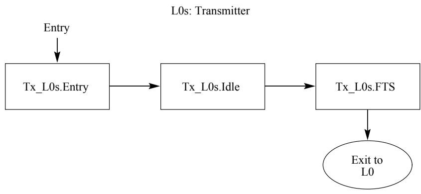

<table>
<thead>
<tr>
<th width="50%">🇬🇧 English</th>
<th width="50%" style="background-color:#e8e8e8">🇨🇳 中文</th>
</tr>
</thead>
<tbody>
<tr>
<td>

The L1 substate machine is shown in § Figure 4-55.

- All configured Transmitters are in Electrical Idle.

  The DC common mode voltage must be within specification by T<sub>TX-IDLE-SET-TO-IDLE</sub>.

- The next state is L1.Idle after a T<sub>TX-IDLE-MIN</sub> (§ Table 8-7) timeout.

  Note: This guarantees that the Transmitter has established the Electrical Idle condition.

- Transmitter remains in Electrical Idle.

</td>
<td style="background-color:#e8e8e8">

L1 子状态机如 § Figure 4-55 所示。

- 所有已配置的发送器均处于电气空闲状态。

  在 T<sub>TX-IDLE-SET-TO-IDLE</sub> 之前,DC 共模电压必须满足规范要求。

- 在 T<sub>TX-IDLE-MIN</sub>(§ Table 8-7)超时后,下一状态为 L1.Idle。

  注:这保证了发送器已建立电气空闲条件。

- 发送器保持电气空闲。

</td>
</tr>
</tbody>
</table>

[⬆️ 返回目录](#-本章目录-table-of-contents)

---

<a id="sec-4-2-7-7"></a>
## 4.2.7.7 L1 | L1

<table>
<thead>
<tr>
<th width="50%">🇬🇧 English</th>
<th width="50%" style="background-color:#e8e8e8">🇨🇳 中文</th>
</tr>
</thead>
<tbody>
<tr>
<td>

L1

</td>
<td style="background-color:#e8e8e8">

L1

</td>
</tr>
</tbody>
</table>

[⬆️ 返回目录](#-本章目录-table-of-contents)

---


---

<!-- 📄 Page 567 -->
---

<a id="sec-4-2-7-7-1"></a>
## 4.2.7.7.1 L1.Entry | L1.Entry


<div style="overflow-x: auto; max-width: 100%;">
<table>
<thead>
<tr>
<th width="50%">🇬🇧 English</th>
<th width="50%" style="background-color:#e8e8e8">🇨🇳 中文</th>
</tr>
</thead>
<tbody>
<tr>
<td>

This is the entry substate to L1. Refer to § Figure 4-54 for a graphical depiction of all L1 substates.

- All Receivers must meet the ZRX-DC specification for 2.5 GT/s within 1 ms (see § Table 8-12).
- All configured Transmitters must remain in Electrical Idle for a minimum time of TTX-IDLE-MIN.
  - The DC common mode voltage does not have to be within specification.
  - The Receiver needs to wait a minimum of TTX-IDLE-MIN to start looking for Electrical Idle Exit.
- Next state is L1.Idle after a minimum time of TTX-IDLE-MIN.

</td>
<td style="background-color:#e8e8e8">

L1 的入口子状态。所有 L1 子状态的图形化描述请参见 § Figure 4-54。

- 所有接收器必须在 1 ms 内满足 2.5 GT/s 的 ZRX-DC 规范 (见 § Table 8-12)。
- 所有已配置的发送器必须在电气空闲 (Electrical Idle) 状态保持至少 TTX-IDLE-MIN 时间。
  - 此时 DC 共模电压不必满足规范要求。
  - 接收器需要至少等待 TTX-IDLE-MIN 后才开始侦测电气空闲退出。
- 在至少经过 TTX-IDLE-MIN 时间后,下一状态为 L1.Idle。

</td>
</tr>
</tbody>
</table>
</div>


[⬆️ 返回目录](#-本章目录-table-of-contents)

---

<a id="sec-4-2-7-7-2"></a>
## 4.2.7.7.2 L1.Idle | L1.Idle

<table>
<thead>
<tr>
<th width="50%">🇬🇧 English</th>
<th width="50%" style="background-color:#e8e8e8">🇨🇳 中文</th>
</tr>
</thead>
<tbody>
<tr>
<td>

- The DC common mode voltage must be within specification, except as allowed by L1 PM Substates, when applicable.^(89)
- A substate of L1 is entered when the conditions for L1 PM Substates are satisfied (see § Section 5.5).
  - The L1 PM Substate must be L1.0 when L1.Idle is entered or exited.
- Next state is Recovery if exit from Electrical Idle is detected on any Lane of a configured Link, or directed after remaining in this substate for a minimum of 40 ns in speeds other than 2.5 GT/s.
  - Ports are not required to arm the Electrical Idle exit detectors on all Lanes of the Link.
  - Note: A minimum stay of 40 ns is required in this substate in speeds other than 2.5 GT/s to account for the delay in the logic levels to arm the Electrical Idle detection circuitry in case the Link enters L1 and immediately exits the L1 state.
  - A Port is allowed to set the directed_speed_change variable to 1b following identical rules described in L0 for setting this variable. When making such a transition, the changed_speed_recovery variable must be reset to 0b. A Port may also go through Recovery back to L0 and then set the directed_speed_change variable to 1b on the transition from L0 to Recovery.
  - A Port is also allowed to enter Recovery from L1 if directed to change the Link width. The Port must follow identical rules for changing the Link width as described in the L0 state.
- Next state is Recovery after a 100 ms timeout if the current data rate is 8.0 GT/s or higher and the Port's Receivers do not meet the ZRX-DC specification for 2.5 GT/s. All Ports are permitted, but not encouraged, to implement the timeout and transition to Recovery when the data rate is 8.0 GT/s or higher.
  - This timeout is not affected by the L1 PM Substates mechanism.

**IMPLEMENTATION NOTE: 100 MS TIMEOUT IN L1**

Ports that meet the ZRX-DC specification for 2.5 GT/s while in the L1.Idle state and are therefore not required to implement the 100 ms timeout and transition to Recovery should avoid implementing it, since it will reduce the power savings expected from the L1 state.

^(89). The common mode being driven must meet the Absolute Delta Between DC Common Mode During L0 and Electrical Idle (VTX-CM-DC-ACTIVE-IDLE-DELTA) specification (see § Table 8-7).

</td>
<td style="background-color:#e8e8e8">

- DC 共模电压必须满足规范要求,除非 L1 PM Substates 另有允许。^(89)
- 当满足 L1 PM Substates 的条件时,即进入 L1 的子状态 (见 § Section 5.5)。
  - 在进入或退出 L1.Idle 时,L1 PM Substate 必须为 L1.0。
- 在 2.5 GT/s 以外的速度下,在该子状态停留至少 40 ns 之后,若检测到任一已配置链路的通道 (Lane) 退出电气空闲,或者被指示进入下一状态,则下一状态为 Recovery。
  - 端口无需在链路的所有通道上都使能电气空闲退出检测器。
  - 注:在 2.5 GT/s 以外的速度下,需要在该子状态至少停留 40 ns,以便在链路刚进入 L1 又立即退出 L1 的情况下,逻辑电平有足够的时间使能电气空闲检测电路。
  - 端口允许按照 L0 中所述的相同规则将 directed_speed_change 变量置为 1b。在进行此转换时,changed_speed_recovery 变量必须复位为 0b。端口也可以经过 Recovery 回到 L0,然后在 L0 向 Recovery 转换时将 directed_speed_change 变量置为 1b。
  - 端口也被允许在收到更改链路宽度 (Link width) 的指示时,从 L1 进入 Recovery。端口必须遵循与 L0 状态中描述的相同的链路宽度更改规则。
- 当当前数据速率为 8.0 GT/s 或更高,且端口的接收器不满足 2.5 GT/s 的 ZRX-DC 规范时,经过 100 ms 超时后,下一状态为 Recovery。所有端口在数据速率为 8.0 GT/s 或更高时,可以(但不推荐)实现该超时并转换到 Recovery。
  - 该超时不受 L1 PM Substates 机制的影响。

**实现提示:L1 中的 100 ms 超时 (100 MS TIMEOUT IN L1)**

在 L1.Idle 状态期间,若端口的接收器满足 2.5 GT/s 的 ZRX-DC 规范,因此不必实现 100 ms 超时并转换到 Recovery,则端口应避免实现该超时,因为这将降低 L1 状态预期带来的省电效果。

^(89). 驱动出的共模电压必须满足 L0 与电气空闲之间 DC 共模绝对差值 (VTX-CM-DC-ACTIVE-IDLE-DELTA) 规范 (见 § Table 8-7)。

</td>
</tr>
</tbody>
</table>

[⬆️ 返回目录](#-本章目录-table-of-contents)

---

<!-- 📄 Page 568 -->
---

> **Figure 4-55.** L1 Substate Machine / 图 4-55 L1 子状态机
> 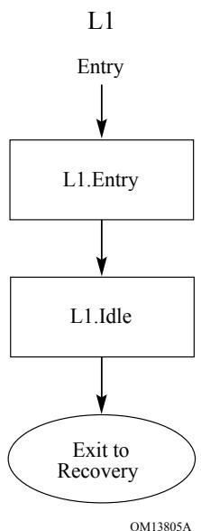

<a id="sec-4-2-7-8"></a>
## 4.2.7.8 L2 | L2


<div style="overflow-x: auto; max-width: 100%;">
<table>
<thead>
<tr>
<th width="50%">🇬🇧 English</th>
<th width="50%" style="background-color:#e8e8e8">🇨🇳 中文</th>
</tr>
</thead>
<tbody>
<tr>
<td>

The L2 substate machine is shown in § Figure 4-56.

- All Receivers must meet the ZRX-DC specification for 2.5 GT/s within 1 ms (see § Table 8-12).
- All configured Transmitters must remain in Electrical Idle for a minimum time of TTX-IDLE-MIN.
  - The DC common mode voltage does not have to be within specification.
  - The Receiver needs to wait a minimum of TTX-IDLE-MIN to start looking for Electrical Idle Exit.
- For Downstream Lanes:
  - For all Downstream Ports, the next state is Detect if a Beacon is received on at least Lane 0 or if directed.
    - Main power must be restored before entering Detect.
    - Note: "if directed" is defined as a higher layer decides to exit to Detect.
  - For a Switch, if a Beacon is received on at least Lane 0 of any of its Downstream Ports and the Upstream Port is in L2.Idle, the Upstream Port must be directed to L2.TransmitWake.
- For Upstream Lanes:
  - The next state is Detect if Electrical Idle Exit is detected on any predetermined set of Lanes.
    - The predetermined set of Lanes must include but is not limited to any Lane which has the potential of negotiating to Lane 0 of a Link. For multi-Lane Links the number of Lanes in the predetermined set must be greater than or equal to two.
    - A Switch must transition any Downstream Lanes to Detect.
  - Next state is L2.TransmitWake for an Upstream Port if directed to transmit a Beacon.

</td>
<td style="background-color:#e8e8e8">

L2 子状态机如 § Figure 4-56 所示。

- 所有接收器必须在 1 ms 内满足 2.5 GT/s 的 ZRX-DC 规范 (见 § Table 8-12)。
- 所有已配置的发送器必须在电气空闲状态保持至少 TTX-IDLE-MIN 时间。
  - 此时 DC 共模电压不必满足规范要求。
  - 接收器需要至少等待 TTX-IDLE-MIN 后才开始侦测电气空闲退出。
- 对于下游通道 (Downstream Lanes):
  - 对于所有下游端口 (Downstream Port),如果在 Lane 0 上接收到 Beacon 信号,或被指示,则下一状态为 Detect。
    - 在进入 Detect 之前必须恢复主电源。
    - 注:"被指示 (if directed)" 意味着由更高层决定退出到 Detect。
  - 对于交换机 (Switch),如果其任一 Downstream Port 的 Lane 0 上接收到 Beacon 信号,并且其 Upstream Port 处于 L2.Idle,则该 Upstream Port 必须被指示进入 L2.TransmitWake。
- 对于上游通道 (Upstream Lanes):
  - 如果在预定义通道集合中的任一通道上检测到电气空闲退出,则下一状态为 Detect。
    - 预定义通道集合必须包含但不限于任何可能协商成为 Lane 0 的通道。对于多通道链路,该预定义集合中的通道数必须大于或等于 2。
    - 交换机必须将所有 Downstream Lanes 转换到 Detect。
  - 对于 Upstream Port,如果被指示发送 Beacon,则下一状态为 L2.TransmitWake。

</td>
</tr>
</tbody>
</table>
</div>


[⬆️ 返回目录](#-本章目录-table-of-contents)

---

<a id="sec-4-2-7-8-1"></a>
## 4.2.7.8.1 L2.Idle | L2.Idle

<table>
<thead>
<tr>
<th width="50%">🇬🇧 English</th>
<th width="50%" style="background-color:#e8e8e8">🇨🇳 中文</th>
</tr>
</thead>
<tbody>
<tr>
<td>

- Note: Beacons may only be transmitted on Upstream Ports in the direction of the Root Complex.
- This state only applies to Upstream Ports.
- Transmit the Beacon on at least Lane 0.
- Next state is Detect if Electrical Idle exit is detected on any Upstream Port's Receiver that is in the direction of the Root Complex.
  - Note: Power is guaranteed to be restored when Upstream Receivers see Electrical Idle exited, but it may also be restored prior to Electrical Idle being exited.

</td>
<td style="background-color:#e8e8e8">

- 注:Beacon 信号只能在指向根复合体 (Root Complex) 方向的 Upstream Port 上发送。
- 此状态仅适用于 Upstream Port。
- 在至少 Lane 0 上发送 Beacon 信号。
- 如果在任一指向 Root Complex 方向的 Upstream Port 接收器上检测到电气空闲退出,则下一状态为 Detect。
  - 注:当 Upstream 接收器检测到电气空闲退出时,电源保证已恢复,但电源也可能在电气空闲退出之前就已经恢复。

</td>
</tr>
</tbody>
</table>

[⬆️ 返回目录](#-本章目录-table-of-contents)

---

<!-- 📄 Page 569 -->
---

> **Figure 4-56.** L2 Substate Machine / 图 4-56 L2 子状态机
> 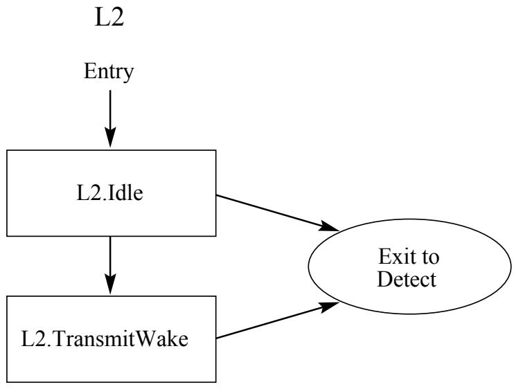

<a id="sec-4-2-7-8-2"></a>
## 4.2.7.8.2 L2.TransmitWake | L2.TransmitWake


<div style="overflow-x: auto; max-width: 100%;">
<table>
<thead>
<tr>
<th width="50%">🇬🇧 English</th>
<th width="50%" style="background-color:#e8e8e8">🇨🇳 中文</th>
</tr>
</thead>
<tbody>
<tr>
<td>

- It is recommended to Clear LinkUp upon entry to Disabled, without waiting for the EIOSQ to be transmitted or the EIOS to be received.
- All Lanes transmit 16 to 32 TS1 Ordered Sets with the Disable Link bit asserted and then transition to Electrical Idle.
  - An EIOSQ must be sent prior to entering Electrical Idle.
  - The DC common mode voltage does not have to be within specification.^(90)
- If an EIOSQ was transmitted and an EIOS was received on any Lane (even while transmitting TS1 with the Disable Link bit asserted), then:
  - LinkUp = 0b (False), unless already Cleared, as recommended above.
    - At this point, the Lanes are considered Disabled.
    - For Upstream Ports: All Receivers must meet the ZRX-DC specification for 2.5 GT/s within 1 ms (see § Table 8-12).
    - For Upstream Ports: The next state is Detect when Electrical Idle exit is detected on at least one Lane.
- For Downstream Ports: The next state is Detect when directed (e.g., when the Link Disable bit is reset to 0b by software).
- For Upstream Ports: If no EIOS is received after a 2 ms timeout, the next state is Detect.

^(90). The common mode being driven does need to meet the Absolute Delta Between DC Common Mode During L0 and Electrical Idle (VTX-CM-DC-ACTIVE-IDLE-DELTA) specification (see § Table 8-7).

</td>
<td style="background-color:#e8e8e8">

- 推荐在进入 Disabled 时清除 LinkUp,而不必等待 EIOSQ 发送完成或 EIOS 接收完成。
- 所有通道发送 16 到 32 个 Disable Link 位置 1 的 TS1 有序集 (Ordered Set),然后转换到电气空闲。
  - 在进入电气空闲之前必须发送 EIOSQ。
  - 此时 DC 共模电压不必满足规范要求。^(90)
- 如果已发送 EIOSQ,并且在任何通道上接收到 EIOS(即使在发送 Disable Link 位置 1 的 TS1 时),则:
  - LinkUp = 0b (假),除非如上所述已预先清除。
    - 此时,这些通道被视为已禁用 (Disabled)。
    - 对于 Upstream Port:所有接收器必须在 1 ms 内满足 2.5 GT/s 的 ZRX-DC 规范 (见 § Table 8-12)。
    - 对于 Upstream Port:当在至少一条通道上检测到电气空闲退出时,下一状态为 Detect。
- 对于 Downstream Port:被指示时(例如,软件将 Link Disable 位复位为 0b),下一状态为 Detect。
- 对于 Upstream Port:如果在 2 ms 超时内未接收到 EIOS,则下一状态为 Detect。

^(90). 驱动出的共模电压确实需要满足 L0 与电气空闲之间 DC 共模绝对差值 (VTX-CM-DC-ACTIVE-IDLE-DELTA) 规范 (见 § Table 8-7)。

</td>
</tr>
</tbody>
</table>
</div>


[⬆️ 返回目录](#-本章目录-table-of-contents)

---

<!-- 📄 Page 570 -->
---

<a id="sec-4-2-7-9"></a>
## 4.2.7.9 Disabled | Disabled

<table>
<thead>
<tr>
<th width="50%">🇬🇧 English</th>
<th width="50%" style="background-color:#e8e8e8">🇨🇳 中文</th>
</tr>
</thead>
<tbody>
<tr>
<td>

The Loopback substate machine is shown in § Figure 4-57.

- LinkUp = 0b (False)
- The Link and Lane numbers received in the TS1 or TS2 Ordered Sets are ignored by the Receiver while in this substate.
- Loopback Lead requirements:
  - If the Loopback Lead was directed, in an implementation specific manner, to perform a 64.0 GT/s equalization procedure on one active Lane, to be referred to as the 'Lane under test', before entering Loopback.Entry with LinkUp set to 0b, the perform_equalization_for_loopback_64GT variable must be set to 1b.
  - If Loopback.Entry was entered from Recovery.Equalization and the current data rate is 32.0 GT/s and perform_equalization_for_loopback_64GT is 1b and the equalization_done_64GT_data_rate variable is 0b, determine the highest common data rate of the data rates supported by the Lead and the highest data rates advertised by the Loopback Follower in the TS1s that it transmitted in Phase 1 of Recovery.Equalization on the 'Lane Under Test'. If the highest common data rate is 64.0 GT/s, transmit 16 consecutive TS1 Ordered Sets with the Loopback bit asserted, followed by an EIOSQ, and then transition to Electrical Idle for 1 ms. During the period of Electrical Idle, change the data rate to 64.0 GT/s.
    - The 16 consecutive TS1 Ordered Sets transmitted on the Lane under test prior to the rate change to 64.0 GT/s must have the bits listed below as follows:
      - The Enhanced Link Behavior Control bits must be set to 01b. The equalization procedure must be performed on the same 'Lane under test' for both equalization procedures.
      - The Transmit Modified Compliance Pattern in Loopback bit must be set to 1b if the Loopback Follower is required to transmit the Modified Compliance Pattern on the Lanes that are not under test.
  - If Loopback.Entry was entered from Configuration.Linkwidth.Start, the highest common data rate is 64.0 GT/s when LinkUp = 0b, the Loopback Lead intends to operate at 64.0 GT/s and the Loopback Lead has prior knowledge that the Loopback Follower also supports 64.0 GT/s. Otherwise, determine the highest common data rate of the data rates supported by the Lead and the data rates received in two consecutive TS1 or TS2 Ordered Sets on any active Lane at the time the transition to Loopback.Entry occurred. If the current data rate is not the highest common data rate:
    - Transmit 16 consecutive TS1 Ordered Sets with the Loopback bit asserted, followed by an EIOSQ, and then transition to Electrical Idle for 1 ms. During the period of Electrical Idle, if the perform_equalization_for_loopback_64GT variable is 1b and the highest common data rate is 64.0 GT/s, change the data rate to 32.0 GT/s. Otherwise, change the data rate to the highest common data rate.
    - If LinkUp is 0b, the Supported Link Speeds field of the Data Rate Identifier must use the Flit Mode data rate encoding if the Flit Mode Supported field in the PCI Express Capabilities Register is 1b and 64.0 GT/s is supported and the consecutive TS2 Ordered Sets received on the last transition from Polling.Configuration had the Flit Mode Supported bit set to 1b.
    - The Loopback Lead may be directed, in an implementation specific manner, to perform a 32.0 GT/s equalization procedure on one active Lane, to be referred to as the 'Lane under test', before entering Loopback.Entry. If the highest common data rate is 32.0 GT/s, the equalization_done_32GT_data_rate variable is 0b, and the equalization procedure is to be executed, the 16 consecutive TS1 Ordered Sets transmitted on the Lane under test prior to the data rate change to the highest common data rate must have the bits listed below as follows:
      - The Enhanced Link Behavior Control bits must be set to 01b.
      - The Transmit Modified Compliance Pattern in Loopback bit must be set to 1b if the Loopback Follower is required to transmit the Modified Compliance Pattern on the Lanes that are not under test.
    - If the highest common data rate is 5.0 GT/s, the follower's transmitter de-emphasis is controlled by setting the Selectable De-emphasis bit of the transmitted TS1 Ordered Sets to the desired value (1b = -3.5 dB, 0b = -6 dB).
    - For data rates of 5.0 GT/s and above, the Lead is permitted to choose its own transmitter settings in an implementation specific manner, regardless of the settings it transmitted to the follower.
    - Note: If Loopback is entered after LinkUp has been set to 1b, it is possible for one Port to enter Loopback from Recovery and the other to enter Loopback from Configuration. The Port that entered from Configuration might attempt to change data rate while the other Port does not. If this occurs, the results are undefined. The test set-up must avoid such conflicting directed clauses.

**IMPLEMENTATION NOTE: LANE UNDER TEST USAGE EXPECTATIONS**

The method whereby one active Lane is defined as the 'Lane under test' and is affected by the NEXT/FEXT aggressor Lanes (see § Section 8.5.1.1) so that measurements are performed on the Lane under test (after a speed change and completion of an equalization procedure at a rate of 32.0 GT/s or above) is defined for system configurations where a test apparatus, such as (but not limited to) a BERT, acts as the Loopback Lead. In such a system configuration, the expectation of this test method is that the Loopback Lead is able to provide the necessary stimulus for the state traversals and protocol negotiations required to establish and exercise the 'Lane under test' without any specific guidance from this specification.

This test mode is only defined for use while LinkUp = 0b (prior to entering Loopback.Entry). The test apparatus must be cognizant of the capabilities of the 'Lane under test'. A mechanism to "re-do" equalization when this test procedure is performed is not defined. The Loopback Lead must only send TS1s with Flit Mode Encoding in Loopback if it received TS2s with the Flit Mode Supported bit set to 1b in Polling.Configuration - these TS2s indicate that the Loopback Follower will properly interpret TS1s with Flit Mode Data Rate Encoding.

</td>
<td style="background-color:#e8e8e8">

回环 (Loopback) 子状态机如 § Figure 4-57 所示。

- LinkUp = 0b (假)
- 在此子状态期间,接收器忽略 TS1 或 TS2 有序集中接收到的 Link 和 Lane 编号。
- Loopback Lead 要求:
  - 如果以实现特定的方式指示 Loopback Lead 在进入 Loopback.Entry 之前(LinkUp 置为 0b),对一条处于 Active 状态的通道执行 64.0 GT/s 的均衡 (equalization) 过程,该通道称为"被测通道 (Lane under test)",则 perform_equalization_for_loopback_64GT 变量必须置为 1b。
  - 如果 Loopback.Entry 是从 Recovery.Equalization 进入,且当前数据速率为 32.0 GT/s,perform_equalization_for_loopback_64GT 为 1b,equalization_done_64GT_data_rate 变量为 0b,则确定 Lead 所支持的数据速率与 Loopback Follower 在 Recovery.Equalization 第 1 阶段中在"被测通道"上发送的 TS1 中所通告的最高数据速率之间的最高公共数据速率。如果该最高公共数据速率为 64.0 GT/s,则发送 16 个连续的 Loopback 位置 1 的 TS1 有序集,随后发送 EIOSQ,然后进入电气空闲状态 1 ms。在该电气空闲期间,将数据速率切换到 64.0 GT/s。
    - 在切换到 64.0 GT/s 之前,在被测通道上发送的 16 个连续 TS1 有序集的位字段设置如下:
      - Enhanced Link Behavior Control 位必须设为 01b。两次均衡过程必须在同一"被测通道"上执行。
      - 如果 Loopback Follower 需要在非被测通道上发送 Modified Compliance Pattern,则 Loopback 中的 Transmit Modified Compliance Pattern 位必须设为 1b。
  - 如果 Loopback.Entry 是从 Configuration.Linkwidth.Start 进入,且 LinkUp = 0b 时最高公共数据速率为 64.0 GT/s,Loopback Lead 计划以 64.0 GT/s 运行,并且 Loopback Lead 预先知道 Loopback Follower 也支持 64.0 GT/s,则按此处理。否则,确定 Lead 所支持的数据速率与进入 Loopback.Entry 时在任何 Active 通道上收到的两个连续 TS1 或 TS2 有序集中所含数据速率之间的最高公共数据速率。如果当前数据速率不是该最高公共数据速率:
    - 发送 16 个连续的 Loopback 位置 1 的 TS1 有序集,随后发送 EIOSQ,然后进入电气空闲状态 1 ms。在该电气空闲期间,如果 perform_equalization_for_loopback_64GT 变量为 1b 且最高公共数据速率为 64.0 GT/s,则将数据速率切换到 32.0 GT/s;否则,将数据速率切换到该最高公共数据速率。
    - 如果 LinkUp 为 0b,则当 PCI Express 能力寄存器中的 Flit Mode Supported 字段为 1b、支持 64.0 GT/s,并且从 Polling.Configuration 最后一次转换时收到的连续 TS2 有序集中的 Flit Mode Supported 位为 1b 时,Data Rate Identifier 的 Supported Link Speeds 字段必须使用 Flit Mode 数据速率编码。
    - Loopback Lead 可以以实现特定的方式被指示在进入 Loopback.Entry 之前对一条 Active 通道(称为"被测通道")执行 32.0 GT/s 均衡过程。如果最高公共数据速率为 32.0 GT/s、equalization_done_32GT_data_rate 变量为 0b 且需要执行均衡过程,则在切换到该最高公共数据速率之前,在被测通道上发送的 16 个连续 TS1 有序集的位字段设置如下:
      - Enhanced Link Behavior Control 位必须设为 01b。
      - 如果 Loopback Follower 需要在非被测通道上发送 Modified Compliance Pattern,则 Loopback 中的 Transmit Modified Compliance Pattern 位必须设为 1b。
    - 如果最高公共数据速率为 5.0 GT/s,则 Follower 的发送器去加重 (de-emphasis) 通过将所发送的 TS1 有序集的 Selectable De-emphasis 位设置为期望值(1b = -3.5 dB,0b = -6 dB)来控制。
    - 对于 5.0 GT/s 及以上的数据速率,Lead 允许以实现特定的方式选择其自身的发送器设置,无论其向 Follower 发送的设置是什么。
    - 注:如果在 LinkUp 已置为 1b 之后进入 Loopback,有可能一个端口从 Recovery 进入 Loopback,而另一个端口从 Configuration 进入 Loopback。从 Configuration 进入的端口可能会尝试更改数据速率,而另一个端口则不会。如果发生这种情况,结果是未定义的。测试设置必须避免此类相互冲突的指示性条款。

**实现提示:被测通道 (Lane under test) 使用期望 (LANE UNDER TEST USAGE EXPECTATIONS)**

将一条 Active 通道定义为"被测通道",并使其受到 NEXT/FEXT 干扰通道 (见 § Section 8.5.1.1) 的影响,从而在(数据速率切换和完成 32.0 GT/s 或以上速率的均衡过程之后)在被测通道上进行测量 —— 此方法适用于测试设备(例如但不限于 BERT)充当 Loopback Lead 的系统配置。在此类系统配置中,此测试方法的预期是:Loopback Lead 能够为建立和测试"被测通道"所需的状态遍历和协议协商提供必要的激励,而无需本规范的任何特定指导。

此测试模式仅在 LinkUp = 0b 时(进入 Loopback.Entry 之前)定义可用。测试设备必须清楚"被测通道"的能力。本规范未定义在执行此测试过程时"重新进行均衡"的机制。Loopback Lead 仅在 Polling.Configuration 中收到 Flit Mode Supported 位置 1 的 TS2 时,才可以在 Loopback 中发送带 Flit Mode 编码的 TS1 —— 这些 TS2 表明 Loopback Follower 将能够正确地解释带 Flit Mode 数据速率编码的 TS1。

</td>
</tr>
</tbody>
</table>

[⬆️ 返回目录](#-本章目录-table-of-contents)

---

<!-- 📄 Page 571 -->
---

<a id="sec-4-2-7-10"></a>
## 4.2.7.10 Loopback | Loopback


<div style="overflow-x: auto; max-width: 100%;">
<table>
<thead>
<tr>
<th width="50%">🇬🇧 English</th>
<th width="50%" style="background-color:#e8e8e8">🇨🇳 中文</th>
</tr>
</thead>
<tbody>
<tr>
<td>

- Transmit TS1 Ordered Sets with the Loopback bit asserted.
  - If Loopback.Entry was entered from Recovery.Equalization, the EC field of the transmitted TS1 Ordered Sets must be set to 00b.
  - The Lead is also permitted to assert the Compliance Receive bit of TS1 Ordered Sets transmitted in Loopback.Entry, including those transmitted before a data rate change. If it asserts the Compliance Receive bit, it must not deassert it again while in the Loopback.Entry state. This usage model might be helpful for test and validation purposes when one or both Ports have difficulty obtaining bit lock, Symbol lock, or Block alignment after a data rate change. The ability to set the Compliance Receive bit is implementation specific.
- Next state is Recovery.Equalization if the data rate was changed to 32.0 or 64.0 GT/s and 16 consecutive TS1 Ordered Sets were sent on any Lane with the Enhanced Link Behavior Control bits set to 01b.
  - The perform_equalization_for_loopback variable is set to 1b.
- Next state is Loopback.Active after 2 ms if the Compliance Receive bit of the transmitted TS1 Ordered Sets is asserted.
- Next state is Loopback.Active if Loopback.Entry was entered from Recovery.Equalization and the Lane under test receives two consecutive TS1 Ordered Sets with the Loopback bit asserted.
- Next state is Loopback.Active if the Compliance Receive bit of the transmitted TS1 Ordered Sets is deasserted and an implementation specific set of Lanes receive two consecutive TS1 Ordered Sets with the Loopback bit asserted.
- If the data rate was changed and the equalization procedure was not performed at either 32.0 GT/s or 64.0 GT/s, the Lead must take into account the amount of time the follower can be in Electrical Idle and transmit a sufficient number of TS1 Ordered Sets for the follower to acquire Symbol lock or Block alignment before proceeding to Loopback.Active. These TS1 Ordered Sets may be used to specify Transmitter settings for the Loopback Follower when the data rate of operation is 8.0 GT/s or above by setting the value of the EC field appropriately for the follower's Port direction (10b or 11b) and requesting a preset or a set of valid coefficients.
- Next state is Loopback.Exit after an implementation specific timeout of less than 100 ms.

**IMPLEMENTATION NOTE: LANE NUMBERING WITH 128B/130B ENCODING IN LOOPBACK**

If the current data rate uses 128b/130b 编码 encoding and Lane numbers have not been negotiated, it is possible that the Lead and follower will not be able to decode received information because their Lanes are using different scrambling LFSR seed values (since the LFSR seed values are determined by the Lane numbers). This situation can be avoided by allowing the Lead and follower to negotiate Lane numbers before directing the Lead to Loopback, directing the Lead to assert the Compliance Receive bit during Loopback.Entry, or by using some other method of ensuring that the LFSR seed values match.

</td>
<td style="background-color:#e8e8e8">

- 发送 Loopback 位置 1 的 TS1 有序集。
  - 如果 Loopback.Entry 是从 Recovery.Equalization 进入,则所发送 TS1 有序集的 EC 字段必须设为 00b。
  - Lead 也允许在 Loopback.Entry 中发送的 TS1 有序集(包括数据速率切换前发送的)中置位 Compliance Receive 位。一旦置位,在 Loopback.Entry 状态期间不得再清除该位。当一个或两个端口在数据速率切换后难以获得 bit lock、Symbol lock 或 Block alignment 时,这种使用方式可能有助于测试和验证。设置 Compliance Receive 位的能力是实现特定的。
- 如果数据速率切换到 32.0 GT/s 或 64.0 GT/s,且已在任一通道上发送 16 个连续的 Enhanced Link Behavior Control 位为 01b 的 TS1 有序集,则下一状态为 Recovery.Equalization。
  - perform_equalization_for_loopback 变量置为 1b。
- 如果所发送的 TS1 有序集的 Compliance Receive 位置位,则在 2 ms 后下一状态为 Loopback.Active。
- 如果 Loopback.Entry 是从 Recovery.Equalization 进入,且被测通道接收到两个连续的 Loopback 位置 1 的 TS1 有序集,则下一状态为 Loopback.Active。
- 如果所发送 TS1 有序集的 Compliance Receive 位被清除,且一个实现特定的通道集合接收到两个连续的 Loopback 位置 1 的 TS1 有序集,则下一状态为 Loopback.Active。
- 如果数据速率发生切换,且在 32.0 GT/s 或 64.0 GT/s 速率下均未执行均衡过程,则 Lead 必须考虑 Follower 可处于电气空闲的时间,并在进入 Loopback.Active 之前发送足够数量的 TS1 有序集,以使 Follower 获得 Symbol lock 或 Block alignment。当运行数据速率为 8.0 GT/s 或以上时,这些 TS1 有序集可通过将 EC 字段设置为适合 Follower 端口方向(10b 或 11b)的值,并请求预设 (preset) 或一组有效系数,用于指定 Loopback Follower 的发送器设置。
- 在不超过 100 ms 的实现特定超时之后,下一状态为 Loopback.Exit。

**实现提示:Loopback 中 128b/130b 编码的通道编号 (LANE NUMBERING WITH 128B/130B ENCODING IN LOOPBACK)**

如果当前数据速率使用 128b/130b 编码 (encoding) 且尚未协商通道编号,则 Lead 和 Follower 可能由于各自的通道使用不同的加扰 LFSR 种子值(LFSR 种子值由通道编号决定)而无法解码收到的信息。可以通过以下方法避免这种情况:在指示 Lead 进入 Loopback 之前先让 Lead 和 Follower 协商通道编号;在 Loopback.Entry 期间指示 Lead 置位 Compliance Receive 位;或采用其他方法确保 LFSR 种子值匹配。

</td>
</tr>
</tbody>
</table>
</div>


[⬆️ 返回目录](#-本章目录-table-of-contents)

---

<!-- 📄 Page 572 -->
---

<a id="sec-4-2-7-10-1"></a>
## 4.2.7.10.1 Loopback.Entry | Loopback.Entry

<table>
<thead>
<tr>
<th width="50%">🇬🇧 English</th>
<th width="50%" style="background-color:#e8e8e8">🇨🇳 中文</th>
</tr>
</thead>
<tbody>
<tr>
<td>

- Loopback Follower requirements:
  - If Loopback.Entry was entered from Configuration.Linkwidth.Start with LinkUp set to 0b, the TS1 Ordered Sets that directed the follower to this state advertised 64.0 GT/s support and had Enhanced Link Behavior Control set to 01b and the follower intends to operate at 64.0 GT/s, perform_equalization_for_loopback_64GT must be set to 1b.
  - If Loopback.Entry was entered from Recovery.Equalization and the current data rate is 32.0 GT/s and perform_equalization_for_loopback_64GT is 1b and the equalization_done_64GT_data_rate variable is 0b, and 64.0 GT/s is advertised by the Loopback Follower in the TS1s that it transmitted in Phase 1 of Recovery.Equalization on the 'Lane under test':
    - Transmit an EIOSQ, and then transition to Electrical Idle for 2 ms. During the period of Electrical Idle, change the data rate to 64.0 GT/s.
    - If the Loopback Follower is a Downstream Port, transmit 16 consecutive TS1 Ordered Sets on the 'Lane under test' prior to transmitting the EIOSQ. The TS1 Ordered Sets must have the Equalization Control bits set to 00b.
    - Next state is Recovery.Equalization.
    - The 'Lane under test', perform_equalization_for_loopback variable, transmit_modified_compliance_pattern_in_loopback variable and the Link and Lane numbers for both the 32.0 GT/s and 64.0 GT/s equalization procedures must be the same.
  - If Loopback.Entry was entered from Configuration.Linkwidth.Start, determine the highest common data rate of the data rates supported by the follower and the data rates received in the two consecutive TS1 Ordered Sets that directed the follower to this state. If the current data rate is not the highest common data rate:
    - Transmit an EIOSQ, and then transition to Electrical Idle for 2 ms. During the period of Electrical Idle, if the perform_equalization_for_loopback_64GT variable is 1b and the highest common data rate is 64.0 GT/s, change the data rate to 32.0 GT/s. Otherwise, change the data rate to the highest common data rate.
    - If operating in full swing mode and the highest common data rate is 5.0 GT/s, set the transmitter's de-emphasis to the setting specified by the Selectable De-emphasis bit received in the TS1 Ordered Sets that directed the follower to this state. The de-emphasis is -3.5 dB if the Selectable De-emphasis bit was 1b, and it is -6 dB if the Selectable De-emphasis bit was 0b.
    - If the highest common data rate is 8.0 GT/s or higher and EQ TS1 Ordered Sets directed the follower to this state, set the transmitter to the settings specified by the Preset field of the EQ TS1 Ordered Sets. See § Section 4.2.4.2. If the highest common data rate is 8.0 GT/s or higher but standard TS1 Ordered Sets directed the follower to this state, the follower is permitted to use its default transmitter settings.
  - Next state is Recovery.Equalization if Loopback.Entry was entered from Configuration.Linkwidth.Start, the highest common data rate is 32.0 GT/s or higher and the Enhanced Link Behavior Control bits of the TS1 Ordered Sets that directed the follower to this state were 01b.
    - The perform_equalization_for_loopback variable is set to 1b.
    - The transmit_modified_compliance_pattern_in_loopback variable is set to 1b if the Transmit Modified Compliance Pattern in Loopback bit is Set to 1b in the TS1 Ordered Sets that directed the follower to this state.
    - When Recovery.Equalization is entered from Loopback.Entry, the Lane that received two consecutive TS1 Ordered Sets with the Enhanced Link Behavior Control bits set to 01b in Configuration.Linkwidth.Start is the Lane under test for the purposes of Loopback and Recovery.Equalization.
    - The Loopback Follower must select a valid Link number in an implementation specific manner. (See § Section 4.2.2.4 for more on assigning Lane numbers and other Scrambler requirements.) The test measurement equipment that facilitates this state transition must ensure, in an implementation specific manner, that it uses a matching Lane number and LFSR seed value.

</td>
<td style="background-color:#e8e8e8">

- Loopback Follower 要求:
  - 如果 Loopback.Entry 是从 Configuration.Linkwidth.Start 进入,且 LinkUp 置为 0b,指示 Follower 进入此状态的 TS1 有序集通告支持 64.0 GT/s 且 Enhanced Link Behavior Control 设为 01b,并且 Follower 计划以 64.0 GT/s 运行,则 perform_equalization_for_loopback_64GT 必须置为 1b。
  - 如果 Loopback.Entry 是从 Recovery.Equalization 进入,且当前数据速率为 32.0 GT/s,perform_equalization_for_loopback_64GT 为 1b,equalization_done_64GT_data_rate 变量为 0b,并且 Loopback Follower 在 Recovery.Equalization 第 1 阶段中在"被测通道"上发送的 TS1 中通告了 64.0 GT/s:
    - 发送 EIOSQ,然后进入电气空闲状态 2 ms。在该电气空闲期间,将数据速率切换到 64.0 GT/s。
    - 如果 Loopback Follower 是 Downstream Port,则在发送 EIOSQ 之前,在"被测通道"上发送 16 个连续的 TS1 有序集。这些 TS1 有序集的 Equalization Control 位必须设为 00b。
    - 下一状态为 Recovery.Equalization。
    - 32.0 GT/s 和 64.0 GT/s 两次均衡过程中的"被测通道"、perform_equalization_for_loopback 变量、transmit_modified_compliance_pattern_in_loopback 变量以及 Link 和 Lane 编号必须相同。
  - 如果 Loopback.Entry 是从 Configuration.Linkwidth.Start 进入,则确定 Follower 所支持的数据速率与指示 Follower 进入此状态的两个连续 TS1 有序集中所含数据速率之间的最高公共数据速率。如果当前数据速率不是该最高公共数据速率:
    - 发送 EIOSQ,然后进入电气空闲状态 2 ms。在该电气空闲期间,如果 perform_equalization_for_loopback_64GT 变量为 1b 且最高公共数据速率为 64.0 GT/s,则将数据速率切换到 32.0 GT/s;否则,将数据速率切换到该最高公共数据速率。
    - 如果在全摆幅 (full swing) 模式下运行且最高公共数据速率为 5.0 GT/s,则将发送器的去加重设置为指示 Follower 进入此状态的 TS1 有序集中 Selectable De-emphasis 位所指定的值。Selectable De-emphasis 位为 1b 时去加重为 -3.5 dB,为 0b 时为 -6 dB。
    - 如果最高公共数据速率为 8.0 GT/s 或更高,且由 EQ TS1 有序集指示 Follower 进入此状态,则将发送器设置为该 EQ TS1 有序集 Preset 字段所指定的设置。参见 § Section 4.2.4.2。如果最高公共数据速率为 8.0 GT/s 或更高,但由标准 TS1 有序集指示 Follower 进入此状态,则允许 Follower 使用其默认发送器设置。
  - 如果 Loopback.Entry 是从 Configuration.Linkwidth.Start 进入,最高公共数据速率为 32.0 GT/s 或更高,且指示 Follower 进入此状态的 TS1 有序集的 Enhanced Link Behavior Control 位为 01b,则下一状态为 Recovery.Equalization。
    - perform_equalization_for_loopback 变量置为 1b。
    - 如果指示 Follower 进入此状态的 TS1 有序集中 Loopback 中的 Transmit Modified Compliance Pattern 位置 1,则 transmit_modified_compliance_pattern_in_loopback 变量置为 1b。
    - 当从 Loopback.Entry 进入 Recovery.Equalization 时,在 Configuration.Linkwidth.Start 中收到 Enhanced Link Behavior Control 位为 01b 的两个连续 TS1 有序集的那条通道,即作为 Loopback 和 Recovery.Equalization 用途的"被测通道"。
    - Loopback Follower 必须以实现特定的方式选择一个有效的 Link 编号(有关通道编号分配及其它加扰器 (Scrambler) 要求的更多信息,参见 § Section 4.2.2.4)。促成此状态转换的测试测量设备必须以实现特定的方式确保其使用匹配的 Lane 编号和 LFSR 种子值。

</td>
</tr>
</tbody>
</table>

[⬆️ 返回目录](#-本章目录-table-of-contents)

---

<!-- 📄 Page 573 -->
---

<a id="sec-4-2-7-10-2"></a>
## 4.2.7.10.2 Loopback.Active | Loopback.Active


<div style="overflow-x: auto; max-width: 100%;">
<table>
<thead>
<tr>
<th width="50%">🇬🇧 English</th>
<th width="50%" style="background-color:#e8e8e8">🇨🇳 中文</th>
</tr>
</thead>
<tbody>
<tr>
<td>

- Next state is Loopback.Active if the Compliance Receive bit of the TS1 Ordered Sets that directed the follower to this state was asserted.
  - The follower's transmitter does not need to transition to transmitting looped-back data on any boundary, and it is permitted to truncate any Ordered Set in progress.
- Else, the follower transmits TS1 Ordered Sets with Link and Lane numbers set to PAD.
  - If Loopback.Entry was entered from Recovery.Equalization:
    - The EC field of the transmitted TS1 Ordered Sets must be set to 00b.
    - The next state is Loopback.Active after two consecutive TS1 Ordered Sets with the Loopback bit asserted are received by the Lane under test.
  - Else, the next state is Loopback.Active if one of the following conditions is true:
    - The data rate is 2.5 GT/s or 5.0 GT/s and Symbol lock is obtained on all active Lanes.
    - The data rate is 8.0 GT/s or higher and two consecutive TS1 Ordered Sets are received on all active Lanes. The equalization settings specified by the received TS1 Ordered Sets must be evaluated and applied to the transmitter if the value of the EC field is appropriate for the follower's Port direction (10b or 11b) and the requested setting is a preset or a set of valid coefficients. (Note: This is the equivalent behavior for the Recovery.Equalization state.) Optionally, the follower can accept both EC field values. If the settings are applied, they must take effect within 500 ns of being received, and they must not cause the transmitter to violate any electrical specification for more than 1 ns. Unlike Recovery.Equalization, the new settings are not reflected in the TS1 Ordered Sets that the follower transmits.
    - When using 8b/10b 编码 encoding, the follower's transmitter must transition to transmitting looped-back data on a Symbol boundary, but it is permitted to truncate any Ordered Set in progress. When using 128b/130b or 1b/1b encoding, the follower's transmitter does not need to transition to transmitting looped-back data on any boundary and is permitted to truncate any Ordered Set in progress.
- The Loopback Lead must send valid encoded data. The Loopback Lead must not transmit EIOS as data until it wants to exit Loopback. When operating with 128b/130b encoding, Loopback Leads must follow the requirements of § Section 4.2.2.6.
- When operating with 1b/1b encoding, the Loopback Lead must follow the requirements of § Section 4.2.3.1, when it starts a Data Stream. The Loopback Lead is permitted to substitute the CRC and FEC bytes with any bytes of its choice. If the Link width has been negotiated by entering L0 since leaving the Detect State, that width is to be used; else the width must be assumed to be x1.
- A Loopback Follower that entered Loopback from Recovery.Equalization must transmit the Modified Compliance Pattern on all Lanes that detected Receivers in Detect.Active but are not under test if the transmit_modified_compliance_pattern_in_loopback variable is set to 1b, otherwise those Lanes must be transitioned into Electrical Idle. The Lane under test must follow Loopback Follower rules described below. State transitions must be based only on Link activity on the Lane under test.
- A Loopback Follower is required to retransmit the received encoded information as received, with the polarity inversion determined in Polling applied, while continuing to perform clock tolerance compensation:
  - When operating with 1b/1b encoding: The Loopback Follower must track when the Data Stream transition happens and subsequently distinguish an Ordered Set from Data Stream bytes as defined in § Section 4.2.3.1, using the Ordered Set insertion interval of § Table 4-21 as follows:
    - If the Link width has been negotiated by entering L0 since leaving the Detect State, that width is to be used; else the width must be assumed to be x1
    - For Upstream Lanes, the SRIS mode is determined from the TS1 Ordered Set (Symbol 4, Bit 7) received in the Configuration state whereas for Downstream Lanes it comes from the SRIS Clocking bit in the Link Control Register.
  - SKPs must be added or deleted on a per-Lane basis as outlined in § Section 4.2.8 with the exception that SKPs do not have to be simultaneously added or removed across Lanes of a configured Link.
    - For 8b/10b 编码 encoding, if a SKP Ordered Set retransmission requires adding a SKP Symbol to accommodate timing tolerance correction, the SKP Symbol is inserted in the retransmitted Symbol stream anywhere adjacent to a SKP Symbol in the SKP Ordered Set following the COM Symbol. The inserted SKP Symbol must be of the same disparity as the received SKPs Symbol(s) in the SKP Ordered Set.
    - For 8b/10b 编码 encoding, if a SKP Ordered Set retransmission requires dropping a SKP Symbol to accommodate timing tolerance correction, the SKP Symbol is simply not retransmitted.
    - For 128b/130b encoding, if a SKP Ordered Set retransmission requires adding SKP Symbols to accommodate timing tolerance correction, four SKP Symbols are inserted in the retransmitted Symbol stream prior to the SKP_END Symbol in the SKP Ordered Set.
    - For 128b/130b encoding, if a SKP Ordered Set retransmission requires dropping SKP Symbols to accommodate timing tolerance correction, four SKP Symbols prior to the SKP_END Symbol in the SKP Ordered Set are simply not retransmitted.
    - For 1b/1b encoding, if a SKP Ordered Set retransmission requires adding SKP Symbols to accommodate timing tolerance correction, eight SKP Symbols are inserted in the retransmitted Symbol stream prior to the SKP_END Symbol in the SKP Ordered Set.
    - For 1b/1b encoding, if a SKP Ordered Set retransmission requires dropping SKP Symbols to accommodate timing tolerance correction, eight SKP Symbols prior to the SKP_END Symbol in the SKP Ordered Set are simply not retransmitted.
  - No modifications of the received encoded data (except for polarity inversion determined in Polling) are allowed by the Loopback Follower even if it is determined to be an invalid encoding (i.e., no legal translation to a control or data value possible for 8b/10b 编码 encoding or invalid Sync Header or invalid Ordered Set for 128b/130b encoding).

<!-- 📄 Page 575 -->
---

<!-- 📄 Page 576 -->
---

- Next state of the Loopback Follower is Loopback.Exit if one of the following conditions apply:
  - If directed or if four consecutive EIOSs are received on any Lane. The Requirements for detecting an EIOS are specified in § Section 4.2.5.3.
  - Optionally, if current Link speed is 2.5 GT/s and an EIOS is received or Electrical Idle is detected/inferred on any Lane.
    - Note: As described in § Section 4.2.5.4, an Electrical Idle condition may be inferred if any of the configured Lanes remained electrically idle continuously for 128 μs by not detecting an exit from Electrical Idle in the entire 128 μs window.
    - A Loopback Follower must be able to detect an Electrical Idle condition on any Lane within 1 ms of the EIOS being received by the Loopback Follower.
    - Note: During the time after an EIOS is received and before Electrical Idle is actually detected by the Loopback Follower, the Loopback Follower may receive a bit stream that is undefined by the encoding scheme, which may be looped back by the transmitter.
    - The TTX-IDLE-SET-TO-IDLE parameter does not apply in this case since the Loopback Follower may not even detect Electrical Idle until as much as 1 ms after the EIOS.

</td>
<td style="background-color:#e8e8e8">

- 如果指示 Follower 进入此状态的 TS1 有序集的 Compliance Receive 位置位,则下一状态为 Loopback.Active。
  - Follower 的发送器无需在任何边界开始回环 (loop-back) 数据发送,且允许截断正在发送的任意有序集。
- 否则,Follower 发送 Link 和 Lane 编号设为 PAD 的 TS1 有序集。
  - 如果 Loopback.Entry 是从 Recovery.Equalization 进入:
    - 所发送 TS1 有序集的 EC 字段必须设为 00b。
    - 在被测通道接收到两个连续的 Loopback 位置 1 的 TS1 有序集之后,下一状态为 Loopback.Active。
  - 否则,在以下任一条件成立时,下一状态为 Loopback.Active:
    - 数据速率为 2.5 GT/s 或 5.0 GT/s,且在所有 Active 通道上获得 Symbol lock。
    - 数据速率为 8.0 GT/s 或更高,且在所有 Active 通道上接收到两个连续的 TS1 有序集。当所接收 TS1 有序集的 EC 字段值适合 Follower 端口方向(10b 或 11b),且所请求的设置为预设 (preset) 或一组有效系数时,必须评估该 TS1 有序集所指定的均衡设置并将其应用于发送器。(注:这与 Recovery.Equalization 状态下的行为等同。)可选地,Follower 也可以接受这两种 EC 字段值。如果应用了这些设置,则必须在收到后 500 ns 内生效,且不得使发送器在任何电气规范上违例超过 1 ns。与 Recovery.Equalization 不同,Follower 发送的 TS1 有序集不会反映这些新设置。
    - 使用 8b/10b 编码 (encoding) 时,Follower 的发送器必须在 Symbol 边界开始回环数据发送,但允许截断正在发送的任意有序集。使用 128b/130b 或 1b/1b 编码时,Follower 的发送器无需在任何边界开始回环数据发送,且允许截断正在发送的任意有序集。
- Loopback Lead 必须发送有效的编码数据。Loopback Lead 在希望退出 Loopback 之前,不得将 EIOS 作为数据进行发送。在 128b/130b 编码下运行时,Loopback Lead 必须遵循 § Section 4.2.2.6 中的要求。
- 在 1b/1b 编码下运行时,Loopback Lead 在启动数据流 (Data Stream) 时必须遵循 § Section 4.2.3.1 中的要求。Loopback Lead 允许用任意字节替换 CRC 和 FEC 字节。如果自离开 Detect 状态以来已通过进入 L0 协商过链路宽度,则应使用该宽度;否则,宽度必须假定为 x1。
- 从 Recovery.Equalization 进入 Loopback 的 Loopback Follower,如果 transmit_modified_compliance_pattern_in_loopback 变量置 1b,则必须在 Detect.Active 中检测到接收器、但不在测试范围内的所有通道上发送 Modified Compliance Pattern,否则这些通道必须转换到电气空闲。被测通道必须遵循下文描述的 Loopback Follower 规则。状态转换必须仅基于被测通道上的链路活动。
- Loopback Follower 必须按接收到的形式(应用在 Polling 中确定的极性反转)重传接收到的编码信息,并继续执行时钟容差补偿:
  - 在 1b/1b 编码下运行时:Loopback Follower 必须跟踪数据流转换发生的时刻,并随后按 § Section 4.2.3.1 中的定义区分有序集与数据流字节,使用 § Table 4-21 中的有序集插入间隔,具体如下:
    - 如果自离开 Detect 状态以来已通过进入 L0 协商过链路宽度,则应使用该宽度;否则,宽度必须假定为 x1。
    - 对于 Upstream Lanes,SRIS 模式根据 Configuration 状态中接收到的 TS1 有序集(Symbol 4,Bit 7)确定;对于 Downstream Lanes,SRIS 模式取自 Link Control 寄存器中的 SRIS Clocking 位。
  - SKP 必须按 § Section 4.2.8 中所述以每通道 (per-Lane) 为基础添加或删除,但有一个例外:对于已配置链路上的各通道,SKP 不必同时添加或删除。
    - 对于 8b/10b 编码 (encoding),如果 SKP 有序集重传需要添加 SKP Symbol 以适应时序容差修正,则该 SKP Symbol 插入到重传的 Symbol 流中 SKP 有序集内 COM Symbol 之后的 SKP Symbol 相邻位置。插入的 SKP Symbol 必须与 SKP 有序集中接收到的 SKP Symbol 具有相同的不平衡度 (disparity)。
    - 对于 8b/10b 编码 (encoding),如果 SKP 有序集重传需要删除 SKP Symbol 以适应时序容差修正,则该 SKP Symbol 不被重传。
    - 对于 128b/130b 编码,如果 SKP 有序集重传需要添加 SKP Symbol 以适应时序容差修正,则在重传的 Symbol 流中,SKP 有序集内 SKP_END Symbol 之前插入四个 SKP Symbol。
    - 对于 128b/130b 编码,如果 SKP 有序集重传需要删除 SKP Symbol 以适应时序容差修正,则 SKP 有序集内 SKP_END Symbol 之前的四个 SKP Symbol 不被重传。
    - 对于 1b/1b 编码,如果 SKP 有序集重传需要添加 SKP Symbol 以适应时序容差修正,则在重传的 Symbol 流中,SKP 有序集内 SKP_END Symbol 之前插入八个 SKP Symbol。
    - 对于 1b/1b 编码,如果 SKP 有序集重传需要删除 SKP Symbol 以适应时序容差修正,则 SKP 有序集内 SKP_END Symbol 之前的八个 SKP Symbol 不被重传。
  - Loopback Follower 不允许对接收到的编码数据作任何修改(Polling 中确定的极性反转除外),即使其被判定为无效编码(例如 8b/10b 编码 (encoding) 下无法合法翻译为控制或数据值,或 128b/130b 编码下无效的 Sync Header 或无效的有序集)。

- 在以下任一条件成立时,Loopback Follower 的下一状态为 Loopback.Exit:
  - 被指示退出,或者在任何通道上接收到四个连续的 EIOS。检测 EIOS 的要求见 § Section 4.2.5.3。
  - 可选地,当前链路速度为 2.5 GT/s 时,接收到 EIOS 或在任何通道上检测/推断到电气空闲。
    - 注:如 § Section 4.2.5.4 所述,如果任何已配置通道在 128 μs 内连续保持电气空闲,且整个 128 μs 窗口内未检测到退出电气空闲,则可以推断为电气空闲状态。
    - Loopback Follower 必须能够在 EIOS 被接收到后 1 ms 内检测到任一通道的电气空闲状态。
    - 注:在 EIOS 被接收到、且 Loopback Follower 实际检测到电气空闲之间的这段时间内,Loopback Follower 可能会接收到一种由编码方案未定义的比特流,该比特流可被发送器回环。
    - 在此情况下 TTX-IDLE-SET-TO-IDLE 参数不适用,因为 Loopback Follower 在 EIOS 之后最多 1 ms 内可能都还未检测到电气空闲。

</td>
</tr>
</tbody>
</table>
</div>


[⬆️ 返回目录](#-本章目录-table-of-contents)

---

<!-- 📄 Page 574 -->
---

<a id="sec-4-2-7-10-3"></a>
## 4.2.7.10.3 Loopback.Exit | Loopback.Exit

<table>
<thead>
<tr>
<th width="50%">🇬🇧 English</th>
<th width="50%" style="background-color:#e8e8e8">🇨🇳 中文</th>
</tr>
</thead>
<tbody>
<tr>
<td>

- The next state of the Loopback Lead is Loopback.Exit if directed.
- The Loopback Lead sends an EIOS for Ports that support only the 2.5 GT/s data rate and eight consecutive EIOSs for Ports that support greater than 2.5 GT/s data rate, and optionally for Ports that only support the 2.5 GT/s data rate, irrespective of the current Link speed, and enters Electrical Idle on all Lanes for 2 ms.
  - The Loopback Lead must transition to a valid Electrical Idle condition^(91) on all Lanes within TTX-IDLE-SET-TO-IDLE after sending the last EIOS.
  - Note: The EIOS can be useful in signifying the end of transmit and compare operations that occurred by the Loopback Lead. Any data received by the Loopback Lead after any EIOS is received should be ignored since it is undefined.
- The Loopback Follower must enter Electrical Idle on all Lanes for 2 ms.
  - Before entering Electrical Idle the Loopback Follower must Loopback all Symbols that were received prior to detecting Electrical Idle. This ensures that the Loopback Lead may see the EIOS to signify the logical end of any Loopback send and compare operations.
- The next state of the Loopback Lead and Loopback Follower is Detect.

^(91). The common mode being driven does not need to meet the Absolute Delta Between DC Common Mode During L0 and Electrical Idle (VTX-CM-DC-ACTIVE-IDLE-DELTA) specification (see § Table 8-7).

</td>
<td style="background-color:#e8e8e8">

- 如果被指示退出,Loopback Lead 的下一状态为 Loopback.Exit。
- 对于仅支持 2.5 GT/s 数据速率的端口,Loopback Lead 发送一个 EIOS;对于支持大于 2.5 GT/s 数据速率的端口,发送八个连续的 EIOS;对于仅支持 2.5 GT/s 数据速率的端口,无论当前链路速度如何,也可选地使用相同做法。然后在所有通道上进入电气空闲 2 ms。
  - Loopback Lead 必须在发送最后一个 EIOS 之后的 TTX-IDLE-SET-TO-IDLE 时间内,在所有通道上转换到有效的电气空闲状态。^(91)
  - 注:EIOS 可用于标识 Loopback Lead 的发送与比较操作的结束。在任何 EIOS 之后,Loopback Lead 接收到的任何数据都应被忽略,因为其未定义。
- Loopback Follower 必须在所有通道上进入电气空闲 2 ms。
  - 在进入电气空闲之前,Loopback Follower 必须回环在检测到电气空闲之前已接收到的所有 Symbol。这可确保 Loopback Lead 能看到 EIOS,以标识任何 Loopback 发送和比较操作的逻辑结束。
- Loopback Lead 和 Loopback Follower 的下一状态均为 Detect。

^(91). 驱动出的共模电压不需要满足 L0 与电气空闲之间 DC 共模绝对差值 (VTX-CM-DC-ACTIVE-IDLE-DELTA) 规范 (见 § Table 8-7)。

</td>
</tr>
</tbody>
</table>

[⬆️ 返回目录](#-本章目录-table-of-contents)

---

<!-- 📄 Page 577 -->
---

> **Figure 4-57.** Loopback Substate Machine / 图 4-57 Loopback 子状态机
> 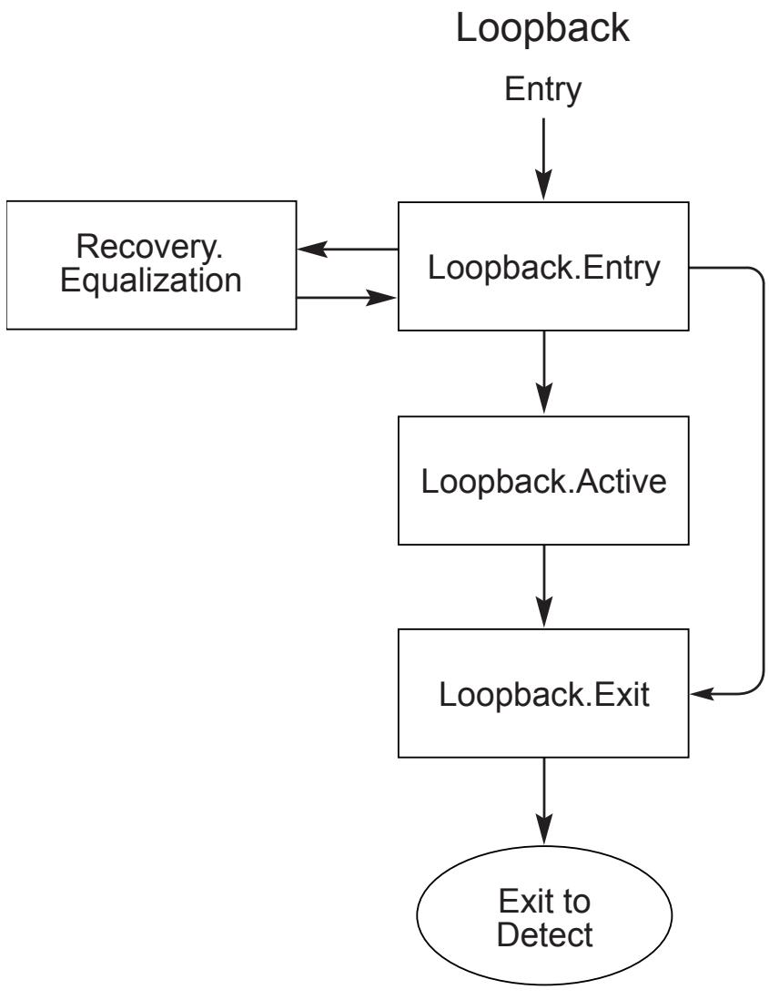


---

<!-- 📄 Page 578 -->
---

<a id="sec-4-2-7-11"></a>
### 4.2.7.11 Hot Reset | 热复位


<div style="overflow-x: auto; max-width: 100%;">
<table>
<thead>
<tr>
<th width="50%">🇬🇧 English</th>
<th width="50%" style="background-color:#e8e8e8">🇨🇳 中文</th>
</tr>
</thead>
<tbody>
<tr>
<td>

- Lanes that were not directed by a higher Layer to initiate Hot Reset (i.e., received two consecutive TS1 Ordered Sets with the Hot Reset bit asserted on any configured Lanes):
  - LinkUp = 0b (False)
  - If any Lane of an Upstream Port of a Switch receives two consecutive TS1 Ordered Sets with the Hot Reset bit asserted, all configured Downstream Ports must transition to Hot Reset as soon as possible.
    - Any optional crosslinks on the Switch are an exception to this rule and the behavior is system specific.
  - All Lanes in the configured Link transmit TS1 Ordered Sets with the Hot Reset bit asserted and the configured Link and Lane numbers.
  - If two consecutive TS1 Ordered Sets were received with the Hot Reset bit asserted and the configured Link and Lane numbers, the state continues to be Hot Reset and the 2 ms timer is reset.
  - Otherwise, the next state is Detect after a 2 ms timeout.

Note: Generally, Lanes of a Downstream or optional crosslink Port will be directed to Hot Reset, and Lanes of an Upstream or optional crosslink Port will enter Hot Reset by receiving two consecutive TS1 Ordered Sets with the Hot Reset bit asserted on any configured Lanes, from Recovery.Idle state.

</td>
<td style="background-color:#e8e8e8">

- 未被更高层指示启动热复位的 Lane(即在任何已配置的 Lane 上接收到两个连续的 Hot Reset 位置 1 的 TS1 Ordered Set):
  - LinkUp = 0b (False)
  - 如果交换机 (Switch) 上游端口 (Upstream Port) 的任何 Lane 收到两个连续的 Hot Reset 位置 1 的 TS1 Ordered Set,则所有已配置的下游端口 (Downstream Port) 必须尽快进入热复位 (Hot Reset) 状态。
    - 交换机上的任何可选 crosslink 不受此规则约束,行为视具体系统而定。
  - 已配置链路 (Link) 中的所有 Lane 发送 Hot Reset 位置 1 且带有已配置 Link 和 Lane 编号的 TS1 Ordered Set。
  - 如果收到两个连续的 Hot Reset 位置 1 且 Link 和 Lane 编号匹配的 TS1 Ordered Set,则保持热复位状态并复位 2 ms 定时器。
  - 否则,经过 2 ms 超时后,下一状态为 Detect (检测)。

注:通常,下游端口或可选 crosslink 端口的 Lane 将被指示进入热复位,而上游端口或可选 crosslink 端口的 Lane 则通过在 Recovery.Idle 状态下,任何已配置 Lane 上接收到两个连续的 Hot Reset 位置 1 的 TS1 Ordered Set 来进入热复位。

</td>
</tr>
</tbody>
</table>
</div>


---

<a id="sec-4-2-8"></a>
## 4.2.8 Clock Tolerance Compensation | 时钟容差补偿

<table>
<thead>
<tr>
<th width="50%">🇬🇧 English</th>
<th width="50%" style="background-color:#e8e8e8">🇨🇳 中文</th>
</tr>
</thead>
<tbody>
<tr>
<td>

SKP Ordered Sets (defined in § Section 4.2.8.1 , § Section 4.2.8.2 , and § Section 4.2.8.3 ) are used to compensate for differences in frequencies between bit rates at two ends of a Link. The Receiver Physical Layer logical sub-block must include elastic buffering which performs this compensation. The interval between SKP Ordered Set transmissions is derived from the Transmit, Receiver, and Refclk specifications specified in § Table 8-6, § Table 8-12, and § Table 8-19.

The specification supports shared reference clocking architectures (common Refclk) where there is no difference between the Tx and Rx Refclk rates, and two kinds of reference clocking architectures where the Tx and Rx Refclk rates differ. Separate Reference Clocks With No SSC - SRNS, and Separate Reference Clocks with Independent SSC - SRIS. The maximum difference with SRNS is 600 ppm which can result in a clock shift once every 1666 clocks. The maximum difference with SRIS is 5600 ppm which can result in a clock shift every 178 clocks.

Specific form factor specifications are permitted to require the use of only SRIS, only SRNS, or to provide a mechanism for clocking architecture selection. Upstream Ports are permitted to implement support for any combination of SRIS and SRNS (including no support for either), but must conform to the requirements of any associated form factor specification. Downstream Ports supporting SRIS must also support SRNS unless the port is only associated with a specific form factor(s) which modifies these requirements. Port configuration to satisfy the requirements of a specific associated form factor is implementation specific. Specific guidance for form factor specifications is provided in § Section 8.6.8 .

If the receiver is capable of operating with SKP Ordered Sets being generated at the rate used in SRNS even though the Port is running in SRIS, the Port is permitted to Set its bit for the appropriate data rate in the Lower SKP OS Reception Supported Speeds Vector field of the Link Capabilities 2 Register. If the transmitter is capable of operating with SKP Ordered Sets being generated at the rate used in SRNS even though the Port is running in SRIS, the Port is permitted to Set its bit for the appropriate data rate in the Lower SKP OS Generation Supported Speeds Vector field of the Link Capabilities 2 register. System software must check that the bit is Set in the Lower SKP OS Reception Supported Speeds Vector field before setting the appropriate data rate's bit in the link partner's Enable Lower SKP OS Generation Vector field of the Link Control 3 Register. Any software transparent Extension Devices (such as a repeater) present on a Link must also support lower SKP OS Generation for system software to set the bit in the Enable Lower SKP OS Generation Vector field. Software determination of such support in such extension devices is implementation specific. When the bit for the data rate that the link is running in is Set in the Enable Lower SKP OS Generation Vector field, the transmitter schedules SKP Ordered Set generation in L0 at the rate used in SRNS, regardless of which clocking architecture the link is running in. In other LTSSM states, SKP Ordered Set scheduling is at the appropriate rate for the clocking architecture.

</td>
<td style="background-color:#e8e8e8">

SKP Ordered Sets (定义见 § Section 4.2.8.1、§ Section 4.2.8.2 和 § Section 4.2.8.3) 用于补偿链路 (Link) 两端比特率之间的频率差异。接收器物理层逻辑子块必须包含弹性缓冲器以执行此补偿。SKP Ordered Set 发送间隔由 § Table 8-6、§ Table 8-12 和 § Table 8-19 中规定的发送、接收和参考时钟 (Refclk) 规范导出。

本规范支持共享参考时钟架构(common Refclk,即 Tx 和 Rx Refclk 速率无差异),以及两种 Tx 和 Rx Refclk 速率不同的参考时钟架构:无 SSC 的独立参考时钟 (Separate Reference Clocks With No SSC, SRNS),以及具有独立 SSC 的独立参考时钟 (Separate Reference Clocks with Independent SSC, SRIS)。SRNS 的最大差异为 600 ppm,可能导致每 1666 个时钟出现一次时钟偏移。SRIS 的最大差异为 5600 ppm,可能导致每 178 个时钟出现一次时钟偏移。

具体的外形规格 (Form Factor) 规范可要求仅使用 SRIS、仅使用 SRNS,或提供时钟架构选择机制。上游端口可实现对 SRIS 和 SRNS 任意组合的支持(包括对两者都不支持),但必须遵守任何关联外形规格规范的要求。支持 SRIS 的下游端口也必须支持 SRNS,除非该端口仅与修改这些要求的特定外形规格相关联。满足特定关联外形规格要求的端口配置因实现而异。有关外形规格规范的具体指导见 § Section 8.6.8 。

如果接收器能够在端口以 SRIS 运行时,使用 SRNS 中使用的速率生成 SKP Ordered Sets,则该端口可以在 Link Capabilities 2 寄存器的 Lower SKP OS Reception Supported Speeds Vector 字段中为相应数据率置 1。如果发送器能够在端口以 SRIS 运行时,使用 SRNS 中使用的速率生成 SKP Ordered Sets,则该端口可以在 Link Capabilities 2 寄存器的 Lower SKP OS Generation Supported Speeds Vector 字段中为相应数据率置 1。系统软件必须在设置链路对端 Link Control 3 寄存器的 Enable Lower SKP OS Generation Vector 字段中相应数据率的位之前,先检查 Lower SKP OS Reception Supported Speeds Vector 字段中该位是否被置 1。链路上存在的任何软件透明的扩展设备(如中继器)也必须支持 Lower SKP OS Generation,以便系统软件设置 Enable Lower SKP OS Generation Vector 字段中的位。对此类扩展设备支持能力的软件确定方式因实现而异。当 Enable Lower SKP OS Generation Vector 字段中当前链路运行数据率对应的位被置 1 时,无论链路运行于哪种时钟架构,发送器都按 SRNS 使用的速率在 L0 中调度 SKP Ordered Set 的生成。在其他 LTSSM 状态中,SKP Ordered Set 的调度采用相应时钟架构对应的速率。

</td>
</tr>
</tbody>
</table>

---

<!-- 📄 Page 579 -->
---


<div style="overflow-x: auto; max-width: 100%;">
<table>
<thead>
<tr>
<th width="50%">🇬🇧 English</th>
<th width="50%" style="background-color:#e8e8e8">🇨🇳 中文</th>
</tr>
</thead>
<tbody>
<tr>
<td>

Components supporting SRIS may need more entries in their elastic buffers than designs supporting SRNS only. This requirement takes into account the extra time it may take to schedule a SKP Ordered Set if the latter falls immediately after a maximum payload sized packet.

When using 8b/10b encoding, a transmitted SKP Ordered Set is a COM Symbol followed by three SKP Symbols, except as is allowed for a Loopback Follower in the Loopback.Active LTSSM state. A received SKP Ordered Set is a COM Symbol followed by one to five SKP Symbols. See § Section 4.3.6.7 for Retimer rules on SKP Ordered Set modification.

When using 128b/130b encoding, a transmitted SKP Ordered Set is 16 Symbols, and a received SKP Ordered Set can be 8, 12, 16, 20, or 24 Symbols. See § Section 4.3.6.7 for Retimer rules on SKP Ordered Set modification.

There are two SKP Ordered Set formats defined for 128b/130b encoding as shown in § Table 4-52 and § Table 4-53. Both formats contain one to five groups of four SKP Symbols followed by a final group of four Symbols indicated by a SKP_END or SKP_END_CTL Symbol. When operating at 8.0 GT/s in Non-Flit Mode, only the Standard SKP Ordered Set is used. When operating at 16.0 GT/s or 32.0 GT/s in Non-Flit Mode, both the Standard and Control SKP Ordered Sets are used. When operating at 8.0, 16.0, 32.0 GT/s in Flit Mode, both the Standard SKP Ordered Sets and Control SKP Ordered Sets are used. All statements in this specification that do not refer to a specific SKP Ordered Set format apply to both formats. When a SKP Ordered Set is transmitted, all Lanes must transmit the same format of SKP Ordered Set - all Lanes must transmit the Standard SKP Ordered Set, or all Lanes must transmit the Control SKP Ordered Set.

The Standard SKP Ordered Set contains information following the SKP_END Symbol that is based on the LTSSM state and the sequence of Blocks. When in the Polling.Compliance state, the Symbols contain the Lane's error status information (see § Section 4.2.7.2.2 for more information). Otherwise, the Symbols contain the Lane's scrambling LFSR value, and a Data Parity bit when the SKP Ordered Set follows a Data Block. The Control SKP Ordered Set contains three Data Parity bits and additional information following the SKP_END_CTL Symbol.

When operating at 8.0 GT/s in Non-Flit Mode, the Data Parity bit of the Standard SKP Ordered Set is the even parity of the payload of all Data Blocks communicated by a Lane and is computed for each Lane independently<sup>92</sup>. Upstream and Downstream Port Transmitters compute the parity as follows:

- Parity is initialized when an SDS Ordered Set is transmitted.
- Parity is updated with each bit of a Data Block's payload after scrambling has been performed.
- The Data Parity bit of a Standard SKP Ordered Set transmitted immediately following a Data Block is set to the current parity.
- Parity is initialized after a Standard SKP Ordered Set is transmitted.

Upstream and Downstream Port Receivers compute and act on the parity as follows:

- Parity is initialized when an SDS Ordered Set is received.
- Parity is updated with each bit of a Data Block's payload before de-scrambling has been performed.
- When a Standard SKP Ordered Set is received immediately following a Data Block, each Lane compares the received Data Parity bit to its calculated parity. If a mismatch is detected, the receiver must set the bit of the Port's Lane Error Status register that corresponds to the Lane's default Lane number. The mismatch is not a Receiver Error and must not cause a Link retrain.

</td>
<td style="background-color:#e8e8e8">

支持 SRIS 的组件可能比仅支持 SRNS 的设计需要更多弹性缓冲器条目。此要求考虑了当 SKP Ordered Set 紧跟在最大有效负载大小的数据包之后时调度所需额外的时间。

使用 8b/10b 编码时,发送的 SKP Ordered Set 由一个 COM 符号后跟三个 SKP 符号组成,Loopback.Active LTSSM 状态下的 Loopback Follower 除外。接收到的 SKP Ordered Set 由一个 COM 符号后跟一至五个 SKP 符号组成。Retimer 对 SKP Ordered Set 修改的规则见 § Section 4.3.6.7。

使用 128b/130b 编码时,发送的 SKP Ordered Set 为 16 个符号,接收的 SKP Ordered Set 可以为 8、12、16、20 或 24 个符号。Retimer 对 SKP Ordered Set 修改的规则见 § Section 4.3.6.7。

128b/130b 编码定义了两种 SKP Ordered Set 格式,见 § Table 4-52 和 § Table 4-53。两种格式均包含一至五组四个 SKP 符号,后跟由 SKP_END 或 SKP_END_CTL 符号指示的最后一组四个符号。在非 Flit 模式下以 8.0 GT/s 运行时,仅使用 Standard SKP Ordered Set。在非 Flit 模式下以 16.0 GT/s 或 32.0 GT/s 运行时,使用 Standard 和 Control SKP Ordered Set。在 Flit 模式下以 8.0、16.0、32.0 GT/s 运行时,使用 Standard SKP Ordered Set 和 Control SKP Ordered Set。本规范中未特别指明 SKP Ordered Set 格式的所有陈述均适用于这两种格式。发送 SKP Ordered Set 时,所有 Lane 必须发送相同格式的 SKP Ordered Set —— 所有 Lane 必须发送 Standard SKP Ordered Set,或所有 Lane 必须发送 Control SKP Ordered Set。

Standard SKP Ordered Set 在 SKP_END 符号之后包含基于 LTSSM 状态和 Block 序列的信息。在 Polling.Compliance 状态下,符号包含 Lane 的错误状态信息(详见 § Section 4.2.7.2.2)。否则,符号包含 Lane 的加扰 LFSR 值,以及当 SKP Ordered Set 跟在 Data Block 之后时的数据奇偶校验位。Control SKP Ordered Set 包含三个数据奇偶校验位以及 SKP_END_CTL 符号之后的附加信息。

在非 Flit 模式下以 8.0 GT/s 运行时,Standard SKP Ordered Set 的数据奇偶校验位是 Lane 通信的所有 Data Block 有效负载的偶校验,且对每个 Lane 独立计算<sup>92</sup>。上游和下游端口发送器按以下方式计算奇偶校验:

- 在发送 SDS Ordered Set 时初始化奇偶校验。
- 在加扰之后,用 Data Block 有效负载的每一位更新奇偶校验。
- 紧跟在 Data Block 之后发送的 Standard SKP Ordered Set 的数据奇偶校验位设置为当前奇偶校验值。
- 在发送 Standard SKP Ordered Set 后初始化奇偶校验。

上游和下游端口接收器按以下方式计算并处理奇偶校验:

- 在接收 SDS Ordered Set 时初始化奇偶校验。
- 在解扰之前,用 Data Block 有效负载的每一位更新奇偶校验。
- 当紧跟在 Data Block 之后接收到 Standard SKP Ordered Set 时,每个 Lane 将接收到的数据奇偶校验位与其计算的奇偶校验进行比较。如果检测到不匹配,接收器必须将端口 Lane Error Status 寄存器中与该 Lane 默认 Lane 编号对应的位置 1。该不匹配不是接收器错误 (Receiver Error),不得导致链路 (Link) 重新训练 (retrain)。

</td>
</tr>
</tbody>
</table>
</div>


<a id="sec-4-2-8-1"></a>
### 4.2.8.1 SKP Ordered Set for 8b/10b Encoding | 8b/10b 编码的 SKP Ordered Set

<a id="sec-4-2-8-2"></a>
### 4.2.8.2 SKP Ordered Set for 128b/130b Encoding | 128b/130b 编码的 SKP Ordered Set

---

<sup>92</sup> The requirements for 8.0 GT/s operation documented here are identical to those in [PCIe-3.1].

<!-- 📄 Page 580 -->
---

<table>
<thead>
<tr>
<th width="50%">🇬🇧 English</th>
<th width="50%" style="background-color:#e8e8e8">🇨🇳 中文</th>
</tr>
</thead>
<tbody>
<tr>
<td>

- Parity is initialized when a Standard SKP Ordered Set is received.

When operating at a data rate of 16.0 or 32.0 GT/s in Non-Flit Mode or 8.0, 16.0m or 32.0 GT/s in Flit Mode, the Data Parity bits of both the Standard SKP Ordered Set in non-Flit-Mode and the Control SKP Ordered Set is the even parity of the payload of all Data Blocks communicated by a Lane and is computed for each Lane independently. Upstream and Downstream Port Transmitters compute the parity as follows:

- Parity is initialized when the LTSSM is in Recovery.Speed.
- Parity is initialized when an SDS Ordered Set is transmitted.
- Parity is updated with each bit of a Data Block's payload after scrambling has been performed.
- Thus, in Flit Mode, Parity is computed post FEC.
- The Data Parity bit of a Standard SKP Ordered Set transmitted immediately following a Data Block is set to the current parity.
- The Data Parity, First Retimer Data Parity, and Second Retimer Data Parity bits of a Control SKP Ordered Set are all set to the current parity.
- Parity is initialized after a Control SKP Ordered Set is transmitted. However, parity is not initialized when a Standard SKP Ordered Set is transmitted.

Upstream and Downstream Port Receivers compute and act on the parity as follows:

- Parity is initialized when the LTSSM is in Recovery.Speed.
- Parity is initialized when an SDS Ordered Set is received.
- Parity is updated with each bit of a Data Block's payload before de-scrambling has been performed.
- Thus, in Flit Mode, Parity is compared prior to FEC decoding.
- When a Control SKP Ordered Set is received, each Lane compares the received Data Parity bit to its calculated parity. It is strongly recommended that this check be performed for Control SKP Ordered Sets immediately following a Data Block only. If a mismatch is detected, the receiver must set the bit of the Port's Local Data Parity Mismatch Status Register that corresponds to the Lane's default Lane number. The mismatch is not a Receiver Error and must not cause a Link retrain.
- When a Control SKP Ordered Set is received, each Lane compares the received First Retimer Data Parity bit to its calculated parity. It is strongly recommended that this check be performed for Control SKP Ordered Sets immediately following a Data Block only. If a mismatch is detected, the receiver must set the bit of the Port's First Retimer Data Parity Mismatch Status Register that corresponds to the Lane's default Lane number. The mismatch is not a Receiver Error and must not cause a Link retrain.
- When a Control SKP Ordered Set is received, each Lane compares the received Second Retimer Data Parity bit to its calculated parity. It is strongly recommended that this check be performed for Control SKP Ordered Sets immediately following a Data Block only. If a mismatch is detected, the receiver must set the bit of the Port's Second Retimer Data Parity Mismatch Status Register that corresponds to the Lane's default Lane number. The mismatch is not a Receiver Error and must not cause a Link retrain.
- When a Standard SKP Ordered Set is received immediately following a Data Block, the receiver is permitted to compare the received Data Parity bit to its calculated parity bit. However, the results of such a comparison must not affect the state of the Lane Error Status Register.
- Parity is initialized when a Control SKP Ordered Set is received. However, parity is not initialized when a Standard SKP Ordered Set is received.

See § Section 4.3.6.7 for the definition of First Retimer and Second Retimer, and for Retimer Pseudo Port requirements for parity computation and modification of the First Retimer Data Parity and Second Retimer Data Parity bits of Control SKP Ordered Sets.

</td>
<td style="background-color:#e8e8e8">

- 在接收到 Standard SKP Ordered Set 时初始化奇偶校验。

在非 Flit 模式下以 16.0 或 32.0 GT/s 数据率运行,或在 Flit 模式下以 8.0、16.0 或 32.0 GT/s 数据率运行时,非 Flit 模式下 Standard SKP Ordered Set 和 Control SKP Ordered Set 的数据奇偶校验位都是 Lane 通信的所有 Data Block 有效负载的偶校验,且对每个 Lane 独立计算。上游和下游端口发送器按以下方式计算奇偶校验:

- 当 LTSSM 处于 Recovery.Speed 时初始化奇偶校验。
- 在发送 SDS Ordered Set 时初始化奇偶校验。
- 在加扰之后,用 Data Block 有效负载的每一位更新奇偶校验。
- 因此,在 Flit 模式下,奇偶校验在 FEC 之后计算。
- 紧跟在 Data Block 之后发送的 Standard SKP Ordered Set 的数据奇偶校验位设置为当前奇偶校验值。
- Control SKP Ordered Set 的数据奇偶校验位、第一 Retimer 数据奇偶校验位和第二 Retimer 数据奇偶校验位均设置为当前奇偶校验值。
- 发送 Control SKP Ordered Set 后初始化奇偶校验。但发送 Standard SKP Ordered Set 时不初始化奇偶校验。

上游和下游端口接收器按以下方式计算并处理奇偶校验:

- 当 LTSSM 处于 Recovery.Speed 时初始化奇偶校验。
- 在接收 SDS Ordered Set 时初始化奇偶校验。
- 在解扰之前,用 Data Block 有效负载的每一位更新奇偶校验。
- 因此,在 Flit 模式下,奇偶校验在 FEC 解码之前进行比较。
- 收到 Control SKP Ordered Set 时,每个 Lane 将接收到的数据奇偶校验位与其计算的奇偶校验进行比较。强烈建议仅对紧跟在 Data Block 之后的 Control SKP Ordered Set 执行此检查。如果检测到不匹配,接收器必须将端口 Local Data Parity Mismatch Status 寄存器中与该 Lane 默认 Lane 编号对应的位置 1。该不匹配不是接收器错误 (Receiver Error),不得导致链路 (Link) 重新训练 (retrain)。
- 收到 Control SKP Ordered Set 时,每个 Lane 将接收到的第一 Retimer 数据奇偶校验位与其计算的奇偶校验进行比较。强烈建议仅对紧跟在 Data Block 之后的 Control SKP Ordered Set 执行此检查。如果检测到不匹配,接收器必须将端口 First Retimer Data Parity Mismatch Status 寄存器中与该 Lane 默认 Lane 编号对应的位置 1。该不匹配不是接收器错误 (Receiver Error),不得导致链路 (Link) 重新训练 (retrain)。
- 收到 Control SKP Ordered Set 时,每个 Lane 将接收到的第二 Retimer 数据奇偶校验位与其计算的奇偶校验进行比较。强烈建议仅对紧跟在 Data Block 之后的 Control SKP Ordered Set 执行此检查。如果检测到不匹配,接收器必须将端口 Second Retimer Data Parity Mismatch Status 寄存器中与该 Lane 默认 Lane 编号对应的位置 1。该不匹配不是接收器错误 (Receiver Error),不得导致链路 (Link) 重新训练 (retrain)。
- 当紧跟在 Data Block 之后接收到 Standard SKP Ordered Set 时,允许接收器将接收到的数据奇偶校验位与其计算的奇偶校验位进行比较。但是,这种比较的结果不得影响 Lane Error Status 寄存器的状态。
- 收到 Control SKP Ordered Set 时初始化奇偶校验。但收到 Standard SKP Ordered Set 时不初始化奇偶校验。

有关第一 Retimer 和第二 Retimer 的定义,以及 Retimer 伪端口 (Pseudo Port) 对奇偶校验计算和 Control SKP Ordered Set 的第一 Retimer 数据奇偶校验位、第二 Retimer 数据奇偶校验位修改的要求,见 § Section 4.3.6.7。

</td>
</tr>
</tbody>
</table>

---

<!-- 📄 Page 581 -->
---

**Table 4-52 Standard SKP Ordered Set with 128b/130b Encoding | 表 4-52 128b/130b 编码的 Standard SKP Ordered Set**

| Symbol Number | Value | Description |
|---------------|-------|-------------|
| 0 through (4*N-1) [N can be 1 through 5] | AAh for 8.0 GT/s and 16.0 GT/s data rates<br>99h for 32.0 GT/s and higher data rates | SKP Symbol.<br>Symbol 0 is the SKP Ordered Set identifier. |
| 4*N | E1h | SKP_END Symbol<br>Signifies the end of the SKP Ordered Set after three more Symbols. |
| 4*N + 1 | 00-FFh | (i) If LTSSM state is Polling.Compliance: AAh<br>(ii) Else if prior block was a Data Block:<br>&nbsp;&nbsp;Bit[7] = Data Parity<br>&nbsp;&nbsp;Bit[6:0] = LFSR[22:16]<br>(iii) Else:<br>&nbsp;&nbsp;Bit[7] = ~LFSR[22]<br>&nbsp;&nbsp;Bit[6:0] = LFSR[22:16] |
| 4*N + 2 | 00-FFh | (i) If the LTSSM state is Polling.Compliance: Error_Status[7:0]<br>(ii) Else LFSR[15:8] |
| 4*N + 3 | 00-FFh | (i) If the LTSSM state is Polling.Compliance: ~Error_Status[7:0]<br>(ii) Else: LFSR[7:0] |


<div style="overflow-x: auto; max-width: 100%;">
<table>
<thead>
<tr>
<th width="50%">🇬🇧 English</th>
<th width="50%" style="background-color:#e8e8e8">🇨🇳 中文</th>
</tr>
</thead>
<tbody>
<tr>
<td>

The Control SKP Ordered Set is different from the Standard SKP Ordered Set in the last 4 Symbols. It is used to communicate the parity bits, as computed by each Retimer, in addition to the Data Parity bit computed by the Upstream/Downstream Port. It may also be used for Lane Margining at a Retimer's Receiver, as described below.

**IMPLEMENTATION NOTE:**
**LFSR IN STANDARD SKP ORDERED SET**

The LFSR value is transmitted to enable trace tools to be able to function even if they need to reacquire block alignment in the midst of a bit stream. Since trace tools cannot force the link to enter Recovery, they can reacquire bit lock, if needed, and monitor for the SKP Ordered Set to obtain Block alignment and perform Lane-to-Lane de-skew. The LFSR value from the SKP Ordered Set can be loaded into its LFSR to start interpreting the bit stream. It must be noted that with a bit stream one may alias to a SKP Ordered Set on a non-Block boundary. The trace tools can validate their Block alignment by using implementation specific means such as receiving a fixed number of valid packets or Sync Headers or subsequent SKP Ordered Sets.

</td>
<td style="background-color:#e8e8e8">

Control SKP Ordered Set 在最后 4 个符号上与 Standard SKP Ordered Set 不同。它用于传递由每个 Retimer 计算的奇偶校验位,以及由上游/下游端口 (Upstream/Downstream Port) 计算的数据奇偶校验位。它也可用于 Retimer 接收器处的 Lane Margining,如下所述。

**实现说明:**
**STANDARD SKP ORDERED SET 中的 LFSR**

发送 LFSR 值是为了使追踪工具 (trace tools) 即使在比特流中间需要重新获取块对齐 (block alignment) 时也能正常工作。由于追踪工具无法强制链路进入 Recovery,它们可在需要时重新获取比特锁定 (bit lock),并监视 SKP Ordered Set 以获得块对齐并执行 Lane-to-Lane 去偏斜 (de-skew)。SKP Ordered Set 中的 LFSR 值可加载到其 LFSR 中,用于开始解释比特流。必须注意,在比特流中可能在非块边界上混叠到 SKP Ordered Set。追踪工具可通过接收固定数量的有效数据包或 Sync Header 或后续的 SKP Ordered Set 等实现特定方式来验证其块对齐。

</td>
</tr>
</tbody>
</table>
</div>


---

<!-- 📄 Page 582 -->
---

**Table 4-53 Control SKP Ordered Set with 128b/130b Encoding | 表 4-53 128b/130b 编码的 Control SKP Ordered Set**

| Symbol Number | Value | Description |
|---------------|-------|-------------|
| 0 through (4*N-1) [N can be 1 through 5] | AAh for 8.0 GT/s and 16.0 GT/s data rates<br>99h for 32.0 GT/s and higher data rates | SKP Symbol.<br>Symbol 0 is the SKP Ordered Set identifier. |
| 4*N | 78h | SKP_END_CTL Symbol.<br>Signifies the end of the Control SKP Ordered Set after three more Symbols. |
| 4*N + 1 | 00-FFh | Bit 7: Data Parity<br>Bit 6: First Retimer Data Parity<br>Bit 5: Second Retimer Parity<br>Bits [4:0]: Margin CRC [4:0] |
| 4*N + 2 | 00-FFh | Bit 7: Margin Parity<br>Bits [6:0]: Refer to § Section 4.2.18.1 |
| 4*N + 3 | 00-FFh | Bits [7:0]: Refer to § Section 4.2.18.1 |

<table>
<thead>
<tr>
<th width="50%">🇬🇧 English</th>
<th width="50%" style="background-color:#e8e8e8">🇨🇳 中文</th>
</tr>
</thead>
<tbody>
<tr>
<td>

The 'Margin CRC[4:0]' is computed from Bits [6:0] in Symbols 4N+2 (referred to as d[6:0] in the equations below, where d[0] is Bit 0 of Symbol 4N+2, d[1] is Bit 1 of Symbol 4N+2, … d[6] is Bit 6 of Symbol 4N+2) and Bits [7:0] of Symbol 4N+3 (referred to as d[14:7], where d[7] is Bit 0 of Symbol 4N+3, d[8] is Bit 1 of Symbol 4N+3, .. d[14] is Bit 7 of Symbol 4N+3) as follows:

Margin CRC[0] = d[0] ^ d[3] ^ d[5] ^ d[6] ^ d[9] ^ d[10] ^ d[11] ^ d[12] ^ d[13]
Margin CRC[1] = d[1] ^ d[4] ^ d[6] ^ d[7] ^ d[10] ^ d[11] ^ d[12] ^ d[13] ^ d[14]
Margin CRC[2] = d[0] ^ d[2] ^ d[3] ^ d[6] ^ d[7] ^ d[8] ^ d[9] ^ d[10] ^ d[14]
Margin CRC[3] = d[1] ^ d[3] ^ d[4] ^ d[7] ^ d[8] ^ d[9] ^ d[10] ^ d[11]
Margin CRC[4] = d[2] ^ d[4] ^ d[5] ^ d[8] ^ d[9] ^ d[10] ^ d[11] ^ d[12]

'Margin Parity' is the even parity of Bits [4:0] of Symbol 4N+1, Bits [6:0] of Symbol 4N+2, and Bits [7:0] of Symbol 4N+3 (i.e., Margin Parity = Margin CRC[0] ^ Margin CRC[1] ^ Margin CRC[2] ^ Margin CRC[3] ^ Margin CRC[4] ^ d[0] ^ d[1] ^ d[2] ^ d[3] ^ d[4] ^ d[5] ^ d[6] ^ d[7] ^ d[8] ^ d[9] ^ d[10] ^ d[11] ^ d[12] ^ d[13] ^ d[14]).

'Margin Parity' only applies to 128b/130b encoding. 1b/1b Control SKP Ordered Sets do not contain a 'Margin Parity' field.

The rules for generating and checking the Margin CRC and Margin Parity are described in § Section 4.2.1.3 .

</td>
<td style="background-color:#e8e8e8">

"Margin CRC[4:0]" 由符号 4N+2 的位 [6:0](在以下公式中称为 d[6:0],其中 d[0] 是符号 4N+2 的位 0,d[1] 是符号 4N+2 的位 1,...,d[6] 是符号 4N+2 的位 6)和符号 4N+3 的位 [7:0](称为 d[14:7],其中 d[7] 是符号 4N+3 的位 0,d[8] 是符号 4N+3 的位 1,...,d[14] 是符号 4N+3 的位 7)按如下方式计算:

Margin CRC[0] = d[0] ^ d[3] ^ d[5] ^ d[6] ^ d[9] ^ d[10] ^ d[11] ^ d[12] ^ d[13]
Margin CRC[1] = d[1] ^ d[4] ^ d[6] ^ d[7] ^ d[10] ^ d[11] ^ d[12] ^ d[13] ^ d[14]
Margin CRC[2] = d[0] ^ d[2] ^ d[3] ^ d[6] ^ d[7] ^ d[8] ^ d[9] ^ d[10] ^ d[14]
Margin CRC[3] = d[1] ^ d[3] ^ d[4] ^ d[7] ^ d[8] ^ d[9] ^ d[10] ^ d[11]
Margin CRC[4] = d[2] ^ d[4] ^ d[5] ^ d[8] ^ d[9] ^ d[10] ^ d[11] ^ d[12]

"Margin Parity" 是符号 4N+1 的位 [4:0]、符号 4N+2 的位 [6:0] 和符号 4N+3 的位 [7:0] 的偶校验(即 Margin Parity = Margin CRC[0] ^ Margin CRC[1] ^ Margin CRC[2] ^ Margin CRC[3] ^ Margin CRC[4] ^ d[0] ^ d[1] ^ d[2] ^ d[3] ^ d[4] ^ d[5] ^ d[6] ^ d[7] ^ d[8] ^ d[9] ^ d[10] ^ d[11] ^ d[12] ^ d[13] ^ d[14])。

"Margin Parity" 仅适用于 128b/130b 编码。1b/1b Control SKP Ordered Set 不包含 "Margin Parity" 字段。

Margin CRC 和 Margin Parity 的生成和检查规则见 § Section 4.2.1.3。

</td>
</tr>
</tbody>
</table>

---

<!-- 📄 Page 583 -->
---


<div style="overflow-x: auto; max-width: 100%;">
<table>
<thead>
<tr>
<th width="50%">🇬🇧 English</th>
<th width="50%" style="background-color:#e8e8e8">🇨🇳 中文</th>
</tr>
</thead>
<tbody>
<tr>
<td>

- Only Control SKP Ordered Sets are transmitted in 1b/1b Encoding.
- A transmitted SKP Ordered Set is 40 symbols (40B), and a received SKP Ordered Set can be 24, 32, 40, 48 or 56 symbols (24B, 32B, 40B, 48B or 56B).
- The transmitted SKP Ordered Set consists of the SKPs (F00F_F00F), followed by a SKP_END (FFF0_00F0), followed by PHY Payload (8B), as shown in § Table 4-54.
- The PHY Payload field of the 1b/1b SKP Ordered Set is illustrated in § Table 4-55, § Figure 4-58, § Figure 4-59, and § Figure 4-60.
- The Payload Type and Parity fields are replicated four times, spaced more than 16 bits apart.
  - The Receiver can implement a majority voting to correct these fields if three or more sets match. If two sets of value are 0b and two sets are 1b, there is a tie. A tie in the parity can be considered to mismatch. A tie in the Payload Type results in ignoring the PHY payload field.
- The Payload field is replicated twice.
- For Margin payload with its own CRC, the Receiver can choose whichever copy passes CRC (and if both pass CRC, can perform a comparison before acting on it).

The Data Parity bit is the even parity of the payload of all Data Blocks communicated by a Lane and is computed for each Lane independently. Upstream and Downstream Port Transmitters compute the parity as follows:

- Parity is initialized when the LTSSM is in Recovery.Speed.
- Parity is initialized when an SDS Ordered Set is transmitted.
- Parity is initialized after a SKP Ordered Set is transmitted.
- Parity is updated with each bit of a Data Block's payload after scrambling has been performed. Thus, gray coding and precoding, if any, does not affect the Parity calculation and Parity is computed post FEC.
- The Data Parity bit of a SKP Ordered Set transmitted immediately following a Data Block is set to the current parity.

**IMPLEMENTATION NOTE:**
**ERROR PROTECTION IN CONTROL SKP ORDERED SET**

The 21 bits in Symbol 4N+1 (Bits [4:0]), Symbol 4N+2 (Bits[7:0]) and Symbol 4N+3 (Bits[7:0]) is protected by 5 bits of CRC and one bit of parity, leaving 15 bits for information passing. The parity bit provides detection against odd number of bit-flips (e.g., 1-bit, 3-bit), whereas the CRC provides guaranteed detection of 1-bit and 2-bit flips; thus resulting in a triple bit flip detection guarantee over the 21 bits as well as guaranteed detection of burst errors of length 5. The 5-bit CRC is derived from the primitive polynomial: x5 + x2 + 1.

Since these 21 bits are not part of a TLP, repeated delivery of the same content provides delivery guarantee. This is achieved through architected registers. Downstream commands are sent from the Downstream Port, reflecting the contents of an architected register whereas the upstream status that passes the error checking is updated into a status register in the Downstream Port. Software thus has a mechanism to issue a command and wait for the status to be reflected back before issuing a new command. Thus, these 15 bits of information act as a micro-packet.

</td>
<td style="background-color:#e8e8e8">

- 在 1b/1b 编码中仅发送 Control SKP Ordered Set。
- 发送的 SKP Ordered Set 为 40 个符号(40B),接收的 SKP Ordered Set 可为 24、32、40、48 或 56 个符号(24B、32B、40B、48B 或 56B)。
- 发送的 SKP Ordered Set 由 SKP (F00F_F00F) 后接 SKP_END (FFF0_00F0) 再后接 PHY Payload (8B) 组成,见 § Table 4-54。
- 1b/1b SKP Ordered Set 的 PHY Payload 字段如 § Table 4-55、§ Figure 4-58、§ Figure 4-59 和 § Figure 4-60 所示。
- Payload Type 和 Parity 字段被复制四次,间隔超过 16 位。
  - 如果三个或更多集合匹配,接收器可以实现多数投票来纠正这些字段。如果两组值为 0b,两组为 1b,则出现平局。Parity 平局可视为不匹配。Payload Type 平局导致忽略 PHY payload 字段。
- Payload 字段被复制两次。
- 对于带其自身 CRC 的 Margin payload,接收器可选择通过 CRC 校验的任一副本(如果两副本都通过 CRC,则可在使用前进行比较)。

数据奇偶校验位是 Lane 通信的所有 Data Block 有效负载的偶校验,且对每个 Lane 独立计算。上游和下游端口发送器按以下方式计算奇偶校验:

- 当 LTSSM 处于 Recovery.Speed 时初始化奇偶校验。
- 在发送 SDS Ordered Set 时初始化奇偶校验。
- 发送 SKP Ordered Set 后初始化奇偶校验。
- 在加扰之后,用 Data Block 有效负载的每一位更新奇偶校验。因此,任何灰度编码 (gray coding) 和预编码 (precoding) 都不影响奇偶校验计算,奇偶校验在 FEC 之后计算。
- 紧跟在 Data Block 之后发送的 SKP Ordered Set 的数据奇偶校验位设置为当前奇偶校验值。

**实现说明:**
**CONTROL SKP ORDERED SET 中的错误保护**

符号 4N+1 (位 [4:0])、符号 4N+2 (位 [7:0]) 和符号 4N+3 (位 [7:0]) 中的 21 位由 5 位 CRC 和 1 位奇偶校验位保护,剩下 15 位用于信息传递。奇偶校验位提供针对奇数次位翻转(例如 1 位、3 位)的检测,而 CRC 提供 1 位和 2 位翻转的保证检测;从而在这 21 位上提供三位翻转检测保证,以及对长度为 5 的突发错误的保证检测。5 位 CRC 派生自本原多项式: x5 + x2 + 1。

由于这 21 位不属于 TLP,重复传递相同内容提供传递保证。这通过架构寄存器实现。下游命令从下游端口 (Downstream Port) 发送,反映架构寄存器的内容,而通过错误检查的上游状态则更新到下游端口中的状态寄存器。因此,软件具有在发出新命令前先发出命令并等待状态回传的机制。因此,这 15 位信息充当微数据包 (micro-packet)。

</td>
</tr>
</tbody>
</table>
</div>


<a id="sec-4-2-8-3"></a>
### 4.2.8.3 SKP Ordered Set for 1b/1b Encoding | 1b/1b 编码的 SKP Ordered Set

---

<!-- 📄 Page 584 -->
---

<table>
<thead>
<tr>
<th width="50%">🇬🇧 English</th>
<th width="50%" style="background-color:#e8e8e8">🇨🇳 中文</th>
</tr>
</thead>
<tbody>
<tr>
<td>

- The Data Parity, First Retimer Data Parity, and Second Retimer Data Parity bits of a SKP Ordered Set are all set to the current parity.

Upstream and Downstream Port Receivers compute and act on the parity as follows:

- Parity is initialized when the LTSSM is in Recovery.Speed.
- Parity is initialized when an SDS Ordered Set is received.
- Parity is updated with each bit of a Data Block's payload before de-scrambling has been performed. Thus, this is performed after gray coding and precoding, if any, by the Receiver and Parity is compared pre FEC.
- When a SKP Ordered Set is received, each Lane compares the received Data Parity bit to its calculated parity. It is strongly recommended that this check be performed for Control SKP Ordered Sets immediately following a Data Block only. If a mismatch is detected, the receiver must set the bit of the Port's Local Data Parity Mismatch Status Register that corresponds to the Lane's default Lane number. The mismatch is not a Receiver Error and must not cause a Link retrain.
- When a SKP Ordered Set is received, each Lane compares the received First Retimer Data Parity bit to its calculated parity. It is strongly recommended that this check be performed for Control SKP Ordered Sets immediately following a Data Block only. If a mismatch is detected, the receiver must set the bit of the Port's First Retimer Data Parity Mismatch Status Register that corresponds to the Lane's default Lane number. The mismatch is not a Receiver Error and must not cause a Link retrain.
- When a SKP Ordered Set is received, each Lane compares the received Second Retimer Data Parity bit to its calculated parity. It is strongly recommended that this check be performed for Control SKP Ordered Sets immediately following a Data Block only. If a mismatch is detected, the receiver must set the bit of the Port's Second Retimer Data Parity Mismatch Status Register that corresponds to the Lane's default Lane number. The mismatch is not a Receiver Error and must not cause a Link retrain.
- Parity is initialized when a SKP Ordered Set is received. See § Section 4.3.6.7 for the definition of First Retimer and Second Retimer, and for Retimer Pseudo Port requirements for parity computation and modification of the First Retimer Data Parity and Second Retimer Data Parity bits of Control SKP Ordered Sets.

</td>
<td style="background-color:#e8e8e8">

- SKP Ordered Set 的数据奇偶校验位、第一 Retimer 数据奇偶校验位和第二 Retimer 数据奇偶校验位均设置为当前奇偶校验值。

上游和下游端口接收器按以下方式计算并处理奇偶校验:

- 当 LTSSM 处于 Recovery.Speed 时初始化奇偶校验。
- 在接收 SDS Ordered Set 时初始化奇偶校验。
- 在解扰之前,用 Data Block 有效负载的每一位更新奇偶校验。因此,这在接收器执行任何灰度编码 (gray coding) 和预编码 (precoding) 之后执行,奇偶校验在 FEC 之前进行比较。
- 收到 SKP Ordered Set 时,每个 Lane 将接收到的数据奇偶校验位与其计算的奇偶校验进行比较。强烈建议仅对紧跟在 Data Block 之后的 Control SKP Ordered Set 执行此检查。如果检测到不匹配,接收器必须将端口 Local Data Parity Mismatch Status 寄存器中与该 Lane 默认 Lane 编号对应的位置 1。该不匹配不是接收器错误 (Receiver Error),不得导致链路 (Link) 重新训练 (retrain)。
- 收到 SKP Ordered Set 时,每个 Lane 将接收到的第一 Retimer 数据奇偶校验位与其计算的奇偶校验进行比较。强烈建议仅对紧跟在 Data Block 之后的 Control SKP Ordered Set 执行此检查。如果检测到不匹配,接收器必须将端口 First Retimer Data Parity Mismatch Status 寄存器中与该 Lane 默认 Lane 编号对应的位置 1。该不匹配不是接收器错误 (Receiver Error),不得导致链路 (Link) 重新训练 (retrain)。
- 收到 SKP Ordered Set 时,每个 Lane 将接收到的第二 Retimer 数据奇偶校验位与其计算的奇偶校验进行比较。强烈建议仅对紧跟在 Data Block 之后的 Control SKP Ordered Set 执行此检查。如果检测到不匹配,接收器必须将端口 Second Retimer Data Parity Mismatch Status 寄存器中与该 Lane 默认 Lane 编号对应的位置 1。该不匹配不是接收器错误 (Receiver Error),不得导致链路 (Link) 重新训练 (retrain)。
- 收到 SKP Ordered Set 时初始化奇偶校验。有关第一 Retimer 和第二 Retimer 的定义,以及 Retimer 伪端口 (Pseudo Port) 对奇偶校验计算和 Control SKP Ordered Set 的第一 Retimer 数据奇偶校验位、第二 Retimer 数据奇偶校验位修改的要求,见 § Section 4.3.6.7。

</td>
</tr>
</tbody>
</table>

**Table 4-54 Control SKP Ordered Set with 1b/1b Encoding | 表 4-54 1b/1b 编码的 Control SKP Ordered Set**

| Symbol Number | Value | Description |
|---------------|-------|-------------|
| 0, 4, 8, 12, 16, 20 | F0h | SKP Symbol |
| 1, 5, 9, 13, 17, 21 | 0Fh | |
| 2, 6, 10, 14, 18, 22 | F0h | |
| 3, 7, 11, 15, 19, 23 | 0Fh | |
| 24, 28 | FFh | SKP_END |
| 25, 29 | F0h | |
| 26, 30 | 00h | |
| 27, 31 | F0h | |
| 32 | F0h if TS0 Ordered Sets are being transmitted, as defined in § Section 4.2.7.4.2 , else Phy Payload[7:0] See § Table 4-55, § Figure 4-58, § Figure 4-59, and § Figure 4-60. | PHY Payload |

---

<!-- 📄 Page 585 -->
---

**Table 4-54 (continued) Control SKP Ordered Set with 1b/1b Encoding | 表 4-54(续) 1b/1b 编码的 Control SKP Ordered Set**

| Symbol Number | Value | Description |
|---------------|-------|-------------|
| 33 | F0h if TS0 Ordered Sets are being transmitted, as defined in § Section 4.2.7.4.2 , else Phy Payload[15:8] See § Table 4-55, § Figure 4-58, § Figure 4-59, and § Figure 4-60. | |
| 34 | F0h if TS0 Ordered Sets are being transmitted, as defined in § Section 4.2.7.4.2 , else Phy Payload[23:16] See § Table 4-55, § Figure 4-58, § Figure 4-59, and § Figure 4-60. | |
| 35 | F0h if TS0 Ordered Sets are being transmitted, as defined in § Section 4.2.7.4.2 , else Phy Payload[31:24] See § Table 4-55, § Figure 4-58, § Figure 4-59, and § Figure 4-60. | |
| 36 | F0h if TS0 Ordered Sets are being transmitted, as defined in § Section 4.2.7.4.2 , else Phy Payload[39:32] See § Table 4-55, § Figure 4-58, § Figure 4-59, and § Figure 4-60. | |
| 37 | F0h if TS0 Ordered Sets are being transmitted, as defined in § Section 4.2.7.4.2 , else Phy Payload[47:40] See § Table 4-55, § Figure 4-58, § Figure 4-59, and § Figure 4-60. | |
| 38 | F0h if TS0 Ordered Sets are being transmitted, as defined in § Section 4.2.7.4.2 , else Phy Payload[55:48] See § Table 4-55, § Figure 4-58, § Figure 4-59, and § Figure 4-60. | |
| 39 | F0h if TS0 Ordered Sets are being transmitted, as defined in § Section 4.2.7.4.2 , else Phy Payload[63:56] See § Table 4-55, § Figure 4-58, § Figure 4-59, and § Figure 4-60. | |

**Figure 4-58 Margin PHY Payload for Control SKP Ordered Set with 1b/1b Encoding | 图 4-58 1b/1b 编码的 Control SKP Ordered Set 的 Margin PHY Payload**

| Bit Position | Width | Value | Description |
|--------------|-------|-------|-------------|
| 0 | 1 | Phy Payload Type/0 | |
| 1 | 1 | Port Parity/0 | |
| 2 | 1 | Retimer 1 Parity/0 | |
| 3 | 1 | Retimer 2 Parity/0 | |
| 4–7 | 4 | Reserved | |
| 8–12 | 5 | Margin CRC[4:0]/0 | |
| 13–15 | 3 | Receiver Number/0 | |
| 16–18 | 3 | Margin Type/0 | |
| 19 | 1 | Usage Model/0 | |
| 20 | 1 | Phy Payload Type/1 | |
| 21 | 1 | Port Parity/1 | |
| 22 | 1 | Retimer 1 Parity/1 | |
| 23 | 1 | Retimer 2 Parity/1 | |
| 24–31 | 8 | Margin Payload/0 | |
| 32–35 | 4 | Reserved | |
| 36–39 | 4 | Margin CRC[3:0]/1 | |
| 40 | 1 | Phy Payload Type/2 | |
| 41 | 1 | Port Parity/2 | |
| 42 | 1 | Retimer 1 Parity/2 | |
| 43 | 1 | Retimer 2 Parity/2 | |
| 44 | 1 | Margin CRC[4]/1 | |
| 45–47 | 3 | Receiver Number/1 | |
| 48–50 | 3 | Margin Type/1 | |
| 51 | 1 | Usage Model/1 | |
| 52–59 | 8 | Margin Payload/1 | |
| 60 | 1 | Phy Payload Type/3 | |
| 61 | 1 | Port Parity/3 | |
| 62 | 1 | Retimer 1 Parity/3 | |
| 63 | 1 | Retimer 2 Parity/3 | |

---

<!-- 📄 Page 586 -->
---

**Figure 4-59 LFSR PHY Payload for Control SKP Ordered Set with 1b/1b Encoding | 图 4-59 1b/1b 编码的 Control SKP Ordered Set 的 LFSR PHY Payload**

| Bit Position | Width | Value | Description |
|--------------|-------|-------|-------------|
| 0 | 1 | Phy Payload Type/0 | |
| 1 | 1 | Port Parity/0 | |
| 2 | 1 | Retimer 1 Parity/0 | |
| 3 | 1 | Retimer 2 Parity/0 | |
| 4–19 | 16 | LFSR[15:0]/0 | |
| 20 | 1 | Phy Payload Type/1 | |
| 21 | 1 | Port Parity/1 | |
| 22 | 1 | Retimer 1 Parity/1 | |
| 23 | 1 | Retimer 2 Parity/1 | |
| 24–30 | 7 | LFSR[22:16]/0 | |
| 31 | 1 | Even Parity of LFSR[22:0]/0 | |
| 32–39 | 8 | LFSR[7:0]/1 | |
| 40 | 1 | Phy Payload Type/2 | |
| 41 | 1 | Port Parity/2 | |
| 42 | 1 | Retimer 1 Parity/2 | |
| 43 | 1 | Retimer 2 Parity/2 | |
| 44–58 | 15 | LFSR[22:8]/1 | |
| 59 | 1 | Even Parity of LFSR[22:0]/1 | |
| 60 | 1 | Phy Payload Type/3 | |
| 61 | 1 | Port Parity/3 | |
| 62 | 1 | Retimer 1 Parity/3 | |
| 63 | 1 | Retimer 2 Parity/3 | |

**Figure 4-60 Polling.Compliance PHY Payload for Control SKP Ordered Set with 1b/1b Encoding | 图 4-60 1b/1b 编码的 Control SKP Ordered Set 的 Polling.Compliance PHY Payload**

| Bit Position | Width | Value | Description |
|--------------|-------|-------|-------------|
| 0 | 1 | Phy Payload Type/0 | |
| 1 | 1 | Port Parity/0 | |
| 2 | 1 | Retimer 1 Parity/0 | |
| 3 | 1 | Retimer 2 Parity/0 | |
| 4–11 | 8 | 22h/0 (0b 1b 0b 0b 0b 1b 0b 0b) | |
| 12 | 1 | Error Status[0]/0 | |
| 13 | 1 | ~Error Status[1]/0 | |
| 14 | 1 | Error Status[2]/0 | |
| 15 | 1 | ~Error Status[3]/0 | |
| 16 | 1 | Error Status[4]/0 | |
| 17 | 1 | ~Error Status[5]/0 | |
| 18 | 1 | Error Status[6]/0 | |
| 19 | 1 | ~Error Status[7]/0 | |
| 20 | 1 | Phy Payload Type/1 | |
| 21 | 1 | Port Parity/1 | |
| 22 | 1 | Retimer 1 Parity/1 | |
| 23 | 1 | Retimer 2 Parity/1 | |
| 24–31 | 8 | Error Status[7:0]/0 | |
| 32–39 | 8 | 22h/1 (0b 1b 0b 0b 0b 1b 0b 0b) | |
| 40 | 1 | Phy Payload Type/2 | |
| 41 | 1 | Port Parity/2 | |
| 42 | 1 | Retimer 1 Parity/2 | |
| 43 | 1 | Retimer 2 Parity/2 | |
| 44 | 1 | Error Status[0]/1 | |
| 45 | 1 | ~Error Status[1]/1 | |
| 46 | 1 | Error Status[2]/1 | |
| 47 | 1 | ~Error Status[3]/1 | |
| 48 | 1 | Error Status[4]/1 | |
| 49 | 1 | ~Error Status[5]/1 | |
| 50 | 1 | Error Status[6]/1 | |
| 51 | 1 | ~Error Status[7]/1 | |
| 52–59 | 8 | Error Status[7:0]/1 | |
| 60 | 1 | Phy Payload Type/3 | |
| 61 | 1 | Port Parity/3 | |
| 62 | 1 | Retimer 1 Parity/3 | |
| 63 | 1 | Retimer 2 Parity/3 | |

---

<!-- 📄 Page 587 -->
---

**Table 4-55 PHY Payload for Control SKP Ordered Set with 1b/1b Encoding | 表 4-55 1b/1b 编码的 Control SKP Ordered Set 的 PHY Payload**

| Field | Bit Position(s) (Replicated Bit Position(s)) | Description |
|-------|----------------------------------------------|-------------|
| Phy Payload Type | 0 (20) (40) (60) | If the LTSSM state is Polling.Compliance: this bit is Set to 1b<br>Else:<br>0b - Margin Payload<br>1b - LFSR<br>See § Section 4.2.8.4 for Phy Payload Type field usage. |
| Port Parity | 1 (21) (41) (61) | If the LTSSM state is Polling.Compliance: this bit is Set to 1b<br>Else:<br>even parity of all the bits in the Data Blocks on that Lane from the last SKP Ordered Set |
| Retimer 1 Parity | 2 (22) (42) (62) | If the LTSSM state is Polling.Compliance: this bit is Set to 1b<br>Else:<br>Port sets this bit with Port Parity; First Retimer, if present, overwrites with its own calculated even parity of all the bits in the Data Blocks on that Lane from the last SKP ordered Set |
| Retimer 2 Parity | 3 (23) (43) (63) | If the LTSSM state is Polling.Compliance: this bit is Set to 1b<br>Else:<br>Port sets this bit with Port Parity; Second Retimer, if present, overwrites with its own calculated even parity of all the bits in the Data Blocks on that Lane from the last SKP Ordered Set |
| Payload | [23:0] {31:24, 19:4} ({59:44, 39:32}) | If the LTSSM state is Polling.Compliance:<br>{ Error_Status[7:0], ~Error_Status[7], Error_Status[6], ~Error_Status[5], Error_Status[4], ~Error_Status[3], Error_Status[2], ~Error_Status[1], Error_Status[0], 22h }<br>Else If PHY Payload Type == 0b Margin:<br>{ Margin Payload[7:0], Usage Model, Margin Type[2:0], Receiver Number[2:0], Margin CRC[4:0], Reserved[3:0] }<br>Else:<br>{ Even Parity of LFSR[22:0], LFSR[22:0] }<br>All of these are in little-endian format. Thus, for example, the 8 bits of Margin Payload occupies bits 31:24 and 59:52 |

<a id="sec-4-2-8-4"></a>
### 4.2.8.4 Rules for Transmitters | 发送器规则


<div style="overflow-x: auto; max-width: 100%;">
<table>
<thead>
<tr>
<th width="50%">🇬🇧 English</th>
<th width="50%" style="background-color:#e8e8e8">🇨🇳 中文</th>
</tr>
</thead>
<tbody>
<tr>
<td>

- All Lanes shall transmit Symbols at the same frequency (the difference between bit rates is 0 ppm within all multi-Lane Links).
- When transmitted, all Lanes of a multi-Lane Link must simultaneously transmit SKP Ordered Sets of the same length and type (Control or Standard), except as allowed for a Loopback Follower in the Loopback.Active LTSSM State (see § Section 4.2.5.11 and § Table 8-7 for the definition of simultaneous in this context).
- The transmitted SKP Ordered Set when using 8b/10b encoding must follow the definition in § Section 4.2.8.1 .

</td>
<td style="background-color:#e8e8e8">

- 所有 Lane 必须以相同频率发送符号(在所有多 Lane 链路 (Link) 内,比特率差异为 0 ppm)。
- 发送时,多 Lane 链路的所有 Lane 必须同时发送相同长度和类型(Control 或 Standard)的 SKP Ordered Set,Loopback.Active LTSSM 状态下的 Loopback Follower 除外(本上下文中"同时"的定义见 § Section 4.2.5.11 和 § Table 8-7)。
- 使用 8b/10b 编码时,发送的 SKP Ordered Set 必须遵循 § Section 4.2.8.1 中的定义。

</td>
</tr>
</tbody>
</table>
</div>


---

<!-- 📄 Page 588 -->
---

<table>
<thead>
<tr>
<th width="50%">🇬🇧 English</th>
<th width="50%" style="background-color:#e8e8e8">🇨🇳 中文</th>
</tr>
</thead>
<tbody>
<tr>
<td>

- The transmitted SKP Ordered Set when using 128b/130b encoding must follow the definition in § Section 4.2.8.2 .
- The transmitted SKP Ordered Set when using 1b/1b-encoding must follow the definition in § Section 4.2.8.3 .
- When using 8b/10b encoding:
  - If the Link is not operating in SRIS, or the bit corresponding to the current Link speed is Set in the Enable Lower SKP OS Generation Vector field and the LTSSM is in L0, a SKP Ordered Set must be scheduled for transmission at an interval between 1180 and 1538 Symbol Times.
  - If the Link is operating in SRIS and either the bit corresponding to the current Link speed is Clear in the Enable Lower SKP OS Generation Vector field or the LTSSM is not in L0, a SKP Ordered Set must be scheduled for transmission at an interval of less than 154 Symbol Times.
- When using 128b/130b encoding:
  - If the Link is not operating in SRIS, or the bit corresponding to the current Link speed is Set in the Enable Lower SKP OS Generation Vector field and the LTSSM is in L0, a SKP Ordered Set must be scheduled for transmission at an interval between 370 and 375 Blocks, in Non-Flit Mode or while not sending Data Stream in Flit Mode. Loopback Followers must meet this requirement until they start looping back the incoming bit stream.
  - If the Link is operating in SRIS and either the bit corresponding to the current Link speed is Clear in the Enable Lower SKP OS Generation Vector field or the LTSSM is not in L0, a SKP Ordered Set must be scheduled for transmission at an interval less than 38 Blocks, in Non-Flit Mode or while not sending Data Stream in Flit Mode. Loopback Followers must meet this requirement until they start looping back the incoming bit stream.
  - When the LTSSM is in the Loopback state and the Link is not operating in SRIS, the Loopback Lead must schedule two SKP Ordered Sets to be transmitted, at most two Blocks apart from each other, at an interval between 370 to 375 blocks. For 32.0 GT/s, the Loopback Lead is permitted to have an EIEOSQ between the two SKP Ordered Sets.
  - When the LTSSM is in the Loopback state and the Link is operating in SRIS, the Loopback Lead must schedule two SKP Ordered Sets to be transmitted, at most two Blocks apart from each other, at an interval of less than 38 Blocks. For 32.0 GT/s, the Loopback Lead is permitted to have an EIEOSQ between the two SKP Ordered Sets.
  - When operating in Flit Mode during a Data Stream or just prior to transitioning to transmitting the Data Stream, SKP Ordered Set transmission rules as specified in § Section 4.2.3.1.5 .
  - The Control SKP Ordered Set is transmitted only at the following times:
    - In Non-Flit Mode when the data rate is 16.0 or 32.0 GT/s and in Flit Mode when the data rate is 8.0, 16.0, or 32.0 GT/s and one of the following conditions is met:
      - A Data Stream is being transmitted.

        SKP Ordered Sets transmitted within a Data Stream must alternate between the Standard SKP Ordered Set and the Control SKP Ordered Set except for when undergoing an L0p upsize. In L0p when an inactive Lane is transitioning to active the Link must send a Control SKP Ordered Set on all Lanes prior to transmitting the Data Stream on the transitioning Lanes. During an L0p upsize, active lanes are permitted to transmit Control SKP Ordered Sets instead of Standard SKP Ordered Sets to reduce the latency of the that L0p upsize.
      - The LTSSM enters the Configuration.Idle state or Recovery.Idle state.

        See § Section 4.2.7.3.6 and § Section 4.2.7.4.5 for more information. Transmission of this instance of the Control SKP Ordered Set is not subject to any minimum scheduling interval requirements described above. Transmitters are permitted,

</td>
<td style="background-color:#e8e8e8">

- 使用 128b/130b 编码时,发送的 SKP Ordered Set 必须遵循 § Section 4.2.8.2 中的定义。
- 使用 1b/1b 编码时,发送的 SKP Ordered Set 必须遵循 § Section 4.2.8.3 中的定义。
- 使用 8b/10b 编码时:
  - 如果链路 (Link) 不在 SRIS 下运行,或 Enable Lower SKP OS Generation Vector 字段中当前链路速度对应的位被置 1 且 LTSSM 处于 L0,则必须以 1180 至 1538 符号时间之间的间隔调度发送 SKP Ordered Set。
  - 如果链路在 SRIS 下运行,且 Enable Lower SKP OS Generation Vector 字段中当前链路速度对应的位被清 0 或 LTSSM 不在 L0,则必须以小于 154 符号时间的间隔调度发送 SKP Ordered Set。
- 使用 128b/130b 编码时:
  - 如果链路不在 SRIS 下运行,或 Enable Lower SKP OS Generation Vector 字段中当前链路速度对应的位被置 1 且 LTSSM 处于 L0,则在非 Flit 模式下或 Flit 模式下未发送数据流 (Data Stream) 时,必须以 370 至 375 个 Block 之间的间隔调度发送 SKP Ordered Set。Loopback Follower 在开始回环传入比特流之前必须满足此要求。
  - 如果链路在 SRIS 下运行,且 Enable Lower SKP OS Generation Vector 字段中当前链路速度对应的位被清 0 或 LTSSM 不在 L0,则在非 Flit 模式下或 Flit 模式下未发送数据流时,必须以小于 38 个 Block 的间隔调度发送 SKP Ordered Set。Loopback Follower 在开始回环传入比特流之前必须满足此要求。
  - 当 LTSSM 处于 Loopback 状态且链路不在 SRIS 下运行时,Loopback Lead 必须调度发送两个 SKP Ordered Set,彼此间隔不超过两个 Block,以 370 至 375 个 Block 之间的间隔发送。对于 32.0 GT/s,允许 Loopback Lead 在两个 SKP Ordered Set 之间插入 EIEOSQ。
  - 当 LTSSM 处于 Loopback 状态且链路在 SRIS 下运行时,Loopback Lead 必须调度发送两个 SKP Ordered Set,彼此间隔不超过两个 Block,以小于 38 个 Block 的间隔发送。对于 32.0 GT/s,允许 Loopback Lead 在两个 SKP Ordered Set 之间插入 EIEOSQ。
  - 在 Flit 模式下处于数据流期间或即将转换到发送数据流时,SKP Ordered Set 发送规则见 § Section 4.2.3.1.5。
  - Control SKP Ordered Set 仅在以下时间发送:
    - 在非 Flit 模式下数据率为 16.0 或 32.0 GT/s 时,或在 Flit 模式下数据率为 8.0、16.0 或 32.0 GT/s 时,且满足以下条件之一:
      - 正在发送数据流 (Data Stream)。

        数据流内发送的 SKP Ordered Set 必须在 Standard SKP Ordered Set 和 Control SKP Ordered Set 之间交替,但正在进行 L0p upsize 时除外。在 L0p 中,当非活动 Lane 转换为活动时,链路必须在转换的 Lane 上发送数据流之前在所有 Lane 上发送 Control SKP Ordered Set。在 L0p upsize 期间,允许活动 Lane 发送 Control SKP Ordered Set 代替 Standard SKP Ordered Set,以降低该 L0p upsize 的延迟。
      - LTSSM 进入 Configuration.Idle 状态或 Recovery.Idle 状态。

        详见 § Section 4.2.7.3.6 和 § Section 4.2.7.4.5。此 Control SKP Ordered Set 实例的发送不受上述任何最小调度间隔要求的约束。允许发送器

</td>
</tr>
</tbody>
</table>

---

<!-- 📄 Page 589 -->
---


<div style="overflow-x: auto; max-width: 100%;">
<table>
<thead>
<tr>
<th width="50%">🇬🇧 English</th>
<th width="50%" style="background-color:#e8e8e8">🇨🇳 中文</th>
</tr>
</thead>
<tbody>
<tr>
<td>

but not required, to reset their SKP Ordered Set scheduling interval timer after transmitting this instance of the Control SKP Ordered Set.
    - The first SKP Ordered Set is being sent after an L0p upsizing.

      A Control SKP Ordered Set must be transmitted on all Lanes - the Lanes that are active and the Lanes that are being activated.
- When using 1b/1b encoding: only Control SKP Ordered Sets are sent. The following rules must be followed, except when transmitting Compliance Modified Compliance patterns:
  - If the Link is not operating in SRIS, or the bit corresponding to the current Link speed is Set in the Enable Lower SKP OS Generation Vector field and the LTSSM is in L0, a SKP Ordered Set must be scheduled for transmission at an interval of 740 to 750 Blocks from the prior SKP Ordered Set, while a Data Stream is not in progress. Loopback Followers must meet this requirement until they start looping back the incoming bit stream.
  - Behavior is undefined if the Enable Lower SKP OS Generation Vector field setting is changed in FM at a data rate other than 2.5 GT/s.
  - If the Link is operating in SRIS and either the bit corresponding to the current Link speed is Clear in the Enable Lower SKP OS Generation Vector field or the LTSSM is not in L0, a SKP Ordered Set must be scheduled for transmission at an interval of less than 76 Blocks, while a Data Stream is not in progress. Loopback Followers must meet this requirement until they start looping back the incoming bit stream.
  - When the LTSSM is in the Loopback state and the Link is not operating in SRIS, the Loopback Lead must schedule two back-to-back SKP Ordered Sets to be transmitted. The SKP Ordered Sets must be sent, at an interval of 740 to 750 blocks from the prior SKP Ordered Set when not in a Data Stream.
  - When the LTSSM is in the Loopback state and the Link is operating in SRIS, the Loopback Lead must schedule two back-to-back SKP Ordered Sets to be transmitted. The SKP Ordered Sets must be sent at an interval of less than 76 Blocks, when not in a Data Stream.
  - During the Data Stream, just prior to transitioning to transmitting the Data Stream, or immediately after terminating the Data Stream, SKP Ordered Set transmission rules must be followed as specified in § Section 4.2.3.1.5 .
  - Phy Payload Type must be set as follows:
    - If the LTSSM state is Polling.Compliance: 1b.
    - Else: For Lane 0, alternate between 0b and 1b in consecutive Control SKP OS, with any starting value after an exit from electrical idle. Any other Lane must send the same value as Lane 0. Receivers must not depend on this alternation.
- Scheduled SKP Ordered Sets shall be transmitted if a packet or Ordered Set is not already in progress, otherwise they are accumulated and then inserted consecutively at the next packet or Ordered Set boundary.

Note: When using 128b/130b or 1b/1b encoding, SKP Ordered Sets cannot be transmitted in consecutive Blocks within a Data Stream. See § Section 4.2.2.3.2 for more information.

- SKP Ordered Sets do not count as an interruption when monitoring for consecutive Symbols or Ordered Sets (e.g., eight consecutive TS1 Ordered Sets in Polling.Active).
- When using 8b/10b encoding: SKP Ordered Sets must not be transmitted while the Compliance Pattern or the Modified Compliance Pattern (see § Section 4.2.9 ) is in progress during Polling.Compliance if the Compliance SOS bit of the Link Control 2 register is 0b. If the Compliance SOS bit of the Link Control 2 register is 1b, two consecutive SKP Ordered Sets must be sent (instead of one) for every scheduled SKP Ordered Set time interval while the Compliance Pattern or the Modified Compliance Pattern is in progress when using 8b/10b encoding.

</td>
<td style="background-color:#e8e8e8">

(但不是必须)在发送此 Control SKP Ordered Set 实例后复位其 SKP Ordered Set 调度间隔定时器。
    - 在 L0p upsize 后发送第一个 SKP Ordered Set。

      必须在所有 Lane(活动 Lane 和正在激活的 Lane)上发送 Control SKP Ordered Set。
- 使用 1b/1b 编码时:仅发送 Control SKP Ordered Set。除发送 Compliance Modified Compliance 码型外,必须遵守以下规则:
  - 如果链路不在 SRIS 下运行,或 Enable Lower SKP OS Generation Vector 字段中当前链路速度对应的位被置 1 且 LTSSM 处于 L0,则在未处于数据流 (Data Stream) 期间,必须以距前一个 SKP Ordered Set 740 至 750 个 Block 的间隔调度发送 SKP Ordered Set。Loopback Follower 在开始回环传入比特流之前必须满足此要求。
  - 如果在 FM 中以 2.5 GT/s 以外的数据率更改 Enable Lower SKP OS Generation Vector 字段设置,则行为未定义。
  - 如果链路在 SRIS 下运行,且 Enable Lower SKP OS Generation Vector 字段中当前链路速度对应的位被清 0 或 LTSSM 不在 L0,则在未处于数据流期间,必须以小于 76 个 Block 的间隔调度发送 SKP Ordered Set。Loopback Follower 在开始回环传入比特流之前必须满足此要求。
  - 当 LTSSM 处于 Loopback 状态且链路不在 SRIS 下运行时,Loopback Lead 必须调度发送两个背靠背 (back-to-back) 的 SKP Ordered Set。在未处于数据流时,SKP Ordered Set 必须以距前一个 SKP Ordered Set 740 至 750 个 Block 的间隔发送。
  - 当 LTSSM 处于 Loopback 状态且链路在 SRIS 下运行时,Loopback Lead 必须调度发送两个背靠背的 SKP Ordered Set。在未处于数据流时,SKP Ordered Set 必须以小于 76 个 Block 的间隔发送。
  - 在数据流期间、即将转换到发送数据流之前,或数据流终止后立即,SKP Ordered Set 发送规则必须遵循 § Section 4.2.3.1.5。
  - Phy Payload Type 必须按如下方式设置:
    - 如果 LTSSM 状态为 Polling.Compliance: 1b。
    - 否则:对于 Lane 0,在连续的 Control SKP OS 中,在 0b 和 1b 之间交替,退出电气空闲 (electrical idle) 后的起始值任意。其他任何 Lane 必须发送与 Lane 0 相同的值。接收器不得依赖此交替。
- 已调度的 SKP Ordered Set 应在数据包或 Ordered Set 未进行中时发送,否则将累积并在下一个数据包或 Ordered Set 边界连续插入。

注:使用 128b/130b 或 1b/1b 编码时,SKP Ordered Set 不能在数据流内连续 Block 中发送。详见 § Section 4.2.2.3.2。

- 在监视连续符号或 Ordered Set(例如 Polling.Active 中的八个连续 TS1 Ordered Set)时,SKP Ordered Set 不计为中断。
- 使用 8b/10b 编码时:在 Polling.Compliance 期间,如果 Link Control 2 寄存器的 Compliance SOS 位为 0b,则在 Compliance Pattern 或 Modified Compliance Pattern(见 § Section 4.2.9 )进行中时不得发送 SKP Ordered Set。如果 Link Control 2 寄存器的 Compliance SOS 位为 1b,则在使用 8b/10b 编码时,在 Compliance Pattern 或 Modified Compliance Pattern 进行中的每个已调度的 SKP Ordered Set 时间间隔必须发送两个连续的 SKP Ordered Set(而不是一个)。

</td>
</tr>
</tbody>
</table>
</div>


---

<!-- 📄 Page 590 -->
---

<table>
<thead>
<tr>
<th width="50%">🇬🇧 English</th>
<th width="50%" style="background-color:#e8e8e8">🇨🇳 中文</th>
</tr>
</thead>
<tbody>
<tr>
<td>

- When using 128b/130b or 1b/1b encoding: The Compliance SOS register bit has no effect. While in Polling.Compliance, Transmitters must not transmit any SKP Ordered Sets other than those specified as part of the Modified Compliance Pattern in § Section 4.2.12 .
- Any and all time spent in a state when the Transmitter is electrically idle does not count in the scheduling interval used to schedule the transmission of SKP Ordered Sets.
- It is recommended that any counter(s) or other mechanisms used to schedule SKP Ordered Sets be reset any time when the Transmitter is electrically idle.
- Receivers shall recognize received SKP Ordered Sets as defined in § Section 4.2.8.1 when using 8b/10b encoding, as defined in § Section 4.2.8.2 when using 128b/130b encoding, and as defined in § Section 4.2.8.3 when using the 1b/1b encoding.
  - The length of the received SKP Ordered Sets shall not vary from Lane-to-Lane in a multi-Lane Link, except as may occur during Loopback.Active.
- Receivers must be tolerant to receive and process SKP Ordered Sets sent by a transmitter, as defined by the appropriate rules in § Section 4.2.4.1 , § Section 4.2.8.1 , § Section 4.2.8.2 , and § Section 4.2.8.3
  - Note: Since Transmitters in electrical idle are not required to reset their mechanism for time-based scheduling of SKP Ordered Sets, Receivers shall be tolerant to receive the first time-scheduled SKP Ordered Set following electrical idle in less than the average time interval between SKP Ordered Sets.
- For 8.0, 16.0, and 32.0 GT/s data rates, in L0 state, Receivers must check that each SKP Ordered Set is preceded by a Data Block with an EDS token.
- Receivers shall be tolerant to receive and process consecutive SKP Ordered Sets in 2.5 GT/s and 5.0 GT/s data rates.
  - Receivers shall be tolerant to receive and process SKP Ordered Sets that have a maximum separation dependent on the largest Rx_MPS_Limit a component supports. For 2.5 GT/s and 5.0 GT/s data rates, the formula for the maximum number of Symbols (N) between SKP Ordered Sets is:

    N = 1538 + Rx_MPS_Limit (in bytes) + 28. For example, if Rx_MPS_Limit is 4096 bytes, N = 1538 + 4096 + 28 = 5662.
- When using 1b/1b encoding, each Receiver is permitted to insert or delete 8 Bytes of SKP at an aligned 8 byte boundary. Thus, a received SKP Ordered Set can be 24, 32, 40, 48 or 56 bytes.

</td>
<td style="background-color:#e8e8e8">

- 使用 128b/130b 或 1b/1b 编码时:Compliance SOS 寄存器位无效。在 Polling.Compliance 中,发送器不得发送 § Section 4.2.12 中作为 Modified Compliance Pattern 一部分指定的 SKP Ordered Set 之外的任何 SKP Ordered Set。
- 发送器处于电气空闲 (Electrical Idle) 状态时所花费的任何及所有时间,均不计入用于调度发送 SKP Ordered Set 的调度间隔。
- 建议在发送器处于电气空闲时,随时复位用于调度 SKP Ordered Set 的任何计数器或其他机制。
- 接收器应按 § Section 4.2.8.1(使用 8b/10b 编码时)、§ Section 4.2.8.2(使用 128b/130b 编码时)和 § Section 4.2.8.3(使用 1b/1b 编码时)中定义的方式识别接收到的 SKP Ordered Set。
  - 在多 Lane 链路中,接收到的 SKP Ordered Set 的长度不得因 Lane 而异,Loopback.Active 期间可能发生的情况除外。
- 接收器必须能够容忍接收和处理发送器发送的 SKP Ordered Set,具体规则见 § Section 4.2.4.1、§ Section 4.2.8.1、§ Section 4.2.8.2 和 § Section 4.2.8.3。
  - 注:由于处于电气空闲的发送器无需复位其基于时间的 SKP Ordered Set 调度机制,接收器应容忍在小于 SKP Ordered Set 之间的平均时间间隔内,接收到电气空闲后的第一个时间调度的 SKP Ordered Set。
- 对于 8.0、16.0 和 32.0 GT/s 数据率,在 L0 状态下,接收器必须检查每个 SKP Ordered Set 之前是否为带有 EDS 令牌的 Data Block。
- 接收器应能够容忍在 2.5 GT/s 和 5.0 GT/s 数据率下接收和处理连续的 SKP Ordered Set。
  - 接收器应能够容忍接收和处理最大间隔取决于组件支持的最大 Rx_MPS_Limit 的 SKP Ordered Set。对于 2.5 GT/s 和 5.0 GT/s 数据率,SKP Ordered Set 之间的最大符号数 (N) 公式为:

    N = 1538 + Rx_MPS_Limit (以字节为单位) + 28。例如,如果 Rx_MPS_Limit 为 4096 字节,则 N = 1538 + 4096 + 28 = 5662。
- 使用 1b/1b 编码时,允许每个接收器在 8 字节对齐边界上插入或删除 8 字节的 SKP。因此,接收的 SKP Ordered Set 可为 24、32、40、48 或 56 字节。

</td>
</tr>
</tbody>
</table>

---


---

<a id="sec-4-2-8-5"></a>
## 4.2.8.5 Rules for Receivers | 接收器规则

<!-- 📄 Page 591 -->
---

<table>
<thead>
<tr>
<th width="50%">🇬🇧 English</th>
<th width="50%" style="background-color:#e8e8e8">🇨🇳 中文</th>
</tr>
</thead>
<tbody>
<tr>
<td>

During Polling, the Polling.Compliance substate must be entered from Polling.Active based on the conditions described in § Section 4.2.7.2.1 . The compliance pattern consists of the sequence of 8b/10b Symbols K28.5, D21.5, K28.5, and D10.2 repeating. The Compliance sequence is as follows:

</td>
<td style="background-color:#e8e8e8">

在 Polling 期间，必须根据 § 4.2.7.2.1 节所述条件从 Polling.Active 进入 Polling.Compliance 子状态。一致性测试码型 (Compliance Pattern) 由 8b/10b 编码 的符号 K28.5、D21.5、K28.5 和 D10.2 重复序列组成。一致性序列如下：

</td>
</tr>
</tbody>
</table>

**Table 4-58 Compliance Sequence | 表 4-58 一致性序列**

| Symbol | Current Disparity | Pattern |
|--------|-------------------|---------|
| K28.5 | Negative | 0011111010 |
| D21.5 | Positive | 1010101010 |
| K28.5 | Positive | 1100000101 |
| D10.2 | Negative | 0101010101 |


<div style="overflow-x: auto; max-width: 100%;">
<table>
<thead>
<tr>
<th width="50%">🇬🇧 English</th>
<th width="50%" style="background-color:#e8e8e8">🇨🇳 中文</th>
</tr>
</thead>
<tbody>
<tr>
<td>

The first Compliance sequence Symbol must have negative disparity. It is permitted to create a disparity error to align the running disparity to the negative disparity of the first Compliance sequence Symbol.

For any given device that has multiple Lanes, every eighth Lane is delayed by a total of four Symbols. A two Symbol delay occurs at both the beginning and end of the four Symbol Compliance Pattern sequence. A x1 device, or a xN device operating a Link in x1 mode, is permitted to include the Delay Symbols with the Compliance Pattern.

This delay sequence on every eighth Lane is then:

</td>
<td style="background-color:#e8e8e8">

一致性序列的第一个符号必须为负极性偏差 (Negative Disparity)。允许产生极性偏差错误以使运行偏差 (Running Disparity) 与一致性序列第一个符号的负极性偏差对齐。

对于具有多条通道 (Lane) 的任意设备，每第 8 条通道被延迟共 4 个符号。在 4 个符号的一致性测试码型序列的起始和结束处各产生 2 个符号的延迟。x1 设备或以 x1 模式运行链路 (Link) 的 xN 设备，允许将延迟符号与一致性测试码型一起包含。

每第 8 条通道上的延迟序列为：

</td>
</tr>
</tbody>
</table>
</div>


| Symbol: | D | D | K28.5 | D21.5 | K28.5 | D10.2 | D | D |
|---------|---|---|-------|-------|-------|-------|---|---|

<table>
<thead>
<tr>
<th width="50%">🇬🇧 English</th>
<th width="50%" style="background-color:#e8e8e8">🇨🇳 中文</th>
</tr>
</thead>
<tbody>
<tr>
<td>

Where D is a K28.5 Symbol. The first D Symbol has negative disparity to align the delay disparity with the disparity of the Compliance sequence.

After the eight Symbols are sent, the delay Symbols are advanced to the next Lane, until the delay Symbols have been sent on all eight lanes. Then the delay Symbols cycle back to Lane 0, and the process is repeated. It is permitted to advance the delay sequence across all eight lanes, regardless of the number of lanes detected or supported. An illustration of this process is shown below:

</td>
<td style="background-color:#e8e8e8">

其中 D 为 K28.5 符号。第一个 D 符号为负极性偏差，以使延迟偏差与一致性序列的偏差对齐。

发送完 8 个符号后，延迟符号推进到下一条通道，直到延迟符号在所有 8 条通道上都发送完毕。然后延迟符号循环回到 Lane 0，并重复该过程。无论检测到或支持的通道数为多少，都允许在全部 8 条通道上推进延迟序列。该过程的图示如下：

</td>
</tr>
</tbody>
</table>

| Lane 0 | D | D | K28.5- | D21.5 | K28.5+ | D10.2 | D | D | K28.5- | D21.5 | K28.5+ | D10.2 |
|--------|---|---|--------|-------|--------|-------|---|---|--------|-------|--------|-------|


<div style="overflow-x: auto; max-width: 100%;">
<table>
<thead>
<tr>
<th width="50%">🇬🇧 English</th>
<th width="50%" style="background-color:#e8e8e8">🇨🇳 中文</th>
</tr>
</thead>
<tbody>
<tr>
<td>

**IMPLEMENTATION NOTE:**
**SKP ORDERED SETS IN A DATA STREAM IN FLIT MODE**

- For 1b/1b, Receivers can predict when SKP OS will occur.
- For 128b/130b, Receivers can predict when SKP OS will occur. This is needed since the EDS Token is not used in Flit Mode.
- For 8b/10b, Receivers need to look for COM SKP. SKP OS will occur at a period specified in § Section 4.2.8.4 .

When upconfiguring Lanes in L0p:

- For 8b/10b, there is no CTL SKP OS but there also is no retimer parity bits that need to be initialized.
- For 128b/130b, the CTL SKP OS is needed to restart the parity computations
- For 1b/1b, CTL SKP OS are always sent to restart the parity computations. Identical values in Phy Payload type are required for simplicity (see Section 4.2.8.4)

</td>
<td style="background-color:#e8e8e8">

**实现说明 (IMPLEMENTATION NOTE):**
**Flit 模式 数据流中的 SKP 有序集 (SKP Ordered Set)**

- 对于 1b/1b，接收器 (Receiver) 可以预测 SKP OS 何时出现。
- 对于 128b/130b 编码，接收器可以预测 SKP OS 何时出现。这一点是必需的，因为 Flit 模式 (Flit Mode) 下不使用 EDS Token。
- 对于 8b/10b 编码，接收器需要查找 COM SKP。SKP OS 将以 § 4.2.8.4 节规定的周期出现。

在 L0p 中向上配置通道 (Lane) 时：

- 对于 8b/10b 编码，没有 CTL SKP OS，但同样也不存在需要初始化的重定时器 (Retimer) 奇偶校验位。
- 对于 128b/130b 编码，需要 CTL SKP OS 以重新启动奇偶校验计算。
- 对于 1b/1b，总是发送 CTL SKP OS 以重新启动奇偶校验计算。为简化起见，Phy Payload 类型中的值必须相同（参见 4.2.8.4 节）。

</td>
</tr>
</tbody>
</table>
</div>


---

<a id="sec-4-2-9"></a>
## 4.2.9 Compliance Pattern in 8b/10b Encoding | 8b/10b 编码下的一致性测试码型

<!-- 📄 Page 592 -->
---

| Lane 1 | K28.5- | D21.5 | K28.5+ | D10.2 | K28.5- | D21.5 | K28.5+ | D10.2 | D | D | K28.5- | D21.5 |
|--------|--------|-------|--------|-------|--------|-------|--------|-------|---|---|--------|-------|

| Lane 2 | K28.5- | D21.5 | K28.5+ | D10.2 | K28.5- | D21.5 | K28.5+ | D10.2 | K28.5- | D21.5 | K28.5+ | D10.2 |
|--------|--------|-------|--------|-------|--------|-------|--------|-------|--------|-------|--------|-------|

| Lane 3 | K28.5- | D21.5 | K28.5+ | D10.2 | K28.5- | D21.5 | K28.5+ | D10.2 | K28.5- | D21.5 | K28.5+ | D10.2 |
|--------|--------|-------|--------|-------|--------|-------|--------|-------|--------|-------|--------|-------|

| Lane 4 | K28.5- | D21.5 | K28.5+ | D10.2 | K28.5- | D21.5 | K28.5+ | D10.2 | K28.5- | D21.5 | K28.5+ | D10.2 |
|--------|--------|-------|--------|-------|--------|-------|--------|-------|--------|-------|--------|-------|

| Lane 5 | K28.5- | D21.5 | K28.5+ | D10.2 | K28.5- | D21.5 | K28.5+ | D10.2 | K28.5- | D21.5 | K28.5+ | D10.2 |
|--------|--------|-------|--------|-------|--------|-------|--------|-------|--------|-------|--------|-------|

| Lane 6 | K28.5- | D21.5 | K28.5+ | D10.2 | K28.5- | D21.5 | K28.5+ | D10.2 | K28.5- | D21.5 | K28.5+ | D10.2 |
|--------|--------|-------|--------|-------|--------|-------|--------|-------|--------|-------|--------|-------|

| Lane 7 | K28.5- | D21.5 | K28.5+ | D10.2 | K28.5- | D21.5 | K28.5+ | D10.2 | K28.5- | D21.5 | K28.5+ | D10.2 |
|--------|--------|-------|--------|-------|--------|-------|--------|-------|--------|-------|--------|-------|

| Lane 8 | D | D | K28.5- | D21.5 | K28.5+ | D10.2 | D | D | K28.5- | D21.5 | K28.5+ | D10.2 |
|--------|---|---|--------|-------|--------|-------|---|---|--------|-------|--------|-------|

| Lane 9 | K28.5- | D21.5 | K28.5+ | D10.2 | K28.5- | D21.5 | K28.5+ | D10.2 | D | D | K28.5- | D21.5 |
|--------|--------|-------|--------|-------|--------|-------|--------|-------|---|---|--------|-------|

**Key:**

- COM when disparity is negative, specifically: "0011111010"
- COM when disparity is positive, specifically: "1100000101"
- Out of phase data Symbol, specifically: "1010101010"
- Out of phase data Symbol, specifically: "0101010101"
- Delay Symbol K28.5 (with appropriate disparity)

<table>
<thead>
<tr>
<th width="50%">🇬🇧 English</th>
<th width="50%" style="background-color:#e8e8e8">🇨🇳 中文</th>
</tr>
</thead>
<tbody>
<tr>
<td>

This sequence of delays ensures interference between adjacent Lanes, enabling measurement of the compliance pattern under close to worst-case Inter-Symbol Interference and cross-talk conditions.

The Modified Compliance Pattern consists of the same basic Compliance Pattern sequence (see § Section 4.2.9 ) with one change. Two identical error status Symbols followed by two K28.5 are appended to the basic Compliance sequence of 8b/10b Symbols (K28.5, D21.5, K28.5, and D10.2) to form the Modified Compliance Sequence of (K28.5, D21.5, K28.5, D10.2, error status Symbol, error status Symbol, K28.5, K28.5). The first Modified Compliance Sequence Symbol must have negative disparity. It is permitted to create a disparity error to align the running disparity to the negative disparity of the first Modified Compliance Sequence Symbol. For any given device that has multiple Lanes, every eighth Lane is moved by a total of eight Symbols. Four Symbols of K28.5 occurs at the beginning and another four Symbols of K28.7 occurs at the end of the eight Symbol Modified Compliance Pattern sequence. The first D Symbol has negative disparity to align the delay disparity with the disparity of the Modified Compliance Sequence. After the 16 Symbols are sent, the delay Symbols are advanced to the next Lane, until the delay Symbols have been sent on all eight lanes. Then the delay Symbols cycle back to Lane 0, and the process is repeated. It is permitted to advance the delay sequence across all eight lanes, regardless of the number of lanes detected or supported. A x1 device, or a xN device operating a Link in x1 mode, is permitted to include the Delay symbols with the Modified Compliance Pattern.

An illustration of the Modified Compliance Pattern is shown in § Table 4-59. Note: This table was "wrapped" to allow it to fit on the page.

</td>
<td style="background-color:#e8e8e8">

该延迟序列确保相邻通道之间产生干扰，从而可在接近最坏情况的符号间干扰 (ISI, Inter-Symbol Interference) 与串扰条件下对一致性测试码型进行测量。

修改后的一致性测试码型 (Modified Compliance Pattern) 与基本一致性测试码型序列（参见 § 4.2.9 节）相同，仅有一处变化。在由 8b/10b 符号（K28.5、D21.5、K28.5 和 D10.2）组成的基本一致性序列之后追加两个相同的错误状态符号 (Error Status Symbol) 与两个 K28.5，从而形成修改后的一致性序列 (K28.5, D21.5, K28.5, D10.2, error status Symbol, error status Symbol, K28.5, K28.5)。修改后一致性序列的第一个符号必须为负极性偏差。允许产生极性偏差错误以使运行偏差与修改后一致性序列第一个符号的负极性偏差对齐。对于具有多条通道的任意设备，每第 8 条通道被移动共 8 个符号。在 8 个符号的修改后一致性测试码型序列的起始处有 4 个 K28.5 符号，结束处有 4 个 K28.7 符号。第一个 D 符号为负极性偏差，以使延迟偏差与修改后一致性序列的偏差对齐。发送完 16 个符号后，延迟符号推进到下一条通道，直到延迟符号在所有 8 条通道上都发送完毕。然后延迟符号循环回到 Lane 0，并重复该过程。无论检测到或支持的通道数为多少，都允许在全部 8 条通道上推进延迟序列。x1 设备或以 x1 模式运行链路的 xN 设备，允许将延迟符号与修改后的一致性测试码型一起包含。

修改后一致性测试码型的图示见 § 表 4-59。注：本表经过"换行"处理以适应页面。

</td>
</tr>
</tbody>
</table>

**Table 4-59 Illustration of Modified Compliance Pattern | 表 4-59 修改后一致性测试码型图示**

| Lane 0 | D | D | D | D | K28.5- | D21.5 | K28.5+ | D10.2 | ERR | →next row prev row → | ERR | K28.5- | K28.5+ | K28.7- | K28.7- | K28.7- | K28.7- | K28.5- | D21.5 |
|--------|---|---|---|----|--------|-------|--------|-------|-----|------------------------|-----|--------|--------|--------|--------|--------|--------|--------|-------|

| Lane 1 | K28.5- | D21.5 | K28.5+ | D10.2 | ERR | ERR | K28.5- | K28.5+ | K28.5- | →next row prev row → | D21.5 | K28.5+ | D10.2 | ERR | ERR | K28.5- | K28.5+ | D | D |
|--------|--------|-------|--------|-------|-----|-----|--------|--------|--------|------------------------|-------|--------|-------|-----|-----|--------|--------|---|---|

---

<a id="sec-4-2-10"></a>
## 4.2.10 Modified Compliance Pattern in 8b/10b Encoding | 8b/10b 编码下修改后的一致性测试码型

<!-- 📄 Page 593 -->
---

| Lane 2 | K28.5- | D21.5 | K28.5+ | D10.2 | ERR | ERR | K28.5- | K28.5+ | K28.5- | →next row prev row → | D21.5 | K28.5+ | D10.2 | ERR | ERR | K28.5- | K28.5+ | K28.5- | D21.5 |
|--------|--------|-------|--------|-------|-----|-----|--------|--------|--------|------------------------|-------|--------|-------|-----|-----|--------|--------|--------|-------|

| Lane 3 | K28.5- | D21.5 | K28.5+ | D10.2 | ERR | ERR | K28.5- | K28.5+ | K28.5- | →next row prev row → | D21.5 | K28.5+ | D10.2 | ERR | ERR | K28.5- | K28.5+ | K28.5- | D21.5 |
|--------|--------|-------|--------|-------|-----|-----|--------|--------|--------|------------------------|-------|--------|-------|-----|-----|--------|--------|--------|-------|

| Lane 4 | K28.5- | D21.5 | K28.5+ | D10.2 | ERR | ERR | K28.5- | K28.5+ | K28.5- | →next row prev row → | D21.5 | K28.5+ | D10.2 | ERR | ERR | K28.5- | K28.5+ | K28.5- | D21.5 |
|--------|--------|-------|--------|-------|-----|-----|--------|--------|--------|------------------------|-------|--------|-------|-----|-----|--------|--------|--------|-------|

| Lane 5 | K28.5- | D21.5 | K28.5+ | D10.2 | ERR | ERR | K28.5- | K28.5+ | K28.5- | →next row prev row → | D21.5 | K28.5+ | D10.2 | ERR | ERR | K28.5- | K28.5+ | K28.5- | D21.5 |
|--------|--------|-------|--------|-------|-----|-----|--------|--------|--------|------------------------|-------|--------|-------|-----|-----|--------|--------|--------|-------|

| Lane 6 | K28.5- | D21.5 | K28.5+ | D10.2 | ERR | ERR | K28.5- | K28.5+ | K28.5- | →next row prev row → | D21.5 | K28.5+ | D10.2 | ERR | ERR | K28.5- | K28.5+ | K28.5- | D21.5 |
|--------|--------|-------|--------|-------|-----|-----|--------|--------|--------|------------------------|-------|--------|-------|-----|-----|--------|--------|--------|-------|

| Lane 7 | K28.5- | D21.5 | K28.5+ | D10.2 | ERR | ERR | K28.5- | K28.5+ | K28.5- | →next row prev row → | D21.5 | K28.5+ | D10.2 | ERR | ERR | K28.5- | K28.5+ | K28.5- | D21.5 |
|--------|--------|-------|--------|-------|-----|-----|--------|--------|--------|------------------------|-------|--------|-------|-----|-----|--------|--------|--------|-------|

| Lane 8 | D | D | D | D | K28.5- | D21.5 | K28.5+ | D10.2 | ERR | →next row prev row → | ERR | K28.5- | K28.5+ | K28.7- | K28.7- | K28.7- | K28.7- | K28.5- | D21.5 |
|--------|---|---|---|----|--------|-------|--------|-------|-----|------------------------|-----|--------|--------|--------|--------|--------|--------|--------|-------|

| Lane 9 | K28.5- | D21.5 | K28.5+ | D10.2 | ERR | ERR | K28.5- | K28.5+ | K28.5- | →next row prev row → | D21.5 | K28.5+ | D10.2 | ERR | ERR | K28.5- | K28.5+ | D | D |
|--------|--------|-------|--------|-------|-----|-----|--------|--------|--------|------------------------|-------|--------|-------|-----|-----|--------|--------|---|---|

**Key:**

- COM when disparity is negative, specifically: "0011111010"
- COM when disparity is positive, specifically: "1100000101"
- Out of phase data Symbol specifically: "1010101010"
- Out of phase data Symbol, specifically: "0101010101"
- Delay Symbol K28.5 (with appropriate disparity)
- error status Symbol (with appropriate disparity)
- EIE when disparity is negative, specifically "0011111000"

This table was wrapped so it fits on the page. The column after →next row is the one following prev row →

<table>
<thead>
<tr>
<th width="50%">🇬🇧 English</th>
<th width="50%" style="background-color:#e8e8e8">🇨🇳 中文</th>
</tr>
</thead>
<tbody>
<tr>
<td>

The reason two identical error Symbols are inserted instead of one is to ensure disparity of the 8b/10b sequence is not impacted by the addition of the error status Symbol.

All other Compliance Pattern rules are identical (i.e., the rules for adding delay Symbols) so as to preserve all the crosstalk characteristics of the Compliance Pattern.

The error status Symbol is an 8b/10b data Symbol, maintained on a per-Lane basis, and defined in 8-bit domain in the following way:

</td>
<td style="background-color:#e8e8e8">

之所以插入两个相同的错误符号而非一个，是为了确保 8b/10b 序列的极性偏差不受错误状态符号插入的影响。

其他所有一致性测试码型规则均相同（即添加延迟符号的规则），以保持一致性测试码型的全部串扰特性。

错误状态符号 (Error Status Symbol) 是一个 8b/10b 数据符号，以每条通道为单位维护，并在 8 位域中按以下方式定义：

</td>
</tr>
</tbody>
</table>

| Bit Position | Field | Description |
|--------------|-------|-------------|
| Bit 6:0 | Receiver Error Count | Incremented on every Receiver error after the Pattern Lock bit becomes asserted. |
| Bit 7 | Pattern Lock | Asserted when the Lane locks to the incoming Modified Compliance Pattern. |

---

<a id="sec-4-2-11"></a>
## 4.2.11 Compliance Pattern in 128b/130b Encoding | 128b/130b 编码下的一致性测试码型

<!-- 📄 Page 594 -->
---

<table>
<thead>
<tr>
<th width="50%">🇬🇧 English</th>
<th width="50%" style="background-color:#e8e8e8">🇨🇳 中文</th>
</tr>
</thead>
<tbody>
<tr>
<td>

The compliance pattern consists of the following repeating sequence of 36 or 37 Blocks:

1. One block with a Sync Header of 01b followed by a 128-bit unscrambled payload of 64 1's followed by 64 0's
2. One block with a Sync Header of 01b followed by a 128-bit unscrambled payload of the following:

</td>
<td style="background-color:#e8e8e8">

一致性测试码型由以下 36 或 37 个数据块 (Block) 的重复序列组成：

1. 一个数据块：同步头 (Sync Header) 为 01b，后接 128 位未加扰的有效负载 (Payload)，其中前 64 位为 1，后 64 位为 0。
2. 一个数据块：同步头为 01b，后接 128 位未加扰的有效负载，具体内容如下：

</td>
</tr>
</tbody>
</table>

| Symbol | Lane No modulo 8 = 0 | Lane No modulo 8 = 1 | Lane No modulo 8 = 2 | Lane No modulo 8 = 3 | Lane No modulo 8 = 4 | Lane No modulo 8 = 5 | Lane No modulo 8 = 6 | Lane No modulo 8 = 7 |
|--------|----------------------|----------------------|----------------------|----------------------|----------------------|----------------------|----------------------|----------------------|
| Symbol 0 | 55h | FFh | FFh | FFh | 55h | FFh | FFh | FFh |
| Symbol 1 | 55h | FFh | FFh | FFh | 55h | FFh | FFh | FFh |
| Symbol 2 | 55h | 00h | FFh | FFh | 55h | FFh | FFh | FFh |
| Symbol 3 | 55h | 00h | FFh | FFh | 55h | FFh | F0h | F0h |
| Symbol 4 | 55h | 00h | FFh | C0h | 55h | FFh | 00h | 00h |
| Symbol 5 | 55h | 00h | C0h | 00h | 55h | E0h | 00h | 00h |
| Symbol 6 | 55h | 00h | 00h | 00h | 55h | 00h | 00h | 00h |
| Symbol 7 | {P,~P} | {P,~P} | {P,~P} | {P,~P} | {P,~P} | {P,~P} | {P,~P} | {P,~P} |
| Symbol 8 | 00h | 1Eh | 2Dh | 3Ch | 4Bh | 5Ah | 69h | 78h |
| Symbol 9 | 00h | 55h | 00h | 00h | 00h | 55h | 00h | F0h |
| Symbol 10 | 00h | 55h | 00h | 00h | 00h | 55h | 00h | 00h |
| Symbol 11 | 00h | 55h | 00h | 00h | 00h | 55h | 00h | 00h |
| Symbol 12 | 00h | 55h | 0Fh | 0Fh | 00h | 55h | 07h | 00h |
| Symbol 13 | 00h | 55h | FFh | FFh | 00h | 55h | FFh | 00h |
| Symbol 14 | 00h | 55h | FFh | FFh | 7Fh | 55h | FFh | 00h |
| Symbol 15 | 00h | 55h | FFh | FFh | FFh | 55h | FFh | 00h |

**Key:**

- **P** Indicates the 4-bit encoding of the Transmitter preset value being used.
- **~P** Indicates the bit-wise inverse of P.

<table>
<thead>
<tr>
<th width="50%">🇬🇧 English</th>
<th width="50%" style="background-color:#e8e8e8">🇨🇳 中文</th>
</tr>
</thead>
<tbody>
<tr>
<td>

3. One block with a Sync Header of 01b followed by a 128-bit unscrambled payload of the following:

</td>
<td style="background-color:#e8e8e8">

3. 一个数据块：同步头为 01b，后接 128 位未加扰的有效负载，具体内容如下：

</td>
</tr>
</tbody>
</table>

| Symbol | Lane No modulo 8 = 0 | Lane No modulo 8 = 1 | Lane No modulo 8 = 2 | Lane No modulo 8 = 3 | Lane No modulo 8 = 4 | Lane No modulo 8 = 5 | Lane No modulo 8 = 6 | Lane No modulo 8 = 7 |
|--------|----------------------|----------------------|----------------------|----------------------|----------------------|----------------------|----------------------|----------------------|
| Symbol 0 | FFh | FFh | 55h | FFh | FFh | FFh | 55h | FFh |
| Symbol 1 | FFh | FFh | 55h | FFh | FFh | FFh | 55h | FFh |
| Symbol 2 | FFh | FFh | 55h | FFh | FFh | FFh | 55h | FFh |

---

<a id="sec-4-2-11-continued"></a>
## 4.2.11 (Continued) | 4.2.11（续）

<!-- 📄 Page 595 -->
---

| Symbol | Lane No modulo 8 = 0 | Lane No modulo 8 = 1 | Lane No modulo 8 = 2 | Lane No modulo 8 = 3 | Lane No modulo 8 = 4 | Lane No modulo 8 = 5 | Lane No modulo 8 = 6 | Lane No modulo 8 = 7 |
|--------|----------------------|----------------------|----------------------|----------------------|----------------------|----------------------|----------------------|----------------------|
| Symbol 3 | F0h | F0h | 55h | F0h | F0h | F0h | 55h | F0h |
| Symbol 4 | 00h | 00h | 55h | 00h | 00h | 00h | 55h | 00h |
| Symbol 5 | 00h | 00h | 55h | 00h | 00h | 00h | 55h | 00h |
| Symbol 6 | 00h | 00h | 55h | 00h | 00h | 00h | 55h | 00h |
| Symbol 7 | {P,~P} | {P,~P} | {P,~P} | {P,~P} | {P,~P} | {P,~P} | {P,~P} | {P,~P} |
| Symbol 8 | 00h | 1Eh | 2Dh | 3Ch | 4Bh | 5Ah | 69h | 78h |
| Symbol 9 | 00h | 00h | 00h | 55h | 00h | 00h | 00h | 55h |
| Symbol 10 | 00h | 00h | 00h | 55h | 00h | 00h | 00h | 55h |
| Symbol 11 | 00h | 00h | 00h | 55h | 00h | 00h | 00h | 55h |
| Symbol 12 | FFh | 0Fh | 0Fh | 55h | 0Fh | 0Fh | 0Fh | 55h |
| Symbol 13 | FFh | FFh | FFh | 55h | FFh | FFh | FFh | 55h |
| Symbol 14 | FFh | FFh | FFh | 55h | FFh | FFh | FFh | 55h |
| Symbol 15 | FFh | FFh | FFh | 55h | FFh | FFh | FFh | 55h |

**Key:**

- **P** Indicates the 4-bit encoding of the Transmitter preset being used.
- **~P** Indicates the bit-wise inverse of P.


<div style="overflow-x: auto; max-width: 100%;">
<table>
<thead>
<tr>
<th width="50%">🇬🇧 English</th>
<th width="50%" style="background-color:#e8e8e8">🇨🇳 中文</th>
</tr>
</thead>
<tbody>
<tr>
<td>

4. One EIEOSQ
5. 32 Data Blocks, each with a payload of 16 Idle data Symbols (00h) scrambled

The payload in each Data Block is the output of the scrambler in that Lane (i.e., input data is 0b). The Lane numbers used to determine the scrambling LFSR seed value depend on how Polling.Compliance is entered. (See § Section 4.2.2.4 for more on assigning Lane numbers and other Scrambler requirements.) The Data Blocks of the compliance pattern do not form a Data Stream and hence are exempt from the requirement of transmitting an SDS Ordered Set or EDS Token during Ordered Set Block to Data Block transition and vice-versa.

</td>
<td style="background-color:#e8e8e8">

4. 一个 EIEOSQ。
5. 32 个数据块，每个数据块的有效负载为 16 个经加扰的 Idle 数据符号（00h）。

每个数据块的有效负载是该通道上加扰器 (Scrambler) 的输出（即输入数据为 0b）。用于确定加扰 LFSR 种子值的通道号取决于进入 Polling.Compliance 的方式。（关于通道号分配及其他加扰器要求，参见 § 4.2.2.4 节。）一致性测试码型的数据块不构成数据流 (Data Stream)，因此在有序集数据块 (Ordered Set Block) 与数据块 (Data Block) 之间相互转换时，无须发送 SDS 有序集或 EDS Token。

</td>
</tr>
</tbody>
</table>
</div>


**IMPLEMENTATION NOTE:**
**FIRST TWO BLOCKS OF THE COMPLIANCE PATTERN**

The first block is a very low frequency pattern to help with measurement of the preset settings. The second block is to notify the Lane number and preset encoding the compliance pattern is using along with ensuring the entire compliance pattern is DC Balanced.

<table>
<thead>
<tr>
<th width="50%">🇬🇧 English</th>
<th width="50%" style="background-color:#e8e8e8">🇨🇳 中文</th>
</tr>
</thead>
<tbody>
<tr>
<td></td>
<td style="background-color:#e8e8e8">

**实现说明 (IMPLEMENTATION NOTE):**
**一致性测试码型的前两个数据块**

第一个数据块是极低频码型，用于辅助测量预设 (Preset) 设置。第二个数据块用于通知当前一致性测试码型所使用的通道号与预设编码，并确保整个一致性测试码型直流平衡 (DC Balanced)。

</td>
</tr>
</tbody>
</table>

---

<a id="sec-4-2-12"></a>
## 4.2.12 Modified Compliance Pattern in 128b/130b Encoding | 128b/130b 编码下修改后的一致性测试码型

<!-- 📄 Page 596 -->
---


<div style="overflow-x: auto; max-width: 100%;">
<table>
<thead>
<tr>
<th width="50%">🇬🇧 English</th>
<th width="50%" style="background-color:#e8e8e8">🇨🇳 中文</th>
</tr>
</thead>
<tbody>
<tr>
<td>

The modified compliance pattern, when not operating in SRIS, consists of repeating the following sequence of 65792 or 65793 Blocks:

1. One EIEOSQ
2. 256 Data Blocks, each with a payload of 16 Idle data Symbols (00h), scrambled
3. 255 sets of the following sequence:
   i. One SKP Ordered Set
   ii. 256 Data Blocks, each with a payload of 16 Idle data Symbols (00h), scrambled

The modified compliance pattern, when operating in SRIS, consists of repeating the following sequence of 67585 or 67586 Blocks:

1. One EIEOSQ
2. 2048 sets of the following sequence:
   i. One SKP Ordered Set
   ii. 32 Data Blocks, each with a payload of 16 Idle data Symbols (00h), scrambled

The payload in each Data Block is the output of the scrambler in that Lane (i.e., input data is 0b). The Lane numbers used to determine the scrambling LFSR seed value depend on how Polling.Compliance is entered. (See § Section 4.2.2.4 for more on assigning Lane numbers.) The Data Blocks of the modified compliance pattern do not form a Data Stream and hence are exempt from the requirement of transmitting an SDS Ordered Set or EDS Token during Ordered Set Block to Data Block transition and vice-versa.

The jitter measurement pattern consists of repeating the following Block:

- Sync Header of 01b followed by a 128-bit unscrambled payload of 16 Symbols of 55h

This generates a pattern of alternating 1s and 0s for measuring the transmitter's jitter.

</td>
<td style="background-color:#e8e8e8">

当未运行在 SRIS 模式时，修改后的一致性测试码型由以下 65792 或 65793 个数据块的重复序列组成：

1. 一个 EIEOSQ。
2. 256 个数据块，每个数据块的有效负载为 16 个经加扰的 Idle 数据符号（00h）。
3. 255 组以下序列：
   i. 一个 SKP 有序集 (SKP Ordered Set)。
   ii. 256 个数据块，每个数据块的有效负载为 16 个经加扰的 Idle 数据符号（00h）。

当运行在 SRIS 模式时，修改后的一致性测试码型由以下 67585 或 67586 个数据块的重复序列组成：

1. 一个 EIEOSQ。
2. 2048 组以下序列：
   i. 一个 SKP 有序集。
   ii. 32 个数据块，每个数据块的有效负载为 16 个经加扰的 Idle 数据符号（00h）。

每个数据块的有效负载是该通道上加扰器的输出（即输入数据为 0b）。用于确定加扰 LFSR 种子值的通道号取决于进入 Polling.Compliance 的方式。（关于通道号分配，参见 § 4.2.2.4 节。）修改后一致性测试码型的数据块不构成数据流，因此无须在有序集数据块与数据块之间相互转换时发送 SDS 有序集或 EDS Token。

抖动测量码型 (Jitter Measurement Pattern) 由以下数据块的重复组成：

- 同步头为 01b，后接 128 位未加扰的有效负载（16 个 55h 符号）。

该码型生成交替的 1 和 0 序列，用于测量发送器 (Transmitter) 的抖动。

</td>
</tr>
</tbody>
</table>
</div>


**IMPLEMENTATION NOTE:**
**ORDERED SETS IN COMPLIANCE AND MODIFIED COMPLIANCE PATTERNS IN 128B/130B ENCODING**

The various Ordered Sets (e.g., EIEOS and SKP OS) follow the Ordered Set definition corresponding to the current Data Rate of operation. For example, at 32.0 GT/s Data Rate, the EIEOS is the 32.0 GT/s EIEOS; at 16.0 GT/s Data Rate, the EIEOS is the 16.0 GT/s EIEOS; whereas at 8.0 GT/s Data Rate, the EIEOS is the 8.0 GT/s EIEOS defined earlier. As defined in § Section 4.2.8 , the SKP Ordered Set is the Standard SKP Ordered Set.

<table>
<thead>
<tr>
<th width="50%">🇬🇧 English</th>
<th width="50%" style="background-color:#e8e8e8">🇨🇳 中文</th>
</tr>
</thead>
<tbody>
<tr>
<td></td>
<td style="background-color:#e8e8e8">

**实现说明 (IMPLEMENTATION NOTE):**
**128B/130B 编码下一致性与修改后一致性测试码型中的有序集**

各种有序集（例如 EIEOS 与 SKP OS）遵循与当前运行数据速率 (Data Rate) 相对应的有序集定义。例如，在 32.0 GT/s 数据速率下，EIEOS 为 32.0 GT/s 的 EIEOS；在 16.0 GT/s 数据速率下，EIEOS 为 16.0 GT/s 的 EIEOS；而在 8.0 GT/s 数据速率下，EIEOS 为先前定义的 8.0 GT/s EIEOS。如 § 4.2.8 节所定义，SKP 有序集为标准 SKP 有序集 (Standard SKP Ordered Set)。

</td>
</tr>
</tbody>
</table>

---

<a id="sec-4-2-13"></a>
## 4.2.13 Jitter Measurement Pattern in 128b/130b | 128b/130b 编码下的抖动测量码型

---

<a id="sec-4-2-14"></a>
## 4.2.14 Compliance Pattern in 1b/1b Encoding | 1b/1b 编码下的一致性测试码型

<!-- 📄 Page 597 -->
---


<div style="overflow-x: auto; max-width: 100%;">
<table>
<thead>
<tr>
<th width="50%">🇬🇧 English</th>
<th width="50%" style="background-color:#e8e8e8">🇨🇳 中文</th>
</tr>
</thead>
<tbody>
<tr>
<td>

The Compliance Pattern consists of the following repeating sequence of 137 Blocks. Gray-coding and precoding are not performed during the compliance pattern.

1. One block, unscrambled: 64 UIs of 11b each (voltage level 3 throughout)
2. One block, unscrambled: 64 UIs of 00b each (voltage level 0 throughout)
3. Two unscrambled blocks of Toggle Pattern (Ch repeated 32 times for each block)
4. Two blocks with an unscrambled payload of the following: This is in hex format starting with the most significant Symbol. For example, in Lane 1, Block 5 (38_DA_CC_C4_E2_3F_1D_35_3B_25_63_CC_B2_CC_FF_FF), Symbol 0 is FFh and Symbol 15 is 38. Note that these are inserted for establishing DC balance.

**Lane 0, 8:**
- Block 5: FF_FF_FF_FF_FF_FF_FF_FF_FF_FF_FF_FF_FF_FF_FF_FF
- Block 6: 5F_26_CC_65_C2_3B_C5_3F_FF_FF_FF_FF_FF_FF_FF_FF

**Lane 1, 9:**
- Block 5: 38_DA_CC_C4_E2_3F_1D_35_3B_25_63_CC_B2_CC_FF_FF
- Block 6: B1_CB_0D_33_C5_D4_EC_32_A2_AC_CC_53_DC_C6_38_B4

**Lane 2, 10:**
- Block 5: 52_3D_D4_99_EC_0F_3C_4E_56_00_00_00_00_00_00_00
- Block 6: A5_2A_69_C3_C9_C3_93_2F_30_CF_1C_C3_37_C0_D8_ED

**Lane 3, 11:**
- Block 5: E8_00_00_00_00_00_00_00_00_00_00_00_00_00_00_00
- Block 6: AC_71_6C_3C_CC_93_73_52_8E_6C_DC_0C_E7_C4_E2_D0

**Lane 4, 12:**
- Block 5: 93_6C_C8_3A_63_93_70_F6_6F_FF_FF_FF_FF_FF_FF_FF
- Block 6: 6A_65_DC_1D_A4_DD_28_F1_C3_2E_4F_2C_5C_2D_D6_C2

**Lane 5, 13:**
- Block 5: 33_C3_9C_6D_60_CF_71_8D_C3_35_D2_8E_3C_6D_0D_DD
- Block 6: 5E_C4_8C_ED_6C_4E_53_33_6D_C2_D5_3C_33_28_FC_53

**Lane 6, 14:**
- Block 5: 00_00_00_00_00_00_00_00_00_00_00_00_00_00_00_00
- Block 6: 63_6B_31_37_20_00_00_00_00_00_00_00_00_00_00_00

**Lane 7, 15:**
- Block 5: D9_C3_33_CC_A0_D3_DC_FF_FF_FF_FF_FF_FF_FF_FF_FF
- Block 6: 5D_2D_CD_0E_C3_23_E1_F0_8F_1D_32_8E_B3_31_39_C2

5. One EIEOSQ (unscrambled) – this resets the scrambler
6. 64 Blocks, each comprising of 16 Symbols of 00h scrambled.
7. One block, unscrambled: 64 UIs of 10b each (voltage level 2 throughout). The scrambler does not advance.
8. One block, unscrambled: 64 UIs of 01b each (voltage level 1 throughout). The scrambler does not advance.
9. 64 Blocks, each comprising of 16 Symbols of 00h scrambled.

</td>
<td style="background-color:#e8e8e8">

一致性测试码型由以下 137 个数据块的重复序列组成。一致性测试码型期间不执行格雷编码 (Gray-coding) 与预编码 (Precoding)。

1. 一个数据块，未加扰：64 个 UI 均为 11b（电压电平始终为 3）。
2. 一个数据块，未加扰：64 个 UI 均为 00b（电压电平始终为 0）。
3. 两个未加扰的 Toggle Pattern 数据块（每个数据块中 Ch 重复 32 次）。
4. 两个数据块，具有以下未加扰的有效负载：采用十六进制格式，从最高有效符号 (Symbol) 开始。例如，在 Lane 1 的 Block 5（38_DA_CC_C4_E2_3F_1D_35_3B_25_63_CC_B2_CC_FF_FF）中，Symbol 0 为 FFh，Symbol 15 为 38。注意，这些数据块用于建立直流平衡 (DC Balance)。

**Lane 0、8：**
- Block 5：FF_FF_FF_FF_FF_FF_FF_FF_FF_FF_FF_FF_FF_FF_FF_FF
- Block 6：5F_26_CC_65_C2_3B_C5_3F_FF_FF_FF_FF_FF_FF_FF_FF

**Lane 1、9：**
- Block 5：38_DA_CC_C4_E2_3F_1D_35_3B_25_63_CC_B2_CC_FF_FF
- Block 6：B1_CB_0D_33_C5_D4_EC_32_A2_AC_CC_53_DC_C6_38_B4

**Lane 2、10：**
- Block 5：52_3D_D4_99_EC_0F_3C_4E_56_00_00_00_00_00_00_00
- Block 6：A5_2A_69_C3_C9_C3_93_2F_30_CF_1C_C3_37_C0_D8_ED

**Lane 3、11：**
- Block 5：E8_00_00_00_00_00_00_00_00_00_00_00_00_00_00_00
- Block 6：AC_71_6C_3C_CC_93_73_52_8E_6C_DC_0C_E7_C4_E2_D0

**Lane 4、12：**
- Block 5：93_6C_C8_3A_63_93_70_F6_6F_FF_FF_FF_FF_FF_FF_FF
- Block 6：6A_65_DC_1D_A4_DD_28_F1_C3_2E_4F_2C_5C_2D_D6_C2

**Lane 5、13：**
- Block 5：33_C3_9C_6D_60_CF_71_8D_C3_35_D2_8E_3C_6D_0D_DD
- Block 6：5E_C4_8C_ED_6C_4E_53_33_6D_C2_D5_3C_33_28_FC_53

**Lane 6、14：**
- Block 5：00_00_00_00_00_00_00_00_00_00_00_00_00_00_00_00
- Block 6：63_6B_31_37_20_00_00_00_00_00_00_00_00_00_00_00

**Lane 7、15：**
- Block 5：D9_C3_33_CC_A0_D3_DC_FF_FF_FF_FF_FF_FF_FF_FF_FF
- Block 6：5D_2D_CD_0E_C3_23_E1_F0_8F_1D_32_8E_B3_31_39_C2

5. 一个 EIEOSQ（未加扰）—— 用于重置加扰器。
6. 64 个数据块，每个数据块由 16 个经加扰的 00h 符号组成。
7. 一个数据块，未加扰：64 个 UI 均为 10b（电压电平始终为 2）。加扰器不推进。
8. 一个数据块，未加扰：64 个 UI 均为 01b（电压电平始终为 1）。加扰器不推进。
9. 64 个数据块，每个数据块由 16 个经加扰的 00h 符号组成。

</td>
</tr>
</tbody>
</table>
</div>


---

<a id="sec-4-2-15"></a>
## 4.2.15 Modified Compliance Pattern in 1b/1b Encoding | 1b/1b 编码下修改后的一致性测试码型

<!-- 📄 Page 598 -->
---

<table>
<thead>
<tr>
<th width="50%">🇬🇧 English</th>
<th width="50%" style="background-color:#e8e8e8">🇨🇳 中文</th>
</tr>
</thead>
<tbody>
<tr>
<td>

The payload in each scrambled Block is the output of the scrambler in that Lane (i.e., input data is 0b), which are then gray-coded, and precoded, if performed, as shown in § Figure 4-22. The Lane numbers used to determine the scrambling LFSR seed value depend on how Polling.Compliance is entered. (See § Section 4.2.2.4 for more on assigning Lane numbers and other Scrambler requirements.) The scrambled Blocks of the compliance pattern do not form a Data Stream and hence are exempt from the requirement of transmitting an SDS Ordered Set or the FEC / CRC / Flit formation requirements.

The modified compliance pattern, when not operating in SRIS, consists of repeating the following sequence of 65792 Blocks:

1. One EIEOSQ (that resets the scrambler)
2. 256 Blocks, each comprising of 16 Symbols of 00h scrambled
3. 255 sets of the following sequence:
   a. One SKP Ordered Set
   b. 256 Data Blocks, each comprising of 16 Symbols of 00h scrambled

The modified compliance pattern, when operating in SRIS, consists of repeating the following sequence of 67585 Blocks:

1. One EIEOSQ (that resets the scrambler)
2. 2048 sets of the following sequence:
   a. One SKP Ordered Set
   b. 32 Blocks, each comprising of 16 Symbols of 00h scrambled

The payload in each scrambled Block is the output of the scrambler in that Lane (i.e., input data is 0b), which are then gray-coded, and precoded, if performed, as shown in § Figure 4-22. The Lane numbers used to determine the scrambling LFSR seed value depend on how Polling.Compliance is entered. (See § Section 4.2.2.4 for more on assigning Lane numbers.) The scrambled Blocks of the modified compliance pattern do not form a Data Stream and hence are exempt from the requirement of transmitting an SDS Ordered Set or the FEC / CRC / Flit formation requirements.

The jitter measurement pattern consists of repeating the following 52 UI, consisting of the following 4 sets of 13 UI each:

{ 00b, 01b, 00b, 11b, 00b, 10b, 01b, 10b, 11b, 01b, 11b, 10b, 10b,
  00b, 01b, 00b, 11b, 00b, 10b, 01b, 10b, 11b, 01b, 11b, 10b, 00b,
  00b, 01b, 00b, 11b, 00b, 10b, 01b, 10b, 11b, 01b, 11b, 11b, 10b,
  00b, 01b, 00b, 11b, 00b, 10b, 01b, 10b, 11b, 01b, 01b, 11b, 10b }

</td>
<td style="background-color:#e8e8e8">

每个经加扰的数据块的有效负载是该通道上加扰器的输出（即输入数据为 0b），随后按 § 图 4-22 所示执行格雷编码与预编码（如有）。用于确定加扰 LFSR 种子值的通道号取决于进入 Polling.Compliance 的方式。（关于通道号分配及其他加扰器要求，参见 § 4.2.2.4 节。）一致性测试码型的经加扰数据块不构成数据流，因此无须发送 SDS 有序集或满足 FEC / CRC / Flit 组合要求。

当未运行在 SRIS 模式时，修改后的一致性测试码型由以下 65792 个数据块的重复序列组成：

1. 一个 EIEOSQ（用于重置加扰器）。
2. 256 个数据块，每个数据块由 16 个经加扰的 00h 符号组成。
3. 255 组以下序列：
   a. 一个 SKP 有序集。
   b. 256 个数据块，每个数据块由 16 个经加扰的 00h 符号组成。

当运行在 SRIS 模式时，修改后的一致性测试码型由以下 67585 个数据块的重复序列组成：

1. 一个 EIEOSQ（用于重置加扰器）。
2. 2048 组以下序列：
   a. 一个 SKP 有序集。
   b. 32 个数据块，每个数据块由 16 个经加扰的 00h 符号组成。

每个经加扰的数据块的有效负载是该通道上加扰器的输出（即输入数据为 0b），随后按 § 图 4-22 所示执行格雷编码与预编码（如有）。用于确定加扰 LFSR 种子值的通道号取决于进入 Polling.Compliance 的方式。（关于通道号分配，参见 § 4.2.2.4 节。）修改后一致性测试码型的经加扰数据块不构成数据流，因此无须发送 SDS 有序集或满足 FEC / CRC / Flit 组合要求。

抖动测量码型由以下 52 个 UI 的重复组成，其中包含 4 组各 13 个 UI：

{ 00b, 01b, 00b, 11b, 00b, 10b, 01b, 10b, 11b, 01b, 11b, 10b, 10b,
  00b, 01b, 00b, 11b, 00b, 10b, 01b, 10b, 11b, 01b, 11b, 10b, 00b,
  00b, 01b, 00b, 11b, 00b, 10b, 01b, 10b, 11b, 01b, 11b, 11b, 10b,
  00b, 01b, 00b, 11b, 00b, 10b, 01b, 10b, 11b, 01b, 01b, 11b, 10b }

</td>
</tr>
</tbody>
</table>


---

<a id="sec-4-2-16"></a>
## 4.2.16 Jitter Measurement Pattern in 1b/1b Encoding | 1b/1b 编码中的抖动测量码型

<table>
<thead>
<tr>
<th width="50%">🇬🇧 English</th>
<th width="50%" style="background-color:#e8e8e8">🇨🇳 中文</th>
</tr>
</thead>
<tbody>
<tr>
<td>

Two types of Toggle Patterns are defined for the best single edge jitter measurement accuracy:
High Swing Toggle Pattern
This comprises of alternating UIs between 00b and 11b (i.e., back to back symbols of 33h unscrambled, effectively alternating between voltage levels 0 and 3 in successive UIs).
Low Swing Toggle Pattern
This comprises of alternating UIs between 01b and 10b (i.e., back to back symbols of 66h unscrambled, effectively alternating between voltage levels 1 and 2 in successive UIs).

</td>
<td style="background-color:#e8e8e8">

为获得最佳的单边沿抖动测量精度,本规范定义了两类 Toggle Pattern(翻转码型):

**High Swing Toggle Pattern(大幅翻转码型)**
由 00b 与 11b 之间交替的 UI 构成(即未经加扰的 33h 符号背靠背排列,等效于在连续 UI 中于电压电平 0 与 3 之间翻转)。

**Low Swing Toggle Pattern(小幅翻转码型)**
由 01b 与 10b 之间交替的 UI 构成(即未经加扰的 66h 符号背靠背排列,等效于在连续 UI 中于电压电平 1 与 2 之间翻转)。

</td>
</tr>
</tbody>
</table>

[⬆️ 返回目录](#-本章目录-table-of-contents)

---

<a id="sec-4-2-17"></a>
## 4.2.17 Toggle Patterns in 1b/1b encoding | 1b/1b 编码中的翻转码型


<div style="overflow-x: auto; max-width: 100%;">
<table>
<thead>
<tr>
<th width="50%">🇬🇧 English</th>
<th width="50%" style="background-color:#e8e8e8">🇨🇳 中文</th>
</tr>
</thead>
<tbody>
<tr>
<td>

Lane Margining at Receiver, as defined in this section, is mandatory for all Ports supporting a data rate of 16.0 GT/s or higher, including Pseudo Ports (Retimers). Lane Margining at Receiver enables system software to obtain the margin information of a given Receiver while the Link is in the L0 state. The margin information includes both voltage and time, in either direction from the current Receiver position. For all Ports that implement Lane Margining at Receiver, Lane Margining at Receiver for timing is required, while support of Lane Margining at Receiver for voltage is optional at 16.0 GT/s and required at 32.0 GT/s and higher data rates.

Lane Margining at Receiver begins when a Margin Command is received, the Link is operating at 16.0 GT/s Data Rate or higher, and the Link is in L0 state. Lane Margining at Receiver ends when either a Go to Normal Settings command is received, the Link changes speed, or the Link exits either the L0 or Recovery states. Lane Margining at Receiver optionally ends when certain error thresholds are exceeded. Lane Margining at Receiver is permitted to be suspended while the Link is in Recovery for independent samplers.

Lane Margining at Receiver is not supported by Links operating at 2.5 GT/s, 5.0 GT/s, or 8.0 GT/s.

**IMPLEMENTATION NOTE:**
**JITTER PATTERN RATIONALE**
The base pattern used above for voltage levels is: { 0, 1, 0, 3, 0, 2, 1, 2, 3, 1, 3, 2 }. This pattern, when repeated, covers all 12 voltage level transitions while being fully DC balanced and using the minimum number of UI.
However, for implementations that use interleaved bit steams, this 12 UI base pattern may not test all the circuits during all the transitions. To address this, a 13th UI is introduced to ensure coverage even with interleaved bitstreams (13 is a prime number). This insertion is done by keeping the same set of transitions and cycling across the 4 sets of values over 52 UI, as shown above. Thus:
- Voltage level 2 (10b) is repeated in the 12th and 13th UI of the first row;
- voltage level 0 (00b) is repeated in the 13th UI of the second row and the 1st UI of the third row;
- voltage level 3 (11b) is repeated in the 11th and 12th UI of the third row; and
- voltage level 1 (01b) is repeated in the 10th and 11th UI of the last row.
Across these 52 UI, DC balance is maintained and the DC imbalance between the rows has been minimized by the choice of the sequence of the repeated voltage level.

</td>
<td style="background-color:#e8e8e8">

本节定义的 Lane Margining at Receiver(接收端通道裕量测试)对所有支持 16.0 GT/s 或更高数据速率的端口(包括 Pseudo Port,即 Retimer 上的伪端口)均为强制要求。Lane Margining at Receiver 使系统软件能够在链路处于 L0 状态时获取给定接收器(Receiver)的裕量信息,该裕量信息包含以当前接收器位置为中心、向上下与前后两个方向的电压与时间裕量。对于所有实现 Lane Margining at Receiver 的端口,时序(Timing)方向上的裕量测试是必需的;而电压(Voltage)方向上的裕量测试在 16.0 GT/s 下为可选项,在 32.0 GT/s 及更高数据速率下为必选项。

Lane Margining at Receiver 在以下条件同时满足时启动:接收到 Margin Command(裕量命令)、链路工作于 16.0 GT/s 或更高数据速率、且链路处于 L0 状态。Lane Margining at Receiver 在以下任一情况发生时结束:接收到 Go to Normal Settings(恢复正常设置)命令、链路改变速率、或链路退出 L0 或 Recovery 状态。当某些错误阈值被超出时,Lane Margining at Receiver 可选地结束。当使用独立采样器(independent sampler)时,Lane Margining at Receiver 允许在链路处于 Recovery 状态期间暂停。

Lane Margining at Receiver 不被运行于 2.5 GT/s、5.0 GT/s 或 8.0 GT/s 的链路所支持。

**实现说明(IMPLEMENTATION NOTE):**
**抖动码型设计依据(JITTER PATTERN RATIONALE)**
上文用于电压电平的基础码型为:{ 0, 1, 0, 3, 0, 2, 1, 2, 3, 1, 3, 2 }。该码型在重复使用时,能以最少的 UI 个数完全 DC 平衡地覆盖全部 12 种电压电平转换。

然而,对于使用交织比特流(interleaved bit stream)的实现,该 12 UI 基础码型在所有转换过程中可能无法测试到全部电路。为解决此问题,引入第 13 个 UI,以保证即使在比特流交织的场景下也能覆盖所有电路(13 是质数)。插入方式为:在保持相同转换集合的前提下,在 52 UI 内循环遍历 4 组数值,具体如上所示。即:
- 电压电平 2(10b)在第一行的第 12 与第 13 个 UI 中重复;
- 电压电平 0(00b)在第二行的第 13 个 UI 与第三行的第 1 个 UI 中重复;
- 电压电平 3(11b)在第三行的第 11 与第 12 个 UI 中重复;
- 电压电平 1(01b)在最后一行的第 10 与第 11 个 UI 中重复。

在这 52 个 UI 内,DC 平衡得以维持,通过选择重复电压电平的顺序,行与行之间的 DC 不平衡被最小化。

</td>
</tr>
</tbody>
</table>
</div>


[⬆️ 返回目录](#-本章目录-table-of-contents)

---

<a id="sec-4-2-18"></a>
## 4.2.18 Lane Margining at Receiver | 接收端通道裕量测试

<table>
<thead>
<tr>
<th width="50%">🇬🇧 English</th>
<th width="50%" style="background-color:#e8e8e8">🇨🇳 中文</th>
</tr>
</thead>
<tbody>
<tr>
<td>

Software uses the per-Lane Margining Lane Control Register and Margining Lane Status Register in each Port (Downstream or Upstream) for sending Margin Commands and obtaining margin status information for the corresponding Receiver associated with the Port. For the Retimers, the commands to get information about the Receiver's capabilities and status and the commands to margin the Receiver are conveyed in the Control SKP Ordered Sets in the Downstream direction. The status and error reporting of the target Retimer Receiver is conveyed in the Control SKP Ordered Sets in the Upstream direction. Software controls margining in the Receiver of a Retimer by writing to the appropriate bits in the Margining Lane Control Register in the Downstream Port. The Downstream Port also updates the status information conveyed by the Retimer(s) in the Link through the Control SKP Ordered Set into its Margining Lane Status Register.

The contents of the four command fields of the Margining Lane Control Register in the Downstream Port are always reflected in the identical fields in the Downstream Control SKP Ordered Sets. The contents of the Upstream Control SKP Ordered Set received in the Downstream Port is always reflected in the corresponding status fields of the Margining Lane Status Register in the Downstream Port. The following table provides the bit placement of these fields in the Control SKP Ordered Set.

**Table 4-62 Margin Command Related Fields in the Control SKP Ordered Set**

</td>
<td style="background-color:#e8e8e8">

软件使用每个端口(下游端口或上游端口)中的每通道 Margining Lane Control Register(裕量控制寄存器)与 Margining Lane Status Register(裕量状态寄存器),向与该端口关联的对应接收器发送 Margin Command 并获取其裕量状态信息。对于 Retimer,获取其接收器能力与状态的命令,以及对接收器执行裕量测试的命令,均通过 Downstream 方向的 Control SKP Ordered Set(控制 SKP 有序集)传递。目标 Retimer 接收器的状态与错误上报则通过 Upstream 方向的 Control SKP Ordered Set 传递。软件通过写入 Downstream Port 的 Margining Lane Control Register 中相应的位来控制对 Retimer 接收器的裕量测试。Downstream Port 还通过 Control SKP Ordered Set 将链路上 Retimer 传递的状态信息更新至其 Margining Lane Status Register。

Downstream Port 中 Margining Lane Control Register 的四个命令字段内容始终反映在 Downstream Control SKP Ordered Set 的相同字段中。Downstream Port 收到的 Upstream Control SKP Ordered Set 的内容始终反映在其 Margining Lane Status Register 的对应状态字段中。下表给出这些字段在 Control SKP Ordered Set 中的位布局。

**Table 4-62 | 表 4-62 Control SKP Ordered Set 中与 Margin Command 相关的字段**

</td>
</tr>
</tbody>
</table>

**Table 4-62 Margin Command Related Fields in the Control SKP Ordered Set | 表 4-62 Control SKP Ordered Set 中与 Margin Command 相关的字段**

| Symbol | Description | Usage Model = 0b | Usage Model = 1b |
|--------|-------------|------------------|------------------|
| 4*N + 2 | Bit 7: Margin Parity (see § Table 4-53)<br>Bit 6: Usage Model = 0b: Lane Margining at Receiver<br>Bits [5:3]: Margin Type<br>Bits [2:0]: Receiver Number | <reserved> | Reserved |
| 4*N + 3 | Bits [7:0]: Margin Payload | <reserved> | Reserved |


<div style="overflow-x: auto; max-width: 100%;">
<table>
<thead>
<tr>
<th width="50%">🇬🇧 English</th>
<th width="50%" style="background-color:#e8e8e8">🇨🇳 中文</th>
</tr>
</thead>
<tbody>
<tr>
<td>

**Usage Model:** An encoding of 0b indicates that the usage model is Lane Margining at Receiver. An encoding of 1b in this field is reserved for future usages.

If the Usage Model field is 1b, Bits [5:0] of Symbol 4N+2 and Bits [7:0] of Symbol 4N+3 are Reserved.

When evaluating received Control SKP Ordered Set for Margin Commands, all Receivers that do not comprehend the usage associated with Usage Model = 1b are required to ignore Bits[5:0] of Symbol 4N+2 and Bits[7:0] of Symbol 4N+3 of the Control SKP Ordered Set, if the Usage Model field is 1b.

**IMPLEMENTATION NOTE:**
**POTENTIAL FUTURE USAGE OF CONTROL SKP ORDERED SET**
The intended usage for the 15 bits of information in the Control SKP Ordered Set, as defined in § Table 4-62 is Lane Margining at Receiver. However a single bit (Bit 7 of Symbol 4N+2) is Reserved for any future usage beyond Lane Margining at Receiver. If such a usage is defined in the future, this bit will be set to 1b and the remaining 14 bits can be defined as needed by the new usage model. Alternatively, Symbol 4N could use a different encoding than 78h for any future usage, permitting all bits in Symbols 4N+1, 4N+2, and 4N+3 to be defined for that usage model.

</td>
<td style="background-color:#e8e8e8">

**Usage Model(使用模式):** 编码 0b 表示使用模式为 Lane Margining at Receiver。该字段的 1b 编码为未来用途保留(Reserved)。

若 Usage Model 字段为 1b,则 Symbol 4N+2 的 Bits [5:0] 与 Symbol 4N+3 的 Bits [7:0] 均为 Reserved(保留)。

当对接收到的 Control SKP Ordered Set 进行 Margin Command 评估时,所有不能理解 Usage Model = 1b 所对应用途的接收器,在 Usage Model 字段为 1b 时,必须忽略 Control SKP Ordered Set 中 Symbol 4N+2 的 Bits[5:0] 与 Symbol 4N+3 的 Bits[7:0]。

**实现说明(IMPLEMENTATION NOTE):**
**Control SKP Ordered Set 潜在的未来用途(POTENTIAL FUTURE USAGE OF CONTROL SKP ORDERED SET)**
如 § Table 4-62 所定义,Control SKP Ordered Set 中 15 位信息的预期用途为 Lane Margining at Receiver。然而,Symbol 4N+2 的 Bit 7 被保留,以供 Lane Margining at Receiver 之外的未来用途使用。若未来定义了此类用途,该位将被置为 1b,其余 14 位可由新的使用模式按需定义。或者,Symbol 4N 可针对未来用途采用不同于 78h 的编码,从而允许将 Symbols 4N+1、4N+2、4N+3 中的所有位都用于该使用模式的定义。

</td>
</tr>
</tbody>
</table>
</div>


[⬆️ 返回目录](#-本章目录-table-of-contents)

---

<!-- 📄 Page 600 -->
---

<a id="sec-4-2-18-1"></a>
## 4.2.18.1 Receiver Number, Margin Type, Usage Model, and Margin Payload Fields | 4.2.18.1 Receiver Number、Margin Type、Usage Model 与 Margin Payload 字段

<table>
<thead>
<tr>
<th width="50%">🇬🇧 English</th>
<th width="50%" style="background-color:#e8e8e8">🇨🇳 中文</th>
</tr>
</thead>
<tbody>
<tr>
<td>

**Receiver Number:** Receivers are identified in § Figure 4-61. The following Receiver Number encodings are used in the Downstream Port for Margin Commands targeting that Downstream Port or a Retimer below that Downstream Port:

- **000b** — Broadcast (Downstream Port Receiver and all Retimer Pseudo Port Receivers)
- **001b** — Rx(A) (Downstream Port Receiver)
- **010b** — Rx(B) (Retimer X or Z Upstream Pseudo Port Receiver)
- **011b** — Rx(C) (Retimer X or Z Downstream Pseudo Port Receiver)
- **100b** — Rx(D) (Retimer Y Upstream Pseudo Port Receiver)
- **101b** — Rx(E) (Retimer Y Downstream Pseudo Port Receiver)
- **110b** — Reserved
- **111b** — Reserved

The following Receiver Number encodings are used in the Upstream Port for Margin Commands targeting that Upstream Port:

- **000b** — Broadcast (Upstream Port Receiver)
- **001b** — Reserved
- **010b** — Reserved
- **011b** — Reserved
- **100b** — Reserved
- **101b** — Reserved
- **110b** — Rx (F) (Upstream Port Receiver)
- **111b** — Reserved

</td>
<td style="background-color:#e8e8e8">

**Receiver Number(接收器编号):** 接收器的标识见 § Figure 4-61。Downstream Port 中,针对该 Downstream Port 或位于其下游的 Retimer 的 Margin Command 使用以下 Receiver Number 编码:

- **000b** — 广播(Broadcast)(Downstream Port 接收器与所有 Retimer Pseudo Port 接收器)
- **001b** — Rx(A)(Downstream Port 接收器)
- **010b** — Rx(B)(Retimer X 或 Z 的 Upstream Pseudo Port 接收器)
- **011b** — Rx(C)(Retimer X 或 Z 的 Downstream Pseudo Port 接收器)
- **100b** — Rx(D)(Retimer Y 的 Upstream Pseudo Port 接收器)
- **101b** — Rx(E)(Retimer Y 的 Downstream Pseudo Port 接收器)
- **110b** — 保留(Reserved)
- **111b** — 保留(Reserved)

Upstream Port 中,针对该 Upstream Port 的 Margin Command 使用以下 Receiver Number 编码:

- **000b** — 广播(Broadcast)(Upstream Port 接收器)
- **001b** — 保留(Reserved)
- **010b** — 保留(Reserved)
- **011b** — 保留(Reserved)
- **100b** — 保留(Reserved)
- **101b** — 保留(Reserved)
- **110b** — Rx(F)(Upstream Port 接收器)
- **111b** — 保留(Reserved)

</td>
</tr>
</tbody>
</table>

<p align="center">
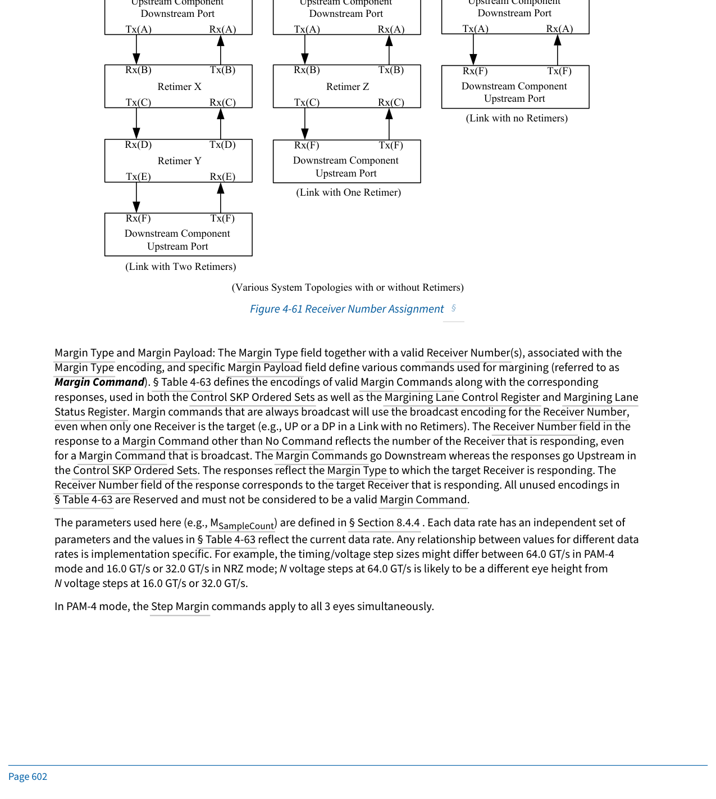
<br><em>Figure 4-61: Receiver Number Assignment / 图4-61:接收器编号分配</em>
</p>

[⬆️ 返回目录](#-本章目录-table-of-contents)

---

<!-- 📄 Page 601 -->
---

<table>
<thead>
<tr>
<th width="50%">🇬🇧 English</th>
<th width="50%" style="background-color:#e8e8e8">🇨🇳 中文</th>
</tr>
</thead>
<tbody>
<tr>
<td>

(Link with no Retimers) | (Link with One Retimer) | (Link with Two Retimers)
Various System Topologies with or without Retimers

**Figure 4-61 Receiver Number Assignment**

</td>
<td style="background-color:#e8e8e8">

(无 Retimer 的链路) | (含一个 Retimer 的链路) | (含两个 Retimer 的链路)
(各种有无 Retimer 的系统拓扑)

**Figure 4-61 | 图4-61 接收器编号分配**

</td>
</tr>
</tbody>
</table>


<div style="overflow-x: auto; max-width: 100%;">
<table>
<thead>
<tr>
<th width="50%">🇬🇧 English</th>
<th width="50%" style="background-color:#e8e8e8">🇨🇳 中文</th>
</tr>
</thead>
<tbody>
<tr>
<td>

**Margin Type and Margin Payload:** The Margin Type field together with a valid Receiver Number(s), associated with the Margin Type encoding, and specific Margin Payload field define various commands used for margining (referred to as Margin Command). § Table 4-63 defines the encodings of valid Margin Commands along with the corresponding responses, used in both the Control SKP Ordered Sets as well as the Margining Lane Control Register and Margining Lane Status Register. Margin commands that are always broadcast will use the broadcast encoding for the Receiver Number, even when only one Receiver is the target (e.g., UP or a DP in a Link with no Retimers). The Receiver Number field in the response to a Margin Command other than No Command reflects the number of the Receiver that is responding, even for a Margin Command that is broadcast. The Margin Commands go Downstream whereas the responses go Upstream in the Control SKP Ordered Sets. The responses reflect the Margin Type to which the target Receiver is responding. The Receiver Number field of the response corresponds to the target Receiver that is responding. All unused encodings in § Table 4-63 are Reserved and must not be considered to be a valid Margin Command.

The parameters used here (e.g., MSampleCount) are defined in § Section 8.4.4 . Each data rate has an independent set of parameters and the values in § Table 4-63 reflect the current data rate. Any relationship between values for different data rates is implementation specific. For example, the timing/voltage step sizes might differ between 64.0 GT/s in PAM-4 mode and 16.0 GT/s or 32.0 GT/s in NRZ mode; N voltage steps at 64.0 GT/s is likely to be a different eye height from N voltage steps at 16.0 GT/s or 32.0 GT/s.

In PAM-4 mode, the Step Margin commands apply to all 3 eyes simultaneously.

</td>
<td style="background-color:#e8e8e8">

**Margin Type 与 Margin Payload(裕量类型与裕量负载):** Margin Type 字段、与该 Margin Type 编码相关联的有效 Receiver Number(们),以及特定的 Margin Payload 字段共同定义了用于裕量测试的各种命令(统称为 Margin Command)。§ Table 4-63 定义了有效 Margin Command 的编码及其对应的响应,这些命令与响应既用于 Control SKP Ordered Set,也用于 Margining Lane Control Register 与 Margining Lane Status Register。对于总是采用广播的 Margin Command,即使目标只有一个接收器(例如无 Retimer 链路中的 UP 或 DP),其 Receiver Number 也应使用广播编码。对于 No Command 之外的 Margin Command,其响应中的 Receiver Number 字段反映的是正在响应的接收器编号,即使该 Margin Command 本身是广播的。Margin Command 沿 Downstream 方向下发,而响应则沿 Upstream 方向通过 Control SKP Ordered Set 上传。响应反映目标接收器正在响应的 Margin Type。响应中的 Receiver Number 字段对应正在响应的目标接收器。§ Table 4-63 中所有未使用的编码均为 Reserved,不得视为有效的 Margin Command。

此处使用的参数(例如 MSampleCount)在 § Section 8.4.4 中定义。每个数据速率对应一组独立的参数,§ Table 4-63 中的值反映当前数据速率下的参数。不同数据速率之间数值的任何关系均为实现相关(Implementation Specific)。例如,64.0 GT/s PAM-4 模式下的时序/电压步长可能与 16.0 GT/s 或 32.0 GT/s NRZ 模式下不同;在 64.0 GT/s 下的 N 个电压步长对应的眼高,与在 16.0 GT/s 或 32.0 GT/s 下的 N 个电压步长对应的眼高,可能并不相同。

在 PAM-4 模式下,Step Margin(步进裕量)命令同时作用于全部 3 个眼。

</td>
</tr>
</tbody>
</table>
</div>


[⬆️ 返回目录](#-本章目录-table-of-contents)

---

<!-- 📄 Page 602 -->
---

**Table 4-63 Margin Commands and Corresponding Responses | 表 4-63 Margin Command 及对应响应**

| Margin Command | Margin Type[2:0] | Valid Receiver Number(s)[2:0] | Margin Payload[7:0] | Response Margin Type[2:0] | Response Margin Payload[7:0] |
|----------------|------------------|-------------------------------|---------------------|----------------------------|------------------------------|
| No Command | 111b | 000b | 9Ch | 111b | (No Command is also an independent command in Upstream direction. The expected Response is No Command with the Receiver Number = 000b.) |
| Access Retimer Register | 001b | 010b, 100b | Register offset in bytes: 00h - 87h, A0h - FFh | 001b | Register value, if supported. It is recommended that the Target Receiver on Retimer return 00h if it does not support accessing its registers. It is permitted that the Retimer not respond. |
| Report Margin Control Capabilities | 001b | 001b through 110b | 88h | 001b | Margin Payload[7:5] = Reserved; Margin Payload[4:0] = {MIndErrorSampler, MSampleReportingMethod, MIndLeftRightTiming, MIndUpDownVoltage, MVoltageSupported} |
| Report MNumVoltageSteps | 001b | 001b through 110b | 89h | 001b | Margin Payload[7] = Reserved<br>Margin Payload[6:0] = MNumVoltageSteps |
| Report MNumTimingSteps | 001b | 001b through 110b | 8Ah | 001b | Margin Payload[7:6] = Reserved<br>Margin Payload[5:0] = MNumTimingSteps |
| Report MMaxTimingOffset | 001b | 001b through 110b | 8Bh | 001b | Margin Payload[7] = Reserved<br>Margin Payload[6:0] = MMaxTimingOffset |
| Report MMaxVoltageOffset | 001b | 001b through 110b | 8Ch | 001b | Margin Payload[7] = Reserved<br>Margin Payload[6:0] = MMaxVoltageOffset |
| Report MSamplingRateVoltage | 001b | 001b through 110b | 8Dh | 001b | Margin Payload[7:6] = Reserved<br>Margin Payload[5:0] = {MSamplingRateVoltage[5:0]} |
| Report MSamplingRateTiming | 001b | 001b through 110b | 8Eh | 001b | Margin Payload[7:6] = Reserved<br>Margin Payload[5:0] = {MSamplingRateTiming[5:0]} |

[⬆️ 返回目录](#-本章目录-table-of-contents)

---

<!-- 📄 Page 603 -->
---

**Table 4-63 Margin Commands and Corresponding Responses (continued) | 表 4-63 Margin Command 及对应响应(续)**

| Margin Command | Margin Type[2:0] | Valid Receiver Number(s)[2:0] | Margin Payload[7:0] | Response Margin Type[2:0] | Response Margin Payload[7:0] |
|----------------|------------------|-------------------------------|---------------------|----------------------------|------------------------------|
| Report MSampleCount | 001b | 001b through 110b | 8Fh | 001b | Margin Payload[7] = Reserved<br>Margin Payload[6:0] = MSampleCount |
| Report MMaxLanes | 001b | 001b through 110b | 90h | 001b | Margin Payload[7:5] = Reserved<br>Margin Payload[4:0] = MMaxLanes |
| Report Reserved | 001b | 001b through 110b | 91-9Fh | 001b | Margin Payload[7:0] = Reserved |
| Set Error Count Limit | 010b | 001b through 110b | Margin Payload[7:6] = 11b<br>Margin Payload[5:0] = Error Count Limit | 010b | Margin Payload[7:6] = 11b<br>Margin Payload[5:0] = Error Count Limit registered by the target Receiver |
| Go to Normal Settings | 010b | 000b through 110b | 0Fh | 010b | 0Fh |
| Clear Error Log | 010b | 000b through 110b | 55h | 010b | 55h |
| Step Margin to timing offset to right/left of default | 011b | 001b through 110b | See § Section 4.2.18.1.2 | 011b | Margin Payload[7:6] = Step Margin Execution Status (see § Section 4.2.18.1.1)<br>Margin Payload[5:0] = MErrorCount |
| Step Margin to voltage offset to up/down of default | 100b | 001b through 110b | See § Section 4.2.18.1.2 | 100b | Margin Payload[7:6] = Step Margin Execution Status (see § Section 4.2.18.1.1)<br>Margin Payload[5:0] = MErrorCount |
| Vendor Defined | 101b | 001b through 110b | Vendor Defined | 101b | Vendor Defined |

**Note:**

1. The term Step Margin command is used to refer to either a Step Margin to timing offset to right/left of default or a Step Margin to voltage offset to up/down of default command.

[⬆️ 返回目录](#-本章目录-table-of-contents)

---

<!-- 📄 Page 604 -->
---

<a id="sec-4-2-18-1-1"></a>
## 4.2.18.1.1 Step Margin Execution Status | 4.2.18.1.1 Step Margin 执行状态

<table>
<thead>
<tr>
<th width="50%">🇬🇧 English</th>
<th width="50%" style="background-color:#e8e8e8">🇨🇳 中文</th>
</tr>
</thead>
<tbody>
<tr>
<td>

The Step Margin Execution Status used in § Table 4-63 is a 2-bit field defined as follows:

- **11b** — NAK. Indicates that an unsupported Lane Margining command was issued. For example, timing margin beyond ±0.2 UI. MErrorCount is 0.
- **10b** — Margining in progress. The Receiver is executing a Step Margin command. MErrorCount reflects the number of errors detected as defined in § Section 8.4.4.
- **01b** — Set up for margin in progress. This indicates the Receiver is getting ready but has not yet started executing a Step Margin command. MErrorCount is 0.
- **00b** — Too many errors - Receiver autonomously went back to its default settings. MErrorCount reflects the number of errors detected as defined in § Section 8.4.4. Note that MErrorCount might be greater than Error Count Limit.

</td>
<td style="background-color:#e8e8e8">

§ Table 4-63 中使用的 Step Margin Execution Status(Step Margin 执行状态)为 2 位字段,定义如下:

- **11b** — NAK(否认)。表示发出了不受支持的 Lane Margining 命令。例如,时序裕量超过 ±0.2 UI。MErrorCount 为 0。
- **10b** — Margining in progress(裕量测试进行中)。接收器正在执行 Step Margin 命令。MErrorCount 反映 § Section 8.4.4 所定义的检测到的错误数。
- **01b** — Set up for margin in progress(裕量测试准备中)。表示接收器正在准备,但尚未开始执行 Step Margin 命令。MErrorCount 为 0。
- **00b** — Too many errors(错误过多)——接收器自主恢复到默认设置。MErrorCount 反映 § Section 8.4.4 所定义的检测到的错误数。注意:MErrorCount 可能大于 Error Count Limit(错误计数门限)。

</td>
</tr>
</tbody>
</table>

[⬆️ 返回目录](#-本章目录-table-of-contents)

---

<a id="sec-4-2-18-1-2"></a>
## 4.2.18.1.2 Margin Payload for Step Margin Commands | 4.2.18.1.2 Step Margin 命令的 Margin Payload 字段


<div style="overflow-x: auto; max-width: 100%;">
<table>
<thead>
<tr>
<th width="50%">🇬🇧 English</th>
<th width="50%" style="background-color:#e8e8e8">🇨🇳 中文</th>
</tr>
</thead>
<tbody>
<tr>
<td>

For the Step Margin to timing offset to right/left of default command, the Margin Payload field is defined as follows:

- **Margin Payload [7]:** Reserved.
- **If MIndLeftRightTiming for the targeted Receiver is Set:**
  - Margin Payload [6] indicates whether the Margin Command is right vs. left. A 0b indicates to move the Receiver to the right of the normal setting whereas a 1b indicates to move the Receiver to the left of the normal setting.
  - Margin Payload [5:0] indicates the number of steps to the left or right of the normal setting.
- **If MIndLeftRightTiming for the targeted Receiver is Clear:**
  - Margin Payload [6]: Reserved
  - Margin Payload [5:0] indicates the number of steps beyond the normal setting.

For the Step Margin to voltage offset to up/down of default command, the Margin Payload field is defined as follows:

- **If MIndUpDownVoltage for the targeted Receiver is Set:**
  - Margin Payload [7] indicates whether the Margin Command is up vs. down. A 0b indicates to move the Receiver up from the normal setting whereas a 1b indicates to move the Receiver down from the normal setting.
  - Margin Payload [6:0] indicates the number of steps up or down from the normal setting.
- **If MIndUpDownVoltage for the targeted Receiver is Clear:**
  - Margin Payload [7]: Reserved
  - Margin Payload [6:0] indicates the number of steps beyond the normal setting.

</td>
<td style="background-color:#e8e8e8">

对于 "Step Margin to timing offset to right/left of default"(在默认位置基础上向左右进行时序偏移步进裕量)命令,Margin Payload 字段定义如下:

- **Margin Payload [7]:** 保留(Reserved)。
- **若目标接收器的 MIndLeftRightTiming 被置位(Set):**
  - Margin Payload [6] 表示 Margin Command 是右移还是左移。0b 表示将接收器移至正常设置的右侧,1b 表示将接收器移至正常设置的左侧。
  - Margin Payload [5:0] 表示相对于正常设置向左或向右的步进数。
- **若目标接收器的 MIndLeftRightTiming 被清零(Clear):**
  - Margin Payload [6]:保留(Reserved)
  - Margin Payload [5:0] 表示在正常设置基础上向某一方向的步进数。

对于 "Step Margin to voltage offset to up/down of default"(在默认位置基础上向上下进行电压偏移步进裕量)命令,Margin Payload 字段定义如下:

- **若目标接收器的 MIndUpDownVoltage 被置位(Set):**
  - Margin Payload [7] 表示 Margin Command 是上移还是下移。0b 表示将接收器从正常设置向上移动,1b 表示将接收器从正常设置向下移动。
  - Margin Payload [6:0] 表示相对于正常设置向上或向下的步进数。
- **若目标接收器的 MIndUpDownVoltage 被清零(Clear):**
  - Margin Payload [7]:保留(Reserved)
  - Margin Payload [6:0] 表示在正常设置基础上向某一方向的步进数。

</td>
</tr>
</tbody>
</table>
</div>


[⬆️ 返回目录](#-本章目录-table-of-contents)

---

<!-- 📄 Page 605 -->
---

<a id="sec-4-2-18-2"></a>
## 4.2.18.2 Margin Command and Response Flow | 4.2.18.2 Margin Command 与响应流程

<table>
<thead>
<tr>
<th width="50%">🇬🇧 English</th>
<th width="50%" style="background-color:#e8e8e8">🇨🇳 中文</th>
</tr>
</thead>
<tbody>
<tr>
<td>

Each Receiver advertises its capabilities as defined in § Section 8.4.4 . The Receiver being margined must report the number of errors that are consistent with data samples occurring at the indicated location for margining. For simplicity, the Margin Commands and requirements are described in terms of moving the data sampler location though the actual margining method may be implementation specific. For example, the timing margin could be implemented on the actual data sampler or an independent error sampler. Further, the timing margin can be implemented by injecting an appropriate amount of stress/jitter to the data sample location, or by actually moving the data/error sample location.

When an independent data/error sampler is used, the errors encountered with the independent data/error sampler must be reported in MErrorCount even though the Link may not experience any errors. To margin a Receiver, Software moves the target Receiver to a voltage/timing offset from its default sampling position.

The following rules must be followed:

</td>
<td style="background-color:#e8e8e8">

每个接收器按 § Section 8.4.4 的定义通告其能力。正在被测试裕量的接收器必须上报与在所指示的裕量位置上发生的数据采样相一致的错误数。为简化描述,Margin Command 与相关需求以"移动数据采样器位置"为模型进行说明,而实际的裕量测试方法可为实现相关(Implementation Specific)。例如,时序裕量可在实际数据采样器上实现,也可在独立的错误采样器上实现。此外,时序裕量可通过向数据采样位置注入适量的压力/抖动来实现,也可通过实际移动数据/错误采样位置来实现。

当使用独立的数据/错误采样器时,即使链路可能并未出现任何错误,该独立采样器所遇到的错误也必须通过 MErrorCount 上报。要对接收器进行裕量测试,软件将目标接收器从其默认采样位置移动到某个电压/时序偏移位置。

以下规则必须被遵守:

</td>
</tr>
</tbody>
</table>


<div style="overflow-x: auto; max-width: 100%;">
<table>
<thead>
<tr>
<th width="50%">🇬🇧 English</th>
<th width="50%" style="background-color:#e8e8e8">🇨🇳 中文</th>
</tr>
</thead>
<tbody>
<tr>
<td>

- Every Retimer Upstream Pseudo Port Receiver and the Downstream Port Receiver must compute the Margin CRC and Margin Parity bits and compare against the received Margin CRC and Margin Parity bits. Any mismatch must result in ignoring the contents of Symbols 4N+2 and 4N+3. A Downstream Port Receiver must report Margin CRC and Margin Parity errors in the Lane Error Status Register (see § Section 7.7.3.3 ).
- The Upstream Port Receiver is permitted to ignore the Margin CRC bits, Margin Parity bits, and all bits in the Symbols 4N+2 and 4N+3 of the Control SKP Ordered Set. If it checks Margin CRC and Margin Parity, any mismatch must be reported in the Lane Error Status Register.
- The Downstream Port must transmit Control SKP Ordered Sets in each Lane, with the Margin Type, Receiver Number, Usage Model, and Margin Payload fields reflecting the corresponding control fields in the Margining Lane Control Register. Any Control SKP Ordered Set transmitted more than 10 μs after the Configuration Write Completion must reflect the Margining Lane Control Register values written by that Configuration Write.
  - This requirement applies regardless of the values in the Margining Lane Control Register.
  - This requirement applies regardless of the number of Retimer(s) in the Link.
- For Control SKP Ordered Sets received by the Upstream Pseudo Port, a Retimer Receiver is the target of a valid Margin Command, if all of the following conditions are true:
  - the Margin Type is not No Command
  - the Receiver Number is the number assigned to the Receiver, or Margin Type is either Clear Error Log or Go to Normal Settings and the Receiver Number is 'Broadcast'.
  - the Usage Model field is 0b
  - the Margin Type, Receiver Number, and Margin Payload fields are consistent with the definitions in § Table 4-62 and § Table 4-63
  - the Margin CRC check and Margin Parity check pass.
- For Upstream and Downstream Ports, a Receiver is the target of a valid Margin Command, if all of the following conditions are true for its Margining Lane Control Register:
  - the Margin Type is not No Command
  - the Receiver Number is the number assigned to the Receiver or Margin Type is either Clear Error Log or Go to Normal Settings and the Receiver Number is 'Broadcast'
  - the Usage Model field is 0b
  - the Margin Type, the Receiver Number, and Margin Payload fields are consistent with the definitions in § Table 4-62 and § Table 4-63

</td>
<td style="background-color:#e8e8e8">

- 每个 Retimer 的 Upstream Pseudo Port 接收器与 Downstream Port 接收器必须计算 Margin CRC 与 Margin Parity 位,并与接收到的 Margin CRC 与 Margin Parity 位进行比较。任何不匹配都必须导致忽略 Symbols 4N+2 与 4N+3 的内容。Downstream Port 接收器必须在 Lane Error Status Register(见 § Section 7.7.3.3)中上报 Margin CRC 与 Margin Parity 错误。
- Upstream Port 接收器可忽略 Control SKP Ordered Set 中的 Margin CRC 位、Margin Parity 位以及 Symbols 4N+2 与 4N+3 中的全部位。若其检查 Margin CRC 与 Margin Parity,任何不匹配都必须在 Lane Error Status Register 中上报。
- Downstream Port 必须在每条 Lane 上发送 Control SKP Ordered Set,其中 Margin Type、Receiver Number、Usage Model 与 Margin Payload 字段必须反映 Margining Lane Control Register 中的对应控制字段。在该 Configuration Write 完成之后超过 10 μs 才发出的任何 Control SKP Ordered Set,都必须反映该 Configuration Write 所写入的 Margining Lane Control Register 值。
  - 此要求与 Margining Lane Control Register 中的值无关。
  - 此要求与链路中 Retimer 的数量无关。
- 对于 Upstream Pseudo Port 收到的 Control SKP Ordered Set,当且仅当以下所有条件同时成立时,Retimer 接收器才是该有效 Margin Command 的目标:
  - Margin Type 不是 No Command
  - Receiver Number 等于该接收器所分配的编号,或 Margin Type 为 Clear Error Log 或 Go to Normal Settings 且 Receiver Number 为 "Broadcast"。
  - Usage Model 字段为 0b
  - Margin Type、Receiver Number 与 Margin Payload 字段与 § Table 4-62 及 § Table 4-63 中的定义一致
  - Margin CRC 检查与 Margin Parity 检查通过。
- 对于 Upstream Port 与 Downstream Port,当且仅当其 Margining Lane Control Register 满足以下所有条件时,接收器才是该有效 Margin Command 的目标:
  - Margin Type 不是 No Command
  - Receiver Number 等于该接收器所分配的编号,或 Margin Type 为 Clear Error Log 或 Go to Normal Settings 且 Receiver Number 为 "Broadcast"
  - Usage Model 字段为 0b
  - Margin Type、Receiver Number 与 Margin Payload 字段与 § Table 4-62 及 § Table 4-63 中的定义一致

</td>
</tr>
</tbody>
</table>
</div>


[⬆️ 返回目录](#-本章目录-table-of-contents)

---

<!-- 📄 Page 606 -->
---

<table>
<thead>
<tr>
<th width="50%">🇬🇧 English</th>
<th width="50%" style="background-color:#e8e8e8">🇨🇳 中文</th>
</tr>
</thead>
<tbody>
<tr>
<td>

- The Upstream Port must transmit the Control SKP Ordered Set with No Command.
- A target Receiver must apply and respond to the Margin Command within 1 ms of receiving the valid Margin Command if the Link is still in L0 state and operating at 16.0 GT/s or higher Data Rate.
  - A target Receiver in a Retimer must send a response in the Control SKP Ordered Set in the Upstream Direction within 1 ms of receiving the Margin Command.
  - A target Receiver in the Upstream Port must update the Status field of the Lane Margin Command and Status register within 1 ms of receiving the Margin Command.
  - A target Receiver in the Downstream Port must update the Status field of the Lane Margin Command and Status register within 1 ms of receiving the Margin Command if the command is not broadcast or no Retimer(s) are present
- For a valid Margin Type, other than No Command, that is broadcast and received by a Retimer:
  - A Retimer, in position X (see § Figure 4-61), forwards the response unmodified in the Upstream Control SKP Ordered Set, if the command has been applied, else it sends the No Command.
  - The Receiver Number field of the response must be set to an encoding of one of the Retimer's Pseudo Ports.
  - The Retimer must respond only after both Pseudo Ports have completed the Margin Command.
- The Retimer must overwrite Bits [4:0] of Symbol 4N+1, Bits[7, 5:0] of Symbol 4N+2 and Bits [7:0] in Symbol 4N+3 as it forwards the Control SKP Ordered Set in the Upstream direction if it is the target Receiver of a Margin Command and is executing the command.
- On receipt of a Control SKP Ordered Set, the Downstream Port must reflect the Margining Lane Status Register from the corresponding fields in the received Control SKP Ordered Set within 1 μs, if it passes the Margin CRC and Margin Parity checks and one of the following conditions apply:
  - In the Margining Lane Control Register: Receiver Number is 010b through 101b
  - In the Margining Lane Control Register: Receiver Number is 000b, Margin Command is Clear Error Log, No Command, or Go to Normal Settings, and there are Retimer(s) in the Link
  - Optionally, if the Margining Lane Control Register Usage Model field is 1b
  - Optionally, if the Margining Lane Control Register Receiver Number field is 110b or 111b
  The Margining Lane Status Register fields are updated regardless of the Usage Model bit in the received Control SKP Ordered Set.
- A component must advertise the same value for each parameter defined in § Table 8-13 in § Section 8.4.4 across all its Receivers. A component must not change any parameter value except for MSampleCount and MErrorCount defined in § Table 8-13 in § Section 8.4.4 while LinkUp = 1b.
- A target Receiver that receives a valid Step Margin command must continue to apply that offset until any of the following occur:
  - it receives a valid Go to Normal Settings command
  - it receives a subsequent valid Step Margin command with different Margin Type or Margin Payload field
  - MIndErrorSampler is 0b and MErrorCount exceeds Error Count Limit
  - Optionally, MIndErrorSampler is 1b and MErrorCount exceeds Error Count Limit.

</td>
<td style="background-color:#e8e8e8">

- Upstream Port 必须发送携带 No Command 的 Control SKP Ordered Set。
- 若链路仍处于 L0 状态且工作于 16.0 GT/s 或更高数据速率,目标接收器必须在接收到有效 Margin Command 后的 1 ms 内应用该命令并给出响应。
  - Retimer 中的目标接收器必须在接收到 Margin Command 后的 1 ms 内,通过 Upstream 方向的 Control SKP Ordered Set 给出响应。
  - Upstream Port 中的目标接收器必须在接收到 Margin Command 后的 1 ms 内,更新 Lane Margin Command and Status 寄存器的 Status 字段。
  - Downstream Port 中的目标接收器必须在接收到 Margin Command 后的 1 ms 内,更新 Lane Margin Command and Status 寄存器的 Status 字段(前提是该命令不是广播,或链路中不存在 Retimer)。
- 对于 No Command 之外的、由 Retimer 接收到的有效广播 Margin Type:
  - 位于 X 位置(见 § Figure 4-61)的 Retimer,若该命令已被应用,则在 Upstream Control SKP Ordered Set 中原样转发响应;否则发送 No Command。
  - 响应中的 Receiver Number 字段必须设置为该 Retimer 的某个 Pseudo Port 编码。
  - Retimer 必须在两个 Pseudo Port 都完成 Margin Command 之后才可响应。
- 当 Retimer 是某 Margin Command 的目标接收器且正在执行该命令时,在 Upstream 方向转发 Control SKP Ordered Set 时,Retimer 必须改写 Symbol 4N+1 的 Bits [4:0]、Symbol 4N+2 的 Bits[7, 5:0] 以及 Symbol 4N+3 的 Bits [7:0]。
- 在收到 Control SKP Ordered Set 时,若 Margin CRC 与 Margin Parity 检查通过,且满足以下任一条件,Downstream Port 必须在 1 μs 内根据所收到 Control SKP Ordered Set 中的对应字段更新 Margining Lane Status Register:
  - Margining Lane Control Register 中:Receiver Number 为 010b 至 101b
  - Margining Lane Control Register 中:Receiver Number 为 000b,Margin Command 为 Clear Error Log、No Command 或 Go to Normal Settings,且链路中存在 Retimer
  - 可选:Margining Lane Control Register 的 Usage Model 字段为 1b
  - 可选:Margining Lane Control Register 的 Receiver Number 字段为 110b 或 111b
  Margining Lane Status Register 字段的更新与所收到 Control SKP Ordered Set 中的 Usage Model 位无关。
- 一个组件必须为其全部接收器通告 § Section 8.4.4 中 § Table 8-13 所定义的各参数,且这些值在其全部接收器之间保持一致。在 LinkUp = 1b 期间,组件不得更改 § Section 8.4.4 中 § Table 8-13 所定义的任何参数,MSampleCount 与 MErrorCount 除外。
- 接收到有效 Step Margin 命令的目标接收器必须持续应用该偏移,直至以下任一情况发生:
  - 接收到有效的 Go to Normal Settings 命令
  - 接收到后续的、且 Margin Type 或 Margin Payload 字段不同的有效 Step Margin 命令
  - MIndErrorSampler 为 0b 且 MErrorCount 超过 Error Count Limit
  - 可选:MIndErrorSampler 为 1b 且 MErrorCount 超过 Error Count Limit

</td>
</tr>
</tbody>
</table>

[⬆️ 返回目录](#-本章目录-table-of-contents)

---

<!-- 📄 Page 607 -->
---


<div style="overflow-x: auto; max-width: 100%;">
<table>
<thead>
<tr>
<th width="50%">🇬🇧 English</th>
<th width="50%" style="background-color:#e8e8e8">🇨🇳 中文</th>
</tr>
</thead>
<tbody>
<tr>
<td>

- If a Step Margin command terminates because MErrorCount exceeds Error Count Limit, the target Receiver must automatically return to its default sample position and indicate this in the Margin Payload field (Step Margin Execution Status = 00b). Note: termination for this reason is optional if MIndErrorSampler is 1b.
- If MIndErrorSampler is 0b, an error is detected when:
  - The target Receiver is a Port that enters Recovery or detects a Data Parity mismatch while in L0
  - The target Receiver is a Pseudo Port that enters Forwarding training sets or detects a Data Parity mismatch while forwarding non-training sets.
- If MIndErrorSampler is 1b, an error is detected when:
  - The target Receiver is a Port and a bit error is detected while in L0
  - The target Receiver is a Pseudo Port and a bit error is detected while the Retimer is forwarding non-training sets
- If MIndErrorSampler is 0b and either (1) the target Receiver is a Port that enters Recovery or (2) the target Receiver is a Pseudo Port that enters Forwarding training sets:
  - The target Receiver must go back to the default sample position
  - If the target Receiver is a Port that is still performing margining, it must resume the margin position within 128 μs of entering L0
  - If the target Receiver is a Pseudo Port that is still performing margining, it must resume the margin position within 128 μs of Forwarding non-training sets
- A target Receiver is required to clear its accumulated error count on receiving Clear Error Log command, while it continues to margin (if it is the target Receiver of a Step Margin command still in progress), if it was doing so.
- For a target Receiver of a Set Error Count Limit command, the new value is used for all future Step Margin commands until a new Set Error Count Limit command is received.
- If no Set Error Count Limit is received by a Receiver since entering L0, the default value is 4.
- Behavior is undefined if a Set Error Count Limit command is received while a Step Margin command is in effect.
- Once a target Receiver reports a Step Margin Execution Status of 11b (NAK) or 00b ('Too many errors'), it must continue to report the same status as long as the Step Margin command is in effect.
- A target Receiver must not report a Step Margin Execution Status of 01b ('Set up for margin in progress') for more than 100 ms after it receives a new valid Step Margin command
- A target Receiver that reports a Step Margin Execution Status other than 01b, cannot report 01b subsequently unless it receives a new valid Step Margin command.
- Reserved bits in the Margin Payload field must follow these rules:
  - The Downstream or Upstream Port must transmit 0s for Reserved bits
  - The retimer must forward Reserved bits unmodified
  - All Receivers must ignore Reserved bits
- Reserved encodings of the Margin Type, Receiver Number, or Margin Payload fields must follow these rules:
  - The retimer must forward Reserved encodings unmodified
  - All Receivers must treat Reserved encodings as if they are not the target of the Margin Command
- A Vendor Defined Margin Command or response, that is not defined by a retimer is ignored and forwarded normally.
- A target Receiver on a Retimer must return 00h on the response payload on Access Retimer Register command, if it does not support register access. If a Retimer supports Access Retimer Register command, the following must be observed:
  - It must return a non-zero value for the DWORD at locations 80h and 84h respectively.
  - It must not place any registers corresponding to Margin Payload locations 88h through 9Fh.

</td>
<td style="background-color:#e8e8e8">

- 若 Step Margin 命令因 MErrorCount 超过 Error Count Limit 而终止,目标接收器必须自动返回到其默认采样位置,并在 Margin Payload 字段(Step Margin Execution Status = 00b)中指示该状态。注意:若 MIndErrorSampler 为 1b,则因该原因终止为可选行为。
- 若 MIndErrorSampler 为 0b,则在以下情况检测到错误:
  - 目标接收器为 Port,且进入 Recovery 或在 L0 中检测到 Data Parity 不匹配
  - 目标接收器为 Pseudo Port,且进入 Forwarding 训练集,或在转发非训练集时检测到 Data Parity 不匹配
- 若 MIndErrorSampler 为 1b,则在以下情况检测到错误:
  - 目标接收器为 Port,且在 L0 中检测到比特错误
  - 目标接收器为 Pseudo Port,且在 Retimer 转发非训练集时检测到比特错误
- 若 MIndErrorSampler 为 0b 且满足以下任一条件:(1)目标接收器为 Port 且进入 Recovery,或(2)目标接收器为 Pseudo Port 且进入 Forwarding 训练集:
  - 目标接收器必须返回到默认采样位置
  - 若目标接收器为 Port 且仍在进行裕量测试,则必须在进入 L0 后的 128 μs 内恢复裕量位置
  - 若目标接收器为 Pseudo Port 且仍在进行裕量测试,则必须在进入 Forwarding 非训练集后的 128 μs 内恢复裕量位置
- 目标接收器在收到 Clear Error Log 命令时必须清除其累计的错误计数;若其当前是某 Step Margin 命令的目标接收器且该命令仍在执行中,则在清除错误计数的期间继续进行裕量测试(若其原本正在测试的话)。
- 对于 Set Error Count Limit 命令的目标接收器,在收到新的 Set Error Count Limit 命令之前,所有后续的 Step Margin 命令均使用该新值。
- 自进入 L0 以来,若接收器未收到 Set Error Count Limit,则默认值为 4。
- 若在 Step Margin 命令生效期间收到 Set Error Count Limit 命令,则行为未定义(Undefined)。
- 目标接收器一旦上报 Step Margin Execution Status 为 11b(NAK)或 00b("错误过多"),在该 Step Margin 命令生效期间,必须持续上报相同的状态。
- 目标接收器在收到新的有效 Step Margin 命令后,上报 Step Margin Execution Status 为 01b("裕量测试准备中")的持续时间不得超过 100 ms。
- 已上报过非 01b 状态的目标接收器,在收到新的有效 Step Margin 命令之前,不得再上报 01b。
- Margin Payload 字段中的保留位(Reserved bits)必须遵守以下规则:
  - Downstream 或 Upstream Port 必须将保留位发送为 0
  - Retimer 必须原样转发保留位
  - 所有接收器必须忽略保留位
- Margin Type、Receiver Number 或 Margin Payload 字段的保留编码(Reserved encodings)必须遵守以下规则:
  - Retimer 必须原样转发保留编码
  - 所有接收器必须将保留编码视为其不是该 Margin Command 的目标
- 对于 Vendor Defined Margin Command 或响应,若 Retimer 未定义该命令/响应,则被忽略并按通常方式转发。
- Retimer 上的目标接收器在收到 Access Retimer Register 命令时,若其不支持寄存器访问,响应负载必须返回 00h。若 Retimer 支持 Access Retimer Register 命令,则必须遵守以下规定:
  - 必须分别在 80h 与 84h 位置的 DWORD 处返回非零值。
  - 不得在对应于 Margin Payload 位置 88h 至 9Fh 的范围内放置任何寄存器。

</td>
</tr>
</tbody>
</table>
</div>


[⬆️ 返回目录](#-本章目录-table-of-contents)

---

<!-- 📄 Page 608 -->
---

<a id="sec-4-2-18-3"></a>
## 4.2.18.3 Flit Mode 8.0 GT/s Margining Behavior | 4.2.18.3 Flit 模式下 8.0 GT/s 的裕量测试行为

<table>
<thead>
<tr>
<th width="50%">🇬🇧 English</th>
<th width="50%" style="background-color:#e8e8e8">🇨🇳 中文</th>
</tr>
</thead>
<tbody>
<tr>
<td>

Lane Margining is defined for 16.0 GT/s and higher data rates. Lane Margining is not supported at 2.5, 5.0, and 8.0 GT/s. In Non-Flit Mode, Control SKP Ordered Sets only present at 16.0 GT/s and higher data rates so margin commands at slower speeds are not possible. In Flit Mode, Control SKP Ordered Sets are also used at 8.0 GT/s.

The following behavior is recommended in Flit Mode at 8.0 GT/s:

- Upstream and Downstream Ports must send Control SKP Ordered Sets as defined, but the margin command should always be No Command, regardless of the contents of the Margining Lane Control Register.
- Upstream Ports, Downstream Ports, and Retimer Upstream Ports should ignore the margin command in received Control SKP Ordered Sets.
  - The Margining Lane Status Register value is unpredictable.
  - Upstream and Downstream Ports are permitted to compute the Margin CRC and Margin Parity bits and compare against the received Margin CRC and Margin Parity bits. If checked, any mismatch must be reported as Margin CRC and Margin Parity errors in the Lane Error Status Register (see § Section 7.7.3.3 ).

Software must ensure that the following conditions are met before performing Lane Margining at Receiver:

- The current Link data rate must be 16.0 GT/s or higher.
- The current Link width must include the Lanes that are to be tested.
- The Upstream Port's Function(s) must be programmed to a D-state that prevents the Port from entering the L1 Link state. See § Section 5.2 for more information.
- The ASPM Control field of the Link Control register must be set to 00b (Disabled) in both the Downstream Port and Upstream Port.
- The state of the Hardware Autonomous Speed Disable bit of the Link Control 2 register and the Hardware Autonomous Width Disable bit of the Link Control register must be saved to be restored later in this procedure.
- If writeable, the Hardware Autonomous Speed Disable bit of the Link Control 2 register must be Set in both the Downstream Port and Upstream Port. (If hardwired to 0b, the autonomous speed change mechanism is not implemented and is therefore inherently disabled.)
- If writeable, the Hardware Autonomous Width Disable bit of the Link Control register must be Set in both the Downstream Port and Upstream Port. (If hardwired to 0b, the autonomous width change mechanism is not implemented and is therefore inherently disabled.)

While margining, software must ensure the following:

</td>
<td style="background-color:#e8e8e8">

Lane Margining 定义于 16.0 GT/s 及更高的数据速率,2.5、5.0 与 8.0 GT/s 不支持 Lane Margining。在 Non-Flit Mode(非 Flit 模式)下,Control SKP Ordered Set 仅在 16.0 GT/s 及更高数据速率下出现,因此低速下无法下发 margin command。在 Flit 模式(Flit Mode)下,8.0 GT/s 也使用 Control SKP Ordered Set。

在 Flit 模式 8.0 GT/s 下,推荐采用以下行为:

- Upstream 与 Downstream Port 必须按定义发送 Control SKP Ordered Set,但 margin command 应始终为 No Command,与 Margining Lane Control Register 的内容无关。
- Upstream Port、Downstream Port 与 Retimer 的 Upstream Port 应忽略所收到 Control SKP Ordered Set 中的 margin command。
  - Margining Lane Status Register 的值不可预测。
  - Upstream 与 Downstream Port 允许计算 Margin CRC 与 Margin Parity 位,并与接收到的 Margin CRC 与 Margin Parity 位进行比较。若进行检查,任何不匹配都必须作为 Margin CRC 与 Margin Parity 错误上报至 Lane Error Status Register(见 § Section 7.7.3.3)。

在执行 Lane Margining at Receiver 之前,软件必须确保满足以下条件:

- 当前链路数据速率必须为 16.0 GT/s 或更高。
- 当前链路宽度必须包含待测试的 Lanes。
- Upstream Port 的 Function(s) 必须被编程至一个 D-state(设备电源状态),以阻止该 Port 进入 L1 链路状态。详见 § Section 5.2。
- 在 Downstream Port 与 Upstream Port 中,Link Control 寄存器的 ASPM Control 字段必须被设置为 00b(Disabled)。
- 必须保存 Link Control 2 寄存器中 Hardware Autonomous Speed Disable 位与 Link Control 寄存器中 Hardware Autonomous Width Disable 位的状态,以便在本流程的稍后阶段恢复。
- 若可写,在 Downstream Port 与 Upstream Port 中,Link Control 2 寄存器的 Hardware Autonomous Speed Disable 位必须被置位(Set)。(若硬连线为 0b,则自主速率变更机制未实现,故而被固有禁用。)
- 若可写,在 Downstream Port 与 Upstream Port 中,Link Control 寄存器的 Hardware Autonomous Width Disable 位必须被置位(Set)。(若硬连线为 0b,则自主宽度变更机制未实现,故而被固有禁用。)

在进行裕量测试期间,软件必须确保满足以下条件:

</td>
</tr>
</tbody>
</table>

[⬆️ 返回目录](#-本章目录-table-of-contents)

---


---

<a id="sec-4-2-18-4"></a>
## 4.2.18.4 Receiver Margin Testing Requirements | 接收器裕量测试要求


<div style="overflow-x: auto; max-width: 100%;">
<table>
<thead>
<tr>
<th width="50%">🇬🇧 English</th>
<th width="50%" style="background-color:#e8e8e8">🇨🇳 中文</th>
</tr>
</thead>
<tbody>
<tr>
<td>

- All Margin Commands must have the Usage Model field in the Margining Lane Control Register set to 0b. While checking for the status of an outstanding Margin Command, software must check that the Usage Model field of the status part of the Margining Lane Status Register is set to 0b.
- Software must read the capabilities offered by a Receiver and margin it within the constraints of the capabilities it offers. The commands issued and the process followed to determine the margin must be consistent with the definitions provided in § Section 4.2.18 and § Section 8.4.4. For example, if the Port does not support voltage testing, then software must not initiate a voltage test. In addition, if a Port supports testing of 2 Lanes simultaneously, then software must test only 1 or 2 Lanes at the same time and not more than 2 Lanes.
- For Receivers where MIndErrorSampler is 1b, any combination of such Receivers are permitted to be margined in parallel.
- For Receivers where MIndErrorSampler is 0b, at most one such Receiver is permitted to be margined at a time. However, margining may be performed on multiple Lanes simultaneously, as long as it is within the maximum number of Lanes the device supports.
- Software must ensure that the Margin Command it provides in the Margining Lane Control Register is a valid one, as defined in § Section 4.2.18.1. For example, the Margin Type must have a defined encoding and the Receiver Number and Margin Payload consistent with it.
- After issuing a command by writing to the Margining Lane Control Register atomically, software must check for the completion of this command. This is done by atomically reading the Margining Lane Status Register and checking that the status fields match the expected response for the issued command (see § Table 4-62 and § Table 4-63). It is strongly recommended that software continue to reread the Margining Lane Status Register if it does not find the expected Receiver Number. If 10 ms has elapsed after a new Margin Command was issued and the values read do not match the expected response, software is permitted to assume that the Receiver will not respond, and declare that the target Receiver failed margining. For a broadcast command other than No Command the Receiver Number in the response must correspond to one of the Pseudo Ports in Retimer Y or Retimer Z, if Retimers are present, or the Downstream Port if they are not, as described in § Figure 4-61.
- Any two reads of the Margining Lane Status Register should be spaced at least 10 μs apart to make sure they are reading results from different Control SKP Ordered Sets.
- Software must broadcast No Command and wait for it to complete, or for 10 ms to elapse without observing that completion, prior to issuing a new Margin Type or Receiver Number or Margin Payload in the Margining Lane Control Register.
- At the end of margining in a given direction (voltage/ timing and up/down/left/right), software must broadcast Go to Normal Settings, No Command, Clear Error Log, and No Command in series in the Downstream and Upstream Ports, after ensuring each command has been acknowledged by the target Receiver.
- If the Data Rate has changed during margining, margining results (if any) are not accurate and software must exit the margining procedure. Software must set the Margining Lane Control Register to No Command to avoid starting margining if the Data Rate later changes to 16.0 GT/s or higher.
- Software is permitted to issue a Clear Error Log command periodically while margining is in progress, to gather error information over a long period of time.
- Software must not attempt to margin both timing and voltage of a target Receiver simultaneously. Results are undefined if a Receiver receives commands that would place both voltage and timing margin locations away from the default sample position at the same time.
- Software should allow margining to run for at least 10^8 bits margined by the Receiver under test before switching to the next margin step location (unless the error limit is exceeded).
- Software must account for the 'set up for margin in progress' status while measuring the margin time or the number of bits sampled by the Receiver.

</td>
<td style="background-color:#e8e8e8">

- 所有 Margin Command (裕量命令) 必须将 Margining Lane Control Register (裕量通道控制寄存器) 中的 Usage Model 字段设置为 0b。在检查尚未完成的裕量命令的状态时,软件必须检查 Margining Lane Status Register (裕量通道状态寄存器) 状态部分的 Usage Model 字段是否设置为 0b。
- 软件必须读取接收器 (Receiver) 所提供的功能,并在其能力范围内对其进行裕量测试。所发出的命令以及用于确定裕量的流程必须与 § Section 4.2.18 和 § Section 8.4.4 中给出的定义保持一致。例如,如果端口 (Port) 不支持电压测试,则软件不得发起电压测试。此外,如果某个端口支持同时测试 2 条通道 (Lane),则软件每次只能测试 1 条或 2 条通道,不能超过 2 条。
- 对于 MIndErrorSampler 为 1b 的接收器,允许以任意组合的形式对这些接收器并行进行裕量测试。
- 对于 MIndErrorSampler 为 0b 的接收器,任何时候最多只能对其中一个接收器进行裕量测试。不过,只要在设备所支持的最大通道数范围内,允许同时在多条通道上进行裕量测试。
- 软件必须确保其在 Margining Lane Control Register 中提供的 Margin Command 是有效的,具体定义见 § Section 4.2.18.1。例如,Margin Type (裕量类型) 必须具有已定义的编码,且 Receiver Number (接收器编号) 和 Margin Payload (裕量负载) 必须与之保持一致。
- 通过原子地 (atomically) 写入 Margining Lane Control Register 来发出命令后,软件必须检查该命令的完成情况。其做法是原子地读取 Margining Lane Status Register,并检查状态字段是否与所发出命令的预期响应相匹配(参见 § Table 4-62 和 § Table 4-63)。强烈建议软件在未找到预期的 Receiver Number 时继续重复读取 Margining Lane Status Register。如果在发出新的 Margin Command 之后 10 ms 已过,而读取的值与预期响应不匹配,则软件可以假定该接收器不会响应,并声明目标接收器裕量测试失败。对于 No Command 以外的广播命令,响应中的 Receiver Number 必须对应于 Retimer Y 或 Retimer Z 中的某个 Pseudo Port(若存在 Retimer),或者不存在 Retimer 时对应于 Downstream Port,具体描述见 § Figure 4-61。
- 对 Margining Lane Status Register 的任意两次读取之间应至少间隔 10 μs,以确保读取的是来自不同 Control SKP Ordered Set (控制 SKP 有序集) 的结果。
- 软件必须先广播 No Command 并等待其完成,或在 10 ms 内未观察到完成的情况下,才能在 Margining Lane Control Register 中发出新的 Margin Type、Receiver Number 或 Margin Payload。
- 在某个方向(电压/时序,以及上/下/左/右)的裕量测试结束时,在确保目标接收器已确认每条命令之后,软件必须在 Downstream Port 和 Upstream Port 上按顺序依次广播 Go to Normal Settings、No Command、Clear Error Log 和 No Command。
- 如果在裕量测试过程中 Data Rate (数据速率) 发生了变化,则测试结果(若有)不准确,软件必须退出裕量测试流程。软件必须将 Margining Lane Control Register 设置为 No Command,以避免在 Data Rate 之后变化为 16.0 GT/s 或更高时启动裕量测试。
- 在裕量测试进行过程中,允许软件定期发出 Clear Error Log 命令,以在较长的时间内收集错误信息。
- 软件不得同时对目标接收器的时序和电压进行裕量测试。如果接收器收到会使其电压和时序裕量位置同时偏离默认采样位置 (default sample position) 的命令,则结果未定义。
- 在切换到下一个裕量步进位置之前,软件应允许裕量测试至少在被测接收器上累计 10^8 比特(除非已达到错误上限)。
- 在测量裕量时间或接收器所采样的比特数时,软件必须考虑 "set up for margin in progress" (裕量设置进行中) 状态。

</td>
</tr>
</tbody>
</table>
</div>


<!-- 📄 Page 611 -->
---

<a id="sec-4-2-18-4-continued"></a>
## 4.2.18.4 (续) Receiver Margin Testing Requirements | 接收器裕量测试要求

<table>
<thead>
<tr>
<th width="50%">🇬🇧 English</th>
<th width="50%" style="background-color:#e8e8e8">🇨🇳 中文</th>
</tr>
</thead>
<tbody>
<tr>
<td>

- If a target Receiver is reporting 'set up for margin in progress' for 200 ms after issuing one of the Step Margin commands, Software is permitted to assume that the Receiver will not respond and declare that the target Receiver failed margining.
- If a Receiver reports a 'NAK' in the Margin Payload status field and the corresponding Step Margin command was valid and within the allowable range (as defined in § Section 4.2.18 and § Section 8.4.4), Software is permitted to declare that the target Receiver failed margining.
- When the margin testing procedure is completed, the state of the Hardware Autonomous Speed Disable bit and the Hardware Autonomous Width Disable bit must be restored to the previously saved values.

</td>
<td style="background-color:#e8e8e8">

- 在发出 Step Margin (步进裕量) 命令之一之后,若目标接收器持续 200 ms 报告 "set up for margin in progress",则软件可以假定该接收器不会响应,并声明目标接收器裕量测试失败。
- 如果接收器在 Margin Payload 状态字段中报告 "NAK"(否认),且对应的 Step Margin 命令有效且处于允许范围内(定义见 § Section 4.2.18 和 § Section 8.4.4),则软件可以声明目标接收器裕量测试失败。
- 裕量测试流程完成后,必须将 Hardware Autonomous Speed Disable 位和 Hardware Autonomous Width Disable 位的状态恢复为先前保存的值。

</td>
</tr>
</tbody>
</table>

<!-- 📄 Page 612 -->
---

<a id="sec-4-2-18-4-implementation-note"></a>
## 4.2.18.4 (续) Implementation Note: Example Software Flow for Lane Margining at Receiver | 实现说明:接收器通道裕量测试的示例软件流程


<div style="overflow-x: auto; max-width: 100%;">
<table>
<thead>
<tr>
<th width="50%">🇬🇧 English</th>
<th width="50%" style="background-color:#e8e8e8">🇨🇳 中文</th>
</tr>
</thead>
<tbody>
<tr>
<td>

**IMPLEMENTATION NOTE:**
**EXAMPLE SOFTWARE FLOW FOR LANE MARGINING AT RECEIVER**

For getting the invariant parameters the following steps may be followed. Once obtained, the same parameters can be used across multiple sets of margining tests as long as LinkUp=1b continues to be true. For each component in the Link, do the following Steps. Software can do these steps in parallel for different components on different Lanes of the Link.

**Step A1:**
Issue Report Margin Control Capabilities (Margin Type = 001b, Margin Payload = 88h, Receiver Number = target device in the Margining Lane Control Register)

**Step A2:**
Read the Margining Lane Status Register.
  a. If Margin Type = 001b and Receiver Number = target Receiver: Go to Step A3
  b. Else: If 10 ms has expired since command issued, declare Receiver failed margining and exit; else wait for >10 μs and Go to Step A2

**Step A3:**
Store the information provided Margin Payload status field for use during margining.

**Step A4:**
Broadcast No Command (Margin Type = 111b, Receiver Number = 000b, and Margin Payload = 9Ch in the Margining Lane Control Register) and wait for those to be reflected back in the Margining Lane Status Register. If 10 ms expires without getting the command completion handshake, declare the Receiver failed margining and exit.

**Step A5:**
Repeat Step A1 through Step A4 for Report MNumVoltageSteps, Report MNumTimingSteps, Report MMaxTimingOffset, Report MMaxVoltageOffset, Report MSamplingRateVoltage, and Report MSamplingRateTiming. It may be noted that this step can be executed in parallel across different Lanes for different Margin Type.

Margining on each Lane across the Link can be a sequence of separate commands. Prior to launching the sequence, software should read the maximum number of Lanes it is allowed to run margining simultaneously. The steps would be similar to Step A1 through Step A4 above with the Report MMaxLanes command. After that software can simultaneously margin up to that many Lanes of the Link. On each Link, each Receiver is margined based on its capability, subject to the constraints described here, after ensuring the Link is operating at full width in 16.0 GT/s or higher Data Rate and the hardware autonomous width and speed change as well as ASPM power states have been disabled.

If software desires to set an Error Count Limit value different than default of 4 or whatever was programmed last, it executes the following Steps prior to going to Step C1 below.

**Step B1:**
Issue Set Error Count Limit (Margin Type = 010b, the target Receiver Number, and Margin Payload = {11b, Error Count Limit} in the Margining Lane Control Register)

**Step B2:**
Read the Margining Lane Status Register.

</td>
<td style="background-color:#e8e8e8">

**实现说明:**
**接收器通道裕量测试的示例软件流程**

为了获取不变的 (invariant) 参数,可以按照以下步骤进行。一旦获得,在 LinkUp=1b 持续为真的前提下,这些参数可以用于多组裕量测试。对于链路 (Link) 中的每个组件,请执行以下步骤。软件可以在链路不同通道上的不同组件上并行执行这些步骤。

**步骤 A1:**
在 Margining Lane Control Register 中发出 Report Margin Control Capabilities(Margin Type = 001b,Margin Payload = 88h,Receiver Number = 目标设备)。

**步骤 A2:**
读取 Margining Lane Status Register。
  a. 若 Margin Type = 001b 且 Receiver Number = 目标接收器:转到步骤 A3。
  b. 否则:若自命令发出以来已过去 10 ms,则声明该接收器裕量测试失败并退出;否则等待 >10 μs 并转到步骤 A2。

**步骤 A3:**
保存 Margin Payload 状态字段所提供的信息,以供裕量测试期间使用。

**步骤 A4:**
广播 No Command(在 Margining Lane Control Register 中,Margin Type = 111b,Receiver Number = 000b,Margin Payload = 9Ch),并等待这些信息反映回 Margining Lane Status Register。若 10 ms 内未收到命令完成握手,则声明该接收器裕量测试失败并退出。

**步骤 A5:**
对 Report MNumVoltageSteps、Report MNumTimingSteps、Report MMaxTimingOffset、Report MMaxVoltageOffset、Report MSamplingRateVoltage 和 Report MSamplingRateTiming 重复步骤 A1 到步骤 A4。需要注意的是,该步骤可在不同通道上对不同 Margin Type 并行执行。

对链路上每条通道的裕量测试可以是若干独立命令的序列。在启动该序列之前,软件应读取其允许同时运行裕量测试的最大通道数。流程与上面使用 Report MMaxLanes 命令的步骤 A1 到 A4 类似。之后,软件可同时对该数量的链路通道进行裕量测试。在确保链路以 16.0 GT/s 或更高的 Data Rate 在全宽度下工作,并且硬件自主的宽度与速率变更以及 ASPM 电源状态都已被禁用之后,可根据每个接收器的能力,在上述约束条件下,逐个对链路上的每个接收器进行裕量测试。

如果软件希望将错误计数限制 (Error Count Limit) 设置为不同于默认值 4 或上一次所设的值,则在进入下面的步骤 C1 之前执行以下步骤。

**步骤 B1:**
在 Margining Lane Control Register 中发出 Set Error Count Limit(Margin Type = 010b,目标 Receiver Number,Margin Payload = {11b, Error Count Limit})。

**步骤 B2:**
读取 Margining Lane Status Register。

</td>
</tr>
</tbody>
</table>
</div>


<!-- 📄 Page 613 -->
---

<a id="sec-4-2-18-4-step-b3-c3"></a>
## 4.2.18.4 (续) Example Software Flow Steps B3 – C3 | 示例软件流程 步骤 B3 – C3

<table>
<thead>
<tr>
<th width="50%">🇬🇧 English</th>
<th width="50%" style="background-color:#e8e8e8">🇨🇳 中文</th>
</tr>
</thead>
<tbody>
<tr>
<td>

  a. If Margin Type = 010b, Receiver Number = target Receiver, and Margin Payload = Margin Payload control field (Bits [14:7]), go to Step B4
  b. Else: If 10 ms has expired since command issued, go to Step B3; else wait for >10 μs and Go to Step B2

**Step B3:**
Margining has failed. Invoke the system checks to find out if the Link degraded in width/speed due to reliability reasons.

**Step B4:**
Broadcast No Command and wait for those to be reflected back in the status fields. If 10 ms expires without getting the command completion handshake, declare the Receiver failed margining and exit.

The following steps is an example flow of one margin point for a given Receiver executing Step Margin to timing offset to right/left of default starting with 15 steps to the right:

**Step C1:**
Write Margin Type = 011b, the target Receiver Number, and Margin Payload = {0000b, 1111b} in the Margining Lane Control Register

**Step C2:**
Read the Margining Lane Status Register.
  a. If Margin Type = 011b and Receiver Number = target Receiver, Go to Step C3
  b. Else If 10 ms has expired since command issued, declare Receiver has failed margining and go to Step C7
  c. Wait for >10 μs and Go to Step C2

**Step C3:**
In the Margining Lane Status Register:
  a. If Margin Payload[7:6] = 11b:
    i. If we exceeded the 0.2 UI, that is the margin;
    ii. Else report margin failure at this point and go to Step C7;
  b. Else if Margin Payload[7:6] = 00b:
    i. report margin failure at this point and go to Step C7
  c. Else if Margin Payload[7:6] = 01b:
    i. If 200 ms has elapsed since entering Step C3, report that the Receiver failed margining test and exit;
    ii. else wait 1 ms, read the Margining Lane Status Register and go to Step C3
  d. Else go to Step C4

**Step C4:**
Wait for the desired amount of time for margining to happen while sampling the Margining Lane Status Register periodically for the number of errors reported in the Margin Payload field (Bits [5:0] - MErrorCount). For longer runs, issue the No Command followed by the Clear Error Log commands, (using procedures similar to Step B1 through Step B4, with the corresponding expected status field) if the length of time will cause the error count to exceed the Set Error Count Limit even when staying within the expected BER target.

</td>
<td style="background-color:#e8e8e8">

  a. 若 Margin Type = 010b,Receiver Number = 目标接收器,且 Margin Payload = Margin Payload 控制字段(Bit [14:7]),则转到步骤 B4。
  b. 否则:若自命令发出以来已过去 10 ms,则转到步骤 B3;否则等待 >10 μs 并转到步骤 B2。

**步骤 B3:**
裕量测试已失败。调用系统检查以确认链路是否因可靠性原因发生了宽度/速率降级。

**步骤 B4:**
广播 No Command,并等待其反映回状态字段。若 10 ms 内未收到命令完成握手,则声明该接收器裕量测试失败并退出。

以下步骤是针对给定接收器执行 Step Margin,以从默认位置向右/左移动时序偏移,初始向右 15 个步进的一个示例流程:

**步骤 C1:**
在 Margining Lane Control Register 中写入 Margin Type = 011b,目标 Receiver Number,以及 Margin Payload = {0000b, 1111b}。

**步骤 C2:**
读取 Margining Lane Status Register。
  a. 若 Margin Type = 011b 且 Receiver Number = 目标接收器,则转到步骤 C3。
  b. 否则若自命令发出以来已过去 10 ms,则声明该接收器裕量测试失败并转到步骤 C7。
  c. 等待 >10 μs 并转到步骤 C2。

**步骤 C3:**
在 Margining Lane Status Register 中:
  a. 若 Margin Payload[7:6] = 11b:
    i. 若已超过 0.2 UI,则该值即为裕量;
    ii. 否则报告此点裕量测试失败,并转到步骤 C7;
  b. 否则若 Margin Payload[7:6] = 00b:
    i. 报告此点裕量测试失败,并转到步骤 C7。
  c. 否则若 Margin Payload[7:6] = 01b:
    i. 若自进入步骤 C3 起已过去 200 ms,则报告该接收器裕量测试失败并退出;
    ii. 否则等待 1 ms,读取 Margining Lane Status Register 并转到步骤 C3。
  d. 否则转到步骤 C4。

**步骤 C4:**
等待所需的裕量测试时长,同时周期性地读取 Margining Lane Status Register,以获取 Margin Payload 字段(Bit [5:0] – MErrorCount)所报告的错误数。对于较长时间的运行,若持续时间会导致错误计数在不超过预期 BER 目标的情况下仍超过 Set Error Count Limit,则发出 No Command,然后再发出 Clear Error Log 命令(流程与步骤 B1 到 B4 类似,并对应相应的预期状态字段)。

</td>
</tr>
</tbody>
</table>

<!-- 📄 Page 614 -->
---

<a id="sec-4-2-18-4-step-c5-c8"></a>
## 4.2.18.4 (续) Example Software Flow Steps C5 – C8 | 示例软件流程 步骤 C5 – C8


<div style="overflow-x: auto; max-width: 100%;">
<table>
<thead>
<tr>
<th width="50%">🇬🇧 English</th>
<th width="50%" style="background-color:#e8e8e8">🇨🇳 中文</th>
</tr>
</thead>
<tbody>
<tr>
<td>

If the aggregate error count remains within the expected error count and the Margin Payload[7:6] in the status field remains 10b till the end, the Receiver has the required Margin at the timing margin step; else it fails that timing margin step go to Step C7.

**Step C5:**
Broadcast No Command and wait for those to be reflected back in the status fields. If 10 ms expires without getting the command completion handshake, declare the Receiver failed margining and exit.

**Step C6:**
Go to Step C1, incrementing the number of timing steps through the Margin Payload control field (Bits[5:0]) if we want to test against a higher margin amount; else go to Step C8 noting the margin value that the Receiver passed

**Step C7:**
Margin failed; The previous margin step the Receiver passed in Step C6 is the margin of the Receiver

**Step C8:**
Broadcast No Command, Clear Error Log, No Command, Go to Normal Settings series of commands (using a procedure similar to Step B1 through Step B4 with the corresponding expected status fields)

</td>
<td style="background-color:#e8e8e8">

如果累计错误计数保持在预期错误计数之内,且状态字段中 Margin Payload[7:6] 在结束前始终保持 10b,则该接收器在该时序裕量步进下具有所需的裕量;否则该时序裕量步进失败,转到步骤 C7。

**步骤 C5:**
广播 No Command,并等待其反映回状态字段。若 10 ms 内未收到命令完成握手,则声明该接收器裕量测试失败并退出。

**步骤 C6:**
转到步骤 C1,若要测试更高的裕量量级,则通过 Margin Payload 控制字段(Bit [5:0])增加时序步数;否则转到步骤 C8,并记下接收器通过的裕量值。

**步骤 C7:**
裕量测试失败;接收器在步骤 C6 中通过的上一个裕量步进即为该接收器的实际裕量。

**步骤 C8:**
依次广播 No Command、Clear Error Log、No Command、Go to Normal Settings 这一系列命令(流程与步骤 B1 到 B4 类似,并对应相应的预期状态字段)。

</td>
</tr>
</tbody>
</table>
</div>


<a id="sec-4-3"></a>
## 4.3 Retimers | 重定时器 (Retimer)

<table>
<thead>
<tr>
<th width="50%">🇬🇧 English</th>
<th width="50%" style="background-color:#e8e8e8">🇨🇳 中文</th>
</tr>
</thead>
<tbody>
<tr>
<td>

This Section defines the requirements for Retimers that are Physical Layer protocol aware and that interoperate with any pair of components with any compliant channel on each side of the Retimer. An important capability of a Physical Layer protocol aware Retimer is to execute the Phase 2/3 of the equalization procedure in each direction. A maximum of two Retimers are permitted between an Upstream and a Downstream Port.

The two Retimer limit is based on multiple considerations, most notably limits on modifying SKP Ordered Sets and limits on the time spent in Phase 2/3 of the equalization procedure. To ensure interoperability, platform designers must ensure that the two Retimer limit is honored for all PCI Express Links, including those involving form factors as well as those involving active cables. Form factor specifications may define additional Retimer rules that must be honored for their form factors. Assessing interoperability with any Extension Device not based on the Retimer definition in this section is outside the scope of this specification.

Many architectures of Extension Devices are possible, i.e., analog only Repeater, protocol unaware Retimer, etc. This specification describes a Physical Layer protocol aware Retimer. It may be possible to use other types of Extension Devices in closed systems if proper analysis is done for the specific channel, Extension Device, and end-device pair - but a specific method for carrying out this analysis is outside the scope of this specification.

Retimers have two Pseudo Ports, one facing Upstream, and the other facing Downstream. The Transmitter of each Pseudo Port must derive its clock from a 100 MHz reference clock. The reference clock(s) must meet the requirements of § Section 8.6. A Retimer supports one or more reference clocking architectures as defined in § Section 8.6 Electrical Sub-block.

In most operations Retimers simply forward received Ordered Sets, DLLPs, TLPs, Logical Idle, and Electrical Idle. Retimers are completely transparent to the Data Link Layer and Transaction Layer. System software shall not enable L0s on any Link where a Retimer is present. Support of beacon by Retimers is optional and beyond the scope of this specification.

When using 128b/130b encoding the Retimer executes the protocol so that each Link Segment undergoes independent Link equalization as described in § Section 4.3.6.

</td>
<td style="background-color:#e8e8e8">

本节定义了对 Retimer (重定时器) 的要求,这些 Retimer 是物理层协议感知 (Physical Layer protocol aware) 的,并且能够与 Retimer 两侧任意合规通道上的任意一对组件互通。物理层协议感知 Retimer 的一个重要能力是能够在每个方向上执行均衡过程的 Phase 2/3。在一个 Upstream Port (上游端口) 和一个 Downstream Port (下游端口) 之间最多允许两个 Retimer。

两个 Retimer 的限制基于多方面考虑,尤其涉及对 SKP Ordered Set (跳过有序集) 修改的限制,以及 Phase 2/3 均衡过程所花费时间的限制。为确保互通性,平台设计者必须确保所有 PCI Express 链路都遵守两个 Retimer 的限制,包括涉及外形规格 (form factor) 的链路以及涉及有源线缆的链路。外形规格规范可以定义其外形规格必须遵守的额外 Retimer 规则。评估任何不基于本节 Retimer 定义的扩展设备 (Extension Device) 的互通性不在本规范范围内。

扩展设备可以有多种架构,即纯模拟 Repeater (中继器)、非协议感知 Retimer 等。本规范描述的是物理层协议感知 Retimer。在针对特定通道、扩展设备和端设备对进行充分分析的前提下,其他类型的扩展设备或许可在封闭系统中使用,但执行此类分析的具体方法不在本规范范围内。

Retimer 具有两个 Pseudo Port (伪端口),一个面向 Upstream,另一个面向 Downstream。每个 Pseudo Port 的 Transmitter (发送器) 必须由 100 MHz 的参考时钟 (reference clock) 驱动其时钟。参考时钟必须满足 § Section 8.6 的要求。Retimer 支持 § Section 8.6 电气子块 (Electrical Sub-block) 中定义的一种或多种参考时钟架构。

在大多数操作中,Retimer 只是简单地转发所接收到的 Ordered Set (有序集)、DLLP、TLP、Logical Idle (逻辑空闲) 和 Electrical Idle (电气空闲)。Retimer 对数据链路层 (Data Link Layer) 和事务层 (Transaction Layer) 完全透明。系统软件不得在存在 Retimer 的任何链路上启用 L0s。Retimer 对 Beacon 信号的支持是可选的,且不在本规范范围内。

在使用 128b/130b 编码时,Retimer 执行相应协议,以使每个 Link Segment (链路段) 按照 § Section 4.3.6 中的描述独立进行链路均衡。

</td>
</tr>
</tbody>
</table>

<!-- 📄 Page 615 -->
---

<a id="sec-4-3-retimers-continued"></a>
## 4.3 (续) Retimers | 重定时器 (Retimer)


<div style="overflow-x: auto; max-width: 100%;">
<table>
<thead>
<tr>
<th width="50%">🇬🇧 English</th>
<th width="50%" style="background-color:#e8e8e8">🇨🇳 中文</th>
</tr>
</thead>
<tbody>
<tr>
<td>

The Pseudo Port orientation (Upstream or Downstream) is determined dynamically, while the Link partners are in Configuration. Both crosslink and regular Links are supported.

The following is a high level summary of Retimer requirements:

- Retimers are required to comply with all the electrical specification described in § Chapter 8. Electrical Sub-block. Retimers must operate in one of two modes:
  - Retimers' Receivers operate at 8.0 GT/s and above with an impedance that meets the range defined by the ZRX-DC parameter for 2.5 GT/s.
  - Retimers' Receivers operate at 8.0 GT/s and above with an impedance that does not meet the range defined by the ZRX-DC parameter for 2.5 GT/s. In this mode the ZRX-DC parameter for 2.5 GT/s must be met with in 1 ms of receiving an EIOS or inferring Electrical Idle and while the Receivers remain in Electrical Idle.
- Forwarded Symbols must always be de-skewed when more than one Lane is forwarding Symbols (including upconfigure cases).
- Determine Port orientation dynamically.
- Determine Data Stream Mode (Flit Mode or Non-Flit Mode) dynamically.
- Perform Lane polarity inversion (if needed).
- Interoperate with the Link equalization procedure for Phase 2 and Phase 3, when using 128b/130b or 1b/1b encoding, on each Link Segment.
- Interoperate with de-emphasis negotiation at 5.0 GT/s, on each Link Segment.
- Interoperate with Link Upconfigure.
- Interoperate with L0p.
- Pass loopback data between the Loopback Lead and Loopback Follower.
  - Optionally execute Follower Loopback on one Pseudo Port when using 8b/10b or 128b/130b encoding
  - Execute Follower Loopback on one Pseudo Port when using 1b/1b
- Generate the Compliance Pattern on each Pseudo Port.
  - Load board method (i.e., time out in Polling.Active).
- Forward Modified Compliance Pattern when the Link enters Polling.Compliance via Compliance Receive bit in TS1 Ordered Sets.
- Forward Compliance or Modified Compliance Patterns when Ports enter Polling.Compliance via the Enter Compliance bit in the Link Control 2 register is set to 1b in both the Upstream Port and the Downstream Port and Retimer Enter Compliance is set to 1b (accessed in an implementation specific manner) in the Retimer.
- Adjust the data rate of operation in concert with the Upstream and Downstream Ports of the Link.
- Adjust the Link width in concert with the Upstream and Downstream Ports of the Link.
- Capture Lane numbers during Configuration.
  - Lane numbers are required when using 128b/130b and 1b/1b encoding for the scrambling seed.
- Capture the Flit Mode Supported bit during Polling and Configuration during Link training.
  - The Flit Mode Supported bit is used to determine the Data Stream Mode.
- Dynamically adjust Retimer Receiver impedance to match end Component Receiver impedance.

</td>
<td style="background-color:#e8e8e8">

Pseudo Port 的方向(Upstream 或 Downstream)是在链路伙伴处于 Configuration 状态时动态确定的。Crosslink (交叉链路) 和常规链路均受支持。

以下是 Retimer 要求的高层摘要:

- Retimer 必须遵守 § Chapter 8 电气子块中所述的所有电气规范。Retimer 必须在以下两种模式之一下运行:
  - Retimer 的接收器在 8.0 GT/s 及以上速率下工作,其阻抗满足 2.5 GT/s 下 ZRX-DC 参数所定义的范围。
  - Retimer 的接收器在 8.0 GT/s 及以上速率下工作,其阻抗不满足 2.5 GT/s 下 ZRX-DC 参数所定义的范围。在此模式下,2.5 GT/s 的 ZRX-DC 参数必须在接收到 EIOS 或推断进入 Electrical Idle 后 1 ms 内满足,并且在接收器保持 Electrical Idle 期间一直满足。
- 在多于一条通道转发 Symbols (符号)时(包括 Upconfigure 的情况),所转发的 Symbols 必须始终经过去偏斜 (de-skewed) 处理。
- 动态确定端口方向。
- 动态确定 Data Stream Mode (数据流模式:Flit 模式或非 Flit 模式)。
- 在需要时执行通道极性反转 (Lane polarity inversion)。
- 在使用 128b/130b 或 1b/1b 编码时,需在每个 Link Segment 上与 Phase 2 和 Phase 3 链路均衡过程互通。
- 在 5.0 GT/s 速率下,需在每个 Link Segment 上与去加重 (De-emphasis) 协商互通。
- 与 Link Upconfigure (链路向上配置) 互通。
- 与 L0p 互通。
- 在 Loopback Lead (回环主导) 和 Loopback Follower (回环从属) 之间传递 Loopback 数据。
  - 在使用 8b/10b 或 128b/130b 编码时,可选地在某个 Pseudo Port 上执行 Follower Loopback。
  - 在使用 1b/1b 编码时,在某个 Pseudo Port 上执行 Follower Loopback。
- 在每个 Pseudo Port 上生成 Compliance Pattern (一致性测试码型)。
  - 加载板 (Load board) 方法(即在 Polling.Active 状态下超时)。
- 当链路通过 TS1 Ordered Set 中的 Compliance Receive 位置 1 而进入 Polling.Compliance 状态时,转发 Modified Compliance Pattern。
- 当端口通过 Link Control 2 寄存器中的 Enter Compliance 位进入 Polling.Compliance 状态时,若 Upstream Port 和 Downstream Port 中该位均被置 1b,且 Retimer 中的 Retimer Enter Compliance 也被置 1b(以实现特定方式访问),则转发 Compliance 或 Modified Compliance Pattern。
- 协调链路 Upstream Port 和 Downstream Port,共同调整工作数据速率。
- 协调链路 Upstream Port 和 Downstream Port,共同调整链路宽度。
- 在 Configuration 状态期间捕获通道号 (Lane number)。
  - 在使用 128b/130b 和 1b/1b 编码时,通道号用作加扰 (scrambling) 种子时是必需的。
- 在链路训练的 Polling 和 Configuration 状态期间捕获 Flit Mode Supported 位。
  - Flit Mode Supported 位用于确定 Data Stream Mode。
- 动态调整 Retimer 接收器阻抗,以与端点组件的接收器阻抗相匹配。

</td>
</tr>
</tbody>
</table>
</div>


<a id="sec-4-3-1"></a>
## 4.3.1 Retimer Requirements | 重定时器 (Retimer) 要求

<table>
<thead>
<tr>
<th width="50%">🇬🇧 English</th>
<th width="50%" style="background-color:#e8e8e8">🇨🇳 中文</th>
</tr>
</thead>
<tbody>
<tr>
<td>

- Infer entering Electrical Idle at all data rates.
- Modify certain fields of Ordered Sets while forwarding.
- Perform clock compensation via addition or removal of SKP Symbols.
- Support L1.
  - Optionally Support L1 PM Substates.
- If 32.0 GT/s capable, then interoperate with Link equalization to the highest data rate.
- If 32.0 GT/s capable, then interoperate with No Equalization Needed mode.
  - If 32.0 GT/s capable, then interoperate with the use of Modified TS1/TS2 Ordered Sets.
- Forward 1b/1b Control SKP Ordered Sets that have Phy Payload Type equal to 0b. Thus, 1b/1b Control SKP Ordered Sets with Margin Payload will be forwarded.

</td>
<td style="background-color:#e8e8e8">

- 在所有数据速率下推断进入 Electrical Idle。
- 在转发期间修改 Ordered Set 的某些字段。
- 通过增加或删除 SKP Symbol 来执行时钟补偿 (clock compensation)。
- 支持 L1。
  - 可选地支持 L1 PM Substates (L1 电源管理子状态)。
- 若支持 32.0 GT/s,则需与最高数据速率的链路均衡互通。
- 若支持 32.0 GT/s,则需与 No Equalization Needed (无需均衡) 模式互通。
  - 若支持 32.0 GT/s,则需与 Modified TS1/TS2 Ordered Set 的使用互通。
- 转发 Phy Payload Type 等于 0b 的 1b/1b Control SKP Ordered Set。因此,带有 Margin Payload 的 1b/1b Control SKP Ordered Set 将被转发。

</td>
</tr>
</tbody>
</table>

<!-- 📄 Page 616 -->
---

<a id="sec-4-3-1-continued"></a>
## 4.3.1 (续) Retimer Requirements | 重定时器 (Retimer) 要求


<div style="overflow-x: auto; max-width: 100%;">
<table>
<thead>
<tr>
<th width="50%">🇬🇧 English</th>
<th width="50%" style="background-color:#e8e8e8">🇨🇳 中文</th>
</tr>
</thead>
<tbody>
<tr>
<td>

§ Figure 4-62 shows the topologies supported by Retimers defined in this specification. There may be one or two Retimers between the Upstream and Downstream Ports on a Link. Each Retimer has two Pseudo Ports, which determine their Downstream/Upstream orientation dynamically. Each Retimer has an Upstream Path and a Downstream Path. Both Pseudo Ports must always operate at the same data rate, when in Forwarding mode. Thus, each Path will also be at the same data rate. A Retimer is permitted to support any width option defined by this specification as its maximum width.

The behavior of the Retimer in each high level operating mode is:

- Forwarding mode:
  - Symbols, Electrical Idle, and exit from Electrical Idle; are forwarded on each Upstream and Downstream Path.
- Execution mode:
  - The Upstream Pseudo Port acts as an Upstream Port of a Component. The Downstream Pseudo Port acts as a Downstream Port of a Component. This mode is used in the following cases:
    - Polling.Compliance.
    - Phase 2 and Phase 3 of the Link equalization procedure.
    - Optionally Follower Loopback.

</td>
<td style="background-color:#e8e8e8">

§ Figure 4-62 展示了本规范中所定义 Retimer 所支持的拓扑。在链路的 Upstream Port 和 Downstream Port 之间可以有一个或两个 Retimer。每个 Retimer 具有两个 Pseudo Port,其 Downstream/Upstream 方向是动态确定的。每个 Retimer 包含一条 Upstream Path (上行路径) 和一条 Downstream Path (下行路径)。在 Forwarding mode (转发模式) 下,两个 Pseudo Port 必须始终以相同的数据速率运行。因此,每条 Path 也将以相同的数据速率运行。Retimer 可支持本规范中定义的任意宽度选项作为其最大宽度。

Retimer 在各高层运行模式下的行为如下:

- Forwarding mode (转发模式):
  - 在每条 Upstream Path 和 Downstream Path 上转发 Symbols、Electrical Idle,以及从 Electrical Idle 退出。
- Execution mode (执行模式):
  - Upstream Pseudo Port 充当组件的 Upstream Port,Downstream Pseudo Port 充当组件的 Downstream Port。该模式在以下情形中使用:
    - Polling.Compliance。
    - 链路均衡过程的 Phase 2 和 Phase 3。
    - 可选的 Follower Loopback。

</td>
</tr>
</tbody>
</table>
</div>


<a id="sec-4-3-2"></a>
## 4.3.2 Supported Retimer Topologies | 受支持的重定时器 (Retimer) 拓扑

<table>
<thead>
<tr>
<th width="50%">🇬🇧 English</th>
<th width="50%" style="background-color:#e8e8e8">🇨🇳 中文</th>
</tr>
</thead>
<tbody>
<tr>
<td>

> **Figure 4-62.** Supported Retimer Topologies
> 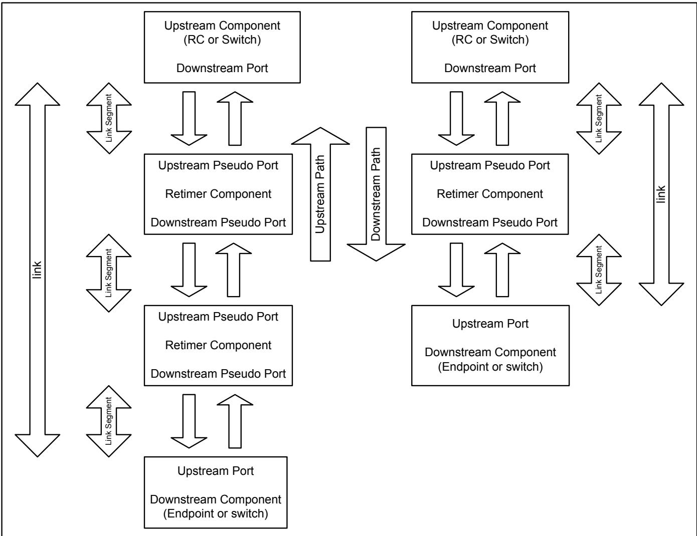

Diagram contents:
- Upstream Component (RC or Switch)
- Downstream Port
- Upstream Port
- Downstream Component (Endpoint or switch)
- Link Segment
- Upstream Pseudo Port
- Retimer Component
- Downstream Pseudo Port
- Upstream Path
- Downstream Path

</td>
<td style="background-color:#e8e8e8">

图示内容:
- Upstream Component (RC 或 Switch)
- Downstream Port
- Upstream Port
- Downstream Component (Endpoint 或 Switch)
- Link Segment (链路段)
- Upstream Pseudo Port
- Retimer Component
- Downstream Pseudo Port
- Upstream Path
- Downstream Path

</td>
</tr>
</tbody>
</table>

<!-- 📄 Page 617 -->
---

<a id="sec-4-3-3"></a>
## 4.3.3 Variables | 变量


<div style="overflow-x: auto; max-width: 100%;">
<table>
<thead>
<tr>
<th width="50%">🇬🇧 English</th>
<th width="50%" style="background-color:#e8e8e8">🇨🇳 中文</th>
</tr>
</thead>
<tbody>
<tr>
<td>

The following variables are set to the following specified values following a Fundamental Reset or whenever the Retimer receives Link and Lane number equal to PAD on two consecutive TS2 Ordered Sets on all Lanes that are receiving TS2 Ordered Sets on both Upstream and Downstream Pseudo Ports within a 1 μs time window from the last Symbol of the second TS2 Ordered Set on the first Lane to the last Symbol of the second TS2 Ordered Set on the last Lane.

- RT_port_orientation = undefined
- RT_captured_lane_number = PAD
- RT_captured_link_number = PAD
- RT_G3_EQ_complete = 0b
- RT_G4_EQ_complete = 0b
- RT_G5_EQ_complete = 0b
- RT_G6_EQ_complete = 0b

</td>
<td style="background-color:#e8e8e8">

在 Fundamental Reset (基本复位) 之后,或者在 Retimer 于 1 μs 时间窗内(从第一条通道上第二个 TS2 Ordered Set 的最后一个 Symbol 开始,到最后一条通道上第二个 TS2 Ordered Set 的最后一个 Symbol 结束)在 Upstream 和 Downstream Pseudo Port 上所有正在接收 TS2 Ordered Set 的通道上,连续两个 TS2 Ordered Set 收到 Link 和 Lane number 等于 PAD 时,以下变量被设置为以下指定值。

- RT_port_orientation = undefined (未定义)
- RT_captured_lane_number = PAD
- RT_captured_link_number = PAD
- RT_G3_EQ_complete = 0b
- RT_G4_EQ_complete = 0b
- RT_G5_EQ_complete = 0b
- RT_G6_EQ_complete = 0b

</td>
</tr>
</tbody>
</table>
</div>


<!-- 📄 Page 618 -->
---

<a id="sec-4-3-3-continued"></a>
## 4.3.3 (续) Variables | 变量

<table>
<thead>
<tr>
<th width="50%">🇬🇧 English</th>
<th width="50%" style="background-color:#e8e8e8">🇨🇳 中文</th>
</tr>
</thead>
<tbody>
<tr>
<td>

- RT_LinkUp = 0b
- RT_number = undefined
- RT_next_data_rate = 2.5 GT/s
- RT_error_data_rate = 2.5 GT/s
- RT_flit_mode_enabled = 0b

The Retimer Transmitters and Receivers shall meet the requirements in § Section 4.2.5.9.1 while Fundamental Reset is asserted. When Fundamental Reset is deasserted the Retimer is permitted to take up to 100 ms to begin active determination of its Receiver impedance. A Retimer that supports only Link speeds 5.0 GT/s or less must do this within 20 ms. During this interval the Receiver impedance remains as required during Fundamental Reset. Once this interval has expired Receiver impedance on Retimer Lanes is determined as follows:

- Within 1.0 ms of the Upstream or Downstream Port's Receiver meeting the ZRX-DC parameter, the low impedance is back propagated, (i.e., the Retimer's Receiver shall meet the ZRX-DC parameter on the corresponding Lane on the other Pseudo Port). Each Lane operates independently and this requirement applies at all times.
- The Retimer must keep its Transmitter in Electrical Idle until the ZRX-DC condition has been detected. This applies on an individual Lane basis.

The Retimer operates in two basic modes, Forwarding mode or Execution mode. When switching between these modes the switch must occur on an Ordered Set boundary for all Lanes of the Transmitter at the same time. No other Symbols shall be between the last Ordered Set transmitted in the current mode and the first Symbol transmitted in the new mode.

When using 128b/130b or 1b/1b the Transmitter must maintain the correct scrambling seed and LFSR value when switching between modes.

When switching between Forwarding and Execution modes, the Retimer must ensure that at least 16 TS1 Ordered Sets and at most 64 TS1 Ordered Sets are transmitted between the last EIEOS transmitted in the previous mode and the first EIEOS transmitted in the new mode.

When switching to and from the Execution Link Equalization mode the Retimer must ensure a Transmitter does not send two SKP Ordered Sets in a row, and that the maximum allowed interval is not exceeded between SKP Ordered Sets, see § Section 4.2.8.4.

These rules apply when the Retimer is in Forwarding mode. The Retimer is in Forwarding mode after the deassertion of Fundamental Reset.

- If the Retimer's Receiver detects an exit from Electrical Idle on a Lane the Retimer must enter Forwarding mode and forward the Symbols on that Lane to the opposite Pseudo Port as described in § Section 4.3.6.3.

</td>
<td style="background-color:#e8e8e8">

- RT_LinkUp = 0b
- RT_number = undefined (未定义)
- RT_next_data_rate = 2.5 GT/s
- RT_error_data_rate = 2.5 GT/s
- RT_flit_mode_enabled = 0b

在 Fundamental Reset 处于有效状态期间,Retimer 的 Transmitter 和 Receiver 必须满足 § Section 4.2.5.9.1 的要求。当 Fundamental Reset 解除后,Retimer 最多可以花费 100 ms 来开始主动确定其 Receiver 阻抗。仅支持 5.0 GT/s 或更低链路速率的 Retimer 必须在 20 ms 内完成此操作。在此期间,Receiver 阻抗保持为 Fundamental Reset 期间所要求的状态。一旦该时间窗到期,Retimer 通道上的 Receiver 阻抗按下述方式确定:

- 在 Upstream 或 Downstream Port 的 Receiver 满足 ZRX-DC 参数后的 1.0 ms 内,低阻抗会被反向传播(即 Retimer 的 Receiver 必须在另一个 Pseudo Port 上对应的通道上满足 ZRX-DC 参数)。每条通道独立运行,该要求始终适用。
- Retimer 必须将其 Transmitter 保持在 Electrical Idle,直到检测到 ZRX-DC 条件。该规则按单条通道适用。

Retimer 以两种基本模式运行:Forwarding mode (转发模式) 或 Execution mode (执行模式)。在这两种模式之间切换时,必须在发送器所有通道的 Ordered Set 边界处同时发生切换。在当前模式下发送的最后一个 Ordered Set 与新模式下发送的第一个 Symbol 之间不得存在其他 Symbol。

在使用 128b/130b 或 1b/1b 编码时,Transmitter 在模式切换之间必须保持正确的加扰种子 (scrambling seed) 和 LFSR 值。

在 Forwarding mode 与 Execution mode 之间切换时,Retimer 必须确保在前一种模式下发送的最后一个 EIEOS 与新模式下发送的第一个 EIEOS 之间发送的 TS1 Ordered Set 数量不少于 16 个且不多于 64 个。

在切换进出 Execution Link Equalization mode 时,Retimer 必须确保 Transmitter 不会连续发送两个 SKP Ordered Set,并且 SKP Ordered Set 之间的最大允许间隔不被超过,详见 § Section 4.2.8.4。

这些规则在 Retimer 处于 Forwarding mode 时适用。在 Fundamental Reset 解除后,Retimer 即处于 Forwarding mode。

- 如果 Retimer 的 Receiver 在某条通道上检测到从 Electrical Idle 退出,则 Retimer 必须进入 Forwarding mode,并按 § Section 4.3.6.3 中的描述,将该通道上的 Symbols 转发到对端的 Pseudo Port。

</td>
</tr>
</tbody>
</table>

<a id="sec-4-3-4"></a>
## 4.3.4 Receiver Impedance Propagation Rules | 接收器阻抗传播规则

---

[⬆️ 返回目录](#-本章目录-table-of-contents)


---

<a id="sec-4-3-6"></a>
## 4.3.6 Forwarding Rules | 转发规则

<a id="sec-4-3-6-1"></a>
## 4.3.6.1 Forwarding Type Rules | 转发类型规则

<a id="sec-4-3-6-2"></a>
## 4.3.6.2 Orientation, Lane Numbers, and Data Stream Mode Rules | 方向、通道号与数据流模式规则


<div style="overflow-x: auto; max-width: 100%;">
<table>
<thead>
<tr>
<th width="50%">🇬🇧 English</th>
<th width="50%" style="background-color:#e8e8e8">🇨🇳 中文</th>
</tr>
</thead>
<tbody>
<tr>
<td>

4.3.5 Switching Between Modes §

4.3.6 Forwarding Rules §

<!-- 📄 Page 619 -->
---

- The Retimer must continue to forward the received Symbols on a given Lane until it enters Execution mode or until an EIOS is received, or until Electrical Idle is inferred on that Lane. This requirement applies even if the Receiver loses Symbol lock or Block Alignment. See § Section 4.3.6.5 for rules regarding Electrical Idle entry.
- A Retimer shall forward all Symbols unchanged, except as described in § Section 4.3.6.9 and § Section 4.3.6.7.
- When operating at 64.0 GT/s data rate, a Retimer must follow the requirements of § Section 4.2.3.2 in order to identify SKP OS, EIEOS, and EIOS received.
- When operating at 2.5 GT/s data rate, if any Lane of a Pseudo Port receives TS1 Ordered Sets with Link and Lane numbers set to PAD for 5 ms or longer, and the other Pseudo Port does not detect an exit from Electrical Idle on any Lane in that same window, and either of the following occurs:
  - The following sequence occurs:
    - An EIOS is received on any Lane that was receiving TS1 Ordered Sets
    - followed by a period of Electrical Idle, for less than 5 ms
    - followed by Electrical Idle Exit that cannot be forwarded according to § Section 4.3.6.3
    - Note: this is interpreted as the Port attached to the Receiver going into Electrical Idle followed by a data rate change for a Compliance Pattern above 2.5 GT/s.
  - Compliance Pattern at 2.5 GT/s is received on any Lane that was receiving TS1 Ordered Sets.
  
  Then the Retimer enters the Execution mode CompLoadBoard state, and follows § Section 4.3.7.1.
- If any Lane on the Upstream Pseudo Port receives two consecutive TS1 Ordered Sets with the EC field equal to 10b, when using 128b/130b or 1b/1b encoding, then the Retimer enters Execution mode Equalization, and follows § Section 4.3.7.2.
- If the Retimer is configured to support Execution mode Follower Loopback and if any Lane on either Pseudo Port receives two consecutive TS1 Ordered Sets or two consecutive TS2 Ordered Sets with the Loopback bit set to 1b then the Retimer enters Execution mode Follower Loopback, and follows § Section 4.3.7.3.

A Retimer must determine what type of Symbols it is forwarding. The rules for inferring Electrical Idle are a function of the type of Symbols the Retimer is forwarding. If a Path forwards two consecutive TS1 Ordered Sets or two consecutive TS2 Ordered Sets, on any Lane, then the Path is forwarding training sets. If a Path forwards eight consecutive Symbol Times of Idle data on all Lanes that are forwarding Symbols then the Path is forwarding non-training sets. When a Retimer transitions from forwarding training sets to forwarding non-training sets, the variable RT_error_data_rate is set to 2.5 GT/s.

The Retimer must determine the Port orientation, Lane assignment, Lane polarity, and Data stream Mode dynamically as the Link trains.

- When RT_LinkUp=0, the first Pseudo Port to receive two consecutive TS1 Ordered Sets with a non-PAD Lane number on any Lane, has its RT_port_orientation variable set to Upstream Port, and the other Pseudo Port has its RT_port_orientation variable set to Downstream Port.
- The Retimer plays no active part in Lane number determination. The Retimer must capture the Lane numbers with the RT_captured_lane_number variable at the end of the Configuration state, between the Link Components. This applies on the first time through Configuration, i.e., when the RT_LinkUp variable is set to 0b. Subsequent trips through Configuration during Link width configure must not change the Lane numbers.

</td>
<td style="background-color:#e8e8e8">

4.3.5 模式切换 (Switching Between Modes) §

4.3.6 转发规则 (Forwarding Rules) §

<!-- 📄 Page 619 -->
---

- Retimer 必须持续转发某一通道 (Lane) 上接收到的符号 (Symbol)，直到进入 Execution 模式、收到 EIOS，或推断该通道进入电气空闲 (Electrical Idle)。即使接收器 (Receiver) 失去符号锁 (Symbol lock) 或块对齐 (Block Alignment)，此要求仍然适用。有关进入电气空闲的规则，请参见 § 4.3.6.5。
- Retimer 应保持原样转发所有符号，但 § 4.3.6.9 和 § 4.3.6.7 中另有说明的情况除外。
- 在 64.0 GT/s 数据率下工作时，Retimer 必须遵循 § 4.2.3.2 的要求以识别所接收的 SKP OS、EIEOS 和 EIOS。
- 在 2.5 GT/s 数据率下工作时，如果某个伪端口 (Pseudo Port) 的任意通道在 5 ms 或更长时间内接收到链路号和通道号字段为 PAD 的 TS1 有序集 (Ordered Set)，且另一个伪端口在同一时间窗内未在任何通道上检测到电气空闲退出 (Electrical Idle Exit)，并出现以下任一情况：
  - 出现以下序列：
    - 在原先接收 TS1 有序集的任意通道上收到一个 EIOS
    - 随后进入一段电气空闲状态，持续时间少于 5 ms
    - 接着出现无法按照 § 4.3.6.3 进行转发的电气空闲退出
    - 注：这被解释为连接到接收器的端口先进入电气空闲，随后切换到 2.5 GT/s 以上的一致性测试码型 (Compliance Pattern) 数据率。
  - 在原先接收 TS1 有序集的任意通道上收到 2.5 GT/s 的一致性测试码型。
  
  则 Retimer 进入 Execution 模式 CompLoadBoard 状态，并遵循 § 4.3.7.1。
- 在使用 128b/130b 或 1b/1b 编码的情况下，如果上游伪端口 (Upstream Pseudo Port) 的任意通道接收到两个连续的 EC 字段为 10b 的 TS1 有序集，则 Retimer 进入 Execution 模式 Equalization，并遵循 § 4.3.7.2。
- 如果 Retimer 配置为支持 Execution 模式 Follower Loopback，并且任一伪端口的任意通道接收到两个连续的 Loopback 位置 1 的 TS1 有序集或 TS2 有序集，则 Retimer 进入 Execution 模式 Follower Loopback，并遵循 § 4.3.7.3。

Retimer 必须确定其正在转发的符号类型。推断电气空闲的规则取决于 Retimer 正在转发的符号类型。如果某条通路 (Path) 在任意通道上转发两个连续的 TS1 有序集或两个连续的 TS2 有序集，则该通路正在转发训练序列。如果某条通路在所有正在转发符号的通道上转发八个连续的 Idle 数据符号时间，则该通路正在转发非训练序列。当 Retimer 从转发训练序列切换到转发非训练序列时，变量 RT_error_data_rate 被设置为 2.5 GT/s。

Retimer 必须在链路 (Link) 训练过程中动态地确定端口方向、通道分配、通道极性和数据流模式 (Data Stream Mode)。

- 当 RT_LinkUp=0 时，先在任意通道上接收到两个连续的、通道号非 PAD 的 TS1 有序集的伪端口，将其 RT_port_orientation 变量设置为 Upstream Port，另一个伪端口的 RT_port_orientation 变量设置为 Downstream Port。
- Retimer 不主动参与通道号的确定。Retimer 必须在两个链路组件 (Link Components) 之间的 Configuration 状态结束时，通过 RT_captured_lane_number 变量捕获通道号。这适用于第一次通过 Configuration 状态时，即 RT_LinkUp 变量被设置为 0b 的情况。在链路宽度配置期间后续通过 Configuration 状态时，不得更改通道号。

</td>
</tr>
</tbody>
</table>
</div>


[⬆️ 返回目录](#-本章目录-table-of-contents)

---

<table>
<thead>
<tr>
<th width="50%">🇬🇧 English</th>
<th width="50%" style="background-color:#e8e8e8">🇨🇳 中文</th>
</tr>
</thead>
<tbody>
<tr>
<td>

<!-- 📄 Page 620 -->
---

Lane numbers are required for the scrambling seed when using 128b/130b or 1b/1b. Link numbers are required in some cases when the Retimer is in Execution mode. Link numbers and Lane numbers are captured with the RT_captured_lane_number, and RT_captured_link_number variables whenever the first two consecutive TS2 Ordered Sets that contain non-PAD Lane and non-PAD Link numbers are received after the RT_LinkUp variable is set to 0b. A Retimer must function normally if Lane reversal occurs. When the Retimer has captured the Lane numbers and Link numbers the RT_LinkUp variable is set to 1b. In addition, if the Disable Scrambling bit in the TS2 Ordered Sets is set to 1b, in either case above, then the Retimer determines that scrambling is disabled when using 8b/10b encoding.

- Lane polarity is determined any time the Lane exits Electrical Idle, and achieves Symbol lock at 2.5 GT/s as described in § Section 4.2.5.5:
  - If polarity inversion is determined the Receiver must invert the received data. The Transmitter must never invert the transmitted data.
- The Retimer plays an active part of Data Stream Mode determination. If the Retimer supports Flit Mode operation, for each Pseudo Port, it must capture the value of the Flit Mode Supported bit of the Data Rate Identifier field in the eight consecutive TS2 Ordered Sets received with Link and Lane numbers set to PAD when the RT_LinkUp variable is set to 0b. If the Flit Mode Supported bit is 1b in eight consecutive TS2 Ordered Sets received by both Pseudo Ports, the RT_flit_mode_enabled variable must be set to 1b and each Pseudo Port must follow Flit Mode rules (as specified in § Section 4.2) to identify transitions between Ordered Set Data and Data Streams. If the Retimer does not support Flit Mode operation, its RT_flit_mode_enabled variable must remain set to 0b and it must set bit 0 of the Data Rate Identifier (Symbol 0) to 0b in all TS Ordered Sets that it forwards (as described in § Section 4.3.6.7).
  - When using 8b/10b with Flit Mode, NOP Flits (instead of Idle data) identify the start of the data stream.
  - When using 128b/130b or 1b/1b with Flit Mode, SDS Ordered Sets identify the start of the data stream.
- The Retimer's place in the system topology is determined when eight consecutive TS2 Ordered Sets are received with (non-PAD) matching Link and Lane numbers and identical data rate identifiers. If the Retimer Present bits are set to 01b on the Upstream Pseudo Port, the RT_number must be set to 10b, otherwise RT_number must be set to 01b. The RT_number is used to determine Pseudo Ports B, C, D and E. This identification is needed for Execution Mode Follower Loopback with 1b/1b encoding.

At data rates other than 2.5 GT/s, EIEOS are sent within the training sets to ensure that the analog circuit detects an exit from Electrical Idle. Receiving an EIEOS is required when using 128b/130b or 1b/1b encoding to achieve Block Alignment. When the Retimer starts forwarding data after detecting an Electrical Idle exit, the Retimer starts transmitting on a training set boundary. The first training sets it forwards must be an EIEOS, when operating at data rates higher than 2.5 GT/s. The first EIEOS sent will be in place of the TS1 or TS2 Ordered Set that it would otherwise forward.

4.3.6.3 Electrical Idle Exit Rules | 电气空闲退出规则

If no Lanes meet ZRX-DC on a Pseudo Port, and the following sequence occurs:

- An exit from Electrical Idle is detected on any Lane of that Pseudo Port.
- And then if not all Lanes infer Electrical Idle, via absence of exit from Electrical Idle in a 12 ms window on that Pseudo Port and the other Pseudo Port is not receiving Ordered Sets on any Lane in that same 12 ms window.

Then the same Pseudo Port, where no Lanes meet ZRX-DC, sends the Electrical Idle Exit pattern described below for 5 μs on all Lanes.

If operating at 2.5 GT/s and the following occurs:

</td>
<td style="background-color:#e8e8e8">

<!-- 📄 Page 620 -->
---

在使用 128b/130b 或 1b/1b 编码时，加扰 (Scrambling) 种子需要通道号。在某些情况下，Retimer 处于 Execution 模式时需要链路号。当 RT_LinkUp 变量被设置为 0b 之后，每当接收到包含非 PAD 通道号和非 PAD 链路号的前两个连续 TS2 有序集时，链路号和通道号就通过 RT_captured_lane_number 和 RT_captured_link_number 变量被捕获。如果出现通道反转 (Lane reversal)，Retimer 必须能够正常工作。当 Retimer 捕获到通道号和链路号后，RT_LinkUp 变量被设置为 1b。此外，如果在上述任一情况下，TS2 有序集中的 Disable Scrambling 位为 1b，则 Retimer 判定在使用 8b/10b 编码时不进行加扰。

- 通道极性在通道退出电气空闲并在 2.5 GT/s 下实现符号锁时确定，详见 § 4.2.5.5：
  - 如果确定存在极性反转，则接收器必须对接收到的数据进行反转。发送器 (Transmitter) 永远不得反转所发送的数据。
- Retimer 主动参与数据流模式的确定。如果 Retimer 支持 Flit 模式 (Flit Mode) 操作，则对于每个伪端口，当 RT_LinkUp 变量被设置为 0b 时，它必须在所接收的八个连续 TS2 有序集（链路号和通道号字段为 PAD）中捕获数据率标识符字段中 Flit Mode Supported 位的值。如果两个伪端口各自接收的八个连续 TS2 有序集中 Flit Mode Supported 位均为 1b，则 RT_flit_mode_enabled 变量必须被设置为 1b，且每个伪端口必须遵循 Flit 模式规则（如 § 4.2 所规定）来识别有序集数据和数据流之间的转换。如果 Retimer 不支持 Flit 模式操作，则其 RT_flit_mode_enabled 变量必须保持为 0b，并且必须将其所转发的所有 TS 有序集的数据率标识符（Symbol 0）bit 0 设置为 0b（详见 § 4.3.6.7）。
  - 在 8b/10b 编码下使用 Flit 模式时，NOP Flit（而不是 Idle 数据）标识数据流的开始。
  - 在 128b/130b 或 1b/1b 编码下使用 Flit 模式时，SDS 有序集标识数据流的开始。
- 当收到八个连续的、链路号和通道号（非 PAD）相匹配且数据率标识符相同的 TS2 有序集时，便确定了 Retimer 在系统拓扑中的位置。如果上游伪端口上的 Retimer Present 位为 01b，则 RT_number 必须被设置为 10b，否则 RT_number 必须被设置为 01b。RT_number 用于确定伪端口 B、C、D 和 E。该标识在 1b/1b 编码下进行 Execution 模式 Follower Loopback 时是必需的。

在 2.5 GT/s 以外的数据率下，训练序列中会发送 EIEOS，以确保模拟电路能够检测到电气空闲退出。使用 128b/130b 或 1b/1b 编码时，接收 EIEOS 是实现块对齐 (Block Alignment) 的必要条件。当 Retimer 在检测到电气空闲退出后开始转发数据时，Retimer 在训练集边界开始发送。在高于 2.5 GT/s 的数据率下工作时，其转发的第一个训练集必须是 EIEOS。第一个 EIEOS 将替代原本转发的 TS1 或 TS2 有序集。

4.3.6.3 电气空闲退出规则 (Electrical Idle Exit Rules) | 电气空闲退出规则

如果某伪端口上没有任何通道满足 ZRX-DC，且出现以下序列：

- 在该伪端口的任意通道上检测到电气空闲退出。
- 随后，如果在 12 ms 时间窗内并非所有通道都通过"未出现电气空闲退出"而推断为电气空闲，且另一个伪端口在同一 12 ms 时间窗内未在任何通道上接收到有序集。

则同一伪端口（其上没有任何通道满足 ZRX-DC）在所有通道上发送下述电气空闲退出码型，持续 5 μs。

如果工作在 2.5 GT/s 且出现以下情况：

</td>
</tr>
</tbody>
</table>

[⬆️ 返回目录](#-本章目录-table-of-contents)

---


<div style="overflow-x: auto; max-width: 100%;">
<table>
<thead>
<tr>
<th width="50%">🇬🇧 English</th>
<th width="50%" style="background-color:#e8e8e8">🇨🇳 中文</th>
</tr>
</thead>
<tbody>
<tr>
<td>

<!-- 📄 Page 621 -->
---

- any Lane detects an exit from Electrical Idle
- and then receives two consecutive TS1 Ordered Sets with Lane and Link numbers equal to PAD
- and the other Pseudo Port is not receiving Ordered Sets on any Lane

Then Receiver Detection is performed on all Lanes of the Pseudo Port that is not receiving Ordered Sets. If no Receivers were detected then:

- The result is back propagated as described in § Section 4.3.4, within 1.0 ms.
- The same Pseudo Port that received the TS1 Ordered Sets with Lane and Link numbers equal to PAD, sends the Electrical Idle Exit pattern described below for 5 μs on all Lanes.

If a Lane detects an exit from Electrical Idle then the Lane must start forwarding when all of the following are true:

- Data rate is determined, see § Section 4.3.6.4, current data rate is changed to RT_next_data_rate if required.
- Lane polarity is determined, see § Section 4.3.6.2.
- Two consecutive TS1 Ordered Sets or two consecutive TS2 Ordered Sets are received.
- Two consecutive TS1 Ordered Sets or two consecutive TS2 Ordered Sets are received on all Lanes that detected an exit from Electrical Idle or the max Retimer Exit Latency has occurred, see § Table 4-64.
- Lane De-skew is achieved on all Lanes that received two consecutive TS1 or two consecutive TS2 Ordered Sets.
- If a data rate change has occurred then 6 μs has elapsed since Electrical Idle Exit was detected.

All Ordered Sets used to establish forwarding must be discarded. Only Lanes that have detected a Receiver on the other Pseudo Port, as described in § Section 4.3.4, are considered for forwarding.

Otherwise after a 3.0 ms timeout, if the other Pseudo Port is not receiving Ordered Sets then Receiver Detection is performed on all Lanes of the Pseudo Port that is not receiving Ordered Sets, the result is back propagated as described in § Section 4.3.4, and if no Receivers were detected:

- Then the same Pseudo Port that was unable to receive two consecutive TS1 or TS2 Ordered Sets on any Lane sends the Electrical Idle Exit pattern described below for 5 μs on all Lanes.
- Else the Electrical Idle Exit pattern described below is forwarded on all Lanes that detected an exit from Electrical Idle.
- When using 8b/10b encoding:
  - The Modified Compliance Pattern with the error status Symbol set to 00h.
- When using 128b/130b encoding:
  - One EIEOS or one EIEOSQ (recommended).
  - 32 Data Blocks, each with a payload of 16 Idle data Symbols (00h), scrambled, for Symbols 0 to 13.
  - Symbol 14 and 15 of each Data Block either contain Idle data Symbols (00h), scrambled, or DC Balance, determined by applying the same rules in § Section 4.2.5.1 to these Data Blocks.
- When using 1b/1b encoding:
  - Four consecutive EIEOS, uninterrupted by any other Ordered Set including the Control SKP Ordered Set.
  - 32 Data Blocks, each with a payload of 16 Idle data Symbols (00h), scrambled, for Symbols 0-6, 8-14.
  - Symbol 7 and 15 of each Data Block either contain Idle data Symbols (00h), scrambled, or DC Balance, determined by applying the same rules in § Section 4.2.5.1 to these Data Blocks.

</td>
<td style="background-color:#e8e8e8">

<!-- 📄 Page 621 -->
---

- 任意通道检测到电气空闲退出
- 随后接收到两个连续的、通道号和链路号等于 PAD 的 TS1 有序集
- 且另一个伪端口未在任何通道上接收到有序集

则对未接收到有序集的伪端口的所有通道执行接收器检测 (Receiver Detection)。如果未检测到任何接收器，则：

- 该结果在 1.0 ms 内按照 § 4.3.4 所述进行反向传播。
- 同一伪端口（即接收到通道号和链路号等于 PAD 的 TS1 有序集的伪端口）在所有通道上发送下述电气空闲退出码型，持续 5 μs。

如果某通道检测到电气空闲退出，则必须满足以下所有条件后该通道才能开始转发：

- 数据率已确定（参见 § 4.3.6.4），如需要，当前数据率切换为 RT_next_data_rate。
- 通道极性已确定（参见 § 4.3.6.2）。
- 已接收到两个连续的 TS1 有序集或两个连续的 TS2 有序集。
- 在所有检测到电气空闲退出的通道上都已接收到两个连续的 TS1 有序集或两个连续的 TS2 有序集，或者已达到最大 Retimer 退出延迟（参见 § 表 4-64）。
- 在已接收到两个连续的 TS1 或 TS2 有序集的所有通道上完成通道间去偏斜 (Lane De-skew)。
- 如果发生了数据率切换，则自检测到电气空闲退出起已过去 6 μs。

用于建立转发的所有有序集必须被丢弃。只有在另一个伪端口上检测到接收器的通道（参见 § 4.3.4）才会被纳入转发考虑。

否则，在 3.0 ms 超时之后，如果另一个伪端口仍未在接收有序集，则对未接收到有序集的伪端口的所有通道执行接收器检测，结果按 § 4.3.4 所述进行反向传播，且如果未检测到任何接收器：

- 则同一伪端口（即在任意通道上都未接收到两个连续的 TS1 或 TS2 有序集的伪端口）在所有通道上发送下述电气空闲退出码型，持续 5 μs。
- 否则，将下述电气空闲退出码型在所有检测到电气空闲退出的通道上进行转发。
- 在使用 8b/10b 编码时：
  - 错误状态符号 (error status Symbol) 设置为 00h 的 Modified Compliance Pattern。
- 在使用 128b/130b 编码时：
  - 一个 EIEOS 或一个 EIEOSQ（推荐）。
  - 32 个数据块，每个数据块的有效载荷为 16 个经加扰的 Idle 数据符号 (00h)，对应符号 0 到 13。
  - 每个数据块的符号 14 和 15 既可包含经加扰的 Idle 数据符号 (00h)，也可为 DC Balance，由对数据块应用 § 4.2.5.1 的相同规则来确定。
- 在使用 1b/1b 编码时：
  - 四个连续的 EIEOS，其间不被任何其他有序集（包括 Control SKP 有序集）打断。
  - 32 个数据块，每个数据块的有效载荷为 16 个经加扰的 Idle 数据符号 (00h)，对应符号 0-6、8-14。
  - 每个数据块的符号 7 和 15 既可包含经加扰的 Idle 数据符号 (00h)，也可为 DC Balance，由对数据块应用 § 4.2.5.1 的相同规则来确定。

</td>
</tr>
</tbody>
</table>
</div>


[⬆️ 返回目录](#-本章目录-table-of-contents)

---

<table>
<thead>
<tr>
<th width="50%">🇬🇧 English</th>
<th width="50%" style="background-color:#e8e8e8">🇨🇳 中文</th>
</tr>
</thead>
<tbody>
<tr>
<td>

<!-- 📄 Page 622 -->
---

- This Path now is forwarding the Electrical Idle Exit pattern. In this state Electrical Idle is inferred by the absence of Electrical Idle Exit, see § Table 4-65. The Path continues forwarding the Electrical Idle Exit pattern until Electrical Idle is inferred on any lane, or a 48 ms time out occurs. If a 48 ms time out occurs then:
  - The RT_LinkUp variable is set to 0b.
  - The Pseudo Port places its Transmitter in Electrical Idle
  - The RT_next_data_rate and the RT_error_data_rate must be set to 2.5 GT/s for both Pseudo Ports
  - Receiver Detection is performed on the Pseudo Port that was sending the Electrical Idle Exit pattern and timed out, the result is back propagated as described in § Section 4.3.4.

The Transmitter, on the opposite Pseudo Port that was sending the Electrical Idle Exit Pattern and timed out, sends the Electrical Idle Exit Pattern described above for 5 μs.

When a Retimer detects an exit from Electrical Idle and starts forwarding data, the time this takes is called the Retimer Exit Latency, and allows for such things as data rate change (if required), clock and data recovery, Symbol lock, Block Alignment, Lane-to-Lane de-skew, Receiver tuning, etc. The Maximum Retimer Exit Latency is specified below for several conditions:

- The data rate before and after Electrical Idle and Electrical Idle exit detect does not change.
- Data rate change to a data rate that uses 8b/10b encoding.
- Data rate change to a data rate that uses 128b/130b encoding for the first time.
- Data rate change to a data rate that uses 128b/130b encoding not for the first time.
- Data rate change to a data rate that uses 1b/1b encoding for the first time.
- Data rate change to a data rate that uses 1b/1b encoding not for the first time.
- How long both transmitters have been in Electrical Idle when a data rate change occurs.

Retimers are permitted to change their data rate while in Electrical Idle, and it is recommended that Retimers start the data rate change while in Electrical Idle to minimize Retimer Exit latency.

**Table 4-64. Maximum Retimer Exit Latency | 表 4-64. 最大 Retimer 退出延迟**

| Condition | Link in Electrical Idle for X μs, where X < 500 μs | Link in Electrical Idle for X μs, where X ≥ 500 μs |
|-----------|---------------------------------------------------|----------------------------------------------------|
| No data rate change, 2.5 GT/s | 8 μs | 8 μs |
| No data rate change, 5.0 GT/s or higher | 4 μs | 4 μs |

**IMPLEMENTATION NOTE:**
**ELECTRICAL IDLE EXIT**

Forwarding Electrical Idle Exit occurs in error cases where a Retimer is unable to decode training sets. Upstream and Downstream Ports use Electrical Idle Exit (without decoding any Symbols) during Polling.Compliance, and Recovery.Speed. If the Retimer does not forward Electrical Idle Exit then the Upstream and Downstream Ports will misbehave in certain conditions. For example, this may occur after a speed change to a higher data rate. In this event forwarding Electrical Idle Exit is required to keep the Upstream and Downstream Ports in lock step at Recovery.Speed, so that the data rate will return to the previous data rate, rather than a Link Down condition from a time out to Detect.

§ §

</td>
<td style="background-color:#e8e8e8">

<!-- 📄 Page 622 -->
---

- 此通路现在正在转发电气空闲退出码型。在此状态下，电气空闲由"未出现电气空闲退出"来推断，参见 § 表 4-65。该通路持续转发电气空闲退出码型，直到任意通道上推断出电气空闲或发生 48 ms 超时。如果发生 48 ms 超时，则：
  - RT_LinkUp 变量被设置为 0b。
  - 伪端口将其发送器置入电气空闲
  - 两个伪端口的 RT_next_data_rate 和 RT_error_data_rate 必须被设置为 2.5 GT/s
  - 对正在发送电气空闲退出码型并发生超时的伪端口执行接收器检测，结果按 § 4.3.4 所述进行反向传播。

在另一伪端口（即原先发送电气空闲退出码型并发生超时的对端）上的发送器，发送上述电气空闲退出码型，持续 5 μs。

当 Retimer 检测到电气空闲退出并开始转发数据时，所花费的时间称为 Retimer 退出延迟 (Retimer Exit Latency)，它涵盖了数据率切换（如需要）、时钟数据恢复 (CDR)、符号锁、块对齐、通道间去偏斜、接收器调谐等操作所需的时间。下面针对多种条件规定最大 Retimer 退出延迟：

- 电气空闲前后以及电气空闲退出检测前后的数据率不发生变化。
- 切换到使用 8b/10b 编码的数据率。
- 首次切换到使用 128b/130b 编码的数据率。
- 非首次切换到使用 128b/130b 编码的数据率。
- 首次切换到使用 1b/1b 编码的数据率。
- 非首次切换到使用 1b/1b 编码的数据率。
- 发生数据率切换时两个发送器已处于电气空闲的时长。

允许 Retimer 在电气空闲期间更改数据率，并建议 Retimer 在电气空闲期间就开始数据率切换，以最小化 Retimer 退出延迟。

**表 4-64. 最大 Retimer 退出延迟 (Maximum Retimer Exit Latency)**

| 条件 (Condition) | 链路处于电气空闲 X μs，其中 X < 500 μs | 链路处于电气空闲 X μs，其中 X ≥ 500 μs |
|-----------|---------------------------------------------------|----------------------------------------------------|
| 无数据率切换，2.5 GT/s | 8 μs | 8 μs |
| 无数据率切换，5.0 GT/s 或更高 | 4 μs | 4 μs |

**实现说明 (IMPLEMENTATION NOTE):**
**电气空闲退出 (ELECTRICAL IDLE EXIT)**

转发电气空闲退出出现在 Retimer 无法解码训练序列的错误情况下。在 Polling.Compliance 和 Recovery.Speed 期间，上游和下游端口使用电气空闲退出（不解码任何符号）。如果 Retimer 不转发电气空闲退出，则在某些情况下上游和下游端口会出现异常行为。例如，在向更高数据率进行速度切换后可能发生这种情况。在这种情况下，必须转发电气空闲退出以使上游和下游端口在 Recovery.Speed 期间保持同步，从而使数据率能够返回到之前的数据率，而不是因 Detect 超时而导致链路断开 (Link Down)。

§ §

</td>
</tr>
</tbody>
</table>

[⬆️ 返回目录](#-本章目录-table-of-contents)

---


<div style="overflow-x: auto; max-width: 100%;">
<table>
<thead>
<tr>
<th width="50%">🇬🇧 English</th>
<th width="50%" style="background-color:#e8e8e8">🇨🇳 中文</th>
</tr>
</thead>
<tbody>
<tr>
<td>

<!-- 📄 Page 623 -->
---

| Condition | Link in Electrical Idle for X μs, where X < 500 μs | Link in Electrical Idle for X μs, where X ≥ 500 μs |
|-----------|---------------------------------------------------|----------------------------------------------------|
| When forwarding TS1 Ordered Sets at 2.5 GT/s with Lane and Link number equal to PAD. | 1 ms | 1 ms |
| Any data rate change to 8b/10b encoding data rate | 504 − X μs | 4 μs |
| First data rate change to 128b/130b encoding date rate | 1.5 − X ms | 1 ms |
| Subsequent data rate change to 128b/130b encoding date rate | 504 − X μs | 4 μs |
| First data rate change to 1b/1b encoding data rate | 1.5 − X ms | 1 ms |
| Subsequent data rate change to 1b/1b encoding data rate | 504 − X μs | 4 μs |

The data rate of the Retimer is set to 2.5 GT/s after deassertion of Fundamental Reset.

Both Pseudo Ports of the Retimer must operate at the same data rate. If a Pseudo Port places its Transmitter in Electrical Idle, then the Symbols that it has just completed transmitting determine the variables RT_next_data_rate and RT_error_data_rate. Only when both Pseudo Ports have all Lanes in Electrical Idle shall the Retimer change the data rate. If both Pseudo Ports do not make the same determination of these variables, then both variables must be set to 2.5 GT/s.

- If both Pseudo Ports were forwarding non-training sequences, then the RT_next_data_rate must be set to the current data rate. The RT_error_data_rate must be set to 2.5 GT/s if 8b/10b or 128b/130b encoding is being used. The RT_error_data_rate is set to 32.0 GT/s if 1b/1b encoding is being used. Note: this covers the case where the Link has entered L1 from L0.
- If both Pseudo Ports were forwarding TS2 Ordered Sets with the speed_change bit set to 1b and either:
  - the data rate, when forwarding those TS2s, is greater than 2.5 GT/s or,
  - the highest common data rate received in the data rate identifiers in both directions is greater than 2.5 GT/s,
  
  then RT_next_data_rate must be set to the highest common data rate and the RT_error_data_rate is set to current data rate. Note: this covers the case where the Link has entered Recovery.Speed from Recovery.RcvrCfg and is changing the data rate according to the highest common data rate.
- Else the RT_next_data_rate must be set to the RT_error_data_rate. The RT_error_data_rate is set to 2.5 GT/s if 8b/10b or 128b/130b encoding is being used. The RT_error_data_rate is set to 32.0 GT/s if 1b/1b encoding is being used. Note this covers the two error cases:
  - This indicates that the Link was unable to operate at the current data rate (greater than 2.5 GT/s) and the Link will operate at either the 2.5 GT/s data rate or the 32.0 GT/s data rate or
  - This indicates that the Link was unable to operate at the new negotiated data rate and will revert back to the old data rate with which it entered Recovery from L0 or L1.

The Rules for Electrical Idle entry in Forwarding mode are a function of whether the Retimer is forwarding training sets or non-training sets. The determination of this is described in § Section 4.3.6.1.

4.3.6.4 Data Rate Change and Determination Rules | 数据率切换与确定规则

4.3.6.5 Electrical Idle Entry Rules | 电气空闲进入规则

</td>
<td style="background-color:#e8e8e8">

<!-- 📄 Page 623 -->
---

| 条件 (Condition) | 链路处于电气空闲 X μs，其中 X < 500 μs | 链路处于电气空闲 X μs，其中 X ≥ 500 μs |
|-----------|---------------------------------------------------|----------------------------------------------------|
| 在 2.5 GT/s 下转发通道号和链路号等于 PAD 的 TS1 有序集时 | 1 ms | 1 ms |
| 任何切换到 8b/10b 编码数据率的数据率切换 | 504 − X μs | 4 μs |
| 首次切换到 128b/130b 编码数据率 | 1.5 − X ms | 1 ms |
| 后续切换到 128b/130b 编码数据率 | 504 − X μs | 4 μs |
| 首次切换到 1b/1b 编码数据率 | 1.5 − X ms | 1 ms |
| 后续切换到 1b/1b 编码数据率 | 504 − X μs | 4 μs |

在基本复位 (Fundamental Reset) 撤销后，Retimer 的数据率被设置为 2.5 GT/s。

Retimer 的两个伪端口必须以相同的数据率工作。如果某个伪端口将其发送器置入电气空闲，则其刚刚完成发送的符号将决定 RT_next_data_rate 和 RT_error_data_rate 变量。只有当两个伪端口的所有通道都处于电气空闲时，Retimer 才能更改数据率。如果两个伪端口对这些变量的判定不一致，则两个变量都必须被设置为 2.5 GT/s。

- 如果两个伪端口都在转发非训练序列，则 RT_next_data_rate 必须被设置为当前数据率。如果使用 8b/10b 或 128b/130b 编码，RT_error_data_rate 必须被设置为 2.5 GT/s。如果使用 1b/1b 编码，RT_error_data_rate 被设置为 32.0 GT/s。注：这涵盖了从 L0 进入 L1 的情况。
- 如果两个伪端口都在转发 speed_change 位置 1 的 TS2 有序集，且满足以下任一条件：
  - 在转发这些 TS2 时的数据率高于 2.5 GT/s，或
  - 两个方向上数据率标识符中收到的最高公共数据率高于 2.5 GT/s，
  
  则 RT_next_data_rate 必须被设置为最高公共数据率，RT_error_data_rate 被设置为当前数据率。注：这涵盖了从 Recovery.RcvrCfg 进入 Recovery.Speed 并根据最高公共数据率更改数据率的情况。
- 否则 RT_next_data_rate 必须被设置为 RT_error_data_rate。如果使用 8b/10b 或 128b/130b 编码，RT_error_data_rate 被设置为 2.5 GT/s。如果使用 1b/1b 编码，RT_error_data_rate 被设置为 32.0 GT/s。注：这涵盖以下两种错误情况：
  - 表明链路无法在当前数据率（高于 2.5 GT/s）下工作，链路将以 2.5 GT/s 数据率或 32.0 GT/s 数据率工作；或
  - 表明链路无法在新的协商数据率下工作，并将回退到从 L0 或 L1 进入 Recovery 时所用的旧数据率。

Forwarding 模式下进入电气空闲的规则取决于 Retimer 正在转发的是训练序列还是非训练序列。此判定在 § 4.3.6.1 中描述。

4.3.6.4 数据率切换与确定规则 (Data Rate Change and Determination Rules) | 数据率切换与确定规则

4.3.6.5 电气空闲进入规则 (Electrical Idle Entry Rules) | 电气空闲进入规则

</td>
</tr>
</tbody>
</table>
</div>


[⬆️ 返回目录](#-本章目录-table-of-contents)

---

<table>
<thead>
<tr>
<th width="50%">🇬🇧 English</th>
<th width="50%" style="background-color:#e8e8e8">🇨🇳 中文</th>
</tr>
</thead>
<tbody>
<tr>
<td>

<!-- 📄 Page 624 -->
---

Before a Transmitter enters Electrical Idle, it must always send the Electrical Idle Ordered Set Sequence (EIOSQ), unless otherwise specified.

If the Retimer is forwarding training sets then:

- If an EIOS is received on a Lane, then the EIOSQ is forwarded on that Lane and only that Lane places its Transmitter in Electrical Idle.
- If Electrical Idle is inferred on a Lane, then that Lane places its Transmitter in Electrical Idle, after EIOSQ is transmitted on that Lane.

Else if the Retimer is forwarding non-training sets then:

- If operating in Flit Mode and EIOS are received on some Lanes while some other Lanes receive SKP OS (i.e., L0p Link width down-size), then Lanes that are receiving EIOS must forward the EIOSQ and must place their Transmitters into Electrical Idle. Lanes that are forwarding Symbols, but are not receiving EIOS, must continue forwarding Symbols and must not place their Transmitters into Electrical Idle. Else if an EIOS is received on any Lane, then the EIOSQ is forwarded on all Lanes that are currently forwarding Symbols and all Lanes place their Transmitters in Electrical Idle.
- If Electrical Idle is inferred on a Lane, then that Lane places its Transmitter in Electrical Idle, and EIOSQ is not transmitted on that Lane.
- When operating at 64.0 GT/s, a Retimer must follow the requirements of § Section 4.2.3.2 in order to identify SKP OS, EIEOS, and EIOS received.

The Retimer is required to infer Electrical Idle. The criteria for a Retimer inferring Electrical Idle are described in § Table 4-65.

**Table 4-65. Inferring Electrical Idle | 表 4-65. 推断电气空闲**

| State | 2.5 GT/s | 5.0 GT/s | 8.0 GT/s | 16.0 GT/s or higher |
|-------|----------|----------|----------|---------------------|
| Forwarding: Non Training Sequence | Absence of a SKP Ordered Set in a 128 μs window | Absence of a SKP Ordered Set in a 128 μs window | Absence of a SKP Ordered Set in a 128 μs window | Absence of a SKP Ordered Set in a 128 μs window |
| Forwarding: Training Sequence | Absence of a TS1 or TS2 Ordered Set in a 1280 UI interval | Absence of a TS1 or TS2 Ordered Set in a 1280 UI interval | Absence of a TS1 or TS2 Ordered Set in a 4680 UI interval | Absence of a TS1 or TS2 Ordered Set in a 4680 UI interval |
| Forwarding: Electrical Idle Exit Executing: Force Timeout | Absence of an exit from Electrical Idle in a 2000 UI interval | Absence of an exit from Electrical Idle in a 16000 UI interval | Absence of an exit from Electrical Idle in a 16000 UI interval | Absence of an exit from Electrical Idle in a 16000 UI interval |
| Forwarding: Loopback Executing: Loopback Follower | Absence of an exit from Electrical Idle in a 128 μs window | N/A | N/A | N/A |

§

</td>
<td style="background-color:#e8e8e8">

<!-- 📄 Page 624 -->
---

发送器在进入电气空闲之前，除非另有规定，否则必须始终发送电气空闲有序集序列 (EIOSQ)。

如果 Retimer 正在转发训练序列，则：

- 如果在某个通道上接收到 EIOS，则在该通道上转发 EIOSQ，并且仅该通道将其发送器置入电气空闲。
- 如果在某个通道上推断出电气空闲，则在该通道上发送 EIOSQ 后，该通道将其发送器置入电气空闲。

否则，如果 Retimer 正在转发非训练序列，则：

- 如果在 Flit 模式下，某些通道接收到 EIOS 而其他通道接收到 SKP OS（即 L0p 链路宽度缩减），则接收到 EIOS 的通道必须转发 EIOSQ 并必须将其发送器置入电气空闲。正在转发符号但未接收到 EIOS 的通道必须继续转发符号，且不得将其发送器置入电气空闲。否则如果在任意通道上接收到 EIOS，则在所有正在转发符号的通道上转发 EIOSQ，且所有通道将其发送器置入电气空闲。
- 如果在某个通道上推断出电气空闲，则该通道将其发送器置入电气空闲，且不在该通道上发送 EIOSQ。
- 在 64.0 GT/s 下工作时，Retimer 必须遵循 § 4.2.3.2 的要求以识别所接收的 SKP OS、EIEOS 和 EIOS。

Retimer 需要推断电气空闲。Retimer 推断电气空闲的标准在 § 表 4-65 中描述。

**表 4-65. 推断电气空闲 (Inferring Electrical Idle)**

| 状态 (State) | 2.5 GT/s | 5.0 GT/s | 8.0 GT/s | 16.0 GT/s 或更高 |
|-------|----------|----------|----------|---------------------|
| 转发：非训练序列 (Forwarding: Non Training Sequence) | 在 128 μs 窗口内未出现 SKP 有序集 | 在 128 μs 窗口内未出现 SKP 有序集 | 在 128 μs 窗口内未出现 SKP 有序集 | 在 128 μs 窗口内未出现 SKP 有序集 |
| 转发：训练序列 (Forwarding: Training Sequence) | 在 1280 UI 间隔内未出现 TS1 或 TS2 有序集 | 在 1280 UI 间隔内未出现 TS1 或 TS2 有序集 | 在 4680 UI 间隔内未出现 TS1 或 TS2 有序集 | 在 4680 UI 间隔内未出现 TS1 或 TS2 有序集 |
| 转发：电气空闲退出 (Forwarding: Electrical Idle Exit) / 执行：强制超时 (Executing: Force Timeout) | 在 2000 UI 间隔内未出现电气空闲退出 | 在 16000 UI 间隔内未出现电气空闲退出 | 在 16000 UI 间隔内未出现电气空闲退出 | 在 16000 UI 间隔内未出现电气空闲退出 |
| 转发：回环 (Forwarding: Loopback) / 执行：Follower 回环 (Executing: Loopback Follower) | 在 128 μs 窗口内未出现电气空闲退出 | N/A | N/A | N/A |

§

</td>
</tr>
</tbody>
</table>

[⬆️ 返回目录](#-本章目录-table-of-contents)

---


<div style="overflow-x: auto; max-width: 100%;">
<table>
<thead>
<tr>
<th width="50%">🇬🇧 English</th>
<th width="50%" style="background-color:#e8e8e8">🇨🇳 中文</th>
</tr>
</thead>
<tbody>
<tr>
<td>

<!-- 📄 Page 625 -->
---

When a data rate change to 64.0 GT/s occurs the Retimer transmitter settings are determined as follows:

- If the RT_G6_EQ_complete variable is set to 1b:
  - The Transmitter must use the coefficient settings agreed upon at the conclusion of the last equalization procedure applicable to 64.0 GT/s operation.
- Else:
  - An Upstream Pseudo Port must use the 128b/130b Transmitter preset values it registered from the eight consecutive 128b/130b EQ TS2 Ordered Sets received while operating at 32.0 GT/s in its Transmitter preset setting as soon as it starts transmitting at the 64.0 GT/s data rate and must ensure that it meets the preset definition in § Section 4.2.4.2. Lanes that received a Reserved or unsupported Transmitter preset value must use an implementation specific method to choose a supported Transmitter preset setting for use as soon it starts transmitting at 64.0 GT/s.
  - A Downstream Pseudo Port determines its Transmitter Settings in an implementation specific manner when it starts transmitting at 64.0 GT/s.

The RT_G6_EQ_complete variable is set to 1b when:

- Two consecutive TS0 Ordered Sets are received with EC = 01b at 64.0 GT/s and RT_port_orientation is set to Downstream Port.
- Two consecutive TS1 Ordered Sets are received with EC = 01b at 64.0 GT/s and RT_port_orientation is set to Upstream Port.

The RT_G6_EQ_complete variable is set to 0b when any of the following occur:

- The RT_LinkUp variable is set to 0b.
- The Pseudo Port is operating at 32.0 GT/s and eight consecutive 128b/130b EQ TS2 Ordered Sets are received on any Lane of the Upstream Pseudo Port. The value in the 128b/130b Transmitter Preset field is registered for later use at 64.0 GT/s for that Lane.

When a data rate change to 32.0 GT/s occurs the Retimer transmitter settings are determined as follows:

- If the RT_G5_EQ_complete variable is set to 1b:
  - The Transmitter must use the coefficient settings agreed upon at the conclusion of the last equalization procedure applicable to 32.0 GT/s operation.
- Else:
  - An Upstream Pseudo Port must use the 128b/130b Transmitter preset values it registered from the eight consecutive 128b/130b EQ TS2 Ordered Sets received while operating at 16.0 GT/s in its Transmitter preset setting as soon as it starts transmitting at the 32.0 GT/s data rate and must ensure that it meets the preset definition in § Section 4.2.4.2. Lanes that received a Reserved or unsupported Transmitter preset value must use an implementation specific method to choose a supported Transmitter preset setting for use as soon it starts transmitting at 32.0 GT/s.
  - A Downstream Pseudo Port determines its Transmitter Settings in an implementation specific manner when it starts transmitting at 32.0 GT/s.

The RT_G5_EQ_complete variable is set to 1b when:

- Two consecutive TS1 Ordered Sets are received with EC = 01b at 32.0 GT/s.

4.3.6.6 Transmitter Settings Determination Rules | 发送器设置确定规则

</td>
<td style="background-color:#e8e8e8">

<!-- 📄 Page 625 -->
---

当发生向 64.0 GT/s 的数据率切换时，Retimer 的发送器设置按以下方式确定：

- 如果 RT_G6_EQ_complete 变量被设置为 1b：
  - 发送器必须使用上一次适用于 64.0 GT/s 操作的均衡 (Equalization) 过程结束时协商一致所确定的系数设置。
- 否则：
  - 上游伪端口在开始以 64.0 GT/s 数据率发送时，必须使用其从 32.0 GT/s 工作期间接收到的八个连续 128b/130b EQ TS2 有序集所注册的 128b/130b 发送器预设 (Transmitter Preset) 值作为发送器预设设置，并必须确保其满足 § 4.2.4.2 中的预设定义。对于接收到保留 (Reserved) 或不受支持的发送器预设值的通道，必须使用实现特定的方法来选择一个受支持的发送器预设设置，以在开始以 64.0 GT/s 发送时立即使用。
  - 下游伪端口在开始以 64.0 GT/s 发送时，以实现特定的方式确定其发送器设置。

RT_G6_EQ_complete 变量在以下情况下被设置为 1b：

- 在 64.0 GT/s 下接收到两个连续的 EC = 01b 的 TS0 有序集，且 RT_port_orientation 被设置为 Downstream Port。
- 在 64.0 GT/s 下接收到两个连续的 EC = 01b 的 TS1 有序集，且 RT_port_orientation 被设置为 Upstream Port。

RT_G6_EQ_complete 变量在出现以下任一情况时被设置为 0b：

- RT_LinkUp 变量被设置为 0b。
- 伪端口以 32.0 GT/s 工作，且在上游伪端口的任意通道上接收到八个连续的 128b/130b EQ TS2 有序集。128b/130b 发送器预设字段中的值被注册，以便在 64.0 GT/s 下供该通道稍后使用。

当发生向 32.0 GT/s 的数据率切换时，Retimer 的发送器设置按以下方式确定：

- 如果 RT_G5_EQ_complete 变量被设置为 1b：
  - 发送器必须使用上一次适用于 32.0 GT/s 操作的均衡过程结束时协商一致所确定的系数设置。
- 否则：
  - 上游伪端口在开始以 32.0 GT/s 数据率发送时，必须使用其从 16.0 GT/s 工作期间接收到的八个连续 128b/130b EQ TS2 有序集所注册的 128b/130b 发送器预设值作为发送器预设设置，并必须确保其满足 § 4.2.4.2 中的预设定义。对于接收到保留或不受支持的发送器预设值的通道，必须使用实现特定的方法来选择一个受支持的发送器预设设置，以在开始以 32.0 GT/s 发送时立即使用。
  - 下游伪端口在开始以 32.0 GT/s 发送时，以实现特定的方式确定其发送器设置。

RT_G5_EQ_complete 变量在以下情况下被设置为 1b：

- 在 32.0 GT/s 下接收到两个连续的 EC = 01b 的 TS1 有序集。

4.3.6.6 发送器设置确定规则 (Transmitter Settings Determination Rules) | 发送器设置确定规则

</td>
</tr>
</tbody>
</table>
</div>


[⬆️ 返回目录](#-本章目录-table-of-contents)

---

<table>
<thead>
<tr>
<th width="50%">🇬🇧 English</th>
<th width="50%" style="background-color:#e8e8e8">🇨🇳 中文</th>
</tr>
</thead>
<tbody>
<tr>
<td>

<!-- 📄 Page 626 -->
---

The RT_G5_EQ_complete variable is set to 0b when any of the following occur:

- RT_LinkUp variable is set to 0b.
- The Pseudo Port is operating at 16.0 GT/s and eight consecutive 128b/130b EQ TS2 Ordered Sets are received on any Lane of the Upstream Pseudo Port. The value in the 128b/130b Transmitter Preset field is registered for later use at 32.0 GT/s for that Lane.

When a data rate change to 16.0 GT/s occurs the Retimer transmitter settings are determined as follows:

- If the RT_G4_EQ_complete variable is set to 1b:
  - The Transmitter must use the coefficient settings agreed upon at the conclusion of the last equalization procedure applicable to 16.0 GT/s operation.
- Else:
  - An Upstream Pseudo Port must use the 128b/130b Transmitter preset values it registered from the received eight consecutive 128b/130b EQ TS2 Ordered Sets in its Transmitter preset setting as soon as it starts transmitting at the 16.0 GT/s data rate and must ensure that it meets the preset definition in § Section 8.3.3.3. Lanes that received a Reserved or unsupported Transmitter preset value must use an implementation specific method to choose a supported Transmitter preset setting for use as soon it starts transmitting at 16.0 GT/s.
  - A Downstream Pseudo Port determines its Transmitter Settings in an implementation specific manner when it starts transmitting at 16.0 GT/s.

The RT_G4_EQ_complete variable is set to 1b when:

- Two consecutive TS1 Ordered Sets are received with EC = 01b at 16.0 GT/s.

The RT_G4_EQ_complete variable is set to 0b when any of the following occur:

- The RT_LinkUp variable is set to 0b.
- Eight consecutive 128b/130b EQ TS2 Ordered Sets are received on any Lane of the Upstream Pseudo Port. The value in the 128b/130b Transmitter Preset field is registered for later use at 16.0 GT/s for that Lane.

When a data rate change to 8.0 GT/s occurs the Retimer transmitter settings are determined as follows:

- If the RT_G3_EQ_complete variable is set to 1b:
  - The Transmitter must use the coefficient settings agreed upon at the conclusion of the last equalization procedure applicable to 8.0 GT/s operation.
- Else:
  - An Upstream Pseudo Port must use the 8.0 GT/s Transmitter preset values it registered from the received eight consecutive EQ TS2 Ordered Sets in its Transmitter preset setting as soon as it starts transmitting at the 8.0 GT/s data rate and must ensure that it meets the preset definition in § Section 8.3.3. Lanes that received a Reserved or unsupported Transmitter preset value must use an implementation specific method to choose a supported Transmitter preset setting for use as soon it starts transmitting at 8.0 GT/s. The Upstream Pseudo Port may optionally use the 8.0 GT/s Receiver preset hint values it registered in those EQ TS2 Ordered Sets.
  - A Downstream Pseudo Port determines its Transmitter preset settings in an implementation specific manner when it starts transmitting at 8.0 GT/s.

The RT_G3_EQ_complete variable is set to 1b when:

- Two consecutive TS1 Ordered Sets are received with EC = 01b at 8.0 GT/s.

</td>
<td style="background-color:#e8e8e8">

<!-- 📄 Page 626 -->
---

RT_G5_EQ_complete 变量在出现以下任一情况时被设置为 0b：

- RT_LinkUp 变量被设置为 0b。
- 伪端口以 16.0 GT/s 工作，且在上游伪端口的任意通道上接收到八个连续的 128b/130b EQ TS2 有序集。128b/130b 发送器预设字段中的值被注册，以便在 32.0 GT/s 下供该通道稍后使用。

当发生向 16.0 GT/s 的数据率切换时，Retimer 的发送器设置按以下方式确定：

- 如果 RT_G4_EQ_complete 变量被设置为 1b：
  - 发送器必须使用上一次适用于 16.0 GT/s 操作的均衡过程结束时协商一致所确定的系数设置。
- 否则：
  - 上游伪端口在开始以 16.0 GT/s 数据率发送时，必须使用其从所接收的八个连续 128b/130b EQ TS2 有序集所注册的 128b/130b 发送器预设值作为发送器预设设置，并必须确保其满足 § 8.3.3.3 中的预设定义。对于接收到保留或不受支持的发送器预设值的通道，必须使用实现特定的方法来选择一个受支持的发送器预设设置，以在开始以 16.0 GT/s 发送时立即使用。
  - 下游伪端口在开始以 16.0 GT/s 发送时，以实现特定的方式确定其发送器设置。

RT_G4_EQ_complete 变量在以下情况下被设置为 1b：

- 在 16.0 GT/s 下接收到两个连续的 EC = 01b 的 TS1 有序集。

RT_G4_EQ_complete 变量在出现以下任一情况时被设置为 0b：

- RT_LinkUp 变量被设置为 0b。
- 在上游伪端口的任意通道上接收到八个连续的 128b/130b EQ TS2 有序集。128b/130b 发送器预设字段中的值被注册，以便在 16.0 GT/s 下供该通道稍后使用。

当发生向 8.0 GT/s 的数据率切换时，Retimer 的发送器设置按以下方式确定：

- 如果 RT_G3_EQ_complete 变量被设置为 1b：
  - 发送器必须使用上一次适用于 8.0 GT/s 操作的均衡过程结束时协商一致所确定的系数设置。
- 否则：
  - 上游伪端口在开始以 8.0 GT/s 数据率发送时，必须使用其从所接收的八个连续 EQ TS2 有序集所注册的 8.0 GT/s 发送器预设值作为发送器预设设置，并必须确保其满足 § 8.3.3 中的预设定义。对于接收到保留或不受支持的发送器预设值的通道，必须使用实现特定的方法来选择一个受支持的发送器预设设置，以在开始以 8.0 GT/s 发送时立即使用。上游伪端口可选择使用其从这些 EQ TS2 有序集中注册的 8.0 GT/s 接收器预设提示 (Receiver Preset Hint) 值。
  - 下游伪端口在开始以 8.0 GT/s 发送时，以实现特定的方式确定其发送器预设设置。

RT_G3_EQ_complete 变量在以下情况下被设置为 1b：

- 在 8.0 GT/s 下接收到两个连续的 EC = 01b 的 TS1 有序集。

</td>
</tr>
</tbody>
</table>

[⬆️ 返回目录](#-本章目录-table-of-contents)

---


<div style="overflow-x: auto; max-width: 100%;">
<table>
<thead>
<tr>
<th width="50%">🇬🇧 English</th>
<th width="50%" style="background-color:#e8e8e8">🇨🇳 中文</th>
</tr>
</thead>
<tbody>
<tr>
<td>

<!-- 📄 Page 627 -->
---

The RT_G3_EQ_complete variable is set to 0b when any of the following occur:

- The RT_LinkUp variable is set to 0b.
- Eight consecutive EQ TS1 or eight consecutive EQ TS2 Ordered Sets are received on any Lane of the Upstream Pseudo Port. The value in the 8.0 GT/s Transmitter Preset and optionally the 8.0 GT/s Receiver Preset Hint fields are registered for later use at 8.0 GT/s for that Lane.

When a data rate change to 5.0 GT/s occurs the Retimer transmitter settings are determined as follows:

- The Upstream Pseudo Port must sets its Transmitters to either -3.5 dB or -6.0 dB, according to the Selectable De-emphasis bit (bit 6 of Symbol 4) received in eight consecutive TS2 Ordered Sets, in the most recent series of TS2 Ordered sets, received prior to entering Electrical Idle.
- The Downstream Pseudo Port sets its Transmitters to either -3.5 dB or -6.0 dB in an implementation specific manner.

Ordered Sets are forwarded, and certain fields are modified according to the following rules:

- The Retimer shall not modify any fields except those specifically allowed/required for modification in this specification.
- LF: the Retimer shall overwrite the LF field in TS1 Ordered Sets transmitted in both directions. The new value is determined in an implementation specific manner by the Retimer.
- FS: the Retimer shall overwrite the FS field in TS1 Ordered Sets transmitted in both directions. The new value is determined in an implementation specific manner by the Retimer.
- Pre-Cursor Coefficient: the Retimer shall overwrite the Pre-Cursor Coefficient field in TS1 Ordered Sets transmitted in both directions. The new value is determined by the current Transmitter settings.
- Cursor Coefficient: the Retimer shall overwrite the Cursor Coefficient field in TS1 Ordered Sets transmitted in both directions. The new value is determined by the current Transmitter settings.
- Post-Cursor Coefficient: the Retimer shall overwrite the Post-Cursor Coefficient field in the TS1 Ordered Sets transmitted in both directions. The new value is determined by the current Transmitter settings.
- Parity: the Retimer shall overwrite the Parity bit of forwarded TS1 Ordered Sets. This bit is the even parity of all bits of Symbols 6, 7, and 8 and bits 6:0 of Symbol 9.
- Transmitter Preset: the Retimer shall overwrite the Transmitter Preset field in TS1 Ordered Sets transmitted in both directions. If the Transmitter is using a Transmitter preset setting then the value is equal to the current setting, else it is recommended that the Transmitter Preset field be set to the most recent Transmitter preset setting that was used for the current data rate.

The Retimer is permitted to do the following:

- overwrite the Transmitter Preset field in EQ TS1 Ordered Sets in either direction
- overwrite the 8.0 GT/s Transmitter Preset field in EQ TS2 Ordered Sets in the Downstream direction.
- overwrite the 128b/130b Transmitter Preset field in 128b/130b EQ TS2 Ordered Sets, in the Downstream direction.

The new values for the 8.0 GT/s Transmitter Preset and 128b/130b Transmitter Preset fields are determined in an implementation specific manner by the Retimer.

</td>
<td style="background-color:#e8e8e8">

<!-- 📄 Page 627 -->
---

RT_G3_EQ_complete 变量在出现以下任一情况时被设置为 0b：

- RT_LinkUp 变量被设置为 0b。
- 在上游伪端口的任意通道上接收到八个连续的 EQ TS1 或八个连续的 EQ TS2 有序集。8.0 GT/s 发送器预设字段（以及可选的 8.0 GT/s 接收器预设提示字段）中的值被注册，以便在 8.0 GT/s 下供该通道稍后使用。

当发生向 5.0 GT/s 的数据率切换时，Retimer 的发送器设置按以下方式确定：

- 上游伪端口必须根据进入电气空闲之前最近一组 TS2 有序集中接收到的八个连续 TS2 有序集里符号 4 的 bit 6（Selectable De-emphasis 位）将其发送器设置为 -3.5 dB 或 -6.0 dB。
- 下游伪端口以实现特定的方式将其发送器设置为 -3.5 dB 或 -6.0 dB。

有序集按以下规则进行转发，并对其中特定字段进行修改：

- Retimer 不得修改本规范中明确允许/要求修改的字段之外的任何字段。
- LF：Retimer 应在两个方向上转发的 TS1 有序集中覆写 LF 字段。新值由 Retimer 以实现特定的方式确定。
- FS：Retimer 应在两个方向上转发的 TS1 有序集中覆写 FS 字段。新值由 Retimer 以实现特定的方式确定。
- Pre-Cursor Coefficient（前游标系数）：Retimer 应在两个方向上转发的 TS1 有序集中覆写 Pre-Cursor Coefficient 字段。新值由当前发送器设置决定。
- Cursor Coefficient（游标系数）：Retimer 应在两个方向上转发的 TS1 有序集中覆写 Cursor Coefficient 字段。新值由当前发送器设置决定。
- Post-Cursor Coefficient（后游标系数）：Retimer 应在两个方向上转发的 TS1 有序集中覆写 Post-Cursor Coefficient 字段。新值由当前发送器设置决定。
- Parity（奇偶校验）：Retimer 应覆写所转发的 TS1 有序集的奇偶校验位。该位为符号 6、7、8 的所有位以及符号 9 的 bit 6:0 的偶校验。
- Transmitter Preset（发送器预设）：Retimer 应在两个方向上转发的 TS1 有序集中覆写 Transmitter Preset 字段。如果发送器正在使用某个发送器预设设置，则该值等于当前设置；否则建议将 Transmitter Preset 字段设置为当前数据率最近使用过的发送器预设设置。

允许 Retimer 执行以下操作：

- 覆写任一方向上 EQ TS1 有序集中的 Transmitter Preset 字段
- 覆写下行方向上 EQ TS2 有序集中的 8.0 GT/s Transmitter Preset 字段
- 覆写下行方向上 128b/130b EQ TS2 有序集中的 128b/130b Transmitter Preset 字段

8.0 GT/s Transmitter Preset 和 128b/130b Transmitter Preset 字段的新值由 Retimer 以实现特定的方式确定。

</td>
</tr>
</tbody>
</table>
</div>


[⬆️ 返回目录](#-本章目录-table-of-contents)

---


---

<a id="sec-4-3-6-7"></a>
## 4.3.6.7 Ordered Set Modification Rules | 有序集修改规则

<table>
<thead>
<tr>
<th width="50%">🇬🇧 English</th>
<th width="50%" style="background-color:#e8e8e8">🇨🇳 中文</th>
</tr>
</thead>
<tbody>
<tr>
<td>

During phase 0 of Equalization to 16.0 GT/s (i.e., the current Data Rate is 8.0 GT/s), phase 0 of Equalization to 32.0 GT/s (i.e., the current Data Rate is 16.0 GT/s), or phase 0 of Equalization to 64.0 GT/s (i.e., the current Data Rate is 32.0 GT/s) the Retimer is permitted to do the following in the Upstream direction:

- Forward received TS2 Ordered Sets.
- Convert TS2 Ordered Sets to 128b/130b EQ TS2 Ordered Sets, the value for the 128b/130b Transmitter Preset field is determined in an implementation specific manner by the Retimer.
- Forward received 128b/130b EQ TS2 Ordered Sets with modification, the value for the 128b/130b Transmitter Preset field is determined in an implementation specific manner by the Retimer.
- Convert 128b/130b EQ TS2 Ordered Sets to TS2 Ordered Sets.

- **Receiver Preset Hint**: the Retimer is permitted to do the following:
  - overwrite the Receiver Preset Hint field in EQ TS1 Ordered Sets in either direction
  - overwrite the 8.0 GT/s Receiver Preset Hint field in EQ TS2 Ordered Sets in the Downstream direction.
  
  The new values, for the Receiver Preset Hint and 8.0 GT/s Receiver Preset Hint fields are determined in an implementation specific manner by the Retimer.

- **SKP Ordered Set**: The Retimer is permitted to adjust the length of SKP Ordered Sets transmitted in both directions. The Retimer must perform the same adjustment on all Lanes. When operating with 8b/10b encoding, the Retimer is permitted to add or remove one SKP Symbol of a SKP Ordered Set. When operating with 128b/130b encoding, a Retimer is permitted to add or remove 4 SKP Symbols of a SKP Ordered Set. When operating with 1b/1b encoding, only Control SKP Ordered Sets are sent.

- **Control SKP Ordered Set**: The Retimer must modify the First Retimer Data Parity, or the Second Retimer Data Parity, of the Control SKP Ordered Set when the Retimer is in forwarding mode at 16.0 GT/s or above, according to its received parity. The received even parity is computed independently on each Lane as follows:
  - Parity is initialized when a data rate change occurs.
  - Parity is initialized when a SDS Ordered Set is received.
  - Parity is updated with each bit of a Data Block's payload before de-scrambling has been performed.
  - Parity is initialized when a Control SKP Ordered Set is received. However, parity is NOT initialized when a Standard SKP Ordered Set is received.
  
  If a Pseudo Port detects the Retimer Present bit was 0b in the most recently received two consecutive TS2 or EQ TS2 Ordered Sets received by that Pseudo Port when operating at 2.5 GT/s then that Pseudo Port receiver modifies the First Retimer Data Parity as it forwards the Control SKP Ordered Set, else that Pseudo Port receiver modifies the Second Retimer Data Parity as it forwards the Control SKP Ordered Set.
  
  The Retimer must modify symbols 4*N+1, 4*N+2, and 4*N+3 of the Control SKP Ordered Set in the Upstream direction as described in § Section 4.2.18.
  
  See § Section 4.2.8.2 for Control SKP Ordered Set definition.
  - When operating with 1b/1b encoding, a Retimer is permitted to add or remove 8 Bytes of SKP at an aligned 8 byte boundary.

- **Selectable De-emphasis**: the Retimer is permitted to overwrite the Selectable De-emphasis field in the TS1 or TS2 Ordered Set in both directions. The new value is determined in an implementation specific manner by the Retimer.

- **The Data Rate Identifier**: The Retimer must set the Data Rate Supported bits of the Data Rate Identifier Symbol consistent with the data rates advertised in the received Ordered Sets and its own max supported Data Rate, i.e., it clears to 0b all Symbol 4 bits[5:0] Data Rates that it does not support. A Retimer must support all data

</td>
<td style="background-color:#e8e8e8">

在向 16.0 GT/s 的均衡（Equalization）Phase 0 阶段（即当前数据速率为 8.0 GT/s）、向 32.0 GT/s 的均衡 Phase 0 阶段（即当前数据速率为 16.0 GT/s）、或向 64.0 GT/s 的均衡 Phase 0 阶段（即当前数据速率为 32.0 GT/s）期间，Retimer（重定时器）在上游（Upstream）方向上允许执行以下操作：

- 转发接收到的 TS2 有序集。
- 将 TS2 有序集转换为 128b/130b EQ TS2 有序集，128b/130b 发送器预设（Transmitter Preset）字段的值由 Retimer 以实现特定的方式确定。
- 转发接收到的 128b/130b EQ TS2 有序集并进行修改，128b/130b 发送器预设字段的值由 Retimer 以实现特定的方式确定。
- 将 128b/130b EQ TS2 有序集转换为 TS2 有序集。

- **接收器预设提示（Receiver Preset Hint）**：Retimer 允许执行以下操作：
  - 在任一方向上覆写 EQ TS1 有序集中的 Receiver Preset Hint 字段
  - 在下游（Downstream）方向上覆写 EQ TS2 有序集中的 8.0 GT/s Receiver Preset Hint 字段。
  
  Receiver Preset Hint 和 8.0 GT/s Receiver Preset Hint 字段的新值由 Retimer 以实现特定的方式确定。

- **SKP 有序集**：Retimer 允许调整两个方向上传输的 SKP 有序集的长度。Retimer 必须在所有通道（Lane）上执行相同的调整。当使用 8b/10b 编码工作时，Retimer 允许添加或移除一个 SKP 有序集中的一个 SKP 符号（Symbol）。当使用 128b/130b 编码工作时，Retimer 允许添加或移除 SKP 有序集中的 4 个 SKP 符号。当使用 1b/1b 编码工作时，仅发送 Control SKP 有序集。

- **Control SKP 有序集**：当 Retimer 在 16.0 GT/s 或以上速率的转发模式下工作时，必须根据其接收到的奇偶校验（Parity）修改 Control SKP 有序集的 First Retimer Data Parity 或 Second Retimer Data Parity。每个 Lane 上独立计算接收到的偶校验（even parity）如下：
  - 发生数据速率变更时，奇偶校验被初始化。
  - 接收到 SDS 有序集时，奇偶校验被初始化。
  - 在执行解扰（de-scrambling）之前，使用数据块（Data Block）有效载荷的每一位更新奇偶校验。
  - 接收到 Control SKP 有序集时，奇偶校验被初始化。但是，接收到 Standard SKP 有序集时，奇偶校验不会被初始化。
  
  如果伪端口（Pseudo Port）检测到其最近接收到的两个连续 TS2 或 EQ TS2 有序集中的 Retimer Present 位为 0b（且工作在 2.5 GT/s），则该伪端口接收器在转发 Control SKP 有序集时修改 First Retimer Data Parity；否则，该伪端口接收器在转发 Control SKP 有序集时修改 Second Retimer Data Parity。
  
  Retimer 必须按 § 4.2.18 节所述修改上游方向 Control SKP 有序集的符号 4*N+1、4*N+2 和 4*N+3。
  
  有关 Control SKP 有序集的定义，请参阅 § 4.2.8.2 节。
  - 当使用 1b/1b 编码工作时，Retimer 允许在对齐的 8 字节边界处添加或移除 8 字节的 SKP。

- **可选去加重（Selectable De-emphasis）**：Retimer 允许在两个方向上覆写 TS1 或 TS2 有序集中的 Selectable De-emphasis 字段。新值由 Retimer 以实现特定的方式确定。

- **数据速率标识符（Data Rate Identifier）**：Retimer 必须根据所接收到有序集中通告的数据速率及其自身支持的最大数据速率，相应地设置 Data Rate Identifier 符号的 Data Rate Supported 位，即将其不支持的所有 Symbol 4 bits[5:0] 数据速率清零为 0b。Retimer 必须支持其最大支持数据速率及以下的所有数据

</td>
</tr>
</tbody>
</table>

[⬆️ 返回目录](#-本章目录-table-of-contents)

---

<!-- 📄 Page 628 -->
---

<a id="sec-4-3-6-7-cont"></a>
## 4.3.6.7 Ordered Set Modification Rules (continued) | 有序集修改规则（续）


<div style="overflow-x: auto; max-width: 100%;">
<table>
<thead>
<tr>
<th width="50%">🇬🇧 English</th>
<th width="50%" style="background-color:#e8e8e8">🇨🇳 中文</th>
</tr>
</thead>
<tbody>
<tr>
<td>

rates below and including its maximum supported data rate. A Retimer makes its determination of maximum supported Data Rate once, after fundamental reset. A Retimer that does not support Flit Mode must set Symbol 4, bit 0 to 0b.

- **DC Balance**: When operating with 128b/130b encoding, the Retimer tracks the DC Balance of its Pseudo Port transmitters and transmits DC Balance Symbols as described in § Section 4.2.5.1.

- **Retimer Present**: When operating at 2.5 GT/s, the Retimer must Set the Retimer Present bit in all forwarded Ordered Sets with a defined Retimer Present bit.

- **Two Retimers Present**: If the Retimer supports 16.0 GT/s or higher, then when operating at 2.5 GT/s, the Retimer must Set the Two Retimers Present bit in all forwarded Ordered Sets with a defined Two Retimers Present bit, if it receives an Ordered Set that has a defined Retimer Present bit and the Retimer Present bit is Set. If the Retimer does not support 16.0 GT/s or higher, then when operating at 2.5 GT/s, the Retimer is permitted to Set the Two Retimers Present bit of all forwarded Ordered Sets with a defined Two Retimers Present bit, if it receives an Ordered Set that has a defined Retimer Present bit and the Retimer Present bit is Set.

- **Loopback**: When optionally supporting Follower Loopback in Execution mode at 8b/10b or 128b/130b encoding, the Loopback bit must be cleared to 0b when forwarding training sets. When Follower Loopback in Execution mode at 1b/1b encoding is enabled, the Assert Loopback bits (Training Control bits 2:0) must be cleared to 000b when forwarding training sets.

- **Enhanced Link Behavior Control**: If the Retimer supports 32.0 GT/s or higher, then when operating at 2.5GT/s, the Retimer must set the Enhanced Link Behavior Control bits of all forwarded TS1, TS2, EQ TS1 and EQ TS2 Ordered Sets as follows:
  - Set to 11b when Retimer supports Modified TS1/TS2 Ordered Sets and the Enhanced Link Behavior Control bits set to 11b in the Ordered Sets received for forwarding.
  - Set to 10b when Retimer supports no equalization and the Enhanced Link Behavior Control bits is set to 10b in the Ordered Sets received for forwarding.
  - Set to 01b when Retimer supports Equalization Bypass to Highest NRZ Rate and the Enhanced Link Behavior Control field is set to 01b in the Ordered Sets received for forwarding.
  - Otherwise, set to 00b.

DLLPs, TLPs, Logical Idle, and Flits are forwarded with no modifications to any of the Symbols unless otherwise specified.

The Retimer shall meet the requirements in § Section 4.2.1.1.3 except as follows:

- When the Retimer is forwarding and an 8b/10b decode error or a disparity error is detected in the received data, the Symbol with an error is replaced with the D21.3 Symbol with incorrect disparity in the forwarded data.

</td>
<td style="background-color:#e8e8e8">

速率。Retimer 在基本复位（Fundamental Reset）后进行一次最大支持数据速率的判定。不支持 Flit 模式的 Retimer 必须将 Symbol 4 的 bit 0 置为 0b。

- **直流平衡（DC Balance）**：当使用 128b/130b 编码工作时，Retimer 跟踪其伪端口发送器的直流平衡，并按 § 4.2.5.1 节所述发送直流平衡符号。

- **Retimer Present**：当工作在 2.5 GT/s 时，Retimer 必须在所有具有已定义 Retimer Present 位的转发有序集中将该位置 1（Set）。

- **Two Retimers Present**：如果 Retimer 支持 16.0 GT/s 或更高数据速率，则当工作在 2.5 GT/s 时，如果 Retimer 收到一个有序集且该有序集具有已定义的 Retimer Present 位且该位为 1b，则 Retimer 必须在所有具有已定义 Two Retimers Present 位的转发有序集中将该位置 1。如果 Retimer 不支持 16.0 GT/s 或更高数据速率，则当工作在 2.5 GT/s 时，如果 Retimer 收到一个有序集且该有序集具有已定义的 Retimer Present 位且该位为 1b，则 Retimer 允许在所有具有已定义 Two Retimers Present 位的转发有序集中将该位置 1。

- **回环（Loopback）**：当以 8b/10b 或 128b/130b 编码可选支持执行模式下的 Follower Loopback 时，转发训练集（training set）时必须将 Loopback 位清零为 0b。当以 1b/1b 编码启用执行模式下的 Follower Loopback 时，转发训练集时必须将 Assert Loopback 位（Training Control bits 2:0）清零为 000b。

- **增强链路行为控制（Enhanced Link Behavior Control）**：如果 Retimer 支持 32.0 GT/s 或更高数据速率，则当工作在 2.5 GT/s 时，Retimer 必须按以下规则设置所有转发的 TS1、TS2、EQ TS1 和 EQ TS2 有序集的 Enhanced Link Behavior Control 位：
  - 当 Retimer 支持 Modified TS1/TS2 有序集，且收到用于转发的有序集中 Enhanced Link Behavior Control 位被设置为 11b 时，设置为 11b。
  - 当 Retimer 不支持均衡（Equalization），且收到用于转发的有序集中 Enhanced Link Behavior Control 位被设置为 10b 时，设置为 10b。
  - 当 Retimer 支持均衡旁路至最高 NRZ 速率（Equalization Bypass to Highest NRZ Rate），且收到用于转发的有序集中 Enhanced Link Behavior Control 字段被设置为 01b 时，设置为 01b。
  - 否则，设置为 00b。

除非另有规定，DLLP、TLP、逻辑空闲（Logical Idle）和 Flit 在转发时不对任何符号进行修改。

除以下情况外，Retimer 应满足 § 4.2.1.1.3 节中的要求：

- 当 Retimer 进行转发且在接收数据中检测到 8b/10b 解码错误或不一致性（disparity）错误时，在转发的数据中，将出错符号替换为具有错误不一致性的 D21.3 符号。

</td>
</tr>
</tbody>
</table>
</div>


[⬆️ 返回目录](#-本章目录-table-of-contents)

---

<!-- 📄 Page 629 -->
---

<a id="sec-4-3-6-8"></a>
## 4.3.6.8 DLLP, TLP, Logical Idle, and Flit Modification Rules | DLLP、TLP、逻辑空闲和 Flit 修改规则

<table>
<thead>
<tr>
<th width="50%">🇬🇧 English</th>
<th width="50%" style="background-color:#e8e8e8">🇨🇳 中文</th>
</tr>
</thead>
<tbody>
<tr>
<td>

(No body text — see § Section 4.3.6.7 above for the rules referenced here.)

</td>
<td style="background-color:#e8e8e8">

（无正文文本 — 此处所引用的规则请参见上方的 § 4.3.6.7 节。）

</td>
</tr>
</tbody>
</table>

[⬆️ 返回目录](#-本章目录-table-of-contents)

---

<a id="sec-4-3-6-9"></a>
## 4.3.6.9 8b/10b Encoding Rules | 8b/10b 编码规则


<div style="overflow-x: auto; max-width: 100%;">
<table>
<thead>
<tr>
<th width="50%">🇬🇧 English</th>
<th width="50%" style="background-color:#e8e8e8">🇨🇳 中文</th>
</tr>
</thead>
<tbody>
<tr>
<td>

- This clause in § Section 4.2.1.1.3 does not apply: If a received Symbol is found in the column corresponding to the incorrect running disparity or if the Symbol does not correspond to either column, the Physical Layer must notify the Data Link Layer that the received Symbol is invalid. This is a Receiver Error, and is a reported error associated with the Port (see § Section 6.2).

A Retimer is required to determine if scrambling is disabled when using 8b/10b encoding as described in § Section 4.3.6.2.

If any Lane of the Upstream Pseudo Port receives two consecutive TS1 Ordered Sets with the Hot Reset bit set to 1b and both the Disable Link bit and the Loopback bit set to 0b, and then both Pseudo Ports either receive an EIOS or infer Electrical Idle on any Lane, that is receiving TS1 Ordered Sets, the Retimer does the following:

- Clears variable RT_LinkUp = 0b.
- Places its Transmitters in Electrical Idle on both Pseudo Ports.
- Set the RT_next_data_rate variable to 2.5 GT/s.
- Set the RT_error_data_rate variable to 2.5 GT/s.
- Waits for an exit from Electrical Idle on any Lane on either Pseudo Port.

The Retimer does not perform Receiver Detection on either Pseudo Port.

> **IMPLEMENTATION NOTE: FORWARDING D21.3 SYMBOL WITH INCORRECT DISPARITY**
> 
> Detection of 8b/10b decode errors and disparity errors takes place in the Receiver. Whether replacement of the Symbol in error takes place in the Receiver or in the Transmitter, the Symbol forwarded by the Retimer after Scrambling will be the D21.3 Symbol with incorrect disparity.

> **IMPLEMENTATION NOTE: RETIMER TRANSMITTER DISPARITY**
> 
> The Retimer must modify certain fields of the TS1 and TS2 Ordered Sets (e.g., Receiver Preset Hint, Transmitter Preset), therefore the Retimer must recalculate the running disparity. Simply using the disparity of the received Symbol may lead to an error in the running disparity. For example, some 8b/10b codes have 6 ones and 4 zeros for positive disparity, while other codes have 5 ones and 5 zeros.

</td>
<td style="background-color:#e8e8e8">

- § 4.2.1.1.3 节中的本条款不适用：如果在接收符号中找到的列对应于错误的运行不一致性（running disparity），或者该符号不对应于任何一列，则物理层（Physical Layer）必须通知数据链路层（Data Link Layer）所接收的符号无效。这是一种接收器错误（Receiver Error），是与该端口（Port）相关联的可报告错误（请参阅 § 6.2 节）。

按 § 4.3.6.2 节所述，当使用 8b/10b 编码时，Retimer 须确定是否禁用了加扰（scrambling）。

如果上游伪端口的任何 Lane 接收到两个连续的 TS1 有序集，其中 Hot Reset 位被置 1b，Disable Link 位和 Loopback 位都被置 0b，随后两个伪端口在任何接收 TS1 有序集的 Lane 上接收到 EIOS 或推断出电气空闲（Electrical Idle），则 Retimer 执行以下操作：

- 清除变量 RT_LinkUp = 0b。
- 将其两个伪端口上的发送器置入电气空闲。
- 将 RT_next_data_rate 变量设置为 2.5 GT/s。
- 将 RT_error_data_rate 变量设置为 2.5 GT/s。
- 等待任一伪端口的任一 Lane 退出电气空闲。

Retimer 不在任一伪端口上执行接收器检测（Receiver Detection）。

> **实现说明：转发具有错误不一致性的 D21.3 符号**
> 
> 8b/10b 解码错误和不一致性错误的检测在接收器中完成。无论是在接收器还是在发送器中替换出错的符号，Retimer 在加扰（Scrambling）之后转发的符号将是具有错误不一致性的 D21.3 符号。

> **实现说明：Retimer 发送器不一致性**
> 
> Retimer 必须修改 TS1 和 TS2 有序集的某些字段（例如 Receiver Preset Hint、Transmitter Preset），因此 Retimer 必须重新计算运行不一致性。仅使用接收符号的不一致性可能导致运行不一致性错误。例如，某些 8b/10b 码在正不一致性下有 6 个 1 和 4 个 0，而其他码有 5 个 1 和 5 个 0。

</td>
</tr>
</tbody>
</table>
</div>


[⬆️ 返回目录](#-本章目录-table-of-contents)

---

<!-- 📄 Page 630 -->
---

<a id="sec-4-3-6-10"></a>
## 4.3.6.10 8b/10b Scrambling Rules | 8b/10b 加扰规则

<table>
<thead>
<tr>
<th width="50%">🇬🇧 English</th>
<th width="50%" style="background-color:#e8e8e8">🇨🇳 中文</th>
</tr>
</thead>
<tbody>
<tr>
<td>

(No body text — see § Section 4.3.6.9 above for context.)

</td>
<td style="background-color:#e8e8e8">

（无正文文本 — 上下文请参见上方的 § 4.3.6.9 节。）

</td>
</tr>
</tbody>
</table>

[⬆️ 返回目录](#-本章目录-table-of-contents)

---

<a id="sec-4-3-6-11"></a>
## 4.3.6.11 Hot Reset Rules | 热复位规则


<div style="overflow-x: auto; max-width: 100%;">
<table>
<thead>
<tr>
<th width="50%">🇬🇧 English</th>
<th width="50%" style="background-color:#e8e8e8">🇨🇳 中文</th>
</tr>
</thead>
<tbody>
<tr>
<td>

If any Lane of the Upstream Pseudo Port receives two consecutive TS1 Ordered Sets with the Disable Link bit set to 1b and both the Hot Reset bit and the Loopback bit set to 0b, and then both Pseudo Ports either receive an EIOS or infer Electrical Idle on any Lane, that is receiving TS1 Ordered Sets, the Retimer does the following:

- Clears variable RT_LinkUp = 0b.
- Places its Transmitters in Electrical Idle on both Pseudo Ports.
- Set the RT_next_data_rate variable to 2.5 GT/s.
- Set the RT_error_data_rate variable to 2.5 GT/s.
- Waits for an exit from Electrical Idle on any Lane on either Pseudo Port.

The Retimer does not perform Receiver Detection on either Pseudo Port.

The Retimer must operate in Follower Loopback Execution mode when operating at 8b/10b or 128b/130b encoding and any Lane receives two consecutive TS1 Ordered Sets with the Loopback bit equal to 1b and both the Hot Reset and Disable Link bits set to 0b and the ability to execute Follower Loopback is configured in an implementation specific way.

The Retimer must operate in Follower Loopback Execution mode when operating at 1b/1b encoding and any Lane receives two consecutive TS1 Ordered Sets with Training Control bits [3:2] set to 01b (Assert Loopback) and with Training Control bits [1:0] matching the RT_number. See § Section 4.3.7.3 for Follower Loopback in Execution mode.

- When RT_number is 01b, the Retimer represents Pseudo-Ports B and C of the system topology (which are the ports being targeted for Follower Loopback Execution mode when Training Control = 0101b).
- When RT_number is 10b, the Retimer represents Pseudo-Ports D and E of the system topology (which are the ports being targeted for Follower Loopback Execution mode when Training Control = 0110b).

The Retimer follows these additional rules if one of the following conditions is met:

- Retimer is operating at 8b/10b or 128b/130b encoding and any Lane receives two consecutive TS1 Ordered Sets with the Loopback bit equal to 1b and both the Hot Reset bit and the Disable Link bit set to 0b and the ability to execute Follower Loopback is not configured in an implementation specific way.
- Retimer is operating at 1b/1b encoding and any Lane receives two consecutive TS1 Ordered Sets with the Assert Loopback bit (Training Control bits 2) set to 1b and the conditions to enable Follower Loopback in Execution mode are not met. The setting does not configure Follower Loopback.

The purpose of these rules is to allow interoperation when a Retimer (or two Retimers) exist between a Loopback Lead and a Loopback Follower.

- The Pseudo Port that received the TS1 Ordered Sets with the Loopback bit set to 1b acts as the Loopback Follower (the other Pseudo Port acts as Loopback Lead). The Upstream Path is defined as the Pseudo Port that is the Loopback Lead to the Pseudo Port that is the Loopback Follower. The other Path is the Downstream Path.
- Once established, if a Lane loses the ability to maintain Symbol Lock or Block alignment, then the Lane must continue to transmit Symbols while in this state.
- When using 8b/10b encoding and Symbol lock is lost, the Retimer must attempt to re-achieve Symbol Lock.

</td>
<td style="background-color:#e8e8e8">

如果上游伪端口的任何 Lane 接收到两个连续的 TS1 有序集，其中 Disable Link 位被置 1b，Hot Reset 位和 Loopback 位都被置 0b，随后两个伪端口在任何接收 TS1 有序集的 Lane 上接收到 EIOS 或推断出电气空闲，则 Retimer 执行以下操作：

- 清除变量 RT_LinkUp = 0b。
- 将其两个伪端口上的发送器置入电气空闲。
- 将 RT_next_data_rate 变量设置为 2.5 GT/s。
- 将 RT_error_data_rate 变量设置为 2.5 GT/s。
- 等待任一伪端口的任一 Lane 退出电气空闲。

Retimer 不在任一伪端口上执行接收器检测。

当使用 8b/10b 或 128b/130b 编码工作，且任一 Lane 接收到两个连续的 TS1 有序集（其中 Loopback 位等于 1b，Hot Reset 和 Disable Link 位都被置 0b），并且以实现特定的方式配置了执行 Follower Loopback 的能力时，Retimer 必须以 Follower Loopback 执行模式（Follower Loopback Execution mode）工作。

当使用 1b/1b 编码工作，且任一 Lane 接收到两个连续的 TS1 有序集（其中 Training Control bits [3:2] 被设置为 01b（Assert Loopback），且 Training Control bits [1:0] 与 RT_number 匹配）时，Retimer 必须以 Follower Loopback 执行模式工作。有关执行模式下的 Follower Loopback，请参阅 § 4.3.7.3 节。

- 当 RT_number 为 01b 时，Retimer 代表系统拓扑中的伪端口 B 和 C（即 Training Control = 0101b 时作为 Follower Loopback 执行模式目标的端口）。
- 当 RT_number 为 10b 时，Retimer 代表系统拓扑中的伪端口 D 和 E（即 Training Control = 0110b 时作为 Follower Loopback 执行模式目标的端口）。

如果满足以下条件之一，Retimer 须遵循以下附加规则：

- Retimer 工作在 8b/10b 或 128b/130b 编码，且任一 Lane 接收到两个连续的 TS1 有序集（其中 Loopback 位等于 1b，Hot Reset 位和 Disable Link 位都被置 0b），并且以实现特定的方式未配置执行 Follower Loopback 的能力。
- Retimer 工作在 1b/1b 编码，且任一 Lane 接收到两个连续的 TS1 有序集（其中 Assert Loopback 位（Training Control bit 2）被置 1b），并且启用执行模式下 Follower Loopback 的条件未满足。该设置不配置 Follower Loopback。

这些规则的目的是允许在 Loopback Lead 和 Loopback Follower 之间存在一个 Retimer（或两个 Retimer）时进行互操作。

- 接收到 Loopback 位置 1b 的 TS1 有序集的伪端口充当 Loopback Follower（另一个伪端口充当 Loopback Lead）。Upstream Path 定义为从作为 Loopback Lead 的伪端口到作为 Loopback Follower 的伪端口。另一条路径是 Downstream Path。
- 一旦建立，如果某个 Lane 失去维持符号锁定（Symbol Lock）或块对齐（Block alignment）的能力，则该 Lane 必须在此状态下继续发送符号。
- 当使用 8b/10b 编码且符号锁定丢失时，Retimer 必须尝试重新获得符号锁定。

</td>
</tr>
</tbody>
</table>
</div>


[⬆️ 返回目录](#-本章目录-table-of-contents)

---

<!-- 📄 Page 631 -->
---

<a id="sec-4-3-6-12"></a>
## 4.3.6.12 Disable Link Rules | 禁用链路规则

<table>
<thead>
<tr>
<th width="50%">🇬🇧 English</th>
<th width="50%" style="background-color:#e8e8e8">🇨🇳 中文</th>
</tr>
</thead>
<tbody>
<tr>
<td>

(No body text — see § Section 4.3.6.11 above for context.)

</td>
<td style="background-color:#e8e8e8">

（无正文文本 — 上下文请参见上方的 § 4.3.6.11 节。）

</td>
</tr>
</tbody>
</table>

[⬆️ 返回目录](#-本章目录-table-of-contents)

---

<a id="sec-4-3-6-13"></a>
## 4.3.6.13 Loopback | 回环


<div style="overflow-x: auto; max-width: 100%;">
<table>
<thead>
<tr>
<th width="50%">🇬🇧 English</th>
<th width="50%" style="background-color:#e8e8e8">🇨🇳 中文</th>
</tr>
</thead>
<tbody>
<tr>
<td>

- When using 128b/130b encoding and Block Alignment is lost, the Retimer must attempt to re-achieve Block Alignment via SKP Ordered Sets.
- When using 1b/1b encoding and Block or Flit Alignment is lost, the Retimer must attempt to re-achieve Block and Flit Alignment via SKP Ordered Sets.
- If Loopback was entered while the Link Components were in Configuration.Linkwidth.Start, then determine the highest common data rate of the data rates supported by the Link via the data rates received in two consecutive TS1 Ordered Sets or two consecutive TS2 Ordered Sets on any Lane, that was receiving TS1 or TS2 Ordered Sets, at the time the transition to Forwarding.Loopback occurred. If the current data rate is not the highest common data rate, then:
  - Wait for any Lane to receive EIOS, and then place the Transmitters in Electrical Idle for that Path.
  - When all Transmitters are in Electrical Idle, adjust the data rate as previously determined.
  - If the new data rate is 5.0 GT/s, then the Selectable De-emphasis is determined the same as way as described in § Section 4.2.7.10.1.
  - If the new data rate uses 128b/130b or 1b/1b encoding, then the Transmitter preset setting is determined the same as way as described in § Section 4.2.7.10.1.
  - In the Downstream Path; wait for Electrical Idle exit to be detected on each Lane and then start forwarding when two consecutive TS1 Ordered Sets have been received, on a Lane by Lane basis. This is considered the first time to this data rate for the Retimer Exit Latency.
  - In the Upstream Path; if the Compliance Receive bit of the TS1 Ordered Sets that directed the follower to this state was not asserted, then wait for Electrical Idle exit to be detected on each Lane, and start forwarding when two consecutive TS1 Ordered Sets have been received, on a Lane by Lane basis. This is considered the first time to this data rate for the Retimer Exit Latency.
- In the Upstream Path; if the Compliance Receive bit of the TS1 Ordered Sets that directed the follower to this state was set to 1b, then wait for Electrical Idle exit to be detected on each Lane, and start forwarding immediately, on a Lane by Lane basis. This is considered the first time to this data rate for the Retimer Exit Latency.
- If four EIOS (one EIOS if the current data rate is 2.5 GT/s) are received on any Lane then:
  - Transmit eight EIOS on every Lane that is transmitting TS1 Ordered Sets on the Pseudo Port that did not receive the EIOS and place the Transmitters in Electrical Idle.
- When both Pseudo Ports have placed their Transmitters in Electrical Idle then:
  - Set the RT_next_data_rate variable to 2.5 GT/s.
  - Set the RT_error_data_rate variable to 2.5 GT/s.
  - The additional rules for Loopback no longer apply unless the rules for entering this section are met again.

The Retimer follows these additional rules if any Lane receives eight consecutive TS1 Ordered Sets (or their complement) with the Compliance Receive bit set to 1b and the Loopback bit set to 0b. The purpose of the following rules is to support Link operation with a Retimer when the Compliance Receive bit is Set and the Loopback bit is Clear in TS1 Ordered Sets, transmitted by the Upstream or Downstream Port, while the Link is in Polling.Active.

- Pseudo Port A is defined as the first Pseudo Port that receives eight consecutive TS1 Ordered Sets (or their complement) with the Compliance Receive bit is Set and the Loopback bit is Clear. Pseudo Port B is defined as the other Pseudo Port.

</td>
<td style="background-color:#e8e8e8">

- 当使用 128b/130b 编码且块对齐（Block Alignment）丢失时，Retimer 必须尝试通过 SKP 有序集重新获得块对齐。
- 当使用 1b/1b 编码且块对齐或 Flit 对齐（Flit Alignment）丢失时，Retimer 必须尝试通过 SKP 有序集重新获得块对齐和 Flit 对齐。
- 如果在链路组件（Link Components）处于 Configuration.Linkwidth.Start 状态时进入 Loopback，则通过在向 Forwarding.Loopback 发生转移时，任何正在接收 TS1 或 TS2 有序集的 Lane 上两个连续 TS1 有序集或两个连续 TS2 有序集中所接收到的数据速率，确定链路所支持数据速率中的最高公共数据速率。如果当前数据速率不是最高公共数据速率，则：
  - 等待任一 Lane 接收到 EIOS，然后将该路径上的发送器置入电气空闲。
  - 当所有发送器都处于电气空闲时，按先前确定的方式调整数据速率。
  - 如果新数据速率为 5.0 GT/s，则按 § 4.2.7.10.1 节所述相同方式确定 Selectable De-emphasis。
  - 如果新数据速率使用 128b/130b 或 1b/1b 编码，则按 § 4.2.7.10.1 节所述相同方式确定发送器预设（Transmitter Preset）设置。
  - 在 Downstream Path；等待在每个 Lane 上检测到退出电气空闲，然后在每个 Lane 上接收到两个连续 TS1 有序集时开始转发。这被视为 Retimer 退出延迟（Retimer Exit Latency）首次达到此数据速率。
  - 在 Upstream Path；如果将 Follower 引导至该状态的 TS1 有序集的 Compliance Receive 位未被置位，则等待在每个 Lane 上检测到退出电气空闲，并在每个 Lane 上接收到两个连续 TS1 有序集时开始转发。这被视为 Retimer 退出延迟首次达到此数据速率。
- 在 Upstream Path；如果将 Follower 引导至该状态的 TS1 有序集的 Compliance Receive 位被置为 1b，则等待在每个 Lane 上检测到退出电气空闲，并按 Lane 立即开始转发。这被视为 Retimer 退出延迟首次达到此数据速率。
- 如果在任一 Lane 上接收到四个 EIOS（若当前数据速率为 2.5 GT/s，则为一个 EIOS），则：
  - 在未接收到 EIOS 的伪端口上正在发送 TS1 有序集的每个 Lane 上发送八个 EIOS，并将发送器置入电气空闲。
- 当两个伪端口都已将发送器置入电气空闲时：
  - 将 RT_next_data_rate 变量设置为 2.5 GT/s。
  - 将 RT_error_data_rate 变量设置为 2.5 GT/s。
  - 除非再次满足进入本节的规则，否则 Loopback 的附加规则不再适用。

如果任一 Lane 接收到八个连续的 TS1 有序集（或其反码），其中 Compliance Receive 位置 1b 且 Loopback 位清零，则 Retimer 须遵循以下附加规则。以下规则的目的是在链路上游端口或下游端口发送的 TS1 有序集中 Compliance Receive 位被置位且 Loopback 位被清零时，链路处于 Polling.Active 状态时，支持带 Retimer 的链路操作。

- 伪端口 A 定义为首先接收到八个连续的 TS1 有序集（或其反码）且其中 Compliance Receive 位被置位、Loopback 位被清零的伪端口。伪端口 B 定义为另一个伪端口。

</td>
</tr>
</tbody>
</table>
</div>


[⬆️ 返回目录](#-本章目录-table-of-contents)

---

<!-- 📄 Page 632 -->
---

<a id="sec-4-3-6-14"></a>
## 4.3.6.14 Compliance Receive Rules | 一致性接收规则

<table>
<thead>
<tr>
<th width="50%">🇬🇧 English</th>
<th width="50%" style="background-color:#e8e8e8">🇨🇳 中文</th>
</tr>
</thead>
<tbody>
<tr>
<td>

- The Retimer determines the highest common data rate of the Link by examining the data rate identifiers in the TS1 Ordered Sets received on each Pseudo Port, and the maximum data rate supported by the Retimer.
- If the highest common data rate is equal to 5.0 GT/s then:
  - The Retimer must change its data rate to 5.0 GT/s as described in § Section 4.3.6.4.
  - The Retimer Pseudo Port A must set its de-emphasis according to the selectable de-emphasis bit received in the eight consecutive TS1 Ordered Sets.
  - The Retimer Pseudo Port B must set its de-emphasis in an implementation specific manner.
- If the highest common data rate is equal to 8.0 GT/s or higher then:
  - The Retimer must change its data rate to as applicable, as described in § Section 4.3.6.4.
  - Lane numbers are determined as described in § Section 4.2.12.
  - The Retimer Pseudo Port A must set its Transmitter coefficients on each Lane to the Transmitter preset value advertised in Symbol 6 of the eight consecutive TS1 Ordered Sets and this value must be used by the Transmitter (use of the Receiver preset hint value advertised in those TS1 Ordered Sets is optional). If the common data rate is 8.0 GT/s or higher, any Lanes that did not receive eight consecutive TS1 Ordered Sets with Transmitter preset information can use any supported Transmitter preset setting in an implementation specific manner.
  - The Retimer Pseudo Port B must set its Transmitter and Receiver equalization in an implementation specific manner.
- The Retimer must forward the Modified Compliance Pattern when it has locked to the pattern. This occurs independently on each Lane in each direction. If a Lane's Receiver loses Symbol Lock or Block Alignment, the associated Transmitter (i.e., same Lane on opposite Pseudo Port) Continues to forward data.
- Once locked to the pattern, the Retimer keeps an internal count of received Symbol errors, on a per-Lane basis. The pattern lock and Lane error is permitted to be readable in an implementation specific manner, on a per-Lane basis.
- When operating with 128b/130b or 1b/1b encoding, Symbols with errors are forwarded unmodified by default, or may optionally be corrected to remove error pollution. The default behavior must be supported and the method of selecting the optional behavior, if supported, is implementation specific.
- When operating with 8b/10b encoding, Symbols with errors are replaced with the D21.3 Symbol with incorrect disparity by default, or may optionally be corrected to remove error pollution. The default behavior must be supported and the method of selecting the optional behavior, if supported, is implementation specific.
- The error status Symbol when using 8b/10b encoding or the Error_Status field when using 128b/130b or 1b/1b encoding is forwarded unmodified by default, or may optionally be redefined as it is transmitted by the Retimer. The default behavior must be supported and the method of selecting the optional behavior, if supported, is implementation specific.
- If any Lane receives an EIOS on either Pseudo Port then:
  - Transmit EIOSQ on every Lane of the Pseudo Port that did not receive EIOS and place the Transmitters in Electrical Idle. Place the Transmitters of the other Pseudo Port in Electrical Idle; EIOS is not transmitted by the other Pseudo Port.
  - Set the RT_next_data_rate variable to 2.5 GT/s.
  - Set the RT_error_data_rate variable to 2.5 GT/s.
  - The Compliance Receive additional rules no longer apply unless the rules for entering this section are met again.

</td>
<td style="background-color:#e8e8e8">

- Retimer 通过检查每个伪端口上接收到的 TS1 有序集中的数据速率标识符以及 Retimer 支持的最大数据速率，来确定链路的最高公共数据速率。
- 如果最高公共数据速率等于 5.0 GT/s，则：
  - Retimer 必须按 § 4.3.6.4 节所述将其数据速率更改为 5.0 GT/s。
  - Retimer 伪端口 A 必须按八个连续 TS1 有序集中接收到的可选去加重（selectable de-emphasis）位设置其去加重。
  - Retimer 伪端口 B 必须以实现特定的方式设置其去加重。
- 如果最高公共数据速率等于 8.0 GT/s 或更高，则：
  - Retimer 必须按适用情况更改其数据速率，如 § 4.3.6.4 节所述。
  - 通道编号按 § 4.2.12 节所述确定。
  - Retimer 伪端口 A 必须将其每个 Lane 上的发送器系数设置为八个连续 TS1 有序集 Symbol 6 中通告的发送器预设值，发送器必须使用此值（可选地使用这些 TS1 有序集中通告的接收器预设提示值）。如果公共数据速率为 8.0 GT/s 或更高，则任何未接收到八个连续的、带有发送器预设信息的 TS1 有序集的 Lane 可以以实现特定的方式使用任何受支持的发送器预设设置。
  - Retimer 伪端口 B 必须以实现特定的方式设置其发送器和接收器均衡（Equalization）。
- Retimer 在锁定到 Modified Compliance Pattern 后必须转发该码型。这在每个方向的每个 Lane 上独立发生。如果某个 Lane 的接收器失去符号锁定或块对齐，则相关发送器（即对侧伪端口上的同一 Lane）继续转发数据。
- 一旦锁定到该码型，Retimer 在每个 Lane 的基础上保留对已接收符号错误（Symbol Error）的内部计数。允许以实现特定的方式、按每个 Lane 读取码型锁定状态和 Lane 错误。
- 当使用 128b/130b 或 1b/1b 编码工作时，默认情况下，带错误的符号未经修改即被转发，或者可选地被纠正以消除错误污染（error pollution）。必须支持默认行为；如果支持可选行为，则选择该行为的方法是实现特定的。
- 当使用 8b/10b 编码工作时，默认情况下，带错误的符号被替换为具有错误不一致性的 D21.3 符号，或者可选地被纠正以消除错误污染。必须支持默认行为；如果支持可选行为，则选择该行为的方法是实现特定的。
- 当使用 8b/10b 编码时，错误状态符号；或当使用 128b/130b 或 1b/1b 编码时，Error_Status 字段；默认情况下未经修改即被转发，或者可选地在 Retimer 发送时重新定义。必须支持默认行为；如果支持可选行为，则选择该行为的方法是实现特定的。
- 如果任一伪端口上的任一 Lane 接收到 EIOS，则：
  - 在未接收到 EIOS 的伪端口的每个 Lane 上发送 EIOSQ，并将发送器置入电气空闲。将另一伪端口的发送器置入电气空闲；另一伪端口不发送 EIOS。
  - 将 RT_next_data_rate 变量设置为 2.5 GT/s。
  - 将 RT_error_data_rate 变量设置为 2.5 GT/s。
  - 除非再次满足进入本节的规则，否则 Compliance Receive 的附加规则不再适用。

</td>
</tr>
</tbody>
</table>

[⬆️ 返回目录](#-本章目录-table-of-contents)

---

<!-- 📄 Page 633 -->
---

<a id="sec-4-3-6-14-cont"></a>
## 4.3.6.14 Compliance Receive Rules (continued) | 一致性接收规则（续）

<table>
<thead>
<tr>
<th width="50%">🇬🇧 English</th>
<th width="50%" style="background-color:#e8e8e8">🇨🇳 中文</th>
</tr>
</thead>
<tbody>
<tr>
<td>

(No body text — see § Section 4.3.6.14 above for context.)

</td>
<td style="background-color:#e8e8e8">

（无正文文本 — 上下文请参见上方的 § 4.3.6.14 节。）

</td>
</tr>
</tbody>
</table>

[⬆️ 返回目录](#-本章目录-table-of-contents)

---

<!-- 📄 Page 634 -->
---

<a id="sec-4-3-6-15"></a>
## 4.3.6.15 Enter Compliance Rules | 进入一致性规则


<div style="overflow-x: auto; max-width: 100%;">
<table>
<thead>
<tr>
<th width="50%">🇬🇧 English</th>
<th width="50%" style="background-color:#e8e8e8">🇨🇳 中文</th>
</tr>
</thead>
<tbody>
<tr>
<td>

The Retimer follows these additional rules if the Retimer is exiting Electrical Idle after entering Electrical Idle as a result of Hot Reset, and the Retimer Enter Compliance bit is Set in the Retimer. The purpose of the following rules is to support Link operation with a Retimer when the Link partners enter compliance as a result of the Enter Compliance bit in the Link Control 2 Register set to 1b in both Link Components and a Hot Reset occurring on the Link. Retimers do not support Link operation if the Link partners enter compliance when they exit detect if the entry into detect was not caused by a Hot Reset.

Retimers must support the following register fields in an implementation specific manner:

- **Retimer Target Link Speed**
  - One field per Retimer
  - Type = RWS
  - Size = 3 bits
  - Default = 001b
  - Encoding:
    - 001b = 2.5 GT/s
    - 010b = 5.0 GT/s
    - 011b = 8.0 GT/s
    - 100b = 16.0 GT/s
    - 101b = 32.0 GT/s
    - 110b = 64.0 GT/s

- **Retimer Transmit Margin**
  - One field per Pseudo Port
  - Type = RWS
  - Size = 3 bits
  - Default = 000b
  - Encoding:
    - 000b = Normal Operating Range
    - 001b-111b = As defined in § Section 8.3.4, not all encodings are required to be implemented

- **Retimer Enter Compliance**
  - One bit per Retimer
  - Type = RWS
  - Size = 1 bit
  - Default = 0b
  - Encoding:
    - 0b = do not enter compliance
    - 1b = enter compliance

- **Retimer Enter Modified Compliance**
  - One bit per Retimer
  - Type = RWS
  - Size = 1 bit
  - Default = 0b
  - Encoding:
    - 0b = do not enter modified compliance
    - 1b = enter modified compliance

- **Retimer Compliance SOS**
  - One bit per Retimer
  - Type = RWS
  - Size = 1 bit
  - Default = 0b
  - Encoding:
    - 0b = Send no SKP Ordered Sets between sequences when sending the Compliance Pattern or Modified Compliance Pattern with 8b/10b encoding.
    - 1b = Send two SKP Ordered Sets between sequences when sending the Compliance Pattern or Modified Compliance Pattern with 8b/10b encoding.

- **Retimer Compliance Preset/De-emphasis**
  - One field per Pseudo Port
  - Type = RWS
  - Size = 4 bits
  - Default = 0000b
  - Encoding when Retimer Target Link Speed is 5.0 GT/s:
    - 0000b -6.0 dB
    - 0001b -3.5 dB
  - Encoding when Retimer Target Link Speed is 8.0 GT/s or higher: the Transmitter Preset.

A Retimer must examine the values in the above registers when the Retimer exits from Hot Reset. If the Retimer Enter Compliance bit is Set the following rules apply:

- The Retimer adjusts its data rate as defined by Retimer Target Link Speed. No data is forwarded until the data rate change has occurred.
- The Retimer configures its Transmitters according to Retimer Compliance Preset/De-emphasis on a per Pseudo Port basis.
- The Retimer must forward the Compliance or Modified Compliance Pattern when it has locked to the pattern. The Retimer must search for the Compliance Pattern if the Retimer Enter Modified Compliance bit is Clear or search for the Modified Compliance Pattern if the Retimer Enter Modified Compliance bit is Set. This occurs independently on each Lane in each direction.
- When using 8b/10b encoding, a particular Lane's Receiver independently determines a successful lock to the incoming Modified Compliance Pattern or Compliance Pattern by looking for any one occurrence of the Modified Compliance Pattern or Compliance Pattern.
  - An occurrence is defined above as the sequence of 8b/10b Symbols defined in § Section 4.2.9.
  - In the case of the Modified Compliance Pattern, the error status Symbols are not to be used for the lock process since they are undefined at any given moment.

</td>
<td style="background-color:#e8e8e8">

如果 Retimer 正在退出电气空闲（该电气空闲由热复位 Hot Reset 导致），并且 Retimer Enter Compliance 位在 Retimer 中被置位，则 Retimer 须遵循以下附加规则。以下规则的目的是在两个链路组件（Link Components）的 Link Control 2 寄存器中 Enter Compliance 位被置 1b，且链路上发生热复位而导致链路合作伙伴进入一致性时，支持带 Retimer 的链路操作。如果链路合作伙伴在退出 Detect 时进入一致性（且进入 Detect 不是由热复位引起的），则 Retimer 不支持链路操作。

Retimer 必须以实现特定的方式支持以下寄存器字段：

- **Retimer Target Link Speed（Retimer 目标链路速度）**
  - 每个 Retimer 一个字段
  - Type = RWS
  - Size = 3 bits
  - Default = 001b
  - 编码：
    - 001b = 2.5 GT/s
    - 010b = 5.0 GT/s
    - 011b = 8.0 GT/s
    - 100b = 16.0 GT/s
    - 101b = 32.0 GT/s
    - 110b = 64.0 GT/s

- **Retimer Transmit Margin（Retimer 发送裕量）**
  - 每个伪端口一个字段
  - Type = RWS
  - Size = 3 bits
  - Default = 000b
  - 编码：
    - 000b = 正常工作范围（Normal Operating Range）
    - 001b-111b = 如 § 8.3.4 节所定义，并非所有编码都需要实现

- **Retimer Enter Compliance（Retimer 进入一致性）**
  - 每个 Retimer 一位
  - Type = RWS
  - Size = 1 bit
  - Default = 0b
  - 编码：
    - 0b = 不进入一致性
    - 1b = 进入一致性

- **Retimer Enter Modified Compliance（Retimer 进入修改一致性）**
  - 每个 Retimer 一位
  - Type = RWS
  - Size = 1 bit
  - Default = 0b
  - 编码：
    - 0b = 不进入修改一致性
    - 1b = 进入修改一致性

- **Retimer Compliance SOS（Retimer 一致性 SKP 有序集）**
  - 每个 Retimer 一位
  - Type = RWS
  - Size = 1 bit
  - Default = 0b
  - 编码：
    - 0b = 在以 8b/10b 编码发送 Compliance Pattern 或 Modified Compliance Pattern 时，序列之间不发送 SKP 有序集。
    - 1b = 在以 8b/10b 编码发送 Compliance Pattern 或 Modified Compliance Pattern 时，序列之间发送两个 SKP 有序集。

- **Retimer Compliance Preset/De-emphasis（Retimer 一致性预设/去加重）**
  - 每个伪端口一个字段
  - Type = RWS
  - Size = 4 bits
  - Default = 0000b
  - 当 Retimer Target Link Speed 为 5.0 GT/s 时的编码：
    - 0000b -6.0 dB
    - 0001b -3.5 dB
  - 当 Retimer Target Link Speed 为 8.0 GT/s 或更高时的编码：发送器预设（Transmitter Preset）。

当 Retimer 从热复位退出时，Retimer 必须检查上述寄存器中的值。如果 Retimer Enter Compliance 位被置位，则适用以下规则：

- Retimer 按 Retimer Target Link Speed 所定义调整其数据速率。在数据速率更改完成之前不转发任何数据。
- Retimer 在每个伪端口上按 Retimer Compliance Preset/De-emphasis 配置其发送器。
- Retimer 在锁定到该码型后必须转发 Compliance Pattern 或 Modified Compliance Pattern。如果 Retimer Enter Modified Compliance 位被清零，则 Retimer 必须搜索 Compliance Pattern；如果 Retimer Enter Modified Compliance 位被置位，则搜索 Modified Compliance Pattern。这在每个方向的每个 Lane 上独立发生。
- 当使用 8b/10b 编码工作时，特定 Lane 的接收器通过查找 Modified Compliance Pattern 或 Compliance Pattern 的任一出现来独立确定对传入码型的成功锁定。
  - 如上所定义，一次出现即 § 4.2.9 节中定义的 8b/10b 符号序列。
  - 对于 Modified Compliance Pattern，错误状态符号不应用于锁定过程，因为它们在任一时刻都是未定义的。

</td>
</tr>
</tbody>
</table>
</div>


[⬆️ 返回目录](#-本章目录-table-of-contents)

---

<!-- 📄 Page 635 -->
---

<a id="sec-4-3-6-15-cont"></a>
## 4.3.6.15 Enter Compliance Rules (continued) | 进入一致性规则（续）

<table>
<thead>
<tr>
<th width="50%">🇬🇧 English</th>
<th width="50%" style="background-color:#e8e8e8">🇨🇳 中文</th>
</tr>
</thead>
<tbody>
<tr>
<td>

- Lock must be achieved within 1.0 ms of receiving the Modified Compliance Pattern.
- When using 128b/130b or 1b/1b encoding each Lane determines Pattern Lock independently when it achieves Block Alignment as described in § Section 4.2.2.2.1.
  - Lock must be achieved within 1.5 ms of receiving the Modified Compliance Pattern or Compliance Pattern.
- When 128b/130b or 1b/1b encoding is used, Symbols with errors are forwarded unmodified by default, or may optionally be corrected to remove error pollution. The default behavior must be supported and the method of selecting the optional behavior, if supported, is implementation specific.
- When 8b/10b encoding is used, Symbols with errors are replaced with the D21.3 Symbol with incorrect disparity by default, or may optionally be corrected to remove error pollution. The default behavior must be supported.
- Once locked, the Retimer keeps an internal count of received Symbol errors, on a per-Lane basis. If the Retimer is forwarding the Modified Compliance Pattern then the error status Symbol when using 8b/10b encoding or the Error_Status field when using 128b/130b encoding is forwarded unmodified by default, or may optionally be redefined as it is transmitted by the Retimer. The default behavior must be supported and the method of selecting the optional behavior, if supported, is implementation specific. The Retimer is permitted to make the pattern lock and Lane error information available in an implementation specific manner, on a per-Lane basis.
- If an EIOS is received on any Lane then:
  - All Lanes in that direction transmit 8 EIOS and then all Transmitters in that direction are placed in Electrical Idle.
  - When both directions have sent 8 EIOS and placed their Transmitters in Electrical Idle the data rate is changed to 2.5 GT/s.
  - Set the RT_next_data_rate variable to 2.5 GT/s.
  - Set the RT_error_data_rate variable to 2.5 GT/s.
  - The Retimer Enter Compliance bit and Retimer Enter Modified Compliance bit are both set to 0b.
  - The above additional rules no longer apply unless the rules for entering this section and clause are met again.

In Execution mode, Retimers directly control all information transmitted by the Pseudo Ports rather than forwarding information.

While the Retimer is in the CompLoadBoard (Compliance Load Board) state both Pseudo Ports are executing the protocol as regular Ports, generating Symbols as specified in the following sub-sections on each Port, rather than forwarding from one Pseudo Port to the other.

</td>
<td style="background-color:#e8e8e8">

- 必须在接收到 Modified Compliance Pattern 后的 1.0 ms 内实现锁定。
- 当使用 128b/130b 或 1b/1b 编码工作时，每个 Lane 在按 § 4.2.2.2.1 节所述实现块对齐时独立确定码型锁定（Pattern Lock）。
  - 必须在接收到 Modified Compliance Pattern 或 Compliance Pattern 后的 1.5 ms 内实现锁定。
- 当使用 128b/130b 或 1b/1b 编码时，默认情况下，带错误的符号未经修改即被转发，或者可选地被纠正以消除错误污染。必须支持默认行为；如果支持可选行为，则选择该行为的方法是实现特定的。
- 当使用 8b/10b 编码时，默认情况下，带错误的符号被替换为具有错误不一致性的 D21.3 符号，或者可选地被纠正以消除错误污染。必须支持默认行为。
- 一旦锁定，Retimer 在每个 Lane 的基础上保留对已接收符号错误的内部计数。如果 Retimer 正在转发 Modified Compliance Pattern，则在使用 8b/10b 编码时，错误状态符号；或在使用 128b/130b 编码时，Error_Status 字段；默认情况下未经修改即被转发，或者可选地在 Retimer 发送时重新定义。必须支持默认行为；如果支持可选行为，则选择该行为的方法是实现特定的。Retimer 允许以实现特定的方式、按每个 Lane 提供码型锁定状态和 Lane 错误信息。
- 如果任一 Lane 接收到 EIOS，则：
  - 该方向上的所有 Lane 发送 8 个 EIOS，然后将该方向上的所有发送器置入电气空闲。
  - 当两个方向都已发送 8 个 EIOS 并将发送器置入电气空闲时，将数据速率更改为 2.5 GT/s。
  - 将 RT_next_data_rate 变量设置为 2.5 GT/s。
  - 将 RT_error_data_rate 变量设置为 2.5 GT/s。
  - Retimer Enter Compliance 位和 Retimer Enter Modified Compliance 位都被清零为 0b。
  - 除非再次满足进入本节和本条款的规则，否则上述附加规则不再适用。

在执行模式（Execution mode）下，Retimer 直接控制由伪端口传输的所有信息，而不是转发信息。

当 Retimer 处于 CompLoadBoard（Compliance Load Board，一致性负载板）状态时，两个伪端口都作为常规端口执行协议，按以下各小节中每个端口所规定的方式生成符号，而不是从一个伪端口向另一个伪端口转发。

</td>
</tr>
</tbody>
</table>

[⬆️ 返回目录](#-本章目录-table-of-contents)

---

<!-- 📄 Page 636 -->
---


---

4.3.7 Execution Mode Rules §
4.3.7.1 CompLoadBoard Rules §

<!-- 📄 Page 637 -->
---

<a id="sec-4-3-7"></a>
## 4.3.7 Execution Mode Rules | 执行模式规则


<div style="overflow-x: auto; max-width: 100%;">
<table>
<thead>
<tr>
<th width="50%">🇬🇧 English</th>
<th width="50%" style="background-color:#e8e8e8">🇨🇳 中文</th>
</tr>
</thead>
<tbody>
<tr>
<td>

Execution Mode Rules.

CompLoadBoard Rules.

- RT_LinkUp = 0b.
- The Pseudo Port that received Compliance Pattern (Pseudo Port A) does the following:
  - The data rate remains at 2.5 GT/s.
  - The Transmitter is placed in Electrical Idle.
  - The Receiver ignores incoming Symbols.
- The other Pseudo Port (Pseudo Port B) does the following:
  - The data rate remains at 2.5 GT/s.
  - The Transmitter is placed in Electrical Idle. Receiver Detection is performed on all Lanes as described in § Section 8.4.5.7.
  - The Receiver ignores incoming Symbols.
- If Pseudo Port B's Receiver Detection determines there are no Receivers attached on any Lanes, then the next state for both Pseudo Ports is CompLoadBoard.Exit.
- Else the next state for both Pseudo Ports is CompLoadBoard.Pattern.

</td>
<td style="background-color:#e8e8e8">

执行模式 (Execution Mode) 规则。

CompLoadBoard (一致性测试负载板) 规则。

- RT_LinkUp = 0b。
- 收到 Compliance Pattern (一致性测试码型) 的 Pseudo Port (Pseudo Port A) 执行以下操作：
  - 数据速率保持在 2.5 GT/s。
  - 发送器 (Transmitter) 进入 Electrical Idle (电气空闲)。
  - 接收器 (Receiver) 忽略收到的 Symbols (符号)。
- 另一个 Pseudo Port (Pseudo Port B) 执行以下操作：
  - 数据速率保持在 2.5 GT/s。
  - 发送器 (Transmitter) 进入 Electrical Idle (电气空闲)。按 § Section 8.4.5.7 所述在所有 Lane (通道) 上执行 Receiver Detection (接收器检测)。
  - 接收器 (Receiver) 忽略收到的 Symbols (符号)。
- 若 Pseudo Port B 的 Receiver Detection (接收器检测) 判定任何 Lane (通道) 上都没有连接的接收器，则两个 Pseudo Port 的下一状态均为 CompLoadBoard.Exit。
- 否则两个 Pseudo Port 的下一状态均为 CompLoadBoard.Pattern。

</td>
</tr>
</tbody>
</table>
</div>


[⬆️ 返回目录](#-本章目录-table-of-contents)

---

<a id="sec-4-3-7-1-1"></a>
## 4.3.7.1.1 CompLoadBoard.Entry | CompLoadBoard.Entry 状态

<table>
<thead>
<tr>
<th width="50%">🇬🇧 English</th>
<th width="50%" style="background-color:#e8e8e8">🇨🇳 中文</th>
</tr>
</thead>
<tbody>
<tr>
<td>

When The Retimer enters CompLoadBoard.Pattern the following occur:

- Pseudo Port A does the following:
  - The Transmitter remains in Electrical Idle.
  - The Receiver ignores incoming Symbols.
- Pseudo Port B does the following:
  - The Transmitter sends out the Compliance Pattern on all Lanes that detected a Receiver at the data rate and de-emphasis/preset level determined as described in § Section 4.2.7.2.2, (i.e., each consecutive entry into CompLoadBoard advances the pattern), except that the Setting is not set to Setting #1 during Polling.Configuration. Setting #26 and later are not used if Pseudo Port B has received a TS1 or TS2 Ordered Set (or their complement) since the exit of Fundamental Reset. If the new data rate is not 2.5 GT/s, the Transmitter is placed in Electrical Idle prior to the data rate change. The period of Electrical Idle must be greater than 1 ms but it is not to exceed 2 ms.
- If Pseudo Port B detects an Electrical Idle exit of any Lane that detected a Receiver, then the next state for both Pseudo Ports is CompLoadBoard.Exit.

> **IMPLEMENTATION NOTE:**
> **PASSIVE LOAD ON TRANSMITTER**
> This state is entered when a passive load is placed on one Pseudo Port, and the other Pseudo Port is receiving traffic.

</td>
<td style="background-color:#e8e8e8">

当 Retimer (重定时器) 进入 CompLoadBoard.Pattern 时发生以下情况：

- Pseudo Port A 执行以下操作：
  - 发送器 (Transmitter) 保持在 Electrical Idle (电气空闲)。
  - 接收器 (Receiver) 忽略收到的 Symbols (符号)。
- Pseudo Port B 执行以下操作：
  - 发送器 (Transmitter) 按 § Section 4.2.7.2.2 中确定的数据速率与去加重 (de-emphasis) / 预设 (preset) 等级，在所有检测到 Receiver (接收器) 的 Lane (通道) 上发出 Compliance Pattern (一致性测试码型)（即每次连续进入 CompLoadBoard 都会推进码型），但 Polling.Configuration 期间 Setting 不设为 Setting #1。若 Pseudo Port B 在退出 Fundamental Reset (基本复位) 之后收到过 TS1 或 TS2 Ordered Set (训练序列有序集)（或其补码），则不使用 Setting #26 及之后。若新数据速率不是 2.5 GT/s，则发送器在数据速率变更之前先进入 Electrical Idle。Electrical Idle 持续时间必须大于 1 ms 且不超过 2 ms。
- 若 Pseudo Port B 在任何检测到 Receiver (接收器) 的 Lane 上检测到 Electrical Idle 退出，则两个 Pseudo Port 的下一状态均为 CompLoadBoard.Exit。

> **实现说明 (IMPLEMENTATION NOTE)：**
> **发送器上的被动负载 (PASSIVE LOAD ON TRANSMITTER)**
> 当一个 Pseudo Port 上接有被动负载、而另一个 Pseudo Port 正在接收流量时，会进入此状态。

</td>
</tr>
</tbody>
</table>

[⬆️ 返回目录](#-本章目录-table-of-contents)

---

<a id="sec-4-3-7-1-2"></a>
## 4.3.7.1.2 CompLoadBoard.Pattern | CompLoadBoard.Pattern 状态

<!-- 📄 Page 638 -->
---


<div style="overflow-x: auto; max-width: 100%;">
<table>
<thead>
<tr>
<th width="50%">🇬🇧 English</th>
<th width="50%" style="background-color:#e8e8e8">🇨🇳 中文</th>
</tr>
</thead>
<tbody>
<tr>
<td>

When The Retimer enters CompLoadBoard.Exit the following occur:

- The Pseudo Port A:
  - Data rate remains at 2.5 GT/s.
  - The Transmitter sends the Electrical Idle Exit pattern described in § Section 4.3.6.3, on the Lane(s) where Electrical Idle exit was detected on Pseudo Port B for 1 ms. Then the Transmitter is placed in Electrical Idle.
  - The Receiver ignores incoming Symbols.
- Pseudo Port B:
  - If the Transmitter is transmitting at a rate other than 2.5 GT/s the Transmitter sends eight consecutive EIOS.
  - The Transmitter is placed in Electrical Idle. If the Transmitter was transmitting at a rate other than 2.5 GT/s the period of Electrical Idle must be at least 1.0 ms.
  - Data rate is changed to 2.5 GT/s, if not already at 2.5 GT/s.
- Both Pseudo Ports are placed in Forwarding mode.

When in the Execution mode performing Link Equalization, the Pseudo Ports act as regular Ports, generating Symbols on each Port rather than forwarding from one Pseudo Port to the other. When the Retimer is in Execution mode it must use the Lane and Link numbers stored in RT_captured_lane_number and RT_captured_link_number.

This mode is entered while the Upstream and Downstream Ports on the Link are in negotiation to enter Phase 2 of the Equalization procedure following the procedure for switching to Execution mode described in § Section 4.3.5.

</td>
<td style="background-color:#e8e8e8">

当 Retimer (重定时器) 进入 CompLoadBoard.Exit 时发生以下情况：

- Pseudo Port A：
  - 数据速率保持在 2.5 GT/s。
  - 发送器 (Transmitter) 在 Pseudo Port B 上检测到 Electrical Idle 退出的那些 Lane (通道) 上，按 § Section 4.3.6.3 所述发送 Electrical Idle Exit (电气空闲退出) 码型，持续 1 ms；之后发送器进入 Electrical Idle。
  - 接收器 (Receiver) 忽略收到的 Symbols (符号)。
- Pseudo Port B：
  - 若发送器正以 2.5 GT/s 之外的速率发送，则发送八个连续的 EIOS (电气空闲有序集)。
  - 发送器 (Transmitter) 进入 Electrical Idle。若发送器原本以 2.5 GT/s 之外的速率发送，则 Electrical Idle 持续时间必须至少为 1.0 ms。
  - 若数据速率原本不是 2.5 GT/s，则将其变更为 2.5 GT/s。
- 两个 Pseudo Port 均进入 Forwarding mode (转发模式)。

在 Execution mode (执行模式) 下进行 Link Equalization (链路均衡) 时，Pseudo Port 表现得如同普通 Port (端口)，在每个 Port 上生成 Symbols (符号)，而不是从一个 Pseudo Port 转发到另一个。当 Retimer 处于 Execution mode 时，必须使用存储在 RT_captured_lane_number 与 RT_captured_link_number 中的 Lane 与 Link 编号。

当链路上 Upstream Port (上游端口) 与 Downstream Port (下游端口) 正在协商进入 Equalization (均衡) 流程的 Phase 2 时，会按 § Section 4.3.5 所述切换到 Execution mode 的流程进入本模式。

</td>
</tr>
</tbody>
</table>
</div>


[⬆️ 返回目录](#-本章目录-table-of-contents)

---

<a id="sec-4-3-7-1-3"></a>
## 4.3.7.1.3 CompLoadBoard.Exit | CompLoadBoard.Exit 状态

<table>
<thead>
<tr>
<th width="50%">🇬🇧 English</th>
<th width="50%" style="background-color:#e8e8e8">🇨🇳 中文</th>
</tr>
</thead>
<tbody>
<tr>
<td>

> **IMPLEMENTATION NOTE:**
> **TS1 ORDERED SETS IN FORWARDING MODE**
> Once in Forwarding mode one of two things will likely occur:
> - TS1 Ordered Sets are received and forwarded from Pseudo Port's B Receiver to Pseudo Port's A Transmitter. Link training continues.
> - Or: TS1 Ordered Sets are not received because 100 MHz pulses are being received on a lane from the compliance load board, advancing the Compliance Pattern. In this case the Retimer must transition from Forwarding mode to CompLoadBoard when the device attached to Pseudo Port A times out from Polling.Active to Polling.Compliance. The Retimer advances the Compliance Pattern on each entry to CompLoadBoard.

</td>
<td style="background-color:#e8e8e8">

> **实现说明 (IMPLEMENTATION NOTE)：**
> **转发模式下的 TS1 有序集 (TS1 ORDERED SETS IN FORWARDING MODE)**
> 进入 Forwarding mode (转发模式) 后，通常会发生以下两种情况之一：
> - TS1 Ordered Sets 从 Pseudo Port B 的 Receiver (接收器) 收到并被转发到 Pseudo Port A 的 Transmitter (发送器)。链路训练继续进行。
> - 或者：因通道上从 compliance load board (一致性测试负载板) 收到 100 MHz 脉冲而未收到 TS1 Ordered Sets，Compliance Pattern (一致性测试码型) 持续推进。此时当连接到 Pseudo Port A 的设备从 Polling.Active 超时转入 Polling.Compliance 时，Retimer 必须从 Forwarding mode 切换到 CompLoadBoard。每次进入 CompLoadBoard 时，Retimer 都会推进 Compliance Pattern。

</td>
</tr>
</tbody>
</table>

[⬆️ 返回目录](#-本章目录-table-of-contents)

---

<a id="sec-4-3-7-2"></a>
## 4.3.7.2 Link Equalization Rules | 链路均衡规则

<!-- 📄 Page 639 -->
---


<div style="overflow-x: auto; max-width: 100%;">
<table>
<thead>
<tr>
<th width="50%">🇬🇧 English</th>
<th width="50%" style="background-color:#e8e8e8">🇨🇳 中文</th>
</tr>
</thead>
<tbody>
<tr>
<td>

The LF and FS values received in two consecutive TS0 or TS1 Ordered Sets when the Upstream Port is in Phase 1 must be stored for use during Phase 3, if the Downstream Pseudo Port wants to adjust the Upstream Port's Transmitter.

Transmitter behaves as described in § Section 4.2.7.4.2.1.1 except as follows:

- If the data rate of operation is 64.0 GT/s or above, the Retimer Equalization Extend bit of the transmitted TS0 Ordered Sets is set to 1b when the Upstream Pseudo Port state is Phase 0. The EC field is initially set to 00b. After two consecutive TS0 Ordered Sets are received with Retimer Equalization Extend bit set to 0b, the EC field is set to 01b. The Retimer Equalization Extend bit of the transmitted TS0 Ordered Sets it is set to 0b when the Upstream Pseudo Port state is Phase 1. The 24 ms timeout is decreased to 22 ms.

Transmitter behaves as described in § Section 4.2.7.4.2.1.2 except as follows:

- If the data rate of operation is 16.0 GT/s or above, the Retimer Equalization Extend bit of the transmitted TS1 Ordered Sets is set to 1b when the Upstream Pseudo Port state is Phase 2 Active, and it is set to 0b when the Upstream Pseudo Port state is Phase 2 Passive.
- Next phase is Phase 3 Active if all configured Lanes receive two consecutive TS1 Ordered Sets with EC=11b.
- Else, if the data rate of operation is less than 64.0 GT/s: next state is Force Timeout after a 32 ms timeout with a tolerance of -0 ms and +4 ms.
- Else, if the data rate of operation is 64.0 GT/s: next state is Force Timeout after a 64 ms timeout with a tolerance of -0 ms and +4 ms.

If the data rate of operation is 8.0 GT/s then the transmitter behaves as described in § Section 4.2.7.4.2.1.3 except the 24 ms timeout is 2.5 ms and as follows:

- Next phase is Phase 3 Passive if all configured Lanes are operating at their optimal settings.
- Else, next state is Force Timeout after a timeout of 2.5 ms with a tolerance of -0 ms and +0.1 ms

If the data rate of operation is 16.0 GT/s or 32.0 GT/s then the transmitter behaves as described in § Section 4.2.7.4.2.1.3 except the 24 ms timeout is 22 ms and as follows:

- The Retimer Equalization Extend bit of transmitted TS0 or TS1 Ordered Sets is set to 0b.
- Next phase is Phase 3 Passive if all configured Lanes are operating at their optimal settings and all configured Lanes receive two consecutive TS1 Ordered Sets with the Retimer Equalization Extend bit set to 0b.
- Else, next state is Force Timeout after a timeout of 22 ms with a tolerance of -0 ms and +1.0 ms.

If the data rate of operation is 64.0 GT/s then the transmitter behaves as described in § Section 4.2.7.4.2.1.3 except the 48 ms timeout is 46 ms and as follows:

</td>
<td style="background-color:#e8e8e8">

当 Upstream Port (上游端口) 处于 Phase 1 时，若在两个连续的 TS0 或 TS1 Ordered Sets (训练序列有序集) 中收到 LF 与 FS 值，则必须保存这些值以便 Phase 3 使用，前提是 Downstream Pseudo Port (下游伪端口) 想要调整 Upstream Port 的 Transmitter (发送器)。

发送器 (Transmitter) 行为如 § Section 4.2.7.4.2.1.1 所述，但有以下例外：

- 若工作数据速率为 64.0 GT/s 或更高，则当 Upstream Pseudo Port 状态为 Phase 0 时，所发 TS0 Ordered Sets 的 Retimer Equalization Extend (重定时器均衡扩展) 位置为 1b。EC 字段初始为 00b。在连续收到两个 Retimer Equalization Extend 位置为 0b 的 TS0 Ordered Sets 后，EC 字段置为 01b。当 Upstream Pseudo Port 状态为 Phase 1 时，所发 TS0 Ordered Sets 的 Retimer Equalization Extend 位置为 0b。24 ms 超时缩短为 22 ms。

发送器 (Transmitter) 行为如 § Section 4.2.7.4.2.1.2 所述，但有以下例外：

- 若工作数据速率为 16.0 GT/s 或更高，则当 Upstream Pseudo Port 状态为 Phase 2 Active 时，所发 TS1 Ordered Sets 的 Retimer Equalization Extend 位置为 1b；当 Upstream Pseudo Port 状态为 Phase 2 Passive 时，该位置为 0b。
- 若所有已配置 Lane (通道) 都收到两个 EC=11b 的连续 TS1 Ordered Sets，则下一阶段为 Phase 3 Active。
- 否则，若工作数据速率低于 64.0 GT/s：在 32 ms 超时（容差 -0 ms / +4 ms）后，下一状态为 Force Timeout (强制超时)。
- 否则，若工作数据速率为 64.0 GT/s：在 64 ms 超时（容差 -0 ms / +4 ms）后，下一状态为 Force Timeout。

若工作数据速率为 8.0 GT/s，则发送器行为如 § Section 4.2.7.4.2.1.3 所述，但 24 ms 超时改为 2.5 ms，并遵循以下规则：

- 若所有已配置 Lane 均工作在其最优设置下，则下一阶段为 Phase 3 Passive。
- 否则，在 2.5 ms 超时（容差 -0 ms / +0.1 ms）后，下一状态为 Force Timeout。

若工作数据速率为 16.0 GT/s 或 32.0 GT/s，则发送器行为如 § Section 4.2.7.4.2.1.3 所述，但 24 ms 超时改为 22 ms，并遵循以下规则：

- 所发 TS0 或 TS1 Ordered Sets 的 Retimer Equalization Extend 位置为 0b。
- 若所有已配置 Lane 均工作在其最优设置下，并且所有已配置 Lane 都收到两个 Retimer Equalization Extend 位置为 0b 的连续 TS1 Ordered Sets，则下一阶段为 Phase 3 Passive。
- 否则，在 22 ms 超时（容差 -0 ms / +1.0 ms）后，下一状态为 Force Timeout。

若工作数据速率为 64.0 GT/s，则发送器行为如 § Section 4.2.7.4.2.1.3 所述，但 48 ms 超时改为 46 ms，并遵循以下规则：

</td>
</tr>
</tbody>
</table>
</div>


[⬆️ 返回目录](#-本章目录-table-of-contents)

---

<a id="sec-4-3-7-2-1-1"></a>
## 4.3.7.2.1.1 Phase 1 | Phase 1 阶段

<table>
<thead>
<tr>
<th width="50%">🇬🇧 English</th>
<th width="50%" style="background-color:#e8e8e8">🇨🇳 中文</th>
</tr>
</thead>
<tbody>
<tr>
<td>

The LF and FS values received in two consecutive TS0 or TS1 Ordered Sets when the Upstream Port is in Phase 1 must be stored for use during Phase 3, if the Downstream Pseudo Port wants to adjust the Upstream Port's Transmitter.

Transmitter behaves as described in § Section 4.2.7.4.2.1.1 except as follows:

- If the data rate of operation is 64.0 GT/s or above, the Retimer Equalization Extend bit of the transmitted TS0 Ordered Sets is set to 1b when the Upstream Pseudo Port state is Phase 0. The EC field is initially set to 00b. After two consecutive TS0 Ordered Sets are received with Retimer Equalization Extend bit set to 0b, the EC field is set to 01b. The Retimer Equalization Extend bit of the transmitted TS0 Ordered Sets it is set to 0b when the Upstream Pseudo Port state is Phase 1. The 24 ms timeout is decreased to 22 ms.

</td>
<td style="background-color:#e8e8e8">

当 Upstream Port (上游端口) 处于 Phase 1 时，若在两个连续的 TS0 或 TS1 Ordered Sets (训练序列有序集) 中收到 LF 与 FS 值，则必须保存这些值以便 Phase 3 使用，前提是 Downstream Pseudo Port (下游伪端口) 想要调整 Upstream Port 的 Transmitter (发送器)。

发送器 (Transmitter) 行为如 § Section 4.2.7.4.2.1.1 所述，但有以下例外：

- 若工作数据速率为 64.0 GT/s 或更高，则当 Upstream Pseudo Port 状态为 Phase 0 时，所发 TS0 Ordered Sets 的 Retimer Equalization Extend (重定时器均衡扩展) 位置为 1b。EC 字段初始为 00b。在连续收到两个 Retimer Equalization Extend 位置为 0b 的 TS0 Ordered Sets 后，EC 字段置为 01b。当 Upstream Pseudo Port 状态为 Phase 1 时，所发 TS0 Ordered Sets 的 Retimer Equalization Extend 位置为 0b。24 ms 超时缩短为 22 ms。

</td>
</tr>
</tbody>
</table>

[⬆️ 返回目录](#-本章目录-table-of-contents)

---

<a id="sec-4-3-7-2-1-2"></a>
## 4.3.7.2.1.2 Phase 2 | Phase 2 阶段


<div style="overflow-x: auto; max-width: 100%;">
<table>
<thead>
<tr>
<th width="50%">🇬🇧 English</th>
<th width="50%" style="background-color:#e8e8e8">🇨🇳 中文</th>
</tr>
</thead>
<tbody>
<tr>
<td>

Transmitter behaves as described in § Section 4.2.7.4.2.1.2 except as follows:

- If the data rate of operation is 16.0 GT/s or above, the Retimer Equalization Extend bit of the transmitted TS1 Ordered Sets is set to 1b when the Upstream Pseudo Port state is Phase 2 Active, and it is set to 0b when the Upstream Pseudo Port state is Phase 2 Passive.
- Next phase is Phase 3 Active if all configured Lanes receive two consecutive TS1 Ordered Sets with EC=11b.
- Else, if the data rate of operation is less than 64.0 GT/s: next state is Force Timeout after a 32 ms timeout with a tolerance of -0 ms and +4 ms.
- Else, if the data rate of operation is 64.0 GT/s: next state is Force Timeout after a 64 ms timeout with a tolerance of -0 ms and +4 ms.

</td>
<td style="background-color:#e8e8e8">

发送器 (Transmitter) 行为如 § Section 4.2.7.4.2.1.2 所述，但有以下例外：

- 若工作数据速率为 16.0 GT/s 或更高，则当 Upstream Pseudo Port 状态为 Phase 2 Active 时，所发 TS1 Ordered Sets 的 Retimer Equalization Extend 位置为 1b；当 Upstream Pseudo Port 状态为 Phase 2 Passive 时，该位置为 0b。
- 若所有已配置 Lane (通道) 都收到两个 EC=11b 的连续 TS1 Ordered Sets，则下一阶段为 Phase 3 Active。
- 否则，若工作数据速率低于 64.0 GT/s：在 32 ms 超时（容差 -0 ms / +4 ms）后，下一状态为 Force Timeout (强制超时)。
- 否则，若工作数据速率为 64.0 GT/s：在 64 ms 超时（容差 -0 ms / +4 ms）后，下一状态为 Force Timeout。

</td>
</tr>
</tbody>
</table>
</div>


[⬆️ 返回目录](#-本章目录-table-of-contents)

---

<a id="sec-4-3-7-2-1-3"></a>
## 4.3.7.2.1.3 Phase 3 Active | Phase 3 Active 阶段

<table>
<thead>
<tr>
<th width="50%">🇬🇧 English</th>
<th width="50%" style="background-color:#e8e8e8">🇨🇳 中文</th>
</tr>
</thead>
<tbody>
<tr>
<td>

If the data rate of operation is 8.0 GT/s then the transmitter behaves as described in § Section 4.2.7.4.2.1.3 except the 24 ms timeout is 2.5 ms and as follows:

- Next phase is Phase 3 Passive if all configured Lanes are operating at their optimal settings.
- Else, next state is Force Timeout after a timeout of 2.5 ms with a tolerance of -0 ms and +0.1 ms

If the data rate of operation is 16.0 GT/s or 32.0 GT/s then the transmitter behaves as described in § Section 4.2.7.4.2.1.3 except the 24 ms timeout is 22 ms and as follows:

- The Retimer Equalization Extend bit of transmitted TS0 or TS1 Ordered Sets is set to 0b.
- Next phase is Phase 3 Passive if all configured Lanes are operating at their optimal settings and all configured Lanes receive two consecutive TS1 Ordered Sets with the Retimer Equalization Extend bit set to 0b.
- Else, next state is Force Timeout after a timeout of 22 ms with a tolerance of -0 ms and +1.0 ms.

If the data rate of operation is 64.0 GT/s then the transmitter behaves as described in § Section 4.2.7.4.2.1.3 except the 48 ms timeout is 46 ms and as follows:

</td>
<td style="background-color:#e8e8e8">

若工作数据速率为 8.0 GT/s，则发送器行为如 § Section 4.2.7.4.2.1.3 所述，但 24 ms 超时改为 2.5 ms，并遵循以下规则：

- 若所有已配置 Lane (通道) 均工作在其最优设置下，则下一阶段为 Phase 3 Passive。
- 否则，在 2.5 ms 超时（容差 -0 ms / +0.1 ms）后，下一状态为 Force Timeout。

若工作数据速率为 16.0 GT/s 或 32.0 GT/s，则发送器行为如 § Section 4.2.7.4.2.1.3 所述，但 24 ms 超时改为 22 ms，并遵循以下规则：

- 所发 TS0 或 TS1 Ordered Sets 的 Retimer Equalization Extend 位置为 0b。
- 若所有已配置 Lane 均工作在其最优设置下，并且所有已配置 Lane 都收到两个 Retimer Equalization Extend 位置为 0b 的连续 TS1 Ordered Sets，则下一阶段为 Phase 3 Passive。
- 否则，在 22 ms 超时（容差 -0 ms / +1.0 ms）后，下一状态为 Force Timeout。

若工作数据速率为 64.0 GT/s，则发送器行为如 § Section 4.2.7.4.2.1.3 所述，但 48 ms 超时改为 46 ms，并遵循以下规则：

</td>
</tr>
</tbody>
</table>

[⬆️ 返回目录](#-本章目录-table-of-contents)

---

<a id="sec-4-3-7-2-1-4"></a>
## 4.3.7.2.1.4 Phase 3 Passive | Phase 3 Passive 阶段

<!-- 📄 Page 640 -->
---


<div style="overflow-x: auto; max-width: 100%;">
<table>
<thead>
<tr>
<th width="50%">🇬🇧 English</th>
<th width="50%" style="background-color:#e8e8e8">🇨🇳 中文</th>
</tr>
</thead>
<tbody>
<tr>
<td>

- The Retimer Equalization Extend bit of transmitted TS0 or TS1 Ordered Sets is set to 0b.
- Next phase is Phase 3 Passive if all configured Lanes are operating at their optimal settings and all configured Lanes receive two consecutive TS1 Ordered Sets with the Retimer Equalization Extend bit set to 0b.
- Else, next state is Force Timeout after a timeout of 46 ms with a tolerance of -0 ms and +1.0 ms.
- Transmitter sends TS1 Ordered Sets with EC = 11b, Retimer Equalization Extend = 0b, and the Transmitter Preset field and the Coefficients fields must not be changed from the final value transmitted in Phase 3 Active.
- The transmitter switches to Forwarding mode when the Upstream Pseudo Port exits Phase 3.

The LF and FS values received in two consecutive TS1 Ordered Sets when the Downstream Port is in Phase 1 must be stored for use during Phase 2, if the Upstream Pseudo Port wants to adjust the Downstream Port's Transmitter.

Transmitter follows Phase 0 rules for Upstream Lanes in § Section 4.2.7.4.2.2.1 except as follows:

- If the data rate of operation is 64.0 GT/s or above, the Retimer Equalization Extend bit of the transmitted TS0 Ordered Sets is set to 1b when the Downstream Pseudo Port state is Phase 1 and is transmitting TS0 Ordered Sets with the EC = 00b otherwise it is set to 0b; the 12 ms timeout is 10 ms.

Transmitter follows Phase 1 rules for Upstream Lanes in § Section 4.2.7.4.2.2.2.

If the data rate of operation is 8.0 GT/s then the transmitter behaves as described in § Section 4.2.7.4.2.2.3 except the 24 ms timeout is decreased to 2.5 ms and as follows:

- Next state is Phase 2 Passive if all configured Lanes are operating at their optimal settings.
- Else, next state is Force Timeout after a 2.5 ms timeout with a tolerance of -0 ms and +0.1 ms

If the data rate of operation is 16.0 GT/s or 32.0 GT/s then the transmitter behaves as described in § Section 4.2.7.4.2.2.3 except the 24 ms timeout is 22 ms and as follows:

- The Retimer Equalization Extend bit of transmitted TS1 Ordered Sets is set to 0b.
- Next phase is Phase 2 Passive if all configured Lanes are operating at their optimal settings and all configured Lanes receive two consecutive TS1 Ordered Sets with the Retimer Equalization Extend bit set to 0b.
- Else, next state is Force Timeout after a 22 ms timeout with a tolerance of -0 ms and +1.0 ms.

</td>
<td style="background-color:#e8e8e8">

- 所发 TS0 或 TS1 Ordered Sets 的 Retimer Equalization Extend 位置为 0b。
- 若所有已配置 Lane (通道) 均工作在其最优设置下，并且所有已配置 Lane 都收到两个 Retimer Equalization Extend 位置为 0b 的连续 TS1 Ordered Sets，则下一阶段为 Phase 3 Passive。
- 否则，在 46 ms 超时（容差 -0 ms / +1.0 ms）后，下一状态为 Force Timeout。
- 发送器发送 EC = 11b、Retimer Equalization Extend = 0b 的 TS1 Ordered Sets，并且 Transmitter Preset (发送器预设) 字段与 Coefficients (系数) 字段必须保持 Phase 3 Active 中所发的最终值不变。
- 当 Upstream Pseudo Port 退出 Phase 3 时，发送器切换到 Forwarding mode (转发模式)。

当 Downstream Port (下游端口) 处于 Phase 1 时，若在两个连续的 TS1 Ordered Sets (训练序列有序集) 中收到 LF 与 FS 值，则必须保存这些值以便 Phase 2 使用，前提是 Upstream Pseudo Port (上游伪端口) 想要调整 Downstream Port 的 Transmitter (发送器)。

发送器遵循 § Section 4.2.7.4.2.2.1 中 Upstream Lanes (上游通道) 的 Phase 0 规则，但有以下例外：

- 若工作数据速率为 64.0 GT/s 或更高，则当 Downstream Pseudo Port 状态为 Phase 1 且发送 EC = 00b 的 TS0 Ordered Sets 时，所发 TS0 Ordered Sets 的 Retimer Equalization Extend 位置为 1b；否则为 0b；12 ms 超时缩短为 10 ms。

发送器遵循 § Section 4.2.7.4.2.2.2 中 Upstream Lanes 的 Phase 1 规则。

若工作数据速率为 8.0 GT/s，则发送器行为如 § Section 4.2.7.4.2.2.3 所述，但 24 ms 超时缩短为 2.5 ms，并遵循以下规则：

- 若所有已配置 Lane 均工作在其最优设置下，则下一状态为 Phase 2 Passive。
- 否则，在 2.5 ms 超时（容差 -0 ms / +0.1 ms）后，下一状态为 Force Timeout。

若工作数据速率为 16.0 GT/s 或 32.0 GT/s，则发送器行为如 § Section 4.2.7.4.2.2.3 所述，但 24 ms 超时改为 22 ms，并遵循以下规则：

- 所发 TS1 Ordered Sets 的 Retimer Equalization Extend 位置为 0b。
- 若所有已配置 Lane 均工作在其最优设置下，并且所有已配置 Lane 都收到两个 Retimer Equalization Extend 位置为 0b 的连续 TS1 Ordered Sets，则下一阶段为 Phase 2 Passive。
- 否则，在 22 ms 超时（容差 -0 ms / +1.0 ms）后，下一状态为 Force Timeout。

</td>
</tr>
</tbody>
</table>
</div>


[⬆️ 返回目录](#-本章目录-table-of-contents)

---

<a id="sec-4-3-7-2-2-1"></a>
## 4.3.7.2.2.1 Phase 0 | Phase 0 阶段

<table>
<thead>
<tr>
<th width="50%">🇬🇧 English</th>
<th width="50%" style="background-color:#e8e8e8">🇨🇳 中文</th>
</tr>
</thead>
<tbody>
<tr>
<td>

The LF and FS values received in two consecutive TS1 Ordered Sets when the Downstream Port is in Phase 1 must be stored for use during Phase 2, if the Upstream Pseudo Port wants to adjust the Downstream Port's Transmitter.

Transmitter follows Phase 0 rules for Upstream Lanes in § Section 4.2.7.4.2.2.1 except as follows:

- If the data rate of operation is 64.0 GT/s or above, the Retimer Equalization Extend bit of the transmitted TS0 Ordered Sets is set to 1b when the Downstream Pseudo Port state is Phase 1 and is transmitting TS0 Ordered Sets with the EC = 00b otherwise it is set to 0b; the 12 ms timeout is 10 ms.

</td>
<td style="background-color:#e8e8e8">

当 Downstream Port (下游端口) 处于 Phase 1 时，若在两个连续的 TS1 Ordered Sets (训练序列有序集) 中收到 LF 与 FS 值，则必须保存这些值以便 Phase 2 使用，前提是 Upstream Pseudo Port (上游伪端口) 想要调整 Downstream Port 的 Transmitter (发送器)。

发送器遵循 § Section 4.2.7.4.2.2.1 中 Upstream Lanes (上游通道) 的 Phase 0 规则，但有以下例外：

- 若工作数据速率为 64.0 GT/s 或更高，则当 Downstream Pseudo Port 状态为 Phase 1 且发送 EC = 00b 的 TS0 Ordered Sets 时，所发 TS0 Ordered Sets 的 Retimer Equalization Extend 位置为 1b；否则为 0b；12 ms 超时缩短为 10 ms。

</td>
</tr>
</tbody>
</table>

[⬆️ 返回目录](#-本章目录-table-of-contents)

---

<a id="sec-4-3-7-2-2-2"></a>
## 4.3.7.2.2.2 Phase 1 Active | Phase 1 Active 阶段

<table>
<thead>
<tr>
<th width="50%">🇬🇧 English</th>
<th width="50%" style="background-color:#e8e8e8">🇨🇳 中文</th>
</tr>
</thead>
<tbody>
<tr>
<td>

Transmitter follows Phase 1 rules for Upstream Lanes in § Section 4.2.7.4.2.2.2.

If the data rate of operation is 8.0 GT/s then the transmitter behaves as described in § Section 4.2.7.4.2.2.3 except the 24 ms timeout is decreased to 2.5 ms and as follows:

- Next state is Phase 2 Passive if all configured Lanes are operating at their optimal settings.
- Else, next state is Force Timeout after a 2.5 ms timeout with a tolerance of -0 ms and +0.1 ms

</td>
<td style="background-color:#e8e8e8">

发送器遵循 § Section 4.2.7.4.2.2.2 中 Upstream Lanes (上游通道) 的 Phase 1 规则。

若工作数据速率为 8.0 GT/s，则发送器行为如 § Section 4.2.7.4.2.2.3 所述，但 24 ms 超时缩短为 2.5 ms，并遵循以下规则：

- 若所有已配置 Lane (通道) 均工作在其最优设置下，则下一状态为 Phase 2 Passive。
- 否则，在 2.5 ms 超时（容差 -0 ms / +0.1 ms）后，下一状态为 Force Timeout。

</td>
</tr>
</tbody>
</table>

[⬆️ 返回目录](#-本章目录-table-of-contents)

---

<a id="sec-4-3-7-2-2-3"></a>
## 4.3.7.2.2.3 Phase 2 Active | Phase 2 Active 阶段


<div style="overflow-x: auto; max-width: 100%;">
<table>
<thead>
<tr>
<th width="50%">🇬🇧 English</th>
<th width="50%" style="background-color:#e8e8e8">🇨🇳 中文</th>
</tr>
</thead>
<tbody>
<tr>
<td>

If the data rate of operation is 16.0 GT/s or 32.0 GT/s then the transmitter behaves as described in § Section 4.2.7.4.2.2.3 except the 24 ms timeout is 22 ms and as follows:

- The Retimer Equalization Extend bit of transmitted TS1 Ordered Sets is set to 0b.
- Next phase is Phase 2 Passive if all configured Lanes are operating at their optimal settings and all configured Lanes receive two consecutive TS1 Ordered Sets with the Retimer Equalization Extend bit set to 0b.
- Else, next state is Force Timeout after a 22 ms timeout with a tolerance of -0 ms and +1.0 ms.

</td>
<td style="background-color:#e8e8e8">

若工作数据速率为 16.0 GT/s 或 32.0 GT/s，则发送器行为如 § Section 4.2.7.4.2.2.3 所述，但 24 ms 超时改为 22 ms，并遵循以下规则：

- 所发 TS1 Ordered Sets 的 Retimer Equalization Extend 位置为 0b。
- 若所有已配置 Lane (通道) 均工作在其最优设置下，并且所有已配置 Lane 都收到两个 Retimer Equalization Extend 位置为 0b 的连续 TS1 Ordered Sets，则下一阶段为 Phase 2 Passive。
- 否则，在 22 ms 超时（容差 -0 ms / +1.0 ms）后，下一状态为 Force Timeout。

</td>
</tr>
</tbody>
</table>
</div>


[⬆️ 返回目录](#-本章目录-table-of-contents)

---

<!-- 📄 Page 641 -->
---

<a id="sec-4-3-7-2-2-3-cont"></a>
## 4.3.7.2.2.3 Phase 2 Active (续) | Phase 2 Active（续）

<table>
<thead>
<tr>
<th width="50%">🇬🇧 English</th>
<th width="50%" style="background-color:#e8e8e8">🇨🇳 中文</th>
</tr>
</thead>
<tbody>
<tr>
<td>

If the data rate of operation is 64.0 GT/s then the transmitter behaves as described in § Section 4.2.7.4.2.2.3 except the 48 ms timeout is 46 ms and as follows:

- The Retimer Equalization Extend bit of transmitted TS1 Ordered Sets is set to 0b.
- Next phase is Phase 2 Passive if all configured Lanes are operating at their optimal settings and all configured Lanes receive two consecutive TS1 Ordered Sets with the Retimer Equalization Extend bit set to 0b.
- Else, next state is Force Timeout after a 46 ms timeout with a tolerance of -0 ms and +1.0 ms.
- Transmitter sends TS1 Ordered Sets with EC = 10b, Retimer Equalization Extend = 0b, and the Transmitter Preset field and the Coefficients fields must not be changed from the final value transmitted in Phase 2 Active.
- If the data rate of operation is 8.0 GT/s, the next state is Phase 3 when the Downstream Pseudo Port has completed Phase 3 Active.
- If the data rate of operation is 16.0 GT/s or above, the next state is Phase 3 when the Downstream Pseudo Port has started Phase 3 Active.

Transmitter follows Phase 3 rules for Upstream Lanes in § Section 4.2.7.4.2.2.4 except as follows:

- If the data rate of operation is 16.0 GT/s or above, the Retimer Equalization Extend bit of the transmitted TS1 Ordered Sets is set to 1b when the Downstream Pseudo Port state is Phase 3 Active, and it is set to 0b when the Downstream Pseudo Port state is Phase 3 Passive.
- If all configured Lanes receive two consecutive TS1 Ordered Sets with EC=00b then the Retimer switches to Forwarding mode.
- Else, if the data rate of operation is less than 64.0 GT/s: next state is Force Timeout after a timeout of 32 ms with a tolerance of -0 ms and +4 ms.
- Else, if the data rate of operation is 64.0 GT/s: next state is Force Timeout after a timeout of 64 ms with a tolerance of -0 ms and +4 ms.
- The Electrical Idle Exit Pattern described in § Section 4.3.6.3 is transmitted by both Pseudo Ports at the current data rate for a minimum of 1.0 ms.
- If on any Lane, a Receiver receives an EIOS or infers Electrical Idle via not detecting an exit from Electrical Idle (see § Table 4-65) then, the Transmitters on all Lanes of the opposite Pseudo Port send an EIOSQ and are then placed in Electrical Idle.
- If both Paths have placed their Transmitters in Electrical Idle then, the RT_next_data_rate is set to the RT_error_data_rate, and the RT_error_data_rate is set to 2.5 GT/s, on both Pseudo Ports, and the Retimer enters Forwarding mode.
  - The Transmitters of both Pseudo Ports must be in Electrical Idle for at least 6 μs, before forwarding data.
- Else after a 48 ms timeout, the RT_next_data_rate is set to 2.5 GT/s and the RT_error_data_rate is set to 2.5 GT/s, on both Pseudo Ports, and the Retimer enters Forwarding mode.

</td>
<td style="background-color:#e8e8e8">

若工作数据速率为 64.0 GT/s，则发送器行为如 § Section 4.2.7.4.2.2.3 所述，但 48 ms 超时改为 46 ms，并遵循以下规则：

- 所发 TS1 Ordered Sets 的 Retimer Equalization Extend 位置为 0b。
- 若所有已配置 Lane (通道) 均工作在其最优设置下，并且所有已配置 Lane 都收到两个 Retimer Equalization Extend 位置为 0b 的连续 TS1 Ordered Sets，则下一阶段为 Phase 2 Passive。
- 否则，在 46 ms 超时（容差 -0 ms / +1.0 ms）后，下一状态为 Force Timeout。
- 发送器发送 EC = 10b、Retimer Equalization Extend = 0b 的 TS1 Ordered Sets，并且 Transmitter Preset (发送器预设) 字段与 Coefficients (系数) 字段必须保持 Phase 2 Active 中所发的最终值不变。
- 若工作数据速率为 8.0 GT/s，当 Downstream Pseudo Port 完成 Phase 3 Active 时，下一状态为 Phase 3。
- 若工作数据速率为 16.0 GT/s 或更高，当 Downstream Pseudo Port 开始 Phase 3 Active 时，下一状态为 Phase 3。

发送器遵循 § Section 4.2.7.4.2.2.4 中 Upstream Lanes (上游通道) 的 Phase 3 规则，但有以下例外：

- 若工作数据速率为 16.0 GT/s 或更高，则当 Downstream Pseudo Port 状态为 Phase 3 Active 时，所发 TS1 Ordered Sets 的 Retimer Equalization Extend 位置为 1b；当 Downstream Pseudo Port 状态为 Phase 3 Passive 时，该位置为 0b。
- 若所有已配置 Lane 都收到两个 EC=00b 的连续 TS1 Ordered Sets，则 Retimer 切换到 Forwarding mode (转发模式)。
- 否则，若工作数据速率低于 64.0 GT/s：在 32 ms 超时（容差 -0 ms / +4 ms）后，下一状态为 Force Timeout。
- 否则，若工作数据速率为 64.0 GT/s：在 64 ms 超时（容差 -0 ms / +4 ms）后，下一状态为 Force Timeout。
- 两个 Pseudo Port 均按 § Section 4.3.6.3 所述，在当前数据速率上发送 Electrical Idle Exit Pattern (电气空闲退出码型)，持续时间至少为 1.0 ms。
- 若在任何 Lane 上，Receiver (接收器) 收到 EIOS (电气空闲有序集) 或因未检测到 Electrical Idle 退出（见 § Table 4-65）而推断处于 Electrical Idle，则对端 Pseudo Port 在所有 Lane 上的 Transmitter (发送器) 发送 EIOSQ (电气空闲有序集静默)，随后进入 Electrical Idle。
- 若两条 Path (路径) 上的 Transmitter 均已置入 Electrical Idle，则在两个 Pseudo Port 上将 RT_next_data_rate 设为 RT_error_data_rate，并将 RT_error_data_rate 设为 2.5 GT/s，随后 Retimer 进入 Forwarding mode。
  - 在转发数据之前，两个 Pseudo Port 的 Transmitter 必须保持 Electrical Idle 至少 6 μs。
- 否则，在 48 ms 超时后，在两个 Pseudo Port 上将 RT_next_data_rate 设为 2.5 GT/s，并将 RT_error_data_rate 设为 2.5 GT/s，随后 Retimer 进入 Forwarding mode。

</td>
</tr>
</tbody>
</table>

[⬆️ 返回目录](#-本章目录-table-of-contents)

---


---

<a id="sec-4-3-7-2-2-4"></a>
## 4.3.7.2.2.4 Phase 2 Passive | 第 2 阶段被动

<a id="sec-4-3-7-2-2-5"></a>
## 4.3.7.2.2.5 Phase 3 | 第 3 阶段

<a id="sec-4-3-7-2-3"></a>
## 4.3.7.2.3 Force Timeout | 强制超时

<!-- 📄 Page 642 -->
---


<div style="overflow-x: auto; max-width: 100%;">
<table>
<thead>
<tr>
<th width="50%">🇬🇧 English</th>
<th width="50%" style="background-color:#e8e8e8">🇨🇳 中文</th>
</tr>
</thead>
<tbody>
<tr>
<td>

Retimers optionally support Follower Loopback in Execution mode at 8b/10b and 128b/130b encoding. Follower Loopback in Execution mode must be supported at 1b/1b. By default, Retimers are configured to forward loopback between Loopback Lead and Loopback Follower. At 8b/10b and 128b/130b, Retimers are permitted to allow configuration in an implementation specific manner to act as a Loopback Follower on either Pseudo Port; at 1b/1b Loopback Follower on either Pseudo Port is mandatory. The other Pseudo Port that is not the Loopback Follower, places its Transmitter in Electrical Idle, and ignores any data on its Receivers.

The Pseudo Port that is not operating as the Loopback bit Follower does the following:

- The Transmitter is placed in Electrical Idle.
- The Receiver ignores incoming Symbols.

The Pseudo Port that is operating as the Loopback Follower behaves as the Loopback Follower as described in § Section 4.2.7.10.1 with the following exceptions:

- The statement "LinkUp = 0b (False)" is replaced by "RT_LinkUp = 0b".
- The statement "If Loopback.Entry was entered from Configuration.Linkwidth.Start" is replaced by "If Follower.Loopback.Entry was entered when RT_LinkUp =0b".
- References to Loopback.Active become Follower Loopback.Active.

The Pseudo Port that is not operating as the Loopback Follower does the following:

- The Transmitter remains in Electrical Idle.
- The Receiver continues to ignore incoming Symbols.

The Pseudo Port that is operating the Loopback Follower behaves as the Loopback Follower as described in § Section 4.2.7.10.2 with the following exception:

- References to Loopback.Exit become Follower Loopback.Exit.

</td>
<td style="background-color:#e8e8e8">

Retimer (重定时器) 可选地在 8b/10b 编码 和 128b/130b 编码 下支持 Execution 模式中的 Follower Loopback。在 1b/1b 编码下必须支持 Execution 模式中的 Follower Loopback。默认情况下，Retimer 被配置为在 Loopback Lead 和 Loopback Follower 之间转发 loopback。在 8b/10b 编码 和 128b/130b 编码 下，Retimer 允许以实现特定的方式配置为在任一 Pseudo Port (伪端口) 上充当 Loopback Follower；在 1b/1b 编码下，任一 Pseudo Port 上的 Loopback Follower 是强制要求的。另一个不充当 Loopback Follower 的 Pseudo Port 将其发送器 (Transmitter) 置于电气空闲 (Electrical Idle) 状态，并忽略其接收器 (Receiver) 上的任何数据。

不充当 Loopback bit Follower 的 Pseudo Port 执行以下操作：

- 发送器被置于电气空闲状态。
- 接收器忽略输入的符号 (Symbol)。

充当 Loopback Follower 的 Pseudo Port 的行为如 § 4.2.7.10.1 节所述，但有以下例外：

- 语句 "LinkUp = 0b (False)" 被替换为 "RT_LinkUp = 0b"。
- 语句 "If Loopback.Entry was entered from Configuration.Linkwidth.Start" 被替换为 "If Follower.Loopback.Entry was entered when RT_LinkUp =0b"。
- 对 Loopback.Active 的引用变为 Follower Loopback.Active。

不充当 Loopback Follower 的 Pseudo Port 执行以下操作：

- 发送器保持电气空闲状态。
- 接收器继续忽略输入的符号。

充当 Loopback Follower 的 Pseudo Port 的行为如 § 4.2.7.10.2 节所述，但有以下例外：

- 对 Loopback.Exit 的引用变为 Follower Loopback.Exit。

</td>
</tr>
</tbody>
</table>
</div>


<table>
<thead>
<tr>
<th width="50%">🇬🇧 English</th>
<th width="50%" style="background-color:#e8e8e8">🇨🇳 中文</th>
</tr>
</thead>
<tbody>
<tr>
<td>

**IMPLEMENTATION NOTE:**
**PURPOSE OF FORCE TIMEOUT STATE**

The purpose of this state is to ensure both Link Components are in Recovery.Speed at the same time so they go back to the previous data rate.

</td>
<td style="background-color:#e8e8e8">

**实现说明 (IMPLEMENTATION NOTE)：**
**强制超时状态 (Force Timeout State) 的目的**

此状态的目的是确保两个链路组件 (Link Component) 同时处于 Recovery.Speed 状态，从而回到先前的工作速率。

</td>
</tr>
</tbody>
</table>

<a id="sec-4-3-7-3"></a>
## 4.3.7.3 Follower Loopback | Follower Loopback

<a id="sec-4-3-7-3-1"></a>
## 4.3.7.3.1 Follower Loopback.Entry | Follower Loopback.Entry

<a id="sec-4-3-7-3-2"></a>
## 4.3.7.3.2 Follower Loopback.Active | Follower Loopback.Active

<!-- 📄 Page 643 -->
---


<div style="overflow-x: auto; max-width: 100%;">
<table>
<thead>
<tr>
<th width="50%">🇬🇧 English</th>
<th width="50%" style="background-color:#e8e8e8">🇨🇳 中文</th>
</tr>
</thead>
<tbody>
<tr>
<td>

The Pseudo Port that is not operating as the Loopback Follower must do the following:

- Maintain the Transmitter in Electrical Idle.
- Set the data rate to 2.5 GT/s.
- The Receiver continues to ignore incoming Symbols.

The Pseudo Port that is operating as the Loopback Follower must behave as the Loopback Follower as described in § Section 4.2.7.10.3 with the following exception:

- The clause "The next state of the Loopback Lead and Loopback Follower is Detect" becomes "The Data rate is set to 2.5 GT/s and then both Pseudo Ports are placed in Forwarding mode".

This Section defines the requirements on allowed Retimer Latency.

Latency must be measured when the Retimer is in Forwarding mode and the Link is in L0, and is defined as the time from when the last bit of a Symbol is received at the input pins of one Pseudo Port to when the equivalent bit is transmitted on the output pins of the other Pseudo Port.

Retimer vendors are strongly encouraged to specify the latency of the Retimer in their data sheets.

Retimers are permitted to have different latencies at different data rates, and when this is the case the latency MUST@FLIT be specified per data rate.

Retimer latency shall be less than the following limit, when not operating in SRIS.

</td>
<td style="background-color:#e8e8e8">

不充当 Loopback Follower 的 Pseudo Port 必须执行以下操作：

- 保持发送器处于电气空闲状态。
- 将数据速率设置为 2.5 GT/s。
- 接收器继续忽略输入的符号。

充当 Loopback Follower 的 Pseudo Port 的行为必须符合 § 4.2.7.10.3 节所述，但有以下例外：

- 子句 "The next state of the Loopback Lead and Loopback Follower is Detect" 变为 "The Data rate is set to 2.5 GT/s and then both Pseudo Ports are placed in Forwarding mode"。

本节定义了对 Retimer 允许延迟 (Latency) 的要求。

延迟必须在 Retimer 处于 Forwarding 模式且链路 (Link) 处于 L0 状态时进行测量，定义为从一个 Pseudo Port 输入引脚接收到一个符号的最后一个比特开始，到在另一 Pseudo Port 的输出引脚上发送相应比特为止的时间。

强烈建议 Retimer 厂商在其数据手册中指定 Retimer 的延迟。

Retimer 允许在不同数据速率下具有不同的延迟，在这种情况下，必须按数据速率分别指定延迟 (MUST@FLIT)。

在非 SRIS 操作时，Retimer 延迟应小于以下限制。

</td>
</tr>
</tbody>
</table>
</div>


**Table 4-66 Retimer Latency Limit not SRIS (Symbol times) | 表 4-66 非 SRIS 下的 Retimer 延迟限制 (符号时间)**

| Maximum Latency | 2.5 GT/s | 5.0 GT/s | 8.0 GT/s | 16.0 GT/s | 32.0 GT/s | 64.0 GT/s |
|-----------------|----------|----------|----------|-----------|-----------|-----------|
|                 | 32       | 32       | 64       | 128       | 256       | 512       |

<table>
<thead>
<tr>
<th width="50%">🇬🇧 English</th>
<th width="50%" style="background-color:#e8e8e8">🇨🇳 中文</th>
</tr>
</thead>
<tbody>
<tr>
<td>

Retimers will add to the channel latency. The round trip delay is 4 times the specified latency when two Retimers are present. It is recommended that designers of Upstream and Downstream Ports consider Retimer latency when determining the following characteristics:

- Data Link Layer Retry Buffer size
- Transaction Layer Receiver buffer size and Flow Control Credits

</td>
<td style="background-color:#e8e8e8">

Retimer 会增加信道延迟。当存在两个 Retimer 时，往返延迟是指定延迟的 4 倍。建议上游端口 (Upstream Port) 和下游端口 (Downstream Port) 的设计者在确定以下特性时考虑 Retimer 延迟：

- 数据链路层 (Data Link Layer) Retry Buffer (重试缓冲区) 大小
- 事务层 (Transaction Layer) 接收器缓冲区大小和流控信用 (Flow Control Credit)

</td>
</tr>
</tbody>
</table>

<a id="sec-4-3-7-3-3"></a>
## 4.3.7.3.3 Follower Loopback.Exit | Follower Loopback.Exit

<a id="sec-4-3-8"></a>
## 4.3.8 Retimer Latency | Retimer 延迟

<a id="sec-4-3-8-1"></a>
## 4.3.8.1 Measurement | 测量方法

<a id="sec-4-3-8-2"></a>
## 4.3.8.2 Maximum Limit on Retimer Latency | Retimer 延迟的最大限制

<a id="sec-4-3-8-3"></a>
## 4.3.8.3 Impacts on Upstream and Downstream Ports | 对上游端口和下游端口的影响

<!-- 📄 Page 644 -->
---


<div style="overflow-x: auto; max-width: 100%;">
<table>
<thead>
<tr>
<th width="50%">🇬🇧 English</th>
<th width="50%" style="background-color:#e8e8e8">🇨🇳 中文</th>
</tr>
</thead>
<tbody>
<tr>
<td>

- Data Link Layer REPLAY_TIMER Limits

Additional buffering (replay or FC) may be required to compensate for the additional channel latency.

Retimers are permitted but not required to support SRIS. Retimers that support SRIS must provide a mechanism for enabling the higher rate of SKP Ordered Set transmission, as Retimers must generate SKP Ordered Sets while in Execution mode. Retimers that are enabled to support SRIS will incur additional latency in the elastic store between receive and transmit clock domains. The additional latency is required to handle the case where a Tx_MPS_Limit TLP is transmitted and SKP Ordered Sets, which are scheduled, are not sent. The additional latency is a function of Link width and Max_Payload_Size. This additional latency is not included in § Table 4-66.

A SRIS capable Retimer must provide an implementation specific mechanism to configure its supported Max_Payload_Size while in SRIS, which must be greater than or equal to the largest Tx_MPS_Limit for the Transmitter in the Port that the Pseudo Port is receiving. Retimer latency must be less than the following limit for the current supported Max_Payload_Size, with SRIS.

</td>
<td style="background-color:#e8e8e8">

- 数据链路层 REPLAY_TIMER (重放定时器) 限制

可能需要额外的缓冲 (重放或流控 FC) 来补偿额外的信道延迟。

允许但不要求 Retimer 支持 SRIS。支持 SRIS 的 Retimer 必须提供一种机制来启用更高速率的 SKP (跳过有序集) Ordered Set 传输，因为 Retimer 必须在 Execution 模式下生成 SKP Ordered Set。已启用 SRIS 支持的 Retimer 将在接收和发送时钟域之间的弹性缓冲 (elastic store) 中产生额外延迟。该额外延迟用于处理发送 Tx_MPS_Limit TLP 而已调度的 SKP Ordered Set 未被发送的情况。额外延迟是链路宽度 (Link Width) 和 Max_Payload_Size 的函数。此额外延迟未包含在 § 表 4-66 中。

支持 SRIS 的 Retimer 必须提供一种实现特定的机制来配置其在 SRIS 时所支持的 Max_Payload_Size，该值必须大于或等于 Pseudo Port 正在接收的端口中发送器的最大 Tx_MPS_Limit。在 SRIS 模式下，对于当前支持的 Max_Payload_Size，Retimer 延迟必须小于以下限制。

</td>
</tr>
</tbody>
</table>
</div>


**Table 4-67 Retimer Latency Limit SRIS (Symbol times) | 表 4-67 SRIS 下的 Retimer 延迟限制 (符号时间)**

| Max_Payload_Size | 2.5 GT/s | 5.0 GT/s | 8.0 GT/s | 16.0 GT/s | 32.0 GT/s | 64.0 GT/s |
|------------------|----------|----------|----------|-----------|-----------|-----------|
| 128 Bytes        | 34 (max) | 34 (max) | 66 (max) | 130 (max) | 258 (max) | 514 (max) |
| 256 Bytes        | 36 (max) | 36 (max) | 68 (max) | 132 (max) | 260 (max) | 516 (max) |
| 512 Bytes        | 39 (max) | 39 (max) | 71 (max) | 135 (max) | 263 (max) | 519 (max) |
| 1024 Bytes       | 46 (max) | 46 (max) | 78 (max) | 142 (max) | 270 (max) | 526 (max) |
| 2048 Bytes       | 59 (max) | 59 (max) | 91 (max) | 155 (max) | 283 (max) | 539 (max) |
| 4096 Bytes       | 86 (max) | 86 (max) | 118 (max)| 182 (max) | 310 (max) | 566 (max) |

<a id="sec-4-3-9"></a>
## 4.3.9 SRIS | SRIS

<!-- 📄 Page 645 -->
---

<table>
<thead>
<tr>
<th width="50%">🇬🇧 English</th>
<th width="50%" style="background-color:#e8e8e8">🇨🇳 中文</th>
</tr>
</thead>
<tbody>
<tr>
<td>

Retimers that optionally support SRIS, may optionally support a dynamic elastic store. Dynamic elastic store changes the nominal buffer fill as the link width changes. Retimers are permitted to delay the Link LTSSM transitions, only while the Link down configures, in Configuration, for up to 40 μs. Retimers are permitted to delay the TS1 Order Set to TS2 Ordered Set transition between Configuration.Lanenum.Accept and Configuration.Complete to increase their elastic store.

</td>
<td style="background-color:#e8e8e8">

可选支持 SRIS 的 Retimer 可以选择支持动态弹性缓冲 (Dynamic Elastic Store)。动态弹性缓冲会随着链路宽度的变化而改变标称缓冲区填充量。允许 Retimer 延迟链路 LTSSM (链路训练与状态机) 转换，但仅在链路下配置 (down configure) 期间在 Configuration 状态下延迟最多 40 μs。允许 Retimer 延迟从 TS1 (训练序列) Ordered Set 到 TS2 Ordered Set 的转换 (在 Configuration.Lanenum.Accept 与 Configuration.Complete 之间) 以增大其弹性缓冲。

</td>
</tr>
</tbody>
</table>


<div style="overflow-x: auto; max-width: 100%;">
<table>
<thead>
<tr>
<th width="50%">🇬🇧 English</th>
<th width="50%" style="background-color:#e8e8e8">🇨🇳 中文</th>
</tr>
</thead>
<tbody>
<tr>
<td>

**IMPLEMENTATION NOTE:**
**RETIMER LATENCY WITH SRIS CALCULATION:**

§ Table 4-67 is calculated assuming that the link is operating at x1 Link width. The max Latency is the sum of § Table 4-66 and the additional latency required in the elastic store for SRIS clock compensation. The SRIS additional latency in symbol times required for SRIS clock compensation is described in the following equation:

2 × ( ( ( SRIS Link Payload Size + TLP Overhead ) / Link Width ) / SKP_rate )

**Equation 4-3 Retimer Latency with SRIS**

Where:

**SRIS Link Payload Size** is the value programmed in the Retimer.

**TLP Overhead** Represents the additional TLP components which consume Link bandwidth (TLP Prefix, header, LCRC, framing Symbols) and is treated here as a constant value of 28 Symbols.

**Link Width** The operating width of the Link.

**SKP_rate** The rate that a transmitter schedules SKP Ordered Sets when using 8b/10b encoding, 154, see § Section 4.2.8.4 . When using the 128b/130b encoding the effective rate is the same.

The nominal latency would be ½ of the SRIS additional latency, and is the nominal fill of the elastic store. This makes a worse case assumption that every blocked SKP Ordered Set requires an additional symbol of latency in the elastic store. When an Rx_MPS_Limit size TLP is transmitted, the actual fill of the elastic store could go to zero, or two times the nominal fill depending on the relative clock frequencies. Link width down configure may occur at any time, a lane fails for example, and this down configure may occur faster than the Retimer is able to adjust its nominal elastic store. By default Retimer's will configure its nominal fill based on x1 link width, regardless of the actual current link width.

</td>
<td style="background-color:#e8e8e8">

**实现说明 (IMPLEMENTATION NOTE)：**
**SRIS 下 Retimer 延迟的计算：**

§ 表 4-67 的计算假设链路以 x1 链路宽度运行。最大延迟是 § 表 4-66 与 SRIS 时钟补偿所需弹性缓冲中的额外延迟之和。SRIS 时钟补偿所需的额外延迟 (以符号时间为单位) 由以下公式描述：

2 × ( ( ( SRIS 链路有效负载大小 + TLP 开销 ) / 链路宽度 ) / SKP_rate )

**公式 4-3 SRIS 下的 Retimer 延迟**

其中：

**SRIS 链路有效负载大小 (SRIS Link Payload Size)** 是 Retimer 中编程设定的值。

**TLP 开销 (TLP Overhead)** 表示消耗链路带宽的额外 TLP 组件 (TLP 前缀、包头、LCRC、帧定界符号)，此处视为一个常数 28 个符号。

**链路宽度 (Link Width)** 链路的运行宽度。

**SKP_rate** 发送器在使用 8b/10b 编码 时调度 SKP Ordered Set 的速率，即 154，参见 § 4.2.8.4 节。当使用 128b/130b 编码 时，有效速率相同。

标称延迟为 SRIS 额外延迟的 1/2，也是弹性缓冲的标称填充量。这是一种最坏情况假设，即每个被阻塞的 SKP Ordered Set 在弹性缓冲中都需要额外一个符号的延迟。当发送一个 Rx_MPS_Limit 大小的 TLP 时，弹性缓冲的实际填充量可能为零，或根据相对时钟频率为标称填充量的两倍。链路宽度下配置 (down configure) 可能随时发生 (例如某条通道失效)，且其发生速度可能快于 Retimer 调整其标称弹性缓冲的速度。默认情况下，无论当前实际链路宽度如何，Retimer 将根据 x1 链路宽度配置其标称填充量。

</td>
</tr>
</tbody>
</table>
</div>


<!-- 📄 Page 646 -->
---

<table>
<thead>
<tr>
<th width="50%">🇬🇧 English</th>
<th width="50%" style="background-color:#e8e8e8">🇨🇳 中文</th>
</tr>
</thead>
<tbody>
<tr>
<td>

The following Section describes the Retimer's requirements to support the optional L1 PM Substates.

The Retimer enters L1.1 when CLKREQ# is sampled as deasserted. The following occur:

- REFCLK to the Retimer is turned off.
- The PHY remains powered.
- The Retimer places all Transmitters in Electrical Idle on both Pseudo Ports (if not already in Electrical Idle, the expected state). Transmitters maintain their common mode voltage.
- The Retimer must ignore any Electrical Idle exit from all Receivers on both Pseudo Ports.

The Retimer exits L1.1 when CLKREQ# is sampled as asserted. The following occur:

- REFCLK to the Retimer is enabled.
- Normal operation of the Electrical Idle exit circuit is resumed on all Lanes of both Pseudo Ports of the Retimer.
- Normal exit from Electrical Idle exit behavior is resumed, See § Section 4.3.6.3 .

Retimers do not support L1.2, but if they support L1.1 and the removal of the reference clock then they must not interfere with the attached components' ability to enter L1.2.

Retimer vendors must document specific implementation requirements applying to CLKREQ#. For example, a Retimer implementation that does not support the removal of the reference clock might require an implementation to pull CLKREQ# low.

</td>
<td style="background-color:#e8e8e8">

以下章节描述 Retimer 支持可选的 L1 PM 子状态 (L1 PM Substates) 的要求。

当 CLKREQ# 采样为解除断言 (deasserted) 时，Retimer 进入 L1.1。发生以下情况：

- Retimer 的 REFCLK (参考时钟) 被关闭。
- PHY 保持上电。
- Retimer 将两个 Pseudo Port 上的所有发送器置于电气空闲状态 (如果尚未处于电气空闲状态，这将是预期状态)。发送器维持其共模电压。
- Retimer 必须忽略两个 Pseudo Port 上所有接收器发出的任何电气空闲退出 (Electrical Idle exit) 信号。

当 CLKREQ# 采样为断言 (asserted) 时，Retimer 退出 L1.1。发生以下情况：

- Retimer 的 REFCLK 被使能。
- Retimer 两个 Pseudo Port 的所有通道上的电气空闲退出电路恢复正常运行。
- 恢复正常的电气空闲退出行为，参见 § 4.3.6.3 节。

Retimer 不支持 L1.2，但如果 Retimer 支持 L1.1 以及参考时钟的移除，则不得干扰所连接组件进入 L1.2 的能力。

Retimer 厂商必须记录适用于 CLKREQ# 的具体实现要求。例如，不支持移除参考时钟的 Retimer 实现可能要求实现将 CLKREQ# 拉低。

</td>
</tr>
</tbody>
</table>

<a id="sec-4-3-10"></a>
## 4.3.10 L1 PM Substates Support | L1 PM 子状态支持

<!-- 📄 Page 647 -->
---

<table>
<thead>
<tr>
<th width="50%">🇬🇧 English</th>
<th width="50%" style="background-color:#e8e8e8">🇨🇳 中文</th>
</tr>
</thead>
<tbody>
<tr>
<td>

Retimers must provide an implementation specific mechanism to configure each of the parameters in this section.

</td>
<td style="background-color:#e8e8e8">

Retimer 必须提供一种实现特定的机制来配置本节中的每个参数。

</td>
</tr>
</tbody>
</table>


<div style="overflow-x: auto; max-width: 100%;">
<table>
<thead>
<tr>
<th width="50%">🇬🇧 English</th>
<th width="50%" style="background-color:#e8e8e8">🇨🇳 中文</th>
</tr>
</thead>
<tbody>
<tr>
<td>

**IMPLEMENTATION NOTE:**
**CLKREQ# CONNECTION TOPOLOGY WITH A RETIMER**
**SUPPORTING L1 PM SUBSTATES**

In this platform configuration Downstream Port (A) has only a single CLKREQ# signal. The Upstream and Downstream Ports' CLKREQ# (A and C), and the Retimer's CLKREQB# signals are connected to each other. In this case, Downstream Port (A), must assert CLKREQ# signal whenever it requires a reference clock. Component A, Component B, and the Retimer have their REFCLKs removed/restored at the same time.

Component A
Downstream Port
PLL
Rx
EI Exit
Detect
Tx
Link PM
Control

Retimer
PLL
Rx
EI Exit
Detect
Tx
Link PM
Control

Rx
EI Exit
Detect
Tx
Link PM
Control

Component B
Upstream Port
PLL
Rx
EI Exit
Detect
Tx
Link PM
Control

CLOCK GEN
REFCLKA
REFCLKB
REFCLKC
CLKREQA#
CLKREQB#
CLKREQC#

**Figure 4-63 Retimer CLKREQ# Connection Topology**

</td>
<td style="background-color:#e8e8e8">

**实现说明 (IMPLEMENTATION NOTE)：**
**支持 L1 PM 子状态的 Retimer 的 CLKREQ# 连接拓扑**

在此平台配置中，下游端口 (A) 只有一个 CLKREQ# 信号。上游端口和下游端口的 CLKREQ# (A 和 C) 与 Retimer 的 CLKREQB# 信号相互连接。在这种情况下，下游端口 (A) 在需要参考时钟时必须断言 CLKREQ# 信号。组件 A、组件 B 和 Retimer 的 REFCLK 同时被移除/恢复。

组件 A
下游端口 (Downstream Port)
PLL
Rx
EI Exit
Detect
Tx
Link PM
Control

Retimer
PLL
Rx
EI Exit
Detect
Tx
Link PM
Control

Rx
EI Exit
Detect
Tx
Link PM
Control

组件 B
上游端口 (Upstream Port)
PLL
Rx
EI Exit
Detect
Tx
Link PM
Control

CLOCK GEN
REFCLKA
REFCLKB
REFCLKC
CLKREQA#
CLKREQB#
CLKREQC#

**图 4-63 Retimer CLKREQ# 连接拓扑**

</td>
</tr>
</tbody>
</table>
</div>


> **Figure 4-63. Retimer CLKREQ# Connection Topology | Retimer CLKREQ# 连接拓扑**
> 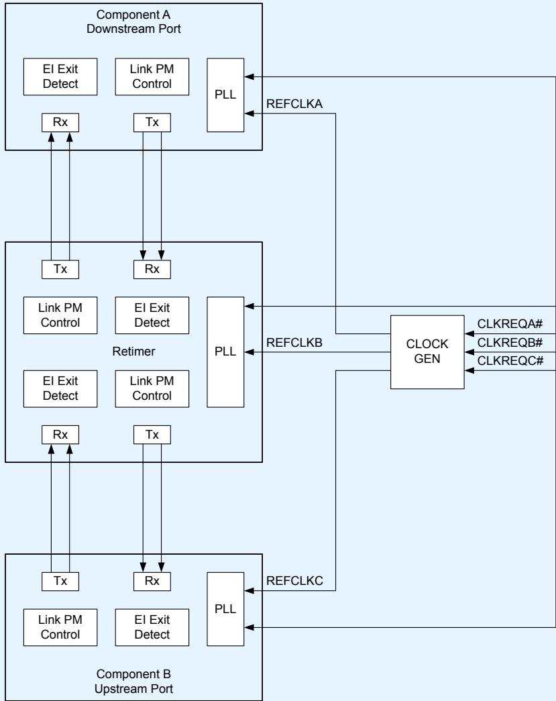

<a id="sec-4-3-11"></a>
## 4.3.11 Retimer Configuration Parameters | Retimer 配置参数

<!-- 📄 Page 648 -->
---

<table>
<thead>
<tr>
<th width="50%">🇬🇧 English</th>
<th width="50%" style="background-color:#e8e8e8">🇨🇳 中文</th>
</tr>
</thead>
<tbody>
<tr>
<td>

The parameters are split into two groups: parameters that are configurable globally for the Retimer and parameters that are configurable for each physical Retimer Pseudo Port.

If a per Pseudo Port parameter only applies to an Upstream or a Downstream Pseudo Port the Retimer is not required to provide an implementation specific mechanism to configure the parameter for the other type of Pseudo Port.

</td>
<td style="background-color:#e8e8e8">

这些参数分为两组：在 Retimer 全局可配置的参数，以及为每个物理 Retimer Pseudo Port 可配置的参数。

如果某 Pseudo Port 参数仅适用于上游或下游 Pseudo Port，则不要求 Retimer 为另一种类型的 Pseudo Port 提供实现特定的机制来配置该参数。

</td>
</tr>
</tbody>
</table>

<a id="sec-4-3-11-1"></a>
## 4.3.11.1 Global Parameters | 全局参数


<div style="overflow-x: auto; max-width: 100%;">
<table>
<thead>
<tr>
<th width="50%">🇬🇧 English</th>
<th width="50%" style="background-color:#e8e8e8">🇨🇳 中文</th>
</tr>
</thead>
<tbody>
<tr>
<td>

- **Port Orientation Method.** This controls whether the Port Orientation is determined dynamically as described in § Section 4.3.6.2 , or statically based on vendor assignment of Upstream and Downstream Pseudo Ports. If the Port Orientation is set to static the Retimer is not required to dynamically adjust the Port Orientation as described in § Section 4.3.6.2 . The default behavior is for the Port Orientation to be dynamically determined.

- **Maximum Data Rate.** This controls the maximum data rate that the Retimer sets in the Data Rate Identifier field of training sets that the Retimer transmits. Retimers that support only the 2.5 GT/s speed are permitted not to provide this configuration parameter.

- **SRIS Enable.** This controls whether the Retimer is configured for SRIS and transmits SKP Ordered Sets at the SRIS mode rate when in Execution mode. Retimers that do not support SRIS and at least one other clocking architecture are not required to provide this configuration parameter.

- **SRIS Link Payload Size.** This controls the maximum payload size the Retimer supports while in SRIS. The value must be selectable from all the Maximum Payload Sizes shown in § Table 4-67. The default value of this parameter is to support a maximum payload size of 4096 bytes. Retimers that do not support SRIS are not required to provide this configuration parameter.

The following are examples of cases where it might be appropriate to configure the SRIS Link Payload Size to a smaller value than the default:

  - A Retimer is part of a motherboard connected to Root Port that supports a maximum payload size less than 4096 bytes.
  - A Retimer is part of an adapter connected to an Upstream Port (e.g., Endpoint) that supports a maximum payload size less than 4096 bytes.
  - A Retimer is located Downstream of the Downstream Port of a Switch integrated as part of a system, the Root Port supports a maximum payload size less than 4096 bytes and the system does not support peer to peer traffic.

- **Enhanced Link Behavior Control.** This controls the ability for the Retimer to either bypass equalization to the highest data rate or completely bypass equalization when it supports 32.0 GT/s.

- **Port Orientation.** This is applicable only when the Port Orientation Method is configured for static determination. This is set for either Upstream or Downstream. Each Pseudo Port must be configured for a different orientation, or the behavior is undefined.

- **Selectable De-emphasis.** When the Downstream Pseudo Port is operating at 5.0 GT/s this controls the transmit de-emphasis of the Link to either -3.5 dB or -6 dB in specific situations and the value of the Selectable De-emphasis field in training sets transmitted by the Downstream Pseudo Port. See § Section 4.2.7 for detailed usage information. When the Link Segment is not operating at the 5.0 GT/s speed, the setting of this bit has no effect. Retimers that support only the 2.5 GT/s speed are permitted not to provide this configuration parameter.

- **Rx Impedance Control.** This controls whether the Retimer dynamically applies and removes 50 Ω terminations or statically has 50 Ω terminations present. The value must be selectable from Dynamic, Off, and On. The default behavior is Dynamic.

</td>
<td style="background-color:#e8e8e8">

- **端口方向方法 (Port Orientation Method)。** 该参数控制端口方向 (Port Orientation) 是按 § 4.3.6.2 节所述动态确定，还是基于厂商对上游和下游 Pseudo Port 的分配静态确定。如果端口方向设置为静态，则不要求 Retimer 按 § 4.3.6.2 节所述动态调整端口方向。默认行为是动态确定端口方向。

- **最大数据速率 (Maximum Data Rate)。** 该参数控制 Retimer 在其发送的训练集 (training set) 的 Data Rate Identifier 字段中设置的最大数据速率。仅支持 2.5 GT/s 速率的 Retimer 允许不提供此配置参数。

- **SRIS 使能 (SRIS Enable)。** 该参数控制 Retimer 是否配置为 SRIS 模式，并在 Execution 模式下以 SRIS 模式速率发送 SKP Ordered Set。不支持 SRIS 且至少支持一种其他时钟架构的 Retimer 不要求提供此配置参数。

- **SRIS 链路有效负载大小 (SRIS Link Payload Size)。** 该参数控制 Retimer 在 SRIS 下支持的最大有效负载大小。该值必须可从 § 表 4-67 中显示的所有最大有效负载大小中选择。此参数的默认值是支持最大有效负载大小为 4096 字节。不支持 SRIS 的 Retimer 不要求提供此配置参数。

以下是适合将 SRIS 链路有效负载大小配置为小于默认值的示例情况：

  - Retimer 是连接到根端口 (Root Port) 的主板的一部分，该根端口支持的最大有效负载大小小于 4096 字节。
  - Retimer 是连接到上游端口 (例如端点 Endpoint) 的适配器的一部分，该上游端口支持的最大有效负载大小小于 4096 字节。
  - Retimer 位于作为系统一部分集成的交换机 (Switch) 的下游端口下游，根端口支持的最大有效负载大小小于 4096 字节，且系统不支持对等 (peer-to-peer) 流量。

- **增强链路行为控制 (Enhanced Link Behavior Control)。** 该参数控制 Retimer 在支持 32.0 GT/s 时能够旁路均衡至最高数据速率或完全旁路均衡。

- **端口方向 (Port Orientation)。** 该参数仅在端口方向方法配置为静态确定时适用。设置为 Upstream 或 Downstream。每个 Pseudo Port 必须配置为不同的方向，否则行为未定义。

- **可选去加重 (Selectable De-emphasis)。** 当下游 Pseudo Port 以 5.0 GT/s 运行时，该参数控制在特定情况下链路发送去加重 (De-emphasis) 为 -3.5 dB 或 -6 dB，以及下游 Pseudo Port 发送的训练集中 Selectable De-emphasis 字段的值。有关详细用法信息，请参见 § 4.2.7 节。当链路段 (Link Segment) 未以 5.0 GT/s 速率运行时，此位的设置无效。仅支持 2.5 GT/s 速率的 Retimer 允许不提供此配置参数。

- **Rx 阻抗控制 (Rx Impedance Control)。** 该参数控制 Retimer 是动态施加和移除 50 Ω 终端，还是静态保持 50 Ω 终端。该值必须可从 Dynamic、Off 和 On 中选择。默认行为为 Dynamic。

</td>
</tr>
</tbody>
</table>
</div>


<a id="sec-4-3-11-2"></a>
## 4.3.11.2 Per Physical Pseudo Port Parameters | 按物理 Pseudo Port 参数

<!-- 📄 Page 649 -->
---

<table>
<thead>
<tr>
<th width="50%">🇬🇧 English</th>
<th width="50%" style="background-color:#e8e8e8">🇨🇳 中文</th>
</tr>
</thead>
<tbody>
<tr>
<td>

- **Tx Compliance Disable.** This controls whether the Retimer transmits the Compliance Pattern in the CompLoadBoard.Pattern state. The default behavior is for the Retimer to transmit the Compliance Pattern in the CompLoadBoard.Pattern state. If TX Compliance Pattern is set to disabled, the Retimer Transmitters remain in Electrical Idle and do not transmit Compliance Pattern in CompLoadBoard.Pattern - all other behavior in the CompLoadBoard state is the same.

- **Pseudo Port Follower Loopback.** This controls whether the Retimer operates in a Forwarding mode during loopback on the Link or enters Follower Loopback on the Pseudo Port. The default behavior is for the Retimer to operate in Forwarding mode during loopback. Retimers that do not support optional Follower Loopback are permitted not to provide this configuration parameter. This configuration parameter shall only be enabled for one physical Port. Retimer behavior is undefined if the parameter is enabled for more than one physical Port.

- **Downstream Pseudo Port 8GT TX Preset.** This controls the initial TX preset used by the Downstream Pseudo Port transmitter for 8.0 GT/s transmission. The default value is implementation specific. The value must be selectable from all applicable values in § Table 4-23.

- **Downstream Pseudo Port 16GT TX Preset.** This controls the initial TX preset used by the Downstream Pseudo Port transmitter for 16.0 GT/s transmission. The default value is implementation specific. The value must be selectable from all applicable values in § Table 4-23.

- **Downstream Pseudo Port 32GT TX Preset.** This controls the initial TX preset used by the Downstream Pseudo Port transmitter for 32.0 GT/s transmission. The default value is implementation specific. The value must be selectable for all applicable values in § Table 4-23.

- **Downstream Pseudo Port 64GT TX Preset.** This controls the initial TX preset used by the Downstream Pseudo Port transmitter for 64.0 GT/s transmission. The default value is implementation specific. The value must be selectable for all applicable values in § Table 4-23.

- **Downstream Pseudo Port 8GT Requested TX Preset.** This controls the initial transmitter preset value used in the EQ TS2 Ordered Sets transmitted by the Downstream Pseudo Port for use at 8.0 GT/s. The default value is implementation specific. The value must be selectable from all values in § Table 4-23.

- **Downstream Pseudo Port 16GT Requested TX Preset.** This controls the initial transmitter preset value used in the 128b/130b EQ TS2 Ordered Sets transmitted by the Downstream Pseudo Port for use at 16.0 GT/s. The default value is implementation specific. The value must be selectable from all values in § Table 4-23.

- **Downstream Pseudo Port 32GT Requested TX Preset.** This controls the initial transmitter preset value used in the 128b/130b EQ TS2 Ordered Sets transmitted by the Downstream Pseudo Port for use at 32.0 GT/s. The default value is implementation specific. The value must be selectable from all values in § Table 4-23.

- **Downstream Pseudo Port 64GT Requested TX Preset.** This controls the initial transmitter preset value used in the 128b/130b EQ TS2 Ordered Sets transmitted by the Downstream Pseudo Port for use at 64.0 GT/s. The default value is implementation specific. The value must be selectable from all values in § Table 4-23.

- **Downstream Pseudo Port 8GT RX Hint.** This controls the Receiver Preset Hint value used in the EQ TS2 Ordered Sets transmitted by the Downstream Pseudo Port for use at 8.0 GT/s. The default value is implementation specific. The value must be selectable from all values in § Table 4-24.

</td>
<td style="background-color:#e8e8e8">

- **Tx 一致性禁用 (Tx Compliance Disable)。** 该参数控制 Retimer 是否在 CompLoadBoard.Pattern 状态下发送一致性测试码型 (Compliance Pattern)。默认行为是 Retimer 在 CompLoadBoard.Pattern 状态下发送一致性测试码型。如果 TX 一致性测试码型被设置为禁用，则 Retimer 发送器保持电气空闲状态，不在 CompLoadBoard.Pattern 中发送一致性测试码型 — CompLoadBoard 状态中的所有其他行为保持不变。

- **Pseudo Port Follower Loopback。** 该参数控制 Retimer 在链路上进行 loopback 时以 Forwarding 模式运行，还是在 Pseudo Port 上进入 Follower Loopback。默认行为是 Retimer 在 loopback 期间以 Forwarding 模式运行。不支持可选 Follower Loopback 的 Retimer 允许不提供此配置参数。此配置参数只能为一个物理端口启用。如果在多个物理端口上启用该参数，则 Retimer 行为未定义。

- **下游 Pseudo Port 8GT TX 预设 (Downstream Pseudo Port 8GT TX Preset)。** 该参数控制下游 Pseudo Port 发送器用于 8.0 GT/s 传输的初始 TX 预设 (Preset)。默认值是实现特定的。该值必须可从 § 表 4-23 中的所有适用值中选择。

- **下游 Pseudo Port 16GT TX 预设 (Downstream Pseudo Port 16GT TX Preset)。** 该参数控制下游 Pseudo Port 发送器用于 16.0 GT/s 传输的初始 TX 预设。默认值是实现特定的。该值必须可从 § 表 4-23 中的所有适用值中选择。

- **下游 Pseudo Port 32GT TX 预设 (Downstream Pseudo Port 32GT TX Preset)。** 该参数控制下游 Pseudo Port 发送器用于 32.0 GT/s 传输的初始 TX 预设。默认值是实现特定的。该值必须可从 § 表 4-23 中的所有适用值中选择。

- **下游 Pseudo Port 64GT TX 预设 (Downstream Pseudo Port 64GT TX Preset)。** 该参数控制下游 Pseudo Port 发送器用于 64.0 GT/s 传输的初始 TX 预设。默认值是实现特定的。该值必须可从 § 表 4-23 中的所有适用值中选择。

- **下游 Pseudo Port 8GT 请求的 TX 预设 (Downstream Pseudo Port 8GT Requested TX Preset)。** 该参数控制下游 Pseudo Port 发送的 EQ TS2 Ordered Set 中用于 8.0 GT/s 的初始发送器预设值。默认值是实现特定的。该值必须可从 § 表 4-23 中的所有值中选择。

- **下游 Pseudo Port 16GT 请求的 TX 预设 (Downstream Pseudo Port 16GT Requested TX Preset)。** 该参数控制下游 Pseudo Port 发送的 128b/130b 编码 EQ TS2 Ordered Set 中用于 16.0 GT/s 的初始发送器预设值。默认值是实现特定的。该值必须可从 § 表 4-23 中的所有值中选择。

- **下游 Pseudo Port 32GT 请求的 TX 预设 (Downstream Pseudo Port 32GT Requested TX Preset)。** 该参数控制下游 Pseudo Port 发送的 128b/130b 编码 EQ TS2 Ordered Set 中用于 32.0 GT/s 的初始发送器预设值。默认值是实现特定的。该值必须可从 § 表 4-23 中的所有值中选择。

- **下游 Pseudo Port 64GT 请求的 TX 预设 (Downstream Pseudo Port 64GT Requested TX Preset)。** 该参数控制下游 Pseudo Port 发送的 128b/130b 编码 EQ TS2 Ordered Set 中用于 64.0 GT/s 的初始发送器预设值。默认值是实现特定的。该值必须可从 § 表 4-23 中的所有值中选择。

- **下游 Pseudo Port 8GT RX 提示 (Downstream Pseudo Port 8GT RX Hint)。** 该参数控制下游 Pseudo Port 发送的 EQ TS2 Ordered Set 中用于 8.0 GT/s 的接收器预设提示 (Receiver Preset Hint) 值。默认值是实现特定的。该值必须可从 § 表 4-24 中的所有值中选择。

</td>
</tr>
</tbody>
</table>

<a id="sec-4-3-12"></a>
## 4.3.12 In Band Register Access | 带内寄存器访问


<div style="overflow-x: auto; max-width: 100%;">
<table>
<thead>
<tr>
<th width="50%">🇬🇧 English</th>
<th width="50%" style="background-color:#e8e8e8">🇨🇳 中文</th>
</tr>
</thead>
<tbody>
<tr>
<td>

- Retimers operating at 16.0 GT/s or higher may optionally support inband read only access. Control SKP Ordered Sets at 16.0 GT/s or higher provide the mechanism via the Margin Command 'Access Retimer Register', see § Table 4-63. Retimers that support inband read only access must return a non-zero value for the DWORD at Registers offsets 80h and 84h. Retimers that do not support inband read only access must return a zero value.

- Register offsets between A0h and FFh are designated as Vendor Defined register space.

- Register offsets from 00h to 7Fh and 85H to 9Fh are Reserved for PCI-SIG future use.

</td>
<td style="background-color:#e8e8e8">

- 以 16.0 GT/s 或更高数据速率运行的 Retimer 可以选择支持带内只读访问。16.0 GT/s 或更高数据速率下的 Control SKP Ordered Set 通过 Margin Command "Access Retimer Register" 提供该机制，参见 § 表 4-63。支持带内只读访问的 Retimer 必须在寄存器偏移量 80h 和 84h 处返回非零值。不支持带内只读访问的 Retimer 必须返回零值。

- 寄存器偏移量 A0h 到 FFh 之间被指定为厂商定义 (Vendor Defined) 寄存器空间。

- 寄存器偏移量 00h 到 7Fh 和 85h 到 9Fh 保留供 PCI-SIG 未来使用。

</td>
</tr>
</tbody>
</table>
</div>


<!-- 📄 Page 650 -->
---


---

## 📑 本章目录 (Table of Contents) — Auto-Generated

- [4. Physical Layer Logical Block § | 物理层逻辑块 §](#sec-4)
- [4.1 Introduction § | 概述 §](#sec-4-1)
- [4.2 Logical Sub-block § | 逻辑子块 §](#sec-4-2)
- [4.2.1 8b/10b Encoding for 2.5 GT/s and 5.0 GT/s Data Rates § | 2.5 GT/s 与 5.0 GT/s 数据速率下的 8b/10b 编码 §](#sec-4-2-1)
- [4.2.1.1 Symbol Encoding § | 符号编码 §](#sec-4-2-1-1)
- [4.2.1.1.1 Serialization and De-serialization of Data § | 数据的串行化与解串行化 §](#sec-4-2-1-1-1)
- [4.2.1.1.2 Special Symbols for Framing and Link Management (K Codes) § | 成帧与链路管理的特殊符号 (K 码) §](#sec-4-2-1-1-2)
- [4.2.1.1.3 8b/10b Decode Rules § | 8b/10b 解码规则 §](#sec-4-2-1-1-3)
- [4.2.1.2 Framing and Application of Symbols to Lanes § | 符号的成帧与到通道的应用 §](#sec-4-2-1-2)
- [4.2.1.2.1 Framing and Application of Symbols to Lanes for TLPs and DLLPs in Non-Flit Mode § | 非 Flit 模式下 TLP 和 DLLP 的成帧与到通道的应用 §](#sec-4-2-1-2-1)
- [4.2.1.3 Data Scrambling § | 数据加扰 §](#sec-4-2-1-3)
- [4.2.2 128b/130b Encoding for 8.0 GT/s, 16.0 GT/s, and 32.0 GT/s Data Rates § | 8.0 GT/s、16.0 GT/s 与 32.0 GT/s 数据速率下的 128b/130b 编码 §](#sec-4-2-2)
- [4.2.2.1 Lane Level Encoding | 通道级编码](#sec-4-2-2-1)
- [4.2.2.2 Ordered Set Blocks | 有序集块](#sec-4-2-2-2)
- [4.2.2.2.1 Block Alignment | 块对齐](#sec-4-2-2-2-1)
- [4.2.2.3 Data Blocks | 数据块](#sec-4-2-2-3)
- [4.2.2.3.1 Framing Tokens in Non-Flit-Mode | 非 Flit 模式下的帧定界符](#sec-4-2-2-3-1)
- [4.2.2.3.2 Transmitter Framing Requirements in Non-Flit Mode | 非 Flit 模式下的发送器帧定界要求](#sec-4-2-2-3-2)
- [4.2.2.3.3 Receiver Framing Requirements in Non-Flit Mode | 非 Flit 模式下的接收器帧定界要求](#sec-4-2-2-3-3)
- [4.2.2.3.4 Receiver Framing Requirements in Flit Mode | Flit 模式下的接收器帧定界要求](#sec-4-2-2-3-4)
- [4.2.2.3.5 Recovery from Framing Errors in Non-Flit Mode and Flit Mode | 非 Flit 模式与 Flit 模式下的帧错误恢复](#sec-4-2-2-3-5)
- [4.2.2.4 Scrambling in Non-Flit Mode and Flit Mode | 非 Flit 模式与 Flit 模式下的加扰](#sec-4-2-2-4)
- [4.2.2.5 Precoding | 预编码 (Precoding)](#sec-4-2-2-5)
- [4.2.2.5.1 Precoding at 32.0 GT/s Data Rate | 32.0 GT/s 数据速率下的预编码](#sec-4-2-2-5-1)
- [4.2.2.6 Loopback with 128b/130b Code in Non-Flit Mode and Flit Mode | 非 Flit 模式与 Flit 模式下使用 128b/130b 编码的回环](#sec-4-2-2-6)
- [4.2.3 Flit Mode Operation | Flit 模式操作](#sec-4-2-3)
- [4.2.3.1 1b/1b Encoding for 64.0 GT/s and higher Data Rates | 64.0 GT/s 及更高数据速率下的 1b/1b 编码](#sec-4-2-3-1)
- [4.2.3.1.1 PAM4 Signaling | PAM4（四电平脉冲幅度调制）信令](#sec-4-2-3-1-1)
- [4.2.3.1.2 1b/1b Scrambling | 1b/1b 加扰](#sec-4-2-3-1-2)
- [4.2.3.1.3 Gray Coding at 64.0 GT/s and Higher Data Rates | 64.0 GT/s 及更高数据速率下的格雷编码](#sec-4-2-3-1-3)
- [4.2.3.1.4 Precoding at 64.0 GT/s and Higher Data Rates | 64.0 GT/s 及更高数据速率下的预编码](#sec-4-2-3-1-4)
- [4.2.3.1.5 Ordered Set Blocks at 64.0 GT/s and Higher Data Rates | 64.0 GT/s 及更高数据速率下的有序集块](#sec-4-2-3-1-5)
- [4.2.3.1.6 Alignment at Block/Flit Level for 1b/1b Encoding | 1b/1b 编码下的块/Flit 级对齐](#sec-4-2-3-1-6)
- [4.2.3.2 Processing of Ordered Sets During Flit Mode Data Stream | Flit 模式数据流中有序集的处理](#sec-4-2-3-2)
- [4.2.3.3 Data Stream in Flit Mode | Flit 模式数据流](#sec-4-2-3-3)
- [4.2.3.4 Bytes in Flit Layout | Flit 布局中的字节](#sec-4-2-3-4)
- [4.2.3.4.1 TLP Bytes in Flit | Flit 中的 TLP 字节](#sec-4-2-3-4-1)
- [4.2.3.4.2 DLP Bytes in Flit | Flit 中的 DLP 字节](#sec-4-2-3-4-2)
- [4.2.3.4.2.1 Flit Sequence Number and Retry Mechanism | Flit 序列号与重传机制](#sec-4-2-3-4-2-1)
- [4.2.3.4.2.1.1 IDLE Flit Handshake Phase | IDLE Flit 握手阶段](#sec-4-2-3-4-2-1-1)
- [4.2.3.4.2.1.2 Sequence Number Handshake Phase | 序列号握手阶段](#sec-4-2-3-4-2-1-2)
- [4.2.3.4.2.1.3 Normal Flit Exchange Phase | 正常 Flit 交换阶段](#sec-4-2-3-4-2-1-3)
- [4.2.3.4.2.1.4 Received Ack and Nak Processing | 已接收 Ack 与 Nak 的处理](#sec-4-2-3-4-2-1-4)
- [4.2.3.4.2.1.5 Ack, Nak, and Discard Rules | Ack、Nak 与丢弃规则](#sec-4-2-3-4-2-1-5)
- [4.2.3.4.2.1.6 Flit Replay Scheduling | Flit 重放调度](#sec-4-2-3-4-2-1-6)
- [4.2.3.4.2.1.7 Flit Replay Transmit Rules | Flit 重放发送规则](#sec-4-2-3-4-2-1-7)
- [4.2.3.4.3 CRC Bytes in Flit | Flit 中的 CRC 字节](#sec-4-2-3-4-3)
- [4.2.3.4.4 ECC Bytes in Flit | Flit 中的 ECC 字节](#sec-4-2-3-4-4)
- [4.2.3.4.5 Ordered Set insertion in Data Stream in Flit Mode | Flit 模式下数据流中的有序集插入](#sec-4-2-3-4-5)
- [4.2.4 Link Equalization Procedure for 8.0 GT/s and Higher Data Rates | 4.2.4 8.0 GT/s 及更高数据速率的链路均衡 (Equalization) 过程](#sec-4-2-4)
- [4.2.4.1 Rules for Transmitter Coefficients | 发送器系数规则](#sec-4-2-4-1)
- [4.2.4.2 Encoding of Presets | 4.2.4.2 预设的编码](#sec-4-2-4-2)
- [4.2.5 Link Initialization and Training | 4.2.5 链路初始化与训练](#sec-4-2-5)
- [4.2.5.1 Training Sequences | 4.2.5.1 训练序列](#sec-4-2-5-1)
- [4.2.5.2 Alternate Protocol Negotiation | 替代协议协商](#sec-4-2-5-2)
- [4.2.5.3 Electrical Idle Sequences (EIOS and EIEOS) | 电气空闲序列 (EIOS 和 EIEOS)](#sec-4-2-5-3)
- [4.2.5.4 Inferring Electrical Idle | 推断电气空闲](#sec-4-2-5-4)
- [4.2.5.5 Lane Polarity Inversion | 通道极性反转](#sec-4-2-5-5)
- [4.2.5.6 Fast Training Sequence (FTS) | 快速训练序列 (FTS)](#sec-4-2-5-6)
- [4.2.5.7 Start of Data Stream Ordered Set (SDS Ordered Set) | 数据流起始有序集 (SDS 有序集)](#sec-4-2-5-7)
- [4.2.5.8 Link Error Recovery | 链路错误恢复](#sec-4-2-5-8)
- [4.2.5.9 Reset | 复位](#sec-4-2-5-9)
- [4.2.5.9.1 Fundamental Reset | 基本复位](#sec-4-2-5-9-1)
- [4.2.5.9.2 Hot Reset | 热复位](#sec-4-2-5-9-2)
- [4.2.5.10 Link Data Rate Negotiation | 链路数据速率协商](#sec-4-2-5-10)
- [4.2.5.11 Link Width and Lane Sequence Negotiation | 链路宽度与通道序列协商](#sec-4-2-5-11)
- [4.2.5.11.1 Required and Optional Port Behavior | 端口的必需与可选行为](#sec-4-2-5-11-1)
- [4.2.5.12 Lane-to-Lane De-skew | 通道间去偏斜](#sec-4-2-5-12)
- [4.2.5.13 Lane vs. Link Training | 通道训练与链路训练](#sec-4-2-5-13)
- [4.2.6 Link Training and Status State Machine (LTSSM) Descriptions | 链路训练与状态机 (LTSSM) 描述](#sec-4-2-6)
- [4.2.6.1 Detect Overview | Detect 概述](#sec-4-2-6-1)
- [4.2.6.2 Polling Overview | Polling 概述](#sec-4-2-6-2)
- [4.2.6.3 Configuration Overview | Configuration 概述](#sec-4-2-6-3)
- [4.2.6.4 Recovery Overview | Recovery 概述](#sec-4-2-6-4)
- [4.2.6.5 L0 Overview | L0 概述](#sec-4-2-6-5)
- [4.2.6.6 L0s Overview | L0s 概述](#sec-4-2-6-6)
- [4.2.6.7 L0p Overview | L0p 概述](#sec-4-2-6-7)
- [4.2.6.7.1 L0p Request/Response Rules | L0p 请求/响应规则](#sec-4-2-6-7-1)
- [4.2.6.7.2 L0p Ack/Nak Rules | L0p Ack/Nak 规则](#sec-4-2-6-7-2)
- [4.2.6.7.3 L0p Priority Rules | L0p 优先级规则](#sec-4-2-6-7-3)
- [4.2.6.7.4 L0p Down-Size and Up-Size | L0p Down-Size 和 Up-Size](#sec-4-2-6-7-4)
- [4.2.6.7.5 L0p Down-Size Lane Deactivation | L0p Down-Size 通道去激活](#sec-4-2-6-7-5)
- [4.2.6.7.6 Link Management DLLP Encoding | Link Management DLLP 编码](#sec-4-2-6-7-6)
- [4.2.6.7.7 Link Management DLLP Encoding (continued) | Link Management DLLP 编码(续)](#sec-4-2-6-7-7)
- [4.2.6.7.8 L0p Flow Example | L0p 流程示例](#sec-4-2-6-7-8)
- [4.2.6.8 L1 Overview | L1 概述](#sec-4-2-6-8)
- [4.2.6.9 L2 Overview | L2 概述](#sec-4-2-6-9)
- [4.2.6.10 Disabled Overview | Disabled 概述](#sec-4-2-6-10)
- [4.2.6.10 Disabled Overview | 禁用状态概述](#sec-4-2-6-10)
- [4.2.6.11 Loopback Overview | 回环状态概述](#sec-4-2-6-11)
- [4.2.6.12 Hot Reset Overview | 热复位状态概述](#sec-4-2-6-12)
- [4.2.7 Link Training and Status State Rules | 链路训练与状态机规则](#sec-4-2-7)
- [4.2.7.1 Detect | 检测状态](#sec-4-2-7-1)
- [4.2.7.1.1 Detect.Quiet | Detect.Quiet(静默检测)](#sec-4-2-7-1-1)
- [4.2.7.1.2 Detect.Active | Detect.Active(主动检测)](#sec-4-2-7-1-2)
- [4.2.7.2 Polling | 轮询状态](#sec-4-2-7-2)
- [4.2.7.2.1 Polling.Active | Polling.Active(主动轮询)](#sec-4-2-7-2-1)
- [4.2.7.2.2 Polling.Compliance | Polling.Compliance(一致性轮询)](#sec-4-2-7-2-2)
- [4.2.7.2.3 Polling.Configuration | Polling.Configuration 子状态](#sec-4-2-7-2-3)
- [4.2.7.2.4 Polling.Speed | Polling.Speed 子状态](#sec-4-2-7-2-4)
- [4.2.7.3 Configuration | Configuration 状态](#sec-4-2-7-3)
- [4.2.7.3.1 Configuration.Linkwidth.Start | Configuration.Linkwidth.Start 子状态](#sec-4-2-7-3-1)
- [4.2.7.3.1.1 Downstream Lanes | 下游通道](#sec-4-2-7-3-1-1)
- [4.2.7.3.1.2 Upstream Lanes | 上游通道](#sec-4-2-7-3-1-2)
- [4.2.7.3.2 Configuration.Linkwidth.Accept | Configuration.Linkwidth.Accept 子状态](#sec-4-2-7-3-2)
- [4.2.7.3.2.1 Downstream Lanes | 下游通道](#sec-4-2-7-3-2-1)
- [4.2.7.3.2.2 Upstream Lanes | 上游通道](#sec-4-2-7-3-2-2)
- [4.2.7.3.3 Configuration.Lanenum.Accept | Configuration.Lanenum.Accept 子状态](#sec-4-2-7-3-3)
- [4.2.7.3.3.1 Downstream Lanes | 下游通道](#sec-4-2-7-3-3-1)
- [4.2.7.3.3.2 Upstream Lanes | 上游通道](#sec-4-2-7-3-3-2)
- [4.2.7.3.4 Configuration.Lanenum.Wait | Configuration.Lanenum.Wait 子状态](#sec-4-2-7-3-4)
- [4.2.7.3.4.1 Downstream Lanes | 下游通道](#sec-4-2-7-3-4-1)
- [4.2.7.3.4.2 Upstream Lanes | 上游通道](#sec-4-2-7-3-4-2)
- [4.2.7.3.5 Configuration.Complete | Configuration.Complete 子状态](#sec-4-2-7-3-5)
- [4.2.7.3.5.1 Downstream Lanes | 下游通道](#sec-4-2-7-3-5-1)
- [4.2.7.3.5.2 Upstream Lanes | 上游通道](#sec-4-2-7-3-5-2)
- [4.2.7.3.6 Configuration.Idle | Configuration.Idle 子状态](#sec-4-2-7-3-6)
- [4.2.7.4 Recovery | Recovery 状态](#sec-4-2-7-4-1)
- [4.2.7.4 Recovery | Recovery 状态](#sec-4-2-7-4-1)
- [4.2.7.4.2 Recovery.Equalization | Recovery.Equalization 子状态](#sec-4-2-7-4-2)
- [4.2.7.4.2 Recovery.Equalization | Recovery.Equalization 子状态](#sec-4-2-7-4-2)
- [4.2.7.4.2.1 Downstream Lanes | Downstream 通道](#sec-4-2-7-4-2-1)
- [4.2.7.4.2.1 Downstream Lanes | Downstream 通道](#sec-4-2-7-4-2-1)
- [4.2.7.4.2.1.1 Phase 1 of Transmitter Equalization | 发送器均衡 Phase 1](#sec-4-2-7-4-2-1-1)
- [4.2.7.4.2.1.2 Phase 2 of Transmitter Equalization | 发送器均衡 Phase 2](#sec-4-2-7-4-2-1-2)
- [4.2.7.4.2.1.3 Phase 3 of Transmitter Equalization | 发送器均衡 Phase 3](#sec-4-2-7-4-2-1-3)
- [4.2.7.4.2.2 Upstream Lanes | 上游 Lane](#sec-4-2-7-4-2-2)
- [4.2.7.4.2.2.1 Phase 0 of Transmitter Equalization | 发送器均衡 Phase 0](#sec-4-2-7-4-2-2-1)
- [4.2.7.4.2.2.2 Phase 1 of Transmitter Equalization | 发送器均衡 Phase 1(上游)](#sec-4-2-7-4-2-2-2)
- [4.2.7.4.2.2.3 Phase 2 of Transmitter Equalization | 发送器均衡 Phase 2](#sec-4-2-7-4-2-2-3)
- [4.2.7.4.2.2.4 Phase 3 of Transmitter Equalization | 发送器均衡 Phase 3](#sec-4-2-7-4-2-2-4)
- [4.2.7.4.3 Recovery.Speed | Recovery.Speed 子状态](#sec-4-2-7-4-3)
- [4.2.7.4.4 Recovery.RcvrCfg | Recovery.RcvrCfg 子状态](#sec-4-2-7-4-4)
- [4.2.7.4.5 Recovery.Idle | Recovery.Idle 子状态](#sec-4-2-7-4-5)
- [4.2.7.5 L0 | L0](#sec-4-2-7-5)
- [4.2.7.6 L0s | L0s](#sec-4-2-7-6)
- [4.2.7.7 L1 | L1](#sec-4-2-7-7)
- [4.2.7.7.1 L1.Entry | L1.Entry](#sec-4-2-7-7-1)
- [4.2.7.7.2 L1.Idle | L1.Idle](#sec-4-2-7-7-2)
- [4.2.7.8 L2 | L2](#sec-4-2-7-8)
- [4.2.7.8.1 L2.Idle | L2.Idle](#sec-4-2-7-8-1)
- [4.2.7.8.2 L2.TransmitWake | L2.TransmitWake](#sec-4-2-7-8-2)
- [4.2.7.9 Disabled | Disabled](#sec-4-2-7-9)
- [4.2.7.10 Loopback | Loopback](#sec-4-2-7-10)
- [4.2.7.10.1 Loopback.Entry | Loopback.Entry](#sec-4-2-7-10-1)
- [4.2.7.10.2 Loopback.Active | Loopback.Active](#sec-4-2-7-10-2)
- [4.2.7.10.3 Loopback.Exit | Loopback.Exit](#sec-4-2-7-10-3)
- [4.2.8 Clock Tolerance Compensation | 时钟容差补偿](#sec-4-2-8)
- [4.2.8.5 Rules for Receivers | 接收器规则](#sec-4-2-8-5)
- [4.2.9 Compliance Pattern in 8b/10b Encoding | 8b/10b 编码下的一致性测试码型](#sec-4-2-9)
- [4.2.10 Modified Compliance Pattern in 8b/10b Encoding | 8b/10b 编码下修改后的一致性测试码型](#sec-4-2-10)
- [4.2.11 Compliance Pattern in 128b/130b Encoding | 128b/130b 编码下的一致性测试码型](#sec-4-2-11)
- [4.2.12 Modified Compliance Pattern in 128b/130b Encoding | 128b/130b 编码下修改后的一致性测试码型](#sec-4-2-12)
- [4.2.13 Jitter Measurement Pattern in 128b/130b | 128b/130b 编码下的抖动测量码型](#sec-4-2-13)
- [4.2.14 Compliance Pattern in 1b/1b Encoding | 1b/1b 编码下的一致性测试码型](#sec-4-2-14)
- [4.2.15 Modified Compliance Pattern in 1b/1b Encoding | 1b/1b 编码下修改后的一致性测试码型](#sec-4-2-15)
- [4.2.16 Jitter Measurement Pattern in 1b/1b Encoding | 1b/1b 编码中的抖动测量码型](#sec-4-2-16)
- [4.2.17 Toggle Patterns in 1b/1b encoding | 1b/1b 编码中的翻转码型](#sec-4-2-17)
- [4.2.18 Lane Margining at Receiver | 接收端通道裕量测试](#sec-4-2-18)
- [4.2.18.1 Receiver Number, Margin Type, Usage Model, and Margin Payload Fields | 4.2.18.1 Receiver Number、Margin Type、Usage Model 与 Margin Payload 字段](#sec-4-2-18-1)
- [4.2.18.1.1 Step Margin Execution Status | 4.2.18.1.1 Step Margin 执行状态](#sec-4-2-18-1-1)
- [4.2.18.1.2 Margin Payload for Step Margin Commands | 4.2.18.1.2 Step Margin 命令的 Margin Payload 字段](#sec-4-2-18-1-2)
- [4.2.18.2 Margin Command and Response Flow | 4.2.18.2 Margin Command 与响应流程](#sec-4-2-18-2)
- [4.2.18.3 Flit Mode 8.0 GT/s Margining Behavior | 4.2.18.3 Flit 模式下 8.0 GT/s 的裕量测试行为](#sec-4-2-18-3)
- [4.2.18.4 Receiver Margin Testing Requirements | 接收器裕量测试要求](#sec-4-2-18-4)
- [4.3 Retimers | 重定时器 (Retimer)](#sec-4-3)
- [4.3.1 Retimer Requirements | 重定时器 (Retimer) 要求](#sec-4-3-1)
- [4.3.2 Supported Retimer Topologies | 受支持的重定时器 (Retimer) 拓扑](#sec-4-3-2)
- [4.3.3 Variables | 变量](#sec-4-3-3)
- [4.3.4 Receiver Impedance Propagation Rules | 接收器阻抗传播规则](#sec-4-3-4)
- [4.3.6 Forwarding Rules | 转发规则](#sec-4-3-6)
- [4.3.6.1 Forwarding Type Rules | 转发类型规则](#sec-4-3-6-1)
- [4.3.6.2 Orientation, Lane Numbers, and Data Stream Mode Rules | 方向、通道号与数据流模式规则](#sec-4-3-6-2)
- [4.3.6.7 Ordered Set Modification Rules | 有序集修改规则](#sec-4-3-6-7)
- [4.3.6.8 DLLP, TLP, Logical Idle, and Flit Modification Rules | DLLP、TLP、逻辑空闲和 Flit 修改规则](#sec-4-3-6-8)
- [4.3.6.9 8b/10b Encoding Rules | 8b/10b 编码规则](#sec-4-3-6-9)
- [4.3.6.10 8b/10b Scrambling Rules | 8b/10b 加扰规则](#sec-4-3-6-10)
- [4.3.6.11 Hot Reset Rules | 热复位规则](#sec-4-3-6-11)
- [4.3.6.12 Disable Link Rules | 禁用链路规则](#sec-4-3-6-12)
- [4.3.6.13 Loopback | 回环](#sec-4-3-6-13)
- [4.3.6.14 Compliance Receive Rules | 一致性接收规则](#sec-4-3-6-14)
- [4.3.6.15 Enter Compliance Rules | 进入一致性规则](#sec-4-3-6-15)
- [4.3.7 Execution Mode Rules | 执行模式规则](#sec-4-3-7)
- [4.3.7.1.1 CompLoadBoard.Entry | CompLoadBoard.Entry 状态](#sec-4-3-7-1-1)
- [4.3.7.1.2 CompLoadBoard.Pattern | CompLoadBoard.Pattern 状态](#sec-4-3-7-1-2)
- [4.3.7.1.3 CompLoadBoard.Exit | CompLoadBoard.Exit 状态](#sec-4-3-7-1-3)
- [4.3.7.2 Link Equalization Rules | 链路均衡规则](#sec-4-3-7-2)
- [4.3.7.2.1.1 Phase 1 | Phase 1 阶段](#sec-4-3-7-2-1-1)
- [4.3.7.2.1.2 Phase 2 | Phase 2 阶段](#sec-4-3-7-2-1-2)
- [4.3.7.2.1.3 Phase 3 Active | Phase 3 Active 阶段](#sec-4-3-7-2-1-3)
- [4.3.7.2.1.4 Phase 3 Passive | Phase 3 Passive 阶段](#sec-4-3-7-2-1-4)
- [4.3.7.2.2.1 Phase 0 | Phase 0 阶段](#sec-4-3-7-2-2-1)
- [4.3.7.2.2.2 Phase 1 Active | Phase 1 Active 阶段](#sec-4-3-7-2-2-2)
- [4.3.7.2.2.3 Phase 2 Active | Phase 2 Active 阶段](#sec-4-3-7-2-2-3)
- [4.3.7.2.2.4 Phase 2 Passive | 第 2 阶段被动](#sec-4-3-7-2-2-4)
- [4.3.7.2.2.5 Phase 3 | 第 3 阶段](#sec-4-3-7-2-2-5)
- [4.3.7.2.3 Force Timeout | 强制超时](#sec-4-3-7-2-3)
- [4.3.7.3 Follower Loopback | Follower Loopback](#sec-4-3-7-3)
- [4.3.7.3.1 Follower Loopback.Entry | Follower Loopback.Entry](#sec-4-3-7-3-1)
- [4.3.7.3.2 Follower Loopback.Active | Follower Loopback.Active](#sec-4-3-7-3-2)
- [4.3.7.3.3 Follower Loopback.Exit | Follower Loopback.Exit](#sec-4-3-7-3-3)
- [4.3.8 Retimer Latency | Retimer 延迟](#sec-4-3-8)
- [4.3.8.1 Measurement | 测量方法](#sec-4-3-8-1)
- [4.3.8.2 Maximum Limit on Retimer Latency | Retimer 延迟的最大限制](#sec-4-3-8-2)
- [4.3.8.3 Impacts on Upstream and Downstream Ports | 对上游端口和下游端口的影响](#sec-4-3-8-3)
- [4.3.9 SRIS | SRIS](#sec-4-3-9)
- [4.3.10 L1 PM Substates Support | L1 PM 子状态支持](#sec-4-3-10)
- [4.3.11 Retimer Configuration Parameters | Retimer 配置参数](#sec-4-3-11)
- [4.3.11.1 Global Parameters | 全局参数](#sec-4-3-11-1)
- [4.3.11.2 Per Physical Pseudo Port Parameters | 按物理 Pseudo Port 参数](#sec-4-3-11-2)
- [4.3.12 In Band Register Access | 带内寄存器访问](#sec-4-3-12)
