# 📘 第 5 章　Power Management (Chapter 5. Power Management)

**PCI Express® Base Specification — Revision 6.2, Version 1.0 — January 25, 2024**

> 📄 **Source pages**: 651–706 (PDF 1-indexed) | 📁 **File**: `chapter_05_raw.md`
> 🎨 **Format**: 中英对照双语 · 图表原始保留 · 中文背景色灰色 · GitHub Flavored Markdown
> 📚 **Template**: CXL 3.2 Spec translation (CXL_zh/)

---

## 📑 章节索引 (Sections)

| # | Section | 小节 | Page |
|:-:|:--------|:-----|:----:|
|  | 5.1 | [Overview §](#sec-5-1) | [概述 §](#sec-5-1) | p.651 |
|  | 5.2 | [Link State Power Management §](#sec-5-2) | [链路状态电源管理 §](#sec-5-2) | p.651 |
|  | 5.3 | [PCI-PM Software Compatible Mechanis…](#sec-5-3) | [PCI-PM 软件兼容机制 §](#sec-5-3) | p.656 |
| 5.3.1 | Device Power Management States (D-S… | 5.3.1 Function 的设备电源管理状态 (D 状态… | p.656 |
|  | 5.3.1.1 | [D0 State §](#sec-5-3-1-1) | [5.3.1.1 D0 状态 §](#sec-5-3-1-1) | p.656 |
|  | 5.3.1.2 | [D1 State §](#sec-5-3-1-2) | [5.3.1.2 D1 状态 §](#sec-5-3-1-2) | p.656 |
|  | 5.3.1.3 | [D2 State §](#sec-5-3-1-3) | [5.3.1.3 D2 状态 §](#sec-5-3-1-3) | p.656 |
|  | 5.3.1.4 | [D3 State §](#sec-5-3-1-4) | [5.3.1.4 D3 状态 §](#sec-5-3-1-4) | p.658 |
|  | 5.3.1.4.1 | [D3Hot State §](#sec-5-3-1-4-1) | [5.3.1.4.1 D3Hot 状态 §](#sec-5-3-1-4-1) | p.658 |
|  | 5.3.1.4.2 | [D3Cold State §](#sec-5-3-1-4-2) | [5.3.1.4.2 D3Cold 状态 §](#sec-5-3-1-4-2) | p.660 |
|  | 5.3.2 | [PM Software Control of the Link Pow…](#sec-5-3-2) | [5.3.2 链路电源管理状态的 PM 软件控制 §](#sec-5-3-2) | p.660 |
|  | 5.3.2.1 | [Entry into the L1 State §](#sec-5-3-2-1) | [5.3.2.1 进入 L1 状态 §](#sec-5-3-2-1) | p.661 |
|  | 5.3.2.2 | [Exit from L1 State §](#sec-5-3-2-2) | [5.3.2.2 退出 L1 状态 §](#sec-5-3-2-2) | p.664 |
|  | 5.3.2.3 | [Entry into the L2/L3 Ready State §](#sec-5-3-2-3) | [5.3.2.3 进入 L2/L3 Ready 状态 §](#sec-5-3-2-3) | p.664 |
|  | 5.3.3 | [Power Management Event Mechanisms §](#sec-5-3-3) | [5.3.3 电源管理事件机制 §](#sec-5-3-3) | p.664 |
|  | 5.3.3.1 | [Motivation §](#sec-5-3-3-1) | [5.3.3.1 动机 §](#sec-5-3-3-1) | p.664 |
|  | 5.3.3.2 | [Link Wakeup §](#sec-5-3-3-2) | [5.3.3.2 链路唤醒 §](#sec-5-3-3-2) | p.666 |
|  | 5.3.3.2.1 | [PME Synchronization §](#sec-5-3-3-2-1) | [5.3.3.2.1 PME 同步 §](#sec-5-3-3-2-1) | p.667 |
|  | 5.3.3.3 | [PM_PME Messages §](#sec-5-3-3-3) | [5.3.3.3 PM_PME 报文 §](#sec-5-3-3-3) | p.668 |
|  | 5.3.3.3.1 | [PM_PME "Backpressure" Deadlock Avoi…](#sec-5-3-3-3-1) | [5.3.3.3.1 PM_PME "背压"死锁避免 §](#sec-5-3-3-3-1) | p.668 |
|  | 5.3.3.4 | [PME Rules §](#sec-5-3-3-4) | [5.3.3.4 PME 规则 §](#sec-5-3-3-4) | p.669 |
|  | 5.3.3.5 | [PM_PME Delivery State Machine §](#sec-5-3-3-5) | [5.3.3.5 PM_PME 传递状态机 §](#sec-5-3-3-5) | p.669 |
|  | 5.4 | [Native PCI Express Power Management…](#sec-5-4) | [5.4 原生 PCI Express 电源管理机制 §](#sec-5-4) | p.671 |
|  | 5.4.1 | [Active State Power Management (ASPM…](#sec-5-4-1) | [5.4.1 主动状态电源管理 (ASPM) §](#sec-5-4-1) | p.672 |
|  | 5.4.1.1 | [L0s ASPM State §](#sec-5-4-1-1) | [5.4.1.1 L0s ASPM 状态 §](#sec-5-4-1-1) | p.673 |
|  | 5.4.1.1.1 | [Entry into the L0s State §](#sec-5-4-1-1-1) | [5.4.1.1.1 进入 L0s 状态 §](#sec-5-4-1-1-1) | p.673 |
|  | 5.4.1.1.2 | [Exit from the L0s State §](#sec-5-4-1-1-2) | [5.4.1.1.2 退出 L0s 状态 §](#sec-5-4-1-1-2) | p.673 |
|  | 5.4.1.2 | [ASPM L0p State §](#sec-5-4-1-2) | [5.4.1.2 ASPM L0p 状态 §](#sec-5-4-1-2) | p.676 |
|  | 5.4.1.3 | [ASPM L1 State §](#sec-5-4-1-3) | [5.4.1.3 ASPM L1 状态 §](#sec-5-4-1-3) | p.676 |
|  | 5.4.1.3.1 | [ASPM Entry into the L1 State §](#sec-5-4-1-3-1) | [5.4.1.3.1 ASPM 进入 L1 状态 §](#sec-5-4-1-3-1) | p.677 |
|  | 5.4.1.3.2 | [Exit from the L1 State §](#sec-5-4-1-3-2) | [5.4.1.3.2 退出 L1 状态 §](#sec-5-4-1-3-2) | p.682 |
|  | 5.4.1.4 | [ASPM Configuration §](#sec-5-4-1-4) | [5.4.1.4 ASPM 配置 §](#sec-5-4-1-4) | p.684 |
|  | 5.4.1.4.1 | [Software Flow for Enabling or Disab…](#sec-5-4-1-4-1) | [5.4.1.4.1 启用或禁用 ASPM 的软件流程 §](#sec-5-4-1-4-1) | p.686 |
|  | 5.5 | [L1 PM Substates §](#sec-5-5) | [5.5 L1 PM Substates §](#sec-5-5) | p.688 |
|  | 5.5.1 | [Entry conditions for L1 PM Substate…](#sec-5-5-1) | [5.5.1 L1 PM Substates 的进入条件与 L…](#sec-5-5-1) | p.690 |
|  | 5.5.2 | [L1.1 Requirements §](#sec-5-5-2) | [5.5.2 L1.1 要求 §](#sec-5-5-2) | p.693 |
|  | 5.5.2.1 | [Exit from L1.1 §](#sec-5-5-2-1) | [5.5.2.1 退出 L1.1 §](#sec-5-5-2-1) | p.693 |
|  | 5.5.3 | [L1.2 Requirements §](#sec-5-5-3) | [5.5.3 L1.2 要求 §](#sec-5-5-3) | p.694 |
|  | 5.5.3.1 | [L1.2.Entry §](#sec-5-5-3-1) | [5.5.3.1 L1.2.Entry §](#sec-5-5-3-1) | p.694 |
|  | 5.5.3.2 | [L1.2.Idle §](#sec-5-5-3-2) | [5.5.3.2 L1.2.Idle §](#sec-5-5-3-2) | p.694 |
|  | 5.5.3.3 | [L1.2.Exit §](#sec-5-5-3-3) | [5.5.3.3 L1.2.Exit §](#sec-5-5-3-3) | p.694 |
|  | 5.5.3.3.1 | [Exit from L1.2 §](#sec-5-5-3-3-1) | [5.5.3.3.1 退出 L1.2 §](#sec-5-5-3-3-1) | p.694 |
|  | 5.5.4 | [L1 PM Substates Configuration §](#sec-5-5-4) | [5.5.4 L1 PM Substates 配置 §](#sec-5-5-4) | p.698 |
|  | 5.5.5 | [L1 PM Substates Timing Parameters §](#sec-5-5-5) | [5.5.5 L1 PM Substates 时序参数 §](#sec-5-5-5) | p.698 |
|  | 5.5.6 | [Link Activation §](#sec-5-5-6) | [5.5.6 链路激活 §](#sec-5-5-6) | p.698 |
|  | 5.6 | [Auxiliary Power Support §](#sec-5-6) | [5.6 辅助电源支持 §](#sec-5-6) | p.701 |
|  | 5.7 | [Power Management System Messages an…](#sec-5-7) | [5.7 电源管理系统报文与 DLLP §](#sec-5-7) | p.701 |
|  | 5.8 | [PCI Function Power State Transition…](#sec-5-8) | [5.8 PCI Function 电源状态转换 §](#sec-5-8) | p.702 |
|  | 5.9 | [State Transition Recovery Time Requ…](#sec-5-9) | [5.9 状态转换恢复时间要求 §](#sec-5-9) | p.702 |
|  | 5.10 | [SR-IOV Power Management §](#sec-5-10) | [5.10 SR-IOV 电源管理 §](#sec-5-10) | p.702 |
|  | 5.10.1 | [VF Device Power Management States §](#sec-5-10-1) | [5.10.1 VF 设备电源管理状态 §](#sec-5-10-1) | p.702 |
|  | 5.10.2 | [PF Device Power Management States §](#sec-5-10-2) | [5.10.2 PF 设备电源管理状态 §](#sec-5-10-2) | p.703 |
|  | 5.11 | [PCI Bridges and Power Management §](#sec-5-11) | [5.11 PCI 桥与电源管理 §](#sec-5-11) | p.704 |
|  | 5.11.1 | [Switches and PCI Express to PCI Bri…](#sec-5-11-1) | [5.11.1 Switch 与 PCI Express 到 …](#sec-5-11-1) | p.704 |
|  | 5.12 | [Power Management Events §](#sec-5-12) | [5.12 电源管理事件 §](#sec-5-12) | p.704 |

## 🖼 本章图表 (Figures)

| Figure | Title | 图标题 | Page |
|:------:|:------|:-------|:----:|
| 1 | Link Power Management State Fl… |  | p.654 |
| 2 | Entry into the L1 Link State |  | p.661 |
| 3 | Exit from L1 Link State Initia… |  | p.664 |
| 4 | Conceptual Diagrams Showing Tw… |  | p.666 |
| 5 | A Conceptual PME Control State… |  | p.669 |
| 6 | L1 Transition Sequence Ending … |  | p.681 |
| 7 | L1 Successful Transition Seque… |  | p.681 |
| 8 | Example of L1 Exit Latency Com… |  | p.682 |
| 9 | State Diagram for L1 PM Substa… |  | p.688 |
| 10 | Downstream Port with a Single … |  | p.690 |
| 11 | Multiple Downstream Ports with… |  | p.690 |
| 12 | Example: L1.1 Waveforms Illust… |  | p.693 |
| 13 | Example: L1.1 Waveforms Illust… |  | p.693 |
| 14 | L1.2 Substates |  | p.694 |
| 15 | Example: Illustration of Bound… |  | p.694 |
| 16 | Example: L1.2 Waveforms Illust… |  | p.694 |
| 17 | Example: L1.2 Waveforms Illust… |  | p.694 |
| 18 | Function Power Management Stat… |  | p.701 |
| 19 | PCI Express Bridge Power Manag… |  | p.704 |

## 📊 本章表格 (Tables)

| Table | Title | 表标题 | Page |
|:-----:|:------|:-------|:----:|
| 1 | Summary of PCI Express Link Po… | PCI Express 链路电源管理状态汇总 | p.654 |
| 2 | Relation Between Power Managem… | 链路与组件电源管理状态之间的关系 | p.660 |
| 3 | Encoding of the ASPM Support | ASPM Support 字段的编码 | p.684 |
| 4 | Description of the Slot Clock … | Slot Clock Configuration 位的描述 | p.684 |
| 5 | Description of the Common Cloc… | Common Clock Configuration 位的描… | p.684 |
| 6 | Encoding of the L0s Exit Laten… | L0s Exit Latency 字段的编码 | p.684 |
| 7 | Encoding of the L1 Exit Latenc… | L1 Exit Latency 的编码 | p.684 |
| 8 | Encoding of the Endpoint L0s A… | Endpoint L0s Acceptable Latenc… | p.686 |
| 9 | Encoding of the Endpoint L1 Ac… | Endpoint L1 Acceptable Latency… | p.686 |
| 10 | Encoding of the ASPM Control | ASPM Control 的编码 | p.686 |
| 11 | L1.2 Timing Parameters | L1.2 时序参数 | p.698 |
| 12 | Aux Power Source and Availabil… | 辅助电源来源与可用性 | p.698 |
| 13 | Power Management System Messag… | 电源管理系统报文与 DLLP | p.698 |
| 14 | PCI Function State Transition … | PCI Function 状态转换延迟 | p.701 |

---

---

---

# 📘 第 5 章　Power Management (Chapter 5. Power Management)

> 📄 **Source pages**: 651–706 | 📁 **File**: `chapter_05.md`
> 🎨 **Format**: 中英对照双语 · 图表原始保留 · 中文背景色灰色 · GitHub Flavored Markdown

---

<!-- 📄 Page 651 -->
---

## 5. Power Management § | 电源管理 §

<table>
<thead>
<tr>
<th width="50%">🇬🇧 English</th>
<th width="50%" style="background-color:#e8e8e8">🏆 中文</th>
</tr>
</thead>
<tbody>
<tr>
<td>

This chapter describes power management (PM) capabilities and protocols.

Power Management states are as follows:

- D states are associated with a particular Function
  - D0 is the operational state and consumes the most power
  - D1 and D2 are intermediate power saving states
  - D3Hot is a very low power state
  - D3Cold is the power off state
- L states are associated with a particular Link
  - L0 is the operational state
  - L0p is a reduced power sub-state of L0 (see § Section 4.2.6.7 )
  - L0s, L1, L1.0, L1.1, and L1.2 are various lower power states

Other specifications define related power states (e.g., S states). This specification does not describe relationships between those states and D/L states.

PM provides the following services:

- A mechanism to identify power management capabilities of a given Function
- The ability to transition a Function into a certain power management state
- Notification of the current power management state of a Function
- The option to wakeup the system on a specific event

PM is compatible with the PCI Bus Power Management Interface Specification and the Advanced Configuration and Power Interface Specification. This chapter also defines PCI Express Native Power Management extensions.

PM defines Link power management states that a PCI Express physical Link is permitted to enter in response to either software driven D-state transitions or active state Link power management activities. PCI Express Link states are not visible directly to legacy bus driver software, but are derived from the power management state of the components residing on those Links. Defined Link states are L0, L0s, L1, L2, and L3. The power savings increase as the Link state transitions from L0 through L3.

Components may wakeup the system using a wakeup mechanism followed by a power management event (PME) Message. PCI Express systems may provide the optional auxiliary power supply (Vaux) needed for wakeup operation from states where the main power supplies are off.

The specific definition and requirements associated with Vaux are form-factor specific, and throughout this document the terms "auxiliary power" and "Vaux" should be understood in reference to the specific form factor in use.

Unlike earlier mechanisms, the PCI Express-PM PME mechanism separates the following two PME tasks:

</td>
<td style="background-color:#e8e8e8">

本章描述电源管理 (Power Management, PM) 的能力与协议。

电源管理状态如下:

- D 状态 (Device State) 与特定 Function (功能) 关联
  - D0 是工作状态,功耗最高
  - D1 与 D2 是中间级省电状态
  - D3Hot 是极低功耗状态
  - D3Cold 是断电状态
- L 状态 (Link State) 与特定 Link (链路) 关联
  - L0 是工作状态
  - L0p 是 L0 的低功耗子状态 (见 § 第 4.2.6.7 节)
  - L0s、L1、L1.0、L1.1 与 L1.2 是各种较低功耗状态

其他规范定义了相关的电源状态 (例如 S 状态)。本规范不描述这些状态与 D/L 状态之间的关系。

PM 提供以下服务:

- 识别给定 Function 电源管理能力的机制
- 将 Function 转换到特定电源管理状态的能力
- 通知 Function 当前的电源管理状态
- 在特定事件下唤醒系统的选项

PM 与 PCI 总线电源管理接口规范及高级配置与电源接口规范 (ACPI) 兼容。本章还定义了 PCI Express 原生电源管理 (Native PM) 扩展。

PM 定义了 PCI Express 物理链路 (Link) 允许进入的链路电源管理状态,可响应软件驱动的 D 状态转换或主动状态链路电源管理活动。PCI Express 链路状态对传统总线驱动软件不可见,它们由驻留在这些链路上的组件的电源管理状态推导而来。已定义的链路状态为 L0、L0s、L1、L2 与 L3。链路状态从 L0 向 L3 转换时,节能效果递增。

组件可使用唤醒机制后跟一个电源管理事件 (Power Management Event, PME) 报文 (Message) 来唤醒系统。PCI Express 系统可提供可选的辅助电源 (Vaux),用于在主电源关闭状态下进行唤醒操作。

与 Vaux 相关的具体定义和要求因外形规格 (form factor) 而异,在本文档中,"辅助电源 (auxiliary power)"和 "Vaux" 这两个术语应结合具体使用的外形规格来理解。

与早期机制不同,PCI Express-PM 的 PME 机制将以下两个 PME 任务分开:

</td>
</tr>
</tbody>
</table>

[⬆️ 返回目录](#-本章目录-table-of-contents)

---

## 5.1 Overview § | 概述 §

<table>
<thead>
<tr>
<th width="50%">🇬🇧 English</th>
<th width="50%" style="background-color:#e8e8e8">🏆 中文</th>
</tr>
</thead>
<tbody>
<tr>
<td>

- Reactivation (wakeup) of the associated resources (i.e., re-establishing reference clocks and main power rails to the PCI Express components)
- Sending a PME Message to the Root Complex to provide the source of the wakeup event

Active State Power Management (ASPM) is an autonomous hardware-based, active state mechanism that enables power savings even when the connected components are in the D0 state. After a period of idle Link time, an ASPM Physical-Layer protocol places the idle Link into a lower power state. Once in the lower-power state, transitions to the fully operative L0 state are triggered by traffic appearing on either side of the Link. ASPM may be disabled by software. Refer to § Section 5.4.1 for more information on ASPM.

PCI Express defines Link power management states, replacing the bus power management states that were defined by the PCI Bus Power Management Interface Specification. Link states are not visible to PCI-PM legacy compatible software, and are either derived from the power management D-states of the corresponding components connected to that Link or by ASPM protocols (see § Section 5.4.1 ).

Note that the PCI Express Physical Layer may define additional intermediate states. Refer to § Chapter 4. for more detail on each state and how the Physical Layer handles transitions between states.

</td>
<td style="background-color:#e8e8e8">

- 重新激活 (Reactivation,即唤醒) 关联资源 (即重建 PCI Express 组件的参考时钟与主电源)
- 向根复合体 (Root Complex) 发送 PME 报文 (Message),告知唤醒事件的来源

主动状态电源管理 (Active State Power Management, ASPM) 是一种基于硬件自主的主动状态机制,即使所连组件处于 D0 状态也能实现节能。在一段链路空闲时间后,ASPM 物理层协议会将空闲链路置入较低功耗状态。一旦进入低功耗状态,链路任一侧出现流量都会触发向完全工作状态 L0 的转换。软件可以禁用 ASPM。更多 ASPM 信息请参见 § 第 5.4.1 节。

PCI Express 定义了链路电源管理状态,用以取代 PCI 总线电源管理接口规范中定义的总线电源管理状态。链路状态对 PCI-PM 传统兼容软件不可见,它们要么由连接到该链路的相应组件的 D 状态推导而来,要么由 ASPM 协议产生 (见 § 第 5.4.1 节)。

注意,PCI Express 物理层可能定义额外的中间状态。各状态的细节及物理层如何处理状态间转换,请参考 § 第 4 章。

</td>
</tr>
</tbody>
</table>

[⬆️ 返回目录](#-本章目录-table-of-contents)

---

## 5.2 Link State Power Management § | 链路状态电源管理 §

<table>
<thead>
<tr>
<th width="50%">🇬🇧 English</th>
<th width="50%" style="background-color:#e8e8e8">🏆 中文</th>
</tr>
</thead>
<tbody>
<tr>
<td>

PCI Express-PM defines the following Link power management states:

- **L0 (including the L0p sub-state) - Active state.**
  - L0 support is required for both ASPM and PCI-PM compatible power management.
  - All PCI Express transactions and other operations are enabled.
- **L0s - A low resume latency, energy saving "standby" state.**
  - L0s support is optional for ASPM unless the applicable form factor specification for the Link explicitly requires L0s support.
  - All main power supplies, component reference clocks, and components' internal PLLs must be active at all times during L0s. TLP and DLLP transmission is disabled for a Port whose Link is in Tx_L0s.
  - The Physical Layer provides mechanisms for quick transitions from this state to the L0 state. When common (distributed) reference clocks are used on both sides of a Link, the transition time from L0s to L0 is desired to be less than 100 Symbol Times.
  - It is possible for the Transmit side of one component on a Link to be in L0s while the Transmit side of the other component on the Link is in L0.
- **L1 - Higher latency, lower power "standby" state.**
  - L1 support is required for PCI-PM compatible power management. L1 is optional for ASPM unless specifically required by a particular form factor.
  - When L1 PM Substates is enabled by setting one or more of the enable bits in the L1 PM Substates Control 1 Register this state is referred to as the L1.0 substate.
  - All main power supplies must remain active during L1. As long as they adhere to the advertised L1 exit latencies, implementations are explicitly permitted to reduce power by applying techniques such as, but not limited to, periodic rather than continuous checking for Electrical Idle exit, checking for Electrical Idle exit on only one Lane, and powering off of unneeded circuits. All platform-provided component reference clocks must remain active during L1, except as permitted by Clock Power Management (using CLKREQ#) and/or L1 PM Substates when enabled. A component's internal PLLs may be shut off during L1, enabling greater power savings at a cost of increased exit latency.
  - The L1 state is entered whenever all Functions of a Downstream component on a given Link are programmed to a D-state other than D0. The L1 state also is entered if the Downstream component requests L1 entry (ASPM) and receives positive acknowledgement for the request.
  - Exit from L1 is initiated by an Upstream-initiated transaction targeting a Downstream component, or by the Downstream component's initiation of a transaction heading Upstream. Transition from L1 to L0 is desired to be a few microseconds.
  - TLP and DLLP transmission is disabled for a Link in L1.

- **L1 PM Substates - optional L1.1 and L1.2 substates of the L1 low power Link state for PCI-PM and ASPM.**
  - In the L1.1 substate, the Link common mode voltages are maintained. The L1.1 substate is entered when the Link is in the L1.0 substate and conditions for entry into L1.1 substate are met. See § Section 5.5.1 for details.
  - In the L1.2 substate, the Link common mode voltages are not required to be maintained. The L1.2 substate is entered when the Link is in the L1.0 substate and conditions for entry into L1.2 substate are met. See § Section 5.5.1. for details.
  - Exit from all L1 PM Substates is initiated when the CLKREQ# signal is asserted (see § Section 5.5.2.1 and § Section 5.5.3.3 ).
- **L2/L3 Ready - Staging point for L2 or L3.**
  - L2/L3 Ready transition protocol support is required.
  - L2/L3 Ready is a pseudo-state (corresponding to the LTSSM L2 state) that a given Link enters when preparing for the removal of power and clocks from the Downstream component or from both attached components. This process is initiated after PM software transitions a device into a D3 state, and subsequently calls power management software to initiate the removal of power and clocks. After the Link enters the L2/L3 Ready state the component(s) are ready for power removal. After main power has been removed, the Link will either transition to L2 if Vaux is provided and used, or it will transition to L3 if no Vaux is provided or used. Note that these are PM pseudo-states for the Link; under these conditions, the LTSSM will in, general, operate only on main power, and so will power off with main power removal.
  - The L2/L3 Ready state entry transition process must begin as soon as possible following the acknowledgment of a PME_Turn_Off Message, (i.e., the injection of a PME_TO_Ack TLP). The Downstream component initiates L2/L3 Ready entry by sending a PM_Enter_L23 DLLP. Refer to § Section 5.7 for further detail on power management system Messages.
  - TLP and DLLP transmission is disabled for a Link in L2/L3 Ready.
  - Note: Exit from L2/L3 Ready back to L0 will be through intermediate LTSSM states. Refer to § Chapter 4. for detailed information.
- **L2 - Auxiliary-powered Link, deep-energy-saving state.**
  - L2 support is optional, and dependent upon the presence of auxiliary power.
  - A component may only consume auxiliary power if enabled to do so as described in § Section 5.6 .
  - In L2, the component's main power supply inputs and reference clock inputs are shut off.
  - When in L2, any Link reactivation wakeup logic (Beacon or WAKE#), PME context, and any other "keep alive" logic is powered by auxiliary power.
  - TLP and DLLP transmission is disabled for a Link in L2.
- **L3 - Link Off state.**
  - When no power is present, the component is in the L3 state.
- **LDn - A transitional Link Down pseudo-state prior to L0.**
  - This pseudo-state is associated with the LTSSM states Detect, Polling, and Configuration, and, when applicable, Disabled, Loopback, and Hot Reset.

Refer to § Section 4.2 for further detail relating to entering and exiting each of the L-states between L0 and L2/L3 Ready (L2.Idle from the § Chapter 4. perspective). The L2 state is an abstraction for PM purposes distinguished by the presence of auxiliary power, and should not be construed to imply a requirement that the LTSSM remain active.

The electrical section specifies the electrical properties of drivers and Receivers when no power is applied. This is the L3 state but the electrical section does not refer to L3.

§ Figure 5-1 shows an overview of L-state transitions that may occur.

</td>
<td style="background-color:#e8e8e8">

PCI Express-PM 定义以下链路电源管理状态:

- **L0 (含 L0p 子状态) — 工作状态 (Active state)。**
  - ASPM 与 PCI-PM 兼容电源管理均要求支持 L0。
  - 所有 PCI Express 事务及其他操作均使能。
- **L0s — 低恢复延迟、节能的"待机" (standby) 状态。**
  - 除非链路适用的外形规格规范明确要求 L0s 支持,否则 L0s 对 ASPM 而言是可选的。
  - L0s 期间,所有主电源、组件参考时钟及组件内部 PLL 必须始终保持工作。链路处于 Tx_L0s 的端口 (Port) 禁止 TLP 与 DLLP 发送。
  - 物理层提供从此状态到 L0 状态的快速转换机制。当链路两侧使用公共 (分布式) 参考时钟时,L0s 到 L0 的转换时间理想情况下应小于 100 个 Symbol Time。
  - 链路上一侧的发送端可处于 L0s,同时链路另一侧的发送端处于 L0。
- **L1 — 较高延迟、较低功耗的"待机" (standby) 状态。**
  - PCI-PM 兼容电源管理要求支持 L1。除非特定外形规格明确要求,否则对 ASPM 而言 L1 是可选的。
  - 当通过置位 L1 PM Substates Control 1 寄存器中的一个或多个使能位来启用 L1 PM Substates 时,该状态被称为 L1.0 子状态。
  - L1 期间所有主电源必须保持工作。只要实现遵守所通告的 L1 退出延迟,实现可显式地通过一些技术降低功耗,例如 (但不限于): 周期性而非连续地检测电气空闲 (Electrical Idle) 退出、仅在一条 Lane 上检测电气空闲退出、关断不需要的电路。除非时钟电源管理 (使用 CLKREQ#) 及/或 L1 PM Substates 启用时允许,否则平台提供的所有组件参考时钟在 L1 期间必须保持活动。L1 期间可关断组件内部 PLL,以获得更大的节能效果,但代价是退出延迟增加。
  - 当链路上某下游组件的所有 Function 均被编程到非 D0 的 D 状态时,进入 L1 状态。若下游组件请求进入 L1 (ASPM) 并收到对该请求的肯定确认时,也进入 L1 状态。
  - L1 退出由以下两种情况触发: 上游发起的、目标为下游组件的事务,或下游组件发起的、向上游方向流动的事务。L1 到 L0 的转换时间理想为几微秒。
  - L1 链路禁止 TLP 与 DLLP 发送。

- **L1 PM Substates — L1 低功耗链路状态下可选的 L1.1 与 L1.2 子状态,用于 PCI-PM 与 ASPM。**
  - 在 L1.1 子状态,链路共模电压保持。当链路处于 L1.0 子状态且满足进入 L1.1 子状态的条件时,进入 L1.1 子状态。详见 § 第 5.5.1 节。
  - 在 L1.2 子状态,链路共模电压不必保持。当链路处于 L1.0 子状态且满足进入 L1.2 子状态的条件时,进入 L1.2 子状态。详见 § 第 5.5.1 节。
  - 当 CLKREQ# 信号被断言 (asserted) 时,触发所有 L1 PM Substates 的退出 (见 § 第 5.5.2.1 节与 § 第 5.5.3.3 节)。
- **L2/L3 Ready — L2 或 L3 的过渡准备点。**
  - 要求支持 L2/L3 Ready 转换协议。
  - L2/L3 Ready 是一个伪状态 (对应 LTSSM L2 状态),当给定链路准备移除下游组件或两端的组件的电源与时钟时进入此状态。该过程在 PM 软件将设备转入 D3 状态、并随后调用电源管理软件启动电源与时钟移除之后启动。链路进入 L2/L3 Ready 状态后,组件已准备好移除电源。主电源移除后,如果提供并使用了 Vaux,链路将转换到 L2;如果未提供或未使用 Vaux,则转换到 L3。注意这些是链路的 PM 伪状态;在这些条件下,LTSSM 一般仅由主电源供电,因此会随主电源移除而断电。
  - L2/L3 Ready 状态进入转换过程必须在 PME_Turn_Off 报文被确认后 (即注入 PME_TO_Ack TLP 后) 尽快开始。下游组件通过发送 PM_Enter_L23 DLLP 启动 L2/L3 Ready 进入。电源管理系统报文的更多细节请参见 § 第 5.7 节。
  - L2/L3 Ready 链路禁止 TLP 与 DLLP 发送。
  - 注意:L2/L3 Ready 退回到 L0 需要经过中间 LTSSM 状态。详细信息请参考 § 第 4 章。
- **L2 — 由辅助电源供电的链路深度节能状态。**
  - L2 支持是可选的,取决于是否存在辅助电源。
  - 组件只有在 § 第 5.6 节所述使能之后才能消耗辅助电源。
  - L2 状态下,组件的主电源输入与参考时钟输入被关断。
  - 在 L2 状态,任何链路重激活唤醒逻辑 (Beacon 或 WAKE#)、PME 上下文以及任何其他"保活" (keep alive) 逻辑均由辅助电源供电。
  - L2 链路禁止 TLP 与 DLLP 发送。
- **L3 — 链路关闭状态。**
  - 当没有任何电源存在时,组件处于 L3 状态。
- **LDn — L0 之前的过渡性链路关闭伪状态。**
  - 此伪状态与 LTSSM 状态 Detect、Polling、Configuration 以及 (在适用时) Disabled、Loopback、Hot Reset 相关联。

有关 L0 与 L2/L3 Ready 之间各 L 状态进入与退出的更多细节,请参考 § 第 4.2 节 (从第 4 章的角度对应 L2.Idle)。L2 状态是出于电源管理目的而抽象出来的状态,以辅助电源的存在为特征,不应被解释为要求 LTSSM 保持活动。

电气部分规定了无电源时驱动器与接收器的电气特性。这就是 L3 状态,但电气部分并未引用 L3。

§ 图 5-1 展示了可能发生的 L 状态转换概览。

</td>
</tr>
</tbody>
</table>

[⬆️ 返回目录](#-本章目录-table-of-contents)

---

<!-- 📄 Page 654 -->
---

> **Figure 5-1.** Link Power Management State Flow Diagram
> 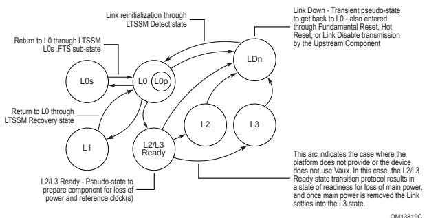

The L1 and L2/L3 Ready entry negotiations happen while in the L0 state. L1 and L2/L3 Ready are entered only after the negotiation completes. Link Power Management remains in L0 until the negotiation process is completed, unless LDn occurs. Note that these states and state transitions do not correspond directly to the actions of the Physical Layer LTSSM. For example in § Figure 5-1, L0 encompasses the LTSSM L0, Recovery, and, during LinkUp, Configuration states. Also, the LTSSM is typically powered by main power (not Vaux), so LTSSM will not be powered in either the L2 or the L3 state.

The following example sequence illustrates the multi-step Link state transition process leading up to entering a system sleep state:

1. System software directs all Functions of a Downstream component to D3Hot.
2. The Downstream component then initiates the transition of the Link to L1 as required.
3. System software then causes the Root Complex to broadcast the PME_Turn_Off Message in preparation for removing the main power source.
4. This Message causes the subject Link to transition back to L0 in order to send it and to enable the Downstream component to respond with PME_TO_Ack.
5. After sending the PME_TO_Ack, the Downstream component initiates the L2/L3 Ready transition protocol.

`L0 →L1 →L0 →L2/L3 Ready`

As the following example illustrates, it is also possible to remove power without first placing all Functions into D3Hot:

1. System software causes the Root Complex to broadcast the PME_Turn_Off Message in preparation for removing the main power source.
2. The Downstream components respond with PME_TO_Ack.
3. After sending the PME_TO_Ack, the Downstream component initiates the L2/L3 Ready transition protocol.

`L0 →L2/L3 Ready`

The L1 entry negotiation (whether invoked via PCI-PM or ASPM mechanisms) and the L2/L3 Ready entry negotiation map to a state machine which corresponds to the actions described later in this chapter. This state machine is reset to an idle state. For a Downstream component, the first action taken by the state machine, after leaving the idle state, is to start sending the appropriate entry DLLPs depending on the type of negotiation. If the negotiation is interrupted, for example by a trip through Recovery, the state machine in both components is reset back to the idle state. The Upstream component must always go to the idle state, and wait to receive entry DLLPs. The Downstream component must always go to the idle state and must always proceed to sending entry DLLPs to restart the negotiation.

§ Table 5-1 summarizes each L-state, describing when they are used, and the platform and component behaviors that correspond to each.

A "Yes" entry indicates that support is required (unless otherwise noted). "On" and "Off" entries indicate the required clocking and power delivery. "On/Off" indicates an optional design choice.

**Table 5-1. Summary of PCI Express Link Power Management States | 表 5-1. PCI Express 链路电源管理状态汇总**

| L-State | Description | Used by S/W Directed PM | Used by ASPM | Platform Reference Clocks | Platform Main Power | Component Internal PLL | Platform Vaux |
|---------|-------------|------------------------|--------------|--------------------------|---------------------|------------------------|---------------|
| L0 / L0p | Fully active Link | Yes (D0) | Yes (D0) | On | On | On | On/Off |
| L0s | Standby state | No | Yes¹ (opt., D0) | On | On | On | On/Off |
| L1 | Lower power standby | Yes (D1-D3Hot) | Yes (opt., D0) | On/Off⁶ | On | On/Off² | On/Off |
| L2/L3 Ready (pseudo-state) | Staging point for power removal | Yes³ | No | On/Off⁶ | On | On/Off | On/Off |
| L2 | Low power sleep state (all clocks, main power off) | Yes⁴ | No | Off | Off | Off | On⁵ |
| L3 | Off (zero power) | n/a | n/a | Off | Off | Off | Off |
| LDn (pseudo-state) | Transitional state preceding L0 | Yes | N/A | On | On | On/Off | On/Off |

Notes:

1. L0s exit latency will be greatest in Link configurations with independent reference clock inputs for components connected to opposite ends of a given Link (vs. a common, distributed reference clock).
2. L1 exit latency will be greatest for components that internally shut off their PLLs during this state.
3. L2/L3 Ready entry sequence is initiated at the completion of the PME_Turn_Off/PME_TO_Ack protocol handshake. It is not directly affiliated with either a D-State transition or a transition in accordance with ASPM policies and procedures.
4. Depending upon the platform implementation, the system's sleep state may use the L2 state, transition to fully off (L3), or it may leave Links in the L2/L3 Ready state. L2/L3 Ready state transition protocol is initiated by the Downstream component following reception and TLP acknowledgement of the PME_Turn_Off TLP Message. While platform support for an L2 sleep state configuration is optional (depending on the availability of Vaux), component protocol support for transitioning the Link to the L2/L3 Ready state is required.
5. L2 is distinguished from the L3 state only by the presence and use of Vaux. After the completion of the L2/L3 Ready state transition protocol and before main power has been removed, the Link has indicated its readiness for main power removal.
6. Low-power mobile or handheld devices may reduce power by clock gating the reference clock(s) via the "clock request" (CLKREQ#) mechanism. As a result, components targeting these devices should be tolerant of the additional delays required to re-energize the reference clock during the low-power state exit.

[⬆️ 返回目录](#-本章目录-table-of-contents)

---

<!-- 📄 Page 656 -->
---

While the concept of these power states is universal for all Functions in the system, the meaning, or intended functional behavior when transitioned to a given power management state, is dependent upon the type (or class) of the Function.

The D0 power management state is the normal operation state of the Function. Other states are various levels of reduced power, where the Function is either not operating or supports a limited set of operations. D1 and D2 are intermediate states that are intended to afford the system designer more flexibility in balancing power savings, restore time, and low power feature availability tradeoffs for a given device class. The D1 state could, for example, be supported as a slightly more power consuming state than D2, however one that yields a quicker restore time than could be realized from D2.

The D3 power management state constitutes a special category of power management state in that a Function could be transitioned into D3 either by software or by physically removing its power. In that sense, the two D3 variants have been designated as D3Hot and D3Cold where the subscript refers to the presence or absence of main power respectively. Functions in D3Hot are permitted to be transitioned to the D0 state via software by writing to the Function's PMCSR register. Functions in the D3Cold state are permitted to be transitioned to the D0uninitialized state by reapplying main power and asserting Fundamental Reset.

All Functions must support the D0 and D3 states (both D3Hot and D3Cold). The D1 and D2 states are optional.

## 5.3 PCI-PM Software Compatible Mechanisms § | PCI-PM 软件兼容机制 §

### 5.3.1 Device Power Management States (D-States) of a Function § | 5.3.1 Function 的设备电源管理状态 (D 状态) §

<table>
<thead>
<tr>
<th width="50%">🇬🇧 English</th>
<th width="50%" style="background-color:#e8e8e8">🏆 中文</th>
</tr>
</thead>
<tbody>
<tr>
<td>

All Functions must support the D0 state. D0 is divided into two distinct substates, the "un-initialized" substate and the "active" substate. When a component comes out of Conventional Reset all Functions of the component enter the D0uninitialized state. When a Function completes FLR, it enters the D0uninitialized state. After configuration is complete a Function enters the D0active state, the fully operational state for a PCI Express Function. A Function enters the D0active state whenever any single or combination of the Function's Memory Space Enable, I/O Space Enable, or Bus Master Enable bits have been Set.

D1 support is optional. While in the D1 state, a Function must not initiate any Request TLPs on the Link with the exception of Messages as defined in § Section 2.2.8 . Configuration and Message Requests are the only TLPs accepted by a Function in the D1 state. All other received Requests must be handled as Unsupported Requests, and all received Completions may optionally be handled as Unexpected Completions. If an error caused by a received TLP (e.g., an Unsupported Request) is detected while in D1, and reporting is enabled, the Link must be returned to L0 if it is not already in L0 and an error Message must be sent. If an error caused by an event other than a received TLP (e.g., a Completion Timeout) is detected while in D1, an error Message must be sent when the Function is programmed back to the D0 state.

Note that a Function's software driver participates in the process of transitioning the Function from D0 to D1. It contributes to the process by saving any functional state (if necessary), and otherwise preparing the Function for the transition to D1. As part of this quiescence process the Function's software driver must ensure that any mid-transaction TLPs (i.e., Requests with outstanding Completions), are terminated prior to handing control to the system configuration software that would then complete the transition to D1.

D2 support is optional. When a Function is not currently being used and probably will not be used for some time, it may be put into D2. This state requires the Function to provide significant power savings while still retaining the ability to fully recover to its previous condition. While in the D2 state, a Function must not initiate any Request TLPs on the Link with the exception of Messages as defined in § Section 2.2.8 . Configuration and Message requests are the only TLPs accepted by a Function in the D2 state. All other received Requests must be handled as Unsupported Requests, and all received Completions may optionally be handled as Unexpected Completions. If an error caused by a received TLP (e.g., an Unsupported Request) is detected while in D2, and reporting is enabled, the Link must be returned to L0 if it is not already in L0 and an error Message must be sent. If an error caused by an event other than a received TLP (e.g., a Completion Timeout) is detected while in D2, an error Message must be sent when the Function is programmed back to the D0 state.

Note that a Function's software driver participates in the process of transitioning the Function from D0 to D2. It contributes to the process by saving any functional state (if necessary), and otherwise preparing the Function for the transition to D2. As part of this quiescence process the Function's software driver must ensure that any mid-transaction TLPs (i.e., Requests with outstanding Completions), are terminated prior to handing control to the system configuration software that would then complete the transition to D2.

System software must restore the Function to the D0active state before memory or I/O space can be accessed. Initiated actions such as bus mastering and interrupt request generation can only commence after the Function has been restored to D0active.

There is a minimum recovery time requirement of 200 μs between when a Function is programmed from D2 to D0 and the next Request issued to the Function. Behavior is undefined for Requests received in this recovery time window (see § Section 7.9.16 ).

D3 support is required, (both the D3Cold and the D3Hot states).

Functional context is required to be maintained by Functions in the D3Hot state if the No_Soft_Reset field in the PMCSR is Set. In this case, System Software is not required to re-initialize the Function after a transition from D3Hot to D0 (the Function will be in the D0active state). If the No_Soft_Reset bit is Clear, functional context is not required to be maintained by the Function in the D3Hot state, however it is not guaranteed that functional context will be cleared and software must not depend on such behavior. As a result, in this case System Software is required to fully re-initialize the Function after a transition to D0 as the Function will be in the D0uninitialized state.

The Function will be reset if the Link state has transitioned to the L2/L3 Ready state regardless of the value of the No_Soft_Reset bit.

Unless the Immediate_Readiness_on_Return_to_D0 bit in the PCI-PM Power Management Capabilities register is Set, System Software must allow a minimum recovery time following a D3Hot →D0 transition of at least 10 ms (see § Section 7.9.16 ), prior to accessing the Function.

</td>
<td style="background-color:#e8e8e8">

所有 Function 必须支持 D0 状态。D0 分为两个不同的子状态: "未初始化 (un-initialized)" 子状态和 "活动 (active)" 子状态。当组件退出常规复位 (Conventional Reset) 时,组件的所有 Function 进入 D0uninitialized 状态。当 Function 完成 FLR 时,它进入 D0uninitialized 状态。配置完成后,Function 进入 D0active 状态,这是 PCI Express Function 的完全工作状态。当 Function 的内存空间使能 (Memory Space Enable)、I/O 空间使能 (I/O Space Enable) 或总线主控使能 (Bus Master Enable) 位中的任一位或任意组合被置位时,Function 即进入 D0active 状态。

D1 支持是可选的。在 D1 状态下,Function 不得发起任何 Request TLP,§ 第 2.2.8 节定义的 Message 报文除外。Function 在 D1 状态下仅接受配置 (Configuration) 和 Message 报文请求。所有其他接收到的 Request 必须作为不支持的请求 (Unsupported Request) 处理,所有接收到的 Completion 可选地作为意外完成 (Unexpected Completion) 处理。如果在 D1 状态下检测到由接收 TLP 引起的错误 (例如 Unsupported Request),并且错误上报已使能,则必须将链路恢复到 L0 状态 (如果尚未处于 L0),并发送错误报文。如果在 D1 状态下检测到由非接收 TLP 的事件 (例如 Completion Timeout) 引起的错误,则在 Function 被编程回 D0 状态时必须发送错误报文。

注意,Function 的软件驱动程序参与将 Function 从 D0 转换到 D1 的过程。它通过保存任何功能状态 (如需要) 并以其他方式为 Function 转换到 D1 做好准备来参与该过程。作为该静默 (quiescence) 过程的一部分,Function 的软件驱动程序必须确保任何进行中的事务 TLP (即具有未完成 Completion 的 Request) 在将控制权交给随后将完成到 D1 转换的系统配置软件之前被终止。

D2 支持是可选的。当 Function 当前未使用且可能在较长时间内不会被使用时,可将其置入 D2。该状态要求 Function 提供显著的省电效果,同时仍能完全恢复到其先前的状态。在 D2 状态下,Function 不得发起任何 Request TLP,§ 第 2.2.8 节定义的 Message 报文除外。Function 在 D2 状态下仅接受配置和 Message 报文请求。所有其他接收到的 Request 必须作为 Unsupported Request 处理,所有接收到的 Completion 可选地作为 Unexpected Completion 处理。如果在 D2 状态下检测到由接收 TLP 引起的错误 (例如 Unsupported Request),并且错误上报已使能,则必须将链路恢复到 L0 状态 (如果尚未处于 L0),并发送错误报文。如果在 D2 状态下检测到由非接收 TLP 的事件引起的错误,则在 Function 被编程回 D0 状态时必须发送错误报文。

注意,Function 的软件驱动程序参与将 Function 从 D0 转换到 D2 的过程。它通过保存任何功能状态 (如需要) 并以其他方式为 Function 转换到 D2 做好准备来参与该过程。作为该静默过程的一部分,Function 的软件驱动程序必须确保任何进行中的事务 TLP 在将控制权交给随后将完成到 D2 转换的系统配置软件之前被终止。

系统软件必须先将 Function 恢复到 D0active 状态,然后才能访问内存或 I/O 空间。总线主控和中断请求生成等发起的动作只能在 Function 已恢复到 D0active 之后才能开始。

在 Function 从 D2 编程到 D0 与下一个发往该 Function 的 Request 之间,有 200 μs 的最小恢复时间要求。在此恢复时间窗口内收到的 Request 行为未定义 (见 § 第 7.9.16 节)。

D3 支持是必需的 (包括 D3Cold 与 D3Hot 状态)。

如果 PMCSR 中的 No_Soft_Reset 字段被置位,则 D3Hot 状态的 Function 必须保持功能上下文。在这种情况下,从 D3Hot 转换到 D0 之后,系统软件无需重新初始化 Function (Function 将处于 D0active 状态)。如果 No_Soft_Reset 位被清零,则不要求 Function 在 D3Hot 状态下保持功能上下文,但不保证功能上下文会被清除,因此软件不得依赖此行为。因此,在这种情况下,从 D3Hot 转换到 D0 之后,系统软件必须完全重新初始化 Function,因为 Function 将处于 D0uninitialized 状态。

无论 No_Soft_Reset 位的值如何,如果链路状态已转换到 L2/L3 Ready 状态,Function 将被复位。

除非 PCI-PM 电源管理能力寄存器中的 Immediate_Readiness_on_Return_to_D0 位被置位,否则系统软件必须在 D3Hot →D0 转换后、访问 Function 之前允许至少 10 ms 的最小恢复时间 (见 § 第 7.9.16 节)。

</td>
</tr>
</tbody>
</table>

[⬆️ 返回目录](#-本章目录-table-of-contents)

---

### 5.3.1.1 D0 State § | 5.3.1.1 D0 状态 §

<table>
<thead>
<tr>
<th width="50%">🇬🇧 English</th>
<th width="50%" style="background-color:#e8e8e8">🏆 中文</th>
</tr>
</thead>
<tbody>
<tr>
<td>

D0 is the operational state of the Function. As described above, D0 has two distinct substates: D0uninitialized and D0active.

</td>
<td style="background-color:#e8e8e8">

D0 是 Function 的工作状态。如上所述,D0 有两个不同的子状态: D0uninitialized 与 D0active。

</td>
</tr>
</tbody>
</table>

[⬆️ 返回目录](#-本章目录-table-of-contents)

---

### 5.3.1.2 D1 State § | 5.3.1.2 D1 状态 §

<table>
<thead>
<tr>
<th width="50%">🇬🇧 English</th>
<th width="50%" style="background-color:#e8e8e8">🏆 中文</th>
</tr>
</thead>
<tbody>
<tr>
<td>

D1 is an optional intermediate power saving state. Behavior while in D1 is described above.

> **IMPLEMENTATION NOTE: SWITCH AND ROOT PORT VIRTUAL BRIDGE BEHAVIOR IN NON-D0 STATES**
> When a Type 1 Function associated with a Switch/Root Port (a "virtual bridge") is in a non-D0 power state, it will emulate the behavior of a conventional PCI bridge in its handling of Memory, I/O, and Configuration Requests and Completions. All Memory and I/O requests flowing Downstream are terminated as Unsupported Requests. All Type 1 Configuration Requests are terminated as Unsupported Requests, however Type 0 Configuration Request handling is unaffected by the virtual bridge D state. Completions flowing in either direction across the virtual bridge are unaffected by the virtual bridge D state. Note that the handling of Messages is not affected by the PM state of the virtual bridge.

</td>
<td style="background-color:#e8e8e8">

D1 是可选的中间级省电状态。在 D1 中的行为如上所述。

> **实现注: 非 D0 状态下交换机与根端口虚拟桥的行为**
> 当与 Switch/Root Port 相关联的 Type 1 Function ("虚拟桥") 处于非 D0 电源状态时,它将模拟传统 PCI 桥在处理 Memory、I/O 和 Configuration 请求与完成时的行为。所有向下游流动的 Memory 与 I/O 请求都被作为 Unsupported Request 终止。所有 Type 1 Configuration 请求被作为 Unsupported Request 终止,但 Type 0 Configuration 请求的处理不受虚拟桥 D 状态的影响。跨虚拟桥任意方向流动的 Completion 不受虚拟桥 D 状态的影响。注意,Message 的处理不受虚拟桥 PM 状态的影响。

</td>
</tr>
</tbody>
</table>

[⬆️ 返回目录](#-本章目录-table-of-contents)

---

### 5.3.1.3 D2 State § | 5.3.1.3 D2 状态 §

<table>
<thead>
<tr>
<th width="50%">🇬🇧 English</th>
<th width="50%" style="background-color:#e8e8e8">🏆 中文</th>
</tr>
</thead>
<tbody>
<tr>
<td>

D2 is an optional intermediate power saving state. Behavior while in D2 is described above.

</td>
<td style="background-color:#e8e8e8">

D2 是可选的中间级省电状态。在 D2 中的行为如上所述。

</td>
</tr>
</tbody>
</table>

[⬆️ 返回目录](#-本章目录-table-of-contents)

---

<!-- 📄 Page 658 -->
---

### 5.3.1.4 D3 State § | 5.3.1.4 D3 状态 §

<table>
<thead>
<tr>
<th width="50%">🇬🇧 English</th>
<th width="50%" style="background-color:#e8e8e8">🏆 中文</th>
</tr>
</thead>
<tbody>
<tr>
<td>

D3 support is required, (both the D3Cold and the D3Hot states).

> **IMPLEMENTATION NOTE: TRANSITIONING TO L2/L3 READY**
> As described in § Section 5.2, transition to the L2/L3 Ready state is initiated by platform power management software in order to begin the process of removing main power and clocks from the device. As a result, it is expected that a device will transition to D3Cold shortly after its Link transitions to L2/L3 Ready, making the No_Soft_Reset bit, which only applies to D3Hot, irrelevant. While there is no guarantee of this correlation between L2/L3 Ready and D3Cold, system software should ensure that the L2/L3 Ready state is entered only when the intent is to remove device main power. Device Functions, including those that are otherwise capable of maintaining functional context while in D3Hot (i.e., set the No_Soft_Reset bit), are required to re-initialize internal state as described in § Section 2.9.1 when exiting L2/L3 Ready due to the required DL_Down status indication.

</td>
<td style="background-color:#e8e8e8">

D3 支持是必需的 (包括 D3Cold 与 D3Hot 状态)。

> **实现注: 转换到 L2/L3 Ready**
> 如 § 第 5.2 节所述,转换到 L2/L3 Ready 状态由平台电源管理软件启动,以开始移除设备主电源与时钟的过程。因此,预计设备在其链路转换到 L2/L3 Ready 后不久将转换到 D3Cold,这使得仅适用于 D3Hot 的 No_Soft_Reset 位变得无关紧要。虽然 L2/L3 Ready 与 D3Cold 之间的关联没有保证,但系统软件应确保仅在打算移除设备主电源时才进入 L2/L3 Ready 状态。设备 Function (包括那些能够在 D3Hot 时保持功能上下文的 Function,即置位 No_Soft_Reset 位的) 在退出 L2/L3 Ready 时,由于必需的 DL_Down 状态指示,需要按照 § 第 2.9.1 节所述重新初始化内部状态。

</td>
</tr>
</tbody>
</table>

[⬆️ 返回目录](#-本章目录-table-of-contents)

---

#### 5.3.1.4.1 D3Hot State § | 5.3.1.4.1 D3Hot 状态 §

<table>
<thead>
<tr>
<th width="50%">🇬🇧 English</th>
<th width="50%" style="background-color:#e8e8e8">🏆 中文</th>
</tr>
</thead>
<tbody>
<tr>
<td>

component to bootstrap any of its component interfaces (e.g., from serial ROM) prior to being accessible. Attempts to target the Function during the recovery time (including configuration request packets) will result in undefined behavior.

Configuration and Message requests are the only TLPs accepted by a Function in the D3Hot state. All other received Requests must be handled as Unsupported Requests, and all received Completions may optionally be handled as Unexpected Completions. If an error caused by a received TLP (e.g., an Unsupported Request) is detected while in D3Hot, and reporting is enabled, the Link must be returned to L0 if it is not already in L0 and an error Message must be sent. If an error caused by an event other than a received TLP (e.g., a Completion Timeout) is detected while in D3Hot, an error Message may optionally be sent when the Function is programmed back to the D0 state. Once in D3Hot the Function can later be transitioned into D3Cold (by removing power from its host component).

Note that a Function's software driver participates in the process of transitioning the Function from D0 to D3Hot. It contributes to the process by saving any functional state that would otherwise be lost with removal of main power, and otherwise preparing the Function for the transition to D3Hot. As part of this quiescence process the Function's software driver must ensure that any outstanding transactions (i.e., Requests with outstanding Completions), are terminated prior to handing control to the system configuration software that would then complete the transition to D3Hot.

Note that D3Hot is also a useful state for reducing power consumption by idle components in an otherwise running system.

Functions that are in D3Hot are permitted to be transitioned by software (writing to their PMCSR PowerState field) to the D0active state or the D0uninitialized state. Functions that are in D3Hot must respond to Configuration Space accesses as long as power and clock are supplied so that they can be returned to D0 by software. Note that the Function is not required to generate an internal hardware reset during or immediately following its transition from D3Hot to D0 (see usage of the No_Soft_Reset bit in the PMCSR).

If not requiring an internal reset, upon completion of the D3Hot to D0active state, no additional operating system intervention is required beyond writing the PowerState field. If the internal reset is required, devices return to D0uninitialized and a full reinitialization is required on the device. The full reinitialization sequence returns the device to D0active.

If the device supports PME events, and PME_En is Set, PME context must be preserved in D3Hot. PME context must also be preserved in a PowerState command transition back to D0.

> **IMPLEMENTATION NOTE: DEVICES NOT PERFORMING AN INTERNAL RESET**
> Bus controllers to non-PCIe buses and resume from D3Hot bus controllers on PCIe buses that serve as interfaces to non-PCIe buses, (e.g., CardBus, USB, and IEEE 1394) are examples of bus controllers that would benefit from not requiring an internal reset upon resume from D3Hot. If this internal reset is not required, the bus controller would not need to perform a downstream bus reset upon resume from D3Hot on its secondary (non-PCIe) bus.

</td>
<td style="background-color:#e8e8e8">

组件可在访问之前引导其任何组件接口 (例如从串行 ROM)。在恢复时间内访问该 Function (包括配置请求报文) 将导致未定义行为。

Function 在 D3Hot 状态下仅接受配置和 Message 报文请求。所有其他接收到的 Request 必须作为 Unsupported Request 处理,所有接收到的 Completion 可选地作为 Unexpected Completion 处理。如果在 D3Hot 状态下检测到由接收 TLP 引起的错误 (例如 Unsupported Request),并且错误上报已使能,则必须将链路恢复到 L0 状态 (如果尚未处于 L0),并发送错误报文。如果在 D3Hot 状态下检测到由非接收 TLP 的事件 (例如 Completion Timeout) 引起的错误,则在 Function 被编程回 D0 状态时可选择地发送错误报文。一旦进入 D3Hot,Function 此后可通过移除其宿主组件的电源转换到 D3Cold。

注意,Function 的软件驱动程序参与将 Function 从 D0 转换到 D3Hot 的过程。它通过保存任何功能状态 (否则会因主电源移除而丢失) 并以其他方式为 Function 转换到 D3Hot 做好准备来参与该过程。作为该静默过程的一部分,Function 的软件驱动程序必须确保任何未完成的事务 (即具有未完成 Completion 的 Request) 在将控制权交给随后将完成到 D3Hot 转换的系统配置软件之前被终止。

注意,D3Hot 状态对于在运行中的系统中降低空闲组件的功耗也很有用。

D3Hot 状态下的 Function 允许被软件 (写入其 PMCSR PowerState 字段) 转换到 D0active 状态或 D0uninitialized 状态。只要提供电源与时钟,D3Hot 状态下的 Function 必须响应配置空间访问,以便可被软件恢复到 D0。注意,Function 在其从 D3Hot 转换到 D0 期间或紧接其后不要求生成内部硬件复位 (见 PMCSR 中 No_Soft_Reset 位的使用)。

如果不需要内部复位,在完成 D3Hot 到 D0active 状态的转换后,除写入 PowerState 字段外,不需要额外的操作系统干预。如果需要内部复位,设备将返回 D0uninitialized 并且需要对设备进行完全重新初始化。完全重新初始化序列使设备返回 D0active。

如果设备支持 PME 事件,且 PME_En 被置位,则必须在 D3Hot 中保留 PME 上下文。PME 上下文也必须在回到 D0 的 PowerState 命令转换过程中保留。

> **实现注: 不执行内部复位的设备**
> 非 PCIe 总线的总线控制器以及作为非 PCIe 总线 (例如 CardBus、USB 与 IEEE 1394) 接口的 PCIe 总线上的 D3Hot 恢复总线控制器,是不需要在从 D3Hot 恢复时执行内部复位的总线控制器的示例。如果不需要此内部复位,则总线控制器在从 D3Hot 恢复时不需要在其辅助 (非 PCIe) 总线上执行下游总线复位。

</td>
</tr>
</tbody>
</table>

[⬆️ 返回目录](#-本章目录-table-of-contents)

---

<!-- 📄 Page 660 -->
---

#### 5.3.1.4.2 D3Cold State § | 5.3.1.4.2 D3Cold 状态 §

<table>
<thead>
<tr>
<th width="50%">🇬🇧 English</th>
<th width="50%" style="background-color:#e8e8e8">🏆 中文</th>
</tr>
</thead>
<tbody>
<tr>
<td>

A Function transitions to the D3Cold state when its main power is removed. A power-on sequence with its associated Cold Reset transitions a Function from the D3Cold state to the D0uninitialized state, and the power-on defaults will be restored to the Function by hardware just as at initial power up. At this point, software must perform a full initialization of the Function in order to re-establish all functional context, completing the restoration of the Function to its D0active state.

When PME_En is Set, Functions that support wakeup functionality from D3Cold must maintain their PME context in the PMCSR for inspection by PME service routine software during the course of the resume process. Retention of additional context is implementation specific.

> **IMPLEMENTATION NOTE: MULTI-FUNCTION DEVICE ISSUES WITH SOFT RESET**
> With Multi-Function Devices (MFDs), certain control settings affecting overall device behavior are determined either by the collective settings in all Functions or strictly off the settings in Function 0. Here are some key examples:
> - With non-ARI MFDs, certain controls in the Device Control register and Link Control registers operate off the collective settings of all Functions (see § Section 7.5.3.4 and § Section 7.5.3.7 ).
> - With ARI Devices, certain controls in the Device Control register and Link Control registers operate strictly off the settings in Function 0 (see § Section 7.5.3.4 and § Section 7.5.3.7 ).
> - With all MFDs, certain controls in the Device Control 2 and Link Control 2 registers operate strictly off the settings in Function 0 (see § Section 7.5.3.16 and § Section 7.5.3.19 ).
> Performing a soft reset on any Function (especially Function 0) may disrupt the proper operation of other active Functions in the MFD. Since some Operating Systems transition a given Function between D3Hot and D0 with the expectation that other Functions will not be impacted, it is strongly recommended that every Function in an MFD be implemented with the No_Soft_Reset bit Set in the Power Management Control/Status register. This way, transitioning a given Function from D3Hot to D0 will not disrupt the proper operation of other active Functions.
> For Functions that support Flit Mode, the No_Soft_Reset bit is required to be Set (see § Table 7-15).
> It is also strongly recommended that every Endpoint Function in an MFD implement Function Level Reset (FLR) (i.e., Function Level Reset Capability is Set). FLR can be used to reset an individual Endpoint Function without impacting the settings that might affect other Functions, particularly if those Functions are active. As a result of FLR's quiescing, error recovery, and cleansing for reuse properties, FLR is also recommended for single-Function Endpoint devices.

> **IMPLEMENTATION NOTE: PME CONTEXT**
> Examples of PME context include, but are not limited to, a Function's PME_Status bit, the requesting agent's Requester ID, Caller ID if supported by a modem, IP information for IP directed network packets that trigger a resume event, etc.

</td>
<td style="background-color:#e8e8e8">

当 Function 的主电源被移除时,Function 转换到 D3Cold 状态。具有相关冷复位 (Cold Reset) 的上电序列将 Function 从 D3Cold 状态转换到 D0uninitialized 状态,且上电默认值会像初始上电时一样由硬件恢复到 Function。此时,软件必须对 Function 执行完全初始化,以重建所有功能上下文,完成 Function 到 D0active 状态的恢复。

当 PME_En 被置位时,支持从 D3Cold 唤醒功能的 Function 必须在 PMCSR 中保持其 PME 上下文,以供 PME 服务例程软件在恢复过程中检查。其他上下文的保留是实现特定的。

> **实现注: 多功能设备与软复位的问题**
> 在多功能设备 (MFD) 中,影响整体设备行为的某些控制设置由所有 Function 的设置共同决定,或严格按 Function 0 的设置决定。以下是一些关键示例:
> - 对于非 ARI MFD,设备控制寄存器和链路控制寄存器中的某些控制基于所有 Function 的设置 (见 § 第 7.5.3.4 节与 § 第 7.5.3.7 节)。
> - 对于 ARI 设备,设备控制寄存器和链路控制寄存器中的某些控制严格基于 Function 0 的设置 (见 § 第 7.5.3.4 节与 § 第 7.5.3.7 节)。
> - 对于所有 MFD,设备控制 2 寄存器和链路控制 2 寄存器中的某些控制严格基于 Function 0 的设置 (见 § 第 7.5.3.16 节与 § 第 7.5.3.19 节)。
> 对任何 Function (尤其是 Function 0) 执行软复位可能会破坏 MFD 中其他活动 Function 的正常运行。由于某些操作系统在 D3Hot 与 D0 之间转换给定 Function 时,期望其他 Function 不受影响,因此强烈建议 MFD 中的每个 Function 在电源管理控制/状态寄存器中将 No_Soft_Reset 位置位。这样,将给定 Function 从 D3Hot 转换到 D0 不会破坏其他活动 Function 的正常运行。
> 对于支持 Flit 模式的 Function,要求将 No_Soft_Reset 位置位 (见 § 表 7-15)。
> 同样强烈建议 MFD 中的每个端点 (Endpoint) Function 实现 Function 级复位 (FLR) (即 Function 级复位能力位置位)。FLR 可用于复位单个端点 Function,而不影响可能影响其他 Function 的设置,特别是当那些 Function 处于活动状态时。由于 FLR 的静默、错误恢复与清理重用特性,FLR 也推荐用于单 Function 端点设备。

> **实现注: PME 上下文**
> PME 上下文的示例包括但不限于: Function 的 PME_Status 位、请求代理的 Requester ID、调制解调器支持的 Caller ID、触发恢复事件的 IP 定向网络数据包的 IP 信息等。

</td>
</tr>
</tbody>
</table>

[⬆️ 返回目录](#-本章目录-table-of-contents)

---

## 5.3.2 PM Software Control of the Link Power Management State § | 5.3.2 链路电源管理状态的 PM 软件控制 §

<table>
<thead>
<tr>
<th width="50%">🇬🇧 English</th>
<th width="50%" style="background-color:#e8e8e8">🏆 中文</th>
</tr>
</thead>
<tbody>
<tr>
<td>

A Function's PME assertion is acknowledged when system software performs a "write 1 to clear" configuration transaction to the asserting Function's PME_Status bit of its PCI-PM compatible PMCSR.

An auxiliary power source must be used to support PME event detection within a Function, Link reactivation, and to preserve PME context from within D3Cold. Note that once the I/O Hierarchy has been brought back to a fully communicating state, as a result of the Link reactivation, the waking agent then propagates a PME Message to the root of the Hierarchy indicating the source of the PME event. Refer to § Section 5.3.3 for further PME specific detail.

The power management state of a Link is determined by the D-state of its Downstream component.

§ Table 5-2 depicts the relationships between the power state of a component (with an Upstream Port) and its Upstream Link.

**Table 5-2. Relation Between Power Management States of Link and Components | 表 5-2. 链路与组件电源管理状态之间的关系**

| Downstream Component D-State | Permissible Upstream Component D-State | Permissible Interconnect State |
|------------------------------|----------------------------------------|--------------------------------|
| D0                           | D0                                     | L0, L0s, L1¹, L2/L3 Ready      |
| D1                           | D0-D1                                  | L1, L2/L3 Ready                |
| D2                           | D0-D2                                  | L1, L2/L3 Ready                |
| D3Hot                        | D0-D3Hot                               | L1, L2/L3 Ready                |
| D3Cold                       | D0-D3Cold                              | L2², L3                        |

Notes:
1. Requirements for ASPM L0s and ASPM L1 support are form factor specific.
2. If Vaux is provided by the platform, the Link sleeps in L2. In the absence of Vaux, the L-state is L3.

The following rules relate to PCI-PM compatible power management:

- Devices in D0, D1, D2, and D3Hot must respond to the receipt of a PME_Turn_Off Message by the transmission of a PME_TO_Ack Message.
- In any device D state, following the execution of a PME_Turn_Off/PME_TO_Ack handshake sequence, a Downstream component must request a Link transition to L2/L3 Ready using the PM_Enter_L23 DLLP. Following the L2/L3 Ready entry transition protocol the Downstream component must be ready for loss of main power and reference clock.
- The Upstream Port of a single-Function device must initiate a Link state transition to L1 based solely upon its Function being programmed to D1, D2, or D3Hot. In the case of the Switch, system software bears the responsibility of ensuring that any D-state programming of a Switch's Upstream Port is done in a compliant manner with respect to hierarchy-wide PM policies (i.e., the Upstream Port cannot be programmed to a D-state that is any less active than the most active Downstream Port and Downstream connected component/Function(s)).
- The Upstream Port of a non-ARI Multi-Function Device must not initiate a Link state transition to L1 (on behalf of PCI-PM) until all of its Functions have been programmed to a non-D0 D-state.
- The Upstream Port of an ARI Device must not initiate a Link state transition to L1 (on behalf of PCI-PM) until at least one of its Functions has been programmed to a non-D0 state, and all of its Functions are either in a non-D0 state or the D0uninitialized state.
- With SR-IOV devices, the Link Power State is controlled solely by the setting in the PFs, regardless of the VFs' D-states. VF Power States do not affect the Link Power State.

</td>
<td style="background-color:#e8e8e8">

当系统软件对发出断言的 Function 的 PCI-PM 兼容 PMCSR 的 PME_Status 位执行"写 1 清零"配置事务时,该 Function 的 PME 断言被确认。

必须使用辅助电源来支持 Function 内的 PME 事件检测、链路重新激活以及在 D3Cold 内保留 PME 上下文。注意,一旦由于链路重新激活使 I/O 层级 (Hierarchy) 回到完全通信状态,唤醒代理随后将 PME 报文传播到层级的根,指示 PME 事件的来源。更多 PME 特定的细节请参见 § 第 5.3.3 节。

链路的电源管理状态由其下游组件的 D 状态决定。

§ 表 5-2 描述了组件 (具有上游端口) 的电源状态与其上游链路之间的关系。

**表 5-2. 链路与组件电源管理状态之间的关系**

| 下游组件 D 状态 | 允许的上游组件 D 状态 | 允许的互连状态 |
|-----------------|------------------------|------------------|
| D0              | D0                     | L0、L0s、L1¹、L2/L3 Ready |
| D1              | D0–D1                  | L1、L2/L3 Ready |
| D2              | D0–D2                  | L1、L2/L3 Ready |
| D3Hot           | D0–D3Hot               | L1、L2/L3 Ready |
| D3Cold          | D0–D3Cold              | L2²、L3          |

注:
1. ASPM L0s 与 ASPM L1 支持的要求因外形规格而异。
2. 如果平台提供 Vaux,则链路在 L2 中休眠。在没有 Vaux 的情况下,L 状态为 L3。

以下规则涉及 PCI-PM 兼容电源管理:

- D0、D1、D2 与 D3Hot 中的设备必须通过发送 PME_TO_Ack 报文来响应接收到的 PME_Turn_Off 报文。
- 在任何设备 D 状态下,执行 PME_Turn_Off/PME_TO_Ack 握手序列后,下游组件必须使用 PM_Enter_L23 DLLP 请求链路转换到 L2/L3 Ready。完成 L2/L3 Ready 进入转换协议后,下游组件必须准备好应对主电源与参考时钟的丢失。
- 单 Function 设备的上游端口必须仅基于其 Function 被编程到 D1、D2 或 D3Hot 启动到 L1 的链路状态转换。对于 Switch,系统软件负责确保 Switch 上游端口的任何 D 状态编程都以符合层级范围 PM 策略的方式进行 (即上游端口不能被编程到比最活动的下游端口及下游所连组件/Function 更不活动的 D 状态)。
- 非 ARI 多功能设备的上游端口在其所有 Function 都被编程到非 D0 D 状态之前,不得启动到 L1 的链路状态转换 (代表 PCI-PM)。
- ARI 设备的上游端口在至少一个 Function 被编程到非 D0 状态、且其所有 Function 都处于非 D0 状态或 D0uninitialized 状态之前,不得启动到 L1 的链路状态转换 (代表 PCI-PM)。
- 对于 SR-IOV 设备,链路电源状态仅由 PF 的设置控制,与 VF 的 D 状态无关。VF 电源状态不影响链路电源状态。

</td>
</tr>
</tbody>
</table>

[⬆️ 返回目录](#-本章目录-table-of-contents)

---

<!-- 📄 Page 661 -->
---

### 5.3.2.1 Entry into the L1 State § | 5.3.2.1 进入 L1 状态 §

<table>
<thead>
<tr>
<th width="50%">🇬🇧 English</th>
<th width="50%" style="background-color:#e8e8e8">🏆 中文</th>
</tr>
</thead>
<tbody>
<tr>
<td>

§ Figure 5-2 depicts the process by which a Link transitions into the L1 state as a direct result of power management software programming the Downstream connected component into a lower power state, (either D1, D2, or D3Hot state). This figure and the subsequent description outline the transition process for a single-Function Downstream component that is being programmed to a non-D0 state.

The following text provides additional detail for the Link state transition process shown in § Figure 5-2.

**PM Software Request:**

1. PM software sends a Configuration Write Request TLP to the Downstream Function's PMCSR to change the Downstream Function's D-state (from D0 to D1 for example).

**Downstream Component Link State Transition Initiation Process:**

2. The Downstream component schedules the Completion corresponding to the Configuration Write Request to its PMCSR PowerState field and accounts for the completion credits required.

3. The Downstream component must then wait until it accumulates at least the minimum number of credits required to send the largest possible packet for any FC type for all enabled VCs (if it does not already have such credits). All Transaction Layer TLP scheduling is then suspended.

4. The Downstream component then waits until it receives an acknowledgement for the PMCSR Write Completion, and any other TLPs it had previously sent. The component must retransmit a TLP out of its appropriate Retry Buffer if required to do so by the Data Link Layer rules (when operating in Non Flit Mode) or the Flit Ack/Nak rules (when operating in Flit Mode).

5. Once all of the Downstream components' TLPs have been acknowledged, the Downstream component starts to transmit PM_Enter_L1 DLLPs. The Downstream component sends this DLLP repeatedly with no more than eight (when using 8b/10b encoding) or 32 (when using 128b/130b encoding) Symbol times of idle between subsequent transmissions of the PM_Enter_L1 DLLP, in Non-Flit Mode. The transmission of other DLLPs and SKP Ordered Sets is permitted at any time between PM_Enter_L1 transmissions, and do not contribute to this idle time limit.

</td>
<td style="background-color:#e8e8e8">

§ 图 5-2 描述了由电源管理软件将下游所连组件编程到较低电源状态 (D1、D2 或 D3Hot 状态) 而直接导致的链路转换到 L1 状态的过程。该图及随后的描述概述了被编程到非 D0 状态的单 Function 下游组件的转换过程。

以下文本为 § 图 5-2 中所示的链路状态转换过程提供更多细节。

**PM 软件请求:**

1. PM 软件向下游 Function 的 PMCSR 发送配置写请求 (Configuration Write Request) TLP,以更改下游 Function 的 D 状态 (例如从 D0 到 D1)。

**下游组件链路状态转换启动过程:**

2. 下游组件调度与配置写请求对应的 Completion 到其 PMCSR PowerState 字段,并考虑所需的完成信用 (completion credits)。

3. 下游组件随后必须等待,直到它累积至少发送任何 FC 类型最大可能分组所需的最少信用数 (适用于所有使能的 VC) (如果它尚未拥有此类信用)。然后暂停所有事务层 TLP 调度。

4. 下游组件随后等待,直到它收到 PMCSR 写完成以及之前发送的任何其他 TLP 的确认。如果数据链路层规则 (在非 Flit 模式下运行) 或 Flit Ack/Nak 规则 (在 Flit 模式下运行) 要求,组件必须从其适当的重传缓冲区 (Retry Buffer) 重传一个 TLP。

5. 一旦下游组件的所有 TLP 都已被确认,下游组件开始发送 PM_Enter_L1 DLLP。组件在非 Flit 模式下,以不超过 8 个 (使用 8b/10b 编码) 或 32 个 (使用 128b/130b 编码) Symbol Time 的空闲间隔重复发送该 DLLP。在 PM_Enter_L1 发送之间的任何时刻允许发送其他 DLLP 和 SKP 有序集 (SKP Ordered Sets),它们不计入该空闲时间限制。

</td>
</tr>
</tbody>
</table>

> **Figure 5-2.** Entry into the L1 Link State

> 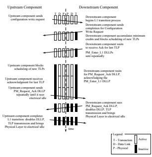

> 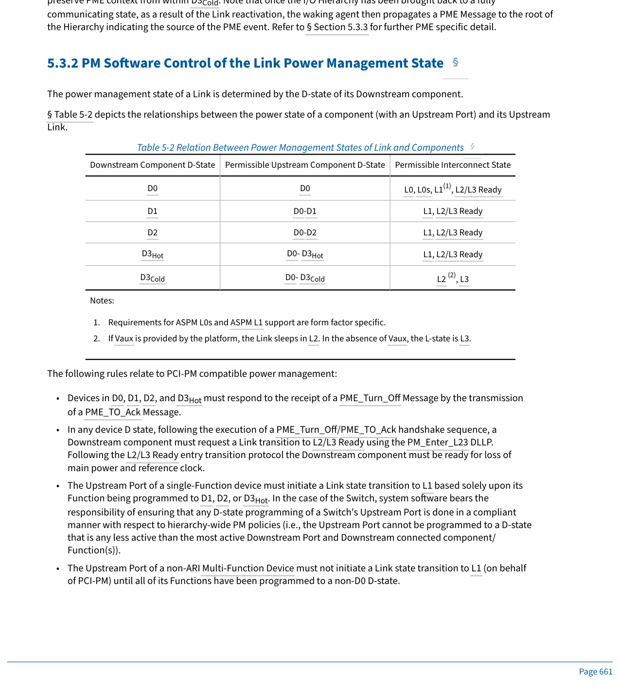

[⬆️ 返回目录](#-本章目录-table-of-contents)

---

<!-- 📄 Page 663 -->
---

<table>
<thead>
<tr>
<th width="50%">🇬🇧 English</th>
<th width="50%" style="background-color:#e8e8e8">🏆 中文</th>
</tr>
</thead>
<tbody>
<tr>
<td>

The Downstream component continues to transmit the PM_Enter_L1 DLLP as described above until it receives a response from the Upstream component (PM_Request_Ack).

The Downstream component must continue to accept TLPs and DLLPs from the Upstream component, and continue to respond with DLLPs, including FC update DLLPs and Ack/Nak DLLPs, as required. Any TLPs that are blocked from transmission (including responses to TLP(s) received) must be stored for later transmission, and must cause the Downstream component to initiate L1 exit as soon as possible following L1 entry.

**Upstream Component Link State Transition Process:**

6. Upon receiving the PM_Enter_L1 DLLP, the Upstream component blocks the scheduling of all TLP transmissions.

7. The Upstream component then must wait until it receives an acknowledgement for the last TLP it had previously sent. The Upstream component must retransmit a TLP from its appropriate Retry Buffer if required to do so by the Data Link Layer rules (when operating in Non Flit Mode) or the Flit Ack/Nak rules (when operating in Flit Mode).

8. Once all of the Upstream component's TLPs have been acknowledged, the Upstream component must send PM_Request_Ack DLLPs Downstream, regardless of any outstanding Requests. The Upstream component sends this DLLP repeatedly with no more than eight (when using 8b/10b encoding) or 32 (when using 128b/130b encoding) Symbol times of idle between subsequent transmissions of the PM_Request_Ack DLLP, in Non-Flit Mode. The transmission of SKP Ordered Sets is permitted at any time between PM_Request_Ack transmissions, and does not contribute to this idle time limit.

The Upstream component continues to transmit the PM_Request_Ack DLLP as described above until it observes its receive Lanes enter into the Electrical Idle state. Refer to § Chapter 4. for more details on the Physical Layer behavior.

**Completing the L1 Link State Transition:**

9. Once the Downstream component has captured the PM_Request_Ack DLLP on its Receive Lanes (signaling that the Upstream component acknowledged the transition to L1 request), it then disables DLLP transmission and brings the Upstream directed physical Link into the Electrical Idle state.

10. When the Receive Lanes on the Upstream component enter the Electrical Idle state, the Upstream component stops sending PM_Request_Ack DLLPs, disables DLLP transmission, and brings its Transmit Lanes to Electrical Idle completing the transition of the Link to L1.

When two components' interconnecting Link is in L1 as a result of the Downstream component being programmed to a non-D0 state, both components suspend the operation of their Flow Control Update and, if implemented, Update FCP Timer (see § Section 2.6.1.2 ) counter mechanisms. Refer to § Chapter 4. for more detail on the Physical Layer behavior.

Refer to § Section 5.2 if the negotiation to L1 is interrupted.

Components on either end of a Link in L1 may optionally disable their internal PLLs in order to conserve more energy. Note, however, that platform supplied main power and reference clocks must continue to be supplied to components on both ends of an L1 Link in the L1.0 substate of L1.

Refer to § Section 5.5 for entry into the L1 PM Substates.

</td>
<td style="background-color:#e8e8e8">

下游组件如上所述继续发送 PM_Enter_L1 DLLP,直到它收到来自上游组件的响应 (PM_Request_Ack)。

下游组件必须继续接受来自上游组件的 TLP 与 DLLP,并根据需要继续以 DLLP 响应,包括流控 (FC) 更新 DLLP 与 Ack/Nak DLLP。被阻止传输的任何 TLP (包括对所接收 TLP 的响应) 必须存储以供以后传输,并且必须使下游组件在进入 L1 后尽快启动 L1 退出。

**上游组件链路状态转换过程:**

6. 在收到 PM_Enter_L1 DLLP 时,上游组件阻止所有 TLP 传输的调度。

7. 上游组件随后必须等待,直到它收到之前发送的最后一个 TLP 的确认。如果数据链路层规则 (在非 Flit 模式下) 或 Flit Ack/Nak 规则 (在 Flit 模式下) 要求,上游组件必须从其适当的重传缓冲区重传一个 TLP。

8. 一旦上游组件的所有 TLP 已被确认,上游组件必须向下游发送 PM_Request_Ack DLLP,无论是否有未完成的请求。上游组件在非 Flit 模式下,以不超过 8 个 (使用 8b/10b 编码) 或 32 个 (使用 128b/130b 编码) Symbol Time 的空闲间隔重复发送该 DLLP。在 PM_Request_Ack 发送之间的任何时刻允许发送 SKP 有序集,且不计入该空闲时间限制。

上游组件如上所述继续发送 PM_Request_Ack DLLP,直到它观察到其接收 Lane 进入电气空闲 (Electrical Idle) 状态。有关物理层行为的更多细节,请参见 § 第 4 章。

**完成 L1 链路状态转换:**

9. 一旦下游组件在其接收 Lane 上捕获到 PM_Request_Ack DLLP (表示上游组件已确认到 L1 的转换请求),它随后禁用 DLLP 传输,并将上行方向的物理链路置入电气空闲状态。

10. 当上游组件的接收 Lane 进入电气空闲状态时,上游组件停止发送 PM_Request_Ack DLLP,禁用 DLLP 传输,并将其发送 Lane 置为电气空闲,完成链路到 L1 的转换。

当两个组件的互连链路由于下游组件被编程到非 D0 状态而处于 L1 时,两个组件均暂停其流控更新 (Flow Control Update) 以及 (如实现) 更新 FCP 定时器 (Update FCP Timer) (见 § 第 2.6.1.2 节) 计数机制。有关物理层行为的更多细节,请参考 § 第 4 章。

如果到 L1 的协商被中断,请参考 § 第 5.2 节。

L1 链路两端的组件可选择地禁用其内部 PLL,以节省更多能量。但是请注意,在 L1 的 L1.0 子状态中,平台提供的主电源与参考时钟必须继续提供给 L1 链路两端的组件。

有关进入 L1 PM Substates 的内容,请参见 § 第 5.5 节。

</td>
</tr>
</tbody>
</table>

[⬆️ 返回目录](#-本章目录-table-of-contents)

---

<!-- 📄 Page 664 -->
---

### 5.3.2.2 Exit from L1 State § | 5.3.2.2 退出 L1 状态 §

<table>
<thead>
<tr>
<th width="50%">🇬🇧 English</th>
<th width="50%" style="background-color:#e8e8e8">🏆 中文</th>
</tr>
</thead>
<tbody>
<tr>
<td>

L1 exit can be initiated by the component on either end of a Link.

Upon exit from L1, it is recommended that the Downstream component send flow control update DLLPs for all enabled VCs and FC types starting within 1 μs of L1 exit.

The physical mechanism for transitioning a Link from L1 to L0 is described in detail in § Chapter 4.

L1 exit must be initiated by a component if that component needs to transmit a TLP on the Link. An Upstream component must initiate L1 exit on a Downstream Port even if it does not have the flow control credits needed to transmit the TLP that it needs to transmit. Following L1 exit, the Upstream component must wait to receive the needed credit from the Downstream component. § Figure 5-3 outlines an example sequence that would trigger an Upstream component to initiate transition of the Link to the L0 state.

Sequence of events:

1. Power management software initiates a configuration cycle targeting a PM configuration register (the PowerState field of the PMCSR in this example) within a Function that resides in the Downstream component (e.g., to bring the Function back to the D0 state).

2. The Upstream component detects that a configuration cycle is intended for a Link that is currently in a low power state, and as a result, initiates a transition of that Link into the L0 state.

3. If the Link is in either L1.1 or L1.2 substates of L1, then the Upstream component initiates a transition of the Link into the L1.0 substate of L1.

4. In accordance with the § Chapter 4. definition, both directions of the Link enter into Link training, resulting in the transition of the Link to the L0 state. The L1 →L0 transition is discussed in detail in § Chapter 4.

5. Once both directions of the Link are back to the active L0 state, the Upstream Port sends the configuration Packet Downstream.

</td>
<td style="background-color:#e8e8e8">

链路任一端的组件均可启动 L1 退出。

退出 L1 时,建议下游组件在 L1 退出后 1 μs 之内开始为所有使能的 VC 和 FC 类型发送流控更新 DLLP。

将链路从 L1 转换到 L0 的物理机制详见 § 第 4 章。

如果组件需要在该链路上发送 TLP,则必须启动 L1 退出。即使上游组件没有发送所需 TLP 所需的流控信用,也必须在下游端口上启动 L1 退出。L1 退出后,上游组件必须等待从下游组件接收所需的信用。§ 图 5-3 概述了触发上游组件启动链路到 L0 状态转换的示例序列。

事件序列:

1. 电源管理软件启动针对下游组件中某个 Function 内的 PM 配置寄存器 (本例中为 PMCSR 的 PowerState 字段) 的配置周期 (例如,将 Function 带回 D0 状态)。

2. 上游组件检测到该配置周期是针对当前处于低功耗状态的链路的,因此启动该链路到 L0 状态的转换。

3. 如果链路处于 L1 的 L1.1 或 L1.2 子状态,则上游组件启动链路到 L1.0 子状态的转换。

4. 根据 § 第 4 章的定义,链路两个方向均进入链路训练,从而使链路转换到 L0 状态。L1 →L0 转换详见 § 第 4 章。

5. 一旦链路的两个方向都恢复到活动的 L0 状态,上游端口将配置报文向下游发送。

</td>
</tr>
</tbody>
</table>

> **Figure 5-3.** Exit from L1 Link State Initiated by Upstream Component
> 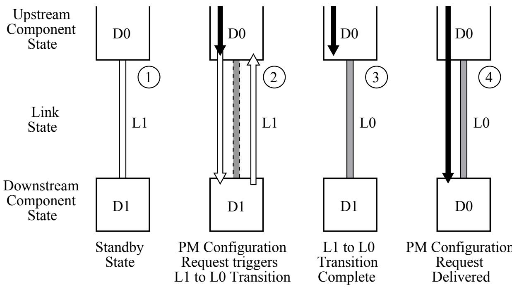

[⬆️ 返回目录](#-本章目录-table-of-contents)

---

### 5.3.2.3 Entry into the L2/L3 Ready State § | 5.3.2.3 进入 L2/L3 Ready 状态 §

<table>
<thead>
<tr>
<th width="50%">🇬🇧 English</th>
<th width="50%" style="background-color:#e8e8e8">🏆 中文</th>
</tr>
</thead>
<tbody>
<tr>
<td>

Transition to the L2/L3 Ready state follows a process that is similar to the L1 entry process. There are some minor differences between the two that are spelled out below.

- L2/L3 Ready entry transition protocol does not immediately result in an L2 or L3 Link state. The transition to L2/L3 Ready is effectively a handshake to establish the Downstream component's readiness for power removal. L2 or L3 is ultimately achieved when the platform removes the components' power and reference clock.
- The time for L2/L3 Ready entry transition is indicated by the completion of the PME_Turn_Off/PME_TO_Ack handshake sequence. Any actions on the part of the Downstream component necessary to ready itself for loss of power must be completed prior to initiating the transition to L2/L3 Ready. Once all preparations for loss of power and clock are completed, L2/L3 Ready entry is initiated by the Downstream component by sending the PM_Enter_L23 DLLP Upstream.
- L2/L3 Ready entry transition protocol uses the PM_Enter_L23 DLLP.
- Note that the PM_Enter_L23 DLLPs are sent continuously until an acknowledgement is received or power is removed.
- Refer to § Section 5.2 if the negotiation to L2/L3 Ready is interrupted.

</td>
<td style="background-color:#e8e8e8">

转换到 L2/L3 Ready 状态遵循与 L1 进入过程类似的过程。两者之间存在一些小差异,如下所述。

- L2/L3 Ready 进入转换协议不会立即产生 L2 或 L3 链路状态。转换到 L2/L3 Ready 实际上是一种握手,以建立下游组件的电源移除准备就绪状态。当平台移除组件的电源与参考时钟时,最终达到 L2 或 L3。
- L2/L3 Ready 进入转换的时间由 PME_Turn_Off/PME_TO_Ack 握手序列的完成来表示。下游组件为应对电源丢失所必需的任何动作必须在启动 L2/L3 Ready 转换之前完成。一旦完成所有电源与时钟丢失的准备工作,下游组件通过向上游发送 PM_Enter_L23 DLLP 来启动 L2/L3 Ready 进入。
- L2/L3 Ready 进入转换协议使用 PM_Enter_L23 DLLP。
- 注意,PM_Enter_L23 DLLP 持续发送,直到收到确认或电源被移除。
- 如果到 L2/L3 Ready 的协商被中断,请参考 § 第 5.2 节。

</td>
</tr>
</tbody>
</table>

[⬆️ 返回目录](#-本章目录-table-of-contents)

---

## 5.3.3 Power Management Event Mechanisms § | 5.3.3 电源管理事件机制 §

<table>
<thead>
<tr>
<th width="50%">🇬🇧 English</th>
<th width="50%" style="background-color:#e8e8e8">🏆 中文</th>
</tr>
</thead>
<tbody>
<tr>
<td>

The PCI Express PME mechanism is software compatible with the [PCI] PME mechanism. Power Management Events are generated by Functions as a means of requesting a PM state change. Power Management Events are typically utilized to revive the system or an individual Function from a low power state.

Power management software may transition a Hierarchy into a low power state, and transition the Upstream Links of these devices into the non-communicating L2 state.

The PCI Express PME generation mechanism is, therefore, broken into two components:

- Waking a non-communicating Hierarchy (wakeup). This step is required only if the Upstream Link of the device originating the PME is in the non-communicating L2 state, since in that state the device cannot send a PM_PME Message Upstream.
- Sending a PM_PME Message to the root of the Hierarchy

PME indications that originate from PCI Express Endpoints or PCI Express Legacy Endpoints are propagated to the Root Complex in the form of TLP messages. PM_PME Messages identify the requesting agent within the Hierarchy (via the Requester ID of the PM_PME Message header). Explicit identification within the PM_PME Message is intended to facilitate quicker PME service routine response, and hence shorter resume time.

If an RCiEP is associated with a Root Complex Event Collector, any PME indications that originate from that RCiEP must be reported by that Root Complex Event Collector.

PME indications that originate from a Root Port itself are reported through the same Root Port.

</td>
<td style="background-color:#e8e8e8">

PCI Express PME 机制与 [PCI] PME 机制软件兼容。电源管理事件 (Power Management Event) 由 Function 生成,作为请求 PM 状态变更的一种方式。电源管理事件通常用于将系统或单个 Function 从低功耗状态恢复。

电源管理软件可以将一个层级 (Hierarchy) 转换到低功耗状态,并将这些设备的上游链路转换到不通信的 L2 状态。

因此,PCI Express PME 生成机制被分解为以下两个组件:

- 唤醒不通信的层级 (wakeup)。仅当发起 PME 的设备的上游链路处于不通信的 L2 状态时才需要此步骤,因为在该状态下设备无法向上游发送 PM_PME 报文。
- 向层级的根发送 PM_PME 报文

源自 PCI Express 端点 (Endpoint) 或 PCI Express 传统端点 (Legacy Endpoint) 的 PME 指示以 TLP 报文的形式传播到根复合体 (Root Complex)。PM_PME 报文通过 PM_PME 报文头的 Requester ID 标识层级内的请求代理。PM_PME 报文中的显式标识旨在加快 PME 服务例程响应,从而缩短恢复时间。

如果 RCiEP 与根复合体事件收集器 (Root Complex Event Collector) 相关联,则源自该 RCiEP 的任何 PME 指示必须由该根复合体事件收集器上报。

源自根端口 (Root Port) 本身的 PME 指示通过同一根端口上报。

</td>
</tr>
</tbody>
</table>

[⬆️ 返回目录](#-本章目录-table-of-contents)

---

### 5.3.3.1 Motivation § | 5.3.3.1 动机 §

<table>
<thead>
<tr>
<th width="50%">🇬🇧 English</th>
<th width="50%" style="background-color:#e8e8e8">🏆 中文</th>
</tr>
</thead>
<tbody>
<tr>
<td>

The L2 state is defined as "non-communicating" since component reference clock and main power supply are removed in that state.

The Link wakeup mechanisms provide a means of signaling the platform to re-establish power and reference clocks to the components within its domain. There are two defined wakeup mechanisms: Beacon and WAKE#. The Beacon mechanism uses in-band signaling to implement wakeup functionality. For components that support wakeup functionality, the form factor specification(s) targeted by the implementation determine the support requirements for the wakeup mechanism. Switch components targeting applications where Beacon is used on some Ports of the Switch and WAKE# is used for other Ports must translate the wakeup mechanism appropriately (see the implementation note entitled "Example of WAKE# to Beacon Translation" in Section 5.3.3.2). In applications where WAKE# is the only wakeup mechanism used, the Root Complex is not required to support the receipt of Beacon.

The WAKE# mechanism uses sideband signaling to implement wakeup functionality. WAKE# is an "open drain" signal asserted by components requesting wakeup and observed by the associated power controller. WAKE# is only defined for certain form factors, and the detailed specifications for WAKE# are included in the relevant form factor specifications. Specific form factor specifications may require the use of either Beacon or WAKE# as the wakeup mechanism.

When WAKE# is used as a wakeup mechanism, once WAKE# has been asserted, the asserting Function must continue to drive the signal low until main power has been restored to the component as indicated by Fundamental Reset going inactive.

The system is not required to route or buffer WAKE# in such a way that an Endpoint is guaranteed to be able to detect that the signal has been asserted by another Function.

Before using any wakeup mechanism, a Function must be enabled by software to do so by setting the Function's PME_En bit in the PMCSR. The PME_Status bit is sticky, and Functions must maintain the value of the PME_Status bit through reset if auxiliary power is available and they are enabled for wakeup events (this requirement also applies to the PME_En bit in the PMCSR and the Aux Power PM Enable bit in the Device Control Register).

Systems that allow PME generation from D3Cold state must provide auxiliary power to support Link wakeup when the main system power rails are off. A component may only consume auxiliary power if software has enabled it to do so as described in § Section 5.6. Software is required to enable auxiliary power consumption in all components that participate in Link wakeup, including all components that must propagate the Beacon signal. In the presence of legacy system software, this is the responsibility of system firmware.

Regardless of the wakeup mechanism used, once the Link has been re-activated and trained, the requesting agent then propagates a PM_PME Message Upstream to the Root Complex. From a power management point of view, the two wakeup mechanisms provide the same functionality, and are not distinguished elsewhere in this chapter.

</td>
<td style="background-color:#e8e8e8">

L2 状态被定义为"不通信",因为在该状态下组件参考时钟和主电源被移除。

链路唤醒机制提供了一种向平台发出信号以重建其域内组件的电源和参考时钟的方法。已定义两种唤醒机制: Beacon 和 WAKE#。Beacon 机制使用带内 (in-band) 信令实现唤醒功能。对于支持唤醒功能的组件,实现所针对的外形规格规范决定了唤醒机制的支持要求。针对在 Switch 的某些端口上使用 Beacon 而在其他端口上使用 WAKE# 的应用的 Switch 组件,必须适当地转换唤醒机制 (见 § 第 5.3.3.2 节标题为"WAKE# 到 Beacon 转换示例"的实现注)。在仅使用 WAKE# 作为唤醒机制的应用中,根复合体不需要支持 Beacon 的接收。

WAKE# 机制使用边带 (sideband) 信令实现唤醒功能。WAKE# 是由请求唤醒的组件断言 (assert) 的"漏极开路 (open drain)"信号,由关联的电源控制器观察。WAKE# 仅在某些外形规格中定义,WAKE# 的详细规范包含在相关外形规格规范中。特定的外形规格规范可能要求使用 Beacon 或 WAKE# 作为唤醒机制。

当使用 WAKE# 作为唤醒机制时,一旦 WAKE# 被断言,断言该信号的 Function 必须继续驱动该信号为低电平,直到主电源已恢复到该组件,如基本复位 (Fundamental Reset) 转为非活动所指示。

系统不需要以端点可以保证检测到其他 Function 已断言该信号的方式来路由或缓冲 WAKE#。

在使用任何唤醒机制之前,Function 必须通过软件将 PMCSR 中的 PME_En 位置位来启用。PME_Status 位是粘性位 (sticky),且如果辅助电源可用且已使能唤醒事件,Function 必须通过复位保持 PME_Status 位的值 (此要求也适用于 PMCSR 中的 PME_En 位和设备控制寄存器中的 Aux Power PM Enable 位)。

允许从 D3Cold 状态生成 PME 的系统必须提供辅助电源,以便在主系统电源关闭时支持链路唤醒。组件只有在软件按 § 第 5.6 节所述启用后才能消耗辅助电源。软件需要在参与链路唤醒的所有组件中使能辅助电源消耗,包括必须传播 Beacon 信号的所有组件。在传统系统软件存在的情况下,这是系统固件的责任。

无论使用哪种唤醒机制,一旦链路已重新激活并完成训练,请求代理随后将 PM_PME 报文向上游传播到根复合体。从电源管理的角度来看,两种唤醒机制提供相同的功能,本章其余部分不区分它们。

</td>
</tr>
</tbody>
</table>

[⬆️ 返回目录](#-本章目录-table-of-contents)

---

<!-- 📄 Page 666 -->
---

### 5.3.3.2 Link Wakeup § | 5.3.3.2 链路唤醒 §

<table>
<thead>
<tr>
<th width="50%">🇬🇧 English</th>
<th width="50%" style="background-color:#e8e8e8">🏆 中文</th>
</tr>
</thead>
<tbody>
<tr>
<td>

PCI Express-PM introduces a fence mechanism that serves to initiate the power removal sequence while also coordinating the behavior of the platform's power management controller and PME handling by PCI Express agents.

**PME_Turn_Off Broadcast Message**

Before main component power and reference clocks are turned off, the Root Complex or Switch Downstream Port must issue a broadcast Message that instructs all agents Downstream of that point within the hierarchy to cease initiation of any subsequent PM_PME Messages, effective immediately upon receipt of the PME_Turn_Off Message.

Each PCI Express agent is required to respond with a TLP "acknowledgement" Message, PME_TO_Ack that is always routed Upstream. In all cases, the PME_TO_Ack Message must terminate at the PME_Turn_Off Message's point of origin.

A Switch must report an "aggregate" acknowledgement only after having received PME_TO_Ack Messages from each of its Downstream Ports. Once a PME_TO_Ack Message has arrived on each Downstream Port, the Switch must then send a PME_TO_Ack packet on its Upstream Port. The occurrence of any one of the following must reset the aggregation mechanism: the transmission of the PME_TO_Ack Message from the Upstream Port, the receipt of any TLP at the Upstream Port, the removal of main power to the Switch, or Fundamental Reset.

All components with an Upstream Port must accept and acknowledge the PME_Turn_Off Message regardless of the D state of the associated device or any of its Functions for a Multi-Function Device. Once a component has sent a PME_TO_Ack Message, it must then prepare for removal of its power and reference clocks by initiating a transition to the L2/L3 Ready state.

> **IMPLEMENTATION NOTE: EXAMPLE OF WAKE# TO BEACON TRANSLATION**
> Switch components targeting applications that connect "Beacon domains" and "WAKE# domains" must translate the wakeup mechanism appropriately. § Figure 5-4 shows two example systems, each including slots that use the WAKE# wakeup mechanism. In Case 1, WAKE# is input directly to the Power Management Controller, and no translation is required. In Case 2, WAKE# is an input to the Switch, and in response to WAKE# being asserted the Switch must generate a Beacon that is propagated to the Root Complex/Power Management Controller.

</td>
<td style="background-color:#e8e8e8">

PCI Express-PM 引入了一种围栏 (fence) 机制,用于启动电源移除序列,同时协调平台电源管理控制器与 PCI Express 代理的 PME 处理行为。

**PME_Turn_Off 广播报文**

在主组件电源和参考时钟关闭之前,根复合体或 Switch 下游端口必须发出广播报文,指示层级内该点下游的所有代理在收到 PME_Turn_Off 报文时立即停止启动任何后续 PM_PME 报文。

每个 PCI Express 代理都需要以一个 TLP "确认"报文 PME_TO_Ack 响应,该报文始终路由到上游。在所有情况下,PME_TO_Ack 报文必须在 PME_Turn_Off 报文的源点终止。

Switch 必须在收到每个下游端口的 PME_TO_Ack 报文后才能报告"聚合"确认。一旦每个下游端口都收到 PME_TO_Ack 报文,Switch 必须随后在其上游端口上发送 PME_TO_Ack 报文。以下任一事件的发生都必须重置聚合机制: 从上游端口发送 PME_TO_Ack 报文、上游端口接收到任何 TLP、Switch 主电源的移除或基本复位。

具有上游端口的所有组件必须接受并确认 PME_Turn_Off 报文,与关联设备或其多功能设备的任何 Function 的 D 状态无关。一旦组件发送了 PME_TO_Ack 报文,它必须通过启动到 L2/L3 Ready 状态的转换来准备移除其电源和参考时钟。

> **实现注: WAKE# 到 Beacon 转换示例**
> 针对连接"Beacon 域"和"WAKE# 域"的应用的 Switch 组件必须适当地转换唤醒机制。§ 图 5-4 显示了两个示例系统,每个系统都包括使用 WAKE# 唤醒机制的插槽。在情况 1 中,WAKE# 直接输入到电源管理控制器,不需要转换。在情况 2 中,WAKE# 是 Switch 的输入,作为对 WAKE# 被断言的响应,Switch 必须生成传播到根复合体/电源管理控制器的 Beacon。

</td>
</tr>
</tbody>
</table>

> **Figure 5-4.** Conceptual Diagrams Showing Two Example Cases of WAKE# Routing

> 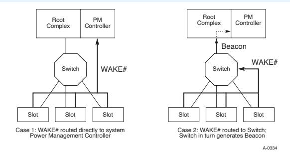

> 

[⬆️ 返回目录](#-本章目录-table-of-contents)

---

<!-- 📄 Page 667 -->
---

#### 5.3.3.2.1 PME Synchronization § | 5.3.3.2.1 PME 同步 §

<table>
<thead>
<tr>
<th width="50%">🇬🇧 English</th>
<th width="50%" style="background-color:#e8e8e8">🏆 中文</th>
</tr>
</thead>
<tbody>
<tr>
<td>

A Switch must transition its Upstream Link to the L2/L3 Ready state after all of its Downstream Ports have entered the L2/L3 Ready state.

The Links attached to the originator of the PME_Turn_Off Message are the last to assume the L2/L3 Ready state. This state transition serves as an indication to the power delivery manager that all Links within that portion of the Hierarchy have successfully retired all in flight PME Messages to the point of PME_Turn_Off Message origin and have performed any necessary local conditioning in preparation for power removal.

In order to avoid deadlock in the case where one or more devices do not respond with a PME_TO_Ack Message and then put their Links into the L2/L3 Ready state, the power manager must implement a timeout after waiting for a certain amount of time, after which it proceeds as if the Message had been received and all Links put into the L2/L3 Ready state. The recommended limit for this timer is in the range of 1 ms to 10 ms.

The power delivery manager must wait a minimum of 100 ns after observing all Links corresponding to the point of origin of the PME_Turn_Off Message enter L2/L3 Ready before removing the components' reference clock and main power. This requirement does not apply in the case where the above mentioned timer triggers.

> **IMPLEMENTATION NOTE: PME_TO_ACK MESSAGE PROXY BY SWITCHES**
> One of the PME_Turn_Off/PME_TO_Ack handshake's key roles is to ensure that all in flight PME Messages are flushed from the PCI Express fabric prior to sleep state power removal. This is guaranteed to occur because PME Messages and the PME_TO_Ack Messages both use the posted request queue within VC0 and so all previously injected PME Messages will be made visible to the system before the PME_TO_Ack is received at the Root Complex. Once all Downstream Ports of the Root Complex receive a PME_TO_Ack Message the Root Complex can then signal the power manager that it is safe to remove power without loss of any PME Messages.
> Switches create points of hierarchical expansion and, therefore, must wait for all of their connected Downstream Ports to receive a PME_TO_Ack Message before they can send a PME_TO_Ack Message Upstream on behalf of the sub-hierarchy that it has created Downstream. This can be accomplished very simply using common score boarding techniques. For example, once a PME_Turn_Off broadcast Message has been broadcast Downstream of the Switch, the Switch simply checks off each Downstream Port having received a PME_TO_Ack. Once the last of its active Downstream Ports receives a PME_TO_Ack, the Switch will then send a single PME_TO_Ack Message Upstream as a proxy on behalf of the entire sub-hierarchy Downstream of it. Note that once a Downstream Port receives a PME_TO_Ack Message and the Switch has scored its arrival, the Port is then free to drop the packet from its internal queues and free up the corresponding posted request queue FC credits.

</td>
<td style="background-color:#e8e8e8">

Switch 必须在所有下游端口进入 L2/L3 Ready 状态之后,才将其上游链路转换到 L2/L3 Ready 状态。

连接到 PME_Turn_Off 报文发起者的链路是最后进入 L2/L3 Ready 状态的链路。此状态转换作为对电源交付管理器的指示,表明层级该部分内的所有链路已成功将所有在途 PME 报文撤回到 PME_Turn_Off 报文源点,并已执行任何必要的本地调整以准备电源移除。

为避免在一个或多个设备不响应 PME_TO_Ack 报文然后将其链路置入 L2/L3 Ready 状态的情况下发生死锁,电源管理器必须实现在等待一定时间后的超时,此时将按已收到报文且所有链路已置入 L2/L3 Ready 状态继续进行。该定时器的推荐限制范围为 1 ms 至 10 ms。

电源交付管理器必须在观察到与 PME_Turn_Off 报文源点对应的所有链路进入 L2/L3 Ready 状态后,等待至少 100 ns 才能移除组件的参考时钟和主电源。上述定时器触发的情况下不适用此要求。

> **实现注: Switch 对 PME_TO_ACK 报文的代理**
> PME_Turn_Off/PME_TO_Ack 握手的关键作用之一是确保在睡眠状态电源移除之前,所有在途 PME 报文都已从 PCI Express 互连中清除。这一点得到保证,是因为 PME 报文和 PME_TO_Ack 报文都使用 VC0 内的 Posted 请求队列,因此所有先前注入的 PME 报文将在 PME_TO_Ack 被根复合体接收之前对系统可见。一旦根复合体的所有下游端口接收到 PME_TO_Ack 报文,根复合体即可向电源管理器发出信号,表明在不会丢失任何 PME 报文的情况下安全移除电源。
> Switch 创建层级扩展点,因此必须等待其连接的所有下游端口接收到 PME_TO_Ack 报文,然后才能代表其下游创建的子层级向上游发送 PME_TO_Ack 报文。这可以使用常见的记分板 (scoreboarding) 技术非常简单地实现。例如,一旦 PME_Turn_Off 广播报文已从 Switch 向下游广播,Switch 简单地检查每个下游端口是否已收到 PME_TO_Ack。一旦其活动下游端口中最后一个接收到 PME_TO_Ack,Switch 随后将作为其下游整个子层级的代理向上游发送单个 PME_TO_Ack 报文。注意,一旦下游端口接收到 PME_TO_Ack 报文且 Switch 已记下其到达,该端口可自由地从其内部队列中丢弃该报文并释放相应的 Posted 请求队列 FC 信用。

</td>
</tr>
</tbody>
</table>

[⬆️ 返回目录](#-本章目录-table-of-contents)

---

<!-- 📄 Page 668 -->
---

### 5.3.3.3 PM_PME Messages § | 5.3.3.3 PM_PME 报文 §

<table>
<thead>
<tr>
<th width="50%">🇬🇧 English</th>
<th width="50%" style="background-color:#e8e8e8">🏆 中文</th>
</tr>
</thead>
<tbody>
<tr>
<td>

PM_PME Messages are posted Transaction Layer Packets (TLPs) that inform the power management software which agent within the Hierarchy requests a PM state change. PM_PME Messages, like all other Power Management system Messages, must use the general purpose Traffic Class, TC0.

PM_PME Messages are always routed in the direction of the Root Complex. To send a PM_PME Message on its Upstream Link, a device must transition the Link to the L0 state (if the Link was not in that state already). Unless otherwise noted, the device will keep the Link in the L0 state following the transmission of a PM_PME Message.

</td>
<td style="background-color:#e8e8e8">

PM_PME 报文是 Posted 事务层包 (TLP),通知电源管理软件层级内哪个代理请求 PM 状态变更。与所有其他电源管理系统报文一样,PM_PME 报文必须使用通用流量类 TC0。

PM_PME 报文始终沿根复合体方向路由。要在其上游链路上发送 PM_PME 报文,设备必须将链路转换到 L0 状态 (如果链路尚未处于该状态)。除非另有说明,设备在发送 PM_PME 报文后将保持链路处于 L0 状态。

</td>
</tr>
</tbody>
</table>

[⬆️ 返回目录](#-本章目录-table-of-contents)

---

#### 5.3.3.3.1 PM_PME "Backpressure" Deadlock Avoidance § | 5.3.3.3.1 PM_PME "背压"死锁避免 §

<table>
<thead>
<tr>
<th width="50%">🇬🇧 English</th>
<th width="50%" style="background-color:#e8e8e8">🏆 中文</th>
</tr>
</thead>
<tbody>
<tr>
<td>

A Root Complex is typically implemented with local buffering to store temporarily a finite number of PM_PME Messages that could potentially be simultaneously propagating through the Hierarchy. Given a limited number of PM_PME Messages that can be stored within the Root Complex, there can be backpressure applied to the Upstream directed posted queue in the event that the capacity of this temporary PM_PME Message buffer is exceeded.

Deadlock can occur according to the following example scenario:

1. Incoming PM_PME Messages fill the Root Complex's temporary storage to its capacity while there are additional PM_PME Messages still in the Hierarchy making their way Upstream.
2. The Root Complex, on behalf of system software, issues a Configuration Read Request targeting one of the PME requester's PMCSR (e.g., reading its PME_Status bit).
3. The corresponding split completion Packet is required, as per producer/consumer ordering rules, to push all previously posted PM_PME Messages ahead of it, which in this case are PM_PME Messages that have no place to go.
4. The PME service routine cannot make progress; the PM_PME Message storage situation does not improve.
5. Deadlock occurs.

Precluding potential deadlocks requires the Root Complex to always enable forward progress under these circumstances. This must be done by accepting any PM_PME Messages that posted queue flow control credits allow for, and discarding any PM_PME Messages that create an overflow condition. This required behavior ensures that no deadlock will occur in these cases; however, PM_PME Messages will be discarded and hence lost in the process.

To ensure that no PM_PME Messages are lost permanently, all agents that are capable of generating PM_PME must implement a PME Service Timeout mechanism to ensure that their PME requests are serviced in a reasonable amount of time.

If after 100 ms (+50%/-5%), the PME_Status bit of a requesting agent has not yet been cleared, the PME Service Timeout mechanism expires triggering the PME requesting agent to re-send the temporarily lost PM_PME Message. If at this time the Link is in a non-communicating state, then, prior to re-sending the PM_PME Message, the agent must reactivate the Link as defined in § Section 5.3.3.2.

</td>
<td style="background-color:#e8e8e8">

根复合体通常实现有本地缓冲,以临时存储可能同时通过层级传播的有限数量的 PM_PME 报文。鉴于根复合体内可存储的 PM_PME 报文数量有限,在该临时 PM_PME 报文缓冲区的容量被超出时,可能对向上游方向的 Posted 队列施加背压。

按以下示例场景可发生死锁:

1. 输入的 PM_PME 报文填满根复合体的临时存储达到其容量,而层级中还有额外的 PM_PME 报文正在向上游方向传播。
2. 根复合体代表系统软件发出针对某个 PME 请求者的 PMCSR 的配置读请求 (Configuration Read Request) (例如读取其 PME_Status 位)。
3. 根据生产者/消费者排序规则,相应的拆分完成报文 (split completion) 必须将其之前 Posted 的所有 PM_PME 报文推送到其之前,在这种情况下这些 PM_PME 报文无处可去。
4. PME 服务例程无法取得进展;PM_PME 报文存储情况无法改善。
5. 发生死锁。

避免潜在死锁要求根复合体在这些情况下始终启用前向进度。这必须通过接受 Posted 队列流控信用所允许的任何 PM_PME 报文,并丢弃造成溢出情况的任何 PM_PME 报文来实现。这种必需的行为确保在这些情况下不会发生死锁;然而,PM_PME 报文将在此过程中被丢弃,因此会丢失。

为确保没有 PM_PME 报文被永久丢失,所有能够生成 PM_PME 的代理必须实现 PME 服务超时机制,以确保其 PME 请求在合理的时间内得到服务。

如果在 100 ms (+50%/-5%) 之后,请求代理的 PME_Status 位尚未被清零,则 PME 服务超时机制到期,触发 PME 请求代理重新发送暂时丢失的 PM_PME 报文。如果此时链路处于不通信状态,则在重新发送 PM_PME 报文之前,代理必须按 § 第 5.3.3.2 节所述重新激活链路。

</td>
</tr>
</tbody>
</table>

[⬆️ 返回目录](#-本章目录-table-of-contents)

---

<!-- 📄 Page 669 -->
---

### 5.3.3.4 PME Rules § | 5.3.3.4 PME 规则 §

<table>
<thead>
<tr>
<th width="50%">🇬🇧 English</th>
<th width="50%" style="background-color:#e8e8e8">🏆 中文</th>
</tr>
</thead>
<tbody>
<tr>
<td>

- All device Functions must implement the PCI-PM Power Management Capabilities (PMC) register and the PMCSR in accordance with the PCI-PM specification. These registers reside in the PCI-PM compliant PCI Capability List format.
  - PME capable Functions must implement the PME_Status bit, and underlying functional behavior, in their PMCSR.
  - When a Function initiates Link wakeup, or issues a PM_PME Message, it must set its PME_Status bit.
- Switches must route a PM_PME received on any Downstream Port to their Upstream Port
- On receiving a PME_Turn_Off Message, the device must block the transmission of PM_PME Messages and transmit a PME_TO_Ack Message Upstream. The component is permitted to send a PM_PME Message after the Link is returned to an L0 state through LDn.
- Before a Link or a portion of a Hierarchy is transferred into a non-communicating state (i.e., a state from which it cannot issue a PM_PME Message), a PME_Turn_Off Message must be broadcast Downstream.

</td>
<td style="background-color:#e8e8e8">

- 所有设备 Function 必须按照 PCI-PM 规范实现 PCI-PM 电源管理能力 (Power Management Capabilities, PMC) 寄存器和 PMCSR。这些寄存器驻留在符合 PCI-PM 的 PCI 能力列表格式中。
  - 支持 PME 的 Function 必须在它们的 PMCSR 中实现 PME_Status 位以及底层功能行为。
  - 当 Function 启动链路唤醒或发出 PM_PME 报文时,它必须置位其 PME_Status 位。
- Switch 必须将从任何下游端口接收到的 PM_PME 路由到其上游端口。
- 收到 PME_Turn_Off 报文时,设备必须阻止 PM_PME 报文的发送,并向上游发送 PME_TO_Ack 报文。在链路通过 LDn 返回到 L0 状态之后,允许组件发送 PM_PME 报文。
- 在链路或层级的某一部分被转换到不通信状态 (即无法发出 PM_PME 报文的状态) 之前,必须向下游广播 PME_Turn_Off 报文。

</td>
</tr>
</tbody>
</table>

[⬆️ 返回目录](#-本章目录-table-of-contents)

---

### 5.3.3.5 PM_PME Delivery State Machine § | 5.3.3.5 PM_PME 传递状态机 §

<table>
<thead>
<tr>
<th width="50%">🇬🇧 English</th>
<th width="50%" style="background-color:#e8e8e8">🏆 中文</th>
</tr>
</thead>
<tbody>
<tr>
<td>

The following diagram conceptually outlines the PM_PME delivery control state machine. This state machine determines the ability of a Link to service PME events by issuing PM_PME immediately vs. requiring Link wakeup.

> **Figure 5-5.** A Conceptual PME Control State Machine

> 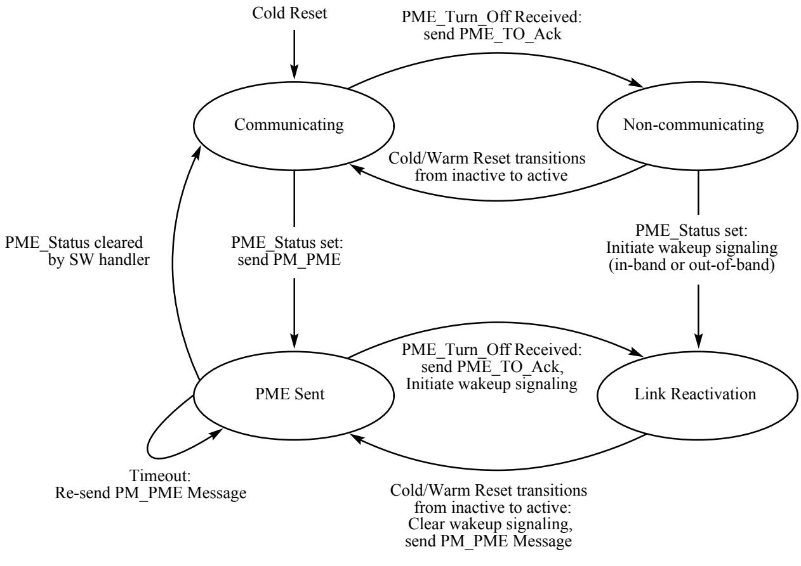

> 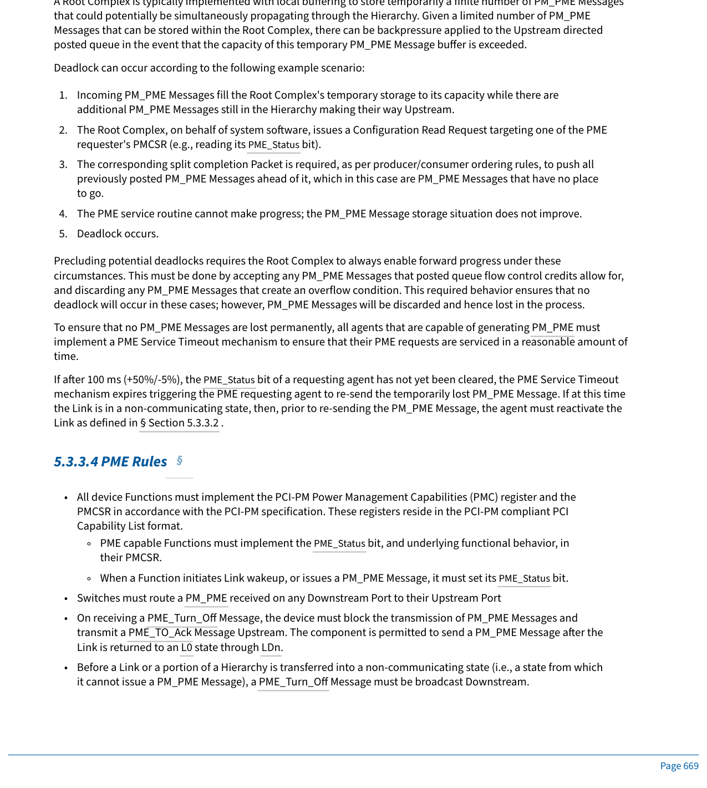

**Communicating State:**

At initial power-up and associated reset, the Upstream Link enters the Communicating state

- If PME_Status is asserted (assuming PME delivery is enabled), a PM_PME Message will be issued Upstream, terminating at the root of the Hierarchy. The next state is the PME Sent state
- If a PME_Turn_Off Message is received, the Link enters the Non-communicating state following its acknowledgment of the Message and subsequent entry into the L2/L3 Ready state.

**Non-communicating State:**

- Following the restoration of power and clock, and the associated reset, the next state is the Communicating state.
- If PME_Status is asserted, the Link will transition to the Link Reactivation state, and activate the wakeup mechanism.

**PME Sent State**

- If PME_Status is cleared, the Function becomes PME Capable again. Next state is the Communicating state.
- If the PME_Status bit is not Clear by the time the PME service timeout expires, a PM_PME Message is re-sent Upstream. Refer to § Section 5.3.3.3.1 for an explanation of the timeout mechanism.
- If a PME Message has been issued but the PME_Status has not been cleared by software when the Link is about to be transitioned into a messaging incapable state (a PME_Turn_Off Message is received), the Link transitions into Link Reactivation state after sending a PME_TO_Ack Message. The device also activates the wakeup mechanism.

**Link Reactivation State**

- Following the restoration of power and clock, and the associated reset, the Link resumes a transaction-capable state. The device clears the wakeup signaling, if necessary, and issues a PM_PME Upstream and transitions into the PME Sent state.

</td>
<td style="background-color:#e8e8e8">

下图概念性地概述了 PM_PME 传递控制状态机。此状态机通过立即发出 PM_PME 还是需要链路唤醒来确定链路处理 PME 事件的能力。

**通信 (Communicating) 状态:**

在初始上电和相关复位时,上游链路进入 Communicating 状态。

- 如果 PME_Status 被断言 (假设 PME 传递已使能),将向上游发出 PM_PME 报文,在层级的根处终止。下一个状态是 PME Sent 状态。
- 如果收到 PME_Turn_Off 报文,链路在确认报文并随后进入 L2/L3 Ready 状态后,进入 Non-communicating 状态。

**不通信 (Non-communicating) 状态:**

- 在电源和时钟恢复以及相关复位之后,下一个状态是 Communicating 状态。
- 如果 PME_Status 被断言,链路将转换到 Link Reactivation 状态,并激活唤醒机制。

**PME Sent 状态**

- 如果 PME_Status 被清零,Function 再次成为 PME 能力。下一个状态是 Communicating 状态。
- 如果在 PME 服务超时到期时 PME_Status 位尚未被清零,则重新向上游发送 PM_PME 报文。有关超时机制的说明,请参见 § 第 5.3.3.3.1 节。
- 如果已发出 PME 报文但软件在链路即将转换到不能进行报文通信的状态 (收到 PME_Turn_Off 报文) 时尚未清零 PME_Status,则链路在发送 PME_TO_Ack 报文后转换到 Link Reactivation 状态。设备还激活唤醒机制。

**链路重激活 (Link Reactivation) 状态**

- 在电源和时钟恢复以及相关复位之后,链路恢复为可处理事务的状态。设备在必要时清零唤醒信令,并向上游发出 PM_PME,然后转换到 PME Sent 状态。

</td>
</tr>
</tbody>
</table>

[⬆️ 返回目录](#-本章目录-table-of-contents)

---

<!-- 📄 Page 671 -->
---

## 5.4 Native PCI Express Power Management Mechanisms § | 5.4 原生 PCI Express 电源管理机制 §

<table>
<thead>
<tr>
<th width="50%">🇬🇧 English</th>
<th width="50%" style="background-color:#e8e8e8">🏆 中文</th>
</tr>
</thead>
<tbody>
<tr>
<td>

The following sections define power management features that require new software. While the presence of these features in new PCI Express designs will not break legacy software compatibility, taking the full advantage of them requires new code to manage them.

These features are enumerated and configured using PCI Express native configuration mechanisms as described in § Chapter 7. of this specification. Refer to § Chapter 7. for specific register locations, bit assignments, and access mechanisms associated with these PCI Express-PM features.

All Ports not associated with an Internal Root Complex Link or system Egress Port are required to support the minimum requirements defined herein for Active State Link PM. This feature must be treated as being orthogonal to the PCI-PM software compatible features from a minimum requirements perspective. For example, the Root Complex is exempt from the PCI-PM software compatible features requirements; however, it must implement the minimum requirements of ASPM.

Components in the D0 state (i.e., fully active state) normally keep their Upstream Link in the active L0 state, as defined in § Section 5.3.2. ASPM defines a protocol for components in the D0 state to reduce Link power by placing their Links into a low power state and instructing the other end of the Link to do likewise. This capability allows hardware-autonomous, dynamic Link power reduction beyond what is achievable by software-only controlled (i.e., PCI-PM software driven) power management.

In Non-Flit Mode there are two low power "standby" Link states defined for ASPM, L0s and L1. In Flit Mode L0p effectively replaces L0s, and L1 remains as a "standby" Link state for ASPM.

The L0s low power Link state is optimized for short entry and exit latencies, while providing substantial power savings. If the L0s state is enabled in a device, it is recommended that the device bring its Transmit Link into the L0s state whenever that Link is not in use (refer to § Section 5.4.1.1.1 for details relating to the L0s invocation policy). Component support of the L0s Link state from within the D0 device state is optional unless the applicable form factor specification for the Link explicitly requires it.

The L0p low power Link state is optimized for short entry and longer exit latencies, while providing substantial power savings and supporting Link operation while a Link width change is in progress.

The L1 Link state is optimized for maximum power savings at a cost of longer entry and exit latencies. L1 reduces Link power beyond the L0s state for cases where very low power is required and longer transition times are acceptable. ASPM support for the L1 Link state is optional unless specifically required by a particular form factor.

Optional L1 PM Substates L1.1 and L1.2 are defined. These substates can further reduce Link power for cases where very low idle power is required, and longer transition times are acceptable.

Each component must report its level of support for ASPM in the ASPM Support field. As applicable, each component shall also report its L0s and L1 exit latency (the time that it requires to transition from the L0s or L1 state to the L0 state). Endpoint Functions must also report the worst-case latency that they can withstand before risking, for example, internal FIFO overruns due to the transition latency from L0s or L1 to the L0 state. Power management software can use the provided information to then enable the appropriate level of ASPM.

The L1 exit latency also applies to L0p, but when used for L0p, indicates the time required to widen the Link. The Link remains operational during this time period, but at lower bandwidth.

> **NOTE: L0p and ASPM**
> A future draft of this specification may define a mechanism to report the worst case latency an Endpoint can withstand at L0p reduced bandwidth. This may involve multiple latency requirement values depending on the beginning and ending Link widths. Power management software could use this information to enable appropriate L0p Link widths for ASPM.

The L0s exit latency may differ significantly if the reference clock for opposing sides of a given Link is provided from the same source, or delivered to each component from a different source. PCI Express-PM software informs each device of its clock configuration via the Common Clock Configuration bit in its Capability structure's Link Control register. This bit serves as the determining factor in the L0s exit latency value reported by the device. ASPM may be enabled or disabled by default depending on implementation specific criteria and/or the requirements of the associated form factor specification(s). Software can enable or disable ASPM using a process described in § Section 5.4.1.4.1.

Power management software enables or disables ASPM in each Port of a component by programming the ASPM Control field. Note that new BIOS code can effectively enable or disable ASPM functionality when running with a legacy operating system, but a PCI Express-aware operating system might choose to override ASPM settings configured by the BIOS.

For ARI Devices, ASPM Control is determined solely by the setting in Function 0, regardless of Function 0's D-state. The ASPM Control settings in other Functions are ignored by the component.

An Upstream Port of a non-ARI Multi-Function Device may be programmed with different values in their respective ASPM Control fields of each Function. The policy for such a component will be dictated by the most active common denominator among all D0 Functions according to the following rules:

- Functions in a non-D0 state (D1 and deeper) are ignored in determining the ASPM policy
- If any of the Functions in the D0 state has its ASPM disabled (ASPM Control field = 00b) or if at least one of the Functions in the D0 state is enabled for L0s only (ASPM Control field = 01b) and at least one other Function in the D0 state is enabled for L1 only (ASPM Control field = 10b), then ASPM is disabled for the entire component
- Else, if at least one of the Functions in the D0 state is enabled for L0s only (ASPM Control field = 01b), then ASPM is enabled for L0s only
- Else, if at least one of the Functions in the D0 state is enabled for L1 only (ASPM Control field = 10b), then ASPM is enabled for L1 only
- Else, ASPM is enabled for both L0s and L1 states

Note that the components must be capable of changing their behavior during runtime as device Functions enter and exit low power device states. For example, if one Function within a Multi-Function Device is programmed to disable ASPM, then ASPM must be disabled for that device while that Function is in the D0 state. Once the Function transitions to a non-D0 state, ASPM can be enabled if all other Functions are enabled for ASPM.

> **IMPLEMENTATION NOTE: ISOCHRONOUS TRAFFIC AND ASPM**
> Isochronous traffic requires bounded service latency. ASPM may add latency to isochronous transactions beyond expected limits. A possible solution would be to disable ASPM for devices that are configured with an Isochronous Virtual Channel.

</td>
<td style="background-color:#e8e8e8">

以下各节定义了需要新软件的电源管理功能。虽然这些功能在新 PCI Express 设计中的存在不会破坏传统软件兼容性,但要充分利用它们需要新代码来管理它们。

这些功能使用本规范 § 第 7 章所述的 PCI Express 原生配置机制进行枚举和配置。有关与这些 PCI Express-PM 功能相关的特定寄存器位置、位分配和访问机制,请参考 § 第 7 章。

未与内部根复合体链路 (Internal Root Complex Link) 或系统出口端口 (system Egress Port) 关联的所有端口都需要支持此处定义的主动状态链路电源管理 (Active State Link PM) 的最低要求。从最低要求的角度看,此功能必须被视为与 PCI-PM 软件兼容功能正交。例如,根复合体免于 PCI-PM 软件兼容功能要求;但它必须实现 ASPM 的最低要求。

如 § 第 5.3.2 节所定义,处于 D0 状态 (即完全活动状态) 的组件通常将其上游链路保持在活动的 L0 状态。ASPM 为处于 D0 状态的组件定义了一个协议,通过将其链路置入低功耗状态并指示链路的另一端同样操作来降低链路功耗。此功能允许硬件自主、动态地降低链路功耗,超出仅由软件控制 (即 PCI-PM 软件驱动) 的电源管理所能达到的范围。

在非 Flit 模式下,ASPM 定义了两种低功耗"待机"链路状态 L0s 和 L1。在 Flit 模式下,L0p 实际上取代了 L0s,而 L1 仍作为 ASPM 的"待机"链路状态。

L0s 低功耗链路状态针对短进入与退出延迟进行了优化,同时提供显著的节能效果。如果在设备中启用了 L0s 状态,则建议设备在该链路不使用时将其发送链路置入 L0s 状态 (有关 L0s 调用策略的详细信息,请参见 § 第 5.4.1.1.1 节)。除非链路适用的外形规格规范明确要求,否则从 D0 设备状态对 L0s 链路状态的支持是可选的。

L0p 低功耗链路状态针对短进入与较长退出延迟进行了优化,同时提供显著的节能效果,并支持在链路宽度变化正在进行时进行链路操作。

L1 链路状态针对最大节能进行了优化,代价是较长的进入与退出延迟。对于需要极低功耗且可接受较长转换时间的场景,L1 可将链路功耗降低到 L0s 状态以下。除非特定外形规格明确要求,否则对 ASPM 而言 L1 链路状态的支持是可选的。

定义了可选的 L1 PM Substates L1.1 和 L1.2。这些子状态可以进一步降低链路功耗,适用于需要极低空闲功耗且可接受较长转换时间的场景。

每个组件必须在 ASPM Support 字段中报告其对 ASPM 的支持级别。在适用的情况下,每个组件还应报告其 L0s 和 L1 退出延迟 (从 L0s 或 L1 状态转换到 L0 状态所需的时间)。端点 Function 还必须报告它们可承受的最差延迟,例如在 L0s 或 L1 转换到 L0 状态的转换延迟导致内部 FIFO 溢出之前可以承受的最差延迟。电源管理软件可使用所提供的信息来启用相应级别的 ASPM。

L1 退出延迟也适用于 L0p,但用于 L0p 时,表示扩展链路宽度所需的时间。在此时间段内,链路保持运行,但带宽较低。

> **注: L0p 与 ASPM**
> 本规范的未来草案可能定义一种机制来报告端点在 L0p 降低带宽时可承受的最差延迟。这可能涉及多个延迟要求值,具体取决于起始和结束链路宽度。电源管理软件可使用此信息为 ASPM 启用适当的 L0p 链路宽度。

如果给定链路两端的参考时钟由同一源提供,或者由不同源提供给每个组件,则 L0s 退出延迟可能会有显著差异。PCI Express-PM 软件通过其 Capability 结构的 Link Control 寄存器中的 Common Clock Configuration 位通知每个设备其时钟配置。此位用作设备所报告 L0s 退出延迟值的决定因素。ASPM 可根据实现特定的标准及/或相关外形规格规范的要求默认启用或禁用。软件可使用 § 第 5.4.1.4.1 节所述过程启用或禁用 ASPM。

电源管理软件通过对每个组件的每个端口的 ASPM Control 字段编程来启用或禁用 ASPM。注意,新的 BIOS 代码在与传统操作系统一起运行时可有效地启用或禁用 ASPM 功能,但支持 PCI Express 的操作系统可能选择覆盖 BIOS 配置的 ASPM 设置。

对于 ARI 设备,ASPM Control 仅由 Function 0 的设置决定,而不考虑 Function 0 的 D 状态。其他 Function 中的 ASPM Control 设置将被组件忽略。

非 ARI 多功能设备的上游端口可在每个 Function 的相应 ASPM Control 字段中编程不同的值。此类组件的策略将由所有 D0 Function 中"最活动的最大公约数"按以下规则决定:

- 在确定 ASPM 策略时,处于非 D0 状态 (D1 及更深) 的 Function 被忽略。
- 如果 D0 状态中的任何 Function 禁用 ASPM (ASPM Control 字段 = 00b),或者如果 D0 状态中至少一个 Function 仅启用 L0s (ASPM Control 字段 = 01b),而 D0 状态中至少另一个 Function 仅启用 L1 (ASPM Control 字段 = 10b),则整个组件禁用 ASPM。
- 否则,如果 D0 状态中至少一个 Function 仅启用 L0s (ASPM Control 字段 = 01b),则仅对 L0s 启用 ASPM。
- 否则,如果 D0 状态中至少一个 Function 仅启用 L1 (ASPM Control 字段 = 10b),则仅对 L1 启用 ASPM。
- 否则,对 L0s 和 L1 状态都启用 ASPM。

注意,组件必须能够在运行时改变其行为,以响应设备 Function 进入和退出低功耗设备状态。例如,如果多功能设备内的某个 Function 被编程为禁用 ASPM,则在该 Function 处于 D0 状态时,该设备必须禁用 ASPM。一旦该 Function 转换到非 D0 状态,如果所有其他 Function 都已启用 ASPM,则可以启用 ASPM。

> **实现注: 等时流量与 ASPM**
> 等时流量需要有限的服务延迟。ASPM 可能将等时事务的延迟增加到超出预期限制。一个可能的解决方案是为配置了等时虚通道 (Isochronous Virtual Channel) 的设备禁用 ASPM。

</td>
</tr>
</tbody>
</table>

[⬆️ 返回目录](#-本章目录-table-of-contents)

---

<!-- 📄 Page 672 -->
---

## 5.4.1 Active State Power Management (ASPM) § | 5.4.1 主动状态电源管理 (ASPM) §

<table>
<thead>
<tr>
<th width="50%">🇬🇧 English</th>
<th width="50%" style="background-color:#e8e8e8">🏆 中文</th>
</tr>
</thead>
<tbody>
<tr>
<td>

The L1 Link state is optimized for maximum power savings at a cost of longer entry and exit latencies. L1 reduces Link power beyond the L0s state for cases where very low power is required and longer transition times are acceptable. ASPM support for the L1 Link state is optional unless specifically required by a particular form factor.

Optional L1 PM Substates L1.1 and L1.2 are defined. These substates can further reduce Link power for cases where very low idle power is required, and longer transition times are acceptable.

Each component must report its level of support for ASPM in the ASPM Support field. As applicable, each component shall also report its L0s and L1 exit latency (the time that it requires to transition from the L0s or L1 state to the L0 state). Endpoint Functions must also report the worst-case latency that they can withstand before risking, for example, internal FIFO overruns due to the transition latency from L0s or L1 to the L0 state. Power management software can use the provided information to then enable the appropriate level of ASPM.

The L1 exit latency also applies to L0p, but when used for L0p, indicates the time required to widen the Link. The Link remains operational during this time period, but at lower bandwidth.

</td>
<td style="background-color:#e8e8e8">

L1 链路状态针对最大节能进行了优化,代价是较长的进入与退出延迟。对于需要极低功耗且可接受较长转换时间的场景,L1 可将链路功耗降低到 L0s 状态以下。除非特定外形规格明确要求,否则对 ASPM 而言 L1 链路状态的支持是可选的。

定义了可选的 L1 PM Substates L1.1 和 L1.2。这些子状态可以进一步降低链路功耗,适用于需要极低空闲功耗且可接受较长转换时间的场景。

每个组件必须在 ASPM Support 字段中报告其对 ASPM 的支持级别。在适用的情况下,每个组件还应报告其 L0s 和 L1 退出延迟 (从 L0s 或 L1 状态转换到 L0 状态所需的时间)。端点 Function 还必须报告它们可承受的最差延迟,例如在 L0s 或 L1 转换到 L0 状态的转换延迟导致内部 FIFO 溢出之前可以承受的最差延迟。电源管理软件可使用所提供的信息来启用相应级别的 ASPM。

L1 退出延迟也适用于 L0p,但用于 L0p 时,表示扩展链路宽度所需的时间。在此时间段内,链路保持运行,但带宽较低。

</td>
</tr>
</tbody>
</table>

[⬆️ 返回目录](#-本章目录-table-of-contents)

---

<!-- 📄 Page 673 -->
---

### 5.4.1.1 L0s ASPM State § | 5.4.1.1 L0s ASPM 状态 §

<table>
<thead>
<tr>
<th width="50%">🇬🇧 English</th>
<th width="50%" style="background-color:#e8e8e8">🏆 中文</th>
</tr>
</thead>
<tbody>
<tr>
<td>

Device support of the L0s low power Link state is optional unless the applicable form factor specification for the Link explicitly requires it.

> **IMPLEMENTATION NOTE: L0S ONLY WORKS IN NON-FLIT MODE WITH NO RETIMERS**
> Flit Mode does not support L0s.
> Retimers do not support L0s.

Transaction Layer and Link Layer timers are not affected by a transition to the L0s state (i.e., they must follow the rules as defined in their respective chapters).

> **IMPLEMENTATION NOTE: POTENTIAL ISSUES WITH LEGACY SOFTWARE WHEN L0S IS NOT SUPPORTED**
> In earlier versions of this specification, device support of L0s was mandatory, and software could legitimately assume that all devices support L0s. Newer hardware components that do not support L0s may encounter issues with such "legacy software". Such software might not even check the ASPM Support field in the Link Capabilities register, might not recognize the subsequently defined values (00b and 10b) for the ASPM Support field, or might not follow the policy of enabling L0s only if components on both sides of the Link each support L0s.
> Legacy software (either operating system or firmware) that encounters the previously reserved value 00b (No ASPM Support), will most likely refrain from enabling L1, which is intended behavior. Legacy software will also most likely refrain from enabling L0s for that component's Transmitter (also intended behavior), but it is unclear if such software will also refrain from enabling L0s for the component on the other side of the Link. If software enables L0s on one side when the component on the other side does not indicate that it supports L0s, the result is undefined. Situations where the resulting behavior is unacceptable may need to be handled by updating the legacy software, establishing a list of configurations for which the legacy software is directed not to enable L0s, or simply not supporting the problematic system configurations.
> On some platforms, firmware controls ASPM, and the operating system may either preserve or override the ASPM settings established by firmware. This will be influenced by whether the operating system supports controlling ASPM, and in some cases by whether the firmware permits the operating system to take control of ASPM. Also, ASPM control with hot-plug operations may be influenced by whether native PCI Express hot-plug versus ACPI hot-plug is used. Addressing any legacy software issues with L0s may require updating the firmware, the operating system, or both.
> When a component does not advertise that it supports L0s, as indicated by its ASPM Support field value being 00b or 10b, it is recommended that the component's L0s Exit Latency field return a value of 111b, indicating the maximum latency range. Advertising this maximum latency range may help discourage legacy software from enabling L0s if it otherwise would do so, and thus may help avoid problems caused by legacy software mistakenly enabling L0s on this component or the component on the other side of the Link.

> **IMPLEMENTATION NOTE: MINIMIZING L0S EXIT LATENCY**
> L0s exit latency depends mainly on the ability of the Receiver to quickly acquire bit and Symbol synchronization. Different approaches exist for high-frequency clocking solutions which may differ significantly in their L0s exit latency, and therefore in the efficiency of ASPM. To achieve maximum power savings efficiency with ASPM, L0s exit latency should be kept low by proper selection of the clocking solution.

</td>
<td style="background-color:#e8e8e8">

除非链路适用的外形规格规范明确要求,否则设备对 L0s 低功耗链路状态的支持是可选的。

> **实现注: L0S 仅在无 Retimer 的非 Flit 模式下工作**
> Flit 模式不支持 L0s。
> Retimer 不支持 L0s。

事务层与链路层定时器不受到 L0s 状态转换的影响 (即它们必须遵循其各自章节中定义的规则)。

> **实现注: 不支持 L0S 时传统软件的潜在问题**
> 在本规范的早期版本中,设备对 L0s 的支持是强制性的,软件可以合理地假设所有设备都支持 L0s。不支持 L0s 的较新硬件组件可能与此类"传统软件"存在兼容问题。此类软件甚至可能不会检查 Link Capabilities 寄存器中的 ASPM Support 字段,可能不识别随后为 ASPM Support 字段定义的值 (00b 和 10b),或者可能不遵循仅当链路两端组件各自支持 L0s 时才启用 L0s 的策略。
> 遇到先前保留值 00b (无 ASPM 支持) 的传统软件 (操作系统或固件) 最有可能避免启用 L1,这是预期行为。传统软件也最有可能避免为该组件的发送器启用 L0s (也是预期行为),但尚不清楚此类软件是否也会避免为链路另一端的组件启用 L0s。如果软件在一端启用 L0s,而另一端的组件未指示其支持 L0s,则结果是未定义的。对于由此导致的行为不可接受的情况,可能需要通过更新传统软件、建立传统软件被指示不启用 L0s 的配置列表,或者简单地不支持有问题的系统配置来处理。
> 在某些平台上,固件控制 ASPM,操作系统可以保留或覆盖固件建立的 ASPM 设置。这将受操作系统是否支持控制 ASPM 的影响,在某些情况下还受固件是否允许操作系统接管 ASPM 控制的影响。此外,热插拔操作的 ASPM 控制可能受原生 PCI Express 热插拔与 ACPI 热插拔使用情况的影响。处理 L0s 的任何传统软件问题可能需要更新固件、操作系统或两者。
> 当组件未通告其支持 L0s (由其 ASPM Support 字段值为 00b 或 10b 指示) 时,建议该组件的 L0s Exit Latency 字段返回 111b 的值,表示最大延迟范围。通告此最大延迟范围可能有助于阻止传统软件启用 L0s (如果它本来会这样做),从而有助于避免传统软件错误地在此组件或链路另一端的组件上启用 L0s 所引起的问题。

> **实现注: 最小化 L0S 退出延迟**
> L0s 退出延迟主要取决于接收器快速获取位与符号同步的能力。对于高频时钟解决方案存在不同方法,它们的 L0s 退出延迟可能差异很大,因此 ASPM 的效率也差异很大。为了通过 ASPM 实现最大的节能效率,应通过适当选择时钟解决方案来保持较低的 L0s 退出延迟。

</td>
</tr>
</tbody>
</table>

[⬆️ 返回目录](#-本章目录-table-of-contents)

---

#### 5.4.1.1.1 Entry into the L0s State § | 5.4.1.1.1 进入 L0s 状态 §

<table>
<thead>
<tr>
<th width="50%">🇬🇧 English</th>
<th width="50%" style="background-color:#e8e8e8">🏆 中文</th>
</tr>
</thead>
<tbody>
<tr>
<td>

Entry into the L0s state is managed separately for each direction of the Link. It is the responsibility of each device at either end of the Link to initiate an entry into the L0s state on its transmitting Lanes. Software must not enable L0s in either direction on a given Link unless components on both sides of the Link each support L0s; otherwise, the result is undefined.

A Port that is disabled for the L0s state must not transition its transmitting Lanes to the L0s state. However, if the Port advertises that it supports L0s, Port must be able to tolerate having its Receiver Port Lanes enter L0s, (as a result of the device at the other end bringing its transmitting Lanes into L0s state), and then later returning to the L0 state.

**L0s Invocation Policy**

Ports that are enabled for L0s entry generally should transition their Transmit Lanes to the L0s state if the defined idle conditions (below) are met for a period of time, recommended not to exceed 7 μs. Within this time period, the policy used by the Port to determine when to enter L0s is implementation specific. It is never mandatory for a Transmitter to enter L0s.

**Definition of Idle**

The definition of an "idle" Upstream Port varies with device Function category. An Upstream Port of a Multi-Function Device is considered idle only when all of its Functions are idle.

A non-Switch Port is determined to be idle if the following conditions are met:

- No TLP is pending to transmit over the Link, or no FC credits are available to transmit any TLPs
- No DLLPs are pending for transmission

A Switch Upstream Port Function is determined to be idle if the following conditions are met:

- None of the Switch's Downstream Port Receive Lanes are in the L0, Recovery, or Configuration state
- No pending TLPs to transmit, or no FC credits are available to transmit anything
- No DLLPs are pending for transmission

A Switch's Downstream Port is determined to be idle if the following conditions are met:

- The Switch's Upstream Port's Receive Lanes are not in the L0, Recovery, or Configuration state
- No pending TLPs to transmit on this Link, or no FC credits are available
- No DLLPs are pending for transmission

Refer to § Section 4.2 for details on L0s entry by the Physical Layer.

</td>
<td style="background-color:#e8e8e8">

L0s 状态的进入是针对链路的每个方向分别管理的。链路的任一端设备有责任启动其发送 Lane 到 L0s 状态的进入。除非链路两端的组件各自支持 L0s,否则软件不得在给定链路的任一方向上启用 L0s;否则,结果是未定义的。

已禁用 L0s 状态的端口不得将其发送 Lane 转换到 L0s 状态。但是,如果端口通告其支持 L0s,则端口必须能够容忍其接收端口 Lane 进入 L0s (由于另一端的设备将其发送 Lane 置入 L0s 状态),然后再返回 L0 状态。

**L0s 调用策略**

对于启用了 L0s 进入的端口,如果满足下文定义的空闲条件达到一定时间 (建议不超过 7 μs),通常应将其发送 Lane 转换到 L0s 状态。在此时间范围内,端口用于确定何时进入 L0s 的策略是实现特定的。发送器进入 L0s 从来都不是强制的。

**空闲的定义**

"空闲"上游端口的定义因设备 Function 类别而异。多功能设备的上游端口仅在其所有 Function 都空闲时才被视为空闲。

非 Switch 端口在满足以下条件时被确定为空闲:

- 没有待通过链路发送的 TLP,或没有可用于发送任何 TLP 的 FC 信用
- 没有待发送的 DLLP

Switch 上游端口 Function 在满足以下条件时被确定为空闲:

- Switch 的任何下游端口接收 Lane 均不处于 L0、Recovery 或 Configuration 状态
- 没有待发送的 TLP,或没有可用于发送任何内容的 FC 信用
- 没有待发送的 DLLP

Switch 的下游端口在满足以下条件时被确定为空闲:

- Switch 上游端口的接收 Lane 不处于 L0、Recovery 或 Configuration 状态
- 没有待在此链路上发送的 TLP,或没有可用的 FC 信用
- 没有待发送的 DLLP

有关物理层 L0s 进入的详细信息,请参考 § 第 4.2 节。

</td>
</tr>
</tbody>
</table>

[⬆️ 返回目录](#-本章目录-table-of-contents)

---

#### 5.4.1.1.2 Exit from the L0s State § | 5.4.1.1.2 退出 L0s 状态 §

<table>
<thead>
<tr>
<th width="50%">🇬🇧 English</th>
<th width="50%" style="background-color:#e8e8e8">🏆 中文</th>
</tr>
</thead>
<tbody>
<tr>
<td>

A component with its Transmitter in L0s must initiate L0s exit when it has a TLP or DLLP to transmit across the Link. Note that a transition from the L0s Link state does not depend on the status (or availability) of FC credits. The Link must be able to reach the L0 state, and to exchange FC credits across the Link. For example, if all credits of some type were consumed when the Link entered L0s, then any component on either side of the Link must still be able to transition the Link to the L0 state when new credits need to be sent across the Link. Note that it may be appropriate for a component to anticipate the end of the idle condition and initiate L0s transmit exit; for example, when an NP request is received.

**Downstream Initiated Exit**

The Upstream Port of a component is permitted to initiate an exit from the L0s low-power state on its Transmit Link, (Upstream Port Transmit Lanes in the case of a Downstream Switch), if it needs to communicate through the Link. The component initiates a transition to the L0 state on Lanes in the Upstream direction as described in § Section 4.2.

If the Upstream component is a Switch (i.e., it is not the Root Complex), then it must initiate a transition on its Upstream Port Transmit Lanes (if the Upstream Port's Transmit Lanes are in a low-power state) as soon as it detects an exit from L0s on any of its Downstream Ports.

**Upstream Initiated Exit**

A Downstream Port is permitted to initiate an exit from L0s low power state on any of its Transmit Links if it needs to communicate through the Link. The component initiates a transition to the L0 state on Lanes in the Downstream direction as described in § Chapter 4.

If the Downstream component contains a Switch, it must initiate a transition on all of its Downstream Port Transmit Lanes that are in L0s at that time as soon as it detects an exit from L0s on its Upstream Port. Links that are already in the L0 state are not affected by this transition. Links whose Downstream component is in a low-power state (i.e., D1- D3Hot states) are also not affected by the exit transitions.

For example, consider a Switch with an Upstream Port in L0s and a Downstream device in a D1 state. A configuration request packet travels Downstream to the Switch, intending ultimately to reprogram the Downstream device from D1 to D0. The Switch's Upstream Port Link must transition to the L0 state to allow the packet to reach the Switch. The Downstream Link connecting to the device in D1 state will not transition to the L0 state yet; it will remain in the L1 state. The captured packet is checked and routed to the Downstream Port that shares a Link with the Downstream device that is in D1. As described in § Section 4.2, the Switch now transitions the Downstream Link to the L0 state. Note that the transition to the L0 state was triggered by the packet being routed to that particular Downstream L1 Link, and not by the transition of the Upstream Port's Link to the L0 state. If the packet's destination was targeting a different Downstream Link, then that particular Downstream Link would have remained in the L1 state.

</td>
<td style="background-color:#e8e8e8">

当发送器处于 L0s 状态的组件需要通过链路发送 TLP 或 DLLP 时,必须启动 L0s 退出。注意,从 L0s 链路状态的转换不依赖于 FC 信用的状态 (或可用性)。链路必须能够达到 L0 状态,并在链路上交换 FC 信用。例如,如果在链路进入 L0s 时某些类型的所有信用都被消耗,则链路任一侧的任何组件在需要跨链路发送新信用时,仍必须能够将链路转换到 L0 状态。注意,组件可适当地预期空闲条件的结束并启动 L0s 发送退出;例如,当收到 NP 请求时。

**下游发起的退出**

组件的上游端口 (对于下游 Switch,为其上游端口发送 Lane) 在需要通过链路进行通信时,允许在其发送链路上启动从 L0s 低功耗状态的退出。组件如 § 第 4.2 节所述在上游方向的 Lane 上启动到 L0 状态的转换。

如果上游组件是 Switch (即不是根复合体),则它必须在检测到其任何下游端口退出 L0s 时,立即在其上游端口发送 Lane (如果上游端口的发送 Lane 处于低功耗状态) 上启动转换。

**上游发起的退出**

下游端口在需要通过链路进行通信时,允许在其任何发送链路上启动从 L0s 低功耗状态的退出。组件如 § 第 4 章所述在下游方向的 Lane 上启动到 L0 状态的转换。

如果下游组件包含 Switch,则它必须在检测到其上游端口退出 L0s 时,立即启动其所有当时处于 L0s 的下游端口发送 Lane 的转换。已经处于 L0 状态的链路不受此转换的影响。下游组件处于低功耗状态 (即 D1–D3Hot 状态) 的链路也不受退出转换的影响。

例如,考虑一个 Switch,其上游端口处于 L0s,下游设备处于 D1 状态。配置请求报文向下游传播到 Switch,最终目的是将下游设备从 D1 重新编程为 D0。Switch 的上游端口链路必须转换到 L0 状态,以允许报文到达 Switch。连接到 D1 状态设备的下游链路不会转换到 L0 状态;它将保持在 L1 状态。捕获的报文被检查并路由到与处于 D1 状态的下游设备共享链路的上游端口。如 § 第 4.2 节所述,Switch 现在将下游链路转换到 L0 状态。注意,到 L0 状态的转换是由报文被路由到该特定下游 L1 链路触发的,而不是由上游端口的链路到 L0 状态的转换触发的。如果报文的目的地是针对不同的下游链路,则该特定的下游链路将保持在 L1 状态。

</td>
</tr>
</tbody>
</table>

[⬆️ 返回目录](#-本章目录-table-of-contents)

---

<!-- 📄 Page 676 -->
---

### 5.4.1.2 ASPM L0p State § | 5.4.1.2 ASPM L0p 状态 §

<table>
<thead>
<tr>
<th width="50%">🇬🇧 English</th>
<th width="50%" style="background-color:#e8e8e8">🏆 中文</th>
</tr>
</thead>
<tbody>
<tr>
<td>

L0p is a substate of L0 that provides power savings with short entry latency and a longer exit latency. Local L0p exit latency and remote L0p exit latency are visible to software and are reported in the Local L0p Exit Latency and Remote L0p Exit Latency fields of the Data Link Feature Extended Capability.

L0p is supported in Flit Mode only and can be used only when supported by both Link partners. When supported, ASPM L0p is controlled by the Hardware Autonomous Width Disable bit in the Link Control Register and by several Device Control 3 Register fields. the See § Section 4.2.6.7 for more detail on L0p.

</td>
<td style="background-color:#e8e8e8">

L0p 是 L0 的子状态,可在较短的进入延迟下提供节能,同时退出延迟较长。本地 L0p 退出延迟与远程 L0p 退出延迟对软件可见,并在数据链路功能扩展能力 (Data Link Feature Extended Capability) 的 Local L0p Exit Latency 和 Remote L0p Exit Latency 字段中报告。

L0p 仅在 Flit 模式下支持,仅在两个链路伙伴都支持时才能使用。在支持时,ASPM L0p 由 Link Control 寄存器中的 Hardware Autonomous Width Disable 位和多个 Device Control 3 寄存器字段控制。有关 L0p 的更多细节,请参见 § 第 4.2.6.7 节。

</td>
</tr>
</tbody>
</table>

[⬆️ 返回目录](#-本章目录-table-of-contents)

---

### 5.4.1.3 ASPM L1 State § | 5.4.1.3 ASPM L1 状态 §

<table>
<thead>
<tr>
<th width="50%">🇬🇧 English</th>
<th width="50%" style="background-color:#e8e8e8">🏆 中文</th>
</tr>
</thead>
<tbody>
<tr>
<td>

A component may optionally support the ASPM L1 state; a state that provides greater power savings at the expense of longer exit latency. L1 exit latency is visible to software, and reported via the L1 Exit Latency field.

When supported, L1 entry is controlled by the ASPM Control field. Software must enable ASPM L1 on the Downstream component only if it is supported by both components on a Link. Software must sequence the enabling and disabling of ASPM L1 such that the Upstream component is enabled before the Downstream component and disabled after the Downstream component.

An Upstream Port on a component enabled for L1 ASPM entry may initiate entry into the L1 Link state.

See § Section 5.5.1 for details on transitions into either the L1.1 or L1.2 substates.

Three power management Messages provide support for the ASPM L1 state:

- PM_Active_State_Request_L1 (DLLP)
- PM_Request_Ack (DLLP)
- PM_Active_State_Nak (TLP)

> **IMPLEMENTATION NOTE: POTENTIAL ISSUES WITH LEGACY SOFTWARE WHEN ONLY L1 IS SUPPORTED**
> In earlier versions of this specification, device support of L0s was mandatory, and there was no architected ASPM Support field value to indicate L1 support without L0s support. Newer hardware components that support only L1 may encounter issues with "legacy software", i.e., software that does not recognize the subsequently defined value for the ASPM Support field.
> Legacy software that encounters the previously reserved value 10b (L1 Support), may refrain from enabling both L0s and L1, which unfortunately avoids using L1 with new components that support only L1. While this may result in additional power being consumed, it should not cause any functional misbehavior. However, the same issues with respect to legacy software enabling L0s exist for this 10b case as are described in the Implementation Note "Potential Issues With Legacy Software When L0s is Not Supported" in § Section 5.4.1.1.

</td>
<td style="background-color:#e8e8e8">

组件可选择地支持 ASPM L1 状态;该状态以更长的退出延迟为代价提供更大的节能。L1 退出延迟对软件可见,并通过 L1 Exit Latency 字段报告。

在支持时,L1 进入由 ASPM Control 字段控制。软件仅在链路上两个组件都支持 ASPM L1 时才必须在下游组件上启用 ASPM L1。软件必须按以下顺序对 ASPM L1 进行启用和禁用: 在下游组件之前启用上游组件,在下游组件之后禁用上游组件。

启用了 L1 ASPM 进入的组件上的上游端口可启动到 L1 链路状态的进入。

有关转换到 L1.1 或 L1.2 子状态的详细信息,请参见 § 第 5.5.1 节。

三种电源管理报文为 ASPM L1 状态提供支持:

- PM_Active_State_Request_L1 (DLLP)
- PM_Request_Ack (DLLP)
- PM_Active_State_Nak (TLP)

> **实现注: 仅支持 L1 时传统软件的潜在问题**
> 在本规范的早期版本中,设备对 L0s 的支持是强制性的,并且没有架构化 (architected) 的 ASPM Support 字段值可指示在不支持 L0s 的情况下支持 L1。仅支持 L1 的较新硬件组件可能与"传统软件" (即不识别随后为 ASPM Support 字段定义值的软件) 存在兼容问题。
> 遇到先前保留值 10b (L1 Support) 的传统软件可能避免同时启用 L0s 和 L1,这不幸地避免了在仅支持 L1 的新组件上使用 L1。虽然这可能导致额外的功耗,但不应引起任何功能误操作。但是,关于传统软件启用 L0s 的相同问题在此 10b 情况下也存在,正如 § 第 5.4.1.1 节中实现注"不支持 L0S 时传统软件的潜在问题"中所述。

</td>
</tr>
</tbody>
</table>

[⬆️ 返回目录](#-本章目录-table-of-contents)

---

<!-- 📄 Page 677 -->
---

#### 5.4.1.3.1 ASPM Entry into the L1 State § | 5.4.1.3.1 ASPM 进入 L1 状态 §

<table>
<thead>
<tr>
<th width="50%">🇬🇧 English</th>
<th width="50%" style="background-color:#e8e8e8">🏆 中文</th>
</tr>
</thead>
<tbody>
<tr>
<td>

> **IMPLEMENTATION NOTE: INITIATING L1**
> This specification does not dictate when a component with an Upstream Port must initiate a transition to the L1 state. The interoperable mechanisms for transitioning into and out of L1 are defined within this specification; however, the specific ASPM policy governing when to transition into L1 is left to the implementer.
> One possible approach would be for the Downstream device to initiate a transition to the L1 state once the device has both its Receiver and Transmitter in the L0s state (RxL0s and TxL0s) for a set amount of time. Another approach would be for the Downstream device to initiate a transition to the L1 state once the Link has been idle in L0 for a set amount of time. This is particularly useful if L0s entry is not enabled. Still another approach would be for the Downstream device to initiate a transition to the L1 state if it has completed its assigned tasks. Note that a component's L1 invocation policy is in no way limited by these few examples.

</td>
<td style="background-color:#e8e8e8">

> **实现注: 启动 L1**
> 本规范不规定具有上游端口的组件何时必须启动到 L1 状态的转换。在本规范中定义了用于转换进出 L1 的可互操作机制;然而,有关何时转换到 L1 的具体 ASPM 策略留给实现者决定。
> 一种可能的方法是,当下游设备的接收器和发送器都处于 L0s 状态 (RxL0s 和 TxL0s) 达到设定时间后,启动到 L1 状态的转换。另一种方法是,当链路在 L0 状态空闲达到设定时间后,下游设备启动到 L1 状态的转换。如果未启用 L0s 进入,这种方法尤其有用。再一种方法是,如果下游设备已完成其分配的任务,则可启动到 L1 状态的转换。注意,组件的 L1 调用策略绝不限于这几个示例。

</td>
</tr>
</tbody>
</table>

[⬆️ 返回目录](#-本章目录-table-of-contents)

---

<!-- 📄 Page 678 -->
---

<table>
<thead>
<tr>
<th width="50%">🇬🇧 English</th>
<th width="50%" style="background-color:#e8e8e8">🏆 中文</th>
</tr>
</thead>
<tbody>
<tr>
<td>

Downstream components enabled for ASPM L1 entry negotiate for L1 entry with the Upstream component on the Link.

A Downstream Port must accept a request to enter L1 if all of the following conditions are true:

- The Port supports ASPM L1 entry, and ASPM L1 entry is enabled.
- No TLP is scheduled for transmission
- No Ack or Nak DLLP is scheduled for transmission (Non-Flit Mode)
- No Flit Ack or Nak is scheduled for transmission (Flit Mode)

A Switch Upstream Port may request L1 entry on its Link provided all of the following conditions are true:

- The Upstream Port supports ASPM L1 entry and it is enabled
- All of the Switch's Downstream Port Links are in the L1 state (or deeper)
- No pending TLPs to transmit
- No pending DLLPs to transmit
- The Upstream Port's Receiver is idle for an implementation specific set amount of time

Note that it is legitimate for a Switch to be enabled for the ASPM L1 Link state on any of its Downstream Ports and to be disabled or not even supportive of ASPM L1 on its Upstream Port. In that case, Downstream Ports may enter the L1 Link state, but the Switch will never initiate an ASPM L1 entry transition on its Upstream Port.

**ASPM L1 Negotiation Rules (see § Figure 5-6 and § Figure 5-7):**

- In Non-Flit Mode, the Downstream component must not initiate ASPM L1 entry until it accumulates at least the minimum number of credits required to send the largest possible packet for any FC type.
- In Flit Mode, for any FC/VC that was initialized with non-zero and non-infinite dedicated credits, the Downstream component must not initiate ASPM L1 entry until it accumulates at least the minimum number of dedicated credits on that VC required to send the largest possible packet for that FC type.
- In Flit Mode, for any FC/VC that was initialized with zero dedicated credits, the Downstream component must not initiate ASPM L1 entry until it accumulates at least the minimum number of shared credits required to send the largest possible packet for that FC type.
- Upon deciding to enter a low-power Link state, the Downstream component must block movement of all TLPs from the Transaction Layer to the Data Link Layer for transmission (including completion packets).
- If any TLPs become available from the Transaction Layer for transmission during the L1 negotiation process, the transition to L1 must first be completed and then the Downstream component must initiate a return to L0.
- Refer to § Section 5.2 if the negotiation to L1 is interrupted.
- In Non-Flit Mode, the Downstream component must wait until it receives a Link Layer acknowledgement for the last TLP it had previously sent (i.e., the retry buffer is empty). The component must retransmit a TLP out of its Data Link Layer Retry buffer if required by the Data Link Layer rules.
- In Flit Mode, the Downstream component must wait until it receives a Flit acknowledgement for the last Flit of the last TLP it had previously sent (i.e., the retry buffer is empty). The component must retransmit Flit(s) out of its Retry buffer if required by the Flit Ack/Nak rules.
- The Downstream component then initiates ASPM negotiation by sending a PM_Active_State_Request_L1 DLLP onto its Transmit Lanes. The Downstream component sends this DLLP repeatedly with no more than eight (when using 8b/10b encoding) or 32 (when using 128b/130b encoding) Symbol times of idle between subsequent transmissions of the PM_Active_State_Request_L1 DLLP in Non-Flit Mode. The transmission of other DLLPs and SKP Ordered Sets must occur as required at any time between PM_Active_State_Request_L1 transmissions, and do not contribute to this idle time limit. Transmission of SKP Ordered Sets during L1 entry follows the clock tolerance compensation rules in § Section 4.2.8.

- The Downstream component continues to transmit the PM_Active_State_Request_L1 DLLP as described above until it receives a response from the Upstream device (see below). The Downstream component remains in this loop waiting for a response from the Upstream component.

During this waiting period, the Downstream component must not initiate any Transaction Layer transfers. It must still accept TLPs and DLLPs from the Upstream component, storing for later transmission any TLP responses required. It continues to respond with DLLPs, including FC update DLLPs, as needed by the Link Layer protocol.

If the Downstream component for any reason needs to transmit a TLP on the Link, it must first complete the transition to the low-power Link state. Once in a lower power Link state, the Downstream component must then initiate exit of the low-power Link state to handle the transfer. Refer to § Section 5.2 if the negotiation to L1 is interrupted.

- The Upstream component must immediately (while obeying all other rules in this specification) respond to the request with either an acceptance or a rejection of the request.

If the Upstream component is not able to accept the request, it must immediately (while obeying all other rules in this specification) reject the request.

- Refer to § Section 5.2 if the negotiation to L1 is interrupted.

**Rules in case of rejection:**

- In the case of a rejection, the Upstream component must schedule, as soon as possible, a rejection by sending the PM_Active_State_Nak Message to the Downstream component. Once the PM_Active_State_Nak Message is sent, the Upstream component is permitted to initiate any TLP or DLLP transfers.
- If the request was rejected, it is generally recommended that the Downstream component immediately transition its Transmit Lanes into the L0s state, provided L0s is enabled and that conditions for L0s entry are met.
- Prior to transmitting a PM_Active_State_Request_L1 DLLP associated with a subsequent ASPM L1 negotiation sequence, the Downstream component must either enter and exit L0s on its Transmitter, or it must wait at least 10 μs from the last transmission of the PM_Active_State_Request_L1 DLLP associated with the preceding ASPM L1 negotiation. This 10 μs timer must count only time spent in the LTSSM L0 and L0s states. The timer must hold in the LTSSM Recovery state. If the Link goes down and comes back up, the timer is ignored and the component is permitted to issue new ASPM L1 request after the Link has come back up.

</td>
<td style="background-color:#e8e8e8">

启用了 ASPM L1 进入的下游组件与链路上的上游组件协商 L1 进入。

下游端口在以下所有条件都为真时必须接受进入 L1 的请求:

- 端口支持 ASPM L1 进入,并且 ASPM L1 进入已使能。
- 没有 TLP 调度发送
- 没有 Ack 或 Nak DLLP 调度发送 (非 Flit 模式)
- 没有 Flit Ack 或 Nak 调度发送 (Flit 模式)

Switch 上游端口在以下所有条件都为真时可请求其链路的 L1 进入:

- 上游端口支持 ASPM L1 进入并且已使能
- Switch 的所有下游端口链路均处于 L1 状态 (或更深)
- 没有待发送的 TLP
- 没有待发送的 DLLP
- 上游端口的接收器空闲达到实现特定的设定时间

注意,Switch 在其任何下游端口上启用 ASPM L1 链路状态,而在其上游端口上禁用或甚至不支持 ASPM L1,这是合法的。在这种情况下,下游端口可进入 L1 链路状态,但 Switch 永远不会在其上游端口上启动 ASPM L1 进入转换。

**ASPM L1 协商规则 (见 § 图 5-6 与 § 图 5-7):**

- 在非 Flit 模式下,在累积至少发送任何 FC 类型最大可能分组所需的最少信用数之前,下游组件不得启动 ASPM L1 进入。
- 在 Flit 模式下,对于使用非零且非无限专用信用初始化的任何 FC/VC,在该 VC 上累积至少发送该 FC 类型最大可能分组所需的最少专用信用之前,下游组件不得启动 ASPM L1 进入。
- 在 Flit 模式下,对于使用零专用信用初始化的任何 FC/VC,在累积至少发送该 FC 类型最大可能分组所需的最少共享信用之前,下游组件不得启动 ASPM L1 进入。
- 在决定进入低功耗链路状态时,下游组件必须阻止所有 TLP 从事务层向数据链路层的移动以进行发送 (包括完成报文)。
- 如果在 L1 协商过程中任何 TLP 变得可从事务层发送,则必须先完成到 L1 的转换,然后下游组件必须启动返回 L0。
- 如果到 L1 的协商被中断,请参见 § 第 5.2 节。
- 在非 Flit 模式下,下游组件必须等待,直到它收到之前发送的最后一个 TLP 的链路层确认 (即重传缓冲区为空)。如果数据链路层规则要求,组件必须从其数据链路层重传缓冲区重传 TLP。
- 在 Flit 模式下,下游组件必须等待,直到它收到之前发送的最后一个 TLP 的最后一个 Flit 的 Flit 确认 (即重传缓冲区为空)。如果 Flit Ack/Nak 规则要求,组件必须从其重传缓冲区重传 Flit。
- 下游组件随后通过向其发送 Lane 发送 PM_Active_State_Request_L1 DLLP 启动 ASPM 协商。组件在非 Flit 模式下,以不超过 8 个 (使用 8b/10b 编码) 或 32 个 (使用 128b/130b 编码) Symbol Time 的空闲间隔重复发送该 DLLP。在 PM_Active_State_Request_L1 发送之间的任何时刻必须根据需要发送其他 DLLP 和 SKP 有序集,且不计入该空闲时间限制。L1 进入期间的 SKP 有序集发送遵循 § 第 4.2.8 节中的时钟容差补偿规则。

- 下游组件如上所述继续发送 PM_Active_State_Request_L1 DLLP,直到它收到来自上游设备的响应 (见下文)。下游组件保持在此循环中,等待来自上游组件的响应。

在此等待期间,下游组件不得启动任何事务层传输。它仍必须接受来自上游组件的 TLP 和 DLLP,并存储所需的任何 TLP 响应以供以后发送。它继续以 DLLP 响应,包括 FC 更新 DLLP,具体取决于链路层协议的需要。

如果下游组件因任何原因需要在链路上发送 TLP,则它必须先完成到低功耗链路状态的转换。一旦进入较低功耗链路状态,下游组件必须随后启动退出低功耗链路状态以处理该传输。如果到 L1 的协商被中断,请参见 § 第 5.2 节。

- 上游组件必须立即 (在遵守本规范中的所有其他规则的同时) 以接受或拒绝该请求来响应请求。

如果上游组件无法接受该请求,则必须立即 (在遵守本规范中的所有其他规则的同时) 拒绝该请求。

- 如果到 L1 的协商被中断,请参见 § 第 5.2 节。

**拒绝情况下的规则:**

- 在拒绝的情况下,上游组件必须尽快通过向 Downstream 组件发送 PM_Active_State_Nak 报文来调度拒绝。PM_Active_State_Nak 报文发送后,允许上游组件启动任何 TLP 或 DLLP 传输。
- 如果请求被拒绝,通常建议下游组件立即将其发送 Lane 转换到 L0s 状态,前提是 L0s 已启用且满足 L0s 进入条件。
- 在发送与后续 ASPM L1 协商序列关联的 PM_Active_State_Request_L1 DLLP 之前,下游组件必须在其发送器上进入并退出 L0s,或者必须自与先前 ASPM L1 协商关联的 PM_Active_State_Request_L1 DLLP 最后一次发送起等待至少 10 μs。该 10 μs 定时器必须仅计算在 LTSSM L0 和 L0s 状态中花费的时间。定时器必须在 LTSSM Recovery 状态中保持。如果链路断开并重新连接,则忽略该定时器,并允许组件在链路重新连接后发出新的 ASPM L1 请求。

</td>
</tr>
</tbody>
</table>

[⬆️ 返回目录](#-本章目录-table-of-contents)

---

<!-- 📄 Page 679 -->
---

<table>
<thead>
<tr>
<th width="50%">🇬🇧 English</th>
<th width="50%" style="background-color:#e8e8e8">🏆 中文</th>
</tr>
</thead>
<tbody>
<tr>
<td>

transmissions, and do not contribute to this idle time limit. Transmission of SKP Ordered Sets during L1 entry follows the clock tolerance compensation rules in § Section 4.2.8.

- The Downstream component continues to transmit the PM_Active_State_Request_L1 DLLP as described above until it receives a response from the Upstream device (see below). The Downstream component remains in this loop waiting for a response from the Upstream component.

During this waiting period, the Downstream component must not initiate any Transaction Layer transfers. It must still accept TLPs and DLLPs from the Upstream component, storing for later transmission any TLP responses required. It continues to respond with DLLPs, including FC update DLLPs, as needed by the Link Layer protocol.

If the Downstream component for any reason needs to transmit a TLP on the Link, it must first complete the transition to the low-power Link state. Once in a lower power Link state, the Downstream component must then initiate exit of the low-power Link state to handle the transfer. Refer to § Section 5.2 if the negotiation to L1 is interrupted.

- The Upstream component must immediately (while obeying all other rules in this specification) respond to the request with either an acceptance or a rejection of the request.

If the Upstream component is not able to accept the request, it must immediately (while obeying all other rules in this specification) reject the request.

- Refer to § Section 5.2 if the negotiation to L1 is interrupted.

**Rules in case of rejection:**

- In the case of a rejection, the Upstream component must schedule, as soon as possible, a rejection by sending the PM_Active_State_Nak Message to the Downstream component. Once the PM_Active_State_Nak Message is sent, the Upstream component is permitted to initiate any TLP or DLLP transfers.
- If the request was rejected, it is generally recommended that the Downstream component immediately transition its Transmit Lanes into the L0s state, provided L0s is enabled and that conditions for L0s entry are met.
- Prior to transmitting a PM_Active_State_Request_L1 DLLP associated with a subsequent ASPM L1 negotiation sequence, the Downstream component must either enter and exit L0s on its Transmitter, or it must wait at least 10 μs from the last transmission of the PM_Active_State_Request_L1 DLLP associated with the preceding ASPM L1 negotiation. This 10 μs timer must count only time spent in the LTSSM L0 and L0s states. The timer must hold in the LTSSM Recovery state. If the Link goes down and comes back up, the timer is ignored and the component is permitted to issue new ASPM L1 request after the Link has come back up.

**Rules in case of acceptance:**

- If the Upstream component is ready to accept the request, it must block scheduling of any TLPs from the Transaction Layer.
- In Non-Flit Mode, the Upstream component then must wait until it receives a Data Link Layer acknowledgement for the last TLP it had previously sent. The Upstream component must retransmit a TLP if required by the Data Link Layer rules.

> **IMPLEMENTATION NOTE: ASPM L1 ACCEPT/REJECT CONSIDERATIONS FOR THE UPSTREAM COMPONENT**
> When the Upstream component has responded to the Downstream component's ASPM L1 request with a PM_Request_Ack DLLP to accept the L1 entry request, the ASPM L1 negotiation protocol clearly and unambiguously ends with the Link entering L1. However, if the Upstream component responds with a PM_Active_State_Nak Message to reject the L1 entry request, the termination of the ASPM L1 negotiation protocol is less clear. Therefore, both components need to be designed to unambiguously terminate the protocol exchange. If this is not done, there is the risk that the two components will get out of sync with each other, and the results may be undefined. For example, consider the following case:
> - The Downstream component requests ASPM L1 entry by transmitting a sequence of PM_Active_State_Request_L1 DLLPs.
> - Due to a temporary condition, the Upstream component responds with a PM_Active_State_Nak Message to reject the L1 request.
> - The Downstream component continues to transmit the PM_Active_State_Request_L1 DLLPs for some time before it is able to respond to the PM_Active_State_Nak Message.
> - Meanwhile, the temporary condition that previously caused the Upstream component to reject the L1 request is resolved, and the Upstream component erroneously sees the continuing PM_Active_State_Request_L1 DLLPs as a new request to enter L1, and responds by transmitting PM_Request_Ack DLLPs Downstream.
> At this point, the result is undefined, because the Downstream component views the L1 request as rejected and finishing, but the Upstream component views the situation as a second L1 request being accepted.
> To avoid this situation, the Downstream component needs to provide a mechanism to distinguish between one ASPM L1 request and another. The Downstream component does this by entering L0s (when supported and enabled), or by waiting a minimum of 10 μs from the transmission of the last PM_Active_State_Request_L1 DLLP associated with the first ASPM L1 request before starting transmission of the PM_Active_State_Request_L1 DLLPs associated with the second request (as described above).
> If the Upstream component is capable of exhibiting the behavior described above, then it is necessary for the Upstream component to recognize the end of an L1 request sequence by detecting a transition to L0s on its Receiver (when supported and enabled) or a break in the reception of PM_Active_State_Request_L1 DLLPs of 9.5 μs measured while in L0/L0s or more as a separation between ASPM L1 requests by the Downstream component.
> If there is a possibility of ambiguity, the Upstream component should reject the L1 request to avoid potentially creating the ambiguous situation outlined above.

</td>
<td style="background-color:#e8e8e8">

传输,且不计入该空闲时间限制。L1 进入期间的 SKP 有序集传输遵循 § 第 4.2.8 节中的时钟容差补偿规则。

- 下游组件如上所述继续发送 PM_Active_State_Request_L1 DLLP,直到它收到来自上游设备的响应 (见下文)。下游组件保持在此循环中,等待来自上游组件的响应。

在此等待期间,下游组件不得启动任何事务层传输。它仍必须接受来自上游组件的 TLP 和 DLLP,并存储所需的任何 TLP 响应以供以后发送。它继续以 DLLP 响应,包括 FC 更新 DLLP,具体取决于链路层协议的需要。

如果下游组件因任何原因需要在链路上发送 TLP,则它必须先完成到低功耗链路状态的转换。一旦进入较低功耗链路状态,下游组件必须随后启动退出低功耗链路状态以处理该传输。如果到 L1 的协商被中断,请参见 § 第 5.2 节。

- 上游组件必须立即 (在遵守本规范中的所有其他规则的同时) 以接受或拒绝该请求来响应请求。

如果上游组件无法接受该请求,则必须立即 (在遵守本规范中的所有其他规则的同时) 拒绝该请求。

- 如果到 L1 的协商被中断,请参见 § 第 5.2 节。

**拒绝情况下的规则:**

- 在拒绝的情况下,上游组件必须尽快通过向 Downstream 组件发送 PM_Active_State_Nak 报文来调度拒绝。PM_Active_State_Nak 报文发送后,允许上游组件启动任何 TLP 或 DLLP 传输。
- 如果请求被拒绝,通常建议下游组件立即将其发送 Lane 转换到 L0s 状态,前提是 L0s 已启用且满足 L0s 进入条件。
- 在发送与后续 ASPM L1 协商序列关联的 PM_Active_State_Request_L1 DLLP 之前,下游组件必须在其发送器上进入并退出 L0s,或者必须自与先前 ASPM L1 协商关联的 PM_Active_State_Request_L1 DLLP 最后一次发送起等待至少 10 μs。该 10 μs 定时器必须仅计算在 LTSSM L0 和 L0s 状态中花费的时间。定时器必须在 LTSSM Recovery 状态中保持。如果链路断开并重新连接,则忽略该定时器,并允许组件在链路重新连接后发出新的 ASPM L1 请求。

**接受情况下的规则:**

- 如果上游组件准备好接受该请求,则它必须阻止从事务层调度任何 TLP。
- 在非 Flit 模式下,上游组件随后必须等待,直到它收到之前发送的最后一个 TLP 的数据链路层确认。如果数据链路层规则要求,上游组件必须重传 TLP。

> **实现注: 上游组件的 ASPM L1 接受/拒绝注意事项**
> 当上游组件以 PM_Request_Ack DLLP 响应下游组件的 ASPM L1 请求以接受 L1 进入请求时,ASPM L1 协商协议以链路进入 L1 明确无误地结束。但是,如果上游组件以 PM_Active_State_Nak 报文响应以拒绝 L1 进入请求,则 ASPM L1 协商协议的终止不太明确。因此,两个组件需要设计为明确无误地终止协议交换。如果不这样做,则存在两个组件彼此失去同步的风险,结果可能是未定义的。例如,考虑以下情况:
> - 下游组件通过发送一系列 PM_Active_State_Request_L1 DLLP 来请求 ASPM L1 进入。
> - 由于临时情况,上游组件以 PM_Active_State_Nak 报文响应以拒绝 L1 请求。
> - 在其能够对 PM_Active_State_Nak 报文做出响应之前,下游组件继续发送 PM_Active_State_Request_L1 DLLP 一段时间。
> - 同时,先前导致上游组件拒绝 L1 请求的临时情况得到解决,上游组件错误地将持续的 PM_Active_State_Request_L1 DLLP 视为新的 L1 进入请求,并通过向下游发送 PM_Request_Ack DLLP 来响应。
> 此时,结果是未定义的,因为下游组件将 L1 请求视为已拒绝并结束,但上游组件将这种情况视为第二个 L1 请求被接受。
> 为避免这种情况,下游组件需要提供一种机制来区分一个 ASPM L1 请求与另一个。下游组件通过进入 L0s (在支持并启用时) 或在开始发送与第二个请求关联的 PM_Active_State_Request_L1 DLLP 之前,从与第一个 ASPM L1 请求关联的最后一个 PM_Active_State_Request_L1 DLLP 发送起等待至少 10 μs (如上所述) 来实现此目的。
> 如果上游组件能够表现出上述行为,则上游组件必须通过检测其接收器到 L0s 的转换 (在支持并启用时) 或在 L0/L0s 中测量 9.5 μs 或以上的 PM_Active_State_Request_L1 DLLP 接收中断来识别 L1 请求序列的结束,作为下游组件的 ASPM L1 请求之间的间隔。
> 如果存在歧义的可能性,上游组件应拒绝 L1 请求,以避免可能产生上述模糊情况。

</td>
</tr>
</tbody>
</table>

[⬆️ 返回目录](#-本章目录-table-of-contents)

---

<!-- 📄 Page 681 -->
---

<table>
<thead>
<tr>
<th width="50%">🇬🇧 English</th>
<th width="50%" style="background-color:#e8e8e8">🏆 中文</th>
</tr>
</thead>
<tbody>
<tr>
<td>

- In Flit Mode, the Upstream component then must wait until it receives a Data Link Layer acknowledgement for the last Flit of the last TLP it had previously sent. The Upstream component must retransmit Flit(s) if required by the Data Link Layer rules.
- Once all TLPs/Flits have been acknowledged, the Upstream component sends a PM_Request_Ack DLLP Downstream. The Upstream component sends this DLLP repeatedly with no more than eight (when using 8b/10b encoding) or 32 (when using 128b/130b encoding) Symbol times of idle between subsequent transmissions of the PM_Request_Ack DLLP in Non-Flit Mode. The transmission of SKP Ordered Sets must occur as required at any time between PM_Request_Ack transmissions, and do not contribute to this idle time limit. Transmission of SKP Ordered Sets during L1 entry follows the clock tolerance compensation rules in § Section 4.2.8.
- The Upstream component continues to transmit the PM_Request_Ack DLLP as described above until it observes its Receive Lanes enter into the Electrical Idle state. Refer to § Chapter 4. for more details on the Physical Layer behavior.
- If the Upstream component needs, for any reason, to transmit a TLP on the Link after it sends a PM_Request_Ack DLLP, it must first complete the transition to the low-power state, and then initiate an exit from the low-power state to handle the transfer once the Link is back to L0. Refer to § Section 5.2 if the negotiation to L1 is interrupted.
  - The Upstream component must initiate an exit from L1 in this case even if it does not have the required flow control credit to transmit the TLP(s).
- When the Downstream component detects a PM_Request_Ack DLLP on its Receive Lanes (signaling that the Upstream device acknowledged the transition to L1 request), the Downstream component then ceases sending the PM_Active_State_Request_L1 DLLP, disables DLLP, TLP transmission and brings its Transmit Lanes into the Electrical Idle state.
- When the Upstream component detects an Electrical Idle on its Receive Lanes (signaling that the Downstream component has entered the L1 state), it then ceases to send the PM_Request_Ack DLLP, disables DLLP, TLP transmission and brings the Downstream direction of the Link into the Electrical Idle state.

Notes:

1. The transaction Layer Completion Timeout mechanism is not affected by transition to the L1 state (i.e., it must keep counting).
2. Flow Control Update timers are frozen while the Link is in L1 state to prevent a timer expiration that will unnecessarily transition the Link back to the L0 state.

</td>
<td style="background-color:#e8e8e8">

- 在 Flit 模式下,上游组件随后必须等待,直到它收到之前发送的最后一个 TLP 的最后一个 Flit 的数据链路层确认。如果数据链路层规则要求,上游组件必须重传 Flit。
- 一旦所有 TLP/Flit 都已被确认,上游组件向下游发送 PM_Request_Ack DLLP。上游组件在非 Flit 模式下,以不超过 8 个 (使用 8b/10b 编码) 或 32 个 (使用 128b/130b 编码) Symbol Time 的空闲间隔重复发送该 DLLP。在 PM_Request_Ack 发送之间的任何时刻必须根据需要发送 SKP 有序集,且不计入该空闲时间限制。L1 进入期间的 SKP 有序集发送遵循 § 第 4.2.8 节中的时钟容差补偿规则。
- 上游组件如上所述继续发送 PM_Request_Ack DLLP,直到它观察到其接收 Lane 进入电气空闲状态。有关物理层行为的更多细节,请参见 § 第 4 章。
- 如果上游组件在发送 PM_Request_Ack DLLP 后因任何原因需要在链路上发送 TLP,则它必须先完成到低功耗状态的转换,然后启动退出低功耗状态,以在链路回到 L0 后处理该传输。如果到 L1 的协商被中断,请参见 § 第 5.2 节。
  - 在这种情况下,即使上游组件没有发送 TLP 所需的流控信用,也必须启动从 L1 的退出。
- 当下游组件在其接收 Lane 上检测到 PM_Request_Ack DLLP (表示上游设备已确认到 L1 状态的转换请求) 时,下游组件随后停止发送 PM_Active_State_Request_L1 DLLP,禁用 DLLP、TLP 发送,并将其发送 Lane 置入电气空闲状态。
- 当上游组件在其接收 Lane 上检测到电气空闲 (表示下游组件已进入 L1 状态) 时,它随后停止发送 PM_Request_Ack DLLP,禁用 DLLP、TLP 发送,并将链路的下游方向置入电气空闲状态。

注:

1. 事务层完成超时 (Completion Timeout) 机制不受 L1 状态转换的影响 (即它必须继续计数)。
2. 在链路处于 L1 状态时,流控更新定时器被冻结,以防止定时器到期导致链路不必要地转换回 L0 状态。

</td>
</tr>
</tbody>
</table>

> **Figure 5-6.** L1 Transition Sequence Ending with a Rejection (L0s Enabled) §
> 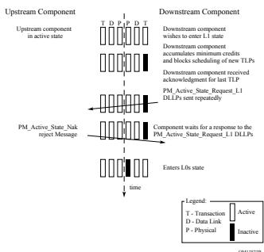

> **Figure 5-7.** L1 Successful Transition Sequence

[⬆️ 返回目录](#-本章目录-table-of-contents)

---

<!-- 📄 Page 682 -->
---

#### 5.4.1.3.2 Exit from the L1 State § | 5.4.1.3.2 退出 L1 状态 §

<table>
<thead>
<tr>
<th width="50%">🇬🇧 English</th>
<th width="50%" style="background-color:#e8e8e8">🏆 中文</th>
</tr>
</thead>
<tbody>
<tr>
<td>

Components on either end of a Link may initiate an exit from the L1 Link state.

See § Section 5.5.1 for details on transitions into either the L1.1 or L1.2 substates.

Upon exit from L1, it is recommended that the Downstream component send flow control update DLLPs for all enabled VCs and FC types starting within 1 μs of L1 exit.

**Downstream Component Initiated Exit**

An Upstream Port must initiate an exit from L1 on its Transmit Lanes if it needs to communicate through the Link. The component initiates a transition to the L0 state as described in § Chapter 4. The Upstream component must respond by initiating a similar transition of its Transmit Lanes.

If the Upstream component is a Switch Downstream Port, (i.e., it is not a Root Complex Root Port), the Switch must initiate an L1 exit transition on its Upstream Port's Transmit Lanes, (if the Upstream Port's Link is in the L1 state), as soon as it detects the L1 exit activity on any of its Downstream Port Links. Since L1 exit latencies are relatively long, a Switch must not wait until its Downstream Port Link has fully exited to L0 before initiating an L1 exit transition on its Upstream Port Link. Waiting until the Downstream Link has completed the L0 transition will cause a Message traveling through several Switches to experience accumulating latency as it traverses each Switch.

A Switch is required to initiate an L1 exit transition on its Upstream Port Link after no more than 1 μs from the beginning of an L1 exit transition on any of its Downstream Port Links. Refer to § Section 4.2 for details of the Physical Layer signaling during L1 exit.

Consider the example in § Figure 5-8. The numbers attached to each Port represent the corresponding Port's reported Transmit Lanes L1 exit latency in units of microseconds.

Links 1, 2, and 3 are all in the L1 state, and Endpoint C initiates a transition to the L0 state at time T. Since Switch B takes 32 μs to exit L1 on its Ports, Link 3 will transition to the L0 state at T+32 (longest time considering T+8 for the Endpoint C, and T+32 for Switch B).

Switch B is required to initiate a transition from the L1 state on its Upstream Port Link (Link 2) after no more than 1 μs from the beginning of the transition from the L1 state on Link 3. Therefore, transition to the L0 state will begin on Link 2 at T+1. Similarly, Link 1 will start its transition to the L0 state at time T+2.

Following along as above, Link 2 will complete its transition to the L0 state at time T+33 (since Switch B takes longer to transition and it started at time T+1). Link 1 will complete its transition to the L0 state at time T+34 (since the Root Complex takes 32 μs to transition and it started at time T+2).

Therefore, among Links 1, 2, and 3, the Link to complete the transition to the L0 state last is Link 1 with a 34 μs delay. This is the delay experienced by the packet that initiated the transition in Endpoint C.

> **Figure 5-8.** Example of L1 Exit Latency Computation

> 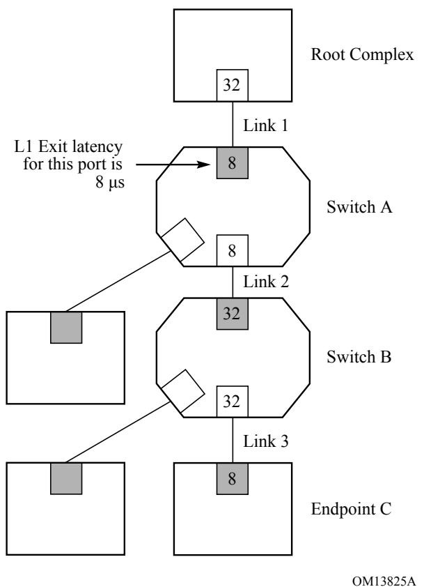

> 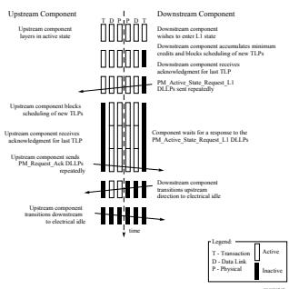

Switches are not required to initiate an L1 exit transition on any other of their Downstream Port Links.

**Upstream Component Initiated Exit**

A Root Complex, or a Switch must initiate an exit from L1 on any of its Root Ports, or Downstream Port Links if it needs to communicate through that Link. The Switch or Root Complex must be capable of initiating L1 exit even if it does not have the flow control credits needed to transmit a given TLP. The component initiates a transition to the L0 state as described in § Chapter 4. The Downstream component must respond by initiating a similar transition on its Transmit Lanes.

If the Downstream component contains a Switch, it must initiate a transition on all of its Downstream Links (assuming the Downstream Link is in an ASPM L1 state) as soon as it detects an exit from L1 state on its Upstream Port Link. Since L1 exit latencies are relatively long, a Switch must not wait until its Upstream Port Link has fully exited to L0 before initiating an L1 exit transition on its Downstream Port Links. If that were the case, a Message traveling through multiple Switches would experience accumulating latency as it traverses each Switch.

A Switch is required to initiate a transition from L1 state on all of its Downstream Port Links that are currently in L1 after no more than 1 μs from the beginning of a transition from L1 state on its Upstream Port. Refer to § Section 4.2 for details of the Physical Layer signaling during L1 exit. Downstream Port Links that are already in the L0 state do not participate in the exit transition. Downstream Port Links whose Downstream component is in a low power D-state (D1-D3Hot) are also not affected by the L1 exit transitions (i.e., such Links must not be transitioned to the L0 state).

</td>
<td style="background-color:#e8e8e8">

链路任一端的组件均可启动从 L1 链路状态的退出。

有关转换到 L1.1 或 L1.2 子状态的详细信息,请参见 § 第 5.5.1 节。

退出 L1 时,建议下游组件在 L1 退出后 1 μs 之内开始为所有使能的 VC 和 FC 类型发送流控更新 DLLP。

**下游组件发起的退出**

上游端口在需要通过链路进行通信时,必须在其发送 Lane 上启动从 L1 的退出。组件如 § 第 4 章所述启动到 L0 状态的转换。上游组件必须通过启动其发送 Lane 的类似转换来响应。

如果上游组件是 Switch 下游端口 (即不是根复合体根端口),则 Switch 必须在检测到其任何下游端口链路上的 L1 退出活动后,立即在其上游端口的发送 Lane 上 (如果上游端口的链路处于 L1 状态) 启动 L1 退出转换。由于 L1 退出延迟相对较长,Switch 在其上游端口链路上启动 L1 退出转换之前,不得等待其下游端口链路完全退出到 L0。等待到下游链路完成 L0 转换将导致通过若干 Switch 传输的报文在每个 Switch 中经历累积的延迟。

Switch 需要在其任何下游端口链路上开始 L1 退出转换后,不超过 1 μs 的时间在其上游端口链路上启动 L1 退出转换。有关 L1 退出期间物理层信令的详细信息,请参见 § 第 4.2 节。

考虑 § 图 5-8 中的示例。每个端口附带的数字表示相应端口所报告的发送 Lane L1 退出延迟 (以微秒为单位)。

链路 1、2 和 3 均处于 L1 状态,端点 C 在时间 T 启动到 L0 状态的转换。由于 Switch B 需要 32 μs 才能在其端口上退出 L1,因此链路 3 将在 T+32 时转换到 L0 状态 (考虑端点 C 的 T+8 和 Switch B 的 T+32 中的最长时间)。

Switch B 需要在链路 3 上开始 L1 状态转换后,不超过 1 μs 的时间在其上游端口链路 (链路 2) 上启动 L1 状态转换。因此,链路 2 将在 T+1 时开始到 L0 状态的转换。类似地,链路 1 将在时间 T+2 时开始到 L0 状态的转换。

如上所述,链路 2 将在时间 T+33 时完成到 L0 状态的转换 (由于 Switch B 转换所需时间较长且它在时间 T+1 开始)。链路 1 将在时间 T+34 时完成到 L0 状态的转换 (由于根复合体转换需要 32 μs 且它在时间 T+2 开始)。

因此,在链路 1、2 和 3 中,最后完成到 L0 状态转换的链路是链路 1,延迟为 34 μs。这是端点 C 中启动转换的报文所经历的延迟。

Switch 不需要在其任何其他下游端口链路上启动 L1 退出转换。

**上游组件发起的退出**

根复合体或 Switch 在需要通过任何根端口或下游端口链路进行通信时,必须启动从 L1 的退出。Switch 或根复合体必须能够启动 L1 退出,即使它没有发送给定 TLP 所需的流控信用。组件如 § 第 4 章所述启动到 L0 状态的转换。下游组件必须通过启动其发送 Lane 上的类似转换来响应。

如果下游组件包含 Switch,则它必须在检测到其上游端口链路上退出 L1 状态后,立即对其所有下游链路 (假设下游链路处于 ASPM L1 状态) 启动转换。由于 L1 退出延迟相对较长,Switch 在其下游端口链路上启动 L1 退出转换之前,不得等待其上游端口链路完全退出到 L0。如果那样,通过多个 Switch 传输的报文将在每个 Switch 中经历累积的延迟。

Switch 需要在其上游端口上开始 L1 状态转换后,不超过 1 μs 的时间在其当前处于 L1 的所有下游端口链路上启动 L1 状态转换。有关 L1 退出期间物理层信令的详细信息,请参见 § 第 4.2 节。已经处于 L0 状态的下游端口链路不参与退出转换。下游组件处于低功耗 D 状态 (D1-D3Hot) 的下游端口链路也不受 L1 退出转换的影响 (即不得将这些链路转换到 L0 状态)。

</td>
</tr>
</tbody>
</table>

[⬆️ 返回目录](#-本章目录-table-of-contents)

---

<!-- 📄 Page 684 -->
---

### 5.4.1.4 ASPM Configuration § | 5.4.1.4 ASPM 配置 §

<table>
<thead>
<tr>
<th width="50%">🇬🇧 English</th>
<th width="50%" style="background-color:#e8e8e8">🏆 中文</th>
</tr>
</thead>
<tbody>
<tr>
<td>

All Functions must implement the following configuration bits in support of ASPM. Refer to § Chapter 7. for configuration register assignment and access mechanisms.

Each component reports its level of support for ASPM in the ASPM Support field below.

**Table 5-3. Encoding of the ASPM Support | 表 5-3. ASPM Support 字段的编码**

| Field | Field | Description |
|-------|-------|-------------|
| 00b | ASPM Support | No ASPM support |
| 01b | | L0s supported |
| 10b | | L1 supported |
| 11b | | L0s and L1 supported |

Software must not enable L0s in either direction on a given Link unless components on both sides of the Link each support L0s; otherwise, the result is undefined.

Each component reports the source of its reference clock in its Slot Clock Configuration bit located in its Capability structure's Link Status register.

**Table 5-4. Description of the Slot Clock Configuration Bit | 表 5-4. Slot Clock Configuration 位的描述**

| Bit | Description |
|-----|-------------|
| Slot Clock Configuration | This bit, when Set, indicates that the component uses the same physical reference clock that the platform provides on the connector. |
| | This bit, when Clear, indicates the component uses an independent clock irrespective of the presence of a reference on the connector. |
| | For Root and Switch Downstream Ports, this bit, when Set, indicates that the Downstream Port is using the same reference clock as the Downstream component or the slot. |
| | For Switch and Bridge Upstream Ports, this bit when Set, indicates that the Upstream Port is using the same reference clock that the platform provides. |
| | Otherwise it is Clear. |

Each component must support the Common Clock Configuration bit in its Capability structure's Link Control register. Software writes to this register bit to indicate to the device whether it is sharing the same clock source as the device on the other end of the Link.

**Table 5-5. Description of the Common Clock Configuration Bit | 表 5-5. Common Clock Configuration 位的描述**

| Bit | Description |
|-----|-------------|
| Common Clock Configuration | This bit, when Set, indicates that this component and the component at the opposite end of the Link are operating with a common clock source. |
| | This bit, when Clear, indicates that this component and the component at the opposite end of the Link are operating with separate reference clock sources. |
| | Default value of this bit is 0b. |

Components utilize this common clock configuration information to report the correct L0s and L1 Exit Latencies.

Each Port reports the L0s and L1 exit latency (the time that they require to transition their Receive Lanes from the L0s or L1 state to the L0 state) in the L0s Exit Latency and the L1 Exit Latency configuration fields, respectively. If a Port does not support L0s or ASPM L1, the value of the respective exit latency field is undefined.

**Table 5-6. Encoding of the L0s Exit Latency Field | 表 5-6. L0s Exit Latency 字段的编码**

| Field | Description |
|-------|-------------|
| 000b | Less than 64 ns |
| 001b | 64 ns to less than 128 ns |
| 010b | 128 ns to less than 256 ns |
| 011b | 256 ns to less than 512 ns |
| 100b | 512 ns to less than 1 μs |
| 101b | 1 μs to less than 2 μs |
| 110b | 2 μs to 4 μs |
| 111b | More than 4 μs |

**Table 5-7. Encoding of the L1 Exit Latency | 表 5-7. L1 Exit Latency 的编码**

| Field | Description |
|-------|-------------|
| 000b | Less than 1 μs |
| 001b | 1 μs to less than 2 μs |
| 010b | 2 μs to less than 4 μs |
| 011b | 4 μs to less than 8 μs |
| 100b | 8 μs to less than 16 μs |
| 101b | 16 μs to less than 32 μs |
| 110b | 32 μs to 64 μs |
| 111b | More than 64 μs |

Endpoints also report the additional latency that they can absorb due to the transition from L0s state or L1 state to the L0 state. This is reported in the Endpoint L0s Acceptable Latency and Endpoint L1 Acceptable Latency fields, respectively.

Power management software, using the latency information reported by all components in the Hierarchy, can enable the appropriate level of ASPM by comparing exit latency for each given path from Root to Endpoint against the acceptable latency that each corresponding Endpoint can withstand.

</td>
<td style="background-color:#e8e8e8">

所有 Function 必须实现以下配置位以支持 ASPM。有关配置寄存器分配和访问机制,请参见 § 第 7 章。

每个组件在下面的 ASPM Support 字段中报告其 ASPM 支持级别。

**表 5-3. ASPM Support 的编码**

| 字段值 | 字段 | 描述 |
|---------|------|------|
| 00b | ASPM Support | 不支持 ASPM |
| 01b | | 支持 L0s |
| 10b | | 支持 L1 |
| 11b | | 支持 L0s 和 L1 |

除非链路两端的组件各自支持 L0s,否则软件不得在给定链路的任一方向上启用 L0s;否则,结果是未定义的。

每个组件在其 Capability 结构的 Link Status 寄存器中的 Slot Clock Configuration 位中报告其参考时钟的来源。

**表 5-4. Slot Clock Configuration 位的描述**

| 位 | 描述 |
|----|------|
| Slot Clock Configuration | 该位置位时,表示组件使用平台在连接器上提供的同一物理参考时钟。 |
| | 该位清零时,表示组件使用独立时钟,而无论连接器上是否存在参考。 |
| | 对于根端口和 Switch 下游端口,该位置位时,表示下游端口使用与下游组件或插槽相同的参考时钟。 |
| | 对于 Switch 和桥的上游端口,该位置位时,表示上游端口使用平台提供的同一参考时钟。 |
| | 否则清零。 |

每个组件必须在其 Capability 结构的 Link Control 寄存器中支持 Common Clock Configuration 位。软件写入此寄存器位以向设备指示它是否与链路另一端的设备共享同一时钟源。

**表 5-5. Common Clock Configuration 位的描述**

| 位 | 描述 |
|----|------|
| Common Clock Configuration | 该位置位时,表示此组件与链路另一端的组件使用公共时钟源。 |
| | 该位清零时,表示此组件与链路另一端的组件使用单独的参考时钟源。 |
| | 该位的默认值为 0b。 |

组件利用此公共时钟配置信息来报告正确的 L0s 和 L1 退出延迟。

每个端口分别在 L0s Exit Latency 和 L1 Exit Latency 配置字段中报告 L0s 和 L1 退出延迟 (将其接收 Lane 从 L0s 或 L1 状态转换到 L0 状态所需的时间)。如果端口不支持 L0s 或 ASPM L1,则相应退出延迟字段的值是未定义的。

**表 5-6. L0s Exit Latency 字段的编码**

| 字段值 | 描述 |
|---------|------|
| 000b | 小于 64 ns |
| 001b | 64 ns 至小于 128 ns |
| 010b | 128 ns 至小于 256 ns |
| 011b | 256 ns 至小于 512 ns |
| 100b | 512 ns 至小于 1 μs |
| 101b | 1 μs 至小于 2 μs |
| 110b | 2 μs 至 4 μs |
| 111b | 大于 4 μs |

**表 5-7. L1 Exit Latency 的编码**

| 字段值 | 描述 |
|---------|------|
| 000b | 小于 1 μs |
| 001b | 1 μs 至小于 2 μs |
| 010b | 2 μs 至小于 4 μs |
| 011b | 4 μs 至小于 8 μs |
| 100b | 8 μs 至小于 16 μs |
| 101b | 16 μs 至小于 32 μs |
| 110b | 32 μs 至 64 μs |
| 111b | 大于 64 μs |

端点还报告由于从 L0s 或 L1 状态转换到 L0 状态所能吸收的额外延迟。这分别在 Endpoint L0s Acceptable Latency 和 Endpoint L1 Acceptable Latency 字段中报告。

电源管理软件使用层级中所有组件报告的延迟信息,可通过将从根到端点的每条给定路径的退出延迟与每个相应端点可承受的可接受延迟进行比较,启用适当级别的 ASPM。

</td>
</tr>
</tbody>
</table>

[⬆️ 返回目录](#-本章目录-table-of-contents)

---

<!-- 📄 Page 686 -->
---

**Table 5-8. Encoding of the Endpoint L0s Acceptable Latency Field | 表 5-8. Endpoint L0s Acceptable Latency 字段的编码**

| Field | Description |
|-------|-------------|
| 000b | Maximum of 64 ns |
| 001b | Maximum of 128 ns |
| 010b | Maximum of 256 ns |
| 011b | Maximum of 512 ns |
| 100b | Maximum of 1 μs |
| 101b | Maximum of 2 μs |
| 110b | Maximum of 4 μs |
| 111b | No limit |

**Table 5-9. Encoding of the Endpoint L1 Acceptable Latency Field | 表 5-9. Endpoint L1 Acceptable Latency 字段的编码**

| Field | Description |
|-------|-------------|
| 000b | Maximum of 1 μs |
| 001b | Maximum of 2 μs |
| 010b | Maximum of 4 μs |
| 011b | Maximum of 8 μs |
| 100b | Maximum of 16 μs |
| 101b | Maximum of 32 μs |
| 110b | Maximum of 64 μs |
| 111b | No limit |

Power management software enables or disables ASPM in each component by programming the ASPM Control field.

**Table 5-10. Encoding of the ASPM Control | 表 5-10. ASPM Control 的编码**

| Field | Field | Description |
|-------|-------|-------------|
| 00b | ASPM Control | Disabled |
| 01b | | L0s Entry Enabled |
| 10b | | L1 Entry Enabled |
| 11b | | L0s and L1 Entry enabled |

- **ASPM Control = 00b**
  - Port's Transmitter must not enter L0s.
  - Ports connected to the Downstream end of the Link must not issue a PM_Active_State_Request_L1 DLLP on its Upstream Link.
  - Ports connected to the Upstream end of the Link receiving a L1 request must respond with negative acknowledgement.
- **ASPM Control = 01b**
  - Port must bring a Link into L0s state if all conditions are met.
  - Ports connected to the Downstream end of the Link must not issue a PM_Active_State_Request_L1 DLLP on its Upstream Link.
  - Ports connected to the Upstream end of the Link receiving a L1 request must respond with negative acknowledgement.
- **ASPM Control = 10b**
  - Port's Transmitter must not enter L0s.
  - Ports connected to the Downstream end of the Link may issue PM_Active_State_Request_L1 DLLPs.
  - Ports connected to the Upstream end of the Link must respond with positive acknowledgement to a L1 request and transition into L1 if the conditions for the Root Complex Root Port or Switch Downstream Port in § Section 5.4.1.3.1 are met.
- **ASPM Control = 11b**
  - Port must bring a Link into the L0s state if all conditions are met.
  - Ports connected to the Downstream end of the Link may issue PM_Active_State_Request_L1 DLLPs.
  - Ports connected to the Upstream end of the Link must respond with positive acknowledgement to a L1 request and transition into L1 if the conditions for the Root Complex Root Port or Switch Downstream Port in § Section 5.4.1.3.1 are met.

[⬆️ 返回目录](#-本章目录-table-of-contents)

---

#### 5.4.1.4.1 Software Flow for Enabling or Disabling ASPM § | 5.4.1.4.1 启用或禁用 ASPM 的软件流程 §

<table>
<thead>
<tr>
<th width="50%">🇬🇧 English</th>
<th width="50%" style="background-color:#e8e8e8">🏆 中文</th>
</tr>
</thead>
<tbody>
<tr>
<td>

Following is an example software algorithm that highlights how to enable or disable ASPM in a component.

- PCI Express components power up with an appropriate value in their Slot Clock Configuration bit. The method by which they initialize this bit is device-specific.
- PCI Express system software scans the Slot Clock Configuration bit in the components on both ends of each Link to determine if both are using the same reference clock source or reference clocks from separate sources. If the Slot Clock Configuration bits in both devices are Set, they are both using the same reference clock source, otherwise they're not.
- PCI Express software updates the Common Clock Configuration bits in the components on both ends of each Link to indicate if those devices share the same reference clock and triggers Link retraining by writing 1b to the Retrain Link bit in the Link Control register of the Upstream component.
- Devices must reflect the appropriate L0s/L1 exit latency in their L0s/L1 Exit Latency fields, per the setting of the Common Clock Configuration bit.
- PCI Express system software then reads and calculates the L0s/L1 exit latency for each Endpoint based on the latencies reported by each Port. Refer to § Section 5.4.1.3.2 for an example.
- For each component with one or more Endpoint Functions, PCI Express system software examines the Endpoint L0s Acceptable Latency /Endpoint L1 Acceptable Latency, as reported by each Endpoint Function in its Link Capabilities Register, and enables or disables L0s /L1 entry (via the ASPM Control field in the Link Control Register) accordingly in some or all of the intervening device Ports on that hierarchy.

</td>
<td style="background-color:#e8e8e8">

以下示例软件算法重点说明如何在组件中启用或禁用 ASPM。

- PCI Express 组件上电时,其 Slot Clock Configuration 位具有适当的值。它们初始化此位的方法是设备特定的。
- PCI Express 系统软件扫描每个链路两端组件的 Slot Clock Configuration 位,以确定两者是否使用同一参考时钟源或来自不同源的参考时钟。如果两个设备的 Slot Clock Configuration 位都已置位,则它们都使用同一参考时钟源,否则不是。
- PCI Express 软件更新每个链路两端组件的 Common Clock Configuration 位,以指示这些设备是否共享同一参考时钟,并通过在上游组件的 Link Control 寄存器中写入 1b 到 Retrain Link 位来触发链路重训练。
- 设备必须根据 Common Clock Configuration 位的设置,在其 L0s/L1 Exit Latency 字段中反映适当的 L0s/L1 退出延迟。
- PCI Express 系统软件随后根据每个端口报告的延迟读取并计算每个端点的 L0s/L1 退出延迟。示例请参见 § 第 5.4.1.3.2 节。
- 对于具有一个或多个端点 Function 的每个组件,PCI Express 系统软件检查每个端点 Function 在其 Link Capabilities 寄存器中报告的 Endpoint L0s Acceptable Latency / Endpoint L1 Acceptable Latency,并相应地启用或禁用该层级上某些或所有中间设备端口的 L0s / L1 进入 (通过 Link Control 寄存器中的 ASPM Control 字段)。

</td>
</tr>
</tbody>
</table>

[⬆️ 返回目录](#-本章目录-table-of-contents)

---

<!-- 📄 Page 688 -->
---

## 5.5 L1 PM Substates § | 5.5 L1 PM Substates §

<table>
<thead>
<tr>
<th width="50%">🇬🇧 English</th>
<th width="50%" style="background-color:#e8e8e8">🏆 中文</th>
</tr>
</thead>
<tbody>
<tr>
<td>

L1 PM Substates establish a Link power management regime that creates lower power substates of the L1 Link state (see § Figure 5-9), and associated mechanisms for using those substates. The L1 PM Substates are:

- **L1.0 substate**
  - The L1.0 substate corresponds to the conventional L1 Link state. This substate is entered whenever the Link enters L1. The L1 PM Substate mechanism defines transitions from this substate to and from the L1.1 and L1.2 substates.
  - The Upstream and Downstream Ports must be enabled to detect Electrical Idle exit as required in § Section 4.2.7.7.2.
- **L1.1 substate**
  - Link common mode voltages are maintained.
  - Uses a bidirectional open-drain clock request (CLKREQ#) signal for entry to and exit from this state.
  - The Upstream and Downstream Ports are not required to be enabled to detect Electrical Idle exit.
- **L1.2 substate**
  - Link common mode voltages are not required to be maintained.
  - Uses a bidirectional open-drain clock request (CLKREQ#) signal for entry to and exit from this state.
  - The Upstream and Downstream Ports are not required to be enabled to detect Electrical Idle exit.

Ports that support L1 PM Substates must not require a reference clock while in L1 PM Substates other than L1.0.

Ports that support L1 PM Substates and also support SRIS mode are required to support L1 PM Substates while operating in SRIS mode. In such cases the CLKREQ# signal is used by the L1 PM Substates protocol as defined in this section, but has no defined relationship to any local clocks used by either Port on the Link, and the management of such local clocks is implementation specific.

Ports that support the L1.2 substate for ASPM L1 must support Latency Tolerance Reporting (LTR).

When enabled, the L1 PM Substates mechanism applies the following additional requirements to the CLKREQ# signal:

- The CLKREQ# signal must be supported as a bi-directional open drain signal by both the Upstream and Downstream Ports of the Link. Each Port must have a unique instance of the signal, and the Upstream and Downstream Port CLKREQ# signals must be connected.
- It is permitted for the Upstream Port to deassert CLKREQ# when the Link is in the PCI-PM L1 or ASPM L1 states, or when the Link is in the L2/L3 Ready pseudo-state; CLKREQ# must be asserted by the Upstream Port when the Link is in any other state.
- All other specifications related to the CLKREQ# signal that are not specifically defined or modified by L1 PM Substates continue to apply.

If these requirements cannot be satisfied in a particular system, then L1 PM Substates must not be enabled.

</td>
<td style="background-color:#e8e8e8">

L1 PM Substates 建立了一种链路电源管理机制,它创建了 L1 链路状态的较低功耗子状态 (见 § 图 5-9),以及使用这些子状态的相关机制。L1 PM Substates 为:

- **L1.0 子状态**
  - L1.0 子状态对应于传统的 L1 链路状态。每当链路进入 L1 时,即进入此子状态。L1 PM Substates 机制定义了从此子状态转换到 L1.1 和 L1.2 子状态以及从其转换出来的转换过程。
  - 上游和下游端口必须使能以检测电气空闲退出,如 § 第 4.2.7.7.2 节所要求。
- **L1.1 子状态**
  - 链路共模电压保持。
  - 使用双向漏极开路时钟请求 (CLKREQ#) 信号进行此状态的进入与退出。
  - 上游和下游端口不要求使能以检测电气空闲退出。
- **L1.2 子状态**
  - 链路共模电压不必保持。
  - 使用双向漏极开路时钟请求 (CLKREQ#) 信号进行此状态的进入与退出。
  - 上游和下游端口不要求使能以检测电气空闲退出。

支持 L1 PM Substates 的端口在处于 L1.0 以外的 L1 PM Substates 时不得要求参考时钟。

支持 L1 PM Substates 且也支持 SRIS 模式的端口需要在 SRIS 模式下运行时支持 L1 PM Substates。在这种情况下,CLKREQ# 信号由本节定义的 L1 PM Substates 协议使用,但与链路上任一端口使用的任何本地时钟没有已定义的关系,且此类本地时钟的管理是实现特定的。

支持 ASPM L1 的 L1.2 子状态的端口必须支持延迟容忍度报告 (Latency Tolerance Reporting, LTR)。

启用后,L1 PM Substates 机制对 CLKREQ# 信号应用以下额外要求:

- CLKREQ# 信号必须由链路的上下游端口作为双向漏极开路信号支持。每个端口必须具有该信号的独立实例,且上游和下游端口的 CLKREQ# 信号必须连接。
- 当链路处于 PCI-PM L1 或 ASPM L1 状态,或当链路处于 L2/L3 Ready 伪状态时,允许上游端口取消断言 CLKREQ#;当链路处于任何其他状态时,上游端口必须断言 CLKREQ#。
- 与 CLKREQ# 信号相关的其他规范 (未被 L1 PM Substates 专门定义或修改) 继续适用。

如果特定系统不能满足这些要求,则不得启用 L1 PM Substates。

</td>
</tr>
</tbody>
</table>

> **Figure 5-9.** State Diagram for L1 PM Substates

> 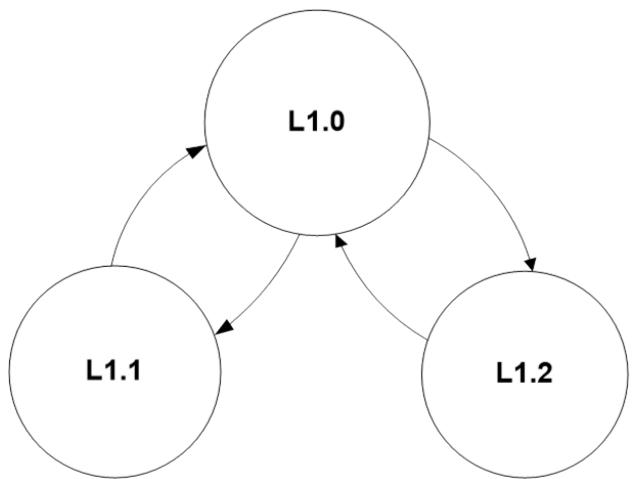

> 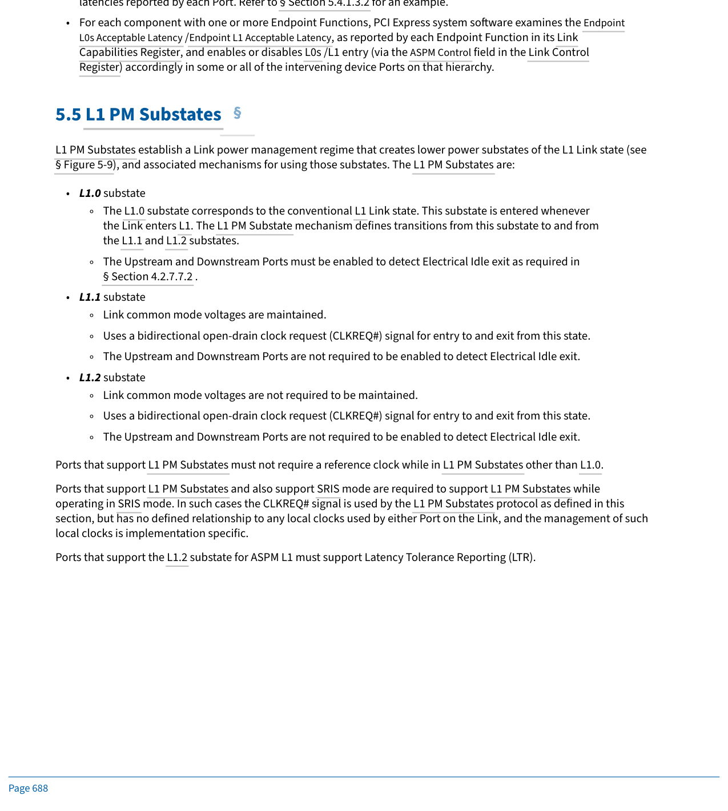

[⬆️ 返回目录](#-本章目录-table-of-contents)

---

<!-- 📄 Page 690 -->
---

> **IMPLEMENTATION NOTE: CLKREQ# CONNECTION TOPOLOGIES**
> For an Upstream component the connection topologies for the CLKREQ# signal can vary. A few examples of CLKREQ# connection topologies are described below. For the Downstream component these cases are essentially the same, however from the Upstream component's perspective, there are some key differences that are described below.
> Example 1: Single Downstream Port with a single PLL connected to a single Upstream Port (see § Figure 5-10). In this platform configuration the Upstream component (A) has only a single CLKREQ# signal. The Upstream and Downstream Ports' CLKREQ# (A and B) signals are connected to each other. In this case, Upstream component (A), must assert CLKREQ# signal whenever it requires a reference clock.

> **Figure 5-10.** Downstream Port with a Single PLL
> 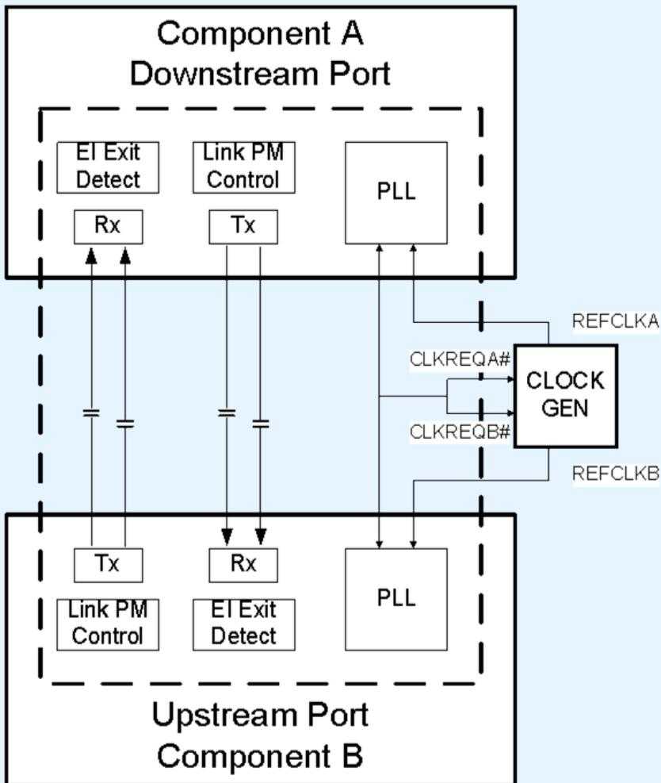

> Example 2: Upstream component with multiple Downstream Ports, with a common shared PLL, connected to separate Downstream components (see § Figure 5-11).

> **Figure 5-11.** Multiple Downstream Ports with a shared PLL

> 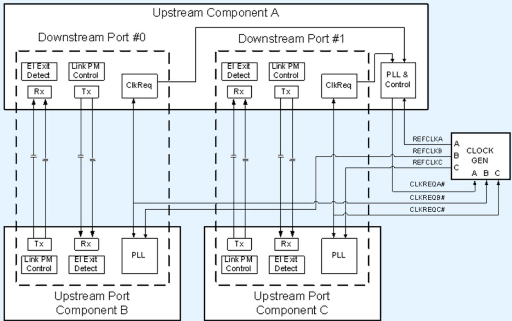

> In this example configuration, there are three instances of CLKREQ# signal for the Upstream component (A), one per Downstream Port and a common shared CLKREQ# signal for the Upstream component (A). In this topology the Downstream Port CLKREQ# (CLKREQB#, CLKREQC#) signals are used to connect to the CLKREQ# signal of the Upstream Port of the Downstream components (B and C). The common shared CLKREQ# (CLKREQA#) signal for the Upstream component is used to request the reference clock for the shared PLL. The PLL control logic in Upstream component (A) can only be turned off and CLKREQA# be deasserted when both the Downstream Ports are in L1.1 or L1.2 Substates, and all internal (A) consumers of the PLL don't require a clock.
> It is necessary for board implementers to consider what CLKREQ# topologies will be supported by components in order to make appropriate board level connections to support L1 PM Substates and for the reference clock generation.

[⬆️ 返回目录](#-本章目录-table-of-contents)

---

### 5.5.1 Entry conditions for L1 PM Substates and L1.0 Requirements § | 5.5.1 L1 PM Substates 的进入条件与 L1.0 要求 §

<table>
<thead>
<tr>
<th width="50%">🇬🇧 English</th>
<th width="50%" style="background-color:#e8e8e8">🏆 中文</th>
</tr>
</thead>
<tbody>
<tr>
<td>

The Link is considered to be in PCI-PM L1.0 when the L1 PM Substate is L1.0 and the LTSSM entered L1 through PCI-PM compatible power management. The Link is considered to be in ASPM L1.0 when the L1 PM Substate is in L1.0 and LTSSM entered L1 through ASPM.

The following rules define how the L1.1 and L1.2 substates are entered:

- Both the Upstream and Downstream Ports must monitor the logical state of the CLKREQ# signal.
- When in PCI-PM L1.0 and the PCI-PM L1.2 Enable bit is Set, the L1.2 substate must be entered when CLKREQ# is deasserted.
- When in PCI-PM L1.0 and the PCI-PM L1.1 Enable bit is Set, the L1.1 substate must be entered when CLKREQ# is deasserted and the PCI-PM L1.2 Enable bit is Clear.
- When in ASPM L1.0 and the ASPM L1.2 Enable bit is Set, the L1.2 substate must be entered when CLKREQ# is deasserted and all of the following conditions are true:
  - The reported snooped LTR value last sent or received by this Port is greater than or equal to the value set by the LTR_L1.2_THRESHOLD Value and Scale fields, or there is no snoop service latency requirement.
  - The reported non-snooped LTR last sent or received by this Port value is greater than or equal to the value set by the LTR_L1.2_THRESHOLD Value and Scale fields, or there is no non-snoop service latency requirement.
- When in ASPM L1.0 and the ASPM L1.1 Enable bit is Set, the L1.1 substate must be entered when CLKREQ# is deasserted and the conditions for entering the L1.2 substate are not satisfied.

When the entry conditions for L1.2 are satisfied, the following rules apply:

- Both the Upstream and Downstream Ports must monitor the logical state of the CLKREQ# input signal.
- An Upstream Port must not deassert CLKREQ# until the Link has entered L1.0.
- It is permitted for either Port to assert CLKREQ# to prevent the Link from entering L1.2.
- A Downstream Port intending to block entry into L1.2 must assert CLKREQ# before the Link enters L1.
- When CLKREQ# is deasserted the Ports enter the L1.2.Entry substate of L1.2.

> **IMPLEMENTATION NOTE: AVOIDING UNINTENDED INTERACTIONS BETWEEN L1 PM SUBSTATES AND THE LTSSM**
> It is often the case that implementation techniques which save power will also increase the latency to return to normal operation. When implementing L1 PM Substates, it is important for the implementer to ensure that any added delays will not negatively interact with other elements of the platform. It is particularly important to ensure that LTSSM timeout conditions are not unintentionally triggered. Although typical implementations will not approach the latencies that would cause such interactions, the responsibility lies with the implementer to ensure that correct overall operation is achieved.

</td>
<td style="background-color:#e8e8e8">

当 L1 PM Substate 为 L1.0 且 LTSSM 通过 PCI-PM 兼容电源管理进入 L1 时,链路被视为处于 PCI-PM L1.0。当 L1 PM Substate 为 L1.0 且 LTSSM 通过 ASPM 进入 L1 时,链路被视为处于 ASPM L1.0。

以下规则定义如何进入 L1.1 和 L1.2 子状态:

- 上下游端口都必须监视 CLKREQ# 信号的逻辑状态。
- 当处于 PCI-PM L1.0 且 PCI-PM L1.2 Enable 位置位时,必须在 CLKREQ# 取消断言时进入 L1.2 子状态。
- 当处于 PCI-PM L1.0 且 PCI-PM L1.1 Enable 位置位时,必须在 CLKREQ# 取消断言且 PCI-PM L1.2 Enable 位清零时进入 L1.1 子状态。
- 当处于 ASPM L1.0 且 ASPM L1.2 Enable 位置位时,必须在 CLKREQ# 取消断言且满足以下所有条件时进入 L1.2 子状态:
  - 此端口最后发送或接收的已报告侦听 LTR 值大于或等于 LTR_L1.2_THRESHOLD Value 和 Scale 字段设置的值,或没有侦听服务延迟要求。
  - 此端口最后发送或接收的已报告非侦听 LTR 值大于或等于 LTR_L1.2_THRESHOLD Value 和 Scale 字段设置的值,或无非侦听服务延迟要求。
- 当处于 ASPM L1.0 且 ASPM L1.1 Enable 位置位时,必须在 CLKREQ# 取消断言且不满足进入 L1.2 子状态的条件时进入 L1.1 子状态。

当满足 L1.2 的进入条件时,适用以下规则:

- 上下游端口都必须监视 CLKREQ# 输入信号的逻辑状态。
- 在链路进入 L1.0 之前,上游端口不得取消断言 CLKREQ#。
- 允许任一端口断言 CLKREQ# 以阻止链路进入 L1.2。
- 打算阻止进入 L1.2 的下游端口必须在链路进入 L1 之前断言 CLKREQ#。
- 当 CLKREQ# 取消断言时,端口进入 L1.2 的 L1.2.Entry 子状态。

> **实现注: 避免 L1 PM SUBSTATES 与 LTSSM 之间的意外交互**
> 通常,实现节能的技术也会增加恢复正常操作的延迟。在实现 L1 PM Substates 时,实现者必须确保任何增加的延迟不会与平台的其他元素产生负面交互。特别重要的是确保不会意外触发 LTSSM 超时条件。虽然典型的实现不会接近可能引起此类交互的延迟,但实现者有责任确保实现正确的整体操作。

</td>
</tr>
</tbody>
</table>

[⬆️ 返回目录](#-本章目录-table-of-contents)

---

<!-- 📄 Page 693 -->
---

### 5.5.2 L1.1 Requirements § | 5.5.2 L1.1 要求 §

<table>
<thead>
<tr>
<th width="50%">🇬🇧 English</th>
<th width="50%" style="background-color:#e8e8e8">🏆 中文</th>
</tr>
</thead>
<tbody>
<tr>
<td>

If a Downstream Port is in PCI-PM L1.0 and PCI-PM L1.1 Enable and/or PCI-PM L1.2 Enable are Set, or if a Downstream Port is in ASPM L1.0 and ASPM L1.1 Enable and/or ASPM L1.2 Enable are Set, and the Downstream Port initiates an exit to Recovery without having entered L1.1 or L1.2, the Downstream Port must assert CLKREQ# until the Link exits Recovery.

Both Upstream and Downstream Ports are permitted to deactivate mechanisms for electrical idle (EI) exit detection and Refclk activity detection if implemented, however both ports must maintain common mode.

If either the Upstream or Downstream Port needs to initiate exit from L1.1, it must assert CLKREQ# until the Link exits Recovery. The Upstream Port must assert CLKREQ# on entry to Recovery, and must continue to assert CLKREQ# until the next entry into L1, or other state allowing CLKREQ# deassertion.

- Next state is L1.0 if CLKREQ# is asserted.
  - The Refclk will eventually be turned on as defined in the PCI Express Mini CEM spec, which may be delayed according to the LTR advertised by the Upstream Port.

§ Figure 5-12 illustrates entry into L1.1 with exit driven by the Upstream Port.

§ Figure 5-13 illustrates entry into L1.1 with exit driven by the Downstream Port.

</td>
<td style="background-color:#e8e8e8">

如果下游端口处于 PCI-PM L1.0 且 PCI-PM L1.1 Enable 和/或 PCI-PM L1.2 Enable 已置位,或下游端口处于 ASPM L1.0 且 ASPM L1.1 Enable 和/或 ASPM L1.2 Enable 已置位,且下游端口在未进入 L1.1 或 L1.2 的情况下启动到 Recovery 的退出,则下游端口必须断言 CLKREQ#,直到链路退出 Recovery。

如果实现,允许上下游端口停用电气空闲 (EI) 退出检测和 Refclk 活动检测机制,但是两个端口都必须保持共模。

如果上游或下游端口需要启动从 L1.1 的退出,则它必须断言 CLKREQ#,直到链路退出 Recovery。上游端口必须在进入 Recovery 时断言 CLKREQ#,并必须继续断言 CLKREQ#,直到下一次进入 L1 或允许取消断言 CLKREQ# 的其他状态。

- 如果 CLKREQ# 被断言,则下一个状态是 L1.0。
  - Refclk 最终将按 PCI Express Mini CEM 规范的规定打开,该打开可能根据上游端口通告的 LTR 延迟。

§ 图 5-12 演示了由上游端口驱动的退出进入 L1.1。

§ 图 5-13 演示了由下游端口驱动的退出进入 L1.1。

</td>
</tr>
</tbody>
</table>

> **Figure 5-12.** Example: L1.1 Waveforms Illustrating Upstream Port Initiated Exit
> 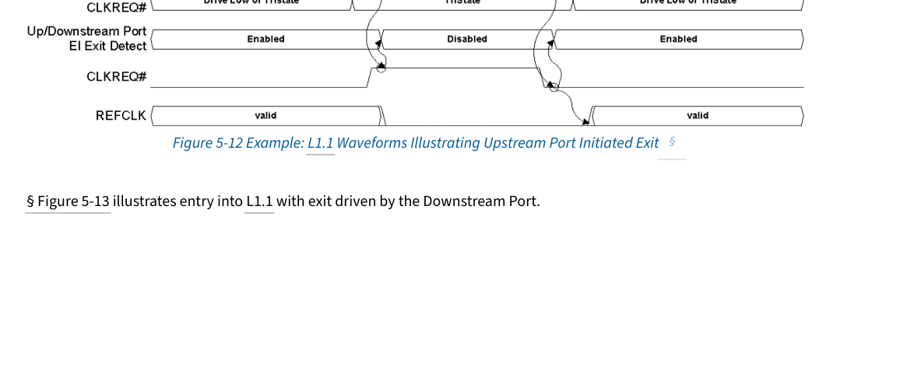

> **Figure 5-13.** Example: L1.1 Waveforms Illustrating Downstream Port Initiated Exit

[⬆️ 返回目录](#-本章目录-table-of-contents)

---

#### 5.5.2.1 Exit from L1.1 § | 5.5.2.1 退出 L1.1 §

<table>
<thead>
<tr>
<th width="50%">🇬🇧 English</th>
<th width="50%" style="background-color:#e8e8e8">🏆 中文</th>
</tr>
</thead>
<tbody>
<tr>
<td>

All Link and PHY state must be maintained during L1.2, or must be restored upon exit using implementation specific means, and the LTSSM and corresponding Port state upon exit from L1.2 must be indistinguishable from the L1.0 LTSSM and Port state.

L1.2 has additional requirements that do not apply to L1.1 These requirements are documented in this section.

</td>
<td style="background-color:#e8e8e8">

所有链路与 PHY 状态必须在 L1.2 期间保持,或者必须在退出时使用实现特定的方式恢复,并且从 L1.2 退出时的 LTSSM 和相应端口状态必须与 L1.0 LTSSM 和端口状态无法区分。

L1.2 具有不适用于 L1.1 的额外要求。这些要求记录在本节中。

</td>
</tr>
</tbody>
</table>

[⬆️ 返回目录](#-本章目录-table-of-contents)

---

<!-- 📄 Page 694 -->
---

### 5.5.3 L1.2 Requirements § | 5.5.3 L1.2 要求 §

<table>
<thead>
<tr>
<th width="50%">🇬🇧 English</th>
<th width="50%" style="background-color:#e8e8e8">🏆 中文</th>
</tr>
</thead>
<tbody>
<tr>
<td>

L1.2 has three substates, which are defined below (see § Figure 5-14).

L1.2.Entry is a transitional state on entry into L1.2 to allow time for Refclk to turn off and to ensure both Ports have observed CLKREQ# deasserted. The following rules apply to L1.2.Entry:

- Both Upstream and Downstream Ports continue to maintain common mode.
- Both Upstream and Downstream Ports may turn off their electrical idle (EI) exit detect circuitry.
- The Upstream and Downstream Ports must not assert CLKREQ# in this state.
- Refclk must be turned off within TL1O_REFCLK_OFF.
- Next state is L1.0 if CLKREQ# is asserted, else the next state is L1.2.Idle after waiting for TPOWER_OFF.

Note that there is a boundary condition which can occur when one Port asserts CLKREQ# shortly after the other Port deasserts CLKREQ#, but before the first Port has observed CLKREQ# deasserted. This is an unavoidable boundary condition that implementations must handle correctly. An example of this condition is illustrated in § Figure 5-15.

</td>
<td style="background-color:#e8e8e8">

L1.2 有三个子状态,定义如下 (见 § 图 5-14)。

L1.2.Entry 是进入 L1.2 时的过渡状态,以允许 Refclk 关闭的时间并确保两个端口都已观察到 CLKREQ# 取消断言。以下规则适用于 L1.2.Entry:

- 上下游端口都继续保持共模。
- 上下游端口都可以关闭其电气空闲 (EI) 退出检测电路。
- 上下游端口在此状态下不得断言 CLKREQ#。
- Refclk 必须在 TL1O_REFCLK_OFF 内关闭。
- 如果 CLKREQ# 被断言,则下一个状态为 L1.0,否则在等待 TPOWER_OFF 后下一个状态为 L1.2.Idle。

注意,存在一个边界条件,当一个端口在另一个端口取消断言 CLKREQ# 后不久 (但在第一个端口观察到 CLKREQ# 取消断言之前) 断言 CLKREQ# 时,可能会发生此边界条件。这是一个不可避免的边界条件,实现必须正确处理。§ 图 5-15 演示了此条件的示例。

</td>
</tr>
</tbody>
</table>

> **Figure 5-14.** L1.2 Substates
> 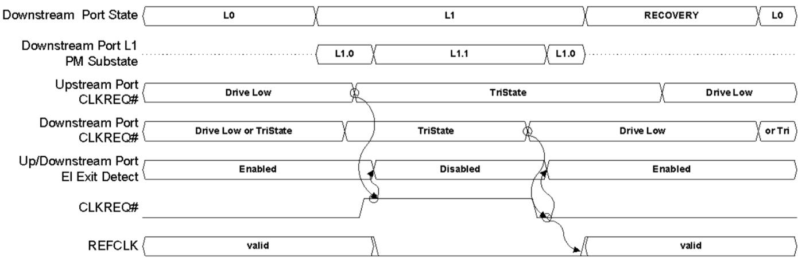

[⬆️ 返回目录](#-本章目录-table-of-contents)

---

#### 5.5.3.1 L1.2.Entry § | 5.5.3.1 L1.2.Entry §

<table>
<thead>
<tr>
<th width="50%">🇬🇧 English</th>
<th width="50%" style="background-color:#e8e8e8">🏆 中文</th>
</tr>
</thead>
<tbody>
<tr>
<td>

> **Figure 5-15.** Example: Illustration of Boundary Condition due to Different Sampling of CLKREQ#
> 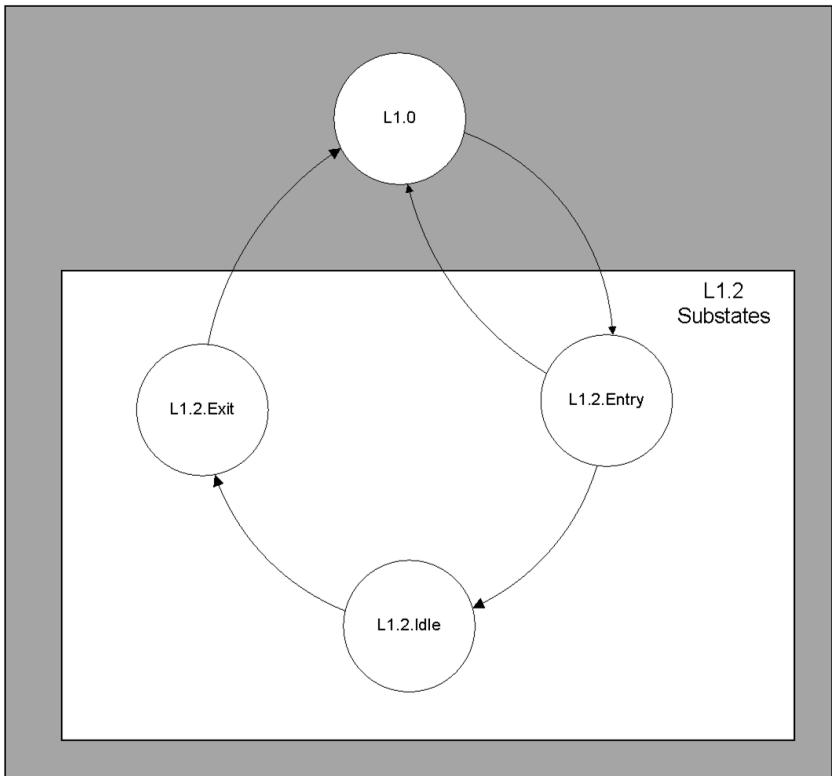

When requirements for the entry into L1.2.Idle state (see § Section 5.5.1) have been satisfied then the Ports enter the L1.2.Idle substate. The following rules apply in L1.2.Idle:

- Both Upstream and Downstream Ports may power-down any active logic, including circuits required to maintain common mode.
- The PHY of both Upstream and Downstream Ports may have their power removed.

The following rules apply for L1.2.Idle state when using the CLKREQ#-based mechanism:

- If either the Upstream or Downstream Port needs to exit L1.2, it must assert CLKREQ# after ensuring that TL1.2 has been met.
- If the Downstream Port is initiating exit from L1, it must assert CLKREQ# until the Link exits Recovery. The Upstream Port must assert CLKREQ# on entry to Recovery, and must continue to assert CLKREQ# until the next entry into L1, or other state allowing CLKREQ# deassertion.
- If the Upstream Port is initiating exit from L1, it must continue to assert CLKREQ# until the next entry into L1, or other state allowing CLKREQ# deassertion.
- Both the Upstream and Downstream Ports must monitor the logical state of the CLKREQ# input signal.
- Next state is L1.2.Exit if CLKREQ# is asserted.

This is a transitional state on exit from L1.2 to allow time for both devices to power up. In L1.2.Exit, the following rules apply:

- The PHYs of both Upstream and Downstream Ports must be powered.
- It must not be assumed that common mode has been maintained.

</td>
<td style="background-color:#e8e8e8">

当满足进入 L1.2.Idle 状态的要求 (见 § 第 5.5.1 节) 时,端口进入 L1.2.Idle 子状态。以下规则适用于 L1.2.Idle:

- 上下游端口都可以断电任何活动逻辑,包括需要保持共模的电路。
- 上下游端口的 PHY 都可以移除其电源。

使用基于 CLKREQ# 的机制时,以下规则适用于 L1.2.Idle 状态:

- 如果上游或下游端口需要退出 L1.2,则必须在确保满足 TL1.2 后断言 CLKREQ#。
- 如果下游端口正在启动从 L1 的退出,则必须断言 CLKREQ#,直到链路退出 Recovery。上游端口必须在进入 Recovery 时断言 CLKREQ#,并必须继续断言 CLKREQ#,直到下一次进入 L1 或允许取消断言 CLKREQ# 的其他状态。
- 如果上游端口正在启动从 L1 的退出,则必须继续断言 CLKREQ#,直到下一次进入 L1 或允许取消断言 CLKREQ# 的其他状态。
- 上下游端口都必须监视 CLKREQ# 输入信号的逻辑状态。
- 如果 CLKREQ# 被断言,则下一个状态为 L1.2.Exit。

这是退出 L1.2 时的过渡状态,以允许两个设备上电的时间。在 L1.2.Exit 中,适用以下规则:

- 上下游端口的 PHY 必须上电。
- 不得假设已保持共模。

</td>
</tr>
</tbody>
</table>

[⬆️ 返回目录](#-本章目录-table-of-contents)

---

#### 5.5.3.2 L1.2.Idle § | 5.5.3.2 L1.2.Idle §

<table>
<thead>
<tr>
<th width="50%">🇬🇧 English</th>
<th width="50%" style="background-color:#e8e8e8">🏆 中文</th>
</tr>
</thead>
<tbody>
<tr>
<td>

The following rules apply for L1.2.Exit using the CLKREQ#-based mechanism:

- Both Upstream and Downstream Ports must power up any circuits required for L1.0, including circuits required to maintain common mode.
- The Upstream and Downstream Ports must not change their driving state of CLKREQ# in this state.
- Refclk must be turned on no earlier than TL10_REFCLK_ON minimum time, and may take up to the amount of time allowed according to the LTR advertised by the Endpoint before becoming valid.
- Next state is L1.0 after waiting for TPOWER_ON.
  - Common mode is permitted to be established passively during L1.0, and actively during Recovery. In order to ensure common mode has been established, the Downstream Port must maintain a timer, and the Downstream Port must continue to send TS1 training sequences until a minimum of TCOMMONMODE has elapsed since the Downstream Port has started transmitting TS1 training sequences and has detected electrical idle exit on any Lane of the configured Link.

§ Figure 5-16 illustrates the signal relationships and timing constraints associated with L1.2 entry and Upstream Port initiated exit.

§ Figure 5-17 illustrates the signal relationships and timing constraints associated with L1.2 entry and Downstream Port initiated exit.

</td>
<td style="background-color:#e8e8e8">

使用基于 CLKREQ# 的机制时,以下规则适用于 L1.2.Exit:

- 上下游端口必须上电 L1.0 所需的任何电路,包括需要保持共模的电路。
- 上下游端口在此状态下不得改变其 CLKREQ# 的驱动状态。
- Refclk 必须在不早于 TL10_REFCLK_ON 最小时间时打开,并且在变为有效之前可能需要根据端点通告的 LTR 允许的时间。
- 在等待 TPOWER_ON 后,下一个状态为 L1.0。
  - 允许在 L1.0 期间被动建立共模,并在 Recovery 期间主动建立共模。为确保已建立共模,下游端口必须维持一个定时器,并且下游端口必须继续发送 TS1 训练序列,直到自下游端口开始发送 TS1 训练序列并在已配置链路的任何 Lane 上检测到电气空闲退出以来已过去至少 TCOMMONMODE。

§ 图 5-16 演示了与 L1.2 进入和上游端口发起的退出相关的信号关系和时序约束。

§ 图 5-17 演示了与 L1.2 进入和下游端口发起的退出相关的信号关系和时序约束。

</td>
</tr>
</tbody>
</table>

> **Figure 5-16.** Example: L1.2 Waveforms Illustrating Upstream Port Initiated Exit

> 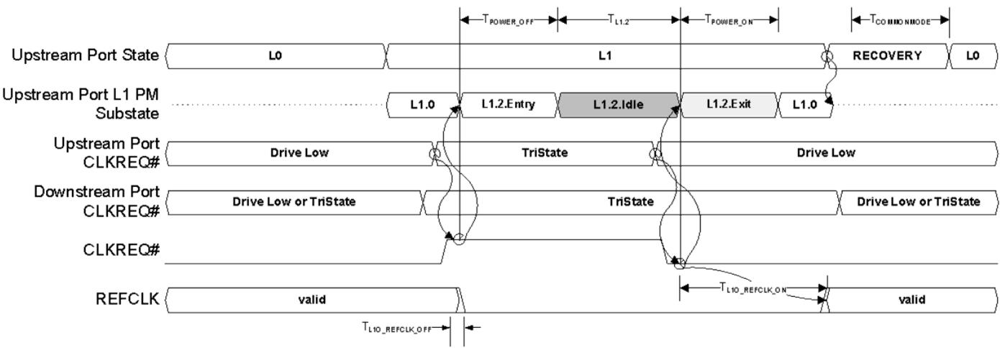

> 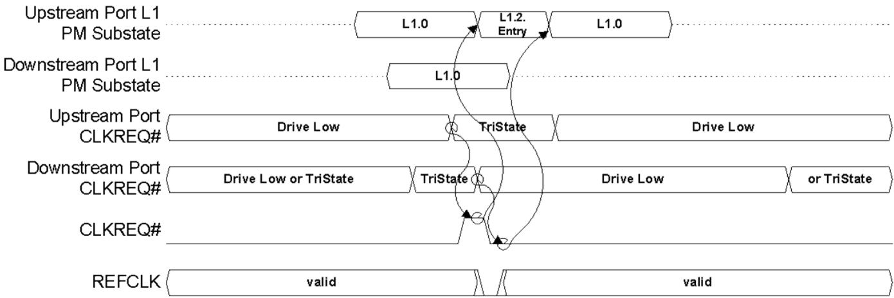

> **Figure 5-17.** Example: L1.2 Waveforms Illustrating Downstream Port Initiated Exit

> 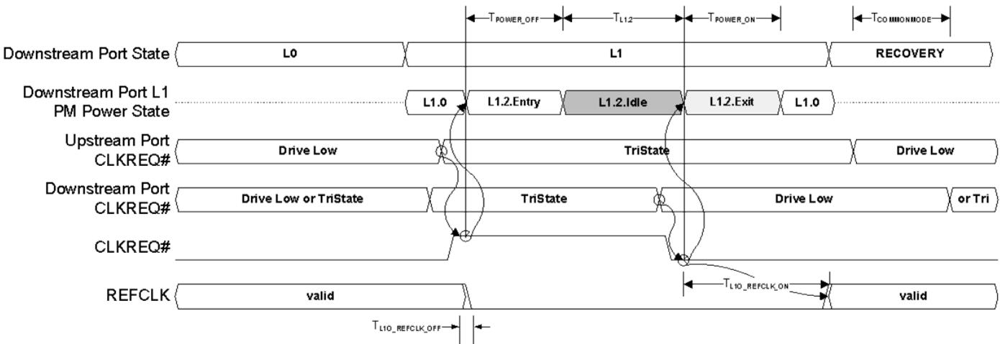

[⬆️ 返回目录](#-本章目录-table-of-contents)

---

#### 5.5.3.3 L1.2.Exit § | 5.5.3.3 L1.2.Exit §

<table>
<thead>
<tr>
<th width="50%">🇬🇧 English</th>
<th width="50%" style="background-color:#e8e8e8">🏆 中文</th>
</tr>
</thead>
<tbody>
<tr>
<td></td>
<td style="background-color:#e8e8e8">

</td>
</tr>
</tbody>
</table>

[⬆️ 返回目录](#-本章目录-table-of-contents)

---

##### 5.5.3.3.1 Exit from L1.2 § | 5.5.3.3.1 退出 L1.2 §

<table>
<thead>
<tr>
<th width="50%">🇬🇧 English</th>
<th width="50%" style="background-color:#e8e8e8">🏆 中文</th>
</tr>
</thead>
<tbody>
<tr>
<td>

L1 PM Substates is considered enabled on a Port when any combination of the ASPM L1.1 Enable, ASPM L1.2 Enable, PCI-PM L1.1 Enable and PCI-PM L1.2 Enable bits associated with that Port are Set.

An L1 PM Substate enable bit must only be Set in the Upstream and Downstream Ports on a Link when the corresponding supported capability bit is Set by both the Upstream and Downstream Ports on that Link, otherwise the behavior is undefined.

The Setting of any enable bit must be performed at the Downstream Port before the corresponding bit is permitted to be Set at the Upstream Port. If any L1 PM Substates enable bit is at a later time to be cleared, the enable bit(s) must be cleared in the Upstream Port before the corresponding enable bit(s) are permitted to be cleared in the Downstream Port.

If setting either or both of the enable bits for ASPM L1 PM Substates, both ports must be configured as described in this section while ASPM L1 is disabled.

If setting either or both of the enable bits for PCI-PM L1 PM Substates, both ports must be configured as described in this section while in D0.

Prior to setting either or both of the enable bits for L1.2, the values for TPOWER_ON, Common_Mode_Restore_Time, and, if the ASPM L1.2 Enable bit is to be Set, the LTR_L1.2_THRESHOLD (both Value and Scale fields) must be programmed.

The TPOWER_ON and Common_Mode_Restore_Time fields must be programmed to the appropriate values based on the components and AC coupling capacitors used in the connection linking the two components. The determination of these values is design implementation specific.

When both the ASPM L1.2 Enable and PCI-PM L1.2 Enable bits are cleared, it is not required to program the TPOWER_ON, Common_Mode_Restore_Time, and LTR_L1.2_THRESHOLD Value and Scale fields, and hardware must not rely on these fields to have any particular values.

When programming LTR_L1.2_THRESHOLD Value and Scale fields, identical values must be programmed in both Ports.

§ Table 5-11 defines the timing parameters associated with the L1.2 substates mechanism.

</td>
<td style="background-color:#e8e8e8">

当与该端口关联的 ASPM L1.1 Enable、ASPM L1.2 Enable、PCI-PM L1.1 Enable 和 PCI-PM L1.2 Enable 位的任意组合被置位时,认为该端口启用了 L1 PM Substates。

L1 PM Substates 使能位仅在链路的上下游端口上对应的支持能力位都被置位时才允许在链路的上下游端口上置位,否则行为未定义。

任何使能位的置位必须在允许在上游端口置位对应位之前先在下游端口进行。如果稍后要清除任何 L1 PM Substates 使能位,则必须先在上游端口清除使能位,然后才允许在下游端口清除对应的使能位。

如果为 ASPM L1 PM Substates 置位一个或两个使能位,则在 ASPM L1 禁用的同时,两个端口必须按本节所述进行配置。

如果为 PCI-PM L1 PM Substates 置位一个或两个使能位,则在处于 D0 时,两个端口必须按本节所述进行配置。

在为 L1.2 置位一个或两个使能位之前,必须对 TPOWER_ON、Common_Mode_Restore_Time,以及 (如果要置位 ASPM L1.2 Enable 位) LTR_L1.2_THRESHOLD (Value 和 Scale 字段) 的值进行编程。

TPOWER_ON 和 Common_Mode_Restore_Time 字段必须基于连接两个组件的连接中使用的组件和 AC 耦合电容器编程为适当的值。这些值的确定是设计实现特定的。

当 ASPM L1.2 Enable 和 PCI-PM L1.2 Enable 位均清零时,不要求对 TPOWER_ON、Common_Mode_Restore_Time 和 LTR_L1.2_THRESHOLD Value 和 Scale 字段进行编程,并且硬件不得依赖这些字段具有任何特定值。

对 LTR_L1.2_THRESHOLD Value 和 Scale 字段进行编程时,必须在两个端口中编程相同的值。

§ 表 5-11 定义了与 L1.2 子状态机制相关的时序参数。

</td>
</tr>
</tbody>
</table>

[⬆️ 返回目录](#-本章目录-table-of-contents)

---

<!-- 📄 Page 698 -->
---

### 5.5.4 L1 PM Substates Configuration § | 5.5.4 L1 PM Substates 配置 §

<table>
<thead>
<tr>
<th width="50%">🇬🇧 English</th>
<th width="50%" style="background-color:#e8e8e8">🏆 中文</th>
</tr>
</thead>
<tbody>
<tr>
<td>

**Table 5-11. L1.2 Timing Parameters | 表 5-11. L1.2 时序参数**

| Parameter | Description | Min | Max | Units |
|-----------|-------------|-----|-----|-------|
| TPOWER_OFF | CLKREQ# deassertion to entry into the L1.2.Idle substate | 2 | | μs |
| TCOMMONMODE | Restoration of Refclk to restoration of common mode established through active transmission of TS1 training sequences (see § Section 5.5.3.3.1 ) | Programmable in range from 0 to 255 | | μs |
| TL1O_REFCLK_OFF | CLKREQ# deassertion to Refclk reaching idle electrical state when entering L1.2 | 0 | 100 | ns |
| TL10_REFCLK_ON | CLKREQ# assertion to Refclk valid when exiting L1.2 | TPOWER_ON | LTR value advertised by the Endpoint | μs |
| TPOWER_ON | The minimum amount of time that each component must wait in L1.2.Exit after sampling CLKREQ# asserted before actively driving the interface to ensure no device is ever actively driving into an unpowered component. | Set in the L1 PM Substates Control 2 Register (range from 0 to 3100) | | μs |
| TL1.2 | Time a Port must stay in L1.2 when CLKREQ# must remain inactive | 4 | | μs |

</td>
<td style="background-color:#e8e8e8">

**表 5-11. L1.2 时序参数**

| 参数 | 描述 | 最小值 | 最大值 | 单位 |
|------|------|--------|--------|------|
| TPOWER_OFF | CLKREQ# 取消断言到进入 L1.2.Idle 子状态 | 2 | | μs |
| TCOMMONMODE | Refclk 恢复到通过主动发送 TS1 训练序列建立的共模的恢复 (见 § 第 5.5.3.3.1 节) | 可编程,范围从 0 到 255 | | μs |
| TL1O_REFCLK_OFF | 进入 L1.2 时,CLKREQ# 取消断言到 Refclk 达到空闲电气状态 | 0 | 100 | ns |
| TL10_REFCLK_ON | 退出 L1.2 时,CLKREQ# 断言到 Refclk 有效 | TPOWER_ON | 端点通告的 LTR 值 | μs |
| TPOWER_ON | 在采样到 CLKREQ# 断言后,每个组件在 L1.2.Exit 中必须等待的最小时间,然后才能主动驱动接口,以确保没有设备主动驱动到未上电的组件中。 | 在 L1 PM Substates Control 2 寄存器中设置 (范围从 0 到 3100) | | μs |
| TL1.2 | 端口在 L1.2 中必须停留且 CLKREQ# 必须保持不活动的时间 | 4 | | μs |

</td>
</tr>
</tbody>
</table>

[⬆️ 返回目录](#-本章目录-table-of-contents)

---

### 5.5.5 L1 PM Substates Timing Parameters § | 5.5.5 L1 PM Substates 时序参数 §

<table>
<thead>
<tr>
<th width="50%">🇬🇧 English</th>
<th width="50%" style="background-color:#e8e8e8">🏆 中文</th>
</tr>
</thead>
<tbody>
<tr>
<td>

Link Activation is an optional mechanism to temporarily disable L1 Substates. Link Activation is used to bring a Link out of L1.1/L1.2, avoiding potential stalls. An example of one such stall is the stall associated with a Configuration Write to perform a D3Hot to D0 transition. Link Activation can also be used to indirectly indicate to a Device that it should avoid long-latency internal power management during latency-sensitive or time critical operations.

The following rules apply to Link Activation:

- A Downstream Port is permitted to support Link Activation, as indicated by the Link Activation Supported bit in the L1 PM Substates Capabilities Register being Set.
- The Link Activation Control bit must have no effect on Port behavior unless one or more of the following bits are Set:
  - PCI-PM L1.2 Enable
  - PCI-PM L1.1 Enable
- When the Link Activation Control bit is Set, the Port that is about to enter L1 must assert, and while in L1 maintain as asserted, the CLKREQ# signal.
- If the Link Activation Control bit is Clear, the Link Activation mechanism does not impose any additional requirements on the state of the CLKREQ# signal.
- If the Port is enabled for edge-triggered interrupt signaling using MSI or MSI-X, an interrupt message must be sent every time the logical AND of the following conditions transitions from FALSE to TRUE:
  - The associated vector is unmasked (not applicable if MSI does not support PVM)
  - The Link Activation Interrupt Enable bit is Set
  - The Link Activation Control bit is Set
  - The Link Activation Status bit is Set. Note that Link Activation interrupts always use the MSI or MSI-X vector indicated by the Interrupt Message Number field in the PCI Express Capabilities Register.

</td>
<td style="background-color:#e8e8e8">

链路激活 (Link Activation) 是一种可选机制,用于临时禁用 L1 Substates。链路激活用于使链路退出 L1.1/L1.2,以避免潜在的停顿。此类停顿的一个示例是执行 D3Hot 到 D0 转换的配置写相关停顿。链路激活还可用于间接向设备指示,在延迟敏感或时间关键操作期间,应避免使用长延迟的内部电源管理。

以下规则适用于链路激活:

- 允许下游端口支持链路激活,如 L1 PM Substates Capabilities 寄存器中 Link Activation Supported 位置位所示。
- Link Activation Control 位必须对端口行为没有影响,除非以下位中的一个或多个被置位:
  - PCI-PM L1.2 Enable
  - PCI-PM L1.1 Enable
- 当 Link Activation Control 位置位时,即将进入 L1 的端口必须断言 CLKREQ# 信号,并在 L1 中保持其被断言。
- 如果 Link Activation Control 位清零,则链路激活机制不会对 CLKREQ# 信号的状态施加任何额外要求。
- 如果端口已使用 MSI 或 MSI-X 启用边沿触发中断信令,则每次以下条件的逻辑 AND 从 FALSE 转换到 TRUE 时,必须发送中断报文:
  - 关联的向量未屏蔽 (如果 MSI 不支持 PVM 则不适用)
  - Link Activation Interrupt Enable 位置位
  - Link Activation Control 位置位
  - Link Activation Status 位置位。注意,链路激活中断始终使用 PCI Express Capabilities 寄存器中 Interrupt Message Number 字段指示的 MSI 或 MSI-X 向量。

</td>
</tr>
</tbody>
</table>

[⬆️ 返回目录](#-本章目录-table-of-contents)

---

### 5.5.6 Link Activation § | 5.5.6 链路激活 §

<table>
<thead>
<tr>
<th width="50%">🇬🇧 English</th>
<th width="50%" style="background-color:#e8e8e8">🏆 中文</th>
</tr>
</thead>
<tbody>
<tr>
<td>

- If the Port is enabled for level-triggered interrupt signaling using the INTx messages, the virtual INTx wire must be asserted whenever and as long as the following conditions are satisfied:
  - The Interrupt Disable bit in the Command Register is Clear.
  - The Link Activation Interrupt Enable bit is Set
  - The Link Activation Control bit is Set
  - The Link Activation Status bit is Set
- The Link Activation Status bit must be Set every time the logical AND of the following conditions transitions from FALSE to TRUE:
  - Either the PCI-PM L1.2 Enable bit or the PCI-PM L1.1 Enable bit (or both) are Set
  - The Link Activation Control bit is Set
  - The Link is not in an L1 Substate

The specific definition and requirements associated with auxiliary power are form factor specific, and the terms "auxiliary power" and "Vaux" should be understood in reference to the specific form factor in use. The specific mechanism(s) for supplying auxiliary power are not defined in this specification. The following text defines requirements that apply in all form factors.

Note that support for auxiliary power is optional. Some form factors do not support it. Also, some form factors have dedicated auxiliary power pins while other form factors use the main power pins in some fashion.

PCI Express PM provides a Aux Power PM Enable bit in the Device Control Register that provides the means for enabling a Function to draw the maximum allowance of auxiliary current independent of its level of support for PME generation.

A Function requests auxiliary power allocation by specifying a non-zero value in the Aux_Current field of the PMC register.

Refer to § Chapter 7. for the Aux Power PM Enable register bit assignment, and access mechanism.

Allocation of auxiliary power using Aux Power PM Enable and PME_En is determined as follows:

**Table 5-12. Aux Power Source and Availability | 表 5-12. 辅助电源来源与可用性**

| Aux Power PM Enable | PME_En | Aux Power Detected | Aux Power Source | Aux Power Available |
|----------------------|--------|---------------------|------------------|----------------------|
| x | x | 0b | None | None |
| 0b | 0b | 1b | Form factor specific Aux Power rail / pins | Form factor specific (e.g., 10 mW in CEM) |
| 1b | 0b | 1b | Form factor specific Aux Power rail / pins | Aux_Current value (PMC) |
| 1b | x | 1b | Form factor specific Aux Power rail / pins | Aux_Current value (PMC) |

**Aux Power PM Enable = 1b:**

Auxiliary power is allocated as requested in the Aux_Current field of the PMC register, independent of the PME_En bit in the PMSCR. The PME_En bit still controls the ability to master PME.

Additional Aux power is permitted to be allocated using a firmware based mechanism (see the Request D3Cold Aux Power Limit _DSM call as defined in [Firmware]).

Additional Aux power is also permitted to be allocated by selecting a PM Sub State in the Power Limit mechanism (see § Section 7.8.1.3).

**Aux Power PM Enable = 0b:**

Auxiliary power allocation is controlled by the PME_En bit as defined in § Section 7.5.2.2.

Additional Aux power is permitted to be allocated using a firmware based mechanism (see the Request D3Cold Aux Power Limit _DSM call as defined in [Firmware]).

Additional Aux power is also permitted to be allocated by selecting a PM Sub State in the Power Limit mechanism (see § Section 7.8.1.3).

The Aux Power PM Enable bit is sticky (see § Section 7.4 ) so its state is preserved in the D3Cold state, and is not affected by the transitions from the D3Cold state to the D0uninitialized state.

§ Table 5-13 defines the location of each PM packet in the PCI Express stack.

**Table 5-13. Power Management System Messages and DLLPs | 表 5-13. 电源管理系统报文与 DLLP**

| Packet | Type |
|--------|------|
| PM_Enter_L1 | DLLP |
| PM_Enter_L23 | DLLP |
| PM_Active_State_Request_L1 | DLLP |
| PM_Request_Ack | DLLP |
| PM_Active_State_Nak | Transaction Layer Message |
| PM_PME | Transaction Layer Message |
| PME_Turn_Off | Transaction Layer Message |
| PME_TO_Ack | Transaction Layer Message |

</td>
<td style="background-color:#e8e8e8">

- 如果端口已使用 INTx 报文启用电平触发中断信令,则只要满足以下条件,虚拟 INTx 线必须被断言:
  - Command 寄存器中的 Interrupt Disable 位清零。
  - Link Activation Interrupt Enable 位置位
  - Link Activation Control 位置位
  - Link Activation Status 位置位
- Link Activation Status 位必须每次在以下条件的逻辑 AND 从 FALSE 转换到 TRUE 时被置位:
  - PCI-PM L1.2 Enable 位或 PCI-PM L1.1 Enable 位 (或两者) 已置位
  - Link Activation Control 位置位
  - 链路不在 L1 子状态

与辅助电源相关的具体定义和要求因外形规格而异,"辅助电源"和 "Vaux" 这两个术语应结合具体使用的外形规格来理解。提供辅助电源的具体机制在本规范中未定义。以下文本定义了适用于所有外形规格的要求。

注意,对辅助电源的支持是可选的。某些外形规格不支持它。此外,某些外形规格具有专用辅助电源引脚,而其他外形规格则以某种方式使用主电源引脚。

PCI Express PM 在 Device Control 寄存器中提供 Aux Power PM Enable 位,该位提供了使 Function 能够抽取最大允许辅助电力的方法,与 Function 对 PME 生成的支持级别无关。

Function 通过在 PMC 寄存器的 Aux_Current 字段中指定非零值来请求辅助电源分配。

有关 Aux Power PM Enable 寄存器位分配和访问机制,请参见 § 第 7 章。

使用 Aux Power PM Enable 和 PME_En 的辅助电源分配确定如下:

**表 5-12. 辅助电源来源与可用性**

| Aux Power PM Enable | PME_En | 检测到辅助电源 | 辅助电源来源 | 辅助电源可用性 |
|---------------------|--------|---------------|--------------|-----------------|
| x | x | 0b | 无 | 无 |
| 0b | 0b | 1b | 外形规格特定的辅助电源轨/引脚 | 外形规格特定 (例如 CEM 中 10 mW) |
| 1b | 0b | 1b | 外形规格特定的辅助电源轨/引脚 | Aux_Current 值 (PMC) |
| 1b | x | 1b | 外形规格特定的辅助电源轨/引脚 | Aux_Current 值 (PMC) |

**Aux Power PM Enable = 1b:**

按 PMC 寄存器的 Aux_Current 字段所请求的方式分配辅助电源,与 PMSCR 中的 PME_En 位无关。PME_En 位仍控制 master PME 的能力。

允许使用基于固件的机制分配额外辅助电源 (参见 [Firmware] 中定义的 Request D3Cold Aux Power Limit _DSM 调用)。

还允许通过在 Power Limit 机制中选择 PM Sub State 来分配额外辅助电源 (见 § 第 7.8.1.3 节)。

**Aux Power PM Enable = 0b:**

辅助电源分配由 PME_En 位控制,定义见 § 第 7.5.2.2 节。

允许使用基于固件的机制分配额外辅助电源 (参见 [Firmware] 中定义的 Request D3Cold Aux Power Limit _DSM 调用)。

还允许通过在 Power Limit 机制中选择 PM Sub State 来分配额外辅助电源 (见 § 第 7.8.1.3 节)。

Aux Power PM Enable 位是粘性位 (见 § 第 7.4 节),因此其状态在 D3Cold 状态中保留,并且不受从 D3Cold 状态到 D0uninitialized 状态的转换的影响。

§ 表 5-13 定义了每个 PM 报文在 PCI Express 协议栈中的位置。

**表 5-13. 电源管理系统报文与 DLLP**

| 报文 | 类型 |
|------|------|
| PM_Enter_L1 | DLLP |
| PM_Enter_L23 | DLLP |
| PM_Active_State_Request_L1 | DLLP |
| PM_Request_Ack | DLLP |
| PM_Active_State_Nak | 事务层报文 |
| PM_PME | 事务层报文 |
| PME_Turn_Off | 事务层报文 |
| PME_TO_Ack | 事务层报文 |

</td>
</tr>
</tbody>
</table>

[⬆️ 返回目录](#-本章目录-table-of-contents)

---

<!-- 📄 Page 701 -->
---

## 5.6 Auxiliary Power Support § | 5.6 辅助电源支持 §

<table>
<thead>
<tr>
<th width="50%">🇬🇧 English</th>
<th width="50%" style="background-color:#e8e8e8">🏆 中文</th>
</tr>
</thead>
<tbody>
<tr>
<td>

For information on the structure of the power management DLLPs, refer to § Section 3.5.

Power Management Messages follow the general rules for all Messages. Power Management Message fields follow the following rules:

- Length field is Reserved.
- Attribute field must be set to the default values (all 0's).
- Address field is Reserved.
- Requester ID - see § Table 2-23 in § Section 2.2.8.2.
- Traffic Class field must use the default class (TC0).

</td>
<td style="background-color:#e8e8e8">

有关电源管理 DLLP 的结构信息,请参见 § 第 3.5 节。

电源管理报文遵循所有报文的一般规则。电源管理报文字段遵循以下规则:

- Length 字段保留。
- Attribute 字段必须设置为默认值 (全 0)。
- Address 字段保留。
- Requester ID — 见 § 第 2.2.8.2 节的 § 表 2-23。
- Traffic Class 字段必须使用默认类 (TC0)。

</td>
</tr>
</tbody>
</table>

[⬆️ 返回目录](#-本章目录-table-of-contents)

---

## 5.7 Power Management System Messages and DLLPs § | 5.7 电源管理系统报文与 DLLP §

<table>
<thead>
<tr>
<th width="50%">🇬🇧 English</th>
<th width="50%" style="background-color:#e8e8e8">🏆 中文</th>
</tr>
</thead>
<tbody>
<tr>
<td>

All PCI-PM power management state changes are explicitly controlled by software except for Fundamental Reset which brings all Functions to the D0uninitialized state. § Figure 5-18 shows all supported state transitions. The unlabeled arcs represent a software initiated state transition (Set Power State operation).

§ Table 5-14 shows the minimum recovery times that system software must allow between the time that a Function is programmed to change state and the time that the function is next accessed (including Configuration Space), unless Readiness Notifications (see § Section 6.22 ) is used to indicate modified values to system software. For bridge Functions, this delay also constitutes a minimum delay between when the bridge's state is changed and when any Function on the logical bus that it originates can be accessed.

**Table 5-14. PCI Function State Transition Delays | 表 5-14. PCI Function 状态转换延迟**

| Initial State | Next State | Minimum System Software Guaranteed Delays |
|---------------|-----------|------------------------------------------|
| D0 | D1 | 0 |
| D0 or D1 | D2 | 200 μs |
| D0, D1 or D2 | D3Hot | 10 ms |
| D1 | D0 | 0 |
| D2 | D0 | 200 μs |
| D3Hot | D0 | 10 ms |

</td>
<td style="background-color:#e8e8e8">

除基本复位 (Fundamental Reset) 将所有 Function 带到 D0uninitialized 状态外,所有 PCI-PM 电源管理状态更改都由软件显式控制。§ 图 5-18 显示了所有支持的状态转换。未标记的弧线表示软件发起的状态转换 (Set Power State 操作)。

§ 表 5-14 显示了系统软件在 Function 被编程为更改状态与下次访问该 Function (包括配置空间) 之间必须允许的最短恢复时间,除非使用就绪通知 (Readiness Notifications) (见 § 第 6.22 节) 来向系统软件指示修改后的值。对于桥 Function,此延迟还构成桥的状态被更改与可访问其发起的逻辑总线上任何 Function 之间的最小延迟。

**表 5-14. PCI Function 状态转换延迟**

| 初始状态 | 下一个状态 | 系统软件保证的最小延迟 |
|----------|-----------|--------------------------|
| D0 | D1 | 0 |
| D0 或 D1 | D2 | 200 μs |
| D0、D1 或 D2 | D3Hot | 10 ms |
| D1 | D0 | 0 |
| D2 | D0 | 200 μs |
| D3Hot | D0 | 10 ms |

</td>
</tr>
</tbody>
</table>

> **Figure 5-18.** Function Power Management State Transitions

> 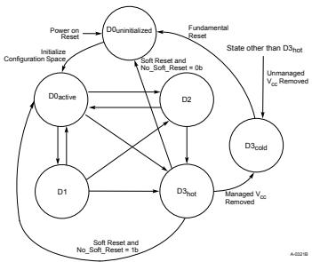

> 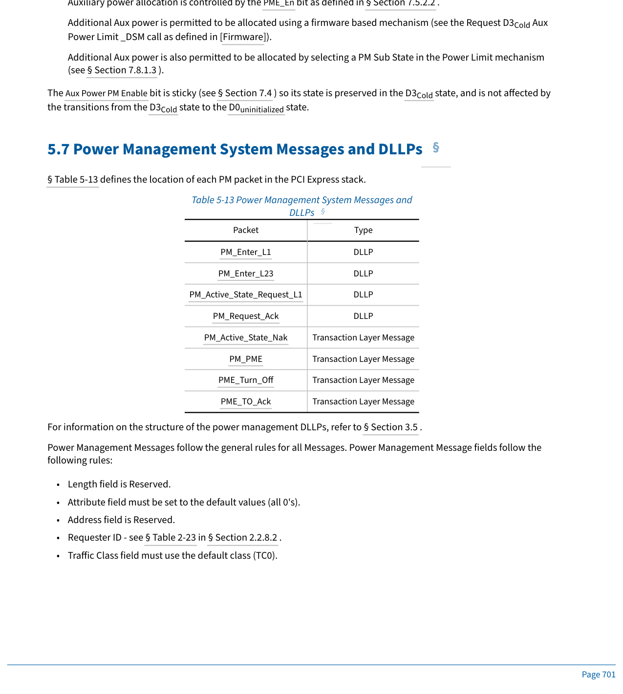

[⬆️ 返回目录](#-本章目录-table-of-contents)

---

<!-- 📄 Page 702 -->
---

## 5.8 PCI Function Power State Transitions § | 5.8 PCI Function 电源状态转换 §

<table>
<thead>
<tr>
<th width="50%">🇬🇧 English</th>
<th width="50%" style="background-color:#e8e8e8">🏆 中文</th>
</tr>
</thead>
<tbody>
<tr>
<td>

This section defines power management requirements that are unique to SR-IOV devices.

The PCI Power Management Capability as described elsewhere in § Chapter 5. is required for PFs.

For VFs, the PCI Power Management Capability is optional.

</td>
<td style="background-color:#e8e8e8">

本节定义 SR-IOV 设备特有的电源管理要求。

如 § 第 5 章其他位置所述的 PCI 电源管理能力 (Power Management Capability) 对于 PF 是必需的。

对于 VF,PCI 电源管理能力是可选的。

</td>
</tr>
</tbody>
</table>

[⬆️ 返回目录](#-本章目录-table-of-contents)

---

## 5.9 State Transition Recovery Time Requirements § | 5.9 状态转换恢复时间要求 §

<table>
<thead>
<tr>
<th width="50%">🇬🇧 English</th>
<th width="50%" style="background-color:#e8e8e8">🏆 中文</th>
</tr>
</thead>
<tbody>
<tr>
<td>

If a VF does not implement the PCI Power Management Capability, then the VF behaves as if it had been programmed into the equivalent power state of its associated PF.

If a VF implements the PCI Power Management Capability, the functionality must be as defined in § Section 7.5.2.

If a VF implements the PCI Power Management Capability, the Device behavior is undefined if the PF is placed in a lower power state than the VF. Software should avoid this situation by placing all VFs in lower power state before lowering their associated PF's power state.

A VF in the D0 state is in the D0active state when the VF has completed its internal initialization and either the VF's Bus Master Enable bit or the VF MSE bit in the SR-IOV Control Register (see § Section 9.3.3.3) Extended Capability is Set. The VF's internal initialization must have completed when any of the following conditions have occurred:

- The VF has responded successfully (without returning RRS) to a Configuration Request.
- After issuing an FLR to the VF, one of the following is true:
  - At least 1.0 s has passed since the FLR was issued.
  - The VF supports Function Readiness Status and, after the FLR was issued, an FRS Message from the VF with Reason Code FLR Completed has been received.
  - At least FLR time has passed since the FLR was issued. FLR Time is either (1) the FLR Time value in the Readiness Time Reporting capability associated with the VF or (2) a value determined by system software / firmware.
- After Setting VF Enable in a PF, at least one of the following is true:
  - At least 1.0 s has passed since VF Enable was Set.
  - The PF supports Function Readiness Status and, after VF Enable was Set, an FRS Message from the PF with Reason Code VF Enabled has been received.
- After transitioning a VF from D3Hot to D0, at least one of the following is true:
  - At least 10 ms has passed since the request to enter D0 was issued.
  - The VF supports Function Readiness Status and, after the request to enter D0 was issued, an FRS Message from the VF with Reason Code D3Hot to D0 Transition Completed has been received.
  - At least D3Hot to D0 Time has passed since the request to enter D0 was issued. D3Hot to D0 Time is either (1) the D3Hot to D0 Time in the Readiness Time Reporting capability associated with the VF or (2) a value determined by system software / firmware.

The PF's power management state (D-state) has global impact on its associated VFs. If a VF does not implement the PCI Power Management Capability, then it behaves as if it is in an equivalent power state of its associated PF.

If a VF implements the PCI Power Management Capability, the Device behavior is undefined if the PF is placed in a lower power state than the VF. Software should avoid this situation by placing all VFs in lower power state before lowering their associated PF's power state.

When the PF is placed into the D3Hot state:

- If the No_Soft_Reset bit is Clear then the PF performs an internal reset on the D3Hot to D0 transition and all its configuration state returns to the default values.
  - Note: Resetting the PF resets VF Enable which means that VFs no longer exist and any VF specific context is lost after the D3Hot to D0 transition is complete.
- If the No_Soft_Reset bit is Set then the internal reset does not occur. The SR-IOV extended capability retains state, and associated VFs remain enabled.

When the PF is placed into the D3Cold state VFs no longer exist, any VF specific context is lost and PME events can only be initiated by the PF.

</td>
<td style="background-color:#e8e8e8">

如果 VF 未实现 PCI 电源管理能力,则 VF 表现得好像已被编程为与其关联 PF 等效的电源状态。

如果 VF 实现了 PCI 电源管理能力,则该功能必须按 § 第 7.5.2 节中的定义。

如果 VF 实现了 PCI 电源管理能力,则当 PF 被置于比 VF 更低的电源状态时,设备行为未定义。软件应通过在降低其关联 PF 的电源状态之前将所有 VF 置于低电源状态来避免这种情况。

D0 状态下的 VF 在 VF 完成其内部初始化并且 SR-IOV Control 寄存器 (见 § 第 9.3.3.3 节) 扩展能力中的 VF Bus Master Enable 位或 VF MSE 位被置位时,处于 D0active 状态。当发生以下任何条件时,必须已完成 VF 的内部初始化:

- VF 已成功响应 (未返回 RRS) 配置请求。
- 在向 VF 发出 FLR 之后,以下之一为真:
  - 自 FLR 发出以来已过去至少 1.0 秒。
  - VF 支持 Function Readiness Status,并且在 FLR 发出后,已收到来自 VF 的、原因代码为 FLR Completed 的 FRS 报文。
  - 自 FLR 发出以来已过去至少 FLR time。FLR Time 是 (1) 与 VF 关联的 Readiness Time Reporting 能力中的 FLR Time 值,或 (2) 由系统软件/固件确定的值。
- 在 PF 中置位 VF Enable 之后,以下之一为真:
  - 自 VF Enable 置位以来已过去至少 1.0 秒。
  - PF 支持 Function Readiness Status,并且在 VF Enable 置位后,已收到来自 PF 的、原因代码为 VF Enabled 的 FRS 报文。
- 在将 VF 从 D3Hot 转换到 D0 之后,以下之一为真:
  - 自发出进入 D0 请求以来已过去至少 10 ms。
  - VF 支持 Function Readiness Status,并且在发出进入 D0 请求后,已收到来自 VF 的、原因代码为 D3Hot to D0 Transition Completed 的 FRS 报文。
  - 自发出进入 D0 请求以来已过去至少 D3Hot to D0 Time。D3Hot to D0 Time 是 (1) 与 VF 关联的 Readiness Time Reporting 能力中的 D3Hot to D0 Time,或 (2) 由系统软件/固件确定的值。

PF 的电源管理状态 (D 状态) 对其关联的 VF 具有全局影响。如果 VF 未实现 PCI 电源管理能力,则它表现得好像处于其关联 PF 的等效电源状态。

如果 VF 实现了 PCI 电源管理能力,则当 PF 被置于比 VF 更低的电源状态时,设备行为未定义。软件应通过在降低其关联 PF 的电源状态之前将所有 VF 置于低电源状态来避免这种情况。

当 PF 被置于 D3Hot 状态时:

- 如果 No_Soft_Reset 位清零,则 PF 在 D3Hot 到 D0 转换时执行内部复位,其所有配置状态返回默认值。
  - 注意: 复位 PF 会复位 VF Enable,这意味着 VF 不再存在,并且在 D3Hot 到 D0 转换完成后,任何 VF 特定的上下文都将丢失。
- 如果 No_Soft_Reset 位置位,则不会发生内部复位。SR-IOV 扩展能力保持状态,且关联的 VF 保持使能。

当 PF 被置于 D3Cold 状态时,VF 不再存在,任何 VF 特定的上下文都将丢失,且 PME 事件只能由 PF 启动。

</td>
</tr>
</tbody>
</table>

[⬆️ 返回目录](#-本章目录-table-of-contents)

---

## 5.10 SR-IOV Power Management § | 5.10 SR-IOV 电源管理 §

<table>
<thead>
<tr>
<th width="50%">🇬🇧 English</th>
<th width="50%" style="background-color:#e8e8e8">🏆 中文</th>
</tr>
</thead>
<tbody>
<tr>
<td></td>
<td style="background-color:#e8e8e8">

</td>
</tr>
</tbody>
</table>

[⬆️ 返回目录](#-本章目录-table-of-contents)

---

### 5.10.1 VF Device Power Management States § | 5.10.1 VF 设备电源管理状态 §

<table>
<thead>
<tr>
<th width="50%">🇬🇧 English</th>
<th width="50%" style="background-color:#e8e8e8">🏆 中文</th>
</tr>
</thead>
<tbody>
<tr>
<td></td>
<td style="background-color:#e8e8e8">

</td>
</tr>
</tbody>
</table>

[⬆️ 返回目录](#-本章目录-table-of-contents)

---

<!-- 📄 Page 703 -->
---

### 5.10.2 PF Device Power Management States § | 5.10.2 PF 设备电源管理状态 §

<table>
<thead>
<tr>
<th width="50%">🇬🇧 English</th>
<th width="50%" style="background-color:#e8e8e8">🏆 中文</th>
</tr>
</thead>
<tbody>
<tr>
<td>

With power management under the direction of the operating system, each class of Functions must have a clearly defined criteria for feature availability as well as what functional context must be preserved when operating in each of the power management states. Some example Device-Class specifications have been proposed as part of the ACPI specification for various Functions ranging from audio to network add-in cards. While defining Device-Class specific behavioral policies for most Functions is outside the scope of this specification, defining the required behavior for PCI bridge functions is within the scope of this specification. The definitions here apply to all three types of PCIe Bridges:

- Host bridge, PCI Express to expansion bus bridge, or other ACPI enumerated bridge
- Switches
- PCI Express to PCI bridge
- PCI-to-CardBus bridge

The mechanisms for controlling the state of these Functions vary somewhat depending on which type of Originating Device is present. The following sections describe how these mechanisms work for the three types of bridges.

This section details the power management policies for PCI Express Bridge Functions. The PCI Express Bridge Function can be characterized as an Originating Device with a secondary bus downstream of it. This section describes the relationship of the bridge function's power management state to that of its secondary bus.

The shaded regions in § Figure 5-19 illustrate what is discussed in this section.

> **IMPLEMENTATION NOTE: NO_SOFT_RESET STRONGLY RECOMMENDED**
> It is strongly recommended that the No_Soft_Reset bit be Set in all Functions of a Multi-Function Device. As indicated in the bit definition, all implementations that support Flit Mode are required to Set the No_Soft_Reset bit. This recommendation applies to PFs.

</td>
<td style="background-color:#e8e8e8">

在操作系统的指导下进行电源管理时,每个 Function 类必须具有明确定义的标准,用于功能可用性以及在每个电源管理状态中运行时必须保留哪些功能上下文。ACPI 规范已为从音频到网络扩展卡等各种 Function 提出了一些设备类规范示例。虽然为大多数 Function 定义设备类特定的行为策略超出本规范的范围,但定义 PCI 桥 Function 的必需行为在本规范范围内。此处的定义适用于所有三种类型的 PCIe 桥:

- Host 桥、PCI Express 到扩展总线桥或其他 ACPI 枚举的桥
- Switch
- PCI Express 到 PCI 桥
- PCI 到 CardBus 桥

控制这些 Function 状态的机制因存在的发起设备 (Originating Device) 类型而略有不同。以下各节描述这些机制如何适用于三种类型的桥。

本节详细说明 PCI Express 桥 Function 的电源管理策略。PCI Express 桥 Function 可表征为具有其下游辅助总线的发起设备。本节描述桥 Function 的电源管理状态与其辅助总线之间的关系。

§ 图 5-19 中的阴影区域说明了本节讨论的内容。

> **实现注: 强烈建议置位 NO_SOFT_RESET**
> 强烈建议在多功能设备的所有 Function 中置位 No_Soft_Reset 位。如位定义所示,所有支持 Flit 模式的实现都需要置位 No_Soft_Reset 位。此建议也适用于 PF。

</td>
</tr>
</tbody>
</table>

[⬆️ 返回目录](#-本章目录-table-of-contents)

---

<!-- 📄 Page 704 -->
---

## 5.11 PCI Bridges and Power Management § | 5.11 PCI 桥与电源管理 §

<table>
<thead>
<tr>
<th width="50%">🇬🇧 English</th>
<th width="50%" style="background-color:#e8e8e8">🏆 中文</th>
</tr>
</thead>
<tbody>
<tr>
<td>

> **Figure 5-19.** PCI Express Bridge Power Management Diagram

> 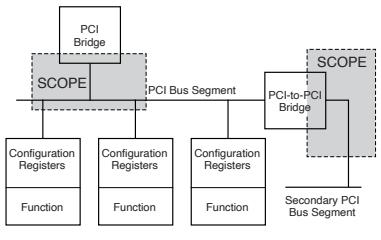

> 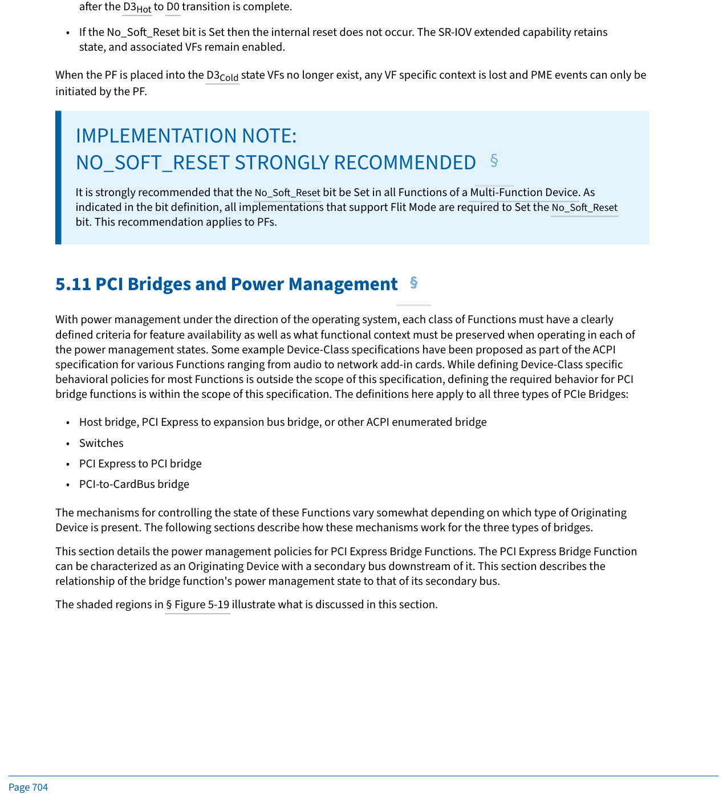

As can be seen from § Figure 5-19, the PCI Express Bridge behavior described in this chapter is common, from the perspective of the operating system, to host bridges, Switches, and PCI Express to PCI bridges.

It is the responsibility of the system software to ensure that only valid, workable combinations of bus and downstream Function power management states are used for a given bus and all Functions residing on that bus.

The power management policies for the secondary bus of a Switch or PCI Express to PCI bridge are identical to those defined for any Bridge Function.

The BPCC_En and B2_B3# bus power/clock control fields in the Bridge Function's PMCSR_BSE register support the same functionality as for any other Bridges.

There are two varieties of Power Management Events:

- Wakeup Events
- PME Generation

A Wakeup Event is used to request that power be turned on.

A PME Generation Event is used to identify to the system the Function requesting that power be turned on.

In conventional PCI, both events are associated with the PME# signal. The PME# signal is asserted by a Function to request a change in its power management state. When the PME_En bit is Set and the event occurs, the Function sets the PME_Status bit and asserts the PME# signal. It keeps the PME# signal asserted until either the PME_En bit or the PME_Status are Cleared (typically by software).

In PCI Express, the Wakeup Event is associated with the WAKE# signal. If supported, the WAKE# signal is defined in the associated form factor specification and is used by a Function to request a change in its PCI-PM power management state when the Function is in D3Cold and PME_En is Set.

In PCI Express, after main power has been restored and the Link is trained, the Function(s) that initiated the wakeup (e.g., that asserted WAKE#), sends a PM_PME Message to the Root Complex. The PM_PME Message provides the Root Complex with the identity of the requesting Function(s) without requiring software to poll for the PME_Status bit being Set.

</td>
<td style="background-color:#e8e8e8">

从 § 图 5-19 可以看出,从操作系统的角度来看,本章描述的 PCI Express 桥行为对于 Host 桥、Switch 和 PCI Express 到 PCI 桥是通用的。

系统软件有责任确保对给定总线及驻留在该总线上的所有 Function,仅使用有效、可工作的总线和下游 Function 电源管理状态组合。

Switch 或 PCI Express 到 PCI 桥的辅助总线的电源管理策略与为任何桥 Function 定义的策略相同。

桥 Function 的 PMCSR_BSE 寄存器中的 BPCC_En 和 B2_B3# 总线电源/时钟控制字段支持与任何其他桥相同的功能。

电源管理事件有两种类型:

- 唤醒事件 (Wakeup Events)
- PME 生成 (PME Generation)

唤醒事件用于请求打开电源。

PME 生成事件用于向系统标识请求打开电源的 Function。

在传统 PCI 中,两种事件都与 PME# 信号关联。PME# 信号由 Function 断言以请求其电源管理状态的更改。当 PME_En 位置位且事件发生时,Function 置位 PME_Status 位并断言 PME# 信号。它保持 PME# 信号被断言,直到 PME_En 位或 PME_Status 被清零 (通常由软件清零)。

在 PCI Express 中,唤醒事件与 WAKE# 信号关联。如果支持,WAKE# 信号在关联的外形规格规范中定义,用于在 Function 处于 D3Cold 且 PME_En 置位时请求其 PCI-PM 电源管理状态的更改。

在 PCI Express 中,在主电源已恢复且链路已训练之后,启动唤醒的 Function (即断言 WAKE# 的 Function) 向根复合体发送 PM_PME 报文。PM_PME 报文向根复合体提供请求 Function 的标识,而不需要软件轮询 PME_Status 位是否被置位。

</td>
</tr>
</tbody>
</table>

[⬆️ 返回目录](#-本章目录-table-of-contents)

---

### 5.11.1 Switches and PCI Express to PCI Bridges § | 5.11.1 Switch 与 PCI Express 到 PCI 桥 §

<table>
<thead>
<tr>
<th width="50%">🇬🇧 English</th>
<th width="50%" style="background-color:#e8e8e8">🏆 中文</th>
</tr>
</thead>
<tbody>
<tr>
<td></td>
<td style="background-color:#e8e8e8">

</td>
</tr>
</tbody>
</table>

[⬆️ 返回目录](#-本章目录-table-of-contents)

---

## 5.12 Power Management Events § | 5.12 电源管理事件 §

<table>
<thead>
<tr>
<th width="50%">🇬🇧 English</th>
<th width="50%" style="background-color:#e8e8e8">🏆 中文</th>
</tr>
</thead>
<tbody>
<tr>
<td></td>
<td style="background-color:#e8e8e8">

</td>
</tr>
</tbody>
</table>

[⬆️ 返回目录](#-本章目录-table-of-contents)

---

<!-- 📄 Page 706 -->
---

---

## 📑 本章目录 (Table of Contents) — Auto-Generated

- [5. Power Management § | 电源管理 §](#sec-5)
- [5.1 Overview § | 概述 §](#sec-5-1)
- [5.2 Link State Power Management § | 链路状态电源管理 §](#sec-5-2)
- [5.3 PCI-PM Software Compatible Mechanisms § | PCI-PM 软件兼容机制 §](#sec-5-3)
- [5.3.2 PM Software Control of the Link Power Management State § | 5.3.2 链路电源管理状态的 PM 软件控制 §](#sec-5-3-2)
- [5.3.3 Power Management Event Mechanisms § | 5.3.3 电源管理事件机制 §](#sec-5-3-3)
- [5.4 Native PCI Express Power Management Mechanisms § | 5.4 原生 PCI Express 电源管理机制 §](#sec-5-4)
- [5.4.1 Active State Power Management (ASPM) § | 5.4.1 主动状态电源管理 (ASPM) §](#sec-5-4-1)
- [5.5 L1 PM Substates § | 5.5 L1 PM Substates §](#sec-5-5)
- [5.6 Auxiliary Power Support § | 5.6 辅助电源支持 §](#sec-5-6)
- [5.7 Power Management System Messages and DLLPs § | 5.7 电源管理系统报文与 DLLP §](#sec-5-7)
- [5.8 PCI Function Power State Transitions § | 5.8 PCI Function 电源状态转换 §](#sec-5-8)
- [5.9 State Transition Recovery Time Requirements § | 5.9 状态转换恢复时间要求 §](#sec-5-9)
- [5.10 SR-IOV Power Management § | 5.10 SR-IOV 电源管理 §](#sec-5-10)
- [5.11 PCI Bridges and Power Management § | 5.11 PCI 桥与电源管理 §](#sec-5-11)
- [5.12 Power Management Events § | 5.12 电源管理事件 §](#sec-5-12)
