# 📘 第 6 章　System Architecture (Chapter 6. System Architecture)

**PCI Express® Base Specification — Revision 6.2, Version 1.0 — January 25, 2024**

> 📄 **Source pages**: 707–980 (PDF 1-indexed) | 📁 **File**: `chapter_06_raw.md`
> 🎨 **Format**: 中英对照双语 · 图表原始保留 · 中文背景色灰色 · GitHub Flavored Markdown
> 📚 **Template**: CXL 3.2 Spec translation (CXL_zh/)

---

## 📑 本章目录 (Table of Contents)

> 由合并阶段自动生成。请使用浏览器/GitHub 渲染时,各小节标题链接跳转。

## 🖼 本章图表 (Figures)

> 所有图已抽取为 PNG 存放在 `figures/chapter_06/`。

## 📊 本章表格 (Tables)

> 各章表格以标准 Markdown 表格形式嵌入正文。

---


---

<<<PAGE_BREAK>>> page_707

<a id="sec-6-0"></a>
# 6. System Architecture | 6. 系统架构


<div style="overflow-x: auto; max-width: 100%;">
<table>
<thead>
<tr>
<th width="50%">🇬🇧 English</th>
<th width="50%" style="background-color:#e8e8e8">🇨🇳 中文</th>
</tr>
</thead>
<tbody>
<tr>
<td>

This chapter addresses various aspects of PCI Express interconnect architecture in a platform context.
The PCI Express interrupt model supports two mechanisms:
- INTx emulation
- Message Signaled Interrupt (MSI/MSI-X)

For legacy compatibility, PCI Express provides a PCI INTx emulation mechanism to signal interrupts to the system interrupt controller (typically part of the Root Complex). This mechanism is compatible with existing PCI software, and provides the same level and type of service as the corresponding PCI interrupt signaling mechanism and is independent of system interrupt controller specifics. This legacy compatibility mechanism allows boot device support without requiring complex BIOS-level interrupt configuration/control service stacks. It virtualizes PCI physical interrupt signals by using an in-band signaling mechanism.

If an implementation supports interrupts, then this specification requires support of either MSI or MSI-X or both. PCI Compatible INTx interrupt emulation is optional. Switches are required to support forwarding the INTx interrupt emulation Messages (see § Section 2.2.8.1 ). The PCI Express MSI and MSI-X mechanisms are compatible with those originally defined in [PCI].

For SR-IOV devices, PFs are permitted to implement INTx, and VFs must not implement INTx. Each PF and VF must implement its own unique interrupt capabilities.

PCI Express takes an evolutionary approach from PCI with respect to interrupt support.

As required for PCI/PCI-X interrupt mechanisms, each device Function is required to differentiate between INTx and MSI/MSI-X modes of operation. The device complexity required to support both schemes is no different than that for PCI/PCI-X devices. The advantages of this approach include:
- Compatibility with existing PCI Software Models
- Direct support for boot devices
- Easier End of Life (EOL) for INTx legacy mechanisms.

The existing software model is used to differentiate INTx vs. MSI/MSI-X modes of operation; thus, no special software support is required for PCI Express.

The software model does not support changing interrupt modes while the Function is in active operation. If software does this, interrupt conditions may be dropped or replicated.

</td>
<td style="background-color:#e8e8e8">

本章从平台的角度论述 PCI Express 互连架构的各个方面。

PCI Express 中断模型支持两种机制：
- INTx 仿真
- 消息信号中断（MSI/MSI-X）

为了与传统兼容，PCI Express 提供了一种 PCI INTx 仿真机制，用于向系统中断控制器（通常是根复合体（Root Complex）的一部分）发信号。该机制与现有 PCI 软件兼容，并提供与对应 PCI 中断信号机制相同级别和类型的服务，且独立于系统中断控制器的具体实现。这一传统兼容机制允许在不需要复杂 BIOS 级中断配置/控制服务栈的情况下支持启动设备。它通过带内（in-band）信号机制虚拟化 PCI 物理中断信号。

如果实现支持中断，则本规范要求支持 MSI 或 MSI-X 中的一种或两种。PCI 兼容的 INTx 中断仿真是可选的。交换机（Switch）必须支持转发 INTx 中断仿真消息（参见 § 2.2.8.1 节）。PCI Express 的 MSI 和 MSI-X 机制与 [PCI] 中最初定义的机制兼容。

对于 SR-IOV 设备，PF 允许实现 INTx，VF 则不得实现 INTx。每个 PF 和 VF 都必须实现其各自独立的中断能力。

PCI Express 在中断支持方面采用从 PCI 演进而来的方法。

按照 PCI/PCI-X 中断机制的要求，每个设备功能（Function）必须区分 INTx 和 MSI/MSI-X 两种操作模式。支持这两种方案所需的设备复杂度与 PCI/PCI-X 设备相同。该方法的优点包括：
- 与现有 PCI 软件模型兼容
- 直接支持启动设备
- 便于 INTx 传统机制的淘汰（EOL）

现有软件模型用于区分 INTx 与 MSI/MSI-X 的操作模式，因此 PCI Express 不需要特殊的软件支持。

软件模型不支持在功能（Function）处于活动操作状态时更改中断模式。如果软件这样做，中断条件可能被丢失或重复。

</td>
</tr>
</tbody>
</table>
</div>


<a id="sec-6-1"></a>
## 6.1 Interrupt and PME Support | 中断与 PME 支持

table>
<thead>
<tr>
<th width="50%">🇬🇧 English</th>
<th width="50%" style="background-color:#e8e8e8">🇨🇳 中文</th>
</tr>
</thead>
<tbody>
<tr>
<td>

### 6.1.1 Rationale for PCI Express Interrupt Model | PCI Express 中断模型的设计理由

</td>
<td style="background-color:#e8e8e8">

### 6.1.1 PCI Express 中断模型的设计理由

</td>
</tr>
</tbody>
</table>

[⬆️ 返回目录](#-本章目录-table-of-contents)

---

<<<PAGE_BREAK>>> page_708

<a id="sec-6-1-2"></a>
## 6.1.2 PCI-compatible INTx Emulation | PCI 兼容的 INTx 仿真


<div style="overflow-x: auto; max-width: 100%;">
<table>
<thead>
<tr>
<th width="50%">🇬🇧 English</th>
<th width="50%" style="background-color:#e8e8e8">🇨🇳 中文</th>
</tr>
</thead>
<tbody>
<tr>
<td>

PCI Express emulates the PCI interrupt mechanism including the Interrupt Pin and Interrupt Line registers of the PCI Configuration Space for PCI device Functions. PCI Express non-Switch devices may optionally support these registers for backwards compatibility. Switch devices are required to support them. Actual interrupt signaling uses in-band Messages rather than being signaled using physical pins.

Two types of Messages are defined, Assert_INTx and Deassert_INTx, for emulation of PCI INTx signaling, where x is A, B, C, and D for respective PCI interrupt signals. These Messages are used to provide "virtual wires" for signaling interrupts across a Link. Switches collect these virtual wires and present a combined set at the Switch's Upstream Port. Ultimately, the virtual wires are routed to the Root Complex which maps the virtual wires to system interrupt resources. Devices must use assert/deassert Messages in pairs to emulate PCI interrupt level-triggered signaling. Actual mapping of PCI Express INTx emulation to system interrupts is implementation specific as is mapping of physical interrupt signals in conventional PCI.

The legacy INTx emulation mechanism may be deprecated in a future version of this specification.

</td>
<td style="background-color:#e8e8e8">

PCI Express 仿真 PCI 中断机制，包括 PCI 设备功能（Function）的 PCI 配置空间（Configuration Space）中的 Interrupt Pin 和 Interrupt Line 寄存器。出于向后兼容性考虑，PCI Express 的非交换机（Switch）设备可以有选择地支持这些寄存器。交换机设备则必须支持。实际的中断信号采用带内（in-band）消息（Message）方式，而非通过物理引脚发出。

定义了两类消息：Assert_INTx 和 Deassert_INTx，用于仿真 PCI INTx 信号，其中 x 对应于相应的 PCI 中断信号 A、B、C、D。这些消息用于提供跨链路（Link）传输中断信号的"虚拟连线"。交换机（Switch）收集这些虚拟连线，并在其上游端口（Upstream Port）处呈现一个合并集合。最终，这些虚拟连线被路由到根复合体（Root Complex），根复合体将其映射到系统中断资源。设备必须成对使用 assert/deassert 消息来仿真 PCI 中断的电平触发（level-triggered）信号。将 PCI Express INTx 仿真映射到系统中断的实际方式因实现而异，正如传统 PCI 中物理中断信号的映射方式一样。

传统 INTx 仿真机制在未来版本的规范中可能被弃用。

</td>
</tr>
</tbody>
</table>
</div>


<a id="sec-6-1-3"></a>
## 6.1.3 INTx Emulation Software Model | INTx 仿真的软件模型

table>
<thead>
<tr>
<th width="50%">🇬🇧 English</th>
<th width="50%" style="background-color:#e8e8e8">🇨🇳 中文</th>
</tr>
</thead>
<tbody>
<tr>
<td>

The software model for legacy INTx emulation matches that of PCI. The system BIOS reporting of chipset/platform interrupt mapping and the association of each device Function's interrupt with PCI interrupt lines is handled in exactly the same manner as with conventional PCI systems. Legacy software reads from each device Function's Interrupt Pin register to determine if the Function is interrupt driven. A value between 01h and 04h indicates that the Function uses an emulated interrupt pin to generate an interrupt.

Note that similarly to physical interrupt signals, the INTx emulation mechanism may potentially cause spurious interrupts that must be handled by the system software.

</td>
<td style="background-color:#e8e8e8">

传统 INTx 仿真的软件模型与 PCI 相同。系统 BIOS 报告芯片组/平台中断映射以及每个设备功能（Function）中断与 PCI 中断线的关联，处理方式与传统 PCI 系统完全相同。传统软件从每个设备功能的 Interrupt Pin 寄存器读取值，以确定该功能是否由中断驱动。介于 01h 与 04h 之间的值表示该功能使用仿真中断引脚产生中断。

请注意，与物理中断信号类似，INTx 仿真机制有可能产生虚假中断（spurious interrupt），必须由系统软件处理。

</td>
</tr>
</tbody>
</table>

<a id="sec-6-1-4"></a>
## 6.1.4 MSI and MSI-X Operation | MSI 与 MSI-X 操作


<div style="overflow-x: auto; max-width: 100%;">
<table>
<thead>
<tr>
<th width="50%">🇬🇧 English</th>
<th width="50%" style="background-color:#e8e8e8">🇨🇳 中文</th>
</tr>
</thead>
<tbody>
<tr>
<td>

Message Signaled Interrupts (MSI) is an optional feature that enables a device Function to request service by writing a system-specified data value to a system-specified address (using a DWORD Memory Write transaction). System software initializes the message address and message data (from here on referred to as the "vector") during device configuration, allocating one or more vectors to each MSI-capable Function.

Interrupt latency (the time from interrupt signaling to interrupt servicing) is system dependent. Consistent with current interrupt architectures, Message Signaled Interrupts do not provide interrupt latency time guarantees.

MSI-X defines a separate optional extension to basic MSI functionality. Compared to MSI, MSI-X supports a larger maximum number of vectors per Function, the ability for software to control aliasing when fewer vectors are allocated than requested, plus the ability for each vector to use an independent address and data value, specified by a table that resides in Memory Space. However, most of the other characteristics of MSI-X are identical to those of MSI.

For the sake of software backward compatibility, MSI and MSI-X use separate and independent Capability structures. On Functions that support both MSI and MSI-X, system software that supports only MSI can still enable and use MSI without any modification. MSI functionality is managed exclusively through the MSI Capability structure, and MSI-X functionality is managed exclusively through the MSI-X Capability structure.

A Function is permitted to implement both MSI and MSI-X, but system software is prohibited from enabling both at the same time. If system software enables both at the same time, the behavior is undefined.

</td>
<td style="background-color:#e8e8e8">

消息信号中断（MSI）是一种可选特性，允许设备功能（Function）通过向系统指定地址写入系统指定的数据值（使用 DWORD Memory Write 事务）来请求服务。在设备配置期间，系统软件初始化消息地址和消息数据（以下统称为"向量"），为每个支持 MSI 的功能分配一个或多个向量。

中断延迟（从中断信号发出到中断服务的时间）取决于系统。与当前的中断架构一致，消息信号中断不提供中断延迟时间的保证。

MSI-X 定义了基本 MSI 功能的另一种可选扩展。与 MSI 相比，MSI-X 支持每个功能更大的最大向量数，支持软件在分配向量数少于请求向量数时控制别名（aliasing），并允许每个向量使用独立的地址和数据值（由位于内存空间（Memory Space）中的表指定）。然而，MSI-X 的其他大多数特性与 MSI 相同。

为了软件向后兼容，MSI 和 MSI-X 使用独立且分开的能力（Capability）结构。在同时支持 MSI 和 MSI-X 的功能上，仅支持 MSI 的系统软件仍可启用并使用 MSI 而无需任何修改。MSI 功能仅通过 MSI Capability 结构管理，MSI-X 功能仅通过 MSI-X Capability 结构管理。

一个功能（Function）允许同时实现 MSI 和 MSI-X，但系统软件不得同时启用两者。如果系统软件同时启用两者，行为是未定义的。

</td>
</tr>
</tbody>
</table>
</div>


[⬆️ 返回目录](#-本章目录-table-of-contents)

---

<<<PAGE_BREAK>>> page_709

table>
<thead>
<tr>
<th width="50%">🇬🇧 English</th>
<th width="50%" style="background-color:#e8e8e8">🇨🇳 中文</th>
</tr>
</thead>
<tbody>
<tr>
<td>

All PCI Express device Functions that are capable of generating interrupts must support MSI or MSI-X or both. The MSI and MSI-X mechanisms deliver interrupts by performing Memory Write transactions. MSI and MSI-X are edge-triggered interrupt mechanisms; neither [PCI] nor this specification support level-triggered MSI/MSI-X interrupts. Certain PCI devices and their drivers rely on INTx-type level-triggered interrupt behavior (addressed by the PCI Express legacy INTx emulation mechanism). To take advantage of the MSI or MSI-X capability and edge-triggered interrupt semantics, these devices and their drivers may have to be redesigned.

MSI and MSI-X each support Per-Vector Masking (PVM). PVM is an optional extension to MSI, and a standard feature with MSI-X. A Function that supports the PVM extension to MSI is backward compatible with system software that is unaware of the extension. MSI-X also supports a Function Mask bit, which when Set masks all of the vectors associated with a Function.

A Legacy Endpoint that implements MSI is required to support either the 32-bit or 64-bit Message Address version of the MSI Capability structure. A PCI Express Endpoint that implements MSI is required to support the 64-bit Message Address version of the MSI Capability structure.

The Requester of an MSI/MSI-X transaction must set the No Snoop and Relaxed Ordering attributes of the Transaction Descriptor to 0b. A Requester of an MSI/MSI-X transaction is permitted to Set the ID-Based Ordering (IDO) attribute if use of the IDO attribute is enabled.

Note that, unlike INTx emulation Messages, MSI/MSI-X transactions are not restricted to the TC0 traffic class.

Within a device, different Functions are permitted to implement different sets of the MSI/MSI-X/INTx interrupt mechanisms, and system software manages each Function's interrupt mechanisms independently.

In this section, all register and field references are in the context of the MSI Capability structure.

System software reads the Message Control register to determine the Function's MSI capabilities.

System software reads the Multiple Message Capable field (bits 3-1 of the Message Control register) to determine the number of requested vectors. MSI supports a maximum of 32 vectors per Function. System software writes to the Multiple Message Enable field (bits 6-4 of the Message Control register) to allocate either all or a subset of the requested vectors. For example, a Function can request four vectors and be allocated either four, two, or one vector. The number of vectors requested and allocated is aligned to a power of two (that is, a Function that requires three vectors must request four).

> **IMPLEMENTATION NOTE: SYNCHRONIZATION OF DATA TRAFFIC AND MESSAGE SIGNALED INTERRUPTS**
>
> MSI/MSI-X transactions are permitted to use the TC that is most appropriate for the device's programming model. This is generally the same TC as is used to transfer data; for legacy I/O, TC0 should be used.
>
> If a device uses more than one TC, it must explicitly ensure that proper synchronization is maintained between data traffic and interrupt Message(s) not using the same TC. Methods for ensuring this synchronization are implementation specific. One option is for a device to issue a zero-length Read (as described in § Section 2.2.5) using each additional TC used for data traffic prior to issuing the MSI/MSI-X transaction. Other methods are also possible. Note, however, that platform software (e.g., a device driver) is generally only capable of issuing transactions using TC0.

</td>
<td style="background-color:#e8e8e8">

所有能够产生中断的 PCI Express 设备功能（Function）必须支持 MSI 或 MSI-X 中的一种或两种。MSI 和 MSI-X 机制通过执行 Memory Write 事务来传递中断。MSI 和 MSI-X 是边沿触发的中断机制；[PCI] 和本规范均不支持电平触发的 MSI/MSI-X 中断。某些 PCI 设备及其驱动程序依赖于 INTx 类型的电平触发中断行为（由 PCI Express 传统 INTx 仿真机制处理）。为利用 MSI 或 MSI-X 能力及边沿触发的中断语义，这些设备及其驱动程序可能需要重新设计。

MSI 和 MSI-X 都支持每向量屏蔽（Per-Vector Masking, PVM）。PVM 是 MSI 的可选扩展，MSI-X 的标准特性。支持 MSI PVM 扩展的功能与不识别此扩展的系统软件向后兼容。MSI-X 还支持一个功能屏蔽（Function Mask）位，当该位置位时屏蔽与该功能相关联的所有向量。

实现 MSI 的传统端点（Legacy Endpoint）必须支持 MSI Capability 结构的 32 位或 64 位消息地址版本。实现 MSI 的 PCI Express 端点（Endpoint）必须支持 MSI Capability 结构的 64 位消息地址版本。

MSI/MSI-X 事务的请求者（Requester）必须将事务描述符的 No Snoop 和 Relaxed Ordering 属性置为 0b。如果启用了基于 ID 的排序（IDO, ID-Based Ordering）属性的使用，则 MSI/MSI-X 事务的请求者允许置位 IDO 属性。

请注意，与 INTx 仿真消息不同，MSI/MSI-X 事务不限于 TC0 流量类（Traffic Class, TC）。

在设备内部，不同的功能（Function）允许实现 MSI/MSI-X/INTx 中断机制的不同子集，系统软件独立地管理每个功能的中断机制。

本节中，所有寄存器和字段引用均以 MSI Capability 结构为上下文。

系统软件读取 Message Control 寄存器以确定功能的 MSI 能力。

系统软件读取 Multiple Message Capable 字段（Message Control 寄存器的位 3-1）以确定请求的向量数。MSI 支持每个功能最多 32 个向量。系统软件写入 Multiple Message Enable 字段（Message Control 寄存器的位 6-4）以分配请求向量的全部或子集。例如，功能可以请求四个向量并被分配四个、两个或一个向量。请求和分配的向量数按 2 的幂对齐（即需要三个向量的功能必须请求四个）。

> **实现说明：数据流量与消息信号中断的同步**
>
> MSI/MSI-X 事务允许使用最适合设备编程模型的 TC。这通常与传输数据所用的 TC 相同；对于传统 I/O，应使用 TC0。
>
> 如果设备使用多个 TC，则必须显式确保在使用不同 TC 的数据流量与中断消息之间保持适当的同步。确保此同步的方法因实现而异。一种选择是设备在发出 MSI/MSI-X 事务之前，使用每个用于数据流量的额外 TC 发出零长度读（zero-length Read）（如 § 2.2.5 节所述）。其他方法也是可能的。但请注意，平台软件（例如设备驱动程序）通常只能使用 TC0 发出事务。

</td>
</tr>
</tbody>
</table>

<a id="sec-6-1-4-1"></a>
### 6.1.4.1 MSI Configuration | MSI 配置

<table>
<thead>
<tr>
<th width="50%">🇬🇧 English</th>
<th width="50%" style="background-color:#e8e8e8">🇨🇳 中文</th>
</tr>
</thead>
<tbody>
<tr>
<td>

> 102. Exception: Within an SR-IOV Device, any PFs or VFs that implement MSI must implement MSI PVM.

</td>
<td style="background-color:#e8e8e8">

> 102. 例外：在 SR-IOV 设备内，任何实现 MSI 的 PF 或 VF 都必须实现 MSI PVM。

</td>
</tr>
</tbody>
</table>

[⬆️ 返回目录](#-本章目录-table-of-contents)

---

<<<PAGE_BREAK>>> page_710


<div style="overflow-x: auto; max-width: 100%;">
<table>
<thead>
<tr>
<th width="50%">🇬🇧 English</th>
<th width="50%" style="background-color:#e8e8e8">🇨🇳 中文</th>
</tr>
</thead>
<tbody>
<tr>
<td>

If the Per-Vector Masking Capable bit (bit 8 of the Message Control register) is Set and system software supports Per-Vector Masking, system software may mask one or more vectors by writing to the Mask Bits register.

If the 64-bit Address Capable bit (bit 7 of the Message Control register) is Set, system software initializes the MSI Capability structure's Message Address register (specifying the lower 32 bits of the message address) and the Message Upper Address register (specifying the upper 32 bits of the message address) with a system-specified message address. System software may program the Message Upper Address register to zero so that the Function uses a 32-bit address for the MSI transaction. If this bit is Clear, system software initializes the MSI Capability structure's Message Address register (specifying a 32-bit message address) with a system specified message address.

System software initializes the MSI Capability structure's Message Data register with the lower 16 bits of a system specified data value. When the Extended Message Data Capable bit is Clear, care must be taken to initialize only the Message Data register (i.e., a 2-byte value) and not modify the upper two bytes of that DWORD location.

If the Extended Message Data Capable bit is Set and system software supports 32-bit vector values, system software may initialize the MSI capability structure's Extended Message Data register with the upper 16 bits of a system specified data value, and then Set the Extended Message Data Enable bit.

</td>
<td style="background-color:#e8e8e8">

如果 Per-Vector Masking Capable 位（Message Control 寄存器的位 8）已置位且系统软件支持每向量屏蔽，则系统软件可以通过写入 Mask Bits 寄存器屏蔽一个或多个向量。

如果 64-bit Address Capable 位（Message Control 寄存器的位 7）已置位，则系统软件使用系统指定的消息地址初始化 MSI Capability 结构的 Message Address 寄存器（指定消息地址的低 32 位）和 Message Upper Address 寄存器（指定消息地址的高 32 位）。系统软件可以将 Message Upper Address 寄存器编程为零，以便该功能使用 32 位地址进行 MSI 事务。如果此位为 0，则系统软件使用系统指定的消息地址初始化 MSI Capability 结构的 Message Address 寄存器（指定 32 位消息地址）。

系统软件使用系统指定数据值的低 16 位初始化 MSI Capability 结构的 Message Data 寄存器。当 Extended Message Data Capable 位为 0 时，必须注意仅初始化 Message Data 寄存器（即 2 字节值），而不要修改该 DWORD 位置的高两字节。

如果 Extended Message Data Capable 位已置位且系统软件支持 32 位向量值，则系统软件可以使用系统指定数据值的高 16 位初始化 MSI Capability 结构的 Extended Message Data 寄存器，然后置位 Extended Message Data Enable 位。

</td>
</tr>
</tbody>
</table>
</div>


<a id="sec-6-1-4-2"></a>
### 6.1.4.2 MSI-X Configuration | MSI-X 配置

table>
<thead>
<tr>
<th width="50%">🇬🇧 English</th>
<th width="50%" style="background-color:#e8e8e8">🇨🇳 中文</th>
</tr>
</thead>
<tbody>
<tr>
<td>

In this section, all register and field references are in the context of the MSI-X Capability, MSI-X Table, and MSI-X PBA structures.

System software allocates address space for the Function's standard set of Base Address registers and sets the registers accordingly. One of the Function's Base Address registers includes address space for the MSI-X Table, though the system software that allocates address space does not need to be aware of which Base Address register this is, or the fact the address space is used for the MSI-X Table. The same or another Base Address register includes address space for the MSI-X PBA, and the same point regarding system software applies.

Depending upon system software policy, system software, device driver software, or each at different times or environments may configure a Function's MSI-X Capability and table structures with suitable vectors. For example, a booting environment will likely require only a single vector, whereas a normal operating system environment for running applications may benefit from multiple vectors if the Function supports an MSI-X Table with multiple entries.

For the remainder of this section, "software" refers to either system software or device driver software.

Software reads the Table Size field from the Message Control register to determine the MSI-X Table size. The field encodes the number of table entries as N-1, so software must add 1 to the value read from the field to calculate the number of table entries N. MSI-X supports a maximum table size of 2048 entries.

Software calculates the base address of the MSI-X Table by reading the 32-bit value from the Table Offset/Table BIR register, masking off the lower 3 Table BIR bits, and adding the remaining QWORD-aligned 32-bit Table offset to the address taken from the Base Address register indicated by the Table BIR. Software calculates the base address of the MSI-X PBA using the same process with the PBA Offset/PBA BIR register.

For each MSI-X Table entry that will be used, software fills in the Message Address field, Message Upper Address field, Message Data field, and Vector Control field. The Vector Control field may contain optional Steering Tag fields. Software must not modify the Address, Data, or Steering Tag fields of an entry while it is unmasked. Refer to § Section 6.1.4.5 for details.

</td>
<td style="background-color:#e8e8e8">

本节中，所有寄存器和字段引用均以 MSI-X Capability、MSI-X Table 和 MSI-X PBA 结构为上下文。

系统软件为功能的标准基址寄存器（Base Address Register, BAR）集合分配地址空间，并相应地设置这些寄存器。功能的某个基址寄存器（BAR）包含 MSI-X Table 的地址空间，尽管分配地址空间的系统软件不需要知道是哪一个 BAR，也不必知道该地址空间用于 MSI-X Table。同一个或另一个 BAR 包含 MSI-X PBA 的地址空间，关于系统软件的说明也适用于此。

根据系统软件的策略，系统软件、设备驱动程序软件，或者两者在不同时机或环境下，可以使用合适的向量来配置功能的 MSI-X 能力和表结构。例如，引导环境可能只需要一个向量，而正常运行应用程序的操作系统环境如果功能支持多入口的 MSI-X Table，则可能受益于多个向量。

本节其余部分，"软件"指系统软件或设备驱动程序软件。

软件从 Message Control 寄存器读取 Table Size 字段以确定 MSI-X Table 大小。该字段以 N-1 编码表项数，因此软件必须将从该字段读取的值加 1 以计算表项数 N。MSI-X 支持的最大表大小为 2048 项。

软件通过从 Table Offset/Table BIR 寄存器读取 32 位值、屏蔽低 3 位 Table BIR 位、并将剩余的 QWORD 对齐的 32 位 Table 偏移加到 Table BIR 所指示的基址寄存器的地址上，来计算 MSI-X Table 的基地址。软件使用相同的过程和 PBA Offset/PBA BIR 寄存器来计算 MSI-X PBA 的基地址。

对于每个要使用的 MSI-X Table 表项，软件填写 Message Address 字段、Message Upper Address 字段、Message Data 字段和 Vector Control 字段。Vector Control 字段可以包含可选的 Steering Tag 字段。软件在表项未屏蔽时不得修改其 Address、Data 或 Steering Tag 字段。详情参见 § 6.1.4.5 节。

</td>
</tr>
</tbody>
</table>

[⬆️ 返回目录](#-本章目录-table-of-contents)

---

<<<PAGE_BREAK>>> page_711


<div style="overflow-x: auto; max-width: 100%;">
<table>
<thead>
<tr>
<th width="50%">🇬🇧 English</th>
<th width="50%" style="background-color:#e8e8e8">🇨🇳 中文</th>
</tr>
</thead>
<tbody>
<tr>
<td>

For potential use by future specifications, the Reserved bits in the Vector Control field must have their default values preserved by software. If software does not preserve their values, the result is undefined.

For each MSI-X Table entry that software chooses not to configure for generating messages, software can simply leave the entry in its default state of being masked.

Software is permitted to configure multiple MSI-X Table entries with the same vector, and this may indeed be necessary when fewer vectors are allocated than requested.

To maintain backward compatibility, the MSI Enable bit in the Message Control Register for MSI and the MSI-X Enable bit in the Message Control Register for MSI-X are each Clear by default (MSI and MSI-X are both disabled). System configuration software Sets one of these bits to enable either MSI or MSI-X, but never both simultaneously. Behavior is undefined if both MSI and MSI-X are enabled simultaneously. Software disabling either mechanism during active operation may result in the Function dropping pending interrupt conditions or failing to recognize new interrupt conditions. While enabled for MSI or MSI-X operation, a Function is prohibited from using INTx interrupts (if implemented) to request service (MSI, MSI-X, and INTx are mutually exclusive).

> **IMPLEMENTATION NOTE: SPECIAL CONSIDERATIONS FOR QWORD ACCESSES**
>
> Software is permitted to fill in MSI-X Table entry DWORD fields individually with DWORD writes, or software in certain cases is permitted to fill in appropriate pairs of DWORDs with a single QWORD write. Specifically, software is always permitted to fill in the Message Address and Message Upper Address fields with a single QWORD write. If a given entry is currently masked (via its Mask bit or the Function Mask bit), software is permitted to fill in the Message Data and Vector Control fields with a single QWORD write, taking advantage of the fact the Message Data field is guaranteed to become visible to hardware no later than the Vector Control field. However, if software wishes to mask a currently unmasked entry (without Setting the Function Mask bit), software must Set the entry's Mask bit using a DWORD write to the Vector Control field, since performing a QWORD write to the Message Data and Vector Control fields might result in the Message Data field being modified before the Mask bit in the Vector Control field becomes Set.

> **IMPLEMENTATION NOTE: HANDLING MSI-X VECTOR SHORTAGES**
>
> For the case where fewer vectors are allocated to a Function than desired, software-controlled aliasing as enabled by MSI-X is one approach for handling the situation. For example, if a Function supports five queues, each with an associated MSI-X table entry, but only three vectors are allocated, the Function could be designed for software still to configure all five table entries, assigning one or more vectors to multiple table entries. Software could assign the three vectors {A,B,C} to the five entries as ABCCC, ABBCC, ABCBA, or other similar combinations.
>
> Alternatively, the Function could be designed for software to configure it (using a device specific mechanism) to use only three queues and three MSI-X table entries. Software could assign the three vectors {A,B,C} to the five entries as ABC-, A-B-C, A-CB, or other similar combinations.

</td>
<td style="background-color:#e8e8e8">

为供未来规范使用，Vector Control 字段中的保留位必须由软件保持其默认值。如果软件不保留其值，结果是未定义的。

对于软件选择不配置用于产生消息的每个 MSI-X Table 表项，软件可以简单地将该表项保持在其默认屏蔽状态。

软件允许将多个 MSI-X Table 表项配置为相同的向量，这在分配的向量少于请求向量时确实可能是必要的。

为保持向后兼容性，MSI 的 Message Control 寄存器中的 MSI Enable 位和 MSI-X 的 Message Control 寄存器中的 MSI-X Enable 位在默认情况下均为 0（MSI 和 MSI-X 均禁用）。系统配置软件置位其中一位以启用 MSI 或 MSI-X，但不得同时启用两者。如果同时启用 MSI 和 MSI-X，则行为是未定义的。软件在活动操作期间禁用任一机制可能导致功能丢失挂起的中断条件或无法识别新的中断条件。在启用 MSI 或 MSI-X 操作期间，功能（Function）禁止使用 INTx 中断（如果已实现）来请求服务（MSI、MSI-X 和 INTx 互斥）。

> **实现说明：QWORD 访问的特殊注意事项**
>
> 软件允许使用 DWORD 写单独填充 MSI-X Table 表项的 DWORD 字段，或者在某些情况下允许使用单个 QWORD 写填充合适的 DWORD 对。具体而言，软件始终允许使用单个 QWORD 写填充 Message Address 和 Message Upper Address 字段。如果给定表项当前被屏蔽（通过其 Mask 位或功能屏蔽位），则软件允许利用 Message Data 字段保证不晚于 Vector Control 字段对硬件可见这一事实，使用单个 QWORD 写填充 Message Data 和 Vector Control 字段。但是，如果软件希望屏蔽当前未屏蔽的表项（不置位功能屏蔽位），则软件必须使用对 Vector Control 字段的 DWORD 写置位该表项的 Mask 位，因为对 Message Data 和 Vector Control 字段执行 QWORD 写可能导致 Message Data 字段在 Vector Control 字段中的 Mask 位置位之前被修改。

> **实现说明：处理 MSI-X 向量不足**
>
> 对于分配给功能的向量少于所需数量的情况，由 MSI-X 启用的软件控制别名是一种处理方法。例如，如果功能支持五个队列，每个队列有一个关联的 MSI-X 表项，但仅分配了三个向量，则可以将功能设计为软件仍配置所有五个表项，将一个或多个向量分配给多个表项。软件可以将三个向量 {A,B,C} 分配给五个表项为 ABCCC、ABBCC、ABCBA 或其他类似组合。
>
> 或者，可以将功能设计为软件（使用设备特定机制）将其配置为仅使用三个队列和三个 MSI-X 表项。软件可以将三个向量 {A,B,C} 分配给五个表项为 ABC-、A-B-C、A-CB 或其他类似组合。

</td>
</tr>
</tbody>
</table>
</div>


<a id="sec-6-1-4-3"></a>
### 6.1.4.3 Enabling Operation | 启用操作

table>
<thead>
<tr>
<th width="50%">🇬🇧 English</th>
<th width="50%" style="background-color:#e8e8e8">🇨🇳 中文</th>
</tr>
</thead>
<tbody>
<tr>
<td></td>
<td style="background-color:#e8e8e8">

</td>
</tr>
</tbody>
</table>

[⬆️ 返回目录](#-本章目录-table-of-contents)

---

<<<PAGE_BREAK>>> page_712


<div style="overflow-x: auto; max-width: 100%;">
<table>
<thead>
<tr>
<th width="50%">🇬🇧 English</th>
<th width="50%" style="background-color:#e8e8e8">🇨🇳 中文</th>
</tr>
</thead>
<tbody>
<tr>
<td>

Once MSI or MSI-X is enabled (the appropriate bit in one of the Message Control registers is Set), and one or more vectors is unmasked, the Function is permitted to send messages. To send a message, a Function does a DWORD Memory Write to the appropriate message address with the appropriate message data.

For MSI when the Extended Message Data Enable bit is Clear, the DWORD that is written is made up of the value in the MSI Message Data register in the lower two bytes and zeros in the upper two bytes. For MSI when the Extended Message Data Enable bit is Set, the DWORD that is written is made up of the value in the MSI Message Data register in the lower two bytes and the value in the MSI Extended Message Data register in the upper two bytes.

For MSI, if the Multiple Message Enable field (bits 6-4 of the Message Control Register for MSI) is non-zero, the Function is permitted to modify the low order bits of the message data to generate multiple vectors. For example, a Multiple Message Enable encoding of 010b indicates the Function is permitted to modify message data bits 1 and 0 to generate up to four unique vectors. If the Multiple Message Enable field is 000b, the Function is not permitted to modify the message data.

For MSI-X, the MSI-X Table contains at least one entry for every allocated vector, and the 32-bit Message Data field value from a selected table entry is used in the message without any modification to the low-order bits by the Function.

How a Function uses multiple vectors (when allocated) is device dependent. A Function must handle being allocated fewer vectors than requested.

</td>
<td style="background-color:#e8e8e8">

一旦启用 MSI 或 MSI-X（某个 Message Control 寄存器中的相应位置位）并且一个或多个向量未屏蔽，则该功能（Function）允许发送消息。要发送消息，功能执行对相应消息地址的 DWORD Memory Write，并写入相应的消息数据。

对于 MSI，当 Extended Message Data Enable 位为 0 时，所写入的 DWORD 由 MSI Message Data 寄存器低两字节的值和高两字节的零组成。对于 MSI，当 Extended Message Data Enable 位为 1 时，所写入的 DWORD 由 MSI Message Data 寄存器低两字节的值和 MSI Extended Message Data 寄存器高两字节的值组成。

对于 MSI，如果 Multiple Message Enable 字段（MSI 的 Message Control 寄存器的位 6-4）非零，则功能允许修改消息数据的低阶位以生成多个向量。例如，Multiple Message Enable 编码 010b 表示功能允许修改消息数据的位 1 和位 0 以生成最多四个唯一向量。如果 Multiple Message Enable 字段为 000b，则功能不得修改消息数据。

对于 MSI-X，MSI-X Table 至少包含每个已分配向量的一个表项，所选表项中的 32 位 Message Data 字段值在消息中使用，且功能不得修改其低阶位。

功能（Function）如何使用多个向量（在已分配时）取决于设备。功能必须处理分配的向量少于请求向量的情况。

</td>
</tr>
</tbody>
</table>
</div>


<a id="sec-6-1-4-4"></a>
### 6.1.4.4 Sending Messages | 发送消息

table>
<thead>
<tr>
<th width="50%">🇬🇧 English</th>
<th width="50%" style="background-color:#e8e8e8">🇨🇳 中文</th>
</tr>
</thead>
<tbody>
<tr>
<td></td>
<td style="background-color:#e8e8e8">

</td>
</tr>
</tbody>
</table>

<a id="sec-6-1-4-5"></a>
### 6.1.4.5 Per-vector Masking and Function Masking | 每向量屏蔽与功能屏蔽


<div style="overflow-x: auto; max-width: 100%;">
<table>
<thead>
<tr>
<th width="50%">🇬🇧 English</th>
<th width="50%" style="background-color:#e8e8e8">🇨🇳 中文</th>
</tr>
</thead>
<tbody>
<tr>
<td>

Per-Vector Masking (PVM) is an optional feature with MSI, and a standard feature in MSI-X.

Function Masking is a standard feature in MSI-X. When the MSI-X Function Mask bit is Set, all of the Function's entries must behave as being masked, regardless of the per-entry Mask bit values. Function Masking is not supported in MSI, but software can readily achieve a similar effect by Setting all MSI Mask bits using a single DWORD write.

PVM in MSI-X is controlled by a Mask bit in each MSI-X Table entry. While more accurately termed "per-entry masking", masking an MSI-X Table entry is still referred to as "vector masking" so similar descriptions can be used for both MSI and MSI-X. However, since software is permitted to program the same vector (a unique Address/Data pair) into multiple MSI-X table entries, all such entries must be masked in order to guarantee the Function will not send a message using that Address/Data pair.

For MSI and MSI-X, while a vector is masked, the Function is prohibited from sending the associated message, and the Function must Set the associated Pending bit whenever the Function would otherwise send the message. When software unmasks a vector whose associated Pending bit is Set, the Function must schedule sending the associated message, and Clear the Pending bit as soon as the message has been sent. Note that Clearing the MSI-X Function Mask bit may result in many messages needing to be sent.

If a masked vector has its Pending bit Set, and the associated underlying interrupt events are somehow satisfied (usually by software though the exact manner is Function-specific), the Function must Clear the Pending bit, to avoid sending a spurious interrupt message later when software unmasks the vector. However, if a subsequent interrupt event occurs while the vector is still masked, the Function must again Set the Pending bit.

Software is permitted to mask one or more vectors indefinitely, and service their associated interrupt events strictly based on polling their Pending bits. A Function must Set and Clear its Pending bits as necessary to support this "pure polling" mode of operation.

> 103. Exception: Within an SR-IOV Device, any PFs or VFs that implement MSI must implement MSI PVM.

</td>
<td style="background-color:#e8e8e8">

每向量屏蔽（PVM）是 MSI 的可选特性，是 MSI-X 的标准特性。

功能屏蔽（Function Masking）是 MSI-X 的标准特性。当 MSI-X Function Mask 位置位时，功能的全部表项必须表现为被屏蔽，与各表项的 Mask 位值无关。MSI 不支持功能屏蔽，但软件可以通过使用单个 DWORD 写置位所有 MSI Mask 位来轻松达到类似效果。

MSI-X 中的 PVM 由每个 MSI-X Table 表项中的 Mask 位控制。虽然更准确的说法是"按表项屏蔽"，但屏蔽 MSI-X Table 表项仍称为"向量屏蔽"，以便 MSI 和 MSI-X 可以使用类似的描述。然而，由于软件允许将相同的向量（唯一的 Address/Data 对）编程到多个 MSI-X 表项中，因此必须屏蔽所有此类表项才能保证功能不会使用该 Address/Data 对发送消息。

对于 MSI 和 MSI-X，在向量被屏蔽时，功能禁止发送相关联的消息，并且每当功能原本要发送消息时，必须置位关联的 Pending 位。当软件取消屏蔽其 Pending 位已置位的向量时，功能必须安排发送相关联的消息，并在消息已发送后立即清除 Pending 位。请注意，清除 MSI-X Function Mask 位可能导致需要发送大量消息。

如果被屏蔽向量的 Pending 位已置位，并且相关联的底层中断事件以某种方式被满足（通常由软件完成，但具体方式取决于功能），则功能必须清除 Pending 位，以避免在稍后软件取消屏蔽向量时发送虚假中断消息。但是，如果在向量仍被屏蔽时发生后续中断事件，则功能必须再次置位 Pending 位。

软件允许无限期地屏蔽一个或多个向量，并严格基于轮询其 Pending 位来服务其相关联的中断事件。功能必须根据需要置位和清除其 Pending 位以支持这种"纯轮询"操作模式。

> 103. 例外：在 SR-IOV 设备内，任何实现 MSI 的 PF 或 VF 都必须实现 MSI PVM。

</td>
</tr>
</tbody>
</table>
</div>


[⬆️ 返回目录](#-本章目录-table-of-contents)

---

<<<PAGE_BREAK>>> page_713

table>
<thead>
<tr>
<th width="50%">🇬🇧 English</th>
<th width="50%" style="background-color:#e8e8e8">🇨🇳 中文</th>
</tr>
</thead>
<tbody>
<tr>
<td>

For MSI-X, a Function is permitted to cache Address and Data values from unmasked MSI-X Table entries. However, anytime software unmasks a currently masked MSI-X Table entry either by Clearing its Mask bit or by Clearing the Function Mask bit, the Function must update any Address or Data values that it cached from that entry. If software changes the Address or Data value of an entry while the entry is unmasked, the result is undefined.

If a Function sends messages with the same vector multiple times before being acknowledged by software, only one message is guaranteed to be serviced. If all messages must be serviced, a device driver handshake is required. In other words, once a Function sends Vector A, it cannot send Vector A again until it is explicitly enabled to do so by its device driver (provided all messages must be serviced). If some messages can be lost, a device driver handshake is not required. For Functions that support multiple vectors, a Function can send multiple unique vectors and is guaranteed that each unique message will be serviced. For example, a Function can send Vector A followed by Vector B without any device driver handshake (both Vector A and Vector B will be serviced).

> **IMPLEMENTATION NOTE: PER VECTOR MASKING WITH MSI/MSI-X**
>
> Devices and drivers that use MSI or MSI-X have the challenge of coordinating exactly when new interrupt messages are generated. If hardware fails to send an interrupt message that software expects, an interrupt event might be "lost". If hardware sends an interrupt message that software is not expecting, a "spurious" interrupt might result.
>
> Per-Vector Masking (PVM) can be used to assist in this coordination. For example, when a software interrupt service routine begins, it can mask the vector to help avoid "spurious" interrupts. After the interrupt service routine services all the interrupt conditions that it is aware of, it can unmask the vector. If any interrupt conditions remain, hardware is required to generate a new interrupt message, guaranteeing that no interrupt events are lost.
>
> PVM is a standard feature with MSI-X and an optional feature for MSI. For devices that implement MSI, implementing PVM as well is strongly recommended.

</td>
<td style="background-color:#e8e8e8">

对于 MSI-X，功能（Function）允许从未屏蔽的 MSI-X Table 表项中缓存 Address 和 Data 值。但是，每当软件通过清除其 Mask 位或清除功能屏蔽位来取消屏蔽当前被屏蔽的 MSI-X Table 表项时，功能必须更新其从该表项缓存的任何 Address 或 Data 值。如果软件在表项未屏蔽时更改该表项的 Address 或 Data 值，则结果是未定义的。

如果功能（Function）在被软件确认之前多次发送相同向量的消息，则仅保证一条消息被服务。如果必须服务所有消息，则需要设备驱动程序握手。换言之，一旦功能发送了 Vector A，则在其设备驱动程序明确允许之前不能再次发送 Vector A（在必须服务所有消息的情况下）。如果某些消息可以丢失，则不需要设备驱动程序握手。对于支持多个向量的功能，功能可以发送多个唯一向量，并保证每个唯一消息都将被服务。例如，功能可以在没有任何设备驱动程序握手的情况下依次发送 Vector A 和 Vector B（Vector A 和 Vector B 都将被服务）。

> **实现说明：MSI/MSI-X 的每向量屏蔽**
>
> 使用 MSI 或 MSI-X 的设备和驱动程序面临的挑战是协调何时生成新的中断消息。如果硬件未能发送软件期望的中断消息，则中断事件可能"丢失"。如果硬件发送了软件未期望的中断消息，则可能导致"虚假"中断。
>
> 每向量屏蔽（PVM）可用于协助此协调。例如，当软件中断服务例程开始时，可以屏蔽该向量以帮助避免"虚假"中断。在中断服务例程服务了其知晓的所有中断条件之后，可以取消屏蔽该向量。如果仍有中断条件存在，则硬件需要生成新的中断消息，保证不会丢失任何中断事件。
>
> PVM 是 MSI-X 的标准特性，是 MSI 的可选特性。对于实现 MSI 的设备，强烈建议同时实现 PVM。

</td>
</tr>
</tbody>
</table>

[⬆️ 返回目录](#-本章目录-table-of-contents)

---


---

<a id="sec-6-1-4-6"></a>
## 6.1.4.6 Hardware/Software Synchronization | 硬件/软件同步

<table>
<thead>
<tr>
<th width="50%">🇬🇧 English</th>
<th width="50%" style="background-color:#e8e8e8">🇨🇳 中文</th>
</tr>
</thead>
<tbody>
<tr>
<td>

104. Exception: Within an SR-IOV Device, any PFs or VFs that implement MSI must implement MSI PVM

</td>
<td style="background-color:#e8e8e8">

104. 例外：在 SR-IOV 设备内部，任何实现了 MSI 的 PF（物理功能）或 VF（虚拟功能）都必须实现 MSI PVM（Per-Vector Masking，每向量屏蔽）。

</td>
</tr>
</tbody>
</table>

[⬆️ 返回目录](#-本章目录-table-of-contents)

---

<<<PAGE_BREAK>>> page_714

<a id="sec-impl-note-msi-msix-servicing"></a>
### IMPLEMENTATION NOTE: SERVICING MSI AND MSI-X INTERRUPTS | 实现说明：MSI 与 MSI-X 中断服务


<div style="overflow-x: auto; max-width: 100%;">
<table>
<thead>
<tr>
<th width="50%">🇬🇧 English</th>
<th width="50%" style="background-color:#e8e8e8">🇨🇳 中文</th>
</tr>
</thead>
<tbody>
<tr>
<td>

When system software allocates fewer MSI or MSI-X vectors to a Function than it requests, multiple interrupt sources within the Function, each desiring a unique vector, may be required to share a single vector. Without proper handshakes between hardware and software, hardware may send fewer messages than software expects, or hardware may send what software considers to be extraneous messages.

A rather sophisticated but resource-intensive approach is to associate a dedicated event queue with each allocated vector, with producer and consumer pointers for managing each event queue. Such event queues typically reside in host memory. The Function acts as the producer and software acts as the consumer. Multiple interrupt sources within a Function may be assigned to each event queue as necessary. Each time an interrupt source needs to signal an interrupt, the Function places an entry on the appropriate event queue (assuming there's room), updates a copy of the producer pointer (typically in host memory), and sends an interrupt message with the associated vector when necessary to notify software that the event queue needs servicing. The interrupt service routine for a given event queue processes all entries it finds on its event queue, as indicated by the producer pointer. Each event queue entry identifies the interrupt source and possibly additional information about the nature of the event. The use of event queues and producer/consumer pointers can be used to guarantee that interrupt events won't get dropped when multiple interrupt sources are forced to share a vector. There's no need for additional handshaking between sending multiple messages associated with the same event queue, to guarantee that every message gets serviced. In fact, various standard techniques for "interrupt coalescing" can be used to avoid sending a separate message for every event that occurs, particularly during heavy bursts of events.

In more modest implementations, the hardware design of a Function's MSI or MSI-X logic sends a message any time a transition to assertion would have occurred on the virtual INTx wire if MSI or MSI-X had not been enabled. For example, consider a scenario in which two interrupt events (possibly from distinct interrupt sources within a Function) occur in rapid succession. The first event causes a message to be sent. Before the interrupt service routine has had an opportunity to service the first event, the second event occurs. In this case, only one message is sent, because the first event is still active at the time the second event occurs (a virtual INTx wire signal would have had only one transition to assertion).

One handshake approach for implementations like the above is to use standard Per-Vector Masking, and allow multiple interrupt sources to be associated with each vector. A given vector's interrupt service routine Sets the vector's Mask bit before it services any associated interrupting events and Clears the Mask bit after it has serviced all the events it knows about. (This could be any number of events.) Any occurrence of a new event while the Mask bit is Set results in the Pending bit being Set. If one or more associated events are still pending at the time the vector's Mask bit is Cleared, the Function immediately sends another message.

A handshake approach for MSI Functions that do not implement Per-Vector Masking is for a vector's interrupt service routine to re-inspect all of the associated interrupt events after Clearing what is presumed to be the last pending interrupt event. If another event is found to be active, it is serviced in the same interrupt service routine invocation, and the complete re-inspection is repeated until no pending events are found. This ensures that if an additional interrupting event occurs before a previous interrupt event is Cleared, whereby the Function does not send an additional interrupt message, that the new event is serviced as part of the current interrupt service routine invocation.

This alternative has the potential side effect of one vector's interrupt service routine processing an interrupting event that has already generated a new interrupt message. The interrupt service routine invocation resulting from the new message may find no pending interrupt events. Such occurrences are sometimes referred to as spurious interrupts, and software using this approach must be prepared to tolerate them.

</td>
<td style="background-color:#e8e8e8">

当系统软件为某个 Function（功能）分配的 MSI 或 MSI-X 向量少于其请求的数量时，该 Function 内部需要独占向量的多个中断源可能不得不共享同一个向量。如果硬件与软件之间缺乏恰当的握手机制，硬件发送的消息数量可能少于软件预期，或发送出软件认为是多余的消息。

一种相对复杂但资源密集的方法是为每个已分配的向量关联一个专用的事件队列（event queue），并用生产者指针和消费者指针来管理该事件队列。这些事件队列通常位于主存中。Function 作为生产者，软件作为消费者。Function 内的多个中断源可按需分配到各事件队列。每当一个中断源需要发出中断信号时，Function 会在相应的事件队列上放置一条记录（假设队列有空间），更新一份生产者指针副本（通常位于主存中），并在必要时以关联向量发送一条中断消息，以通知软件该事件队列需要服务。给定事件队列的中断服务例程（ISR）会根据生产者指针处理其在队列上找到的所有记录。每条事件队列记录标识了中断源，并可能包含关于事件性质的附加信息。使用事件队列与生产者/消费者指针，可以保证当多个中断源被迫共享同一向量时，中断事件不会被丢弃。在为同一事件队列发送多条消息时，无需额外的握手机制来保证每条消息都能被服务。事实上，可以采用各种标准的"中断合并"（interrupt coalescing）技术，避免在事件密集爆发期间为每个事件单独发送消息。

在更精简的实现中，Function 的 MSI 或 MSI-X 逻辑硬件设计为：每当虚拟 INTx 信号线上原本应当发生跳变为断言时（在未启用 MSI 或 MSI-X 的情况下），便发送一条消息。考虑这样一个场景：两个中断事件（可能来自 Function 内部不同的中断源）几乎连续发生。第一个事件导致一条消息被发送。在 ISR 有机会服务第一个事件之前，第二个事件就发生了。这种情况下只发送一条消息，因为当第二个事件发生时第一个事件仍处于活动状态（虚拟 INTx 信号线上只会出现一次向断言的跳变）。

对于上述实现的一种握手方法是采用标准的 Per-Vector Masking（按向量屏蔽），并允许将多个中断源关联到同一向量。给定向量的 ISR 在开始服务任何关联的中断事件之前，将该向量的 Mask（屏蔽）位置位；在其已知的所有事件均已处理完后，再清除该 Mask 位（事件数量可以是任意的）。在 Mask 位置位期间发生的新事件将导致 Pending（挂起）位置位。如果在清除向量 Mask 位时仍有若干关联事件处于挂起状态，Function 会立即再发送一条消息。

对于未实现 Per-Vector Masking 的 MSI Function，一种握手方法是：在清除被视为最后一个挂起的中断事件之后，由该向量的 ISR 重新检查所有关联的中断事件。如果发现还有事件处于活动状态，则在同一次 ISR 调用中继续处理该事件，并反复进行完整重检，直到找不到任何挂起事件为止。这确保了：若在一个先前的中断事件被清除之前又发生了一个新的中断事件，而 Function 不会再发送额外的中断消息，那么新事件将在当前 ISR 调用过程中被服务。

此替代方案存在一个潜在的副作用：一个向量的 ISR 可能会处理一个已经触发过新中断消息的中断事件。由新消息触发的 ISR 调用可能发现没有任何挂起的中断事件。这种情况有时被称为"伪中断"（spurious interrupt），采用此方法的软件必须能够容忍此类情形。

</td>
</tr>
</tbody>
</table>
</div>


[⬆️ 返回目录](#-本章目录-table-of-contents)

---

<<<PAGE_BREAK>>> page_715

<a id="sec-6-1-4-7"></a>
## 6.1.4.7 Message Transaction Reception and Ordering Requirements | 消息事务的接收与排序要求

table>
<thead>
<tr>
<th width="50%">🇬🇧 English</th>
<th width="50%" style="background-color:#e8e8e8">🇨🇳 中文</th>
</tr>
</thead>
<tbody>
<tr>
<td>

An MSI or MSI-X message, by virtue of being a Posted Request, is prohibited by transaction ordering rules from passing Posted Requests sent earlier by the Function. The system must guarantee that an interrupt service routine invoked as a result of a given message will observe any updates performed by Posted Requests arriving prior to that message. Thus, the interrupt service routine of a device driver is not required to read from a device register in order to ensure data consistency with previous Posted Requests. However, if multiple MSI-X Table entries share the same vector, the interrupt service routine may need to read from some device specific register to determine which interrupt sources need servicing.

As with all Memory Write transactions, the device that includes the target of the interrupt message (the interrupt receiver) is required to complete all interrupt message transactions as a Completer without requiring other transactions to complete first as a Requester. In general, this means that the message receiver must complete the interrupt message transaction independent of when the CPU services the interrupt. For example, each time the interrupt receiver receives an interrupt message, it could Set a bit in an internal register indicating that this message had been received and then complete the transaction on the bus. The appropriate interrupt service routine would later be dispatched because this bit was Set. The message receiver would not be allowed to delay the completion of the interrupt message on the bus pending acknowledgement from the processor that the interrupt was being serviced. Such dependencies can lead to deadlock when multiple devices send interrupt messages simultaneously.

Although interrupt messages remain strictly ordered throughout the PCI Express Hierarchy, the order of receipt of the interrupt messages does not guarantee any order in which the interrupts will be serviced. Since the message receiver must complete all interrupt message transactions without regard to when the interrupt was actually serviced, the message receiver will generally not maintain any information about the order in which the interrupts were received. This is true both of interrupt messages received from different devices and multiple messages received from the same device. If a device requires one interrupt message to be serviced before another, the device must not send the second interrupt message until the first one has been serviced.

</td>
<td style="background-color:#e8e8e8">

MSI 或 MSI-X 消息本质上是一条 Posted Request（有数据、无完成报文），根据事务排序规则，它不得越过该 Function 先前发送的 Posted Request。系统必须保证：由某条消息触发的 ISR 一定能够观察到在该消息到达之前由 Posted Request 所做的所有更新。因此，设备驱动程序的 ISR 无需通过读取设备寄存器来确保与先前 Posted Request 的数据一致性。但是，如果多个 MSI-X Table 条目共享同一向量，ISR 可能需要读取某些设备专用寄存器，以确定哪些中断源需要服务。

与所有 Memory Write 事务一样，包含中断消息目标（中断接收方）的设备作为 Completer（完成方），必须完成所有中断消息事务，而无需先以 Requester（请求方）身份完成其他事务。一般而言，这意味着消息接收方必须独立于 CPU 何时服务该中断，而完成该中断消息事务。例如，每次中断接收方收到一条中断消息时，可以在内部寄存器中置位一个比特以表示该消息已被接收，然后在总线上完成该事务。相应的 ISR 之后会因为该比特被置位而被调度执行。消息接收方不得在总线上延迟完成该中断消息事务，以等待处理器确认该中断正在被服务。当多个设备同时发送中断消息时，这种依赖关系可能导致死锁。

尽管中断消息在整个 PCI Express 层级（H）中保持严格有序，但收到中断消息的顺序并不能保证中断被服务的顺序。由于消息接收方必须在不考虑中断实际何时被服务的情况下完成所有中断消息事务，因此消息接收方通常不会维护关于中断接收顺序的信息。这既适用于从不同设备收到的中断消息，也适用于从同一设备收到的多条消息。如果某设备要求一条中断消息先于另一条被服务，则该设备必须等到第一条被服务后，才能发送第二条中断消息。

</td>
</tr>
</tbody>
</table>

[⬆️ 返回目录](#-本章目录-table-of-contents)

---

<a id="sec-6-1-5"></a>
## 6.1.5 PME Support | PME 支持

<table>
<thead>
<tr>
<th width="50%">🇬🇧 English</th>
<th width="50%" style="background-color:#e8e8e8">🇨🇳 中文</th>
</tr>
</thead>
<tbody>
<tr>
<td>

PCI Express supports power management events from native PCI Express devices as well as PME-capable PCI devices. PME signaling is accomplished using an in-band Transaction Layer PME Message (PM_PME) as described in § Chapter 5.

</td>
<td style="background-color:#e8e8e8">

PCI Express 支持来自原生（native）PCI Express 设备以及支持 PME 的 PCI 设备的电源管理事件。PME 信号通过带内（in-band）的、位于事务层（Transaction Layer）的 PME 消息（PM_PME）实现，具体描述见第 5 章。

</td>
</tr>
</tbody>
</table>

[⬆️ 返回目录](#-本章目录-table-of-contents)

---

<a id="sec-6-1-6"></a>
## 6.1.6 Native PME Software Model | 原生 PME 软件模型


<div style="overflow-x: auto; max-width: 100%;">
<table>
<thead>
<tr>
<th width="50%">🇬🇧 English</th>
<th width="50%" style="background-color:#e8e8e8">🇨🇳 中文</th>
</tr>
</thead>
<tbody>
<tr>
<td>

PCI Express-aware software can enable a mode where the Root Complex signals PME via an interrupt. When configured for native PME support, a Root Port receives the PME Message and sets the PME Status bit in its Root Status Register. If software has set the PME Interrupt Enable bit in the Root Control Register to 1b, the Root Port then generates an interrupt. If the Root Port is enabled for level-triggered interrupt signaling using the INTx messages, the virtual INTx wire must be asserted whenever and as long as all of the following conditions are satisfied:

- The Interrupt Disable bit in the Command register is set to 0b.
- The PME Interrupt Enable bit in the Root Control Register is set to 1b.
- The PME Status bit in the Root Status register is set.

Note that all other interrupt sources within the same Function will assert the same virtual INTx wire when requesting service.

</td>
<td style="background-color:#e8e8e8">

具备 PCI Express 感知能力的软件可以启用一种模式：由根复合体（Root Complex）通过中断来发出 PME 信号。当配置为原生 PME 支持时，根端口（Root Port）收到 PME 消息后，会在其 Root Status Register（根状态寄存器）中置位 PME Status 位。如果软件已将 Root Control Register（根控制寄存器）中的 PME Interrupt Enable 位置 1b，则根端口会产生一个中断。

如果根端口被配置为使用 INTx 消息进行电平触发（level-triggered）的中断信号传递，则当且仅当以下全部条件同时满足时，虚拟 INTx 信号线必须保持断言状态：

- Command 寄存器中的 Interrupt Disable 位为 0b。
- Root Control Register 中的 PME Interrupt Enable 位为 1b。
- Root Status Register 中的 PME Status 位被置位。

注意：当同一 Function 内的所有其他中断源请求服务时，也会断言同一根虚拟 INTx 信号线。

</td>
</tr>
</tbody>
</table>
</div>


[⬆️ 返回目录](#-本章目录-table-of-contents)

---

<<<PAGE_BREAK>>> page_716

<a id="sec-6-1-6-msi-msix"></a>
### Native PME Software Model (cont.) | 原生 PME 软件模型（续）

table>
<thead>
<tr>
<th width="50%">🇬🇧 English</th>
<th width="50%" style="background-color:#e8e8e8">🇨🇳 中文</th>
</tr>
</thead>
<tbody>
<tr>
<td>

If the Root Port is enabled for edge-triggered interrupt signaling using MSI or MSI-X, an interrupt message must be sent every time the logical AND of the following conditions transitions from FALSE to TRUE:

- The associated vector is unmasked (not applicable if MSI does not support PVM).
- The PME Interrupt Enable bit in the Root Control Register is set to 1b.
- The PME Status bit in the Root Status Register is set.

Note that PME and Hot-Plug Event interrupts (when both are implemented) always share the same MSI or MSI-X vector, as indicated by the Interrupt Message Number field in the PCI Express Capabilities Register.

The software handler for this interrupt can determine which device sent the PME Message by reading the PME Requester ID field in the Root Status Register in a Root Port. It dismisses the interrupt by writing a 1b to the PME Status bit in the Root Status Register. Refer to § Section 7.5.3.14 for more details.

Root Complex Event Collectors provide support for the above described functionality for Root Complex Integrated Endpoints (RCiEPs).

</td>
<td style="background-color:#e8e8e8">

如果根端口被配置为使用 MSI 或 MSI-X 进行边沿触发（edge-triggered）的中断信号传递，则每当以下条件的逻辑与（logical AND）结果由 FALSE 跳变为 TRUE 时，就必须发送一条中断消息：

- 关联向量未被屏蔽（若 MSI 不支持 PVM，则本条件不适用）。
- Root Control Register 中的 PME Interrupt Enable 位为 1b。
- Root Status Register 中的 PME Status 位被置位。

注意：当 PME 和热插拔事件（Hot-Plug Event）中断都实现时，它们始终共享同一个 MSI 或 MSI-X 向量，这一点由 PCI Express Capabilities Register（PCI Express 能力寄存器）中的 Interrupt Message Number 字段指明。

该中断的软件处理例程可以通过读取根端口 Root Status Register 中的 PME Requester ID 字段，确定是哪个设备发送了 PME 消息。它通过向 Root Status Register 中的 PME Status 位写 1b 来清除该中断。详见第 7.5.3.14 节。

根复合体事件收集器（Root Complex Event Collector）为根复合体集成端点（Root Complex Integrated Endpoint，RCiEP）提供上述功能支持。

</td>
</tr>
</tbody>
</table>

[⬆️ 返回目录](#-本章目录-table-of-contents)

---

<a id="sec-6-1-7"></a>
## 6.1.7 Legacy PME Software Model | 传统 PME 软件模型


<div style="overflow-x: auto; max-width: 100%;">
<table>
<thead>
<tr>
<th width="50%">🇬🇧 English</th>
<th width="50%" style="background-color:#e8e8e8">🇨🇳 中文</th>
</tr>
</thead>
<tbody>
<tr>
<td>

Legacy software, however, will not understand this mechanism for signaling PME. In the presence of legacy system software, the system power management logic in the Root Complex receives the PME Message and informs system software through an implementation specific mechanism. The Root Complex may utilize the Requester ID in the PM_PME to inform system software which device caused the power management event.

Since it is delivered by a Message, PME has edge-triggered semantics in PCI Express, which differs from the level-triggered PME mechanism used for conventional PCI. It is the responsibility of the Root Complex to abstract this difference from system software to maintain compatibility with conventional PCI systems.

In order to maintain compatibility with non-PCI Express-aware system software, system power management logic must be configured by firmware to use the legacy mechanism of signaling PME by default. PCI Express-aware system software must notify the firmware prior to enabling native, interrupt-based PME signaling. In response to this notification, system firmware must, if needed, reconfigure the Root Complex to disable legacy mechanisms of signaling PME. The details of this firmware notification are beyond the scope of this specification, but since it will be executed at system run-time, the response to this notification must not interfere with system software. Therefore, following control handoff to the operating system, firmware must not write to available system memory or any PCI Express resources (e.g., Configuration Space structures) owned by the operating system.

</td>
<td style="background-color:#e8e8e8">

然而，传统（legacy）软件并不理解这种 PME 信号机制。在运行传统系统软件的情况下，根复合体中的系统电源管理逻辑接收到 PME 消息后，通过某种实现特定的机制通知系统软件。根复合体可以利用 PM_PME 中的 Requester ID 告知系统软件是哪个设备引发了电源管理事件。

由于 PME 是以消息（Message）形式传递的，因此在 PCI Express 中具有边沿触发（edge-triggered）语义，这与传统 PCI 中使用的电平触发（level-triggered）PME 机制不同。根复合体有责任将此差异从系统软件中抽象出来，以保持与传统 PCI 系统的兼容性。

为了与非 PCI Express 感知的系统软件保持兼容，系统的电源管理逻辑必须由固件默认配置为使用传统 PME 信号机制。具备 PCI Express 感知能力的系统软件必须在启用基于中断的原生 PME 信号机制之前通知固件。响应此通知时，系统固件必须在需要时重新配置根复合体，以禁用传统的 PME 信号机制。该固件通知的细节超出本规范的范围，但由于它将在系统运行时执行，因此对该通知的响应不得干扰系统软件。因此，在将控制权移交给操作系统之后，固件不得写入可用系统内存或操作系统所拥有的任何 PCI Express 资源（例如配置空间结构）。

</td>
</tr>
</tbody>
</table>
</div>


[⬆️ 返回目录](#-本章目录-table-of-contents)

---

<a id="sec-6-1-8"></a>
## 6.1.8 Operating System Power Management Notification | 操作系统电源管理通知

table>
<thead>
<tr>
<th width="50%">🇬🇧 English</th>
<th width="50%" style="background-color:#e8e8e8">🇨🇳 中文</th>
</tr>
</thead>
<tbody>
<tr>
<td>

PME-capable conventional PCI and PCI-X devices assert the PME# pin to signal a power management event. The PME# signal from PCI or PCI-X devices may either be converted to a PCI Express in-band PME Message by a PCI Express-PCI Bridge or routed directly to the Root Complex.

</td>
<td style="background-color:#e8e8e8">

支持 PME 的传统 PCI 和 PCI-X 设备通过断言 PME# 引脚来发出电源管理事件。来自 PCI 或 PCI-X 设备的 PME# 信号可以由 PCI Express-PCI 桥转换为 PCI Express 带内（in-band）的 PME 消息，也可以直接路由到根复合体。

</td>
</tr>
</tbody>
</table>

[⬆️ 返回目录](#-本章目录-table-of-contents)

---

<a id="sec-6-1-9"></a>
## 6.1.9 PME Routing Between PCI Express and PCI Hierarchies | PCI Express 与 PCI 层级之间的 PME 路由

<table>
<thead>
<tr>
<th width="50%">🇬🇧 English</th>
<th width="50%" style="background-color:#e8e8e8">🇨🇳 中文</th>
</tr>
</thead>
<tbody>
<tr>
<td>

If the PME# signal from a PCI or PCI-X device is routed directly to the Root Complex, it signals system software using the same mechanism used in present PCI systems. A Root Complex may optionally provide支持 for signaling PME from PCI or PCI-X devices to system software via an interrupt. In this scenario, it is recommended for the Root Complex to detect the Bus, Device and Function Number of the PCI or PCI-X device that asserted PME#, and use this information to

</td>
<td style="background-color:#e8e8e8">

如果来自 PCI 或 PCI-X 设备的 PME# 信号被直接路由到根复合体，则根复合体使用与现有 PCI 系统相同的机制向系统软件发出信号。根复合体可以选择性地提供支持：通过中断将来自 PCI 或 PCI-X 设备的 PME 信号传递给系统软件。在这种情况下，建议根复合体检测断言 PME# 的 PCI 或 PCI-X 设备的 Bus 号、Device 号和 Function 号，并使用该信息来

</td>
</tr>
</tbody>
</table>

[⬆️ 返回目录](#-本章目录-table-of-contents)

---

<<<PAGE_BREAK>>> page_717

<a id="sec-6-1-9-cont"></a>
### 6.1.9 PME Routing Between PCI Express and PCI Hierarchies (cont.) | PCI Express 与 PCI 层级之间的 PME 路由（续）


<div style="overflow-x: auto; max-width: 100%;">
<table>
<thead>
<tr>
<th width="50%">🇬🇧 English</th>
<th width="50%" style="background-color:#e8e8e8">🇨🇳 中文</th>
</tr>
</thead>
<tbody>
<tr>
<td>

fill in the PME Requester ID field in the Root Port that originated the hierarchy containing the PCI or PCI-X device. If this is not possible, the Root Complex may optionally write the Requester ID of the Root Port to this field.

Since RCiEPs are not contained in any of the hierarchy domains originated by Root Ports, RCiEPs not associated with a Root Complex Event Collector signal system software of a PME using the same mechanism used in present PCI systems. A Root Complex Event Collector, if implemented, enables the PCI Express Native PME model for associated RCiEPs.

</td>
<td style="background-color:#e8e8e8">

填充发起包含该 PCI 或 PCI-X 设备的层级的根端口（Root Port）的 PME Requester ID 字段。如果无法做到，根复合体可以选择性地将该根端口的 Requester ID 写入此字段。

由于 RCiEP 不包含在由根端口发起的任何层级域中，因此未与根复合体事件收集器（Root Complex Event Collector）关联的 RCiEP 使用与现有 PCI 系统相同的机制向系统软件发出 PME 信号。如果实现了根复合体事件收集器，则可以为关联的 RCiEP 启用 PCI Express 原生 PME 模型。

</td>
</tr>
</tbody>
</table>
</div>


[⬆️ 返回目录](#-本章目录-table-of-contents)

---

<a id="sec-6-2"></a>
## 6.2 Error Signaling and Logging | 错误信号与日志记录

table>
<thead>
<tr>
<th width="50%">🇬🇧 English</th>
<th width="50%" style="background-color:#e8e8e8">🇨🇳 中文</th>
</tr>
</thead>
<tbody>
<tr>
<td>

In this document, errors which must be checked and errors which may optionally be checked are identified. Each such error is associated either with the Port or with a specific device (or Function in a Multi-Function Device), and this association is given along with the description of the error. This section will discuss how errors are classified and reported.

This section explains the error signaling and logging requirements for PCI Express components. This includes errors which occur on the PCI Express interface itself, those errors which occur on behalf of transactions initiated on PCI Express, and errors which occur within a component and are related to the PCI Express interface. This section does not focus on errors which occur within the component that are unrelated to a PCI Express interface. This type of error signaling is better handled through proprietary methods employing device-specific interrupts.

PCI Express defines two error reporting paradigms: baseline capability and Advanced Error Reporting (AER) capability. Baseline capability is required for all PCI Express devices, and it defines the minimum error reporting requirements. AER capability defines more robust error reporting and is implemented with a specific PCI Express Capability structure (refer to § Section 7.8.4 for a definition of this optional capability). This section explicitly calls out all error handling differences between baseline and AER capability.

All SR-IOV devices must support baseline Capability, with certain modifications to account for the goal of reduced cost and complexity of implementation. AER capability is optional, but if AER is not implemented in a PF, it must not be implemented in its associated VFs. If AER is implemented in the PF, it is optional in its VFs.

All PCI Express devices support existing, non-PCI Express-aware, software for error handling by mapping PCI Express errors to existing PCI reporting mechanisms, in addition to the PCI Express-specific mechanisms.

PCI Express errors can be classified as two types: Uncorrectable errors and Correctable errors. This classification separates those errors resulting in functional failure from those errors resulting in degraded performance. Uncorrectable errors can further be classified as Fatal or Non-Fatal (see § Figure 6-1).

</td>
<td style="background-color:#e8e8e8">

在本文档中，标识了必须检查的错误和可以选择性检查的错误。每种这样的错误都与某个端口（Port）或某个特定设备（多功能设备中的 Function）相关联，这种关联在错误描述中一同给出。本节将讨论错误的分类与报告方式。

本节解释 PCI Express 组件的错误信号传递和日志记录要求。这包括发生在 PCI Express 接口本身的错误、为响应在 PCI Express 上发起的事务而发生的错误，以及发生在组件内部但与 PCI Express 接口相关的错误。本节不聚焦于组件内部发生且与 PCI Express 接口无关的错误。这类错误更适合通过使用设备特定中断的专有方法进行处理。

PCI Express 定义了两种错误报告范式：baseline capability（基线能力）和 Advanced Error Reporting（AER，高级错误报告）能力。基线能力对所有 PCI Express 设备都是必需的，它定义了最低的错误报告要求。AER 能力定义了更健壮的错误报告，并通过一个特定的 PCI Express Capability 结构实现（该可选能力的定义见第 7.8.4 节）。本节明确指出基线能力与 AER 能力之间所有错误处理的差异。

所有 SR-IOV 设备都必须支持基线能力，并对其作一些修改以兼顾实现成本与复杂度的降低目标。AER 能力是可选的；但如果某个 PF 未实现 AER，则其关联的 VF 也不得实现 AER。如果 PF 实现了 AER，则其在 VF 中的实现是可选的。

所有 PCI Express 设备都支持现有的、不具备 PCI Express 感知能力的软件进行错误处理：除 PCI Express 特定的报告机制外，还将 PCI Express 错误映射到现有的 PCI 报告机制。

PCI Express 错误可分为两类：Uncorrectable Error（不可纠正错误）和 Correctable Error（可纠正错误）。这种分类将导致功能失效的错误与仅导致性能下降的错误区分开来。不可纠正错误又可进一步分为 Fatal（致命）和 Non-Fatal（非致命）（见图 6-1）。

</td>
</tr>
</tbody>
</table>

[⬆️ 返回目录](#-本章目录-table-of-contents)

---

<a id="sec-6-2-1"></a>
## 6.2.1 Scope | 范围

<table>
<thead>
<tr>
<th width="50%">🇬🇧 English</th>
<th width="50%" style="background-color:#e8e8e8">🇨🇳 中文</th>
</tr>
</thead>
<tbody>
<tr>
<td>

In this document, errors which must be checked and errors which may optionally be checked are identified. Each such error is associated either with the Port or with a specific device (or Function in a Multi-Function Device), and this association is given along with the description of the error. This section will discuss how errors are classified and reported.

</td>
<td style="background-color:#e8e8e8">

在本文档中，标识了必须检查的错误和可以选择性检查的错误。每种这样的错误都与某个端口（Port）或某个特定设备（多功能设备中的 Function）相关联，这种关联在错误描述中一同给出。本节将讨论错误的分类与报告方式。

</td>
</tr>
</tbody>
</table>

[⬆️ 返回目录](#-本章目录-table-of-contents)

---


---

<a id="sec-6-2-2"></a>
## 6.2.2 Error Classification | 错误分类


<div style="overflow-x: auto; max-width: 100%;">
<table>
<thead>
<tr>
<th width="50%">🇬🇧 English</th>
<th width="50%" style="background-color:#e8e8e8">🇨🇳 中文</th>
</tr>
</thead>
<tbody>
<tr>
<td>

OM13827A
Correctable Errors
ERR_COR
Internal
Transaction
Data Link
Physical
Uncorrectable Errors
ERR_FATAL
ERR_NONFATAL
Internal
Transaction
Data Link
Physical
Fatal
Figure 6-1 Error Classification

Classification of error severity as Fatal, Uncorrectable, and Correctable provides the platform with mechanisms for mapping the error to a suitable handling mechanism. For example, the platform might choose to respond to correctable errors with low priority, performance monitoring software. Such software could count the frequency of correctable errors and provide Link integrity information. On the other hand, a platform designer might choose to map Fatal errors to a system-wide reset. It is the decision of the platform designer to map these PCI Express severity levels onto platform level severities.

Correctable errors include those error conditions where hardware can recover without any loss of information. Hardware corrects these errors and software intervention is not required. For example, an LCRC error in a TLP that might be corrected by Data Link Level Retry is considered a correctable error. Measuring the frequency of Link-level correctable errors may be helpful for profiling the integrity of a Link.

Correctable errors also include transaction-level cases where one agent detects an error with a TLP, but another agent is responsible for taking any recovery action if needed, such as re-attempting the operation with a separate subsequent transaction. The detecting agent can be configured to report the error as being correctable since the recovery agent may be able to correct it. If recovery action is indeed needed, the recovery agent must report the error as uncorrectable if the recovery agent decides not to attempt recovery.

The triggering of Downstream Port Containment (DPC) is not handled as an error, but it can be signaled as if it were a correctable error, since software that takes advantage of DPC can sometimes recover from the uncorrectable error that triggered DPC. See § Section 6.2.11 . An ERR_COR Message that's used for DPC signaling is intended to target system firmware, and may indicate so via the ERR_COR Subclass field.

Similarly, ERR_COR may be used by the System Firmware Intermediary (SFI) capability to signal system firmware, and must indicate so via the ERR_COR Subclass field. See § Section 6.7.4 .

</td>
<td style="background-color:#e8e8e8">

OM13827A
可纠正错误 (Correctable Errors)
ERR_COR
内部 (Internal)
事务层 (Transaction)
数据链路层 (Data Link)
物理层 (Physical)
不可纠正错误 (Uncorrectable Errors)
ERR_FATAL
ERR_NONFATAL
内部 (Internal)
事务层 (Transaction)
数据链路层 (Data Link)
物理层 (Physical)
致命 (Fatal)
图 6-1 错误分类 (Error Classification)

将错误严重性划分为致命 (Fatal)、不可纠正 (Uncorrectable) 和可纠正 (Correctable),为平台提供了将错误映射到适当处理机制的机制。例如,平台可能选择以低优先级、性能监控软件来响应可纠正错误。此类软件可以统计可纠正错误的发生频率,并提供链路 (Link) 完整性信息。另一方面,平台设计者也可能选择将致命错误映射到系统级复位 (Reset)。将这些 PCI Express 严重性级别映射到平台级严重性级别,由平台设计者自行决定。

可纠正错误包括硬件可在不丢失任何信息的情况下自行恢复的错误条件。硬件会纠正这些错误,不需要软件介入。例如,TLP 中的 LCRC 错误可以通过数据链路层重试 (Data Link Level Retry) 纠正,该错误即被视为可纠正错误。统计链路级可纠正错误的频率,有助于分析链路 (Link) 的完整性。

可纠正错误还包括事务级的情况:一个代理 (agent) 检测到 TLP 的错误,但由另一个代理负责在需要时采取任何恢复操作,例如使用后续的事务重新尝试该操作。检测代理可以被配置为将该错误报告为可纠正错误,因为恢复代理可能能够纠正它。如果确实需要恢复操作,但恢复代理决定不尝试恢复,则恢复代理必须将该错误报告为不可纠正错误。

下游端口遏制 (Downstream Port Containment, DPC) 的触发本身并不作为一种错误处理,但它可以像可纠正错误一样发出信号,因为利用 DPC 的软件有时可以从触发 DPC 的不可纠正错误中恢复。参见 § 6.2.11 节。用于 DPC 信令的 ERR_COR 报文 (Message) 旨在面向系统固件 (system firmware),可以通过 ERR_COR Subclass 字段予以指明。

类似地,系统固件中介 (System Firmware Intermediary, SFI) 能力也可以使用 ERR_COR 向系统固件发出信号,并且必须通过 ERR_COR Subclass 字段予以指明。参见 § 6.7.4 节。

</td>
</tr>
</tbody>
</table>
</div>


[⬆️ 返回目录](#-本章目录-table-of-contents)

---

<<<PAGE_BREAK>>> page_718

<a id="sec-6-2-2-1"></a>
## 6.2.2.1 Correctable Errors | 可纠正错误

table>
<thead>
<tr>
<th width="50%">🇬🇧 English</th>
<th width="50%" style="background-color:#e8e8e8">🇨🇳 中文</th>
</tr>
</thead>
<tbody>
<tr>
<td>

Uncorrectable errors are those error conditions that impact functionality of the interface. There is no mechanism defined in this specification to correct these errors. Reporting an uncorrectable error is analogous to asserting SERR# in PCI/PCI-X. For more robust error handling by the system, this specification further classifies uncorrectable errors as Fatal and Non-fatal.

Fatal errors are uncorrectable error conditions which render the particular Link and related hardware unreliable. For Fatal errors, a reset of the components on the Link may be required to return to reliable operation. Platform handling of Fatal errors, and any efforts to limit the effects of these errors, is platform implementation specific.

Non-fatal errors are uncorrectable errors which cause a particular transaction to be unreliable but the Link is otherwise fully functional. Isolating Non-fatal from Fatal errors provides Requester/Receiver logic in a device or system management software the opportunity to recover from the error without resetting the components on the Link and disturbing other transactions in progress. Devices not associated with the transaction in error are not impacted by the error.

There are three complementary mechanisms which allow the agent detecting an error to alert the system or another device that an error has occurred. The first mechanism is through a Completion Status, the second method is with in-band error Messages, and the third is with Error Forwarding (also known as data poisoning).

Note that it is the responsibility of the agent detecting the error to signal the error appropriately.

§ Section 6.2.7 describes all the errors and how the hardware is required to respond when the error is detected.

</td>
<td style="background-color:#e8e8e8">

不可纠正错误是那些影响接口功能的错误条件。本规范未定义纠正这些错误的机制。报告不可纠正错误类似于在 PCI/PCI-X 中断言 SERR#。为了使系统能更稳健地处理错误,本规范进一步将不可纠正错误划分为致命 (Fatal) 和非致命 (Non-fatal) 两类。

致命错误是不可纠正的错误条件,会导致特定链路 (Link) 及相关硬件变得不可靠。对于致命错误,可能需要复位链路上的组件才能恢复正常运行。平台对致命错误的处理以及限制其影响的措施,因平台实现而异。

非致命错误是不可纠正的错误,会导致特定事务变得不可靠,但链路在其他方面功能正常。将非致命错误与致命错误分离,可使设备中的请求者/接收者 (Requester/Receiver) 逻辑或系统管理软件有机会在不复位链路上组件、不打扰其他正在执行事务的情况下,从错误中恢复。与出错事务无关的设备不受该错误影响。

检测到错误的代理可以通过三种互补机制向系统或其他设备发出错误通知。第一种机制是通过完成状态 (Completion Status),第二种机制是使用带内错误报文 (in-band error Messages),第三种机制是使用错误转发 (Error Forwarding, 也称为数据中毒, data poisoning)。

请注意,由检测到错误的代理负责恰当地发出错误信号。

§ 6.2.7 节描述了所有错误以及在检测到错误时硬件被要求做出的响应。

</td>
</tr>
</tbody>
</table>

[⬆️ 返回目录](#-本章目录-table-of-contents)

---

<<<PAGE_BREAK>>> page_719

<a id="sec-6-2-2-2"></a>
## 6.2.2.2 Uncorrectable Errors | 不可纠正错误


<div style="overflow-x: auto; max-width: 100%;">
<table>
<thead>
<tr>
<th width="50%">🇬🇧 English</th>
<th width="50%" style="background-color:#e8e8e8">🇨🇳 中文</th>
</tr>
</thead>
<tbody>
<tr>
<td>

The Completion Status field (when status is not Successful Completion) in the Completion header indicates that the associated Request failed (see § Section 2.2.8.10 ). This is one method of error reporting which enables the Requester to associate an error with a specific Request. In other words, since Non-Posted Requests are not considered complete until after the Completion returns, the Completion Status field gives the Requester an opportunity to "fix" the problem at some higher level protocol (outside the scope of this specification). For example, if a Read is issued to prefetchable Memory Space and the Completion returns with an Unsupported Request Completion Status, the Requester would not be in violation of this specification if it chose to reissue the Read Request. Note that from a PCI Express point of view, the reissued Read Request is a distinct Request, and there is no relationship (on PCI Express) between the initial Request and the reissued Request.

Error Messages are sent to the Root Complex for reporting the detection of errors according to the severity of the error.

</td>
<td style="background-color:#e8e8e8">

完成报文头 (Completion header) 中的完成状态 (Completion Status) 字段(当状态不是成功完成 (Successful Completion) 时)表示关联的请求 (Request) 失败(参见 § 2.2.8.10 节)。这是错误报告的一种方法,它使请求者 (Requester) 能够将错误与特定请求相关联。换句话说,由于非 Posted 请求 (Non-Posted Requests) 在完成报文返回之前不被视为已完成,完成状态字段使请求者有机会在某个更高级别的协议(本规范范围之外)中"修复"该问题。例如,如果对可预取内存空间 (Memory Space) 发出读请求,并且完成报文返回了不支持请求 (Unsupported Request) 的完成状态,则请求者选择重新发出该读请求,不会违反本规范。请注意,从 PCI Express 的角度来看,重新发出的读请求是一个独立的新请求,在 PCI Express 上,初始请求与重新发出的请求之间没有关系。

错误报文 (Error Messages) 会按照错误的严重性,发送到根复合体 (Root Complex) 来报告错误的检测。

</td>
</tr>
</tbody>
</table>
</div>


[⬆️ 返回目录](#-本章目录-table-of-contents)

---

<a id="sec-6-2-2-2-1"></a>
## 6.2.2.2.1 Fatal Errors | 致命错误

table>
<thead>
<tr>
<th width="50%">🇬🇧 English</th>
<th width="50%" style="background-color:#e8e8e8">🇨🇳 中文</th>
</tr>
</thead>
<tbody>
<tr>
<td>

Fatal errors are uncorrectable error conditions which render the particular Link and related hardware unreliable. For Fatal errors, a reset of the components on the Link may be required to return to reliable operation. Platform handling of Fatal errors, and any efforts to limit the effects of these errors, is platform implementation specific.

</td>
<td style="background-color:#e8e8e8">

致命错误是不可纠正的错误条件,会导致特定链路 (Link) 及相关硬件变得不可靠。对于致命错误,可能需要复位链路上的组件才能恢复正常运行。平台对致命错误的处理以及限制其影响的措施,因平台实现而异。

</td>
</tr>
</tbody>
</table>

[⬆️ 返回目录](#-本章目录-table-of-contents)

---

<a id="sec-6-2-2-2-2"></a>
## 6.2.2.2.2 Non-Fatal Errors | 非致命错误

<table>
<thead>
<tr>
<th width="50%">🇬🇧 English</th>
<th width="50%" style="background-color:#e8e8e8">🇨🇳 中文</th>
</tr>
</thead>
<tbody>
<tr>
<td>

Non-fatal errors are uncorrectable errors which cause a particular transaction to be unreliable but the Link is otherwise fully functional. Isolating Non-fatal from Fatal errors provides Requester/Receiver logic in a device or system management software the opportunity to recover from the error without resetting the components on the Link and disturbing other transactions in progress. Devices not associated with the transaction in error are not impacted by the error.

</td>
<td style="background-color:#e8e8e8">

非致命错误是不可纠正的错误,会导致特定事务变得不可靠,但链路在其他方面功能正常。将非致命错误与致命错误分离,可使设备中的请求者/接收者 (Requester/Receiver) 逻辑或系统管理软件有机会在不复位链路上组件、不打扰其他正在执行事务的情况下,从错误中恢复。与出错事务无关的设备不受该错误影响。

</td>
</tr>
</tbody>
</table>

[⬆️ 返回目录](#-本章目录-table-of-contents)

---

<a id="sec-6-2-3"></a>
## 6.2.3 Error Signaling | 错误信号发送

<table>
<thead>
<tr>
<th width="50%">🇬🇧 English</th>
<th width="50%" style="background-color:#e8e8e8">🇨🇳 中文</th>
</tr>
</thead>
<tbody>
<tr>
<td>

There are three complementary mechanisms which allow the agent detecting an error to alert the system or another device that an error has occurred. The first mechanism is through a Completion Status, the second method is with in-band error Messages, and the third is with Error Forwarding (also known as data poisoning).

Note that it is the responsibility of the agent detecting the error to signal the error appropriately.

§ Section 6.2.7 describes all the errors and how the hardware is required to respond when the error is detected.

</td>
<td style="background-color:#e8e8e8">

检测到错误的代理可以通过三种互补机制向系统或其他设备发出错误通知。第一种机制是通过完成状态 (Completion Status),第二种机制是使用带内错误报文 (in-band error Messages),第三种机制是使用错误转发 (Error Forwarding, 也称为数据中毒, data poisoning)。

请注意,由检测到错误的代理负责恰当地发出错误信号。

§ 6.2.7 节描述了所有错误以及在检测到错误时硬件被要求做出的响应。

</td>
</tr>
</tbody>
</table>

[⬆️ 返回目录](#-本章目录-table-of-contents)

---

<a id="sec-6-2-3-1"></a>
## 6.2.3.1 Completion Status | 完成状态


<div style="overflow-x: auto; max-width: 100%;">
<table>
<thead>
<tr>
<th width="50%">🇬🇧 English</th>
<th width="50%" style="background-color:#e8e8e8">🇨🇳 中文</th>
</tr>
</thead>
<tbody>
<tr>
<td>

The Completion Status field (when status is not Successful Completion) in the Completion header indicates that the associated Request failed (see § Section 2.2.8.10 ). This is one method of error reporting which enables the Requester to associate an error with a specific Request. In other words, since Non-Posted Requests are not considered complete until after the Completion returns, the Completion Status field gives the Requester an opportunity to "fix" the problem at some higher level protocol (outside the scope of this specification). For example, if a Read is issued to prefetchable Memory Space and the Completion returns with an Unsupported Request Completion Status, the Requester would not be in violation of this specification if it chose to reissue the Read Request. Note that from a PCI Express point of view, the reissued Read Request is a distinct Request, and there is no relationship (on PCI Express) between the initial Request and the reissued Request.

</td>
<td style="background-color:#e8e8e8">

完成报文头 (Completion header) 中的完成状态 (Completion Status) 字段(当状态不是成功完成 (Successful Completion) 时)表示关联的请求 (Request) 失败(参见 § 2.2.8.10 节)。这是错误报告的一种方法,它使请求者 (Requester) 能够将错误与特定请求相关联。换句话说,由于非 Posted 请求 (Non-Posted Requests) 在完成报文返回之前不被视为已完成,完成状态字段使请求者有机会在某个更高级别的协议(本规范范围之外)中"修复"该问题。例如,如果对可预取内存空间 (Memory Space) 发出读请求,并且完成报文返回了不支持请求 (Unsupported Request) 的完成状态,则请求者选择重新发出该读请求,不会违反本规范。请注意,从 PCI Express 的角度来看,重新发出的读请求是一个独立的新请求,在 PCI Express 上,初始请求与重新发出的请求之间没有关系。

</td>
</tr>
</tbody>
</table>
</div>


[⬆️ 返回目录](#-本章目录-table-of-contents)

---

<a id="sec-6-2-3-2"></a>
## 6.2.3.2 Error Messages | 错误报文

table>
<thead>
<tr>
<th width="50%">🇬🇧 English</th>
<th width="50%" style="background-color:#e8e8e8">🇨🇳 中文</th>
</tr>
</thead>
<tbody>
<tr>
<td>

Error Messages are sent to the Root Complex for reporting the detection of errors according to the severity of the error.

</td>
<td style="background-color:#e8e8e8">

错误报文 (Error Messages) 会按照错误的严重性,发送到根复合体 (Root Complex) 来报告错误的检测。

</td>
</tr>
</tbody>
</table>

[⬆️ 返回目录](#-本章目录-table-of-contents)

---

<<<PAGE_BREAK>>> page_720

<a id="sec-6-2-3-2-body"></a>
## 6.2.3.2 Error Messages (continued) | 错误报文(续)


<div style="overflow-x: auto; max-width: 100%;">
<table>
<thead>
<tr>
<th width="50%">🇬🇧 English</th>
<th width="50%" style="background-color:#e8e8e8">🇨🇳 中文</th>
</tr>
</thead>
<tbody>
<tr>
<td>

Error messages that originate from PCI Express or Legacy Endpoints are sent to corresponding Root Ports. Errors that originate from a Root Port itself are reported through the same Root Port.

If an optional Root Complex Event Collector is implemented, errors that originate from RCiEPs are sent to the corresponding Root Complex Event Collector. Errors that originate in a Root Complex Event Collector itself are reported through the same Root Complex Event Collector. The Root Complex Event Collector must declare supported RCiEPs as part of its capabilities; each RCiEP must be associated with no more than one Root Complex Event Collector.

When multiple errors of the same severity are detected, the corresponding error Messages with the same Requester ID may be merged for different errors of the same severity. At least one error Message must be sent for detected errors of each severity level. Note, however, that the detection of a given error in some cases will preclude the reporting of certain errors. Refer to § Section 6.2.3.2.3 . Also note special rules in § Section 6.2.4 regarding non-Function-specific errors in Multi-Function Devices.

**Table 6-1. Error Messages | 表 6-1. 错误报文**

| Error Message | Description |
|---------------|-------------|
| ERR_COR | This Message is issued when the Function or Device detects a correctable error on the PCI Express interface. Refer to § Section 6.2.2.1 for the definition of a correctable error. |
| ERR_NONFATAL | This Message is issued when the Function or Device detects a Non-fatal, uncorrectable error on the PCI Express interface. Refer to § Section 6.2.2.2.2 for the definition of a Non-fatal, uncorrectable error. |
| ERR_FATAL | This Message is issued when the Function or Device detects a Fatal, uncorrectable error on the PCI Express interface. Refer to § Section 6.2.2.2.1 for the definition of a Fatal, uncorrectable error. |

For these Messages, the Root Complex identifies the initiator of the Message by the Requester ID of the Message header. The Root Complex translates these error Messages into platform level events.

> **IMPLEMENTATION NOTE: USE OF ERR_COR, ERR_NONFATAL, AND ERR_FATAL**
> **实现说明:ERR_COR、ERR_NONFATAL 和 ERR_FATAL 的使用**

In [PCIe-1.0a], a given error was either correctable, non-fatal, or fatal. Assuming signaling was enabled, correctable errors were always signaled with ERR_COR, non-fatal errors were always signaled with ERR_NONFATAL, and fatal errors were always signaled with ERR_FATAL.

In subsequent specifications that support Role-Based Error Reporting, non-fatal errors are sometimes signaled with ERR_NONFATAL, sometimes signaled with ERR_COR, and sometimes not signaled at all, depending upon the role of the agent that detects the error and whether the agent implements AER (see § Section 6.2.3.2.4 ). On some platforms, sending ERR_NONFATAL will preclude another agent from attempting recovery or determining the ultimate disposition of the error. For cases where the detecting agent is not the appropriate agent to determine the ultimate disposition of the error, a detecting agent with AER can signal the non-fatal error with ERR_COR, which serves as an advisory notification to software. For cases where the detecting agent is the appropriate one, the agent signals the non-fatal error with ERR_NONFATAL.

For a given uncorrectable error that's normally non-fatal, if software wishes to avoid continued hierarchy operation upon the detection of that error, software can configure detecting agents that implement AER to escalate the severity of that error to fatal. A detecting agent (if enabled) will always signal a fatal error with ERR_FATAL, regardless of the agent's role.

Software should recognize that a single transaction can be signaled by multiple agents using different types of error Messages. For example, a poisoned TLP might be signaled by intermediate Receivers with ERR_COR, while the ultimate destination Receiver might signal it with ERR_NONFATAL.

</td>
<td style="background-color:#e8e8e8">

源自 PCI Express 或传统端点 (Legacy Endpoints) 的错误报文被发送到对应的根端口 (Root Ports)。源自根端口本身的错误通过同一根端口上报。

如果实现了可选的根复合体事件收集器 (Root Complex Event Collector),则源自 RCiEP 的错误被发送到对应的根复合体事件收集器。源自根复合体事件收集器自身的错误通过同一根复合体事件收集器上报。根复合体事件收集器必须将其所支持的 RCiEP 作为其能力的一部分进行声明;每个 RCiEP 不得与多于一个根复合体事件收集器相关联。

当检测到多个同严重性的错误时,具有相同请求者 ID (Requester ID) 的对应错误报文可以针对不同同严重性错误进行合并。对于每个严重性级别检测到的错误,至少必须发送一个错误报文。但是请注意,在某些情况下,某错误的检测会阻止上报某些其他错误。参见 § 6.2.3.2.3 节。另请注意 § 6.2.4 节中关于多功能设备 (Multi-Function Devices) 中非功能特定错误的特殊规则。

**Table 6-1. Error Messages | 表 6-1. 错误报文**

| 错误报文 (Error Message) | 描述 (Description) |
|---------------|-------------|
| ERR_COR | 当功能 (Function) 或设备在 PCI Express 接口上检测到可纠正错误 (correctable error) 时,发出此报文。可纠正错误的定义见 § 6.2.2.1 节。 |
| ERR_NONFATAL | 当功能或设备在 PCI Express 接口上检测到非致命的不可纠正错误 (Non-fatal, uncorrectable error) 时,发出此报文。非致命的不可纠正错误的定义见 § 6.2.2.2.2 节。 |
| ERR_FATAL | 当功能或设备在 PCI Express 接口上检测到致命的不可纠正错误 (Fatal, uncorrectable error) 时,发出此报文。致命的不可纠正错误的定义见 § 6.2.2.2.1 节。 |

对于这些报文,根复合体 (Root Complex) 通过报文头的请求者 ID (Requester ID) 来识别报文的发起者。根复合体将这些错误报文转换为平台级事件。

> **实现说明:ERR_COR、ERR_NONFATAL 和 ERR_FATAL 的使用**

在 [PCIe-1.0a] 中,一个给定的错误要么是可纠正的、要么是非致命的、要么是致命的。假设信号发送已启用,可纠正错误始终使用 ERR_COR 发送,非致命错误始终使用 ERR_NONFATAL 发送,致命错误始终使用 ERR_FATAL 发送。

在支持基于角色的错误报告 (Role-Based Error Reporting) 的后续规范中,非致命错误有时使用 ERR_NONFATAL 发送,有时使用 ERR_COR 发送,有时根本不发信号,这取决于检测错误的代理的角色以及该代理是否实现了 AER(参见 § 6.2.3.2.4 节)。在某些平台上,发送 ERR_NONFATAL 会阻止其他代理尝试恢复或确定错误的最终处置。对于检测代理不是确定错误最终处置的合适代理的情况,具有 AER 的检测代理可以使用 ERR_COR 发送非致命错误信号,作为对软件的通知性建议。对于检测代理是合适代理的情况,该代理使用 ERR_NONFATAL 发送非致命错误信号。

对于通常为非致命的某个不可纠正错误,如果软件希望在检测到该错误时避免层级 (hierarchy) 继续运行,软件可以配置实现了 AER 的检测代理将该错误的严重性升级为致命。检测代理(若启用)将始终使用 ERR_FATAL 发送致命错误信号,无论该代理的角色如何。

软件应当认识到,单个事务可以被多个代理使用不同类型的错误报文发出信号。例如,中毒的 TLP (poisoned TLP) 可能被中间的接收者 (intermediate Receivers) 用 ERR_COR 发出信号,而最终目的地的接收者 (ultimate destination Receiver) 可能用 ERR_NONFATAL 发出信号。

</td>
</tr>
</tbody>
</table>
</div>


[⬆️ 返回目录](#-本章目录-table-of-contents)

---

<<<PAGE_BREAK>>> page_721

<a id="sec-6-2-3-2-1"></a>
## 6.2.3.2.1 Uncorrectable Error Severity Programming (Advanced Error Reporting) | 不可纠正错误严重性编程(高级错误报告)

table>
<thead>
<tr>
<th width="50%">🇬🇧 English</th>
<th width="50%" style="background-color:#e8e8e8">🇨🇳 中文</th>
</tr>
</thead>
<tbody>
<tr>
<td>

For device Functions implementing the Advanced Error Reporting Extended Capability, the Uncorrectable Error Severity register allows each uncorrectable error to be programmed to Fatal or Non-Fatal. Uncorrectable errors are not recoverable using defined PCI Express mechanisms. However, some platforms or devices might consider a particular error fatal to a Link or device while another platform considers that error non-fatal. The default value of the Uncorrectable Error Severity register serves as a starting point for this specification but the register can be reprogrammed if the device driver or platform software requires more robust error handling.

Baseline error handling does not support severity programming.

§ Section 6.2.7 lists all the errors governed by this specification and describes when each of the above error Messages are issued. The transmission of these error Messages by class (correctable, non-fatal, fatal) is enabled using the Reporting Enable bits of the Device Control register (see § Section 7.5.3.4 ) or the SERR# Enable bit in the PCI Command register (see § Section 7.5.1.1.3 ).

For devices implementing the Advanced Error Reporting Extended Capability the Uncorrectable Error Mask register and Correctable Error Mask register allows each error condition to be masked independently. If Messages for a particular class of error are not enabled by the combined settings in the Device Control register and the PCI Command register, then no Messages of that class will be sent regardless of the values for the corresponding mask register.

</td>
<td style="background-color:#e8e8e8">

对于实现了高级错误报告扩展能力 (Advanced Error Reporting Extended Capability) 的设备功能 (Function),不可纠正错误严重性 (Uncorrectable Error Severity) 寄存器允许将每个不可纠正错误编程为致命 (Fatal) 或非致命 (Non-Fatal)。使用本规范定义的 PCI Express 机制,不可纠正错误是不可恢复的。然而,某些平台或设备可能将特定错误视为对链路 (Link) 或设备的致命错误,而另一平台则可能认为该错误是非致命的。不可纠正错误严重性寄存器的默认值是本规范的起点,但如果设备驱动程序或平台软件需要更稳健的错误处理,可以重新编程该寄存器。

基线错误处理 (Baseline error handling) 不支持严重性编程。

§ 6.2.7 节列出了本规范所管辖的所有错误,并描述了上述各类错误报文在何时被发出。这些错误报文按类别(可纠正、非致命、致命)的发送是使用设备控制 (Device Control) 寄存器的 Reporting Enable 位(参见 § 7.5.3.4 节)或 PCI 命令 (PCI Command) 寄存器的 SERR# Enable 位(参见 § 7.5.1.1.3 节)来启用的。

对于实现了高级错误报告扩展能力的设备,不可纠正错误掩码 (Uncorrectable Error Mask) 寄存器和可纠正错误掩码 (Correctable Error Mask) 寄存器允许独立地掩码每个错误条件。如果某类错误的报文在设备控制寄存器和 PCI 命令寄存器的组合设置下未被启用,则无论相应掩码寄存器的值如何,都不会发送该类报文。

</td>
</tr>
</tbody>
</table>

[⬆️ 返回目录](#-本章目录-table-of-contents)

---

<a id="sec-6-2-3-2-2"></a>
## 6.2.3.2.2 Masking Individual Errors | 单独掩码错误

<table>
<thead>
<tr>
<th width="50%">🇬🇧 English</th>
<th width="50%" style="background-color:#e8e8e8">🇨🇳 中文</th>
</tr>
</thead>
<tbody>
<tr>
<td>

If an individual error is masked when it is detected, its error status bit is still affected, but no error reporting Message is sent to the Root Complex, and the error is not recorded in the Header Log, TLP Prefix Log, or First Error Pointer.

</td>
<td style="background-color:#e8e8e8">

如果在检测到某个单独错误时该错误被掩码,则其错误状态位仍然会被置位,但不会向根复合体 (Root Complex) 发送任何错误报告报文,并且该错误也不会记录在 Header Log、TLP Prefix Log 或 First Error Pointer 中。

</td>
</tr>
</tbody>
</table>

[⬆️ 返回目录](#-本章目录-table-of-contents)

---

<a id="sec-6-2-3-2-3"></a>
## 6.2.3.2.3 Error Pollution | 错误污染


<div style="overflow-x: auto; max-width: 100%;">
<table>
<thead>
<tr>
<th width="50%">🇬🇧 English</th>
<th width="50%" style="background-color:#e8e8e8">🇨🇳 中文</th>
</tr>
</thead>
<tbody>
<tr>
<td>

Error pollution can occur if error conditions for a given transaction are not isolated to the most significant occurrence. For example, assume the Physical Layer detects a Receiver Error. This error is detected at the Physical Layer and an error is reported to the Root Complex. To avoid having this error propagate and cause subsequent errors at upper layers (for example, a TLP error at the Data Link Layer), making it more difficult to determine the root cause of the error, subsequent errors which occur for the same packet will not be reported by the Data Link or Transaction layers. Similarly, when the Data Link Layer detects an error, subsequent errors which occur for the same packet will not be reported by the Transaction Layer. This behavior applies only to errors that are associated with a particular packet - other errors are reported for each occurrence.

Corrected Internal Errors are errors whose effect has been masked or worked around by a component; refer to § Section 6.2.10 for details. Therefore, Corrected Internal Errors do not contribute to error pollution and should be reported when detected.

For errors detected in the Transaction layer and Uncorrectable Internal Errors, it is permitted and recommended that no more than one error be reported for a single received TLP, and that the following precedence (from highest to lowest) be used:

- Uncorrectable Internal Error
- Receiver Overflow
- Malformed TLP
- IDE Check Failed

</td>
<td style="background-color:#e8e8e8">

如果对某一事务的错误条件未被隔离为最显著的那一次,就可能发生错误污染 (error pollution)。例如,假设物理层 (Physical Layer) 检测到一个接收错误 (Receiver Error)。该错误在物理层被检测到,并向根复合体 (Root Complex) 上报。为了避免该错误向上传播并在更高层(例如数据链路层的 TLP 错误)引发后续错误,从而使确定错误根本原因变得更加困难,同一报文的后续错误将不会由数据链路层或事务层上报。类似地,当数据链路层检测到错误时,同一报文的后续错误也不会由事务层上报。此行为仅适用于与特定报文相关联的错误——其他错误仍按每次发生进行上报。

已纠正的内部错误 (Corrected Internal Errors) 是指其影响已被组件掩码或绕过的错误;详见 § 6.2.10 节。因此,已纠正的内部错误不参与错误污染,应在被检测到时予以报告。

对于事务层检测到的错误以及不可纠正的内部错误 (Uncorrectable Internal Errors),允许并建议对单个已接收 TLP 最多只报告一个错误,并应采用以下优先级(从高到低):

- 不可纠正的内部错误 (Uncorrectable Internal Error)
- 接收者溢出 (Receiver Overflow)
- 格式错误 TLP (Malformed TLP)
- IDE 检查失败 (IDE Check Failed)

</td>
</tr>
</tbody>
</table>
</div>


[⬆️ 返回目录](#-本章目录-table-of-contents)

---

<<<PAGE_BREAK>>> page_722

<a id="sec-6-2-3-2-3-cont"></a>
## 6.2.3.2.3 Error Pollution (continued) | 错误污染(续)

table>
<thead>
<tr>
<th width="50%">🇬🇧 English</th>
<th width="50%" style="background-color:#e8e8e8">🇨🇳 中文</th>
</tr>
</thead>
<tbody>
<tr>
<td>

- ECRC Check Failed
- Misrouted IDE TLP
- AtomicOp, DMWr, or TLP Translation Egress Blocked
- TLP Prefix Blocked
- ACS Violation
- MC Blocked TLP
- Unsupported Request (UR), Completer Abort (CA), or Unexpected Completion
- PCRC Check Failed
- Poisoned TLP Received or Poisoned TLP Egress Blocked

The Completion Timeout error is not in the above precedence list, since it is not detected by processing a received TLP.

Errors listed under the same bullet are mutually exclusive, so their relative order does not matter.

In some cases the detector of a non-fatal error is not the most appropriate agent to determine whether the error is recoverable or not, or if it even needs any recovery action at all. For example, if software attempts to perform a configuration read from a non-existent device or Function, the resulting UR Status in the Completion will signal the error to software, and software does not need for the Completer in addition to signal the error by sending an ERR_NONFATAL Message. In fact, on some platforms, signaling the error with ERR_NONFATAL results in a System Error, which breaks normal software probing.

"Advisory Non-Fatal Error" cases are predominantly determined by the role of the detecting agent (Requester, Completer, or Receiver) and the specific error. In such cases, an agent with AER signals the non-fatal error (if enabled) by sending an ERR_COR Message as an advisory to software, instead of sending ERR_NONFATAL. An agent without AER sends no error Message for these cases, since software receiving ERR_COR would be unable to distinguish Advisory Non-Fatal Error cases from the correctable error cases used to assess Link integrity.

Following are the specific cases of Advisory Non-Fatal Errors. Note that multiple errors from the same or different error classes (correctable, non-fatal, fatal) may be present with a single TLP. For example, an unexpected Completion might also be poisoned. Refer to § Section 6.2.3.2.3 for requirements and recommendations on reporting multiple errors. For the previous example, it is recommended that Unexpected Completion be reported, and that Poisoned TLP Received not be reported.

If software wishes for an agent with AER to handle what would normally be an Advisory Non-Fatal Error case as being more serious, software can escalate the severity of the uncorrectable error to fatal, in which case the agent (if enabled) will signal the error with ERR_FATAL.

This section covers Advisory Non-Fatal Error handling for errors managed by the PCI Express Extended Capability and AER. § Section 6.2.11.3 covers the RP PIO error handling mechanism for Root Ports that support RP Extensions for DPC. RP PIO advisory errors are similar in concept to AER Advisory Non-Fatal Errors, but apply to different error cases and are managed by different controls.

A Completer generally sends a Completion with an Unsupported Request or Completer Abort (UR/CA) Status to signal an uncorrectable error for a Non-Posted Request.

105 If the severity of the UR/CA error
106 is non-fatal, the Completer must
handle this case as an Advisory Non-Fatal Error.
107 A Completer with AER signals the non-fatal error (if enabled) by sending an ERR_COR Message. A Completer without AER sends no error Message for this case.

</td>
<td style="background-color:#e8e8e8">

- ECRC 检查失败 (ECRC Check Failed)
- IDE TLP 路由错误 (Misrouted IDE TLP)
- AtomicOp、DMWr 或 TLP 转换出口被阻止 (AtomicOp, DMWr, or TLP Translation Egress Blocked)
- TLP 前缀被阻止 (TLP Prefix Blocked)
- ACS 违反 (ACS Violation)
- MC 阻止 TLP (MC Blocked TLP)
- 不支持的请求 (UR)、完成者中止 (CA) 或意外完成 (Unexpected Completion)
- PCRC 检查失败 (PCRC Check Failed)
- 收到中毒 TLP 或中毒 TLP 出口被阻止 (Poisoned TLP Received or Poisoned TLP Egress Blocked)

完成超时 (Completion Timeout) 错误不在上述优先级列表中,因为它不是通过处理已接收的 TLP 检测到的。

列在同一项目下的错误是互斥的,因此它们的相对顺序无关紧要。

在某些情况下,非致命错误的检测者并不是确定该错误是否可恢复、或者是否需要任何恢复操作的合适代理。例如,如果软件尝试从不存在的设备或功能执行配置读,则完成中的 UR 状态会将该错误告知软件,软件不需要完成者再额外发送 ERR_NONFATAL 报文来上报该错误。事实上,在某些平台上,使用 ERR_NONFATAL 发出错误信号会导致系统错误 (System Error),从而破坏正常的软件探测。

"建议性非致命错误" (Advisory Non-Fatal Error) 情形主要由检测代理(请求者、完成者或接收者)的角色以及具体的错误决定。在这些情况下,具有 AER 的代理(若启用)通过发送 ERR_COR 报文作为对软件的通知性建议,而不是发送 ERR_NONFATAL,来发出非致命错误信号。没有 AER 的代理在这些情况下不发送错误报文,因为收到 ERR_COR 的软件将无法将建议性非致命错误情形与用于评估链路完整性的可纠正错误情形区分开来。

以下是建议性非致命错误的具体情形。请注意,单个 TLP 中可能同时存在来自相同或不同错误类别(可纠正、非致命、致命)的多个错误。例如,意外的完成报文 (unexpected Completion) 可能同时是中毒的。有关上报多个错误的要求和建议,请参见 § 6.2.3.2.3 节。对于上述示例,建议上报意外完成,而不上报收到中毒 TLP。

如果软件希望具有 AER 的代理将通常的建议性非致命错误情形处理得更为严重,软件可以将该不可纠正错误的严重性升级为致命,在这种情况下,该代理(若启用)将使用 ERR_FATAL 发出错误信号。

本节涵盖了由 PCI Express 扩展能力 (Extended Capability) 和 AER 所管理的错误的建议性非致命错误处理。§ 6.2.11.3 节涵盖了支持 DPC 的 RP 扩展的根端口 (Root Ports) 的 RP PIO 错误处理机制。RP PIO 建议性错误在概念上类似于 AER 建议性非致命错误,但适用于不同的错误情形,并由不同的控制位管理。

完成者 (Completer) 通常通过发送带有"不支持的请求"或"完成者中止" (UR/CA) 状态的完成报文来为非 Posted 请求 (Non-Posted Request) 发出不可纠正错误信号。

105 如果该 UR/CA 错误的严重性为非致命,
106 则完成者必须
将此情形作为建议性非致命错误来处理。
107 具有 AER 的完成者(若启用)通过发送 ERR_COR 报文来发出非致命错误信号。没有 AER 的完成者针对此情形不发送任何错误报文。

</td>
</tr>
</tbody>
</table>

[⬆️ 返回目录](#-本章目录-table-of-contents)

---

<a id="sec-6-2-3-2-4"></a>
## 6.2.3.2.4 Advisory Non-Fatal Error Cases | 建议性非致命错误情形


<div style="overflow-x: auto; max-width: 100%;">
<table>
<thead>
<tr>
<th width="50%">🇬🇧 English</th>
<th width="50%" style="background-color:#e8e8e8">🇨🇳 中文</th>
</tr>
</thead>
<tbody>
<tr>
<td>

"Advisory Non-Fatal Error" cases are predominantly determined by the role of the detecting agent (Requester, Completer, or Receiver) and the specific error. In such cases, an agent with AER signals the non-fatal error (if enabled) by sending an ERR_COR Message as an advisory to software, instead of sending ERR_NONFATAL. An agent without AER sends no error Message for these cases, since software receiving ERR_COR would be unable to distinguish Advisory Non-Fatal Error cases from the correctable error cases used to assess Link integrity.

Following are the specific cases of Advisory Non-Fatal Errors. Note that multiple errors from the same or different error classes (correctable, non-fatal, fatal) may be present with a single TLP. For example, an unexpected Completion might also be poisoned. Refer to § Section 6.2.3.2.3 for requirements and recommendations on reporting multiple errors. For the previous example, it is recommended that Unexpected Completion be reported, and that Poisoned TLP Received not be reported.

If software wishes for an agent with AER to handle what would normally be an Advisory Non-Fatal Error case as being more serious, software can escalate the severity of the uncorrectable error to fatal, in which case the agent (if enabled) will signal the error with ERR_FATAL.

This section covers Advisory Non-Fatal Error handling for errors managed by the PCI Express Extended Capability and AER. § Section 6.2.11.3 covers the RP PIO error handling mechanism for Root Ports that support RP Extensions for DPC. RP PIO advisory errors are similar in concept to AER Advisory Non-Fatal Errors, but apply to different error cases and are managed by different controls.

</td>
<td style="background-color:#e8e8e8">

"建议性非致命错误" (Advisory Non-Fatal Error) 情形主要由检测代理(请求者、完成者或接收者)的角色以及具体的错误决定。在这些情况下,具有 AER 的代理(若启用)通过发送 ERR_COR 报文作为对软件的通知性建议,而不是发送 ERR_NONFATAL,来发出非致命错误信号。没有 AER 的代理在这些情况下不发送错误报文,因为收到 ERR_COR 的软件将无法将建议性非致命错误情形与用于评估链路完整性的可纠正错误情形区分开来。

以下是建议性非致命错误的具体情形。请注意,单个 TLP 中可能同时存在来自相同或不同错误类别(可纠正、非致命、致命)的多个错误。例如,意外的完成报文 (unexpected Completion) 可能同时是中毒的。有关上报多个错误的要求和建议,请参见 § 6.2.3.2.3 节。对于上述示例,建议上报意外完成,而不上报收到中毒 TLP。

如果软件希望具有 AER 的代理将通常的建议性非致命错误情形处理得更为严重,软件可以将该不可纠正错误的严重性升级为致命,在这种情况下,该代理(若启用)将使用 ERR_FATAL 发出错误信号。

本节涵盖了由 PCI Express 扩展能力 (Extended Capability) 和 AER 所管理的错误的建议性非致命错误处理。§ 6.2.11.3 节涵盖了支持 DPC 的 RP 扩展的根端口 (Root Ports) 的 RP PIO 错误处理机制。RP PIO 建议性错误在概念上类似于 AER 建议性非致命错误,但适用于不同的错误情形,并由不同的控制位管理。

</td>
</tr>
</tbody>
</table>
</div>


[⬆️ 返回目录](#-本章目录-table-of-contents)

---

<a id="sec-6-2-3-2-4-1"></a>
## 6.2.3.2.4.1 Completer Sending a Completion with UR/CA Status | 完成者发送带有 UR/CA 状态的完成报文

table>
<thead>
<tr>
<th width="50%">🇬🇧 English</th>
<th width="50%" style="background-color:#e8e8e8">🇨🇳 中文</th>
</tr>
</thead>
<tbody>
<tr>
<td>

A Completer generally sends a Completion with an Unsupported Request or Completer Abort (UR/CA) Status to signal an uncorrectable error for a Non-Posted Request.

105 If the severity of the UR/CA error
106 is non-fatal, the Completer must
handle this case as an Advisory Non-Fatal Error.
107 A Completer with AER signals the non-fatal error (if enabled) by sending an ERR_COR Message. A Completer without AER sends no error Message for this case.

</td>
<td style="background-color:#e8e8e8">

完成者 (Completer) 通常通过发送带有"不支持的请求"或"完成者中止" (UR/CA) 状态的完成报文来为非 Posted 请求 (Non-Posted Request) 发出不可纠正错误信号。

105 如果该 UR/CA 错误的严重性为非致命,
106 则完成者必须
将此情形作为建议性非致命错误来处理。
107 具有 AER 的完成者(若启用)通过发送 ERR_COR 报文来发出非致命错误信号。没有 AER 的完成者针对此情形不发送任何错误报文。

</td>
</tr>
</tbody>
</table>

[⬆️ 返回目录](#-本章目录-table-of-contents)

---

<<<PAGE_BREAK>>> page_723

<a id="sec-6-2-3-2-4-1-cont"></a>
## 6.2.3.2.4.1 Completer Sending a Completion with UR/CA Status (continued) | 完成者发送带有 UR/CA 状态的完成报文(续)


<div style="overflow-x: auto; max-width: 100%;">
<table>
<thead>
<tr>
<th width="50%">🇬🇧 English</th>
<th width="50%" style="background-color:#e8e8e8">🇨🇳 中文</th>
</tr>
</thead>
<tbody>
<tr>
<td>

Even though there was an uncorrectable error for this specific transaction, the Completer must handle this case as an Advisory Non-Fatal Error, since the Requester upon receiving the Completion with UR/CA Status is responsible for reporting the error (if necessary) using a Requester-specific mechanism (see § Section 6.2.3.2.5 ).

When a Receiver that's not serving as the ultimate PCI Express destination for a TLP detects
108 a non-fatal error with the TLP, this "intermediate" Receiver must handle this case as an Advisory Non-Fatal Error.
109 A Receiver with AER signals the error (if enabled) by sending an ERR_COR Message. A Receiver without AER sends no error Message for this case. An exception to the intermediate Receiver case for Root Complexes (RCs) is noted below.

An example where the intermediate Receiver case occurs is a Switch that detects poison or bad ECRC in a TLP that it is routing. Even though this was an uncorrectable (but non-fatal) error at this point in the TLP's route, the intermediate Receiver handles it as an Advisory Non-Fatal Error, so that the ultimate Receiver of the TLP (i.e., the Completer for a Request TLP, or the Requester for a Completion TLP) is not precluded from handling the error more appropriately according to its error settings. For example, a given Completer that detects poison in a Memory Write Request
110 might
have the error masked (and thus go unsignaled), whereas a different Completer in the same hierarchy might signal that error with ERR_NONFATAL.

A Poisoned TLP Egress Blocked error is never handled as an intermediate Receiver case since it is not detected as a part of processing a received TLP.

If an RC detects a non-fatal error with a TLP it normally would forward peer-to-peer between Root Ports, but the RC does not support propagating the error related information (e.g., a TLP Digest, EP bit, or equivalent) with the forwarded transaction, the RC must signal the error (if enabled) with ERR_NONFATAL and also must not forward the transaction. An example is an RC needing to forward a poisoned TLP peer-to-peer between Root Ports, but the RC's internal fabric does not support poison indication.

When a poisoned TLP is received by its ultimate PCI Express destination, if the severity is non-fatal and the Receiver legitimately chooses not to handle this case as an uncorrectable error (see below), the Receiver must handle this case as an Advisory Non-Fatal Error.
111 When a IDE TLP is determined at its ultimate destination Port to have a PCRC Check Failed error, if the severity is non-fatal and the Receiver deals with the poisoned data in a manner that permits continued operation, the Receiver must handle this case as an Advisory Non-Fatal Error. A Receiver with AER signals the error (if enabled) by sending an ERR_COR Message. A Receiver without AER sends no error Message for this case.

A Receiver must not handle this case as an Advisory Non-Fatal Error if either of the following apply:

- Handling the error as a Correctable Error and continuing operation when configured correctly could lead to silent data corruption.
- Rules in § Section 2.7.2.1 require this case to be handled as an uncorrectable error.

</td>
<td style="background-color:#e8e8e8">

即使该特定事务存在不可纠正错误,完成者也必须将此情形作为建议性非致命错误来处理,因为请求者 (Requester) 在收到带有 UR/CA 状态的完成报文时,负责使用请求者特定的机制在必要时上报该错误(参见 § 6.2.3.2.5 节)。

当一个接收者 (Receiver) 不作为某个 TLP 的最终 PCI Express 目的地时,
108 如果该接收者检测到该 TLP 的非致命错误,
则这个"中间"接收者必须将此情形作为建议性非致命错误来处理。
109 具有 AER 的接收者(若启用)通过发送 ERR_COR 报文来发出错误信号。没有 AER 的接收者针对此情形不发送任何错误报文。针对根复合体 (Root Complexes, RCs) 的中间接收者情形的例外情况见下文。

中间接收者情形的一个示例是:交换机 (Switch) 在转发某个 TLP 时检测到中毒 (poison) 或错误的 ECRC。即使在该 TLP 路由的此处,这是一个不可纠正的(但非致命的)错误,中间接收者也将其作为建议性非致命错误处理,以使 TLP 的最终接收者(即对 Request TLP 而言的完成者,或对 Completion TLP 而言的请求者)能够根据其错误设置,更恰当地处理该错误。例如,某个完成者在检测到内存写请求 (Memory Write Request) 中的中毒时,
110 可能将该错误掩码(因此不上报),而同一层级中的另一个完成者可能会使用 ERR_NONFATAL 上报该错误。

中毒 TLP 出口被阻止 (Poisoned TLP Egress Blocked) 错误从不作为中间接收者情形处理,因为它不是在处理已接收 TLP 的过程中被检测到的。

如果 RC 检测到某个 TLP 的非致命错误,该 TLP 通常会在根端口之间以对等方式转发,但 RC 不支持随转发的报文一起传递错误相关信息(例如 TLP Digest、EP 位或等效信息),则 RC 必须(若启用)使用 ERR_NONFATAL 发出错误信号,并且还必须不转发该事务。一个示例是:RC 需要在根端口之间以对等方式转发一个中毒的 TLP,但 RC 的内部互连 (fabric) 不支持中毒指示 (poison indication)。

当中毒 TLP 被其最终 PCI Express 目的地接收时,如果严重性为非致命,并且接收者合法地选择不将此情形作为不可纠正错误处理(见下文),则接收者必须将此情形作为建议性非致命错误来处理。
111 当某个 IDE TLP 在其最终目的端口 (ultimate destination Port) 被判定为具有 PCRC 检查失败错误时,如果严重性为非致命,并且接收者以允许继续运行的方式处理该中毒数据,则接收者必须将此情形作为建议性非致命错误来处理。具有 AER 的接收者(若启用)通过发送 ERR_COR 报文来发出错误信号。没有 AER 的接收者针对此情形不发送任何错误报文。

在以下任一情况下,接收者不得将此情形作为建议性非致命错误处理:

- 在正确配置的情况下,将该错误作为可纠正错误处理并继续运行可能导致静默数据损坏 (silent data corruption)。
- § 2.7.2.1 节的规则要求将此情形作为不可纠正错误处理。

</td>
</tr>
</tbody>
</table>
</div>


[⬆️ 返回目录](#-本章目录-table-of-contents)

---


---

<a id="sec-6-2-3-2-4-2"></a>
## 6.2.3.2.4.2 Intermediate Receiver § | 6.2.3.2.4.2 中间接收器 §

table>
<thead>
<tr>
<th width="50%">🇬🇧 English</th>
<th width="50%" style="background-color:#e8e8e8">🇨🇳 中文</th>
</tr>
</thead>
<tbody>
<tr>
<td>

105. If the Completer is returning data in a Completion, and the data is bad or suspect, the Completer is permitted to signal the error using the Error Forwarding (Data Poisoning) mechanism instead of handling it as a UR or CA.

106. Certain other errors (e.g., ACS Violation) with a Non-Posted Request also result in the Completer sending a Completion with UR or CA Status. If the severity of the error (e.g., ACS Violation) is non-fatal, the Completer must also handle this case as an Advisory Non-Fatal Error. However, see § Section 2.7.2.1 regarding certain Requests with Poisoned data that must be handled as uncorrectable errors.

107. If the severity is fatal, the error is not an Advisory Non-Fatal Error, and must be signaled (if enabled) with ERR_FATAL.

108. If the Receiver does not implement ECRC Checking or ECRC Checking is not enabled, the Receiver will not detect an ECRC Error.

</td>
<td style="background-color:#e8e8e8">

105. 如果完成方 (Completer) 在完成报文 (Completion) 中返回数据,且该数据已损坏或可疑,完成方被允许使用错误转发 (Error Forwarding, 数据中毒, Data Poisoning) 机制来指示该错误,而不是将其作为不支持的请求 (UR) 或完成中止 (CA) 处理。

106. 某些其他错误 (例如 ACS 违例) 与 Non-Posted 请求 (Non-Posted Request) 同时发生时,也会导致完成方发送带有 UR 或 CA 状态的完成报文。如果该错误 (例如 ACS 违例) 的严重程度为非致命 (non-fatal),则完成方还必须将此情形作为建议性非致命错误 (Advisory Non-Fatal Error) 处理。但是,关于某些必须作为不可纠正错误 (uncorrectable error) 处理的带中毒数据 (Poisoned data) 的请求,请参阅 § 2.7.2.1 节。

107. 如果严重程度为致命 (fatal),则该错误不是建议性非致命错误,且必须 (若已使能) 使用 ERR_FATAL 来指示。

108. 如果接收方 (Receiver) 未实现 ECRC 检查 (ECRC Checking),或 ECRC 检查未使能,则接收方将不会检测到 ECRC 错误 (ECRC Error)。

</td>
</tr>
</tbody>
</table>

[⬆️ 返回目录](#-本章目录-table-of-contents)

---

<a id="sec-6-2-3-2-4-3"></a>
## 6.2.3.2.4.3 Ultimate PCI Express Receiver of a Poisoned TLP or IDE TLP with PCRC Check Failed § | 6.2.3.2.4.3 接收到中毒 TLP 或 PCRC 检查失败的 IDE TLP 的最终 PCI Express 接收方 §


<div style="overflow-x: auto; max-width: 100%;">
<table>
<thead>
<tr>
<th width="50%">🇬🇧 English</th>
<th width="50%" style="background-color:#e8e8e8">🇨🇳 中文</th>
</tr>
</thead>
<tbody>
<tr>
<td>

109. If the severity is fatal, the error is not an Advisory Non-Fatal Error, and must be signaled (if enabled) with ERR_FATAL.

110. See § Section 2.7.2.1 for special rules that apply for poisoned Memory Write Requests.

111. If the severity is fatal, the error is not an Advisory Non-Fatal Error, and must be signaled (if enabled) with ERR_FATAL.

An example is a Root Complex that receives a poisoned Memory Write TLP that targets host memory. If the Root Complex propagates the poisoned data along with its indication to host memory, it signals the error (if enabled) with an ERR_COR. If the Root Complex does not propagate the poison to host memory, it signals the error (if enabled) with ERR_NONFATAL.

Another example is a Requester that receives a poisoned Memory Read Completion TLP. If the Requester propagates the poisoned data internally or handles the error like it would for a Completion with UR/CA Status, it signals the error (if enabled) with an ERR_COR. If the Requester does not handle the poison in a manner that permits continued operation, it signals the error (if enabled) with ERR_NONFATAL.

This section applies to Requesters other than Root Ports performing programmed I/O (PIO). See § Section 6.2.11.3 for related RP PIO functionality in Root Ports that support RP Extensions for DPC.

</td>
<td style="background-color:#e8e8e8">

109. 如果严重程度为致命 (fatal),则该错误不是建议性非致命错误,且必须 (若已使能) 使用 ERR_FATAL 来指示。

110. 有关适用于带中毒的内存写请求 (Memory Write Request) 的特殊规则,请参阅 § 2.7.2.1 节。

111. 如果严重程度为致命 (fatal),则该错误不是建议性非致命错误,且必须 (若已使能) 使用 ERR_FATAL 来指示。

示例之一:根复合体 (Root Complex) 接收到一条目标是主机内存的、带中毒的内存写 TLP。如果根复合体将该中毒数据连同其指示一起传播到主机内存,则 (若已使能) 使用 ERR_COR 来指示该错误。如果根复合体未将中毒传播到主机内存,则 (若已使能) 使用 ERR_NONFATAL 来指示该错误。

另一示例:请求者 (Requester) 接收到一条带中毒的内存读完成 TLP。如果请求者在内部传播该中毒数据,或像处理带有 UR/CA 状态的完成报文那样处理该错误,则 (若已使能) 使用 ERR_COR 来指示该错误。如果请求者未以允许继续操作的方式处理该中毒,则 (若已使能) 使用 ERR_NONFATAL 来指示该错误。

本节适用于执行程序化 I/O (PIO) 的根端口 (Root Port) 以外的请求者。有关支持 DPC 的 RP 扩展 (RP Extensions for DPC) 的根端口中相关的 RP PIO 功能,请参阅 § 6.2.11.3 节。

</td>
</tr>
</tbody>
</table>
</div>


[⬆️ 返回目录](#-本章目录-table-of-contents)

---

<<<PAGE_BREAK>>> page_724

<a id="sec-6-2-3-2-4-4"></a>
## 6.2.3.2.4.4 Requester with Completion Timeout § | 6.2.3.2.4.4 发生完成超时的请求者 §

table>
<thead>
<tr>
<th width="50%">🇬🇧 English</th>
<th width="50%" style="background-color:#e8e8e8">🇨🇳 中文</th>
</tr>
</thead>
<tbody>
<tr>
<td>

When the Requester of a Non-Posted Request times out while waiting for the associated Completion, the Requester is permitted to attempt to recover from the error by issuing a separate subsequent Request. The Requester is permitted to attempt recovery zero, one, or multiple (finite) times, but must signal the error (if enabled) with an uncorrectable error Message if no further recovery attempt will be made.

If the severity of the Completion Timeout is non-fatal, and the Requester elects to attempt recovery by issuing a new request, the Requester must first handle the current error case as an Advisory Non-Fatal Error. <sup>112</sup> A Requester with AER signals the error (if enabled) by sending an ERR_COR Message. A Requester without AER sends no error Message for this case.

Note that automatic recovery by the Requester from a Completion Timeout is generally possible only if the Non-Posted Request has no side-effects, but may also depend upon other considerations outside the scope of this specification.

</td>
<td style="background-color:#e8e8e8">

当 Non-Posted 请求 (Non-Posted Request) 的请求者 (Requester) 在等待相关完成报文 (Completion) 时发生超时,请求者被允许通过发起一条单独的、后续的请求 (Request) 来尝试从错误中恢复。请求者被允许进行零次、一次或多次 (有限次) 恢复尝试,但如果不再进行恢复尝试,则必须 (若已使能) 通过不可纠正错误报文 (uncorrectable error Message) 来指示该错误。

如果完成超时的严重程度为非致命 (non-fatal),且请求者选择通过发起新请求来尝试恢复,则请求者必须首先将当前错误情形作为建议性非致命错误 (Advisory Non-Fatal Error) 处理。<sup>112</sup> 支持 AER 的请求者 (若已使能) 通过发送 ERR_COR 报文来指示该错误。不支持 AER 的请求者则不会为此情形发送任何错误报文。

请注意,请求者从完成超时中进行自动恢复一般仅在该 Non-Posted 请求无副作用时才可行,但也可能取决于本规范范围之外的其他考虑因素。

</td>
</tr>
</tbody>
</table>

[⬆️ 返回目录](#-本章目录-table-of-contents)

---

<a id="sec-6-2-3-2-4-5"></a>
## 6.2.3.2.4.5 Receiver of an Unexpected Completion § | 6.2.3.2.4.5 意外完成报文的接收方 §


<div style="overflow-x: auto; max-width: 100%;">
<table>
<thead>
<tr>
<th width="50%">🇬🇧 English</th>
<th width="50%" style="background-color:#e8e8e8">🇨🇳 中文</th>
</tr>
</thead>
<tbody>
<tr>
<td>

When a Receiver receives an unexpected Completion and the severity of the Unexpected Completion error is non-fatal, the Receiver must handle this case as an Advisory Non-Fatal Error. <sup>113</sup> A Receiver with AER signals the error (if enabled) by sending an ERR_COR Message. A Receiver without AER sends no error Message for this case.

If the unexpected Completion was a result of misrouting, the Completion Timeout mechanism at the associated Requester will trigger eventually, and the Requester may elect to attempt recovery. Interference with Requester recovery can be avoided by having the Receiver of the unexpected Completion handle the error as an Advisory Non-Fatal Error.

</td>
<td style="background-color:#e8e8e8">

当接收方 (Receiver) 收到意外的完成报文 (Unexpected Completion),且该意外完成报文错误的严重程度为非致命 (non-fatal) 时,接收方必须将此情形作为建议性非致命错误 (Advisory Non-Fatal Error) 处理。<sup>113</sup> 支持 AER 的接收方 (若已使能) 通过发送 ERR_COR 报文来指示该错误。不支持 AER 的接收方则不会为此情形发送任何错误报文。

如果该意外完成报文是错误路由 (misrouting) 的结果,则相关请求者 (Requester) 处的完成超时机制最终会触发,请求者可以选择尝试恢复。通过让意外完成报文的接收方将该错误作为建议性非致命错误处理,可以避免干扰请求者的恢复。

</td>
</tr>
</tbody>
</table>
</div>


[⬆️ 返回目录](#-本章目录-table-of-contents)

---

<a id="sec-6-2-3-2-5"></a>
## 6.2.3.2.5 Requester Receiving a Completion with UR/CA Status § | 6.2.3.2.5 接收到带有 UR/CA 状态完成报文的请求者 §

table>
<thead>
<tr>
<th width="50%">🇬🇧 English</th>
<th width="50%" style="background-color:#e8e8e8">🇨🇳 中文</th>
</tr>
</thead>
<tbody>
<tr>
<td>

When a Requester receives back a Completion with a UR/CA Status, generally the Completer has handled the error as an Advisory Non-Fatal Error, assuming the error severity was non-fatal at the Completer (see § Section 6.2.3.2.4.1). The Requester must determine if any error recovery action is necessary, what type of recovery action to take, and whether or not to report the error.

If the Requester needs to report the error, the Requester must do so solely through a Requester-specific mechanism. For example, many devices have an associated device driver that can report errors to software. As another important example, the Root Complex on some platforms returns all 1's to software if a Configuration Read Completion has a UR/CA Status.

§ Section 6.2.11.3 covers RP PIO controls for Root Ports that support RP Extensions for DPC. Outside of the RP PIO mechanisms, Requesters are not permitted to report the error using PCI Express logging and error Message signaling.

</td>
<td style="background-color:#e8e8e8">

当请求者 (Requester) 接收到一条带有 UR/CA 状态的完成报文 (Completion) 时,通常完成方 (Completer) 已将该错误作为建议性非致命错误 (Advisory Non-Fatal Error) 处理——前提是完成方处的错误严重程度为非致命 (non-fatal) (见 § 6.2.3.2.4.1 节)。请求者必须确定是否需要采取任何错误恢复动作、采取何种类型的恢复动作,以及是否需要上报该错误。

如果请求者需要上报该错误,则请求者必须仅通过请求者特定的机制 (Requester-specific mechanism) 来完成。例如,许多设备具有关联的设备驱动程序 (device driver),可向软件上报错误。作为另一个重要示例,在某些平台上,根复合体 (Root Complex) 在配置读完成 (Configuration Read Completion) 带有 UR/CA 状态时,会向软件返回全 1。

§ 6.2.11.3 节涵盖支持 RP 扩展 (RP Extensions for DPC) 的根端口 (Root Port) 中的 RP PIO 控制。除 RP PIO 机制外,不允许请求者使用 PCI Express 日志记录和错误报文 (error Message) 信令来上报该错误。

</td>
</tr>
</tbody>
</table>

[⬆️ 返回目录](#-本章目录-table-of-contents)

---

<a id="sec-6-2-3-3"></a>
## 6.2.3.3 Error Forwarding (Data Poisoning) § | 6.2.3.3 错误转发 (数据中毒) §


<div style="overflow-x: auto; max-width: 100%;">
<table>
<thead>
<tr>
<th width="50%">🇬🇧 English</th>
<th width="50%" style="background-color:#e8e8e8">🇨🇳 中文</th>
</tr>
</thead>
<tbody>
<tr>
<td>

Error Forwarding, also known as data poisoning, is indicated by setting the EP bit in a TLP. Refer to § Section 2.7.2. This is another method of error reporting in PCI Express that enables the Receiver of a TLP to associate an error with a specific Request or Completion. Unlike the Completion Status mechanism, Error Forwarding can be used with either Requests or Completions that contain data. In addition, "intermediate" Receivers along the TLP's route, not just the Receiver at the ultimate destination, are required to detect and report (if enabled) receiving the poisoned TLP. This can help software determine if a particular Switch along the path poisoned the TLP.

</td>
<td style="background-color:#e8e8e8">

错误转发 (Error Forwarding),也称为数据中毒 (Data Poisoning),通过在 TLP 中置位 EP 位来表示。请参阅 § 2.7.2 节。这是 PCI Express 中另一种错误报告方法,它使 TLP 的接收方 (Receiver) 能够将错误与特定的请求 (Request) 或完成报文 (Completion) 相关联。与完成状态 (Completion Status) 机制不同,错误转发既可用于包含数据的请求,也可用于包含数据的完成报文。此外,沿 TLP 路由的"中间"接收方 (intermediate Receiver) 而不仅仅是最终目的地处的接收方,都需要检测并 (若已使能) 上报收到了该中毒 TLP (Poisoned TLP)。这有助于软件确定路径上的某个特定交换机 (Switch) 是否对该 TLP 注入了中毒。

</td>
</tr>
</tbody>
</table>
</div>


[⬆️ 返回目录](#-本章目录-table-of-contents)

---

<a id="sec-6-2-3-4"></a>
## 6.2.3.4 Optional Error Checking § | 6.2.3.4 可选错误检查 §

table>
<thead>
<tr>
<th width="50%">🇬🇧 English</th>
<th width="50%" style="background-color:#e8e8e8">🇨🇳 中文</th>
</tr>
</thead>
<tbody>
<tr>
<td>

This specification contains a number of optional error checks. Unless otherwise specified, behavior is undefined if an optional error check is not performed and the error occurs.

When an optional error check involves multiple rules, unless otherwise specified, each rule is independently optional. An implementation may check against all of the rules, none of them or any combination.

Unless otherwise specified, implementation specific criteria are used in determining whether an optional error check is performed.

</td>
<td style="background-color:#e8e8e8">

本规范包含多项可选的错误检查。除非另有规定,否则如果未执行某项可选错误检查而错误确实发生,则行为未定义 (undefined)。

当某项可选错误检查涉及多条规则时,除非另有规定,否则每条规则都是独立可选的。实现可以检查所有规则、全部不检查或检查其中任意组合。

除非另有规定,否则在确定是否执行某项可选错误检查时,使用实现特定的 (implementation specific) 标准。

</td>
</tr>
</tbody>
</table>

[⬆️ 返回目录](#-本章目录-table-of-contents)

---

<<<PAGE_BREAK>>> page_725

<a id="sec-6-2-4"></a>
## 6.2.4 Error Logging § | 6.2.4 错误日志记录 §


<div style="overflow-x: auto; max-width: 100%;">
<table>
<thead>
<tr>
<th width="50%">🇬🇧 English</th>
<th width="50%" style="background-color:#e8e8e8">🇨🇳 中文</th>
</tr>
</thead>
<tbody>
<tr>
<td>

§ Section 6.2.7 lists all the errors governed by this specification and for each error, the logging requirements are specified. Device Functions that do not support the Advanced Error Reporting Extended Capability log only the Device Status register bits indicating that an error has been detected. Note that some errors are also reported using the reporting mechanisms in the PCI-compatible (Type 00h and 01h) configuration registers. § Section 7.5.1 describes how these register bits are affected by the different types of error conditions described in this section.

For device Functions supporting the Advanced Error Reporting Extended Capability, each of the errors in § Table 6-3, § Table 6-4, and § Table 6-5 corresponds to a particular bit in the Uncorrectable Error Status register or Correctable Error Status register. These registers are used by software to determine more precisely which error and what severity occurred. For specific Transaction Layer errors and Uncorrectable Internal Errors, the associated TLP header is recorded.

In a Multi-Function Device other than an SR-IOV device, PCI Express errors not specific to any single Function within the device must be logged in the corresponding status and logging registers of all Functions in that device.

In an SR-IOV device, errors identified as non-Function-specific must be logged in all PFs, and not in their associated VFs. Such errors must also be logged in any non-IOV Functions.

The following PCI Express errors are not Function-specific:

- All Physical Layer errors
- All Data Link Layer errors
- These Transaction Layer errors:
  - ECRC Check Failed
  - Unsupported Request, when caused by no Function claiming a TLP
  - Receiver Overflow
  - Flow Control Protocol Error
  - Malformed TLP
  - Unexpected Completion, when caused by no Function claiming a Completion
  - Unexpected Completion, when caused by a Completion that cannot be forwarded by a Switch, and the Ingress Port is a Switch Upstream Port associated with a Multi-Function Device
  - Some Transaction Layer errors (e.g., Poisoned TLP Received) may be Function-specific or not, depending upon whether the associated TLP targets a single Function or all Functions in that device.
- Some Internal Errors
  - The determination of whether an Internal Error is Function-specific or not is implementation specific.

</td>
<td style="background-color:#e8e8e8">

§ 6.2.7 节列出了本规范所管辖的所有错误,并针对每种错误规定了日志记录要求。不支持高级错误报告 (Advanced Error Reporting) 扩展能力 (Extended Capability) 的设备功能 (Device Function),仅记录设备状态 (Device Status) 寄存器中指示已检测到错误的位。请注意,某些错误也会通过 PCI 兼容 (PCI-Compatible, Type 00h 和 01h) 配置寄存器中的报告机制来上报。§ 7.5.1 节描述了本节所描述的不同类型错误条件如何影响这些寄存器位。

对于支持高级错误报告扩展能力的设备功能,§ 表 6-3、§ 表 6-4 与 § 表 6-5 中的每个错误分别对应不可纠正错误状态 (Uncorrectable Error Status) 寄存器或可纠正错误状态 (Correctable Error Status) 寄存器中的特定位。软件通过这些寄存器更精确地确定发生了哪种错误以及其严重程度。对于特定的事务层 (Transaction Layer) 错误和不可纠正的内部错误 (Uncorrectable Internal Errors),会记录相关的 TLP 包头 (TLP header)。

在非 SR-IOV 设备的多功能设备 (Multi-Function Device) 中,不属于该设备内任何单一功能 (Function) 的 PCI Express 错误,必须记录在该设备所有功能对应的状态和日志寄存器中。

在 SR-IOV 设备中,被识别为非功能特定 (non-Function-specific) 的错误必须记录在所有物理功能 (PF) 中,而不能记录在其关联的虚拟功能 (VF) 中。此类错误还必须记录在任何非 IOV 功能中。

以下 PCI Express 错误不是功能特定的:

- 所有物理层 (Physical Layer) 错误
- 所有数据链路层 (Data Link Layer) 错误
- 以下事务层 (Transaction Layer) 错误:
  - ECRC 检查失败 (ECRC Check Failed)
  - 不支持的请求 (Unsupported Request, UR),由没有功能认领该 TLP 引起
  - 接收方溢出 (Receiver Overflow)
  - 流控协议错误 (Flow Control Protocol Error)
  - 畸形 TLP (Malformed TLP)
  - 意外的完成报文 (Unexpected Completion),由没有功能认领该完成报文引起
  - 意外的完成报文,由交换机 (Switch) 无法转发的完成报文引起,且入端口 (Ingress Port) 是与多功能设备关联的交换机上游端口 (Switch Upstream Port)
  - 某些事务层错误 (例如收到中毒 TLP, Poisoned TLP Received) 可能是功能特定的,也可能不是,这取决于相关 TLP 目标是该设备中的单一功能还是所有功能。
- 一些内部错误 (Internal Errors)
  - 内部错误是否为功能特定的,由实现自行确定。

</td>
</tr>
</tbody>
</table>
</div>


[⬆️ 返回目录](#-本章目录-table-of-contents)

---

<a id="sec-6-2-4-1"></a>
## 6.2.4.1 Root Complex Considerations (Advanced Error Reporting) § | 6.2.4.1 根复合体的相关考虑 (高级错误报告) §

table>
<thead>
<tr>
<th width="50%">🇬🇧 English</th>
<th width="50%" style="background-color:#e8e8e8">🇨🇳 中文</th>
</tr>
</thead>
<tbody>
<tr>
<td>

On the detection of one of these errors, a Multi-Function Device should generate at most one error reporting Message of a given severity, where the Message must report the Requester ID of a Function of the device that is enabled to report that specific type of error. If no Function is enabled to send a reporting Message, the device does not send a reporting Message. If all reporting-enabled Functions have the same severity level set for the error, only one error Message is sent. If all reporting-enabled Functions do not have the same severity level set for the error, one error Message for each severity level is sent. Software is responsible for scanning all Functions in a Multi-Function Device when it detects one of those errors.

In addition to the above logging, a Root Port or Root Complex Event Collector that supports the Advanced Error Reporting Extended Capability is required to implement the Error Source Identification register, which records the Requester ID of the first ERR_NONFATAL/ERR_FATAL (uncorrectable errors) and ERR_COR (correctable errors) Messages received by the Root Port or Root Complex Event Collector. System software written to support Advanced Error Reporting can use the Root Error Status register to determine which fields hold valid information.

If an RCiEP is associated with a Root Complex Event Collector, the RCiEP must report its errors through that Root Complex Event Collector.

For both Root Ports and Root Complex Event Collectors, in order for a received error Message or an internally generated error Message to be recorded in the Root Error Status register and the Error Source Identification register, the error Message must be "transmitted". Refer to § Section 6.2.8.1 for information on how received Messages are forwarded and transmitted. Internally generated error Messages are enabled for transmission with the SERR# Enable bit in the Command register (ERR_NONFATAL and ERR_FATAL) or the Reporting Enable bits in the Device Control register (ERR_COR, ERR_NONFATAL, and ERR_FATAL).

</td>
<td style="background-color:#e8e8e8">

在检测到这些错误之一时,多功能设备 (Multi-Function Device) 应当为给定严重程度最多生成一条错误报告报文 (error reporting Message),其中该报文必须报告设备中已使能报告该特定类型错误的某一功能的请求者 ID (Requester ID)。如果没有功能被使能以发送报告报文,则该设备不发送报告报文。如果所有已使能报告的功能为该错误设置了相同的严重等级,则只发送一条错误报文。如果所有已使能报告的功能为该错误设置的严重等级不相同,则针对每个严重等级各发送一条错误报文。当软件检测到这些错误之一时,负责扫描多功能设备中的所有功能。

除上述日志记录外,支持高级错误报告扩展能力的根端口 (Root Port) 或根复合体事件收集器 (Root Complex Event Collector) 必须实现错误源识别 (Error Source Identification) 寄存器,该寄存器记录根端口或根复合体事件收集器接收到的第一条 ERR_NONFATAL/ERR_FATAL (不可纠正错误) 与 ERR_COR (可纠正错误) 报文的请求者 ID。面向高级错误报告编写的系统软件可以使用根错误状态 (Root Error Status) 寄存器来确定哪些字段保存有效信息。

如果 RCiEP 与根复合体事件收集器关联,则该 RCiEP 必须通过该根复合体事件收集器上报其错误。

对于根端口和根复合体事件收集器,为了使接收到的错误报文或内部生成的错误报文被记录到根错误状态寄存器和错误源识别寄存器中,该错误报文必须被"发送" (transmitted)。有关接收到的报文如何被转发和发送的信息,请参阅 § 6.2.8.1 节。内部生成的错误报文通过命令 (Command) 寄存器中的 SERR# 使能位 (用于 ERR_NONFATAL 和 ERR_FATAL) 或设备控制 (Device Control) 寄存器中的报告使能位 (用于 ERR_COR、ERR_NONFATAL 和 ERR_FATAL) 使能发送。

</td>
</tr>
</tbody>
</table>

[⬆️ 返回目录](#-本章目录-table-of-contents)

---

<<<PAGE_BREAK>>> page_726

<a id="sec-6-2-4-1-1"></a>
## 6.2.4.1.1 Error Source Identification § | 6.2.4.1.1 错误源识别 §

<table>
<thead>
<tr>
<th width="50%">🇬🇧 English</th>
<th width="50%" style="background-color:#e8e8e8">🇨🇳 中文</th>
</tr>
</thead>
<tbody>
<tr>
<td>

The Root Error Command register allows further control of Root Complex response to Correctable, Non-Fatal, and Fatal error Messages than the basic Root Complex capability to generate system errors in response to error Messages. Bit fields enable or disable generation of interrupts for the three types of error Messages. System error generation in response to error Messages may be disabled via the PCI Express Capability structure.

</td>
<td style="background-color:#e8e8e8">

根错误命令 (Root Error Command) 寄存器允许比基本的根复合体能力更精细地控制根复合体对可纠正、非致命和致命错误报文 (Correctable、Non-Fatal 和 Fatal error Message) 的响应,即针对这三种错误报文分别使能或禁止生成中断。通过 PCI Express 能力结构 (PCI Express Capability structure) 可以禁止在响应错误报文时生成系统错误。

</td>
</tr>
</tbody>
</table>

[⬆️ 返回目录](#-本章目录-table-of-contents)

---

<a id="sec-6-2-4-1-2"></a>
## 6.2.4.1.2 Interrupt Generation § | 6.2.4.1.2 中断生成 §


<div style="overflow-x: auto; max-width: 100%;">
<table>
<thead>
<tr>
<th width="50%">🇬🇧 English</th>
<th width="50%" style="background-color:#e8e8e8">🇨🇳 中文</th>
</tr>
</thead>
<tbody>
<tr>
<td>

If a Root Port or Root Complex Event Collector is enabled for level-triggered interrupt signaling using the INTx messages, the virtual INTx wire must be asserted whenever and as long as all of the following conditions are satisfied:

- The Interrupt Disable bit in the Command register is set to 0b.
- At least one Error Reporting Enable bit in the Root Error Command register and its associated error Messages Received bit in the Root Error Status register are both set to 1b.

Note that all other interrupt sources within the same Function will assert the same virtual INTx wire when requesting service.

If a Root Port or Root Complex Event Collector is enabled for edge-triggered interrupt signaling using MSI or MSI-X, an interrupt message must be sent every time the logical AND of the following conditions transitions from FALSE to TRUE:

- The associated vector is unmasked (not applicable if MSI does not support PVM).
- At least one Error Reporting Enable bit in the Root Error Command register and its associated error Messages Received bit in the Root Error Status register are both set to 1b.

Note that Advanced Error Reporting MSI/MSI-X interrupts always use the vector indicated by the Advanced Error Interrupt Message Number field in the Root Error Status register.

</td>
<td style="background-color:#e8e8e8">

如果根端口 (Root Port) 或根复合体事件收集器 (Root Complex Event Collector) 通过 INTx 报文使能了电平触发 (level-triggered) 的中断信令,则只要同时满足以下所有条件,虚拟 INTx 线 (virtual INTx wire) 必须被断言 (assert):

- 命令 (Command) 寄存器中的中断禁止 (Interrupt Disable) 位被设置为 0b。
- 根错误命令 (Root Error Command) 寄存器中至少一个错误报告使能位,以及其在根错误状态 (Root Error Status) 寄存器中关联的错误报文已接收 (error Messages Received) 位,均被设置为 1b。

请注意,同一功能 (Function) 内的所有其他中断源在请求服务时,也会断言同一根虚拟 INTx 线。

如果根端口或根复合体事件收集器通过 MSI 或 MSI-X 使能了边沿触发 (edge-triggered) 的中断信令,则每当以下条件的逻辑与 (logical AND) 由 FALSE 跳变为 TRUE 时,必须发送一条中断报文:

- 关联的向量 (vector) 未被屏蔽 (若 MSI 不支持 PVM,则不适用)。
- 根错误命令寄存器中至少一个错误报告使能位,以及其在根错误状态寄存器中关联的错误报文已接收位,均被设置为 1b。

请注意,高级错误报告 (Advanced Error Reporting) 的 MSI/MSI-X 中断始终使用根错误状态寄存器中"高级错误中断报文号 (Advanced Error Interrupt Message Number)" 字段所指示的向量。

</td>
</tr>
</tbody>
</table>
</div>


[⬆️ 返回目录](#-本章目录-table-of-contents)

---

<a id="sec-6-2-4-2"></a>
## 6.2.4.2 Multiple Error Handling (Advanced Error Reporting Extended Capability) § | 6.2.4.2 多错误处理 (高级错误报告扩展能力) §

table>
<thead>
<tr>
<th width="50%">🇬🇧 English</th>
<th width="50%" style="background-color:#e8e8e8">🇨🇳 中文</th>
</tr>
</thead>
<tbody>
<tr>
<td>

For the Advanced Error Reporting Extended Capability, the Uncorrectable Error Status register and Correctable Error Status register accumulate the collection of errors which correspond to that particular PCI Express interface. The bits remain set until explicitly cleared by software or reset. Since multiple bits might be set in the Uncorrectable Error Status register, the First Error Pointer (when valid) points to the oldest uncorrectable error that is recorded. The First Error Pointer is valid when the corresponding bit of the Uncorrectable Error Status register is set. The First Error Pointer is invalid when the corresponding bit of the Uncorrectable Error Status register is not set, or is an undefined bit.

The Advanced Error Reporting Extended Capability provides the ability to record headers <sup>114</sup> for errors that require header logging. An implementation may support the recording of multiple headers, but at a minimum must support the ability of recording at least one. The ability to record multiple headers is indicated by the state of the Multiple Header Recording Capable bit and enabled by the Multiple Header Recording Enable bit of the Advanced Error Capabilities and Control register. When multiple header recording is supported and enabled, errors are recorded in the order in which they are detected.

If no header recording resources are available when an unmasked uncorrectable error is detected, its error status bit is Set, but the error is not recorded. If an uncorrectable error is masked when it is detected, its error status bit is Set, but the error is not recorded.

When software is ready to dismiss a recorded error indicated by the First Error Pointer, software writes a 1b to the indicated error status bit to clear it, which causes hardware to free up the associated recording resources. If another instance of that error is still recorded, hardware is permitted but not required to leave that error status bit set. If any error instance is still recorded, hardware must immediately update the Header Log, TLP Prefix Log, TLP Prefix Log Present bit, First Error Pointer, and Uncorrectable Error Status register to reflect the next recorded error. If no other error is recorded, it is recommended that hardware update the First Error Pointer to indicate a status bit that it will never set, e.g., a Reserved status bit. See the Implementation Note below.

If multiple header recording is supported and enabled, and the First Error Pointer is valid, it is recommended that software not write a 1b to any status bit other than the one indicated by the First Error Pointer <sup>115</sup>. If software writes a 1b to such non-indicated bits, hardware is permitted to clear any associated recorded errors, but is not required to do so.

</td>
<td style="background-color:#e8e8e8">

对于高级错误报告 (Advanced Error Reporting) 扩展能力,不可纠正错误状态 (Uncorrectable Error Status) 寄存器和可纠正错误状态 (Correctable Error Status) 寄存器会累积对应于该特定 PCI Express 接口的错误集合。这些位将保持置位,直到被软件显式清除或被复位。由于不可纠正错误状态寄存器中可能同时置位多个位,因此首个错误指针 (First Error Pointer, FEP) (在有效时) 指向所记录的最早的不可纠正错误。当不可纠正错误状态寄存器中相应位被置位时,首个错误指针有效;当不可纠正错误状态寄存器中相应位未置位或是未定义位时,首个错误指针无效。

高级错误报告扩展能力提供了为需要包头记录 (header logging) 的错误记录包头 (header) 的能力 <sup>114</sup>。实现可以支持记录多个包头,但至少必须支持记录一个包头的能力。支持多包头记录的能力由"多包头记录能力 (Multiple Header Recording Capable)"位指示,并由高级错误能力与控制 (Advanced Error Capabilities and Control) 寄存器中的"多包头记录使能 (Multiple Header Recording Enable)"位使能。当支持并使能多包头记录时,错误将按照它们被检测到的顺序进行记录。

当检测到未屏蔽的不可纠正错误时,如果没有可用的包头记录资源,则其错误状态位被置位 (Set),但该错误不会被记录。如果在检测到不可纠正错误时该错误已被屏蔽,则其错误状态位被置位,但该错误也不会被记录。

当软件准备消除由首个错误指针指示的已记录错误时,软件向所指示的错误状态位写入 1b 以清除它,这会使硬件释放相关的记录资源。如果该错误的另一个实例仍被记录,则硬件被允许 (但不是必须) 保持该错误状态位置位。如果仍有任何错误实例被记录,硬件必须立即更新包头日志 (Header Log)、TLP 前缀日志 (TLP Prefix Log)、TLP 前缀日志存在 (TLP Prefix Log Present) 位、首个错误指针和不可纠正错误状态寄存器,以反映下一条已记录的错误。如果不再有其他错误被记录,建议硬件将首个错误指针更新为指向一个它永远不会置位的状态位,例如保留 (Reserved) 状态位。请参见下面的实现说明。

当支持并使能了多包头记录,且首个错误指针有效时,建议软件不要向"首个错误指针"所指示位之外的其他任何状态位写入 1b <sup>115</sup>。如果软件向这些非指示位写入了 1b,则硬件被允许 (但不是必须) 清除任何相关的已记录错误。

</td>
</tr>
</tbody>
</table>

[⬆️ 返回目录](#-本章目录-table-of-contents)

---

<<<PAGE_BREAK>>> page_727

<a id="footnote-114"></a>
## Footnote 114 § | 脚注 114 §

<table>
<thead>
<tr>
<th width="50%">🇬🇧 English</th>
<th width="50%" style="background-color:#e8e8e8">🇨🇳 中文</th>
</tr>
</thead>
<tbody>
<tr>
<td>

114. If a Function supports TLP Prefixes, then its AER Capability also records any accompanying TLP Prefix along with each recorded header. References to header recording also imply TLP Prefix recording.

</td>
<td style="background-color:#e8e8e8">

114. 如果某功能 (Function) 支持 TLP 前缀 (TLP Prefix),则其 AER 能力结构也会在每个记录的包头中同时记录任何伴随的 TLP 前缀。所有对"包头记录"的引用也隐含了对"TLP 前缀记录"的引用。

</td>
</tr>
</tbody>
</table>

[⬆️ 返回目录](#-本章目录-table-of-contents)

---

<a id="sec-6-2-4-2-continued"></a>
## 6.2.4.2 Multiple Error Handling (continued) § | 6.2.4.2 多错误处理 (续) §


<div style="overflow-x: auto; max-width: 100%;">
<table>
<thead>
<tr>
<th width="50%">🇬🇧 English</th>
<th width="50%" style="background-color:#e8e8e8">🇨🇳 中文</th>
</tr>
</thead>
<tbody>
<tr>
<td>

If software observes that the First Error Pointer is invalid, and software wishes to clear any unmasked status bits that were set because of earlier header recording resource overflow, software should be aware of the following race condition. If any new instances of those errors happen to be recorded before software clears those status bits, one or more of the newly recorded errors might be lost.

If multiple header recording is supported and enabled, software must use special care when clearing the Multiple Header Recording Enable bit. Hardware behavior is undefined if software clears that bit while the First Error Pointer is valid. Before clearing the Multiple Header Recording Enable bit, it is recommended that software temporarily mask all uncorrectable errors, and then repetitively dismiss each error indicated by the First Error Pointer.

Since an implementation only has the ability to record a finite number of headers, it is important that software services the First Error Pointer, Header Log, and TLP Prefix Log registers in a timely manner, to limit the risk of missing this information for subsequent errors. A Header Log Overflow occurs when an error that requires header logging is detected and either the number of recorded headers supported by an implementation has been reached, or the Multiple Header Recording Enable bit is not Set and the First Error Pointer is valid.

Implementations may optionally check for this condition and report a Header Log Overflow error. This is a reported error associated with the detecting Function.

The setting of Multiple Header Recording Capable and the checking for Header Log Overflow are independently optional.

</td>
<td style="background-color:#e8e8e8">

如果软件观察到首个错误指针无效,并且软件希望清除因先前包头记录资源溢出而被置位的任何未屏蔽状态位,则软件应意识到以下竞态条件:如果在软件清除这些状态位之前,这些错误的任何新实例恰好被记录,则一条或多条新记录的错误可能会丢失。

当支持并使能了多包头记录时,软件在清除"多包头记录使能"位时必须特别小心。如果软件在首个错误指针有效时清除该位,则硬件行为未定义。在清除"多包头记录使能"位之前,建议软件临时屏蔽所有不可纠正错误,然后重复地消除首个错误指针所指示的每个错误。

由于实现只能记录有限数量的包头,因此软件必须及时处理首个错误指针、包头日志 (Header Log) 和 TLP 前缀日志寄存器,以限制对后续错误遗漏这些信息的风险。当检测到需要包头记录的错误,且要么实现所支持的已记录包头数已达到上限,要么"多包头记录使能"位未被置位且首个错误指针有效时,就会发生包头日志溢出 (Header Log Overflow)。

实现可选择性地检查此条件并上报"包头日志溢出 (Header Log Overflow)"错误。这是一种与检测该错误的功能 (Function) 相关联的上报错误。

"多包头记录能力 (Multiple Header Recording Capable)"的设置与对包头日志溢出的检查是相互独立且可选的。

</td>
</tr>
</tbody>
</table>
</div>


[⬆️ 返回目录](#-本章目录-table-of-contents)

---

<<<PAGE_BREAK>>> page_728

<a id="footnote-115"></a>
## Footnote 115 § | 脚注 115 §

table>
<thead>
<tr>
<th width="50%">🇬🇧 English</th>
<th width="50%" style="background-color:#e8e8e8">🇨🇳 中文</th>
</tr>
</thead>
<tbody>
<tr>
<td>

115. Status bits for masked errors are an exception. Software can safely clear them if software is certain that they have no recorded headers, as would be the case if they have remained masked since the First Error Pointer was last invalid.

</td>
<td style="background-color:#e8e8e8">

115. 被屏蔽错误的状态位是一个例外。软件可以在确定它们没有已记录包头的情况下安全地清除它们,例如自上次首个错误指针无效以来它们一直保持被屏蔽时,即属于这种情况。

</td>
</tr>
</tbody>
</table>

[⬆️ 返回目录](#-本章目录-table-of-contents)

---

<a id="sec-6-2-4-3-vf-pf-header-log"></a>
## Header Log Space for PF/VF and IMPLEMENTATION NOTE § | 物理功能/虚拟功能的包头日志空间及实现说明 §


<div style="overflow-x: auto; max-width: 100%;">
<table>
<thead>
<tr>
<th width="50%">🇬🇧 English</th>
<th width="50%" style="background-color:#e8e8e8">🇨🇳 中文</th>
</tr>
</thead>
<tbody>
<tr>
<td>

Header Log space for a PF is independent of that for its associated VFs, and must be implemented with dedicated storage space.

VFs that implement AER may share Header Log space among all the VFs associated with a single PF. Especially when sharing Header Log space, VFs may not have room to log a header associated with an error. In this case, the Function must update the Uncorrectable Error Status Register and Advanced Error Capabilities and Control register as required by § Section 6.2.4.2; however, when the Header Log Register is read, it must return all 1s to indicate an overflow condition and that no header was logged. If Flit Mode Supported in the PCI Express Capabilities Register is Set, in addition to returning all 1s, the associated Logged TLP Size field must contain 0.

The VF's header log entry shall be locked and remain valid while that VF's First Error Pointer is valid. As defined in § Section 6.2.4.2, the First Error Pointer register is valid when the corresponding bit of the Uncorrectable Error Status

**IMPLEMENTATION NOTE:**
**FIRST ERROR POINTER REGISTER BEING VALID**

The First Error Pointer (FEP) field is defined to be valid when the corresponding bit of the Uncorrectable Error Status register is set. To avoid ambiguity with certain cases, the following is recommended:

- After an uncorrectable error has been recorded, when the associated bit in the Uncorrectable Error Status register is cleared by software writing a 1b to it, hardware should update the FEP to point to a status bit that it will never set, e.g., a Reserved status bit. (This assumes that the Function does not already have another recorded error to report, as could be the case if it supports multiple header recording.)
- The default value for the FEP should point to a status bit that hardware will never set, e.g., a Reserved status bit.

Here is an example case of ambiguity with Unsupported Request (UR) if the above recommendations are not followed:

- UR and Advisory Non-Fatal Error are unmasked while system firmware does its Configuration Space probing.
- The Function encounters a UR due to normal probing, logs it, and sets the FEP to point to UR.
- System firmware clears the UR Status bit, and hardware leaves the FEP pointing to UR.
- After the operating system has booted, it masks UR.
- Normal probing sets the UR Status bit, but the error is not recorded since UR is masked.

At this point, there's the ambiguity of the FEP pointing to a status bit that is set (thus being valid), when in fact, there is no recorded error that needs to be processed by software.

If hardware relies on this definition of the FEP being valid to determine when it's possible to record a new error, the Function can fail to record new unmasked errors, falsely determining that it has no available recording resources. Hardware implementations that rely on other internal state to determine when it's possible to record a new error might not have this problem; however, hardware implementations should still follow the above recommendations to avoid presenting this ambiguity to software.

</td>
<td style="background-color:#e8e8e8">

物理功能 (PF) 的包头日志 (Header Log) 空间独立于其关联虚拟功能 (VF) 的包头日志空间,且必须使用专用的存储空间实现。

实现了 AER 的虚拟功能可在与单个物理功能关联的所有虚拟功能之间共享包头日志空间。尤其在共享包头日志空间时,虚拟功能可能没有空间来记录与某个错误关联的包头。在这种情况下,功能 (Function) 必须按照 § 6.2.4.2 节的要求更新不可纠正错误状态寄存器和高级错误能力与控制寄存器;然而,当读取包头日志寄存器时,它必须返回全 1,以指示存在溢出情况且未记录任何包头。如果 PCI Express 能力寄存器中"支持 Flit 模式 (Flit Mode Supported)"被置位,则除了返回全 1 之外,关联的"已记录 TLP 大小 (Logged TLP Size)"字段还必须包含 0。

在该虚拟功能的"首个错误指针"有效期间,其包头日志条目应当被锁定并保持有效。根据 § 6.2.4.2 节的定义,当不可纠正错误状态寄存器中相应位被置位时,首个错误指针寄存器有效。

**实现说明 (IMPLEMENTATION NOTE):**
**首个错误指针寄存器的有效性 (FIRST ERROR POINTER REGISTER BEING VALID)**

首个错误指针 (First Error Pointer, FEP) 字段在不可纠正错误状态寄存器中相应位被置位时被定义为有效。为避免与某些情况产生歧义,建议如下:

- 在记录了某个不可纠正错误后,当软件通过写入 1b 来清除不可纠正错误状态寄存器中的相应位时,硬件应将 FEP 更新为指向一个它永远不会置位的状态位,例如保留 (Reserved) 状态位。(这假设该功能当前没有其他已记录的错误需要上报,如果它支持多包头记录则可能会出现这种情况。)
- FEP 的默认值应指向一个硬件永远不会置位的状态位,例如保留状态位。

如果不遵循上述建议,以下为使用不支持的请求 (UR) 产生歧义的示例情形:

- 当系统固件进行其配置空间 (Configuration Space) 探测时,UR 和建议性非致命错误 (Advisory Non-Fatal Error) 处于未屏蔽状态。
- 该功能因正常探测而遇到 UR,记录该错误,并将 FEP 设置为指向 UR。
- 系统固件清除 UR 状态位,而硬件使 FEP 继续指向 UR。
- 操作系统引导完成后,它屏蔽 UR。
- 正常探测将 UR 状态位置位,但由于 UR 已被屏蔽,该错误不会被记录。

此时,会出现这样的歧义:FEP 指向一个已置位的状态位 (因而表现为有效),但实际上并没有需要软件处理的已记录错误。

如果硬件依赖"FEP 有效"这一定义来决定何时可以记录新错误,则该功能可能会因错误地判断为"没有可用的记录资源"而无法记录新的未屏蔽错误。依赖其他内部状态来决定何时可以记录新错误的硬件实现可能不存在此问题;然而,硬件实现仍应遵循上述建议,以避免将此类歧义呈现给软件。

</td>
</tr>
</tbody>
</table>
</div>


[⬆️ 返回目录](#-本章目录-table-of-contents)

---

<<<PAGE_BREAK>>> page_729

---

---

<a id="sec-6-2-4-2-1"></a>
## 6.2.4.2.1 Multiple Error Handling in VFs | 多 VF 错误处理

table>
<thead>
<tr>
<th width="50%">🇬🇧 English</th>
<th width="50%" style="background-color:#e8e8e8">🇨🇳 中文</th>
</tr>
</thead>
<tbody>
<tr>
<td>

register is Set. While the header log entry is locked, additional errors shall not overwrite the locked entry for this or any other VF. When a header entry is unlocked, it shall be available to record a new error for any VF sharing the header logs.

§ Section 6.2.3.2.4 describes Advisory Non-Fatal Error cases, under which an agent with AER detecting an uncorrectable error of non-fatal severity signals the error (if enabled) using ERR_COR instead of ERR_NONFATAL. For the same cases, an agent without AER sends no error Message. The remaining discussion in this section is in the context of agents that do implement AER.

For Advisory Non-Fatal Error cases, since an uncorrectable error is signaled using the correctable error Message, control/status/mask bits involving both uncorrectable and correctable errors apply. § Figure 6-2 shows a flowchart of the sequence. Following are some of the unique aspects for logging Advisory Non-Fatal Errors.

First, the uncorrectable error needs to be of severity non-fatal, as determined by the associated bit in the Uncorrectable Error Severity register. If the severity is fatal, the error does not qualify as an Advisory Non-Fatal Error, and will be signaled (if enabled) with ERR_FATAL.

Next, the specific error case needs to be one of the Advisory Non-Fatal Error cases documented in § Section 6.2.3.2.4. If not, the error does not qualify as an Advisory Non-Fatal Error, and will be signaled (if enabled) with an uncorrectable error Message.

Next, the Advisory Non-Fatal Error Status bit is Set in the Correctable Error Status register to indicate the occurrence of the advisory error, and the Advisory Non-Fatal Error Mask bit in the Correctable Error Mask register is checked, and, if set, no further processing is done.

If the Advisory Non-Fatal Error Mask bit is clear, logging proceeds by setting the "corresponding" bit in the Uncorrectable Error Status register, based upon the specific uncorrectable error that's being reported as an advisory error. If the "corresponding" uncorrectable error bit in the Uncorrectable Error Mask register is clear and the error is one that requires header logging, then the prefix and header are recorded, subject to the availability of resources. See § Section 6.2.4.2.

Finally, an ERR_COR Message is sent if the Correctable Error Reporting Enable bit is Set in the Device Control Register.

For any device Function that supports both TLP Prefixes and Advanced Error Reporting the TLP Prefixes associated with the TLP in error are recorded in the TLP Prefix Log register according to the same rules as the Header Log register (such that both the TLP Prefix Log and Header Log registers always correspond to the error indicated in the First Error Pointer, when the First Error Pointer is valid).

The TLP Prefix Log Present bit (see § Section 7.8.4.7) indicates that the TLP Prefix Log register (see § Section 7.8.4.12) contains information.

Only End-End TLP Prefixes are logged by AER. Logging of Local TLP Prefixes may occur elsewhere using prefix-specific mechanisms.

</td>
<td style="background-color:#e8e8e8">

寄存器被置位(1)。当包头日志 (Header Log) 条目被锁定后,对于该 VF 或任何其他 VF,新增的错误均不得覆盖已锁定的条目。当包头条目被解锁后,该条目可被用于记录任何共享该包头日志的 VF 的新错误。

§ Section 6.2.3.2.4 描述了咨询性非致命错误 (Advisory Non-Fatal Error) 情形:在这种情况下,实现了 AER (Advanced Error Reporting) 的代理检测到非致命严重性的不可纠正错误时,使用 ERR_COR(而非 ERR_NONFATAL) 来上报该错误(若已使能)。对于相同情形,未实现 AER 的代理则不发送任何错误报文 (Message)。本节后续讨论均假定代理实现了 AER。

对于咨询性非致命错误情形,由于不可纠正错误通过可纠正错误报文 (Message) 来上报,因此同时涉及可纠正错误和不可纠正错误的控制/状态/屏蔽位均适用。§ Figure 6-2 给出了该流程的流程图 (flowchart)。下面列出记录咨询性非致命错误时需要特别关注的几个方面。

首先,该不可纠正错误的严重性必须为非致命 (non-fatal),具体由 Uncorrectable Error Severity (不可纠正错误严重性) 寄存器中对应位决定。若严重性为致命 (fatal),则该错误不构成咨询性非致命错误,将(若已使能)以 ERR_FATAL 上报。

其次,具体的错误情形必须是 § Section 6.2.3.2.4 中所列的咨询性非致命错误情形之一。否则该错误不构成咨询性非致命错误,将(若已使能)以不可纠正错误报文 (Message) 上报。

接着,在 Correctable Error Status (可纠正错误状态) 寄存器中置位 (Set) Advisory Non-Fatal Error Status 位以指示该咨询性错误的出现,并检查 Correctable Error Mask (可纠正错误屏蔽) 寄存器中的 Advisory Non-Fatal Error Mask 位;若该位已置位,则不再做进一步处理。

若 Advisory Non-Fatal Error Mask 位为清零状态,则继续记录日志:在 Uncorrectable Error Status (不可纠正错误状态) 寄存器中置位与该咨询性错误对应的"相应"位。若 Uncorrectable Error Mask (不可纠正错误屏蔽) 寄存器中对应的不可纠正错误位为清零状态,且该错误需要记录包头,则在资源允许的前提下记录其前缀 (Prefix) 和包头 (Header)。参见 § Section 6.2.4.2。

最后,若 Device Control (设备控制) 寄存器中的 Correctable Error Reporting Enable 位已置位,则发送 ERR_COR 报文 (Message)。

对于任何同时支持 TLP 前缀 (TLP Prefix) 和 AER 的设备功能 (Function),与出错 TLP 关联的 TLP 前缀将按照与 Header Log 寄存器相同的规则记录到 TLP Prefix Log 寄存器中(以保证当 First Error Pointer 有效时,TLP Prefix Log 和 Header Log 寄存器中的内容始终对应 First Error Pointer 所指出的错误)。

TLP Prefix Log Present 位(参见 § Section 7.8.4.7)用于指示 TLP Prefix Log 寄存器(参见 § Section 7.8.4.12)中是否包含信息。

AER 仅记录端到端 TLP 前缀 (End-End TLP Prefix)。本地 TLP 前缀 (Local TLP Prefix) 的记录可由其他机制按前缀的特定方式处理。

</td>
</tr>
</tbody>
</table>

---

<a id="sec-6-2-4-3"></a>
## 6.2.4.3 Advisory Non-Fatal Error Logging | 咨询性非致命错误日志记录


<div style="overflow-x: auto; max-width: 100%;">
<table>
<thead>
<tr>
<th width="50%">🇬🇧 English</th>
<th width="50%" style="background-color:#e8e8e8">🇨🇳 中文</th>
</tr>
</thead>
<tbody>
<tr>
<td>

End-End TLP Prefixes are logged in the TLP Prefix Log register. The underlying TLP Header is logged in the Header Log register subject to two exceptions:

- If the Extended Fmt Field Supported bit is Set (see § Section 7.5.3.15), a Function that does not support End-End TLP Prefixes and receives a TLP containing an End-End TLP Prefix must signal Malformed TLP, and the Header Log register must contain the first four DWs of the TLP (End-End TLP Prefixes followed by as much of the TLP Header as will fit).

- A Function that receives a TLP containing more End-End TLP Prefixes than are indicated by the Function's Max End-End TLP Prefixes field must handle the TLP as an error (see § Section 2.2.10.4 for specifics) and store the first overflow End-End TLP Prefix in the 1st DW of the Header Log register with the remainder of the Header Log register being undefined.

</td>
<td style="background-color:#e8e8e8">

端到端 TLP 前缀 (End-End TLP Prefix) 记录在 TLP Prefix Log 寄存器中。其下层的 TLP 包头 (Header) 记录在 Header Log 寄存器中,但有两种例外情况:

- 若 Extended Fmt Field Supported 位已置位(参见 § Section 7.5.3.15),不支持端到端 TLP 前缀的 Function 在收到包含端到端 TLP 前缀的 TLP 时,必须上报 Malformed TLP(畸形 TLP),且 Header Log 寄存器必须包含该 TLP 的前 4 个 DW(先放入端到端 TLP 前缀,再按可容纳的数量放入 TLP 包头)。

- 若 Function 收到的 TLP 中端到端 TLP 前缀的数量超过其 Max End-End TLP Prefixes 字段所指示的数量,则必须按错误方式处理该 TLP(具体参见 § Section 2.2.10.4),并将首个溢出的端到端 TLP 前缀存储在 Header Log 寄存器的第 1 个 DW 中,Header Log 寄存器的其余部分内容未定义 (undefined)。

</td>
</tr>
</tbody>
</table>
</div>


---

<a id="sec-6-2-4-4"></a>
## 6.2.4.4 End-End TLP Prefix Logging - Non-Flit Mode | 端到端 TLP 前缀日志记录 — 非 Flit 模式

table>
<thead>
<tr>
<th width="50%">🇬🇧 English</th>
<th width="50%" style="background-color:#e8e8e8">🇨🇳 中文</th>
</tr>
</thead>
<tbody>
<tr>
<td>

(Refer to the description in Section 6.2.4.3 above; Non-Flit Mode logging follows the same rules for End-End TLP Prefixes recorded in the TLP Prefix Log register, with the underlying TLP Header stored in the Header Log register subject to the two exceptions listed there.)

</td>
<td style="background-color:#e8e8e8">

(参见上文 6.2.4.3 节的描述;非 Flit 模式 (Non-Flit Mode) 下的日志记录遵循相同规则:端到端 TLP 前缀记录在 TLP Prefix Log 寄存器中,下层 TLP 包头则按前述两条例外规则存储在 Header Log 寄存器中。)

</td>
</tr>
</tbody>
</table>

---

<a id="sec-6-2-5"></a>
## 6.2.5 Sequence of Device Error Signaling and Logging Operations | 设备错误上报与日志记录操作顺序


<div style="overflow-x: auto; max-width: 100%;">
<table>
<thead>
<tr>
<th width="50%">🇬🇧 English</th>
<th width="50%" style="background-color:#e8e8e8">🇨🇳 中文</th>
</tr>
</thead>
<tbody>
<tr>
<td>

§ Figure 6-2 shows the sequence of operations related to signaling and logging of errors detected by a device.

Flowchart content (read top-to-bottom, left-to-right):

- Start: Error from Table 6-2, 6-3, 6-4, or 6-5 Detected
- Decision: Error Type?
  - **Correctable** branch:
    - Set Correctable Error Detected bit in Device Status reg
    - If UR, Set Unsupported Request Detected bit in Device Status reg
    - Set corresponding bit in Correctable Error Status reg
    - If Advisory Non-Fatal Error (Section 6.2.3.2.4): (1) Set corresponding bit in Uncorrectable Error Status reg, and (2) if unmasked in Uncorrectable Error Mask reg, as appropriate, record prefix and header and update prefix and header reporting fields and regs
    - Decision: Masked in Correctable Error Mask reg?
      - No → continue
      - Yes → End
    - Decision: (Error is UR) AND (DCR:URRE=0)?
      - Yes → End
      - No → continue
    - Decision: Send ERR_COR (DCR:CERE=1)?
      - Yes → send ERR_COR → End
      - No → End
  - **Uncorrectable** branch:
    - Decision: AER Implemented?
      - No → continue
      - Yes → determine severity according to Uncorrectable Error Severity reg
        - Set Fatal/Non-Fatal Error Detected bit in Device Status reg
        - If UR, Set Unsupported Request Detected bit in Device Status reg
        - Set corresponding bit in Uncorrectable Error Status reg
        - As appropriate, record prefix and header, and update prefix and header reporting fields and regs
        - Decision: Masked in Uncorrectable Error Mask reg?
          - No → continue
          - Yes → End
        - Decision: (Error is UR) AND (DCR:URRE=0) AND (Cmd:SERR_En=0)?
          - Yes → End
          - No → continue
        - Decision: DPC Trigger Enabled?
          - No → continue
          - Yes → Set DPC Trigger Status & DPC Trigger Reason → End
        - Decision: Severity?
          - **Non-fatal** → continue
          - **Fatal** → continue
        - Decision: (Cmd:SERR_En=1) OR (DCR:FERE=1)?
          - No → End
          - Yes → Send ERR_FATAL → End
        - Decision: (Cmd:SERR_En=1) OR (DCR:NERE=1)?
          - No → End
          - Yes → Send ERR_NONFATAL → End

Abbreviations:
- reg = register
- Cmd = Command register
- SERR_En = SERR# Enable
- DCR = Device Control register
- URRE = Unsupported Request Reporting Enable
- FERE = Fatal Error Reporting Enable
- NERE = Non-Fatal Error Reporting Enable
- CERE = Correctable Error Reporting Enable

</td>
<td style="background-color:#e8e8e8">

§ Figure 6-2 给出了设备检测到错误后,与之相关的上报和记录操作流程。

流程图内容(自上而下、自左向右阅读):

- 起点:检测到 Table 6-2、6-3、6-4 或 6-5 中的错误
- 判断:错误类型 (Error Type)?
  - **可纠正 (Correctable)** 分支:
    - 在 Device Status 寄存器中置位 Correctable Error Detected 位
    - 若为 UR,则在 Device Status 寄存器中置位 Unsupported Request Detected 位
    - 在 Correctable Error Status 寄存器中置位对应的位
    - 若为咨询性非致命错误(参见 § Section 6.2.3.2.4):(1) 在 Uncorrectable Error Status 寄存器中置位对应位;(2) 若该位在 Uncorrectable Error Mask 寄存器中未屏蔽,则按需记录前缀和包头,并更新前缀和包头相关上报字段及寄存器
    - 判断:在 Correctable Error Mask 寄存器中是否被屏蔽?
      - 否 → 继续
      - 是 → 结束
    - 判断:(错误为 UR) AND (DCR:URRE=0)?
      - 是 → 结束
      - 否 → 继续
    - 判断:是否发送 ERR_COR(DCR:CERE=1)?
      - 是 → 发送 ERR_COR → 结束
      - 否 → 结束
  - **不可纠正 (Uncorrectable)** 分支:
    - 判断:是否实现 AER (Advanced Error Reporting)?
      - 否 → 继续
      - 是 → 按 Uncorrectable Error Severity 寄存器确定严重性
        - 在 Device Status 寄存器中置位 Fatal/Non-Fatal Error Detected 位
        - 若为 UR,则在 Device Status 寄存器中置位 Unsupported Request Detected 位
        - 在 Uncorrectable Error Status 寄存器中置位对应位
        - 按需记录前缀和包头,并更新前缀和包头相关上报字段及寄存器
        - 判断:在 Uncorrectable Error Mask 寄存器中是否被屏蔽?
          - 否 → 继续
          - 是 → 结束
        - 判断:(错误为 UR) AND (DCR:URRE=0) AND (Cmd:SERR_En=0)?
          - 是 → 结束
          - 否 → 继续
        - 判断:DPC (Downstream Port Containment) 触发是否使能?
          - 否 → 继续
          - 是 → 置位 DPC Trigger Status 与 DPC Trigger Reason → 结束
        - 判断:严重性 (Severity)?
          - **非致命 (Non-fatal)** → 继续
          - **致命 (Fatal)** → 继续
        - 判断:(Cmd:SERR_En=1) OR (DCR:FERE=1)?
          - 否 → 结束
          - 是 → 发送 ERR_FATAL → 结束
        - 判断:(Cmd:SERR_En=1) OR (DCR:NERE=1)?
          - 否 → 结束
          - 是 → 发送 ERR_NONFATAL → 结束

缩写:
- reg = register (寄存器)
- Cmd = Command register (命令寄存器)
- SERR_En = SERR# Enable (SERR# 使能)
- DCR = Device Control register (设备控制寄存器)
- URRE = Unsupported Request Reporting Enable (不支持的请求上报使能)
- FERE = Fatal Error Reporting Enable (致命错误上报使能)
- NERE = Non-Fatal Error Reporting Enable (非致命错误上报使能)
- CERE = Correctable Error Reporting Enable (可纠正错误上报使能)

</td>
</tr>
</tbody>
</table>

> **Figure 6-2.** Flowchart Showing Sequence of Device Error Signaling and Logging Operations
> 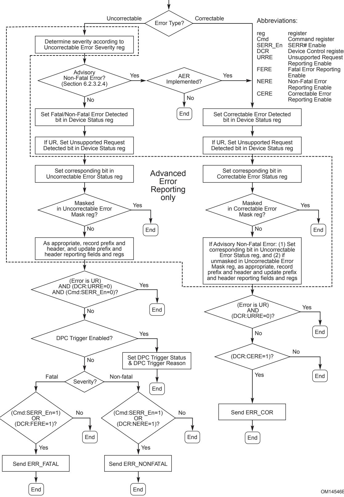

</div>


---

<<<PAGE_BREAK>>> page_733

<a id="sec-6-2-6"></a>
## 6.2.6 Error Message Controls | 错误报文 (Error Message) 控制

table>
<thead>
<tr>
<th width="50%">🇬🇧 English</th>
<th width="50%" style="background-color:#e8e8e8">🇨🇳 中文</th>
</tr>
</thead>
<tbody>
<tr>
<td>

Error Messages have a complex set of associated control and status bits. § Figure 6-3 provides a high-level summary in the form of a pseudo logic diagram for how error Messages are generated, logged, forwarded, and ultimately notified to the system. Not all control and status bits are shown. The logic gates shown in this diagram are intended for conveying general concepts, and not for direct implementation.

> **Figure 6-3.** Pseudo Logic Diagram for Selected Error Message Control and Status Bits
> 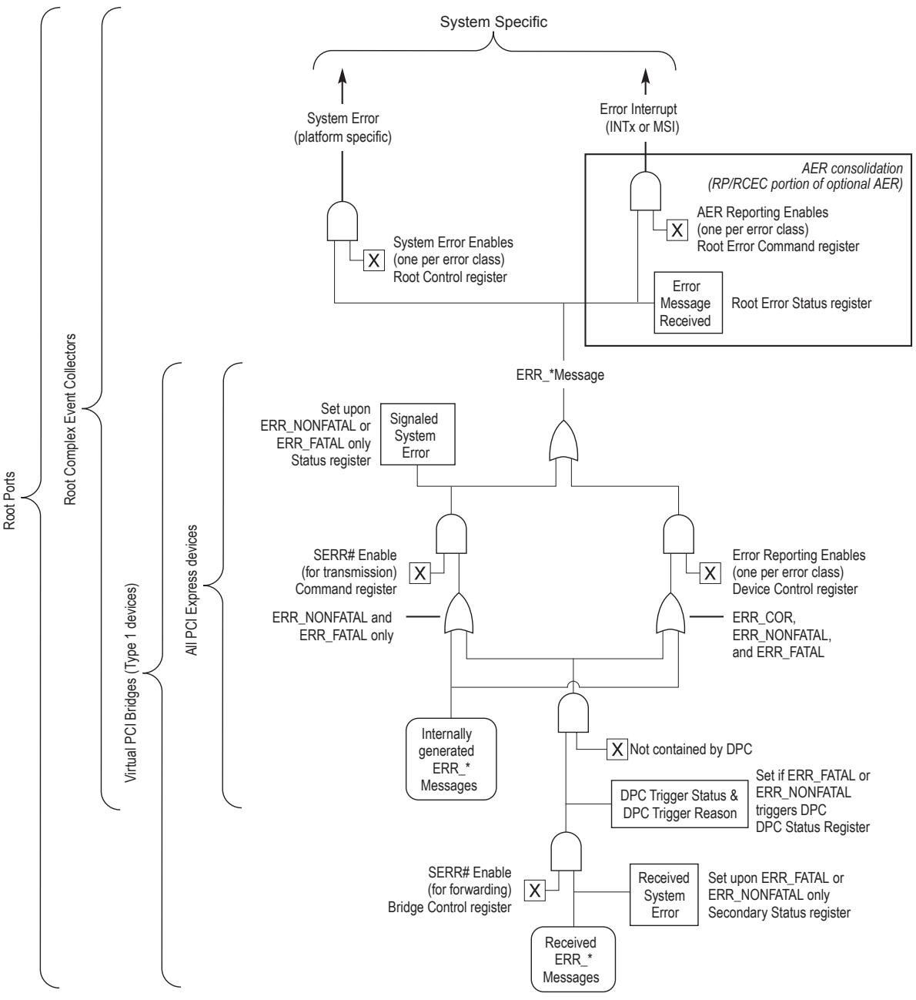

The diagram covers:

- **Root Ports / Root Complex Event Collectors**:
  - System Error (platform specific) generation
  - Error Interrupt (INTx or MSI) signaling
  - System Error Enables (one per error class) — Root Control register
  - AER Reporting Enables (one per error class) — Root Error Command register
  - AER consolidation (RP/RCEC portion of optional AER)
  - Root Error Status register
  - Error Source Identification register

- **All PCI Express devices**:
  - Error Message Received handling
  - ERR_* Messages received
  - Status register
  - SERR# Enable (for transmission) — Command register
  - Error Reporting Enables (one per error class) — Device Control register
  - ERR_COR, ERR_NONFATAL, and ERR_FATAL

- **Virtual PCI Bridges (Type 1 devices)**:
  - Signaled System Error Received
  - System Error Internally generated
  - Secondary Status register
  - SERR# Enable (for forwarding) — Bridge Control register
  - DPC Trigger Status & DPC Trigger Reason (Set if ERR_FATAL or ERR_NONFATAL triggers DPC) — DPC Status Register
  - ERR_NONFATAL and ERR_FATAL only (Set upon ERR_FATAL or ERR_NONFATAL only)
  - Not contained by DPC
  - System Specific

</td>
<td style="background-color:#e8e8e8">

错误报文 (Error Message) 涉及一组复杂的控制和状态位。§ Figure 6-3 以伪逻辑图 (pseudo logic diagram) 形式给出了高层概要,展示错误报文是如何生成、记录、转发并最终通知到系统的。图中并未列出所有控制和状态位。该图中的逻辑门仅用于传达一般概念,不直接用于实现。

该图涵盖:

- **根端口 (Root Port) / 根复合体事件收集器 (Root Complex Event Collector, RCEC)**:
  - 系统错误 (System Error)(平台相关)生成
  - 错误中断 (Error Interrupt,INTx 或 MSI)信号
  - 系统错误使能位(每个错误类别一个)— Root Control (根控制) 寄存器
  - AER 上报使能位(每个错误类别一个)— Root Error Command (根错误命令) 寄存器
  - AER 合并(可选 AER 中的 RP/RCEC 部分)
  - Root Error Status (根错误状态) 寄存器
  - Error Source Identification (错误源标识) 寄存器

- **所有 PCI Express 设备**:
  - 错误报文 (Error Message) 接收处理
  - ERR_* 报文 (Message) 接收
  - Status (状态) 寄存器
  - SERR# Enable(用于发送)— Command (命令) 寄存器
  - 错误上报使能位(每个错误类别一个)— Device Control (设备控制) 寄存器
  - ERR_COR、ERR_NONFATAL 和 ERR_FATAL

- **虚拟 PCI 桥 (Virtual PCI Bridge,Type 1 设备)**:
  - 已发出系统错误 (Signaled System Error) 接收
  - 系统错误 (System Error) 内部产生
  - Secondary Status (次级状态) 寄存器
  - SERR# Enable(用于转发)— Bridge Control (桥控制) 寄存器
  - DPC Trigger Status 与 DPC Trigger Reason(若 ERR_FATAL 或 ERR_NONFATAL 触发 DPC 则置位)— DPC Status (DPC 状态) 寄存器
  - 仅 ERR_NONFATAL 和 ERR_FATAL(仅当 ERR_FATAL 或 ERR_NONFATAL 时置位)
  - 未被 DPC 包含 (Not contained by DPC)
  - 平台特定 (System Specific)

</td>
</tr>
</tbody>
</table>

---

<<<PAGE_BREAK>>> page_734

<a id="sec-6-2-7"></a>
## 6.2.7 Error Listing and Rules | 错误列表与规则


<div style="overflow-x: auto; max-width: 100%;">
<table>
<thead>
<tr>
<th width="50%">🇬🇧 English</th>
<th width="50%" style="background-color:#e8e8e8">🇨🇳 中文</th>
</tr>
</thead>
<tbody>
<tr>
<td>

§ Table 6-2 through § Table 6-4 list all of the PCI Express errors that are defined by this specification. Each error is listed with a short-hand name, how the error is detected in hardware, the default severity of the error, and the expected action taken by the agent which detects the error. These actions form the rules for PCI Express error reporting and logging.

The Default Severity column specifies the default severity for the error without any software reprogramming. For device Functions supporting the Advanced Error Reporting Extended Capability, the uncorrectable errors are programmable to Fatal or Non-fatal with the Error Severity register. Device Functions without Advanced Error Reporting Extended Capability use the default associations and are not reprogrammable.

The detecting agent action for Downstream Ports that implement Downstream Port Containment (DPC) and have it enabled will be different if the error触发s DPC. DPC behavior is not described in the following tables. See § Section 6.2.11 for the description of DPC behavior.

**Table 6-2. General PCI Express Error List | 表 6-2. PCI Express 通用错误列表**

| Error Name | Error Type (Default Severity) | Detecting Agent Action ¹¹⁶ | References |
|---|---|---|---|
| Corrected Internal Error | Correctable (masked by default) | Component: Send ERR_COR to Root Complex. | § Section 6.2.10 |
| Uncorrectable Internal Error | Uncorrectable (Fatal and masked by default) | Component: Send ERR_FATAL to Root Complex. Optionally, log the prefix/header of the first TLP associated with the error. | § Section 6.2.10 |
| Header Log Overflow | Correctable (masked by default) | Component: Send ERR_COR to Root Complex. | § Section 6.2.4.2 |

**Table 6-3. Physical Layer Error List | 表 6-3. 物理层错误列表**

| Error Name | Error Type (Default Severity) | Detecting Agent Action ¹¹⁷ | References |
|---|---|---|---|
| Receiver Error | Correctable | Receiver: Send ERR_COR to Root Complex. | § Section 4.2.1.1.3, § Section 4.2.1.2, § Section 4.2.5.8, § Section 4.2.7 |

**Table 6-4. Data Link Layer Error List | 表 6-4. 数据链路层错误列表**

| Error Name | Error Type (Default Severity) | Detecting Agent Action ¹¹⁸ | References |
|---|---|---|---|
| Bad TLP | Correctable | Receiver: Send ERR_COR to Root Complex. | § Section 3.6.3.1 |
| Bad DLLP | Correctable | Receiver: Send ERR_COR to Root Complex. | § Section 3.6.2.2, and § Section 3.6.2.3 |
| Replay Timer Timeout | Correctable | Transmitter: Send ERR_COR to Root Complex. | § Section 3.6.2.1, § Section 4.2.3.4.2.1 |
| REPLAY_NUM Rollover | Correctable | Transmitter: Send ERR_COR to Root Complex. | § Section 3.6.2.1, § Section 4.2.3.4.2.1 |
| Data Link Protocol Error | Uncorrectable (Fatal) | If checking, send ERR_FATAL to Root Complex. | § Section 3.6.2.2, § Section 3.6.2.3, § Section 4.2.3.4.2.1 |
| Surprise Down | Uncorrectable (Fatal) | If checking, send ERR_FATAL to Root Complex. | § Section 3.2.1 |

---

¹¹⁶ For these tables, detecting agent action is given as if all enable bits are set to "enable" and, for Advanced Error Handling, mask bits are disabled and severity bits are set to their default values. Actions must be modified according to the actual settings of these bits.

¹¹⁷ For these tables, detecting agent action is given as if all enable bits are set to "enable" and, for Advanced Error Handling, mask bits are disabled and severity bits are set to their default values. Actions must be modified according to the actual settings of these bits.

¹¹⁸ For these tables, detecting agent action is given as if all enable bits are set to "enable" and, for Advanced Error Handling, mask bits are disabled and severity bits are set to their default values. Actions must be modified according to the actual settings of these bits.

</td>
<td style="background-color:#e8e8e8">

§ Table 6-2 至 § Table 6-4 列出本规范定义的所有 PCI Express 错误。每种错误均给出简称、硬件检测方式、默认严重性以及检测到该错误的代理 (agent) 所应采取的动作。这些动作构成了 PCI Express 错误上报与日志记录的规则。

"默认严重性"列指定了未经任何软件重新配置 (reprogramming) 时该错误的默认严重性。对于支持 AER Extended Capability (高级错误报告扩展能力) 的设备功能 (Function),可通过 Error Severity 寄存器将不可纠正错误的严重性配置为致命 (Fatal) 或非致命 (Non-fatal)。不支持 AER Extended Capability 的设备功能使用默认关联,且不可重新配置。

对于实现 Downstream Port Containment (DPC,下游端口遏制) 并已使能该功能的下游端口 (Downstream Port),若错误触发了 DPC,则其检测代理的动作会有所不同。后续表格未描述 DPC 行为,详见 § Section 6.2.11。

**Table 6-2. PCI Express 通用错误列表 | Table 6-2. General PCI Express Error List**

| 错误名称 (Error Name) | 错误类型(默认严重性) | 检测代理动作 ¹¹⁶ | 引用 (References) |
|---|---|---|---|
| Corrected Internal Error(已纠正内部错误) | Correctable(可纠正,默认屏蔽) | Component:向根复合体 (Root Complex) 发送 ERR_COR。 | § Section 6.2.10 |
| Uncorrectable Internal Error(不可纠正内部错误) | Uncorrectable(致命,默认屏蔽) | Component:向根复合体 (Root Complex) 发送 ERR_FATAL。可选地,记录与该错误相关的第一个 TLP 的前缀/包头。 | § Section 6.2.10 |
| Header Log Overflow(包头日志溢出) | Correctable(可纠正,默认屏蔽) | Component:向根复合体 (Root Complex) 发送 ERR_COR。 | § Section 6.2.4.2 |

**Table 6-3. 物理层错误列表 | Table 6-3. Physical Layer Error List**

| 错误名称 (Error Name) | 错误类型(默认严重性) | 检测代理动作 ¹¹⁷ | 引用 (References) |
|---|---|---|---|
| Receiver Error(接收器错误) | Correctable(可纠正) | Receiver:向根复合体 (Root Complex) 发送 ERR_COR。 | § Section 4.2.1.1.3、§ Section 4.2.1.2、§ Section 4.2.5.8、§ Section 4.2.7 |

**Table 6-4. 数据链路层错误列表 | Table 6-4. Data Link Layer Error List**

| 错误名称 (Error Name) | 错误类型(默认严重性) | 检测代理动作 ¹¹⁸ | 引用 (References) |
|---|---|---|---|
| Bad TLP(错误 TLP) | Correctable(可纠正) | Receiver:向根复合体 (Root Complex) 发送 ERR_COR。 | § Section 3.6.3.1 |
| Bad DLLP(错误 DLLP) | Correctable(可纠正) | Receiver:向根复合体 (Root Complex) 发送 ERR_COR。 | § Section 3.6.2.2 及 § Section 3.6.2.3 |
| Replay Timer Timeout(重放定时器超时) | Correctable(可纠正) | Transmitter:向根复合体 (Root Complex) 发送 ERR_COR。 | § Section 3.6.2.1、§ Section 4.2.3.4.2.1 |
| REPLAY_NUM Rollover(重放号翻转) | Correctable(可纠正) | Transmitter:向根复合体 (Root Complex) 发送 ERR_COR。 | § Section 3.6.2.1、§ Section 4.2.3.4.2.1 |
| Data Link Protocol Error(数据链路协议错误) | Uncorrectable(致命) | 若启用检查,则向根复合体 (Root Complex) 发送 ERR_FATAL。 | § Section 3.6.2.2、§ Section 3.6.2.3、§ Section 4.2.3.4.2.1 |
| Surprise Down(意外下线) | Uncorrectable(致命) | 若启用检查,则向根复合体 (Root Complex) 发送 ERR_FATAL。 | § Section 3.2.1 |

---

¹¹⁶ 在这些表中,检测代理动作假定所有使能位均处于"使能"状态;对于 AER,则假定屏蔽位已禁用,严重性位保持默认值。实际动作必须根据这些位的真实设置进行相应调整。

¹¹⁷ 在这些表中,检测代理动作假定所有使能位均处于"使能"状态;对于 AER,则假定屏蔽位已禁用,严重性位保持默认值。实际动作必须根据这些位的真实设置进行相应调整。

¹¹⁸ 在这些表中,检测代理动作假定所有使能位均处于"使能"状态;对于 AER,则假定屏蔽位已禁用,严重性位保持默认值。实际动作必须根据这些位的真实设置进行相应调整。

</td>
</tr>
</tbody>
</table>
</div>


---

<<<PAGE_BREAK>>> page_735

<a id="sec-6-2-7-table-6-5"></a>
## 6.2.7 Error Listing and Rules (Table 6-5) | 错误列表与规则(表 6-5)

table>
<thead>
<tr>
<th width="50%">🇬🇧 English</th>
<th width="50%" style="background-color:#e8e8e8">🇨🇳 中文</th>
</tr>
</thead>
<tbody>
<tr>
<td>

**Table 6-5. Transaction Layer Error List | 表 6-5. 事务层错误列表**

| Error Name | Error Type (Default Severity) | Detecting Agent Action ¹¹⁹ | References |
|---|---|---|---|
| Poisoned TLP Received | Uncorrectable (Non-Fatal) | Receiver: Send ERR_NONFATAL to Root Complex or ERR_COR for the Advisory Non-Fatal Error cases described in § Section 6.2.3.2.4.2 and § Section 6.2.3.2.4.3. Log the prefix/header of the Poisoned TLP. ¹²⁰ | § Section 2.7.2.1 |
| Poisoned TLP Egress Blocked | Uncorrectable (Non-Fatal) | Downstream Port Transmitter: Send ERR_NONFATAL to Root Complex or ERR_COR for the Advisory Non-Fatal Error case described in § Section 6.2.3.2.4.1. Log the prefix/header of the poisoned TLP. | § Section 2.7.2.1 |
| ECRC Check Failed | Uncorrectable (Non-Fatal) | Receiver (if ECRC checking is supported): Send ERR_NONFATAL to Root Complex or ERR_COR for the Advisory Non-Fatal Error case described in § Section 6.2.3.2.4.1 and § Section 6.2.3.2.4.2. Log the prefix/header of the TLP that encountered the ECRC error. | § Section 2.7.1 |

---

¹¹⁹ For these tables, detecting agent action is given as if all enable bits are set to "enable" and, for Advanced Error Handling, mask bits are disabled and severity bits are set to their default values. Actions must be modified according to the actual settings of these bits.

¹²⁰ Advanced Error Handling only.

</td>
<td style="background-color:#e8e8e8">

**Table 6-5. 事务层错误列表 | Table 6-5. Transaction Layer Error List**

| 错误名称 (Error Name) | 错误类型(默认严重性) | 检测代理动作 ¹¹⁹ | 引用 (References) |
|---|---|---|---|
| Poisoned TLP Received(收到中毒 TLP) | Uncorrectable(非致命) | Receiver:向根复合体 (Root Complex) 发送 ERR_NONFATAL;对于 § Section 6.2.3.2.4.2 和 § Section 6.2.3.2.4.3 中描述的咨询性非致命错误情形,则发送 ERR_COR。记录该中毒 TLP 的前缀/包头。¹²⁰ | § Section 2.7.2.1 |
| Poisoned TLP Egress Blocked(中毒 TLP 出口被阻止) | Uncorrectable(非致命) | Downstream Port Transmitter:向根复合体 (Root Complex) 发送 ERR_NONFATAL;对于 § Section 6.2.3.2.4.1 中描述的咨询性非致命错误情形,则发送 ERR_COR。记录该中毒 TLP 的前缀/包头。 | § Section 2.7.2.1 |
| ECRC Check Failed(ECRC 校验失败) | Uncorrectable(非致命) | Receiver(若支持 ECRC 校验):向根复合体 (Root Complex) 发送 ERR_NONFATAL;对于 § Section 6.2.3.2.4.1 和 § Section 6.2.3.2.4.2 中描述的咨询性非致命错误情形,则发送 ERR_COR。记录出现 ECRC 错误的 TLP 的前缀/包头。 | § Section 2.7.1 |

---

¹¹⁹ 在这些表中,检测代理动作假定所有使能位均处于"使能"状态;对于 AER,则假定屏蔽位已禁用,严重性位保持默认值。实际动作必须根据这些位的真实设置进行相应调整。

¹²⁰ 仅 AER(Advanced Error Handling)。

</td>
</tr>
</tbody>
</table>

---

<<<PAGE_BREAK>>> page_736

<a id="sec-6-2-7-table-6-5-2"></a>
## 6.2.7 Error Listing and Rules (Table 6-5, cont.) | 错误列表与规则(表 6-5,续)


<div style="overflow-x: auto; max-width: 100%;">
<table>
<thead>
<tr>
<th width="50%">🇬🇧 English</th>
<th width="50%" style="background-color:#e8e8e8">🇨🇳 中文</th>
</tr>
</thead>
<tbody>
<tr>
<td>

**Table 6-5. Transaction Layer Error List (continued) | 表 6-5. 事务层错误列表(续)**

| Error Name | Error Type (Default Severity) | Detecting Agent Action | References |
|---|---|---|---|
| Unsupported Request (UR) | Uncorrectable (Non-Fatal) | Request Receiver: Send ERR_NONFATAL to Root Complex or ERR_COR for the Advisory Non-Fatal Error case described in § Section 6.2.3.2.4.1. Log the prefix/header of the TLP that caused the error. | § Table F-1, § Section 2.3.1, § Section 2.3.2, § Section 2.7.2.1, § Section 2.9.1, § Section 5.3.1, § Section 6.2.3.1, § Section 6.2.6, § Section 6.2.8.1, § Section 6.5.7, § Section 7.3.1, § Section 7.3.3, § Section 7.5.1.1.3, § Section 7.5.1.1.4 |
| Completion Timeout | Uncorrectable (Non-Fatal) | Requester: Send ERR_NONFATAL to Root Complex or ERR_COR for the Advisory Non-Fatal Error case described in § Section 6.2.3.2.4.4. If the Completion Timeout Prefix/Header Log Capable bit is Set in the Advanced Error Capabilities and Control register, log the prefix/header of the Request TLP that encountered the error. | § Section 2.8 |
| Completer Abort | Uncorrectable (Non-Fatal) | Completer: Send ERR_NONFATAL to Root Complex or ERR_COR for the Advisory Non-Fatal Error case described in § Section 6.2.3.2.4.1. Log the prefix/header of the Request that encountered the error. | § Section 2.3.1 |
| Unexpected Completion | Uncorrectable (Non-Fatal) | Receiver: Send ERR_COR to Root Complex. This is an Advisory Non-Fatal Error case described in § Section 6.2.3.2.4.5. Log the prefix/header of the Completion that encountered the error. | § Section 2.3.2 |
| ACS Violation | Uncorrectable (Non-Fatal) | Receiver (if checking): Send ERR_NONFATAL to Root Complex or ERR_COR for the Advisory Non-Fatal Error case described in § Section 6.2.3.2.4.1. | (continued below) |

</td>
<td style="background-color:#e8e8e8">

**Table 6-5. 事务层错误列表(续) | Table 6-5. Transaction Layer Error List (continued)**

| 错误名称 (Error Name) | 错误类型(默认严重性) | 检测代理动作 | 引用 (References) |
|---|---|---|---|
| Unsupported Request (UR)(不支持的请求) | Uncorrectable(非致命) | Request Receiver:向根复合体 (Root Complex) 发送 ERR_NONFATAL;对于 § Section 6.2.3.2.4.1 中描述的咨询性非致命错误情形,则发送 ERR_COR。记录引起该错误的 TLP 的前缀/包头。 | § Table F-1、§ Section 2.3.1、§ Section 2.3.2、§ Section 2.7.2.1、§ Section 2.9.1、§ Section 5.3.1、§ Section 6.2.3.1、§ Section 6.2.6、§ Section 6.2.8.1、§ Section 6.5.7、§ Section 7.3.1、§ Section 7.3.3、§ Section 7.5.1.1.3、§ Section 7.5.1.1.4 |
| Completion Timeout(完成超时) | Uncorrectable(非致命) | Requester:向根复合体 (Root Complex) 发送 ERR_NONFATAL;对于 § Section 6.2.3.2.4.4 中描述的咨询性非致命错误情形,则发送 ERR_COR。若 Advanced Error Capabilities and Control 寄存器中的 Completion Timeout Prefix/Header Log Capable 位已置位,则记录发生该错误的 Request TLP 的前缀/包头。 | § Section 2.8 |
| Completer Abort(完成方中止) | Uncorrectable(非致命) | Completer:向根复合体 (Root Complex) 发送 ERR_NONFATAL;对于 § Section 6.2.3.2.4.1 中描述的咨询性非致命错误情形,则发送 ERR_COR。记录发生该错误的 Request 的前缀/包头。 | § Section 2.3.1 |
| Unexpected Completion(意外完成) | Uncorrectable(非致命) | Receiver:向根复合体 (Root Complex) 发送 ERR_COR。这是 § Section 6.2.3.2.4.5 中描述的咨询性非致命错误情形。记录发生该错误的 Completion 的前缀/包头。 | § Section 2.3.2 |
| ACS Violation(ACS 违规) | Uncorrectable(非致命) | Receiver(若启用检查):向根复合体 (Root Complex) 发送 ERR_NONFATAL;对于 § Section 6.2.3.2.4.1 中描述的咨询性非致命错误情形,则发送 ERR_COR。 | (续下表) |

</td>
</tr>
</tbody>
</table>
</div>


---

<<<PAGE_BREAK>>> page_737

<a id="sec-6-2-7-table-6-5-3"></a>
## 6.2.7 Error Listing and Rules (Table 6-5, cont. 2) | 错误列表与规则(表 6-5,续 2)

table>
<thead>
<tr>
<th width="50%">🇬🇧 English</th>
<th width="50%" style="background-color:#e8e8e8">🇨🇳 中文</th>
</tr>
</thead>
<tbody>
<tr>
<td>

**Table 6-5. Transaction Layer Error List (continued) | 表 6-5. 事务层错误列表(续)**

| Error Name | Error Type (Default Severity) | Detecting Agent Action | References |
|---|---|---|---|
| ACS Violation (cont.) | Uncorrectable (Non-Fatal) | Log the prefix/header of the Request TLP that encountered the error. | § Section 6.x |
| MC Blocked TLP | Uncorrectable (Non-Fatal) | Receiver (if checking): Send ERR_NONFATAL to Root Complex. Log the prefix/header of the Request TLP that encountered the error. | § Section 6.14.4 |
| AtomicOp Egress Blocked | Uncorrectable (Non-Fatal) | Egress Port: Send ERR_COR to Root Complex. This is an Advisory Non-Fatal Error case described in § Section 6.2.3.2.4.1. Log the prefix/header of the AtomicOp Request that encountered the error. | § Section 6.15.2 |
| DMWr Request Egress Blocked | Uncorrectable (Non-Fatal) | Egress Port: Send ERR_COR to Root Complex. This is an Advisory Non-Fatal Error case described in § Section 6.2.3.2.4.1. Log the prefix/header of the DMWr Request that encountered the error. | § Section 6.32 |
| TLP Translation Egress Blocked | Uncorrectable (Non-Fatal) | Egress Port: For error signaling, handle PR/NPR/CPL FC Types as specified in § Section 2.2.1.2. For error logging, handle PR/NPR/CPL FC Types as specified in § Section 2.2.1.2. Log the prefix/header of the Flit Mode TLP that was not possible to translate to send in Non-Flit Mode on the Egress Port. | § Section 2.2.1.2 |
| TLP Prefix Blocked | Uncorrectable (Non-Fatal) | Egress Port: Send ERR_NONFATAL to Root Complex or ERR_COR for the Advisory Non-Fatal Error case described in § Section 6.2.3.2.4.1. Log the prefix/header of the TLP that encountered the error. | § Section 2.2.10.4 |

</td>
<td style="background-color:#e8e8e8">

**Table 6-5. 事务层错误列表(续) | Table 6-5. Transaction Layer Error List (continued)**

| 错误名称 (Error Name) | 错误类型(默认严重性) | 检测代理动作 | 引用 (References) |
|---|---|---|---|
| ACS Violation(续) | Uncorrectable(非致命) | 记录发生该错误的 Request TLP 的前缀/包头。 | § Section 6.x |
| MC Blocked TLP(MC 阻止的 TLP) | Uncorrectable(非致命) | Receiver(若启用检查):向根复合体 (Root Complex) 发送 ERR_NONFATAL。记录发生该错误的 Request TLP 的前缀/包头。 | § Section 6.14.4 |
| AtomicOp Egress Blocked(AtomicOp 出口被阻止) | Uncorrectable(非致命) | Egress Port:向根复合体 (Root Complex) 发送 ERR_COR。这是 § Section 6.2.3.2.4.1 中描述的咨询性非致命错误情形。记录发生该错误的 AtomicOp Request 的前缀/包头。 | § Section 6.15.2 |
| DMWr Request Egress Blocked(DMWr 请求出口被阻止) | Uncorrectable(非致命) | Egress Port:向根复合体 (Root Complex) 发送 ERR_COR。这是 § Section 6.2.3.2.4.1 中描述的咨询性非致命错误情形。记录发生该错误的 DMWr Request 的前缀/包头。 | § Section 6.32 |
| TLP Translation Egress Blocked(TLP 转换出口被阻止) | Uncorrectable(非致命) | Egress Port:错误上报方面,按 § Section 2.2.1.2 处理 PR/NPR/CPL FC 类型;错误记录方面,按 § Section 2.2.1.2 处理 PR/NPR/CPL FC 类型。记录在 Egress Port 上无法转换为 Non-Flit Mode 发送的 Flit Mode TLP 的前缀/包头。 | § Section 2.2.1.2 |
| TLP Prefix Blocked(TLP 前缀被阻止) | Uncorrectable(非致命) | Egress Port:向根复合体 (Root Complex) 发送 ERR_NONFATAL;对于 § Section 6.2.3.2.4.1 中描述的咨询性非致命错误情形,则发送 ERR_COR。记录发生该错误的 TLP 的前缀/包头。 | § Section 2.2.10.4 |

</td>
</tr>
</tbody>
</table>

---

<<<PAGE_BREAK>>> page_738

<a id="sec-6-2-7-table-6-5-4"></a>
## 6.2.7 Error Listing and Rules (Table 6-5, cont. 3) | 错误列表与规则(表 6-5,续 3)


<div style="overflow-x: auto; max-width: 100%;">
<table>
<thead>
<tr>
<th width="50%">🇬🇧 English</th>
<th width="50%" style="background-color:#e8e8e8">🇨🇳 中文</th>
</tr>
</thead>
<tbody>
<tr>
<td>

**Table 6-5. Transaction Layer Error List (continued) | 表 6-5. 事务层错误列表(续)**

| Error Name | Error Type (Default Severity) | Detecting Agent Action | References |
|---|---|---|---|
| Receiver Overflow | Uncorrectable (Fatal) | Receiver (if checking): Send ERR_FATAL to Root Complex. | § Section 2.6.1.2 |
| Flow Control Protocol Error | Uncorrectable (Fatal) | Receiver (if checking): Send ERR_FATAL to Root Complex. | § Section 2.6.1 |
| Malformed TLP | Uncorrectable (Fatal) | Receiver: Send ERR_FATAL to Root Complex. Log the prefix/header of the TLP that encountered the error. | § Section 2.2.2, § Section 2.2.3, § Section 2.2.5, § Section 2.2.7, § Section 2.2.8.1, § Section 2.2.8.2, § Section 2.2.8.3, § Section 2.2.8.4, § Section 2.2.8.5, § Section 2.2.8.10, § Section 2.2.10, § Section 2.2.10.2, § Section 2.2.10.4, § Section 2.3, § Section 2.3.1, § Section 2.3.1.1, § Section 2.3.2, § Section 2.5, § Section 2.5.3, § Section 2.6.1, § Section 2.6.1.2, § Section 6.2.4.4, § Section 6.3.2 |
| IDE Check Failed | Uncorrectable (Fatal) | Receiving IDE Terminus: Enter Insecure. All subsequent IDE TLPs over this stream treated as having MAC check failure. Send ERR_FATAL to root complex. Transmit IDE Fail Message to the Partner Port. Log the prefix/header of the TLP that encountered the error. | § Section 6.33 |
| Misrouted IDE TLP | Uncorrectable (Non-Fatal) | Ingress/Egress Port: Send ERR_NONFATAL to Root Complex. Log the prefix/header of the TLP that encountered the error. | § Section 6.33 |
| PCRC Check Failed | Uncorrectable (Non-Fatal) | Receiving IDE Terminus: Send ERR_NONFATAL to Root Complex or ERR_COR for the Advisory Non-Fatal Error cases described in § Section 6.2.3.2.4.3. Log the prefix/header of the TLP that encountered the error. | § Section 6.33 |

For all errors listed above, the appropriate status bit(s) must be set upon detection of the error. For Unsupported Request (UR), additional detection and reporting enable bits apply (see § Section 6.2.5).

</td>
<td style="background-color:#e8e8e8">

**Table 6-5. 事务层错误列表(续) | Table 6-5. Transaction Layer Error List (continued)**

| 错误名称 (Error Name) | 错误类型(默认严重性) | 检测代理动作 | 引用 (References) |
|---|---|---|---|
| Receiver Overflow(接收器溢出) | Uncorrectable(致命) | Receiver(若启用检查):向根复合体 (Root Complex) 发送 ERR_FATAL。 | § Section 2.6.1.2 |
| Flow Control Protocol Error(流控协议错误) | Uncorrectable(致命) | Receiver(若启用检查):向根复合体 (Root Complex) 发送 ERR_FATAL。 | § Section 2.6.1 |
| Malformed TLP(畸形 TLP) | Uncorrectable(致命) | Receiver:向根复合体 (Root Complex) 发送 ERR_FATAL。记录发生该错误的 TLP 的前缀/包头。 | § Section 2.2.2、§ Section 2.2.3、§ Section 2.2.5、§ Section 2.2.7、§ Section 2.2.8.1、§ Section 2.2.8.2、§ Section 2.2.8.3、§ Section 2.2.8.4、§ Section 2.2.8.5、§ Section 2.2.8.10、§ Section 2.2.10、§ Section 2.2.10.2、§ Section 2.2.10.4、§ Section 2.3、§ Section 2.3.1、§ Section 2.3.1.1、§ Section 2.3.2、§ Section 2.5、§ Section 2.5.3、§ Section 2.6.1、§ Section 2.6.1.2、§ Section 6.2.4.4、§ Section 6.3.2 |
| IDE Check Failed(IDE 校验失败) | Uncorrectable(致命) | Receiving IDE Terminus:进入 Insecure 状态。该流 (stream) 上此后所有 IDE TLP 均视为 MAC 校验失败。向根复合体 (root complex) 发送 ERR_FATAL。向 Partner Port 发送 IDE Fail Message。记录发生该错误的 TLP 的前缀/包头。 | § Section 6.33 |
| Misrouted IDE TLP(误路由的 IDE TLP) | Uncorrectable(非致命) | Ingress/Egress Port:向根复合体 (Root Complex) 发送 ERR_NONFATAL。记录发生该错误的 TLP 的前缀/包头。 | § Section 6.33 |
| PCRC Check Failed(PCRC 校验失败) | Uncorrectable(非致命) | Receiving IDE Terminus:向根复合体 (Root Complex) 发送 ERR_NONFATAL;对于 § Section 6.2.3.2.4.3 中描述的咨询性非致命错误情形,则发送 ERR_COR。记录发生该错误的 TLP 的前缀/包头。 | § Section 6.33 |

对于上述所有错误,必须在检测到错误时置位相应的状态位。对于 Unsupported Request (UR),还需使用额外的检测与上报使能位(参见 § Section 6.2.5)。

</td>
</tr>
</tbody>
</table>
</div>


---

<<<PAGE_BREAK>>> page_739

<a id="sec-6-2-7-1"></a>
## 6.2.7.1 Conventional PCI Mapping | 传统 PCI 映射

table>
<thead>
<tr>
<th width="50%">🇬🇧 English</th>
<th width="50%" style="background-color:#e8e8e8">🇨🇳 中文</th>
</tr>
</thead>
<tbody>
<tr>
<td>

In order to support conventional PCI driver and software compatibility, PCI Express error conditions, where appropriate, must be mapped onto the PCI Status register bits for error reporting.

In other words, when certain PCI Express errors are detected, the appropriate PCI Status register bit is Set alerting the error to legacy PCI software. While the PCI Express error results in setting the PCI Status register, clearing the PCI Status register will not result in clearing bits in the Uncorrectable Error Status register and Correctable Error Status register. Similarly, clearing bits in the Uncorrectable Error Status register and Correctable Error Status register will not result in clearing the PCI Status register.

The PCI command register has bits which control PCI error reporting. However, the PCI Command register does not affect the setting of the PCI Express error register bits.

</td>
<td style="background-color:#e8e8e8">

为了与传统 PCI 驱动程序和软件保持兼容,PCI Express 错误情形在合适的情况下必须映射到 PCI Status (PCI 状态) 寄存器的相应位上以进行错误上报。

也就是说,当检测到某些 PCI Express 错误时,会在 PCI Status 寄存器中置位 (Set) 相应位,以向传统 PCI 软件报告该错误。尽管 PCI Express 错误会置位 PCI Status 寄存器,但清除 PCI Status 寄存器并不会清除 Uncorrectable Error Status 和 Correctable Error Status 寄存器中的位。反之,清除 Uncorrectable Error Status 和 Correctable Error Status 寄存器中的位也不会清除 PCI Status 寄存器。

PCI Command 寄存器中包含用于控制 PCI 错误上报的位。但是,PCI Command 寄存器并不影响 PCI Express 错误寄存器的置位。

</td>
</tr>
</tbody>
</table>

---

<a id="sec-6-2-8"></a>
## 6.2.8 Virtual PCI Bridge Error Handling | 虚拟 PCI 桥错误处理


<div style="overflow-x: auto; max-width: 100%;">
<table>
<thead>
<tr>
<th width="50%">🇬🇧 English</th>
<th width="50%" style="background-color:#e8e8e8">🇨🇳 中文</th>
</tr>
</thead>
<tbody>
<tr>
<td>

Virtual PCI Bridge configuration headers are associated with each PCI Express Port in a Root Complex or a Switch. For these cases, PCI Express error concepts require appropriate mapping to the PCI error reporting structures.

In general, a TLP is either passed from one side of the Virtual PCI Bridge to the other, or is handled at the ingress side of the Bridge according to the same rules which apply to the ultimate recipient of a TLP. The following rules cover PCI Express specific error related cases. Refer to § Section 6.2.6 for a conceptual summary of Error Message Controls.

**IMPLEMENTATION NOTE:**

**DEVICE UR REPORTING COMPATIBILITY WITH LEGACY AND 1.0A SOFTWARE**

With [PCIe-1.0a] device Functions that do not implement Role-Based Error Reporting,¹²¹ the Unsupported Request Reporting Enable bit in the Device Control Register, when clear, prevents the Function from sending any error Message to signal a UR error. With Role-Based Error Reporting Functions, if the SERR# Enable bit in the Command Register is set, the Function is implicitly enabled¹²² to send ERR_NONFATAL or ERR_FATAL messages to signal UR errors, even if the Unsupported Request Reporting Enable bit is clear. This raises a backward compatibility concern with software (or firmware) written for [PCIe-1.0a] devices.

With software/firmware that sets the SERR# Enable bit but leaves the Unsupported Request Reporting Enable and Correctable Error Reporting Enable bits clear, a Role-Based Error Reporting Function that encounters a UR error will send no error Message if the Request was non-posted, and will signal the error with ERR_NONFATAL if the Request was posted. The behavior with non-posted Requests supports PC-compatible Configuration Space probing, while the behavior with posted Requests restores error reporting compatibility with PCI and PCI-X, avoiding the potential in this area for silent data corruption. Thus, Role-Based Error Reporting devices are backward compatible with envisioned legacy and [PCIe-1.0a] software and firmware.

---

¹²¹ As indicated by the Role-Based Error Reporting bit in the Device Capabilities register. See § Section 7.8.3.

¹²² Assuming the Unsupported Request Error Mask bit is not set in the Uncorrectable Error Mask Register if the device implements AER.

</td>
<td style="background-color:#e8e8e8">

虚拟 PCI 桥 (Virtual PCI Bridge) 配置头与根复合体 (Root Complex) 或交换机 (Switch) 中的每个 PCI Express 端口相关联。对于这些情况,PCI Express 错误概念需要恰当地映射到 PCI 错误上报结构上。

一般而言,TLP 要么从虚拟 PCI 桥的一侧传递到另一侧,要么在桥的入口 (ingress) 侧按适用于 TLP 最终接收方的相同规则处理。以下规则涵盖 PCI Express 特有的错误相关情形。有关错误报文 (Error Message) 控制的概念性概述,请参见 § Section 6.2.6。

**实现说明 (IMPLEMENTATION NOTE):**

**设备 UR 上报与传统及 1.0A 软件的兼容性**

对于不实现基于角色的错误上报 (Role-Based Error Reporting) 的 [PCIe-1.0a] 设备功能 (Function)¹²¹,Device Control (设备控制) 寄存器中的 Unsupported Request Reporting Enable 位若为清零状态,则该 Function 不会发送任何错误报文 (Message) 来上报 UR 错误。对于实现了 Role-Based Error Reporting 的 Function,若 Command (命令) 寄存器中的 SERR# Enable 位已置位,则即使 Unsupported Request Reporting Enable 位为清零状态,该 Function 也会被隐式使能¹²²,从而可发送 ERR_NONFATAL 或 ERR_FATAL 报文 (Message) 来上报 UR 错误。这对为 [PCIe-1.0a] 设备编写的软件(或固件)带来了向后兼容性问题。

对于那些置位了 SERR# Enable 位、但保持 Unsupported Request Reporting Enable 和 Correctable Error Reporting Enable 位清零的软件/固件而言,实现 Role-Based Error Reporting 的 Function 在遇到 UR 错误时,若该 Request 为 non-posted,则不发送任何错误报文 (Message);若该 Request 为 posted,则以 ERR_NONFATAL 上报该错误。non-posted Request 下的行为支持 PC 兼容的配置空间 (Configuration Space) 探测;而 posted Request 下的行为则恢复与 PCI 和 PCI-X 的错误上报兼容性,避免在该领域出现潜在的数据静默损坏 (silent data corruption)。因此,基于角色的错误上报设备向后兼容预期的传统及 [PCIe-1.0a] 软件与固件。

---

¹²¹ 由 Device Capabilities (设备能力) 寄存器中的 Role-Based Error Reporting 位指示。参见 § Section 7.8.3。

¹²² 假定若设备实现 AER,则 Uncorrectable Error Mask (不可纠正错误屏蔽) 寄存器中的 Unsupported Request Error Mask 位未置位。

</td>
</tr>
</tbody>
</table>
</div>


---

<a id="sec-6-2-8-1"></a>
## 6.2.8.1 Error Message Forwarding and PCI Mapping for Bridge - Rules | 桥的错误报文转发与 PCI 映射 — 规则

table>
<thead>
<tr>
<th width="50%">🇬🇧 English</th>
<th width="50%" style="background-color:#e8e8e8">🇨🇳 中文</th>
</tr>
</thead>
<tbody>
<tr>
<td>

- If a Request does not address a space mapped to either the Bridge's internal space, or to the egress side of the Bridge, the Request is terminated at the ingress side as an Unsupported Request.
- Poisoned TLPs are forwarded according to the same rules as non-Poisoned TLPs.
  - When forwarding a Poisoned Request Downstream:
    - Set the Detected Parity Error bit in the Status register.
    - Set the Master Data Parity Error bit in the Secondary Status register if the Parity Error Response Enable bit in the Bridge Control Register is set.
  - When forwarding a Poisoned Completion Downstream:
    - Set the Detected Parity Error bit in the Status register.
    - Set the Master Data Parity Error bit in the Status register if the Parity Error Response bit in the Command register is set.
  - When forwarding a Poisoned Request Upstream:
    - Set the Detected Parity Error bit in the Secondary Status register.
    - Set the Master Data Parity Error bit in the Status register if the Parity Error Response bit in the Command register is set.
  - When forwarding a Poisoned Completion Upstream:
    - Set the Detected Parity Error bit in the Secondary Status register.
    - Set the Master Data Parity Error bit in the Secondary Status register if the Parity Error Response Enable bit in the Bridge Control Register is set.
- ERR_COR, ERR_NONFATAL, and ERR_FATAL are forwarded from the secondary interface to the primary interface, if the SERR# Enable bit in the Bridge Control Register is set. A Bridge forwarding an error Message must not set the corresponding Error Detected bit in the Device Status register. Transmission of forwarded error Messages by the primary interface is controlled by multiple bits, as shown in § Figure 6-3.
- For a Root Port, error Messages forwarded from the secondary interface to the primary interface must be enabled for "transmission" by the primary interface in order to cause a System Error via the Root Control Register or (when the Advanced Error Reporting Extended Capability is present) reporting via the Root Error Command register and logging in the Root Error Status register and Error Source Identification register.
- For a Root Complex Event Collector (technically not a Bridge), error Messages "received" from associated RCiEPs must be enabled for "transmission" in order to cause a System Error via the Root Control Register or (when the Advanced Error Reporting Extended Capability is present) reporting via the Root Error Command register and logging in the Root Error Status register and Error Source Identification register.

</td>
<td style="background-color:#e8e8e8">

- 若 Request 未寻址到映射到桥内部空间 (Bridge internal space) 或桥出口侧 (egress side) 的地址空间,则该 Request 在入口 (ingress) 侧被作为 Unsupported Request (不支持的请求) 终止。
- 中毒 TLP (Poisoned TLP) 的转发遵循与非中毒 TLP 相同的规则。
  - 向下游 (Downstream) 转发中毒 Request 时:
    - 在 Status (状态) 寄存器中置位 Detected Parity Error 位。
    - 若 Bridge Control (桥控制) 寄存器中的 Parity Error Response Enable 位已置位,则在 Secondary Status (次级状态) 寄存器中置位 Master Data Parity Error 位。
  - 向下游转发中毒 Completion 时:
    - 在 Status 寄存器中置位 Detected Parity Error 位。
    - 若 Command (命令) 寄存器中的 Parity Error Response 位已置位,则在 Status 寄存器中置位 Master Data Parity Error 位。
  - 向上游 (Upstream) 转发中毒 Request 时:
    - 在 Secondary Status 寄存器中置位 Detected Parity Error 位。
    - 若 Command 寄存器中的 Parity Error Response 位已置位,则在 Status 寄存器中置位 Master Data Parity Error 位。
  - 向上游转发中毒 Completion 时:
    - 在 Secondary Status 寄存器中置位 Detected Parity Error 位。
    - 若 Bridge Control 寄存器中的 Parity Error Response Enable 位已置位,则在 Secondary Status 寄存器中置位 Master Data Parity Error 位。
- 若 Bridge Control 寄存器中的 SERR# Enable 位已置位,则 ERR_COR、ERR_NONFATAL 和 ERR_FATAL 从次级接口 (secondary interface) 转发到主接口 (primary interface)。转发错误报文 (Message) 的桥不得在 Device Status (设备状态) 寄存器中置位对应的 Error Detected 位。被转发的错误报文在主接口上的发送受多个位控制,如 § Figure 6-3 所示。
- 对于根端口 (Root Port),从次级接口转发到主接口的错误报文必须由主接口"发送"使能,才能通过 Root Control (根控制) 寄存器触发系统错误 (System Error),或者(在存在 AER Extended Capability 的情况下)通过 Root Error Command (根错误命令) 寄存器上报并记录到 Root Error Status (根错误状态) 寄存器和 Error Source Identification (错误源标识) 寄存器中。
- 对于根复合体事件收集器 (Root Complex Event Collector,技术上不是桥),"接收"自关联 RCiEP 的错误报文必须经"发送"使能,才能通过 Root Control 寄存器触发系统错误,或者(在存在 AER Extended Capability 的情况下)通过 Root Error Command 寄存器上报并记录到 Root Error Status 寄存器和 Error Source Identification 寄存器中。

</td>
</tr>
</tbody>
</table>

---

<<<PAGE_BREAK>>> page_740

<a id="sec-6-2-8-1-continued"></a>
## 6.2.8.1 Error Message Forwarding and PCI Mapping for Bridge - Rules (cont.) | 桥的错误报文转发与 PCI 映射 — 规则(续)


<div style="overflow-x: auto; max-width: 100%;">
<table>
<thead>
<tr>
<th width="50%">🇬🇧 English</th>
<th width="50%" style="background-color:#e8e8e8">🇨🇳 中文</th>
</tr>
</thead>
<tbody>
<tr>
<td>

All SR-IOV devices must support baseline capability, with certain modifications to account for the goal of reduced cost and complexity of implementation.

The following error handling control bits are only implemented in the PF. They are RsvdP in VFs, and VFs must use the control bits in their associated PF for managing their error handling behavior.

- Command register (see § Section 7.5.1.1.3)
  - SERR# Enable
  - Parity Error Response
- Device Control register (see § Section 7.5.3.4)
  - Correctable Reporting Enable

</td>
<td style="background-color:#e8e8e8">

所有 SR-IOV (单根 I/O 虚拟化) 设备必须支持基线能力,但允许根据降低实现成本与复杂度的目标做一定修改。

以下错误处理控制位仅在 PF (Physical Function,物理功能) 中实现。它们在 VF (Virtual Function,虚拟功能) 中为 RsvdP(保留为 Preserved),VF 必须使用其关联 PF 中的控制位来管理自身的错误处理行为。

- Command (命令) 寄存器(参见 § Section 7.5.1.1.3)
  - SERR# Enable
  - Parity Error Response
- Device Control (设备控制) 寄存器(参见 § Section 7.5.3.4)
  - Correctable Reporting Enable(可纠正上报使能)

</td>
</tr>
</tbody>
</table>
</div>


---


---

<a id="sec-6-2-9"></a>
## 6.2.9 SR-IOV Baseline Error Handling | SR-IOV 基线错误处理

table>
<thead>
<tr>
<th width="50%">🇬🇧 English</th>
<th width="50%" style="background-color:#e8e8e8">🇨🇳 中文</th>
</tr>
</thead>
<tbody>
<tr>
<td>

- Non-Fatal Reporting Enable
- Fatal Reporting Enable
- Unsupported Request (UR) Reporting Enable

Each VF must report its error status independently of any other Function. This is necessary to provide SI isolation for errors that are Function-specific. The following baseline error handling status bits must be implemented in each VF:

- Status register (see § Section 7.5.1.1.4 )
  - Master Data Parity Error
  - Signaled Target Abort
  - Received Target Abort
  - Received Master Abort
  - Signaled System Error
  - Detected Parity Error
- Device Status register (see § Section 7.5.3.5 )
  - Correctable Error Detected
  - Non-Fatal Error Detected
  - Fatal Error Detected
  - Unsupported Request Detected

Each VF must use its own Routing ID when signaling errors.

</td>
<td style="background-color:#e8e8e8">

- Non-Fatal Reporting Enable(非致命错误上报使能)
- Fatal Reporting Enable(致命错误上报使能)
- Unsupported Request (UR) Reporting Enable(不支持请求 (UR) 上报使能)

每个 VF (虚拟功能) 必须独立于任何其他 Function 报告其错误状态。这对于为 Function 特定的错误提供 SI (系统集成商) 隔离是必需的。每个 VF 必须实现以下基线错误处理状态位:

- Status 寄存器(参见 § Section 7.5.1.1.4 )
  - Master Data Parity Error(主设备数据奇偶校验错误)
  - Signaled Target Abort(发信号目标中止)
  - Received Target Abort(接收目标中止)
  - Received Master Abort(接收主设备中止)
  - Signaled System Error(发信号系统错误)
  - Detected Parity Error(检测到奇偶校验错误)
- Device Status 寄存器(参见 § Section 7.5.3.5 )
  - Correctable Error Detected(检测到可纠正错误)
  - Non-Fatal Error Detected(检测到非致命错误)
  - Fatal Error Detected(检测到致命错误)
  - Unsupported Request Detected(检测到不支持请求)

每个 VF 在发信号报告错误时必须使用其自己的 Routing ID (路由标识符)。

</td>
</tr>
</tbody>
</table>

[⬆️ 返回目录](#-本章目录-table-of-contents)

---

<a id="sec-6-2-10"></a>
## 6.2.10 Internal Errors | 内部错误


<div style="overflow-x: auto; max-width: 100%;">
<table>
<thead>
<tr>
<th width="50%">🇬🇧 English</th>
<th width="50%" style="background-color:#e8e8e8">🇨🇳 中文</th>
</tr>
</thead>
<tbody>
<tr>
<td>

An Internal Error is an error associated with a PCI Express interface that occurs within a component and which may not be attributable to a packet or event on the PCI Express interface itself or on behalf of transactions initiated on PCI Express. The determination of what is considered an Internal Error is implementation specific and is outside the scope of this specification.

Internal Errors may be classified as Corrected Internal Errors or Uncorrectable Internal Errors. A Corrected Internal Error is an error that occurs within a component that has been masked or worked around by hardware without any loss of information or improper operation. An example of a possible Corrected Internal Error is an internal packet buffer memory error corrected by an Error Correcting Code (ECC). An Uncorrectable Internal Error is an error that occurs within a component that results in improper operation of the component. An example of a possible Uncorrectable Internal Error is a memory error that cannot be corrected by an ECC. The only method of recovering from an Uncorrectable Internal Error is reset or hardware replacement.

Reporting of Corrected Internal Errors and Uncorrectable Internal Errors is independently optional. If either is reported, then AER must be implemented.

Header logging is optional for Uncorrectable Internal Errors. When a header is logged, the header is that of the first TLP that was lost or corrupted by the Uncorrectable Internal Error. When header logging is not implemented or a header is not available, a header of all ones is recorded.

Internal Errors that can be associated with a specific PCI Express interface are reported by the Function(s) associated with that Port. Internal Errors detected within Switches that cannot be associated with a specific PCI Express interface are reported by the Upstream Port. Reporting of Internal Errors that cannot be associated with a specific PCI Express interface in all other multi-Port components (e.g., Root Complexes) is outside the scope of this specification.

</td>
<td style="background-color:#e8e8e8">

Internal Error (内部错误) 是与 PCI Express 接口相关联、发生于组件内部、且可能无法归因于 PCI Express 接口本身上的某个包或事件、或代表在 PCI Express 上发起的事务的错误。哪些算作内部错误由具体实现决定,不在本规范范围之内。

内部错误可分为 Corrected Internal Errors (已纠正内部错误) 或 Uncorrectable Internal Errors (不可纠正内部错误)。已纠正内部错误是组件内部发生的、已被硬件屏蔽或绕过、且没有任何信息丢失或不当操作的错误。可能的已纠正内部错误示例:由 Error Correcting Code (ECC, 纠错码) 纠正的内部包缓冲区存储器错误。不可纠正内部错误是组件内部发生的、导致组件不当操作的错误。可能的不可纠正内部错误示例:无法由 ECC 纠正的存储器错误。从不可纠正内部错误恢复的唯一方法是复位或硬件更换。

Corrected Internal Errors 与 Uncorrectable Internal Errors 的上报是彼此独立的选项。如果要上报其中任何一种,则必须实现 AER (高级错误上报)。

对于 Uncorrectable Internal Errors,包头日志记录是可选的。当记录包头时,该包头是因 Uncorrectable Internal Error 而丢失或损坏的第一个 TLP。当未实现包头日志记录或包头不可用时,记录一个全 1 的包头。

可以关联到特定 PCI Express 接口的内部错误由与该 Port 关联的 Function 上报。Switch (交换机) 内检测到的、且无法关联到特定 PCI Express 接口的内部错误由 Upstream Port (上游端口) 上报。在所有其他多 Port 组件(例如根复合体 (Root Complex))中,无法关联到特定 PCI Express 接口的内部错误的上报不在本规范范围之内。

</td>
</tr>
</tbody>
</table>
</div>


[⬆️ 返回目录](#-本章目录-table-of-contents)

---

<<<PAGE_BREAK>>> page_741

<a id="sec-6-2-11"></a>
## 6.2.11 Downstream Port Containment (DPC) | 下游端口遏制 (DPC)

table>
<thead>
<tr>
<th width="50%">🇬🇧 English</th>
<th width="50%" style="background-color:#e8e8e8">🇨🇳 中文</th>
</tr>
</thead>
<tbody>
<tr>
<td>

Downstream Port Containment (DPC) is an optional normative feature of a Downstream Port. DPC halts PCI Express traffic below a Downstream Port after an unmasked uncorrectable error is detected at or below the Port, avoiding the potential spread of any data corruption, and supporting Containment Error Recovery (CER) if implemented by software.

A Downstream Port indicates support for DPC by implementing a DPC Extended Capability structure, which contains all DPC control and status bits. See § Section 7.9.14 .

DPC is disabled by default, and cannot be triggered unless enabled by software using the DPC Trigger Enable field. When the DPC Trigger Enable field is set to 01b, DPC is enabled and is triggered when the Downstream Port detects an unmasked uncorrectable error or when the Downstream Port receives an ERR_FATAL Message. When the DPC Trigger Enable field is set to 10b, DPC is enabled and is triggered when the Downstream Port detects an unmasked uncorrectable error or when the Downstream Port receives an ERR_NONFATAL or ERR_FATAL Message. In addition to uncorrectable errors of the type managed by the PCI Express Extended Capability and Advanced Error Reporting (AER), RP PIO errors can be handled as uncorrectable errors. See § Section 6.2.11.3 . There is also a mechanism described in § Section 6.2.11.4 for software or firmware to trigger DPC.

When DPC is triggered due to receipt of an uncorrectable error Message, the Requester ID from the Message is recorded in the DPC Error Source ID Register and that Message is discarded and not forwarded Upstream. When DPC is triggered by an unmasked uncorrectable error, that error will not be signaled with an uncorrectable error Message, even if otherwise enabled. However, when DPC is triggered, DPC can signal an interrupt or send an ERR_COR Message if enabled. See § Section 6.2.11.1 and § Section 6.2.11.2 .

When DPC is triggered, the Downstream Port immediately Sets the DPC Trigger Status bit and DPC Trigger Reason field to indicate the triggering condition (unmasked uncorrectable error, ERR_NONFATAL, ERR_FATAL, RP_PIO error, or software triggered), and disables its Link by directing the LTSSM to the Disabled state. Once the LTSSM reaches the Disabled state, it remains in that state until the DPC Trigger Status bit is Cleared. To ensure that the LTSSM has time to reach the Disabled state or at least to bring the Link down under a variety of error条件下, software must leave the Downstream Port in DPC until the Data Link Layer Link Active bit in the Link Status Register reads 0b; otherwise, the result is undefined. See § Section 7.5.3.8 . See § Section 2.9.3 for other important details on Transaction Layer behavior during DPC.

After DPC has been triggered in a Root Port that supports RP Extensions for DPC, the Root Port may require some time to quiesce and clean up its internal activities, such as those associated with DMA read Requests. When the DPC Trigger Status bit is Set and the DPC RP Busy bit is Set, software must leave the Root Port in DPC until the DPC RP Busy bit reads 0b.

After software releases the Downstream Port from DPC, the Port's LTSSM must transition to the Detect state, where the Link will attempt to retrain. Software can use Data Link Layer State Changed interrupts, DL_ACTIVE ERR_COR signaling, or both, to signal when the Link reaches the DL_Active state again. See § Section 6.7.3.3 and § Section 6.2.11.5 .

> **IMPLEMENTATION NOTE:**
> **DATA VALUE OF ALL 1'S**
>
> Many platforms, including those supporting RP Extensions for DPC, can return a data value of all 1's to software when an error is associated with a PCI Express Configuration, I/O, or Memory Read Request. During DPC, the Downstream Port discards Requests destined for the Link and completes them with an error (i.e., either with an Unsupported Request (UR) or Completer Abort (CA) Completion Status). By ending a series of MMIO or configuration space operations with a read to an address with a known data value not equal to all 1's, software may determine if a Completer has been removed or DPC has been triggered.
>
> Also see the Implementation Note "Use of RP PIO Advisory Error Handling"

</td>
<td style="background-color:#e8e8e8">

Downstream Port Containment (DPC, 下游端口遏制) 是 Downstream Port (下游端口) 的一项可选规范性特性。当在该 Port 处或之下检测到未屏蔽的不可纠正错误时,DPC 停止该 Downstream Port 下方的 PCI Express 流量,以避免任何数据损坏的潜在扩散,并在软件实现时支持 Containment Error Recovery (CER, 遏制错误恢复)。

Downstream Port 通过实现 DPC Extended Capability 结构来指示对 DPC 的支持,该结构包含所有 DPC 控制与状态位。参见 § Section 7.9.14 。

DPC 默认禁用,除非由软件通过 DPC Trigger Enable 字段使能,否则不能被触发。当 DPC Trigger Enable 字段设为 01b 时,DPC 被使能,并在 Downstream Port 检测到未屏蔽的不可纠正错误、或 Downstream Port 接收到 ERR_FATAL Message 时被触发。当 DPC Trigger Enable 字段设为 10b 时,DPC 被使能,并在 Downstream Port 检测到未屏蔽的不可纠正错误、或 Downstream Port 接收到 ERR_NONFATAL 或 ERR_FATAL Message 时被触发。除了由 PCI Express Extended Capability 和 Advanced Error Reporting (AER, 高级错误上报) 管理的不可纠正错误类型外,RP PIO 错误也可作为不可纠正错误处理。参见 § Section 6.2.11.3 。§ Section 6.2.11.4 还描述了软件或固件触发 DPC 的机制。

当 DPC 因收到不可纠正错误 Message 而被触发时,该 Message 中的 Requester ID (请求者 ID) 会被记录到 DPC Error Source ID 寄存器中,且该 Message 被丢弃,不会向上游转发。当 DPC 由未屏蔽的不可纠正错误触发时,该错误不会再以不可纠正错误 Message 发信号,即便是其他情况下本应使能。然而,DPC 触发后,如果使能的话,DPC 可发信号中断或发送 ERR_COR Message。参见 § Section 6.2.11.1 和 § Section 6.2.11.2 。

当 DPC 被触发时,Downstream Port 立即将 DPC Trigger Status 位置 1,并设置 DPC Trigger Reason 字段以指示触发条件(未屏蔽的不可纠正错误、ERR_NONFATAL、ERR_FATAL、RP_PIO 错误或软件触发),然后通过将 LTSSM (链路训练与状态机) 引导至 Disabled 状态来禁用其 Link (链路)。一旦 LTSSM 进入 Disabled 状态,它将保持在该状态,直到 DPC Trigger Status 位被清除。为了确保 LTSSM 有时间进入 Disabled 状态、或至少在各种错误条件下将 Link 断开,软件必须使 Downstream Port 保持在 DPC 状态,直到 Link Status 寄存器中的 Data Link Layer Link Active 位读出 0b;否则结果未定义。参见 § Section 7.5.3.8 。有关 DPC 期间事务层行为的其他重要细节,参见 § Section 2.9.3 。

在支持 RP Extensions for DPC 的 Root Port 中触发 DPC 后,Root Port 可能需要一些时间来静默和清理其内部活动,例如与 DMA 读请求相关的活动。当 DPC Trigger Status 位置 1 且 DPC RP Busy 位置 1 时,软件必须使 Root Port 保持在 DPC 状态,直到 DPC RP Busy 位读出 0b。

在软件将 Downstream Port 从 DPC 中释放后,该 Port 的 LTSSM 必须转移到 Detect 状态,在该状态 Link 将尝试重训练。软件可以使用 Data Link Layer State Changed 中断、DL_ACTIVE ERR_COR 信令,或同时使用两者,在 Link 重新进入 DL_Active 状态时发信号通知。参见 § Section 6.7.3.3 和 § Section 6.2.11.5 。

> **实现说明:**
> **数据值为全 1**
>
> 许多平台(包括那些支持 RP Extensions for DPC 的平台)在与 PCI Express Configuration、I/O 或 Memory Read Request 相关的错误发生时,可以向软件返回全 1 的数据值。在 DPC 期间,Downstream Port 丢弃发往该 Link 的请求并以错误完成它们(即,以 Unsupported Request (UR, 不支持请求) 或 Completer Abort (CA, 完成方中止) 完成状态)。通过以读取某个已知数据值(非全 1)地址的读操作结束一系列 MMIO 或配置空间操作,软件可以判断 Completer 是否已被移除或 DPC 是否已被触发。
>
> 另请参见实现说明 "Use of RP PIO Advisory Error Handling"

</td>
</tr>
</tbody>
</table>

[⬆️ 返回目录](#-本章目录-table-of-contents)

---

<<<PAGE_BREAK>>> page_742

<a id="sec-6-2-11-dpc-npr"></a>
## 6.2.11 DPC 续 | DPC(续):Non-Posted Request 响应选择与触发条件


<div style="overflow-x: auto; max-width: 100%;">
<table>
<thead>
<tr>
<th width="50%">🇬🇧 English</th>
<th width="50%" style="background-color:#e8e8e8">🇨🇳 中文</th>
</tr>
</thead>
<tbody>
<tr>
<td>

> **IMPLEMENTATION NOTE:**
> **SELECTING NON-POSTED REQUEST RESPONSE DURING DPC**
>
> The DPC Completion Control bit determines how a Downstream Port responds to a Non-Posted Request (NPR) received during DPC. The selection needs to take into account how the rest of the platform handles Containment Error Recovery (CER).
>
> While specific CER policy details in a platform are outside the scope of this specification, here are some guidelines based on general considerations.
>
> If the platform or drivers do not support CER policies, it's recommended to select UR Completions, which is the standard behavior when a device is not present.
>
> If the CER strategy relies on software detecting containment by looking for all 1's returned by PIO reads, then a UR Completion may be the more appropriate selection, assuming the RP synthesizes an all 1's return value for PIO reads that return UR Completions. The all 1's synthesis would need to occur for PIO reads that target Configuration Space, Memory Space, and perhaps I/O Space.
>
> If the CER strategy utilizes a mechanism that handles UR and CA Completions differently for PIO reads, then a CA Completion might be the more appropriate selection. CA Completions coming back from a PCIe device normally indicate a device programming model violation, which may need to trigger Port containment and error recovery.

---

> **IMPLEMENTATION NOTE:**
> **SELECTING THE DPC TRIGGER CONDITION**
>
> Non-Fatal Errors are uncorrectable errors that indicate that a particular TLP was unreliable, and in general the associated Function should not continue its normal operation. Fatal errors are uncorrectable errors that indicate that a particular Link and its related hardware are unreliable, and in general the entire hierarchy below that Link should not continue normal operation. This distinction between Non-Fatal and Fatal errors together with the Root Port error containment capabilities can sometimes be used to select the appropriate DPC trigger condition.
>
> The following assumes that there is no peer-to-peer traffic between devices.
>
> Some RCs implement a proprietary feature that will be referred to generically as "Function Level Containment" (FLC). This is not an architected feature of PCI Express. A Root Port that implements FLC is capable of containing the traffic associated with a specific Function when a Non-Fatal Error is detected in that traffic. Switch Downstream Ports below a Root Port with FLC should be configured to trigger DPC when the Downstream Port detects an unmasked uncorrectable error itself or when the Downstream Port receives an ERR_FATAL Message.
>
> Under this mode, the Switch Downstream Port passes ERR_NONFATAL Messages it receives Upstream without triggering DPC. This enables Root Port FLC to handle Non-Fatal Errors that render a specific Function unreliable and Switch Downstream Port DPC to handle errors that render a subtree of the hierarchy domain unreliable. The Downstream Port still needs to trigger DPC for all unmasked uncorrectable errors it detects, since an ERR_NONFATAL it generates will have its own Requester ID, and the FLC hardware in the Root Port would not be able to determine which specific Function below the Switch Downstream Port was responsible for the Non-Fatal Error.
>
> Switch Downstream Ports below a Root Port without FLC should be configured to trigger DPC when the Switch Downstream Port detects an unmasked uncorrectable error or when the Switch Downstream Port receives an ERR_NONFATAL or ERR_FATAL Message. This enables DPC to contain the error to the affected hierarchy below the Link and allow continued normal operation of the unaffected portion of the hierarchy domain.

</td>
<td style="background-color:#e8e8e8">

> **实现说明:**
> **DPC 期间选择 Non-Posted Request 响应**
>
> DPC Completion Control 位决定 Downstream Port 在 DPC 期间如何响应接收到的 Non-Posted Request (NPR, 非 Posted 请求)。该选择需要考虑平台其余部分如何处理 Containment Error Recovery (CER, 遏制错误恢复)。
>
> 虽然平台中具体的 CER 策略细节不在本规范范围之内,但以下是基于一般性考虑的一些指导原则。
>
> 如果平台或驱动不支持 CER 策略,建议选择 UR Completions,这也是设备不在场时的标准行为。
>
> 如果 CER 策略依赖软件通过查看 PIO 读返回的全 1 值来检测遏制,那么 UR Completion 可能是更合适的选择,前提是 RP 为那些返回 UR Completions 的 PIO 读合成一个全 1 的返回值。这种全 1 合成需要针对发往 Configuration Space、Memory Space 以及可能还有 I/O Space 的 PIO 读。
>
> 如果 CER 策略采用一种对 PIO 读中 UR 和 CA Completions 做不同处理的机制,那么 CA Completion 可能是更合适的选择。从 PCIe 设备返回的 CA Completions 通常表示设备编程模型违规,这可能需要触发 Port 遏制和错误恢复。

---

> **实现说明:**
> **DPC 触发条件的选择**
>
> Non-Fatal Error (非致命错误) 是指示某个特定 TLP 不可靠的不可纠正错误,通常相关 Function 不应继续其正常操作。Fatal Error (致命错误) 是指示某条特定 Link 及其相关硬件不可靠的不可纠正错误,通常该 Link 下方的整个层级都不应继续正常操作。Non-Fatal 与 Fatal 错误之间的这种区别,结合 Root Port 错误遏制能力,有时可用于选择适当的 DPC 触发条件。
>
> 以下假设设备之间不存在 peer-to-peer 流量。
>
> 一些 RC (根复合体) 实现了一种专有特性,在此统称为 "Function Level Containment" (FLC, 功能级遏制)。这不是 PCI Express 的架构化特性。实现 FLC 的 Root Port 能够在该流量中检测到 Non-Fatal Error 时,遏制与特定 Function 关联的流量。带 FLC 的 Root Port 下方的 Switch Downstream Port 应配置为:在 Downstream Port 自身检测到未屏蔽的不可纠正错误时,或在该 Downstream Port 接收到 ERR_FATAL Message 时触发 DPC。
>
> 在此模式下,Switch Downstream Port 把它所收到的 ERR_NONFATAL Messages 直接向上游转发而不触发 DPC。这使得 Root Port FLC 可处理使特定 Function 不可靠的 Non-Fatal Error,同时 Switch Downstream Port DPC 可处理使层级域的某个子树不可靠的错误。Downstream Port 仍需对其检测到的所有未屏蔽的不可纠正错误触发 DPC,因为它产生的 ERR_NONFATAL 将具有其自身的 Requester ID,而 Root Port 中的 FLC 硬件将无法确定 Switch Downstream Port 之下哪个特定 Function 应对该 Non-Fatal Error 负责。
>
> 不带 FLC 的 Root Port 下方的 Switch Downstream Port 应配置为:在 Switch Downstream Port 检测到未屏蔽的不可纠正错误时、或在该 Switch Downstream Port 接收到 ERR_NONFATAL 或 ERR_FATAL Message 时触发 DPC。这使得 DPC 能将该错误遏制在 Link 之下受影响的层级内,并允许层级域中未受影响的部分继续正常运行。

</td>
</tr>
</tbody>
</table>
</div>


[⬆️ 返回目录](#-本章目录-table-of-contents)

---

<<<PAGE_BREAK>>> page_743

<a id="sec-6-2-11-1"></a>
## 6.2.11.1 DPC Interrupts | DPC 中断

table>
<thead>
<tr>
<th width="50%">🇬🇧 English</th>
<th width="50%" style="background-color:#e8e8e8">🇨🇳 中文</th>
</tr>
</thead>
<tbody>
<tr>
<td>

A DPC-capable Downstream Port must support the generation of DPC interrupts. DPC interrupts are enabled by the DPC Interrupt Enable bit in the DPC Control Register. DPC interrupts are indicated by the DPC Interrupt Status bit in the DPC Status Register.

If the Port is enabled for level-triggered interrupt signaling using INTx messages, the virtual INTx wire must be asserted whenever and as long as the following conditions are satisfied:

- The value of the Interrupt Disable bit in the Command register is 0b.
- The value of the DPC Interrupt Enable bit is 1b.
- The value of the DPC Interrupt Status bit is 1b.

Note that all other interrupt sources within the same Function will assert the same virtual INTx wire when requesting service.

If the Port is enabled for edge-triggered interrupt signaling using MSI or MSI-X, an interrupt message must be sent every time the logical AND of the following conditions transitions from FALSE to TRUE:

- The associated vector is unmasked (not applicable if MSI does not support PVM).
- The value of the DPC Interrupt Enable bit is 1b.
- The value of the DPC Interrupt Status bit is 1b.

The Port may optionally send an interrupt message if interrupt generation has been disabled, and the logical AND of the above conditions is TRUE when interrupt generation is subsequently enabled.

> **IMPLEMENTATION NOTE:**
> **SOFTWARE POLLING THE DPC RP BUSY BIT**
>
> The DPC RP Busy bit is a means for hardware to indicate to software that the RP needs to remain in DPC containment while the RP does some internal cleanup and quiescing activities. While the details of these activities are implementation specific, the activities will typically complete within a few microseconds or less.
>
> However, under worst-case conditions such as those that might occur with certain internal errors in large systems, the busy period might extend substantially, possibly into multiple seconds. If software is unable to tolerate such lengthy delays within the current software context, software may need to rely on using timer interrupts to schedule polling under interrupt.

---

> **IMPLEMENTATION NOTE:**
> **DETERMINATION OF DPC CONTROL**
>
> DPC may be controlled in some configurations by platform firmware and in other configurations by the operating system. DPC functionality is strongly linked with the functionality in Advanced Error Reporting. To avoid conflicts over whether platform firmware or the operating system have control of DPC, it is recommended that platform firmware and operating systems always link the control of DPC to the control of Advanced Error Reporting.

</td>
<td style="background-color:#e8e8e8">

支持 DPC 的 Downstream Port 必须支持 DPC 中断的产生。DPC 中断由 DPC Control 寄存器中的 DPC Interrupt Enable 位使能。DPC 中断由 DPC Status 寄存器中的 DPC Interrupt Status 位指示。

如果 Port 已使用 INTx messages 使能了电平触发的中断信令,那么当且仅当以下条件全部满足时,虚拟 INTx 线必须被置位(并保持置位):

- Command 寄存器中 Interrupt Disable 位的值为 0b。
- DPC Interrupt Enable 位的值为 1b。
- DPC Interrupt Status 位的值为 1b。

请注意,同一 Function 内的所有其他中断源在请求服务时也会置位同一根虚拟 INTx 线。

如果 Port 已使用 MSI 或 MSI-X 使能了边沿触发的中断信令,那么每当以下条件的逻辑 AND 由 FALSE 转为 TRUE 时,必须发送一个中断消息:

- 关联的 vector 未被屏蔽(若 MSI 不支持 PVM 则不适用)。
- DPC Interrupt Enable 位的值为 1b。
- DPC Interrupt Status 位的值为 1b。

如果中断产生曾被禁用,而当中断产生随后被使能时,上述条件的逻辑 AND 为 TRUE,则 Port 可选地发送一个中断消息。

> **实现说明:**
> **软件轮询 DPC RP BUSY 位**
>
> DPC RP Busy 位是硬件向软件表明 RP 在进行内部清理与静默活动期间需保持在 DPC 遏制状态的一种机制。虽然这些活动的具体细节由实现决定,但通常在数微秒或更短时间内即可完成。
>
> 然而在最坏情况下,例如大型系统中某些内部错误可能出现的场景,该忙等待期可能会显著延长,甚至可能达到数秒。如果软件无法在当前软件上下文中容忍这种较长的延迟,软件可能需要借助定时器中断,安排在中断上下文中进行轮询。

---

> **实现说明:**
> **DPC 控制权的确定**
>
> 在某些配置中 DPC 可由平台固件控制,在另一些配置中则可由操作系统控制。DPC 功能与 Advanced Error Reporting 的功能紧密相关。为了避免平台固件或操作系统谁拥有 DPC 控制权的冲突,建议平台固件和操作系统始终将 DPC 的控制与 Advanced Error Reporting 的控制相关联。

</td>
</tr>
</tbody>
</table>

[⬆️ 返回目录](#-本章目录-table-of-contents)

---

<<<PAGE_BREAK>>> page_744

<a id="sec-6-2-11-2"></a>
## 6.2.11.2 DPC ERR_COR Signaling | DPC ERR_COR 信令


<div style="overflow-x: auto; max-width: 100%;">
<table>
<thead>
<tr>
<th width="50%">🇬🇧 English</th>
<th width="50%" style="background-color:#e8e8e8">🇨🇳 中文</th>
</tr>
</thead>
<tbody>
<tr>
<td>

The interrupt message will use the vector indicated by the DPC Interrupt Message Number field in the DPC Capability register. This vector may be the same or may be different from the vectors used by other interrupt sources within this Function.

A DPC-capable Downstream Port must support ERR_COR signaling, independent of whether it supports Advanced Error Reporting (AER) or not. DPC ERR_COR signaling is enabled by the DPC ERR_COR Enable bit in the DPC Control Register. DPC triggering is indicated by the DPC Trigger Status bit in the DPC Status Register. DPC ERR_COR signaling is managed independently of DPC interrupts, and it is permitted to use both mechanisms concurrently.

If the DPC ERR_COR Enable bit is Set, and the Correctable Error Reporting Enable bit in the Device Control Register or the DPC SIG_SFW Enable bit in the DPC Control Register is Set, the Port must send an ERR_COR Message each time the DPC Trigger Status bit transitions from Clear to Set. DPC ERR_COR signaling must not Set the Correctable Error Detected bit in the Device Status Register, since this event is not handled as an error. If the Downstream Port supports ERR_COR Subclass capability, this DPC ERR_COR signaling event must set the DPC SIG_SFW Status bit in the DPC Status Register and also set the ERR_COR Subclass field in the ERR_COR Message to indicate ECS SIG_SFW.

For a given DPC trigger event, if a Port is going to send both an ERR_COR Message and an MSI/MSI-X transaction, then the Port must send the ERR_COR Message prior to sending the MSI/MSI-X transaction. There is no corresponding requirement if the INTx mechanism is being used to signal DPC interrupts, since INTx Messages won't necessarily remain ordered with respect to ERR_COR Messages when passing through routing elements.

> **IMPLEMENTATION NOTE:**
> **USE OF DPC ERR_COR SIGNALING**
>
> It is recommended that operating systems use DPC interrupts for signaling when DPC has been triggered. While DPC ERR_COR signaling indicates the same event, DPC ERR_COR signaling is primarily intended for use by system firmware, when it needs to be notified in order to do its own logging of the event or provide firmware first services.

</td>
<td style="background-color:#e8e8e8">

中断消息将使用 DPC Capability 寄存器中 DPC Interrupt Message Number 字段所指示的 vector。该 vector 可以与本 Function 内其他中断源使用的 vector 相同,也可以不同。

支持 DPC 的 Downstream Port 必须支持 ERR_COR 信令,无论其是否支持 Advanced Error Reporting (AER)。DPC ERR_COR 信令由 DPC Control 寄存器中的 DPC ERR_COR Enable 位使能。DPC 触发由 DPC Status 寄存器中的 DPC Trigger Status 位指示。DPC ERR_COR 信令与 DPC 中断彼此独立管理,且允许同时使用两种机制。

如果 DPC ERR_COR Enable 位置 1,且 Device Control 寄存器中的 Correctable Error Reporting Enable 位或 DPC Control 寄存器中的 DPC SIG_SFW Enable 位置 1,则每当 DPC Trigger Status 位由清零转为置 1 时,Port 必须发送一个 ERR_COR Message。DPC ERR_COR 信令不得将 Device Status 寄存器中的 Correctable Error Detected 位置 1,因为此事件不作为错误处理。如果 Downstream Port 支持 ERR_COR Subclass 能力,则此 DPC ERR_COR 信令事件必须将 DPC Status 寄存器中的 DPC SIG_SFW Status 位置 1,并同时将 ERR_COR Message 中的 ERR_COR Subclass 字段设为指示 ECS SIG_SFW。

对于给定的 DPC 触发事件,如果 Port 计划同时发送 ERR_COR Message 和 MSI/MSI-X 事务,则 Port 必须在发送 MSI/MSI-X 事务之前先发送 ERR_COR Message。若使用 INTx 机制发信号 DPC 中断,则无对应要求,因为 INTx Messages 在经过路由单元时,不一定与 ERR_COR Messages 保持有序。

> **实现说明:**
> **DPC ERR_COR 信令的使用**
>
> 建议操作系统在 DPC 触发时使用 DPC 中断进行信令通知。尽管 DPC ERR_COR 信令指示的是同一事件,DPC ERR_COR 信令主要供系统固件使用,当系统固件需要被通知以便自行记录该事件或提供 firmware first 服务时使用。

</td>
</tr>
</tbody>
</table>
</div>


[⬆️ 返回目录](#-本章目录-table-of-contents)

---

<<<PAGE_BREAK>>> page_745

<a id="sec-6-2-11-3"></a>
## 6.2.11.3 Root Port Programmed I/O (RP PIO) Error Controls | 根端口可编程 I/O (RP PIO) 错误控制

table>
<thead>
<tr>
<th width="50%">🇬🇧 English</th>
<th width="50%" style="background-color:#e8e8e8">🇨🇳 中文</th>
</tr>
</thead>
<tbody>
<tr>
<td>

The RP PIO error control registers enable fine-grained control over what happens when Non-Posted Requests that are tracked by the Root Port encounter certain uncorrectable or advisory errors. See § Section 2.9.3 for a description of which Non-Posted Requests are tracked. A set of control and status bits exists for receiving Completion with Unsupported Request status (UR Cpl), receiving Completion with Completer Abort status (CA Cpl), and Completion Timeout (CTO) errors. Independent sets of these error bits exist for Configuration Requests, I/O Requests, and Memory Requests. This finer granularity enables more precise error handling for this subset of uncorrectable errors (UR Cpl, CA Cpl, and CTO). As a key example, UR Cpl errors with Memory Read Requests can be configured to trigger DPC for proper containment and error handling, while UR Cpl errors with Configuration Requests can be configured to return all 1's (without trigging DPC) for normal probing and enumeration.

A UR or CA error logged in AER is the result of the Root Port operating in the role of a Completer, and for a received Non-Posted Request, returning a Completion. In contrast, a UR Cpl or CA Cpl error logged as an RP PIO error is the result of the Root Port operating in the role of a Requester, and for an outstanding Non-Posted Request, receiving a Completion. CTO errors logged in both AER and RP PIO are the result of the Root Port operating in the role of a Requester, though the RP PIO error controls support per-space granularity. Depending upon the control register settings,

</td>
<td style="background-color:#e8e8e8">

RP PIO 错误控制寄存器可对 Root Port 所追踪的 Non-Posted Requests 遭遇特定不可纠正或可建议 (advisory) 错误时的行为进行细粒度控制。关于哪些 Non-Posted Requests 被追踪,参见 § Section 2.9.3 。针对接收完成状态为 Unsupported Request (UR Cpl)、接收完成状态为 Completer Abort (CA Cpl) 以及 Completion Timeout (CTO) 错误,各存在一组控制与状态位。对 Configuration Requests、I/O Requests 和 Memory Requests 分别存在独立的错误位集合。这种更细的粒度可对该子集不可纠正错误(UR Cpl、CA Cpl、CTO)进行更精确的错误处理。举一个关键示例:Memory Read Requests 的 UR Cpl 错误可被配置为触发 DPC 以进行适当的遏制和错误处理,而 Configuration Requests 的 UR Cpl 错误可被配置为返回全 1(不触发 DPC),用于正常的探测与枚举。

记录在 AER 中的 UR 或 CA 错误,源于 Root Port 充当 Completer,对接收到的 Non-Posted Request 返回 Completion。相比之下,记录为 RP PIO 错误的 UR Cpl 或 CA Cpl 错误,源于 Root Port 充当 Requester,对已发出的 Non-Posted Request 接收 Completion。记录在 AER 与 RP PIO 中的 CTO 错误都源于 Root Port 充当 Requester,不过 RP PIO 错误控制按空间(space)粒度支持。视控制寄存器设置的不同,

</td>
</tr>
</tbody>
</table>

[⬆️ 返回目录](#-本章目录-table-of-contents)

---

<<<PAGE_BREAK>>> page_746

<a id="sec-6-2-11-3-continued"></a>
## 6.2.11.3 RP PIO Error Controls (续) | RP PIO 错误控制(续)


<div style="overflow-x: auto; max-width: 100%;">
<table>
<thead>
<tr>
<th width="50%">🇬🇧 English</th>
<th width="50%" style="background-color:#e8e8e8">🇨🇳 中文</th>
</tr>
</thead>
<tbody>
<tr>
<td>

CTO errors can be logged in AER registers, in RP PIO registers, or both. If software unmasks CTO errors in RP PIO, it is recommended that software mask CTO errors in AER in order to avoid unintended interactions.

The RP PIO Header Log Register, RP PIO ImpSpec Log Register, and RP PIO TLP Prefix Log Registers are referred to collectively as the RP PIO log registers. The RP PIO Header Log Register must be implemented; the RP PIO ImpSpec Log Register and RP PIO TLP Prefix Log Register are optional. The RP PIO Log Size field indicates how many DWORDs are allocated for the RP PIO log registers, and from this the allocated size for the RP PIO TLP Prefix Log Register can be calculated. See § Section 7.9.14.2 . The RP PIO log registers always record information from a PIO Request, not any associated Completions.

When Flit Mode Supported is Set and the link is operating in Flit Mode, the RP PIO Header Log Register extends into additional DWs as indicated by the RP PIO Log Size field. Software must parse the Type and OHC fields to determine the size and layout of a TLP recorded in the RP PIO Header Log Register. Hardware is not required to support logging of TLP Headers larger than the largest size supported by the Port. Hardware is not required to support logging of OHC types not supported by the Port. TLP Trailers are not logged in the RP PIO Header Log Register. The required minimum size of the RP PIO Header Log Register is determined by the largest Header Base Size implemented by the Port (up to the maximum defined of 7 DW - See § Table 2-5), plus the largest number of OHC implemented by the Port (up to the maximum defined of 7 DW). Hardware must hardwire to zero the DW of the RP PIO Header Log Register beyond those required to log the largest supported TLP Header and the overall length of the Advanced Error Reporting Extended Capability is reduced accordingly. As in Non-Flit Mode, Local TLP Prefixes are not logged.

The RP PIO Status, Mask, and Severity registers behave similarly to the Uncorrectable Error Status, Mask, and Severity registers in AER. See § Section 7.8.4.2 , § Section 7.8.4.3 , and § Section 7.8.4.4 >. When an RP PIO error is detected while it is unmasked, the associated bit in the RP PIO Status Register is Set, and the error is recorded in the RP PIO log registers (assuming that RP PIO error logging resources are available). When an RP PIO error is detected while it is masked, the associated bit is still Set in the RP PIO Status Register, but the error does not trigger DPC and the error is not recorded in the RP PIO log registers.

Each unmasked RP PIO error is handled either as uncorrectable or advisory, as determined by the value of the corresponding bit in the RP PIO Severity Register. If the associated Severity bit is Set, the error is handled as uncorrectable, triggering DPC (assuming that DPC is enabled) and signaling this event with a DPC interrupt and/or ERR_COR (if enabled). If the associated Severity bit is Clear, the error is handled as advisory (without triggering DPC) and signaled with ERR_COR (if enabled).

> **IMPLEMENTATION NOTE:**
> **USE OF RP PIO ADVISORY ERROR HANDLING**
>
> Each RP PIO error can be handled either as uncorrectable or advisory. Uncorrectable error handling usually logs the error, triggers DPC, and signals the event either with a DPC interrupt, an ERR_COR, or both. Advisory error handling usually logs the error and signals the event with ERR_COR.
>
> RP PIO advisory error handling can be used by software in certain cases to handle RP PIO errors robustly without incurring the disruption caused if DPC is triggered in the RP. If an RP PIO Exception is not enabled for a given error, an all 1's value is returned whenever the error occurs. If the error does not trigger DPC, software may be uncertain if the all 1's value returned by a given PIO read is the actual data value returned by the Completion versus indicating that an error occurred with that PIO read. If software enables advisory error handling for that error, instances of that error will be logged, enabling software to distinguish the two cases.
>
> The use of RP PIO advisory error handling is notably beneficial if DPC is triggered in a Switch Downstream Port, and that causes one or more Completion Timeouts in the RP as a side-effect, as described in § Section 2.9.3 . If the RP handles Completion Timeout errors as advisory, this avoids DPC being triggered in the RP, permitting continued operation with the other Switch Downstream Ports.

</td>
<td style="background-color:#e8e8e8">

CTO 错误可以记录在 AER 寄存器、RP PIO 寄存器或两者之中。如果软件在 RP PIO 中取消对 CTO 错误的屏蔽,建议软件在 AER 中屏蔽 CTO 错误,以避免意外的交互。

RP PIO Header Log 寄存器、RP PIO ImpSpec Log 寄存器和 RP PIO TLP Prefix Log 寄存器统称为 RP PIO 日志寄存器。RP PIO Header Log 寄存器必须实现;RP PIO ImpSpec Log 寄存器和 RP PIO TLP Prefix Log 寄存器是可选的。RP PIO Log Size 字段指示为 RP PIO 日志寄存器分配了多少个 DWORD,据此可计算出 RP PIO TLP Prefix Log 寄存器的分配大小。参见 § Section 7.9.14.2 。RP PIO 日志寄存器始终记录来自 PIO Request 的信息,而不是任何相关的 Completion。

当 Flit Mode Supported 置 1 且链路运行于 Flit 模式时,RP PIO Header Log 寄存器按 RP PIO Log Size 字段的指示扩展至更多的 DW。软件必须解析 Type 和 OHC 字段,以确定记录在 RP PIO Header Log 寄存器中的 TLP 的大小与布局。不要求硬件支持记录大于该 Port 所支持最大尺寸的 TLP Header。也不要求硬件支持记录该 Port 不支持的 OHC 类型。TLP Trailers 不记录在 RP PIO Header Log 寄存器中。RP PIO Header Log 寄存器的所需最小大小由该 Port 所实现的最大 Header Base Size(最大定义值为 7 DW ——参见 § Table 2-5)加上该 Port 所实现的最大 OHC 数量(最大定义值为 7 DW)决定。硬件必须将 RP PIO Header Log 寄存器中超出记录最大所支持 TLP Header 所需 DW 之外的 DW 硬连线为零,且 Advanced Error Reporting Extended Capability 的总长度相应减少。与 Non-Flit 模式中一样,Local TLP Prefixes 不被记录。

RP PIO Status、Mask 和 Severity 寄存器的行为与 AER 中的 Uncorrectable Error Status、Mask 和 Severity 寄存器类似。参见 § Section 7.8.4.2 、§ Section 7.8.4.3 和 § Section 7.8.4.4 >。当 RP PIO 错误在未屏蔽状态下被检测到时,RP PIO Status 寄存器中的相应位被置 1,且该错误被记录到 RP PIO 日志寄存器中(假设 RP PIO 错误日志资源可用)。当 RP PIO 错误在屏蔽状态下被检测到时,RP PIO Status 寄存器中的相应位仍会被置 1,但该错误不会触发 DPC,且不被记录到 RP PIO 日志寄存器中。

每个未屏蔽的 RP PIO 错误按 uncorrectable 或 advisory 处理,由 RP PIO Severity 寄存器中相应位的值决定。如果关联的 Severity 位置 1,则按不可纠正错误处理,触发 DPC(假设 DPC 已使能),并以 DPC 中断和/或 ERR_COR(若使能)发信号通知。如果关联的 Severity 位清零,则按 advisory 处理(不触发 DPC),并以 ERR_COR(若使能)发信号。

> **实现说明:**
> **RP PIO 可建议 (advisory) 错误处理的使用**
>
> 每个 RP PIO 错误可按不可纠正或可建议 (advisory) 错误处理。不可纠正错误处理通常记录该错误、触发 DPC,并以 DPC 中断、ERR_COR 或两者同时发信号。可建议错误处理通常记录该错误并以 ERR_COR 发信号。
>
> 在某些情况下,软件可以使用 RP PIO advisory 错误处理来稳健地处理 RP PIO 错误,而不必承担 DPC 在 RP 中被触发所造成的破坏。如果针对某错误未启用 RP PIO Exception,则每次错误发生时都会返回全 1 值。如果该错误未触发 DPC,软件可能无法确定某 PIO 读所返回的全 1 值到底是 Completion 实际返回的数据值,还是表示该 PIO 读发生了错误。如果软件为该错误启用 advisory 错误处理,该错误的每次出现都将被记录,从而使软件能够区分这两种情况。
>
> 当 Switch Downstream Port 触发 DPC 时,会在 RP 中产生一个或多个 Completion Timeout 作为副作用(参见 § Section 2.9.3),此时使用 RP PIO advisory 错误处理尤其有益。如果 RP 将 Completion Timeout 错误按 advisory 处理,可避免 DPC 在 RP 中被触发,从而允许其他 Switch Downstream Port 继续工作。

</td>
</tr>
</tbody>
</table>
</div>


[⬆️ 返回目录](#-本章目录-table-of-contents)

---

<<<PAGE_BREAK>>> page_747

<a id="sec-6-2-11-3-syserror-exception"></a>
## 6.2.11.3 RP PIO Error Controls (SysError 与 Exception) | RP PIO 错误控制(SysError 与 Exception)

table>
<thead>
<tr>
<th width="50%">🇬🇧 English</th>
<th width="50%" style="background-color:#e8e8e8">🇨🇳 中文</th>
</tr>
</thead>
<tbody>
<tr>
<td>

The RP PIO First Error Pointer, RP PIO Header Log, and RP PIO TLP Prefix Log behave similarly to the First Error Pointer, Header Log, and TLP Prefix Log in AER. The RP PIO First Error Pointer is defined to be valid when its value indicates a bit in the RP PIO Status Register that is Set. When the RP PIO First Error Pointer is valid, the RP PIO log registers contain the information associated with the indicated error. The RP PIO ImpSpec Log, if implemented, contains implementation specific information, e.g., the source of the Request TLP.

In contrast to AER, where the recording of CTO error information in the AER log registers is optional, RP PIO implementations must support recording RP PIO CTO error information in the RP PIO log registers.

If an error is detected with a received Completion TLP associated with an outstanding PIO Request, the set of RP PIO error control bits used to govern the error handling is determined in a similar manner. The DPC Completion Control bit determines whether UR or CA applies, and the Space (Configuration, I/O, or Memory) is that of the associated PIO Request. For example, if the DPC Completion Control bit is configured for CA, and a Root Port receives a poisoned Completion for a PIO Memory Read Request, the Mem CA Cpl bit (bit 17) is used in the RP PIO control and status registers for handling the error.

The RP PIO SysError Register provides a means to generate a System Error when an RP PIO error occurs. If an unmasked RP PIO error is detected while its associated bit in the RP PIO SysError Register is Set, a System Error is generated.

The RP PIO Exception Register provides a means to generate a synchronous processor exception <sup>123</sup> when an error occurs with certain tracked Non-Posted Requests that are generated by a processor instruction. See § Section 2.9.3 . This exception must support all such tracked read Requests, and may optionally support Configuration write, I/O write, and AtomicOp Requests. If an error with an exception-supported Non-Posted Request is detected <sup>124</sup> or a Completion for it is synthesized, and its associated bit in the RP PIO Exception Register is Set, the processor instruction that generated the Non-Posted Request must take a synchronous exception. This still applies even if the RP PIO or AER controls specify that the error be handled as masked or advisory.

The details of a processor instruction taking a synchronous exception are processor-specific, but at a minimum, the mechanism must be able to interrupt the normal processor instruction flow either before completion of the instruction that generated the Non-Posted Request, or immediately following that instruction. The intent is that exception handling routines in system firmware, the operating system, or both, can examine the cause of the exception and take corrective action if necessary.

If an RP PIO error occurs with a processor-generated read or AtomicOp Request, and the RP PIO Exception Register value does not cause an exception, a value of all 1's must be returned for the instruction that generated the Request.

> **IMPLEMENTATION NOTE:**
> **SYNCHRONOUS EXCEPTION IMPLEMENTATION**
>
> The exact mechanism for implementing synchronous exceptions is processor and platform specific. One possible implementation is poisoning the data returned to the processor for a read or AtomicOp Request that encounters an error. While this approach is likely to work with those Requests, it might not work with Configuration and I/O write Requests since they return no data.
>
> Another possible implementation is marking the response transaction for processor-generated Non-Posted Requests with some other type of indication of the Request having failed, e.g., a "hard fail" response. This approach is more likely to work with all processor-generated Non-Posted Requests.

---

<sup>123</sup> "Exception" is used as a generic term for a variety of mechanisms used by processors, including interrupts, traps, machine checks, instruction aborts, etc.

<sup>124</sup> This includes any errors with the Completion TLP itself (e.g., Malformed TLP) or where the Completion Status is other than Successful Completion.

</td>
<td style="background-color:#e8e8e8">

RP PIO First Error Pointer、RP PIO Header Log 和 RP PIO TLP Prefix Log 的行为与 AER 中的 First Error Pointer、Header Log 和 TLP Prefix Log 类似。当 RP PIO First Error Pointer 的值指向 RP PIO Status 寄存器中已置 1 的位时,定义其为有效。当 RP PIO First Error Pointer 有效时,RP PIO 日志寄存器中包含与所指示错误关联的信息。RP PIO ImpSpec Log(若实现)包含实现特定的信息,例如 Request TLP 的来源。

与 AER 不同,在 AER 中 CTO 错误信息记录到 AER 日志寄存器中是可选的,RP PIO 实现必须支持将 RP PIO CTO 错误信息记录到 RP PIO 日志寄存器中。

如果在收到的、与未完成 PIO Request 关联的 Completion TLP 中检测到错误,则用于管理该错误处理的 RP PIO 错误控制位集合的确定方式类似。DPC Completion Control 位决定适用 UR 还是 CA,Space(Configuration、I/O 或 Memory)则为关联 PIO Request 的 Space。例如,如果 DPC Completion Control 位被配置为 CA,且 Root Port 收到针对 PIO Memory Read Request 的中毒 Completion,则使用 RP PIO 控制与状态寄存器中的 Mem CA Cpl 位(位 17)处理该错误。

RP PIO SysError 寄存器提供了一种在 RP PIO 错误发生时产生 System Error (系统错误) 的机制。如果在未屏蔽的 RP PIO 错误被检测到时,RP PIO SysError 寄存器中其关联位置 1,则产生 System Error。

RP PIO Exception 寄存器提供了一种在某些由处理器指令产生的、所追踪的 Non-Posted Requests 发生错误时,产生同步处理器异常 (synchronous processor exception) <sup>123</sup> 的机制。参见 § Section 2.9.3 。该 Exception 必须支持所有此类被追踪的读请求,并可选择支持 Configuration 写、I/O 写和 AtomicOp Requests。如果检测到 <sup>124</sup> 某个 Exception 支持的 Non-Posted Request 发生错误,或为其合成了一个 Completion,且 RP PIO Exception 寄存器中其关联位置 1,则产生该 Non-Posted Request 的处理器指令必须接受同步异常。即便 RP PIO 或 AER 控制将该错误指定为按 masked 或 advisory 处理,此规则仍然适用。

处理器指令接受同步异常的具体细节因处理器而异,但该机制至少必须能在产生该 Non-Posted Request 的指令完成之前,或在该指令紧接其后,中断正常的处理器指令流。其目的是使系统固件或操作系统(两者皆有或其一)中的异常处理例程能够检查异常的原因,并在必要时采取纠正措施。

如果在使用处理器生成的读或 AtomicOp Request 时发生 RP PIO 错误,且 RP PIO Exception 寄存器的值未引起异常,则对产生该 Request 的指令必须返回全 1 值。

> **实现说明:**
> **同步异常的实现**
>
> 同步异常的具体实现机制因处理器和平台而异。一种可能的实现是:对遇到错误的读或 AtomicOp Request,将返回给处理器的数据进行 Poisoning (中毒)。该方法可能对这些 Request 有效,但对 Configuration 和 I/O 写 Request 可能无效,因为它们不返回数据。
>
> 另一种可能的实现是:针对处理器生成的 Non-Posted Requests 的响应事务,以其他类型的失败指示来标记 Request 已失败,例如 "hard fail" 响应。该方法对所有处理器生成的 Non-Posted Requests 都更可能有效。

---

<sup>123</sup> "Exception" 一词在本文中用作通用术语,涵盖处理器所使用的多种机制,包括中断 (interrupts)、陷阱 (traps)、机器检查 (machine checks)、指令中止 (instruction aborts) 等。

<sup>124</sup> 这包括 Completion TLP 本身的任何错误(例如 Malformed TLP)或 Completion Status 不是 Successful Completion 的情况。

</td>
</tr>
</tbody>
</table>

[⬆️ 返回目录](#-本章目录-table-of-contents)

---

<<<PAGE_BREAK>>> page_748

<a id="sec-6-2-11-4"></a>
## 6.2.11.4 Software Triggering of DPC | DPC 的软件触发


<div style="overflow-x: auto; max-width: 100%;">
<table>
<thead>
<tr>
<th width="50%">🇬🇧 English</th>
<th width="50%" style="background-color:#e8e8e8">🇨🇳 中文</th>
</tr>
</thead>
<tbody>
<tr>
<td>

Root Port error handling for tracked Non-Posted Requests with errors other than receiving UR and CA Completions is governed by a combination of AER and RP PIO error controls. Examples are CTO <sup>125</sup>, Poisoned TLP Received, and Malformed TLP. For a given error managed by AER, the associated AER Mask and Severity bits determine if the error must be handled as an uncorrectable error, handled as an Advisory Non-Fatal Error, or handled as a masked error.

- If the AER-managed error is to be handled as an uncorrectable error (see § Section 6.2.2.2 ), DPC is triggered. The RP PIO SysError and RP PIO Exception bits associated with the Request type and Completion Status apply.
- If the AER-managed error is to be handled as an Advisory Non-Fatal Error (see § Section 6.2.3.2.4 ), DPC is not triggered. The RP PIO SysError and RP PIO Exception bits do apply.
- If the AER-managed error is to be handled as a masked error (see § Section 6.2.3.2.2 ), DPC is not triggered. RP PIO SysError bit does not apply, but the RP PIO Exception bit does apply.

If the DPC Software Triggering Supported bit in the DPC Capability register is Set, then software can trigger DPC by writing a 1b to the DPC Software Trigger bit in the DPC Control Register, assuming that DPC is enabled and the Port isn't currently in DPC. This mechanism is envisioned to be useful for software and/or firmware development and testing. It also supports usage models where software or firmware examines RP PIO Exceptions or RP PIO advisory errors, and decides to trigger DPC based upon the situation.

When this mechanism triggers DPC, the DPC Trigger Reason and DPC Trigger Reason Extension fields in the DPC Status Register will indicate this as the reason.

If a Port is already in DPC when a 1b is written to the DPC Software Trigger bit, the Port remains in DPC, and the DPC Trigger Reason and DPC Trigger Reason Extension fields are not modified.

> **IMPLEMENTATION NOTE:**
> **RP PIO MASK BIT BEHAVIOR AND RATIONALE**
>
> For a given RP PIO error, the associated mask bit in the RP PIO Mask Register affects its associated status bit setting, error logging, and error signaling in a manner that closely parallels the behavior of mask bits in AER.
>
> SysError generation for a given RP PIO error is primarily controlled by the associated bit in the RP PIO SysError Register, but is also contingent upon the associated RP PIO mask bit being Clear. This behavior was chosen for consistency with AER, and also since it is poor practice to generate a SysError without logging the reason.
>
> Exception generation for a given RP PIO error is independent of the associated RP PIO mask bit value. Usage Models are envisioned where an RP PIO error needs to generate an Exception without logging an RP PIO error or triggering DPC.

</td>
<td style="background-color:#e8e8e8">

Root Port 对所追踪的、除接收 UR 和 CA Completions 之外发生错误的 Non-Posted Requests 的错误处理,由 AER 和 RP PIO 错误控制共同决定。示例包括 CTO <sup>125</sup>、Poisoned TLP Received 和 Malformed TLP。对于 AER 管理的某一错误,关联的 AER Mask 和 Severity 位决定该错误必须按不可纠正错误处理、按 Advisory Non-Fatal Error 处理,还是按 masked 错误处理。

- 如果 AER 管理的错误按不可纠正错误处理(参见 § Section 6.2.2.2 ),则触发 DPC。RP PIO SysError 与 RP PIO Exception 位中与该 Request 类型和 Completion Status 关联的位适用。
- 如果 AER 管理的错误按 Advisory Non-Fatal Error 处理(参见 § Section 6.2.3.2.4 ),则不触发 DPC。RP PIO SysError 与 RP PIO Exception 位仍然适用。
- 如果 AER 管理的错误按 masked 错误处理(参见 § Section 6.2.3.2.2 ),则不触发 DPC。RP PIO SysError 位不适用,但 RP PIO Exception 位仍然适用。

如果 DPC Capability 寄存器中的 DPC Software Triggering Supported 位置 1,则软件可以通过向 DPC Control 寄存器中的 DPC Software Trigger 位写入 1b 来触发 DPC,前提是 DPC 已使能且该 Port 当前不在 DPC 状态。该机制预期可用于软件和/或固件的开发与测试。它也支持这样的使用模式:软件或固件检查 RP PIO Exceptions 或 RP PIO advisory 错误,并根据情况决定是否触发 DPC。

当此机制触发 DPC 时,DPC Status 寄存器中的 DPC Trigger Reason 和 DPC Trigger Reason Extension 字段将以此作为原因进行指示。

如果某 Port 已处于 DPC 状态,此时向 DPC Software Trigger 位写入 1b,则该 Port 保持在 DPC 状态,且 DPC Trigger Reason 和 DPC Trigger Reason Extension 字段不会被修改。

> **实现说明:**
> **RP PIO MASK 位行为与基本原理**
>
> 对于某个 RP PIO 错误,RP PIO Mask 寄存器中的关联屏蔽位以与 AER 屏蔽位高度类似的方式影响其状态位的设置、错误日志记录和错误信令。
>
> 某 RP PIO 错误的 SysError 产生主要由 RP PIO SysError 寄存器中的关联位控制,但也以关联的 RP PIO 屏蔽位清零为前提。之所以选择这种行为,是为了与 AER 保持一致,而且在不记录原因的情况下产生 SysError 是不良实践。
>
> 某 RP PIO 错误的 Exception 产生独立于关联的 RP PIO 屏蔽位值。预期存在这样的使用模式:某个 RP PIO 错误需要产生 Exception 而不记录 RP PIO 错误,也不触发 DPC。

---

<sup>125</sup> CTO 错误在 AER 和 RP PIO 中都有状态位和屏蔽位,但 RP PIO 为 3 个 Space 各提供独立的位集合。AER 中的其他错误在 RP PIO 中没有对应错误。

</td>
</tr>
</tbody>
</table>
</div>


[⬆️ 返回目录](#-本章目录-table-of-contents)

---

<<<PAGE_BREAK>>> page_749

<a id="sec-6-2-11-5-2"></a>
## 6.2.11.5 DL_ACTIVE ERR_COR Signaling | DL_ACTIVE ERR_COR 信令

table>
<thead>
<tr>
<th width="50%">🇬🇧 English</th>
<th width="50%" style="background-color:#e8e8e8">🇨🇳 中文</th>
</tr>
</thead>
<tbody>
<tr>
<td>

Support for this feature is indicated by the DL_Active ERR_COR Signaling Supported bit in the DPC Capability register. The feature is enabled by the DL_ACTIVE ERR_COR Enable bit in the DPC Control Register. The DL_ACTIVE state is indicated by the Data Link Layer Link Active bit in the Link Status Register. DL_ACTIVE ERR_COR signaling is managed independently of Data Link Layer State Changed interrupts, and it is permitted to use both mechanisms concurrently.

If the DL_ACTIVE ERR_COR Enable bit is Set, and the Correctable Error Reporting Enable bit in the Device Control register or the DPC SIG_SFW Enable bit in the DPC Control Register is Set, the Port must send an ERR_COR Message each time the Link transitions into the DL_Active state. DL_ACTIVE ERR_COR signaling must not Set the Correctable Error Detected bit in the Device Status register, since this event is not handled as an error. If the Downstream Port supports ERR_COR Subclass capability, this DPC ERR_COR signaling event must set the DPC SIG_SFW Status bit in the DPC Status register and also set the ERR_COR Subclass field in the ERR_COR Message to indicate ECS SIG_SFW. In contrast to Data Link Layer State Changed interrupts, DL_ACTIVE ERR_COR signaling only indicates the Link enters the DL_Active state, not when the Link exits the DL_Active state.

For a given DL_ACTIVE event, if a Port is going to send both an ERR_COR Message and an MSI/MSI-X transaction, then the Port must send the ERR_COR Message prior to sending the MSI/MSI-X transaction. There is no corresponding requirement if the INTx mechanism is being used to signal DL_ACTIVE interrupts, since INTx Messages won't necessarily remain ordered with respect to ERR_COR Messages when passing through routing elements.

> **IMPLEMENTATION NOTE:**
> **AVOID DISABLE LINK AND HOT-PLUG SURPRISE USE WITH DPC**
>
> It is recommended that software not Set the Link Disable bit in the Link Control register while DPC is enabled but not triggered. Setting the Link Disable bit will cause the Link to be directed to DL_Down, invoking some semantics similar to those in DPC, but lacking others. If DPC is enabled, the subsequent arrival of any Posted Requests will likely trigger DPC anyway. If DPC is enabled, the recommended method for software to disable the Link is to write a 1b to the optional DPC Software Trigger bit in the DPC Control Register. If the DPC Software Trigger bit is not implemented, software should disable DPC and use Link Disable instead. If the operating system is performing this action, but DPC is owned by system firmware, the operating system should coordinate disabling DPC with system firmware.
>
> DPC is not recommended for use concurrently with the Hot-Plug Surprise mechanism, indicated by the Hot-Plug Surprise bit in the Slot Capabilities register being Set. Having this bit Set blocks the reporting of Surprise Down errors, preventing DPC from being triggered by this important error, greatly reducing the benefit of DPC. See § Section 6.7.4.5 for guidance on slots supporting both mechanisms.

</td>
<td style="background-color:#e8e8e8">

对该特性的支持由 DPC Capability 寄存器中的 DL_Active ERR_COR Signaling Supported 位指示。该特性由 DPC Control 寄存器中的 DL_ACTIVE ERR_COR Enable 位使能。DL_ACTIVE 状态由 Link Status 寄存器中的 Data Link Layer Link Active 位指示。DL_ACTIVE ERR_COR 信令与 Data Link Layer State Changed 中断彼此独立管理,且允许同时使用两种机制。

如果 DL_ACTIVE ERR_COR Enable 位置 1,且 Device Control 寄存器中的 Correctable Error Reporting Enable 位或 DPC Control 寄存器中的 DPC SIG_SFW Enable 位置 1,则每当 Link 进入 DL_Active 状态时,Port 必须发送一个 ERR_COR Message。DL_ACTIVE ERR_COR 信令不得将 Device Status 寄存器中的 Correctable Error Detected 位置 1,因为此事件不作为错误处理。如果 Downstream Port 支持 ERR_COR Subclass 能力,则此 DPC ERR_COR 信令事件必须将 DPC Status 寄存器中的 DPC SIG_SFW Status 位置 1,并同时将 ERR_COR Message 中的 ERR_COR Subclass 字段设为指示 ECS SIG_SFW。与 Data Link Layer State Changed 中断不同,DL_ACTIVE ERR_COR 信令仅指示 Link 进入 DL_Active 状态,并不指示 Link 离开 DL_Active 状态。

对于给定的 DL_ACTIVE 事件,如果 Port 计划同时发送 ERR_COR Message 和 MSI/MSI-X 事务,则 Port 必须在发送 MSI/MSI-X 事务之前先发送 ERR_COR Message。若使用 INTx 机制发信号 DL_ACTIVE 中断,则无对应要求,因为 INTx Messages 在经过路由单元时,不一定与 ERR_COR Messages 保持有序。

> **实现说明:**
> **避免在 DPC 场景下使用 Disable Link 与 Hot-Plug Surprise**
>
> 建议软件在 DPC 已使能但尚未触发时,不要将 Link Control 寄存器中的 Link Disable 位置 1。将 Link Disable 位置 1 会导致 Link 进入 DL_Down,从而引入与 DPC 类似的某些语义,但又缺乏其他语义。如果 DPC 已使能,任何后续到达的 Posted Requests 仍可能触发 DPC。如果 DPC 已使能,建议软件通过向 DPC Control 寄存器中可选的 DPC Software Trigger 位写入 1b 的方式来禁用 Link。如果未实现 DPC Software Trigger 位,软件应先禁用 DPC,再使用 Link Disable。如果操作系统正在执行此操作但 DPC 由系统固件拥有,则操作系统应与系统固件协调 DPC 的禁用。
>
> 不建议 DPC 与 Hot-Plug Surprise 机制(由 Slot Capabilities 寄存器中 Hot-Plug Surprise 位置 1 来指示)同时使用。该位置 1 会阻塞 Surprise Down 错误的上报,阻止 DPC 被该重要错误触发,从而大大削弱 DPC 的收益。参见 § Section 6.7.4.5 以获取支持这两种机制的插槽的指导。

</td>
</tr>
</tbody>
</table>

[⬆️ 返回目录](#-本章目录-table-of-contents)

---


---

<a id="sec-6-2-11-5"></a>
## 6.2.11.5 DL_Active ERR_COR Signaling | DL_Active 正确错误（ERR_COR）信号

<table>
<thead>
<tr>
<th width="50%">🇬🇧 English</th>
<th width="50%" style="background-color:#e8e8e8">🇨🇳 中文</th>
</tr>
</thead>
<tbody>
<tr>
<td>

**IMPLEMENTATION NOTE:**
**USE OF DL_ACTIVE ERR_COR SIGNALING**
It is recommended that operating systems use Data Link Layer State Changed interrupts for signaling when DL_ACTIVE changes state. While DL_ACTIVE ERR_COR signaling indicates a subset of the same events, DL_ACTIVE ERR_COR signaling is primarily intended for use by system firmware, when it needs to be notified in order to do Downstream Port configuration or provide firmware first services.

</td>
<td style="background-color:#e8e8e8">

**实现注意事项：**
**DL_ACTIVE ERR_COR 信号的使用**
建议操作系统在 DL_ACTIVE 状态发生变化时，使用数据链路层状态变化（Data Link Layer State Changed）中断进行信号通知。虽然 DL_ACTIVE ERR_COR 信号指示了同一事件集合的一个子集，但 DL_ACTIVE ERR_COR 信号的主要使用者是系统固件——当固件需要被通知以便执行下游端口（Downstream Port）配置或提供 Firmware First 服务时使用。

</td>
</tr>
</tbody>
</table>

[⬆️ 返回目录](#-本章目录-table-of-contents)

---

<<<PAGE_BREAK>>> page_750

<a id="sec-6-3"></a>
## 6.3 Virtual Channel Support | 虚通道（VC）支持


<div style="overflow-x: auto; max-width: 100%;">
<table>
<thead>
<tr>
<th width="50%">🇬🇧 English</th>
<th width="50%" style="background-color:#e8e8e8">🇨🇳 中文</th>
</tr>
</thead>
<tbody>
<tr>
<td>

The Virtual Channel mechanism provides a foundation for supporting differentiated services within the PCI Express fabric. It enables deployment of independent physical resources that together with traffic labeling are required for optimized handling of differentiated traffic. Traffic labeling is supported using Traffic Class TLP-level labels. The policy for traffic differentiation is determined by the TC/VC mapping and by the VC-based, Port-based, and Function-based arbitration mechanisms mechanisms supported by certain VC capabilities. The TC/VC mapping depends on the platform application requirements. These requirements drive the choice of the arbitration algorithms and configurability/programmability of arbiters allows detailed tuning of the traffic servicing policy.

The definition of the Virtual Channel and associated Traffic Class mechanisms is covered in § Chapter 2. . The VC configuration/programming models are defined in § Section 7.9.1 , § Section 7.9.2 , and § Section 7.9.29 .

This section covers VC mechanisms from the system perspective. It addresses the next level of details on:
- Supported TC/VC configurations
- VC-based arbitration - algorithms and rules
- Traffic ordering considerations
- Isochronous support as a specific usage model
- SVC and VC/MFVC capability coexistence

</td>
<td style="background-color:#e8e8e8">

虚通道（Virtual Channel, VC）机制为在 PCI Express Fabric 中支持差异化服务奠定了基础。它允许部署相互独立的物理资源，与流量标记（Traffic Labeling）配合使用，从而实现对差异化流量的优化处理。流量标记通过流量类（TC, Traffic Class）在 TLP 级别的标签实现。流量差异化策略由 TC/VC 映射以及由某些 VC 能力所支持的基于 VC、基于端口和基于功能（Function）的仲裁机制共同决定。TC/VC 映射取决于平台应用需求。这些需求驱动了仲裁算法的选择，而仲裁器的可配置性/可编程性则允许对流量服务策略进行细致调优。

虚通道及关联流量类机制的定义见 § 第 2 章。VC 的配置/编程模型定义于 § 7.9.1、§ 7.9.2 和 § 7.9.29 节。

本节从系统的角度阐述 VC 机制，涉及以下更详细的内容：
- 支持的 TC/VC 配置
- 基于 VC 的仲裁——算法与规则
- 流量排序考量
- 作为特定使用模型的等时（Isochronous）支持
- SVC 与 VC/MFVC 能力的共存

</td>
</tr>
</tbody>
</table>
</div>


[⬆️ 返回目录](#-本章目录-table-of-contents)

---

<a id="sec-6-3-1"></a>
## 6.3.1 Introduction and Scope | 引言与范围

table>
<thead>
<tr>
<th width="50%">🇬🇧 English</th>
<th width="50%" style="background-color:#e8e8e8">🇨🇳 中文</th>
</tr>
</thead>
<tbody>
<tr>
<td>

A Virtual Channel is established when one or more TCs are associated with a physical resource designated by a VC ID. Every Traffic Class that is supported on a given path within the fabric must be mapped to one of the enabled Virtual Channels. Every Port must support the default TC0/VC0 pair - this is "hardwired". Any additional TC mapping or additional VC resource enablement is optional and is controlled by system software using the programming model described in Sections 7.9.1 and 7.9.2.

The number of VC resources provisioned within a component or enabled within a given fabric may vary due to implementation and usage model requirements, due to Hot-Plug of disparate components with varying resource capabilities, or due to system software restricting what resources may be enabled on a given path within the fabric.

Some examples to illustrate:
- A set of components (Root Complex, Endpoints, Switches) may only support the mandatory VC0 resource that must have TC0 mapped to VC0. System software may, based on application usage requirements, map one or all non-zero TCs to VC0 as well on any or all paths within the fabric.
- A set of components may support two VC resources, e.g., VC0 and VC1. System software must map TC0/VC0 and in addition, may map one or all non-zero TC labels to either VC0 or VC1. As above, these mappings may be enabled on any or all paths within the fabric. Refer to the examples below for additional information.
- A Switch may be implemented with eight Ports - seven x1 Links with two VC resources and one x16 Link with one VC resource. System software may enable both VC resources on the x1 Links and assign one or more additional TCs to either VC thus allowing the Switch to differentiate traffic flowing between any Ports. The x16 Link must also be configured to map any non-TC0 traffic to VC0 if such traffic is to flow on this Link. Note:

</td>
<td style="background-color:#e8e8e8">

当一个或多个 TC 与由 VC ID 标识的物理资源相关联时，便建立了一条虚通道。Fabric 中给定路径上支持的每一个流量类都必须被映射到某个已使能的虚通道上。每个端口都必须支持默认的 TC0/VC0 对——这是"硬连线"的。任何额外的 TC 映射或额外的 VC 资源使能都是可选的，由系统软件通过 § 7.9.1 和 § 7.9.2 节所描述的编程模型来控制。

组件内部预置的 VC 资源数量，或在给定 Fabric 中已使能的 VC 资源数量，可能会有所不同，原因包括：实现和用例模型的差异、热插拔（Hot-Plug）了具有不同资源能力的多样化组件，或者系统软件限制了在 Fabric 中某条路径上可被使能的资源。

下面给出一些示例：
- 一组组件（根复合体（Root Complex）、端点（Endpoint）、交换机（Switch））可能只支持强制的 VC0 资源，并且必须将 TC0 映射到 VC0。系统软件可以根据应用使用需求，将一个或所有非零 TC 也映射到 VC0，可作用于 Fabric 中的任何或所有路径。
- 一组组件可支持两个 VC 资源，例如 VC0 和 VC1。系统软件必须映射 TC0/VC0，此外还可以将一个或所有非零 TC 标签映射到 VC0 或 VC1。与上述情况相同，这些映射可在 Fabric 中的任何或所有路径上使能。更多详情请参考下面的示例。
- 一个交换机可实现为八个端口——七个 x1 链路各带有两个 VC 资源，一个 x16 链路带有一个 VC 资源。系统软件可在 x1 链路上使能两个 VC 资源，并将一个或多个额外的 TC 分配到任一 VC，从而允许交换机区分流经任意端口之间的流量。如果此类流量需要流经 x16 链路，则该链路也必须配置为将所有非 TC0 流量映射到 VC0。注：

</td>
</tr>
</tbody>
</table>

[⬆️ 返回目录](#-本章目录-table-of-contents)

---

<a id="sec-6-3-2"></a>
## 6.3.2 TC/VC Mapping and Example Usage | TC/VC 映射与使用示例


<div style="overflow-x: auto; max-width: 100%;">
<table>
<thead>
<tr>
<th width="50%">🇬🇧 English</th>
<th width="50%" style="background-color:#e8e8e8">🇨🇳 中文</th>
</tr>
</thead>
<tbody>
<tr>
<td>

multi-Port components (Switches and Root Complex) are required to support independent TC/VC mapping per Port.

In any of the above examples, system software has the ability to map one, all, or a subset of the TCs to a given VC. Should system software wish to restrict the number of traffic classes that may flow through a given Link, it may configure only a subset of the TCs to the enabled VC resources. Any TLP indicating a TC that has not been mapped to an enabled VC resource must be treated as a Malformed TLP. This is referred to as TC Filtering. Flow Control credits for this TLP will be lost, and an uncorrectable error will be generated, so software intervention will usually be required to restore proper operation after a TC Filtering event occurs.

A graphical example of TC filtering is illustrated in § Figure 6-4, where TCs (2:6) are not mapped to the Link that connects Endpoint A and the Switch. This means that the TLPs with TCs (2:6) are not allowed between the Switch and Endpoint A.

</td>
<td style="background-color:#e8e8e8">

多端口组件（交换机与根复合体）必须支持按端口独立的 TC/VC 映射。

在上述任何示例中，系统软件都可以将一个、所有或一部分 TC 映射到给定的 VC。若系统软件希望限制可流经给定链路的流量类数量，可将 TC 的一个子集配置到已使能的 VC 资源上。任何 TLP 若其指示的 TC 未被映射到已使能的 VC 资源，则必须被视为畸形 TLP（Malformed TLP）。这被称为 TC 过滤（TC Filtering）。该 TLP 的流控（Flow Control）信用将被消耗，并会产生一个不可纠正错误（Uncorrectable Error），因此 TC 过滤事件发生后通常需要软件介入以恢复正常运行。

TC 过滤的图形示例如 § 图 6-4 所示，其中 TC(2:6) 未被映射到连接端点 A 与交换机的链路。这意味着带有 TC(2:6) 的 TLP 不允许在交换机与端点 A 之间传递。

</td>
</tr>
</tbody>
</table>
</div>


[⬆️ 返回目录](#-本章目录-table-of-contents)

---

> **Figure 6-4.** TC Filtering Example | TC 过滤示例
> 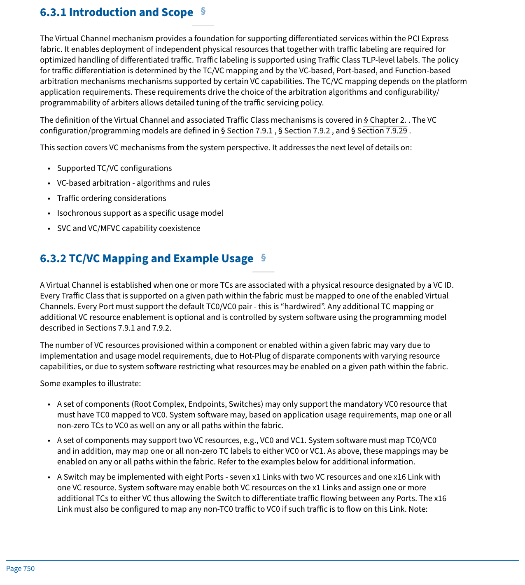

table>
<thead>
<tr>
<th width="50%">🇬🇧 English</th>
<th width="50%" style="background-color:#e8e8e8">🇨🇳 中文</th>
</tr>
</thead>
<tbody>
<tr>
<td>

OM13828

Endpoint A
Link
Switch
VC0 / VC1 / VC2 / VC3
TC[0:1] / TC[2:4] / TC[5:6] / TC7

Endpoint B
Link
VC0 / VC1 / VC2 / VC3
TC[0:1] / TC[2:4] / TC[5:6] / TC7

Link
Root Complex
VC0 / VC3
TC[0:1] / TC7

Mapping / Mapping

**Figure 6-4 TC Filtering Example**

</td>
<td style="background-color:#e8e8e8">

OM13828

端点 A
链路
交换机
VC0 / VC1 / VC2 / VC3
TC[0:1] / TC[2:4] / TC[5:6] / TC7

端点 B
链路
VC0 / VC1 / VC2 / VC3
TC[0:1] / TC[2:4] / TC[5:6] / TC7

链路
根复合体（Root Complex）
VC0 / VC3
TC[0:1] / TC7

映射 / 映射

**图 6-4 TC 过滤示例**

</td>
</tr>
</tbody>
</table>

[⬆️ 返回目录](#-本章目录-table-of-contents)

---


<div style="overflow-x: auto; max-width: 100%;">
<table>
<thead>
<tr>
<th width="50%">🇬🇧 English</th>
<th width="50%" style="background-color:#e8e8e8">🇨🇳 中文</th>
</tr>
</thead>
<tbody>
<tr>
<td>

§ Figure 6-5 shows an example of TC to VC mapping. A simple Switch with one Downstream Port and one Upstream Port connects an Endpoint to a Root Complex. At the Upstream Port, two VCs (VC0 and VC1) are enabled with the following mapping: TC(0-6)/VC0, TC7/VC1. At the Downstream Port, only VC0 is enabled and all TCs are mapped to VC0. In this example while TC7 is mapped to VC0 at the Downstream Port, it is re-mapped to VC1 at the Upstream Port. Although the Endpoint only supports VC0, when it labels transactions with different TCs, transactions associated with TC7 from/to the Endpoint can take advantage of the second Virtual Channel enabled between the Switch and the Root Complex.

OM13829

Endpoint
VC0
TC[0:7] / TC[0:7]

Link
Switch
VC0 / VC1
TC[0:6] / TC7

Link
Mapping
Root Complex

**Figure 6-5 TC to VC Mapping Example**

</td>
<td style="background-color:#e8e8e8">

§ 图 6-5 给出了一个 TC 到 VC 映射的示例。一台简单的交换机拥有一个下游端口（Downstream Port）和一个上游端口（Upstream Port），将一个端点连接至根复合体。在上游端口上使能了两个 VC（VC0 和 VC1），映射关系为：TC(0-6)/VC0、TC7/VC1。在下游端口上仅使能 VC0，所有 TC 都映射到 VC0。在本例中，TC7 在下游端口映射到 VC0，但在上游端口被重新映射到 VC1。尽管端点只支持 VC0，但当它为事务打上不同的 TC 标签时，与 TC7 关联的来自/去往端点的事务可以利用交换机与根复合体之间使能的第二条虚通道。

OM13829

端点
VC0
TC[0:7] / TC[0:7]

链路
交换机
VC0 / VC1
TC[0:6] / TC7

链路
映射
根复合体（Root Complex）

**图 6-5 TC 到 VC 映射示例**

</td>
</tr>
</tbody>
</table>
</div>


[⬆️ 返回目录](#-本章目录-table-of-contents)

---

<<<PAGE_BREAK>>> page_751

table>
<thead>
<tr>
<th width="50%">🇬🇧 English</th>
<th width="50%" style="background-color:#e8e8e8">🇨🇳 中文</th>
</tr>
</thead>
<tbody>
<tr>
<td>

Arbitration is one of the key aspects of the Virtual Channel mechanism and is defined in a manner that fully enables configurability to the specific application. In general, the definition of the VC-based arbitration mechanism is driven by the following objectives:
- To prevent false transaction timeouts and to guarantee data flow forward progress
- To provide differentiated services between data flows within the fabric
- To provide guaranteed bandwidth with deterministic (and reasonably small) end-to-end latency between components

Links are bidirectional, i.e., each Port can be an Ingress or an Egress Port depending on the direction of traffic flow. This is illustrated by the example of a 3-Port Switch in § Figure 6-6, where the paths for traffic flowing between Switch Ports are highlighted with different types of lines. In the following sections, VC Arbitration is defined using a Switch arbitration model since the Switch represents a functional superset from the arbitration perspective.

In addition, one-directional data flow is used in the description.

OM13830

3-Port Switch
PCI Express Link / PCI Express Link
Egress / Ingress TX RX
Egress / Ingress TX RX
Egress / Ingress TX
PCI Express Link RX

**Figure 6-6 An Example of Traffic Flow Illustrating Ingress and Egress**

</td>
<td style="background-color:#e8e8e8">

仲裁（Arbitration）是虚通道机制的关键要素之一，其定义方式完全支持针对特定应用的可配置性。一般来说，基于 VC 的仲裁机制定义由以下目标驱动：
- 防止错误的事务超时，并保证数据流的前进推进
- 在 Fabric 内的数据流之间提供差异化服务
- 提供有保证的带宽，并在组件之间提供确定性（且合理较小）的端到端延迟

链路是双向的，即根据流量方向的不同，每个端口可以是入口端口（Ingress Port）或出口端口（Egress Port）。这一点由 § 图 6-6 中 3 端口交换机的示例所示，图中以不同类型的线突出显示了交换机端口之间流量的路径。在以下各节中，VC 仲裁以交换机仲裁模型来定义，因为交换机从仲裁的角度代表了功能上的超集。

此外，在描述中采用的是单向数据流。

OM13830

3 端口交换机
PCI Express 链路 / PCI Express 链路
出口 / 入口 TX RX
出口 / 入口 TX RX
出口 / 入口 TX
PCI Express 链路 RX

**图 6-6 展示入口与出口的流量流示例**

</td>
</tr>
</tbody>
</table>

[⬆️ 返回目录](#-本章目录-table-of-contents)

---


<div style="overflow-x: auto; max-width: 100%;">
<table>
<thead>
<tr>
<th width="50%">🇬🇧 English</th>
<th width="50%" style="background-color:#e8e8e8">🇨🇳 中文</th>
</tr>
</thead>
<tbody>
<tr>
<td>

**IMPLEMENTATION NOTE:**
**MULTIPLE TCS OVER A SINGLE VC**
A single VC implementation may benefit from using multiple TCs. TCs provide ordering domains that may be used to differentiate traffic within the Endpoint or the Root Complex independent of the number of VCs supported.

In a simple configuration, where only VC0 is supported, traffic differentiation may not be accomplished in an optimum manner since the different TCs cannot be physically segregated. However, the benefits of carrying multiple TCs can still be exploited particularly in the small and "shallow" topologies where Endpoints are connected directly to Root Complex rather than through cascaded Switches. In these topologies traffic that is targeting Root Complex only needs to traverse a single Link, and an optimized scheduling of packets on both sides (Endpoint and Root Complex) based on TCs may accomplish significant improvement over the case when a single TC is used. Still, the inability to route differentiated traffic through separate resources with fully independent flow control and independent ordering exposes all of the traffic to the potential head-of-line blocking conditions. Optimizing Endpoint internal architecture to minimize the exposure to the blocking conditions can reduce those risks.

</td>
<td style="background-color:#e8e8e8">

**实现注意事项：**
**单一 VC 上的多个 TC**
单个 VC 的实现也可受益于使用多个 TC。TC 提供排序域，可用于在端点或根复合体内部区分流量，而与所支持的 VC 数量无关。

在仅支持 VC0 的简单配置中，由于不同的 TC 无法被物理隔离，流量差异化可能无法以最佳方式实现。然而，承载多个 TC 的好处仍然可以被利用，特别是在小型且"浅层"的拓扑中——端点直接连接至根复合体，而非通过级联的交换机。在这些拓扑中，以根复合体为目标的流量仅需穿越单条链路，并且根据 TC 在两端（端点和根复合体）对包进行优化调度，相较于只使用单一 TC 的情况可获得显著改善。但是，由于无法通过完全独立的流控和独立排序的独立资源来路由差异化流量，所有流量都会暴露在潜在的队头阻塞（Head-of-Line Blocking）风险中。通过优化端点内部架构来最小化对阻塞条件的暴露，可以降低这些风险。

</td>
</tr>
</tbody>
</table>
</div>


[⬆️ 返回目录](#-本章目录-table-of-contents)

---

<a id="sec-6-3-3"></a>
## 6.3.3 VC Arbitration | VC 仲裁

table>
<thead>
<tr>
<th width="50%">🇬🇧 English</th>
<th width="50%" style="background-color:#e8e8e8">🇨🇳 中文</th>
</tr>
</thead>
<tbody>
<tr>
<td>

The following set of figures (§ Figure 6-7 and § Figure 6-8) illustrates traffic flow through the Switch and summarizes the key aspects of the arbitration.

</td>
<td style="background-color:#e8e8e8">

下面这组图（§ 图 6-7 和 § 图 6-8）展示了流经交换机的流量，并总结了仲裁的关键要点。

</td>
</tr>
</tbody>
</table>

[⬆️ 返回目录](#-本章目录-table-of-contents)

---

> **Figure 6-7.** An Example of Differentiated Traffic Flow Through a Switch | 流经交换机的差异化流量流示例
> 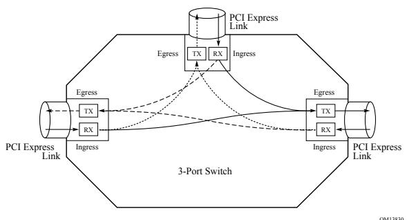

<table>
<thead>
<tr>
<th width="50%">🇬🇧 English</th>
<th width="50%" style="background-color:#e8e8e8">🇨🇳 中文</th>
</tr>
</thead>
<tbody>
<tr>
<td>

OM14284

Ingress Ports
Egress Ports

3.0
2.1a
3.1
3.0
3.1b
3.1a
3.1

Priority Order
Egress Port Number
Ingress Port Number

**Figure 6-7 An Example of Differentiated Traffic Flow Through a Switch**

</td>
<td style="background-color:#e8e8e8">

OM14284

入口端口
出口端口

3.0
2.1a
3.1
3.0
3.1b
3.1a
3.1

优先级顺序
出口端口号
入口端口号

**图 6-7 流经交换机的差异化流量流示例**

</td>
</tr>
</tbody>
</table>

[⬆️ 返回目录](#-本章目录-table-of-contents)

---

<a id="sec-6-3-3-1"></a>
## 6.3.3.1 Traffic Flow and Switch Arbitration Model | 流量流与交换机仲裁模型


<div style="overflow-x: auto; max-width: 100%;">
<table>
<thead>
<tr>
<th width="50%">🇬🇧 English</th>
<th width="50%" style="background-color:#e8e8e8">🇨🇳 中文</th>
</tr>
</thead>
<tbody>
<tr>
<td>

At each Ingress Port an incoming traffic stream is represented in § Figure 6-7 by small boxes. These boxes represent packets that are carried within different VCs that are distinguished using different levels of gray. Each of the boxes that represents a packet belonging to different VC includes designation of Ingress and Egress Ports to indicate where the packet is coming from and where it is going to. For example, designation "3.0" means that this packet is arriving at Port #0 (Ingress) and is destined to Port #3 (Egress). Within the Switch, packets are routed and serviced based on Switch internal arbitration mechanisms.

Switch arbitration model defines a required arbitration infrastructure and functionality within a Switch. This functionality is needed to support a set of arbitration policies that control traffic contention for an Egress Port from multiple Ingress Ports.

§ Figure 6-8 shows a conceptual model of a Switch highlighting resources and associated functionality in ingress to egress direction. Note that each Port in the Switch can have the role of an Ingress or Egress Port. Therefore, this figure only shows one particular scenario where the 4-Port Switch in this example has ingress traffic on Port #0 and Port #1, that targets Port #2 as an Egress Port. A different example may show different flow of traffic implying different roles for Ports on the Switch. The PCI Express architecture enables peer-to-peer communication through the Switch and, therefore, possible scenarios using the same example may include multiple separate and simultaneous ingress to egress flows (e.g., Port 0 to Port 2 and Port 1 to Port 3).

</td>
<td style="background-color:#e8e8e8">

在每个入口端口处，进入的流量流在 § 图 6-7 中以小方框表示。这些方框代表在不同 VC 中承载的包，这些 VC 通过不同的灰度加以区分。代表属于不同 VC 的包的每个方框都标注了入口和出口端口，以指明该包的来源与去向。例如，标记"3.0"表示此包到达端口 #0（入口），并被发往端口 #3（出口）。在交换机内部，包的路由与服务基于交换机内部的仲裁机制完成。

交换机仲裁模型定义了交换机内部所需的仲裁基础设施和功能。该功能对于支持一组仲裁策略是必要的，这些仲裁策略控制着来自多个入口端口的流量对出口端口的竞争。

§ 图 6-8 展示了一个交换机的概念模型，突出了从入口到出口方向的资源和关联功能。请注意，交换机中的每个端口都可以充当入口端口或出口端口。因此，该图仅展示了一个特定场景：本例中的 4 端口交换机在端口 #0 和端口 #1 上存在入口流量，并都以端口 #2 作为出口端口。另一个示例可能显示不同的流量流向，从而为交换机上的端口赋予不同的角色。PCI Express 架构允许通过交换机进行对等（Peer-to-Peer）通信，因此在同一示例下可能存在的场景包括多个相互独立且同时进行的入口到出口的流量流（例如，端口 0 到端口 2，以及端口 1 到端口 3）。

</td>
</tr>
</tbody>
</table>
</div>


[⬆️ 返回目录](#-本章目录-table-of-contents)

---

> **Figure 6-8.** Switch Arbitration Structure | 交换机仲裁结构
> 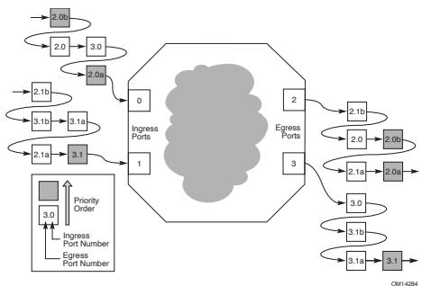

table>
<thead>
<tr>
<th width="50%">🇬🇧 English</th>
<th width="50%" style="background-color:#e8e8e8">🇨🇳 中文</th>
</tr>
</thead>
<tbody>
<tr>
<td>

OM14493B

Port Arbitration within a VC in Egress Port
VC 0 / VC 1
VC Arbitration for an Egress Port

These structures are replicated for each Egress Port

Egress Ports / Ingress Ports
ARB / ARB
VC 0 / VC 1
0 / 1 / 2 / 3

TC/VC Mapping of the Egress Port
TC/VC Mapping of the Egress Port

**Figure 6-8 Switch Arbitration Structure**

</td>
<td style="background-color:#e8e8e8">

OM14493B

出口端口内同一 VC 中的端口仲裁
VC 0 / VC 1
针对某出口端口的 VC 仲裁

这些结构针对每个出口端口都会复制一份

出口端口 / 入口端口
ARB / ARB
VC 0 / VC 1
0 / 1 / 2 / 3

出口端口的 TC/VC 映射
出口端口的 TC/VC 映射

**图 6-8 交换机仲裁结构**

</td>
</tr>
</tbody>
</table>

[⬆️ 返回目录](#-本章目录-table-of-contents)

---

<table>
<thead>
<tr>
<th width="50%">🇬🇧 English</th>
<th width="50%" style="background-color:#e8e8e8">🇨🇳 中文</th>
</tr>
</thead>
<tbody>
<tr>
<td>

The following two steps conceptually describe routing of traffic received by the Switch on Port 0 and Port 1 and destined to Port 2. First, the target Egress Port is determined based on address/routing information in the TLP header. Secondly,

</td>
<td style="background-color:#e8e8e8">

以下两个步骤在概念上描述了交换机在端口 0 和端口 1 上接收、并以端口 2 为目的地的流量的路由过程。首先，根据 TLP 包头（Header）中的地址/路由信息确定目标出口端口。其次，

</td>
</tr>
</tbody>
</table>

[⬆️ 返回目录](#-本章目录-table-of-contents)

---

<<<PAGE_BREAK>>> page_754


<div style="overflow-x: auto; max-width: 100%;">
<table>
<thead>
<tr>
<th width="50%">🇬🇧 English</th>
<th width="50%" style="background-color:#e8e8e8">🇨🇳 中文</th>
</tr>
</thead>
<tbody>
<tr>
<td>

the target VC of the Egress Port is determined based on the TC/VC map of the Egress Port. Transactions that target the same VC in the Egress Port but are from different Ingress Ports must be arbitrated before they can be forwarded to the corresponding resource in the Egress Port. This arbitration is referred to as the Port Arbitration.

Once the traffic reaches the destination VC resource in the Egress Port, it is subject to arbitration for the shared Link. From the Egress Port point of view this arbitration can be conceptually defined as a simple form of multiplexing where the multiplexing control is based on arbitration policies that are either fixed or configurable/programmable. This stage of arbitration between different VCs at an Egress Port is called the VC Arbitration of the Egress Port.

Independent of VC arbitration policy, a management/control logic associated with each VC must observe transaction ordering and flow control rules before it can make pending traffic visible to the arbitration mechanism.

This specification defines a default VC prioritization via the VC Identification (VC ID) assignment, i.e., the VC IDs are arranged in ascending order of relative priority in the Virtual Channel Capability structure or Multi-Function Virtual Channel Capability structure. The example in § Figure 6-9 illustrates a Port that supports eight VCs with VC0 treated as the lowest priority and VC7 as the highest priority.

OM14287

VC ID / VC Resource / Relative Priority / VC Arbitration Usage Example
VC 7 / 8th VC / High Strict Priority
VC 6 / 7th VC
VC 5 / 6th VC
VC 4 / 5th VC
VC 3 / 4th VC
VC 2 / 3rd VC
VC 1 / 2nd VC
VC 0 / 1st VC / Low

Governed by VC Arbitration Capability field (e.g. WRR)

Low Priority Extended VC Count = 3
For isochronous traffic
For QoS usage
Default VC (PCI Express/PCI)
Extended VC Count = 7
Priority Order

**Figure 6-9 VC ID and Priority Order - An Example**

</td>
<td style="background-color:#e8e8e8">

根据该出口端口的 TC/VC 映射确定该出口端口的目标 VC。以出口端口中同一 VC 为目标但来自不同入口端口的事务，必须经过仲裁后才能被转发到出口端口中相应的资源。此仲裁称为端口仲裁（Port Arbitration）。

流量到达出口端口中的目标 VC 资源后，将接受对共享链路的仲裁。从出口端口的角度来看，该仲裁在概念上可以定义为一种简单的多路复用形式，其中多路复用控制基于固定或可配置/可编程的仲裁策略。在出口端口上针对不同 VC 的这一阶段仲裁称为出口端口的 VC 仲裁（VC Arbitration）。

无论 VC 仲裁策略如何，与每个 VC 关联的管理/控制逻辑必须遵守事务排序和流控规则，才能将待处理流量呈现给仲裁机制。

本规范通过虚通道标识（VC ID）分配定义了一种默认的 VC 优先级方案——即在虚通道能力（Virtual Channel Capability）结构或多功能虚通道能力（Multi-Function Virtual Channel Capability）结构中，VC ID 按相对优先级的升序排列。§ 图 6-9 中的示例展示了一个支持 8 个 VC 的端口，其中 VC0 视为最低优先级，VC7 视为最高优先级。

OM14287

VC ID / VC 资源 / 相对优先级 / VC 仲裁使用示例
VC 7 / 第 8 个 VC / 高 严格优先级
VC 6 / 第 7 个 VC
VC 5 / 第 6 个 VC
VC 4 / 第 5 个 VC
VC 3 / 第 4 个 VC
VC 2 / 第 3 个 VC
VC 1 / 第 2 个 VC
VC 0 / 第 1 个 VC / 低

由 VC 仲裁能力字段（例如 WRR）管理

低优先级扩展 VC 计数 = 3
用于等时流量
用于 QoS 用途
默认 VC（PCI Express/PCI）
扩展 VC 计数 = 7
优先级顺序

**图 6-9 VC ID 与优先级顺序——示例**

</td>
</tr>
</tbody>
</table>
</div>


[⬆️ 返回目录](#-本章目录-table-of-contents)

---

table>
<thead>
<tr>
<th width="50%">🇬🇧 English</th>
<th width="50%" style="background-color:#e8e8e8">🇨🇳 中文</th>
</tr>
</thead>
<tbody>
<tr>
<td>

**IMPLEMENTATION NOTE:**
**VC CONTROL LOGIC AT THE EGRESS PORT**
VC control logic at every Egress Port includes:
- VC Flow Control logic
- VC Ordering Control logic

Flow control credits are exchanged between two Ports connected to the same Link. Availability of flow control credits is one of the qualifiers that VC control logic must使用以决定何时允许某个 VC 竞争共享的链路资源（即数据链路层（Data Link Layer）发送/重试缓冲区）。若候选包因缺乏足够数量的流控信用而无法提交，则 VC 控制逻辑必须屏蔽挂起包的存在，以防止阻塞来自其他 VC 的流量。请注意，由于每个 VC 包含 Posted 请求、Non-Posted 请求和 Completion 包的缓冲资源，VC 控制逻辑还必须考虑特定候选包的流控信用可用性。此外，VC 控制逻辑必须遵守排序规则（详见 § 2.4 节），以防止针对 Posted/Non-Posted/Completion 事务的死锁和违反生产者/消费者排序模型。

</td>
<td style="background-color:#e8e8e8">

**实现注意事项：**
**出口端口处的 VC 控制逻辑**
每个出口端口处的 VC 控制逻辑包括：
- VC 流控（Flow Control）逻辑
- VC 排序控制（Ordering Control）逻辑

流控信用（Flow Control Credit）在连接到同一条链路的两个端口之间交换。流控信用的可用性是 VC 控制逻辑必须使用的判定条件之一，以决定何时允许某个 VC 竞争共享的链路资源（即数据链路层（Data Link Layer）发送/重试缓冲区）。若候选包因缺乏足够数量的流控信用而无法提交，则 VC 控制逻辑必须屏蔽挂起包的存在，以防止阻塞来自其他 VC 的流量。请注意，由于每个 VC 包含 Posted 请求、Non-Posted 请求和 Completion 包的缓冲资源，VC 控制逻辑还必须考虑特定候选包的流控信用可用性。此外，VC 控制逻辑必须遵守排序规则（详见 § 2.4 节），以防止针对 Posted/Non-Posted/Completion 事务的死锁和违反生产者/消费者排序模型。

</td>
</tr>
</tbody>
</table>

[⬆️ 返回目录](#-本章目录-table-of-contents)

---

<<<PAGE_BREAK>>> page_755

<a id="sec-6-3-3-2"></a>
## 6.3.3.2 VC Arbitration - Arbitration Between VCs | VC 仲裁——VC 之间的仲裁


<div style="overflow-x: auto; max-width: 100%;">
<table>
<thead>
<tr>
<th width="50%">🇬🇧 English</th>
<th width="50%" style="background-color:#e8e8e8">🇨🇳 中文</th>
</tr>
</thead>
<tbody>
<tr>
<td>

The availability of default prioritization does not restrict the type of algorithms that may be implemented to support VC arbitration - either implementation specific or one of the architecture-defined methods:
- Strict Priority - Based on inherent prioritization, i.e., VC0 = lowest, VC7 = highest
- Round Robin (RR) - Simplest form of arbitration where all VCs have equal priority
- Weighted RR - Programmable weight factor determines the level of service

If strict priority arbitration is supported by the hardware for a subset of the VC resources, software can configure the VCs into two priority groups - a lower and an upper group. The upper group is treated as a strict priority arbitration group while the lower group is arbitrated to only when there are no packets to process in the upper group. § Figure 6-9 illustrates an example configuration that supports eight VCs separated into two groups - the lower group consisting of VC0-VC3 and the upper group consisting of VC4-VC7. The arbitration within the lower group can be configured to one of the supported arbitration methods. The Low Priority Extended VC Count field in the Port VC Capability Register 1 indicates the size of this group. The arbitration methods are listed in the VC Arbitration Capability field in the Port VC Capability Register 2. Refer to § Section 7.9.1 and § Section 7.9.2 for details. When the Low Priority Extended VC Count field is set to zero, all VCs are governed by the strict-priority VC arbitration; when the field is equal to the Extended VC Count, all VCs are governed by the VC arbitration indicated by the VC Arbitration Capability field.

Strict priority arbitration enables minimal latency for high-priority transactions. However, there is potential danger of bandwidth starvation should it not be applied correctly. Using strict priority requires all high-priority traffic to be regulated in terms of maximum peak bandwidth and Link usage duration. Regulation must be applied either at the transaction injection Port/Function or within subsequent Egress Ports where data flows contend for a common Link. System software must configure traffic such that lower priority transactions will be serviced at a sufficient rate to avoid transaction timeouts.

Round Robin arbitration is used to provide, at the transaction level, equal <sup>126</sup> opportunities to all traffic. Note that this scheme is used where different unordered streams need to be serviced with the same priority.

In the case where differentiation is required, a Weighted Round Robin scheme can be used. The WRR scheme is commonly used in the case where bandwidth regulation is not enforced by the sources of traffic and therefore it is not possible to use the priority scheme without risking starvation of lower priority traffic. The key is that this scheme provides fairness during traffic contention by allowing at least one arbitration win per arbitration loop. Assigned weights regulate both minimum allowed bandwidth and maximum burstiness for each VC during the contention. This means that it bounds the arbitration latency for traffic from different VCs. Note that latencies are also dependent on the maximum packet sizes allowed for traffic that is mapped onto those VCs.

One of the key usage models of the WRR scheme is support for QoS policy where different QoS levels can be provided using different weights.

Although weights can be fixed (by hardware implementation) for certain applications, to provide more generic support for different applications, components that support the WRR scheme are recommended to implement programmable WRR. Programming of WRR is controlled using the software interface defined in Sections 7.9.1 and 7.9.2.

</td>
<td style="background-color:#e8e8e8">

默认优先级的可用性并不限制可用于支持 VC 仲裁的算法类型——无论是实现特定的还是由架构定义的方法之一：
- 严格优先级（Strict Priority）——基于固有优先级，即 VC0 = 最低，VC7 = 最高
- 轮询（RR, Round Robin）——最简单的仲裁形式，所有 VC 具有相同优先级
- 加权轮询（Weighted RR）——可编程的权重因子决定服务等级

如果硬件针对部分 VC 资源支持严格优先级仲裁，则软件可将 VC 配置为两个优先级组——下层组和上层组。上层组被视为严格优先级仲裁组，而仅当上层组中没有包可处理时才对下层组进行仲裁。§ 图 6-9 展示了一个支持 8 个 VC 的示例配置，被划分为两个组——下层组由 VC0–VC3 组成，上层组由 VC4–VC7 组成。下层组内的仲裁可配置为所支持的仲裁方法之一。端口 VC 能力寄存器 1（Port VC Capability Register 1）中的低优先级扩展 VC 计数字段（Low Priority Extended VC Count）指示该组的大小。仲裁方法列于端口 VC 能力寄存器 2（Port VC Capability Register 2）的 VC 仲裁能力字段（VC Arbitration Capability）中。详情请参考 § 7.9.1 和 § 7.9.2 节。当低优先级扩展 VC 计数字段设置为零时，所有 VC 都受严格优先级 VC 仲裁管辖；当该字段等于扩展 VC 计数时，所有 VC 都受 VC 仲裁能力字段所指示的 VC 仲裁管辖。

严格优先级仲裁能够为高优先级事务提供最小的延迟。然而，若应用不当则存在带宽饥饿（Bandwidth Starvation）的潜在风险。使用严格优先级要求对所有高优先级流量按最大峰值带宽和链路占用持续时间进行调节。该调节必须在事务注入端口/功能处，或在后续数据流竞争同一链路的出口端口处执行。系统软件必须配置流量，使得低优先级事务以足够的速率被服务，以避免事务超时。

轮询仲裁用于在事务级别为所有流量提供相等 <sup>126</sup> 的机会。请注意，此方案适用于需要以相同优先级服务不同无序流的场景。

在需要差异化的场景下，可以使用加权轮询（Weighted Round Robin, WRR）方案。当流量源未执行带宽调节、因此无法在不冒低优先级流量饥饿风险的情况下使用优先级方案时，WRR 方案是常见选择。其关键在于：该方案通过在每次仲裁循环中至少允许一次仲裁胜出，从而在流量竞争期间提供公平性。所分配的权重在竞争期间同时调节每个 VC 的最小允许带宽和最大突发性。这意味着它限制了来自不同 VC 的流量的仲裁延迟。请注意，延迟也取决于映射到这些 VC 的流量所允许的最大包大小。

WRR 方案的一个关键使用模型是支持 QoS 策略——通过使用不同的权重可提供不同的 QoS 等级。

尽管对于某些应用来说权重可以由硬件实现固定下来，但为了更通用地支持不同的应用，推荐支持 WRR 方案的组件实现可编程 WRR。WRR 的编程通过 § 7.9.1 和 § 7.9.2 节中定义的软件接口进行控制。

</td>
</tr>
</tbody>
</table>
</div>


[⬆️ 返回目录](#-本章目录-table-of-contents)

---

<a id="sec-6-3-3-2-1"></a>
## 6.3.3.2.1 Strict Priority Arbitration Model | 严格优先级仲裁模型

table>
<thead>
<tr>
<th width="50%">🇬🇧 English</th>
<th width="50%" style="background-color:#e8e8e8">🇨🇳 中文</th>
</tr>
</thead>
<tbody>
<tr>
<td>

<small>126. Note that this does not imply equivalence and fairness in the terms of bandwidth usage.</small>

</td>
<td style="background-color:#e8e8e8">

<small>126. 请注意，这并不意味着在带宽使用方面的等价性和公平性。</small>

</td>
</tr>
</tbody>
</table>

[⬆️ 返回目录](#-本章目录-table-of-contents)

---

<a id="sec-6-3-3-2-2"></a>
## 6.3.3.2.2 Round Robin Arbitration Model | 轮询仲裁模型

<table>
<thead>
<tr>
<th width="50%">🇬🇧 English</th>
<th width="50%" style="background-color:#e8e8e8">🇨🇳 中文</th>
</tr>
</thead>
<tbody>
<tr>
<td></td>
<td style="background-color:#e8e8e8">

</td>
</tr>
</tbody>
</table>

[⬆️ 返回目录](#-本章目录-table-of-contents)

---

<<<PAGE_BREAK>>> page_756


<div style="overflow-x: auto; max-width: 100%;">
<table>
<thead>
<tr>
<th width="50%">🇬🇧 English</th>
<th width="50%" style="background-color:#e8e8e8">🇨🇳 中文</th>
</tr>
</thead>
<tbody>
<tr>
<td>

For Switches, Port Arbitration refers to the arbitration at an Egress Port between traffic coming from other Ingress Ports that is mapped to the same VC. For Root Ports, Port Arbitration refers to the arbitration at a Root Egress Port between peer-to-peer traffic coming from other Root Ingress Ports that is mapped to the same VC. For RCRBs, Port Arbitration refers to the arbitration at the RCRB (e.g., for host memory) between traffic coming from Root Ports that is mapped to the same VC. An inherent prioritization scheme for arbitration among VCs in this context is not applicable since it would imply strict arbitration priority for different Ports. Traffic from different Ports can be arbitrated using the following supported schemes:
- Hardware-fixed arbitration scheme, e.g., Round Robin
- Programmable WRR arbitration scheme
- Programmable Time-based WRR arbitration scheme

Hardware-fixed RR or RR-like scheme is the simplest to implement since it does not require any programmability. It makes all Ports equal priority, which is acceptable for applications where no software-managed differentiation or per-Port-based bandwidth budgeting is required.

Programmable WRR allows flexibility since it can operate as flat RR or if differentiation is required, different weights can be applied to traffic coming from different Ports in the similar manner as described in § Section 6.3.3.2 . This scheme is used where different allocation of bandwidth needs to be provided for different Ports.

A Time-based WRR is used for applications where not only different allocation of bandwidth is required but also a tight control of usage of that bandwidth. This scheme allows control of the amount of traffic that can be injected from different Ports within a certain fixed period of time. This is required for certain applications such as isochronous services, where traffic needs to meet a strict deadline requirement. § Section 6.3.4 provides basic rules to support isochronous applications. For more details on time-based arbitration and on the isochronous service as a usage model for this arbitration scheme refer to Appendix A.

The multi-Function arbitration model defines an optional arbitration infrastructure and functionality within a Multi-Function Device. This functionality is needed to support a set of arbitration policies that control traffic contention for the device's Upstream Egress Port from its multiple Functions.

§ Figure 6-10 shows a conceptual model of a Multi-Function Device highlighting resources and associated functionality. Note that each Function optionally contains a VC Extended Capability structure, which if present manages TC/VC mapping, optional Port Arbitration, and optional VC Arbitration, all within the Function. The MFVC Extended Capability structure manages TC/VC mapping, optional Function Arbitration, and optional VC Arbitration for the device's Upstream Egress Port. Together these resources enable enhanced QoS management for Upstream requests. However, unlike a complete Switch with devices on its Downstream Ports, the Multi-Function Device model does not support full QoS management for peer-to-peer requests between Functions or for Downstream requests.

</td>
<td style="background-color:#e8e8e8">

对于交换机，端口仲裁（Port Arbitration）指的是在出口端口处对来自其他入口端口且被映射到同一 VC 的流量进行的仲裁。对于根端口（Root Port），端口仲裁指的是在根出口端口（Root Egress Port）处对来自其他根入口端口且被映射到同一 VC 的对等流量进行的仲裁。对于 RCRB，端口仲裁指的是在 RCRB（例如用于主机内存）处对来自根端口且被映射到同一 VC 的流量进行的仲裁。在该上下文中，VC 之间仲裁的固有优先级方案并不适用，因为它将意味着对不同端口采用严格的仲裁优先级。来自不同端口的流量可以使用以下受支持的方案进行仲裁：
- 硬件固定仲裁方案，例如轮询（Round Robin）
- 可编程 WRR 仲裁方案
- 可编程基于时间的 WRR（Time-based WRR）仲裁方案

硬件固定的 RR 或类似 RR 的方案是最易于实现的，因为它不需要任何可编程性。它将所有端口设置为相等的优先级，这对于不需要软件管理的差异化或基于每端口带宽预算的应用来说是可以接受的。

可编程 WRR 具备灵活性——它可以作为平坦的 RR 运行，或者在需要差异化时，以与 § 6.3.3.2 节中描述的类似方式，对来自不同端口的流量施加不同的权重。当需要为不同端口提供不同带宽分配时，会采用此方案。

基于时间的 WRR 适用于不仅需要不同的带宽分配，而且需要对该带宽的使用进行严格控制的应用。该方案允许控制在某段固定时间段内可从不同端口注入的流量数量。某些应用（例如等时服务）有此要求，因为其流量必须满足严格的时限要求。§ 6.3.4 节给出了支持等时应用的基本规则。有关基于时间的仲裁以及作为该仲裁方案的等时服务用例模型的更多详情，请参考附录 A。

多功能仲裁模型（Multi-Function Arbitration Model）定义了一个多功能设备（Multi-Function Device）内部可选的仲裁基础设施和功能。该功能对于支持一组仲裁策略是必要的，这些仲裁策略控制着来自设备多个功能（Function）的流量对设备上游出口端口（Upstream Egress Port）的竞争。

§ 图 6-10 展示了一个多功能设备的概念模型，突出了资源和关联功能。请注意，每个功能可选地包含一个 VC 扩展能力（VC Extended Capability）结构——如果存在，则在功能内部管理 TC/VC 映射、可选的端口仲裁以及可选的 VC 仲裁。MFVC 扩展能力（MFVC Extended Capability）结构管理设备上游出口端口的 TC/VC 映射、可选的功能仲裁（Function Arbitration）以及可选的 VC 仲裁。这些资源共同实现了对上游请求的增强型 QoS 管理。然而，与一台在其下游端口上连接设备的完整交换机不同，多功能设备模型不支持针对功能之间对等请求或下游请求的完整 QoS 管理。

</td>
</tr>
</tbody>
</table>
</div>


[⬆️ 返回目录](#-本章目录-table-of-contents)

---


---

6.3.3.3 Port Arbitration - Arbitration Within VC §
6.3.3.4 Multi-Function Devices and Function Arbitration §

<<<PAGE_BREAK>>> page_757

> **Figure 6-10.** Multi-Function Arbitration Model
> 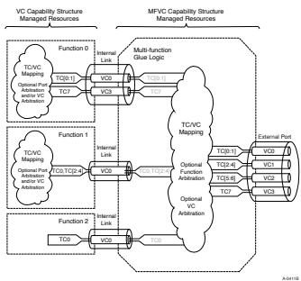


<a id="sec-6-3-3-3"></a>
## 6.3.3.3 Port Arbitration - Arbitration Within VC | 端口仲裁 - VC 内部仲裁

table>
<thead>
<tr>
<th width="50%">🇬🇧 English</th>
<th width="50%" style="background-color:#e8e8e8">🇨🇳 中文</th>
</tr>
</thead>
<tbody>
<tr>
<td>

QoS for an Upstream request originating at a Function is managed as follows. First, a Function-specific mechanism applies a TC to the request. For example, a device driver might configure a Function to tag all its requests with TC7. Next, if the Function contains a VC Extended Capability structure, it specifies the TC/VC mapping to one of the Function's VC resources (perhaps the Function's single VC resource). In addition, the VC Extended Capability structure supports the enablement and configuration of the Function's VC resources.

If the Function is a Switch and the target VC resource supports Port Arbitration, this mechanism governs how the Switch's multiple Downstream Ingress Ports arbitrate for that VC resource. If the Port Arbitration mechanism supports time-based WRR, this also governs the injection rate of requests from each Downstream Ingress Port.

If the Function supports VC arbitration, this mechanism manages how the Function's multiple VC resources arbitrate for the conceptual internal link to the MFVC resources.

Once a request packet conceptually arrives at MFVC resources, address/routing information in the TLP header determines whether the request goes Upstream or peer-to-peer to another Function. For the case of peer-to-peer, QoS management is left to unarchitected device-specific mechanisms. For the case of Upstream, TC/VC mapping in the MFVC Extended Capability structure determines which VC resource the request will target. The MFVC Extended Capability structure also supports enablement and configuration of the VC resources in the multi-Function glue logic. If the target VC resource supports Function Arbitration, this mechanism governs how the multiple Functions arbitrate for this VC resource. If the Function Arbitration mechanism supports time-based WRR, this governs the injection rate of requests for each Function into this VC resource.

Finally, if the MFVC Extended Capability structure supports VC Arbitration, this mechanism governs how the MFVC's multiple VCs compete for the device's Upstream Egress Port. Independent of VC arbitration policy, management/control logic associated with each VC must observe transaction ordering and flow control rules before it can make pending traffic visible to the arbitration mechanism.

§

</td>
<td style="background-color:#e8e8e8">

源自某个 Function (功能) 的上游请求 (Upstream Request) 的 QoS 管理过程如下。首先,由 Function 特定的机制为该请求分配一个 TC (流量类, Traffic Class)。例如,设备驱动程序可能将某个 Function 配置为将其所有请求打上 TC7 的标签。接下来,如果该 Function 包含 VC 扩展能力结构 (VC Extended Capability structure),它将指定 TC/VC 映射到该 Function 的某个 VC 资源 (可能是该 Function 唯一的 VC 资源) 上。此外,VC 扩展能力结构还支持该 Function 的 VC 资源的使能与配置。

如果该 Function 是一个交换机 (Switch) 并且目标 VC 资源支持端口仲裁 (Port Arbitration),此机制将决定该交换机的多个下游入口端口 (Downstream Ingress Port) 如何对该 VC 资源进行仲裁。如果端口仲裁机制支持基于时间的 WRR (加权轮询, Weighted Round-Robin),它还将管理来自每个下游入口端口的请求注入速率。

如果该 Function 支持 VC 仲裁 (VC Arbitration),此机制将管理该 Function 的多个 VC 资源如何对通往 MFVC 资源的概念性内部链路 (Internal Link) 进行仲裁。

一旦请求报文概念性地到达 MFVC 资源,TLP (事务层包, Transaction Layer Packet) 包头中的地址/路由信息将决定该请求是上游 (Upstream) 转发还是对端 (peer-to-peer) 转发到另一个 Function。对于对端转发的情形,QoS 管理由未架构化的设备特定机制处理。对于上游转发的情形,MFVC 扩展能力结构中的 TC/VC 映射将决定该请求将目标定位于哪个 VC 资源。MFVC 扩展能力结构还支持多功能设备粘合逻辑 (multi-Function glue logic) 中 VC 资源的使能与配置。如果目标 VC 资源支持功能仲裁 (Function Arbitration),此机制将管理多个 Function 如何对该 VC 资源进行仲裁。如果功能仲裁机制支持基于时间的 WRR,它将管理每个 Function 对该 VC 资源的请求注入速率。

最后,如果 MFVC 扩展能力结构支持 VC 仲裁,此机制将管理 MFVC 的多个 VC 如何竞争该设备的上游出口端口 (Upstream Egress Port)。无论 VC 仲裁策略如何,与每个 VC 关联的管理/控制逻辑在将待处理流量 (pending traffic) 呈现给仲裁机制之前,必须遵守事务排序 (transaction ordering) 和流控 (Flow Control) 规则。

§

</td>
</tr>
</tbody>
</table>

[⬆️ 返回目录](#-本章目录-table-of-contents)

---

<a id="sec-6-3-3-4"></a>
## 6.3.3.4 Multi-Function Devices and Function Arbitration | 多功能设备与功能仲裁

<table>
<thead>
<tr>
<th width="50%">🇬🇧 English</th>
<th width="50%" style="background-color:#e8e8e8">🇨🇳 中文</th>
</tr>
</thead>
<tbody>
<tr>
<td>

**IMPLEMENTATION NOTE:**
**MULTI-FUNCTION ARBITRATION ERROR BEHAVIOR**

§ Table 6-6 shows the expected error behavior associated with the example topology shown in § Figure 6-10.

</td>
<td style="background-color:#e8e8e8">

**实现说明 (IMPLEMENTATION NOTE):**
**多功能仲裁错误行为 (MULTI-FUNCTION ARBITRATION ERROR BEHAVIOR)**

§ 表 6-6 显示了与 § 图 6-10 中所示示例拓扑相关联的预期错误行为。

</td>
</tr>
</tbody>
</table>

**Table 6-6. Multi-Function Arbitration Error Model Example | 表 6-6. 多功能仲裁错误模型示例**

| Source | TC | Function 0 | Function 1 | Function 2 | External Port |
|--------|----|------------|------------|------------|---------------|
| Function 0 | 0 | n/a | OK | OK | OK |
| Function 0 | 1 | MF @ F1 | MF @ F2 | OK | OK |
| Function 0 | 2 - 6 | MF @ F0 | MF @ F0 | MF @ F0 | MF @ F0 |
| Function 0 | 7 | MF @ F1 | MF @ F2 | OK | OK |
| Function 1 | 0 | OK | n/a | OK | OK |
| Function 1 | 1 | MF @ F1 | MF @ F1 | MF @ F1 | MF @ F1 |
| Function 1 | 2 - 4 | MF @ F0 | MF @ F2 | OK | OK |
| Function 1 | 5 - 7 | MF @ F1 | MF @ F1 | MF @ F1 | MF @ F1 |
| Function 2 | 0 | OK | OK | n/a | OK |
| Function 2 | 1 - 7 | MF @ F2 | MF @ F2 | MF @ F2 | MF @ F2 |
| External Port | 0 | OK | OK | OK | n/a |
| External Port | 1 | OK | MF @ F1 | MF @ F2 | OK |
| External Port | 2 - 4 | MF @ F0 | OK | OK | MF @ F0 |
| External Port | 5 - 6 | MF @ F1 | OK | OK | MF @ F1 |
| External Port | 7 | OK | OK | OK | OK |

**Legend | 图例:**

- **OK**: Success | 成功
- **MF @ F0**: Malformed TLP, reported at Function 0 | 畸形 TLP (Malformed TLP),在 Function 0 上报告
- **MF @ F1**: Malformed TLP, reported at Function 1 | 畸形 TLP (Malformed TLP),在 Function 1 上报告
- **MF @ F2**: Malformed TLP, reported at Function 2 | 畸形 TLP (Malformed TLP),在 Function 2 上报告
- **n/a**: Not Applicable (Function/Port sending to itself) | 不适用 (Function/Port 发送给自己)

§
§

<<<PAGE_BREAK>>> page_758


<div style="overflow-x: auto; max-width: 100%;">
<table>
<thead>
<tr>
<th width="50%">🇬🇧 English</th>
<th width="50%" style="background-color:#e8e8e8">🇨🇳 中文</th>
</tr>
</thead>
<tbody>
<tr>
<td>

Servicing isochronous data transfer requires a system to provide not only guaranteed data bandwidth but also deterministic service latency. The isochronous support mechanisms are defined to ensure that isochronous traffic receives its allocated bandwidth over a relevant period of time while also preventing starvation of the other traffic in the system. Isochronous support mechanisms apply to communication between Endpoint and Root Complex as well as to peer-to-peer communication.

Isochronous service is realized through proper use of mechanisms such as TC transaction labeling, VC data-transfer protocol, and TC-to-VC mapping. End-to-end isochronous service requires software to set up proper configuration along the path between the Requester and the Completer. This section describes the rules for software configuration and the rules hardware components must follow to provide end-to-end isochronous services. More information and background material regarding isochronous applications and isochronous service design guidelines can be found in Appendix A.

System software must obey the following rules to configure PCI Express fabric for isochronous traffic:
- Software must designate one or more TCs for isochronous transactions.
- Software must ensure that the Attribute fields of all isochronous requests targeting the same Completer are fixed and identical.
- Software must configure all VC resources used to support isochronous traffic to be serviced (arbitrated) at the requisite bandwidth and latency to meet the application objectives. This may be accomplished using strict priority, WRR, or hardware-fixed arbitration.
- Software should not intermix isochronous traffic with non-isochronous traffic on a given VC.
- Software must observe the Maximum Time Slots capability reported by the Port or RCRB.
- Software must not assign all Link capacity to isochronous traffic. This is required to ensure the requisite forward progress of other non-isochronous transactions to avoid false transaction timeouts.
- Software must limit the Max_Payload_Size for each path that supports isochronous to meet the isochronous latency. For example, all traffic flowing on a path from an isochronous capable device to the Root Complex should be limited to packets that do not exceed the Max_Payload_Size required to meet the isochronous latency requirements.

**IMPLEMENTATION NOTE:**
**MULTI-FUNCTION DEVICES WITHOUT THE MFVC EXTENDED CAPABILITY STRUCTURE**

If a Multi-Function Device lacks an MFVC Extended Capability structure, the arbitration of data flows from different Functions of a Multi-Function Device is beyond the scope of this specification.

However, as stated in this specification, if a Multi-Function Device supports TCs other than TC0 and does not implement an MFVC Extended Capability structure, it is required to implement a single VC Extended Capability structure in Function 0 to provide architected TC/VC mappings for the Link.

§

</td>
<td style="background-color:#e8e8e8">

为等时 (isochronous) 数据传输提供服务要求系统不仅提供保证的数据带宽,还要求提供确定性的服务延迟。等时支持机制的定义为:确保等时流量 (isochronous traffic) 在相关时间段内获得其分配的带宽,同时防止系统中其他流量出现饥饿 (starvation) 现象。等时支持机制适用于端点 (Endpoint) 与根复合体 (Root Complex) 之间的通信,以及对端 (peer-to-peer) 通信。

等时服务通过正确使用 TC 事务标签、VC 数据传输协议以及 TC-to-VC 映射等机制实现。端到端等时服务要求软件在请求者 (Requester) 与完成者 (Completer) 之间的路径上设置正确的配置。本节描述了为提供端到端等时服务,软件配置所必须遵守的规则,以及硬件组件所必须遵循的规则。有关等时应用和等时服务设计指南的更多信息和背景资料,请参阅附录 A。

系统软件在为等时流量配置 PCI Express Fabric 时必须遵守以下规则:
- 软件必须为等时事务 (isochronous transaction) 指定一个或多个 TC。
- 软件必须确保针对同一完成者的所有等时请求的 Attr 字段 (Attribute) 是固定且相同的。
- 软件必须将用于支持等时流量的所有 VC 资源配置为以满足应用目标所需的带宽和延迟进行服务 (仲裁)。这可以通过严格优先级 (strict priority)、WRR (加权轮询) 或硬件固定仲裁 (hardware-fixed arbitration) 来实现。
- 软件不应在给定的 VC 上将等时流量与非等时流量混合。
- 软件必须遵守由 Port 或 RCRB 所报告的 Maximum Time Slots 能力。
- 软件不得将所有链路 (Link) 容量分配给等时流量。这是为了确保其他非等时事务所需的前向推进 (forward progress),以避免误判事务超时 (transaction timeout)。
- 软件必须限制支持等时的每条路径的 Max_Payload_Size,以满足等时延迟。例如,从具有等时能力的设备到根复合体的路径上的所有流量应被限制为不超过满足等时延迟要求所需的 Max_Payload_Size 的报文。

**实现说明 (IMPLEMENTATION NOTE):**
**不包含 MFVC 扩展能力结构的多功能设备 (MULTI-FUNCTION DEVICES WITHOUT THE MFVC EXTENDED CAPABILITY STRUCTURE)**

如果某个多功能设备 (Multi-Function Device) 缺少 MFVC 扩展能力结构 (MFVC Extended Capability structure),则该多功能设备不同 Function 之间数据流的仲裁不在本规范的范围之内。

然而,如本规范所述,如果某个多功能设备支持 TC0 之外的 TC,并且未实现 MFVC 扩展能力结构,则要求在 Function 0 中实现单个 VC 扩展能力结构 (VC Extended Capability structure),以为该链路 (Link) 提供架构化的 TC/VC 映射。

§

</td>
</tr>
</tbody>
</table>
</div>


[⬆️ 返回目录](#-本章目录-table-of-contents)

---

<<<PAGE_BREAK>>> page_759

<a id="sec-6-3-4"></a>
## 6.3.4 Isochronous Support | 等时支持

table>
<thead>
<tr>
<th width="50%">🇬🇧 English</th>
<th width="50%" style="background-color:#e8e8e8">🇨🇳 中文</th>
</tr>
</thead>
<tbody>
<tr>
<td>

§
6.3.4.1 Rules for Software Configuration §
6.3.4.2 Rules for Requesters §
6.3.4.3 Rules for Completers §
6.3.4.4 Rules for Switches and Root Complexes §
6.3.4.5 Rules for Multi-Function Devices §

</td>
<td style="background-color:#e8e8e8">

§
6.3.4.1 软件配置规则 (Rules for Software Configuration) §
6.3.4.2 请求者规则 (Rules for Requesters) §
6.3.4.3 完成者规则 (Rules for Completers) §
6.3.4.4 交换机与根复合体规则 (Rules for Switches and Root Complexes) §
6.3.4.5 多功能设备规则 (Rules for Multi-Function Devices) §

</td>
</tr>
</tbody>
</table>

[⬆️ 返回目录](#-本章目录-table-of-contents)

---

<a id="sec-6-3-4-1"></a>
## 6.3.4.1 Rules for Software Configuration | 软件配置规则


<div style="overflow-x: auto; max-width: 100%;">
<table>
<thead>
<tr>
<th width="50%">🇬🇧 English</th>
<th width="50%" style="background-color:#e8e8e8">🇨🇳 中文</th>
</tr>
</thead>
<tbody>
<tr>
<td>

- Software must set Max_Read_Request_Size of an isochronous-configured device with a value that does not exceed the Max_Payload_Size set for the device.

A Requester requiring isochronous services must obey the following rules:
- The value in the Length field of read requests must never exceed Max_Payload_Size.
- If isochronous traffic targets the Root Complex and the RCRB indicates it cannot meet the isochronous bandwidth and latency requirements without requiring all transactions to set the No Snoop attribute bit, indicated by setting the Reject Snoop Transactions bit, then this bit must be set within the TLP header else the transaction will be rejected.

A Completer providing isochronous services must obey the following rules:
- A Completer should not apply flow control induced backpressure to uniformly injected isochronous requests under normal operating conditions.
- A Completer must report its isochronous bandwidth capability in the Maximum Time Slots field in the VC Resource Capability register. Note that a Completer must account for partial writes.
- A Completer must observe the maximum isochronous transaction latency.
- A Root Complex as a Completer must implement at least one RCRB and support time-based Port Arbitration for the associated VCs. Note that time-based Port Arbitration only applies to request transactions.

A Switch providing isochronous services must obey the following rules. The same rules apply to Root Complexes that support isochronous data flows peer-to-peer between Root Ports, abbreviated in this section as "P2P-RC".
- An isochronous-configured Switch or P2P-RC Port should not apply flow control induced backpressure to uniformly injected isochronous requests under normal operating conditions.
- An isochronous-configured Switch or P2P-RC Port must observe the maximum isochronous transaction latency.
- A Switch or P2P-RC component must support time-based Port Arbitration for each Port that supports one or more VCs capable of supporting isochronous traffic. Note that time-based Port Arbitration applies to request transactions but not to completion transactions.

A Multi-Function Device that includes an MFVC Extended Capability structure providing isochronous services must obey the following rules:
- MFVC glue logic configured for isochronous operation should not apply backpressure to uniformly injected isochronous requests from its Functions under normal operating conditions.

§
6.3.4.2 Rules for Requesters §
6.3.4.3 Rules for Completers §
6.3.4.4 Rules for Switches and Root Complexes §
6.3.4.5 Rules for Multi-Function Devices §

</td>
<td style="background-color:#e8e8e8">

- 软件必须将等时配置设备的 Max_Read_Request_Size 设置为不超过该设备所设置的 Max_Payload_Size 的值。

需要等时服务的请求者 (Requester) 必须遵守以下规则:
- 读请求的 Length 字段 (长度) 中的值绝不能超过 Max_Payload_Size。
- 如果等时流量目标是根复合体 (Root Complex),且 RCRB 表明:在不要求所有事务都设置 No Snoop (无监听) 属性位的情况下,无法满足等时带宽和延迟要求 (该情况由设置 Reject Snoop Transactions 位来指示),则必须在 TLP 包头中设置该位,否则该事务将被拒绝。

提供等时服务的完成者 (Completer) 必须遵守以下规则:
- 在正常工作条件下,完成者不应将流控 (Flow Control) 引起的反压 (backpressure) 施加于均匀注入的等时请求。
- 完成者必须将其等时带宽能力上报到 VC 资源能力寄存器 (VC Resource Capability register) 中的 Maximum Time Slots 字段。注意:完成者必须考虑部分写 (partial write) 的影响。
- 完成者必须遵守最大等时事务延迟。
- 作为完成者的根复合体必须实现至少一个 RCRB,并为相关联的 VC 支持基于时间的端口仲裁 (time-based Port Arbitration)。注意:基于时间的端口仲裁仅适用于请求事务。

提供等时服务的交换机 (Switch) 必须遵守以下规则。同样的规则也适用于支持根端口 (Root Port) 之间对端等时数据流的根复合体,在本节中简称为 "P2P-RC"。
- 配置为等时的交换机或 P2P-RC 端口,在正常工作条件下,不应将流控引起的反压施加于均匀注入的等时请求。
- 配置为等时的交换机或 P2P-RC 端口必须遵守最大等时事务延迟。
- 交换机或 P2P-RC 组件必须为支持等时流量的一个或多个 VC 的每个端口支持基于时间的端口仲裁。注意:基于时间的端口仲裁适用于请求事务,但不适用于完成事务 (Completion)。

包含提供等时服务的 MFVC 扩展能力结构的多功能设备必须遵守以下规则:
- 配置为等时运行的 MFVC 粘合逻辑 (glue logic),在正常工作条件下,不应将反压施加于来自其 Function 的均匀注入的等时请求。

§
6.3.4.2 请求者规则 (Rules for Requesters) §
6.3.4.3 完成者规则 (Rules for Completers) §
6.3.4.4 交换机与根复合体规则 (Rules for Switches and Root Complexes) §
6.3.4.5 多功能设备规则 (Rules for Multi-Function Devices) §

</td>
</tr>
</tbody>
</table>
</div>


[⬆️ 返回目录](#-本章目录-table-of-contents)

---

<<<PAGE_BREAK>>> page_760

table>
<thead>
<tr>
<th width="50%">🇬🇧 English</th>
<th width="50%" style="background-color:#e8e8e8">🇨🇳 中文</th>
</tr>
</thead>
<tbody>
<tr>
<td>

- The MFVC Extended Capability structure must support time-based Function Arbitration for each VC capable of supporting isochronous traffic. Note that time-based Function Arbitration applies only to Upstream request transactions; it does not apply to any Downstream or peer-to-peer request transactions, nor to any completion transactions.

A Multi-Function Device that lacks an MFVC Extended Capability structure has no architected mechanism to provide isochronous services for its multiple Functions concurrently.

The Virtual Channel Extended Capability (VC capability) and Multi-Function Virtual Channel Extended Capability (MFVC capability) are referred to as VC/MFVC capabilities. A Port is permitted to implement a Streamlined Virtual Channel Extended Capability (SVC capability) as well as one or more VC/MFVC capabilities. During Link training, VC0 in each VC/MFVC capability will automatically initialize, and VC0 in the SVC capability will remain disabled. This ensures backward compatibility with software that is unaware of SVC.

SVC capability is incompatible with VC/MFVC capabilities, and hardware mechanisms ensure that for a given Port, SVC capability is never enabled at the same time as VC/MFVC capabilities.

SVC-aware software chooses when to use SVC capability instead of VC/MFVC capabilities on a Port that implements both. Before configuring VC/MFVC capabilities, software Clears the Use VC/MFVC bit in the SVC Port Status register. Doing so immediately clears the VC Enable bit for each VC resource in every VC/MFVC capability (VC Resource Control Register or MFVC VC Resource Control Register). This also Sets the SVC VC Enable bit for VC0 in its SVC Resource Control Register. The Use VC/MFVC bit will remain Clear until the next Conventional Reset. This presents a simplified and consistent operational state, reducing hardware and software complexity.

If a Port implements an SVC capability and no VC/MFVC capabilities, the Use VC/MFVC bit in the SVC Port Status register must be hardwired to 0b. During Link training, VC0 in the SVC capability automatically initializes. See the Use VC/MFVC bit description for further required semantics.

System software requires a "stop" mechanism for ensuring that there are no outstanding transactions for a particular device in a system. For example, without such a mechanism renumbering Bus Numbers during system operation may cause the Requester ID (which includes the Bus Number) for a given device to change while Requests or Completions for that device are still in flight, and may thus be rendered invalid due to the change in the Requester ID. It is also desirable to be able to ensure that there are no outstanding transactions during a Hot-Plug orderly removal.

The details of stop mechanism implementation depend on the device hardware, device driver software, and system software. However, the fundamental requirements which must be supported to allow system software management of the fabric include the abilities to:
- Block the device from generating new Requests
- Block the generation of Requests issued to the device
- Determine that all Requests being serviced by the device have been completed
- Determine that all non-posted Requests initiated by the device have completed
- Determine that all posted Requests initiated by the device have reached their destination

6.3.5 SVC and VC/MFVC Capability Coexistence §
6.4 Device Synchronization §

</td>
<td style="background-color:#e8e8e8">

- MFVC 扩展能力结构必须为每个能够支持等时流量的 VC 支持基于时间的功能仲裁 (time-based Function Arbitration)。注意:基于时间的功能仲裁仅适用于上游请求事务 (Upstream request transaction);它不适用于任何下游 (Downstream) 或对端请求事务,也不适用于任何完成事务 (Completion)。

缺少 MFVC 扩展能力结构的多功能设备,没有架构化的机制为其多个 Function 同时提供等时服务。

虚通道扩展能力 (VC capability, Virtual Channel Extended Capability) 和多功能虚通道扩展能力 (MFVC capability, Multi-Function Virtual Channel Extended Capability) 统称为 VC/MFVC 能力。端口 (Port) 可以实现精简虚通道扩展能力 (SVC capability, Streamlined Virtual Channel Extended Capability) 以及一个或多个 VC/MFVC 能力。在链路训练 (Link training) 期间,每个 VC/MFVC 能力中的 VC0 将自动初始化,而 SVC 能力中的 VC0 将保持禁用状态。这确保了与未识别 SVC 的软件的向后兼容性 (backward compatibility)。

SVC 能力与 VC/MFVC 能力不兼容,且硬件机制确保对于给定的 Port,SVC 能力永远不会与 VC/MFVC 能力同时启用。

支持 SVC 的软件可自行选择在同时实现了两者的 Port 上,何时使用 SVC 能力而非 VC/MFVC 能力。在配置 VC/MFVC 能力之前,软件需清除 (Clear) SVC Port Status 寄存器中的 Use VC/MFVC 位。这样做会立即清除每个 VC/MFVC 能力 (VC Resource Control Register 或 MFVC VC Resource Control Register) 中每个 VC 资源的 VC Enable 位。这也会在 SVC Resource Control Register 中将 VC0 的 SVC VC Enable 位置位 (Set)。Use VC/MFVC 位将保持清除状态,直到下一次常规复位 (Conventional Reset)。这提供了一种简化且一致的操作状态,降低了硬件和软件的复杂性。

如果某个 Port 仅实现 SVC 能力而不实现 VC/MFVC 能力,则 SVC Port Status 寄存器中的 Use VC/MFVC 位必须硬连线 (hardwired) 为 0b。在链路训练期间,SVC 能力中的 VC0 会自动初始化。有关所需语义的更多详细信息,请参阅 Use VC/MFVC 位的描述。

系统软件需要一种"停止" (stop) 机制,以确保系统中某个特定设备没有未完成的事务 (outstanding transaction)。例如,如果没有这样的机制,在系统运行期间重新分配 Bus Number 可能会导致某个设备的 Requester ID (请求者 ID,其中包含 Bus Number) 发生改变,而此时该设备的请求 (Request) 或完成 (Completion) 仍在传输中,因此可能因 Requester ID 的改变而变得无效。同样,在热插拔 (Hot-Plug) 有序移除 (orderly removal) 期间,也需要能够确保没有未完成的事务。

停止机制的具体实现细节取决于设备硬件、设备驱动程序软件和系统软件。然而,为了支持系统软件对 Fabric (互连网络) 的管理,必须支持的基本能力包括:
- 阻止设备生成新的请求 (Request)
- 阻止向该设备发起请求
- 确定由该设备服务的所有请求都已完成
- 确定由该设备发起的所有 Non-Posted 请求 (无数据,需完成) 已完成
- 确定由该设备发起的所有 Posted 请求 (有数据,无完成) 已到达其目的地

6.3.5 SVC 与 VC/MFVC 能力共存 (SVC and VC/MFVC Capability Coexistence) §
6.4 设备同步 (Device Synchronization) §

</td>
</tr>
</tbody>
</table>

[⬆️ 返回目录](#-本章目录-table-of-contents)

---

<<<PAGE_BREAK>>> page_761


<div style="overflow-x: auto; max-width: 100%;">
<table>
<thead>
<tr>
<th width="50%">🇬🇧 English</th>
<th width="50%" style="background-color:#e8e8e8">🇨🇳 中文</th>
</tr>
</thead>
<tbody>
<tr>
<td>

The ability of the driver and/or system software to block new Requests from the device is supported by the Bus Master Enable, SERR# Enable, and Interrupt Disable bits in the Command register (Section 7.5.1.1.3) of each device Function, and other such控制 bits.

Requests issued to the device are generally under the direct control of the driver, so system software can block these Requests by directing the driver to stop generating them (the details of this communication are system software specific). Similarly, Requests serviced by the device are normally under the device driver's control, so determining the completion of such requests is usually trivial.

The Transactions Pending bit provides a consistent way on a per-Function basis for software to determine that all non-posted Requests issued by the device have been completed (see § Section 7.5.3.5).

Determining that posted Requests have reached their destination is handled by generating a transaction to "flush" any outstanding Requests. Writes to system memory using TC0 will be flushed by host reads of the device, and so require no explicit flush protocol. Writes using TCs other than TC0 require some type of flush synchronization mechanism. The mechanism itself is implementation specific to the device and its driver software. However, in all cases the device hardware and software implementers should thoroughly understand the ordering rules described in § Section 2.4. This is especially true if the Relaxed Ordering or ID-Based Ordering attributes are set for any Requests initiated by the device.

Peer-to-peer interaction between devices requires an explicit synchronization protocol between the involved devices, even if all communication is through TC0. For a given system, the model for managing peer-to-peer interaction must be established. System software, and device hardware and software must then conform to this model. The requirements for blocking Request generation and determining completion of Requests match the requirements for non-peer interaction, however the determination that Posted Requests have reached peer destination device(s) requires an explicit synchronization mechanism. The mechanism itself is implementation specific to the device, its driver software, and the model used for the establishment and disestablishment of peer communications.

Locked Transaction support is required to prevent deadlock in systems that use legacy software which causes the accesses to I/O devices. Note that some CPUs may generate locked accesses as a result of executing instructions that implicitly trigger lock. Some legacy software misuses these transactions and generates locked sequences even when exclusive access is not required. Since locked accesses to I/O devices introduce potential deadlocks apart from those mentioned above, as well as serious performance degradation, PCI Express Endpoints are prohibited from supporting locked accesses, and new software must not use instructions which will cause locked accesses to I/O devices. Legacy Endpoints support locked accesses only for compatibility with existing software.

**IMPLEMENTATION NOTE:**
**FLUSH MECHANISMS**

In a simple case such as that of an Endpoint communicating only with host memory through TC0, "flush" can be implemented simply by reading from the Endpoint. If the Endpoint issues writes to main memory using TCs other than TC0, "flush" can be implemented with a memory read on the corresponding TCs directed to main memory. The memory read needs to be performed on all TCs that the Endpoint is using.

If a memory read is used to "flush" outstanding transactions, but no actual read is required, it may be desirable to use the zero-length read semantic described in § Section 2.2.5.

§
6.5 Locked Transactions §

</td>
<td style="background-color:#e8e8e8">

驱动程序和/或系统软件阻止设备发起新请求的能力,由每个设备 Function 的命令寄存器 (Command register,见第 7.5.1.1.3 节) 中的 Bus Master Enable、SERR# Enable 和 Interrupt Disable 等位以及其他类似控制位支持。

向该设备发出的请求 (Requests issued to the device) 通常由驱动程序直接控制,因此系统软件可通过指示驱动程序停止生成这些请求来阻止这些请求 (此通信的具体细节因系统软件而异)。类似地,由该设备服务的请求 (Requests serviced by the device) 通常也由设备驱动程序控制,因此确定此类请求的完成情况通常较为简单。

Transactions Pending 位 (事务挂起位) 提供了一种在每个 Function 基础上一致的方法,供软件确定由该设备发出的所有 Non-Posted 请求 (无数据,需完成) 都已完成 (见 § 第 7.5.3.5 节)。

确定 Posted 请求 (有数据,无完成) 已到达其目的地的方法是:生成一个用于"刷新" (flush) 所有未完成请求 (outstanding Request) 的事务。使用 TC0 对系统内存的写入会通过主机的设备读取进行刷新,因此不需要显式的刷新协议。使用 TC0 之外的 TC 进行写入时,需要某种类型的刷新同步机制 (flush synchronization mechanism)。该机制本身对于设备及其驱动软件是实现特定的 (implementation specific)。然而,在所有情况下,设备硬件和软件的实现者都应充分理解 § 第 2.4 节中描述的排序 (ordering) 规则。如果由该设备发起的任何请求设置了 Relaxed Ordering (松散排序) 或 ID-Based Ordering (基于 ID 的排序, IDO) 属性,这一点尤其重要。

设备间的对端 (peer-to-peer) 交互即使所有通信都通过 TC0 进行,也需要相关设备之间采用显式同步协议 (explicit synchronization protocol)。对于给定的系统,必须建立用于管理对端交互的模型。系统软件以及设备硬件和软件必须遵守此模型。阻止请求生成和确定请求完成的要求与非对端交互的要求相同,然而确定 Posted 请求已到达对端目的设备需要一种显式同步机制。该机制本身对于设备、其驱动软件以及用于建立和解除对端通信的模型是实现特定的。

需要 Locked Transaction (锁定事务) 支持以防止在使用会导致访问 I/O 设备的遗留软件 (legacy software) 的系统中出现死锁 (deadlock)。注意:某些 CPU 在执行隐式触发锁定的指令时,可能会产生锁定访问 (locked access)。一些遗留软件误用这些事务,并在不需要独占访问时也生成锁定序列。由于对 I/O 设备的锁定访问除了上述问题外还可能引入潜在死锁并导致严重的性能下降,因此禁止 PCI Express 端点 (Endpoint) 支持锁定访问,并且新软件不得使用会导致对 I/O 设备进行锁定访问的指令。遗留端点 (Legacy Endpoint) 仅出于与现有软件的兼容性而支持锁定访问。

**实现说明 (IMPLEMENTATION NOTE):**
**刷新机制 (FLUSH MECHANISMS)**

在像端点仅通过 TC0 与主存通信这样的简单情况下,"刷新" (flush) 可以简单地通过对端点进行读取来实现。如果端点使用 TC0 之外的 TC 向主存发起写入,则"刷新"可以通过在相应 TC 上对主存执行的内存读来实现。内存读操作需要在端点所使用的所有 TC 上执行。

如果使用内存读操作来"刷新"未完成的事务,但实际上不需要进行读取,则可使用 § 第 2.2.5 节中所述的零长度读取 (zero-length read) 语义。

§
6.5 锁定事务 (Locked Transactions) §

</td>
</tr>
</tbody>
</table>
</div>


[⬆️ 返回目录](#-本章目录-table-of-contents)

---


---

<a id="sec-6-5-1"></a>
## 6.5.1 Introduction | 引言

table>
<thead>
<tr>
<th width="50%">🇬🇧 English</th>
<th width="50%" style="background-color:#e8e8e8">🇨🇳 中文</th>
</tr>
</thead>
<tbody>
<tr>
<td>

<<<PAGE_BREAK>>> page_763

Only the Root Complex is allowed to initiate Locked Requests on PCI Express. Locked Requests initiated by Endpoints and Bridges are not supported. This is consistent with limitations for locked transaction use outlined in [PCI] (§ Appendix F. - Exclusive Accesses).

This section specifies the rules associated with supporting locked accesses from the Host CPU to Legacy Endpoints, including the propagation of those transactions through Switches and PCI Express/PCI Bridges.

Locked transaction sequences are generated by the Host CPU(s) as one or more reads followed by a number of writes to the same location(s). When a lock is established, all other traffic is blocked from using the path between the Root Complex and the locked Legacy Endpoint or Bridge.

- A locked transaction sequence or attempted locked transaction sequence is initiated on PCI Express using the "lock"-type Read Request/Completion (MRdLk/CplDLk) and terminated with the Unlock Message
  - Locked Requests which are completed with a status other than Successful Completion do not establish lock (explained in detail in the following sections)
  - Regardless of the status of any of the Completions associated with a locked sequence, all locked sequences and attempted locked sequences must be terminated by the transmission of an Unlock Message.
  - MRdLk, CplDLk, and Unlock semantics are allowed only for the default Traffic Class (TC0)
  - Only one locked transaction sequence attempt may be in progress at a given time within a single hierarchy domain
- The Unlock Message is sent from the Root Complex down the locked transaction path to the Completer, and may be broadcast from the Root Complex to all Endpoints and Bridges
  - Any device which is not involved in the locked sequence must ignore this Message
- Any violation of the rules for initiation and propagation of locked transactions can result in undefined device and/or system behavior
  - The initiation and propagation of a locked transaction sequence through PCI Express is performed as follows:
  - A locked transaction sequence is started with a MRdLk Request
    - Any successive reads for the locked transaction sequence must also use MRdLk Requests
    - The Completions for any MRdLk Request use the CplDLk Completion type for successful Requests, and the CplLk Completion type for unsuccessful Requests
  - If any read associated with a locked sequence is completed unsuccessfully, the Requester must assume that the atomicity of the lock is no longer assured, and that the path between the Requester and Completer is no longer locked
  - All writes for the locked sequence use MWr Requests
  - The Unlock Message is used to indicate the end of a locked sequence
    - A Switch propagates Unlock Messages to the locked Egress Port
  - Upon receiving an Unlock Message, a Legacy Endpoint or Bridge must unlock itself if it is in a locked state
    - If not locked, or if the Receiver is a PCI Express Endpoint or Bridge which does not support lock, the Unlock Message is ignored and discarded

</td>
<td style="background-color:#e8e8e8">

<<<PAGE_BREAK>>> page_763

在 PCI Express 上,只有根复合体 (Root Complex) 才允许发起锁定请求 (Locked Requests)。不支持由端点 (Endpoint) 和桥 (Bridge) 发起的锁定请求。这与 [PCI] (附录 F — 排他访问) 中所列出的关于锁定事务使用的限制一致。

本节规定支持从 Host CPU 到传统端点 (Legacy Endpoint) 的锁定访问的相关规则,包括这些事务通过交换机 (Switch) 和 PCI Express/PCI 桥的传播。

锁定事务序列由 Host CPU 生成,形式为一次或多次读操作,随后是对相同位置的多写操作。当建立锁定后,根复合体与被锁定的传统端点或桥之间的路径将阻塞所有其他流量。

- 锁定事务序列或尝试性锁定事务序列在 PCI Express 上使用"锁定"类型的读请求/完成报文 (MRdLk/CplDLk) 发起,并以 Unlock 消息 (Unlock Message) 终止
  - 以非"成功完成" (Successful Completion) 状态完成的锁定请求不建立锁 (后续章节将详细说明)
  - 无论与锁定序列关联的任何完成报文 (Completion) 的状态如何,所有锁定序列和尝试性锁定序列都必须通过传输 Unlock 消息来终止
  - MRdLk、CplDLk 和 Unlock 语义仅允许用于默认流量类 TC0
  - 在单个层级 (Hierarchy) 域内,任意时刻只允许一个锁定事务序列尝试在进行中
- Unlock 消息从根复合体沿锁定事务路径向下发送到完成者 (Completer),也可以从根复合体向所有端点和桥进行广播
  - 任何未参与锁定序列的设备必须忽略此消息
- 任何违反锁定事务发起和传播规则的行为都可能导致未定义的设备和/或系统行为
  - 锁定事务序列通过 PCI Express 的发起和传播执行方式如下:
  - 锁定事务序列以 MRdLk 请求开始
    - 锁定事务序列中任何后续读操作也必须使用 MRdLk 请求
    - 任何 MRdLk 请求的完成报文,对于成功的请求使用 CplDLk 完成类型,对于不成功的请求使用 CplLk 完成类型
  - 如果与锁定序列关联的任何读操作未成功完成,则请求者 (Requester) 必须假定锁的原子性已不再得到保证,并且请求者与完成者之间的路径不再被锁定
  - 锁定序列的所有写操作使用 MWr 请求
  - Unlock 消息用于指示锁定序列的结束
    - 交换机将 Unlock 消息传播到锁定的出口端口 (Egress Port)
  - 在接收到 Unlock 消息时,传统端点或桥若处于锁定状态必须解除自身锁定
    - 若未处于锁定状态,或者接收方是不支持锁的 PCI Express 端点或桥,则该 Unlock 消息被忽略并丢弃

</td>
</tr>
</tbody>
</table>

[⬆️ 返回目录](#-本章目录-table-of-contents)

---

<a id="sec-6-5-2"></a>
## 6.5.2 Initiation and Propagation of Locked Transactions - Rules | 锁定事务的发起和传播 — 规则


<div style="overflow-x: auto; max-width: 100%;">
<table>
<thead>
<tr>
<th width="50%">🇬🇧 English</th>
<th width="50%" style="background-color:#e8e8e8">🇨🇳 中文</th>
</tr>
</thead>
<tbody>
<tr>
<td>

<<<PAGE_BREAK>>> page_764

Switches must distinguish transactions associated with locked sequences from other transactions to prevent other transactions from interfering with the lock and potentially causing deadlock. The following rules cover how this is done. Note that locked accesses are limited to TC0, which is always mapped to VC0.

- When a Switch propagates a MRdLk Request from the Ingress Port (closest to the Root Complex) to the Egress Port, it must block all Requests which map to the default Virtual Channel (VC0) from being propagated to the Egress Port
  - If a subsequent MRdLk Request is Received at this Ingress Port addressing a different Egress Port, the behavior of the Switch is undefined

Note: This sort of split-lock access is not supported by PCI Express and software must not cause such a locked access. System deadlock may result from such accesses.

- When the CplDLk for the first MRdLk Request is returned, if the Completion indicates a Successful Completion status, the Switch must block all Requests from all other Ports from being propagated to either of the Ports involved in the locked access, except for Requests which map to non-VC0 on the Egress Port
- The two Ports involved in the locked sequence must remain blocked as described above until the Switch receives the Unlock Message (at the Ingress Port for the initial MRdLk Request)
  - The Unlock Message must be forwarded to the locked Egress Port
  - The Unlock Message may be broadcast to all other Ports
  - The Ingress Port is unblocked once the Unlock Message arrives, and the Egress Port(s) which were blocked are unblocked following the Transmission of the Unlock Message out of the Egress Ports
    - Ports which were not involved in the locked access are unaffected by the Unlock Message

</td>
<td style="background-color:#e8e8e8">

<<<PAGE_BREAK>>> page_764

交换机必须将锁定序列相关的事务与其他事务区分开,以防止其他事务干扰锁并可能导致死锁。以下规则说明了如何实现。请注意,锁定访问仅限于 TC0,而 TC0 始终映射到 VC0。

- 当交换机将 MRdLk 请求从入口端口 (Ingress Port,最接近根复合体) 传播到出口端口时,它必须阻塞所有映射到默认虚通道 (VC0) 的请求向出口端口传播
  - 如果该入口端口接收到后续 MRdLk 请求且目标为不同的出口端口,则交换机的行为未定义

注:PCI Express 不支持这种"分裂锁定"(split-lock) 访问,软件不得引发此类锁定访问。此类访问可能导致系统死锁。

- 当第一个 MRdLk 请求的 CplDLk 返回时,如果完成报文指示为"成功完成"状态,则交换机必须阻塞来自所有其他端口的请求向锁定访问所涉及的两个端口中的任意一个传播,出口端口上映射到非 VC0 的请求除外
- 锁定序列所涉及的两个端口必须保持上述阻塞状态,直到交换机在(初始 MRdLk 请求所在的)入口端口接收到 Unlock 消息
  - Unlock 消息必须转发到锁定的出口端口
  - Unlock 消息可向所有其他端口广播
  - 入口端口在 Unlock 消息到达时即解除阻塞,而被阻塞的出口端口在 Unlock 消息从出口端口发出传输后解除阻塞
    - 未参与锁定访问的端口不受 Unlock 消息影响

</td>
</tr>
</tbody>
</table>
</div>


[⬆️ 返回目录](#-本章目录-table-of-contents)

---

<a id="sec-6-5-3"></a>
## 6.5.3 Switches and Lock - Rules | 交换机与锁 — 规则

table>
<thead>
<tr>
<th width="50%">🇬🇧 English</th>
<th width="50%" style="background-color:#e8e8e8">🇨🇳 中文</th>
</tr>
</thead>
<tbody>
<tr>
<td>

The requirements for PCI Express/PCI Bridges are similar to those for Switches, except that, because PCI Express/PCI Bridges use only the default Virtual Channel and Traffic Class, all other traffic is blocked during the locked access. The requirements on the PCI bus side of the PCI Express/PCI Bridge match the requirements for a PCI/PCI Bridge (see [PCI-to-PCI-Bridge] and [PCIe-to-PCI-PCI-X-Bridge]).

</td>
<td style="background-color:#e8e8e8">

PCI Express/PCI 桥的要求与交换机类似,不同之处在于,由于 PCI Express/PCI 桥仅使用默认的虚通道和流量类,在锁定访问期间所有其他流量都被阻塞。PCI Express/PCI 桥 PCI 总线一侧的要求与 PCI/PCI 桥的要求一致 (参见 [PCI-to-PCI-Bridge] 和 [PCIe-to-PCI-PCI-X-Bridge])。

</td>
</tr>
</tbody>
</table>

[⬆️ 返回目录](#-本章目录-table-of-contents)

---

<a id="sec-6-5-4"></a>
## 6.5.4 PCI Express/PCI Bridges and Lock - Rules | PCI Express/PCI 桥与锁 — 规则

<table>
<thead>
<tr>
<th width="50%">🇬🇧 English</th>
<th width="50%" style="background-color:#e8e8e8">🇨🇳 中文</th>
</tr>
</thead>
<tbody>
<tr>
<td>

A Root Complex is permitted to support locked transactions as a Requester. If locked transactions are supported, a Root Complex must follow the sequence described in § Section 6.5.2 to perform a locked access. The mechanisms used by the Root Complex to interface PCI Express to the Host CPU(s) are outside the scope of this document.

</td>
<td style="background-color:#e8e8e8">

允许根复合体 (Root Complex) 作为请求者支持锁定事务。如果支持锁定事务,则根复合体必须遵循 § 6.5.2 节所描述的序列来执行锁定访问。根复合体用于将 PCI Express 连接到 Host CPU 的机制不在本文档范围之内。

</td>
</tr>
</tbody>
</table>

[⬆️ 返回目录](#-本章目录-table-of-contents)

---

<a id="sec-6-5-5"></a>
## 6.5.5 Root Complex and Lock - Rules | 根复合体与锁 — 规则


<div style="overflow-x: auto; max-width: 100%;">
<table>
<thead>
<tr>
<th width="50%">🇬🇧 English</th>
<th width="50%" style="background-color:#e8e8e8">🇨🇳 中文</th>
</tr>
</thead>
<tbody>
<tr>
<td>

Legacy Endpoints are permitted to support locked accesses, although their use is discouraged. If locked accesses are supported, Legacy Endpoints must handle them as follows:

- The Legacy Endpoint becomes locked when it Transmits the first Completion for the first Read Request of the locked access with a Successful Completion status
  - If the completion status is not Successful Completion, the Legacy Endpoint does not become locked

<<<PAGE_BREAK>>> page_765

  - Once locked, the Legacy Endpoint must remain locked until it receives the Unlock Message
- While locked, a Legacy Endpoint must not issue any Requests using TCs which map to the default Virtual Channel (VC0)

Note that this requirement applies to all possible sources of Requests within the Endpoint, in the case where there is more than one possible source of Requests.

  - Requests may be issued using TCs which map to VCs other than the default Virtual Channel

</td>
<td style="background-color:#e8e8e8">

允许传统端点 (Legacy Endpoint) 支持锁定访问,但不鼓励使用。如果支持锁定访问,传统端点必须按以下方式处理:

- 当传统端点以"成功完成"状态发送锁定访问中第一个读请求的第一个完成报文时,它进入锁定状态
  - 如果完成状态不是"成功完成",则传统端点不会进入锁定状态

<<<PAGE_BREAK>>> page_765

  - 一旦锁定,传统端点必须保持锁定状态,直到接收到 Unlock 消息
- 在锁定期间,传统端点不得使用映射到默认虚通道 (VC0) 的 TC 发出任何请求

请注意,当端点内存在多个可能的请求源时,此要求适用于端点内所有可能的请求源。

  - 可以使用映射到非默认虚通道的 VC 的 TC 发出请求

</td>
</tr>
</tbody>
</table>
</div>


[⬆️ 返回目录](#-本章目录-table-of-contents)

---

<a id="sec-6-5-6"></a>
## 6.5.6 Legacy Endpoints | 传统端点

table>
<thead>
<tr>
<th width="50%">🇬🇧 English</th>
<th width="50%" style="background-color:#e8e8e8">🇨🇳 中文</th>
</tr>
</thead>
<tbody>
<tr>
<td>

PCI Express Endpoints do not support lock. A PCI Express Endpoint must treat a MRdLk Request as an Unsupported Request (see § Chapter 2. ).

</td>
<td style="background-color:#e8e8e8">

PCI Express 端点不支持锁。PCI Express 端点必须将 MRdLk 请求视为"不支持的请求" (Unsupported Request) (见第 2 章)。

</td>
</tr>
</tbody>
</table>

[⬆️ 返回目录](#-本章目录-table-of-contents)

---

<a id="sec-6-5-7"></a>
## 6.5.7 PCI Express Endpoints | PCI Express 端点


<div style="overflow-x: auto; max-width: 100%;">
<table>
<thead>
<tr>
<th width="50%">🇬🇧 English</th>
<th width="50%" style="background-color:#e8e8e8">🇨🇳 中文</th>
</tr>
</thead>
<tbody>
<tr>
<td>

This section specifies the PCI Express Reset mechanisms. This section covers the relationship between the architectural mechanisms defined in this document and the reset mechanisms defined in this document. Any relationship between the PCI Express Conventional Reset and component or platform reset is component or platform specific (except as explicitly noted).

Conventional Reset includes all reset mechanisms other than Function Level Reset. There are two categories of Conventional Resets: Fundamental Reset and resets that are not Fundamental Reset. This section applies to all types of Conventional Reset.

</td>
<td style="background-color:#e8e8e8">

本节规定 PCI Express 复位 (Reset) 机制。本节涵盖本文档中定义的架构机制与本文档中定义的复位机制之间的关系。PCI Express 常规复位 (Conventional Reset) 与组件或平台复位之间的任何关系都由组件或平台特定 (除非明确说明)。

常规复位包括函数级复位 (Function Level Reset) 之外的所有复位机制。常规复位分为两类:基本复位 (Fundamental Reset) 和非基本复位。本节适用于所有类型的常规复位。

</td>
</tr>
</tbody>
</table>
</div>


[⬆️ 返回目录](#-本章目录-table-of-contents)

---

<a id="sec-6-6"></a>
## 6.6 PCI Express Reset - Rules | PCI Express 复位 — 规则

table>
<thead>
<tr>
<th width="50%">🇬🇧 English</th>
<th width="50%" style="background-color:#e8e8e8">🇨🇳 中文</th>
</tr>
</thead>
<tbody>
<tr>
<td>

In all form factors and system硬件 configurations, there must, at some level, be a hardware mechanism for setting or returning all Port states to the initial conditions specified in this document - this mechanism is called "Fundamental Reset". This mechanism can take the form of an auxiliary signal provided by the system to a component or adapter card, in which case the signal must be called PERST#, and must conform to the rules specified in § Section 4.2.5.9.1 . When PERST# is provided to a component or adapter, this signal must be used by the component or adapter as Fundamental Reset. When PERST# is not provided to a component or adapter, Fundamental Reset is generated autonomously by the component or adapter, and the details of how this is done are outside the scope of this document. If a Fundamental Reset is generated autonomously by the component or adapter, and if power is supplied by the platform to the component/adapter, the component/adapter must generate a Fundamental Reset to itself if the supplied power goes outside of the limits specified for the form factor or system.

- There are three distinct types of Conventional Reset: Cold, Warm, and Hot:
  - A Fundamental Reset must occur following the application of power to the component. This is called a Cold Reset.
  - In some cases, it may be possible for the Fundamental Reset mechanism to be triggered by hardware without the removal and re-application of power to the component. This is called a Warm Reset.
  - This document does not specify a means for generating a Warm or Cold Reset.
  - There is an in-band mechanism for propagating Conventional Reset across a Link. This is called a Hot Reset and is described in § Section 4.2.5.9.2 .

</td>
<td style="background-color:#e8e8e8">

在所有外形规格 (Form Factor) 和系统硬件配置中,必须在某一层级存在一个硬件机制,用于将所有端口状态设置或恢复到本文档所规定的初始条件 — 该机制称为"基本复位" (Fundamental Reset)。该机制可以采用系统向组件或适配器卡提供的辅助信号形式,在这种情况下该信号必须命名为 PERST#,并必须符合 § 4.2.5.9.1 节所规定的规则。当 PERST# 提供给组件或适配器时,该信号必须被组件或适配器用作基本复位。当 PERST# 未提供给组件或适配器时,基本复位由组件或适配器自主生成,其具体细节不在本文档范围之内。如果基本复位由组件或适配器自主生成,并且平台向组件/适配器供电,则当所供电力超出外形规格或系统所规定的限值时,组件/适配器必须对自身生成一次基本复位。

- 常规复位有三种不同类型:冷复位 (Cold)、热复位 (Warm) 和热复位 (Hot):
  - 必须在组件上电之后发生基本复位。这称为冷复位 (Cold Reset)。
  - 在某些情况下,基本复位机制可以由硬件触发,无需对组件进行断电再上电。这称为热复位 (Warm Reset)。
  - 本文档不规定生成热复位或冷复位的方法。
  - 存在一种链路 (Link) 上的带内 (in-band) 机制用于跨链路传播常规复位。这称为热复位 (Hot Reset),在 § 4.2.5.9.2 节描述。

</td>
</tr>
</tbody>
</table>

[⬆️ 返回目录](#-本章目录-table-of-contents)

---

<a id="sec-6-6-1"></a>
## 6.6.1 Conventional Reset | 常规复位


<div style="overflow-x: auto; max-width: 100%;">
<table>
<thead>
<tr>
<th width="50%">🇬🇧 English</th>
<th width="50%" style="background-color:#e8e8e8">🇨🇳 中文</th>
</tr>
</thead>
<tbody>
<tr>
<td>

There is an in-band mechanism for software to force a Link into Electrical Idle, "disabling" the Link. The Disabled LTSSM state is described in § Section 4.2.6.10 , the Link Disable control bit is described

<<<PAGE_BREAK>>> page_766

in § Section 7.5.3.7 , and the Downstream Port Containment mechanism is described in § Section 6.2.11 . Disabling a Link causes Downstream components to undergo a hot reset.

See § Section 2.9 for additional requirements regarding the effects of the Data Link Layer reporting DL_Down status, and how those effects relate to hot reset.

- On exit from any type of Conventional Reset (cold, warm, or hot), all Port registers and state machines must be set to their initialization values as specified in this document, except for sticky registers (see § Section 7.4 ).
  - Note that, from a device point of view, any type of Conventional Reset (cold, warm, hot, or DL_Down) has the same effect at the Transaction Layer and above as would RST# assertion and deassertion in conventional PCI.
- On exit from a Fundamental Reset, the Physical Layer will attempt to bring up the Link (see § Section 4.2.6 ). Once both components on a Link have entered the initial Link Training state, they will proceed through Link initialization for the Physical Layer and then through Flow Control initialization for VC0, making the Data Link and Transaction Layers ready to use the Link.
  - Following Flow Control initialization for VC0, it is possible for TLPs and DLLPs to be transferred across the Link.

Following exit from a Conventional Reset, some devices may require additional time before they are able to respond to Requests they receive. Particularly for Configuration Requests it is necessary that components and devices behave in a deterministic way, which the following rules address.

The first set of rules addresses requirements for components and devices:

- A component that supports Link speeds greater than 5.0 GT/s must enter the LTSSM Detect state within 100 ms of the end of Fundamental Reset (Link Training is described in § Section 4.2.5 ). A component that supports only Link speeds 5.0 GT/s or less must do this within 20 ms. All components are strongly encouraged to minimize this time period. This also applies to Retimers, see § Section 4.3.4 .
  - Note: In some systems, it is possible that the components on a Link may exit Fundamental Reset at different times. Each component must observe the requirement to enter the initial active Link Training state within the applicable time period based on the end of Fundamental Reset from its own point of view.
- On the completion of Link Training (entering the DL_Active state, see § Section 3.2 ), a component must be able to receive and process TLPs and DLLPs.
- Following exit from a Conventional Reset of a device, within 1.0 s the device must be able to receive a Configuration Request and return a Successful Completion if the Request is valid. This period is independent of how quickly Link training completes. If Readiness Notifications mechanisms are used (see § Section 6.22 .), this period may be shorter, or, with appropriate system support, longer.

</td>
<td style="background-color:#e8e8e8">

存在一种软件可用的带内机制,用于强制将链路置于电气空闲 (Electrical Idle) 状态,即"禁用"链路。禁用的 LTSSM 状态在 § 4.2.6.10 节描述,链路禁用控制位在

<<<PAGE_BREAK>>> page_766

§ 7.5.3.7 节描述,下游端口抑制 (Downstream Port Containment) 机制在 § 6.2.11 节描述。禁用链路会导致下游组件经历一次热复位。

有关数据链路层 (Data Link Layer) 上报 DL_Down 状态的影响,以及这些影响与热复位的关系,请参阅 § 2.9 节的附加要求。

- 退出任何类型的常规复位(冷、热或热)时,所有端口寄存器和状态机必须被设置为其初始化值,如本文档所规定,粘性寄存器 (sticky register) 除外 (见 § 7.4 节)
  - 注意,从设备的角度来看,任何类型的常规复位(冷、热、热、或 DL_Down) 在事务层及以上产生的影响与常规 PCI 中 RST# 信号的置位与撤销相同
- 退出基本复位时,物理层将尝试建立链路 (见 § 4.2.6 节)。一旦链路上的两个组件都进入初始链路训练 (Link Training) 状态,它们将依次进行物理层链路初始化,然后进行 VC0 的流控 (Flow Control) 初始化,使数据链路层和事务层准备好使用该链路
  - 在完成 VC0 的流控初始化之后,TLP 和 DLLP 便可跨链路传输

退出常规复位后,某些设备在能够响应所接收的请求之前可能需要额外的时间。特别是对于配置请求 (Configuration Request),组件和设备必须以确定性方式行为,以下规则涉及此问题。

第一组规则针对组件和设备的要求:

- 支持 5.0 GT/s 以上链路速度的组件,必须在基本复位结束后的 100 ms 内进入 LTSSM Detect 状态(链路训练见 § 4.2.5 节)。仅支持 5.0 GT/s 及以下链路速度的组件必须在 20 ms 内完成。所有组件都强烈建议尽量缩短此时间。这也适用于 Retimer (重定时器),见 § 4.3.4 节
  - 注:在某些系统中,链路上的组件可能在不同时刻退出基本复位。每个组件必须根据其自身视角的基本复位结束时刻,在适用时间范围内满足进入初始活动链路训练状态的要求
- 链路训练完成 (进入 DL_Active 状态,见 § 3.2 节) 后,组件必须能够接收并处理 TLP 和 DLLP
- 在设备退出常规复位后,设备必须在 1.0 s 内能够接收配置请求,并在该请求有效时返回"成功完成"。此时间与链路训练完成的速度无关。如果使用就绪通知 (Readiness Notifications) 机制 (见 § 6.22 节),此时间可以更短,或在适当的系统支持下更长

</td>
</tr>
</tbody>
</table>
</div>


[⬆️ 返回目录](#-本章目录-table-of-contents)

---

<a id="sec-6-6-1-cont"></a>
## 6.6.1 Conventional Reset (continued) | 常规复位(续)

table>
<thead>
<tr>
<th width="50%">🇬🇧 English</th>
<th width="50%" style="background-color:#e8e8e8">🇨🇳 中文</th>
</tr>
</thead>
<tbody>
<tr>
<td>

The second set of rules addresses requirements placed on the system:

- To allow components to perform internal初始化, system software must wait a specified minimum period following exit from a Conventional Reset of one or more devices before it is permitted to issue Configuration Requests to those devices, unless Readiness Notifications mechanisms are used (see § Section 6.22 ). System software is also exempted from these minimum waiting period requirements if it knows of the specific device's requirements via means outside the scope of this specification.
- System software is permitted to immediately issue Configuration Requests to a device/Function if Immediate Readiness is indicated by the device/Function (see § Section 3.3 and § Section 7.9.16 for two ways Immediate Readiness support is permitted to be indicated)
- System software is permitted to immediately issue Configuration Requests to a device/Function below a Downstream Port if the DRS Message Received bit is Set.

<<<PAGE_BREAK>>> page_767

- Devices that support Flit Mode are required to implement DRS
- Because DRS MUST@FLIT be supported, system software can use the Downstream Component Presence and Flit Mode Status fields in a Downstream Port to determine that DRS is supported by the attached Device. For cases where system software cannot determine that DRS is supported by the attached device, or by the Downstream Port above the attached device:
  - With a Downstream Port that does not support Link speeds greater than 5.0 GT/s, software must wait a minimum of 100 ms following exit from a Conventional Reset before sending a Configuration Request to the device immediately below that Port.
  - With a Downstream Port that supports Link speeds greater than 5.0 GT/s, software must wait a minimum of 100 ms after Link training completes before sending a Configuration Request to the device immediately below that Port. Software can determine when Link training completes by polling the Data Link Layer Link Active bit or by setting up an associated interrupt (see § Section 6.7.3.3 ). It is strongly recommended for software to use this mechanism whenever the Downstream Port supports it.
  - For a Device that implements the Readiness Time Reporting Extended Capability, and has reported a Reset Time shorter than 100ms, software is permitted to send a Configuration Request to the Device after waiting the reported Reset Time from Conventional Reset.
  - A system must guarantee that all components intended to be software visible at boot time are ready to receive Configuration Requests within the applicable minimum period based on the end of Conventional Reset at the Root Complex - how this is done is beyond the scope of this specification.
  - It is strongly recommended that software use 100 ms wait periods only if software enables Configuration RRS Software Visibility. Otherwise, Completion timeouts, platform timeouts, or lengthy processor instruction stalls may result. See the Request Retry Status for Configuration Requests Implementation Note in § Section 2.3.1 .
  - Unless Readiness Notifications mechanisms are used, the Root Complex and/or system software must allow at least 1.0 s following exit from a Conventional Reset of a device, before determining that the device is broken if it fails to return a Successful Completion status for a valid Configuration Request. This period is independent of how quickly Link training completes.

Note: This delay is analogous to the Trhfa parameter specified for PCI/PCI-X, and is intended to allow an adequate amount of time for devices which require self initialization.

- When attempting a Configuration access to devices on a PCI or PCI-X bus segment behind a PCI Express/PCI(-X) Bridge, the timing parameter Trhfa must be respected.

</td>
<td style="background-color:#e8e8e8">

第二组规则针对施加于系统的要求:

- 为了让组件能够执行内部初始化,系统软件必须在一个或多个设备退出常规复位后等待规定的最小时长,才被允许向这些设备发出配置请求,除非使用了就绪通知机制 (见 § 6.22 节)。如果系统软件通过本文档范围之外的方式知晓特定设备的要求,则也可免于这些最短等待时长的要求
- 如果设备/函数通过"立即就绪" (Immediate Readiness) 指示,系统软件可以立即向该设备/函数发出配置请求 (见 § 3.3 节和 § 7.9.16 节,介绍了允许指示立即就绪支持的两种方式)
- 如果下游端口的 DRS 消息接收 (DRS Message Received) 位已置 1,系统软件可以立即向该下游端口下方的设备/函数发出配置请求

<<<PAGE_BREAK>>> page_767

- 支持 Flit 模式 (Flit Mode) 的设备必须实现 DRS
- 由于 DRS MUST@FLIT 必须支持,系统软件可使用下游端口中的"下游组件存在" (Downstream Component Presence) 和"Flit 模式状态" (Flit Mode Status) 字段来确定所连接设备是否支持 DRS。在系统软件无法确定所连接设备或所连接设备上游的下游端口是否支持 DRS 的情况下:
  - 对于不支持 5.0 GT/s 以上链路速度的下游端口,软件必须在退出常规复位后等待至少 100 ms,然后才能向该端口正下方的设备发送配置请求
  - 对于支持 5.0 GT/s 以上链路速度的下游端口,软件必须在链路训练完成后等待至少 100 ms,然后才能向该端口正下方的设备发送配置请求。软件可通过轮询数据链路层链路激活位或设置关联中断来确定链路训练何时完成 (见 § 6.7.3.3 节)。强烈建议软件在下游端口支持时使用此机制
  - 对于实现了"就绪时间报告扩展能力" (Readiness Time Reporting Extended Capability) 的设备,如果其报告的复位时间 (Reset Time) 短于 100 ms,则软件在常规复位后等待所报告的复位时间即可向该设备发送配置请求
  - 系统必须保证所有预期在引导时对软件可见的组件,能够在基于根复合体处常规复位结束的适用最小时长内准备好接收配置请求 — 如何实现此保证不在本文档范围之内
  - 强烈建议软件仅在启用"配置 RRS 软件可见" (Configuration RRS Software Visibility) 时才使用 100 ms 等待时长。否则可能导致完成超时、平台超时或较长的处理器指令停顿。请参阅 § 2.3.1 节中"配置请求的请求重试状态"实现说明
  - 除非使用就绪通知机制,否则根复合体和/或系统软件必须在设备退出常规复位后允许至少 1.0 s,然后才能在有效配置请求未返回"成功完成"状态时判定该设备已损坏。此时间与链路训练完成的速度无关

注:此延迟类似于为 PCI/PCI-X 规定的 Trhfa 参数,目的是为需要自初始化的设备提供充足的时间。

- 当尝试通过 PCI Express/PCI(-X) 桥对 PCI 或 PCI-X 总线段上的设备进行配置访问时,必须遵循 Trhfa 时序参数

</td>
</tr>
</tbody>
</table>

[⬆️ 返回目录](#-本章目录-table-of-contents)

---

<a id="sec-6-6-1-cont2"></a>
## 6.6.1 Conventional Reset (continued) | 常规复位(续)


<div style="overflow-x: auto; max-width: 100%;">
<table>
<thead>
<tr>
<th width="50%">🇬🇧 English</th>
<th width="50%" style="background-color:#e8e8e8">🇨🇳 中文</th>
</tr>
</thead>
<tbody>
<tr>
<td>

For this second set of rules, if system software does not have direct visibility into the state of Fundamental Reset (e.g., Hot-Plug; see § Section 6.7 ), software must base these timing parameters on an event known to occur after the end of Fundamental Reset.

When a Link is in normal operation, the following rules apply:

- If, for whatever reason, a normally operating Link goes down, the Transaction and Data Link Layers will enter the DL_Inactive state (see § Section 2.9 and § Section 3.2.1 ).
- For any Root or Switch Downstream Port, setting the Secondary Bus Reset bit of the Bridge Control Register associated with the Port must cause a hot reset to be sent (see § Section 4.2.5.9.2 ).
- For a Switch, the following must cause a hot reset to be sent on all Downstream Ports:
  - Setting the Secondary Bus Reset bit of the Bridge Control Register associated with the Upstream Port
  - The Data Link Layer of the Upstream Port reporting DL_Down status. In Switches that support Link speeds greater than 5.0 GT/s, the Upstream Port must direct the LTSSM of each Downstream Port to the Hot Reset state, but not hold the LTSSMs in that state. This permits each Downstream Port to

<<<PAGE_BREAK>>> page_768

begin Link training immediately after its hot reset completes. This behavior is recommended for all Switches.

  - Receiving a hot reset on the Upstream Port

</td>
<td style="background-color:#e8e8e8">

对于第二组规则,如果系统软件不能直接观察基本复位的状态 (例如热插拔场景;见 § 6.7 节),则软件必须基于一个已知在基本复位结束后发生的事件来确定这些时序参数。

当链路处于正常运行状态时,以下规则适用:

- 不论出于何种原因,正常运行的链路断开时,事务层和数据链路层将进入 DL_Inactive 状态 (见 § 2.9 节和 § 3.2.1 节)
- 对于任何根端口或交换机的下游端口,设置与该端口关联的桥控制寄存器 (Bridge Control Register) 中的"次级总线复位" (Secondary Bus Reset) 位必须导致发出一次热复位 (见 § 4.2.5.9.2 节)
- 对于交换机,以下情况必须在所有下游端口上发出热复位:
  - 设置与上游端口关联的桥控制寄存器中的"次级总线复位"位
  - 上游端口的数据链路层上报 DL_Down 状态。在支持 5.0 GT/s 以上链路速度的交换机中,上游端口必须将每个下游端口的 LTSSM 引导至 Hot Reset 状态,但不将 LTSSM 保持在该状态。这使得每个下游端口能够在其热复位完成后立即开始链路训练。建议所有交换机都采用此行为

<<<PAGE_BREAK>>> page_768

  - 在上游端口接收到一次热复位

</td>
</tr>
</tbody>
</table>
</div>


[⬆️ 返回目录](#-本章目录-table-of-contents)

---

<a id="sec-6-6-1-cont3"></a>
## 6.6.1 Conventional Reset (continued) | 常规复位(续)

table>
<thead>
<tr>
<th width="50%">🇬🇧 English</th>
<th width="50%" style="background-color:#e8e8e8">🇨🇳 中文</th>
</tr>
</thead>
<tbody>
<tr>
<td>

Certain aspects of Fundamental Reset are specified in this document and others are specific to a platform, form factor and/or implementation. Specific platforms, form factors or application spaces may require the additional specification of the timing and/or sequencing relationships between the components of the system for Fundamental Reset. For example, it might be required that all PCI Express components within a chassis observe the assertion and deassertion of Fundamental Reset at the same time (to within some tolerance). In a multi-chassis environment, it might be necessary to specify that the chassis containing the Root Complex be the last to exit Fundamental Reset.

In all cases where power and PERST# are supplied, the following parameters must be defined:

- Tpvperl - PERST# must remain asserted at least this long after power becomes valid
- Tperst - When asserted, PERST# must remain asserted at least this long
- Tfail - When power becomes invalid, PERST# must be asserted within this time
- Tperstslew – The slew rate of PERST# transition to deasserted through its logic input switching range. Tperstslew is specified as a minimum of 50 mV/ns unless the form factor specification states otherwise.

Additional parameters may be specified.

In all cases where a reference clock is supplied, the following parameter must be defined:

- Tperst-clk - PERST# must remain asserted at least this long after any supplied reference clock is stable

Additional parameters may be specified.

</td>
<td style="background-color:#e8e8e8">

基本复位的某些方面在本文档中规定,其他方面则由平台、外形规格和/或实现特定。具体平台、外形规格或应用场景可能要求额外规定系统中各组件之间基本复位的时序和/或顺序关系。例如,可能要求机箱内的所有 PCI Express 组件在同一时刻 (在一定容差范围内) 观察基本复位的置位与撤销。在多机箱环境中,可能有必要规定包含根复合体的机箱最后退出基本复位。

在所有提供电源和 PERST# 的情况下,必须定义以下参数:

- Tpvperl — 在电源变为有效后,PERST# 必须至少保持置位该时长
- Tperst — 当置位时,PERST# 必须至少保持置位该时长
- Tfail — 当电源变为无效时,PERST# 必须在该时长内被置位
- Tperstslew — PERST# 转换至撤销(通过其逻辑输入开关区间) 的压摆率。除非外形规格规范另有规定,Tperstslew 规定为最小 50 mV/ns

可以规定其他参数。

在所有提供参考时钟的情况下,必须定义以下参数:

- Tperst-clk — 在任何所提供的参考时钟稳定后,PERST# 必须至少保持置位该时长

可以规定其他参数。

</td>
</tr>
</tbody>
</table>

[⬆️ 返回目录](#-本章目录-table-of-contents)

---

<a id="sec-6-6-2"></a>
## 6.6.2 Function Level Reset (FLR) | 函数级复位 (FLR)


<div style="overflow-x: auto; max-width: 100%;">
<table>
<thead>
<tr>
<th width="50%">🇬🇧 English</th>
<th width="50%" style="background-color:#e8e8e8">🇨🇳 中文</th>
</tr>
</thead>
<tbody>
<tr>
<td>

The FLR mechanism enables software to quiesce and reset Endpoint hardware with Function-level granularity. Three example usage models illustrate the benefits of this feature:

- In some systems, it is possible that the software entity that controls a Function will cease to operate normally. To prevent data corruption, it is necessary to stop all PCI Express and external I/O (not PCI Express) operations being performed by the Function. Other defined reset operations do not guarantee that external I/O operations will be stopped.
- In a partitioned environment where硬件 is migrated from one partition to another, it is necessary to ensure that no residual "knowledge" of the prior partition be retained by hardware, for example, a user's secret information entrusted to the first partition but not to the second. Further, due to the wide range of Functions, it is necessary that this be done in a Function-independent way.
- When system software is taking down the software stack for a Function and then rebuilding that stack, it is sometimes necessary to return the state to an uninitialized state before rebuilding the Function's software stack.

Implementation of FLR is optional (not required), but is strongly recommended.

FLR applies on a per Function basis. Only the targeted Function is affected by the FLR operation. The Link state must not be affected by an FLR.

FLR modifies the Function state described by this specification as follows:

<<<PAGE_BREAK>>> page_769

- Function registers and Function-specific state machines must be set to their initialization values as specified in this document, except that in the following cases, the values are not affected by FLR:
  - sticky-type registers (ROS, RWS, RW1CS)
  - registers defined as type HwInit
  - these other fields or registers:
    - Captured Slot Power Limit Value in the Device Capabilities Register
    - Captured Slot Power Limit Scale in the Device Capabilities Register
    - Max_Payload_Size in the Device Control Register
    - Active State Power Management (ASPM) Control in the Link Control Register
    - Read Completion Boundary (RCB) in the Link Control Register
    - Common Clock Configuration in the Link Control Register
    - Extended Synch in the Link Control Register
    - Enable Clock Power Management in the Link Control Register
    - Hardware Autonomous Width Disable in Link Control Register
    - Hardware Autonomous Speed Disable in the Link Control 2 Register
    - Link Equalization Request 8.0 GT/s in the Link Status 2 Register
    - Link Equalization Request 16.0 GT/s in the 16.0 GT/s Status Register
    - Enable Lower SKP OS Generation Vector in the Link Control 3 register
    - Lane Equalization Control Register in the Secondary PCI Express Extended Capability structure
    - 16.0 GT/s Lane Equalization Control Register in the Physical Layer 16.0 GT/s Extended Capability structure
    - All registers in the Virtual Channel Extended Capability structure
    - All registers in the Multi-Function Virtual Channel Extended Capability structure
    - All registers in the Streamlined Virtual Channel Extended Capability structure
    - All registers in the Data Link Feature Extended Capability structure
    - All registers in the Physical Layer 16.0 GT/s Extended Capability structure
    - All registers in the Physical Layer 32.0 GT/s Extended Capability structure
    - All registers in the Physical Layer 64.0 GT/s Extended Capability structure
    - All registers in the Lane Margining at the Receiver Extended Capability structure
    - All registers in the Flit Logging Extended Capability structure
    - All registers in the Flit Error Injection Extended Capability structure
    - All registers in the Flit Performance Measurement Extended Capability
  - CMA-SPDM session state
- The following registers MUST@FLIT also not reset to their initialization values:
  - ARI Control Register in the ARI Extended Capability Structure
  - All registers in the L1 PM Substates Extended Capability structure
  - All registers in the Latency Tolerance Reporting Extended Capability structure
  - All registers in the Precision Time Measurement Extended Capability structure

</td>
<td style="background-color:#e8e8e8">

FLR 机制使软件能够以函数 (Function) 级别的粒度静默并复位端点硬件。三个示例使用模型说明了此功能带来的好处:

- 在某些系统中,控制某个函数的软件实体可能停止正常运行。为防止数据损坏,有必要停止该函数正在执行的所有 PCI Express 操作和外部 I/O (非 PCI Express) 操作。其他已定义的复位操作不能保证停止外部 I/O 操作
- 在将硬件从一个分区迁移到另一个分区的分区化环境中,必须确保硬件不保留任何先前分区的残留"信息",例如用户委托给第一个分区但不委托给第二个分区的秘密信息。此外,鉴于函数种类繁多,有必要以与函数无关的方式完成此操作
- 当系统软件正在拆除某个函数的软件栈并随后重建该软件栈时,有时需要将状态恢复到未初始化状态,再重建该函数的软件栈

FLR 的实现是可选的 (非必需),但强烈建议实现。

FLR 适用于每个函数。FLR 操作仅影响目标函数。FLR 不得影响链路 (Link) 状态。

FLR 按如下方式修改本规范所描述的函数状态:

<<<PAGE_BREAK>>> page_769

- 函数寄存器和函数特定的状态机必须被设置为其初始化值,如本文档所规定,但以下情况除外,这些情况下值不受 FLR 影响:
  - sticky 类型的寄存器 (ROS、RWS、RW1CS)
  - 定义为 HwInit 类型的寄存器
  - 以下其他字段或寄存器:
    - 设备能力寄存器 (Device Capabilities Register) 中的"捕获的插槽功率限值" (Captured Slot Power Limit Value)
    - 设备能力寄存器中的"捕获的插槽功率限值比例" (Captured Slot Power Limit Scale)
    - 设备控制寄存器 (Device Control Register) 中的 Max_Payload_Size
    - 链路控制寄存器 (Link Control Register) 中的"主动状态电源管理 (ASPM) 控制" (Active State Power Management Control)
    - 链路控制寄存器中的"读完成边界 (RCB)" (Read Completion Boundary)
    - 链路控制寄存器中的"公共时钟配置" (Common Clock Configuration)
    - 链路控制寄存器中的"扩展同步" (Extended Synch)
    - 链路控制寄存器中的"使能时钟电源管理" (Enable Clock Power Management)
    - 链路控制寄存器中的"硬件自主宽度禁用" (Hardware Autonomous Width Disable)
    - 链路控制 2 寄存器 (Link Control 2 Register) 中的"硬件自主速度禁用" (Hardware Autonomous Speed Disable)
    - 链路状态 2 寄存器 (Link Status 2 Register) 中的"链路均衡请求 8.0 GT/s" (Link Equalization Request 8.0 GT/s)
    - 16.0 GT/s 状态寄存器 (16.0 GT/s Status Register) 中的"链路均衡请求 16.0 GT/s" (Link Equalization Request 16.0 GT/s)
    - 链路控制 3 寄存器 (Link Control 3 Register) 中的"使能低 SKP OS 生成向量" (Enable Lower SKP OS Generation Vector)
    - "Secondary PCI Express 扩展能力" (Secondary PCI Express Extended Capability) 结构中的"通道均衡控制寄存器" (Lane Equalization Control Register)
    - "物理层 16.0 GT/s 扩展能力" (Physical Layer 16.0 GT/s Extended Capability) 结构中的 16.0 GT/s 通道均衡控制寄存器
    - "虚通道扩展能力" (Virtual Channel Extended Capability) 结构中的所有寄存器
    - "多功能虚通道扩展能力" (Multi-Function Virtual Channel Extended Capability) 结构中的所有寄存器
    - "精简虚通道扩展能力" (Streamlined Virtual Channel Extended Capability) 结构中的所有寄存器
    - "数据链路特性扩展能力" (Data Link Feature Extended Capability) 结构中的所有寄存器
    - "物理层 16.0 GT/s 扩展能力" 结构中的所有寄存器
    - "物理层 32.0 GT/s 扩展能力" (Physical Layer 32.0 GT/s Extended Capability) 结构中的所有寄存器
    - "物理层 64.0 GT/s 扩展能力" (Physical Layer 64.0 GT/s Extended Capability) 结构中的所有寄存器
    - "接收器通道裕度扩展能力" (Lane Margining at the Receiver Extended Capability) 结构中的所有寄存器
    - "Flit 日志扩展能力" (Flit Logging Extended Capability) 结构中的所有寄存器
    - "Flit 错误注入扩展能力" (Flit Error Injection Extended Capability) 结构中的所有寄存器
    - "Flit 性能测量扩展能力" (Flit Performance Measurement Extended Capability) 中的所有寄存器
  - CMA-SPDM 会话状态
- 以下寄存器 MUST@FLIT 也不复位为其初始化值:
  - ARI 扩展能力结构 (ARI Extended Capability Structure) 中的 ARI 控制寄存器 (ARI Control Register)
  - "L1 PM 子状态扩展能力" (L1 PM Substates Extended Capability) 结构中的所有寄存器
  - "延迟容忍报告扩展能力" (Latency Tolerance Reporting Extended Capability) 结构中的所有寄存器
  - "精确时间测量扩展能力" (Precision Time Measurement Extended Capability) 结构中的所有寄存器

</td>
</tr>
</tbody>
</table>
</div>


[⬆️ 返回目录](#-本章目录-table-of-contents)

---

<a id="sec-6-6-2-cont"></a>
## 6.6.2 Function Level Reset (FLR) (continued) | 函数级复位 (FLR) (续)

table>
<thead>
<tr>
<th width="50%">🇬🇧 English</th>
<th width="50%" style="background-color:#e8e8e8">🇨🇳 中文</th>
</tr>
</thead>
<tbody>
<tr>
<td>

Note that the controls that enable the Function to initiate requests on PCI Express are cleared, including Bus Master Enable, MSI Enable, and the like, effectively causing the Function to become quiescent on the Link.

Note that Port state machines associated with Link functionality including those in the Physical and Data Link Layers are not reset by FLR, and VC0 remains initialized following an FLR.

- Any outstanding INTx interrupt asserted by the Function must be deasserted by sending the corresponding Deassert_INTx Message prior to starting the FLR.

Note that when the FLR is initiated to a Function of a Multi-Function Device, if another Function continues to assert a matching INTx, no Deassert_INTx Message will be transmitted.

After an FLR has been initiated by writing a 1b to the Initiate Function Level Reset bit, the Function must complete the FLR within 100 ms. If software initiates an FLR when the Transactions Pending bit is 1b, then software must not initialize the Function until allowing adequate time for any associated Completions to arrive, or to achieve reasonable certainty that any remaining Completions will never arrive. For this purpose, it is recommended that software allow as much time as provided by the pre-FLR value for Completion Timeout on the device. If Completion Timeouts were disabled on the Function when FLR was issued, then the delay is system dependent but must be no less than 100 ms. If Function Readiness Status (FRS - see § Section 6.22.2 ) is implemented, then system software is permitted to issue Configuration Requests to the Function immediately following receipt of an FRS Message indicating Configuration-Ready, however, this does not necessarily indicate that outstanding Requests initiated by the Function have completed.

Note that upon receipt of an FLR, a device Function may either clear all transaction status including Transactions Pending or set the Completion Timeout to its default value so that all pending transactions will time out during FLR execution. Regardless, the Transactions Pending bit must be clear upon completion of the FLR.

</td>
<td style="background-color:#e8e8e8">

请注意,用于使函数能够在 PCI Express 上发起请求的控制位将被清零,包括 Bus Master Enable、MSI Enable 等,这实际上会使该函数在链路上变为静默 (quiescent)。

请注意,与链路功能相关的端口状态机(包括物理层和数据链路层中的状态机) 不会被 FLR 复位,VC0 在 FLR 之后仍保持已初始化状态。

- 函数所置位的任何未完成 (outstanding) 的 INTx 中断必须在启动 FLR 之前通过发送相应的 Deassert_INTx 消息 (Deassert_INTx Message) 来撤销

请注意,当 FLR 被发起以复位多功能设备 (Multi-Function Device) 的某个函数时,如果另一个函数继续置位匹配的 INTx,则不会发送 Deassert_INTx 消息。

通过向"启动函数级复位" (Initiate Function Level Reset) 位写入 1b 来启动 FLR 后,函数必须在 100 ms 内完成 FLR。如果软件在"事务待处理" (Transactions Pending) 位为 1b 时发起 FLR,则软件必须为任何关联完成报文的到达留出充足时间,或者在合理确定任何剩余的完成报文将永远不会到达之前,不得初始化该函数。为此,建议软件至少允许与设备上 FLR 之前"完成超时" (Completion Timeout) 值所提供的时间一样长。如果在发出 FLR 时该函数上的"完成超时"被禁用,则该延迟取决于系统,但必须不小于 100 ms。如果实现了"函数就绪状态" (Function Readiness Status, FRS — 见 § 6.22.2 节),则系统软件在收到指示"配置就绪" (Configuration-Ready) 的 FRS 消息后,即可立即向该函数发出配置请求,但这并不一定表示该函数发起的未完成请求已经完成。

请注意,在收到 FLR 时,设备函数可以选择清除所有事务状态(包括"事务待处理"),或将"完成超时"设置为其默认值,以便所有未完成事务在 FLR 执行期间超时。无论如何,在 FLR 完成时,"事务待处理"位必须被清零。

</td>
</tr>
</tbody>
</table>

[⬆️ 返回目录](#-本章目录-table-of-contents)

---

<a id="sec-6-6-2-cont2"></a>
## 6.6.2 Function Level Reset (FLR) (continued) | 函数级复位 (FLR) (续)


<div style="overflow-x: auto; max-width: 100%;">
<table>
<thead>
<tr>
<th width="50%">🇬🇧 English</th>
<th width="50%" style="background-color:#e8e8e8">🇨🇳 中文</th>
</tr>
</thead>
<tbody>
<tr>
<td>

Since FLR modifies Function state not described by this specification (in addition to state that is described by this specification), it is necessary to specify the behavior of FLR using a set of criteria that, when applied to the Function, show that the Function has satisfied the requirements of FLR. The following criteria must be applied using Function-specific knowledge to evaluate the Function's behavior in response to an FLR:

- The Function must not give the appearance of an initialized adapter with an active host on any external interfaces controlled by that Function. The steps needed to terminate activity on external interfaces are outside of the scope of this specification.
  - For example, a network adapter must not respond to queries that would require adapter initialization by the host system or interaction with an active host system, but is permitted to perform actions that it is designed to perform without requiring host initialization or interaction. If the network adapter includes multiple Functions that operate on the same external network interface, this rule affects only those aspects associated with the particular Function reset by FLR.
- The Function must not retain within itself software readable state that potentially includes secret information associated with any preceding use of the Function. Main host memory assigned to the Function must not be modified by the Function.
  - For example, a Function with internal memory readable directly or indirectly by host software must clear or randomize that memory.
- The Function must return to a state such that normal configuration of the Function's PCI Express interface will cause it to be useable by drivers normally associated with the Function

</td>
<td style="background-color:#e8e8e8">

由于 FLR 会修改本规范未描述的函数状态(以及本规范所描述的状态),有必要使用一组标准来规定 FLR 的行为,当这些标准应用于函数时,表明该函数已满足 FLR 的要求。必须使用函数相关的知识应用以下标准来评估该函数对 FLR 的响应行为:

- 函数不得在其控制的任何外部接口上呈现为已初始化且主机处于活动状态的适配器。终止外部接口上活动所需的具体步骤不在本文档范围之内
  - 例如,网络适配器不得响应那些需要主机系统对适配器进行初始化或与活动主机系统进行交互的查询,但允许执行其在设计上不需主机初始化或交互即可执行的动作。如果该网络适配器包含多个在同一外部网络接口上工作的函数,则本规则仅影响与被 FLR 复位的特定函数相关的方面
- 函数不得在其自身内保留可能包含与该函数先前使用相关的秘密信息的、软件可读的状态。分配给该函数的主机主存不得被该函数修改
  - 例如,具有可被主机软件直接或间接读取的内部存储器的函数必须清除或随机化该存储器
- 函数必须返回到一种状态,使得对函数 PCI Express 接口的正常配置将使通常与该函数关联的驱动程序能够使用该函数

</td>
</tr>
</tbody>
</table>
</div>


[⬆️ 返回目录](#-本章目录-table-of-contents)

---

<a id="sec-6-6-2-cont3"></a>
## 6.6.2 Function Level Reset (FLR) (continued) | 函数级复位 (FLR) (续)

table>
<thead>
<tr>
<th width="50%">🇬🇧 English</th>
<th width="50%" style="background-color:#e8e8e8">🇨🇳 中文</th>
</tr>
</thead>
<tbody>
<tr>
<td>

When an FLR is initiated, the targeted Function must behave as follows:

- The Function must return the Completion for the configuration write that initiated the FLR operation and then initiate the FLR.
- While an FLR is in progress:

<<<PAGE_BREAK>>> page_771

  - If a Request arrives, the Request is permitted to be silently discarded (following update of flow control credits) without logging or signaling it as an error.
  - If a Completion arrives, the Completion is permitted to be handled as an Unexpected Completion or to be silently discarded (following update of flow control credits) without logging or signaling it as an error.
  - While a Function is required to complete the FLR operation within the time limit described above, the subsequent Function-specific initialization sequence may require additional time. If additional time is required, the Function must return a Request Retry Status (RRS) Completion Status when a Configuration Request is received after the time limit above. After the Function responds to a Configuration Request with a Completion status other than RRS, it is not permitted to return RRS in response to a Configuration Request until it is reset again.

The PCI Express architecture is designed to natively support both hot-add and hot-removal ("hot-plug") of cables, add-in cards, and modules. PCI Express native hot-plug provides a "toolbox" of mechanisms that allow different user/operator models to be supported using a self-consistent infrastructure. These mechanisms may be used to implement orderly addition/removal that relies on coordination with the operating system (e.g., traditional PCI hot-plug), as well as async removal, which proceeds without lock-step synchronization with the operating system. This section defines the set of hot-plug mechanisms and specifies how the elements of hot-plug, such as indicators and push buttons, must behave if implemented in a system.

</td>
<td style="background-color:#e8e8e8">

当 FLR 被发起时,目标函数必须按以下方式行为:

- 函数必须返回启动 FLR 操作的配置写操作的完成报文,然后再启动 FLR
- 当 FLR 正在进行中时:

<<<PAGE_BREAK>>> page_771

  - 如果收到请求 (Request),允许将该请求静默丢弃 (在更新流控信用之后),而不将其记录或报告为错误
  - 如果收到完成报文 (Completion),允许将该完成报文作为"意外完成" (Unexpected Completion) 处理,或将其静默丢弃 (在更新流控信用之后),而不将其记录或报告为错误
  - 虽然函数被要求在上述时间限制内完成 FLR 操作,但随后的函数特定初始化序列可能需要额外的时间。如果需要额外时间,则当在上述时间限制之后收到配置请求时,函数必须返回"请求重试状态" (Request Retry Status, RRS) 完成状态。在函数以非 RRS 的完成状态响应一次配置请求之后,在该函数被再次复位之前,不允许以 RRS 响应配置请求

PCI Express 架构旨在原生支持电缆、插卡 (add-in cards) 和模块的热添加与热移除 ("热插拔" / Hot-Plug)。PCI Express 原生热插拔提供了一套"工具箱"机制,允许通过自洽的基础设施支持不同的用户/操作员模型。这些机制既可用于实现依赖于与操作系统协调的有序添加/移除 (例如传统 PCI 热插拔),也可用于异步移除 — 即不与操作系统严格同步的移除。本节定义热插拔机制集,并规定热插拔的组成元素 (如指示灯和按钮) 在系统中实现时必须具备的行为。

</td>
</tr>
</tbody>
</table>

[⬆️ 返回目录](#-本章目录-table-of-contents)

---

<a id="sec-impl-note-stale-completions"></a>
## IMPLEMENTATION NOTE: AVOIDING DATA CORRUPTION FROM STALE COMPLETIONS | 实现说明:避免陈旧完成报文导致的数据损坏


<div style="overflow-x: auto; max-width: 100%;">
<table>
<thead>
<tr>
<th width="50%">🇬🇧 English</th>
<th width="50%" style="background-color:#e8e8e8">🇨🇳 中文</th>
</tr>
</thead>
<tbody>
<tr>
<td>

An FLR causes a Function to lose track of any outstanding non-posted Requests. Any corresponding Completions that later arrive are referred to as being "stale". If software issues an FLR while there are outstanding Requests, and then re-enables the Function for operation without waiting for potential stale Completions, any stale Completions that arrive afterwards may cause data corruption by being mistaken by the Function as belonging to Requests issued since the FLR.

Software can avoid data corruption from stale Completions in a variety of ways. Here's a possible algorithm:

1. Software that's performing the FLR synchronizes with other software that might potentially access the Function directly, and ensures such accesses do not occur during this algorithm.
2. Software clears the entire Command register, disabling the Function from issuing any new Requests.
3. Software polls the Transactions Pending bit in the Device Status register either until it is clear or until it has been long enough that software is reasonably certain that Completions associated with any remaining outstanding Transactions will never arrive. On many platforms, the Transactions Pending bit will usually clear within a few milliseconds, so software might choose to poll during this initial period using a tight software loop. On rare cases when the Transactions Pending bit does not clear by this time, software will need to poll for a much longer platform-specific period (potentially seconds), so software might choose to conduct this polling using a timer-based interrupt polling mechanism.
4. Software initiates the FLR.
5. Software waits 100 ms.
6. Software reconfigures the Function and enables it for normal operation.

</td>
<td style="background-color:#e8e8e8">

FLR 会导致函数丢失对所有未完成 (outstanding) 非 Posted 请求的跟踪。此后到达的相应完成报文被称为"陈旧" (stale) 完成报文。如果软件在存在未完成请求时发出 FLR,然后未等待潜在的陈旧完成报文就重新使能该函数运行,之后到达的任何陈旧完成报文都可能被该函数误认为是 FLR 之后所发出请求的完成报文,从而导致数据损坏。

软件可以通过多种方式避免陈旧完成报文造成的数据损坏。以下是一种可能的算法:

1. 执行 FLR 的软件与其他可能直接访问该函数的软件进行同步,并确保在此算法执行期间不发生此类访问
2. 软件清空整个命令寄存器 (Command register),禁止该函数发出任何新请求
3. 软件轮询设备状态寄存器 (Device Status register) 中的"事务待处理" (Transactions Pending) 位,直到其清零,或直到软件合理确信与任何剩余未完成事务关联的完成报文将永远不会到达。在许多平台上,"事务待处理"位通常会在几毫秒内清零,因此软件可以选择在此初始期间使用紧凑的软件循环进行轮询。在少数情况下,如果"事务待处理"位在此期间未清零,则软件需要轮询一个长得多的、平台特定的周期 (可能为秒级),因此软件可以选择使用基于定时器的中断轮询机制进行此轮询
4. 软件启动 FLR
5. 软件等待 100 ms
6. 软件重新配置该函数并使能其正常运行

</td>
</tr>
</tbody>
</table>
</div>


[⬆️ 返回目录](#-本章目录-table-of-contents)

---


---

<a id="sec-6-7"></a>
## 6.7 PCI Express Native Hot-Plug | PCI Express 原生热插拔 (Hot-Plug)

table>
<thead>
<tr>
<th width="50%">🇬🇧 English</th>
<th width="50%" style="background-color:#e8e8e8">🇨🇳 中文</th>
</tr>
</thead>
<tbody>
<tr>
<td>

<<<PAGE_BREAK>>> page_772

Table 6-7 lists the physical elements comprehended in this specification for support of hot-plug models. A form factor specification must define how these elements are used in that form factor. For a given form factor specification, it is possible that only some of the available hot-plug elements are required, or even that none of these elements are required. In all cases, the form factor specification must define all assumptions and limitations placed on the system or the user by the choice of elements included. Silicon component implementations that are intended to be used only with selected form factors are permitted to support only those elements that are required by the associated form factor(s).

</td>
<td style="background-color:#e8e8e8">

表 6-7 列出了本规范中为支持热插拔 (Hot-Plug) 模型所涵盖的物理元素。某外形规格 (Form Factor) 规范必须定义这些元素在该外形规格中的使用方式。对于给定的外形规格规范，可能仅要求使用部分可用的热插拔元素，甚至可能不要求使用任何元素。无论在哪种情况下，外形规格规范都必须定义由于所选元素而对系统或用户施加的所有假设与限制。仅用于选定外形规格的硅器件实现可被允许仅支持相关外形规格所要求的元素。

</td>
</tr>
<tr>
<td>

**Table 6-7 Elements of Hot-Plug**

| Element | Purpose |
|---------|---------|
| Indicators | Show the power and attention state of the slot |
| Manually-operated Retention Latch (MRL) | Holds adapter in place |
| MRL Sensor | Allows the Port and system software to detect the MRL being opened |
| Electromechanical Interlock | Prevents removal of adapter from slot |
| Attention Button | Allows user to request hot-plug operations |
| Software User Interface | Allows user to request hot-plug operations |
| Slot Numbering | Provides visual identification of slots |
| Power Controller | Software-controlled electronic component or components that control power to a slot or adapter and monitor that power for fault conditions |
| Out-of-band Presence Detect | Method of determining physical presence of an adapter in a slot that does not rely on the Physical Layer |

</td>
<td style="background-color:#e8e8e8">

**表 6-7 热插拔 (Hot-Plug) 的元素**

| 元素 | 用途 |
|------|------|
| 指示灯 (Indicators) | 显示插槽的电源与注意状态 |
| 手动保持闩锁 (Manually-operated Retention Latch, MRL) | 将适配器固定在位 |
| MRL 传感器 (MRL Sensor) | 允许端口 (Port) 与系统软件检测 MRL 是否被打开 |
| 机电互锁 (Electromechanical Interlock) | 防止适配器从插槽中拔出 |
| 注意按钮 (Attention Button) | 允许用户发起热插拔操作 |
| 软件用户界面 (Software User Interface) | 允许用户发起热插拔操作 |
| 插槽编号 (Slot Numbering) | 提供插槽的可视标识 |
| 电源控制器 (Power Controller) | 由软件控制的电子组件，控制插槽或适配器的电源并监控其电源故障情况 |
| 带外存在检测 (Out-of-band Presence Detect) | 在不依赖物理层 (Physical Layer) 的情况下确定插槽中适配器物理存在性的方法 |

</td>
</tr>
<tr>
<td>

Two indicators are defined: the Power Indicator and the Attention Indicator. Each indicator is in one of three states: on, off, or blinking. Hot-plug system software has exclusive control of the indicator states by writing the command registers associated with the indicator (with one exception noted below). The indicator requirements must be included in all form factor specifications. For a given form factor, the indicators may be required or optional or not applicable at all.

The hot-plug capable Port controls blink frequency, duty cycle, and phase of the indicators. Blinking indicators must operate at a frequency of between 1 and 2 Hz, with a 50% (+/- 5%) duty cycle. Blinking indicators are not required to be synchronous or in-phase between Ports.

</td>
<td style="background-color:#e8e8e8">

定义了两个指示灯：电源指示灯 (Power Indicator) 与注意指示灯 (Attention Indicator)。每个指示灯处于以下三种状态之一：点亮 (on)、熄灭 (off) 或闪烁 (blinking)。热插拔系统软件通过写入与指示灯相关的命令寄存器而独占控制指示灯状态（下文将提到一处例外）。所有外形规格规范都必须包含指示灯要求。对于给定的外形规格，指示灯可以是必需的、可选的或完全不适用。

具备热插拔能力的端口 (Port) 控制指示灯的闪烁频率、占空比与相位。闪烁指示灯必须以 1 至 2 Hz 之间的频率工作，且占空比为 50%（±5%）。各端口之间的闪烁指示灯无需同步或同相。

</td>
</tr>
<tr>
<td>

Indicators may be physically located on the chassis or on the adapter (see the associated form factor specification for Indicator location requirements). Regardless of the physical location, logical control of the indicators is by the Downstream Port of the Upstream component on the Link.

The Downstream Port must not change the state of an indicator unless commanded to do so by software, except for platforms capable of detecting stuck-on power faults (relevant only when a power controller is implemented). In the case of a stuck-on power fault, the platform is permitted to override the Downstream Port and force the Power Indicator to be on (as an indication that the adapter should not be removed). The handling by system software of stuck-on faults is optional and not described in this specification. Therefore, the platform vendor must ensure that this feature, if implemented, is addressed via other software, platform documentation, or by other means.

</td>
<td style="background-color:#e8e8e8">

指示灯可物理上位于机箱上或适配器上（指示灯位置要求请参阅相关的外形规格规范）。无论物理位置如何，指示灯的逻辑控制均由链路上游组件的下游端口 (Downstream Port) 执行。

除非软件命令，否则下游端口 (Downstream Port) 不得更改指示灯状态；唯一例外是能够检测"卡死导通"电源故障（stuck-on power fault）的平台（仅在实现了电源控制器时相关）。在发生"卡死导通"电源故障时，平台可覆盖下游端口的控制并强制点亮电源指示灯 (Power Indicator)（表示不应拔出适配器）。系统软件对"卡死导通"故障的处理是可选的，本规范不加以描述。因此，平台供应商必须确保：若实现了此特性，须通过其他软件、平台文档或其他方式加以解决。

</td>
</tr>
</tbody>
</table>

[⬆️ 返回目录](#-本章目录-table-of-contents)

---

<a id="sec-6-7-1"></a>
## 6.7.1 Elements of Hot-Plug | 热插拔 (Hot-Plug) 元素


<div style="overflow-x: auto; max-width: 100%;">
<table>
<thead>
<tr>
<th width="50%">🇬🇧 English</th>
<th width="50%" style="background-color:#e8e8e8">🇨🇳 中文</th>
</tr>
</thead>
<tbody>
<tr>
<td>

<<<PAGE_BREAK>>> page_773

The Attention Indicator, which must be yellow or amber in color, indicates that an operational problem exists or that the hot-plug slot is being identified so that a human operator can locate it easily.

</td>
<td style="background-color:#e8e8e8">

注意指示灯 (Attention Indicator) 颜色必须为黄色或琥珀色，用于指示存在操作问题，或表示正在标识该热插拔插槽以便操作员轻松定位。

</td>
</tr>
<tr>
<td>

**Table 6-8 Attention Indicator States**

| Indicator Appearance | Meaning |
|----------------------|---------|
| Off | Normal - Normal operation |
| On | Attention - Operational problem at this slot |
| Blinking | Locate - Slot is being identified at the user's request |

</td>
<td style="background-color:#e8e8e8">

**表 6-8 注意指示灯 (Attention Indicator) 状态**

| 指示灯外观 | 含义 |
|------------|------|
| 熄灭 (Off) | 正常 (Normal) —— 正常工作 |
| 点亮 (On) | 注意 (Attention) —— 该插槽存在操作问题 |
| 闪烁 (Blinking) | 定位 (Locate) —— 应用户请求正在标识该插槽 |

</td>
</tr>
<tr>
<td>

**Attention Indicator Off**

The Attention Indicator in the Off state indicates that neither the adapter (if one is present) nor the hot-plug slot requires attention.

</td>
<td style="background-color:#e8e8e8">

**注意指示灯熄灭 (Attention Indicator Off)**

处于熄灭 (Off) 状态的注意指示灯表示适配器（如果存在）与热插拔插槽均无需关注。

</td>
</tr>
<tr>
<td>

**Attention Indicator On**

The Attention Indicator in the On state indicates that an operational problem exists at the adapter or slot.

An operational problem is a condition that prevents continued operation of an adapter. The operating system or other system software determines whether a specific condition prevents continued operation of an adapter and whether lighting the Attention Indicator is appropriate. Examples of operational problems include problems related to external cabling, adapter, software drivers, and power faults. In general, the Attention Indicator in the On state indicates that an operation was attempted and failed or that an unexpected event occurred.

</td>
<td style="background-color:#e8e8e8">

**注意指示灯点亮 (Attention Indicator On)**

处于点亮 (On) 状态的注意指示灯表示适配器或插槽存在操作问题。

操作问题是指阻止适配器持续运行的状态。操作系统或其他系统软件决定特定条件是否阻止适配器继续运行，以及点亮注意指示灯是否合适。操作问题的示例包括外部线缆、适配器、软件驱动程序以及电源故障等相关问题。一般而言，处于点亮状态的注意指示灯表示尝试某项操作但失败，或发生了意外事件。

</td>
</tr>
<tr>
<td>

The Attention Indicator is not used to report problems detected while validating the request for a hot-plug operation. Validation is a term applied to any check that system software performs to assure that the requested operation is viable, permitted, and will not cause problems. Examples of validation failures include denial of permission to perform a hot-plug operation, insufficient power budget, and other conditions that may be detected before a hot-plug request is accepted.

</td>
<td style="background-color:#e8e8e8">

注意指示灯不用于报告在验证热插拔操作请求过程中检测到的问题。验证 (Validation) 一词用于描述系统软件为确保所请求的操作可行、已获许可且不会引发问题而执行的任何检查。验证失败的示例包括拒绝执行热插拔操作的权限、电源预算不足，以及在热插拔请求被接受之前可能检测到的其他情况。

</td>
</tr>
<tr>
<td>

**Attention Indicator Blinking**

A blinking Attention Indicator indicates that system software is identifying this slot for a human operator to find. This behavior is controlled by a user (for example, from a software user interface or management tool).

</td>
<td style="background-color:#e8e8e8">

**注意指示灯闪烁 (Attention Indicator Blinking)**

闪烁的注意指示灯表示系统软件正在标识该插槽以方便操作员查找。此行为由用户控制（例如通过软件用户界面或管理工具）。

</td>
</tr>
<tr>
<td>

The Power Indicator, which must be green in color, indicates the power state of the slot. Table 6-9 lists the Power Indicator states.

</td>
<td style="background-color:#e8e8e8">

电源指示灯 (Power Indicator) 颜色必须为绿色，用于指示插槽的电源状态。表 6-9 列出了电源指示灯的状态。

</td>
</tr>
<tr>
<td>

**Table 6-9 Power Indicator States**

| Indicator Appearance | Meaning |
|----------------------|---------|
| Off | Power Off - Insertion or removal of the adapter is permitted. |
| On | Power On - Insertion or removal of the adapter is not permitted. |
| Blinking | Power Transition - Hot-plug operation is in progress and insertion or removal of the adapter is not permitted. |

</td>
<td style="background-color:#e8e8e8">

**表 6-9 电源指示灯 (Power Indicator) 状态**

| 指示灯外观 | 含义 |
|------------|------|
| 熄灭 (Off) | 电源关闭 (Power Off) —— 允许插入或拔出适配器。 |
| 点亮 (On) | 电源开启 (Power On) —— 不允许插入或拔出适配器。 |
| 闪烁 (Blinking) | 电源过渡 (Power Transition) —— 热插拔操作进行中，不允许插入或拔出适配器。 |

</td>
</tr>
</tbody>
</table>
</div>


[⬆️ 返回目录](#-本章目录-table-of-contents)

---

<a id="sec-6-7-1-1"></a>
## 6.7.1.1 Indicators | 指示灯

table>
<thead>
<tr>
<th width="50%">🇬🇧 English</th>
<th width="50%" style="background-color:#e8e8e8">🇨🇳 中文</th>
</tr>
</thead>
<tbody>
<tr>
<td>

<<<PAGE_BREAK>>> page_774

**Power Indicator Off**

The Power Indicator in the Off state indicates that insertion or removal of the adapter is permitted. Main power to the slot is off if required by the form factor. Note that, depending on the form factor, other power/signals may remain on, even when main power is off and the Power Indicator is off. In an example using the [CEM] form factor, if the platform provides Vaux to hot-plug slots and the MRL is closed, any signals switched by the MRL are connected to the slot even when the Power Indicator is off. Signals switched by the MRL are disconnected when the MRL is opened. System software must cause a slot's Power Indicator to be turned off when the slot is not powered and/or it is permissible to insert or remove an adapter. Refer to the appropriate form factor specification for details.

</td>
<td style="background-color:#e8e8e8">

**电源指示灯熄灭 (Power Indicator Off)**

处于熄灭 (Off) 状态的电源指示灯表示允许插入或拔出适配器。如果外形规格 (Form Factor) 要求，则插槽的主电源被关闭。注意，根据外形规格的不同，即使主电源已关闭且电源指示灯熄灭，其他电源/信号可能仍然保持开启。以 [CEM] 外形规格为例，如果平台为热插拔插槽提供 Vaux 辅助电源且 MRL 处于闭合状态，则即使电源指示灯熄灭，由 MRL 切换的信号仍会连接到插槽。当 MRL 打开时，由 MRL 切换的信号将与插槽断开。当插槽未通电和/或允许插入或拔出适配器时，系统软件必须使该插槽的电源指示灯熄灭。有关详细信息，请参阅相应的外形规格规范。

</td>
</tr>
<tr>
<td>

**Power Indicator On**

The Power Indicator in the On state indicates that the hot-plug operation is complete and that main power to the slot is On and that insertion or removal of the adapter is not permitted.

</td>
<td style="background-color:#e8e8e8">

**电源指示灯点亮 (Power Indicator On)**

处于点亮 (On) 状态的电源指示灯表示热插拔操作已完成，插槽的主电源已开启，且不允许插入或拔出适配器。

</td>
</tr>
<tr>
<td>

**Power Indicator Blinking**

A blinking Power Indicator indicates that the slot is powering up or powering down and that insertion or removal of the adapter is not permitted.

The blinking Power Indicator also provides visual feedback to the operator when the Attention Button is pressed or when hot-plug operation is initiated through the hot-plug software interface.

</td>
<td style="background-color:#e8e8e8">

**电源指示灯闪烁 (Power Indicator Blinking)**

闪烁的电源指示灯表示插槽正在上电或下电，不允许插入或拔出适配器。

当按下注意按钮 (Attention Button) 或通过热插拔软件界面发起热插拔操作时，闪烁的电源指示灯还为操作员提供视觉反馈。

</td>
</tr>
</tbody>
</table>

[⬆️ 返回目录](#-本章目录-table-of-contents)

---

<a id="sec-6-7-1-1-1"></a>
## 6.7.1.1.1 Attention Indicator | 注意指示灯

<table>
<thead>
<tr>
<th width="50%">🇬🇧 English</th>
<th width="50%" style="background-color:#e8e8e8">🇨🇳 中文</th>
</tr>
</thead>
<tbody>
<tr>
<td>

Refer to § Section 6.7.1 for the Attention Indicator description.

</td>
<td style="background-color:#e8e8e8">

请参阅 § 第 6.7.1 节了解注意指示灯 (Attention Indicator) 的描述。

</td>
</tr>
</tbody>
</table>

[⬆️ 返回目录](#-本章目录-table-of-contents)

---

<a id="sec-6-7-1-1-2"></a>
## 6.7.1.1.2 Power Indicator | 电源指示灯

<table>
<thead>
<tr>
<th width="50%">🇬🇧 English</th>
<th width="50%" style="background-color:#e8e8e8">🇨🇳 中文</th>
</tr>
</thead>
<tbody>
<tr>
<td>

Refer to § Section 6.7.1 for the Power Indicator description.

</td>
<td style="background-color:#e8e8e8">

请参阅 § 第 6.7.1 节了解电源指示灯 (Power Indicator) 的描述。

</td>
</tr>
</tbody>
</table>

[⬆️ 返回目录](#-本章目录-table-of-contents)

---

<a id="sec-6-7-1-2"></a>
## 6.7.1.2 Manually-operated Retention Latch (MRL) | 手动保持闩锁 (MRL)

<table>
<thead>
<tr>
<th width="50%">🇬🇧 English</th>
<th width="50%" style="background-color:#e8e8e8">🇨🇳 中文</th>
</tr>
</thead>
<tbody>
<tr>
<td>

An MRL is a manually-operated retention mechanism that holds an adapter in the slot and prevents the user from removing the device. The MRL rigidly holds the adapter in the slot so that cables may be attached without the risk of creating间歇接触. MRLs that hold down two or more adapters simultaneously are permitted in platforms that do not provide MRL Sensors.

</td>
<td style="background-color:#e8e8e8">

MRL（手动保持闩锁，Manually-operated Retention Latch）是一种手动操作的保持机构，用于将适配器固定在插槽中并防止用户移除设备。MRL 将适配器牢固地保持在插槽中，使得可以连接线缆而不会产生间歇接触的风险。在不提供 MRL 传感器的平台中，允许使用同时保持两个或更多适配器的 MRL。

</td>
</tr>
</tbody>
</table>

[⬆️ 返回目录](#-本章目录-table-of-contents)

---

<a id="sec-6-7-1-3"></a>
## 6.7.1.3 MRL Sensor | MRL 传感器


<div style="overflow-x: auto; max-width: 100%;">
<table>
<thead>
<tr>
<th width="50%">🇬🇧 English</th>
<th width="50%" style="background-color:#e8e8e8">🇨🇳 中文</th>
</tr>
</thead>
<tbody>
<tr>
<td>

The MRL Sensor is a switch, optical device, or other type of sensor that reports the position of a slot's MRL to the Downstream Port. The MRL Sensor reports closed when the MRL is fully closed and open at all other times (that is, if the MRL fully open or in an intermediate position).

If a power controller is implemented for the slot, the slot main power must be automatically removed from the slot when the MRL Sensor indicates that the MRL is open. If signals such as Vaux and SMBus are switched by the MRL, then these signals must be automatically removed from the slot when the MRL Sensor indicates that the MRL is open and must be restored to the slot when the MRL Sensor indicates that MRL has closed again. Refer to the appropriate form factor specification to identify the signals, if any, switched by the MRL.

</td>
<td style="background-color:#e8e8e8">

MRL 传感器是一种开关、光学装置或其他类型的传感器，用于将插槽 MRL 的位置报告给下游端口 (Downstream Port)。当 MRL 完全闭合时，MRL 传感器报告为闭合 (closed)；其他所有情况下（即 MRL 完全打开或处于中间位置）均报告为打开 (open)。

如果为插槽实现了电源控制器 (Power Controller)，则当 MRL 传感器指示 MRL 打开时，必须自动从插槽移除主电源。如果 Vaux 和 SMBus 等信号由 MRL 切换，则当 MRL 传感器指示 MRL 打开时，这些信号必须自动从插槽移除；当 MRL 传感器再次指示 MRL 已闭合时，这些信号必须恢复到插槽。请参阅相应的外形规格规范以识别由 MRL 切换的信号（如果有）。

</td>
</tr>
<tr>
<td>

Note that the Hot-Plug Controller does not autonomously change the state of either the Power Indicator or the Attention Indicator based on MRL sensor changes.

</td>
<td style="background-color:#e8e8e8">

注意，热插拔控制器 (Hot-Plug Controller) 不会根据 MRL 传感器变化自主更改电源指示灯 (Power Indicator) 或注意指示灯 (Attention Indicator) 的状态。

</td>
</tr>
<tr>
<td>

**IMPLEMENTATION NOTE:**
**MRL SENSOR HANDLING**

In the absence of an MRL sensor, for some form factors, out-of-band presence detect may be used to handle the switched signals. In this case, when out-of-band presence detect indicates the absence of an adapter in a slot, the switched signals will be automatically removed from the slot.

If an MRL Sensor is implemented without a corresponding MRL Sensor input on the Hot-Plug Controller, it is recommended that the MRL Sensor be routed to power fault input of the Hot-Plug Controller. This allows an active adapter to be powered off when the MRL is opened.

</td>
<td style="background-color:#e8e8e8">

**实现说明 (IMPLEMENTATION NOTE):**
**MRL 传感器处理 (MRL SENSOR HANDLING)**

在缺少 MRL 传感器的情况下，对于某些外形规格 (Form Factor)，可使用带外 (Out-of-Band, OOB) 存在检测来处理被切换的信号。在这种情况下，当带外存在检测指示插槽中不存在适配器时，被切换的信号将自动从插槽移除。

如果实现了 MRL 传感器但热插拔控制器上没有对应的 MRL 传感器输入，则建议将 MRL 传感器路由到热插拔控制器的电源故障输入 (power fault input)。这允许在 MRL 打开时关闭有源适配器的电源。

</td>
</tr>
</tbody>
</table>
</div>


[⬆️ 返回目录](#-本章目录-table-of-contents)

---

<a id="sec-6-7-1-4"></a>
## 6.7.1.4 Electromechanical Interlock | 机电互锁

table>
<thead>
<tr>
<th width="50%">🇬🇧 English</th>
<th width="50%" style="background-color:#e8e8e8">🇨🇳 中文</th>
</tr>
</thead>
<tbody>
<tr>
<td>

<<<PAGE_BREAK>>> page_775

An electromechanical interlock is a mechanism for physically locking the adapter or MRL in place until system software releases it. The state of the electromechanical interlock is set by software and must not change except in response to a subsequent software command. In particular, the state of the electromechanical interlock must be maintained even when power to the hot-plug slot is removed.

The current state of the electromechanical interlock must be reflected at all times in the Electromechanical Interlock Status bit in the Slot Status register, which must be updated within 200 ms of any commanded change. Software must wait at least 1 second after issuing a command to toggle the state of the Electromechanical Interlock before another command to toggle the state can be issued. Systems may optionally expand control of interlocks to provide physical security of the adapter.

</td>
<td style="background-color:#e8e8e8">

机电互锁 (Electromechanical Interlock) 是一种在系统软件解除锁定之前将适配器或 MRL 物理锁定的机制。机电互锁的状态由软件设置，除非响应后续的软件命令，否则不得更改。特别地，即使热插拔插槽断电，机电互锁的状态也必须保持。

机电互锁的当前状态必须始终反映在 Slot Status 寄存器的 Electromechanical Interlock Status 位中，并且必须在任何命令更改后的 200 ms 内更新。软件必须在发出切换机电互锁状态的命令后至少等待 1 秒，才能发出另一次切换状态的命令。系统可选择性地扩展互锁控制以为适配器提供物理安全保护。

</td>
</tr>
</tbody>
</table>

[⬆️ 返回目录](#-本章目录-table-of-contents)

---

<a id="sec-6-7-1-5"></a>
## 6.7.1.5 Attention Button | 注意按钮


<div style="overflow-x: auto; max-width: 100%;">
<table>
<thead>
<tr>
<th width="50%">🇬🇧 English</th>
<th width="50%" style="background-color:#e8e8e8">🇨🇳 中文</th>
</tr>
</thead>
<tbody>
<tr>
<td>

The Attention Button is a momentary-contact push button switch, located adjacent to each hot-plug slot or on the adapter that is pressed by the user to initiate a hot-plug operation at that slot. Regardless of the physical location of the button, the signal is processed and indicated to software by hot-plug hardware associated with the Downstream Port corresponding to the slot.

The Attention Button must allow the user to initiate both hot add and hot remove operations regardless of the physical location of the button.

If present, the Power Indicator provides visual feedback to the human operator (if the system software accepts the request initiated by the Attention Button) by blinking. Once the Power Indicator begins blinking, a 5-second abort interval exists during which a second depression of the Attention Button cancels the operation.

If an operation initiated by an Attention Button fails for any reason, it is recommended that system software present an error message explaining the failure via a software user interface or add the error message to a system log.

</td>
<td style="background-color:#e8e8e8">

注意按钮 (Attention Button) 是一种瞬时接触的按钮开关，位于每个热插拔插槽旁边或适配器上，用户按下以在该插槽发起热插拔操作。无论按钮的物理位置如何，信号均由对应插槽的下游端口 (Downstream Port) 关联的热插拔硬件处理并上报给软件。

注意按钮必须允许用户发起热添加和热移除操作，无论按钮的物理位置如何。

如果存在电源指示灯 (Power Indicator)，则当系统软件接受注意按钮发起的请求时，它会通过闪烁向操作员提供视觉反馈。一旦电源指示灯开始闪烁，便存在一个 5 秒的中止窗口，在此期间再次按下注意按钮将取消该操作。

如果由注意按钮发起的操作因任何原因失败，建议系统软件通过软件用户界面显示解释失败原因的错误消息，或将错误消息添加到系统日志中。

</td>
</tr>
</tbody>
</table>
</div>


[⬆️ 返回目录](#-本章目录-table-of-contents)

---

<a id="sec-6-7-1-6"></a>
## 6.7.1.6 Software User Interface | 软件用户界面

table>
<thead>
<tr>
<th width="50%">🇬🇧 English</th>
<th width="50%" style="background-color:#e8e8e8">🇨🇳 中文</th>
</tr>
</thead>
<tbody>
<tr>
<td>

System software provides a user interface that allows hot insertions and hot removals to be initiated and that allows occupied slots to be monitored. A detailed discussion of hot-plug user interfaces is operating system specific and is therefore beyond the scope of this document.

On systems with multiple hot-plug slots, the system software must allow the user to initiate operations at each slot independent of the states of all other slots. Therefore, the user is permitted to initiate a hot-plug operation on one slot

</td>
<td style="background-color:#e8e8e8">

系统软件提供一个用户界面，允许发起热插入和热移除操作，并允许对已占用的插槽进行监控。关于热插拔用户界面的详细讨论取决于具体操作系统，因此不在本文档的范围之内。

在具有多个热插拔插槽的系统中，系统软件必须允许用户在每个插槽上独立地发起操作，而与其他所有插槽的状态无关。因此，允许用户在一个插槽上发起热插拔操作，

</td>
</tr>
<tr>
<td>

<<<PAGE_BREAK>>> page_776

using either the software user interface or the Attention Button while a hot-plug operation on another slot is in process, regardless of which interface was used to start the first operation.

</td>
<td style="background-color:#e8e8e8">

无论第一次操作是通过软件用户界面还是注意按钮发起的，即使另一个插槽上正在进行热插拔操作，也可以使用其中任意一种方式。

</td>
</tr>
</tbody>
</table>

[⬆️ 返回目录](#-本章目录-table-of-contents)

---

<a id="sec-6-7-1-7"></a>
## 6.7.1.7 Slot Numbering | 插槽编号


<div style="overflow-x: auto; max-width: 100%;">
<table>
<thead>
<tr>
<th width="50%">🇬🇧 English</th>
<th width="50%" style="background-color:#e8e8e8">🇨🇳 中文</th>
</tr>
</thead>
<tbody>
<tr>
<td>

A Physical Slot Identifier (as defined in [PCI-Hot-Plug-1.1], § Section 1.5) consists of an optional chassis number and the physical slot number of the slot. The physical slot number is a chassis unique identifier for a slot. System software determines the physical slot number from registers in the Port. Chassis number 0 is reserved for the main chassis. The chassis number for other chassis must be a non-zero value obtained from a PCI-to-PCI Bridge's Chassis Number register (see [PCI-to-PCI-Bridge], Section 13.4).

Regardless of the form factor associated with each slot, each physical slot number must be unique within a chassis.

</td>
<td style="background-color:#e8e8e8">

物理插槽标识符 (Physical Slot Identifier)（如 [PCI-Hot-Plug-1.1] 的 § 第 1.5 节所定义）由可选的机箱号 (chassis number) 和插槽的物理插槽号 (physical slot number) 组成。物理插槽号是机箱内插槽的唯一标识符。系统软件从端口 (Port) 中的寄存器确定物理插槽号。机箱号 0 保留给主机箱。其他机箱的机箱号必须是从 PCI-to-PCI 桥 (PCI-to-PCI Bridge) 的 Chassis Number 寄存器获取的非零值（见 [PCI-to-PCI-Bridge] 第 13.4 节）。

无论每个插槽关联的外形规格 (Form Factor) 如何，每个物理插槽号在机箱内必须唯一。

</td>
</tr>
<tr>
<td>

**IMPLEMENTATION NOTE:**
**DETERMINATION OF SLOT NUMBER INFORMATION**

The Slot Numbering Capability, as defined in the PCI-to-PCI Bridge Specification, is being considered for deprecation in future versions of this specification. System software should use other means to identify physical slot number or chassis ID. Examples include ACPI _DSM for PCI Express Slot Number method (see [Firmware]), ACPI _SUN method (see [UEFI]), and the SMBIOS Type 9 structure (see [SMBIOS]).

</td>
<td style="background-color:#e8e8e8">

**实现说明 (IMPLEMENTATION NOTE):**
**插槽号信息的确定 (DETERMINATION OF SLOT NUMBER INFORMATION)**

如 PCI-to-PCI 桥规范所定义的 Slot Numbering Capability 正被考虑在未来的本规范版本中弃用。系统软件应使用其他方式来识别物理插槽号或机箱 ID。例如 ACPI _DSM for PCI Express Slot Number 方法（见 [Firmware]）、ACPI _SUN 方法（见 [UEFI]）以及 SMBIOS Type 9 结构（见 [SMBIOS]）。

</td>
</tr>
</tbody>
</table>
</div>


[⬆️ 返回目录](#-本章目录-table-of-contents)

---


---

<a id="sec-6-7-1-8"></a>
## 6.7.1.8 Power Controller | 电源控制器

table>
<thead>
<tr>
<th width="50%">🇬🇧 English</th>
<th width="50%" style="background-color:#e8e8e8">🇨🇳 中文</th>
</tr>
</thead>
<tbody>
<tr>
<td>

<<<PAGE_BREAK>>> page_777

as described in § Section 6.7.3.3 . After turning power off, software must wait for at least 1 second before taking any action that relies on power having been removed from the hot-plug slot. For example, software is not permitted to turn off the power indicator (if present) or attempt to turn on the power controller before completing the 1 second wait period.

The registers described in this section are grouped by hot-plug element to convey all registers associated with implementing each element. Register fields associated with each Downstream Port implementing a hot-plug capable slot are located in the Device Capabilities, Slot Capabilities, Slot Control, Slot Status, and Slot Capabilities 2 registers in the PCI Express Capability structure (see § Section 7.5.3 ). Registers reporting the presence of hot-plug elements associated with the device Function on an adapter are located in the Device Capabilities register (also in the PCI Express Capability structure).

Attention Button Present (Slot Capabilities Register and Device Capabilities Register) - This bit indicates if an Attention Button is electrically controlled by the chassis (Slot Capabilities Register) or by the adapter (Device Capabilities Register).

Attention Button Pressed (Slot Status Register - This bit is Set when an Attention Button electrically controlled by the chassis is pressed.

Attention Button Pressed Enable (Slot Control Register - When Set, this bit enables software notification on an Attention Button Pressed event (see § Section 6.7.3.4 ).

Attention Indicator Present (Slot Capabilities Register and Device Capabilities Register) - This bit indicates if an Attention Indicator is electrically controlled by the chassis (Slot Capabilities Register) or by the adapter (Device Capabilities REgister).

Attention Indicator Control (Slot Control Register) - When written, sets an Attention Indicator electrically controlled by the chassis to the written state.

Power Indicator Present (Slot Capabilities Register and Device Capabilities Register) - This bit indicates if a Power Indicator is electrically controlled by the chassis (Slot Capabilities Register) or by the adapter (Device Capabilities Register).

Power Indicator Control (Slot Control Register) - When written, sets a Power Indicator electrically controlled by the chassis to the written state.

Power Controller Present (Slot Capabilities Register) - This bit indicates if a Power Controller is implemented.

Power Controller Control (Slot Control Register) - Turns the Power Controller on or off according to the value written.

Power Fault Detected (Slot Status Register) - This bit is Set when a power fault is detected at the slot or the adapter.

§

</td>
<td style="background-color:#e8e8e8">

<<<PAGE_BREAK>>> page_777

如 § 第 6.7.3.3 节 所述。关闭电源后,软件必须等待至少 1 秒,然后才能执行任何依赖于热插拔 (Hot-Plug) 插槽电源已移除的操作。例如,在完成 1 秒等待之前,不允许软件关闭电源指示灯 (如果存在) 或尝试打开电源控制器。

本节描述的寄存器按热插拔 (Hot-Plug) 元素分组,以便汇总实现每个元素相关的所有寄存器。与实现热插拔能力插槽的每个下游端口 (Downstream Port) 相关的寄存器字段位于 PCI Express 能力结构 (Capability structure) 的 Device Capabilities、Slot Capabilities、Slot Control、Slot Status 和 Slot Capabilities 2 寄存器中 (见 § 第 7.5.3 节 )。报告适配器上与设备功能 (Function) 关联的热插拔元素是否存在的寄存器位于 Device Capabilities 寄存器中 (也在 PCI Express 能力结构中)。

Attention Button Present (Slot Capabilities 寄存器和 Device Capabilities 寄存器) - 该位指示 Attention Button (注意按钮) 是否由机箱电气控制 (Slot Capabilities 寄存器) 或由适配器电气控制 (Device Capabilities 寄存器)。

Attention Button Pressed (Slot Status 寄存器) - 当由机箱电气控制的 Attention Button 被按下时,该位被置 1。

Attention Button Pressed Enable (Slot Control 寄存器) - 当置 1 时,该位使能在 Attention Button Pressed 事件上的软件通知 (见 § 第 6.7.3.4 节 )。

Attention Indicator Present (Slot Capabilities 寄存器和 Device Capabilities 寄存器) - 该位指示 Attention Indicator (注意指示灯) 是否由机箱电气控制 (Slot Capabilities 寄存器) 或由适配器电气控制 (Device Capabilities 寄存器)。

Attention Indicator Control (Slot Control 寄存器) - 写入时,将由机箱电气控制的 Attention Indicator 设置为所写入的状态。

Power Indicator Present (Slot Capabilities 寄存器和 Device Capabilities 寄存器) - 该位指示 Power Indicator (电源指示灯) 是否由机箱电气控制 (Slot Capabilities 寄存器) 或由适配器电气控制 (Device Capabilities 寄存器)。

Power Indicator Control (Slot Control 寄存器) - 写入时,将由机箱电气控制的 Power Indicator 设置为所写入的状态。

Power Controller Present (Slot Capabilities 寄存器) - 该位指示是否实现了 Power Controller (电源控制器)。

Power Controller Control (Slot Control 寄存器) - 根据所写入的值打开或关闭 Power Controller。

Power Fault Detected (Slot Status 寄存器) - 当在插槽或适配器处检测到电源故障时,该位被置 1。

§

</td>
</tr>
</tbody>
</table>

[⬆️ 返回目录](#-本章目录-table-of-contents)

---

<a id="sec-6-7-2"></a>
## 6.7.2 Registers Grouped by Hot-Plug Element Association | 按热插拔元素关联分组的寄存器

<table>
<thead>
<tr>
<th width="50%">🇬🇧 English</th>
<th width="50%" style="background-color:#e8e8e8">🇨🇳 中文</th>
</tr>
</thead>
<tbody>
<tr>
<td>

The following sections list the registers associated with each hot-plug element.

- 6.7.2.1 Attention Button Registers
- 6.7.2.2 Attention Indicator Registers
- 6.7.2.3 Power Indicator Registers
- 6.7.2.4 Power Controller Registers

§

</td>
<td style="background-color:#e8e8e8">

以下各节列出与每个热插拔 (Hot-Plug) 元素关联的寄存器。

- 6.7.2.1 Attention Button 寄存器
- 6.7.2.2 Attention Indicator 寄存器
- 6.7.2.3 Power Indicator 寄存器
- 6.7.2.4 Power Controller 寄存器

§

</td>
</tr>
</tbody>
</table>

[⬆️ 返回目录](#-本章目录-table-of-contents)

---

<a id="sec-6-7-2-1"></a>
## 6.7.2.1 Attention Button Registers | Attention Button 寄存器

<table>
<thead>
<tr>
<th width="50%">🇬🇧 English</th>
<th width="50%" style="background-color:#e8e8e8">🇨🇳 中文</th>
</tr>
</thead>
<tbody>
<tr>
<td>

Refer to the following register field descriptions for Attention Button:

- Attention Button Present (Slot Capabilities Register and Device Capabilities Register)
- Attention Button Pressed (Slot Status Register)
- Attention Button Pressed Enable (Slot Control Register)

§

</td>
<td style="background-color:#e8e8e8">

有关 Attention Button 的寄存器字段说明,请参阅以下内容:

- Attention Button Present (Slot Capabilities 寄存器和 Device Capabilities 寄存器)
- Attention Button Pressed (Slot Status 寄存器)
- Attention Button Pressed Enable (Slot Control 寄存器)

§

</td>
</tr>
</tbody>
</table>

[⬆️ 返回目录](#-本章目录-table-of-contents)

---

<a id="sec-6-7-2-2"></a>
## 6.7.2.2 Attention Indicator Registers | Attention Indicator 寄存器

<table>
<thead>
<tr>
<th width="50%">🇬🇧 English</th>
<th width="50%" style="background-color:#e8e8e8">🇨🇳 中文</th>
</tr>
</thead>
<tbody>
<tr>
<td>

Refer to the following register field descriptions for Attention Indicator:

- Attention Indicator Present (Slot Capabilities Register and Device Capabilities Register)
- Attention Indicator Control (Slot Control Register)

§

</td>
<td style="background-color:#e8e8e8">

有关 Attention Indicator 的寄存器字段说明,请参阅以下内容:

- Attention Indicator Present (Slot Capabilities 寄存器和 Device Capabilities 寄存器)
- Attention Indicator Control (Slot Control 寄存器)

§

</td>
</tr>
</tbody>
</table>

[⬆️ 返回目录](#-本章目录-table-of-contents)

---

<a id="sec-6-7-2-3"></a>
## 6.7.2.3 Power Indicator Registers | Power Indicator 寄存器

<table>
<thead>
<tr>
<th width="50%">🇬🇧 English</th>
<th width="50%" style="background-color:#e8e8e8">🇨🇳 中文</th>
</tr>
</thead>
<tbody>
<tr>
<td>

Refer to the following register field descriptions for Power Indicator:

- Power Indicator Present (Slot Capabilities Register and Device Capabilities Register)
- Power Indicator Control (Slot Control Register)

§

</td>
<td style="background-color:#e8e8e8">

有关 Power Indicator 的寄存器字段说明,请参阅以下内容:

- Power Indicator Present (Slot Capabilities 寄存器和 Device Capabilities 寄存器)
- Power Indicator Control (Slot Control 寄存器)

§

</td>
</tr>
</tbody>
</table>

[⬆️ 返回目录](#-本章目录-table-of-contents)

---

<a id="sec-6-7-2-4"></a>
## 6.7.2.4 Power Controller Registers | Power Controller 寄存器

<table>
<thead>
<tr>
<th width="50%">🇬🇧 English</th>
<th width="50%" style="background-color:#e8e8e8">🇨🇳 中文</th>
</tr>
</thead>
<tbody>
<tr>
<td>

<<<PAGE_BREAK>>> page_778

Refer to the following register field descriptions for Power Controller:

- Power Controller Present (Slot Capabilities Register)
- Power Controller Control (Slot Control Register)
- Power Fault Detected (Slot Status Register)
- Power Fault Detected Enable (Slot Control Register)

§

</td>
<td style="background-color:#e8e8e8">

<<<PAGE_BREAK>>> page_778

有关 Power Controller 的寄存器字段说明,请参阅以下内容:

- Power Controller Present (Slot Capabilities 寄存器)
- Power Controller Control (Slot Control 寄存器)
- Power Fault Detected (Slot Status 寄存器)
- Power Fault Detected Enable (Slot Control 寄存器)

§

</td>
</tr>
</tbody>
</table>

[⬆️ 返回目录](#-本章目录-table-of-contents)

---

<a id="sec-6-7-2-5"></a>
## 6.7.2.5 Presence Detect Registers | Presence Detect 寄存器

<table>
<thead>
<tr>
<th width="50%">🇬🇧 English</th>
<th width="50%" style="background-color:#e8e8e8">🇨🇳 中文</th>
</tr>
</thead>
<tbody>
<tr>
<td>

Refer to the following register field descriptions for Presence Detect:

- In-Band PD Disable Supported (Slot Capabilities 2 Register)
- In-Band PD Disable (Slot Control Register)
- Presence Detect State (Slot Status Register)
- Presence Detect Changed (Slot Status Register)
- Presence Detect Changed Enable (Slot Control Register)

§

</td>
<td style="background-color:#e8e8e8">

有关 Presence Detect (存在检测) 的寄存器字段说明,请参阅以下内容:

- In-Band PD Disable Supported (Slot Capabilities 2 寄存器)
- In-Band PD Disable (Slot Control 寄存器)
- Presence Detect State (Slot Status 寄存器)
- Presence Detect Changed (Slot Status 寄存器)
- Presence Detect Changed Enable (Slot Control 寄存器)

§

</td>
</tr>
</tbody>
</table>

[⬆️ 返回目录](#-本章目录-table-of-contents)

---

<a id="sec-6-7-2-6"></a>
## 6.7.2.6 MRL Sensor Registers | MRL Sensor 寄存器

<table>
<thead>
<tr>
<th width="50%">🇬🇧 English</th>
<th width="50%" style="background-color:#e8e8e8">🇨🇳 中文</th>
</tr>
</thead>
<tbody>
<tr>
<td>

Refer to the following register field descriptions for MRL Sensor:

- MRL Sensor Present (Slot Capabilities Register)
- MRL Sensor Changed (Slot Status Register)
- MRL Sensor Changed Enable (Slot Control Register)
- MRL Sensor State (Slot Status Register)

§

</td>
<td style="background-color:#e8e8e8">

有关 MRL Sensor (手动保留门锁传感器) 的寄存器字段说明,请参阅以下内容:

- MRL Sensor Present (Slot Capabilities 寄存器)
- MRL Sensor Changed (Slot Status 寄存器)
- MRL Sensor Changed Enable (Slot Control 寄存器)
- MRL Sensor State (Slot Status 寄存器)

§

</td>
</tr>
</tbody>
</table>

[⬆️ 返回目录](#-本章目录-table-of-contents)

---

<a id="sec-6-7-2-7"></a>
## 6.7.2.7 Electromechanical Interlock Registers | 机电互锁寄存器

<table>
<thead>
<tr>
<th width="50%">🇬🇧 English</th>
<th width="50%" style="background-color:#e8e8e8">🇨🇳 中文</th>
</tr>
</thead>
<tbody>
<tr>
<td>

Refer to the following register field descriptions for Electromechanical Interlock:

- Electromechanical Interlock Present (Slot Capabilities Register)
- Electromechanical Interlock Status (Slot Status Register)
- Electromechanical Interlock Control (Slot Control Register)

§

</td>
<td style="background-color:#e8e8e8">

有关 Electromechanical Interlock (机电互锁) 的寄存器字段说明,请参阅以下内容:

- Electromechanical Interlock Present (Slot Capabilities 寄存器)
- Electromechanical Interlock Status (Slot Status 寄存器)
- Electromechanical Interlock Control (Slot Control 寄存器)

§

</td>
</tr>
</tbody>
</table>

[⬆️ 返回目录](#-本章目录-table-of-contents)

---

<a id="sec-6-7-2-8"></a>
## 6.7.2.8 Command Completed Registers | Command Completed 寄存器

<table>
<thead>
<tr>
<th width="50%">🇬🇧 English</th>
<th width="50%" style="background-color:#e8e8e8">🇨🇳 中文</th>
</tr>
</thead>
<tbody>
<tr>
<td>

Refer to the following register field descriptions for Command Completed:

- No Command Completed Support (Slot Capabilities Register)
- Command Completed (Slot Status Register)
- Command Completed Interrupt Enable (Slot Control Register)

§

</td>
<td style="background-color:#e8e8e8">

有关 Command Completed (命令完成) 的寄存器字段说明,请参阅以下内容:

- No Command Completed Support (Slot Capabilities 寄存器)
- Command Completed (Slot Status 寄存器)
- Command Completed Interrupt Enable (Slot Control 寄存器)

§

</td>
</tr>
</tbody>
</table>

[⬆️ 返回目录](#-本章目录-table-of-contents)

---

<a id="sec-6-7-2-9"></a>
## 6.7.2.9 Port Capabilities and Slot Information Registers | 端口能力与插槽信息寄存器

<table>
<thead>
<tr>
<th width="50%">🇬🇧 English</th>
<th width="50%" style="background-color:#e8e8e8">🇨🇳 中文</th>
</tr>
</thead>
<tbody>
<tr>
<td>

<<<PAGE_BREAK>>> page_779

Refer to the following register field descriptions for Port Capabilities and Slot Information:

- Slot Implemented (PCI Express Capabilities Register)
- Physical Slot Number (Slot Capabilities Register)
- Hot-Plug Capable (Slot Capabilities Register)
- Hot-Plug Surprise (Slot Capabilities Register)

§

</td>
<td style="background-color:#e8e8e8">

<<<PAGE_BREAK>>> page_779

有关 Port Capabilities (端口能力) 和 Slot Information (插槽信息) 的寄存器字段说明,请参阅以下内容:

- Slot Implemented (PCI Express Capabilities 寄存器)
- Physical Slot Number (Slot Capabilities 寄存器)
- Hot-Plug Capable (Slot Capabilities 寄存器)
- Hot-Plug Surprise (Slot Capabilities 寄存器)

§

</td>
</tr>
</tbody>
</table>

[⬆️ 返回目录](#-本章目录-table-of-contents)

---

<a id="sec-6-7-2-10"></a>
## 6.7.2.10 Hot-Plug Interrupt Control Register | 热插拔中断控制寄存器

<table>
<thead>
<tr>
<th width="50%">🇬🇧 English</th>
<th width="50%" style="background-color:#e8e8e8">🇨🇳 中文</th>
</tr>
</thead>
<tbody>
<tr>
<td>

Refer to the following register field descriptions for Hot-Plug Interrupt Control:

- Hot-Plug Interrupt Enable (Slot Control Register)

§

</td>
<td style="background-color:#e8e8e8">

有关 Hot-Plug Interrupt Control (热插拔中断控制) 的寄存器字段说明,请参阅以下内容:

- Hot-Plug Interrupt Enable (Slot Control 寄存器)

§

</td>
</tr>
</tbody>
</table>

[⬆️ 返回目录](#-本章目录-table-of-contents)

---

<a id="sec-6-7-3"></a>
## 6.7.3 PCI Express Hot-Plug Events | PCI Express 热插拔事件


<div style="overflow-x: auto; max-width: 100%;">
<table>
<thead>
<tr>
<th width="50%">🇬🇧 English</th>
<th width="50%" style="background-color:#e8e8e8">🇨🇳 中文</th>
</tr>
</thead>
<tbody>
<tr>
<td>

A Downstream Port with hot-plug capabilities supports the following hot-plug events:

- Slot Events:
  - Attention Button Pressed
  - Power Fault Detected
  - MRL Sensor Changed
  - Presence Detect Changed
- Command Completed Events
- Data Link Layer State Changed Events

Each of these events has a status field, which indicates that an event has occurred but has not yet been processed by software, and an enable field, which indicates whether the event is enabled for software notification. Some events also have a capability field, which indicates whether the event type is supported on the Port. The grouping of these fields by event type is listed in § Section 6.7.2 , and each individual field is described in § Section 7.5.3 .

A Downstream Port with hot-plug capabilities monitors the slot it controls for the slot events listed above. When one of these slot events is detected, the Port indicates that the event has occurred by setting the status field associated with the event. At that point, the event is pending until software clears the status field.

Once a slot event is pending on a particular slot, all subsequent events of that type are ignored on that slot until the event is cleared. The Port must continue to monitor the slot for all other slot event types and report them as they occur.

If enabled through the associated enable field, slot events must generate a software notification. If the event is not supported on the Port as indicated by the associated capability field, software must not enable software notification for the event. The mechanism by which this notification is reported to software is described in § Section 6.7.3.4 .

§

</td>
<td style="background-color:#e8e8e8">

具有热插拔 (Hot-Plug) 能力的下游端口 (Downstream Port) 支持以下热插拔事件:

- 插槽事件 (Slot Events):
  - Attention Button Pressed
  - Power Fault Detected
  - MRL Sensor Changed
  - Presence Detect Changed
- 命令完成事件 (Command Completed Events)
- 数据链路层状态变化事件 (Data Link Layer State Changed Events)

上述每个事件都有一个状态 (status) 字段,用于指示事件已发生但尚未被软件处理;以及一个使能 (enable) 字段,用于指示该事件是否已使能软件通知。某些事件还具有能力 (capability) 字段,用于指示该端口 (Port) 上是否支持该事件类型。这些字段按事件类型的分组列于 § 第 6.7.2 节 ,每个单独字段的描述见 § 第 7.5.3 节 。

具有热插拔能力的下游端口会监视其控制的插槽,以上述插槽事件。当检测到这些插槽事件之一时,端口通过置位与该事件关联的状态字段来指示事件已发生。此时,事件处于挂起 (pending) 状态,直到软件清除该状态字段为止。

一旦某个插槽事件在特定插槽上挂起,则在该事件被清除之前,该插槽上同类型的所有后续事件将被忽略。端口必须继续监视该插槽上的所有其他插槽事件类型,并在它们发生时予以报告。

如果通过关联的使能字段使能,插槽事件必须生成软件通知。如果事件未在该端口上支持 (由关联的能力字段指示),则软件不得使能该事件的软件通知。向软件报告此通知的机制在 § 第 6.7.3.4 节 中描述。

§

</td>
</tr>
</tbody>
</table>
</div>


[⬆️ 返回目录](#-本章目录-table-of-contents)

---

<a id="sec-6-7-3-1"></a>
## 6.7.3.1 Slot Events | 插槽事件

table>
<thead>
<tr>
<th width="50%">🇬🇧 English</th>
<th width="50%" style="background-color:#e8e8e8">🇨🇳 中文</th>
</tr>
</thead>
<tbody>
<tr>
<td>

Refer to § Section 6.7.2 for the list of slot events and their associated register fields.

§

</td>
<td style="background-color:#e8e8e8">

有关插槽事件及其关联寄存器字段的列表,请参阅 § 第 6.7.2 节 。

§

</td>
</tr>
</tbody>
</table>

[⬆️ 返回目录](#-本章目录-table-of-contents)

---

<a id="sec-6-7-3-2"></a>
## 6.7.3.2 Command Completed Events | 命令完成事件


<div style="overflow-x: auto; max-width: 100%;">
<table>
<thead>
<tr>
<th width="50%">🇬🇧 English</th>
<th width="50%" style="background-color:#e8e8e8">🇨🇳 中文</th>
</tr>
</thead>
<tbody>
<tr>
<td>

<<<PAGE_BREAK>>> page_780

Since changing the state of some hot-plug elements may not happen instantaneously, PCI Express supports hot-plug commands and command completed events. All hot-plug capable Ports are required to support hot-plug commands and, if the capability is reported, command completed events.

Software issues a command to a hot-plug capable Downstream Port by issuing a write transaction that targets any portion of the Port's Slot Control register. A single write to the Slot Control register is considered to be a single command, even if the write affects more than one field in the Slot Control register. In response to this transaction, the Port must carry out the requested actions and then set the associated status field for the command completed event.

The Port must process the command normally even if the status field is already set when the command is issued. If a single command results in more than one action being initiated, the order in which the actions are executed is unspecified. All actions associated with a single command execution must not take longer than 1 second.

If command completed events are not supported as indicated by a value of 1b in the No Command Completed Support field of the Slot Capabilities register, a hot-plug capable Port must process a write transaction that targets any portion of the Port's Slot Control register without any dependency on previous Slot Control writes. Software is permitted to issue multiple Slot Control writes in sequence without any delay between the writes.

If command completed events are supported, then software must wait for a command to complete before issuing the next command. However, if the status field is not set after the 1 second limit on command execution, software is permitted to repeat the command or to issue the next command. If software issues a write before the Port has completed processing of the previous command and before the 1 second time limit has expired, the Port is permitted to either accept or discard the write. Such a write is considered a programming error, and could result in a discrepancy between the Slot Control register and the hot plug element state. To recover from such a programming error and return the controller to a consistent state, software must issue a write to the Slot Control register which conforms to the command completion rules.

If enabled through the associated enable field, the completion of a command must generate a software notification. The exception to this rule is a command that occurs as a result of a write to the Slot Control register that disables software notification of command completed events. Such a command must be processed as described above, but must not generate a software notification.

§

</td>
<td style="background-color:#e8e8e8">

<<<PAGE_BREAK>>> page_780

由于某些热插拔 (Hot-Plug) 元素的状态变化可能不是瞬时发生的,因此 PCI Express 支持热插拔命令和命令完成事件。所有支持热插拔的端口都必须支持热插拔命令,以及 (如果报告了该能力) 命令完成事件。

软件通过发出针对端口的 Slot Control 寄存器任何部分的写事务 (write transaction) 来向支持热插拔的下游端口 (Downstream Port) 发出命令。对 Slot Control 寄存器的单次写入被视为单个命令,即使该写入影响 Slot Control 寄存器中的多个字段。作为对该事务的响应,端口必须执行所请求的操作,然后置位命令完成事件关联的状态字段。

即使在发出命令时状态字段已置 1,端口也必须正常处理该命令。如果单个命令导致启动多个操作,则这些操作的执行顺序未指定。与单次命令执行关联的所有操作耗时不得超过 1 秒。

如果 Slot Capabilities 寄存器的 No Command Completed Support 字段值为 1b,表示不支持命令完成事件,则支持热插拔的端口必须处理针对其 Slot Control 寄存器任何部分的写事务,而不依赖于之前的 Slot Control 写入。允许软件连续发出多个 Slot Control 写入,写入之间无任何延迟。

如果支持命令完成事件,则软件必须等待命令完成后才能发出下一条命令。但是,如果在 1 秒命令执行时限之后状态字段仍未置 1,则允许软件重复该命令或发出下一条命令。如果软件在端口完成对先前命令的处理之前、在 1 秒时限到期之前发出写入,则端口可选择接受或丢弃该写入。此类写入被视为编程错误 (programming error),可能导致 Slot Control 寄存器与热插拔元素状态之间出现差异。为了从此编程错误中恢复并将控制器恢复到一致状态,软件必须发出符合命令完成规则的 Slot Control 寄存器写入。

如果通过关联的使能字段使能,命令的完成必须生成软件通知。此规则的一个例外是:由于对 Slot Control 寄存器的写入禁用了命令完成事件的软件通知而产生的命令。此类命令必须按上述方式处理,但不得生成软件通知。

§

</td>
</tr>
</tbody>
</table>
</div>


[⬆️ 返回目录](#-本章目录-table-of-contents)

---

<a id="sec-6-7-3-3"></a>
## 6.7.3.3 Data Link Layer State Changed Events | 数据链路层状态变化事件

table>
<thead>
<tr>
<th width="50%">🇬🇧 English</th>
<th width="50%" style="background-color:#e8e8e8">🇨🇳 中文</th>
</tr>
</thead>
<tbody>
<tr>
<td>

The Data Link Layer State Changed event provides an indication that the state of the Data Link Layer Link Active bit in the Link Status Register has changed. Support for Data Link Layer State Changed events and software notification of these events are required for hot-plug capable Downstream Ports. If this event is supported, the Port sets the status field associated with the event when the value in the Data Link Layer Link Active bit changes.

This event allows software to indirectly determine when power has been applied to a newly hot-plugged adapter. Software must wait for 100 ms after the Data Link Layer Link Active bit reads 1b before initiating a configuration access to the hot added device (see § Section 6.6 ). Software must allow 1 second after the Data Link Layer Link Active bit reads 1b before it is permitted to determine that a hot plugged device which fails to return a Successful Completion for a Valid Configuration Request is a broken device (see § Section 6.6 ).

The Data Link Layer State Changed event must occur within 1 second of the event that initiates the hot-insertion. If a power controller is supported, the time out interval is measured from when software initiated a write to the Slot Control register to turn on the power. If the Power Disable mechanism is supported, the time out interval is measured from when that mechanism is deasserted (power is restored). If neither mechanism is supported, the time out interval is measured from presence detect slot event. Software is allowed to time out on a hot add operation if the Data Link Layer State Changed event does not occur within 1 second. The action taken by software after such a timeout is implementation specific.

§

</td>
<td style="background-color:#e8e8e8">

数据链路层状态变化事件 (Data Link Layer State Changed event) 提供 Link Status 寄存器中数据链路层 (Data Link Layer) Link Active 位的状态已发生变化的指示。对于支持热插拔 (Hot-Plug) 的下游端口 (Downstream Port),必须支持数据链路层状态变化事件以及这些事件的软件通知。如果支持此事件,则当 Data Link Layer Link Active 位的值发生变化时,端口会置位与该事件关联的状态字段。

此事件允许软件间接地确定何时已将电源施加到新热插拔的适配器。软件必须在 Data Link Layer Link Active 位读为 1b 之后等待 100 ms,才能启动对热添加设备的配置访问 (见 § 第 6.6 节 )。在 Data Link Layer Link Active 位读为 1b 之后,软件必须留出 1 秒时间,然后才被允许判定一个热插拔设备 (该设备对有效配置请求 (Configuration Request) 未能返回成功完成 (Successful Completion)) 是损坏的设备 (见 § 第 6.6 节 )。

数据链路层状态变化事件必须在启动热插入的事件发生后 1 秒内发生。如果支持 Power Controller,则超时时间从软件发起向 Slot Control 寄存器的写入以打开电源时开始计算。如果支持 Power Disable 机制,则超时时间从该机制被取消置位 (电源恢复) 时开始计算。如果两种机制都不支持,则超时时间从存在检测 (Presence Detect) 插槽事件开始计算。如果数据链路层状态变化事件未在 1 秒内发生,允许软件对热添加操作进行超时处理。软件在超时之后采取的操作是特定于实现的 (implementation specific)。

§

</td>
</tr>
</tbody>
</table>

[⬆️ 返回目录](#-本章目录-table-of-contents)

---

<a id="sec-6-7-3-4-2"></a>
## 6.7.3.4 Software Notification of Hot-Plug Events | 热插拔事件的软件通知


<div style="overflow-x: auto; max-width: 100%;">
<table>
<thead>
<tr>
<th width="50%">🇬🇧 English</th>
<th width="50%" style="background-color:#e8e8e8">🇨🇳 中文</th>
</tr>
</thead>
<tbody>
<tr>
<td>

<<<PAGE_BREAK>>> page_781

A hot-plug capable Downstream Port must support generation of an interrupt on a hot-plug event. As described in Sections 6.7.3.1 and 6.7.3.2, each hot-plug event has both an enable bit for interrupt generation and a status bit that indicates when an event has occurred but has not yet been processed by software. There is also a Hot-Plug Interrupt Enable bit in the Slot Control register that serves as a master enable/disable bit for all hot-plug events.

If the Port is enabled for level-triggered interrupt signaling using the INTx messages, the virtual INTx wire must be asserted whenever and as long as the following conditions are satisfied:

- The Interrupt Disable bit in the Command register is set to 0b.
- The Hot-Plug Interrupt Enable bit in the Slot Control register is set to 1b.
- At least one hot-plug event status bit in the Slot Status register and its associated enable bit in the Slot Control register are both set to 1b.

Note that all other interrupt sources within the same Function will assert the same virtual INTx wire when requesting service.

If the Port is enabled for edge-triggered interrupt signaling using MSI or MSI-X, an interrupt message must be sent every time the logical AND of the following conditions transitions from FALSE to TRUE:

- The associated vector is unmasked (not applicable if MSI does not support PVM).
- The Hot-Plug Interrupt Enable bit in the Slot Control register is set to 1b.
- At least one hot-plug event status bit in the Slot Status register and its associated enable bit in the Slot Control register are both set to 1b.

Note that PME and Hot-Plug Event interrupts (when both are implemented) always share the same MSI or MSI-X vector, as indicated by the Interrupt Message Number field in the PCI Express Capabilities register.

The Port may optionally send an MSI when there are hot-plug events that occur while interrupt generation is disabled, and interrupt generation is subsequently enabled.

If wake generation is required by the associated form factor specification, a hot-plug capable Downstream Port must support generation of a wakeup event (using the PME mechanism) on hot-plug events that occur when the system is in a sleep state or the Port is in device state D1, D2, or D3Hot.

Software enables a hot-plug event to generate a wakeup event by enabling software notification of the event as described in § Section 6.7.3.1 . Note that in order for software to disable interrupt generation while keeping wakeup generation enabled, the Hot-Plug Interrupt Enable bit must be cleared. For form factors that support wake generation, a wakeup event must be generated if all three of the following conditions occur:

- The status register for an enabled event transitions from Clear to Set
- The Port is in device state D1, D2, or D3Hot, and
- The PME_En bit in the Port's Power Management Control/Status register is Set

Note that the Hot-Plug Controller generates the wakeup on behalf of the hot-plugged device, and it is not necessary for that device to have auxiliary (or main) power.

§

</td>
<td style="background-color:#e8e8e8">

<<<PAGE_BREAK>>> page_781

支持热插拔 (Hot-Plug) 的下游端口 (Downstream Port) 必须支持在热插拔事件上产生中断。如第 6.7.3.1 节和第 6.7.3.2 节所述,每个热插拔事件都有一个用于中断生成的使能 (enable) 位,以及一个状态 (status) 位,用于指示事件已发生但尚未被软件处理。Slot Control 寄存器中还有一个 Hot-Plug Interrupt Enable 位,作为所有热插拔事件的主使能/禁止位。

如果端口使用 INTx 消息使能了电平触发 (level-triggered) 中断信号,则在以下条件满足期间,虚拟 INTx 信号线必须被置位 (asserted):

- Command 寄存器中的 Interrupt Disable 位设置为 0b。
- Slot Control 寄存器中的 Hot-Plug Interrupt Enable 位设置为 1b。
- Slot Status 寄存器中至少一个热插拔事件状态位及其在 Slot Control 寄存器中的关联使能位都被设置为 1b。

请注意,同一功能 (Function) 内的所有其他中断源在请求服务时也会置位同一虚拟 INTx 信号线。

如果端口使用 MSI 或 MSI-X 使能了边沿触发 (edge-triggered) 中断信号,则每当以下条件的逻辑 AND 从 FALSE 跃迁为 TRUE 时,必须发送一条中断消息:

- 关联的向量未被屏蔽 (unmasked) (如果 MSI 不支持 PVM 则不适用)。
- Slot Control 寄存器中的 Hot-Plug Interrupt Enable 位设置为 1b。
- Slot Status 寄存器中至少一个热插拔事件状态位及其在 Slot Control 寄存器中的关联使能位都被设置为 1b。

请注意,PME 和 Hot-Plug Event 中断 (当两者均实现时) 始终共享同一个 MSI 或 MSI-X 向量,由 PCI Express Capabilities 寄存器中的 Interrupt Message Number 字段指示。

当存在中断生成被禁止期间发生的热插拔事件、且中断生成随后被使能时,端口可选择性地发送一条 MSI。

如果相关外形规格 (form factor) 规范要求唤醒 (wake) 生成,则支持热插拔的下游端口必须支持在系统处于睡眠状态或端口处于设备状态 D1、D2 或 D3Hot 时,在热插拔事件上生成唤醒事件 (使用 PME 机制)。

如 § 第 6.7.3.1 节 所述,软件通过使能事件的软件通知来使能热插拔事件生成唤醒事件。请注意,为了使软件能够在保持唤醒生成使能的同时禁止中断生成,必须清除 Hot-Plug Interrupt Enable 位。对于支持唤醒生成的外形规格,当以下三个条件同时满足时,必须生成唤醒事件:

- 已使能事件的状态寄存器从 Clear 跃迁为 Set
- 端口处于设备状态 D1、D2 或 D3Hot,且
- 端口电源管理控制/状态 (Power Management Control/Status) 寄存器中的 PME_En 位被置 1

请注意,热插拔控制器 (Hot-Plug Controller) 代表热插拔设备生成唤醒,并且该设备无需具备辅助电源 (或主电源)。

§

</td>
</tr>
</tbody>
</table>
</div>


[⬆️ 返回目录](#-本章目录-table-of-contents)

---


---

---
<<<PAGE_BREAK>>> page_782
---

<a id="sec-6-7-3-4"></a>
### 6.7.3.4 Software Notification of Hot-Plug Events | 热插拔事件的软件通知

table>
<thead>
<tr>
<th width="50%">🇬🇧 English</th>
<th width="50%" style="background-color:#e8e8e8">🇨🇳 中文</th>
</tr>
</thead>
<tbody>
<tr>
<td>

The System Firmware Intermediary (SFI) Capability is an optional normative feature of a Downstream Port. Some SFI functionality is focused on hot-pluggable slots, as indicated by the Hot-Plug Capable bit in the Slot Capabilities register being Set, while some SFI functionality is useful outside that context. If a Downstream Port supports an SFI Capability structure, the following bits must be Set:

- Data Link Layer Link Active Reporting Capable bit in the Link Capabilities register
- DRS Supported bit in the Link Capabilities 2 register
- ERR_COR Subclass Capable bit in the Device Capabilities register

The SFI Capability has no support for generating INTx or MSI/MSI-X interrupts, since the capability is intended for use by system firmware.

A Downstream Port with SFI must support ERR_COR signaling, regardless of whether it supports Advanced Error Reporting (AER) or not. SFI ERR_COR event signaling is enabled independently by the SFI OOB PD Changed Enable, SFI DLL State Changed Enable, and SFI DRS Signaling Enable bits in the SFI Control Register. These events are indicated by the SFI OOB PD Changed, SFI DLL State Changed, and SFI DRS Received bits in the SFI Status Register.

If the Correctable Error Reporting Enable bit in the Device Control Register is Set, the Port must send an ERR_COR Message each time one of the enabled conditions becomes satisfied. SFI ERR_COR event signaling must not Set the Correctable Error Detected bit in the Device Status Register, since this event is not handled as an error.

Downstream Port Filtering (DPF) is a mechanism where a Downstream Port can handle specified Request TLPs that target Components below it as if the Link is in DL_Down. See § Section 2.9.1 .

DPF has two modes of filtering Request TLPs that target Components below the Downstream Port. The first mode filters all such Request TLPs; the second mode filters only Configuration Request TLPs. Other TLPs must not be filtered or blocked by DPF.

One key use case for DPF is guaranteeing that asynchronous system software activities like bus scans do not unintentionally send Configuration Requests to devices that are not yet ready following a Conventional Reset, since such accesses result in undefined hardware behavior. See § Section 6.6.1 .

</td>
<td style="background-color:#e8e8e8">

系统固件中介 (System Firmware Intermediary, SFI) Capability 是下游端口 (Downstream Port) 的一项可选规范性特性。SFI 的部分功能专注于可热插拔的插槽(由 Slot Capabilities 寄存器中的 Hot-Plug Capable 位置 1 表示),而其他一些 SFI 功能在该场景之外也有用处。如果下游端口支持 SFI Capability 结构,则以下位必须置 1:

- Link Capabilities 寄存器中的 Data Link Layer Link Active Reporting Capable 位
- Link Capabilities 2 寄存器中的 DRS Supported 位
- Device Capabilities 寄存器中的 ERR_COR Subclass Capable 位

SFI Capability 不支持产生 INTx 或 MSI/MSI-X 中断,因为该 Capability 供系统固件使用。

具有 SFI 的下游端口必须支持 ERR_COR 信号机制,无论其是否支持高级错误报告 (Advanced Error Reporting, AER)。SFI ERR_COR 事件信令由 SFI Control 寄存器中的 SFI OOB PD Changed Enable、SFI DLL State Changed Enable 和 SFI DRS Signaling Enable 位独立使能。这些事件由 SFI Status 寄存器中的 SFI OOB PD Changed、SFI DLL State Changed 和 SFI DRS Received 位指示。

如果 Device Control 寄存器中的 Correctable Error Reporting Enable 位置 1,则每当某个已使能条件被满足时,端口必须发送一条 ERR_COR Message。SFI ERR_COR 事件信令不得置位 Device Status 寄存器中的 Correctable Error Detected 位,因为此事件不作为错误处理。

下游端口过滤 (Downstream Port Filtering, DPF) 是一种机制,允许下游端口像链路处于 DL_Down 状态那样处理目标为其下游组件 (Component) 的特定 Request TLP。参见 § Section 2.9.1 。

DPF 提供两种过滤目标为下游端口下方组件的 Request TLP 的模式。第一种模式过滤所有此类 Request TLP;第二种模式仅过滤 Configuration Request TLP。其他 TLP 不得被 DPF 过滤或阻塞。

DPF 的一个关键用例是保证像总线扫描这样的异步系统软件活动不会在常规复位 (Conventional Reset) 之后无意地向尚未就绪的设备发送 Configuration Request,因为此类访问会导致未定义的硬件行为。参见 § Section 6.6.1 。

</td>
</tr>
</tbody>
</table>

[⬆️ 返回目录](#-本章目录-table-of-contents)

---

<a id="sec-6-7-4"></a>
### 6.7.4 System Firmware Intermediary (SFI) Support | 系统固件中介 (SFI) 支持

<table>
<thead>
<tr>
<th width="50%">🇬🇧 English</th>
<th width="50%" style="background-color:#e8e8e8">🇨🇳 中文</th>
</tr>
</thead>
<tbody>
<tr>
<td>

The SFI Capability is able to mask the reporting of received Device Readiness Status (DRS) Messages as well as emulate them being received. This functionality is useful when SFI's Downstream Port Filtering (DPF) mechanism is being used to block operating system visibility of a device or sub-hierarchy below the Downstream Port.

Rules:
- When the SFI DRS Mask bit is Set, the DRS Message Received bit in the Link Status 2 Register value must be 0b.

</td>
<td style="background-color:#e8e8e8">

SFI Capability 能够屏蔽已接收的设备就绪状态 (Device Readiness Status, DRS) Message 的报告,并可模拟其已被接收。当使用 SFI 的下游端口过滤 (DPF) 机制阻止操作系统 (OS) 看到下游端口下方某个设备或子层级 (sub-hierarchy) 时,此功能非常有用。

规则:
- 当 SFI DRS Mask 位置 1 时,Link Status 2 寄存器中 DRS Message Received 位的值必须为 0b。

</td>
</tr>
</tbody>
</table>

[⬆️ 返回目录](#-本章目录-table-of-contents)

---

<a id="sec-6-7-4-1"></a>
### 6.7.4.1 SFI ERR_COR Event Signaling | SFI ERR_COR 事件信令


<div style="overflow-x: auto; max-width: 100%;">
<table>
<thead>
<tr>
<th width="50%">🇬🇧 English</th>
<th width="50%" style="background-color:#e8e8e8">🇨🇳 中文</th>
</tr>
</thead>
<tbody>
<tr>
<td>

**IMPLEMENTATION NOTE:**
**ERR_COR SIGNALING FOR DPC DL_ACTIVE VS. SFI DLL STATE CHANGED**

DPC implements ERR_COR signaling for DL_Active, whereas SFI implements ERR_COR signaling for SFI DLL State Changed, which are related but non-identical conditions. The DL_Active condition occurs when the Data Link Layer Link Active bit in the Link Status register changes from 0b to 1b, and this bit can be masked by the SFI DLL State Mask bit in the SFI Control register. The SFI DLL State Changed condition occurs when the SFI DLL State bit in the SFI Status Register changes its value either by becoming Set or becoming Clear, and this condition is always based on the actual Data Link Layer state.

§

</td>
<td style="background-color:#e8e8e8">

**实现说明 (IMPLEMENTATION NOTE):**
**DPC DL_ACTIVE 与 SFI DLL STATE CHANGED 的 ERR_COR 信令**

DPC 为 DL_Active 实现 ERR_COR 信令,而 SFI 为 SFI DLL State Changed 实现 ERR_COR 信令,二者是相关但不完全相同的条件。DL_Active 条件发生在 Link Status 寄存器中 Data Link Layer Link Active 位从 0b 变为 1b 时,该位可被 SFI Control 寄存器中的 SFI DLL State Mask 位屏蔽。SFI DLL State Changed 条件发生在 SFI Status 寄存器中 SFI DLL State 位无论由 0 变 1 还是由 1 变 0 时,且此条件始终基于实际的数据链路层 (Data Link Layer) 状态。

§

</td>
</tr>
</tbody>
</table>
</div>


[⬆️ 返回目录](#-本章目录-table-of-contents)

---

<a id="sec-6-7-4-2"></a>
### 6.7.4.2 SFI Downstream Port Filtering (DPF) | SFI 下游端口过滤 (DPF)

table>
<thead>
<tr>
<th width="50%">🇬🇧 English</th>
<th width="50%" style="background-color:#e8e8e8">🇨🇳 中文</th>
</tr>
</thead>
<tbody>
<tr>
<td>

Another key use case for DPF is supporting firmware first functionality, enabling system firmware, when notified of an async hot add, to configure the newly added device before making the device visible to the operating system. For this use case, the SFI CAM mechanism enables the Downstream Port itself to generate Configuration Request TLPs targeting Downstream Components, and those TLPs are not filtered or blocked by the DPF mechanism. See § Section 6.7.4.3 , § Section 7.9.20.5 , and § Section 7.9.20.6 .

The SFI Configuration Access Method (CAM) provides a means for SFI-aware system firmware to have the Downstream Port proxy (pass through) Configuration Requests targeting Components below the Downstream Port when DPF is enabled. The SFI CAM is always enabled.

To use the SFI CAM, software first writes to the SFI CAM Address Register, specifying the target Configuration address. Software then reads or writes the SFI CAM Data Register to cause a proxied Configuration Request to be generated and transmitted to the Downstream Component.

The following rules apply:
- All TLP fields used for the proxied Configuration Request are identical to those in the Configuration Request that targeted the SFI CAM Data Register, with the following exceptions:
  - The target Bus Number, Device Number, and Function Number come from the SFI CAM Address Register.
  - The Extended Register Number and Register Number come from the SFI CAM Address Register.
  - The LCRC is regenerated.
  - If present, the ECRC is regenerated.
- The SFI CAM must not apply the Completion Timeout mechanism to the Request.
- System firmware must ensure that between the time it writes to the SFI CAM Address Register and its subsequent read or write of the SFI CAM Data Register completes, no other threads modify the SFI CAM Address Register; otherwise, the result is undefined.
- If there is a detected error associated with the proxied Configuration Request, this is a reported error associated with the Downstream Port implementing the SFI CAM (see § Section 6.2 ).
- Completions flowing Upstream must be passed through the Downstream Port unmodified.

</td>
<td style="background-color:#e8e8e8">

DPF 的另一个关键用例是支持 firmware first 功能——当系统固件被通知有异步热添加 (async hot add) 时,可在新设备对操作系统可见之前对其进行配置。对于该用例,SFI CAM 机制使下游端口自身能够生成目标为下游组件的 Configuration Request TLP,且这些 TLP 不会被 DPF 机制过滤或阻塞。参见 § Section 6.7.4.3 、§ Section 7.9.20.5 和 § Section 7.9.20.6 。

SFI 配置访问方法 (Configuration Access Method, CAM) 提供了一种手段,使得支持 SFI 的系统固件能够在 DPF 启用时,让下游端口代理 (透传) 目标为其下方组件的 Configuration Request。SFI CAM 始终处于启用状态。

要使用 SFI CAM,软件首先写入 SFI CAM Address 寄存器,指定目标配置地址。然后软件读或写 SFI CAM Data 寄存器,即可产生代理 Configuration Request 并将其发送到下游组件。

适用以下规则:
- 代理 Configuration Request 所用的所有 TLP 字段与原本目标为 SFI CAM Data 寄存器的 Configuration Request 相同,以下情况例外:
  - 目标 Bus Number、Device Number 和 Function Number 来自 SFI CAM Address 寄存器。
  - Extended Register Number 和 Register Number 来自 SFI CAM Address 寄存器。
  - LCRC 重新生成。
  - 如果存在,ECRC 重新生成。
- SFI CAM 不得对该 Request 应用 Completion Timeout 机制。
- 系统固件必须保证从其写入 SFI CAM Address 寄存器到其后续读/写 SFI CAM Data 寄存器完成期间,没有其他线程修改 SFI CAM Address 寄存器;否则结果未定义。
- 若代理 Configuration Request 关联到检测到的错误,则该错误是实现 SFI CAM 的下游端口关联的已报告错误(参见 § Section 6.2 )。
- 上行的 Completion 必须未经修改地通过下游端口转发。

</td>
</tr>
</tbody>
</table>

[⬆️ 返回目录](#-本章目录-table-of-contents)

---

<a id="sec-6-7-4-3"></a>
### 6.7.4.3 SFI CAM | SFI CAM


<div style="overflow-x: auto; max-width: 100%;">
<table>
<thead>
<tr>
<th width="50%">🇬🇧 English</th>
<th width="50%" style="background-color:#e8e8e8">🇨🇳 中文</th>
</tr>
</thead>
<tbody>
<tr>
<td>

The SFI Capability is able to mask the reporting of received Device Readiness Status (DRS) Messages as well as emulate them being received. This functionality is useful when SFI's Downstream Port Filtering (DPF) mechanism is being used to block operating system visibility of a device or sub-hierarchy below the Downstream Port.

Rules:
- When the SFI DRS Mask bit is Set, the DRS Message Received bit in the Link Status 2 Register value must be 0b.
- The SFI DRS Received bit must always indicate the actual state of the DRS Message Received condition.
- When the SFI DRS Mask bit is Clear and a 1b is written to the SFI DRS Trigger bit, the Downstream Port must behave as if a DRS Message was received.

If a slot supports Hot-Plug Surprise (HPS) functionality as indicated by the Hot-Plug Surprise bit in the Slot Capabilities Register being Set, the SFI HPS Suppress bit in the SFI Control Register can be used to force the Hot-Plug Surprise bit to be Clear, and disable the associated Hot-Plug Surprise functionality.

HPS suppression is useful when a Downstream Port / slot combination supports both HPS and Downstream Port Containment (DPC). DPC is not recommended for concurrent use with HPS, so if a slot has HPS capability enabled, DPC should not be enabled. If software wishes to use DPC, software should first Set the SFI HPS Suppress bit in order to disable HPS functionality, allowing DPC to function properly.

</td>
<td style="background-color:#e8e8e8">

SFI Capability 能够屏蔽已接收的设备就绪状态 (Device Readiness Status, DRS) Message 的报告,并可模拟其已被接收。当使用 SFI 的下游端口过滤 (DPF) 机制阻止操作系统看到下游端口下方某个设备或子层级时,此功能非常有用。

规则:
- 当 SFI DRS Mask 位置 1 时,Link Status 2 寄存器中 DRS Message Received 位的值必须为 0b。
- SFI DRS Received 位必须始终反映 DRS Message Received 条件的实际状态。
- 当 SFI DRS Mask 位清零且向 SFI DRS Trigger 位写入 1b 时,下游端口必须表现得像已收到一条 DRS Message。

如果某个插槽支持热插拔意外 (Hot-Plug Surprise, HPS) 功能(由 Slot Capabilities 寄存器中 Hot-Plug Surprise 位置 1 表示),则 SFI Control 寄存器中的 SFI HPS Suppress 位可用于强制将 Hot-Plug Surprise 位清零,并禁用关联的 Hot-Plug Surprise 功能。

当下游端口/插槽组合同时支持 HPS 和下游端口遏制 (Downstream Port Containment, DPC) 时,HPS 抑制很有用。不推荐 DPC 与 HPS 并发使用,因此如果插槽的 HPS 能力已启用,则不应启用 DPC。如果软件希望使用 DPC,应先置位 SFI HPS Suppress 位以禁用 HPS 功能,从而使 DPC 正常工作。

</td>
</tr>
</tbody>
</table>
</div>


[⬆️ 返回目录](#-本章目录-table-of-contents)

---

<a id="sec-6-7-4-4"></a>
### 6.7.4.4 SFI Interactions with Readiness Notifications | SFI 与就绪通知的交互

table>
<thead>
<tr>
<th width="50%">🇬🇧 English</th>
<th width="50%" style="background-color:#e8e8e8">🇨🇳 中文</th>
</tr>
</thead>
<tbody>
<tr>
<td>

**IMPLEMENTATION NOTE:**
**SERIALIZED USE OF THE SFI CAM ADDRESS AND DATA REGISTERS**

As described above, system firmware must ensure that between the time it writes to the SFI CAM Address Register and its subsequent read or write of the SFI CAM Data Register completes, no other threads modify the SFI CAM Address Register. For example, a semaphore or other synchronization mechanism can be used to ensure this serialization.

For platforms where a processor store instruction to Configuration Space is effectively posted, software must still ensure that the resulting Configuration Write completes before another software thread modifies the SFI CAM Data Register. On such platforms, the mechanism for determining when a Configuration Write completes is platform specific.

Given appropriate serialization, the SFI CAM works correctly with Configuration Requests that result in RRS Completions, even when the Root Complex automatically re-issues the Configuration Request as a new Request. The re-issued Configuration Request will again be sent to the SFI CAM Data Register, and the associated Downstream Port will again generate a Configuration Request targeting the Downstream Component. As long as the SFI CAM Address Register isn't modified by other software until the Configuration Request completes, the sequence can repeat indefinitely until a non-RRS Completion is returned or a Completion Timeout occurs.

When Configuration RRS Software Visibility is enabled, the SFI CAM still works correctly with Configuration Requests that result in RRS Completions. Any Completions with a RRS Completion Status flow back to the original Requester, which handles them as required by Configuration RRS Software Visibility semantics. See § Section 2.3.2 .

§

</td>
<td style="background-color:#e8e8e8">

**实现说明 (IMPLEMENTATION NOTE):**
**SFI CAM 地址与数据寄存器的串行使用**

如上所述,系统固件必须保证从其写入 SFI CAM Address 寄存器到其后续读/写 SFI CAM Data 寄存器完成期间,没有其他线程修改 SFI CAM Address 寄存器。例如,可以使用信号量或其他同步机制来保证此串行性。

在处理器对配置空间 (Configuration Space) 的 store 指令实际上是 posted 写的平台上,软件仍必须保证所生成的 Configuration Write 在其他软件线程修改 SFI CAM Data 寄存器之前完成。在此类平台上,如何确定 Configuration Write 已完成的机制因平台而异。

在保证正确串行的情况下,SFI CAM 可与导致 RRS Completion 的 Configuration Request 正确配合,即使根复合体 (Root Complex) 自动将 Configuration Request 作为新 Request 重新发出也是如此。重新发出的 Configuration Request 将再次发送到 SFI CAM Data 寄存器,关联的下游端口将再次生成目标为下游组件的 Configuration Request。只要 SFI CAM Address 寄存器在该 Configuration Request 完成之前不被其他软件修改,该序列就可以无限重复,直到返回非 RRS Completion 或发生 Completion Timeout 为止。

当 Configuration RRS Software Visibility 启用时,SFI CAM 仍可与导致 RRS Completion 的 Configuration Request 正确配合。任何具有 RRS Completion 状态的 Completion 都会流回原始 Requester,由其按照 Configuration RRS Software Visibility 语义要求的方式处理。参见 § Section 2.3.2 。

§

</td>
</tr>
</tbody>
</table>

[⬆️ 返回目录](#-本章目录-table-of-contents)

---

<a id="sec-6-7-4-5"></a>
### 6.7.4.5 SFI Suppression of Hot-Plug Surprise Functionality | SFI 对热插拔意外功能的抑制


<div style="overflow-x: auto; max-width: 100%;">
<table>
<thead>
<tr>
<th width="50%">🇬🇧 English</th>
<th width="50%" style="background-color:#e8e8e8">🇨🇳 中文</th>
</tr>
</thead>
<tbody>
<tr>
<td>

**IMPLEMENTATION NOTE:**
**USE OF ASSIGNED BUS NUMBERS WITH THE SFI CAM**

When a Downstream Port has DPF enabled, the SFI CAM can be used by SFI-aware system firmware to configure and access the sub-hierarchy below the Port without other software being able to do so. While the Bus Number configuration below the Port is generally not visible to other software, Bus Numbers configured for use below the Port should be limited to those already assigned to the Port since TLPs coming Upstream through the Port may contain IDs with the configured Bus Numbers. If any errors are detected and logged with those TLPs, the Bus Numbers can become visible to other software, creating confusion if they overlap with Bus Numbers used elsewhere in the system.

§

**IMPLEMENTATION NOTE:**
**SFI TRANSPARENT OPTIMIZATIONS FOR DEVICE READINESS**

Certain devices may need more time to become Configuration-Ready following a hot-add operation than permitted. See § Section 6.6.1 .

If system firmware is aware of such devices, it can use the SFI DPF mechanism to block operating system visibility of a newly added device, wait the necessary amount of time for the device to become Configuration-Ready, and then expose the device to the operating system.

To avoid the operating system from unnecessarily waiting additional time for the newly exposed device to become Configuration-Ready, system firmware can use the SFI DRS Trigger bit to have the Downstream Port emulate the reception of a DRS Message. An operating system that supports DRS can then immediately discover and configure the newly exposed device.

The newly exposed device doesn't necessarily need to be DRS capable itself. Since an Upstream Port is expressly permitted to send DRS Messages even when its DRS Supported bit is Clear, the Downstream Port above it can legitimately emulate receiving a DRS Message from it even if it is incapable of sending DRS Messages.

It should also be noted that in cases where system firmware is aware of a device becoming Configuration-Ready early, system firmware can expose this to the operating system using the SFI DRS Trigger mechanism.

Although SFI is not intended to be used by operating system software, it is recommended that operating systems used in platforms supporting SFI implement support for DRS, so that the system as a whole can have the benefits of this optimized Device Readiness timing.

§

</td>
<td style="background-color:#e8e8e8">

**实现说明 (IMPLEMENTATION NOTE):**
**SFI CAM 中已分配 Bus Number 的使用**

当下游端口的 DPF 已启用时,SFI-aware 系统固件可使用 SFI CAM 配置和访问该端口下方的子层级,而其他软件无法访问。虽然端口下方的 Bus Number 配置通常对其他软件不可见,但应当将端口下方可用的 Bus Number 限制为已分配给该端口的 Bus Number,因为经该端口上行的 TLP 可能包含带有这些已配置 Bus Number 的 ID。如果这些 TLP 关联的错误被检测并记录,Bus Number 就会对其他软件可见,若与系统中其他位置使用的 Bus Number 重叠,会引起混淆。

§

**实现说明 (IMPLEMENTATION NOTE):**
**针对设备就绪的 SFI 透明优化**

某些设备在热添加 (hot-add) 操作后变为 Configuration-Ready 所需的时间可能超过允许值。参见 § Section 6.6.1 。

如果系统固件已知此类设备,可以使用 SFI DPF 机制阻止操作系统看到新添加的设备,等待必要的时间使设备变为 Configuration-Ready,然后再将该设备呈现给操作系统。

为避免操作系统不必要地等待新呈现设备变为 Configuration-Ready 的额外时间,系统固件可以使用 SFI DRS Trigger 位让下游端口模拟 DRS Message 的接收。支持 DRS 的操作系统随后可以立即发现并配置该新呈现的设备。

新呈现的设备本身不一定需要具备 DRS 能力。由于上游端口 (Upstream Port) 即使在其 DRS Supported 位清零时也被明确允许发送 DRS Message,因此其上方的下游端口即使在设备无法发送 DRS Message 的情况下,也可以合法地模拟收到了来自该设备的 DRS Message。

还应注意,如果系统固件已知某设备提前变为 Configuration-Ready,系统固件可使用 SFI DRS Trigger 机制向操作系统呈现这一状态。

虽然 SFI 并不供操作系统软件使用,但建议支持 SFI 的平台所使用的操作系统实现对 DRS 的支持,以使整个系统能够受益于该优化的设备就绪时序。

§

</td>
</tr>
</tbody>
</table>
</div>


[⬆️ 返回目录](#-本章目录-table-of-contents)

---

<a id="sec-6-7-5"></a>
### 6.7.5 Firmware Support for Hot-Plug | 热插拔的固件支持

table>
<thead>
<tr>
<th width="50%">🇬🇧 English</th>
<th width="50%" style="background-color:#e8e8e8">🇨🇳 中文</th>
</tr>
</thead>
<tbody>
<tr>
<td>

Some systems that include hot-plug capable Root Ports and Switches that are released before ACPI-compliant operating systems with native hot-plug support are available, can use ACPI firmware for propagating hot-plug events. Firmware control of the hot-plug registers must be disabled if an operating system with native support is used. Platforms that provide ACPI firmware to propagate hot-plug events must also provide a mechanism to transfer control to the operating system. The details of this method are described in the PCI Firmware Specification.

</td>
<td style="background-color:#e8e8e8">

某些系统包含具备热插拔能力的根端口 (Root Port) 和交换机 (Switch),且这些系统在支持原生热插拔的 ACPI 兼容操作系统可用之前就已发布,这些系统可使用 ACPI 固件来传播热插拔事件。如果使用具有原生热插拔支持的操作系统,则必须禁用固件对热插拔寄存器的控制。提供 ACPI 固件以传播热插拔事件的平台还必须提供一种将控制权移交给操作系统的机制。该方法的详细描述见 PCI Firmware Specification。

</td>
</tr>
</tbody>
</table>

[⬆️ 返回目录](#-本章目录-table-of-contents)

---

<a id="sec-6-7-6"></a>
### 6.7.6 Async Removal | 异步移除


<div style="overflow-x: auto; max-width: 100%;">
<table>
<thead>
<tr>
<th width="50%">🇬🇧 English</th>
<th width="50%" style="background-color:#e8e8e8">🇨🇳 中文</th>
</tr>
</thead>
<tbody>
<tr>
<td>

Async removal refers to the removal of an adapter or disabling of a Downstream Port Link due to error containment without prior warning to the operating system. This is in contrast to orderly removal, where removal operations are performed in a lock-step manner with the operating system through a well defined sequence of user actions and system management facilities. For example, the user presses the Attention Button to request permission from the operating system to remove the adapter, but the user doesn't actually remove the adapter from the slot until the operating system has quiesced activity to the adapter and granted permission for removal.

Since async removal proceeds before the rest of the PCI Express hierarchy or operating system necessarily becomes aware of the event, special consideration is required beyond that needed for standard PCI hot-plug. This section outlines PCI Express events that may occur as a side effect of async removal and mechanisms for handling async removal.

Since async removal may be unexpected to both the Physical and Data Link Layers of the Downstream Port associated with the slot, Correctable Errors may be reported as a side effect of the event (i.e., Receiver Error, Bad TLP, and Bad DLLP). If these errors are reported, software should handle them as an expected part of this event.

Requesters may experience Completion Timeouts associated with Requests that were accepted, but will never be completed by removed Completers. Any resulting Completion Timeout errors in this context should be handled as an expected part of this event.

Async removal may result in a transition from DL_Active to DL_Down in the Downstream port. This transition may result in a Surprise Down error. In addition, Requesters in the PCI Express hierarchy domain may not become immediately aware of this transition and continue to issue Requests to removed Completers that must be handled by the Downstream Port associated with the slot.

Either Downstream Port Containment (DPC) or the Hot-Plug Surprise (HPS) mechanism may be used to support async removal as part of an overall async hot-plug architecture. See § Appendix I. for the associated reference model.

**IMPLEMENTATION NOTE:**
**SOFTWARE NEGOTIATION OF HOT-PLUG SURPRISE FUNCTIONALITY**

Assuming that system firmware owns the SFI Capability structure, it is recommended that for backward compatibility with older operating systems, Hot-Plug Surprise functionality be enabled by default on slots supporting async removal. Then, if the slot also supports DPC and the operating system wishes to use it instead, the operating system will request that HPS be suppressed by system firmware, and system firmware will determine whether to Set or Clear the SFI HPS Suppress bit.

§

</td>
<td style="background-color:#e8e8e8">

异步移除 (Async removal) 指的是由于错误遏制 (error containment) 而移除适配器或禁用下游端口链路,且事先未通知操作系统。这与有序移除 (orderly removal) 相对——有序移除中,移除操作通过明确的用户操作和系统管理设施序列与操作系统锁步执行。例如,用户按下 Attention Button 向操作系统请求移除适配器的许可,但在操作系统已静默该适配器的活动并授予移除许可之前,用户并不会实际从插槽中拔出适配器。

由于异步移除发生在 PCI Express 层级中其余部分或操作系统意识到该事件之前,因此除标准 PCI 热插拔所需考虑的事项之外,还需要额外的特别考虑。本节概述可能作为异步移除的副作用而发生的 PCI Express 事件,以及处理异步移除的机制。

由于异步移除对与插槽关联的下游端口的物理层 (Physical Layer) 和数据链路层 (Data Link Layer) 而言都可能是意外的,故可纠正错误 (Correctable Error) 可能作为事件的副作用被报告(即 Receiver Error、Bad TLP 和 Bad DLLP)。如果这些错误被报告,软件应将其作为该事件预期的一部分加以处理。

Requester 可能会因已被接受但永远不会由被移除的 Completer 完成的 Request 而经历 Completion Timeout。此类情形下产生的任何 Completion Timeout 错误也应作为该事件预期的一部分加以处理。

异步移除可能导致下游端口由 DL_Active 转换到 DL_Down。此转换可能产生 Surprise Down 错误。此外,PCI Express 层级域中的 Requester 可能不会立即意识到此转换,会继续向已被移除的 Completer 发出 Request,这些 Request 必须由与插槽关联的下游端口处理。

下游端口遏制 (DPC) 或热插拔意外 (HPS) 机制都可用于在整体异步热插拔架构中支持异步移除。参见 § Appendix I. 中的相关参考模型。

**实现说明 (IMPLEMENTATION NOTE):**
**热插拔意外功能的软件协商**

假设系统固件拥有 SFI Capability 结构,建议为向后兼容较老的操作系统,在支持异步移除的插槽上默认启用热插拔意外 (Hot-Plug Surprise) 功能。然后,如果该插槽同时支持 DPC 且操作系统希望改用 DPC,操作系统将请求系统固件抑制 HPS,由系统固件决定置 1 或清零 SFI HPS Suppress 位。

§

</td>
</tr>
</tbody>
</table>
</div>


[⬆️ 返回目录](#-本章目录-table-of-contents)

---

<a id="sec-6-8"></a>
### 6.8 Power Budgeting Mechanism | 功率预算机制

table>
<thead>
<tr>
<th width="50%">🇬🇧 English</th>
<th width="50%" style="background-color:#e8e8e8">🇨🇳 中文</th>
</tr>
</thead>
<tbody>
<tr>
<td>

With the addition of a hot-plug capability for adapters, the need arises for the system to be capable of properly allocating power to any new devices added to the system. This capability is a separate and distinct function from power management and a basic level of support is required to ensure proper operation of the system. The power budgeting concept puts in place the building blocks that allow devices to interact with systems to achieve these goals. There are many ways in which the system can implement the actual power budgeting capabilities, and as such, they are beyond the scope of this specification.

Implementation of the Power Budgeting Extended Capability is optional for devices that are implemented either in a form factor that does not require hot-plug support, or that are integrated on the system board. Form factor specifications may require support for power budgeting. The devices and/or adapters are required to remain under the configuration power limit specified in the corresponding electromechanical specification until they have been configured and enabled by the system. The system should guarantee that power has been properly budgeted prior to enabling an adapter.

When enabled, Extended Power Budgeting provides power consumption information on a per-connector basis. This allows a system to manage power consumption more accurately.

§ Table 6-10 shows the deployment mechanisms for Power Budgeting.

</td>
<td style="background-color:#e8e8e8">

随着适配器增加热插拔能力,系统需要能够为系统中新增的任意设备正确分配功率。该能力是与电源管理相分离且不同的功能,需要基础级别的支持以确保系统正常运行。功率预算 (power budgeting) 概念为设备与系统交互以达成这些目标奠定了基础。系统可通过多种方式实现实际的功率预算能力,因此这些内容不在本规范范围内。

对外形规格 (form factor) 不要求热插拔支持或集成在系统板上的设备而言,实现 Power Budgeting Extended Capability 是可选的。外形规格规范可能要求支持功率预算。设备和/或适配器在系统完成配置和使能之前,必须将其功率消耗保持在相应电气机械规范所规定的配置功率限值 (configuration power limit) 之内。系统应保证在使能适配器之前已正确完成功率预算。

启用后,扩展功率预算 (Extended Power Budgeting) 提供按连接器 (connector) 的功耗信息。这使系统能够更精确地管理功耗。

§ Table 6-10 展示了功率预算的部署机制。

</td>
</tr>
</tbody>
</table>

**Table 6-10. Power Budgeting Deployments | 表 6-10. 功率预算部署**

| Device Type | Power Budgeting Extended Capability | Description | Notes |
|---|---|---|---|
| Single Function, Multi-Function Device, or Multi-Device add-in card | Not Present | No Power Budgeting information is available | Some form factors may not permit this combination |

[⬆️ 返回目录](#-本章目录-table-of-contents)

---

**Table 6-10 (cont.). Power Budgeting Deployments (continued) | 表 6-10 (续). 功率预算部署(续)**

| Device Type | Power Budgeting Extended Capability | Description | Notes |
|---|---|---|---|
| Single Function Device | Present | Power Budgeting represents Device power | |
| Multi-Function Device | Present in exactly one Function | Power Budgeting represents per-Function power | Sum of all Functions represents power consumed by the Device. Functions that do not implement Power Budgeting have negligible power consumption. Power that is not associated with a specific Function is included in an implementation specific manner. |
| Multi-Function Device | Present in more than one Function | Power Budgeting represents per-Function power | Sum of all Functions represents power consumed by the Device. Functions that do not implement Power Budgeting have negligible power consumption. Power that is not associated with a specific Function is included in an implementation specific manner. |
| Multi-Device add-in card | Present in one or more Functions of exactly one Device | Power Budgeting represents add-in card power | Sum of all Functions represents power consumed by the add-in card. Functions and Devices that do not implement Power Budgeting have negligible power consumption. Power that is not associated with a specific Function is included in an implementation specific manner. |
| Multi-Device add-in card | Present in more than one Device | Power Budgeting represents per-Device power | Sum of all Devices represents power consumed by the add-in card. Devices that do not implement Power Budgeting have negligible power consumption. Power that is not associated with a specific Device is included in an implementation specific manner. |

[⬆️ 返回目录](#-本章目录-table-of-contents)

---

**IMPLEMENTATION NOTE:**
**HOT-PLUG SURPRISE MECHANISM DEPRECATED FOR ASYNC HOT-PLUG**

The Hot-Plug Surprise (HPS) mechanism, as indicated by the Hot-Plug Surprise bit in the Slot Capabilities Register being Set, is deprecated for use with async hot-plug. DPC is the recommended mechanism for supporting async hot-plug. See § Section 6.7.4.4 for guidance on slots supporting both mechanisms.

With async removal, using HPS has serious downsides. Uncorrectable errors other than those that inherently bring down the Link need to be configured either to crash the system, be handled asynchronously by software, or be ignored. These include uncorrectable errors associated with Posted Memory Writes, TLPs with poisoned data, and Completion Timeouts. Uncorrectable errors ignored or handled asynchronously by software may make it impossible for the driver to determine which high-level operations complete successfully versus those that do not.

DPC provides a robust mechanism for supporting async removal. The TLP stream cleanly stops upon an uncorrectable error that triggers DPC. Operating System / driver stacks that support Containment Error Recovery (CER) can fully and transparently recover from many transient PCIe uncorrectable errors. DPC can support async removal and CER concurrently.

§


<div style="overflow-x: auto; max-width: 100%;">
<table>
<thead>
<tr>
<th width="50%">🇬🇧 English</th>
<th width="50%" style="background-color:#e8e8e8">🇨🇳 中文</th>
</tr>
</thead>
<tbody>
<tr>
<td>

It is recommended that system firmware provide the power budget management agent the following information:
- Total system power budget (power supply information).
- Total power allocated by system firmware (system board devices).
- Total number of slots and the types of slots.

System firmware is responsible for allocating power for all devices on the system board that do not have power budgeting capabilities. The firmware may or may not include devices that are connected to the standard power rails.

When the firmware allocates the power for a device that implements the Power Budgeting Extended Capability it must set the System Allocated bit to 1b in the Power Budget Capability register to indicate that it has been properly allocated.

The power budget manager is responsible for allocating all PCI Express devices including system board devices that have the Power Budgeting Extended Capability and have the System Allocated bit Clear. The power budget manager is responsible for determining if hot-plugged devices can be budgeted and enabled in the system.

</td>
<td style="background-color:#e8e8e8">

**实现说明 (IMPLEMENTATION NOTE):**
**针对异步热插拔,热插拔意外机制已弃用**

由 Slot Capabilities 寄存器中 Hot-Plug Surprise 位置 1 所表示的热插拔意外 (HPS) 机制,已弃用于异步热插拔。DPC 是支持异步热插拔的推荐机制。有关同时支持这两种机制的插槽的指导,参见 § Section 6.7.4.4 。

在异步移除场景下使用 HPS 具有严重的缺点。除那些本身就会导致链路 (Link) 断开之外的不可纠正错误 (Uncorrectable Error),需被配置为使系统崩溃、由软件异步处理或被忽略。这些错误包括与 Posted Memory Write、带 poisoned 数据的 TLP 以及 Completion Timeout 相关的不可纠正错误。被忽略或由软件异步处理的不可纠正错误可能使驱动程序无法确定哪些高层操作成功完成,哪些没有成功完成。

DPC 提供了一种支持异步移除的健壮机制。TLP 流在触发 DPC 的不可纠正错误发生时干净地停止。支持 Containment Error Recovery (CER) 的操作系统/驱动栈可以从许多瞬态 PCIe 不可纠正错误中完全且透明地恢复。DPC 可同时支持异步移除和 CER。

§

建议系统固件向功率预算管理代理 (power budget management agent) 提供以下信息:
- 系统总功率预算(电源信息)。
- 系统固件已分配的总功率(系统板设备)。
- 插槽总数及其类型。

系统固件负责为系统板上所有不具备功率预算能力的设备分配功率。固件可包含也可不包含连接到标准电源轨的设备。

当固件为实现了 Power Budgeting Extended Capability 的设备分配功率时,必须在 Power Budget Capability 寄存器中将 System Allocated 位置 1b,以指示该设备已被正确分配。

功率预算管理器 (power budget manager) 负责为所有 PCI Express 设备分配功率,包括系统板上那些具有 Power Budgeting Extended Capability 但 System Allocated 位清零的设备。功率预算管理器负责确定热插拔设备是否可在系统中进行预算分配并被使能。

</td>
</tr>
</tbody>
</table>
</div>


[⬆️ 返回目录](#-本章目录-table-of-contents)

---

<a id="sec-6-8-1"></a>
### 6.8.1 System Power Budgeting Process Recommendations | 系统功率预算流程建议

table>
<thead>
<tr>
<th width="50%">🇬🇧 English</th>
<th width="50%" style="background-color:#e8e8e8">🇨🇳 中文</th>
</tr>
</thead>
<tbody>
<tr>
<td>

There are alternate methods which may provide the same functionality, and it is not required that the power budgeting process be implemented in this manner.

When the Power Budgeting Extended Capability is present in more than one Function of a Device (or the only Function of a Single Function Device), power is reported on a per-Function basis (see § Section 7.8.1 ). When Power Budgeting is present in exactly one Function of a Multi-Function Device, power is reported on a per-Device basis. When Power Budgeting is present in more than one Function, but not in all Functions, power is reported on a per-Function basis and the missing Functions are treated as consuming negligible power.

When Power Budgeting is present in exactly one Function, this represents per-Device Power. When Power Budgeting is present in exactly one Device of a Multi-Device add-in card, power is reported on a per-add-in card basis. The following rules apply:
- When all Functions in the Device are in the same PM State, power budgeting for that PM State applies.
  - If no power budgeting is reported for a given PM State, the next higher PM State that is reported applies.
- When Functions are in different PM States, power budgeting is at an implementation specific value between the power budgeting reported for highest and lowest power PM State (e.g., if no Functions are in D0, one Function is in D1 and another Function is in D3, power budgeting is somewhere between the values reported for D1 and D3, inclusive).
  - If no power budgeting is reported for the highest PM State, power budgeting for the next higher PM State that is reported applies.
  - If no power budgeting is reported for the lowest PM State, power budgeting for the next lower PM State that is reported applies.

An add-in card must not consume more power than it is granted by the system. There are six mechanisms defined to grant power to an add-in card:

1. **Initial Power** – this is power granted to all similarly situated add-in cards by the form factor. This value is form factor specific and typically is based on factors like add-in card size and external power configuration.

2. **Set_Slot_Power_Limit power** – this is power granted to an add-in card when it receives a `Set_Slot_Power_Limit` message with a power value greater than the Initial Power grant for the add-in card.

3. **Power Limit PM Sub State power** – this is power granted to an add-in card through the Power Limit mechanism (see below). This mechanism overrides power grants from either the Initial Power or `Set_Slot_Power_Limit` mechanisms. Unlike `Set_Slot_Power_Limit`, this mechanism is permitted to grant a power level that is lower than the Initial Power grant.

4. **Out of Band Power Limit PM Sub State power** – this is power granted to an add-in card through the Out of Band Power Limit mechanism (see below). This mechanism overrides power grants from either the Initial Power or `Set_Slot_Power_Limit` mechanisms. Unlike `Set_Slot_Power_Limit`, this mechanism is permitted to grant a power level that is lower than the Initial Power grant.

5. **Firmware based additional Aux Power** – this is Aux power granted when the driver uses the Request D3Cold Aux Power Limit `_DSM` call as defined in [Firmware]. This mechanism overrides Aux power grants using any of the above mechanisms.

</td>
<td style="background-color:#e8e8e8">

可能存在可提供相同功能的替代方法,功率预算流程不必按此方式实现。

当 Power Budgeting Extended Capability 出现在一个设备的多个 Function 中(或单功能设备的唯一 Function 中)时,按 Function 报告功率(参见 § Section 7.8.1 )。当 Power Budgeting 出现在多功能设备的恰好一个 Function 中时,按设备报告功率。当 Power Budgeting 出现在多个但不是全部 Function 中时,按 Function 报告功率,缺失的 Function 被视为消耗可忽略的功率。

当 Power Budgeting 出现在恰好一个 Function 中时,这表示按设备报告功率。当 Power Budgeting 出现在多设备 add-in card 的恰好一个设备中时,按 add-in card 报告功率。适用以下规则:
- 当设备中的所有 Function 处于相同的 PM 状态时,适用于该 PM 状态的功率预算。
  - 如果未对给定 PM 状态报告功率预算,则适用于所报告的下一个更高 PM 状态。
- 当 Function 处于不同的 PM 状态时,功率预算为最高和最低功率 PM 状态所报告功率预算之间的实现特定值(例如,如果没有任何 Function 处于 D0,一个 Function 处于 D1,另一个 Function 处于 D3,则功率预算介于为 D1 和 D3 所报告的值之间,含端点)。
  - 如果未对最高 PM 状态报告功率预算,则适用于所报告的下一个更高 PM 状态。
  - 如果未对最低 PM 状态报告功率预算,则适用于所报告的下一个更低 PM 状态。

add-in card 不得消耗超过系统所授予的功率。定义了六种向 add-in card 授予功率的机制:

1. **Initial Power(初始功率)** —— 由外形规格授予所有处于类似位置的 add-in card 的功率。此值因外形规格而异,通常基于 add-in card 尺寸和外部电源配置等因素。

2. **Set_Slot_Power_Limit power** —— 当 add-in card 收到带有大于该 add-in card Initial Power 授予值的功率值的 `Set_Slot_Power_Limit` message 时授予的功率。

3. **Power Limit PM Sub State power** —— 通过 Power Limit 机制授予 add-in card 的功率(见下文)。该机制覆盖来自 Initial Power 或 `Set_Slot_Power_Limit` 机制的功率授予。与 `Set_Slot_Power_Limit` 不同,该机制允许授予低于 Initial Power 授予值的功率级别。

4. **Out of Band Power Limit PM Sub State power** —— 通过带外 (Out of Band) Power Limit 机制授予 add-in card 的功率(见下文)。该机制覆盖来自 Initial Power 或 `Set_Slot_Power_Limit` 机制的功率授予。与 `Set_Slot_Power_Limit` 不同,该机制允许授予低于 Initial Power 授予值的功率级别。

5. **Firmware based additional Aux Power(基于固件的额外 Aux 功率)** —— 当驱动程序使用 [Firmware] 中定义的 Request D3Cold Aux Power Limit `_DSM` 调用时授予的 Aux 功率。该机制覆盖使用上述任何机制的 Aux 功率授予。

</td>
</tr>
</tbody>
</table>

[⬆️ 返回目录](#-本章目录-table-of-contents)

---


---

<a id="sec-6-8-2"></a>
## 6.8.2 Device Power Considerations | 设备电源考量


<div style="overflow-x: auto; max-width: 100%;">
<table>
<thead>
<tr>
<th width="50%">🇬🇧 English</th>
<th width="50%" style="background-color:#e8e8e8">🇨🇳 中文</th>
</tr>
</thead>
<tbody>
<tr>
<td>

Form factor specific or Device Class (specific e.g., NVMe) mechanisms – this is power granted to an add-in card using mechanisms defined by other specifications and are outside the scope of this specification. Interactions between these mechanisms and the mechanisms listed above are form factor or Device Class specific.

The Power Limit mechanism is optional. Support is indicated by the Power Limit Supported bit in the lowest-numbered Function that contains a Power Budgeting Extended Capability. The Power Limit fields in that Function control power for the entire add-in card.

</td>
<td style="background-color:#e8e8e8">

外形规格 (Form Factor) 特定或设备类（Device Class，例如 NVMe）特定的机制——这是通过其他规范中定义的机制授予附加卡 (add-in card) 的电源，超出了本规范的范围。这些机制与上面列出的机制之间的交互取决于外形规格或设备类。

电源限制 (Power Limit) 机制是可选的。是否支持由包含 Power Budgeting Extended Capability 的最小编号 Function (功能) 中的 Power Limit Supported 位指示。该 Function 中的 Power Limit 字段控制整个附加卡的电源。

</td>
</tr>
</tbody>
</table>
</div>


---

<a id="sec-6-8-3"></a>
## 6.8.3 Power Limit Mechanisms | 电源限制机制

table>
<thead>
<tr>
<th width="50%">🇬🇧 English</th>
<th width="50%" style="background-color:#e8e8e8">🇨🇳 中文</th>
</tr>
</thead>
<tbody>
<tr>
<td>

The Power Budgeting Data Register (see § Section 7.8.1.3) contains a PM Sub State field. This permits a Device to report power consumption for up to 8 PM Sub States. This PM Sub State is implementation specific and is unrelated to other similarly named concepts in PCIe (e.g., PM State, L1 PM Substates).

Each PM Sub State represents additional optional power consumption levels. Each PM Sub State is mutually exclusive. At any specific point in time, a Device operates in exactly one PM Sub State. Each defined power consumption level includes a full complement of Data entries (e.g., Aux Power, Thermal, Max, Min for all appropriate connectors and power rails).

Device behavior is undefined if software attempts to transition the Device to a PM Sub State for which there are no Data entries.

When both the Power Limit Enable and the Out of Band Power Limit Enable bits are Clear, for each power rail and connector combination, the Device must operate in the PM Sub State determined by an implementation specific mechanism.

When both the Power Limit Enable and Out of Band Power Limit Enable bits are Set, individually for each power rail and connector combination, the Device must operate in the PM Sub State indicated by the smaller power consumption indicated by Power Limit PM Sub State or Out of Band Power Limit PM Sub State fields.

The Power Limit Enable and Power Limit PM Sub State fields are configured using Configuration Write transactions while all Functions of the Device are in D0<sub>uninitialized</sub>. Behavior is undefined if these fields change after any Function exits D0<sub>uninitialized</sub>.

The Out of Band Power Limit Enable and Out of Band Power Limit PM Sub State values are configured using implementation specific mechanisms. The mechanism used for out of band configuration is outside the scope of this specification.

</td>
<td style="background-color:#e8e8e8">

Power Budgeting Data 寄存器（参见 § Section 7.8.1.3）包含一个 PM Sub State 字段。这允许设备报告多达 8 个 PM Sub State 的功耗。此 PM Sub State 是实现特定的，并且与 PCIe 中其他类似命名的概念（例如 PM State、L1 PM Substates）无关。

每个 PM Sub State 代表一个额外的可选功耗级别。各 PM Sub State 之间是互斥的。在任何特定时刻，设备恰好运行在一个 PM Sub State 中。每个已定义的功耗级别都包含完整的数据条目（例如，所有适用连接器和电源轨的 Aux Power、Thermal、Max、Min）。

如果软件尝试将设备转换到没有数据条目的 PM Sub State，则设备的行为是未定义的。

当 Power Limit Enable 和 Out of Band Power Limit Enable 位都被清零时，对于每种电源轨和连接器组合，设备必须运行在由实现特定机制确定的 PM Sub State。

当 Power Limit Enable 和 Out of Band Power Limit Enable 位都被置位时，对于每种电源轨和连接器组合，设备必须运行在 Power Limit PM Sub State 或 Out of Band Power Limit PM Sub State 字段所指示的较小功耗对应的 PM Sub State。

Power Limit Enable 和 Power Limit PM Sub State 字段在设备的所有 Function 都处于 D0<sub>uninitialized</sub> 状态时通过配置写 (Configuration Write) 事务配置。如果这些字段在任何 Function 退出 D0<sub>uninitialized</sub> 后发生更改，则行为是未定义的。

Out of Band Power Limit Enable 和 Out of Band Power Limit PM Sub State 值使用实现特定的机制进行配置。用于带外 (Out-of-Band) 配置的机制超出了本规范的范围。

</td>
</tr>
</tbody>
</table>

---

<<<PAGE_BREAK>>> page_790

<a id="sec-6-9"></a>
## 6.9 Slot Power Limit Control | 插槽电源限制控制


<div style="overflow-x: auto; max-width: 100%;">
<table>
<thead>
<tr>
<th width="50%">🇬🇧 English</th>
<th width="50%" style="background-color:#e8e8e8">🇨🇳 中文</th>
</tr>
</thead>
<tbody>
<tr>
<td>

PCI Express provides a mechanism for software controlled limiting of the Maximum Power per slot that an adapter (associated with that slot) can consume. If supported, the Emergency Power Reduction State, over-rides the mechanisms listed here (see § Section 6.24). The key elements of this mechanism are:

- Slot Power Limit Value and Scale fields of the Slot Capabilities register implemented in the Downstream Ports of a Root Complex or a Switch
- Captured Slot Power Limit Value and Scale fields of the Device Capabilities register implemented in Endpoint, Switch, or PCI Express-PCI Bridge Functions present in an Upstream Port
- Set_Slot_Power_Limit Message that conveys the content of the Slot Power Limit Value and Scale fields of the Slot Capabilities register of the Downstream Port (of a Root Complex or a Switch) to the corresponding Captured Slot Power Limit Value and Scale fields of the Device Capabilities register in the Upstream Port of the component connected to the same Link

Power limits on the platform are typically controlled by the software (for example, platform firmware) that comprehends the specifics of the platform such as:

</td>
<td style="background-color:#e8e8e8">

PCI Express 提供了一种机制，用于软件控制适配器 (adapter)（与该插槽关联）每插槽最大功耗的限制。如果支持，Emergency Power Reduction State 将覆盖此处列出的机制（参见 § Section 6.24）。该机制的关键要素包括：

- 根复合体 (Root Complex) 或交换机 (Switch) 的下游端口 (Downstream Port) 中实现的 Slot Capabilities 寄存器的 Slot Power Limit Value 和 Scale 字段
- 上游端口 (Upstream Port) 中端点 (Endpoint)、交换机或 PCI Express-PCI 桥 (Bridge) Function 实现的 Device Capabilities 寄存器的 Captured Slot Power Limit Value 和 Scale 字段
- Set_Slot_Power_Limit 消息，将下游端口（根复合体或交换机的）的 Slot Capabilities 寄存器的 Slot Power Limit Value 和 Scale 字段内容传送到连接到同一链路的组件在上游端口的 Device Capabilities 寄存器中相应的 Captured Slot Power Limit Value 和 Scale 字段

平台上的电源限制通常由了解平台具体情况的软件（例如平台固件）控制，例如：

</td>
</tr>
</tbody>
</table>
</div>


---

<<<PAGE_BREAK>>> page_791

table>
<thead>
<tr>
<th width="50%">🇬🇧 English</th>
<th width="50%" style="background-color:#e8e8e8">🇨🇳 中文</th>
</tr>
</thead>
<tbody>
<tr>
<td>

- Partitioning of the platform, including slots for I/O expansion using adapters
- Power delivery capabilities
- Thermal capabilities

This software is responsible for correctly programming the Slot Power Limit Value and Scale fields of the Slot Capabilities registers of the Downstream Ports connected to slots. After the value has been written into the register within the Downstream Port, it is conveyed to the adapter using the Set_Slot_Power_Limit Message (see § Section 2.2.8.5). The recipient of the Message must use the value in the Message data payload to limit usage of the power for the entire adapter, unless the adapter will never exceed the lowest value specified in the corresponding form factor specification. It is required that device driver software associated with the adapter be able (by reading the values of the Captured Slot Power Limit Value and Scale fields of the Device Capabilities register) to configure hardware of the adapter to guarantee that the adapter will not exceed the imposed limit. In the case where the platform imposes a limit that is below the minimum needed for adequate operation, the device driver will be able to communicate this discrepancy to higher level configuration software. Configuration software is required to set the Slot Power Limit to one of the maximum values specified for the corresponding form factor based on the capability of the platform.

The following rules cover the Slot Power Limit control mechanism:

**For Adapters:**

- Until and unless a Set_Slot_Power_Limit Message is received indicating a Slot Power Limit value greater than the lowest value specified in the form factor specification for the adapter's form factor, the adapter must not consume more than the lowest value specified.
- An adapter must never consume more power than what was specified in the most recently received Set_Slot_Power_Limit Message or the minimum value specified in the corresponding form factor specification, whichever is higher.
- Components with Endpoint, Switch, or PCI Express-PCI Bridge Functions that are targeted for integration on an adapter where total consumed power is below the lowest limit defined for the targeted form factor are permitted to ignore Set_Slot_Power_Limit Messages, and to return a value of 0 in the Captured Slot Power Limit Value and Scale fields of the Device Capabilities register
  - Such components still must be able to receive the Set_Slot_Power_Limit Message without error but simply discard the Message value

**For Root Complex and Switches which source slots:**

- Configuration software must not program a Set_Slot_Power_Limit value that indicates a limit that is lower than the lowest value specified in the form factor specification for the slot's form factor.

</td>
<td style="background-color:#e8e8e8">

- 平台分区，包括使用适配器进行 I/O 扩展的插槽
- 电力传输能力
- 热管理能力

该软件负责正确编程连接到插槽的下游端口的 Slot Capabilities 寄存器的 Slot Power Limit Value 和 Scale 字段。值被写入下游端口内的寄存器后，通过 Set_Slot_Power_Limit 消息（参见 § Section 2.2.8.5）将其传送到适配器。消息的接收方必须使用消息数据有效负载中的值来限制整个适配器的电源使用，除非该适配器绝不会超过相应外形规格规范中规定的最低值。要求与适配器关联的设备驱动程序软件能够（通过读取 Device Capabilities 寄存器的 Captured Slot Power Limit Value 和 Scale 字段的值）配置适配器的硬件，以保证适配器不会超过施加的限制。在平台施加的限制低于正常操作所需的最小值的情况下，设备驱动程序将能够将此差异传达给更高级别的配置软件。配置软件需要根据平台的能力将 Slot Power Limit 设置为相应外形规格所规定的最大值之一。

以下规则涵盖了 Slot Power Limit 控制机制：

**对于适配器 (Adapters)：**

- 在收到指示 Slot Power Limit 值大于适配器外形规格规范中规定的最低值的 Set_Slot_Power_Limit 消息之前和之后，适配器消耗的功率不得超过规定的最低值。
- 适配器消耗的功率绝不得超过最近收到的 Set_Slot_Power_Limit 消息中指定的值或相应外形规格规范中规定的最小值（以较高者为准）。
- 带有 Endpoint、Switch 或 PCI Express-PCI Bridge Function 的组件，这些组件针对集成在适配器上而设计，且其总功耗低于目标外形规格所定义的最低限制，则可以忽略 Set_Slot_Power_Limit 消息，并在 Device Capabilities 寄存器的 Captured Slot Power Limit Value 和 Scale 字段中返回 0 值
  - 此类组件仍必须能够无错误地接收 Set_Slot_Power_Limit 消息，但只是丢弃消息值

**对于提供插槽的根复合体和交换机：**

- 配置软件不得对 Set_Slot_Power_Limit 编程一个低于插槽外形规格规范中规定的最低值的限制值。

</td>
</tr>
</tbody>
</table>

---

<<<PAGE_BREAK>>> page_792


<div style="overflow-x: auto; max-width: 100%;">
<table>
<thead>
<tr>
<th width="50%">🇬🇧 English</th>
<th width="50%" style="background-color:#e8e8e8">🇨🇳 中文</th>
</tr>
</thead>
<tbody>
<tr>
<td>

> **IMPLEMENTATION NOTE:**
> **EXAMPLE ADAPTER BEHAVIOR BASED ON THE SLOT POWER LIMIT CONTROL CAPABILITY**
>
> The following power limit scenarios are examples of how an adapter must behave based on the Slot Power Limit control capability. The form factor limits are representations, and should not be taken as actual requirements.
>
> Note: Form factor #1 has a Maximum Power requirement of 40 W and 25 W; form factor #2 has a Maximum Power requirement of 15 W.
>
> **Scenario 1: An Adapter Consuming 12 W**
>
> - If the adapter is plugged into a form factor #1 40 W slot, the Slot Power Limit control mechanism is followed, and the adapter operates normally.
> - If the adapter is plugged into a form factor #1 25 W slot, the Slot Power Limit control mechanism is followed, and the adapter operates normally.
> - If the adapter is plugged into a form factor #2 15 W slot, the Slot Power Limit control mechanism is followed, and the adapter operates normally.
>
> In all cases, since the adapter operates normally within all the form factors, it can ignore any of the slot power limit Messages.
>
> **Scenario 2: An Adapter Consuming 18 W**
>
> - If the adapter is plugged into a form factor #1 40 W slot, the Slot Power Limit control mechanism is followed, and the adapter operates normally.
> - If the adapter is plugged into a form factor #1 25 W slot, the Slot Power Limit control mechanism is followed, and the adapter operates normally.
> - If the adapter is plugged into a form factor #2 15 W slot, the Slot Power Limit control mechanism is followed, and the adapter must scale down to 15 W or disable operation. An adapter that does not scale within any of the power limits for a given form factor will always be disabled in that form factor and should not be used.
>
> In this case, if the adapter is only to be used in form factor #1, it can ignore any of the slot power limit Messages. To be useful in form factor #2, the adapter should be capable of scaling to the power limit of form factor #2.
>
> **Scenario 3: An Adapter Consuming 30 W**
>
> - If the adapter is plugged into a form factor #1 40 W slot, the Slot Power Limit control mechanism is followed, and the device operates normally.
> - If the adapter is plugged into a form factor #1 25 W slot, the Slot Power Limit control mechanism is followed, and the device must scale down to 25 W or disable operation.
> - If the adapter is plugged into a form factor #2 15 W slot, the Slot Power Limit control mechanism is followed, and the adapter must scale down to 15 W or disable operation. An adapter that does not scale within any of the power limits for a given form factor will always be disabled in that form factor and should not be used.
>
> In this case, since the adapter consumes power above the lowest power limit for a slot, the adapter must be capable of scaling or disabling to prevent system failures. Operation of adapters at power levels that exceed the capabilities of the slots in which they are plugged must be avoided.

</td>
<td style="background-color:#e8e8e8">

> **实现说明 (IMPLEMENTATION NOTE)：**
> **基于插槽电源限制控制能力的适配器行为示例**
>
> 以下电源限制场景是适配器基于 Slot Power Limit 控制能力必须如何行为的示例。外形规格限制是表示性的，不应被视为实际要求。
>
> 注：外形规格 #1 的最大功率要求为 40 W 和 25 W；外形规格 #2 的最大功率要求为 15 W。
>
> **场景 1：消耗 12 W 的适配器**
>
> - 如果适配器插入外形规格 #1 40 W 插槽，则遵循 Slot Power Limit 控制机制，适配器正常运行。
> - 如果适配器插入外形规格 #1 25 W 插槽，则遵循 Slot Power Limit 控制机制，适配器正常运行。
> - 如果适配器插入外形规格 #2 15 W 插槽，则遵循 Slot Power Limit 控制机制，适配器正常运行。
>
> 在所有情况下，由于适配器在所有外形规格中都能正常运行，它可以忽略任何插槽电源限制消息。
>
> **场景 2：消耗 18 W 的适配器**
>
> - 如果适配器插入外形规格 #1 40 W 插槽，则遵循 Slot Power Limit 控制机制，适配器正常运行。
> - 如果适配器插入外形规格 #1 25 W 插槽，则遵循 Slot Power Limit 控制机制，适配器正常运行。
> - 如果适配器插入外形规格 #2 15 W 插槽，则遵循 Slot Power Limit 控制机制，适配器必须降频到 15 W 或禁用操作。无法在给定外形规格的任何功率限制内进行降频的适配器将始终在该外形规格中被禁用，不应使用。
>
> 在这种情况下，如果适配器仅在外形规格 #1 中使用，它可以忽略任何插槽电源限制消息。为了在外形规格 #2 中可用，适配器应能够降频到外形规格 #2 的功率限制。
>
> **场景 3：消耗 30 W 的适配器**
>
> - 如果适配器插入外形规格 #1 40 W 插槽，则遵循 Slot Power Limit 控制机制，设备正常运行。
> - 如果适配器插入外形规格 #1 25 W 插槽，则遵循 Slot Power Limit 控制机制，设备必须降频到 25 W 或禁用操作。
> - 如果适配器插入外形规格 #2 15 W 插槽，则遵循 Slot Power Limit 控制机制，适配器必须降频到 15 W 或禁用操作。无法在给定外形规格的任何功率限制内进行降频的适配器将始终在该外形规格中被禁用，不应使用。
>
> 在这种情况下，由于适配器消耗的功率高于插槽的最低功率限制，适配器必须能够进行降频或禁用，以防止系统故障。必须避免适配器在超过其所插入插槽能力的功率水平下运行。

</td>
</tr>
</tbody>
</table>
</div>


---

<<<PAGE_BREAK>>> page_793

table>
<thead>
<tr>
<th width="50%">🇬🇧 English</th>
<th width="50%" style="background-color:#e8e8e8">🇨🇳 中文</th>
</tr>
</thead>
<tbody>
<tr>
<td>

> **IMPLEMENTATION NOTE:**
> **SLOT POWER LIMIT CONTROL REGISTERS**
>
> Typically Slot Power Limit register fields within Downstream Ports of a Root Complex or a Switch will be programmed by platform-specific software. Some implementations may use a hardware method for initializing the values of these registers and, therefore, do not require software support.
>
> Components with Endpoint, Switch, or PCI Express-PCI Bridge Functions that are targeted for integration on the adapter where total consumed power is below the lowest limit defined for that form factor are allowed to ignore Set_Slot_Power_Limit Messages. Note that components that take this implementation approach may not be compatible with potential future defined form factors. Such form factors may impose lower power limits that are below the minimum required by a new adapter based on the existing component.

> **IMPLEMENTATION NOTE:**
> **AUTO SLOT POWER LIMIT DISABLE**
>
> In some environments host software may wish to directly manage the transmission of a Set_Slot_Power_Limit message by performing a Configuration Write to the Slot Capabilities register rather than have the transmission automatically occur when the Link transitions from a non-DL_Up to a DL_Up status. This allows host software to limit power supply surge current by staggering the transition of Endpoints to a higher power state following a Link Down or when multiple Endpoints are simultaneously hot-added due to cable or adapter insertion.

</td>
<td style="background-color:#e8e8e8">

> **实现说明 (IMPLEMENTATION NOTE)：**
> **SLOT POWER LIMIT CONTROL REGISTERS（插槽电源限制控制寄存器）**
>
> 通常，根复合体或交换机的下游端口中的 Slot Power Limit 寄存器字段将由平台特定的软件进行编程。某些实现可能使用硬件方法来初始化这些寄存器的值，因此不需要软件支持。
>
> 对于那些针对集成在适配器上而设计、且其总功耗低于该外形规格所定义的最低限制的带有 Endpoint、Switch 或 PCI Express-PCI Bridge Function 的组件，允许忽略 Set_Slot_Power_Limit 消息。请注意，采用此实现方法的组件可能与未来可能定义的外形规格不兼容。这些外形规格可能会施加低于基于现有组件的新适配器所需最小值的更低功率限制。

> **实现说明 (IMPLEMENTATION NOTE)：**
> **AUTO SLOT POWER LIMIT DISABLE（自动插槽电源限制禁用）**
>
> 在某些环境中，主机软件可能希望通过执行对 Slot Capabilities 寄存器的配置写 (Configuration Write) 来直接管理 Set_Slot_Power_Limit 消息的发送，而不是在链路 (Link) 从 non-DL_Up 状态转换到 DL_Up 状态时自动发送。这允许主机软件通过错开端点 (Endpoint) 在链路断开 (Link Down) 后或由于电缆或适配器插入而同时热添加 (hot-added) 多个端点时转换到更高功率状态的转换来限制电源浪涌电流。

</td>
</tr>
</tbody>
</table>

---

<a id="sec-6-10"></a>
## 6.10 Root Complex Topology Discovery | 根复合体拓扑发现


<div style="overflow-x: auto; max-width: 100%;">
<table>
<thead>
<tr>
<th width="50%">🇬🇧 English</th>
<th width="50%" style="background-color:#e8e8e8">🇨🇳 中文</th>
</tr>
</thead>
<tbody>
<tr>
<td>

A Root Complex may present one of the following topologies to configuration software:

- A single opaque Root Complex such that software has no visibility with respect to internal operation of the Root Complex. All Root Ports are independent of each other from a software perspective; no mechanism exists to manage any arbitration among the various Root Ports for any differentiated services.
- A single Root Complex Component such that software has visibility and control with respect to internal operation of the Root Complex Component. As shown in § Figure 6-11, software views the Root Ports as Ingress Ports for the component. The Root Complex internal Port for traffic aggregation to a system Egress Port or an internal sink unit (such as memory) is represented by an RCRB structure. Controls for differentiated services are provided through a Virtual Channel Capability structure located in the RCRB.

</td>
<td style="background-color:#e8e8e8">

根复合体 (Root Complex) 可以向配置软件呈现以下拓扑之一：

- 单一不透明根复合体：软件对根复合体内部操作没有任何可见性。从软件的角度来看，所有根端口 (Root Port) 彼此独立；不存在用于管理各根端口之间任何差异化服务仲裁的机制。
- 单一根复合体组件：软件对根复合体组件的内部操作具有可见性和控制。如 § Figure 6-11 所示，软件将根端口视为组件的入端口 (Ingress Port)。用于业务汇聚到系统出端口 (Egress Port) 或内部汇聚单元（例如内存）的根复合体内部端口由 RCRB 结构表示。差异化服务的控制通过位于 RCRB 中的虚通道 (Virtual Channel, VC) Capability 结构提供。

</td>
</tr>
</tbody>
</table>
</div>


---

<<<PAGE_BREAK>>> page_794

> **Figure 6-11.** Root Complex Represented as a Single Component | 根复合体表示为单一组件
> 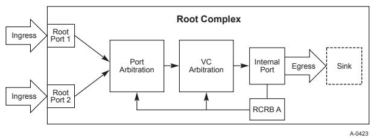

table>
<thead>
<tr>
<th width="50%">🇬🇧 English</th>
<th width="50%" style="background-color:#e8e8e8">🇨🇳 中文</th>
</tr>
</thead>
<tbody>
<tr>
<td>

- Multiple Root Complex Components such that software not only has visibility and control with respect to internal operation of a given Root Complex Component but also has the ability to discover and control arbitration between different Root Complex Components. As shown in § Figure 6-12, software views the Root Ports as Ingress Ports for a given component. An RCRB structure controls egress from the component to other Root Complex Components (RCRB C) or to an internal sink unit such as memory (RCRB A). In addition, an RCRB structure (RCRB B) may also be present in a given component to control traffic from other Root Complex Components. Controls for differentiated services are provided through Virtual Channel Capability structures located appropriately in the RCRBs respectively.

More complex topologies are possible as well.

A Root Complex topology can be represented as a collection of logical Root Complex Components such that each logical component has:

- One or more Ingress Ports.
- An Egress Port.
- Optional associated Virtual Channel capabilities located either in the Configuration Space (for Root Ports) or in an RCRB (for internal Ingress/Egress Ports) if the Root Complex supports Virtual Channels.
- Optional devices/Functions integrated in the Root Complex.

In order for software to correctly program arbitration and other control parameters for PCI Express differentiated services, software must be able to discover a Root Complex's internal topology. Root Complex topology discovery is accomplished by means of the Root Complex Link Declaration Capability as described in § Section 7.9.8.

</td>
<td style="background-color:#e8e8e8">

- 多个根复合体组件：软件不仅对给定根复合体组件的内部操作具有可见性和控制，还具有发现和控制不同根复合体组件之间仲裁的能力。如 § Figure 6-12 所示，软件将根端口视为给定组件的入端口。RCRB 结构控制从组件到其他根复合体组件（RCRB C）或到内部汇聚单元（例如内存，RCRB A）的出方向。此外，RCRB 结构（RCRB B）也可以存在于给定组件中，以控制来自其他根复合体组件的流量。差异化服务的控制通过适当地分别位于各 RCRB 中的虚通道 (VC) Capability 结构提供。

更复杂的拓扑也是可能的。

根复合体拓扑可以表示为逻辑根复合体组件的集合，其中每个逻辑组件具有：

- 一个或多个入端口 (Ingress Port)。
- 一个出端口 (Egress Port)。
- 可选的关联虚通道 (VC) 能力，位于配置空间 (Configuration Space)（对于根端口）或 RCRB 中（对于内部入/出端口），前提是根复合体支持虚通道。
- 可选地集成在根复合体中的设备/功能 (Function)。

为了使软件能够正确地编程 PCI Express 差异化服务的仲裁和其他控制参数，软件必须能够发现根复合体的内部拓扑。根复合体拓扑发现是通过根复合体链路声明能力 (Root Complex Link Declaration Capability) 完成的，如 § Section 7.9.8 所述。

</td>
</tr>
</tbody>
</table>

---

> **Figure 6-12.** Root Complex Represented as Multiple Components | 根复合体表示为多个组件
> 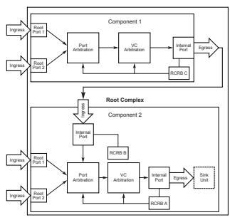

---

<<<PAGE_BREAK>>> page_795

<a id="sec-6-11"></a>
## 6.11 Link Speed Management | 链路速度管理


<div style="overflow-x: auto; max-width: 100%;">
<table>
<thead>
<tr>
<th width="50%">🇬🇧 English</th>
<th width="50%" style="background-color:#e8e8e8">🇨🇳 中文</th>
</tr>
</thead>
<tbody>
<tr>
<td>

This section describes how Link speed management is coordinated between the LTSSM (§ Section 4.2.7) and the software Link observation and control mechanisms (see § Section 7.5.3.6, § Section 7.5.3.7, § Section 7.5.3.8, § Section 7.5.3.18, § Section 7.5.3.19, and § Section 7.5.3.20).

The Target Link Speed field in the Link Control 2 register in the Downstream Port sets the upper bound for the Link speed. Except as described below, the Upstream component must attempt to maintain the Link at the Target Link Speed, or at the highest speed supported by both components on the Link (as reported by the values in the training sets - see § Section 4.2.5.1), whichever is lower.

Any Upstream Port or Downstream Port with the Hardware Autonomous Speed Disable bit in the Link Control 2 register clear is permitted to autonomously change the Link speed using implementation specific criteria.

If the reliability of the Link is unacceptably low, then either component is permitted to lower the Link speed by removing the unreliable Link speed from the list of supported speeds advertised in the training sets the component transmits. The criteria for determination of acceptable Link reliability are implementation specific, and are not dependent on the setting of the Hardware Autonomous Speed Disable bit.

During any given speed negotiation it is possible that one or both components will advertise a subset of all speeds supported, as a means to cap the post-negotiation Link speed. It is permitted for a component to change its set of advertised supported speeds without requesting a Link speed change by driving the Link through Recovery without setting the speed change bit.

When a component's attempt to negotiate to a particular Link speed fails, that component is not permitted to attempt negotiation to that Link speed, or to any higher Link speed, until 200 ms has passed from the return to L0 following the failed attempt, or until the other component on the Link advertises support for the higher Link speed through its transmitted training sets (with or without a request to change the Link speed), whichever comes first.

Software is permitted to restrict the maximum speed of Link operation and set the preferred Link speed by setting the value in the Target Link Speed field in the Upstream component. After modifying the value in the Target Link Speed field, software must trigger Link retraining by writing 1b to the Retrain Link bit. Software is notified of any Link speed changes (as well as any Link width changes) through the Link Bandwidth Notification Mechanism.

Software is permitted to cause a Link to transition to the Polling.Compliance LTSSM state at a particular speed by writing the Link Control 2 register in both components with the same value in the Target Link Speed field and Setting the Enter Compliance bit, and then initiating a Hot Reset on the Link (through the Downstream Port).

Note that this will take the Link to a DL_Down state and therefore cannot be done transparently to other software that is using the Link. The Downstream Port will return to Polling.Active when the Enter Compliance bit is cleared.

</td>
<td style="background-color:#e8e8e8">

本节描述链路 (Link) 速度管理如何在 LTSSM（链路训练与状态机，参见 § Section 4.2.7）与软件链路观察和控制机制（参见 § Section 7.5.3.6、§ Section 7.5.3.7、§ Section 7.5.3.8、§ Section 7.5.3.18、§ Section 7.5.3.19 和 § Section 7.5.3.20）之间协调。

下游端口的 Link Control 2 寄存器中的 Target Link Speed 字段设置了链路速度的上限。除非下文另有说明，否则上游组件必须尝试将链路维持在 Target Link Speed，或者维持链路上两个组件都支持的最高速度（由训练集 (training sets) 中的值报告——参见 § Section 4.2.5.1），以较低者为准。

任何上游端口 (Upstream Port) 或下游端口，只要 Link Control 2 寄存器中的 Hardware Autonomous Speed Disable 位被清零，就允许使用实现特定的标准来自主更改链路速度。

如果链路的可靠性低到不可接受，则任一组件都允许通过从组件所发送的训练集中通告的支持速度列表中移除不可靠的链路速度来降低链路速度。确定可接受链路可靠性的标准是实现特定的，并且不依赖于 Hardware Autonomous Speed Disable 位的设置。

在任何给定的速度协商 (Negotiation) 过程中，可能一个或两个组件将仅通告其支持速度的子集，以此作为协商后链路速度的上限。允许组件在不请求链路速度更改的情况下更改其通告的支持速度集合，方法是通过使链路经过 Recovery (恢复) 状态而不设置 speed change 位。

当组件尝试协商到特定链路速度失败时，在从失败尝试之后返回 L0 起 200 ms 过去之前，或者在链路上的另一组件通过其发送的训练集（无论是否请求更改链路速度）通告支持更高的链路速度之前（以先发生者为准），不允许该组件尝试协商到该链路速度或任何更高的链路速度。

允许软件通过设置上游组件中 Target Link Speed 字段的值来限制链路操作的最大速度并设置首选链路速度。修改 Target Link Speed 字段的值后，软件必须通过将 Retrain Link 位写入 1b 来触发链路重新训练。软件通过链路带宽通知机制 (Link Bandwidth Notification Mechanism) 获知任何链路速度更改（以及任何链路宽度更改）。

允许软件通过在两个组件的 Link Control 2 寄存器中写入 Target Link Speed 字段的相同值并设置 Enter Compliance 位，然后启动链路上的热复位 (Hot Reset)（通过下游端口）来使链路以特定速度转换到 Polling.Compliance LTSSM 状态。

请注意，这会将链路带入 DL_Down 状态，因此无法对正在使用该链路的其他软件透明地完成。当 Enter Compliance 位被清除时，下游端口将返回到 Polling.Active 状态。

</td>
</tr>
</tbody>
</table>
</div>


---

<a id="sec-6-12"></a>
## 6.12 Access Control Services (ACS) | 访问控制服务 (ACS)

table>
<thead>
<tr>
<th width="50%">🇬🇧 English</th>
<th width="50%" style="background-color:#e8e8e8">🇨🇳 中文</th>
</tr>
</thead>
<tbody>
<tr>
<td>

ACS defines a set of control points within a PCI Express topology to determine whether a TLP is to be routed normally, blocked, or redirected. ACS is applicable to RCs, Switches, and Multi-Function Devices.<sup>127</sup> For ACS requirements, single-Function devices that are SR-IOV capable must be handled as if they were Multi-Function Devices, since they essentially behave as Multi-Function Devices after their Virtual Functions (VFs) are enabled.

Implementation of ACS in RCiEPs is permitted but not required. It is explicitly permitted that, within a single Root Complex, some RCiEPs implement ACS and some do not. It is strongly recommended that Root Complex implementations ensure that all accesses originating from RCiEPs (PFs and VFs) without ACS capability are first subjected to processing by the Translation Agent (TA) in the Root Complex before further decoding and processing. The details of such Root Complex handling are outside the scope of this specification.

</td>
<td style="background-color:#e8e8e8">

ACS 在 PCI Express 拓扑内定义了一组控制点，以确定 TLP (事务层包) 是正常路由、被阻止还是被重定向。ACS 适用于 RC、交换机和多功能设备 (Multi-Function Device)。<sup>127</sup> 对于 ACS 要求，支持 SR-IOV 的单功能设备必须按照多功能设备的方式处理，因为它们在虚拟功能 (VF) 启用之后实际上表现为多功能设备。

RCiEP 中 ACS 的实现是允许的，但不是必需的。明确允许在单个根复合体内，一些 RCiEP 实现 ACS 而另一些不实现。强烈建议根复合体实现确保来自不具有 ACS 能力的 RCiEP（PF 和 VF）的所有访问在进一步解码和处理之前首先由根复合体中的转换代理 (Translation Agent, TA) 进行处理。此类根复合体处理的详细信息超出了本规范的范围。

<sup>127</sup> 多功能设备中的适用 Function 具体包括 PCI Express 端点、交换机上游端口、传统 PCI Express 端点和根复合体集成端点 (Root Complex Integrated Endpoint)。

</td>
</tr>
</tbody>
</table>

---

<<<PAGE_BREAK>>> page_796


<div style="overflow-x: auto; max-width: 100%;">
<table>
<thead>
<tr>
<th width="50%">🇬🇧 English</th>
<th width="50%" style="background-color:#e8e8e8">🇨🇳 中文</th>
</tr>
</thead>
<tbody>
<tr>
<td>

ACS provides the following types of access control:

- ACS Source Validation
- ACS Translation Blocking
- ACS P2P Request Redirect
- ACS P2P Completion Redirect
- ACS Upstream Forwarding
- ACS P2P Egress Control
- ACS Direct Translated P2P
- ACS I/O Request Blocking
- ACS DSP Memory Target Access
- ACS USP Memory Target Access
- ACS Unclaimed Request Redirect

The specific requirements for each of these are discussed in the following section.

ACS hardware functionality is disabled by default, and is enabled only by ACS-aware software. With the exception of ACS Source Validation, ACS access controls are not applicable to Multicast TLPs (see § Section 6.14), and have no effect on them.

ACS functionality is reported and managed via ACS Extended Capability structures. PCI Express components are permitted to implement ACS Extended Capability structures in some, none, or all of their applicable Functions. The extent of what is implemented is communicated through capability bits in each ACS Extended Capability structure. A given Function with an ACS Extended Capability structure may be required or forbidden to implement certain capabilities, depending upon the specific type of the Function and whether it is part of a Multi-Function Device.

ACS is never applicable to a PCI Express to PCI Bridge Function or a Root Complex Event Collector Function, and such Functions must never implement an ACS Extended Capability structure.

</td>
<td style="background-color:#e8e8e8">

ACS 提供以下类型的访问控制：

- ACS Source Validation（ACS 源验证）
- ACS Translation Blocking（ACS 转换阻止）
- ACS P2P Request Redirect（ACS P2P 请求重定向）
- ACS P2P Completion Redirect（ACS P2P 完成重定向）
- ACS Upstream Forwarding（ACS 上游转发）
- ACS P2P Egress Control（ACS P2P 出方向控制）
- ACS Direct Translated P2P（ACS 直接转换 P2P）
- ACS I/O Request Blocking（ACS I/O 请求阻止）
- ACS DSP Memory Target Access（ACS DSP 内存目标访问）
- ACS USP Memory Target Access（ACS USP 内存目标访问）
- ACS Unclaimed Request Redirect（ACS 未声明请求重定向）

每种类型的具体要求将在下一节中讨论。

ACS 硬件功能默认禁用，并且仅由支持 ACS 的软件启用。除了 ACS Source Validation 之外，ACS 访问控制不适用于组播 TLP (Multicast TLP)（参见 § Section 6.14），并且对它们没有影响。

ACS 功能通过 ACS Extended Capability 结构进行报告和管理。允许 PCI Express 组件在其部分、不或全部适用 Function 中实现 ACS Extended Capability 结构。所实现的内容的范围通过每个 ACS Extended Capability 结构中的能力位进行传达。具有 ACS Extended Capability 结构的给定 Function 可能被要求或被禁止实现某些能力，这取决于 Function 的特定类型及其是否为多功能设备的一部分。

ACS 绝不适用于 PCI Express-PCI 桥 Function 或根复合体事件收集器 (Root Complex Event Collector) Function，并且此类 Function 绝不能实现 ACS Extended Capability 结构。

</td>
</tr>
</tbody>
</table>
</div>


---

<a id="sec-6-12-1"></a>
## 6.12.1 ACS Component Capability Requirements | ACS 组件能力要求

table>
<thead>
<tr>
<th width="50%">🇬🇧 English</th>
<th width="50%" style="background-color:#e8e8e8">🇨🇳 中文</th>
</tr>
</thead>
<tbody>
<tr>
<td>

This section applies to Root Ports and Switch Downstream Ports that implement an ACS Extended Capability structure. This section applies to Downstream Port Functions both for single-Function devices and Multi-Function Devices.

- **ACS Source Validation**: must be implemented.

When enabled, the Downstream Port tests the Bus Number from the Requester ID of each Upstream Request received by the Port to determine if it is associated with the Secondary side of the virtual bridge associated with the Downstream Port, by either or both of:

- Determining that the Requester ID falls within the Bus Number "aperture" of the Port - the inclusive range specified by the Secondary Bus Number register and the Subordinate Bus Number register.

</td>
<td style="background-color:#e8e8e8">

本节适用于实现 ACS Extended Capability 结构的根端口和交换机下游端口。本节适用于单功能设备和多功能设备的下游端口 Function。

- **ACS Source Validation（ACS 源验证）**：必须实现。

启用后，下游端口会测试端口接收到的每个上游请求 (Upstream Request) 的 Requester ID 中的 Bus Number，以通过以下任一或两种方式确定其是否与下游端口关联的虚拟桥的 Secondary 侧相关联：

- 确定 Requester ID 落在端口的 Bus Number "aperture"（窗口）内——即由 Secondary Bus Number 寄存器和 Subordinate Bus Number 寄存器指定的闭区间。

</td>
</tr>
</tbody>
</table>

---

<a id="sec-6-12-1-1"></a>
## 6.12.1.1 ACS Downstream Ports | ACS 下游端口


<div style="overflow-x: auto; max-width: 100%;">
<table>
<thead>
<tr>
<th width="50%">🇬🇧 English</th>
<th width="50%" style="background-color:#e8e8e8">🇨🇳 中文</th>
</tr>
</thead>
<tbody>
<tr>
<td>

- If FPB is implemented and enabled, determining that the Requester ID is associated with the bridge's Secondary Side by the application of the FPB Routing ID mechanism.

If the Bus Number from the Requester ID of the Request is not within this aperture, this is a reported error (ACS Violation) associated with the Receiving Port (see § Section 6.12.5.)

Completions are never affected by ACS Source Validation.

- **ACS Translation Blocking**: must be implemented.

When enabled, the Downstream Port checks the Address Type (AT) field of each Upstream Memory Request and, in Flit mode only, of each Upstream Address Routed Message received by the Port. If the AT field is not the default value, this is a reported error (ACS Violation) associated with the Receiving Port (see § Section 6.12.5). This error must take precedence over ACS Upstream Forwarding and any applicable ACS P2P control mechanisms.

Completions are never affected by ACS Translation Blocking.

- **ACS P2P Request Redirect**: must be implemented by Root Ports that support peer-to-peer traffic with other Root Ports;<sup>128</sup> must be implemented by Switch Downstream Ports.

ACS P2P Request Redirect is subject to interaction with the ACS P2P Egress Control and ACS Direct Translated P2P mechanisms (if implemented). Refer to § Section 6.12.3 for more information.

When ACS P2P Request Redirect is enabled in a Switch Downstream Port, peer-to-peer Requests must be redirected Upstream towards the RC.

When ACS P2P Request Redirect is enabled in a Root Port, peer-to-peer Requests must be sent to Redirected Request Validation logic within the RC that determines whether the Request is "reflected" back Downstream towards its original target, or blocked as an ACS Violation error. The algorithms and specific controls for making this determination are not architected by this specification.

Downstream Ports never redirect Requests that are traveling Downstream.

Completions are never affected by ACS P2P Request Redirect.

</td>
<td style="background-color:#e8e8e8">

- 如果实现了并启用了 FPB，则通过应用 FPB Routing ID 机制来确定 Requester ID 是否与桥的 Secondary 侧相关联。

如果请求的 Requester ID 中的 Bus Number 不在该窗口内，则这是与接收端口相关联的已报告错误（ACS Violation）（参见 § Section 6.12.5）。

完成报文 (Completion) 永远不受 ACS Source Validation 的影响。

- **ACS Translation Blocking（ACS 转换阻止）**：必须实现。

启用后，下游端口会检查端口接收到的每个上游内存请求 (Upstream Memory Request) 的地址类型 (Address Type, AT) 字段，并且仅在 Flit 模式下检查每个上游地址路由消息 (Upstream Address Routed Message) 的 AT 字段。如果 AT 字段不是默认值，则这是与接收端口相关联的已报告错误（ACS Violation）（参见 § Section 6.12.5）。此错误必须优先于 ACS Upstream Forwarding 和任何适用的 ACS P2P 控制机制。

完成报文永远不受 ACS Translation Blocking 的影响。

- **ACS P2P Request Redirect（ACS P2P 请求重定向）**：必须由支持与其他根端口进行对等 (peer-to-peer) 流量的根端口实现；<sup>128</sup> 必须由交换机下游端口实现。

ACS P2P Request Redirect 与 ACS P2P Egress Control 和 ACS Direct Translated P2P 机制（如果实现）存在交互。有关更多信息，请参阅 § Section 6.12.3。

在交换机下游端口中启用 ACS P2P Request Redirect 时，对等请求必须向上游方向重定向到 RC。

在根端口中启用 ACS P2P Request Redirect 时，对等请求必须发送到 RC 中的 Redirected Request Validation 逻辑，该逻辑确定请求是"反射"回下游方向到其原始目标，还是作为 ACS Violation 错误被阻止。进行此确定的算法和具体控制不由本规范架构。

下游端口从不重定向向下游方向行进的请求。

完成报文永远不受 ACS P2P Request Redirect 的影响。

</td>
</tr>
</tbody>
</table>
</div>


---

<<<PAGE_BREAK>>> page_797

table>
<thead>
<tr>
<th width="50%">🇬🇧 English</th>
<th width="50%" style="background-color:#e8e8e8">🇨🇳 中文</th>
</tr>
</thead>
<tbody>
<tr>
<td>

> **IMPLEMENTATION NOTE:**
> **UPSTREAM MESSAGES AND ACS SOURCE VALIDATION**
>
> Functions are permitted to transmit Upstream Messages before they have been assigned a Bus Number. Such messages will have a Requester ID with a Bus Number of 00h. If the Downstream Port has ACS Source Validation enabled, these Messages (see § Table F-1, § Section 2.2.8.2, and § Section 6.22.1) will likely be detected as an ACS Violation error.

- **ACS P2P Completion Redirect**: must be implemented by Root Ports that implement ACS P2P Request Redirect; must be implemented by Switch Downstream Ports.

The intent of ACS P2P Completion Redirect is to avoid ordering rule violations between Completions and Requests when Requests are redirected. Refer to § Section 6.12.6 for more information.

ACS P2P Completion Redirect does not interact with ACS controls that govern Requests.

</td>
<td style="background-color:#e8e8e8">

> **实现说明 (IMPLEMENTATION NOTE)：**
> **UPSTREAM MESSAGES AND ACS SOURCE VALIDATION（上游消息与 ACS 源验证）**
>
> 允许 Function 在被分配 Bus Number 之前发送上游消息 (Upstream Messages)。此类消息的 Requester ID 将具有 00h 的 Bus Number。如果下游端口启用了 ACS Source Validation，则这些消息（参见 § Table F-1、§ Section 2.2.8.2 和 § Section 6.22.1）很可能被检测为 ACS Violation 错误。

- **ACS P2P Completion Redirect（ACS P2P 完成重定向）**：必须由实现了 ACS P2P Request Redirect 的根端口实现；必须由交换机下游端口实现。

ACS P2P Completion Redirect 的目的是在请求被重定向时避免完成报文和请求之间的排序规则冲突。有关更多信息，请参阅 § Section 6.12.6。

ACS P2P Completion Redirect 不与控制请求的 ACS 控件交互。

</td>
</tr>
</tbody>
</table>

---

<<<PAGE_BREAK>>> page_798


<div style="overflow-x: auto; max-width: 100%;">
<table>
<thead>
<tr>
<th width="50%">🇬🇧 English</th>
<th width="50%" style="background-color:#e8e8e8">🇨🇳 中文</th>
</tr>
</thead>
<tbody>
<tr>
<td>

When ACS P2P Completion Redirect is enabled in a Switch Downstream Port, peer-to-peer Completions<sup>129</sup> that do not have the Relaxed Ordering Attribute bit set (1b) must be redirected Upstream towards the RC. Otherwise, peer-to-peer Completions must be routed normally.

When ACS P2P Completion Redirect is enabled in a Root Port, peer-to-peer Completions that do not have the Relaxed Ordering bit set must be handled such that they do not pass Requests that are sent to Redirected Request Validation logic within the RC. Such Completions must eventually be sent Downstream towards their original peer-to-peer targets, without incurring additional ACS access control checks.

Downstream Ports never redirect Completions that are traveling Downstream.

Requests are never affected by ACS P2P Completion Redirect.

- **ACS Upstream Forwarding**: must be implemented by Root Ports if the RC supports Redirected Request Validation; must be implemented by Switch Downstream Ports.

When ACS Upstream Forwarding is enabled in a Switch Downstream Port, and its Ingress Port receives an Upstream Request or Completion TLP targeting the Port's own Egress Port, the Port must instead forward the TLP Upstream towards the RC.

When ACS Upstream Forwarding is enabled in a Root Port, and its Ingress Port receives an Upstream Request or Completion TLP that targets the Port's own Egress Port, the Port must handle the TLP as follows. For a Request, the Root Port must handle it the same as a Request that the Port "redirects" with the ACS P2P Request Redirect mechanism. For a Completion, the Root Port must handle it the same as a Completion that the Port "redirects" with the ACS P2P Completion Redirect mechanism.

When ACS Upstream Forwarding is not enabled on a Downstream Port, and its Ingress Port receives an Upstream Request or Completion TLP that targets the Port's own Egress Port, the handling of the TLP is undefined.

- **ACS P2P Egress Control**: implementation is optional.

ACS P2P Egress Control is subject to interaction with the ACS P2P Request Redirect and ACS Direct Translated P2P mechanisms (if implemented). Refer to § Section 6.12.3 for more information.

A Switch that supports ACS P2P Egress Control can be selectively configured to block peer-to-peer Requests between its Downstream Ports. Software can configure the Switch to allow none or only a subset of its Downstream Ports to send peer-to-peer Requests to other Downstream Ports. This is configured on a per Downstream Port basis.

An RC that supports ACS P2P Egress Control can be selectively configured to block peer-to-peer Requests between its Root Ports. Software can configure the RC to allow none or only a subset of the Hierarchy Domains to send peer-to-peer Requests to other Hierarchy Domains. This is configured on a per Root Port basis.

With ACS P2P Egress Control in Downstream Ports, controls in the Ingress Port ("sending" Port) determine if the peer-to-peer Request is blocked, and if so, the Ingress Port handles the ACS Violation error per § Section 6.12.5.

Completions are never affected by ACS P2P Egress Control.

</td>
<td style="background-color:#e8e8e8">

当在交换机下游端口中启用 ACS P2P Completion Redirect 时，未设置 (1b) Relaxed Ordering Attribute 位的对等完成报文<sup>129</sup>必须向上游方向重定向到 RC。否则，对等完成报文必须正常路由。

当在根端口中启用 ACS P2P Completion Redirect 时，未设置 Relaxed Ordering 位的对等完成报文必须以这样的方式处理：它们不会通过发送到 RC 中的 Redirected Request Validation 逻辑的请求。此类完成报文最终必须向下游方向发送到其原始对等目标，而不会引发额外的 ACS 访问控制检查。

下游端口从不重定向向下游方向行进的完成报文。

请求永远不受 ACS P2P Completion Redirect 的影响。

- **ACS Upstream Forwarding（ACS 上游转发）**：如果 RC 支持 Redirected Request Validation，则必须由根端口实现；必须由交换机下游端口实现。

当在交换机下游端口中启用 ACS Upstream Forwarding，并且其入端口接收到以端口自身出端口为目标的 TLP 上游请求或完成报文时，端口必须改为将 TLP 向上游方向转发到 RC。

当在根端口中启用 ACS Upstream Forwarding，并且其入端口接收到以端口自身出端口为目标的 TLP 上游请求或完成报文时，端口必须按如下方式处理 TLP。对于请求，根端口必须以与端口使用 ACS P2P Request Redirect 机制"重定向"请求相同的方式处理它。对于完成报文，根端口必须以与端口使用 ACS P2P Completion Redirect 机制"重定向"完成报文相同的方式处理它。

当下游端口未启用 ACS Upstream Forwarding，并且其入端口接收到以端口自身出端口为目标的 TLP 上游请求或完成报文时，TLP 的处理是未定义的。

- **ACS P2P Egress Control（ACS P2P 出方向控制）**：实现是可选的。

ACS P2P Egress Control 与 ACS P2P Request Redirect 和 ACS Direct Translated P2P 机制（如果实现）存在交互。有关更多信息，请参阅 § Section 6.12.3。

支持 ACS P2P Egress Control 的交换机可以选择性地配置为阻止其下游端口之间的对等请求。软件可以配置交换机以允许其下游端口中的无或仅子集向其他下游端口发送对等请求。这是按下游端口配置。

支持 ACS P2P Egress Control 的 RC 可以选择性地配置为阻止其根端口之间的对等请求。软件可以配置 RC 以允许其层级域 (Hierarchy Domain) 中的无或仅子集向其他层级域发送对等请求。这是按根端口配置。

通过下游端口中的 ACS P2P Egress Control，入端口（"发送"端口）中的控件确定对等请求是否被阻止，如果是，则入端口根据 § Section 6.12.5 处理 ACS Violation 错误。

完成报文永远不受 ACS P2P Egress Control 的影响。

</td>
</tr>
</tbody>
</table>
</div>


---

<<<PAGE_BREAK>>> page_799

table>
<thead>
<tr>
<th width="50%">🇬🇧 English</th>
<th width="50%" style="background-color:#e8e8e8">🇨🇳 中文</th>
</tr>
</thead>
<tbody>
<tr>
<td>

- **ACS Direct Translated P2P**: must be implemented by Root Ports that support Address Translation Services (ATS) and also support peer-to-peer traffic with other Root Ports;<sup>130</sup> must be implemented by Switch Downstream Ports.

When ACS Direct Translated P2P is enabled in a Downstream Port, peer-to-peer Memory Requests and, in Flit mode only, peer-to-peer Address Routed Messages whose Address Type (AT) field indicates a Translated address must be routed normally ("directly") to the peer Egress Port, regardless of ACS P2P Request Redirect and ACS P2P Egress Control settings. All other peer-to-peer Requests must still be subject to ACS P2P Request Redirect and ACS P2P Egress Control settings.

Completions are never affected by ACS Direct Translated P2P.

- **ACS I/O Request Blocking**: must be implemented by Root Ports and Switch Downstream Ports that support ACS Enhanced Capability.

When enabled, the Port must handle an Upstream I/O Request received by the Port's Ingress as an ACS Violation.

- **ACS DSP Memory Target Access**: must be implemented by Root Ports and Switch Downstream Ports that support ACS Enhanced Capability and that have applicable Memory BAR Space to protect.

ACS DSP Memory Target Access determines how an Upstream Request received by the Downstream Port's Ingress and targeting any Memory BAR Space<sup>131</sup> associated with an applicable Downstream Port is handled.

The Request can be blocked, redirected, or allowed to proceed directly to its target. In a Switch, all Downstream Ports are applicable, including the one on which the Request was received. In a Root Complex, the set of applicable Root Ports is implementation specific, but always includes the one on which the Request was received.

- **ACS USP Memory Target Access**: must be implemented by Switch Downstream Ports that support ACS Enhanced Capability and that have applicable Memory BAR Space in the Switch Upstream Port to protect; is not applicable to Root Ports.

ACS USP Memory Target Access determines how an Upstream Request received by the Switch Downstream Port's Ingress and targeting any Memory BAR Space<sup>132</sup> associated with the Switch's Upstream Port is handled.

The Request can be blocked, redirected, or allowed to proceed directly to its target.

If any Functions other than the Switch Upstream Port are associated with the Upstream Port, this field has no effect on accesses to their Memory BAR Space<sup>133</sup>. Such access is controlled by the ACS Extended Capability (if present) in the Switch Upstream Port.

- **ACS Unclaimed Request Redirect**: must be implemented by Switch Downstream Ports that support ACS Enhanced Capability; is not applicable to Root Ports.

When enabled, incoming Requests received by the Switch Downstream Port's Ingress and targeting Memory Space within the memory window of a Switch Upstream Port that is not within a memory window or Memory BAR Target of any Downstream Port within the Switch are redirected Upstream out of the Switch.

When not enabled, such Requests are handled by the Switch Downstream Port as an Unsupported Request (UR).

</td>
<td style="background-color:#e8e8e8">

- **ACS Direct Translated P2P（ACS 直接转换 P2P）**：必须由支持地址转换服务 (Address Translation Services, ATS) 并且还支持与其他根端口进行对等流量的根端口实现；<sup>130</sup> 必须由交换机下游端口实现。

当在下游端口中启用 ACS Direct Translated P2P 时，其地址类型 (AT) 字段指示已转换地址 (Translated address) 的对等内存请求以及仅在 Flit 模式下的对等地址路由消息必须正常（"直接"）路由到对等出端口，而不管 ACS P2P Request Redirect 和 ACS P2P Egress Control 设置如何。所有其他对等请求仍必须受 ACS P2P Request Redirect 和 ACS P2P Egress Control 设置的约束。

完成报文永远不受 ACS Direct Translated P2P 的影响。

- **ACS I/O Request Blocking（ACS I/O 请求阻止）**：必须由支持 ACS Enhanced Capability 的根端口和交换机下游端口实现。

启用后，端口必须将端口入方向接收到的 I/O 请求 (I/O Request) 作为 ACS Violation 处理。

- **ACS DSP Memory Target Access（ACS DSP 内存目标访问）**：必须由支持 ACS Enhanced Capability 且具有适用内存 BAR (基址寄存器) 空间要保护的根端口和交换机下游端口实现。

ACS DSP Memory Target Access 决定如何处理由下游端口入方向接收的、且以任何与适用下游端口相关联的内存 BAR 空间<sup>131</sup>为目标的 TLP 上游请求。

请求可以被阻止、重定向或被允许直接进入其目标。在交换机中，所有下游端口都适用，包括接收请求的端口。在根复合体中，适用根端口的集合是实现特定的，但始终包括接收请求的端口。

- **ACS USP Memory Target Access（ACS USP 内存目标访问）**：必须由支持 ACS Enhanced Capability 且交换机上游端口中具有适用内存 BAR 空间要保护的交换机下游端口实现；不适用于根端口。

ACS USP Memory Target Access 决定如何处理由交换机下游端口入方向接收的、且以任何与交换机上游端口相关联的内存 BAR 空间<sup>132</sup>为目标的 TLP 上游请求。

请求可以被阻止、重定向或被允许直接进入其目标。

如果与上游端口相关联的有除交换机上游端口以外的任何 Function，则此字段对访问其内存 BAR 空间<sup>133</sup>没有影响。此类访问由交换机上游端口中的 ACS Extended Capability（如果存在）控制。

- **ACS Unclaimed Request Redirect（ACS 未声明请求重定向）**：必须由支持 ACS Enhanced Capability 的交换机下游端口实现；不适用于根端口。

启用后，由交换机下游端口入方向接收的、且以交换机上游端口的内存窗口内的内存空间为目标（但不在交换机内任何下游端口的内存窗口或内存 BAR 目标内）的传入请求被向上游重定向离开交换机。

未启用时，此类请求由交换机下游端口作为不支持的请求 (Unsupported Request, UR) 处理。

</td>
</tr>
</tbody>
</table>

---

<table>
<thead>
<tr>
<th width="50%">🇬🇧 English</th>
<th width="50%" style="background-color:#e8e8e8">🇨🇳 中文</th>
</tr>
</thead>
<tbody>
<tr>
<td>

This section applies to Multi-Function Device ACS Functions, with the exception of Downstream Port Functions, which are covered in the preceding section. For ACS requirements, single-Function devices that are SR-IOV capable must be handled as if they were Multi-Function Devices.

</td>
<td style="background-color:#e8e8e8">

本节适用于多功能设备 ACS Function，下游端口 Function 除外（已在上一节中介绍）。对于 ACS 要求，支持 SR-IOV 的单功能设备必须按照多功能设备的方式处理。

</td>
</tr>
</tbody>
</table>

---


---

---
<<<PAGE_BREAK>>> page_800
---

<a id="sec-6-12-1-2"></a>
### 6.12.1.2 ACS Functions in SR-IOV Capable and Multi-Function Devices | SR-IOV 与多功能设备中的 ACS 功能


<div style="overflow-x: auto; max-width: 100%;">
<table>
<thead>
<tr>
<th width="50%">🇬🇧 English</th>
<th width="50%" style="background-color:#e8e8e8">🇨🇳 中文</th>
</tr>
</thead>
<tbody>
<tr>
<td>

131. This also includes any Memory Space allocated by an Expansion ROM Base Address register (BAR). This also includes any Memory Space allocated by EA entries with a BEI value of 0, 1, 7, or 8. See § Section 7.8.5.3 .

132. This also includes any Memory Space allocated by an Expansion ROM Base Address register (BAR). This also includes any Memory Space allocated by EA entries with a BEI value of 0, 1, 7, or 8. See § Section 7.8.5.3 .

133. This also includes any Memory Space allocated by an Expansion ROM Base Address register (BAR). This also includes any Memory Space allocated by EA entries with a BEI value of 0, 1, 7, or 8. See § Section 7.8.5.3 .

- **ACS Source Validation**: must not be implemented.
- **ACS Translation Blocking**: must not be implemented.
- **ACS P2P Request Redirect**: must be implemented by Functions that support peer-to-peer traffic with other Functions. This includes SR-IOV Virtual Functions (VFs).

ACS P2P Request Redirect is subject to interaction with the ACS P2P Egress Control and ACS Direct Translated P2P mechanisms (if implemented). Refer to § Section 6.12.3 for more information.

When ACS P2P Request Redirect is enabled in a Multi-Function Device that is not an RCiEP, peer-to-peer Requests (between Functions of the device) must be redirected Upstream towards the RC.

It is permitted but not required to implement ACS P2P Request Redirect in an RCiEP. When ACS P2P Request Redirect is enabled in an RCiEP, peer-to-peer Requests, defined as all Requests that do not target system memory, must be sent to implementation specific logic within the Root Complex that determines whether the Request is directed towards its original target, or blocked as an ACS Violation error. The algorithms and specific controls for making this determination are not architected by this specification.

Completions are never affected by ACS P2P Request Redirect.

- **ACS P2P Completion Redirect**: must be implemented by Functions that implement ACS P2P Request Redirect.

The intent of ACS P2P Completion Redirect is to avoid ordering rule violations between Completions and Requests when Requests are redirected. Refer to § Section 6.12.6 for more information.

ACS P2P Completion Redirect does not interact with ACS controls that govern Requests.

When ACS P2P Completion Redirect is enabled in a Multi-Function Device that is not an RCiEP, peer-to-peer Completions that do not have the Relaxed Ordering bit set must be redirected Upstream towards the RC. Otherwise, peer-to-peer Completions must be routed normally.

Requests are never affected by ACS P2P Completion Redirect.

- **ACS Upstream Forwarding**: must not be implemented.
- **ACS P2P Egress Control**: implementation is optional; is based on Function Numbers or Function Group Numbers; controls peer-to-peer Requests between the different Functions within the multi-Function or SR-IOV capable device.

ACS P2P Egress Control is subject to interaction with the ACS P2P Request Redirect and ACS Direct Translated P2P mechanisms (if implemented). Refer to § Section 6.12.3 for more information.

Each Function within a Multi-Function Device that supports ACS P2P Egress Control can be selectively enabled to block peer-to-peer communication with other Functions or Function Groups<sup>134</sup> within the device. This is configured on a per Function basis.

With ACS P2P Egress Control in multi-Function or SR-IOV capable devices, controls in the "sending" Function determine if the Request is blocked, and if so, the "sending" Function handles the ACS Violation error per § Section 6.12.5 .

When ACS Function Groups are enabled in an ARI Device (ACS Function Groups Enable is Set), ACS P2P Egress Controls are enforced on a per Function Group basis instead of a per Function basis. See § Section 6.13 .

Completions are never affected by ACS P2P Egress Control.

- **ACS Direct Translated P2P**: must be implemented if the Multi-Function Device Function supports Address Translation Services (ATS) and also peer-to-peer traffic with other Functions.

134. ACS Function Groups capability is optional for ARI Devices that implement ACS P2P Egress Controls.

</td>
<td style="background-color:#e8e8e8">

131. 这同样包括由扩展 ROM 基址寄存器 (Expansion ROM BAR) 所分配的 Memory Space。这也包括由 BEI 值为 0、1、7 或 8 的 EA (Entry Attribute) 条目所分配的 Memory Space。参见 § Section 7.8.5.3 。

132. 这同样包括由扩展 ROM 基址寄存器 (Expansion ROM BAR) 所分配的 Memory Space。这也包括由 BEI 值为 0、1、7 或 8 的 EA 条目所分配的 Memory Space。参见 § Section 7.8.5.3 。

133. 这同样包括由扩展 ROM 基址寄存器 (Expansion ROM BAR) 所分配的 Memory Space。这也包括由 BEI 值为 0、1、7 或 8 的 EA 条目所分配的 Memory Space。参见 § Section 7.8.5.3 。

- **ACS Source Validation (源校验)**:不得实现。
- **ACS Translation Blocking (转换阻塞)**:不得实现。
- **ACS P2P Request Redirect (P2P 请求重定向)**:必须由支持与其他 Function 进行对等 (peer-to-peer) 通信的 Function 实现,包括 SR-IOV 虚拟功能 (Virtual Function, VF)。

ACS P2P Request Redirect 与 ACS P2P Egress Control 和 ACS Direct Translated P2P 机制(若已实现)存在交互。更多信息参见 § Section 6.12.3 。

当 ACS P2P Request Redirect 在非 RCiEP 的多功能设备 (Multi-Function Device) 中使能时,(设备内各 Function 之间的) 对等请求 (peer-to-peer Request) 必须被重定向至上游 (Upstream) 方向的 RC。

在 RCiEP 中允许(但非必须)实现 ACS P2P Request Redirect。当 ACS P2P Request Redirect 在 RCiEP 中使能时,对等请求(定义为所有目标不是系统内存的请求)必须被送往根复合体 (Root Complex) 内的特定实现逻辑,由该逻辑判定该请求是发往其原始目标,还是作为 ACS 违规 (ACS Violation) 错误予以阻塞。规范并不规定用于做出此判定的算法和具体控制。

完成报文 (Completion) 从不受 ACS P2P Request Redirect 的影响。

- **ACS P2P Completion Redirect (P2P 完成重定向)**:必须由实现 ACS P2P Request Redirect 的 Function 实现。

ACS P2P Completion Redirect 的目的是在请求被重定向时,避免完成报文与请求之间的排序规则违例。更多信息参见 § Section 6.12.6 。

ACS P2P Completion Redirect 不与管理请求的 ACS 控制交互。

当 ACS P2P Completion Redirect 在非 RCiEP 的多功能设备中使能时,Relaxed Ordering 位未置位的对等完成报文必须被重定向至上游方向的 RC。否则,对等完成报文必须按常规路由。

请求从不受 ACS P2P Completion Redirect 的影响。

- **ACS Upstream Forwarding (上游转发)**:不得实现。
- **ACS P2P Egress Control (P2P 出口控制)**:实现为可选项;基于 Function 号或 Function Group 号;控制多功能或 SR-IOV 设备内各 Function 之间的对等请求。

ACS P2P Egress Control 与 ACS P2P Request Redirect 和 ACS Direct Translated P2P 机制(若已实现)存在交互。更多信息参见 § Section 6.12.3 。

支持 ACS P2P Egress Control 的多功能设备中的每个 Function 可被选择性地使能,以阻塞与设备内其他 Function 或 Function Group<sup>134</sup> 的对等通信。这是按 Function 粒度配置的。

在多功能或 SR-IOV 设备中,通过 ACS P2P Egress Control,由"发送端" Function 中的控制位决定请求是否被阻塞,若被阻塞,则由该"发送端" Function 按 § Section 6.12.5 处理 ACS Violation 错误。

当 ARI 设备 (ARI Device) 中使能了 ACS Function Groups(置位 ACS Function Groups Enable)时,ACS P2P Egress Control 按 Function Group 粒度而非 Function 粒度执行。参见 § Section 6.13 。

完成报文从不受 ACS P2P Egress Control 的影响。

- **ACS Direct Translated P2P (直接转换 P2P)**:当多功能设备的 Function 既支持地址转换服务 (Address Translation Services, ATS) 又支持与其他 Function 的对等通信时,必须实现。

134. 对于实现 ACS P2P Egress Control 的 ARI 设备,ACS Function Groups 能力为可选项。

</td>
</tr>
</tbody>
</table>
</div>


[⬆️ 返回目录](#-本章目录-table-of-contents)

---

<a id="sec-6-12-1-3"></a>
### 6.12.1.3 Functions in Single-Function Devices | 单功能设备中的 Function

table>
<thead>
<tr>
<th width="50%">🇬🇧 English</th>
<th width="50%" style="background-color:#e8e8e8">🇨🇳 中文</th>
</tr>
</thead>
<tbody>
<tr>
<td>

When ACS Direct Translated P2P is enabled in a Multi-Function Device, peer-to-peer Memory Requests whose Address Type (AT) field indicates a Translated address must be routed normally ("directly") to the peer Function, regardless of ACS P2P Request Redirect and ACS P2P Egress Control settings. All other peer-to-peer Requests must still be subject to ACS P2P Request Redirect and ACS P2P Egress Control settings.

Completions are never affected by ACS Direct Translated P2P.

This section applies to single-Function device Functions, with the exception of Downstream Port Functions and SR-IOV capable Functions, which are covered in a preceding section. For ACS requirements, single-Function devices that are SR-IOV capable must be handled as if they were Multi-Function Devices.

No ACS capabilities are applicable, and the Function must not implement an ACS Extended Capability structure.

</td>
<td style="background-color:#e8e8e8">

当 ACS Direct Translated P2P 在多功能设备中使能时,地址类型 (Address Type, AT) 字段指示为已转换地址 (Translated address) 的对等内存请求 (Memory Request),无论 ACS P2P Request Redirect 与 ACS P2P Egress Control 设置如何,都必须被正常("直接")路由至对端 Function。所有其他对等请求仍须受 ACS P2P Request Redirect 和 ACS P2P Egress Control 设置约束。

完成报文从不受 ACS Direct Translated P2P 的影响。

本节适用于单功能 (single-Function) 设备的 Function,但下游端口 (Downstream Port) Function 与支持 SR-IOV 的 Function 例外,它们在前面一节中已讨论。就 ACS 要求而言,支持 SR-IOV 的单功能设备必须按照多功能设备处理。

没有适用的 ACS 能力,该 Function 不得实现 ACS Extended Capability 结构。

</td>
</tr>
</tbody>
</table>

[⬆️ 返回目录](#-本章目录-table-of-contents)

---

<<<PAGE_BREAK>>> page_801
---

<a id="sec-6-12-2"></a>
### 6.12.2 Interoperability | 互操作性


<div style="overflow-x: auto; max-width: 100%;">
<table>
<thead>
<tr>
<th width="50%">🇬🇧 English</th>
<th width="50%" style="background-color:#e8e8e8">🇨🇳 中文</th>
</tr>
</thead>
<tbody>
<tr>
<td>

The following rules govern interoperability between ACS and non-ACS components:

- When ACS P2P Request Redirect and ACS P2P Completion Redirect are not being used, ACS and non-ACS components may be intermixed within a topology and will interoperate fully. ACS can be enabled in a subset of the ACS components without impacting interoperability.
- When ACS P2P Request Redirect, ACS P2P Completion Redirect, or both are being used, certain components in the PCI Express hierarchy must support ACS Upstream Forwarding (of Upstream redirected Requests). Specifically:

  - The associated Root Port<sup>135</sup> must support ACS Upstream Forwarding. Otherwise, how the Root Port handles Upstream redirected Request or Completion TLPs is undefined. The RC must also implement Redirected Request Validation.
  - Between each ACS component where P2P TLP redirection is enabled and its associated Root Port, any intermediate Switches must support ACS Upstream Forwarding. Otherwise, how such Switches handle Upstream redirected TLPs is undefined.

With each peer-to-peer Request, multiple ACS control mechanisms may interact to determine whether the Request is routed directly towards its peer-to-peer target, blocked immediately as an ACS Violation, or redirected Upstream towards the RC for access validation. Peer-to-peer Completion redirection is determined exclusively by the ACS P2P Completion Redirect mechanism.

If ACS Direct Translated P2P is enabled in a Port/Function, peer-to-peer Memory Requests whose Address Type (AT) field indicates a Translated address must be routed normally ("directly") to the peer Port/Function, regardless of ACS P2P Request Redirect and ACS P2P Egress Control settings. Otherwise such Requests, and unconditionally all other peer-to-peer Requests, must be subject to ACS P2P Request Redirect and ACS P2P Egress Control settings. Specifically, the applicable Egress Control Vector bit, along with the ACS P2P Egress Control Enable bit (E) and the ACS P2P Request Redirect Enable bit (R), determine how the Request is handled. It must be noted that atomicity of accesses cannot be guaranteed if ACS peer-to-peer Request Redirect targets a legacy device location that can be the target of a locked access. Refer to § Section 7.7.11 for descriptions of these control bits. § Table 6-11 specifies the interactions.

</td>
<td style="background-color:#e8e8e8">

以下规则规定 ACS 组件与非 ACS 组件之间的互操作性:

- 当未使用 ACS P2P Request Redirect 与 ACS P2P Completion Redirect 时,ACS 组件与非 ACS 组件可在同一拓扑内混合使用,并能完全互操作。在 ACS 组件的子集中使能 ACS 不会影响互操作性。
- 当使用 ACS P2P Request Redirect、ACS P2P Completion Redirect 或两者同时使用时,PCI Express 层级中的特定组件必须支持 ACS Upstream Forwarding(用于转发被重定向的上游请求)。具体而言:

  - 关联的根端口 (Root Port)<sup>135</sup> 必须支持 ACS Upstream Forwarding。否则,根端口如何处理被重定向至上游的 Request 或 Completion TLP 是未定义的。RC 还必须实现 Redirected Request Validation。
  - 在启用了 P2P TLP 重定向的每个 ACS 组件与其关联的根端口之间,所有中间交换机 (Switch) 必须支持 ACS Upstream Forwarding。否则,这些交换机如何处理被重定向至上游的 TLP 是未定义的。

对于每个对等请求,多个 ACS 控制机制可能交互,以决定该请求是被直接路由到其对等目标、被立即作为 ACS 违规而阻塞,还是被重定向至上游的 RC 进行访问校验。对等完成报文的重定向仅由 ACS P2P Completion Redirect 机制决定。

若在端口/Function 中使能了 ACS Direct Translated P2P,则地址类型 (AT) 字段指示为已转换地址的对等内存请求,无论 ACS P2P Request Redirect 与 ACS P2P Egress Control 设置如何,都必须被正常("直接")路由至对端端口/Function。否则,此类请求,以及无条件下所有其他对等请求,都必须受 ACS P2P Request Redirect 和 ACS P2P Egress Control 设置约束。具体而言,适用的 Egress Control Vector 位,连同 ACS P2P Egress Control Enable 位 (E) 和 ACS P2P Request Redirect Enable 位 (R),决定请求如何处理。须注意,若 ACS 对等请求重定向的目标是可能成为锁定访问目标的旧式设备位置,则无法保证访问的原子性。这些控制位的描述参见 § Section 7.7.11 。§ Table 6-11 具体规定了交互关系。

</td>
</tr>
</tbody>
</table>
</div>


135. Not applicable for ACS Redirect between Functions of a multi-Function Root Complex Integrated Endpoint.

[⬆️ 返回目录](#-本章目录-table-of-contents)

---

<<<PAGE_BREAK>>> page_802
---

<a id="sec-6-12-3"></a>
### 6.12.3 ACS Peer-to-Peer Control Interactions | ACS 对等控制交互

**Table 6-11 ACS P2P Request Redirect and ACS P2P Egress Control Interactions | 表 6-11 ACS P2P 请求重定向与 ACS P2P 出口控制交互**

| Control Bit E (b) | Control Bit R (b) | Egress Control Vector Bit for the Associated Egress Switch Port, Root Port, Function, or Function Group | Required Handling for Peer-to-Peer Requests |
|:-----------------:|:-----------------:|:---------------------------------------------------------------------------------------------------------:|:--------------------------------------------:|
| 0                 | 0                 | X - Don't care                                                                                              | Route directly to peer-to-peer target        |
| 0                 | 1                 | X - Don't Care                                                                                             | Redirect Upstream                             |
| 1                 | 0                 | 1                                                                                                          | Handle as an ACS Violation                   |
| 1                 | 0                 | 0                                                                                                          | Route directly to peer-to-peer target        |
| 1                 | 1                 | 1                                                                                                          | Redirect Upstream                             |
| 1                 | 1                 | 0                                                                                                          | Route directly to peer-to-peer target        |

**Table 6-11 ACS P2P Request Redirect and ACS P2P Egress Control Interactions | 表 6-11 ACS P2P 请求重定向与 ACS P2P 出口控制交互**

| 控制位 E (b) | 控制位 R (b) | 关联的出口交换机端口、根端口、Function 或 Function Group 的 Egress Control Vector 位 | 对等请求的必需处理方式 |
|:------------:|:------------:|:--------------------------------------------------------------------------------------:|:----------------------:|
| 0            | 0            | X - 任意                                                                                | 直接路由至对等目标      |
| 0            | 1            | X - 任意                                                                                | 重定向至上游            |
| 1            | 0            | 1                                                                                      | 作为 ACS 违规处理        |
| 1            | 0            | 0                                                                                      | 直接路由至对等目标      |
| 1            | 1            | 1                                                                                      | 重定向至上游            |
| 1            | 1            | 0                                                                                      | 直接路由至对等目标      |

[⬆️ 返回目录](#-本章目录-table-of-contents)

---

<<<PAGE_BREAK>>> page_803
---

<a id="sec-6-12-4"></a>
### 6.12.4 ACS Enhanced Capability | ACS 增强能力

table>
<thead>
<tr>
<th width="50%">🇬🇧 English</th>
<th width="50%" style="background-color:#e8e8e8">🇨🇳 中文</th>
</tr>
</thead>
<tbody>
<tr>
<td>

ACS Enhanced Capability is an additional set of ACS control mechanisms to improve the level of isolation and protection provided by ACS. ACS Enhanced Capability defines the following additional access control mechanisms:

- ACS I/O Request Blocking
- ACS DSP Memory Target Access
- ACS USP Memory Target Access
- ACS Unclaimed Request Redirect

Through these mechanisms, ACS Enhanced Capability provides protection and consistent handling of Requests directed toward regions not covered by the original ACS mechanisms.

**IMPLEMENTATION NOTE:**
**ACCESS CONTROL SERVICES IN SYSTEMS THAT SUPPORT DIRECT ASSIGNMENT OF FUNCTIONS**

General-purpose VIs typically have separate address spaces for each SI and for the VI itself. If such a VI also supports direct assignment of a Function to an SI, Untranslated Memory Request transactions issued by directly assigned Functions are under the complete control of software operating within the associated SI and typically reference the address space associated with that SI. In contrast, Memory Request transactions issued by the Host (MMIO requests) and by Functions that are not directly assigned are under the control of the VI and typically reference one or more system address spaces (e.g., the PCIe physical address space, the address space associated with the VI, or the address space associated with some designated SI). General-purpose VIs are not expected to establish a dependency between these various address spaces. Consequently, these address spaces may freely overlap which could lead to unintended routing of TLPs by Switches. For example, Upstream Memory Request TLPs originated by a directly assigned Function and intended for main memory could instead be routed to a Downstream Port if the address in the Request falls within the MMIO address region associated with that Downstream Port. Such unintended routing poses a threat to SI and/or VI stability and integrity.

To guard against this concern, vendors are strongly recommended to implement ACS in platforms that support general purpose VIs with direct assignment of Functions. Such support should include:

- In Switches or Root Complexes located below the TA, the level of ACS support should follow the guidelines established in this document for Downstream Switch Ports that implement an ACS Extended Capability structure.

  Note: Components located above the TA only see Translated Memory Requests, consequently this concern does not apply to those components.

- In SR-IOV devices that are capable of peer-to-peer transactions, ACS support is required.
- In Multi-Function Devices that are capable of peer-to-peer transactions, vendors are strongly recommended to implement ACS with ACS P2P Egress Control.

Additionally, platform vendors should test for the presence of ACS and enable it in Root Complexes and Switches on the path from the TA to a Function prior to directly assigning that Function. If the Function is peer-to-peer capable, ACS should be enabled in the Function as well.

</td>
<td style="background-color:#e8e8e8">

ACS Enhanced Capability 是一组额外的 ACS 控制机制,旨在提升 ACS 所提供的隔离与保护级别。ACS Enhanced Capability 定义了以下附加的访问控制机制:

- ACS I/O Request Blocking (I/O 请求阻塞)
- ACS DSP Memory Target Access (下游端口内存目标访问)
- ACS USP Memory Target Access (上游端口内存目标访问)
- ACS Unclaimed Request Redirect (未认领请求重定向)

通过这些机制,ACS Enhanced Capability 提供了针对原 ACS 机制未覆盖区域的请求的保护与一致处理。

**实现提示:**
**支持 Function 直连分配的系统中的访问控制服务**

通用 VI 通常为每个 SI 以及 VI 自身使用独立的地址空间。若此类 VI 还支持将某个 Function 直接分配给一个 SI,则由该直接分配的 Function 发出的未转换内存请求 (Untranslated Memory Request) 事务完全由该 SI 内的软件控制,通常引用与该 SI 关联的地址空间。相反,由 Host 发出的(MMIO 请求)以及由非直接分配的 Function 发出的内存请求事务,受 VI 控制,通常引用一个或多个系统地址空间(例如 PCIe 物理地址空间、与 VI 关联的地址空间,或与某个指定 SI 关联的地址空间)。通用 VI 不应在这些不同地址空间之间建立依赖关系。因此,这些地址空间可能自由重叠,从而可能导致 Switch 对 TLP 的非预期路由。例如,若请求中的地址落在与某个下游端口相关联的 MMIO 地址范围内,则原本由直接分配的 Function 发起、目标为主存的上游内存请求 TLP 可能被错误地路由到该下游端口。这种非预期路由对 SI 和/或 VI 的稳定性与完整性构成威胁。

为防范此问题,强烈建议厂商在支持通用 VI 直连分配 Function 的平台中实现 ACS。此类支持应包括:

- 在位于 TA 下方的 Switch 或根复合体中,ACS 支持级别应遵循本规范为实现了 ACS Extended Capability 结构的下游交换机端口 (Downstream Switch Port) 所确立的指南。

  注:位于 TA 上方的组件仅看到已转换的内存请求 (Translated Memory Request),因此该问题不适用于这些组件。

- 在支持对等事务的 SR-IOV 设备中,ACS 支持是必需的。
- 在支持对等事务的多功能设备中,强烈建议厂商实现带有 ACS P2P Egress Control 的 ACS。

此外,平台厂商应在将某个 Function 直接分配出去之前,测试 ACS 是否存在,并在从 TA 到该 Function 的路径上的根复合体与交换机中将其使能。若该 Function 支持对等通信,则 ACS 也应在该 Function 内被使能。

</td>
</tr>
</tbody>
</table>

[⬆️ 返回目录](#-本章目录-table-of-contents)

---

<<<PAGE_BREAK>>> page_804
---

<a id="sec-6-12-5"></a>
### 6.12.5 ACS Violation Error Handling | ACS 违规错误处理


<div style="overflow-x: auto; max-width: 100%;">
<table>
<thead>
<tr>
<th width="50%">🇬🇧 English</th>
<th width="50%" style="background-color:#e8e8e8">🇨🇳 中文</th>
</tr>
</thead>
<tbody>
<tr>
<td>

ACS Violations may occur due to either hardware or software defects/failures. To assist in fault isolation and root cause analysis, it is recommended that AER be implemented in ACS components. AER prefix/header logging and the Prefix Log/Header Log registers may be used to determine the prefix/header of the offending Request. The ACS Violation Status, Mask, and Severity bits provide positive identification of the error and increased control over error logging and signaling.

When an ACS Violation is detected, the ACS component that operates as the Completer<sup>136</sup> must do the following:

- For Non-Posted Requests, the Completer must generate a Completion with a Completer Abort (CA) Completion Status.
- The Completer must log and signal the ACS Violation as indicated in § Figure 6-2. Note the following:
  - Even though the Completer uses a CA Completion Status when it sends a Completion, the Completer must log an ACS Violation error instead of a Completer Abort error.
  - If the severity of the ACS Violation is non-fatal and the Completer sends a Completion with CA Completion Status, this case must be handled as an Advisory Non-Fatal Error as described in § Section 6.2.3.2.4.1 .

**IMPLEMENTATION NOTE:**
**ACS REDIRECT AND GUEST PHYSICAL ADDRESSES (GPAS)**

ACS redirect mechanisms were originally architected to enable fine-grained access control for P2P Memory Requests, by redirecting selected Requests Upstream to the RC, where validation logic determines whether to allow or deny access. However, ACS redirect mechanisms can also ensure that Functions under the direct control of VMs have their DMA Requests routed correctly to the Translation Agent in the host, which then translates their guest physical addresses (GPAs) into host physical addresses (HPAs).

GPA ranges used for Memory Space vs. DMA are not guaranteed to coincide with HPA ranges, which the PCIe fabric uses for Memory Request routing and access control. If any GPAs used for DMA fall with within the HPA ranges used for Memory Space, legitimate or malicious packet misrouting can result.

ACS redirect mechanisms can ensure that Upstream Memory Requests with GPAs intended for DMA never get routed to HPA Memory ranges. ACS P2P Request Redirect handles this for (1) peer accesses between Functions within a Multi-Function Device and (2) peer accesses between Downstream Ports within a Switch or RC. ACS P2P Egress Control with redirect handles this in a more fine-grained manner for the same two cases.

Redirect mechanisms introduced with ACS Enhanced Capability handle this for additional cases. ACS DSP Memory Target Access with redirect handles this for Downstream Port Memory Resource ranges. ACS USP Memory Target Access with redirect handles this for Switch Upstream Port Memory Resource ranges. In Switches, ACS Unclaimed Request Redirect handles this for any areas within Upstream Port Memory apertures that are not handled by the other ACS redirect mechanisms.

Together these ACS redirect mechanisms can ensure that Upstream Memory Requests with GPAs intended for DMA are always routed or redirected to the Translation Agent in the host, and those with GPAs intended for P2P are still routed as originally architected.

</td>
<td style="background-color:#e8e8e8">

ACS 违规可能由硬件或软件缺陷/故障引起。为协助故障隔离与根因分析,建议在 ACS 组件中实现 AER。可使用 AER 的前缀/包头日志以及 Prefix Log/Header Log 寄存器来确定违规请求的前缀/包头。ACS Violation 的 Status、Mask 与 Severity 位可提供对错误的明确识别并加强对错误记录与信令的控制。

当检测到 ACS 违规时,作为 Completer<sup>136</sup> 的 ACS 组件必须执行以下操作:

- 对于 Non-Posted 请求,Completer 必须生成一个具有 Completer Abort (CA) Completion 状态的 Completion。
- Completer 必须按照 § Figure 6-2 所示记录并报告 ACS 违规。注意以下事项:
  - 即便 Completer 在发送 Completion 时使用 CA Completion Status,Completer 必须将错误记录为 ACS Violation 错误而非 Completer Abort 错误。
  - 若 ACS 违规的严重性为非致命,且 Completer 发送带 CA Completion Status 的 Completion,则此情况必须按 § Section 6.2.3.2.4.1 所述,作为 Advisory Non-Fatal Error 处理。

**实现提示:**
**ACS 重定向与客户物理地址 (Guest Physical Address, GPA)**

ACS 重定向机制最初是为 P2P 内存请求提供细粒度访问控制而设计的——通过将选定的请求重定向至上游的 RC,由其中的校验逻辑决定放行还是拒绝。然而,ACS 重定向机制还能确保由 VM 直接控制的 Function 的 DMA 请求被正确路由到主机的转换代理 (Translation Agent, TA),由 TA 将其客户物理地址 (Guest Physical Address, GPA) 转换为主机物理地址 (Host Physical Address, HPA)。

用于 Memory Space 与 DMA 的 GPA 范围并不保证与 PCIe Fabric 用于内存请求路由和访问控制的 HPA 范围一致。若任何用于 DMA 的 GPA 落在用于 Memory Space 的 HPA 范围内,则可能产生合法或恶意的报文误路由。

ACS 重定向机制可确保目标为 DMA 的上游内存请求(其使用 GPA)永远不会被路由到 HPA 内存范围。ACS P2P Request Redirect 处理以下两种情况:(1) 多功能设备内各 Function 之间的对等访问,(2) Switch 或 RC 内各下游端口之间的对等访问。带重定向的 ACS P2P Egress Control 以更细粒度的方式处理上述同样两种情况。

ACS Enhanced Capability 引入的重定向机制可处理更多情况。带重定向的 ACS DSP Memory Target Access 处理下游端口内存资源范围的情况。带重定向的 ACS USP Memory Target Access 处理交换机上游端口内存资源范围的情况。在交换机中,ACS Unclaimed Request Redirect 处理上游端口内存孔径中未由其他 ACS 重定向机制覆盖的所有区域。

综合这些 ACS 重定向机制,可确保目标为 DMA 的上游内存请求(其使用 GPA)始终被路由或重定向至主机的转换代理,而目标为 P2P 的请求则仍按最初的设计进行路由。

</td>
</tr>
</tbody>
</table>
</div>


136. In all cases but one, the ACS component that detects the ACS Violation also operates as the Completer. The exception case is when Root Complex Redirected Request Validation logic disallows a redirected Request. If the redirected Request came through a Root Port, that Root Port must operate as the Completer. If the redirected Request came from a Root Complex Integrated Endpoint, the associated Root Complex Event Collector must operate as the Completer.

[⬆️ 返回目录](#-本章目录-table-of-contents)

---

<<<PAGE_BREAK>>> page_805
---

<a id="sec-6-12-5-continued"></a>
### 6.12.5 ACS Violation Error Handling (continued) | ACS 违规错误处理(续)

table>
<thead>
<tr>
<th width="50%">🇬🇧 English</th>
<th width="50%" style="background-color:#e8e8e8">🇨🇳 中文</th>
</tr>
</thead>
<tbody>
<tr>
<td>

- The Completer<sup>137</sup> must set the Signaled Target Abort bit in either its Status register or Secondary Status register as appropriate.

</td>
<td style="background-color:#e8e8e8">

- Completer<sup>137</sup> 必须根据情况,将其 Status 寄存器或 Secondary Status 寄存器中的 Signaled Target Abort 位置 1。

</td>
</tr>
</tbody>
</table>

137. Similarly, if the Request was Non-Posted, when the Requester receives the resulting Completion with CA Completion Status, the Requester must set the Received Target Abort bit in either its Status register or Secondary Status register as appropriate. Note that for the case of a Multi-Function Device incurring an ACS Violation error with a peer-to-peer Request between its Functions, the same Function might serve both as Requester and Completer.

[⬆️ 返回目录](#-本章目录-table-of-contents)

---

<a id="sec-6-12-6"></a>
### 6.12.6 ACS Redirection Impacts on Ordering Rules | ACS 重定向对排序规则的影响


<div style="overflow-x: auto; max-width: 100%;">
<table>
<thead>
<tr>
<th width="50%">🇬🇧 English</th>
<th width="50%" style="background-color:#e8e8e8">🇨🇳 中文</th>
</tr>
</thead>
<tbody>
<tr>
<td>

When ACS P2P Request Redirect is enabled, some or all peer-to-peer Requests are redirected, which can cause ordering rule violations in some cases. This section explores those cases, plus a similar case that occurs with RCs that implement "Request Retargeting" as an alternative mechanism for enforcing peer-to-peer access control.

When a peer-to-peer Posted Request is redirected, a subsequent peer-to-peer non-RO<sup>138</sup> Completion that is routed directly can effectively pass the redirected Posted Request, violating the ordering rule that non-RO Completions must not pass Posted Requests. Refer to § Section 2.4.1 for more information.

ACS P2P Completion Redirect can be used to avoid violating this ordering rule. When ACS P2P Completion Redirect is enabled, all peer-to-peer non-RO Completions will be redirected, thus taking the same path as redirected peer-to-peer Posted Requests. Enabling ACS P2P Completion Redirect when some or all peer-to-peer Requests are routed directly will not cause any ordering rule violations, since it is permitted for a given Completion to be passed by any TLP other than another Completion with the same Transaction ID.

As an alternative mechanism to ACS P2P Request Redirect for enforcing peer-to-peer access control, some RCs implement "Request Retargeting", where the RC supports special address ranges for "peer-to-peer" traffic, and the RC will retarget validated Upstream Requests to peer devices. Upon receiving an Upstream Request targeting a special address range, the RC validates the Request, translates the address to target the appropriate peer device, and sends the Request back Downstream. With retargeted Requests that are Non-posted, if the RC does not modify the Requester ID, the resulting Completions will travel "directly" peer-to-peer back to the original Requester, creating the possibility of non-RO Completions effectively passing retargeted Posted Requests, violating the same ordering rule as when ACS P2P Request Redirect is being used. ACS P2P Completion Redirect can be used to avoid violating this ordering rule here as well.

If ACS P2P Request Redirect and RC P2P Request Retargeting are not being used, there is no envisioned benefit to enabling ACS P2P Completion Redirect, and it is recommended not to do so because of potential performance impacts.

</td>
<td style="background-color:#e8e8e8">

当使能 ACS P2P Request Redirect 时,部分或全部对等请求被重定向,在某些情况下可能引发排序规则违例。本节探讨这些情况,以及 RC 实现"Request Retargeting"(请求重定向)——作为强制对等访问控制的另一种机制——时所出现的类似情况。

当一个对等 Posted 请求被重定向后,一个被直接路由的后续对等 non-RO<sup>138</sup> 完成报文实际上可能"超过"被重定向的 Posted 请求,违例于"non-RO 完成报文不得超过 Posted 请求"的排序规则。更多信息参见 § Section 2.4.1 。

可使用 ACS P2P Completion Redirect 来避免违反此排序规则。当使能 ACS P2P Completion Redirect 时,所有对等 non-RO 完成报文都将被重定向,从而与被重定向的对等 Posted 请求走相同的路径。当部分或全部对等请求被直接路由时,使能 ACS P2P Completion Redirect 不会导致任何排序规则违例,因为允许除具有相同 Transaction ID 的另一个完成报文之外的任何 TLP 超过给定的完成报文。

作为强制对等访问控制、区别于 ACS P2P Request Redirect 的另一种机制,部分 RC 实现了"Request Retargeting"(请求重定向):RC 为"对等"流量支持特殊的地址范围,RC 会将经验证的上游请求重新定向到对端设备。当收到目标为该特殊地址范围的上游请求时,RC 验证该请求,将地址转换为指向相应的对端设备,并将该请求再次向下游发送。对于被重定向的 Non-Posted 请求,若 RC 不修改 Requester ID,则所产生的完成报文将"直接"对等地返回到原始 Requester,产生 non-RO 完成报文实际"超过"被重定向 Posted 请求的可能性,从而违例与使用 ACS P2P Request Redirect 时相同的排序规则。此处同样可使用 ACS P2P Completion Redirect 来避免违反该排序规则。

若未使用 ACS P2P Request Redirect 与 RC P2P Request Retargeting,则使能 ACS P2P Completion Redirect 没有可预见的收益,鉴于潜在的性能影响,建议不要使能。

</td>
</tr>
</tbody>
</table>
</div>


138. In this section, "non-RO" is an abbreviation characterizing TLPs whose Relaxed Ordering Attribute field is not set.

[⬆️ 返回目录](#-本章目录-table-of-contents)

---

<a id="sec-6-12-6-1"></a>
### 6.12.6.1 Completions Passing Posted Requests | 完成报文超过 Posted 请求

table>
<thead>
<tr>
<th width="50%">🇬🇧 English</th>
<th width="50%" style="background-color:#e8e8e8">🇨🇳 中文</th>
</tr>
</thead>
<tbody>
<tr>
<td>

When some peer-to-peer Requests are redirected but other peer-to-peer Requests are routed directly, the possibility exists of violating the ordering rules where Non-posted Requests or non-RO Posted Requests must not pass Posted Requests. Refer to § Section 2.4.1 for more information.

These ordering rule violation possibilities exist only when ACS P2P Request Redirect and ACS Direct Translated P2P are both enabled. Software should not enable both these mechanisms unless it is certain either that such ordering rule violations cannot occur, or that proper operation will not be compromised if such ordering rule violations do occur.

**IMPLEMENTATION NOTE:**
**PERFORMANCE IMPACTS WITH ACS P2P COMPLETION REDIRECT**

While the use of ACS P2P Completion Redirect can avoid ordering violations with Completions passing Posted Requests, it also may impact performance. Specifically, all redirected Completions will have to travel up to the RC from the point of redirection and back, introducing extra latency and possibly increasing Link and RC congestion.

Since peer-to-peer Completions with the Relaxed Ordering bit set are never redirected (thus avoiding performance impacts), it is strongly recommended that Requesters be implemented to maximize the proper use of Relaxed Ordering, and that software enable Requesters to utilize Relaxed Ordering by setting the Enable Relaxed Ordering bit in the Device Control Register.

If software enables ACS P2P Request Redirect, RC P2P Request Retargeting, or both, and software is certain that proper operation is not compromised by peer-to-peer non-RO Completions passing peer-to-peer<sup>139</sup> Posted Requests, it is recommended that software leave ACS P2P Completion Redirect disabled as a way to avoid its performance impacts.

</td>
<td style="background-color:#e8e8e8">

当部分对等请求被重定向,而其他对等请求被直接路由时,存在违反"Non-Posted 请求或 non-RO Posted 请求不得超过 Posted 请求"这一排序规则的可能性。更多信息参见 § Section 2.4.1 。

上述排序规则违例的可能性仅在 ACS P2P Request Redirect 与 ACS Direct Translated P2P 同时使能时才存在。除非软件能确定此类排序规则违例不会发生,或即使发生也不会影响正常运行,否则不应同时使能这两个机制。

**实现提示:**
**ACS P2P 完成重定向的性能影响**

虽然使用 ACS P2P Completion Redirect 可避免完成报文超过 Posted 请求所引起的排序违例,但其也可能影响性能。具体而言,所有被重定向的完成报文都必须从重定向点出发,经由 RC 来回往返,引入额外延迟并可能增加链路与 RC 的拥塞。

由于 Relaxed Ordering 位置位的对等完成报文永远不会被重定向(从而避免性能影响),强烈建议 Requester 的实现应最大化地正确使用 Relaxed Ordering,并建议软件通过置位 Device Control 寄存器中的 Enable Relaxed Ordering 位,使 Requester 能够利用 Relaxed Ordering。

若软件使能了 ACS P2P Request Redirect、RC P2P Request Retargeting 或两者,且软件确信对等 non-RO 完成报文"超过"对等<sup>139</sup> Posted 请求不会损害正常运行,则建议软件保持 ACS P2P Completion Redirect 处于禁用状态,以避免其性能影响。

</td>
</tr>
</tbody>
</table>

139. (Footnote 139 reserved/unused in this excerpt.)

[⬆️ 返回目录](#-本章目录-table-of-contents)

---


---

<a id="sec-6-12-6-2"></a>
## 6.12.6.2 Requests Passing Posted Requests | 越过 Posted 请求的请求

<table>
<thead>
<tr>
<th width="50%">🇬🇧 English</th>
<th width="50%" style="background-color:#e8e8e8">🇨🇳 中文</th>
</tr>
</thead>
<tbody>
<tr>
<td>

139. These include true peer-to-peer Requests that are redirected by the ACS P2P Request Redirect mechanism, as well as "logically peer-to-peer" Requests routed to the Root Complex that the Root Complex then retargets to the peer device.

</td>
<td style="background-color:#e8e8e8">

139. 这些请求包括：由 ACS P2P Request Redirect (ACS P2P 请求重定向) 机制重定向的真实对等 (Peer-to-Peer) 请求，以及路由至根复合体 (Root Complex) 后再由根复合体重新定位到对等设备的"逻辑对等"请求。

</td>
</tr>
</tbody>
</table>

[⬆️ 返回目录](#-本章目录-table-of-contents)

---

<<<PAGE_BREAK>>> page_807

<a id="sec-6-13"></a>
## 6.13 Alternative Routing-ID Interpretation (ARI) | 替代路由 ID 解释 (ARI)


<div style="overflow-x: auto; max-width: 100%;">
<table>
<thead>
<tr>
<th width="50%">🇬🇧 English</th>
<th width="50%" style="background-color:#e8e8e8">🇨🇳 中文</th>
</tr>
</thead>
<tbody>
<tr>
<td>

Routing IDs, Requester IDs, and Completer IDs are 16-bit identifiers traditionally composed of three fields: an 8-bit Bus Number, a 5-bit Device Number, and a 3-bit Function Number. With ARI, the 16-bit field is interpreted as two fields instead of three: an 8-bit Bus Number and an 8-bit Function Number - the Device Number field is eliminated. This new interpretation enables an ARI Device to support up to 256 Functions [0..255] instead of 8 Functions [0..7].

ARI is controlled by a new set of optional capability and control register bits. These provide:

- Software the ability to detect whether a component supports ARI.
- Software the ability to configure an ARI Downstream Port so the logic that determines when to turn a Type 1 Configuration Request into a Type 0 Configuration Request no longer enforces a restriction on the traditional Device Number field being 0.
- Software the ability to configure an ARI Device to assign each Function to a Function Group. Controls based on Function Groups may be preferable when finer granularity controls based on individual Functions are not required.
  - If Multi-Function VC arbitration is supported and enabled, arbitration can optionally be based on Function Groups instead of individual Functions.

</td>
<td style="background-color:#e8e8e8">

路由 ID、请求者 ID (Requester ID) 和完成者 ID (Completer ID) 是 16 位标识符，传统上由三个字段组成：8 位总线号 (Bus Number)、5 位设备号 (Device Number) 和 3 位功能号 (Function Number)。在 ARI (替代路由 ID 解释) 模式下，16 位字段被解释为两个字段而非三个：8 位总线号和 8 位功能号 —— 设备号字段被消除。这种新的解释使 ARI 设备 (ARI Device) 最多可支持 256 个功能 [0..255]，而非传统的 8 个功能 [0..7]。

ARI 由一组新的可选能力和控制寄存器位控制。这些位提供：

- 软件检测组件是否支持 ARI 的能力。
- 软件配置 ARI 下游端口 (ARI Downstream Port) 的能力，使得"将 Type 1 配置请求 (Configuration Request) 转换为 Type 0 配置请求"的判定逻辑不再强制要求传统设备号字段为 0。
- 软件配置 ARI 设备 (ARI Device) 的能力，将每个功能分配到一个功能组 (Function Group)。在不需要基于单个功能的细粒度控制时，基于功能组的控制可能更为合适。
  - 如果支持并启用了多功能 VC 仲裁 (Multi-Function VC arbitration)，则可选择基于功能组而非单个功能进行仲裁。

</td>
</tr>
</tbody>
</table>
</div>


[⬆️ 返回目录](#-本章目录-table-of-contents)

---

> **Figure 6-13.** Example System Topology with ARI Devices
> 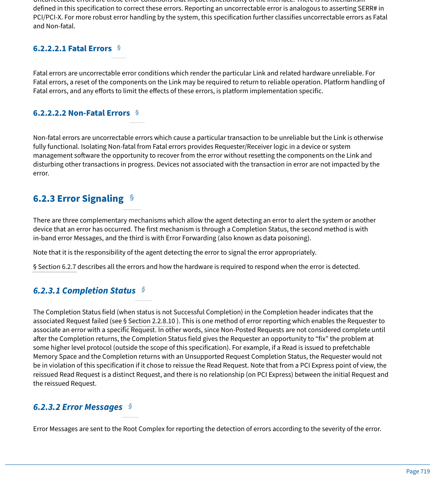

### IMPLEMENTATION NOTE: ENSURING PROPER OPERATION WITH ACS DIRECT TRANSLATED P2P | 实现说明：确保与 ACS Direct Translated P2P 的正确运行

table>
<thead>
<tr>
<th width="50%">🇬🇧 English</th>
<th width="50%" style="background-color:#e8e8e8">🇨🇳 中文</th>
</tr>
</thead>
<tbody>
<tr>
<td>

The intent of ACS Direct Translated P2P is to optimize performance in environments where Address Translation Services (ATS) are being used with peer-to-peer communication whose access control is enforced by the RC. Permitting peer-to-peer Requests with Translated addresses to be routed directly avoids possible performance impacts associated with redirection, which introduces extra latency and may increase Link and RC congestion.

For the usage model where peer-to-peer Requests with Translated addresses are permitted, but those with Untranslated addresses are to be blocked as ACS Violations, it is recommended that software enable ACS Direct Translated P2P and ACS P2P Request Redirect, and configure the Redirected Request Validation logic in the RC to block the redirected Requests with Untranslated addresses. This configuration has no ordering rule violations associated with Requests passing Posted Requests.

For the usage model where some Requesters use Translated addresses exclusively with peer-to-peer Requests and some Requesters use Untranslated addresses exclusively with peer-to-peer Requests, and the two classes of Requesters do not communicate peer-to-peer with each other, proper operation is unlikely to be compromised by redirected peer-to-peer Requests (with Untranslated addresses) being passed by direct peer-to-peer Requests (with Translated addresses). It is recommended that software not enable ACS Direct Translated P2P unless software is certain that proper operation is not compromised by the resulting ordering rule violations.

For the usage model where a single Requester uses both Translated and Untranslated addresses with peer-to-peer Requests, again it is recommended that software not enable ACS Direct Translated P2P unless software is certain that proper operation is not compromised by the resulting ordering rule violations. This requires a detailed analysis of the peer-to-peer communications models being used, and is beyond the scope of this specification.

</td>
<td style="background-color:#e8e8e8">

ACS Direct Translated P2P 的目的是在使用地址转换服务 (ATS, Address Translation Service) 进行对等 (P2P) 通信且访问控制由 RC 强制执行的环境中优化性能。允许使用已转换地址 (Translated Address) 的对等请求被直接路由，可避免重定向带来的潜在性能影响 (重定向会引入额外延迟，并可能增加链路 (Link) 和 RC 拥塞)。

在使用模型中，若允许使用已转换地址的对等请求、但应将使用未转换地址 (Untranslated Address) 的请求作为 ACS 违规 (ACS Violation) 阻止，建议软件启用 ACS Direct Translated P2P 和 ACS P2P Request Redirect，并在 RC 中配置 Redirected Request Validation 逻辑以阻止带未转换地址的重定向请求。该配置不会因请求越过 Posted 请求而产生排序规则违规。

在使用模型中，若某些请求者 (Requester) 在对等请求中专门使用已转换地址，而另一些请求者专门使用未转换地址，且这两类请求者彼此之间不进行对等通信，则带未转换地址的重定向对等请求被带已转换地址的直接对等请求越过，不太可能损害正常运行。建议软件不要启用 ACS Direct Translated P2P，除非软件确信由此产生的排序规则违规不会损害正常运行。

在使用模型中，若单个请求者同时在对等请求中使用已转换和未转换地址，则同样建议软件不要启用 ACS Direct Translated P2P，除非软件确信由此产生的排序规则违规不会损害正常运行。这需要对所使用的对等通信模型进行详细分析，超出了本规范的范围。

</td>
</tr>
</tbody>
</table>

[⬆️ 返回目录](#-本章目录-table-of-contents)

---

<<<PAGE_BREAK>>> page_808

<a id="sec-6-13-cont"></a>
## 6.13 Alternative Routing-ID Interpretation (ARI) — continued | 替代路由 ID 解释 (ARI) — 续


<div style="overflow-x: auto; max-width: 100%;">
<table>
<thead>
<tr>
<th width="50%">🇬🇧 English</th>
<th width="50%" style="background-color:#e8e8e8">🇨🇳 中文</th>
</tr>
</thead>
<tbody>
<tr>
<td>

  - If ACS P2P Egress Controls are supported and enabled, access control can optionally be based on Function Groups instead of individual Functions.

The following illustrates an example flow for enabling these capabilities and provides additional details on their usage:

1. Software enumerates the PCI Express hierarchy and determines whether the ARI Extended Capability is supported.
   a. For an ARI Downstream Port, the capability is communicated through the Device Capabilities 2 register.
   b. For an ARI Device, the capability is communicated through the ARI Extended Capability structure.
   c. ARI has no impact on the base enumeration algorithms used in platforms today.
2. Software enables ARI functionality in each component.
   a. In an ARI Downstream Port immediately above an ARI Device, software sets the ARI Forwarding Enable bit in the Device Control 2 register. Setting this bit ensures the logic that determines when to turn a Type 1 Configuration Request into a Type 0 Configuration Request no longer enforces a restriction on the traditional Device Number field being 0.
   b. In an ARI Device, Extended Functions must respond if addressed with a Type 0 Configuration Request. It is necessary for ARI-aware software to enable ARI Forwarding in the Downstream Port immediately above the ARI Device, in order for ARI-aware software to discover and configure the Extended Functions.
   c. If an ARI Device implements a Multi-Function VC Extended Capability structure with Function arbitration, and also implements MFVC Function Groups, ARI-aware software categorizes Functions into Function Groups.
      i. Each Function is assigned to a Function Group represented by a Function Group Number.
      ii. A maximum of 8 Function Groups can be configured.
      iii. Within the Multi-Function VC Arbitration Table, a Function Group Number is used in place of a Function Number in each arbitration slot.
         1. Arbitration occurs on a Function Group basis instead of an individual Function basis.
         2. All other aspects of Multi-Function VC arbitration remain unchanged. See § Section 7.9.2.10 for additional details.
      iv. Function arbitration within each Function Group is implementation specific.
   d. If an ARI Device supports ACS P2P Egress Control, access control can be optionally implemented on a Function Group basis.
   e. To improve the enumeration performance and create a more deterministic solution, software can enumerate Functions through a linked list of Function Numbers. The next linked list element is communicated through each Function's ARI Capability Register.
      i. Function 0 acts as the head of a linked list of Function Numbers. Software detects a non-Zero Next Function Number field within the ARI Capability Register as the next Function within the linked list. Software issues a configuration probe using the Bus Number captured by the Device and the Function Number derived from the ARI Capability Register to locate the next associated Function's configuration space.
      ii. Function Numbers may be sparse and non-sequential in their consumption by an ARI Device.

With an ARI Device, the Phantom Functions Supported field within each Function's Device Capabilities register (see § Section 7.5.3.3, § Table 7-20) must be set to 00b to indicate that Phantom Functions are not supported.

</td>
<td style="background-color:#e8e8e8">

  - 如果支持并启用了 ACS P2P Egress Controls，则可选择基于功能组而非单个功能实施访问控制。

以下示例展示了启用这些能力的流程，并提供了有关其使用方式的更多细节：

1. 软件枚举 PCI Express 层级 (Hierarchy) 并确定是否支持 ARI 扩展能力 (Extended Capability)。
   a. 对于 ARI 下游端口 (ARI Downstream Port)，该能力通过 Device Capabilities 2 寄存器传达。
   b. 对于 ARI 设备 (ARI Device)，该能力通过 ARI 扩展能力结构 (ARI Extended Capability structure) 传达。
   c. ARI 对当前平台使用的基本枚举算法没有影响。
2. 软件在每个组件中启用 ARI 功能。
   a. 在 ARI 设备正上方的 ARI 下游端口中，软件在 Device Control 2 寄存器中设置 ARI Forwarding Enable 位。设置该位可确保"将 Type 1 配置请求 (Configuration Request) 转换为 Type 0 配置请求"的判定逻辑不再强制要求传统设备号字段为 0。
   b. 在 ARI 设备中，若使用 Type 0 配置请求寻址，扩展功能 (Extended Functions) 必须响应。ARI-aware 软件必须启用 ARI 设备正上方下游端口中的 ARI Forwarding，ARI-aware 软件才能发现并配置扩展功能。
   c. 如果 ARI 设备实现了带 Function 仲裁的多功能 VC 扩展能力结构 (Multi-Function VC Extended Capability structure)，并同时实现了 MFVC Function Groups，则 ARI-aware 软件将功能归类为功能组 (Function Group)。
      i. 每个功能被分配到一个由 Function Group Number 表示的功能组 (Function Group)。
      ii. 最多可配置 8 个功能组 (Function Group)。
      iii. 在 Multi-Function VC Arbitration Table 中，每个仲裁槽位使用 Function Group Number 替代 Function Number。
         1. 仲裁基于功能组 (Function Group) 而非单个功能进行。
         2. Multi-Function VC 仲裁的其他方面保持不变。详见 § Section 7.9.2.10。
      iv. 每个功能组 (Function Group) 内的功能仲裁是实现特定的 (implementation specific)。
   d. 如果 ARI 设备支持 ACS P2P Egress Control，则可选择基于功能组 (Function Group) 实施访问控制。
   e. 为提高枚举性能并创建更具确定性的解决方案，软件可以通过 Function Number 的链表 (linked list) 枚举功能。链表的下一个元素通过每个功能的 ARI Capability Register 传达。
      i. Function 0 作为 Function Number 链表的头。软件在 ARI Capability Register 中检测到非零的 Next Function Number 字段时，将其作为链表中的下一个功能。软件发出配置探测 (configuration probe)，使用设备捕获的总线号 (Bus Number) 和从 ARI Capability Register 派生的 Function Number 来定位下一个关联功能的配置空间 (Configuration Space)。
      ii. Function Number 在 ARI 设备中的占用可以是稀疏且非顺序的。

对于 ARI 设备，每个功能的 Device Capabilities 寄存器中的 Phantom Functions Supported 字段 (见 § Section 7.5.3.3，§ Table 7-20) 必须设置为 00b，以表示不支持 Phantom Functions。

</td>
</tr>
</tbody>
</table>
</div>


[⬆️ 返回目录](#-本章目录-table-of-contents)

---

<<<PAGE_BREAK>>> page_809

<a id="sec-6-13-figure"></a>
## 6.13 Alternative Routing-ID Interpretation (ARI) — Figure 6-13 | 替代路由 ID 解释 (ARI) — 图 6-13

table>
<thead>
<tr>
<th width="50%">🇬🇧 English</th>
<th width="50%" style="background-color:#e8e8e8">🇨🇳 中文</th>
</tr>
</thead>
<tbody>
<tr>
<td>

The Extended Tag Field Enable bit, the 10-Bit Tag Requester Enable bit, and the 14-Bit Tag Requester Enable bit can still be used to enable each Function to support higher numbers of outstanding Requests. See § Section 2.2.6.2.

Figure 6-13 shows an example system topology with two ARI Devices, one below a Root Port and one below a Switch. For access to Extended Functions in ARI Device X, Root Port A must support ARI Forwarding and have it enabled by software. For access to Extended Functions in ARI Device Y, Switch Downstream Port D must support ARI Forwarding and have it enabled by software. With this configuration, it is recommended that software not enable ARI Forwarding in Root Port B or Switch Downstream Port C.

</td>
<td style="background-color:#e8e8e8">

Extended Tag Field Enable 位、10-Bit Tag Requester Enable 位和 14-Bit Tag Requester Enable 位仍可用于使每个功能支持更多的 outstanding 请求。详见 § Section 2.2.6.2。

图 6-13 展示了一个示例系统拓扑，其中包含两个 ARI 设备 (ARI Devices)，一个在根端口 (Root Port) 之下，一个在交换机 (Switch) 之下。对于访问 ARI Device X 中的扩展功能，Root Port A 必须支持 ARI Forwarding 并由软件启用。对于访问 ARI Device Y 中的扩展功能，Switch Downstream Port D 必须支持 ARI Forwarding 并由软件启用。在该配置下，建议软件不要在 Root Port B 或 Switch Downstream Port C 中启用 ARI Forwarding。

</td>
</tr>
</tbody>
</table>

[⬆️ 返回目录](#-本章目录-table-of-contents)

---

### IMPLEMENTATION NOTE: ARI FORWARDING ENABLE BEING SET INAPPROPRIATELY | 实现说明：不恰当地设置 ARI Forwarding Enable


<div style="overflow-x: auto; max-width: 100%;">
<table>
<thead>
<tr>
<th width="50%">🇬🇧 English</th>
<th width="50%" style="background-color:#e8e8e8">🇨🇳 中文</th>
</tr>
</thead>
<tbody>
<tr>
<td>

It is strongly recommended that software in general Set the ARI Forwarding Enable bit in a Downstream Port only if software is certain that the device immediately below the Downstream Port is an ARI Device. If the bit is Set when a non-ARI Device is present, the non-ARI Device can respond to Configuration Space accesses under what it interprets as being different Device Numbers, and its Functions can be aliased under multiple Device Numbers, generally leading to undesired behavior.

Following a hot-plug event below a Downstream Port, it is strongly recommended that software Clear the ARI Forwarding Enable bit in the Downstream Port until software determines that a newly added component is in fact an ARI Device.

</td>
<td style="background-color:#e8e8e8">

强烈建议软件通常仅在确信下游端口 (Downstream Port) 正下方的设备为 ARI 设备时，才在该下游端口中设置 ARI Forwarding Enable 位。如果在存在非 ARI 设备时设置该位，非 ARI 设备可能在其所解读的不同设备号下响应配置空间 (Configuration Space) 访问，其功能可能在多个设备号下被别名 (alias)，通常会导致不良行为。

在下游端口下方发生热插拔 (Hot-Plug) 事件后，强烈建议软件清除 (Clear) 该下游端口中的 ARI Forwarding Enable 位，直至软件确定新加入的组件实际上是 ARI 设备。

</td>
</tr>
</tbody>
</table>
</div>


[⬆️ 返回目录](#-本章目录-table-of-contents)

---

### IMPLEMENTATION NOTE: ARI FORWARDING ENABLE SETTING AT FIRMWARE/OPERATING SYSTEM CONTROL HANDOFF | 实现说明：固件/操作系统控制移交时的 ARI Forwarding Enable 设置

table>
<thead>
<tr>
<th width="50%">🇬🇧 English</th>
<th width="50%" style="background-color:#e8e8e8">🇨🇳 中文</th>
</tr>
</thead>
<tbody>
<tr>
<td>

It is strongly recommended that firmware not have the ARI Forwarding Enable bit Set in a Downstream Port upon control handoff to an operating system unless firmware knows that the operating system is ARI-aware. With this bit Set, a non-ARI-aware operating system might be able to discover and enumerate Extended Functions in an ARI Device below the Downstream Port, but such an operating system would generally not be able to manage Extended Functions successfully, since it would interpret there being multiple Devices below the Downstream Port instead of a single ARI Device. As one example of many envisioned problems, the interrupt binding for INTx virtual wires would not be consistent with what the non-ARI-aware operating system would expect.

</td>
<td style="background-color:#e8e8e8">

强烈建议固件在向操作系统移交控制权时，除非固件知道该操作系统是 ARI-aware 的，否则不要在该下游端口中设置 ARI Forwarding Enable 位。若该位被设置，非 ARI-aware 的操作系统可能能够发现并枚举下游端口下 ARI 设备中的扩展功能，但该操作系统通常无法成功管理扩展功能，因为它会将下游端口下方的多个设备解释为单一 ARI 设备。作为可预想问题中的典型一例，INTx 虚拟线的 (virtual wire) 中断绑定将与非 ARI-aware 操作系统的预期不一致。

</td>
</tr>
</tbody>
</table>

[⬆️ 返回目录](#-本章目录-table-of-contents)

---

<<<PAGE_BREAK>>> page_810

<a id="sec-6-14"></a>
## 6.14 Multicast Operations | 多播 (Multicast) 操作


<div style="overflow-x: auto; max-width: 100%;">
<table>
<thead>
<tr>
<th width="50%">🇬🇧 English</th>
<th width="50%" style="background-color:#e8e8e8">🇨🇳 中文</th>
</tr>
</thead>
<tbody>
<tr>
<td>

The Multicast Capability structure defines a Multicast address range, the segmentation of that range into a number, N, of equal sized Multicast Windows, and the association of each Multicast Window with a Multicast Group, MCG. Each Function that supports Multicast within a component implements a Multicast Capability structure that provides routing directions and permission checking for each MCG for TLPs passing through or to the Function. The Multicast Group is a field of up to 6 bits in width embedded in the address beginning at the MC_Index_Position, as defined in § Section 7.9.11.4.

</td>
<td style="background-color:#e8e8e8">

Multicast Capability 结构定义了一个多播地址范围，将该范围划分为 N 个等大的多播窗口 (Multicast Windows)，并将每个多播窗口与一个多播组 (Multicast Group, MCG) 关联。组件内支持多播的每个功能实现一个 Multicast Capability 结构，为通过或发往该功能的 TLP 提供每个 MCG 的路由方向和权限检查。Multicast Group 是嵌入在地址中、自 MC_Index_Position 起始、最多 6 位宽的字段，定义见 § Section 7.9.11.4。

</td>
</tr>
</tbody>
</table>
</div>


> **Figure 6-14.** Segmentation of the Multicast Address Range | 多播地址范围的划分
> 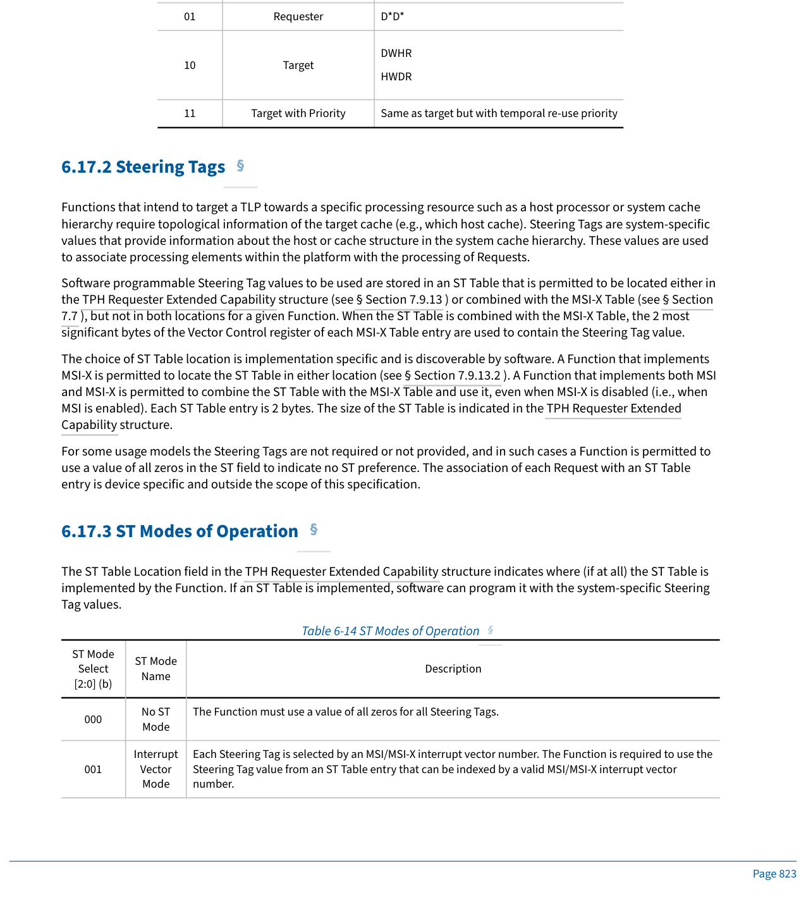

[⬆️ 返回目录](#-本章目录-table-of-contents)

---

<a id="sec-6-14-1"></a>
## 6.14.1 Multicast TLP Processing | 多播 TLP 处理

table>
<thead>
<tr>
<th width="50%">🇬🇧 English</th>
<th width="50%" style="background-color:#e8e8e8">🇨🇳 中文</th>
</tr>
</thead>
<tbody>
<tr>
<td>

A Multicast Hit occurs if all of the following are true:

- MC_Enable is Set
- TLP is a non-UIO Memory Write Request or an Address Routed Message, both of which are non-UIO Posted Requests
- Address<sub>TLP</sub> >= MC_Base_Address
- Address<sub>TLP</sub> < (MC_Base_Address + (2<sup>MC_Index_Position</sup> * (MC_Num_Group + 1)))

In this step, each Switch Ingress Port and other components use values of MC_Enable, MC_Base_Address, MC_Index_Position, and MC_Num_Group from any one of their Functions. Software is required to configure all Functions of a Switch and all Functions of a Multi-Function Upstream Port to have the same values in each of these fields and results are indeterminate if this is not the case.

If the address in a Non-Posted Memory Request hits in a Multicast Window, no Multicast Hit occurs and the TLP is processed normally per the base specification - i.e., as a unicast.

If a Multicast Hit occurs, the only ACS access control that can still apply is ACS Source Validation. In particular, neither ACS P2P Request Redirect nor ACS P2P Egress Control affects operations during a Multicast Hit. See § Section 6.12.

If a Multicast Hit occurs, normal address routing rules do not apply. Instead, the TLP is processed as follows:

The Multicast Group is extracted from the address in the TLP using any Function's values for MC_Base_Address and MC_Index_Position. Specifically:

**MCG = ((Address<sub>TLP</sub> - MC_Base_Address) >> MC_Index_Position) & 3Fh**

</td>
<td style="background-color:#e8e8e8">

当以下所有条件同时满足时，发生多播命中 (Multicast Hit)：

- MC_Enable 被设置 (Set)
- TLP 是非 UIO 内存写请求或地址路由消息 (Address Routed Message)，两者都是非 UIO Posted 请求
- Address<sub>TLP</sub> >= MC_Base_Address
- Address<sub>TLP</sub> < (MC_Base_Address + (2<sup>MC_Index_Position</sup> × (MC_Num_Group + 1)))

在此步骤中，每个 Switch Ingress Port 和其他组件使用其任意一个 Function 的 MC_Enable、MC_Base_Address、MC_Index_Position 和 MC_Num_Group 值。要求软件将 Switch 的所有功能以及多功能上游端口 (Multi-Function Upstream Port) 的所有功能配置为在这些字段中具有相同的值；否则，结果不可预测 (indeterminate)。

如果 Non-Posted 内存请求中的地址命中多播窗口 (Multicast Window)，则不发生 Multicast Hit，TLP 按基础规范正常处理 —— 即作为单播 (unicast)。

如果发生 Multicast Hit，则唯一仍可应用的 ACS 访问控制是 ACS Source Validation。特别地，ACS P2P Request Redirect 和 ACS P2P Egress Control 都不会影响 Multicast Hit 期间的操作。详见 § Section 6.12。

如果发生 Multicast Hit，则常规地址路由规则不再适用。TLP 按以下方式处理：

使用任一 Function 的 MC_Base_Address 和 MC_Index_Position 值从 TLP 地址中提取多播组 (Multicast Group)。具体如下：

**MCG = ((Address<sub>TLP</sub> - MC_Base_Address) >> MC_Index_Position) & 3Fh**

</td>
</tr>
</tbody>
</table>

[⬆️ 返回目录](#-本章目录-table-of-contents)

---

<<<PAGE_BREAK>>> page_811

<a id="sec-6-14-1-cont"></a>
## 6.14.1 Multicast TLP Processing — continued | 多播 TLP 处理 — 续


<div style="overflow-x: auto; max-width: 100%;">
<table>
<thead>
<tr>
<th width="50%">🇬🇧 English</th>
<th width="50%" style="background-color:#e8e8e8">🇨🇳 中文</th>
</tr>
</thead>
<tbody>
<tr>
<td>

In this process, the component may use any Function's values for MC_Base_Address and MC_Index_Position. Which Function's values are used is device-specific.

Components next check the MC_Block_All and the MC_Block_Untranslated bits corresponding to the extracted MCG. Switches and Root Ports check Multicast TLPs in their Ingress Ports using the MC_Block_All and MC_Block_Untranslated registers associated with the Ingress Port. Endpoint Functions check Multicast TLPs they are preparing to send, using their MC_Block_All and MC_Block_Untranslated registers. If the MC_Block_All bit corresponding to the extracted MCG is set, the TLP is handled as an MC Blocked TLP. If the MC_Block_Untranslated bit corresponding to the extracted MCG is set and the TLP contains an Untranslated Address, the TLP, is also handled as an MC Blocked TLP.

</td>
<td style="background-color:#e8e8e8">

在此过程中，组件可使用任一 Function 的 MC_Base_Address 和 MC_Index_Position 值。使用哪个 Function 的值是设备特定的 (device-specific)。

组件接下来检查与所提取 MCG 对应的 MC_Block_All 和 MC_Block_Untranslated 位。Switch 和 Root Port 使用与其 Ingress Port 关联的 MC_Block_All 和 MC_Block_Untranslated 寄存器检查 Ingress Port 中的多播 TLP。端点功能 (Endpoint Functions) 使用其 MC_Block_All 和 MC_Block_Untranslated 寄存器检查其准备发送的多播 TLP。如果所提取 MCG 对应的 MC_Block_All 位被设置，则该 TLP 作为 MC Blocked TLP 处理。如果所提取 MCG 对应的 MC_Block_Untranslated 位被设置，且 TLP 包含未转换地址 (Untranslated Address)，则该 TLP 也作为 MC Blocked TLP 处理。

</td>
</tr>
</tbody>
</table>
</div>


[⬆️ 返回目录](#-本章目录-table-of-contents)

---

### IMPLEMENTATION NOTE: MC_BLOCK_UNTRANSLATED AND PIO WRITES | 实现说明：MC_BLOCK_UNTRANSLATED 与 PIO 写

table>
<thead>
<tr>
<th width="50%">🇬🇧 English</th>
<th width="50%" style="background-color:#e8e8e8">🇨🇳 中文</th>
</tr>
</thead>
<tbody>
<tr>
<td>

Programmed I/O (PIO) Writes to Memory Space generally have Untranslated addresses since there is no architected mechanism for software to control the Address Type (AT) field for PIO Requests. Thus, if it's necessary for a given Switch to Multicast any PIO Writes, software should ensure that the appropriate MC_Block_Untranslated bits in the Upstream Port of that Switch are Clear. Otherwise, the Switch Upstream Port may block PIO Writes that legitimately target Multicast Windows. Since it may be necessary for software to clear MC_Block_Untranslated bits in a Switch Upstream Port for the sake of PIO Writes, the following are strongly recommended for a Root Complex capable of Address translation:

- All Integrated Endpoints each implement a Multicast Capability structure to provide access control for sending Untranslated Multicast TLPs.
- All peer-to-peer capable Root Ports each implement a Multicast Capability structure to provide access control for Untranslated Multicast TLPs that are forwarded peer-to-peer.

For similar reasons, with Multicast-capable Switch components where the Upstream Port is a Function in a Multi-Function Device, it is strongly recommended that any Endpoints in that Multi-Function Device each implement a Multicast Capability structure.

</td>
<td style="background-color:#e8e8e8">

对内存空间的 Programmed I/O (PIO) 写通常具有未转换地址，因为软件没有架构化 (architected) 机制来控制 PIO 请求的 AT 字段 (Address Type)。因此，如果给定 Switch 需要多播任何 PIO 写，软件应确保该 Switch 上游端口 (Upstream Port) 中相应的 MC_Block_Untranslated 位被清除 (Clear)。否则，Switch 上游端口可能阻止合法寻址多播窗口 (Multicast Windows) 的 PIO 写。由于软件可能需要为 PIO 写清除 Switch 上游端口中的 MC_Block_Untranslated 位，对于具备地址转换能力的根复合体 (Root Complex)，强烈建议如下：

- 所有集成端点 (Integrated Endpoints) 各自实现一个 Multicast Capability 结构，以便为发送未转换多播 TLP 提供访问控制。
- 所有支持对等 (peer-to-peer) 功能的根端口 (Root Ports) 各自实现一个 Multicast Capability 结构，以便为对等转发的未转换多播 TLP 提供访问控制。

出于类似原因，对于多播功能 Switch 组件 (其中上游端口是多功能设备中的功能)，强烈建议该多功能设备中的任何端点 (Endpoints) 各自实现一个 Multicast Capability 结构。

</td>
</tr>
</tbody>
</table>

[⬆️ 返回目录](#-本章目录-table-of-contents)

---

### IMPLEMENTATION NOTE: MULTICAST WINDOW SIZE | 实现说明：多播窗口大小


<div style="overflow-x: auto; max-width: 100%;">
<table>
<thead>
<tr>
<th width="50%">🇬🇧 English</th>
<th width="50%" style="background-color:#e8e8e8">🇨🇳 中文</th>
</tr>
</thead>
<tbody>
<tr>
<td>

Each ultimate Receiver of a Multicast TLP may have a different Multicast Window size requirement. At one extreme, a Multicast Window may be required to cover a range of memory implemented within the device. At the other, it may only need to cover a particular offset at which a FIFO register is located. The MC_Window_Size_Requested field within the Multicast Capability register is used by an Endpoint to advertise the size of Multicast Window that it requires.

Unless available address space is limited, resource allocation software may be able to treat each request as a minimum and set the Multicast Window size via MC_Index_Position to accommodate the largest request. In some cases, a request for a larger window size can be satisfied by configuring a smaller window size and assigning the same membership to multiple contiguous MCGs.

</td>
<td style="background-color:#e8e8e8">

多播 TLP 的每个最终接收者可能有不同的多播窗口 (Multicast Window) 大小需求。在一种极端情况下，多播窗口可能需要覆盖设备内部实现的一段内存范围；在另一种情况下，可能仅需覆盖 FIFO 寄存器所在的特定偏移。Multicast Capability 寄存器中的 MC_Window_Size_Requested 字段供端点 (Endpoint) 通告其所需要的多播窗口大小。

除非可用地址空间受限，否则资源分配软件可以将每个请求视为最小值，并通过 MC_Index_Position 设置多播窗口大小以满足最大的请求。在某些情况下，对较大窗口的请求可以通过配置较小的窗口大小并将相同成员关系分配给多个连续的 MCG 来满足。

</td>
</tr>
</tbody>
</table>
</div>


[⬆️ 返回目录](#-本章目录-table-of-contents)

---

<<<PAGE_BREAK>>> page_812

<a id="sec-6-14-1-cont-2"></a>
## 6.14.1 Multicast TLP Processing — continued (2) | 多播 TLP 处理 — 续 (2)

table>
<thead>
<tr>
<th width="50%">🇬🇧 English</th>
<th width="50%" style="background-color:#e8e8e8">🇨🇳 中文</th>
</tr>
</thead>
<tbody>
<tr>
<td>

If the TLP is not blocked in a Switch or Root Complex it is forwarded out all of the Ports, except its Ingress Port, whose MC_Receive bit corresponding to the extracted MCG is set. In an Endpoint, it is consumed by all Functions whose MC_Receive bit corresponding to the extracted MCG is set. If no Ports forward the TLP or no Functions consume it, the TLP is silently dropped.

To prevent loops, it is prohibited for a Root Port or a Switch Port to forward a TLP back out its Ingress Port, even if so specified by the MC_Receive register associated with the Port. An exception is the case described in the preceding Implementation Note, where an RC reflects a unicast TLP that came in on an Ingress Root Port to a Multicast Window. In that case, when specified by the MC_Receive register associated with that Ingress Root Port, the RC is required to send the reflected TLP out the same Root Port that it originally came in.

A Multicast Hit suspends normal address routing, including default Upstream routing in Switches. When a Multicast Hit occurs, the TLP will be forwarded out only those Egress Ports whose MC_Receive bit associated with the MCG extracted from the address in the TLP is set. If the address in the TLP does not decode to any Downstream Port using normal address decode, the TLP will be copied to the Upstream Port only if so specified by the Upstream Port's MC_Receive register.

No new ordering rules are defined for processing Multicast TLPs. All Multicast TLPs are Posted Requests and follow Posted Request ordering rules. Multicast TLPs are ordered per normal ordering rules relative to other TLPs in a component's ingress stream through the point of replication. Once copied into an egress stream, a Multicast TLP follows the same ordering as other Posted Requests in the stream.

</td>
<td style="background-color:#e8e8e8">

如果 TLP 在 Switch 或根复合体 (Root Complex) 中未被阻止，则会从除其 Ingress Port 之外、且 MC_Receive 寄存器中对应所提取 MCG 的位被设置的所有端口转发出去。在端点 (Endpoint) 中，它被所有 MC_Receive 寄存器中对应所提取 MCG 的位被设置的功能所消费 (consume)。如果没有任何端口转发该 TLP 或没有任何功能消费该 TLP，则 TLP 被静默丢弃。

为防止环路 (loop)，禁止根端口 (Root Port) 或交换机端口 (Switch Port) 将 TLP 通过其 Ingress Port 转发回去，即使该端口关联的 MC_Receive 寄存器如此指定。例外情况是上述实现说明中所描述的情况：RC 将从 Ingress Root Port 收到的单播 TLP 反射 (reflect) 到一个多播窗口 (Multicast Window)。在这种情况下，当与该 Ingress Root Port 关联的 MC_Receive 寄存器如此指定时，RC 需要将反射的 TLP 从其最初进入的同一根端口 (Root Port) 发送出去。

多播命中 (Multicast Hit) 会暂停正常的地址路由，包括 Switch 中的默认上游 (Upstream) 路由。当发生 Multicast Hit 时，TLP 仅从其 MC_Receive 寄存器中与从 TLP 地址中提取的 MCG 关联的位被设置的 Egress Port 转发出去。如果使用正常地址解码时 TLP 地址未解码到任何下游端口 (Downstream Port)，则仅当上游端口 (Upstream Port) 的 MC_Receive 寄存器如此指定时，TLP 才会被复制到上游端口。

为多播 TLP 的处理未定义新的排序规则。所有多播 TLP 都是 Posted 请求，并遵循 Posted 请求排序规则。多播 TLP 在组件 Ingress 流中相对于其他 TLP、按正常排序规则进行排序，直至复制点 (point of replication)。一旦被复制到 Egress 流中，多播 TLP 遵循与该流中其他 Posted 请求相同的排序。

</td>
</tr>
</tbody>
</table>

[⬆️ 返回目录](#-本章目录-table-of-contents)

---

### IMPLEMENTATION NOTE: MULTICAST, ATS, AND REDIRECTION | 实现说明：多播、ATS 与重定向


<div style="overflow-x: auto; max-width: 100%;">
<table>
<thead>
<tr>
<th width="50%">🇬🇧 English</th>
<th width="50%" style="background-color:#e8e8e8">🇨🇳 中文</th>
</tr>
</thead>
<tbody>
<tr>
<td>

The ACS P2P Request Redirect and ACS Direct Translated P2P mechanisms provide a means where P2P Requests with Untranslated Addresses can be redirected to the Root Complex (RC) for access control checking, whereas P2P Requests with Translated Addresses can be routed "directly" to their P2P targets for improved performance. See § Section 6.12. No corresponding redirection mechanism exists for Multicast TLPs.

To achieve similar functionality, an RC might be configured to provide one or more target Memory Space ranges that are not in the Multicast address range, but the RC maps to "protected" Multicast Windows. Multicast TLP senders either with or without ATS capability then target these RC Memory Space ranges in order to access the protected Multicast Windows indirectly. When either type of sender targets these ranges with Memory Writes, each TLP that satisfies the access control checks will be reflected back down by the RC with a Translated Address targeting a protected Multicast Window.<sup>140</sup> ATS-capable senders can request and cache Translated Addresses using the RC Memory Space range, and then later use those Translated Addresses for Memory Writes that target protected Multicast Windows directly and can be Multicast without a taking a trip through the RC.

For hardware enforcement that only Translated Addresses can be used to target the protected Multicast Windows directly, software Sets appropriate MCG bits in the MC_Block_Untranslated register in all applicable Functions throughout the platform. Each MCG whose bit is Set will cause its associated Multicast Window to be protected from direct access using Untranslated Addresses.

</td>
<td style="background-color:#e8e8e8">

ACS P2P Request Redirect 和 ACS Direct Translated P2P 机制提供了一种方式：带未转换地址 (Untranslated Addresses) 的 P2P 请求可被重定向到根复合体 (Root Complex, RC) 进行访问控制检查，而带已转换地址 (Translated Addresses) 的 P2P 请求可被"直接"路由到其 P2P 目标以提高性能。详见 § Section 6.12。对于多播 TLP (Multicast TLPs)，目前不存在相应的重定向机制。

为实现类似功能，可以将 RC 配置为提供一个或多个不在多播地址范围内、但映射到"受保护"多播窗口 (Multicast Windows) 的目标内存空间 (Memory Space) 范围。无论是否具备 ATS 能力，多播 TLP 发送者均可寻址这些 RC 内存空间范围以间接访问受保护的多播窗口。当任一类型的发送者以内存写 (Memory Writes) 寻址这些范围时，通过访问控制检查的每个 TLP 将被 RC 反射 (reflect) 回，使用已转换地址 (Translated Address) 寻址受保护的多播窗口。<sup>140</sup> 具备 ATS 能力的发送者可使用 RC 内存空间范围请求并缓存已转换地址 (Translated Addresses)，之后使用这些已转换地址以内存写直接寻址受保护的多播窗口，从而无需通过 RC 即可完成多播。

对于"仅允许使用已转换地址直接寻址受保护多播窗口"的硬件强制执行，软件在平台中所有适用功能的 MC_Block_Untranslated 寄存器中设置相应的 MCG 位。每个被设置的 MCG 位将使其关联的多播窗口免受使用未转换地址 (Untranslated Addresses) 的直接访问。

</td>
</tr>
</tbody>
</table>
</div>


[⬆️ 返回目录](#-本章目录-table-of-contents)

---

<sup>140</sup> If the original sender belongs to the MCG associated with this Window, the original sender will also receive a copy of the reflected TLP. | 如果原始发送者属于与此窗口关联的 MCG，则原始发送者也将收到反射 TLP 的副本。

---

<<<PAGE_BREAK>>> page_813

<a id="sec-6-14-3"></a>
## 6.14.3 Multicast Capability Structure Field Updates | 多播能力结构字段更新

table>
<thead>
<tr>
<th width="50%">🇬🇧 English</th>
<th width="50%" style="background-color:#e8e8e8">🇨🇳 中文</th>
</tr>
</thead>
<tbody>
<tr>
<td>

Some fields of the Multicast Capability structure may be changed at any time. Others cannot be changed with predictable results unless the MC_Enable bit is Clear in every Function of the component. The latter group includes MC_Base_Address and MC_Index_Position.

Fields which software may change at any time include MC_Enable, MC_Num_Group, MC_Receive, MC_Block_All, and MC_Block_Untranslated. Updates to these fields must themselves be ordered. Consider, for example, TLPs A and B arriving in that order at the same Ingress Port and in the same TC. If A uses value X for one of these fields, then B must use the same value or a newer value.

</td>
<td style="background-color:#e8e8e8">

Multicast Capability 结构中的某些字段可随时更改。其他字段在组件中每个功能的 MC_Enable 位都被清除 (Clear) 之前不能以可预测的方式更改。后者包括 MC_Base_Address 和 MC_Index_Position。

软件可随时更改的字段包括 MC_Enable、MC_Num_Group、MC_Receive、MC_Block_All 和 MC_Block_Untranslated。这些字段的更新本身必须是有序的 (ordered)。例如，假设 TLP A 和 B 按该顺序到达同一 Ingress Port 且位于同一 TC。如果 A 对其中某一字段使用值 X，则 B 必须使用相同的值或更新的值。

</td>
</tr>
</tbody>
</table>

[⬆️ 返回目录](#-本章目录-table-of-contents)

---

<a id="sec-6-14-2"></a>
## 6.14.2 Multicast Ordering | 多播排序

<table>
<thead>
<tr>
<th width="50%">🇬🇧 English</th>
<th width="50%" style="background-color:#e8e8e8">🇨🇳 中文</th>
</tr>
</thead>
<tbody>
<tr>
<td>

For Multi-Function Upstream Switch Ports Multicast TLPs received by one Switch or transmitted by one Endpoint Function are presented to the other parallel Endpoint Functions and the Downstream Switch Ports of the other parallel Switches (Functions are considered to be parallel if they are in the same Device. A single Multicast TLP is forwarded Upstream when any of the Upstream Switch Functions has the appropriate MC_Receive bit Set.

</td>
<td style="background-color:#e8e8e8">

对于多功能上游交换机端口 (Multi-Function Upstream Switch Ports)：由一个 Switch 接收或由一个端点功能 (Endpoint Function) 发送的多播 TLP 将被呈交给其他并行端点功能以及其他并行 Switch 的下游交换机端口 (Downstream Switch Ports) (如果功能位于同一设备内，则被视为并行的)。当任一上游交换机功能 (Upstream Switch Function) 设置了相应的 MC_Receive 位时，单个多播 TLP 会被向上游 (Upstream) 转发。

</td>
</tr>
</tbody>
</table>

[⬆️ 返回目录](#-本章目录-table-of-contents)

---

<a id="sec-6-14-4"></a>
## 6.14.4 MC Blocked TLP Processing | MC Blocked TLP 处理


<div style="overflow-x: auto; max-width: 100%;">
<table>
<thead>
<tr>
<th width="50%">🇬🇧 English</th>
<th width="50%" style="background-color:#e8e8e8">🇨🇳 中文</th>
</tr>
</thead>
<tbody>
<tr>
<td>

When a TLP is blocked by the MC_Block_All or the MC_Block_Untranslated mechanisms, the TLP is dropped. The Function blocking the TLP serves as the Completer. The Completer must log and signal this MC Blocked TLP error as indicated in § Figure 6-2. In addition, the Completer must set the Signaled Target Abort bit in either its Status register or Secondary Status register as appropriate. To assist in fault isolation and root cause analysis, it is strongly recommended that AER be implemented in Functions with Multicast capability.

In Root Complexes and Switches, if the error occurs with a TLP received by an Ingress Port, the error is reported by that Ingress Port. If the error occurs in an Endpoint Function preparing to send the TLP, the error is reported by that Endpoint Function.

The MC_Overlay mechanism is provided to allow a single BAR in an Endpoint that doesn't contain a Multicast Capability structure to be used for both Multicast and unicast TLP reception. Software can configure the MC_Overlay mechanism to affect this by setting the MC_Overlay_BAR in a Downstream Port so that the Multicast address range, or a portion of it, is remapped (overlaid) onto the Memory Space range accepted by the Endpoint's BAR. At the Upstream Port of a Switch, the mechanism can be used to overlay a portion of the Multicast address range onto a Memory Space range associated with host memory.

A Downstream Port's MC_Overlay mechanism applies to TLPs exiting that Port. An Upstream Port's MC_Overlay mechanism applies to TLPs exiting the Switch heading Upstream. A Port's MC_Overlay mechanism does not apply to TLPs received by the Port, to TLPs targeting memory space within the Port, or to TLPs routed Peer-to-Peer between Functions in a Multi-Function Upstream Port.

When enabled, the overlay operation specifies that bits in the address in the Multicast TLP, whose bit numbers are equal to or higher than the MC_Overlay_Size field, be replaced by the corresponding bits in the MC_Overlay_BAR. In other words:

</td>
<td style="background-color:#e8e8e8">

当 TLP 被 MC_Block_All 或 MC_Block_Untranslated 机制阻止时，TLP 被丢弃。阻止 TLP 的功能充当完成者 (Completer)。完成者必须按 § Figure 6-2 所示记录并上报此 MC Blocked TLP 错误。此外，完成者必须根据情况在其 Status 寄存器或 Secondary Status 寄存器中设置 Signaled Target Abort 位。为辅助故障隔离和根因分析，强烈建议在具有多播 (Multicast) 能力的功能中实现 AER。

在根复合体 (Root Complexes) 和交换机 (Switches) 中，如果错误发生在由 Ingress Port 接收的 TLP 上，则该错误由该 Ingress Port 上报。如果错误发生在准备发送 TLP 的端点功能 (Endpoint Function) 中，则该错误由该端点功能上报。

提供 MC_Overlay 机制是为了允许端点 (Endpoint) 中不包含 Multicast Capability 结构的单个 BAR (基址寄存器) 同时用于多播和单播 TLP 接收。软件可通过在 Downstream Port 中设置 MC_Overlay_BAR 来配置 MC_Overlay 机制，从而将多播地址范围 (或其一部分) 重映射 (覆盖，overlay) 到端点 BAR 所接受的内存空间 (Memory Space) 范围。在 Switch 的 Upstream Port 处，该机制可用于将多播地址范围的一部分覆盖到与主机内存关联的内存空间范围上。

Downstream Port 的 MC_Overlay 机制适用于离开该 Port 的 TLP。Upstream Port 的 MC_Overlay 机制适用于离开 Switch 向上游 (Upstream) 方向的 TLP。Port 的 MC_Overlay 机制不适用于由该 Port 接收的 TLP、寻址该 Port 内内存空间的 TLP，或在多功能上游端口 (Multi-Function Upstream Port) 的功能之间以 P2P 路由的 TLP。

启用后，overlay 操作规定：多播 TLP 地址中位号大于或等于 MC_Overlay_Size 字段的位，将被 MC_Overlay_BAR 中相应的位替换。即：

</td>
</tr>
</tbody>
</table>
</div>


[⬆️ 返回目录](#-本章目录-table-of-contents)

---


---

<a id="sec-6-14-5"></a>
## 6.14.5 MC_Overlay Mechanism | MC_Overlay 机制

table>
<thead>
<tr>
<th width="50%">🇬🇧 English</th>
<th width="50%" style="background-color:#e8e8e8">🇨🇳 中文</th>
</tr>
</thead>
<tbody>
<tr>
<td>

```
If (MC_Overlay_Size < 6)
Then Egress_TLP_Addr = Ingress_TLP_Addr;
Else Egress_TLP_Addr = { MC_Overlay_BAR[63:MC_Overlay_Size],
Ingress_TLP_Addr[MC_Overlay_Size-1:0] };
```
**Equation 6-1 MC_Overlay Transform rules**

If the TLP with modified address contains the optional ECRC, the unmodified ECRC will almost certainly indicate an error. The action to be taken if a TLP containing an ECRC is Multicast copied to an Egress Port that has MC_Overlay enabled depends upon whether or not optional support for ECRC regeneration is implemented. All of the contingent actions are outlined in § Table 6-12. If MC_Overlay is not enabled, the TLP is forwarded unmodified. If MC_Overlay is enabled and the TLP has no ECRC, the modified TLP, with its address replaced as specified in the previous paragraph is forwarded. If the TLP has an ECRC but ECRC regeneration is not supported, then the modified TLP is forwarded with its ECRC dropped and the TD bit in the header cleared to indicate no ECRC attached. If the TLP has an ECRC and ECRC regeneration is supported, then an ECRC check is performed before the TLP is forwarded. If the ECRC check passes, the TLP is forwarded with regenerated ECRC. If the ECRC check fails, the TLP is forwarded with inverted regenerated ECRC.

**Table 6-12 ECRC Rules for MC_Overlay**

| MC_Overlay Enabled | TLP has ECRC | ECRC Regeneration Supported | Action if ECRC Check Passes | Action if ECRC Check Fails |
|---|---|---|---|---|
| No | x | x | Forward TLP unmodified | Forward TLP unmodified |
| Yes | No | x | Forward modified TLP | Forward modified TLP |
| Yes | Yes | No | Forward modified TLP with ECRC dropped and TD bit clear | Forward modified TLP with ECRC dropped and TD bit clear |
| Yes | Yes | Yes | Forward modified TLP with regenerated ECRC | Forward modified TLP with inverted regenerated ECRC |

> **IMPLEMENTATION NOTE:**
> **MC_OVERLAY AND ECRC REGENERATION**
>
> Switch and Root Complex Ports have the option to support ECRC regeneration. If ECRC regeneration is supported, then it is strongly recommended to do so robustly by minimizing the time between checking the ECRC of the original TLP and replacing it with an ECRC computed on the modified TLP. The TLP is unprotected during this time, leaving a data integrity hole if the pre-check and regeneration aren't accomplished in the same pipeline stage.
>
> Stripping the ECRC from Multicast TLPs passing through a Port that has MC_Overlay enabled but doesn't support ECRC regeneration allows the receiving Endpoint to enable ECRC checking. In such a case, the Endpoint will enjoy the benefits of ECRC on non-Multicast TLPs without detecting ECRC on Multicast TLPs modified by the MC_Overlay mechanism.
>
> When Multicast ECRC regeneration is supported, and an ECRC error is detected prior to TLP modification, then inverting the regenerated ECRC ensures that the ECRC error isn't masked by the regeneration process.

</td>
<td style="background-color:#e8e8e8">

```
若 (MC_Overlay_Size < 6)
则 Egress_TLP_Addr = Ingress_TLP_Addr;
否则 Egress_TLP_Addr = { MC_Overlay_BAR[63:MC_Overlay_Size],
                        Ingress_TLP_Addr[MC_Overlay_Size-1:0] };
```
**公式 6-1 MC_Overlay 变换规则**

若地址已被修改的 TLP 包含可选的 ECRC,则未修改的 ECRC 几乎必然指示错误。当含有 ECRC 的 TLP 被多播 (Multicast) 复制到启用了 MC_Overlay 的出端口 (Egress Port) 时,所采取的动作取决于是否实现了可选的 ECRC 重新生成 (ECRC Regeneration) 支持。表 6-12 中列出了所有相关动作。若未启用 MC_Overlay,则 TLP 按原样转发。若启用了 MC_Overlay 且 TLP 没有 ECRC,则按上一段所述将地址替换后的已修改 TLP 转发。若 TLP 含有 ECRC 但不支持 ECRC 重新生成,则转发已修改的 TLP 时丢弃其 ECRC,并清除包头 (Header) 中的 TD 位以表示未附带 ECRC。若 TLP 含有 ECRC 且支持 ECRC 重新生成,则在转发 TLP 之前执行 ECRC 校验。若 ECRC 校验通过,则 TLP 附带重新生成的 ECRC 进行转发;若 ECRC 校验失败,则 TLP 附带反相的重新生成 ECRC 进行转发。

**表 6-12 MC_Overlay 的 ECRC 规则**

| MC_Overlay 启用 | TLP 含有 ECRC | 支持 ECRC 重新生成 | ECRC 校验通过时的动作 | ECRC 校验失败时的动作 |
|---|---|---|---|---|
| 否 | x | x | 按原样转发 TLP | 按原样转发 TLP |
| 是 | 否 | x | 转发已修改的 TLP | 转发已修改的 TLP |
| 是 | 是 | 否 | 转发已修改的 TLP,丢弃 ECRC 并清除 TD 位 | 转发已修改的 TLP,丢弃 ECRC 并清除 TD 位 |
| 是 | 是 | 是 | 转发已修改的 TLP,附带重新生成的 ECRC | 转发已修改的 TLP,附带反相的重新生成 ECRC |

> **实现注意事项 (IMPLEMENTATION NOTE):**
> **MC_OVERLAY 与 ECRC 重新生成**
>
> 交换机 (Switch) 端口和根复合体 (Root Complex) 端口可选择支持 ECRC 重新生成。若支持 ECRC 重新生成,则强烈建议以一种稳健的方式实现,即最小化"检查原始 TLP 的 ECRC"与"用基于已修改 TLP 计算的 ECRC 进行替换"之间的时间间隔。在此期间 TLP 处于无保护状态,如果预检和重新生成未在同一个流水线阶段内完成,将留下数据完整性漏洞。
>
> 从通过启用了 MC_Overlay 但不支持 ECRC 重新生成的端口的多播 TLP 中剥离 ECRC,允许接收端点 (Endpoint) 启用 ECRC 校验。在这种情况下,端点将在非多播 TLP 上享受 ECRC 带来的好处,而又不会在由 MC_Overlay 机制修改的多播 TLP 上检测到 ECRC 错误。
>
> 当支持多播 ECRC 重新生成且在 TLP 修改之前检测到 ECRC 错误时,对重新生成的 ECRC 取反可确保 ECRC 错误不会被重新生成过程所掩盖。

</td>
</tr>
</tbody>
</table>

---

<<<PAGE_BREAK>>> page_815

<a id="sec-6-14-5-imp-1"></a>
## Implementation Note: Multicast to Endpoints Without Multicast Capability | 实现注意事项:多播到不具备多播能力的端点


<div style="overflow-x: auto; max-width: 100%;">
<table>
<thead>
<tr>
<th width="50%">🇬🇧 English</th>
<th width="50%" style="background-color:#e8e8e8">🇨🇳 中文</th>
</tr>
</thead>
<tbody>
<tr>
<td>

> **IMPLEMENTATION NOTE:**
> **MULTICAST TO ENDPOINTS THAT DON'T HAVE MULTICAST CAPABILITY**
>
> An Endpoint Function that doesn't contain a Multicast Capability structure cannot distinguish Multicast TLPs from unicast TLPs. It is possible for a system designer to take advantage of this fact to employ such Endpoints as Multicast targets. The primary requirement for doing so is that the base and limit registers of the virtual PCI to PCI Bridge in the Switch Port above the device be configured to overlap at least part of the Multicast address range or that the MC_Overlay mechanism be employed. Extending this reasoning, it is even possible that a single Multicast target Function could be located on the PCI/PCI-X side of a PCI Express to PCI/PCI-X Bridge.
>
> If an Endpoint without a Multicast Capability structure is being used as a Multicast target and the MC_Overlay mechanism isn't used, then it may be necessary to read from the Endpoint's Memory Space using the same addresses used for Multicast TLPs. Therefore, Memory Reads that hit in a Multicast Window aren't necessarily errors. Memory Reads that hit in a Multicast Window and that don't also hit in the aperture of an RCiEP or the Downstream Port of a Switch will be routed Upstream, per standard address routing rules, and be handled as a UR there.

</td>
<td style="background-color:#e8e8e8">

> **实现注意事项 (IMPLEMENTATION NOTE):**
> **多播到不具备多播能力的端点**
>
> 不包含多播能力 (Multicast Capability) 结构的端点 (Endpoint) Function 无法区分多播 TLP 与单播 TLP。系统设计者可以利用这一事实,将此类端点作为多播目标使用。这样做的主要前提是:设备上方交换机 (Switch) 端口中虚拟 PCI-to-PCI 桥 (Bridge) 的基址 (Base) 与界限 (Limit) 寄存器必须被配置为至少与多播地址范围的一部分重叠,或者采用 MC_Overlay 机制。推而广之,甚至可以将单个多播目标 Function 放置在 PCI Express 到 PCI/PCI-X 桥的 PCI/PCI-X 一侧。
>
> 若将一个不具备多播能力结构的端点用作多播目标,而又未采用 MC_Overlay 机制,则可能需要使用与多播 TLP 相同的地址从该端点的内存空间 (Memory Space) 进行读取。因此,命中多播窗口 (Multicast Window) 的内存读 (Memory Read) 不一定是错误。命中多播窗口、但又未同时命中 RCiEP 或交换机下游端口 (Downstream Port) 开口 (aperture) 的内存读,将按照标准地址路由规则被路由至上游 (Upstream),并在该处作为不支持请求 (UR) 处理。

</td>
</tr>
</tbody>
</table>
</div>


---

<a id="sec-6-14-5-imp-2"></a>
## Implementation Note: Multicast in a Root Complex | 实现注意事项:根复合体中的多播

table>
<thead>
<tr>
<th width="50%">🇬🇧 English</th>
<th width="50%" style="background-color:#e8e8e8">🇨🇳 中文</th>
</tr>
</thead>
<tbody>
<tr>
<td>

> **IMPLEMENTATION NOTE:**
> **MULTICAST IN A ROOT COMPLEX**
>
> A Root Complex with multiple Root Ports that supports Multicast may implement as many Multicast Capability structures as its implementation requires. If it implements more than one, software should ensure that certain fields, as specified in § Section 6.14.3, are configured identically. To support Multicast to RCiEPs, the implementation needs to expose all TLPs identified as Multicast via the MC_Base_Address register to all potential Multicast target Endpoints integrated within it. Each such Integrated Endpoint then uses the MC_Receive register in its Multicast Capability structure to determine if it should receive the TLP.

</td>
<td style="background-color:#e8e8e8">

> **实现注意事项 (IMPLEMENTATION NOTE):**
> **根复合体中的多播**
>
> 具有多个根端口 (Root Port) 且支持多播的根复合体 (Root Complex) 可按其实现需要实现任意数量的多播能力 (Multicast Capability) 结构。若实现多个,则软件应确保 § 6.14.3 节中所规定的某些字段被配置为相同值。为了支持对 RCiEP 的多播,实现需要将通过 MC_Base_Address 寄存器识别为多播的所有 TLP 暴露给其内部集成的所有潜在多播目标端点 (Endpoint)。每个这样的集成端点随后使用其多播能力结构中的 MC_Receive 寄存器来确定是否应接收该 TLP。

</td>
</tr>
</tbody>
</table>

---

<a id="sec-6-14-5-imp-3"></a>
## Implementation Note: Multicast and Multi-Function Devices | 实现注意事项:多播与多功能设备


<div style="overflow-x: auto; max-width: 100%;">
<table>
<thead>
<tr>
<th width="50%">🇬🇧 English</th>
<th width="50%" style="background-color:#e8e8e8">🇨🇳 中文</th>
</tr>
</thead>
<tbody>
<tr>
<td>

> **IMPLEMENTATION NOTE:**
> **MULTICAST AND MULTI-FUNCTION DEVICES**
>
> All Port Functions and Endpoint Functions that are potential Multicast targets need to implement a Multicast Capability structure so that each has its own MC_Receive vector. Within a single component, software should configure the MC_Enable, MC_Base_Address, MC_Index_Position, and MC_Num_Group fields of these Capability structures identically. That being the case, it is sufficient to implement address decoding logic on only one instance of the Multicast BAR in the component.

</td>
<td style="background-color:#e8e8e8">

> **实现注意事项 (IMPLEMENTATION NOTE):**
> **多播与多功能设备**
>
> 作为潜在多播目标的所有端口 Function 和端点 (Endpoint) Function 都需要实现一个多播能力 (Multicast Capability) 结构,以使每个 Function 都拥有自己的 MC_Receive 向量。在单个组件内部,软件应将这些能力结构的 MC_Enable、MC_Base_Address、MC_Index_Position 和 MC_Num_Group 字段配置为相同的值。在这种情况下,在组件内仅对一个多播 BAR (基址寄存器) 实例实现地址译码逻辑便已足够。

</td>
</tr>
</tbody>
</table>
</div>


---

<<<PAGE_BREAK>>> page_816

<a id="sec-6-14-5-imp-4"></a>
## Implementation Note: Congestion Avoidance | 实现注意事项:拥塞避免

table>
<thead>
<tr>
<th width="50%">🇬🇧 English</th>
<th width="50%" style="background-color:#e8e8e8">🇨🇳 中文</th>
</tr>
</thead>
<tbody>
<tr>
<td>

> **IMPLEMENTATION NOTE:**
> **CONGESTION AVOIDANCE**
>
> The use of Multicast increases the output link utilization of Switches to a degree proportional to both the size of the Multicast groups used and the fraction of Multicast traffic to total traffic. This results in an increased risk of congestion and congestion spreading when Multicast is used.
>
> To mitigate this risk, components that are intended to serve as Multicast targets should be designed to consume Multicast TLPs at wire speed. Components that are intended to serve as Multicast sources should consider adding a rate limiting mechanism.
>
> In many applications, the application's Multicast data flow will have an inherent rate limit and can be accommodated without causing congestion. Others will require an explicit mechanism to limit the injection rate, selection of a Switch with buffers adequate to hold the requisite bursts of Multicast traffic without asserting flow control, or selection of Multicast target components capable of sinking the Multicast traffic at the required rate. It is the responsibility of the system designer to choose the appropriate mechanisms and components to serve the application.

</td>
<td style="background-color:#e8e8e8">

> **实现注意事项 (IMPLEMENTATION NOTE):**
> **拥塞避免**
>
> 多播 (Multicast) 的使用会按照所用多播组的大小以及多播流量在总流量中所占比例的程度,提升交换机 (Switch) 的输出链路利用率。这导致在使用多播时,拥塞及拥塞扩散的风险增加。
>
> 为降低此风险,作为多播目标的组件应被设计为以线速 (wire speed) 消费多播 TLP。作为多播源的组件则应考虑增加限速 (rate limiting) 机制。
>
> 在许多应用中,应用的多播数据流具有固有的速率限制,因而可在不引发拥塞的情况下被容纳。其他应用则需要显式的注入速率限制机制、选择具备足够缓冲以在不触发流控 (Flow Control) 的前提下吸收所需多播流量突发的交换机 (Switch),或选择能够以所需速率吸收多播流量的多播目标组件。选择适当的机制和组件以服务应用是系统设计者的责任。

</td>
</tr>
</tbody>
</table>

---

<a id="sec-6-14-5-imp-5"></a>
## Implementation Note: The Host as a Multicast Recipient | 实现注意事项:主机作为多播接收方


<div style="overflow-x: auto; max-width: 100%;">
<table>
<thead>
<tr>
<th width="50%">🇬🇧 English</th>
<th width="50%" style="background-color:#e8e8e8">🇨🇳 中文</th>
</tr>
</thead>
<tbody>
<tr>
<td>

> **IMPLEMENTATION NOTE:**
> **THE HOST AS A MULTICAST RECIPIENT**
>
> For general-purpose systems, it is anticipated that the Multicast address range will usually not be configured to overlap with Memory Space that's directly mapped to host memory. If host memory is to be included as a Multicast recipient, the Root Complex may need to have some sort of I/O Memory Management Unit (IOMMU) that is capable of remapping portions of Multicast Windows to host memory, perhaps with page-level granularity. Alternatively, the MC_Overlay mechanism in the Upstream Port of a Switch can be used to overlay a portion of the Multicast address range onto host memory.
>
> For embedded systems that lack an IOMMU, it may be feasible to configure Multicast Windows overlapping with Memory Space that's directly mapped to host memory, thus avoiding the need for an IOMMU. Specific details of this approach are beyond the scope of this specification.

</td>
<td style="background-color:#e8e8e8">

> **实现注意事项 (IMPLEMENTATION NOTE):**
> **主机作为多播接收方**
>
> 对于通用系统,通常预计多播地址范围不会被配置为与直接映射到主机内存的内存空间 (Memory Space) 重叠。若需将主机内存纳入多播接收方,则根复合体 (Root Complex) 可能需要某种 I/O 内存管理单元 (IOMMU),能够将多播窗口 (Multicast Window) 的若干部分以页级粒度重映射到主机内存。或者,也可使用交换机 (Switch) 上游端口 (Upstream Port) 中的 MC_Overlay 机制,将多播地址范围的一部分叠加到主机内存上。
>
> 对于缺乏 IOMMU 的嵌入式系统,可以配置多播窗口与直接映射到主机内存的内存空间重叠,从而避免对 IOMMU 的需求。此方法的具体细节超出了本规范的范围。

</td>
</tr>
</tbody>
</table>
</div>


---

<a id="sec-6-15"></a>
## 6.15 Atomic Operations (AtomicOps) | 6.15 原子操作 (AtomicOps)

table>
<thead>
<tr>
<th width="50%">🇬🇧 English</th>
<th width="50%" style="background-color:#e8e8e8">🇨🇳 中文</th>
</tr>
</thead>
<tbody>
<tr>
<td>

An Atomic Operation (AtomicOp) is a single PCI Express transaction that targets a location in Memory Space, reads the location's value, potentially writes a new value back to the location, and returns the original value. This "read-modify-write" sequence to the location is performed atomically. AtomicOps include the following:

- **FetchAdd (Fetch and Add):** Request contains a single operand, the "add" value
  - Read the value of the target location.
  - Add the "add" value to it using two's complement arithmetic ignoring any carry or overflow.
  - Write the sum back to the target location.
  - Return the original value of the target location.
- **Swap (Unconditional Swap):** Request contains a single operand, the "swap" value
  - Read the value of the target location.
  - Write the "swap" value back to the target location.
  - Return the original value of the target location.
- **CAS (Compare and Swap):** Request contains two operands, a "compare" value and a "swap" value
  - Read the value of the target location.
  - Compare that value to the "compare" value.
  - If equal, write the "swap" value back to the target location.
  - Return the original value of the target location.

A given AtomicOp transaction has an associated operand size, and the same size is used for the target location accesses and the returned value. FetchAdd and Swap support operand sizes of 32 and 64 bits. CAS supports operand sizes of 32, 64, and 128 bits.

AtomicOp capabilities are optional normative. Endpoints and Root Ports are permitted to implement AtomicOp Requester capabilities. PCI Express Functions with Memory Space BARs as well as all Root Ports are permitted to implement AtomicOp Completer capabilities. Routing elements (Switches, as well as Root Complexes supporting peer-to-peer access between Root Ports) require AtomicOp routing capability in order to route AtomicOp Requests.

AtomicOps are architected for device-to-host, device-to-device, and host-to-device transactions. In each case, the Requester, Completer, and all intermediate routing elements must support the associated AtomicOp capabilities.

AtomicOp capabilities are not supported on PCI Express to PCI/PCI-X Bridges. If need be, Locked Transactions can be used for devices below such Bridges. AtomicOps and Locked Transactions can operate concurrently on the same hierarchy.

Software discovers specific AtomicOp Completer capabilities via three new bits in the Device Capabilities 2 register (see § Section 7.5.3.15). For increased interoperability, Root Ports are required to implement certain AtomicOp Completer capabilities in sets if at all (see § Section 6.15.3.1). Software discovers AtomicOp routing capability via the AtomicOp Routing Supported bit in the Device Capabilities 2 register. Software discovery of AtomicOp Requester capabilities is outside the scope of this specification, but software must set the AtomicOp Requester Enable bit in a Function's Device Control 2 register before the Function can initiate AtomicOp Requests (see § Section 7.5.3.16).

With routing elements, software can set an AtomicOp Egress Blocking bit (see § Section 7.5.3.16) on a Port-by-Port basis to avoid AtomicOp Requests being forwarded to components that shouldn't receive them, and might, if operating in NFM, handle each as a Malformed TLP, which by default is a Fatal Error. Each blocked Request is handled as an AtomicOp Egress Blocked error, which by default is an Advisory Non-Fatal Error.

AtomicOps are Memory Transactions, so existing standard mechanisms for managing Memory Space access (e.g., Bus Master Enable, Memory Space Enable, and Base Address registers) apply.

AtomicOps enable advanced synchronization mechanisms that are particularly useful when there are multiple producers and/or multiple consumers that need to be synchronized in a non-blocking fashion. For example, multiple producers can safely enqueue to a common queue without any explicit locking.

AtomicOps also enable lock-free statistics counters, for example where a device can atomically increment a counter, and host software can atomically read and clear the counter.

Direct support for the three chosen AtomicOps over PCI Express enables easier migration of existing high-performance SMP applications to systems that use PCI Express as the interconnect to tightly-coupled accelerators, co-processors, or GP-GPUs. For example, a ported application that uses PCI Express-attached accelerators may be able to use the same synchronization algorithms and data structures as the earlier SMP application.

</td>
<td style="background-color:#e8e8e8">

原子操作 (Atomic Operation, AtomicOp) 是一种单一的 PCI Express 事务 (Transaction),它以内存空间 (Memory Space) 中的某个位置为目标,读取该位置的值,可能向该位置写回新值,并返回原始值。对该位置进行的这一"读-修改-写"序列是以原子方式完成的。AtomicOp 包括以下几种:

- **FetchAdd (取并加, Fetch and Add):** 请求 (Request) 包含一个操作数,即"加"值
  - 读取目标位置的值。
  - 使用二进制补码算术将该"加"值与之相加,忽略任何进位或溢出。
  - 将结果写回目标位置。
  - 返回目标位置的原始值。
- **Swap (无条件交换, Unconditional Swap):** 请求包含一个操作数,即"交换"值
  - 读取目标位置的值。
  - 将"交换"值写回目标位置。
  - 返回目标位置的原始值。
- **CAS (比较并交换, Compare and Swap):** 请求包含两个操作数,即"比较"值和"交换"值
  - 读取目标位置的值。
  - 将该值与"比较"值进行比较。
  - 若相等,则将"交换"值写回目标位置。
  - 返回目标位置的原始值。

给定的 AtomicOp 事务具有相关联的操作数大小,且对目标位置的访问以及返回的值均使用相同的大小。FetchAdd 和 Swap 支持 32 位和 64 位的操作数大小。CAS 支持 32 位、64 位和 128 位的操作数大小。

AtomicOp 能力是可选规范性 (optional normative) 的。允许端点 (Endpoint) 和根端口 (Root Port) 实现 AtomicOp 请求者 (Requester) 能力。允许具有内存空间 BAR (基址寄存器) 的 PCI Express Function 以及所有根端口实现 AtomicOp 完成者 (Completer) 能力。路由元素 (即交换机 (Switch),以及支持根端口之间对等访问的根复合体 (Root Complex)) 需要具备 AtomicOp 路由能力才能路由 AtomicOp 请求。

AtomicOp 架构上支持设备到主机、设备到设备、以及主机到设备的事务。在每种情况下,请求者 (Requester)、完成者 (Completer) 以及所有中间路由元素都必须支持相应的 AtomicOp 能力。

PCI Express 到 PCI/PCI-X 桥 (Bridge) 不支持 AtomicOp 能力。如有需要,可在这些桥下方的设备上使用锁事务 (Locked Transactions)。AtomicOp 与锁事务可在同一层级 (Hierarchy) 中并发执行。

软件通过 Device Capabilities 2 寄存器 (参见 § 7.5.3.15 节) 中的三个新比特位来发现具体的 AtomicOp 完成者能力。为提高互操作性,根端口若实现 AtomicOp 完成者能力,则必须以集合形式实现某些能力 (参见 § 6.15.3.1 节)。软件通过 Device Capabilities 2 寄存器中的 AtomicOp Routing Supported 比特位发现 AtomicOp 路由能力。AtomicOp 请求者能力的软件发现不在本规范范围内,但软件必须在 Function 的 Device Control 2 寄存器中设置 AtomicOp Requester Enable 比特位,该 Function 才能发起 AtomicOp 请求 (参见 § 7.5.3.16 节)。

在路由元素上,软件可以在逐端口 (Port) 基础上设置 AtomicOp Egress Blocking 比特位 (参见 § 7.5.3.16 节),以避免将 AtomicOp 请求转发到不应接收它们的组件,若处于非 Flit 模式 (NFM),则可能将每个被阻塞的请求作为格式错误 TLP (Malformed TLP) 处理,默认情况下这是致命错误 (Fatal Error)。每个被阻塞的请求作为 AtomicOp Egress Blocked 错误处理,默认情况下这是一条警告性非致命错误 (Advisory Non-Fatal Error)。

AtomicOp 属于内存事务 (Memory Transaction),因此适用于管理内存空间访问的现有标准机制 (如 Bus Master Enable、Memory Space Enable 以及基址寄存器 (Base Address Register))。

AtomicOp 支持高级的同步机制,在需要以非阻塞方式同步多个生产者和/或多个消费者的场景中尤为有用。例如,多个生产者可在没有任何显式锁的情况下安全地向同一队列入队。

AtomicOp 还支持无锁的统计计数器,例如设备可以原子地递增计数器,主机软件可以原子地读取并清零该计数器。

在 PCI Express 上直接支持所选的这三种 AtomicOp,便于将现有高性能 SMP 应用程序迁移到使用 PCI Express 作为与紧耦合加速器、协处理器或 GP-GPU 互连的系统。例如,使用 PCI Express 连接加速器的移植应用程序也许能够使用与早期 SMP 应用程序相同的同步算法和数据结构。

</td>
</tr>
</tbody>
</table>

---

<a id="sec-6-15-1"></a>
## 6.15.1 AtomicOp Use Models and Benefits | 6.15.1 AtomicOp 的使用模型与优势


<div style="overflow-x: auto; max-width: 100%;">
<table>
<thead>
<tr>
<th width="50%">🇬🇧 English</th>
<th width="50%" style="background-color:#e8e8e8">🇨🇳 中文</th>
</tr>
</thead>
<tbody>
<tr>
<td>

An AtomicOp to a given target generally incurs latency comparable to a Memory Read to the same target. Within a single hierarchy, multiple AtomicOps can be "in flight" concurrently. AtomicOps generally create negligible disruption to other PCI Express traffic.

Compared to Locked Transactions, AtomicOps provide lower latency, higher scalability, advanced synchronization algorithms, and dramatically less impact to other PCI Express traffic.

Detailed protocol rules and requirements for AtomicOps are distributed throughout the rest of this specification, but here is a brief summary plus some unique requirements.

- AtomicOps are Non-Posted Memory Transactions, supporting 32- and 64-bit address formats.
- FetchAdd, Swap, and CAS each use a distinct type code.
- The Completer infers the operand size from the Length field value and type code in the AtomicOp Request.
- The endian format used by AtomicOp Completers to read and write data at the target location is implementation specific, and permitted to be whatever the Completer determines to be appropriate for the target memory (e.g., little-endian, big-endian, etc.). See § Section 2.2.2.
- If an AtomicOp Requester supports Address Translation Services (ATS), the Requester is permitted to use a Translated address in an AtomicOp Request only if the Translated address has appropriate access permissions. Specifically, the Read (R) and Write (W) fields must both be Set, and the Untranslated access only (U) field must be Clear. See § Section 2.2.4.1.
- If a component supporting Access Control Services (ACS) supports AtomicOp routing or AtomicOp Requester capability, it handles AtomicOp Requests and Completions the same as with other Memory Requests and Completions with respect to ACS functionality.
- The No Snoop attribute is applicable and permitted to be Set with AtomicOp Requests, but atomicity must be guaranteed regardless of the No Snoop attribute value.
- The Relaxed Ordering attribute is applicable and permitted to be Set with AtomicOp Requests, where it affects the ordering of both the Requests and their associated Completions.
- Ordering requirements for AtomicOp Requests are similar to those for Non-Posted Write Requests. Thus, if a Requester wants to ensure that an AtomicOp Request is observed by the Completer before a subsequent Posted or Non-Posted Request, the Requester must wait for the AtomicOp Completion before issuing the subsequent Request.
- Ordering requirements for AtomicOp Completions are similar to those for Read Completions.
- Unless there's a higher precedence error, an AtomicOp-aware Completer must handle a Poisoned AtomicOp Request as a Poisoned TLP Received error, and must also return a Completion with a Completion Status of Unsupported Request (UR). See § Section 2.7.2.1. The value of the target location must remain unchanged.
- If the Completer of an AtomicOp Request encounters an uncorrectable error accessing the target location or carrying out the Atomic operation, the Completer must handle it as a Completer Abort (CA). The subsequent state of the target location is implementation specific.
- AtomicOp-aware Completers are required to handle any properly formed AtomicOp Requests with types or operand sizes they don't support as an Unsupported Request (UR). If the Length field in an AtomicOp Request contains an unarchitected value, the Request must be handled by an AtomicOp-aware Completer as a Malformed TLP. See § Section 2.2.7.
- If any Function in a Multi-Function Device supports AtomicOp Completer or AtomicOp routing capability, all Functions with Memory Space BARs in that device must decode properly formed AtomicOp Requests and handle any they don't support as an Unsupported Request (UR). Note that in such devices, Functions lacking AtomicOp Completer capability are forbidden to handle properly formed AtomicOp Requests as Malformed TLPs.
- If an RC has any Root Ports that support AtomicOp routing capability, all RCiEPs in the RC reachable by forwarded AtomicOp Requests must decode properly formed AtomicOp Requests and handle any they don't support as an Unsupported Request (UR).
- With an AtomicOp Request having a supported type and operand size, the AtomicOp-aware Completer is required either to carry out the Request or handle it as Completer Abort (CA) for any location in its target Memory Space. Completers are permitted to support AtomicOp Requests on a subset of their target Memory Space as needed by their programming model (see § Section 2.3.1). Memory Space structures defined or inherited by PCI Express (e.g., the MSI-X Table structure) are not required to be supported as AtomicOp targets unless explicitly stated in the description of the structure.
- For a Switch or an RC, when AtomicOp Egress Blocking is enabled in an Egress Port, and an AtomicOp Request targets going out that Egress Port, the Egress Port must handle the Request as an AtomicOp Egress Blocked error (see § Figure 6-2) and must also return a Completion with a Completion Status of UR. If the severity of the AtomicOp Egress Blocked error is non-fatal, this case must be handled as an Advisory Non-Fatal Error as described in § Section 6.2.3.2.4.1.

</td>
<td style="background-color:#e8e8e8">

对给定目标执行的 AtomicOp 所产生的延迟通常与对同一目标的内存读 (Memory Read) 相当。在单个层级 (Hierarchy) 内,多个 AtomicOp 可以并发"在途"(in flight)。AtomicOp 通常对其他 PCI Express 流量造成的干扰可忽略。

与锁事务 (Locked Transactions) 相比,AtomicOp 提供了更低的延迟、更高的可扩展性、更先进的同步算法,并对其他 PCI Express 流量的影响显著降低。

有关 AtomicOp 的详细协议规则和要求分布在本规范其余部分,以下是简要总结及一些独特的要求。

- AtomicOp 是 Non-Posted 内存事务,支持 32 位和 64 位地址格式。
- FetchAdd、Swap 和 CAS 各自使用不同的类型代码。
- 完成者 (Completer) 根据 AtomicOp 请求中的 Length 字段值和类型代码推断操作数大小。
- AtomicOp 完成者在目标位置读写数据所使用的字节序 (endian) 格式是实现特定的,允许由完成者自行确定最适合目标内存的格式 (例如小端、大端等)。参见 § 2.2.2 节。
- 若 AtomicOp 请求者 (Requester) 支持地址转换服务 (Address Translation Services, ATS),则仅当已转换地址 (Translated Address) 具有适当的访问权限时,才允许在 AtomicOp 请求中使用已转换地址。具体而言,Read (R) 和 Write (W) 字段必须同时被置位 (Set),而 Untranslated access only (U) 字段必须被清零 (Clear)。参见 § 2.2.4.1 节。
- 若支持访问控制服务 (Access Control Services, ACS) 的组件同时支持 AtomicOp 路由或 AtomicOp 请求者能力,则该组件在 ACS 功能方面对 AtomicOp 请求和完成报文的处理方式与对其他内存请求和完成报文的处理方式相同。
- No Snoop 属性适用于 AtomicOp 请求且允许被置位,但无论 No Snoop 属性的值如何,都必须保证原子性。
- Relaxed Ordering 属性适用于 AtomicOp 请求且允许被置位,它会影响请求及其相关完成报文的排序。
- AtomicOp 请求的排序要求与 Non-Posted 写请求的排序要求类似。因此,若请求者希望确保 AtomicOp 请求在后续 Posted 或 Non-Posted 请求之前被完成者观察到,则该请求者必须等待 AtomicOp 完成报文,然后再发出后续请求。
- AtomicOp 完成报文的排序要求与读完成报文的排序要求类似。
- 除非存在更高优先级的错误,否则识别 AtomicOp 的完成者必须将中毒 (Poisoned) 的 AtomicOp 请求作为 Poisoned TLP Received 错误处理,并且还必须返回一条完成状态 (Completion Status) 为 Unsupported Request (UR) 的完成报文。参见 § 2.7.2.1 节。目标位置的值必须保持不变。
- 若 AtomicOp 请求的完成者在访问目标位置或执行原子操作时遇到不可纠正错误 (Uncorrectable Error),则该完成者必须将其作为完成者中止 (Completer Abort, CA) 处理。目标位置的后续状态是实现特定的。
- 识别 AtomicOp 的完成者必须将任何格式正确但其不支持的类型或操作数大小的 AtomicOp 请求作为不支持请求 (UR) 处理。若 AtomicOp 请求中的 Length 字段包含未架构定义 (unarchitected) 的值,则该请求必须被识别 AtomicOp 的完成者作为格式错误 TLP (Malformed TLP) 处理。参见 § 2.2.7 节。
- 若多功能设备 (Multi-Function Device) 中的任何 Function 支持 AtomicOp 完成者或 AtomicOp 路由能力,则该设备中所有具有内存空间 BAR (基址寄存器) 的 Function 必须对格式正确的 AtomicOp 请求进行译码,并将其不支持的请求作为不支持请求 (UR) 处理。请注意,在这样的设备中,缺少 AtomicOp 完成者能力的 Function 不得将格式正确的 AtomicOp 请求作为格式错误 TLP 处理。
- 若根复合体 (RC) 具有任何支持 AtomicOp 路由能力的根端口 (Root Port),则该 RC 中可被转发的 AtomicOp 请求到达的所有 RCiEP 都必须对格式正确的 AtomicOp 请求进行译码,并将其不支持的请求作为不支持请求 (UR) 处理。
- 对于具有支持类型和操作数大小的 AtomicOp 请求,识别 AtomicOp 的完成者必须在其目标内存空间内的任何位置上执行该请求,或将其作为完成者中止 (CA) 处理。完成者可根据其编程模型 (参见 § 2.3.1 节) 的需要,选择仅在其目标内存空间的子集上支持 AtomicOp 请求。由 PCI Express 定义或继承的内存空间结构 (例如 MSI-X Table 结构) 不要求作为 AtomicOp 目标予以支持,除非在其结构描述中明确说明。
- 对于交换机 (Switch) 或 RC,当出端口 (Egress Port) 启用了 AtomicOp Egress Blocking 且 AtomicOp 请求的目标是要从该出端口发出时,该出端口必须将该请求作为 AtomicOp Egress Blocked 错误 (参见 § 图 6-2) 处理,并且还必须返回完成状态为 UR 的完成报文。若该 AtomicOp Egress Blocked 错误的严重性为非致命,则此情况必须作为警告性非致命错误 (Advisory Non-Fatal Error) 处理,如 § 6.2.3.2.4.1 节所述。

</td>
</tr>
</tbody>
</table>
</div>


---

<a id="sec-6-15-2"></a>
## 6.15.2 AtomicOp Transaction Protocol Summary | 6.15.2 AtomicOp 事务协议摘要

table>
<thead>
<tr>
<th width="50%">🇬🇧 English</th>
<th width="50%" style="background-color:#e8e8e8">🇨🇳 中文</th>
</tr>
</thead>
<tbody>
<tr>
<td>

RCs have unique requirements and considerations with respect to AtomicOp capabilities.

AtomicOp Completer capability for a Root Port indicates that the Root Port supports receiving at its Ingress Port AtomicOp Requests that target host memory or Memory Space allocated by a Root Port BAR. This is independent of any RCiEPs that have AtomicOp Completer capabilities.

If a Root Port implements any AtomicOp Completer capability for host memory access, it must implement all 32-bit and 64-bit AtomicOp Completer capabilities. Implementing 128-bit CAS Completer capability is optional.

If an RC has one or more Root Ports that implement AtomicOp Completer capability, the RC must ensure that host memory accesses to a target location on behalf of a given AtomicOp Request are performed atomically with respect to each host processor or device access to that target location range.

If a host processor supports atomic operations via its instruction set architecture, the RC must also ensure that host memory accesses on behalf of a given AtomicOp Request preserve the atomicity of any host processor atomic operations.

As with other PCI Express Transactions, the support for peer-to-peer routing of AtomicOp Requests and Completions between Root Ports is optional and implementation dependent. If an RC supports AtomicOp routing capability between two or more Root Ports, it must indicate that capability in each associated Root Port via the AtomicOp Routing Supported bit in the Device Capabilities 2 register.

</td>
<td style="background-color:#e8e8e8">

根复合体 (RC) 在 AtomicOp 能力方面具有独特的要求和考虑。

根端口的 AtomicOp 完成者能力表示该根端口在其入端口 (Ingress Port) 支持接收以主机内存或由根端口 BAR 分配的内存空间为目标的 AtomicOp 请求。这与是否具有 AtomicOp 完成者能力的 RCiEP 无关。

若根端口实现了对主机内存访问的任何 AtomicOp 完成者能力,则它必须实现所有的 32 位和 64 位 AtomicOp 完成者能力。实现 128 位 CAS 完成者能力是可选的。

若根复合体具有一个或多个实现了 AtomicOp 完成者能力的根端口,则该 RC 必须确保:针对特定 AtomicOp 请求而执行的对目标位置的主机内存访问,相对于每个主机处理器或设备对该目标位置范围的访问是原子执行的。

若主机处理器通过其指令集架构支持原子操作,则该 RC 还必须确保:代表给定 AtomicOp 请求而执行的主机内存访问保留任何主机处理器原子操作的原子性。

与其他 PCI Express 事务一样,根端口之间 AtomicOp 请求和完成报文的点对点 (peer-to-peer) 路由支持是可选的,具体取决于实现。若根复合体在两个或更多根端口之间支持 AtomicOp 路由能力,则它必须通过 Device Capabilities 2 寄存器中的 AtomicOp Routing Supported 比特位在每个相关根端口中指示该能力。

</td>
</tr>
</tbody>
</table>

---

<<<PAGE_BREAK>>> page_820

<a id="sec-6-15-3"></a>
## 6.15.3 Root Complex Support for AtomicOps | 6.15.3 根复合体对 AtomicOp 的支持


<div style="overflow-x: auto; max-width: 100%;">
<table>
<thead>
<tr>
<th width="50%">🇬🇧 English</th>
<th width="50%" style="background-color:#e8e8e8">🇨🇳 中文</th>
</tr>
</thead>
<tbody>
<tr>
<td>

### 6.15.3.1 Root Ports with AtomicOp Completer Capabilities

An RC is not required to support AtomicOp routing between all pairs of Root Ports that have the AtomicOp Routing Supported bit Set. An AtomicOp Request that would require routing between unsupported pairs of Root Ports must be handled as an Unsupported Request (UR), and reported by the "sending" Port.

The AtomicOp Routing Supported bit must be Set for any Root Port that supports forwarding of AtomicOp Requests initiated by host software or RCiEPs. The AtomicOp Routing Supported bit must be Set for any Root Ports that support forwarding of AtomicOp Requests received on their Ingress Port to RCiEPs.

An RC is permitted to implement the capability for either host software or RCiEPs to initiate AtomicOp Requests. Software discovery of AtomicOp Requester capabilities is outside the scope of this specification.

If an RC supports software-initiated AtomicOp Requester capabilities, the specific mechanisms for how software running on a host processor causes the RC to generate AtomicOp Requests is outside the scope of this specification.

### 6.15.3.2 Root Ports with AtomicOp Routing Capability

If a Switch supports AtomicOp routing capability for any of its Ports, it must do so for all of them.

---

> **[141]** Though an AtomicOp Egress Blocked error is handled by returning a Completion with UR Status, the error is not otherwise handled as an Unsupported Request. For example, it does not set the Unsupported Request Detected bit in the Device Status register.

</td>
<td style="background-color:#e8e8e8">

### 6.15.3.1 具有 AtomicOp 完成者能力的根端口

不要求根复合体在所有已置位 (Set) AtomicOp Routing Supported 比特位的根端口对之间都支持 AtomicOp 路由。若某 AtomicOp 请求需要在不支持路由的根端口对之间进行路由,则必须将其作为不支持请求 (UR) 处理,并由"发送"端口上报。

对于支持转发由主机软件或 RCiEP 发起的 AtomicOp 请求的任何根端口,AtomicOp Routing Supported 比特位必须被置位。对于支持将其入端口 (Ingress Port) 上接收到的 AtomicOp 请求转发到 RCiEP 的任何根端口,AtomicOp Routing Supported 比特位也必须被置位。

允许根复合体实现"由主机软件或 RCiEP 发起 AtomicOp 请求"的能力。AtomicOp 请求者能力的软件发现不在本规范范围内。

若根复合体支持由软件发起的 AtomicOp 请求者能力,则主机处理器上运行的软件如何促使根复合体生成 AtomicOp 请求的具体机制不在本规范范围内。

### 6.15.3.2 具有 AtomicOp 路由能力的根端口

若交换机 (Switch) 的任何端口支持 AtomicOp 路由能力,则其所有端口都必须支持 AtomicOp 路由能力。

---

> **[141]** 尽管 AtomicOp Egress Blocked 错误通过返回一条完成状态为 UR 的完成报文来处理,但该错误在其他方面并不作为不支持请求 (Unsupported Request) 处理。例如,它不会置位 Device Status 寄存器中的 Unsupported Request Detected 比特位。

</td>
</tr>
</tbody>
</table>
</div>


---


---

<a id="sec-6-15-3-3"></a>
## 6.15.3.3 RCs with AtomicOp Requester Capabilities | 支持 AtomicOp 请求者能力的根复合体

table>
<thead>
<tr>
<th width="50%">🇬🇧 English</th>
<th width="50%" style="background-color:#e8e8e8">🇨🇳 中文</th>
</tr>
</thead>
<tbody>
<tr>
<td>

**IMPLEMENTATION NOTE:**
**GENERATING ATOMICOP REQUESTS VIA HOST PROCESSOR SOFTWARE**

If a host processor instruction set architecture (ISA) supports atomic operation instructions that directly correspond to one or more PCI Express AtomicOps, an RC might process the associated internal atomic transaction that targets PCI Express Memory Space much like it processes the internal read transaction resulting from a processor load instruction. However, instead of "exporting" the internal read transaction as a PCI Express Memory Read Request, the RC would export the internal atomic transaction as a PCI Express AtomicOp Request. Even if an RC uses the "export" approach for some AtomicOp types and operand sizes, it would not need to use this approach for all.

For AtomicOp types and operand sizes where the RC does not use the "export" approach, the RC might use an RC register-based mechanism similar to one where some PCI host bridges use CONFIG_ADDRESS and CONFIG_DATA registers to generate Configuration Requests. Refer to the [PCI] for details.

The "export" approach may permit a large number of concurrent AtomicOp Requests without becoming RC register limited. It may also be easier to support AtomicOp Request generation from user space software using this approach.

The RC register-based mechanism offers the advantage of working for all AtomicOp types and operand sizes even if the host processor ISA doesn't support the corresponding atomic instructions. It might also support a polling mode for waiting on AtomicOp Completions as opposed to stalling the processor while waiting for a Completion.

</td>
<td style="background-color:#e8e8e8">

**实现提示 (IMPLEMENTATION NOTE):**
**通过主机处理器软件生成 AtomicOp 请求**

如果主机处理器的指令集架构 (ISA) 支持与一种或多种 PCI Express AtomicOp 直接对应的原子操作指令，则根复合体 (RC) 处理针对 PCI Express 内存空间 (Memory Space) 的相关内部原子事务的方式，可以与处理由处理器加载指令产生的内部读事务的方式类似。然而，RC 不是将内部读事务"导出"为 PCI Express Memory Read Request，而是将内部原子事务导出为 PCI Express AtomicOp Request。即使 RC 对某些 AtomicOp 类型和操作数大小使用"导出"方法，也不需要对所有类型都使用此方法。

对于 RC 不使用"导出"方法的 AtomicOp 类型和操作数大小，RC 可以使用基于 RC 寄存器的机制，类似于某些 PCI 主桥 (Host Bridge) 使用 CONFIG_ADDRESS 和 CONFIG_DATA 寄存器来生成 Configuration Request 的方式。详情请参考 [PCI]。

"导出"方法可以允许大量并发的 AtomicOp Request，而不会受限于 RC 寄存器。使用此方法，从用户空间软件生成 AtomicOp Request 也可能更易于支持。

基于 RC 寄存器的机制具有以下优点：即使主机处理器 ISA 不支持相应的原子指令，也能适用于所有 AtomicOp 类型和操作数大小。它还可以支持轮询模式以等待 AtomicOp 完成报文 (Completion)，而不是在等待完成报文时阻塞处理器。

</td>
</tr>
</tbody>
</table>

[⬆️ 返回目录](#-本章目录-table-of-contents)

---

<a id="sec-6-15-4"></a>
## 6.15.4 Switch Support for AtomicOps | 交换机对 AtomicOp 的支持


<div style="overflow-x: auto; max-width: 100%;">
<table>
<thead>
<tr>
<th width="50%">🇬🇧 English</th>
<th width="50%" style="background-color:#e8e8e8">🇨🇳 中文</th>
</tr>
</thead>
<tbody>
<tr>
<td>

A common approach to managing power consumption is through a negotiation between the device driver, operating system, and executing applications. Adding Dynamic Power Allocation for such devices is anticipated to be done as an extension of that negotiation, through software mechanisms that are outside of the scope of this specification. Some devices do not have a device specific driver to manage power efficiently. The DPA Capability provides a mechanism to allocate power dynamically for these types of devices. DPA is optional normative functionality applicable to Endpoint Functions that can benefit from the dynamic allocation of power and do not have an alternative mechanism. If supported, the Emergency Power Reduction State, over-rides the mechanisms listed here (see § Section 6.24).

The DPA Capability enables software to actively manage and optimize Function power usage when in the D0 state. DPA is not applicable to power states D1-D3 therefore the DPA Capability is independently managed from the PCI-PM Capability.

DPA defines a set of power substates, each of which with an associated power allocation. Up to 32 substates [0..31] can be defined per Function. Substate 0, the default substate, indicates the maximum power the Function is ever capable of consuming.

</td>
<td style="background-color:#e8e8e8">

一种常见的功耗管理方法是通过设备驱动程序、操作系统与执行中应用程序之间的协商来进行的。期望通过本规范范围之外的软件机制，将此类设备的动态功率分配 (Dynamic Power Allocation, DPA) 作为上述协商的扩展来添加。某些设备没有专用的设备驱动程序以高效地管理功耗。DPA Capability 为这些类型的设备提供了一种动态分配功率的机制。DPA 是可选的规范性功能，适用于可受益于动态功率分配且没有替代机制的端点 (Endpoint) Function。如果支持，则紧急降功率状态 (Emergency Power Reduction State) 将覆盖此处列出的机制（参见 § 第 6.24 节）。

DPA Capability 使软件能够在 D0 状态时主动管理和优化 Function 的功耗。DPA 不适用于 D1-D3 电源状态，因此 DPA Capability 与 PCI-PM Capability 是独立管理的。

DPA 定义了一组功率子状态 (power substate)，每个子状态都有一个关联的功率分配值。每个 Function 最多可定义 32 个子状态 [0..31]。子状态 0 是默认子状态，表示该 Function 任何时候能够消耗的最大功率。

</td>
</tr>
</tbody>
</table>
</div>


[⬆️ 返回目录](#-本章目录-table-of-contents)

---

<<<PAGE_BREAK>>> page_821

table>
<thead>
<tr>
<th width="50%">🇬🇧 English</th>
<th width="50%" style="background-color:#e8e8e8">🇨🇳 中文</th>
</tr>
</thead>
<tbody>
<tr>
<td>

Substates must be contiguously numbered from 0 to Substate_Max, as defined in § Section 7.9.12.2. Each successive substate has a power allocation lower than or equal to that of the prior substate. For example, a Function with four substates could be defined as follows:

1. Substate 0 (the default) defines a power allocation of 25 Watts.
2. Substate 1 defines a power allocation of 20 Watts.
3. Substate 2 defines a power allocation of 20 Watts.
4. Substate 3 defines a power allocation of 10 Watts.

When the Function is initialized, it will operate within the power allocation associated with substate 0. Software is not required to progress through intermediate substates. Over time, software may dynamically configure the Function to operate at any of the substates in any sequence it chooses. Software is permitted to configure the Function to operate at any of the substates before the Function completes a previously initiated substate transition.

On the completion of the substate transition(s) the Function must compare its substate with the configured substate. If the Function substate does not match the configured substate, then the Function must begin transition to the configured substate. It is permitted for the Function to dynamically alter substate transitions on Configuration Requests instructing the Function to operate in a new substate.

In the prior example, software can configure the Function to transition to substate 4, followed by substate 1, followed by substate 3, and so forth. As a result, the Function must be able to transition between any substates when software configures the associated control field.

The Substate Control Enabled bit provides a mechanism that allows the DPA Capability to be used in conjunction with the software negotiation mechanism mentioned above. When Set, power allocation is controlled by the DPA Capability. When Clear, the DPA Capability is disabled, and the Function is not permitted to directly initiate substate transitions based on configuration of the Substate Control register field. At an appropriate point in time, software participating in the software negotiation mechanism mentioned above clears the bit, effectively taking over control of power allocation for the Function.

It is required that the Function respond to Configuration Space accesses while in any substate.

At any instant, the Function must never draw more power than it indicates through its Substate Status. When the Function is configured to transition from a higher power substate to a lower power substate, the Function's Substate Status must indicate the higher power substate during the transition, and must indicate the lower power substate after completing the transition. When the Function is configured to transition from a lower power substate to a higher power substate, the Function's Substate Status must indicate the higher power substate during the transition, as well as after completing the transition.

</td>
<td style="background-color:#e8e8e8">

如 § 第 7.9.12.2 节所定义，子状态必须从 0 到 Substate_Max 连续编号。每个后续子状态的功率分配小于或等于前一个子状态。例如，一个具有四个子状态的 Function 可定义如下：

1. 子状态 0（默认）定义的功率分配为 25 瓦。
2. 子状态 1 定义的功率分配为 20 瓦。
3. 子状态 2 定义的功率分配为 20 瓦。
4. 子状态 3 定义的功率分配为 10 瓦。

Function 初始化时，将在子状态 0 所关联的功率分配范围内运行。软件无需按顺序经过中间子状态。一段时间后，软件可以动态配置 Function 以其选择的任意顺序在任意子状态下运行。允许软件在 Function 完成先前启动的子状态迁移之前，配置 Function 在任意子状态下运行。

子状态迁移完成时，Function 必须将其当前子状态与已配置的子状态进行比较。如果 Function 的子状态与已配置的子状态不匹配，则 Function 必须开始向已配置的子状态迁移。当 Configuration Request 指示 Function 在新子状态下运行时，允许 Function 动态更改子状态迁移。

在先前的示例中，软件可以将 Function 配置为：先迁移到子状态 4，再迁移到子状态 1，再迁移到子状态 3，依此类推。因此，当软件配置相关控制字段时，Function 必须能够在任意子状态之间迁移。

子状态控制使能位 (Substate Control Enabled) 提供了一种机制，使 DPA Capability 可与上述软件协商机制结合使用。置 1 (Set) 时，功率分配由 DPA Capability 控制。清 0 (Clear) 时，DPA Capability 被禁用，Function 不允许基于 Substate Control 寄存器字段的配置直接启动子状态迁移。在适当时机，参与上述软件协商机制的软件清除此位，从而有效地接管对 Function 功率分配的控制。

要求 Function 在任意子状态下都能响应配置空间 (Configuration Space) 访问。

在任意时刻，Function 消耗的功率绝对不能超过其通过 Substate Status 所指示的功率。当 Function 配置为从较高功率子状态向较低功率子状态迁移时，Function 的 Substate Status 在迁移期间必须指示较高功率子状态，并在迁移完成后必须指示较低功率子状态。当 Function 配置为从较低功率子状态向较高功率子状态迁移时，Function 的 Substate Status 在迁移期间及迁移完成后都必须指示较高功率子状态。

</td>
</tr>
</tbody>
</table>

[⬆️ 返回目录](#-本章目录-table-of-contents)

---

<a id="sec-6-16"></a>
## 6.16 Dynamic Power Allocation (DPA) Capability | 动态功率分配 (DPA) 能力


<div style="overflow-x: auto; max-width: 100%;">
<table>
<thead>
<tr>
<th width="50%">🇬🇧 English</th>
<th width="50%" style="background-color:#e8e8e8">🇨🇳 中文</th>
</tr>
</thead>
<tbody>
<tr>
<td>

Due to the variety of applications and the wide range of maximum power required for a given Function, the transition time required between any substates is implementation specific. To enable software to construct power management policies (outside the scope of this specification), the Function defines two Transition Latency Values. Each of the Function substates associates its maximum Transition Latency with one of the Transition Latency Values, where the maximum Transition Latency is the time it takes for the Function to enter the configured substate from any other substate. A Function is permitted to complete the substate transition faster than the maximum Transition Latency for the substate.

</td>
<td style="background-color:#e8e8e8">

由于应用的多样性以及给定 Function 所需最大功率范围的广泛性，任意子状态之间所需的迁移时间是实现特定的 (implementation specific)。为使软件能够构建电源管理策略（在本规范范围之外），Function 定义了两个转换延迟值 (Transition Latency Value)。Function 的每个子状态都将其最大转换延迟与其中一个转换延迟值相关联，其中最大转换延迟是 Function 从任何其他子状态进入已配置子状态所需的时间。允许 Function 以小于该子状态最大转换延迟的时间完成子状态迁移。

</td>
</tr>
</tbody>
</table>
</div>


[⬆️ 返回目录](#-本章目录-table-of-contents)

---

<<<PAGE_BREAK>>> page_822

table>
<thead>
<tr>
<th width="50%">🇬🇧 English</th>
<th width="50%" style="background-color:#e8e8e8">🇨🇳 中文</th>
</tr>
</thead>
<tbody>
<tr>
<td>

Except as stated below, it is permitted for some or all Functions of a Multi-Function Device to implement a DPA Capability. The power allocation for the Multi-Function Device is the sum of power allocations set by the DPA Capability for each Function. It is permitted for the DPA Capability of a Function to include the power allocation for the Function itself as well as account for power allocation for other Functions that do not implement a DPA Capability. The association between multiple Functions for DPA is implementation specific and beyond the scope of this specification.

Power allocation for VFs is managed using their associated PF's DPA Capability, if implemented. VFs must not implement the Dynamic Power Allocation Capability.

</td>
<td style="background-color:#e8e8e8">

除下述规定外，多功能设备 (Multi-Function Device) 的部分或全部 Function 允许实现 DPA Capability。多功能设备的功率分配为各 Function 的 DPA Capability 所设置功率分配的总和。允许 Function 的 DPA Capability 既包含 Function 自身的功率分配，也包含未实现 DPA Capability 的其他 Function 的功率分配。多个 Function 之间的 DPA 关联是实现特定的，超出本规范范围。

虚拟功能 (VF) 的功率分配通过其关联的物理功能 (PF) 的 DPA Capability（如果已实现）进行管理。VF 不得实现 Dynamic Power Allocation Capability。

</td>
</tr>
</tbody>
</table>

[⬆️ 返回目录](#-本章目录-table-of-contents)

---

<a id="sec-6-16-1"></a>
## 6.16.1 DPA Capability with Multi-Function Devices | 多功能设备的 DPA Capability


<div style="overflow-x: auto; max-width: 100%;">
<table>
<thead>
<tr>
<th width="50%">🇬🇧 English</th>
<th width="50%" style="background-color:#e8e8e8">🇨🇳 中文</th>
</tr>
</thead>
<tbody>
<tr>
<td>

TLP Processing Hints is an optional feature that provides hints in Request TLP headers to facilitate optimized processing of Requests that target Memory Space. These Processing Hints enable the system hardware (e.g., the Root Complex and/or Endpoints) to optimize platform resources such as system and memory interconnect on a per TLP basis. The TPH mechanism defines Processing Hints that provide information about the communication models between Endpoints and the Root-complex. Steering Tags are system-specific values used to identify a processing resource that a Requester explicitly targets. System software discovers and identifies TPH capabilities to determine the Steering Tag allocation for each Function that supports TPH.

The Requester provides hints to the Root Complex or other targets about the intended use of data and data structures by the host and/or device. The hints are provided by the Requester, which has knowledge of upcoming Request patterns, and which the Completer would not be able to deduce autonomously (with good accuracy). Cases of interest to distinguish with such hints include:

- DWHR: Device writes then host reads soon
- HWDR: Device reads data that the Host is believed to have recently written
- D*D*: Device writes/reads, then device reads/writes soon
  - Includes DWDW, DWDR, DRDW, DRDR
- Bi-Directional: Data structure that is shared and has equal read/write access by host and device.

The usage models are mapped to the Processing Hint encodings as described in § Table 6-13.

</td>
<td style="background-color:#e8e8e8">

TLP 处理提示 (TLP Processing Hints, TPH) 是一种可选特性，它在 Request TLP 的包头中提供提示，以便促进针对内存空间 (Memory Space) 的 Request 的优化处理。这些处理提示使系统硬件（例如根复合体 (Root Complex) 和/或端点 (Endpoint)）能够基于每个 TLP 优化平台资源，例如系统与内存互连。TPH 机制定义的处理提示提供端点与根复合体之间通信模型的信息。转向标签 (Steering Tags) 是系统特定的值，用于标识请求者 (Requester) 显式目标的处理资源。系统软件发现并识别 TPH 能力，以确定支持 TPH 的每个 Function 的转向标签分配。

请求者向根复合体或其他目标提供有关主机和/或设备对数据及数据结构预期用途的提示。这些提示由请求者提供，因为请求者了解即将发生的请求模式，而完成者 (Completer) 无法（以较好的准确度）自主推断。值得通过此类提示加以区分的用例包括：

- DWHR：设备写入后主机很快读取
- HWDR：设备读取据信为主机最近写入的数据
- D*D*：设备写入/读取后，设备很快读取/写入
  - 包括 DWDW、DWDR、DRDW、DRDR
- Bi-Directional（双向）：由主机和设备以相等读/写访问共享的数据结构。

用例模型按 § 表 6-13 所述映射到处理提示编码。

</td>
</tr>
</tbody>
</table>
</div>


[⬆️ 返回目录](#-本章目录-table-of-contents)

---

<a id="sec-6-17"></a>
## 6.17 TLP Processing Hints (TPH) | TLP 处理提示 (TPH)

table>
<thead>
<tr>
<th width="50%">🇬🇧 English</th>
<th width="50%" style="background-color:#e8e8e8">🇨🇳 中文</th>
</tr>
</thead>
<tbody>
<tr>
<td>

Functions that intend to target a TLP towards a specific processing resource such as a host processor or system cache hierarchy require topological information of the target cache (e.g., which host cache). Steering Tags are system-specific values that provide information about the host or cache structure in the system cache hierarchy. These values are used to associate processing elements within the platform with the processing of Requests.

</td>
<td style="background-color:#e8e8e8">

打算将 TLP 定向到特定处理资源（例如主机处理器或系统缓存层次结构）的 Function 需要目标缓存的拓扑信息（例如哪一级主机缓存）。转向标签 (Steering Tags) 是系统特定的值，提供系统缓存层次结构中主机或缓存结构的信息。这些值用于将平台内的处理元素与 Request 的处理相关联。

</td>
</tr>
</tbody>
</table>

[⬆️ 返回目录](#-本章目录-table-of-contents)

---

<a id="sec-6-17-1"></a>
## 6.17.1 Processing Hints | 处理提示


<div style="overflow-x: auto; max-width: 100%;">
<table>
<thead>
<tr>
<th width="50%">🇬🇧 English</th>
<th width="50%" style="background-color:#e8e8e8">🇨🇳 中文</th>
</tr>
</thead>
<tbody>
<tr>
<td>

Software programmable Steering Tag values to be used are stored in an ST Table that is permitted to be located either in the TPH Requester Extended Capability structure (see § Section 7.9.13) or combined with the MSI-X Table (see § Section 7.7), but not in both locations for a given Function. When the ST Table is combined with the MSI-X Table, the 2 most significant bytes of the Vector Control register of each MSI-X Table entry are used to contain the Steering Tag value.

The choice of ST Table location is implementation specific and is discoverable by software. A Function that implements MSI-X is permitted to locate the ST Table in either location (see § Section 7.9.13.2). A Function that implements both MSI and MSI-X is permitted to combine the ST Table with the MSI-X Table and use it, even when MSI-X is disabled (i.e., when MSI is enabled). Each ST Table entry is 2 bytes. The size of the ST Table is indicated in the TPH Requester Extended Capability structure.

For some usage models the Steering Tags are not required or not provided, and in such cases a Function is permitted to use a value of all zeros in the ST field to indicate no ST preference. The association of each Request with an ST Table entry is device specific and outside the scope of this specification.

The ST Table Location field in the TPH Requester Extended Capability structure indicates where (if at all) the ST Table is implemented by the Function. If an ST Table is implemented, software can program it with the system-specific Steering Tag values.

</td>
<td style="background-color:#e8e8e8">

软件可编程的转向标签值存储在 ST Table 中。ST Table 允许位于 TPH Requester Extended Capability 结构中（参见 § 第 7.9.13 节），或与 MSI-X Table 合并（参见 § 第 7.7 节），但对于给定的 Function，不得同时存放在两个位置。当 ST Table 与 MSI-X Table 合并时，每个 MSI-X Table 条目的 Vector Control 寄存器的最高 2 字节用于保存转向标签值。

ST Table 位置的选择是实现特定的，可由软件发现。实现 MSI-X 的 Function 允许将 ST Table 放在任一位置（参见 § 第 7.9.13.2 节）。同时实现 MSI 和 MSI-X 的 Function 允许将 ST Table 与 MSI-X Table 合并并使用，即使在 MSI-X 被禁用时（即 MSI 启用时）也是如此。每个 ST Table 条目为 2 字节。ST Table 的大小在 TPH Requester Extended Capability 结构中指示。

对于某些用例模型，转向标签不是必需的或未提供；在这种情况下，Function 允许在 ST 字段中使用全 0 的值以表示无 ST 偏好。每个 Request 与 ST Table 条目的关联是设备特定的，不在本规范范围之内。

TPH Requester Extended Capability 结构中的 ST Table Location 字段指示 Function 的 ST Table 实现位置（如果有的话）。如果已实现 ST Table，则软件可使用系统特定的转向标签值对其进行编程。

</td>
</tr>
</tbody>
</table>
</div>


[⬆️ 返回目录](#-本章目录-table-of-contents)

---

<<<PAGE_BREAK>>> page_823

**Table 6-13 Processing Hint Mapping | 表 6-13 处理提示映射**

| PH[1:0] (b) | Processing Hint | Usage Model | PH[1:0] (b) | 处理提示 | 用例模型 |
|---|---|---|---|---|---|
| 00 | Bi-directional data structure | Bi-Directional shared data structure | 00 | 双向数据结构 | 双向共享数据结构 |
| 01 | Requester | D*D* | 01 | 请求者 | D*D* |
| 10 | Target | DWHR, HWDR | 10 | 目标 | DWHR、HWDR |
| 11 | Target with Priority | Same as target but with temporal re-use priority | 11 | 带优先级的目标 | 与目标相同，但具有时间重用优先级 |

[⬆️ 返回目录](#-本章目录-table-of-contents)

---

<a id="sec-6-17-2"></a>
## 6.17.2 Steering Tags | 转向标签

table>
<thead>
<tr>
<th width="50%">🇬🇧 English</th>
<th width="50%" style="background-color:#e8e8e8">🇨🇳 中文</th>
</tr>
</thead>
<tbody>
<tr>
<td>

A Function that is capable of generating TPH Requests is required to support the No ST Mode of operation. Support for other ST Modes of operation is optional. Only one ST Mode of operation can be selected at a time by programming ST Mode Select.

TPH capabilities are optional normative. Each Function capable of generating Request TLPs with TPH is required to implement a TPH Requester Extended Capability structure. Functions that support processing of TLPs with TPH as Completers are required to indicate TPH Completer capability via the Device Capabilities 2 register. TPH is architected to be applied for transactions that target Memory Space, and is applicable for transaction flows between device-to-host, device-to-device and host-to-device. In each case for TPH to be supported, the Requester, Completer, and all intermediate routing elements must support the associated TPH capabilities.

Software discovers the Requester capabilities via the TPH Requester Extended Capability structure and Completer capabilities via the Device Capabilities 2 Register (see § Section 7.5.3.15). Software must program the TPH Requester Enable field in the TPH Requester Extended Capability structure to enable the Function to initiate Requests with TPH.

**IMPLEMENTATION NOTE:**
**ST TABLE PROGRAMMING**

To ensure that deterministic Steering Tag values are used in Requests, it is recommended that software either quiesce the Function or disable the TPH Requester capability during the process of performing ST Table updates. Failure to do so may result in non-deterministic values of ST values being used during ST Table updates.

</td>
<td style="background-color:#e8e8e8">

能够生成 TPH Request 的 Function 必须支持 No ST Mode 操作。对其他 ST Mode 操作的支持是可选的。通过编程 ST Mode Select，一次只能选择一种 ST Mode 操作。

TPH 能力是可选的规范性要求。每个能够生成带 TPH 的 Request TLP 的 Function 必须实现 TPH Requester Extended Capability 结构。作为完成者支持处理带 TPH 的 TLP 的 Function 必须通过 Device Capabilities 2 寄存器指示 TPH Completer 能力。TPH 在架构上适用于针对内存空间 (Memory Space) 的事务，并适用于设备到主机、设备到设备以及主机到设备之间的事务流。在每种情况下，要支持 TPH，请求者 (Requester)、完成者 (Completer) 以及所有中间路由元素都必须支持相关 TPH 能力。

软件通过 TPH Requester Extended Capability 结构发现请求者能力，通过 Device Capabilities 2 寄存器发现完成者能力（参见 § 第 7.5.3.15 节）。软件必须对 TPH Requester Extended Capability 结构中的 TPH Requester Enable 字段进行编程，以使 Function 能够发起带 TPH 的 Request。

**实现提示 (IMPLEMENTATION NOTE):**
**ST TABLE 编程**

为确保 Request 中使用确定性的转向标签值，建议软件在执行 ST Table 更新的过程中，静止该 Function 或禁用 TPH Requester 能力。否则可能在 ST Table 更新期间导致使用不确定的 ST 值。

</td>
</tr>
</tbody>
</table>

[⬆️ 返回目录](#-本章目录-table-of-contents)

---

<a id="sec-6-17-3"></a>
## 6.17.3 ST Modes of Operation | ST 操作模式


<div style="overflow-x: auto; max-width: 100%;">
<table>
<thead>
<tr>
<th width="50%">🇬🇧 English</th>
<th width="50%" style="background-color:#e8e8e8">🇨🇳 中文</th>
</tr>
</thead>
<tbody>
<tr>
<td>

In the No ST Mode of operation, the Function must use a value of all zeros for each Steering Tag, enabling the use of Processing Hints without software-provided Steering Tags.

In the Interrupt Vector Mode of operation, Steering Tags are selected from the ST Table using MSI/MSI-X interrupt vector numbers. For Functions that have MSI enabled, the Function is required to select tags within the range specified by the Multiple Message Enable field in the MSI Capability structure. For Functions that have MSI-X enabled, the Function is required to select tags within the range of the MSI-X Table size. If the ST Table Size is smaller than the enabled range of interrupt vector numbers, the Function is permitted to either not use TPH for certain transactions, to use TPH with a Steering Tag of 0 or to use TPH with an implementation defined mechanism used to select a Steering Tag value from the ST Table. If the ST Table Size is larger than the enabled range of interrupt vector numbers, ST Table Entries corresponding to out of range interrupt vector numbers are ignored by the Function.

In the Device Specific Mode of operation, the assignment of the Steering Tags to Requests is device specific. The number of Steering Tags used by the Function is permitted to be different than the number of interrupt vectors allocated for the Function, irrespective of the ST Table location, and Steering Tag values used in Requests are not required to come from the architected ST Table.

</td>
<td style="background-color:#e8e8e8">

在 No ST Mode 操作下，Function 必须对每个转向标签使用全 0 的值，从而可在没有软件提供转向标签的情况下使用处理提示。

在 Interrupt Vector Mode 操作下，转向标签使用 MSI/MSI-X 中断向量号从 ST Table 中选取。对于启用了 MSI 的 Function，要求 Function 在 MSI Capability 结构中 Multiple Message Enable 字段所指定的范围内选取标签。对于启用了 MSI-X 的 Function，要求 Function 在 MSI-X Table 大小所对应的范围内选取标签。如果 ST Table Size 小于已启用的中断向量号范围，则允许 Function 对某些事务不使用 TPH，对这些事务使用 Steering Tag 为 0 的 TPH，或使用实现定义的机制从 ST Table 中选取转向标签值的 TPH。如果 ST Table Size 大于已启用的中断向量号范围，则 Function 忽略与超出范围的中断向量号相对应的 ST Table 条目。

在 Device Specific Mode 操作下，转向标签到 Request 的分配是设备特定的。无论 ST Table 位于何处，Function 使用的转向标签数量可与为该 Function 分配的中断向量数不同，并且 Request 中使用的转向标签值不要求来自架构化的 ST Table。

</td>
</tr>
</tbody>
</table>
</div>


[⬆️ 返回目录](#-本章目录-table-of-contents)

---

<<<PAGE_BREAK>>> page_824

**Table 6-14 ST Modes of Operation | 表 6-14 ST 操作模式**

| ST Mode Select [2:0] (b) | ST Mode Name | Description | ST Mode Select [2:0] (b) | ST 模式名称 | 描述 |
|---|---|---|---|---|---|
| 000 | No ST Mode | The Function must use a value of all zeros for all Steering Tags. | 000 | No ST Mode（无 ST 模式） | Function 必须对所有转向标签使用全 0 的值。 |
| 001 | Interrupt Vector Mode | Each Steering Tag is selected by an MSI/MSI-X interrupt vector number. The Function is required to use the Steering Tag value from an ST Table entry that can be indexed by a valid MSI/MSI-X interrupt vector number. | 001 | Interrupt Vector Mode（中断向量模式） | 每个转向标签由 MSI/MSI-X 中断向量号选取。要求 Function 使用可由有效 MSI/MSI-X 中断向量号索引到的 ST Table 条目中的转向标签值。 |
| 010 | Device Specific Mode | It is recommended for the Function to use a Steering Tag value from an ST Table entry, but it is not required. | 010 | Device Specific Mode（设备特定模式） | 建议 Function 使用 ST Table 条目中的转向标签值，但并非必需。 |
| All other encodings | Reserved | Reserved for future use. | 所有其他编码 | 保留 (Reserved) | 保留供未来使用。 |

[⬆️ 返回目录](#-本章目录-table-of-contents)

---

<a id="sec-6-17-4"></a>
## 6.17.4 TPH Capability | TPH 能力

table>
<thead>
<tr>
<th width="50%">🇬🇧 English</th>
<th width="50%" style="background-color:#e8e8e8">🇨🇳 中文</th>
</tr>
</thead>
<tbody>
<tr>
<td>

TPH only provides additional information to enable optimized processing of Requests that target Memory Space, so existing mechanisms and rules for managing Memory Space access (e.g., Bus Master Enable, Memory Space Enable, and Base Address registers) are not altered.

</td>
<td style="background-color:#e8e8e8">

TPH 仅提供额外信息以实现针对内存空间 (Memory Space) 的 Request 的优化处理，因此管理内存空间访问的现有机制和规则（例如 Bus Master Enable、Memory Space Enable 和基址寄存器 (BAR)）均不改变。

</td>
</tr>
</tbody>
</table>

[⬆️ 返回目录](#-本章目录-table-of-contents)

---

<a id="sec-6-18"></a>
## 6.18 Latency Tolerance Reporting (LTR) Mechanism | 延迟容忍度报告 (LTR) 机制


<div style="overflow-x: auto; max-width: 100%;">
<table>
<thead>
<tr>
<th width="50%">🇬🇧 English</th>
<th width="50%" style="background-color:#e8e8e8">🇨🇳 中文</th>
</tr>
</thead>
<tbody>
<tr>
<td>

The Latency Tolerance Reporting (LTR) mechanism enables Endpoints to report their service latency requirements for Memory Reads and Writes to the Root Complex, so that power management policies for central platform resources (such as main memory, RC internal interconnects, and snoop resources) can be implemented to consider Endpoint service requirements. The LTR Mechanism does not directly affect Link power management or Switch internal power management, although it is possible that indirect effects will occur.

The implications of "latency tolerance" will vary significantly between different device types and implementations. When implementing this mechanism, it will generally be desirable to consider if service latencies impact functionality or only performance, if performance impacts are linear, and how much it is possible for the device to use buffering and/or other techniques to compensate for latency sensitivities.

The Root Complex is not required to honor the requested service latencies, but is strongly encouraged to provide a worst case service latency that does not exceed the latencies indicated by the LTR mechanism.

LTR support is discovered and enabled through reporting and control registers described in § Chapter 7. Software must not enable LTR in an Endpoint unless the Root Complex and all intermediate Switches indicate support for LTR. Note that it is not required that all Endpoints support LTR to permit enabling LTR in those Endpoints that do support it. When enabling the LTR mechanism in a hierarchy, devices closest to the Root Port must be enabled first.

If an LTR Message is received at a Downstream Port that does not support LTR or if LTR is not enabled, the Message must be treated as an Unsupported Request.

</td>
<td style="background-color:#e8e8e8">

延迟容忍度报告 (Latency Tolerance Reporting, LTR) 机制使端点 (Endpoint) 能够向根复合体 (Root Complex) 报告其对内存读/写操作的服务延迟要求，以便针对中央平台资源（例如主内存、RC 内部互连和窥探资源）的电源管理策略能够考虑端点的服务要求。LTR 机制不直接影响链路 (Link) 电源管理或交换机 (Switch) 内部电源管理，尽管可能产生间接影响。

"延迟容忍度"的影响因设备类型和实现而显著不同。在实现该机制时，通常需要考虑：服务延迟影响的是功能还是仅性能、性能影响是否为线性，以及设备可使用缓冲和/或其他技术补偿延迟敏感性的程度。

根复合体并非必须满足所请求的服务延迟，但强烈建议提供不超过 LTR 机制所指示延迟的最坏情况服务延迟。

LTR 支持通过 § 第 7 章 所述的报告寄存器和控制寄存器进行发现和启用。除非根复合体和所有中间交换机均指示支持 LTR，否则软件不得在端点中启用 LTR。请注意，并非要求所有端点都支持 LTR 才能在支持 LTR 的端点中启用 LTR。在层级中启用 LTR 机制时，必须先启用最靠近根端口 (Root Port) 的设备。

如果 LTR 消息 (LTR Message) 被下游端口 (Downstream Port) 接收，而该端口不支持 LTR 或 LTR 未启用，则该消息必须被视为不支持的请求 (Unsupported Request)。

</td>
</tr>
</tbody>
</table>
</div>


[⬆️ 返回目录](#-本章目录-table-of-contents)

---

<<<PAGE_BREAK>>> page_825

> **Figure 6-15.** Latency Fields Format for LTR Messages | LTR 消息的延迟字段格式
> 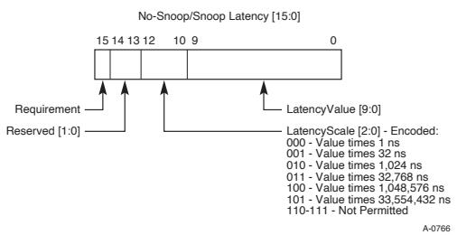

table>
<thead>
<tr>
<th width="50%">🇬🇧 English</th>
<th width="50%" style="background-color:#e8e8e8">🇨🇳 中文</th>
</tr>
</thead>
<tbody>
<tr>
<td>

No-Snoop Latency and Snoop Latency: As shown in § Figure 6-15, these fields include a Requirement bit that indicates if the device has a latency requirement for the given type of Request. If the Requirement bit is Set, the LatencyValue and LatencyScale fields describe the latency requirement. If the Requirement bit is Clear, there is no latency requirement and the LatencyValue and LatencyScale fields are ignored. With any LTR Message transmission, it is permitted for a device to indicate that a requirement is being reported for only no-snoop Requests, for only snoop Requests, or for both types of Requests. It is also permitted for a device to indicate that it has no requirement for either type of traffic, which it does by clearing the Requirement bit in both fields.

Each field also includes value and scale fields that encode the reported latency. Values are multiplied by the indicated scale to yield an absolute time value, expressible in a range from 1 ns to 2<sup>25</sup>*(2<sup>10</sup>-1) = 34,326,183,936 ns.

Setting the value and scale fields to all 0's indicates that the device will be impacted by any delay and that the best possible service is requested.

</td>
<td style="background-color:#e8e8e8">

No-Snoop Latency（无窥探延迟）与 Snoop Latency（窥探延迟）：如 § 图 6-15 所示，这些字段包含一个 Requirement 位 (Requirement bit)，用于指示设备是否对给定类型的 Request 具有延迟要求。如果 Requirement 位置 1，则 LatencyValue 和 LatencyScale 字段描述延迟要求。如果 Requirement 位清 0，则表示无延迟要求，LatencyValue 和 LatencyScale 字段被忽略。在任何 LTR 消息传输中，允许设备指示仅针对无窥探 Request、仅针对窥探 Request 或同时针对两种类型 Request 报告要求。也允许设备指示其对任一类型流量都没有要求，方法是将两个字段中的 Requirement 位清 0。

每个字段还包含 value 和 scale 字段，用于对所报告的延迟进行编码。值乘以所指示的 scale 即可得到一个绝对时间值，范围可表示为 1 ns 至 2<sup>25</sup>*(2<sup>10</sup>-1) = 34,326,183,936 ns。

将 value 和 scale 字段全部设置为 0，表示设备将受到任何延迟的影响，并请求可能的最佳服务。

</td>
</tr>
</tbody>
</table>

[⬆️ 返回目录](#-本章目录-table-of-contents)

---


<div style="overflow-x: auto; max-width: 100%;">
<table>
<thead>
<tr>
<th width="50%">🇬🇧 English</th>
<th width="50%" style="background-color:#e8e8e8">🇨🇳 中文</th>
</tr>
</thead>
<tbody>
<tr>
<td>

If a device doesn't implement or has no service requirements for a particular type of traffic, then it must have the Requirement bit clear for the associated latency field.

When directed to a non-D0 state by a Write to the PMCSR register, if a device's most recently transmitted LTR message (since the last DL_Down to DL_Up transition) reported one or both latency fields with any Requirement bit set, then it must send a new LTR Message with both of the Requirement bits clear prior to transitioning to the non-D0 state. If subsequently directed back to D0 by a Write to the PMCSR register, it is recommended that the device send a new LTR Message to re-establish its latency requirements after the transition back to D0.

When the LTR Mechanism Enable bit is cleared, if a device's most recently sent LTR Message (since the last DL_Down to DL_Up transition) reported latency tolerance values with any Requirement bit set, then one of the following applies:

- If the bit was cleared due to a Configuration Write to the Device Control 2 Register, the device must send a new LTR Message with all the Requirement bits clear.
- If the bit was cleared due to an FLR, the device MUST@FLIT send a new LTR Message with all the Requirement bits clear.

When a Downstream Port goes to DL_Down status, any previous latencies recorded for that Port must be treated as invalid.

An LTR Message from a device reflects the tolerable latency from the perspective of the device, for which the platform must consider the service latency itself, plus the delay added by the use of Clock Power Management (CLKREQ#), if applicable. The service latency itself is defined as follows:

- When a device issues a Non-Posted Request, service latency of that Request is the delay from transmission of the last symbol of the Request TLP to the receipt of the first symbol of the first Completion TLP for that Request<sup>142</sup>.
- When a device issues one or more Posted Requests such that it cannot issue another Posted Request due to Flow Control backpressure, service latency of the blocked Request is the delay from the transmission of the last symbol of the previous Posted Request to the receipt of the first symbol of the DLLP returning the credit(s) that allows transmission of the blocked Request<sup>118</sup>.

If Clock Power Management is used, then the platform implementation-dependent period between when a device asserts CLKREQ# and the device receives a valid clock signal constitutes an additional component of the platform service latency that must be comprehended by the platform when setting platform power management policy.

It is recommended that Endpoints transmit an LTR Message Upstream shortly after LTR is enabled, and subsequently when the Endpoint's service requirements change.

It is strongly recommended that Endpoints send no more than two LTR Messages within any 500 μs time period, except where required to by the specification. Downstream Ports must not generate an error if more than two LTR Messages are received within a 500 μs time period, and must properly handle all LTR messages regardless of the time interval between them.

</td>
<td style="background-color:#e8e8e8">

如果设备未实现或对特定类型的流量没有服务要求，则其关联延迟字段的 Requirement 位必须清 0。

当通过写 PMCSR 寄存器指示设备进入非 D0 状态时，如果设备最近传输的 LTR 消息（自上次 DL_Down 到 DL_Up 转换以来）所报告的一个或两个延迟字段中任何 Requirement 位置 1，则在转换至非 D0 状态之前，必须发送一条新的 LTR 消息，并将两个 Requirement 位清 0。如果之后通过写 PMCSR 寄存器指示返回 D0，则建议设备发送一条新的 LTR 消息以在返回 D0 之后重新建立其延迟要求。

当 LTR Mechanism Enable 位清 0 时，如果设备最近发送的 LTR 消息（自上次 DL_Down 到 DL_Up 转换以来）所报告的延迟容忍值有任何 Requirement 位置 1，则适用以下情形之一：

- 如果该位由于对 Device Control 2 寄存器的 Configuration Write 而被清 0，则设备必须发送一条新的 LTR 消息，并将所有 Requirement 位清 0。
- 如果该位由于 FLR 而被清 0，则设备 MUST@FLIT 发送一条新的 LTR 消息，并将所有 Requirement 位清 0。

当下游端口进入 DL_Down 状态时，先前为该端口记录的所有延迟值必须被视为无效。

设备发出的 LTR 消息反映了从设备视角可容忍的延迟，平台必须考虑该服务延迟本身，以及在适用情况下使用时钟电源管理 (Clock Power Management, CLKREQ#) 所增加的延迟。服务延迟本身的定义如下：

- 当设备发出 Non-Posted Request 时，该 Request 的服务延迟是指从 Request TLP 最后一个符号的发出，到该 Request 第一个完成报文 (Completion) TLP 第一个符号被接收之间的延迟<sup>142</sup>。
- 当设备发出一个或多个 Posted Request，由于流控 (Flow Control) 反压而无法发出另一个 Posted Request 时，被阻塞 Request 的服务延迟是指从先前 Posted Request 最后一个符号的发出，到返回允许发送被阻塞 Request 的信用 (Credit) 的 DLLP 第一个符号被接收之间的延迟<sup>118</sup>。

如果使用时钟电源管理 (Clock Power Management)，则从设备断言 CLKREQ# 到设备接收到有效时钟信号之间这一平台实现相关的时间段，构成平台服务延迟的一个附加组成部分，平台在设置平台电源管理策略时必须将其纳入考虑。

建议端点在 LTR 启用后立即向上游 (Upstream) 发送一条 LTR 消息，并在端点的服务要求发生变化时再次发送。

强烈建议端点在任意 500 μs 时间段内发送的 LTR 消息不超过两条，除非本规范另有要求。即使在 500 μs 时间段内收到两条以上 LTR 消息，下游端口也不得产生错误，并且必须正确处理所有 LTR 消息，无论其时间间隔如何。

</td>
</tr>
</tbody>
</table>
</div>


[⬆️ 返回目录](#-本章目录-table-of-contents)

---

<<<PAGE_BREAK>>> page_826

table>
<thead>
<tr>
<th width="50%">🇬🇧 English</th>
<th width="50%" style="background-color:#e8e8e8">🇨🇳 中文</th>
</tr>
</thead>
<tbody>
<tr>
<td>

Multi-Function Devices (MFDs) associated with an Upstream Port must transmit a "conglomerated" LTR Message Upstream according to the following rules:

- The acceptable latency values for the Message sent Upstream by the MFD must reflect the lowest values associated with any Function.
  - It is permitted that the snoop and no-snoop latencies reported in the conglomerated Message are associated with different Functions.
  - If none of the Functions report a requirement for a certain type of traffic (snoop/no-snoop), the Message sent by the MFD must not set the Requirement bit corresponding to that type of traffic.
- The MFD must transmit a new LTR Message Upstream when any Function of the MFD changes the values it has reported internally in such a way as to change the conglomerated value earlier reported by the MFD.

Switches must collect the Messages from Downstream Ports that have the LTR mechanism enabled and transmit a "conglomerated" Message Upstream according to the following rules:

- If a Switch supports the LTR feature, it must support the feature on its Upstream Port and all Downstream Ports.
- A Switch Upstream Port is permitted to transmit LTR Messages only when its LTR Mechanism Enable bit is Set or shortly after software clears its LTR Mechanism Enable bit as described earlier in this section.
- The acceptable latency values for the Message sent Upstream by the Switch must be calculated as follows:
  - If none of the Downstream Ports receive an LTR Message containing a requirement for a certain type of traffic (snoop/no-snoop), then any LTR Message sent by the Switch must not set the Requirement bit corresponding to that type of traffic.
  - Define LTRdnport[N] as the value reported in the LTR Message received at Downstream Port N, with these adjustments if applicable:
    - LTRdnport[N] is effectively infinite if the Requirement bit is clear or if a Not Permitted LatencyScale value is used
    - LTRdnport[N] must be 0 if the Requirement bit is 1 and the LatencyValue field is all 0's regardless of the LatencyScale value
  - Define LTRdnportMin as the minimum value of LTRdnport[N] across all Downstream Ports
  - Define Lswitch as all latency induced by the Switch
    - If Lswitch dynamically changes based on the Switch's operational mode, the Switch must not allow Lswitch to exceed 20% of LTRdnportMin, unless Lswitch for the Switch's lowest latency mode is greater, in which case the lowest latency state must be used
  - Calculate the value to transmit upstream, LTRconglomerated, as LTRdnportMin - Lswitch, unless this value is less than 0 in which case LTRconglomerated is 0
  - If LTRconglomerated is 0, both the LatencyValue and LatencyScale fields must be all 0's in the conglomerated LTR message
- A new LTR message must be transmitted Upstream if the conglomerated latencies are changed as a result of DL_Down invalidating the previous latencies recorded for that Port.
- If a Switch Downstream Port has the LTR Mechanism Enable bit cleared, the Latency Tolerance values recorded for that Port must be treated as invalid, and the latencies to be transmitted Upstream updated and a new conglomerated Message transmitted Upstream if the conglomerated latencies are changed as a result.
- A Switch must transmit an LTR Message Upstream when any Downstream Port/Function changes the latencies it has reported in such a way as to change the conglomerated latency reported by the Switch.
- A Switch must not transmit LTR Messages Upstream unless triggered to do so by one of the events described above.

The RC is permitted to delay processing of device Request TLPs provided it satisfies the device's service requirements. When the latency requirement is updated during a series of Requests, it is required that the updated latency figure be comprehended by the RC prior to servicing a subsequent Request. In all cases the updated latency value must take effect within a time period equal to or less than the previously reported latency requirement. It is permitted for the RC to comprehend the updated latency figure earlier than this limit.

</td>
<td style="background-color:#e8e8e8">

与上游端口 (Upstream Port) 关联的多功能设备 (MFD) 必须根据以下规则向上游发送"汇聚"LTR 消息：

- MFD 向上游发送消息的可接受延迟值必须反映任一 Function 所关联的最低值。
  - 允许汇聚消息中报告的窥探 (snoop) 和无窥探 (no-snoop) 延迟与不同 Function 关联。
  - 如果没有任何 Function 报告对特定类型流量（snoop/no-snoop）的要求，则 MFD 发送的消息不得置位与该类型流量相对应的 Requirement 位。
- 当 MFD 任何 Function 内部报告的值发生改变，以致改变 MFD 先前报告的汇聚值时，MFD 必须向上游发送一条新的 LTR 消息。

交换机 (Switch) 必须收集来自已启用 LTR 机制的下游端口的消息，并根据以下规则向上游发送"汇聚"消息：

- 如果交换机支持 LTR 功能，则它必须在其上游端口和所有下游端口上都支持该功能。
- 仅当交换机的 LTR Mechanism Enable 位置 1 时，或在本节前面所述软件清 0 其 LTR Mechanism Enable 位之后不久，交换机上游端口才允许发送 LTR 消息。
- 交换机向上游发送消息的可接受延迟值必须按如下方式计算：
  - 如果没有任何下游端口接收到对特定类型流量（snoop/no-snoop）具有要求的 LTR 消息，则交换机发送的任何 LTR 消息不得置位与该类型流量相对应的 Requirement 位。
  - 将 LTRdnport[N] 定义为下游端口 N 接收到的 LTR 消息中报告的值，并在适用时进行如下调整：
    - 如果 Requirement 位清 0 或使用了 Not Permitted 的 LatencyScale 值，则 LTRdnport[N] 实际为无穷大
    - 如果 Requirement 位为 1 且 LatencyValue 字段全为 0，则 LTRdnport[N] 必须为 0，无论 LatencyScale 值为何
  - 将 LTRdnportMin 定义为所有下游端口 LTRdnport[N] 中的最小值
  - 将 Lswitch 定义为交换机所引入的全部延迟
    - 如果 Lswitch 根据交换机的运行模式动态变化，则交换机不得允许 Lswitch 超过 LTRdnportMin 的 20%；但如果交换机最低延迟模式的 Lswitch 更大，则必须使用最低延迟状态
  - 将向上游发送的值 LTRconglomerated 计算为 LTRdnportMin - Lswitch，除非该值小于 0（此时 LTRconglomerated 为 0）
  - 如果 LTRconglomerated 为 0，则汇聚 LTR 消息中的 LatencyValue 和 LatencyScale 字段必须全为 0
- 如果因 DL_Down 使该端口先前记录的延迟值无效而导致汇聚延迟发生变化，则必须向上游发送一条新的 LTR 消息。
- 如果交换机下游端口的 LTR Mechanism Enable 位被清 0，则为该端口记录的延迟容忍值必须被视为无效，并更新要向上游发送的延迟；如果汇聚延迟因此发生变化，则向上游发送新的汇聚消息。
- 当任何下游端口/Function 报告的延迟发生变化，以致改变交换机报告的汇聚延迟时，交换机必须向上游发送一条 LTR 消息。
- 除非因上述事件之一而触发，否则交换机不得向上游发送 LTR 消息。

只要满足设备的服务要求，RC 即可延迟处理设备的 Request TLP。在一系列 Request 期间更新延迟要求时，要求 RC 在服务后续 Request 之前领会已更新的延迟值。在所有情况下，已更新的延迟值必须在等于或小于先前报告的延迟要求的时间段内生效。允许 RC 在早于该限制时即领会已更新的延迟值。

</td>
</tr>
</tbody>
</table>

[⬆️ 返回目录](#-本章目录-table-of-contents)

---

> <sup>142</sup> For this definition, all of the symbols of a DLLP or TLP are included. For 8b/10b, the first and last symbols are framing symbols (SDP, STP or END, see § Section 4.2.1). For 128b/130b, the first symbol of a packet is the first symbol of a framing token (SDP or STP) and the last symbol of a packet is the last symbol of a CRC or LCRC (see § Section 4.2.2). | 对于此定义，包含 DLLP 或 TLP 的所有符号。对于 8b/10b，第一个和最后一个符号是成帧符号（SDP、STP 或 END，参见 § 第 4.2.1 节）。对于 128b/130b，分组的第一个符号是成帧令牌（SDP 或 STP）的第一个符号，分组的最后一个符号是 CRC 或 LCRC 的最后一个符号（参见 § 第 4.2.2 节）。

---

<<<PAGE_BREAK>>> page_827


<div style="overflow-x: auto; max-width: 100%;">
<table>
<thead>
<tr>
<th width="50%">🇬🇧 English</th>
<th width="50%" style="background-color:#e8e8e8">🇨🇳 中文</th>
</tr>
</thead>
<tbody>
<tr>
<td>

**IMPLEMENTATION NOTE:**
**OPTIMAL USE OF LTR**

It is recommended that Endpoints transmit an updated LTR Message each time the Endpoint's service requirements change. If the latency tolerance is being reduced, it is recommended to transmit the updated LTR Message ahead of the first anticipated Request with the new requirement, allowing the amount of time indicated in the previously issued LTR Message. If the tolerance is being increased, then the update should immediately follow the final Request with the preceding latency tolerance value.

Typically, the Link will be in ASPM L1, and, if Clock Power Management (Clock PM) is supported, CLKREQ# will be deasserted, at the time an Endpoint reaches an internal trigger that causes the Endpoint to initiate Requests to the RC. The following text shows an example of how LTR is applied in such a case. Key time points are illustrated in § Figure 6-16.

</td>
<td style="background-color:#e8e8e8">

**实现提示 (IMPLEMENTATION NOTE):**
**LTR 的最佳使用**

建议端点在其服务要求每次发生变化时，都发送一条更新的 LTR 消息。如果延迟容忍度被减小，建议在第一次预期发出的具有新要求的 Request 之前发送更新的 LTR 消息，并预留先前所发 LTR 消息中指示的时间量。如果延迟容忍度被增大，则该更新应紧跟在使用先前延迟容忍度值的最后一条 Request 之后。

通常，当端点到达触发其向 RC 发起 Request 的内部触发点时，链路将处于 ASPM L1 状态；如果支持时钟电源管理 (Clock PM)，则 CLKREQ# 将被取消断言。下面的文字给出了在这种情况下 LTR 如何被应用的示例。关键时间点在 § 图 6-16 中说明。

</td>
</tr>
</tbody>
</table>
</div>


[⬆️ 返回目录](#-本章目录-table-of-contents)

---

> **Figure 6-16.** CLKREQ# and Clock Power Management | CLKREQ# 与时钟电源管理
> 

table>
<thead>
<tr>
<th width="50%">🇬🇧 English</th>
<th width="50%" style="background-color:#e8e8e8">🇨🇳 中文</th>
</tr>
</thead>
<tbody>
<tr>
<td>

- Time A is a platform implementation-dependent period between when a device asserts CLKREQ# and the device receives a valid clock signal. This value will not exceed the latency in effect.
- Time B is the device implementation-dependent period between when a device has a valid clock and it can initiate the retraining sequence to transition from L1 ASPM to L0.
- Time C is the period during which the transition from L1 ASPM to L0 takes place
- Time D for a Read transaction is the time between the transmission of the END symbol in the Request TLP to the receipt of the STP symbol in the Completion TLP for that Request. Time D for a Write transaction is the time between the transmission of the END symbol of the TLP that exhausts the FC credits to the receipt of the SDP symbol in the DLLP returning more credits for that Request type. This value will not exceed the latency in effect.
- Time E is the period where the data path from the Endpoint to system memory is open, and data transactions are not subject to the leadoff latency.

The LTR latency semantic reflects the tolerable latency seen by the device as measured by one or both of the following:

- **Case 1:** the device may or may not support Clock PM, but has not deasserted its CLKREQ# signal - The latency observed by the device is represented in § Figure 6-16 as the sum of times C and D.
- **Case 2:** the device supports Clock PM and has deasserted CLKREQ# - The latency observed by the device is represented as the sum of times A, C, and D.

To effectively use the LTR mechanism in conjunction with Clock PM, the device will know or be able to measure times B and C, so that it knows when to assert CLKREQ#. The actual values of Time A, Time C, and Time D may vary dynamically, and it is the responsibility of the platform to ensure the sum will not exceed the latency.

</td>
<td style="background-color:#e8e8e8">

- 时间 A 是平台实现相关的时间段，从设备断言 CLKREQ# 到设备接收到有效时钟信号。该值不会超过当前生效的延迟。
- 时间 B 是设备实现相关的时间段，从设备获得有效时钟到其可以启动从 L1 ASPM 迁移到 L0 的重训练序列。
- 时间 C 是从 L1 ASPM 迁移到 L0 期间所经历的时间段。
- 对于读事务，时间 D 是从 Request TLP 中 END 符号的发出到该 Request 的 Completion TLP 中 STP 符号被接收之间的时间。对于写事务，时间 D 是从耗尽 FC 信用 (FC Credit) 的 TLP 的 END 符号发出，到返回该 Request 类型更多信用的 DLLP 中 SDP 符号被接收之间的时间。该值不会超过当前生效的延迟。
- 时间 E 是从端点到系统内存的数据通道打开期间，数据事务不受 lead-off 延迟影响。

LTR 延迟语义反映了设备所看到的可容忍延迟，按以下一种或两种方式度量：

- **情形 1 (Case 1):** 设备可能支持也可能不支持 Clock PM，但未取消断言其 CLKREQ# 信号——设备所观察到的延迟在 § 图 6-16 中表示为时间 C 与 D 之和。
- **情形 2 (Case 2):** 设备支持 Clock PM 且已取消断言 CLKREQ#——设备所观察到的延迟表示为时间 A、C 与 D 之和。

为有效结合 Clock PM 使用 LTR 机制，设备将了解或能够测量时间 B 和 C，以便知晓何时断言 CLKREQ#。时间 A、时间 C 和时间 D 的实际值可能动态变化，平台有责任确保其总和不会超出延迟。

</td>
</tr>
</tbody>
</table>

[⬆️ 返回目录](#-本章目录-table-of-contents)

---

<<<PAGE_BREAK>>> page_828

> **Figure 6-17.** Use of LTR and Clock Power Management | LTR 与时钟电源管理的使用
> 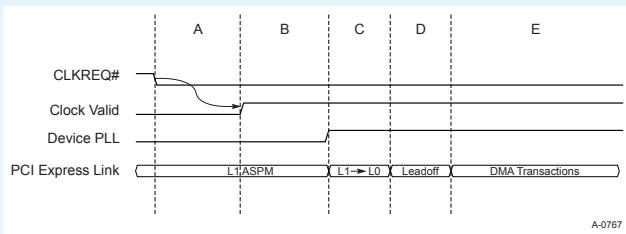


<div style="overflow-x: auto; max-width: 100%;">
<table>
<thead>
<tr>
<th width="50%">🇬🇧 English</th>
<th width="50%" style="background-color:#e8e8e8">🇨🇳 中文</th>
</tr>
</thead>
<tbody>
<tr>
<td>

In a very simple model, an Endpoint may choose to implement LTR as shown in § Figure 6-17. When an Endpoint determines that it is idle, it sends an LTR Message with the software configured maximum latency or the maximum latency the Endpoint can support.

When the Endpoint determines that it has a need to maintain sustained data transfers with the Root Complex, the Endpoint sends a new LTR Message with a shorter latency (at Time E). This LTR Message is sent prior to the next data flush by a time equal to the maximum latency sent before (the time between Time E and Time D'). In between Time E and Time A', the Endpoint can return to a low power state, while the platform transitions to a state where it can provide the shorter latency when the device next needs to transmit data.

Note that the RC may delay processing of device Request TLPs, provided it satisfies the device's service requirements. If, for example, an Endpoint connected to Root Port 1 reports a latency tolerance of 100 μs, and an Endpoint on Root Port 2 report a value of 30 μs, the RC might implement a policy of stalling an initial Request following an idle period from Root Port 1 for 70 μs before servicing the Request with a 30 μs latency, thus providing a perceived service latency to the first Endpoint of 100 μs. This RC behavior provides the RC the ability to batch together Requests for more efficient servicing.

It is possible that, after it is determined that the RC can service snoop and no-snoop Requests from all Endpoints within the maximum snoop and maximum no-snoop time intervals, this information may be communicated to Endpoints by updating the Max Snoop LatencyValue, Max Snoop LatencyScale and Max No-Snoop LatencyValue, Max No-Snoop LatencyScale fields. The intention of this communication would be to prevent Endpoints from sending needless LTR updates.

When an Endpoint's LTR value for snoop Requests changes to become larger (looser) than the value indicated in the Max Snoop LatencyValue/Scale fields, it is recommended that the Endpoint send an LTR message with the snoop LTR value indicated in the Max Snoop LatencyValue/Scale fields. Likewise, when an Endpoint's LTR value for no-snoop Requests changes to become larger (looser) than the value indicated in the Max No-Snoop LatencyValue/Scale fields, it is recommended that the Endpoint send an LTR message with the no-snoop LTR value indicated in the Max No-Snoop LatencyValue/Scale fields.

It is recommended that Endpoints buffer Requests as much as possible, and then use the full Link bandwidth in bursts that are as long as the Endpoint can practically support, as this will generally lead to the best overall platform power efficiency.

Note that LTR may be enabled in environments where not all Endpoints support LTR, and in such environments, Endpoints that do not support LTR may experience suboptimal service.

</td>
<td style="background-color:#e8e8e8">

在非常简单的模型中，端点可以选择如 § 图 6-17 所示实现 LTR。当端点确定其处于空闲状态时，它发送一条 LTR 消息，其中延迟为软件配置的最大延迟或端点能够支持的最大延迟。

当端点确定需要与根复合体保持持续的数据传输时，端点发送一条具有更短延迟的新 LTR 消息（在时间 E）。该 LTR 消息在下一次数据刷新之前发送，发送时间早于刷新时刻等于先前所发的最大延迟（即时间 E 与时间 D' 之间的时间）。在时间 E 和时间 A' 之间，端点可返回低功耗状态，同时平台过渡到能够在设备下次需要传输数据时提供更短延迟的状态。

请注意，只要满足设备的服务要求，RC 即可延迟处理设备的 Request TLP。例如，连接到根端口 1 的端点报告延迟容忍度为 100 μs，而根端口 2 上的端点报告值为 30 μs，RC 可能会实现这样的策略：在来自根端口 1 的空闲期之后，将初始 Request 阻塞 70 μs，然后再以 30 μs 延迟为其提供服务，从而为第一个端点提供 100 μs 的感知服务延迟。此 RC 行为使 RC 能够将 Request 批处理以实现更高效的服务。

在确定 RC 能够在最大 snoop 和最大 no-snoop 时间间隔内为所有端点提供 snoop 和 no-snoop Request 服务之后，可以将该信息通过更新 Max Snoop LatencyValue、Max Snoop LatencyScale 以及 Max No-Snoop LatencyValue、Max No-Snoop LatencyScale 字段传达给端点。此通信的目的是防止端点发送不必要的 LTR 更新。

当端点针对 snoop Request 的 LTR 值变得大于（更宽松）Max Snoop LatencyValue/Scale 字段所指示的值时，建议端点发送一条 LTR 消息，其 snoop LTR 值为 Max Snoop LatencyValue/Scale 字段中指示的值。同样，当端点针对 no-snoop Request 的 LTR 值变得大于（更宽松）Max No-Snoop LatencyValue/Scale 字段所指示的值时，建议端点发送一条 LTR 消息，其 no-snoop LTR 值为 Max No-Snoop LatencyValue/Scale 字段中指示的值。

建议端点尽可能多地缓冲 Request，然后以端点实际可支持的最长突发长度使用完整链路带宽 (Link Bandwidth)，因为这通常会带来最佳的整体平台能效。

请注意，LTR 可能在并非所有端点都支持 LTR 的环境中启用；在这样的环境中，不支持 LTR 的端点可能会经历次优的服务。

</td>
</tr>
</tbody>
</table>
</div>


[⬆️ 返回目录](#-本章目录-table-of-contents)

---

<<<PAGE_BREAK>>> page_829


---

<a id="sec-6-19"></a>
## 6.19 Optimized Buffer Flush/Fill (OBFF) Mechanism | 优化缓冲区刷新/填充 (OBFF) 机制

table>
<thead>
<tr>
<th width="50%">🇬🇧 English</th>
<th width="50%" style="background-color:#e8e8e8">🇨🇳 中文</th>
</tr>
</thead>
<tbody>
<tr>
<td>

6.19 Optimized Buffer Flush/Fill (OBFF) Mechanism §

<<<PAGE_BREAK>>> page_830

associated with the Root Complex (RC, 根复合体) are active to service some other activity, for example the operating system timer tick. The nature and determination of such windows is platform/implementation specific.

An OBFF indication is a hint - Functions are still permitted to initiate bus mastering and/or interrupt traffic whenever enabled to do so, although this will not be optimal for platform power and should be avoided as much as possible.

OBFF is indicated using either the WAKE# signal or a message (see § Section 2.2.8.9). The message is to be used exclusively on interconnects where the WAKE# signal is not available. WAKE# signaling of OBFF or CPU Active must only be initiated by a Root Port when the system is in an operational state, which in an ACPI compliant system corresponds to the S0 state. Functions that are in a non-D0 state must not respond to OBFF or CPU Active signaling.

OBFF messages use Message Routing 100b, "Local - Terminate at Receiver" (see § Table 2-20), and are only permitted to be transmitted in the Downstream direction. There are multiple OBFF events distinguished. When using the OBFF Message, the OBFF Code field (see § Figure 2-65 and § Figure 2-66) is used to distinguish between different OBFF cases:

- **1111b "CPU Active"** — System fully active for all Device actions including bus mastering and interrupts
- **0001b "OBFF"** — System memory path available for Device memory read/write bus master activities
- **0000b "Idle"** — System in an idle, low power state
- **Others** — All other codes are Reserved.

These codes correspond to various assertion patterns of WAKE# when using WAKE# signaling, as shown in § Figure 6-18. There is one negative-going transition when signaling OBFF and two negative going transitions each time CPU Active is signaled. The electrical parameters required when using WAKE# are defined in the WAKE# Signaling section of [CEM-2.0] (or later).

</td>
<td style="background-color:#e8e8e8">

6.19 优化缓冲区刷新/填充 (OBFF, Optimized Buffer Flush/Fill) 机制 §

<<<PAGE_BREAK>>> page_830

根复合体 (RC, Root Complex) 处于活动状态以处理其他活动，例如操作系统定时器滴答。此类时间窗口的性质和判定由平台/实现自行决定。

OBFF 指示只是一种提示 (hint) —— 只要 Function 被允许,任何时候仍可发起总线主控和/或中断流量,尽管这对平台功耗而言并非最优,应尽量避免。

OBFF 指示可通过 WAKE# 信号或消息发出(参见 § Section 2.2.8.9)。消息方式仅在没有 WAKE# 信号的互连上使用。OBFF 或 CPU Active 的 WAKE# 信令仅可在系统处于工作状态时由根端口 (Root Port) 发起,在符合 ACPI 的系统中对应 S0 状态。处于非 D0 状态的 Function 不得响应 OBFF 或 CPU Active 信令。

OBFF 消息使用消息路由 (Message Routing) 100b,即"Local - Terminate at Receiver"(参见 § Table 2-20),且只允许沿下游 (Downstream) 方向发送。OBFF 区分多种事件。使用 OBFF 消息时,OBFF Code 字段(参见 § Figure 2-65 和 § Figure 2-66)用于区分不同 OBFF 情形:

- **1111b "CPU Active"** —— 系统完全活动,所有设备动作(包括总线主控和中断)均被允许
- **0001b "OBFF"** —— 系统内存路径对设备的内存读/写总线主控活动可用
- **0000b "Idle"** —— 系统处于空闲低功耗状态
- **其他** —— 所有其他代码为保留 (Reserved)

使用 WAKE# 信令时,这些代码对应 WAKE# 的不同断言模式,如 § Figure 6-18 所示。指示 OBFF 时有一个负向跳变,而每次指示 CPU Active 时则有两个负向跳变。使用 WAKE# 时所需的电气参数在 [CEM-2.0](或更高版本)的 WAKE# Signaling 一节中定义。

</td>
</tr>
</tbody>
</table>

> **Figure 6-18.** Codes and Equivalent WAKE# Patterns | 代码与等效 WAKE# 模式
> 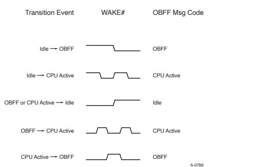


<div style="overflow-x: auto; max-width: 100%;">
<table>
<thead>
<tr>
<th width="50%">🇬🇧 English</th>
<th width="50%" style="background-color:#e8e8e8">🇨🇳 中文</th>
</tr>
</thead>
<tbody>
<tr>
<td>

When an OBFF Message is received that indicates a Reserved code, the Receiver, if OBFF is enabled, must treat the indication as a "CPU Active" indication.

An OBFF Message received at a Port that does not implement OBFF or when OBFF is not enabled must be handled as an Unsupported Request (UR). This is a reported error associated with the receiving Port (see § Section 6.2). If a Port has OBFF enabled using WAKE# signaling, and that Port receives an OBFF Message, the behavior is undefined.

OBFF indications reflect central resource power management (PM) state transitions, and are signaled using WAKE# when this is supported by the platform topology, or using a Message when WAKE# is not available. OBFF support is discovered and enabled through reporting and control registers described in § Chapter 7. Software must not enable OBFF in an Endpoint unless the platform supports delivering OBFF indications to that Endpoint.

</td>
<td style="background-color:#e8e8e8">

当收到的 OBFF 消息指示保留代码时,如果接收端已使能 OBFF,则必须将该指示视为 "CPU Active" 指示。

在不实现 OBFF 或未使能 OBFF 的端口上收到的 OBFF 消息,必须按不支持请求 (UR, Unsupported Request) 处理。这是与接收端口相关联的上报错误(参见 § Section 6.2)。如果某端口已通过 WAKE# 信令使能 OBFF,却又收到 OBFF 消息,则其行为未定义。

OBFF 指示反映中央资源电源管理 (Power Management) 状态的转换:当平台拓扑支持 WAKE# 时使用 WAKE# 指示;当平台拓扑不支持 WAKE# 时使用消息指示。OBFF 支持的发现与使能通过 § Chapter 7 描述的上报寄存器和控制寄存器完成。除非平台支持将 OBFF 指示传递到该端点 (Endpoint),否则软件不得在该端点中使能 OBFF。

</td>
</tr>
</tbody>
</table>
</div>


[⬆️ 返回目录](#-本章目录-table-of-contents)

---

<<<PAGE_BREAK>>> page_831

table>
<thead>
<tr>
<th width="50%">🇬🇧 English</th>
<th width="50%" style="background-color:#e8e8e8">🇨🇳 中文</th>
</tr>
</thead>
<tbody>
<tr>
<td>

When the platform indicates the start of a CPU Active or OBFF window, it is recommended that the platform not return to the Idle state in less than 10 μs. It is permitted to indicate a return to Idle in advance of actually entering platform idle, but it is strongly recommended that this only be done to prevent late Endpoint activity from causing an immediate exit from the idle state, and that the advance time be as short as possible.

It is recommended that Endpoints not assume CPU Active or OBFF windows will remain open for any particular length of time.

</td>
<td style="background-color:#e8e8e8">

当平台指示 CPU Active 或 OBFF 窗口开始时,建议平台不要在少于 10 μs 的时间内回到 Idle 状态。允许在实际进入平台空闲 (platform idle) 之前就指示返回到 Idle,但强烈建议只有在为了避免端点 (Endpoint) 较晚的活动导致立即退出空闲状态时才这样做,且提前时间应尽可能短。

建议端点不要假设 CPU Active 或 OBFF 窗口会保持打开任何特定时长。

</td>
</tr>
</tbody>
</table>

> **Figure 6-19.** Example Platform Topology Showing a Link Where OBFF is Carried by Messages | 展示 OBFF 由消息承载的链路的示例平台拓扑
> 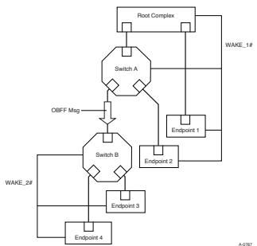


<div style="overflow-x: auto; max-width: 100%;">
<table>
<thead>
<tr>
<th width="50%">🇬🇧 English</th>
<th width="50%" style="background-color:#e8e8e8">🇨🇳 中文</th>
</tr>
</thead>
<tbody>
<tr>
<td>

§ Figure 6-19 shows an example system where it is necessary for a Switch (A) to translate OBFF indications received using WAKE# into OBFF Messages, which in this case are received by another Switch (B) and translated back to using WAKE# signaling. A HwInit configuration mechanism (set by hardware or firmware) is used to identify cases such as shown in this example (where the link between Switch A and Switch B requires the use of OBFF Messages), and system firmware/software must configure OBFF accordingly.

When a Switch is configured to use OBFF Message signaling at its Upstream Port and WAKE# at one or more Downstream Ports, or vice-versa, when enabled for OBFF, the Switch is required to convert all OBFF indications received at the Upstream Port into the appropriate form at the Downstream Port(s).

When using WAKE#, the enable for any specific Root Port enables the global use of WAKE# unless there are multiple WAKE# signals, in which case only the associated WAKE# signals are affected. When using Message signaling for OBFF, the enable for a particular Root Port enables transmission of OBFF messages from that Root Port only. To ensure OBFF is fully enabled in a platform, all Root Ports indicating OBFF support must be enabled for OBFF. It is permitted for system firmware/software to selectively enable OBFF, but such enabling is beyond the scope of this specification.

To minimize power consumption, system firmware/software is strongly recommended to enable Message signaling of OBFF only when WAKE# signaling is not available for a given link.

OBFF signaling using WAKE# must only be reported as supported by all components connected to a Switch if it is a shared WAKE# signal. In these topologies it is permitted for software to enable OBFF for components connected to the Switch even if the Switch itself does not support OBFF.

It is permitted, although not encouraged, to indicate the same OBFF event more than once in succession.

When a Switch is propagating OBFF indications Downstream, it is strongly encouraged to propagate all OBFF indications. However, especially when using Messages, it may be necessary for the Switch to discard or collapse OBFF indications. It is permitted to discard and replace an earlier indication of a given type when an indication of the same or a different type is received.

</td>
<td style="background-color:#e8e8e8">

§ Figure 6-19 给出了一个示例系统,其中交换机 (Switch) A 需要将通过 WAKE# 接收的 OBFF 指示转换为 OBFF 消息,在本例中该消息被另一个交换机 (Switch) B 接收并转换回 WAKE# 信令。HwInit 配置机制(由硬件或固件设置)用于识别本示例所示的情形(即 Switch A 和 Switch B 之间的链路需要使用 OBFF 消息),系统固件/软件必须相应地配置 OBFF。

当某交换机在其上游端口 (Upstream Port) 配置使用 OBFF 消息信令,在一个或多个下游端口 (Downstream Port) 使用 WAKE# 信令(反之亦然),且已使能 OBFF 时,该交换机必须把在上游端口收到的所有 OBFF 指示转换为下游端口上对应的形式。

使用 WAKE# 时,任意特定根端口的使能在没有多个 WAKE# 信号的情况下会启用 WAKE# 的全局使用;若有多个 WAKE# 信号,则只影响关联的 WAKE# 信号。使用 OBFF 消息信令时,特定根端口的使能仅启用从该根端口发送 OBFF 消息。为确保平台完全使能 OBFF,所有指示支持 OBFF 的根端口都必须使能 OBFF。系统固件/软件可选择性地使能 OBFF,但此种选择性使能不在本规范的范围内。

为最小化功耗,强烈建议系统固件/软件仅在给定链路没有 WAKE# 信令可用时,才使能 OBFF 消息信令。

只有当 Switch 上共享 WAKE# 信号时,使用 WAKE# 的 OBFF 信令才能被上报为该 Switch 上连接的所有组件都支持。在这些拓扑中,允许软件为连接在 Switch 上的组件使能 OBFF,即使该 Switch 本身不支持 OBFF。

允许(但不鼓励)连续多次重复指示同一 OBFF 事件。

当 Switch 沿下游传播 OBFF 指示时,强烈鼓励传播所有 OBFF 指示。然而,尤其在使用消息时,Switch 可能需要丢弃或合并 OBFF 指示。当收到相同或不同类型的指示时,允许丢弃并替换先前某类型的指示。

</td>
</tr>
</tbody>
</table>
</div>


[⬆️ 返回目录](#-本章目录-table-of-contents)

---

<a id="sec-6-19-1"></a>
## 6.19.1 OBFF Variation A and Variation B | OBFF 变体 A 与变体 B

table>
<thead>
<tr>
<th width="50%">🇬🇧 English</th>
<th width="50%" style="background-color:#e8e8e8">🇨🇳 中文</th>
</tr>
</thead>
<tbody>
<tr>
<td>

Downstream Ports can be configured to transmit OBFF Messages in two ways, which are referred to as Variation A and Variation B. For Variation A, the Port must transmit the OBFF Message if the Link is in the L0 state, but discard the Message when the Link is in the Tx_L0s or L1 state. This variation is preferred when the Downstream Port leads to Devices that are expected to have communication requirements that are not time-critical, and where Devices are expected to signal a non-urgent need for attention by returning the Link state to L0. For Variation B, the Port must

§

</td>
<td style="background-color:#e8e8e8">

下游端口 (Downstream Port) 可配置为以两种方式发送 OBFF 消息,即变体 A (Variation A) 和变体 B (Variation B)。对于变体 A,当链路 (Link) 处于 L0 状态时端口必须发送 OBFF 消息,而当链路处于 Tx_L0s 或 L1 状态时必须丢弃该消息。当下游端口所连设备预期有非时间关键的通信需求,且设备预期通过将链路状态返回到 L0 来表达非紧急的关注请求时,首选此变体。对于变体 B,端口必须

§

</td>
</tr>
</tbody>
</table>

[⬆️ 返回目录](#-本章目录-table-of-contents)

---

<<<PAGE_BREAK>>> page_832


<div style="overflow-x: auto; max-width: 100%;">
<table>
<thead>
<tr>
<th width="50%">🇬🇧 English</th>
<th width="50%" style="background-color:#e8e8e8">🇨🇳 中文</th>
</tr>
</thead>
<tbody>
<tr>
<td>

transmit the OBFF Message if the Link is in the L0 state, or, if the Link is in the Tx_L0s or L1 state, it must direct the Link to the L0 state and then transmit the OBFF Message. This variation is preferred when the Downstream Port leads to devices that can benefit from timely notification of the platform state.

When initially configured for OBFF operation, the initial assumed indication must be the CPU Active state, regardless of the logical value of the WAKE# signal, until the first transition is observed.

When enabling Ports for OBFF, it is recommended that all Upstream Ports be enabled before Downstream Ports, and Root Ports must be enabled after all other Ports have been enabled. For hot pluggable (热插拔, Hot-Plug) Ports this sequence will not generally be possible, and it is permissible to enable OBFF using WAKE# to an unconnected hot pluggable Downstream Port. It is recommended that unconnected hot pluggable Downstream Ports not be enabled for OBFF message transmission.

</td>
<td style="background-color:#e8e8e8">

当链路 (Link) 处于 L0 状态时发送 OBFF 消息;或者当链路处于 Tx_L0s 或 L1 状态时,必须将链路引导至 L0 状态,然后再发送 OBFF 消息。当下游端口所连设备可从及时的平台状态通知中获益时,首选此变体。

在初始配置为 OBFF 操作时,无论 WAKE# 信号的逻辑值如何,初始假设的指示状态必须为 CPU Active,直到观察到第一次跳变为止。

在为端口使能 OBFF 时,建议先使能所有上游端口,再使能下游端口,根端口 (Root Port) 必须在其他所有端口都使能之后再使能。对于热插拔 (Hot-Plug) 端口,这一顺序通常无法保证;允许对未连接的热插拔下游端口通过 WAKE# 使能 OBFF。建议不要对未连接的热插拔下游端口使能 OBFF 消息发送。

</td>
</tr>
</tbody>
</table>
</div>


[⬆️ 返回目录](#-本章目录-table-of-contents)

---

table>
<thead>
<tr>
<th width="50%">🇬🇧 English</th>
<th width="50%" style="background-color:#e8e8e8">🇨🇳 中文</th>
</tr>
</thead>
<tbody>
<tr>
<td>

> **IMPLEMENTATION NOTE:**
> **OBFF CONSIDERATIONS FOR ENDPOINTS**
>
> It is possible that during normal circumstances, events could legally occur that could cause an Endpoint to misinterpret transitions from an Idle window to a CPU Active window or OBFF window. For example, a non-OBFF Endpoint could assert WAKE# as a wakeup mechanism, masking the system's transitions of the signal. This could cause the Endpoint to behave in a manner that would be less than optimal for power or performance reasons, but should not be unrecoverable for the Endpoint or the host system.
>
> In order to allow an Endpoint to maintain the most accurate possible view of the host state, it is recommended that the Endpoint place its internal state tracking logic in the CPU Active state when it receives a request that it determines to be host-initiated, and at any point where the Endpoint has a pending interrupt serviced by host software.

</td>
<td style="background-color:#e8e8e8">

> **实现说明 (IMPLEMENTATION NOTE):**
> **端点 OBFF 注意事项 (OBFF CONSIDERATIONS FOR ENDPOINTS)**
>
> 在正常情况下,某些合法事件可能导致端点 (Endpoint) 错误地将 Idle 窗口到 CPU Active 窗口或 OBFF 窗口的跳变进行解释。例如,非 OBFF 端点可能将 WAKE# 作为唤醒机制置起,掩盖系统对信号的真实跳变。这可能导致端点行为在功耗或性能方面非最优,但对端点或主机系统而言应当不会不可恢复。
>
> 为了使端点能够保持对主机状态尽可能准确的视图,建议在端点接收到由其判定为主机发起的请求时,以及在端点存在由主机软件服务的挂起中断的任意时刻,将其内部状态跟踪逻辑置于 CPU Active 状态。

</td>
</tr>
</tbody>
</table>

[⬆️ 返回目录](#-本章目录-table-of-contents)

---

<a id="sec-6-20"></a>
## 6.20 PASID | PASID (进程地址空间标识符)


<div style="overflow-x: auto; max-width: 100%;">
<table>
<thead>
<tr>
<th width="50%">🇬🇧 English</th>
<th width="50%" style="background-color:#e8e8e8">🇨🇳 中文</th>
</tr>
</thead>
<tbody>
<tr>
<td>

In Non-Flit Mode, the PASID TLP Prefix is an End-End TLP Prefix as defined in § Section 2.2.1. Layout of the PASID TLP Prefix is shown in § Figure 6-20 and § Table 6-15.

In Flit Mode, the PASID, when present, is included in OHC-A1 or OHC-A4.

When a PASID is present, the PASID value, in conjunction with the requester ID, identifies the Process Address Space ID associated with the Request. Each Function has a distinct set of PASID values. PASID values used by one Function are unrelated to PASID values used by any other Function.

PASID is permitted only for specific types of TLPs:

- Requests that include an Address with Address Type (AT) of Untranslated or Translated (see § Section 2.2.4.1).
- Address Translation Requests (i.e., MRd with AT=01b), ATS Invalidation Request Messages, Page Request Messages, Address routed messages in Flit Mode, and PRG Response Messages (see § Section 10.1.3).

PASID is not permitted on any other type of TLP.

Usage of PASID is permitted only when specifically enabled.

</td>
<td style="background-color:#e8e8e8">

在非 Flit 模式 (Non-Flit Mode) 下,PASID TLP Prefix 是 § Section 2.2.1 中定义的端到端 TLP Prefix。PASID TLP Prefix 的布局见 § Figure 6-20 和 § Table 6-15。

在 Flit 模式 (Flit Mode) 下,出现 PASID 时,它包含在 OHC-A1 或 OHC-A4 中。

当 PASID 存在时,PASID 值与请求者 ID (Requester ID) 一起,标识与该请求 (Request) 关联的进程地址空间 ID (Process Address Space ID)。每个 Function 拥有独立的 PASID 值集合。一个 Function 使用的 PASID 值与任何其他 Function 使用的 PASID 值互不相关。

PASID 仅允许用于特定类型的 TLP:

- 包含地址类型 (AT, Address Type) 为 Untranslated 或 Translated 的地址的请求 (参见 § Section 2.2.4.1)
- 地址转换请求 (Address Translation Request)(即 AT=01b 的 MRd)、ATS 无效化请求消息 (ATS Invalidation Request Message)、页请求消息 (Page Request Message)、Flit 模式下的地址路由消息,以及 PRG 响应消息 (参见 § Section 10.1.3)

其他任何类型的 TLP 都不允许携带 PASID。

PASID 的使用仅在明确使能时方可进行。

</td>
</tr>
</tbody>
</table>
</div>


[⬆️ 返回目录](#-本章目录-table-of-contents)

---

<a id="sec-6-20-1"></a>
## 6.20.1 Managing PASID Usage | PASID 使用管理

table>
<thead>
<tr>
<th width="50%">🇬🇧 English</th>
<th width="50%" style="background-color:#e8e8e8">🇨🇳 中文</th>
</tr>
</thead>
<tbody>
<tr>
<td>

For Endpoint Functions (including Root Complex Integrated Devices), the following rules apply:

- A Function is not permitted to send and receive TLPs with a PASID unless PASID Enable is Set (see § Section 7.8.9.3):
- A Function is not permitted to generate Requests using Translated Addresses and a PASID unless both PASID Enable and Translated Requests with PASID Enable are Set.
- A Function must have a mechanism for associating use of a PASID with a particular Function context. This mechanism is outside the scope of this specification.
- A Function must have a mechanism to request that it gracefully stop using a specific PASID. This mechanism is device specific but must satisfy the following rules:
  - A Function may support a limited number of simultaneous PASID stop requests. Software should defer issuing new stop requests until older stop requests have completed.
  - A stop request in one Function must not affect operation of any other Function.
  - A stop request must not affect operation of any other PASID within the Function.
  - A stop request must not affect operation of transactions that are not associated with a PASID.
  - When the stop request mechanism indicates completion, the Function has:
    - Stopped queuing new Requests for this PASID.
    - Completed all Non-Posted Requests (无数据,需完成) associated with this PASID.
    - Flushed to the host all Posted Requests (有数据,无完成) addressing host memory in all TCs that were used by the PASID. The mechanism used for this is device specific (for example: a non-relaxed Posted Write to host memory or a processor read of the Function can flush TC0; a zero length read to host memory can flush non-zero TCs).
    - Optionally flushed all Peer-to-Peer Posted Requests to their destination(s). The mechanism used for this is device specific.
    - Complied with additional rules described in Address Translation Services (ATS, 地址转换服务)(§ Chapter 10) if Address Translations or Page Requests were issued on the behalf of this PASID.

For Root Complexes, the following rules apply:

- A Root Complex must have an implementation specific mechanism for indicating support for PASID.
- A Root Complex that supports PASID must have an implementation specific mechanism for enabling them. By default usage of PASID is disabled.
- A Root Complex that supports PASID may optionally have an implementation specific mechanism for enabling them at a finer granularity than the entire Root Complex (e.g., distinct enables for a specific Root Port, Requester ID, Bus Number, Requester ID, or Requester ID/PASID combination).

In Flit Mode, the PASID information is contained in OHC-A1 or OHC-A4. In Non-Flit Mode, the PASID information is contained in a PASID TLP Prefix.

A TLP may contain at most one PASID TLP Prefix.

</td>
<td style="background-color:#e8e8e8">

对于端点 (Endpoint) Function(包括根复合体集成设备,Root Complex Integrated Devices),适用以下规则:

- 除非 PASID Enable 被置位(参见 § Section 7.8.9.3),否则 Function 不得发送或接收携带 PASID 的 TLP:
- 除非 PASID Enable 和 Translated Requests with PASID Enable 均被置位,否则 Function 不得使用已转换地址 (Translated Address) 和 PASID 生成请求 (Request)。
- Function 必须具有将 PASID 的使用与特定 Function 上下文相关联的机制。该机制不在本规范范围内。
- Function 必须具有请求其优雅停止使用特定 PASID 的机制。该机制是设备特定的,但必须满足以下规则:
  - Function 可支持有限数量的并发 PASID 停止请求。软件应当推迟发起新的停止请求,直到旧的停止请求完成。
  - 一个 Function 的停止请求不得影响任何其他 Function 的操作。
  - 停止请求不得影响 Function 内任何其他 PASID 的操作。
  - 停止请求不得影响与 PASID 无关的交易的运行。
  - 当停止请求机制指示完成时,Function 已经:
    - 停止为该 PASID 排队新请求 (Request)。
    - 完成了与该 PASID 关联的所有 Non-Posted 请求(无数据,需完成)。
    - 将该 PASID 使用的所有 TC 中寻址主机内存的 Posted 请求(有数据,无完成)刷新到主机。用于此目的的机制是设备特定的(例如:对主机内存的非宽松 Posted 写入或处理器对 Function 的读取可刷新 TC0;对主机内存的零长度读可刷新非零 TC)。
    - 可选地将所有对等 (Peer-to-Peer) Posted 请求刷新到其目标。该机制是设备特定的。
    - 如果该 PASID 已发起地址转换或页请求 (Page Request),还须遵守地址转换服务 (ATS)(§ Chapter 10)中描述的附加规则。

对于根复合体 (Root Complex),适用以下规则:

- 根复合体必须具有实现特定的机制来指示对 PASID 的支持。
- 支持 PASID 的根复合体必须具有实现特定的机制来使能 PASID。默认情况下 PASID 的使用是禁用的。
- 支持 PASID 的根复合体可选择性地具有实现特定的机制,以比整个根复合体更细的粒度来使能 PASID(例如:针对特定根端口、请求者 ID、总线号、请求者 ID,或请求者 ID/PASID 组合的独立使能)。

在 Flit 模式 (Flit Mode) 下,PASID 信息包含在 OHC-A1 或 OHC-A4 中。在非 Flit 模式 (Non-Flit Mode) 下,PASID 信息包含在 PASID TLP Prefix 中。

一个 TLP 最多只能包含一个 PASID TLP Prefix。

</td>
</tr>
</tbody>
</table>

[⬆️ 返回目录](#-本章目录-table-of-contents)

---

<a id="sec-6-20-2"></a>
## 6.20.2 PASID Information Layout | PASID 信息布局

<table>
<thead>
<tr>
<th width="50%">🇬🇧 English</th>
<th width="50%" style="background-color:#e8e8e8">🇨🇳 中文</th>
</tr>
</thead>
<tbody>
<tr>
<td>

6.20.2.1 PASID TLP Prefix - Non-Flit Mode

</td>
<td style="background-color:#e8e8e8">

6.20.2.1 PASID TLP Prefix —— 非 Flit 模式 (Non-Flit Mode)

</td>
</tr>
</tbody>
</table>

[⬆️ 返回目录](#-本章目录-table-of-contents)

---

<<<PAGE_BREAK>>> page_834

> **Figure 6-20.** PASID TLP Prefix | PASID TLP Prefix
> 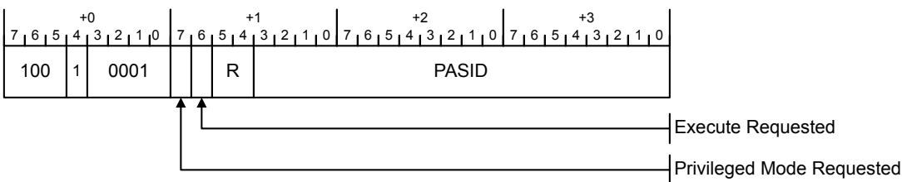

**Table 6-15. PASID TLP Prefix | 表 6-15. PASID TLP Prefix**

| Bits | Description |
|----------|----------|
| Byte 0 bits 7:5 | 100b - indicating TLP Prefix (TLP 前缀) |
| Byte 0 bit 4 | 1b - indicating End-End TLP Prefix (端到端 TLP 前缀) |
| Byte 0 bits 3:0 | 0001b - indicating PASID TLP Prefix |
| Byte 1 bit 7 | Privileged Mode Requested - If Set indicates a Privileged Mode entity in the Endpoint is issuing the Request, If Clear, indicates a Non-Privileged Mode entity in the Endpoint is issuing the Request. Usage of this bit is specified in § Section 6.20.2.4. |
| Byte 1 bit 6 | Execute Requested - If Set indicates the Endpoint is requesting Execute Permission. If Clear, indicates the Endpoint is not requesting Execute Permission. Usage of this bit is specified in § Section 6.20.2.3. |
| Byte 1 bit 3 : Byte 3 bit 0 | Process Address Space ID (PASID) - This field contains the PASID value associated with the TLP. Usage of this field is defined in § Section 6.20.2.2. |


<div style="overflow-x: auto; max-width: 100%;">
<table>
<thead>
<tr>
<th width="50%">🇬🇧 English</th>
<th width="50%" style="background-color:#e8e8e8">🇨🇳 中文</th>
</tr>
</thead>
<tbody>
<tr>
<td>

The PASID field identifies the user process associated with a Request.

The PASID field is 20 bits wide. Endpoints and Root Complexes need not support the entire range of the field. For Endpoints, the Max PASID Width field indicates the supported range of PASID values (§ Section 7.8.9.2). For Root Complexes, an implementation specific mechanism is used to provide this information.

Endpoints are not permitted to send TLPs with a PASID unless the PASID Enable bit (§ Section 7.8.9.3) is Set. Endpoints that support PASID must signal Unsupported Request (UR) when they receive a TLP with a PASID and the PASID Enable bit is Clear.

Root Complexes may optionally support TLPs with a PASID. The mechanism used to detect whether a Root Complex supports PASID is implementation specific.

6.20.2.2 PASID field (Flit Mode and Non-Flit Mode) §

§

</td>
<td style="background-color:#e8e8e8">

PASID 字段标识与请求 (Request) 关联的用户进程。

PASID 字段宽度为 20 位。端点 (Endpoint) 和根复合体 (Root Complex) 无需支持该字段的整个范围。对于端点,Max PASID Width 字段指示所支持的 PASID 值范围(参见 § Section 7.8.9.2)。对于根复合体,使用实现特定的机制来提供此信息。

除非 PASID Enable 位(参见 § Section 7.8.9.3)被置位,否则端点不得发送携带 PASID 的 TLP。支持 PASID 的端点在收到携带 PASID 且 PASID Enable 位为 0 的 TLP 时,必须发出不支持请求 (UR, Unsupported Request) 信号。

根复合体可选择性地支持携带 PASID 的 TLP。检测根复合体是否支持 PASID 所使用的机制是实现特定的。

6.20.2.2 PASID 字段 (Flit 模式与非 Flit 模式) §

§

</td>
</tr>
</tbody>
</table>
</div>


[⬆️ 返回目录](#-本章目录-table-of-contents)

---

<<<PAGE_BREAK>>> page_835

table>
<thead>
<tr>
<th width="50%">🇬🇧 English</th>
<th width="50%" style="background-color:#e8e8e8">🇨🇳 中文</th>
</tr>
</thead>
<tbody>
<tr>
<td>

For Endpoints, the following rules apply:

- The Endpoint is not permitted to send TLPs with a PASID value greater than or equal to 2^Max PASID Width.
- The Endpoint is optionally permitted to signal an error when it receives a Request with a PASID value greater than or equal to 2^Max PASID Width. This is an Unsupported Request error associated with the Receiving Port (see § Section 6.2).

For Root Complexes, the following rules apply:

- A Root Complex is not permitted to send a TLP with a PASID value greater than it supports.
- A Root Complex is optionally permitted to signal an error when it receives a Request with a PASID value greater than it supports. This is an Unsupported Request error associated with the Receiving Port (see § Section 6.2).

For Completers, the following rules apply:

- For Untranslated Memory Requests, the PASID value and the Untranslated Address are both used in determining the Translated Address used in satisfying the Request.

For address translation related TLPs, usage of this field is defined in Address Translation Services (ATS, § Chapter 10).

</td>
<td style="background-color:#e8e8e8">

对于端点 (Endpoint),适用以下规则:

- 端点不得发送 PASID 值大于或等于 2^Max PASID Width 的 TLP。
- 端点在收到 PASID 值大于或等于 2^Max PASID Width 的请求 (Request) 时,可选地允许发出错误信号。这是与接收端口相关联的不支持请求错误(参见 § Section 6.2)。

对于根复合体 (Root Complex),适用以下规则:

- 根复合体不得发送 PASID 值超出其支持范围的 TLP。
- 根复合体在收到 PASID 值超出其支持范围的请求 (Request) 时,可选地允许发出错误信号。这是与接收端口相关联的不支持请求错误(参见 § Section 6.2)。

对于完成者 (Completer),适用以下规则:

- 对于未转换的内存请求 (Untranslated Memory Request),PASID 值和未转换地址 (Untranslated Address) 都用于确定满足该请求时所使用的已转换地址 (Translated Address)。

对于与地址转换相关的 TLP,本字段的使用在地址转换服务 (ATS, § Chapter 10)中定义。

</td>
</tr>
</tbody>
</table>

[⬆️ 返回目录](#-本章目录-table-of-contents)

---

<a id="sec-6-20-2-3"></a>
## 6.20.2.3 Execute Requested | Execute Requested (请求执行权限)


<div style="overflow-x: auto; max-width: 100%;">
<table>
<thead>
<tr>
<th width="50%">🇬🇧 English</th>
<th width="50%" style="background-color:#e8e8e8">🇨🇳 中文</th>
</tr>
</thead>
<tbody>
<tr>
<td>

If the Execute Requested bit is Set, the Endpoint is requesting permission for the Endpoint to Execute instructions in the memory range associated with this request. The meaning of Execute permission is outside the scope of this specification.

Endpoints are not permitted to send TLPs with the Execute Requested bit Set unless the Execute Permission Supported bit (§ Section 7.8.9.2) and the Execute Permission Enable bit (§ Section 7.8.9.3) are both Set.

For Root Complexes, the following rules apply:

</td>
<td style="background-color:#e8e8e8">

如果 Execute Requested 位被置位,则端点 (Endpoint) 正在请求允许端点在与该请求关联的内存范围内执行 (Execute) 指令。Execute 权限的具体含义不在本规范范围内。

除非 Execute Permission Supported 位(参见 § Section 7.8.9.2)和 Execute Permission Enable 位(参见 § Section 7.8.9.3)均被置位,否则端点不得发送 Execute Requested 位被置位的 TLP。

对于根复合体 (Root Complex),适用以下规则:

</td>
</tr>
</tbody>
</table>
</div>


> **IMPLEMENTATION NOTE:**
> **PASID WIDTH HOMOGENEITY (PASID 宽度一致性)**
>
> The PASID value is unique per Function and thus the original intent was that the width of the PASID value supported by that Function could be based on the needs of that Function. However, current system software typically does not follow that model and instead uses the same PASID value in all Functions that access a specific address space. To enable this, system software will typically ensure a common system PASID width for Root Complex and persistent translation agents. Such system software will typically disable ATS (地址转换服务) on any hot plugged Endpoint Functions or translation agents reporting PASID width support which is less than that of the common system PASID width.
>
> The Root Complex, Endpoints, and translation agents, are often implemented independently of system software, therefore it is strongly recommended that hardware implement the maximum width of 20 bits to ensure interoperability with system software.
>
> Endpoints may, in an implementation specific way, be able to map the 20 bit system PASID to an internal representation carrying a smaller width. If this is done, it is critical that the Endpoint do so without impacting system software, which has no mechanism to differentiate such implementation from those that implement the full 20 bit width natively.
>
> §

table>
<thead>
<tr>
<th width="50%">🇬🇧 English</th>
<th width="50%" style="background-color:#e8e8e8">🇨🇳 中文</th>
</tr>
</thead>
<tbody>
<tr>
<td>

> **实现说明 (IMPLEMENTATION NOTE):**
> **PASID 宽度一致性 (PASID WIDTH HOMOGENEITY)**
>
> PASID 值在每个 Function 内唯一,因此最初的设想是该 Function 所支持的 PASID 宽度可基于该 Function 的需求来确定。然而,当前系统软件通常不遵循该模式,而是在所有访问特定地址空间的 Function 中使用相同的 PASID 值。为实现这一点,系统软件通常会确保根复合体 (Root Complex) 与持久转换代理 (translation agent) 使用统一的系统 PASID 宽度。此类系统软件通常会在任何上报的 PASID 宽度支持小于系统通用 PASID 宽度的热插拔端点 Function 或转换代理上禁用 ATS(地址转换服务)。
>
> 根复合体、端点 (Endpoint) 和转换代理通常独立于系统软件实现,因此强烈建议硬件实现最大 20 位宽度,以确保与系统软件的互操作性。
>
> 端点可以以实现特定的方式将 20 位系统 PASID 映射为宽度更小的内部表示。如果这样做,关键在于端点不得影响系统软件,系统软件没有机制区分此类实现与原生支持完整 20 位宽度的实现。
>
> §

</td>
</tr>
</tbody>
</table>

[⬆️ 返回目录](#-本章目录-table-of-contents)

---

<<<PAGE_BREAK>>> page_836


<div style="overflow-x: auto; max-width: 100%;">
<table>
<thead>
<tr>
<th width="50%">🇬🇧 English</th>
<th width="50%" style="background-color:#e8e8e8">🇨🇳 中文</th>
</tr>
</thead>
<tbody>
<tr>
<td>

- Support for Execute Requested by the Root Complex is optional. The mechanism used to determine whether a Root Complex supports Execute Requested is implementation specific.
  - It is strongly recommended that Root Complexes not support Execute Requested.
- A Root Complex that supports the Execute Requested bit must have an implementation specific mechanism to enable it to use the bit. This mechanism must default to disabled.
- A Root Complex that supports the Execute Requested bit is permitted to have an implementation specific mechanism to enable use of the bit at a finer granularity (e.g., for a specific Root Port, for a specific Bus Number, for a specific Requester ID, or for a specific Requester ID/PASID combination), and its default value is implementation specific.

For Completers, the following rules apply:

- Completers have a concept of an effective value of the bit. For a given Request, if the Execute Requested bit is supported and its usage is enabled for the Request, the effective value of the bit is the value in the Request; otherwise the effective value of the bit is 0b.
- For Untranslated Memory Read Requests, Completers use the effective value of the bit as part of the protection check. If this protection check fails, Completers treat the Request as if the memory was not mapped.
- For Memory Requests, other than an Untranslated Memory Read Request, the bit is Reserved.

For address translation related TLPs, usage of this bit is defined in Address Translation Services (ATS, § Chapter 10).

</td>
<td style="background-color:#e8e8e8">

- 根复合体 (Root Complex) 对 Execute Requested 的支持是可选的。用于确定根复合体是否支持 Execute Requested 的机制是实现特定的。
  - 强烈建议根复合体不支持 Execute Requested。
- 支持 Execute Requested 位的根复合体必须具有实现特定的机制以使能该位的使用。此机制的默认值必须为禁用 (disabled)。
- 支持 Execute Requested 位的根复合体允许具有实现特定的机制,以更细的粒度(例如针对特定根端口、特定总线号、特定请求者 ID,或特定请求者 ID/PASID 组合)使能该位的使用,其默认值是实现特定的。

对于完成者 (Completer),适用以下规则:

- 完成者具有该位有效值的概念。对于给定请求 (Request),如果支持 Execute Requested 位且该请求已使能该位的使用,则该位的有效值为请求中的值;否则该位的有效值为 0b。
- 对于未转换的内存读请求 (Untranslated Memory Read Request),完成者将该位的有效值用作保护检查的一部分。如果该保护检查失败,完成者将请求视为内存未映射。
- 对于除未转换内存读请求以外的内存请求 (Memory Request),该位为保留 (Reserved)。

对于与地址转换相关的 TLP,该位的使用在地址转换服务 (ATS, § Chapter 10)中定义。

</td>
</tr>
</tbody>
</table>
</div>


[⬆️ 返回目录](#-本章目录-table-of-contents)

---

<a id="sec-6-20-2-4-2"></a>
## 6.20.2.4 Privileged Mode Requested | Privileged Mode Requested (请求特权模式)

table>
<thead>
<tr>
<th width="50%">🇬🇧 English</th>
<th width="50%" style="background-color:#e8e8e8">🇨🇳 中文</th>
</tr>
</thead>
<tbody>
<tr>
<td>

If Privileged Mode Requested is Set, the Endpoint is issuing a Request that targets memory associated with Privileged Mode. If Privileged Mode Requested is Clear, the Endpoint is issuing a Request that targets memory associated with Non-Privileged Mode.

The meaning of Privileged Mode and Non-Privileged Mode and what it means for an Endpoint to be operating in Privileged or Non-Privileged Mode depends on the protection model of the system and is outside the scope of this specification.

Endpoints are not permitted to send a TLP with the Privileged Mode Requested bit Set unless both the Privileged Mode Supported bit (§ Section 7.8.9.2) and the Privileged Mode Enable bit (§ Section 7.8.9.3) are Set.

For Root Complexes, the following rules apply:

- Support for the Privileged Mode Requested bit by the Root Complex is optional. The mechanism used to determine whether a Root Complex supports the Privileged Mode Requested bit is implementation specific.
- A Root Complex that supports the Privileged Mode Requested bit should have an implementation specific mechanism to enable it to use the bit.
- A Root Complex that supports the Privileged Mode Requested bit may have an implementation specific mechanism to enable use of the bit at a finer granularity (e.g., for a specific Root Port, for a specific Bus Number, for a specific Requester ID, or for a specific Requester ID/PASID combination).

For Completers, the following rules apply:

- Completers have the concept of an effective value of the bit. For a given Request, if the Privileged Mode Requested bit is supported and its usage is enabled for the Request, the effective value of the bit is the value in the Request; otherwise the effective value of the bit is the 0b.
- For Untranslated Memory Requests, Completers use the effective value of the bit as part of its protection check. If this protection check fails, Completers treat the Request as if the memory was not mapped.

</td>
<td style="background-color:#e8e8e8">

如果 Privileged Mode Requested 位被置位,则端点 (Endpoint) 正在发出针对与特权模式 (Privileged Mode) 关联的内存的请求 (Request)。如果 Privileged Mode Requested 位为 0,则端点正在发出针对与非特权模式 (Non-Privileged Mode) 关联的内存的请求。

特权模式与非特权模式的含义,以及端点运行于特权或非特权模式的具体含义,取决于系统的保护模型,不在本规范范围内。

除非 Privileged Mode Supported 位(参见 § Section 7.8.9.2)和 Privileged Mode Enable 位(参见 § Section 7.8.9.3)均被置位,否则端点不得发送 Privileged Mode Requested 位被置位的 TLP。

对于根复合体 (Root Complex),适用以下规则:

- 根复合体对 Privileged Mode Requested 位的支持是可选的。用于确定根复合体是否支持 Privileged Mode Requested 位的机制是实现特定的。
- 支持 Privileged Mode Requested 位的根复合体应具有实现特定的机制以使能该位的使用。
- 支持 Privileged Mode Requested 位的根复合体可具有实现特定的机制,以更细的粒度(例如针对特定根端口、特定总线号、特定请求者 ID,或特定请求者 ID/PASID 组合)使能该位的使用。

对于完成者 (Completer),适用以下规则:

- 完成者具有该位有效值的概念。对于给定请求 (Request),如果支持 Privileged Mode Requested 位且该请求已使能该位的使用,则该位的有效值为请求中的值;否则该位的有效值为 0b。
- 对于未转换的内存请求 (Untranslated Memory Request),完成者将该位的有效值用作其保护检查的一部分。如果该保护检查失败,完成者将请求视为内存未映射。

</td>
</tr>
</tbody>
</table>

[⬆️ 返回目录](#-本章目录-table-of-contents)

---


---

<a id="sec-6-20-2-4"></a>
### 6.20.2.4 Privileged Mode Requested | 特权模式请求

<table>
<thead>
<tr>
<th width="50%">🇬🇧 English</th>
<th width="50%" style="background-color:#e8e8e8">🇨🇳 中文</th>
</tr>
</thead>
<tbody>
<tr>
<td>

•
For address translation related TLPs, usage of this bit is defined in Address Translation Services (§ Chapter 10.
).

</td>
<td style="background-color:#e8e8e8">

- 对于与地址转换相关的 TLP，该位的用法在地址转换服务 (Address Translation Services) 中定义（参见第 10 章）。

</td>
</tr>
</tbody>
</table>

<<<PAGE_BREAK>>> page_837

---

<a id="sec-6-21"></a>
## 6.21 Precision Time Measurement (PTM) Mechanism | 精确时间测量 (PTM) 机制

<a id="sec-6-21-1"></a>
### 6.21.1 Introduction | 概述


<div style="overflow-x: auto; max-width: 100%;">
<table>
<thead>
<tr>
<th width="50%">🇬🇧 English</th>
<th width="50%" style="background-color:#e8e8e8">🇨🇳 中文</th>
</tr>
</thead>
<tbody>
<tr>
<td>

Precision Time Measurement (PTM) enables precise coordination of events across multiple components with
independent local time clocks. Ordinarily, such precise coordination would be difficult given that individual time clocks
have differing notions of the value and rate of change of time. To work around this limitation, PTM enables components
to calculate the relationship between their local times and a shared PTM Master Time: an independent time domain
associated with a PTM Root.

Enhanced Precision Time Measurement (ePTM) places additional requirements on PTM Devices. Support for ePTM is
indicated by the ePTM Capable bit.

PTM defines the following:

•
PTM Requester - A Function capable of using PTM as a consumer associated with an Endpoint or an Upstream
Port.

•
PTM Responder - A Function capable of using PTM to supply PTM Master Time associated with a Port or an
RCRB.

•
Time Source - A local clock associated with a PTM Responder.

•
PTM Root - The source of PTM Master Time for a PTM Hierarchy. A PTM Root must also be a Time Source and is
typically also a PTM Responder.

Each PTM Root supplies a single PTM Master Time to all of the PTM Hierarchy: a set of PTM Requesters associated with a
single PTM Root.

§ Figure 6-21 illustrates some example system topologies using PTM. These are only illustrative examples, and are not
intended to imply any limits or requirements.

</td>
<td style="background-color:#e8e8e8">

精确时间测量 (Precision Time Measurement, PTM) 能够在多个具有各自独立本地时钟的组件之间精确地协调事件。考虑到各个本地时钟对时间数值和变化速率的认知都不相同，若没有 PTM，这种精确协调通常很难实现。为解决该问题，PTM 允许各组件计算其本地时间与共享 PTM 主时间 (PTM Master Time) 之间的关系：PTM Master Time 是一个与 PTM Root 关联的独立时间域。

增强型精确时间测量 (Enhanced Precision Time Measurement, ePTM) 对 PTM 设备 (PTM Device) 提出了额外要求。ePTM 的支持能力由 ePTM Capable 位指示。

PTM 定义了以下角色：

- **PTM Requester (PTM 请求者)** — 作为 PTM 消费者使用 PTM 的功能 (Function)，与端点 (Endpoint) 或上游端口 (Upstream Port) 关联。
- **PTM Responder (PTM 响应者)** — 利用 PTM 提供 PTM Master Time 的功能 (Function)，与端口 (Port) 或 RCRB 关联。
- **Time Source (时间源)** — 与 PTM 响应者关联的本地时钟。
- **PTM Root (PTM 根)** — 一个 PTM 层级 (PTM Hierarchy) 中 PTM Master Time 的来源。PTM Root 必须同时也是一个 Time Source，并且通常也是一个 PTM Responder。

每个 PTM Root 为整个 PTM 层级提供一个 PTM Master Time：PTM 层级是与同一 PTM Root 关联的一组 PTM Requester 的集合。

§ 图 6-21 展示了使用 PTM 的一些示例系统拓扑。这些仅为示例，并不暗示任何限制或要求。

</td>
</tr>
</tbody>
</table>
</div>


>>> **Figure 6-21.** Example System Topologies using PTM
>>> 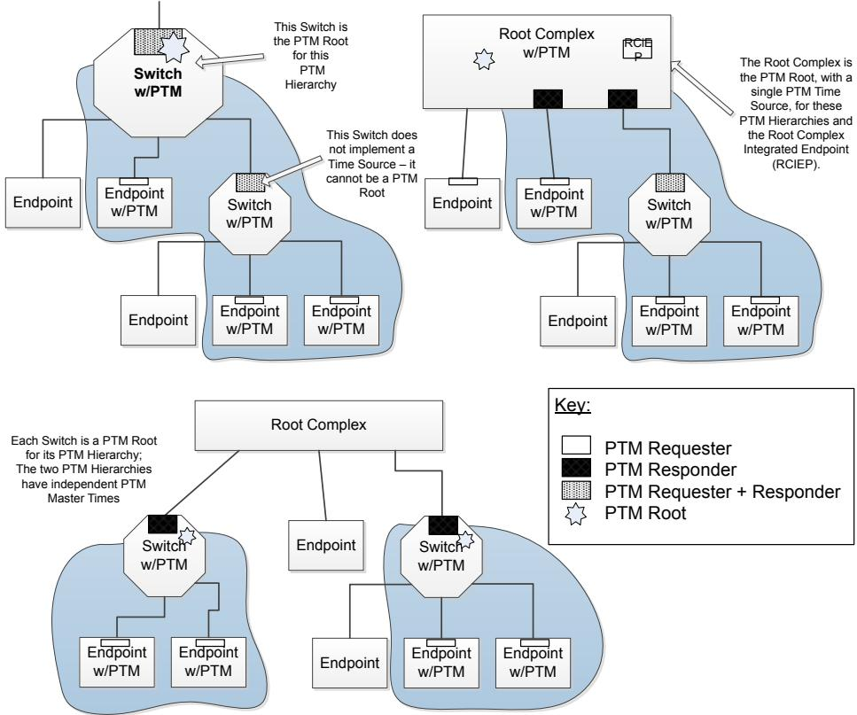

<<<PAGE_BREAK>>> page_838

---

<a id="sec-6-21-2"></a>
### 6.21.2 PTM Link Protocol | PTM 链路协议

table>
<thead>
<tr>
<th width="50%">🇬🇧 English</th>
<th width="50%" style="background-color:#e8e8e8">🇨🇳 中文</th>
</tr>
</thead>
<tbody>
<tr>
<td>

When using PTM between two components on a Link, the Upstream Port, which acts on behalf of the PTM Requester,
sends PTM Requests to the Downstream Port on the same Link, which acts on behalf of the PTM Responder.

> **IMPLEMENTATION NOTE:**
> **PTM AND RETIMERS**
>
> PCIe Retimers can impact PTM accuracy by introducing asymmetric link delays. Retimers designed to maintain
> symmetric link delays will enable the best PTM accuracy. The larger and more variable the asymmetry, the
> greater the impact to PTM. Consult the manufacturer's documentation to determine the suitability of a Retimer
> implementation for use with PTM.

§

</td>
<td style="background-color:#e8e8e8">

当在一条链路 (Link) 上的两个组件之间使用 PTM 时，代表 PTM Requester 行事的上游端口 (Upstream Port) 会向同一链路上代表 PTM Responder 行事的下游端口 (Downstream Port) 发送 PTM 请求。

> **实现说明：**
> **PTM 与 Retimer**
>
> PCIe Retimer (重定时器) 会通过引入非对称链路延迟来影响 PTM 精度。设计为保持对称链路延迟的 Retimer 能够提供最佳的 PTM 精度。非对称性越大、越不固定，对 PTM 的影响也越严重。请参阅厂商文档以确定某个 Retimer 实现是否适合与 PTM 配合使用。

§

</td>
</tr>
</tbody>
</table>

>>> **Figure 6-22.** Precision Time Measurement Link Protocol
>>> 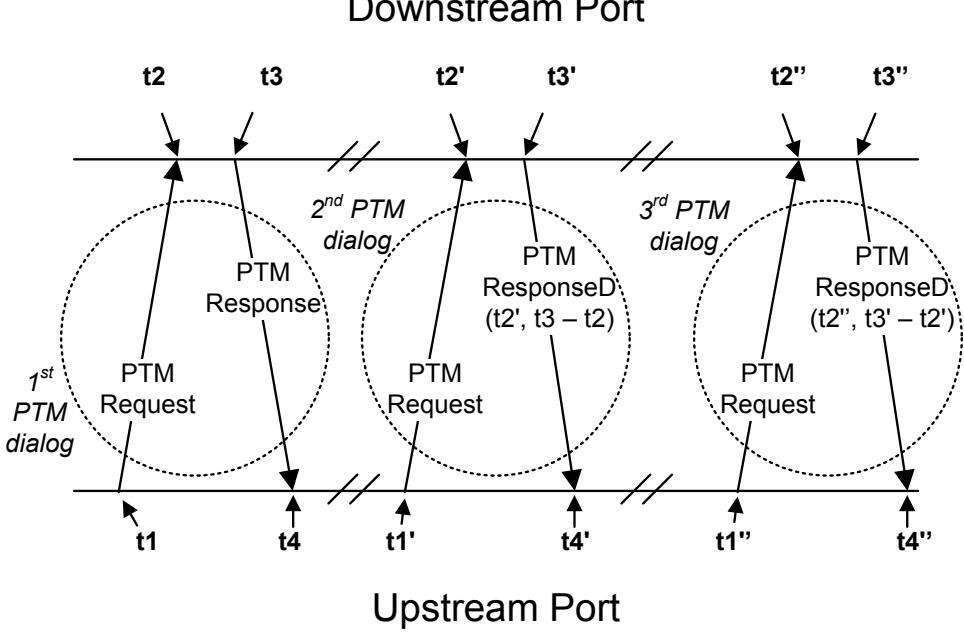


<div style="overflow-x: auto; max-width: 100%;">
<table>
<thead>
<tr>
<th width="50%">🇬🇧 English</th>
<th width="50%" style="background-color:#e8e8e8">🇨🇳 中文</th>
</tr>
</thead>
<tbody>
<tr>
<td>

§ Figure 6-22 illustrates the PTM link protocol. The points t1, t2, t3, and t4 in the above diagram represent timestamps
captured locally by each Port as they transmit and receive PTM Messages. The component associated with each Port
stores these timestamps from the 1st PTM dialog in internal registers for use in the 2nd PTM dialog, and so on for
subsequent PTM dialogs.

The Upstream Port, on behalf of the PTM Requester, initiates the PTM dialog by transmitting a PTM Request message.
The Downstream Port, on behalf of the PTM Responder, has knowledge of or access (directly or indirectly) to the PTM
Master Time.

During each dialog, the Downstream Port populates the PTM ResponseD message based on timestamps stored during
previous PTM dialogs, as defined in § Section 6.21.3.2 .

Once each component has historical timestamps from the preceding dialog, the component associated with the
Upstream Port can combine its timestamps with those passed in the PTM ResponseD message to calculate the PTM
Master Time using the following formula:

> PTM Master Time at t1 ′ = t2 ′ −
> ((t4 −t1) −(t3 −t2))
> 2

**Equation 6-2 PTM Master Time**

The values t1, t2, t3, t4, and t2' indicate the timestamps captured during the PTM dialog as illustrated in § Figure 6-22.

§

§

</td>
<td style="background-color:#e8e8e8">

§ 图 6-22 展示了 PTM 链路协议。上图中的 t1、t2、t3 和 t4 表示每个端口在发送和接收 PTM 消息时本地采集的时间戳。与每个端口关联的组件将来自第 1 次 PTM 对话 (dialog) 的这些时间戳保存在内部寄存器中，供第 2 次 PTM 对话使用，后续 PTM 对话依此类推。

上游端口代表 PTM Requester 通过发送 PTM Request 消息来启动 PTM 对话。下游端口代表 PTM Responder 知晓或（直接或间接）能够访问 PTM Master Time。

在每次对话期间，下游端口根据前序 PTM 对话保存的时间戳来填充 PTM ResponseD 消息，具体定义见 § 6.21.3.2。

当各组件获得了前序对话的历史时间戳后，与上游端口关联的组件可以将其本地时间戳与 PTM ResponseD 消息中传递的时间戳相结合，使用以下公式计算 PTM Master Time：

> t1' 时刻的 PTM Master Time = t2' −
> ((t4 − t1) − (t3 − t2))
> 2

**公式 6-2　PTM Master Time**

t1、t2、t3、t4 和 t2' 表示在 PTM 对话期间采集的时间戳，如图 6-22 所示。

§

§

</td>
</tr>
</tbody>
</table>
</div>


<<<PAGE_BREAK>>> page_840

---

table>
<thead>
<tr>
<th width="50%">🇬🇧 English</th>
<th width="50%" style="background-color:#e8e8e8">🇨🇳 中文</th>
</tr>
</thead>
<tbody>
<tr>
<td>

PTM capable components would typically record the results of these timestamp calculations, and may make them
available to software via implementation specific means. Herein, this document refers to this resultant timing
information as the component's "PTM context".

For a Switch implementing PTM, the time synchronization mechanism(s) within the Switch itself are implementation
specific.

</td>
<td style="background-color:#e8e8e8">

支持 PTM 的组件通常会记录这些时间戳计算的结果，并可以通过实现特定的方式将其提供给软件。在本文中，该结果性时序信息被称为该组件的 "PTM 上下文" (PTM context)。

对于实现 PTM 的交换机 (Switch)，交换机内部的时间同步机制属于实现特定 (implementation specific) 范畴。

</td>
</tr>
</tbody>
</table>

<<<PAGE_BREAK>>> page_841

---


<div style="overflow-x: auto; max-width: 100%;">
<table>
<thead>
<tr>
<th width="50%">🇬🇧 English</th>
<th width="50%" style="background-color:#e8e8e8">🇨🇳 中文</th>
</tr>
</thead>
<tbody>
<tr>
<td>

> **IMPLEMENTATION NOTE:**
> **PTM THEORY AND OPERATION**
>
> The timestamps captured during the PTM dialogs enable the calculation of the timing relationship between the
> PTM Requester and PTM Responder. The value (t3-t2) measures the time consumed by the PTM Responder for a
> given PTM dialog. The time (t4-t1) is the time from request to response. Therefore ((t4 - t1) - (t3 - t2)) effectively
> gives the round trip message transit time between the two components, and that quantity divided by 2
> approximates the Link delay - the time difference between t1 and t2. It is assumed that the Link transit times from
> PTM Requester to PTM Responder and back again are symmetric, which is typically a good assumption (see also
> the Implementation Note on PTM Timestamp Capture Mechanisms).

§ Figure 6-23 illustrates a simple device hierarchy employing PTM. Each Upstream Port initiates PTM dialogs to
establish the relationship between its local time and the PTM Master Time provided by the Root Port.

In this example, the Switch initiates PTM dialogs on its Upstream Port to obtain the PTM Master Time for use in
fulfilling PTM Request Message received at its Downstream Ports. This Switch employs implementation specific
means to communicate the PTM Master Time from its Upstream Port to its Downstream Ports.

PTM capable components can make their PTM context available for inspection by software, enabling software to
translate timing information between local times and PTM Master Time. In turn, this capability enables software to
coordinate events across multiple components with very fine precision.

Similarly, it is strongly recommended that platforms implementing PTM also make the PTM Master Time available
to software.

§

§

</td>
<td style="background-color:#e8e8e8">

> **实现说明：**
> **PTM 原理与操作**
>
> PTM 对话期间采集的时间戳使 PTM Requester 与 PTM Responder 之间的时序关系可被计算。值 (t3−t2) 测量了 PTM Responder 在一次 PTM 对话中的处理时间。值 (t4−t1) 是从请求到响应的总时间。因此 ((t4 − t1) − (t3 − t2)) 实际上给出了两个组件之间的报文往返 (round trip) 传输时间，该值除以 2 即为链路延迟 (Link delay) 的近似值——即 t1 与 t2 之间的时间差。该计算假设 PTM Requester 与 PTM Responder 之间的链路往返传输时间是对称的，这通常是一个合理的假设（另请参见 "PTM 时间戳捕获机制" 的实现说明）。

§ 图 6-23 展示了一个采用 PTM 的简单设备层级。每个上游端口都会发起 PTM 对话，以建立其本地时间与根端口 (Root Port) 所提供的 PTM Master Time 之间的关系。

在本例中，交换机在其上游端口上发起 PTM 对话，以获取 PTM Master Time，用于满足其下游端口收到的 PTM Request 消息。该交换机使用实现特定的方式将 PTM Master Time 从其上游端口传达到其下游端口。

支持 PTM 的组件可将其 PTM 上下文提供给软件检查，使软件能够在本地时间和 PTM Master Time 之间转换时序信息。该能力进而使软件能够以非常高的精度跨多个组件协调事件。

类似地，强烈建议实现 PTM 的平台也将 PTM Master Time 提供给软件。

§

§

</td>
</tr>
</tbody>
</table>
</div>


>>> **Figure 6-23.** Precision Time Measurement Example
>>> 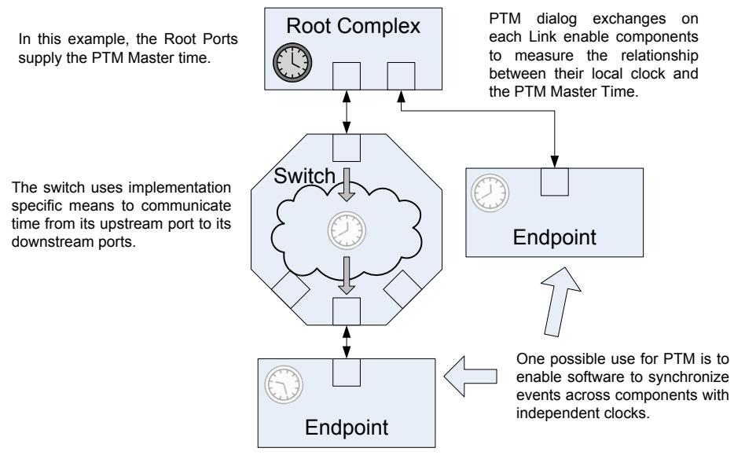

<<<PAGE_BREAK>>> page_842

---

<a id="sec-6-21-3"></a>
### 6.21.3 Configuration and Operational Requirements | 配置与运行要求

table>
<thead>
<tr>
<th width="50%">🇬🇧 English</th>
<th width="50%" style="background-color:#e8e8e8">🇨🇳 中文</th>
</tr>
</thead>
<tbody>
<tr>
<td>

Software must not have the PTM Enable bit Set in the PTM Control register on a Function associated with an Upstream
Port unless the associated Downstream Port on the Link already has the PTM Enable bit Set in its associated PTM Control
register.

PTM support by a Function is indicated by the presence of a PTM Extended Capability structure. It is not required that all
Endpoints in a hierarchy support PTM, and it is not required for software to enable PTM in all Endpoints that do support
it.

If a PTM Message is received by a Port that does not support PTM, or by a Downstream Port when the PTM Enable bit is
clear, the Message must be treated as an Unsupported Request. This is a reported error associated with the Receiving
Port (see § Section 6.2 ). A properly formed PTM Response received by an Upstream Port that supports PTM, but for
which the PTM Enable bit is clear, must be silently discarded.

As observed through PTM, the PTM Master Time must satisfy the following behavioral requirements:

•
Time values must be monotonic, and strictly increasing.

•
The perceived granularity must be no greater than the value reported in the Local Clock Granularity field of the
PTM Capability Register.

•
The perceived time must start no later than when the PTM Root processes its first PTM Request Message.

Referring to § Figure 6-22, the following rules define timestamp capture:

•
A PTM Requester must update its stored t1 timestamp when transmitting a PTM Request Message, even if that
transmission is a replay.

•
A PTM Responder must update its stored t2 timestamp when receiving a PTM Request Message, even if
received TLP is a duplicate.

•
A PTM Responder must update its stored t3 timestamp when transmitting a PTM Response or ResponseD
Message, even if that transmission is a replay.

•
A PTM Requester must update its stored t4 timestamp when receiving a PTM Response Message, even if
received TLP is a duplicate.

In NFM, Timestamps must be based on the STP Symbol or Token that frames the TLP, as if observing the first bit of that
Symbol or Token at the Port's pins.

In FM, a single Flit is permitted to include zero or one PTM Messages, and Timestamps must be based on the Flit_Marker
(see § Section 4.2.3.4.2 ) that has the PTM Message contained in this Flit bit Set, as if observing the Flit_Marker Indicator bit
at the Port's pins. Typically this will require an implementation specific adjustment to compensate for the inability to
directly measure the time at the actual pins, as the time will commonly be measured at some internal point in the Rx or
Tx path. The accuracy and consistency of this measurement are not bounded by this specification, but it is strongly
recommended that the highest practical level of accuracy and consistency be achieved.

As illustrated in § Figure 2-68, the bytes within the Propagation Delay[31:0] field are such that:

•
Data Byte 0 contains Propagation Delay [31:24] (most significant byte)

•
Data Byte 1 contains Propagation Delay [23:16]

•
Data Byte 2 contains Propagation Delay [15:8]

•
Data Byte 3 contains Propagation Delay [7:0] (least significant byte)

</td>
<td style="background-color:#e8e8e8">

软件不得在与上游端口 (Upstream Port) 关联的功能 (Function) 上的 PTM Control 寄存器中设置 PTM Enable 位，除非该链路上关联的下游端口 (Downstream Port) 已经在其 PTM Control 寄存器中设置了 PTM Enable 位。

某功能是否支持 PTM 由是否存在 PTM 扩展能力结构 (PTM Extended Capability) 指示。层级 (Hierarchy) 中的所有端点 (Endpoint) 并不要求都支持 PTM，软件也无需在所有支持 PTM 的端点上启用 PTM。

如果某端口 (Port) 不支持 PTM 但收到了 PTM 消息，或者某下游端口在 PTM Enable 位清零 (Clear) 时收到了 PTM 消息，则该消息必须被视为不支持的请求 (Unsupported Request)。这是与接收端口相关联的可报告错误 (reported error)（参见 § 6.2）。支持 PTM 但 PTM Enable 位清零的上游端口，若收到格式正确的 PTM Response，则必须将其静默丢弃 (silently discard)。

通过 PTM 观察到的 PTM Master Time 必须满足以下行为要求：

- 时间值必须单调且严格递增。
- 感知到的粒度 (granularity) 不得大于 PTM Capability 寄存器中 Local Clock Granularity 字段所报告的值。
- 感知到的起始时间不得晚于 PTM Root 处理其第一个 PTM Request 消息的时间。

参考 § 图 6-22，时间戳捕获遵循以下规则：

- PTM Requester 在发送 PTM Request 消息时必须更新其保存的 t1 时间戳，即使该次发送是一次重放 (replay)。
- PTM Responder 在接收 PTM Request 消息时必须更新其保存的 t2 时间戳，即使收到的 TLP 是重复报文 (duplicate)。
- PTM Responder 在发送 PTM Response 或 ResponseD 消息时必须更新其保存的 t3 时间戳，即使该次发送是一次重放。
- PTM Requester 在接收 PTM Response 消息时必须更新其保存的 t4 时间戳，即使收到的 TLP 是重复报文。

在非 Flit 模式 (NFM) 下，时间戳必须以对该 TLP 进行成帧的 STP Symbol 或 Token 为基准，相当于在端口引脚 (Port's pins) 处观察该 Symbol 或 Token 的第一位。

在 Flit 模式 (FM) 下，单个 Flit 允许包含零个或一个 PTM 消息；时间戳必须以 Flit_Marker（参见 § 4.2.3.4.2）中 PTM Message contained in this Flit 位置 1 的那个 Flit_Marker 为基准，相当于在端口引脚处观察 Flit_Marker 的指示位 (Indicator bit)。通常这需要通过实现特定的调整来补偿无法直接在真实引脚处测量的限制，因为实际时间通常在 Rx 或 Tx 路径的某个内部点测量。该测量的精度和一致性不在本规范的约束范围内，但强烈建议实现能达到的最高实用精度和一致性。

如 § 图 2-68 所示，Propagation Delay[31:0] 字段内的字节排列如下：

- Data Byte 0 包含 Propagation Delay [31:24]（最高有效字节）
- Data Byte 1 包含 Propagation Delay [23:16]
- Data Byte 2 包含 Propagation Delay [15:8]
- Data Byte 3 包含 Propagation Delay [7:0]（最低有效字节）

</td>
</tr>
</tbody>
</table>

<<<PAGE_BREAK>>> page_843

---


<div style="overflow-x: auto; max-width: 100%;">
<table>
<thead>
<tr>
<th width="50%">🇬🇧 English</th>
<th width="50%" style="background-color:#e8e8e8">🇨🇳 中文</th>
</tr>
</thead>
<tbody>
<tr>
<td>

All implementations compliant to this document are required to follow the above interpretation (Propagation Delay
interpretation A). Due to ambiguity in earlier versions of this document, some implementations made this interpretation
(Propagation Delay interpretation B):

•
Data Byte 0 contains Propagation Delay [7:0] (least significant byte)

•
Data Byte 1 contains Propagation Delay [15:8]

•
Data Byte 2 contains Propagation Delay [23:16]

•
Data Byte 3 contains Propagation Delay [31:24] (most significant byte)

To allow implementations using interpretation A to interoperate with implementations using interpretation B the PTM
Propagation Delay Adaptation Capability can be used. For an Upstream Port, this capability applies to the interpretation
of received PTM ResponseD Messages, for a Downstream Port, this capability applies to the interpretation of transmitted
PTM ResponseD Messages. Support for the PTM Propagation Delay Adaptation Capability is indicated by Setting the PTM
Propagation Delay Adaptation Capable bit in the PTM Capability Register. When supported, the Port must use
interpretation A, unless the PTM Propagation Delay Adaptation Interpretation B bit in the Link Control Register is Set, in which
case the Port changes to interpretation B. For a Switch, if the PTM Propagation Delay Adaptation Capable bit is Set, then all
Ports of the Switch must support the PTM Propagation Delay Adaptation Capability, and each Switch Port must be
controlled independently by the value of the PTM Propagation Delay Adaptation Interpretation B bit in the Link Control
Register for the Port.

It is strongly recommended that software not enable PTM on a link until it has first assured, either by means of the PTM
Propagation Delay Adaptation Capability or in an implementation specific manner, that both Ports on the Link are able to
compatibly interpret the Propagation Delay value.

</td>
<td style="background-color:#e8e8e8">

所有符合本规范的实现都必须遵循上述解释（Propagation Delay 解释 A）。由于早期版本规范的描述存在歧义，部分实现采用了下述解释（Propagation Delay 解释 B）：

- Data Byte 0 包含 Propagation Delay [7:0]（最低有效字节）
- Data Byte 1 包含 Propagation Delay [15:8]
- Data Byte 2 包含 Propagation Delay [23:16]
- Data Byte 3 包含 Propagation Delay [31:24]（最高有效字节）

为使采用解释 A 的实现能够与采用解释 B 的实现互通，可使用 PTM Propagation Delay Adaptation Capability。对于上游端口，该能力适用于对所接收的 PTM ResponseD 消息的解释；对于下游端口，该能力适用于对所发送的 PTM ResponseD 消息的解释。PTM Capability 寄存器中的 PTM Propagation Delay Adaptation Capable 位用于指示是否支持该能力。在支持该能力时，端口必须使用解释 A，除非 Link Control 寄存器中的 PTM Propagation Delay Adaptation Interpretation B 位被置位 (Set)，此时端口切换到解释 B。对于交换机 (Switch)，若 PTM Propagation Delay Adaptation Capable 位被置位，则交换机的所有端口都必须支持 PTM Propagation Delay Adaptation Capability，并且每个交换机端口必须独立受该端口 Link Control 寄存器中 PTM Propagation Delay Adaptation Interpretation B 位的值控制。

强烈建议软件在启用链路的 PTM 之前，先通过 PTM Propagation Delay Adaptation Capability 或实现特定方式确认链路上两个端口都能够以兼容的方式解释 Propagation Delay 值。

</td>
</tr>
</tbody>
</table>
</div>


---

<a id="sec-6-21-3-1"></a>
#### 6.21.3.1 PTM Requester Role | PTM 请求者角色

table>
<thead>
<tr>
<th width="50%">🇬🇧 English</th>
<th width="50%" style="background-color:#e8e8e8">🇨🇳 中文</th>
</tr>
</thead>
<tbody>
<tr>
<td>

•
Support for the PTM Requester role is indicated by setting the PTM Requester Capable bit in the PTM Capability
Register.

•
PTM Requesters are permitted to request PTM Master Time only when PTM is enabled. The mechanism for
directing a PTM Requester to issue such a request is implementation specific.

  ◦
  Upstream Ports obtain PTM Master Time via PTM dialogs as described in § Section 2.2.8.10 .

  ◦
  The mechanism by which RCiEPs request PTM Master Time is implementation specific.

•
Once having issued a PTM Request Message, the Upstream Port must not issue another PTM Request Message
prior to the receipt of a PTM Response Message, PTM ResponseD Message, Reset, or the passage of 100 μs
without a corresponding PTM Message from the Downstream Port.

•
Upon receiving a PTM Response, the Upstream Port must wait at least 1 μs before issuing another PTM Request
Message.

•
For Multi-Function Devices (MFDs) containing multiple PTM Requesters, the Upstream Port associated with
that MFD must issue a single PTM dialog during each PTM context refresh. PTM Requesters within the MFD
maintain their individual PTM contexts using this one, Device-wide PTM dialog. The mechanism for refreshing
multiple PTM contexts from one PTM dialog is implementation specific.

•
An Upstream Port **MUST@FLIT** invalidate its internal PTM context when any of the following occur. If ePTM is
supported, then an Upstream Port must invalidate its internal PTM context when any of the following occur:

  ◦
  A PTM Request is replayed.

  ◦
  A duplicate PTM ResponseD TLP is received.

  ◦
  The relationship between PTM Master Time and the Upstream Port's local time changes, as
  determined by implementation specific criteria. For example, this may occur as a result of a
  transition to a non-D0 state or due to accumulated PPM drift.

  These events are grouped under the label "Local Time Invalidation Event" in § Figure 6-24.

•
If ePTM is supported, an Upstream Port, upon replaying a PTM TLP, must invalidate it's PTM context until two
successive PTM dialogs have been completed successfully and without replays.

</td>
<td style="background-color:#e8e8e8">

- PTM Requester 角色的支持由 PTM Capability 寄存器中的 PTM Requester Capable 位置位来指示。
- 仅当 PTM 启用时，PTM Requester 才被允许请求 PTM Master Time。指示 PTM Requester 发起此类请求的机制属于实现特定 (implementation specific) 范畴。
  - 上游端口通过 PTM 对话获取 PTM Master Time，如 § 2.2.8.10 所述。
  - RCiEP 请求 PTM Master Time 的机制属于实现特定范畴。
- 一旦发出 PTM Request 消息，上游端口在收到 PTM Response 消息、PTM ResponseD 消息、复位 (Reset)，或在 100 μs 内未收到来自下游端口的对应 PTM 消息之前，不得再发出另一条 PTM Request 消息。
- 上游端口在收到 PTM Response 后，必须至少等待 1 μs 才能发出另一条 PTM Request 消息。
- 对于包含多个 PTM Requester 的多功能设备 (Multi-Function Device, MFD)，与该 MFD 关联的上游端口必须在每次 PTM 上下文刷新期间仅发起一次 PTM 对话。MFD 内的 PTM Requester 使用这一设备范围 (Device-wide) 的 PTM 对话来维护各自的 PTM 上下文。从一次 PTM 对话刷新多个 PTM 上下文的机制属于实现特定范畴。
- 在发生以下任一情况时，上游端口 **MUST@FLIT** (在 Flit 模式下必须) 使其内部 PTM 上下文失效 (invalidate)。如果支持 ePTM，则上游端口在发生以下任一情况时必须使其内部 PTM 上下文失效：
  - 一次 PTM Request 被重放 (replayed)。
  - 接收到一个重复的 PTM ResponseD TLP。
  - PTM Master Time 与上游端口本地时间之间的关系发生变化（由实现特定准则判定）。例如，这可能因转入非 D0 状态或累积的 PPM 漂移而产生。
  这些事件在 § 图 6-24 中统称为 "Local Time Invalidation Event"（本地时间失效事件）。
- 如果支持 ePTM，则上游端口在重放 PTM TLP 时必须使其 PTM 上下文失效，直到连续两次 PTM 对话均成功完成且无重放为止。

</td>
</tr>
</tbody>
</table>

>>> **Figure 6-24.** PTM Requester Operation
>>> 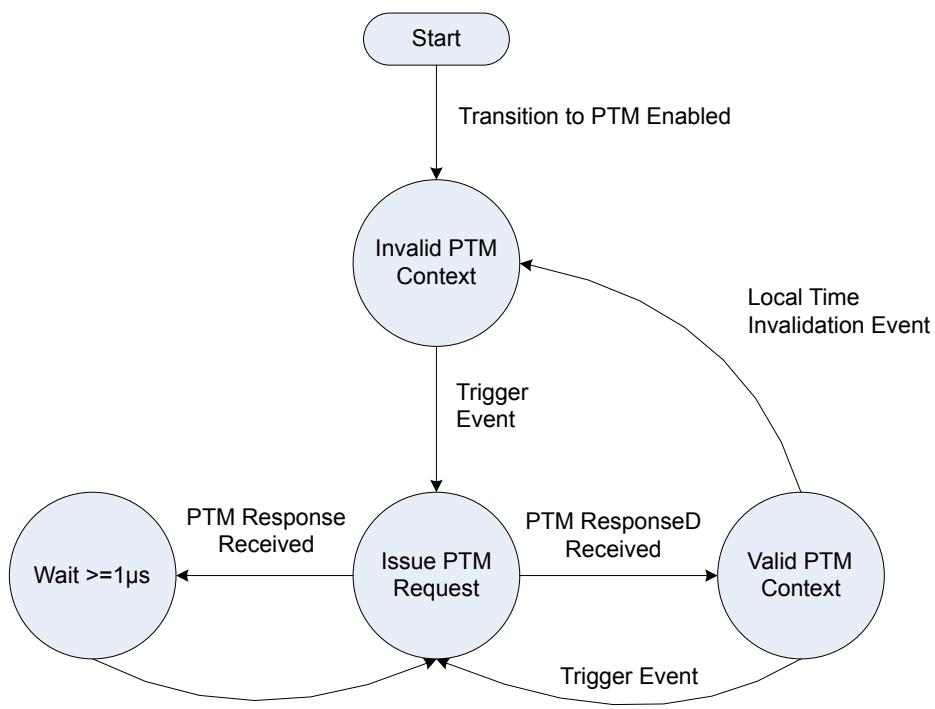


<div style="overflow-x: auto; max-width: 100%;">
<table>
<thead>
<tr>
<th width="50%">🇬🇧 English</th>
<th width="50%" style="background-color:#e8e8e8">🇨🇳 中文</th>
</tr>
</thead>
<tbody>
<tr>
<td>

> **IMPLEMENTATION NOTE:**
> **PTM INVALIDATION ON THE RECEPTION OF DUPLICATE TLPS**
>
> Duplicate TLPs are detected and discarded in the Data Link Layer, whereas PTM messages are identified in the
> Transaction Layer. In some implementations it may be difficult or excessively complicated to distinguish a
> duplicate PTM TLP from other duplicate TLPs.
>
> Because Upstream Ports are permitted to invalidate their internal PTM context for implementation specific
> criteria, a PTM Requester is allowed to invalidate its internal PTM context upon the reception of any duplicate TLP
> in addition to any duplicate PTM TLP. Similarly, if ePTM is supported, then a PTM Responder is allowed to
> invalidate its historical timestamps (t2 - t3) upon the reception of any duplicate TLP.

§

§

</td>
<td style="background-color:#e8e8e8">

> **实现说明：**
> **接收到重复 TLP 时的 PTM 失效**
>
> 重复 TLP 在数据链路层 (Data Link Layer) 检测并丢弃，而 PTM 消息则在事务层 (Transaction Layer) 进行识别。在某些实现中，可能难以或过于复杂地区分重复的 PTM TLP 与其他重复 TLP。
>
> 由于允许上游端口基于实现特定准则使其内部 PTM 上下文失效，因此允许 PTM Requester 在接收到任何重复 TLP 时使其内部 PTM 上下文失效，而不仅限于重复的 PTM TLP。类似地，如果支持 ePTM，则允许 PTM Responder 在接收到任何重复 TLP 时使其历史时间戳 (t2 − t3) 失效。

§

§

</td>
</tr>
</tbody>
</table>
</div>


<<<PAGE_BREAK>>> page_845

---

<a id="sec-6-21-3-2"></a>
#### 6.21.3.2 PTM Responder Role | PTM 响应者角色

table>
<thead>
<tr>
<th width="50%">🇬🇧 English</th>
<th width="50%" style="background-color:#e8e8e8">🇨🇳 中文</th>
</tr>
</thead>
<tbody>
<tr>
<td>

•
Support for the PTM Responder role is indicated by setting the PTM Responder Capable bit in the PTM
Capability register.

•
Switches and Root Complexes are permitted to implement the PTM Responder Role.

  ◦
  A PTM capable Switch, when enabled for PTM by setting the PTM Enable bit in the PTM Control register
  associated with the Switch Upstream Port, must respond to all PTM Request Messages received at
  any of its Downstream Ports.

  ◦
  The mechanism by which Root Complexes communicate PTM Master Time to RCiEPs is
  implementation specific.

•
PTM Responders must populate PTM ResponseD Messages as follows (refer to § Figure 6-22 and the
accompanying implementation note):

  ◦
  The PTM Master Time field is a 64-bit value containing the value of PTM Master Time at the receipt of
  the PTM Request Message for the current PTM Dialog. In § Figure 6-22, for the 2nd PTM dialog, this is
  the PTM Master Time at time t2'.

  ◦
  The Propagation Delay field is a 32-bit value containing the interval between the receipt of the PTM
  Request Message and the transmission of the PTM Response Message for the previous PTM dialog. In
  § Figure 6-22, for the 2nd PTM dialog, this is the time interval between t2 and t3 captured during the
  1st PTM dialog.

  ◦
  The unit of measurement for both fields is one ns.

  ◦
  A PTM Responder with multiple Downstream Ports must populate all PTM ResponseD Messages with
  values from a single PTM Root across all its PTM Ports Downstream ports.

•
Switch Downstream Ports and Root Ports acting as PTM Responders must respond to each PTM Request
Message received at their Downstream Ports with either PTM Response or PTM ResponseD according to the
following rules:

  ◦
  A PTM Responder must not send a PTM Response or PTM ResponseD Message without first receiving
  a PTM Request Message.

  ◦
  Upon receipt of a PTM Request Message, a PTM Responder must attempt to issue a PTM Response or
  PTM ResponseD Message within 10 μs.

  ◦
  A PTM Responder must issue PTM Response when the Downstream Port does not have valid
  historical timestamps (t3 - t2) with which to fulfill a PTM Request Message.

  ◦
  If ePTM is supported, a PTM Responder must invalidate its historical timestamps (t3 - t2) immediately
  upon replaying any PTM Response or PTM ResponseD.

  ◦
  If ePTM is supported a PTM Responder must, and if ePTM is not supported a PTM Responder is
  recommended to, invalidate its historical timestamps (t3 - t2) after receiving any duplicate PTM
  Request.

•
A PTM Responder must issue PTM ResponseD when it has stored copies of the values required to populate the
PTM ResponseD Message: historical timestamps (t3 - t2) and the PTM Master Time at the receipt of the most
recent PTM Request Message (time t2').

•
A PTM Responder is permitted to issue PTM Response when it has stored copies of the historical timestamps (t3
- t2) but must request the PTM Master Time from elsewhere. In this case, it is permitted to issue PTM Response
messages in response to PTM Request Messages while it retrieves the PTM Master Time if that retrieval is
expected to take more than 10 μs.

</td>
<td style="background-color:#e8e8e8">

- PTM Responder 角色的支持由 PTM Capability 寄存器中的 PTM Responder Capable 位置位来指示。
- 允许交换机 (Switch) 和根复合体 (Root Complex) 实现 PTM Responder 角色。
  - 支持 PTM 的交换机在通过设置与交换机上游端口关联的 PTM Control 寄存器中的 PTM Enable 位启用 PTM 后，必须响应在其任何下游端口收到的所有 PTM Request 消息。
  - 根复合体向 RCiEP 传递 PTM Master Time 的机制属于实现特定范畴。
- PTM Responder 必须按以下规则填充 PTM ResponseD 消息（参见 § 图 6-22 及随附的实现说明）：
  - **PTM Master Time 字段**为 64 位值，包含当前 PTM 对话中 PTM Request 消息被接收时刻的 PTM Master Time 值。在 § 图 6-22 中，对于第 2 次 PTM 对话，这就是 t2' 时刻的 PTM Master Time。
  - **Propagation Delay 字段**为 32 位值，包含前一次 PTM 对话中 PTM Request 消息接收时刻与 PTM Response 消息发送时刻之间的时间间隔。在 § 图 6-22 中，对于第 2 次 PTM 对话，这就是第 1 次 PTM 对话期间采集的 t2 与 t3 之间的时间间隔。
  - 两个字段的测量单位均为 1 纳秒 (ns)。
  - 具有多个下游端口的 PTM Responder 必须在所有 PTM ResponseD 消息中使用来自同一 PTM Root 的值，跨其所有 PTM 下游端口保持一致。
- 作为 PTM Responder 的交换机下游端口和根端口 (Root Port) 必须按以下规则响应在其下游端口收到的每条 PTM Request 消息，可以返回 PTM Response 或 PTM ResponseD：
  - PTM Responder 不得在收到 PTM Request 消息之前主动发送 PTM Response 或 PTM ResponseD 消息。
  - 收到 PTM Request 消息后，PTM Responder 必须尝试在 10 μs 内发出 PTM Response 或 PTM ResponseD 消息。
  - 当下游端口没有可用于满足 PTM Request 消息的有效历史时间戳 (t3 − t2) 时，PTM Responder 必须发出 PTM Response。
  - 如果支持 ePTM，PTM Responder 必须在重放任何 PTM Response 或 PTM ResponseD 时立即使其历史时间戳 (t3 − t2) 失效。
  - 如果支持 ePTM，PTM Responder 必须使其历史时间戳 (t3 − t2) 失效；如果不支持 ePTM，则建议 PTM Responder 在收到任何重复 PTM Request 后使其历史时间戳 (t3 − t2) 失效。
- 当 PTM Responder 已保存用于填充 PTM ResponseD 消息所需的值（即历史时间戳 (t3 − t2) 以及最近一次 PTM Request 消息接收时刻的 PTM Master Time（时间 t2'））时，必须发出 PTM ResponseD。
- 当 PTM Responder 已保存历史时间戳 (t3 − t2) 但必须从其他位置获取 PTM Master Time 时，允许发出 PTM Response。在这种情况下，如果该获取预计耗时超过 10 μs，则允许 PTM Responder 在获取 PTM Master Time 的同时，对 PTM Request 消息返回 PTM Response。

</td>
</tr>
</tbody>
</table>

<<<PAGE_BREAK>>> page_846

---

<table>
<thead>
<tr>
<th width="50%">🇬🇧 English</th>
<th width="50%" style="background-color:#e8e8e8">🇨🇳 中文</th>
</tr>
</thead>
<tbody>
<tr>
<td>

•
The perceived granularity of the historical timestamps and PTM Master Time values transmitted by a PTM
Responder must not exceed that reported in the Local Clock Granularity field of the PTM Capability Register.

</td>
<td style="background-color:#e8e8e8">

- PTM Responder 所传输的历史时间戳和 PTM Master Time 值的感知粒度 (granularity) 不得超过 PTM Capability 寄存器中 Local Clock Granularity 字段所报告的值。

</td>
</tr>
</tbody>
</table>

---

<a id="sec-6-21-3-3"></a>
#### 6.21.3.3 PTM Time Source Role - Rules Specific to Switches | PTM 时间源角色 — 交换机特定规则


<div style="overflow-x: auto; max-width: 100%;">
<table>
<thead>
<tr>
<th width="50%">🇬🇧 English</th>
<th width="50%" style="background-color:#e8e8e8">🇨🇳 中文</th>
</tr>
</thead>
<tbody>
<tr>
<td>

In addition to the requirements listed above for the PTM Requester and PTM Responder Roles, Switches must follow
these requirements:

•
When the Upstream Port is associated with a Multi-Function Device, only a single Function associated with that
Upstream Port is permitted to implement the PTM Extended Capability structure. For Switches, all PTM
functionality associated with the Switch must be controlled through that structure. It is not required that the
Function implementing the PTM Extended Capability structure be the Switch Upstream Port Function.

•
The PTM Extended Capability structure for a Switch must indicate support for both the PTM Requester and
Responder roles.

•
The PTM Extended Capability in the Upstream Port controls all Switches in that Upstream Port.

•
A Switch is permitted to act as a PTM Root, or to issue PTM Requests on its Upstream Port to obtain the PTM
Master Time for use in fulfilling PTM Requests received at its Downstream Ports. In the latter case the Switch
must account for any internal delays within the Switch.

•
A Switch is permitted to maintain a local PTM context for use in fulfilling PTM Requests received on its
Downstream Ports.

•
A Switch which is not acting as a PTM Root must invalidate its local context no more than 10 ms from the last
PTM dialog on its Upstream Port. The Switch must then refresh its local PTM context prior to issuing further
PTM ResponseD Messages on its Downstream Ports. This requirement for periodic refreshes is optional if it is
guaranteed by implementation specific means that the Switch's local clock is phase locked with PTM Master
Time.

•
Any Switch implementing a local clock for the purpose of maintaining a local PTM context must report the
granularity of this clock as defined in the PTM Capabilities structure (§ Section 7.9.15 ).

</td>
<td style="background-color:#e8e8e8">

除上述 PTM Requester 和 PTM Responder 角色的要求外，交换机 (Switch) 还必须遵循以下要求：

- 当上游端口与多功能设备 (Multi-Function Device) 关联时，仅允许与该上游端口关联的单个功能 (Function) 实现 PTM 扩展能力结构 (PTM Extended Capability)。对于交换机，与该交换机相关的所有 PTM 功能必须通过该结构进行控制。实现 PTM 扩展能力结构的功能不必是交换机的上游端口功能。
- 交换机的 PTM 扩展能力结构必须同时指示对 PTM Requester 和 Responder 角色的支持。
- 上游端口中的 PTM 扩展能力控制该上游端口中的所有交换机。
- 允许交换机充当 PTM Root，或者在其上游端口上发起 PTM Request 以获取 PTM Master Time，用于满足其下游端口收到的 PTM Request。在后一种情况下，交换机必须考虑其内部延迟。
- 允许交换机维护一个本地 PTM 上下文 (local PTM context)，用于满足在其下游端口收到的 PTM Request。
- 不充当 PTM Root 的交换机必须在上游端口的最后一次 PTM 对话之后不超过 10 ms 内使其本地上下文失效。然后，交换机必须在其下游端口发出进一步的 PTM ResponseD 消息之前刷新其本地 PTM 上下文。如果通过实现特定方式保证交换机的本地时钟与 PTM Master Time 锁相 (phase locked)，则该周期性刷新要求可选。
- 任何为了维护本地 PTM 上下文而实现本地时钟的交换机，必须按 PTM Capabilities 结构（§ 7.9.15）的定义报告该时钟的粒度。

</td>
</tr>
</tbody>
</table>
</div>


<<<PAGE_BREAK>>> page_847

---

table>
<thead>
<tr>
<th width="50%">🇬🇧 English</th>
<th width="50%" style="background-color:#e8e8e8">🇨🇳 中文</th>
</tr>
</thead>
<tbody>
<tr>
<td>

> **IMPLEMENTATION NOTE:**
> **PTM TIMESTAMP CAPTURE MECHANISMS**
>
> PTM uses services from both the Data Link and Transaction Layers. Accuracy requires that time measurements be
> taken as close to the Physical Layer as possible. Conversely, the messaging protocol itself properly belongs to the
> Transaction Layer. The PTM message protocol applies to a single Link, where the Upstream Port is the requester
> and the Downstream Port is the responder.

§ Figure 6-25 illustrates how to select suitable timestamp capture points. For some implementations, the logic
within the Transaction Layer and Data Link Layers is non-deterministic. Implementation details and current
conditions have considerable impact on exactly when a particular packet may encounter any particular
processing step. This makes it effectively impossible to capture any timestamp that accurately records the time of
a particular physical event if timestamps are captured in the higher layers.

§

§

</td>
<td style="background-color:#e8e8e8">

> **实现说明：**
> **PTM 时间戳捕获机制**
>
> PTM 同时使用数据链路层 (Data Link Layer) 和事务层 (Transaction Layer) 的服务。精度要求时间测量应尽可能在物理层 (Physical Layer) 附近进行；而消息传递协议本身则归属于事务层。PTM 消息协议适用于单条链路 (Link)，其中上游端口为请求者，下游端口为响应者。

§ 图 6-25 展示了如何选取合适的时间戳捕获点。对于某些实现，事务层和数据链路层内部的逻辑是非确定性的 (non-deterministic)。实现细节和当前条件会显著影响特定报文在何时遇到特定的处理步骤。如果在更高层捕获时间戳，则实际上不可能捕获到能够准确记录某个物理事件发生时间的时间戳。

§

§

</td>
</tr>
</tbody>
</table>

>>> **Figure 6-25.** PTM Timestamp Capture Example
>>> 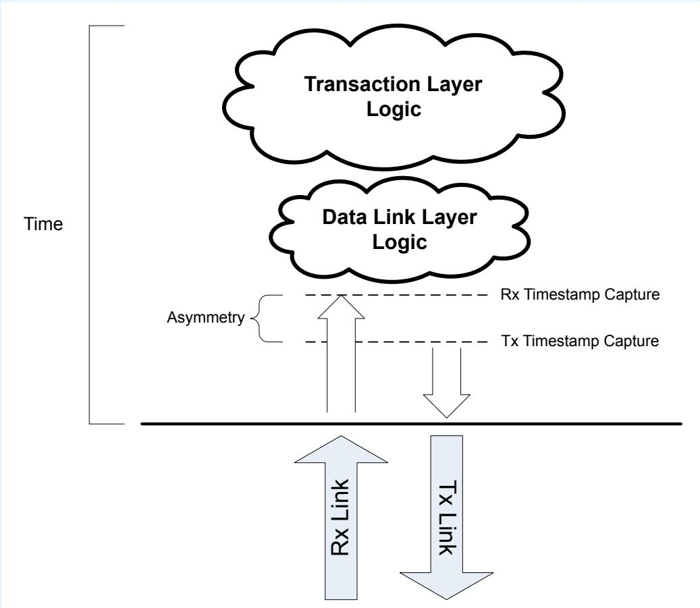

---

<a id="sec-6-22"></a>
## 6.22 Readiness Notifications (RN) | 就绪通知 (RN)


<div style="overflow-x: auto; max-width: 100%;">
<table>
<thead>
<tr>
<th width="50%">🇬🇧 English</th>
<th width="50%" style="background-color:#e8e8e8">🇨🇳 中文</th>
</tr>
</thead>
<tbody>
<tr>
<td>

Readiness Notifications (RN) is intended to reduce the time software needs to wait before issuing Configuration Requests
to a Device or Function following DRS Events or FRS Events. RN includes both the Device Readiness Status (DRS) and
Function Readiness Status (FRS) mechanisms. These mechanisms provide a direct indication of Configuration-Readiness
(see Terms and Acronyms entry for Configuration-Ready). When used, DRS and FRS allow an improved behaviour over
the Configuration RRS mechanism, and eliminate its associated periodic polling time of up to 1 second following a reset.

With appropriate system support, the DRS mechanism can be used to support Devices that require more than 1 second
to become Configuration-Ready (see HARDWARE/SOFTWARE RECOMMENDATIONS FOR OPTIMIZING CONFIGURATION
READINESS below).

It is permitted that system software/firmware provide mechanisms that supersede the FRS and/or DRS mechanisms,
however such software/firmware mechanisms are outside the scope of this specification.

</td>
<td style="background-color:#e8e8e8">

就绪通知 (Readiness Notifications, RN) 用于在 DRS 事件 (DRS Event) 或 FRS 事件 (FRS Event) 之后，减少软件在向设备 (Device) 或功能 (Function) 发出配置请求 (Configuration Request) 之前所需的等待时间。RN 包含设备就绪状态 (Device Readiness Status, DRS) 和功能就绪状态 (Function Readiness Status, FRS) 机制。这些机制提供了对 "配置就绪" (Configuration-Ready) 的直接指示（参见术语和缩略语中 Configuration-Ready 词条）。使用时，DRS 和 FRS 相比配置 RRS 机制具有更好的行为表现，并消除了复位后长达 1 秒的周期性轮询时间。

在系统支持适当时，DRS 机制可用于支持那些需要超过 1 秒才能变为 Configuration-Ready 的设备（见下文 "优化配置就绪的硬件/软件建议"）。

允许系统软件/固件提供可替代 FRS 和/或 DRS 机制的机制，但此类软件/固件机制不在本规范的范围内。

</td>
</tr>
</tbody>
</table>
</div>


<<<PAGE_BREAK>>> page_848

---

table>
<thead>
<tr>
<th width="50%">🇬🇧 English</th>
<th width="50%" style="background-color:#e8e8e8">🇨🇳 中文</th>
</tr>
</thead>
<tbody>
<tr>
<td>

> **IMPLEMENTATION NOTE:**
> **HARDWARE/SOFTWARE RECOMMENDATIONS FOR OPTIMIZING CONFIGURATION READINESS**
>
> It is strongly recommended that implementers of System Software avoid unnecessary delays wherever possible.
> It is strongly recommended that hardware be designed to eliminate or minimize required delays, and utilize
> mechanisms provided in this and related specifications to communicate any required delays. Hardware
> implementers should document hardware behavior sufficiently to enable System Software to implement optimal
> behaviors.
>
> Even before a Link is in L0, it is possible for System Software to determine if the DRS mechanism can be used to
> determine when a device becomes Configuration Ready. System Software may do this as follows:

1.
   If the DRS Supported bit in the Downstream Port above the device is Clear, stop this procedure and follow
   the procedure in § Section 2.3.1 .

2.
   Check the Downstream Component Presence field in the Downstream Port.

   ◦
     If Downstream Component Presence equals Link Up – Component Present and DRS Received, the
     device is already Configuration Ready.

   ◦
     If System Software is informed, through implementation specific mechanisms, that the device
     supports DRS, continue with Step 3. System Software is strongly recommended to take
     advantage of such knowledge when available.

   ◦
     If Downstream Component Presence equals Link Down – Flit Mode Negotiation Completed or Link
     Up Component Present:
     ▪
       If Flit Mode Status is Set, assume the device also supports DRS since DRS is mandatory
       if a component supports Flit Mode. Continue with Step 3.
     ▪
       Otherwise, continue with Step 7.

   ◦
     If Otherwise, if the Link is Up, continue with Step 7.

When System Software determines that DRS is supported by both the Downstream Port and the device below it,
the following DRS-Only procedure is strongly recommended:

3.
   The timeout based procedure defined in § Section 2.3.1 is not used. That procedure supports devices
   that can take a maximum of 1 second to become Configuration Ready. This DRS-Only procedure
   supports devices that take longer than 1 second to become Configuration Ready.

4.
   Either DRS Message Received or Downstream Component Presence are used to determine when the device is
   or becomes Configuration Ready.

5.
   The Downstream Component Presence field is used to avoid polling when a component is not present.

6.
   A non-blocking polling capability is implemented so that unrelated operations are not stalled. Software
   may configure DRS Signaling Control to generate an interrupt or FRS Message to indicate when polling
   should occur. It may be desirable to implement a timeout mechanism to terminate polling and indicate
   an error condition if the timeout expires. The timeout should be determined by system use case
   requirements. If none applies and a component is known to be present, a value of 10 seconds is
   recommended.

When System Software cannot determine that DRS is supported by both the Downstream Port and the device
below it, then this hybrid approach for determining Configuration Ready is recommended:

§

</td>
<td style="background-color:#e8e8e8">

> **实现说明：**
> **优化配置就绪的硬件/软件建议**
>
> 强烈建议系统软件的实现者尽量避免不必要的延迟。强烈建议硬件设计应消除或最小化所需延迟，并利用本规范及相关规范中提供的机制来传达任何所需延迟。硬件实现者应充分记录硬件行为，使系统软件能够实现最优行为。
>
> 即使在链路 (Link) 尚未进入 L0 之前，系统软件也可以判断 DRS 机制是否可用于确定设备何时变为 Configuration Ready。系统软件可以按以下步骤进行判断：

1. 如果设备之上的下游端口 (Downstream Port) 中的 DRS Supported 位为 Clear (清零)，则停止本流程，并按 § 2.3.1 所述流程进行。
2. 检查下游端口中的 Downstream Component Presence 字段。
   - 若 Downstream Component Presence 等于 Link Up – Component Present and DRS Received，则设备已处于 Configuration Ready 状态。
   - 若系统软件通过实现特定机制获知该设备支持 DRS，则继续步骤 3。强烈建议系统软件在能够获得此类信息时加以利用。
   - 若 Downstream Component Presence 等于 Link Down – Flit Mode Negotiation Completed 或 Link Up Component Present：
     - 若 Flit Mode Status 被置位 (Set)，由于支持 Flit 模式的组件必须实现 DRS，因此假设该设备也支持 DRS。继续步骤 3。
     - 否则，继续步骤 7。
   - 其他情况下，若链路 Up，则继续步骤 7。

当系统软件判定 DRS 同时被下游端口及其下方的设备所支持时，强烈建议采用以下"仅 DRS (DRS-Only)"流程：

3. 不使用 § 2.3.1 中定义的基于超时的流程。该流程仅支持最多 1 秒变为 Configuration Ready 的设备。而本 DRS-Only 流程支持需要超过 1 秒才能变为 Configuration Ready 的设备。
4. 使用 DRS Message Received 或 Downstream Component Presence 来确定设备何时已经或即将变为 Configuration Ready。
5. 在组件不存在时，使用 Downstream Component Presence 字段避免轮询。
6. 实现非阻塞 (non-blocking) 的轮询能力，使其他无关操作不会被阻塞。软件可以配置 DRS Signaling Control 以产生中断或 FRS 消息，指示何时应进行轮询。可考虑实现一个超时机制，在超时时终止轮询并指示错误状态。超时值应由系统用例需求决定。若无适用值且已知组件存在，建议采用 10 秒。

当系统软件无法判定 DRS 同时被下游端口及其下方设备所支持时，建议采用以下混合方式判断 Configuration Ready：

§

</td>
</tr>
</tbody>
</table>

<<<PAGE_BREAK>>> page_849

---


<div style="overflow-x: auto; max-width: 100%;">
<table>
<thead>
<tr>
<th width="50%">🇬🇧 English</th>
<th width="50%" style="background-color:#e8e8e8">🇨🇳 中文</th>
</tr>
</thead>
<tbody>
<tr>
<td>

DRS **MUST@FLIT** be implemented, and the DRS Supported bit in the Link Capabilities 2 register **MUST@FLIT** be Set in all
Downstream Ports and in Function 0 of all Upstream Ports. DRS is optional for Ports that do not support Flit Mode.

DRS must be used to indicate when a Device is Configuration-Ready following any of the following Device-level
occurrences, which are subsequently referred to as "DRS Events":

•
Exit from Cold Reset

•
Exit from Warm Reset, Hot Reset, Loopback, or Disabled

•
Exit from L2/L3 Ready

•
Any other scenario where the Port transitions from DL_Down to DL_Up status.

The DRS Message protocol requirements include the following:

•
There is no enable or disable mechanism for DRS.

•
It is expressly permitted for Upstream Ports to send DRS Messages even when the DRS Supported bit is Clear.

•
A DRS Message must be transmitted by a DRS-capable Upstream Port following every DL_Down to DL_Up
transition when all non-VF Functions on the Logical Bus associated with that Upstream Port become ready.

  ◦
    A Type 0 Function is ready when it is Configuration-Ready.

  ◦
    A Type 1 Function that is a Switch Upstream Port is ready when it is Configuration-Ready and all
    Functions on its secondary bus are Configuration-Ready.

  ◦
    A Type 1 Function that is not a Switch Upstream Port is ready when the Function itself is
    Configuration-Ready.

•
After a Device transmits a DRS Message, non-VF Functions indicated as Configuration-Ready by that DRS
Message must not return Completions with RRS in response to Configuration Requests unless a subsequent
DRS Event occurs.

Additional requirements relating to Switches implementing DRS include:

•
Must support DRS functionality in all Ports

•
Implementation at each Downstream Port of the DRS Signaling Control field.

•
For any physically-integrated Device that appears beneath a Switch Downstream Port, the DRS sent by the
Switch does not indicate Configuration Readiness for that Device

  ◦
    For such a Device, implementation and use of DRS is independent of the Switch

7.
The timeout based procedure defined in § Section 2.3.1 is run in parallel with the DRS-Only procedure in
Step 4 through Step 6.

8.
The receipt of a DRS Message indicates the Device is Configuration Ready, and System Software
proceeds without further delay to configure the device.

9.
If no DRS Message is received within an appropriate period determined by system use case
requirements, then System Software may issue a Configuration Request to the Device per the procedure
described in § Section 2.3.1 .

</td>
<td style="background-color:#e8e8e8">

DRS **MUST@FLIT** (在 Flit 模式下必须) 被实现，且 Link Capabilities 2 寄存器中的 DRS Supported 位 **MUST@FLIT** 在所有下游端口 (Downstream Port) 和所有上游端口 (Upstream Port) 的 Function 0 中被置位 (Set)。对于不支持 Flit 模式的端口，DRS 是可选的。

在发生以下任何设备级 (Device-level) 事件（下文统称为 "DRS 事件"，DRS Event）后，必须使用 DRS 来指示设备何时变为 Configuration-Ready：

- 退出冷复位 (Cold Reset)
- 退出热复位 (Warm Reset)、热复位 (Hot Reset)、回环 (Loopback) 或禁用 (Disabled) 状态
- 退出 L2/L3 Ready 状态
- 端口从 DL_Down 状态转入 DL_Up 状态的其他任何场景

DRS 消息协议要求包括以下内容：

- DRS 没有使能或禁用的机制。
- 即使 DRS Supported 位为 Clear，也明确允许上游端口发送 DRS 消息。
- 在每次 DL_Down 至 DL_Up 转换之后，当与该上游端口关联的逻辑总线 (Logical Bus) 上的所有非 VF 功能 (non-VF Function) 都就绪时，支持 DRS 的上游端口必须发送一条 DRS 消息。
  - Type 0 功能在其处于 Configuration-Ready 状态时视为就绪。
  - 作为交换机上游端口的 Type 1 功能在其本身处于 Configuration-Ready 且其副总线 (secondary bus) 上的所有功能也处于 Configuration-Ready 时视为就绪。
  - 非交换机上游端口的 Type 1 功能在该功能自身处于 Configuration-Ready 时视为就绪。
- 设备发送 DRS 消息后，被该 DRS 消息指示为 Configuration-Ready 的非 VF 功能在后续 DRS 事件发生之前，不得在响应配置请求时返回带 RRS 的完成报文 (Completion with RRS)。

与实现 DRS 的交换机相关的额外要求包括：

- 必须在所有端口上支持 DRS 功能。
- 在每个下游端口实现 DRS Signaling Control 字段。
- 对于任何物理集成在交换机下游端口下方的设备，交换机所发送的 DRS 并不指示该设备的 Configuration Readiness。
  - 对于此类设备，DRS 的实现与使用独立于该交换机。

7. § 2.3.1 中定义的基于超时的流程与步骤 4 至步骤 6 中的 DRS-Only 流程并行运行。
8. 接收到 DRS 消息即表明设备处于 Configuration Ready 状态，系统软件应立即开始配置该设备，无需进一步等待。
9. 如果在系统用例需求所确定的合理时间内未收到 DRS 消息，则系统软件可以按照 § 2.3.1 中描述的流程向设备发出配置请求 (Configuration Request)。

</td>
</tr>
</tbody>
</table>
</div>


<<<PAGE_BREAK>>> page_850


---

<a id="sec-6-22-1"></a>
## 6.22.1 Device Readiness Status (DRS) | 设备就绪状态 (DRS)

table>
<thead>
<tr>
<th width="50%">🇬🇧 English</th>
<th width="50%" style="background-color:#e8e8e8">🇨🇳 中文</th>
</tr>
</thead>
<tbody>
<tr>
<td>

Additional requirements for Root Ports and Switch Downstream Ports include:

- Implementation of the DRS Message Received bit, which indicates receipt of a DRS Message
- When implemented, FRS must be used to indicate a specific Function as being Configuration-Ready following any of the following Function-level occurrences, which are subsequently referred to as "FRS Events":
  - Function Level Reset (FLR)
  - Completion of D3Hot to D0 transition
  - Setting or Clearing of VF Enable in a PF (SR-IOV)

</td>
<td style="background-color:#e8e8e8">

对根端口 (Root Port) 和交换机下游端口 (Switch Downstream Port) 的额外要求包括:

- 实现 DRS Message Received 位,用于指示已收到 DRS 报文
- 若实现 FRS,必须使用 FRS 在以下任一 Function 级事件发生后指示特定 Function 处于"配置就绪"状态,这些事件统称为 "FRS Events":
  - Function 级复位 (Function Level Reset, FLR)
  - 完成 D3Hot 到 D0 的转换
  - 在 PF 中设置或清除 VF Enable (SR-IOV)

</td>
</tr>
</tbody>
</table>

[⬆️ 返回目录](#-本章目录-table-of-contents)

---

<a id="sec-6-22-2"></a>
## 6.22.2 Function Readiness Status (FRS) | Function 就绪状态 (FRS)

<table>
<thead>
<tr>
<th width="50%">🇬🇧 English</th>
<th width="50%" style="background-color:#e8e8e8">🇨🇳 中文</th>
</tr>
</thead>
<tbody>
<tr>
<td>

The FRS Message protocol requirements include the following:

- The Requester ID of the FRS Message must indicate the Function that has changed readiness status (see § Section 2.2.8.6.3 )
- The FRS Reason field in the FRS Message must indicate why that Function changed readiness status
- After a Function transmits an FRS Message, the indicated Function(s) must not return Completions with RRS in response to a Configuration Request unless a subsequent DRS Event or FRS Event occurs

</td>
<td style="background-color:#e8e8e8">

FRS 报文协议要求包括:

- FRS 报文的 Requester ID 必须指示已更改就绪状态的 Function(参见 § 2.2.8.6.3)
- FRS 报文中的 FRS Reason 字段必须指示该 Function 更改就绪状态的原因
- 在 Function 发送 FRS 报文后,除非发生后续的 DRS Event 或 FRS Event,所指示的 Function 不得在响应配置请求 (Configuration Request) 时返回带 RRS 的完成报文 (Completion)

</td>
</tr>
</tbody>
</table>

[⬆️ 返回目录](#-本章目录-table-of-contents)

---

Additional requirements for Switches implementing FRS include:

- Must support FRS functionality in the Upstream Port and all Downstream Ports
- The ability to transmit FRS Messages Upstream when required by the FRS protocol

Additional requirements for Physical Functions (PFs) include:

- The ability to transmit FRS Message Upstream when the VF Enable or VF Disable process completes

Additional requirements for Root Ports and Root Complex Event Collectors implementing FRS include:

- Must implement the FRS Queuing Extended Capability (see § Section 7.8.10 )

Root Ports and Root Complex Event Collectors that support FRS must implement the FRS Queuing Extended Capability (see § Section 7.8.10 ).

For a Root Port, the FRS Message Queue contains FRS Messages received by the Root Port or generated by the Root Port.

**IMPLEMENTATION NOTE:**
**DRS MESSAGES AND ACS SOURCE VALIDATION**

Functions are permitted to transmit DRS Messages before they have been assigned a Bus Number. Such messages will have a Requester ID with a Bus Number of 00h. If the Downstream Port has ACS Source Validation enabled, these Messages (see § Section 6.12.1.1 ) will likely be detected as an ACS Violation error.

---

<a id="sec-6-22-3"></a>
## 6.22.3 FRS Queuing | FRS 队列


<div style="overflow-x: auto; max-width: 100%;">
<table>
<thead>
<tr>
<th width="50%">🇬🇧 English</th>
<th width="50%" style="background-color:#e8e8e8">🇨🇳 中文</th>
</tr>
</thead>
<tbody>
<tr>
<td>

For a Root Complex Event Collector, the FRS Message Queue contains FRS Messages generated by RCiEPs associated with the Root Complex Event Collector (see § Section 7.9.10 ) or generated by the Root Complex Event Collector.

The FRS Message Queue must satisfy the following requirements:

- The FRS Message Queue must be empty following Reset.
- For a Root Port, the FRS Message Queue must be emptied when the Link goes to DL_Down.
- FRS Messages must be queued in the order received.
- If the FRS Message Queue is not full at the time an FRS Message is received or is internally generated, that FRS Message must be entered in the queue and the FRS Message Received bit must set to 1b.
- If the FRS Message Queue is full at the time an FRS Message is received or is internally generated, that FRS Message must be discarded and the FRS Message Overflow bit must be set to 1b. The pre-existing FRS Message Queue must be preserved.
- The oldest FRS Message must be visible in the FRS Message Queue register (see § Section 7.8.10.4 ).
- Writing the FRS Message Queue register must remove the oldest element from the queue.
- When either FRS Message Received or FRS Message Overflow transitions from 0b to 1b, an interrupt must be generated if enabled.

</td>
<td style="background-color:#e8e8e8">

对于根复合体事件收集器 (Root Complex Event Collector),FRS 报文队列包含由与该根复合体事件收集器关联的 RCiEP 生成(参见 § 7.9.10)或由根复合体事件收集器自身生成的 FRS 报文。

FRS 报文队列必须满足以下要求:

- 复位后 FRS 报文队列必须为空。
- 对于根端口,当链路 (Link) 转为 DL_Down 时,FRS 报文队列必须被清空。
- FRS 报文必须按接收顺序排队。
- 若在收到 FRS 报文或内部产生 FRS 报文时 FRS 报文队列未满,则必须将该 FRS 报文送入队列,并将 FRS Message Received 位置为 1b。
- 若在收到 FRS 报文或内部产生 FRS 报文时 FRS 报文队列已满,则必须丢弃该 FRS 报文,并将 FRS Message Overflow 位置为 1b。先前已存在的 FRS 报文队列必须保留。
- 最旧的 FRS 报文必须在 FRS Message Queue 寄存器中可见(参见 § 7.8.10.4)。
- 写入 FRS Message Queue 寄存器必须从队列中移除最旧的元素。
- 当 FRS Message Received 或 FRS Message Overflow 由 0b 跳变为 1b 时,如果中断已使能,则必须产生中断。

</td>
</tr>
</tbody>
</table>
</div>


[⬆️ 返回目录](#-本章目录-table-of-contents)

---

The Enhanced Allocation (EA) Capability is an optional Capability that allows the allocation of I/O, Memory and Bus Number resources in ways not possible with the BAR and Base/Limit mechanisms in the Type 0 and Type 1 Configuration Headers.

It is only permitted to apply EA to certain functions, based on the hierarchical structure of the functions as seen in PCI configuration space, and based on certain aspects of how functions exist within a platform environment (see § Figure 6-26).

<a id="sec-6-23"></a>
## 6.23 Enhanced Allocation | 增强分配 (EA)

table>
<thead>
<tr>
<th width="50%">🇬🇧 English</th>
<th width="50%" style="background-color:#e8e8e8">🇨🇳 中文</th>
</tr>
</thead>
<tbody>
<tr>
<td>

> **Figure 6-26.** Example Illustrating Application of Enhanced Allocation
> 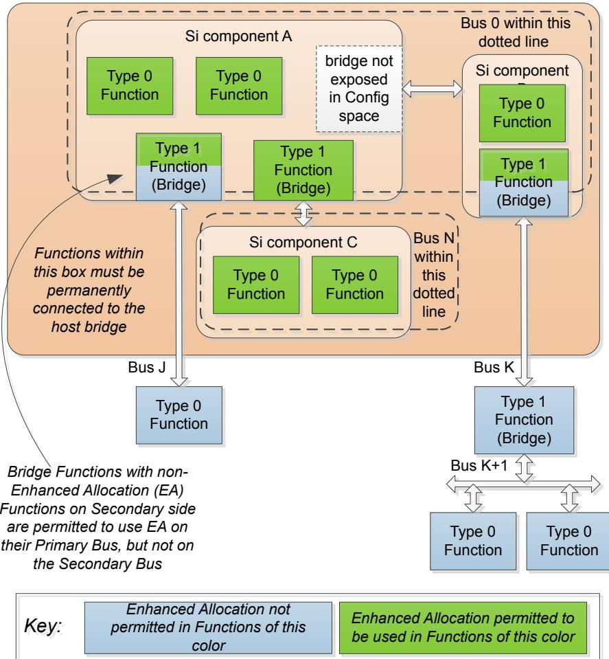

Figure 6-26 illustrates an example topology that shows where Enhanced Allocation is permitted to be used:

- Si component A: Type 0 Function, Type 0 Function, bridge not exposed in Config space
- Si component B: Type 0 Function, Type 0 Function, Type 1 Function (Bridge)
- Si component C: Type 0 Function, Type 0 Function
- Bus 0 within this dotted line
- Bus N within this dotted line
- Bus K, Bus K+1, Bus J
- Type 0 Function
- Type 1 Function (Bridge)
- Type 1 Function (Bridge)
- Type 1 Function (Bridge)
- Type 1 Function (Bridge)
- Type 0 Function
- Type 1 Function (Bridge)

Key (with colors):
- Enhanced Allocation permitted to be used in Functions of this color
- Enhanced Allocation not permitted in Functions of this color
- Functions within this box must be permanently connected to the host bridge
- Bridge Functions with non-Enhanced Allocation (EA) Functions on Secondary side are permitted to use EA on their Primary Bus, but not on the Secondary Bus

</td>
<td style="background-color:#e8e8e8">


图 6-26 给出了一个示例拓扑,说明在哪些位置允许使用增强分配 (Enhanced Allocation):

- Si component A:Type 0 Function、Type 0 Function,桥在配置空间中未暴露
- Si component B:Type 0 Function、Type 0 Function、Type 1 Function(桥)
- Si component C:Type 0 Function、Type 0 Function
- Bus 0 位于此虚线框内
- Bus N 位于此虚线框内
- Bus K、Bus K+1、Bus J
- Type 0 Function
- Type 1 Function(桥)
- Type 1 Function(桥)
- Type 1 Function(桥)
- Type 1 Function(桥)
- Type 0 Function
- Type 1 Function(桥)

图例(颜色说明):
- 此颜色 Function 允许使用增强分配 (EA)
- 此颜色 Function 不允许使用增强分配
- 此方框内的 Function 必须永久连接到主桥 (Host Bridge)
- 桥 Function 在其 Secondary 侧具有非 EA Function 的情况下,允许在其 Primary Bus 上使用 EA,但不允许在 Secondary Bus 上使用 EA

</td>
</tr>
</tbody>
</table>

[⬆️ 返回目录](#-本章目录-table-of-contents)

---

Only functions that are permanently connected to the host bridge are permitted to use EA. A bridge function (i.e., any function with a Type 1 Configuration Header), is permitted to use EA for both its Primary Side and Secondary Side if and only if the function(s) behind the bridge are also permanently connected (below one or more bridges) to the host bridge, as shown for "Si component C" in § Figure 6-26.

A bridge function is permitted to use EA only for its Primary Side if the function(s) behind the bridge are not permanently connected to the bridge, as with the bridges above Bus J and Bus K in § Figure 6-26, and in this case the non-EA resource allocation mechanisms in the Type 1 Header for Bus numbers, MMIO ranges and I/O ranges are used for the Secondary side of the bridge. System software must ensure that the allocated Bus numbers are within the range indicated in the Fixed Secondary Bus Number and Fixed Subordinate Bus Number registers of the EA capability. System software must ensure that the allocated MMIO and I/O ranges are within ranges indicated with the corresponding Properties in the EA capability for resources to be allocated behind the bridge. For Bus numbers, MMIO and I/O ranges behind the bridge, hardware is permitted to indicate overlapping ranges in multiple bridge functions, however, in such cases, system software must ensure that the ranges actually assigned are non-overlapping.

Functions that rely exclusively on EA for I/O and Memory address allocation must hardwire all bits of all BARs in the PCI Header to 0. Such Functions must be clearly documented as relying on EA for correct operation, and platform integrators must ensure that only EA-aware firmware/software are used with such Functions.

When a Function allocates resources using EA and indicates that a resource range is associated with an equivalent BAR number, the Function must not request resources through the equivalent BAR, which must be indicated by hardwiring all bits of the equivalent BAR to 0.

For a bridge function that is permitted to implement EA based on the rules above, it is permitted, but not required, for the bridge function to use EA mechanisms to indicate resource ranges that are located behind the bridge Function. In the example shown in in § Figure 6-26, the bridge above Bus N is permitted to use EA mechanisms to indicate the resources used by the two functions in "Si component C", or that bridge is permitted to not indicate the resources used by the two functions in "Si component C". System firmware/software must comprehend that such bridge functions are not required to indicate inclusively all resources behind the bridge, and as a result system firmware/software must make a complete search of all functions behind the bridge to comprehend the resources used by those functions.

A Function with an Expansion ROM is permitted to use the existing mechanism or the EA mechanism, but is not permitted to support both. If a Function uses the EA mechanism (EA entry with BEI of 8), the Expansion ROM Base Address and Expansion ROM Enable fields must be hardwired to 0 (see § Section 7.5.1.2.4 ). The Enable bit of the EA entry is equivalent to the Expansion ROM Enable bit. If a Function uses Expansion ROM Base Address Register mechanism, no EA entry with a BEI of 8 is permitted. In both cases, Expansion ROM Validation, if supported, uses the Expansion ROM Validation Status and Expansion ROM Validation Details fields (see § Section 7.5.1.2.4 ).

The requirements for enabling and/or disabling the decode of I/O and/or Memory ranges are unchanged by EA, including but not limited to the Memory Space and I/O Space enable bits in the Command register.

Any resource allocated using EA must not overlap with any other resource allocated using EA, except as permitted above for identifying permitted address ranges for resources behind a bridge.

<a id="sec-6-24"></a>
## 6.24 Emergency Power Reduction State | 紧急降功耗状态


<div style="overflow-x: auto; max-width: 100%;">
<table>
<thead>
<tr>
<th width="50%">🇬🇧 English</th>
<th width="50%" style="background-color:#e8e8e8">🇨🇳 中文</th>
</tr>
</thead>
<tbody>
<tr>
<td>

Emergency Power Reduction State is an optional mechanism to request that Functions quickly reduce their power consumption. Emergency Power Reduction is a fail-safe mechanism intended to be used to prevent system damage and is not intended to provide normal dynamic power management.

If a Function implements Emergency Power Reduction State, it must also implement the Power Budgeting extended capability and must report Power Budgeting values for this state (see § Section 7.8.1 ). Devices that are integrated on the system board are not required to implement the Power Budgeting extended capability, but if they do so, they must meet the preceding requirement.

Functions enter and exit this state either autonomously or based on external requests. External requests may be either following a signaling protocol defined in an applicable form factor specification, or by a vendor-specific method. § Table 6-16 defines how the Emergency Power Reduction Supported and Emergency Power Reduction Initialization Required fields determine the mechanisms that are allowed to trigger entry and exit from this state (see § Section 7.5.3.15 ).

</td>
<td style="background-color:#e8e8e8">

紧急降功耗状态 (Emergency Power Reduction State) 是一种可选机制,用于请求 Function 快速降低其功耗。紧急降功耗是一种故障安全机制,旨在用于防止系统损坏,并不用于提供常规的动态电源管理 (Power Management)。

如果 Function 实现紧急降功耗状态,则它还必须实现 Power Budgeting 扩展能力结构,并必须报告该状态对应的 Power Budgeting 值(参见 § 7.8.1)。集成在系统板上的设备不需要实现 Power Budgeting 扩展能力结构,但若实现,则必须满足上述要求。

Function 进入或退出此状态既可以是自主 (autonomously) 的,也可以是基于外部请求的。外部请求既可以遵循适用的外形规格 (Form Factor) 规范中定义的信号协议,也可以使用厂商特定方法。表 6-16 定义了如何根据 Emergency Power Reduction Supported 和 Emergency Power Reduction Initialization Required 字段来确定允许触发进入和退出此状态的机制(参见 § 7.5.3.15)。

</td>
</tr>
</tbody>
</table>
</div>


[⬆️ 返回目录](#-本章目录-table-of-contents)

---

**Table 6-16. Emergency Power Reduction Supported Values | 表 6-16. 紧急降功耗支持值**

| Emergency Power Reduction Supported | Emergency Power Reduction Initialization Required | Entry/Exit Permitted by Form Factor Mechanism | Vendor Specific Mechanism(s) | Autonomous Mechanisms |
|---|---|---|---|---|
| 00b | 0 | No | Yes | Yes |
| 00b | 1 | No | No | No |
| 01b | Any | No | Yes | Yes |
| 10b | Any | Yes | Yes | Yes |
| 11b | Reserved | Reserved | Reserved | Reserved |

Functions may indicate that they require re-initialization on exit from this state:

- If the Emergency Power Reduction Initialization Required bit is Clear (see § Section 7.5.3.15 ):
  - On entry to this state, the Function either operates normally (perhaps with reduced performance), or enters a device specific "power reduction dormant state". The Upstream Port of the Device remains operating. Outstanding requests initiated by or directed to the Function must complete normally.
  - On exit from this state, the Function operates normally (perhaps resuming normal performance). Functions that entered a "power reduction dormant state" exit that state. In either case, no software intervention is required.
- If the Emergency Power Reduction Initialization Required bit is Set (see § Section 7.5.3.15 ):
  - On entry to this state, the Function ceases normal operation. The Upstream Port of the associated Device is permitted to enter DL_Down.
    - If the Upstream Port remains in DL_Up, outstanding requests directed to or initiated by the Function must complete normally.
    - If the Upstream Port enters DL_Down, outstanding request behavior is defined in § Section 2.9.1 . This transition may result in a Surprise Down error.
    - Sticky bits must be preserved in this state.
  - On exit from this state, software intervention is required to resume normal operation. The mechanism used to indicate to software when this is required is outside the scope of this specification (e.g., a device specific interrupt). If the Upstream Port entered DL_Down, all Functions of the Device are reset and a full reconfiguration is required (see § Section 2.9.2 ).

The following rules apply to the Emergency Power Reduction State:

- A Device supports Emergency Power Reduction State if at least one Function in the Upstream Port indicates support (i.e., Emergency Power Reduction Supported is non-zero).
- Emergency Power Reduction State is associated with a Device. All Functions in a Device that support it enter and exit this state at the same time.
- For SR-IOV devices, if the Emergency Power Reduction Supported field in a VF is non-zero, that VF enters and exits the Emergency Power Reduction State at the same time as its associated PF. For such VFs, the Emergency Power Reduction Detected bit must be hardwired to Zero, but software can use the associated PF's bit to emulate the bit in its VFs.
- Functions where the Emergency Power Reduction Supported field is 00b are not affected by the Emergency Power Reduction State of the Device as long as the Upstream Port remains in DL_Up. The Emergency Power Reduction Detected bit is RsvdZ.
- Functions where the Emergency Power Reduction Supported field is 01b or 10b:
  - Set the Emergency Power Reduction Detected bit when the Device enters Emergency Power Reduction State.
  - Clear the Emergency Power Reduction Detected bit when requested if the Device has exited the Emergency Power Reduction State.
- For Switches, Downstream Switch Ports enter and exit Emergency Power Reduction State at the same time as the associated Upstream Switch Port. The corresponding fields in Configuration Space are reserved for Downstream Switch Ports.
- For SR-IOV Devices, VFs enter and exit Emergency Power Reduction State at the same time as their PF. The corresponding fields in Configuration Space are reserved for VFs.
- Encoding 10b shall not be used unless the associated form factor specification defines a mechanism for requesting Emergency Power Reduction.
- It is strongly recommended that the Emergency Power Reduction Supported field be initialized by hardware or firmware within the Function prior to initial device enumeration. This initialization is permitted to be deferred to device driver load when this is not practical (e.g., when there is no firmware ROM).

**IMPLEMENTATION NOTE:**
**DIAGNOSTIC CHECKING OF EMERGENCY POWER REDUCTION DETECTED**

The Emergency Power Reduction Detected bit permits system software to detect that Emergency Power Reduction State was entered, even momentarily. The Emergency Power Reduction Request bit can be used by software to request entry. Normally, software would use a system specific method to enter the Emergency Power Reduction State using external mechanisms.

---

When software initializes a PCI Hierarchy, it assigns unique Bus and Device numbers to each component so that every Function in the Hierarchy has a unique Routing ID within that Hierarchy. To ensure that Routing IDs are unique in large systems that contain more than one Hierarchy and in clustered systems that contain multiple Hierarchies, additional information is required to augment the Routing ID to produce a unique number. Functions can be uniquely identified by the combination of:

- Unique Identifier for the System (or Root Complex)
- Unique Identifier for the Hierarchy within that Root Complex
- Routing ID within that Hierarchy

**IMPLEMENTATION NOTE:**
**EMERGENCY POWER REDUCTION STATE: EXAMPLE ADD-IN CARD**

> **Figure 6-27.** Emergency Power Reduction State: Example Add-in Card
> 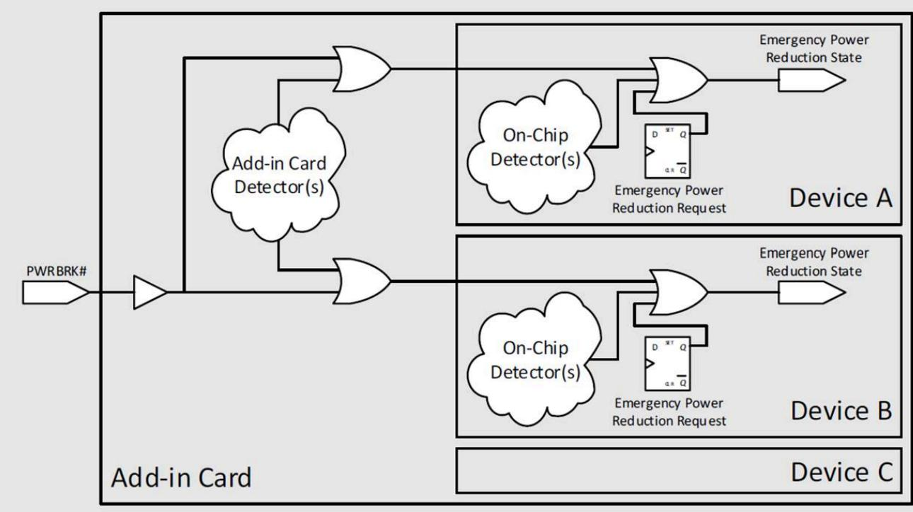

§ Figure 6-27 shows an example multi-Device add-in card supporting Emergency Power Reduction. Note that Device C does not support the Emergency Power Reduction State. Device C might be a Switch that fans out to Devices A and B.

<a id="sec-6-25"></a>
## 6.25 Hierarchy ID Message | 层级 ID 报文

table>
<thead>
<tr>
<th width="50%">🇬🇧 English</th>
<th width="50%" style="background-color:#e8e8e8">🇨🇳 中文</th>
</tr>
</thead>
<tbody>
<tr>
<td>

The Hierarchy ID Message (see § Section 2.2.8.6.4 ) is used to provide the additional information needed for a Function to uniquely identify itself in a multi-hierarchy platform.

Hierarchy ID Messages are generated by a Downstream Port upon software request. Received messages at an Upstream Port are reported in the Hierarchy ID Extended Capability (see § Section 7.9.17 ).

Hierarchy ID Messages are a PCI-SIG-Defined Type 1 VDM. Hierarchy ID Messages can safely be sent at any time and components that do not comprehend them will silently ignore them.

Hierarchy ID Messages typically are sent from a Downstream Port at the top of the Hierarchy (e.g., a Root Port). In systems where the Root Port does not support Hierarchy ID Messages, Hierarchy ID Messages can be sent from Switch Downstream Ports.

The Hierarchy ID Message is intended for use by software, firmware, and/or hardware. When using the Hierarchy ID Message, all bits of the Hierarchy ID, System GUID, System GUID Authority ID fields must be compared, without regard to any internal structure. How this information is used is outside the scope of this specification.

Layout of the Hierarchy ID Message is shown in § Figure 2-61. Fields in the Hierarchy ID Message are as follows:

Hierarchy ID contains the Segment Group Number associated with this Hierarchy (as defined by the PCI Firmware Specification). This field can be used in conjunction with the Routing ID to uniquely identify a Function within a System. The value 0000h indicates the default (or only) Hierarchy of the Root Complex. Non-zero values indicate additional Hierarchies.

</td>
<td style="background-color:#e8e8e8">

层级 ID 报文 (Hierarchy ID Message)(参见 § 2.2.8.6.4)用于提供 Function 在多层级 (multi-hierarchy) 平台中唯一标识自身所需的附加信息。

层级 ID 报文由下游端口 (Downstream Port) 应软件请求生成。在上游端口 (Upstream Port) 接收到的报文通过 Hierarchy ID 扩展能力结构 (Extended Capability) 报告(参见 § 7.9.17)。

层级 ID 报文是 PCI-SIG 定义的 Type 1 VDM。层级 ID 报文可在任意时刻安全发送,不支持该报文的组件将静默忽略。

层级 ID 报文通常从层级顶部的下游端口(例如根端口)发送。在根端口不支持层级 ID 报文的系统中,层级 ID 报文可从交换机下游端口发送。

层级 ID 报文供软件、固件和/或硬件使用。在使用层级 ID 报文时,必须比较 Hierarchy ID、System GUID、System GUID Authority ID 字段的所有位,而不考虑其内部结构。该信息的使用方式不在本规范范围内。

层级 ID 报文的布局如图 2-61 所示。层级 ID 报文中的字段如下:

Hierarchy ID 包含与此层级关联的段组号(Segment Group Number,由 PCI 固件规范定义)。该字段可与 Routing ID 配合使用,以在系统内唯一标识一个 Function。值 0000h 表示根复合体 (Root Complex) 的默认(或唯一)层级。非零值表示其他层级。

</td>
</tr>
</tbody>
</table>

[⬆️ 返回目录](#-本章目录-table-of-contents)

---

**Table 6-17. System GUID Authority ID Encoding | 表 6-17. System GUID Authority ID 编码**

| Authority ID | Description |
|---|---|
| 00h | None - System GUID[143:0] is not meaningful. System GUID[143:0] must be 0. |
| 01h | Timestamp - System GUID[63:0] contains a timestamp associated with the particular system. Encoding is a Unix 64 bit time (number of seconds since midnight UTC January 1, 1970). The mechanism of choosing the timestamp to represent a system is implementation specific. System GUID[143:64] must be 0. |
| 02h | IEEE EUI-48 - System GUID[47:0] contains a 48 bit Extended Unique Identifier (EUI-48) associated with the particular system. Encoding is defined by the IEEE. See [EUI-48] for details. EUI-48 values are frequently used as network interface MAC addresses. The mechanism of choosing the EUI-48 value to represent a system is implementation specific. System GUID[143:48] must be 0. |
| 03h | IEEE EUI-64 - System GUID[63:0] contains a 64 bit Extended Unique Identifier (EUI-64) associated with the particular system. Encoding is defined by the IEEE. See [EUI-64] for details. The mechanism of choosing the EUI-64 value to represent a system is implementation specific. System GUID[143:64] must be 0. |
| 04h | RFC-4122 UUID - System GUID[127:0] contain a UUID as defined by the IETF in [RFC-4122]. This definition is technically equivalent to [ITU-T-Rec-X-667] or [ISO-IEC-9834-8]. The mechanism of choosing the UUID value to represent a system is implementation specific. System GUID[143:128] must be 0. |
| 05h | IPv6 Address - System GUID[127:0] contains the unique IPv6 address of one of the network interfaces of the system. The mechanism of choosing the IPv6 value to represent a system is implementation specific. System GUID[143:128] must be 0. |
| 06h to 7Fh | Reserved - System GUID[143:0] contains a unique value. The mechanism used to ensure uniqueness is outside the scope of this specification. |
| 80h to FFh | PCI-SIG Vendor Specific - System GUID Authority ID values 80h to FFh are reserved for PCI-SIG vendor-specific usage. System GUID[143:128] contains a PCI-SIG assigned Vendor ID. System GUID[127:0] contain a unique number assigned by that vendor. The mechanism used for assigning numbers is implementation specific. One possible mechanism would be to use the serial number assigned to the system. The mechanism used to choose between these System GUID Authority IDs is implementation specific. One usage would be to allow a vendor to define up to 128 distinct 128-bit System GUID schemes. |

System GUID[143:0], in conjunction with System GUID Authority ID, provides a globally unique identification for a System.

- System GUID[143:136] is byte 14 in the Hierarchy ID Message.
- System GUID[135:128] is byte 15 in the Hierarchy ID Message.
- System GUID[127:120] is byte 16 in the Hierarchy ID Message.
- System GUID[119:112] is byte 17 in the Hierarchy ID Message.
- System GUID[111:104] is byte 18 in the Hierarchy ID Message.
- System GUID[103:96] is byte 19 in the Hierarchy ID Message.
- System GUID[95:88] is byte 20 in the Hierarchy ID Message.
- System GUID[87:80] is byte 21 in the Hierarchy ID Message.
- System GUID[79:72] is byte 22 in the Hierarchy ID Message.
- System GUID[71:64] is byte 23 in the Hierarchy ID Message.
- System GUID[63:56] is byte 24 in the Hierarchy ID Message.
- System GUID[55:48] is byte 25 in the Hierarchy ID Message.
- System GUID[47:40] is byte 26 in the Hierarchy ID Message.
- System GUID[39:32] is byte 27 in the Hierarchy ID Message.
- System GUID[31:24] is byte 28 in the Hierarchy ID Message.
- System GUID[23:16] is byte 29 in the Hierarchy ID Message.
- System GUID[15:8] is byte 30 in the Hierarchy ID Message.
- System GUID[7:0] is byte 31 in the Hierarchy ID Message.

System GUID Authority ID identifies the mechanism used to ensure that the System GUID is globally unique. The mechanism for choosing which Authority ID to use for a given system is implementation specific. The defined values are shown in § Table 6-17.

**IMPLEMENTATION NOTE:**
**SYSTEM GUID CONSISTENCY AND STABILITY**

To support the purpose of System GUID, software should ensure that a single system uses identical System GUID and System GUID Authority ID values everywhere.

Implementers should carefully consider their stability requirements for the System GUID value. For example, some use cases may require that the value not change when the system is rebooted. In those cases, a mechanism that picks the EUI-48 value associated with the first Ethernet MAC address discovered might be problematic if the result changes due to hardware failure, system reconfiguration, or variations/parallelism in the discovery algorithm.

**IMPLEMENTATION NOTE:**
**HIERARCHY ID VS. DEVICE SERIAL NUMBER**

The Device Serial Number mechanism can also be used to uniquely identify a component (see § Section 7.9.3 ). Device Serial Number may be a more expensive solution to this problem if it involves a ROM associated with each component.

**IMPLEMENTATION NOTE:**
**VIRTUAL FUNCTIONS AND HIERARCHY ID**

The Hierarchy ID capability can be emulated by the Virtualization Intermediary (VI). Doing so provides VF software access to this Hierarchy ID information. When VF hardware needs access to this information, the VF should implement the Hierarchy ID capability. This provides access to both VF software and hardware. In some situations, the VF should get the same information as the PF. In other situations, particularly those involving migration of Virtual Machines, it may be appropriate to present the VF with Hierarchy ID information that differs from the associated PF and from other VFs associated with that PF.

The following mechanisms are supported:

| Mechanism | VF Hierarchy ID Capability | Hierarchy ID VF Configurable | Hierarchy ID Writeable | VF Software has access | VF Hardware has access | VF Hierarchy Data / GUID |
|---|---|---|---|---|---|---|
| 1 | Not Present | n/a | n/a | No | No | Not Emulated |
| 2 | Yes | No | No | Yes | No | Emulated |
| 3 | Present | 0b | 0b | Yes | Yes | Same as PF |
| 4 | Present | 1b | 0b | Yes | Yes | Same as PF |
| 5 | Present | 1b | 1b | Yes | Yes | Configured by VI |

In mechanism 1, the Virtualization Intermediary does not emulate the capability. VF software and hardware have no access.

In mechanism 2, the Virtualization Intermediary emulates the capability and returns whatever Hierarchy ID information is desired. VF software has access. VF hardware does not have access.

In mechanisms 3 and 4, VF information is the same as the PF and is automatically filled in from received Hierarchy ID messages. Both VF hardware and software have access.

In mechanism 5, VF information is configured by software (probably the VI). Both VF hardware and software have access.

---

<a id="sec-6-26"></a>
## 6.26 Flattening Portal Bridge (FPB) | 扁平化门户桥 (FPB)


<div style="overflow-x: auto; max-width: 100%;">
<table>
<thead>
<tr>
<th width="50%">🇬🇧 English</th>
<th width="50%" style="background-color:#e8e8e8">🇨🇳 中文</th>
</tr>
</thead>
<tbody>
<tr>
<td>

The Flattening Portal Bridge (FPB) is an optional mechanism which can be used to improve the scalability and runtime reallocation of Routing IDs and Memory Space resources.

For non-ARI Functions associated with an Upstream Port, the Routing ID consists of a 3-bit Function Number portion, which is determined by the construction of the Upstream Port hardware, and a 13-bit Bus Number and Device number portion, determined by the Downstream Port above the Upstream port.

For ARI Functions associated with an Upstream Port, the Routing ID consists of an 8-bit Function Number portion, and only the 8-bit Bus Number portion is determined by the Downstream Port above the Upstream port.

</td>
<td style="background-color:#e8e8e8">

扁平化门户桥 (Flattening Portal Bridge, FPB) 是一种可选机制,可用于提高 Routing ID 和 Memory Space 资源的可扩展性及运行时再分配能力。

对于与非 ARI(替代路由 ID 解释, Alternative Routing ID Interpretation) 关联的、连接到上游端口 (Upstream Port) 的 Function,其 Routing ID 包含一个 3 位 Function Number 字段(由上游端口硬件结构决定)和一个 13 位 Bus Number + Device Number 字段(由上游端口上方的下游端口决定)。

对于与 ARI 关联的、连接到上游端口的 Function,其 Routing ID 包含一个 8 位 Function Number 字段,且仅有 8 位 Bus Number 字段由上游端口上方的下游端口决定。

</td>
</tr>
</tbody>
</table>
</div>


[⬆️ 返回目录](#-本章目录-table-of-contents)

---

<a id="sec-6-26-1"></a>
## 6.26.1 Introduction | 概述

table>
<thead>
<tr>
<th width="50%">🇬🇧 English</th>
<th width="50%" style="background-color:#e8e8e8">🇨🇳 中文</th>
</tr>
</thead>
<tbody>
<tr>
<td>

A bridge that implements the FPB Capability can itself also be referred to as an FPB. The FPB Capability can be applied to any logical bridge, as illustrated in § Figure 6-28.

> **Figure 6-28.** FPB High Level Diagram and Example Topology
> 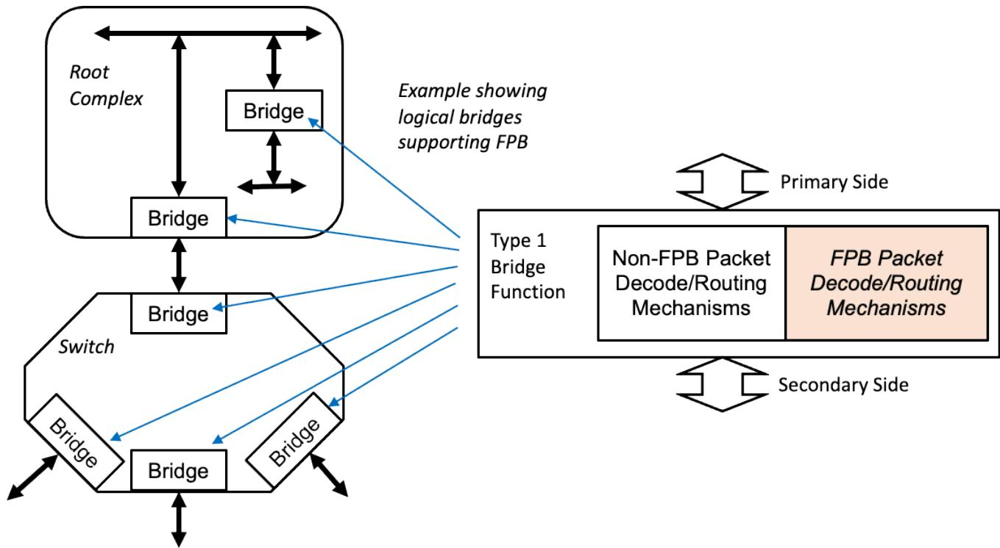

FPB changes the way Bus Numbers are consumed by Switches to reduce waste, by "flattening" the way Bus Numbers are used inside of Switches and by Downstream Ports (see § Figure 6-29).

> **Figure 6-29.** Example Illustrating "Flattening" of a Switch
> 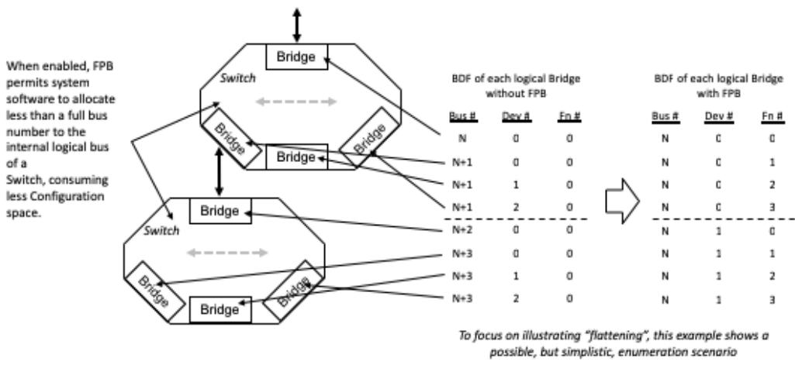

FPB defines mechanisms for system software to allocate Routing IDs and Memory Space resources in non-contiguous ranges, enabling system software to assign pools of these resources from which it can allocate "bins" to Functions below the FPB. This is done using a bit vector where each bit when Set assigns a corresponding range of resources to the Secondary Side of the bridge (see § Figure 6-30).

> **Figure 6-30.** Vector Mechanism for Address Range Decoding
> 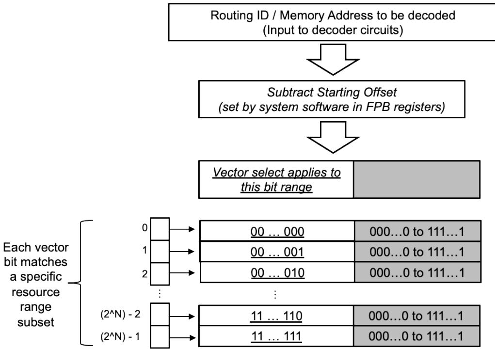

</td>
<td style="background-color:#e8e8e8">

实现 FPB Capability 的桥本身也可称为 FPB。FPB Capability 可应用于任何逻辑桥,如图 6-28 所示。


FPB 通过"扁平化"交换机 (Switch) 内部以及下游端口 (Downstream Port) 使用 Bus Number 的方式来减少 Switch 对 Bus Number 的浪费(参见图 6-29)。


FPB 定义了系统软件在不连续范围内分配 Routing ID 和 Memory Space 资源的机制,使系统软件可以分配这些资源的资源池,并从中将"桶 (bins)"分配给 FPB 下方的 Function。这是通过使用一个位向量 (bit vector) 实现的,其中每一位被置位时,会将相应的资源范围分配给桥的 Secondary 侧(参见图 6-30)。


</td>
</tr>
</tbody>
</table>

[⬆️ 返回目录](#-本章目录-table-of-contents)

---

This allows system software to assign Routing IDs and/or Memory Space resources required by a device hot-add without having to rebalance other, already assigned resource ranges, and to return to the pool resources freed, for example by a hot remove event.

FPB is defined to allow both the non-FPB and FPB mechanisms to operate simultaneously, such that, for example, it is possible for system firmware/software to implement a policy where the non-FPB mechanisms continue to be used in parts of the system where the FPB mechanisms are not required (see § Figure 6-31). In this figure, the decode logic is assumed to provide a '1' output when a given TLP is decoded as being associated with the bridge's Secondary Side. The non-FPB decode mechanisms apply as without FPB, so for example only the Bus Number portion (bits 15:8) of a Routing ID is tested by the non-FPB decode logic when evaluating an ID routed TLP.

> **Figure 6-31.** Relationship between FPB and non-FPB Decode Mechanisms
> 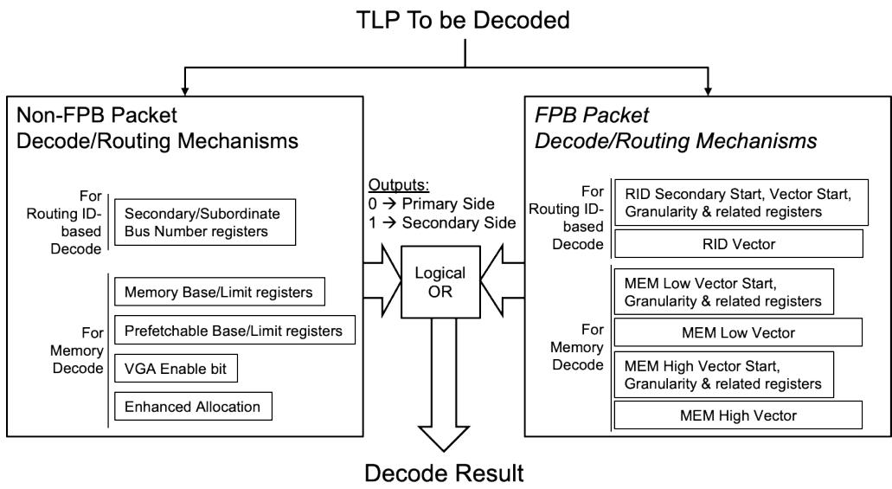

It is important to recognize that, although FPB adds additional ways for a specific bridge to decode a given TLP, FPB does not change anything about the fundamental ways that bridges operate within the Switch and Root Complex architectural structures. FPB uses the same architectural concepts to provide management mechanisms for three different resource types:

1. Routing IDs
2. Memory below 4 GB ("MEM Low")
3. Memory above 4 GB ("MEM High")

A hardware implementation of FPB is permitted to support any combination of these three mechanisms. For each mechanism, FPB uses a bit-vector to indicate, for a specific subset range of the selected resource type, if resources within that range are associated with the Primary or Secondary side of the FPB. Hardware implementations are permitted to implement a small range of sizes for these vectors, and system firmware/software is enabled to make the most effective use of the available vector by selecting an initial offset at which the vector is applied, and a granularity for the individual bits within the vector to indicate the size of the resource range to which the bits in a given vector apply.

The following rules apply when any of the FPB mechanisms are used:

- If system software violates any of the rules concerning FPB, the hardware behavior is undefined.
- It is permitted to implement FPB in any PCI bridge (Type 1) Function, and every Function that implements FPB must implement the FPB Capability (see § Section 7.8.11 ).
- If a Switch implements FPB then the Upstream Port and all Downstream Ports of the Switch must implement FPB.
- Software is permitted to enable FPB at some Switch Ports and not others.
- A Root Complex is permitted to implement FPB on some Root Ports but not on others.

---

<<<PAGE_BREAK>>> page_851
<<<PAGE_BREAK>>> page_852
<<<PAGE_BREAK>>> page_853
<<<PAGE_BREAK>>> page_854
<<<PAGE_BREAK>>> page_855
<<<PAGE_BREAK>>> page_856
<<<PAGE_BREAK>>> page_857
<<<PAGE_BREAK>>> page_858
<<<PAGE_BREAK>>> page_859
<<<PAGE_BREAK>>> page_860
<<<PAGE_BREAK>>> page_861
<<<PAGE_BREAK>>> page_862
<<<PAGE_BREAK>>> page_863
<<<PAGE_BREAK>>> page_864
<<<PAGE_BREAK>>> page_865


---

<a id="sec-6-26-2"></a>
## 6.26.2 Hardware and Software Requirements | 硬件与软件要求


<div style="overflow-x: auto; max-width: 100%;">
<table>
<thead>
<tr>
<th width="50%">🇬🇧 English</th>
<th width="50%" style="background-color:#e8e8e8">🇨🇳 中文</th>
</tr>
</thead>
<tbody>
<tr>
<td>

- A Type 1 Function is permitted to implement the FPB mechanisms applying to any one, two or three of these elemental mechanisms:
  - Routing IDs (RID)
  - Memory below 4 GB ("MEM Low")
  - Memory above 4 GB ("MEM High")
- System software is permitted to enable any combination (including all or none) of the elemental mechanisms supported by a specific FPB.
- The error handling and reporting mechanisms, except where explicitly modified in this section, are unaffected by FPB.
- Following any reset of the FPB Function, the FPB hardware must Clear all bits in all implemented vectors.
- Once enabled (through the FPB RID Decode Mechanism Enable, FPB MEM Low Decode Mechanism Enable, and/or FPB MEM High Decode Mechanism Enable bits), if system software subsequently disables an FPB mechanism, the values of the entries in the associated vector are undefined, and if system software subsequently re-enables that FPB mechanism the FPB hardware must Clear all bits in the associated vector.
- If an FPB is implemented with the No_Soft_Reset bit Clear, when that FPB is cycled through D0→D3Hot→D0, then all FPB mechanisms must be disabled, and the FPB must Clear all bits in all implemented vectors.
- If an FPB is implemented with the No_Soft_Reset bit Set, when that FPB is cycled through D0→D3Hot→D0, then all FPB configuration state must not change, and the entries in the FPB vectors must be retained by hardware.
- Hardware is not required to perform any type of bounds checking on FPB calculations, and system software must ensure that the FPB parameters are correctly programmed
  - It is explicitly permitted for system software to program Vector Start values that cause the higher order bits of the corresponding vector to surpass the resource range associated with a given FPB, but in these cases system software must ensure that those higher order bits of the vector are Clear.
  - Examples of errors that system software must avoid include duplication of resource allocation, combinations of start offsets with set vector bits that could create "wrap-around" or bounds errors

</td>
<td style="background-color:#e8e8e8">

- Type 1 Function 允许实现适用于以下任意一个、两个或三个基本机制的 FPB 机制:
  - 路由 ID (Routing ID, RID)
  - 4 GB 以下内存 ("MEM Low")
  - 4 GB 以上内存 ("MEM High")
- 系统软件允许启用特定 FPB 所支持的基本机制的任意组合(包括全部启用或全部禁用)。
- 错误处理与报告机制,除非本节有明确修改,否则不受 FPB 影响。
- 在 FPB Function 的任何复位之后,FPB 硬件必须清除 (Clear) 所有已实现向量中的所有位。
- 一旦启用(通过 FPB RID Decode Mechanism Enable、FPB MEM Low Decode Mechanism Enable 和/或 FPB MEM High Decode Mechanism Enable 位),如果系统软件随后禁用某个 FPB 机制,则相关向量中各条目的值未定义;若系统软件随后重新启用该 FPB 机制,则 FPB 硬件必须清除 (Clear) 相关向量中的所有位。
- 若 FPB 在 No_Soft_Reset 位 Clear 的情况下实现,则当该 FPB 经过 D0→D3Hot→D0 循环时,所有 FPB 机制必须被禁用,且 FPB 必须清除 (Clear) 所有已实现向量中的所有位。
- 若 FPB 在 No_Soft_Reset 位 Set 的情况下实现,则当该 FPB 经过 D0→D3Hot→D0 循环时,所有 FPB 配置状态必须保持不变,且 FPB 向量中的条目必须由硬件保留。
- 硬件无需对 FPB 计算执行任何类型的边界检查,系统软件必须确保 FPB 参数的正确编程
  - 明确允许系统软件对 Vector Start 字段进行编程,使得相应向量的高位超出与给定 FPB 关联的资源范围;但在这种情况下,系统软件必须确保向量的这些高位被 Clear。
  - 系统软件必须避免的错误示例包括:资源分配重复、起始偏移与已设置的向量位的组合可能导致"回绕"(wrap-around)或边界错误

</td>
</tr>
</tbody>
</table>
</div>


[⬆️ 返回目录](#-本章目录-table-of-contents)

---

<<<PAGE_BREAK>>> page_867

<a id="sec-6-26-2-fpb-rid"></a>
## 6.26.2 (续) FPB RID 机制规则 | FPB RID Mechanism Rules

table>
<thead>
<tr>
<th width="50%">🇬🇧 English</th>
<th width="50%" style="background-color:#e8e8e8">🇨🇳 中文</th>
</tr>
</thead>
<tbody>
<tr>
<td>

The following rules apply to the FPB Routing ID (RID) mechanism:

- FPB hardware must consider a specific range of RIDs to be associated with the Secondary side of the FPB if the Bus Number portion falls within the Bus Number range indicated by the values programmed in the Secondary and Subordinate Bus Number registers logically OR'd with the value programmed into the corresponding entry in the FPB RID Vector.
- System software must configure the Configuration Request Type 1 to Type 0 conversion mechanisms in a Bridge Function before attempting to pass Configuration Requests through that Bridge.
- System software must either program the legacy and FPB mechanisms for Configuration Request Type 1 to Type 0 conversion in a Bridge Function such that they give identical results, or such that one of the two mechanisms is disabled.
  - If it is intended to use only the FPB RID mechanism for BDF decoding, then system software must ensure that both the Secondary and Subordinate Bus Number registers are 0.
  - If it is intended to enable the FPB RID Decode Mechanism, but to use only the legacy mechanism for Configuration Request Type 1 to Type 0 conversion, then system software must write bits 7:3 of the RID Secondary Start field to 0 0000b.
- System software must ensure that the FPB routing mechanisms are configured such that Configuration Requests targeting Functions Secondary side of the FPB will be routed by the FPB from the Primary to Secondary side of the FPB.

When ARI is not enabled, the FPB RID mechanism can be applied with different granularities, programmable by system software through the FPB RID Vector Granularity field in the FPB RID Vector Control 1 Register. Figure 6-32 illustrates the relationships between the layout of RIDs and the supported granularities. The reader may find it helpful to refer to this figure when considering the requirements defined below and in the definition of the Flattening Portal Bridge (FPB) Capability (see § Section 7.8.6).

- System software must program the FPB RID Vector Granularity and FPB RID Vector Start fields in the FPB RID Vector Control 1 Register per the constraints described in the descriptions of those fields.
- For all FPBs other than those associated with Upstream Ports of Switches:
  - When ARI Forwarding is not supported, or when the ARI Forwarding Enable bit in the Device Control 2 Register is Clear, FPB hardware must convert a Type 1 Configuration Request received on the Primary side of the FPB to a Type 0 Configuration Request on the Secondary side of the FPB when bits 15:3 of the Routing ID of the Type 1 Configuration Request matches the value in the RID Secondary Start field in the FPB RID Vector Control 2 Register, and system software must configure the FPB accordingly.
  - When the ARI Forwarding Enable bit in the Device Control 2 Register is Set, FPB hardware must convert a Type 1 Configuration Request received on the Primary side of the FPB to a Type 0 Configuration Request on the Secondary side of the FPB when the Bus Number portion of the Routing ID of the Type 1 Configuration Request matches the value in the Bus Number address (bits 15:8 only) of the RID Secondary Start field in the FPB RID Vector Control 2 Register, and system software must configure the FPB accordingly.

</td>
<td style="background-color:#e8e8e8">

以下规则适用于 FPB 路由 ID (Routing ID, RID) 机制:

- 当 Bus Number 部分落在由 Secondary 和 Subordinate Bus Number 寄存器中所编程的值(逻辑上与 FPB RID Vector 中相应条目所编程的值进行 OR 运算)所指示的 Bus Number 范围内时,FPB 硬件必须将该特定范围的 RID 视为与 FPB 的 Secondary 端相关联。
- 系统软件必须在尝试通过 Bridge Function 传递 Configuration Request 之前,先配置该 Bridge Function 中 Configuration Request Type 1 到 Type 0 的转换机制。
- 系统软件必须将 Bridge Function 中 Configuration Request Type 1 到 Type 0 转换的传统机制和 FPB 机制编程为给出相同结果,或将其中一种机制禁用。
  - 若打算仅使用 FPB RID 机制进行 BDF 解码,则系统软件必须确保 Secondary 和 Subordinate Bus Number 寄存器均为 0。
  - 若打算启用 FPB RID Decode Mechanism,但仅使用传统机制进行 Configuration Request Type 1 到 Type 0 的转换,则系统软件必须将 RID Secondary Start 字段的 bits 7:3 写入 0 0000b。
- 系统软件必须确保 FPB 路由机制的配置使得以 FPB Secondary 端 Function 为目标的 Configuration Request 将由 FPB 从 Primary 端路由至 Secondary 端。

当 ARI 未启用时,FPB RID 机制可以以不同的粒度应用,粒度可由系统软件通过 FPB RID Vector Control 1 Register 中的 FPB RID Vector Granularity 字段进行编程。Figure 6-32 展示了 RID 的布局与所支持粒度之间的关系。读者在考虑下文以及 Flattening Portal Bridge (FPB) Capability 定义(参见 § Section 7.8.6)中所定义的需求时,参考此图可能会有所帮助。

- 系统软件必须根据字段描述中的约束,编程 FPB RID Vector Control 1 Register 中的 FPB RID Vector Granularity 和 FPB RID Vector Start 字段。
- 对于与 Switch 上游端口 (Upstream Port) 无关的所有 FPB:
  - 当不支持 ARI Forwarding,或 Device Control 2 Register 中的 ARI Forwarding Enable 位为 Clear 时,当 Type 1 Configuration Request 的 Routing ID 的 bits 15:3 与 FPB RID Vector Control 2 Register 中 RID Secondary Start 字段的值相匹配时,FPB 硬件必须将在 FPB Primary 端接收到的 Type 1 Configuration Request 转换为 FPB Secondary 端的 Type 0 Configuration Request,且系统软件必须相应地配置 FPB。
  - 当 Device Control 2 Register 中的 ARI Forwarding Enable 位为 Set 时,当 Type 1 Configuration Request 的 Routing ID 中的 Bus Number 部分与 FPB RID Vector Control 2 Register 中 RID Secondary Start 字段的 Bus Number 地址(仅 bits 15:8)的值相匹配时,FPB 硬件必须将在 FPB Primary 端接收到的 Type 1 Configuration Request 转换为 FPB Secondary 端的 Type 0 Configuration Request,且系统软件必须相应地配置 FPB。

</td>
</tr>
</tbody>
</table>

> **Figure 6-32.** Routing IDs (RIDs) and Supported Granularities
> 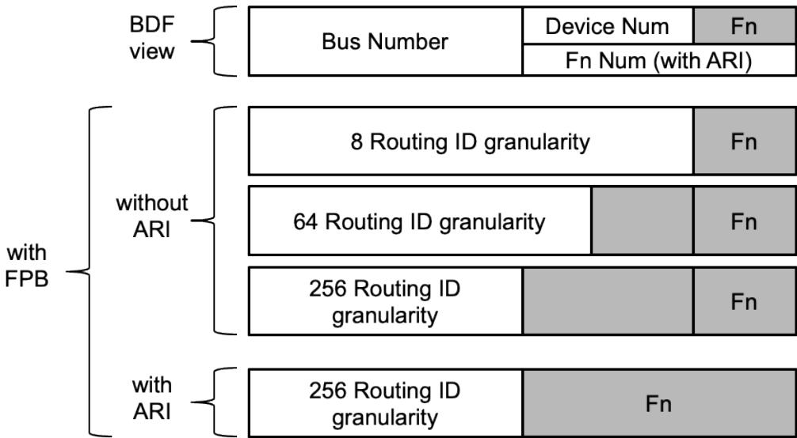

[⬆️ 返回目录](#-本章目录-table-of-contents)

---

<<<PAGE_BREAK>>> page_868

<a id="sec-6-26-2-fpb-switch"></a>
## 6.26.2 (续) Switch 上游端口相关 FPB 规则 | FPB Rules for Switch Upstream Ports


<div style="overflow-x: auto; max-width: 100%;">
<table>
<thead>
<tr>
<th width="50%">🇬🇧 English</th>
<th width="50%" style="background-color:#e8e8e8">🇨🇳 中文</th>
</tr>
</thead>
<tbody>
<tr>
<td>

- For FPBs associated with Upstream Ports of Switches only, when the FPB RID Decode Mechanism Enable bit is Set, FPB hardware must use the FPB Num Sec Dev field of the FPB Capabilities register to indicate the quantity of Device Numbers associated with the Secondary Side of the Upstream Port bridge, which must be used by the FPB in addition to the RID Secondary Start field in the FPB RID Vector Control 2 Register to determine when a Configuration Request received on the Primary side of the FPB targets one of the Downstream Ports of the Switch, determining in effect when such a Request must be converted from a Type 1 Configuration Request to a Type 0 Configuration Request, and system software must configure the FPB appropriately.
  - System software configuring FPB must comprehend that the logical internal structure of a Switch will change depending on the value of the FPB RID Decode Mechanism Enable bit in the Upstream Port of a Switch.
  - Downstream Ports must use their corresponding RID values, and their Requester IDs and Completer IDs, as determined by the Upstream Port's FPB Num Sec Dev and RID Secondary Start values
  - All implemented Functions in the range determined by the Switch Upstream Port Function's RID Secondary Start and FPB Num Sec Dev must be Switch Downstream Ports associated with that Switch Upstream Port; System Software is required to scan all Functions in this range to determine which are implemented.
  - It is strongly recommended that System Software assign the RID Secondary Start such that the Bus and Device Numbers are not the same as for the Switch Upstream Port; otherwise, the resulting hardware behavior is undefined.
- For FPBs associated with Upstream Ports of Switches only, hardware must comprehend that Configuration Requests targeting the Upstream Port itself and any Downstream Ports of the Switch flattened into the range of Function Numbers with the same Bus and Device Numbers as the Upstream Port itself will be converted from Type 1 to Type 0 by the Downstream Port above the Switch, but any other Downstream Ports of the Switch flattened into successive Device Numbers will not be converted from Type1 to Type0 by the Downstream Port above the Switch and so must effectively be converted from Type 1 to Type 0 by the Switch Upstream Port itself.

This is a special case, but the concept is not unique to FPB, and is a reflection of the definition of the relationship between Bus/Device Numbers and Function Numbers – Function Numbers are always determined by the hardware of the Upstream Port, whereas the Bus and Device Numbers for an Upstream Port are always determined by the Downstream Port immediately above the Upstream Port.

- FPBs must implement bridge mapping for INTx virtual wires (see § Section 2.2.8.1)
- Hardware and software must apply this algorithm (or the logical equivalent) to determine which entry in the FPB RID Vector applies to a given Routing ID (RID) address:
  - IF the RID is below the value of FPB RID Vector Start, then the RID is out of range (below the start) and so cannot be associated with the Secondary side of the bridge, ELSE
  - calculate the offset within the vector by first subtracting the value of FPB RID Vector Start, then dividing this according to the value of FPB RID Vector Granularity to determine the bit index within the vector.
  - IF the bit index value is greater than the length indicated by FPB RID Vector Size Supported, then the RID is out of range (beyond the top of the range covered by the vector) and so cannot be associated with the Secondary side of the bridge, ELSE
  - if the bit value within the vector at the calculated bit index location is 1b, THEN the RID address is associated with the Secondary side of the bridge, ELSE the RID address is associated with the Primary side of the bridge.

</td>
<td style="background-color:#e8e8e8">

- 仅对于与 Switch 上游端口 (Upstream Port) 关联的 FPB,当 FPB RID Decode Mechanism Enable 位为 Set 时,FPB 硬件必须使用 FPB Capabilities Register 中的 FPB Num Sec Dev 字段来指示与 Upstream Port 桥的 Secondary 端相关联的 Device Number 数量;该数量必须与 FPB RID Vector Control 2 Register 中的 RID Secondary Start 字段一起被 FPB 用于判断:何时在 FPB Primary 端接收到的 Configuration Request 目标是 Switch 的某个 Downstream Port,即实际上何时必须将该 Request 从 Type 1 Configuration Request 转换为 Type 0 Configuration Request;且系统软件必须适当配置 FPB。
  - 配置 FPB 的系统软件必须理解:Switch 的逻辑内部结构会随 Switch 上游端口中 FPB RID Decode Mechanism Enable 位的值而变化。
  - Downstream Port 必须使用其对应的 RID 值,以及其 Requester ID 和 Completer ID,这些值由 Upstream Port 的 FPB Num Sec Dev 和 RID Secondary Start 值确定
  - 在由 Switch 上游端口 Function 的 RID Secondary Start 和 FPB Num Sec Dev 所确定的范围内的所有已实现 Function,必须是与该 Switch 上游端口相关联的 Switch Downstream Port;系统软件需要扫描此范围内的所有 Function 以确定哪些已实现。
  - 强烈建议系统软件分配 RID Secondary Start 时,使 Bus 和 Device Number 与 Switch 上游端口的不同;否则,产生的硬件行为未定义。
- 仅对于与 Switch 上游端口关联的 FPB,硬件必须理解:针对 Upstream Port 自身以及被扁平化 (flatten) 到与 Upstream Port 自身具有相同 Bus 和 Device Number 的 Function Number 范围内的 Switch 的任何 Downstream Port 的 Configuration Request,将由 Switch 上方的 Downstream Port 从 Type 1 转换为 Type 0;但被扁平化到连续 Device Number 内的 Switch 的任何其他 Downstream Port 将不会被 Switch 上方的 Downstream Port 从 Type 1 转换为 Type 0,因此必须实际上由 Switch 上游端口自身将其从 Type 1 转换为 Type 0。

这是一种特殊情况,但该概念并非 FPB 所独有,而是 Bus/Device Number 与 Function Number 之间关系定义的反映 —— Function Number 始终由 Upstream Port 的硬件确定,而 Upstream Port 的 Bus 和 Device Number 始终由 Upstream Port 正上方的 Downstream Port 确定。

- FPB 必须为 INTx 虚拟线实现桥映射(参见 § Section 2.2.8.1)
- 硬件和软件必须应用以下算法(或其逻辑等价物)来确定 FPB RID Vector 中哪个条目适用于给定的路由 ID (Routing ID, RID) 地址:
  - 如果 RID 低于 FPB RID Vector Start 的值,则该 RID 超出范围(低于起始),因此不能与桥的 Secondary 端相关联,否则
  - 通过首先减去 FPB RID Vector Start 的值,然后根据 FPB RID Vector Granularity 的值进行除法,以计算向量中的偏移量,从而确定向量内的位索引。
  - 如果位索引值大于 FPB RID Vector Size Supported 所指示的长度,则该 RID 超出范围(超过向量所覆盖范围的顶部),因此不能与桥的 Secondary 端相关联,否则
  - 如果向量中计算出的位索引位置的位值为 1b,则该 RID 地址与桥的 Secondary 端相关联,否则该 RID 地址与桥的 Primary 端相关联。

</td>
</tr>
</tbody>
</table>
</div>


[⬆️ 返回目录](#-本章目录-table-of-contents)

---

<<<PAGE_BREAK>>> page_869

<a id="sec-6-26-2-fpb-mem-low"></a>
## 6.26.2 (续) FPB MEM Low 机制规则 | FPB MEM Low Mechanism Rules

table>
<thead>
<tr>
<th width="50%">🇬🇧 English</th>
<th width="50%" style="background-color:#e8e8e8">🇨🇳 中文</th>
</tr>
</thead>
<tbody>
<tr>
<td>

The following rules apply to the FPB MEM Low mechanism:

The FPB MEM Low mechanism can be applied with different granularities, programmable by system software through the FPB MEM Low Vector Granularity field in the FPB MEM Low Vector Control Register. Figure 6-33 illustrates the relationships between the layout of addresses in the memory address space below 4 GB to which the FPB MEM Low mechanism applies. The reader may find it helpful to refer to this figure when considering the requirements defined below and in the definition of the Flattening Portal Bridge (FPB) Capability (see § Section 7.8.11).

- System software must program the FPB MEM Low Vector Granularity and FPB MEM Low Vector Start fields in the FPB MEM Low Vector Control Register per the constraints described in the descriptions of those fields.
- FPB hardware must consider a specific Memory address to be associated with the Secondary side of the FPB if that Memory address falls within any of the ranges indicated by the values programmed in other bridge Memory decode registers (enumerated below) logically OR'd with the value programmed into the corresponding entry in the FPB MEM Low Vector. Other bridge Memory decode registers include:
  - Memory Base/Limit registers
  - Prefetchable Base/Limit registers
  - VGA Enable bit in the Bridge Control Register
  - Enhanced Allocation (EA) Capability (if supported)
  - FPB MEM High mechanism (if supported and enabled)
- Hardware and software must apply this algorithm (or the logical equivalent) to determine which entry in the FPB MEM Low Vector applies to a given Memory address:
  - If the Memory address is below the value of FPB MEM Low Vector Start, then the Memory address is out of range (below) and so is not associated with the Secondary side of the bridge by means of this mechanism, else
  - calculate the offset within the vector by first subtracting the value of FPB MEM Low Vector Start, then dividing this according to the value of FPB MEM Low Vector Granularity to determine the bit index within the vector.
  - If the bit index value is greater than the length indicated by FPB MEM Low Vector Size Supported, then the Memory address is out of range (above) and so is not associated with the Secondary side of the bridge by means of this mechanism, else
  - if the bit value within the vector at the calculated bit index location is 1b, then the Memory address is associated with the Secondary side of the bridge, else the Memory address is associated with the Primary side of the bridge.

</td>
<td style="background-color:#e8e8e8">

以下规则适用于 FPB MEM Low 机制:

FPB MEM Low 机制可以以不同的粒度应用,粒度可由系统软件通过 FPB MEM Low Vector Control Register 中的 FPB MEM Low Vector Granularity 字段进行编程。Figure 6-33 展示了 FPB MEM Low 机制所应用的 4 GB 以下内存地址空间中地址布局之间的关系。读者在考虑下文以及 Flattening Portal Bridge (FPB) Capability 定义(参见 § Section 7.8.11)中所定义的需求时,参考此图可能会有所帮助。

- 系统软件必须根据字段描述中的约束,编程 FPB MEM Low Vector Control Register 中的 FPB MEM Low Vector Granularity 和 FPB MEM Low Vector Start 字段。
- 如果某个内存地址落在由其他桥 Memory 解码寄存器(下文枚举)中所编程的值(逻辑上与 FPB MEM Low Vector 中相应条目所编程的值进行 OR 运算)所指示的任意范围内,则 FPB 硬件必须将该特定内存地址视为与 FPB 的 Secondary 端相关联。其他桥 Memory 解码寄存器包括:
  - Memory Base/Limit 寄存器
  - Prefetchable Base/Limit 寄存器
  - Bridge Control Register 中的 VGA Enable 位
  - Enhanced Allocation (EA) 能力(若支持)
  - FPB MEM High 机制(若支持且已启用)
- 硬件和软件必须应用以下算法(或其逻辑等价物)来确定 FPB MEM Low Vector 中哪个条目适用于给定的内存地址:
  - 如果内存地址低于 FPB MEM Low Vector Start 的值,则该内存地址超出范围(低于),因此不通过此机制与桥的 Secondary 端相关联,否则
  - 通过首先减去 FPB MEM Low Vector Start 的值,然后根据 FPB MEM Low Vector Granularity 的值进行除法,以计算向量中的偏移量,从而确定向量内的位索引。
  - 如果位索引值大于 FPB MEM Low Vector Size Supported 所指示的长度,则该内存地址超出范围(高于),因此不通过此机制与桥的 Secondary 端相关联,否则
  - 如果向量中计算出的位索引位置的位值为 1b,则该内存地址与桥的 Secondary 端相关联,否则该内存地址与桥的 Primary 端相关联。

</td>
</tr>
</tbody>
</table>

> **Figure 6-33.** Addresses in Memory Below 4 GB and Effect of Granularity
> 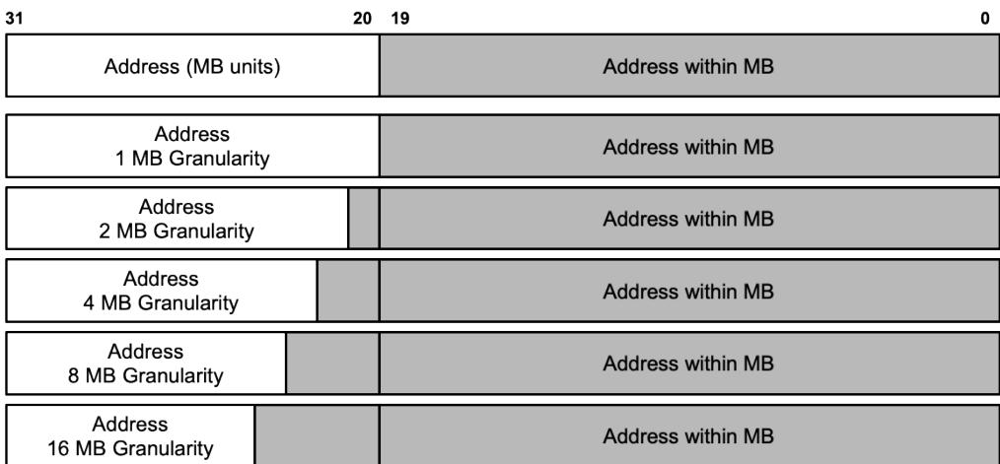

[⬆️ 返回目录](#-本章目录-table-of-contents)

---

<<<PAGE_BREAK>>> page_870

<a id="sec-6-26-2-fpb-mem-high"></a>
## 6.26.2 (续) FPB MEM High 机制规则 | FPB MEM High Mechanism Rules


<div style="overflow-x: auto; max-width: 100%;">
<table>
<thead>
<tr>
<th width="50%">🇬🇧 English</th>
<th width="50%" style="background-color:#e8e8e8">🇨🇳 中文</th>
</tr>
</thead>
<tbody>
<tr>
<td>

The following rules apply to the FPB MEM High mechanism:

- System software must program the FPB MEM High Vector Granularity and FPB MEM High Vector Start Lower fields in the FPB MEM High Vector Control 1 Register per the constraints described in the descriptions of those fields.
- FPB hardware must consider a specific Memory address to be associated with the Secondary side of the FPB if that Memory address falls within any of the ranges indicated by the values programmed in other bridge Memory decode registers (enumerated below) logically OR'd with the value programmed into the corresponding entry in the FPB MEM High Vector. Other bridge Memory decode registers include:
  - Memory Base/Limit registers
  - Prefetchable Base/Limit registers
  - VGA Enable bit in the Bridge Control Register
  - Enhanced Allocation (EA) Capability (if supported)
  - FPB MEM Low mechanism (if supported and enabled)
- Hardware and software must apply this algorithm to determine which entry in the FPB MEM High Vector applies to a given Memory address:
  - If the Memory address is below the value of FPB MEM High Vector Start Upper/FPB MEM High Vector Start Lower, then the Memory address is out of range (below) and so is not associated with the Secondary side of the bridge by means of this mechanism, else
  - calculate the offset within the vector by first subtracting the value of FPB MEM High Vector Start Upper/FPB MEM High Vector Start Lower, then dividing this according to the value of FPB MEM High Vector Granularity to determine the bit index within the vector.
  - If the bit index value is greater than the length indicated by FPB MEM High Vector Size Supported, then the Memory address is out of range (above) and so is not associated with the Secondary side of the bridge by means of this mechanism, else
  - if the bit value within the vector at the calculated bit index location is 1b, then the Memory address is associated with the Secondary side of the bridge, else the Memory address is associated with the Primary side of the bridge.

</td>
<td style="background-color:#e8e8e8">

以下规则适用于 FPB MEM High 机制:

- 系统软件必须根据字段描述中的约束,编程 FPB MEM High Vector Control 1 Register 中的 FPB MEM High Vector Granularity 和 FPB MEM High Vector Start Lower 字段。
- 如果某个内存地址落在由其他桥 Memory 解码寄存器(下文枚举)中所编程的值(逻辑上与 FPB MEM High Vector 中相应条目所编程的值进行 OR 运算)所指示的任意范围内,则 FPB 硬件必须将该特定内存地址视为与 FPB 的 Secondary 端相关联。其他桥 Memory 解码寄存器包括:
  - Memory Base/Limit 寄存器
  - Prefetchable Base/Limit 寄存器
  - Bridge Control Register 中的 VGA Enable 位
  - Enhanced Allocation (EA) 能力(若支持)
  - FPB MEM Low 机制(若支持且已启用)
- 硬件和软件必须应用以下算法来确定 FPB MEM High Vector 中哪个条目适用于给定的内存地址:
  - 如果内存地址低于 FPB MEM High Vector Start Upper/FPB MEM High Vector Start Lower 的值,则该内存地址超出范围(低于),因此不通过此机制与桥的 Secondary 端相关联,否则
  - 通过首先减去 FPB MEM High Vector Start Upper/FPB MEM High Vector Start Lower 的值,然后根据 FPB MEM High Vector Granularity 的值进行除法,以计算向量中的偏移量,从而确定向量内的位索引。
  - 如果位索引值大于 FPB MEM High Vector Size Supported 所指示的长度,则该内存地址超出范围(高于),因此不通过此机制与桥的 Secondary 端相关联,否则
  - 如果向量中计算出的位索引位置的位值为 1b,则该内存地址与桥的 Secondary 端相关联,否则该内存地址与桥的 Primary 端相关联。

</td>
</tr>
</tbody>
</table>
</div>


[⬆️ 返回目录](#-本章目录-table-of-contents)

---

<<<PAGE_BREAK>>> page_871

<a id="sec-6-26-2-impl-note-fpb-decoding"></a>
## 6.26.2 (续) 实现说明:FPB 地址解码 | IMPLEMENTATION NOTE: FPB ADDRESS DECODING

table>
<thead>
<tr>
<th width="50%">🇬🇧 English</th>
<th width="50%" style="background-color:#e8e8e8">🇨🇳 中文</th>
</tr>
</thead>
<tbody>
<tr>
<td>

**IMPLEMENTATION NOTE:**
**FPB ADDRESS DECODING**

FPB uses a bit vector mechanism to decode ranges of Routing IDs, and Memory Addresses above and below 4 GB. A bridge supporting FPB contains the following for each resource type/range where it supports the use of FPB:

- A Bit vector
- A Start Address
- A Granularity

These are used by the bridge to determine if a given address is part of the range decoded by FPB as associated with the secondary side of the bridge. An address that is determined not to be associated with the secondary side of the bridge using either or both of the non-FPB decode mechanisms and the FPB decode mechanisms is (by default) associated with the primary side of the bridge. Here, when we use the term "associated" we mean, for example, that the bridge will apply the following handling to TLPs:

- Associated with Primary, Received at Primary → Unsupported Request (UR)
- Associated with Primary, Received at Secondary → Forward upstream
- Associated with Secondary, Received at Primary → Forward downstream
- Associated with Secondary, Received at Secondary → Unsupported Request (UR)

In FPB, every bit in the vector represents a range of resources, where the size of that range is determined by the selected granularity. If a bit in the vector is Set, it indicates that TLPs addressed to an address within the corresponding range are to be associated with the secondary side of the bridge. The specific range of resources each bit represents is dependent on the index of that bit, and the values in the Start Address & Granularity. The Start Address indicates the lowest address described by the bit vector. The Granularity indicates the size of the region that is represented by each bit. Each successive bit in the vector applies to the subsequent range, increasing with each bit according to the Granularity.

For example, consider a bridge using FPB to describe a MEM Low range. FPB MEM Low Vector Start has been set to FC0h, indicating that the range described by the bit vector starts at address FC00 0000. FPB MEM Low Vector Granularity has been set to 0000b, indicating that each bit represents a 1 MB range.

From these values we can determine that bit 0 of the vector represents a 1MB range starting at FC000 0000 (FC00 0000-FC0F FFFF), bit 1 represents FC10 0000-FC1F FFFF, etc.

Bits in the vector that are set to 0 indicate that the range is not included in the range described by FPB. In the above example, If bit 0 is Clear, packets addressed to anywhere between FC00 0000 and FC0F FFFF should not be routed to the secondary bus of the bridge due to FPB.

</td>
<td style="background-color:#e8e8e8">

**实现说明:**
**FPB 地址解码**

FPB 使用位向量机制来解码路由 ID (Routing ID) 范围以及 4 GB 以上和以下的内存地址。支持 FPB 的桥在其支持使用 FPB 的每个资源类型/范围中包含以下内容:

- 一个位向量 (Bit Vector)
- 一个起始地址 (Start Address)
- 一个粒度 (Granularity)

桥使用这些来确定给定地址是否属于由 FPB 解码为与桥的 secondary 端相关联的范围。通过非 FPB 解码机制和 FPB 解码机制(任一或两者)被确定为不与桥的 secondary 端相关联的地址,默认情况下与桥的 primary 端相关联。此处当我们使用"关联"(associated)一词时,我们的意思是,例如,桥将对 TLP 应用以下处理:

- 与 Primary 关联,在 Primary 接收 → Unsupported Request (UR)
- 与 Primary 关联,在 Secondary 接收 → 向上游转发 (Forward upstream)
- 与 Secondary 关联,在 Primary 接收 → 向下游转发 (Forward downstream)
- 与 Secondary 关联,在 Secondary 接收 → Unsupported Request (UR)

在 FPB 中,向量中的每一位代表一个资源范围,该范围的大小由所选粒度决定。如果向量中的某位被 Set,则表示寻址到相应范围内地址的 TLP 将与桥的 secondary 端相关联。每一位所代表的特定资源范围取决于该位的索引,以及 Start Address 和 Granularity 中的值。Start Address 指示位向量所描述的最低地址。Granularity 指示每个位所表示区域的大小。向量中的每个后续位适用于随后的范围,根据 Granularity 随每个位递增。

例如,考虑使用 FPB 描述 MEM Low 范围的桥。FPB MEM Low Vector Start 已被设置为 FC0h,表示位向量所描述的范围从地址 FC00 0000 开始。FPB MEM Low Vector Granularity 已被设置为 0000b,表示每个位代表 1 MB 范围。

根据这些值我们可以确定:向量的 bit 0 代表从 FC000 0000 (FC00 0000-FC0F FFFF) 开始的 1 MB 范围,bit 1 代表 FC10 0000-FC1F FFFF,依此类推。

向量中被设置为 0 的位表示该范围未包含在 FPB 所描述的范围内。在上述示例中,如果 bit 0 被 Clear,则寻址到 FC00 0000 至 FC0F FFFF 之间任何地址的报文不应由于 FPB 而被路由到桥的 secondary 总线。

</td>
</tr>
</tbody>
</table>

[⬆️ 返回目录](#-本章目录-table-of-contents)

---

<<<PAGE_BREAK>>> page_872

<a id="sec-6-26-2-impl-note-hw-sw"></a>
## 6.26.2 (续) 实现说明:FPB 的硬件与软件考量 | IMPLEMENTATION NOTE: HARDWARE AND SOFTWARE CONSIDERATIONS FOR FPB


<div style="overflow-x: auto; max-width: 100%;">
<table>
<thead>
<tr>
<th width="50%">🇬🇧 English</th>
<th width="50%" style="background-color:#e8e8e8">🇨🇳 中文</th>
</tr>
</thead>
<tbody>
<tr>
<td>

**IMPLEMENTATION NOTE:**
**HARDWARE AND SOFTWARE CONSIDERATIONS FOR FPB**

FPB is intended to address a class of issues with PCI/PCIe architecture that relate to resource allocation inefficiency. These issues can be categorized as "static" or "dynamic" use case scenarios, where static use cases refer to scenarios where resources are allocated at system boot and then typically not changed again, and dynamic use cases refer to scenarios where run-time resource rebalancing (e.g., allocation of new resources, freeing of resources no longer needed) is required, due to hot add/remove, or by other needs.

In the Static cases there are limits on the size of hierarchies and number of Endpoints due to the use of additional Bus Numbers and the lack of use of Device Numbers caused by the PCI/PCIe architectural definition for Switches and Downstream Ports. FPB addresses this class of problems by "flattening" the use of Routing IDs (RIDs) so that Switches and Downstream Ports are able to make more efficient use of the available RIDs.

For the Dynamic cases, without FPB, the "best known method" to avoid rebalancing has been to reserve large ranges of Bus Numbers and Memory Space in the bridge above the relevant Port or Endpoint such that hopefully any future needs can be satisfied within the pre-allocated ranges. This leads to potentially unused allocations, which makes the Routing ID issues worse, and in a resource constrained platform this approach is difficult to implement, even for relatively simple cases, where, for example, one might have an add-in card implementing a single Endpoint replaced by another add-in card that has a Switch and two Endpoints, so that although an initial allocation of just one Bus would have been sufficient, the initial allocation breaks immediately with the new add-in card.

For Memory Space the pre-allocation approach is problematic when hot-plugged Endpoints may require the allocation of Memory Space below 4 GB, which by its nature is a limited resource, which is quickly used up by pre-allocation of even relatively small amounts, and for which pre-allocation is unattractive because of the multiple system elements placing demands on system address space allocation below 4 GB.

FPB includes mechanisms to enable discontinuous resource range allocation/reallocation for both Requester IDs and Memory Space. The intent is to allow system software the ability to maintain resource "pools" which can be allocated (and freed back to) at run-time, without disrupting other operations in progress as is required with rebalancing.

To support the run time use of FPB by system software, FPB hardware implementations should avoid introducing stalls or other types of disruptions to transactions in flight, including during the times that system software is modifying the state of the FPB hardware. It is not, however, expected that hardware will attempt to identify cases where system software erroneously modifies the FPB configuration in a way that does affect transactions in flight. Just as with the non-FPB mechanisms, it is the responsibility of system software to ensure that system operation is not corrupted due to a reconfiguration operation.

It is not explicitly required that system firmware/software perform the enabling and/or disabling of FPB mechanisms in a particular sequence, however care should be taken to implement resource allocation operations in a hierarchy such that the hardware and software elements of the system are not corrupted or caused to fail.

</td>
<td style="background-color:#e8e8e8">

**实现说明:**
**FPB 的硬件与软件考量**

FPB 旨在解决与 PCI/PCIe 体系结构相关的、与资源分配效率低下相关的一类问题。这些问题可分为"静态"或"动态"用例场景,其中静态用例指在系统启动时分配资源后通常不再更改的场景,动态用例指由于热插拔 (hot add/remove) 或其他需求,需要进行运行时资源再平衡(例如,分配新资源,释放不再需要的资源)的场景。

在静态情况下,由于 PCI/PCIe 体系结构对 Switch 和 Downstream Port 的定义所导致的额外 Bus Number 的使用和 Device Number 的缺乏使用,层级的大小和 Endpoint 的数量存在限制。FPB 通过"扁平化"(flattening)路由 ID (Routing ID, RID) 的使用来解决此类问题,从而使 Switch 和 Downstream Port 能够更高效地利用可用的 RID。

对于动态情况,在没有 FPB 的情况下,避免再平衡的"最佳已知方法"是在相关 Port 或 Endpoint 上方的桥中预留大范围的 Bus Number 和内存空间 (Memory Space),以期任何未来的需求都能在预分配范围内得到满足。这会导致潜在的未使用分配,使路由 ID 问题更糟;在资源受限的平台上,这种方法难以实现,即使是相对简单的情况,例如,一张实现单个 Endpoint 的插卡被另一张具有 Switch 和两个 Endpoint 的插卡替换,因此尽管最初分配一个 Bus 即可满足需求,但初始分配会在新插卡出现时立即失效。

对于内存空间,当热插拔 Endpoint 可能需要分配 4 GB 以下的内存空间时,预分配方法存在问题,因为这种资源本质上是有限的,即使是相对较小的预分配量也会迅速耗尽;此外,由于多个系统元素对 4 GB 以下的系统地址空间分配有需求,因此预分配并不理想。

FPB 包含为 Requester ID 和内存空间启用不连续资源范围分配/再分配的机制。其目的是允许系统软件具备维护资源"池"的能力,这些资源池可以在运行时进行分配(并释放回去),而不会像再平衡那样干扰进行中的其他操作。

为了支持系统软件对 FPB 的运行时使用,FPB 硬件实现应避免对正在进行的 Transaction 引入停顿 (stall) 或其他类型的中断,包括在系统软件正在修改 FPB 硬件状态期间。然而,并不期望硬件尝试识别系统软件错误地修改 FPB 配置从而影响正在进行的 Transaction 的情况。与非 FPB 机制一样,系统软件有责任确保系统操作不会因重新配置操作而损坏。

并不明确要求系统固件/软件按特定顺序执行 FPB 机制的启用和/或禁用,但在层级中实现资源分配操作时应小心,以免系统的硬件和软件元素被损坏或导致故障。

</td>
</tr>
</tbody>
</table>
</div>


[⬆️ 返回目录](#-本章目录-table-of-contents)

---

<<<PAGE_BREAK>>> page_873

<a id="sec-6-27"></a>
## 6.27 Vital Product Data (VPD) | 重要产品数据 (VPD)

table>
<thead>
<tr>
<th width="50%">🇬🇧 English</th>
<th width="50%" style="background-color:#e8e8e8">🇨🇳 中文</th>
</tr>
</thead>
<tbody>
<tr>
<td>

Vital Product Data (VPD) is the information that uniquely defines items such as the hardware, software, and microcode elements of a system. The VPD provides the system with information on various FRUs (Field Replaceable Unit) including Part Number, Serial Number, and other detailed information. VPD also provides a mechanism for storing information such as performance and failure data on the device being monitored. The objective, from a system point of view, is to collect this information by reading it from the hardware, software, and microcode components.

Support of VPD within add-in cards is optional depending on the manufacturer. Though support of VPD is optional, add-in card manufacturers are encouraged to provide VPD due to its inherent benefits for the add-in card, system manufacturers, and for Plug and Play.

The mechanism for accessing VPD is documented in § Section 7.9.18.

VPD for PCI Express is unchanged from the definition in the [PCI-3.0]. That definition, in turn, was based on earlier versions of the [PCI] as well as the [PLUG-PLAY-ISA-1.0a].

Vital Product Data is made up of Small and Large Resource Data Types.

</td>
<td style="background-color:#e8e8e8">

重要产品数据 (Vital Product Data, VPD) 是唯一定义系统硬件、软件和微代码元素等信息的数据。VPD 向系统提供有关各种 FRU (现场可更换单元, Field Replaceable Unit) 的信息,包括部件号 (Part Number)、序列号 (Serial Number) 和其他详细信息。VPD 还提供一种机制,用于在被监控设备上存储性能和故障数据等信息。从系统的角度来看,目标是通过从硬件、软件和微代码组件中读取这些信息来收集它们。

插卡 (add-in card) 中对 VPD 的支持是可选的,具体取决于制造商。尽管 VPD 支持是可选的,但鉴于 VPD 对插卡、系统制造商以及即插即用 (Plug and Play) 的固有优势,鼓励插卡制造商提供 VPD。

访问 VPD 的机制在 § Section 7.9.18 中记录。

PCI Express 的 VPD 与 [PCI-3.0] 中的定义一致。该定义反过来又基于早期版本的 [PCI] 以及 [PLUG-PLAY-ISA-1.0a]。

重要产品数据由 Small (小型) 和 Large (大型) Resource Data Type 组成。

</td>
</tr>
</tbody>
</table>

**Table 6-19. Small Resource Data Type Tag Bit Definitions | 表 6-19. 小型资源数据类型标签位定义**

| Offset | Field Name | Value/Description |
|--------|------------|-------------------|
| Byte 0 | Value = 0xxx xyyyb | (Tag value) |
| Bit 7 | Small Resource Type | 0b |
| Bits 6:3 | Small Item Name | xxxx |
| Bits 2:0 | Length in bytes | yy |
| Bytes 1 to n | Actual information | (Data) |

**Table 6-20. Large Resource Data Type Tag Bit Definitions | 表 6-20. 大型资源数据类型标签位定义**

| Offset | Field Name | Value/Description |
|--------|------------|-------------------|
| Byte 0 | Value = 1xxx xxxxb | (Tag value) |
| Bit 7 | Large Resource Type | 1b |
| Bits 6:0 | Large Item Name | xxxxxxx |
| Byte 1 | Length in bytes of data items bits[7:0] (lsb) | (Length LSB) |
| Byte 2 | Length in bytes of data items bits[15:8] (msb) | (Length MSB) |
| Bytes 3 to n | Actual data items | (Data) |

[⬆️ 返回目录](#-本章目录-table-of-contents)

---

<a id="sec-6-27-vpd-intro"></a>
## 6.27 (续) VPD 标签与示例 | VPD Tags and Example


<div style="overflow-x: auto; max-width: 100%;">
<table>
<thead>
<tr>
<th width="50%">🇬🇧 English</th>
<th width="50%" style="background-color:#e8e8e8">🇨🇳 中文</th>
</tr>
</thead>
<tbody>
<tr>
<td>

The first VPD tag is the Identifier String (02h) and provides the product name of the device.

One VPD-R (10h) tag is used as a header for the read-only keywords. The VPD-R list (including tag and length) must checksum to zero. Attempts to write the read-only data will be executed as a no-op.

One VPD-W (11h) tag is used as a header for the read-write keywords. The storage component containing the read/write data is a non-volatile device that will retain the data when powered off.

The last tag must be the End Tag (0Fh).

A small example of the resource data type tags used in a typical VPD is shown in § Table 6-21.

</td>
<td style="background-color:#e8e8e8">

第一个 VPD 标签是 Identifier String (标识字符串, 02h),它提供设备的产品名称。

使用一个 VPD-R (10h) 标签作为只读关键字的头部。VPD-R 列表(包括 tag 和 length)必须校验和为零。尝试写入只读数据将作为 no-op(空操作)执行。

使用一个 VPD-W (11h) 标签作为读写关键字的头部。包含读/写数据的存储组件是非易失性设备,断电后将保留数据。

最后一个标签必须是 End Tag (结束标签, 0Fh)。

典型 VPD 中所用资源数据类型标签的小型示例如 § Table 6-21 所示。

</td>
</tr>
</tbody>
</table>
</div>


**Table 6-21. Resource Data Type Flags for a Typical VPD | 表 6-21. 典型 VPD 的资源数据类型标志**

| Tag | Type | Description |
|-----|------|-------------|
| TAG 02h | Large Resource Data Type | Identifier String (标识字符串) |
| TAG 10h | Large Resource Data Type | VPD-R list containing one or more VPD keywords (包含一个或多个 VPD 关键字的 VPD-R 列表) |
| TAG 11h | Large Resource Data Type | VPD-W list containing one or more VPD keywords (包含一个或多个 VPD 关键字的 VPD-W 列表) |
| TAG 0Fh | Small Resource Data Type | End Tag (结束标签) |

[⬆️ 返回目录](#-本章目录-table-of-contents)

---

<<<PAGE_BREAK>>> page_874

<a id="sec-6-27-1"></a>
## 6.27.1 VPD Format | VPD 格式

table>
<thead>
<tr>
<th width="50%">🇬🇧 English</th>
<th width="50%" style="background-color:#e8e8e8">🇨🇳 中文</th>
</tr>
</thead>
<tbody>
<tr>
<td>

Information fields within a VPD resource type consist of a three-byte header followed by some amount of data (see § Figure 6-34). The three-byte header contains a two-byte keyword and a one-byte length. A keyword is a two-character (ASCII) mnemonic that uniquely identifies the information in the field. The last byte of the header is binary and represents the length value (in bytes) of the data that follows.

```
7  6  5  4  3  2  1  0  +0   Keyword
7  6  5  4  3  2  1  0  +1   Keyword
7  6  5  4  3  2  1  0  +2   Length (N)
7  6  5  4  3  2  1  0  +3   Data (bytes 3 to N+2, figure shows N = 6)
                          Byte 0 →
                          Byte 4 →
                          Byte 8 →
```

Figure 6-34 VPD Format

VPD keywords are listed in two categories: read-only fields and read/write fields. Unless otherwise noted, keyword data fields are provided as ASCII characters. Use of ASCII allows keyword data to be moved across different enterprise computer systems without translation difficulty.

An example of the "add-in card serial number" VPD item is as follows:

</td>
<td style="background-color:#e8e8e8">

VPD 资源类型内的信息字段由一个三字节头部和随后的若干数据组成(参见 § Figure 6-34)。三字节头部包含一个两字节的 keyword (关键字) 和一个一字节的 length (长度)。关键字是一个两字符(ASCII)的助记符,用于唯一标识字段中的信息。头部的最后一个字节是二进制,表示后续数据的长度值(以字节为单位)。

```
7  6  5  4  3  2  1  0  +0   Keyword (关键字)
7  6  5  4  3  2  1  0  +1   Keyword (关键字)
7  6  5  4  3  2  1  0  +2   Length (长度, N)
7  6  5  4  3  2  1  0  +3   Data (数据, 字节 3 至 N+2,图中 N = 6)
                          Byte 0 →
                          Byte 4 →
                          Byte 8 →
```

Figure 6-34 VPD 格式

VPD 关键字分为两类:只读字段和读/写字段。除非另有说明,关键字数据字段以 ASCII 字符提供。ASCII 的使用允许关键字数据可在不同企业计算机系统之间传输而无需翻译。

"插卡序列号" (add-in card serial number) VPD 条目示例如下:

</td>
</tr>
</tbody>
</table>

> **Figure 6-34.** VPD Format
> 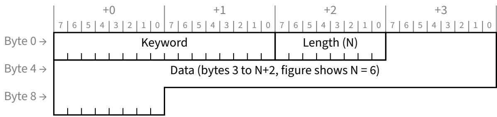

**Table 6-22. Example of Add-in Card Serial Number | 表 6-22. 插卡序列号示例**

| Byte | Value | Field | Description |
|------|-------|-------|-------------|
| Byte 0 | 53h "S" | Keyword: SN (第一个字符) | Keyword 第一个字符 'S' |
| Byte 1 | 4Eh "N" | Keyword: SN (第二个字符) | Keyword 第二个字符 'N' |
| Byte 3 | 08h | Length: 8 | 长度: 8 |
| Byte 4 | 30h "0" | Data: "00000194" | 数据字符 '0' |
| Byte 5 | 30h "0" | Data: "00000194" | 数据字符 '0' |
| Byte 6 | 30h "0" | Data: "00000194" | 数据字符 '0' |
| Byte 7 | 30h "0" | Data: "00000194" | 数据字符 '0' |
| Byte 8 | 30h "0" | Data: "00000194" | 数据字符 '0' |
| Byte 9 | 31h "1" | Data: "00000194" | 数据字符 '1' |
| Byte 10 | 39h "9" | Data: "00000194" | 数据字符 '9' |
| Byte 11 | 34h "4" | Data: "00000194" | 数据字符 '4' |

[⬆️ 返回目录](#-本章目录-table-of-contents)

---

<<<PAGE_BREAK>>> page_875

<a id="sec-6-27-2"></a>
## 6.27.2 VPD Definitions | VPD 定义

<table>
<thead>
<tr>
<th width="50%">🇬🇧 English</th>
<th width="50%" style="background-color:#e8e8e8">🇨🇳 中文</th>
</tr>
</thead>
<tbody>
<tr>
<td>

This section describes the current VPD large and small resource data tags plus the VPD keywords. This list may be enhanced at any time. Companies wishing to define a new keyword should contact the PCISIG. All unspecified values are reserved for SIG assignment.

VPD is contained in four types of Large and Small Resource Data Tags. The following tags and VPD keyword fields may be provided in PCI devices.

</td>
<td style="background-color:#e8e8e8">

本节介绍当前的 VPD 大型和小 Resource Data Tag 以及 VPD 关键字。此列表可随时增强。希望定义新关键字的公司应联系 PCISIG。所有未指定的值均保留供 SIG 分配。

VPD 包含在四种类型的大型和小型 Resource Data Tag 中。以下标签和 VPD 关键字字段可在 PCI 设备中提供。

</td>
</tr>
</tbody>
</table>

**Table 6-23. VPD Large and Small Resource Data Tags | 表 6-23. VPD 大型与小型资源数据类型标签**

| Tag | Type | Description |
|-----|------|-------------|
| String Tag (02h) | Large resource type Identifier | This tag is the first item in the VPD storage component. It contains the name of the add-in card in alphanumeric characters. (此标签是 VPD 存储组件中的第一项。它以字母数字字符包含插卡的名称。) |
| VPD-R Tag (10h) | Large resource type VPD-R Tag | This tag contains the read only VPD keywords for an add-in card. (此标签包含插卡的只读 VPD 关键字。) |
| VPD-W Tag (11h) | Large resource type VPD-W Tag | This tag contains the read/write VPD keywords for an add-in card. (此标签包含插卡的读/写 VPD 关键字。) |
| End Tag (0Fh) | Small resource type End Tag | This tag identifies the end of VPD in the storage component. (此标签标识存储组件中 VPD 的结束。) |

**Table 6-24. VPD Read-Only Fields | 表 6-24. VPD 只读字段**

| Keyword | Name | Description |
|---------|------|-------------|
| PN | Add-in Card Part Number | This keyword is provided as an extension to the Device ID (or Subsystem ID) in the Configuration Space header in § Figure 6-34. (此关键字作为 Configuration Space header 中 Device ID (或 Subsystem ID) 的扩展提供,参见 § Figure 6-34。) |
| EC | Engineering Change Level of the Add-in Card | The characters are alphanumeric and represent the engineering change level for this add-in card. (字符为字母数字,表示此插卡的工程变更级别。) |
| FG | Fabric Geography | Reserved for legacy use by [PICMG] specifications. (保留供 [PICMG] 规范遗留使用。) |
| LC | Location | Reserved for legacy use by [PICMG] specifications. (保留供 [PICMG] 规范遗留使用。) |
| MN | Manufacture ID | This keyword is provided as an extension to the Vendor ID (or Subsystem Vendor ID) in the Configuration Space header in § Figure 6-34. This allows vendors the flexibility to identify an additional level of detail pertaining to the sourcing of this device. (此关键字作为 Configuration Space header 中 Vendor ID (或 Subsystem Vendor ID) 的扩展提供,参见 § Figure 6-34。这允许供应商灵活地识别与该设备采购相关的额外详细信息级别。) |
| PG | PCI Geography | Reserved for legacy use by [PICMG] specifications. (保留供 [PICMG] 规范遗留使用。) |
| SN | Serial Number | The characters are alphanumeric and represent the unique add-in card Serial Number. (字符为字母数字,表示唯一的插卡序列号。) |

[⬆️ 返回目录](#-本章目录-table-of-contents)

---


---

<a id="sec-6-27-2-1"></a>
### 6.27.2.1 VPD Large and Small Resource Data Tags | VPD 大资源和小资源数据标签


<div style="overflow-x: auto; max-width: 100%;">
<table>
<thead>
<tr>
<th width="50%">🇬🇧 English</th>
<th width="50%" style="background-color:#e8e8e8">🇨🇳 中文</th>
</tr>
</thead>
<tbody>
<tr>
<td>

**Table 6-24 VPD Read-Only Fields**

| Keyword | Name | Description |
|---------|------|-------------|
| TR | Thermal Reporting | This keyword provides a standard interface for reporting four fields: AFI Level, MaxTherm, DTherm, and MaxAmbient. The data area for this field is four bytes long. This data is encoded as a 4-byte binary value in little endian order (byte 0 contains bits 7:0). This value contains the four fields as follows: AFI Level bits [3:0], MaxTherm bits [7:4], DTherm bits [11:8], and MaxAmbient bits [19:12] are placed in bits 19:0. Bits 31:20 are Reserved and must be set to 000h. Field description is provided within the [CEM]. This keyword is intended to be used only in designs based on that form factor specification. Note that due to the character nature of the VPD encoding mechanism, this binary value is permitted to start on any byte boundary within the VPD. |
| Vx | Vendor Specific | This is a vendor specific item and the characters are alphanumeric. The second character (x) of the keyword can be 0 through 9 or A through Z. |
| CP | Extended Capability | This field allows a new capability to be identified in the VPD area. Since dynamic control/status cannot be placed in VPD, the data for this field identifies where, in the device's memory or I/O address space, the control/status registers for the capability can be found. Location of the control/status registers is identified by providing the index (a value between 0 and 5) of the Base Address register that defines the address range that contains the registers, and the offset within that Base Address register range where the control/status registers reside. The data area for this field is four bytes long. The first byte contains the ID of the extended capability. The second byte contains the index (zero based) of the Base Address register used. The next two bytes contain the offset (in little-endian order) within that address range where the control/status registers defined for that capability reside. |
| RV | Checksum and Reserved | The first byte of this item is a checksum byte. The checksum is correct if the sum of all bytes in VPD (from VPD address 0 up to and including this byte) is zero. The remainder of this item is reserved space (as needed) to identify the last byte of read-only space. The read-write area does not have a checksum. This field is required. |
| FF | Form Factor | This keyword indicates a string that identifies the form factor and version associated with this add-in-card. Values are a lower case string. The string consists of a list of one or more elements separated by colons (":"). The first element is a sequence of lowercase strings separated by periods that identifies the specification(s) associated with the form factor. The first element string is the reserved domain name associated with the authority defining that form factor (i.e., like those used in [DNS] records), followed by one or more strings that identify a particular form factor, followed by a Version Number for that form factor specification. Any characters in the form factor name other than "a" to "z", "0" to "9", "*", "?", and "-" are dropped (e.g., M.2 becomes m2). The character "*" represents a wild card (arbitrary characters, including "."). The value "-" is used to indicate no form factor. The value "?" or the absence of the FF keyword is used to indicate that the form factor is unknown. Subsequent elements are optional and contain attributes describing variations of that form factor (e.g., size, connector, keying, …). These elements are defined by the indicated form-factor specifiation and consist of either an "option" string or a "key=value" string. Valid characters in the "option" or "key" portion are "a" to "z", "0" to "9", "*", "?", and "-". The "value" portion may contain any character other than the colon ":". The order of attributes is not significant. Attributes are not permitted when the first element is "-" or "?" (no form factor or unknown form factor). Examples are:<br>• com.pcisig.cem.4.0<br>• com.pcisig.cem.*<br>• com.pcisig.m2.1.0:2280<br>• com.pcisig.m2.1.0:size=2280:key=M<br>• com.pcisig.m2.1.0:bga<br>• org.snia.sff-ta-1001.1.0.2<br><br>A given add-in card is permitted to claim conformance to multiple form factor specifications. This is indicated by using the wild card character "*" or by using multiple FF fields (which in turn could use the wild card character). When the form factor of a slot does not match some FF keyword of the add-in card in that slot, this indicates the presence of one or more "Carrier Cards" to convert power and sideband signals of the slot to those of the add-in card. The mechanism(s) used to identify a particular Carrier Card and to describe how it operates are outside the scope of this specification. |

</td>
<td style="background-color:#e8e8e8">

**表 6-24 VPD 只读字段**

| 关键字 | 名称 | 描述 |
|--------|------|------|
| TR | 热报告 (Thermal Reporting) | 此关键字提供一个标准接口用于上报四个字段：AFI Level、MaxTherm、DTherm 和 MaxAmbient。该字段的数据区为 4 字节长。数据以小端序 (little endian) 编码为 4 字节二进制值 (byte 0 包含 bit 7:0)。该值按如下方式承载四个字段：AFI Level 占用 bit [3:0]，MaxTherm 占用 bit [7:4]，DTherm 占用 bit [11:8]，MaxAmbient 占用 bit [19:12]，它们一起放置在 bit 19:0 之内。Bit 31:20 为保留位 (Reserved)，必须设置为 000h。字段描述见 [CEM]。此关键字仅用于基于该外形规格 (Form Factor) 规范的设计中。需要注意的是，由于 VPD 编码机制的字符特性，该二进制值允许从 VPD 内的任意字节边界开始。 |
| Vx | 厂商特定 (Vendor Specific) | 这是一个厂商特定项，字符为字母数字形式。关键字的第二个字符 (x) 可以是 0–9 或 A–Z。 |
| CP | 扩展能力 (Extended Capability) | 该字段用于在 VPD 区域中标识一个新的能力 (Capability)。由于动态控制/状态不能放在 VPD 中，此字段的数据指明：在设备内存或 I/O 地址空间中，该能力的控制/状态寄存器所在位置。控制/状态寄存器的位置通过提供基址寄存器 (Base Address Register) 的索引 (0–5 之间的值) 来标识，索引对应包含寄存器的地址范围，以及在该基址寄存器范围内的偏移 (offset) 来指明控制/状态寄存器的具体位置。该字段的数据区为 4 字节长。第一个字节包含扩展能力的 ID。第二个字节包含所用基址寄存器的索引 (从 0 开始)。接下来两个字节以小端序表示该地址范围内的偏移 (offset)，即该能力定义的控制/状态寄存器所在的地址。 |
| RV | 校验和与保留 (Checksum and Reserved) | 该项的第一个字节为校验和字节。当 VPD 中所有字节 (从 VPD 地址 0 到包括此字节) 之和为零时，校验和正确。该项的其余部分为保留空间 (按需)，用于标识只读空间的最后一个字节。读/写区域没有校验和。此字段是必需的。 |
| FF | 外形规格 (Form Factor) | 此关键字表示一个字符串，用于标识与该插卡 (add-in-card) 关联的外形规格和版本。值为小写字符串。该字符串由一个或多个元素组成，元素之间以冒号 (":") 分隔。第一个元素是由句点分隔的小写字符串序列，用于标识与该外形规格关联的规范。第一个元素字符串是为该外形规格定义机构保留的域名 (即与 [DNS] 记录所用类似)，后跟一个或多个用于标识特定外形规格的字符串，再后跟该外形规格规范的版本号 (Version Number)。外形规格名称中除 "a"–"z"、"0"–"9"、"*"、"?"、"-" 以外的任何字符都将被丢弃 (例如 M.2 变成 m2)。字符 "*" 表示通配符 (任意字符，包括 ".")。值 "-" 用于表示无外形规格。值 "?" 或 FF 关键字的缺失用于表示外形规格未知。后续元素是可选的，包含描述该外形规格变体的属性 (例如尺寸、连接器、键位等)。这些元素由所引用的外形规格规范定义，由 "option" 字符串或 "key=value" 字符串组成。"option" 或 "key" 部分的合法字符为 "a"–"z"、"0"–"9"、"*"、"?"、"-"。"value" 部分可包含除冒号 ":" 以外的任何字符。属性的顺序无关紧要。当第一个元素为 "-" 或 "?" (无外形规格或未知外形规格) 时不允许使用属性。示例如下：<br>• com.pcisig.cem.4.0<br>• com.pcisig.cem.*<br>• com.pcisig.m2.1.0:2280<br>• com.pcisig.m2.1.0:size=2280:key=M<br>• com.pcisig.m2.1.0:bga<br>• org.snia.sff-ta-1001.1.0.2<br><br>允许一张插卡 (add-in card) 声明符合多个外形规格规范。这通过使用通配符 "*" 或使用多个 FF 字段 (这些字段本身也可以使用通配符) 来表示。当插槽的外形规格与该插槽中插卡的某个 FF 关键字不匹配时，这表示存在一个或多个 "转接卡 (Carrier Cards)"，用于将插槽的电源和边带 (Sideband) 信号转换为该插卡所对应的信号。用于识别特定转接卡并描述其工作方式的机制不在本规范范围内。 |

</td>
</tr>
</tbody>
</table>
</div>


---

<a id="sec-6-27-2-2"></a>
### 6.27.2.2 Read-Only Fields | 只读字段

table>
<thead>
<tr>
<th width="50%">🇬🇧 English</th>
<th width="50%" style="background-color:#e8e8e8">🇨🇳 中文</th>
</tr>
</thead>
<tbody>
<tr>
<td>

**Table 6-25 VPD Read/Write Fields**

| Keyword | Name | Description |
|---------|------|-------------|
| Vx | Vendor Specific | This is a vendor specific item and the characters are alphanumeric. The second character (x) of the keyword can be 0 through 9 or A through Z. |
| Yx | System Specific | This is a system specific item and the characters are alphanumeric. The second character (x) of the keyword can be 0 through 9 or B through Z. |
| YA | Asset Tag Identifier | This is a system specific item and the characters are alphanumeric. This keyword contains the system asset identifier provided by the system owner. |
| RW | Remaining Read/Write Area | This descriptor is used to identify the unused portion of the read/write space. The product vendor initializes this parameter based on the size of the read/write space or the space remaining following the Vx VPD items. One or more of the Vx, Yx, and RW items are required. |

</td>
<td style="background-color:#e8e8e8">

**表 6-25 VPD 读/写字段**

| 关键字 | 名称 | 描述 |
|--------|------|------|
| Vx | 厂商特定 (Vendor Specific) | 这是一个厂商特定项，字符为字母数字形式。关键字的第二个字符 (x) 可以是 0–9 或 A–Z。 |
| Yx | 系统特定 (System Specific) | 这是一个系统特定项，字符为字母数字形式。关键字的第二个字符 (x) 可以是 0–9 或 B–Z。 |
| YA | 资产标签标识符 (Asset Tag Identifier) | 这是一个系统特定项，字符为字母数字形式。此关键字包含系统所有者提供的系统资产标识符。 |
| RW | 剩余读/写区域 (Remaining Read/Write Area) | 此描述符用于标识读/写空间中未使用的部分。产品厂商根据读/写空间的大小或 Vx VPD 项之后剩余的空间初始化此参数。Vx、Yx 和 RW 项中的一项或多项是必需的。 |

</td>
</tr>
</tbody>
</table>

---

<<<PAGE_BREAK>>> page_876

<<<PAGE_BREAK>>> page_877

<a id="sec-6-27-2-3"></a>
### 6.27.2.3 Read/Write Fields | 读/写字段

<table>
<thead>
<tr>
<th width="50%">🇬🇧 English</th>
<th width="50%" style="background-color:#e8e8e8">🇨🇳 中文</th>
</tr>
</thead>
<tbody>
<tr>
<td>

The following is an example of a typical VPD.

</td>
<td style="background-color:#e8e8e8">

以下是一个典型 VPD 的示例。

</td>
</tr>
</tbody>
</table>

---

<a id="sec-6-27-2-4"></a>
### 6.27.2.4 VPD Example | VPD 示例


<div style="overflow-x: auto; max-width: 100%;">
<table>
<thead>
<tr>
<th width="50%">🇬🇧 English</th>
<th width="50%" style="background-color:#e8e8e8">🇨🇳 中文</th>
</tr>
</thead>
<tbody>
<tr>
<td>

**Table 6-26 VPD Example**

| Offset | Item Value |
|--------|------------|
| 0 | Large Resource Type ID String Tag (02h) 82h "Product Name" |
| 1 | Length 0021h |
| 3 | Data "ABCD Super-Fast Widget Controller" |
| 36 | Large Resource Type VPD-R Tag (10h) 90h |
| 37 | Length 0059h |
| 39 | VPD Keyword "PN" |
| 41 | Length 08h |
| 42 | Data "6181682A" |
| 50 | VPD Keyword "EC" |
| 52 | Length 0Ah |
| 53 | Data "4950262536" |
| 63 | VPD Keyword "SN" |
| 65 | Length 08h |
| 66 | Data "00000194" |
| 74 | VPD Keyword "MN" |
| 76 | Length 04h |
| 77 | Data "1037" |
| 81 | VPD Keyword "RV" |
| 83 | Length 2Ch |
| 84 | Data Checksum |
| 85 | Data Reserved (00h) |
| 128 | Large Resource Type VPD-W Tag (11h) 91h |
| 129 | Length 007Ch |
| 131 | VPD Keyword "V1" |
| 133 | Length 05h |
| 134 | Data "65A01" |
| 139 | VPD Keyword "Y1" |
| 141 | Length 0Dh |
| 142 | Data "Error Code 26" |
| 155 | VPD Keyword "RW" |
| 157 | Length 61h |
| 158 | Data Reserved (00h) |
| 255 | Small Resource Type End Tag (0Fh) 78h |

</td>
<td style="background-color:#e8e8e8">

**表 6-26 VPD 示例**

| 偏移 (Offset) | 项目值 (Item Value) |
|--------|------------|
| 0 | 大资源类型 ID 字符串标签 (Large Resource Type ID String Tag, 02h) 82h "Product Name" |
| 1 | 长度 0021h |
| 3 | 数据 "ABCD Super-Fast Widget Controller" |
| 36 | 大资源类型 VPD-R 标签 (10h) 90h |
| 37 | 长度 0059h |
| 39 | VPD 关键字 "PN" |
| 41 | 长度 08h |
| 42 | 数据 "6181682A" |
| 50 | VPD 关键字 "EC" |
| 52 | 长度 0Ah |
| 53 | 数据 "4950262536" |
| 63 | VPD 关键字 "SN" |
| 65 | 长度 08h |
| 66 | 数据 "00000194" |
| 74 | VPD 关键字 "MN" |
| 76 | 长度 04h |
| 77 | 数据 "1037" |
| 81 | VPD 关键字 "RV" |
| 83 | 长度 2Ch |
| 84 | 数据 校验和 (Checksum) |
| 85 | 数据 保留 (00h) |
| 128 | 大资源类型 VPD-W 标签 (11h) 91h |
| 129 | 长度 007Ch |
| 131 | VPD 关键字 "V1" |
| 133 | 长度 05h |
| 134 | 数据 "65A01" |
| 139 | VPD 关键字 "Y1" |
| 141 | 长度 0Dh |
| 142 | 数据 "Error Code 26" |
| 155 | VPD 关键字 "RW" |
| 157 | 长度 61h |
| 158 | 数据 保留 (00h) |
| 255 | 小资源类型结束标签 (Small Resource Type End Tag, 0Fh) 78h |

</td>
</tr>
</tbody>
</table>
</div>


---

<<<PAGE_BREAK>>> page_878

<a id="sec-6-28"></a>
## 6.28 Native PCIe Enclosure Management | 原生 PCIe 机箱管理

table>
<thead>
<tr>
<th width="50%">🇬🇧 English</th>
<th width="50%" style="background-color:#e8e8e8">🇨🇳 中文</th>
</tr>
</thead>
<tbody>
<tr>
<td>

NPEM is an optional PCIe Extended Capability that provides mechanisms for enclosure management. This mechanism is designed to provide management for enclosures containing PCIe SSDs that is consistent with the established capabilities in the storage ecosystem.

</td>
<td style="background-color:#e8e8e8">

NPEM (Native PCIe Enclosure Management) 是一种可选的 PCIe 扩展能力 (Extended Capability)，提供机箱管理机制。该机制旨在为包含 PCIe SSD 的机箱提供与存储生态系统中既有能力一致的管理功能。

</td>
</tr>
<tr>
<td>

This section defines the architectural aspects of the mechanism. The NPEM extended capability is defined in Section 7.9.19.

An enclosure is any platform, box, rack, or set of boxes that contain one or more PCIe SSDs. The NPEM capability provides storage related enclosure control (e.g., status LED control) for a PCIe SSD. The NPEM capability may reside in a Downstream port, or an Endpoint (i.e., the PCIe SSD). Figure 6-35 shows an example configuration with a single Downstream Port containing the NPEM capability and vendor specific logic to control the associated LEDs.

</td>
<td style="background-color:#e8e8e8">

本节定义该机制的架构层面。NPEM 扩展能力在第 7.9.19 节中定义。

机箱 (enclosure) 是包含一个或多个 PCIe SSD 的任何平台、机箱、机架或一组机箱。NPEM 能力为 PCIe SSD 提供与存储相关的机箱控制 (例如状态 LED 控制)。NPEM 能力可以驻留于下游端口 (Downstream Port) 或端点 (Endpoint，即 PCIe SSD) 中。图 6-35 给出了一个示例配置：单个下游端口 (Downstream Port) 中包含 NPEM 能力以及用于控制相关 LED 的厂商特定逻辑。

</td>
</tr>
</tbody>
</table>

> **Figure 6-35.** Example NPEM Configuration using a Downstream Port
> 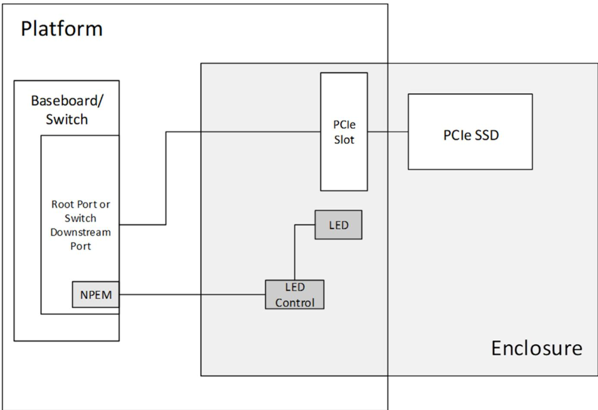

<table>
<thead>
<tr>
<th width="50%">🇬🇧 English</th>
<th width="50%" style="background-color:#e8e8e8">🇨🇳 中文</th>
</tr>
</thead>
<tbody>
<tr>
<td>

Figure 6-36 shows an example configuration with the NPEM capability located in the Upstream Port (in this case, the SSD function).

</td>
<td style="background-color:#e8e8e8">

图 6-36 给出了一个示例配置：NPEM 能力位于上游端口 (Upstream Port) 中 (本例中即 SSD Function)。

</td>
</tr>
</tbody>
</table>

> **Figure 6-36.** Example NPEM Configuration using an Upstream Port
> 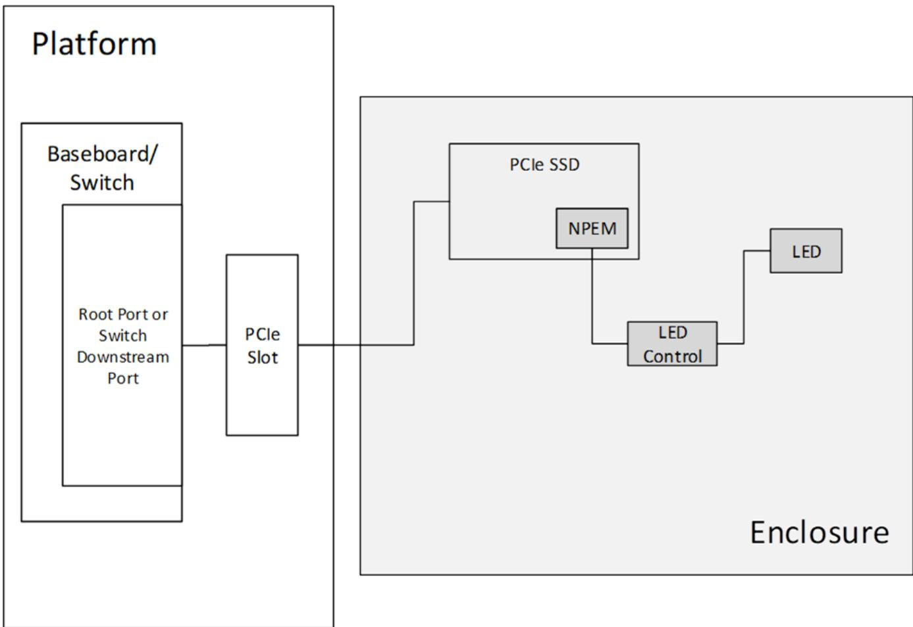


<div style="overflow-x: auto; max-width: 100%;">
<table>
<thead>
<tr>
<th width="50%">🇬🇧 English</th>
<th width="50%" style="background-color:#e8e8e8">🇨🇳 中文</th>
</tr>
</thead>
<tbody>
<tr>
<td>

Software issues an NPEM command by writing to the NPEM Control register to change the indications associated with an SSD. NPEM Command is a single write to the NPEM Control register that changes the state of zero or more bits. NPEM indicates a successful completion to software using the command completed mechanism. Figure 6-37 shows the overall flow.

This specification defines the software interface provided by the NPEM capability. The Port to enclosure interface, enclosure, enclosure to LED interface, number of LEDs per SSD, and associated LED blink patterns are all outside the scope of this specification.

</td>
<td style="background-color:#e8e8e8">

软件通过对 NPEM 控制寄存器 (NPEM Control register) 写入来发出 NPEM 命令，以更改与 SSD 关联的指示。NPEM 命令 (NPEM Command) 是对 NPEM 控制寄存器的单次写入，用于更改零个或多个位的状态。NPEM 通过命令完成机制 (command completed mechanism) 向软件指示成功完成。图 6-37 显示了整体流程。

本规范定义了 NPEM 能力所提供的软件接口。端口到机箱的接口 (Port to enclosure interface)、机箱、机箱到 LED 的接口 (enclosure to LED interface)、每个 SSD 的 LED 数量以及相关的 LED 闪烁模式均不在本规范范围内。

</td>
</tr>
</tbody>
</table>
</div>


> **Figure 6-37.** NPEM Command Flow
> 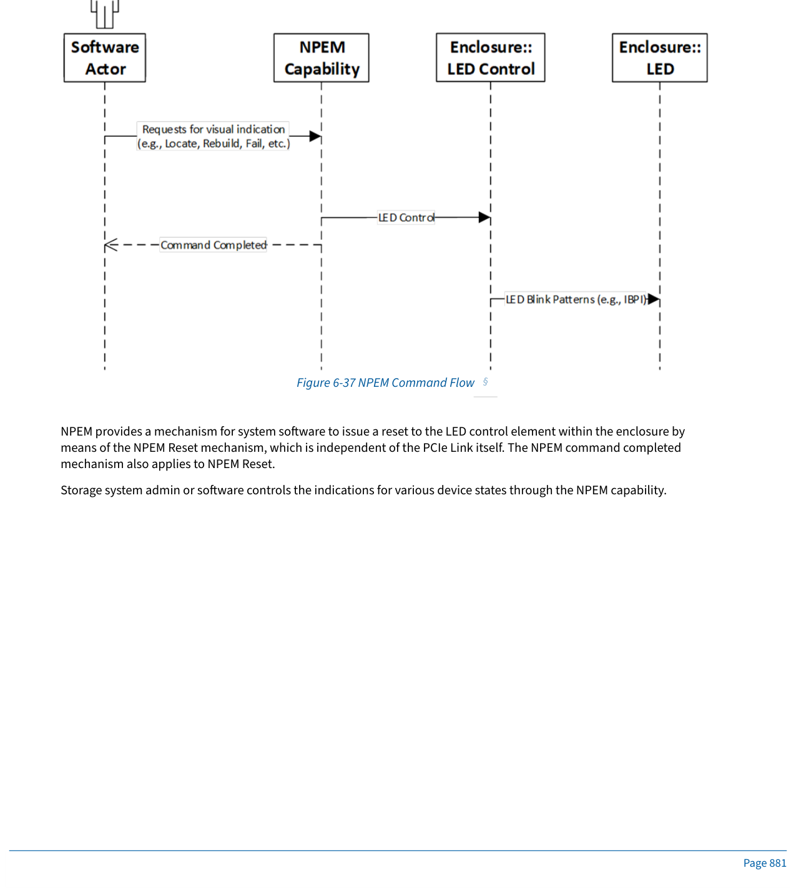

table>
<thead>
<tr>
<th width="50%">🇬🇧 English</th>
<th width="50%" style="background-color:#e8e8e8">🇨🇳 中文</th>
</tr>
</thead>
<tbody>
<tr>
<td>

NPEM provides a mechanism for system software to issue a reset to the LED control element within the enclosure by means of the NPEM Reset mechanism, which is independent of the PCIe Link itself. The NPEM command completed mechanism also applies to NPEM Reset.

Storage system admin or software controls the indications for various device states through the NPEM capability.

</td>
<td style="background-color:#e8e8e8">

NPEM 提供了一种机制，使系统软件能够通过 NPEM 复位 (NPEM Reset) 机制对机箱内的 LED 控制单元发起复位，该机制独立于 PCIe 链路 (Link) 本身。NPEM 命令完成机制同样适用于 NPEM 复位。

存储系统管理员或软件通过 NPEM 能力控制各种设备状态的指示。

</td>
</tr>
</tbody>
</table>

---

<<<PAGE_BREAK>>> page_879

<<<PAGE_BREAK>>> page_880

<<<PAGE_BREAK>>> page_881

<<<PAGE_BREAK>>> page_882

> **IMPLEMENTATION NOTE:** NPEM STATES

<table>
<thead>
<tr>
<th width="50%">🇬🇧 English</th>
<th width="50%" style="background-color:#e8e8e8">🇨🇳 中文</th>
</tr>
</thead>
<tbody>
<tr>
<td>

Table 6-27 shows an example of NPEM states and a possible meaning that some enclosures may assign to the architected NPEM states.

</td>
<td style="background-color:#e8e8e8">

表 6-27 给出 NPEM 状态示例，以及某些机箱可能为各架构化 NPEM 状态赋予的可能含义。

</td>
</tr>
</tbody>
</table>

**Table 6-27 NPEM States**

| NPEM State | Actor | Definition |
|------------|-------|------------|
| OK | System Admin or Storage Software | OK state may mean the drive is functioning normally. This state may implicitly mean that an SSD is present, powered on, and working normally as seen by the software. A more granular indication of drive not physically present or present but not powered up are both outside the scope of this specification. |
| Locate | System Admin | Locate state may mean the specific drive is being identified by an admin. |
| Fail | Storage Software | Fail state may mean the drive is not functioning properly |
| Rebuild | Storage Software | Rebuild state may mean this drive is part of a multi-drive storage volume/array that is rebuilding or reconstructing data from redundancy on to this specific drive. |
| PFA | Storage Software | PFA stands for Predicted Failure Analysis. This state may mean the drive is still functioning normally but predicted to fail soon. |
| Hot Spare | Storage Software | Hot Spare state may mean this drive is marked to be automatically used as a replacement for a failed drive and contents of the failed drive may be rebuilt on this drive. |
| In A Critical Array | Storage Software | In A Critical Array state may mean the drive is part of a multi-drive storage array and that array is degraded. |
| In A Failed Array | Storage Software | NPEM In A Failed Array state may mean the drive is part of a multi-drive storage array and that array is failed. |
| Invalid Device Type | Storage Software | Invalid Device Type state may mean the drive is not the right type for the connector (e.g., An enclosure supports SAS and NVMe drives and this drive state indicates that a SAS drive is plugged into an NVMe slot). |
| Disabled | Storage Software | Disabled state may mean the drive in this slot is disabled. A removal of this drive from the slot may be safe. The power from this slot may be removed. |

**表 6-27 NPEM 状态**

| NPEM 状态 | 行为主体 (Actor) | 定义 |
|------------|-------|------------|
| OK | 系统管理员或存储软件 | OK 状态可表示驱动器工作正常。此状态可隐含地表示软件所见的 SSD 已存在、已上电并正常工作。关于驱动器物理上不存在或存在但未上电的更细粒度指示不在本规范范围内。 |
| Locate (定位) | 系统管理员 | Locate 状态可表示特定驱动器正被管理员识别。 |
| Fail (故障) | 存储软件 | Fail 状态可表示驱动器工作不正常。 |
| Rebuild (重建) | 存储软件 | Rebuild 状态可表示该驱动器是多驱动器存储卷/阵列的一部分，正在将冗余数据重建或重构到该特定驱动器上。 |
| PFA (预测故障分析) | 存储软件 | PFA 代表 Predicted Failure Analysis (预测故障分析)。此状态可表示驱动器仍正常工作但预测很快会发生故障。 |
| Hot Spare (热备) | 存储软件 | Hot Spare 状态可表示该驱动器被标记为自动替代故障驱动器的备用盘，故障驱动器的内容可能会被重建到该驱动器上。 |
| In A Critical Array (处于临界阵列) | 存储软件 | In A Critical Array 状态可表示该驱动器是多驱动器存储阵列的一部分，且该阵列已降级。 |
| In A Failed Array (处于故障阵列) | 存储软件 | NPEM In A Failed Array 状态可表示该驱动器是多驱动器存储阵列的一部分，且该阵列已故障。 |
| Invalid Device Type (无效设备类型) | 存储软件 | Invalid Device Type 状态可表示驱动器与连接器类型不匹配 (例如机箱同时支持 SAS 和 NVMe 驱动器，而此驱动器状态表示 SAS 驱动器被插入到了 NVMe 插槽中)。 |
| Disabled (禁用) | 存储软件 | Disabled 状态可表示该插槽中的驱动器已被禁用。从插槽中移除该驱动器可能是安全的。该插槽的电源可被移除。 |

---

>>> **IMPLEMENTATION NOTE:** 软件轮询 NPEM 命令完成 (SOFTWARE POLLING OF NPEM COMMAND COMPLETED)


<div style="overflow-x: auto; max-width: 100%;">
<table>
<thead>
<tr>
<th width="50%">🇬🇧 English</th>
<th width="50%" style="background-color:#e8e8e8">🇨🇳 中文</th>
</tr>
</thead>
<tbody>
<tr>
<td>

Different NPEM implementations may vary widely in how long they take to complete NPEM commands, from instantaneous to tens of ms. To avoid or minimize software polling overheads, it is recommended that software implement one or both of the following optimizations.

Instead of software writing a command and then immediately polling for completion, it is recommended that software reverse this order. When ready to write a new command, software first polls for completion of the previous command, and then writes the new command. This enables overlapped operation, often completely hiding the time it takes hardware to execute an NPEM command. To enable this polling model, software must initialize the hardware following a reset by writing a no-op command in order to have hardware generate the first NPEM command completion.

For the case where an NPEM command has not completed when software polls the bit, it is recommended that software not continuously "spin" on polling the bit, but rather poll under interrupt at a reduced rate; for example at 10 ms intervals.

</td>
<td style="background-color:#e8e8e8">

不同的 NPEM 实现完成 NPEM 命令所需的时间差异很大，从瞬时到几十毫秒不等。为避免或最小化软件轮询开销，建议软件实现以下一项或两项优化。

建议颠倒软件的操作顺序：不是先写命令再立即轮询完成，而是当准备好写入新命令时，软件先轮询上一条命令的完成状态，然后写入新命令。这使得操作可以重叠进行，通常可以完全隐藏硬件执行 NPEM 命令所需的时间。为启用此轮询模式，软件必须在复位后通过写入一条 no-op (空操作) 命令来初始化硬件，以便让硬件产生首次 NPEM 命令完成。

对于软件轮询该位时 NPEM 命令尚未完成的情况，建议软件不要连续"自旋 (spin)"轮询该位，而应以较低的速率 (例如每 10 ms 一次) 在中断中进行轮询。

</td>
</tr>
</tbody>
</table>
</div>


---

<<<PAGE_BREAK>>> page_883

<a id="sec-6-29"></a>
## 6.29 Conventional PCI Advanced Features Operation | 传统 PCI 高级特性操作

table>
<thead>
<tr>
<th width="50%">🇬🇧 English</th>
<th width="50%" style="background-color:#e8e8e8">🇨🇳 中文</th>
</tr>
</thead>
<tbody>
<tr>
<td>

For Conventional PCI devices integrated into a Root Complex, the Conventional PCI Advanced Features Capability (AF) provides mechanisms for using advanced features originally developed for PCI Express.

- The Function Level Reset (INITIATE_FLR) mechanism enables software to quiesce and reset hardware with Function-level granularity.

  FLR applies on a per Function basis. Only the targeted Function is affected by the FLR operation.
- The Transactions Pending (TP) mechanism is used to indicate that the Function has issued one or more non-posted transactions (including Delayed Transactions) which have not been completed.

</td>
<td style="background-color:#e8e8e8">

对于集成在根复合体 (Root Complex) 中的传统 PCI 设备，传统 PCI 高级特性能力 (Conventional PCI Advanced Features Capability, AF) 提供最初为 PCI Express 开发的若干高级特性的使用机制。

- Function 级复位 (Function Level Reset, INITIATE_FLR) 机制使软件能够以 Function 级粒度静默 (quiesce) 并复位硬件。

  FLR 按 Function 粒度生效。仅有目标的 Function 受 FLR 操作影响。
- 事务挂起 (Transactions Pending, TP) 机制用于指示该 Function 已发出一个或多个尚未完成的 Non-Posted 事务 (包括 Delayed Transactions)。

</td>
</tr>
<tr>
<td>

The FLR and TP mechanisms defined here are strictly for Conventional PCI devices integrated into a Root Complex where the implementation permits non-posted transactions for a given Conventional PCI Function to complete even if the value of the Bus Master Enable bit in its Command Register is 0b. Implementations that do not meet this requirement must not implement the FLR and TP mechanisms.

FLR modifies the Function state as follows:

Function registers and Function-specific state machines must be set to their initialization values as specified in this document, except for the following bits, which must not be modified: Fast Back-to-Back Transactions Enable, Cache Line Size, Latency Timer, Interrupt Line, PME_En, PME_Status.

Note that the controls that enable the Function to initiate bus transactions are cleared, including the Bus Master Enable bit in the Command Register, the MSI Enable bit in the MSI Capability Structure, and the like, effectively causing the Function to become quiescent.

After an FLR has been initiated, the Function must complete the FLR within 100 ms. If software initiates an FLR when the Transactions Pending bit is 1b, then software must not initialize the Function until allowing adequate time to achieve reasonable certainty that any outstanding transactions will have completed. The Transactions Pending bit must be clear upon completion of the FLR.

</td>
<td style="background-color:#e8e8e8">

此处定义的 FLR 与 TP 机制严格限于集成在根复合体中的传统 PCI 设备，且其实现允许给定传统 PCI Function 的 Non-Posted 事务即使在 Command Register 中的 Bus Master Enable 位为 0b 时仍能完成。不满足此要求的实现不得实现 FLR 和 TP 机制。

FLR 按以下方式修改 Function 状态：

Function 寄存器和 Function 特定状态机必须设置为本规范规定的初始值，但以下位不得被修改：Fast Back-to-Back Transactions Enable、Cache Line Size、Latency Timer、Interrupt Line、PME_En、PME_Status。

注意，使 Function 能够发起总线事务的控制位会被清除，包括 Command Register 中的 Bus Master Enable 位、MSI 能力结构 (MSI Capability Structure) 中的 MSI Enable 位等，从而有效地使 Function 进入静默 (quiescent) 状态。

FLR 启动后，Function 必须在 100 ms 内完成 FLR。如果软件在 Transactions Pending 位为 1b 时启动 FLR，则软件必须在等待足够时间以合理确信任何未完成事务均将完成之后，才能对 Function 进行初始化。FLR 完成时，Transactions Pending 位必须清零。

</td>
</tr>
</tbody>
</table>

---

<<<PAGE_BREAK>>> page_884

> **IMPLEMENTATION NOTE:** AVOIDING ISSUES WITH PENDING TRANSACTIONS


<div style="overflow-x: auto; max-width: 100%;">
<table>
<thead>
<tr>
<th width="50%">🇬🇧 English</th>
<th width="50%" style="background-color:#e8e8e8">🇨🇳 中文</th>
</tr>
</thead>
<tbody>
<tr>
<td>

FLR modifies Function state not described by this specification (in addition to state that is described by this specification), and so the following criteria must be applied using Function-specific knowledge to evaluate the Function's behavior in response to an FLR:

- The Function must not give the appearance of an initialized adapter with an active host on any external interfaces controlled by that Function. The steps needed to terminate activity on external interfaces are outside of the scope of this specification.
  - For example, a network adapter must not respond to queries that would require adapter initialization by the host system or interaction with an active host system, but is permitted to perform actions that it is designed to perform without requiring host initialization or interaction. If the network adapter includes multiple Functions that operate on the same external network interface, this rule affects only those aspects associated with the particular Function reset by FLR.
- The Function must not retain within itself software readable state that potentially includes secret information associated with any preceding use of the Function. Main host memory assigned to the Function must not be modified by the Function.
  - For example, a Function with internal memory readable directly or indirectly by host software must clear or randomize that memory.
- The Function must return to a state such that normal configuration of the Function's PCI interface will cause it to be useable by drivers normally associated with the Function.

</td>
<td style="background-color:#e8e8e8">

FLR 会修改本规范未描述的 Function 状态 (以及本规范已描述的状态之外的状态)，因此必须结合 Function 特定知识应用以下准则来评估 Function 对 FLR 的响应行为：

- Function 在其所控制的任何外部接口上，不得表现得像一个已初始化、且具有活动主机的适配器。终止外部接口活动所需的步骤不在本规范范围内。
  - 例如，网络适配器不得响应那些需要主机系统进行适配器初始化或与活动主机系统交互的查询，但允许执行其设计为可在无需主机初始化或交互的情况下执行的动作。如果网络适配器包含多个在同一外部网络接口上运作的 Function，则此规则仅影响与被 FLR 复位的特定 Function 相关的部分。
- Function 不得在其内部保留可能包含与 Function 此前使用相关的秘密信息的软件可读状态。分配给该 Function 的主宿主机内存不得被该 Function 修改。
  - 例如，具有可由主机软件直接或间接读取的内部存储器的 Function 必须清除或随机化该存储器。
- Function 必须返回到这样的状态：对 Function 的 PCI 接口进行正常配置即可使与该 Function 关联的驱动程序正常使用它。

</td>
</tr>
<tr>
<td>

When an FLR is initiated, the targeted Function must behave as follows:

- The Function must complete normally the configuration write that initiated the FLR operation and then initiate the FLR.
- While an FLR is in progress:
  - The Function must not respond to any request on the bus (i.e., requests targeting the Function will Master Abort).

</td>
<td style="background-color:#e8e8e8">

当 FLR 启动时，目标的 Function 必须表现为：

- Function 必须正常完成启动 FLR 操作的配置写入，然后再启动 FLR。
- 在 FLR 进行期间：
  - Function 不得响应总线上的任何请求 (即针对该 Function 的请求将出现 Master Abort)。

</td>
</tr>
</tbody>
</table>
</div>


table>
<thead>
<tr>
<th width="50%">🇬🇧 English</th>
<th width="50%" style="background-color:#e8e8e8">🇨🇳 中文</th>
</tr>
</thead>
<tbody>
<tr>
<td>

The Transactions Pending (TP) bit indicates that the Function has issued one or more non-posted transactions which have not been completed. This field may be used by software to determine when a Function has become quiescent.

</td>
<td style="background-color:#e8e8e8">

事务挂起位 (Transactions Pending, TP) 指示该 Function 已发出一个或多个尚未完成的 Non-Posted 事务。软件可使用此字段判断 Function 何时已变为静默 (quiescent)。

</td>
</tr>
</tbody>
</table>

---

>>> **IMPLEMENTATION NOTE:** AVOIDING ISSUES WITH PENDING TRANSACTIONS


<div style="overflow-x: auto; max-width: 100%;">
<table>
<thead>
<tr>
<th width="50%">🇬🇧 English</th>
<th width="50%" style="background-color:#e8e8e8">🇨🇳 中文</th>
</tr>
</thead>
<tbody>
<tr>
<td>

An FLR causes a Function to lose track of any pending (outstanding non-posted) transactions. Depending upon the specific implementation of the RC-integrated PCI Function, if software issues an FLR while there are pending transactions, there is a possibility for data corruption as described in the "Avoiding Data Corruption From Stale Completions" Implementation Note.

To avoid potential issues with Root Complex implementations where Stale Completions are possible or a Discard Timer is present, it is recommended that software use an algorithm similar to the following:

1. Software that's performing the FLR synchronizes with other software that might potentially access the Function directly, and ensures that such accesses will not occur during this algorithm.
2. Software clears the entire Command register, disabling the Function from mastering any new transactions.
3. Software polls the Transactions Pending bit in the AF Status Register either until it's clear or until it's been long enough to achieve reasonable certainty that any remaining outstanding Transactions will never complete. On many systems, the Transactions Pending bit will usually clear within a few milliseconds, so software might choose to poll during this initial period using a tight software loop. On rare cases when the Transactions Pending bit doesn't clear by this time, software will need to poll for a longer system-specific period (potentially seconds), so software might choose to conduct this polling using a timer-based interrupt polling mechanism.
4. Software initiates the FLR.
5. Software waits 100 ms.
6. Software reconfigures the Function and enables it for normal operation.

</td>
<td style="background-color:#e8e8e8">

FLR 会导致 Function 失去对任何挂起 (outstanding non-posted) 事务的跟踪。根据 RC 集成 PCI Function 的具体实现，如果软件在仍有挂起事务时启动 FLR，则可能发生数据损坏，如实现说明 "Avoiding Data Corruption From Stale Completions" 所述。

为避免在可能出现陈旧完成 (Stale Completions) 或存在 Discard Timer 的根复合体实现中可能出现的问题，建议软件使用类似以下的算法：

1. 执行 FLR 的软件与其他可能直接访问该 Function 的软件进行同步，并确保在该算法执行期间不会发生此类访问。
2. 软件清除整个 Command Register，禁用该 Function 发起任何新事务的能力。
3. 软件轮询 AF Status Register 中的 Transactions Pending 位，直到该位清零或已等待足够长时间以合理确信任何剩余未完成事务都不可能完成。在许多系统中，Transactions Pending 位通常会在数毫秒内清零，因此软件可在此初始阶段使用紧凑的软件循环进行轮询。在少数情况下，若 Transactions Pending 位在此期间未清零，软件将需要轮询更长的系统特定时长 (可能为秒级)，因此软件可选择使用基于定时器的中断轮询机制来进行此轮询。
4. 软件启动 FLR。
5. 软件等待 100 ms。
6. 软件重新配置该 Function 并将其使能为正常工作。

</td>
</tr>
</tbody>
</table>
</div>


---

<a id="sec-6-30"></a>
## 6.30 Data Object Exchange (DOE) | 数据对象交换 (DOE)

table>
<thead>
<tr>
<th width="50%">🇬🇧 English</th>
<th width="50%" style="background-color:#e8e8e8">🇨🇳 中文</th>
</tr>
</thead>
<tbody>
<tr>
<td>

Data Object Exchange (DOE) is an optional mechanism for system firmware/software to perform data object exchanges with a Function or RCRB. Software discovers DOE support via the Data Object Exchange (DOE) Extended Capability structure. Because DOE depends on Configuration Requests it is not usable for peer-to-peer operations directly between Functions, although system software can provide a mechanism to relay data objects between Functions if such capabilities are desired. When DOE is implemented in an RCRB, it is permitted to block peer-to-peer operation via implementation specific means.

DOE is a prerequisite Extended Capability for a Function to support in-band access by system firmware/software using Configuration Requests to Component Measurement and Authentication (CMA). CMA in turn builds on [SPDM].

It is permitted to implement DOE in any type of Function, and in an RCRB. It is permitted to implement DOE more than once in a single Function or RCRB.

DOE uses the terms "type" and "feature" with specific meanings. A data object type indicates a group of one or more data objects, and can be used to determine how to further construct or parse a specific data object. Every data object includes an indication of its type. Data object types are defined by particular vendors and distinguished by Vendor ID. It is permitted for features/types defined by one vendor to require the use of features/types defined by another vendor.

A feature is a capability of some sort that uses data objects. A feature can be associated with one or more data object types. Each specific feature defines the mechanism(s) used by software to discover support for the feature, for example by means of a capabilities bit in Configuration Space, or implied by the presence of an associated Extended Capability structure. A feature using data objects must specify the scope of the specific features in relation to the Function(s) implementing that feature via DOE, for example if only the Function itself is associated with the feature, or if Function 0 of a Multi-Function Device represents the Device as a whole, etc.

</td>
<td style="background-color:#e8e8e8">

数据对象交换 (Data Object Exchange, DOE) 是一种可选机制，允许系统固件/软件与 Function 或 RCRB 进行数据对象交换。软件通过数据对象交换 (DOE) 扩展能力结构发现 DOE 支持。由于 DOE 依赖于配置请求 (Configuration Requests)，它不能直接用于 Function 之间的对等 (peer-to-peer) 操作；不过，系统软件可以提供在 Function 之间中继数据对象的机制 (如果需要此类能力)。当 DOE 在 RCRB 中实现时，允许通过实现特定手段阻止对等操作。

DOE 是 Function 通过配置请求支持组件测量与认证 (Component Measurement and Authentication, CMA) 的带内 (in-band) 访问的先决扩展能力。CMA 又基于 [SPDM]。

允许在任何类型的 Function 以及 RCRB 中实现 DOE。允许在单个 Function 或 RCRB 中多次实现 DOE。

DOE 以特定含义使用术语 "类型 (type)" 和 "特性 (feature)"。数据对象类型 (data object type) 指示一个或多个数据对象的分组，并可用于确定如何进一步构造或解析特定数据对象。每个数据对象都包含其类型的指示。数据对象类型由特定厂商定义并以 Vendor ID 区分。允许由一个厂商定义的 feature/type 要求使用另一厂商定义的 feature/type。

feature 是某种使用数据对象的能力 (capability)。一个 feature 可与一个或多个数据对象类型关联。每个具体的 feature 定义软件用于发现对该 feature 支持的机制，例如通过配置空间 (Configuration Space) 中的能力位 (capabilities bit)，或由关联的扩展能力结构的存在隐含指示。使用数据对象的 feature 必须规定该 feature 在通过 DOE 实现该 feature 的 Function 方面的作用范围，例如：仅该 Function 自身与该 feature 关联，或者多功能设备 (Multi-Function Device) 的 Function 0 代表整个设备等。

</td>
</tr>
<tr>
<td>

It is permitted, but not recommended, for a feature using data object exchanges to require that a Function implement a unique instance of DOE for that specific feature, and/or to allow sharing of a DOE instance to only a specific set of features using data object exchange, and/or to allow a Function to implement multiple instances of DOE supporting the specific feature.

It is permitted to use DOE when a Function is in non-D0 states, although it is permitted for a specific data object feature to restrict operation in non-D0 states.

</td>
<td style="background-color:#e8e8e8">

允许但不推荐使用数据对象交换的 feature 要求 Function 为该特定 feature 实现唯一的 DOE 实例，以及/或者仅允许一组特定的使用数据对象交换的 feature 共享某个 DOE 实例，以及/或者允许 Function 实现多个支持该特定 feature 的 DOE 实例。

允许在 Function 处于非 D0 状态时使用 DOE，但允许特定的数据对象 feature 限制其在非 D0 状态下的操作。

</td>
</tr>
</tbody>
</table>

---

<<<PAGE_BREAK>>> page_885

<<<PAGE_BREAK>>> page_886

<<<PAGE_BREAK>>> page_887

> **IMPLEMENTATION NOTE:** SUPPORTING MULTIPLE HARDWARE/SOFTWARE BINDINGS


<div style="overflow-x: auto; max-width: 100%;">
<table>
<thead>
<tr>
<th width="50%">🇬🇧 English</th>
<th width="50%" style="background-color:#e8e8e8">🇨🇳 中文</th>
</tr>
</thead>
<tbody>
<tr>
<td>

When multiple features are supported by a device, or when a given feature can be used by more than one software entity at a time, it is typically necessary to coordinate the use of the hardware/software interface between entities implementing the multiple features. SPDM Version 1.2.0 introduced the SPDM connection model, addressing some important needs, but not itself addressing the hardware/software interface problems arising when multiple software entities need to maintain different contexts and/or configurations. DOE provides two basic mechanisms for addressing this type of issue.

One option is that specific data object features may require the use of dedicated instances of DOE, particularly to allow system software to assign ownership of a specific DOE instance with the software entity using the specific data object feature(s) associated with that particular instance. For example, data object features A and B may perform different tasks, and so by instantiating dedicated instances of DOE for each, system software avoids the need to implement ownership control and arbitration mechanisms between A and B.

When this is done, if the underlying hardware uses shared resources to implement A and B, then the hardware may require the ability to maintain separate contexts for each data object feature, because system software will allow the two features to be operated at the same time.

Alternatively, for CMA/SPDM and related use cases, the optional Connection ID mechanism can eliminate the need for multiple DOE instances. Typically, the Connection ID mechanism provides much better scaling, and it is recommended that the Connection ID mechanism be used where applicable, instead of requiring the use of dedicated DOE instances. Figure 6-38 illustrates a "stack diagram" where six applications are all using CMA/SPDM over DOE in three groups.

</td>
<td style="background-color:#e8e8e8">

当设备支持多个 feature，或给定 feature 可被多个软件实体同时使用时，通常需要协调实现多个 feature 的实体之间对硬件/软件接口的使用。SPDM 1.2.0 版本引入了 SPDM 连接模型 (SPDM connection model)，解决了一些重要需求，但并未解决当多个软件实体需要维护不同上下文和/或配置时所产生的硬件/软件接口问题。DOE 提供两种基本机制来解决此类问题。

一种选择是：特定数据对象 feature 可能要求使用专用的 DOE 实例，特别是为了使系统软件能够将特定 DOE 实例的所有权分配给使用与该实例关联的特定数据对象 feature 的软件实体。例如，数据对象 feature A 和 B 可能执行不同任务，因此通过分别为其实例化专用的 DOE 实例，系统软件可避免在 A 和 B 之间实现所有权控制和仲裁机制。

当采用此方式时，如果底层硬件使用共享资源来实现 A 和 B，则硬件可能需要具备为每个数据对象 feature 维护单独上下文的能力，因为系统软件将允许这两个 feature 同时运行。

另一种选择是：对于 CMA/SPDM 及相关用例，可选的 Connection ID 机制可消除对多个 DOE 实例的需求。通常 Connection ID 机制提供更好的可扩展性，因此建议在适用场景下使用 Connection ID 机制，而不是要求使用专用 DOE 实例。图 6-38 给出了一个"栈式图 (stack diagram)"：六个应用程序分为三组，均通过 DOE 使用 CMA/SPDM。

</td>
</tr>
</tbody>
</table>
</div>


> **Figure 6-38.** Stack Diagram Illustration of Multiple Sessions and Connections
> 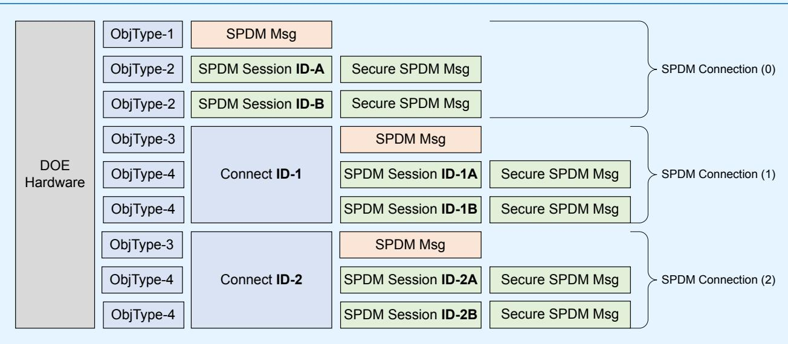

table>
<thead>
<tr>
<th width="50%">🇬🇧 English</th>
<th width="50%" style="background-color:#e8e8e8">🇨🇳 中文</th>
</tr>
</thead>
<tbody>
<tr>
<td>

In each case, two distinct SPDM uses are shown, A and B, and within each group, the SPDM configuration must be the same, but each group may have distinct requirements from the others, e.g., different hashing algorithms. The SPDM Driver and PCI Driver software components must coordinate the establishment of each connection, including the assignment of a Connection ID, and, at run time, must manage the transfer of data objects across the DOE interface itself to ensure that multiple software entities cannot attempt to access the DOE Mailbox registers during the transfer of a single data object. However, context is maintained in the device for each session. Figure 6-39 illustrates at a high level how these elements relate to each other.

</td>
<td style="background-color:#e8e8e8">

在每种情况下，都展示了两种不同的 SPDM 用法 A 和 B；在每个组内，SPDM 配置必须相同，但各组之间可能有不同的需求，例如使用不同的哈希算法。SPDM 驱动 (SPDM Driver) 和 PCI 驱动 (PCI Driver) 软件组件必须协调每个连接的建立，包括 Connection ID 的分配，并且在运行时必须管理跨 DOE 接口本身的数据对象传输，以确保在单个数据对象的传输过程中多个软件实体不能同时尝试访问 DOE Mailbox 寄存器。但是，设备会为每个 session 维护上下文。图 6-39 概要性地展示了这些元素之间的关系。

</td>
</tr>
</tbody>
</table>

> **Figure 6-39.** Example Showing Relationships of Software and Hardware Elements
> 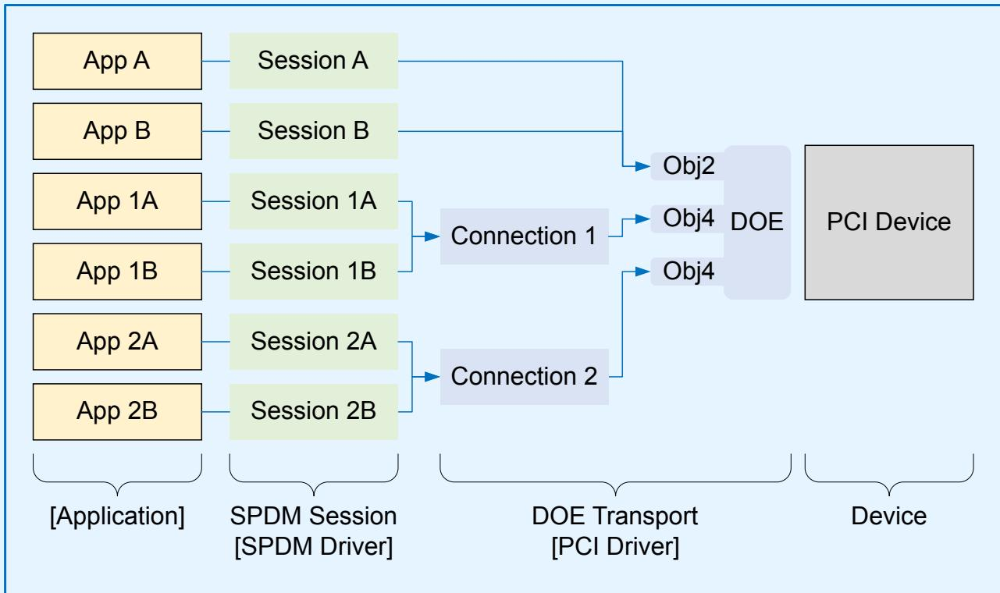

---

<<<PAGE_BREAK>>> page_888

<a id="sec-6-30-1"></a>
### 6.30.1 Data Objects and Features | 数据对象与特性

<table>
<thead>
<tr>
<th width="50%">🇬🇧 English</th>
<th width="50%" style="background-color:#e8e8e8">🇨🇳 中文</th>
</tr>
</thead>
<tbody>
<tr>
<td>

Data objects must consist of 2 DW to 256K DW, as shown in Figure 6-40.

</td>
<td style="background-color:#e8e8e8">

数据对象必须由 2 DW 到 256K DW 组成，如图 6-40 所示。

</td>
</tr>
</tbody>
</table>

> **Figure 6-40.** DOE Data Object Format
> 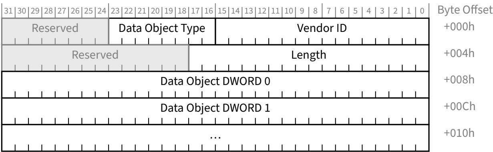

<table>
<thead>
<tr>
<th width="50%">🇬🇧 English</th>
<th width="50%" style="background-color:#e8e8e8">🇨🇳 中文</th>
</tr>
</thead>
<tbody>
<tr>
<td>

The first DW of a data object must be formatted as defined in Table 6-28 and illustrated in Figure 6-41.

</td>
<td style="background-color:#e8e8e8">

数据对象的第一个 DW 必须按表 6-28 所定义并如图 6-41 所示的格式组织。

</td>
</tr>
</tbody>
</table>

> **Figure 6-41.** DOE Data Object Header 1
> 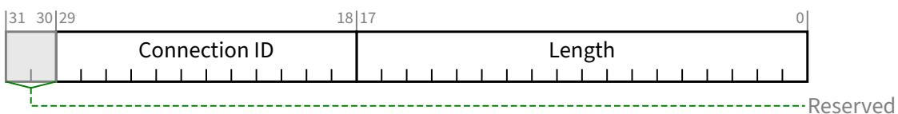

**Table 6-28 DOE Data Object Header 1**

| Bit Location | Description |
|--------------|-------------|
| 15:0 | Vendor ID - PCI-SIG Vendor ID of the entity that defined the type of data object. |
| 23:16 | Data Object Type – The type of data object. |

**表 6-28 DOE 数据对象头 1**

| 位位置 (Bit Location) | 描述 (Description) |
|--------------|-------------|
| 15:0 | Vendor ID — 定义此数据对象类型的实体的 PCI-SIG Vendor ID。 |
| 23:16 | Data Object Type — 数据对象的类型。 |

<table>
<thead>
<tr>
<th width="50%">🇬🇧 English</th>
<th width="50%" style="background-color:#e8e8e8">🇨🇳 中文</th>
</tr>
</thead>
<tbody>
<tr>
<td>

The Second DW of a data object must be formatted as defined in Table 6-29 and illustrated in Figure 6-42.

</td>
<td style="background-color:#e8e8e8">

数据对象的第二个 DW 必须按表 6-29 所定义并如图 6-42 所示的格式组织。

</td>
</tr>
</tbody>
</table>

> **Figure 6-42.** DOE Data Object Header 2
> 

---

<<<PAGE_BREAK>>> page_889

**Table 6-29 DOE Data Object Header 2**

| Bit Location | Description |
|--------------|-------------|
| 17:0 | Length – Length of the data object being transferred in number of DWs including the 2 DWs of the Data Object Header, encoded such that a value of 0 0002h indicates 2 DWs, and a value of 0 0000h indicates 2^18 DWs. A value of 0 0001h is not allowed. |
| 29:18 | Connection ID – For data object types using Connection ID, this field contains the Connection ID. For all other data object types, this field is Reserved. |

**表 6-29 DOE 数据对象头 2**

| 位位置 (Bit Location) | 描述 (Description) |
|--------------|-------------|
| 17:0 | Length — 所传输数据对象的长度，以 DW 为单位，包括数据对象头的 2 DW。编码方式为：值 0 0002h 表示 2 DW，值 0 0000h 表示 2^18 DW。值 0 0001h 不允许。 |
| 29:18 | Connection ID — 对于使用 Connection ID 的数据对象类型，此字段包含 Connection ID。对于所有其他数据对象类型，此字段为保留 (Reserved)。 |


<div style="overflow-x: auto; max-width: 100%;">
<table>
<thead>
<tr>
<th width="50%">🇬🇧 English</th>
<th width="50%" style="background-color:#e8e8e8">🇨🇳 中文</th>
</tr>
</thead>
<tbody>
<tr>
<td>

Each data object is uniquely identified by the Vendor ID of the vendor publishing the data object definition and a Data Object Type value assigned by that vendor (see Table 6-28). See Table 6-33 for a list of data objects defined by PCI-SIG. Data objects of a specific type are permitted to vary in size and composition.

Unless a data object type definition specifies a different requirement, the following rules apply:

- If the number of DW transferred does not match the Length indicated in DOE Data Object Header 2 for a data object, then the entire data object must be silently discarded.
- If the Length indicated in DOE Data Object Header 2 is shorter than expected for a specific data object, then the data object must be silently discarded.
- If the Length indicated in DOE Data Object Header 2 is greater than expected for a specific data object, then the portion of the data object up to the expected length must be processed normally and the remainder of the data object must be silently discarded.
- If the data object type is not supported, then that data object must be silently discarded.

</td>
<td style="background-color:#e8e8e8">

每个数据对象由发布该数据对象定义的厂商的 Vendor ID 和该厂商分配的 Data Object Type 值唯一标识 (见表 6-28)。表 6-33 列出了由 PCI-SIG 定义的数据对象。特定类型的数据对象在大小和组成上可以有所不同。

除非数据对象类型定义规定了不同的要求，否则适用以下规则：

- 如果传输的 DW 数与该数据对象 DOE 数据对象头 2 中指示的 Length 不匹配，则整个数据对象必须被静默丢弃。
- 如果 DOE 数据对象头 2 中指示的 Length 短于特定数据对象所期望的长度，则该数据对象必须被静默丢弃。
- 如果 DOE 数据对象头 2 中指示的 Length 长于特定数据对象所期望的长度，则数据对象中达到期望长度的部分必须被正常处理，其余部分必须被静默丢弃。
- 如果不支持该数据对象类型，则该数据对象必须被静默丢弃。

</td>
</tr>
<tr>
<td>

The DOE Discovery feature must be implemented, and provides a means for software to discover the data object types supported by a DOE instance. The DOE Discovery type consists of the request and response data objects, with the 3rd DW of the data object content as defined in Table 6-30 and Table 6-31 respectively. Where indicated in Table 6-33, response data objects include a 4th DW, as defined in Table 6-32. The DOE Discovery data object feature must be operable in D0, D1, D2 and D3hot.

</td>
<td style="background-color:#e8e8e8">

必须实现 DOE Discovery 特性，它为软件提供发现某 DOE 实例所支持的数据对象类型的方法。DOE Discovery 类型由请求和响应数据对象组成，其数据对象内容的第 3 个 DW 分别如表 6-30 和表 6-31 所定义。在表 6-33 中指明的情况下，响应数据对象包含第 4 个 DW，如表 6-32 所定义。DOE Discovery 数据对象特性必须在 D0、D1、D2 和 D3hot 下可操作。

</td>
</tr>
</tbody>
</table>
</div>


> **Figure 6-43.** DOE Discovery Request Data Object Contents (3rd DW)
> 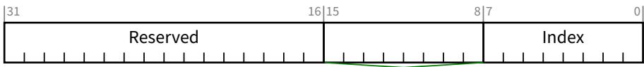

**Table 6-30 DOE Discovery Request Data Object Contents (3rd DW)**

| Bit Location | Description |
|--------------|-------------|
| 7:0 | Index – Indicates DOE Discovery entry index queried. Indices must start at 00h and increase monotonically by 1. |
| 15:8 | DOE Discovery Version – must be 02h if the Capability Version in the Data Object Exchange Extended Capability is 02h or greater. |

**表 6-30 DOE Discovery 请求数据对象内容 (第 3 个 DW)**

| 位位置 (Bit Location) | 描述 (Description) |
|--------------|-------------|
| 7:0 | Index — 指示所查询的 DOE Discovery 条目索引。索引必须从 00h 起始，并以 1 为步长单调递增。 |
| 15:8 | DOE Discovery Version — 若 Data Object Exchange 扩展能力中的 Capability Version 为 02h 或更大，则必须为 02h。 |

---

<<<PAGE_BREAK>>> page_890


---

<a id="sec-6-30-1-1"></a>
## 6.30.1.1 DOE Discovery Feature | DOE 发现功能

table>
<thead>
<tr>
<th width="50%">🇬🇧 English</th>
<th width="50%" style="background-color:#e8e8e8">🇨🇳 中文</th>
</tr>
</thead>
<tbody>
<tr>
<td>

> **Figure 6-44.** DOE Discovery Response Data Object Contents (3rd DW)
> 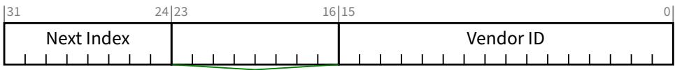

**Table 6-31. DOE Discovery Response Data Object Contents (3rd DW) | 表 6-31. DOE 发现响应数据对象内容（第 3 个 DW）**

| Bit Location | Description |
|--------------|-------------|
| 31:16 | Reserved - Requesters must place 0000h in this field. Responders must ignore the value in this field. |
| 15:0 | Vendor ID – PCI-SIG Vendor ID of the entity that defined the type of data object. FFFFh if index is invalid or out of range. |
| 23:16 | Data Object Type – Indicates the identity of the data object type associated with the Index value supplied with the DOE Discovery Request.<br>The PCI-SIG defined data object type for DOE Discovery must be implemented at index 00h.<br>The index values used for other data object types is implementation specific and has no meaning defined by this specification.<br>Undefined if Vendor ID value is FFFFh. |
| 31:24 | Next Index – Indicates the next DOE Discovery Index value. If the responding DOE instance supports entries with indices greater than the index indicated in the received DOE Discovery Request, it must increment the queried index by 1 and return the resulting value in this field.<br>Must be 00h to indicate the final entry.<br>Undefined if Vendor ID value is FFFFh. |

</td>
<td style="background-color:#e8e8e8">

**Table 6-31. DOE Discovery Response Data Object Contents (3rd DW) | 表 6-31. DOE 发现响应数据对象内容（第 3 个 DW）**

| 位位置 | 描述 |
|--------------|-------------|
| 31:16 | 保留 - 请求者必须在本字段放置 0000h。响应者必须忽略本字段的值。 |
| 15:0 | Vendor ID（供应商 ID） – 定义该数据对象类型的实体的 PCI-SIG 供应商 ID。如果索引无效或超出范围，则为 FFFFh。 |
| 23:16 | Data Object Type（数据对象类型） – 标识与 DOE 发现请求中所提供 Index 值相关联的数据对象类型的身份。<br>PCI-SIG 定义的 DOE Discovery 数据对象类型必须在索引 00h 处实现。<br>用于其他数据对象类型的索引值是实现特定的，本规范未定义其含义。<br>当 Vendor ID 值为 FFFFh 时未定义。 |
| 31:24 | Next Index（下一索引） – 指示下一个 DOE Discovery 索引值。如果响应的 DOE 实例支持索引大于所接收到的 DOE Discovery Request 中所指示索引的条目，则必须将所查询的索引加 1 并将结果值返回到本字段中。<br>必须为 00h 以指示最后一个条目。<br>当 Vendor ID 值为 FFFFh 时未定义。 |

</td>
</tr>
</tbody>
</table>

[⬆️ 返回目录](#-本章目录-table-of-contents)

---

<<<PAGE_BREAK>>> page_892

<a id="sec-6-30-1-1-4dw"></a>
## 6.30.1.1 DOE Discovery Feature (4th DW) | DOE 发现功能（第 4 个 DW）


<div style="overflow-x: auto; max-width: 100%;">
<table>
<thead>
<tr>
<th width="50%">🇬🇧 English</th>
<th width="50%" style="background-color:#e8e8e8">🇨🇳 中文</th>
</tr>
</thead>
<tbody>
<tr>
<td>

**Table 6-32. DOE Discovery Response Data Object Contents (4th DW) | 表 6-32. DOE 发现响应数据对象内容（第 4 个 DW）**

| Bit Location | Description |
|--------------|-------------|
| 17:0 | Max DO Length – Maximum length supported for this data object type, expressed as a number of DWs including the 2 DWs of the Data Object Header, encoded such that a value of 0 0002h indicates 2 DWs, and a value of 0 0000h indicates 2^18 DWs. A value of 0 0001h is not permitted.<br>Undefined if Vendor ID value is FFFFh. |
| 31:18 | Additional Info – The contents of this field are Data Object Type specific. Values are defined for each Data Object Type in § Table 6-33.<br>Undefined if Vendor ID value is FFFFh. |

PCI-SIG defined data object types are defined in § Table 6-33.

**Table 6-33. PCI-SIG Defined Data Object Types (Vendor ID = 0001h) | 表 6-33. PCI-SIG 定义的数据对象类型（Vendor ID = 0001h）**

| Vendor ID (h) | Data Object Type (h) | Description |
|---------------|----------------------|-------------|
| 0001 | 00 | **DOE Discovery** – Every DOE instance must support this data object feature and associated type, both indicated by this entry.<br>A requester uses DOE Discovery to discover all other Data Object types supported by the DOE instance.<br>Must not include the DOE Discovery Response Data Object Contents (4th DW). |
| 0001 | 01 | **CMA-SPDM** – Data object type for SPDM messages. See § Section 6.31.<br>Permitted to include the DOE Discovery Response Data Object Contents (4th DW). The Additional Info field is Reserved. |
| 0001 | 02 | **Secured CMA-SPDM** – Data object type for SPDM secure sessions. See § Section 6.31.4.<br>If this type is supported, then the CMA/SPDM (01h) type must also be supported.<br>Permitted to include the DOE Discovery Response Data Object Contents (4th DW). The Additional Info field is Reserved. |
| 0001 | 03 | **CMA/SPDM with Connection ID** – Data object type for SPDM messages with Connection ID.<br>If this type is supported, then the CMA/SPDM (01h) type must also be supported.<br>Required to include the DOE Discovery Response Data Object Contents 4th DW. Bits 11:0 of the Additional Info field must indicate the largest supported Connection ID value, such that all Connection IDs must be in the range from 0 to the indicated value:<br>0000 0000 0000b = 1 Connection ID<br>…<br>1111 1111 1111b = 4096 Connection IDs<br>Bits 13:12 of the Additional Info field are Reserved. |
| 0001 | 04 | **Secured CMA/SPDM with Connection ID** – Data object type for SPDM secure sessions with Connection ID.<br>If this type is supported, then the CMA/SPDM (01h) and CMA/SPDM with Connection ID (03h) types must also be supported.<br>Required to include the DOE Discovery Response Data Object Contents 4th DW. Bits 11:0 of the Additional Info field must indicate the largest supported Connection ID value, such that all Connection IDs must be in the range from 0 to the indicated value:<br>0000 0000 0000b = 1 Connection ID<br>…<br>1111 1111 1111b = 4096 Connection IDs<br>Bits 13:12 of the Additional Info field are Reserved. |
| 0001 | 05 | **Async Message** – Data object type for messages generated asynchronously by the device.<br>Required to include the DOE Discovery Response Data Object Contents 4th DW. |
| 0001 | 06 to FF | Reserved |

</td>
<td style="background-color:#e8e8e8">

**Table 6-32. DOE Discovery Response Data Object Contents (4th DW) | 表 6-32. DOE 发现响应数据对象内容（第 4 个 DW）**

| 位位置 | 描述 |
|--------------|-------------|
| 17:0 | Max DO Length（最大数据对象长度） – 该数据对象类型所支持的最大长度，以 DW 数量表示（包括数据对象头部的 2 个 DW），其编码方式为：值 0 0002h 表示 2 个 DW，值 0 0000h 表示 2^18 个 DW。值 0 0001h 不允许使用。<br>当 Vendor ID 值为 FFFFh 时未定义。 |
| 31:18 | Additional Info（附加信息） – 本字段的内容因数据对象类型而异。各数据对象类型的值在 § Table 6-33 中定义。<br>当 Vendor ID 值为 FFFFh 时未定义。 |

PCI-SIG 定义的数据对象类型在 § Table 6-33 中定义。

**Table 6-33. PCI-SIG 定义的数据对象类型（Vendor ID = 0001h） | 表 6-33. PCI-SIG 定义的数据对象类型（Vendor ID = 0001h）**

| Vendor ID (h) | Data Object Type (h) | 描述 |
|---------------|----------------------|-------------|
| 0001 | 00 | **DOE Discovery** – 每个 DOE 实例必须支持此数据对象功能及相关类型，两者均由本条目指示。<br>请求者使用 DOE Discovery 来发现 DOE 实例所支持的所有其他数据对象类型。<br>不得包含 DOE Discovery 响应数据对象内容（第 4 个 DW）。 |
| 0001 | 01 | **CMA-SPDM** – 用于 SPDM 消息的数据对象类型。参见 § Section 6.31。<br>允许包含 DOE Discovery 响应数据对象内容（第 4 个 DW）。Additional Info 字段为保留。 |
| 0001 | 02 | **Secured CMA-SPDM（安全 CMA-SPDM）** – 用于 SPDM 安全会话的数据对象类型。参见 § Section 6.31.4。<br>如果支持此类型，则必须同时支持 CMA/SPDM (01h) 类型。<br>允许包含 DOE Discovery 响应数据对象内容（第 4 个 DW）。Additional Info 字段为保留。 |
| 0001 | 03 | **CMA/SPDM with Connection ID（带 Connection ID 的 CMA/SPDM）** – 用于带 Connection ID 的 SPDM 消息的数据对象类型。<br>如果支持此类型，则必须同时支持 CMA/SPDM (01h) 类型。<br>必须包含 DOE Discovery 响应数据对象内容（第 4 个 DW）。Additional Info 字段的位 11:0 必须指示所支持的最大 Connection ID 值，所有 Connection ID 必须位于从 0 到所示值的范围内：<br>0000 0000 0000b = 1 个 Connection ID<br>…<br>1111 1111 1111b = 4096 个 Connection ID<br>Additional Info 字段的位 13:12 为保留。 |
| 0001 | 04 | **Secured CMA/SPDM with Connection ID（带 Connection ID 的安全 CMA/SPDM）** – 用于带 Connection ID 的 SPDM 安全会话的数据对象类型。<br>如果支持此类型，则必须同时支持 CMA/SPDM (01h) 和 CMA/SPDM with Connection ID (03h) 类型。<br>必须包含 DOE Discovery 响应数据对象内容（第 4 个 DW）。Additional Info 字段的位 11:0 必须指示所支持的最大 Connection ID 值，所有 Connection ID 必须位于从 0 到所示值的范围内：<br>0000 0000 0000b = 1 个 Connection ID<br>…<br>1111 1111 1111b = 4096 个 Connection ID<br>Additional Info 字段的位 13:12 为保留。 |
| 0001 | 05 | **Async Message（异步消息）** – 用于设备异步生成的消息的数据对象类型。<br>必须包含 DOE Discovery 响应数据对象内容（第 4 个 DW）。 |
| 0001 | 06 至 FF | 保留 |

</td>
</tr>
</tbody>
</table>

> **Figure 6-45.** DOE Discovery Response Data Object Contents (4th DW)
> 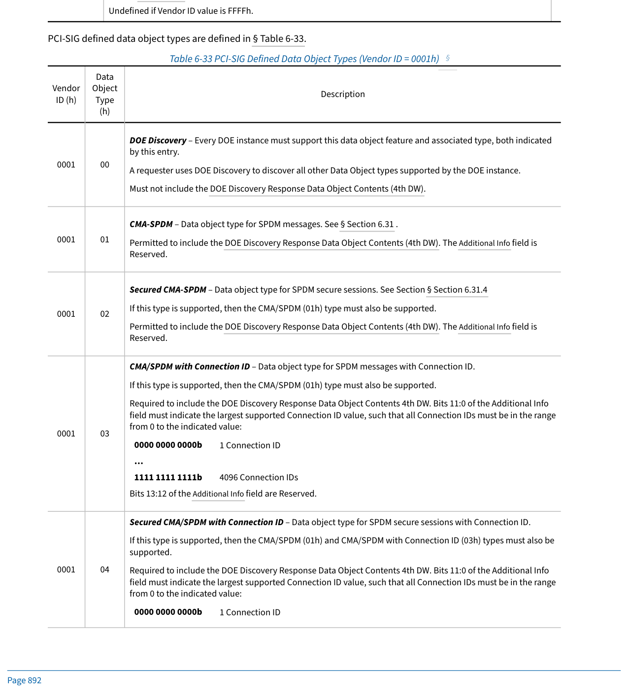

</div>


[⬆️ 返回目录](#-本章目录-table-of-contents)

---

<<<PAGE_BREAK>>> page_893

<a id="sec-6-30-1-2"></a>
## 6.30.1.2 DOE Async Message | DOE 异步消息

table>
<thead>
<tr>
<th width="50%">🇬🇧 English</th>
<th width="50%" style="background-color:#e8e8e8">🇨🇳 中文</th>
</tr>
</thead>
<tbody>
<tr>
<td>

**Table 6-34. DOE Async Message Data Object Contents (1 DW) | 表 6-34. DOE 异步消息数据对象内容（1 个 DW）**

| Bit Location | Description |
|--------------|-------------|
| 7:0 | Variety – Indicates Async Message variety:<br>00h = Async Message GET<br>01h = Async Message REQUEST<br>02h = Async Message RESPONSE<br>03h = Async Message DONE<br>04-FFh = Reserved |
| 31:8 | Reserved – Requesters must place 00 0000h in this field. Responders must ignore the value in this field. |

The DOE Async Message data object feature allows a DOE instance to transfer device-initiated messages with system software, enabling the device to act as a requester in cases where otherwise the host would act as requester. The DOE Async Message data object type consists of 1 DW that indicates the contents, defined in § Table 6-34, which, for Async Message REQUEST (01h) or Async Message RESPONSE (02h), must be followed by an encapsulated DOE data object. The encapsulated data object must be a full data object as illustrated in § Figure 6-40.

Each data object type definition must specify if that type is permitted to use the Async Message mechanism.

The following data object types are permitted in the encapsulated data object:

- CMA/SPDM
- Secure CMA/SPDM
- CMA/SPDM with Connection ID
- Secure CMA/SPDM with Connection ID

An Async Message is not permitted in the encapsulated data object.

A DOE instance advertises support for sending DOE Async Messages by having the DOE Async Message Support bit Set. A DOE instance is only allowed to send DOE Async Messages, when the DOE Async Message Enable bit is Set.

For a DOE instance to send a DOE Async Message to the host, it must Set DOE Async Message Status and wait to receive a DOE Async Message GET from the host.

System software supporting DOE Async Message must check the DOE Async Message Status bit, and, when that bit is Set and the system software is ready to process the message, then, the host must send an Async Message GET. The DOE instance must in response return the Async Message REQUEST. System software then, in turn, must send Async Message RESPONSE. If the DOE instance has more Async Messages to transfer, then the device must return another Async Message REQUEST, to which system software must return a corresponding Async Message RESPONSE. If the DOE instance has no more Async Messages to send, it must return Async Message DONE and Clear DOE Async Message Status.

A DOE instance must only return Async Message REQUEST in response to a received Async Message GET. It is permitted but not required for system software to abort (as defined in § Section 6.30.1) other data object transfers to give priority to Async Message transfers.

</td>
<td style="background-color:#e8e8e8">

**Table 6-34. DOE Async Message 数据对象内容（1 个 DW） | 表 6-34. DOE 异步消息数据对象内容（1 个 DW）**

| 位位置 | 描述 |
|--------------|-------------|
| 7:0 | Variety（种类） – 指示异步消息种类：<br>00h = Async Message GET（异步消息获取）<br>01h = Async Message REQUEST（异步消息请求）<br>02h = Async Message RESPONSE（异步消息响应）<br>03h = Async Message DONE（异步消息完成）<br>04-FFh = 保留 |
| 31:8 | 保留 – 请求者必须在本字段放置 00 0000h。响应者必须忽略本字段的值。 |

DOE 异步消息数据对象功能允许 DOE 实例与系统软件之间传输设备发起的消息，使得设备在通常由主机充当请求者的情况下可充当请求者。DOE 异步消息数据对象类型由 1 个 DW 组成，指示其内容（如 § Table 6-34 所定义），对于 Async Message REQUEST (01h) 或 Async Message RESPONSE (02h)，其后面必须紧跟一个封装的 DOE 数据对象。封装的数据对象必须是如 § Figure 6-40 中所示的完整数据对象。

每个数据对象类型定义必须指明该类型是否允许使用异步消息机制。

以下数据对象类型允许出现在封装的数据对象中：

- CMA/SPDM
- Secure CMA/SPDM（安全 CMA/SPDM）
- CMA/SPDM with Connection ID（带 Connection ID 的 CMA/SPDM）
- Secure CMA/SPDM with Connection ID（带 Connection ID 的安全 CMA/SPDM）

异步消息不允许出现在封装的数据对象中。

DOE 实例通过将 DOE Async Message Support 位置位来通告其对发送 DOE 异步消息的支持。DOE 实例仅当 DOE Async Message Enable 位置位时才被允许发送 DOE 异步消息。

对于 DOE 实例要向主机发送 DOE 异步消息，它必须置位 DOE Async Message Status 并等待接收来自主机的 DOE Async Message GET。

支持 DOE 异步消息的系统软件必须检查 DOE Async Message Status 位，当该位置位且系统软件已准备好处理消息时，主机必须发送一个 Async Message GET。DOE 实例必须作为响应返回 Async Message REQUEST。系统软件随后必须发送 Async Message RESPONSE。如果 DOE 实例还有更多异步消息要传输，则设备必须返回另一个 Async Message REQUEST，系统软件必须对返回相应的 Async Message RESPONSE。如果 DOE 实例没有更多异步消息要发送，则它必须返回 Async Message DONE 并清除 DOE Async Message Status。

DOE 实例必须仅在接收到 Async Message GET 后才返回 Async Message REQUEST。允许（但不要求）系统软件中止（如 § Section 6.30.1 所定义）其他数据对象传输以优先处理异步消息传输。

</td>
</tr>
</tbody>
</table>

[⬆️ 返回目录](#-本章目录-table-of-contents)

---

<<<PAGE_BREAK>>> page_894

<a id="sec-6-30-2"></a>
## 6.30.2 Operation | 运行


<div style="overflow-x: auto; max-width: 100%;">
<table>
<thead>
<tr>
<th width="50%">🇬🇧 English</th>
<th width="50%" style="background-color:#e8e8e8">🇨🇳 中文</th>
</tr>
</thead>
<tbody>
<tr>
<td>

Other than the DOE Discovery feature, DOE is used to transport data objects as part of a feature defined outside of DOE itself. This section defines requirements of DOE itself, although in some cases these requirements are permitted to be modified per the definition of a specific feature.

For features that define request/response protocols, unless there is a feature-specific requirement, a DOE instance must complete processing a received data object and, if a data object is required in response, must generate the response and Set the Data Object Ready bit in the DOE Status register within 1 second after the DOE Go bit was Set in the DOE Control Register, otherwise the DOE instance must Set the DOE Error bit in the DOE Status register within the same time limit. At any time, the system firmware/software is permitted to set the DOE Abort bit in the DOE Control Register, and the DOE instance must Clear the Data Object Ready bit, if not already Clear, and Clear the DOE Error bit, if already Set, in the DOE Status Register, within 1 second.

Once the transfer of a specific data object has been started, except in case of error or abort, that transfer must be completed before the transfer of another data object is started.

If a single DOE instance supports multiple data object features, system firmware/software is permitted to interleave data objects associated with different data object features, if and only if the data object features allow such interleaving.

Data object buffering requirements are determined by the data object feature(s) supported, and data object features must ensure that maximum data object sizes are well defined. When required, the Max DO Length must be used to indicate the maximum length supported for a specific data object type. All data object types that are defined to require the use of Capability Version 02h or greater in the Data Object Exchange Extended Capability must require the use of Max DO Length.

It is strongly recommended that implementations ensure that the functionality of the DOE Abort bit is resilient, including that DOE Abort functionality is maintained even in cases where device firmware is malfunctioning.

An FLR to a Function must result in the aborting of any DOE transfer in progress. Data object features must specify the handling of FLR and, as appropriate, other conditions that impact the data object feature. While an FLR is in-progress, all writes to the DOE Write Data Mailbox must be dropped, and all reads to the DOE Read Data Mailbox must be terminated with UR, or return all 0's. If these or other erroneous actions are detected while an FLR is in progress, it is permitted that, upon exit from FLR, the DOE Error bit be Set.

If software permits DOE operations to overlap with potential FLRs, software cannot depend on the RRS mechanism, but rather must use time-based mechanisms or FRS to determine the completion of an FLR.

It is not required that FLR result in any type of reset to the internal processing engine for DOE operations, although such behavior is permitted, and may be required or forbidden by specific data object features.

DOE errors cover errors in the operation of DOE itself, and, except as noted below, do not extend to errors associated with a data object feature. Any of the following events must result in the DOE Error bit being Set:

- A Poisoned Configuration Write to any of the DOE registers
- Overflow of the Write Data Mailbox mechanism
- Optionally, if the associated data object feature does not provide an alternate mechanism for reporting such errors, the transfer of a data object that does not correspond to the expected length of that data object

No response must be generated when the DOE Error bit is Set because of a condition associated with the receipt of a data object that would, in a non-error condition, have an associated data object response, no response must be generated.

Hardware behavior is undefined unless software issues writes to the DOE Write Data Mailbox Register and reads from the DOE Read Data Mailbox Register with all Bytes enabled. It is permitted, but not required, for hardware to check for accesses without all Bytes enabled, and if checked, it is strongly recommended that violations result in the DOE Error bit being Set.

The optional DOE Attention Mechanism supports improved power management of DOE implementations, by enabling a DOE instance to temporarily enter an unresponsive state, and providing software a mechanism to direct the instance back to a responsive state. If the DOE Attention Mechanism Support bit is Set, for backwards compatibility, the default is that the DOE instance must remain in a responsive state. System software is recommended to Set the DOE Attention Not Needed bit when it is acceptable for the DOE instance to enter and stay in a state where it is not immediately available for use. When that bit is Clear, the DOE instance must remain in a state where it is ready to respond in a timely way to system software. The DOE At Attention bit, when Set, indicates the DOE interface is presently in a state of readiness. This bit must only be Cleared if the DOE Attention Not Needed bit in the DOE Control Register is Set. It is permitted for this bit to remain Clear for up to 50 ms following the Clearing of DOE Attention Not Needed.

</td>
<td style="background-color:#e8e8e8">

除了 DOE Discovery 功能外，DOE 还用于作为 DOE 自身之外所定义特性的一部分来传输数据对象。本节定义了 DOE 自身的要求，尽管在某些情况下这些要求可根据特定功能的定义进行修改。

对于定义了请求/响应协议的功能，除非存在功能特定的要求，否则 DOE 实例必须在 DOE Control 寄存器中置位 DOE Go 位后 1 秒内完成对所接收数据对象的处理，并且如果需要响应数据对象，则必须生成响应并在 DOE Status 寄存器中置位 Data Object Ready 位；否则 DOE 实例必须在同一时限内将 DOE Status 寄存器中的 DOE Error 位置位。在任何时候，系统固件/软件均被允许置位 DOE Control 寄存器中的 DOE Abort 位，并且 DOE 实例必须在 1 秒内清除 DOE Status 寄存器中的 Data Object Ready 位（如果尚未清除）以及 DOE Error 位（如果已经置位）。

一旦特定数据对象的传输已经开始，除非出现错误或中止，否则该传输必须在另一个数据对象传输开始之前完成。

如果单个 DOE 实例支持多个数据对象功能，则当且仅当这些数据对象功能允许此类交错时，系统固件/软件才被允许交错与不同数据对象功能相关联的数据对象。

数据对象缓冲要求由所支持的数据对象功能决定，并且数据对象功能必须确保最大数据对象大小定义良好。当需要时，必须使用 Max DO Length 来指示特定数据对象类型所支持的最大长度。所有被定义为需要在 Data Object Exchange Extended Capability 中使用 Capability Version 02h 或更高版本的数据对象类型，必须要求使用 Max DO Length。

强烈建议实现确保 DOE Abort 位的功能具有弹性，包括在设备固件出现故障的情况下也能保持 DOE Abort 功能。

对 Function 的 FLR 必须导致任何正在进行的 DOE 传输被中止。数据对象功能必须规定对 FLR 的处理，以及适当情况下影响数据对象功能的其他条件。在 FLR 进行期间，对 DOE Write Data Mailbox 的所有写入必须被丢弃，对 DOE Read Data Mailbox 的所有读取必须以 UR 终止，或返回全 0。如果在 FLR 进行期间检测到这些或其他错误动作，则允许在 FLR 退出后置位 DOE Error 位。

如果软件允许 DOE 操作与潜在的 FLR 重叠，则软件不能依赖于 RRS 机制，而必须使用基于时间的机制或 FRS 来确定 FLR 的完成。

FLR 不要求对 DOE 操作的内部处理引擎产生任何类型的复位，尽管这种行为是允许的，并且可能由特定数据对象功能所要求或禁止。

DOE 错误涵盖 DOE 自身运行中的错误，但如下所述，不包括与数据对象功能相关联的错误。以下任何事件都必须导致 DOE Error 位被置位：

- 对任何 DOE 寄存器的 Poisoned Configuration Write（中毒配置写入）
- Write Data Mailbox 机制溢出
- 可选地，如果相关联的数据对象功能未提供用于报告此类错误的替代机制，则传输的数据对象与该数据对象的预期长度不符

当 DOE Error 位因与接收数据对象相关联的条件而被置位（在无错误情况下该数据对象会具有相关联的响应）时，不得生成响应。

除非软件以全字节使能方式对 DOE Write Data Mailbox 寄存器执行写入并从 DOE Read Data Mailbox 寄存器执行读取，否则硬件行为是未定义的。允许（但不要求）硬件检查未全字节使能的访问；如果进行检查，则强烈建议将违例情况置位 DOE Error 位。

可选的 DOE Attention 机制支持改进 DOE 实现的电源管理，它使 DOE 实例能够临时进入无响应状态，并向软件提供将实例引导回响应状态的机制。如果 DOE Attention Mechanism Support 位置位，为保持向后兼容性，默认情况下 DOE 实例必须保持响应状态。建议系统软件在可以接受 DOE 实例进入并保持在不能立即使用的状态时置位 DOE Attention Not Needed 位。当该位清除时，DOE 实例必须保持能够及时响应系统软件的状态。DOE At Attention 位被置位时，指示 DOE 接口当前处于就绪状态。该位仅当 DOE Control 寄存器中的 DOE Attention Not Needed 位置位时才必须被清除。允许在清除 DOE Attention Not Needed 后该位保持清除状态最长 50 ms。

</td>
</tr>
</tbody>
</table>
</div>


[⬆️ 返回目录](#-本章目录-table-of-contents)

---

<<<PAGE_BREAK>>> page_895

<a id="sec-6-30-2-impl-note"></a>
### IMPLEMENTATION NOTE: EXCHANGE OF DATA OBJECTS | 实现说明：数据对象交换

table>
<thead>
<tr>
<th width="50%">🇬🇧 English</th>
<th width="50%" style="background-color:#e8e8e8">🇨🇳 中文</th>
</tr>
</thead>
<tbody>
<tr>
<td>

**Exchange of Data Objects**

Data objects are exchanged through the mailboxes provided by the Data Object Exchange (DOE) Extended Capability. The DOE mailbox is defined to flexibly support a variety of data objects, and as a result of the definition of specific data objects and their associated features, it is necessary to provide the information required for requesters and responders to appropriately size their data buffers and robustly implement the associated feature.

At the level of individual DW transfers, the DOE responder can use the Completions for the DOE mailbox Configuration Read and Write operations as a flow control mechanism. It should be understood by hardware designers, however, that delaying Configuration Completions will typically stall the software operating DOE, and in some cases may also cause stalls in other software/hardware operations.

The DOE Busy bit can be used to indicate that the DOE responder is temporarily unable to accept a data object. It is necessary for a DOE requester to ensure that individual data object transfers are completed, and that a request/response contract is completed, for example using a mutex mechanism to block other conflicting traffic for cases where such conflicts are possible. The following example shows how system firmware/software transfers a request from system firmware/software to a DOE instance, and the response back to system firmware/software from the DOE instance:

1. System firmware/software checks that the DOE Busy bit is Clear to ensure that the DOE instance is ready to receive a DOE request.
2. System firmware/software writes the entire data object, starting with the first DWORD, a DWORD at a time via the DOE Write Data Mailbox Register.
3. System firmware/software writes 1b to the DOE Go bit.
4. The DOE instance consumes the DOE request from the DOE mailbox.
5. The DOE instance generates a DOE Response and Sets the Data Object Ready bit and generates a DOE Software notification, if supported and enabled.
6. System firmware/software waits for an interrupt if applicable, checks/polls the Data Object Ready bit and, provided it is Set, reads data from the DOE Read Data Mailbox Register and then writes any value to the DOE Read Data Mailbox Register to indicate a successful read, starting with the first DWORD, a DWORD at a time until the entire DOE Response is read.

The above example does not illustrate error handling or additional software mechanisms necessary to manage cases where more than one software entity could potentially attempt to use DOE.

</td>
<td style="background-color:#e8e8e8">

**数据对象的交换**

数据对象通过 Data Object Exchange (DOE) 扩展能力所提供的邮箱进行交换。DOE 邮箱被定义为可灵活支持各种数据对象，并且由于特定数据对象及其相关功能的定义，必须提供请求者和响应者适当调整其数据缓冲区大小并稳健实现相关功能所需的信息。

在单个 DW 传输的层面上，DOE 响应者可以使用 DOE 邮箱配置读写操作的完成报文 (Completion) 作为流控 (Flow Control) 机制。然而，硬件设计者应了解，延迟配置完成报文通常会阻塞操作 DOE 的软件，并且在某些情况下还可能引起其他软件/硬件操作的阻塞。

DOE Busy 位可用于指示 DOE 响应者暂时无法接受数据对象。DOE 请求者必须确保各个数据对象传输已完成，并确保请求/响应契约已完成，例如在可能出现此类冲突的情况下使用互斥机制来阻止其他冲突流量。以下示例展示了系统固件/软件如何将请求从系统固件/软件传输到 DOE 实例，以及响应从 DOE 实例返回到系统固件/软件的过程：

1. 系统固件/软件检查 DOE Busy 位已清除，以确保 DOE 实例已准备好接收 DOE 请求。
2. 系统固件/软件通过 DOE Write Data Mailbox 寄存器一次一个 DWORD 写入整个数据对象，从第一个 DWORD 开始。
3. 系统固件/软件将 1b 写入 DOE Go 位。
4. DOE 实例从 DOE 邮箱消费该 DOE 请求。
5. DOE 实例生成 DOE 响应并置位 Data Object Ready 位，并在支持并启用的情况下生成 DOE 软件通知。
6. 系统固件/软件在适用时等待中断，检查/轮询 Data Object Ready 位，并在该位置位的情况下，从 DOE Read Data Mailbox 寄存器读取数据，然后向 DOE Read Data Mailbox 寄存器写入任意值以指示成功读取，从第一个 DWORD 开始，一次一个 DWORD，直到读取完整个 DOE 响应。

上述示例未说明错误处理或管理多个软件实体可能尝试使用 DOE 这种情况所需的额外软件机制。

</td>
</tr>
</tbody>
</table>

[⬆️ 返回目录](#-本章目录-table-of-contents)

---

<<<PAGE_BREAK>>> page_896

<a id="sec-6-30-3"></a>
## 6.30.3 Interrupt Generation | 中断生成


<div style="overflow-x: auto; max-width: 100%;">
<table>
<thead>
<tr>
<th width="50%">🇬🇧 English</th>
<th width="50%" style="background-color:#e8e8e8">🇨🇳 中文</th>
</tr>
</thead>
<tbody>
<tr>
<td>

A DOE instance is permitted to support the generation of DOE interrupts, as indicated by the DOE Interrupt Support bit in the DOE Capabilities Register. If DOE interrupts are supported, the DOE instance must support MSI and/or MSI-X. INTx interrupt signaling is not permitted with DOE. DOE interrupts are enabled by the DOE Interrupt Enable bit in the DOE Control Register. DOE interrupts are indicated by the DOE Interrupt Status bit in the DOE Status register.

If enabled (see § Section 6.1.4.3), an interrupt message must be triggered when the associated vector is unmasked (see § Section 6.1.4.5 Per-vector Masking and Function Masking), the DOE Interrupt Enable bit is Set, and the value of the DOE Interrupt Status bit transitions from 0b to 1b.

The interrupt message will use the vector indicated by the DOE Interrupt Message Number field in the DOE Capabilities Register. Multiple DOE instances in the same Function or RCRB are permitted to use the same interrupt vector.

</td>
<td style="background-color:#e8e8e8">

DOE 实例被允许支持 DOE 中断的生成，这由 DOE Capabilities 寄存器中的 DOE Interrupt Support 位指示。如果支持 DOE 中断，则 DOE 实例必须支持 MSI 和/或 MSI-X。DOE 不允许使用 INTx 中断信号机制。DOE 中断由 DOE Control 寄存器中的 DOE Interrupt Enable 位启用。DOE 中断由 DOE Status 寄存器中的 DOE Interrupt Status 位指示。

如果已启用（参见 § Section 6.1.4.3），则在相关向量未被屏蔽（参见 § Section 6.1.4.5 Per-vector Masking and Function Masking）且 DOE Interrupt Enable 位置位，并且 DOE Interrupt Status 位的值从 0b 跃迁为 1b 时，必须触发中断消息。

中断消息将使用 DOE Capabilities 寄存器中 DOE Interrupt Message Number 字段所指示的向量。同一 Function 或 RCRB 中的多个 DOE 实例被允许使用同一中断向量。

</td>
</tr>
</tbody>
</table>
</div>


[⬆️ 返回目录](#-本章目录-table-of-contents)

---

<<<PAGE_BREAK>>> page_897

<a id="sec-6-31"></a>
## 6.31 Component Measurement and Authentication (CMA-SPDM) | 组件度量与认证 (CMA-SPDM)

table>
<thead>
<tr>
<th width="50%">🇬🇧 English</th>
<th width="50%" style="background-color:#e8e8e8">🇨🇳 中文</th>
</tr>
</thead>
<tbody>
<tr>
<td>

> **Figure 6-46.** CMA-SPDM as Part of a Layered Architecture
> 

Component Measurement and Authentication/SPDM (CMA-SPDM) defines optional security features based on the adaptation of the data objects and underlying protocol defined in [SPDM]. These provide mechanisms to perform security exchanges (where this term is used generically to refer to all defined capabilities of [SPDM]) with a component, or Device/Function. It is intended that CMA-SPDM inherit all new capabilities of [SPDM] as that specification is enhanced, and identifiable by the versioning mechanisms defined for [SPDM]. CMA-SPDM is part of a layered architecture intended to support a consistent and structured approach to security (see § Figure 6-46).

As security requirements evolve, and sometimes older technologies become compromised, for example by new types of attacks that had not been foreseen, so that they are no longer considered secure, CMA-SPDM is intended to balance the need for maintaining sufficient security against the sometimes conflicting goal of maximizing interoperability.

Backwards compatibility will be maintained wherever possible, but this may not be possible in all cases.

It must also be understood that many aspects of security, including the establishment of policies, and the evaluation of specific trust decisions, very often cannot be made locally to a specific device or platform, and so are necessarily outside the scope of this specification. CMA-SPDM should be understood as a tool that provides a common framework for some key elements of security.

CMA-SPDM can use the Data Object Exchange (DOE) Capability (See § Section 6.30) as a mechanism for security exchanges, and can also be used for out-of-band or other in-band security exchanges, for example using MCTP [SPDM-MCTP] Binding.

It is possible to use CMA-SPDM in many scenarios—for example:

- Remote system administrators can dynamically generate a manifest of cryptographic identities of components of a system, especially at the level of removable units (e.g., add-in-cards/modules), without physical examination of the system, via a BMC or other platform root-of-trust.
- The identity of a Function can be verified by OS drivers before assigning resources to the Function during runtime/hot-plug scenarios without requiring a host reboot.
- Virtual Machine Monitors (VMMs) or TEE Security Managers (TSMs – see Chapter 11) can establish the hardware and firmware identities of a Function before assigning it to a Virtual Machine, and provide a service such to enable these to be confirmed by the Virtual Machine guest directly with the assigned Function.

The high-level overview of the CMA-SPDM security features and their associated PCIe-specific requirements are given in the following sections, whereas the foundational architecture, protocol and message definitions for the security exchanges used by CMA-SPDM are defined in [SPDM]. The messages exchanged between the requester and a responder for the CMA-SPDM security features are denoted as CMA-SPDM Messages.

</td>
<td style="background-color:#e8e8e8">

Component Measurement and Authentication/SPDM (CMA-SPDM) 基于 [SPDM] 中定义的数据对象及底层协议的适配，定义了可选的安全特性。这些特性提供了与组件或 Device/Function 执行安全交换的机制（此处该术语是泛指 [SPDM] 中定义的所有能力）。CMA-SPDM 旨在随 [SPDM] 规范的增强而继承其所有新功能，并可由 [SPDM] 中定义的版本机制识别。CMA-SPDM 是分层架构的一部分，旨在以一致且结构化的方式支持安全（参见 § Figure 6-46）。

随着安全要求的演进，以及某些旧有技术被攻破（例如出现未预料的新型攻击），使其不再被认为是安全的，CMA-SPDM 旨在在保持足够安全性与最大化互操作性这一有时相互冲突的目标之间取得平衡。

将在可能的情况下保持向后兼容性，但在某些情况下可能无法做到这一点。

还必须理解，安全的许多方面（包括策略的建立以及特定信任决策的评估）通常无法在特定设备或平台本地做出，因此必然超出本规范的范围。CMA-SPDM 应被理解为一种为某些关键安全要素提供通用框架的工具。

CMA-SPDM 可使用 Data Object Exchange (DOE) 能力（参见 § Section 6.30）作为安全交换机制，也可用于带外 (Out-of-Band) 或其他带内 (In-Band) 安全交换，例如使用 MCTP [SPDM-MCTP] 绑定。

CMA-SPDM 可在多种场景下使用，例如：

- 远程系统管理员可通过 BMC 或其他平台可信根，动态生成系统组件（尤其是可移动单元层级，例如插卡/模块）加密身份的清单，而无需对系统进行物理检查。
- 在运行时/热插拔 (Hot-Plug) 场景中，OS 驱动可在向 Function 分配资源之前对其进行身份验证，而无需主机重新启动。
- 虚拟机监控器 (VMM) 或 TEE 安全管理器 (TSM，参见第 11 章) 可在将 Function 分配给虚拟机之前建立其硬件和固件身份，并提供服务使虚拟机客户机能够直接与所分配的 Function 确认这些身份。

CMA-SPDM 安全特性的高级概述及其相关 PCIe 特定要求将在以下各节中给出，而 CMA-SPDM 所用安全交换的基础架构、协议及消息定义在 [SPDM] 中定义。CMA-SPDM 安全特性中在请求者和响应者之间交换的消息被称为 CMA-SPDM 消息。

</td>
</tr>
</tbody>
</table>

[⬆️ 返回目录](#-本章目录-table-of-contents)

---

<<<PAGE_BREAK>>> page_898

<a id="sec-6-31-impl-note-1"></a>
### IMPLEMENTATION NOTE: UNDERSTANDING AND IMPLEMENTING CMA-SPDM | 实现说明：理解与实现 CMA-SPDM


<div style="overflow-x: auto; max-width: 100%;">
<table>
<thead>
<tr>
<th width="50%">🇬🇧 English</th>
<th width="50%" style="background-color:#e8e8e8">🇨🇳 中文</th>
</tr>
</thead>
<tbody>
<tr>
<td>

**Understanding and Implementing CMA-SPDM**

CMA-SPDM is part of a layered architecture to support device and platform security (see § Figure 6-46). Building on the DMTF Security Protocol & Data Model specification [SPDM], CMA-SPDM provides a "mapping" of that foundation, with the intent that future [SPDM] enhancements can, in most cases, be implemented without requiring modifications to CMA-SPDM. In addition to device authentication & firmware measurement, capabilities such as mutual authentication and cryptographic key exchange are also possible. Following [SPDM], CMA-SPDM uses the term "requester" to refer to agents initiating CMA-SPDM protocol requests, and "responder" to refer to an agent that ultimately services those requests and generates responses.

Depending on the use models supported, it may be desirable to implement support for more than one way of transporting CMA-SPDM requests and responses.

§ Figure 6-48 shows an example of a device that supports multiple platform use models and multple access mechanisms. In this example, there is a System Management Controller that has an out-of-band connection to the other elements in the platform, enabling it to use CMA-SPDM even when the PCIe Links are not active and/or Fundamental Reset is active. When the PCIe Links are operating, CMA-SPDM can be used via [SPDM-MCTP]. The Root Complex can use CMA-SPDM over DOE. It is a platform implementation choice of which methods are used.

Correspondingly, a device controller can support CMA-SPDM in multiple ways, depending on the associated form-factor and platform requirements and implementation choices. For maximum flexibility it may be desirable to support all of the following:

- Out-of-band (e.g., over SMBus, I2C, I3C, etc.) using MCTP, according to the specifications for [SPDM] + CMA-SPDM + [SPDM-MCTP]
- In-band using MCTP encapsulated in PCIe Messages, according to the specifications for [SPDM] + CMA-SPDM + [SPDM-MCTP] + [MCTP-VDM]
- In-band using the Configuration mailbox mechanism defined by the DOE Extended Capability, according to the specifications for [SPDM] + CMA-SPDM + DOE

Or, when the requirements for a specific implementation do not require this level of flexibility, it may be preferable to support only one or two of these approaches.

The platform requirements for CMA-SPDM are determined by the use cases supported. Example use cases that apply to an add-in-card as a unit include:

- Before platform boot, a management controller checks the add-in-card out of band.
- During platform boot, system firmware checks the add-in card in-band via DOE.
- During run-time, a management controller or system software/firmware checks the add-in-card via [MCTP-VDM].

To support use cases where the management controller and system firmware/software communicate the results of their checks with each other, it is necessary that the results of those checks be consistent, subject to any changes applied since earlier checks were made. It is for this use case that Function 0 is required to match identically the results received via these other mechanisms.

For use cases where the add-in-card is being evaluated as a unit, the device controller can, through implementation specific means, attest and/or measure other board elements, to ensure that the identity and integrity of the add-in-card as a whole is correct. How this can be done is outside the scope of CMA-SPDM.

For improved interoperability, CMA-SPDM requires support for certain algorithms, while allowing support for any of the algorithms supported by [SPDM]. Flexibility is allowed for Responder algorithm selection with the intent that device vendors can, if desired, align their choices with common standards such as those defined in the Commercial National Security Algorithm (CNSA) Suite and in NIST Special Publication 800-57.

The applications of CMA/SPDM are numerous and varied. For complex environments, the issues of secure identity provisioning, measurement collection/reporting, and verification of attested state may require evaluating additional standards and industry best practices. Examples include:

- TCG Reference Integrity Manifest (RIM) Information Model: https://trustedcomputinggroup.org/resource/tcg-reference-integrity-manifest-rim-information-model
- OCP Attestation of System Components v1.0 Requirements and Recommendations: https://www.opencompute.org/documents/attestation-v1-0-20201104-pdf

</td>
<td style="background-color:#e8e8e8">

**理解与实现 CMA-SPDM**

CMA-SPDM 是支持设备和平台安全的分层架构的一部分（参见 § Figure 6-46）。CMA-SPDM 建立在 DMTF Security Protocol & Data Model 规范 [SPDM] 之上，提供了对该基础的"映射"，其目的是在大多数情况下未来的 [SPDM] 增强可在不修改 CMA-SPDM 的前提下实现。除了设备认证与固件度量外，还可以支持诸如相互认证和加密密钥交换等能力。沿用 [SPDM] 的术语，CMA-SPDM 使用"requester（请求者）"一词指代发起 CMA-SPDM 协议请求的代理，使用"responder（响应者）"指代最终服务这些请求并生成响应的代理。

根据所支持的使用模型，可能希望实现对多种 CMA-SPDM 请求和响应传输方式的支持。

§ Figure 6-48 给出了一个支持多种平台使用模型和多种访问机制的设备示例。在该示例中，存在一个 System Management Controller（系统管理控制器），它与平台中的其他元素具有带外 (Out-of-Band) 连接，使其即使在 PCIe 链路 (Link) 未激活和/或基本复位 (Fundamental Reset) 处于激活状态时也能使用 CMA-SPDM。当 PCIe 链路运行时，可通过 [SPDM-MCTP] 使用 CMA-SPDM。根复合体 (Root Complex) 可通过 DOE 使用 CMA-SPDM。究竟使用哪些方法是平台实现选择。

相应地，设备控制器可基于相关外形规格 (Form Factor) 和平台要求以及实现选择，以多种方式支持 CMA-SPDM。为了获得最大灵活性，可能希望同时支持以下所有方式：

- 带外 (例如经 SMBus、I2C、I3C 等) 使用 MCTP，依据 [SPDM] + CMA-SPDM + [SPDM-MCTP] 的规范
- 带内使用封装在 PCIe 消息中的 MCTP，依据 [SPDM] + CMA-SPDM + [SPDM-MCTP] + [MCTP-VDM] 的规范
- 带内使用由 DOE 扩展能力所定义的配置邮箱机制，依据 [SPDM] + CMA-SPDM + DOE 的规范

或者，当特定实现的需求不需要这种程度的灵活性时，可能更倾向于仅支持这些方式中的一种或两种。

CMA-SPDM 的平台要求由所支持的用例决定。适用于作为整体的插卡的示例用例包括：

- 平台启动前，管理控制器以带外方式检查插卡。
- 平台启动过程中，系统固件通过 DOE 以带内方式检查插卡。
- 运行时，管理控制器或系统软件/固件通过 [MCTP-VDM] 检查插卡。

为支持管理控制器和系统固件/软件彼此通信其检查结果的使用场景，必须使这些检查结果保持一致，以自先前的检查以来所发生的任何变化为前提。Function 0 正是为此用例被要求与通过这些其他机制所收到的结果完全匹配。

对于将插卡作为整体进行评估的用例，设备控制器可通过实现特定的方式对其他板载元件进行证明和/或度量，以确保插卡整体的身份和完整性正确。如何实现这一点超出了 CMA-SPDM 的范围。

为改进互操作性，CMA-SPDM 要求支持某些算法，同时允许支持 [SPDM] 所支持的任何算法。响应者的算法选择具有一定的灵活性，目的是使设备厂商在需要时可将其选择与通用标准对齐，例如 Commercial National Security Algorithm (CNSA) 套件及 NIST 特别出版物 800-57 中所定义的标准。

CMA/SPDM 的应用众多且多样化。对于复杂环境，安全身份供应、度量收集/报告以及已证明状态验证等问题可能需要评估更多标准与行业最佳实践。示例包括：

- TCG Reference Integrity Manifest (RIM) Information Model（TCG 参考完整性清单信息模型）：https://trustedcomputinggroup.org/resource/tcg-reference-integrity-manifest-rim-information-model
- OCP Attestation of System Components v1.0 Requirements and Recommendations（OCP 系统组件证明 v1.0 要求与建议）：https://www.opencompute.org/documents/attestation-v1-0-20201104-pdf

</td>
</tr>
</tbody>
</table>

> **Figure 6-47.** Example System Showing Multiple Access Mechanisms
> 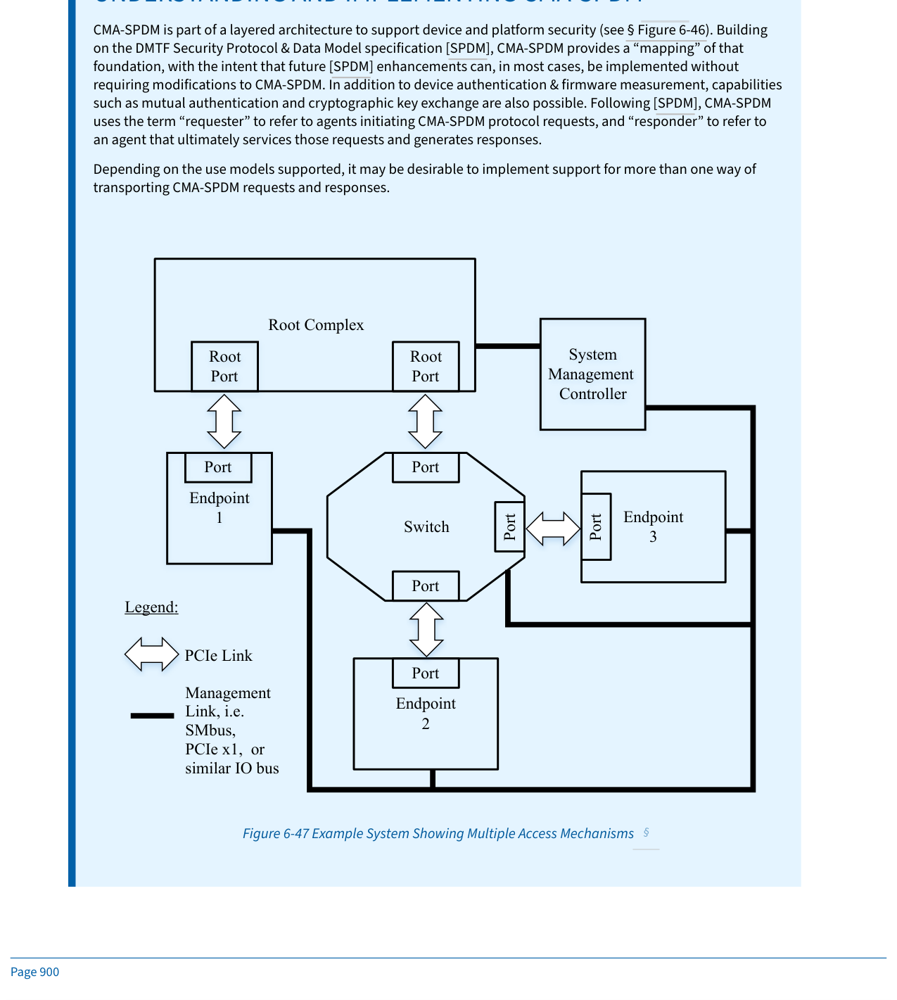

> **Figure 6-48.** Example Add-In-Card Supporting CMA-SPDM
> 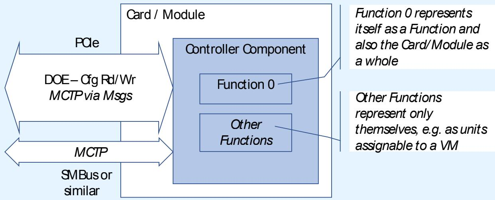

</div>


[⬆️ 返回目录](#-本章目录-table-of-contents)

---

<<<PAGE_BREAK>>> page_902

<a id="sec-6-31-impl-note-2"></a>
### IMPLEMENTATION NOTE: OVERVIEW OF THREAT MODEL | 实现说明：威胁模型概述

table>
<thead>
<tr>
<th width="50%">🇬🇧 English</th>
<th width="50%" style="background-color:#e8e8e8">🇨🇳 中文</th>
</tr>
</thead>
<tbody>
<tr>
<td>

**Overview of Threat Model**

A detailed threat model analysis typically requires consideration of the context in which a system is operating and the composition of the system along with many other factors, and as such cannot be provided here. A high level overview of the types of threats for which CMA-SPDM may be applicable includes:

- Remote and Local software-based attacks, e.g., to install corrupted device firmware or roll back device firmware to an older version
- Threats from attacker in physical possession of the device including:
  - Software-based (similar to above)
  - Presentation ("impersonation")
  - Hardware attacks of various sorts
- Attacks during manufacturing, provisioning or maintenance, including:
  - Provisioning of improper configuration and/or firmware
  - Improper "repair" of a module

CMA-SPDM requires the leaf certificate to include the information typically used by system software for device driver binding. This requirement is intended to support scenarios where an attacker device attempts to gain access to system resources by appearing to be a valid device type. Responding devices can include the device serial number value in the leaf certificate to simplify system implementation of policies that require specific unit instances to be identified, for example to support scenarios where a modified unit is substituted for a valid, but otherwise identical, unit.

CMA-SPDM defines how the responder role as defined in [SPDM] must be implemented for PCIe devices, regardless of the communication path(s) implemented between the requester(s) and the responder.

It is permitted, but not required, to support CMA-SPDM and the responder role as defined in [SPDM] at the level of individual Functions. When this is done, then the Function(s) must implement both CMA-SPDM and DOE. For a multi-Function device, each Function implementing the responder role must implement CMA-SPDM and DOE. For Switches that support CMA-SPDM, each Switch Port Function implementing the responder role must implement CMA-SPDM and DOE.

It is permitted, but not required, for CMA-SPDM to be implemented using one or more access mechanisms other than DOE, in support of various use models (e.g. see § Figure 6-46). When a use model requires CMA-SPDM to be applied at the level of a replaceable unit it may be necessary to support security exchanges operated by means other than DOE. For example, an add-in-card being evaluated by a Baseboard Management Controller (BMC), or similar element, may use MCTP over a sideband bus. For devices that implement such support, the certificate chain in slot 0 (referring to slots as defined in [SPDM]) must match identically the certificate chain in slot 0 returned by Function 0 via DOE, if DOE is also supported.

CMA-SPDM does not apply to Root Ports, and a Root Port must not implement CMA-SPDM.

The value of all measurements must always reflect the firmware in use at the time of the measurement being read, including for components that support runtime update of firmware without a system reset.

When using CMA-SPDM with DOE:

- The instance of DOE used for CMA-SPDM must support:
  - the DOE Discovery data object protocol,
  - the CMA-SPDM data object protocol,
  - if IDE is supported, the IDE_KM data object protocol using Secured CMA-SPDM (See § Section 6.31.4),
  - and no other data object protocol(s).
- A responder must support operation when the associated Function is in the D0 state, and is permitted but not required to support operation in non-D0 states.
- Behavior is undefined if a Function that does not support operation in non-D0 states is transitioned into a non-D0 state during a CMA-SPDM protocol operation.
  - It is strongly recommended that system software avoid placing a Function into a non-D0 state while a CMA-SPDM protocol operation is taking place.
- An FLR to a Function during the processing of a CMA-SPDM request must result in that Function terminating its processing of the request, and that Function not returning a response to the request.
  - An FLR to a Function during the DOE transfer of a CMA-SPDM request or response data object must follow the rules defined in § Section 6.30.

When using CMA-SPDM with a transport mechanism other than DOE:

</td>
<td style="background-color:#e8e8e8">

**威胁模型概述**

详细的威胁模型分析通常需要考虑系统运行所处的环境以及系统的组成等众多因素，因此无法在此提供。 CMA-SPDM 适用的威胁类型的高层概述包括：

- 远程和本地的基于软件的攻击，例如安装被损坏的设备固件或将设备固件回滚到旧版本
- 来自物理持有设备的攻击者的威胁，包括：
  - 基于软件的（与上述类似）
  - 表现（"假冒"）
  - 各种形式的硬件攻击
- 制造、供应或维护期间的攻击，包括：
  - 提供不正确的配置和/或固件
  - 对模块进行不当的"维修"

CMA-SPDM 要求叶子证书包含系统软件通常用于设备驱动绑定的信息。此要求旨在支持如下场景：攻击者设备试图通过表现为有效的设备类型来访问系统资源。响应设备可在叶子证书中包含设备序列号值，以简化系统对要求识别特定单元实例的策略的实现，例如支持用一个经过修改的单元替代有效但在其他方面完全相同的单元的场景。

CMA-SPDM 定义了如何在 PCIe 设备上实现 [SPDM] 中所定义的响应者角色，而与请求者和响应者之间所实现的通信路径无关。

允许（但不要求）在单个 Function 层级上支持 CMA-SPDM 及 [SPDM] 中定义的响应者角色。当这样做时，该 Function 必须同时实现 CMA-SPDM 和 DOE。对于多功能设备，每个实现响应者角色的 Function 必须实现 CMA-SPDM 和 DOE。对于支持 CMA-SPDM 的交换机 (Switch)，每个实现响应者角色的交换机端口功能 (Switch Port Function) 必须实现 CMA-SPDM 和 DOE。

允许（但不要求）使用一种或多种非 DOE 的访问机制实现 CMA-SPDM，以支持各种使用模型（例如参见 § Figure 6-46）。当某使用模型要求在可更换单元层级应用 CMA-SPDM 时，可能需要支持通过 DOE 之外的方式进行的安全交换。例如，由基板管理控制器 (BMC) 或类似元素评估的插卡可使用边带 (Sideband) 总线上的 MCTP。对于实现此类支持的设备，槽 0 中的证书链（此处"槽"的定义参见 [SPDM]）必须与 Function 0 通过 DOE 返回的槽 0 中的证书链完全一致（如果也支持 DOE）。

CMA-SPDM 不适用于根端口 (Root Port)，根端口不得实现 CMA-SPDM。

所有度量的值必须始终反映读取度量时正在使用的固件，包括支持在系统不复位的情况下运行时更新固件的组件。

将 CMA-SPDM 与 DOE 一起使用时：

- 用于 CMA-SPDM 的 DOE 实例必须支持：
  - DOE Discovery 数据对象协议，
  - CMA-SPDM 数据对象协议，
  - 如果支持 IDE，则支持使用安全 CMA-SPDM (Secured CMA-SPDM) 的 IDE_KM 数据对象协议（参见 § Section 6.31.4），
  - 不支持其他数据对象协议。
- 响应者必须支持在相关 Function 处于 D0 状态时运行，允许（但不要求）支持在非 D0 状态下运行。
- 如果不支持在非 D0 状态下运行的 Function 在 CMA-SPDM 协议操作期间被转换到非 D0 状态，则行为未定义。
  - 强烈建议系统软件在 CMA-SPDM 协议操作进行期间避免将 Function 置于非 D0 状态。
- 在处理 CMA-SPDM 请求期间对 Function 的 FLR 必须导致该 Function 终止对该请求的处理，且该 Function 不返回对该请求的响应。
  - 在 CMA-SPDM 请求或响应数据对象的 DOE 传输期间对 Function 的 FLR 必须遵循 § Section 6.30 中定义的规则。

将 CMA-SPDM 与非 DOE 的传输机制一起使用时：

</td>
</tr>
</tbody>
</table>

[⬆️ 返回目录](#-本章目录-table-of-contents)

---

<<<PAGE_BREAK>>> page_903

<a id="sec-6-31-1"></a>
## 6.31.1 Removed | 6.31.1 已删除

<table>
<thead>
<tr>
<th width="50%">🇬🇧 English</th>
<th width="50%" style="background-color:#e8e8e8">🇨🇳 中文</th>
</tr>
</thead>
<tbody>
<tr>
<td>

This section has been removed.

</td>
<td style="background-color:#e8e8e8">

本节已被删除。

</td>
</tr>
</tbody>
</table>

[⬆️ 返回目录](#-本章目录-table-of-contents)

---


---

<a id="sec-6-31-2"></a>
## 6.31.2 Removed | 已移除

<table>
<thead>
<tr>
<th width="50%">🇬🇧 English</th>
<th width="50%" style="background-color:#e8e8e8">🇨🇳 中文</th>
</tr>
</thead>
<tbody>
<tr>
<td>

Removed

</td>
<td style="background-color:#e8e8e8">

已移除

</td>
</tr>
</tbody>
</table>

[⬆️ 返回目录](#-本章目录-table-of-contents)

---

<a id="sec-6-31-3"></a>
## 6.31.3 CMA-SPDM Rules | CMA-SPDM 规则


<div style="overflow-x: auto; max-width: 100%;">
<table>
<thead>
<tr>
<th width="50%">🇬🇧 English</th>
<th width="50%" style="background-color:#e8e8e8">🇨🇳 中文</th>
</tr>
</thead>
<tbody>
<tr>
<td>

- A Responder must support operation whenever that transport is active, including cases where the device is in Conventional Reset, unless exceptions are allowed through means outside the scope of this specification
- CMA-SPDM context must be maintained by the Responder such that each transport mechanism (including DOE, when implemented) functions independently of all other transport mechanisms.
  - All transport mechanisms must be treated as independent SPDM connections.
- When CMA-SPDM via DOE in Function 0 is also supported, the certificate chain from slot 0 retrieved via DOE must match the certificate chain from slot 0 retrieved via any/all other transport mechanisms.

For the CMA-SPDM data object type or SPDM with connection ID data object type, the SPDM message payloads must start from "Data Object DW 0". The SPDM message payloads must follow [SPDM] specification Generic SPDM message field definitions, starting with SPDM version, Request Response Code, Param 1 and Param 2. The Byte mapping of SPDM Messages is shown in § Figure 6-49. If required, SPDM Message payloads must be padded with 0's to maintain DW alignment, when using DOE.

Without the connection ID, one DOE instance can only have one SPDM connection. With the connection ID, one DOE instance can have multiple SPDM connections. The maximum valid connection ID can be discovered by using DOE Discovery Data Object Protocol.

Some components provide a debug mode where a debugger is granted access to hardware security properties, allowing the debugger to influence the measurement process itself. It is strongly recommended that components report when a debug mode is active. The reporting mechanism is outside the scope of this specification. It can be SPDM debug and device mode in measurement record or DICE operation flags in DiceTcbInfo.

- For BaseAsymAlgo, Requesters must support all, and Responders must support one or more of the following:
  - TPM_ALG_RSASSA_3072
  - TPM_ALG_ECDSA_ECC_NIST_P256
  - TPM_ALG_ECDSA_ECC_NIST_P384
- For BaseHashAlgo, Requesters must support all, and Responders must support one or both of the following:
  - TPM_ALG_SHA_256
  - TPM_ALG_SHA_384
- For MeasurementSpecification, Requesters and Responders must support the following:
  - DMTF measurement specification format
- Requesters and responders must, for MeasurementHashAlgo, Requesters must support all, and Responders must support one or both of the following:

</td>
<td style="background-color:#e8e8e8">

- 响应者（Responder）必须在该传输机制处于活动状态时支持运行,包括设备处于常规复位（Conventional Reset）的情况,除非通过本规范范围之外的方式允许例外。
- 响应者必须维护 CMA-SPDM 上下文,以使每个传输机制(包括实现时的 DOE)独立于所有其他传输机制运行。
  - 所有传输机制都必须被视为独立的 SPDM 连接。
- 当 Function 0 还支持经由 DOE 的 CMA-SPDM 时,通过 DOE 检索到的 slot 0 证书链必须与通过任何/所有其他传输机制检索到的 slot 0 证书链匹配。

对于 CMA-SPDM 数据对象类型或带连接 ID 的 SPDM 数据对象类型,SPDM 消息有效负载必须从"Data Object DW 0"开始。SPDM 消息有效负载必须遵循 [SPDM] 规范的通用 SPDM 消息字段定义,从 SPDM 版本、Request Response Code、Param 1 和 Param 2 开始。SPDM 消息的字节映射如 § Figure 6-49 所示。如有需要,在使用 DOE 时,SPDM 消息有效负载必须用 0 填充以保持 DW 对齐。

没有连接 ID 时,一个 DOE 实例只能有一个 SPDM 连接。具有连接 ID 时,一个 DOE 实例可以有多个 SPDM 连接。可通过 DOE Discovery Data Object Protocol 发现最大有效连接 ID。

某些组件提供调试模式,在该模式下调试器被授予对硬件安全属性的访问权限,从而允许调试器影响测量过程本身。强烈建议组件在调试模式处于活动状态时进行报告。报告机制不在本规范范围内,可以是测量记录中的 SPDM 调试和设备模式,或 DiceTcbInfo 中的 DICE 操作标志。

- 对于 BaseAsymAlgo,请求者（Requester）必须支持以下全部算法,响应者必须支持以下一种或多种算法:
  - TPM_ALG_RSASSA_3072
  - TPM_ALG_ECDSA_ECC_NIST_P256
  - TPM_ALG_ECDSA_ECC_NIST_P384
- 对于 BaseHashAlgo,请求者必须支持以下全部算法,响应者必须支持以下一种或两种算法:
  - TPM_ALG_SHA_256
  - TPM_ALG_SHA_384
- 对于 MeasurementSpecification,请求者和响应者必须支持以下格式:
  - DMTF 测量规范格式
- 对于 MeasurementHashAlgo,请求者必须支持以下全部算法,响应者必须支持以下一种或两种算法:

</td>
</tr>
</tbody>
</table>

> **Figure 6-49.** Byte Mapping of SPDM Messages Including Example Payload
> 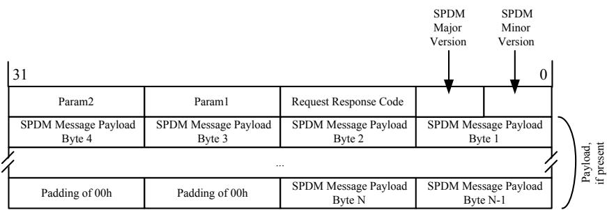

</div>


[⬆️ 返回目录](#-本章目录-table-of-contents)

---

<<<PAGE_BREAK>>> page_905

- For MeasurementHashAlgo (cont.):
  - TPM_ALG_SHA_256
  - TPM_ALG_SHA_384
- It is permitted for Requesters and Responders to support additional algorithms defined for [SPDM] beyond those required.
- Responders must implement a Cryptographic Timeout (CT), as defined in [SPDM], of not more than 223 μs.
  - Per [SPDM] CT is in turn indicated through the value of CTExponent.
  - It is strongly recommended that the CT be as short as practical.

<a id="sec-6-31-4"></a>
## 6.31.4 Secured CMA-SPDM | 安全 CMA-SPDM

table>
<thead>
<tr>
<th width="50%">🇬🇧 English</th>
<th width="50%" style="background-color:#e8e8e8">🇨🇳 中文</th>
</tr>
</thead>
<tbody>
<tr>
<td>

Secured CMA-SPDM provides security for data object protocols based on [SPDM] mechanisms, including the IDE key management (IDE_KM) protocol. Once a secure session has been established per [SPDM] (Revision 1.1 or later), it is permitted, and for some uses required, to use Secured CMA-SPDM to transfer other Data Objects with integrity/encryption, using the algorithm negotiated in the SPDM session establishment, per [Secured SPDM].

It is permitted to continue to perform non-secured CMA-SPDM operations after a session has been established, provided the specific use allows non-secure transport.

Secured CMA-SPDM data objects must be formatted per [Secure-SPDM]. It is permitted for specific data object protocols to constrain the use and content of optional fields, but if no such constraints are applied then the use of such fields is implementation specific.

An FLR to a Function for which there is an established secure session must not change the state of the secure session. However, as with non-secured CMA-SPDM, an FLR to a Function during the processing of a CMA-SPDM request must result in that Function terminating its processing of the request, and that Function not returning a response to the request, and this may impact the usability of the secure session and possibly render the secure session unusable.

For the Secured CMA-SPDM data object type or Secured CMA-SPDM with connection ID data object type, the Secured CMA-SPDM message payloads must start from "Data Object DW 0". The Secured CMA-SPDM message payloads must follow the Secured CMA-SPDM specification Secure Message fields definition, starting with Session ID. "Sequence Number" field must be absent (S=0). "Random Data" field must be absent (R=0). The "Application Data" field must be the in-session SPDM message. The Byte mapping of Secured CMA-SPDM Messages is shown in § Figure 6-50. If required, Secured CMA-SPDM Message payloads must be padded with 0's to maintain DW alignment, when using DOE.

> **Figure 6-50.** Byte Mapping of Secured CMA-SPDM Messages Including Example Payload

</td>
<td style="background-color:#e8e8e8">

安全 CMA-SPDM（Secured CMA-SPDM）基于 [SPDM] 机制(包括 IDE 密钥管理（IDE_KM）协议)为数据对象协议提供安全性。一旦按照 [SPDM](修订版 1.1 或更高版本)建立了安全会话,允许(在某些使用场景中要求)使用安全 CMA-SPDM 以完整性/加密方式传输其他数据对象,使用 SPDM 会话建立期间协商的算法,详见 [Secured SPDM]。

在建立会话后,允许继续执行非安全的 CMA-SPDM 操作,前提是该特定使用场景允许非安全传输。

安全 CMA-SPDM 数据对象必须按照 [Secure-SPDM] 格式化。允许特定数据对象协议约束可选字段的使用和内容,但如果未应用此类约束,则这些字段的使用属于实现特定的。

对已建立安全会话的 Function 执行 FLR 不得更改该安全会话的状态。但是,与非安全 CMA-SPDM 一样,在处理 CMA-SPDM 请求期间对 Function 执行 FLR 必须导致该 Function 终止其对该请求的处理,且该 Function 不返回对该请求的响应,这可能会影响安全会话的可用性,并可能导致安全会话不可用。

对于安全 CMA-SPDM 数据对象类型或带连接 ID 的安全 CMA-SPDM 数据对象类型,安全 CMA-SPDM 消息有效负载必须从"Data Object DW 0"开始。安全 CMA-SPDM 消息有效负载必须遵循安全 CMA-SPDM 规范的安全消息字段定义,从 Session ID 开始。"Sequence Number"字段必须不存在(S=0)。"Random Data"字段必须不存在(R=0)。"Application Data"字段必须是会话内 SPDM 消息。安全 CMA-SPDM 消息的字节映射如 § Figure 6-50 所示。如有需要,在使用 DOE 时,安全 CMA-SPDM 消息有效负载必须用 0 填充以保持 DW 对齐。

> **Figure 6-50.** 安全 CMA-SPDM 消息的字节映射(含示例有效负载)

</td>
</tr>
</tbody>
</table>

[⬆️ 返回目录](#-本章目录-table-of-contents)

---

<<<PAGE_BREAK>>> page_906


<div style="overflow-x: auto; max-width: 100%;">
<table>
<thead>
<tr>
<th width="50%">🇬🇧 English</th>
<th width="50%" style="background-color:#e8e8e8">🇨🇳 中文</th>
</tr>
</thead>
<tbody>
<tr>
<td>

**Additional Rules:**

- Requesters and Responders must support ENCRYPT_CAP and MAC_CAP.
- For DHE group, Requesters must support all, and Responders must support one or both of the following:
  - secp256r1
  - secp384r1
- For AEAD structure, Requesters and Responders must support the following:
  - AES-256-GCM with 16 Byte MAC
- For KeySchedule structure, Requesters and Responders must support the following:
  - SPDM Key Schedule
- For Secured Message format, Requesters and Responders must support the following:
  - DSP0277 Secured Messages opaque data format as defined in Section 8 of DSP0277, if SPDM 1.1 or below is used.
  - DSP0274 General opaque data format as defined in Section 14 of SPDM 1.2, if SPDM 1.2 or above is used. The OtherParamsSupport field of NEGOTIATE_ALGORITHMS request and ALGORITHMS response must set the bit for OpaqueDataFmt1.
- Requesters and Responders must use DSP0277 specification version as the Secured Message transport binding version (format as defined in Section 6 of DSP0277) required in the OpaqueData fields of KEY_EXCHANGE request / KEY_EXCHANGE_RSP response / PSK_EXCHANGE request / PSK_EXCHANGE_RSP response messages defined in DSP0274, when using DOE.
- Requesters and Responders may support mutual authentication. If mutual authentication is supported, for ReqBaseAsymAlgo, Requesters and Responders must support one or more of the following:
  - TPM_ALG_RSASSA_3072
  - TPM_ALG_ECDSA_ECC_NIST_P256
  - TPM_ALG_ECDSA_ECC_NIST_P384
- Requesters and Responders are permitted to implement additional algorithms defined in [SPDM]

</td>
<td style="background-color:#e8e8e8">

**附加规则:**

- 请求者和响应者必须支持 ENCRYPT_CAP 和 MAC_CAP。
- 对于 DHE 组,请求者必须支持以下全部,响应者必须支持以下一种或两种:
  - secp256r1
  - secp384r1
- 对于 AEAD 结构,请求者和响应者必须支持以下格式:
  - AES-256-GCM,带 16 字节 MAC
- 对于 KeySchedule 结构,请求者和响应者必须支持以下格式:
  - SPDM Key Schedule
- 对于安全消息格式,请求者和响应者必须支持以下格式:
  - 如果使用 SPDM 1.1 或更低版本,则使用 DSP0277 第 8 节定义的 DSP0277 Secured Messages 不透明数据格式。
  - 如果使用 SPDM 1.2 或更高版本,则使用 SPDM 1.2 第 14 节定义的 DSP0274 通用不透明数据格式。NEGOTIATE_ALGORITHMS 请求和 ALGORITHMS 响应的 OtherParamsSupport 字段必须为 OpaqueDataFmt1 设置相应位。
- 在使用 DOE 时,请求者和响应者必须使用 DSP0277 规范版本作为 DSP0274 中定义的 KEY_EXCHANGE 请求 / KEY_EXCHANGE_RSP 响应 / PSK_EXCHANGE 请求 / PSK_EXCHANGE_RSP 响应消息的 OpaqueData 字段中要求的安全消息传输绑定版本(格式在 DSP0277 第 6 节中定义)。
- 请求者和响应者可以支持相互认证。如果支持相互认证,则对于 ReqBaseAsymAlgo,请求者和响应者必须支持以下一种或多种:
  - TPM_ALG_RSASSA_3072
  - TPM_ALG_ECDSA_ECC_NIST_P256
  - TPM_ALG_ECDSA_ECC_NIST_P384
- 允许请求者和响应者实现 [SPDM] 中定义的其他算法

</td>
</tr>
</tbody>
</table>
</div>


[⬆️ 返回目录](#-本章目录-table-of-contents)

---

<a id="sec-6-32"></a>
## 6.32 Deferrable Memory Write | 可延迟内存写 (DMWr)

table>
<thead>
<tr>
<th width="50%">🇬🇧 English</th>
<th width="50%" style="background-color:#e8e8e8">🇨🇳 中文</th>
</tr>
</thead>
<tbody>
<tr>
<td>

The Deferrable Memory Write (DMWr) is an Optional Non-Posted Request that enables a scalable high-performance mechanism to implement shared work queues and similar capabilities. With DMWr, devices can have a single shared work queue and accept work items from multiple non-cooperating software agents in a non-blocking way. A DMWr Completer, i.e., a Function whose DMWr Completer Supported bit is Set, is a Function that supports being the target of DMWr Requests.

The mechanisms for generating DMWr Requests are outside the scope of this document. For cases where a DMWr Requester supports generation of DMWr Requests directly via software mechanisms, it is recommended that the software thread that invoked the Request is informed of the corresponding Completion Status in an implementation specific manner.

As with AtomicOps (See § Section 6.15), the use model for DMWr requires that, from the initial trigger to generate a DMWr Request, the subsequent routing to the Completer, the Completer's resulting actions, and the return of the corresponding Completion, that each of these be "atomic" in the sense that a single trigger must result in a single Request, which must not be subdivided, being acted upon by the Completer in such a way that no observer can see a partial result, and a single Completion being returned to the Requester, without subdivision. Therefore, the following rules apply:

</td>
<td style="background-color:#e8e8e8">

可延迟内存写(Deferrable Memory Write, DMWr)是一种可选的 Non-Posted 请求,它支持可扩展的高性能机制,以实现共享工作队列及类似能力。借助 DMWr,设备可以拥有单一共享工作队列,并以非阻塞方式从多个非协作软件代理接受工作项。DMWr Completer,即 DMWr Completer Supported 位被置位的 Function,是支持作为 DMWr 请求目标的 Function。

生成 DMWr 请求的机制不在本文档范围内。对于 DMWr 请求者支持通过软件机制直接生成 DMWr 请求的情况,建议以特定于实现的方式将相应的完成状态（Completion Status）通知发起该请求的软件线程。

与原子操作(AtomicOps,见 § Section 6.15)一样,DMWr 的使用模型要求从生成 DMWr 请求的初始触发开始,到向 Completer 的后续路由、Completer 的响应动作,以及相应完成（Completion）的返回,每个步骤都必须是"原子的",即单次触发必须产生单个请求,该请求不可再分割,由 Completer 处理时不得使任何观察者看到部分结果,并且向请求者返回单个完成,且完成也不可分割。因此,以下规则适用:

</td>
</tr>
</tbody>
</table>

[⬆️ 返回目录](#-本章目录-table-of-contents)

---

<<<PAGE_BREAK>>> page_907


<div style="overflow-x: auto; max-width: 100%;">
<table>
<thead>
<tr>
<th width="50%">🇬🇧 English</th>
<th width="50%" style="background-color:#e8e8e8">🇨🇳 中文</th>
</tr>
</thead>
<tbody>
<tr>
<td>

- Switches and Root Complexes that support DMWr routing must route DMWr Requests and Completions without modification.
- DMWr Completers must ensure that operations performed on behalf of a given DMWr Request are performed atomically with respect to each host processor or device access to that target location range.
- The internal implementation of DMWr Requesters and Completers to enforce the required "atomic" behavior is outside the scope of this document.

The target of a DMWr Request that is not a DMWr Completer (i.e., a Function whose DMWr Completer Supported bit is Clear) responds as per the Request handling rule for a Request Type that is not supported (see § Section 2.3.1). In Non-Flit Mode, components designed to earlier revisions of this specification that treat the Request Type value corresponding to DMWr Request as Reserved are permitted to treat a received DMWr Request as a Malformed TLP.

The following requirements apply to DMWr Completers:

- Functions indicate their ability to act as DMWr Completers by Setting DMWr Completer Supported and by indicating the largest DMWr TLP that the Function can receive (see DMWr Lengths Supported).
- Properly formed DMWr Requests must be handled as a Successful Completion (SC), Request Retry Status (RRS), Unsupported Request (UR), or Completer Abort (CA).
  - Properly formed DMWr Requests with types or operand sizes not supported by the Completer, or targeting an address not intended by the device's programming model to be a target of DMWr Requests, or crossing an address boundary between two different resources, must be handled as Completer Abort (CA), and the value of the target location must remain unchanged.
  - Switches that support DMWr Routing but do not support serving as a DMWr Completer must handle properly formed DMWr Requests that target internal resources of the Switch as Completer Abort (CA), and the value of the target location must remain unchanged.
- When a DMWr Request cannot be completed successfully due to a temporary condition, the Completer is permitted to return a Completion with Request Retry Status (RRS)
  - When this is done, the value of the target location must remain unchanged, and the Completer must not assume that the Requester will repeat the request.
  - This is not an error
- Completers are permitted to use implementation specific mechanisms to determine when to use the RRS Completion Status in order to establish policies for fairness or for other reasons, and these mechanisms may be based on Requester ID, Traffic Class, PASID, payload contents, or other criteria as may be appropriate.
- Completers supporting DMWr are allowed to implement a restricted programming model.
  - If a Request that is not a DMWr targets an address intended by the device's programming model to be a target of DMWr Requests, it is strongly recommended that the value of the target location remain unchanged, and, if the Request is a Non-Posted Request, that the Completion returned does not include any sensitive information.
  - See Implementation Note: Optimizations Based on a Restricted Programming Model in § Section 2.3.1 for additional general guidance.
- Completers supporting DMWr that return Successful Completion (SC) must guarantee that the observed update granularity will not be smaller than 64 bytes, or the size of the Request, whichever is smaller.
  - This requirement applies to DMWr targeting "plain" memory, a shared work queue, or other implementation specific structures, when such operations are supported by the programming model of the Completer.
  - See also § Section 2.4.3 and § Section 2.4.4.

</td>
<td style="background-color:#e8e8e8">

- 支持 DMWr 路由的交换机（Switch）和根复合体（Root Complex）必须以不修改的方式路由 DMWr 请求和完成（Completion）。
- DMWr Completer 必须确保针对给定 DMWr 请求所执行的操作,相对于每个主机处理器或设备对该目标位置范围的访问是原子执行的。
- DMWr 请求者和 Completer 为强制实现所需"原子"行为而采用的内部实现方式不在本文档范围内。

DMWr 请求的目标如果不是 DMWr Completer(即 DMWr Completer Supported 位为 Clear 的 Function),则按不支持的请求类型的请求处理规则进行响应(见 § Section 2.3.1)。在非 Flit 模式（Non-Flit Mode）下,那些按本规范早期修订版本设计且将 DMWr 请求对应的请求类型（Request Type）值视为保留(Reserved)的组件,允许将收到的 DMWr 请求视为格式错误的 TLP（Malformed TLP）处理。

以下要求适用于 DMWr Completer:

- Function 通过置位 DMWr Completer Supported 来指示其作为 DMWr Completer 的能力,并指示该 Function 可接收的最大 DMWr TLP(见 DMWr Lengths Supported)。
- 格式正确的 DMWr 请求必须作为成功完成(Successful Completion, SC)、请求重试状态(Request Retry Status, RRS)、不支持请求(Unsupported Request, UR)或完成方中止(Completer Abort, CA)处理。
  - 格式正确但类型或操作数大小 Completer 不支持,或寻址到设备编程模型未指定为 DMWr 请求目标的地址,或跨越两个不同资源之间的地址边界的 DMWr 请求,必须作为完成方中止(CA)处理,并且目标位置的值必须保持不变。
  - 支持 DMWr 路由但不支持作为 DMWr Completer 的交换机,必须将以交换机内部资源为目标的格式正确的 DMWr 请求作为完成方中止(CA)处理,并且目标位置的值必须保持不变。
- 当 DMWr 请求由于临时状况无法成功完成时,Completer 允许返回具有请求重试状态(RRS)的完成（Completion）。
  - 在这种情况下,目标位置的值必须保持不变,且 Completer 不得假设请求者会重复该请求。
  - 这不是错误。
- Completer 允许使用特定于实现的机制来决定何时使用 RRS 完成状态（Completion Status）,以便建立公平性或其他原因的策略,这些机制可以基于请求者 ID（Requester ID）、流量类（Traffic Class, TC）、PASID、有效负载内容或其他适当标准。
- 支持 DMWr 的 Completer 允许实现受限的编程模型。
  - 如果非 DMWr 请求寻址到设备编程模型指定为 DMWr 请求目标的地址,强烈建议目标位置的值保持不变;并且,如果该请求是 Non-Posted 请求,则返回的完成（Completion）不应包含任何敏感信息。
  - 有关更多通用指导,见 § Section 2.3.1 中"实现注:基于受限编程模型的优化"（Implementation Note: Optimizations Based on a Restricted Programming Model）。
- 支持 DMWr 并返回成功完成(SC)的 Completer 必须保证观察到的更新粒度不小于 64 字节,或不小于请求大小,以较小者为准。
  - 此要求适用于针对"普通"内存、共享工作队列或特定于实现的其他结构的 DMWr 操作,前提是 Completer 的编程模型支持此类操作。
  - 另见 § Section 2.4.3 和 § Section 2.4.4。

</td>
</tr>
</tbody>
</table>
</div>


[⬆️ 返回目录](#-本章目录-table-of-contents)

---

<<<PAGE_BREAK>>> page_908

table>
<thead>
<tr>
<th width="50%">🇬🇧 English</th>
<th width="50%" style="background-color:#e8e8e8">🇨🇳 中文</th>
</tr>
</thead>
<tbody>
<tr>
<td>

- If any Function in a Multi-Function Device associated with an Upstream Port supports DMWr Completer or DMWr routing capability, all Functions with Memory Space BARs in that device must decode properly formed DMWr Requests and handle any they don't support as an Unsupported Request (UR).
  - In such devices, Functions lacking DMWr Completer capability are forbidden from handling properly formed DMWr Requests as Malformed TLPs.
- Unless there is a higher precedence error, a DMWr-aware Completer must handle a Poisoned DMWr Request as a Poisoned TLP Received error (see § Section 2.7.2.1).
  - The Completer must return a Completion with a Completion Status of either Unsupported Request (UR) or Request Retry Status (RRS).
  - The value of the target location must remain unchanged.
- If the Completer of a DMWr Request encounters an uncorrectable error accessing the target location, the Completer must handle it as a Completer Abort (CA).
  - The subsequent state of the target location is implementation specific.
- Completers are permitted to support DMWr Requests on a subset of their target Memory Space as needed by their programming model (see § Section 2.3.1).
  - Memory Space structures defined or inherited by PCI Express (e.g., the MSI-X Table structure) are not required to be supported as DMWr targets unless explicitly stated in the description of the structure.
- If an RC has any Root Ports that support DMWr routing capability, all RCiEPs in the RC reachable by forwarded DMWr Requests must decode properly formed DMWr Requests and handle any they do not support as an Unsupported Request (UR).

The following requirements apply to Root Complexes and Switches that support DMWr routing:

- Root Ports and Switch Ports indicate their support of DMWr routing by Setting DMWr Request Routing Supported and by indicating the largest DMWr TLP that the associated Function supports (see DMWr Lengths Supported).
- Switches and Root Ports supporting the DMWr routing capability or DMWr Completer capability (or both) that receive a properly formed DMWr Requests must either forward it to another Port or handle it as a Successful Completion (SC), Request Retry Status (RRS), Unsupported Request (UR), Completer Abort (CA), or DMWr Egress Blocked error.
- If a Switch supports DMWr routing for any of its Ports, it must do so for all of them.
- For Switches and Root Ports supporting the DMWr routing capability, if a DMWr Request is received that crosses a decoding boundary between two different destinations, the Ingress Port must not propagate the Request, and must return a Completion with a Completion Status of UR.
- For a Switch or an RC, when DMWr Egress Blocking is enabled in an Egress Port and a DMWr Request targets going out that Egress Port, then the Egress Port must handle the Request as a DMWr Egress Blocked error and must also return a Completion with a Completion Status of UR.
  - If the severity of the DMWr Egress Blocked error is non-fatal, then this case must be handled as an Advisory Non-Fatal Error as described in § Section 6.2.3.2.4.1.
  - This is a reported error associated with the Egress Port (see § Section 6.2).
- For an RC, support for peer-to-peer routing of DMWr Requests and Completions between Root Ports is optional and implementation specific.
  - When supported, the associated Ports must Set the DMWr Request Routing Supported in the Device Capabilities 3 Register.
  - When supported, DMWr TLPs must be routed without modifying the size of the data payload.
  - Even when DMWr Request Routing Supported is Set in two Root Ports, it is implementation specific whether forwarding is supported between those Ports.

</td>
<td style="background-color:#e8e8e8">

- 如果与上游端口（Upstream Port）关联的多功能设备（Multi-Function Device）中的任何 Function 支持 DMWr Completer 或 DMWr 路由能力,则该设备中所有具有内存空间 BAR（Memory Space BAR）的 Function 必须能正确解码格式正确的 DMWr 请求,并将任何不支持的 DMWr 请求作为不支持请求(UR)处理。
  - 在此类设备中,缺少 DMWr Completer 能力的 Function 禁止将格式正确的 DMWr 请求作为格式错误的 TLP（Malformed TLP）处理。
- 除非存在更高优先级的错误,否则具备 DMWr 感知能力的 Completer 必须将中毒的 DMWr 请求(Poisoned DMWr Request)作为中毒 TLP 接收错误(Poisoned TLP Received error)处理(见 § Section 2.7.2.1)。
  - Completer 必须返回完成状态（Completion Status）为不支持请求(UR)或请求重试状态(RRS)的完成（Completion）。
  - 目标位置的值必须保持不变。
- 如果 DMWr 请求的 Completer 在访问目标位置时遇到不可纠正的错误,则 Completer 必须将其作为完成方中止(CA)处理。
  - 目标位置的后续状态属于实现特定的。
- Completer 允许根据其编程模型的需要,仅对其目标内存空间（Memory Space）的子集支持 DMWr 请求(见 § Section 2.3.1)。
  - 由 PCI Express 定义或继承的内存空间结构(例如 MSI-X 表结构)不需要被支持作为 DMWr 目标,除非在该结构的描述中明确说明。
- 如果根复合体（RC）有任何支持 DMWr 路由能力的根端口（Root Port）,则该 RC 中经由转发 DMWr 请求可达的所有 RCiEP 必须能正确解码格式正确的 DMWr 请求,并将任何不支持的 DMWr 请求作为不支持请求(UR)处理。

以下要求适用于支持 DMWr 路由的根复合体和交换机:

- 根端口（Root Port）和交换机端口（Switch Port）通过置位 DMWr Request Routing Supported 并指示关联 Function 所支持的最大 DMWr TLP(见 DMWr Lengths Supported)来表明其对 DMWr 路由的支持。
- 支持 DMWr 路由能力或 DMWr Completer 能力(或两者)的交换机和根端口,在收到格式正确的 DMWr 请求时,必须将其转发到另一端口,或将其作为成功完成(SC)、请求重试状态(RRS)、不支持请求(UR)、完成方中止(CA)或 DMWr Egress Blocked 错误处理。
- 如果交换机为其任何端口支持 DMWr 路由,则其所有端口都必须支持 DMWr 路由。
- 对于支持 DMWr 路由能力的交换机和根端口,如果收到的 DMWr 请求跨越两个不同目的地之间的解码边界,则入口端口（Ingress Port）不得传播该请求,且必须返回完成状态（Completion Status）为 UR 的完成（Completion）。
- 对于交换机或 RC,当出口端口（Egress Port）启用了 DMWr Egress Blocking 且 DMWr 请求的目标是离开该出口端口时,出口端口必须将该请求作为 DMWr Egress Blocked 错误处理,并必须返回完成状态（Completion Status）为 UR 的完成（Completion）。
  - 如果 DMWr Egress Blocked 错误的严重性为非致命,则这种情况必须按 § Section 6.2.3.2.4.1 中所述的咨询性非致命错误(Advisory Non-Fatal Error)处理。
  - 这是一个与出口端口（Egress Port）关联的已报告错误(见 § Section 6.2)。
- 对于 RC,对根端口之间 DMWr 请求和完成的点到点路由支持是可选的,且属于实现特定的。
  - 在支持时,关联端口必须在 Device Capabilities 3 寄存器中置位 DMWr Request Routing Supported。
  - 在支持时,DMWr TLP 必须在不修改数据有效负载大小的情况下进行路由。
  - 即使两个根端口中都置位了 DMWr Request Routing Supported,这两个端口之间是否支持转发仍属于实现特定的。

</td>
</tr>
</tbody>
</table>

[⬆️ 返回目录](#-本章目录-table-of-contents)

---

<<<PAGE_BREAK>>> page_909


<div style="overflow-x: auto; max-width: 100%;">
<table>
<thead>
<tr>
<th width="50%">🇬🇧 English</th>
<th width="50%" style="background-color:#e8e8e8">🇨🇳 中文</th>
</tr>
</thead>
<tbody>
<tr>
<td>

- If one Root Port in a Root Complex supports DMWr Completer or DMWr Routing, a DMWr Request received by that Port that is routed to another Root Port that does not support DMWr must be handled as an Unsupported Request (UR).
  - This is a reported error associated with the Ingress Port (See § Section 6.2).

The following requirements apply to DMWr Requesters:

- A Function is only permitted to generate DMWr Requests when the DMWr Requester Enable bit in the Device Control 3 register is Set.
- When a DMWr Request is completed with Request Retry Status (RRS), the Requester is permitted, but not required, to re-issue the Request.
  - The Requester is permitted to use any implementation specific criteria to determine if/when to re-issue the Request.
  - Subsequent Requests are permitted to be the same or modified.

</td>
<td style="background-color:#e8e8e8">

- 如果根复合体（Root Complex）中的某个根端口支持 DMWr Completer 或 DMWr 路由,则该端口收到但被路由到另一个不支持 DMWr 的根端口的 DMWr 请求必须作为不支持请求(UR)处理。
  - 这是一个与入口端口（Ingress Port）关联的已报告错误(见 § Section 6.2)。

以下要求适用于 DMWr 请求者（Requester）:

- 只有当 Device Control 3 寄存器中的 DMWr Requester Enable 位被置位时,Function 才允许生成 DMWr 请求。
- 当 DMWr 请求以请求重试状态(RRS)完成时,请求者允许但不要求重新发出该请求。
  - 请求者允许使用任何特定于实现的标准来决定是否/何时重新发出请求。
  - 后续请求允许与原请求相同或经过修改。

</td>
</tr>
</tbody>
</table>
</div>


[⬆️ 返回目录](#-本章目录-table-of-contents)

---

<<<PAGE_BREAK>>> page_910

table>
<thead>
<tr>
<th width="50%">🇬🇧 English</th>
<th width="50%" style="background-color:#e8e8e8">🇨🇳 中文</th>
</tr>
</thead>
<tbody>
<tr>
<td>

**IMPLEMENTATION NOTE: CONSIDERATIONS FOR THE USE OF DEFERRABLE MEMORY WRITE (DMWR)**

The intended use model for the Deferrable Memory Write (DMWr) is to implement efficient hardware/software interface control mechanisms, using specialized hardware in the Completer to process the DMWr Request and generate the appropriate Completion Status. For example, a device could implement "enqueue registers" that enable commands to the device to be issued via a single DMWr Request, and based on the Completion Status the device can indicate to the Requester of the command was accepted.

Users of DMWr must understand the functional implications of transaction ordering. A DMWr Request is a Non-Posted Request with Data, which means that Posted Requests are permitted to pass DMWr Requests. Additionally, there is no guaranteed ordering among all types of Non-Posted Requests (see Table 2-4, entries B3, B4, C3 & C4).

As with all types of "control" mechanisms, it is necessary for all participants to comprehend the specific requirements placed by the particular mechanism, and these will vary between different systems and different device types. In many cases it will be necessary to distinguish Requests issued from different software environments (e.g., from multiple Virtual Machine guests where the guests use different drivers) all sharing the same work queue. PASID is one mechanism that can be used for this purpose, although there are many alternatives (e.g., different ranges of addresses could be assigned to each environment that would be mapped to the same resources in the Completer). In some systems, system and application level software is capable of generating DMWr Requests according to a specific template (§ Figure 6-51), where bits 31:0 are defined by the system architecture, the P bit at bit 31 indicates if user (0b) or supervisor (1b) code triggered the Request, and bits 19:0 of the payload include the PASID to indicate the context in which the Request was generated.

> **Figure 6-51.** Example DMWr Data Payload Template
> 

For performance reasons it is not recommended that DMWr be used for sending bulk data.

Being a Non-Posted Request, DMWr TLPs require a Completion. In addition, PCIe ordering rules dictate that Non-Posted TLPs cannot pass Posted TLPs, making Posted transactions preferable for improved performance.

Because DMWr TLPs and Memory Read Request TLPs can pass each other, and DMWr TLPs can be deferred by the Completer, care must be taken by Device and Device Driver manufacturers when attempting to read a memory location that is also the target of an outstanding DMWr Transaction, if this is even supported by the programming model of the Completer. Because of these properties, use of DMWr TLPs when transferring large amounts of data is not recommended.

When DMWr Transactions are used to enable a shared work queue, care must be taken to ensure that no Requesters are denied access indefinitely to the queue due to competition with other Requesters. Software entities that submit work to such a queue may choose to implement a flow control mechanism or rely on a particular programming model to ensure that all entities are able to make forward progress, for example to

include a feedback mechanism or an indication from the Function to software on the state of the queue, or a timer that delays DMWr Requests after a Completion with Completion Status RRS. The DMWr mechanism does not itself provide protection against software entities issuing Requests (either maliciously or unintentionally) at a rate high enough to cause problems with other software entities accessing the single shared work queue. The details of such mechanisms and programming models are outside of the scope of this specification.

</td>
<td style="background-color:#e8e8e8">

**实现注:可延迟内存写(DMWR)的使用注意事项**

可延迟内存写(DMWr)的预期使用模型是实现高效的硬件/软件接口控制机制,在 Completer 中使用专用硬件处理 DMWr 请求并生成适当的完成状态（Completion Status）。例如,设备可以实现"入队寄存器"(enqueue registers),通过单个 DMWr 请求即可向设备发出命令,并根据完成状态向请求者指示该命令是否被接受。

DMWr 的使用者必须理解事务排序的功能影响。DMWr 请求是带数据的 Non-Posted 请求,这意味着 Posted 请求允许越过 DMWr 请求。此外,在所有类型的 Non-Posted 请求之间没有保证的排序(见表 2-4 中 B3、B4、C3 和 C4 项)。

与所有类型的"控制"机制一样,所有参与者都需要理解特定机制所施加的特定要求,这些要求在不同的系统和不同的设备类型之间会有所不同。在许多情况下,有必要区分从不同软件环境发出的请求(例如,从使用不同驱动的多个虚拟机客户端共享同一工作队列时)。PASID 是可用于此目的的一种机制,但也存在许多替代方案(例如,可以将不同的地址范围分配给每个环境,这些地址范围映射到 Completer 中的相同资源)。在某些系统中,系统和应用级软件能够按照特定模板(§ Figure 6-51)生成 DMWr 请求,其中位 31:0 由系统架构定义,位 31 处的 P 位指示该请求是由用户态(0b)还是管理态(1b)代码触发,有效负载的位 19:0 包含 PASID,以指示生成该请求的上下文。

出于性能原因,建议不要将 DMWr 用于发送批量数据。

作为 Non-Posted 请求,DMWr TLP 需要完成（Completion）。此外,PCIe 排序规则规定 Non-Posted TLP 不能越过 Posted TLP,使得 Posted 事务更适合提升性能。

由于 DMWr TLP 和内存读请求 TLP 可以相互越过,且 DMWr TLP 可能会被 Completer 延迟,因此在尝试读取同时也是未完成 DMWr 事务目标的内存位置时(如果 Completer 的编程模型甚至支持这样做),设备和设备驱动程序制造商必须谨慎处理。由于这些特性,在传输大量数据时不推荐使用 DMWr TLP。

当使用 DMWr 事务实现共享工作队列时,必须注意确保不会因与其他请求者的竞争而无限期地拒绝任何请求者访问该队列。向此类队列提交工作项的软件实体可选择实现流控（Flow Control）机制,或依赖特定的编程模型以确保所有实体都能够取得进展,例如

包括反馈机制或 Function 向软件指示队列状态的信号,或一个在完成状态为 RRS 后延迟 DMWr 请求的定时器。DMWr 机制本身不提供针对软件实体以足够高频率发出请求(无论是恶意还是无意)而导致访问单一共享工作队列的其他软件实体出现问题的保护。此类机制和编程模型的细节不在本规范范围内。

</td>
</tr>
</tbody>
</table>

[⬆️ 返回目录](#-本章目录-table-of-contents)

---

<<<PAGE_BREAK>>> page_911

<a id="sec-6-33"></a>
## 6.33 Integrity & Data Encryption (IDE) | 完整性与数据加密 (IDE)


<div style="overflow-x: auto; max-width: 100%;">
<table>
<thead>
<tr>
<th width="50%">🇬🇧 English</th>
<th width="50%" style="background-color:#e8e8e8">🇨🇳 中文</th>
</tr>
</thead>
<tbody>
<tr>
<td>

Integrity & Data Encryption (IDE) provides confidentiality, integrity, and replay protection for TLPs Transmitted and Received between two Ports. It flexibly supports a variety of use models, while providing broad互操作性. The cryptographic mechanisms are aligned to industry best practices and can be extended as security requirements evolve.

The security model considers threats from physical attacks on Links, including cases where an adversary uses lab equipment, purpose-built interposers, malicious Extension Devices, etc. to examine data intended to be confidential, modify TLP contents, reorder and/or delete TLPs. TLPs can be secured as they transit Switches, extending the security model to address attacks mounted by reprogramming Switch routing mechanisms, or using "malicious" Switches. IDE can be used to secure traffic within trusted execution environments, also known as trust domains, composed of multiple components – the frameworks for such composition are outside the scope of IDE.

IDE establishes an IDE Stream between two Ports (see § Figure 6-52). There are two types of IDE Streams: a Selective IDE Stream applies to selected TLPs as determined by association rules defined in this section, and a Link IDE Stream applies to all TLPs Transmitted using a particular TC except those that are associated with a Selective IDE Stream. When there are no Switches between the Ports, then it is possible to secure all, or only selected, TLP traffic on the Link, using Link IDE or Selective IDE, respectively. There is no required relationship, or restriction, between Link IDE and Selective IDE. It is possible to use both Link IDE and Selective IDE between two directly connected Ports, as shown in § Figure 6-52 between Ports A and B, in which case TLPs associated with the Selective IDE Stream are secured using that Stream's key set, and all other TLPs are secured using the key set for the Link IDE Stream. Such a configuration may be desirable if, for example, different security policies are applied to the Selective IDE TLPs than to other Link traffic. It is possible to use Selective IDE in cases where the IDE Terminus is a Switch Port, as shown between Ports C and D. IDE does not establish security beyond the boundary of the two terminal Ports, and mechanisms for securing and/or isolating secure traffic within a Component are outside the scope of this document. Again referring to the example shown in § Figure 6-52, the Selective IDE Streams between Ports C and G, and between Ports G and H, are secured as they pass through the Switch. All other Link IDE and Selective IDE streams illustrated are secured by IDE from Port to Port, but must be secured by implementation specific means within the Component past the terminal Port. By implication, when Link IDE is used with TLPs flowing "hop-by-hop" through one or more Switches, it is necessary to ensure acceptable security is maintained within the Switch(es), but how this is done is outside the scope of this document.

</td>
<td style="background-color:#e8e8e8">

完整性与数据加密(Integrity & Data Encryption, IDE)为两个端口之间发送和接收的 TLP 提供机密性、完整性和重放保护。它能够灵活支持多种使用模型,同时提供广泛的互操作性。加密机制与行业最佳实践保持一致,并可随着安全需求的发展而扩展。

安全模型考虑了来自物理攻击对链路的威胁,包括攻击者使用实验室设备、定制的中间板（interposer）、恶意的扩展设备等来检查本应保密的数据、修改 TLP 内容、对 TLP 重排序和/或删除 TLP 的情况。TLP 在通过交换机传输时可以被保护,从而扩展安全模型,以应对通过重新编程交换机路由机制或使用"恶意"交换机发起的攻击。IDE 可用于保护受信执行环境(也称为信任域)内的流量,这些环境由多个组件组成——此类组合的框架不在 IDE 范围内。

IDE 在两个端口之间建立 IDE 流（IDE Stream）(见 § Figure 6-52)。IDE 流有两种类型:选择性 IDE 流（Selective IDE Stream）适用于按本节定义的关联规则选定的 TLP;链路 IDE 流（Link IDE Stream）适用于使用特定 TC 发送的所有 TLP,但与选择性 IDE 流关联的 TLP 除外。当两个端口之间没有交换机时,可以分别使用链路 IDE 或选择性 IDE 保护链路上的所有 TLP 流量或仅选定的 TLP 流量。链路 IDE 与选择性 IDE 之间没有必需的关联或限制。可以在两个直连端口之间同时使用链路 IDE 和选择性 IDE,如 § Figure 6-52 中端口 A 和 B 之间所示,在这种情况下,与选择性 IDE 流关联的 TLP 使用该流的密钥集进行保护,所有其他 TLP 使用链路 IDE 流的密钥集进行保护。例如,如果对选择性 IDE TLP 实施与其他链路流量不同的安全策略,则可能需要此类配置。当 IDE 端点（IDE Terminus）是交换机端口时(如端口 C 和 D 之间所示),可以使用选择性 IDE。IDE 不会在两个终端端口的边界之外建立安全性,在组件内保护和/或隔离安全流量的机制不在本文档范围内。再次参考 § Figure 6-52 中所示示例,端口 C 与 G 之间以及端口 G 与 H 之间的选择性 IDE 流在通过交换机时受到保护。如图所示的所有其他链路 IDE 和选择性 IDE 流由 IDE 在端口到端口之间进行保护,但必须在组件内通过特定于实现的方式在终端端口之后进行保护。由此推论,当链路 IDE 用于 TLP 通过一个或多个交换机"逐跳"流动的场景时,必须确保在交换机内保持可接受的安全性,但具体如何实现不在本文档范围内。

</td>
</tr>
</tbody>
</table>
</div>


[⬆️ 返回目录](#-本章目录-table-of-contents)

---

<<<PAGE_BREAK>>> page_912

table>
<thead>
<tr>
<th width="50%">🇬🇧 English</th>
<th width="50%" style="background-color:#e8e8e8">🇨🇳 中文</th>
</tr>
</thead>
<tbody>
<tr>
<td>

> **Figure 6-52.** IDE Secures TLPs Between Ports
> 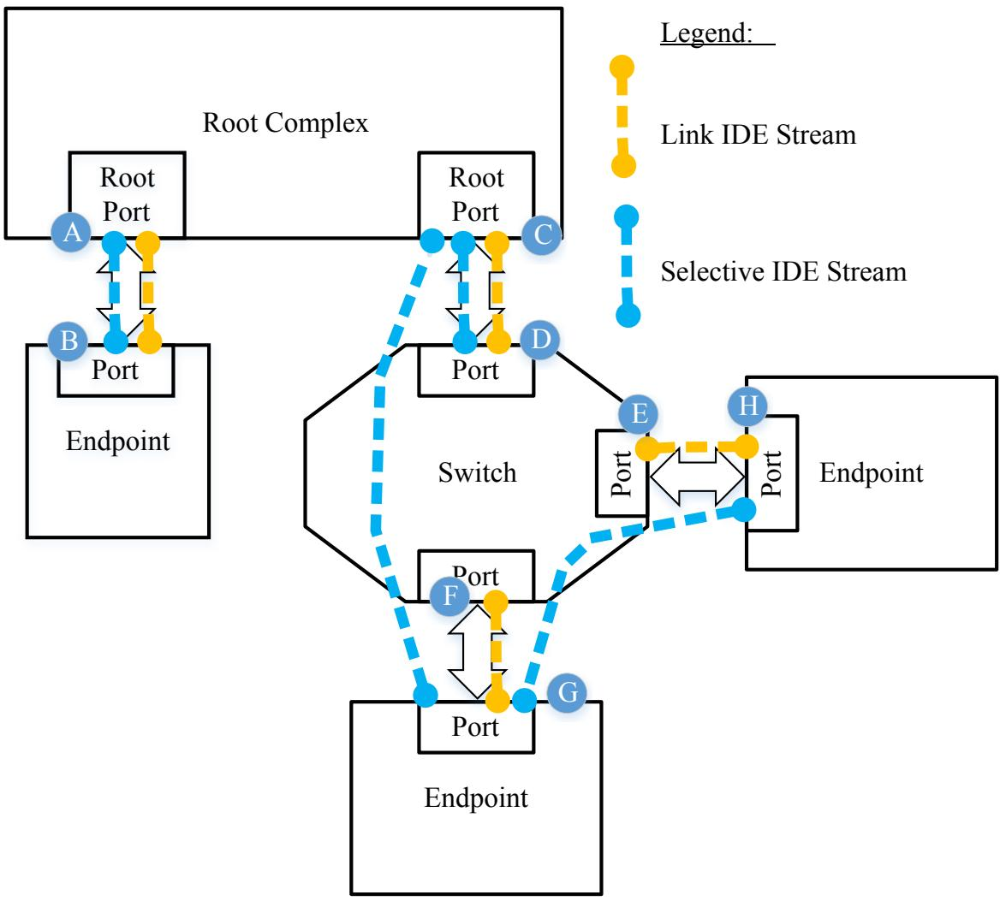

In addition to the in-line securing of TLPs, as a "data plane" capability, IDE defines interoperable mechanisms for establishing Streams and programming keys, as a "control plane" capability, based on industry specifications. For example, for an Endpoint connected directly to the Root Complex (A to B above), one way to establish IDE is to use IDE Key Management (IDE_KM – see § Section 6.33.3) via DOE to allow host Firmware/Software to configure the Ports, including securely programming the IDE keys into both Ports. In another example, for two Endpoints communicating peer to peer (G to H above), the two Endpoints can implement communication directly via [MCTP-VDM] and [Secured-MCTP], where one will take the Requester role and the other the Responder role, and then applying the IDE_KM flow for secure key establishment. In an alternate example, it is also possible for some kind of management controller to apply IDE_KM over a sideband management connection, to program IDE keys in Ports throughout a system. The mechanisms for a management controller to program keys into a Root Complex are outside the scope of this document.

Policies for establishing trust between elements in a platform are outside the scope of IDE. It is strongly recommended that a platform-appropriate policy be implemented via platform-specific means. It is not necessary that this policy be applied prior to establishing IDE Streams, and in some cases it may be preferable to establish IDE first, and subsequently

</td>
<td style="background-color:#e8e8e8">

除了 TLP 的内联保护(作为"数据平面"能力)之外,IDE 还基于行业规范定义了用于建立流和编程密钥的可互操作机制(作为"控制平面"能力)。例如,对于直接连接到根复合体的端点(上图中 A 到 B),建立 IDE 的一种方法是通过 DOE 使用 IDE 密钥管理(IDE_KM – 见 § Section 6.33.3),以便主机固件/软件配置端口,包括将 IDE 密钥安全地编程到两个端口中。在另一个示例中,对于进行点到点通信的两个端点(上图中 G 到 H),两个端点可以通过 [MCTP-VDM] 和 [Secured-MCTP] 直接实现通信,其中一方承担请求者（Requester）角色,另一方承担响应者（Responder）角色,然后应用 IDE_KM 流程以建立安全密钥。在另一种示例中,某些管理控制器也可以通过边带（sideband）管理连接应用 IDE_KM,以在整个系统中的端口中编程 IDE 密钥。管理控制器将密钥编程到根复合体中的机制不在本文档范围内。

平台中各元素间信任建立策略不在 IDE 范围内。强烈建议通过平台特定的方式实施适合平台的安全策略。无需在建立 IDE 流之前应用此策略,在某些情况下,可能首选先建立 IDE,随后

</td>
</tr>
</tbody>
</table>

[⬆️ 返回目录](#-本章目录-table-of-contents)

---

<<<PAGE_BREAK>>> page_913

<table>
<thead>
<tr>
<th width="50%">🇬🇧 English</th>
<th width="50%" style="background-color:#e8e8e8">🇨🇳 中文</th>
</tr>
</thead>
<tbody>
<tr>
<td>

apply security policy mechanisms, or to apply some policy mechanisms prior to establishing IDE and some additional mechanisms after.

</td>
<td style="background-color:#e8e8e8">

应用安全策略机制,或在建立 IDE 之前应用部分策略机制,在建立 IDE 之后应用其他机制。

</td>
</tr>
</tbody>
</table>

[⬆️ 返回目录](#-本章目录-table-of-contents)

---

<<<PAGE_BREAK>>> page_914


<div style="overflow-x: auto; max-width: 100%;">
<table>
<thead>
<tr>
<th width="50%">🇬🇧 English</th>
<th width="50%" style="background-color:#e8e8e8">🇨🇳 中文</th>
</tr>
</thead>
<tbody>
<tr>
<td>

**IMPLEMENTATION NOTE: THREAT MODEL AND RELATED CONSIDERATIONS FOR IDE**

This implementation note provides a very general treatment of the threat model assumed for IDE. A detailed treatment will necessarily require knowledge of the platform environment and other elements that are outside the scope of this document.

**This threat model covers:**

Attacks using a logic analyzer or interposer type device, including e.g. "rogue" Retimers, where the attack devices attempt to add or delete TLPs, observe TLP payload data, and/or reorder TLPs. Example attacks include delaying a flag write to bypass a data write causing stale data to be accepted, or delaying a read to bypass a write to same location causing a stale value to be read. Reordering is discussed in more detail in the Implementation Note "Detection of Improper Reordering".

IDE secures host systems against device替换攻击 because, once authenticated key exchange is completed, a subsequent attack by a different unit trying to masquerade as the authenticated unit will fail because the masquerading unit cannot generate IDE TLPs using the correct key.

Provided an implementation includes appropriate self-protection measures, IDE also supports the detection of attacks involving the removal of a unit, for example by moving the unit to a different system and attempting to operate the unit masquerading as the authenticated host.

It is assumed that in an attack, the attacker will thwart error reporting attempts, e.g. by blocking Messages from the Port that detected the error, and such reporting messages are only intended to be used in debugging improperly configured systems. If a specific use model requires timely detection of security failures, some type of "heartbeat" mechanism should be used, rather than assuming that the failure will be reported directly.

**This threat model does not cover:**

Security exposures caused by inadequate Device implementation. For example, implementations are necessarily required to secure local keys, interconnects, and memory, including, for example, local memory implemented on an add-in-card using discrete memory components. IDE does not protect against on-die traffic redirection, for example between Functions of a Multi-Function Device.

Debug mechanisms should be given careful review as they can easily cause information exposure when improperly implemented. It is strongly recommended that debug state be reported using measurement mechanisms, and that any change in debug configuration that could expose data intended to be secured result in a transition to Insecure (see § Section 6.33.1).

There are many considerations regarding secure key generation, programming, and storage, and it is strongly encouraged that non-experts consult with experts to evaluate all levels of implementation to ensure that good practices are followed. In all cases, it is essential to avoid exposure of plain text keys by any means including debug features such as tracers, configuration registers etc.

If partial header encryption (see § Section 6.33.4) is not used, "side channel" attacks may be possible in some cases based on attacker analysis of the information included in the headers. For example, see htts://www.ieee-security.org/TC/SP2015/papers-archived/6949a640.pdf.

**Considerations:**

IDE secures TLP traffic from one Port to another Port. TLP content is not secured on-die by IDE past the terminal Partner Ports, and so it is necessary to provide appropriate implementation specific protective measures based on use model requirements to ensure that TLP traffic is secured prior to transmission, and following reception.

</td>
<td style="background-color:#e8e8e8">

**实现注:IDE 的威胁模型及相关注意事项**

本实现注对 IDE 假定的威胁模型进行了非常通用的讨论。详细的讨论必然需要了解平台环境以及本文档范围之外的其他要素。

**本威胁模型涵盖:**

使用逻辑分析仪或中间板类型设备进行的攻击,包括例如"流氓"重定时器（Retimer）,其中攻击设备尝试添加或删除 TLP、观察 TLP 有效负载数据和/或对 TLP 重排序。攻击示例包括:延迟标志写入以绕过数据写入,导致陈旧数据被接受;或延迟读操作以绕过对同一位置的写入,导致读取到陈旧值。重排序在实现注"不当重排序的检测"(Detection of Improper Reordering)中有更详细的讨论。

IDE 保护主机系统免受设备替换攻击,因为一旦完成认证密钥交换,后续由试图伪装为已认证单元的不同单元发起的攻击将失败,因为伪装单元无法使用正确的密钥生成 IDE TLP。

在实现包含适当的自我保护措施的前提下,IDE 还支持检测涉及设备移除的攻击,例如将设备移动到不同系统并尝试以已认证主机的身份运行该设备。

假设在攻击中,攻击者会阻止错误报告尝试,例如通过屏蔽检测到错误的端口发出的消息（Message）,此类报告消息仅用于调试配置不正确的系统。如果特定使用模型要求及时检测安全失败,则应使用某种"心跳"(heartbeat)机制,而不是假设失败会直接被报告。

**本威胁模型不涵盖:**

由设备实现不充分引起的安全暴露。例如,实现必然需要保护本地密钥、互连和内存,包括使用分立存储组件在插卡上实现的本地内存。IDE 不保护免受片上流量重定向的攻击,例如多功能设备（Multi-Function Device）中各 Function 之间的流量重定向。

调试机制应仔细审查,因为实现不当时很容易导致信息泄露。强烈建议使用测量机制报告调试状态,并且任何可能暴露本应受保护数据的调试配置变更都应导致转换为 Insecure 状态(见 § Section 6.33.1)。

关于安全密钥的生成、编程和存储有许多注意事项,强烈建议非专家咨询专家,以评估各个层面的实现,确保遵循最佳实践。在所有情况下,必须避免以任何方式(包括跟踪器、配置寄存器等调试功能)暴露明文密钥。

如果不使用部分包头加密(partial header encryption,见 § Section 6.33.4),则攻击者可能通过分析包头中包含的信息在某些情况下发起"侧信道"(side channel)攻击。示例见 htts://www.ieee-security.org/TC/SP2015/papers-archived/6949a640.pdf。

**注意事项:**

IDE 在两个端口之间保护 TLP 流量。TLP 内容在通过终端 Partner 端口之后,不会由 IDE 在片上提供保护。因此,有必要根据使用模型要求提供适当的、特定于实现的保护措施,以确保 TLP 流量在传输之前和接收之后均受到保护。

</td>
</tr>
</tbody>
</table>
</div>


[⬆️ 返回目录](#-本章目录-table-of-contents)

---

<<<PAGE_BREAK>>> page_915

<a id="sec-6-33-1"></a>
## 6.33.1 IDE Stream and TEE State Machines | IDE 流与 TEE 状态机

table>
<thead>
<tr>
<th width="50%">🇬🇧 English</th>
<th width="50%" style="background-color:#e8e8e8">🇨🇳 中文</th>
</tr>
</thead>
<tbody>
<tr>
<td>

Conceptually, the initialization of a Link or Selective IDE Stream involves multiple steps, although some of these steps can be merged or performed in a different order. The first step is to establish the authenticity and identity of the components containing the two Partner Ports to be the IDE Terminuses of the IDE Stream. This may be done using CMA-SPDM, by implementation specific means, or in some cases implicitly. The second step is to establish the IDE Stream keys – the IDE Key Management (IDE_KM – § Section 6.33.3) provides a way to do this. Third, the Secure Connection must be configured, and, finally, the establishment of the IDE Stream is triggered.

Conceptually, each IDE Stream is associated at each Partner Port with a state machine illustrated in § Figure 6-53. IDE assumes the implementation of appropriate isolation mechanisms to ensure that information remains secured beyond the Port to Port connection secured via IDE. In some cases, entire components can be considered "secure" and there is no need to distinguish traffic on-die, in other cases the establishment of one or more Trusted Execution Environments (TEEs) may be needed to isolate secure traffic from non-secure traffic, and different secure environments from each other. Although it is permitted to establish more than one IDE Stream between the same two Ports, this is not generally needed or useful, because it is assumed that once on-die, all secure traffic is "equally" secure, and using separate IDE Streams provides no additional protection. The details of how such TEEs are implemented and managed are outside the scope of IDE. The T bit is used for TEE management mechanisms (see § Chapter 11.). IDE mechanisms ensure that the T bit (like other TLP content) is secured during transit.

Good practices for implementing TEEs include, but are not limited to:

- Securing secrets through the use of local encryption, access control, and/or other mechanisms
- Ensuring that secure data cannot "leak" due to errors, power management, or other operations
- Detecting inappropriate attempts to reconfigure IDE, e.g. writes to any of the IDE control registers, and/or other internal conditions that could compromise secure data and taking appropriate measures, including potentially forcing the Port into Insecure
- Ensuring that secret keys are never exposed or stored in non-secure buffers
- Ensuring that the establishment & management of TEEs is itself secure

The implementation of TEEs can be very complex, and it is strongly recommended that persons with appropriate security expertise are intimately involved in the development and validation of components and systems.

Although Link IDE applies to all kinds of TLPs, Selective IDE can only be applied to certain types of TLPs (see § Table 6-35). Memory operations are required to be supported for virtually all use models, and are supported by Selective IDE. I/O operations are not commonly used, and are not supported by Selective IDE to simplify design and validation. Selective IDE can be applied to Messages, and, optionally, to Configuration Requests & Completions. Selective IDE can be applied to TLPs with Prefixes, but Local TLP Prefixes are not protected when the TLP is associated with a Selective IDE Stream. In NFM, End-End TLP Prefixes are protected along with the associated TLP, and in FM, OHC content is protected along with other Header content.

</td>
<td style="background-color:#e8e8e8">

从概念上讲,链路 IDE 流或选择性 IDE 流的初始化涉及多个步骤,尽管其中一些步骤可以合并或以不同的顺序执行。第一步是建立包含两个 Partner 端口的组件的真实性和身份,使其成为 IDE 流的 IDE 端点（IDE Terminus）。这可以使用 CMA-SPDM、通过特定于实现的方式,或在某些情况下隐式地完成。第二步是建立 IDE 流密钥——IDE 密钥管理（IDE_KM – § Section 6.33.3）提供了一种实现方法。第三步是配置安全连接,最后,触发 IDE 流的建立。

从概念上讲,每个 IDE 流在每个 Partner 端口处都关联一个状态机,如 § Figure 6-53 所示。IDE 假定实现了适当的隔离机制,以确保信息在通过 IDE 保护的端口到端口连接之外仍保持安全。在某些情况下,整个组件可被视为"安全"的,无需在片上区分流量;在其他情况下,可能需要建立一个或多个可信执行环境（TEE）以将安全流量与非安全流量以及不同安全环境彼此隔离。尽管允许在相同的两个端口之间建立多个 IDE 流,但这通常并非必要或有用,因为假定一旦进入片上,所有安全流量都"同等"安全,使用单独的 IDE 流不会提供额外的保护。此类 TEE 的实现和管理细节不在 IDE 范围内。T 位用于 TEE 管理机制(见 § Chapter 11.)。IDE 机制确保 T 位(与其他 TLP 内容一样)在传输过程中受到保护。

实现 TEE 的良好实践包括但不限于:

- 通过使用本地加密、访问控制和/或其他机制保护机密
- 确保安全数据不会因错误、电源管理或其他操作而"泄漏"
- 检测不当的 IDE 重配置尝试,例如对任何 IDE 控制寄存器的写入和/或可能危及安全数据的其他内部情况,并采取适当措施,包括可能强制将端口置于 Insecure 状态
- 确保密钥永远不被暴露或存储在非安全缓冲区中
- 确保 TEE 的建立和管理本身是安全的

TEE 的实现可能非常复杂,强烈建议具有适当安全专业知识的开发人员深入参与组件和系统的开发与验证。

虽然链路 IDE 适用于所有类型的 TLP,但选择性 IDE 只能应用于特定类型的 TLP(见 § Table 6-35)。内存操作几乎在所有使用模型中都需要支持,并且由选择性 IDE 支持。I/O 操作并不常用,且选择性 IDE 不支持 I/O 操作以简化设计和验证。选择性 IDE 可应用于消息（Message）,并可选择性地应用于配置请求和完成（Configuration Request & Completion）。选择性 IDE 可应用于带前缀（Prefix）的 TLP,但当 TLP 与选择性 IDE 流关联时,本地 TLP 前缀（Local TLP Prefix）不受保护。在 NFM 中,端到端 TLP 前缀（End-End TLP Prefix）与关联 TLP 一起受到保护;在 FM 中,OHC 内容与其他包头（Header）内容一起受到保护。

</td>
</tr>
</tbody>
</table>

[⬆️ 返回目录](#-本章目录-table-of-contents)

---

<<<PAGE_BREAK>>> page_916


<div style="overflow-x: auto; max-width: 100%;">
<table>
<thead>
<tr>
<th width="50%">🇬🇧 English</th>
<th width="50%" style="background-color:#e8e8e8">🇨🇳 中文</th>
</tr>
</thead>
<tbody>
<tr>
<td>

- The Insecure state indicates that the necessary steps to operate the IDE Stream have not been completed, or that some event has ended the operation of a previously operating IDE Stream.
  - Typically the Insecure will include various conceptual substates that are not directly observable by the hardware, and only the system firmware/software configuring the IDE Stream will have the ability to comprehend when all necessary steps have been completed.
  - The Ready conceptual sub-state of the Insecure state is entered when all necessary configuration has been performed; this condition must be tracked by system firmware/software.
    - In many cases it will not not be possible for hardware to distinguish when all necessary configuration has been performed, and there is no requirement for hardware to track the transition into the Ready sub-state.
- The IDE Stream State Machine for a specific Stream of a Port must transition from Secure to Insecure when the corresponding Link/Selective IDE Stream Enable bit is Cleared.
  - As further discussed below, it is essential that the Port internally block all transmissions that are intended to be secure if the corresponding IDE Stream State Machine is not in the Secure state.
- If at any time a condition compromising the security of the IDE Stream is detected at the Port, the Port must transition to Insecure.
  - It is permitted to transition to Insecure for implementation specific reasons.

A trusted execution environment (TEE) using IDE must prevent the transmission of TLPs intended to be secure using non-IDE TLPs, and must reject non-IDE TLPs received if the TEE requires those TLPs to be secure. A specific architecture for devices that support TEEs is defined by TDISP (see § Chapter 11.). In order to precisely define the normative requirements for IDE in relation to TEEs, we will assume that TEEs have internal states that correspond to those shown in § Figure 6-54.

</td>
<td style="background-color:#e8e8e8">

- Insecure 状态表示操作 IDE 流所需的必要步骤尚未完成,或某些事件已结束先前运行的 IDE 流的操作。
  - 通常,Insecure 状态会包含多个概念性子状态,这些子状态对硬件不可直接观察,只有配置 IDE 流的系统固件/软件才能理解何时所有必要步骤都已完成。
  - 当所有必要的配置均已完成时,进入 Insecure 状态的 Ready 概念性子状态;此条件必须由系统固件/软件跟踪。
    - 在许多情况下,硬件无法区分何时已完成所有必要配置,并且不要求硬件跟踪到 Ready 子状态的转换。
- 端口特定流的 IDE 流状态机在相应链路/选择性 IDE 流使能位（Enable bit）被清零时必须从 Secure 转换为 Insecure。
  - 如下所述,如果相应 IDE 流状态机不处于 Secure 状态,则端口必须在内部阻止所有打算以安全方式传输的 TLP。
- 如果在端口处检测到任何危及 IDE 流安全性的情况,则端口必须转换为 Insecure。
  - 允许因特定于实现的原因转换为 Insecure。

使用 IDE 的可信执行环境（TEE）必须阻止使用非 IDE TLP 传输本应以安全方式传输的 TLP,并且在 TEE 要求这些 TLP 为安全时,必须拒绝接收到的非 IDE TLP。支持 TEE 的设备的特定架构由 TDISP 定义(见 § Chapter 11.)。为了精确定义 IDE 与 TEE 相关的规范性要求,我们假设 TEE 具有与 § Figure 6-54 所示相对应的内部状态。

</td>
</tr>
</tbody>
</table>

> **Figure 6-53.** IDE Stream State Machine
> 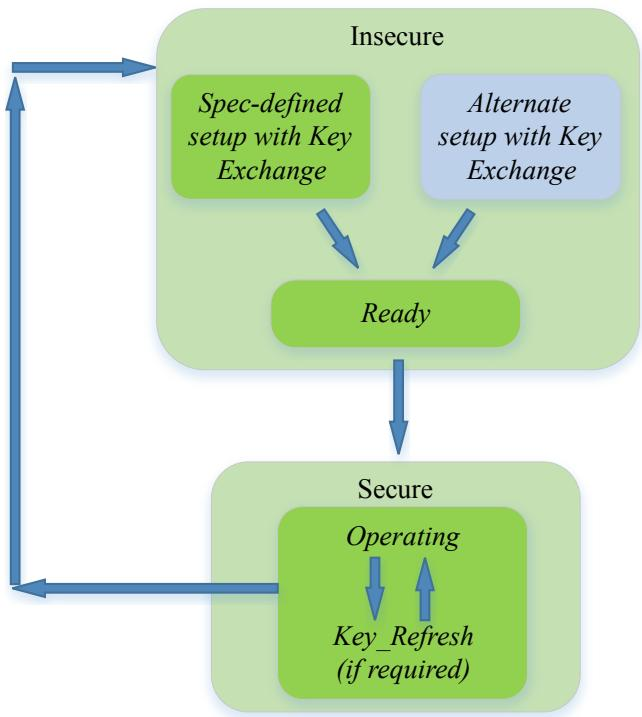

</div>


[⬆️ 返回目录](#-本章目录-table-of-contents)

---

<<<PAGE_BREAK>>> page_917

table>
<thead>
<tr>
<th width="50%">🇬🇧 English</th>
<th width="50%" style="background-color:#e8e8e8">🇨🇳 中文</th>
</tr>
</thead>
<tbody>
<tr>
<td>

> **Figure 6-54.** IDE Stream State Machine
> 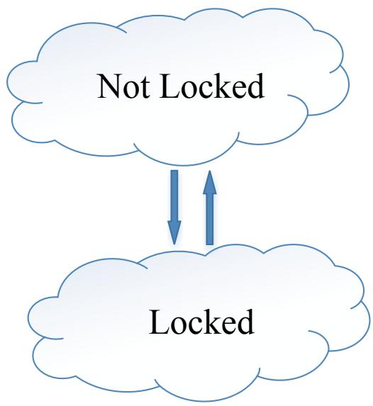

TDISP (see § Chapter 11.) defines specific requirements that extend the following rules, that apply broadly to all TEEs using IDE:

- A TEE must distinguish between at least two operating conditions, that may be called by any names but here will be called Not Locked and Locked.
  - A TEE must transition to the Locked state if and only if all IDE Streams required for the secure operation of the TEE are in the Secure state.
  - A TEE must transition to the Not Locked state if any IDE Stream required for the secure operation of the TEE is in the Insecure state.
- A TEE using an IDE Stream must precisely define the essential configuration information that could affect the security of the IDE Stream, and, once that IDE Stream is established, that essential configuration information must be confirmed and maintained by secure means so as to detect "adversary-in-the-middle" (AITM) attacks attempted during or after IDE Stream establishment, and changes to that information blocked and/or detected, as to detect/prevent attacks during operation.
  - The specific configuration information to which this requirement applies is implementation specific and dependent on the hardware elements involved, the security attributes required, and potentially on assumptions of use, all of which are outside the scope of this specification.
  - How the information is confirmed is implementation specific, but would typically include securely transferring a data structure that contains a local snapshot of the information to a secure partner to be compared against the expected values.

To establish IDE Streams interoperably based on this specification, system firmware/software acts as a central authority to create and program keys into the two Partner Ports. The following rules apply:

</td>
<td style="background-color:#e8e8e8">

TDISP(见 § Chapter 11.)定义了扩展以下规则的具体要求,这些规则广泛适用于使用 IDE 的所有 TEE:

- TEE 必须至少区分两种运行条件,这些条件可任意命名,但此处称为 Not Locked 和 Locked。
  - 当且仅当 TEE 安全运行所需的所有 IDE 流都处于 Secure 状态时,TEE 必须转换到 Locked 状态。
  - 如果 TEE 安全运行所需的任何 IDE 流处于 Insecure 状态,则 TEE 必须转换到 Not Locked 状态。
- 使用 IDE 流的 TEE 必须精确定义可能影响 IDE 流安全性的关键配置信息,并且一旦该 IDE 流被建立,关键配置信息必须通过安全方式进行确认和维护,以检测在 IDE 流建立期间或建立之后尝试的"中间人"(adversary-in-the-middle, AITM)攻击,并阻止和/或检测对该信息的更改,以便在运行期间检测/防止攻击。
  - 此要求适用的具体配置信息是特定于实现的,取决于所涉及的硬件元素、所需的安全属性,以及潜在的使用假设,所有这些都不在本规范范围内。
  - 如何确认该信息是特定于实现的,但通常包括将包含该信息本地快照的数据结构安全地传输到安全伙伴,以便与预期值进行比较。

为了基于本规范可互操作地建立 IDE 流,系统固件/软件充当中央机构,创建密钥并将其编程到两个 Partner 端口中。以下规则适用:

</td>
</tr>
</tbody>
</table>

[⬆️ 返回目录](#-本章目录-table-of-contents)

---


---

<a id="sec-6-33-2"></a>

<<<PAGE_BREAK>>> page_918

## 6.33.2 IDE Stream Establishment | IDE 流建立


<div style="overflow-x: auto; max-width: 100%;">
<table>
<thead>
<tr>
<th width="50%">🇬🇧 English</th>
<th width="50%" style="background-color:#e8e8e8">🇨🇳 中文</th>
</tr>
</thead>
<tbody>
<tr>
<td>

**6.33.2 IDE Stream Establishment**

- For Endpoints, including Functions of a Multi-Function Device, associated with an Upstream Port, only Function 0 must implement the IDE Extended Capability.
- For Switches, including cases where one or more Functions of a Multi-Function Device represent the Upstream Port of a Switch, the IDE Extended Capability must only be implemented in Function 0, and implemented such that Function 0 represents the Multi-Function Device as a whole.
- For a Downstream Port, the Bridge Function associated with the Port must implement the IDE Extended Capability.
- All Ports other than Root Ports must implement support for key management by means of the IDE key management (IDE_KM) protocol defined in § Section 6.33.3.
  - For Switch and Root Ports it is permitted for one Port to provide the DOE and CMA-SPDM responder function on behalf of other Ports as defined in § Section 6.33.3.
  - Root Ports are permitted to implement support for the IDE_KM protocol.

It is also permitted for systems to implement the IDE_KM protocol via MCTP (see § Section 6.33.3).

It is also permitted for system firmware/software to enable pass-through communications between the two Partner Ports, where one of the two takes the Requester Role and the other takes the Responder Role, implementing the IDE_KM protocol defined below directly between the two Partner Ports (as an example see the Selective IDE Stream between Ports G and H in § Figure 6-52). How this is discovered and enabled is outside the scope of this specification.

IDE Key Management (IDE_KM) builds upon [SPDM] and [Secured-SPDM], and can be used over multiple transports (see § Figure 6-55).

<<<PAGE_BREAK>>> page_919

</td>
<td style="background-color:#e8e8e8">

**6.33.2 IDE 流建立 (IDE Stream Establishment)**

- 对于与上游端口 (Upstream Port) 相关联的端点 (Endpoint),包括多功能设备 (Multi-Function Device) 的功能,只有功能 0 必须实现 IDE 扩展能力 (IDE Extended Capability)。
- 对于交换机 (Switch),包括多功能设备的一个或多个功能代表交换机的上游端口的情况,IDE 扩展能力只能在功能 0 中实现,并且实现方式应使功能 0 代表整个多功能设备。
- 对于下游端口 (Downstream Port),与该端口相关联的桥 (Bridge) 功能必须实现 IDE 扩展能力。
- 除根端口 (Root Port) 之外的所有端口必须实现通过 § 6.33.3 节中定义的 IDE 密钥管理 (IDE_KM) 协议对密钥管理的支持。
  - 对于交换机端口和根端口,允许一个端口代替其他端口提供 DOE 和 CMA-SPDM 应答器功能,具体定义见 § 6.33.3 节。
  - 根端口允许实现对 IDE_KM 协议的支持。

系统也允许通过 MCTP 实现 IDE_KM 协议(参见 § 6.33.3 节)。

系统固件/软件也允许在两个伙伴端口 (Partner Port) 之间启用直通通信,其中一方承担请求者角色 (Requester Role),另一方承担应答者角色 (Responder Role),直接在这两个伙伴端口之间实现下文定义的 IDE_KM 协议(例如,参见 § 图 6-52 中端口 G 和 H 之间的选择性 IDE 流)。该过程如何被发现和启用不在本规范的范围内。

IDE 密钥管理 (IDE Key Management, IDE_KM) 基于 [SPDM] 和 [Secured-SPDM],可通过多种传输层使用(参见 § 图 6-55)。

</td>
</tr>
</tbody>
</table>
</div>


[⬆️ 返回目录](#-本章目录-table-of-contents)

---

<a id="sec-6-33-3"></a>
## 6.33.3 IDE Key Management (IDE_KM) | IDE 密钥管理 (IDE_KM)

table>
<thead>
<tr>
<th width="50%">🇬🇧 English</th>
<th width="50%" style="background-color:#e8e8e8">🇨🇳 中文</th>
</tr>
</thead>
<tbody>
<tr>
<td>

**6.33.3 IDE Key Management (IDE_KM)**

> **Figure 6-55.** IDE Key Management (IDE_KM) and Related Specifications & Capabilities
> 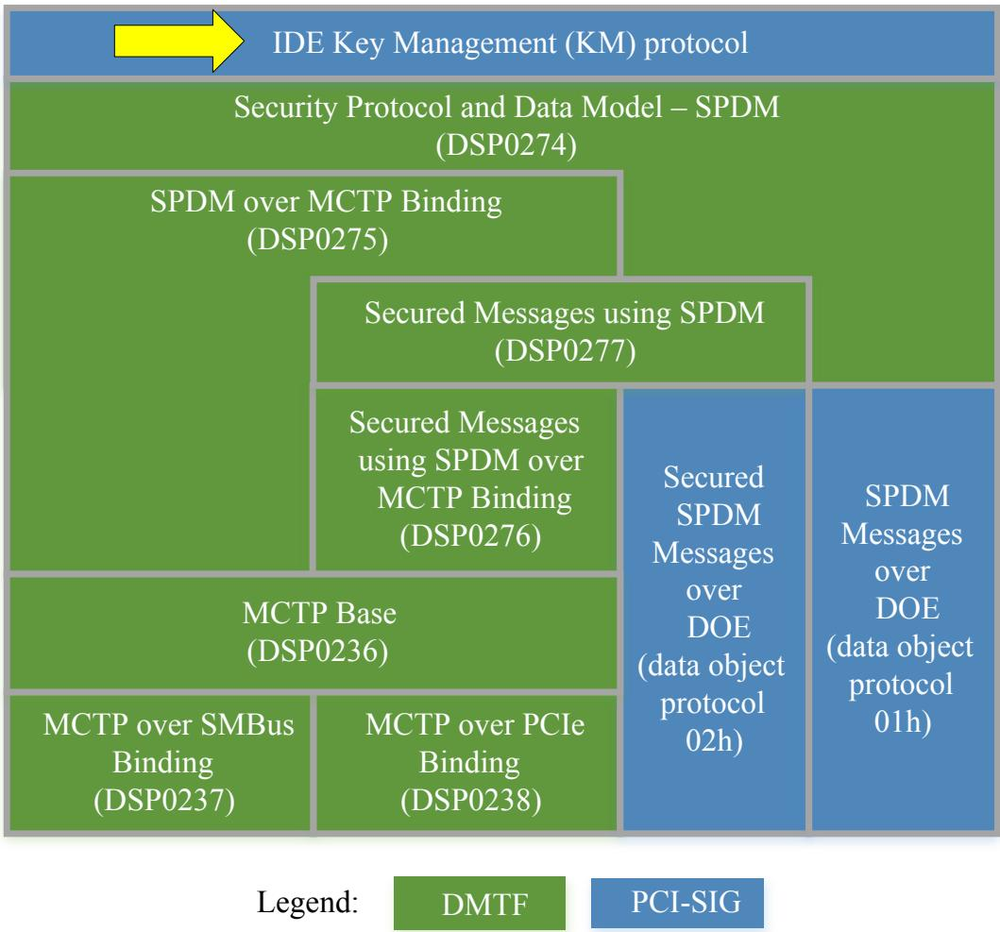

| Legend | Source |
|--------|--------|
| Security Protocol and Data Model – SPDM (DSP0274) | DMTF |
| SPDM over MCTP Binding (DSP0275) | DMTF |
| Secured Messages using SPDM over MCTP Binding (DSP0276) | DMTF |
| MCTP over SMBus Binding (DSP0237) | DMTF |
| MCTP over PCIe Binding (DSP0238) | DMTF |
| Secured SPDM Messages over DOE (data object protocol 02h) | PCI-SIG |
| IDE Key Management (KM) protocol | PCI-SIG |
| Secured Messages using SPDM (DSP0277) | DMTF |
| MCTP Base (DSP0236) | DMTF |
| SPDM Messages over DOE (data object protocol 01h) | PCI-SIG |

The following rules define the IDE key management (IDE_KM) protocol, and must be followed for Ports that support the use of IDE_KM:

- The IDE_KM protocol uses the data objects defined below, where:
  - The Requester must use the [SPDM] VENDOR_DEFINED_REQUEST format, the Responder must use the [SPDM] VENDOR_DEFINED_RESPONSE format.
  - The StandardID field of the VENDOR_DEFINED_REQUEST/ VENDOR_DEFINED_RESPONSE must contain the value assigned in [SPDM] to identify PCI-SIG.
  - The VendorID field of the VENDOR_DEFINED_REQUEST/ VENDOR_DEFINED_RESPONSE must contain the value 0001h, which is assigned to the PCI-SIG.
  - The VendorDefinedReqPayload/VendorDefinedRespPayload field of the VENDOR_DEFINED_REQUEST/VENDOR_DEFINED_RESPONSE must be the data object content as defined below.
  - The VENDOR_DEFINED_REQUEST/VENDOR_DEFINED_RESPONSE must in turn form the Application Data field of a Secured Message per [Secured-SPDM].
    - It is strongly recommended that the cryptographic strength used in the secure session be at least as strong as selected for IDE itself.
  - If any IDE_KM data object is received that has not been transferred securely per [Secured-SPDM], the received data object must not be used for key management, and, if it is a request, must not result in a response.
  - The size of the VendorDefinedReqPayload/VendorDefinedRespPayload must match the size of the data object defined below.
    - If the size does not match, the received data object must not be used for key management, and, if it is a request, must not result in a response.

<<<PAGE_BREAK>>> page_920

</td>
<td style="background-color:#e8e8e8">

**6.33.3 IDE 密钥管理 (IDE_KM)**


| 图例 | 来源 |
|--------|--------|
| Security Protocol and Data Model – SPDM (DSP0274) | DMTF |
| SPDM over MCTP Binding (DSP0275) | DMTF |
| Secured Messages using SPDM over MCTP Binding (DSP0276) | DMTF |
| MCTP over SMBus Binding (DSP0237) | DMTF |
| MCTP over PCIe Binding (DSP0238) | DMTF |
| Secured SPDM Messages over DOE(数据对象协议 02h) | PCI-SIG |
| IDE Key Management (KM) 协议 | PCI-SIG |
| Secured Messages using SPDM (DSP0277) | DMTF |
| MCTP Base (DSP0236) | DMTF |
| SPDM Messages over DOE(数据对象协议 01h) | PCI-SIG |

以下规则定义了 IDE 密钥管理 (IDE_KM) 协议,支持 IDE_KM 使用的端口必须遵循:

- IDE_KM 协议使用下文定义的数据对象,其中:
  - 请求者 (Requester) 必须使用 [SPDM] VENDOR_DEFINED_REQUEST 格式,应答者 (Responder) 必须使用 [SPDM] VENDOR_DEFINED_RESPONSE 格式。
  - VENDOR_DEFINED_REQUEST/VENDOR_DEFINED_RESPONSE 的 StandardID 字段必须包含在 [SPDM] 中分配的用于标识 PCI-SIG 的值。
  - VENDOR_DEFINED_REQUEST/VENDOR_DEFINED_RESPONSE 的 VendorID 字段必须包含值 0001h,这是分配给 PCI-SIG 的值。
  - VENDOR_DEFINED_REQUEST/VENDOR_DEFINED_RESPONSE 的 VendorDefinedReqPayload/VendorDefinedRespPayload 字段必须是下文定义的数据对象内容。
  - VENDOR_DEFINED_REQUEST/VENDOR_DEFINED_RESPONSE 必须进而根据 [Secured-SPDM] 形成 Secured Message 的 Application Data 字段。
    - 强烈建议在安全会话中使用的密码强度至少与为 IDE 本身选择的强度相当。
  - 如果收到的任何 IDE_KM 数据对象未按 [Secured-SPDM] 安全传输,则该收到的数据对象不得用于密钥管理;若该对象是请求,则不得产生响应。
  - VendorDefinedReqPayload/VendorDefinedRespPayload 的大小必须与下文定义的数据对象的大小匹配。
    - 如果大小不匹配,则该收到的数据对象不得用于密钥管理;若该对象是请求,则不得产生响应。

</td>
</tr>
</tbody>
</table>

[⬆️ 返回目录](#-本章目录-table-of-contents)

---


<div style="overflow-x: auto; max-width: 100%;">
<table>
<thead>
<tr>
<th width="50%">🇬🇧 English</th>
<th width="50%" style="background-color:#e8e8e8">🇨🇳 中文</th>
</tr>
</thead>
<tbody>
<tr>
<td>

- For Endpoint Functions, including Functions of a Multi-Function Device, associated with an Upstream Port, Function 0 must implement DOE and CMA-SPDM for Authentication and key exchange, including the secure session establishment mechanism (see [SPDM]) and the IDE key management (IDE_KM) protocol as a Responder, as defined below.
  - IDE operates at a per-Port level, and Function 0 of an Upstream Port must be used for the purposes of establishing the authenticity and identity of the associated Component, performing key exchange, and the configuration and management of IDE Stream(s) for that Port.
- Each Upstream Port Function, regardless of Function Number, representing a Switch for which Link IDE Stream Supported and/or Selective IDE Streams Supported are Set, including in Multi-Function Devices, must implement DOE and CMA-SPDM supporting the IDE key management (IDE_KM) protocol as a Responder, as defined below.
- It is permitted for a Root Complex to:
  - support the IDE_KM protocol using a DOE instance for some or all Root Ports per-Port, or using some Root Ports to represent other Root Ports
  - implement a DOE instance in an RCRB supporting IDE_KM for Root Ports,
  - use implementation specific key management.
- For Switches and Root Complexes, it is permitted for one Port to implement the IDE_KM interface as a responder for itself and for other Ports of the Switch/Root Complex.
- Ports are permitted to support the IDE_KM protocol transported via MCTP.
- Within each data object, the Protocol ID field in bits [7:0] of the first DW must be 00h to indicate IDE.
- The Object ID field in bits [15:8] of the first DW indicates the IDE_KM data object type and is encoded as:
  - 00h: Query (QUERY)
  - 01h: Query Response (QUERY_RESP)
  - 02h: Key Programming (KEY_PROG)
  - 03h: Key Programming Acknowledgement (KP_ACK)
  - 04h: Key Set Go (K_SET_GO)
  - 05h: Key Set Stop (K_SET_STOP)
  - 06h: Key Set Go/Stop Acknowledgement (K_GOSTOP_ACK)
  - all other encodings Reserved.
- A Requester is permitted to use QUERY to determine the capabilities and configuration of a Port (see § Figure 6-56)
  - The PortIndex field must be used to indicate the Port addressed by the QUERY.
- A Responder must respond to a QUERY indicating a PortIndex value of 00h.

<<<PAGE_BREAK>>> page_921

</td>
<td style="background-color:#e8e8e8">

- 对于与上游端口相关联的端点 (Endpoint) 功能,包括多功能设备的功能,功能 0 必须实现用于认证和密钥交换的 DOE 和 CMA-SPDM,包括安全会话建立机制(参见 [SPDM])以及作为应答者的 IDE 密钥管理 (IDE_KM) 协议,具体定义如下。
  - IDE 在每个端口级别运行,上游端口的功能 0 必须用于建立相关组件的真实性与身份、执行密钥交换以及为该端口配置和管理 IDE 流 (IDE Stream) 的目的。
- 代表交换机的每个上游端口功能(无论功能号如何),若其链接 IDE 流支持 (Link IDE Stream Supported) 和/或选择性 IDE 流支持 (Selective IDE Streams Supported) 被置位,包括在多功能设备中,必须实现支持 IDE 密钥管理 (IDE_KM) 协议作为应答者的 DOE 和 CMA-SPDM,具体定义如下。
- 允许根复合体 (Root Complex):
  - 使用每个端口的 DOE 实例支持部分或全部根端口的 IDE_KM 协议,或使用某些根端口代表其他根端口
  - 在支持根端口 IDE_KM 的 RCRB 中实现 DOE 实例,
  - 使用实现特定的密钥管理。
- 对于交换机和根复合体,允许一个端口为自己以及交换机/根复合体的其他端口实现 IDE_KM 接口作为应答者。
- 端口允许支持通过 MCTP 传输的 IDE_KM 协议。
- 在每个数据对象内,第一个 DW 的 [7:0] 位中的 Protocol ID 字段必须为 00h,以表示 IDE。
- 第一个 DW 的 [15:8] 位中的 Object ID 字段指示 IDE_KM 数据对象类型,编码如下:
  - 00h:Query (QUERY)
  - 01h:Query Response (QUERY_RESP)
  - 02h:Key Programming (KEY_PROG)
  - 03h:Key Programming Acknowledgement (KP_ACK)
  - 04h:Key Set Go (K_SET_GO)
  - 05h:Key Set Stop (K_SET_STOP)
  - 06h:Key Set Go/Stop Acknowledgement (K_GOSTOP_ACK)
  - 所有其他编码为保留。
- 请求者允许使用 QUERY 来确定端口的能力和配置(参见 § 图 6-56)
  - PortIndex 字段必须用于指示 QUERY 所寻址的端口。
- 应答者必须对 PortIndex 值为 00h 的 QUERY 作出响应。

</td>
</tr>
</tbody>
</table>
</div>


[⬆️ 返回目录](#-本章目录-table-of-contents)

---

table>
<thead>
<tr>
<th width="50%">🇬🇧 English</th>
<th width="50%" style="background-color:#e8e8e8">🇨🇳 中文</th>
</tr>
</thead>
<tbody>
<tr>
<td>

- IDE_KM assigns unique Port numbers (PortIndex) for each Port of an Endpoint, Switch or Root Complex, implementing IDE_KM.
- For a Switch that supports the IDE_KM responder role:
  - The Switch Upstream Port must implement the responder role for itself and the Upstream Port must respond to a PortIndex of 00h.
  - Downstream Ports of the Switch that are represented by the Upstream Port must respond to PortIndex ranging from 01h to FFh, where the order is established by the Device/Function numbers assigned by the Switch construction to the Downstream Ports from lowest to highest.
  - It is permitted for a Switch to implement a responder capability in a Downstream Port, for example by implementing a DOE instance in the Downstream Port, in which case that Downstream Port must respond to a PortIndex of 00h.
    - It is permitted for that Port to represent other Downstream Ports, in which case the represented Downstream Ports must respond to PortIndex ranging from 01h to FFh, where the order is established by the Device/Function numbers assigned by the Switch construction to the Downstream Ports from lowest to highest.
- For a Root Port that supports the IDE_KM Responder role:
  - The Root Port must implement the responder role for itself and must respond to a PortIndex of 00h.
    - It is permitted for that Port to represent other Root Ports, in which case the represented Root Ports must respond to PortIndex ranging from 01h to FFh, where the order is established by the Device/Function numbers assigned by the Root Complex construction to the Root Ports from lowest to highest.
- For an Endpoint Upstream Port that supports the IDE_KM responder role, the Port must respond to a PortIndex of 00h.
- Ports/RCRBs implementing the [SPDM] responder role must respond to a QUERY with QUERY_RESP (see § Figure 6-57).
  - The PortIndex field must contain the PortIndex field value from the corresponding QUERY.
  - The MaxPortIndex field value must indicate the maximum PortIndex value for the Ports represented by this Port/RCRB.
    - If only one Port is represented, including for all Endpoint Upstream Ports, the MaxPortIndex field must be 00h.
  - The Bus Number field must contain the Bus Number of the Function corresponding to the PortIndex field value.
  - The Segment field must:
    - for Ports that are not Root Ports, be zero
    - for Root Ports, contain the Segment Number value for the Root Port, or zero if the Root Complex implements only one Segment.
  - For Non-ARI Functions the Device/Function Number field must contain the Device and Function number of the Function corresponding to the PortIndex field value.
  - For ARI Functions the Function Number field must contain the Function number of the Function corresponding to the PortIndex field value.
  - The remainder of QUERY_RESPONSE must consist of the contents of the IDE Extended Capability Structure, other than the IDE Extended Capability Header itself, for the addressed Port.
    - The Supported Algorithms and Selected Algorithm field values returned in QUERY_RESP must be compared against the values read from the corresponding fields in the Responder Port's IDE Extended Capability structure and if non-matching values are detected then the IDE_KM protocol for this secure session must be aborted, or other appropriate corrective action taken to avoid a possible "downgrade" attack.

<<<PAGE_BREAK>>> page_922

</td>
<td style="background-color:#e8e8e8">

- IDE_KM 为实现 IDE_KM 的端点、交换机或根复合体的每个端口分配唯一的端口号 (PortIndex)。
- 对于支持 IDE_KM 应答者角色的交换机:
  - 交换机的上游端口必须为自己实现应答者角色,且上游端口必须对 PortIndex 00h 作出响应。
  - 由上游端口代表的交换机的下游端口必须对 01h 至 FFh 范围内的 PortIndex 作出响应,顺序由交换机结构按从低到高分配给下游端口的设备/功能号确定。
  - 允许交换机在下游端口中实现应答器能力,例如通过在该下游端口中实现 DOE 实例,在这种情况下,该下游端口必须对 PortIndex 00h 作出响应。
    - 允许该端口代表其他下游端口,在这种情况下,被代表的下游端口必须对 01h 至 FFh 范围内的 PortIndex 作出响应,顺序由交换机结构按从低到高分配给下游端口的设备/功能号确定。
- 对于支持 IDE_KM 应答者角色的根端口:
  - 根端口必须为自己实现应答者角色,并必须对 PortIndex 00h 作出响应。
    - 允许该端口代表其他根端口,在这种情况下,被代表的根端口必须对 01h 至 FFh 范围内的 PortIndex 作出响应,顺序由根复合体结构按从低到高分配给根端口的设备/功能号确定。
- 对于支持 IDE_KM 应答者角色的端点上游端口,该端口必须对 PortIndex 00h 作出响应。
- 实现 [SPDM] 应答者角色的端口/RCRB 必须以 QUERY_RESP 响应 QUERY(参见 § 图 6-57)。
  - PortIndex 字段必须包含来自相应 QUERY 的 PortIndex 字段值。
  - MaxPortIndex 字段值必须指示此端口/RCRB 所代表端口的最大 PortIndex 值。
    - 如果仅代表一个端口(包括所有端点上游端口),则 MaxPortIndex 字段必须为 00h。
  - Bus Number 字段必须包含与 PortIndex 字段值相对应功能的总线号。
  - Segment 字段必须:
    - 对于非根端口的端口,值为零
    - 对于根端口,包含该根端口的段号 (Segment Number) 值,或如果根复合体仅实现一个段,则为零。
  - 对于非 ARI 功能 (Non-ARI Function),Device/Function Number 字段必须包含与 PortIndex 字段值相对应功能的设备号和功能号。
  - 对于 ARI 功能 (ARI Function),Function Number 字段必须包含与 PortIndex 字段值相对应功能的功能号。
  - QUERY_RESPONSE 的其余部分必须由寻址端口的 IDE 扩展能力结构 (IDE Extended Capability Structure) 的内容(IDE 扩展能力头本身除外)组成。
    - 在 QUERY_RESP 中返回的 Supported Algorithms 和 Selected Algorithm 字段值必须与从应答者端口的 IDE 扩展能力结构中相应字段读取的值进行比较,如果检测到不匹配的值,则必须中止此安全会话的 IDE_KM 协议,或采取其他适当的纠正措施以避免潜在的"降级"攻击。

</td>
</tr>
</tbody>
</table>

[⬆️ 返回目录](#-本章目录-table-of-contents)

---


<div style="overflow-x: auto; max-width: 100%;">
<table>
<thead>
<tr>
<th width="50%">🇬🇧 English</th>
<th width="50%" style="background-color:#e8e8e8">🇨🇳 中文</th>
</tr>
</thead>
<tbody>
<tr>
<td>

- Requesters must not issue other requests after issuing a QUERY command until receipt of the corresponding QUERY_RESP.
- KEY_PROG, KP_ACK, K_SET_GO, K_SET_STOP and K_GOSTOP_ACK all apply to a single Sub-Stream, direction (Tx or Rx) and Key Set.
  - The Key Sub-Stream field indicates the Key Sub-Stream, using the same encodings as defined for the Sub-Stream identifier (see § Section 6.33.5)
  - The direction is indicated by the RxTxB bit encoded:
    - 0b – Receive
    - 1b - Transmit
  - The Key Set field indicates the Key Set, corresponding to the K bit value in the IDE TLP Prefix (NFM)/OHC-C (FM).
- For Ports implementing the Responder role, key programming and the ability to select the initial value of the IV must be supported using the KEY_PROG command (see § Figure 6-58).
  - The length of the key must correspond to the length indicated in the Selected Algorithm field for the Stream.
  - The Requester must not send another KEY_PROG command to the same Port until it has received a KP_ACK from the Port.
    - If the Requester does not receive a KP_ACK from the Responder within 1 second plus a sufficient time to account for transport delay the Requester is permitted to consider that the Responder is not operating correctly.
  - Fields specific to the KEY_PROG command are:
    - PortIndex, indicating the Port to which the key is to be programmed, corresponding to the order established in the QUERY_RESP
    - Stream ID
    - Key, which must be of the size required for the Selected Algorithm for the Stream
    - IFV, indicating the initial value for the invocation field of the IV, which must be 64 bits in size, and must initially set to the value 0000_0001h upon establishment of the Stream and when performing a key refresh.
- A Port implementing the Responder role must acknowledge receipt of a KEY_PROG command by returning KP_ACK, defined in § Figure 6-59.
  - The Status field must indicate the result of the KEY_PROG command, encoded as:
    - 00h: Successful
    - 01h: Failed to parse command – Incorrect Length
    - 02h: Failed to parse command – Unsupported value in PortIndex
    - 03h: Failed to parse command – Unsupported value in other field(s)
    - 04h: Unspecified Failure
    - 05-FFh: Reserved – Must not be used in generating KP_ACK, but if received must be treated as Unspecified Failure
  - The Responder must return KP_ACK within 1 second of the receipt of the KEY_PROG command.
    - It is strongly recommended to return KP_ACK as quickly as possible.
  - Return of KP_ACK, regardless of Status, indicates the Port is able to receive and process another KEY_PROG command.

<<<PAGE_BREAK>>> page_923

</td>
<td style="background-color:#e8e8e8">

- 请求者在发出 QUERY 命令后,在收到相应的 QUERY_RESP 之前,不得发出其他请求。
- KEY_PROG、KP_ACK、K_SET_GO、K_SET_STOP 和 K_GOSTOP_ACK 均适用于单个子流 (Sub-Stream)、方向(Tx 或 Rx)和密钥集 (Key Set)。
  - Key Sub-Stream 字段指示密钥子流,使用与子流标识符定义相同的编码(参见 § 6.33.5 节)
  - 方向由 RxTxB 位指示,编码为:
    - 0b – 接收 (Receive)
    - 1b – 发送 (Transmit)
  - Key Set 字段指示密钥集,对应于 IDE TLP 前缀 (NFM)/OHC-C (FM) 中的 K 位值。
- 对于实现应答者角色的端口,必须支持使用 KEY_PROG 命令进行密钥编程和选择 IV 初始值的能力(参见 § 图 6-58)。
  - 密钥的长度必须与流的 Selected Algorithm 字段中指示的长度相对应。
  - 请求者在从同一端口收到 KP_ACK 之前,不得向该端口发送另一条 KEY_PROG 命令。
    - 如果请求者在 1 秒钟加上足够的传输延迟时间内未收到来自应答者的 KP_ACK,则允许请求者认为应答者未正常运行。
  - KEY_PROG 命令特有的字段包括:
    - PortIndex,指示密钥将要编程到的端口,对应于 QUERY_RESP 中建立的顺序
    - 流 ID (Stream ID)
    - 密钥 (Key),其大小必须为该流的 Selected Algorithm 所要求的大小
    - IFV,指示 IV 的 invocation 字段的初始值,大小必须为 64 位,且在流建立时以及执行密钥刷新时必须初始设置为值 0000_0001h。
- 实现应答者角色的端口必须通过返回 KP_ACK 来确认收到 KEY_PROG 命令,KP_ACK 在 § 图 6-59 中定义。
  - Status 字段必须指示 KEY_PROG 命令的结果,编码为:
    - 00h:成功 (Successful)
    - 01h:解析命令失败 – 长度不正确 (Failed to parse command – Incorrect Length)
    - 02h:解析命令失败 – PortIndex 中存在不受支持的值 (Failed to parse command – Unsupported value in PortIndex)
    - 03h:解析命令失败 – 其他字段中存在不受支持的值 (Failed to parse command – Unsupported value in other field(s))
    - 04h:未指定故障 (Unspecified Failure)
    - 05-FFh:保留 – 在生成 KP_ACK 时不得使用,但如果收到则必须视为未指定故障
  - 应答者必须在收到 KEY_PROG 命令后 1 秒钟内返回 KP_ACK。
    - 强烈建议尽快返回 KP_ACK。
  - 返回 KP_ACK(无论 Status 如何)表示该端口能够接收和处理另一条 KEY_PROG 命令。

</td>
</tr>
</tbody>
</table>
</div>


[⬆️ 返回目录](#-本章目录-table-of-contents)

---

table>
<thead>
<tr>
<th width="50%">🇬🇧 English</th>
<th width="50%" style="background-color:#e8e8e8">🇨🇳 中文</th>
</tr>
</thead>
<tbody>
<tr>
<td>

- Mechanisms for generating keys are outside the scope of this document.
- It is strongly recommended to complete key programming for a Stream before Setting the Enable bit in the IDE Extended Capability entry for that Stream.
  - It is permitted, but strongly not recommended, to Set the Enable bit in the IDE Extended Capability entry for a Stream prior to the completion of key programming for that Stream.
- If the Enable bit is Set in the IDE Extended Capability entry for a Stream, but that IDE Stream is not already in Secure, the receipt of a K_SET_GO for must trigger the Port to Transmit/Receive IDE TLPs for the indicated Stream, Sub-Stream, direction and Key Set.
  - The agent implementing the Requester role for IDE_KM must send K_SET_GO commands to enable the Receivers at both IDE Partner Ports, and then send K_SET_GO commands to enable the Transmitters at both IDE Partner Ports.
    - The Port must use the indicated Key Set for IDE TLP transmissions associated with the IDE Stream, Sub-Stream, and direction starting not more than 10 ms after the receipt of the K_SET_GO command to enable the Transmitter.
  - The Port must be capable of processing received IDE TLPs using the indicated Key Set within 10 ms after the receipt of the K_SET_GO command enabling the Receiver.
  - The Port must respond by returning an K_GOSTOP_ACK once it is capable of receiving another IDE_KM Request.
- If the Enable bit is Set in the IDE Extended Capability entry for a Stream, and that IDE Stream is already in Secure (a key refresh operation), the receipt of a K_SET_GO for must trigger the Port to Transmit/Receive IDE TLPs for the indicated Stream, Sub-Stream, direction and Key Set.
  - The agent implementing the Requester role for IDE_KM must send K_SET_GO commands to enable the Receivers at both IDE Partner Ports, and then send K_SET_GO commands to enable the Transmitters at both IDE Partner Ports.
    - The Port must use the indicated Key Set for IDE TLP transmissions associated with the IDE Stream, Sub-Stream, and direction starting not more than 10 ms after the receipt of the K_SET_GO command to enable the Transmitter.
  - The Port must be capable of processing received IDE TLPs using the indicated Key Set within 10 ms after the receipt of the K_SET_GO command enabling the Receiver.
  - For each Sub-Stream of the Stream, until the Port receives an IDE TLP using the new key set, as indicated by the K bit value toggling, the Port must continue to accept IDE TLPs using the established key set.
    - Once the Port receives an IDE TLP using the new key set on a Sub-Stream it must invalidate and render unreadable the old key set, and discard subsequently received IDE TLPs using the old key set on that Sub-Stream.
  - The Port must respond by returning an K_GOSTOP_ACK once it is capable of receiving another IDE_KM Request.
- If the Enable bit in the IDE Extended Capability for a Stream is Clear, the receipt of K_SET_GO for both receive and transmit must cause the Port to become ready to Transmit/Receive IDE TLPs for the indicated Stream and Sub-Stream within 10 ms following the receipt of the last K_SET_GO, after which system software is permitted to Set the Enable bit for the Stream. When the Enable bit is Set:
  - The Port must be capable of processing received IDE TLPs using the Key Set armed by the received K_SET_GO Request.
  - System software must ensure that the Partner Ports initiate IDE TLPs sequenced appropriately so that a Port will not receive an IDE TLP before the Enable bit has been set.
  - The Port must respond by returning an K_GOSTOP_ACK once it is capable of receiving another IDE_KM Request.

It is strongly recommended that all Sub-Streams in both directions be fully programmed before Setting the Enable bit for the Stream.

- Is permitted for the IDE_KM Requester to transmit the K_SET_STOP command, defined in § Figure 6-61, to indicate that a Key Set must stop being used at a Port for the indicated Stream, Sub-Stream, and direction.
  - The Port implementing the responder role must invalidate and render unreadable the indicated Key Set not more than 10 ms after the receipt of the K_SET_STOP command.
  - Upon receipt of the KEY_STOP command, for the indicated Key Set and direction, all keys must be invalidated and rendered unreadable.
    - It should be observed that this action does not directly transition the Stream to Insecure, but any subsequent attempt to use the indicated Key Set will result in the Stream transitioning to Insecure.
  - The Port must respond by returning an K_GOSTOP_ACK once it is capable of receiving another IDE_KM Request.
- When an error is detected in a received K_SET_GO or K_SET_STOP (such as an invalid Stream ID), it is recommended that no K_GOSTOP_ACK be returned.
- When using DOE for IDE_KM, or when IDE is enabled/disabled using the Enable bit for an IDE Stream, the following rules apply:
  - For a Configuration Request that triggers the start IDE, the Port must first return the Configuration Completion as a non-IDE TLP, and then trigger the start of IDE.
  - For a Configuration Request that stops IDE, the Port must first return the Configuration Completion as an IDE TLP, and then stop IDE.

An IDE error condition will occur if system software fails to ensure the correct sequencing of IDE enablement at the two Partner Ports.

- For a given IDE Stream, once a secure [SPDM] session has been used to respond to one QUERY or KEY_PROG request:
  - While the secure [SPDM] session that was used for initial key programming remains open, all QUERY and/or KEY_PROG requests that are received through a different secure [SPDM] session must be discarded by the Responder, and must not result in a response.
  - If the secure [SPDM] session that was used for initial key programming is closed, any subsequent QUERY and/or KEY_PROG requests received through a different secure [SPDM] session must first cause the responder to invalidate and render unreadable all keys must for the IDE Stream, then transition that IDE Stream to the Insecure state, and only then respond to the QUERY/KEY_PROG request, unless it can be ensured through implementation specific means that the new session has been established with the same requester as performed the initial key programming.

> **Figure 6-56.** Query (QUERY) Data Object
> 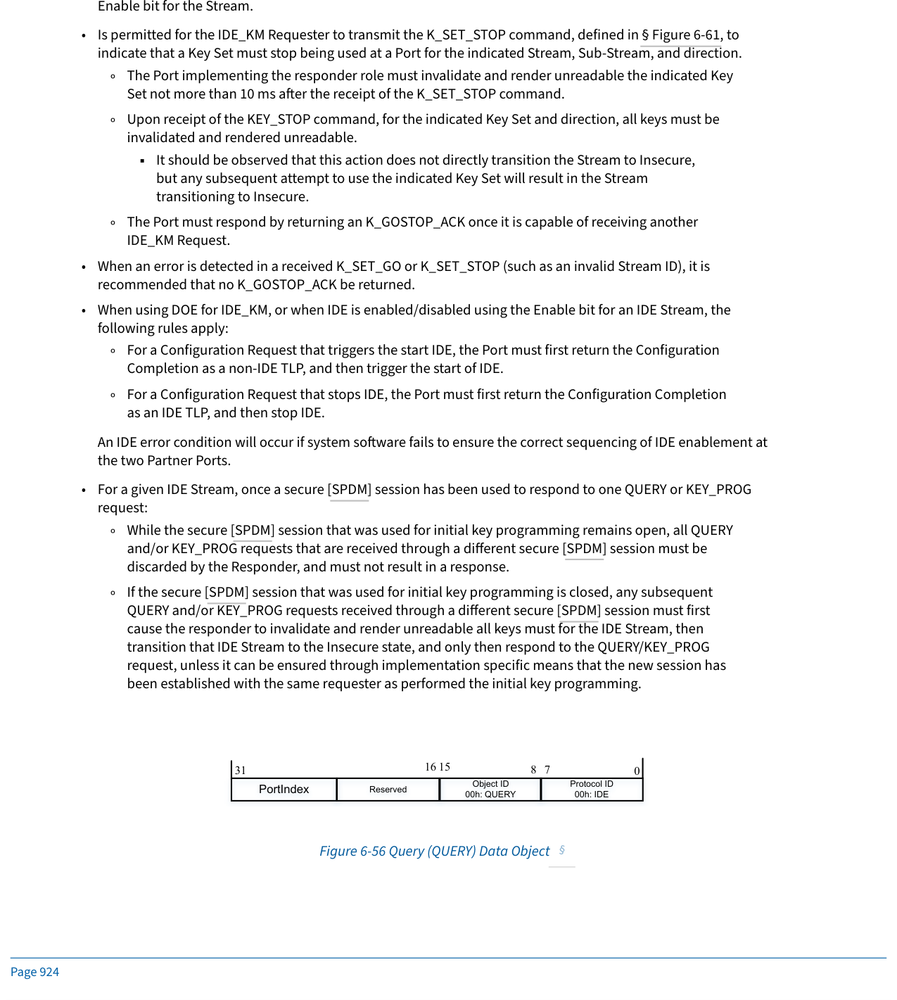

<<<PAGE_BREAK>>> page_924

<<<PAGE_BREAK>>> page_925

</td>
<td style="background-color:#e8e8e8">

- 生成密钥的机制不在本文档的范围内。
- 强烈建议在为流设置 IDE 扩展能力条目中的 Enable 位之前完成流的密钥编程。
  - 允许但强烈不推荐在完成流的密钥编程之前为该流设置 IDE 扩展能力条目中的 Enable 位。
- 如果 IDE 扩展能力条目中流的 Enable 位已置位,但该 IDE 流尚未处于安全 (Secure) 状态,则收到 K_SET_GO 必须触发该端口对所指示的流、子流、方向和密钥集发送/接收 IDE TLP。
  - 实现 IDE_KM 请求者角色的代理必须发送 K_SET_GO 命令以启用两个 IDE 伙伴端口的接收器,然后发送 K_SET_GO 命令以启用两个 IDE 伙伴端口的发送器。
    - 端口必须使用所指示的密钥集对与 IDE 流、子流和方向相关联的 IDE TLP 进行发送,且必须在收到启用发送器的 K_SET_GO 命令后不超过 10 毫秒内开始。
  - 端口必须能够在收到启用接收器的 K_SET_GO 命令后 10 毫秒内使用所指示的密钥集处理收到的 IDE TLP。
  - 一旦端口能够接收另一条 IDE_KM 请求,必须通过返回 K_GOSTOP_ACK 来响应。
- 如果 IDE 扩展能力条目中流的 Enable 位已置位,且该 IDE 流已处于安全状态(密钥刷新操作),则收到 K_SET_GO 必须触发该端口对所指示的流、子流、方向和密钥集发送/接收 IDE TLP。
  - 实现 IDE_KM 请求者角色的代理必须发送 K_SET_GO 命令以启用两个 IDE 伙伴端口的接收器,然后发送 K_SET_GO 命令以启用两个 IDE 伙伴端口的发送器。
    - 端口必须使用所指示的密钥集对与 IDE 流、子流和方向相关联的 IDE TLP 进行发送,且必须在收到启用发送器的 K_SET_GO 命令后不超过 10 毫秒内开始。
  - 端口必须能够在收到启用接收器的 K_SET_GO 命令后 10 毫秒内使用所指示的密钥集处理收到的 IDE TLP。
  - 对于流的每个子流,在端口收到使用新密钥集的 IDE TLP(由 K 位值切换指示)之前,端口必须继续接受使用已建立密钥集的 IDE TLP。
    - 一旦端口在某个子流上收到使用新密钥集的 IDE TLP,它必须使旧密钥集无效且不可读,并丢弃该子流上随后收到的使用旧密钥集的 IDE TLP。
  - 一旦端口能够接收另一条 IDE_KM 请求,必须通过返回 K_GOSTOP_ACK 来响应。
- 如果 IDE 扩展能力条目中流的 Enable 位被清零,则收到用于接收和发送两者的 K_SET_GO 必须使端口在收到最后一条 K_SET_GO 后 10 毫秒内准备就绪以对所指示的流和子流发送/接收 IDE TLP,此后系统软件可置位该流的 Enable 位。当 Enable 位置位时:
  - 端口必须能够使用由收到的 K_SET_GO 请求加载的密钥集来处理收到的 IDE TLP。
  - 系统软件必须确保伙伴端口以适当的顺序发起 IDE TLP,以使端口在 Enable 位置位之前不会收到 IDE TLP。
  - 一旦端口能够接收另一条 IDE_KM 请求,必须通过返回 K_GOSTOP_ACK 来响应。

强烈建议在置位流的 Enable 位之前,对两个方向的所有子流完成编程。

- 允许 IDE_KM 请求者发送 § 图 6-61 中定义的 K_SET_STOP 命令,以指示密钥集必须在端口上对所指示的流、子流和方向停止使用。
  - 实现应答者角色的端口必须在收到 K_SET_STOP 命令后不超过 10 毫秒内使所指示的密钥集无效且不可读。
  - 收到 KEY_STOP 命令后,对于所指示的密钥集和方向,所有密钥必须无效化且不可读。
    - 应注意,此操作不会直接将流转为不安全 (Insecure),但任何后续使用所指示密钥集的尝试都将导致流转为不安全。
  - 一旦端口能够接收另一条 IDE_KM 请求,必须通过返回 K_GOSTOP_ACK 来响应。
- 当在收到的 K_SET_GO 或 K_SET_STOP 中检测到错误(例如无效的流 ID)时,建议不返回 K_GOSTOP_ACK。
- 当使用 DOE 进行 IDE_KM,或当使用 IDE 流的 Enable 位启用/禁用 IDE 时,适用以下规则:
  - 对于触发启动 IDE 的配置请求 (Configuration Request),端口必须首先将配置完成 (Configuration Completion) 作为非 IDE TLP 返回,然后触发 IDE 的启动。
  - 对于停止 IDE 的配置请求,端口必须首先将配置完成作为 IDE TLP 返回,然后停止 IDE。

如果系统软件未能确保两个伙伴端口的 IDE 启用顺序正确,则会发生 IDE 错误状态。

- 对于给定的 IDE 流,一旦安全 [SPDM] 会话已用于响应一个 QUERY 或 KEY_PROG 请求:
  - 在用于初始密钥编程的安全 [SPDM] 会话保持打开期间,通过不同安全 [SPDM] 会话收到的所有 QUERY 和/或 KEY_PROG 请求必须由应答者丢弃,且不得产生响应。
  - 如果用于初始密钥编程的安全 [SPDM] 会话已关闭,则通过不同安全 [SPDM] 会话收到的任何后续 QUERY 和/或 KEY_PROG 请求必须首先使应答者使该 IDE 流的所有密钥无效且不可读,然后将该 IDE 流转为不安全状态,只有之后才能响应 QUERY/KEY_PROG 请求,除非通过实现特定手段可以确保新会话已与执行初始密钥编程的同一请求者建立。


</td>
</tr>
</tbody>
</table>

[⬆️ 返回目录](#-本章目录-table-of-contents)

---


<div style="overflow-x: auto; max-width: 100%;">
<table>
<thead>
<tr>
<th width="50%">🇬🇧 English</th>
<th width="50%" style="background-color:#e8e8e8">🇨🇳 中文</th>
</tr>
</thead>
<tbody>
<tr>
<td>

<<<PAGE_BREAK>>> page_926

<<<PAGE_BREAK>>> page_927

</td>
<td style="background-color:#e8e8e8">

</td>
</tr>
</tbody>
</table>

> **Figure 6-57.** Query Response (QUERY_RESP) Data Object
> 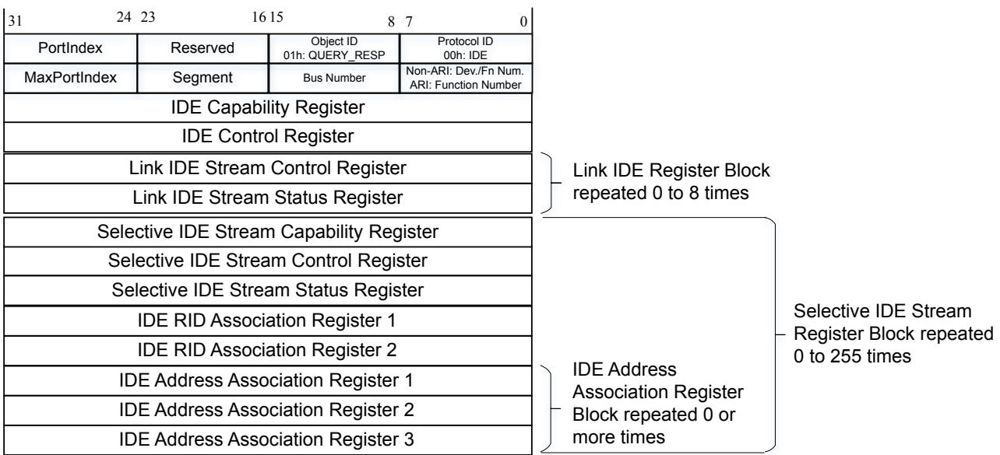

> **Figure 6-58.** Key Programming (KEY_PROG) Data Object with Example 256b Key
> 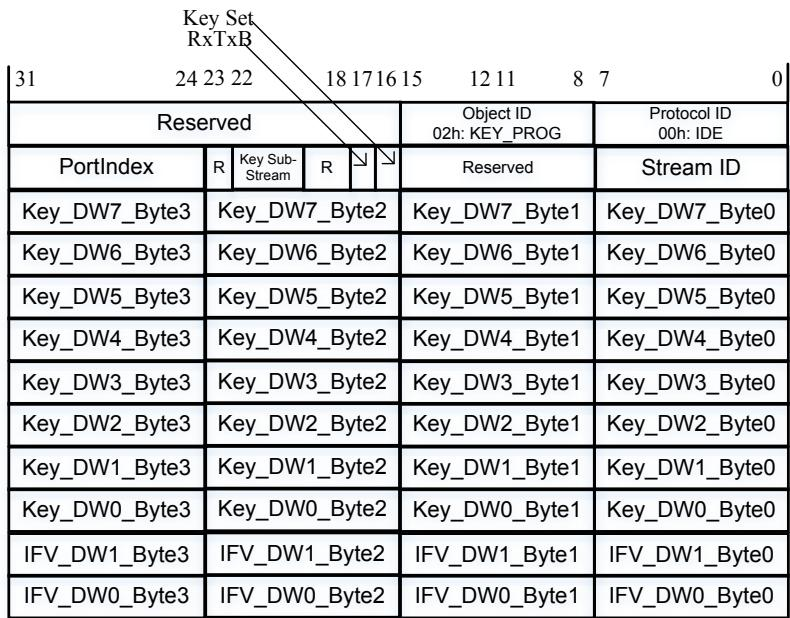

> **Figure 6-59.** Key Programming Acknowledgement (KP_ACK) Data Object
> 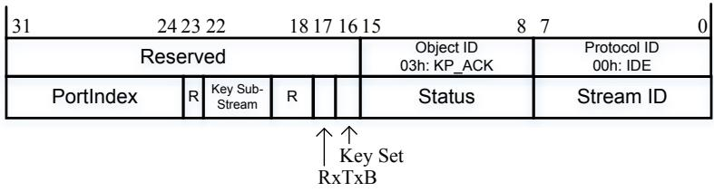

> **Figure 6-60.** Key Set Go (K_SET_GO) Data Object
> 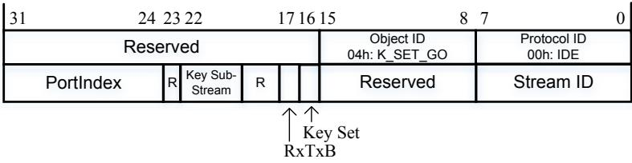

> **Figure 6-61.** Key Set Stop (K_SET_STOP) Data Object
> 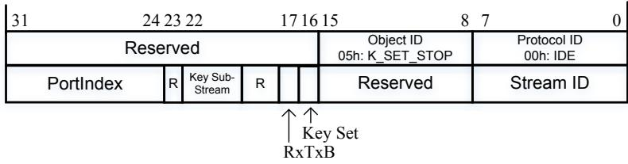

> **Figure 6-62.** Key Set Go/Stop Acknowledgement (K_GOSTOP_ACK) Data Object
> 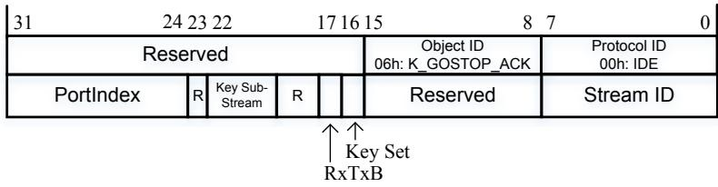

</div>


[⬆️ 返回目录](#-本章目录-table-of-contents)

---

table>
<thead>
<tr>
<th width="50%">🇬🇧 English</th>
<th width="50%" style="background-color:#e8e8e8">🇨🇳 中文</th>
</tr>
</thead>
<tbody>
<tr>
<td>

For implementations not requiring interoperable authentication and key exchange, it is permitted to use other mechanisms for key management.

Rules related to keys:

- Key size must be 256 bits.
- Following key exchange, implementation specific means must be used to ensure key security - the specific requirements for maintaining key security are platform and use case specific, and are out of scope for this document.
- Separately generated keys must be used for the Transmitter and the Receiver, and for each Sub-Stream.
  - It is strongly recommended that all keys for all Streams be separately generated.
- To support key updates without requiring an active IDE Stream to be put into a quiescent state, two key sets are defined, and the appropriate key set indicated in the IDE TLP Prefix (NFM)/OHC-C (FM) by the Transmitter via the K bit.
  - The initial value of the K bit is permitted to be 0b or 1b, although it is recommended the initial value be 0b. Software must ensure that the selected key set has been provided with keys in both Partner Ports.
  - Once the Transmitter has indicated a change of key set via the K bit, the Receiver must mark the other key set/bank invalid until it is reprogrammed.
  - The specific requirements for the frequency of key updates are determined by platform security requirements that are outside the scope of this document.
    - It is generally recommended that hardware provide enough key storage and management resources to support changing the keys for at least one active Stream without disruption to IDE operation.
    - It is expected that key update operations for multiple streams may need to be performed by firmware/software in a serialized fashion based on hardware key storage and management resource limitations.

<<<PAGE_BREAK>>> page_928

</td>
<td style="background-color:#e8e8e8">

对于不需要可互操作认证和密钥交换的实现,允许使用其他机制进行密钥管理。

与密钥相关的规则:

- 密钥大小必须为 256 位。
- 密钥交换之后,必须使用实现特定的手段来确保密钥安全——维护密钥安全的具体要求是平台和用例特定的,不在本文档的范围内。
- 必须为发送器和接收器以及每个子流使用单独生成的密钥。
  - 强烈建议为所有流的所有密钥单独生成。
- 为支持在不要求将活动 IDE 流置于静默状态的情况下进行密钥更新,定义了两个密钥集 (key set),并由发送器通过 K 位在 IDE TLP 前缀 (NFM)/OHC-C (FM) 中指示适当的密钥集。
  - K 位的初始值允许为 0b 或 1b,尽管建议初始值为 0b。软件必须确保所选密钥集已在两个伙伴端口中提供密钥。
  - 一旦发送器通过 K 位指示密钥集的更改,接收器必须将其他密钥集/库标记为无效,直至被重新编程。
  - 密钥更新频率的具体要求由平台安全要求决定,这些要求不在本文档的范围内。
    - 通常建议硬件提供足够的密钥存储和管理资源,以支持在不中断 IDE 操作的情况下为至少一个活动流更改密钥。
    - 预期多个流的密钥更新操作可能需要由固件/软件根据硬件密钥存储和管理资源的限制以串行方式执行。

</td>
</tr>
</tbody>
</table>

[⬆️ 返回目录](#-本章目录-table-of-contents)

---


<div style="overflow-x: auto; max-width: 100%;">
<table>
<thead>
<tr>
<th width="50%">🇬🇧 English</th>
<th width="50%" style="background-color:#e8e8e8">🇨🇳 中文</th>
</tr>
</thead>
<tbody>
<tr>
<td>

TLPs secured by IDE are called IDE TLPs. In Non-Flit Mode, all IDE TLPs must use the IDE prefix (see § Figure 6-64), and this prefix must precede all other End-End TLP prefixes. In Flit Mode, all IDE TLPs must include OHC-C.

> **IMPLEMENTATION NOTE:**
> **UNDERSTANDING THE IDE KEY MANAGEMENT FLOW**
>
> The following diagram illustrates a detailed example key programming flow using the IDE_KM protocol defined above, although it should be understood that there are many possible variations on this flow.
>
> | Step | Host (Requester Role) | Endpoint Upstream Port (Responder Role) |
> |------|----------------------|------------------------------------------|
> | Host and Device are configured with credentials for authentication. |
> | System Firmware/Software programs, in both Ports, the IDE Extended Capability for the Stream to be established. |
> | Initial steps – sent in the clear | SPDM GET_VERSION/VERSION<br>SPDM GET_CAPABILITIES/CAPABILITIES<br>SPDM NEGOTIATE_ALGORITHMS/ALGORITHMS | |
> | Start of process to establish SPDM authenticated/encrypted session – sent in the clear | SPDM GET_DIGESTS/DIGESTS (if required)<br>SPDM GET_CERTIFICATE/CERTIFICATE (if required)<br>SPDM KEY_EXCHANGE (sessionID=X)/KEY_EXCHANGE_RSP<br>SPDM FINISH/FINISH_RSP<br>(Alternate option of symmetric key (PSK) not shown) | |
> | SPDM secure session is established – start IDE Key Management Protocol |
> | Query the responder | SPDM VENDOR_DEFINED_REQUEST (IDE_KM QUERY) | SPDM VENDOR_DEFINED_RESPONSE (IDE_KM QUERY_RESPONSE) |
> | Distribute keys to Upstream Port for each Sub-Stream & Rx/Tx (6 times) | SPDM VENDOR_DEFINED_REQUEST (IDE_KM KEY_PROG) | SPDM VENDOR_DEFINED_RESPONSE (IDE_KM KP_ACK) |
> | (Host uses internal interface to program keys to Root Port for each Sub-Stream & Rx/Tx, 6 times) |
> | Trigger IDE at Upstream Port for Rx for each Sub-Stream (3 times) | SPDM VENDOR_DEFINED_REQUEST (IDE_KM K_SET_GO(Rx)) | SPDM VENDOR_DEFINED_RESPONSE (IDE_KM K_GOSTOP_ACK) |
> | (Host uses internal interface to trigger IDE at Root Port for Rx for each Sub-Stream, 3 times) |
> | Trigger IDE at Upstream Port for Tx for each Sub-Stream** (3 times) | SPDM VENDOR_DEFINED_REQUEST (IDE_KM K_SET_GO(Tx)) | SPDM VENDOR_DEFINED_RESPONSE (IDE_KM K_GOSTOP_ACK) |
> | (Host uses internal interface to trigger IDE at Root Port for Tx for each Sub-Stream, 3 times) |
> | System Software / Firmware sets the Enable bit and IDE is established |
>
> ** When using DOE, the Upstream Port responds to the Configuration Write that completes the transfer of the K_SET_GO(Tx) data object for Completions with a non-IDE Completion, then triggers the use of IDE for Completions.
>
<<<PAGE_BREAK>>> page_929

</td>
<td style="background-color:#e8e8e8">

由 IDE 保护的 TLP 称为 IDE TLP。在非 Flit 模式 (Non-Flit Mode, NFM) 中,所有 IDE TLP 必须使用 IDE 前缀(参见 § 图 6-64),且此前缀必须位于所有其他端到端 TLP 前缀之前。在 Flit 模式 (Flit Mode, FM) 中,所有 IDE TLP 必须包含 OHC-C。

> **实现说明:**
> **理解 IDE 密钥管理流程**
>
> 下图说明了使用上文定义的 IDE_KM 协议进行密钥编程的详细示例流程,但应理解该流程有许多可能的变化。
>
> | 步骤 | 主机(请求者角色) | 端点上游端口(应答者角色) |
> |------|----------------------|------------------------------------------|
> | 主机和设备配置了用于认证的凭据。 |
> | 系统固件/软件在两个端口中为待建立的流编程 IDE 扩展能力。 |
> | 初始步骤 – 明文发送 | SPDM GET_VERSION/VERSION<br>SPDM GET_CAPABILITIES/CAPABILITIES<br>SPDM NEGOTIATE_ALGORITHMS/ALGORITHMS | |
> | 建立 SPDM 认证/加密会话流程的开始 – 明文发送 | SPDM GET_DIGESTS/DIGESTS(如需要)<br>SPDM GET_CERTIFICATE/CERTIFICATE(如需要)<br>SPDM KEY_EXCHANGE (sessionID=X)/KEY_EXCHANGE_RSP<br>SPDM FINISH/FINISH_RSP<br>(对称密钥 (PSK) 的替代选项未显示) | |
> | SPDM 安全会话已建立 – 启动 IDE 密钥管理协议 |
> | 查询应答者 | SPDM VENDOR_DEFINED_REQUEST (IDE_KM QUERY) | SPDM VENDOR_DEFINED_RESPONSE (IDE_KM QUERY_RESPONSE) |
> | 为上游端口的每个子流和 Rx/Tx 分发密钥(6 次) | SPDM VENDOR_DEFINED_REQUEST (IDE_KM KEY_PROG) | SPDM VENDOR_DEFINED_RESPONSE (IDE_KM KP_ACK) |
> | (主机使用内部接口为根端口的每个子流和 Rx/Tx 编程密钥,6 次) |
> | 为上游端口的每个子流触发 Rx 的 IDE(3 次) | SPDM VENDOR_DEFINED_REQUEST (IDE_KM K_SET_GO(Rx)) | SPDM VENDOR_DEFINED_RESPONSE (IDE_KM K_GOSTOP_ACK) |
> | (主机使用内部接口为根端口的每个子流触发 Rx 的 IDE,3 次) |
> | 为上游端口的每个子流触发 Tx 的 IDE**(3 次) | SPDM VENDOR_DEFINED_REQUEST (IDE_KM K_SET_GO(Tx)) | SPDM VENDOR_DEFINED_RESPONSE (IDE_KM K_GOSTOP_ACK) |
> | (主机使用内部接口为根端口的每个子流触发 Tx 的 IDE,3 次) |
> | 系统软件/固件置位 Enable 位,IDE 建立 |
>
> ** 当使用 DOE 时,上游端口以非 IDE Completion 响应完成 K_SET_GO(Tx) 数据对象传输的 Configuration Write,然后触发对 Completion 使用 IDE。
>
</td>
</tr>
</tbody>
</table>

> **Figure 6-63.** IDE_KM Example
> 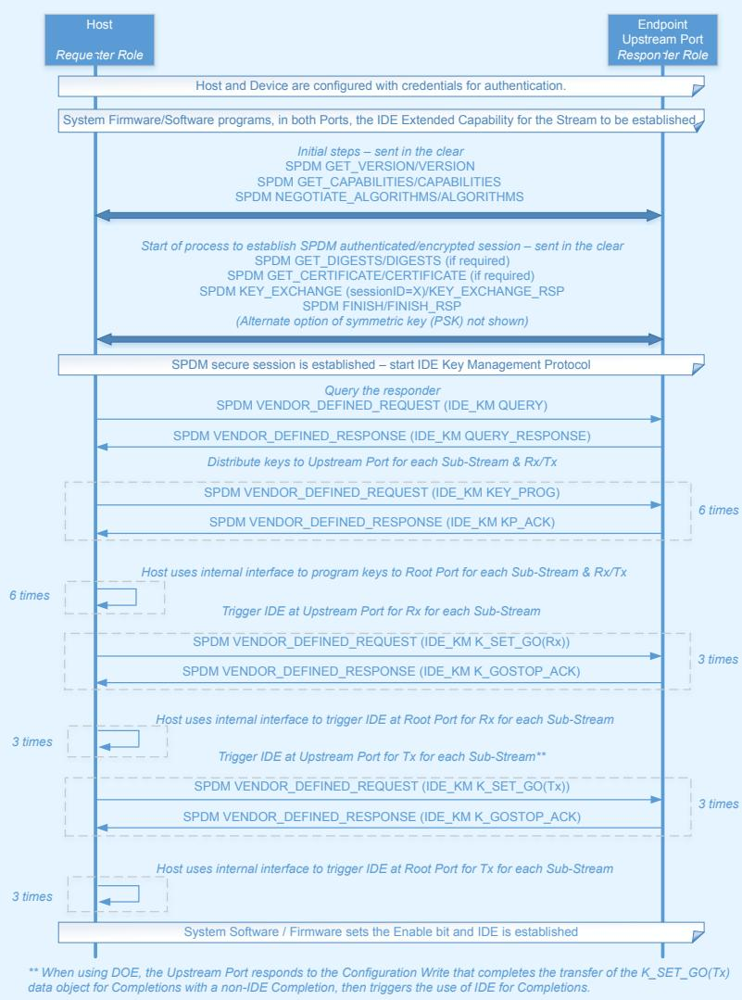

</div>


[⬆️ 返回目录](#-本章目录-table-of-contents)

---

<a id="sec-6-33-4"></a>
## 6.33.4 IDE TLPs | IDE TLP

table>
<thead>
<tr>
<th width="50%">🇬🇧 English</th>
<th width="50%" style="background-color:#e8e8e8">🇨🇳 中文</th>
</tr>
</thead>
<tbody>
<tr>
<td>

**6.33.4 IDE TLPs**

> **Figure 6-64.** IDE TLP Prefix (NFM)
> 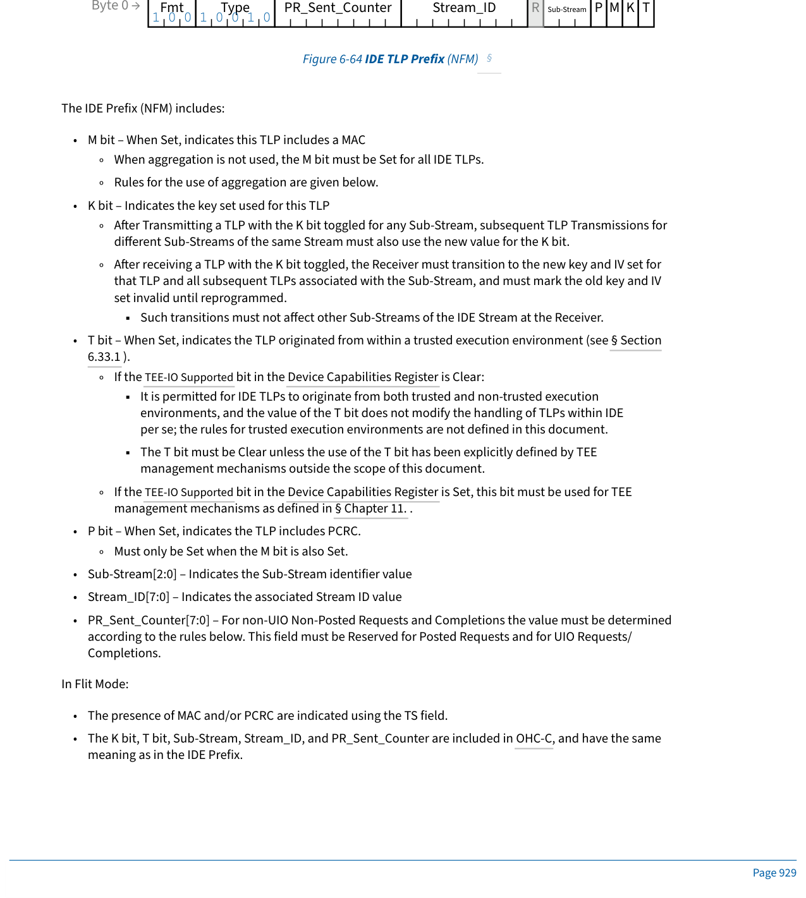

The IDE Prefix (NFM) includes:

- M bit – When Set, indicates this TLP includes a MAC
  - When aggregation is not used, the M bit must be Set for all IDE TLPs.
  - Rules for the use of aggregation are given below.
- K bit – Indicates the key set used for this TLP
  - After Transmitting a TLP with the K bit toggled for any Sub-Stream, subsequent TLP Transmissions for different Sub-Streams of the same Stream must also use the new value for the K bit.
  - After receiving a TLP with the K bit toggled, the Receiver must transition to the new key and IV set for that TLP and all subsequent TLPs associated with the Sub-Stream, and must mark the old key and IV set invalid until reprogrammed.
    - Such transitions must not affect other Sub-Streams of the IDE Stream at the Receiver.
- T bit – When Set, indicates the TLP originated from within a trusted execution environment (see § Section 6.33.1).
  - If the TEE-IO Supported bit in the Device Capabilities Register is Clear:
    - It is permitted for IDE TLPs to originate from both trusted and non-trusted execution environments, and the value of the T bit does not modify the handling of TLPs within IDE per se; the rules for trusted execution environments are not defined in this document.
    - The T bit must be Clear unless the use of the T bit has been explicitly defined by TEE management mechanisms outside the scope of this document.
  - If the TEE-IO Supported bit in the Device Capabilities Register is Set, this bit must be used for TEE management mechanisms as defined in § Chapter 11.
- P bit – When Set, indicates the TLP includes PCRC.
  - Must only be Set when the M bit is also Set.
- Sub-Stream[2:0] – Indicates the Sub-Stream identifier value
- Stream_ID[7:0] – Indicates the associated Stream ID value
- PR_Sent_Counter[7:0] – For non-UIO Non-Posted Requests and Completions the value must be determined according to the rules below. This field must be Reserved for Posted Requests and for UIO Requests/Completions.

In Flit Mode:

- The presence of MAC and/or PCRC are indicated using the TS field.
- The K bit, T bit, Sub-Stream, Stream_ID, and PR_Sent_Counter are included in OHC-C, and have the same meaning as in the IDE Prefix.

<<<PAGE_BREAK>>> page_930

</td>
<td style="background-color:#e8e8e8">

**6.33.4 IDE TLP**


IDE 前缀 (NFM) 包括:

- M 位 – 置位时,表示此 TLP 包含 MAC
  - 当不使用聚合 (aggregation) 时,所有 IDE TLP 的 M 位必须置位。
  - 聚合使用的规则见下文。
- K 位 – 指示此 TLP 使用的密钥集
  - 在为任何子流发送 K 位已切换的 TLP 之后,同一流的不同子流的后续 TLP 发送也必须使用 K 位的新值。
  - 在收到 K 位已切换的 TLP 之后,接收器必须切换到新的密钥和 IV 集,用于该 TLP 及与子流相关联的所有后续 TLP,并且必须将旧密钥和 IV 集标记为无效,直至被重新编程。
    - 此等切换不得影响接收器处 IDE 流的其它子流。
- T 位 – 置位时,表示 TLP 源自可信执行环境 (TEE)(参见 § 6.33.1 节)。
  - 如果设备能力寄存器 (Device Capabilities Register) 中的 TEE-IO Supported 位被清零:
    - 允许 IDE TLP 源自可信和不可信执行环境,且 T 位的值本身不修改 IDE 内对 TLP 的处理;可信执行环境的规则未在本文档中定义。
    - 除非 T 位使用已由本文档范围之外的 TEE 管理机制明确定义,否则 T 位必须清零。
  - 如果设备能力寄存器中的 TEE-IO Supported 位置位,则此位必须按照 § 第 11 章的定义用于 TEE 管理机制。
- P 位 – 置位时,表示 TLP 包含 PCRC。
  - 仅当 M 位也置位时才可置位。
- Sub-Stream[2:0] – 指示子流标识符值
- Stream_ID[7:0] – 指示关联的流 ID 值
- PR_Sent_Counter[7:0] – 对于非 UIO 的 Non-Posted 请求和完成 (Completion),该值必须根据以下规则确定。对于 Posted 请求和 UIO 请求/完成,此字段必须保留 (Reserved)。

在 Flit 模式 (Flit Mode) 中:

- MAC 和/或 PCRC 的存在通过 TS 字段指示。
- K 位、T 位、Sub-Stream、Stream_ID 和 PR_Sent_Counter 包含在 OHC-C 中,其含义与 IDE 前缀中相同。

</td>
</tr>
</tbody>
</table>

[⬆️ 返回目录](#-本章目录-table-of-contents)

---


<div style="overflow-x: auto; max-width: 100%;">
<table>
<thead>
<tr>
<th width="50%">🇬🇧 English</th>
<th width="50%" style="background-color:#e8e8e8">🇨🇳 中文</th>
</tr>
</thead>
<tbody>
<tr>
<td>

IDE uses Galois/Counter Mode (GCM) as defined in [AES-GCM], referred to as AES-GCM. For IDE TLPs, TLP data payload content forms the "Plaintext", also known as P, as defined in [AES-GCM], and the TLP Header and certain other elements (defined below) form the "Additional Authenticated Data", also known as A, as defined in [AES-GCM].

The Message Authentication Code (MAC)<sup>143</sup> size, also known as t, as defined in [AES-GCM], must be 96b (see § Figure 6-65).

Flow Control credit accounting for IDE TLPs must handle the MAC as covered by the Header Credit.

For IDE TLPs, AES-GCM can be applied to each IDE TLP, or aggregation can be used to apply AES-GCM to multiple IDE TLPs, reducing the per-TLP overhead for the IDE TLP MAC. For a Link IDE Stream, local prefixes must be covered by the MAC (see § Figure 6-66, § Figure 6-67), § Figure 6-70, and § Figure 6-71). For Selective IDE Streams, local prefixes must not be covered by the MAC (see § Figure 6-68, § Figure 6-69, § Figure 6-72, and § Figure 6-73).

<sub>143. Referred to as "authentication tag" or T in [AES-GCM] but renamed here to avoid confusion with other uses of "tag"</sub>

<<<PAGE_BREAK>>> page_931

</td>
<td style="background-color:#e8e8e8">

IDE 使用 [AES-GCM] 中定义的伽罗瓦/计数器模式 (Galois/Counter Mode, GCM),称为 AES-GCM。对于 IDE TLP,TLP 数据有效负载内容构成"明文" (Plaintext),也称为 P,如 [AES-GCM] 中所定义;TLP 包头 (Header) 和某些其他元素(下文定义)构成"附加认证数据" (Additional Authenticated Data),也称为 A,如 [AES-GCM] 中所定义。

消息认证码 (MAC)<sup>143</sup> 的大小,也称为 t,如 [AES-GCM] 中所定义,必须为 96 位(参见 § 图 6-65)。

对于 IDE TLP 的流控 (Flow Control) 信用计算,必须将 MAC 视为由 Header Credit 覆盖。

对于 IDE TLP,AES-GCM 可以应用于每个 IDE TLP,或使用聚合将 AES-GCM 应用于多个 IDE TLP,从而降低每个 TLP 的 IDE TLP MAC 开销。对于链接 IDE 流 (Link IDE Stream),本地前缀 (local prefix) 必须由 MAC 覆盖(参见 § 图 6-66、§ 图 6-67、§ 图 6-70 和 § 图 6-71)。对于选择性 IDE 流 (Selective IDE Stream),本地前缀不得由 MAC 覆盖(参见 § 图 6-68、§ 图 6-69、§ 图 6-72 和 § 图 6-73)。

<sub>143. 在 [AES-GCM] 中称为"认证标签" (authentication tag) 或 T,此处重命名以避免与其他"标签"用法混淆</sub>

</td>
</tr>
</tbody>
</table>

> **Figure 6-65.** MAC Layout
> 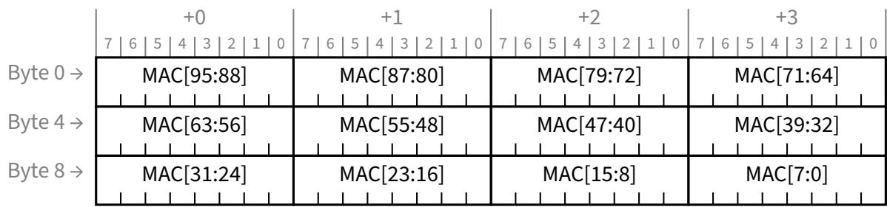

> **Figure 6-66.** Example of IDE TLP for a Link IDE Stream without Aggregation (Non-Flit Mode)
> 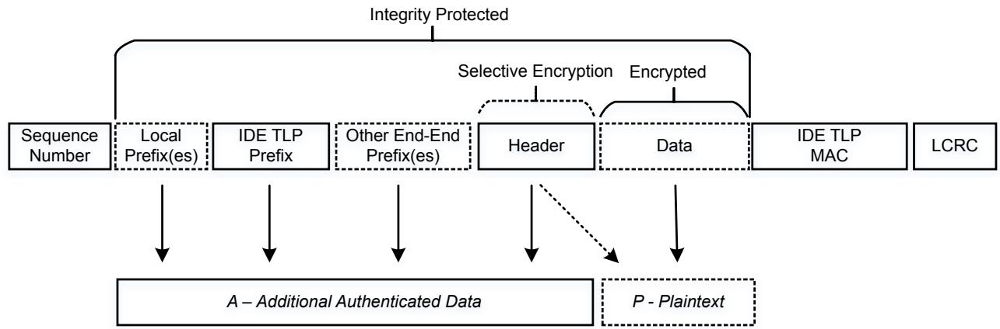

</div>


[⬆️ 返回目录](#-本章目录-table-of-contents)

---

table>
<thead>
<tr>
<th width="50%">🇬🇧 English</th>
<th width="50%" style="background-color:#e8e8e8">🇨🇳 中文</th>
</tr>
</thead>
<tbody>
<tr>
<td>

> **Figure 6-67.** IDE TLP – Example Showing Aggregation of Two TLPs for a Link IDE Stream (Non-Flit Mode)
> 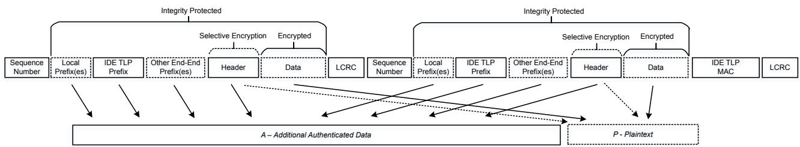

> **Figure 6-68.** IDE TLP – Example of IDE TLP for a Selective IDE Stream without Aggregation (Non-Flit Mode)
> 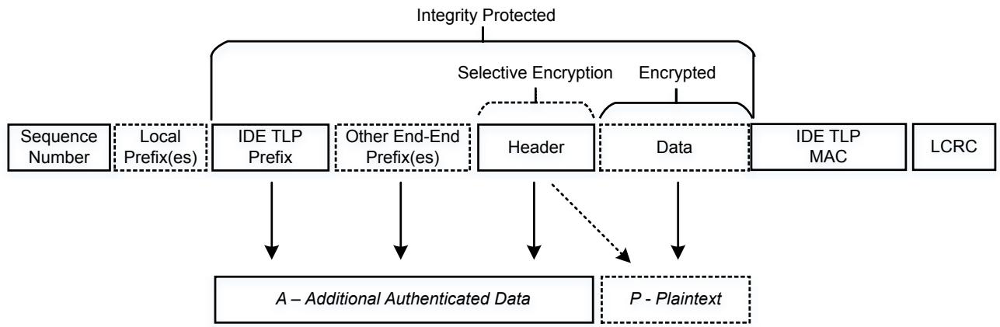

> **Figure 6-69.** IDE TLP – Example Showing Aggregation of Two TLPs for a Selective IDE Stream (Non-Flit Mode)
> 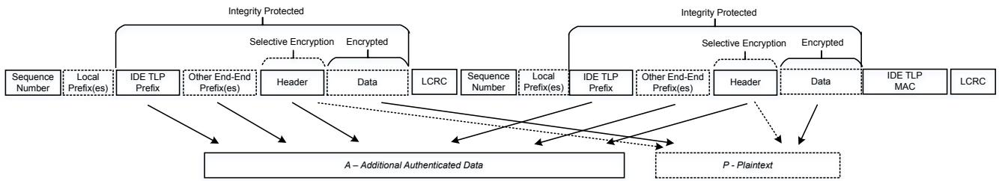

<<<PAGE_BREAK>>> page_932

</td>
<td style="background-color:#e8e8e8">


</td>
</tr>
</tbody>
</table>

[⬆️ 返回目录](#-本章目录-table-of-contents)

---


<div style="overflow-x: auto; max-width: 100%;">
<table>
<thead>
<tr>
<th width="50%">🇬🇧 English</th>
<th width="50%" style="background-color:#e8e8e8">🇨🇳 中文</th>
</tr>
</thead>
<tbody>
<tr>
<td>

<<<PAGE_BREAK>>> page_933

The inputs A and P must be formed by concatenating the included TLP content in Byte order as defined in § Section 2.1.2. Although the A and P content is conceptually concatenated as illustrated in these figures, the content placement in the IDE TLPs is the same as in non-IDE TLPs. Once the A and P content is constructed, [AES-GCM] defines how A and P must be padded – this padding is not illustrated here, and the padding is used in the [AES-GCM] calculations but is not included in the TLPs transmitted/received. When aggregation is used, the A and P content for aggregated TLPs is conceptually concatenated, for each type of content, prior to padding.

Partial header encryption provides the ability to reduce potential exposure to side-channel attacks by encryption some portions of the Header of an IDE Memory Request while maintaining information that is required for TLP routing and low-level TLP processing in the clear. § Figure 6-74 illustrates, at a high level, the application of partial header encryption.

<<<PAGE_BREAK>>> page_934

</td>
<td style="background-color:#e8e8e8">

输入 A 和 P 必须通过按 § 2.1.2 节定义的字节顺序连接所包含的 TLP 内容来形成。虽然 A 和 P 内容在这些图中概念上是连接的,但 IDE TLP 中的内容放置与非 IDE TLP 中相同。一旦构建了 A 和 P 内容,[AES-GCM] 定义了 A 和 P 必须如何填充——此处的填充未在此说明,该填充用于 [AES-GCM] 计算中,但不包含在发送/接收的 TLP 中。当使用聚合时,聚合 TLP 的 A 和 P 内容在填充之前按每种内容类型概念上连接。

部分包头加密 (Partial Header Encryption) 提供通过加密 IDE 内存请求包头 (Header) 的某些部分来减少对侧信道攻击潜在暴露的能力,同时以明文形式维护 TLP 路由和低级 TLP 处理所需的信息。§ 图 6-74 在高层说明了部分包头加密的应用。

</td>
</tr>
</tbody>
</table>

> **Figure 6-70.** Example of IDE TLP for a Link IDE Stream without Aggregation (Flit Mode)
> 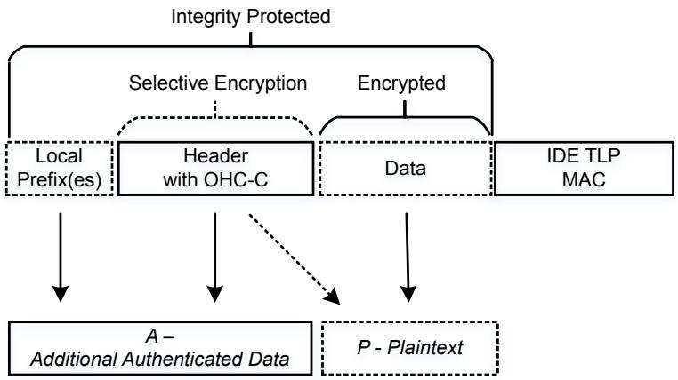

> **Figure 6-71.** IDE TLP – Example Showing Aggregation of Two TLPs for a Link IDE Stream (Flit Mode)
> 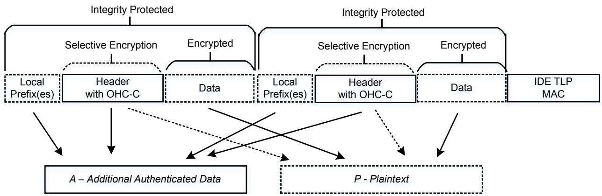

> **Figure 6-72.** Example of IDE TLP for a Selective IDE Stream without Aggregation (Flit Mode)
> 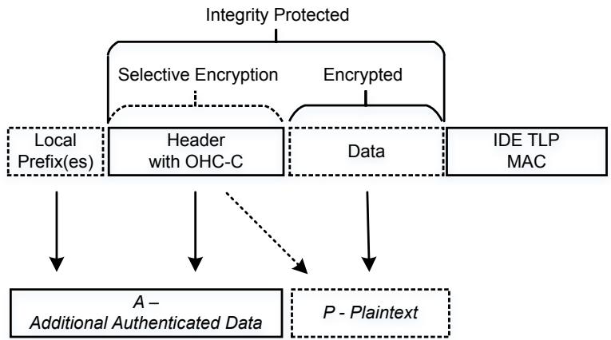

> **Figure 6-73.** IDE TLP – Example Showing Aggregation of Two TLPs for a Selective IDE Stream (Flit Mode)
> 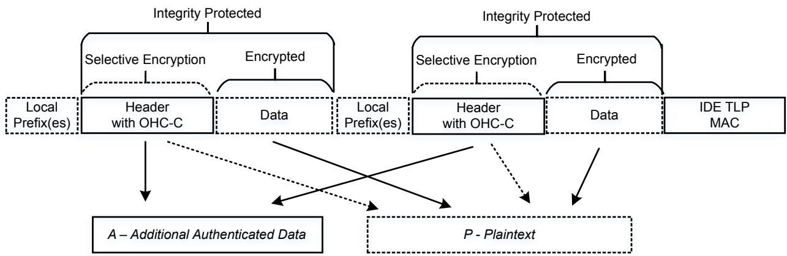

> **Figure 6-74.** High Level Flow For Partial Header Encryption
> 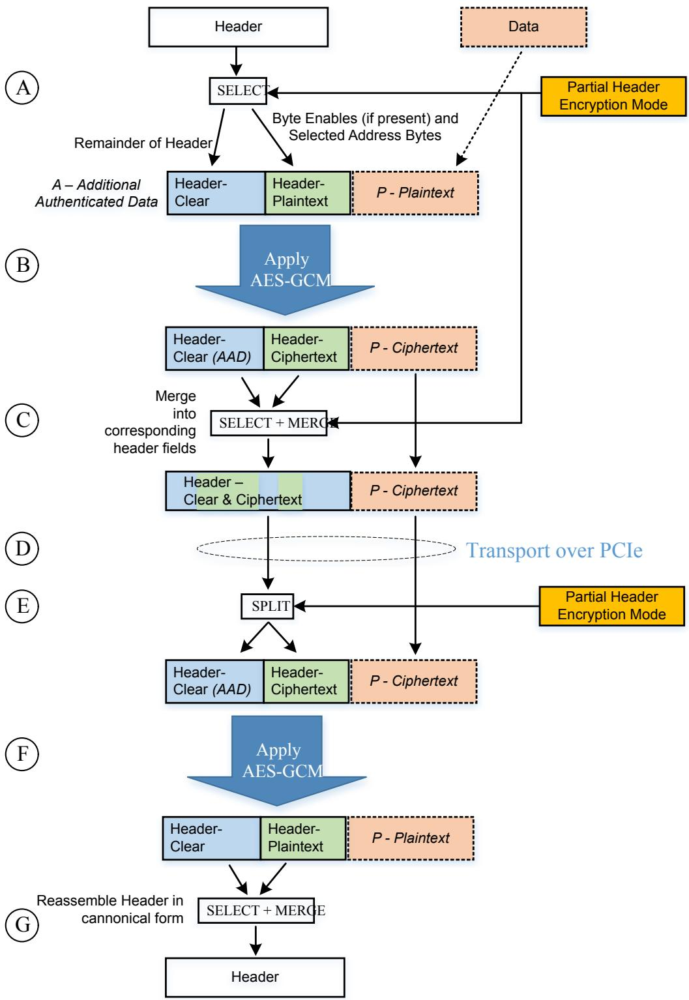

</div>


[⬆️ 返回目录](#-本章目录-table-of-contents)

---

table>
<thead>
<tr>
<th width="50%">🇬🇧 English</th>
<th width="50%" style="background-color:#e8e8e8">🇨🇳 中文</th>
</tr>
</thead>
<tbody>
<tr>
<td>

In partial header encryption, the encrypted portions of the Header are determined by the setting in the Partial Header Encryption Mode field of the Selective IDE Stream Control Register or Link IDE Control Register.

Rules for partial header encryption:

- When encrypted, the First DW BE and Last DW BE fields must be in the first byte of P
  - In NFM, the First DW BE and Last DW BE fields must be encrypted in all Memory Requests, except for AtomicOp Requests, Translation Requests, and Memory Read/DMWr Requests with the TH bit Set.
  - In FM, for Memory Requests, if OHC-A1 is present, then the First DW BE and Last DW BE fields must be encrypted.
- Address bits selected for encryption must follow the First DW BE and Last DW BE fields, if included, in P, and are formed as:
  - Address[17:2]:
    - Byte +0: Address[17:10]
    - Byte +1: Address[9:2]
  - Address[25:2]:
    - Byte +0: Address[25:18]
    - Byte +1: Address[17:10]
    - Byte +2: Address[9:2]
  - Address[33:2]:
    - Byte +0: Address[33:26]
    - Byte +1: Address[25:18]
    - Byte +2: Address[17:10]
    - Byte +3: Address[9:2]
  - Address[41:2]:
    - Byte +0: Address[41:34]
    - Byte +1: Address[33:26]
    - Byte +2: Address[25:18]
    - Byte +3: Address[17:10]
    - Byte +4: Address[9:2]
- At the Transmitter, the Header content selected for encryption is concatenated at the front of P and removed from A, increasing the size of P and decreasing the size of A accordingly.
- If PCRC is enabled when using partial header encryption:
  - Relative ordering of bits for PCRC input is maintained, with the same Header content used as for P.
  - For the PCRC calculation only, the selected portions of the header must be padded to 64bits with 0's in the most significant bits.
- At the receiver, the operation is reversed in order to apply AES-GCM to the A and C content and then finally the complete header is reconstructed.
- The PCRC is calculated at the receiver using the decrypted P content and the Header portion padded to 64bits with 0's in the most significant bits.
- When an error causes an IDE TLP with partial header encryption to be logged in the Header Log Register, the header fields selected for partial header encryption are permitted to contain all 0's or the encrypted values, but must not contain the decrypted values unless through implementation-specific means it is assured that doing so will not violate any security requirements.

§ Figure 6-75 through § Figure 6-78 illustrate the application of partial header encryption.

<<<PAGE_BREAK>>> page_935

> **Figure 6-75.** Partial Header Encryption in NFM with Byte Enables
> 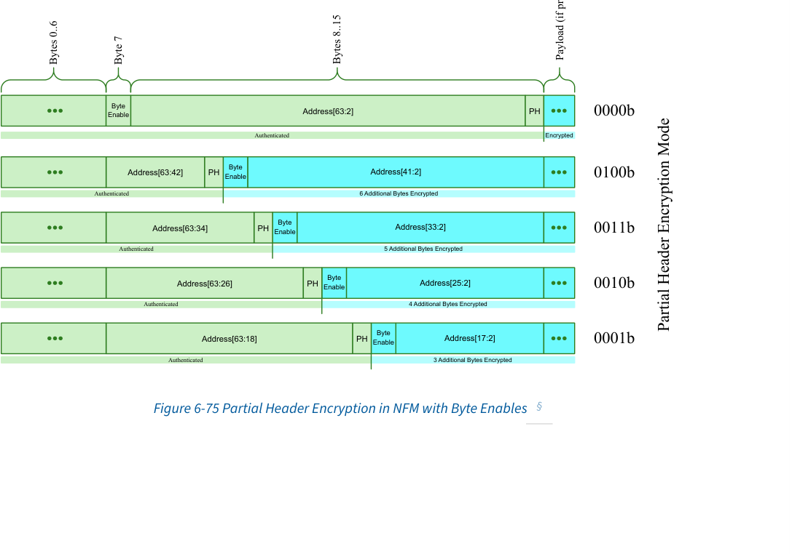

<<<PAGE_BREAK>>> page_936

> **Figure 6-76.** Partial Header Encryption in NFM without Byte Enables
> 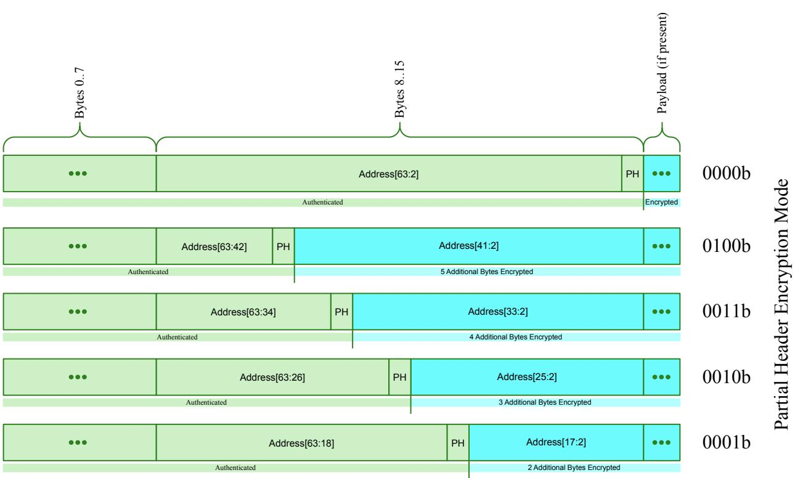

<<<PAGE_BREAK>>> page_937

> **Figure 6-77.** Partial Header Encryption in FM with OHC-A1
> 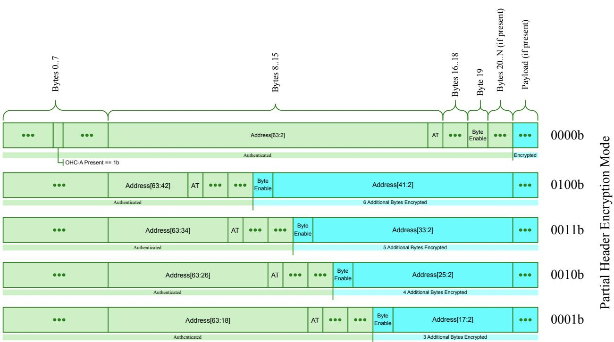

<<<PAGE_BREAK>>> page_938

> **Figure 6-78.** Partial Header Encryption in FM without OHC-A1
> 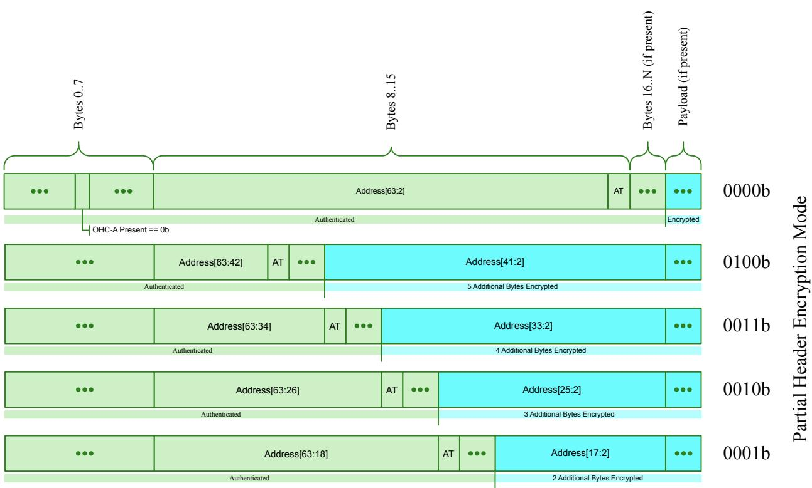

<<<PAGE_BREAK>>> page_939

</td>
<td style="background-color:#e8e8e8">

在部分包头加密中,Header 的加密部分由选择性 IDE 流控制寄存器 (Selective IDE Stream Control Register) 或链接 IDE 控制寄存器 (Link IDE Control Register) 中的 Partial Header Encryption Mode 字段设置决定。

部分包头加密的规则:

- 加密时,First DW BE 和 Last DW BE 字段必须位于 P 的第一个字节中
  - 在 NFM 中,First DW BE 和 Last DW BE 字段必须在所有内存请求中加密,但 AtomicOp 请求、转换请求 (Translation Requests) 以及 TH 位置位的内存读/DMWr 请求除外。
  - 在 FM 中,对于内存请求,如果存在 OHC-A1,则 First DW BE 和 Last DW BE 字段必须加密。
- 选定加密的地址位必须遵循 First DW BE 和 Last DW BE 字段(若包含)在 P 中的排列,形成如下:
  - Address[17:2]:
    - Byte +0:Address[17:10]
    - Byte +1:Address[9:2]
  - Address[25:2]:
    - Byte +0:Address[25:18]
    - Byte +1:Address[17:10]
    - Byte +2:Address[9:2]
  - Address[33:2]:
    - Byte +0:Address[33:26]
    - Byte +1:Address[25:18]
    - Byte +2:Address[17:10]
    - Byte +3:Address[9:2]
  - Address[41:2]:
    - Byte +0:Address[41:34]
    - Byte +1:Address[33:26]
    - Byte +2:Address[25:18]
    - Byte +3:Address[17:10]
    - Byte +4:Address[9:2]
- 在发送器 (Transmitter) 处,选定加密的 Header 内容连接在 P 的前端,并从 A 中移除,相应地增加 P 的大小并减少 A 的大小。
- 如果在使用部分包头加密时启用了 PCRC:
  - PCRC 输入的相对位顺序保持不变,使用与 P 相同的 Header 内容。
  - 仅对于 PCRC 计算,所选 Header 部分必须用 0 填充到 64 位,最高有效位填 0。
- 在接收器 (Receiver) 处,操作反向进行,以便对 A 和 C 内容应用 AES-GCM,然后最终重建完整的 Header。
- PCRC 在接收器处使用解密的 P 内容和用 0 填充到 64 位(最高有效位为 0)的 Header 部分计算。
- 当错误导致使用部分包头加密的 IDE TLP 被记录在 Header Log 寄存器中时,选定部分包头加密的 Header 字段允许包含全 0 或加密值,但不得包含解密值,除非通过实现特定的手段可以确保这样做不会违反任何安全要求。

§ 图 6-75 至 § 图 6-78 说明了部分包头加密的应用。

> **图 6-75.** NFM 中带字节使能的部分包头加密
> 

> **图 6-76.** NFM 中不带字节使能的部分包头加密
> 

> **图 6-77.** FM 中带 OHC-A1 的部分包头加密
> 

> **图 6-78.** FM 中不带 OHC-A1 的部分包头加密
> 

</td>
</tr>
</tbody>
</table>

[⬆️ 返回目录](#-本章目录-table-of-contents)

---


<div style="overflow-x: auto; max-width: 100%;">
<table>
<thead>
<tr>
<th width="50%">🇬🇧 English</th>
<th width="50%" style="background-color:#e8e8e8">🇨🇳 中文</th>
</tr>
</thead>
<tbody>
<tr>
<td>

The use of Local TLP Prefixes with IDE TLPs is permitted. Local TLP Prefixes, if present, must precede the IDE Prefix (NFM). For Link IDE Streams, Local TLP Prefixes must be included in A. For Selective IDE Streams, Local TLP Prefixes must not be included in A or P.

The IDE Prefix (NFM) must be included in A. All OHC content (FM) must be included in A.

In NFM, the use of other End-End TLP Prefixes, besides the IDE Prefix, with IDE TLPs is permitted. End-End TLP Prefixes, if present, must follow the IDE Prefix, and must be included in A.

When aggregation is used, all TLPs associated with a single MAC are considered to be part of an "aggregated unit." As defined in [AES-GCM], a single invocation is performed for each TLP when aggregation is not used, and for each aggregated unit when aggregation is used.

As with all TLPs, IDE TLPs are covered by Data Link Layer mechanisms, such that physical Link errors are detected and corrected before received TLPs are presented to the receiver's cryptographic processing mechanisms.

The use of ECRC with IDE TLPs is not permitted. If ECRC is enabled for non-IDE TLPs, then IDE TLPs must be formed as if ECRC were not enabled, and the TD bit in the TLP Header must be Clear.

To enable the detection of faults in the encryption/decryption logic, which occur outside of the path protected by the MAC, IDE implementations are permitted optionally to support the Plaintext CRC (PCRC) mechanism, for which the following rules apply:

- Software must only enable PCRC when both Partner Ports support the PCRC mechanism.
  - It is permitted to enable the PCRC mechanism on a per-IDE Stream basis.
- When PCRC is enabled for an IDE Stream, all Transmitted TLPs associated with that Stream that include a MAC must also include PCRC, if and only if there is P content in the TLP or aggregated unit of TLPs.
  - In NFM, presence of a MAC is indicated by the M bit in the IDE Prefix being Set and presence of the PCRC is indicated by the P bit in the IDE Prefix being Set
  - In FM, the TS field is used to indicate presence of MAC / PCRC (see § Section 2.2.1.2.
  - When aggregation is used, the TLPs of an aggregated unit that do not include a MAC also must not include PCRC (see § Figure 6-79).

<<<PAGE_BREAK>>> page_940

</td>
<td style="background-color:#e8e8e8">

允许将本地 TLP 前缀 (Local TLP Prefix) 与 IDE TLP 一起使用。如果存在,本地 TLP 前缀必须位于 IDE 前缀 (NFM) 之前。对于链接 IDE 流,本地 TLP 前缀必须包含在 A 中。对于选择性 IDE 流,本地 TLP 前缀不得包含在 A 或 P 中。

IDE 前缀 (NFM) 必须包含在 A 中。所有 OHC 内容 (FM) 必须包含在 A 中。

在 NFM 中,除 IDE 前缀外,允许将其他端到端 TLP 前缀 (End-End TLP Prefix) 与 IDE TLP 一起使用。如果存在,端到端 TLP 前缀必须跟在 IDE 前缀之后,且必须包含在 A 中。

当使用聚合时,与单个 MAC 相关联的所有 TLP 被视为"聚合单元" (aggregated unit) 的一部分。如 [AES-GCM] 中定义,当不使用聚合时,对每个 TLP 执行单次调用;当使用聚合时,对每个聚合单元执行单次调用。

与所有 TLP 一样,IDE TLP 由数据链路层 (Data Link Layer) 机制覆盖,以便在将接收到的 TLP 呈现给接收器的加密处理机制之前检测和纠正物理链路 (Link) 错误。

不允许在 IDE TLP 中使用 ECRC。如果为非 IDE TLP 启用了 ECRC,则 IDE TLP 的形成必须如同未启用 ECRC 一样,且 TLP Header 中的 TD 位必须清零。

为了能够检测在 MAC 保护路径之外发生的加/解密逻辑中的故障,IDE 实现被允许可选地支持明文 CRC (Plaintext CRC, PCRC) 机制,以下规则适用:

- 软件仅在两个伙伴端口都支持 PCRC 机制时才能启用 PCRC。
  - 允许按每个 IDE 流为基础启用 PCRC 机制。
- 当为 IDE 流启用 PCRC 时,与该流相关联的所有已发送 TLP 包含 MAC 的,在且仅当 TLP 或 TLP 聚合单元中存在 P 内容时,也必须包含 PCRC。
  - 在 NFM 中,MAC 的存在由 IDE 前缀中的 M 位置位来指示,PCRC 的存在由 IDE 前缀中的 P 位置位来指示
  - 在 FM 中,TS 字段用于指示 MAC/PCRC 的存在(参见 § 2.2.1.2 节)
  - 当使用聚合时,聚合单元中不包含 MAC 的 TLP 也必须不包含 PCRC(参见 § 图 6-79)。

</td>
</tr>
</tbody>
</table>

> **Figure 6-79.** Example Illustrating PCRC Application to Two Aggregated IDE TLPs for a Link IDE Stream (NFM)
> 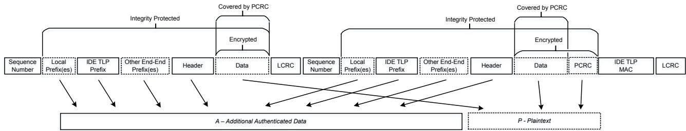

</div>


[⬆️ 返回目录](#-本章目录-table-of-contents)

---

table>
<thead>
<tr>
<th width="50%">🇬🇧 English</th>
<th width="50%" style="background-color:#e8e8e8">🇨🇳 中文</th>
</tr>
</thead>
<tbody>
<tr>
<td>

- In NFM, when PCRC is enabled for an IDE Stream, the ultimate Receiver must check that all received TLPs or aggregated units associated with that Stream that include P content and a MAC (as indicated by the M bit in the IDE Prefix) also have the P bit in the IDE Prefix Set.
  - If, for a TLP, the P bit in the IDE Prefix is Clear and the M bit is Set, the Receiver must report this as a PCRC Check Failed error.
- PCRC must be calculated across all P content<sup>144</sup> for a given invocation of AES-GCM, and per the following:
  - The polynomial used has coefficients expressed as 04C1 1DB7h
  - The seed value must be FFFF FFFFh
  - All P content must be included in the PCRC calculation
  - PCRC calculation starts with bit 0 of byte 0 and proceeds from bit 0 to bit 7 of each byte of P
  - The result of the PCRC calculation must be complemented, mapped as shown in § Table 2-55 (following the same mapping as for ECRC), and appended to the P content, and encrypted/decrypted along with the other P content, with the encrypted PCRC value appended to the other P content and preceding the MAC (see § Figure 6-79).
- The PCRC must only be checked by the ultimate Receiver of the IDE TLP including PCRC.
  - A failure of the PCRC check indicates that one or more bits of the data payload have been corrupted — the Receiver's use of the data payload is outside the scope of this specification, but it is strongly recommended that the corrupted data not be used as if it were uncorrupted.
  - PCRC Check Failed is a reported error.
- Flow Control credit accounting for IDE TLPs that include PCRC must handle the PCRC as covered by the Header Credit.

<sub>144. As with ECRC, the PCRC is calculated using the TLP as-transmitted, including, for any data payload, all bytes as-transmitted regardless of the byte enable values.</sub>

<<<PAGE_BREAK>>> page_941

</td>
<td style="background-color:#e8e8e8">

- 在 NFM 中,当为 IDE 流启用 PCRC 时,最终接收器必须检查与该流相关联的所有收到的 TLP 或聚合单元,这些 TLP 或聚合单元包含 P 内容和 MAC(由 IDE 前缀中的 M 位指示)也具有 IDE 前缀中置位的 P 位。
  - 如果对于某个 TLP,IDE 前缀中的 P 位被清零且 M 位置位,接收器必须将此报告为 PCRC Check Failed 错误。
- PCRC 必须跨给定 AES-GCM 调用的所有 P 内容<sup>144</sup>计算,并遵循以下规定:
  - 使用的多项式系数表示为 04C1 1DB7h
  - 种子值必须为 FFFF FFFFh
  - 所有 P 内容必须包含在 PCRC 计算中
  - PCRC 计算从字节 0 的位 0 开始,从位 0 到位 7 对 P 的每个字节进行
  - PCRC 计算结果必须取反,如 § 表 2-55 所示映射(遵循与 ECRC 相同的映射),并附加到 P 内容,并与其他 P 内容一起加/解密,加密的 PCRC 值附加到其他 P 内容之后并位于 MAC 之前(参见 § 图 6-79)。
- PCRC 必须仅由包括 PCRC 在内的 IDE TLP 的最终接收器检查。
  - PCRC 检查失败表明数据有效负载的一个或多个位已损坏——接收器对数据有效负载的使用不在本规范的范围内,但强烈建议不要将损坏的数据当作未损坏的数据使用。
  - PCRC Check Failed 是已报告错误。
- 对于包含 PCRC 的 IDE TLP 的流控信用计算,必须将 PCRC 视为由 Header Credit 覆盖。

<sub>144. 与 ECRC 一样,PCRC 是使用按发送形式的 TLP 计算的,对于任何数据有效负载,包括所有按发送形式的字节,而不考虑字节使能 (byte enable) 值。</sub>

</td>
</tr>
</tbody>
</table>

[⬆️ 返回目录](#-本章目录-table-of-contents)

---

**Table 6-35. TLP Types for Selective IDE Streams | 表 6-35. 选择性 IDE 流的 TLP 类型**


<div style="overflow-x: auto; max-width: 100%;">
<table>
<thead>
<tr>
<th>TLP Type</th>
<th>Description</th>
<th>Permitted for Selective IDE Streams</th>
</tr>
</thead>
<tbody>
<tr><td>MRd</td><td>Memory Read Request</td><td>Y</td></tr>
<tr><td>MRdLk</td><td>Memory Read Request-Locked</td><td>Y</td></tr>
<tr><td>MWr</td><td>Memory Write Request</td><td>Y</td></tr>
<tr><td>IORd</td><td>I/O Read Request</td><td>N</td></tr>
<tr><td>IOWr</td><td>I/O Write Request</td><td>N</td></tr>
<tr><td>CfgRd0</td><td>Type 0 Configuration Read Request</td><td>N</td></tr>
<tr><td>CfgWr0</td><td>Type 0 Configuration Write Request</td><td>N</td></tr>
<tr><td>CfgRd1</td><td>Type 1 Configuration Read Request</td><td>Y</td></tr>
<tr><td>CfgWr1</td><td>Type 1 Configuration Write Request</td><td>Y</td></tr>
<tr><td>DMWr</td><td>Deferrable Memory Write</td><td>Y</td></tr>
<tr><td>Msg</td><td>Message Request</td><td>Y when Routed by ID, Routed by Address, or Routed to Root complex<sup>145</sup><br>N for other routing mechanisms</td></tr>
<tr><td>MsgD</td><td>Message Request with data</td><td>Y when Routed by ID, Routed by Address, or Routed to Root complex<sup>146</sup><br>N for other routing mechanisms</td></tr>
<tr><td>Cpl</td><td>Completion without Data</td><td>Y</td></tr>
<tr><td>CplD</td><td>Completion with Data.</td><td>Y</td></tr>
<tr><td>CplLk</td><td>Completion for Locked Memory Read without Data</td><td>Y</td></tr>
<tr><td>CplDLk</td><td>Completion for Locked Memory Read – otherwise like CplD.</td><td>Y</td></tr>
<tr><td>FetchAdd</td><td>Fetch and Add AtomicOp Request</td><td>Y</td></tr>
<tr><td>Swap</td><td>Unconditional Swap AtomicOp Request</td><td>Y</td></tr>
<tr><td>CAS</td><td>Compare and Swap AtomicOp Request</td><td>Y</td></tr>
<tr><td>LPrfx</td><td>Local TLP Prefix</td><td>Allowed to be present, but not secured if TLP is associated with a Selective IDE Stream</td></tr>
<tr><td>EPrfx (applicable in NFM only)</td><td>End-End TLP Prefix</td><td>Y if the TLP is part of a Selective IDE Stream</td></tr>
</tbody>
</table>
</div>


<sub>145. Routed to Root Complex is permitted only when the Partner Port is a Root Port, as indicated by the Default Stream bit being Set.</sub>
<sub>146. Routed to Root Complex is permitted only when the Partner Port is a Root Port, as indicated by the Default Stream bit being Set.</sub>

<<<PAGE_BREAK>>> page_942

> **IMPLEMENTATION NOTE:**
> **PCRC REUSE OF ECRC LOGIC**
> In most respects, PCRC is calculated in the same way as ECRC, and the CRC polynomial is the same.
> In some implementations it may be possible to re-use the same logic for PCRC calculation as is used for ECRC, when both PCRC and ECRC are supported.
> ECRC is not allowed on IDE TLPs, and so no TLP could have both PCRC and ECRC.

---

table>
<thead>
<tr>
<th width="50%">🇬🇧 English</th>
<th width="50%" style="background-color:#e8e8e8">🇨🇳 中文</th>
</tr>
</thead>
<tbody>
<tr>
<td>

These rules apply to Selective IDE Stream TLPs:

- § Table 6-35 defines which TLP types are permitted for a Selective IDE Stream.
  - TLP types that are not permitted for a Selective IDE Stream are still permitted to be used, and can be secured using Link IDE, if enabled.
- Receipt of an IDE TLP associated with a Selective IDE Stream that is not a permitted TLP Type is an IDE Check Failed error.
  - The Receiver must transition to Insecure for the associated IDE Stream.
  - This is a reported error associated with the Receiving Port (see § Section 6.2).

- All IDE TLPs must be associated with an IDE Stream, identified via an IDE Stream ID.
  - Software must assign IDE Stream IDs such that two Partner Ports use the same value for a given IDE Stream.
  - Software must assign IDE Stream IDs such that every enabled IDE Stream associated with a given terminal Port is assigned a unique Stream ID value at that Port
  - It is permitted for a platform to further restrict the assignment of Stream IDs.
- When only a Link IDE Stream is enabled for a particular TC, all TLPs using that TC must be secured using the corresponding Link IDE Stream.
- For a Transmitter to associate a specific TLP with a specific Selective IDE Stream, the following criteria must be satisfied:
  - The Selective IDE Stream Enable bit in the Selective IDE Stream Control Register must be Set.
  - The TLP type must be permitted for Selective IDE Streams (see § Table 6-35).
  - The TC of the TLP must match the TC value in the Selective IDE Stream Control Register.
  - For a Configuration Request, the Selective IDE for Configuration Requests Enable bit must be Set (applicable to Root Ports only).
  - For a Completion, the Stream ID must match those in the corresponding Non-Posted Request.
  - If an ACS mechanism in the Port redirects the TLP towards the Root Complex, the Default Stream bit must be Set, indicating that the Selective IDE Stream targets the Root Complex. See § Section 6.12.3.
  - For a Routed-to-Root-Complex Message, the Default Stream bit must be Set, indicating that the Selective IDE Stream targets the Root Complex.
  - For an ID-Routed Message, the destination RID must be greater than or equal to the RID Base and less than or equal to the RID Limit in the Selective IDE RID Association Register block, unless:
    - The ID-Routed Message is associated with a Default Stream, in which case the destination RID must be ignored, or
    - there is an exception made based on implementation-specific criteria.
  - Additionally, in Flit Mode, the destination Segment value must also match the value of Segment Base in the Selective IDE RID Association Register block.
  - Unless there is an exception made via implementation specific means, when ATS is supported and enabled, all Translation Requests and Untranslated Memory Requests are associated with the default Stream, otherwise for a Memory Request not already associated with a Default Stream, the destination address must be greater than or equal to the Memory Base value and less than or equal to Memory Limit value in a Selective IDE Address Association Register block (as applies when targeting a specific Function's BAR or the Base/Limit range of addresses assigned to a Device)<sup>147</sup>.
  - For a TLP not already associated with any other Stream, the Default Stream bit must be Set.
  - The TLP is selected or precluded through implementation specific means. For example, the Transmitter could associate all Memory Requests initiated by one or more internal Functions with a specific Selective IDE Stream, particularly when it is known that the Partner Port is a Root Port, and that all Requests initiated by that internal Function target system memory.
  - If the TEE-Limited Stream bit in the Selective IDE Stream Control Register is Set, Requests with the T bit Set are associated with this Selective IDE Stream.
    - Requests that otherwise would be associated with this Selective IDE Stream and have the T bit Clear must be Transmitted as non-IDE TLPs if Link IDE is not enabled, or as Link IDE TLPs if Link IDE is enabled.

<<<PAGE_BREAK>>> page_943

</td>
<td style="background-color:#e8e8e8">

这些规则适用于选择性 IDE 流 TLP:

- § 表 6-35 定义了哪些 TLP 类型允许用于选择性 IDE 流。
  - 不允许用于选择性 IDE 流的 TLP 类型仍允许使用,如果启用的话,可以使用 Link IDE 进行保护。
- 收到与选择性 IDE 流相关联的且不是允许的 TLP 类型的 IDE TLP 是 IDE Check Failed 错误。
  - 接收器必须将关联的 IDE 流转为不安全 (Insecure)。
  - 这是与接收端口相关联的已报告错误(参见 § 6.2 节)。

- 所有 IDE TLP 必须与通过 IDE Stream ID 标识的 IDE 流相关联。
  - 软件必须分配 IDE Stream ID,以使两个伙伴端口对给定 IDE 流使用相同的值。
  - 软件必须分配 IDE Stream ID,以使与给定终端端口相关联的每个启用的 IDE 流在该端口被分配唯一的 Stream ID 值。
  - 平台可进一步限制 Stream ID 的分配。
- 当仅针对特定 TC 启用链接 IDE 流时,使用该 TC 的所有 TLP 必须使用相应的链接 IDE 流进行保护。
- 对于发送器将特定 TLP 与特定选择性 IDE 流相关联,必须满足以下条件:
  - 选择性 IDE 流控制寄存器 (Selective IDE Stream Control Register) 中的选择性 IDE 流使能 (Selective IDE Stream Enable) 位必须置位。
  - TLP 类型必须允许用于选择性 IDE 流(参见 § 表 6-35)。
  - TLP 的 TC 必须与选择性 IDE 流控制寄存器中的 TC 值匹配。
  - 对于配置请求,选择性 IDE 用于配置请求使能 (Selective IDE for Configuration Requests Enable) 位必须置位(仅适用于根端口)。
  - 对于完成 (Completion),流 ID 必须与相应 Non-Posted 请求中的流 ID 匹配。
  - 如果端口中的 ACS 机制将 TLP 重定向到根复合体,则 Default Stream 位必须置位,表示选择性 IDE 流以根复合体为目标。参见 § 6.12.3 节。
  - 对于路由到根复合体的消息 (Routed-to-Root-Complex Message),Default Stream 位必须置位,表示选择性 IDE 流以根复合体为目标。
  - 对于 ID 路由消息 (ID-Routed Message),目标 RID 必须大于或等于选择性 IDE RID Association 寄存器块中的 RID Base,小于或等于 RID Limit,除非:
    - ID 路由消息与 Default Stream 相关联,在这种情况下,目标 RID 必须被忽略;或
    - 基于实现特定的标准存在例外。
  - 此外,在 Flit 模式中,目标段 (Segment) 值也必须与选择性 IDE RID Association 寄存器块中的 Segment Base 值匹配。
  - 除非通过实现特定手段存在例外,当支持并启用 ATS 时,所有转换请求 (Translation Requests) 和未转换内存请求 (Untranslated Memory Requests) 与默认流相关联;否则,对于尚未与默认流相关联的内存请求,目标地址必须大于或等于选择性 IDE Address Association 寄存器块中的 Memory Base 值,小于或等于 Memory Limit 值(适用于以特定功能的 BAR 或分配给设备的基址/限值地址范围为目标时)<sup>147</sup>。
  - 对于尚未与任何其他流相关联的 TLP,Default Stream 位必须置位。
  - TLP 通过实现特定手段进行选择或排除。例如,发送器可以将由一个或多个内部功能发起的所有内存请求与特定选择性 IDE 流相关联,特别是当已知伙伴端口是根端口,且该内部功能发起的所有请求都针对系统内存时。
  - 如果选择性 IDE 流控制寄存器中的 TEE-Limited Stream 位置位,则 T 位置位的请求与此选择性 IDE 流相关联。
    - 否则将与此选择性 IDE 流相关联且 T 位被清零的请求,如果未启用 Link IDE,则必须作为非 IDE TLP 发送;如果启用了 Link IDE,则作为 Link IDE TLP 发送。

</td>
</tr>
</tbody>
</table>

[⬆️ 返回目录](#-本章目录-table-of-contents)

---

<sub>147. As with the Base/Limit address routing mechanism for Type 1 (Bridge) Functions, the IDE Address Association mechanism does not consider the value of the AT field to determine TLP routing.</sub>


<div style="overflow-x: auto; max-width: 100%;">
<table>
<thead>
<tr>
<th width="50%">🇬🇧 English</th>
<th width="50%" style="background-color:#e8e8e8">🇨🇳 中文</th>
</tr>
</thead>
<tbody>
<tr>
<td>

- TLPs not determined by the Transmitter to be associated with a specific Selective IDE Stream or that are precluded through implementation-specific means, must not be associated with any Selective IDE Stream.
- If supported, the TEE-Limited Stream bit must be configured in both Partner Ports before enabling a Selective IDE Stream.
  - It is permitted for the Partner Ports to have different values for the TEE-Limited Stream bit.
- Separate TCs must use separate Selective IDE Streams.
- Software must ensure that Selective IDE Streams are assigned to RID and address ranges that are not overlapping.
  - If software violates this rule by programming overlapping ranges, hardware must associate a given TLP with one Selective IDE Stream matching the RID/address range, but it is implementation specific which Selective IDE Stream from the overlapping set is associated.

These rules apply to IDE Fail Messages:

- Receivers must accept IDE Fail Messages received as IDE TLPs and also as non-IDE TLPs.
- When an IDE Fail Message is to be transmitted on an enabled Stream that is in the Insecure state, the Message must be transmitted as a non-IDE TLP. This includes cases where the transition of that Stream to Insecure was the trigger for the IDE Fail Message.
- When an IDE Fail Message is to be transmitted on an enabled Stream that is in the Secure state, the Message must be transmitted as an IDE TLP. This includes cases where the transition to Insecure on a Selective IDE Stream is the trigger for the IDE Fail Message, and the transmission Stream is either a different Selective IDE Stream or a Link IDE Stream.

These rules apply to TLPs other than IDE Fail Messages:

- When ready to schedule a TLP to be Transmitted that is associated with an enabled Stream that is in the Insecure state, the Transmitter must instead discard the TLP.
- When Link IDE is Enabled for a given TC, and a TLP is received on that TC as a non-IDE TLP, the Receiver must discard the TLP.
- When both Link IDE Stream and one or more Selective IDE Stream Stream(s) are enabled at the same Port, for Transmitted TLPs the Selective IDE Stream(s) take precedence: selected TLPs must be associated with the Selective IDE Stream(s); TLPs not associated with any Selective IDE Stream must use Link IDE.
  - If both Link IDE and Selective IDE are enabled, and a TLP to be Transmitted is associated with an enabled Selective IDE Stream that is in the Insecure state, the Transmitter must not use Link IDE for the TLP and must instead discard the TLP.
- At the ultimate Receiver, IDE TLPs must be associated with the Stream ID indicated in the IDE Prefix (NFM)/OHC-C (FM).
- Once Link IDE has been enabled (see § Section 6.33.3), for each Sub-Stream of the Stream, until the Port receives an IDE TLP on that Sub-Stream, the Port must continue to accept non-IDE TLPs of the FC type corresponding to that Sub-Stream.
  - Once the Port receives an IDE TLP on a Sub-Stream it must discard non-IDE TLPs on that Sub-Stream for as long as the associated Stream is enabled.
- For Root Ports, when Selective IDE for Configuration Requests Enable for a particular Selective IDE Stream is Set, all Configuration Requests that match that Selective IDE Stream must be Transmitted as IDE TLPs associated with that Selective IDE Stream.
  - After enabling Selective IDE for Configuration Requests it is recommended that system software perform a Configuration Request using that Selective IDE Stream, so that the Partner Port will be triggered to reject subsequent Configuration Requests not associated with the Selective IDE Stream.
  - How the Root Complex ensures that only authorized system software generates Configuration Requests is outside the scope of this document.
- Once Selective IDE for Configuration Requests Enable for a particular Selective IDE Stream is Set by system software, it is strongly recommended that system software not Clear the bit for as long as the Selective IDE Stream itself is enabled.
- Specific Selective IDE Streams on Root Ports for which Selective IDE for Configuration Requests Enable is Set must transmit Configuration Requests that are associated with those Selective IDE Streams as Type 1 Configuration Requests.
- Configuration Requests associated with a Selective IDE Stream will be received at an Upstream Port as Type 1 Configuration Requests.
- Configuration Requests received as IDE TLPs that are directed to pass through the Switch must pass without modification through a Switch when Flow-Through IDE Stream Enabled is Set in both the Upstream Port and the Egress Downstream Port.
- Configuration Requests that are not directed to pass through a Switch must be accepted by the Receiver provided the Target RID is an implemented Function either associated with that Upstream Port or a Downstream Port of a Switch in that Upstream Port. If the Target RID is not an implemented Function, the Configuration Request must be handled as an Unsupported Request.
- For Upstream Ports that are the IDE Terminus of a Selective IDE Stream with Selective IDE for Configuration Requests Supported Set, until the Port receives a Configuration Request as an IDE TLP on that Selective IDE Stream, the Port must continue to accept Configuration Requests as non-IDE TLPs. Once a Configuration Request has been received as an IDE TLP on that Selective IDE Stream, then the Port must accept only Configuration Requests associated with that Selective IDE Stream, and must discard all Configuration Requests received on other IDE Streams or as non-IDE TLPs, for as long as that Selective IDE Stream is enabled.
- For Selective IDE, for TLP types other than Configuration Requests, the requirements for rejecting TLPs are determined by the TEE associated with the Selective IDE Stream (see § Section 6.33.1).

<<<PAGE_BREAK>>> page_944

</td>
<td style="background-color:#e8e8e8">

- 发送器未确定与特定选择性 IDE 流相关联或通过实现特定手段被排除的 TLP,不得与任何选择性 IDE 流相关联。
- 如果支持,必须在启用选择性 IDE 流之前在两个伙伴端口中配置 TEE-Limited Stream 位。
  - 允许伙伴端口具有不同的 TEE-Limited Stream 位值。
- 单独的 TC 必须使用单独的选择性 IDE 流。
- 软件必须确保将选择性 IDE 流分配给不重叠的 RID 和地址范围。
  - 如果软件通过编程重叠范围违反此规则,硬件必须将给定的 TLP 与匹配 RID/地址范围的一个选择性 IDE 流相关联,但从重叠集中选择哪个选择性 IDE 流是实现特定的。

这些规则适用于 IDE Fail 消息:

- 接收器必须接受作为 IDE TLP 和非 IDE TLP 接收的 IDE Fail 消息。
- 当 IDE Fail 消息要作为启用的流(处于不安全状态)发送时,该消息必须作为非 IDE TLP 发送。这包括该流转为不安全状态触发了 IDE Fail 消息的情况。
- 当 IDE Fail 消息要作为启用的流(处于安全状态)发送时,该消息必须作为 IDE TLP 发送。这包括选择性 IDE 流上的转为不安全状态触发了 IDE Fail 消息,且发送流是不同的选择性 IDE 流或链接 IDE 流的情况。

这些规则适用于 IDE Fail 消息以外的 TLP:

- 当准备调度要发送的与处于不安全状态的启用流相关联的 TLP 时,发送器必须改为丢弃该 TLP。
- 当给定 TC 启用了 Link IDE,并且在该 TC 上作为非 IDE TLP 收到 TLP 时,接收器必须丢弃该 TLP。
- 当同一端口同时启用链接 IDE 流和一个或多个选择性 IDE 流时,对于已发送的 TLP,选择性 IDE 流优先:选定的 TLP 必须与选择性 IDE 流相关联;未与任何选择性 IDE 流相关联的 TLP 必须使用 Link IDE。
  - 如果同时启用了 Link IDE 和 Selective IDE,并且要发送的 TLP 与处于不安全状态的启用的选择性 IDE 流相关联,则发送器不得为该 TLP 使用 Link IDE,而必须改为丢弃该 TLP。
- 在最终接收器处,IDE TLP 必须与 IDE 前缀 (NFM)/OHC-C (FM) 中指示的流 ID 相关联。
- 一旦启用了 Link IDE(参见 § 6.33.3 节),对于流的每个子流,在端口在该子流上收到 IDE TLP 之前,端口必须继续接受与该子流对应的 FC   - 一旦端口类型的非 IDE TLP。
在子流上收到 IDE TLP,只要关联的流已启用,端口必须丢弃该子流上的非 IDE TLP。
- 对于根端口,当特定选择性 IDE 流的选择性 IDE 用于配置请求使能 (Selective IDE for Configuration Requests Enable) 位置位时,与该选择性 IDE 流匹配的所有配置请求必须作为与该选择性 IDE 流相关联的 IDE TLP 发送。
  - 在启用选择性 IDE 用于配置请求后,建议系统软件使用该选择性 IDE 流执行配置请求,以便伙伴端口被触发拒绝后续未与该选择性 IDE 流相关联的配置请求。
  - 根复合体如何确保仅授权的系统软件生成配置请求不在本文档的范围内。
- 一旦系统软件为特定选择性 IDE 流置位了选择性 IDE 用于配置请求使能位,强烈建议系统软件在该选择性 IDE 流本身启用的期间不清零该位。
- 根端口上选择性 IDE 用于配置请求使能位置位的特定选择性 IDE 流,必须将这些选择性 IDE 流相关联的配置请求作为 Type 1 配置请求发送。
- 与选择性 IDE 流相关联的配置请求在上游端口将作为 Type 1 配置请求被接收。
- 作为 IDE TLP 接收的、旨在通过交换机传递的配置请求,当上游端口和出口下游端口中的 Flow-Through IDE Stream Enabled 均置位时,必须不经修改地通过交换机传递。
- 不通过交换机传递的配置请求,只要目标 RID 是与该上游端口相关联或该上游端口中交换机的下游端口相关联的已实现功能,接收器必须接受该请求。如果目标 RID 不是已实现的功能,则必须将配置请求作为不支持的请求 (Unsupported Request) 处理。
- 对于作为具有选择性 IDE 用于配置请求支持 (Selective IDE for Configuration Requests Supported) 置位的选择性 IDE 流的 IDE 端点 (IDE Terminus) 的上游端口,在端口在该选择性 IDE 流上以 IDE TLP 接收到配置请求之前,端口必须继续以非 IDE TLP 形式接受配置请求。一旦在该选择性 IDE 流上以 IDE TLP 接收到配置请求,则只要该选择性 IDE 流已启用,端口必须仅接受与该选择性 IDE 流相关联的配置请求,并必须丢弃通过其他 IDE 流或作为非 IDE TLP 接收的所有配置请求。
- 对于 Selective IDE,对于配置请求以外的 TLP 类型,拒绝 TLP 的要求由与选择性 IDE 流相关联的 TEE 决定(参见 § 6.33.1 节)。

</td>
</tr>
</tbody>
</table>
</div>


[⬆️ 返回目录](#-本章目录-table-of-contents)

---

table>
<thead>
<tr>
<th width="50%">🇬🇧 English</th>
<th width="50%" style="background-color:#e8e8e8">🇨🇳 中文</th>
</tr>
</thead>
<tbody>
<tr>
<td>

- The use of TLP poisoning, as indicated by the EP bit in the TLP header being Set, is permitted for IDE TLPs when applied by the originating Transmitter.
- For IDE TLPs, it is not permitted to modify any part of a TLP, including the EP bit, at any intermediate point between the two Partner Ports.
- Software must configure Selective IDE such that all Links on the entire path between the Partner Ports are operating either in FM, or in NFM.
- If TEE-IO Supported is Set, for an Endpoint Upstream Port:
  - In Flit Mode, if Segment Captured is Set<sup>148</sup>, on a Selective IDE Stream:
    - A Requester must include OHC-C with the Requester Segment Valid (RSV) bit Set.
    - A Completer must include OHC-A5.
  - A Completer recieving a Request on a Selective IDE Stream other than the Default Stream must handle it as an Unsupported Request if the Requester ID field of the Request is less than the RID Base or greater than the RID Limit in the Selective IDE RID Association Register block of the Stream.
    - In Flit Mode, the Requester Segment value (if included in the Request) must also match the value of Segment Base in the Selective IDE RID Association Register block.
  - A Requester receiving a Completion on a Selective IDE Stream other than the Default Stream must handle it as an Unexpected Completion if the Completer ID field of the Completion is less than the RID Base or greater than the RID Limit in the Selective IDE RID Association Register block of the Stream.
    - In Flit Mode, the Completer Segment value (if included in the Completion) must also match the value of Segment Base in the Selective IDE RID Association Register block.
- If TEE-IO Supported is Set, for a Root Port:
  - A Completer receiving a Request on a Selective IDE Stream for which the Root Port is an IDE Terminus must handle it as an Unsupported Request if the Requester ID field of the Request is less than the RID Base or greater than the RID Limit in the Selective IDE RID Association Register block of the Stream.
    - In Flit Mode, if the Requester Segment Valid (RSV) bit is Set, the Requester Segment value must also match the value of Segment Base in the Selective IDE RID Association Register block.
  - A Requester receiving a Completion on a Selective IDE Stream for which the Root Port is an IDE Terminus must handle it as an Unexpected Completion if the Completer ID field of the Completion is less than the RID Base or greater than the RID Limit in the Selective IDE RID Association Register block of the Stream.
    - In Flit Mode, if the Completion includes OHC-A5, the Completer Segment value must also match the value of Segment Base in the Selective IDE RID Association Register block.

The use of Multicast (see § Section 6.14) with Selective IDE Streams is outside the scope of this specification.

With [AES-GCM] it is desirable to maintain TLPs in-order so that the Transmitter and Receiver can independently maintain IV in sync with each other without the overhead required to transmit the IV for each TLP or aggregated unit. However, certain TLP bypassing is required for deadlock avoidance, and this is reflected in the different types of Flow Control Credit Types – Posted Request header/data payload, Non-Posted Request header/data payload, and Completion header/data payload (see § Section 2.6.1). To provide in-order TLP processing where possible, and to simplify implementations that structure their internal buffering according to these Flow Control Credit types, IDE introduces the concept of a Sub-Stream within which TLP traffic is maintained fully in-order between the IDE Partner Ports. It is ensured

<<<PAGE_BREAK>>> page_945

</td>
<td style="background-color:#e8e8e8">

- TLP 中毒 (TLP poisoning),如 TLP 头中 EP 位置位所示,在由发起发送器应用时允许用于 IDE TLP。
- 对于 IDE TLP,不允许在两个伙伴端口之间的任何中间点修改 TLP 的任何部分,包括 EP 位。
- 软件必须配置选择性 IDE,以使伙伴端口之间整个路径上的所有链路 (Link) 都以 FM 或 NFM 运行。
- 如果 TEE-IO Supported 置位,对于端点上游端口:
  - 在 Flit 模式中,如果 Segment Captured 置位<sup>148</sup>,在选择性 IDE 流上:
    - 请求者必须包含 OHC-C 且 Requester Segment Valid (RSV) 位置位。
    - 完成者 (Completer) 必须包含 OHC-A5。
  - 在非默认流的选择性 IDE 流上接收请求的完成者,如果请求的 Requester ID 字段小于该流的选择性 IDE RID Association 寄存器块中的 RID Base 或大于 RID Limit,则必须将其作为不支持的请求 (Unsupported Request) 处理。
    - 在 Flit 模式中,Requester Segment 值(如果包含在请求中)也必须与选择性 IDE RID Association 寄存器块中的 Segment Base 值匹配。
  - 在非默认流的选择性 IDE 流上接收完成的请求者,如果完成的 Completer ID 字段小于该流的选择性 IDE RID Association 寄存器块中的 RID Base 或大于 RID Limit,则必须将其作为意外完成 (Unexpected Completion) 处理。
    - 在 Flit 模式中,Completer Segment 值(如果包含在完成中)也必须与选择性 IDE RID Association 寄存器块中的 Segment Base 值匹配。
- 如果 TEE-IO Supported 置位,对于根端口:
  - 在根端口为 IDE 端点的选择性 IDE 流上接收请求的完成者,如果请求的 Requester ID 字段小于该流的选择性 IDE RID Association 寄存器块中的 RID Base 或大于 RID Limit,则必须将其作为不支持的请求处理。
    - 在 Flit 模式中,如果 Requester Segment Valid (RSV) 位置位,则 Requester Segment 值也必须与选择性 IDE RID Association 寄存器块中的 Segment Base 值匹配。
  - 在根端口为 IDE 端点的选择性 IDE 流上接收完成的请求者,如果完成的 Completer ID 字段小于该流的选择性 IDE RID Association 寄存器块中的 RID Base 或大于 RID Limit,则必须将其作为意外完成处理。
    - 在 Flit 模式中,如果完成包含 OHC-A5,则 Completer Segment 值也必须与选择性 IDE RID Association 寄存器块中的 Segment Base 值匹配。

在选择性 IDE 流中使用多播 (Multicast)(参见 § 6.14 节)不在本规范的范围内。

使用 [AES-GCM] 时,希望保持 TLP 有序,以便发送器和接收器可以独立地彼此同步维护 IV,而不需要为每个 TLP 或聚合单元发送 IV 所需的开销。但是,某些 TLP 旁路是死锁避免所必需的,这反映在不同类型的流控信用类型中——Posted 请求 header/data payload、Non-Posted 请求 header/data payload 和完成 header/data payload(参见 § 2.6.1 节)。为了在可能的情况下提供有序 TLP 处理,并简化根据这些流控信用类型构建其内部缓冲的实现,IDE 引入了子流 (Sub-Stream) 概念,在该概念下,TLP 流量在 IDE 伙伴端口之间完全保持有序。这确保了

</td>
</tr>
</tbody>
</table>

[⬆️ 返回目录](#-本章目录-table-of-contents)

---


---

<a id="sec-6-33-5"></a>
## 6.33.5 IDE TLP Sub-Streams | IDE TLP 子流


<div style="overflow-x: auto; max-width: 100%;">
<table>
<thead>
<tr>
<th width="50%">🇬🇧 English</th>
<th width="50%" style="background-color:#e8e8e8">🇨🇳 中文</th>
</tr>
</thead>
<tbody>
<tr>
<td>

148. The value of Segment Captured indicates that Segment values are being applied – the captured Segment value is not used for the tests defined here.

<<<PAGE_BREAK>>> page_946

within IDE Sub-Streams that TLPs travel in-order between the IDE Partner Ports both to reduce the per-TLP overhead as noted, and also to ensure that certain attack scenarios, such as the reordering or replaying by an Adversary-in-the-Middle, of Posted Requests, will be detected by the receiver without additional TLP tracking logic. With [AES-GCM] it is essential to maintain synchronization between the Partner Ports such that all TLPs associated with an IDE Stream are always routed from one Partner Port to the other. If any IDE TLPs are misrouted the result will typically be an unrecoverable error for the associated IDE Stream (see detailed requirements below).

Each IDE Stream includes Sub-Streams distinguished by TLP type and direction, for which the following rules apply:

- For each Sub-Stream there is a Sub-Stream identifier:
  - 000b – Posted Requests
  - 001b – Non-Posted Requests
  - 010b - Completions
  - Values 011b-110b are Reserved
  - 111b - In NFM, Reserved; In FM, indicates a TLP that includes OHC-C but is not an IDE TLP.
  - In earlier versions of this specification, Sub-Stream was 4 bits in Symbol 3, bits 7:4. Bit 7 is now Reserved. If the TEE-IO Supported bit in the Device Capabilities Register is Set, components must implement bit 7 as Reserved. If TEE-IO Supported is Clear, components are permitted to treat bit 7 as part of Sub-Stream
- For each Sub-Stream, per [AES-GCM], there must be a 96b initialization vector IV of deterministic construction, consisting of:
  - a fixed field in bits 95:64 of the IV, where bits 95:64 are all 0's
  - an invocation field in bits 63:0 of the IV, containing the value of a counter, initially set to the value 0000_0001h for each Sub-Stream upon establishment of the Stream and each time the Sub-Stream key is refreshed, and incremented every time an IV is consumed.
- Each Sub-Stream must support the use of its own unique key value and invocation field initial counter value.

Section 6.99.4 defines additional requirements for Switches (交换机) and Root Complexes (根复合体) that support peer-to-peer routing of Selective IDE Streams.

The ordering rules defined in § Section 2.4 define constraints on TLP/TLP ordering, but do not provide mechanisms to detect improper reordering. With IDE, counters are used to enable the ultimate Receiver to detect improper reordering of non-UIO TLPs while allowing permitted reordering. These counters and associated mechanisms, including error checks, do not apply to UIO TLPs. Separate sets of these counters must be operated for each IDE Stream, and operated according to the following rules:

- For the Transmitter, two 8 bit counters must be maintained: a count of Posted Requests Transmitted since the last Non-Posted Request or IDE Sync Message was Transmitted, called PR_Sent_Counter-NPR, and a count of Posted Requests Transmitted since the last Completion or IDE Sync Message was Transmitted, called PR_Sent_Counter-CPL
  - Upon entry to the Secure state, both counters must be initialized to 0.
  - Both counters must be incremented for each Posted Request IDE TLP Transmitted associated with the IDE Stream.
  - When a Non-Posted Request associated with the IDE Stream is Transmitted, the PR_Sent_Counter-NPR value must be used in the PR_Sent_Counter field of the IDE Prefix (NFM)/OHC-C (FM) for the Non-Posted Request, and then PR_Sent_Counter-NPR must be reset to zero.

<<<PAGE_BREAK>>> page_947

  - When a Completion associated with the IDE Stream is Transmitted, the PR_Sent_Counter-CPL value must be used in the PR_Sent_Counter field of the IDE Prefix (NFM)/OHC-C (FM) for the Completion, and then PR_Sent_Counter-CPL must be reset to zero.
  - When either the PR_Sent_Counter-NPR or the PR_Sent_Counter-CPL reaches 245, an IDE Sync Message (see § Section 2.2.8.11) must be transmitted to the Partner Port as an IDE TLP.
    - It is permitted to Transmit an IDE Sync Message at other times.
  - Every time an IDE Sync Message is Transmitted to the Partner Port, both the PR_Sent_Counter-NPR and PR_Sent_Counter-CPL must be incremented prior to forming the IDE Sync Message, and then both the PR_Sent_Counter-NPR and PR_Sent_Counter-CPL must be reset to zero.
- For the Receiver, two 64 bit counters must be maintained: a count of Posted Requests received since the last Non-Posted Request was received, called PR_Received_Counter-NPR and a count of Posted Requests received since the last Completion was received, called PR_Received_Counter-CPL
  - Upon entry to the Secure state, both counters must be initialized to zero.
  - Both counters must be incremented for each Posted Request IDE TLP received associated with the IDE Stream.
  - When a Non-Posted Request associated with the IDE Stream is received then the PR_Sent_Counter value carried in the IDE prefix (NFM)/OHC-C (FM) must be subtracted from the PR_Received_Counter-NPR, and the PR_Received_Counter-NPR updated with the result. If this subtraction underflows, this is an error – see rules related to error handling below.
  - When a Completion associated with the IDE Stream is received then the PR_Sent_Counter value carried in the IDE prefix (NFM)/OHC-C (FM) must be subtracted from the PR_Received_Counter-CPL, and the PR_Received_Counter-CPL updated with the result. If this subtraction underflows, this is an error – see rules related to error handling below.
  - When an IDE Sync Message associated with the IDE Stream is received then:
    - the PR_Sent_Counter-NPR value carried in the IDE Stream Sync Message must be subtracted from the PR_Received_Counter-NPR, and the PR_Received_Counter-NPR updated with the result,
    - the PR_Sent_Counter-CPL value carried in the IDE Stream Sync Message must be subtracted from the PR_Received_Counter-CPL, and the PR_Received_Counter-CPL updated with the result.

If either subtraction underflows, this is an error – see rules related to error handling in § Section 6.33.7.

<<<PAGE_BREAK>>> page_948

> **IMPLEMENTATION NOTE:**
> **DETECTION OF IMPROPER REORDERING**
> As with other TLPs, IDE TLPs need to be reordered to satisfy requirements for deadlock avoidance, but some other forms of reordering are forbidden as IDE TLPs pass over PCIe between Ports. These ordering requirements are defined in § Table 6-36, and are stated in terms of Posted Requests (PR), Non-Posted Requests (NPR), and Completions (Cpl). The following examples illustrate selected reordering cases.
> An attack based on TLP reordering (or a delay that has the effect of reordering) can be implemented using a variety of mechanisms that all result in the same observed behavior, and will be detected using the mechanisms defined by IDE.

§ Figure 6-80 illustrates the case where a Posted Request is allowed to bypass a Non-Posted Request, as is required for deadlock avoidance. IDE supports having Posted Requests bypass Non-Posted Requests through the use of Sub-Streams within a given Stream. There is a similar requirement for Posted Request to be able to bypass Completions (not illustrated).

§ Figure 6-81 illustrates a case where an attacker attempts to bypass a Posted Request with a Non-Posted Request, which could, for example, cause the consumption of stale data. This case will be detected through the use of the PR Sent Counter mechanism, through which the Transmitter at source Port associated with the Stream indicates to the Receiver at the Destination Port how many Posted Requests were transmitted between successive Non-Posted Requests. This indication is carried in the IDE TLP Prefix (NFM)/OHC-C (FM), which is integrity protected and so cannot be modified without detection at the Receiver. In this example, NP1 will carry the indication that a Posted Request (P1) was transmitted, and this will not match the Receiver's count of Posted Requests received, enabling this illegal reordering to be detected.

<<<PAGE_BREAK>>> page_949

Without IDE, Non-Posted Requests are allowed to bypass each other, but within an IDE Stream, reordering of TLPs of the same type is disallowed in order to simplify the operation of the integrity/encryption mechanisms. § Figure 6-82 illustrates that this will cause the reordering of Non-Posted Requests to be detected as an integrity check failure, even though there isn't a security exposure per se.

Note that reordering attacks are possible through Retimers (重定时器), Switches (交换机), and any other device or equipment that can alter the flow of TLPs at any point between the originating Port and the Destination Port.

The counters used to implement the reordering checks are of different sizes in the Transmitter and Receiver. The Transmitter counters only need to be 8 bits wide in order to accommodate the arbitrarily chosen limit of 245 that triggers the required transmission of an IDE Sync Message. Because routing elements can modify the relative order of TLPs in different Sub-Streams, Receivers cannot assume any particular limit on the amount of reordering that can occur, and so the Receiver counters were chosen to be 64 bits wide so as to ensure that under normal operating conditions it is not possible for them to overflow.

<<<PAGE_BREAK>>> page_950

The following rules relate to aggregation (see § Figure 6-67 and § Figure 6-69):

- When aggregation is supported, as indicated at the Port level by the Aggregation Supported bit in the IDE Capability Register, then a Receiver must be capable of supporting:
  - the aggregation within any Sub-Stream of up to the lesser of 8 TLPs, or as many TLPs as can be received based on the outstanding Flow Control (流控) credits applicable to that Sub-Stream
  - the receipt of other TLPs that are not part of the Sub-Stream between the TLPs of the aggregated unit.
- When aggregation is supported, as indicated at the Port level by the Aggregation Supported bit in the IDE Capability Register, then for each Sub-Stream where aggregation is to be permitted software must enable aggregation at the Transmitting Port.
- If aggregation is to be used, Software must enable aggregation prior to enabling the IDE Stream.
- When aggregation is enabled, a Transmitter:
  - must apply aggregation only among TLPs within the same Stream and Sub-Stream,
  - must aggregate at most the selected number of TLPs in the corresponding Aggregation Mode field,
  - must limit the number of TLPs aggregated such that the sum of the data payloads of all TLPs of an aggregated unit does not exceed 256 DW,
  - is permitted to Transmit other TLPs that are not part of the Sub-Stream between the TLPs of the aggregated unit,
  - must, when transmitting an IDE Sync Message, treat the IDE Sync Message as the last TLP of an aggregated unit,
  - is permitted to aggregate fewer TLPs than the number permitted.
- When aggregating TLPs, the Transmitter must include a MAC only for the last TLP of the aggregated unit, for which the included MAC must cover the A and P content for all the TLPs of the unit.
  - The Transmitter must treat a TLP as the last TLP of an aggregated unit unless the Transmitter can guarantee that it will transmit another TLP within the aggregated unit within 1 μs.
- The same key and IV set must be used for all TLPs in an aggregated unit.
- If the K bit is to be toggled, it must only be toggled for the first TLP of an aggregated unit.
  - Receivers must check for violations of this rule – a violation is an IDE Check Failed error.
    - The Receiver must transition to Insecure for the associated IDE Stream.
  - This is a reported error associated with the Receiving Port (see § Section 6.2).
- It is permitted for the TLPs of an aggregated unit to be interleaved with other TLPs, including IDE TLPs associated with other Streams, or non-IDE TLPs.
- All aggregated TLPs of a unit must be processed before it is possible for the Receiver to complete authenticated decryption of the unit.
- If an IDE TLP without a MAC is received at a Receiver where Aggregation is not supported, or if the Receiver detects a violation of any of the rules in this section, this is an IDE Check Failed error.
  - The Receiver must transition to Insecure for the associated IDE Stream.

</td>
<td style="background-color:#e8e8e8">

148. Segment Captured 字段的值表示 Segment 值正在被应用——此处定义的测试并不使用捕获的 Segment 值。

<<<PAGE_BREAK>>> page_946

在 IDE 子流中,TLP 在 IDE Partner Port (对等端口) 之间按序传输,这既是为了如前所述降低每个 TLP 的开销,也是为了确保某些攻击场景(例如中间人(Adversary-in-the-Middle)对 Posted Request (有数据请求) 进行重排序或重放)能够被接收端检测到,而无需额外的 TLP 跟踪逻辑。根据 [AES-GCM],必须在 Partner Port 之间保持同步,以使与某个 IDE Stream 关联的所有 TLP 始终从一个 Partner Port 路由到另一个 Partner Port。如果任何 IDE TLP 被错误路由,其结果通常是对应 IDE Stream 的不可恢复错误(详见后文要求)。

每个 IDE Stream 包含通过 TLP 类型和方向区分的子流(Sub-Stream),其适用以下规则:

- 每个子流都有一个子流标识符 (Sub-Stream identifier):
  - 000b——Posted Request
  - 001b——Non-Posted Request
  - 010b——Completion (完成报文)
  - 值 011b–110b 为 Reserved (保留)
  - 111b——在 NFM 中为 Reserved;在 FM 中表示该 TLP 包含 OHC-C 但不是 IDE TLP。
  - 在本规范的早期版本中,Sub-Stream 字段是 Symbol 3 中的 4 位(bit 7:4)。Bit 7 当前为 Reserved。如果 Device Capabilities Register 中的 TEE-IO Supported 位置 1,组件必须将 bit 7 实现为 Reserved。如果 TEE-IO Supported 清零,则允许组件将 bit 7 视为 Sub-Stream 的一部分。
- 对于每个子流,根据 [AES-GCM],必须存在一个 96 bit 确定性构造的初始化向量 IV,由以下部分组成:
  - IV bit 95:64 中的固定字段,bit 95:64 全为 0
  - IV bit 63:0 中的 invocation 字段,包含一个计数器的值,该计数器在 Stream 建立时以及每次刷新子流密钥时,针对每个子流初始化为 0000_0001h,并且在每次消耗一个 IV 时递增。
- 每个子流必须支持使用其独立的唯一密钥值和 invocation 字段初始计数值。

§ Section 6.99.4 定义了支持 Selective IDE Stream 对等路由的 Switch (交换机) 和 Root Complex (根复合体) 的附加要求。

§ Section 2.4 中定义的排序规则对 TLP/TLP 排序施加了约束,但并未提供检测错误重排序的机制。在 IDE 中,使用计数器使最终接收端能够在允许合法重排序的同时,检测到非 UIO TLP 的错误重排序。这些计数器及相关机制(包括错误检查)不适用于 UIO TLP。每个 IDE Stream 必须独立维护各自的计数器集合,并按以下规则运行:

- 在发送端,必须维护两个 8 bit 计数器:自上次发送 Non-Posted Request 或 IDE Sync Message 以来已发送的 Posted Request 计数,记为 PR_Sent_Counter-NPR;以及自上次发送 Completion 或 IDE Sync Message 以来已发送的 Posted Request 计数,记为 PR_Sent_Counter-CPL。
  - 进入 Secure 状态时,两个计数器都必须初始化为 0。
  - 对于与该 IDE Stream 关联的每个已发送的 Posted Request IDE TLP,两个计数器都必须递增。
  - 当发送与该 IDE Stream 关联的 Non-Posted Request 时,必须将该 PR_Sent_Counter-NPR 值用于该 Non-Posted Request 的 IDE Prefix (NFM)/OHC-C (FM) 中的 PR_Sent_Counter 字段,然后将 PR_Sent_Counter-NPR 复位为零。

<<<PAGE_BREAK>>> page_947

  - 当发送与该 IDE Stream 关联的 Completion 时,必须将该 PR_Sent_Counter-CPL 值用于该 Completion 的 IDE Prefix (NFM)/OHC-C (FM) 中的 PR_Sent_Counter 字段,然后将 PR_Sent_Counter-CPL 复位为零。
  - 当 PR_Sent_Counter-NPR 或 PR_Sent_Counter-CPL 达到 245 时,必须作为 IDE TLP 向 Partner Port 发送 IDE Sync Message(见 § Section 2.2.8.11)。
    - 允许在其他时刻发送 IDE Sync Message。
  - 每次向 Partner Port 发送 IDE Sync Message 时,在构造 IDE Sync Message 之前,必须将 PR_Sent_Counter-NPR 和 PR_Sent_Counter-CPL 同时递增,然后将 PR_Sent_Counter-NPR 和 PR_Sent_Counter-CPL 都复位为零。
- 在接收端,必须维护两个 64 bit 计数器:自上次接收到 Non-Posted Request 以来已接收的 Posted Request 计数,记为 PR_Received_Counter-NPR;以及自上次接收到 Completion 以来已接收的 Posted Request 计数,记为 PR_Received_Counter-CPL。
  - 进入 Secure 状态时,两个计数器都必须初始化为零。
  - 对于与该 IDE Stream 关联的每个已接收的 Posted Request IDE TLP,两个计数器都必须递增。
  - 当接收到与该 IDE Stream 关联的 Non-Posted Request 时,必须用 IDE Prefix (NFM)/OHC-C (FM) 中携带的 PR_Sent_Counter 值减去 PR_Received_Counter-NPR,并用所得结果更新 PR_Received_Counter-NPR。如果该减法下溢,则为错误——参见下文错误处理相关规则。
  - 当接收到与该 IDE Stream 关联的 Completion 时,必须用 IDE Prefix (NFM)/OHC-C (FM) 中携带的 PR_Sent_Counter 值减去 PR_Received_Counter-CPL,并用所得结果更新 PR_Received_Counter-CPL。如果该减法下溢,则为错误——参见下文错误处理相关规则。
  - 当接收到与该 IDE Stream 关联的 IDE Sync Message 时:
    - 必须用 IDE Stream Sync Message 中携带的 PR_Sent_Counter-NPR 值减去 PR_Received_Counter-NPR,并用所得结果更新 PR_Received_Counter-NPR;
    - 必须用 IDE Stream Sync Message 中携带的 PR_Sent_Counter-CPL 值减去 PR_Received_Counter-CPL,并用所得结果更新 PR_Received_Counter-CPL。

如果任一减法下溢,则为错误——参见 § Section 6.33.7 中的错误处理相关规则。

<<<PAGE_BREAK>>> page_948

> **实现注记:**
> **检测错误重排序**
> 与其他 TLP 一样,IDE TLP 也需要被重排序以满足死锁避免的要求,但当 IDE TLP 在 PCIe 上跨端口传递时,某些其他形式的重排序是被禁止的。这些排序要求在 § Table 6-36 中定义,并以 Posted Request (PR)、Non-Posted Request (NPR) 和 Completion (Cpl) 的形式表述。下面的示例说明了选定的重排序情形。
> 基于 TLP 重排序(或具有重排序效果的延迟)的攻击可以由多种机制实现,所有这些机制都呈现相同的可观察行为,并将由 IDE 定义的机制检测出来。

§ Figure 6-80 说明了允许 Posted Request 越过 Non-Posted Request 的情形,这是死锁避免所要求的。IDE 通过在给定 Stream 内使用 Sub-Stream 来支持 Posted Request 越过 Non-Posted Request。类似地,Posted Request 也需要能够越过 Completion(图中未示出)。

§ Figure 6-81 说明了攻击者试图用 Non-Posted Request 越过 Posted Request 的情形,这种情况可能导致(例如)消费到过期的数据。此情形将通过 PR Sent Counter 机制检测出来:与 Stream 关联的源端口发送端通过该机制向目的端口接收端指示在两个连续 Non-Posted Request 之间已发送了多少个 Posted Request。该指示携带于 IDE TLP Prefix (NFM)/OHC-C (FM) 中,受完整性保护,因此无法在接收端不被发现地进行修改。在本示例中,NP1 将携带一个已发送 Posted Request (P1) 的指示,该指示将与接收端已接收 Posted Request 的计数不匹配,从而使这种非法重排序被检测出来。

<<<PAGE_BREAK>>> page_949

在没有 IDE 时,Non-Posted Request 允许相互越过;但是在一个 IDE Stream 内部,为了简化完整性/加密机制的操作,禁止对相同类型的 TLP 进行重排序。§ Figure 6-82 表明,这种 Non-Posted Request 的重排序将被检测为完整性检查失败,即便其本身并不存在安全暴露。

需要注意的是,重排序攻击可以通过 Retimer (重定时器)、Switch (交换机) 以及任何其他能够在源端口与目的端口之间改变 TLP 流的设备或装置进行。

用于实现重排序检查的计数器在发送端和接收端的大小不同。发送端计数器只需要 8 bit 宽,即可容纳任意选择的 245 这一限制(该限制触发必需的 IDE Sync Message 发送)。由于路由元素可以改变不同子流中 TLP 的相对顺序,接收端不能假定重排序的量存在任何特定的上限,因此接收端计数器被选为 64 bit 宽,以确保在正常工作条件下它们不可能溢出。

<<<PAGE_BREAK>>> page_950

以下规则与聚合(见 § Figure 6-67 和 § Figure 6-69)相关:

- 当支持聚合(由 IDE Capability Register 中 Port 级的 Aggregation Supported 位指示)时,接收端必须能够支持:
  - 在任何子流内,聚合最多 8 个 TLP,或基于该子流可用的剩余流控信用可接收的 TLP 数,取两者中的较小者;
  - 在聚合单元的 TLP 之间接收不属于该子流的其他 TLP。
- 当支持聚合时(由 IDE Capability Register 中 Port 级的 Aggregation Supported 位指示),对于每个允许聚合的子流,软件必须在发送端口上使能聚合。
- 若要使用聚合,软件必须在使能 IDE Stream 之前使能聚合。
- 当聚合被使能时,发送端:
  - 只能对同一 Stream 和子流内的 TLP 应用聚合;
  - 在对应的 Aggregation Mode 字段中聚合的 TLP 数不得超过所选的数量;
  - 必须限制所聚合的 TLP 数量,以使聚合单元中所有 TLP 的数据 payload 之和不超过 256 DW;
  - 允许在聚合单元的 TLP 之间发送不属于该子流的其他 TLP;
  - 在发送 IDE Sync Message 时,必须将该 IDE Sync Message 视为聚合单元的最后一个 TLP;
  - 允许聚合少于所允许数量的 TLP。
- 在聚合 TLP 时,发送端必须仅为聚合单元的最后一个 TLP 包含一个 MAC,且该 MAC 必须覆盖该单元内所有 TLP 的 A 和 P 内容。
  - 发送端必须将 TLP 视为聚合单元的最后一个 TLP,除非发送端能够保证在 1 μs 内在该聚合单元中发送另一个 TLP。
- 同一密钥和 IV 集合必须用于聚合单元中的所有 TLP。
- 如果要切换 K 位,则只能在聚合单元的第一个 TLP 上切换。
  - 接收端必须检查违反此规则的情况——违反行为属于 IDE Check Failed 错误。
    - 接收端必须将关联的 IDE Stream 转入 Insecure 状态。
  - 这是一个与接收端口相关的上报错误(见 § Section 6.2)。
- 允许聚合单元的 TLP 与其他 TLP(包括与其他 Stream 关联的 IDE TLP,或非 IDE TLP)交错。
- 接收端必须先处理完单元中所有聚合的 TLP,才能完成对该单元的认证解密。
- 如果不支持聚合的接收端收到了没有 MAC 的 IDE TLP,或者接收端检测到违反本节任何规则的情况,则属于 IDE Check Failed 错误。
  - 接收端必须将关联的 IDE Stream 转入 Insecure 状态。

</td>
</tr>
</tbody>
</table>

> **Figure 6-80.** Example – Posted Requests Allowed to Bypass Non-Posted Requests | 示例——允许 Posted Request 越过 Non-Posted Request
> 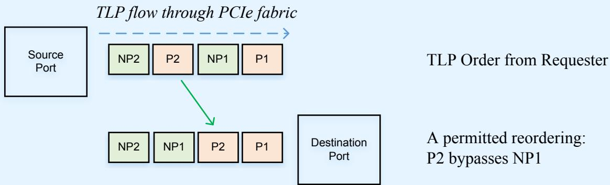

> **Figure 6-81.** Example – Non-Posted Requests Never Allowed to Bypass Posted Requests | 示例——Non-Posted Request 绝不允许越过 Posted Request
> 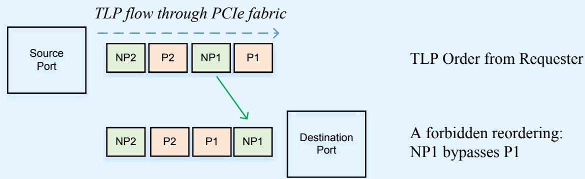

> **Figure 6-82.** Example – Secure Non-Posted Request Reordering Not Allowed Over PCIe Fabric | 示例——PCIe Fabric 上不允许 Secure Non-Posted Request 重排序
> 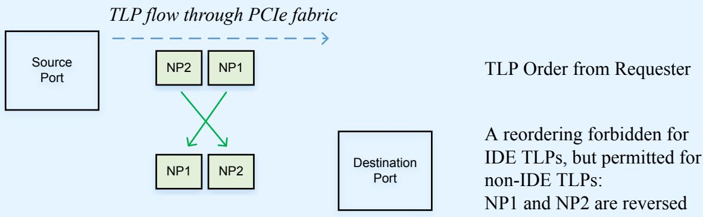

</div>


[⬆️ 返回目录](#-本章目录-table-of-contents)

---

<a id="sec-6-33-6"></a>
## 6.33.6 IDE TLP Aggregation | IDE TLP 聚合

table>
<thead>
<tr>
<th width="50%">🇬🇧 English</th>
<th width="50%" style="background-color:#e8e8e8">🇨🇳 中文</th>
</tr>
</thead>
<tbody>
<tr>
<td>

A Switch or Root Complex is permitted to support Flow-Through Selective IDE Streams without supporting Link IDE Stream or Selective IDE Streams for cases where a Port of the Switch/RC itself is an IDE Terminus. It is also permitted for a Switch/Root Port that is enabled for flow-through IDE to be an IDE Terminus, and in such cases, flow-through IDE TLPs must be routed without修改, and only TLPs for which the Switch/Root Port is the source or ultimate destination must be handled by the Port as an IDE Terminus.

A Switch that supports Flow-Through Selective IDE Streams must implement the IDE Extended Capability at every Port of the Switch.

Switches and RCs that support Flow-Through IDE Streams must, when enabled, implement modified ordering rules defined in § Table 6-36, and § Table 6-37 applied per-Stream, for IDE TLPs that pass through the Switch/RC from a given Ingress Port to a given Egress Port. The entries A2, B3, B4, C3, C4, and D5 are all No to ensure that there is no reordering within any Sub-Stream. In all other cases, the rules defined in § Section 2.4 must be followed; for example: between different Stream IDs, different Ingress Ports, different Egress Ports, or between IDE TLPs and non-IDE TLPs.

Hardware is not required to follow this modified ordering model beyond the TLP flow between the two Partner Ports for an IDE Stream, e.g. within an Endpoint or RC, and so at the system level it must not be assumed that the ordering behavior observed will match the modified IDE Ordering model.

Although Switches/RCs must not reorder IDE TLPs within a Flow-Through IDE Stream based on Relaxed Ordering or IDO, including when ACS mechanisms are being used, it is permitted for those TLPs to have the RO and/or IDO bits Set.

> **IMPLEMENTATION NOTE:**
> **USE OF AGGREGATION**
> To reduce the bandwidth overheads associated with the MAC, the use of aggregation is encouraged. Although aggregation may increase the latency for a Receiver to make use of the received TLPs, typically this increase will not be significant, and in many cases the overall performance should be improved through the use of aggregation.
> Although the specific optimizations will depend on traffic types and use model requirements, typically aggregating about 4 TLPs will provide a good balance between the possible bandwidth improvement and the added latency. Typically a Transmitter policy should assume that the Receiver will buffer all the TLPs of an aggregated unit until the Receiver checks are complete before releasing any of the TLPs for further processing.
> Transmitters can reduce the effective latency impacts of aggregation when there is knowledge of the underlying traffic, for example by ensuring that a doorbell or other "trigger" TLP is either not aggregated, or that an aggregated unit is ended with the transmission of such TLPs.
> Receivers should be designed to ensure that aggregated units of TLPs can be buffered with minimal stalling.
> Typically this implies that the amount of aggregation a Receivers supports should be significantly less than the amount of Receiver Flow Controller buffering advertised.
> The IDE TLPs of an aggregated unit may be interleaved with other TLPs, and in some cases this may be required.
> For example, if we consider a case where a Switch receives a number of aggregated Memory Reads followed by a Memory Write, all of which target the same egress Port. If, at the egress Port, there are insufficient Flow Control credits to transmit all of the Memory Reads, then the Switch may be required to allow the Memory Write to bypass the blocked Memory Reads. Receivers are required to be tolerant to such "interruptions" of an aggregated unit.

</td>
<td style="background-color:#e8e8e8">

允许 Switch (交换机) 或 Root Complex (根复合体) 支持 Flow-Through Selective IDE Stream,即便其不支持 Link IDE Stream 或用于 Switch/RC 自身某个 Port 作为 IDE Terminus (端点) 场景的 Selective IDE Stream。也允许启用了 Flow-Through IDE 的 Switch/Root Port 作为 IDE Terminus;在这种情况下,Flow-Through IDE TLP 必须以未修改方式路由,并且只有当 Switch/Root Port 是源或最终目的地时,这些 TLP 才必须由该 Port 作为 IDE Terminus 处理。

支持 Flow-Through Selective IDE Stream 的 Switch 必须在该 Switch 的每个 Port 上实现 IDE Extended Capability (扩展能力)。

支持 Flow-Through IDE Stream 的 Switch 和 RC 在启用时,必须对从某个 Ingress Port 流入 Switch/RC 并从某个 Egress Port 流出的 IDE TLP,实现按 Stream 应用的 § Table 6-36 与 § Table 6-37 中所定义的修订排序规则。其中条目 A2、B3、B4、C3、C4 和 D5 都为 No,以确保任何子流内不发生重排序。在其他所有情况下,必须遵循 § Section 2.4 定义的规则;例如:在不同 Stream ID 之间、不同 Ingress Port 之间、不同 Egress Port 之间,或 IDE TLP 与非 IDE TLP 之间。

硬件不必在 IDE Stream 的两个 Partner Port 之间的 TLP 流之外遵循此修订排序模型(例如 Endpoint 或 RC 内部),因此在系统层面不能假设观察到的排序行为会与修订后的 IDE 排序模型一致。

尽管 Switch/RC 在 Flow-Through IDE Stream 内不得基于 Relaxed Ordering (RO, 宽松排序) 或 IDO (基于 ID 的排序) 对 IDE TLP 进行重排序(包括在使用 ACS 机制时),允许这些 TLP 的 RO 位和/或 IDO 位置 1。

> **实现注记:**
> **聚合的使用**
> 为了降低与 MAC 相关的带宽开销,鼓励使用聚合。虽然聚合可能会增加接收端对所收到 TLP 进行处理可用的延迟,但通常该延迟增加并不显著,在许多情况下使用聚合会提高整体性能。
> 尽管具体的优化取决于流量类型和使用模型的要求,但通常聚合约 4 个 TLP 将在可能的带宽改善和增加的延迟之间提供良好平衡。发送端策略通常应假定接收端会在接收端检查完成之前缓存聚合单元的所有 TLP,然后再释放这些 TLP 以进行后续处理。
> 当发送端了解底层流量情况时,可以降低聚合对实际延迟的影响,例如通过确保 doorbell 或其他 "trigger" TLP 不被聚合,或者通过使聚合单元以这种 TLP 的发送作为结束。
> 接收端应设计为能够以最小的停顿缓存 TLP 的聚合单元。
> 通常这意味着接收端支持的聚合量应显著小于所通告的接收端流控器缓冲量。
> 聚合单元的 IDE TLP 可与其他 TLP 交错,在某些情况下这可能是必需的。
> 例如,考虑一种情况:Switch 接收到若干聚合的 Memory Read,随后是一个 Memory Write,它们都定向到同一 egress Port。如果在 egress Port 没有足够的流控信用来发送所有 Memory Read,则 Switch 可能需要允许该 Memory Write 越过被阻塞的 Memory Read。接收端必须能够容忍聚合单元的这种"中断"。

</td>
</tr>
</tbody>
</table>

[⬆️ 返回目录](#-本章目录-table-of-contents)

---

<a id="sec-6-33-7"></a>
## 6.33.7 Flow-Through Selective IDE Streams | Flow-Through Selective IDE Stream


<div style="overflow-x: auto; max-width: 100%;">
<table>
<thead>
<tr>
<th width="50%">🇬🇧 English</th>
<th width="50%" style="background-color:#e8e8e8">🇨🇳 中文</th>
</tr>
</thead>
<tbody>
<tr>
<td>

The IDE Sync Message, like all other Messages, is a Posted Request, and the IDE protocol depends on the IDE Sync Message being ordered with all other Posted Requests for a given IDE Stream.

**Table 6-36. IDE Revised Ordering Rules for Flow-Through non-UIO IDE Streams - Per Stream | 表 6-36. Flow-Through 非 UIO IDE Stream 的 IDE 修订排序规则——按 Stream**

| Row Pass Column? | Posted Request (Col 2) | Non-Posted Read Request (Col 3) | NPR with Data (Col 4) | Completion (Col 5) |
|---|---|---|---|---|
| Posted Request (Row A) | No | Yes | Yes | a) Y/N b) Yes |
| Non-Posted Read Request (Row B) | No | No | No | Y/N |
| NPR with Data (Row C) | No | No | No | Y/N |
| Completion (Row D) | No | Yes | Yes | No |

**Table 6-37. IDE Revised Ordering Rules for Flow-Through UIO IDE Streams - Per Stream | 表 6-37. Flow-Through UIO IDE Stream 的 IDE 修订排序规则——按 Stream**

| Row Pass Column? | UIO PR-FC TLP (Col U1) | UIO NPR-FC TLP (Col U2) | UIO Completion (Col U3) |
|---|---|---|---|
| UIO PR-FC TLP (Row UA) | No | Yes/No | Yes/No |
| UIO NPR-FC TLP (Row UB) | Yes/No | No | Yes/No |
| UIO Completion (Row UC) | Yes | Yes | No |

Switches/RCs must not modify Flow-Through IDE TLPs between the ingress and egress Ports.

Switches/RCs must only route IDE TLPs through Ports with the Flow-Through IDE Stream Enabled bit Set. If an IDE TLP is received by an Ingress Port or routed to an Egress Port, and the Port's Flow-Through IDE Stream Enabled bit is Clear, the Port must handle the TLP as a Misrouted IDE TLP error unless there is a higher precedence error. Further:

- For an Ingress Port, the Port must not forward the IDE TLP.
- For an Egress Port, the Port must not Transmit the IDE TLP.
- If the IDE TLP is a Non-Posted Request, the Port must not return a Completion.

The use of ACS in combination with Flow-Through IDE Streams is permitted, but requires care to ensure that the modified ordering defined above will be satisfied. It should also be understood that, because Relaxed Ordering does not apply within the modified ordering rules defined above, certain use cases such as those involving ACS P2P Completion Redirect are likely to have reduced performance.

Because hardware used with IDE will typically be required to satisfy platform-level trust requirements, in many cases ACS is not required to achieve and maintain secure platform behaviors when IDE is in use.

</td>
<td style="background-color:#e8e8e8">

IDE Sync Message 与所有其他 Message 一样,是一种 Posted Request。IDE 协议依赖于 IDE Sync Message 与给定 IDE Stream 的所有其他 Posted Request 进行排序。

**Table 6-36. Flow-Through 非 UIO IDE Stream 的 IDE 修订排序规则——按 Stream**

| 行通过列? | Posted Request (Col 2) | Non-Posted Read Request (Col 3) | NPR with Data (Col 4) | Completion (Col 5) |
|---|---|---|---|---|
| Posted Request (Row A) | No | Yes | Yes | a) Y/N b) Yes |
| Non-Posted Read Request (Row B) | No | No | No | Y/N |
| NPR with Data (Row C) | No | No | No | Y/N |
| Completion (Row D) | No | Yes | Yes | No |

**Table 6-37. Flow-Through UIO IDE Stream 的 IDE 修订排序规则——按 Stream**

| 行通过列? | UIO PR-FC TLP (Col U1) | UIO NPR-FC TLP (Col U2) | UIO Completion (Col U3) |
|---|---|---|---|
| UIO PR-FC TLP (Row UA) | No | Yes/No | Yes/No |
| UIO NPR-FC TLP (Row UB) | Yes/No | No | Yes/No |
| UIO Completion (Row UC) | Yes | Yes | No |

Switch/RC 不得在 ingress 与 egress Port 之间修改 Flow-Through IDE TLP。

Switch/RC 只能将 IDE TLP 通过 Flow-Through IDE Stream Enabled 位置 1 的 Port 进行路由。如果 IDE TLP 被 Ingress Port 接收或被路由到 Egress Port,而该 Port 的 Flow-Through IDE Stream Enabled 位为 Clear,则该 Port 必须将该 TLP 作为 Misrouted IDE TLP 错误处理,除非存在更高优先级的错误。此外:

- 对于 Ingress Port,该 Port 不得转发该 IDE TLP。
- 对于 Egress Port,该 Port 不得发送该 IDE TLP。
- 如果该 IDE TLP 是 Non-Posted Request,则该 Port 不得返回 Completion。

允许将 ACS 与 Flow-Through IDE Stream 结合使用,但需要注意确保满足上文定义的修订排序。还应理解,由于 Relaxed Ordering 不适用于上文定义的修订排序规则,涉及 ACS P2P Completion Redirect 等用例的性能可能会有所下降。

由于与 IDE 一起使用的硬件通常需要满足平台级信任要求,因此在使用 IDE 时,在许多情况下不需要 ACS 即可实现并维护安全的平台行为。

</td>
</tr>
</tbody>
</table>
</div>


[⬆️ 返回目录](#-本章目录-table-of-contents)

---

<a id="sec-6-33-8"></a>
## 6.33.8 Other IDE Rules | 其他 IDE 规则

table>
<thead>
<tr>
<th width="50%">🇬🇧 English</th>
<th width="50%" style="background-color:#e8e8e8">🇨🇳 中文</th>
</tr>
</thead>
<tbody>
<tr>
<td>

<<<PAGE_BREAK>>> page_953

- If the TEE-IO Supported bit in the Device Capabilities Register is Clear, Requesters of Non-Posted Requests must check that the corresponding received Completion(s) be returned using the same Stream ID and the same T bit value as was associated with the Non-Posted Request – a violation is an IDE Check Failed error.
  - The Requester must transition to Insecure for the associated IDE Stream.
- If the TEE-IO Supported bit in the Device Capabilities Register is Set, Requesters of Non-Posted Requests must check that the corresponding received Completion(s) be returned using the same Stream ID as was associated with the Non-Posted Request – a violation is an IDE Check Failed error.
  - The Requester must transition to Insecure for the associated IDE Stream

The following rules relate to resets:

- Any Conventional Reset to an Upstream Port or to the Bridge Function of a Downstream Port, or any FLR to a Function containing an IDE Extended Capability, must result in all IDE Streams associated with that Function transitioning to the Insecure state, and all keys must be invalidated and rendered unreadable.
  - Additional implementation specific mechanism are required in many cases to ensure security of all associated data is maintained.
- An FLR to a Function that does not contain an IDE Extended Capability must not affect IDE operation
  - In some cases IDE_KM can be affected by an FLR to a Function that does not contain an IDE Extended Capability, but does implement the IDE_KM responder role via DOE – see § Section 6.33.3.

Use of mechanisms that result in the blocking or termination of TLPs, such as exist for AtomicOps, DMWr, and the End-End TLP Prefix Blocking mechanism, must be carefully coordinated with the use of Selective IDE Streams, to avoid the dropping of Selective IDE TLPs in such a way that would result in a IDE Check Failed error.

The following rules relate to the use of Access Control Services (ACS - see § Section 6.12) with IDE.

- When Link IDE is used, ACS mechanisms are permitted to be used as architected without restrictions.
- If Selective IDE is used with ACS to enable Direct I/O as documented in the Implementation Note: ACS Redirect and Guest Physical Addresses (GPAs) (see § Section 6.12.4), ACS mechanisms are permitted to be used as architected without restrictions.
- If Selective IDE is used for P2P communication without any ACS redirect mechanisms enabled, the remaining ACS services are permitted to be used as architected without restrictions.
- Use of Selective IDE for P2P communication with ACS redirect mechanisms enabled has a number of major issues with ordering and portions of Sub-Streams taking different paths. Such use is out of scope of this specification.
- Use of Selective IDE under any use case where ACS services (or any other mechanism) blocks or otherwise terminates IDE TLPs will result in the associated Selective IDE Stream going to Insecure due to the failure of the intended ultimate destination Port to receive the blocked/terminated IDE TLP.

The following rules relate to error handling

- Receipt of a Link IDE TLP or Selective IDE TLP for which there is not an associated IDE Stream is a Misrouted IDE TLP error; this is a reported error associated with the Receiving Port.
- Receipt of a Link IDE TLP by a Switch that targets an Egress Port for which there is not a Link IDE Stream associated with the same TC and in the Secure state is a Misrouted IDE TLP error; this is a reported error associated with the Ingress Port.
- The Transaction Layer must return flow control credit and handle as a Misrouted IDE TLP, but take no other action in response to a received Misrouted IDE TLP.

<<<PAGE_BREAK>>> page_954

- The detection of any of the following conditions is IDE Check Failed error, a reported error associated with the Receiving Port (see § Section 6.2).
  - a MAC check failure occurs when the Receiver's check of the MAC of a received TLP, or aggregated unit of TLPs, fails,
  - underflow of the PR-Received-Counter-NPR or PR_Received_Counter-CPL (indicating an improper reordering has been detected),
  - either or both of the PR-Received-Counter-NPR/PR_Received_Counter-CPL 64-bit counters overflow (indicating a failure to receive the Transmitted NPR/CPL TLPs).
  - The Sub-Stream identifier field contains a Reserved/unsupported value.

Upon detection of one or more of these conditions, the IDE Stream State Machine for this IDE Stream must enter Insecure. This is a reported error associated with the Receiving Port (see Section 6.2). The TLP that triggered the error and all subsequent IDE TLPs received associated with the same IDE Stream must be discarded, following update of Flow Control credits, for as long as the associated Stream is enabled. There must be no additional error(s) logged for subsequent TLPs received associated with an IDE Stream already in the Insecure state. These rules also apply to TLPs received while in the Insecure state if that state was reached for reasons other than those listed above.

- Receiving an IDE TLP that is a Completion with UR or UC status is not a security error and must not by itself trigger a transition to Insecure.
- Upon detection of an error associated with an aggregated unit of TLPs, when Advanced Error Reporting is supported, only the last TLP of the unit must be logged in the Header Log Register and TLP Prefix Log Register.
- All IDE Streams associated with a Link must transition to Insecure when DL_Active transitions from asserted to deasserted for that Link.
- Upon transition from Secure to Insecure for any reason, other than that the corresponding Link/Selective IDE Stream Enable bit is Cleared, for a given Stream, the Port must transmit an IDE Fail Message indicating the Stream ID to the Partner Port
- Upon receipt of an IDE Fail Message, for the indicated Stream the Port must transition to Insecure
  - When an IDE Stream enters Insecure due to the receipt of a IDE Fail Message then that transition into Insecure must not result in the Transmission of an IDE fail message.
- Upon entry into Insecure, all active key sets and IVs for the associated IDE Stream must be marked as invalid.
- For an IDE Stream to exit Insecure and return to Secure, the IDE Stream must be re-established using a new key and IV set.
- In the Insecure state, private data associated with the affected IDE Stream(s) must be secured.
  - How this is done is implementation specific.
- To prepare to exit the Insecure state for a Stream and return to the Secure state, software must write a 0b to the corresponding Selective IDE Stream Enable or Link IDE Stream Enable bit, even if it is already 0b.
  - Hardware must not return a Stream to the Secure state until the Enable bit has been written to 0b and subsequently Set.
  - Additional actions not defined here are typically necessary based on specific use model requirements.

To return a Link IDE Stream for TC0/VC0 to the Secure state, it is necessary to reset the Device, e.g. using a Hot Reset, to make it possible for Configuration Requests/Completions to pass across the Link, unless the Device provides an alternate, implementation-specific, mechanism.

<<<PAGE_BREAK>>> page_955

- When processing received IDE TLPs, all error checks must be completed, or an equivalent delay must be inserted, prior to signaling an error, such that it is not possible for an external observer to determine at which stage in error checking the error(s) was(were) detected.

The following rules relate to Power Management:

- The No_Soft_Reset bit must be Set
- All state related to keys and counters must be maintained in D0, D1, D2 and D3hot.
  - The IDE Extended Capability is subject to the same rules as other register structures defined by this specification, and because it is itself essential for IDE operation, any condition where the IDE Extended Capability programming is lost also necessarily results in a loss of the ability to maintain IDE operation; Such conditions must result in all IDE Streams transitioning to the Insecure state, and all keys must be invalidated and rendered unreadable.
- It is permitted to support retention of state related to keys and counters in D3cold, however such mechanisms are beyond the scope of this document.

The following rules relate to maintaining a secure local environment:

- Attempts to modify IDE registers, BARs (基址寄存器), and other structures that could affect the security of the device or an IDE Stream must be detected
  - The resulting actions are implementation specific
- It is permitted to enter Insecure when a condition is detected that could affect the security of the device or an IDE Stream
  - In some cases, as determined by implementation specific criteria, it may be desirable to implement some other implementation specific action.
- IDE must be enabled in a coordinated way between the two Partner Ports such that both are enabled for IDE prior to either one Transmitting an IDE TLP to the other.
- For Link IDE, software must enable the Upstream Port and then the Downstream Port, while ensuring that no TLPs are transmitted on the Link between these two events.
- For Selective IDE, the Stream must not be used until it has been enabled in both Partner Ports. For cases where one of the Partner Ports is a Root Port and Selective IDE for Configuration Requests is enabled, the other Partner Port must be enabled prior to the Root Port. For other scenarios, the mechanisms to satisfy this requirement are implementation-specific.

Unordered IO (UIO) is an optional capability, intended to address the limitations of the PCI/PCIe fabric-enforced ordering rules. UIO enables fabrics with multiple paths between a source and destination to be supported, and more closely matches the semantics of common IO fabrics (including on-die fabrics). UIO is suitable for all combinations of Requesters and Completers including Host-to-Device, Device-to-Host, and Device-to-Device (P2P).

UIO provides the ability for hardware to maintain full backwards compatibility with the PCI/PCIe producer-consumer model, shifting the responsibility for enforcing the observed ordering from the fabric to the Requester. All UIO Requests have corresponding UIO Completions, and the UIO Completions provide the Requester with the ability (and responsibility) to enforce ordering requirements. UIO can be used only when the entire path from Requester to Completer uses Flit Mode (Flit 模式), supports UIO, and has UIO enabled.

</td>
<td style="background-color:#e8e8e8">

<<<PAGE_BREAK>>> page_953

- 如果 Device Capabilities Register 中的 TEE-IO Supported 位为 Clear,则 Non-Posted Request 的请求者必须检查对应的接收到的 Completion 是否使用与该 Non-Posted Request 关联的相同 Stream ID 和相同 T bit 值进行返回——违反属于 IDE Check Failed 错误。
  - 请求者必须将关联的 IDE Stream 转入 Insecure 状态。
- 如果 Device Capabilities Register 中的 TEE-IO Supported 位置 1,则 Non-Posted Request 的请求者必须检查对应的接收到的 Completion 是否使用与该 Non-Posted Request 关联的相同 Stream ID 进行返回——违反属于 IDE Check Failed 错误。
  - 请求者必须将关联的 IDE Stream 转入 Insecure 状态。

以下规则与复位 (Reset) 相关:

- 对 Upstream Port 或 Downstream Port 的 Bridge Function 的任何常规复位 (Conventional Reset),或对包含 IDE Extended Capability 的 Function 的任何 FLR,都必须导致该 Function 关联的所有 IDE Stream 转入 Insecure 状态,并且所有密钥必须被无效化并使其不可读取。
  - 在许多情况下,需要额外的实现特定机制以确保维护所有关联数据的安全性。
- 对不包含 IDE Extended Capability 的 Function 的 FLR 不得影响 IDE 操作。
  - 在某些情况下,IDE_KM 可能受对不包含 IDE Extended Capability 但通过 DOE 实现 IDE_KM 响应者角色的 Function 的 FLR 的影响——见 § Section 6.33.3。

对导致 TLP 阻塞或终止的机制(例如 AtomicOps、DMWr 以及 End-End TLP Prefix Blocking 机制)的使用,必须与 Selective IDE Stream 的使用进行仔细协调,以避免以导致 IDE Check Failed 错误的方式丢弃 Selective IDE TLP。

以下规则涉及 Access Control Services (ACS, 见 § Section 6.12) 与 IDE 的使用。

- 使用 Link IDE 时,允许按其架构方式不受限制地使用 ACS 机制。
- 如果 Selective IDE 与 ACS 一起使用以实现 "实现注记:ACS Redirect and Guest Physical Addresses (GPAs)"(见 § Section 6.12.4)中所述的 Direct I/O,则允许按其架构方式不受限制地使用 ACS 机制。
- 如果 Selective IDE 用于 P2P 通信且未启用任何 ACS redirect 机制,则允许按其架构方式不受限制地使用其余 ACS 服务。
- 在启用 ACS redirect 机制的情况下将 Selective IDE 用于 P2P 通信,存在大量与排序和子流各部分走不同路径相关的主要问题。这种用法超出了本规范的范围。
- 在任何 ACS 服务(或任何其他机制)阻塞或终止 IDE TLP 的用例下使用 Selective IDE,将由于预期的最终目的端口无法接收到被阻塞/终止的 IDE TLP,而导致关联的 Selective IDE Stream 转入 Insecure 状态。

以下规则与错误处理相关:

- 接收到没有关联 IDE Stream 的 Link IDE TLP 或 Selective IDE TLP,属于 Misrouted IDE TLP 错误;这是与接收端口关联的上报错误。
- Switch 接收到 Link IDE TLP,该 TLP 定向到的 Egress Port 没有处于 Secure 状态且具有相同 TC 关联的 Link IDE Stream,属于 Misrouted IDE TLP 错误;这是与 Ingress Port 关联的上报错误。
- 事务层 (Transaction Layer) 必须归还流控信用,并将其作为 Misrouted IDE TLP 处理,但不得对接收到的 Misrouted IDE TLP 采取任何其他动作。

<<<PAGE_BREAK>>> page_954

- 检测到以下任一条件都属于 IDE Check Failed 错误,这是与接收端口关联的上报错误(见 § Section 6.2)。
  - 当接收端对所接收 TLP(或 TLP 聚合单元) MAC 的检查失败时,发生 MAC 检查失败;
  - PR-Received-Counter-NPR 或 PR_Received_Counter-CPL 下溢(表明已检测到错误的重排序);
  - PR-Received-Counter-NPR / PR_Received_Counter-CPL 两个 64 bit 计数器中的任一者或两者都溢出(表明未能接收到已发送的 NPR/CPL TLP)。
  - Sub-Stream identifier 字段包含 Reserved/不支持的值。

在检测到上述一个或多个条件后,该 IDE Stream 的 IDE Stream State Machine 必须进入 Insecure 状态。这是与接收端口关联的上报错误(见 Section 6.2)。触发该错误的 TLP 以及之后接收到的与同一 IDE Stream 关联的所有 IDE TLP,在流控信用更新后必须被丢弃,只要该 Stream 处于启用状态。对于后续接收到的与已处于 Insecure 状态的 IDE Stream 关联的 TLP,不得记录额外的错误。当处于 Insecure 状态且达到该状态的原因并非上述所列时,这些规则同样适用于在该状态下接收到的 TLP。

- 接收到 UR 或 UC 状态 Completion 的 IDE TLP 不是安全错误,其本身不得触发转入 Insecure 状态。
- 当支持 Advanced Error Reporting 时,在检测到与 TLP 聚合单元关联的错误时,只有该单元的最后一个 TLP 必须记录在 Header Log Register 和 TLP Prefix Log Register 中。
- 当 DL_Active 从该链路的置位转为去置位时,与该 Link 关联的所有 IDE Stream 必须转入 Insecure 状态。
- 除了因相应 Link/Selective IDE Stream Enable 位被清零以外的任何原因,对于给定 Stream 从 Secure 转入 Insecure 时,该 Port 必须向 Partner Port 发送一条指示 Stream ID 的 IDE Fail Message。
- 收到 IDE Fail Message 时,对于所指示的 Stream,该 Port 必须转入 Insecure 状态。
  - 当 IDE Stream 因收到 IDE Fail Message 而进入 Insecure 时,此次进入 Insecure 的转换不得导致发送 IDE fail message。
- 进入 Insecure 时,关联 IDE Stream 的所有活动密钥集和 IV 必须被标记为无效。
- 要使 IDE Stream 退出 Insecure 并返回 Secure,必须使用新的密钥和 IV 集合重新建立该 IDE Stream。
- 在 Insecure 状态下,必须保护与受影响 IDE Stream 关联的私有数据。
  - 具体如何实现与具体实现相关。
- 要准备将 Stream 从 Insecure 状态退出并返回 Secure 状态,软件必须向相应的 Selective IDE Stream Enable 或 Link IDE Stream Enable 位写入 0b,即使该位已经是 0b。
  - 硬件不得在该 Enable 位被写入 0b 并随后被置 1 之前将 Stream 返回到 Secure 状态。
  - 根据具体使用模型的要求,通常还需要本规范未定义的附加动作。

要将 TC0/VC0 的 Link IDE Stream 返回到 Secure 状态,需要复位该 Device(例如使用 Hot Reset),以便使 Configuration Request/Completion 能够跨该 Link 传递,除非该 Device 提供替代的实现特定机制。

<<<PAGE_BREAK>>> page_955

- 在处理接收到的 IDE TLP 时,所有错误检查必须完成,或者在发出错误信号前插入等效延迟,以使外部观察者无法确定错误是在错误检查的哪个阶段被检测到的。

以下规则与电源管理 (Power Management) 相关:

- No_Soft_Reset 位必须置 1。
- 与密钥和计数器相关的所有状态必须在 D0、D1、D2 和 D3hot 中予以保持。
  - IDE Extended Capability 遵循本规范中定义的其他寄存器结构的相同规则,并且由于其本身对 IDE 操作至关重要,任何导致 IDE Extended Capability 编程丢失的情况都必然导致维持 IDE 操作的能力的丧失;这种情况必须导致所有 IDE Stream 转入 Insecure 状态,并且所有密钥必须被无效化并使其不可读取。
- 允许支持在 D3cold 中保持与密钥和计数器相关的状态,但此类机制不在本文档的讨论范围内。

以下规则与维护安全的本地环境相关:

- 必须检测对 IDE 寄存器、BAR (基址寄存器) 以及其他可能影响 Device 或 IDE Stream 安全性的结构的修改尝试。
  - 由此产生的动作与具体实现相关。
- 当检测到可能影响 Device 或 IDE Stream 安全性的情况时,允许进入 Insecure 状态。
  - 在某些情况下,由实现特定的标准决定,可能希望实现某些其他实现特定的动作。
- IDE 必须在两个 Partner Port 之间以协调方式使能,以使两者在任一方将 IDE TLP 发送给另一方之前都已为 IDE 完成使能。
- 对于 Link IDE,软件必须先使能 Upstream Port,然后使能 Downstream Port,并确保在这两个事件之间,该 Link 上不发送任何 TLP。
- 对于 Selective IDE,在该 Stream 已在两个 Partner Port 上完成使能之前,不得使用该 Stream。对于 Partner Port 之一是 Root Port 且启用了 Configuration Request 的 Selective IDE 的情况,另一个 Partner Port 必须在 Root Port 之前完成使能。对于其他场景,满足此要求的机制是实现特定的。

Unordered IO (UIO) 是一种可选能力,旨在解决 PCI/PCIe Fabric 强制排序规则的局限性。UIO 使支持源与目的地之间具有多条路径的 Fabric 成为可能,并更接近地匹配常见 IO Fabric(包括片上 Fabric)的语义。UIO 适用于 Requester 与 Completer 的所有组合,包括 Host-to-Device、Device-to-Host 和 Device-to-Device (P2P)。

UIO 使硬件能够保持与 PCI/PCIe producer-consumer 模型的完全向后兼容性,将强制观察到的排序的责任从 Fabric 转移到 Requester。所有 UIO Request 都有对应的 UIO Completion,UIO Completion 为 Requester 提供强制排序要求的能力(和责任)。只有当从 Requester 到 Completer 的整个路径使用 Flit 模式、支持 UIO 并且已启用 UIO 时,才能使用 UIO。

</td>
</tr>
</tbody>
</table>

[⬆️ 返回目录](#-本章目录-table-of-contents)

---


---

<a id="sec-6-34"></a>
## 6.34 Unordered IO (UIO) | 无序 IO (UIO)


<div style="overflow-x: auto; max-width: 100%;">
<table>
<thead>
<tr>
<th width="50%">🇬🇧 English</th>
<th width="50%" style="background-color:#e8e8e8">🇨🇳 中文</th>
</tr>
</thead>
<tbody>
<tr>
<td>

For the path between a UIO Requester and Completer, UIO must be enabled end-to-end through all intermediate routing elements. For a given operation, the Requester is permitted to select, using implementation-specific means, between using UIO Requests or non-UIO Requests.

Non-tree topologies and multi-path support are permitted for UIO.

- The mechanism used to enable and manage such topologies is outside the scope of this specification.
- The mechanisms required to avoid deadlocks and loops for such topologies are outside the scope of this specification.
- A tree topology must exist as a subset of any non-tree topologies for enumeration and configuration operations and other non-UIO traffic.
  - Until enabled by implementation specific software, any Links outside of this tree topology must not carry any TLPs other than Messages with Local (r[2:0] = 100b) Message routing.

When a VC (Virtual Channel, 虚通道) is configured for UIO, Posted credits are used for UIO Memory Write Requests and Non-Posted credits are used for all other UIO Memory Requests.

A Requester, Completer, or intermediate routing element advertises UIO support through the SVC VC Protocols Supported field in the SVC Resource Capability Register. For UIO functionality that has specific capability and control configuration (see § Section 7.7.9.2 and § Section 7.7.9.3), all UIO-supporting VCs implemented by a Port must have the same capabilities. It is not required for software to enable all implemented UIO-supporting VCs identically.

UIO, as with other PCIe traffic, does not provide protection against address hazarding, that is, the fabric ordering does not consider Request addresses. If such protection is required, it must be implemented outside the scope of this specification.

</td>
<td style="background-color:#e8e8e8">

在 UIO 请求者 (Requester) 与完成者 (Completer) 之间的通路上,UIO 必须端到端地在所有中间路由元素上启用。对于给定的操作,请求者可以通过实现特定的方式,在 UIO 请求与非 UIO 请求之间进行选择。

UIO 允许非树形拓扑与多路径支持。

- 用于启用和管理此类拓扑的机制不在本规范范围内。
- 用于避免此类拓扑发生死锁和环路的机制不在本规范范围内。
- 必须存在一个树形拓扑作为任何非树形拓扑的子集,以用于枚举 (Enumeration) 和配置操作以及其他非 UIO 流量。
  - 在被实现特定软件启用之前,该树形拓扑之外的任何链路 (Link) 不得承载除本地路由 (r[2:0] = 100b) 消息 (Message) 之外的任何 TLP (Transaction Layer Packet, 事务层包)。

当某个 VC (虚通道) 被配置为 UIO 时,UIO 内存写请求使用 Posted (有数据,无完成) 信用 (Credit),而所有其他 UIO 内存请求则使用 Non-Posted (无数据,需完成) 信用。

请求者、完成者或中间路由元素通过 SVC 资源能力寄存器中的 SVC VC 协议支持字段来通告 (Advertise) UIO 支持。对于具有特定能力与控制配置的 UIO 功能(参见 § Section 7.7.9.2 和 § Section 7.7.9.3),由端口 (Port) 实现的所有支持 UIO 的 VC 必须具有相同的能力。并不要求软件以完全相同的方式启用所有已实现的支持 UIO 的 VC。

与其他 PCIe 流量一样,UIO 不提供针对地址冒险 (address hazarding) 的保护,即 Fabric 排序不考虑请求地址。如果需要此类保护,必须在本规范范围之外实现。

</td>
</tr>
</tbody>
</table>
</div>


[⬆️ 返回目录](#-本章目录-table-of-contents)

---

<a id="sec-6-34-1"></a>
## 6.34.1 UIO Rules | UIO 规则

table>
<thead>
<tr>
<th width="50%">🇬🇧 English</th>
<th width="50%" style="background-color:#e8e8e8">🇨🇳 中文</th>
</tr>
</thead>
<tbody>
<tr>
<td>

[Reserved for future rules on UIO.]

</td>
<td style="background-color:#e8e8e8">

[为未来 UIO 规则保留。]

</td>
</tr>
</tbody>
</table>

[⬆️ 返回目录](#-本章目录-table-of-contents)

---

<a id="sec-6-35"></a>
## 6.35 MMIO Register Blocks | MMIO 寄存器块


<div style="overflow-x: auto; max-width: 100%;">
<table>
<thead>
<tr>
<th width="50%">🇬🇧 English</th>
<th width="50%" style="background-color:#e8e8e8">🇨🇳 中文</th>
</tr>
</thead>
<tbody>
<tr>
<td>

MMIO Register Blocks are optional mechanisms for exchanging various types of data structures between system software and a Function. Because all runtime operations are performed using Memory Space, the performance is generally much better than mechanisms such as DOE that use Configuration Space, and the use of Memory Space is better suited to direct assignment of the hardware resources to the appropriate software element.

MMIO Register blocks are discovered using the MMIO Register Block Locator (MRBL) Extended Capability (§ Section 7.9.30). The registers are mapped in Memory Space allocated via a BAR (Base Address Register, 基址寄存器). Each MRBL Locator Register (§ Section 7.9.30.3) entry in the MRBL Extended Capability structure defines the type of MMIO Register Block and the BAR number and the offset within the BAR where these registers are mapped. It is permitted that the BAR contains other items besides the MMIO Register Blocks described in this section.

All accesses to offsets within the MMB Memory Space should be aligned to a boundary equal to the size of the access (e.g., a 1-byte access must be aligned to a 1-byte boundary, a 2-byte access must be aligned to a 2-byte boundary, etc.). If an access is not aligned to a boundary equal to the size of the access, then the request is permitted to be handled as a restricted programming model violation as defined in § Section 2.3.1.

§ Figure 6-83 portrays the relationship between the MRBL Extended Capability and the MMIO Register Blocks described in this section.

</td>
<td style="background-color:#e8e8e8">

MMIO 寄存器块是用于在系统软件与功能 (Function) 之间交换各种数据结构的一种可选机制。由于所有运行时操作都通过内存空间 (Memory Space) 完成,其性能通常远优于使用配置空间 (Configuration Space) 的 DOE 等机制,并且使用内存空间更适合将硬件资源直接分配给相应的软件元素。

MMIO 寄存器块通过 MMIO 寄存器块定位器 (MRBL) 扩展能力 (Extended Capability) 进行发现(参见 § Section 7.9.30)。这些寄存器映射在通过 BAR (基址寄存器) 分配的内存空间中。MRBL 扩展能力结构中的每个 MRBL 定位寄存器 (参见 § Section 7.9.30.3) 条目定义了 MMIO 寄存器块的类型、BAR 编号以及该寄存器在 BAR 内的偏移。允许 BAR 中除本节所述的 MMIO 寄存器块之外还包含其他内容。

对 MMB 内存空间内偏移量的所有访问应当按照访问大小对齐到相应边界(例如,1 字节访问必须对齐到 1 字节边界,2 字节访问必须对齐到 2 字节边界,等等)。如果访问未按访问大小对齐到相应边界,则该请求可被视为 § Section 2.3.1 中定义的受限编程模型违例。

§ Figure 6-83 描述了 MRBL 扩展能力与本节所述 MMIO 寄存器块之间的关系。

</td>
</tr>
</tbody>
</table>
</div>


> **Figure 6-83. MMIO Register Blocks | MMIO 寄存器块**
> 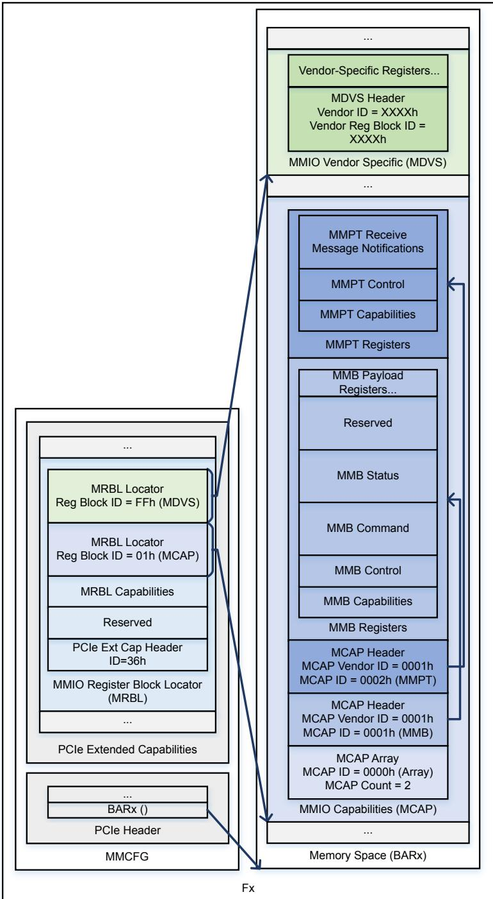

[⬆️ 返回目录](#-本章目录-table-of-contents)

---

<a id="sec-6-35-1"></a>
## 6.35.1 MMIO Capabilities Register Block (MCAP) | MMIO 能力寄存器块 (MCAP)

table>
<thead>
<tr>
<th width="50%">🇬🇧 English</th>
<th width="50%" style="background-color:#e8e8e8">🇨🇳 中文</th>
</tr>
</thead>
<tbody>
<tr>
<td>

The MMIO Capabilities Register Block is an array of capability structures. Each capability in the MCAP array is described by an MCAP Header Register that identifies the specific capability and points to the capability register structure in Memory Space. At the beginning of the MCAP Register Block is the MCAP Array Register (see § Section 6.35.1.1) that defines the size of the array followed by a list of MCAP Header Registers (See § Section 6.35.1.2).

The MCAP Register Block is discovered using the MMIO Register Block Locator Extended Capability (MRBL) (see § Section 7.9.30). The MCAP BAR shall be marked as prefetchable.

§ Figure 6-84 illustrates the MCAP Register Block.

> **Figure 6-84. MCAP Register Block | MCAP 寄存器块**
> 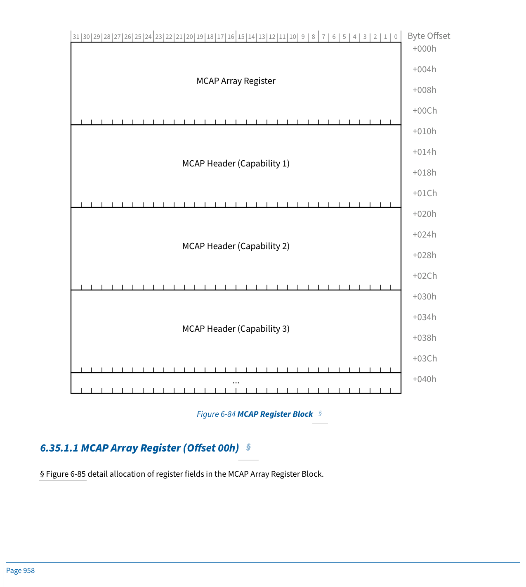

§ Figure 6-85 detail allocation of register fields in the MCAP Array Register Block.

</td>
<td style="background-color:#e8e8e8">

MMIO 能力寄存器块是一组能力结构的数组。MCAP 数组中的每个能力由一个 MCAP Header Register(头寄存器)描述,该寄存器标识特定的能力,并指向内存空间中的能力寄存器结构。在 MCAP 寄存器块的开头是 MCAP Array Register(参见 § Section 6.35.1.1),用于定义数组的大小,其后跟随 MCAP Header Register 列表(参见 § Section 6.35.1.2)。

MCAP 寄存器块通过 MMIO 寄存器块定位器扩展能力 (MRBL)(参见 § Section 7.9.30) 进行发现。MCAP BAR 应被标记为可预取 (prefetchable)。

§ Figure 6-84 展示了 MCAP 寄存器块。

§ Figure 6-85 详细描述了 MCAP Array Register Block 中各寄存器字段的分配。

</td>
</tr>
</tbody>
</table>

[⬆️ 返回目录](#-本章目录-table-of-contents)

---

<a id="sec-6-35-1-1"></a>
## 6.35.1.1 MCAP Array Register (Offset 00h) | MCAP 数组寄存器 (偏移 00h)


<div style="overflow-x: auto; max-width: 100%;">
<table>
<thead>
<tr>
<th width="50%">🇬🇧 English</th>
<th width="50%" style="background-color:#e8e8e8">🇨🇳 中文</th>
</tr>
</thead>
<tbody>
<tr>
<td>

> **Figure 6-85. MCAP Array Register Block | MCAP 数组寄存器块**
> 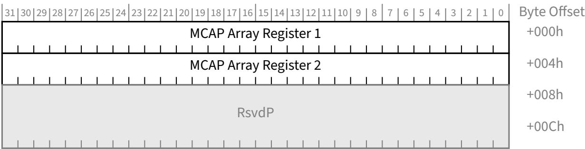

§ Figure 6-86 and § Figure 6-87 detail allocation of register fields registers that form the MCAP Array Register Block; § Table 6-38 and § Table 6-39 provide the respective bit definitions.

> **Figure 6-86. MCAP Array Register 1 | MCAP 数组寄存器 1**
> 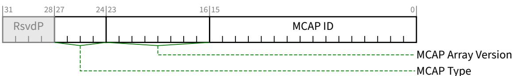

**Table 6-38. MCAP Array Register 1 | 表 6-38. MCAP 数组寄存器 1**

| Bit Location | Description | Attributes |
|---|---|---|
| 15:0 | MCAP ID – The MCAP array identifier. For the MCAP Array Register, this field shall be set to 0000h. | RO |
| 23:16 | MCAP Array Version – Defines the format of the MCAP Header Registers (see § Section 6.35.1.2 and § Table 6-40 through § Table 6-43) in the MCAP Register Block.<br>Encodings are:<br>0h = The MCAP Header format is defined in § Figure 6-88.<br>1h-7h = Reserved.<br>All other encodings are reserved. | RO |
| 27:24 | MCAP Type – Defines the type associated with any type-specific capabilities (MCAP IDs in the range 4000h-7FFFh) in the MCAP Register Block.<br>Encodings are:<br>0h = The type is inferred from the 24-bit value corresponding to the Class Code of the Function. If the Class Code is not associated with any type-specific capabilities, then no type-specific capabilities shall be present.<br>01h = Reserved.<br>1h-7h = Reserved – Allocated for [CXL].<br>Others = All other encodings are reserved. | RO |

> **Figure 6-87. MCAP Array Register 2 | MCAP 数组寄存器 2**
> 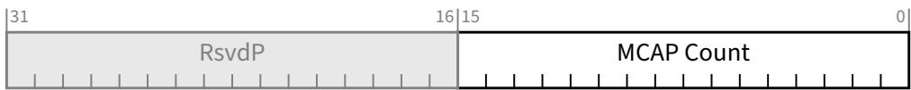

**Table 6-39. MCAP Array Register 2 | 表 6-39. MCAP 数组寄存器 2**

| Bit Location | Description | Attributes |
|---|---|---|
| 15:0 | MCAP Count – The number of capabilities in the MCAP Register Block, not including the MCAP Array Register. Each MCAP Header Register (see § Section 6.35.1.2) is contiguous to previous MCAP Header Register. | RO |

</td>
<td style="background-color:#e8e8e8">

§ Figure 6-86 和 § Figure 6-87 详细描述构成 MCAP 数组寄存器块的寄存器的字段分配;§ Table 6-38 和 § Table 6-39 给出了相应的位定义。

**Table 6-38. MCAP Array Register 1 | 表 6-38. MCAP 数组寄存器 1**

| 位位置 | 描述 | 属性 |
|---|---|---|
| 15:0 | MCAP ID – MCAP 数组标识符。对于 MCAP 数组寄存器,该字段应设置为 0000h。 | RO |
| 23:16 | MCAP Array Version – 定义 MCAP 寄存器块中 MCAP Header Register(参见 § Section 6.35.1.2 及 § Table 6-40 至 § Table 6-43)的格式。<br>编码如下:<br>0h = MCAP Header 格式由 § Figure 6-88 定义。<br>1h-7h = 保留。<br>所有其他编码均保留。 | RO |
| 27:24 | MCAP Type – 定义与 MCAP 寄存器块中类型特定能力(MCAP ID 范围 4000h-7FFFh)相关联的类型。<br>编码如下:<br>0h = 类型由功能 (Function) 的 Class Code 对应的 24 位值推断。如果 Class Code 未与任何类型特定能力关联,则不应存在类型特定能力。<br>01h = 保留。<br>1h-7h = 保留 – 分配给 [CXL]。<br>其他 = 所有其他编码均保留。 | RO |

**Table 6-39. MCAP Array Register 2 | 表 6-39. MCAP 数组寄存器 2**

| 位位置 | 描述 | 属性 |
|---|---|---|
| 15:0 | MCAP Count – MCAP 寄存器块中能力的数量,不包括 MCAP 数组寄存器。每个 MCAP Header Register(参见 § Section 6.35.1.2)与前一个 MCAP Header Register 相邻。 | RO |

</td>
</tr>
</tbody>
</table>
</div>


[⬆️ 返回目录](#-本章目录-table-of-contents)

---

<a id="sec-6-35-1-2"></a>
## 6.35.1.2 MCAP Header Register Block (Offset Varies) | MCAP 头寄存器块 (偏移可变)

table>
<thead>
<tr>
<th width="50%">🇬🇧 English</th>
<th width="50%" style="background-color:#e8e8e8">🇨🇳 中文</th>
</tr>
</thead>
<tbody>
<tr>
<td>

§ Figure 6-88 details allocation of register fields in the MCAP Header Register Block.

> **Figure 6-88. MCAP Header Register Block | MCAP 头寄存器块**
> 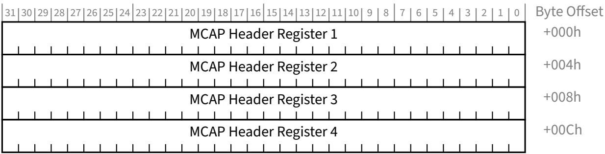

§ Figure 6-89 through § Figure 6-92 detail allocation of register fields in the MCAP Header Register Block; § Table 6-40 through § Table 6-43 provides the respective bit definitions.

> **Figure 6-89. MCAP Header Register 1 | MCAP 头寄存器 1**
> 

**Table 6-40. MCAP Header Register 1 | 表 6-40. MCAP 头寄存器 1**

| Bit Location | Register Description | Attributes |
|---|---|---|
| 15:0 | MCAP ID – The capability identifier. | RO |
| 23:16 | MCAP Version – Defines the version of the capability register structure.<br>The MCAP Version is incremented whenever the capability register structure is extended to add more functionality. Backward compatibility shall be maintained during this process. For all values of n, version n+1 may extend version n by replacing fields that are marked as reserved in version n but must not redefine the meaning of existing fields. Software that was written for a lower version may continue to operate on capability structures with a higher version but will not be able to take advantage of new functionality. If backwards compatibility cannot be maintained, a new MCAP ID shall be created. Each field in a capability register structure is assumed to be introduced in version 1 of that structure unless specified otherwise in the field's definition. | RO |

> **Figure 6-90. MCAP Header Register 2 | MCAP 头寄存器 2**
> 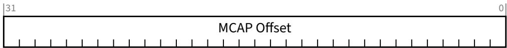

**Table 6-41. MCAP Header Register 2 | 表 6-41. MCAP 头寄存器 2**

| Bit Location | Register Description | Attributes |
|---|---|---|
| 31:0 | MCAP Offset – Offset of the capability register structure from the start of the MCAP Register Block in bytes. The offset of performance sensitive MCAPs and security sensitive MCAPs shall be 4 KB aligned within Memory Space. | RO |

> **Figure 6-91. MCAP Header Register 3 | MCAP 头寄存器 3**
> 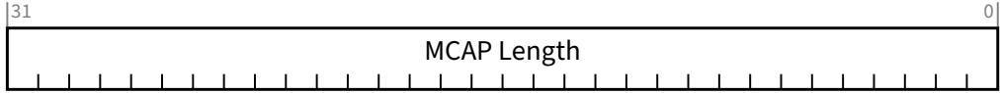

**Table 6-42. MCAP Header Register 3 | 表 6-42. MCAP 头寄存器 3**

| Bit Location | Register Description | Attributes |
|---|---|---|
| 31:0 | MCAP Length – Size of the capability register structure in bytes. | RO |

> **Figure 6-92. MCAP Header Register 4 | MCAP 头寄存器 4**
> 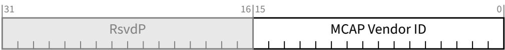

**Table 6-43. MCAP Header Register 4 | 表 6-43. MCAP 头寄存器 4**

| Bit Location | Register Description | Attributes |
|---|---|---|
| 15:0 | MCAP Vendor ID – The PCI-SIG assigned Vendor ID for the entity that defined the capability register structure. A value of 0000h in this field is reserved for legacy compatibility with existing [CXL] defined register structures only. | RO |

</td>
<td style="background-color:#e8e8e8">

§ Figure 6-88 详细描述了 MCAP Header Register Block 中各寄存器字段的分配。

§ Figure 6-89 至 § Figure 6-92 详细描述了 MCAP Header Register Block 中各寄存器字段的分配;§ Table 6-40 至 § Table 6-43 给出了相应的位定义。

**Table 6-40. MCAP Header Register 1 | 表 6-40. MCAP 头寄存器 1**

| 位位置 | 寄存器描述 | 属性 |
|---|---|---|
| 15:0 | MCAP ID – 能力标识符。 | RO |
| 23:16 | MCAP Version – 定义能力寄存器结构的版本。<br>当能力寄存器结构被扩展以增加更多功能时,MCAP Version 随之递增。在此过程中必须保持向后兼容性。对于任意值 n,版本 n+1 可以在不重新定义现有字段语义的前提下,通过替换版本 n 中标记为保留的字段来扩展版本 n。针对较低版本编写的软件可继续在更高版本的能力结构上运行,但无法使用新功能。如果无法保持向后兼容性,则应创建新的 MCAP ID。能力寄存器结构中的每个字段均假定在该结构的版本 1 中引入,除非字段定义中另有说明。 | RO |

**Table 6-41. MCAP Header Register 2 | 表 6-41. MCAP 头寄存器 2**

| 位位置 | 寄存器描述 | 属性 |
|---|---|---|
| 31:0 | MCAP Offset – 能力寄存器结构相对于 MCAP 寄存器块起始处的字节偏移。性能敏感型 MCAP 与安全敏感型 MCAP 的偏移在内存空间内应按 4 KB 对齐。 | RO |

**Table 6-42. MCAP Header Register 3 | 表 6-42. MCAP 头寄存器 3**

| 位位置 | 寄存器描述 | 属性 |
|---|---|---|
| 31:0 | MCAP Length – 能力寄存器结构的字节大小。 | RO |

**Table 6-43. MCAP Header Register 4 | 表 6-43. MCAP 头寄存器 4**

| 位位置 | 寄存器描述 | 属性 |
|---|---|---|
| 15:0 | MCAP Vendor ID – 定义能力寄存器结构的实体所对应的由 PCI-SIG 分配的 Vendor ID。该字段值 0000h 仅用于与已有 [CXL] 定义的寄存器结构进行遗留兼容性保留。 | RO |

</td>
</tr>
</tbody>
</table>

[⬆️ 返回目录](#-本章目录-table-of-contents)

---

**Table 6-44. PCI-SIG Defined MCAP Identifiers (MCAP Vendor ID = 0001h) | 表 6-44. PCI-SIG 定义的 MCAP 标识符 (MCAP Vendor ID = 0001h)**

| MCAP Vendor ID | MCAP ID | Description |
|---|---|---|
| N/A | 0000h | MCAP Array Register – Describes the MCAP Array Register. See § Section 6.35.1.1. |
| 0001h | 0001h | MMIO Mailbox (MMB) – Describes the MMIO mailbox capability registers (MMB). At most one instance of this register structure can exist per Function. See § Section 6.35.1.3. |
| 0001h | 0002h | Management Message Passthrough (MMPT) – Describes the registers required for a Function that supports the Management Message Passthrough (MMPT) command set (§ Section 6.36.1). At most one instance of this register structure can exist per Function (See § Section 6.35.1.4.1). |
| 0001h | 0003h-3FFFh | Reserved |
| N/A | 4000h-7FFFh | Type-Specific – Identifies type-specific capabilities associated with the MCAP Type specified in the MCAP Array Register (see § Section 6.35.1.1). |
| 0001h | 8000h-FFFFh | Reserved |

---

<a id="sec-6-35-1-3"></a>
## 6.35.1.3 MMIO Mailbox Capability (MMB) (Offset: Varies) | MMIO 邮箱能力 (MMB) (偏移: 可变)


<div style="overflow-x: auto; max-width: 100%;">
<table>
<thead>
<tr>
<th width="50%">🇬🇧 English</th>
<th width="50%" style="background-color:#e8e8e8">🇨🇳 中文</th>
</tr>
</thead>
<tbody>
<tr>
<td>

The MMIO Mailbox Capability (MMB) provides the ability to issue a command to a Function.

The MMB interface shall only be used in a single-threaded manner. It is software's responsibility to avoid simultaneous, uncoordinated access to the MMB Registers using techniques such as locking.

The MMB command timeout is 2 seconds. This is the maximum permitted time after the Doorbell is Set in the MMB Control Register (see § Section 6.35.1.3.2.2) for the Function to complete the command, Clear the Doorbell, and optionally signal the Command Ready Interrupt, if configured.

MMB commands do not continue to execute across Conventional Resets. It is not required that FLR results in any type of reset to the internal processing engine for MMB operations, although such behavior is permitted, and may be required or forbidden by specific commands.

The optional MMB Attention Mechanism supports improved power management of MMB implementations, by enabling an MMB instance to temporarily enter an unresponsive state, and providing software, a mechanism to direct the instance back to a responsive state. If MMB Attention Mechanism Support is Set, for backwards compatibility, the default is that the MMB instance must remain in a responsive state. System software is recommended to Set MMB Attention Not Needed when it is acceptable for the MMB instance to enter and stay in a state where it is not immediately available for use. When Clear, the MMB instance must remain in a state where it is ready to respond in a timely way to system software. MMB At Attention, when Set, indicates the MMB interface is presently in a state of readiness. This bit must only be Cleared if MMB Attention Not Needed is Set. It is permitted for this bit to remain Clear for up to 50 ms following the Clearing of MMB Attention Not Needed.

Functions may support sending MSI/MSI-X interrupts to indicate MMB command status. Support for MMB interrupts is enumerated in the MMB Capabilities Register (see § Section 6.35.1.3.2.1) and enabled in the MMB Control Register (see § Section 6.35.1.3.2.2).

Unless specified otherwise in the field definitions for the MMB Registers, each field is present in version 1 and later of these structures. The Function must report the version of these structures in the MCAP Version field of the MCAP Header Register (see § Section 6.35.1.2).

</td>
<td style="background-color:#e8e8e8">

MMIO 邮箱能力 (MMB) 提供了向功能 (Function) 发出命令的能力。

MMB 接口应仅以单线程方式使用。避免对 MMB 寄存器的并发、未协调访问是软件的责任,可通过锁等机制实现。

MMB 命令超时时间为 2 秒。该时间是指在 MMB Control Register(参见 § Section 6.35.1.3.2.2)中 Doorbell 被置起 (Set) 之后,功能完成命令、清除 (Clear) Doorbell 并可选地发出 Command Ready Interrupt(若已配置)所允许的最长时间。

MMB 命令不会跨越常规复位 (Conventional Reset) 继续执行。FLR 不要求对 MMB 操作的内部处理引擎产生任何类型的复位,尽管允许此类行为,具体命令也可能要求或禁止此行为。

可选的 MMB Attention Mechanism(注意机制)支持改进 MMB 实现的电源管理 (Power Management),它允许 MMB 实例临时进入非响应状态,并为软件提供一种将实例引导回响应状态的机制。若 MMB Attention Mechanism Support 被置起,为保持向后兼容,默认情况下 MMB 实例必须保持响应状态。当 MMB 实例可以进入并保持不可立即使用的状态时,建议系统软件置起 MMB Attention Not Needed。当该位被清除 (Clear) 时,MMB 实例必须保持能够及时响应系统软件的状态。MMB At Attention 置起时,表示 MMB 接口当前处于就绪状态。该位仅可在 MMB Attention Not Needed 被置起时被清除。在 MMB Attention Not Needed 被清除后,该位允许保持清除状态最多 50 ms。

功能可支持通过 MSI/MSI-X 中断指示 MMB 命令状态。MMB 中断支持在 MMB Capabilities Register(参见 § Section 6.35.1.3.2.1)中枚举,并在 MMB Control Register(参见 § Section 6.35.1.3.2.2)中启用。

除非在 MMB 寄存器的字段定义中另有说明,这些结构中的每个字段均从版本 1 开始出现。功能必须通过 MCAP Header Register(参见 § Section 6.35.1.2)的 MCAP Version 字段报告这些结构的版本。

</td>
</tr>
</tbody>
</table>
</div>


[⬆️ 返回目录](#-本章目录-table-of-contents)

---

<a id="sec-6-35-1-3-1"></a>
## 6.35.1.3.1 MMB Operation | MMB 操作

table>
<thead>
<tr>
<th width="50%">🇬🇧 English</th>
<th width="50%" style="background-color:#e8e8e8">🇨🇳 中文</th>
</tr>
</thead>
<tbody>
<tr>
<td>

The flow for executing a command is described below. The term "caller" represents the entity submitting the command.

- The caller ensures the Function is ready to accept a new command on the MMB.
  - After a Conventional Reset, the caller ensures the MMB is initialized.
    - The caller polls for MMB Ready to be Set in the MMB Status Register (see § Section 6.35.1.3.2.4).
  - The caller ensures the MMB is in a state of readiness.
    - If MMB Attention Mechanism Support in the MMB Capabilities Register (see § Section 6.35.1.3.2.1) is Set, the caller reads MMB At Attention in the MMB Status Register (see § Section 6.35.1.3.2.4). If Clear:
      - The caller Clears MMB Attention Not Needed in the MMB Control Register (see § Section 6.35.1.3.2.2).
      - The caller either polls for MMB At Attention to be Set in the MMB Status Register (see § Section 6.35.1.3.2.4) or waits for the Command Ready Interrupt if configured.
  - The caller ensures the Function is ready to accept a new command.
    - The caller polls for the Doorbell to be Cleared in the MMB Control Register (see § Section 6.35.1.3.2.2).
- The caller issues a new command.
  - The caller writes the MMB Command Register (see § Section 6.35.1.3.2.3).
  - The caller writes the MMB Payload Registers (see § Section 6.35.1.3.2.5) if the input payload is non-empty.
  - The caller Sets the Doorbell in the MMB Control Register (see § Section 6.35.1.3.2.2).
- The caller waits for the command to complete.
  - The caller either polls for the Doorbell to be Cleared in the MMB Control Register (see § Section 6.35.1.3.2.2) or waits for the Command Ready Interrupt if configured.
  - In case of a command timeout, the caller may attempt to recover the Function by issuing a Conventional reset to the Function.
- The caller retrieves the result of the command.
  - The caller reads the Return Code in the MMB Status Register (see § Section 6.35.1.3.2.4).
  - The caller reads the MMB Payload Length in the MMB Command Register (see § Section 6.35.1.3.2.3). If non-zero, the caller reads the MMB Payload Registers (see § Section 6.35.1.3.2.5) to retrieve the output payload.

</td>
<td style="background-color:#e8e8e8">

下面描述执行命令的流程。术语"调用方 (caller)"代表提交命令的实体。

- 调用方确保功能已准备好在 MMB 上接受新命令。
  - 在常规复位 (Conventional Reset) 之后,调用方确保 MMB 已完成初始化。
    - 调用方在 MMB Status Register(参见 § Section 6.35.1.3.2.4)中轮询 MMB Ready 是否被置起。
  - 调用方确保 MMB 处于就绪状态。
    - 若 MMB Capabilities Register(参见 § Section 6.35.1.3.2.1)中的 MMB Attention Mechanism Support 被置起,调用方读取 MMB Status Register(参见 § Section 6.35.1.3.2.4)中的 MMB At Attention。若该位为清除状态:
      - 调用方在 MMB Control Register(参见 § Section 6.35.1.3.2.2)中清除 (Clear) MMB Attention Not Needed。
      - 调用方要么轮询 MMB Status Register(参见 § Section 6.35.1.3.2.4)中的 MMB At Attention 直至置起,要么等待已配置时的 Command Ready Interrupt。
  - 调用方确保功能已准备好接受新命令。
    - 调用方轮询 MMB Control Register(参见 § Section 6.35.1.3.2.2)中的 Doorbell 是否被清除。
- 调用方发出新命令。
  - 调用方写入 MMB Command Register(参见 § Section 6.35.1.3.2.3)。
  - 若输入有效负载非空,调用方写入 MMB Payload Registers(参见 § Section 6.35.1.3.2.5)。
  - 调用方在 MMB Control Register(参见 § Section 6.35.1.3.2.2)中置起 (Set) Doorbell。
- 调用方等待命令完成。
  - 调用方要么轮询 MMB Control Register(参见 § Section 6.35.1.3.2.2)中的 Doorbell 是否被清除,要么等待已配置时的 Command Ready Interrupt。
  - 在发生命令超时时,调用方可通过对该功能发起常规复位 (Conventional Reset) 来尝试恢复该功能。
- 调用方获取命令结果。
  - 调用方读取 MMB Status Register(参见 § Section 6.35.1.3.2.4)中的 Return Code。
  - 调用方读取 MMB Command Register(参见 § Section 6.35.1.3.2.3)中的 MMB Payload Length。若该值非零,则调用方读取 MMB Payload Registers(参见 § Section 6.35.1.3.2.5)以获取输出有效负载。

</td>
</tr>
</tbody>
</table>

[⬆️ 返回目录](#-本章目录-table-of-contents)

---

<a id="sec-6-35-1-3-2"></a>
## 6.35.1.3.2 MMB Registers | MMB 寄存器

<table>
<thead>
<tr>
<th width="50%">🇬🇧 English</th>
<th width="50%" style="background-color:#e8e8e8">🇨🇳 中文</th>
</tr>
</thead>
<tbody>
<tr>
<td>

§ Figure 6-93 illustrates the MMB Registers structure.

> **Figure 6-93. MMB Registers | MMB 寄存器**
> 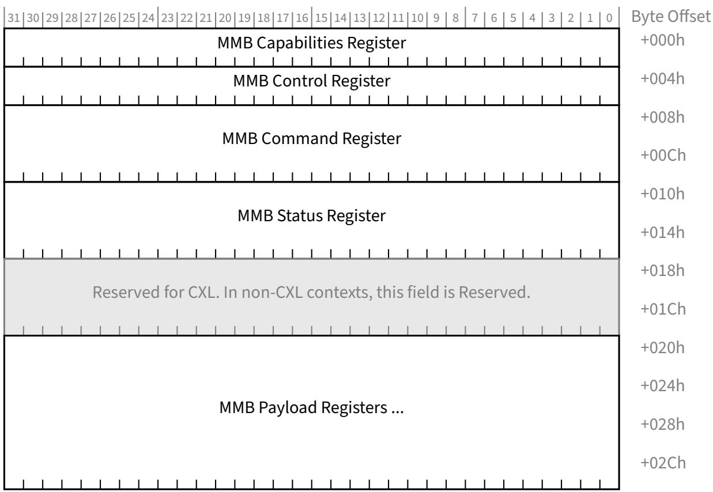

</td>
<td style="background-color:#e8e8e8">

§ Figure 6-93 展示了 MMB 寄存器的结构。

</td>
</tr>
</tbody>
</table>

[⬆️ 返回目录](#-本章目录-table-of-contents)

---

<a id="sec-6-35-1-3-2-1"></a>
## 6.35.1.3.2.1 MMB Capabilities Register (Offset 00h) | MMB 能力寄存器 (偏移 00h)


<div style="overflow-x: auto; max-width: 100%;">
<table>
<thead>
<tr>
<th width="50%">🇬🇧 English</th>
<th width="50%" style="background-color:#e8e8e8">🇨🇳 中文</th>
</tr>
</thead>
<tbody>
<tr>
<td>

§ Figure 6-94 details allocation of register fields in the MMB Capabilities Register; § Table 6-45 provides the respective bit definitions.

> **Figure 6-94. MMB Capabilities Register | MMB 能力寄存器**
> 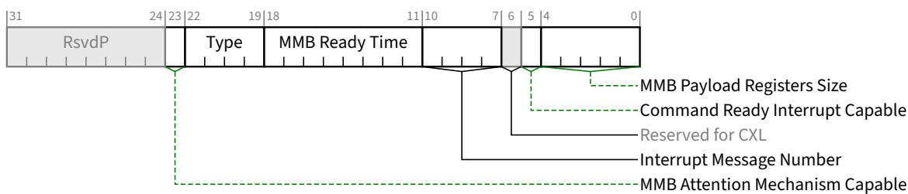

**Table 6-45. MMB Capabilities Register | 表 6-45. MMB 能力寄存器**

| Bit Location | Register Description | Attributes |
|---|---|---|
| 4:0 | MMB Payload Registers Size – Size of the MMB Payload Registers (see § Section 6.35.1.3.2.5) in bytes, expressed as 2<sup>n</sup>. The minimum size is 256 bytes (n=8) and the maximum size is 1 MB (n=20). | HWInit |
| 5 | Command Ready Interrupt Capable – This field indicates if the MMB supports signaling an MSI/MSI-X interrupt when the Doorbell in the MMB Control Register (see § Section 6.35.1.3.2.2) transitions from Set to Clear or MMB At Attention in the MMB Status Register (see § Section 6.35.1.3.2.4) transitions from Clear to Set.<br>0b = Not supported<br>1b = Supported | HWInit |
| 6 | Reserved for CXL – This field is assigned for use by [CXL]. In non-CXL contexts, this field is Reserved. | RsvdP |
| 10:7 | Interrupt Message Number – This field indicates which MSI/MSI-X vector is used for the interrupt message generated in association with this MMB instance. For MSI, the value in this field indicates the offset between the base Message Data and the interrupt message that is generated. Hardware is required to update this field so that it is correct if the number of MSI Messages assigned to the Function changes when software writes to the Multiple Message Enable field in the Message Control register for MSI. For MSI-X, the value in this field indicates which MSI-X Table entry is used to generate the interrupt message. The entry shall be one of the first 16 entries even if the Function implements more than 16 entries. The value in this field shall be within the range configured by system software to the Function. For a given MSI-X implementation, the entry shall remain constant. If both MSI and MSI-X are implemented, they are permitted to use different vectors, though software is permitted to enable only one mechanism at a time. If MSI-X is enabled, the value in this field shall indicate the vector for MSI-X. If MSI is enabled or neither is enabled, the value in this field indicates the vector for MSI. If software enables both MSI and MSI-X at the same time, the value in this field is undefined. | RO/RsvdP |
| 18:11 | MMB Ready Time – This field indicates the maximum amount of time in seconds after a Conventional Reset for MMB Ready in the MMB Status Register (see § Section 6.35.1.3.2.4) to become Set. A value of 0 indicates 2 seconds. | HWInit |
| 22:19 | Type – This field identifies the type-specific commands supported by the MMB.<br>The type is inferred from the 24-bit value corresponding to the Class Code of the Function. If the Class Code is not associated with any type-specific commands, then no type-specific commands are present.<br>0h = The type is inferred from the Class Code.<br>1h-7h = Reserved – Allocated for [CXL].<br>Others = All other encodings are reserved. | HWInit |
| 23 | MMB Attention Mechanism Capable – This field indicates if the MMB supports the optional MMB Attention Mechanism.<br>0b = Not supported<br>1b = Supported | HWInit |

</td>
<td style="background-color:#e8e8e8">

§ Figure 6-94 详细描述了 MMB Capabilities Register 中各寄存器字段的分配;§ Table 6-45 给出了相应的位定义。

**Table 6-45. MMB Capabilities Register | 表 6-45. MMB 能力寄存器**

| 位位置 | 寄存器描述 | 属性 |
|---|---|---|
| 4:0 | MMB Payload Registers Size – MMB Payload Registers(参见 § Section 6.35.1.3.2.5)的字节大小,以 2<sup>n</sup> 表示。最小为 256 字节(n=8),最大为 1 MB(n=20)。 | HWInit |
| 5 | Command Ready Interrupt Capable – 该字段指示 MMB 是否支持在 MMB Control Register(参见 § Section 6.35.1.3.2.2)中的 Doorbell 由置起变为清除,或 MMB Status Register(参见 § Section 6.35.1.3.2.4)中的 MMB At Attention 由清除变为置起时发出 MSI/MSI-X 中断。<br>0b = 不支持<br>1b = 支持 | HWInit |
| 6 | Reserved for CXL – 该字段分配给 [CXL] 使用。在非 CXL 上下文中,该字段为保留。 | RsvdP |
| 10:7 | Interrupt Message Number – 该字段指示与该 MMB 实例相关产生的中断消息所使用的 MSI/MSI-X 向量。对于 MSI,该字段值表示基础 Message Data 与所产生的中断消息之间的偏移。当软件写入 MSI 的 Message Control 寄存器的 Multiple Message Enable 字段而使分配给该功能的 MSI 消息数发生变化时,硬件需要更新此字段以保持正确。对于 MSI-X,该字段值表示用于产生中断消息的 MSI-X 表项。即使该功能实现超过 16 项,该表项也应为前 16 项之一。该字段值应在系统软件为该功能配置的范围内。对于给定的 MSI-X 实现,该表项应保持不变。若同时实现了 MSI 与 MSI-X,允许使用不同向量,但软件一次只允许启用其中一种机制。若启用了 MSI-X,该字段值应指示 MSI-X 的向量;若启用 MSI 或两者均未启用,该字段值指示 MSI 的向量。若软件同时启用 MSI 与 MSI-X,该字段值未定义。 | RO/RsvdP |
| 18:11 | MMB Ready Time – 该字段指示在常规复位 (Conventional Reset) 之后,MMB Status Register(参见 § Section 6.35.1.3.2.4)中的 MMB Ready 变为置起的最大秒数。值为 0 表示 2 秒。 | HWInit |
| 22:19 | Type – 该字段标识 MMB 所支持的类型特定命令。<br>类型由功能 (Function) 的 Class Code 对应的 24 位值推断。如果 Class Code 未与任何类型特定命令关联,则不存在类型特定命令。<br>0h = 类型由 Class Code 推断。<br>1h-7h = 保留 – 分配给 [CXL]。<br>其他 = 所有其他编码均保留。 | HWInit |
| 23 | MMB Attention Mechanism Capable – 该字段指示 MMB 是否支持可选的 MMB Attention Mechanism(注意机制)。<br>0b = 不支持<br>1b = 支持 | HWInit |

</td>
</tr>
</tbody>
</table>
</div>


[⬆️ 返回目录](#-本章目录-table-of-contents)

---

<a id="sec-6-35-1-3-2-2-2"></a>
## 6.35.1.3.2.2 MMB Control Register (Offset 04h) | MMB 控制寄存器 (偏移 04h)

table>
<thead>
<tr>
<th width="50%">🇬🇧 English</th>
<th width="50%" style="background-color:#e8e8e8">🇨🇳 中文</th>
</tr>
</thead>
<tbody>
<tr>
<td>

§ Figure 6-95 details allocation of register fields in the MMB Control Register; § Table 6-46 provides the respective bit definitions.

> **Figure 6-95. MMB Control Register | MMB 控制寄存器**
> 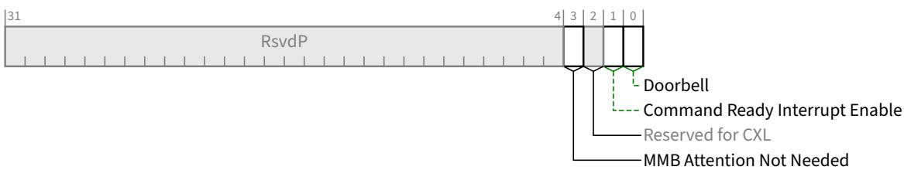

**Table 6-46. MMB Control Register | 表 6-46. MMB 控制寄存器**

| Bit Location | Register Description | Attributes |
|---|---|---|
| 0 | Doorbell – When MMB Ready is Set, this bit, when Clear, indicates that the Function is ready to accept a new command. Set by the caller to notify the Function that the command inputs are ready. Read-only when Set. Cleared by the Function when the command completes.<br>0b = Ready to accept a command<br>1b = Busy executing a command or initializing<br>Default value of this field is 1b. Cleared by the Function when MMB Ready is Set in the MMB Status Register. | RW |
| 1 | Command Ready Interrupt Enable – When Command Ready Interrupt Capable is Set, this bit, when Set, enables the MMB to signal an MSI/MSI-X interrupt when the Doorbell transitions from Set to Cleared or MMB At Attention in the MMB Status Register (see § Section 6.35.1.3.2.4) transitions from Clear to Set. Read-only when the Doorbell is Set.<br>When Command Ready Interrupt Capable is Clear, this bit is permitted to be RsvdP.<br>0b = Disabled<br>1b = Enabled<br>Default value of this field is 0b. | RW/RsvdP |
| 2 | Reserved for CXL – This field is assigned for use by [CXL]. In non-CXL contexts, this field is Reserved. | RsvdP |
| 3 | MMB Attention Not Needed – If MMB Attention Mechanism Capable is Set, this bit, when Set, enables the MMB to enter and stay in a state where it is not immediately available for use. When Clear the MMB must remain in a responsive state. | RW/RsvdP |

</td>
<td style="background-color:#e8e8e8">

§ Figure 6-95 详细描述了 MMB Control Register 中各寄存器字段的分配;§ Table 6-46 给出了相应的位定义。

**Table 6-46. MMB Control Register | 表 6-46. MMB 控制寄存器**

| 位位置 | 寄存器描述 | 属性 |
|---|---|---|
| 0 | Doorbell – 当 MMB Ready 被置起时,该位为清除状态时表示功能已准备好接受新命令。由调用方置起以通知功能命令输入已就绪。置起时为只读。在命令完成时由功能清除。<br>0b = 准备好接受命令<br>1b = 正在执行命令或初始化中<br>该字段默认值为 1b。当 MMB Status Register 中的 MMB Ready 被置起时,由功能清除。 | RW |
| 1 | Command Ready Interrupt Enable – 当 Command Ready Interrupt Capable 被置起时,该位置起后将使能 MMB 在 Doorbell 由置起变为清除、或 MMB Status Register(参见 § Section 6.35.1.3.2.4)中的 MMB At Attention 由清除变为置起时发出 MSI/MSI-X 中断。当 Doorbell 置起时为只读。<br>当 Command Ready Interrupt Capable 被清除时,该位可作为 RsvdP。<br>0b = 禁用<br>1b = 启用<br>该字段默认值为 0b。 | RW/RsvdP |
| 2 | Reserved for CXL – 该字段分配给 [CXL] 使用。在非 CXL 上下文中,该字段为保留。 | RsvdP |
| 3 | MMB Attention Not Needed – 若 MMB Attention Mechanism Capable 被置起,该位置起后将允许 MMB 进入并保持不可立即使用的状态。当该位被清除时,MMB 必须保持响应状态。 | RW/RsvdP |

</td>
</tr>
</tbody>
</table>

[⬆️ 返回目录](#-本章目录-table-of-contents)

---


---

<a id="sec-6-35-1-3-2-2"></a>
## 6.35.1.3.2.2 MMB Control Register (Offset 04h) | MMB 控制寄存器（偏移量 04h）

<table>
<thead>
<tr>
<th width="50%">🇬🇧 English</th>
<th width="50%" style="background-color:#e8e8e8">🇨🇳 中文</th>
</tr>
</thead>
<tbody>
<tr>
<td>

Bit Location
Register Description
Attributes
When MMB Attention Mechanism Support is Clear, this bit is permitted to be RsvdP.
Attention needed
Attention not needed
Default value of this bit is 0b.
The MMB Command Register shall only be used by the caller when the Doorbell in the MMB Control Register (see § Section 6.35.1.3.2.2 ) is Cleared.

</td>
<td style="background-color:#e8e8e8">

位 位置
寄存器描述
属性
当 MMB Attention Mechanism Support 清零时,该位允许为 RsvdP。
需要注意
不需要注意
此位的默认值为 0b。
MMB 命令寄存器只能在 MMB 控制寄存器（见 § 6.35.1.3.2.2 ）中的 Doorbell 清零时由调用方使用。

</td>
</tr>
</tbody>
</table>

---

<<<PAGE_BREAK>>> page_967

<a id="sec-6-35-1-3-2-3"></a>
## 6.35.1.3.2.3 MMB Command Register (Offset 08h) | MMB 命令寄存器（偏移量 08h）

<table>
<thead>
<tr>
<th width="50%">🇬🇧 English</th>
<th width="50%" style="background-color:#e8e8e8">🇨🇳 中文</th>
</tr>
</thead>
<tbody>
<tr>
<td>

§ Figure 6-96 details allocation of register fields in the MMB Command Register; § Table 6-47 provides the respective bit definitions.

</td>
<td style="background-color:#e8e8e8">

§ 图 6-96 详细说明了 MMB 命令寄存器中各寄存器字段的分配;§ 表 6-47 给出了相应的位定义。

</td>
</tr>
</tbody>
</table>

> **Figure 6-96. MMB Command Register | MMB 命令寄存器**
> 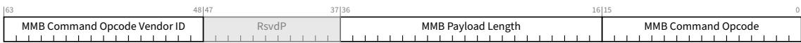

**Table 6-47. MMB Command Register | 表 6-47. MMB 命令寄存器**


<div style="overflow-x: auto; max-width: 100%;">
<table>
<thead>
<tr>
<th width="50%">🇬🇧 English</th>
<th width="50%" style="background-color:#e8e8e8">🇨🇳 中文</th>
</tr>
</thead>
<tbody>
<tr>
<td>

Bit Location
Register Description
Attributes

**15:0 — MMB Command Opcode** – The command identifier.
Default value of this field is 0000h.
RW

**36:16 — MMB Payload Length** – The size of the data in the MMB Payload Registers (see § Section 6.35.1.3.2.5 ) in bytes. Valid values for this field are less than or equal to the MMB Payload Registers Size specified in the MMB Capabilities Register (see § Section 6.35.1.3.2.1 ). Written by the caller to provide the command input payload size to the Function prior to setting the Doorbell in the MMB Control Register (see § Section 6.35.1.3.2.2 ). Values specified by the caller that are greater than the MMB Payload Registers Size result in an error of Invalid Payload Length being returned in the MMB Return Code field. Written by the Function to provide the command output payload size to the caller when the Doorbell is Cleared in the MMB Control Register (see § Section 6.35.1.3.2.2 ).
Default value of this field is 00000h.
RW

**63:48 — MMB Command Opcode Vendor ID** – The PCI-SIG assigned Vendor ID for the entity that defined the MMB Command Opcode. A value of 0000h in this field is reserved for legacy compatibility with existing [CXL] defined commands only.
Default value of this field is 0000h.
RW

</td>
<td style="background-color:#e8e8e8">

位 位置
寄存器描述
属性

**15:0 — MMB Command Opcode（MMB 命令操作码）** – 命令标识符。
此字段默认值为 0000h。
RW

**36:16 — MMB Payload Length（MMB 有效负载长度）** – MMB Payload Registers（见 § 6.35.1.3.2.5 ）中数据的大小,以字节为单位。此字段的有效值必须小于或等于 MMB Capabilities Register（见 § 6.35.1.3.2.1 ）中指定的 MMB Payload Registers Size。由调用方在设置 MMB Control Register（见 § 6.35.1.3.2.2 ）中的 Doorbell 之前写入,以向 Function 提供命令输入有效负载大小。调用方指定的大于 MMB Payload Registers Size 的值会导致在 MMB Return Code 字段中返回 Invalid Payload Length 错误。当 MMB Control Register（见 § 6.35.1.3.2.2 ）中的 Doorbell 被清零时,由 Function 写入,以向调用方提供命令输出有效负载大小。
此字段默认值为 00000h。
RW

**63:48 — MMB Command Opcode Vendor ID（MMB 命令操作码供应商 ID）** – 由 PCI-SIG 分配的供应商 ID,用于标识定义 MMB Command Opcode 的实体。该字段中的 0000h 值仅保留用于与现有 [CXL] 定义命令的旧版兼容性。
此字段默认值为 0000h。
RW

</td>
</tr>
</tbody>
</table>
</div>


---

<<<PAGE_BREAK>>> page_968

<a id="sec-6-35-1-3-2-4"></a>
## 6.35.1.3.2.4 MMB Status Register (Offset 10h) | MMB 状态寄存器（偏移量 10h）

table>
<thead>
<tr>
<th width="50%">🇬🇧 English</th>
<th width="50%" style="background-color:#e8e8e8">🇨🇳 中文</th>
</tr>
</thead>
<tbody>
<tr>
<td>

Reports information about the state of the MMB and the last command executed since Conventional Reset.
§ Figure 6-97 details allocation of register fields in the MMB Status Register; § Table 6-48 provides the respective bit definitions.

</td>
<td style="background-color:#e8e8e8">

报告自常规复位（Conventional Reset）以来 MMB 的状态以及最后执行的命令的相关信息。
§ 图 6-97 详细说明了 MMB 状态寄存器中各寄存器字段的分配;§ 表 6-48 给出了相应的位定义。

</td>
</tr>
</tbody>
</table>

> **Figure 6-97. MMB Status Register | MMB 状态寄存器**
> 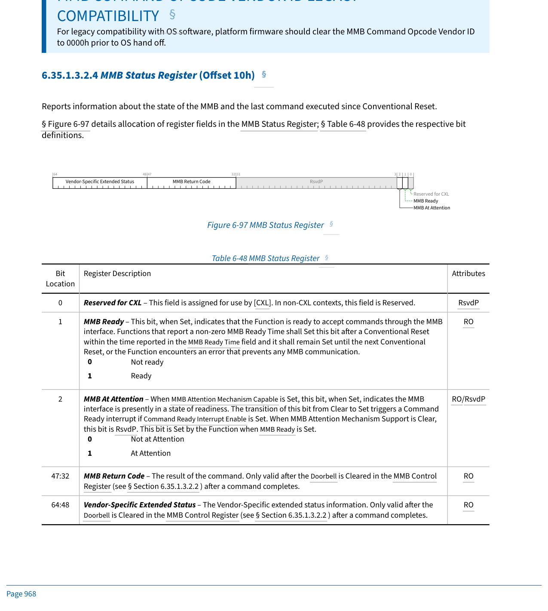

**Table 6-48. MMB Status Register | 表 6-48. MMB 状态寄存器**


<div style="overflow-x: auto; max-width: 100%;">
<table>
<thead>
<tr>
<th width="50%">🇬🇧 English</th>
<th width="50%" style="background-color:#e8e8e8">🇨🇳 中文</th>
</tr>
</thead>
<tbody>
<tr>
<td>

Bit Location
Register Description
Attributes

**0 — Reserved for CXL** – This field is assigned for use by [CXL]. In non-CXL contexts, this field is Reserved.
RsvdP

**1 — MMB Ready** – This bit, when Set, indicates that the Function is ready to accept commands through the MMB interface. Functions that report a non-zero MMB Ready Time shall Set this bit after a Conventional Reset within the time reported in the MMB Ready Time field and it shall remain Set until the next Conventional Reset, or the Function encounters an error that prevents any MMB communication.
Not ready
Ready
RO

**2 — MMB At Attention** – When MMB Attention Mechanism Capable is Set, this bit, when Set, indicates the MMB interface is presently in a state of readiness. The transition of this bit from Clear to Set triggers a Command Ready interrupt if Command Ready Interrupt Enable is Set. When MMB Attention Mechanism Support is Clear, this bit is RsvdP. This bit is Set by the Function when MMB Ready is Set.
Not at Attention
At Attention
RO/RsvdP

**47:32 — MMB Return Code** – The result of the command. Only valid after the Doorbell is Cleared in the MMB Control Register (see § Section 6.35.1.3.2.2 ) after a command completes.
RO

**64:48 — Vendor-Specific Extended Status** – The Vendor-Specific extended status information. Only valid after the Doorbell is Cleared in the MMB Control Register (see § Section 6.35.1.3.2.2 ) after a command completes.
RO

</td>
<td style="background-color:#e8e8e8">

位 位置
寄存器描述
属性

**0 — Reserved for CXL（CXL 保留）** – 此字段分配给 [CXL] 使用。在非 CXL 上下文中,此字段为保留。
RsvdP

**1 — MMB Ready（MMB 就绪）** – 当此位置 1 时,表示 Function 已准备好通过 MMB 接口接受命令。报告非零 MMB Ready Time 的 Function 应在常规复位（Conventional Reset）后,在 MMB Ready Time 字段所报告的时间内置位该位,并保持置位状态,直到下一次常规复位,或 Function 遇到阻止任何 MMB 通信的错误。
未就绪
就绪
RO

**2 — MMB At Attention（MMB 处于 Attention 状态）** – 当 MMB Attention Mechanism Capable 置 1 时,该位置 1 表示 MMB 接口当前处于就绪状态。如果 Command Ready Interrupt Enable 已置位,则该位从清零到置 1 的跳变会触发 Command Ready 中断。当 MMB Attention Mechanism Support 清零时,该位为 RsvdP。当 MMB Ready 置 1 时,该位由 Function 置 1。
未处于 Attention 状态
处于 Attention 状态
RO/RsvdP

**47:32 — MMB Return Code（MMB 返回代码）** – 命令执行结果。仅在 MMB Control Register（见 § 6.35.1.3.2.2 ）中的 Doorbell 在命令完成后被清零之后才有效。
RO

**64:48 — Vendor-Specific Extended Status（供应商特定扩展状态）** – 供应商特定的扩展状态信息。仅在 MMB Control Register（见 § 6.35.1.3.2.2 ）中的 Doorbell 在命令完成后被清零之后才有效。
RO

</td>
</tr>
</tbody>
</table>
</div>


table>
<thead>
<tr>
<th width="50%">🇬🇧 English</th>
<th width="50%" style="background-color:#e8e8e8">🇨🇳 中文</th>
</tr>
</thead>
<tbody>
<tr>
<td>

**IMPLEMENTATION NOTE:**
**MMB COMMAND OPCODE VENDOR ID LEGACY COMPATIBILITY**
For legacy compatibility with OS software, platform firmware should clear the MMB Command Opcode Vendor ID to 0000h prior to OS hand off.

</td>
<td style="background-color:#e8e8e8">

**实现注意事项（IMPLEMENTATION NOTE）:**
**MMB 命令操作码供应商 ID 旧版兼容性**
为了与操作系统软件的旧版兼容,平台固件应在操作系统移交之前将 MMB Command Opcode Vendor ID 清零为 0000h。

</td>
</tr>
</tbody>
</table>

---

<<<PAGE_BREAK>>> page_969

<a id="sec-6-35-1-3-2-4-1"></a>
## 6.35.1.3.2.4.1 MMB Command Return Codes | MMB 命令返回代码


<div style="overflow-x: auto; max-width: 100%;">
<table>
<thead>
<tr>
<th width="50%">🇬🇧 English</th>
<th width="50%" style="background-color:#e8e8e8">🇨🇳 中文</th>
</tr>
</thead>
<tbody>
<tr>
<td>

Command Return Codes are associated with the entity that defined the command as indicated by the MMB Command Opcode Vendor ID in the MMB Command Register.

The MMB Command Return Code is Set by the Function to indicate to the Caller the result of a command. If more than one MMB Command Return Code applies, the Function chooses which one to return.

In general, retries are not recommended for commands that return an error except when indicated in the return code definition.

PCI-SIG defined command return codes are only valid for PCI-SIG defined commands.

</td>
<td style="background-color:#e8e8e8">

命令返回代码与定义该命令的实体相关联,如 MMB 命令寄存器中的 MMB Command Opcode Vendor ID 所指示的那样。

MMB Command Return Code 由 Function 置位,以向调用方（Caller）指示命令的结果。如果适用多个 MMB 命令返回代码,则由 Function 选择返回哪一个。

通常,不建议对返回错误的命令进行重试,除非在返回代码定义中明确指出。

PCI-SIG 定义的命令返回代码仅对 PCI-SIG 定义的命令有效。

</td>
</tr>
</tbody>
</table>
</div>


**Table 6-49. MMB PCI-SIG Defined Command Return Codes (Vendor ID = 0001h) | 表 6-49. MMB PCI-SIG 已定义命令返回代码（供应商 ID = 0001h）**

| Value | Description | 描述 |
|-------|-------------|------|
| 0000h | Success: The command successfully completed. | 成功:命令已成功完成。 |
| 0001h | Reserved | 保留 |
| 0002h | Invalid Input: A command input was invalid. | 无效输入:命令输入无效。 |
| 0003h | Unsupported: The MMB Command Opcode is not supported. | 不支持:不支持该 MMB 命令操作码。 |
| 0004h | Internal Error: The command was not completed because of an internal error. | 内部错误:由于内部错误,命令未完成。 |
| 0005h | Retry Required: The command was not completed because of a temporary error. An optional single retry may resolve the issue. | 需要重试:由于临时错误,命令未完成。可选的单一重试可能解决问题。 |
| 0006h-7FFFh | Reserved: Allocated for [CXL]. | 保留:分配给 [CXL]。 |
| 8000h | Invalid Payload Length: The input payload length specified for the command is not valid. | 无效的有效负载长度:为该命令指定的输入有效负载长度无效。 |
| 8001h | Unsupported Management Message: The MMPT Message Type is not supported. | 不支持的管理消息:不支持该 MMPT 消息类型。 |
| 8002h | Transfer in Progress: Only one transfer can occur at a time. Complete or abort the current data transfer before starting a new one. | 传输进行中:同一时间只能进行一次传输。在开始新传输之前完成或中止当前的数据传输。 |
| 8003h | Transfer Out of Order: The transfer was aborted because the data was transferred out of order. | 传输乱序:由于数据传输乱序,传输被中止。 |
| 8004h | Transfer Aborted: The data transfer was aborted and must be restarted from the beginning. | 传输已中止:数据传输被中止,必须从头开始重新启动。 |
| 8005h-FFFFh | Reserved | 保留 |

---

<a id="sec-6-35-1-3-2-5"></a>
## 6.35.1.3.2.5 MMB Payload Registers (Offset 20h) | MMB 有效负载寄存器（偏移量 20h）

table>
<thead>
<tr>
<th width="50%">🇬🇧 English</th>
<th width="50%" style="background-color:#e8e8e8">🇨🇳 中文</th>
</tr>
</thead>
<tbody>
<tr>
<td>

The MMB Payload Registers must consist of 256 Bytes – 1 MB, as shown in § Figure 6-98. The size of the MMB Payload Registers is reported in the MMB Capabilities Register (see § Section 6.35.1.3.2.1 ). Any data beyond the size specified in the MMB Capabilities Register shall be ignored by the caller and the Function.

The MMB Payload Registers are written by the caller to provide the command input payload to the Function prior to Setting the Doorbell in the MMB Control Register (see § Section 6.35.1.3.2.2 ). They are written by the Function to provide the command output payload back to the caller prior to Clearing the Doorbell.

These registers must only be used by the caller when the Doorbell in the MMB Control Register (see § Section 6.35.1.3.2.2 ) is Clear.

</td>
<td style="background-color:#e8e8e8">

MMB Payload Registers 的大小必须为 256 字节至 1 MB,如 § 图 6-98 所示。MMB Payload Registers 的大小在 MMB Capabilities Register（见 § 6.35.1.3.2.1 ）中报告。超出 MMB Capabilities Register 所指定大小的任何数据都将被调用方和 Function 忽略。

MMB Payload Registers 由调用方在置位 MMB Control Register（见 § 6.35.1.3.2.2 ）中的 Doorbell 之前写入,以向 Function 提供命令输入有效负载。它们由 Function 在清零 Doorbell 之前写入,以向调用方提供命令输出有效负载。

这些寄存器只能在 MMB Control Register（见 § 6.35.1.3.2.2 ）中的 Doorbell 清零时由调用方使用。

</td>
</tr>
</tbody>
</table>

---

<<<PAGE_BREAK>>> page_970

> **Figure 6-98. MMB Payload Registers | MMB 有效负载寄存器**
> 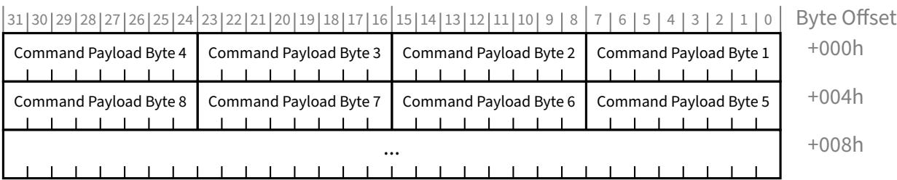

---

<a id="sec-6-35-1-4"></a>
## 6.35.1.4 Management Message Passthrough (MMPT) Capability (Offset: Varies) | Management Message Passthrough（MMPT）能力结构（偏移量：可变）

<table>
<thead>
<tr>
<th width="50%">🇬🇧 English</th>
<th width="50%" style="background-color:#e8e8e8">🇨🇳 中文</th>
</tr>
</thead>
<tbody>
<tr>
<td>

The Management Message Passthrough (MMPT) Capability is required for Functions that support the MMPT command set. Refer to the MMPT command interface for usage of this capability (§ Section 6.36.1 ).

Unless specified otherwise in the field definitions, each field is present in version 1 and later of this structure. The Function shall report the version of this structure in the MCAP Version field of the MCAP Header Register.

§ Figure 6-99 illustrates the MMPT Register structure.

</td>
<td style="background-color:#e8e8e8">

Management Message Passthrough（MMPT）能力结构对于支持 MMPT 命令集的 Function 是必需的。有关此能力结构的使用,请参阅 MMPT 命令接口（§ 6.36.1 ）。

除非字段定义中另有规定,否则每个字段都出现在此结构的版本 1 及更高版本中。Function 应在 MCAP Header Register 的 MCAP Version 字段中报告此结构的版本。

§ 图 6-99 说明了 MMPT 寄存器结构。

</td>
</tr>
</tbody>
</table>

> **Figure 6-99. MMPT Registers | MMPT 寄存器**
> 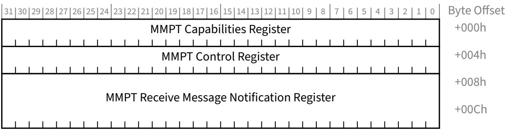

---

<a id="sec-6-35-1-4-1"></a>
## 6.35.1.4.1 MMPT Registers | MMPT 寄存器

<table>
<thead>
<tr>
<th width="50%">🇬🇧 English</th>
<th width="50%" style="background-color:#e8e8e8">🇨🇳 中文</th>
</tr>
</thead>
<tbody>
<tr>
<td>

§ Figure 6-100 details allocation of register fields in the MMPT Capabilities Register; § Table 6-50 provides the respective bit definitions.

</td>
<td style="background-color:#e8e8e8">

§ 图 6-100 详细说明了 MMPT Capabilities Register 中各寄存器字段的分配;§ 表 6-50 给出了相应的位定义。

</td>
</tr>
</tbody>
</table>

---

<a id="sec-6-35-1-4-1-1"></a>
## 6.35.1.4.1.1 MMPT Capabilities Register (Offset 00h) | MMPT 能力寄存器（偏移量 00h）

> **Figure 6-100. MMPT Capabilities Register | MMPT 能力寄存器**
> 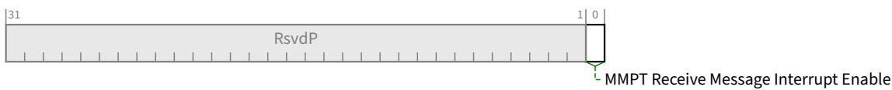

**Table 6-50. MMPT Capabilities Register | 表 6-50. MMPT 能力寄存器**


<div style="overflow-x: auto; max-width: 100%;">
<table>
<thead>
<tr>
<th width="50%">🇬🇧 English</th>
<th width="50%" style="background-color:#e8e8e8">🇨🇳 中文</th>
</tr>
</thead>
<tbody>
<tr>
<td>

Bit Location
Register Description
Attributes

**0 — MMPT Receive Message Interrupt Capable** – This field indicates if the Function supports signaling an MSI/MSI-X interrupt when MMPT Receive Message Ready transitions from Clear to Set.
Not supported
Supported
RO

**4:1 — MMPT Receive Message Interrupt Message Number** – This field indicates which MSI/MSI-X vector is used for the interrupt message generated when MMPT Receive Message Ready transitions from Clear to Set.

For MSI, the value in this field indicates the offset between the base Message Data and the interrupt message that is generated. Hardware is required to update this field so that it is correct if the number of MSI Messages assigned to the Function changes when software writes to the Multiple Message Enable field in the Message Control register for MSI.

For MSI-X, the value in this field indicates which MSI-X Table entry is used to generate the interrupt message. The entry shall be one of the first 16 entries even if the Function implements more than 16 entries. The value in this field shall be within the range configured by system software to the device. For a given MSI-X implementation, the entry shall remain constant.

If both MSI and MSI-X are implemented, they are permitted to use different vectors, though software is permitted to enable only one mechanism at a time. If MSI-X is enabled, the value in this field shall indicate the vector for MSI-X. If MSI is enabled or neither is enabled, the value in this field indicates the vector for MSI. If software enables both MSI and MSI-X at the same time, the value in this field is undefined.
RO/RsvdP

</td>
<td style="background-color:#e8e8e8">

位 位置
寄存器描述
属性

**0 — MMPT Receive Message Interrupt Capable（MMPT 接收消息中断能力）** – 此字段指示 Function 是否支持在 MMPT Receive Message Ready 从清零跳变为置 1 时发出 MSI/MSI-X 中断。
不支持
支持
RO

**4:1 — MMPT Receive Message Interrupt Message Number（MMPT 接收消息中断消息号）** – 此字段指示在 MMPT Receive Message Ready 从清零跳变为置 1 时,使用哪个 MSI/MSI-X 向量生成中断消息。

对于 MSI,此字段中的值表示基准 Message Data 与生成的中断消息之间的偏移量。当软件写入 MSI 的 Message Control 寄存器中的 Multiple Message Enable 字段,从而导致分配给 Function 的 MSI 消息数发生变化时,需要硬件更新此字段以保持其正确性。

对于 MSI-X,此字段中的值指示使用哪个 MSI-X 表条目来生成中断消息。该条目必须是前 16 个条目之一,即使 Function 实现了超过 16 个条目。此字段中的值应处于系统软件为设备配置的范围内。对于给定的 MSI-X 实现,该条目应保持不变。

如果同时实现了 MSI 和 MSI-X,则允许它们使用不同的向量,但软件一次只允许启用其中一种机制。如果启用了 MSI-X,则此字段中的值应指示 MSI-X 的向量。如果启用了 MSI 或两者都未启用,则此字段中的值指示 MSI 的向量。如果软件同时启用 MSI 和 MSI-X,则此字段中的值是未定义的。
RO/RsvdP

</td>
</tr>
</tbody>
</table>
</div>


---

<<<PAGE_BREAK>>> page_971

<a id="sec-6-35-1-4-1-2"></a>
## 6.35.1.4.1.2 MMPT Control Register (Offset 04h) | MMPT 控制寄存器（偏移量 04h）

table>
<thead>
<tr>
<th width="50%">🇬🇧 English</th>
<th width="50%" style="background-color:#e8e8e8">🇨🇳 中文</th>
</tr>
</thead>
<tbody>
<tr>
<td>

§ Figure 6-101 details allocation of register fields in the MMTP Control Register; § Table 6-51 provides the respective bit definitions.

</td>
<td style="background-color:#e8e8e8">

§ 图 6-101 详细说明了 MMTP Control Register 中各寄存器字段的分配;§ 表 6-51 给出了相应的位定义。

</td>
</tr>
</tbody>
</table>

> **Figure 6-101. MMPT Control Register | MMPT 控制寄存器**
> 

---

<<<PAGE_BREAK>>> page_972

**Table 6-51. MMPT Control Register | 表 6-51. MMPT 控制寄存器**

<table>
<thead>
<tr>
<th width="50%">🇬🇧 English</th>
<th width="50%" style="background-color:#e8e8e8">🇨🇳 中文</th>
</tr>
</thead>
<tbody>
<tr>
<td>

Bit Location
Register Description
Attributes

**0 — MMPT Receive Message Interrupt Enable** – When MMPT Receive Message Interrupt Capable is Set, this bit, when Set, enables the Function to signal an MSI/MSI-X interrupt when MMPT Receive Message Ready transitions from Clear to Set. When MMPT Receive Message Interrupt Capable is Clear, this bit is permitted to be RsvdP.
Disabled
Enabled
Default value of this field is 0b.
RW/RsvdP

</td>
<td style="background-color:#e8e8e8">

位 位置
寄存器描述
属性

**0 — MMPT Receive Message Interrupt Enable（MMPT 接收消息中断使能）** – 当 MMPT Receive Message Interrupt Capable 置 1 时,该位置 1 将使能 Function 在 MMPT Receive Message Ready 从清零跳变为置 1 时发出 MSI/MSI-X 中断。当 MMPT Receive Message Interrupt Capable 清零时,该位允许为 RsvdP。
禁用
使能
此字段默认值为 0b。
RW/RsvdP

</td>
</tr>
</tbody>
</table>

---

<a id="sec-6-35-1-4-1-3"></a>
## 6.35.1.4.1.3 MMPT Receive Message Notification Register (Offset 08h) | MMPT 接收消息通知寄存器（偏移量 08h）

<table>
<thead>
<tr>
<th width="50%">🇬🇧 English</th>
<th width="50%" style="background-color:#e8e8e8">🇨🇳 中文</th>
</tr>
</thead>
<tbody>
<tr>
<td>

§ Figure 6-102 details allocation of register fields in the MMPT Receive Message Notification Register; § Table 6-52 provides the respective bit definitions.

</td>
<td style="background-color:#e8e8e8">

§ 图 6-102 详细说明了 MMPT Receive Message Notification Register 中各寄存器字段的分配;§ 表 6-52 给出了相应的位定义。

</td>
</tr>
</tbody>
</table>

> **Figure 6-102. MMPT Receive Message Notification Register | MMPT 接收消息通知寄存器**
> 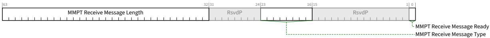

**Table 6-52. MMPT Receive Message Notification Register | 表 6-52. MMPT 接收消息通知寄存器**


<div style="overflow-x: auto; max-width: 100%;">
<table>
<thead>
<tr>
<th width="50%">🇬🇧 English</th>
<th width="50%" style="background-color:#e8e8e8">🇨🇳 中文</th>
</tr>
</thead>
<tbody>
<tr>
<td>

Bit Location
Register Description
Attributes

**0 — MMPT Receive Message Ready** – When Set, a new management message is ready to be transferred from the Function to the host using the MMPT Receive Message command (see § Section 6.36.1.2 ).
RO

**23:16 — MMPT Receive Message Type** – This field indicates the nature and format of the management message ready to be transferred from the Function to the host using the MMPT Receive Message command (see § Section 6.36.1.2 ). Encodings for this field are provided in the [PCI-Code-and-ID]. All unspecified encodings are Reserved.
RO

**63:32 — MMPT Receive Message Length** – This field indicates the length of the management message in bytes ready to be transferred from the Function to the host using the MMPT Receive Message command (see § Section 6.36.1.2 ).
RO

</td>
<td style="background-color:#e8e8e8">

位 位置
寄存器描述
属性

**0 — MMPT Receive Message Ready（MMPT 接收消息就绪）** – 当置 1 时,表示有新的管理消息已准备好使用 MMPT Receive Message 命令（见 § 6.36.1.2 ）从 Function 传输到主机。
RO

**23:16 — MMPT Receive Message Type（MMPT 接收消息类型）** – 此字段指示已准备好使用 MMPT Receive Message 命令（见 § 6.36.1.2 ）从 Function 传输到主机的管理消息的性质和格式。此字段的编码在 [PCI-Code-and-ID] 中提供。所有未指定的编码均为保留。
RO

**63:32 — MMPT Receive Message Length（MMPT 接收消息长度）** – 此字段指示已准备好使用 MMPT Receive Message 命令（见 § 6.36.1.2 ）从 Function 传输到主机的管理消息的长度（以字节为单位）。
RO

</td>
</tr>
</tbody>
</table>
</div>


---

<<<PAGE_BREAK>>> page_973

<a id="sec-6-35-2"></a>
## 6.35.2 MMIO Designated Vendor-Specific Register Block (MDVS) | MMIO 指定供应商特定寄存器块（MDVS）

table>
<thead>
<tr>
<th width="50%">🇬🇧 English</th>
<th width="50%" style="background-color:#e8e8e8">🇨🇳 中文</th>
</tr>
</thead>
<tbody>
<tr>
<td>

The MMIO Designated Vendor-Specific Register Block (MDVS) allows a Vendor-Specific Memory Space register block to be discovered by utilizing the MRBL Extended Capability (§ Section 7.9.30 ). The format of the MDVS Register Block starts with the MDVS Register Block Header Register (see § Section 6.35.2.1 and § Section 6.35.3 ) as illustrated in § Figure 6-103. The remainder of the MDVS Register BlockMDVS Register Block is vendor defined. A single Function is permitted to implement more than one in a MDVS Register Block.

</td>
<td style="background-color:#e8e8e8">

MMIO Designated Vendor-Specific Register Block（MDVS）允许通过使用 MRBL 扩展能力结构（§ 7.9.30 ）来发现供应商特定的内存空间寄存器块。MDVS 寄存器块的格式以 MDVS Register Block Header Register（见 § 6.35.2.1 和 § 6.35.3 ）开始,如 § 图 6-103 所示。MDVS Register BlockMDVS Register Block 的其余部分由供应商定义。允许单个 Function 在 MDVS Register Block 中实现一个以上。

</td>
</tr>
</tbody>
</table>

> **Figure 6-103. MDVS Register Block | MDVS 寄存器块**
> 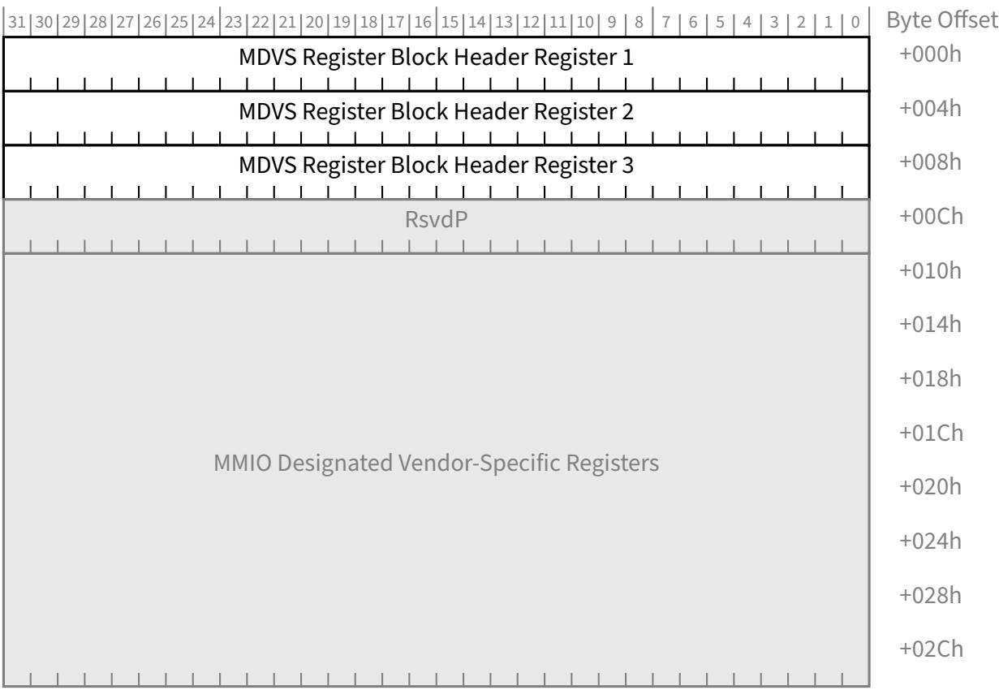

---

<a id="sec-6-35-2-1"></a>
## 6.35.2.1 MDVS Register Block Header Register 1 (Offset 00h) | MDVS 寄存器块头寄存器 1（偏移量 00h）

<table>
<thead>
<tr>
<th width="50%">🇬🇧 English</th>
<th width="50%" style="background-color:#e8e8e8">🇨🇳 中文</th>
</tr>
</thead>
<tbody>
<tr>
<td>

§ Figure 6-104 details allocation of register fields in the MDVS Register Block Header Register 1; § Table 6-53 provides the respective bit definitions.

</td>
<td style="background-color:#e8e8e8">

§ 图 6-104 详细说明了 MDVS Register Block Header Register 1 中各寄存器字段的分配;§ 表 6-53 给出了相应的位定义。

</td>
</tr>
</tbody>
</table>

> **Figure 6-104. MDVS Register Block Header Register 1 | MDVS 寄存器块头寄存器 1**
> 

**Table 6-53. MDVS Register Block Header Register 1 | 表 6-53. MDVS 寄存器块头寄存器 1**

<table>
<thead>
<tr>
<th width="50%">🇬🇧 English</th>
<th width="50%" style="background-color:#e8e8e8">🇨🇳 中文</th>
</tr>
</thead>
<tbody>
<tr>
<td>

Bit Location
Register Description
Attributes

**15:0 — MDVS Vendor ID** – The PCI-SIG assigned Vendor ID for the organization that defined the layout and controls the specification for this register block.
RO

</td>
<td style="background-color:#e8e8e8">

位 位置
寄存器描述
属性

**15:0 — MDVS Vendor ID（MDVS 供应商 ID）** – 由 PCI-SIG 分配的供应商 ID,用于标识定义此寄存器块布局并控制其规范的组织。
RO

</td>
</tr>
</tbody>
</table>

---

<<<PAGE_BREAK>>> page_974

<table>
<thead>
<tr>
<th width="50%">🇬🇧 English</th>
<th width="50%" style="background-color:#e8e8e8">🇨🇳 中文</th>
</tr>
</thead>
<tbody>
<tr>
<td>

**31:16 — MDVS Register Block ID** – Value defined by the Vendor ID in bits 15:0 that indicates the nature and format of the Vendor-Specific registers.
RO

</td>
<td style="background-color:#e8e8e8">

**31:16 — MDVS Register Block ID（MDVS 寄存器块 ID）** – 由位 15:0 中的供应商 ID 定义的值,用于指示供应商特定寄存器的性质和格式。
RO

</td>
</tr>
</tbody>
</table>

---

<table>
<thead>
<tr>
<th width="50%">🇬🇧 English</th>
<th width="50%" style="background-color:#e8e8e8">🇨🇳 中文</th>
</tr>
</thead>
<tbody>
<tr>
<td>

§ Figure 6-105 details allocation of register fields in the MDVS Register Block Header Register 2; § Table 6-54 provides the respective bit definitions.

</td>
<td style="background-color:#e8e8e8">

§ 图 6-105 详细说明了 MDVS Register Block Header Register 2 中各寄存器字段的分配;§ 表 6-54 给出了相应的位定义。

</td>
</tr>
</tbody>
</table>

> **Figure 6-105. MDVS Register Block Header Register 2 | MDVS 寄存器块头寄存器 2**
> 

**Table 6-54. MDVS Register Block Header Register 2 | 表 6-54. MDVS 寄存器块头寄存器 2**

<table>
<thead>
<tr>
<th width="50%">🇬🇧 English</th>
<th width="50%" style="background-color:#e8e8e8">🇨🇳 中文</th>
</tr>
</thead>
<tbody>
<tr>
<td>

Bit Location
Register Description
Attributes

**3:0 — MDVS Register Block Revision** – Version number defined by the Vendor ID in bits 15:0 that indicates the version of the register block.
RO

</td>
<td style="background-color:#e8e8e8">

位 位置
寄存器描述
属性

**3:0 — MDVS Register Block Revision（MDVS 寄存器块修订版本）** – 由位 15:0 中的供应商 ID 定义的版本号,用于指示该寄存器块的版本。
RO

</td>
</tr>
</tbody>
</table>

---

<table>
<thead>
<tr>
<th width="50%">🇬🇧 English</th>
<th width="50%" style="background-color:#e8e8e8">🇨🇳 中文</th>
</tr>
</thead>
<tbody>
<tr>
<td>

§ Figure 6-106 details allocation of register fields in the MDVS Register Block Header Register 3; § Table 6-55 provides the respective bit definitions.

</td>
<td style="background-color:#e8e8e8">

§ 图 6-106 详细说明了 MDVS Register Block Header Register 3 中各寄存器字段的分配;§ 表 6-55 给出了相应的位定义。

</td>
</tr>
</tbody>
</table>

> **Figure 6-106. MDVS Register Block Header Register 3 | MDVS 寄存器块头寄存器 3**
> 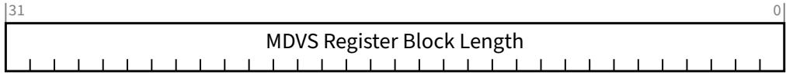

**Table 6-55. MDVS Register Block Header Register 3 | 表 6-55. MDVS 寄存器块头寄存器 3**

<table>
<thead>
<tr>
<th width="50%">🇬🇧 English</th>
<th width="50%" style="background-color:#e8e8e8">🇨🇳 中文</th>
</tr>
</thead>
<tbody>
<tr>
<td>

Bit Location
Register Description
Attributes

**31:0 — MDVS Register Block Length** – The number of bytes in the register block, including the MDVS Register Block Header and the Vendor-Specific registers.
RO

</td>
<td style="background-color:#e8e8e8">

位 位置
寄存器描述
属性

**31:0 — MDVS Register Block Length（MDVS 寄存器块长度）** – 该寄存器块中的字节数,包括 MDVS Register Block Header 和供应商特定寄存器。
RO

</td>
</tr>
</tbody>
</table>


---

<a id="sec-6-35-3"></a>
## 6.35.3 MDVS Register Block Header Register 2 (Offset 04h) | MDVS 寄存器块头部寄存器 2（偏移 04h）

<table>
<thead>
<tr>
<th width="50%">🇬🇧 English</th>
<th width="50%" style="background-color:#e8e8e8">🇨🇳 中文</th>
</tr>
</thead>
<tbody>
<tr>
<td>

6.35.3 MDVS Register Block Header Register 2 (Offset 04h) §

</td>
<td style="background-color:#e8e8e8">

6.35.3 MDVS 寄存器块头部寄存器 2（偏移 04h）§

</td>
</tr>
</tbody>
</table>

---

<a id="sec-6-35-4"></a>
## 6.35.4 MDVS Register Block Header Register 3 (Offset 08h) | MDVS 寄存器块头部寄存器 3（偏移 08h）

<table>
<thead>
<tr>
<th width="50%">🇬🇧 English</th>
<th width="50%" style="background-color:#e8e8e8">🇨🇳 中文</th>
</tr>
</thead>
<tbody>
<tr>
<td>

6.35.4 MDVS Register Block Header Register 3 (Offset 08h) §

</td>
<td style="background-color:#e8e8e8">

6.35.4 MDVS 寄存器块头部寄存器 3（偏移 08h）§

</td>
</tr>
</tbody>
</table>

---

§

§

§

§

<<<PAGE_BREAK>>> page_975

<a id="sec-6-36"></a>
## 6.36 MMB Command Interface | MMB 命令接口


<div style="overflow-x: auto; max-width: 100%;">
<table>
<thead>
<tr>
<th width="50%">🇬🇧 English</th>
<th width="50%" style="background-color:#e8e8e8">🇨🇳 中文</th>
</tr>
</thead>
<tbody>
<tr>
<td>

MMB commands are identified by a MMB Command Opcode. MMB Command Opcodes also provide an implicit version number, which means a command's definition shall not change in an incompatible way in future revisions of this specification. Instead, if an incompatible change is required, the specification defining the change shall define a new MMB Command Opcode for the changed command. Commands may evolve by defining new fields in areas of the payload definitions that were originally defined as Reserved, but only in a way where software written using the earlier definition will continue to work correctly, and software written to the new definition can use the 0 value or the payload size to detect Function components that do not support the new field. This implicit versioning allows software to be written with the understanding that a MMB Command Opcode shall only evolve by adding backward compatible changes.

</td>
<td style="background-color:#e8e8e8">

MMB 命令通过 MMB 命令操作码（MMB Command Opcode）进行标识。MMB 命令操作码还提供一个隐式的版本号，这意味着命令的定义在本规范的未来修订版中不得以不兼容的方式发生变更。相反，如果需要进行不兼容的变更，则定义该变更的规范必须为变更后的命令定义一个新的 MMB 命令操作码。命令可以通过在原本定义为 Reserved（保留）的有效负载（payload）定义区域中定义新字段来演进，但只能以这样的方式进行：使用早期定义编写的软件能够继续正确工作，并且按新定义编写的软件可以使用 0 值或有效负载大小来检测不支持新字段的 Function（功能）组件。这种隐式版本控制允许软件开发人员理解：MMB 命令操作码仅能通过添加向后兼容的变更来演进。

</td>
</tr>
</tbody>
</table>
</div>


---

**Table 6-56. PCI-SIG Defined MMB Command Opcodes (Vendor ID = 0001h) | 表 6-56. PCI-SIG 定义的 MMB 命令操作码（Vendor ID = 0001h）**

| Command Set Bits[15:8] | Command Bits[7:0] | Combined Opcode | Input Payload Size (Bytes) (Note 1) | Output Payload Size (Bytes) (Note 1) |
|------------------------|-------------------|-----------------|------------------------------------|-------------------------------------|
| 00h | Reserved | 0000h-00FFh | N/A | N/A |
| 01h | Reserved | 0100h-00FFh | 10h+ | 00h+ |
| 01h Management Message Passthrough (MMPT) | 00h Send Message (see § Section 6.36.1.1 ) | 0100h | 10h+ | 00h+ |
| 01h | 01h Receive Message (see § Section 6.36.1.2 Section 6.36.1.2) | 0101h | 10h | 00h+ |
| 01h | 02h-FFh Reserved | 0102h-01FFh | N/A | N/A |
| 02h-FFh | Reserved | 00h-FFh | 0200h-FFFFh | N/A | N/A |

Notes:
1. Indicates the minimum payload size for a successful completion. Commands with variable payloads sizes are marked with '+'. Actual valid bytes in the output payload are indicated by the MMB Payload Length field in the MMB Command Register (see § Section 6.35.1.3.2.3 ).

table>
<thead>
<tr>
<th width="50%">🇬🇧 English</th>
<th width="50%" style="background-color:#e8e8e8">🇨🇳 中文</th>
</tr>
</thead>
<tbody>
<tr>
<td>

The optional Management Message Passthrough (MMPT) command set provides an interface to tunnel management messages defined in other industry standard specifications between the host and the Function using the MMB Command Interface. This enables OS standard class drivers to utilize the same management messages used by the BMC, thus making in-band and out-of-band management more consistent.

Management messages may be initiated from the host to the Function using the Send Message command (see § Section 6.36.1.1 ) or asynchronously from the Function to the host using the Receive Message command (see § Section 6.36.1.2 ). The Function notifies the host that a new management message is ready to be retrieved using the Receive Message command (see § Section 6.36.1.2 ) by setting the MMPT Receive Message Ready bit in the MMPT Receive Message Notification Register (see § Section 6.35.1.4.1.3 ). If more than one management message is ready to be transferred from the Function to the host, it is the Function's responsibility to queue up the management messages until the host retrieves them.

</td>
<td style="background-color:#e8e8e8">

可选的 Management Message Passthrough（MMPT，管理消息透传）命令集提供了一种接口，通过 MMB 命令接口在主机和 Function（功能）之间透明传输其他行业标准规范中定义的管理消息。这使得 OS（操作系统）的标准类驱动程序能够使用 BMC 所使用的相同管理消息，从而使带内（in-band）和带外（out-of-band）管理更加一致。

管理消息可以由主机通过 Send Message 命令发起并发送到 Function（见 § 第 6.36.1.1 节），也可以由 Function 异步发起并通过 Receive Message 命令发送到主机（见 § 第 6.36.1.2 节）。Function 通过设置 MMPT Receive Message Notification Register（MMPT 接收消息通知寄存器，见 § 第 6.35.1.4.1.3 节）中的 MMPT Receive Message Ready（MMPT 接收消息就绪）位，通知主机有新的管理消息可供读取。如果有多个管理消息准备好从 Function 传输到主机，则由 Function 负责将这些管理消息排队，直到主机读取它们为止。

</td>
</tr>
</tbody>
</table>

---

<a id="sec-6-36-1"></a>
## 6.36.1 Management Message Passthrough (MMPT) | 管理消息透传（MMPT）

<table>
<thead>
<tr>
<th width="50%">🇬🇧 English</th>
<th width="50%" style="background-color:#e8e8e8">🇨🇳 中文</th>
</tr>
</thead>
<tbody>
<tr>
<td>

6.36.1 Management Message Passthrough (MMPT) §

</td>
<td style="background-color:#e8e8e8">

6.36.1 管理消息透传（Management Message Passthrough, MMPT）§

</td>
</tr>
</tbody>
</table>

---

§

<<<PAGE_BREAK>>> page_976

<table>
<thead>
<tr>
<th width="50%">🇬🇧 English</th>
<th width="50%" style="background-color:#e8e8e8">🇨🇳 中文</th>
</tr>
</thead>
<tbody>
<tr>
<td>

Bits[2:0]

</td>
<td style="background-color:#e8e8e8">

Bits[2:0]

</td>
</tr>
</tbody>
</table>

---


<div style="overflow-x: auto; max-width: 100%;">
<table>
<thead>
<tr>
<th width="50%">🇬🇧 English</th>
<th width="50%" style="background-color:#e8e8e8">🇨🇳 中文</th>
</tr>
</thead>
<tbody>
<tr>
<td>

Management messages may be larger than the MMB Payload Registers Size requiring the management message to be transferred in parts. If a management message is transferred in its entirety, the caller makes one call to Send or Receive Message with Action = Full Data Transfer. The Offset field is not used and shall be ignored. If a management message is transferred in parts, the caller makes one call to Send or Receive Message with Action = Initiate Data Transfer, zero or more calls with Action = Continue Data Transfer, and one call with Action = Finish Data Transfer or Abort Data Transfer. The management message parts shall be transferred in ascending order based on the Offset value, and the Function shall return the Transfer Out of Order return code if the management message parts are not transferred in ascending order. Back-to-back retransmission of any management message part is permitted during a transfer. A Send or Receive Message command with Action = Abort Data Transfer shall be supported for management messages that can be transferred in parts. An attempt to call Send or Receive Message with Action = Abort Data Transfer for a message whose data has been fully transferred shall fail with Invalid Input.

If the management message transfer is interrupted by a Conventional Reset, error condition, or MMB command-specific reason, the management message transfer shall be aborted and the Send or Receive Message command shall return Transfer Aborted. If a management message transfer is aborted prior to the entire management message data being transferred, the Function shall require the management message transfer to be started from the beginning of the message data.

</td>
<td style="background-color:#e8e8e8">

管理消息的大小可能超过 MMB Payload Registers（MMB 有效负载寄存器）的 Size（大小），因此需要将管理消息分多个部分传输。如果管理消息一次性完整传输，则调用方发起一次 Send Message 或 Receive Message 调用，Action（操作）设为 Full Data Transfer（完整数据传输）。Offset（偏移）字段不使用，应忽略。如果管理消息分多个部分传输，则调用方发起一次 Action = Initiate Data Transfer（启动数据传输）的 Send Message 或 Receive Message 调用、根据需要发起零次或多次 Action = Continue Data Transfer（继续数据传输）的调用，以及一次 Action = Finish Data Transfer（完成数据传输）或 Abort Data Transfer（中止数据传输）的调用。管理消息的各个部分应按 Offset（偏移）值的升序传输；如果管理消息各部分未按升序传输，Function 应返回 Transfer Out of Order（传输乱序）返回码。在传输过程中，允许对任何管理消息部分进行连续（back-to-back）重传。对于可以分多个部分传输的管理消息，必须支持使用 Action = Abort Data Transfer 的 Send Message 或 Receive Message 命令。对于数据已经完全传输完毕的消息，如果尝试以 Action = Abort Data Transfer 调用 Send Message 或 Receive Message，则应以 Invalid Input（无效输入）失败。

如果管理消息传输因 Conventional Reset（常规复位）、错误条件或 MMB 命令特定原因而中断，则该管理消息传输应被中止，并且 Send Message 或 Receive Message 命令应返回 Transfer Aborted（传输已中止）。如果在管理消息的完整数据全部传输完成之前中止了管理消息传输，则 Function 应要求从消息数据的开头重新启动该管理消息的传输。

</td>
</tr>
</tbody>
</table>
</div>


---

<a id="sec-6-36-1-1"></a>
## 6.36.1.1 MMPT Send Message (Opcode 0100h) | MMPT 发送消息（操作码 0100h）

table>
<thead>
<tr>
<th width="50%">🇬🇧 English</th>
<th width="50%" style="background-color:#e8e8e8">🇨🇳 中文</th>
</tr>
</thead>
<tbody>
<tr>
<td>

Transfer all or part of a management message from the host to the Function. If a management message is transferred in parts, the entire management data shall be transferred or aborted prior to transferring a new management message. Otherwise, the function shall return Invalid Input.

Possible MMB Command Return Code values (see § Section 6.35.1.3.2.4.1 ):

- Success
- Invalid Input
- Internal Error
- Retry Required
- Invalid Payload Length
- Unsupported
- Unsupported Management Message
- Transfer Out of Order
- Transfer in Progress
- Transfer Aborted

</td>
<td style="background-color:#e8e8e8">

将管理消息的全部或部分从主机传输到 Function。如果管理消息分多个部分传输，则在传输新的管理消息之前，必须完成整个管理数据的传输或将其中止。否则，Function 应返回 Invalid Input（无效输入）。

可能的 MMB 命令返回码值（见 § 第 6.35.1.3.2.4.1 节）：

- Success（成功）
- Invalid Input（无效输入）
- Internal Error（内部错误）
- Retry Required（需要重试）
- Invalid Payload Length（有效负载长度无效）
- Unsupported（不支持）
- Unsupported Management Message（不支持的管理消息）
- Transfer Out of Order（传输乱序）
- Transfer in Progress（传输进行中）
- Transfer Aborted（传输已中止）

</td>
</tr>
</tbody>
</table>

---

**Table 6-57. MMPT Send Message Input Payload | 表 6-57. MMPT 发送消息输入有效负载**

| Byte Offset | Length in Bytes | Description |
|-------------|-----------------|-------------|
| 00h | 01h | MMPT Message Type – This field indicates the nature and format of the Message Data. Encodings for this field are provided in the [PCI-Code-and-ID]. All unspecified encodings are Reserved. |
| 01h | 03h | Reserved |
| 04h | 04h | Flags DW Action Specifics – Specifies the stage of the Message Data transfer. |

<table>
<thead>
<tr>
<th width="50%">🇬🇧 English</th>
<th width="50%" style="background-color:#e8e8e8">🇨🇳 中文</th>
</tr>
</thead>
<tbody>
<tr>
<td>

6.36.1.1 MMPT Send Message (Opcode 0100h) §

</td>
<td style="background-color:#e8e8e8">

6.36.1.1 MMPT Send Message（操作码 0100h）§

</td>
</tr>
</tbody>
</table>

---

§

<<<PAGE_BREAK>>> page_977

<table>
<thead>
<tr>
<th width="50%">🇬🇧 English</th>
<th width="50%" style="background-color:#e8e8e8">🇨🇳 中文</th>
</tr>
</thead>
<tbody>
<tr>
<td>

- 000b
- 001b
- 010b
- 011b
- 100b
- Others

Bits[31:3]

</td>
<td style="background-color:#e8e8e8">

- 000b
- 001b
- 010b
- 011b
- 100b
- 其他

Bits[31:3]

</td>
</tr>
</tbody>
</table>

---

**Table 6-57. MMPT Send Message Input Payload (continued) | 表 6-57. MMPT 发送消息输入有效负载（续）**

| Byte Offset | Length in Bytes | Description |
|-------------|-----------------|-------------|
| 04h | (continued) | Action Specifics: <br> - 000b = Full Data Transfer (完整数据传输) <br> - 001b = Initiate Data Transfer (启动数据传输) <br> - 010b = Continue Data Transfer (继续数据传输) <br> - 011b = Finish Data Transfer (完成数据传输) <br> - 100b = Abort Data Transfer (中止数据传输) <br> - All other values are reserved (所有其他值均为保留) <br> Bits[31:3] = Reserved |
| 08h | 04h | Offset – The Byte Offset in the Message Data. |
| 0Ch | 04h | Reserved |
| 10h | variable | Message Data – The management message data, formatted according to the MMPT Message Type specification. |


<div style="overflow-x: auto; max-width: 100%;">
<table>
<thead>
<tr>
<th width="50%">🇬🇧 English</th>
<th width="50%" style="background-color:#e8e8e8">🇨🇳 中文</th>
</tr>
</thead>
<tbody>
<tr>
<td>

Table 6-57 fields (Chinese description):

- 00h 01h: MMPT Message Type – 此字段表示 Message Data 的性质和格式。该字段的编码在 [PCI-Code-and-ID] 中给出。所有未指定的编码均为保留。
- 01h 03h: Reserved
- 04h 04h: Flags DW（标志双字）Action Specifics（操作详情）– 指定 Message Data 传输的阶段。
- 08h 04h: Offset – Message Data 中的字节偏移。
- 0Ch 04h: Reserved
- 10h variable: Message Data – 根据 MMPT Message Type 规范格式化的管理消息数据。

</td>
<td style="background-color:#e8e8e8">

表 6-57 字段（中文说明）：

- 00h 01h：MMPT Message Type – 此字段表示 Message Data（消息数据）的性质和格式。该字段的编码在 [PCI-Code-and-ID] 中给出。所有未指定的编码均为 Reserved（保留）。
- 01h 03h：Reserved（保留）
- 04h 04h：Flags DW（标志双字）Action Specifics（操作详情）– 指定 Message Data 传输的阶段。
  - 000b = Full Data Transfer（完整数据传输）
  - 001b = Initiate Data Transfer（启动数据传输）
  - 010b = Continue Data Transfer（继续数据传输）
  - 011b = Finish Data Transfer（完成数据传输）
  - 100b = Abort Data Transfer（中止数据传输）
  - 所有其他值均为 Reserved（保留）
  - Bits[31:3]：Reserved（保留）
- 08h 04h：Offset – Message Data 中的字节偏移（Byte Offset）。
- 0Ch 04h：Reserved（保留）
- 10h variable：Message Data – 根据 MMPT Message Type 规范进行格式化的管理消息数据。

</td>
</tr>
</tbody>
</table>
</div>


---

**Table 6-58. MMPT Send Message Output Payload | 表 6-58. MMPT 发送消息输出有效负载**

| Byte Offset | Length in Bytes | Description |
|-------------|-----------------|-------------|
| 00h | Varies | Message Data – The management message response, formatted according to the MMPT Message Type specification. |

table>
<thead>
<tr>
<th width="50%">🇬🇧 English</th>
<th width="50%" style="background-color:#e8e8e8">🇨🇳 中文</th>
</tr>
</thead>
<tbody>
<tr>
<td>

Table 6-58: Byte Offset 00h, Length Varies, Message Data – The management message response, formatted according to the MMPT Message Type specification.

The flow for transferring a management message from the host to the Function is described below. Total input payload size refers to the MMPT Send Message Input Payload structure (see § Table 6-57) including the full Message Data.

</td>
<td style="background-color:#e8e8e8">

表 6-58：Byte Offset 00h，长度可变，Message Data – 根据 MMPT Message Type 规范进行格式化的管理消息响应。

下面描述将管理消息从主机传输到 Function 的流程。总输入有效负载大小（Total input payload size）指的是 MMPT Send Message Input Payload 结构（见 § 表 6-57），包括完整的 Message Data。

</td>
</tr>
</tbody>
</table>

---

<a id="sec-6-36-1-1-1"></a>
## 6.36.1.1.1 MMPT Send Message Operation | MMPT 发送消息操作


<div style="overflow-x: auto; max-width: 100%;">
<table>
<thead>
<tr>
<th width="50%">🇬🇧 English</th>
<th width="50%" style="background-color:#e8e8e8">🇨🇳 中文</th>
</tr>
</thead>
<tbody>
<tr>
<td>

- The host transfers the management message to the Function using the Send Message command.
  - If the total input payload size is less than or equal to the MMB Payload Registers Size, the host issues the Send Message Command with Action = Full Data Transfer.
  - If the total input payload size is greater than the MMB Payload Registers Size, the host transfers the message to the Function in ordered parts where each part fits in the MMB Payload Registers (§ Section 6.35.1.3.2.5 ). If any part fails to transfer, the host can retransmit that part before sending the next part or abort the transfer and start over.
    - The host issues the Send Message Command with Action = Initiate Data Transfer.
    - Depending on the size of the Message Data, the host issues zero or more Send Message Commands with Action = Continue Data Transfer.
    - The host issues the Send Message Command with Action = Finish Data Transfer.
- The Function may optionally send a response message back to the host.
  - If the response message size is less than or equal to the MMB Payload Registers Size and the response message data is available when the Send Message command completes, the Function returns the response message in the output payload.
  - Otherwise, the Function sends the response message using the asynchronous Receive Message flow.

</td>
<td style="background-color:#e8e8e8">

- 主机使用 Send Message 命令将管理消息传输到 Function。
  - 如果总输入有效负载大小小于或等于 MMB Payload Registers Size（见 § 第 6.35.1.3.2.5 节），则主机以 Action = Full Data Transfer 发起 Send Message 命令。
  - 如果总输入有效负载大小大于 MMB Payload Registers Size，则主机将消息以有序的多个部分传输到 Function，其中每个部分都能放入 MMB Payload Registers。如果任何部分传输失败，主机可以在发送下一部分之前重传该部分，或者中止该次传输并重新开始。
    - 主机以 Action = Initiate Data Transfer 发起 Send Message 命令。
    - 根据 Message Data 的大小，主机发起零次或多次 Action = Continue Data Transfer 的 Send Message 命令。
    - 主机以 Action = Finish Data Transfer 发起 Send Message 命令。
- Function 可以选择性地将响应消息回送给主机。
  - 如果响应消息大小小于或等于 MMB Payload Registers Size，并且在 Send Message 命令完成时响应消息数据已经可用，则 Function 在输出有效负载中返回该响应消息。
  - 否则，Function 通过异步 Receive Message 流程发送该响应消息。

</td>
</tr>
</tbody>
</table>
</div>


---

6.36.1.1.1 MMPT Send Message Operation §

§

<<<PAGE_BREAK>>> page_978

<a id="sec-6-36-1-2"></a>
## 6.36.1.2 MMPT Receive Message (Opcode 0101h) | MMPT 接收消息（操作码 0101h）

table>
<thead>
<tr>
<th width="50%">🇬🇧 English</th>
<th width="50%" style="background-color:#e8e8e8">🇨🇳 中文</th>
</tr>
</thead>
<tbody>
<tr>
<td>

- Bits[2:0]
  - 000b
  - 001b
  - 010b
  - 011b
  - 100b
  - Others
- Bits[31:3]

</td>
<td style="background-color:#e8e8e8">

- Bits[2:0]
  - 000b
  - 001b
  - 010b
  - 011b
  - 100b
  - 其他
- Bits[31:3]

</td>
</tr>
</tbody>
</table>

---

<table>
<thead>
<tr>
<th width="50%">🇬🇧 English</th>
<th width="50%" style="background-color:#e8e8e8">🇨🇳 中文</th>
</tr>
</thead>
<tbody>
<tr>
<td>

Transfer all or part of a management message from the Function to the host.

Possible MMB Command Return Code values (§ Section 6.35.1.3.2.4.1 ):

- Success
- Invalid Input
- Internal Error
- Retry Required
- Invalid Payload Length
- Unsupported
- Unsupported Management Message
- Transfer Out of Order
- Transfer in Progress
- Transfer Aborted

</td>
<td style="background-color:#e8e8e8">

将管理消息的全部或部分从 Function 传输到主机。

可能的 MMB 命令返回码值（见 § 第 6.35.1.3.2.4.1 节）：

- Success（成功）
- Invalid Input（无效输入）
- Internal Error（内部错误）
- Retry Required（需要重试）
- Invalid Payload Length（有效负载长度无效）
- Unsupported（不支持）
- Unsupported Management Message（不支持的管理消息）
- Transfer Out of Order（传输乱序）
- Transfer in Progress（传输进行中）
- Transfer Aborted（传输已中止）

</td>
</tr>
</tbody>
</table>

---

**Table 6-59. MMPT Receive Message Input Payload | 表 6-59. MMPT 接收消息输入有效负载**

| Byte Offset | Length in Bytes | Description |
|-------------|-----------------|-------------|
| 00h | 01h | MMPT Message Type – This field indicates the nature and format of the Message Data. Encodings for this field are provided in the [PCI-Code-and-ID]. All unspecified encodings are Reserved. |
| 01h | 03h | Reserved |
| 04h | 04h | Flags DW: Action Specifics – Specifies the stage of the Message Data transfer. <br> - 000b = Full Data Transfer <br> - 001b = Initiate Data Transfer <br> - 010b = Continue Data Transfer <br> - 011b = Finish Data Transfer <br> - 100b = Abort Data Transfer <br> - All other values are reserved <br> Bits[31:3] = Reserved |
| 08h | 04h | Offset – The Byte Offset in the message data to return in the output payload. |
| 0Ch | 04h | Message Length – The Length in Bytes of the message data to return in the output payload. |


<div style="overflow-x: auto; max-width: 100%;">
<table>
<thead>
<tr>
<th width="50%">🇬🇧 English</th>
<th width="50%" style="background-color:#e8e8e8">🇨🇳 中文</th>
</tr>
</thead>
<tbody>
<tr>
<td>

Table 6-59 fields (Chinese description):

- 00h 01h: MMPT Message Type – 此字段表示 Message Data 的性质和格式。该字段的编码在 [PCI-Code-and-ID] 中给出。所有未指定的编码均为 Reserved。
- 01h 03h: Reserved
- 04h 04h: Flags DW（标志双字）Action Specifics（操作详情）– 指定 Message Data 传输的阶段。
- 08h 04h: Offset – 在输出有效负载中返回的消息数据的字节偏移。
- 0Ch 04h: Message Length – 在输出有效负载中返回的消息数据的长度（以字节为单位）。

</td>
<td style="background-color:#e8e8e8">

表 6-59 字段（中文说明）：

- 00h 01h：MMPT Message Type – 此字段表示 Message Data（消息数据）的性质和格式。该字段的编码在 [PCI-Code-and-ID] 中给出。所有未指定的编码均为 Reserved（保留）。
- 01h 03h：Reserved（保留）
- 04h 04h：Flags DW（标志双字）Action Specifics（操作详情）– 指定 Message Data 传输的阶段。
  - 000b = Full Data Transfer（完整数据传输）
  - 001b = Initiate Data Transfer（启动数据传输）
  - 010b = Continue Data Transfer（继续数据传输）
  - 011b = Finish Data Transfer（完成数据传输）
  - 100b = Abort Data Transfer（中止数据传输）
  - 所有其他值均为 Reserved（保留）
  - Bits[31:3]：Reserved（保留）
- 08h 04h：Offset – 输出有效负载中返回的消息数据中的字节偏移（Byte Offset）。
- 0Ch 04h：Message Length – 输出有效负载中返回的消息数据的长度（以字节为单位）。

</td>
</tr>
</tbody>
</table>
</div>


---

**Table 6-60. MMPT Receive Message Output Payload | 表 6-60. MMPT 接收消息输出有效负载**

| Byte Offset | Length in Bytes | Description |
|-------------|-----------------|-------------|
| 00h | Varies | Message Data – The management message data, formatted according to the MMPT Message Type specification. |

table>
<thead>
<tr>
<th width="50%">🇬🇧 English</th>
<th width="50%" style="background-color:#e8e8e8">🇨🇳 中文</th>
</tr>
</thead>
<tbody>
<tr>
<td>

6.36.1.2 MMPT Receive Message (Opcode 0101h) §

</td>
<td style="background-color:#e8e8e8">

6.36.1.2 MMPT Receive Message（操作码 0101h）§

</td>
</tr>
</tbody>
</table>

---

§

§

<<<PAGE_BREAK>>> page_979

<a id="sec-6-36-1-2-1"></a>
## 6.36.1.2.1 MMPT Receive Message Operation | MMPT 接收消息操作


<div style="overflow-x: auto; max-width: 100%;">
<table>
<thead>
<tr>
<th width="50%">🇬🇧 English</th>
<th width="50%" style="background-color:#e8e8e8">🇨🇳 中文</th>
</tr>
</thead>
<tbody>
<tr>
<td>

The flow for transferring a management message asynchronously from the Function to the Host is described below.

- The Function indicates to the host that a new management message is ready to be retrieved.
  - The Function writes the MMPT Receive Message Notification Register (§ Section 6.35.1.4.1.3 ) and Sets MMPT Receive Message Ready.
  - The host either polls for MMPT Receive Message Ready to be Set or waits for the MMPT Receive Message Interrupt if configured.
- The host transfers the management message from the Function using the Receive Message command.
  - If the MMPT Receive Message Length is less than or equal to the MMB Payload Registers Size, the host issues the Receive Message Command with Action = Full Data Transfer.
  - If the MMPT Receive Message Length is greater than the MMB Payload Registers Size, the host transfers the management message from the Function in ordered parts where each part fits in the MMB Payload Registers (see § Section 6.35.1.3.2.5 ). If any part fails to transfer, the host can retransmit that part before receiving the next part or abort the transfer and start over.
    - The host issues the Receive Message Command with Action = Initiate Data Transfer.
    - Depending on MMPT Receive Message Length, the host issues zero or more Receive Message Commands with Action = Continue Data Transfer.
    - The host issues the Receive Message Command with Action = Finish Data Transfer.
- The Function Clears the MMPT Receive Message Notification Register (see § Section 6.35.1.4.1.3 ).

</td>
<td style="background-color:#e8e8e8">

下面描述将管理消息从 Function 异步传输到 Host 的流程。

- Function 向主机指示有新的管理消息可供读取。
  - Function 写入 MMPT Receive Message Notification Register（MMPT 接收消息通知寄存器，见 § 第 6.35.1.4.1.3 节）并设置 MMPT Receive Message Ready（MMPT 接收消息就绪）位。
  - 主机轮询 MMPT Receive Message Ready 是否已被设置，或者在已配置的情况下等待 MMPT Receive Message Interrupt（MMPT 接收消息中断）。
- 主机使用 Receive Message 命令将管理消息从 Function 传输出来。
  - 如果 MMPT Receive Message Length 小于或等于 MMB Payload Registers Size，则主机以 Action = Full Data Transfer 发起 Receive Message 命令。
  - 如果 MMPT Receive Message Length 大于 MMB Payload Registers Size，则主机以有序的多个部分将管理消息从 Function 传输出来，其中每个部分都能放入 MMB Payload Registers（见 § 第 6.35.1.3.2.5 节）。如果任何部分传输失败，主机可以在接收下一部分之前重传该部分，或者中止该次传输并重新开始。
    - 主机以 Action = Initiate Data Transfer 发起 Receive Message 命令。
    - 根据 MMPT Receive Message Length，主机发起零次或多次 Action = Continue Data Transfer 的 Receive Message 命令。
    - 主机以 Action = Finish Data Transfer 发起 Receive Message 命令。
- Function 清除 MMPT Receive Message Notification Register（见 § 第 6.35.1.4.1.3 节）。

</td>
</tr>
</tbody>
</table>
</div>


---

6.36.1.2.1 MMPT Receive Message Operation §

<<<PAGE_BREAK>>> page_980


---

## 📑 本章目录 (Table of Contents) — Auto-Generated

- [6.1 Interrupt and PME Support | 中断与 PME 支持](#sec-6-1)
- [6.1.2 PCI-compatible INTx Emulation | PCI 兼容的 INTx 仿真](#sec-6-1-2)
- [6.1.3 INTx Emulation Software Model | INTx 仿真的软件模型](#sec-6-1-3)
- [6.1.4 MSI and MSI-X Operation | MSI 与 MSI-X 操作](#sec-6-1-4)
- [6.1.4.6 Hardware/Software Synchronization | 硬件/软件同步](#sec-6-1-4-6)
- [6.1.4.7 Message Transaction Reception and Ordering Requirements | 消息事务的接收与排序要求](#sec-6-1-4-7)
- [6.1.5 PME Support | PME 支持](#sec-6-1-5)
- [6.1.6 Native PME Software Model | 原生 PME 软件模型](#sec-6-1-6)
- [6.1.7 Legacy PME Software Model | 传统 PME 软件模型](#sec-6-1-7)
- [6.1.8 Operating System Power Management Notification | 操作系统电源管理通知](#sec-6-1-8)
- [6.1.9 PME Routing Between PCI Express and PCI Hierarchies | PCI Express 与 PCI 层级之间的 PME 路由](#sec-6-1-9)
- [6.2 Error Signaling and Logging | 错误信号与日志记录](#sec-6-2)
- [6.2.1 Scope | 范围](#sec-6-2-1)
- [6.2.2 Error Classification | 错误分类](#sec-6-2-2)
- [6.2.2.1 Correctable Errors | 可纠正错误](#sec-6-2-2-1)
- [6.2.2.2 Uncorrectable Errors | 不可纠正错误](#sec-6-2-2-2)
- [6.2.2.2.1 Fatal Errors | 致命错误](#sec-6-2-2-2-1)
- [6.2.2.2.2 Non-Fatal Errors | 非致命错误](#sec-6-2-2-2-2)
- [6.2.3 Error Signaling | 错误信号发送](#sec-6-2-3)
- [6.2.3.1 Completion Status | 完成状态](#sec-6-2-3-1)
- [6.2.3.2 Error Messages | 错误报文](#sec-6-2-3-2)
- [6.2.3.2.1 Uncorrectable Error Severity Programming (Advanced Error Reporting) | 不可纠正错误严重性编程(高级错误报告)](#sec-6-2-3-2-1)
- [6.2.3.2.2 Masking Individual Errors | 单独掩码错误](#sec-6-2-3-2-2)
- [6.2.3.2.3 Error Pollution | 错误污染](#sec-6-2-3-2-3)
- [6.2.3.2.4 Advisory Non-Fatal Error Cases | 建议性非致命错误情形](#sec-6-2-3-2-4)
- [6.2.3.2.4.1 Completer Sending a Completion with UR/CA Status | 完成者发送带有 UR/CA 状态的完成报文](#sec-6-2-3-2-4-1)
- [6.2.3.2.4.2 Intermediate Receiver § | 6.2.3.2.4.2 中间接收器 §](#sec-6-2-3-2-4-2)
- [6.2.3.2.4.3 Ultimate PCI Express Receiver of a Poisoned TLP or IDE TLP with PCRC Check Failed § | 6.2.3.2.4.3 接收到中毒 TLP 或 PCRC 检查失败的 IDE TLP 的最终 PCI Express 接收方 §](#sec-6-2-3-2-4-3)
- [6.2.3.2.4.4 Requester with Completion Timeout § | 6.2.3.2.4.4 发生完成超时的请求者 §](#sec-6-2-3-2-4-4)
- [6.2.3.2.4.5 Receiver of an Unexpected Completion § | 6.2.3.2.4.5 意外完成报文的接收方 §](#sec-6-2-3-2-4-5)
- [6.2.3.2.5 Requester Receiving a Completion with UR/CA Status § | 6.2.3.2.5 接收到带有 UR/CA 状态完成报文的请求者 §](#sec-6-2-3-2-5)
- [6.2.3.3 Error Forwarding (Data Poisoning) § | 6.2.3.3 错误转发 (数据中毒) §](#sec-6-2-3-3)
- [6.2.3.4 Optional Error Checking § | 6.2.3.4 可选错误检查 §](#sec-6-2-3-4)
- [6.2.4 Error Logging § | 6.2.4 错误日志记录 §](#sec-6-2-4)
- [6.2.4.1 Root Complex Considerations (Advanced Error Reporting) § | 6.2.4.1 根复合体的相关考虑 (高级错误报告) §](#sec-6-2-4-1)
- [6.2.4.1.1 Error Source Identification § | 6.2.4.1.1 错误源识别 §](#sec-6-2-4-1-1)
- [6.2.4.1.2 Interrupt Generation § | 6.2.4.1.2 中断生成 §](#sec-6-2-4-1-2)
- [6.2.4.2 Multiple Error Handling (Advanced Error Reporting Extended Capability) § | 6.2.4.2 多错误处理 (高级错误报告扩展能力) §](#sec-6-2-4-2)
- [6.2.4.2.1 Multiple Error Handling in VFs | 多 VF 错误处理](#sec-6-2-4-2-1)
- [6.2.4.3 Advisory Non-Fatal Error Logging | 咨询性非致命错误日志记录](#sec-6-2-4-3)
- [6.2.4.4 End-End TLP Prefix Logging - Non-Flit Mode | 端到端 TLP 前缀日志记录 — 非 Flit 模式](#sec-6-2-4-4)
- [6.2.5 Sequence of Device Error Signaling and Logging Operations | 设备错误上报与日志记录操作顺序](#sec-6-2-5)
- [6.2.6 Error Message Controls | 错误报文 (Error Message) 控制](#sec-6-2-6)
- [6.2.7 Error Listing and Rules | 错误列表与规则](#sec-6-2-7)
- [6.2.7.1 Conventional PCI Mapping | 传统 PCI 映射](#sec-6-2-7-1)
- [6.2.8 Virtual PCI Bridge Error Handling | 虚拟 PCI 桥错误处理](#sec-6-2-8)
- [6.2.8.1 Error Message Forwarding and PCI Mapping for Bridge - Rules | 桥的错误报文转发与 PCI 映射 — 规则](#sec-6-2-8-1)
- [6.2.9 SR-IOV Baseline Error Handling | SR-IOV 基线错误处理](#sec-6-2-9)
- [6.2.10 Internal Errors | 内部错误](#sec-6-2-10)
- [6.2.11 Downstream Port Containment (DPC) | 下游端口遏制 (DPC)](#sec-6-2-11)
- [6.2.11.1 DPC Interrupts | DPC 中断](#sec-6-2-11-1)
- [6.2.11.2 DPC ERR_COR Signaling | DPC ERR_COR 信令](#sec-6-2-11-2)
- [6.2.11.3 Root Port Programmed I/O (RP PIO) Error Controls | 根端口可编程 I/O (RP PIO) 错误控制](#sec-6-2-11-3)
- [6.2.11.4 Software Triggering of DPC | DPC 的软件触发](#sec-6-2-11-4)
- [6.2.11.5 DL_ACTIVE ERR_COR Signaling | DL_ACTIVE ERR_COR 信令](#sec-6-2-11-5)
- [6.2.11.5 DL_Active ERR_COR Signaling | DL_Active 正确错误（ERR_COR）信号](#sec-6-2-11-5)
- [6.3 Virtual Channel Support | 虚通道（VC）支持](#sec-6-3)
- [6.3.1 Introduction and Scope | 引言与范围](#sec-6-3-1)
- [6.3.2 TC/VC Mapping and Example Usage | TC/VC 映射与使用示例](#sec-6-3-2)
- [6.3.3 VC Arbitration | VC 仲裁](#sec-6-3-3)
- [6.3.3.1 Traffic Flow and Switch Arbitration Model | 流量流与交换机仲裁模型](#sec-6-3-3-1)
- [6.3.3.2 VC Arbitration - Arbitration Between VCs | VC 仲裁——VC 之间的仲裁](#sec-6-3-3-2)
- [6.3.3.2.1 Strict Priority Arbitration Model | 严格优先级仲裁模型](#sec-6-3-3-2-1)
- [6.3.3.2.2 Round Robin Arbitration Model | 轮询仲裁模型](#sec-6-3-3-2-2)
- [6.3.3.3 Port Arbitration - Arbitration Within VC | 端口仲裁 - VC 内部仲裁](#sec-6-3-3-3)
- [6.3.3.4 Multi-Function Devices and Function Arbitration | 多功能设备与功能仲裁](#sec-6-3-3-4)
- [6.3.4 Isochronous Support | 等时支持](#sec-6-3-4)
- [6.3.4.1 Rules for Software Configuration | 软件配置规则](#sec-6-3-4-1)
- [6.5.1 Introduction | 引言](#sec-6-5-1)
- [6.5.2 Initiation and Propagation of Locked Transactions - Rules | 锁定事务的发起和传播 — 规则](#sec-6-5-2)
- [6.5.3 Switches and Lock - Rules | 交换机与锁 — 规则](#sec-6-5-3)
- [6.5.4 PCI Express/PCI Bridges and Lock - Rules | PCI Express/PCI 桥与锁 — 规则](#sec-6-5-4)
- [6.5.5 Root Complex and Lock - Rules | 根复合体与锁 — 规则](#sec-6-5-5)
- [6.5.6 Legacy Endpoints | 传统端点](#sec-6-5-6)
- [6.5.7 PCI Express Endpoints | PCI Express 端点](#sec-6-5-7)
- [6.6 PCI Express Reset - Rules | PCI Express 复位 — 规则](#sec-6-6)
- [6.6.1 Conventional Reset | 常规复位](#sec-6-6-1)
- [6.6.2 Function Level Reset (FLR) | 函数级复位 (FLR)](#sec-6-6-2)
- [6.7 PCI Express Native Hot-Plug | PCI Express 原生热插拔 (Hot-Plug)](#sec-6-7)
- [6.7.1 Elements of Hot-Plug | 热插拔 (Hot-Plug) 元素](#sec-6-7-1)
- [6.7.1.1 Indicators | 指示灯](#sec-6-7-1-1)
- [6.7.1.1.1 Attention Indicator | 注意指示灯](#sec-6-7-1-1-1)
- [6.7.1.1.2 Power Indicator | 电源指示灯](#sec-6-7-1-1-2)
- [6.7.1.2 Manually-operated Retention Latch (MRL) | 手动保持闩锁 (MRL)](#sec-6-7-1-2)
- [6.7.1.3 MRL Sensor | MRL 传感器](#sec-6-7-1-3)
- [6.7.1.4 Electromechanical Interlock | 机电互锁](#sec-6-7-1-4)
- [6.7.1.5 Attention Button | 注意按钮](#sec-6-7-1-5)
- [6.7.1.6 Software User Interface | 软件用户界面](#sec-6-7-1-6)
- [6.7.1.7 Slot Numbering | 插槽编号](#sec-6-7-1-7)
- [6.7.1.8 Power Controller | 电源控制器](#sec-6-7-1-8)
- [6.7.2 Registers Grouped by Hot-Plug Element Association | 按热插拔元素关联分组的寄存器](#sec-6-7-2)
- [6.7.2.1 Attention Button Registers | Attention Button 寄存器](#sec-6-7-2-1)
- [6.7.2.2 Attention Indicator Registers | Attention Indicator 寄存器](#sec-6-7-2-2)
- [6.7.2.3 Power Indicator Registers | Power Indicator 寄存器](#sec-6-7-2-3)
- [6.7.2.4 Power Controller Registers | Power Controller 寄存器](#sec-6-7-2-4)
- [6.7.2.5 Presence Detect Registers | Presence Detect 寄存器](#sec-6-7-2-5)
- [6.7.2.6 MRL Sensor Registers | MRL Sensor 寄存器](#sec-6-7-2-6)
- [6.7.2.7 Electromechanical Interlock Registers | 机电互锁寄存器](#sec-6-7-2-7)
- [6.7.2.8 Command Completed Registers | Command Completed 寄存器](#sec-6-7-2-8)
- [6.7.2.9 Port Capabilities and Slot Information Registers | 端口能力与插槽信息寄存器](#sec-6-7-2-9)
- [6.7.2.10 Hot-Plug Interrupt Control Register | 热插拔中断控制寄存器](#sec-6-7-2-10)
- [6.7.3 PCI Express Hot-Plug Events | PCI Express 热插拔事件](#sec-6-7-3)
- [6.7.3.1 Slot Events | 插槽事件](#sec-6-7-3-1)
- [6.7.3.2 Command Completed Events | 命令完成事件](#sec-6-7-3-2)
- [6.7.3.3 Data Link Layer State Changed Events | 数据链路层状态变化事件](#sec-6-7-3-3)
- [6.7.3.4 Software Notification of Hot-Plug Events | 热插拔事件的软件通知](#sec-6-7-3-4)
- [6.8.2 Device Power Considerations | 设备电源考量](#sec-6-8-2)
- [6.8.3 Power Limit Mechanisms | 电源限制机制](#sec-6-8-3)
- [6.9 Slot Power Limit Control | 插槽电源限制控制](#sec-6-9)
- [6.10 Root Complex Topology Discovery | 根复合体拓扑发现](#sec-6-10)
- [6.11 Link Speed Management | 链路速度管理](#sec-6-11)
- [6.12 Access Control Services (ACS) | 访问控制服务 (ACS)](#sec-6-12)
- [6.12.1 ACS Component Capability Requirements | ACS 组件能力要求](#sec-6-12-1)
- [6.12.1.1 ACS Downstream Ports | ACS 下游端口](#sec-6-12-1-1)
- [6.12.6.2 Requests Passing Posted Requests | 越过 Posted 请求的请求](#sec-6-12-6-2)
- [6.13 Alternative Routing-ID Interpretation (ARI) | 替代路由 ID 解释 (ARI)](#sec-6-13)
- [6.14 Multicast Operations | 多播 (Multicast) 操作](#sec-6-14)
- [6.14.1 Multicast TLP Processing | 多播 TLP 处理](#sec-6-14-1)
- [6.14.3 Multicast Capability Structure Field Updates | 多播能力结构字段更新](#sec-6-14-3)
- [6.14.2 Multicast Ordering | 多播排序](#sec-6-14-2)
- [6.14.4 MC Blocked TLP Processing | MC Blocked TLP 处理](#sec-6-14-4)
- [6.14.5 MC_Overlay Mechanism | MC_Overlay 机制](#sec-6-14-5)
- [6.15 Atomic Operations (AtomicOps) | 6.15 原子操作 (AtomicOps)](#sec-6-15)
- [6.15.1 AtomicOp Use Models and Benefits | 6.15.1 AtomicOp 的使用模型与优势](#sec-6-15-1)
- [6.15.2 AtomicOp Transaction Protocol Summary | 6.15.2 AtomicOp 事务协议摘要](#sec-6-15-2)
- [6.15.3 Root Complex Support for AtomicOps | 6.15.3 根复合体对 AtomicOp 的支持](#sec-6-15-3)
- [6.15.3.3 RCs with AtomicOp Requester Capabilities | 支持 AtomicOp 请求者能力的根复合体](#sec-6-15-3-3)
- [6.15.4 Switch Support for AtomicOps | 交换机对 AtomicOp 的支持](#sec-6-15-4)
- [6.16 Dynamic Power Allocation (DPA) Capability | 动态功率分配 (DPA) 能力](#sec-6-16)
- [6.16.1 DPA Capability with Multi-Function Devices | 多功能设备的 DPA Capability](#sec-6-16-1)
- [6.17 TLP Processing Hints (TPH) | TLP 处理提示 (TPH)](#sec-6-17)
- [6.17.1 Processing Hints | 处理提示](#sec-6-17-1)
- [6.17.2 Steering Tags | 转向标签](#sec-6-17-2)
- [6.17.3 ST Modes of Operation | ST 操作模式](#sec-6-17-3)
- [6.17.4 TPH Capability | TPH 能力](#sec-6-17-4)
- [6.18 Latency Tolerance Reporting (LTR) Mechanism | 延迟容忍度报告 (LTR) 机制](#sec-6-18)
- [6.19 Optimized Buffer Flush/Fill (OBFF) Mechanism | 优化缓冲区刷新/填充 (OBFF) 机制](#sec-6-19)
- [6.19.1 OBFF Variation A and Variation B | OBFF 变体 A 与变体 B](#sec-6-19-1)
- [6.20 PASID | PASID (进程地址空间标识符)](#sec-6-20)
- [6.20.1 Managing PASID Usage | PASID 使用管理](#sec-6-20-1)
- [6.20.2 PASID Information Layout | PASID 信息布局](#sec-6-20-2)
- [6.20.2.3 Execute Requested | Execute Requested (请求执行权限)](#sec-6-20-2-3)
- [6.20.2.4 Privileged Mode Requested | Privileged Mode Requested (请求特权模式)](#sec-6-20-2-4)
- [6.21 Precision Time Measurement (PTM) Mechanism | 精确时间测量 (PTM) 机制](#sec-6-21)
- [6.22 Readiness Notifications (RN) | 就绪通知 (RN)](#sec-6-22)
- [6.22.1 Device Readiness Status (DRS) | 设备就绪状态 (DRS)](#sec-6-22-1)
- [6.22.2 Function Readiness Status (FRS) | Function 就绪状态 (FRS)](#sec-6-22-2)
- [6.22.3 FRS Queuing | FRS 队列](#sec-6-22-3)
- [6.23 Enhanced Allocation | 增强分配 (EA)](#sec-6-23)
- [6.24 Emergency Power Reduction State | 紧急降功耗状态](#sec-6-24)
- [6.25 Hierarchy ID Message | 层级 ID 报文](#sec-6-25)
- [6.26 Flattening Portal Bridge (FPB) | 扁平化门户桥 (FPB)](#sec-6-26)
- [6.26.1 Introduction | 概述](#sec-6-26-1)
- [6.26.2 Hardware and Software Requirements | 硬件与软件要求](#sec-6-26-2)
- [6.27 Vital Product Data (VPD) | 重要产品数据 (VPD)](#sec-6-27)
- [6.27.1 VPD Format | VPD 格式](#sec-6-27-1)
- [6.27.2 VPD Definitions | VPD 定义](#sec-6-27-2)
- [6.28 Native PCIe Enclosure Management | 原生 PCIe 机箱管理](#sec-6-28)
- [6.29 Conventional PCI Advanced Features Operation | 传统 PCI 高级特性操作](#sec-6-29)
- [6.30 Data Object Exchange (DOE) | 数据对象交换 (DOE)](#sec-6-30)
- [6.30.1.1 DOE Discovery Feature | DOE 发现功能](#sec-6-30-1-1)
- [6.30.1.2 DOE Async Message | DOE 异步消息](#sec-6-30-1-2)
- [6.30.2 Operation | 运行](#sec-6-30-2)
- [6.30.3 Interrupt Generation | 中断生成](#sec-6-30-3)
- [6.31 Component Measurement and Authentication (CMA-SPDM) | 组件度量与认证 (CMA-SPDM)](#sec-6-31)
- [6.31.1 Removed | 6.31.1 已删除](#sec-6-31-1)
- [6.31.2 Removed | 已移除](#sec-6-31-2)
- [6.31.3 CMA-SPDM Rules | CMA-SPDM 规则](#sec-6-31-3)
- [6.31.4 Secured CMA-SPDM | 安全 CMA-SPDM](#sec-6-31-4)
- [6.32 Deferrable Memory Write | 可延迟内存写 (DMWr)](#sec-6-32)
- [6.33 Integrity & Data Encryption (IDE) | 完整性与数据加密 (IDE)](#sec-6-33)
- [6.33.1 IDE Stream and TEE State Machines | IDE 流与 TEE 状态机](#sec-6-33-1)
- [6.33.3 IDE Key Management (IDE_KM) | IDE 密钥管理 (IDE_KM)](#sec-6-33-3)
- [6.33.4 IDE TLPs | IDE TLP](#sec-6-33-4)
- [6.33.5 IDE TLP Sub-Streams | IDE TLP 子流](#sec-6-33-5)
- [6.33.6 IDE TLP Aggregation | IDE TLP 聚合](#sec-6-33-6)
- [6.33.7 Flow-Through Selective IDE Streams | Flow-Through Selective IDE Stream](#sec-6-33-7)
- [6.33.8 Other IDE Rules | 其他 IDE 规则](#sec-6-33-8)
- [6.34 Unordered IO (UIO) | 无序 IO (UIO)](#sec-6-34)
- [6.34.1 UIO Rules | UIO 规则](#sec-6-34-1)
- [6.35 MMIO Register Blocks | MMIO 寄存器块](#sec-6-35)
- [6.35.1 MMIO Capabilities Register Block (MCAP) | MMIO 能力寄存器块 (MCAP)](#sec-6-35-1)
- [6.35.1.1 MCAP Array Register (Offset 00h) | MCAP 数组寄存器 (偏移 00h)](#sec-6-35-1-1)
- [6.35.1.2 MCAP Header Register Block (Offset Varies) | MCAP 头寄存器块 (偏移可变)](#sec-6-35-1-2)
- [6.35.1.3 MMIO Mailbox Capability (MMB) (Offset: Varies) | MMIO 邮箱能力 (MMB) (偏移: 可变)](#sec-6-35-1-3)
- [6.35.1.3.1 MMB Operation | MMB 操作](#sec-6-35-1-3-1)
- [6.35.1.3.2 MMB Registers | MMB 寄存器](#sec-6-35-1-3-2)
- [6.35.1.3.2.1 MMB Capabilities Register (Offset 00h) | MMB 能力寄存器 (偏移 00h)](#sec-6-35-1-3-2-1)
- [6.35.1.3.2.2 MMB Control Register (Offset 04h) | MMB 控制寄存器 (偏移 04h)](#sec-6-35-1-3-2-2)
- [6.35.1.3.2.2 MMB Control Register (Offset 04h) | MMB 控制寄存器（偏移量 04h）](#sec-6-35-1-3-2-2)
- [6.35.1.3.2.3 MMB Command Register (Offset 08h) | MMB 命令寄存器（偏移量 08h）](#sec-6-35-1-3-2-3)
- [6.35.1.3.2.4 MMB Status Register (Offset 10h) | MMB 状态寄存器（偏移量 10h）](#sec-6-35-1-3-2-4)
- [6.35.1.3.2.4.1 MMB Command Return Codes | MMB 命令返回代码](#sec-6-35-1-3-2-4-1)
- [6.35.1.3.2.5 MMB Payload Registers (Offset 20h) | MMB 有效负载寄存器（偏移量 20h）](#sec-6-35-1-3-2-5)
- [6.35.1.4 Management Message Passthrough (MMPT) Capability (Offset: Varies) | Management Message Passthrough（MMPT）能力结构（偏移量：可变）](#sec-6-35-1-4)
- [6.35.1.4.1 MMPT Registers | MMPT 寄存器](#sec-6-35-1-4-1)
- [6.35.1.4.1.1 MMPT Capabilities Register (Offset 00h) | MMPT 能力寄存器（偏移量 00h）](#sec-6-35-1-4-1-1)
- [6.35.1.4.1.2 MMPT Control Register (Offset 04h) | MMPT 控制寄存器（偏移量 04h）](#sec-6-35-1-4-1-2)
- [6.35.1.4.1.3 MMPT Receive Message Notification Register (Offset 08h) | MMPT 接收消息通知寄存器（偏移量 08h）](#sec-6-35-1-4-1-3)
- [6.35.2 MMIO Designated Vendor-Specific Register Block (MDVS) | MMIO 指定供应商特定寄存器块（MDVS）](#sec-6-35-2)
- [6.35.2.1 MDVS Register Block Header Register 1 (Offset 00h) | MDVS 寄存器块头寄存器 1（偏移量 00h）](#sec-6-35-2-1)
- [6.35.3 MDVS Register Block Header Register 2 (Offset 04h) | MDVS 寄存器块头部寄存器 2（偏移 04h）](#sec-6-35-3)
- [6.35.4 MDVS Register Block Header Register 3 (Offset 08h) | MDVS 寄存器块头部寄存器 3（偏移 08h）](#sec-6-35-4)
- [6.36 MMB Command Interface | MMB 命令接口](#sec-6-36)
- [6.36.1 Management Message Passthrough (MMPT) | 管理消息透传（MMPT）](#sec-6-36-1)
- [6.36.1.1 MMPT Send Message (Opcode 0100h) | MMPT 发送消息（操作码 0100h）](#sec-6-36-1-1)
- [6.36.1.1.1 MMPT Send Message Operation | MMPT 发送消息操作](#sec-6-36-1-1-1)
- [6.36.1.2 MMPT Receive Message (Opcode 0101h) | MMPT 接收消息（操作码 0101h）](#sec-6-36-1-2)
- [6.36.1.2.1 MMPT Receive Message Operation | MMPT 接收消息操作](#sec-6-36-1-2-1)
