# 📘 第 7 章　Software Initialization and Configuration (Chapter 7. Software Initialization and Configuration)

**PCI Express® Base Specification — Revision 6.2, Version 1.0 — January 25, 2024**

> 📄 **Source pages**: 981–1408 (PDF 1-indexed) | 📁 **File**: `chapter_07_raw.md`
> 🎨 **Format**: 中英对照双语 · 图表原始保留 · 中文背景色灰色 · GitHub Flavored Markdown
> 📚 **Template**: CXL 3.2 Spec translation (CXL_zh/)

---


## 📑 章节索引 (Sections)

| # | Section | 小节 | Page |
|:-:|:--------|:-----|:----:|
|  | 7.1 | [Configuration Topology §](#sec-7-1) | [7.1 配置拓扑 §](#sec-7-1) | p.981 |
|  | 7.2 | [PCI Express Configuration Mechanism…](#sec-7-2) | [7.2 PCI Express 配置机制 §](#sec-7-2) | p.982 |
|  | 7.2.1 | [PCI-compatible Configuration Mechan…](#sec-7-2-1) | [7.2.1 PCI 兼容配置机制 §](#sec-7-2-1) | p.983 |
|  | 7.2.2 | [PCI Express Enhanced Configuration …](#sec-7-2-2) | [7.2.2 PCI Express 增强配置访问机制 (EC…](#sec-7-2-2) | p.984 |
|  | 7.2.2.1 | [Host Bridge Requirements §](#sec-7-2-2-1) | [7.2.2.1 主桥 (Host Bridge) 要求 §](#sec-7-2-2-1) | p.987 |
|  | 7.2.2.2 | [PCI Express Device Requirements §](#sec-7-2-2-2) | [7.2.2.2 PCI Express 设备要求 §](#sec-7-2-2-2) | p.987 |
|  | 7.2.3 | [Root Complex Register Block (RCRB) …](#sec-7-2-3) | [7.2.3 根复合体寄存器块 (RCRB) §](#sec-7-2-3) | p.988 |
|  | 7.3 | [Configuration Transaction Rules §](#sec-7-3) | [7.3 配置事务规则 §](#sec-7-3) | p.988 |
|  | 7.3.1 | [Device Number §](#sec-7-3-1) | [7.3.1 设备号 (Device Number) §](#sec-7-3-1) | p.988 |
|  | 7.3.1 | [Device Number (continued) §](#sec-7-3-1) | [7.3.1 设备号 (Device Number)（续）§](#sec-7-3-1) | p.989 |
|  | 7.3.2 | [Configuration Transaction Addressin…](#sec-7-3-2) | [配置事务寻址](#sec-7-3-2) | p.989 |
|  | 7.3.3 | [Configuration Request Routing Rules](#sec-7-3-3) | [配置请求路由规则](#sec-7-3-3) | p.989 |
|  | 7.3.4 | [PCI Special Cycles](#sec-7-3-4) | [PCI 特殊周期](#sec-7-3-4) | p.990 |
|  | 7.4 | [Configuration Register Types](#sec-7-4) | [配置寄存器类型](#sec-7-4) | p.990 |
|  | 7.5 | [PCI and PCIe Capabilities Required …](#sec-7-5) | [基础规范要求所有端口支持的 PCI 和 PCIe 能力](#sec-7-5) | p.991 |
|  | 7.5.1 | [PCI-Compatible Configuration Regist…](#sec-7-5-1) | [PCI 兼容配置寄存器](#sec-7-5-1) | p.991 |
|  | 7.5.1.1 | [Type 0/1 Common Configuration Space](#sec-7-5-1-1) | [Type 0/1 公共配置空间](#sec-7-5-1-1) | p.991 |
|  | 7.5.1.1.1 | [Vendor ID Register (Offset 00h)](#sec-7-5-1-1-1) | [Vendor ID 寄存器（偏移 00h）](#sec-7-5-1-1-1) | p.991 |
|  | 7.5.1.1.2 | [Device ID Register (Offset 02h)](#sec-7-5-1-1-2) | [Device ID 寄存器（偏移 02h）](#sec-7-5-1-1-2) | p.995 |
|  | 7.5.1.1.3 | [Command Register (Offset 04h)](#sec-7-5-1-1-3) | [Command 寄存器（偏移 04h）](#sec-7-5-1-1-3) | p.995 |
|  | 7.5.1.1.4 | [Status Register (Offset 06h)](#sec-7-5-1-1-4) | [Status 寄存器（偏移 06h）](#sec-7-5-1-1-4) | p.998 |
|  | 7.5.1.1.4 | [Status Register (Offset 06h)](#sec-7-5-1-1-4) | [状态寄存器（偏移量 06h）](#sec-7-5-1-1-4) | p.998 |
|  | 7.5.1.1.5 | [Revision ID Register (Offset 08h)](#sec-7-5-1-1-5) | [修订版本 ID 寄存器（偏移量 08h）](#sec-7-5-1-1-5) | p.1000 |
|  | 7.5.1.1.6 | [Class Code Register (Offset 09h)](#sec-7-5-1-1-6) | [类别代码寄存器（偏移量 09h）](#sec-7-5-1-1-6) | p.1000 |
|  | 7.5.1.1.7 | [Cache Line Size Register (Offset 0C…](#sec-7-5-1-1-7) | [Cache 行大小寄存器（偏移量 0Ch）](#sec-7-5-1-1-7) | p.1001 |
|  | 7.5.1.1.8 | [Latency Timer Register (Offset 0Dh)](#sec-7-5-1-1-8) | [延迟定时器寄存器（偏移量 0Dh）](#sec-7-5-1-1-8) | p.1001 |
|  | 7.5.1.1.9 | [Header Type Register (Offset 0Eh)](#sec-7-5-1-1-9) | [头类型寄存器（偏移量 0Eh）](#sec-7-5-1-1-9) | p.1001 |
|  | 7.5.1.1.10 | [BIST Register (Offset 0Fh)](#sec-7-5-1-1-10) | [BIST 寄存器（偏移量 0Fh）](#sec-7-5-1-1-10) | p.1002 |
|  | 7.5.1.1.11 | [Capabilities Pointer (Offset 34h)](#sec-7-5-1-1-11) | [能力指针（偏移量 34h）](#sec-7-5-1-1-11) | p.1003 |
|  | 7.5.1.1.12 | [Interrupt Line Register (Offset 3Ch…](#sec-7-5-1-1-12) | [中断线寄存器（偏移量 3Ch）](#sec-7-5-1-1-12) | p.1003 |
|  | 7.5.1.1.13 | [Interrupt Pin Register (Offset 3Dh)](#sec-7-5-1-1-13) | [中断引脚寄存器（偏移量 3Dh）](#sec-7-5-1-1-13) | p.1004 |
|  | 7.5.1.1.14 | [Error Control/Status Register Summa…](#sec-7-5-1-1-14) | [错误控制/状态寄存器总结](#sec-7-5-1-1-14) | p.1004 |
|  | 7.5.1.1.14 | [Error Registers](#sec-7-5-1-1-14) | [错误寄存器](#sec-7-5-1-1-14) | p.1005 |
|  | 7.5.1.2 | [Type 0 Configuration Space Header](#sec-7-5-1-2) | [Type 0 配置空间头](#sec-7-5-1-2) | p.1005 |
|  | 7.5.1.2.1 | [Base Address Registers (Offset 10h …](#sec-7-5-1-2-1) | [基址寄存器 (BAR) (偏移 10h - 24h)](#sec-7-5-1-2-1) | p.1005 |
|  | 7.5.1.2.1 | [Base Address Registers (continued)](#sec-7-5-1-2-1) | [基址寄存器（续）](#sec-7-5-1-2-1) | p.1006 |
|  | 7.5.1.2.1 | [Prefetchable Bit Guidance](#sec-7-5-1-2-1) | [可预取位指导](#sec-7-5-1-2-1) | p.1007 |
|  | 7.5.1.2.2 | [Cardbus CIS Pointer Register (Offse…](#sec-7-5-1-2-2) | [Cardbus CIS 指针寄存器 (偏移 28h)](#sec-7-5-1-2-2) | p.1008 |
|  | 7.5.1.2.3 | [Subsystem Vendor ID Register/Subsys…](#sec-7-5-1-2-3) | [子系统供应商 ID 寄存器/子系统 ID 寄存器 (偏移 2…](#sec-7-5-1-2-3) | p.1009 |
|  | 7.5.1.2.4 | [Expansion ROM Base Address Register…](#sec-7-5-1-2-4) | [扩展 ROM 基址寄存器 (偏移 30h)](#sec-7-5-1-2-4) | p.1009 |
|  | 7.5.1.2.5 | [Min_Gnt Register/Max_Lat Register (…](#sec-7-5-1-2-5) | [Min_Gnt 寄存器/Max_Lat 寄存器 (偏移 3E…](#sec-7-5-1-2-5) | p.1012 |
|  | 7.5.1.3 | [Type 1 Configuration Space Header](#sec-7-5-1-3) | [Type 1 配置空间头](#sec-7-5-1-3) | p.1012 |
|  | 7.5.1.3 | [Type 1 Configuration Space Header (…](#sec-7-5-1-3) | [Type 1 配置空间头（图表）](#sec-7-5-1-3) | p.1012 |
|  | 7.5.1.3.1 | [Type 1 Base Address Registers (Offs…](#sec-7-5-1-3-1) | [Type 1 基址寄存器 (偏移 10h-14h)](#sec-7-5-1-3-1) | p.1013 |
|  | 7.5.1.3.1 | [Type 1 Base Address Registers (Offs…](#sec-7-5-1-3-1) | [Type 1 基址寄存器 (偏移 10h-14h) (续)](#sec-7-5-1-3-1) | p.1014 |
|  | 7.5.1.3.7 | [Secondary Status Register (Offset 1…](#sec-7-5-1-3-7) | [Secondary Status 寄存器 (偏移 1Eh)](#sec-7-5-1-3-7) | p.1015 |
|  | 7.5.1.3.7 | [Secondary Status Register (continue…](#sec-7-5-1-3-7) | [Secondary Status 寄存器 (续)](#sec-7-5-1-3-7) | p.1016 |
|  | 7.5.1.3.8 | [Memory Base Register/Memory Limit R…](#sec-7-5-1-3-8) | [Memory Base 寄存器 / Memory Limit…](#sec-7-5-1-3-8) | p.1017 |
| 7.5.1.3.9 | Prefetchable Memory Base/Prefetchab… | Prefetchable Memory Base / Pre… | p.1018 |
|  | 7.5.1.3.10 | [Prefetchable Base Upper 32 Bits/Pre…](#sec-7-5-1-3-10) | [Prefetchable Base Upper 32 Bit…](#sec-7-5-1-3-10) | p.1018 |
|  | 7.5.1.3.11 | [I/O Base Upper 16 Bits/I/O Limit Up…](#sec-7-5-1-3-11) | [I/O Base Upper 16 Bits / I/O L…](#sec-7-5-1-3-11) | p.1018 |
|  | 7.5.1.3.12 | [Expansion ROM Base Address Register…](#sec-7-5-1-3-12) | [Expansion ROM 基址寄存器 (偏移 38h)](#sec-7-5-1-3-12) | p.1019 |
|  | 7.5.1.3.13 | [Bridge Control Register (Offset 3Eh…](#sec-7-5-1-3-13) | [Bridge Control 寄存器 (偏移 3Eh)](#sec-7-5-1-3-13) | p.1019 |
|  | 7.5.1.3.13 | [Bridge Control Register (continued)](#sec-7-5-1-3-13) | [Bridge Control 寄存器 (续)](#sec-7-5-1-3-13) | p.1020 |
|  | 7.5.1.3.13 | [Bridge Control Register (continued)](#sec-7-5-1-3-13) | [Bridge Control 寄存器 (续)](#sec-7-5-1-3-13) | p.1021 |
|  | 7.5.1.4 | [PCI Power Management Capability Str…](#sec-7-5-1-4) | [PCI 电源管理能力结构](#sec-7-5-1-4) | p.1021 |
|  | 7.5.2 | [PCI Power Management Capability Str…](#sec-7-5-2) | [PCI 电源管理能力结构](#sec-7-5-2) | p.1022 |
|  | 7.5.2.1 | [Power Management Capabilities Regis…](#sec-7-5-2-1) | [电源管理能力寄存器（偏移量 00h）](#sec-7-5-2-1) | p.1022 |
|  | 7.5.2.2 | [Power Management Control/Status Reg…](#sec-7-5-2-2) | [电源管理控制/状态寄存器（偏移量 04h）](#sec-7-5-2-2) | p.1024 |
|  | 7.5.2.3 | [Power Management Data Register (Off…](#sec-7-5-2-3) | [电源管理数据寄存器（偏移量 07h）](#sec-7-5-2-3) | p.1026 |
|  | 7.5.3 | [PCI Express Capability Structure](#sec-7-5-3) | [PCI Express 能力结构](#sec-7-5-3) | p.1028 |
|  | 7.5.3.1 | [PCI Express Capability List Registe…](#sec-7-5-3-1) | [PCI Express 能力列表寄存器（偏移量 00h）](#sec-7-5-3-1) | p.1029 |
|  | 7.5.3.2 | [PCI Express Capabilities Register (…](#sec-7-5-3-2) | [PCI Express 能力寄存器（偏移量 02h）](#sec-7-5-3-2) | p.1029 |
|  | 7.5.3.3 | [Device Capabilities Register (Offse…](#sec-7-5-3-3) | [设备能力寄存器 (Device Capabilities R…](#sec-7-5-3-3) | p.1031 |
|  | 7.5.3.4 | [Device Control Register (Offset 08h…](#sec-7-5-3-4) | [设备控制寄存器 (Device Control Regist…](#sec-7-5-3-4) | p.1035 |
|  | 7.5.3.5 | [Device Status Register (Offset 0Ah)](#sec-7-5-3-5) | [设备状态寄存器 (Device Status Registe…](#sec-7-5-3-5) | p.1042 |
|  | 7.5.3.6 | [Link Capabilities Register (Offset …](#sec-7-5-3-6) | [链路能力寄存器 (Link Capabilities Reg…](#sec-7-5-3-6) | p.1043 |
|  | 7.5.3.7 | [Link Control Register (Offset 10h)](#sec-7-5-3-7) | [链路控制寄存器（偏移 10h）](#sec-7-5-3-7) | p.1047 |
|  | 7.5.3.8 | [Link Status Register (Offset 12h)](#sec-7-5-3-8) | [链路状态寄存器（偏移 12h）](#sec-7-5-3-8) | p.1055 |
|  | 7.5.3.9 | [Slot Capabilities Register (Offset …](#sec-7-5-3-9) | [插槽能力寄存器（偏移 14h）](#sec-7-5-3-9) | p.1057 |
|  | 7.5.3.10 | [Slot Control Register](#sec-7-5-3-10) | [插槽控制寄存器 (Offset 18h)](#sec-7-5-3-10) | p.1059 |
|  | 7.5.3.11 | [Slot Status Register](#sec-7-5-3-11) | [插槽状态寄存器 (Offset 1Ah)](#sec-7-5-3-11) | p.1062 |
|  | 7.5.3.12 | [Root Control Register](#sec-7-5-3-12) | [根复合体控制寄存器 (Offset 1Ch)](#sec-7-5-3-12) | p.1064 |
|  | 7.5.3.13 | [Root Capabilities Register](#sec-7-5-3-13) | [根复合体能力寄存器 (Offset 1Eh)](#sec-7-5-3-13) | p.1066 |
|  | 7.5.3.14 | [Root Status Register](#sec-7-5-3-14) | [根复合体状态寄存器 (Offset 20h)](#sec-7-5-3-14) | p.1066 |
|  | 7.5.3.15 | [Device Capabilities 2 Register](#sec-7-5-3-15) | [设备能力 2 寄存器 (Offset 24h)](#sec-7-5-3-15) | p.1067 |
|  | 7.5.3.16 | [Device Control 2 Register (Offset 2…](#sec-7-5-3-16) | [Device Control 2 寄存器(偏移 28h)](#sec-7-5-3-16) | p.1073 |
|  | 7.5.3.17 | [Device Status 2 Register (Offset 2A…](#sec-7-5-3-17) | [Device Status 2 寄存器(偏移 2Ah)](#sec-7-5-3-17) | p.1076 |
|  | 7.5.3.18 | [Link Capabilities 2 Register (Offse…](#sec-7-5-3-18) | [Link Capabilities 2 寄存器(偏移 2Ch…](#sec-7-5-3-18) | p.1077 |
|  | 7.5.3.19 | [Link Control 2 Register (Offset 30h…](#sec-7-5-3-19) | [Link Control 2 寄存器(偏移 30h)](#sec-7-5-3-19) | p.1080 |
|  | 7.5.3.20 | [Link Status 2 Register (Offset 32h)](#sec-7-5-3-20) | [Link Status 2 寄存器(偏移 32h)](#sec-7-5-3-20) | p.1083 |
|  | 7.5.3.21 | [Slot Capabilities 2 Register (Offse…](#sec-7-5-3-21) | [Slot Capabilities 2 寄存器 (偏移 34…](#sec-7-5-3-21) | p.1086 |
|  | 7.5.3.21 | [Slot Capabilities 2 Register (Offse…](#sec-7-5-3-21) | [Slot Capabilities 2 寄存器 (偏移 34…](#sec-7-5-3-21) | p.1086 |
|  | 7.6 | [PCI Express Extended Capabilities](#sec-7-6) | [PCI Express 扩展能力](#sec-7-6) | p.1086 |
|  | 7.6.1 | [Extended Capabilities in Configurat…](#sec-7-6-1) | [配置空间中的扩展能力](#sec-7-6-1) | p.1086 |
|  | 7.6.2 | [Extended Capabilities in the Root C…](#sec-7-6-2) | [根复合体寄存器块中的扩展能力](#sec-7-6-2) | p.1086 |
|  | 7.6.3 | [PCI Express Extended Capability Hea…](#sec-7-6-3) | [PCI Express 扩展能力头](#sec-7-6-3) | p.1086 |
|  | 7.7 | [PCI and PCIe Capabilities Required …](#sec-7-7) | [基础规范在某些情况下要求的 PCI 和 PCIe 能力](#sec-7-7) | p.1086 |
|  | 7.7.1 | [MSI Capability Structures](#sec-7-7-1) | [MSI 能力结构](#sec-7-7-1) | p.1086 |
|  | 7.7.1 | [MSI Capability Structures (continue…](#sec-7-7-1) | [MSI 能力结构 (续)](#sec-7-7-1) | p.1086 |
|  | 7.7.1.1 | [MSI Capability Header (Offset 00h)](#sec-7-7-1-1) | [MSI 能力头 (偏移 00h)](#sec-7-7-1-1) | p.1086 |
|  | 7.7.1.2 | [Message Control Register for MSI (O…](#sec-7-7-1-2) | [MSI 的消息控制寄存器 (偏移 02h)](#sec-7-7-1-2) | p.1086 |
|  | 7.7.1.3 | [Message Address Register for MSI (O…](#sec-7-7-1-3) | [MSI 的消息地址寄存器 (偏移 04h)](#sec-7-7-1-3) | p.1086 |
|  | 7.7.1.4 | [Message Upper Address Register for …](#sec-7-7-1-4) | [MSI 的消息高地址寄存器 (偏移 08h)](#sec-7-7-1-4) | p.1086 |
|  | 7.7.1.5 | [Message Data Register for MSI (Offs…](#sec-7-7-1-5) | [MSI 的消息数据寄存器 (偏移 08h 或 0Ch)](#sec-7-7-1-5) | p.1086 |
|  | 7.7.1.6 | [Extended Message Data Register for …](#sec-7-7-1-6) | [MSI 扩展消息数据寄存器(可选)](#sec-7-7-1-6) | p.1086 |
|  | 7.7.1.7 | [Mask Bits Register for MSI (Offset …](#sec-7-7-1-7) | [MSI Mask Bits 寄存器(偏移 0Ch 或 10h…](#sec-7-7-1-7) | p.1086 |
|  | 7.7.1.8 | [Pending Bits Register for MSI (Offs…](#sec-7-7-1-8) | [MSI Pending Bits 寄存器(偏移 10h 或 …](#sec-7-7-1-8) | p.1086 |
|  | 7.7.2 | [MSI-X Capability and Table Structur…](#sec-7-7-2) | [MSI-X 能力结构与表结构](#sec-7-7-2) | p.1086 |
|  | 7.7.2.1 | [MSI-X Capability Header (Offset 00h…](#sec-7-7-2-1) | [MSI-X Capability Header(偏移 00h…](#sec-7-7-2-1) | p.1086 |
|  | 7.7.2.2 | [Message Control Register for MSI-X …](#sec-7-7-2-2) | [MSI-X Message Control 寄存器(偏移 0…](#sec-7-7-2-2) | p.1086 |
|  | 7.7.2.3 | [Table Offset/Table BIR Register for…](#sec-7-7-2-3) | [MSI-X Table Offset/Table BIR 寄…](#sec-7-7-2-3) | p.1086 |
|  | 7.7.2.4 | [PBA Offset/PBA BIR Register for MSI…](#sec-7-7-2-4) | [MSI-X PBA Offset/PBA BIR 寄存器(偏…](#sec-7-7-2-4) | p.1086 |
|  | 7.7.2.5 | [Message Address Register for MSI-X …](#sec-7-7-2-5) | [MSI-X Table 条目 Message Address…](#sec-7-7-2-5) | p.1086 |
|  | 7.7.2.6 | [Message Upper Address Register for …](#sec-7-7-2-6) | [MSI-X Table 条目 Message Upper A…](#sec-7-7-2-6) | p.1086 |
|  | 7.7.2.7 | [Message Data Register for MSI-X Tab…](#sec-7-7-2-7) | [MSI-X 表条目的消息数据寄存器](#sec-7-7-2-7) | p.1086 |
|  | 7.7.2.8 | [Vector Control Register for MSI-X T…](#sec-7-7-2-8) | [MSI-X 表条目的向量控制寄存器](#sec-7-7-2-8) | p.1086 |
|  | 7.7.2.9 | [Pending Bits Register for MSI-X PBA…](#sec-7-7-2-9) | [MSI-X PBA 条目的挂起位寄存器](#sec-7-7-2-9) | p.1104 |
|  | 7.7.3 | [Secondary PCI Express Extended Capa…](#sec-7-7-3) | [次级 PCI Express 扩展能力](#sec-7-7-3) | p.1105 |
|  | 7.7.3.1 | [Secondary PCI Express Extended Capa…](#sec-7-7-3-1) | [次级 PCI Express 扩展能力头（偏移 00h）](#sec-7-7-3-1) | p.1107 |
|  | 7.7.3.2 | [Link Control 3 Register (Offset 04h…](#sec-7-7-3-2) | [链路控制 3 寄存器（偏移 04h）](#sec-7-7-3-2) | p.1107 |
|  | 7.7.3.3 | [Lane Error Status Register (Offset …](#sec-7-7-3-3) | [通道错误状态寄存器（偏移 08h）](#sec-7-7-3-3) | p.1108 |
|  | 7.7.3.4 | [Lane Equalization Control Register …](#sec-7-7-3-4) | [通道均衡控制寄存器（偏移 0Ch）](#sec-7-7-3-4) | p.1109 |
|  | 7.7.4 | [Data Link Feature Extended Capabili…](#sec-7-7-4) | [数据链路特性扩展能力](#sec-7-7-4) | p.1111 |
|  | 7.7.4.1 | [Data Link Feature Extended Capabili…](#sec-7-7-4-1) | [数据链路特性扩展能力头（偏移 00h）](#sec-7-7-4-1) | p.1112 |
|  | 7.7.4.2 | [Data Link Feature Capabilities Regi…](#sec-7-7-4-2) | [数据链路特性能力寄存器（偏移 04h）](#sec-7-7-4-2) | p.1113 |
|  | 7.7.4.3 | [Data Link Feature Status Register (…](#sec-7-7-4-3) | [数据链路特性状态寄存器(偏移量 08h)](#sec-7-7-4-3) | p.1114 |
|  | 7.7.5 | [Physical Layer 16.0 GT/s Extended C…](#sec-7-7-5) | [物理层 16.0 GT/s 扩展能力结构](#sec-7-7-5) | p.1114 |
|  | 7.7.5.1 | [Physical Layer 16.0 GT/s Extended C…](#sec-7-7-5-1) | [物理层 16.0 GT/s 扩展能力结构头(偏移量 00h)](#sec-7-7-5-1) | p.1117 |
|  | 7.7.5.2 | [16.0 GT/s Capabilities Register (Of…](#sec-7-7-5-2) | [16.0 GT/s 能力寄存器(偏移量 04h)](#sec-7-7-5-2) | p.1117 |
|  | 7.7.5.3 | [16.0 GT/s Control Register (Offset …](#sec-7-7-5-3) | [16.0 GT/s 控制寄存器(偏移量 08h)](#sec-7-7-5-3) | p.1118 |
|  | 7.7.5.4 | [16.0 GT/s Status Register (Offset 0…](#sec-7-7-5-4) | [16.0 GT/s 状态寄存器(偏移量 0Ch)](#sec-7-7-5-4) | p.1118 |
|  | 7.7.5.5 | [16.0 GT/s Local Data Parity Mismatc…](#sec-7-7-5-5) | [16.0 GT/s 本地数据奇偶校验不匹配状态寄存器(偏移量…](#sec-7-7-5-5) | p.1119 |
|  | 7.7.5.6 | [16.0 GT/s First Retimer Data Parity…](#sec-7-7-5-6) | [16.0 GT/s 第一个重定时器数据奇偶校验不匹配状态寄存…](#sec-7-7-5-6) | p.1120 |
|  | 7.7.5.7 | [16.0 GT/s Second Retimer Data Parit…](#sec-7-7-5-7) | [16.0 GT/s 第二个重定时器数据奇偶校验不匹配状态寄存…](#sec-7-7-5-7) | p.1120 |
|  | 7.7.5.8 | [Physical Layer 16.0 GT/s Reserved (…](#sec-7-7-5-8) | [物理层 16.0 GT/s 保留(偏移量 1Ch)](#sec-7-7-5-8) | p.1121 |
|  | 7.7.5.9 | [16.0 GT/s Lane Equalization Control…](#sec-7-7-5-9) | [16.0 GT/s 通道均衡控制寄存器(偏移量 20h 至 …](#sec-7-7-5-9) | p.1121 |
|  | 7.7.6 | [Physical Layer 32.0 GT/s Extended C…](#sec-7-7-6) | [物理层 32.0 GT/s 扩展能力结构(介绍)](#sec-7-7-6) | p.1122 |
|  | 7.7.6 | [Physical Layer 32.0 GT/s Extended C…](#sec-7-7-6) | [物理层 32.0 GT/s 扩展能力](#sec-7-7-6) | p.1122 |
|  | 7.7.6.1 | [Physical Layer 32.0 GT/s Extended C…](#sec-7-7-6-1) | [物理层 32.0 GT/s 扩展能力头（偏移 00h）](#sec-7-7-6-1) | p.1123 |
|  | 7.7.6.2 | [32.0 GT/s Capabilities Register (Of…](#sec-7-7-6-2) | [32.0 GT/s 能力寄存器（偏移 04h）](#sec-7-7-6-2) | p.1124 |
|  | 7.7.6.3 | [32.0 GT/s Control Register (Offset …](#sec-7-7-6-3) | [32.0 GT/s 控制寄存器（偏移 08h）](#sec-7-7-6-3) | p.1124 |
|  | 7.7.6.4 | [32.0 GT/s Status Register (Offset 0…](#sec-7-7-6-4) | [32.0 GT/s 状态寄存器（偏移 0Ch）](#sec-7-7-6-4) | p.1125 |
|  | 7.7.6.5 | [Received Modified TS Data 1 Registe…](#sec-7-7-6-5) | [接收 Modified TS 数据 1 寄存器（偏移 10h…](#sec-7-7-6-5) | p.1126 |
|  | 7.7.6.6 | [Received Modified TS Data 2 Registe…](#sec-7-7-6-6) | [接收 Modified TS 数据 2 寄存器（偏移 14h…](#sec-7-7-6-6) | p.1128 |
|  | 7.7.6.7 | [Transmitted Modified TS Data 1 Regi…](#sec-7-7-6-7) | [发送 Modified TS 数据 1 寄存器（偏移 18h…](#sec-7-7-6-7) | p.1129 |
|  | 7.7.6.8 | [Transmitted Modified TS Data 2 Regi…](#sec-7-7-6-8) | [发送 Modified TS 数据 2 寄存器（偏移 1Ch…](#sec-7-7-6-8) | p.1130 |
|  | 7.7.6.9 | [32.0 GT/s Lane Equalization Control…](#sec-7-7-6-9) | [32.0 GT/s 通道均衡控制寄存器(偏移 20h)](#sec-7-7-6-9) | p.1131 |
|  | 7.7.6.9 | [(continued)](#sec-7-7-6-9) | [7.7.6.9 (续)](#sec-7-7-6-9) | p.1133 |
|  | 7.7.7 | [Physical Layer 64.0 GT/s Extended C…](#sec-7-7-7) | [7.7.7 物理层 64.0 GT/s 扩展能力](#sec-7-7-7) | p.1133 |
|  | 7.7.7.1 | [Physical Layer 64.0 GT/s Extended C…](#sec-7-7-7-1) | [7.7.7.1 物理层 64.0 GT/s 扩展能力 Hea…](#sec-7-7-7-1) | p.1134 |
|  | 7.7.7.2 | [64.0 GT/s Capabilities Register (Of…](#sec-7-7-7-2) | [7.7.7.2 64.0 GT/s 能力寄存器(偏移 04h…](#sec-7-7-7-2) | p.1134 |
|  | 7.7.7.3 | [64.0 GT/s Control Register (Offset …](#sec-7-7-7-3) | [7.7.7.3 64.0 GT/s 控制寄存器(偏移 08h…](#sec-7-7-7-3) | p.1135 |
|  | 7.7.7.4 | [64.0 GT/s Status Register (Offset 0…](#sec-7-7-7-4) | [7.7.7.4 64.0 GT/s 状态寄存器(偏移 0Ch…](#sec-7-7-7-4) | p.1135 |
|  | 7.7.7.4 | [64.0 GT/s Status Register (Offset 0…](#sec-7-7-7-4) | [7.7.7.4 64.0 GT/s 状态寄存器(偏移 0Ch…](#sec-7-7-7-4) | p.1136 |
|  | 7.7.7.5 | [64.0 GT/s Lane Equalization Control…](#sec-7-7-7-5) | [7.7.7.5 64.0 GT/s 通道均衡控制寄存器(偏移…](#sec-7-7-7-5) | p.1136 |
|  | 7.7.7.5 | [64.0 GT/s Lane Equalization Control…](#sec-7-7-7-5) | [7.7.7.5 64.0 GT/s 通道均衡控制寄存器 — …](#sec-7-7-7-5) | p.1137 |
|  | 7.7.8 | [Flit Logging Extended Capability](#sec-7-7-8) | [7.7.8 Flit 日志扩展能力](#sec-7-7-8) | p.1138 |
|  | 7.7.8.1 | [Flit Logging Extended Capability He…](#sec-7-7-8-1) | [7.7.8.1 Flit 日志扩展能力 Header(偏移 …](#sec-7-7-8-1) | p.1138 |
|  | 7.7.8.1 | [Flit Logging Extended Capability He…](#sec-7-7-8-1) | [7.7.8.1 Flit 日志扩展能力 Header — 字…](#sec-7-7-8-1) | p.1139 |
|  | 7.7.8.2 | [Flit Error Log 1 Register (Offset 0…](#sec-7-7-8-2) | [7.7.8.2 Flit 错误日志 1 寄存器(偏移 04h…](#sec-7-7-8-2) | p.1139 |
|  | 7.7.8.2 | [Flit Error Log 1 Register - Field D…](#sec-7-7-8-2) | [7.7.8.2 Flit 错误日志 1 寄存器 — 字段定义](#sec-7-7-8-2) | p.1140 |
|  | 7.7.8.2 | [Flit Error Log 1 Register - Field D…](#sec-7-7-8-2) | [7.7.8.2 Flit 错误日志 1 寄存器 — 字段定义…](#sec-7-7-8-2) | p.1141 |
|  | 7.7.8.3 | [Flit Error Log 2 Register (Offset 0…](#sec-7-7-8-3) | [Flit 错误日志 2 寄存器（偏移 08h）](#sec-7-7-8-3) | p.1141 |
|  | 7.7.8.4 | [Flit Error Counter Control Register…](#sec-7-7-8-4) | [Flit 错误计数控制寄存器（偏移 0Ch）](#sec-7-7-8-4) | p.1142 |
|  | 7.7.8.4 | [Flit Error Counter Control Register…](#sec-7-7-8-4) | [Flit 错误计数控制寄存器（偏移 0Ch）— 续](#sec-7-7-8-4) | p.1143 |
|  | 7.7.8.5 | [Flit Error Counter Status Register …](#sec-7-7-8-5) | [Flit 错误计数状态寄存器（偏移 0Eh）](#sec-7-7-8-5) | p.1144 |
|  | 7.7.8.6 | [FBER Measurement Control Register (…](#sec-7-7-8-6) | [FBER 测量控制寄存器（偏移 10h）](#sec-7-7-8-6) | p.1145 |
|  | 7.7.8.7 | [FBER Measurement Status 1 Register …](#sec-7-7-8-7) | [FBER 测量状态 1 寄存器（偏移 14h）](#sec-7-7-8-7) | p.1146 |
|  | 7.7.8.8 | [FBER Measurement Status 2 Register …](#sec-7-7-8-8) | [FBER 测量状态 2 寄存器（偏移 18h）](#sec-7-7-8-8) | p.1146 |
|  | 7.7.8.9 | [FBER Measurement Status 3 Register …](#sec-7-7-8-9) | [FBER 测量状态 3 寄存器（偏移 1Ch）](#sec-7-7-8-9) | p.1147 |
|  | 7.7.8.10 | [FBER Measurement Status 4 Register …](#sec-7-7-8-10) | [FBER 测量状态 4 寄存器（偏移 20h）](#sec-7-7-8-10) | p.1147 |
|  | 7.7.8.11 | [FBER Measurement Status 5 Register …](#sec-7-7-8-11) | [FBER 测量状态 5 寄存器（偏移 24h）](#sec-7-7-8-11) | p.1147 |
|  | 7.7.8.12 | [FBER Measurement Status 6 Register …](#sec-7-7-8-12) | [FBER 测量状态 6 寄存器（偏移 28h）](#sec-7-7-8-12) | p.1148 |
|  | 7.7.8.13 | [FBER Measurement Status 7 Register …](#sec-7-7-8-13) | [FBER 测量状态 7 寄存器（偏移 2Ch）](#sec-7-7-8-13) | p.1148 |
|  | 7.7.8.14 | [FBER Measurement Status 8 Register …](#sec-7-7-8-14) | [FBER 测量状态 8 寄存器（偏移 30h）](#sec-7-7-8-14) | p.1149 |
|  | 7.7.8.15 | [FBER Measurement Status 9 Register …](#sec-7-7-8-15) | [FBER 测量状态 9 寄存器（偏移 34h）](#sec-7-7-8-15) | p.1150 |
|  | 7.7.8.16 | [FBER Measurement Status 10 Register…](#sec-7-7-8-16) | [FBER 测量状态 10 寄存器（偏移 38h）](#sec-7-7-8-16) | p.1150 |
|  | 7.7.9 | [Device 3 Extended Capability Struct…](#sec-7-7-9) | [Device 3 扩展能力结构](#sec-7-7-9) | p.1150 |
|  | 7.7.9.2 | [Device Capabilities 3 Register (Off…](#sec-7-7-9-2) | [Device 能力 3 寄存器 (偏移 04h)](#sec-7-7-9-2) | p.1150 |
|  | 7.7.9.3 | [Device Control 3 Register (Offset 0…](#sec-7-7-9-3) | [Device 控制 3 寄存器 (偏移 08h)](#sec-7-7-9-3) | p.1152 |
|  | 7.7.9.4 | [Device Status 3 Register (Offset 0C…](#sec-7-7-9-4) | [Device 状态 3 寄存器 (偏移 0Ch)](#sec-7-7-9-4) | p.1155 |
|  | 7.7.10 | [Lane Margining at the Receiver Exte…](#sec-7-7-10) | [接收器通道裕度扩展能力 (Lane Margining at…](#sec-7-7-10) | p.1155 |
|  | 7.7.10.1 | [Lane Margining at the Receiver Exte…](#sec-7-7-10-1) | [接收器通道裕度扩展能力头 (偏移 00h)](#sec-7-7-10-1) | p.1158 |
|  | 7.7.10.2 | [Margining Port Capabilities Registe…](#sec-7-7-10-2) | [裕度端口能力寄存器 (偏移 04h)](#sec-7-7-10-2) | p.1158 |
|  | 7.7.10.3 | [Margining Port Status Register (Off…](#sec-7-7-10-3) | [裕度端口状态寄存器 (偏移 06h)](#sec-7-7-10-3) | p.1159 |
|  | 7.7.10.4 | [Margining Lane Control Register (Of…](#sec-7-7-10-4) | [Margining Lane 控制寄存器（偏移 08h）](#sec-7-7-10-4) | p.1159 |
|  | 7.7.10.5 | [Margining Lane Status Register (Off…](#sec-7-7-10-5) | [Margining Lane 状态寄存器（偏移 0Ah）](#sec-7-7-10-5) | p.1159 |
|  | 7.7.11 | [ACS Extended Capability](#sec-7-7-11) | [ACS 扩展能力（Access Control Servic…](#sec-7-7-11) | p.1161 |
|  | 7.7.11.1 | [ACS Extended Capability Header (Off…](#sec-7-7-11-1) | [ACS 扩展能力头（偏移 00h）](#sec-7-7-11-1) | p.1161 |
|  | 7.7.11.2 | [ACS Capability Register (Offset 04h…](#sec-7-7-11-2) | [ACS 能力寄存器（偏移 04h）](#sec-7-7-11-2) | p.1162 |
|  | 7.7.11.3 | [ACS Control Register (Offset 06h)](#sec-7-7-11-3) | [ACS 控制寄存器（偏移 06h）](#sec-7-7-11-3) | p.1164 |
|  | 7.7.11.4 | [Egress Control Vector Register (Off…](#sec-7-7-11-4) | [Egress Control Vector 寄存器（偏移 0…](#sec-7-7-11-4) | p.1166 |
|  | 7.8 | [Common PCI and PCIe Capabilities](#sec-7-8) | [通用 PCI 与 PCIe 能力](#sec-7-8) | p.1168 |
|  | 7.8.1 | [Power Budgeting Extended Capability](#sec-7-8-1) | [功耗预算（Power Budgeting）扩展能力](#sec-7-8-1) | p.1168 |
|  | 7.8.1.1 | [Power Budgeting Extended Capability…](#sec-7-8-1-1) | [功耗预算扩展能力头(偏移 00h)](#sec-7-8-1-1) | p.1168 |
|  | 7.8.1.2 | [Power Budgeting Data Select Registe…](#sec-7-8-1-2) | [功耗预算数据选择寄存器(偏移 04h)](#sec-7-8-1-2) | p.1168 |
|  | 7.8.1.3 | [Power Budgeting Control Register (O…](#sec-7-8-1-3) | [功耗预算控制寄存器(偏移 06h)](#sec-7-8-1-3) | p.1168 |
|  | 7.8.1.4 | [Power Budgeting Data Register (Offs…](#sec-7-8-1-4) | [功耗预算数据寄存器(偏移 08h)](#sec-7-8-1-4) | p.1168 |
|  | 7.8.1.5 | [Power Budgeting Capability Register…](#sec-7-8-1-5) | [功耗预算能力寄存器(偏移 0Ch)](#sec-7-8-1-5) | p.1168 |
|  | 7.8.1.6 | [Power Budgeting Sense Detect Regist…](#sec-7-8-1-6) | [功耗预算感应检测寄存器(偏移 0Dh)](#sec-7-8-1-6) | p.1168 |
|  | 7.8.2 | [Latency Tolerance Reporting (LTR) E…](#sec-7-8-2) | [延迟容忍报告 (LTR) 扩展能力](#sec-7-8-2) | p.1168 |
|  | 7.8.2.1 | [LTR Extended Capability Header (Off…](#sec-7-8-2-1) | [LTR 扩展能力头(偏移 00h)](#sec-7-8-2-1) | p.1168 |
|  | 7.8.2.2 | [Max Snoop Latency Register (Offset …](#sec-7-8-2-2) | [最大监听延迟寄存器(偏移 04h)](#sec-7-8-2-2) | p.1168 |
|  | 7.8.2.3 | [Max No-Snoop Latency Register (Offs…](#sec-7-8-2-3) | [最大非监听延迟寄存器(偏移 06h)](#sec-7-8-2-3) | p.1182 |
|  | 7.8.3 | [L1 PM Substates Extended Capability](#sec-7-8-3) | [L1 PM 子状态扩展能力](#sec-7-8-3) | p.1182 |
|  | 7.8.3.1 | [L1 PM Substates Extended Capability…](#sec-7-8-3-1) | [L1 PM 子状态扩展能力头(偏移 00h)](#sec-7-8-3-1) | p.1183 |
|  | 7.8.3.2 | [L1 PM Substates Capabilities Regist…](#sec-7-8-3-2) | [L1 PM 子状态能力寄存器(偏移 04h)](#sec-7-8-3-2) | p.1184 |
|  | 7.8.3.3 | [L1 PM Substates Control 1 Register …](#sec-7-8-3-3) | [L1 PM 子状态控制 1 寄存器(偏移 08h)](#sec-7-8-3-3) | p.1185 |
|  | 7.8.3.4 | [L1 PM Substates Control 2 Register …](#sec-7-8-3-4) | [L1 PM 子状态控制 2 寄存器(偏移 0Ch)](#sec-7-8-3-4) | p.1187 |
|  | 7.8.3.5 | [L1 PM Substates Status Register (Of…](#sec-7-8-3-5) | [L1 PM 子状态寄存器(偏移 10h)](#sec-7-8-3-5) | p.1188 |
|  | 7.8.4 | [Advanced Error Reporting Extended C…](#sec-7-8-4) | [高级错误报告扩展能力](#sec-7-8-4) | p.1188 |
|  | 7.8.4.1 | [Advanced Error Reporting Extended C…](#sec-7-8-4-1) | [高级错误报告扩展能力头(偏移 00h)](#sec-7-8-4-1) | p.1191 |
|  | 7.8.4.2 | [Uncorrectable Error Status Register…](#sec-7-8-4-2) | [不可纠正错误状态寄存器（偏移 04h）](#sec-7-8-4-2) | p.1191 |
| 7.8.4.3 | Uncorrectable Error Mask Register —… | 7.8.4.3 不可纠正错误屏蔽寄存器 — 引言 | p.1194 |
| 7.8.4.4 | Uncorrectable Error Severity Regist… | 7.8.4.4 不可纠正错误严重性寄存器 — 引言 | p.1197 |
| 7.8.4.5 | Correctable Error Status Register —… | 7.8.4.5 可纠正错误状态寄存器 — 引言 | p.1199 |
| 7.8.4.6 | Correctable Error Mask Register — I… | 7.8.4.6 可纠正错误屏蔽寄存器 — 引言 | p.1200 |
| 7.8.4.7 | Advanced Error Capabilities and Con… | 7.8.4.7 高级错误能力与控制寄存器 — 引言 | p.1202 |
| 7.8.4.8 | Header Log Register — Introduction | 7.8.4.8 包头日志寄存器 — 引言 | p.1203 |
|  | 7.8.4.9 | [Root Error Command Register (Offset…](#sec-7-8-4-9) | [根错误命令寄存器（偏移 2Ch）](#sec-7-8-4-9) | p.1204 |
|  | 7.8.4.10 | [Root Error Status Register (Offset …](#sec-7-8-4-10) | [根错误状态寄存器（偏移 30h）](#sec-7-8-4-10) | p.1204 |
|  | 7.8.4.11 | [Error Source Identification Registe…](#sec-7-8-4-11) | [错误源标识寄存器（偏移 34h）](#sec-7-8-4-11) | p.1208 |
|  | 7.8.4.12 | [TLP Prefix Log Register (Offset 38h…](#sec-7-8-4-12) | [TLP 前缀日志寄存器（偏移 38h）](#sec-7-8-4-12) | p.1208 |
|  | 7.8.5 | [Enhanced Allocation Capability Stru…](#sec-7-8-5) | [增强分配能力结构（EA）](#sec-7-8-5) | p.1208 |
|  | 7.8.5.1 | [Enhanced Allocation Capability Firs…](#sec-7-8-5-1) | [增强分配能力首 DW（偏移 00h）](#sec-7-8-5-1) | p.1208 |
|  | 7.8.5.2 | [Enhanced Allocation Capability Seco…](#sec-7-8-5-2) | [增强分配能力第二 DW（偏移 04h）[仅 Type 1 功…](#sec-7-8-5-2) | p.1208 |
|  | 7.8.5.3 | [Enhanced Allocation Per-Entry Forma…](#sec-7-8-5-3) | [增强分配逐条目格式（偏移 04h 或 08h）](#sec-7-8-5-3) | p.1208 |
|  | 7.8.6 | [Resizable BAR Extended Capability](#sec-7-8-6) | [可调整 BAR 扩展能力（Resizable BAR Ext…](#sec-7-8-6) | p.1216 |
|  | 7.8.6.1 | [Resizable BAR Extended Capability H…](#sec-7-8-6-1) | [可变大小 BAR 扩展能力头（偏移 00h）](#sec-7-8-6-1) | p.1216 |
|  | 7.8.6.2 | [Resizable BAR Capability Register](#sec-7-8-6-2) | [可变大小 BAR 能力寄存器](#sec-7-8-6-2) | p.1216 |
|  | 7.8.6.3 | [Resizable BAR Control Register](#sec-7-8-6-3) | [可变大小 BAR 控制寄存器](#sec-7-8-6-3) | p.1221 |
|  | 7.8.7 | [VF Resizable BAR Extended Capabilit…](#sec-7-8-7) | [VF 可变大小 BAR 扩展能力](#sec-7-8-7) | p.1223 |
|  | 7.8.7.1 | [VF Resizable BAR Extended Capabilit…](#sec-7-8-7-1) | [VF 可变大小 BAR 扩展能力头（偏移 00h）](#sec-7-8-7-1) | p.1225 |
|  | 7.8.7.2 | [VF Resizable BAR Capability Registe…](#sec-7-8-7-2) | [VF 可变大小 BAR 能力寄存器（偏移 04h）](#sec-7-8-7-2) | p.1225 |
|  | 7.8.7.3 | [VF Resizable BAR Control Register (…](#sec-7-8-7-3) | [VF 可变大小 BAR 控制寄存器（偏移 08h）](#sec-7-8-7-3) | p.1225 |
|  | 7.8.8 | [ARI Extended Capability](#sec-7-8-8) | [ARI 扩展能力](#sec-7-8-8) | p.1227 |
|  | 7.8.8.1 | [ARI Extended Capability Header (Off…](#sec-7-8-8-1) | [ARI 扩展能力头（偏移 00h）](#sec-7-8-8-1) | p.1227 |
|  | 7.8.8.1 | [Figure 7-183 ARI Capability Registe…](#sec-7-8-8-1) | [图 7-183 ARI 能力寄存器](#sec-7-8-8-1) | p.1228 |
|  | 7.8.8.2 | [ARI Capability Register (Offset 04h…](#sec-7-8-8-2) | [ARI 能力寄存器（偏移 04h）](#sec-7-8-8-2) | p.1228 |
|  | 7.8.8.2 | [Figure 7-184 ARI Control Register](#sec-7-8-8-2) | [图 7-184 ARI 控制寄存器](#sec-7-8-8-2) | p.1229 |
|  | 7.8.8.3 | [ARI Control Register (Offset 06h)](#sec-7-8-8-3) | [ARI 控制寄存器（偏移 06h）](#sec-7-8-8-3) | p.1229 |
|  | 7.8.9 | [PASID Extended Capability Structure](#sec-7-8-9) | [PASID 扩展能力结构](#sec-7-8-9) | p.1229 |
|  | 7.8.9.1 | [PASID Extended Capability Header (O…](#sec-7-8-9-1) | [PASID 扩展能力头（偏移 00h）](#sec-7-8-9-1) | p.1230 |
|  | 7.8.9.2 | [PASID Capability Register (Offset 0…](#sec-7-8-9-2) | [PASID 能力寄存器（偏移 04h）](#sec-7-8-9-2) | p.1231 |
|  | 7.8.9.3 | [PASID Control Register (Offset 06h)](#sec-7-8-9-3) | [PASID 控制寄存器（偏移 06h）](#sec-7-8-9-3) | p.1231 |
|  | 7.8.10 | [FRS Queueing Extended Capability](#sec-7-8-10) | [FRS 排队扩展能力](#sec-7-8-10) | p.1233 |
|  | 7.8.10.1 | [FRS Queueing Extended Capability He…](#sec-7-8-10-1) | [FRS 排队扩展能力头（偏移 00h）](#sec-7-8-10-1) | p.1233 |
|  | 7.8.10.2 | [FRS Queueing Capability Register (O…](#sec-7-8-10-2) | [FRS 排队能力寄存器（偏移 04h）](#sec-7-8-10-2) | p.1234 |
|  | 7.8.10.3 | [FRS Queueing Status Register (Offse…](#sec-7-8-10-3) | [FRS 排队状态寄存器（偏移 08h）](#sec-7-8-10-3) | p.1234 |
|  | 7.8.10.4 | [FRS Queueing Control Register (Offs…](#sec-7-8-10-4) | [FRS 排队控制寄存器 (Offset 0Ah)](#sec-7-8-10-4) | p.1235 |
|  | 7.8.10.5 | [FRS Message Queue Register (Offset …](#sec-7-8-10-5) | [FRS 报文队列寄存器 (Offset 0Ch)](#sec-7-8-10-5) | p.1235 |
|  | 7.8.11 | [Flattening Portal Bridge (FPB) Capa…](#sec-7-8-11) | [7.8.11 扁平化门户桥 (FPB) 能力](#sec-7-8-11) | p.1236 |
|  | 7.8.11.1 | [FPB Capability Header (Offset 00h)](#sec-7-8-11-1) | [7.8.11.1 FPB 能力头 (Offset 00h)](#sec-7-8-11-1) | p.1237 |
|  | 7.8.11.2 | [FPB Capabilities Register (Offset 0…](#sec-7-8-11-2) | [7.8.11.2 FPB 能力寄存器 (Offset 04h…](#sec-7-8-11-2) | p.1237 |
|  | 7.8.11.3 | [FPB RID Vector Control 1 Register (…](#sec-7-8-11-3) | [7.8.11.3 FPB RID 向量控制 1 寄存器 (O…](#sec-7-8-11-3) | p.1239 |
|  | 7.8.11.4 | [FPB RID Vector Control 2 Register (…](#sec-7-8-11-4) | [7.8.11.4 FPB RID 向量控制 2 寄存器 (O…](#sec-7-8-11-4) | p.1240 |
|  | 7.8.11.5 | [FPB MEM Low Vector Control Register…](#sec-7-8-11-5) | [7.8.11.5 FPB MEM Low 向量控制寄存器 (…](#sec-7-8-11-5) | p.1241 |
|  | 7.8.11.6 | [FPB MEM High Vector Control 1 Regis…](#sec-7-8-11-6) | [7.8.11.6 FPB MEM High 向量控制 1 寄…](#sec-7-8-11-6) | p.1242 |
|  | 7.8.11.7 | [FPB MEM High Vector Control 2 Regis…](#sec-7-8-11-7) | [7.8.11.7 FPB MEM High 向量控制 2 寄…](#sec-7-8-11-7) | p.1244 |
|  | 7.8.11.8 | [FPB Vector Access Control Register …](#sec-7-8-11-8) | [7.8.11.8 FPB 向量访问控制寄存器 (Offset…](#sec-7-8-11-8) | p.1245 |
|  | 7.8.11.9 | [FPB Vector Access Data Register (Of…](#sec-7-8-11-9) | [7.8.11.9 FPB 向量访问数据寄存器 (Offset…](#sec-7-8-11-9) | p.1246 |
|  | 7.8.12 | [Flit Performance Measurement Extend…](#sec-7-8-12) | [Flit 性能测量扩展能力](#sec-7-8-12) | p.1247 |
|  | 7.8.12.1 | [Flit Performance Measurement Extend…](#sec-7-8-12-1) | [Flit 性能测量扩展能力头（偏移 00h）](#sec-7-8-12-1) | p.1247 |
|  | 7.8.12.2 | [Flit Performance Measurement Capabi…](#sec-7-8-12-2) | [Flit 性能测量能力寄存器（偏移 04h）](#sec-7-8-12-2) | p.1248 |
|  | 7.8.12.3 | [Flit Performance Measurement Contro…](#sec-7-8-12-3) | [Flit 性能测量控制寄存器（偏移 08h）](#sec-7-8-12-3) | p.1249 |
|  | 7.8.13 | [Flit Error Injection Extended Capab…](#sec-7-8-13) | [Flit 错误注入扩展能力](#sec-7-8-13) | p.1253 |
|  | 7.9 | [Additional PCI and PCIe Capabilitie…](#sec-7-9) | [7.9 其他 PCI 和 PCIe 能力](#sec-7-9) | p.1263 |
|  | 7.9.1 | [Virtual Channel Extended Capability](#sec-7-9-1) | [7.9.1 虚通道扩展能力](#sec-7-9-1) | p.1263 |
|  | 7.9.1.3 | [Port VC Capability Register 2 (Offs…](#sec-7-9-1-3) | [端口 VC 能力寄存器 2 (偏移量 08h)](#sec-7-9-1-3) | p.1267 |
|  | 7.9.1.4 | [Port VC Control Register (Offset 0C…](#sec-7-9-1-4) | [端口 VC 控制寄存器 (偏移量 0Ch)](#sec-7-9-1-4) | p.1267 |
|  | 7.9.1.5 | [Port VC Status Register (Offset 0Eh…](#sec-7-9-1-5) | [端口 VC 状态寄存器 (偏移量 0Eh)](#sec-7-9-1-5) | p.1269 |
|  | 7.9.1.6 | [VC Resource Capability Register](#sec-7-9-1-6) | [VC 资源能力寄存器](#sec-7-9-1-6) | p.1269 |
|  | 7.9.1.7 | [VC Resource Control Register](#sec-7-9-1-7) | [VC 资源控制寄存器](#sec-7-9-1-7) | p.1270 |
|  | 7.9.1.8 | [VC Resource Status Register](#sec-7-9-1-8) | [VC 资源状态寄存器](#sec-7-9-1-8) | p.1272 |
|  | 7.9.1.9 | [VC Arbitration Table](#sec-7-9-1-9) | [VC 仲裁表](#sec-7-9-1-9) | p.1273 |
|  | 7.9.1.10 | [Port Arbitration Table](#sec-7-9-1-10) | [端口仲裁表](#sec-7-9-1-10) | p.1274 |
|  | 7.9.2 | [Multi-Function Virtual Channel Exte…](#sec-7-9-2) | [多功能虚通道扩展能力](#sec-7-9-2) | p.1275 |
|  | 7.9.2.1 | [MFVC Extended Capability Header (Of…](#sec-7-9-2-1) | [MFVC 扩展能力头 (偏移量 00h)](#sec-7-9-2-1) | p.1276 |
|  | 7.9.2.2 | [MFVC Port VC Capability Register 1 …](#sec-7-9-2-2) | [MFVC 端口 VC 能力寄存器 1 (偏移量 04h)](#sec-7-9-2-2) | p.1277 |
|  | 7.9.2.3 | [MFVC Port VC Capability Register 2 …](#sec-7-9-2-3) | [MFVC 端口 VC 能力寄存器 2 (偏移量 08h)](#sec-7-9-2-3) | p.1278 |
|  | 7.9.2.4 | [MFVC Port VC Control Register (Offs…](#sec-7-9-2-4) | [MFVC 端口 VC 控制寄存器 (偏移量 0Ch)](#sec-7-9-2-4) | p.1278 |
|  | 7.9.2.5 | [MFVC Port VC Status Register (Offse…](#sec-7-9-2-5) | [MFVC 端口 VC 状态寄存器 (偏移量 0Eh)](#sec-7-9-2-5) | p.1279 |
|  | 7.9.2.6 | [MFVC VC Resource Capability Registe…](#sec-7-9-2-6) | [MFVC VC 资源能力寄存器](#sec-7-9-2-6) | p.1280 |
|  | 7.9.2.7 | [MFVC VC Resource Control Register](#sec-7-9-2-7) | [MFVC VC 资源控制寄存器](#sec-7-9-2-7) | p.1281 |
|  | 7.9.2.7 | [MFVC VC Resource Control Register (…](#sec-7-9-2-7) | [MFVC VC 资源控制寄存器(续)](#sec-7-9-2-7) | p.1282 |
|  | 7.9.2.8 | [MFVC VC Resource Status Register](#sec-7-9-2-8) | [MFVC VC 资源状态寄存器](#sec-7-9-2-8) | p.1283 |
|  | 7.9.2.9 | [MFVC VC Arbitration Table](#sec-7-9-2-9) | [MFVC VC 仲裁表](#sec-7-9-2-9) | p.1284 |
|  | 7.9.2.10 | [Function Arbitration Table](#sec-7-9-2-10) | [Function 仲裁表](#sec-7-9-2-10) | p.1284 |
|  | 7.9.2.10 | [Function Arbitration Table (continu…](#sec-7-9-2-10) | [Function 仲裁表(续)](#sec-7-9-2-10) | p.1285 |
|  | 7.9.3 | [Device Serial Number Extended Capab…](#sec-7-9-3) | [设备序列号扩展能力](#sec-7-9-3) | p.1290 |
|  | 7.9.3 | [Device Serial Number Extended Capab…](#sec-7-9-3) | [设备序列号扩展能力](#sec-7-9-3) | p.1290 |
|  | 7.9.3.1 | [Device Serial Number Extended Capab…](#sec-7-9-3-1) | [设备序列号扩展能力包头(偏移 00h)](#sec-7-9-3-1) | p.1286 |
|  | 7.9.3.2 | [Serial Number Register (Offset 04h)](#sec-7-9-3-2) | [序列号寄存器(偏移 04h)](#sec-7-9-3-2) | p.1287 |
|  | 7.9.4 | [Vendor-Specific Capability](#sec-7-9-4) | [厂商特定能力](#sec-7-9-4) | p.1287 |
|  | 7.9.5 | [Vendor-Specific Extended Capability](#sec-7-9-5) | [厂商特定扩展能力](#sec-7-9-5) | p.1288 |
|  | 7.9.5.1 | [Vendor-Specific Extended Capability…](#sec-7-9-5-1) | [厂商特定扩展能力包头(偏移 00h)](#sec-7-9-5-1) | p.1289 |
|  | 7.9.5.2 | [Vendor-Specific Header (Offset 04h)](#sec-7-9-5-2) | [厂商特定包头(偏移 04h)](#sec-7-9-5-2) | p.1290 |
|  | 7.9.6 | [Designated Vendor-Specific Extended…](#sec-7-9-6) | [指定厂商特定扩展能力 (DVSEC)](#sec-7-9-6) | p.1290 |
|  | 7.9.6.1 | [Designated Vendor-Specific Extended…](#sec-7-9-6-1) | [指定厂商特定扩展能力包头(偏移 00h)](#sec-7-9-6-1) | p.1291 |
|  | 7.9.6.2 | [Designated Vendor-Specific Header 1…](#sec-7-9-6-2) | [指定厂商特定包头 1(偏移 04h)](#sec-7-9-6-2) | p.1292 |
|  | 7.9.6.3 | [Designated Vendor-Specific Header 2…](#sec-7-9-6-3) | [指定厂商特定包头 2(偏移 08h)](#sec-7-9-6-3) | p.1292 |
|  | 7.9.7 | [RCRB Header Extended Capability](#sec-7-9-7) | [RCRB 头扩展能力](#sec-7-9-7) | p.1293 |
|  | 7.9.7.1 | [RCRB Header Extended Capability Hea…](#sec-7-9-7-1) | [](#sec-7-9-7-1) | p.1293 |
|  | 7.9.7.1 | [RCRB 头扩展能力头（偏移 00h）](#sec-7-9-7-1) | [](#sec-7-9-7-1) | p.1293 |
|  | 7.9.7.2 | [RCRB Vendor ID and Device ID regist…](#sec-7-9-7-2) | [](#sec-7-9-7-2) | p.1294 |
| 7.9.7.3 | RCRB Capabilities register (Offset … |  | p.1294 |
|  | 7.9.7.2 | [RCRB Vendor ID and Device ID 寄存器（偏移…](#sec-7-9-7-2) | [](#sec-7-9-7-2) | p.1294 |
| 7.9.7.3 | RCRB Capabilities 寄存器（偏移 08h） |  | p.1294 |
|  | 7.9.7.4 | [RCRB Control register (Offset 0Ch)](#sec-7-9-7-4) | [](#sec-7-9-7-4) | p.1295 |
|  | 7.9.8 | [Root Complex Link Declaration Exten…](#sec-7-9-8) | [](#sec-7-9-8) | p.1295 |
|  | 7.9.7.4 | [RCRB Control 寄存器（偏移 0Ch）](#sec-7-9-7-4) | [](#sec-7-9-7-4) | p.1295 |
|  | 7.9.8 | [Root Complex Link Declaration Exten…](#sec-7-9-8) | [](#sec-7-9-8) | p.1295 |
|  | 7.9.8.1 | [Root Complex Link Declaration Exten…](#sec-7-9-8-1) | [](#sec-7-9-8-1) | p.1297 |
|  | 7.9.8.1 | [Root Complex Link Declaration Exten…](#sec-7-9-8-1) | [](#sec-7-9-8-1) | p.1297 |
|  | 7.9.8.2 | [Element Self Description Register (…](#sec-7-9-8-2) | [](#sec-7-9-8-2) | p.1298 |
|  | 7.9.8.2 | [Element Self Description 寄存器（偏移 04h…](#sec-7-9-8-2) | [](#sec-7-9-8-2) | p.1298 |
|  | 7.9.8.3 | [Link Entries](#sec-7-9-8-3) | [](#sec-7-9-8-3) | p.1299 |
|  | 7.9.8.3.1 | [Link Description Register](#sec-7-9-8-3-1) | [](#sec-7-9-8-3-1) | p.1299 |
|  | 7.9.8.3 | [Link Entries（链路条目）](#sec-7-9-8-3) | [](#sec-7-9-8-3) | p.1299 |
|  | 7.9.8.3.1 | [Link Description 寄存器](#sec-7-9-8-3-1) | [](#sec-7-9-8-3-1) | p.1299 |
|  | 7.9.8.3.2 | [Link Address](#sec-7-9-8-3-2) | [](#sec-7-9-8-3-2) | p.1300 |
|  | 7.9.8.3.2.1 | [Link Address for Link Type 0](#sec-7-9-8-3-2-1) | [](#sec-7-9-8-3-2-1) | p.1300 |
|  | 7.9.8.3.2.2 | [Link Address for Link Type 1](#sec-7-9-8-3-2-2) | [](#sec-7-9-8-3-2-2) | p.1300 |
|  | 7.9.8.3.2 | [Link Address（链路地址）](#sec-7-9-8-3-2) | [](#sec-7-9-8-3-2) | p.1300 |
|  | 7.9.8.3.2.1 | [Link Type 0 的 Link Address](#sec-7-9-8-3-2-1) | [](#sec-7-9-8-3-2-1) | p.1300 |
|  | 7.9.8.3.2.2 | [Link Type 1 的 Link Address](#sec-7-9-8-3-2-2) | [](#sec-7-9-8-3-2-2) | p.1300 |
|  | 7.9.9 | [Root Complex Internal Link Control …](#sec-7-9-9) | [](#sec-7-9-9) | p.1301 |
|  | 7.9.9 | [Root Complex Internal Link Control …](#sec-7-9-9) | [](#sec-7-9-9) | p.1301 |
|  | 7.9.9.1 | [Root Complex Internal Link Control …](#sec-7-9-9-1) | [根复合体内部链路控制扩展能力头(偏移量 00h)](#sec-7-9-9-1) | p.1302 |
|  | 7.9.9.2 | [Root Complex Link Capabilities Regi…](#sec-7-9-9-2) | [根复合体链路能力寄存器(偏移量 04h)](#sec-7-9-9-2) | p.1302 |
|  | 7.9.9.3 | [Root Complex Link Control Register …](#sec-7-9-9-3) | [根复合体链路控制寄存器(偏移量 08h)](#sec-7-9-9-3) | p.1305 |
|  | 7.9.9.4 | [Root Complex Link Status Register (…](#sec-7-9-9-4) | [根复合体链路状态寄存器(偏移量 0Ah)](#sec-7-9-9-4) | p.1305 |
|  | 7.9.10 | [Root Complex Event Collector Endpoi…](#sec-7-9-10) | [根复合体事件收集器端点关联扩展能力](#sec-7-9-10) | p.1307 |
|  | 7.9.10.1 | [Root Complex Event Collector Endpoi…](#sec-7-9-10-1) | [根复合体事件收集器端点关联扩展能力头(偏移量 00h)](#sec-7-9-10-1) | p.1308 |
|  | 7.9.10.2 | [Association Bitmap for RCiEPs (Offs…](#sec-7-9-10-2) | [RCiEP 关联位图(偏移量 04h)](#sec-7-9-10-2) | p.1309 |
|  | 7.9.10.3 | [RCEC Associated Bus Numbers Registe…](#sec-7-9-10-3) | [RCEC 关联总线号寄存器(偏移量 08h)](#sec-7-9-10-3) | p.1309 |
|  | 7.9.11 | [Multicast Extended Capability](#sec-7-9-11) | [组播扩展能力](#sec-7-9-11) | p.1310 |
|  | 7.9.11.1 | [Multicast Extended Capability Heade…](#sec-7-9-11-1) | [组播扩展能力头(偏移量 00h)](#sec-7-9-11-1) | p.1311 |
|  | 7.9.11.2 | [Multicast Capability Register (Offs…](#sec-7-9-11-2) | [组播能力寄存器(偏移量 04h)](#sec-7-9-11-2) | p.1313 |
|  | 7.9.11.3 | [Multicast Control Register (Offset …](#sec-7-9-11-3) | [多播控制寄存器（偏移 06h）](#sec-7-9-11-3) | p.1313 |
|  | 7.9.11.4 | [MC_Base_Address Register (Offset 08…](#sec-7-9-11-4) | [MC_Base_Address 寄存器（偏移 08h）](#sec-7-9-11-4) | p.1313 |
|  | 7.9.11.5 | [MC_Receive Register (Offset 10h)](#sec-7-9-11-5) | [MC_Receive 寄存器（偏移 10h）](#sec-7-9-11-5) | p.1314 |
|  | 7.9.11.6 | [MC_Block_All Register (Offset 18h)](#sec-7-9-11-6) | [MC_Block_All 寄存器（偏移 18h）](#sec-7-9-11-6) | p.1314 |
|  | 7.9.11.7 | [MC_Block_Untranslated Register (Off…](#sec-7-9-11-7) | [MC_Block_Untranslated 寄存器（偏移 2…](#sec-7-9-11-7) | p.1315 |
|  | 7.9.11.8 | [MC_Overlay_BAR Register (Offset 28h…](#sec-7-9-11-8) | [MC_Overlay_BAR 寄存器（偏移 28h）](#sec-7-9-11-8) | p.1315 |
|  | 7.9.12 | [Dynamic Power Allocation Extended C…](#sec-7-9-12) | [动态功率分配扩展能力（DPA 能力）](#sec-7-9-12) | p.1316 |
|  | 7.9.12.1 | [DPA Extended Capability Header (Off…](#sec-7-9-12-1) | [DPA 扩展能力头（偏移 00h）](#sec-7-9-12-1) | p.1317 |
|  | 7.9.12.2 | [DPA Capability Register (Offset 04h…](#sec-7-9-12-2) | [DPA 能力寄存器（偏移 04h）](#sec-7-9-12-2) | p.1317 |
|  | 7.9.12.3 | [DPA Latency Indicator Register (Off…](#sec-7-9-12-3) | [DPA 延迟指示寄存器（偏移 08h）](#sec-7-9-12-3) | p.1318 |
|  | 7.9.12.4 | [DPA Status Register (Offset 0Ch)](#sec-7-9-12-4) | [DPA 状态寄存器（偏移 0Ch）](#sec-7-9-12-4) | p.1319 |
|  | 7.9.12.5 | [DPA Control Register (Offset 0Eh)](#sec-7-9-12-5) | [DPA 控制寄存器（偏移 0Eh）](#sec-7-9-12-5) | p.1319 |
|  | 7.9.12.6 | [DPA Power Allocation Array](#sec-7-9-12-6) | [DPA 功率分配数组](#sec-7-9-12-6) | p.1320 |
|  | 7.9.13 | [TPH Requester Extended Capability](#sec-7-9-13) | [TPH 请求者扩展能力](#sec-7-9-13) | p.1320 |
|  | 7.9.13.1 | [TPH Requester Extended Capability H…](#sec-7-9-13-1) | [TPH 请求者扩展能力头（偏移 00h）](#sec-7-9-13-1) | p.1321 |
|  | 7.9.13.2 | [TPH Requester Capability Register (…](#sec-7-9-13-2) | [TPH 请求者能力寄存器（偏移 04h）](#sec-7-9-13-2) | p.1321 |
|  | 7.9.13.3 | [TPH Requester Control Register (Off…](#sec-7-9-13-3) | [TPH 请求者控制寄存器（偏移 08h）](#sec-7-9-13-3) | p.1322 |
|  | 7.9.13.4 | [TPH ST Table (Starting from Offset …](#sec-7-9-13-4) | [TPH ST 表（起始偏移 0Ch）](#sec-7-9-13-4) | p.1323 |
|  | 7.9.14 | [DPC Extended Capability](#sec-7-9-14) | [DPC 扩展能力](#sec-7-9-14) | p.1324 |
|  | 7.9.14.1 | [DPC Extended Capability Header (Off…](#sec-7-9-14-1) | [DPC 扩展能力头（偏移 00h）](#sec-7-9-14-1) | p.1327 |
|  | 7.9.14.2 | [DPC Capability Register (Offset 04h…](#sec-7-9-14-2) | [DPC 能力寄存器（偏移 04h）](#sec-7-9-14-2) | p.1327 |
|  | 7.9.14.3 | [DPC Control Register (Offset 06h)](#sec-7-9-14-3) | [DPC 控制寄存器（偏移 06h）](#sec-7-9-14-3) | p.1329 |
|  | 7.9.14.4 | [DPC Status Register (Offset 08h)](#sec-7-9-14-4) | [DPC 状态寄存器（偏移 08h）](#sec-7-9-14-4) | p.1331 |
|  | 7.9.14.5 | [DPC Error Source ID Register (Offse…](#sec-7-9-14-5) | [DPC 错误源 ID 寄存器（偏移 0Ah）](#sec-7-9-14-5) | p.1332 |
|  | 7.9.14.6 | [RP PIO Status Register (Offset 0Ch)](#sec-7-9-14-6) | [RP PIO 状态寄存器（偏移 0Ch）](#sec-7-9-14-6) | p.1333 |
|  | 7.9.14.7 | [RP PIO Mask Register (Offset 10h)](#sec-7-9-14-7) | [RP PIO 屏蔽寄存器 (偏移 10h)](#sec-7-9-14-7) | p.1334 |
|  | 7.9.14.8 | [RP PIO Severity Register (Offset 14…](#sec-7-9-14-8) | [RP PIO 严重程度寄存器 (偏移 14h)](#sec-7-9-14-8) | p.1335 |
|  | 7.9.14.9 | [RP PIO SysError Register (Offset 18…](#sec-7-9-14-9) | [RP PIO 系统错误寄存器 (偏移 18h)](#sec-7-9-14-9) | p.1335 |
|  | 7.9.14.10 | [RP PIO Exception Register (Offset 1…](#sec-7-9-14-10) | [RP PIO 异常寄存器 (偏移 1Ch)](#sec-7-9-14-10) | p.1336 |
|  | 7.9.14.11 | [RP PIO Header Log Register (Offset …](#sec-7-9-14-11) | [RP PIO Header Log 寄存器 (偏移 20h)](#sec-7-9-14-11) | p.1337 |
|  | 7.9.14.12 | [RP PIO ImpSpec Log Register (Offset…](#sec-7-9-14-12) | [RP PIO ImpSpec Log 寄存器 (偏移 30h…](#sec-7-9-14-12) | p.1338 |
|  | 7.9.14.13 | [RP PIO TLP Prefix Log Register (Off…](#sec-7-9-14-13) | [RP PIO TLP Prefix Log 寄存器 (偏移 …](#sec-7-9-14-13) | p.1339 |
|  | 7.9.15 | [Precision Time Measurement Extended…](#sec-7-9-15) | [精确时间测量扩展能力 (PTM Extended Capab…](#sec-7-9-15) | p.1340 |
|  | 7.9.15.1 | [PTM Extended Capability Header (Off…](#sec-7-9-15-1) | [PTM 扩展能力包头 (偏移 00h)](#sec-7-9-15-1) | p.1340 |
|  | 7.9.15.2 | [PTM Capability Register (Offset 04h…](#sec-7-9-15-2) | [PTM 能力寄存器 (偏移 04h)](#sec-7-9-15-2) | p.1341 |
|  | 7.9.15.3 | [PTM Control Register (Offset 08h)](#sec-7-9-15-3) | [PTM 控制寄存器 (偏移 08h)](#sec-7-9-15-3) | p.1342 |
|  | 7.9.16 | [Readiness Time Reporting Extended C…](#sec-7-9-16) | [就绪时间报告扩展能力](#sec-7-9-16) | p.1343 |
|  | 7.9.16.1 | [Readiness Time Reporting Extended C…](#sec-7-9-16-1) | [就绪时间报告扩展能力包头 (偏移 00h)](#sec-7-9-16-1) | p.1344 |
|  | 7.9.16.2 | [Readiness Time Reporting 1 Register…](#sec-7-9-16-2) | [就绪时间报告 1 寄存器（偏移 04h）](#sec-7-9-16-2) | p.1345 |
|  | 7.9.16.3 | [Readiness Time Reporting 2 Register…](#sec-7-9-16-3) | [就绪时间报告 2 寄存器（偏移 08h）](#sec-7-9-16-3) | p.1346 |
|  | 7.9.17 | [Hierarchy ID Extended Capability](#sec-7-9-17) | [层级 ID 扩展能力（Hierarchy ID Extend…](#sec-7-9-17) | p.1346 |
|  | 7.9.17.1 | [Hierarchy ID Extended Capability He…](#sec-7-9-17-1) | [层级 ID 扩展能力头（偏移 00h）](#sec-7-9-17-1) | p.1348 |
|  | 7.9.17.2 | [Hierarchy ID Status Register (Offse…](#sec-7-9-17-2) | [层级 ID 状态寄存器（偏移 04h）](#sec-7-9-17-2) | p.1349 |
|  | 7.9.17.3 | [Hierarchy ID Data Register (Offset …](#sec-7-9-17-3) | [层级 ID 数据寄存器（偏移 08h）](#sec-7-9-17-3) | p.1350 |
|  | 7.9.17.4 | [Hierarchy ID GUID 1 Register (Offse…](#sec-7-9-17-4) | [层级 ID GUID 1 寄存器（偏移 0Ch）](#sec-7-9-17-4) | p.1351 |
|  | 7.9.17.5 | [Hierarchy ID GUID 2 Register (Offse…](#sec-7-9-17-5) | [层级 ID GUID 2 寄存器（偏移 10h）](#sec-7-9-17-5) | p.1351 |
|  | 7.9.17.6 | [Hierarchy ID GUID 3 Register (Offse…](#sec-7-9-17-6) | [层级 ID GUID 3 寄存器（偏移 14h）](#sec-7-9-17-6) | p.1352 |
|  | 7.9.17.7 | [Hierarchy ID GUID 4 Register (Offse…](#sec-7-9-17-7) | [层级 ID GUID 4 寄存器（偏移 18h）](#sec-7-9-17-7) | p.1352 |
|  | 7.9.18 | [Vital Product Data (VPD) Capability](#sec-7-9-18) | [重要产品数据（VPD）能力](#sec-7-9-18) | p.1353 |
|  | 7.9.17.8 | [Hierarchy ID GUID 5 Register (Offse…](#sec-7-9-17-8) | [层级 ID GUID 5 寄存器 (偏移 1Ch)](#sec-7-9-17-8) | p.1353 |
|  | 7.9.18 | [Vital Product Data Capability (VPD …](#sec-7-9-18) | [重要产品数据能力 (VPD Capability)](#sec-7-9-18) | p.1353 |
|  | 7.9.18.1 | [VPD Address Register](#sec-7-9-18-1) | [VPD Address 寄存器](#sec-7-9-18-1) | p.1354 |
|  | 7.9.18.2 | [VPD Data Register](#sec-7-9-18-2) | [VPD Data 寄存器](#sec-7-9-18-2) | p.1355 |
|  | 7.9.19 | [Native PCIe Enclosure Management Ex…](#sec-7-9-19) | [原生 PCIe 机框管理扩展能力 (NPEM 扩展能力)](#sec-7-9-19) | p.1355 |
|  | 7.9.19.1 | [NPEM Extended Capability Header (Of…](#sec-7-9-19-1) | [NPEM 扩展能力头 (偏移 00h)](#sec-7-9-19-1) | p.1356 |
|  | 7.9.19.2 | [NPEM Capability Register (Offset 04…](#sec-7-9-19-2) | [NPEM Capability 寄存器 (偏移 04h)](#sec-7-9-19-2) | p.1356 |
|  | 7.9.19.3 | [NPEM Control Register (Offset 08h)](#sec-7-9-19-3) | [NPEM Control 寄存器 (偏移 08h)](#sec-7-9-19-3) | p.1358 |
|  | 7.9.19.3 | [NPEM Control Register (Offset 08h) …](#sec-7-9-19-3) | [NPEM Control 寄存器 (偏移 08h) - 续](#sec-7-9-19-3) | p.1358 |
|  | 7.9.19.4 | [NPEM Status Register (Offset 0Ch)](#sec-7-9-19-4) | [NPEM Status 寄存器 (偏移 0Ch)](#sec-7-9-19-4) | p.1360 |
|  | 7.9.20 | [Alternate Protocol Extended Capabil…](#sec-7-9-20) | [Alternate Protocol 扩展能力](#sec-7-9-20) | p.1361 |
|  | 7.9.20.1 | [Alternate Protocol Extended Capabil…](#sec-7-9-20-1) | [Alternate Protocol 扩展能力头 (偏移 0…](#sec-7-9-20-1) | p.1361 |
|  | 7.9.20.2 | [Alternate Protocol Capabilities Reg…](#sec-7-9-20-2) | [Alternate Protocol Capabilitie…](#sec-7-9-20-2) | p.1362 |
|  | 7.9.20.3 | [Alternate Protocol Control Register…](#sec-7-9-20-3) | [替代协议控制寄存器（偏移量 08h）](#sec-7-9-20-3) | p.1362 |
|  | 7.9.20.4 | [Alternate Protocol Data 1 Register …](#sec-7-9-20-4) | [替代协议数据 1 寄存器（偏移量 0Ch）](#sec-7-9-20-4) | p.1363 |
|  | 7.9.20.5 | [Alternate Protocol Data 2 Register …](#sec-7-9-20-5) | [替代协议数据 2 寄存器（偏移量 10h）](#sec-7-9-20-5) | p.1364 |
|  | 7.9.20.6 | [Alternate Protocol Selective Enable…](#sec-7-9-20-6) | [替代协议选择性使能掩码寄存器（偏移量 14h）](#sec-7-9-20-6) | p.1364 |
|  | 7.9.21 | [Conventional PCI Advanced Features …](#sec-7-9-21) | [Conventional PCI 高级功能能力结构 (AF)](#sec-7-9-21) | p.1365 |
|  | 7.9.21.1 | [Advanced Features Capability Header…](#sec-7-9-21-1) | [高级功能能力结构头部（偏移量 00h）](#sec-7-9-21-1) | p.1365 |
|  | 7.9.21.2 | [AF Capabilities Register (Offset 03…](#sec-7-9-21-2) | [AF 能力寄存器（偏移量 03h）](#sec-7-9-21-2) | p.1366 |
|  | 7.9.21.3 | [Conventional PCI Advanced Features …](#sec-7-9-21-3) | [Conventional PCI 高级功能控制寄存器（偏移量…](#sec-7-9-21-3) | p.1366 |
|  | 7.9.21.4 | [AF Status Register (Offset 05h)](#sec-7-9-21-4) | [AF 状态寄存器（偏移量 05h）](#sec-7-9-21-4) | p.1367 |
|  | 7.9.22 | [SFI Extended Capability](#sec-7-9-22) | [SFI 扩展能力结构](#sec-7-9-22) | p.1367 |
|  | 7.9.22.1 | [SFI Extended Capability Header (Off…](#sec-7-9-22-1) | [SFI 扩展能力结构头部（偏移量 00h）](#sec-7-9-22-1) | p.1368 |
|  | 7.9.22.2 | [SFI Capability Register (Offset 04h…](#sec-7-9-22-2) | [SFI 能力寄存器（偏移量 04h）](#sec-7-9-22-2) | p.1369 |
|  | 7.9.22.3 | [SFI Control Register (Offset 06h)](#sec-7-9-22-3) | [SFI 控制寄存器（偏移量 06h）](#sec-7-9-22-3) | p.1369 |
|  | 7.9.22.4 | [SFI Status Register (Offset 08h)](#sec-7-9-22-4) | [SFI 状态寄存器 (偏移 08h)](#sec-7-9-22-4) | p.1371 |
|  | 7.9.22.5 | [SFI CAM Address Register (Offset 0C…](#sec-7-9-22-5) | [SFI CAM 地址寄存器 (偏移 0Ch)](#sec-7-9-22-5) | p.1372 |
|  | 7.9.22.6 | [SFI CAM Data Register (Offset 10h)](#sec-7-9-22-6) | [SFI CAM 数据寄存器 (偏移 10h)](#sec-7-9-22-6) | p.1372 |
|  | 7.9.23 | [Subsystem ID and Subsystem Vendor I…](#sec-7-9-23) | [Subsystem ID 与 Subsystem Vendo…](#sec-7-9-23) | p.1372 |
|  | 7.9.23.1 | [Subsystem ID and Subsystem Vendor I…](#sec-7-9-23-1) | [Subsystem ID 与 Subsystem Vendo…](#sec-7-9-23-1) | p.1373 |
|  | 7.9.23.2 | [Subsystem ID and Subsystem Vendor I…](#sec-7-9-23-2) | [Subsystem ID 与 Subsystem Vendo…](#sec-7-9-23-2) | p.1373 |
|  | 7.9.24 | [Data Object Exchange Extended Capab…](#sec-7-9-24) | [Data Object Exchange 扩展能力](#sec-7-9-24) | p.1374 |
|  | 7.9.24.1 | [DOE Extended Capability Header (Off…](#sec-7-9-24-1) | [DOE 扩展能力头部 (偏移 00h)](#sec-7-9-24-1) | p.1374 |
|  | 7.9.24.2 | [DOE Capabilities Register (Offset 0…](#sec-7-9-24-2) | [DOE 能力寄存器 (偏移 04h)](#sec-7-9-24-2) | p.1375 |
|  | 7.9.24.3 | [DOE Control Register (Offset 08h)](#sec-7-9-24-3) | [DOE 控制寄存器 (偏移 08h)](#sec-7-9-24-3) | p.1376 |
|  | 7.9.24.4 | [DOE Status Register (Offset 0Ch)](#sec-7-9-24-4) | [DOE 状态寄存器 (偏移 0Ch)](#sec-7-9-24-4) | p.1377 |
|  | 7.9.24.5 | [DOE Write Data Mailbox Register (Of…](#sec-7-9-24-5) | [DOE 写数据邮箱寄存器 (偏移 10h)](#sec-7-9-24-5) | p.1378 |
|  | 7.9.24.6 | [DOE Read Data Mailbox Register (Off…](#sec-7-9-24-6) | [DOE 读数据邮箱寄存器 (偏移 14h)](#sec-7-9-24-6) | p.1378 |
|  | 7.9.25 | [Shadow Functions Extended Capabilit…](#sec-7-9-25) | [Shadow Functions 扩展能力](#sec-7-9-25) | p.1379 |
|  | 7.9.25.1 | [Shadow Functions Extended Capabilit…](#sec-7-9-25-1) | [Shadow Functions 扩展能力头（偏移 00h）](#sec-7-9-25-1) | p.1381 |
|  | 7.9.25 | [Shadow Functions Capability](#sec-7-9-25) | [Shadow Functions 能力](#sec-7-9-25) | p.1381 |
|  | 7.9.25.2 | [Shadow Functions Capability Registe…](#sec-7-9-25-2) | [Shadow Functions 能力寄存器（偏移 04h）](#sec-7-9-25-2) | p.1381 |
|  | 7.9.25.3 | [Shadow Functions Control Register (…](#sec-7-9-25-3) | [Shadow Functions 控制寄存器（偏移 08h）](#sec-7-9-25-3) | p.1381 |
|  | 7.9.25.4 | [Shadow Functions Instance Register …](#sec-7-9-25-4) | [Shadow Functions 实例寄存器项](#sec-7-9-25-4) | p.1381 |
|  | 7.9.26 | [IDE Extended Capability](#sec-7-9-26) | [IDE 扩展能力](#sec-7-9-26) | p.1381 |
|  | 7.9.26.1 | [IDE Extended Capability Header (Off…](#sec-7-9-26-1) | [IDE 扩展能力头（偏移 00h）](#sec-7-9-26-1) | p.1381 |
|  | 7.9.26.2 | [IDE Capability Register (Offset 04h…](#sec-7-9-26-2) | [IDE 能力寄存器（偏移 04h）](#sec-7-9-26-2) | p.1381 |
|  | 7.9.26.3 | [IDE Control Register (Offset 08h)](#sec-7-9-26-3) | [IDE 控制寄存器（偏移 08h）](#sec-7-9-26-3) | p.1381 |
|  | 7.9.26.4 | [Link IDE Register Block](#sec-7-9-26-4) | [Link IDE 寄存器块](#sec-7-9-26-4) | p.1381 |
|  | 7.9.26.4.1 | [Link IDE Stream Control Register](#sec-7-9-26-4-1) | [Link IDE Stream 控制寄存器](#sec-7-9-26-4-1) | p.1381 |
|  | 7.9.26.4.2 | [Link IDE Stream Status Register](#sec-7-9-26-4-2) | [Link IDE Stream 状态寄存器](#sec-7-9-26-4-2) | p.1381 |
|  | 7.9.26.5 | [Selective IDE Stream Register Block](#sec-7-9-26-5) | [Selective IDE Stream 寄存器块](#sec-7-9-26-5) | p.1381 |
|  | 7.9.26.5.1 | [Selective IDE Stream Capability Reg…](#sec-7-9-26-5-1) | [选择性 IDE 流能力寄存器](#sec-7-9-26-5-1) | p.1381 |
|  | 7.9.26.5.2 | [Selective IDE Stream Control Regist…](#sec-7-9-26-5-2) | [选择性 IDE 流控制寄存器](#sec-7-9-26-5-2) | p.1381 |
|  | 7.9.26.5.2 | [Selective IDE Stream Control Regist…](#sec-7-9-26-5-2) | [选择性 IDE 流控制寄存器(续)](#sec-7-9-26-5-2) | p.1391 |
|  | 7.9.26.5.2 | [Selective IDE Stream Control Regist…](#sec-7-9-26-5-2) | [选择性 IDE 流控制寄存器(续)](#sec-7-9-26-5-2) | p.1392 |
|  | 7.9.26.5.3 | [Selective IDE Stream Status Registe…](#sec-7-9-26-5-3) | [选择性 IDE 流状态寄存器](#sec-7-9-26-5-3) | p.1393 |
|  | 7.9.26.5.4 | [Selective IDE RID Association Regis…](#sec-7-9-26-5-4) | [选择性 IDE RID 关联寄存器块](#sec-7-9-26-5-4) | p.1393 |
|  | 7.9.26.5.4.1 | [IDE RID Association Register 1](#sec-7-9-26-5-4-1) | [IDE RID 关联寄存器 1](#sec-7-9-26-5-4-1) | p.1394 |
|  | 7.9.26.5.4.2 | [IDE RID Association Register 2](#sec-7-9-26-5-4-2) | [IDE RID 关联寄存器 2](#sec-7-9-26-5-4-2) | p.1394 |
|  | 7.9.26.5.5 | [Selective IDE Address Association R…](#sec-7-9-26-5-5) | [选择性 IDE 地址关联寄存器块](#sec-7-9-26-5-5) | p.1394 |
|  | 7.9.26.5.5.1 | [IDE Address Association Register 1](#sec-7-9-26-5-5-1) | [IDE 地址关联寄存器 1](#sec-7-9-26-5-5-1) | p.1395 |
|  | 7.9.26.5.5.2 | [IDE Address Association Register 2](#sec-7-9-26-5-5-2) | [IDE 地址关联寄存器 2](#sec-7-9-26-5-5-2) | p.1395 |
|  | 7.9.26.5.5.3 | [IDE Address Association Register 3](#sec-7-9-26-5-5-3) | [IDE 地址关联寄存器 3](#sec-7-9-26-5-5-3) | p.1395 |
|  | 7.9.27 | [Null Capability](#sec-7-9-27) | [空能力](#sec-7-9-27) | p.1395 |
|  | 7.9.28 | [Null Extended Capability](#sec-7-9-28) | [空扩展能力](#sec-7-9-28) | p.1396 |
|  | 7.9.29 | [Streamlined Virtual Channel Extende…](#sec-7-9-29) | [精简虚通道扩展能力 (SVC)](#sec-7-9-29) | p.1398 |
|  | 7.9.29.1 | [Streamlined Virtual Channel Extende…](#sec-7-9-29-1) | [精简虚通道扩展能力头 (偏移量 00h)](#sec-7-9-29-1) | p.1398 |
|  | 7.9.29.2 | [SVC Port Capability Register 1 (Off…](#sec-7-9-29-2) | [SVC 端口能力寄存器 1 (偏移量 04h)](#sec-7-9-29-2) | p.1398 |
|  | 7.9.29.3 | [SVC Port Capability Register 2 (Off…](#sec-7-9-29-3) | [SVC 端口能力寄存器 2 (偏移量 08h)](#sec-7-9-29-3) | p.1398 |
|  | 7.9.29.4 | [SVC Port Control Register (Offset 0…](#sec-7-9-29-4) | [SVC 端口控制寄存器 (偏移量 0Ch)](#sec-7-9-29-4) | p.1398 |
|  | 7.9.29.5 | [SVC Port Status Register (Offset 10…](#sec-7-9-29-5) | [SVC 端口状态寄存器 (偏移量 10h)](#sec-7-9-29-5) | p.1400 |
|  | 7.9.29.6 | [SVC Resource Capability Register](#sec-7-9-29-6) | [SVC 资源能力寄存器](#sec-7-9-29-6) | p.1401 |
|  | 7.9.29.7 | [SVC Resource Control Register](#sec-7-9-29-7) | [SVC 资源控制寄存器](#sec-7-9-29-7) | p.1401 |
|  | 7.9.29.8 | [SVC Resource Status Register](#sec-7-9-29-8) | [SVC 资源状态寄存器](#sec-7-9-29-8) | p.1403 |
|  | 7.9.30 | [MMIO Register Block Locator Extende…](#sec-7-9-30) | [MMIO 寄存器块定位器扩展能力 (MRBL)](#sec-7-9-30) | p.1404 |
|  | 7.9.30.1 | [MRBL Extended Capability Header (Of…](#sec-7-9-30-1) | [MRBL 扩展能力头 (偏移量 00h)](#sec-7-9-30-1) | p.1405 |
|  | 7.9.30.2 | [MRBL Capabilities Register (Offset …](#sec-7-9-30-2) | [MRBL 能力寄存器 (偏移量 04h)](#sec-7-9-30-2) | p.1405 |
|  | 7.9.30.3 | [MRBL Locator Register (Offset Varie…](#sec-7-9-30-3) | [MRBL 定位寄存器 (偏移量可变)](#sec-7-9-30-3) | p.1406 |

## 🖼 本章图表 (Figures)

| Figure | Title | 图标题 | Page |
|:------:|:------|:-------|:----:|
| 1 | PCI Express Root Complex Devic… |  | p.981 |
| 2 | PCI Express Switch Device Mapp… |  | p.981 |
| 3 | PCI Express Configuration Spac… |  | p.982 |
| 10 | Type 0 Configuration Space Hea… |  | p.1005 |
| 11 | Base Address Register for Memo… |  | p.1006 |
| 12 | Base Address Register for I/O |  | p.1006 |
| 13 | Expansion ROM Base Address Reg… |  | p.1010 |
| 14 | Type 1 Configuration Space Hea… |  | p.1013 |
| 15 | Secondary Status Register |  | p.1015 |
| 15 | Secondary Status 寄存器 |  | p.1015 |
| 16 | Bridge Control Register |  | p.1019 |
| 16 | Bridge Control 寄存器 |  | p.1019 |
| 17 | PCI Power Management Capabilit… |  | p.1021 |
| 18 | Power Management Capabilities … |  | p.1022 |
| 19 | Power Management Control/Statu… |  | p.1024 |
| 20 | Power Management Data Register |  | p.1026 |
| 21 | PCI Express Capability Structu… |  | p.1028 |
| 22 | PCI Express Capability List Re… |  | p.1029 |
| 23 | PCI Express Capabilities Regis… |  | p.1029 |
| 24 | Device Capabilities Register |  | p.1031 |
| 42 | PCI Express Extended Configura… |  | p.1086 |
| 43 | PCI Express Extended Capabilit… |  | p.1086 |
| 44 | MSI Capability Structure for 3… |  | p.1086 |
| 46 | MSI Capability Structure for 3… |  | p.1086 |
| 49 | Message Control Register for M… |  | p.1086 |
| 50 | Message Address Register for M… |  | p.1086 |
| 52 | Message Data Register for MSI |  | p.1086 |
| 66 | Vector Control Register for MS… |  | p.1104 |
| 68 | Secondary PCI Express Extended… |  | p.1106 |
| 69 | Secondary PCI Express Extended… |  | p.1107 |
| 71 | Lane Error Status Register | 通… |  | p.1109 |
| 74 | Data Link Feature Extended Cap… |  | p.1112 |
| 76 | Data Link Feature Capabilities… |  | p.1113 |
| 77 | Data Link Feature Status Regis… |  | p.1114 |
| 78 | Physical Layer 16.0 GT/s Exten… |  | p.1114 |
| 129 | Lane N: Margining Control Regi… |  | p.1159 |
| 130 | Lane N: Margining Lane Status … |  | p.1161 |
| 131 | ACS Extended Capability |  | p.1162 |
| 132 | ACS Extended Capability Header |  | p.1162 |
| 133 | ACS Capability Register |  | p.1163 |
| 134 | ACS Control Register |  | p.1164 |
| 135 | Egress Control Vector Register |  | p.1167 |
| 136 | Power Budgeting Extended Capab… |  | p.1168 |
| 145 | Max No-Snoop Latency Register |  | p.1182 |
| 146 | L1 PM Substates Extended Capab… |  | p.1183 |
| 147 | L1 PM Substates Extended Capab… |  | p.1183 |
| 148 | L1 PM Substates Capabilities R… |  | p.1184 |
| 149 | L1 PM Substates Control 1 Regi… |  | p.1185 |
| 150 | L1 PM Substates Control 2 Regi… |  | p.1187 |
| 151 | L1 PM Substates Status Registe… |  | p.1188 |
| 152 | Advanced Error Reporting Exten… |  | p.1189 |
| 153 | Advanced Error Reporting Exten… |  | p.1190 |
| 154 | Advanced Error Reporting Exten… |  | p.1191 |
| 195 | FPB Capability Structure |  | p.1236 |
| 196 | FPB Capability Header |  | p.1237 |
| 197 | FPB Capabilities Register |  | p.1237 |
| 198 | FPB RID Vector Control 1 Regis… |  | p.1239 |
| 199 | FPB RID Vector Control 2 Regis… |  | p.1241 |
| 200 | FPB MEM Low Vector Control Reg… |  | p.1241 |
| 201 | FPB MEM High Vector Control 1 … |  | p.1243 |
| 202 | FPB MEM High Vector Control 2 … |  | p.1244 |
| 203 | FPB Vector Access Control Regi… |  | p.1245 |
| 204 | FPB Vector Access Data Registe… |  | p.1246 |
| 205 | Flit Performance Measurement E… |  | p.1247 |
| 230 | Example VC Arbitration Table w… |  | p.1273 |
| 231 | Example Port Arbitration Table… |  | p.1275 |
| 232 | MFVC Capability Structure |  | p.1276 |
| 233 | MFVC Extended Capability Heade… |  | p.1276 |
| 241 | Device Serial Number Extended … | .** 设备序列号扩展能力结构 | p.1286 |
| 242 | Device Serial Number Extended … | .** 设备序列号扩展能力包头 | p.1286 |
| 243 | Serial Number Register | .** 序列号寄存器 | p.1287 |
| 244 | Vendor-Specific Capability | .** 厂商特定能力 | p.1288 |
| 245 | VSEC Capability Structure | .** VSEC 能力结构 | p.1289 |
| 246 | Vendor-Specific Extended Capab… | .** 厂商特定扩展能力包头 | p.1289 |
| 247 | Vendor-Specific Header | .** 厂商特定包头 | p.1290 |
| 248 | Designated Vendor-Specific Ext… | .** 指定厂商特定扩展能力 | p.1291 |
| 249 | Designated Vendor-Specific Ext… | .** 指定厂商特定扩展能力包头 | p.1291 |
| 250 | Designated Vendor-Specific Hea… | .** 指定厂商特定包头 1 | p.1292 |
| 251 | Designated Vendor-Specific Hea… | .** 指定厂商特定包头 2 | p.1293 |
| 252 | RCRB Header Extended Capabilit… | .** RCRB Header 扩展能力结构 | p.1293 |
| 253 | RCRB Header Extended Capabilit… | .** RCRB Header 扩展能力包头 | p.1293 |
| 254 | RCRB Vendor ID and Device ID r… |  | p.1294 |
| 255 | RCRB Capabilities register |  | p.1295 |
| 256 | RCRB Control register |  | p.1295 |
| 257 | Root Complex Link Declaration … |  | p.1297 |
| 258 | Root Complex Link Declaration … |  | p.1297 |
| 259 | Element Self Description Regis… |  | p.1298 |
| 260 | Link Entry |  | p.1299 |
| 261 | Link Description Register |  | p.1299 |
| 262 | Link Address for Link Type 0 |  | p.1300 |
| 263 | Link Address for Link Type 1 |  | p.1301 |
| 264 | Root Complex Internal Link Con… |  | p.1302 |
| 265 | Root Complex Internal Link Con… |  | p.1302 |
| 277 | MC_Receive Register |  | p.1314 |
| 278 | MC_Block_All Register |  | p.1314 |
| 279 | MC_Block_Untranslated Register |  | p.1315 |
| 280 | MC_Overlay_BAR Register |  | p.1316 |
| 281 | Dynamic Power Allocation Exten… |  | p.1316 |
| 282 | DPA Extended Capability Header |  | p.1317 |
| 283 | DPA Capability Register |  | p.1317 |
| 284 | DPA Latency Indicator Register |  | p.1318 |
| 285 | DPA Status Register |  | p.1319 |
| 286 | DPA Control Register |  | p.1319 |
| 287 | DPA Power Allocation Array |  | p.1320 |
| 288 | Substate Power Allocation Regi… |  | p.1320 |
| 289 | TPH Extended Capability Struct… |  | p.1321 |
| 290 | TPH Requester Extended Capabil… |  | p.1321 |
| 291 | TPH Requester Capability Regis… |  | p.1321 |
| 292 | TPH Requester Control Register |  | p.1322 |
| 293 | TPH ST Table |  | p.1323 |
| 294 | TPH ST Table Entry |  | p.1324 |
| 295 | DPC Extended Capability – Non-… |  | p.1325 |
| 296 | DPC Extended Capability – Flit… |  | p.1326 |
| 297 | DPC Extended Capability Header |  | p.1327 |
| 298 | DPC Capability Register |  | p.1327 |
| 299 | DPC Control Register |  | p.1329 |
| 300 | DPC Status Register |  | p.1331 |
| 301 | DPC Error Source ID Register |  | p.1332 |
| 302 | RP PIO Status Register |  | p.1333 |
| 303 | RP PIO Mask Register |  | p.1334 |
| 329 | VPD Address Register |  | p.1355 |
| 330 | VPD Data Register |  | p.1355 |
| 331 | NPEM Extended Capability |  | p.1356 |
| 332 | NPEM Extended Capability Heade… |  | p.1356 |
| 333 | NPEM Capability Register |  | p.1357 |
| 334 | NPEM Control Register |  | p.1358 |
| 335 | NPEM Status Register |  | p.1360 |
| 336 | Alternate Protocol Extended Ca… |  | p.1361 |
| 337 | Alternate Protocol Extended Ca… |  | p.1361 |
| 338 | Alternate Protocol Capabilitie… |  | p.1362 |
| 339 | Alternate Protocol Control Reg… |  | p.1362 |
| 378 | Selective IDE Stream Status Re… |  | p.1393 |
| 379 | IDE RID Association Register 1… |  | p.1394 |
| 381 | IDE Address Association Regist… |  | p.1395 |
| 383 | IDE Address Association Regist… |  | p.1395 |
| 385 | Null Extended Capability |  | p.1397 |

## 📊 本章表格 (Tables)

| Table | Title | 表标题 | Page |
|:-----:|:------|:-------|:----:|
| 1 | Enhanced Configuration Address… | 增强配置地址映射 | p.985 |
| 2 |  | 寄存器及寄存器位域类型 | p.989 |
| 2 |  | 寄存器及寄存器位域类型 | p.990 |
| 4 |  | Command 寄存器 | p.995 |
| 5 |  | Status 寄存器 | p.998 |
| 6 | Class Code Register | 表 7-6 类别代码寄存器 | p.1001 |
| 6 | Class Code Register | 表 7-6 类别代码寄存器（中文化） | p.1001 |
| 7 | Header Type Register | 表 7-7 头类型寄存器 | p.1002 |
| 7 | Header Type Register | 表 7-7 头类型寄存器（中文化） | p.1002 |
| 8 | BIST Register | 表 7-8 BIST 寄存器 | p.1003 |
| 8 | BIST Register | 表 7-8 BIST 寄存器（中文化） | p.1003 |
| 9 | Memory Base Address Register B… | 表 7-9 内存基址寄存器 Bits 2:1 编码 | p.1006 |
| 9 | Memory Base Address Register B… | 表 7-9 内存基址寄存器 Bits 2:1 编码（中译） | p.1006 |
| 9 | 内存基址寄存器 Bits 2:1 编码 / Memory B… |  | p.1006 |
| 10 | Expansion ROM Base Address Reg… | 表 7-10 扩展 ROM 基址寄存器 | p.1010 |
| 10 | Expansion ROM Base Address Reg… | 表 7-10 扩展 ROM 基址寄存器（中译） | p.1010 |
| 14 | Power Management Capabilities … | 电源管理能力寄存器 | p.1022 |
| 15 | Power Management Control/Statu… | 电源管理控制/状态寄存器 | p.1024 |
| 16 | Power Management Data Register | 电源管理数据寄存器 | p.1026 |
| 17 | Power Consumption/Dissipation … | 功耗/散热报告 | p.1026 |
| 18 | PCI Express Capability List Re… | PCI Express 能力列表寄存器 | p.1029 |
| 19 | PCI Express Capabilities Regis… | PCI Express 能力寄存器 | p.1029 |
| 20 | Device Capabilities Register | 设备能力寄存器 | p.1031 |
| 20 |  | 设备能力寄存器 (Device Capabilities R… | p.1031 |
| 21 |  | 设备控制寄存器 (Device Control Regist… | p.1035 |
| 22 |  | 设备状态寄存器 (Device Status Registe… | p.1042 |
| 23 |  | 链路能力寄存器 (Link Capabilities Reg… | p.1043 |
| 24 |  | 链路控制寄存器 | p.1047 |
| 26 |  | 链路状态寄存器 | p.1055 |
| 27 |  | 插槽能力寄存器 | p.1057 |
| 28 |  | 插槽控制寄存器 (Slot Control Register… | p.1059 |
| 29 |  | 插槽状态寄存器 (Slot Status Register) | p.1062 |
| 30 |  | 根复合体控制寄存器 (Root Control Regist… | p.1064 |
| 31 |  | 根复合体能力寄存器 (Root Capabilities R… | p.1065 |
| 32 |  | 根复合体状态寄存器 (Root Status Registe… | p.1066 |
| 33 |  | 设备能力 2 寄存器 (Device Capabilitie… | p.1067 |
| 34 |  | 设备控制 2 寄存器 (Device Control 2 R… | p.1072 |
| 35 | Link Capabilities 2 Register | Link Capabilities 2 寄存器 | p.1077 |
| 36 | Link Control 2 Register | Link Control 2 寄存器 | p.1080 |
| 37 | Link Status 2 Register | Link Status 2 寄存器 | p.1083 |
| 38 | Slot Capabilities 2 Register | Slot Capabilities 2 寄存器 | p.1086 |
| 45 |  | MSI 扩展消息数据寄存器 | p.1086 |
| 46 |  | MSI Mask Bits 寄存器 | p.1086 |
| 47 |  | MSI Pending Bits 寄存器 | p.1086 |
| 48 |  | MSI-X Capability Header | p.1086 |
| 49 |  | MSI-X Message Control 寄存器 | p.1086 |
| 50 |  | MSI-X Table Offset/Table BIR 寄… | p.1086 |
| 51 |  | MSI-X PBA Offset/PBA BIR 寄存器 | p.1086 |
| 52 |  | MSI-X Table 条目 Message Address… | p.1086 |
| 53 |  | MSI-X Table 条目 Message Upper A… | p.1086 |
| 54 |  | MSI-X Table 条目 Message Data 寄存… | p.1086 |
| 53 |  | MSI-X Table 条目 Message Upper A… | p.1086 |
| 54 |  | MSI-X Table 条目 Message Data 寄存… | p.1086 |
| 55 | Vector Control Register for MS… | MSI-X 表条目的向量控制寄存器 | p.1104 |
| 56 | Pending Bits Register for MSI-… | MSI-X PBA 条目的挂起位寄存器 | p.1105 |
| 57 | Secondary PCI Express Extended… | 次级 PCI Express 扩展能力头 | p.1107 |
| 58 | Link Control 3 Register | 链路控制 3 寄存器 | p.1107 |
| 59 | Lane Error Status Register | 通道错误状态寄存器 | p.1109 |
| 60 | Lane Equalization Control Regi… | 通道均衡控制寄存器条目 | p.1109 |
| 63 | Data Link Feature Extended Cap… | 数据链路特性扩展能力头 | p.1112 |
| 64 | Data Link Feature Capabilities… | 数据链路特性能力寄存器 | p.1113 |
| 65 | Data Link Feature Status Regis… | 数据链路特性状态寄存器 | p.1114 |
| 75 | Physical Layer 32.0 GT/s Exten… | 物理层 32.0 GT/s 扩展能力头 | p.1124 |
| 76 | 32.0 GT/s Capabilities Registe… | 32.0 GT/s 能力寄存器 | p.1124 |
| 77 | 32.0 GT/s Control Register | 32.0 GT/s 控制寄存器 | p.1125 |
| 78 | 32.0 GT/s Status Register | 32.0 GT/s 状态寄存器 | p.1126 |
| 79 | Received Modified TS Data 1 Re… | 接收 Modified TS 数据 1 寄存器 | p.1128 |
| 80 | Received Modified TS Data 2 Re… | 接收 Modified TS 数据 2 寄存器 | p.1129 |
| 81 | Transmitted Modified TS Data 1… | 发送 Modified TS 数据 1 寄存器 | p.1130 |
| 82 | Transmitted Modified TS Data 2… | 发送 Modified TS 数据 2 寄存器 | p.1131 |
| 83 |  | 32.0 GT/s 通道均衡控制寄存器条目 | p.1131 |
| 85 |  | 物理层 64.0 GT/s 扩展能力 Header | p.1133 |
| 86 |  | 64.0 GT/s 能力寄存器 | p.1134 |
| 87 |  | 64.0 GT/s 控制寄存器 | p.1135 |
| 88 |  | 64.0 GT/s 状态寄存器 | p.1135 |
| 89 |  | 64.0 GT/s 通道均衡控制寄存器条目 | p.1136 |
| 91 |  | Flit 日志扩展能力 Header | p.1138 |
| 92 |  | Flit 错误日志 1 寄存器 | p.1140 |
| 93 |  | Flit 错误日志 2 寄存器 | p.1141 |
| 94 |  | Flit 错误计数控制寄存器 | p.1142 |
| 94 |  | Flit 错误计数控制寄存器（续） | p.1143 |
| 95 |  | Flit 错误计数状态寄存器 | p.1143 |
| 95 |  | Flit 错误计数状态寄存器（续） | p.1144 |
| 96 |  | FBER 测量控制寄存器 | p.1144 |
| 96 |  | FBER 测量控制寄存器（续） | p.1145 |
| 97 |  | FBER 测量状态 1 寄存器 | p.1145 |
| 98 |  | FBER 测量状态 2 寄存器 | p.1146 |
| 99 |  | FBER 测量状态 3 寄存器 | p.1146 |
| 100 |  | FBER 测量状态 4 寄存器 | p.1147 |
| 101 |  | FBER 测量状态 5 寄存器 | p.1147 |
| 102 |  | FBER 测量状态 6 寄存器 | p.1148 |
| 103 |  | FBER 测量状态 7 寄存器 | p.1148 |
| 104 |  | FBER 测量状态 8 寄存器 | p.1149 |
| 105 |  | FBER 测量状态 9 寄存器 | p.1149 |
| 106 |  | FBER 测量状态 10 寄存器 | p.1150 |
| 114 | Lane N: Margining Control Regi… |  | p.1159 |
| 115 | Lane N: Margining Lane Status … |  | p.1161 |
| 116 | ACS Extended Capability Header |  | p.1162 |
| 117 | ACS Capability Register |  | p.1163 |
| 117 | ACS Capability Register (conti… |  | p.1164 |
| 118 | ACS Control Register |  | p.1164 |
| 118 | ACS Control Register (continue… |  | p.1166 |
| 119 | Egress Control Vector Register |  | p.1167 |
| 120 | Power Budgeting Extended Capab… | 功耗预算扩展能力头 | p.1168 |
| 121 | Power Budgeting Control Regist… | 功耗预算控制寄存器 | p.1168 |
| 122 | Power Budgeting Data Register | 功耗预算数据寄存器 | p.1168 |
| 123 | Power Budgeting Capability Reg… | 功耗预算能力寄存器 | p.1168 |
| 124 | Power Budgeting Sense Detect R… | 功耗预算感应检测寄存器 | p.1168 |
| 125 | Power Budgeting Sense Detect E… | 功耗预算感应检测编码 | p.1168 |
| 126 | LTR Extended Capability Header | LTR 扩展能力头 | p.1168 |
| 127 | Max Snoop Latency Register | 最大监听延迟寄存器 | p.1182 |
| 128 | Max No-Snoop Latency Register | 最大非监听延迟寄存器 | p.1182 |
| 129 | L1 PM Substates Extended Capab… | L1 PM 子状态扩展能力头 | p.1183 |
| 130 | L1 PM Substates Capabilities R… | L1 PM 子状态能力寄存器 | p.1184 |
| 131 | L1 PM Substates Control 1 Regi… | L1 PM 子状态控制 1 寄存器 | p.1185 |
| 132 | L1 PM Substates Control 2 Regi… | L1 PM 子状态控制 2 寄存器 | p.1187 |
| 133 | L1 PM Substates Status Registe… | L1 PM 子状态寄存器 | p.1188 |
| 134 | Advanced Error Reporting Exten… | 高级错误报告扩展能力头 | p.1191 |
| 135 |  | 不可纠正错误状态寄存器 | p.1192 |
| 136 |  | 不可纠正错误屏蔽寄存器 | p.1195 |
| 137 |  | 不可纠正错误严重性寄存器 | p.1197 |
| 138 |  | 可纠正错误状态寄存器 | p.1199 |
| 139 |  | 可纠正错误屏蔽寄存器 | p.1201 |
| 140 |  | 高级错误能力与控制寄存器 | p.1202 |
| 141 |  | 包头日志寄存器 | p.1204 |
| 142 |  | 根错误命令寄存器（Root Error Command Re… | p.1204 |
| 143 |  | 根错误状态寄存器（Root Error Status Reg… | p.1204 |
| 144 |  | 错误源标识寄存器（Error Source Identifi… | p.1208 |
| 145 |  | TLP 前缀日志寄存器（TLP Prefix Log Reg… | p.1208 |
| 146 |  | 增强分配能力的首 DW（First DW of Enhanc… | p.1208 |
| 147 |  | 增强分配能力的第二 DW（Second DW of Enha… | p.1208 |
| 148 |  | 增强分配能力中每个条目的首 DW（First DW of E… | p.1208 |
| 151 |  | 可调整 BAR 扩展能力头（Resizable BAR Ex… | p.1216 |
| 152 |  | 可变大小 BAR 能力寄存器 | p.1216 |
| 152 |  | 可变大小 BAR 能力寄存器（续） | p.1220 |
| 152 |  | 可变大小 BAR 能力寄存器（续） | p.1221 |
| 153 |  | 可变大小 BAR 控制寄存器 | p.1221 |
| 153 |  | 可变大小 BAR 控制寄存器（续） | p.1221 |
| 153 |  | 可变大小 BAR 控制寄存器（续） | p.1223 |
| 154 |  | VF 可变大小 BAR 扩展能力头 | p.1225 |
| 155 |  | VF 可变大小 BAR 控制寄存器 | p.1225 |
| 156 |  | ARI 扩展能力头 | p.1227 |
| 157 | ARI Capability Register | ARI 能力寄存器 | p.1228 |
| 157 | ARI Capability Register | ARI 能力寄存器 | p.1228 |
| 158 | ARI Control Register | ARI 控制寄存器 | p.1229 |
| 158 | ARI 控制寄存器 |  | p.1229 |
| 159 | PASID Extended Capability Head… | PASID 扩展能力头 | p.1230 |
| 159 | PASID 扩展能力头 |  | p.1230 |
| 160 | PASID Capability Register | PASID 能力寄存器 | p.1231 |
| 160 | PASID 能力寄存器 |  | p.1231 |
| 161 | PASID Control Register | PASID 控制寄存器 | p.1232 |
| 161 | PASID 控制寄存器 |  | p.1232 |
| 162 | FRS Queueing Extended Capabili… | FRS 排队扩展能力头 | p.1233 |
| 162 | FRS 排队扩展能力头 |  | p.1233 |
| 163 | FRS Queueing Capability Regist… | FRS 排队能力寄存器 | p.1234 |
| 163 | FRS 排队能力寄存器 |  | p.1234 |
| 164 | FRS Queueing Status Register | FRS 排队状态寄存器 | p.1235 |
| 164 | FRS 排队状态寄存器 |  | p.1235 |
| 165 | FRS Queueing Control Register | FRS 排队控制寄存器 | p.1235 |
| 165 | FRS 排队控制寄存器 |  | p.1235 |
| 187 |  | Flit 性能测量扩展能力头 | p.1248 |
| 188 |  | Flit 性能测量能力寄存器 | p.1248 |
| 189 |  | Flit 性能测量控制寄存器 | p.1249 |
| 189 |  | Flit 性能测量控制寄存器（续） | p.1250 |
| 189 |  | Flit 性能测量控制寄存器（续） | p.1251 |
| 190 |  | Flit 性能测量状态寄存器 | p.1251 |
| 190 |  | Flit 性能测量状态寄存器（续） | p.1252 |
| 191 |  | LTSSM 性能测量状态寄存器 | p.1252 |
| 191 |  | LTSSM 性能测量状态寄存器（续） | p.1253 |
| 192 |  | Flit 错误注入扩展能力头 | p.1254 |
| 192 |  | Flit 错误注入扩展能力头（续） | p.1255 |
| 193 |  | Flit 错误注入能力寄存器 | p.1255 |
| 194 |  | Flit 错误注入控制 1 寄存器 | p.1255 |
| 194 |  | Flit 错误注入控制 1 寄存器（续） | p.1256 |
| 194 |  | Flit 错误注入控制 1 寄存器（续） | p.1257 |
| 195 |  | Flit 错误注入控制 2 寄存器 | p.1257 |
| 196 | Flit Error Injection Status Re… | 表 7-196 Flit 错误注入状态寄存器 | p.1258 |
| 197 | Ordered Set Error Injection Co… | 表 7-197 Ordered Set 错误注入控制 1 寄… | p.1259 |
| 199 | Ordered Set Tx Error Injection… | 表 7-199 Ordered Set Tx 错误注入状态寄… | p.1261 |
| 200 | Ordered Set Rx Error Injection… | 表 7-200 Ordered Set Rx 错误注入状态寄… | p.1262 |
| 201 | Virtual Channel Extended Capab… | 表 7-201 虚通道扩展能力头 | p.1265 |
| 202 | Port VC Capability Register 1 | 表 7-202 Port VC 能力寄存器 1 | p.1266 |
| 203 | Port VC Capability Register 2 | 表 7-203 Port VC 能力寄存器 2 | p.1266 |
| 221 | Device Serial Number Extended … | 设备序列号扩展能力包头 | p.1286 |
| 222 | Serial Number Register | 序列号寄存器 | p.1287 |
| 223 | Vendor-Specific Capability | 厂商特定能力 | p.1288 |
| 224 | Vendor-Specific Extended Capab… | 厂商特定扩展能力包头 | p.1289 |
| 225 | Vendor-Specific Header | 厂商特定包头 | p.1290 |
| 226 | Designated Vendor-Specific Ext… | 指定厂商特定扩展能力包头 | p.1291 |
| 227 | Designated Vendor-Specific Hea… | 指定厂商特定包头 1 | p.1292 |
| 228 | Designated Vendor-Specific Hea… | 指定厂商特定包头 2 | p.1293 |
| 229 | RCRB Header Extended Capabilit… | RCRB 头扩展能力头 | p.1294 |
| 230 | RCRB Vendor ID and Device ID r… | RCRB Vendor ID and Device ID 寄… | p.1294 |
| 231 | RCRB Capabilities register | RCRB Capabilities 寄存器 | p.1295 |
| 232 | RCRB Control register | RCRB Control 寄存器 | p.1295 |
| 233 | Root Complex Link Declaration … | Root Complex Link Declaration … | p.1298 |
| 234 | Element Self Description Regis… | Element Self Description 寄存器 | p.1298 |
| 235 | Link Description Register | Link Description 寄存器 | p.1299 |
| 236 | Link Address for Link Type 1 | Link Type 1 的 Link Address | p.1301 |
| 237 | Root Complex Internal Link Con… | Root Complex Internal Link Con… | p.1302 |
| 247 | MC_Receive Register | MC_Receive 寄存器 | p.1314 |
| 248 | MC_Block_All Register | MC_Block_All 寄存器 | p.1315 |
| 249 | MC_Block_Untranslated Register | MC_Block_Untranslated 寄存器 | p.1315 |
| 250 | MC_Overlay_BAR Register | MC_Overlay_BAR 寄存器 | p.1316 |
| 251 | DPA Extended Capability Header | DPA 扩展能力头 | p.1317 |
| 252 | DPA Capability Register | DPA 能力寄存器 | p.1317 |
| 253 | DPA Latency Indicator Register | DPA 延迟指示寄存器 | p.1318 |
| 254 | DPA Status Register | DPA 状态寄存器 | p.1319 |
| 255 | DPA Control Register | DPA 控制寄存器 | p.1319 |
| 256 | Substate Power Allocation Regi… | Substate Power Allocation 寄存器（… | p.1320 |
| 257 | TPH Requester Extended Capabil… | TPH 请求者扩展能力头 | p.1321 |
| 258 | TPH Requester Capability Regis… | TPH 请求者能力寄存器 | p.1322 |
| 259 | TPH Requester Control Register | TPH 请求者控制寄存器 | p.1323 |
| 260 | TPH ST Table Entry | TPH ST 表条目 | p.1324 |
| 261 | DPC Extended Capability Header | DPC 扩展能力头 | p.1327 |
| 262 | DPC Capability Register | DPC 能力寄存器 | p.1328 |
| 263 | DPC Control Register | DPC 控制寄存器 | p.1329 |
| 264 | DPC Status Register | DPC 状态寄存器 | p.1331 |
| 265 | DPC Error Source ID Register | DPC 错误源 ID 寄存器 | p.1333 |
| 266 | RP PIO Status Register | RP PIO 状态寄存器 | p.1333 |
| 267 | RP PIO Mask Register | RP PIO 屏蔽寄存器 | p.1334 |
| 268 |  | RP PIO 严重程度寄存器 | p.1335 |
| 269 |  | RP PIO 系统错误寄存器 | p.1336 |
| 270 |  | RP PIO 异常寄存器 | p.1337 |
| 271 |  | RP PIO Header Log 寄存器 | p.1338 |
| 272 |  | RP PIO ImpSpec Log 寄存器 | p.1338 |
| 273 |  | RP PIO TLP Prefix Log 寄存器 | p.1339 |
| 274 |  | PTM 扩展能力包头 | p.1340 |
| 275 |  | PTM 能力寄存器 | p.1341 |
| 276 |  | PTM 控制寄存器 | p.1342 |
| 278 |  | 就绪时间报告扩展能力包头 | p.1345 |
| 280 |  | 就绪时间报告 2 寄存器 | p.1346 |
| 281 |  | 层级 ID 扩展能力头 | p.1348 |
| 282 |  | 层级 ID 状态寄存器 | p.1349 |
| 283 |  | 层级 ID 数据寄存器 | p.1350 |
| 284 |  | 层级 ID GUID 1 寄存器 | p.1351 |
| 285 |  | 层级 ID GUID 2 寄存器 | p.1351 |
| 286 |  | 层级 ID GUID 3 寄存器 | p.1352 |
| 287 |  | 层级 ID GUID 4 寄存器 | p.1352 |
| 288 |  | 层级 ID GUID 5 寄存器 | p.1353 |
| 289 | VPD Address Register | VPD Address 寄存器 | p.1355 |
| 290 | VPD Data Register | VPD Data 寄存器 | p.1355 |
| 291 | NPEM Extended Capability Heade… | NPEM 扩展能力头 | p.1356 |
| 292 | NPEM Capability Register | NPEM Capability 寄存器 | p.1357 |
| 292 | NPEM Capability Register (cont… | NPEM Capability 寄存器 (续) | p.1358 |
| 293 | NPEM Control Register | NPEM Control 寄存器 | p.1358 |
| 293 | NPEM Control Register (continu… | NPEM Control 寄存器 (续) | p.1359 |
| 293 | NPEM Control Register (continu… | NPEM Control 寄存器 (续) | p.1360 |
| 294 | NPEM Status Register | NPEM Status 寄存器 | p.1360 |
| 295 | Alternate Protocol Extended Ca… | Alternate Protocol 扩展能力头 | p.1361 |
| 295 | Alternate Protocol Extended Ca… | Alternate Protocol 扩展能力头 (续) | p.1362 |
| 296 | Alternate Protocol Capabilitie… | Alternate Protocol Capabilitie… | p.1362 |
| 297 | Alternate Protocol Control Reg… | 替代协议控制寄存器 | p.1363 |
| 298 | Alternate Protocol Data 1 Regi… | 替代协议数据 1 寄存器 | p.1364 |
| 299 | Alternate Protocol Data 2 Regi… | 替代协议数据 2 寄存器 | p.1364 |
| 300 | Alternate Protocol Selective E… | 替代协议选择性使能掩码寄存器 | p.1365 |
| 301 | Advanced Features Capability H… | 高级功能能力结构头部 | p.1366 |
| 302 | AF Capabilities Register | AF 能力寄存器 | p.1366 |
| 303 | Conventional PCI Advanced Feat… | Conventional PCI 高级功能控制寄存器 | p.1367 |
| 304 | AF Status Register | AF 状态寄存器 | p.1367 |
| 305 | SFI Extended Capability Header | SFI 扩展能力结构头部 | p.1369 |
| 306 | SFI Capability Register | SFI 能力寄存器 | p.1369 |
| 307 | SFI Control Register | SFI 控制寄存器 | p.1370 |
| 308 | SFI Status Register | SFI 状态寄存器 | p.1371 |
| 320 | Shadow Functions Capability Re… | Shadow Functions 能力寄存器 | p.1381 |
| 321 | Shadow Functions Control Regis… | Shadow Functions 控制寄存器 | p.1381 |
| 322 | Shadow Functions Instance Regi… | Shadow Functions 实例寄存器项 | p.1381 |
| 323 | IDE Extended Capability Header | IDE 扩展能力头 | p.1381 |
| 324 | IDE Capability Register | IDE 能力寄存器 | p.1381 |
| 325 | IDE Control Register | IDE 控制寄存器 | p.1381 |
| 326 | Link IDE Stream Control Regist… | Link IDE Stream 控制寄存器 | p.1381 |
| 327 | Link IDE Stream Status Registe… | Link IDE Stream 状态寄存器 | p.1381 |
| 328 | Selective IDE Stream Capabilit… | Selective IDE Stream 能力寄存器 | p.1381 |
| 329 | Selective IDE Stream Control R… |  | p.1391 |
| 329 | Selective IDE Stream Control R… |  | p.1392 |
| 329 | Selective IDE Stream Control R… |  | p.1393 |
| 330 | Selective IDE Stream Status Re… |  | p.1393 |
| 331 | IDE RID Association Register 1… |  | p.1394 |
| 332 | IDE RID Association Register 2… |  | p.1394 |
| 333 | IDE Address Association Regist… |  | p.1395 |
| 334 | IDE Address Association Regist… |  | p.1395 |
| 335 | IDE Address Association Regist… |  | p.1395 |
| 336 | Null Capability |  | p.1396 |
| 337 | Null Extended Capability |  | p.1397 |
| 338 | Streamlined Virtual Channel Ex… | 精简虚通道扩展能力头 | p.1398 |
| 339 | SVC Port Capability Register 1 | SVC 端口能力寄存器 1 | p.1398 |
| 340 | SVC Port Control Register | SVC 端口控制寄存器 | p.1398 |
| 341 | SVC Port Status Register | SVC 端口状态寄存器 | p.1400 |
| 342 | SVC Resource Capability Regist… | SVC 资源能力寄存器 | p.1401 |
| 343 | SVC Resource Control Register | SVC 资源控制寄存器 | p.1401 |
| 344 | SVC Resource Status Register | SVC 资源状态寄存器 | p.1404 |
| 345 | MRBL Extended Capability Heade… | MRBL 扩展能力头 | p.1405 |
| 346 | MRBL Capabilities Register | MRBL 能力寄存器 | p.1406 |
| 347 | MRBL Locator Register | MRBL 定位寄存器 | p.1406 |

---

---

---

# 📘 第 7 章　Software Initialization and Configuration (软件初始化与配置)

> 📄 **Source pages**: 981–989 | 📁 **File**: `chapter_07.md`
> 🎨 **Format**: 中英对照双语 · 图表原始保留 · 中文背景色灰色 · GitHub Flavored Markdown

---

<a id="sec-7"></a>
<a id="sec-7-0"></a>
## 7. Software Initialization and Configuration § | 7. 软件初始化与配置 §


<div style="overflow-x: auto; max-width: 100%;">
<table>
<thead>
<tr>
<th width="50%">🇬🇧 English</th>
<th width="50%" style="background-color:#e8e8e8">🏆 中文</th>
</tr>
</thead>
<tbody>
<tr>
<td>

The PCI Express Configuration model supports two Configuration Space access mechanisms:

- PCI-compatible Configuration Access Mechanism (CAM) (see § Section 7.2.1 )
- PCI Express Enhanced Configuration Access Mechanism (ECAM) (see § Section 7.2.2 )

The PCI-compatible mechanism supports 100% binary compatibility with Conventional PCI or later aware operating systems and their corresponding bus enumeration and configuration software.

The enhanced mechanism is provided to increase the size of available Configuration Space and to optimize access mechanisms.

To maintain compatibility with PCI software configuration mechanisms, all PCI Express elements have a PCI-compatible Configuration Space. Each PCI Express Link originates from a logical PCI-PCI Bridge and is mapped into Configuration Space as the secondary bus of this Bridge. The Root Port is a PCI-PCI Bridge structure that originates a PCI Express Link from a PCI Express Root Complex (see § Figure 7-1).

A PCI Express Switch not using FPB Routing ID mechanisms is represented by multiple PCI-PCI Bridge structures connecting PCI Express Links to an internal logical PCI bus (see § Figure 7-2). The Switch Upstream Port is a PCI-PCI Bridge; the secondary bus of this Bridge represents the Switch's internal routing logic. Switch Downstream Ports are PCI-PCI Bridges bridging from the internal bus to buses representing the Downstream PCI Express Links from a PCI Express Switch. Only the PCI-PCI Bridges representing the Switch Downstream Ports may appear on the internal bus. Endpoints, represented by Type 0 Configuration Space Headers, are not permitted to appear on the internal bus.

A PCI Express Endpoint is mapped into Configuration Space as a single Function in a Device, which might contain multiple Functions or just that Function. PCI Express Endpoints and Legacy Endpoints are required to appear within one of the Hierarchy Domains originated by the Root Complex, meaning that they appear in Configuration Space in a tree that has a Root Port as its head. Root Complex Integrated Endpoints (RCiEPs) and Root Complex Event Collectors do not appear within one of the Hierarchy Domains originated by the Root Complex. These appear in Configuration Space as peers of the Root Ports.

Unless otherwise specified, requirements in the Configuration Space definition for a device apply to single Function devices as well as to each Function individually of a Multi-Function Device.

</td>
<td style="background-color:#e8e8e8">

PCI Express 配置模型支持两种配置空间访问机制:

- PCI 兼容配置访问机制 (CAM) (见 § 第 7.2.1 节)
- PCI Express 增强配置访问机制 (ECAM) (见 § 第 7.2.2 节)

PCI 兼容机制可与早期感知 Conventional PCI 或更高版本的操作系统及其对应的总线枚举与配置软件保持 100% 的二进制兼容。

提供增强机制是为了扩展可用配置空间的容量，并优化访问机制。

为保持与 PCI 软件配置机制的兼容性，所有 PCI Express 元素都具有 PCI 兼容配置空间。每个 PCI Express 链路源自一个逻辑 PCI-PCI 桥，并作为该桥的 secondary 总线映射到配置空间中。根端口 (Root Port) 是一个 PCI-PCI 桥结构，用于从 PCI Express 根复合体 (Root Complex) 引出一条 PCI Express 链路 (见 § 图 7-1)。

不使用 FPB Routing ID 机制的 PCI Express 交换机 (Switch) 由多个 PCI-PCI 桥结构表示，这些桥结构将 PCI Express 链路连接到一个内部逻辑 PCI 总线 (见 § 图 7-2)。交换机上游端口 (Upstream Port) 是一个 PCI-PCI 桥;该桥的 secondary 总线表示交换机的内部路由逻辑。交换机下游端口 (Downstream Port) 是从内部总线桥接到表示来自 PCI Express 交换机的下游 PCI Express 链路的总线的 PCI-PCI 桥。只有表示交换机下游端口的 PCI-PCI 桥才可以出现在内部总线上。由 Type 0 配置空间头表示的端点 (Endpoint) 不允许出现在内部总线上。

PCI Express 端点 (Endpoint) 在配置空间中映射为设备 (Device) 中的单个 Function (功能)，该设备可能包含多个 Function 或仅包含这一个 Function。PCI Express 端点和传统端点 (Legacy Endpoint) 必须出现在由根复合体启动的某个层级域 (Hierarchy Domain) 内，即它们在配置空间中以根端口为根的树形结构出现。根复合体集成端点 (RCiEP) 和根复合体事件收集器不出现在由根复合体启动的层级域内。它们在配置空间中作为根端口的对等实体出现。

除非另有规定，否则配置空间定义中针对设备的要求既适用于单 Function 设备，也适用于多功能 (Multi-Function) 设备中的每一个 Function。

</td>
</tr>
</tbody>


[⬆️ 返回目录](#-本章目录-table-of-contents)

---

<!-- 📄 Page 981 -->
---

<a id="sec-7-1"></a>
## 7.1 Configuration Topology § | 7.1 配置拓扑 §

<table>
<thead>
<tr>
<th width="50%">🇬🇧 English</th>
<th width="50%" style="background-color:#e8e8e8">🏆 中文</th>
</tr>
</thead>
<tbody>
<tr>
<td></td>
<td style="background-color:#e8e8e8">

</td>
</tr>
</tbody>
</table>

> **Figure 7-1.** PCI Express Root Complex Device Mapping
> 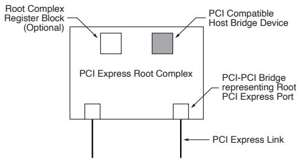

> **Figure 7-2.** PCI Express Switch Device Mapping
> 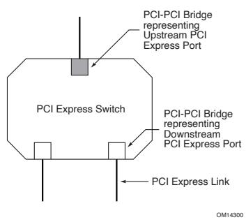

</div>


[⬆️ 返回目录](#-本章目录-table-of-contents)

---

<!-- 📄 Page 982 -->
---

<a id="sec-7-2"></a>
## 7.2 PCI Express Configuration Mechanisms § | 7.2 PCI Express 配置机制 §

<table>
<thead>
<tr>
<th width="50%">🇬🇧 English</th>
<th width="50%" style="background-color:#e8e8e8">🏆 中文</th>
</tr>
</thead>
<tbody>
<tr>
<td>

PCI Express extends the Configuration Space to 4096 bytes per Function as compared to 256 bytes allowed by [PCI]. PCI Express Configuration Space is divided into a PCI-compatible region, which consists of the first 256 bytes of a Function's Configuration Space, and a PCI Express Extended Configuration Space which consists of the remaining Configuration Space (see § Figure 7-3). The PCI-compatible Configuration Space can be accessed using either the mechanism defined in § Section 7.2.1 or § Section 7.2.2 . Accesses made using either access mechanism are equivalent. The PCI Express Extended Configuration Space can only be accessed by using the ECAM mechanism defined in § Section 7.2.2 .

> **Figure 7-3.** PCI Express Configuration Space Layout
> 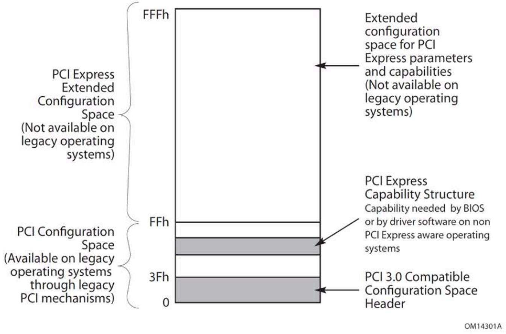

The PCI-compatible PCI Express Configuration Mechanism supports the PCI Configuration Space programming model defined in the [PCI]. By adhering to this model, systems incorporating PCI Express interfaces remain compliant with conventional PCI bus enumeration and configuration software.

In the same manner as PCI device Functions, PCI Express device Functions are required to provide a Configuration Space for software-driven initialization and configuration. Except for the differences described in this chapter, the PCI Express Configuration Space headers are organized to correspond with the format and behavior defined in the [PCI] (Section 6.1).

The PCI-compatible Configuration Access Mechanism uses the same Request format as the ECAM. For PCI-compatible Configuration Requests, the Extended Register Address field must be all zeros.

</td>
<td style="background-color:#e8e8e8">

相对于 [PCI] 所允许的每 Function 256 字节，PCI Express 将配置空间扩展到每 Function 4096 字节。PCI Express 配置空间分为一个 PCI 兼容区域 (由 Function 配置空间的前 256 字节组成) 和一个 PCI Express 扩展配置空间 (由剩余的配置空间组成) (见 § 图 7-3)。PCI 兼容配置空间可以使用 § 第 7.2.1 节或 § 第 7.2.2 节定义的任一机制访问。使用任一访问机制进行的访问是等效的。PCI Express 扩展配置空间只能使用 § 第 7.2.2 节定义的 ECAM 机制访问。

PCI 兼容的 PCI Express 配置机制支持 [PCI] 中定义的 PCI 配置空间编程模型。通过遵循该模型，集成 PCI Express 接口的系统能够保持与传统 PCI 总线枚举和配置软件的兼容性。

与 PCI 设备 Function 一样，PCI Express 设备 Function 也必须提供配置空间，以支持软件驱动的初始化和配置。除本章所述差异外，PCI Express 配置空间头的组织方式与 [PCI] (第 6.1 节) 中定义的格式和行为相对应。

PCI 兼容配置访问机制使用与 ECAM 相同的请求格式。对于 PCI 兼容配置请求，扩展寄存器地址 (Extended Register Address) 字段必须全部为零。


</td>
</tr>
</tbody>
</table>

[⬆️ 返回目录](#-本章目录-table-of-contents)

---

<!-- 📄 Page 983 -->
---

<a id="sec-7-2-1"></a>
## 7.2.1 PCI-compatible Configuration Mechanism § | 7.2.1 PCI 兼容配置机制 §


<div style="overflow-x: auto; max-width: 100%;">
<table>
<thead>
<tr>
<th width="50%">🇬🇧 English</th>
<th width="50%" style="background-color:#e8e8e8">🏆 中文</th>
</tr>
</thead>
<tbody>
<tr>
<td>

> **IMPLEMENTATION NOTE:**
> **CHANGING A DEVICE'S OS DRIVER BINDINGS & RESOURCES**
>
> Under certain circumstances, it is highly useful for a device to change one or more of its architected registers that help determine which OS-managed resources are allocated to the device and which OS drivers get bound to it.
>
> Here are two key examples:
>
> - A device might change the Class Code Register value in one or more of its Functions
> - Entire Functions might be added or removed after device firmware is updated
>
> Software can direct devices to change their architected registers through a variety of mechanisms outside the scope of this specification, including implementation specific ones and ones defined by external standards bodies. It is recommended that these mechanisms follow the guidance of this Implementation Note.
>
> If a device outside the RC has possibly been enumerated by the OS, it is strongly recommended that software use a mechanism directing the device to change its registers when coming out of a Conventional Reset. From a hardware perspective, this is similar to a hot remove followed by a hot add, providing a clean trigger point for architected registers to change in compliance with this specification, plus it guarantees the architected default hardware state for OS I/O infrastructure software and OS drivers to rely on. It is strongly recommended that software use OS-specific interfaces to perform the Conventional Reset and/or coordinate the reset and subsequent enumeration with the OS. If not feasible via OS-specific interfaces, software may be able to perform a Conventional Reset directly via several ways, including the Secondary Bus Reset bit or the Link Disable bit in the Downstream Port above the device.
>
> If software knows that a device outside the RC has not been enumerated by the OS, software may choose to direct the device to change its registers without undergoing a reset, thus avoiding unnecessary delay.

> **Footnote 149.** Future PCI Express Switches may be implemented as a single Switch device component (without the PCI-PCI Bridges) that is not limited by legacy compatibility requirements imposed by existing PCI software.

</td>
<td style="background-color:#e8e8e8">

> **实现注意事项 (IMPLEMENTATION NOTE):**
> **修改设备的 OS 驱动绑定与资源 (CHANGING A DEVICE'S OS DRIVER BINDINGS & RESOURCES)**
>
> 在某些情况下，允许设备修改其架构寄存器中的一个或多个 (这些寄存器有助于确定分配给设备的 OS 管理资源以及绑定到设备的 OS 驱动) 是非常有益的。
>
> 以下是两个关键示例:
>
> - 设备可能修改其一个或多个 Function 中的 Class Code 寄存器值
> - 在设备固件更新后，可能新增或移除整个 Function
>
> 软件可以通过本规范范围之外的多种机制来指示设备修改其架构寄存器，包括特定于实现的机制以及由外部标准机构定义的机制。建议这些机制遵循本实现注意事项的指导。
>
> 如果 RC 之外的设备可能已被 OS 枚举过，强烈建议软件使用一种机制，在设备退出常规复位 (Conventional Reset) 时指示设备修改其寄存器。从硬件的角度来看，这类似于先热移除再热添加的过程，提供了一个干净的触发点使架构寄存器按照本规范发生改变，并保证为 OS I/O 基础设施软件和 OS 驱动所依赖的架构默认硬件状态。强烈建议软件使用 OS 特定的接口来执行常规复位 (Conventional Reset)，或协调复位与随后的 OS 枚举。如果通过 OS 特定接口不可行，软件也可以通过多种方式直接执行常规复位 (Conventional Reset)，包括使用设备上方下游端口中的 Secondary Bus Reset 位或 Link Disable 位。
>
> 如果软件知道 RC 之外的设备尚未被 OS 枚举，则可以选择在不进行复位的情况下指示设备修改其寄存器，从而避免不必要的延迟。

> **脚注 149.** 未来的 PCI Express 交换机可以实现为单个交换机设备组件 (不含 PCI-PCI 桥)，不受现有 PCI 软件所强加的旧式兼容性要求的限制。

</td>
</tr>
</tbody>
</table>
</div>


[⬆️ 返回目录](#-本章目录-table-of-contents)

---

<!-- 📄 Page 984 -->
---

<a id="sec-7-2-2"></a>
## 7.2.2 PCI Express Enhanced Configuration Access Mechanism (ECAM) § | 7.2.2 PCI Express 增强配置访问机制 (ECAM) §

<table>
<thead>
<tr>
<th width="50%">🇬🇧 English</th>
<th width="50%" style="background-color:#e8e8e8">🏆 中文</th>
</tr>
</thead>
<tbody>
<tr>
<td>

For systems that are PC-compatible, or that do not implement a processor-architecture-specific firmware interface standard that allows access to the Configuration Space, the Enhanced Configuration Access Mechanism (ECAM) is required as defined in this section.

For systems that implement a processor-architecture-specific firmware interface standard that allows access to the Configuration Space, the operating system uses the standard firmware interface, and the hardware access mechanism defined in this section is not required.

In all systems, device drivers are encouraged to use the application programming interface (API) provided by the operating system to access the Configuration Space of its device and not directly use the hardware mechanism.

The ECAM utilizes a flat memory-mapped address space to access device configuration registers. In this case, the memory address determines the configuration register accessed and the memory data updates (for a write) or returns the contents of (for a read) the addressed register. The mapping from memory address space to PCI Express Configuration Space address is defined in § Table 7-1.

The size and base address for the range of memory addresses mapped to the Configuration Space are determined by the design of the host bridge and the firmware. They are reported by the firmware to the operating system in an implementation specific manner. The size of the range is determined by the number of bits that the host bridge maps to the Bus Number field in the configuration address. In § Table 7-1, this number of bits is represented as n, where 1 ≤ n ≤ 8.

A host bridge that maps n memory address bits to the Bus Number field supports Bus Numbers from 0 to 2^n -1, inclusive, and the base address of the range is aligned to a 2^(n+20)-byte memory address boundary. Any bits in the Bus Number field that are not mapped from memory address bits must be Clear.

For example, if a system maps three memory address bits to the Bus Number field, the following are all true:

- n = 3.
- Address bits A[63:23] are used for the base address, which is aligned to a 2^23-byte (8 MB) boundary.
- Address bits A[22:20] are mapped to bits [2:0] in the Bus Number field.
- Bits [7:3] in the Bus Number field are set to Clear.
- The system is capable of addressing Bus Numbers between 0 and 7, inclusive.

A minimum of one memory address bit (n = 1) must be mapped to the Bus Number field. Systems are encouraged to map additional memory address bits to the Bus Number field as needed to support a larger number of buses. Systems that support more than 4 GB of memory addresses are encouraged to map eight bits of memory address (n = 8) to the Bus Number field. Note that in systems that include multiple host bridges with different ranges of Bus Numbers assigned to each host bridge, the highest Bus Number for the system is limited by the number of bits mapped by the host bridge to which the highest bus number is assigned. In such a system, the highest Bus Number assigned to a particular host bridge would be greater, in most cases, than the number of buses assigned to that host bridge. In other words, for each host bridge, the number of bits mapped to the Bus Number field, n, must be large enough that the highest Bus Number assigned to each particular bridge must be less than or equal to 2^n -1 for that bridge.

In some processor architectures, it is possible to generate memory accesses that cannot be expressed in a single Configuration Request, for example due to crossing a DW aligned boundary, or because a locked access is used. A Root Complex implementation is not required to support the translation to Configuration Requests of such accesses.

</td>
<td style="background-color:#e8e8e8">

对于 PC 兼容的系统，或者未实现允许访问配置空间的处理器架构特定固件接口标准的系统，必须按本节定义实现增强配置访问机制 (ECAM)。

对于实现了允许访问配置空间的处理器架构特定固件接口标准的系统，操作系统使用该标准固件接口，本节定义的硬件访问机制不是必需的。

在所有系统中，鼓励设备驱动使用操作系统提供的应用程序编程接口 (API) 来访问其设备的配置空间，而不是直接使用硬件机制。

ECAM 利用平坦的内存映射地址空间来访问设备配置寄存器。在这种情况下，内存地址决定所访问的配置寄存器，内存数据 (对于写操作) 更新或 (对于读操作) 返回被寻址寄存器的内容。从内存地址空间到 PCI Express 配置空间地址的映射在 § 表 7-1 中定义。

映射到配置空间的内存地址范围的大小和基地址由主桥 (Host Bridge) 的设计和固件决定。它们以特定于实现的方式由固件报告给操作系统。范围的大小由主桥映射到配置地址中 Bus Number 字段的位数决定。在 § 表 7-1 中，此位数表示为 n，其中 1 ≤ n ≤ 8。

将 n 位内存地址映射到 Bus Number 字段的主桥支持 Bus Number 从 0 到 2^n - 1 (含)，并且该范围的基地址对齐到 2^(n+20) 字节的内存地址边界。Bus Number 字段中未从内存地址映射的任何位必须清零 (Clear)。

例如，如果系统将 3 位内存地址映射到 Bus Number 字段，则以下各项均成立:

- n = 3。
- 地址位 A[63:23] 用于基地址，该基地址对齐到 2^23 字节 (8 MB) 边界。
- 地址位 A[22:20] 映射到 Bus Number 字段中的 [2:0] 位。
- Bus Number 字段中的 [7:3] 位被设置为清零 (Clear)。
- 系统能够寻址 0 到 7 (含) 范围内的 Bus Number。

必须至少将一位内存地址 (n = 1) 映射到 Bus Number 字段。鼓励系统根据需要将更多的内存地址位映射到 Bus Number 字段以支持更多的总线数。支持超过 4 GB 内存地址的系统鼓励将 8 位内存地址 (n = 8) 映射到 Bus Number 字段。请注意，在包含多个主桥且为每个主桥分配不同 Bus Number 范围的系统中，系统的最高 Bus Number 受分配最高 Bus Number 的主桥所映射的位数限制。在这种情况下，分配给特定主桥的最高 Bus Number 在大多数情况下会大于分配给该主桥的总线数。换言之，对于每个主桥，映射到 Bus Number 字段的位数 n 必须足够大，使得分配给每个特定桥的最高 Bus Number 必须小于或等于该桥的 2^n - 1。

在某些处理器架构中，可能生成无法在单个配置请求中表达的内存访问，例如跨越 DW 对齐边界，或使用锁定访问。根复合体 (Root Complex) 的实现不需要支持将这些访问转换为配置请求。

</td>
</tr>
</tbody>
</table>

[⬆️ 返回目录](#-本章目录-table-of-contents)

---

<!-- 📄 Page 985 -->
---

**Table 7-1. Enhanced Configuration Address Mapping | 表 7-1. 增强配置地址映射**

| Memory Address | PCI Express Configuration Space |
|---|---|
| A[(20+n-1):20] | Bus Number (1 ≤ n ≤ 8) |
| A[19:15] | Device Number |
| A[14:12] | Function Number |
| A[11:8] | Extended Register Number |
| A[7:2] | Register Number |
| A[1:0] | Along with size of the access, used to generate Byte Enables |

> **Note:** for Requests targeting Extended Functions in an ARI Device, A[19:12] represents the (8-bit) Function Number, which replaces the (5-bit) Device Number and (3-bit) Function Number fields above.

> **Footnote 151.** This address refers to the byte-level address from a software point of view.

<table>
<thead>
<tr>
<th width="50%">🇬🇧 English</th>
<th width="50%" style="background-color:#e8e8e8">🏆 中文</th>
</tr>
</thead>
<tbody>
<tr>
<td>

The system hardware must provide a method for the system software to guarantee that a write transaction using the ECAM is completed by the completer before system software execution continues.

</td>
<td style="background-color:#e8e8e8">

系统硬件必须为系统软件提供一种方法，以保证在使用 ECAM 的写事务被完成端 (completer) 完成之后，系统软件才继续执行。

</td>
</tr>
</tbody>
</table>

[⬆️ 返回目录](#-本章目录-table-of-contents)

---

<!-- 📄 Page 986 -->
---


<div style="overflow-x: auto; max-width: 100%;">
<table>
<thead>
<tr>
<th width="50%">🇬🇧 English</th>
<th width="50%" style="background-color:#e8e8e8">🏆 中文</th>
</tr>
</thead>
<tbody>
<tr>
<td>

> **IMPLEMENTATION NOTE:**
> **ORDERING CONSIDERATIONS FOR THE ENHANCED CONFIGURATION ACCESS MECHANISM**
>
> The ECAM converts memory transactions from the host CPU into Configuration Requests on the PCI Express fabric. This conversion potentially creates ordering problems for the software, because writes to memory addresses are typically posted transactions but writes to Configuration Space are not posted on the PCI Express fabric.
>
> Generally, software does not know when a posted transaction is completed by the completer. In those cases in which the software must know that a posted transaction is completed by the completer, one technique commonly used by the software is to read the location that was just written. For systems that follow the PCI ordering rules throughout, the read transaction will not complete until the posted write is complete. However, since the PCI ordering rules allow non-posted write and read transactions to be reordered with respect to each other, the CPU must wait for a non-posted write to complete on the PCI Express fabric to be guaranteed that the transaction is completed by the completer.
>
> As an example, software may wish to configure a device Function's Base Address register by writing to the device using the ECAM, and then read a location in the memory-mapped range described by this Base Address register. If the software were to issue the memory-mapped read before the ECAM write was completed, it would be possible for the memory-mapped read to be re-ordered and arrive at the device before the Configuration Write Request, thus causing unpredictable results.
>
> To avoid this problem, processor and host bridge implementations must ensure that a method exists for the software to determine when the write using the ECAM is completed by the completer.
>
> This method may simply be that the processor itself recognizes a memory range dedicated for mapping ECAM accesses as unique, and treats accesses to this range in the same manner that it would treat other accesses that generate non-posted writes on the PCI Express fabric, i.e., that the transaction is not posted from the processor's viewpoint. An alternative mechanism is for the host bridge (rather than the processor) to recognize the memory-mapped Configuration Space accesses and not to indicate to the processor that this write has been accepted until the non-posted Configuration Transaction has completed on the PCI Express fabric. A third alternative would be for the processor and host bridge to post the memory-mapped write to the ECAM and for the host bridge to provide a separate register that the software can read to determine when the Configuration Write Request has completed on the PCI Express fabric. Other alternatives are also possible.

> **IMPLEMENTATION NOTE:**
> **GENERATING CONFIGURATION REQUESTS**
>
> Because Root Complex implementations are not required to support the generation of Configuration Requests from accesses that cross DW boundaries, or that use locked semantics, software should take care not to cause the generation of such accesses when using the memory-mapped ECAM unless it is known that the Root Complex implementation being used will support the translation.

</td>
<td style="background-color:#e8e8e8">

> **实现注意事项 (IMPLEMENTATION NOTE):**
> **增强配置访问机制的排序考量 (ORDERING CONSIDERATIONS FOR THE ENHANCED CONFIGURATION ACCESS MECHANISM)**
>
> ECAM 将来自主机 CPU 的内存事务转换为 PCI Express 互连上的配置请求。由于对内存地址的写入通常是 Posted 事务，而对配置空间的写入在 PCI Express 互连上不是 Posted 的，因此这种转换可能会给软件带来排序问题。
>
> 通常，软件并不知道 Posted 事务何时被完成端 (completer) 完成。在软件必须知道 Posted 事务已被完成端完成的场景中，软件常用的一种技术是读取刚刚写入的位置。对于完全遵循 PCI 排序规则的系统，读取事务将在 Posted 写入完成之前不会完成。然而，由于 PCI 排序规则允许非 Posted 写入和读取事务彼此之间重新排序，CPU 必须等待非 Posted 写入在 PCI Express 互连上完成，才能保证该事务已被完成端完成。
>
> 作为一个示例，软件可能希望通过使用 ECAM 向设备写入来配置设备 Function 的基址寄存器 (Base Address Register)，然后读取该基址寄存器所描述的内存映射范围内的某个位置。如果软件在 ECAM 写入完成之前发起内存映射读取，则内存映射读取可能被重新排序，并在配置写入请求 (Configuration Write Request) 之前到达设备，从而导致不可预测的结果。
>
> 为避免此问题，处理器和主桥 (Host Bridge) 的实现必须确保存在某种机制，使软件能够判断使用 ECAM 的写入何时被完成端 (completer) 完成。
>
> 一种简单的方法是处理器自身将专用于映射 ECAM 访问的内存范围识别为唯一范围，并以处理在 PCI Express 互连上生成非 Posted 写入的访问相同的方式处理对该范围的访问，即从处理器的视角来看该事务不是 Posted 的。另一种机制是由主桥 (而非处理器) 识别内存映射的配置空间访问，并且在该非 Posted 配置事务在 PCI Express 互连上完成之前不向处理器指示该写入已被接受。第三种替代方案是处理器和主桥将内存映射写入发布到 ECAM，然后主桥提供一个单独的寄存器，软件可以读取该寄存器以判断配置写入请求 (Configuration Write Request) 何时已在 PCI Express 互连上完成。当然也存在其他替代方案。
>
> **实现注意事项 (IMPLEMENTATION NOTE):**
> **生成配置请求 (GENERATING CONFIGURATION REQUESTS)**
>
> 由于根复合体 (Root Complex) 的实现不需要支持从跨越 DW 边界或使用锁定语义的访问生成配置请求，因此在使用内存映射 ECAM 时，软件应注意避免生成此类访问，除非已知所使用的根复合体实现支持此类转换。

</td>
</tr>
</tbody>
</table>
</div>


[⬆️ 返回目录](#-本章目录-table-of-contents)

---

<!-- 📄 Page 987 -->
---

<a id="sec-7-2-2-1"></a>
## 7.2.2.1 Host Bridge Requirements § | 7.2.2.1 主桥 (Host Bridge) 要求 §

<table>
<thead>
<tr>
<th width="50%">🇬🇧 English</th>
<th width="50%" style="background-color:#e8e8e8">🏆 中文</th>
</tr>
</thead>
<tbody>
<tr>
<td>

For those systems that implement the ECAM, the PCI Express Host Bridge is required to translate the memory-mapped PCI Express Configuration Space accesses from the host processor to PCI Express configuration transactions. The use of Host Bridge PCI class code is Reserved for backwards compatibility; Host Bridge Configuration Space is opaque to standard PCI Express software and may be implemented in an implementation specific manner that is compatible with PCI Host Bridge Type 0 Configuration Space. A PCI Express Host Bridge is not required to signal errors through a Root Complex Event Collector. This support is optional for PCI Express Host Bridges.

</td>
<td style="background-color:#e8e8e8">

对于实现 ECAM 的系统，PCI Express 主桥 (Host Bridge) 必须将来自主处理器的内存映射 PCI Express 配置空间访问转换为 PCI Express 配置事务。Host Bridge PCI class code 的使用被保留 (Reserved) 以保持向后兼容性;主桥配置空间对标准 PCI Express 软件是不透明的，可以以与 PCI Host Bridge Type 0 配置空间兼容的特定于实现的方式实现。PCI Express 主桥不需要通过根复合体事件收集器上报错误。该支持对 PCI Express 主桥是可选的。

</td>
</tr>
</tbody>
</table>

[⬆️ 返回目录](#-本章目录-table-of-contents)

---

<a id="sec-7-2-2-2"></a>
## 7.2.2.2 PCI Express Device Requirements § | 7.2.2.2 PCI Express 设备要求 §


<div style="overflow-x: auto; max-width: 100%;">
<table>
<thead>
<tr>
<th width="50%">🇬🇧 English</th>
<th width="50%" style="background-color:#e8e8e8">🏆 中文</th>
</tr>
</thead>
<tbody>
<tr>
<td>

Devices must support an additional 4 bits for decoding configuration register access, i.e., they must decode the Extended Register Address[3:0] field of the Configuration Request header.

> **IMPLEMENTATION NOTE:**
> **DEVICE-SPECIFIC REGISTERS IN CONFIGURATION SPACE**
>
> It is strongly recommended that PCI Express devices place no registers in Configuration Space other than those in headers or Capability structures architected by applicable PCI specifications.
>
> Device-specific registers that have legitimate reasons to be placed in Configuration Space (e.g., they need to be accessible before Memory Space is allocated) should be placed in a Vendor-Specific Capability structure (§ Section 7.9.4 ), a Vendor-Specific Extended Capability structure (§ Section 7.9.5 , or § Section 7.9.6 ).
>
> Device-specific registers accessed in the run-time environment by drivers should be placed in Memory Space that is allocated by one or more Base Address registers. Even though PCI-compatible or PCI Express Extended Configuration Space may have adequate room for run-time device-specific registers, placing them there is highly discouraged for the following reasons:
>
> - Not all Operating Systems permit drivers to access Configuration Space directly.
> - Some platforms provide access to Configuration Space only via firmware calls, which typically have substantially lower performance compared to mechanisms for accessing Memory Space.
> - Even on platforms that provide direct access to a memory-mapped PCI Express Enhanced Configuration Mechanism, performance for accessing Configuration Space will typically be significantly lower than for accessing Memory Space since:
>   - Configuration Reads and Writes must usually be DWORD or smaller in size,
>   - Configuration Writes are usually not posted by the platform, and
>   - Some platforms support only one outstanding Configuration Write at a time.

</td>
<td style="background-color:#e8e8e8">

设备必须额外支持 4 位用于解码配置寄存器访问，即必须解码配置请求头的 Extended Register Address[3:0] 字段。

> **实现注意事项 (IMPLEMENTATION NOTE):**
> **配置空间中的设备特定寄存器 (DEVICE-SPECIFIC REGISTERS IN CONFIGURATION SPACE)**
>
> 强烈建议 PCI Express 设备在配置空间中仅放置由适用 PCI 规范所架构的头或能力结构中的寄存器，不要放置其他寄存器。
>
> 出于合理原因需要放在配置空间中的设备特定寄存器 (例如需要在分配内存空间 (Memory Space) 之前可访问) 应放置在厂商特定能力结构 (§ 第 7.9.4 节)、厂商特定扩展能力结构 (§ 第 7.9.5 节 或 § 第 7.9.6 节) 中。
>
> 驱动在运行时访问的设备特定寄存器应放置在由一个或多个基址寄存器 (BAR) 分配的内存空间 (Memory Space) 中。尽管 PCI 兼容或 PCI Express 扩展配置空间可能为运行时设备特定寄存器提供足够的空间，但出于以下原因，强烈不鼓励将其放在配置空间中:
>
> - 并非所有操作系统都允许驱动直接访问配置空间。
> - 某些平台仅通过固件调用提供对配置空间的访问，与访问内存空间 (Memory Space) 的机制相比，性能通常显著较低。
> - 即使在提供对内存映射 PCI Express 增强配置机制直接访问的平台上，由于以下原因，访问配置空间的性能通常显著低于访问内存空间 (Memory Space):
>   - 配置读写的大小通常必须为 DWORD 或更小，
>   - 配置写入通常不被平台发布 (Posted)，
>   - 某些平台同时仅支持一次未完成的配置写入。

</td>
</tr>
</tbody>
</table>
</div>


[⬆️ 返回目录](#-本章目录-table-of-contents)

---

<!-- 📄 Page 988 -->
---

<a id="sec-7-2-3"></a>
## 7.2.3 Root Complex Register Block (RCRB) § | 7.2.3 根复合体寄存器块 (RCRB) §

<table>
<thead>
<tr>
<th width="50%">🇬🇧 English</th>
<th width="50%" style="background-color:#e8e8e8">🏆 中文</th>
</tr>
</thead>
<tbody>
<tr>
<td>

A Root Port or RCiEP may be associated with an optional 4096-byte block of memory mapped registers referred to as the Root Complex Register Block (RCRB). These registers are used in a manner similar to Configuration Space and can include PCI Express Extended Capabilities and other implementation specific registers that apply to the Root Complex. The structure of the RCRB is described in § Section 7.6.2 .

Multiple Root Ports or internal devices are permitted to be associated with the same RCRB. The RCRB memory-mapped registers must not reside in the same address space as the memory-mapped Configuration Space or Memory Space.

A Root Complex implementation is not required to support accesses to an RCRB that cross DWORD aligned boundaries or accesses that use locked semantics.

> **IMPLEMENTATION NOTE:**
> **ACCESSING ROOT COMPLEX REGISTER BLOCK**
>
> Because Root Complex implementations are not required to support accesses to a RCRB that cross DW boundaries, or that use locked semantics, software should take care not to cause the generation of such accesses when accessing a RCRB unless the Root Complex will support the access.

</td>
<td style="background-color:#e8e8e8">

根端口 (Root Port) 或 RCiEP 可以关联一个可选的 4096 字节内存映射寄存器块，称为根复合体寄存器块 (Root Complex Register Block, RCRB)。这些寄存器的使用方式与配置空间类似，可以包括适用于根复合体的 PCI Express 扩展能力 (Extended Capabilities) 和其他特定于实现的寄存器。RCRB 的结构在 § 第 7.6.2 节中描述。

允许将多个根端口 (Root Port) 或内部设备关联到同一个 RCRB。RCRB 内存映射寄存器不得驻留于与内存映射配置空间或内存空间 (Memory Space) 相同的地址空间中。

根复合体 (Root Complex) 的实现不需要支持对 RCRB 的跨 DWORD 对齐边界的访问或使用锁定语义的访问。

> **实现注意事项 (IMPLEMENTATION NOTE):**
> **访问根复合体寄存器块 (ACCESSING ROOT COMPLEX REGISTER BLOCK)**
>
> 由于根复合体 (Root Complex) 的实现不需要支持对 RCRB 的跨 DW 边界访问或使用锁定语义的访问，因此软件在访问 RCRB 时应注意避免生成此类访问，除非已知该根复合体支持此类访问。

</td>
</tr>
</tbody>
</table>

[⬆️ 返回目录](#-本章目录-table-of-contents)

---

<a id="sec-7-3"></a>
## 7.3 Configuration Transaction Rules § | 7.3 配置事务规则 §


<div style="overflow-x: auto; max-width: 100%;">
<table>
<thead>
<tr>
<th width="50%">🇬🇧 English</th>
<th width="50%" style="background-color:#e8e8e8">🏆 中文</th>
</tr>
</thead>
<tbody>
<tr>
<td>

With non-ARI Devices, PCI Express components are restricted to implementing a single Device Number on their primary interface (Upstream Port), but are permitted to implement up to eight independent Functions within that Device Number. Each internal Function is selected based on decoded address information that is provided as part of the address portion of Configuration Request packets.

Except when FPB Routing ID mechanisms are used (see § Section 6.26 ), Downstream Ports that do not have ARI Forwarding enabled must associate only Device 0 with the device attached to the Logical Bus representing the Link from the Port. Configuration Requests targeting the Bus Number associated with a Link specifying Device Number 0 are delivered to the device attached to the Link; Configuration Requests specifying all other Device Numbers (1-31) must be terminated by the Switch Downstream Port or the Root Port with an Unsupported Request Completion Status (equivalent to Master Abort in PCI).

> **IMPLEMENTATION NOTE:**
> **CONFIGURATION SPACE READ SIDE EFFECTS**
>
> During a read access, any observable interaction that occurs besides the desired value being returned is called a read side effect. System software that has no specific knowledge of the Function being accessed may issue read requests to anywhere within the Function's Configuration Space. It is highly undesirable that any such access has any read side effects. No such side effects are required in any of the Configuration Space registers defined in this specification. It is strongly recommended that any implementation of those registers, as well as any vendor-defined Configuration Space registers, be free of any read side effects.

</td>
<td style="background-color:#e8e8e8">

对于非 ARI 设备，PCI Express 组件在其主要接口 (上游端口 Upstream Port) 上仅限于实现单个设备号 (Device Number)，但允许在该设备号内实现最多八个独立 Function。每个内部 Function 基于配置请求包地址部分所提供的解码地址信息进行选择。

除非使用 FPB Routing ID 机制 (见 § 第 6.26 节)，否则未启用 ARI 转发 (ARI Forwarding) 的下游端口必须仅将设备 0 关联到连接到表示从该端口发出链路的逻辑总线的设备。针对与指定设备号 0 的链路相关联 Bus Number 的配置请求被传递给连接到该链路的设备;指定所有其他设备号 (1-31) 的配置请求必须由交换机下游端口 (Downstream Port) 或根端口 (Root Port) 以 Unsupported Request 完成状态 (相当于 PCI 中的 Master Abort) 终止。

> **实现注意事项 (IMPLEMENTATION NOTE):**
> **配置空间读取副作用 (CONFIGURATION SPACE READ SIDE EFFECTS)**
>
> 在读取访问期间，除返回期望值之外发生的任何可观察的交互称为读副作用 (read side effect)。对所访问的 Function 没有特定了解的系统软件可能向 Function 配置空间内的任何位置发起读请求。强烈不希望任何此类访问产生读副作用。本规范定义的任何配置空间寄存器都不需要此类副作用。强烈建议对这些寄存器的任何实现以及任何供应商定义的配置空间寄存器都不产生读副作用。

</td>
</tr>
</tbody>
</table>
</div>


[⬆️ 返回目录](#-本章目录-table-of-contents)

---

<!-- 📄 Page 988 -->
---

<a id="sec-7-3-1"></a>
## 7.3.1 Device Number § | 7.3.1 设备号 (Device Number) §

<table>
<thead>
<tr>
<th width="50%">🇬🇧 English</th>
<th width="50%" style="background-color:#e8e8e8">🏆 中文</th>
</tr>
</thead>
<tbody>
<tr>
<td></td>
<td style="background-color:#e8e8e8">

</td>
</tr>
</tbody>
</table>

[⬆️ 返回目录](#-本章目录-table-of-contents)

---

<!-- 📄 Page 989 -->
---

<a id="sec-7-3-1-cont"></a>
## 7.3.1 Device Number (continued) § | 7.3.1 设备号 (Device Number)（续）§


<div style="overflow-x: auto; max-width: 100%;">
<table>
<thead>
<tr>
<th width="50%">🇬🇧 English</th>
<th width="50%" style="background-color:#e8e8e8">🏆 中文</th>
</tr>
</thead>
<tbody>
<tr>
<td>

Non-ARI Devices must capture their assigned Device Number as discussed in § Section 2.2.6.2 . Non-ARI Devices must respond to all Type 0 Configuration Read Requests, regardless of the Device Number specified in the Request.

Switches, and components wishing to incorporate more than eight Functions at their Upstream Port, are permitted to implement one or more "virtual switches" represented by multiple Type 1 Configuration Space Headers (PCI-PCI Bridge) as illustrated in § Figure 7-2. These virtual switches serve to allow fan-out beyond eight Functions. FPB provides a "flattening" mechanism that, when enabled, causes the virtual bridges of the Downstream Ports to appear in configuration space at RID addresses following the RID of the Upstream Port (see § Section 6.26 ). Since Switch Downstream Ports are permitted to appear on any Device Number, in this case all address information fields (Bus, Device, and Function Numbers) must be completely decoded to access the correct register. Any Configuration Request targeting an unimplemented Bus, Device, or Function must return a Completion with Unsupported Request Completion Status.

With an ARI Device, its Device Number is implied to be 0 rather than specified by a field within an ID. The traditional 5-bit Device Number and 3-bit Function Number fields in its associated Routing IDs, Requester IDs, and Completer IDs are interpreted as a single 8-bit Function Number. See § Section 6.13 . Any Type 0 Configuration Request targeting an unimplemented Function in an ARI Device must be handled as an Unsupported Request.

If an ARI Downstream Port has ARI Forwarding enabled, the logic that determines when to turn a Type 1 Configuration Request into a Type 0 Configuration Request no longer enforces a restriction on the traditional Device Number field being 0.

The following section provides details of the Configuration Space addressing mechanism.

PCI Express Configuration Requests use the following addressing fields:

- **Destination Segment (Flit Mode only)** - Selects one of multiple Segments that may be implemented within a Root Complex. See § Section 2.2.1.2 for a list of Segment rules.
- **Bus Number** - PCI Express maps logical PCI Bus Numbers onto PCI Express Links such that PCI-compatible configuration software views the Configuration Space of a PCI Express Hierarchy as a PCI hierarchy including multiple bus segments.
- **Device Number** - Device Number association is discussed in § Section 7.3.1 and in § Section 6.26 . When an ARI Device is targeted and the Downstream Port immediately above it is enabled for ARI Forwarding, the Device Number is implied to be 0, and the traditional Device Number field is used instead as part of an 8-bit Function Number field. See § Section 6.13 .
- **Function Number** - PCI Express also supports Multi-Function Devices using the same discovery mechanism as PCI. A Multi-Function Device must fully decode the Function Number field. A single-Function Device MUST@FLIT also fully decode the Function Number field. With ARI Devices, discovery and enumeration of Extended Functions require ARI-aware software. See § Section 6.13 .
- **Extended Register Number and Register Number** - Specify the Configuration Space address of the register being accessed (concatenated such that the Extended Register Number forms the more significant bits).

For Endpoints, the following rules apply:

- If Configuration Request Type is 1,
  - and the TLP is not an IDE TLP

</td>
<td style="background-color:#e8e8e8">

非 ARI 设备必须捕获其所分配的设备号 (Device Number)，如 § 第 2.2.6.2 节所述。非 ARI 设备必须响应所有 Type 0 配置读请求，而与请求中指定的设备号无关。

交换机以及希望在其上游端口 (Upstream Port) 上合并超过八个 Function 的组件，允许实现一个或多个由多个 Type 1 配置空间头 (PCI-PCI 桥) 表示的"虚拟交换机 (virtual switch)"，如 § 图 7-2 所示。这些虚拟交换机用于允许扇出超过八个 Function。FPB 提供一种"扁平化 (flattening)"机制，当启用时，会使下游端口的虚拟桥在配置空间中出现在上游端口 RID 之后的 RID 地址处 (见 § 第 6.26 节)。由于允许交换机下游端口出现在任何设备号上，在这种情况下，必须完全解码所有地址信息字段 (总线、设备和 Function 号) 才能访问正确的寄存器。任何针对未实现的总线、设备或 Function 的配置请求必须返回具有 Unsupported Request 完成状态的完成报文。

对于 ARI 设备，其设备号隐含为 0，而不是由 ID 内的字段指定。其关联的路由 ID (Routing ID)、请求者 ID (Requester ID) 和完成者 ID (Completer ID) 中传统的 5 位设备号和 3 位 Function 号字段被解释为单个 8 位 Function 号。参见 § 第 6.13 节。任何针对 ARI 设备中未实现 Function 的 Type 0 配置请求都必须作为 Unsupported Request 处理。

如果 ARI 下游端口启用了 ARI 转发 (ARI Forwarding)，则在将 Type 1 配置请求转换为 Type 0 配置请求的逻辑中，不再强制要求传统设备号字段为 0。

下一节提供配置空间寻址机制的详细信息。

PCI Express 配置请求使用以下地址字段:

- **目标段 (Destination Segment, 仅 Flit 模式)** - 在根复合体内实现的多个段中选择一个。段规则列表见 § 第 2.2.1.2 节。
- **总线号 (Bus Number)** - PCI Express 将逻辑 PCI 总线号映射到 PCI Express 链路上，使得 PCI 兼容配置软件将 PCI Express 层级 (Hierarchy) 的配置空间视为包含多个总线段的 PCI 层级。
- **设备号 (Device Number)** - 设备号关联在 § 第 7.3.1 节和 § 第 6.26 节中讨论。当目标为 ARI 设备且其正上方的下游端口启用了 ARI 转发时，设备号隐含为 0，传统的设备号字段被用作 8 位 Function 号字段的一部分。参见 § 第 6.13 节。
- **Function 号 (Function Number)** - PCI Express 还支持使用与 PCI 相同的发现机制来支持多功能设备 (Multi-Function Device)。多功能设备必须完全解码 Function 号字段。单 Function 设备在 Flit 模式下 (MUST@FLIT) 也必须完全解码 Function 号字段。对于 ARI 设备，扩展 Function 的发现和枚举需要支持 ARI 的软件。参见 § 第 6.13 节。
- **扩展寄存器号 (Extended Register Number) 和寄存器号 (Register Number)** - 指定所访问寄存器的配置空间地址 (串联方式，扩展寄存器号作为更高有效位)。

对于端点 (Endpoint)，适用以下规则:

- 如果配置请求类型为 1,
  - 并且该 TLP 不是 IDE TLP

</td>
</tr>
</tbody>
</table>
</div>


[⬆️ 返回目录](#-本章目录-table-of-contents)

---

---

<a id="sec-7-3-2"></a>
## 7.3.2 Configuration Transaction Addressing | 配置事务寻址

<table>
<thead>
<tr>
<th width="50%">🇬🇧 English</th>
<th width="50%" style="background-color:#e8e8e8">🏆 中文</th>
</tr>
</thead>
<tbody>
<tr>
<td>

**Table 7-2 Register and Register Bit-Field Types**

The following table describes the various attributes that may be applied to PCI Express Configuration register fields. The attribute indicates whether the field can be Read, Written, or updated by hardware, and over what type of reset the field's value is preserved.

[continues below]

</td>
<td style="background-color:#e8e8e8">

**表 7-2 寄存器及寄存器位域类型**

下表描述了可应用于 PCI Express 配置寄存器域的各种属性。属性指明该域是否可被读取、写入或由硬件更新，以及在何种类型的复位期间该域的值会被保留。

[续下表]

</td>
</tr>
</tbody>
</table>

<table>
<thead>
<tr>
<th width="50%">🇬🇧 English</th>
<th width="50%" style="background-color:#e8e8e8">🏆 中文</th>
</tr>
</thead>
<tbody>
<tr>
<td>

**HwInit**

Hardware Initialized - Register bits are permitted, as an implementation option, to be hard-coded, initialized by system/device firmware, or initialized by hardware mechanisms such as pin strapping or nonvolatile storage. Initialization by system firmware is permitted only for system-integrated devices. Bits must be fixed in value and read-only after initialization. After Initialization, values are only permitted to change following Conventional Reset (see § Section 6.6.1 ) and subsequent re-initialization. HwInit register bits are not modified by an FLR.

</td>
<td style="background-color:#e8e8e8">

**HwInit**

硬件初始化 — 作为实现选项，寄存器位可被硬编码、由系统/设备固件初始化，或由硬件机制（如引脚配置 strap 或非易失性存储）初始化。仅系统集成设备允许由系统固件初始化。初始化后，这些位的值必须固定且为只读。初始化之后，值仅允许在常规复位（参见 § 6.6.1）后及随后的重新初始化过程中变更。HwInit 寄存器位不会被 FLR 修改。

</td>
</tr>
</tbody>
</table>


<div style="overflow-x: auto; max-width: 100%;">
<table>
<thead>
<tr>
<th width="50%">🇬🇧 English</th>
<th width="50%" style="background-color:#e8e8e8">🏆 中文</th>
</tr>
</thead>
<tbody>
<tr>
<td>

**RO**

Read-only - Register bits are read-only and cannot be altered by software. Where explicitly defined, these bits are used to reflect changing hardware state, and as a result bit values can be observed to change at run time. Register bit default values and bits that cannot change value at run time, are permitted to be hard-coded, initialized by system/device firmware, or initialized by hardware mechanisms such as pin strapping or nonvolatile storage. Initialization by system firmware is permitted only for system-integrated devices.

If the optional feature that would Set the bits is not implemented, the bits must be hardwired to Zero.

</td>
<td style="background-color:#e8e8e8">

**RO**

只读 — 寄存器位为只读，软件不能更改。在明确定义的位置，这些位用于反映变化的硬件状态，因此可以在运行时观察到其值变化。寄存器位默认值以及运行时不能变化的位可被硬编码、由系统/设备固件初始化，或由硬件机制（如引脚 strap 或非易失性存储）初始化。仅系统集成设备允许由系统固件初始化。

若用于置位这些位的可选特性未实现，则这些位必须硬连线为 0。

</td>
</tr>
</tbody>
</table>
</div>


<table>
<thead>
<tr>
<th width="50%">🇬🇧 English</th>
<th width="50%" style="background-color:#e8e8e8">🏆 中文</th>
</tr>
</thead>
<tbody>
<tr>
<td>

**RW**

Read-Write - Register bits are read-write and are permitted to be either Set or Cleared by software to the desired state. If the optional feature that is associated with the bits is not implemented, the bits are permitted to be hardwired to Zero.

</td>
<td style="background-color:#e8e8e8">

**RW**

读写 — 寄存器位为读写的，允许软件将其置位或清零到所需状态。若与这些位关联的可选特性未实现，则允许将这些位硬连线为 0。

</td>
</tr>
</tbody>
</table>

<table>
<thead>
<tr>
<th width="50%">🇬🇧 English</th>
<th width="50%" style="background-color:#e8e8e8">🏆 中文</th>
</tr>
</thead>
<tbody>
<tr>
<td>

**RW1C**

Write-1-to-clear status - Register bits indicate status when read. A Set bit indicates a status event which is Cleared by writing a 1b. Writing a 0b to RW1C bits has no effect.

If the optional feature that would Set the bit is not implemented, the bit must be read-only and hardwired to Zero.

</td>
<td style="background-color:#e8e8e8">

**RW1C**

写 1 清零状态位 — 寄存器位在读取时表示状态。置位的位表示状态事件，通过写入 1b 来清除。向 RW1C 位写入 0b 无效。

若用于置位该位的可选特性未实现，则该位必须为只读并硬连线为 0。

</td>
</tr>
</tbody>
</table>

[⬆️ 返回目录](#-本章目录-table-of-contents)

---

<a id="sec-7-3-3"></a>
## 7.3.3 Configuration Request Routing Rules | 配置请求路由规则


<div style="overflow-x: auto; max-width: 100%;">
<table>
<thead>
<tr>
<th width="50%">🇬🇧 English</th>
<th width="50%" style="background-color:#e8e8e8">🏆 中文</th>
</tr>
</thead>
<tbody>
<tr>
<td>

and it is targeting a Device's captured Bus Number (See § Section 9.2.1.2 for SR-IOV devices that consume multiple Bus numbers)

  - Follow the rules for handling Unsupported Requests

- If Configuration Request Type is 0, or if Configuration Request Type is 1 and the TLP is an IDE TLP associated with a Selective IDE Stream in the Secure state,

  - Determine if the Request addresses a valid local Configuration Space of an implemented Function
    - If so, process the Request
    - If not, follow rules for handling Unsupported Requests

For Root Ports, Switches, and PCI Express-PCI Bridges, the following rules apply:

- Propagation of Configuration Requests from Downstream to Upstream as well as peer-to-peer are not supported

  - Configuration Requests are initiated only by the Host Bridge, including those passed through the SFI CAM mechanism

- If Configuration Request Type is 0,

  - Determine if the Request addresses a valid local Configuration Space of an implemented Function
    - If so, process the Request
    - If not, follow rules for handling Unsupported Requests

- If Configuration Request Type is 1, apply the following tests, in sequence, to the Bus Number and Device Number fields:

  - If in the case of a PCI Express-PCI Bridge, equal to the Bus Number assigned to secondary PCI bus or, in the case of a Switch or Root Complex, equal to the Bus Number and decoded Device Numbers assigned to one of the Root (Root Complex) or Downstream Ports (Switch), or if required based on the FPB Routing ID mechanism,

    - Transform the Request to Type 0 by changing the value in the Type[4:0] field of the Request (see § Table 2-3) - all other fields of the Request remain unchanged
    - Forward the Request to that Downstream Port (or PCI bus, in the case of a PCI Express-PCI Bridge)

  - If not equal to the Bus Number of any of Downstream Ports or secondary PCI bus, but in the range of Bus Numbers assigned to either a Downstream Port or a secondary PCI bus, or if required based on the FPB Routing ID mechanism,

    - Forward the Request to that Downstream Port interface without modification

  - Else (none of the above)

    - The Request is invalid - follow the rules for handling Unsupported Requests

- PCI Express-PCI Bridges must terminate as Unsupported Requests any Configuration Requests for which the Extended Register Address field is non-zero that are directed towards a PCI bus that does not support Extended Configuration Space.

Note: This type of access is a consequence of a programming error.

Additional rule specific to Root Complexes:

- Configuration Requests addressing a Destination Segment and Bus Numbers assigned to devices within the Root Complex are processed by the Root Complex

  - The assignment of Segment Numbers and Bus Numbers to the devices within a Root Complex may be done in an implementation specific way.

</td>
<td style="background-color:#e8e8e8">

并且它针对的是设备已捕获的 Bus Number（关于占用多个 Bus 号的 SR-IOV 设备，参见 § 9.2.1.2）

  - 遵循处理不支持请求（Unsupported Requests）的规则

- 如果配置请求的类型为 0，或者配置请求的类型为 1 且该 TLP 是与处于 Secure 状态的 Selective IDE Stream 关联的 IDE TLP，

  - 判断该请求是否寻址到已实现功能（Function）的有效本地配置空间（Configuration Space）
    - 如果是，则处理该请求
    - 如果不是，则遵循处理不支持请求的规则

对于根端口（Root Ports）、交换机（Switches）和 PCI Express-PCI 桥（PCI Express-PCI Bridges），适用以下规则：

- 不支持将配置请求从下游（Downstream）传播到上游（Upstream），也不支持点对点传播

  - 配置请求仅由主桥（Host Bridge）发起，包括通过 SFI CAM 机制传递的请求

- 如果配置请求的类型为 0，

  - 判断该请求是否寻址到已实现功能的有效本地配置空间
    - 如果是，则处理该请求
    - 如果不是，则遵循处理不支持请求的规则

- 如果配置请求的类型为 1，则按顺序对 Bus Number 和 Device Number 字段应用以下测试：

  - 如果在 PCI Express-PCI 桥的情况下，等于分配给 secondary PCI 总线的 Bus Number；或者在交换机（Switch）或根复合体（Root Complex）的情况下，等于分配给某个根端口（根复合体）或下游端口（交换机）的 Bus Number 及已解码的 Device Number；或者根据 FPB Routing ID 机制所需，

    - 通过修改请求的 Type[4:0] 字段（参见 § 表 2-3）将请求转换为 Type 0 — 请求的其他字段保持不变
    - 将请求转发到该下游端口（或在 PCI Express-PCI 桥的情况下为 PCI 总线）

  - 如果不等于任何下游端口或 secondary PCI 总线的 Bus Number，但处于分配给某个下游端口或 secondary PCI 总线的 Bus Number 范围内；或者根据 FPB Routing ID 机制所需，

    - 不做修改地将请求转发到该下游端口接口

  - 否则（不符合上述任何情况）

    - 该请求无效 — 遵循处理不支持请求的规则

- 对于 Extended Register Address 字段非零且指向不支持扩展配置空间（Extended Configuration Space）的 PCI 总线的配置请求，PCI Express-PCI 桥必须将其作为不支持请求终止。

注：此类访问通常是编程错误所致。

根复合体（Root Complex）的特定附加规则：

- 寻址到根复合体内设备所分配的目标段（Destination Segment）和 Bus Number 的配置请求由根复合体处理

  - 根复合体内设备的段号（Segment Number）和 Bus Number 分配可以采用实现特定的方式。

</td>
</tr>
</tbody>
</table>
</div>


<!-- 📄 Page 990 -->
---

<table>
<thead>
<tr>
<th width="50%">🇬🇧 English</th>
<th width="50%" style="background-color:#e8e8e8">🏆 中文</th>
</tr>
</thead>
<tbody>
<tr>
<td>

For all types of devices:

Configuration Reads and Writes to unimplemented registers are not considered to be errors. Unless errors defined elsewhere in this specification are detected and need to be reported, such Requests must return a Completion with Successful Completion status, with reads returning a data value of all 0's and writes discarding the write data without effect.

All other Configuration Space addressing fields are decoded as described elsewhere in this specification.

PCI Special Cycles (see the [PCI] for details) are not directly supported by PCI Express. PCI Special Cycles may be directed to PCI bus segments behind PCI Express-PCI Bridges using Type 1 configuration cycles as described in the [PCI].

Configuration register fields are assigned one of the attributes described in § Table 7-2. All PCI Express components, with the exception of the Root Complex and system-integrated devices, initialize register fields to specified default values. Root Complexes and system-integrated devices initialize register fields as required by the firmware for a particular system implementation.

</td>
<td style="background-color:#e8e8e8">

对所有类型的设备：

对未实现寄存器的配置读和写不被视为错误。除非本规范其他位置定义的错误被检测到且需要报告，否则此类请求必须返回带有 Successful Completion 状态（成功完成状态）的完成报文（Completion），其中读取返回全 0 的数据值，写入则丢弃写入数据而不生效。

所有其他配置空间寻址字段按本规范其他位置的描述进行解码。

PCI Express 不直接支持 PCI Special Cycles（PCI 特殊周期，详见 [PCI]）。可以使用 [PCI] 中描述的 Type 1 配置周期，将 PCI Special Cycles 定向到 PCI Express-PCI 桥后面的 PCI 总线段。

配置寄存器字段被赋予 § 表 7-2 中描述的属性之一。除根复合体和系统集成设备外，所有 PCI Express 组件都按指定的默认值初始化寄存器字段。根复合体和系统集成设备根据特定系统实现的固件要求初始化寄存器字段。

</td>
</tr>
</tbody>
</table>


<div style="overflow-x: auto; max-width: 100%;">
<table>
<thead>
<tr>
<th width="50%">🇬🇧 English</th>
<th width="50%" style="background-color:#e8e8e8">🏆 中文</th>
</tr>
</thead>
<tbody>
<tr>
<td>

**Table 7-2 Register and Register Bit-Field Types**

| Register Attribute | Description |
|---|---|
| HwInit | Hardware Initialized - Register bits are permitted, as an implementation option, to be hard-coded, initialized by system/device firmware, or initialized by hardware mechanisms such as pin strapping or nonvolatile storage. Initialization by system firmware is permitted only for system-integrated devices. Bits must be fixed in value and read-only after initialization. After Initialization, values are only permitted to change following Conventional Reset (see § Section 6.6.1 ) and subsequent re-initialization. HwInit register bits are not modified by an FLR. |
| RO | Read-only - Register bits are read-only and cannot be altered by software. Where explicitly defined, these bits are used to reflect changing hardware state, and as a result bit values can be observed to change at run time. Register bit default values and bits that cannot change value at run time, are permitted to be hard-coded, initialized by system/device firmware, or initialized by hardware mechanisms such as pin strapping or nonvolatile storage. Initialization by system firmware is permitted only for system-integrated devices.<br><br>If the optional feature that would Set the bits is not implemented, the bits must be hardwired to Zero. |
| RW | Read-Write - Register bits are read-write and are permitted to be either Set or Cleared by software to the desired state. If the optional feature that is associated with the bits is not implemented, the bits are permitted to be hardwired to Zero. |
| RW1C | Write-1-to-clear status - Register bits indicate status when read. A Set bit indicates a status event which is Cleared by writing a 1b. Writing a 0b to RW1C bits has no effect.<br><br>If the optional feature that would Set the bit is not implemented, the bit must be read-only and hardwired to Zero. |

</td>
<td style="background-color:#e8e8e8">

**表 7-2 寄存器及寄存器位域类型**

| 寄存器属性 | 描述 |
|---|---|
| HwInit | 硬件初始化 — 作为实现选项，寄存器位可被硬编码、由系统/设备固件初始化，或由硬件机制（如引脚 strap 或非易失性存储）初始化。仅系统集成设备允许由系统固件初始化。初始化后，这些位的值必须固定且为只读。初始化之后，值仅允许在常规复位（参见 § 6.6.1）后及随后的重新初始化过程中变更。HwInit 寄存器位不会被 FLR 修改。 |
| RO | 只读 — 寄存器位为只读，软件不能更改。在明确定义的位置，这些位用于反映变化的硬件状态，因此可以在运行时观察到其值变化。寄存器位默认值以及运行时不能变化的位可被硬编码、由系统/设备固件初始化，或由硬件机制（如引脚 strap 或非易失性存储）初始化。仅系统集成设备允许由系统固件初始化。<br><br>若用于置位这些位的可选特性未实现，则这些位必须硬连线为 0。 |
| RW | 读写 — 寄存器位为读写的，允许软件将其置位或清零到所需状态。若与这些位关联的可选特性未实现，则允许将这些位硬连线为 0。 |
| RW1C | 写 1 清零状态位 — 寄存器位在读取时表示状态。置位的位表示状态事件，通过写入 1b 来清除。向 RW1C 位写入 0b 无效。<br><br>若用于置位该位的可选特性未实现，则该位必须为只读并硬连线为 0。 |

</td>
</tr>
</tbody>
</table>
</div>


<a id="sec-7-3-4"></a>
## 7.3.4 PCI Special Cycles | PCI 特殊周期

<table>
<thead>
<tr>
<th width="50%">🇬🇧 English</th>
<th width="50%" style="background-color:#e8e8e8">🏆 中文</th>
</tr>
</thead>
<tbody>
<tr>
<td>

PCI Special Cycles are not supported by PCI Express. Refer to § Section 7.3.3 for additional details.

</td>
<td style="background-color:#e8e8e8">

PCI Express 不支持 PCI Special Cycles。更多详细信息请参阅 § 7.3.3。

</td>
</tr>
</tbody>
</table>

<a id="sec-7-4"></a>
## 7.4 Configuration Register Types | 配置寄存器类型

<table>
<thead>
<tr>
<th width="50%">🇬🇧 English</th>
<th width="50%" style="background-color:#e8e8e8">🏆 中文</th>
</tr>
</thead>
<tbody>
<tr>
<td>

Configuration register fields are assigned one of the attributes described in § Table 7-2. All PCI Express components, with the exception of the Root Complex and system-integrated devices, initialize register fields to specified default values. Root Complexes and system-integrated devices initialize register fields as required by the firmware for a particular system implementation.

</td>
<td style="background-color:#e8e8e8">

配置寄存器字段被赋予 § 表 7-2 中描述的属性之一。除根复合体和系统集成设备外，所有 PCI Express 组件都按指定的默认值初始化寄存器字段。根复合体和系统集成设备根据特定系统实现的固件要求初始化寄存器字段。

</td>
</tr>
</tbody>
</table>

[⬆️ 返回目录](#-本章目录-table-of-contents)

---

<!-- 📄 Page 991 -->
---


<div style="overflow-x: auto; max-width: 100%;">
<table>
<thead>
<tr>
<th width="50%">🇬🇧 English</th>
<th width="50%" style="background-color:#e8e8e8">🏆 中文</th>
</tr>
</thead>
<tbody>
<tr>
<td>

| Register Attribute | Description |
|---|---|
| ROS | Sticky - Read-only - Register bits are read-only and cannot be altered by software. If the optional feature that would Set the bit is not implemented, the bit is hardwired to Zero. Bits are neither initialized nor modified by hot reset or FLR. Where noted, devices that consume auxiliary power must preserve sticky register bit values when auxiliary power consumption (via either Aux Power PM Enable or PME_En) is enabled. In these cases, register bits are neither initialized nor modified by Hot, Warm, or Cold Reset (see § Section 6.6 ). |
| RWS | Sticky - Read-Write - Register bits are read-write and are Set or Cleared by software to the desired state. Bits are neither initialized nor modified by hot reset or FLR.<br><br>If the optional feature that is associated with the bits is not implemented, the bits are permitted to be hardwired to Zero.<br><br>Where noted, devices that consume auxiliary power must preserve sticky register bit values when auxiliary power consumption (via either Aux Power PM Enable or PME_En) is enabled. In these cases, register bits are neither initialized nor modified by Hot, Warm, or Cold Reset (see § Section 6.6 ). |
| RW1CS | Sticky - Write-1-to-clear status - Register bits indicate status when read. A Set bit indicates a status event which is Cleared by writing a 1b. Writing a 0b to RW1CS bits has no effect. If the optional feature that would Set the bit is not implemented, the bit is read-only and hardwired to Zero. Bits are neither initialized nor modified by hot reset or FLR.<br><br>Where noted, devices that consume auxiliary power must preserve sticky register bit values when auxiliary power consumption (via either Aux Power PM Enable or PME_En) is enabled. In these cases, register bits are neither initialized nor modified by Hot, Warm, or Cold Reset (see § Section 6.6 ). |
| RsvdP | Reserved and Preserved - Reserved for future RW implementations. Register bits are read-only and must return zero when read. Software must preserve the value read for writes to bits. |
| RsvdZ | Reserved and Zero - Reserved for future RW1C implementations. Register bits are read-only and must return zero when read. Software must use 0b for writes to bits. |

For SR-IOV devices, many registers or fields in VFs are required to be reserved or hardwired to Zero. Before the Single Root I/O Virtualization and Sharing (SR-IOV) Specification was merged into the PCI Express Base Specification, the SR-IOV specification contained many tables summarizing requirements differences for PFs and VFs, relative to the Base specification. These tables contained dedicated columns for PF attributes and VF attributes, though there were relatively few differences for PF attributes.

To provide a clear, consolidated, and concise indication of PF and VF attribute differences from other Function types, this specification eliminated most of those tables. Instead, special field types from the following table indicate VF attribute differences, and any additional attribute or semantic differences with PFs and VFs are covered within the register description column or elsewhere.

</td>
<td style="background-color:#e8e8e8">

| 寄存器属性 | 描述 |
|---|---|
| ROS | Sticky（粘性）— 只读 — 寄存器位为只读，软件不能更改。若用于置位该位的可选特性未实现，则该位硬连线为 0。这些位既不会被热复位（Hot Reset）初始化或修改，也不会被 FLR 修改。如有注明，消耗辅助电源的设备在启用辅助电源消耗（通过 Aux Power PM Enable 或 PME_En）时必须保留粘性寄存器位的值。在这种情况下，寄存器位既不会被热复位（Hot Reset）、温复位（Warm Reset）也不会被冷复位（Cold Reset）初始化或修改（参见 § 6.6）。 |
| RWS | Sticky（粘性）— 读写 — 寄存器位为读写的，可由软件置位或清零到所需状态。这些位既不会被热复位初始化或修改，也不会被 FLR 修改。<br><br>若与这些位关联的可选特性未实现，则允许将这些位硬连线为 0。<br><br>如有注明，消耗辅助电源的设备在启用辅助电源消耗（通过 Aux Power PM Enable 或 PME_En）时必须保留粘性寄存器位的值。在这种情况下，寄存器位既不会被热复位、温复位也不会被冷复位初始化或修改（参见 § 6.6）。 |
| RW1CS | Sticky（粘性）— 写 1 清零状态位 — 寄存器位在读取时表示状态。置位的位表示状态事件，通过写入 1b 来清除。向 RW1CS 位写入 0b 无效。若用于置位该位的可选特性未实现，则该位为只读并硬连线为 0。这些位既不会被热复位初始化或修改，也不会被 FLR 修改。<br><br>如有注明，消耗辅助电源的设备在启用辅助电源消耗（通过 Aux Power PM Enable 或 PME_En）时必须保留粘性寄存器位的值。在这种情况下，寄存器位既不会被热复位、温复位也不会被冷复位初始化或修改（参见 § 6.6）。 |
| RsvdP | 保留并保持 — 为未来的 RW 实现保留。寄存器位为只读，读取时必须返回零。软件必须在写入这些位时保留读取的值。 |
| RsvdZ | 保留并为零 — 为未来的 RW1C 实现保留。寄存器位为只读，读取时必须返回零。软件必须对写入使用 0b。 |

对于 SR-IOV 设备，VF 中的许多寄存器或域要求被保留或硬连线为 0。在 Single Root I/O Virtualization and Sharing（SR-IOV，单根 I/O 虚拟化）规范合并到 PCI Express 基础规范之前，SR-IOV 规范包含许多表，汇总了相对于基础规范 PF 和 VF 的要求差异。这些表为 PF 属性和 VF 属性设置了专用的列，尽管 PF 属性的差异相对较少。

为了清晰、合并且简洁地指示 PF 和 VF 与其他功能类型之间的属性差异，本规范删除了大部分此类表格。取而代之，下表中的特殊字段类型指示 VF 的属性差异，与 PF 和 VF 的任何其他属性或语义差异在寄存器描述列或其他位置中说明。

</td>
</tr>
</tbody>
</table>
</div>


[⬆️ 返回目录](#-本章目录-table-of-contents)

---

<a id="sec-7-5"></a>
## 7.5 PCI and PCIe Capabilities Required by the Base Spec for all Ports | 基础规范要求所有端口支持的 PCI 和 PCIe 能力

<table>
<thead>
<tr>
<th width="50%">🇬🇧 English</th>
<th width="50%" style="background-color:#e8e8e8">🏆 中文</th>
</tr>
</thead>
<tbody>
<tr>
<td>

This section describes the PCI and PCI Express capabilities required by the Base Specification for all Ports.

</td>
<td style="background-color:#e8e8e8">

本节介绍基础规范要求所有端口支持的 PCI 和 PCI Express 能力。

</td>
</tr>
</tbody>
</table>

<a id="sec-7-5-1"></a>
## 7.5.1 PCI-Compatible Configuration Registers | PCI 兼容配置寄存器


<div style="overflow-x: auto; max-width: 100%;">
<table>
<thead>
<tr>
<th width="50%">🇬🇧 English</th>
<th width="50%" style="background-color:#e8e8e8">🏆 中文</th>
</tr>
</thead>
<tbody>
<tr>
<td>

The first 256 bytes of a Function's Configuration Space form the PCI-compatible region. This region completely aliases the conventional PCI Configuration Space of the Function. Legacy PCI devices can also be accessed with the ECAM without requiring any modifications to the device hardware or device driver software.

Layout of the Configuration Space and format of individual configuration registers are depicted following the little-endian convention.

§ Figure 7-4 details allocation for common register fields of Type 0 and Type 1 Configuration Space Headers for PCI Express Device Functions. Fields labeled Type Specific vary between different Configuration Space header types.

</td>
<td style="background-color:#e8e8e8">

功能配置空间（Configuration Space）的前 256 字节构成 PCI 兼容区域（PCI-Compatible region）。该区域完整映射了该功能的传统 PCI 配置空间。传统 PCI 设备也可以使用 ECAM 访问，无需修改设备硬件或设备驱动程序软件。

配置空间的布局和各个配置寄存器的格式按小端字节序（little-endian）约定进行描述。

§ 图 7-4 详细说明了 PCI Express 设备功能的 Type 0 和 Type 1 配置空间头（Configuration Space Header）的公共寄存器字段分配。标记为 Type Specific（类型相关）的字段在不同的配置空间头类型之间有所不同。

</td>
</tr>
</tbody>
</table>
</div>


>>> **Figure 7-4.** Common Configuration Space Header
>>> 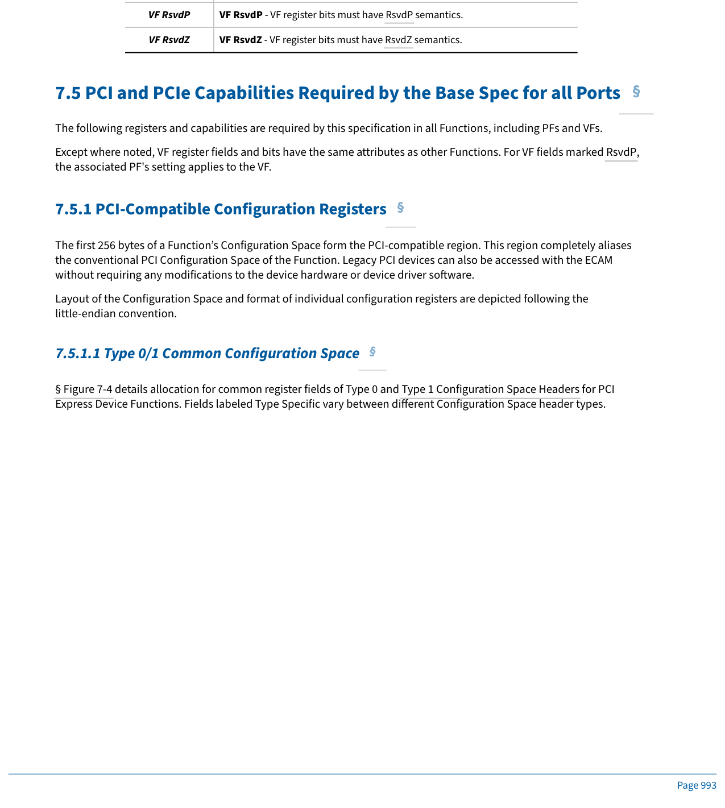

<a id="sec-7-5-1-1"></a>
## 7.5.1.1 Type 0/1 Common Configuration Space | Type 0/1 公共配置空间

<table>
<thead>
<tr>
<th width="50%">🇬🇧 English</th>
<th width="50%" style="background-color:#e8e8e8">🏆 中文</th>
</tr>
</thead>
<tbody>
<tr>
<td>

These registers are defined for both Type 0 and Type 1 Configuration Space Headers. The PCI Express-specific interpretation of these registers is defined in this section.

</td>
<td style="background-color:#e8e8e8">

这些寄存器为 Type 0 和 Type 1 配置空间头共同定义。这些寄存器的 PCI Express 特定解释在本节中定义。

</td>
</tr>
</tbody>
</table>

>>> **Figure 7-4.** Common Configuration Space Header (公共配置空间头)
>>> 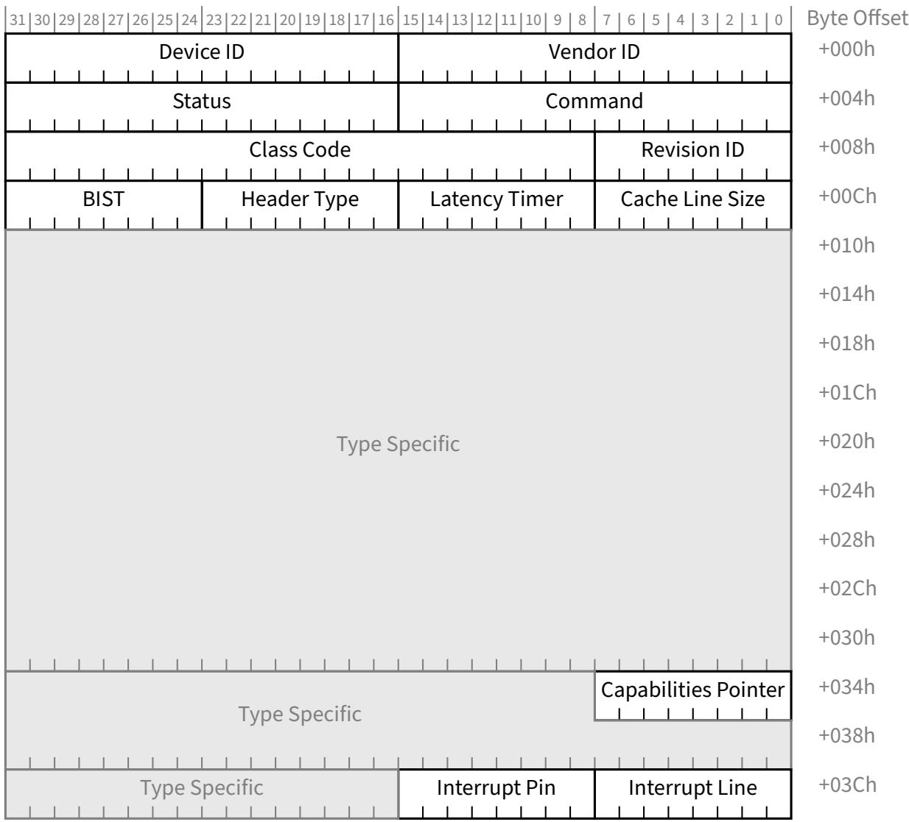

[⬆️ 返回目录](#-本章目录-table-of-contents)

---

<a id="sec-7-5-1-1-1"></a>
## 7.5.1.1.1 Vendor ID Register (Offset 00h) | Vendor ID 寄存器（偏移 00h）


<div style="overflow-x: auto; max-width: 100%;">
<table>
<thead>
<tr>
<th width="50%">🇬🇧 English</th>
<th width="50%" style="background-color:#e8e8e8">🏆 中文</th>
</tr>
</thead>
<tbody>
<tr>
<td>

For non-VFs, the Vendor ID register is HwInit and the value in this register identifies the manufacturer of the Function. In keeping with PCI-SIG procedures, valid vendor identifiers must be allocated by the PCI-SIG to ensure uniqueness. Each vendor must have at least one Vendor ID. It is recommended that software read the Vendor ID register to determine if a Function is present, where a value of FFFFh indicates that no Function is present.

For VFs, this field must return FFFFh when read. VI software should return the Vendor ID value from the associated PF as the Vendor ID value for the VF.

</td>
<td style="background-color:#e8e8e8">

对于非 VF，Vendor ID 寄存器为 HwInit，其值标识该功能的制造商。根据 PCI-SIG 的流程，有效的供应商标识符必须由 PCI-SIG 分配以确保唯一性。每个供应商必须至少拥有一个 Vendor ID。建议软件读取 Vendor ID 寄存器以确定功能是否存在，其中 FFFFh 的值表示不存在功能。

对于 VF，读取该字段时必须返回 FFFFh。VI 软件应返回来自关联 PF 的 Vendor ID 值作为 VF 的 Vendor ID 值。

</td>
</tr>
</tbody>
</table>
</div>


<!-- 📄 Page 995 -->
---

<a id="sec-7-5-1-1-2"></a>
## 7.5.1.1.2 Device ID Register (Offset 02h) | Device ID 寄存器（偏移 02h）

<table>
<thead>
<tr>
<th width="50%">🇬🇧 English</th>
<th width="50%" style="background-color:#e8e8e8">🏆 中文</th>
</tr>
</thead>
<tbody>
<tr>
<td>

For non-VFs, the Device ID register is HwInit and the value in this register identifies the particular Function. The Device ID must be allocated by the vendor. The Device ID, in conjunction with the Vendor ID and Revision ID, are used as one mechanism for software to determine which driver should be loaded. The vendor must ensure that the chosen values do not result in the use of an incompatible device driver.

For VFs, this field must return FFFFh when read. VI software should return the VF Device ID (see § Section 9.3.3.11 ) value from the associated PF as the Device ID for the VF.

</td>
<td style="background-color:#e8e8e8">

对于非 VF，Device ID 寄存器为 HwInit，其值标识特定的功能。Device ID 必须由供应商分配。Device ID 与 Vendor ID 和 Revision ID 一起用作软件决定加载哪个驱动程序的机制之一。供应商必须确保所选值不会导致使用不兼容的设备驱动程序。

对于 VF，读取该字段时必须返回 FFFFh。VI 软件应返回来自关联 PF 的 VF Device ID 值（参见 § 9.3.3.11）作为 VF 的 Device ID。

</td>
</tr>
</tbody>
</table>

**IMPLEMENTATION NOTE: LEGACY PCI PROBING SOFTWARE**

Returning FFFFh for Device ID and Vendor ID values allows some legacy software to ignore VFs. See § Section 7.5.1.1.1 .

**实现说明：传统 PCI 探测软件**

为 Device ID 和 Vendor ID 返回 FFFFh 允许某些传统软件忽略 VF。参见 § 7.5.1.1.1。

<a id="sec-7-5-1-1-3"></a>
## 7.5.1.1.3 Command Register (Offset 04h) | Command 寄存器（偏移 04h）

<table>
<thead>
<tr>
<th width="50%">🇬🇧 English</th>
<th width="50%" style="background-color:#e8e8e8">🏆 中文</th>
</tr>
</thead>
<tbody>
<tr>
<td>

§ Table 7-4 defines the Command Register and the layout of the register is shown in § Figure 7-5. Individual bits in the Command Register may or may not be implemented depending on the feature set supported by the Function. For PCI Express to PCI/PCI-X Bridges, refer to the [PCIe-to-PCI-PCI-X-Bridge] for requirements for this register.

</td>
<td style="background-color:#e8e8e8">

§ 表 7-4 定义了 Command 寄存器，其布局如 § 图 7-5 所示。Command 寄存器中的各个位是否实现取决于该功能支持的特性集。对于 PCI Express 到 PCI/PCI-X 桥，请参阅 [PCIe-to-PCI-PCI-X-Bridge] 以了解此寄存器的要求。

</td>
</tr>
</tbody>
</table>

>>> **Figure 7-5.** Command Register (Command 寄存器)
>>> 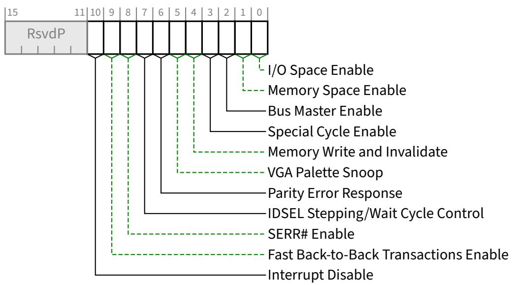

[⬆️ 返回目录](#-本章目录-table-of-contents)

---


<div style="overflow-x: auto; max-width: 100%;">
<table>
<thead>
<tr>
<th width="50%">🇬🇧 English</th>
<th width="50%" style="background-color:#e8e8e8">🏆 中文</th>
</tr>
</thead>
<tbody>
<tr>
<td>

**Table 7-4 Command Register**

| Bit Location | Register Description | Attributes |
|---|---|---|
| 0 | I/O Space Enable - Controls a Function's response to I/O Space accesses. When this bit is Clear, all received I/O accesses are caused to be handled as Unsupported Requests. When this bit is Set, the Function is enabled to decode the address and further process I/O Space accesses. For a Function with a Type 1 Configuration Space Header, this bit controls the response to I/O Space accesses received on its Primary Side.<br><br>Default value of this bit is 0b.<br><br>This bit is permitted to be hardwired to Zero if a Function does not support I/O Space accesses.<br><br>This bit does not apply to VFs and must be hardwired to Zero. | RW<br>VF ROZ |
| 1 | Memory Space Enable - Controls a Function's response to Memory Space accesses. When this bit is Clear, all received Memory Space accesses are caused to be handled as Unsupported Requests. When this bit is Set, the Function is enabled to decode the address and further process Memory Space accesses. For a Function with a Type 1 Configuration Space Header, this bit controls the response to Memory Space accesses received on its Primary Side.<br><br>Default value of this bit is 0b.<br><br>This bit is permitted to be hardwired to 0b if a Function does not support Memory Space accesses.<br><br>This bit does not apply to VFs and must be hardwired to Zero. VF Memory Space is controlled by the VF MSE bit in the SR-IOV Control Register. | RW<br>VF ROZ |
| 2 | Bus Master Enable - Controls the ability of a Function to issue Memory and I/O Read/Write Requests, and the ability of a Port to forward Memory and I/O Read/Write Requests in the Upstream direction<br><br>• Functions with a Type 0 Configuration Space Header:<br>When this bit is Set, the Function is allowed to issue Memory or I/O Requests.<br>When this bit is Clear, the Function is not allowed to issue any Memory or I/O Requests.<br>Note that as MSI/MSI-X interrupt Messages are in-band memory writes, setting the Bus Master Enable bit to 0b disables MSI/MSI-X interrupt Messages as well.<br>Transactions for a VF that has its Bus Master Enable Set must not be blocked by transactions for VFs that have their Bus Master Enable Cleared.<br>Requests other than Memory or I/O Requests are not controlled by this bit.<br>Default value of this bit is 0b.<br>This bit is hardwired to 0b if a Function does not generate Memory or I/O Requests.<br>• Functions with a Type 1 Configurations Space Header:<br>This bit controls the initiating of and the forwarding of Memory or I/O Requests by a Port in the Upstream direction. When this bit is 0b, Memory and I/O Requests received at a Root Port or the Downstream side of a Switch Port must be handled as Unsupported Requests (UR), and for Non-Posted Requests a Completion with UR Completion Status must be returned. This bit does not affect forwarding of Completions in either the Upstream or Downstream direction.<br>The forwarding of Requests other than Memory or I/O Requests is not controlled by this bit.<br>Default value of this bit is 0b. | RW |
| 3 | Special Cycle Enable - This bit was originally described in the [PCI]. Its functionality does not apply to PCI Express and the bit must be hardwired to 0b. | RO |

</td>
<td style="background-color:#e8e8e8">

**表 7-4 Command 寄存器**

| 位位置 | 寄存器描述 | 属性 |
|---|---|---|
| 0 | I/O Space Enable（I/O 空间使能）— 控制功能对 I/O Space 访问的响应。当该位清零时，所有收到的 I/O 访问都将作为不支持请求处理。当该位置位时，功能被使能以解码地址并进一步处理 I/O Space 访问。对于 Type 1 配置空间头的功能，该位控制其 Primary 侧收到的 I/O Space 访问的响应。<br><br>此位的默认值为 0b。<br><br>如果功能不支持 I/O Space 访问，则允许将该位硬连线为 0。<br><br>该位不适用于 VF，必须硬连线为 0。 | RW<br>VF ROZ |
| 1 | Memory Space Enable（内存空间使能）— 控制功能对 Memory Space 访问的响应。当该位清零时，所有收到的 Memory Space 访问都将作为不支持请求处理。当该位置位时，功能被使能以解码地址并进一步处理 Memory Space 访问。对于 Type 1 配置空间头的功能，该位控制其 Primary 侧收到的 Memory Space 访问的响应。<br><br>此位的默认值为 0b。<br><br>如果功能不支持 Memory Space 访问，则允许将该位硬连线为 0b。<br><br>该位不适用于 VF，必须硬连线为 0。VF 内存空间由 SR-IOV Control 寄存器中的 VF MSE 位控制。 | RW<br>VF ROZ |
| 2 | Bus Master Enable（总线主控使能）— 控制功能发出 Memory 和 I/O 读/写请求的能力，以及端口在上游方向转发 Memory 和 I/O 读/写请求的能力<br><br>• Type 0 配置空间头的功能：<br>当该位置位时，允许该功能发出 Memory 或 I/O 请求。<br>当该位清零时，不允许该功能发出任何 Memory 或 I/O 请求。<br>请注意，由于 MSI/MSI-X 中断消息是带内内存写操作，将 Bus Master Enable 位置为 0b 也会禁用 MSI/MSI-X 中断消息。<br>Bus Master Enable 已置位的 VF 的事务不得被 Bus Master Enable 已清零的 VF 的事务阻塞。<br>Memory 或 I/O 请求以外的请求不受该位控制。<br>此位的默认值为 0b。<br>如果功能不生成 Memory 或 I/O 请求，则该位硬连线为 0b。<br>• Type 1 配置空间头的功能：<br>该位控制端口在上游方向发起和转发 Memory 或 I/O 请求。当该位为 0b 时，在根端口或交换机端口下游侧收到的 Memory 和 I/O 请求必须作为不支持请求（UR）处理，对于 Non-Posted 请求，必须返回带有 UR 完成状态的完成报文。该位不影响完成报文在上游或下游方向的转发。<br>Memory 或 I/O 请求以外的请求的转发不受该位控制。<br>此位的默认值为 0b。 | RW |
| 3 | Special Cycle Enable（特殊周期使能）— 该位最初在 [PCI] 中描述。其功能不适用于 PCI Express，该位必须硬连线为 0b。 | RO |

</td>
</tr>
</tbody>
</table>
</div>


<!-- 📄 Page 997 -->
---

<table>
<thead>
<tr>
<th width="50%">🇬🇧 English</th>
<th width="50%" style="background-color:#e8e8e8">🏆 中文</th>
</tr>
</thead>
<tbody>
<tr>
<td>

| Bit Location | Register Description | Attributes |
|---|---|---|
| 4 | Memory Write and Invalidate - This bit was originally described in the [PCI] and the [PCI-to-PCI-Bridge]. Its functionality does not apply to PCI Express and the bit must be hardwired to 0b. For PCI Express to PCI/PCI-X Bridges, refer to the [PCIe-to-PCI-PCI-X-Bridge] for requirements for this register. | RO |
| 5 | VGA Palette Snoop - This bit was originally described in the [PCI] and the [PCI-to-PCI-Bridge]. Its functionality does not apply to PCI Express and the bit must be hardwired to 0b. | RO |
| 6 | Parity Error Response - See § Section 7.5.1.1.14 .<br>This bit controls the logging of poisoned TLPs in the Master Data Parity Error bit in the Status Register.<br>An RCiEP that is not associated with a Root Complex Event Collector is permitted to hardwire this bit to 0b.<br>Default value of this bit is 0b. | RW<br>VF RsvdP |
| 7 | IDSEL Stepping/Wait Cycle Control - This bit was originally described in the [PCI]. Its functionality does not apply to PCI Express and the bit must be hardwired to 0b. | RO |
| 8 | SERR# Enable - See § Section 7.5.1.1.14 .<br>When Set, this bit enables reporting upstream of Non-fatal and Fatal errors detected by the Function.<br>Note that errors are reported if enabled either through this bit or through the PCI Express specific bits in the Device Control Register (see § Section 7.5.3.4 ).<br>In addition, for Functions with Type 1 Configuration Space Headers, this bit controls transmission by the primary interface of ERR_NONFATAL and ERR_FATAL error Messages forwarded from the secondary interface. This bit does not affect the transmission of forwarded ERR_COR messages.<br>An RCiEP that is not associated with a Root Complex Event Collector is permitted to hardwire this bit to 0b.<br>Default value of this bit is 0b. | RW<br>VF RsvdP |
| 9 | Fast Back-to-Back Transactions Enable - This bit was originally described in the [PCI]. Its functionality does not apply to PCI Express and the bit must be hardwired to 0b. | RO |
| 10 | Interrupt Disable - Controls the ability of a Function to generate INTx emulation interrupts. When Set, Functions are prevented from asserting INTx interrupts.<br>Any INTx emulation interrupts already asserted by the Function must be deasserted when this bit is Set.<br>As described in § Section 2.2.8.1 , INTx interrupts use virtual wires that must, if asserted, be deasserted using the appropriate Deassert_INTx message(s) when this bit is Set.<br>Only the INTx virtual wire interrupt(s) associated with the Function(s) for which this bit is Set are affected.<br>For Functions with a Type 0 Configuration Space Header that generate INTx interrupts, this bit is required. For Functions with a Type 0 Configuration Space Header that do not generate INTx interrupts, this bit is optional. If not implemented, this bit must be hardwired to 0b.<br>For Functions with a Type 1 Configuration Space Header that generate INTx interrupts on their own behalf, this bit is required. This bit has no effect on interrupts forwarded from the secondary side.<br>For Functions with a Type 1 Configuration Space Header that do not generate INTx interrupts on their own behalf this bit is optional. If not implemented, this bit must be hardwired to 0b.<br>Default value of this bit is 0b.<br>This bit does not apply to VFs and must be hardwired to Zero. | RW<br>VF ROZ |

</td>
<td style="background-color:#e8e8e8">

| 位位置 | 寄存器描述 | 属性 |
|---|---|---|
| 4 | Memory Write and Invalidate（内存写入无效）— 该位最初在 [PCI] 和 [PCI-to-PCI-Bridge] 中描述。其功能不适用于 PCI Express，该位必须硬连线为 0b。对于 PCI Express 到 PCI/PCI-X 桥，请参阅 [PCIe-to-PCI-PCI-X-Bridge] 以了解此寄存器的要求。 | RO |
| 5 | VGA Palette Snoop（VGA 调色板监听）— 该位最初在 [PCI] 和 [PCI-to-PCI-Bridge] 中描述。其功能不适用于 PCI Express，该位必须硬连线为 0b。 | RO |
| 6 | Parity Error Response（奇偶校验错误响应）— 参见 § 7.5.1.1.14。<br>该位控制将中毒 TLP（poisoned TLPs）记录到 Status 寄存器中的 Master Data Parity Error 位。<br>未与根复合体事件收集器（Root Complex Event Collector）关联的 RCiEP 允许将该位硬连线为 0b。<br>此位的默认值为 0b。 | RW<br>VF RsvdP |
| 7 | IDSEL Stepping/Wait Cycle Control（IDSEL 步进/等待周期控制）— 该位最初在 [PCI] 中描述。其功能不适用于 PCI Express，该位必须硬连线为 0b。 | RO |
| 8 | SERR# Enable（SERR# 使能）— 参见 § 7.5.1.1.14。<br>当置位时，该位使能该功能检测到的非致命错误和致命错误向上游报告。<br>请注意，无论通过此位还是通过 Device Control 寄存器（参见 § 7.5.3.4）中的 PCI Express 特定位启用，都会报告错误。<br>此外，对于 Type 1 配置空间头的功能，该位控制 primary 接口从 secondary 接口转发的 ERR_NONFATAL 和 ERR_FATAL 错误消息的传输。该位不影响转发的 ERR_COR 消息的传输。<br>未与根复合体事件收集器关联的 RCiEP 允许将该位硬连线为 0b。<br>此位的默认值为 0b。 | RW<br>VF RsvdP |
| 9 | Fast Back-to-Back Transactions Enable（快速背靠背事务使能）— 该位最初在 [PCI] 中描述。其功能不适用于 PCI Express，该位必须硬连线为 0b。 | RO |
| 10 | Interrupt Disable（中断禁用）— 控制功能生成 INTx 仿真中断的能力。当置位时，禁止功能断言 INTx 中断。<br>当该位置位时，功能已断言的所有 INTx 仿真中断必须撤销。<br>如 § 2.2.8.1 所述，INTx 中断使用虚拟线，如果已断言，则当该位置位时必须使用适当的 Deassert_INTx 消息撤销断言。<br>仅与该位置位的功能关联的 INTx 虚拟线中断受影响。<br>对于生成 INTx 中断的 Type 0 配置空间头的功能，该位是必需的。对于不生成 INTx 中断的 Type 0 配置空间头的功能，该位是可选的。如果未实现，该位必须硬连线为 0b。<br>对于代表自身生成 INTx 中断的 Type 1 配置空间头的功能，该位是必需的。该位对从 secondary 侧转发的中断没有影响。<br>对于不代表自身生成 INTx 中断的 Type 1 配置空间头的功能，该位是可选的。如果未实现，该位必须硬连线为 0b。<br>此位的默认值为 0b。<br>该位不适用于 VF，必须硬连线为 0。 | RW<br>VF ROZ |

</td>
</tr>
</tbody>
</table>

<!-- 📄 Page 998 -->
---

<a id="sec-7-5-1-1-4-2"></a>
## 7.5.1.1.4 Status Register (Offset 06h) | Status 寄存器（偏移 06h）

<table>
<thead>
<tr>
<th width="50%">🇬🇧 English</th>
<th width="50%" style="background-color:#e8e8e8">🏆 中文</th>
</tr>
</thead>
<tbody>
<tr>
<td>

§ Table 7-5 defines the Status Register and the layout of the register is shown in § Figure 7-6. Functions may not need to implement all bits, depending on the feature set supported by the Function. For PCI Express to PCI/PCI-X Bridges, refer to the [PCIe-to-PCI-PCI-X-Bridge] for requirements for this register.

</td>
<td style="background-color:#e8e8e8">

§ 表 7-5 定义了 Status 寄存器，其布局如 § 图 7-6 所示。功能可能不需要实现所有位，这取决于该功能支持的特性集。对于 PCI Express 到 PCI/PCI-X 桥，请参阅 [PCIe-to-PCI-PCI-X-Bridge] 以了解此寄存器的要求。

</td>
</tr>
</tbody>
</table>

>>> **Figure 7-6.** Status Register (Status 寄存器)
>>> 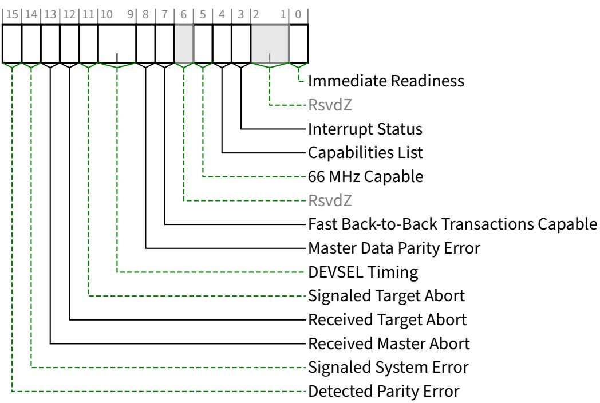

[⬆️ 返回目录](#-本章目录-table-of-contents)

---


<div style="overflow-x: auto; max-width: 100%;">
<table>
<thead>
<tr>
<th width="50%">🇬🇧 English</th>
<th width="50%" style="background-color:#e8e8e8">🏆 中文</th>
</tr>
</thead>
<tbody>
<tr>
<td>

**Table 7-5 Status Register**

| Bit Location | Register Description | Attributes |
|---|---|---|
| 0 | Immediate Readiness - This optional bit, when Set, indicates the Function is guaranteed to be ready to successfully complete valid Configuration Requests at any time. It is permitted for this indication to be based on implementation specific knowledge of how long it takes the host to become ready to issue Configuration Requests.<br>When this bit is Set, for accesses to this Function, software is exempt from all requirements to delay configuration accesses following any type of reset, including but not limited to the timing requirements defined in § Section 6.6 .<br>How this guarantee is established is beyond the scope of this document.<br>It is permitted that system software/firmware provide mechanisms that supersede the indication provided by this bit, however such software/firmware mechanisms are outside the scope of this specification. | RO |
| 3 | Interrupt Status - When Set, indicates that an INTx emulation interrupt is pending internally in the Function. | RO<br>VF ROZ |

</td>
<td style="background-color:#e8e8e8">

**表 7-5 Status 寄存器**

| 位位置 | 寄存器描述 | 属性 |
|---|---|---|
| 0 | Immediate Readiness（即时就绪）— 该可选位置位时，表示保证该功能随时准备好成功完成有效的配置请求。允许该指示基于关于主机需要多长时间才能准备好发出配置请求的实现特定知识。<br>当该位置位时，对于访问此功能，软件免于在任何类型的复位后延迟配置访问的所有要求，包括但不限于 § 6.6 中定义的时序要求。<br>如何建立此保证不在本文档的范围内。<br>允许系统软件/固件提供可替代此位指示的机制，但此类软件/固件机制不在本规范的范围内。 | RO |
| 3 | Interrupt Status（中断状态）— 当置位时，表示功能内部有 INTx 仿真中断挂起。 | RO<br>VF ROZ |

</td>
</tr>
</tbody>
</table>
</div>


[⬆️ 返回目录](#-本章目录-table-of-contents)

---

---

<a id="sec-7-5-1-1-4"></a>
## 7.5.1.1.4 Status Register (Offset 06h) | 状态寄存器（偏移量 06h）

<table>
<thead>
<tr>
<th width="50%">🇬🇧 English</th>
<th width="50%" style="background-color:#e8e8e8">🏆 中文</th>
</tr>
</thead>
<tbody>
<tr>
<td>

Note that INTx emulation interrupts forwarded by Functions with a Type 1 Configuration Space Header from the secondary side are not reflected in this bit.

Setting the Interrupt Disable bit has no effect on the state of this bit.

Functions that do not generate INTx interrupts are permitted to hardwire this bit to 0b.

Default value of this bit is 0b.

This bit does not apply to VFs and must be hardwired to Zero.

</td>
<td style="background-color:#e8e8e8">

注意:由次级侧 (secondary side) 拥有 Type 1 配置空间头 (Configuration Space Header) 的 Function 转发的 INTx 仿真中断 (INTx emulation interrupt) 不反映在该位中。

设置 Interrupt Disable 位对该位的状态没有影响。

不产生 INTx 中断的 Function 允许将该位硬连线 (hardwire) 为 0b。

该位的默认值为 0b。

该位不适用于 VF,必须硬连线为 0。

</td>
</tr>
</tbody>
</table>


<div style="overflow-x: auto; max-width: 100%;">
<table>
<thead>
<tr>
<th width="15%">Bit Location</th>
<th width="75%">Register Description</th>
<th width="10%">Attributes</th>
</tr>
</thead>
<tbody>
<tr>
<td>4</td>
<td>

**Capabilities List** - Indicates the presence of an Extended Capability list item. Since all PCI Express device Functions are required to implement the PCI Express Capability structure, this bit must be hardwired to 1b.

</td>
<td>RO</td>
</tr>
<tr>
<td>5</td>
<td>

**66 MHz Capable** - This bit was originally described in the [PCI]. Its functionality does not apply to PCI Express and the bit must be hardwired to 0b.

</td>
<td>RO</td>
</tr>
<tr>
<td>7</td>
<td>

**Fast Back-to-Back Transactions Capable** - This bit was originally described in the [PCI]. Its functionality does not apply to PCI Express and the bit must be hardwired to 0b.

</td>
<td>RO</td>
</tr>
<tr>
<td>8</td>
<td>

**Master Data Parity Error** - See § Section 7.5.1.1.14

This bit is Set by a Function with a Type 0 Configuration Space Header if the Parity Error Response bit in the Command Register is 1b and either of the following two conditions occurs:

- Function receives a Poisoned Completion
- Function transmits a Poisoned Request

This bit is Set by a Function with a Type 1 Configuration Space Header if the Parity Error Response bit in the Command Register is 1b and either of the following two conditions occurs:

- Port receives a Poisoned Completion going Downstream
- Port transmits a Poisoned Request Upstream

If the Parity Error Response bit is 0b, this bit is never Set.

Default value of this bit is 0b.

</td>
<td>RW1C</td>
</tr>
<tr>
<td>10:9</td>
<td>

**DEVSEL Timing** - This field was originally described in the [PCI]. Its functionality does not apply to PCI Express and the field must be hardwired to 00b.

</td>
<td>RO</td>
</tr>
<tr>
<td>11</td>
<td>

**Signaled Target Abort** - See § Section 7.5.1.1.14.

This bit is Set when a Function completes a Posted or Non-Posted Request as a Completer Abort error. This applies to a Function with a Type 1 Configuration Space Header when the Completer Abort was generated by its Primary Side.

Functions with a Type 0 Configuration Space Header that do not signal Completer Abort are permitted to hardwire this bit to 0b.

Default value of this bit is 0b.

</td>
<td>RW1C</td>
</tr>
<tr>
<td>12</td>
<td>

**Received Target Abort** - See § Section 7.5.1.1.14.

On a Function with a Type 0 Configuration Space Header, this bit is Set when a Requester receives a Completion with Completer Abort Completion Status.

On a Function with a Type 1 Configuration Space Header, this bit is Set when its Primary Side receives a Completion with Completer Abort Completion Status.

Functions with a Type 0 Configuration Space Header that do not make Non-Posted Requests on their own behalf are permitted to hardwire this bit to 0b.

</td>
<td>RW1C</td>
</tr>
</tbody>
</table>
</div>


<!-- 📄 Page 1000 -->
---

<table>
<thead>
<tr>
<th width="15%">Bit Location</th>
<th width="75%">Register Description</th>
<th width="10%">Attributes</th>
</tr>
</thead>
<tbody>
<tr>
<td></td>
<td>

Default value of this bit is 0b.

</td>
<td></td>
</tr>
<tr>
<td>13</td>
<td>

**Received Master Abort** - See § Section 7.5.1.1.14.

On a Function with a Type 0 Configuration Space Header, this bit is Set when a Requester receives a Completion with Unsupported Request Completion Status.

On a Function with a Type 1 Configuration Space Header, the bit is Set when its Primary Side receives a Completion with Unsupported Request Completion Status.

Functions with a Type 0 Configuration Space Header that do not make Non-Posted Requests on their own behalf are permitted to hardwire this bit to 0b.

Default value of this bit is 0b.

</td>
<td>RW1C</td>
</tr>
<tr>
<td>14</td>
<td>

**Signaled System Error** - See § Section 7.5.1.1.14.

This bit is Set when a Function sends an ERR_FATAL or ERR_NONFATAL Message, and the SERR# Enable bit in the Command Register is 1b.

Functions with a Type 0 Configuration Space Header that do not send ERR_FATAL or ERR_NONFATAL Messages are permitted to hardwire this bit to 0b.

Default value of this bit is 0b.

</td>
<td>RW1C</td>
</tr>
<tr>
<td>15</td>
<td>

**Detected Parity Error** - See § Section 7.5.1.1.14.

This bit is Set by a Function whenever it receives a Poisoned TLP, regardless of the state of the Parity Error Response bit in the Command Register. On a Function with a Type 1 Configuration Space Header, the bit is Set when the Poisoned TLP is received by its Primary Side.

Default value of this bit is 0b.

</td>
<td>RW1C</td>
</tr>
</tbody>
</table>

[⬆️ 返回目录](#-本章目录-table-of-contents)

---

<a id="sec-7-5-1-1-5"></a>
## 7.5.1.1.5 Revision ID Register (Offset 08h) | 修订版本 ID 寄存器（偏移量 08h）

<table>
<thead>
<tr>
<th width="50%">🇬🇧 English</th>
<th width="50%" style="background-color:#e8e8e8">🏆 中文</th>
</tr>
</thead>
<tbody>
<tr>
<td>

The Revision ID Register is HwInit and the value in this register specifies a Function specific revision identifier. The value is chosen by the vendor. Zero is an acceptable value. The Device ID, in conjunction with the Vendor ID and Revision ID, are used as one mechanism for software to determine which driver should be loaded. The vendor must ensure that the chosen values do not result in the use of an incompatible device driver.

The value reported in the VF may be different than the value reported in the PF.

</td>
<td style="background-color:#e8e8e8">

Revision ID 寄存器为 HwInit,该寄存器中的值用于指定 Function 特定的修订标识符。该值由厂商自行选择,零是允许的值。Device ID 与 Vendor ID、Revision ID 一起,作为软件确定应加载哪个驱动程序的机制之一。厂商必须确保所选值不会导致使用不兼容的设备驱动程序。

VF 中上报的值可能与 PF 中上报的值不同。

</td>
</tr>
</tbody>
</table>

[⬆️ 返回目录](#-本章目录-table-of-contents)

---

<a id="sec-7-5-1-1-6"></a>
## 7.5.1.1.6 Class Code Register (Offset 09h) | 类别代码寄存器（偏移量 09h）

<table>
<thead>
<tr>
<th width="50%">🇬🇧 English</th>
<th width="50%" style="background-color:#e8e8e8">🏆 中文</th>
</tr>
</thead>
<tbody>
<tr>
<td>

The Class Code Register is read-only and is used to identify the generic operation of the Function and, in some cases, a specific register level programming interface. The register layout is shown in § Figure 7-7 and described in § Table 7-6. Encodings for base class, sub-class, and programming interface are provided in the [PCI-Code-and-ID]. All unspecified encodings are Reserved.

The field in a PF and its associated VFs must return the same value when read.

</td>
<td style="background-color:#e8e8e8">

Class Code 寄存器为只读,用于标识 Function 的一般操作,在某些情况下还用于标识特定的寄存器级编程接口。寄存器布局如 § Figure 7-7 所示,并在 § Table 7-6 中进行了描述。基类 (base class)、子类 (sub-class) 和编程接口 (programming interface) 的编码在 [PCI-Code-and-ID] 中提供。所有未指定的编码均为保留 (Reserved)。

PF 及其关联 VF 中的字段在被读取时必须返回相同的值。

</td>
</tr>
</tbody>
</table>

<!-- 📄 Page 1001 -->
---

> **Figure 7-7. Class Code Register | 类别代码寄存器**
> 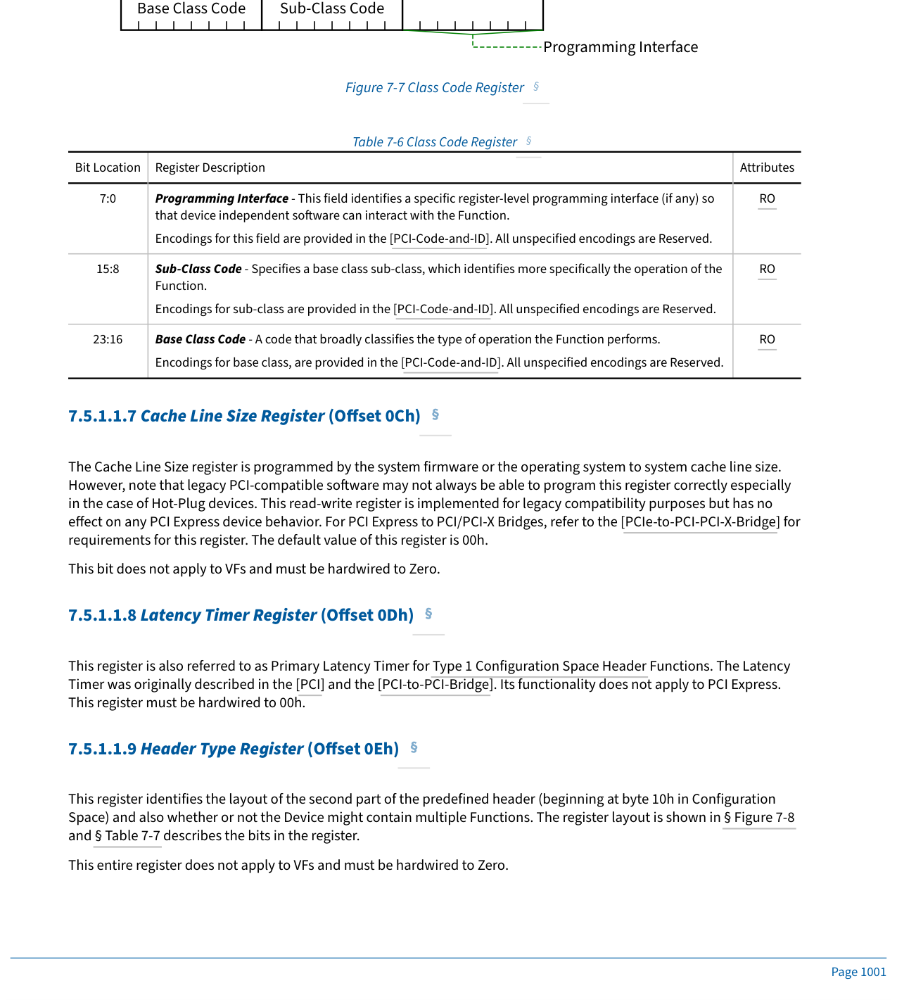

**Table 7-6. Class Code Register | 表 7-6 类别代码寄存器**

| Bit Location | Register Description | Attributes |
|--------------|----------------------|------------|
| 7:0 | **Programming Interface** - This field identifies a specific register-level programming interface (if any) so that device independent software can interact with the Function. Encodings for this field are provided in the [PCI-Code-and-ID]. All unspecified encodings are Reserved. | RO |
| 15:8 | **Sub-Class Code** - Specifies a base class sub-class, which identifies more specifically the operation of the Function. Encodings for sub-class are provided in the [PCI-Code-and-ID]. All unspecified encodings are Reserved. | RO |
| 23:16 | **Base Class Code** - A code that broadly classifies the type of operation the Function performs. Encodings for base class, are provided in the [PCI-Code-and-ID]. All unspecified encodings are Reserved. | RO |

**Table 7-6. Class Code Register | 表 7-6 类别代码寄存器（中文化）**

| Bit Location | Register Description（寄存器描述） | Attributes |
|--------------|----------------------|------------|
| 7:0 | **Programming Interface（编程接口）** - 该字段标识特定的寄存器级编程接口（如果有），以便与设备无关的软件可与该 Function 交互。该字段的编码在 [PCI-Code-and-ID] 中提供。所有未指定的编码均为保留。 | RO |
| 15:8 | **Sub-Class Code（子类代码）** - 指定基类下的子类，更具体地标识该 Function 的操作。子类的编码在 [PCI-Code-and-ID] 中提供。所有未指定的编码均为保留。 | RO |
| 23:16 | **Base Class Code（基类代码）** - 用于大致分类该 Function 所执行的操作类型。基类的编码在 [PCI-Code-and-ID] 中提供。所有未指定的编码均为保留。 | RO |

[⬆️ 返回目录](#-本章目录-table-of-contents)

---

<a id="sec-7-5-1-1-7"></a>
## 7.5.1.1.7 Cache Line Size Register (Offset 0Ch) | Cache 行大小寄存器（偏移量 0Ch）


<div style="overflow-x: auto; max-width: 100%;">
<table>
<thead>
<tr>
<th width="50%">🇬🇧 English</th>
<th width="50%" style="background-color:#e8e8e8">🏆 中文</th>
</tr>
</thead>
<tbody>
<tr>
<td>

The Cache Line Size register is programmed by the system firmware or the operating system to system cache line size. However, note that legacy PCI-compatible software may not always be able to program this register correctly especially in the case of Hot-Plug devices. This read-write register is implemented for legacy compatibility purposes but has no effect on any PCI Express device behavior. For PCI Express to PCI/PCI-X Bridges, refer to the [PCIe-to-PCI-PCI-X-Bridge] for requirements for this register. The default value of this register is 00h.

This bit does not apply to VFs and must be hardwired to Zero.

</td>
<td style="background-color:#e8e8e8">

Cache Line Size 寄存器由系统固件或操作系统编程为系统 cache 行大小。但请注意,旧版 PCI 兼容软件可能并不总是能够正确地对该寄存器进行编程,尤其是在热插拔 (Hot-Plug) 设备的情况下。该读写寄存器为遗留兼容性目的而实现,但对任何 PCI Express 设备行为均无影响。对于 PCI Express 到 PCI/PCI-X 的桥,请参阅 [PCIe-to-PCI-PCI-X-Bridge] 了解该寄存器的要求。该寄存器的默认值为 00h。

该位不适用于 VF,必须硬连线为 0。

</td>
</tr>
</tbody>
</table>
</div>


[⬆️ 返回目录](#-本章目录-table-of-contents)

---

<a id="sec-7-5-1-1-8"></a>
## 7.5.1.1.8 Latency Timer Register (Offset 0Dh) | 延迟定时器寄存器（偏移量 0Dh）

<table>
<thead>
<tr>
<th width="50%">🇬🇧 English</th>
<th width="50%" style="background-color:#e8e8e8">🏆 中文</th>
</tr>
</thead>
<tbody>
<tr>
<td>

This register is also referred to as Primary Latency Timer for Type 1 Configuration Space Header Functions. The Latency Timer was originally described in the [PCI] and the [PCI-to-PCI-Bridge]. Its functionality does not apply to PCI Express.

This register must be hardwired to 00h.

</td>
<td style="background-color:#e8e8e8">

对于 Type 1 配置空间头的 Function,该寄存器也称为主延迟定时器 (Primary Latency Timer)。Latency Timer 最初在 [PCI] 和 [PCI-to-PCI-Bridge] 中描述,其功能不适用于 PCI Express。

该寄存器必须硬连线为 00h。

</td>
</tr>
</tbody>
</table>

[⬆️ 返回目录](#-本章目录-table-of-contents)

---

<a id="sec-7-5-1-1-9"></a>
## 7.5.1.1.9 Header Type Register (Offset 0Eh) | 头类型寄存器（偏移量 0Eh）

<table>
<thead>
<tr>
<th width="50%">🇬🇧 English</th>
<th width="50%" style="background-color:#e8e8e8">🏆 中文</th>
</tr>
</thead>
<tbody>
<tr>
<td>

This register identifies the layout of the second part of the predefined header (beginning at byte 10h in Configuration Space) and also whether or not the Device might contain multiple Functions. The register layout is shown in § Figure 7-8 and § Table 7-7 describes the bits in the register.

This entire register does not apply to VFs and must be hardwired to Zero.

</td>
<td style="background-color:#e8e8e8">

该寄存器标识预定义头第二部分（从配置空间中的字节 10h 开始）的布局,以及该设备是否可能包含多个 Function。寄存器布局如 § Figure 7-8 所示,§ Table 7-7 描述了该寄存器中的各个位。

整个寄存器不适用于 VF,必须硬连线为 0。

</td>
</tr>
</tbody>
</table>

<!-- 📄 Page 1002 -->
---

> **Figure 7-8. Header Type Register | 头类型寄存器**
> 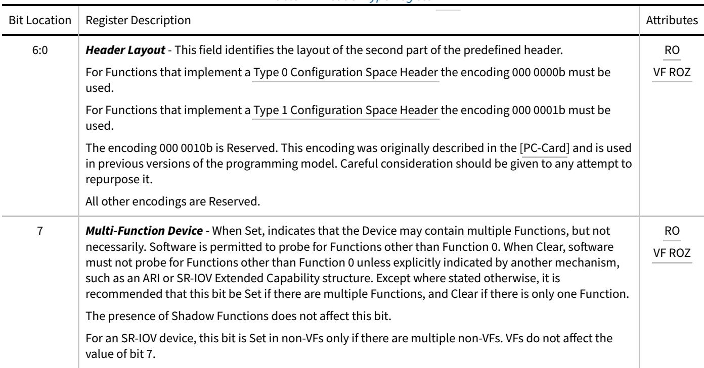

**Table 7-7. Header Type Register | 表 7-7 头类型寄存器**

| Bit Location | Register Description | Attributes |
|--------------|----------------------|------------|
| 6:0 | **Header Layout** - This field identifies the layout of the second part of the predefined header. For Functions that implement a Type 0 Configuration Space Header the encoding 000 0000b must be used. For Functions that implement a Type 1 Configuration Space Header the encoding 000 0001b must be used. The encoding 000 0010b is Reserved. This encoding was originally described in the [PC-Card] and is used in previous versions of the programming model. Careful consideration should be given to any attempt to repurpose it. All other encodings are Reserved. | RO / VF ROZ |
| 7 | **Multi-Function Device** - When Set, indicates that the Device may contain multiple Functions, but not necessarily. Software is permitted to probe for Functions other than Function 0. When Clear, software must not probe for Functions other than Function 0 unless explicitly indicated by another mechanism, such as an ARI or SR-IOV Extended Capability structure. Except where stated otherwise, it is recommended that this bit be Set if there are multiple Functions, and Clear if there is only one Function. The presence of Shadow Functions does not affect this bit. For an SR-IOV device, this bit is Set in non-VFs only if there are multiple non-VFs. VFs do not affect the value of bit 7. | RO / VF ROZ |

**Table 7-7. Header Type Register | 表 7-7 头类型寄存器（中文化）**

| Bit Location | Register Description（寄存器描述） | Attributes |
|--------------|----------------------|------------|
| 6:0 | **Header Layout（头布局）** - 该字段标识预定义头第二部分的布局。对于实现 Type 0 配置空间头的 Function,必须使用编码 000 0000b。对于实现 Type 1 配置空间头的 Function,必须使用编码 000 0001b。编码 000 0010b 为保留。该编码最初在 [PC-Card] 中描述,并用于早期版本的编程模型。任何重新定义其用途的尝试都应慎重考虑。所有其他编码均为保留。 | RO / VF ROZ |
| 7 | **Multi-Function Device（多功能设备）** - 置 1 时,表示该设备可能包含多个 Function,但并不一定包含多个。允许软件探测 Function 0 以外的其他 Function。清零时,除非有其他机制（例如 ARI 或 SR-IOV 扩展能力结构）明确指示,否则软件不得探测 Function 0 以外的其他 Function。除非另有说明,建议在存在多个 Function 时将该位置 1,仅有一个 Function 时清零。Shadow Function 的存在不影响该位。对于 SR-IOV 设备,仅当存在多个 non-VF 时,该位才会在 non-VF 中置 1。VF 不会影响位 7 的值。 | RO / VF ROZ |

[⬆️ 返回目录](#-本章目录-table-of-contents)

---

<a id="sec-7-5-1-1-10"></a>
## 7.5.1.1.10 BIST Register (Offset 0Fh) | BIST 寄存器（偏移量 0Fh）

<table>
<thead>
<tr>
<th width="50%">🇬🇧 English</th>
<th width="50%" style="background-color:#e8e8e8">🏆 中文</th>
</tr>
</thead>
<tbody>
<tr>
<td>

This register is used for control and status of BIST. Functions that do not support BIST must hardwire the register to 00h. VFs shall not support BIST. A Function whose BIST is invoked must not prevent normal operation of the PCI Express Link. § Table 7-8 describes the bits in the register and § Figure 7-9 shows the register layout.

For an SR-IOV device, if the VF Enable bit is Set in any PF, then software should not invoke BIST in any Function associated with that device.

</td>
<td style="background-color:#e8e8e8">

该寄存器用于 BIST 的控制和状态。不支持 BIST 的 Function 必须将该寄存器硬连线为 00h。VF 不应支持 BIST。被调用 BIST 的 Function 不得阻止 PCI Express 链路的正常运行。§ Table 7-8 描述了该寄存器中的各个位,§ Figure 7-9 显示了寄存器布局。

对于 SR-IOV 设备,如果任一 PF 中的 VF Enable 位被置 1,则软件不应在与该设备关联的任何 Function 中调用 BIST。

</td>
</tr>
</tbody>
</table>

<!-- 📄 Page 1003 -->
---

> **Figure 7-9. BIST Register | BIST 寄存器**
> 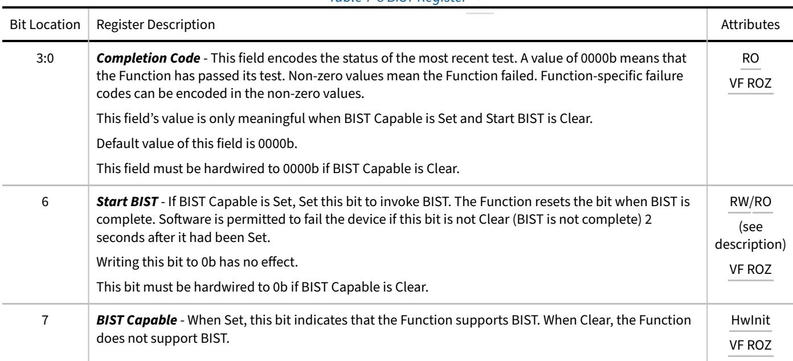

**Table 7-8. BIST Register | 表 7-8 BIST 寄存器**

| Bit Location | Register Description | Attributes |
|--------------|----------------------|------------|
| 3:0 | **Completion Code** - This field encodes the status of the most recent test. A value of 0000b means that the Function has passed its test. Non-zero values mean the Function failed. Function-specific failure codes can be encoded in the non-zero values. This field's value is only meaningful when BIST Capable is Set and Start BIST is Clear. Default value of this field is 0000b. This field must be hardwired to 0000b if BIST Capable is Clear. | RO / VF ROZ |
| 6 | **Start BIST** - If BIST Capable is Set, Set this bit to invoke BIST. The Function resets the bit when BIST is complete. Software is permitted to fail the device if this bit is not Clear (BIST is not complete) 2 seconds after it had been Set. Writing this bit to 0b has no effect. This bit must be hardwired to 0b if BIST Capable is Clear. | RW/RO (see description) / VF ROZ |
| 7 | **BIST Capable** - When Set, this bit indicates that the Function supports BIST. When Clear, the Function does not support BIST. | HwInit / VF ROZ |

**Table 7-8. BIST Register | 表 7-8 BIST 寄存器（中文化）**

| Bit Location | Register Description（寄存器描述） | Attributes |
|--------------|----------------------|------------|
| 3:0 | **Completion Code（完成代码）** - 该字段对最近一次测试的状态进行编码。值 0000b 表示该 Function 通过了测试。非零值表示该 Function 失败。Function 特定的失败代码可编码在非零值中。该字段的值仅在 BIST Capable 置 1 且 Start BIST 清零时才有意义。该字段的默认值为 0000b。如果 BIST Capable 清零,则该字段必须硬连线为 0000b。 | RO / VF ROZ |
| 6 | **Start BIST（启动 BIST）** - 如果 BIST Capable 置 1,则将该位置 1 以调用 BIST。Function 在 BIST 完成时将该位复位。如果在该位置 1 后 2 秒内该位仍未清零（BIST 尚未完成）,则允许软件判定该设备失败。将该位写为 0b 没有效果。如果 BIST Capable 清零,则该位必须硬连线为 0b。 | RW/RO（见描述）/ VF ROZ |
| 7 | **BIST Capable（支持 BIST）** - 置 1 时,该位表示该 Function 支持 BIST。清零时,该 Function 不支持 BIST。 | HwInit / VF ROZ |

[⬆️ 返回目录](#-本章目录-table-of-contents)

---

<a id="sec-7-5-1-1-11"></a>
## 7.5.1.1.11 Capabilities Pointer (Offset 34h) | 能力指针（偏移量 34h）

<table>
<thead>
<tr>
<th width="50%">🇬🇧 English</th>
<th width="50%" style="background-color:#e8e8e8">🏆 中文</th>
</tr>
</thead>
<tbody>
<tr>
<td>

This register is used to point to a linked list of capabilities implemented by this Function. Since all PCI Express Functions are required to implement the PCI Express Capability structure, which must be included somewhere in this linked list; this register must be non-zero. The bottom two bits are Reserved and must be set to 00b. Software must mask these bits off before using this register as a pointer in Configuration Space to the first entry of a linked list of new capabilities. This register is HwInit.

</td>
<td style="background-color:#e8e8e8">

该寄存器用于指向此 Function 所实现能力的链表。由于所有 PCI Express Function 都需要实现 PCI Express 能力结构 (Capability structure),该结构必须包含在该链表的某个位置;因此该寄存器必须为非零值。最低两位为保留,必须设置为 00b。软件在使用该寄存器作为配置空间中指向新能力链表第一个条目的指针之前,必须屏蔽掉这两位。该寄存器为 HwInit。

</td>
</tr>
</tbody>
</table>

[⬆️ 返回目录](#-本章目录-table-of-contents)

---

<a id="sec-7-5-1-1-12"></a>
## 7.5.1.1.12 Interrupt Line Register (Offset 3Ch) | 中断线寄存器（偏移量 3Ch）

<table>
<thead>
<tr>
<th width="50%">🇬🇧 English</th>
<th width="50%" style="background-color:#e8e8e8">🏆 中文</th>
</tr>
</thead>
<tbody>
<tr>
<td>

The Interrupt Line register communicates interrupt line routing information. The register is read/write and must be implemented by any Function that uses an interrupt pin (see following description). Values in this register are programmed by system software and are system architecture specific. The Function itself does not use this value; rather the value in this register is used by device drivers and operating systems. If Interrupt Pin Register is 00h, this register is permitted to be hardwired to 0b. Otherwise, the default value is implementation specific.

</td>
<td style="background-color:#e8e8e8">

Interrupt Line 寄存器用于传递中断线路由信息。该寄存器为读写类型,任何使用中断引脚 (interrupt pin) 的 Function 都必须实现（见以下描述）。该寄存器中的值由系统软件编程,与具体系统架构相关。Function 本身不使用该值;该寄存器中的值由设备驱动程序和操作系统使用。如果 Interrupt Pin 寄存器为 00h,则允许将该寄存器硬连线为 0b。否则,默认值为实现特定。

</td>
</tr>
</tbody>
</table>

<!-- 📄 Page 1004 -->
---

<table>
<thead>
<tr>
<th width="50%">🇬🇧 English</th>
<th width="50%" style="background-color:#e8e8e8">🏆 中文</th>
</tr>
</thead>
<tbody>
<tr>
<td>

For VFs, this register does not apply and must be hardwired to Zero.

</td>
<td style="background-color:#e8e8e8">

对于 VF,该寄存器不适用,必须硬连线为 0。

</td>
</tr>
</tbody>
</table>

[⬆️ 返回目录](#-本章目录-table-of-contents)

---

<a id="sec-7-5-1-1-13"></a>
## 7.5.1.1.13 Interrupt Pin Register (Offset 3Dh) | 中断引脚寄存器（偏移量 3Dh）


<div style="overflow-x: auto; max-width: 100%;">
<table>
<thead>
<tr>
<th width="50%">🇬🇧 English</th>
<th width="50%" style="background-color:#e8e8e8">🏆 中文</th>
</tr>
</thead>
<tbody>
<tr>
<td>

The Interrupt Pin register is a read-only register that identifies the legacy interrupt Message(s) the Function uses (see § Section 6.1 for further details). Valid values are 01h, 02h, 03h, and 04h that map to legacy interrupt Messages for INTA, INTB, INTC, and INTD respectively. A value of 00h indicates that the Function uses no legacy interrupt Message(s). The values 05h through FFh are Reserved.

PCI Express defines one legacy interrupt Message for a single Function device and up to four legacy interrupt Messages for a Multi-Function Device. For a single Function device, only INTA may be used.

Any Function on a Multi-Function Device can use any of the INTx Messages. If a device implements a single legacy interrupt Message, it must be INTA; if it implements two legacy interrupt Messages, they must be INTA and INTB; and so forth. For a Multi-Function Device, all Functions may use the same INTx Message or each may have its own (up to a maximum of four Functions) or any combination thereof. A single Function can never generate an interrupt request on more than one INTx Message.

For VFs, this register does not apply and must be hardwired to Zero.

</td>
<td style="background-color:#e8e8e8">

Interrupt Pin 寄存器为只读寄存器,用于标识该 Function 所使用的传统中断消息（参见 § Section 6.1 中的进一步细节）。有效值为 01h、02h、03h 和 04h,分别映射到 INTA、INTB、INTC 和 INTD 的传统中断消息。值 00h 表示该 Function 不使用任何传统中断消息。值 05h 至 FFh 为保留。

PCI Express 为单 Function 设备定义一条传统中断消息,为多功能设备 (Multi-Function Device) 定义最多四条传统中断消息。对于单 Function 设备,只能使用 INTA。

多功能设备上的任何 Function 都可以使用任何 INTx 消息。如果设备实现单条传统中断消息,则必须为 INTA;如果实现两条传统中断消息,则必须为 INTA 和 INTB;依此类推。对于多功能设备,所有 Function 可以使用相同的 INTx 消息,也可以各自使用自己的（最多四个 Function）或任意组合。单个 Function 永远不能在多个 INTx 消息上产生中断请求。

对于 VF,该寄存器不适用,必须硬连线为 0。

</td>
</tr>
</tbody>
</table>
</div>


[⬆️ 返回目录](#-本章目录-table-of-contents)

---

<a id="sec-7-5-1-1-14-2"></a>
## 7.5.1.1.14 Error Control/Status Register Summary | 错误控制/状态寄存器总结

<table>
<thead>
<tr>
<th width="50%">🇬🇧 English</th>
<th width="50%" style="background-color:#e8e8e8">🏆 中文</th>
</tr>
</thead>
<tbody>
<tr>
<td>

The Error Control/Status register bits in the Command and Status registers (see § Section 7.5.1.1.3 and § Section 7.5.1.1.4 respectively) and the Bridge Control Register and Secondary Status Register of Type 1 Configuration Space Header Functions (see § Section 7.5.1.3.10 and § Section 7.5.1.3.7 respectively) control PCI-compatible error reporting for both PCI and PCI Express device Functions. Mapping of PCI Express errors onto PCI errors is also discussed in § Section 6.2.7.1. In addition to the PCI-compatible error control and status, PCI Express error reporting may be controlled separately from PCI device Functions through the PCI Express Capability structure described in § Section 7.5.3. The PCI-compatible error control and status register fields do not have any effect on PCI Express error reporting enabled through the PCI Express Capability structure. PCI Express device Functions may implement optional advanced error reporting as described in § Section 7.8.4.

For PCI Express Root Ports represented by a Type 1 Configuration Space Header:

- The primary side Error Control/Status registers apply to errors detected on the internal logic associated with the Root Complex.
- The secondary side Error Control/Status registers apply to errors detected on the Link originating from the Root Port.

For PCI Express Switch Upstream Ports represented by a Type 1 Configuration Space Header:

- The primary side Error Control/Status registers apply to errors detected on the Upstream Link of the Switch.
- The secondary side Error Control/Status registers apply to errors detected on the internal logic of the Switch.

For PCI Express Switch Downstream Ports represented by a Type 1 Configuration Space Header:

- The primary side Error Control/Status registers apply to errors detected on the internal logic of the Switch.
- The secondary side Error Control/Status registers apply to errors detected on the Downstream Link originating from the Switch Port.

</td>
<td style="background-color:#e8e8e8">

Command 寄存器和 Status 寄存器中的错误控制/状态寄存器位（分别见 § Section 7.5.1.1.3 和 § Section 7.5.1.1.4）以及 Type 1 配置空间头 Function 的 Bridge Control 寄存器和 Secondary Status 寄存器（分别见 § Section 7.5.1.3.10 和 § Section 7.5.1.3.7）共同控制 PCI 和 PCI Express 设备 Function 的 PCI 兼容错误报告。PCI Express 错误到 PCI 错误的映射也在 § Section 6.2.7.1 中讨论。除了 PCI 兼容的错误控制和状态之外,PCI Express 错误报告还可以通过 § Section 7.5.3 中描述的 PCI Express 能力结构与 PCI 设备 Function 分开控制。PCI 兼容的错误控制和状态寄存器字段对通过 PCI Express 能力结构启用的 PCI Express 错误报告没有任何影响。PCI Express 设备 Function 可以实现 § Section 7.8.4 中描述的可选高级错误报告 (Advanced Error Reporting, AER)。

对于以 Type 1 配置空间头表示的 PCI Express Root Port：

- 主端 (primary side) 的错误控制/状态寄存器适用于在与根复合体 (Root Complex) 关联的内部逻辑上检测到的错误。
- 次端 (secondary side) 的错误控制/状态寄存器适用于在源自 Root Port 的链路上检测到的错误。

对于以 Type 1 配置空间头表示的 PCI Express 交换机上游端口 (Switch Upstream Port)：

- 主端的错误控制/状态寄存器适用于在交换机的上游链路上检测到的错误。
- 次端的错误控制/状态寄存器适用于在交换机的内部逻辑上检测到的错误。

对于以 Type 1 配置空间头表示的 PCI Express 交换机下游端口 (Switch Downstream Port)：

- 主端的错误控制/状态寄存器适用于在交换机的内部逻辑上检测到的错误。
- 次端的错误控制/状态寄存器适用于在源自交换机端口的下游链路上检测到的错误。

</td>
</tr>
</tbody>
</table>

[⬆️ 返回目录](#-本章目录-table-of-contents)

---


---

7.5.1.1.14 Error Registers §

<!-- 📄 Page 1005 -->
---

<a id="sec-7-5-1-1-14"></a>
## 7.5.1.1.14 Error Registers | 错误寄存器


<div style="overflow-x: auto; max-width: 100%;">
<table>
<thead>
<tr>
<th width="50%">🇬🇧 English</th>
<th width="50%" style="background-color:#e8e8e8">🏆 中文</th>
</tr>
</thead>
<tbody>
<tr>
<td>

§ Figure 7-10 details allocation for register fields of Type 0 Configuration Space Header for PCI Express device Functions.

§ Section 7.5.1.1 details the PCI Express-specific registers that are valid for all Configuration Space Header types. The PCI Express-specific interpretation of registers specific to Type 0 Configuration Space Header is defined in this section.

System software must build a consistent address map before booting the machine to an operating system. This means it has to determine how much memory is in the system, and how much address space the Functions in the system require. After determining this information, system software can map the Functions into reasonable locations and proceed with system boot. In order to do this mapping in a device-independent manner, the base registers for this mapping are placed in the predefined header portion of Configuration Space. It is strongly recommended that power-up firmware/software also support the optional Enhanced Configuration Access Mechanism (ECAM).

</td>
<td style="background-color:#e8e8e8">

§ 图 7-10 详细说明了 PCI Express 设备功能 (Function) 的 Type 0 配置空间头 (Type 0 Configuration Space Header) 寄存器字段分配。

§ 7.5.1.1 节详细说明了适用于所有配置空间头类型的 PCI Express 特有寄存器。Type 0 配置空间头特有的寄存器及其 PCI Express 特有解释在本节中定义。

系统软件必须在将机器引导至操作系统之前构建一致的地址映射。这意味着它必须确定系统中有多少内存，以及系统中各功能 (Function) 需要多少地址空间。在确定这些信息之后，系统软件可以将各功能 (Function) 映射到合理的位置，然后继续系统引导。为了以独立于设备的方式执行此映射，此映射的基址寄存器被放置在配置空间 (Configuration Space) 的预定义头部分。强烈建议上电固件/软件也支持可选的增强型配置访问机制 (Enhanced Configuration Access Mechanism, ECAM)。

</td>
</tr>
</tbody>
</table>

> **Figure 7-10.** Type 0 Configuration Space Header
> 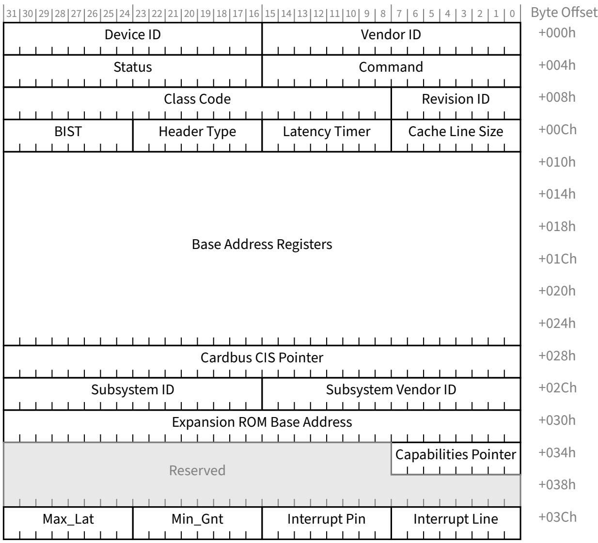

</div>


[⬆️ 返回目录](#-本章目录-table-of-contents)

---

<a id="sec-7-5-1-2"></a>
## 7.5.1.2 Type 0 Configuration Space Header | Type 0 配置空间头

<table>
<thead>
<tr>
<th width="50%">🇬🇧 English</th>
<th width="50%" style="background-color:#e8e8e8">🏆 中文</th>
</tr>
</thead>
<tbody>
<tr>
<td>

§ Section 7.5.1.1 details the PCI Express-specific registers that are valid for all Configuration Space Header types. The PCI Express-specific interpretation of registers specific to Type 0 Configuration Space Header is defined in this section.

System software must build a consistent address map before booting the machine to an operating system. This means it has to determine how much memory is in the system, and how much address space the Functions in the system require. After determining this information, system software can map the Functions into reasonable locations and proceed with

</td>
<td style="background-color:#e8e8e8">

§ 7.5.1.1 节详细说明了适用于所有配置空间头类型的 PCI Express 特有寄存器。Type 0 配置空间头特有的寄存器及其 PCI Express 特有解释在本节中定义。

系统软件必须在将机器引导至操作系统之前构建一致的地址映射。这意味着它必须确定系统中有多少内存，以及系统中各功能 (Function) 需要多少地址空间。在确定这些信息之后，系统软件可以将各功能 (Function) 映射到合理的位置，然后继续

</td>
</tr>
</tbody>
</table>

[⬆️ 返回目录](#-本章目录-table-of-contents)

---

<a id="sec-7-5-1-2-1"></a>
## 7.5.1.2.1 Base Address Registers (Offset 10h - 24h) | 基址寄存器 (BAR) (偏移 10h - 24h)


<div style="overflow-x: auto; max-width: 100%;">
<table>
<thead>
<tr>
<th width="50%">🇬🇧 English</th>
<th width="50%" style="background-color:#e8e8e8">🏆 中文</th>
</tr>
</thead>
<tbody>
<tr>
<td>

<!-- 📄 Page 1006 -->
---

system boot. In order to do this mapping in a device-independent manner, the base registers for this mapping are placed in the predefined header portion of Configuration Space. It is strongly recommended that power-up firmware/software also support the optional Enhanced Configuration Access Mechanism (ECAM).

For VFs, these registers must be hardwired to Zero. See § Section 9.2.1.1.1 and § Section 9.3.3.14.

Bit 0 in all Base Address registers is read-only and used to determine whether the register maps into Memory or I/O Space. Base Address registers that map to Memory Space must return a 0b in bit 0 (see § Figure 7-11). Base Address registers that map to I/O Space must return a 1b in bit 0 (see § Figure 7-12).

Base Address registers that map into I/O Space are always 32 bits wide with bit 0 hardwired to 1b. Bit 1 is Reserved and must return 0b on reads and the other bits are used to map the Function into I/O Space.

Base Address registers that map into Memory Space can be 32 bits or 64 bits wide (to support mapping into a 64-bit address space) with bit 0 hardwired to 0b. For Memory Base Address registers, bits 2 and 1 have an encoded meaning as shown in § Table 7-9. Bit 3 should be set to 1b if the data is prefetchable and set to 0b otherwise. A Function is permitted to mark a range as prefetchable if there are no side effects on reads, the Function returns all bytes on reads regardless of the byte enables, and host bridges can merge processor writes into this range without causing errors. Bits 3-0 are read-only.

</td>
<td style="background-color:#e8e8e8">

<!-- 📄 Page 1006 -->
---

系统引导。为了以独立于设备的方式执行此映射，此映射的基址寄存器被放置在配置空间 (Configuration Space) 的预定义头部分。强烈建议上电固件/软件也支持可选的增强型配置访问机制 (Enhanced Configuration Access Mechanism, ECAM)。

对于 VF，这些寄存器必须硬连线为零 (hardwired to Zero)。参见 § 9.2.1.1.1 节和 § 9.3.3.14 节。

所有基址寄存器 (Base Address Register) 中的第 0 位是只读的，用于确定该寄存器映射到内存空间 (Memory Space) 还是 I/O 空间 (I/O Space)。映射到内存空间 (Memory Space) 的基址寄存器必须在第 0 位返回 0b（见 § 图 7-11）。映射到 I/O 空间 (I/O Space) 的基址寄存器必须在第 0 位返回 1b（见 § 图 7-12）。

映射到 I/O 空间 (I/O Space) 的基址寄存器始终为 32 位宽，第 0 位硬连线为 1b。第 1 位是保留位 (Reserved)，读取时必须返回 0b，其他位用于将该功能 (Function) 映射到 I/O 空间 (I/O Space)。

映射到内存空间 (Memory Space) 的基址寄存器可以是 32 位或 64 位宽（以支持映射到 64 位地址空间），第 0 位硬连线为 0b。对于内存基址寄存器，第 2 位和第 1 位具有如 § 表 7-9 所示的编码含义。如果数据可预取 (prefetchable)，则第 3 位应设置为 1b，否则设置为 0b。如果某个范围内的读取没有副作用、功能 (Function) 在读取时无论字节使能 (Byte Enable) 如何都返回所有字节，并且主桥 (Host Bridge) 可以将处理器写入合并到此范围而不会引起错误，则该功能 (Function) 可将该范围标记为可预取 (prefetchable)。第 3-0 位是只读的。

</td>
</tr>
</tbody>
</table>

> **Figure 7-11.** Base Address Register for Memory
> 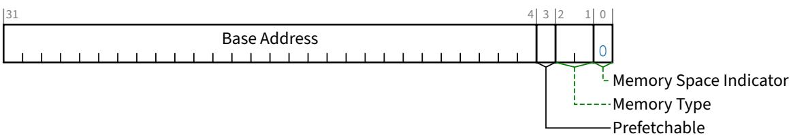

> **Figure 7-12.** Base Address Register for I/O
> 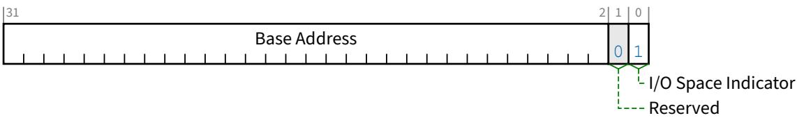

</div>


[⬆️ 返回目录](#-本章目录-table-of-contents)

---

**Table 7-9. Memory Base Address Register Bits 2:1 Encoding | 表 7-9 内存基址寄存器 Bits 2:1 编码**

| Bits 2:1(b) | Meaning |
|-------------|---------|
| 00 | Base register is 32 bits wide and can be mapped anywhere in the 32 address bit Memory Space. |
| 01 | Reserved<sup>159</sup> |
| 10 | Base register is 64 bits wide and can be mapped anywhere in the 64 address bit Memory Space. |

**Table 7-9. Memory Base Address Register Bits 2:1 Encoding | 表 7-9 内存基址寄存器 Bits 2:1 编码（中译）**

| Bits 2:1(b) | 含义 |
|-------------|------|
| 00 | 基寄存器为 32 位宽，可以映射到 32 位地址内存空间 (Memory Space) 中的任何位置。 |
| 01 | 保留<sup>159</sup> |
| 10 | 基寄存器为 64 位宽，可以映射到 64 位地址内存空间 (Memory Space) 中的任何位置。 |

>>> Note: Original spec uses bilingual table format below; this markdown table is a compact bilingual representation.

**Table 7-9. 内存基址寄存器 Bits 2:1 编码 / Memory Base Address Register Bits 2:1 Encoding**

| Bits 2:1(b) | Meaning / 含义 |
|-------------|----------------|
| 00 | Base register is 32 bits wide and can be mapped anywhere in the 32 address bit Memory Space. / 基寄存器为 32 位宽，可以映射到 32 位地址内存空间 (Memory Space) 中的任何位置。 |
| 01 | Reserved<sup>159</sup> / 保留<sup>159</sup> |
| 10 | Base register is 64 bits wide and can be mapped anywhere in the 64 address bit Memory Space. / 基寄存器为 64 位宽，可以映射到 64 位地址内存空间 (Memory Space) 中的任何位置。 |

---

**Table 7-9 (continued). Memory Base Address Register Bits 2:1 Encoding | 表 7-9（续）内存基址寄存器 Bits 2:1 编码**

| Bits 2:1(b) | Meaning / 含义 |
|-------------|----------------|
| 11 | Reserved / 保留 |

---

<a id="sec-7-5-1-2-1-cont"></a>
## 7.5.1.2.1 Base Address Registers (continued) | 基址寄存器（续）

<table>
<thead>
<tr>
<th width="50%">🇬🇧 English</th>
<th width="50%" style="background-color:#e8e8e8">🏆 中文</th>
</tr>
</thead>
<tbody>
<tr>
<td>

<!-- 📄 Page 1007 -->
---

The number of upper bits that a Function actually implements depends on how much of the address space the Function will respond to. A 32-bit Base Address register supports a single, implementation specific, memory size that is a power of 2, from 16 bytes to 256 Bytes (I/O Space) or 128 Bytes to 2 GB (Memory Space). Each BAR must implement all appropriate upper address bits as Read-Write (i.e., a BAR must be able to be configured to any appropriately aligned address in the associated address space). A Function that wants a 1 MB memory address space (using a single 32-bit Base Address register) must implement the top 12 bits of the Address register as Read-Write, hardwiring the other address bits to 0's.

The default value of Read-Write bits in BARs is implementation specific. The attributes for some of the bits in the BAR are affected by the Resizable BAR Capability, if it is implemented.

To determine how much address space a Function requires, system software should write a value of all 1's to each BAR register and then read the value back. Low-order bits of the Base Address field in each BAR must return 0's to indicate how much address space is required. Unimplemented Base Address registers must be hardwired to zero.

This design implies that all address spaces used are a power of two in size and are naturally aligned. Functions are free to consume more address space than required, but decoding down to a 4 KB space for memory is suggested for Functions that need less than that amount. For instance, a Function that has 64 bytes of registers to be mapped into Memory Space may consume up to 4 KB of address space in order to minimize the number of bits in the address decoder. Functions that do consume more address space than they use are not required to respond to the unused portion of that address space if the Function's programming model never accesses the unused space. The Function is permitted to return Unsupported Request for accesses targetting the unused locations. Functions that map control functions into I/O Space must not consume more than 256 bytes per I/O Base Address register or per each entry in the Enhanced Allocation Capability. The upper 16 bits of the I/O Base Address register may be hardwired to zero for Functions intended for 16-bit I/O systems, such as PC compatibles. However, a full 32-bit decode of I/O addresses must still be done.

A Type 0 Configuration Space Header has six DWORD locations allocated for Base Address registers starting at offset 10h in Configuration Space. A Type 1 Configurations Space Header has only two DWORD locations. A Function may use any of the locations to implement Base Address registers. An implemented 64-bit Base Address register consumes two consecutive DWORD locations. Software looking for implemented Base Address registers must start at offset 10h and continue upwards through offset 24h. A typical Function requires one memory range for its control functions. Some graphics Functions use two ranges, one for control functions and another for a frame buffer. A Function that wants to map control functions into both memory and I/O Spaces at the same time must implement two Base Address registers (one memory and one I/O). The driver for that Function might only use one space in which case the other space will be unused. Functions are recommended to always map control functions into Memory Space.

</td>
<td style="background-color:#e8e8e8">

<!-- 📄 Page 1007 -->
---

功能 (Function) 实际实现的高位位数取决于该功能 (Function) 将响应的地址空间大小。32 位基址寄存器 (Base Address Register) 支持单一、由实现决定的、大小为 2 的幂的内存大小，范围从 16 字节到 256 字节（I/O 空间 (I/O Space)）或从 128 字节到 2 GB（内存空间 (Memory Space)）。每个 BAR 必须将所有适当的高位地址位实现为读/写 (Read-Write)（即 BAR 必须能够配置为关联地址空间中任何适当对齐的地址）。想要 1 MB 内存地址空间的功能 (Function)（使用单个 32 位基址寄存器）必须将地址寄存器的最高 12 位实现为读/写 (Read-Write)，其他地址位硬连线为 0。

BAR 中读/写 (Read-Write) 位的默认值由实现决定。如果实现了 Resizable BAR Capability，则 BAR 中某些位的属性会受其影响。

为了确定功能 (Function) 需要多少地址空间，系统软件应向每个 BAR 寄存器写入全 1 的值，然后读取该值。每个 BAR 中基址字段 (Base Address) 的低阶位必须返回 0，以指示需要多少地址空间。未实现的基址寄存器必须硬连线为零 (hardwired to zero)。

此设计意味着所有使用的地址空间大小均为 2 的幂且自然对齐。功能 (Function) 可以自由地消耗比所需更多的地址空间，但对于需要少于 4 KB 内存的功能 (Function)，建议将地址解码缩小到 4 KB 空间。例如，具有 64 字节寄存器需要映射到内存空间 (Memory Space) 的功能 (Function) 最多可消耗 4 KB 的地址空间，以最小化地址解码器中的位数。如果功能 (Function) 的编程模型从不访问未使用的空间，则消耗比实际使用更多地址空间的功能 (Function) 不需要响应该地址空间的未使用部分。该功能 (Function) 允许对目标为未使用位置的访问返回 Unsupported Request。将控制功能映射到 I/O 空间 (I/O Space) 的功能 (Function) 每个 I/O 基址寄存器或增强分配能力 (Enhanced Allocation Capability) 中的每个条目消耗的字节数不得超过 256 字节。对于面向 16 位 I/O 系统（如 PC 兼容机）的功能 (Function)，I/O 基址寄存器的高 16 位可硬连线为零。但是，仍必须执行完整的 32 位 I/O 地址解码。

Type 0 配置空间头 (Type 0 Configuration Space Header) 在配置空间 (Configuration Space) 偏移 10h 处开始分配了 6 个 DWORD 位置用于基址寄存器 (Base Address Register)。Type 1 配置空间头只有 2 个 DWORD 位置。功能 (Function) 可以使用任何位置来实现基址寄存器 (Base Address Register)。已实现的 64 位基址寄存器占用两个连续的 DWORD 位置。查找已实现基址寄存器的软件必须从偏移 10h 开始向上扫描直到偏移 24h。典型的功能 (Function) 需要一个内存范围用于其控制功能。一些图形功能 (Function) 使用两个范围，一个用于控制功能，另一个用于帧缓冲区。想要同时将控制功能映射到内存空间 (Memory Space) 和 I/O 空间 (I/O Space) 的功能 (Function) 必须实现两个基址寄存器 (Base Address Register)（一个内存，一个 I/O）。该功能 (Function) 的驱动程序可能仅使用其中一个空间，在这种情况下，另一个空间将未使用。建议功能 (Function) 始终将控制功能映射到内存空间 (Memory Space)。

</td>
</tr>
</tbody>
</table>

[⬆️ 返回目录](#-本章目录-table-of-contents)

---

> **IMPLEMENTATION NOTE:**
> **SIZING A 32-BIT BASE ADDRESS REGISTER EXAMPLE**
>
> Decode (I/O or memory) of the appropriate address space is disabled via the Command Register before sizing a Base Address register. Software saves the original value of the Base Address register, writes a value of all 1's to the register, then reads it back. Size calculation can be done from the 32 bit value read by first clearing encoding information bits (bits 1:0 for I/O, bits 3:0 for memory), inverting all 32 bits (logical NOT), then incrementing by 1.
>
> The resultant 32-bit value is the memory/I/O range size decoded by the register. Note that the upper 16 bits of the result is ignored if the Base Address register is for I/O and bits 31:16 returned zero upon read. The original value in the Base Address register is restored before re-enabling decode in the Command Register of the Function.
>
> 64-bit (memory) Base Address registers can be handled the same, except that the second 32 bit register is considered an extension of the first (i.e., bits 63:32). Software writes a value of all 1's to both registers, reads them back, and combines the result into a 64-bit value. Size calculation is done on the 64-bit value.

> **实现说明：**
> **计算 32 位基址寄存器大小的示例**
>
> 在对基址寄存器 (Base Address Register) 进行大小测量之前，通过命令寄存器 (Command Register) 禁用相应地址空间（I/O 或内存）的解码。软件保存基址寄存器的原始值，向该寄存器写入全 1 的值，然后读取。可以从读取的 32 位值进行大小计算：首先清除编码信息位（I/O 为位 1:0，内存为位 3:0），将所有 32 位取反（逻辑非），然后加 1。
>
> 所得的 32 位值就是该寄存器解码的内存/I/O 范围大小。请注意，如果基址寄存器用于 I/O，并且位 31:16 在读取时返回零，则结果的高 16 位将被忽略。在重新启用功能 (Function) 命令寄存器 (Command Register) 中的解码之前，将恢复基址寄存器中的原始值。
>
> 64 位（内存）基址寄存器的处理方式相同，只是第二个 32 位寄存器被视为第一个寄存器的扩展（即位 63:32）。软件向两个寄存器写入全 1 的值，读取它们，并将结果合并为 64 位值。大小计算在 64 位值上进行。

---

<a id="sec-7-5-1-2-1-pf"></a>
## 7.5.1.2.1 Prefetchable Bit Guidance | 可预取位指导


<div style="overflow-x: auto; max-width: 100%;">
<table>
<thead>
<tr>
<th width="50%">🇬🇧 English</th>
<th width="50%" style="background-color:#e8e8e8">🏆 中文</th>
</tr>
</thead>
<tbody>
<tr>
<td>

<!-- 📄 Page 1008 -->
---

A PCI Express Function requesting Memory Space through a BAR must set the BAR's Prefetchable bit unless the range contains locations with read side effects or locations in which the Function does not tolerate write merging. It is strongly encouraged that resources mapped into Memory Space be designed as prefetchable whenever possible. PCI Express Functions other than Legacy Endpoints must support 64-bit addressing for any Base Address register that requests prefetchable Memory Space. The minimum Memory Space address range requested by a BAR is 128 bytes. The attributes for some of the bits in the BAR are affected by the Resizable BAR Capability, if it is implemented.

> **IMPLEMENTATION NOTE:**
> **ADDITIONAL GUIDANCE ON THE PREFETCHABLE BIT IN MEMORY SPACE BARS**
>
> PCI Express adapters with Memory Space BARs that request a large amount of non-prefetchable Memory Space (e.g., over 64 MB) may cause shortages of that Space on certain scalable platforms, since many platforms support a total of only 1 GB or less of non-prefetchable Memory Space. This may limit the number of such adapters that can be supported on those platforms. For this reason, it is especially encouraged for BARs requesting large amounts of Memory Space to have their Prefetchable bit Set, since prefetchable Memory Space is more bountiful on most scalable platforms.
>
> While a Memory Space BAR is required to have its Prefetchable bit Set if none of the locations within its range have read side effects and all of the locations tolerate write merging, there are system configurations where having the Prefetchable bit Set will still allow correct operation even if those conditions are not met. For those cases, it may make sense for the adapter to have the Prefetchable bit Set in certain candidate BARs so that the system can map those BARs into prefetchable Memory Space in order to avoid non-prefetchable Memory Space shortages.
>
> On PCI Express systems that meet the criteria enumerated below, setting the Prefetchable bit in a candidate BAR will still permit correct operation even if the BAR's range includes some locations that have read side-effects or cannot tolerate write merging. This is primarily due to the fact that PCI Express Memory Reads always contain an explicit length, and PCI Express Switches never prefetch or do byte merging. Generally only 64-bit BARs are good candidates, since only Legacy Endpoints are permitted to set the Prefetchable bit in 32-bit BARs, and most scalable platforms map all 32-bit Memory BARs into non-prefetchable Memory Space regardless of the Prefetchable bit value.
>
> Here are criteria that are sufficient to guarantee correctness for a given candidate BAR:
>
> - The entire path from the host to the adapter is over PCI Express.
> - No conventional PCI or PCI-X devices do peer-to-peer reads to the range mapped by the BAR.
> - The PCI Express Host Bridge does no byte merging. (This is believed to be true on most platforms.)
> - Any locations with read side-effects are never the target of Memory Reads with the TH bit Set. See § Section 2.2.5.
> - The range mapped by the BAR is never the target of a speculative Memory Read, either Host initiated or peer-to-peer.
>
> The above criteria are a simplified set that are sufficient to guarantee correctness. Other less restrictive but more complex criteria may also guarantee correctness, but are outside the scope of this specification.

</td>
<td style="background-color:#e8e8e8">

<!-- 📄 Page 1008 -->
---

通过 BAR 请求内存空间 (Memory Space) 的 PCI Express 功能 (Function) 必须设置 BAR 的可预取位 (Prefetchable bit)，除非该范围内包含具有读取副作用的位置，或功能 (Function) 在该位置上不容忍写入合并。强烈建议尽可能将映射到内存空间 (Memory Space) 的资源设计为可预取 (prefetchable)。除 Legacy Endpoint 之外的 PCI Express 功能 (Function) 必须为任何请求可预取内存空间 (prefetchable Memory Space) 的基址寄存器 (Base Address Register) 支持 64 位寻址。BAR 请求的最小内存空间 (Memory Space) 地址范围为 128 字节。如果实现了 Resizable BAR Capability，则 BAR 中某些位的属性会受其影响。

> **实现说明：**
> **关于内存空间 BAR 中可预取位的额外指导**
>
> 具有请求大量不可预取内存空间 (non-prefetchable Memory Space)（例如超过 64 MB）的内存空间 (Memory Space) BAR 的 PCI Express 适配器可能会在某些可扩展平台上造成该空间的短缺，因为许多平台总共仅支持 1 GB 或更少的不可预取内存空间 (non-prefetchable Memory Space)。这可能会限制此类平台上可支持的适配器数量。因此，特别鼓励请求大量内存空间 (Memory Space) 的 BAR 将其可预取位 (Prefetchable bit) 置位，因为在大多数可扩展平台上，可预取内存空间 (prefetchable Memory Space) 更为充足。
>
> 虽然要求当内存空间 (Memory Space) BAR 范围内的所有位置都没有读取副作用且所有位置都容忍写入合并时，必须将其可预取位 (Prefetchable bit) 置位，但在某些系统配置中，即使不满足这些条件，将可预取位置位仍可允许正确操作。对于这些情况，适配器在某些候选 BAR 中将可预取位置位可能是合理的，以便系统可以将这些 BAR 映射到可预取内存空间 (prefetchable Memory Space)，从而避免不可预取内存空间 (non-prefetchable Memory Space) 短缺。
>
> 在满足以下列举条件的 PCI Express 系统上，即使候选 BAR 的范围包含某些具有读取副作用或不容忍写入合并的位置，将候选 BAR 中的可预取位置位仍可允许正确操作。这主要是由于 PCI Express 内存读取始终包含明确的长度，并且 PCI Express 交换机 (Switch) 从不预取或进行字节合并。通常只有 64 位 BAR 是良好的候选，因为只有 Legacy Endpoint 才允许在 32 位 BAR 中设置可预取位，并且大多数可扩展平台将所有 32 位内存 BAR 映射到不可预取内存空间 (non-prefetchable Memory Space)，而与可预取位的值无关。
>
> 以下条件足以保证给定候选 BAR 的正确性：
>
> - 从主机到适配器的整个路径都是 PCI Express。
> - 没有传统的 PCI 或 PCI-X 设备对由该 BAR 映射的范围执行对等 (peer-to-peer) 读取。
> - PCI Express 主桥 (Host Bridge) 不进行字节合并。（在大多数平台上这被认为是正确的。）
> - 具有读取副作用的任何位置永远不能成为设置了 TH 位的内存读取的目标。参见 § 2.2.5 节。
> - 由 BAR 映射的范围永远不能成为推测性内存读取（无论是主机发起还是对等发起）的目标。
>
> 以上条件是一个简化的集合，足以保证正确性。其他限制较少但更复杂的条件也可能保证正确性，但不在本规范的范围内。

</td>
</tr>
</tbody>
</table>
</div>


[⬆️ 返回目录](#-本章目录-table-of-contents)

---

<a id="sec-7-5-1-2-2"></a>
## 7.5.1.2.2 Cardbus CIS Pointer Register (Offset 28h) | Cardbus CIS 指针寄存器 (偏移 28h)

<table>
<thead>
<tr>
<th width="50%">🇬🇧 English</th>
<th width="50%" style="background-color:#e8e8e8">🏆 中文</th>
</tr>
</thead>
<tbody>
<tr>
<td>

<!-- 📄 Page 1009 -->
---

This register was originally described in the [PC-Card]. This register does not apply to PCI Express and must be hardwired to Zero.

</td>
<td style="background-color:#e8e8e8">

<!-- 📄 Page 1009 -->
---

该寄存器最初在 [PC-Card] 中描述。此寄存器不适用于 PCI Express，必须硬连线为零 (hardwired to Zero)。

</td>
</tr>
</tbody>
</table>

[⬆️ 返回目录](#-本章目录-table-of-contents)

---

<a id="sec-7-5-1-2-3"></a>
## 7.5.1.2.3 Subsystem Vendor ID Register/Subsystem ID Register (Offset 2Ch/2Eh) | 子系统供应商 ID 寄存器/子系统 ID 寄存器 (偏移 2Ch/2Eh)


<div style="overflow-x: auto; max-width: 100%;">
<table>
<thead>
<tr>
<th width="50%">🇬🇧 English</th>
<th width="50%" style="background-color:#e8e8e8">🏆 中文</th>
</tr>
</thead>
<tbody>
<tr>
<td>

The Subsystem Vendor ID and Subsystem ID registers are used to uniquely identify the adapter or subsystem where the PCI Express component resides. They provide a mechanism for vendors to distinguish their products from one another even though the assemblies may have the same PCI Express component on them (and, therefore, the same Vendor ID and Device ID).

Implementation of these registers is required for all Functions except those that have a Base Class 06h with Sub Class 00h-04h (00h, 01h, 02h, 03h, 04h), or a Base Class 08h with Sub Class 00h-03h (00h, 01h, 02h, 03h). Subsystem Vendor IDs can be obtained from the PCI SIG and are used to identify the vendor of the adapter, motherboard, or subsystem<sup>160</sup>. A Subsystem Vendor ID (SVID) must be a Vendor ID assigned by the PCI-SIG to the vendor of the subsystem. In keeping with PCI-SIG procedures, valid vendor identifiers must be obtained from the PCI-SIG to ensure uniqueness.

Values for the Subsystem ID are vendor assigned. Subsystem ID values, in conjunction with the Subsystem Vendor ID, form a unique identifier for the PCI product. Subsystem ID and Device ID values are distinct and unrelated to each other, and software should not assume any relationship between them.

Values in these registers must be loaded before the Function becomes Configuration-Ready. How these values are loaded is not specified but could be done during the manufacturing process or loaded from external logic (e.g., strapping options, serial ROMs, etc.). These values must not be loaded using Expansion ROM software because Expansion ROM software is not guaranteed to be run during POST in all systems.

If a device is designed to be used exclusively on the system board, the system vendor may use system specific software to initialize these registers after each power-on.

The Subsystem Vendor ID register in a PF and its associated VFs must return the same value when read.

The Subsystem ID register in a PF and its associated VFs are permitted to return different values when read.

> **IMPLEMENTATION NOTE:**
> **SUBSYSTEM VENDOR ID AND SUBSYSTEM ID**
>
> The Subsystem Vendor ID and Subsystem ID fields, taken together, allow software to uniquely identify a PCI circuit board product. Vendors should therefore not reuse Subsystem ID values across multiple product types that share a common Subsystem Vendor ID. It is acceptable, although not preferred, to reuse the Subsystem ID value on products with the same Subsystem Vendor ID in cases where the products are in the same family and generation, and differ only in capacity or performance. Note also that it is acceptable for vendors to use multiple unique Subsystem ID values over time for a single product type, such as to indicate some internal difference such as component selection.

</td>
<td style="background-color:#e8e8e8">

子系统供应商 ID (Subsystem Vendor ID) 和子系统 ID (Subsystem ID) 寄存器用于唯一标识 PCI Express 组件所在的适配器或子系统。它们为供应商提供了一种机制，使其产品即使在组件上具有相同的 PCI Express 组件（即具有相同的供应商 ID (Vendor ID) 和设备 ID (Device ID)）时也能相互区分。

除了基类 (Base Class) 为 06h 且子类 (Sub Class) 为 00h-04h（00h、01h、02h、03h、04h），或基类 (Base Class) 为 08h 且子类 (Sub Class) 为 00h-03h（00h、01h、02h、03h）的功能 (Function) 之外，所有功能 (Function) 都需要实现这些寄存器。子系统供应商 ID (Subsystem Vendor ID) 可从 PCI-SIG 获取，用于标识适配器、主板或子系统的供应商<sup>160</sup>。子系统供应商 ID (SVID) 必须是 PCI-SIG 分配给子系统供应商的供应商 ID (Vendor ID)。根据 PCI-SIG 的程序，必须从 PCI-SIG 获取有效的供应商标识符以确保唯一性。

子系统 ID (Subsystem ID) 的值由供应商分配。子系统 ID 的值与子系统供应商 ID 一起构成 PCI 产品的唯一标识符。子系统 ID 和设备 ID 的值彼此独立且不相关，软件不应假设它们之间存在任何关系。

这些寄存器中的值必须在功能 (Function) 进入 Configuration-Ready 状态之前加载。如何加载这些值未作规定，但可在制造过程中完成或从外部逻辑（如配置选项 (strapping options)、串行 ROM 等）加载。这些值不得使用 Expansion ROM 软件加载，因为不能保证 Expansion ROM 软件在所有系统的 POST 期间运行。

如果设备被设计为仅在系统板上使用，则系统供应商可以使用系统特定的软件在每次上电后初始化这些寄存器。

PF 中的子系统供应商 ID (Subsystem Vendor ID) 寄存器及其关联的 VF 在读取时必须返回相同的值。

PF 中的子系统 ID (Subsystem ID) 寄存器及其关联的 VF 在读取时允许返回不同的值。

> **实现说明：**
> **子系统供应商 ID 和子系统 ID**
>
> 子系统供应商 ID (Subsystem Vendor ID) 和子系统 ID (Subsystem ID) 字段共同允许软件唯一标识 PCI 电路板产品。因此，供应商不应在共享同一子系统供应商 ID 的多种产品类型之间重复使用子系统 ID 值。在同一子系统供应商 ID 下，对于属于同一家族和代次、仅在容量或性能上有所不同的产品，重复使用子系统 ID 值是可以接受的（尽管不是首选）。还应注意，供应商可随时间推移为单一产品类型使用多个唯一的子系统 ID 值，例如用于指示组件选型等内部差异。

</td>
</tr>
</tbody>
</table>
</div>


[⬆️ 返回目录](#-本章目录-table-of-contents)

---

<a id="sec-7-5-1-2-4"></a>
## 7.5.1.2.4 Expansion ROM Base Address Register (Offset 30h) | 扩展 ROM 基址寄存器 (偏移 30h)

<table>
<thead>
<tr>
<th width="50%">🇬🇧 English</th>
<th width="50%" style="background-color:#e8e8e8">🏆 中文</th>
</tr>
</thead>
<tbody>
<tr>
<td>

<!-- 📄 Page 1010 -->
---

Some Functions, especially those that are intended for use on add-in cards, require local EPROMs for Expansion ROM (refer to the [Firmware] for a definition of ROM contents). This register is defined to handle the base address and size information for this Expansion ROM. The register layout is shown in § Figure 7-13 and § Table 7-10 describes the bits in the register.

For VFs, the Expansion ROM Base Address register is not supported and must be hardwired to Zero. The VI may choose to provide access to a PF's Expansion ROM Base Address register for its associated VFs via emulation.

Functions that support an expansion ROM must allow that ROM to be accessed with any combination of byte enables.

> **Figure 7-13.** Expansion ROM Base Address Register
> 

</td>
<td style="background-color:#e8e8e8">

<!-- 📄 Page 1010 -->
---

某些功能 (Function)，特别是那些打算在附加卡 (add-in card) 上使用的功能，需要用于 Expansion ROM 的本地 EPROM（有关 ROM 内容的定义，请参阅 [Firmware]）。此寄存器的定义用于处理此 Expansion ROM 的基址和大小信息。寄存器布局如 § 图 7-13 所示，§ 表 7-10 描述了该寄存器中的位。

对于 VF，不支持扩展 ROM 基址 (Expansion ROM Base Address) 寄存器，必须硬连线为零 (hardwired to Zero)。VI 可以选择通过仿真为其关联的 VF 提供对 PF 扩展 ROM 基址寄存器的访问。

支持扩展 ROM 的功能 (Function) 必须允许使用任何字节使能 (Byte Enable) 组合来访问该 ROM。


</td>
</tr>
</tbody>
</table>

[⬆️ 返回目录](#-本章目录-table-of-contents)

---

**Table 7-10. Expansion ROM Base Address Register | 表 7-10 扩展 ROM 基址寄存器**

| Bit Location | Description | Attributes |
|--------------|-------------|------------|
| 0 | Expansion ROM Enable - This bit controls whether or not the Function accepts accesses to its Expansion ROM via the Expansion ROM Base Address Register. Functions that support an Expansion ROM accessible through this register must implement this bit. If the Function has an Enhanced Allocation Capability that includes an EA entry for an Expansion ROM, this bit must be hardwired to 0b (see § Section 7.5.1.2.4). Functions that do not support an Expansion ROM are permitted to hardwire this bit to 0b. When this bit is 0b, the Function's Expansion ROM address space via the Expansion ROM Base Address Register is disabled. When the bit is 1b, address decoding is enabled using the Expansion ROM Base Address field in this register. This optionally allows a Function to be used with or without an Expansion ROM depending on system configuration. The Memory Space Enable bit in the Command register has precedence over the Expansion ROM Enable bit. A Function must claim accesses to its Expansion ROM via the Expansion ROM Base Address Register only if both the Memory Space Enable bit and the Expansion ROM Enable bit are Set. The default value of this bit is 0b.<br><br>In order to minimize the number of address decoders needed, a Function is permitted to share a decoder between the Expansion ROM Base Address Register and other Base Address registers or entries in the Enhanced Allocation Capability<sup>161</sup>. When Expansion ROM Enable is Set, the decoder is used for accesses to the Expansion ROM and device independent software must not access the Function through any other Base Address Registers or entries in the Enhanced Allocation Capability. Address decode sharing is not permitted for PFs or if the Function contains an Enhanced Allocation Capability with an EA entry for an Expansion ROM. | RO/RW |
| 3:1 | Expansion ROM Validation Status - Expansion ROM Validation is optional. When this field is non-zero, it indicates the status of hardware validation of the Expansion ROM contents. | HwInit/ROS |

**Table 7-10. Expansion ROM Base Address Register | 表 7-10 扩展 ROM 基址寄存器（中译）**

| Bit Location | Description / 描述 | Attributes |
|--------------|---------------------|------------|
| 0 | Expansion ROM Enable - ... / 扩展 ROM 使能位 - ... | RO/RW |
| 3:1 | Expansion ROM Validation Status - ... / 扩展 ROM 验证状态 - ... | HwInit/ROS |

**Table 7-10 (双行合并版) / Expansion ROM Base Address Register**

| Bit Location | Description / 描述 | Attributes |
|--------------|---------------------|------------|
| 0 | **Expansion ROM Enable** - This bit controls whether or not the Function accepts accesses to its Expansion ROM via the Expansion ROM Base Address Register. Functions that support an Expansion ROM accessible through this register must implement this bit. If the Function has an Enhanced Allocation Capability that includes an EA entry for an Expansion ROM, this bit must be hardwired to 0b (see § Section 7.5.1.2.4). Functions that do not support an Expansion ROM are permitted to hardwire this bit to 0b. When this bit is 0b, the Function's Expansion ROM address space via the Expansion ROM Base Address Register is disabled. When the bit is 1b, address decoding is enabled using the Expansion ROM Base Address field in this register. This optionally allows a Function to be used with or without an Expansion ROM depending on system configuration. The Memory Space Enable bit in the Command register has precedence over the Expansion ROM Enable bit. A Function must claim accesses to its Expansion ROM via the Expansion ROM Base Address Register only if both the Memory Space Enable bit and the Expansion ROM Enable bit are Set. The default value of this bit is 0b.<br><br>In order to minimize the number of address decoders needed, a Function is permitted to share a decoder between the Expansion ROM Base Address Register and other Base Address registers or entries in the Enhanced Allocation Capability<sup>161</sup>. When Expansion ROM Enable is Set, the decoder is used for accesses to the Expansion ROM and device independent software must not access the Function through any other Base Address Registers or entries in the Enhanced Allocation Capability. Address decode sharing is not permitted for PFs or if the Function contains an Enhanced Allocation Capability with an EA entry for an Expansion ROM. / **扩展 ROM 使能位** - 该位控制功能 (Function) 是否接受通过扩展 ROM 基址寄存器 (Expansion ROM Base Address Register) 对其扩展 ROM 的访问。通过此寄存器支持可访问的扩展 ROM 的功能 (Function) 必须实现此位。如果功能 (Function) 具有包含扩展 ROM 的 EA 条目的增强分配能力 (Enhanced Allocation Capability)，则该位必须硬连线为 0b（参见 § 7.5.1.2.4 节）。不支持扩展 ROM 的功能 (Function) 允许将该位硬连线为 0b。当该位为 0b 时，通过扩展 ROM 基址寄存器 (Expansion ROM Base Address Register) 的功能 (Function) 扩展 ROM 地址空间被禁用。当该位为 1b 时，使用此寄存器中的扩展 ROM 基址 (Expansion ROM Base Address) 字段启用地址解码。根据系统配置，此选项允许功能 (Function) 在有或没有扩展 ROM 的情况下使用。命令寄存器 (Command register) 中的内存空间使能 (Memory Space Enable) 位优先于扩展 ROM 使能 (Expansion ROM Enable) 位。仅当内存空间使能 (Memory Space Enable) 位和扩展 ROM 使能 (Expansion ROM Enable) 位均被置位时，功能 (Function) 必须声明通过扩展 ROM 基址寄存器对其扩展 ROM 的访问。此位的默认值为 0b。<br><br>为了最小化所需的地址解码器数量，允许功能 (Function) 在扩展 ROM 基址寄存器与其他基址寄存器 (Base Address Register) 或增强分配能力 (Enhanced Allocation Capability) 的条目之间共享一个解码器<sup>161</sup>。当扩展 ROM 使能位被置位时，该解码器用于对扩展 ROM 的访问，独立于设备的软件不得通过任何其他基址寄存器或增强分配能力条目访问该功能 (Function)。对于 PF 或功能 (Function) 包含具有扩展 ROM EA 条目的增强分配能力的情况，不允许地址解码共享。 | RO/RW |
| 3:1 | **Expansion ROM Validation Status** - Expansion ROM Validation is optional. When this field is non-zero, it indicates the status of hardware validation of the Expansion ROM contents. / **扩展 ROM 验证状态** - 扩展 ROM 验证 (Expansion ROM Validation) 是可选的。当此字段为非零时，它指示对扩展 ROM 内容进行硬件验证的状态。 | HwInit/ROS |

---

**Table 7-10 (continued - page 1011). Expansion ROM Base Address Register | 表 7-10（续）扩展 ROM 基址寄存器**

| Encoding | Meaning / 含义 |
|----------|----------------|
| 000b | Validation not supported / 不支持验证 |
| 001b | Validation in Progress / 验证进行中 |
| 010b | Validation Pass Valid contents, trust test was not performed / 验证通过：内容有效，未执行信任测试 |
| 011b | Validation Pass Valid and trusted contents / 验证通过：内容有效且受信任 |
| 100b | Validation Fail Invalid contents / 验证失败：内容无效 |
| 101b | Validation Fail Valid but untrusted contents (e.g., Out of Date, Expired or Revoked Certificate) / 验证失败：内容有效但不受信任（例如证书过时、过期或被吊销） |
| 110b | Warning Pass Validation Passed with implementation specific warning. Valid contents, trust test was not performed / 警告通过：验证通过但带有实现特定的警告。内容有效，未执行信任测试 |
| 111b | Warning Pass Validation Passed with implementation specific warning. Valid and trusted contents / 警告通过：验证通过但带有实现特定的警告。内容有效且受信任 |

**Table 7-10 Bit 3:1 (Details). Expansion ROM Validation Status | 表 7-10 位 3:1（详细）扩展 ROM 验证状态**


<div style="overflow-x: auto; max-width: 100%;">
<table>
<thead>
<tr>
<th width="50%">🇬🇧 English</th>
<th width="50%" style="background-color:#e8e8e8">🏆 中文</th>
</tr>
</thead>
<tbody>
<tr>
<td>

<!-- 📄 Page 1011 -->
---

- An Expansion ROM is considered valid if it passes an implementation specific integrity check.
- An Expansion ROM is considered valid-warn if the implementation specific integrity check passes but indicates an implementation specific warning condition.
- A valid or valid-warn Expansion ROM is also considered trusted if passes an optional implementation specific trust test (e.g., signed by a trusted certificate).
- Hardware validation must include the contents of the Expansion ROM. This validation status is also permitted to cover additional internal information (e.g., internal firmware). Validation does not include Vital Product Data (see § Section 6.27).
- It is optional whether an implementation is capable of returning Validation Status values 011b, 101b, 110b, or 111b.

Defined encodings are:

| Encoding | Meaning |
|----------|---------|
| 000b | Validation not supported |
| 001b | Validation in Progress |
| 010b | Validation Pass Valid contents, trust test was not performed |
| 011b | Validation Pass Valid and trusted contents |
| 100b | Validation Fail Invalid contents |
| 101b | Validation Fail Valid but untrusted contents (e.g., Out of Date, Expired or Revoked Certificate) |
| 110b | Warning Pass Validation Passed with implementation specific warning. Valid contents, trust test was not performed |
| 111b | Warning Pass Validation Passed with implementation specific warning. Valid and trusted contents |

- If the Function does not support validation, this field must be hardwired to 000b.
- If the Function supports validation and has an Enhanced Allocation Capability with an EA entry for an Expansion ROM, this field is HwInit and its value must be between 010b and 111b (see § Section 7.8.5.3).
- Otherwise, this field is Read Only Sticky and has a default value of 001b. When validation completes, this field must contain a value between 010b and 111b inclusive.
- Software is permitted to assume validation will never complete if this field contains 001b and 1 minute has passed after de-assertion of Fundamental Reset. This field is only reset by Fundamental Reset, and is not affected by other resets.

</td>
<td style="background-color:#e8e8e8">

<!-- 📄 Page 1011 -->
---

- 如果扩展 ROM 通过了由实现决定的完整性检查，则认为该扩展 ROM 是有效的 (valid)。
- 如果由实现决定的完整性检查通过，但指示了由实现决定的警告条件，则认为该扩展 ROM 是有效警告 (valid-warn)。
- 有效或有效警告的扩展 ROM，如果通过了可选的、由实现决定的信任测试（例如由受信任证书签名），也被视为受信任 (trusted)。
- 硬件验证必须包括扩展 ROM 的内容。此验证状态也允许涵盖其他内部信息（例如内部固件）。验证不包括 Vital Product Data（参见 § 6.27 节）。
- 实现是否能够返回验证状态值 011b、101b、110b 或 111b 是可选的。

定义的编码如下：

| 编码 | 含义 |
|----------|---------|
| 000b | 不支持验证 (Validation not supported) |
| 001b | 验证进行中 (Validation in Progress) |
| 010b | 验证通过：内容有效，未执行信任测试 (Validation Pass Valid contents, trust test was not performed) |
| 011b | 验证通过：内容有效且受信任 (Validation Pass Valid and trusted contents) |
| 100b | 验证失败：内容无效 (Validation Fail Invalid contents) |
| 101b | 验证失败：内容有效但不受信任（例如证书过时、过期或被吊销） (Validation Fail Valid but untrusted contents (e.g., Out of Date, Expired or Revoked Certificate)) |
| 110b | 警告通过：验证通过但带有实现特定的警告。内容有效，未执行信任测试 (Warning Pass Validation Passed with implementation specific warning. Valid contents, trust test was not performed) |
| 111b | 警告通过：验证通过但带有实现特定的警告。内容有效且受信任 (Warning Pass Validation Passed with implementation specific warning. Valid and trusted contents) |

- 如果功能 (Function) 不支持验证，则此字段必须硬连线为 000b。
- 如果功能 (Function) 支持验证，并且具有包含扩展 ROM EA 条目的增强分配能力 (Enhanced Allocation Capability)，则此字段为 HwInit，其值必须介于 010b 和 111b 之间（参见 § 7.8.5.3 节）。
- 否则，此字段为 Read Only Sticky，默认值为 001b。验证完成后，此字段必须包含介于 010b 到 111b（含）之间的值。
- 如果此字段包含 001b，并且在基本复位 (Fundamental Reset) 解除断言后已经过去 1 分钟，则软件可以假设验证永远不会完成。此字段仅由基本复位 (Fundamental Reset) 复位，不受其他复位的影响。

</td>
</tr>
</tbody>
</table>
</div>


[⬆️ 返回目录](#-本章目录-table-of-contents)

---

**Table 7-10 (continued - Bits 7:4 and 31:11). Expansion ROM Base Address Register | 表 7-10（续）扩展 ROM 基址寄存器**

| Bit Location | Description | Attributes |
|--------------|-------------|------------|
| 7:4 | **Expansion ROM Validation Details** - contains optional, implementation specific details associated with Expansion ROM Validation.<br>- If the Function does not support validation, this field is RsvdP.<br>- This field is optional. When validation is supported and this field is not implemented, this field must be hardwired to 0000b. Any unused bits in this field are permitted to be hardwired to 0b.<br>- If validation is in progress (Expansion ROM Validation Status is 001b), non-zero values of this field represent implementation specific indications of the phase of the validation progress (e.g., 50% complete). The value 0000b indicates that no validation progress information is provided. | HwInit/ROS/RsvdP |

**Table 7-10 (Bits 7:4 双语). Expansion ROM Validation Details | 扩展 ROM 验证详情**

| Bit Location | Description / 描述 | Attributes |
|--------------|---------------------|------------|
| 7:4 | **Expansion ROM Validation Details** - contains optional, implementation specific details associated with Expansion ROM Validation.<br>- If the Function does not support validation, this field is RsvdP.<br>- This field is optional. When validation is supported and this field is not implemented, this field must be hardwired to 0000b. Any unused bits in this field are permitted to be hardwired to 0b.<br>- If validation is in progress (Expansion ROM Validation Status is 001b), non-zero values of this field represent implementation specific indications of the phase of the validation progress (e.g., 50% complete). The value 0000b indicates that no validation progress information is provided.<br><br>**扩展 ROM 验证详情** - 包含与扩展 ROM 验证相关的可选的、由实现决定的详细信息。<br>- 如果功能 (Function) 不支持验证，则此字段为 RsvdP。<br>- 此字段是可选的。当支持验证但未实现此字段时，必须将此字段硬连线为 0000b。此字段中任何未使用的位允许硬连线为 0b。<br>- 如果验证正在进行（扩展 ROM 验证状态为 001b），则此字段的非零值表示验证进度的由实现决定的阶段指示（例如已完成 50%）。值 0000b 表示未提供验证进度信息。 | HwInit/ROS/RsvdP |

---

**Table 7-10 (continued - Bits 31:11). Expansion ROM Base Address Register | 表 7-10（续）扩展 ROM 基址寄存器**

<table>
<thead>
<tr>
<th width="50%">🇬🇧 English</th>
<th width="50%" style="background-color:#e8e8e8">🏆 中文</th>
</tr>
</thead>
<tbody>
<tr>
<td>

<!-- 📄 Page 1012 -->
---

- If validation is completed (Expansion ROM Validation Status 010b to 111b inclusive), non-zero values in this field represent additional implementation specific information. The value 0000b indicates that no information is provided.
- If the Function supports validation and has an Enhanced Allocation Capability with an EA entry for an Expansion ROM, this field is HwInit.
- Otherwise, this field is Read Only Sticky. This field is only reset by Fundamental Reset, and is not affected by other resets.
- This field must not change value once the validation process completes.
- It is recommended that system software include the value of this field when it reports validation status (e.g., error log).

| Bit Location | Description | Attributes |
|--------------|-------------|------------|
| 31:11 | **Expansion ROM Base Address** - contains the upper bits 21 bits of the starting memory address of the Expansion ROM. The lower 11 bits of the Expansion ROM Base Address Register are masked off (set to zero) by software to form a 32-bit address.<br><br>This field functions like the address portion of a 32-bit Base Address register. This field corresponds to the upper 21 bits of the Expansion ROM Base Address. The number of bits (out of these 21) that a Function actually implements depends on how much Expansion ROM address space the Function requires. For instance, a Function that requires a 64 KB area to map its Expansion ROM would implement the top 16 bits in this field as writeable, leaving the bottom 5 bits (out of these 21) hardwired to 0b. The amount of address space a Function requests must not be greater than 16 MB. Functions that support an Expansion ROM accessible through this register must implement this field. If the Function has an Enhanced Allocation Capability that includes an EA entry for an Expansion ROM, this field must be hardwired to 0 (see § Section 7.8.5.3). Functions that do not support an Expansion ROM are permitted to hardwire this field to 0.<br><br>Device independent configuration software can determine how much address space the Function requires by writing a value of all 1's to this field and then reading the value back. Low order bits of this field must return 0's in all don't-care bits, effectively specifying the size and alignment requirements. The amount of address space a Function requests must not be greater than 16 MB. | RW/RO |

</td>
<td style="background-color:#e8e8e8">

<!-- 📄 Page 1012 -->
---

- 如果验证完成（扩展 ROM 验证状态为 010b 到 111b，含），则此字段中的非零值表示额外的、由实现决定的信息。值 0000b 表示未提供任何信息。
- 如果功能 (Function) 支持验证，并且具有包含扩展 ROM EA 条目的增强分配能力 (Enhanced Allocation Capability)，则此字段为 HwInit。
- 否则，此字段为 Read Only Sticky。此字段仅由基本复位 (Fundamental Reset) 复位，不受其他复位的影响。
- 验证过程完成后，此字段不得更改其值。
- 建议系统软件在报告验证状态（例如错误日志）时包含此字段的值。

| Bit Location | Description / 描述 | Attributes |
|--------------|---------------------|------------|
| 31:11 | **Expansion ROM Base Address** - contains the upper bits 21 bits of the starting memory address of the Expansion ROM. The lower 11 bits of the Expansion ROM Base Address Register are masked off (set to zero) by software to form a 32-bit address.<br><br>This field functions like the address portion of a 32-bit Base Address register. This field corresponds to the upper 21 bits of the Expansion ROM Base Address. The number of bits (out of these 21) that a Function actually implements depends on how much Expansion ROM address space the Function requires. For instance, a Function that requires a 64 KB area to map its Expansion ROM would implement the top 16 bits in this field as writeable, leaving the bottom 5 bits (out of these 21) hardwired to 0b. The amount of address space a Function requests must not be greater than 16 MB. Functions that support an Expansion ROM accessible through this register must implement this field. If the Function has an Enhanced Allocation Capability that includes an EA entry for an Expansion ROM, this field must be hardwired to 0 (see § Section 7.8.5.3). Functions that do not support an Expansion ROM are permitted to hardwire this field to 0.<br><br>Device independent configuration software can determine how much address space the Function requires by writing a value of all 1's to this field and then reading the value back. Low order bits of this field must return 0's in all don't-care bits, effectively specifying the size and alignment requirements. The amount of address space a Function requests must not be greater than 16 MB.<br><br>**扩展 ROM 基址** - 包含扩展 ROM 起始内存地址的高 21 位。扩展 ROM 基址寄存器的低 11 位由软件屏蔽（设置为零）以构成 32 位地址。<br><br>此字段的功能类似于 32 位基址寄存器的地址部分。此字段对应于扩展 ROM 基址的高 21 位。功能 (Function) 实际实现的位数（这 21 位中）取决于功能 (Function) 所需的扩展 ROM 地址空间大小。例如，需要 64 KB 区域来映射其扩展 ROM 的功能 (Function) 将此字段的高 16 位实现为可写，其余低 5 位（这 21 位中的）硬连线为 0b。功能 (Function) 请求的地址空间大小不得超过 16 MB。通过此寄存器支持可访问的扩展 ROM 的功能 (Function) 必须实现此字段。如果功能 (Function) 具有包含扩展 ROM EA 条目的增强分配能力 (Enhanced Allocation Capability)，则此字段必须硬连线为 0（参见 § 7.8.5.3 节）。不支持扩展 ROM 的功能 (Function) 允许将此字段硬连线为 0。<br><br>独立于设备的配置软件可以通过向此字段写入全 1 的值然后读取该值来确定功能 (Function) 所需的地址空间大小。该字段的低阶位必须在所有 don't-care 位返回 0，有效指定大小和对齐要求。功能 (Function) 请求的地址空间大小不得超过 16 MB。 | RW/RO |

</td>
</tr>
</tbody>
</table>

[⬆️ 返回目录](#-本章目录-table-of-contents)

---

<a id="sec-7-5-1-2-5"></a>
## 7.5.1.2.5 Min_Gnt Register/Max_Lat Register (Offset 3Eh/3Fh) | Min_Gnt 寄存器/Max_Lat 寄存器 (偏移 3Eh/3Fh)

<table>
<thead>
<tr>
<th width="50%">🇬🇧 English</th>
<th width="50%" style="background-color:#e8e8e8">🏆 中文</th>
</tr>
</thead>
<tbody>
<tr>
<td>

These registers do not apply to PCI Express and must be hardwired to Zero.

</td>
<td style="background-color:#e8e8e8">

这些寄存器不适用于 PCI Express，必须硬连线为零 (hardwired to Zero)。

</td>
</tr>
</tbody>
</table>

[⬆️ 返回目录](#-本章目录-table-of-contents)

---

<a id="sec-7-5-1-3"></a>
## 7.5.1.3 Type 1 Configuration Space Header | Type 1 配置空间头

<table>
<thead>
<tr>
<th width="50%">🇬🇧 English</th>
<th width="50%" style="background-color:#e8e8e8">🏆 中文</th>
</tr>
</thead>
<tbody>
<tr>
<td>

§ Figure 7-14 details allocation for register fields of Type 1 Configuration Space Header for Switch and Root Ports.

</td>
<td style="background-color:#e8e8e8">

§ 图 7-14 详细说明了交换机 (Switch) 和根端口 (Root Port) 的 Type 1 配置空间头 (Type 1 Configuration Space Header) 寄存器字段分配。

</td>
</tr>
</tbody>
</table>

[⬆️ 返回目录](#-本章目录-table-of-contents)

---

<a id="sec-7-5-1-3-fig"></a>
## 7.5.1.3 Type 1 Configuration Space Header (Figure) | Type 1 配置空间头（图表）


<div style="overflow-x: auto; max-width: 100%;">
<table>
<thead>
<tr>
<th width="50%">🇬🇧 English</th>
<th width="50%" style="background-color:#e8e8e8">🏆 中文</th>
</tr>
</thead>
<tbody>
<tr>
<td>

<!-- 📄 Page 1013 -->
---

§ Section 7.5.1.1 details the PCI Express-specific registers that are valid for all Configuration Space Header types. The PCI Express-specific interpretation of registers specific to Type 1 Configuration Space Header is defined in this section.

Register interpretations described in this section apply to PCI-PCI Bridge structures representing Switch and Root Ports; other device Functions such as PCI Express to PCI/PCI-X Bridges with Type 1 Configuration Space headers are not covered by this section.

These registers are defined in § Section 7.5.1.2.1. However the number of BARs available within the Type 1 Configuration Space Header is different than that of the Type 0 Configuration Space Header.

</td>
<td style="background-color:#e8e8e8">

<!-- 📄 Page 1013 -->
---

§ 7.5.1.1 节详细说明了适用于所有配置空间头类型的 PCI Express 特有寄存器。Type 1 配置空间头特有的寄存器及其 PCI Express 特有解释在本节中定义。

本节中描述的寄存器解释适用于表示交换机 (Switch) 和根端口 (Root Port) 的 PCI-PCI 桥 (Bridge) 结构；其他设备功能 (Function)，例如具有 Type 1 配置空间头的 PCI Express 到 PCI/PCI-X 桥 (Bridge)，不在本节范围内。

这些寄存器在 § 7.5.1.2.1 节中定义。但是 Type 1 配置空间头中可用的 BAR 数量与 Type 0 配置空间头不同。

</td>
</tr>
</tbody>
</table>

> **Figure 7-14.** Type 1 Configuration Space Header
> 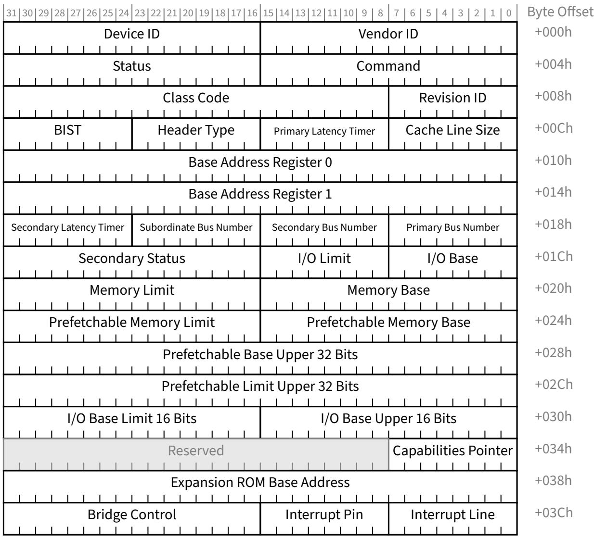

</div>


[⬆️ 返回目录](#-本章目录-table-of-contents)

---

---

<a id="sec-7-5-1-3-1"></a>
## 7.5.1.3.1 Type 1 Base Address Registers (Offset 10h-14h) | Type 1 基址寄存器 (偏移 10h-14h)

<table>
<thead>
<tr>
<th width="50%">🇬🇧 English</th>
<th width="50%" style="background-color:#e8e8e8">🏆 中文</th>
</tr>
</thead>
<tbody>
<tr>
<td>

Except as noted, this register is not used by PCI Express Functions but must be implemented as read-write and the default value must be 00h, for compatibility with legacy software. PCI Express Functions capture the Bus (and Device) Number as described (including exceptions) in § Section 2.2.6 . Refer to [PCIe-to-PCI-PCI-X-Bridge] for exceptions to this requirement.

The Secondary Bus Number register is used to record the bus number of the PCI bus segment to which the secondary interface of the bridge is connected. Configuration software programs the value in this register. The Bridge uses this register to determine when and how to respond to an ID-routed TLP observed on its primary interface, notably when to forward the TLP to its secondary interface, in certain cases after performing some conversion. See § Section 7.3.3 for Configuration Request routing and conversion rules. This register must be implemented as read/write and the default value must be 00h.

The Subordinate Bus Number register is used to record the bus number of the highest numbered PCI bus segment which is behind (or subordinate to) the bridge. Configuration software programs the value in this register. The Bridge uses this register to determine when and how to respond to an ID-routed TLP observed on its primary interface, notably when to forward the TLP to its secondary interface. See § Section 7.3.3 for Configuration Request routing rules. This register must be implemented as read-write and the default value must be 00h.

This register does not apply to PCI Express. It must be read-only and hardwired to 00h. For PCI Express to PCI/PCI-X Bridges, refer to the [PCIe-to-PCI-PCI-X-Bridge] for requirements for this register.

The I/O Base and I/O Limit registers are optional and define an address range that is used by the bridge to determine when to forward I/O transactions from one interface to the other.

If a bridge does not implement an I/O address range, then both the I/O Base and I/O Limit registers must be implemented as read-only registers that return zero when read. If a bridge supports an I/O address range, then these registers must be initialized by configuration software so default states are not specified.

If a bridge implements an I/O address range, the upper 4 bits of both the I/O Base and I/O Limit registers are writable and correspond to address bits Address[15:12]. For the purpose of address decoding, the bridge assumes that the lower 12 address bits, Address[11:0], of the I/O base address (not implemented in the I/O Base register) are zero. Similarly, the bridge assumes that the lower 12 address bits, Address[11:0], of the I/O limit address (not implemented in the I/O Limit register) are FFFh. Thus, the bottom of the defined I/O address range will be aligned to a 4 KB boundary and the top of the defined I/O address range will be one less than a 4 KB boundary.

The I/O Limit register can be programmed to a smaller value than the I/O Base register, if there are no I/O addresses on the secondary side of the bridge. In this case, the bridge will not forward any I/O transactions from the primary bus to the secondary and will forward all I/O transactions from the secondary bus to the primary bus.

7.5.1.3.2 Primary Bus Number Register (Offset 18h) §

7.5.1.3.3 Secondary Bus Number Register (Offset 19h) §

7.5.1.3.4 Subordinate Bus Number Register (Offset 1Ah) §

7.5.1.3.5 Secondary Latency Timer (Offset 1Bh) §

7.5.1.3.6 I/O Base/I/O Limit Registers(Offset 1Ch/1Dh) §

</td>
<td style="background-color:#e8e8e8">

除特别说明外,该寄存器不被 PCI Express 端点 (Endpoint) Function 使用,但出于对传统软件的兼容性,必须实现为读写 (read-write) 寄存器,且默认值必须为 00h。PCI Express Function 按 § Section 2.2.6 中的描述 (含例外情况) 捕获 Bus (和 Device) Number。有关此要求的例外情况,请参阅 [PCIe-to-PCI-PCI-X-Bridge]。

Secondary Bus Number 寄存器用于记录桥 (Bridge) 的 secondary 接口所连接 PCI 总线段的 bus number。配置软件对该寄存器中的值进行编程。桥使用此寄存器来确定何时以及如何响应在其 primary 接口上观察到的 ID-routed TLP (事务层包),特别是何时将 TLP 转发到其 secondary 接口,在某些情况下会先执行某些转换后转发。有关配置请求 (Configuration Request) 路由和转换规则,请参阅 § Section 7.3.3。该寄存器必须实现为 read/write 寄存器,默认值必须为 00h。

Subordinate Bus Number 寄存器用于记录位于桥后 (或从属于桥) 的最高编号 PCI 总线段的 bus number。配置软件对该寄存器中的值进行编程。桥使用此寄存器来确定何时以及如何响应在其 primary 接口上观察到的 ID-routed TLP,特别是何时将 TLP 转发到其 secondary 接口。有关配置请求 (Configuration Request) 路由规则,请参阅 § Section 7.3.3。该寄存器必须实现为 read-write 寄存器,默认值必须为 00h。

此寄存器不适用于 PCI Express。它必须为只读并硬连线 (hardwired) 为 00h。对于 PCI Express 到 PCI/PCI-X 的桥,请参阅 [PCIe-to-PCI-PCI-X-Bridge] 中有关此寄存器的要求。

I/O Base 和 I/O Limit 寄存器是可选的,用于定义一个地址范围,桥使用该范围来确定何时将 I/O 事务从一个接口转发到另一个接口。

如果桥未实现 I/O 地址范围,则 I/O Base 和 I/O Limit 寄存器都必须实现为只读寄存器,读取时返回零。如果桥支持 I/O 地址范围,则这些寄存器必须由配置软件进行初始化,因此未指定默认状态。

如果桥实现 I/O 地址范围,则 I/O Base 和 I/O Limit 寄存器的高 4 位可写,对应于地址位 Address[15:12]。出于地址解码的目的,桥假定 I/O 基址的低 12 地址位 Address[11:0] (I/O Base 寄存器中未实现) 为零。类似地,桥假定 I/O 限制地址的低 12 地址位 Address[11:0] (I/O Limit 寄存器中未实现) 为 FFFh。因此,所定义的 I/O 地址范围的底部将与 4 KB 边界对齐,顶部将比 4 KB 边界少一。

如果桥 secondary 侧没有 I/O 地址,则 I/O Limit 寄存器可被编程为小于 I/O Base 寄存器的值。在这种情况下,桥不会将任何 I/O 事务从 primary 总线转发到 secondary,而是将所有 I/O 事务从 secondary 总线转发到 primary 总线。

7.5.1.3.2 Primary Bus Number 寄存器 (偏移 18h) §

7.5.1.3.3 Secondary Bus Number 寄存器 (偏移 19h) §

7.5.1.3.4 Subordinate Bus Number 寄存器 (偏移 1Ah) §

7.5.1.3.5 Secondary Latency Timer (偏移 1Bh) §

7.5.1.3.6 I/O Base/I/O Limit 寄存器 (偏移 1Ch/1Dh) §

</td>
</tr>
</tbody>
</table>

---

<!-- 📄 Page 1014 -->
---

<a id="sec-7-5-1-3-1-cont"></a>
## 7.5.1.3.1 Type 1 Base Address Registers (Offset 10h-14h) (continued) | Type 1 基址寄存器 (偏移 10h-14h) (续)


<div style="overflow-x: auto; max-width: 100%;">
<table>
<thead>
<tr>
<th width="50%">🇬🇧 English</th>
<th width="50%" style="background-color:#e8e8e8">🏆 中文</th>
</tr>
</thead>
<tbody>
<tr>
<td>

The lower four bits of both the I/O Base and I/O Limit registers are read-only, contain the same value, and encode the I/O addressing capability of the bridge according to § Table 7-11.

Table 7-11 I/O Addressing Capability

| Bits 3:0 | I/O Addressing Capability |
|----------|----------------------------|
| 0h       | 16-bit I/O addressing      |
| 1h       | 32-bit I/O addressing      |
| 2h-Fh    | Reserved                   |

If the low four bits of the I/O Base and I/O Limit registers have the value 0000b, then the bridge supports only 16-bit I/O addressing (for ISA compatibility), and, for the purpose of address decoding, the bridge assumes that the upper 16 address bits, Address[31:16], of the I/O base and I/O limit address (not implemented in the I/O Base and I/O Limit registers) are zero. Note that the bridge must still perform a full 32-bit decode of the I/O address (i.e., check that Address[31:16] are 0000h). In this case, the I/O address range supported by the bridge will be restricted to the first 64 KB of I/O Space (0000 0000h to 0000 FFFFh).

If the low four bits of the I/O Base and I/O Limit registers are 0001b, then the bridge supports 32-bit I/O address decoding, and the I/O Base Upper 16 Bits and the I/O Limit Upper 16 Bits hold the upper 16 bits, corresponding to Address[31:16], of the 32-bit I/O Base and I/O Limit addresses respectively. In this case, system configuration software is permitted to locate the I/O address range supported by the bridge anywhere in the 4 GB I/O Space. Note that the 4 KB alignment and granularity restrictions still apply when the bridge supports 32-bit I/O addressing.

These registers must be initialized by configuration software, so default states are not specified.

§ Table 7-12 defines the Secondary Status Register and § Figure 7-15 provides the register layout. For PCI Express to PCI/PCI-X Bridges, refer to the [PCIe-to-PCI-PCI-X-Bridge] for requirements for this register.

7.5.1.3.7 Secondary Status Register (Offset 1Eh) §

</td>
<td style="background-color:#e8e8e8">

I/O Base 和 I/O Limit 寄存器的低 4 位均为只读,包含相同的值,并按 § Table 7-11 对桥的 I/O 寻址能力进行编码。

**Table 7-11 I/O 寻址能力 | 表 7-11 I/O 寻址能力**

| Bits 3:0 | I/O 寻址能力 |
|----------|--------------|
| 0h       | 16-bit I/O 寻址 |
| 1h       | 32-bit I/O 寻址 |
| 2h-Fh    | 保留 (Reserved) |

如果 I/O Base 和 I/O Limit 寄存器的低 4 位为 0000b,则桥仅支持 16-bit I/O 寻址 (为兼容 ISA),并且出于地址解码的目的,桥假定 I/O 基址和 I/O 限制地址的高 16 地址位 Address[31:16] (I/O Base 和 I/O Limit 寄存器中未实现) 为零。请注意,桥仍必须对 I/O 地址执行完整的 32-bit 解码 (即检查 Address[31:16] 是否为 0000h)。在这种情况下,桥支持的 I/O 地址范围将限制在 I/O 空间 (I/O Space) 的前 64 KB (0000 0000h 至 0000 FFFFh)。

如果 I/O Base 和 I/O Limit 寄存器的低 4 位为 0001b,则桥支持 32-bit I/O 地址解码,且 I/O Base Upper 16 Bits 和 I/O Limit Upper 16 Bits 分别保存 32-bit I/O Base 和 I/O Limit 地址的高 16 位,对应 Address[31:16]。在这种情况下,系统配置软件可以将桥支持的 I/O 地址范围放置在 4 GB I/O 空间中的任何位置。请注意,即使桥支持 32-bit I/O 寻址,4 KB 对齐和粒度限制仍然适用。

这些寄存器必须由配置软件进行初始化,因此未指定默认状态。

§ Table 7-12 定义了 Secondary Status 寄存器,§ Figure 7-15 给出了寄存器布局。对于 PCI Express 到 PCI/PCI-X 的桥,请参阅 [PCIe-to-PCI-PCI-X-Bridge] 中有关此寄存器的要求。

7.5.1.3.7 Secondary Status 寄存器 (偏移 1Eh) §

</td>
</tr>
</tbody>
</table>
</div>


---

<!-- 📄 Page 1015 -->
---

<a id="sec-7-5-1-3-7"></a>
## 7.5.1.3.7 Secondary Status Register (Offset 1Eh) | Secondary Status 寄存器 (偏移 1Eh)

<table>
<thead>
<tr>
<th width="50%">🇬🇧 English</th>
<th width="50%" style="background-color:#e8e8e8">🏆 中文</th>
</tr>
</thead>
<tbody>
<tr>
<td>

| Bit | Description |
|-----|-------------|
| 0-4 | RsvdZ |
| 5   | 66 MHz Capable |
| 6   | RsvdZ |
| 7   | Fast Back-to-Back Transactions Capable |
| 8   | Master Data Parity Error |
| 9-10 | DEVSEL Timing |
| 11  | Signaled Target Abort |
| 12  | Received Target Abort |
| 13  | Received Master Abort |
| 14  | Received System Error |
| 15  | Detected Parity Error |

> **Figure 7-15.** Secondary Status Register

> 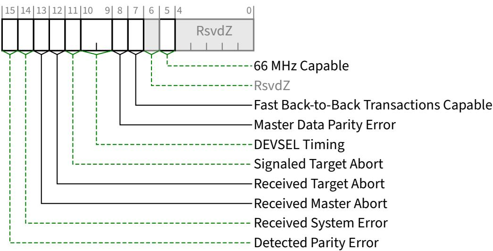


Table 7-12 Secondary Status Register

| Bit Location | Register Description | Attributes |
|--------------|----------------------|------------|
| 5 | 66 MHz Capable - This bit was originally described in the [PCI-to-PCI-Bridge]. Its functionality does not apply to PCI Express and the bit must be hardwired to 0b. | RO |
| 7 | Fast Back-to-Back Transactions Capable - This bit was originally described in the [PCI-to-PCI-Bridge]. Its functionality does not apply to PCI Express and the bit must be hardwired to 0b. | RO |
| 8 | Master Data Parity Error - See § Section 7.5.1.1.14 . This bit is Set by a Function with a Type 1 Configuration Space Header if the Parity Error Response Enable bit in the Bridge Control Register is Set and either of the following two conditions occurs: Port receives a Poisoned Completion coming Upstream; Port transmits a Poisoned Request Downstream. If the Parity Error Response Enable bit is Clear, this bit is never Set. Default value of this bit is 0b. | RW1C |
| 10:9 | DEVSEL Timing - This field was originally described in the [PCI-to-PCI-Bridge]. Its functionality does not apply to PCI Express and the field must be hardwired to 00b. | RO |
| 11 | Signaled Target Abort - See § Section 7.5.1.1.14 . This bit is Set when the Secondary Side for Type 1 Configuration Space Header Function (for Requests completed by the Type 1 header Function itself) completes a Posted or Non-Posted Request as a Completer Abort error. Default value of this bit is 0b. | RW1C |
| 12 | Received Target Abort - See § Section 7.5.1.1.14 . This bit is Set when the Secondary Side for Type 1 Configuration Space Header Function (for Requests initiated by the Type 1 header Function itself) receives a Completion with Completer Abort Completion Status. | RW1C |

</td>
<td style="background-color:#e8e8e8">

| Bit | 描述 |
|-----|------|
| 0-4 | RsvdZ |
| 5   | 66 MHz Capable |
| 6   | RsvdZ |
| 7   | Fast Back-to-Back Transactions Capable |
| 8   | Master Data Parity Error |
| 9-10 | DEVSEL Timing |
| 11  | Signaled Target Abort |
| 12  | Received Target Abort |
| 13  | Received Master Abort |
| 14  | Received System Error |
| 15  | Detected Parity Error |

> **Figure 7-15.** Secondary Status 寄存器

**Table 7-12 Secondary Status 寄存器 | 表 7-12 Secondary Status 寄存器**

| Bit Location | 寄存器描述 | 属性 |
|--------------|-----------|------|
| 5 | 66 MHz Capable — 此位最初在 [PCI-to-PCI-Bridge] 中描述。其功能不适用于 PCI Express,且该位必须硬连线 (hardwired) 为 0b。 | RO |
| 7 | Fast Back-to-Back Transactions Capable — 此位最初在 [PCI-to-PCI-Bridge] 中描述。其功能不适用于 PCI Express,且该位必须硬连线为 0b。 | RO |
| 8 | Master Data Parity Error — 见 § Section 7.5.1.1.14 。如果 Bridge Control 寄存器中的 Parity Error Response Enable 位被置位 (Set),且发生以下两种情况之一,则具有 Type 1 配置空间头 (Configuration Space Header) 的 Function 将该位置位:Port 上行 (Upstream) 收到一个 Poisoned Completion;Port 下行 (Downstream) 发出一个 Poisoned Request。如果 Parity Error Response Enable 位为清零 (Clear),则此位永远不会被置位。此位的默认值为 0b。 | RW1C |
| 10:9 | DEVSEL Timing — 此字段最初在 [PCI-to-PCI-Bridge] 中描述。其功能不适用于 PCI Express,且该字段必须硬连线为 00b。 | RO |
| 11 | Signaled Target Abort — 见 § Section 7.5.1.1.14 。当 Type 1 配置空间头 Function 的 Secondary 侧 (针对由 Type 1 头 Function 自身完成的请求) 以 Completer Abort 错误完成一个 Posted 或 Non-Posted 请求时,此位被置位。此位的默认值为 0b。 | RW1C |
| 12 | Received Target Abort — 见 § Section 7.5.1.1.14 。当 Type 1 配置空间头 Function 的 Secondary 侧 (针对由 Type 1 头 Function 自身发起的请求) 收到一个完成状态 (Completion Status) 为 Completer Abort 的 Completion 时,此位被置位。 | RW1C |


</td>
</tr>
</tbody>
</table>

---

<!-- 📄 Page 1016 -->
---

<a id="sec-7-5-1-3-7-cont"></a>
## 7.5.1.3.7 Secondary Status Register (continued) | Secondary Status 寄存器 (续)


<div style="overflow-x: auto; max-width: 100%;">
<table>
<thead>
<tr>
<th width="50%">🇬🇧 English</th>
<th width="50%" style="background-color:#e8e8e8">🏆 中文</th>
</tr>
</thead>
<tbody>
<tr>
<td>

| Bit Location | Register Description | Attributes |
|--------------|----------------------|------------|
| 12 (cont.) | Default value of this bit is 0b. | RW1C |
| 13 | Received Master Abort - See § Section 7.5.1.1.14 . This bit is Set when the Secondary Side for Type 1 Configuration Space Header Function (for Requests initiated by the Type 1 header Function itself) receives a Completion with Unsupported Request Completion Status. Default value of this bit is 0b. | RW1C |
| 14 | Received System Error - See § Section 7.5.1.1.14 . This bit is Set when the Secondary Side for a Type 1 Configuration Space Header Function receives an ERR_FATAL or ERR_NONFATAL Message. Default value of this bit is 0b. | RW1C |
| 15 | Detected Parity Error - See § Section 7.5.1.1.14 . This bit is Set by a Function with a Type 1 Configuration Space Header when a Poisoned TLP is received by its Secondary Side, regardless of the state the Parity Error Response Enable bit in the Bridge Control Register. Default value of this bit is 0b. | RW1C |

</td>
<td style="background-color:#e8e8e8">

| Bit 位置 | 寄存器描述 | 属性 |
|--------------|-----------|------|
| 12 (续) | 此位的默认值为 0b。 | RW1C |
| 13 | Received Master Abort — 见 § Section 7.5.1.1.14 。当 Type 1 配置空间头 Function 的 Secondary 侧 (针对由 Type 1 头 Function 自身发起的请求) 收到一个完成状态为 Unsupported Request 的 Completion 时,此位被置位。此位的默认值为 0b。 | RW1C |
| 14 | Received System Error — 见 § Section 7.5.1.1.14 。当 Type 1 配置空间头 Function 的 Secondary 侧收到 ERR_FATAL 或 ERR_NONFATAL 消息 (Message) 时,此位被置位。此位的默认值为 0b。 | RW1C |
| 15 | Detected Parity Error — 见 § Section 7.5.1.1.14 。当具有 Type 1 配置空间头的 Function 的 Secondary 侧接收到一个中毒 TLP (Poisoned TLP) 时,此位被置位,无论 Bridge Control 寄存器中 Parity Error Response Enable 位处于何种状态。此位的默认值为 0b。 | RW1C |

</td>
</tr>
</tbody>
</table>
</div>


---

<!-- 📄 Page 1017 -->
---

<a id="sec-7-5-1-3-8"></a>
## 7.5.1.3.8 Memory Base Register/Memory Limit Register (Offset 20h/22h) | Memory Base 寄存器 / Memory Limit 寄存器 (偏移 20h/22h)

<table>
<thead>
<tr>
<th width="50%">🇬🇧 English</th>
<th width="50%" style="background-color:#e8e8e8">🏆 中文</th>
</tr>
</thead>
<tbody>
<tr>
<td>

The Memory Base and Memory Limit registers define a memory mapped address range which is used by the bridge to determine when to forward memory transactions from one interface to the other (see the [PCI-to-PCI-Bridge] for additional details).

The upper 12 bits of both the Memory Base and Memory Limit registers are read/write and correspond to the upper 12 address bits, Address[31:20], of 32-bit addresses. For the purpose of address decoding, the bridge assumes that the lower 20 address bits, Address[19:0], of the memory base address (not implemented in the Memory Base register) are zero. Similarly, the bridge assumes that the lower 20 address bits, Address[19:0], of the memory limit address (not implemented in the Memory Limit register) are F FFFFh. Thus, the bottom of the defined memory address range will be aligned to a 1 MB boundary and the top of the defined memory address range will be one less than a 1 MB boundary.

The Memory Limit register must be programmed to a smaller value than the Memory Base register if there is no memory-mapped address space on the secondary side of the bridge.

If there is no prefetchable memory space, and there is no memory-mapped space on the secondary side of the bridge, then the bridge will not forward any memory transactions from the primary bus to the secondary bus and will forward all memory transactions from the secondary bus to the primary bus.

The bottom four bits of both the Memory Base and Memory Limit registers are read-only and return zeros when read.

These registers must be initialized by configuration software, so default states are not specified.

The Prefetchable Memory Base and Prefetchable Memory Limit registers, if implemented, must indicate that 64-bit addresses are supported.

The Prefetchable Memory Base and Prefetchable Memory Limit registers define a prefetchable memory address range that is used by the bridge to determine when to forward memory transactions from one interface to the other.

7.5.1.3.8 Memory Base Register/Memory Limit Register(Offset 20h/22h) §

7.5.1.3.9 Prefetchable Memory Base/Prefetchable Memory Limit Registers (Offset 24h/26h) §

</td>
<td style="background-color:#e8e8e8">

Memory Base 和 Memory Limit 寄存器定义一个内存映射地址范围,桥使用该范围来确定何时将内存事务从一个接口转发到另一个接口 (有关更多详细信息,请参阅 [PCI-to-PCI-Bridge])。

Memory Base 和 Memory Limit 寄存器的高 12 位为 read/write,对应 32-bit 地址的高 12 位 Address[31:20]。出于地址解码的目的,桥假定内存基址的低 20 地址位 Address[19:0] (Memory Base 寄存器中未实现) 为零。类似地,桥假定内存限制地址的低 20 地址位 Address[19:0] (Memory Limit 寄存器中未实现) 为 F FFFFh。因此,所定义的内存地址范围的底部将与 1 MB 边界对齐,顶部将比 1 MB 边界少一。

如果桥 secondary 侧没有内存映射地址空间,则 Memory Limit 寄存器必须被编程为小于 Memory Base 寄存器的值。

如果桥 secondary 侧没有可预取内存空间,且没有内存映射空间,则桥不会将任何内存事务从 primary 总线转发到 secondary 总线,而是将所有内存事务从 secondary 总线转发到 primary 总线。

Memory Base 和 Memory Limit 寄存器的低 4 位均为只读,读取时返回零。

这些寄存器必须由配置软件进行初始化,因此未指定默认状态。

如果实现了 Prefetchable Memory Base 和 Prefetchable Memory Limit 寄存器,则必须指示支持 64-bit 地址。

Prefetchable Memory Base 和 Prefetchable Memory Limit 寄存器定义一个可预取内存地址范围,桥使用该范围来确定何时将内存事务从一个接口转发到另一个接口。

7.5.1.3.8 Memory Base 寄存器 / Memory Limit 寄存器 (偏移 20h/22h) §

7.5.1.3.9 Prefetchable Memory Base / Prefetchable Memory Limit 寄存器 (偏移 24h/26h) §

</td>
</tr>
</tbody>
</table>

---

<!-- 📄 Page 1018 -->
---

<a id="sec-7-5-1-3-9-cont"></a>
## 7.5.1.3.9 Prefetchable Memory Base/Prefetchable Memory Limit Registers (continued) | Prefetchable Memory Base / Prefetchable Memory Limit 寄存器 (续)


<div style="overflow-x: auto; max-width: 100%;">
<table>
<thead>
<tr>
<th width="50%">🇬🇧 English</th>
<th width="50%" style="background-color:#e8e8e8">🏆 中文</th>
</tr>
</thead>
<tbody>
<tr>
<td>

If a bridge does not implement a prefetchable memory address range, then both Prefetchable Memory Base and Prefetchable Memory Limit registers must be implemented as read-only registers that return zero when read. If a bridge implements a Prefetchable memory address range, then both of these registers must be implemented as read/write registers. If a bridge supports a prefetchable memory address range, then these registers must be initialized by configuration software so default states are not specified.

If the bridge implements a prefetchable memory address range, the upper 12 bits of the register are read/write and correspond to the upper 12 address bits, Address[31:20], of 32-bit addresses. For the purpose of address decoding, the bridge assumes that the lower 20 address bits, Address[19:0], of the prefetchable memory base address (not implemented in the Prefetchable Memory Base register) are zero. Similarly, the bridge assumes that the lower 20 address bits, Address[19:0], of the prefetchable memory limit address (not implemented in the Prefetchable Memory Limit register) are F FFFFh. Thus, the bottom of the defined prefetchable memory address range will be aligned to a 1 MB boundary and the top of the defined memory address range will be one less than a 1 MB boundary.

The Prefetchable Memory Limit register must be programmed to a smaller value than the Prefetchable Memory Base register if there is no prefetchable memory on the secondary side of the bridge. If there is no prefetchable memory, and there is no memory-mapped address space (see the [PCI-to-PCI-Bridge]) on the secondary side of the bridge, then the bridge will not forward any memory transactions from the primary bus to the secondary but will forward all memory transactions from the secondary bus to the primary bus.

The bottom 4 bits of both the Prefetchable Memory Base and Prefetchable Memory Limit registers are read-only, contain the same value, and encode whether or not the bridge supports 64-bit addresses. If these four bits have the value 0h, then the bridge supports only 32-bit addresses. If these four bits have the value 01h, then the bridge supports 64-bit addresses and the Prefetchable Base Upper 32 Bits and Prefetchable Limit Upper 32 Bits registers hold the rest of the 64-bit prefetchable base and limit addresses respectively. All other encodings are Reserved.

These registers must be initialized by configuration software, so default states are not specified.

</td>
<td style="background-color:#e8e8e8">

如果桥未实现可预取内存地址范围,则 Prefetchable Memory Base 和 Prefetchable Memory Limit 寄存器都必须实现为只读寄存器,读取时返回零。如果桥实现了 Prefetchable 内存地址范围,则这两个寄存器都必须实现为 read/write 寄存器。如果桥支持可预取内存地址范围,则这些寄存器必须由配置软件进行初始化,因此未指定默认状态。

如果桥实现了可预取内存地址范围,则该寄存器的高 12 位为 read/write,对应 32-bit 地址的高 12 位 Address[31:20]。出于地址解码的目的,桥假定可预取内存基址的低 20 地址位 Address[19:0] (Prefetchable Memory Base 寄存器中未实现) 为零。类似地,桥假定可预取内存限制地址的低 20 地址位 Address[19:0] (Prefetchable Memory Limit 寄存器中未实现) 为 F FFFFh。因此,所定义的可预取内存地址范围的底部将与 1 MB 边界对齐,顶部将比 1 MB 边界少一。

如果桥 secondary 侧没有可预取内存,则 Prefetchable Memory Limit 寄存器必须被编程为小于 Prefetchable Memory Base 寄存器的值。如果桥 secondary 侧没有可预取内存,且没有内存映射地址空间 (见 [PCI-to-PCI-Bridge]),则桥不会将任何内存事务从 primary 总线转发到 secondary,而是将所有内存事务从 secondary 总线转发到 primary 总线。

Prefetchable Memory Base 和 Prefetchable Memory Limit 寄存器的低 4 位均为只读,包含相同的值,并对桥是否支持 64-bit 地址进行编码。如果这 4 位的值为 0h,则桥仅支持 32-bit 地址。如果这 4 位的值为 01h,则桥支持 64-bit 地址,且 Prefetchable Base Upper 32 Bits 和 Prefetchable Limit Upper 32 Bits 寄存器分别保存 64-bit 可预取基址和限制地址的其余部分。所有其他编码均为保留 (Reserved)。

这些寄存器必须由配置软件进行初始化,因此未指定默认状态。

</td>
</tr>
</tbody>
</table>
</div>


---

<a id="sec-7-5-1-3-10"></a>
## 7.5.1.3.10 Prefetchable Base Upper 32 Bits/Prefetchable Limit Upper 32 Bits Registers (Offset 28h/2Ch) | Prefetchable Base Upper 32 Bits / Prefetchable Limit Upper 32 Bits 寄存器 (偏移 28h/2Ch)

<table>
<thead>
<tr>
<th width="50%">🇬🇧 English</th>
<th width="50%" style="background-color:#e8e8e8">🏆 中文</th>
</tr>
</thead>
<tbody>
<tr>
<td>

If a bridge does not implement a prefetchable memory address range, then both Prefetchable Memory Base Upper 32 Bits and Prefetchable Memory Limit Upper 32 Bits registers must be implemented as read-only registers that return zero when read. If a bridge implements a prefetchable memory address range, then both of these registers must be implemented as read/write registers that must be initialized by configuration software. They specify the upper 32 bits, corresponding to Address[63:32], of the 64-bit base and limit addresses that specify the prefetchable memory address range.

These registers must be initialized by configuration software, so default states are not specified.

</td>
<td style="background-color:#e8e8e8">

如果桥未实现可预取内存地址范围,则 Prefetchable Memory Base Upper 32 Bits 和 Prefetchable Memory Limit Upper 32 Bits 寄存器都必须实现为只读寄存器,读取时返回零。如果桥实现了可预取内存地址范围,则这两个寄存器都必须实现为 read/write 寄存器,并必须由配置软件进行初始化。它们指定了指定可预取内存地址范围的 64-bit 基址和限制地址的高 32 位,对应 Address[63:32]。

这些寄存器必须由配置软件进行初始化,因此未指定默认状态。

</td>
</tr>
</tbody>
</table>

---

<a id="sec-7-5-1-3-11"></a>
## 7.5.1.3.11 I/O Base Upper 16 Bits/I/O Limit Upper 16 Bits Registers (Offset 30h/32h) | I/O Base Upper 16 Bits / I/O Limit Upper 16 Bits 寄存器 (偏移 30h/32h)


<div style="overflow-x: auto; max-width: 100%;">
<table>
<thead>
<tr>
<th width="50%">🇬🇧 English</th>
<th width="50%" style="background-color:#e8e8e8">🏆 中文</th>
</tr>
</thead>
<tbody>
<tr>
<td>

The I/O Base Upper 16 Bits and I/O Limit Upper 16 Bits registers are optional extensions to the I/O Base and I/O Limit registers. If the I/O Base and I/O Limit registers indicate support for 16-bit I/O address decoding, then the I/O Base Upper 16 Bits and I/O Limit Upper 16 Bits registers are implemented as read-only registers which return zero when read.

If the I/O Base and I/O Limit registers indicate support for 32-bit I/O addressing, then the I/O Base Upper 16 Bits and I/O Limit Upper 16 Bits registers must be initialized by configuration software so default states are not specified.

If 32-bit I/O address decoding is supported, the I/O Base Upper 16 Bits and the I/O Limit Upper 16 Bits registers specify the upper 16 bits, corresponding to Address[31:16], of the 32-bit base and limit addresses respectively, that specify the I/O address range (see the [PCI-to-PCI-Bridge] for additional details).

These registers must be initialized by configuration software, so default states are not specified.

7.5.1.3.10 Prefetchable Base Upper 32 Bits/Prefetchable Limit Upper 32 Bits Registers (Offset 28h/2Ch) §

7.5.1.3.11 I/O Base Upper 16 Bits/I/O Limit Upper 16 Bits Registers (Offset 30h/32h) §

</td>
<td style="background-color:#e8e8e8">

I/O Base Upper 16 Bits 和 I/O Limit Upper 16 Bits 寄存器是 I/O Base 和 I/O Limit 寄存器的可选扩展。如果 I/O Base 和 I/O Limit 寄存器指示支持 16-bit I/O 地址解码,则 I/O Base Upper 16 Bits 和 I/O Limit Upper 16 Bits 寄存器实现为只读寄存器,读取时返回零。

如果 I/O Base 和 I/O Limit 寄存器指示支持 32-bit I/O 寻址,则 I/O Base Upper 16 Bits 和 I/O Limit Upper 16 Bits 寄存器必须由配置软件进行初始化,因此未指定默认状态。

如果支持 32-bit I/O 地址解码,则 I/O Base Upper 16 Bits 和 I/O Limit Upper 16 Bits 寄存器分别指定 32-bit 基址和限制地址的高 16 位,对应 Address[31:16],用于指定 I/O 地址范围 (有关更多详细信息,请参阅 [PCI-to-PCI-Bridge])。

这些寄存器必须由配置软件进行初始化,因此未指定默认状态。

7.5.1.3.10 Prefetchable Base Upper 32 Bits / Prefetchable Limit Upper 32 Bits 寄存器 (偏移 28h/2Ch) §

7.5.1.3.11 I/O Base Upper 16 Bits / I/O Limit Upper 16 Bits 寄存器 (偏移 30h/32h) §

</td>
</tr>
</tbody>
</table>
</div>


---

<!-- 📄 Page 1019 -->
---

<a id="sec-7-5-1-3-12"></a>
## 7.5.1.3.12 Expansion ROM Base Address Register (Offset 38h) | Expansion ROM 基址寄存器 (偏移 38h)

<table>
<thead>
<tr>
<th width="50%">🇬🇧 English</th>
<th width="50%" style="background-color:#e8e8e8">🏆 中文</th>
</tr>
</thead>
<tbody>
<tr>
<td>

This register is defined in § Section 7.5.1.2.4 . However the offset of the register within the Type 1 Configuration Space Header is different than that of the Type 0 Configuration Space Header.

</td>
<td style="background-color:#e8e8e8">

此寄存器在 § Section 7.5.1.2.4 中定义。但是,该寄存器在 Type 1 配置空间头 (Configuration Space Header) 中的偏移与在 Type 0 配置空间头中的偏移不同。

</td>
</tr>
</tbody>
</table>

---

<a id="sec-7-5-1-3-13"></a>
## 7.5.1.3.13 Bridge Control Register (Offset 3Eh) | Bridge Control 寄存器 (偏移 3Eh)


<div style="overflow-x: auto; max-width: 100%;">
<table>
<thead>
<tr>
<th width="50%">🇬🇧 English</th>
<th width="50%" style="background-color:#e8e8e8">🏆 中文</th>
</tr>
</thead>
<tbody>
<tr>
<td>

The Bridge Control Register provides extensions to the Command Register that are specific to a Function with a Type 1 Configuration Space Header. The Bridge Control Register provides many of the same controls for the secondary interface that are provided by the Command Register for the primary interface. There are some bits that affect the operation of both interfaces of the bridge.

§ Table 7-13 defines the Bridge Control Register and § Figure 7-16 depicts register layout. For PCI Express to PCI/PCI-X Bridges, refer to the [PCIe-to-PCI-PCI-X-Bridge] for requirements for this register.

| Bit | Description |
|-----|-------------|
| 0   | Parity Error Response Enable |
| 1   | SERR# Enable |
| 2   | ISA Enable |
| 3   | VGA Enable |
| 4   | VGA 16-bit Decode |
| 5   | Master Abort Mode |
| 6   | Secondary Bus Reset |
| 7   | Fast Back-to-Back Transactions Enable |
| 8   | Primary Discard Timer |
| 9   | Secondary Discard Timer |
| 10  | Discard Timer Status |
| 11  | Discard Timer SERR# Enable |
| 12-15 | RsvdP |

> **Figure 7-16.** Bridge Control Register

> 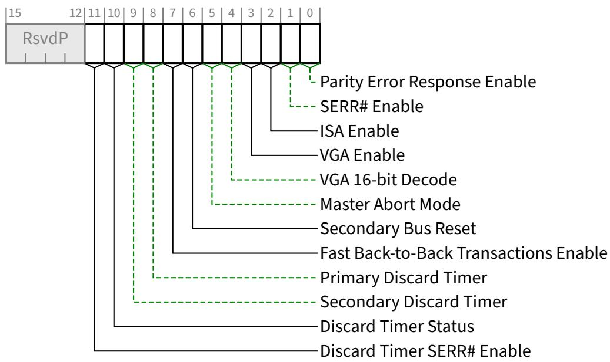


Table 7-13 Bridge Control Register

| Bit Location | Register Description | Attributes |
|--------------|----------------------|------------|
| 0 | Parity Error Response Enable - See § Section 7.5.1.1.14 . This bit controls the logging of poisoned TLPs in the Master Data Parity Error bit in the Secondary Status Register. Default value of this bit is 0b. | RW |
| 1 | SERR# Enable - See § Section 7.5.1.1.14 . This bit controls forwarding of ERR_COR, ERR_NONFATAL and ERR_FATAL from secondary to primary. | RW |

7.5.1.3.12 Expansion ROM Base Address Register (Offset 38h) §

7.5.1.3.13 Bridge Control Register (Offset 3Eh) §

</td>
<td style="background-color:#e8e8e8">

Bridge Control 寄存器提供 Command 寄存器的扩展,这些扩展特定于具有 Type 1 配置空间头 (Configuration Space Header) 的 Function。Bridge Control 寄存器为 secondary 接口提供了许多与 Command 寄存器为 primary 接口所提供的相同控制。某些位会影响桥两个接口的操作。

§ Table 7-13 定义了 Bridge Control 寄存器,§ Figure 7-16 描述了寄存器布局。对于 PCI Express 到 PCI/PCI-X 的桥,请参阅 [PCIe-to-PCI-PCI-X-Bridge] 中有关此寄存器的要求。

| Bit | 描述 |
|-----|------|
| 0   | Parity Error Response Enable |
| 1   | SERR# Enable |
| 2   | ISA Enable |
| 3   | VGA Enable |
| 4   | VGA 16-bit Decode |
| 5   | Master Abort Mode |
| 6   | Secondary Bus Reset |
| 7   | Fast Back-to-Back Transactions Enable |
| 8   | Primary Discard Timer |
| 9   | Secondary Discard Timer |
| 10  | Discard Timer Status |
| 11  | Discard Timer SERR# Enable |
| 12-15 | RsvdP |

> **Figure 7-16.** Bridge Control 寄存器

**Table 7-13 Bridge Control 寄存器 | 表 7-13 Bridge Control 寄存器**

| Bit 位置 | 寄存器描述 | 属性 |
|--------------|-----------|------|
| 0 | Parity Error Response Enable — 见 § Section 7.5.1.1.14 。此位控制是否在 Secondary Status 寄存器的 Master Data Parity Error 位中记录中毒 TLP (Poisoned TLP)。此位的默认值为 0b。 | RW |
| 1 | SERR# Enable — 见 § Section 7.5.1.1.14 。此位控制 ERR_COR、ERR_NONFATAL 和 ERR_FATAL 从 secondary 到 primary 的转发。 | RW |

7.5.1.3.12 Expansion ROM 基址寄存器 (偏移 38h) §

7.5.1.3.13 Bridge Control 寄存器 (偏移 3Eh) §


</td>
</tr>
</tbody>
</table>
</div>


---

<!-- 📄 Page 1020 -->
---

<a id="sec-7-5-1-3-13-cont"></a>
## 7.5.1.3.13 Bridge Control Register (continued) | Bridge Control 寄存器 (续)

<table>
<thead>
<tr>
<th width="50%">🇬🇧 English</th>
<th width="50%" style="background-color:#e8e8e8">🏆 中文</th>
</tr>
</thead>
<tbody>
<tr>
<td>

| Bit Location | Register Description | Attributes |
|--------------|----------------------|------------|
| 1 (cont.) | Default value of this bit is 0b. | RW |
| 2 | ISA Enable - Modifies the response by the bridge to ISA I/O addresses. This applies only to I/O addresses that are enabled by the I/O Base and I/O Limit registers and are in the first 64 KB of I/O address space (0000 0000h to 0000 FFFFh). If this bit is Set, the bridge will block any forwarding from primary to secondary of I/O transactions addressing the last 768 bytes in each 1 KB block. In the opposite direction (secondary to primary), I/O transactions will be forwarded if they address the last 768 bytes in each 1 KB block. | RW |
|  | - forward downstream all I/O addresses in the address range defined by the I/O Base and I/O Limit registers |  |
|  | - forward upstream ISA I/O addresses in the address range defined by the I/O Base and I/O Limit registers that are in the first 64 KB of PCI I/O address space (top 768 bytes of each 1 KB block) |  |
|  | Default value of this bit is 0b. |  |
| 3 | VGA Enable - Modifies the response by the bridge to VGA compatible addresses. If the VGA Enable bit is Set, the bridge will positively decode and forward the following accesses on the primary interface to the secondary interface (and, conversely, block the forwarding of these addresses from the secondary to primary interface): | RW |
|  | - Memory accesses in the range 000A 0000h to 000B FFFFh |  |
|  | - I/O addresses in the first 64 KB of the I/O address space (Address[31:16] are 0000h) where Address[9:0] are in the ranges 3B0h to 3BBh and 3C0h to 3DFh (inclusive of ISA address aliases determined by the setting of VGA 16-bit Decode) |  |
|  | If the VGA Enable bit is Set, forwarding of these accesses is independent of the I/O address range and memory address ranges defined by the I/O Base and Limit registers, the Memory Base and Limit registers, and the Prefetchable Memory Base and Limit registers of the bridge. Forwarding of these accesses is also independent of the setting of the ISA Enable bit (in the Bridge Control Register) when the VGA Enable bit is Set. Forwarding of these accesses is qualified by the I/O Space Enable and Memory Space Enable bits in the Command Register. |  |
|  | - do not forward VGA compatible memory and I/O addresses from the primary to the secondary interface (addresses defined above) unless they are enabled for forwarding by the defined I/O and memory address ranges |  |
|  | - forward VGA compatible memory and I/O addresses (addresses defined above) from the primary interface to the secondary interface (if the I/O Space Enable and Memory Space Enable bits are set) independent of the I/O and memory address ranges and independent of the ISA Enable bit |  |
|  | Functions that do not support VGA are permitted to hardwire this bit to 0b. |  |
|  | Default value of this bit is 0b. |  |
| 4 | VGA 16-bit Decode - This bit only has meaning if bit 3 (VGA Enable) of this register is also Set, enabling VGA I/O decoding and forwarding by the bridge. This bit enables system configuration software to select between 10-bit and 16-bit I/O address decoding for all VGA I/O register accesses that are forwarded from primary to secondary. | RW |
|  | - execute 10-bit address decodes on VGA I/O accesses |  |
|  | - execute 16-bit address decodes on VGA I/O accesses |  |
|  | Functions that do not support VGA are permitted to hardwire this bit to 0b. |  |
|  | Default value of this bit is 0b. |  |

</td>
<td style="background-color:#e8e8e8">

| Bit 位置 | 寄存器描述 | 属性 |
|--------------|-----------|------|
| 1 (续) | 此位的默认值为 0b。 | RW |
| 2 | ISA Enable — 修改桥对 ISA I/O 地址的响应。这仅适用于由 I/O Base 和 I/O Limit 寄存器使能的、且位于 I/O 地址空间 (0000 0000h 至 0000 FFFFh) 前 64 KB 内的 I/O 地址。如果此位置位 (Set),则桥将阻止从 primary 向 secondary 转发寻址每个 1 KB 块最后 768 字节的 I/O 事务。在反方向 (secondary 到 primary) 上,如果 I/O 事务寻址每个 1 KB 块的最后 768 字节,则将被转发。 | RW |
|  | — 将 I/O Base 和 I/O Limit 寄存器定义的地址范围内的所有 I/O 地址向下游 (downstream) 转发 |  |
|  | — 将 I/O Base 和 I/O Limit 寄存器定义的地址范围内、且位于 PCI I/O 地址空间前 64 KB 内 (每个 1 KB 块的顶部 768 字节) 的 ISA I/O 地址向上游 (upstream) 转发 |  |
|  | 此位的默认值为 0b。 |  |
| 3 | VGA Enable — 修改桥对 VGA 兼容地址的响应。如果 VGA Enable 位置位,则桥将对 primary 接口上的以下访问进行正向解码并转发到 secondary 接口 (反之亦然,阻止这些地址从 secondary 向 primary 接口的转发): | RW |
|  | — 范围在 000A 0000h 至 000B FFFFh 内的内存访问 |  |
|  | — 位于 I/O 地址空间前 64 KB 内 (Address[31:16] 为 0000h) 且 Address[9:0] 在 3B0h 至 3BBh 和 3C0h 至 3DFh 范围内的 I/O 地址 (包括由 VGA 16-bit Decode 设置确定的 ISA 地址别名) |  |
|  | 如果 VGA Enable 位置位,则这些访问的转发与桥的 I/O Base 和 Limit 寄存器、Memory Base 和 Limit 寄存器,以及 Prefetchable Memory Base 和 Limit 寄存器所定义的 I/O 地址范围和内存地址范围无关。当 VGA Enable 位置位时,这些访问的转发也与 Bridge Control 寄存器中 ISA Enable 位的设置无关。这些访问的转发受 Command 寄存器中 I/O Space Enable 和 Memory Space Enable 位的限定。 |  |
|  | — 不将 VGA 兼容的内存和 I/O 地址 (上文定义的地址) 从 primary 转发到 secondary 接口,除非它们已由所定义的 I/O 和内存地址范围使能转发 |  |
|  | — 将 VGA 兼容的内存和 I/O 地址 (上文定义的地址) 从 primary 接口转发到 secondary 接口 (如果 I/O Space Enable 和 Memory Space Enable 位置位),与 I/O 和内存地址范围无关,也与 ISA Enable 位无关 |  |
|  | 不支持 VGA 的 Function 可将该位硬连线 (hardwired) 为 0b。 |  |
|  | 此位的默认值为 0b。 |  |
| 4 | VGA 16-bit Decode — 此位仅在该寄存器的 bit 3 (VGA Enable) 也置位、使能桥的 VGA I/O 解码和转发时才有意义。此位使系统配置软件能够为从 primary 转发到 secondary 的所有 VGA I/O 寄存器访问选择 10-bit 或 16-bit I/O 地址解码。 | RW |
|  | — 对 VGA I/O 访问执行 10-bit 地址解码 |  |
|  | — 对 VGA I/O 访问执行 16-bit 地址解码 |  |
|  | 不支持 VGA 的 Function 可将该位硬连线为 0b。 |  |
|  | 此位的默认值为 0b。 |  |

</td>
</tr>
</tbody>
</table>

---

<!-- 📄 Page 1021 -->
---

<a id="sec-7-5-1-3-13-cont2"></a>
## 7.5.1.3.13 Bridge Control Register (continued) | Bridge Control 寄存器 (续)


<div style="overflow-x: auto; max-width: 100%;">
<table>
<thead>
<tr>
<th width="50%">🇬🇧 English</th>
<th width="50%" style="background-color:#e8e8e8">🏆 中文</th>
</tr>
</thead>
<tbody>
<tr>
<td>

| Bit Location | Register Description | Attributes |
|--------------|----------------------|------------|
| 5 | Master Abort Mode - This bit was originally described in the [PCI-to-PCI-Bridge]. Its functionality does not apply to PCI Express and the bit must be hardwired to 0b. | RO |
| 6 | Secondary Bus Reset - Setting this bit triggers a hot reset on the corresponding PCI Express Port. Software must ensure a minimum reset duration of 1 ms, (corresponding to Trst in [PCI]). Software and systems must honor first-access-following-reset timing requirements defined in § Section 6.6 ., unless the Readiness Notifications mechanism (see § Section 6.22 ) is used or if the Immediate Readiness bit in the relevant Function's Status register is Set. | RW |
|  | Port configuration registers must not be changed, except as required to update Port status. |  |
|  | See Implementation Note: Delays in Data Link Layer Link Active Reflecting Link Control Operations for related information. |  |
|  | Default value of this bit is 0b. |  |
| 7 | Fast Back-to-Back Transactions Enable - This bit was originally described in the [PCI-to-PCI-Bridge]. Its functionality does not apply to PCI Express and the bit must be hardwired to 0b. | RO |
| 8 | Primary Discard Timer - This bit was originally described in the [PCI-to-PCI-Bridge]. Its functionality does not apply to PCI Express and the bit must be hardwired to 0b. | RO |
| 9 | Secondary Discard Timer - This bit was originally described in the [PCI-to-PCI-Bridge]. Its functionality does not apply to PCI Express and the bit must be hardwired to 0b. | RO |
| 10 | Discard Timer Status - This bit was originally described in the [PCI-to-PCI-Bridge]. Its functionality does not apply to PCI Express and the bit must be hardwired to 0b. | RO |
| 11 | Discard Timer SERR# Enable - This bit was originally described in the [PCI-to-PCI-Bridge]. Its functionality does not apply to PCI Express and must be hardwired to 0b. | RO |

</td>
<td style="background-color:#e8e8e8">

| Bit 位置 | 寄存器描述 | 属性 |
|--------------|-----------|------|
| 5 | Master Abort Mode — 此位最初在 [PCI-to-PCI-Bridge] 中描述。其功能不适用于 PCI Express,且该位必须硬连线 (hardwired) 为 0b。 | RO |
| 6 | Secondary Bus Reset — 置位此位会在相应的 PCI Express 端口 (Port) 上触发热复位 (Hot Reset)。软件必须确保最小复位持续时间为 1 ms (对应 [PCI] 中的 Trst)。除非使用 Readiness Notifications 机制 (见 § Section 6.22 ),或相关 Function 的 Status 寄存器中 Immediate Readiness 位置位,否则软件和系统必须遵守 § Section 6.6 中定义的 first-access-following-reset 时序要求。 | RW |
|  | 除更新 Port 状态所需外,不得更改 Port 配置寄存器。 |  |
|  | 相关信息请参阅 Implementation Note: Delays in Data Link Layer Link Active Reflecting Link Control Operations。 |  |
|  | 此位的默认值为 0b。 |  |
| 7 | Fast Back-to-Back Transactions Enable — 此位最初在 [PCI-to-PCI-Bridge] 中描述。其功能不适用于 PCI Express,且该位必须硬连线为 0b。 | RO |
| 8 | Primary Discard Timer — 此位最初在 [PCI-to-PCI-Bridge] 中描述。其功能不适用于 PCI Express,且该位必须硬连线为 0b。 | RO |
| 9 | Secondary Discard Timer — 此位最初在 [PCI-to-PCI-Bridge] 中描述。其功能不适用于 PCI Express,且该位必须硬连线为 0b。 | RO |
| 10 | Discard Timer Status — 此位最初在 [PCI-to-PCI-Bridge] 中描述。其功能不适用于 PCI Express,且该位必须硬连线为 0b。 | RO |
| 11 | Discard Timer SERR# Enable — 此位最初在 [PCI-to-PCI-Bridge] 中描述。其功能不适用于 PCI Express,且必须硬连线为 0b。 | RO |

</td>
</tr>
</tbody>
</table>
</div>


---

<a id="sec-7-5-1-4"></a>
## 7.5.1.4 PCI Power Management Capability Structure | PCI 电源管理能力结构

<table>
<thead>
<tr>
<th width="50%">🇬🇧 English</th>
<th width="50%" style="background-color:#e8e8e8">🏆 中文</th>
</tr>
</thead>
<tbody>
<tr>
<td>

This section describes the registers making up the PCI Power Management Interface structure.

§ Figure 7-17 illustrates the organization of the PCI Power Management Capability structure. This structure is required for all PCI Express Functions.

> **Figure 7-17.** PCI Power Management Capability Structure
> 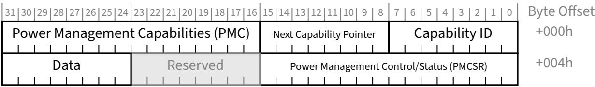

| Byte Offset | Register |
|-------------|----------|
| +000h | Capability ID |
|  | Next Capability Pointer |
|  | Power Management Capabilities (PMC) |
|  | Power Management Control/Status (PMCSR) |
| +004h | Reserved |
|  | Data |

Note: The 8-bit Power Management Data Register (Offset 07h) is optional for both Type 0 and Type 1 Functions.

PCI Express device Functions are required to support D0 and D3 device states; PCI-PCI Bridge structures representing PCI Express Ports as described in § Section 7.1 are required to indicate PME Message passing capability due to the in-band nature of PME messaging for PCI Express.

</td>
<td style="background-color:#e8e8e8">

本节描述构成 PCI 电源管理 (Power Management) 接口结构的寄存器。

§ Figure 7-17 说明了 PCI 电源管理能力 (Power Management Capability) 结构的组织。该结构对于所有 PCI Express Function 均为必需。

| Byte 偏移 | 寄存器 |
|-------------|----------|
| +000h | Capability ID |
|  | Next Capability Pointer |
|  | Power Management Capabilities (PMC) |
|  | Power Management Control/Status (PMCSR) |
| +004h | Reserved |
|  | Data |

注:8-bit Power Management Data 寄存器 (偏移 07h) 对于 Type 0 和 Type 1 Function 均为可选。

PCI Express 设备 Function 必须支持 D0 和 D3 设备状态;对于 § Section 7.1 中描述的、表示 PCI Express 端口 (Port) 的 PCI-PCI 桥结构,鉴于 PCI Express 中 PME 消息 (Message) 的带内 (in-band) 性质,必须指示 PME Message 传递能力。


</td>
</tr>
</tbody>
</table>

---

<!-- 📄 Page 1022 -->
---


---

<a id="sec-7-5-2"></a>
## 7.5.2 PCI Power Management Capability Structure | PCI 电源管理能力结构

<table>
<thead>
<tr>
<th width="50%">🇬🇧 English</th>
<th width="50%" style="background-color:#e8e8e8">🏆 中文</th>
</tr>
</thead>
<tbody>
<tr>
<td>

The PME_Status bit for the PCI-PCI Bridge structure representing PCI Express Ports, however, is only Set when the PCI-PCI Bridge Function is itself generating a PME. The PME_Status bit is not Set when the Bridge is propagating a PME Message but the PCI-PCI Bridge Function itself is not internally generating a PME.

§ Figure 7-18 details allocation of register fields for Power Management Capabilities Register and § Table 7-14 describes the requirements for this register.

</td>
<td style="background-color:#e8e8e8">

然而，对于表示 PCI Express 端口的 PCI-PCI 桥 (Bridge) 结构，其 PME_Status 位仅在 PCI-PCI 桥功能自身正在产生 PME 时才会被置位。当桥正在转发 PME 消息 (PME Message) 但 PCI-PCI 桥功能自身并未在内部产生 PME 时，PME_Status 位不会被置位。

§ 图 7-18 详细说明了电源管理能力寄存器 (Power Management Capabilities Register) 中各寄存器字段的分配；§ 表 7-14 描述了该寄存器的要求。

</td>
</tr>
</tbody>
</table>

> **Figure 7-18.** Power Management Capabilities Register
> 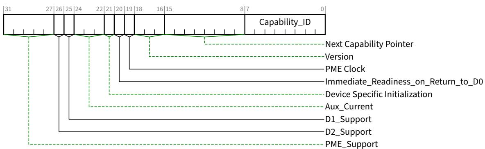

**Table 7-14. Power Management Capabilities Register | 表 7-14. 电源管理能力寄存器**

| Bit Location | Register Description | Attributes |
|--------------|----------------------|------------|
| 7:0 | **Capability_ID** - This field returns 01h to indicate that this is the PCI Power Management Capability. Each Function may have only one item in its capability list with Capability_ID set to 01h. | RO |
| 15:8 | **Next Capability Pointer** - This field provides an offset into the Function's Configuration Space pointing to the location of next item in the capabilities list. If there are no additional items in the capabilities list, this field is set to 00h. | RO |
| 18:16 | **Version** - Must be hardwired to 011b for Functions compliant to this specification. | RO |
| 19 | **PME Clock** - Does not apply to PCI Express and must be hardwired to 0b. | RO |
| 20 | **Immediate_Readiness_on_Return_to_D0** - If this bit is a "1", this Function is guaranteed to be ready to successfully complete valid accesses immediately after being set to D0. These accesses include Configuration cycles, and if the Function returns to D0<sub>active</sub>, they also include Memory and I/O Cycles. When this bit is "1", for accesses to this Function, software is exempt from all requirements to delay accesses following a transition to D0, including but not limited to the 10 ms delay; the delays described in § Section 5.9. How this guarantee is established is beyond the scope of this document. It is permitted that system software/firmware provide mechanisms that supersede the indication provided by this bit, however such software/firmware mechanisms are outside the scope of this specification. | RO |
| 21 | **Device Specific Initialization** - The DSI bit indicates whether special initialization of this Function is required. When Set indicates that the Function requires a device specific initialization sequence following a transition to the D0<sub>uninitialized</sub> state. | RO |

[⬆️ 返回目录](#-本章目录-table-of-contents)

---

<a id="sec-7-5-2-1"></a>
## 7.5.2.1 Power Management Capabilities Register (Offset 00h) | 电源管理能力寄存器（偏移量 00h）


<div style="overflow-x: auto; max-width: 100%;">
<table>
<thead>
<tr>
<th width="50%">🇬🇧 English</th>
<th width="50%" style="background-color:#e8e8e8">🏆 中文</th>
</tr>
</thead>
<tbody>
<tr>
<td>

| Bit Location | Register Description | Attributes |
| 24:22 | **Aux_Current**<sup>162</sup> - This 3 bit field reports the V<sub>aux</sub> auxiliary current requirements for the Function. If this Function implements the Power Management Data Register, this field must be hardwired to 000b. If PME_Support is 0 xxxxb (PME assertion from D3<sub>Cold</sub> is not supported) and the Aux Power PM Enable feature is not implemented, this field must be hardwired to 000b. For Functions where PME_Support is 1 xxxxb (PME assertion from D3<sub>Cold</sub> is supported), and which do not implement the Power Management Data Register, the following encodings apply: | RO |

**Encoding — V<sub>aux</sub> Max. Power Required**

- 111b — 1238 mW (e.g., 3.3 V at 375 mA)
- 110b — 1056 mW (e.g., 3.3 V at 320 mA)
- 101b — 891 mW (e.g., 3.3 V at 270 mA)
- 100b — 726 mW (e.g., 3.3 V at 220 mA)
- 011b — 528 mW (e.g., 3.3 V at 160 mA)
- 010b — 330 mW (e.g., 3.3 V at 100 mA)
- 001b — 182 mW (e.g., 3.3 V at 55 mA)
- 000b — 0 mW (no V<sub>aux</sub> power or self powered)

For encoding 000b, when the add-in card is self powered (e.g., it contains a battery), it is recommended that the Power Budgeting Extended Capability be used to report the thermal requirements of the add-in card.

**Note:** Additional Aux power is permitted to be allocated using the firmware based mechanism (see the Request D3Cold Aux Power Limit _DSM call as defined in [Firmware]). Additional Aux power is also permitted to be allocated by selecting a PM Sub State in the Power Limit mechanism (see § Section 7.8.1.3).

| 25 | **D1_Support** - If this bit is Set, this Function supports the D1 Power Management State. Functions that do not support D1 must always return a value of 0b for this bit. | RO |
| 26 | **D2_Support** - If this bit is Set, this Function supports the D2 Power Management State. Functions that do not support D2 must always return a value of 0b for this bit. | RO |
| 31:27 | **PME_Support** - This 5-bit field indicates the power states in which the Function may generate a PME and/or forward PME Messages. A value of 0b for any bit indicates that the Function is not capable of asserting PME while in that power state. <br/>bit(27) — X XXX1b — PME can be generated from D0 <br/>bit(28) — X XX1Xb — PME can be generated from D1 <br/>bit(29) — X X1XXb — PME can be generated from D2 <br/>bit(30) — X 1XXXb — PME can be generated from D3<sub>Hot</sub> <br/>bit(31) — 1 XXXXb — PME can be generated from D3<sub>Cold</sub> | RO |

<sup>162</sup>. Earlier versions of this specification defined power levels as current (mA) at 3.3 V (hence the field name "Aux_Current"). To support form factors with different Aux Power voltage levels, the definition was changed to the equivalent wattage values (mW).

</td>
<td style="background-color:#e8e8e8">

| 位位置 | 寄存器描述 | 属性 |
| 24:22 | **Aux_Current**<sup>162</sup> — 该 3 位字段用于报告该功能 (Function) 的 V<sub>aux</sub> 辅助电流需求。如果该功能实现了电源管理数据寄存器 (Power Management Data Register)，此字段必须硬连线 (hardwired) 为 000b。如果 PME_Support 为 0 xxxxb（不支持从 D3<sub>Cold</sub> 发出 PME）且未实现 Aux Power PM Enable 功能，则此字段必须硬连线为 000b。对于 PME_Support 为 1 xxxxb（支持从 D3<sub>Cold</sub> 发出 PME）且未实现电源管理数据寄存器的功能，适用以下编码： | RO |

**编码 — V<sub>aux</sub> 最大所需功率**

- 111b — 1238 mW（例如，3.3 V，375 mA）
- 110b — 1056 mW（例如，3.3 V，320 mA）
- 101b — 891 mW（例如，3.3 V，270 mA）
- 100b — 726 mW（例如，3.3 V，220 mA）
- 011b — 528 mW（例如，3.3 V，160 mA）
- 010b — 330 mW（例如，3.3 V，100 mA）
- 001b — 182 mW（例如，3.3 V，55 mA）
- 000b — 0 mW（无 V<sub>aux</sub> 电源或自供电）

对于编码 000b，当附加卡 (add-in card) 为自供电时（例如包含电池），建议使用 Power Budgeting Extended Capability 来报告附加卡的热需求。

**注：** 可通过基于固件的机制分配额外的 Aux 功率（参见 [Firmware] 中定义的 Request D3Cold Aux Power Limit _DSM 调用）。也可以通过在 Power Limit 机制中选择 PM Sub State 来分配额外的 Aux 功率（参见 § 7.8.1.3）。

| 25 | **D1_Support** — 如果该位置位，则表示该功能支持 D1 电源管理状态。不支持 D1 的功能必须始终对该位返回 0b 值。 | RO |
| 26 | **D2_Support** — 如果该位置位，则表示该功能支持 D2 电源管理状态。不支持 D2 的功能必须始终对该位返回 0b 值。 | RO |
| 31:27 | **PME_Support** — 该 5 位字段指示该功能可在哪些电源状态下产生 PME 和/或转发 PME 消息。任何位为 0b 表示该功能在该电源状态下不能发出 PME。<br/>bit(27) — X XXX1b — 可从 D0 产生 PME<br/>bit(28) — X XX1Xb — 可从 D1 产生 PME<br/>bit(29) — X X1XXb — 可从 D2 产生 PME<br/>bit(30) — X 1XXXb — 可从 D3<sub>Hot</sub> 产生 PME<br/>bit(31) — 1 XXXXb — 可从 D3<sub>Cold</sub> 产生 PME | RO |

<sup>162</sup>. 本规范的早期版本将功率级别定义为 3.3 V 下的电流（mA）（因此字段名为 "Aux_Current"）。为了支持不同 Aux Power 电压级别的外形规格，定义被更改为等效的瓦数值（mW）。

</td>
</tr>
</tbody>
</table>
</div>


[⬆️ 返回目录](#-本章目录-table-of-contents)

---

<!-- 📄 Page 1024 -->
---

<table>
<thead>
<tr>
<th width="50%">🇬🇧 English</th>
<th width="50%" style="background-color:#e8e8e8">🏆 中文</th>
</tr>
</thead>
<tbody>
<tr>
<td>

| Bit Location | Register Description | Attributes |
| 31:27 (continued) | Bit 31 (PME can be asserted from D3<sub>Cold</sub>) represents a special case. Functions that Set this bit require some sort of auxiliary power source. Implementation specific mechanisms are recommended to validate that the power source is available before setting this bit. Each bit that corresponds to a supported D-state must be Set for PCI-PCI Bridge structures representing Ports on Root Complexes/Switches to indicate that the Bridge will forward PME Messages. Bit 31 must only be Set if the Port is still able to forward PME Messages when main power is not available. | RO |

This register is used to manage the PCI Function's power management state as well as to enable/monitor PMEs.

The PME Context includes the value of the PME_Status and PME_En bits, implementation specific state needed during D3<sub>Cold</sub> to implement the wakeup functionality (e.g., recognized a Wake on LAN packet and generate a PME Message), as well as any additional implementation specific state that must be preserved during a transition to the D0<sub>uninitialized</sub> state.

If a Function supports PME generation from D3<sub>Cold</sub>, its PME Context is not affected by Reset. This is because the Function's PME functionality itself may have been responsible for the wake event which caused the transition back to D0. Therefore, the PME Context must be preserved for the system software to process.

If PME generation is not supported from D3<sub>Cold</sub>, then all PME Context is initialized with the assertion of Reset.

§ Figure 7-19 details allocation of the register fields for the Power Management Control/Status Register and § Table 7-15 describes the requirements for this register.

</td>
<td style="background-color:#e8e8e8">

| 位位置 | 寄存器描述 | 属性 |
| 31:27（续） | 第 31 位（可从 D3<sub>Cold</sub> 发出 PME）代表一种特殊情况。置位该位的功能需要某种辅助电源。建议在置位该位之前，通过具体实现机制验证电源可用。对于表示根复合体 (Root Complex) / 交换机 (Switch) 上端口的 PCI-PCI 桥结构，每个对应受支持 D 状态的位都必须置位，以表明该桥将转发 PME 消息。第 31 位仅当端口在主电源不可用时仍能转发 PME 消息时才可置位。 | RO |

该寄存器用于管理 PCI 功能的电源管理状态，以及使能/监视 PME。

PME 上下文 (PME Context) 包括 PME_Status 和 PME_En 位的值、在 D3<sub>Cold</sub> 期间实现唤醒功能所需的实现特定状态（例如，识别到 Wake on LAN 数据包并生成 PME 消息），以及在向 D0<sub>uninitialized</sub> 状态转换期间必须保留的任何其他实现特定状态。

如果功能支持从 D3<sub>Cold</sub> 产生 PME，则其 PME 上下文不受复位 (Reset) 影响。这是因为该功能的 PME 功能本身可能就是导致转换回 D0 的唤醒事件的原因。因此，必须保留 PME 上下文供系统软件处理。

如果不支持从 D3<sub>Cold</sub> 产生 PME，则所有 PME 上下文在复位信号置位时被初始化。

§ 图 7-19 详细说明了电源管理控制/状态寄存器 (Power Management Control/Status Register) 中各寄存器字段的分配；§ 表 7-15 描述了该寄存器的要求。

</td>
</tr>
</tbody>
</table>

> **Figure 7-19.** Power Management Control/Status Register
> 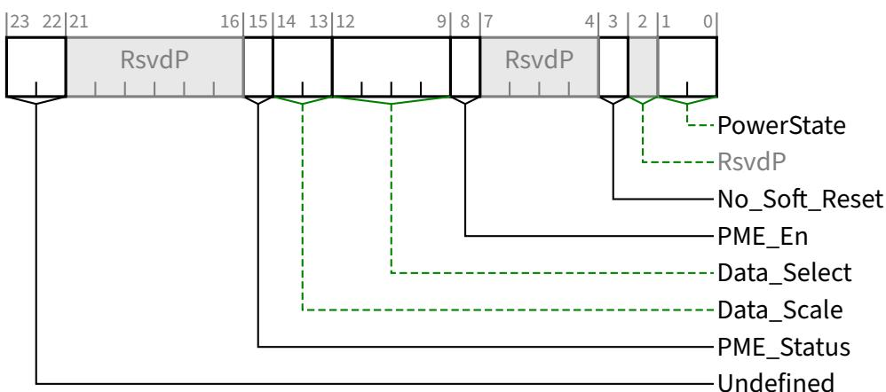

**Table 7-15. Power Management Control/Status Register | 表 7-15. 电源管理控制/状态寄存器**

| Bit Location | Register Description | Attributes |
|--------------|----------------------|------------|
| 1:0 | **PowerState** - This 2-bit field is used both to determine the current power state of a Function and to set the Function into a new power state. The definition of the field values is given below. | RW |

[⬆️ 返回目录](#-本章目录-table-of-contents)

---

<a id="sec-7-5-2-2"></a>
## 7.5.2.2 Power Management Control/Status Register (Offset 04h) | 电源管理控制/状态寄存器（偏移量 04h）


<div style="overflow-x: auto; max-width: 100%;">
<table>
<thead>
<tr>
<th width="50%">🇬🇧 English</th>
<th width="50%" style="background-color:#e8e8e8">🏆 中文</th>
</tr>
</thead>
<tbody>
<tr>
<td>

**PowerState Encoding:**

- 00b — D0
- 01b — D1
- 10b — D2
- 11b — D3<sub>Hot</sub>

If software attempts to write an unsupported, optional state to this field, the write operation must complete normally; however, the data is discarded and no state change occurs.

Default value of this field is 00b.

| Bit Location | Register Description | Attributes |
|--------------|----------------------|------------|
| 3 | **No_Soft_Reset** - This bit indicates the state of the Function after writing the PowerState field to transition the Function from D3<sub>Hot</sub> to D0. This bit MUST@FLIT be Set. When Set, this transition preserves internal Function state. The Function is in D0<sub>Active</sub> and no additional software intervention is required. When Clear, this transition results in undefined internal Function state. Regardless of this bit, Functions that transition from D3<sub>Hot</sub> to D0 by Fundamental Reset must return to D0<sub>uninitialized</sub> with only PME context preserved if PME is supported and enabled. If a VF implements the PCI Power Management Capability, the VF's value of this field must be identical to the associated PF's value. | RO |
| 8 | **PME_En** - When Set, the Function is permitted to generate a PME. When Clear, the Function is not permitted to generate a PME. If PME_Support is 1 xxxxb (PME generation from D3<sub>Cold</sub>) or the Function consumes auxiliary power and auxiliary power is available this bit is RWS and the bit is not modified by Conventional Reset or FLR. If PME_Support is 0 xxxxb, this field is not sticky (RW) and defaults to 0b in response to a Conventional Reset or an FLR. If PME_Support is 0 0000b, this bit is permitted to be hardwired to 0b. | RW/RWS |
| 12:9 | **Data_Select** - This 4-bit field is used to select which data is to be reported through the Power Management Data Register and Data_Scale field. If the Power Management Data Register is not implemented, this field must be hardwired to Zero. Refer to § Section 7.5.2.3 for more details. The default of this field is Zero. | RW / VF ROZ |
| 14:13 | **Data_Scale** - This field indicates the scaling factor to be used when interpreting the value of the Data register. The value and meaning of this field will vary depending on which data value has been selected by the Data_Select field. This field is a required component of the Power Management Data Register (offset 7) and must be implemented if the Power Management Data Register is implemented. If the Power Management Data Register is not implemented, this field must be hardwired to Zero. Refer to § Section 7.5.2.3 for more details. | RO / VF ROZ |
| 15 | **PME_Status** - This bit is Set when the Function would normally generate a PME signal. The value of this bit is not affected by the value of the PME_En bit. If PME_Support bit 31 of the Power Management Capabilities Register is Clear, this bit is permitted to be hardwired to 0b. Functions that consume auxiliary power must preserve the value of this sticky register when auxiliary power is available. In such Functions, this register value is not modified by Conventional Reset or FLR. | RW1CS |

</td>
<td style="background-color:#e8e8e8">

**PowerState 编码：**

- 00b — D0
- 01b — D1
- 10b — D2
- 11b — D3<sub>Hot</sub>

如果软件尝试向该字段写入不支持的可选状态，写操作必须正常完成；但是数据被丢弃，不发生状态改变。

该字段的默认值为 00b。

| 位位置 | 寄存器描述 | 属性 |
|--------------|----------------------|------------|
| 3 | **No_Soft_Reset** — 该位指示在向 PowerState 字段写入以将功能从 D3<sub>Hot</sub> 转换到 D0 之后功能的状态。该位 MUST@FLIT 置位。置位时，此转换保留功能的内部状态。功能处于 D0<sub>Active</sub> 状态，不需要额外的软件干预。清零时，此转换导致功能的内部状态未定义。无论该位如何，通过基本复位 (Fundamental Reset) 从 D3<sub>Hot</sub> 转换到 D0 的功能必须在支持且启用 PME 的情况下，仅保留 PME 上下文，返回到 D0<sub>uninitialized</sub>。如果 VF 实现 PCI Power Management Capability，则 VF 的该字段值必须与关联 PF 的值相同。 | RO |
| 8 | **PME_En** — 置位时，允许功能产生 PME。清零时，不允许功能产生 PME。如果 PME_Support 为 1 xxxxb（从 D3<sub>Cold</sub> 产生 PME）或功能消耗辅助电源且辅助电源可用，则该位为 RWS，且该位不被常规复位 (Conventional Reset) 或 FLR 修改。如果 PME_Support 为 0 xxxxb，该字段是非粘性 (RW) 的，并在常规复位或 FLR 响应中默认为 0b。如果 PME_Support 为 0 0000b，则该位允许硬连线为 0b。 | RW/RWS |
| 12:9 | **Data_Select** — 该 4 位字段用于选择要通过电源管理数据寄存器和 Data_Scale 字段报告的数据。如果未实现电源管理数据寄存器，则此字段必须硬连线为零。有关更多详细信息，请参阅 § 7.5.2.3。此字段的默认值为零。 | RW / VF ROZ |
| 14:13 | **Data_Scale** — 该字段指示解释数据寄存器值时使用的缩放因子。该字段的值和含义将根据由 Data_Select 字段选择的数据值而变化。该字段是电源管理数据寄存器（偏移 7）的必需组件，如果实现了电源管理数据寄存器，则必须实现该字段。如果未实现电源管理数据寄存器，则此字段必须硬连线为零。有关更多详细信息，请参阅 § 7.5.2.3。 | RO / VF ROZ |
| 15 | **PME_Status** — 当功能通常会生成 PME 信号时，该位置位。该位的值不受 PME_En 位值的影响。如果电源管理能力寄存器的 PME_Support 第 31 位被清零，则该位允许硬连线为 0b。消耗辅助电源的功能在辅助电源可用时必须保留此粘性寄存器的值。在此类功能中，该寄存器值不被常规复位或 FLR 修改。 | RW1CS |

</td>
</tr>
</tbody>
</table>
</div>


[⬆️ 返回目录](#-本章目录-table-of-contents)

---

<!-- 📄 Page 1026 -->
---

<table>
<thead>
<tr>
<th width="50%">🇬🇧 English</th>
<th width="50%" style="background-color:#e8e8e8">🏆 中文</th>
</tr>
</thead>
<tbody>
<tr>
<td>

| Bit Location | Register Description | Attributes |
| 23:22 | **Undefined** Undefined - these bits were defined in previous specifications. They should be ignored by software. | RO |

The Power Management Data Register is an optional, 8-bit read-only register that provides a mechanism for the Function to report state dependent operating power consumed or dissipation.

If the Power Management Data Register is implemented, then the Data_Select and Data_Scale fields must also be implemented. If this register is not implemented, it must be hardwired to 00h.

Software may check for the presence of the Power Management Data Register by writing different values into the Data_Select field, looking for non-zero return data in the Power Management Data Register and/or Data_Scale field. Any non-zero Power Management Data Register/Data_Select read data indicates that the Power Management Data Register complex has been implemented.

</td>
<td style="background-color:#e8e8e8">

| 位位置 | 寄存器描述 | 属性 |
| 23:22 | **Undefined** 未定义 — 这些位在以前的规范中曾经定义过。软件应忽略这些位。 | RO |

电源管理数据寄存器 (Power Management Data Register) 是一个可选的、8 位只读寄存器，为功能提供了一种机制来报告与状态相关的运行功耗或散热。

如果实现了电源管理数据寄存器，则还必须实现 Data_Select 和 Data_Scale 字段。如果未实现该寄存器，则必须将其硬连线为 00h。

软件可以通过将不同的值写入 Data_Select 字段来检查电源管理数据寄存器的存在，查找电源管理数据寄存器和/或 Data_Scale 字段中的非零返回数据。任何非零的电源管理数据寄存器/Data_Select 读数据都表明已经实现了电源管理数据寄存器复合体。

</td>
</tr>
</tbody>
</table>

> **Figure 7-20.** Power Management Data Register
> 

**Table 7-16. Power Management Data Register | 表 7-16. 电源管理数据寄存器**

| Bit Location | Register Description | Attributes |
|--------------|----------------------|------------|
| 7:0 | **Data** - This register is used to report the state dependent data requested by the Data_Select field. The value of this register is scaled by the value reported by the Data_Scale field. For VFs, this register is not supported and must be hardwired to Zero. | RO / VF ROZ |

[⬆️ 返回目录](#-本章目录-table-of-contents)

---

<a id="sec-7-5-2-3"></a>
## 7.5.2.3 Power Management Data Register (Offset 07h) | 电源管理数据寄存器（偏移量 07h）


<div style="overflow-x: auto; max-width: 100%;">
<table>
<thead>
<tr>
<th width="50%">🇬🇧 English</th>
<th width="50%" style="background-color:#e8e8e8">🏆 中文</th>
</tr>
</thead>
<tbody>
<tr>
<td>

The Power Management Data Register is used by writing the proper value to the Data_Select field in the PMCSR and then reading the Data_Scale field and the Power Management Data Register. The binary value read from Data is then multiplied by the scaling factor indicated by Data_Scale to arrive at the value for the desired measurement. § Table 7-17 shows which measurements are defined and how to interpret the values of each register.

**Table 7-17. Power Consumption/Dissipation Reporting | 表 7-17. 功耗/散热报告**

| Value in Data_Select | Data Reported | Data_Scale | Interpretation | Units/Accuracy |
|----------------------|---------------|------------|----------------|----------------|
| 0 | D0 Power Consumed | 0 = Unknown<br>1 = 0.1x<br>2 = 0.01x<br>3 = 0.001x | | Watts |
| 1 | D1 Power Consumed | | | |
| 2 | D2 Power Consumed | | | |
| 3 | D3 Power Consumed | | | |
| 4 | D0 Power Dissipated | | | |
| 5 | D1 Power Dissipated | | | |
| 6 | D2 Power Dissipated | | | |
| 7 | D3 Power Dissipated | | | |
| 8 | Common logic power consumption (Multi-Function Devices, Function 0 only) | | Function 0 of a Multi-Function Device: Power consumption that is not associated with a specific Function. All other Functions: Reserved | |
| 9-15 | Reserved | Reserved | TBD | |

The "Power Consumed" values defined above must include all power consumed from the power planes through the connector pins. If the add-in card provides power to external devices, that power must be included as well. It must not include any power derived from a battery or an external source. This information is useful for management of the power supply or battery.

The "Power Dissipated" values must provide the amount of heat which will be released into the interior of the computer chassis. This excludes any power delivered to external devices but must include any power derived from a battery or external power source and dissipated inside the computer chassis. This information is useful for fine grained thermal management.

Multi-Function Devices are recommended to report the power consumed by each Function in each corresponding Function's Configuration Space. In a Multi-Function Device, power consumption for circuitry common to multiple Functions is reported in Function 0's Configuration Space through the Power Management Data Register once the Data_Select field of Function 0's Power Management Control/Status Register has been programmed to 1000b. For a Multi-Function Device, power consumption of the device is the sum of this value and, for every Function of the device, the reported value associated with the Function's current Power State.

Multiple component add-in cards implementing power reporting (i.e., multiple components behind a switch or bridge) must have the switch/bridge report the power it uses by itself. Each Function of each component on the add-in card is responsible for reporting the power consumed by that Function.

**IMPLEMENTATION NOTE:**
**NEW DESIGNS SHOULD USE POWER BUDGETING EXTENDED CAPABILITY**

Both the Power Budgeting Extended Capability and the PCI Power Management Capability report power consumption. The Power Budgeting Extended Capability mechanism is required in some situations (by this specification or the associated form factor specification). The Power Budgeting Extended Capability mechanism provides additional information beyond that which is provided by the Data register of the PCI Power Management Capability. It is strongly recommended that designs implement the Power Budgeting Extended Capability instead of the mechanism in this section, and that new designs hardwire the Data, Data_Select, and Data_Scale fields to 0.

</td>
<td style="background-color:#e8e8e8">

电源管理数据寄存器的使用方法是：在 PMCSR 中向 Data_Select 字段写入适当的值，然后读取 Data_Scale 字段和电源管理数据寄存器。从 Data 读取的二进制值乘以 Data_Scale 指示的缩放因子，即可得出所需测量的值。§ 表 7-17 展示了定义了哪些测量以及如何解释每个寄存器的值。

**表 7-17. 功耗/散热报告**

| Data_Select 值 | 报告的数据 | Data_Scale | 解释 | 单位/精度 |
|----------------------|---------------|------------|----------------|----------------|
| 0 | D0 功耗 | 0 = 未知<br>1 = 0.1x<br>2 = 0.01x<br>3 = 0.001x | | 瓦特 |
| 1 | D1 功耗 | | | |
| 2 | D2 功耗 | | | |
| 3 | D3 功耗 | | | |
| 4 | D0 散热 | | | |
| 5 | D1 散热 | | | |
| 6 | D2 散热 | | | |
| 7 | D3 散热 | | | |
| 8 | 公共逻辑功耗（仅多功能设备的 Function 0） | | 多功能设备的 Function 0：未与特定功能关联的功耗。所有其他功能：保留 | |
| 9-15 | 保留 | 保留 | TBD | |

上述定义的"功耗 (Power Consumed)"值必须包括通过连接器引脚从电源平面消耗的所有功率。如果附加卡向外部设备供电，则该功率也必须包括在内。不得包括源自电池或外部电源的任何功率。此信息对电源或电池的管理很有用。

"散热 (Power Dissipated)"值必须提供将释放到计算机机箱内部的热量。这不包括传送到外部设备的任何功率，但必须包括源自电池或外部电源并散发到计算机机箱内部的任何功率。此信息对细粒度的热管理很有用。

建议多功能设备 (Multi-Function Devices) 在每个对应功能的配置空间中报告每个功能的功耗。在多功能设备中，多个功能共用的电路的功耗在 Function 0 的电源管理控制/状态寄存器的 Data_Select 字段被编程为 1000b 之后，通过电源管理数据寄存器在 Function 0 的配置空间中报告。对于多功能设备，设备的功耗是该值与设备每个功能当前电源状态关联的报告值之和。

实现功率报告的多组件附加卡（即交换机 (Switch) 或桥 (Bridge) 后面的多个组件）必须使交换机/桥自行报告其自身使用的功率。附加卡上每个组件的每个功能负责报告该功能消耗的功率。

**实现说明：**
**新设计应使用 POWER BUDGETING EXTENDED CAPABILITY**

Power Budgeting Extended Capability 和 PCI Power Management Capability 都报告功耗。Power Budgeting Extended Capability 机制在某些情况下（本规范或相关外形规格）是必需的。Power Budgeting Extended Capability 机制提供了超出 PCI Power Management Capability 的 Data 寄存器所提供的信息之外的附加信息。强烈建议设计实现 Power Budgeting Extended Capability 而非本节中的机制，并且新设计应将 Data、Data_Select 和 Data_Scale 字段硬连线为 0。

</td>
</tr>
</tbody>
</table>
</div>


[⬆️ 返回目录](#-本章目录-table-of-contents)

---

<!-- 📄 Page 1028 -->
---

<a id="sec-7-5-3"></a>
## 7.5.3 PCI Express Capability Structure | PCI Express 能力结构

<table>
<thead>
<tr>
<th width="50%">🇬🇧 English</th>
<th width="50%" style="background-color:#e8e8e8">🏆 中文</th>
</tr>
</thead>
<tbody>
<tr>
<td>

PCI Express defines a Capability structure in PCI-compatible Configuration Space (first 256 bytes) as shown in § Figure 7-3. This structure allows identification of a PCI Express device Function and indicates support for new PCI Express features. The PCI Express Capability structure is required for PCI Express device Functions. The Capability structure is a mechanism for enabling PCI software transparent features requiring support on legacy operating systems. In addition to identifying a PCI Express device Function, the PCI Express Capability structure is used to provide access to PCI Express specific Control/Status registers and related Power Management enhancements.

§ Figure 7-21 details allocation of register fields in the PCI Express Capability structure.

The PCI Express Capabilities, Device Capabilities, Device Status, and Device Control registers are required for all PCI Express device Functions. Device Capabilities 2, Device Status 2, and Device Control 2 registers are required for all PCI Express device Functions that implement capabilities requiring those registers. For device Functions that do not implement the Device Capabilities 2, Device Status 2, and Device Control 2 registers, these spaces must be hardwired to 0b.

The Link Capabilities, Link Status, and Link Control registers are required for all Root Ports, Switch Ports, Bridges, and Endpoints that are not RCiEPs. For Functions that do not implement the Link Capabilities, Link Status, and Link Control registers, these spaces must be hardwired to 0. Link Capabilities 2, Link Status 2, and Link Control 2 registers are required for all Root Ports, Switch Ports, Bridges, and Endpoints (except for RCiEPs) that implement capabilities requiring those registers. For Functions that do not implement the Link Capabilities 2, Link Status 2, and Link Control 2 registers, these spaces must be hardwired to 0b.

The Slot Capabilities, Slot Status, and Slot Control registers are required in certain Switch Downstream and Root Ports. The Slot Capabilities Register is required if the Slot Implemented bit is Set (see § Section 7.5.3.2). The Slot Status and Slot Control registers are required if Slot Implemented is Set or if Data Link Layer Link Active Reporting Capable is Set (see § Section 7.5.3.6). Switch Downstream and Root Ports are permitted to implement these registers, even when they are not required, and in this case the behavior of most of the fields in these registers is undefined. See § Section 7.5.3.9, § Section 7.5.3.10, and § Section 7.5.3.11 for details. For Functions that do not implement the Slot Capabilities, Slot Status, and Slot Control registers, these spaces must be hardwired to 0b, with the exception of the Presence Detect State bit in the Slot Status Register of Downstream Ports, which must be hardwired to 1b (see § Section 7.5.3.11). Slot Capabilities 2, Slot Status 2, and Slot Control 2 registers are required for Switch Downstream and Root Ports if the Function implements capabilities requiring those registers. For Functions that do not implement the Slot Capabilities 2, Slot Status 2, and Slot Control 2 registers, these spaces must be hardwired to 0b.

Root Ports and Root Complex Event Collectors must implement the Root Capabilities, Root Status, and Root Control registers. For Functions that do not implement the Root Capabilities, Root Status, and Root Control registers, these spaces must be hardwired to 0b.

</td>
<td style="background-color:#e8e8e8">

PCI Express 在 PCI 兼容的配置空间（前 256 字节）中定义了一种能力结构 (Capability Structure)，如 § 图 7-3 所示。该结构允许识别 PCI Express 设备功能并指示对新 PCI Express 功能的支持。PCI Express 能力结构对于 PCI Express 设备功能是必需的。能力结构是一种启用 PCI 软件透明功能的机制，需要传统操作系统的支持。除了识别 PCI Express 设备功能外，PCI Express 能力结构还用于提供对 PCI Express 特定控制/状态寄存器和相关电源管理增强功能的访问。

§ 图 7-21 详细说明了 PCI Express 能力结构中各寄存器字段的分配。

PCI Express Capabilities、Device Capabilities、Device Status 和 Device Control 寄存器对于所有 PCI Express 设备功能都是必需的。Device Capabilities 2、Device Status 2 和 Device Control 2 寄存器对于实现需要这些寄存器的功能的所有 PCI Express 设备功能都是必需的。对于未实现 Device Capabilities 2、Device Status 2 和 Device Control 2 寄存器的设备功能，这些空间必须硬连线为 0b。

Link Capabilities、Link Status 和 Link Control 寄存器对于所有根端口 (Root Ports)、交换机端口 (Switch Ports)、桥和端点 (Endpoint)（非 RCiEP）都是必需的。对于未实现 Link Capabilities、Link Status 和 Link Control 寄存器的功能，这些空间必须硬连线为 0。Link Capabilities 2、Link Status 2 和 Link Control 2 寄存器对于实现需要这些寄存器的功能的所有根端口、交换机端口、桥和端点（RCiEP 除外）都是必需的。对于未实现 Link Capabilities 2、Link Status 2 和 Link Control 2 寄存器的功能，这些空间必须硬连线为 0b。

Slot Capabilities、Slot Status 和 Slot Control 寄存器在某些交换机下游端口 (Switch Downstream) 和根端口中是必需的。如果 Slot Implemented 位置位，则需要 Slot Capabilities 寄存器（参见 § 7.5.3.2）。如果 Slot Implemented 置位或 Data Link Layer Link Active Reporting Capable 置位，则需要 Slot Status 和 Slot Control 寄存器（参见 § 7.5.3.6）。允许交换机下游端口和根端口实现这些寄存器，即使不是必需的，在这种情况下，这些寄存器中大多数字段的行为是未定义的。有关详细信息，请参阅 § 7.5.3.9、§ 7.5.3.10 和 § 7.5.3.11。对于未实现 Slot Capabilities、Slot Status 和 Slot Control 寄存器的功能，这些空间必须硬连线为 0b，但下游端口 Slot Status 寄存器中的 Presence Detect State 位除外，该位必须硬连线为 1b（参见 § 7.5.3.11）。如果功能实现需要这些寄存器的功能，则交换机下游端口和根端口需要 Slot Capabilities 2、Slot Status 2 和 Slot Control 2 寄存器。对于未实现 Slot Capabilities 2、Slot Status 2 和 Slot Control 2 寄存器的功能，这些空间必须硬连线为 0b。

根端口和根复合体事件收集器 (Root Complex Event Collectors) 必须实现 Root Capabilities、Root Status 和 Root Control 寄存器。对于未实现 Root Capabilities、Root Status 和 Root Control 寄存器的功能，这些空间必须硬连线为 0b。

</td>
</tr>
</tbody>
</table>

> **Figure 7-21.** PCI Express Capability Structure
> 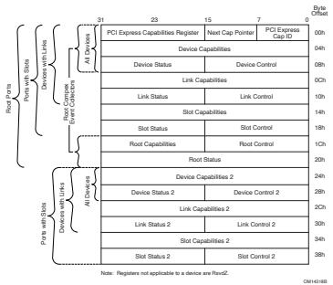

[⬆️ 返回目录](#-本章目录-table-of-contents)

---

<!-- 📄 Page 1029 -->
---

<a id="sec-7-5-3-1"></a>
## 7.5.3.1 PCI Express Capability List Register (Offset 00h) | PCI Express 能力列表寄存器（偏移量 00h）

<table>
<thead>
<tr>
<th width="50%">🇬🇧 English</th>
<th width="50%" style="background-color:#e8e8e8">🏆 中文</th>
</tr>
</thead>
<tbody>
<tr>
<td>

The PCI Express Capability List Register enumerates the PCI Express Capability structure in the PCI Configuration Space Capability list. § Figure 7-22 details allocation of register fields in the PCI Express Capability List Register; § Table 7-18 provides the respective bit definitions.

</td>
<td style="background-color:#e8e8e8">

PCI Express 能力列表寄存器 (PCI Express Capability List Register) 在 PCI 配置空间能力列表中枚举 PCI Express 能力结构。§ 图 7-22 详细说明了 PCI Express 能力列表寄存器中各寄存器字段的分配；§ 表 7-18 给出了相应的位定义。

</td>
</tr>
</tbody>
</table>

> **Figure 7-22.** PCI Express Capability List Register
> 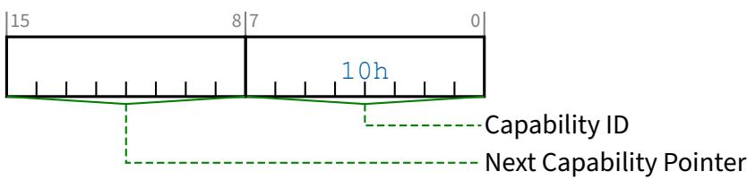

**Table 7-18. PCI Express Capability List Register | 表 7-18. PCI Express 能力列表寄存器**

| Bit Location | Register Description | Attributes |
|--------------|----------------------|------------|
| 7:0 | **Capability ID** - Indicates the PCI Express Capability structure. This field must return a Capability ID of 10h indicating that this is a PCI Express Capability structure. | RO |
| 15:8 | **Next Capability Pointer** - This field contains the offset to the next PCI Capability structure or 00h if no other items exist in the linked list of Capabilities. | RO |

[⬆️ 返回目录](#-本章目录-table-of-contents)

---

<a id="sec-7-5-3-2"></a>
## 7.5.3.2 PCI Express Capabilities Register (Offset 02h) | PCI Express 能力寄存器（偏移量 02h）

<table>
<thead>
<tr>
<th width="50%">🇬🇧 English</th>
<th width="50%" style="background-color:#e8e8e8">🏆 中文</th>
</tr>
</thead>
<tbody>
<tr>
<td>

The PCI Express Capabilities Register identifies PCI Express device Function type and associated capabilities. § Figure 7-23 details allocation of register fields in the PCI Express Capabilities Register; § Table 7-19 provides the respective bit definitions.

</td>
<td style="background-color:#e8e8e8">

PCI Express 能力寄存器 (PCI Express Capabilities Register) 用于标识 PCI Express 设备功能类型及相关功能。§ 图 7-23 详细说明了 PCI Express 能力寄存器中各寄存器字段的分配；§ 表 7-19 给出了相应的位定义。

</td>
</tr>
</tbody>
</table>

> **Figure 7-23.** PCI Express Capabilities Register
> 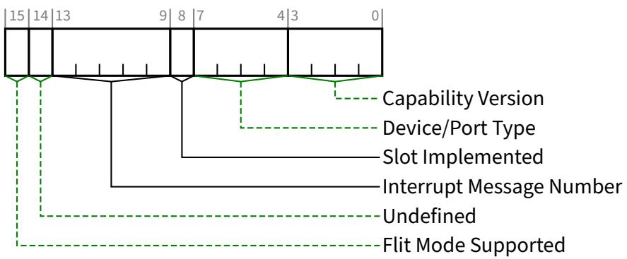

**Table 7-19. PCI Express Capabilities Register | 表 7-19. PCI Express 能力寄存器**

| Bit Location | Register Description | Attributes |
|--------------|----------------------|------------|
| 3:0 | **Capability Version** - Indicates PCI-SIG defined PCI Express Capability structure version number. A version of the specification that changes the PCI Express Capability structure in a way that is not otherwise identifiable (e.g., through a new Capability field) is permitted to increment this field. All such changes to the PCI Express Capability structure must be software-compatible. Software must check for Capability Version numbers that are greater than or equal to the highest number defined when the software is written, as Functions reporting any such Capability Version numbers will contain a PCI Express Capability structure that is compatible with that piece of software. Must be hardwired to 2h for Functions compliant to this specification. | RO |
| 7:4 | **Device/Port Type**<sup>163</sup> - Indicates the specific type of this PCI Express Function. Note that different Functions in a Multi-Function Device can generally be of different types. Defined encodings for Functions that implement a Type 00h PCI Configuration Space header are: 0000b — PCI Express Endpoint; 0001b — Legacy PCI Express Endpoint; 1001b — RCiEP; 1010b — Root Complex Event Collector. Defined encodings for Functions that implement a Type 01h PCI Configuration Space header are: 0100b — Root Port of PCI Express Root Complex; 0101b — Upstream Port of PCI Express Switch; 0110b — Downstream Port of PCI Express Switch; 0111b — PCI Express to PCI/PCI-X Bridge; 1000b — PCI/PCI-X to PCI Express Bridge. All other encodings are Reserved. Note that the different Endpoint types have notably different requirements in § Section 1.3.2 regarding I/O resources, Extended Configuration Space, and other capabilities. | RO |
| 8 | **Slot Implemented** - When Set, this bit indicates that the Link associated with this Port is connected to a slot (as compared to being connected to a system-integrated device or being disabled). This bit is valid for Downstream Ports. This bit is undefined for Upstream Ports. | HwInit |
| 13:9 | **Interrupt Message Number** - This field indicates which MSI/MSI-X vector is used for the interrupt message generated in association with any of the status bits of this Capability structure. This vector is also used for: <br/>• Native PME Software Model (see § Section 6.1.6 and § Section 6.7.3.4) <br/>• Link Activation (see § Section 5.5.6) <br/>• Flit Error Counter Interrupts (see § Section 7.7.8.4) <br/>For MSI, the value in this field indicates the offset between the base Message Data and the interrupt message that is generated. Hardware is required to update this field so that it is correct if the number of MSI Messages assigned to the Function changes when software writes to the Multiple Message Enable field in the Message Control Register for MSI. <br/>For MSI-X, the value in this field indicates which MSI-X Table entry is used to generate the interrupt message. The entry must be one of the first 32 entries even if the Function implements more than 32 entries. For a given MSI-X implementation, the entry must remain constant. <br/>If both MSI and MSI-X are implemented, they are permitted to use different vectors, though software is permitted to enable only one mechanism at a time. If MSI-X is enabled, the value in this field must indicate the vector for MSI-X. If MSI is enabled or neither is enabled, the value in this field must indicate the vector for MSI. If software enables both MSI and MSI-X at the same time, the value in this field is undefined. | RO |

<sup>163</sup>. This field would be better named 'Function Type' but for historical reasons is named Device/Port Type.


| 位位置 | 寄存器描述 | 属性 |
|--------------|----------------------|------------|
| 3:0 | **Capability Version** — 指示由 PCI-SIG 定义的 PCI Express 能力结构版本号。规范的某个版本如果以其他方式无法识别的方式（例如，通过新的 Capability 字段）更改了 PCI Express 能力结构，则允许递增该字段。对 PCI Express 能力结构的所有此类更改必须保持软件兼容性。软件必须检查 Capability 版本号是否大于或等于编写该软件时所定义的最高编号，因为报告任何此类 Capability 版本号的功能将包含与该软件兼容的 PCI Express 能力结构。对于符合本规范的功能，必须硬连线为 2h。 | RO |
| 7:4 | **Device/Port Type**<sup>163</sup> — 指示此 PCI Express 功能的具体类型。请注意，多功能设备中的不同功能通常可以是不同类型。实现 Type 00h PCI 配置空间头的功能所定义的编码为：0000b — PCI Express 端点 (Endpoint)；0001b — Legacy PCI Express 端点；1001b — RCiEP；1010b — Root Complex Event Collector。实现 Type 01h PCI 配置空间头的功能所定义的编码为：0100b — Root Port of PCI Express Root Complex；0101b — Upstream Port of PCI Express Switch；0110b — Downstream Port of PCI Express Switch；0111b — PCI Express to PCI/PCI-X Bridge；1000b — PCI/PCI-X to PCI Express Bridge。所有其他编码均为保留。请注意，在 § 1.3.2 中，不同端点类型在 I/O 资源、扩展配置空间和其他功能方面有显著不同的要求。 | RO |
| 8 | **Slot Implemented** — 置位时，该位指示与此端口关联的链路 (Link) 连接到插槽（与连接到系统集成设备或被禁用相反）。该位对下游端口 (Downstream Port) 有效。对上游端口 (Upstream Port) 未定义。 | HwInit |
| 13:9 | **Interrupt Message Number** — 该字段指示与该能力结构的任何状态位关联生成的中断消息所使用的 MSI/MSI-X 向量。该向量还用于：<br/>• 原生 PME 软件模型（参见 § 6.1.6 和 § 6.7.3.4）<br/>• 链路激活（参见 § 5.5.6）<br/>• Flit 错误计数器中断（参见 § 7.7.8.4）<br/>对于 MSI，该字段中的值指示基础消息数据与生成的中断消息之间的偏移量。当软件写入 MSI 的消息控制寄存器中的 Multiple Message Enable 字段，从而更改分配给该功能的 MSI 消息数量时，需要硬件更新该字段以使其正确。<br/>对于 MSI-X，该字段中的值指示使用哪个 MSI-X 表条目来生成中断消息。即使该功能实现超过 32 个条目，该条目也必须是前 32 个条目之一。对于给定的 MSI-X 实现，该条目必须保持不变。<br/>如果同时实现了 MSI 和 MSI-X，则允许它们使用不同的向量，但软件一次只允许启用一种机制。如果启用了 MSI-X，则该字段中的值必须指示 MSI-X 的向量。如果启用了 MSI 或两者都未启用，则该字段中的值必须指示 MSI 的向量。如果软件同时启用 MSI 和 MSI-X，则该字段中的值未定义。 | RO |

<sup>163</sup>. 该字段本应更好地命名为 "Function Type"，但出于历史原因被命名为 Device/Port Type。

</tbody>
</table>

[⬆️ 返回目录](#-本章目录-table-of-contents)

---

<!-- 📄 Page 1031 -->
---


<div style="overflow-x: auto; max-width: 100%;">
<table>
<thead>
<tr>
<th width="50%">🇬🇧 English</th>
<th width="50%" style="background-color:#e8e8e8">🏆 中文</th>
</tr>
</thead>
<tbody>
<tr>
<td>

| Bit Location | Register Description | Attributes |
| 14 | **Undefined** - The value read from this bit is undefined. In previous versions of this specification, this bit was used to indicate support for TCS Routing. System software should ignore the value read from this bit. System software is permitted to write any value to this bit. | RO |
| 15 | **Flit Mode Supported** – When Set, indicates support for Flit Mode. Must be Set by all implementations that support Flit Mode. Must be Clear by implementations that do not support Flit Mode. See Flit Mode Supported. | HwInit |

The Device Capabilities Register identifies PCI Express device Function specific capabilities. § Figure 7-24 details allocation of register fields in the Device Capabilities Register; § Table 7-20 provides the respective bit definitions.

</td>
<td style="background-color:#e8e8e8">

| 位位置 | 寄存器描述 | 属性 |
| 14 | **Undefined** — 从该位读取的值未定义。在本规范的先前版本中，该位用于指示对 TCS 路由的支持。系统软件应忽略从该位读取的值。允许系统软件向该位写入任何值。 | RO |
| 15 | **Flit Mode Supported** — 置位时，指示支持 Flit 模式 (Flit Mode)。支持 Flit 模式的所有实现必须将其置位。不支持 Flit 模式的实现必须将其清零。请参阅 Flit Mode Supported。 | HwInit |

设备能力寄存器 (Device Capabilities Register) 标识 PCI Express 设备功能特定的能力。§ 图 7-24 详细说明了设备能力寄存器中各寄存器字段的分配；§ 表 7-20 给出了相应的位定义。

</td>
</tr>
</tbody>
</table>
</div>


> **Figure 7-24.** Device Capabilities Register
> 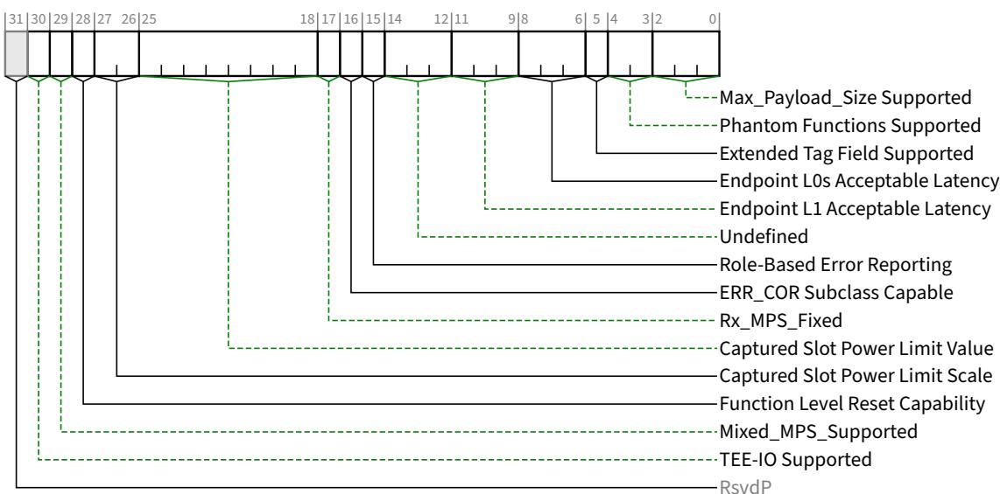

**Table 7-20. Device Capabilities Register | 表 7-20. 设备能力寄存器**

| Bit Location | Register Description | Attributes |
|--------------|----------------------|------------|
| 2:0 | **Max_Payload_Size Supported** - This field indicates the maximum payload size that the Function can support for TLPs. This field MUST@FLIT indicate a minimum of 512 bytes. If the Rx_MPS_Fixed bit is Set, the Function's Rx_MPS_Limit is fixed with the value indicated by this (Max_Payload_Size Supported) field. Otherwise, the Rx_MPS_Limit is determined by the | RO |

[⬆️ 返回目录](#-本章目录-table-of-contents)

---

---

<a id="sec-7-5-3-3"></a>
## 7.5.3.3 Device Capabilities Register (Offset 04h) | 设备能力寄存器 (Device Capabilities Register) (偏移量 04h)

<table>
<thead>
<tr>
<th width="50%">🇬🇧 English</th>
<th width="50%" style="background-color:#e8e8e8">🏆 中文</th>
</tr>
</thead>
<tbody>
<tr>
<td>

**Table 7-20 Device Capabilities Register**

| Bit Location | Register Description | Attributes |
|--------------|----------------------|------------|
| 2:0 | Max_Payload_Size Supported - This field indicates the maximum TLP payload size supported by the Function. For Multi-Function Devices, the value of this field is used to determine the appropriate value of the | RO |

</td>
<td style="background-color:#e8e8e8">

**表 7-20 设备能力寄存器 (Device Capabilities Register)**

| 位位置 | 寄存器描述 | 属性 |
|--------|------------|------|
| 2:0 | Max_Payload_Size Supported (支持的最大负载大小) — 该字段指示该 Function 所支持的最大 TLP 负载大小。对于多功能设备 (Multi-Function Device),使用该字段的值确定适当的 | RO |

</td>
</tr>
</tbody>
</table>

[⬆️ 返回目录](#-本章目录-table-of-contents)

---


<div style="overflow-x: auto; max-width: 100%;">
<table>
<thead>
<tr>
<th width="50%">🇬🇧 English</th>
<th width="50%" style="background-color:#e8e8e8">🏆 中文</th>
</tr>
</thead>
<tbody>
<tr>
<td>

Max_Payload_Size field (the "MPS setting") in one or more Functions. See § Section 2.2.2 for important details regarding Multi-Function Devices.

Defined encodings are:

- 000b — 128 bytes max payload size
- 001b — 256 bytes max payload size
- 010b — 512 bytes max payload size
- 011b — 1024 bytes max payload size
- 100b — 2048 bytes max payload size
- 101b — 4096 bytes max payload size
- 110b — Reserved
- 111b — Reserved

The Functions of a Multi-Function Device are permitted to report different values for this field.

| 4:3 | Phantom Functions Supported - This field indicates the support for use of unclaimed Function Numbers to extend the number of outstanding transactions allowed by logically combining unclaimed Function Numbers (called Phantom Functions) with the Tag identifier (see § Section 2.2.6.2 for a description of Tag Extensions).<br><br>For a PF with its VF Enable bit Set, the use of Phantom Function numbers is not permitted and this field must return Zero when read.<br><br>For VFs, this field is not supported and must be hardwired to Zero.<br><br>For every Function in an ARI Device, this field must be hardwired to Zero.<br><br>The remainder of this field description applies only to non-ARI Multi-Function Devices.<br><br>This field indicates the number of most significant bits of the Function Number portion of Requester ID that are logically combined with the Tag identifier.<br><br>Defined encodings are:<br>• 00b — No Function Number bits are used for Phantom Functions. Multi-Function Devices are permitted to implement up to 8 independent Functions.<br>• 01b — The most significant bit of the Function number in Requester ID is used for Phantom Functions; a Multi-Function Device is permitted to implement Functions 0-3. Functions 0, 1, 2, and 3 are permitted to use Function Numbers 4, 5, 6, and 7 respectively as Phantom Functions.<br>• 10b — The two most significant bits of Function Number in Requester ID are used for Phantom Functions; a Multi-Function Device is permitted to implement Functions 0-1. Function 0 is permitted to use Function Numbers 2, 4, and 6 for Phantom Functions. Function 1 is permitted to use Function Numbers 3, 5, and 7 as Phantom Functions.<br>• 11b — All 3 bits of Function Number in Requester ID used for Phantom Functions. The device must have a single Function 0 that is permitted to use all other Function Numbers as Phantom Functions.<br><br>Note that Phantom Function support for the Function must be enabled by the Phantom Functions Enable field in the Device Control Register before the Function is permitted to use the Function Number field in the Requester ID for Phantom Functions. | RO<br>VF ROZ |

| 5 | Extended Tag Field Supported - This bit, in combination with the 10-Bit Tag Requester Supported bit and the 14-Bit Tag Requester Supported bit, indicates the maximum supported size of the Tag field as a Requester. This bit must be Set if the 10-Bit Tag Requester Supported bit or the 14-Bit Tag Requester Supported bit is Set. | RO |

</td>
<td style="background-color:#e8e8e8">

一个或多个 Function 中的 Max_Payload_Size 字段(简称 "MPS 设置")。有关多功能设备 (Multi-Function Device) 的重要细节,请参阅 § 第 2.2.2 节。

已定义的编码如下:

- 000b — 128 字节最大负载大小
- 001b — 256 字节最大负载大小
- 010b — 512 字节最大负载大小
- 011b — 1024 字节最大负载大小
- 100b — 2048 字节最大负载大小
- 101b — 4096 字节最大负载大小
- 110b — 保留
- 111b — 保留

多功能设备 (Multi-Function Device) 的各 Function 允许为该字段报告不同的值。

| 4:3 | Phantom Functions Supported (支持的幻 Function) — 该字段指示对未使用 Function Number 的支持,即将未使用的 Function Number(称为幻 Function,Phantom Function)与 Tag 标识符逻辑组合,以扩展所允许的 outstanding 事务数量(有关 Tag 扩展的描述,请参阅 § 第 2.2.6.2 节)。<br><br>对于 VF Enable 位已置位的 PF,不允许使用幻 Function Number,且该字段被读取时必须返回 0。<br><br>对于 VF,不支持该字段,必须硬连线为 0。<br><br>对于 ARI 设备 (ARI Device) 中的每个 Function,该字段必须硬连线为 0。<br><br>本字段描述的其余部分仅适用于非 ARI 的多功能设备。<br><br>该字段指示 Requester ID 中 Function Number 部分与 Tag 标识符逻辑组合所使用的最高有效位数。<br><br>已定义的编码如下:<br>• 00b — 未使用任何 Function Number 位作为幻 Function。多功能设备最多可实现 8 个独立 Function。<br>• 01b — Requester ID 中 Function Number 的最高有效位用于幻 Function;多功能设备可实现 Function 0–3。Function 0、1、2 和 3 可分别使用 Function Number 4、5、6 和 7 作为幻 Function。<br>• 10b — Requester ID 中 Function Number 的两个最高有效位用于幻 Function;多功能设备可实现 Function 0–1。Function 0 可使用 Function Number 2、4 和 6 作为幻 Function。Function 1 可使用 Function Number 3、5 和 7 作为幻 Function。<br>• 11b — Requester ID 中 Function Number 的全部 3 位都用于幻 Function。设备必须具有单个 Function 0,可使用所有其他 Function Number 作为幻 Function。<br><br>注意,该 Function 的幻 Function 支持必须由设备控制寄存器 (Device Control Register) 中的 Phantom Functions Enable 字段使能后,才允许该 Function 将 Requester ID 中的 Function Number 字段用于幻 Function。 | RO<br>VF ROZ |

| 5 | Extended Tag Field Supported (支持扩展 Tag 字段) — 该位与 10-Bit Tag Requester Supported 位和 14-Bit Tag Requester Supported 位一起,指示作为 Requester 时 Tag 字段所支持的最大长度。如果 10-Bit Tag Requester Supported 位或 14-Bit Tag Requester Supported 位已置位,则该位必须置位。 | RO |

</td>
</tr>
</tbody>
</table>
</div>


[⬆️ 返回目录](#-本章目录-table-of-contents)

---

<!-- 📄 Page 1032 -->
---

<!-- 📄 Page 1033 -->
---

<table>
<thead>
<tr>
<th width="50%">🇬🇧 English</th>
<th width="50%" style="background-color:#e8e8e8">🏆 中文</th>
</tr>
</thead>
<tbody>
<tr>
<td>

Defined encodings are:

- 0b — 5-bit Tag Requester capability supported
- 1b — 8-bit Tag Requester capability supported

Note that 8-bit Tag field generation must be enabled by the Extended Tag Field Enable bit in the Device Control Register of the Requester Function before 8-bit Tags can be generated by the Requester. See § Section 2.2.6.2 for interactions with enabling the use of 10-Bit or 14-Bit Tags.

| 8:6 | Endpoint L0s Acceptable Latency - This field indicates the acceptable total latency that an Endpoint can withstand due to the transition from L0s state to the L0 state. It is essentially an indirect measure of the Endpoint's internal buffering.<br><br>Power management software uses the reported L0s Acceptable Latency number to compare against the L0s exit latencies reported by all components comprising the data path from this Endpoint to the Root Complex Root Port to determine whether ASPM L0s entry can be used with no loss of performance.<br><br>Defined encodings are:<br>• 000b — Maximum of 64 ns<br>• 001b — Maximum of 128 ns<br>• 010b — Maximum of 256 ns<br>• 011b — Maximum of 512 ns<br>• 100b — Maximum of 1 μs<br>• 101b — Maximum of 2 μs<br>• 110b — Maximum of 4 μs<br>• 111b — No limit<br><br>For Functions other than Endpoints, this field is Reserved and must be hardwired to 000b. | RO |

| 11:9 | Endpoint L1 Acceptable Latency - This field indicates the acceptable latency that an Endpoint can withstand due to the transition from L1 state to the L0 state. It is essentially an indirect measure of the Endpoint's internal buffering.<br><br>Power management software uses the reported L1 Acceptable Latency number to compare against the L1 Exit Latencies reported (see below) by all components comprising the data path from this Endpoint to the Root Complex Root Port to determine whether ASPM L1 entry can be used with no loss of performance.<br><br>Defined encodings are:<br>• 000b — Maximum of 1 μs<br>• 001b — Maximum of 2 μs<br>• 010b — Maximum of 4 μs<br>• 011b — Maximum of 8 μs<br>• 100b — Maximum of 16 μs<br>• 101b — Maximum of 32 μs<br>• 110b — Maximum of 64 μs<br>• 111b — No limit<br><br>For Functions other than Endpoints, this field is Reserved and must be hardwired to 000b. | RO |

| 14:12 | Undefined - The value read from these bits are undefined. In previous versions of this specification, this bit was used to indicate that a Attention Button, Attention Indicator, or Power Indicator, is implemented on the adapter and electrically controlled by the component on the adapter. System software must ignore the value read from this bit. System software is permitted to write any value to this bit. | RO |

</td>
<td style="background-color:#e8e8e8">

已定义的编码如下:

- 0b — 支持 5 位 Tag Requester 能力
- 1b — 支持 8 位 Tag Requester 能力

注意,8 位 Tag 字段生成必须由 Requester Function 的设备控制寄存器 (Device Control Register) 中的 Extended Tag Field Enable 位使能后,Requester 才能生成 8 位 Tag。有关使能 10 位或 14 位 Tag 的交互,请参阅 § 第 2.2.6.2 节。

| 8:6 | Endpoint L0s Acceptable Latency (Endpoint L0s 可接受延迟) — 该字段指示 Endpoint 因从 L0s 状态转换到 L0 状态所能承受的可接受总延迟。它本质上是对 Endpoint 内部缓冲的间接度量。<br><br>电源管理软件使用所报告的 L0s 可接受延迟值,与从该 Endpoint 到根复合体根端口 (Root Complex Root Port) 的数据路径中所有组件所报告的 L0s 退出延迟进行比较,以确定在不损失性能的情况下是否可以使用 ASPM L0s 进入。<br><br>已定义的编码如下:<br>• 000b — 最大 64 ns<br>• 001b — 最大 128 ns<br>• 010b — 最大 256 ns<br>• 011b — 最大 512 ns<br>• 100b — 最大 1 μs<br>• 101b — 最大 2 μs<br>• 110b — 最大 4 μs<br>• 111b — 无限制<br><br>对于 Endpoint 以外的 Function,该字段保留,必须硬连线为 000b。 | RO |

| 11:9 | Endpoint L1 Acceptable Latency (Endpoint L1 可接受延迟) — 该字段指示 Endpoint 因从 L1 状态转换到 L0 状态所能承受的可接受延迟。它本质上是对 Endpoint 内部缓冲的间接度量。<br><br>电源管理软件使用所报告的 L1 可接受延迟值,与从该 Endpoint 到根复合体根端口 (Root Complex Root Port) 的数据路径中所有组件所报告的(见下文)L1 退出延迟进行比较,以确定在不损失性能的情况下是否可以使用 ASPM L1 进入。<br><br>已定义的编码如下:<br>• 000b — 最大 1 μs<br>• 001b — 最大 2 μs<br>• 010b — 最大 4 μs<br>• 011b — 最大 8 μs<br>• 100b — 最大 16 μs<br>• 101b — 最大 32 μs<br>• 110b — 最大 64 μs<br>• 111b — 无限制<br><br>对于 Endpoint 以外的 Function,该字段保留,必须硬连线为 000b。 | RO |

| 14:12 | Undefined (未定义) — 从这些位读出的值未定义。在本规范以前的版本中,该位用于指示 Attention Button、Attention Indicator 或 Power Indicator 在适配器上实现并由适配器上的组件电气控制。系统软件必须忽略从该位读出的值。系统软件允许向该位写入任何值。 | RO |

</td>
</tr>
</tbody>
</table>

[⬆️ 返回目录](#-本章目录-table-of-contents)

---

<!-- 📄 Page 1034 -->
---


<div style="overflow-x: auto; max-width: 100%;">
<table>
<thead>
<tr>
<th width="50%">🇬🇧 English</th>
<th width="50%" style="background-color:#e8e8e8">🏆 中文</th>
</tr>
</thead>
<tbody>
<tr>
<td>

| 15 | Role-Based Error Reporting - When Set, this bit indicates that the Function implements the functionality originally defined in the Error Reporting ECN for [PCIe-1.0a], and later incorporated into [PCIe-1.1]. This bit must be Set by all Functions conforming to the ECN, [PCIe-1.1], or subsequent [PCIe] revisions. | RO |

| 16 | ERR_COR Subclass Capable - When Set, this bit indicates that the Function supports the ERR_COR Subclass field in ERR_COR Messages, allowing different subclasses to be distinguished. See § Section 2.2.8.3.<br><br>Downstream Ports that implement the System Firmware Intermediary (SFI) capability must Set this bit.<br><br>Downstream Ports that implement Downstream Port Containment (DPC) are strongly encouraged to Set this bit. | RO |

| 17 | Rx_MPS_Fixed – When Set, the Function's Rx_MPS_Limit is fixed with the value indicated by the Max_Payload_Size Supported field. Otherwise, the Rx_MPS_Limit is determined by the Max_Payload_Size field (the "MPS setting") in one or more Functions. See § Section 2.2.2 for important details regarding Multi-Function devices. This bit MUST@FLIT be Set. | HwInit |

| 25:18 | Captured Slot Power Limit Value (Upstream Ports only) - In combination with the Captured Slot Power Limit Scale value, specifies the upper limit on power available to the adapter.<br><br>Power limit (in Watts) is calculated by multiplying the value in this field by the value in the Captured Slot Power Limit Scale field except when the Captured Slot Power Limit Scale field equals 00b (1.0x) and the Captured Slot Power Limit Value exceeds EFh, then alternative encodings are used (see § Section 7.5.3.9).<br><br>This value is set by the Set_Slot_Power_Limit Message or hardwired to 00h (see § Section 6.9). The default value is 00h.<br><br>For VFs, the field value when read is undefined. | RO |

| 27:26 | Captured Slot Power Limit Scale (Upstream Ports only) - Specifies the scale used for the Slot Power Limit Value.<br><br>Range of Values:<br>• 00b — 1.0x<br>• 01b — 0.1x<br>• 10b — 0.01x<br>• 11b — 0.001x<br><br>This value is set by the Set_Slot_Power_Limit Message or hardwired to 00b (see § Section 6.9). The default value is 00b.<br><br>For VFs, the field value when read is undefined. | RO |

| 28 | Function Level Reset Capability - A value of 1b indicates the Function supports the optional Function Level Reset mechanism described in § Section 6.6.2.<br><br>This bit applies to Endpoints only. For all other Function types this bit must be hardwired to Zero.<br><br>For PFs and VFs, the feature is mandatory and this bit must be Set. | RO |

| 29 | Mixed_MPS_Supported – When Set, the Function must have an implementation specific mechanism capable of supporting different MPS settings for different targets. This bit MUST@FLIT be Set if the Function supports P2P Memory Transactions and the Function's Max_Payload_Size Supported field indicates an MPS value greater than 512 bytes. If not mandatory, supporting Mixed MPS capability may still be beneficial if this Function does P2P with targets or over paths whose supported MPS is significantly less than this Function's supported MPS; e.g., 128 bytes vs. 512 bytes.<br><br>The implementation specific mechanism must handle both Request and Completion TLPs, and is permitted to base its determination of P2P targets on Memory Space ranges, Bus Number ranges, or implementation specific means; e.g., data mover channels. | HwInit |

</td>
<td style="background-color:#e8e8e8">

| 15 | Role-Based Error Reporting (基于角色的错误报告) — 当置位时,该位指示该 Function 实现了最初在 [PCIe-1.0a] 的 Error Reporting ECN 中定义、并在 [PCIe-1.1] 中纳入的功能。所有符合该 ECN、[PCIe-1.1] 或后续 [PCIe] 修订版的 Function 必须将该位置位。 | RO |

| 16 | ERR_COR Subclass Capable (支持 ERR_COR 子类) — 当置位时,该位指示该 Function 支持 ERR_COR 报文中的 ERR_COR Subclass 字段,从而允许区分不同的子类。详见 § 第 2.2.8.3 节。<br><br>实现 System Firmware Intermediary (SFI) 能力的下游端口 (Downstream Port) 必须将该位置位。<br><br>实现 Downstream Port Containment (DPC) 的下游端口强烈建议将该位置位。 | RO |

| 17 | Rx_MPS_Fixed (Rx_MPS 固定) — 当置位时,该 Function 的 Rx_MPS_Limit 由 Max_Payload_Size Supported 字段的值固定。否则,Rx_MPS_Limit 由一个或多个 Function 中的 Max_Payload_Size 字段("MPS 设置")决定。有关多功能设备的重要细节,请参阅 § 第 2.2.2 节。该位必须置位 (MUST@FLIT)。 | HwInit |

| 25:18 | Captured Slot Power Limit Value (捕获的插槽功率限值) (仅上游端口,Upstream Ports) — 与 Captured Slot Power Limit Scale 值共同指定适配器可用功率的上限。<br><br>功率限值(以瓦特为单位)由该字段值乘以 Captured Slot Power Limit Scale 字段值计算得出,除非 Captured Slot Power Limit Scale 字段等于 00b(1.0x)且 Captured Slot Power Limit Value 超过 EFh,此时使用替代编码(见 § 第 7.5.3.9 节)。<br><br>该值由 Set_Slot_Power_Limit 报文设置,或硬连线为 00h(见 § 第 6.9 节)。默认值为 00h。<br><br>对于 VF,读出的字段值未定义。 | RO |

| 27:26 | Captured Slot Power Limit Scale (捕获的插槽功率限值比例) (仅上游端口,Upstream Ports) — 指定插槽功率限值 (Slot Power Limit Value) 所使用的比例。<br><br>取值范围:<br>• 00b — 1.0x<br>• 01b — 0.1x<br>• 10b — 0.01x<br>• 11b — 0.001x<br><br>该值由 Set_Slot_Power_Limit 报文设置,或硬连线为 00b(见 § 第 6.9 节)。默认值为 00b。<br><br>对于 VF,读出的字段值未定义。 | RO |

| 28 | Function Level Reset Capability (Function 级复位能力) — 值为 1b 表示该 Function 支持 § 第 6.6.2 节所述的可选 Function Level Reset 机制。<br><br>该位仅适用于 Endpoint。对于所有其他 Function 类型,该位必须硬连线为 0。<br><br>对于 PF 和 VF,该功能是强制的,该位必须置位。 | RO |

| 29 | Mixed_MPS_Supported (支持混合 MPS) — 当置位时,该 Function 必须具有实现特定 (implementation specific) 机制,能够针对不同目标支持不同的 MPS 设置。如果该 Function 支持 P2P 内存事务 (Memory Transactions),且其 Max_Payload_Size Supported 字段指示的 MPS 值大于 512 字节,则该位必须置位 (MUST@FLIT)。即使非强制,如果该 Function 与目标进行 P2P 或经过所支持 MPS 远小于该 Function 所支持 MPS 的路径(例如 128 字节 对 512 字节),支持混合 MPS 能力仍可能是有益的。<br><br>该实现特定机制必须同时处理 Request 和 Completion TLP,并允许基于内存空间 (Memory Space) 范围、Bus Number 范围或实现特定方式(例如数据移动通道)来确定 P2P 目标。 | HwInit |

</td>
</tr>
</tbody>
</table>
</div>


[⬆️ 返回目录](#-本章目录-table-of-contents)

---

<!-- 📄 Page 1035 -->
---

<table>
<thead>
<tr>
<th width="50%">🇬🇧 English</th>
<th width="50%" style="background-color:#e8e8e8">🏆 中文</th>
</tr>
</thead>
<tbody>
<tr>
<td>

For SR-IOV devices, this field in each VF must have the same value its associated PF. If this field is Set, the implementation specific mechanism must use the same P2P target-specific MPS setting for each VF as its associated PF. This parallels the requirement for the Max_Payload_Size field in the Device Control Register.

| 30 | TEE-IO Supported – When Set, this bit indicates that the Function implements the TEE-IO functionality as described by the TEE Device Interface Security Protocol (TDISP). See § Chapter 11. | HwInit |

The Device Control Register controls PCI Express device specific parameters. § Figure 7-25 details allocation of register fields in the Device Control Register; § Table 7-21 provides the respective bit definitions.

For VF fields indicated as RsvdP, the PF setting applies to the VF.

**Figure 7-25 Device Control Register**

| Bit | Field |
|-----|-------|
| 0 | Correctable Error Reporting Enable |
| 1 | Non-Fatal Error Reporting Enable |
| 2 | Fatal Error Reporting Enable |
| 3 | Unsupported Request Reporting Enable |
| 4 | Enable Relaxed Ordering |
| 5–7 | Max_Payload_Size |
| 8 | Extended Tag Field Enable |
| 9 | Phantom Functions Enable |
| 10 | Aux Power PM Enable |
| 11 | Enable No Snoop |
| 12–14 | Max_Read_Request_Size |
| 15 | Bridge Configuration Retry Enable / Initiate Function Level Reset |

</td>
<td style="background-color:#e8e8e8">

对于 SR-IOV 设备,每个 VF 中的该字段必须具有与其关联 PF 相同的值。如果该位置位,则实现特定机制必须为每个 VF 使用与其关联 PF 相同的 P2P 目标特定 MPS 设置。这与设备控制寄存器 (Device Control Register) 中 Max_Payload_Size 字段的要求相对应。

| 30 | TEE-IO Supported (支持 TEE-IO) — 当置位时,该位指示该 Function 实现了 TEE Device Interface Security Protocol (TDISP) 所描述的 TEE-IO 功能。详见 § 第 11 章。 | HwInit |

设备控制寄存器 (Device Control Register) 控制 PCI Express 设备特定参数。§ 图 7-25 详细说明设备控制寄存器中寄存器字段的分配;§ 表 7-21 提供相应的位定义。

对于标记为 RsvdP 的 VF 字段,使用 PF 的设置。

**图 7-25 设备控制寄存器 (Device Control Register)**

> 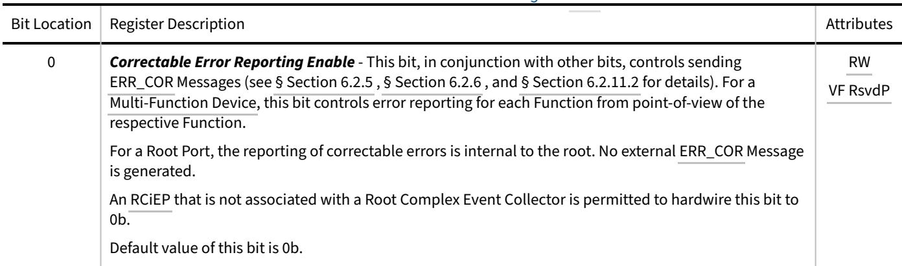


| 位 | 字段 |
|----|------|
| 0 | Correctable Error Reporting Enable (可纠正错误报告使能) |
| 1 | Non-Fatal Error Reporting Enable (非致命错误报告使能) |
| 2 | Fatal Error Reporting Enable (致命错误报告使能) |
| 3 | Unsupported Request Reporting Enable (不支持请求报告使能) |
| 4 | Enable Relaxed Ordering (使能宽松排序) |
| 5–7 | Max_Payload_Size (最大负载大小) |
| 8 | Extended Tag Field Enable (扩展 Tag 字段使能) |
| 9 | Phantom Functions Enable (幻 Function 使能) |
| 10 | Aux Power PM Enable (辅助电源 PM 使能) |
| 11 | Enable No Snoop (使能 No Snoop) |
| 12–14 | Max_Read_Request_Size (最大读请求大小) |
| 15 | Bridge Configuration Retry Enable / Initiate Function Level Reset (桥配置重试使能 / 启动 Function 级复位) |

</td>
</tr>
</tbody>
</table>

[⬆️ 返回目录](#-本章目录-table-of-contents)

---

<a id="sec-7-5-3-4"></a>
## 7.5.3.4 Device Control Register (Offset 08h) | 设备控制寄存器 (Device Control Register) (偏移量 08h)


<div style="overflow-x: auto; max-width: 100%;">
<table>
<thead>
<tr>
<th width="50%">🇬🇧 English</th>
<th width="50%" style="background-color:#e8e8e8">🏆 中文</th>
</tr>
</thead>
<tbody>
<tr>
<td>

**Table 7-21 Device Control Register**

| Bit Location | Register Description | Attributes |
|--------------|----------------------|------------|
| 0 | Correctable Error Reporting Enable - This bit, in conjunction with other bits, controls sending ERR_COR Messages (see § Section 6.2.5, § Section 6.2.6, and § Section 6.2.11.2 for details). For a Multi-Function Device, this bit controls error reporting for each Function from point-of-view of the respective Function.<br><br>For a Root Port, the reporting of correctable errors is internal to the root. No external ERR_COR Message is generated.<br><br>An RCiEP that is not associated with a Root Complex Event Collector is permitted to hardwire this bit to 0b.<br><br>Default value of this bit is 0b. | RW<br>VF RsvdP |

</td>
<td style="background-color:#e8e8e8">

**表 7-21 设备控制寄存器 (Device Control Register)**

| 位位置 | 寄存器描述 | 属性 |
|--------|------------|------|
| 0 | Correctable Error Reporting Enable (可纠正错误报告使能) — 该位与其他位一起控制 ERR_COR 报文的发送(详见 § 第 6.2.5 节、§ 第 6.2.6 节和 § 第 6.2.11.2 节)。对于多功能设备 (Multi-Function Device),该位从各 Function 的角度控制每个 Function 的错误报告。<br><br>对于根端口 (Root Port),可纠正错误的报告是根内部的。不会生成外部 ERR_COR 报文。<br><br>不与根复合体事件收集器 (Root Complex Event Collector) 关联的 RCiEP 允许将该位硬连线为 0b。<br><br>该位默认值为 0b。 | RW<br>VF RsvdP |

</td>
</tr>
</tbody>
</table>
</div>


[⬆️ 返回目录](#-本章目录-table-of-contents)

---

<!-- 📄 Page 1036 -->
---

<table>
<thead>
<tr>
<th width="50%">🇬🇧 English</th>
<th width="50%" style="background-color:#e8e8e8">🏆 中文</th>
</tr>
</thead>
<tbody>
<tr>
<td>

| 1 | Non-Fatal Error Reporting Enable - This bit, in conjunction with other bits, controls sending ERR_NONFATAL Messages (see § Section 6.2.5 and § Section 6.2.6 for details). For a Multi-Function Device, this bit controls error reporting for each Function from point-of-view of the respective Function.<br><br>For a Root Port, the reporting of Non-fatal errors is internal to the root. No external ERR_NONFATAL Message is generated.<br><br>An RCiEP that is not associated with a Root Complex Event Collector is permitted to hardwire this bit to 0b.<br><br>Default value of this bit is 0b. | RW<br>VF RsvdP |

| 2 | Fatal Error Reporting Enable - This bit, in conjunction with other bits, controls sending ERR_FATAL Messages (see § Section 6.2.5 and § Section 6.2.6 for details). For a Multi-Function Device, this bit controls error reporting for each Function from point-of-view of the respective Function.<br><br>For a Root Port, the reporting of Fatal errors is internal to the root. No external ERR_FATAL Message is generated.<br><br>An RCiEP that is not associated with a Root Complex Event Collector is permitted to hardwire this bit to 0b.<br><br>Default value of this bit is 0b. | RW<br>VF RsvdP |

| 3 | Unsupported Request Reporting Enable - This bit, in conjunction with other bits, controls the signaling of Unsupported Request Errors by sending error Messages (see § Section 6.2.5 and § Section 6.2.6 for details). For a Multi-Function Device, this bit controls error reporting for each Function from point-of-view of the respective Function.<br><br>An RCiEP that is not associated with a Root Complex Event Collector is permitted to hardwire this bit to 0b.<br><br>Default value of this bit is 0b. | RW<br>VF RsvdP |

| 4 | Enable Relaxed Ordering - If this bit is Set, the Function is permitted to set the Relaxed Ordering bit in the Attributes field of transactions it initiates that do not require strong write ordering (see § Section 2.2.6.4 and § Section 2.4).<br><br>A Function is permitted to hardwire this bit to 0b if it never sets the Relaxed Ordering attribute in transactions it initiates as a Requester.<br><br>When not hardwired to 0b, the default value of this bit is 1b. | RW<br>VF RsvdP |

| 7:5 | Max_Payload_Size - For specified cases, this field determines the maximum TLP payload size (the MPS setting) for the Function. Values permitted to be programmed are indicated by the Max_Payload_Size Supported field.<br><br>As a Receiver, if the Rx_MPS_Fixed bit is Set, the Rx_MPS_Limit is fixed with the value indicated by the Max_Payload_Size Supported field. Otherwise, the Rx_MPS_Limit is determined by the MPS setting in one or more Functions. See § Section 2.2.2 for important details regarding Multi-Function Devices.<br><br>As a Transmitter, the Function must not generate TLPs with payloads exceeding the MPS setting, with the exception of Functions in a Multi-Function Device, or Functions with implemention-specific mechanisms capable of supporting different MPS settings for different targets. See § Section 2.2.2 for important details.<br><br>Defined encodings for this field are:<br>• 000b — 128 bytes MPS<br>• 001b — 256 bytes MPS<br>• 010b — 512 bytes MPS<br>• 011b — 1024 bytes MPS<br>• 100b — 2048 bytes MPS | RW<br>VF RsvdP |

</td>
<td style="background-color:#e8e8e8">

| 1 | Non-Fatal Error Reporting Enable (非致命错误报告使能) — 该位与其他位一起控制 ERR_NONFATAL 报文的发送(详见 § 第 6.2.5 节和 § 第 6.2.6 节)。对于多功能设备 (Multi-Function Device),该位从各 Function 的角度控制每个 Function 的错误报告。<br><br>对于根端口 (Root Port),非致命错误的报告是根内部的。不会生成外部 ERR_NONFATAL 报文。<br><br>不与根复合体事件收集器 (Root Complex Event Collector) 关联的 RCiEP 允许将该位硬连线为 0b。<br><br>该位默认值为 0b。 | RW<br>VF RsvdP |

| 2 | Fatal Error Reporting Enable (致命错误报告使能) — 该位与其他位一起控制 ERR_FATAL 报文的发送(详见 § 第 6.2.5 节和 § 第 6.2.6 节)。对于多功能设备 (Multi-Function Device),该位从各 Function 的角度控制每个 Function 的错误报告。<br><br>对于根端口 (Root Port),致命错误的报告是根内部的。不会生成外部 ERR_FATAL 报文。<br><br>不与根复合体事件收集器 (Root Complex Event Collector) 关联的 RCiEP 允许将该位硬连线为 0b。<br><br>该位默认值为 0b。 | RW<br>VF RsvdP |

| 3 | Unsupported Request Reporting Enable (不支持请求报告使能) — 该位与其他位一起通过发送错误报文来控制不支持请求错误 (Unsupported Request Errors) 的信号报告(详见 § 第 6.2.5 节和 § 第 6.2.6 节)。对于多功能设备 (Multi-Function Device),该位从各 Function 的角度控制每个 Function 的错误报告。<br><br>不与根复合体事件收集器 (Root Complex Event Collector) 关联的 RCiEP 允许将该位硬连线为 0b。<br><br>该位默认值为 0b。 | RW<br>VF RsvdP |

| 4 | Enable Relaxed Ordering (使能宽松排序) — 如果该位置位,允许该 Function 在其发起的、不需要强写排序的事务的 Attributes 字段中设置 Relaxed Ordering 位(见 § 第 2.2.6.4 节和 § 第 2.4 节)。<br><br>如果某 Function 作为 Requester 在其发起的事务中从不设置 Relaxed Ordering 属性,则允许将该位硬连线为 0b。<br><br>当未硬连线为 0b 时,该位默认值为 1b。 | RW<br>VF RsvdP |

| 7:5 | Max_Payload_Size (最大负载大小) — 对于指定的情况,该字段决定 Function 的最大 TLP 负载大小(即 MPS 设置)。允许编程的值由 Max_Payload_Size Supported 字段指示。<br><br>作为接收方 (Receiver),如果 Rx_MPS_Fixed 位置位,则 Rx_MPS_Limit 由 Max_Payload_Size Supported 字段的值固定。否则,Rx_MPS_Limit 由一个或多个 Function 的 MPS 设置决定。有关多功能设备 (Multi-Function Device) 的重要细节,请参阅 § 第 2.2.2 节。<br><br>作为发送方 (Transmitter),除多功能设备中的 Function 或具有实现特定机制 (implementation specific mechanism) 可针对不同目标支持不同 MPS 设置的 Function 外,该 Function 不得生成负载超过 MPS 设置的 TLP。有关重要细节,请参阅 § 第 2.2.2 节。<br><br>该字段的已定义编码如下:<br>• 000b — 128 字节 MPS<br>• 001b — 256 字节 MPS<br>• 010b — 512 字节 MPS<br>• 011b — 1024 字节 MPS<br>• 100b — 2048 字节 MPS | RW<br>VF RsvdP |

</td>
</tr>
</tbody>
</table>

[⬆️ 返回目录](#-本章目录-table-of-contents)

---

<!-- 📄 Page 1037 -->
---


<div style="overflow-x: auto; max-width: 100%;">
<table>
<thead>
<tr>
<th width="50%">🇬🇧 English</th>
<th width="50%" style="background-color:#e8e8e8">🏆 中文</th>
</tr>
</thead>
<tbody>
<tr>
<td>

| Defined encodings for this field are (continued):<br>• 101b — 4096 bytes MPS<br>• 110b — Reserved<br>• 111b — Reserved<br><br>Functions that support only the 128-byte MPS are permitted to hardwire this field to 000b.<br><br>System software is not required to program the same value for this field for all the Functions of a Multi-Function Device.<br><br>Default value of this field is 000b. | | |

| 8 | Extended Tag Field Enable - This bit, in combination with the 10-Bit Tag Requester Enable bit and the 14-Bit Tag Requester Enable bit, determines how many Tag field bits a Requester is permitted to use.<br><br>The following applies when the 10-Bit Tag Requester Enable bit and the 14-Bit Tag Requester Enable bit are both Clear. If the Extended Tag Field Enable bit is Set, the Function is permitted to use an 8-bit Tag field as a Requester. If the bit is Clear, the Function is restricted to using a 5-bit Tag field.<br><br>See § Section 2.2.6.2 for required behavior when one or both of these larger-Tag Requester Enable bits are Set.<br><br>If software changes the value of the Extended Tag Field Enable bit while the Function has outstanding Non-Posted Requests, the result is undefined.<br><br>Functions that do not implement this capability hardwire this bit to 0b.<br><br>Default value of this bit is implementation specific. | RW<br>VF RsvdP |

| 9 | Phantom Functions Enable - This bit, in combination with the 10-Bit Tag Requester Enable bit and the 14-Bit Tag Requester Enable bit, determines how many outstanding Non-Posted Requests a Requester is permitted to generate. See § Section 2.2.6.2 for complete details.<br><br>When Set, this bit enables a Function to use unclaimed Functions as Phantom Functions to extend the number of outstanding transaction identifiers. If the bit is Clear, the Function is not allowed to use Phantom Functions.<br><br>Behavior is undefined when this bit is Set in Functions with enabled Shadow Functions.<br><br>Software should not change the value of this bit while the Function has outstanding Non-Posted Requests; otherwise, the result is undefined.<br><br>Functions that do not implement this capability hardwire this bit to 0b.<br><br>Default value of this bit is 0b. | RW<br>VF RsvdP |

| 10 | Aux Power PM Enable - When Set this bit, enables a Function to draw auxiliary power independent of PME Aux power. Functions that require auxiliary power on legacy operating systems should continue to indicate PME Aux power requirements. Auxiliary power is allocated as requested in the Aux_Current field of the Power Management Capabilities Register (PMC), independent of the PME_En bit in the Power Management Control/Status Register (PMCSR) (see § Chapter 5.). For Multi-Function Devices, a component is allowed to draw auxiliary power if at least one of the Functions has this bit set.<br><br>Note: Functions that consume auxiliary power must preserve the value of this sticky register when auxiliary power is available. In such Functions, this bit is not modified by Conventional Reset.<br><br>Functions that do not implement this capability hardwire this bit to 0b.<br><br>Additional Aux power is permitted to be allocated using the firmware based mechanism (see the Request D3Cold Aux Power Limit _DSM call as defined in [Firmware]).<br><br>Additional Aux power is also permitted to be allocated by selecting a PM Sub State in the Power Limit mechanism (see § Section 7.8.1.3). | RWS<br>VF RsvdP |

| 11 | Enable No Snoop - If this bit is Set, the Function is permitted to Set the No Snoop bit in the Requester Attributes of transactions it initiates that do not require hardware enforced cache coherency (see | RW<br>VF RsvdP |

</td>
<td style="background-color:#e8e8e8">

| 该字段的已定义编码(续):<br>• 101b — 4096 字节 MPS<br>• 110b — 保留<br>• 111b — 保留<br><br>仅支持 128 字节 MPS 的 Function 允许将该字段硬连线为 000b。<br><br>系统软件不需要为多功能设备 (Multi-Function Device) 的所有 Function 将该字段编程为相同的值。<br><br>该字段默认值为 000b。 | | |

| 8 | Extended Tag Field Enable (扩展 Tag 字段使能) — 该位与 10-Bit Tag Requester Enable 位和 14-Bit Tag Requester Enable 位一起,决定 Requester 允许使用的 Tag 字段位数。<br><br>以下规则适用于 10-Bit Tag Requester Enable 位和 14-Bit Tag Requester Enable 位都清零的情况。如果 Extended Tag Field Enable 位置位,则该 Function 允许作为 Requester 使用 8 位 Tag 字段。如果该位清零,则该 Function 被限制为使用 5 位 Tag 字段。<br><br>有关当其中一个或两个更大 Tag Requester Enable 位置位时的所需行为,请参阅 § 第 2.2.6.2 节。<br><br>如果软件在 Function 还有未完成的 Non-Posted 请求时更改 Extended Tag Field Enable 位的值,则结果是未定义的。<br><br>未实现该能力的 Function 将该位硬连线为 0b。<br><br>该位默认值为实现特定 (implementation specific)。 | RW<br>VF RsvdP |

| 9 | Phantom Functions Enable (幻 Function 使能) — 该位与 10-Bit Tag Requester Enable 位和 14-Bit Tag Requester Enable 位一起,决定 Requester 允许生成的未完成 (outstanding) Non-Posted 请求数。详见 § 第 2.2.6.2 节。<br><br>当置位时,该位使 Function 能够使用未使用的 Function 作为幻 Function (Phantom Function),以扩展未完成事务标识符的数量。如果该位清零,则不允许该 Function 使用幻 Function。<br><br>当在启用了 Shadow Function 的 Function 中将该位置位时,行为是未定义的。<br><br>软件不应在 Function 还有未完成的 Non-Posted 请求时更改该位的值;否则,结果是未定义的。<br><br>未实现该能力的 Function 将该位硬连线为 0b。<br><br>该位默认值为 0b。 | RW<br>VF RsvdP |

| 10 | Aux Power PM Enable (辅助电源 PM 使能) — 当置位时,该位使 Function 能够独立于 PME 辅助电源消耗辅助电源。在传统操作系统上需要辅助电源的 Function 应继续指示 PME Aux 电源需求。辅助电源按照电源管理能力寄存器 (Power Management Capabilities Register, PMC) 的 Aux_Current 字段请求分配,与电源管理控制/状态寄存器 (Power Management Control/Status Register, PMCSR) 的 PME_En 位无关(见 § 第 5 章)。对于多功能设备 (Multi-Function Device),只要至少一个 Function 的该位置位,组件就允许消耗辅助电源。<br><br>注意:消耗辅助电源的 Function 必须在辅助电源可用时保留该 sticky 寄存器的值。在此类 Function 中,该位不被常规复位 (Conventional Reset) 修改。<br><br>未实现该能力的 Function 将该位硬连线为 0b。<br><br>允许使用基于固件 (firmware) 的机制分配额外的辅助电源(参见 [Firmware] 中定义的 Request D3Cold Aux Power Limit _DSM 调用)。<br><br>也可以通过在 Power Limit 机制中选择 PM Sub State 来分配额外的辅助电源(见 § 第 7.8.1.3 节)。 | RWS<br>VF RsvdP |

| 11 | Enable No Snoop (使能 No Snoop) — 如果该位置位,则允许该 Function 在其发起的、不需要硬件强制缓存一致性的事务的 Requester Attributes 中设置 No Snoop 位(见 | RW<br>VF RsvdP |

</td>
</tr>
</tbody>
</table>
</div>


[⬆️ 返回目录](#-本章目录-table-of-contents)

---

<!-- 📄 Page 1038 -->
---

<table>
<thead>
<tr>
<th width="50%">🇬🇧 English</th>
<th width="50%" style="background-color:#e8e8e8">🏆 中文</th>
</tr>
</thead>
<tbody>
<tr>
<td>

§ Section 2.2.6.5). Note that setting this bit to 1b should not cause a Function to Set the No Snoop attribute on all transactions that it initiates. Even when this bit is Set, a Function is only permitted to Set the No Snoop attribute on a transaction when it can guarantee that the address of the transaction is not stored in any cache in the system.

This bit is permitted to be hardwired to 0b if a Function would never Set the No Snoop attribute in transactions it initiates.

Default value of this bit is 1b.

| 14:12 | Max_Read_Request_Size - This field sets the maximum Read Request size for the Function as a Requester. The Function must not generate Read Requests with a size exceeding the set value. Defined encodings for this field are:<br>• 000b — 128 bytes maximum Read Request size<br>• 001b — 256 bytes maximum Read Request size<br>• 010b — 512 bytes maximum Read Request size<br>• 011b — 1024 bytes maximum Read Request size<br>• 100b — 2048 bytes maximum Read Request size<br>• 101b — 4096 bytes maximum Read Request size<br>• 110b — Reserved<br>• 111b — Reserved<br><br>Functions that do not generate Read Requests larger than 128 bytes and Functions that do not generate Read Requests on their own behalf are permitted to implement this field as Read Only (RO) with a value of 000b.<br><br>Default value of this field is 010b. | RW<br>VF RsvdP |

| 15 | Bridge Configuration Retry Enable / Initiate Function Level Reset - this bit has a different meaning based on Function type:<br><br>• **PCI Express to PCI/PCI-X Bridges:**<br>Bridge Configuration Retry Enable - When Set, this bit enables PCI Express to PCI/PCI-X bridges to return Request Retry Status (RRS) in response to Configuration Requests that target devices below the bridge. Refer to [PCIe-to-PCI-PCI-X-Bridge] for further details.<br>Default value of this bit is 0b.<br><br>• **Endpoints with Function Level Reset Capability set to 1b:**<br>Initiate Function Level Reset - A write of 1b initiates Function Level Reset to the Function. The value read by software from this bit is always 0b.<br>PFs and VFs must support FLR. Note: performing FLR on a PF Clears its VF Enable bit, which causes its VFs no longer to exist after the FLR completes.<br><br>• **All others:**<br>Reserved - Must hardwire the bit to 0b. | PCI Express to PCI/PCI-X Bridges: RW<br>FLR Capable Endpoints: RW<br>All others: RsvdP |

</td>
<td style="background-color:#e8e8e8">

§ 第 2.2.6.5 节)。注意,将该位置为 1b 不应导致 Function 在其发起的所有事务上都设置 No Snoop 属性。即使该位置位,只有当 Function 能够保证该事务的地址未存储在系统中的任何缓存中时,才允许在该事务上设置 No Snoop 属性。

如果某 Function 在其发起的事务中从不设置 No Snoop 属性,则允许将该位硬连线为 0b。

该位默认值为 1b。

| 14:12 | Max_Read_Request_Size (最大读请求大小) — 该字段设置作为 Requester 的 Function 的最大读请求大小。Function 不得生成大小超过所设值的读请求。该字段的已定义编码如下:<br>• 000b — 最大 128 字节读请求大小<br>• 001b — 最大 256 字节读请求大小<br>• 010b — 最大 512 字节读请求大小<br>• 011b — 最大 1024 字节读请求大小<br>• 100b — 最大 2048 字节读请求大小<br>• 101b — 最大 4096 字节读请求大小<br>• 110b — 保留<br>• 111b — 保留<br><br>不生成大于 128 字节的读请求的 Function,以及不为其自身生成读请求的 Function,允许将该字段实现为只读 (Read Only, RO) 值为 000b。<br><br>该字段默认值为 010b。 | RW<br>VF RsvdP |

| 15 | Bridge Configuration Retry Enable / Initiate Function Level Reset (桥配置重试使能 / 启动 Function 级复位) — 该位根据 Function 类型具有不同含义:<br><br>• **PCI Express 转 PCI/PCI-X 桥:**<br>Bridge Configuration Retry Enable (桥配置重试使能) — 当置位时,该位使 PCI Express 转 PCI/PCI-X 桥能够对目标为桥下设备的配置请求返回 Request Retry Status (RRS)。更多细节请参考 [PCIe-to-PCI-PCI-X-Bridge]。<br>该位默认值为 0b。<br><br>• **Function Level Reset Capability 位为 1b 的 Endpoint:**<br>Initiate Function Level Reset (启动 Function 级复位) — 写入 1b 启动对该 Function 的 Function 级复位。软件从该位读出的值始终为 0b。<br>PF 和 VF 必须支持 FLR。注意:对 PF 执行 FLR 会清除其 VF Enable 位,这导致其 VF 在 FLR 完成后不再存在。<br><br>• **所有其他:**<br>保留 — 必须将该位硬连线为 0b。 | PCI Express 转 PCI/PCI-X 桥: RW<br>支持 FLR 的 Endpoint: RW<br>其他: RsvdP |

</td>
</tr>
</tbody>
</table>

[⬆️ 返回目录](#-本章目录-table-of-contents)

---

<!-- 📄 Page 1039 -->
---


<div style="overflow-x: auto; max-width: 100%;">
<table>
<thead>
<tr>
<th width="50%">🇬🇧 English</th>
<th width="50%" style="background-color:#e8e8e8">🏆 中文</th>
</tr>
</thead>
<tbody>
<tr>
<td>

> **IMPLEMENTATION NOTE: SOFTWARE UR REPORTING COMPATIBILITY WITH 1.0A DEVICES**
>
> With [PCIe-1.0a] device Functions,<sup>164</sup> if the Unsupported Request Reporting Enable bit is Set, the Function when operating as a Completer will send an uncorrectable error Message (if enabled) when a UR error is detected. On platforms where an uncorrectable error Message is handled as a System Error, this will break PC-compatible Configuration Space probing, so software/firmware on such platforms may need to avoid setting the Unsupported Request Reporting Enable bit.
>
> With device Functions implementing Role-Based Error Reporting, setting the Unsupported Request Reporting Enable bit will not interfere with PC-compatible Configuration Space probing, assuming that the severity for UR is left at its default of non-fatal. However, setting the Unsupported Request Reporting Enable bit will enable the Function to report UR errors<sup>165</sup> detected with posted Requests, helping avoid this case for potential silent data corruption.
>
> On platforms where robust error handling and PC-compatible Configuration Space probing is required, it is suggested that software or firmware have the Unsupported Request Reporting Enable bit Set for Role-Based Error Reporting Functions, but clear for [PCIe-1.0a] Functions. Software or firmware can distinguish the two classes of Functions by examining the Role-Based Error Reporting bit in the Device Capabilities Register.
>
> 164. In this context, [PCIe-1.0a] devices Functions are devices that do not implement Role-Based Error Reporting.
> 165. With Role-Based Error Reporting devices, setting the SERR# Enable bit in the Command Register also implicitly enables UR reporting.

</td>
<td style="background-color:#e8e8e8">

> **实现说明:与 1.0A 设备兼容的软件 UR 报告**
>
> 对于 [PCIe-1.0a] 设备 Function,<sup>164</sup> 如果 Unsupported Request Reporting Enable 位置位,则当该 Function 作为 Completer 操作时,检测到 UR 错误时会发送不可纠正错误报文(若已使能)。在将不可纠正错误报文作为系统错误处理的平台上,这将破坏 PC 兼容的配置空间 (Configuration Space) 探测,因此此类平台上的软件/固件可能需要避免设置 Unsupported Request Reporting Enable 位。
>
> 对于实现了基于角色的错误报告 (Role-Based Error Reporting) 的设备 Function,设置 Unsupported Request Reporting Enable 位不会干扰 PC 兼容的配置空间探测,前提是 UR 的严重性保持默认的 non-fatal。但是,设置 Unsupported Request Reporting Enable 位将使该 Function 能够报告使用 Posted 请求检测到的 UR 错误,<sup>165</sup> 有助于避免可能导致潜在静默数据损坏的情况。
>
> 在需要稳健错误处理和 PC 兼容配置空间探测的平台上,建议软件或固件对基于角色的错误报告 Function 设置 Unsupported Request Reporting Enable 位,但对 [PCIe-1.0a] Function 清除该位。软件或固件可以通过检查设备能力寄存器 (Device Capabilities Register) 中的 Role-Based Error Reporting 位来区分这两类 Function。
>
> 164. 在此上下文中,[PCIe-1.0a] 设备 Function 指的是未实现基于角色的错误报告的设备。
> 165. 对于基于角色的错误报告设备,在 Command 寄存器中设置 SERR# Enable 位也会隐式启用 UR 报告。

</td>
</tr>
</tbody>
</table>
</div>


[⬆️ 返回目录](#-本章目录-table-of-contents)

---

<!-- 📄 Page 1040 -->
---

<table>
<thead>
<tr>
<th width="50%">🇬🇧 English</th>
<th width="50%" style="background-color:#e8e8e8">🏆 中文</th>
</tr>
</thead>
<tbody>
<tr>
<td>

> **IMPLEMENTATION NOTE: USE OF MAX_PAYLOAD_SIZE**
>
> The Max_Payload_Size (MPS) mechanism enables software to control the maximum payload in TLPs sent by Endpoints to balance latency versus bandwidth trade-offs, particularly for isochronous traffic.
>
> If software chooses to program the MPS of various System Elements to non-default values, it must take care to ensure that each TLP with a data payload does not exceed the MPS setting of any System Element along the TLP's path. Otherwise, the TLP will be rejected by the System Element whose MPS setting is too small.
>
> No specific algorithm to configure MPS is required by this specification, but software should base its algorithm upon factors such as the following:
>
> - the MPS capability of each System Element within a Hierarchy
> - awareness of when System Elements are added or removed through Hot-Plug operations
> - knowing which System Elements send TLPs to each other, what type of traffic is carried, what type of transactions are used, and if TLP sizes are constrained by other mechanisms
>
> For the case of system firmware that configures System Elements in preparation for running legacy operating system environments, system firmware may need to avoid programming MPS settings above the default of 128 bytes, which is the minimum supported by Endpoints.
>
> For example, if the operating system environment does not implement services for optimizing MPS settings, system firmware probably should not program a non-default MPS for a Hierarchy that supports Hot-Plug operations. Otherwise, if no software is present to manage MPS settings when a new element is added, improper operation may result. Note that a newly added element may not even support a MPS setting as large as the rest of the Hierarchy, in which case software may need to deny enabling the new element or reduce the MPS settings of other elements, which may require quiescing all traffic carrying data payloads.
>
> For ARI Devices and other MFDs, it's challenging to describe concisely what determines a Function's MPS limit for received TLPs. For this reason, the formal term Rx_MPS_Limit was introduced. It is used in many instances where former revisions of this specification used Max_Payload_Size in the context of a Receiver. It covers several special cases where the MPS limit is determined by the MPS settings in other Functions of an MFD. See § Section 2.2.2 for details.
>
> For ARI Devices and other MFDs, it's also challenging to describe concisely what determines a Function's MPS limit for transmitted TLPs. For this reason, the formal term Tx_MPS_Limit was introduced. It is used in several instances where former revisions of this specification used Max_Payload_Size in the context of a Transmitter. It covers several special cases where the MPS limit is determined by the MPS settings in other Functions of an MFD. See § Section 2.2.2 for details.

</td>
<td style="background-color:#e8e8e8">

> **实现说明:MAX_PAYLOAD_SIZE 的使用**
>
> Max_Payload_Size (MPS) 机制使软件能够控制 Endpoint 发送的 TLP 中的最大负载,从而在延迟和带宽之间取得平衡,特别是对于等时 (isochronous) 流量。
>
> 如果软件选择将各系统元素 (System Element) 的 MPS 编程为非默认值,则必须小心确保每个带数据负载的 TLP 不超过该 TLP 路径上任何系统元素的 MPS 设置。否则,该 TLP 将被 MPS 设置过小的系统元素拒绝。
>
> 本规范不要求使用特定的算法来配置 MPS,但软件应基于以下因素构建其算法:
>
> - 层级 (Hierarchy) 中每个系统元素的 MPS 能力
> - 了解何时通过热插拔 (Hot-Plug) 操作添加或移除系统元素
> - 了解哪些系统元素相互发送 TLP,所承载的流量类型,所使用的事务类型,以及 TLP 大小是否受其他机制约束
>
> 对于为运行传统操作系统环境而配置系统元素的系统固件而言,系统固件可能需要避免将 MPS 设置编程为高于默认的 128 字节(Endpoint 所支持的最小值)。
>
> 例如,如果操作系统环境未实现优化 MPS 设置的服务,则系统固件可能不应为支持热插拔操作的层级 (Hierarchy) 编程非默认的 MPS。否则,当添加新元素时若没有软件管理 MPS 设置,可能导致操作异常。注意,新添加的元素甚至可能不支持与层级其余部分一样大的 MPS 设置,在这种情况下,软件可能需要拒绝启用新元素或降低其他元素的 MPS 设置,这可能需要暂停 (quiesce) 所有携带数据负载的流量。
>
> 对于 ARI 设备 (ARI Device) 和其他 MFD,很难简洁地描述什么决定了一个 Function 接收 TLP 的 MPS 限制。因此,引入了正式术语 Rx_MPS_Limit。在本规范以前的版本中,许多情况下在接收方 (Receiver) 上下文中使用 Max_Payload_Size 的地方,现改用该术语。它涵盖了几种特殊情况,其中 MPS 限制由 MFD 其他 Function 的 MPS 设置决定。详见 § 第 2.2.2 节。
>
> 对于 ARI 设备 (ARI Device) 和其他 MFD,也很难以简洁方式描述什么决定了一个 Function 发送 TLP 的 MPS 限制。因此,引入了正式术语 Tx_MPS_Limit。在本规范以前的版本中,一些在发送方 (Transmitter) 上下文中使用 Max_Payload_Size 的地方,现改用该术语。它涵盖了几种特殊情况,其中 MPS 限制由 MFD 其他 Function 的 MPS 设置决定。详见 § 第 2.2.2 节。

</td>
</tr>
</tbody>
</table>

[⬆️ 返回目录](#-本章目录-table-of-contents)

---

<!-- 📄 Page 1041 -->
---


<div style="overflow-x: auto; max-width: 100%;">
<table>
<thead>
<tr>
<th width="50%">🇬🇧 English</th>
<th width="50%" style="background-color:#e8e8e8">🏆 中文</th>
</tr>
</thead>
<tbody>
<tr>
<td>

> **IMPLEMENTATION NOTE: RX_MPS_FIXED ENHANCEMENT FOR MAX_PAYLOAD_SIZE**
>
> The Rx_MPS_Fixed field was added to the Device Capabilities Register in the 6.0 Revision of this specification. As required in § Section 7.5.3.3, the Rx_MPS_Fixed capability bit MUST@FLIT be Set.
>
> When Rx_MPS_Fixed is Set, the Receiver MPS limit for that Function is the value of the Function's Max_Payload_Size Supported capability field, the highest MPS setting that the Function supports. The Rx_MPS_Fixed mechanism enables the MPS limit for the Function's Receiver and Transmitter to be independent, which in certain cases enables software to change MPS settings without having to quiesce all traffic carrying data payloads.
>
> For example, in configurations where active Functions lack this enhancement, if software increases the MPS setting of a given Function, any TLPs with data payloads that the Function sends to another Function may exceed its MPS setting, resulting in Malformed TLP errors. Similiarly, if software decreases the MPS setting of a given Function, any TLPs with data payloads that other Functions send to it may exceed its MPS setting, again resulting in Malformed TLP errors. Without Rx_MPS_Fixed, the only general solution is to quiesce said traffic during reconfiguration.

</td>
<td style="background-color:#e8e8e8">

> **实现说明:MAX_PAYLOAD_SIZE 的 RX_MPS_FIXED 增强**
>
> Rx_MPS_Fixed 字段是在本规范的 6.0 修订版中添加到设备能力寄存器 (Device Capabilities Register) 的。按照 § 第 7.5.3.3 节的要求,Rx_MPS_Fixed 能力位必须置位 (MUST@FLIT)。
>
> 当 Rx_MPS_Fixed 置位时,该 Function 接收方 (Receiver) 的 MPS 限制为该 Function 的 Max_Payload_Size Supported 能力字段的值,即该 Function 所支持的最高 MPS 设置。Rx_MPS_Fixed 机制使 Function 接收方 (Receiver) 和发送方 (Transmitter) 的 MPS 限制相互独立,在某些情况下使软件能够更改 MPS 设置而无需暂停 (quiesce) 所有携带数据负载的流量。
>
> 例如,在活动 Function 缺少此增强的配置中,如果软件增加给定 Function 的 MPS 设置,则该 Function 发送到另一 Function 的任何带数据负载的 TLP 可能超过其 MPS 设置,从而导致 Malformed TLP 错误。类似地,如果软件降低给定 Function 的 MPS 设置,则其他 Function 发送给它的任何带数据负载的 TLP 可能超过其 MPS 设置,同样导致 Malformed TLP 错误。如果没有 Rx_MPS_Fixed,唯一通用的解决方案是在重新配置期间暂停 (quiesce) 此类流量。

</td>
</tr>
</tbody>
</table>
</div>


[⬆️ 返回目录](#-本章目录-table-of-contents)

---

<table>
<thead>
<tr>
<th width="50%">🇬🇧 English</th>
<th width="50%" style="background-color:#e8e8e8">🏆 中文</th>
</tr>
</thead>
<tbody>
<tr>
<td>

> **IMPLEMENTATION NOTE: MIXED MAX_PAYLOAD_SIZE CONFIGURATIONS**
>
> The simplest way for System Software to configure a non-default Max_Payload_Size (MPS) setting for a Hierarchy is to scan all Functions, determine the smallest Max_Payload_Size Supported capability, and configure the MPS setting in all Functions to this value. This guarantees that no Function will send a TLP with a payload size that the target Function can't handle. However, this simple policy may be unnecessarily restrictive, given that not all Functions send each other Memory Space transactions. In fact, many Endpoints only exchange Memory Space transactions with the host, and don't exchange any P2P TLPs with other Endpoints.
>
> To support the use case for "mixed MPS configurations", a Function that has its Mixed_MPS_Supported bit Set is permitted to transmit TLPs with payloads exceeding its MPS setting, though it must never exceed its Max_Payload_Size Supported capability. For the case where host memory supports Rx_MPS_Fixed, System Software may configure the MPS setting in each Endpoint based solely on its path to host memory and the Max_Payload_Size Supported capability of host memory. Then, for any Endpoints that support P2P with other Endpoints, driver software can make adjustments necessary for the P2P traffic, including routing element MPS capability along P2P paths. If the Endpoint's Mixed_MPS_Supported bit is Set, indicating that it supports an implementation specific mechanism capable of supporting different MPS settings for different targets, the driver software may configure that mechanism to optimize the MPS setting for P2P target Endpoints. If the Endpoint does not support this type of mechanism, or if the mechanism is unable to accommodate all of the Endpoint's P2P MPS requirements, the driver software may reduce its MPS setting if needed to accommodate its P2P traffic.
>
> Mixed MPS configurations are especially useful for cases where a set of Endpoints exchange a high volume of very large P2P TLPs between each other; e.g., a set of high-end accelerators or SSDs connected by one or more high-end switches. Such configurations might use a much larger MPS setting (e.g., 2048 bytes) for the high-end switches and accelerators/SSDs than supported by most hosts (e.g., 512 bytes).

</td>
<td style="background-color:#e8e8e8">

> **实现说明:混合 MAX_PAYLOAD_SIZE 配置**
>
> 系统软件为层级 (Hierarchy) 配置非默认 Max_Payload_Size (MPS) 设置的最简单方法是扫描所有 Function,确定最小的 Max_Payload_Size Supported 能力,并将所有 Function 中的 MPS 设置配置为该值。这可保证没有 Function 发送的 TLP 负载大小超过目标 Function 所能处理的大小。但是,这种简单策略可能不必要地严格,因为并非所有 Function 都会相互发送内存空间 (Memory Space) 事务。事实上,许多 Endpoint 只与主机交换内存空间 (Memory Space) 事务,而与其他 Endpoint 之间不交换任何 P2P TLP。
>
> 为了支持"混合 MPS 配置"用例,具有 Mixed_MPS_Supported 位置位的 Function 允许发送负载超过其 MPS 设置的 TLP,但绝不能超过其 Max_Payload_Size Supported 能力。对于支持 Rx_MPS_Fixed 的主机内存,系统软件可以仅根据每个 Endpoint 到主机内存的路径以及主机内存的 Max_Payload_Size Supported 能力来配置其 MPS 设置。然后,对于支持与其他 Endpoint 进行 P2P 的任何 Endpoint,驱动程序软件可以针对 P2P 流量进行必要的调整,包括沿 P2P 路径的路由元素 MPS 能力。如果 Endpoint 的 Mixed_MPS_Supported 位置位,表明其支持能够针对不同目标支持不同 MPS 设置的实现特定机制,则驱动程序软件可以配置该机制以针对 P2P 目标 Endpoint 优化 MPS 设置。如果 Endpoint 不支持此类机制,或者该机制无法满足 Endpoint 的所有 P2P MPS 要求,则驱动程序软件可以根据需要降低其 MPS 设置以适应其 P2P 流量。
>
> 混合 MPS 配置在以下情况下特别有用:一组 Endpoint 之间交换大量非常大的 P2P TLP;例如,通过一个或多个高端交换机 (Switch) 连接的一组高端加速器或 SSD。此类配置中,高端交换机和加速器/SSD 可能使用比大多数主机所支持的 MPS 大得多的 MPS 设置(例如高端侧 2048 字节,主机侧 512 字节)。

</td>
</tr>
</tbody>
</table>

[⬆️ 返回目录](#-本章目录-table-of-contents)

---

<!-- 📄 Page 1042 -->
---

<a id="sec-7-5-3-5"></a>
## 7.5.3.5 Device Status Register (Offset 0Ah) | 设备状态寄存器 (Device Status Register) (偏移量 0Ah)


<div style="overflow-x: auto; max-width: 100%;">
<table>
<thead>
<tr>
<th width="50%">🇬🇧 English</th>
<th width="50%" style="background-color:#e8e8e8">🏆 中文</th>
</tr>
</thead>
<tbody>
<tr>
<td>

The Device Status Register provides information about PCI Express device (Function) specific parameters. § Figure 7-26 details allocation of register fields in the Device Status Register; § Table 7-22 provides the respective bit definitions.

**Figure 7-26 Device Status Register**

| Bit | Field |
|-----|-------|
| 0 | Correctable Error Detected |
| 1 | Non-Fatal Error Detected |
| 2 | Fatal Error Detected |
| 3 | Unsupported Request Detected |
| 4 | AUX Power Detected |
| 5 | Transactions Pending |
| 6 | Emergency Power Reduction Detected |
| 7–15 | RsvdZ |

**Table 7-22 Device Status Register**

| Bit Location | Register Description | Attributes |
|--------------|----------------------|------------|
| 0 | Correctable Error Detected - This bit indicates status of correctable errors detected. Errors are logged in this register regardless of whether error reporting is enabled or not in the Device Control Register. For a Multi-Function Device, each Function indicates status of errors as perceived by the respective Function.<br><br>For Functions supporting Advanced Error Handling, errors are logged in this register regardless of the settings of the Correctable Error Mask register.<br><br>Default value of this bit is 0b. | RW1C |

| 1 | Non-Fatal Error Detected - This bit indicates status of Non-fatal errors detected. Errors are logged in this register regardless of whether error reporting is enabled or not in the Device Control Register. For a Multi-Function Device, each Function indicates status of errors as perceived by the respective Function.<br><br>For Functions supporting Advanced Error Handling, errors are logged in this register regardless of the settings of the Uncorrectable Error Mask register.<br><br>Default value of this bit is 0b. | RW1C |

</td>
<td style="background-color:#e8e8e8">

设备状态寄存器 (Device Status Register) 提供有关 PCI Express 设备(Function)特定参数的信息。§ 图 7-26 详细说明设备状态寄存器中寄存器字段的分配;§ 表 7-22 提供相应的位定义。

**图 7-26 设备状态寄存器 (Device Status Register)**

> 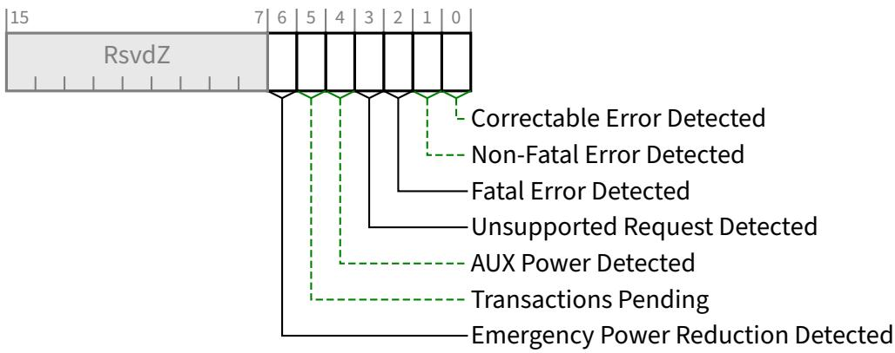


| 位 | 字段 |
|----|------|
| 0 | Correctable Error Detected (检测到可纠正错误) |
| 1 | Non-Fatal Error Detected (检测到非致命错误) |
| 2 | Fatal Error Detected (检测到致命错误) |
| 3 | Unsupported Request Detected (检测到不支持的请求) |
| 4 | AUX Power Detected (检测到辅助电源) |
| 5 | Transactions Pending (事务挂起) |
| 6 | Emergency Power Reduction Detected (检测到紧急功率降低) |
| 7–15 | RsvdZ (保留) |

**表 7-22 设备状态寄存器 (Device Status Register)**

| 位位置 | 寄存器描述 | 属性 |
|--------|------------|------|
| 0 | Correctable Error Detected (检测到可纠正错误) — 该位指示已检测到的可纠正错误的状态。无论设备控制寄存器 (Device Control Register) 中的错误报告是否使能,错误都会记录在该寄存器中。对于多功能设备 (Multi-Function Device),每个 Function 指示从该 Function 角度所感知的错误状态。<br><br>对于支持高级错误处理 (Advanced Error Handling) 的 Function,无论可纠正错误掩码 (Correctable Error Mask) 寄存器的设置如何,错误都会记录在该寄存器中。<br><br>该位默认值为 0b。 | RW1C |

| 1 | Non-Fatal Error Detected (检测到非致命错误) — 该位指示已检测到的非致命错误的状态。无论设备控制寄存器 (Device Control Register) 中的错误报告是否使能,错误都会记录在该寄存器中。对于多功能设备 (Multi-Function Device),每个 Function 指示从该 Function 角度所感知的错误状态。<br><br>对于支持高级错误处理 (Advanced Error Handling) 的 Function,无论不可纠正错误掩码 (Uncorrectable Error Mask) 寄存器的设置如何,错误都会记录在该寄存器中。<br><br>该位默认值为 0b。 | RW1C |

</td>
</tr>
</tbody>
</table>
</div>


[⬆️ 返回目录](#-本章目录-table-of-contents)

---

<table>
<thead>
<tr>
<th width="50%">🇬🇧 English</th>
<th width="50%" style="background-color:#e8e8e8">🏆 中文</th>
</tr>
</thead>
<tbody>
<tr>
<td>

> **IMPLEMENTATION NOTE: USE OF MAX_READ_REQUEST_SIZE**
>
> The Max_Read_Request_Size mechanism allows improved control of bandwidth allocation in systems where Quality of Service (QoS) is important for the target applications. For example, an arbitration scheme based on counting Requests (and not the sizes of those Requests) provides imprecise bandwidth allocation when some Requesters use much larger sizes than others. The Max_Read_Request_Size mechanism can be used to force more uniform allocation of bandwidth, by restricting the upper size of Read Requests.

</td>
<td style="background-color:#e8e8e8">

> **实现说明:MAX_READ_REQUEST_SIZE 的使用**
>
> Max_Read_Request_Size 机制在服务质量 (QoS) 对目标应用很重要的系统中,可以更好地控制带宽分配。例如,基于请求数量(而非请求大小)进行计数的仲裁方案,在某些 Requester 使用比其他 Requester 大得多的大小时,所提供带宽分配并不精确。Max_Read_Request_Size 机制可通过限制读请求的最大大小来强制实现更均匀的带宽分配。

</td>
</tr>
</tbody>
</table>

[⬆️ 返回目录](#-本章目录-table-of-contents)

---

<!-- 📄 Page 1043 -->
---


<div style="overflow-x: auto; max-width: 100%;">
<table>
<thead>
<tr>
<th width="50%">🇬🇧 English</th>
<th width="50%" style="background-color:#e8e8e8">🏆 中文</th>
</tr>
</thead>
<tbody>
<tr>
<td>

| 2 | Fatal Error Detected - This bit indicates status of Fatal errors detected. Errors are logged in this register regardless of whether error reporting is enabled or not in the Device Control Register. For a Multi-Function Device, each Function indicates status of errors as perceived by the respective Function.<br><br>For Functions supporting Advanced Error Handling, errors are logged in this register regardless of the settings of the Uncorrectable Error Mask register.<br><br>Default value of this bit is 0b. | RW1C |

| 3 | Unsupported Request Detected - This bit indicates that the Function received an Unsupported Request. Errors are logged in this register regardless of whether error reporting is enabled or not in the Device Control Register. For a Multi-Function Device, each Function indicates status of errors as perceived by the respective Function.<br><br>Default value of this bit is 0b. | RW1C |

| 4 | AUX Power Detected - Functions that require auxiliary power report this bit as Set if auxiliary power is detected by the Function.<br><br>For VFs, this bit is not supported and must be hardwired to Zero. | RO<br>VF ROZ |

| 5 | Transactions Pending -<br><br>**Endpoints:**<br>When Set, this bit indicates that the Function has issued Non-Posted Requests that have not been completed. A Function reports this bit cleared only when all outstanding Non-Posted Requests have completed or have been terminated by the Completion Timeout mechanism. This bit must also be cleared upon the completion of an FLR.<br><br>**Root and Switch Ports:**<br>When Set, this bit indicates that a Port has issued Non-Posted Requests on its own behalf (using the Port's own, or its Shadow Function's, Requester ID) which have not been completed. The Port reports this bit cleared only when all such outstanding Non-Posted Requests have completed or have been terminated by the Completion Timeout mechanism. Note that Root and Switch Ports implementing only the functionality required by this document do not issue Non-Posted Requests on their own behalf, and therefore are not subject to this case. Root and Switch Ports that do not issue Non-Posted Requests on their own behalf hardwire this bit to 0b. | RO |

| 6 | Emergency Power Reduction Detected - This bit is Set when the Function is in the Emergency Power Reduction State. Whenever any condition is present that would cause the Emergency Power Reduction State to be entered, the Function remains in the Emergency Power Reduction State and writes to this bit have no effect. See § Section 6.24 for additional details.<br><br>Multi-Function Devices associated with an Upstream Port must Set this bit in all Functions that support Emergency Power Reduction State.<br><br>For VFs, this bit is not supported and must be hardwired to Zero.<br>Except for VFs, this bit is RsvdZ if the Emergency Power Reduction Supported field is 00b (see § Section 7.5.3.15).<br>This bit is RsvdZ in Functions that are not associated with an Upstream Port.<br><br>Default value is 0b. | RW1C<br>VF ROZ |

</td>
<td style="background-color:#e8e8e8">

| 2 | Fatal Error Detected (检测到致命错误) — 该位指示已检测到的致命错误的状态。无论设备控制寄存器 (Device Control Register) 中的错误报告是否使能,错误都会记录在该寄存器中。对于多功能设备 (Multi-Function Device),每个 Function 指示从该 Function 角度所感知的错误状态。<br><br>对于支持高级错误处理 (Advanced Error Handling) 的 Function,无论不可纠正错误掩码 (Uncorrectable Error Mask) 寄存器的设置如何,错误都会记录在该寄存器中。<br><br>该位默认值为 0b。 | RW1C |

| 3 | Unsupported Request Detected (检测到不支持的请求) — 该位指示该 Function 收到了不支持的请求 (Unsupported Request)。无论设备控制寄存器 (Device Control Register) 中的错误报告是否使能,错误都会记录在该寄存器中。对于多功能设备 (Multi-Function Device),每个 Function 指示从该 Function 角度所感知的错误状态。<br><br>该位默认值为 0b。 | RW1C |

| 4 | AUX Power Detected (检测到辅助电源) — 需要辅助电源的 Function,如果 Function 检测到辅助电源,则报告该位置位。<br><br>对于 VF,不支持该位,必须硬连线为 0。 | RO<br>VF ROZ |

| 5 | Transactions Pending (事务挂起) —<br><br>**Endpoint:**<br>当置位时,该位指示该 Function 已发起了尚未完成的 Non-Posted 请求。Function 仅在所有 outstanding 的 Non-Posted 请求已完成或被完成超时 (Completion Timeout) 机制终止时,才报告该位清零。完成 FLR 后,该位也必须清零。<br><br>**根端口 (Root Port) 和交换机端口 (Switch Port):**<br>当置位时,该位指示某端口 (Port) 已代表自身(使用该 Port 自己的或 Shadow Function 的 Requester ID)发起了尚未完成的 Non-Posted 请求。端口仅在所有此类 outstanding 的 Non-Posted 请求已完成或被完成超时 (Completion Timeout) 机制终止时,才报告该位清零。注意,仅实现本文档所需功能的根端口 (Root Port) 和交换机端口 (Switch Port) 不会代表自身发起 Non-Posted 请求,因此不适用此情况。不代表自身发起 Non-Posted 请求的根端口 (Root Port) 和交换机端口 (Switch Port) 将该位硬连线为 0b。 | RO |

| 6 | Emergency Power Reduction Detected (检测到紧急功率降低) — 当 Function 处于紧急功率降低状态 (Emergency Power Reduction State) 时,该位置位。每当存在将导致进入紧急功率降低状态的条件时,该 Function 保持在紧急功率降低状态,且对该位的写入无效。详见 § 第 6.24 节。<br><br>与上游端口 (Upstream Port) 关联的多功能设备 (Multi-Function Device) 必须在支持紧急功率降低状态的所有 Function 中将该位置位。<br><br>对于 VF,不支持该位,必须硬连线为 0。<br>除 VF 外,如果 Emergency Power Reduction Supported 字段为 00b,则该位为 RsvdZ(见 § 第 7.5.3.15 节)。<br>在不与上游端口 (Upstream Port) 关联的 Function 中,该位为 RsvdZ。<br><br>默认值为 0b。 | RW1C<br>VF ROZ |

</td>
</tr>
</tbody>
</table>
</div>


[⬆️ 返回目录](#-本章目录-table-of-contents)

---

<a id="sec-7-5-3-6"></a>
## 7.5.3.6 Link Capabilities Register (Offset 0Ch) | 链路能力寄存器 (Link Capabilities Register) (偏移量 0Ch)

<table>
<thead>
<tr>
<th width="50%">🇬🇧 English</th>
<th width="50%" style="background-color:#e8e8e8">🏆 中文</th>
</tr>
</thead>
<tbody>
<tr>
<td>

The Link Capabilities Register identifies PCI Express Link specific capabilities. § Figure 7-27 details allocation of register fields in the Link Capabilities Register; § Table 7-23 provides the respective bit definitions.

**Figure 7-27 Link Capabilities Register**

| Bit | Field |
|-----|-------|
| 0–3 | Max Link Speed |
| 4–9 | Maximum Link Width |
| 10–11 | ASPM Support |
| 12–14 | L0s Exit Latency |
| 15–17 | L1 Exit Latency |
| 18 | Clock Power Management |
| 19 | Surprise Down Error Reporting Capable |
| 20 | Data Link Layer Link Active Reporting Capable |
| 21 | Link Bandwidth Notification Capability |
| 22 | ASPM Optionality Compliance |
| 23 | RsvdP |
| 24–31 | Port Number |

**Table 7-23 Link Capabilities Register**

| Bit Location | Register Description | Attributes |
|--------------|----------------------|------------|
| 3:0 | Max Link Speed - This field indicates the maximum Link speed of the associated Port.<br><br>The encoded value specifies a Bit Location in the Supported Link Speeds Vector (in the Link Capabilities 2 Register) that corresponds to the maximum Link speed.<br><br>Defined encodings are:<br>• 0001b — Supported Link Speeds Vector field bit 0<br>• 0010b — Supported Link Speeds Vector field bit 1<br>• 0011b — Supported Link Speeds Vector field bit 2<br>• 0100b — Supported Link Speeds Vector field bit 3<br>• 0101b — Supported Link Speeds Vector field bit 4<br>• 0110b — Supported Link Speeds Vector field bit 5<br>• 0111b — Supported Link Speeds Vector field bit 6<br><br>All other encodings are reserved.<br><br>Multi-Function Devices associated with an Upstream Port must report the same value in this field for all Functions. | RO |

| 9:4 | Maximum Link Width - This field indicates the maximum Link width (xN - corresponding to N Lanes) implemented by the component. This value is permitted to exceed the number of Lanes routed to the slot (Downstream Port), adapter connector (Upstream Port), or in the case of component-to-component connections, the actual wired connection width.<br><br>Defined encodings are:<br>• 00 0001b — x1<br>• 00 0010b — x2<br>• 00 0100b — x4<br>• 00 1000b — x8<br>• 01 0000b — x16<br><br>All other encodings are Reserved.<br><br>Multi-Function Devices associated with an Upstream Port must report the same value in this field for all Functions. | RO |

</td>
<td style="background-color:#e8e8e8">

链路能力寄存器 (Link Capabilities Register) 标识 PCI Express 链路 (Link) 特定能力。§ 图 7-27 详细说明链路能力寄存器中寄存器字段的分配;§ 表 7-23 提供相应的位定义。

**图 7-27 链路能力寄存器 (Link Capabilities Register)**

> 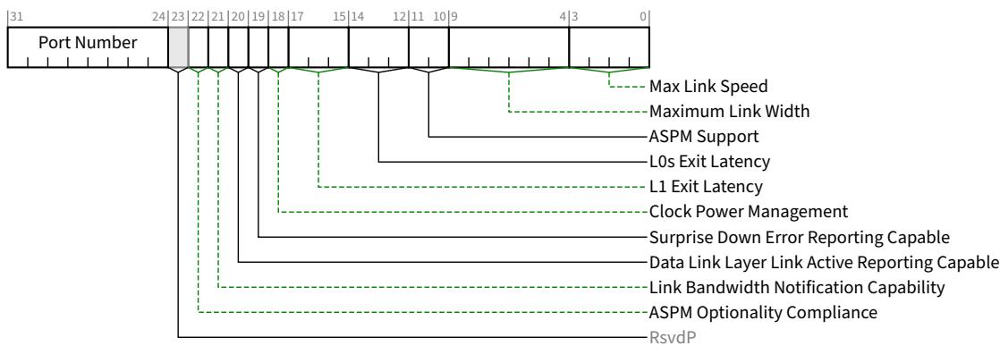


| 位 | 字段 |
|----|------|
| 0–3 | Max Link Speed (最大链路速率) |
| 4–9 | Maximum Link Width (最大链路宽度) |
| 10–11 | ASPM Support (ASPM 支持) |
| 12–14 | L0s Exit Latency (L0s 退出延迟) |
| 15–17 | L1 Exit Latency (L1 退出延迟) |
| 18 | Clock Power Management (时钟电源管理) |
| 19 | Surprise Down Error Reporting Capable (支持意外断开错误报告) |
| 20 | Data Link Layer Link Active Reporting Capable (支持数据链路层链路有效报告) |
| 21 | Link Bandwidth Notification Capability (链路带宽通知能力) |
| 22 | ASPM Optionality Compliance (ASPM 可选性合规) |
| 23 | RsvdP (保留) |
| 24–31 | Port Number (端口号) |

**表 7-23 链路能力寄存器 (Link Capabilities Register)**

| 位位置 | 寄存器描述 | 属性 |
|--------|------------|------|
| 3:0 | Max Link Speed (最大链路速率) — 该字段指示关联端口 (Port) 的最大链路 (Link) 速率。<br><br>该编码值指定 Supported Link Speeds Vector(在 Link Capabilities 2 寄存器中)中与最大链路速率对应的位位置。<br><br>已定义的编码如下:<br>• 0001b — Supported Link Speeds Vector 字段位 0<br>• 0010b — Supported Link Speeds Vector 字段位 1<br>• 0011b — Supported Link Speeds Vector 字段位 2<br>• 0100b — Supported Link Speeds Vector 字段位 3<br>• 0101b — Supported Link Speeds Vector 字段位 4<br>• 0110b — Supported Link Speeds Vector 字段位 5<br>• 0111b — Supported Link Speeds Vector 字段位 6<br><br>所有其他编码均保留。<br><br>与上游端口 (Upstream Port) 关联的多功能设备 (Multi-Function Device) 必须为所有 Function 在该字段中报告相同的值。 | RO |

| 9:4 | Maximum Link Width (最大链路宽度) — 该字段指示组件实现的最大链路 (Link) 宽度(xN — 对应 N 个通道,Lane)。该值允许超过实际路由到插槽(下游端口,Downstream Port)、适配器连接器(上游端口,Upstream Port)的通道数,或组件到组件连接的实际有线连接宽度。<br><br>已定义的编码如下:<br>• 00 0001b — x1<br>• 00 0010b — x2<br>• 00 0100b — x4<br>• 00 1000b — x8<br>• 01 0000b — x16<br><br>所有其他编码均保留。<br><br>与上游端口 (Upstream Port) 关联的多功能设备 (Multi-Function Device) 必须为所有 Function 在该字段中报告相同的值。 | RO |

</td>
</tr>
</tbody>
</table>

[⬆️ 返回目录](#-本章目录-table-of-contents)

---

<!-- 📄 Page 1044 -->
---

<!-- 📄 Page 1045 -->
---


<div style="overflow-x: auto; max-width: 100%;">
<table>
<thead>
<tr>
<th width="50%">🇬🇧 English</th>
<th width="50%" style="background-color:#e8e8e8">🏆 中文</th>
</tr>
</thead>
<tbody>
<tr>
<td>

| 11:10 | ASPM Support / Active State Power Management Support - This field indicates the level of ASPM supported on the given PCI Express Link. See § Section 5.4.1 for ASPM support requirements.<br><br>Defined encodings are:<br>• 00b — No ASPM Support<br>• 01b — L0s Supported<br>• 10b — L1 Supported<br>• 11b — L0s and L1 Supported<br><br>Multi-Function Devices associated with an Upstream Port must report the same value in this field for all Functions. | RO |

| 14:12 | L0s Exit Latency - This field indicates the L0s exit latency for the given PCI Express Link. The value reported indicates the length of time this Port requires to complete transition from L0s to L0. If L0s is not supported, the value is undefined; however, see the Implementation Note "Potential Issues With Legacy Software When L0s is Not Supported" in § Section 5.4.1.1 for the recommended value.<br><br>Defined encodings are:<br>• 000b — Less than 64 ns<br>• 001b — 64 ns to less than 128 ns<br>• 010b — 128 ns to less than 256 ns<br>• 011b — 256 ns to less than 512 ns<br>• 100b — 512 ns to less than 1 μs<br>• 101b — 1 μs to less than 2 μs<br>• 110b — 2 μs-4 μs<br>• 111b — More than 4 μs<br><br>Note that exit latencies may be influenced by PCI Express reference clock configuration depending upon whether a component uses a common or separate reference clock.<br><br>Multi-Function Devices associated with an Upstream Port must report the same value in this field for all Functions. | RO |

| 17:15 | L1 Exit Latency - This field indicates the L1 Exit Latency for the given PCI Express Link. The value reported indicates the length of time this Port requires to complete transition from ASPM L1 to L0. If ASPM L1 is not supported, the value is undefined.<br><br>Defined encodings are:<br>• 000b — Less than 1μs<br>• 001b — 1 μs to less than 2 μs<br>• 010b — 2 μs to less than 4 μs<br>• 011b — 4 μs to less than 8 μs<br>• 100b — 8 μs to less than 16 μs<br>• 101b — 16 μs to less than 32 μs<br>• 110b — 32 μs-64 μs<br>• 111b — More than 64 μs<br><br>Note that exit latencies may be influenced by PCI Express reference clock configuration depending upon whether a component uses a common or separate reference clock.<br><br>Multi-Function Devices associated with an Upstream Port must report the same value in this field for all Functions. | RO |

</td>
<td style="background-color:#e8e8e8">

| 11:10 | ASPM Support / Active State Power Management Support (ASPM 支持 / 主动状态电源管理支持) — 该字段指示给定 PCI Express 链路 (Link) 上支持的 ASPM 等级。有关 ASPM 支持要求,请参阅 § 第 5.4.1 节。<br><br>已定义的编码如下:<br>• 00b — 不支持 ASPM<br>• 01b — 支持 L0s<br>• 10b — 支持 L1<br>• 11b — 支持 L0s 和 L1<br><br>与上游端口 (Upstream Port) 关联的多功能设备 (Multi-Function Device) 必须为所有 Function 在该字段中报告相同的值。 | RO |

| 14:12 | L0s Exit Latency (L0s 退出延迟) — 该字段指示给定 PCI Express 链路 (Link) 的 L0s 退出延迟。所报告的值表示该端口 (Port) 完成从 L0s 到 L0 转换所需的时间。如果不支持 L0s,则该值未定义;但是,有关建议值,请参阅 § 第 5.4.1.1 节中题为"不支持 L0s 时的传统软件潜在问题"的实现说明。<br><br>已定义的编码如下:<br>• 000b — 小于 64 ns<br>• 001b — 64 ns 至小于 128 ns<br>• 010b — 128 ns 至小于 256 ns<br>• 011b — 256 ns 至小于 512 ns<br>• 100b — 512 ns 至小于 1 μs<br>• 101b — 1 μs 至小于 2 μs<br>• 110b — 2 μs-4 μs<br>• 111b — 大于 4 μs<br><br>注意,退出延迟可能受 PCI Express 参考时钟配置的影响,具体取决于组件是使用公共参考时钟还是单独参考时钟。<br><br>与上游端口 (Upstream Port) 关联的多功能设备 (Multi-Function Device) 必须为所有 Function 在该字段中报告相同的值。 | RO |

| 17:15 | L1 Exit Latency (L1 退出延迟) — 该字段指示给定 PCI Express 链路 (Link) 的 L1 退出延迟。所报告的值表示该端口 (Port) 完成从 ASPM L1 到 L0 转换所需的时间。如果不支持 ASPM L1,则该值未定义。<br><br>已定义的编码如下:<br>• 000b — 小于 1 μs<br>• 001b — 1 μs 至小于 2 μs<br>• 010b — 2 μs 至小于 4 μs<br>• 011b — 4 μs 至小于 8 μs<br>• 100b — 8 μs 至小于 16 μs<br>• 101b — 16 μs 至小于 32 μs<br>• 110b — 32 μs-64 μs<br>• 111b — 大于 64 μs<br><br>注意,退出延迟可能受 PCI Express 参考时钟配置的影响,具体取决于组件是使用公共参考时钟还是单独参考时钟。<br><br>与上游端口 (Upstream Port) 关联的多功能设备 (Multi-Function Device) 必须为所有 Function 在该字段中报告相同的值。 | RO |

</td>
</tr>
</tbody>
</table>
</div>


[⬆️ 返回目录](#-本章目录-table-of-contents)

---

<!-- 📄 Page 1046 -->
---

<table>
<thead>
<tr>
<th width="50%">🇬🇧 English</th>
<th width="50%" style="background-color:#e8e8e8">🏆 中文</th>
</tr>
</thead>
<tbody>
<tr>
<td>

| 18 | Clock Power Management - For Upstream Ports, a value of 1b in this bit indicates that the component tolerates the removal of any reference clock(s) via the "clock request" (CLKREQ#) mechanism when the Link is in the L1 and L2/L3 Ready Link states. A value of 0b indicates the component does not have this capability and that reference clock(s) must not be removed in these Link states.<br><br>L1 PM Substates defines other semantics for the CLKREQ# signal, which are managed independently of Clock Power Management.<br><br>This Capability is applicable only in form factors that support "clock request" (CLKREQ#) capability.<br><br>For a Multi-Function Device associated with an Upstream Port, each Function indicates its capability independently. Power Management configuration software must only permit reference clock removal if all Functions of the Multi-Function Device indicate a 1b in this bit. For ARI Devices, all Functions must indicate the same value in this bit.<br><br>For Downstream Ports, this bit must be hardwired to 0b. | RO |

| 19 | Surprise Down Error Reporting Capable - For a Downstream Port, this bit must be Set if the component supports the optional capability of detecting and reporting a Surprise Down error condition.<br><br>For Upstream Ports and components that do not support this optional capability, this bit must be hardwired to 0b. | RO |

| 20 | Data Link Layer Link Active Reporting Capable - For a Downstream Port, this bit must be hardwired to 1b if the component supports the optional capability of reporting the DL_Active state of the Data Link Control and Management State Machine. For a hot-plug capable Downstream Port (as indicated by the Hot-Plug Capable bit of the Slot Capabilities Register) or a Downstream Port that supports Link speeds greater than 5.0 GT/s, this bit must be hardwired to 1b.<br><br>For Upstream Ports and components that do not implement this optional capability, this bit must be hardwired to 0b. | RO |

| 21 | Link Bandwidth Notification Capability - A value of 1b indicates support for the Link Bandwidth Notification status and interrupt mechanisms. This capability is required for all Root Ports and Switch Downstream Ports supporting Links wider than x1 and/or multiple Link speeds.<br><br>This field is not applicable and is Reserved for Endpoints, PCI Express to PCI/PCI-X bridges, and Upstream Ports of Switches.<br><br>Functions that do not implement the Link Bandwidth Notification Capability must hardwire this bit to 0b. | RO |

| 22 | ASPM Optionality Compliance - This bit must be set to 1b in all Functions. Components implemented against certain earlier versions of this specification will have this bit set to 0b.<br><br>Software is permitted to use the value of this bit to help determine whether to enable ASPM or whether to run ASPM compliance tests. | HwInit |

| 31:24 | Port Number - This field indicates the PCI Express Port number for the given PCI Express Link.<br><br>Multi-Function Devices associated with an Upstream Port must report the same value in this field for all Functions. | HwInit |

</td>
<td style="background-color:#e8e8e8">

| 18 | Clock Power Management (时钟电源管理) — 对于上游端口 (Upstream Port),该位值为 1b 表示组件允许在链路 (Link) 处于 L1 和 L2/L3 Ready Link 状态时,通过"时钟请求" (CLKREQ#) 机制移除任何参考时钟。值为 0b 表示组件不具备此能力,且在这些链路 (Link) 状态下不得移除参考时钟。<br><br>L1 PM Substates 为 CLKREQ# 信号定义了其他语义,这些语义独立于 Clock Power Management 进行管理。<br><br>该能力仅适用于支持"时钟请求" (CLKREQ#) 能力的外形规格 (form factor)。<br><br>对于与上游端口 (Upstream Port) 关联的多功能设备 (Multi-Function Device),每个 Function 独立指示其能力。电源管理配置软件仅在多功能设备 (Multi-Function Device) 的所有 Function 都指示该位为 1b 时才允许移除参考时钟。对于 ARI 设备 (ARI Device),所有 Function 必须为该位指示相同的值。<br><br>对于下游端口 (Downstream Port),该位必须硬连线为 0b。 | RO |

| 19 | Surprise Down Error Reporting Capable (支持意外断开错误报告) — 对于下游端口 (Downstream Port),如果组件支持检测和报告意外断开 (Surprise Down) 错误条件的可选能力,则该位必须置位。<br><br>对于上游端口 (Upstream Port) 和不支持此可选能力的组件,该位必须硬连线为 0b。 | RO |

| 20 | Data Link Layer Link Active Reporting Capable (支持数据链路层链路有效报告) — 对于下游端口 (Downstream Port),如果组件支持报告数据链路控制与管理状态机 (Data Link Control and Management State Machine) 的 DL_Active 状态的可选能力,则该位必须硬连线为 1b。对于支持热插拔的下游端口 (Downstream Port)(由 Slot Capabilities 寄存器的 Hot-Plug Capable 位指示)或支持大于 5.0 GT/s 链路 (Link) 速率的下游端口 (Downstream Port),该位必须硬连线为 1b。<br><br>对于上游端口 (Upstream Port) 和未实现此可选能力的组件,该位必须硬连线为 0b。 | RO |

| 21 | Link Bandwidth Notification Capability (链路带宽通知能力) — 值为 1b 表示支持链路带宽通知 (Link Bandwidth Notification) 状态和中断机制。所有支持宽度大于 x1 的链路 (Link) 和/或多种链路 (Link) 速率的根端口 (Root Port) 和交换机下游端口 (Switch Downstream Port) 都必须具备该能力。<br><br>该字段不适用,对于 Endpoint、PCI Express 转 PCI/PCI-X 桥以及交换机的上游端口 (Upstream Port) 保留。<br><br>未实现链路带宽通知 (Link Bandwidth Notification) 能力的 Function 必须将该位硬连线为 0b。 | RO |

| 22 | ASPM Optionality Compliance (ASPM 可选性合规) — 该位必须在所有 Function 中设置为 1b。针对本规范某些早期版本实现的组件,该位将设置为 0b。<br><br>软件可使用该位的值帮助确定是否启用 ASPM 或是否运行 ASPM 一致性测试。 | HwInit |

| 31:24 | Port Number (端口号) — 该字段指示给定 PCI Express 链路 (Link) 的 PCI Express 端口 (Port) 号。<br><br>与上游端口 (Upstream Port) 关联的多功能设备 (Multi-Function Device) 必须为所有 Function 在该字段中报告相同的值。 | HwInit |

</td>
</tr>
</tbody>
</table>

[⬆️ 返回目录](#-本章目录-table-of-contents)

---

<!-- 📄 Page 1047 -->
---


<div style="overflow-x: auto; max-width: 100%;">
<table>
<thead>
<tr>
<th width="50%">🇬🇧 English</th>
<th width="50%" style="background-color:#e8e8e8">🏆 中文</th>
</tr>
</thead>
<tbody>
<tr>
<td>

The Link Control Register controls PCI Express Link specific parameters. § Figure 7-28 details allocation of register fields in the Link Control Register; § Table 7-24 provides the respective bit definitions.

For VF fields indicated as RsvdP, the associated PF's setting applies to the VF.

> **IMPLEMENTATION NOTE: USE OF THE ASPM OPTIONALITY COMPLIANCE BIT**
>
> Correct implementation and utilization of ASPM can significantly reduce Link power. However, ASPM feature implementations can be complex, and historically, some implementations have not been compliant to the specification. To address this, some of the ASPM optionality and ASPM entry requirements from earlier revisions of this document have been loosened. However, clear pass/fail compliance testing for ASPM features is also supported and expected.
>
> The ASPM Optionality Compliance bit was created as a tool to establish clear expectations for hardware and software. This bit is Set to indicate hardware that conforms to the current specification, and this bit must be Set in components compliant to this specification.
>
> System software as well as compliance software can assume that if this bit is Set, that the associated hardware conforms to the current specification. Hardware should be fully capable of supporting ASPM configuration management without needing component-specific treatment by system software.
>
> For older hardware that does not have this bit Set, it is strongly recommended for system software to provide mechanisms to enable ASPM on components that work correctly with ASPM, and to disable ASPM on components that don't.

</td>
<td style="background-color:#e8e8e8">

链路控制寄存器 (Link Control Register) 控制 PCI Express 链路 (Link) 特定参数。§ 图 7-28 详细说明链路控制寄存器中寄存器字段的分配;§ 表 7-24 提供相应的位定义。

对于标记为 RsvdP 的 VF 字段,使用关联 PF 的设置。

> **实现说明:ASPM 可选性合规位的使用**
>
> ASPM 的正确实现和使用可显著降低链路 (Link) 功耗。然而,ASPM 功能的实现可能很复杂,历史上一些实现未完全符合本规范。为了解决此问题,本文档早期修订版中某些 ASPM 可选性及 ASPM 进入要求已被放宽。但是,ASPM 功能的清晰通过/失败一致性测试也得到支持并被预期。
>
> ASPM Optionality Compliance 位被创建为一种工具,用于为硬件和软件建立明确预期。该位置位表示硬件符合当前规范,符合本规范的组件中该位必须置位。
>
> 系统软件以及一致性软件可以假定:如果该位置位,则关联硬件符合当前规范。硬件应完全有能力支持 ASPM 配置管理,无需系统软件进行组件特定处理。
>
> 对于未将该位置位的较旧硬件,强烈建议系统软件提供机制,在能正确配合 ASPM 的组件上启用 ASPM,在不能正确配合 ASPM 的组件上禁用 ASPM。

</td>
</tr>
</tbody>
</table>
</div>


[⬆️ 返回目录](#-本章目录-table-of-contents)

---


---

<a id="sec-7-5-3-7"></a>
## 7.5.3.7 Link Control Register (Offset 10h) | 链路控制寄存器（偏移 10h）

<table>
<thead>
<tr>
<th width="50%">🇬🇧 English</th>
<th width="50%" style="background-color:#e8e8e8">🏆 中文</th>
</tr>
</thead>
<tbody>
<tr>
<td>

**Figure 7-28 Link Control Register**

| Bit | Field |
|-----|-------|
| 1:0 | ASPM Control |
| 2 | PTM Propagation Delay Adaptation Interpretation B |
| 3 | Read Completion Boundary |
| 4 | Link Disable |
| 5 | Retrain Link |
| 6 | Common Clock Configuration |
| 7 | Extended Synch |
| 8 | Enable Clock Power Management |
| 9 | Hardware Autonomous Width Disable |
| 10 | Link Bandwidth Management Interrupt Enable |
| 11 | Link Autonomous Bandwidth Interrupt Enable |
| 12 | SRIS Clocking |
| 13 | Flit Mode Disable |
| 15:14 | DRS Signaling Control |

**Table 7-24 Link Control Register**

| Bit Location | Register Description | Attributes |
|--------------|----------------------|------------|

</td>
<td style="background-color:#e8e8e8">

**图 7-28 链路控制寄存器**

> 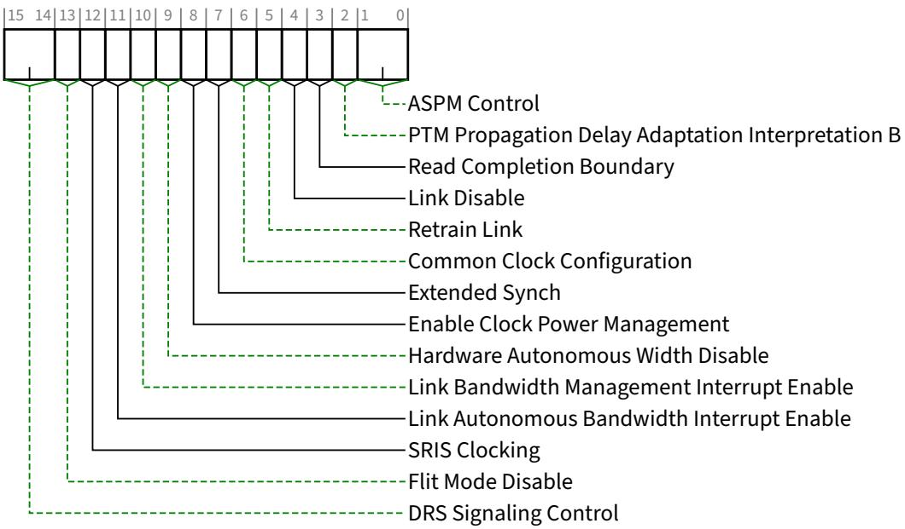


| 位 | 字段 |
|-----|------|
| 1:0 | ASPM Control (ASPM 控制) |
| 2 | PTM Propagation Delay Adaptation Interpretation B (PTM 传播延迟自适应解释 B) |
| 3 | Read Completion Boundary (读取完成边界, RCB) |
| 4 | Link Disable (禁用链路) |
| 5 | Retrain Link (重训练链路) |
| 6 | Common Clock Configuration (公共时钟配置) |
| 7 | Extended Synch (扩展同步) |
| 8 | Enable Clock Power Management (使能时钟电源管理) |
| 9 | Hardware Autonomous Width Disable (禁用硬件自主宽度变更) |
| 10 | Link Bandwidth Management Interrupt Enable (链路带宽管理中断使能) |
| 11 | Link Autonomous Bandwidth Interrupt Enable (链路自主带宽中断使能) |
| 12 | SRIS Clocking (SRIS 时钟模式) |
| 13 | Flit Mode Disable (禁用 Flit 模式) |
| 15:14 | DRS Signaling Control (DRS 信令控制) |

**表 7-24 链路控制寄存器**

| 位位置 | 寄存器描述 | 属性 |
|--------|------------|------|

</td>
</tr>
</tbody>
</table>

<!-- 📄 Page 1048 -->
---


<div style="overflow-x: auto; max-width: 100%;">
<table>
<thead>
<tr>
<th width="50%">🇬🇧 English</th>
<th width="50%" style="background-color:#e8e8e8">🏆 中文</th>
</tr>
</thead>
<tbody>
<tr>
<td>

**1:0 ASPM Control / Active State Power Management Control** - This field controls the level of ASPM enabled on the given PCI Express Link. See § Section 5.4.1.4 for requirements on when and how to enable ASPM.

Defined encodings are:

- 00b: Disabled
- 01b: L0s Entry Enabled
- 10b: L1 Entry Enabled
- 11b: L0s and L1 Entry Enabled

Note: "L0s Entry Enabled" enables the Transmitter to enter L0s. If L0s is supported, the Receiver must be capable of entering L0s even when the Transmitter is disabled from entering L0s (00b or 10b).

In Flit Mode, L0s is not supported, bit 0 of this field is ignored and has no effect (i.e., encodings 01b and 00b are equivalent as are encodings 11b and 10b).

ASPM L1 must be enabled by software in the Upstream component on a Link prior to enabling ASPM L1 in the Downstream component on that Link. When disabling ASPM L1, software must disable ASPM L1 in the Downstream component on a Link prior to disabling ASPM L1 in the Upstream component on that Link. ASPM L1 must only be enabled on the Downstream component if both components on a Link support ASPM L1.

For Multi-Function Devices (including ARI Devices), it is recommended that software program the same value for this field in all Functions. For non-ARI Multi-Function Devices, only capabilities enabled in all Functions are enabled for the component as a whole.

For ARI Devices, ASPM Control is determined solely by the setting in Function 0, regardless of Function 0's D-state. The settings in the other Functions always return whatever value software programmed for each, but otherwise are ignored by the component.

**RW, VF RsvdP**

Default value of this field is 00b unless otherwise required by a particular form factor.

</td>
<td style="background-color:#e8e8e8">

**1:0 ASPM Control (ASPM 控制) / Active State Power Management Control (主动状态电源管理控制)** —— 该字段控制在给定 PCI Express 链路上启用的 ASPM 级别。有关何时及如何启用 ASPM 的要求,请参见 § 第 5.4.1.4 节。

已定义的编码如下:

- 00b:Disabled (禁用)
- 01b:L0s Entry Enabled (允许进入 L0s)
- 10b:L1 Entry Enabled (允许进入 L1)
- 11b:L0s and L1 Entry Enabled (允许进入 L0s 和 L1)

注:"L0s Entry Enabled" 允许发送器 (Transmitter) 进入 L0s。如果支持 L0s,则即使发送器被禁止进入 L0s(00b 或 10b),接收器 (Receiver) 也必须具备进入 L0s 的能力。

在 Flit 模式 (Flit Mode) 下,不支持 L0s,该字段的 bit 0 被忽略且无效(即编码 01b 与 00b 等效,11b 与 10b 等效)。

在一条链路的下游组件 (Downstream component) 上启用 ASPM L1 之前,软件必须先在该链路的上游组件 (Upstream component) 上启用 ASPM L1。禁用 ASPM L1 时,软件必须先在下游组件上禁用 ASPM L1,然后再在上游组件上禁用 ASPM L1。仅当链路两端组件均支持 ASPM L1 时,才能在该下游组件上启用 ASPM L1。

对于多功能设备 (Multi-Function Device, 包括 ARI 设备),建议软件在所有 Function (功能) 中对该字段编程相同的值。对于非 ARI 多功能设备,只有所有 Function 都启用的能力才会作为整体对组件生效。

对于 ARI 设备,ASPM 控制完全由 Function 0 的设置决定,与 Function 0 的 D-state 无关。其他 Function 中的设置始终返回软件为各 Function 编程的值,但组件会忽略它们。

**RW, VF RsvdP**

除非特定外形规格另有要求,否则该字段的默认值为 00b。

</td>
</tr>
</tbody>
</table>
</div>


---

<!-- 📄 Page 1049 -->
---

<table>
<thead>
<tr>
<th width="50%">🇬🇧 English</th>
<th width="50%" style="background-color:#e8e8e8">🏆 中文</th>
</tr>
</thead>
<tbody>
<tr>
<td>

**2 PTM Propagation Delay Adaptation Interpretation B** – For a device that supports PTM, if PTM Propagation Delay Adaptation Capable in the PTM Capability Register is Set, then, for an Upstream Port, this bit when Set selects interpretation B of the Propagation Delay[31:0] field for received PTM ResponseD Messages, and for a Downstream Port, this bit when Set selects interpretation B of the Propagation Delay[31:0] field for PTM ResponseD Messages transmitted by the Port; otherwise this bit when Clear selects interpretation A for both cases. For a device that supports PTM, if its PTM Propagation Delay Adaptation Capable in the PTM Capability Register is Clear, Ports must hardwire this bit to 0b. For Multi-Function Devices associated with an Upstream Port of a device that supports PTM, this bit must be implemented in the same Function that contains the PTM Extended Capability structure and RsvdP in all other Functions. Default value is implementation specific, but is recommended to be 0b. For a device that does not support PTM, for all Ports in that device this bit must be RsvdP.

**RW / RsvdP**

**3 Read Completion Boundary (RCB)** - field is meaningful in Root Ports, Endpoints and Bridges. When meaningful, defined encodings are:

- 0b: 64 byte
- 1b: 128 byte

**Root Ports:** RCB contains the RCB value for the Root Port. Refer to § Section 2.3.1.1 for the definition of the parameter RCB. This bit is hardwired for a Root Port and returns its RCB support capabilities. **RO**

**Endpoints and Bridges:** Read Completion Boundary (RCB) - Optionally Set by configuration software to indicate the RCB value of the Root Port Upstream from the Endpoint or Bridge. Refer to § Section 2.3.1.1 for the definition of the parameter RCB. Configuration software must only Set this bit if the Root Port Upstream from the Endpoint or Bridge reports an RCB value of 128 bytes (a value of 1b in the Read Completion Boundary bit). Default value of this bit is 0b. Functions that do not implement this feature must hardwire the bit to 0b. **RW, VF RsvdP**

**Switch Ports:** Not applicable - must hardwire the bit to 0b. **RO**

</td>
<td style="background-color:#e8e8e8">

**2 PTM Propagation Delay Adaptation Interpretation B (PTM 传播延迟自适应解释 B)** —— 对于支持 PTM 的设备,如果 PTM Capability 寄存器中的 "PTM Propagation Delay Adaptation Capable" 位被置 1,则对于上游端口 (Upstream Port),当该位被置 1 时,所接收的 PTM ResponseD 报文中 Propagation Delay[31:0] 字段采用解释 B;对于下游端口 (Downstream Port),当该位被置 1 时,该端口发送的 PTM ResponseD 报文中 Propagation Delay[31:0] 字段采用解释 B;否则该位为 0 时两种情况均采用解释 A。对于支持 PTM 但 PTM Capability 寄存器中 "PTM Propagation Delay Adaptation Capable" 为 0 的设备,端口必须将该位硬连线为 0b。对于支持 PTM 的设备中、与上游端口关联的多功能设备,该位必须实现于包含 PTM Extended Capability 结构的同一 Function 中,其他 Function 中为 RsvdP。默认值为实现相关,但建议为 0b。对于不支持 PTM 的设备,该设备中所有端口的该位必须为 RsvdP。

**RW / RsvdP**

**3 Read Completion Boundary (RCB, 读取完成边界)** —— 该字段在根端口 (Root Port)、端点 (Endpoint) 和桥 (Bridge) 中有效。有效时,已定义的编码如下:

- 0b:64 字节
- 1b:128 字节

**根端口 (Root Ports):** RCB 包含该根端口的 RCB 值。RCB 参数的定义请参见 § 第 2.3.1.1 节。根端口的该位为硬连线,返回其 RCB 支持能力。**RO**

**端点与桥 (Endpoints and Bridges):** Read Completion Boundary (RCB) —— 由配置软件可选地置 1,以指示该端点或桥上游根端口的 RCB 值。RCB 参数的定义请参见 § 第 2.3.1.1 节。仅当端点或桥上游根端口报告 RCB 值为 128 字节(Read Completion Boundary 位为 1b)时,配置软件才能将该位置 1。该位默认值为 0b。未实现此功能的 Function 必须将该位硬连线为 0b。**RW, VF RsvdP**

**交换机端口 (Switch Ports):** 不适用 —— 必须将该位硬连线为 0b。**RO**

</td>
</tr>
</tbody>
</table>

---

<!-- 📄 Page 1050 -->
---


<div style="overflow-x: auto; max-width: 100%;">
<table>
<thead>
<tr>
<th width="50%">🇬🇧 English</th>
<th width="50%" style="background-color:#e8e8e8">🏆 中文</th>
</tr>
</thead>
<tbody>
<tr>
<td>

**4 Link Disable** - This bit disables the Link by directing the LTSSM to the Disabled state when Set; this bit is Reserved on Endpoints, PCI Express to PCI/PCI-X bridges, and Upstream Ports of Switches.

See Implementation Note: Delays in Data Link Layer Link Active Reflecting Link Control Operations for related information.

Writes to this bit are immediately reflected in the value read from the bit, regardless of actual Link state.

After clearing this bit, software must honor timing requirements defined in § Section 6.6.1 with respect to the first Configuration Read following a Conventional Reset.

Default value of this bit is 0b. **RW**

**5 Retrain Link** - A write of 1b to this bit initiates Link retraining by directing the Physical Layer LTSSM to the Recovery state. If the LTSSM is already in Recovery or Configuration, re-entering Recovery is permitted but not required. If the Port is in DPC when a write of 1b to this bit occurs, the result is undefined. Reads of this bit always return 0b.

It is permitted to write 1b to this bit while simultaneously writing modified values to other fields in this register. If the LTSSM is not already in Recovery or Configuration, the resulting Link training must use the modified values. If the LTSSM is already in Recovery or Configuration, the modified values are not required to affect the Link training that's already in progress.

This bit is not applicable and is Reserved for Endpoints, PCI Express to PCI/PCI-X bridges, and Upstream Ports of Switches.

This bit always returns 0b when read. **RW**

</td>
<td style="background-color:#e8e8e8">

**4 Link Disable (禁用链路)** —— 置 1 时,该位通过将 LTSSM 引导至 Disabled 状态来禁用链路;在端点 (Endpoint)、PCI Express 转 PCI/PCI-X 桥以及交换机 (Switch) 的上游端口上该位为保留。

相关信息请参见实现说明:"Delays in Data Link Layer Link Active Reflecting Link Control Operations"(数据链路层 Link Active 反映链路控制操作的延迟)。

对该位的写入会立即反映在读出的位值中,与实际链路状态无关。

清除该位之后,软件必须遵循 § 第 6.6.1 节中规定的时序要求,特别是常规复位 (Conventional Reset) 之后的第一次 Configuration Read。

该位默认值为 0b。**RW**

**5 Retrain Link (重训练链路)** —— 向该位写入 1b 会通过将物理层 LTSSM 引导至 Recovery 状态来启动链路重训练。如果 LTSSM 已处于 Recovery 或 Configuration 状态,则允许但不要求重新进入 Recovery。如果端口处于 DPC 状态时向该位写入 1b,则结果未定义。读取该位始终返回 0b。

允许在向该位写入 1b 的同时向本寄存器的其他字段写入修改后的值。如果 LTSSM 不在 Recovery 或 Configuration 状态,则所产生的链路训练必须使用修改后的值;如果 LTSSM 已处于 Recovery 或 Configuration 状态,则不要求这些修改后的值影响正在进行中的链路训练。

该位在端点、PCI Express 转 PCI/PCI-X 桥以及交换机的上游端口上不适用,且为保留。

读取该位始终返回 0b。**RW**

</td>
</tr>
</tbody>
</table>
</div>


---

<!-- 📄 Page 1051 -->
---

<table>
<thead>
<tr>
<th width="50%">🇬🇧 English</th>
<th width="50%" style="background-color:#e8e8e8">🏆 中文</th>
</tr>
</thead>
<tbody>
<tr>
<td>

**6 Common Clock Configuration** - When Set, this bit indicates that this component and the component at the opposite end of this Link are operating with a distributed common reference clock.

A value of 0b indicates that this component and the component at the opposite end of this Link are operating with asynchronous reference clock.

For non-ARI Multi-Function Devices, software must program the same value for this bit in all Functions. If not all Functions are Set, then the component must as a whole assume that its reference clock is not common with the Upstream component.

For ARI Devices, Common Clock Configuration is determined solely by the setting in Function 0. The settings in the other Functions always return whatever value software programmed for each, but otherwise are ignored by the component.

Components utilize this Common Clock Configuration information to report the correct L0s and L1 Exit Latencies.

After changing the value in this bit in both components on a Link, software must trigger the Link to retrain by writing a 1b to the Retrain Link bit of the Downstream Port.

Default value of this bit is 0b. **RW, VF RsvdP**

**7 Extended Synch** - When Set, this bit forces the transmission of additional Ordered Sets when exiting the L0s state (see § Section 4.2.5.6) and when in the Recovery state (see § Section 4.2.7.4.1). This mode provides external devices (e.g., logic analyzers) monitoring the Link time to achieve bit and Symbol lock before the Link enters the L0 state and resumes communication.

For Multi-Function Devices if any Function has this bit Set, then the component must transmit the additional Ordered Sets when exiting L0s or when in Recovery.

Default value for this bit is 0b. **RW, VF RsvdP**

**8 Enable Clock Power Management** - Applicable only for Upstream Ports and with form factors that support a "Clock Request" (CLKREQ#) mechanism, this bit operates as follows:

- 0b: Clock power management is disabled and device must hold CLKREQ# signal low.
- 1b: When this bit is Set, the device is permitted to use CLKREQ# signal to power manage Link clock according to protocol defined in appropriate form factor specification.

For a non-ARI Multi-Function Device, power-management-configuration software must only Set this bit if all Functions of the Multi-Function Device indicate a 1b in the Clock Power Management bit of the Link Capabilities Register. The component is permitted to use the CLKREQ# signal to power manage Link clock only if this bit is Set for all Functions.

For ARI Devices, Clock Power Management is enabled solely by the setting in Function 0. The settings in the other Functions always return whatever value software programmed for each, but otherwise are ignored by the component.

The CLKREQ# signal may also be controlled via the L1 PM Substates mechanism. Such control is not affected by the setting of this bit.

Downstream Ports and components that do not support Clock Power Management (as indicated by a 0b value in the Clock Power Management bit of the Link Capabilities Register) must hardwire this bit to 0b.

Default value of this bit is 0b, unless specified otherwise by the form factor specification. **RW, VF RsvdP**

</td>
<td style="background-color:#e8e8e8">

**6 Common Clock Configuration (公共时钟配置)** —— 置 1 时,表示本组件与链路对端的组件使用分布式公共参考时钟。

值为 0b 时,表示本组件与链路对端的组件使用异步参考时钟。

对于非 ARI 多功能设备,软件必须为所有 Function 中的该位编程相同的值。如果并非所有 Function 都将其置 1,则组件整体上必须假定其参考时钟与上游组件不公共。

对于 ARI 设备,Common Clock Configuration 完全由 Function 0 的设置决定。其他 Function 中的设置始终返回软件为各 Function 编程的值,但组件会忽略它们。

组件利用 Common Clock Configuration 信息来正确报告 L0s 和 L1 退出延迟 (Exit Latency)。

在链路两端组件中修改该位的值之后,软件必须通过向下游端口的 Retrain Link 位写入 1b 来触发链路重训练。

该位默认值为 0b。**RW, VF RsvdP**

**7 Extended Synch (扩展同步)** —— 置 1 时,该位强制在退出 L0s 状态时(见 § 第 4.2.5.6 节)以及处于 Recovery 状态时(见 § 第 4.2.7.4.1 节)发送额外的有序集 (Ordered Sets)。该模式为监控链路的外部设备(如逻辑分析仪)在链路进入 L0 状态并恢复通信之前提供时间以完成位锁定和符号锁定 (Symbol lock)。

对于多功能设备,只要任一 Function 将该位置 1,组件就必须在退出 L0s 或处于 Recovery 时发送额外的有序集。

该位默认值为 0b。**RW, VF RsvdP**

**8 Enable Clock Power Management (使能时钟电源管理)** —— 仅适用于上游端口以及支持 "Clock Request" (CLKREQ#) 机制的外形规格,该位的操作如下:

- 0b:禁用时钟电源管理,设备必须将 CLKREQ# 信号保持为低。
- 1b:置 1 时,允许设备按照相应外形规格规范中定义的协议使用 CLKREQ# 信号对链路时钟进行电源管理。

对于非 ARI 多功能设备,只有在多功能设备的所有 Function 都在 Link Capabilities 寄存器的 Clock Power Management 位指示为 1b 时,电源管理配置软件才能将该位置 1。只有当所有 Function 的该位都置 1 时,组件才被允许使用 CLKREQ# 信号对链路时钟进行电源管理。

对于 ARI 设备,Clock Power Management 仅由 Function 0 的设置使能。其他 Function 中的设置始终返回软件为各 Function 编程的值,但组件会忽略它们。

CLKREQ# 信号也可通过 L1 PM Substates 机制进行控制。该控制不受本位设置的影响。

不支持 Clock Power Management 的下游端口和组件(由 Link Capabilities 寄存器中 Clock Power Management 位为 0b 指示)必须将该位硬连线为 0b。

除非外形规格规范另有规定,否则该位默认值为 0b。**RW, VF RsvdP**

</td>
</tr>
</tbody>
</table>

---

<!-- 📄 Page 1052 -->
---


<div style="overflow-x: auto; max-width: 100%;">
<table>
<thead>
<tr>
<th width="50%">🇬🇧 English</th>
<th width="50%" style="background-color:#e8e8e8">🏆 中文</th>
</tr>
</thead>
<tbody>
<tr>
<td>

**9 Hardware Autonomous Width Disable** - When Set, this bit disables hardware from changing the Link width for reasons other than attempting to correct unreliable Link operation by reducing Link width.

For a Multi-Function Device associated with an Upstream Port, the bit in Function 0 is of type RW, and only Function 0 controls the component's Link behavior. In all other Functions of that device, this bit is of type RsvdP.

Components that do not implement the ability autonomously to change Link width are permitted to hardwire this bit to 0b.

Default value of this bit is 0b. **RW/RsvdP (see description), VF RsvdP**

**10 Link Bandwidth Management Interrupt Enable** - When Set, this bit enables the generation of an interrupt to indicate that the Link Bandwidth Management Status bit has been Set.

This bit is not applicable and is Reserved for Endpoints, PCI Express-to-PCI/PCI-X bridges, and Upstream Ports of Switches.

Functions that do not implement the Link Bandwidth Notification Capability must hardwire this bit to 0b.

Default value of this bit is 0b. **RW**

**11 Link Autonomous Bandwidth Interrupt Enable** - When Set, this bit enables the generation of an interrupt to indicate that the Link Autonomous Bandwidth Status bit has been Set.

This bit is not applicable and is Reserved for Endpoints, PCI Express-to-PCI/PCI-X bridges, and Upstream Ports of Switches.

Functions that do not implement the Link Bandwidth Notification Capability must hardwire this bit to 0b.

Default value of this bit is 0b. **RW**

**12 SRIS Clocking** - This bit, in conjunction with Common Clock Configuration, indicates the clocking mode used on the Link.

This bit is meaningful in Downstream Ports that support Flit Mode. In all other Functions, this bit is RsvdP.

If Common Clock Configuration is Set, this bit has no effect and the SRIS Clocking bit in the TS1s must be 0b (Symbol 4, bit 7).

If Common Clock Configuration is Clear, this bit is sent in the SRIS Clocking bit of TS1s (Symbol 4, bit 7).

| Clocking Mode | Common Clock Configuration | SRIS Clocking |
|---------------|---------------------------|---------------|
| Common Clock | 1 | x |
| SRNS | 0 | 0 |
| SRIS | 0 | 1 |

Default is 0b. **RW**

**13 Flit Mode Disable** - when Set, the Port is not permitted to set the Flit Mode Supported bit in training sets it sends. This bit has no effect on the Flit Mode Supported bit in the PCI Express Capabilities Register and thus has no effect on behavior required by MUST@FLIT.

Since Flit Mode is required at 64.0 GT/s or higher, disabling Flit Mode also has the effect of disabling data rates of 64.0 GT/s or higher.

This bit is mandatory in Downstream Ports where Flit Mode Supported is Set.

For Functions associated with an Upstream Port, this bit is optionally implemented in Function 0 and is not implemented in all other Functions. When not implemented, this bit must be hardwired to Zero. **RW**

</td>
<td style="background-color:#e8e8e8">

**9 Hardware Autonomous Width Disable (禁用硬件自主宽度变更)** —— 置 1 时,该位禁止硬件因除通过减小链路宽度尝试纠正不可靠链路操作以外的原因而更改链路宽度。

对于与上游端口关联的多功能设备,Function 0 中的该位为 RW 类型,且仅由 Function 0 控制组件的链路行为。该设备所有其他 Function 中的该位为 RsvdP 类型。

未实现自主更改链路宽度能力的组件可将该位硬连线为 0b。

该位默认值为 0b。**RW/RsvdP(参见描述),VF RsvdP**

**10 Link Bandwidth Management Interrupt Enable (链路带宽管理中断使能)** —— 置 1 时,该位使能中断的生成,以指示 Link Bandwidth Management Status 位已被置 1。

该位在端点、PCI Express 转 PCI/PCI-X 桥以及交换机的上游端口上不适用,且为保留。

未实现 Link Bandwidth Notification Capability 的 Function 必须将该位硬连线为 0b。

该位默认值为 0b。**RW**

**11 Link Autonomous Bandwidth Interrupt Enable (链路自主带宽中断使能)** —— 置 1 时,该位使能中断的生成,以指示 Link Autonomous Bandwidth Status 位已被置 1。

该位在端点、PCI Express 转 PCI/PCI-X 桥以及交换机的上游端口上不适用,且为保留。

未实现 Link Bandwidth Notification Capability 的 Function 必须将该位硬连线为 0b。

该位默认值为 0b。**RW**

**12 SRIS Clocking (SRIS 时钟模式)** —— 该位与 Common Clock Configuration 一起指示链路上使用的时钟模式。

该位在支持 Flit 模式的下游端口中有效。在所有其他 Function 中,该位为 RsvdP。

如果 Common Clock Configuration 被置 1,则该位无效,且 TS1 中的 SRIS Clocking 位必须为 0b(Symbol 4,bit 7)。

如果 Common Clock Configuration 为 0,则该位的值被发送到 TS1 的 SRIS Clocking 位(Symbol 4,bit 7)。

| 时钟模式 | Common Clock Configuration | SRIS Clocking |
|----------|----------------------------|---------------|
| Common Clock (公共时钟) | 1 | x |
| SRNS (独立参考时钟,无扩频) | 0 | 0 |
| SRIS (独立参考时钟,带扩频) | 0 | 1 |

默认值为 0b。**RW**

**13 Flit Mode Disable (禁用 Flit 模式)** —— 置 1 时,不允许端口在其发送的训练集中设置 Flit Mode Supported 位。该位对 PCI Express Capabilities 寄存器中的 Flit Mode Supported 位没有影响,因此对 MUST@FLIT 所要求的行为也没有影响。

由于在 64.0 GT/s 及以上速率时 Flit 模式是必需的,禁用 Flit 模式也具有禁用 64.0 GT/s 及以上数据速率的效果。

当 Flit Mode Supported 被置 1 时,下游端口必须实现该位。

对于与上游端口关联的 Function,该位在 Function 0 中可选地实现,在所有其他 Function 中不实现。未实现时,该位必须硬连线为 0。**RW**

</td>
</tr>
</tbody>
</table>
</div>


---

<!-- 📄 Page 1053 -->
---

<table>
<thead>
<tr>
<th width="50%">🇬🇧 English</th>
<th width="50%" style="background-color:#e8e8e8">🏆 中文</th>
</tr>
</thead>
<tbody>
<tr>
<td>

Changing this bit while the Link is Up has no effect. The updated value will take effect on the next transition to Link Up.

This bit can be used as a workaround for faulty Flit Mode implementations. As such, it might be set by System Firmware, Device Firmware. As such, System Software should not clear this bit.

This bit is not implemented in RCiEPs.

In Downstream Ports, the default is Zero. In Upstream Ports, the default is implementation specific (e.g., it might be Set by device firmware).

**15:14 DRS Signaling Control** - Indicates the mechanism used to report reception of a DRS message. Must be implemented for Downstream Ports with the DRS Supported bit Set in the Link Capabilities 2 Register.

Encodings are:

- 00b: DRS not Reported: If DRS Supported is Set, receiving a DRS Message will set DRS Message Received in the Link Status 2 Register but will otherwise have no effect
- 01b: DRS Interrupt Enabled: If the DRS Message Received bit in the Link Status 2 Register transitions from 0 to 1, and either MSI or MSI-X is enabled, an MSI or MSI-X interrupt is generated using the vector in Interrupt Message Number (§ Section 7.5.3.2)
- 10b: DRS to FRS Signaling Enabled: If the DRS Message Received bit in the Link Status 2 Register transitions from 0 to 1, the Port must send an FRS Message Upstream with the FRS Reason field set to DRS Message Received.

Behavior is undefined if this field is set to 10b and the FRS Supported bit in the Device Capabilities 2 Register is Clear.

Behavior is undefined if this field is set to 11b.

Downstream Ports with the DRS Supported bit Clear in the Link Capabilities 2 Register must hardwire this field to 00b.

This field is Reserved for Upstream Ports.

Default value of this field is 00b. **RW/RsvdP**

</td>
<td style="background-color:#e8e8e8">

在链路处于 Up 状态时更改该位无效。更新后的值将在下一次切换到 Link Up 时生效。

该位可用作存在缺陷的 Flit 模式实现的变通方法。因此,系统固件 (System Firmware)、设备固件 (Device Firmware) 可能会设置该位。因此,系统软件 (System Software) 不应清除该位。

RCiEP 中不实现该位。

在下游端口中,默认值为 0。在上游端口中,默认值为实现相关(例如,可由设备固件置 1)。

**15:14 DRS Signaling Control (DRS 信令控制)** —— 指示用于报告接收到 DRS 消息的机制。对于 Link Capabilities 2 寄存器中 DRS Supported 位被置 1 的下游端口必须实现该字段。

编码如下:

- 00b:DRS not Reported (不上报 DRS):如果 DRS Supported 被置 1,则接收到 DRS 消息将置位 Link Status 2 寄存器中的 DRS Message Received,除此之外没有其他影响。
- 01b:DRS Interrupt Enabled (DRS 中断使能):如果 Link Status 2 寄存器中的 DRS Message Received 位由 0 跳变为 1,并且 MSI 或 MSI-X 已使能,则使用 Interrupt Message Number 中的向量(§ 第 7.5.3.2 节)生成 MSI 或 MSI-X 中断。
- 10b:DRS to FRS Signaling Enabled (DRS 转 FRS 信令使能):如果 Link Status 2 寄存器中的 DRS Message Received 位由 0 跳变为 1,则端口必须向上游发送 FRS 消息,其中 FRS Reason 字段设置为 DRS Message Received。

如果该字段被设置为 10b 且 Device Capabilities 2 寄存器中的 FRS Supported 位为 0,则行为未定义。

如果该字段被设置为 11b,则行为未定义。

Link Capabilities 2 寄存器中 DRS Supported 位为 0 的下游端口必须将该字段硬连线为 00b。

该字段对上游端口为保留。

该字段默认值为 00b。**RW/RsvdP**

</td>
</tr>
</tbody>
</table>

---


<div style="overflow-x: auto; max-width: 100%;">
<table>
<thead>
<tr>
<th width="50%">🇬🇧 English</th>
<th width="50%" style="background-color:#e8e8e8">🏆 中文</th>
</tr>
</thead>
<tbody>
<tr>
<td>

> **IMPLEMENTATION NOTE:**
> **SOFTWARE COMPATIBILITY WITH ARI DEVICES**
>
> With the ASPM Control field, Common Clock Configuration bit, and Enable Clock Power Management bit in the Link Control Register, there are potential software compatibility issues with ARI Devices since these controls operate strictly off the settings in Function 0 instead of the settings in all Functions.
>
> With compliant software, there should be no issues with the Common Clock Configuration bit, since software is required to set this bit the same in all Functions.
>
> With the Enable Clock Power Management bit, there should be no compatibility issues with software that sets this bit the same in all Functions. However, if software does not set this bit the same in all Functions, and relies on each Function having the ability to prevent Clock Power Management from being enabled, such software may have compatibility issues with ARI Devices.
>
> With the ASPM Control field, there should be no compatibility issues with software that sets this bit the same in all Functions. However, if software does not set this bit the same in all Functions, and relies on each Function in D0 state having the ability to prevent ASPM from being enabled, such software may have compatibility issues with ARI Devices.

</td>
<td style="background-color:#e8e8e8">

> **实现说明:**
> **与 ARI 设备的软件兼容性**
>
> 由于 Link Control 寄存器中的 ASPM Control 字段、Common Clock Configuration 位以及 Enable Clock Power Management 位完全依据 Function 0 的设置而非所有 Function 的设置来工作,因此与 ARI 设备 (ARI Devices) 可能存在软件兼容性问题。
>
> 对于合规软件,Common Clock Configuration 位不应存在问题,因为软件需要在所有 Function 中将该位设置为相同值。
>
> 对于 Enable Clock Power Management 位,在所有 Function 中将该位设置为相同值的软件不应存在兼容性问题。然而,如果软件在所有 Function 中未将该位设置为相同值,且依赖于每个 Function 都具有阻止使能 Clock Power Management 的能力,则此类软件可能与 ARI 设备存在兼容性问题。
>
> 对于 ASPM Control 字段,在所有 Function 中将该位设置为相同值的软件不应存在兼容性问题。然而,如果软件在所有 Function 中未将该位设置为相同值,且依赖于处于 D0 状态的每个 Function 都具有阻止使能 ASPM 的能力,则此类软件可能与 ARI 设备存在兼容性问题。

</td>
</tr>
</tbody>
</table>
</div>


---

<!-- 📄 Page 1054 -->
---

<table>
<thead>
<tr>
<th width="50%">🇬🇧 English</th>
<th width="50%" style="background-color:#e8e8e8">🏆 中文</th>
</tr>
</thead>
<tbody>
<tr>
<td>

> **IMPLEMENTATION NOTE:**
> **AVOIDING RACE CONDITIONS WHEN USING THE RETRAIN LINK BIT**
>
> When software changes Link control parameters and writes a 1b to the Retrain Link bit in order to initiate Link training using the new parameter settings, special care is required in order to avoid certain race conditions. At any instant the LTSSM may transition to the Recovery or Configuration state due to normal Link activity, without software awareness. If the LTSSM is already in Recovery or Configuration when software writes updated parameters to the Link Control Register, as well as a 1b, to the Retrain Link bit, the LTSSM might not use the updated parameter settings with the current Link training, and the current Link training might not achieve the results that software intended.
>
> To avoid this potential race condition, it is strongly recommended that software use the following algorithm or something similar:
>
> 1. Software sets the relevant Link control parameters to the desired settings without writing a 1b to the Retrain Link bit.
> 2. Software polls the Link Training bit in the Link Status Register until the value returned is 0b.
> 3. Software writes a 1b to the Retrain Link bit without changing any other fields in the Link Control Register.
>
> The above algorithm guarantees that Link training will be based on the Link control parameter settings that software intends.

</td>
<td style="background-color:#e8e8e8">

> **实现说明:**
> **使用 Retrain Link 位时避免竞争条件**
>
> 当软件修改链路控制参数,并向 Retrain Link 位写入 1b 以使用新的参数设置启动链路训练时,需要特别小心以避免某些竞争条件。在任何时刻,LTSSM 都可能因正常链路活动而转换到 Recovery 或 Configuration 状态,而软件并不会感知到这一点。如果在软件将更新后的参数写入 Link Control 寄存器并向 Retrain Link 位写入 1b 时,LTSSM 已处于 Recovery 或 Configuration 状态,则 LTSSM 可能不会在当前链路训练中使用更新后的参数设置,且当前链路训练可能无法达到软件所期望的结果。
>
> 为避免这种潜在的竞争条件,强烈建议软件使用以下算法或类似的算法:
>
> 1. 软件将相关链路控制参数设置为期望值,但不向 Retrain Link 位写入 1b。
> 2. 软件轮询 Link Status 寄存器中的 Link Training 位,直到返回值变为 0b。
> 3. 软件向 Retrain Link 位写入 1b,而不修改 Link Control 寄存器中的其他任何字段。
>
> 上述算法保证链路训练将基于软件期望的链路控制参数设置进行。

</td>
</tr>
</tbody>
</table>

---

<!-- 📄 Page 1055 -->
---


<div style="overflow-x: auto; max-width: 100%;">
<table>
<thead>
<tr>
<th width="50%">🇬🇧 English</th>
<th width="50%" style="background-color:#e8e8e8">🏆 中文</th>
</tr>
</thead>
<tbody>
<tr>
<td>

The Link Status Register provides information about PCI Express Link specific parameters. § Figure 7-29 details allocation of register fields in the Link Status Register; § Table 7-26 provides the respective bit definitions.

For a VF, all fields are RsvdZ and the associated PF's setting for each field applies to the VF.

> **IMPLEMENTATION NOTE:**
> **USE OF THE SLOT CLOCK CONFIGURATION AND COMMON CLOCK CONFIGURATION BITS**
>
> In order to determine the common clocking configuration of components on opposite ends of a Link that crosses a connector, two pieces of information are required. The following description defines these requirements.
>
> The first necessary piece of information is whether the Downstream Port that connects to the slot uses a clock that has a common source and therefore constant phase relationship to the clock signal provided on the slot. This information is provided by the system side component through a hardware initialized bit (Slot Clock Configuration) in its Link Status Register. Note that some electromechanical form factor specifications may require the Port that connects to the slot use a clock that has a common source to the clock signal provided on the slot.
>
> The second necessary piece of information is whether the component on the adapter uses the clock supplied on the slot or one generated locally on the adapter. The adapter design and layout will determine whether the component is connected to the clock source provided by the slot. A component going onto this adapter should have some hardware initialized method for the adapter design/designer to indicate the configuration used for this particular adapter design. This information is reported by Slot Clock Configuration in the Link Status Register of each Function in the Upstream Port. Note that some electromechanical form factor specifications may require the Port on the adapter to use the clock signal provided on the connector.
>
> System firmware or software will read the Slot Clock Configuration from the components on both ends of a physical Link. If the Slot Clock Configuration bit is Set for both components, this firmware/software will Set the Common Clock Configuration bit on both components connected to the Link. Each component uses this bit to determine the length of time required to re-synch its Receiver to the opposing component's Transmitter when exiting L0s.
>
> The time required to re-synch is reported as a time value in the L0s Exit Latency in the Link Capabilities Register (offset 0Ch) and is sent to the opposing Transmitter as part of the initialization process as N_FTS. Components would be expected to require much longer synch times without common clocking and would therefore report a longer L0s Exit Latency in bits 12-14 of the Link Capabilities Register and would send a larger number for N_FTS during training. This forces a requirement that whatever software changes this bit should force a Link retrain in order to get the correct N_FTS set for the Receivers at both ends of the Link.

</td>
<td style="background-color:#e8e8e8">

Link Status 寄存器提供 PCI Express 链路相关参数的信息。§ 图 7-29 详细说明了 Link Status 寄存器中各字段的分配;§ 表 7-26 给出了相应的位定义。

对于 VF,所有字段均为 RsvdZ,且对应 PF 中各字段的设置对 VF 生效。

> **实现说明:**
> **Slot Clock Configuration 与 Common Clock Configuration 位的使用**
>
> 为了确定跨越连接器的链路两端组件的公共时钟配置,需要两方面的信息。以下说明定义了这些要求。
>
> 所需的第一项信息是连接插槽的下游端口 (Downstream Port) 是否使用了与插槽所提供的时钟信号具有公共源、因此具有恒定相位关系的时钟。此信息由系统侧组件通过其 Link Status 寄存器中的一个硬件初始化位(Slot Clock Configuration)提供。注意,某些机电外形规格 (electromechanical form factor) 规范可能要求连接插槽的端口使用与插槽提供的时钟信号具有公共源的时钟。
>
> 所需的第二项信息是适配器上的组件是否使用插槽上提供的时钟,还是使用适配器本地生成的时钟。适配器的设计和布局将决定该组件是否连接到插槽提供的时钟源。将要插到该适配器上的组件应具有某种硬件初始化的方法,以便适配器设计者/设计师指示该特定适配器设计所使用的配置。此信息由上游端口中每个 Function 的 Link Status 寄存器中的 Slot Clock Configuration 报告。注意,某些机电外形规格规范可能要求适配器上的端口使用连接器上提供的时钟信号。
>
> 系统固件或软件将读取物理链路两端组件的 Slot Clock Configuration。如果两端组件的 Slot Clock Configuration 位都被置 1,则该固件/软件将在连接到该链路的两个组件上都将 Common Clock Configuration 位置 1。每个组件使用此位来确定在退出 L0s 时,接收器重新同步到对端组件发送器所需的时间长度。
>
> 所需的重新同步时间在 Link Capabilities 寄存器(偏移 0Ch)的 L0s Exit Latency 中以时间值的形式报告,并作为 N_FTS 在初始化过程中发送给对端发送器。可以预期,在没有公共时钟的情况下,组件会需要长得多的同步时间,因此会在 Link Capabilities 寄存器的 bit 12-14 中报告更长的 L0s Exit Latency,并在训练期间发送更大的 N_FTS。这强制要求:任何改变此位的软件都应当强制进行一次链路重训练,以便为链路两端的接收器获得正确的 N_FTS 设置。

</td>
</tr>
</tbody>
</table>
</div>


---

<a id="sec-7-5-3-8"></a>
## 7.5.3.8 Link Status Register (Offset 12h) | 链路状态寄存器（偏移 12h）

<table>
<thead>
<tr>
<th width="50%">🇬🇧 English</th>
<th width="50%" style="background-color:#e8e8e8">🏆 中文</th>
</tr>
</thead>
<tbody>
<tr>
<td>

**Figure 7-29 Link Status Register**

| Bit | Field |
|-----|-------|
| 3:0 | Current Link Speed |
| 9:4 | Negotiated Link Width |
| 10 | Undefined |
| 11 | Link Training |
| 12 | Slot Clock Configuration |
| 13 | Data Link Layer Link Active |
| 14 | Link Bandwidth Management Status |
| 15 | Link Autonomous Bandwidth Status |

**Table 7-26 Link Status Register**

| Bit Location | Register Description | Attributes |
|--------------|----------------------|------------|

</td>
<td style="background-color:#e8e8e8">

**图 7-29 链路状态寄存器**

> 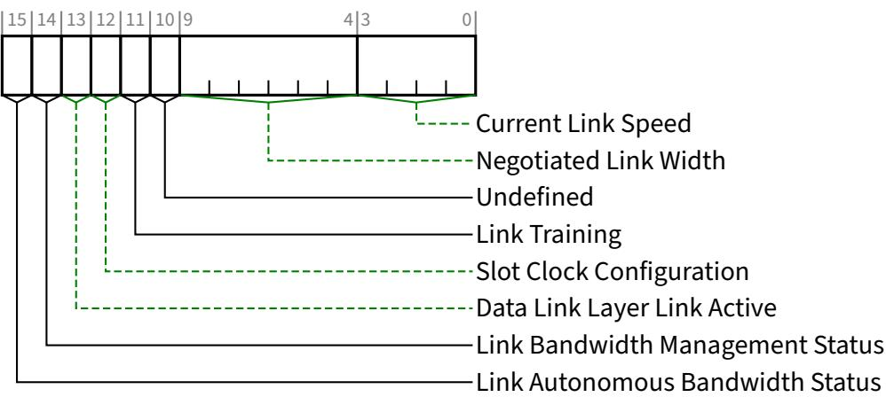


| 位 | 字段 |
|-----|------|
| 3:0 | Current Link Speed (当前链路速度) |
| 9:4 | Negotiated Link Width (协商的链路宽度) |
| 10 | Undefined (未定义) |
| 11 | Link Training (链路训练) |
| 12 | Slot Clock Configuration (插槽时钟配置) |
| 13 | Data Link Layer Link Active (数据链路层链路有效) |
| 14 | Link Bandwidth Management Status (链路带宽管理状态) |
| 15 | Link Autonomous Bandwidth Status (链路自主带宽状态) |

**表 7-26 链路状态寄存器**

| 位位置 | 寄存器描述 | 属性 |
|--------|------------|------|

</td>
</tr>
</tbody>
</table>

---

<!-- 📄 Page 1056 -->
---


<div style="overflow-x: auto; max-width: 100%;">
<table>
<thead>
<tr>
<th width="50%">🇬🇧 English</th>
<th width="50%" style="background-color:#e8e8e8">🏆 中文</th>
</tr>
</thead>
<tbody>
<tr>
<td>

**3:0 Current Link Speed** - This field indicates the negotiated Link speed of the given PCI Express Link. The encoded value specifies a Bit Location in the Supported Link Speeds Vector (in the Link Capabilities 2 Register) that corresponds to the current Link speed.

Defined encodings are:

- 0001b: Supported Link Speeds Vector field bit 0
- 0010b: Supported Link Speeds Vector field bit 1
- 0011b: Supported Link Speeds Vector field bit 2
- 0100b: Supported Link Speeds Vector field bit 3
- 0101b: Supported Link Speeds Vector field bit 4
- 0110b: Supported Link Speeds Vector field bit 5
- 0111b: Supported Link Speeds Vector field bit 6
- 00 0001b through 01 0000b: Reserved encoding ranges

All other encodings are Reserved.

The value in this field is undefined when the Link is not up. **RO, VF RsvdZ**

**9:4 Negotiated Link Width** - This field indicates the negotiated width of the given PCI Express Link. This includes the Link Width determined during initial link training as well changes that occur after initial link training (e.g., L0p).

Defined encodings are:

- 00 0001b: x1
- 00 0010b: x2
- 00 0100b: x4
- 00 1000b: x8
- 01 0000b: x16

All other encodings are Reserved. The value in this field is undefined when the Link is not up. **RO, VF RsvdZ**

</td>
<td style="background-color:#e8e8e8">

**3:0 Current Link Speed (当前链路速度)** —— 该字段指示给定 PCI Express 链路的协商速度。编码值指定了 Link Capabilities 2 寄存器中 Supported Link Speeds Vector 中与当前链路速度相对应的位。

已定义的编码如下:

- 0001b:Supported Link Speeds Vector 字段 bit 0
- 0010b:Supported Link Speeds Vector 字段 bit 1
- 0011b:Supported Link Speeds Vector 字段 bit 2
- 0100b:Supported Link Speeds Vector 字段 bit 3
- 0101b:Supported Link Speeds Vector 字段 bit 4
- 0110b:Supported Link Speeds Vector 字段 bit 5
- 0111b:Supported Link Speeds Vector 字段 bit 6
- 00 0001b 至 01 0000b:保留编码范围

所有其他编码均保留。

当链路未处于 Up 状态时,该字段的值未定义。**RO, VF RsvdZ**

**9:4 Negotiated Link Width (协商的链路宽度)** —— 该字段指示给定 PCI Express 链路的协商宽度。这包括初始链路训练期间确定的链路宽度,以及初始链路训练之后发生的更改(例如 L0p)。

已定义的编码如下:

- 00 0001b:x1
- 00 0010b:x2
- 00 0100b:x4
- 00 1000b:x8
- 01 0000b:x16

所有其他编码均保留。当链路未处于 Up 状态时,该字段的值未定义。**RO, VF RsvdZ**

</td>
</tr>
</tbody>
</table>
</div>


---

<!-- 📄 Page 1057 -->
---

<table>
<thead>
<tr>
<th width="50%">🇬🇧 English</th>
<th width="50%" style="background-color:#e8e8e8">🏆 中文</th>
</tr>
</thead>
<tbody>
<tr>
<td>

**10 Undefined** - The value read from this bit is undefined. In previous versions of this specification, this bit was used to indicate a Link Training Error. System software must ignore the value read from this bit. System software is permitted to write any value to this bit. **RO, VF RsvdZ**

**11 Link Training** - This read-only bit indicates that the Physical Layer LTSSM is in the Configuration or Recovery state, or that 1b was written to the Retrain Link bit but Link training has not yet begun. Hardware clears this bit when the LTSSM exits the Configuration/Recovery state.

This bit is not applicable and Reserved for Endpoints, PCI Express to PCI/PCI-X bridges, and Upstream Ports of Switches, and must be hardwired to 0b. **RO, VF RsvdZ**

**12 Slot Clock Configuration** - This bit indicates that the component uses the same physical reference clock that the platform provides on the connector. If the device uses an independent clock irrespective of the presence of a reference clock on the connector, this bit must be clear.

For a Multi-Function Device, each Function must report the same value for this bit. **HwInit, VF RsvdZ**

**13 Data Link Layer Link Active** - This bit indicates the status of the Data Link Control and Management State Machine. It returns a 1b to indicate the DL_Active state, 0b otherwise.

See Implementation Note: Delays in Data Link Layer Link Active Reflecting Link Control Operations for related information.

This bit must be implemented if the Data Link Layer Link Active Reporting Capable bit is 1b. Otherwise, this bit must be hardwired to 0b. **RO, VF RsvdZ**

**14 Link Bandwidth Management Status** - This bit is Set by hardware to indicate that either of the following has occurred without the Port transitioning through DL_Down status:

- A Link retraining has completed following a write of 1b to the Retrain Link bit.

  Note: This bit is Set following any write of 1b to the Retrain Link bit, including when the Link is in the process of retraining for some other reason.
- Hardware has changed Link speed or width to attempt to correct unreliable Link operation, either through an LTSSM timeout or a higher level process.

This bit must be set if the Physical Layer reports a speed or width change was initiated by the Downstream component that was not indicated as an autonomous change.

This bit is not applicable and is Reserved for Endpoints, PCI Express-to-PCI/PCI-X bridges, and Upstream Ports of Switches.

Functions that do not implement the Link Bandwidth Notification Capability must hardwire this bit to 0b.

The default value of this bit is 0b. **RW1C, VF RsvdZ**

**15 Link Autonomous Bandwidth Status** - This bit is Set by hardware to indicate that hardware has autonomously changed Link speed or width, without the Port transitioning through DL_Down status, for reasons other than to attempt to correct unreliable Link operation.

This bit must be set if the Physical Layer reports a speed or width change was initiated by the Downstream component that was indicated as an autonomous change.

This bit is not applicable and is Reserved for Endpoints, PCI Express-to-PCI/PCI-X bridges, and Upstream Ports of Switches.

Functions that do not implement the Link Bandwidth Notification Capability must hardwire this bit to 0b.

The default value of this bit is 0b. **RW1C, VF RsvdZ**

</td>
<td style="background-color:#e8e8e8">

**10 Undefined (未定义)** —— 从该位读取的值未定义。在本规范以前的版本中,该位用于指示链路训练错误 (Link Training Error)。系统软件必须忽略从该位读取的值。系统软件可向该位写入任何值。**RO, VF RsvdZ**

**11 Link Training (链路训练)** —— 该只读位指示物理层 LTSSM 处于 Configuration 或 Recovery 状态,或已向 Retrain Link 位写入 1b 但链路训练尚未开始。当 LTSSM 退出 Configuration/Recovery 状态时,硬件清除该位。

该位在端点、PCI Express 转 PCI/PCI-X 桥以及交换机的上游端口上不适用,且为保留,必须硬连线为 0b。**RO, VF RsvdZ**

**12 Slot Clock Configuration (插槽时钟配置)** —— 该位指示组件使用与平台在连接器上提供的相同的物理参考时钟。如果设备使用独立时钟,无论连接器上是否存在参考时钟,该位都必须为 0。

对于多功能设备,每个 Function 必须为该位报告相同的值。**HwInit, VF RsvdZ**

**13 Data Link Layer Link Active (数据链路层链路有效)** —— 该位指示数据链路控制与管理状态机的状态。返回 1b 表示 DL_Active 状态,否则为 0b。

相关信息请参见实现说明:"Delays in Data Link Layer Link Active Reflecting Link Control Operations"(数据链路层 Link Active 反映链路控制操作的延迟)。

仅当 Data Link Layer Link Active Reporting Capable 位为 1b 时,才必须实现该位。否则,必须将该位硬连线为 0b。**RO, VF RsvdZ**

**14 Link Bandwidth Management Status (链路带宽管理状态)** —— 该位由硬件置 1,以指示在端口未经过 DL_Down 状态的情况下发生了以下任一情况:

- 在向 Retrain Link 位写入 1b 后,链路重训练已完成。

  注:在任何向 Retrain Link 位写入 1b 之后,该位都会被置 1,包括链路因其他原因正在进行重训练的情况。
- 硬件已更改链路速度或宽度,以尝试通过 LTSSM 超时或更高级别的过程纠正不可靠的链路操作。

如果物理层报告由下游组件发起且未指示为自主变更的速度或宽度更改,则必须置位该位。

该位在端点、PCI Express 转 PCI/PCI-X 桥以及交换机的上游端口上不适用,且为保留。

未实现 Link Bandwidth Notification Capability 的 Function 必须将该位硬连线为 0b。

该位默认值为 0b。**RW1C, VF RsvdZ**

**15 Link Autonomous Bandwidth Status (链路自主带宽状态)** —— 该位由硬件置 1,以指示硬件已自主更改链路速度或宽度(端口未经过 DL_Down 状态),其原因不是为了尝试纠正不可靠的链路操作。

如果物理层报告由下游组件发起且已指示为自主变更的速度或宽度更改,则必须置位该位。

该位在端点、PCI Express 转 PCI/PCI-X 桥以及交换机的上游端口上不适用,且为保留。

未实现 Link Bandwidth Notification Capability 的 Function 必须将该位硬连线为 0b。

该位默认值为 0b。**RW1C, VF RsvdZ**

</td>
</tr>
</tbody>
</table>

---

<a id="sec-7-5-3-9"></a>
## 7.5.3.9 Slot Capabilities Register (Offset 14h) | 插槽能力寄存器（偏移 14h）


<div style="overflow-x: auto; max-width: 100%;">
<table>
<thead>
<tr>
<th width="50%">🇬🇧 English</th>
<th width="50%" style="background-color:#e8e8e8">🏆 中文</th>
</tr>
</thead>
<tbody>
<tr>
<td>

The Slot Capabilities Register identifies PCI Express slot specific capabilities. § Figure 7-30 details allocation of register fields in the Slot Capabilities Register; § Table 7-27 provides the respective bit definitions.

If this register is implemented but the Slot Implemented bit is Clear, the field behavior of this entire register is undefined.

**Figure 7-30 Slot Capabilities Register**

| Bit | Field |
|-----|-------|
| 0 | Attention Button Present |
| 1 | Power Controller Present |
| 2 | MRL Sensor Present |
| 3 | Attention Indicator Present |
| 4 | Power Indicator Present |
| 5 | Hot-Plug Surprise |
| 6 | Hot-Plug Capable |
| 14:7 | Slot Power Limit Value |
| 16:15 | Slot Power Limit Scale |
| 17 | Electromechanical Interlock Present |
| 18 | No Command Completed Support |
| 31:19 | Physical Slot Number |

**Table 7-27 Slot Capabilities Register**

| Bit Location | Register Description | Attributes |
|--------------|----------------------|------------|

**0 Attention Button Present** - When Set, this bit indicates that an Attention Button for this slot is electrically controlled by the chassis. **HwInit**

**1 Power Controller Present** - When Set, this bit indicates that a software programmable Power Controller is implemented for this slot/adapter (depending on form factor). **HwInit**

**2 MRL Sensor Present** - When Set, this bit indicates that an MRL Sensor is implemented on the chassis for this slot. **HwInit**

> **IMPLEMENTATION NOTE:**
> **DELAYS IN DLL LINK ACTIVE REFLECTING LINK CONTROL OPERATIONS**
>
> When software changes Link control parameters such as Setting the Secondary Bus Reset bit in the Bridge Control Register or the Link Disable bit in the Link Control Register, the Downstream Port will eventually transition to the DL_Down state, but there may be a significant delay with this occurring and being reflected by the Data Link Layer Link Active bit in the Link Status Register being Cleared. Often this occurs within a few ms, but in certain cases it may take tens of ms or longer. When software is waiting for Data Link Layer Link Active to become Clear, in some environments it may be best for software to set up a Data Link Layer State Changed interrupt instead of polling Data Link Layer Link Active continuously until it Clears.

</td>
<td style="background-color:#e8e8e8">

Slot Capabilities 寄存器标识 PCI Express 插槽特有的能力。§ 图 7-30 详细说明了 Slot Capabilities 寄存器中各字段的分配;§ 表 7-27 给出了相应的位定义。

如果实现了此寄存器但 Slot Implemented 位为 0,则该整个寄存器的字段行为未定义。

**图 7-30 插槽能力寄存器**

> 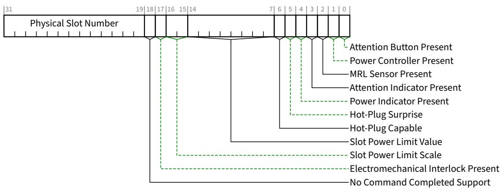


| 位 | 字段 |
|-----|------|
| 0 | Attention Button Present (存在 Attention 按钮) |
| 1 | Power Controller Present (存在电源控制器) |
| 2 | MRL Sensor Present (存在 MRL 传感器) |
| 3 | Attention Indicator Present (存在 Attention 指示灯) |
| 4 | Power Indicator Present (存在电源指示灯) |
| 5 | Hot-Plug Surprise (意外热插拔) |
| 6 | Hot-Plug Capable (支持热插拔) |
| 14:7 | Slot Power Limit Value (插槽功率限值) |
| 16:15 | Slot Power Limit Scale (插槽功率限值比例) |
| 17 | Electromechanical Interlock Present (存在机电互锁) |
| 18 | No Command Completed Support (不支持命令完成通知) |
| 31:19 | Physical Slot Number (物理插槽号) |

**表 7-27 插槽能力寄存器**

| 位位置 | 寄存器描述 | 属性 |
|--------|------------|------|

**0 Attention Button Present (存在 Attention 按钮)** —— 置 1 时,该位指示该插槽的 Attention 按钮由机箱进行电气控制。**HwInit**

**1 Power Controller Present (存在电源控制器)** —— 置 1 时,该位指示该插槽/适配器(取决于外形规格)实现了软件可编程的电源控制器。**HwInit**

**2 MRL Sensor Present (存在 MRL 传感器)** —— 置 1 时,该位指示机箱上为该插槽实现了 MRL 传感器。**HwInit**

> **实现说明:**
> **DLL Link Active 反映链路控制操作的延迟**
>
> 当软件修改链路控制参数(例如置位 Bridge Control 寄存器中的 Secondary Bus Reset 位,或 Link Control 寄存器中的 Link Disable 位)时,下游端口最终会转换到 DL_Down 状态,但该转换及其在 Link Status 寄存器中由 Data Link Layer Link Active 位反映为 Cleared 的过程可能会有显著的延迟。多数情况下,这一过程在几毫秒内完成,但在某些情况下可能需要数十毫秒甚至更长时间。当软件在等待 Data Link Layer Link Active 变为 Clear 时,在某些环境下,最佳做法是让软件建立 Data Link Layer State Changed 中断,而不是持续轮询 Data Link Layer Link Active 直至其 Clear。

</td>
</tr>
</tbody>
</table>
</div>


---

<!-- 📄 Page 1058 -->
---

<table>
<thead>
<tr>
<th width="50%">🇬🇧 English</th>
<th width="50%" style="background-color:#e8e8e8">🏆 中文</th>
</tr>
</thead>
<tbody>
<tr>
<td>

**3 Attention Indicator Present** - When Set, this bit indicates that an Attention Indicator is electrically controlled by the chassis. **HwInit**

**4 Power Indicator Present** - When Set, this bit indicates that a Power Indicator is electrically controlled by the chassis for this slot. **HwInit**

**5 Hot-Plug Surprise** - When Set, this bit indicates that an adapter present in this slot might be removed from the system without any prior notification. This is a form factor specific capability. This bit is an indication to the operating system to allow for such removal without impacting continued software operation.

If the SFI HPS Suppress bit in the SFI Control Register is Clear, a read of the Hot-Plug Surprise bit returns the HwInit value. If the SFI HPS Suppress bit is Set, a read returns 0b. See See § Section 7.9.22.3. **HwInit/RO (see description)**

**6 Hot-Plug Capable** - When Set, this bit indicates that this slot is capable of supporting hot-plug operations. **HwInit**

**14:7 Slot Power Limit Value** - In combination with the Slot Power Limit Scale value, specifies the upper limit on power supplied by the slot (see § Section 6.9) or by other means to the adapter.

Power limit (in Watts) is calculated by multiplying the value in this field by the value in the Slot Power Limit Scale field except when the Slot Power Limit Scale field equals 00b (1.0x) and Slot Power Limit Value exceeds EFh, the following alternative encodings are used:

- F0h: > 239 W and ≤ 250 W Slot Power Limit
- F1h: > 250 W and ≤ 275 W Slot Power Limit
- F2h: > 275 W and ≤ 300 W Slot Power Limit
- F3h: > 300 W and ≤ 325 W Slot Power Limit
- F4h: > 325 W and ≤ 350 W Slot Power Limit
- F5h: > 350 W and ≤ 375 W Slot Power Limit
- F6h: > 375 W and ≤ 400 W Slot Power Limit
- F7h: > 400 W and ≤ 425 W Slot Power Limit
- F8h: > 425 W and ≤ 450 W Slot Power Limit
- F9h: > 450 W and ≤ 475 W Slot Power Limit
- FAh: > 475 W and ≤ 500 W Slot Power Limit
- FBh: > 500 W and ≤ 525 W Slot Power Limit
- FCh: > 525 W and ≤ 550 W Slot Power Limit
- FDh: > 550 W and ≤ 575 W Slot Power Limit
- FEh: > 575 W and ≤ 600 W Slot Power Limit
- FFh: Reserved for Slot Power Limit Values above 600 W

This register must be implemented if the Slot Implemented bit is Set.

Writes to this register also cause the Port to send the Set_Slot_Power_Limit Message.

The default value prior to hardware/firmware initialization is 0000 0000b. **HwInit**

**16:15 Slot Power Limit Scale** - Specifies the scale used for the Slot Power Limit Value (see § Section 6.9).

Range of Values:

- 00b: 1.0x
- 01b: 0.1x
- 10b: 0.01x
- 11b: 0.001x

This register must be implemented if the Slot Implemented bit is Set.

Writes to this register also cause the Port to send the Set_Slot_Power_Limit Message.

The default value prior to hardware/firmware initialization is 00b. **HwInit**

</td>
<td style="background-color:#e8e8e8">

**3 Attention Indicator Present (存在 Attention 指示灯)** —— 置 1 时,该位指示 Attention 指示灯由机箱进行电气控制。**HwInit**

**4 Power Indicator Present (存在电源指示灯)** —— 置 1 时,该位指示该插槽的电源指示灯由机箱进行电气控制。**HwInit**

**5 Hot-Plug Surprise (意外热插拔)** —— 置 1 时,该位指示该插槽中存在的适配器可能在没有任何预先通知的情况下从系统中移除。这是特定于外形规格的能力。该位用于向操作系统指示允许此类移除而不影响软件操作的持续运行。

如果 SFI Control 寄存器中的 SFI HPS Suppress 位为 0,则读取 Hot-Plug Surprise 位返回 HwInit 值;如果 SFI HPS Suppress 位为 1,则读取返回 0b。参见 § 第 7.9.22.3 节。**HwInit/RO(参见描述)**

**6 Hot-Plug Capable (支持热插拔)** —— 置 1 时,该位指示该插槽能够支持热插拔 (hot-plug) 操作。**HwInit**

**14:7 Slot Power Limit Value (插槽功率限值)** —— 与 Slot Power Limit Scale 值一起,指定插槽所提供的(参见 § 第 6.9 节)或通过其他方式提供给适配器的功率上限。

功率限值(以瓦特为单位)由该字段的值乘以 Slot Power Limit Scale 字段的值计算得出;但当 Slot Power Limit Scale 字段等于 00b(1.0x)且 Slot Power Limit Value 超过 EFh 时,使用以下替代编码:

- F0h:> 239 W 且 ≤ 250 W 插槽功率限值
- F1h:> 250 W 且 ≤ 275 W 插槽功率限值
- F2h:> 275 W 且 ≤ 300 W 插槽功率限值
- F3h:> 300 W 且 ≤ 325 W 插槽功率限值
- F4h:> 325 W 且 ≤ 350 W 插槽功率限值
- F5h:> 350 W 且 ≤ 375 W 插槽功率限值
- F6h:> 375 W 且 ≤ 400 W 插槽功率限值
- F7h:> 400 W 且 ≤ 425 W 插槽功率限值
- F8h:> 425 W 且 ≤ 450 W 插槽功率限值
- F9h:> 450 W 且 ≤ 475 W 插槽功率限值
- FAh:> 475 W 且 ≤ 500 W 插槽功率限值
- FBh:> 500 W 且 ≤ 525 W 插槽功率限值
- FCh:> 525 W 且 ≤ 550 W 插槽功率限值
- FDh:> 550 W 且 ≤ 575 W 插槽功率限值
- FEh:> 575 W 且 ≤ 600 W 插槽功率限值
- FFh:为 600 W 以上的插槽功率限值保留

如果 Slot Implemented 位被置 1,则必须实现此寄存器。

对此寄存器的写入也会导致端口发送 Set_Slot_Power_Limit 消息。

硬件/固件初始化之前的默认值为 0000 0000b。**HwInit**

**16:15 Slot Power Limit Scale (插槽功率限值比例)** —— 指定 Slot Power Limit Value 所使用的比例(参见 § 第 6.9 节)。

取值范围:

- 00b:1.0x
- 01b:0.1x
- 10b:0.01x
- 11b:0.001x

如果 Slot Implemented 位被置 1,则必须实现此寄存器。

对此寄存器的写入也会导致端口发送 Set_Slot_Power_Limit 消息。

硬件/固件初始化之前的默认值为 00b。**HwInit**

</td>
</tr>
</tbody>
</table>

---

<!-- 📄 Page 1059 -->
---


<div style="overflow-x: auto; max-width: 100%;">
<table>
<thead>
<tr>
<th width="50%">🇬🇧 English</th>
<th width="50%" style="background-color:#e8e8e8">🏆 中文</th>
</tr>
</thead>
<tbody>
<tr>
<td>

**17 Electromechanical Interlock Present** - When Set, this bit indicates that an Electromechanical Interlock is implemented on the chassis for this slot. **HwInit**

**18 No Command Completed Support** - When Set, this bit indicates that this slot does not generate software notification when an issued command is completed by the Hot-Plug Controller. This bit is only permitted to be Set if the hot-plug capable Port is able to accept writes to all fields of the Slot Control Register without delay between successive writes. **HwInit**

**31:19 Physical Slot Number** - This field indicates the physical slot number attached to this Port. This field must be hardware initialized to a value that assigns a slot number that is unique within the chassis, regardless of the form factor associated with the slot. This field must be initialized to Zero for Ports connected to devices that are either integrated on the system board or integrated within the same silicon as the Switch device or Root Port. **HwInit**

The Slot Control Register controls PCI Express Slot specific parameters. § Figure 7-31 details allocation of register fields in the Slot Control Register; § Table 7-28 provides the respective bit definitions.

Attention Indicator Control, Power Indicator Control, and Power Controller Control fields of the Slot Control Register do not have a defined default value. If these fields are implemented, it is the responsibility of either system firmware or operating system software to (re)initialize these fields after a reset of the Link.

In hot-plug capable Downstream Ports, a write to the Slot Control Register must cause a hot-plug command to be generated (see § Section 6.7.3.2 for details on hot-plug commands). A write to the Slot Control Register in a Downstream Port that is not hot-plug capable must not cause a hot-plug command to be executed.

If this register is implemented but the Slot Implemented bit is Clear, the field behavior of this entire register with the exception of the Data Link Layer State Changed Enable bit is undefined.

</td>
<td style="background-color:#e8e8e8">

**17 Electromechanical Interlock Present (存在机电互锁)** —— 置 1 时,该位指示机箱上为该插槽实现了机电互锁 (Electromechanical Interlock)。**HwInit**

**18 No Command Completed Support (不支持命令完成通知)** —— 置 1 时,该位指示该插槽在热插拔控制器 (Hot-Plug Controller) 完成已发出的命令时不会产生软件通知。仅当支持热插拔的端口能够在连续写入之间无延迟地接受对 Slot Control 寄存器所有字段的写入时,才允许将该位置 1。**HwInit**

**31:19 Physical Slot Number (物理插槽号)** —— 该字段指示连接到此端口的物理插槽号。该字段必须被硬件初始化为一个在机箱内唯一的插槽号值,与插槽所关联的外形规格无关。对于连接到集成在系统板上或集成在与交换机 (Switch) 设备或根端口 (Root Port) 相同硅片中的设备的端口,该字段必须初始化为 0。**HwInit**

Slot Control 寄存器控制 PCI Express 插槽特有的参数。§ 图 7-31 详细说明了 Slot Control 寄存器中各字段的分配;§ 表 7-28 给出了相应的位定义。

Slot Control 寄存器的 Attention Indicator Control、Power Indicator Control 和 Power Controller Control 字段没有已定义的默认值。如果实现了这些字段,则系统固件或操作系统软件有责任在链路复位 (reset) 之后(重新)初始化这些字段。

在支持热插拔的下游端口中,对 Slot Control 寄存器的写入必须产生热插拔命令(热插拔命令的详细信息请参见 § 第 6.7.3.2 节)。在不支持热插拔的下游端口中,对 Slot Control 寄存器的写入不得导致执行任何热插拔命令。

如果实现了此寄存器但 Slot Implemented 位为 0,则除 Data Link Layer State Changed Enable 位外,该整个寄存器的字段行为未定义。

</td>
</tr>
</tbody>
</table>
</div>


---


---

<a id="sec-7-5-3-10"></a>
## 7.5.3.10 Slot Control Register | 插槽控制寄存器 (Offset 18h)

<table>
<thead>
<tr>
<th width="50%">🇬🇧 English</th>
<th width="50%" style="background-color:#e8e8e8">🏆 中文</th>
</tr>
</thead>
<tbody>
<tr>
<td>

Bit | Description
---|---
0 | Attention Button Pressed Enable
1 | Power Fault Detected Enable
2 | MRL Sensor Changed Enable
3 | Presence Detect Changed Enable
4 | Command Completed Interrupt Enable
5 | Hot-Plug Interrupt Enable
6:7 | Attention Indicator Control
8:9 | Power Indicator Control
10 | Power Controller Control
11 | Electromechanical Interlock Control
12 | Data Link Layer State Changed Enable
13 | Auto Slot Power Limit Disable
14 | In-Band PD Disable
15 | RsvdP

**Figure 7-31 Slot Control Register**

**Table 7-28 Slot Control Register**

| Bit Location | Register Description | Attributes |
|---|---|---|
| 0 | Attention Button Pressed Enable - When Set to 1b, this bit enables software notification on an attention button pressed event (see § Section 6.7.3 ).<br>If the Attention Button Present bit in the Slot Capabilities Register is 0b, this bit is permitted to be read-only with a value of 0b.<br>Default value of this bit is 0b. | RW |

</td>
<td style="background-color:#e8e8e8">

位 | 描述
---|---
0 | 注意力按钮按下使能 (Attention Button Pressed Enable)
1 | 电源故障检测使能 (Power Fault Detected Enable)
2 | MRL 传感器状态变化使能 (MRL Sensor Changed Enable)
3 | 存在检测变化使能 (Presence Detect Changed Enable)
4 | 命令完成中断使能 (Command Completed Interrupt Enable)
5 | 热插拔中断使能 (Hot-Plug Interrupt Enable)
6:7 | 注意力指示灯控制 (Attention Indicator Control)
8:9 | 电源指示灯控制 (Power Indicator Control)
10 | 电源控制器控制 (Power Controller Control)
11 | 机电互锁控制 (Electromechanical Interlock Control)
12 | 数据链路层状态变化使能 (Data Link Layer State Changed Enable)
13 | 自动插槽功率限制禁用 (Auto Slot Power Limit Disable)
14 | 带内存在检测禁用 (In-Band PD Disable)
15 | 保留 (RsvdP)

**图 7-31 插槽控制寄存器 (Slot Control Register)**

> 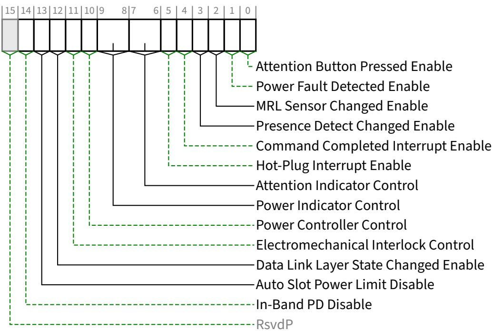


**表 7-28 插槽控制寄存器 (Slot Control Register)**

| 位位置 | 寄存器描述 | 属性 |
|---|---|---|
| 0 | 注意力按钮按下使能 (Attention Button Pressed Enable) — 置 1b 时,该位使能在注意力按钮按下事件上的软件通知(参见 § 第 6.7.3 节)。<br>如果插槽能力寄存器中的"注意力按钮存在"位为 0b,则该位允许为只读且值为 0b。<br>该位的默认值为 0b。 | RW |

</td>
</tr>
</tbody>
</table>

<!-- 📄 Page 1060 -->
---

---


<div style="overflow-x: auto; max-width: 100%;">
<table>
<thead>
<tr>
<th width="50%">🇬🇧 English</th>
<th width="50%" style="background-color:#e8e8e8">🏆 中文</th>
</tr>
</thead>
<tbody>
<tr>
<td>

| Bit Location | Register Description | Attributes |
|---|---|---|
| 1 | Power Fault Detected Enable - When Set, this bit enables software notification on a power fault event (see § Section 6.7.3 ).<br>If a Power Controller that supports power fault detection is not implemented, this bit is permitted to be read-only with a value of 0b.<br>Default value of this bit is 0b. | RW |
| 2 | MRL Sensor Changed Enable - When Set, this bit enables software notification on a MRL sensor changed event (see § Section 6.7.3 ).<br>If the MRL Sensor Present bit in the Slot Capabilities Register is Clear, this bit is permitted to be read-only with a value of 0b.<br>Default value of this bit is 0b. | RW |
| 3 | Presence Detect Changed Enable - When Set, this bit enables software notification on a presence detect changed event (see § Section 6.7.3 ).<br>If the Hot-Plug Capable bit in the Slot Capabilities Register is 0b, this bit is permitted to be read-only with a value of 0b.<br>Default value of this bit is 0b. | RW |

</td>
<td style="background-color:#e8e8e8">

| 位位置 | 寄存器描述 | 属性 |
|---|---|---|
| 1 | 电源故障检测使能 (Power Fault Detected Enable) — 置位时,该位使能在电源故障事件上的软件通知(参见 § 第 6.7.3 节)。<br>如果未实现支持电源故障检测的电源控制器,则该位允许为只读且值为 0b。<br>该位的默认值为 0b。 | RW |
| 2 | MRL 传感器状态变化使能 (MRL Sensor Changed Enable) — 置位时,该位使能在 MRL 传感器状态变化事件上的软件通知(参见 § 第 6.7.3 节)。<br>如果插槽能力寄存器中的"MRL 传感器存在"位清零,则该位允许为只读且值为 0b。<br>该位的默认值为 0b。 | RW |
| 3 | 存在检测变化使能 (Presence Detect Changed Enable) — 置位时,该位使能在存在检测变化事件上的软件通知(参见 § 第 6.7.3 节)。<br>如果插槽能力寄存器中的"热插拔能力"位为 0b,则该位允许为只读且值为 0b。<br>该位的默认值为 0b。 | RW |

</td>
</tr>
</tbody>
</table>
</div>


<!-- 📄 Page 1061 -->
---

---

<table>
<thead>
<tr>
<th width="50%">🇬🇧 English</th>
<th width="50%" style="background-color:#e8e8e8">🏆 中文</th>
</tr>
</thead>
<tbody>
<tr>
<td>

| Bit Location | Register Description | Attributes |
|---|---|---|
| 4 | Command Completed Interrupt Enable - If Command Completed notification is supported (if the No Command Completed Support bit in the Slot Capabilities Register is 0b), when Set, this bit enables software notification when a hot-plug command is completed by the Hot-Plug Controller.<br>If Command Completed notification is not supported, this bit must be hardwired to 0b.<br>Default value of this bit is 0b. | RW |
| 5 | Hot-Plug Interrupt Enable - When Set, this bit enables generation of an interrupt on enabled hot-plug events.<br>If the Hot-Plug Capable bit in the Slot Capabilities Register is Clear, this bit is permitted to be read-only with a value of 0b.<br>Default value of this bit is 0b. | RW |
| 7:6 | Attention Indicator Control - If an Attention Indicator is implemented, writes to this field set the Attention Indicator to the written state.<br>Reads of this field must reflect the value from the latest write, even if the corresponding hot-plug command is not complete, unless software issues a write without waiting, if required to, for the previous command to complete in which case the read value is undefined.<br>Defined encodings are:<br>00b = Reserved<br>01b = On<br>10b = Blink<br>11b = Off<br>Note: The default value of this field must be one of the non-Reserved values. If the Attention Indicator Present bit in the Slot Capabilities Register is 0b, this bit is permitted to be read-only with a value of 00b. | RW |
| 9:8 | Power Indicator Control - If a Power Indicator is implemented, writes to this field set the Power Indicator to the written state. Reads of this field must reflect the value from the latest write, even if the corresponding hot-plug command is not complete, unless software issues a write without waiting, if required to, for the previous command to complete in which case the read value is undefined.<br>Defined encodings are:<br>00b = Reserved<br>01b = On<br>10b = Blink<br>11b = Off<br>Note: The default value of this field must be one of the non-Reserved values. If the Power Indicator Present bit in the Slot Capabilities Register is 0b, this bit is permitted to be read-only with a value of 00b. | RW |
| 10 | Power Controller Control - If a Power Controller is implemented, this bit when written sets the power state of the slot per the defined encodings. Reads of this bit must reflect the value from the latest write, even if the corresponding hot-plug command is not complete, unless software issues a write, if required to, without waiting for the previous command to complete in which case the read value is undefined.<br>Note that in some cases the power controller may autonomously remove slot power or not respond to a power-up request based on a detected fault condition, independent of the Power Controller Control setting.<br>The defined encodings are:<br>0b = Power On | RW |

</td>
<td style="background-color:#e8e8e8">

| 位位置 | 寄存器描述 | 属性 |
|---|---|---|
| 4 | 命令完成中断使能 (Command Completed Interrupt Enable) — 如果支持命令完成通知(插槽能力寄存器中的"无命令完成支持"位为 0b),置位时,该位使能在热插拔控制器完成热插拔命令时的软件通知。<br>如果不支持命令完成通知,则该位必须硬连线为 0b。<br>该位的默认值为 0b。 | RW |
| 5 | 热插拔中断使能 (Hot-Plug Interrupt Enable) — 置位时,该位使能在已使能热插拔事件上产生中断。<br>如果插槽能力寄存器中的"热插拔能力"位清零,则该位允许为只读且值为 0b。<br>该位的默认值为 0b。 | RW |
| 7:6 | 注意力指示灯控制 (Attention Indicator Control) — 如果实现了注意力指示灯,对该字段的写入将注意力指示灯设置为写入状态。<br>对该字段的读取必须反映最近一次写入的值,即使相应的热插拔命令尚未完成,除非软件在未按要求等待前一命令完成的情况下发起写入,在这种情况下读取值是未定义的。<br>已定义编码为:<br>00b = 保留 (Reserved)<br>01b = 开启 (On)<br>10b = 闪烁 (Blink)<br>11b = 关闭 (Off)<br>注:该字段的默认值必须为非保留值之一。如果插槽能力寄存器中的"注意力指示灯存在"位为 0b,则该位允许为只读且值为 00b。 | RW |
| 9:8 | 电源指示灯控制 (Power Indicator Control) — 如果实现了电源指示灯,对该字段的写入将电源指示灯设置为写入状态。对该字段的读取必须反映最近一次写入的值,即使相应的热插拔命令尚未完成,除非软件在未按要求等待前一命令完成的情况下发起写入,在这种情况下读取值是未定义的。<br>已定义编码为:<br>00b = 保留 (Reserved)<br>01b = 开启 (On)<br>10b = 闪烁 (Blink)<br>11b = 关闭 (Off)<br>注:该字段的默认值必须为非保留值之一。如果插槽能力寄存器中的"电源指示灯存在"位为 0b,则该位允许为只读且值为 00b。 | RW |
| 10 | 电源控制器控制 (Power Controller Control) — 如果实现了电源控制器,对该位的写入按已定义编码设置插槽的电源状态。对该位的读取必须反映最近一次写入的值,即使相应的热插拔命令尚未完成,除非软件在未按要求等待前一命令完成的情况下发起写入,在这种情况下读取值是未定义的。<br>请注意,在某些情况下,电源控制器可能根据检测到的故障条件,自主地移除插槽电源或不响应上电请求,这与电源控制器控制的设置无关。<br>已定义编码为:<br>0b = 上电 (Power On) | RW |

</td>
</tr>
</tbody>
</table>

<!-- 📄 Page 1062 -->
---

---


<div style="overflow-x: auto; max-width: 100%;">
<table>
<thead>
<tr>
<th width="50%">🇬🇧 English</th>
<th width="50%" style="background-color:#e8e8e8">🏆 中文</th>
</tr>
</thead>
<tbody>
<tr>
<td>

| Bit Location | Register Description | Attributes |
|---|---|---|
| 10 (cont.) | 1b = Power Off<br>If the Power Controller Present bit in the Slot Capabilities Register is Clear, then writes to this bit have no effect and the read value of this bit is undefined. | RW |
| 11 | Electromechanical Interlock Control - If an Electromechanical Interlock is implemented, a write of 1b to this bit causes the state of the interlock to toggle. A write of 0b to this bit has no effect. A read of this bit always returns a 0b. | RW |
| 12 | Data Link Layer State Changed Enable - If the Data Link Layer Link Active Reporting Capable is 1b, this bit enables software notification when Data Link Layer Link Active bit is changed.<br>If the Data Link Layer Link Active Reporting Capable bit is 0b, this bit is permitted to be read-only with a value of 0b.<br>Default value of this bit is 0b. | RW |
| 13 | Auto Slot Power Limit Disable - When Set, this disables the automatic sending of a Set_Slot_Power_Limit Message when a Link transitions from a non-DL_Up status to a DL_Up status.<br>Downstream ports that don't support DPC are permitted to hardwire this bit to 0.<br>Default value of this bit is implementation specific. | RW |
| 14 | In-Band PD Disable - When Set, this bit disables the in-band presence detect mechanism from affecting the Presence Detect State bit, allowing that bit to report out-of-band presence detect exclusively.<br>Otherwise, the Presence Detect State bit reflects the logical OR of the in-band and out-of-band presence detect mechanisms.<br>In addition, the In-Band PD Disable bit governs the Component Presence state for the Downstream Component Presence field in the Link Status 2 Register. See § Section 7.5.3.20 .<br>This bit must be implemented if the In-Band PD Disable Supported bit is 1b. Otherwise, this bit must be hardwired to 0b.<br>Default value of this bit is 0b. | RW |

The Slot Status Register provides information about PCI Express Slot specific parameters. § Figure 7-32 details allocation of register fields in the Slot Status Register; § Table 7-29 provides the respective bit definitions. Register fields for status bits not implemented by the device have the RsvdZ attribute.

If this register is implemented but the Slot Implemented bit is Clear, the field behavior of this entire register with the exception of the Data Link Layer State Changed bit is undefined.

</td>
<td style="background-color:#e8e8e8">

| 位位置 | 寄存器描述 | 属性 |
|---|---|---|
| 10(续) | 1b = 断电 (Power Off)<br>如果插槽能力寄存器中的"电源控制器存在"位清零,则对该位的写入无效,且该位的读取值是未定义的。 | RW |
| 11 | 机电互锁控制 (Electromechanical Interlock Control) — 如果实现了机电互锁,对该位写入 1b 会使互锁状态翻转。对该位写入 0b 无效。对该位的读取始终返回 0b。 | RW |
| 12 | 数据链路层状态变化使能 (Data Link Layer State Changed Enable) — 如果"数据链路层链路有效上报能力"位为 1b,则该位使能在"数据链路层链路有效"位变化时的软件通知。<br>如果"数据链路层链路有效上报能力"位为 0b,则该位允许为只读且值为 0b。<br>该位的默认值为 0b。 | RW |
| 13 | 自动插槽功率限制禁用 (Auto Slot Power Limit Disable) — 置位时,这会禁止在链路从非 DL_Up 状态转换到 DL_Up 状态时自动发送 Set_Slot_Power_Limit 消息 (Message)。<br>不支持 DPC 的下游端口允许将该位硬连线为 0。<br>该位的默认值是实现特定的。 | RW |
| 14 | 带内存在检测禁用 (In-Band PD Disable) — 置位时,该位禁止带内存在检测机制影响"存在检测状态"位,从而使该位专门报告带外存在检测。<br>否则,"存在检测状态"位反映带内和带外存在检测机制的逻辑"或"。<br>此外,带内存在检测禁用位控制链路状态 2 寄存器中"下游组件存在"字段的组件存在状态。参见 § 第 7.5.3.20 节。<br>如果"带内 PD 禁用支持"位为 1b,则必须实现该位。否则,该位必须硬连线为 0b。<br>该位的默认值为 0b。 | RW |

插槽状态寄存器 (Slot Status Register) 提供关于 PCI Express 插槽特定参数的信息。§ 图 7-32 详细说明了插槽状态寄存器中寄存器字段的分配;§ 表 7-29 提供了相应的位定义。设备未实现的状态位的寄存器字段具有 RsvdZ 属性。

如果实现了该寄存器但"插槽已实现"位清零,则除"数据链路层状态变化"位之外,该整个寄存器的字段行为是未定义的。

</td>
</tr>
</tbody>
</table>
</div>


<a id="sec-7-5-3-11"></a>
## 7.5.3.11 Slot Status Register | 插槽状态寄存器 (Offset 1Ah)

<table>
<thead>
<tr>
<th width="50%">🇬🇧 English</th>
<th width="50%" style="background-color:#e8e8e8">🏆 中文</th>
</tr>
</thead>
<tbody>
<tr>
<td>

Bit | Description
---|---
0 | Attention Button Pressed
1 | Power Fault Detected
2 | MRL Sensor Changed
3 | Presence Detect Changed
4 | Command Completed
5 | MRL Sensor State
6 | Presence Detect State
7 | Electromechanical Interlock Status
8 | Data Link Layer State Changed
9:15 | RsvdZ

**Figure 7-32 Slot Status Register**

**Table 7-29 Slot Status Register**

| Bit Location | Register Description | Attributes |
|---|---|---|
| 0 | Attention Button Pressed - If an Attention Button is implemented, this bit is Set when the attention button is pressed. If an Attention Button is not supported, this bit must not be Set. | RW1C |
| 1 | Power Fault Detected - If a Power Controller that supports power fault detection is implemented, this bit is Set when the Power Controller detects a power fault at this slot. Note that, depending on hardware capability, it is possible that a power fault can be detected at any time, independent of the Power Controller Control setting or the occupancy of the slot. If power fault detection is not supported, this bit must not be Set. | RW1C |
| 2 | MRL Sensor Changed - If an MRL sensor is implemented, this bit is Set when a MRL Sensor State change is detected. If an MRL sensor is not implemented, this bit must not be Set. | RW1C |
| 3 | Presence Detect Changed - This bit is Set when the value reported in the Presence Detect State bit is changed. | RW1C |
| 4 | Command Completed - If Command Completed notification is supported (if the No Command Completed Support bit in the Slot Capabilities Register is 0b), this bit is Set when a hot-plug command has completed and the Hot-Plug Controller is ready to accept a subsequent command. The Command Completed status bit is Set as an indication to host software that the Hot-Plug Controller has processed the previous command and is ready to receive the next command; it provides no guarantee that the action corresponding to the command is complete.<br>If Command Completed notification is not supported, this bit must be hardwired to 0b. | RW1C |
| 5 | MRL Sensor State - This bit reports the status of the MRL sensor if implemented.<br>Defined encodings are:<br>0b = MRL Closed<br>1b = MRL Open | RO |
| 6 | Presence Detect State - This bit indicates the presence of an adapter in the slot. When the In-Band PD Disable bit is Clear, this is reflected by the logical "OR" of the Physical Layer in-band presence detect | RO |

</td>
<td style="background-color:#e8e8e8">

位 | 描述
---|---
0 | 注意力按钮按下 (Attention Button Pressed)
1 | 电源故障检测 (Power Fault Detected)
2 | MRL 传感器状态变化 (MRL Sensor Changed)
3 | 存在检测变化 (Presence Detect Changed)
4 | 命令完成 (Command Completed)
5 | MRL 传感器状态 (MRL Sensor State)
6 | 存在检测状态 (Presence Detect State)
7 | 机电互锁状态 (Electromechanical Interlock Status)
8 | 数据链路层状态变化 (Data Link Layer State Changed)
9:15 | 保留 (RsvdZ)

**图 7-32 插槽状态寄存器 (Slot Status Register)**

> 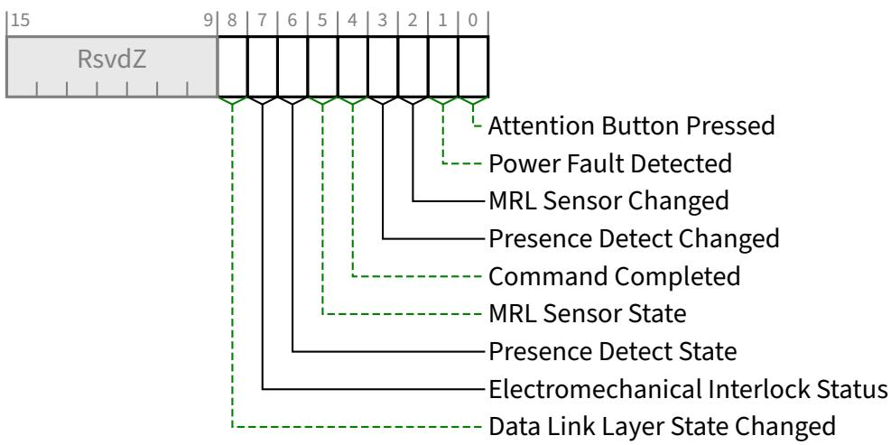


**表 7-29 插槽状态寄存器 (Slot Status Register)**

| 位位置 | 寄存器描述 | 属性 |
|---|---|---|
| 0 | 注意力按钮按下 (Attention Button Pressed) — 如果实现了注意力按钮,则在按下注意力按钮时该位置位。如果不支持注意力按钮,则该位不得置位。 | RW1C |
| 1 | 电源故障检测 (Power Fault Detected) — 如果实现了支持电源故障检测的电源控制器,则当电源控制器在该插槽检测到电源故障时该位置位。请注意,根据硬件能力,电源故障可能随时被检测到,与电源控制器控制的设置或插槽的占用情况无关。如果不支持电源故障检测,则该位不得置位。 | RW1C |
| 2 | MRL 传感器状态变化 (MRL Sensor Changed) — 如果实现了 MRL 传感器,则在检测到 MRL 传感器状态变化时该位置位。如果未实现 MRL 传感器,则该位不得置位。 | RW1C |
| 3 | 存在检测变化 (Presence Detect Changed) — 当"存在检测状态"位报告的值发生变化时该位置位。 | RW1C |
| 4 | 命令完成 (Command Completed) — 如果支持命令完成通知(插槽能力寄存器中的"无命令完成支持"位为 0b),则当热插拔命令已完成且热插拔控制器准备好接受后续命令时该位置位。命令完成状态位置位是向主机软件指示热插拔控制器已处理前一命令并准备好接收下一命令;它不保证与命令相对应的动作已完成。<br>如果不支持命令完成通知,则该位必须硬连线为 0b。 | RW1C |
| 5 | MRL 传感器状态 (MRL Sensor State) — 如果实现了 MRL 传感器,该位报告 MRL 传感器的状态。<br>已定义编码为:<br>0b = MRL 关闭 (MRL Closed)<br>1b = MRL 打开 (MRL Open) | RO |
| 6 | 存在检测状态 (Presence Detect State) — 该位指示插槽中适配器的存在。当"带内 PD 禁用"位清零时,这通过物理层带内存在检测的逻辑"或"反映 | RO |

</td>
</tr>
</tbody>
</table>

<!-- 📄 Page 1063 -->
---

---


<div style="overflow-x: auto; max-width: 100%;">
<table>
<thead>
<tr>
<th width="50%">🇬🇧 English</th>
<th width="50%" style="background-color:#e8e8e8">🏆 中文</th>
</tr>
</thead>
<tbody>
<tr>
<td>

| Bit Location | Register Description | Attributes |
|---|---|---|
| 6 (cont.) | mechanism and, if present, any out-of-band presence detect mechanism defined for the slot's corresponding form factor. Note that the in-band presence detect mechanism requires that power be applied to an adapter for its presence to be detected. Consequently, form factors that require a power controller for hot-plug must implement an out-of-band presence detect mechanism. When the In-Band PD Disable bit is Set, the in-band presence detect mechanism has no effect on this bit.<br>Defined encodings are:<br>0b = Adapter not Present<br>1b = Adapter Present<br>This bit must be implemented on all Downstream Ports that implement slots. For Downstream Ports not connected to slots (where the Slot Implemented bit of the PCI Express Capabilities Register is 0b), this bit must be hardwired to 1b. | RO |
| 7 | Electromechanical Interlock Status - If an Electromechanical Interlock is implemented, this bit indicates the status of the Electromechanical Interlock.<br>Defined encodings are:<br>0b = Electromechanical Interlock Disengaged<br>1b = Electromechanical Interlock Engaged | RO |
| 8 | Data Link Layer State Changed - This bit is Set when the value reported in the Data Link Layer Link Active bit of the Link Status Register is changed.<br>In response to a Data Link Layer State Changed event, software must read the Data Link Layer Link Active bit of the Link Status Register to determine if the Link is active before initiating configuration cycles to the hot plugged device. | RW1C |

The Root Control Register controls PCI Express Root Complex specific parameters. § Figure 7-33 details allocation of register fields in the Root Control Register; § Table 7-30 provides the respective bit definitions.

> **IMPLEMENTATION NOTE: NO SLOT POWER CONTROLLER**
> For slots that do not implement a power controller, software must ensure that system power planes are enabled to provide power to slots prior to reading Presence Detect State.

</td>
<td style="background-color:#e8e8e8">

| 位位置 | 寄存器描述 | 属性 |
|---|---|---|
| 6(续) | 机制以及(如果存在)为插槽对应的外形规格定义的任何带外存在检测机制。请注意,带内存在检测机制需要对适配器供电才能检测其存在。因此,需要电源控制器进行热插拔的外形规格必须实现带外存在检测机制。当"带内 PD 禁用"位置位时,带内存在检测机制对该位无影响。<br>已定义编码为:<br>0b = 适配器不存在 (Adapter not Present)<br>1b = 适配器存在 (Adapter Present)<br>该位必须在实现插槽的所有下游端口上实现。对于未连接插槽的下游端口(其中 PCI Express 能力寄存器的"插槽已实现"位为 0b),该位必须硬连线为 1b。 | RO |
| 7 | 机电互锁状态 (Electromechanical Interlock Status) — 如果实现了机电互锁,该位指示机电互锁的状态。<br>已定义编码为:<br>0b = 机电互锁分离 (Electromechanical Interlock Disengaged)<br>1b = 机电互锁接合 (Electromechanical Interlock Engaged) | RO |
| 8 | 数据链路层状态变化 (Data Link Layer State Changed) — 当链路状态寄存器的"数据链路层链路有效"位报告的值发生变化时该位置位。<br>作为对数据链路层状态变化事件的响应,软件必须读取链路状态寄存器的"数据链路层链路有效"位以确定链路是否有效,然后再对热插拔设备发起配置周期。 | RW1C |

根复合体控制寄存器 (Root Control Register) 控制 PCI Express 根复合体 (Root Complex) 特定参数。§ 图 7-33 详细说明了根复合体控制寄存器中寄存器字段的分配;§ 表 7-30 提供了相应的位定义。

> **实现说明:无插槽电源控制器 (NO SLOT POWER CONTROLLER)**
> 对于未实现电源控制器的插槽,软件必须确保在读取"存在检测状态"之前启用系统电源平面以为插槽供电。

</td>
</tr>
</tbody>
</table>
</div>


<!-- 📄 Page 1064 -->
---

---

<a id="sec-7-5-3-12"></a>
## 7.5.3.12 Root Control Register | 根复合体控制寄存器 (Offset 1Ch)

<table>
<thead>
<tr>
<th width="50%">🇬🇧 English</th>
<th width="50%" style="background-color:#e8e8e8">🏆 中文</th>
</tr>
</thead>
<tbody>
<tr>
<td>

Bit | Description
---|---
0 | System Error on Correctable Error Enable
1 | System Error on Non-Fatal Error Enable
2 | System Error on Fatal Error Enable
3 | PME Interrupt Enable
4 | Configuration RRS Software Visibility Enable
5 | No NFM Subtree Below This Root Port
6:15 | RsvdP

**Figure 7-33 Root Control Register**

**Table 7-30 Root Control Register**

| Bit Location | Register Description | Attributes |
|---|---|---|
| 0 | System Error on Correctable Error Enable - If Set, this bit indicates that a System Error should be generated if a correctable error (ERR_COR) is reported by any of the devices in the Hierarchy Domain associated with this Root Port, or by the Root Port itself. The mechanism for signaling a System Error to the system is system specific.<br>Root Complex Event Collectors provide support for the above-described functionality for RCiEPs.<br>Default value of this bit is 0b. | RW |
| 1 | System Error on Non-Fatal Error Enable - If Set, this bit indicates that a System Error should be generated if a Non-fatal error (ERR_NONFATAL) is reported by any of the devices in the Hierarchy Domain associated with this Root Port, or by the Root Port itself. The mechanism for signaling a System Error to the system is system specific.<br>Root Complex Event Collectors provide support for the above-described functionality for RCiEPs.<br>Default value of this bit is 0b. | RW |
| 2 | System Error on Fatal Error Enable - If Set, this bit indicates that a System Error should be generated if a Fatal error (ERR_FATAL) is reported by any of the devices in the Hierarchy Domain associated with this Root Port, or by the Root Port itself. The mechanism for signaling a System Error to the system is system specific.<br>Root Complex Event Collectors provide support for the above-described functionality for RCiEPs.<br>Default value of this bit is 0b. | RW |
| 3 | PME Interrupt Enable - When Set, this bit enables PME interrupt generation upon receipt of a PME Message as reflected in the PME Status bit (see § Table 7-32). A PME interrupt is also generated if the PME Status bit is Set when this bit is changed from Clear to Set (see § Section 5.3.3 ).<br>Default value of this bit is 0b. | RW |
| 4 | Configuration RRS Software Visibility Enable - When Set, this bit enables the Root Port to indicate to software when Request Retry Status (RRS) Completion Status is received in response to a Configuration Request (see § Section 2.3.1 ).<br>Root Ports that do not implement this capability must hardwire this bit to 0b.<br>Default value of this bit is 0b. | RW |

</td>
<td style="background-color:#e8e8e8">

位 | 描述
---|---
0 | 可纠正错误上系统错误使能 (System Error on Correctable Error Enable)
1 | 非致命错误上系统错误使能 (System Error on Non-Fatal Error Enable)
2 | 致命错误上系统错误使能 (System Error on Fatal Error Enable)
3 | PME 中断使能 (PME Interrupt Enable)
4 | 配置 RRS 软件可见性使能 (Configuration RRS Software Visibility Enable)
5 | 此根端口下无 NFM 子树 (No NFM Subtree Below This Root Port)
6:15 | 保留 (RsvdP)

**图 7-33 根复合体控制寄存器 (Root Control Register)**

> 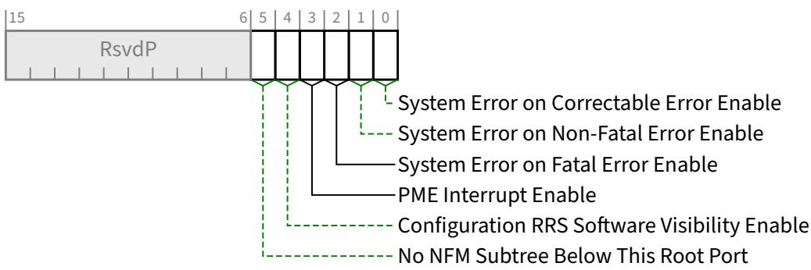


**表 7-30 根复合体控制寄存器 (Root Control Register)**

| 位位置 | 寄存器描述 | 属性 |
|---|---|---|
| 0 | 可纠正错误上系统错误使能 (System Error on Correctable Error Enable) — 置位时,如果与该根端口 (Root Port) 关联的层级域 (Hierarchy Domain) 中的任何设备或该根端口本身报告可纠正错误 (ERR_COR),则该位指示应生成系统错误。向系统发出系统错误的机制是系统特定的。<br>根复合体事件收集器 (Root Complex Event Collectors) 为 RCiEP 提供上述功能的支持。<br>该位的默认值为 0b。 | RW |
| 1 | 非致命错误上系统错误使能 (System Error on Non-Fatal Error Enable) — 置位时,如果与该根端口关联的层级域中的任何设备或该根端口本身报告非致命错误 (ERR_NONFATAL),则该位指示应生成系统错误。向系统发出系统错误的机制是系统特定的。<br>根复合体事件收集器为 RCiEP 提供上述功能的支持。<br>该位的默认值为 0b。 | RW |
| 2 | 致命错误上系统错误使能 (System Error on Fatal Error Enable) — 置位时,如果与该根端口关联的层级域中的任何设备或该根端口本身报告致命错误 (ERR_FATAL),则该位指示应生成系统错误。向系统发出系统错误的机制是系统特定的。<br>根复合体事件收集器为 RCiEP 提供上述功能的支持。<br>该位的默认值为 0b。 | RW |
| 3 | PME 中断使能 (PME Interrupt Enable) — 置位时,该位使能在接收到 PME 消息 (Message) 时生成 PME 中断,正如 PME 状态位所反映的(参见 § 表 7-32)。如果该位从清零变为置位时 PME 状态位已置位,也会生成 PME 中断(参见 § 第 5.3.3 节)。<br>该位的默认值为 0b。 | RW |
| 4 | 配置 RRS 软件可见性使能 (Configuration RRS Software Visibility Enable) — 置位时,该位使能根端口在响应配置请求 (Configuration Request) 而接收到请求重试状态 (RRS) 完成状态时通知软件(参见 § 第 2.3.1 节)。<br>未实现此能力的根端口必须将该位硬连线为 0b。<br>该位的默认值为 0b。 | RW |

</td>
</tr>
</tbody>
</table>

<!-- 📄 Page 1065 -->
---

---


<div style="overflow-x: auto; max-width: 100%;">
<table>
<thead>
<tr>
<th width="50%">🇬🇧 English</th>
<th width="50%" style="background-color:#e8e8e8">🏆 中文</th>
</tr>
</thead>
<tbody>
<tr>
<td>

| Bit Location | Register Description | Attributes |
|---|---|---|
| 5 | No NFM Subtree Below This Root Port - When Clear, indicates that the RC must take ownership of non-UIO Non-Posted Requests passing peer-to-peer through the RC targeting this RP as the Egress Port.<br>It is strongly recommended that system software Set this bit if it is determined that no NFM subtree(s) exist below this Root Port. RC implementations are strongly recommended to avoid taking ownership when not required to do so.<br>Root Ports must handle the Clearing of this bit without disruption to Non-Posted Requests the RC has taken ownership of.<br>Root Ports that do not implement this capability must hardwire this bit to 0b.<br>Default value of this bit is 0b. | RW |

The Root Capabilities Register identifies PCI Express Root Port specific capabilities. § Figure 7-34 details allocation of register fields in the Root Capabilities Register; § Table 7-31 provides the respective bit definitions.

Bit | Description
---|---
0 | Configuration RRS Software Visibility
1:15 | RsvdP

**Figure 7-34 Root Capabilities Register**

**Table 7-31 Root Capabilities Register**

| Bit Location | Register Description | Attributes |
|---|---|---|
| 0 | Configuration RRS Software Visibility - When Set, this bit indicates that the Root Port is capable of indicating to software when Request Retry Status (RRS) Completion Status is received in response to a Configuration Request (see § Section 2.3.1 ). | RO |

The Root Status Register provides information about PCI Express device specific parameters. § Figure 7-35 details allocation of register fields in the Root Status Register; § Table 7-32 provides the respective bit definitions.

</td>
<td style="background-color:#e8e8e8">

| 位位置 | 寄存器描述 | 属性 |
|---|---|---|
| 5 | 此根端口下无 NFM 子树 (No NFM Subtree Below This Root Port) — 清零时,指示 RC 必须接管通过 RC 对等穿越、以此 RP 作为出口端口 (Egress Port) 的非 UIO Non-Posted 请求 (Non-Posted Request)。<br>如果确定此根端口下不存在 NFM 子树,强烈建议系统软件置位该位。强烈建议 RC 实现在不要求时不接管所有权。<br>根端口必须能够处理该位的清零,且不会中断 RC 已接管所有权的 Non-Posted 请求。<br>未实现此能力的根端口必须将该位硬连线为 0b。<br>该位的默认值为 0b。 | RW |

根复合体能力寄存器 (Root Capabilities Register) 标识 PCI Express 根端口 (Root Port) 特定能力。§ 图 7-34 详细说明了根复合体能力寄存器中寄存器字段的分配;§ 表 7-31 提供了相应的位定义。

位 | 描述
---|---
0 | 配置 RRS 软件可见性 (Configuration RRS Software Visibility)
1:15 | 保留 (RsvdP)

**图 7-34 根复合体能力寄存器 (Root Capabilities Register)**

**表 7-31 根复合体能力寄存器 (Root Capabilities Register)**

| 位位置 | 寄存器描述 | 属性 |
|---|---|---|
| 0 | 配置 RRS 软件可见性 (Configuration RRS Software Visibility) — 置位时,该位指示根端口能够在响应配置请求而接收到请求重试状态 (RRS) 完成状态时通知软件(参见 § 第 2.3.1 节)。 | RO |

根复合体状态寄存器 (Root Status Register) 提供关于 PCI Express 设备特定参数的信息。§ 图 7-35 详细说明了根复合体状态寄存器中寄存器字段的分配;§ 表 7-32 提供了相应的位定义。

</td>
</tr>
</tbody>
</table>
</div>


<!-- 📄 Page 1066 -->
---

---

<a id="sec-7-5-3-13"></a>
## 7.5.3.13 Root Capabilities Register | 根复合体能力寄存器 (Offset 1Eh)

<a id="sec-7-5-3-14"></a>
## 7.5.3.14 Root Status Register | 根复合体状态寄存器 (Offset 20h)

<table>
<thead>
<tr>
<th width="50%">🇬🇧 English</th>
<th width="50%" style="background-color:#e8e8e8">🏆 中文</th>
</tr>
</thead>
<tbody>
<tr>
<td>

Bit | Description
---|---
0:15 | PME Requester ID
16 | PME Status
17 | PME Pending
18:31 | RsvdZ

**Figure 7-35 Root Status Register**

**Table 7-32 Root Status Register**

| Bit Location | Register Description | Attributes |
|---|---|---|
| 15:0 | PME Requester ID - This field indicates the PCI Requester ID of the last PME Requester. This field is only valid when the PME Status bit is Set. | RO |
| 16 | PME Status - This bit indicates that PME was asserted by the PME Requester indicated in the PME Requester ID field. Subsequent PMEs are kept pending until the status register is cleared by software by writing a 1b.<br>Default value of this bit is 0b. | RW1C |
| 17 | PME Pending - This bit indicates that another PME is pending when the PME Status bit is Set. When the PME Status bit is cleared by software; the PME is delivered by hardware by setting the PME Status bit again and updating the PME Requester ID field appropriately. The PME Pending bit is cleared by hardware if no more PMEs are pending. | RO |

</td>
<td style="background-color:#e8e8e8">

位 | 描述
---|---
0:15 | PME 请求者 ID (PME Requester ID)
16 | PME 状态 (PME Status)
17 | PME 挂起 (PME Pending)
18:31 | 保留 (RsvdZ)

**图 7-35 根复合体状态寄存器 (Root Status Register)**

> 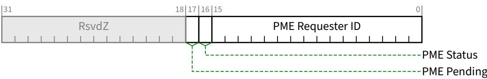


**表 7-32 根复合体状态寄存器 (Root Status Register)**

| 位位置 | 寄存器描述 | 属性 |
|---|---|---|
| 15:0 | PME 请求者 ID (PME Requester ID) — 该字段指示最后 PME 请求者的 PCI 请求者 ID。仅当 PME 状态位置位时,该字段才有效。 | RO |
| 16 | PME 状态 (PME Status) — 该位指示 PME 由 PME 请求者 ID 字段中指示的 PME 请求者发起。后续 PME 保持挂起状态,直到软件通过写入 1b 清除该状态寄存器。<br>该位的默认值为 0b。 | RW1C |
| 17 | PME 挂起 (PME Pending) — 当 PME 状态位置位时,该位指示另一个 PME 处于挂起状态。当软件清除 PME 状态位时,硬件通过重新置位 PME 状态位并相应更新 PME 请求者 ID 字段来传递 PME。如果没有更多 PME 挂起,硬件将清除 PME 挂起位。 | RO |

</td>
</tr>
</tbody>
</table>

<!-- 📄 Page 1067 -->
---

---

<a id="sec-7-5-3-15"></a>
## 7.5.3.15 Device Capabilities 2 Register | 设备能力 2 寄存器 (Offset 24h)


<div style="overflow-x: auto; max-width: 100%;">
<table>
<thead>
<tr>
<th width="50%">🇬🇧 English</th>
<th width="50%" style="background-color:#e8e8e8">🏆 中文</th>
</tr>
</thead>
<tbody>
<tr>
<td>

Bit | Description
---|---
3:0 | Completion Timeout Ranges Supported
4 | Completion Timeout Disable Supported
5 | ARI Forwarding Supported
6 | AtomicOp Routing Supported
7 | 32-bit AtomicOp Completer Supported
8 | 64-bit AtomicOp Completer Supported
9 | 128-bit CAS Completer Supported
10 | No RO-enabled PR-PR Passing
11 | LTR Mechanism Supported
13:12 | TPH Completer Supported
15:14 | Undefined
16 | 10-Bit Tag Completer Supported
17 | 10-Bit Tag Requester Supported
19:18 | OBFF Supported
20 | Extended Fmt Field Supported
21 | End-End TLP Prefix Supported
23:22 | Max End-End TLP Prefixes
25:24 | Emergency Power Reduction Supported
26 | Emergency Power Reduction Initialization Required
27 | RsvdP
28 | DMWr Completer Supported
30:29 | DMWr Lengths Supported
31 | FRS Supported

**Figure 7-36 Device Capabilities 2 Register**

**Table 7-33 Device Capabilities 2 Register**

| Bit Location | Register Description | Attributes |
|---|---|---|
| 3:0 | Completion Timeout Ranges Supported - This field indicates device Function support for the optional Completion Timeout programmability mechanism. This mechanism allows system software to modify the Completion Timeout Value.<br>This field is applicable only to Root Ports, Endpoints that issue Non-Posted Requests on their own behalf, and PCI Express to PCI/PCI-X Bridges that take ownership of Non-Posted Requests issued on PCI Express. For all other Functions this field is Reserved and must be hardwired to 0000b.<br>Four time value ranges are defined (A, B, C, D), each with two selectable sub-ranges (for which the time ranges are defined in the description of the Completion Timeout Value field in the Device Control 2 register):<br>The value in this field indicates the timeout value ranges supported:<br>0000b = Completion Timeout programming not supported - See § Section 2.8 for requirements.<br>0001b = Range A<br>0010b = Range B<br>0011b = Ranges A and B<br>0110b = Ranges B and C<br>0111b = Ranges A, B, and C<br>1110b = Ranges B, C, and D<br>1111b = Ranges A, B, C, and D | HwInit |

</td>
<td style="background-color:#e8e8e8">

位 | 描述
---|---
3:0 | 完成超时范围支持 (Completion Timeout Ranges Supported)
4 | 完成超时禁用支持 (Completion Timeout Disable Supported)
5 | ARI 转发支持 (ARI Forwarding Supported)
6 | AtomicOp 路由支持 (AtomicOp Routing Supported)
7 | 32 位 AtomicOp 完成者支持 (32-bit AtomicOp Completer Supported)
8 | 64 位 AtomicOp 完成者支持 (64-bit AtomicOp Completer Supported)
9 | 128 位 CAS 完成者支持 (128-bit CAS Completer Supported)
10 | 无 RO 使能的 PR-PR 传递 (No RO-enabled PR-PR Passing)
11 | LTR 机制支持 (LTR Mechanism Supported)
13:12 | TPH 完成者支持 (TPH Completer Supported)
15:14 | 未定义 (Undefined)
16 | 10 位标签完成者支持 (10-Bit Tag Completer Supported)
17 | 10 位标签请求者支持 (10-Bit Tag Requester Supported)
19:18 | OBFF 支持 (OBFF Supported)
20 | 扩展 Fmt 字段支持 (Extended Fmt Field Supported)
21 | 端到端 TLP 前缀支持 (End-End TLP Prefix Supported)
23:22 | 最大端到端 TLP 前缀数 (Max End-End TLP Prefixes)
25:24 | 紧急降功耗支持 (Emergency Power Reduction Supported)
26 | 紧急降功耗初始化需求 (Emergency Power Reduction Initialization Required)
27 | 保留 (RsvdP)
28 | DMWr 完成者支持 (DMWr Completer Supported)
30:29 | DMWr 长度支持 (DMWr Lengths Supported)
31 | FRS 支持 (FRS Supported)

**图 7-36 设备能力 2 寄存器 (Device Capabilities 2 Register)**

> 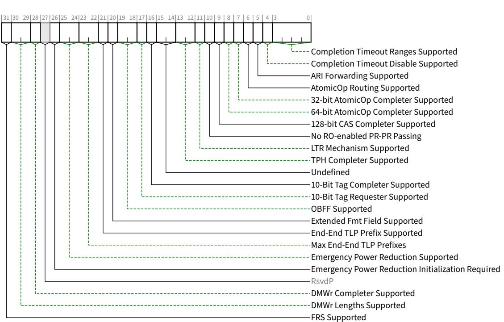


**表 7-33 设备能力 2 寄存器 (Device Capabilities 2 Register)**

| 位位置 | 寄存器描述 | 属性 |
|---|---|---|
| 3:0 | 完成超时范围支持 (Completion Timeout Ranges Supported) — 该字段指示设备功能 (Function) 对可选完成超时可编程机制的支持。该机制允许系统软件修改完成超时值 (Completion Timeout Value)。<br>该字段仅适用于根端口、代表自身发起 Non-Posted 请求 (Non-Posted Request) 的端点 (Endpoint),以及接管在 PCI Express 上发起的 Non-Posted 请求所有权的 PCI Express 至 PCI/PCI-X 桥 (Bridge)。对于所有其他功能,该字段为保留,必须硬连线为 0000b。<br>定义了四个时间值范围(A、B、C、D),每个范围有两个可选子范围(时间范围在设备控制 2 寄存器的完成超时值字段描述中定义):<br>该字段中的值指示所支持的超时值范围:<br>0000b = 不支持完成超时可编程 — 参见 § 第 2.8 节了解要求。<br>0001b = 范围 A<br>0010b = 范围 B<br>0011b = 范围 A 和 B<br>0110b = 范围 B 和 C<br>0111b = 范围 A、B 和 C<br>1110b = 范围 B、C 和 D<br>1111b = 范围 A、B、C 和 D | HwInit |

</td>
</tr>
</tbody>
</table>
</div>


<!-- 📄 Page 1068 -->
---

---

<table>
<thead>
<tr>
<th width="50%">🇬🇧 English</th>
<th width="50%" style="background-color:#e8e8e8">🏆 中文</th>
</tr>
</thead>
<tbody>
<tr>
<td>

| Bit Location | Register Description | Attributes |
|---|---|---|
| 3:0 (cont.) | All other values are Reserved.<br>For VFs, this field value must be identical to the associated PF's field value. | HwInit |
| 4 | Completion Timeout Disable Supported - A value of 1b indicates support for the Completion Timeout Disable mechanism.<br>The Completion Timeout Disable mechanism is required for Endpoints that issue Non-Posted Requests on their own behalf and PCI Express to PCI/PCI-X Bridges that take ownership of Non-Posted Requests issued on PCI Express.<br>For VFs, this bit value must be identical to the associated PF's bit value.<br>This mechanism is optional for Root Ports.<br>For all other Functions this field is Reserved and must be hardwired to 0b. | RO |
| 5 | ARI Forwarding Supported - Applicable only to Switch Downstream Ports and Root Ports; must be 0b for other Function types. This bit must be set to 1b if a Switch Downstream Port or Root Port supports this optional capability. See § Section 6.13 for additional details. | RO |
| 6 | AtomicOp Routing Supported - Applicable only to Switch Upstream Ports, Switch Downstream Ports, and Root Ports; must be 0b for other Function types. This bit must be set to 1b if the Port supports this optional capability. See § Section 6.15 for additional details. | RO |
| 7 | 32-bit AtomicOp Completer Supported - Applicable to Functions with Memory Space BARs as well as all Root Ports; must be 0b otherwise. Includes FetchAdd, Swap, and CAS AtomicOps. This bit must be set to 1b if the Function supports this optional capability. See § Section 6.15.3.1 for additional RC requirements.<br>For VFs, this bit value must be identical to the associated PF's bit value. | RO |
| 8 | 64-bit AtomicOp Completer Supported - Applicable to Functions with Memory Space BARs as well as all Root Ports; must be 0b otherwise. Includes FetchAdd, Swap, and CAS AtomicOps. This bit must be set to 1b if the Function supports this optional capability. See § Section 6.15.3.1 for additional RC requirements.<br>For VFs, this bit value must be identical to the associated PF's bit value. | RO |
| 9 | 128-bit CAS Completer Supported - Applicable to Functions with Memory Space BARs as well as all Root Ports; must be 0b otherwise. This bit must be set to 1b if the Function supports this optional capability. See § Section 6.15 for additional details.<br>For VFs, this bit value must be identical to the associated PF's bit value. | RO |
| 10 | No RO-enabled PR-PR Passing - If this bit is Set, the routing element never carries out the passing permitted by § Table 2-42 entry A2b that is associated with the Relaxed Ordering Attribute field being Set.<br>This bit applies only for Switches and RCs that support peer-to-peer traffic between Root Ports. This bit applies only to Posted Requests being forwarded through the Switch or RC and does not apply to traffic originating or terminating within the Switch or RC itself. All Ports on a Switch or RC must report the same value for this bit.<br>For all other functions, this bit must be 0b. | HwInit |
| 11 | LTR Mechanism Supported - A value of 1b indicates support for the optional Latency Tolerance Reporting (LTR) mechanism.<br>Root Ports, Switches and Endpoints are permitted to implement this capability.<br>For a Multi-Function Device associated with an Upstream Port, each Function must report the same value for this bit. | RO |

</td>
<td style="background-color:#e8e8e8">

| 位位置 | 寄存器描述 | 属性 |
|---|---|---|
| 3:0(续) | 所有其他值均为保留。<br>对于 VF,该字段值必须与关联的 PF 字段值相同。 | HwInit |
| 4 | 完成超时禁用支持 (Completion Timeout Disable Supported) — 值 1b 表示支持完成超时禁用机制。<br>完成超时禁用机制对于代表自身发起 Non-Posted 请求的端点以及接管在 PCI Express 上发起的 Non-Posted 请求所有权的 PCI Express 至 PCI/PCI-X 桥是必需的。<br>对于 VF,该位值必须与关联的 PF 位值相同。<br>此机制对于根端口是可选的。<br>对于所有其他功能,该字段为保留,必须硬连线为 0b。 | RO |
| 5 | ARI 转发支持 (ARI Forwarding Supported) — 仅适用于交换机 (Switch) 下游端口 (Downstream Port) 和根端口;对于其他功能类型必须为 0b。如果交换机下游端口或根端口支持此可选能力,则该位必须置 1b。参见 § 第 6.13 节了解其他详情。 | RO |
| 6 | AtomicOp 路由支持 (AtomicOp Routing Supported) — 仅适用于交换机上游端口 (Upstream Port)、交换机下游端口和根端口;对于其他功能类型必须为 0b。如果端口支持此可选能力,则该位必须置 1b。参见 § 第 6.15 节了解其他详情。 | RO |
| 7 | 32 位 AtomicOp 完成者支持 (32-bit AtomicOp Completer Supported) — 适用于具有内存空间 (Memory Space) BAR 的功能以及所有根端口;否则必须为 0b。包括 FetchAdd、Swap 和 CAS AtomicOp。如果功能支持此可选能力,则该位必须置 1b。参见 § 第 6.15.3.1 节了解其他 RC 要求。<br>对于 VF,该位值必须与关联的 PF 位值相同。 | RO |
| 8 | 64 位 AtomicOp 完成者支持 (64-bit AtomicOp Completer Supported) — 适用于具有内存空间 BAR 的功能以及所有根端口;否则必须为 0b。包括 FetchAdd、Swap 和 CAS AtomicOp。如果功能支持此可选能力,则该位必须置 1b。参见 § 第 6.15.3.1 节了解其他 RC 要求。<br>对于 VF,该位值必须与关联的 PF 位值相同。 | RO |
| 9 | 128 位 CAS 完成者支持 (128-bit CAS Completer Supported) — 适用于具有内存空间 BAR 的功能以及所有根端口;否则必须为 0b。如果功能支持此可选能力,则该位必须置 1b。参见 § 第 6.15 节了解其他详情。<br>对于 VF,该位值必须与关联的 PF 位值相同。 | RO |
| 10 | 无 RO 使能的 PR-PR 传递 (No RO-enabled PR-PR Passing) — 如果该位置位,则路由元素从不执行 § 表 2-42 条目 A2b 中允许的与"宽松排序"属性 (Relaxed Ordering) 字段置位相关联的传递。<br>该位仅适用于支持根端口间对等通信的交换机和 RC。该位仅适用于通过交换机或 RC 转发的 Posted 请求,不适用于源自或终止于交换机或 RC 本身的通信。交换机或 RC 上的所有端口必须为该位报告相同的值。<br>对于所有其他功能,该位必须为 0b。 | HwInit |
| 11 | LTR 机制支持 (LTR Mechanism Supported) — 值 1b 表示支持可选的延迟容忍报告 (Latency Tolerance Reporting, LTR) 机制。<br>根端口、交换机和端点允许实现此能力。<br>对于与上游端口关联的多功能设备 (Multi-Function Device),每个功能必须为该位报告相同的值。 | RO |

</td>
</tr>
</tbody>
</table>

<!-- 📄 Page 1069 -->
---

---


<div style="overflow-x: auto; max-width: 100%;">
<table>
<thead>
<tr>
<th width="50%">🇬🇧 English</th>
<th width="50%" style="background-color:#e8e8e8">🏆 中文</th>
</tr>
</thead>
<tbody>
<tr>
<td>

| Bit Location | Register Description | Attributes |
|---|---|---|
| 11 (cont.) | For Bridges and other Functions that do not implement this capability, this bit must be hardwired to 0b. | RO |
| 13:12 | TPH Completer Supported - Value indicates Completer support for TPH or Extended TPH. Applicable only to Root Ports and Endpoints. For all other Functions, this field is Reserved.<br>Defined Encodings are:<br>00b = TPH and Extended TPH Completer not supported.<br>01b = TPH Completer supported; Extended TPH Completer not supported.<br>10b = Reserved.<br>11b = Both TPH and Extended TPH Completer supported.<br>See § Section 6.17 for details. | RO |
| 15:14 | Undefined - formerly used for Lightweight Notification (LN), which is now deprecated | RO |
| 16 | 10-Bit Tag Completer Supported - If this bit is Set, the Function supports 10-Bit Tag Completer capability; otherwise, the Function does not. See § Section 2.2.6.2 .<br>For VFs, this bit value must be identical to the associated PF's bit value. | HwInit |
| 17 | 10-Bit Tag Requester Supported - If this bit is Set, the Function supports 10-Bit Tag Requester capability; otherwise, the Function does not.<br>This bit must not be Set if the 10-Bit Tag Completer Supported bit is Clear.<br>If the Function is an RCiEP, this bit must be Clear if the RC does not support 10-Bit Tag Completer capability for Requests coming from this RCiEP.<br>For VFs, this bit value must equal the VF 10-Bit Tag Requester Supported bit value in the SR-IOV Capabilities Register.<br>Note that 10-Bit Tag field generation must be enabled by the 10-Bit Tag Requester Enable bit in the Device Control 2 Register of the Requester Function before 10-Bit Tags can be generated by the Requester. See § Section 2.2.6.2 . | HwInit |
| 19:18 | OBFF Supported - This field indicates if OBFF is supported and, if so, what signaling mechanism is used.<br>00b = OBFF Not Supported<br>01b = OBFF supported using Message signaling only<br>10b = OBFF supported using WAKE# signaling only<br>11b = OBFF supported using WAKE# and Message signaling<br>The value reported in this field must indicate support for WAKE# signaling only if:<br>• for a Downstream Port, driving the WAKE# signal for OBFF is supported and the connector or component connected Downstream is known to receive that same WAKE# signal<br>• for an Upstream Port, receiving the WAKE# signal for OBFF is supported and, if the component is on an add-in-card, that the component is connected to the WAKE# signal on the connector.<br>Root Ports, Switch Ports, and Endpoints are permitted to implement this capability.<br>For a Multi-Function Device associated with an Upstream Port, each Function must report the same value for this field.<br>For Bridges and Ports that do not implement this capability, this field must be hardwired to 00b. | HwInit |

</td>
<td style="background-color:#e8e8e8">

| 位位置 | 寄存器描述 | 属性 |
|---|---|---|
| 11(续) | 对于未实现此能力的桥和其他功能,该位必须硬连线为 0b。 | RO |
| 13:12 | TPH 完成者支持 (TPH Completer Supported) — 值指示对 TPH 或扩展 TPH 的完成者支持。仅适用于根端口和端点。对于所有其他功能,该字段为保留。<br>已定义编码为:<br>00b = 不支持 TPH 和扩展 TPH 完成者。<br>01b = 支持 TPH 完成者;不支持扩展 TPH 完成者。<br>10b = 保留。<br>11b = 同时支持 TPH 和扩展 TPH 完成者。<br>参见 § 第 6.17 节了解详情。 | RO |
| 15:14 | 未定义 (Undefined) — 以前用于轻量级通知 (Lightweight Notification, LN),现已弃用 | RO |
| 16 | 10 位标签完成者支持 (10-Bit Tag Completer Supported) — 如果该位置位,则功能支持 10 位标签完成者能力;否则不支持。参见 § 第 2.2.6.2 节。<br>对于 VF,该位值必须与关联的 PF 位值相同。 | HwInit |
| 17 | 10 位标签请求者支持 (10-Bit Tag Requester Supported) — 如果该位置位,则功能支持 10 位标签请求者能力;否则不支持。<br>如果 10 位标签完成者支持位清零,则该位不得置位。<br>如果该功能是 RCiEP,当 RC 不支持来自该 RCiEP 请求的 10 位标签完成者能力时,该位必须清零。<br>对于 VF,该位值必须等于 SR-IOV 能力寄存器中 VF 10 位标签请求者支持位的值。<br>请注意,在请求者能够生成 10 位标签之前,必须由请求者功能的设备控制 2 寄存器中的 10 位标签请求者使能位使能 10 位标签字段的生成。参见 § 第 2.2.6.2 节。 | HwInit |
| 19:18 | OBFF 支持 (OBFF Supported) — 该字段指示是否支持 OBFF,如果支持,则使用何种信令机制。<br>00b = 不支持 OBFF<br>01b = 仅使用消息信令支持 OBFF<br>10b = 仅使用 WAKE# 信令支持 OBFF<br>11b = 使用 WAKE# 和消息信令支持 OBFF<br>该字段中报告的值必须在以下情况下指示仅支持 WAKE# 信令:<br>• 对于下游端口,支持为 OBFF 驱动 WAKE# 信号,并且已知下游连接的连接器或组件接收相同的 WAKE# 信号<br>• 对于上游端口,支持为 OBFF 接收 WAKE# 信号,并且如果组件在附加卡上,则该组件已连接到连接器上的 WAKE# 信号。<br>根端口、交换机端口和端点允许实现此能力。<br>对于与上游端口关联的多功能设备,每个功能必须为该字段报告相同的值。<br>对于未实现此能力的桥和端口,该字段必须硬连线为 00b。 | HwInit |

</td>
</tr>
</tbody>
</table>
</div>


<!-- 📄 Page 1070 -->
---

---

<table>
<thead>
<tr>
<th width="50%">🇬🇧 English</th>
<th width="50%" style="background-color:#e8e8e8">🏆 中文</th>
</tr>
</thead>
<tbody>
<tr>
<td>

| Bit Location | Register Description | Attributes |
|---|---|---|
| 20 | Extended Fmt Field Supported - If Set, the Function supports the 3-bit definition of the Fmt field when operating in Non-Flit Mode. If Clear, the Function supports a 2-bit definition of the Fmt field. See § Section 2.2 .<br>Must be Set for Functions that support End-End TLP Prefixes (NFM) or OHC-E (FM). All Functions in an Upstream Port must have the same value for this bit. Each Downstream Port of a component may have a different value for this bit.<br>MUST@FLIT be Set. | RO |
| 21 | End-End TLP Prefix Supported - Indicates whether End-End TLP Prefix support (NFM) / OHC-E (FM) is offered by a Function. Values are:<br>0b = No Support<br>1b = Support is provided to receive TLPs containing End-End TLP Prefixes (NFM) and optionally OHC-E (FM).<br>All Ports of a Switch must have the same value for this bit.<br>The definition of this bit is ambiguous for designs that choose only to support End-End TLP Prefixes in NFM and do not support OHC-E in FM. This bit is static and does not change value with current link operation (FM vs. NFM). Software cannot rely on this bit to infer if OHC-E is support by a Function.<br>The definition of this bit is also ambiguous for RPs that choose to support End-End TLP Prefixes (NFM) / OHC-E (FM) as a terminus only without forwarding. Software cannot rely on this bit to infer if End-End TLP Prefix forwarding / OHC-E forwarding is supported in a RP or not. | HwInit |
| 23:22 | Max End-End TLP Prefixes - Indicates the maximum number of End-End TLP Prefixes supported by this Function (NFM) or the maximum size of OHC-E supported (FM). See § Section 2.2.10.4 for important details. Values are:<br>00b = 1 End-End TLP Prefix / OHC-E1<br>01b = 2 End-End TLP Prefixes / OHC-E2<br>10b = 3 End-End TLP Prefixes / OHC-E4<br>11b = 4 End-End TLP Prefixes / OHC-E4<br>If End-End TLP Prefix Supported is Clear, this field is RsvdP.<br>Different Root Ports that have the End-End TLP Prefix Supported bit Set are permitted to report different values for this field.<br>For Switches where End-End TLP Prefix Supported is Set, this field must be 00b indicating support for up to four End-End TLP Prefixes.<br>The definition of this bit is ambiguous for designs that only chose to support End-End TLP Prefixes in NFM and do not support OHC-E in FM. This bit is static and does not change value based on current link operation (FM vs. NFM). Refer to § Section 2.2.11 for how hardware must handle received TLPs with OHC-E in the scenario that they don't support it. | HwInit |
| 25:24 | Emergency Power Reduction Supported - Indicates support level of the optional Emergency Power Reduction State feature. A Function can enter Emergency Power Reduction State autonomously, or based on one of two mechanisms defined by the associated Form Factor Specification. Functions that are in the Emergency Power Reduction State consume less power. The Emergency Power Reduction mechanism permits a chassis to request add-in cards to rapidly enter Emergency Power Reduction State without involving system software. See § Section 6.24 for additional details.<br>Values are:<br>00b = Emergency Power Reduction State not supported<br>01b = Emergency Power Reduction State is supported and is triggered by Device Specific mechanism(s) | HwInit |

</td>
<td style="background-color:#e8e8e8">

| 位位置 | 寄存器描述 | 属性 |
|---|---|---|
| 20 | 扩展 Fmt 字段支持 (Extended Fmt Field Supported) — 置位时,功能在非 Flit 模式 (Non-Flit Mode) 下运行时支持 Fmt 字段的 3 位定义。清零时,功能支持 Fmt 字段的 2 位定义。参见 § 第 2.2 节。<br>对于支持端到端 TLP 前缀 (NFM) 或 OHC-E (FM) 的功能,必须置位。上游端口中的所有功能必须为该位具有相同的值。组件的每个下游端口可以具有不同的值。<br>在 FLIT 时必须置位 (MUST@FLIT)。 | RO |
| 21 | 端到端 TLP 前缀支持 (End-End TLP Prefix Supported) — 指示功能是否提供端到端 TLP 前缀支持(NFM)/ OHC-E (FM)。值为:<br>0b = 不支持<br>1b = 提供支持以接收包含端到端 TLP 前缀 (NFM) 以及可选 OHC-E (FM) 的 TLP。<br>交换机的所有端口必须为该位具有相同的值。<br>对于仅选择在 NFM 中支持端到端 TLP 前缀而不支持 FM 中 OHC-E 的设计,该位的定义不明确。该位是静态的,不会随当前链路操作(FM 与 NFM)而改变值。软件不能依赖该位来推断功能是否支持 OHC-E。<br>对于选择仅作为终点(不转发)支持端到端 TLP 前缀 (NFM) / OHC-E (FM) 的 RP,该位的定义也不明确。软件不能依赖该位来推断 RP 中是否支持端到端 TLP 前缀转发/ OHC-E 转发。 | HwInit |
| 23:22 | 最大端到端 TLP 前缀数 (Max End-End TLP Prefixes) — 指示此功能(NFM)支持的端到端 TLP 前缀的最大数量,或支持的 OHC-E 的最大大小(FM)。参见 § 第 2.2.10.4 节了解重要详情。值为:<br>00b = 1 个端到端 TLP 前缀 / OHC-E1<br>01b = 2 个端到端 TLP 前缀 / OHC-E2<br>10b = 3 个端到端 TLP 前缀 / OHC-E4<br>11b = 4 个端到端 TLP 前缀 / OHC-E4<br>如果"端到端 TLP 前缀支持"位清零,则该字段为 RsvdP。<br>具有"端到端 TLP 前缀支持"位置位的不同根端口允许为该字段报告不同的值。<br>对于"端到端 TLP 前缀支持"位置位的交换机,该字段必须为 00b,表示支持最多四个端到端 TLP 前缀。<br>对于仅选择在 NFM 中支持端到端 TLP 前缀而不支持 FM 中 OHC-E 的设计,该位的定义不明确。该位是静态的,不会基于当前链路操作(FM 与 NFM)而改变值。关于在不支持 OHC-E 的情况下硬件必须如何处理接收到的带 OHC-E 的 TLP,请参阅 § 第 2.2.11 节。 | HwInit |
| 25:24 | 紧急降功耗支持 (Emergency Power Reduction Supported) — 指示对可选紧急降功耗状态 (Emergency Power Reduction State) 功能的支持级别。功能可以自主进入紧急降功耗状态,或基于相关外形规格 (Form Factor) 规范中定义的两种机制之一进入。处于紧急降功耗状态的功能消耗更少的功率。紧急降功耗机制允许机箱请求附加卡快速进入紧急降功耗状态,而不涉及系统软件。参见 § 第 6.24 节了解其他详情。<br>值为:<br>00b = 不支持紧急降功耗状态<br>01b = 支持紧急降功耗状态并由设备特定 (Device Specific) 机制触发 | HwInit |

</td>
</tr>
</tbody>
</table>

<!-- 📄 Page 1071 -->
---

---


<div style="overflow-x: auto; max-width: 100%;">
<table>
<thead>
<tr>
<th width="50%">🇬🇧 English</th>
<th width="50%" style="background-color:#e8e8e8">🏆 中文</th>
</tr>
</thead>
<tbody>
<tr>
<td>

| Bit Location | Register Description | Attributes |
|---|---|---|
| 25:24 (cont.) | 10b = Emergency Power Reduction State is supported and is triggered either by the mechanism defined in the corresponding Form Factor specification or by Device Specific mechanism(s)<br>11b = Reserved<br>This field is RsvdP in Functions that are not associated with an Upstream Port.<br>For Multi-Function Devices associated with an Upstream Port, all Functions that report a non-Zero value for this field, must report the same non-Zero value for this field.<br>For VFs, this field value must be identical to the associated PF's field value.<br>Default value is 00b.<br>After reset, once this field returns a non-Zero value, it must continue to return the same non-Zero value, until the next reset. | HwInit |
| 26 | Emergency Power Reduction Initialization Required - If Set, the Function requires complete or partial initialization upon exit from the Emergency Power Reduction State. If Clear, the Function requires no software intervention to return to normal operation upon exit from the Emergency Power Reduction State. See § Section 6.24 for additional details.<br>For Multi-Function Devices associated with an Upstream Port, all Functions must report the same value for this bit.<br>For VFs, this bit value must be identical to the associated PF's bit value.<br>This bit is RsvdP in Functions that are not associated with an Upstream Port.<br>Default value is 0b.<br>After reset, when this field returns a non-Zero value, it must continue to return the same non-Zero value. | HwInit |
| 28 | DMWr Completer Supported – Applicable to Functions with Memory Space BARs as well as all Root Ports; This bit must be Set if the Function can serve as a DMWr Completer. See § Section 6.32 for additional details. | HwInit |
| 30:29 | DMWr Lengths Supported – Applicable to Functions with either the DMWr Request Routing Supported bit Set or the DMWR Completer Supported bit Set (or both). This field indicates the largest DMWr TLP that this Function can receive.<br>Defined Encodings are:<br>00b = DMWr TLPs up to 64 bytes are supported<br>01b = DMWr TLPs up to 128 bytes are supported<br>10b = Reserved<br>11b = Reserved<br>When applicable, all Functions in a Multi-Function Device associated with an Upstream Port must report the same value in this field.<br>This field is RsvdP if both DMWr Completer Supported and DMWr Request Routing Supported are Clear. | HwInit/RsvdP |
| 31 | FRS Supported - When Set, indicates support for the optional Function Readiness Status (FRS) capability.<br>Must be Set for all Functions that support generation or reception capabilities of FRS Messages.<br>Must not be Set by Switch Functions that do not generate FRS Messages on their own behalf. | HwInit |

</td>
<td style="background-color:#e8e8e8">

| 位位置 | 寄存器描述 | 属性 |
|---|---|---|
| 25:24(续) | 10b = 支持紧急降功耗状态,并由相应外形规格规范中定义的机制或设备特定机制触发<br>11b = 保留<br>该字段在不与上游端口关联的功能中为 RsvdP。<br>对于与上游端口关联的多功能设备,为该字段报告非零值的所有功能,必须为该字段报告相同的非零值。<br>对于 VF,该字段值必须与关联的 PF 字段值相同。<br>默认值为 00b。<br>复位后,一旦该字段返回非零值,则必须继续返回相同的非零值,直到下一次复位。 | HwInit |
| 26 | 紧急降功耗初始化需求 (Emergency Power Reduction Initialization Required) — 置位时,功能在退出紧急降功耗状态时需要完全或部分初始化。清零时,功能在退出紧急降功耗状态时不需要软件干预即可恢复正常操作。参见 § 第 6.24 节了解其他详情。<br>对于与上游端口关联的多功能设备,所有功能必须为该位报告相同的值。<br>对于 VF,该位值必须与关联的 PF 位值相同。<br>该位在不与上游端口关联的功能中为 RsvdP。<br>默认值为 0b。<br>复位后,当该字段返回非零值时,必须继续返回相同的非零值。 | HwInit |
| 28 | DMWr 完成者支持 (DMWr Completer Supported) — 适用于具有内存空间 BAR 的功能以及所有根端口;如果该功能可以作为 DMWr 完成者 (Completer),则该位必须置位。参见 § 第 6.32 节了解其他详情。 | HwInit |
| 30:29 | DMWr 长度支持 (DMWr Lengths Supported) — 适用于具有 DMWr 请求路由支持位置位或 DMWr 完成者支持位置位(或两者皆置位)的功能。该字段指示此功能可接收的最大 DMWr TLP。<br>已定义编码为:<br>00b = 支持最大 64 字节的 DMWr TLP<br>01b = 支持最大 128 字节的 DMWr TLP<br>10b = 保留<br>11b = 保留<br>在适用的情况下,与上游端口关联的多功能设备中的所有功能必须为该字段报告相同的值。<br>如果 DMWr 完成者支持和 DMWr 请求路由支持均清零,则该字段为 RsvdP。 | HwInit/RsvdP |
| 31 | FRS 支持 (FRS Supported) — 置位时,指示支持可选的功能就绪状态 (Function Readiness Status, FRS) 能力。<br>对于支持 FRS 消息 (FRS Messages) 生成或接收能力的所有功能,必须置位。<br>不为其自身生成 FRS 消息的交换机功能不得置位。 | HwInit |

</td>
</tr>
</tbody>
</table>
</div>


<!-- 📄 Page 1072 -->
---

---

<table>
<thead>
<tr>
<th width="50%">🇬🇧 English</th>
<th width="50%" style="background-color:#e8e8e8">🏆 中文</th>
</tr>
</thead>
<tbody>
<tr>
<td>

Bit | Description
---|---
3:0 | Completion Timeout Value
4 | Completion Timeout Disable
5 | ARI Forwarding Enable
6 | AtomicOp Requester Enable
7 | AtomicOp Egress Blocking
8 | IDO Request Enable
9 | IDO Completion Enable
10 | LTR Mechanism Enable
11 | Emergency Power Reduction Request
12 | 10-Bit Tag Requester Enable
14:13 | OBFF Enable
15 | End-End TLP Prefix Blocking

**Figure 7-37 Device Control 2 Register**

**Table 7-34 Device Control 2 Register**

| Bit Location | Register Description | Attributes |
|---|---|---|
| 3:0 | Completion Timeout Value - In device Functions that support Completion Timeout programmability, this field allows system software to modify the Completion Timeout Value.<br>This field is applicable to Root Ports, Endpoints that issue Non-Posted Requests on their own behalf, and PCI Express to PCI/PCI-X Bridges that take ownership of Non-Posted Requests issued on PCI Express. For VFs, the associated PF's value applies, and this field must be RsvdP. For all other Functions, this field must be hardwired to Zero.<br>A Function that does not support this optional capability must hardwire this field to 0000b. Functions that support Completion Timeout programmability must support the values given below corresponding to the programmability ranges indicated in the Completion Timeout Ranges Supported field. | RW<br>VF RsvdP |

> **IMPLEMENTATION NOTE: USE OF THE NO RO-ENABLED PR-PR PASSING BIT**
> The No RO-enabled PR-PR Passing bit allows platforms to utilize PCI Express switching elements on the path between a requester and completer for requesters that could benefit from a slightly less relaxed ordering model.
> An example is a device that cannot ensure that multiple overlapping posted writes to the same address are outstanding at the same time. The method by which such a device is enabled to utilize this mode is beyond the scope of this specification.

</td>
<td style="background-color:#e8e8e8">

位 | 描述
---|---
3:0 | 完成超时值 (Completion Timeout Value)
4 | 完成超时禁用 (Completion Timeout Disable)
5 | ARI 转发使能 (ARI Forwarding Enable)
6 | AtomicOp 请求者使能 (AtomicOp Requester Enable)
7 | AtomicOp 出口阻塞 (AtomicOp Egress Blocking)
8 | IDO 请求使能 (IDO Request Enable)
9 | IDO 完成使能 (IDO Completion Enable)
10 | LTR 机制使能 (LTR Mechanism Enable)
11 | 紧急降功耗请求 (Emergency Power Reduction Request)
12 | 10 位标签请求者使能 (10-Bit Tag Requester Enable)
14:13 | OBFF 使能 (OBFF Enable)
15 | 端到端 TLP 前缀阻塞 (End-End TLP Prefix Blocking)

**图 7-37 设备控制 2 寄存器 (Device Control 2 Register)**

> 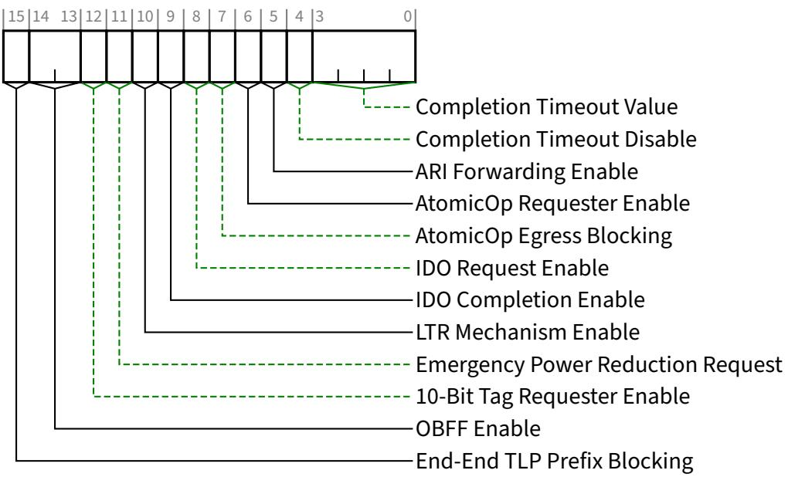


**表 7-34 设备控制 2 寄存器 (Device Control 2 Register)**

| 位位置 | 寄存器描述 | 属性 |
|---|---|---|
| 3:0 | 完成超时值 (Completion Timeout Value) — 在支持完成超时可编程的设备功能中,该字段允许系统软件修改完成超时值。<br>该字段适用于根端口、代表自身发起 Non-Posted 请求的端点,以及接管在 PCI Express 上发起的 Non-Posted 请求所有权的 PCI Express 至 PCI/PCI-X 桥。对于 VF,适用关联的 PF 值,且该字段必须为 RsvdP。对于所有其他功能,该字段必须硬连线为零。<br>不支持此可选功能的功能必须将该字段硬连线为 0000b。支持完成超时可编程的功能必须支持下面对应的可编程范围所指示的值,这些范围在完成超时范围支持字段中指示。 | RW<br>VF RsvdP |

> **实现说明:无 RO 使能 PR-PR 传递位的使用 (USE OF THE NO RO-ENABLED PR-PR PASSING BIT)**
> 无 RO 使能 PR-PR 传递位允许平台在请求者和完成者之间的路径上利用 PCI Express 交换元素,适用于那些可以从略不那么宽松的排序模型中受益的请求者。
> 一个示例是无法确保对同一地址的多个重叠 Posted 写入同时未完成的设备。使此类设备能够利用此模式的方法超出了本规范的范围。

</td>
</tr>
</tbody>
</table>

<!-- 📄 Page 1073 -->
---

---


---

<a id="sec-7-5-3-16"></a>
## 7.5.3.16 Device Control 2 Register (Offset 28h) | Device Control 2 寄存器(偏移 28h)


<div style="overflow-x: auto; max-width: 100%;">
<table>
<thead>
<tr>
<th width="50%">🇬🇧 English</th>
<th width="50%" style="background-color:#e8e8e8">🏆 中文</th>
</tr>
</thead>
<tbody>
<tr>
<td>

**Bit 4 — Completion Timeout Range & Encoding (continued)**

Defined encodings:

- 0000b — Default range: 50 μs to 50 ms; the Function MUST@FLIT implement a timeout value in the range 40 ms to 50 ms.
  - For Functions that do not support Flit Mode, it is strongly recommended that the Completion Timeout mechanism not expire in less than 10 ms.
- Values available if Range A is supported:
  - 0001b — 50 μs to 100 μs
  - 0010b — 1 ms to 10 ms
- Values available if Range B is supported:
  - 0101b — 16 ms to 55 ms; MUST@FLIT 40 ms to 55 ms
  - 0110b — 65 ms to 210 ms
- Values available if Range C is supported:
  - 1001b — 260 ms to 900 ms
  - 1010b — 1 s to 3.5 s
- Values available if the Range D is supported:
  - 1101b — 4 s to 13 s
  - 1110b — 17 s to 64 s
- Values not defined above are Reserved.

Software is permitted to change the value in this field at any time. For Requests already pending when the Completion Timeout Value is changed, hardware is permitted to use either the new or the old value for the outstanding Requests, and is permitted to base the start time for each Request either on when this value was changed or on when each request was issued.

The default value for this field is 0000b.

</td>
<td style="background-color:#e8e8e8">

**位 4 — Completion Timeout 范围与编码(续)**

已定义编码:

- 0000b — 默认范围:50 μs 到 50 ms;该 Function MUST@FLIT 实现 40 ms 到 50 ms 范围内的超时值。
  - 对于不支持 Flit 模式的 Function,强烈建议 Completion Timeout 机制过期时间不少于 10 ms。
- 若支持 Range A,可用的值:
  - 0001b — 50 μs 到 100 μs
  - 0010b — 1 ms 到 10 ms
- 若支持 Range B,可用的值:
  - 0101b — 16 ms 到 55 ms;MUST@FLIT 实现 40 ms 到 55 ms
  - 0110b — 65 ms 到 210 ms
- 若支持 Range C,可用的值:
  - 1001b — 260 ms 到 900 ms
  - 1010b — 1 s 到 3.5 s
- 若支持 Range D,可用的值:
  - 1101b — 4 s 到 13 s
  - 1110b — 17 s 到 64 s
- 上述未定义的值均为 Reserved。

软件可以在任何时间修改此字段的值。对于在 Completion Timeout 值修改时尚未完成的请求,硬件允许对新发出的请求或未完成请求使用新值或旧值,并允许以修改该值的时间或发出每个请求的时间作为每个请求的起始时间。

此字段的默认值为 0000b。

</td>
</tr>
</tbody>
</table>
</div>


<!-- 📄 Page 1074 -->
---

<table>
<thead>
<tr>
<th width="50%">🇬🇧 English</th>
<th width="50%" style="background-color:#e8e8e8">🏆 中文</th>
</tr>
</thead>
<tbody>
<tr>
<td>

**Bit 4 — Completion Timeout Disable (Attribute: RW / VF RsvdP)**

When Set, this bit disables the Completion Timeout mechanism.

For non-VFs, this bit is required for all Functions that support the Completion Timeout Disable capability. For VFs, the associated PF's value applies, and this field must be RsvdP. Otherwise, Functions that do not support this optional capability are permitted to hardwire this bit to Zero.

Software is permitted to Set or Clear this bit at any time. When Set, the Completion Timeout detection mechanism is disabled. If there are outstanding Requests when the bit is cleared, it is permitted but not required for hardware to apply the completion timeout mechanism to the outstanding Requests. If this is done, it is permitted to base the start time for each Request on either the time this bit was cleared or the time each Request was issued.

The default value for this bit is 0b.

</td>
<td style="background-color:#e8e8e8">

**位 4 — Completion Timeout Disable(属性:RW / VF RsvdP)**

当置位时,该位禁用 Completion Timeout 机制。

对于非 VF,所有支持 Completion Timeout Disable 能力的 Function 必须实现该位。对于 VF,使用关联 PF 的值,且该字段必须为 RsvdP。否则,不支持此可选能力的 Function 可将该位硬连线为零。

软件可在任何时间设置或清除此位。置位时,Completion Timeout 检测机制被禁用。如果在该位清除时尚有未完成的请求,允许(但非必须)对未完成的请求应用 completion timeout 机制。如果应用,允许以该位清除的时间或每个请求发出的时间作为每个请求的起始时间。

此位的默认值为 0b。

</td>
</tr>
<tr>
<td>

**Bit 5 — ARI Forwarding Enable (Attribute: RW / RsvdP)**

When set, the Downstream Port disables its traditional Device Number field being 0 enforcement when turning a Type 1 Configuration Request into a Type 0 Configuration Request, permitting access to Extended Functions in an ARI Device immediately below the Port. See § Section 6.13.

Default value of this bit is 0b. Must be hardwired to 0b if the ARI Forwarding Supported bit is 0b.

This bit is not applicable and Reserved for Upstream Ports.

</td>
<td style="background-color:#e8e8e8">

**位 5 — ARI Forwarding Enable(属性:RW / RsvdP)**

当置位时,下游端口 (Downstream Port) 在将 Type 1 配置请求转换为 Type 0 配置请求时,取消其传统 Device Number 字段必须为 0 的强制要求,从而允许访问该端口正下方的 ARI 设备中的扩展功能 (Extended Function)。参见 § 第 6.13 节。

此位的默认值为 0b。如果 ARI Forwarding Supported 位为 0b,则必须将其硬连线为 0b。

此位不适用于上游端口 (Upstream Port),对上游端口为 Reserved。

</td>
</tr>
<tr>
<td>

**Bit 6 — AtomicOp Requester Enable (Attribute: RW / VF RsvdP)**

Applicable only to Endpoints and Root Ports; must be hardwired to 0b for other Function types. The Function is allowed to initiate AtomicOp Requests only if this bit and the Bus Master Enable bit in the Command register are both Set.

</td>
<td style="background-color:#e8e8e8">

**位 6 — AtomicOp Requester Enable(属性:RW / VF RsvdP)**

仅适用于端点 (Endpoint) 和根端口 (Root Port);其他 Function 类型必须硬连线为 0b。仅当该位与 Command 寄存器中的 Bus Master Enable 位同时置位时,Function 才允许发起 AtomicOp 请求 (AtomicOp Request)。

</td>
</tr>
</tbody>
</table>

<!-- 📄 Page 1075 -->
---


<div style="overflow-x: auto; max-width: 100%;">
<table>
<thead>
<tr>
<th width="50%">🇬🇧 English</th>
<th width="50%" style="background-color:#e8e8e8">🏆 中文</th>
</tr>
</thead>
<tbody>
<tr>
<td>

**Bit 6 — AtomicOp Requester Enable (continued)**

For VFs, the associated PF's value applies, and this bit must be RsvdP. For non-VFs, this bit is required to be RW if the Endpoint or Root Port is capable of initiating AtomicOp Requests, but otherwise is permitted to be hardwired to Zero.

This bit does not serve as a capability bit. This bit is permitted to be RW even if no AtomicOp Requester capabilities are supported by the Endpoint or Root Port.

Default value of this bit is 0b.

</td>
<td style="background-color:#e8e8e8">

**位 6 — AtomicOp Requester Enable(续)**

对于 VF,使用关联 PF 的值,且该位必须为 RsvdP。对于非 VF,如果端点 (Endpoint) 或根端口 (Root Port) 能够发起 AtomicOp 请求,则该位必须为 RW;否则允许硬连线为零。

此位不作为能力位 (capability bit)。即使端点或根端口不支持任何 AtomicOp Requester 能力,该位仍允许为 RW。

此位的默认值为 0b。

</td>
</tr>
<tr>
<td>

**Bit 7 — AtomicOp Egress Blocking (Attribute: RW)**

Applicable and mandatory for Switch Upstream Ports, Switch Downstream Ports, and Root Ports that implement AtomicOp routing capability; otherwise must be hardwired to 0b.

When this bit is Set, AtomicOp Requests that target going out this Egress Port must be blocked. See § Section 6.15.2.

Default value of this bit is 0b.

</td>
<td style="background-color:#e8e8e8">

**位 7 — AtomicOp Egress Blocking(属性:RW)**

对于实现 AtomicOp 路由能力的交换机 (Switch) 上游端口、交换机下游端口和根端口,此位适用且必须实现;否则必须硬连线为 0b。

当该位置位时,以该出口端口 (Egress Port) 为目标的 AtomicOp 请求必须被阻塞。参见 § 第 6.15.2 节。

此位的默认值为 0b。

</td>
</tr>
<tr>
<td>

**Bit 8 — IDO Request Enable (Attribute: RW / VF RsvdP)**

If this bit is Set, the Function is permitted to set the ID-Based Ordering (IDO) bit (Attr[2]) of Requests it initiates (see § Section 2.2.6.3 and § Section 2.4).

Endpoints, including RC Integrated Endpoints, and Root Ports are permitted to implement this capability.

For VFs, the associated PF's value applies, and this bit must be RsvdP. Otherwise, a Function is permitted to hardwire this bit to Zero if it never sets the IDO attribute in Requests.

Default value of this bit is 0b.

</td>
<td style="background-color:#e8e8e8">

**位 8 — IDO Request Enable(属性:RW / VF RsvdP)**

如果该位置位,则允许该 Function 在其发起的请求中设置基于 ID 的排序 (IDO, ID-Based Ordering) 位 (Attr[2])(参见 § 第 2.2.6.3 节和 § 第 2.4 节)。

允许端点(包括 RC 集成端点)以及根端口实现此能力。

对于 VF,使用关联 PF 的值,且该位必须为 RsvdP。否则,如果 Function 从不在请求中设置 IDO 属性,则允许将该位硬连线为零。

此位的默认值为 0b。

</td>
</tr>
<tr>
<td>

**Bit 9 — IDO Completion Enable (Attribute: RW / VF RsvdP)**

If this bit is Set, the Function is permitted to set the ID-Based Ordering (IDO) bit (Attr[2]) of Completions it returns (see § Section 2.2.6.3 and § Section 2.4).

Endpoints, including RC Integrated Endpoints, and Root Ports are permitted to implement this capability.

For VFs, the associated PF's value applies, and this bit must be RsvdP. Otherwise, a Function is permitted to hardwire this bit to Zero if it never sets the IDO attribute in Completions.

Default value of this bit is 0b.

</td>
<td style="background-color:#e8e8e8">

**位 9 — IDO Completion Enable(属性:RW / VF RsvdP)**

如果该位置位,则允许该 Function 在其返回的完成报文 (Completion) 中设置基于 ID 的排序 (IDO) 位 (Attr[2])(参见 § 第 2.2.6.3 节和 § 第 2.4 节)。

允许端点(包括 RC 集成端点)以及根端口实现此能力。

对于 VF,使用关联 PF 的值,且该位必须为 RsvdP。否则,如果 Function 从不在完成报文中设置 IDO 属性,则允许将该位硬连线为零。

此位的默认值为 0b。

</td>
</tr>
<tr>
<td>

**Bit 10 — LTR Mechanism Enable (Attribute: RW/RsvdP)**

When Set to 1b, this bit enables Upstream Ports to send LTR messages and Downstream Ports to process LTR Messages.

For a Multi-Function Device associated with an Upstream Port of a device that implements LTR, the bit in Function 0 is RW, and only Function 0 controls the component's Link behavior. In all other Functions of that device, this bit is RsvdP.

Functions that do not implement the LTR mechanism are permitted to hardwire this bit to 0b.

Default value of this bit is 0b.

For Downstream Ports, this bit must be reset to the default value if the Port goes to DL_Down status.

</td>
<td style="background-color:#e8e8e8">

**位 10 — LTR Mechanism Enable(属性:RW/RsvdP)**

当设置为 1b 时,该位使能上游端口发送 LTR 消息,以及下游端口处理 LTR 消息。

对于与实现 LTR 的设备的上游端口相关联的多功能设备 (Multi-Function Device),Function 0 中的该位为 RW,且仅 Function 0 控制该组件的链路 (Link) 行为。该设备的所有其他 Function 中,该位为 RsvdP。

未实现 LTR 机制的 Function 可将该位硬连线为 0b。

此位的默认值为 0b。

对于下游端口,如果端口进入 DL_Down 状态,则必须将该位复位至默认值。

</td>
</tr>
<tr>
<td>

**Bit 11 — Emergency Power Reduction Request (Attribute: RW/RsvdP, VF RsvdP)**

If Set, all Functions in the component that support Emergency Power Reduction State must enter the Emergency Power Reduction State. If Clear these Functions must exit the Emergency Power Reduction State if no other reasons exist to preclude exiting this state. See § Section 6.24 for additional details.

This bit is implemented in the lowest numbered (non-VF) Function associated with an Upstream Port that has a non-Zero value in the Emergency Power Reduction Supported field. This bit is RsvdP in all other Functions, including VFs.

Default is 0b.

</td>
<td style="background-color:#e8e8e8">

**位 11 — Emergency Power Reduction Request(属性:RW/RsvdP,VF RsvdP)**

如果置位,组件中所有支持 Emergency Power Reduction State 的 Function 必须进入 Emergency Power Reduction State。如果清除,只要不存在阻止退出该状态的其他原因,这些 Function 必须退出 Emergency Power Reduction State。详见 § 第 6.24 节。

该位在 Emergency Power Reduction Supported 字段具有非零值的上游端口相关联的编号最小的(非 VF)Function 中实现。在所有其他 Function(包括 VF)中,该位为 RsvdP。

默认值为 0b。

</td>
</tr>
</tbody>
</table>
</div>


<!-- 📄 Page 1076 -->
---

<table>
<thead>
<tr>
<th width="50%">🇬🇧 English</th>
<th width="50%" style="background-color:#e8e8e8">🏆 中文</th>
</tr>
</thead>
<tbody>
<tr>
<td>

**Bit 12 — 10-Bit Tag Requester Enable (Attribute: RW, VF RsvdP)**

This bit, in combination with the Extended Tag Field Enable bit and the 14-Bit Tag Requester Enable bit, determines how many Tag field bits a Requester is permitted to use.

When the 10-Bit Tag Requester Enable bit is Set, the Requester is permitted to use 10-Bit Tags. See § Section 2.2.6.2 for complete details.

If software changes the value of this bit while the Function has outstanding Non-Posted Requests, the result is undefined.

For VFs, the value in the VF 10-Bit Tag Requester Enable bit in the associated PF's SR-IOV Control Register applies, and this bit must be RsvdP.

Non-VF Functions that do not implement 10-Bit Tag Requester capability are permitted to hardwire this bit to Zero.

Default value of this bit is 0b.

</td>
<td style="background-color:#e8e8e8">

**位 12 — 10-Bit Tag Requester Enable(属性:RW,VF RsvdP)**

该位与 Extended Tag Field Enable 位以及 14-Bit Tag Requester Enable 位组合,共同决定允许 Requester 使用多少个 Tag 字段位。

当 10-Bit Tag Requester Enable 位置位时,允许 Requester 使用 10-Bit Tag。完整细节参见 § 第 2.2.6.2 节。

如果软件在 Function 还有未完成的 Non-Posted 请求时修改此位的值,结果是未定义的。

对于 VF,使用关联 PF 的 SR-IOV Control 寄存器中 VF 10-Bit Tag Requester Enable 位的值,且该位必须为 RsvdP。

未实现 10-Bit Tag Requester 能力的非 VF Function 可将该位硬连线为零。

此位的默认值为 0b。

</td>
</tr>
<tr>
<td>

**Bits 14:13 — OBFF Enable (Attribute: RW/RsvdP, see description)**

This field enables the OBFF mechanism and selects the signaling method.

- 00b — Disabled
- 01b — Enabled using Message signaling [Variation A]
- 10b — Enabled using Message signaling [Variation B]
- 11b — Enabled using WAKE# signaling

See § Section 6.19 for an explanation of the above encodings.

This field is required for all Ports that support the OBFF Capability.

For a Multi-Function Device associated with an Upstream Port of a Device that implements OBFF, the field in Function 0 is of type RW, and only Function 0 controls the Component's behavior. In all other Functions of that Device, this field is of type RsvdP.

Ports that do not implement OBFF are permitted to hardwire this field to 00b.

Default value of this field is 00b.

</td>
<td style="background-color:#e8e8e8">

**位 14:13 — OBFF Enable(属性:RW/RsvdP,参见描述)**

此字段使能 OBFF 机制并选择信令方式。

- 00b — 禁用
- 01b — 使用 Message 信令使能 [Variation A]
- 10b — 使用 Message 信令使能 [Variation B]
- 11b — 使用 WAKE# 信令使能

上述编码的解释参见 § 第 6.19 节。

支持 OBFF 能力的所有端口都必须实现该字段。

对于与实现 OBFF 的设备的上游端口相关联的多功能设备,Function 0 中的该字段为 RW 类型,且仅 Function 0 控制该组件的行为。该设备的所有其他 Function 中,该字段为 RsvdP 类型。

未实现 OBFF 的端口可将该字段硬连线为 00b。

此字段的默认值为 00b。

</td>
</tr>
<tr>
<td>

**Bit 15 — End-End TLP Prefix Blocking (Attribute: RW, see description)**

Controls whether the routing function is permitted to forward TLPs containing an End-End TLP Prefix (NFM) / OHC-E (FM). Values are:

- Forwarding Enabled — Function is permitted to send TLPs with End-End TLP Prefixes (NFM) or OHC-E (FM).
- Forwarding Blocked — Function is not permitted to send TLPs with End-End TLP Prefixes (NFM) or OHC-E (FM).

This bit affects TLPs that exit the Switch/Root Complex using the associated Port. It does not affect TLPs forwarded internally within the Switch/Root Complex. It does not affect TLPs that enter through the associated Port, that originate in the associated Port or originate in a Root Complex Integrated Device integrated with the associated Port. As described in § Section 2.2.10.4, blocked TLPs are reported by the TLP Prefix Blocked Error.

The default value of this bit is 0b.

This bit is hardwired to 1b in Root Ports that support End-End TLP Prefixes/OHC-E but do not support forwarding of End-End TLP Prefixes/OHC-E.

This bit is applicable to Root Ports and Switch Ports where the End-End TLP Prefix Supported bit is Set. This bit is not applicable and is RsvdP in all other cases.

---

*This section is a placeholder. There are no capabilities that require this register.*

*This register must be treated by software as RsvdZ.*

</td>
<td style="background-color:#e8e8e8">

**位 15 — End-End TLP Prefix Blocking(属性:RW,参见描述)**

控制是否允许路由功能 (routing function) 转发包含 End-End TLP Prefix(NFM)/ OHC-E(FM)的 TLP。值为:

- Forwarding Enabled — 允许 Function 发送带 End-End TLP Prefix(NFM)或 OHC-E(FM)的 TLP。
- Forwarding Blocked — 不允许 Function 发送带 End-End TLP Prefix(NFM)或 OHC-E(FM)的 TLP。

此位影响使用关联端口离开交换机 (Switch) / 根复合体 (Root Complex) 的 TLP。它不影响交换机 / 根复合体内部转发的 TLP。它不影响从关联端口进入、在关联端口产生或在根复合体中与关联端口集成的设备产生的 TLP。如 § 第 2.2.10.4 节所述,被阻塞的 TLP 由 TLP Prefix Blocked Error 上报。

此位的默认值为 0b。

在支持 End-End TLP Prefix/OHC-E 但不支持转发 End-End TLP Prefix/OHC-E 的根端口中,该位硬连线为 1b。

此位在 End-End TLP Prefix Supported 位置位的根端口和交换机端口中适用。在其他所有情况下,该位不适用且为 RsvdP。

---

*此节为占位节。本寄存器无任何能力需要。*

*软件必须将此寄存器视为 RsvdZ。*

</td>
</tr>
</tbody>
</table>

<a id="sec-7-5-3-17"></a>
## 7.5.3.17 Device Status 2 Register (Offset 2Ah) | Device Status 2 寄存器(偏移 2Ah)

<table>
<thead>
<tr>
<th width="50%">🇬🇧 English</th>
<th width="50%" style="background-color:#e8e8e8">🏆 中文</th>
</tr>
</thead>
<tbody>
<tr>
<td>

This section is a placeholder. There are no capabilities that require this register.

This register must be treated by software as RsvdZ.

</td>
<td style="background-color:#e8e8e8">

此节为占位节。本寄存器无任何能力需要。

软件必须将此寄存器视为 RsvdZ。

</td>
</tr>
</tbody>
</table>

<!-- 📄 Page 1077 -->
---

<a id="sec-7-5-3-18"></a>
## 7.5.3.18 Link Capabilities 2 Register (Offset 2Ch) | Link Capabilities 2 寄存器(偏移 2Ch)

**Figure 7-38. Link Capabilities 2 Register | Link Capabilities 2 寄存器**

| Bit | Description |
|-----|-------------|
| 0 | RsvdP |
| 1 | |
| 7 | Supported Link Speeds Vector |
| 8 | Crosslink Supported |
| 9 | |
| 15 | Lower SKP OS Generation Supported Speeds Vector |
| 16 | |
| 22 | Lower SKP OS Reception Supported Speeds Vector |
| 23 | Retimer Presence Detect Supported |
| 24 | Two Retimers Presence Detect Supported |
| 25 | |
| 30 | RsvdP |
| 31 | DRS Supported |

**Table 7-35. Link Capabilities 2 Register | 表 7-35. Link Capabilities 2 寄存器**


<div style="overflow-x: auto; max-width: 100%;">
<table>
<thead>
<tr>
<th width="50%">🇬🇧 English</th>
<th width="50%" style="background-color:#e8e8e8">🏆 中文</th>
</tr>
</thead>
<tbody>
<tr>
<td>

**Bits 7:1 — Supported Link Speeds Vector (Attribute: HwInit/RsvdP)**

This field indicates the supported Link speed(s) of the associated Port. For each bit, a value of 1b indicates that the corresponding Link speed is supported; otherwise, the Link speed is not supported. See § Section 8.2.1 for further requirements.

Bit definitions within this field are:

- Bit 1 — 2.5 GT/s
- Bit 2 — 5.0 GT/s
- Bit 3 — 8.0 GT/s
- Bit 4 — 16.0 GT/s
- Bit 5 — 32.0 GT/s
- Bit 6 — 64.0 GT/s
- Bit 7 — RsvdP

Multi-Function Devices associated with an Upstream Port must report the same value in this field for all Functions.

</td>
<td style="background-color:#e8e8e8">

**位 7:1 — Supported Link Speeds Vector(属性:HwInit/RsvdP)**

此字段指示关联端口所支持的链路 (Link) 速度。对于每个位,值为 1b 表示支持对应的链路速度,否则表示不支持该链路速度。进一步要求参见 § 第 8.2.1 节。

此字段内的位定义为:

- 位 1 — 2.5 GT/s
- 位 2 — 5.0 GT/s
- 位 3 — 8.0 GT/s
- 位 4 — 16.0 GT/s
- 位 5 — 32.0 GT/s
- 位 6 — 64.0 GT/s
- 位 7 — RsvdP

与上游端口相关联的多功能设备必须为其所有 Function 在此字段中报告相同的值。

</td>
</tr>
<tr>
<td>

**Bit 8 — Crosslink Supported (Attribute: RO)**

When set to 1b, this bit indicates that the associated Port supports crosslinks (see § Section 4.2.7.3.1). When set to 0b on a Port that supports Link speeds of 8.0 GT/s or higher, this bit indicates that the associated Port does not support crosslinks. When set to 0b on a Port that only supports Link speeds of 2.5 GT/s or 5.0 GT/s, this bit provides no information regarding the Port's level of crosslink support.

It is recommended that this bit be Set in any Port that supports crosslinks even though doing so is only required for Ports that also support operating at 8.0 GT/s or higher Link speeds.

Note: Software should use this bit when referencing fields whose definition depends on whether or not the Port supports crosslinks (see § Section 7.7.3.4).

Multi-Function Devices associated with an Upstream Port must report the same value in this field for all Functions.

</td>
<td style="background-color:#e8e8e8">

**位 8 — Crosslink Supported(属性:RO)**

当设置为 1b 时,该位表示关联端口支持 crosslink(参见 § 第 4.2.7.3.1 节)。在支持 8.0 GT/s 或更高链路速度的端口上,当设置为 0b 时,该位表示关联端口不支持 crosslink。在仅支持 2.5 GT/s 或 5.0 GT/s 链路速度的端口上,当设置为 0b 时,该位不提供端口 crosslink 支持级别的任何信息。

建议在任何支持 crosslink 的端口中将该位置位,尽管仅对同时支持 8.0 GT/s 或更高链路速度运行的端口才要求这样做。

注意:软件在引用其定义取决于端口是否支持 crosslink 的字段时应使用该位(参见 § 第 7.7.3.4 节)。

与上游端口相关联的多功能设备必须为其所有 Function 在此字段中报告相同的值。

</td>
</tr>
<tr>
<td>

**Bits 15:9 — Lower SKP OS Generation Supported Speeds Vector (Attribute: HwInit/RsvdP)**

If this field is non-Zero, it indicates that the Port, when operating at the indicated speed(s) supports SRIS and also supports software control of the SKP Ordered Set transmission scheduling rate.

Bit definitions within this field are:

- Bit 9 — 2.5 GT/s
- Bit 10 — 5.0 GT/s
- Bit 11 — 8.0 GT/s
- Bit 12 — 16.0 GT/s
- Bit 13 — 32.0 GT/s
- Bit 14 — 64.0 GT/s
- Bit 15 — RsvdP

</td>
<td style="background-color:#e8e8e8">

**位 15:9 — Lower SKP OS Generation Supported Speeds Vector(属性:HwInit/RsvdP)**

如果此字段非零,则表示端口在以指定速度运行时支持 SRIS,并支持对 SKP 有序集 (SKP Ordered Set) 传输调度速率的软件控制。

此字段内的位定义为:

- 位 9 — 2.5 GT/s
- 位 10 — 5.0 GT/s
- 位 11 — 8.0 GT/s
- 位 12 — 16.0 GT/s
- 位 13 — 32.0 GT/s
- 位 14 — 64.0 GT/s
- 位 15 — RsvdP

</td>
</tr>
</tbody>
</table>
</div>


<!-- 📄 Page 1078 -->
---

<table>
<thead>
<tr>
<th width="50%">🇬🇧 English</th>
<th width="50%" style="background-color:#e8e8e8">🏆 中文</th>
</tr>
</thead>
<tbody>
<tr>
<td>

**Bits 15:9 — Lower SKP OS Generation Supported Speeds Vector (continued)**

Multi-Function Devices associated with an Upstream Port must report the same value in this field for all Functions.

Behavior is undefined if a bit is Set in this field and the corresponding bit is not Set in the Supported Link Speeds Vector.

</td>
<td style="background-color:#e8e8e8">

**位 15:9 — Lower SKP OS Generation Supported Speeds Vector(续)**

与上游端口相关联的多功能设备必须为其所有 Function 在此字段中报告相同的值。

如果此字段中某位置位,而 Supported Link Speeds Vector 中的对应位未置位,则行为未定义。

</td>
</tr>
<tr>
<td>

**Bits 22:16 — Lower SKP OS Reception Supported Speeds Vector (Attribute: HwInit/RsvdP)**

If this field is non-Zero, it indicates that the Port, when operating at the indicated speed(s) supports SRIS and also supports receiving SKP OS at the rate defined for SRNS while running in SRIS.

Bit definitions within this field are:

- Bit 16 — 2.5 GT/s
- Bit 17 — 5.0 GT/s
- Bit 18 — 8.0 GT/s
- Bit 19 — 16.0 GT/s
- Bit 20 — 32.0 GT/s
- Bit 21 — 64.0 GT/s
- Bit 22 — RsvdP

Multi-Function Devices associated with an Upstream Port must report the same value in this field for all Functions.

Behavior is undefined if a bit is Set in this field and the corresponding bit is not Set in the Supported Link Speeds Vector.

</td>
<td style="background-color:#e8e8e8">

**位 22:16 — Lower SKP OS Reception Supported Speeds Vector(属性:HwInit/RsvdP)**

如果此字段非零,则表示端口在以指定速度运行时支持 SRIS,并支持在 SRIS 模式下以 SRNS 定义的速率接收 SKP OS。

此字段内的位定义为:

- 位 16 — 2.5 GT/s
- 位 17 — 5.0 GT/s
- 位 18 — 8.0 GT/s
- 位 19 — 16.0 GT/s
- 位 20 — 32.0 GT/s
- 位 21 — 64.0 GT/s
- 位 22 — RsvdP

与上游端口相关联的多功能设备必须为其所有 Function 在此字段中报告相同的值。

如果此字段中某位置位,而 Supported Link Speeds Vector 中的对应位未置位,则行为未定义。

</td>
</tr>
<tr>
<td>

**Bit 23 — Retimer Presence Detect Supported (Attribute: HwInit/RsvdP)**

When set to 1b, this bit indicates that the associated Port supports detection and reporting of Retimer presence.

This bit MUST@FLIT be Set.

This bit must be set to 1b in a Port when the Supported Link Speeds Vector of the Link Capabilities 2 Register indicates support for a Link speed of 16.0 GT/s or higher.

It is permitted to be set to 1b regardless of the supported Link speeds.

Multi-Function Devices associated with an Upstream Port must report the same value in this field for all Functions.

</td>
<td style="background-color:#e8e8e8">

**位 23 — Retimer Presence Detect Supported(属性:HwInit/RsvdP)**

当设置为 1b 时,该位表示关联端口支持 Retimer 存在性的检测和报告。

此位 MUST@FLIT 被置位。

当 Link Capabilities 2 寄存器的 Supported Link Speeds Vector 指示支持 16.0 GT/s 或更高链路速度时,端口中该位必须设置为 1b。

无论支持的链路速度如何,均允许将其设置为 1b。

与上游端口相关联的多功能设备必须为其所有 Function 在此字段中报告相同的值。

</td>
</tr>
<tr>
<td>

**Bit 24 — Two Retimers Presence Detect Supported (Attribute: HwInit/RsvdP)**

When set to 1b, this bit indicates that the associated Port supports detection and reporting of two Retimers presence.

This bit MUST@FLIT be Set.

This bit must be set to 1b in a Port when the Supported Link Speeds Vector of the Link Capabilities 2 Register indicates support for a Link speed of 16.0 GT/s or higher.

It is permitted to be set to 1b regardless of the supported Link speeds if the Retimer Presence Detect Supported bit is also set to 1b.

Multi-Function Devices associated with an Upstream Port must report the same value in this field for all Functions.

</td>
<td style="background-color:#e8e8e8">

**位 24 — Two Retimers Presence Detect Supported(属性:HwInit/RsvdP)**

当设置为 1b 时,该位表示关联端口支持两个 Retimer 存在性的检测和报告。

此位 MUST@FLIT 被置位。

当 Link Capabilities 2 寄存器的 Supported Link Speeds Vector 指示支持 16.0 GT/s 或更高链路速度时,端口中该位必须设置为 1b。

只要 Retimer Presence Detect Supported 位也设置为 1b,无论支持的链路速度如何,均允许将其设置为 1b。

与上游端口相关联的多功能设备必须为其所有 Function 在此字段中报告相同的值。

</td>
</tr>
</tbody>
</table>

<!-- 📄 Page 1079 -->
---


<div style="overflow-x: auto; max-width: 100%;">
<table>
<thead>
<tr>
<th width="50%">🇬🇧 English</th>
<th width="50%" style="background-color:#e8e8e8">🏆 中文</th>
</tr>
</thead>
<tbody>
<tr>
<td>

**Bit 31 — DRS Supported (Attribute: HwInit/RsvdP)**

When Set, indicates support for the optional Device Readiness Status (DRS) capability.

- Must be Set in Downstream Ports that support DRS.
- Must be Set in Downstream Ports that support FRS.
- For Upstream Ports that support DRS, this bit MUST@FLIT be Set in Function 0. For all other Functions associated with an Upstream Port, this bit must be Clear.<sup>166</sup>
- Must be Clear in Functions that are not associated with a Port.
- RsvdP in all other Functions.

---

> **IMPLEMENTATION NOTE: SOFTWARE MANAGEMENT OF LINK SPEEDS WITH EARLIER HARDWARE**
>
> Hardware components compliant to versions prior to [PCIe-3.0] either did not implement the Link Capabilities 2 Register, or the register was Reserved.
>
> For software to determine the supported Link speeds for components where the Link Capabilities 2 Register is either not implemented, or the value of its Supported Link Speeds Vector is 0000000b, software can read bits 3:0 of the Link Capabilities Register (now defined to be the Max Link Speed field), and interpret the value as follows:
>
> - 0001b — 2.5 GT/s Link speed supported
> - 0010b — 5.0 GT/s and 2.5 GT/s Link speeds supported
>
> For such components, the encoding of the values for the Current Link Speed field (in the Link Status Register) and Target Link Speed field (in the Link Control 2 Register) is the same as above.

---

> **IMPLEMENTATION NOTE: SOFTWARE MANAGEMENT OF LINK SPEEDS WITH FUTURE HARDWARE**
>
> It is strongly encouraged that software primarily utilize the Supported Link Speeds Vector instead of the Max Link Speed field, so that software can determine the exact set of supported speeds on current and future hardware.
>
> This can avoid software being confused if a future specification defines Links that do not require support for all slower speeds.

---

166. It is expressly permitted for Upstream Ports to send DRS Messages even when the DRS Supported bit is Clear.

</td>
<td style="background-color:#e8e8e8">

**位 31 — DRS Supported(属性:HwInit/RsvdP)**

置位时,表示支持可选的 Device Readiness Status (DRS) 能力。

- 在支持 DRS 的下游端口中必须置位。
- 在支持 FRS 的下游端口中必须置位。
- 对于支持 DRS 的上游端口,Function 0 中该位 MUST@FLIT 置位。与上游端口相关联的所有其他 Function 中,该位必须清除。<sup>166</sup>
- 在不与端口关联的 Function 中必须清除。
- 在所有其他 Function 中为 RsvdP。

---

> **实现说明:与早期硬件的链路速度软件管理**
>
> 符合 [PCIe-3.0] 之前版本规范的硬件组件未实现 Link Capabilities 2 寄存器,或者该寄存器为 Reserved。
>
> 对于 Link Capabilities 2 寄存器未实现或其 Supported Link Speeds Vector 值为 0000000b 的组件,软件可读取 Link Capabilities 寄存器的位 3:0(现定义为 Max Link Speed 字段),并按以下方式解释该值:
>
> - 0001b — 支持 2.5 GT/s 链路速度
> - 0010b — 支持 5.0 GT/s 和 2.5 GT/s 链路速度
>
> 对于此类组件,Current Link Speed 字段(在 Link Status 寄存器中)和 Target Link Speed 字段(在 Link Control 2 寄存器中)的值编码与上述相同。

---

> **实现说明:与未来硬件的链路速度软件管理**
>
> 强烈建议软件主要使用 Supported Link Speeds Vector 而非 Max Link Speed 字段,以便软件能够在当前和未来硬件上确定所支持速度的准确集合。
>
> 这可以避免在未来的规范定义了不需要支持所有较慢速度的链路时造成软件混淆。

---

166. 即使在 DRS Supported 位清除的情况下,也明确允许上游端口发送 DRS 消息。

</td>
</tr>
</tbody>
</table>
</div>


<!-- 📄 Page 1080 -->
---

<a id="sec-7-5-3-19"></a>
## 7.5.3.19 Link Control 2 Register (Offset 30h) | Link Control 2 寄存器(偏移 30h)

**Figure 7-39. Link Control 2 Register | Link Control 2 寄存器**

| Bit | Description |
|-----|-------------|
| 0 | |
| 3 | Target Link Speed |
| 4 | Enter Compliance |
| 5 | Hardware Autonomous Speed Disable |
| 6 | Selectable De-emphasis |
| 7 | |
| 9 | Transmit Margin |
| 10 | Enter Modified Compliance |
| 11 | Compliance SOS |
| 12 | |
| 15 | Compliance Preset/De-emphasis |

**Table 7-36. Link Control 2 Register | 表 7-36. Link Control 2 寄存器**

<table>
<thead>
<tr>
<th width="50%">🇬🇧 English</th>
<th width="50%" style="background-color:#e8e8e8">🏆 中文</th>
</tr>
</thead>
<tbody>
<tr>
<td>

**Bits 3:0 — Target Link Speed (Attribute: RWS/RsvdP, see description)**

For Downstream Ports, this field sets an upper limit on Link operational speed by restricting the values advertised by the Upstream component in its training sequences.

The encoded value specifies a Bit Location in the Supported Link Speeds Vector (in the Link Capabilities 2 Register) that corresponds to the desired target Link speed.

Defined encodings are:

- 0001b — Supported Link Speeds Vector field bit 0 (2.5 GT/s)
- 0010b — Supported Link Speeds Vector field bit 1 (5.0 GT/s)
- 0011b — Supported Link Speeds Vector field bit 2 (8.0 GT/s)
- 0100b — Supported Link Speeds Vector field bit 3 (16.0 GT/s)
- 0101b — Supported Link Speeds Vector field bit 4 (32.0 GT/s)
- 0110b — Supported Link Speeds Vector field bit 5 (64.0 GT/s)
- 0111b — Supported Link Speeds Vector field bit 6
- Others — All other encodings are Reserved.

If a value is written to this field that does not correspond to a supported speed (as indicated by the Supported Link Speeds Vector), the result is undefined.

If either of the Enter Compliance or Enter Modified Compliance bits are implemented, then this field must also be implemented.

The default value of this field is the highest Link speed supported by the component (as reported in the Max Link Speed field of the Link Capabilities Register) unless the corresponding platform/form factor requires a different default value.

For both Upstream and Downstream Ports, this field is used to set the target compliance mode speed when software is using the Enter Compliance bit to force a Link into compliance mode.

For Upstream Ports, if the Enter Compliance bit is Clear, this field is permitted to have no effect.

For a Multi-Function Device associated with an Upstream Port, the field in Function 0 is of type RWS, and only Function 0 controls the component's Link behavior. In all other Functions of that device, this field is of type RsvdP.

Components that support only the 2.5 GT/s speed are permitted to hardwire this field to 0000b.

</td>
<td style="background-color:#e8e8e8">

**位 3:0 — Target Link Speed(属性:RWS/RsvdP,参见描述)**

对于下游端口,此字段通过对上游组件在其训练序列中通告的值进行限制,从而设置链路运行速度的上限。

编码值指定 Supported Link Speeds Vector(在 Link Capabilities 2 寄存器中)中对应于期望目标链路速度的位位置。

已定义编码:

- 0001b — Supported Link Speeds Vector 字段位 0(2.5 GT/s)
- 0010b — Supported Link Speeds Vector 字段位 1(5.0 GT/s)
- 0011b — Supported Link Speeds Vector 字段位 2(8.0 GT/s)
- 0100b — Supported Link Speeds Vector 字段位 3(16.0 GT/s)
- 0101b — Supported Link Speeds Vector 字段位 4(32.0 GT/s)
- 0110b — Supported Link Speeds Vector 字段位 5(64.0 GT/s)
- 0111b — Supported Link Speeds Vector 字段位 6
- 其他 — 所有其他编码均为 Reserved。

如果写入此字段的值不对应于支持的速度(由 Supported Link Speeds Vector 指示),则结果是未定义的。

如果实现了 Enter Compliance 位或 Enter Modified Compliance 位中的任一位,则此字段也必须实现。

此字段的默认值为组件所支持的最高链路速度(由 Link Capabilities 寄存器的 Max Link Speed 字段报告),除非对应的平台/外形规格要求使用不同的默认值。

对于上游和下游端口,当软件使用 Enter Compliance 位强制链路进入一致性模式 (compliance mode) 时,此字段用于设置目标一致性模式速度。

对于上游端口,如果 Enter Compliance 位清除,则此字段允许不起作用。

对于与上游端口相关联的多功能设备,Function 0 中的该字段为 RWS 类型,且仅 Function 0 控制该组件的链路行为。该设备的所有其他 Function 中,该字段为 RsvdP 类型。

仅支持 2.5 GT/s 速度的组件可将该字段硬连线为 0000b。

</td>
</tr>
</tbody>
</table>

<!-- 📄 Page 1081 -->
---


<div style="overflow-x: auto; max-width: 100%;">
<table>
<thead>
<tr>
<th width="50%">🇬🇧 English</th>
<th width="50%" style="background-color:#e8e8e8">🏆 中文</th>
</tr>
</thead>
<tbody>
<tr>
<td>

**Bit 4 — Enter Compliance (Attribute: RWS/RsvdP, see description)**

Software is permitted to force a Link to enter Compliance mode (at the speed indicated in the Target Link Speed field and the de-emphasis/preset level indicated by the Compliance Preset/De-emphasis bit) by setting this bit to 1b in both components on a Link and then initiating a Hot Reset on the Link.

- 1b — Enter Compliance
- 0b — Do not enter Compliance

Default value of this bit following Fundamental Reset is 0b.

For a Multi-Function Device associated with an Upstream Port, the bit in Function 0 is of type RWS, and only Function 0 controls the component's Link behavior. In all other Functions of that device, this bit is of type RsvdP.

Components that support only the 2.5 GT/s speed are permitted to hardwire this bit to 0b.

This bit is intended for debug, compliance testing purposes only. System firmware and software is allowed to modify this bit only during debug or compliance testing. In all other cases, the system must ensure that this bit is Set to the default value.

</td>
<td style="background-color:#e8e8e8">

**位 4 — Enter Compliance(属性:RWS/RsvdP,参见描述)**

通过在链路两端的组件中将该位设置为 1b,然后在该链路上发起热复位 (Hot Reset),软件可强制链路进入一致性模式(以 Target Link Speed 字段指示的速度和 Compliance Preset/De-emphasis 位指示的去加重/预设等级)。

- 1b — 进入一致性
- 0b — 不进入一致性

基本复位 (Fundamental Reset) 后,此位的默认值为 0b。

对于与上游端口相关联的多功能设备,Function 0 中的该位为 RWS 类型,且仅 Function 0 控制该组件的链路行为。该设备的所有其他 Function 中,该位为 RsvdP 类型。

仅支持 2.5 GT/s 速度的组件可将该位硬连线为 0b。

此位仅用于调试和一致性测试目的。系统固件和软件仅允许在调试或一致性测试期间修改此位。在所有其他情况下,系统必须确保该位置为默认值。

</td>
</tr>
<tr>
<td>

**Bit 5 — Hardware Autonomous Speed Disable (Attribute: RWS/RsvdP, see description)**

When Set, this bit disables hardware from changing the Link speed for device-specific reasons other than attempting to correct unreliable Link operation by reducing Link speed. Initial transition to the highest supported common link speed is not blocked by this bit.

For a Multi-Function Device associated with an Upstream Port, the bit in Function 0 is of type RWS, and only Function 0 controls the component's Link behavior. In all other Functions of that device, this bit is of type RsvdP.

Functions that do not implement the associated mechanism are permitted to hardwire this bit to 0b.

Default value of this bit is 0b.

</td>
<td style="background-color:#e8e8e8">

**位 5 — Hardware Autonomous Speed Disable(属性:RWS/RsvdP,参见描述)**

当置位时,该位禁止硬件因设备特定原因(而非通过降低链路速度来尝试纠正不可靠的链路运行)而更改链路速度。向最高支持的公共链路速度的初始转换不会被此位阻止。

对于与上游端口相关联的多功能设备,Function 0 中的该位为 RWS 类型,且仅 Function 0 控制该组件的链路行为。该设备的所有其他 Function 中,该位为 RsvdP 类型。

未实现相关机制的 Function 可将该位硬连线为 0b。

此位的默认值为 0b。

</td>
</tr>
<tr>
<td>

**Bit 6 — Selectable De-emphasis (Attribute: HwInit)**

When the Link is operating at 5.0 GT/s speed, this bit is used to control the transmit de-emphasis of the link in specific situations. See § Section 4.2.7 for detailed usage information.

Encodings:

- 1b — -3.5 dB
- 0b — -6 dB

When the Link is not operating at 5.0 GT/s speed, the setting of this bit has no effect. Components that support only the 2.5 GT/s speed are permitted to hardwire this bit to 0b.

This bit is not applicable and Reserved for Endpoints, PCI Express to PCI/PCI-X bridges, and Upstream Ports of Switches.

</td>
<td style="background-color:#e8e8e8">

**位 6 — Selectable De-emphasis(属性:HwInit)**

当链路以 5.0 GT/s 速度运行时,该位用于在特定情况下控制链路的发送去加重 (de-emphasis)。详细使用信息参见 § 第 4.2.7 节。

编码:

- 1b — -3.5 dB
- 0b — -6 dB

当链路未以 5.0 GT/s 速度运行时,此位的设置无效。仅支持 2.5 GT/s 速度的组件可将该位硬连线为 0b。

此位不适用于端点、PCI Express 至 PCI/PCI-X 桥以及交换机的上游端口,对这些设备为 Reserved。

</td>
</tr>
<tr>
<td>

**Bits 9:7 — Transmit Margin (Attribute: RWS/RsvdP, see description)**

This field controls the value of the non-deemphasized voltage level at the Transmitter pins. This field is reset to 000b on entry to the LTSSM Polling.Configuration substate (see § Chapter 4. for details of how the Transmitter voltage level is determined in various states).

Encodings:

- 000b — Normal operating range
- 001b-111b — As defined in § Section 8.3.4 not all encodings are required to be implemented.

For a Multi-Function Device associated with an Upstream Port, the field in Function 0 is of type RWS, and only Function 0 controls the component's Link behavior. In all other Functions of that device, this field is of type RsvdP.

</td>
<td style="background-color:#e8e8e8">

**位 9:7 — Transmit Margin(属性:RWS/RsvdP,参见描述)**

此字段控制发送器引脚上非去加重电压等级的值。进入 LTSSM Polling.Configuration 子状态时,此字段复位为 000b(关于发送器电压等级在各种状态中如何确定的详细信息,参见 § 第 4 章)。

编码:

- 000b — 正常工作范围
- 001b-111b — 如 § 第 8.3.4 节所定义,并非所有编码都需要实现。

对于与上游端口相关联的多功能设备,Function 0 中的该字段为 RWS 类型,且仅 Function 0 控制该组件的链路行为。该设备的所有其他 Function 中,该字段为 RsvdP 类型。

</td>
</tr>
</tbody>
</table>
</div>


<!-- 📄 Page 1082 -->
---

<table>
<thead>
<tr>
<th width="50%">🇬🇧 English</th>
<th width="50%" style="background-color:#e8e8e8">🏆 中文</th>
</tr>
</thead>
<tbody>
<tr>
<td>

**Bits 9:7 — Transmit Margin (continued)**

Default value of this field is 000b.

Components that support only the 2.5 GT/s speed are permitted to hardwire this bit to 000b.

This field is intended for debug, compliance testing purposes only. System firmware and software is allowed to modify this field only during debug or compliance testing. In all other cases, the system must ensure that this field is set to the default value.

</td>
<td style="background-color:#e8e8e8">

**位 9:7 — Transmit Margin(续)**

此字段的默认值为 000b。

仅支持 2.5 GT/s 速度的组件可将该位硬连线为 000b。

此字段仅用于调试和一致性测试目的。系统固件和软件仅允许在调试或一致性测试期间修改此字段。在所有其他情况下,系统必须确保该字段设置为默认值。

</td>
</tr>
<tr>
<td>

**Bit 10 — Enter Modified Compliance (Attribute: RWS/RsvdP, see description)**

When this bit is Set to 1b, the device transmits Modified Compliance Pattern if the LTSSM enters Polling.Compliance substate.

- 1b — Enter Modified Compliance
- 0b — Do not enter Modified Compliance

Components that support only the 2.5 GT/s speed are permitted to hardwire this bit to 0b.

For a Multi-Function Device associated with an Upstream Port, the bit in Function 0 is of type RWS, and only Function 0 controls the component's Link behavior. In all other Functions of that device, this bit is of type RsvdP.

Default value of this bit is 0b.

This bit is intended for debug, compliance testing purposes only. System firmware and software is allowed to modify this bit only during debug or compliance testing. In all other cases, the system must ensure that this bit is Set to the default value.

</td>
<td style="background-color:#e8e8e8">

**位 10 — Enter Modified Compliance(属性:RWS/RsvdP,参见描述)**

当该位置 1b 时,如果 LTSSM 进入 Polling.Compliance 子状态,设备将发送 Modified Compliance Pattern。

- 1b — 进入 Modified Compliance
- 0b — 不进入 Modified Compliance

仅支持 2.5 GT/s 速度的组件可将该位硬连线为 0b。

对于与上游端口相关联的多功能设备,Function 0 中的该位为 RWS 类型,且仅 Function 0 控制该组件的链路行为。该设备的所有其他 Function 中,该位为 RsvdP 类型。

此位的默认值为 0b。

此位仅用于调试和一致性测试目的。系统固件和软件仅允许在调试或一致性测试期间修改此位。在所有其他情况下,系统必须确保该位置为默认值。

</td>
</tr>
<tr>
<td>

**Bit 11 — Compliance SOS (Attribute: RWS/RsvdP, see description)**

When set to 1b, the LTSSM is required to send SKP Ordered Sets between sequences when sending the Compliance Pattern or Modified Compliance Pattern.

- 1b — Compliance SOS enabled
- 0b — Compliance SOS disabled

For a Multi-Function Device associated with an Upstream Port, the bit in Function 0 is of type RWS, and only Function 0 controls the component's Link behavior. In all other Functions of that device, this bit is of type RsvdP.

The default value of this bit is 0b.

This bit is applicable when the Link is operating at 2.5 GT/s or 5.0 GT/s data rates only.

Components that support only the 2.5 GT/s speed are permitted to hardwire this bit to 0b.

</td>
<td style="background-color:#e8e8e8">

**位 11 — Compliance SOS(属性:RWS/RsvdP,参见描述)**

当设置为 1b 时,LTSSM 在发送 Compliance Pattern 或 Modified Compliance Pattern 时,需要在序列之间发送 SKP 有序集 (SKP Ordered Set)。

- 1b — 使能 Compliance SOS
- 0b — 禁用 Compliance SOS

对于与上游端口相关联的多功能设备,Function 0 中的该位为 RWS 类型,且仅 Function 0 控制该组件的链路行为。该设备的所有其他 Function 中,该位为 RsvdP 类型。

此位的默认值为 0b。

此位仅在链路以 2.5 GT/s 或 5.0 GT/s 数据速率运行时适用。

仅支持 2.5 GT/s 速度的组件可将该位硬连线为 0b。

</td>
</tr>
<tr>
<td>

**Bits 15:12 — Compliance Preset/De-emphasis (Attribute: RWS/RsvdP, see description)**

For 8.0 GT/s and higher Data Rate: This field sets the Transmitter Preset in Polling.Compliance state if the entry occurred due to the Enter Compliance bit being 1b. The encodings are defined in § Section 4.2.4.2. Results are undefined if a reserved preset encoding is used when entering Polling.Compliance in this way.

For 5.0 GT/s Data Rate: This field sets the de-emphasis level in Polling.Compliance state if the entry occurred due to the Enter Compliance bit being 1b.

Defined Encodings are:

- 0001b — -3.5 dB
- 0000b — -6 dB

When the Link is operating at 2.5 GT/s, the setting of this field has no effect. Components that support only 2.5 GT/s speed are permitted to hardwire this field to 0000b.

For a Multi-Function Device associated with an Upstream Port, the field in Function 0 is of type RWS, and only Function 0 controls the component's Link behavior. In all other Functions of that device, this field is of type RsvdP.

The default value of this field is 0000b.

This field is intended for debug and compliance testing purposes. System firmware and software is allowed to modify this field only during debug or compliance testing. In all other cases, the system must ensure that this field is set to the default value.

</td>
<td style="background-color:#e8e8e8">

**位 15:12 — Compliance Preset/De-emphasis(属性:RWS/RsvdP,参见描述)**

对于 8.0 GT/s 及更高数据速率:如果进入 Polling.Compliance 状态是由于 Enter Compliance 位为 1b,则此字段设置发送器 Preset。编码定义参见 § 第 4.2.4.2 节。如果以此方式进入 Polling.Compliance 时使用了保留的 preset 编码,则结果未定义。

对于 5.0 GT/s 数据速率:如果进入 Polling.Compliance 状态是由于 Enter Compliance 位为 1b,则此字段设置去加重等级。

已定义编码:

- 0001b — -3.5 dB
- 0000b — -6 dB

当链路以 2.5 GT/s 运行时,此字段的设置无效。仅支持 2.5 GT/s 速度的组件可将该字段硬连线为 0000b。

对于与上游端口相关联的多功能设备,Function 0 中的该字段为 RWS 类型,且仅 Function 0 控制该组件的链路行为。该设备的所有其他 Function 中,该字段为 RsvdP 类型。

此字段的默认值为 0000b。

此字段仅用于调试和一致性测试目的。系统固件和软件仅允许在调试或一致性测试期间修改此字段。在所有其他情况下,系统必须确保该字段设置为默认值。

</td>
</tr>
</tbody>
</table>

<!-- 📄 Page 1083 -->
---

<a id="sec-7-5-3-20"></a>
## 7.5.3.20 Link Status 2 Register (Offset 32h) | Link Status 2 寄存器(偏移 32h)

**Figure 7-40. Link Status 2 Register | Link Status 2 寄存器**

| Bit | Description |
|-----|-------------|
| 0 | Current De-emphasis Level |
| 1 | Equalization 8.0 GT/s Complete |
| 2 | Equalization 8.0 GT/s Phase 1 Successful |
| 3 | Equalization 8.0 GT/s Phase 2 Successful |
| 4 | Equalization 8.0 GT/s Phase 3 Successful |
| 5 | Link Equalization Request 8.0 GT/s |
| 6 | Retimer Presence Detected |
| 7 | Two Retimers Presence Detected |
| 8 | |
| 9 | Crosslink Resolution |
| 10 | Flit Mode Status |
| 11 | RsvdZ |
| 12 | |
| 14 | Downstream Component Presence |
| 15 | DRS Message Received |

**Table 7-37. Link Status 2 Register | 表 7-37. Link Status 2 寄存器**


<div style="overflow-x: auto; max-width: 100%;">
<table>
<thead>
<tr>
<th width="50%">🇬🇧 English</th>
<th width="50%" style="background-color:#e8e8e8">🏆 中文</th>
</tr>
</thead>
<tbody>
<tr>
<td>

**Bit 0 — Current De-emphasis Level (Attribute: RO / VF RsvdZ)**

When the Link is operating at 5.0 GT/s speed, this bit reflects the level of de-emphasis.

Encodings:

- 1b — -3.5 dB
- 0b — -6 dB

The value in this bit is undefined when the Link is not operating at 5.0 GT/s speed.

For VFs, the associated PF's value applies, and this field must be RsvdZ. Otherwise, components that support only the 2.5 GT/s speed are permitted to hardwire this bit to Zero.

---

> **IMPLEMENTATION NOTE: SELECTABLE DE-EMPHASIS USAGE**
>
> Selectable De-emphasis setting is applicable only to Root Ports and Switch Downstream Ports. The De-emphasis setting is implementation specific and depends on the platform or enclosure in which the Root Port or the Switch Downstream Port is located. System firmware or hardware strapping is used to configure the Selectable De-emphasis value. In cases where system firmware cannot be used to set the de-emphasis value (for example, a hot plugged Switch), hardware strapping must be used to set the de-emphasis value.

</td>
<td style="background-color:#e8e8e8">

**位 0 — Current De-emphasis Level(属性:RO / VF RsvdZ)**

当链路以 5.0 GT/s 速度运行时,该位反映去加重等级。

编码:

- 1b — -3.5 dB
- 0b — -6 dB

当链路未以 5.0 GT/s 速度运行时,此位中的值未定义。

对于 VF,使用关联 PF 的值,且该字段必须为 RsvdZ。否则,仅支持 2.5 GT/s 速度的组件可将该位硬连线为零。

---

> **实现说明:Selectable De-emphasis 的使用**
>
> Selectable De-emphasis 设置仅适用于根端口 (Root Port) 和交换机下游端口 (Switch Downstream Port)。De-emphasis 设置是实现特定的,取决于根端口或交换机下游端口所在的平台或机箱。使用系统固件或硬件 strap 来配置 Selectable De-emphasis 值。在无法使用系统固件设置 de-emphasis 值的情况下(例如热插拔的交换机),必须使用硬件 strap 来设置 de-emphasis 值。

</td>
</tr>
</tbody>
</table>
</div>


<!-- 📄 Page 1084 -->
---

<table>
<thead>
<tr>
<th width="50%">🇬🇧 English</th>
<th width="50%" style="background-color:#e8e8e8">🏆 中文</th>
</tr>
</thead>
<tbody>
<tr>
<td>

**Bit 0 — Current De-emphasis Level (continued)**

For components that support speeds greater than 2.5 GT/s, Multi-Function Devices associated with an Upstream Port must report the same value in this field for all Functions of the Port.

</td>
<td style="background-color:#e8e8e8">

**位 0 — Current De-emphasis Level(续)**

对于支持高于 2.5 GT/s 速度的组件,与上游端口相关联的多功能设备必须为该端口的所有 Function 在此字段中报告相同的值。

</td>
</tr>
<tr>
<td>

**Bit 1 — Equalization 8.0 GT/s Complete (Attribute: ROS)**

When set to 1b, this bit indicates that the Transmitter Equalization procedure at the 8.0 GT/s data rate has completed. Details of the Transmitter Equalization process and when this bit needs to be set to 1b is provided in § Section 4.2.7.4.2.

The default value of this bit is 0b.

For Multi-Function Upstream Port, this bit must be implemented in Function 0 and RsvdZ in other Functions. Components that only support speeds below 8.0 GT/s are permitted to hardwire this bit to 0b.

</td>
<td style="background-color:#e8e8e8">

**位 1 — Equalization 8.0 GT/s Complete(属性:ROS)**

当设置为 1b 时,该位表示 8.0 GT/s 数据速率的发送器均衡 (Transmitter Equalization) 过程已完成。发送器均衡过程的细节以及该位何时需要置 1b 在 § 第 4.2.7.4.2 节中提供。

此位的默认值为 0b。

对于多功能上游端口,该位必须在 Function 0 中实现,在其他 Function 中为 RsvdZ。仅支持 8.0 GT/s 以下速度的组件可将该位硬连线为 0b。

</td>
</tr>
<tr>
<td>

**Bit 2 — Equalization 8.0 GT/s Phase 1 Successful (Attribute: ROS)**

When set to 1b, this bit indicates that Phase 1 of the 8.0 GT/s Transmitter Equalization procedure has successfully completed. Details of the Transmitter Equalization process and when this bit needs to be set to 1b is provided in § Section 4.2.7.4.2.

The default value of this bit is 0b.

For Multi-Function Upstream Port, this bit must be implemented in Function 0 and RsvdZ in other Functions. Components that only support speeds below 8.0 GT/s are permitted to hardwire this bit to 0b.

</td>
<td style="background-color:#e8e8e8">

**位 2 — Equalization 8.0 GT/s Phase 1 Successful(属性:ROS)**

当设置为 1b 时,该位表示 8.0 GT/s 发送器均衡过程的 Phase 1 已成功完成。发送器均衡过程的细节以及该位何时需要置 1b 在 § 第 4.2.7.4.2 节中提供。

此位的默认值为 0b。

对于多功能上游端口,该位必须在 Function 0 中实现,在其他 Function 中为 RsvdZ。仅支持 8.0 GT/s 以下速度的组件可将该位硬连线为 0b。

</td>
</tr>
<tr>
<td>

**Bit 3 — Equalization 8.0 GT/s Phase 2 Successful (Attribute: ROS)**

When set to 1b, this bit indicates that Phase 2 of the 8.0 GT/s Transmitter Equalization procedure has successfully completed. Details of the Transmitter Equalization process and when this bit needs to be set to 1b is provided in § Section 4.2.7.4.2.

The default value of this bit is 0b.

For Multi-Function Upstream Port, this bit must be implemented in Function 0 and RsvdZ in other Functions. Components that only support speeds below 8.0 GT/s are permitted to hardwire this bit to 0b.

</td>
<td style="background-color:#e8e8e8">

**位 3 — Equalization 8.0 GT/s Phase 2 Successful(属性:ROS)**

当设置为 1b 时,该位表示 8.0 GT/s 发送器均衡过程的 Phase 2 已成功完成。发送器均衡过程的细节以及该位何时需要置 1b 在 § 第 4.2.7.4.2 节中提供。

此位的默认值为 0b。

对于多功能上游端口,该位必须在 Function 0 中实现,在其他 Function 中为 RsvdZ。仅支持 8.0 GT/s 以下速度的组件可将该位硬连线为 0b。

</td>
</tr>
<tr>
<td>

**Bit 4 — Equalization 8.0 GT/s Phase 3 Successful (Attribute: ROS)**

When set to 1b, this bit indicates that Phase 3 of the 8.0 GT/s Transmitter Equalization procedure has successfully completed. Details of the Transmitter Equalization process and when this bit needs to be set to 1b is provided in § Section 4.2.7.4.2.

The default value of this bit is 0b.

For Multi-Function Upstream Port, this bit must be implemented in Function 0 and RsvdZ in other Functions. Components that only support speeds below 8.0 GT/s are permitted to hardwire this bit to 0b.

</td>
<td style="background-color:#e8e8e8">

**位 4 — Equalization 8.0 GT/s Phase 3 Successful(属性:ROS)**

当设置为 1b 时,该位表示 8.0 GT/s 发送器均衡过程的 Phase 3 已成功完成。发送器均衡过程的细节以及该位何时需要置 1b 在 § 第 4.2.7.4.2 节中提供。

此位的默认值为 0b。

对于多功能上游端口,该位必须在 Function 0 中实现,在其他 Function 中为 RsvdZ。仅支持 8.0 GT/s 以下速度的组件可将该位硬连线为 0b。

</td>
</tr>
<tr>
<td>

**Bit 5 — Link Equalization Request 8.0 GT/s (Attribute: RW1CS)**

This bit is Set by hardware to request the 8.0 GT/s Link equalization process to be performed on the Link. Refer to § Section 4.2.4 and § Section 4.2.7.4.2 for details.

The default value of this bit is 0b.

For Multi-Function Upstream Port, this bit must be implemented in Function 0 and RsvdZ in other Functions. Components that only support speeds below 8.0 GT/s are permitted to hardwire this bit to 0b.

</td>
<td style="background-color:#e8e8e8">

**位 5 — Link Equalization Request 8.0 GT/s(属性:RW1CS)**

该位由硬件置位以请求在链路上执行 8.0 GT/s 链路均衡过程。详见 § 第 4.2.4 节和 § 第 4.2.7.4.2 节。

此位的默认值为 0b。

对于多功能上游端口,该位必须在 Function 0 中实现,在其他 Function 中为 RsvdZ。仅支持 8.0 GT/s 以下速度的组件可将该位硬连线为 0b。

</td>
</tr>
<tr>
<td>

**Bit 6 — Retimer Presence Detected (Attribute: ROS/RsvdZ)**

When set to 1b, this bit indicates that a Retimer was present during the most recent Link negotiation. Refer to § Section 4.2.7.3.5.1 for details.

The default value of this bit is 0b.

This bit is required for Ports that have the Retimer Presence Detect Supported bit of the Link Capabilities 2 Register set to 1b.

Ports that have the Retimer Presence Detect Supported bit set to 0b are permitted to hardwire this bit to 0b.

</td>
<td style="background-color:#e8e8e8">

**位 6 — Retimer Presence Detected(属性:ROS/RsvdZ)**

当设置为 1b 时,该位表示在最近一次链路协商中存在 Retimer。详见 § 第 4.2.7.3.5.1 节。

此位的默认值为 0b。

Link Capabilities 2 寄存器中 Retimer Presence Detect Supported 位置 1b 的端口必须实现该位。

Retimer Presence Detect Supported 位为 0b 的端口可将该位硬连线为 0b。

</td>
</tr>
</tbody>
</table>

<!-- 📄 Page 1085 -->
---


<div style="overflow-x: auto; max-width: 100%;">
<table>
<thead>
<tr>
<th width="50%">🇬🇧 English</th>
<th width="50%" style="background-color:#e8e8e8">🏆 中文</th>
</tr>
</thead>
<tbody>
<tr>
<td>

**Bit 6 — Retimer Presence Detected (continued)**

For Multi-Function Devices associated with an Upstream Port, this bit must be implemented in Function 0 and is RsvdZ in all other Functions.

</td>
<td style="background-color:#e8e8e8">

**位 6 — Retimer Presence Detected(续)**

对于与上游端口相关联的多功能设备,该位必须在 Function 0 中实现,在所有其他 Function 中为 RsvdZ。

</td>
</tr>
<tr>
<td>

**Bit 7 — Two Retimers Presence Detected (Attribute: ROS/RsvdZ)**

When set to 1b, this bit indicates that two Retimers were present during the most recent Link negotiation. Refer to § Section 4.2.7.3.5.1 for details.

The default value of this bit is 0b.

This bit is required for Ports that have the Two Retimers Presence Detect Supported bit of the Link Capabilities 2 Register set to 1b.

Ports that have the Two Retimers Presence Detect Supported bit set to 0b are permitted to hardwire this bit to 0b.

For Multi-Function Devices associated with an Upstream Port, this bit must be implemented in Function 0 and RsvdZ in all other Functions.

</td>
<td style="background-color:#e8e8e8">

**位 7 — Two Retimers Presence Detected(属性:ROS/RsvdZ)**

当设置为 1b 时,该位表示在最近一次链路协商中存在两个 Retimer。详见 § 第 4.2.7.3.5.1 节。

此位的默认值为 0b。

Link Capabilities 2 寄存器中 Two Retimers Presence Detect Supported 位置 1b 的端口必须实现该位。

Two Retimers Presence Detect Supported 位为 0b 的端口可将该位硬连线为 0b。

对于与上游端口相关联的多功能设备,该位必须在 Function 0 中实现,在所有其他 Function 中为 RsvdZ。

</td>
</tr>
<tr>
<td>

**Bits 9:8 — Crosslink Resolution (Attribute: RO)**

This field indicates the state of the Crosslink negotiation. It must be implemented if Crosslink Supported is Set and the Port supports 16.0 GT/s or higher data rate. It is permitted to be implemented in all other Ports. If Crosslink Supported is Clear, this field may be hardwired to 01b or 10b.

Encoding is:

- 00b — Crosslink Resolution is not supported. No information is provided regarding the status of the Crosslink negotiation.
- 01b — Crosslink negotiation resolved as an Upstream Port.
- 10b — Crosslink negotiation resolved as a Downstream Port.
- 11b — Crosslink negotiation is not completed.

Once a value of 01b or 10b is returned in this field, that value must continue to be returned while the Link is Up.

</td>
<td style="background-color:#e8e8e8">

**位 9:8 — Crosslink Resolution(属性:RO)**

此字段指示 Crosslink 协商的状态。如果 Crosslink Supported 置位且端口支持 16.0 GT/s 或更高数据速率,则必须实现该字段。允许在所有其他端口中实现。如果 Crosslink Supported 清除,则该字段可硬连线为 01b 或 10b。

编码:

- 00b — 不支持 Crosslink Resolution。不提供 Crosslink 协商状态的任何信息。
- 01b — Crosslink 协商解析为上游端口 (Upstream Port)。
- 10b — Crosslink 协商解析为下游端口 (Downstream Port)。
- 11b — Crosslink 协商未完成。

一旦此字段返回 01b 或 10b 的值,在链路处于 Up 状态期间,该值必须持续返回。

</td>
</tr>
<tr>
<td>

**Bit 10 — Flit Mode Status (Attribute: RO / RsvdZ)**

When Flit Mode Supported is Set, this bit when Set indicates that the Link is or will be operating in Flit Mode.

For Downstream Ports, this bit is only meaningful when Downstream Component Presence is either 011b, 100b, or 101b. In all other states, this bit must contain Zero.

For Upstream Ports, this bit is meaningful when the Link is Up. When the Link is Down, the value is implementation specific.

This bit is RsvdZ if Flit Mode Supported is Clear.

</td>
<td style="background-color:#e8e8e8">

**位 10 — Flit Mode Status(属性:RO / RsvdZ)**

当 Flit Mode Supported 置位时,该位置位表示链路正在或将要在 Flit 模式下运行。

对于下游端口,此位仅在 Downstream Component Presence 为 011b、100b 或 101b 时有意义。在所有其他状态下,该位必须为零。

对于上游端口,当链路处于 Up 状态时此位有意义。当链路处于 Down 状态时,该值是实现特定的。

如果 Flit Mode Supported 清除,则该位为 RsvdZ。

</td>
</tr>
<tr>
<td>

**Bits 14:12 — Downstream Component Presence (Attribute: RO/RsvdZ)**

This field indicates the presence and DRS status for the Downstream Component, if any, connected to the Link; defined values are:

- 000b — Link Down - Presence Not Determined
- 001b — Link Down - Component Not Present: indicates the Downstream Port (DP) has determined that a Downstream Component is not present
- 010b — Link Down - Component Present: indicates the DP has determined that a Downstream Component is present, but the Data Link Layer is not active
- 011b — Link Down - Flit Mode Negotiation Completed: indicates that the DP has determined that a Downstream Component, the LTSSM has determined whether or not the Link will be operating in Flit Mode, but the Data Link Layer is not yet active. The Flit Mode Status bit is meaningful in this state.
- 100b — Link Up - Component Present: indicates the DP has determined that a Downstream Component is present, but no DRS Message has been received since the Data Link Layer became active. The Flit Mode Status bit is meaningful in this state.

</td>
<td style="background-color:#e8e8e8">

**位 14:12 — Downstream Component Presence(属性:RO/RsvdZ)**

此字段指示连接到链路(如果有)的下游组件的存在性和 DRS 状态;定义值如下:

- 000b — Link Down - 存在性未确定(Presence Not Determined)
- 001b — Link Down - 组件不存在(Component Not Present):表示下游端口 (DP) 已确定下游组件不存在
- 010b — Link Down - 组件存在(Component Present):表示 DP 已确定下游组件存在,但数据链路层 (Data Link Layer) 未激活
- 011b — Link Down - Flit 模式协商完成(Flit Mode Negotiation Completed):表示 DP 已确定下游组件存在,LTSSM 已确定链路是否将在 Flit 模式下运行,但数据链路层尚未激活。Flit Mode Status 位在此状态下有意义。
- 100b — Link Up - 组件存在(Component Present):表示 DP 已确定下游组件存在,但自数据链路层激活以来尚未收到 DRS 消息。Flit Mode Status 位在此状态下有意义。

</td>
</tr>
</tbody>
</table>
</div>


<!-- 📄 Page 1086 -->
---

<table>
<thead>
<tr>
<th width="50%">🇬🇧 English</th>
<th width="50%" style="background-color:#e8e8e8">🏆 中文</th>
</tr>
</thead>
<tbody>
<tr>
<td>

**Bits 14:12 — Downstream Component Presence (continued)**

- 101b — Link Up - Component Present and DRS Received: indicates the DP has received a DRS Message since the Data Link Layer became active. The Flit Mode Status bit is meaningful in this state.
- 110b — Reserved
- 111b — Reserved

Downstream Component Presence state must be determined by the logical "OR" of the Physical Layer in-band presence detect mechanism and, if present, any out-of-band presence detect mechanism implemented for the Link. If no out-of-band presence detect mechanism is implemented, then Downstream Component Presence state must be determined solely by the Physical Layer in-band presence detect mechanism.

If the In-Band PD Disable bit in the Slot Control Register is Set, the Physical Layer in-band presence detect mechanism must always indicate that no component is present.

Component Presence, Link Up, and DRS Received states indicated by this field must reflect their maskable states, which are controlled by the SFI PD State Mask, SFI DLL State Mask, or SFI DRS Mask bits in the SFI Control Register. See § Section 7.9.22.3.

This field must be implemented in any Downstream Port where the DRS Supported bit is Set in the Link Capabilities 2 Register. This field must be implemented in any Downstream Port where the Flit Mode Supported bit is Set.

This field is RsvdZ for all other Functions.

Default value of this field is 000b.

</td>
<td style="background-color:#e8e8e8">

**位 14:12 — Downstream Component Presence(续)**

- 101b — Link Up - 组件存在且已收到 DRS(Component Present and DRS Received):表示自数据链路层激活以来,DP 已收到 DRS 消息。Flit Mode Status 位在此状态下有意义。
- 110b — Reserved
- 111b — Reserved

Downstream Component Presence 状态必须由物理层带内存在检测机制与(如果存在)为该链路实现的任何带外存在检测机制的逻辑"或"运算确定。如果未实现带外存在检测机制,则 Downstream Component Presence 状态必须仅由物理层带内存在检测机制确定。

如果 Slot Control 寄存器中的 In-Band PD Disable 位置位,则物理层带内存在检测机制必须始终指示不存在组件。

此字段指示的 Component Presence、Link Up 和 DRS Received 状态必须反映其可屏蔽状态,这些状态由 SFI Control 寄存器中的 SFI PD State Mask、SFI DLL State Mask 或 SFI DRS Mask 位控制。参见 § 第 7.9.22.3 节。

Link Capabilities 2 寄存器中 DRS Supported 位置位的任何下游端口必须实现该字段。Flit Mode Supported 位置位的任何下游端口必须实现该字段。

对于所有其他 Function,该字段为 RsvdZ。

此字段的默认值为 000b。

</td>
</tr>
<tr>
<td>

**Bit 15 — DRS Message Received (Attribute: RW1C/RsvdZ)**

This bit must be Set whenever the Port receives a DRS Message.

This bit must be Cleared in DL_Down.

This bit must be implemented in any Downstream Port where the DRS Supported bit is Set in the Link Capabilities 2 Register.

This bit is RsvdZ for all other Functions.

Default value of this bit is 0b.

</td>
<td style="background-color:#e8e8e8">

**位 15 — DRS Message Received(属性:RW1C/RsvdZ)**

每当端口接收到 DRS 消息时,该位必须置位。

在 DL_Down 时,该位必须清除。

Link Capabilities 2 寄存器中 DRS Supported 位置位的任何下游端口必须实现该位。

对于所有其他 Function,该位为 RsvdZ。

此位的默认值为 0b。

</td>
</tr>
</tbody>
</table>

**Figure 7-41. Slot Capabilities 2 Register | Slot Capabilities 2 寄存器**

| Bit | Description |
|-----|-------------|
| 0 | In-Band PD Disable Supported |
| 1 | |
| 31 | RsvdP |

**Table 7-38. Slot Capabilities 2 Register | 表 7-38. Slot Capabilities 2 寄存器**

<table>
<thead>
<tr>
<th width="50%">🇬🇧 English</th>
<th width="50%" style="background-color:#e8e8e8">🏆 中文</th>
</tr>
</thead>
<tbody>
<tr>
<td>

**Bit 0 — In-Band PD Disable Supported (Attribute: HwInit)**

When Set, this bit indicates that this slot supports disabling the reporting of the in-band presence detect state, as controlled by the In-Band PD Disable bit in the Slot Control Register. If the slot does not support an out-of-band presence detect mechanism, this bit must be Clear.

</td>
<td style="background-color:#e8e8e8">

**位 0 — In-Band PD Disable Supported(属性:HwInit)**

置位时,该位表示此插槽支持禁用带内存在检测状态的上报,该功能由 Slot Control 寄存器中的 In-Band PD Disable 位控制。如果插槽不支持带外存在检测机制,则该位必须清除。

</td>
</tr>
</tbody>
</table>

---


---

<a id="sec-7-5-3-21"></a>
## 7.5.3.21 Slot Capabilities 2 Register (Offset 34h) | Slot Capabilities 2 寄存器 (偏移 34h)

<table>
<thead>
<tr>
<th width="50%">🇬🇧 English</th>
<th width="50%" style="background-color:#e8e8e8">🏆 中文</th>
</tr>
</thead>
<tbody>
<tr>
<td>

This section is a placeholder. There are no capabilities that require this register.
This register must be treated by software as RsvdP.

</td>
<td style="background-color:#e8e8e8">

本节为占位符。没有需要此寄存器的功能。
软件必须将此寄存器视为 RsvdP。

</td>
</tr>
</tbody>
</table>

---

<a id="sec-7-5-3-21-cont"></a>
## 7.5.3.21 Slot Capabilities 2 Register (Offset 34h) (continued) | Slot Capabilities 2 寄存器 (偏移 34h) (续)

<table>
<thead>
<tr>
<th width="50%">🇬🇧 English</th>
<th width="50%" style="background-color:#e8e8e8">🏆 中文</th>
</tr>
</thead>
<tbody>
<tr>
<td>

This section is a placeholder. There are no capabilities that require this register.
This register must be treated by software as RsvdZ.

</td>
<td style="background-color:#e8e8e8">

本节为占位符。没有需要此寄存器的功能。
软件必须将此寄存器视为 RsvdZ。

</td>
</tr>
</tbody>
</table>

---

<a id="sec-7-6"></a>
## 7.6 PCI Express Extended Capabilities | PCI Express 扩展能力


<div style="overflow-x: auto; max-width: 100%;">
<table>
<thead>
<tr>
<th width="50%">🇬🇧 English</th>
<th width="50%" style="background-color:#e8e8e8">🏆 中文</th>
</tr>
</thead>
<tbody>
<tr>
<td>

PCI Express Extended Capability registers are located in Configuration Space at offsets 256 or greater as shown in § Figure 7-42 or in the Root Complex Register Block (RCRB). These registers when located in the Configuration Space are accessible using only the PCI Express Enhanced Configuration Access Mechanism (ECAM).

PCI Express Extended Capability structures are allocated using a linked list of optional or required PCI Express Extended Capabilities following a format resembling PCI Capability structures. The first DWORD of the Capability structure identifies the Capability and version and points to the next Capability as shown in § Figure 7-42.

Each Capability structure must be DWORD aligned.

</td>
<td style="background-color:#e8e8e8">

PCI Express Extended Capability 寄存器位于配置空间 (Configuration Space) 偏移 256 及以上处,如图 § 7-42 所示,或位于根复合体 (Root Complex) 寄存器块 (RCRB) 中。当这些寄存器位于配置空间时,只能通过 PCI Express Enhanced Configuration Access Mechanism (ECAM) 进行访问。

PCI Express Extended Capability 结构使用可选或必需的 PCI Express Extended Capability 链表进行分配,其格式类似于 PCI Capability 结构。Capability 结构的第一个 DWORD 用于标识该 Capability 及其版本,并指向下一个 Capability,如图 § 7-42 所示。

每个 Capability 结构必须按 DWORD 对齐。

</td>
</tr>
</tbody>
</table>

> **Figure 7-42.** PCI Express Extended Configuration Space Layout
> 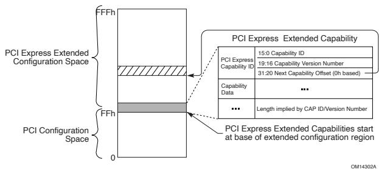

</div>


---

<a id="sec-7-6-1"></a>
## 7.6.1 Extended Capabilities in Configuration Space | 配置空间中的扩展能力

<table>
<thead>
<tr>
<th width="50%">🇬🇧 English</th>
<th width="50%" style="background-color:#e8e8e8">🏆 中文</th>
</tr>
</thead>
<tbody>
<tr>
<td>

Extended Capabilities in Configuration Space always begin at offset 100h with a PCI Express Extended Capability header (§ Section 7.6.3 ). Absence of any Extended Capabilities is required to be indicated by an Extended Capability header with a Capability ID of 0000h, a Capability Version of 0h, and a Next Capability Offset of 000h.

</td>
<td style="background-color:#e8e8e8">

配置空间中的扩展能力始终从偏移 100h 处开始,带有一个 PCI Express Extended Capability 头 (Header) (§ Section 7.6.3 )。若不存在任何扩展能力,则必须通过 Capability ID 为 0000h、Capability Version 为 0h 且 Next Capability Offset 为 000h 的扩展能力头来表示。

</td>
</tr>
</tbody>
</table>

---

<a id="sec-7-6-2"></a>
## 7.6.2 Extended Capabilities in the Root Complex Register Block | 根复合体寄存器块中的扩展能力

<table>
<thead>
<tr>
<th width="50%">🇬🇧 English</th>
<th width="50%" style="background-color:#e8e8e8">🏆 中文</th>
</tr>
</thead>
<tbody>
<tr>
<td>

Extended Capabilities in a Root Complex Register Block always begin at offset 000h with a PCI Express Extended Capability header (§ Section 7.6.3 ). Absence of any Extended Capabilities is required to be indicated by an Extended Capability header with a Capability ID of FFFFh and a Next Capability Offset of 000h.

7.5.3.22 Slot Control 2 Register (Offset 38h) §

7.5.3.23 Slot Status 2 Register (Offset 3Ah) §

</td>
<td style="background-color:#e8e8e8">

根复合体 (Root Complex) 寄存器块中的扩展能力始终从偏移 000h 处开始,带有一个 PCI Express Extended Capability 头 (Header) (§ Section 7.6.3 )。若不存在任何扩展能力,则必须通过 Capability ID 为 FFFFh 且 Next Capability Offset 为 000h 的扩展能力头来表示。

7.5.3.22 Slot Control 2 寄存器 (偏移 38h) §

7.5.3.23 Slot Status 2 寄存器 (偏移 3Ah) §

</td>
</tr>
</tbody>
</table>

---

<a id="sec-7-6-3"></a>
## 7.6.3 PCI Express Extended Capability Header | PCI Express 扩展能力头


<div style="overflow-x: auto; max-width: 100%;">
<table>
<thead>
<tr>
<th width="50%">🇬🇧 English</th>
<th width="50%" style="background-color:#e8e8e8">🏆 中文</th>
</tr>
</thead>
<tbody>
<tr>
<td>

All PCI Express Extended Capabilities must begin with a PCI Express Extended Capability Header. § Figure 7-43 details the allocation of register fields of a PCI Express Extended Capability Header; § Table 7-39 provides the respective bit definitions.

**Table 7-39 PCI Express Extended Capability Header | 表 7-39 PCI Express 扩展能力头**

| Bit Location | Register Description | Attributes |
|--------------|----------------------|------------|
| 15:0 | PCI Express Extended Capability ID - This field is a PCI-SIG defined ID number that indicates the nature and format of the Extended Capability. | RO |
| 19:16 | Capability Version - This field is a PCI-SIG defined version number that indicates the version of the Capability structure present. A version of the specification that changes the Extended Capability in a way that is not otherwise identifiable (e.g., through a new Capability field) is permitted to increment this field. All such changes to the Capability structure must be software-compatible. Software must check for Capability Version numbers that are greater than or equal to the highest number defined when the software is written, as Functions reporting any such Capability Version numbers will contain a Capability structure that is compatible with that piece of software. | RO |
| 31:20 | Next Capability Offset - This field contains the offset to the next PCI Express Capability structure or 000h if no other items exist in the linked list of Capabilities. For Extended Capabilities implemented in Configuration Space, this offset is relative to the beginning of PCI-compatible Configuration Space and thus must always be either 000h (for terminating list of Capabilities) or greater than 0FFh. The bottom 2 bits of this offset are Reserved and must be implemented as 00b although software must mask them to allow for future uses of these bits. | RO |

The following capabilities are required by this specification for some Functions. For example, Functions that support specific data rates, functions that generate interrupts, etc.

All PCI Express device Functions that are capable of generating interrupts must implement MSI or MSI-X or both.

</td>
<td style="background-color:#e8e8e8">

所有 PCI Express Extended Capability 必须以 PCI Express Extended Capability Header 开头。§ Figure 7-43 详细说明了 PCI Express Extended Capability Header 中各寄存器字段的分配;§ Table 7-39 提供了相应的位定义。

**Table 7-39 PCI Express Extended Capability Header | 表 7-39 PCI Express 扩展能力头**

| 位位置 (Bit Location) | 寄存器描述 (Register Description) | 属性 (Attributes) |
|--------------|----------------------|------------|
| 15:0 | PCI Express Extended Capability ID — 该字段是由 PCI-SIG 定义的 ID 号,用于指示扩展能力的性质和格式。 | RO |
| 19:16 | Capability Version — 该字段是由 PCI-SIG 定义的版本号,用于指示当前存在的 Capability 结构的版本。以其他方式不可识别 (例如通过新的 Capability 字段) 的方式更改 Extended Capability 的规范版本可以递增此字段。对 Capability 结构的所有此类更改必须保持软件兼容性。软件必须检查 Capability Version 号,该号必须大于或等于编写软件时定义的最高版本号,因为报告此类 Capability Version 号的 Function 将包含与该软件兼容的 Capability 结构。 | RO |
| 31:20 | Next Capability Offset — 该字段包含下一个 PCI Express Capability 结构的偏移;如果链表中不存在其他项,则为 000h。对于在配置空间中实现的扩展能力,该偏移相对于 PCI 兼容配置空间的起始位置,因此必须始终为 000h (用于终止 Capability 列表) 或大于 0FFh。该偏移的最低 2 位为保留位,必须实现为 00b,但软件必须屏蔽这些位以允许未来使用。 | RO |

以下能力是本规范针对某些 Function 所要求的。例如,支持特定数据速率的 Function、产生中断的 Function 等。

所有能够产生中断的 PCI Express 设备 Function 必须实现 MSI 或 MSI-X 或两者都实现。

</td>
</tr>
</tbody>
</table>

> **Figure 7-43.** PCI Express Extended Capability Header
> 

</div>


---

<a id="sec-7-7"></a>
## 7.7 PCI and PCIe Capabilities Required by the Base Spec in Some Situations | 基础规范在某些情况下要求的 PCI 和 PCIe 能力

<table>
<thead>
<tr>
<th width="50%">🇬🇧 English</th>
<th width="50%" style="background-color:#e8e8e8">🏆 中文</th>
</tr>
</thead>
<tbody>
<tr>
<td>

7.7.1 MSI Capability Structures | 7.7.1 MSI 能力结构

</td>
<td style="background-color:#e8e8e8">

7.7.1 MSI 能力结构 §

</td>
</tr>
</tbody>
</table>

---

<a id="sec-7-7-1"></a>
## 7.7.1 MSI Capability Structures | MSI 能力结构


<div style="overflow-x: auto; max-width: 100%;">
<table>
<thead>
<tr>
<th width="50%">🇬🇧 English</th>
<th width="50%" style="background-color:#e8e8e8">🏆 中文</th>
</tr>
</thead>
<tbody>
<tr>
<td>

The MSI Capability structure is described in this section. The MSI-X Capability structure is described in § Section 7.7.2 .

The MSI Capability structure is illustrated in § Figure 7-44 and § Figure 7-45. Each device Function that supports MSI (in a Multi-Function Device) must implement its own MSI Capability structure. More than one MSI Capability structure per Function is prohibited, but a Function is permitted to have both an MSI and an MSI-X Capability structure.

</td>
<td style="background-color:#e8e8e8">

本节介绍 MSI 能力结构。MSI-X 能力结构在 § Section 7.7.2 中介绍。

MSI 能力结构如图 § 7-44 和 § 7-45 所示。支持 MSI 的每个设备 Function (在多功能设备中) 必须实现其自己的 MSI 能力结构。每个 Function 禁止实现多个 MSI 能力结构,但允许同时具有 MSI 和 MSI-X 能力结构。

</td>
</tr>
</tbody>
</table>

> **Figure 7-44.** MSI Capability Structure for 32-bit Message Address
> 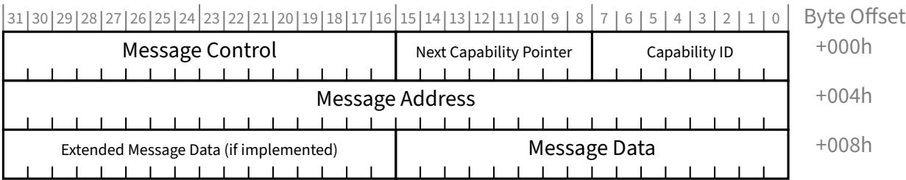

</div>


---

<a id="sec-7-7-1-cont"></a>
## 7.7.1 MSI Capability Structures (continued) | MSI 能力结构 (续)

<table>
<thead>
<tr>
<th width="50%">🇬🇧 English</th>
<th width="50%" style="background-color:#e8e8e8">🏆 中文</th>
</tr>
</thead>
<tbody>
<tr>
<td>

> **Figure 7-46.** MSI Capability Structure for 32-bit Message Address and PVM

> 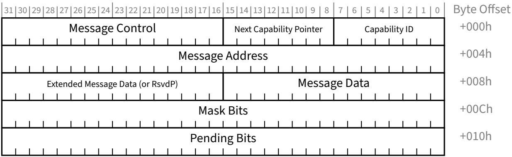

> 

To request service, an MSI Function writes the contents of the Message Data Register for MSI, and if enabled, the Extended Message Data Register for MSI, to the address specified by the contents of the Message Address Register for MSI (and, optionally, when 64-bit message addresses are used, the Message Upper Address Register for MSI). A read of the address specified by the contents of the Message Address register produces undefined results.

A Function supporting MSI implements one of four MSI Capability structure layouts illustrated in § Figure 7-44 to § Figure 7-47, depending upon which optional features are supported. A Legacy Endpoint that implements MSI is required to support either the 32-bit or 64-bit Message Address version of the MSI Capability structure. A PCI Express Endpoint that implements MSI is required to support the 64-bit Message Address version of the MSI Capability structure. The Message Control Register for MSI indicates the Function's capabilities and provides system software control over MSI.

Each field is further described in the following sections.

The MSI Capability Header enumerates the MSI Capability structure in the PCI Configuration Space Capability list. § Figure 7-48 details allocation of register fields in the MSI Capability Header; § Table 7-40 provides the respective bit definitions.

7.7.1.1 MSI Capability Header (Offset 00h) §

</td>
<td style="background-color:#e8e8e8">

为了请求服务,MSI Function 将 MSI 的 Message Data 寄存器的内容 (以及启用时的 MSI 的 Extended Message Data 寄存器的内容) 写入 MSI 的 Message Address 寄存器所指定的地址 (可选地,当使用 64 位消息地址时,还需写入 MSI 的 Message Upper Address 寄存器)。对 Message Address 寄存器内容所指定地址的读取将产生未定义的结果。

支持 MSI 的 Function 根据所支持的可选特性,实现 § Figure 7-44 至 § Figure 7-47 所示的四种 MSI Capability 结构布局之一。实现 MSI 的传统端点 (Legacy Endpoint) 必须支持 MSI Capability 结构的 32 位或 64 位消息地址版本。实现 MSI 的 PCI Express 端点 (Endpoint) 必须支持 MSI Capability 结构的 64 位消息地址版本。MSI 的 Message Control 寄存器指示 Function 的能力,并为系统软件提供对 MSI 的控制。

每个字段将在后续各节中进一步描述。

MSI Capability Header 在 PCI 配置空间 Capability 列表中枚举 MSI Capability 结构。§ Figure 7-48 详细说明了 MSI Capability Header 中各寄存器字段的分配;§ Table 7-40 提供了相应的位定义。

7.7.1.1 MSI Capability Header (偏移 00h) §


</td>
</tr>
</tbody>
</table>

---

<a id="sec-7-7-1-1"></a>
## 7.7.1.1 MSI Capability Header (Offset 00h) | MSI 能力头 (偏移 00h)


<div style="overflow-x: auto; max-width: 100%;">
<table>
<thead>
<tr>
<th width="50%">🇬🇧 English</th>
<th width="50%" style="background-color:#e8e8e8">🏆 中文</th>
</tr>
</thead>
<tbody>
<tr>
<td>

**Table 7-40 MSI Capability Header | 表 7-40 MSI 能力头**

| Bit Location | Register Description | Attributes |
|--------------|----------------------|------------|
| 7:0 | Capability ID - Indicates the MSI Capability structure. This field must return a Capability ID of 05h indicating that this is an MSI Capability structure. | RO |
| 15:8 | Next Capability Pointer - This field contains the offset to the next PCI Capability structure or 00h if no other items exist in the linked list of Capabilities. | RO |

This register provides system software control over MSI. By default, MSI is disabled. If MSI and MSI-X are both disabled, the Function requests servicing using INTx interrupts (if supported). System software can enable MSI by Setting bit 0 of this register. System software is permitted to modify the Message Control Register for MSI's read-write bits and fields. A device driver is not permitted to modify the Message Control Register for MSI's read-write bits and fields.

**Table 7-41 Message Control Register for MSI | 表 7-41 MSI 的消息控制寄存器**

| Bit Location | Register Description | Attributes |
|--------------|----------------------|------------|
| 0 | MSI Enable - If Set and the MSI-X Enable bit in the Message Control Register for MSI-X (see § Section 7.7.2.2 ) is Clear, the Function is permitted to use MSI to request service and is prohibited from using INTx interrupts. System configuration software Sets this bit to enable MSI. Refer to § Section 7.5.1.1.3 for control of INTx interrupts. If Clear, the Function is prohibited from using MSI to request service. Software changing this bit during active operation may result in the Function dropping pending interrupt conditions or failing to recognize new interrupt conditions. See § Section 6.1.4.5 . Default value of this bit is 0b. | RW |
| 3:1 | Multiple Message Capable - System software reads this field to determine the number of requested vectors. The number of requested vectors must be aligned to a power of two (if a Function requires three vectors, it requests four by initializing this field to 010b). The encoding is defined as: 000b = 1 vector requested | RO |

7.7.1.2 Message Control Register for MSI (Offset 02h) §

</td>
<td style="background-color:#e8e8e8">

**Table 7-40 MSI Capability Header | 表 7-40 MSI 能力头**

| 位位置 (Bit Location) | 寄存器描述 (Register Description) | 属性 (Attributes) |
|--------------|----------------------|------------|
| 7:0 | Capability ID — 指示 MSI Capability 结构。该字段必须返回 05h 的 Capability ID,表示这是一个 MSI Capability 结构。 | RO |
| 15:8 | Next Capability Pointer — 该字段包含下一个 PCI Capability 结构的偏移;如果链表中不存在其他项,则为 00h。 | RO |

该寄存器为系统软件提供对 MSI 的控制。默认情况下,MSI 被禁用。如果 MSI 和 MSI-X 都被禁用,则 Function 使用 INTx 中断 (如果支持) 来请求服务。系统软件可以通过置位该寄存器的第 0 位来启用 MSI。系统软件允许修改 MSI 的 Message Control 寄存器的读写位和字段。设备驱动程序不允许修改 MSI 的 Message Control 寄存器的读写位和字段。

**Table 7-41 Message Control Register for MSI | 表 7-41 MSI 的消息控制寄存器**

| 位位置 (Bit Location) | 寄存器描述 (Register Description) | 属性 (Attributes) |
|--------------|----------------------|------------|
| 0 | MSI Enable — 如果置位且 MSI-X 的 Message Control 寄存器中的 MSI-X Enable 位 (见 § Section 7.7.2.2 ) 清零,则允许 Function 使用 MSI 请求服务,并禁止使用 INTx 中断。系统配置软件置位该位以启用 MSI。有关 INTx 中断的控制,请参阅 § Section 7.5.1.1.3。如果清零,则禁止 Function 使用 MSI 请求服务。在主动操作期间,软件更改此位可能导致 Function 丢弃挂起的中断条件或无法识别新的中断条件。请参阅 § Section 6.1.4.5。此位的默认值为 0b。 | RW |
| 3:1 | Multiple Message Capable — 系统软件读取该字段以确定所请求的向量数。所请求的向量数必须按 2 的幂对齐 (如果 Function 需要 3 个向量,则通过将该字段初始化为 010b 来请求 4 个)。编码定义如下:000b = 请求 1 个向量 | RO |

7.7.1.2 MSI 的 Message Control 寄存器 (偏移 02h) §

</td>
</tr>
</tbody>
</table>

> **Figure 7-49.** Message Control Register for MSI
> 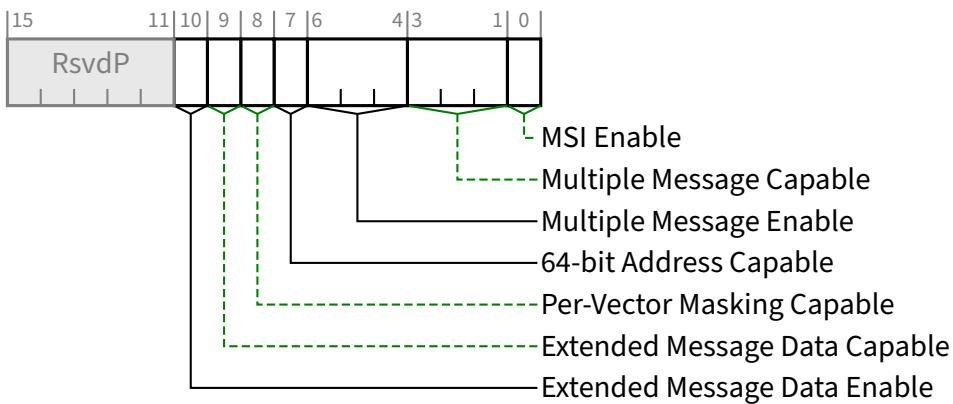

</div>


---

<a id="sec-7-7-1-2"></a>
## 7.7.1.2 Message Control Register for MSI (Offset 02h) | MSI 的消息控制寄存器 (偏移 02h)

<table>
<thead>
<tr>
<th width="50%">🇬🇧 English</th>
<th width="50%" style="background-color:#e8e8e8">🏆 中文</th>
</tr>
</thead>
<tbody>
<tr>
<td>

**Table 7-41 Message Control Register for MSI (continued) | 表 7-41 MSI 的消息控制寄存器 (续)**

| Bit Location | Register Description | Attributes |
|--------------|----------------------|------------|
| 3:1 (cont.) | 001b = 2 vectors requested, 010b = 4 vectors requested, 011b = 8 vectors requested, 100b = 16 vectors requested, 101b = 32 vectors requested, 110b = Reserved, 111b = Reserved | RO |
| 6:4 | Multiple Message Enable - software writes to this field to indicate the number of allocated vectors. The number of allocated vectors is aligned to a power of two. As an example, if a Function requests four vectors (indicated by a Multiple Message Capable encoding of 010b), software can allocate either four, two, or one vector by writing a 010b, 001b, or 000b to this field, respectively. Behavior is undefined if the number of vectors allocated is greater than the number of vectors requested. Behavior is undefined if this field is changed while MSI Enable is Set. When MSI Enable is Set, a Function will be allocated at least 1 vector. The encoding is defined as: 000b = 1 vector allocated, 001b = 2 vectors allocated, 010b = 4 vectors allocated, 011b = 8 vectors allocated, 100b = 16 vectors allocated, 101b = 32 vectors allocated, 110b = Reserved, 111b = Reserved. Function behavior is undefined if software changes the value of this field while the MSI Enable bit is Set. Default value of this field is 000b. | RW |
| 7 | 64-bit Address Capable - If Set, the Function is capable of sending a 64-bit Message Address. If Clear, the Function is not capable of sending a 64-bit Message Address. This bit must be Set if the Function is a PCI Express Endpoint, as indicated by the value in the Device/Port Type field. This bit MUST@FLIT be Set. | RO |
| 8 | Per-Vector Masking Capable - If Set, the Function supports MSI Per-Vector Masking. If Clear, the Function does not support MSI Per-Vector Masking. This bit must be Set if the Function is a PF or VF within an SR-IOV Device. | RO |
| 9 | Extended Message Data Capable - If Set, the Function is capable of providing Extended Message Data. If Clear, the Function does not support providing Extended Message Data. | RO |
| 10 | Extended Message Data Enable - If Set, the Function is enabled to provide Extended Message Data. If Clear, the Function is not enabled to provide Extended Message Data. Default value of this bit is 0b. This bit must be read-write if the Extended Message Data Capable bit is 1b; otherwise it must be hardwired to 0b. | RW/RO |

</td>
<td style="background-color:#e8e8e8">

**Table 7-41 Message Control Register for MSI (续) | 表 7-41 MSI 的消息控制寄存器 (续)**

| 位位置 (Bit Location) | 寄存器描述 (Register Description) | 属性 (Attributes) |
|--------------|----------------------|------------|
| 3:1 (续) | 001b = 请求 2 个向量,010b = 请求 4 个向量,011b = 请求 8 个向量,100b = 请求 16 个向量,101b = 请求 32 个向量,110b = 保留,111b = 保留 | RO |
| 6:4 | Multiple Message Enable — 软件写入该字段以指示分配的向量数。分配的向量数按 2 的幂对齐。例如,如果 Function 请求 4 个向量 (由 Multiple Message Capable 编码 010b 指示),软件可以通过分别向该字段写入 010b、001b 或 000b 来分配 4 个、2 个或 1 个向量。如果分配的向量数大于请求的向量数,则行为未定义。如果在 MSI Enable 置位时更改该字段,则行为未定义。当 MSI Enable 置位时,Function 将至少分配 1 个向量。编码定义如下:000b = 分配 1 个向量,001b = 分配 2 个向量,010b = 分配 4 个向量,011b = 分配 8 个向量,100b = 分配 16 个向量,101b = 分配 32 个向量,110b = 保留,111b = 保留。如果软件在 MSI Enable 位置位时更改该字段的值,则 Function 行为未定义。此字段的默认值为 000b。 | RW |
| 7 | 64-bit Address Capable — 如果置位,则 Function 能够发送 64 位消息地址。如果清零,则 Function 不能发送 64 位消息地址。如果 Function 是 PCI Express 端点 (由 Device/Port Type 字段中的值指示),则该位必须置位。该位 MUST@FLIT 置位。 | RO |
| 8 | Per-Vector Masking Capable — 如果置位,则 Function 支持 MSI Per-Vector Masking。如果清零,则 Function 不支持 MSI Per-Vector Masking。如果 Function 是 SR-IOV 设备中的 PF (物理功能) 或 VF (虚拟功能),则该位必须置位。 | RO |
| 9 | Extended Message Data Capable — 如果置位,则 Function 能够提供 Extended Message Data。如果清零,则 Function 不支持提供 Extended Message Data。 | RO |
| 10 | Extended Message Data Enable — 如果置位,则 Function 被启用以提供 Extended Message Data。如果清零,则 Function 未被启用以提供 Extended Message Data。此位的默认值为 0b。如果 Extended Message Data Capable 位为 1b,则该位必须为读写;否则必须硬连线 (hardwired) 为 0b。 | RW/RO |

</td>
</tr>
</tbody>
</table>

---

<a id="sec-7-7-1-3"></a>
## 7.7.1.3 Message Address Register for MSI (Offset 04h) | MSI 的消息地址寄存器 (偏移 04h)


<div style="overflow-x: auto; max-width: 100%;">
<table>
<thead>
<tr>
<th width="50%">🇬🇧 English</th>
<th width="50%" style="background-color:#e8e8e8">🏆 中文</th>
</tr>
</thead>
<tbody>
<tr>
<td>

**Table 7-42 Message Address Register for MSI | 表 7-42 MSI 的消息地址寄存器**

| Bit Location | Register Description | Attributes |
|--------------|----------------------|------------|
| 1:0 | Reserved Reserved - Always returns 0 on read. Write operations have no effect. | RsvdP |
| 31:2 | Message Address - System-specified message address. If the MSI Enable bit is Set, the contents of this register specify the DWORD-aligned address (Address[31:02]) for the MSI transaction. Address[1:0] are set to 00b. Default value of this field is undefined. | RW |

7.7.1.4 Message Upper Address Register for MSI (Offset 08h) §

</td>
<td style="background-color:#e8e8e8">

**Table 7-42 Message Address Register for MSI | 表 7-42 MSI 的消息地址寄存器**

| 位位置 (Bit Location) | 寄存器描述 (Register Description) | 属性 (Attributes) |
|--------------|----------------------|------------|
| 1:0 | Reserved (保留) — 读取时始终返回 0。写入操作无效。 | RsvdP |
| 31:2 | Message Address — 系统指定的消息地址。如果 MSI Enable 位置位,则该寄存器的内容指定 MSI 事务的 DWORD 对齐地址 (Address[31:02])。Address[1:0] 被设置为 00b。此字段的默认值未定义。 | RW |

7.7.1.4 MSI 的消息高地址寄存器 (偏移 08h) §

</td>
</tr>
</tbody>
</table>

> **Figure 7-50.** Message Address Register for MSI
> 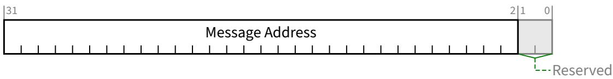

</div>


---

<a id="sec-7-7-1-4"></a>
## 7.7.1.4 Message Upper Address Register for MSI (Offset 08h) | MSI 的消息高地址寄存器 (偏移 08h)

<table>
<thead>
<tr>
<th width="50%">🇬🇧 English</th>
<th width="50%" style="background-color:#e8e8e8">🏆 中文</th>
</tr>
</thead>
<tbody>
<tr>
<td>

**Table 7-43 Message Upper Address Register for MSI | 表 7-43 MSI 的消息高地址寄存器**

| Bit Location | Register Description | Attributes |
|--------------|----------------------|------------|
| 31:0 | Message Upper Address - System-specified message upper address. This register is implemented only if the Function supports a 64-bit message address (64-bit Address Capable is Set). This register is implemented only if the Function supports a 64-bit message address (64-bit Address Capable is Set). This register is required for PCI Express Endpoints (as indicated by the value in the Device/Port Type field) and is optional for other Function types. If the MSI Enable bit is Set, the contents of this register (if non-zero) specify the upper 32-bits of a 64-bit message address (Address[63:32]). If the contents of this register are zero, the Function uses the 32 bit address specified by the Message Address register. Default value of this field is undefined. | RW |

</td>
<td style="background-color:#e8e8e8">

**Table 7-43 Message Upper Address Register for MSI | 表 7-43 MSI 的消息高地址寄存器**

| 位位置 (Bit Location) | 寄存器描述 (Register Description) | 属性 (Attributes) |
|--------------|----------------------|------------|
| 31:0 | Message Upper Address — 系统指定的消息高地址。仅当 Function 支持 64 位消息地址时 (64-bit Address Capable 置位),才实现此寄存器。仅当 Function 支持 64 位消息地址时 (64-bit Address Capable 置位),才实现此寄存器。对于 PCI Express 端点 (由 Device/Port Type 字段中的值指示),此寄存器是必需的,对于其他 Function 类型是可选的。如果 MSI Enable 位置位,则该寄存器的内容 (如果非零) 指定 64 位消息地址的高 32 位 (Address[63:32])。如果该寄存器的内容为零,则 Function 使用由 Message Address 寄存器指定的 32 位地址。此字段的默认值未定义。 | RW |

</td>
</tr>
</tbody>
</table>

---

<a id="sec-7-7-1-5"></a>
## 7.7.1.5 Message Data Register for MSI (Offset 08h or 0Ch) | MSI 的消息数据寄存器 (偏移 08h 或 0Ch)


<div style="overflow-x: auto; max-width: 100%;">
<table>
<thead>
<tr>
<th width="50%">🇬🇧 English</th>
<th width="50%" style="background-color:#e8e8e8">🏆 中文</th>
</tr>
</thead>
<tbody>
<tr>
<td>

**Table 7-44 Message Data Register for MSI | 表 7-44 MSI 的消息数据寄存器**

| Bit Location | Register Description | Attributes |
|--------------|----------------------|------------|
| 15:0 | Message Data - System-specified message data. If the MSI Enable bit is Set, the Function sends a DWORD Memory Write transaction using Message Data for the lower 16 bits. All 4 Byte Enables are Set. The Multiple Message Enable field defines the number of low order message data bits the Function is permitted to modify to generate its system software allocated vectors. For example, a Multiple Message Enable encoding of 010b indicates the Function has been allocated four vectors and is permitted to modify message data bits 1 and 0 (a Function modifies the lower message data bits to generate the allocated number of vectors). If the Multiple Message Enable field is 000b, the Function is not permitted to modify the message data. When Multiple Message Enable is non-zero, behavior is undefined if the corresponding low order bits of this register are not 0b. Default value of this field is undefined. | RW |

**Table 7-45 Extended Message Data Register for MSI | 表 7-45 MSI 的扩展消息数据寄存器**

| Bit Location | Register Description | Attributes |
|--------------|----------------------|------------|
| 15:0 | Extended Message Data - System-specified message data. This register is optional. For the MSI Capability structures without Per-vector Masking, it must be implemented if the Extended Message Data Capable bit is Set; otherwise, it is outside the MSI Capability structure and undefined. For the MSI Capability structures with Per-vector Masking, it must be implemented if the Extended Message Data Capable bit is Set; otherwise, it is RsvdP. If the Extended Message Data Enable bit is Set, the DWORD Memory Write transaction uses Extended Message Data for the upper 16 bits; otherwise, it uses 0000h for the upper 16 bits. | RW/undefined/RsvdP |

</td>
<td style="background-color:#e8e8e8">

**Table 7-44 Message Data Register for MSI | 表 7-44 MSI 的消息数据寄存器**

| 位位置 (Bit Location) | 寄存器描述 (Register Description) | 属性 (Attributes) |
|--------------|----------------------|------------|
| 15:0 | Message Data — 系统指定的消息数据。如果 MSI Enable 位置位,则 Function 使用 Message Data 的低 16 位发送 DWORD Memory Write 事务。所有 4 个字节使能 (Byte Enable) 都被置位。Multiple Message Enable 字段定义 Function 允许修改的低位消息数据位数,以生成其系统软件分配的向量。例如,Multiple Message Enable 编码为 010b 表示 Function 已被分配 4 个向量,并且允许修改消息数据的第 1 位和第 0 位 (Function 修改较低的消息数据位以生成分配的向量数)。如果 Multiple Message Enable 字段为 000b,则 Function 不允许修改消息数据。当 Multiple Message Enable 非零时,如果该寄存器的相应低位不为 0b,则行为未定义。此字段的默认值未定义。 | RW |

**Table 7-45 Extended Message Data Register for MSI | 表 7-45 MSI 的扩展消息数据寄存器**

| 位位置 (Bit Location) | 寄存器描述 (Register Description) | 属性 (Attributes) |
|--------------|----------------------|------------|
| 15:0 | Extended Message Data — 系统指定的消息数据。此寄存器是可选的。对于没有 Per-vector Masking 的 MSI Capability 结构,如果 Extended Message Data Capable 位置位,则必须实现此寄存器;否则它位于 MSI Capability 结构之外且未定义。对于具有 Per-vector Masking 的 MSI Capability 结构,如果 Extended Message Data Capable 位置位,则必须实现此寄存器;否则为 RsvdP。如果 Extended Message Data Enable 位置位,则 DWORD Memory Write 事务使用 Extended Message Data 作为高 16 位;否则使用 0000h 作为高 16 位。 | RW/undefined/RsvdP |

</td>
</tr>
</tbody>
</table>

> **Figure 7-52.** Message Data Register for MSI
> 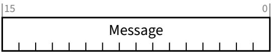

</div>


---

---

<a id="sec-7-7-1-6"></a>
## 7.7.1.6 Extended Message Data Register for MSI (Optional) | MSI 扩展消息数据寄存器(可选)

<table>
<thead>
<tr>
<th width="50%">🇬🇧 English</th>
<th width="50%" style="background-color:#e8e8e8">🏆 中文</th>
</tr>
</thead>
<tbody>
<tr>
<td>

[figures/chapter_07/fig_1095_1.png]

**Table 7-45 Extended Message Data Register for MSI**

| Bit Location | Register Description | Attributes |
|---|---|---|
| 31:0 | Extended Message Data - For MSI messages that use 32 bits of data, the contents of this field from the MSI Capability structure specify the lower 32 bits of data to be used in the Memory Write transaction. The upper 32 bits of the data are Reserved.<br><br>For MSI messages that use 64 bits of data, the contents of this field from the MSI Capability structure specify the upper 32 bits of data to be used in the Memory Write transaction. The lower 32 bits of data are specified by the Message Data Register. | RO |
| | Default value of this field is 0000h. | |

This register is optional. It is present if Per-Vector Masking Capable is Set (see § Section 7.7.1.2 ). The offset of this register within the capability depends on the value of the 64-bit Address Capable bit (see § Section 7.7.1.2 ).

The Mask Bits and Pending Bits registers enable software to disable or defer message sending on a per-vector basis.

MSI vectors are numbered 0 through N-1, where N is the number of vectors allocated by software. Each vector is associated with a correspondingly numbered bit in the Mask Bits and Pending Bits registers.

The Multiple Message Capable field indicates how many vectors (with associated Mask and Pending bits) are implemented. All unimplemented Mask and Pending bits are Reserved.

The Multiple Message Enable field controls how many vectors are allocated for use. The value of each implemented Mask bit and Pending bit that is currently not allocated must be ignored by hardware; i.e., the value must not affect the generation of interrupts.

[figures/chapter_07/fig_1095_2.png]

**Figure 7-54 Mask Bits Register for MSI**

**Table 7-46 Mask Bits Register for MSI**

| Bit Location | Register Description | Attributes |
|---|---|---|
| 31:0 | Mask Bits - For each Mask bit that is Set, the Function is prohibited from sending the associated message.<br>Default is 0. | RW |

This register is optional. It is present if Per-Vector Masking Capable is Set (see § Section 7.7.1.2 ). The offset of this register within the capability depends on the value of the 64-bit Address Capable bit (see § Section 7.7.1.2 )

See § Section 7.7.1.7 for additional requirements on this register.

</td>
<td style="background-color:#e8e8e8">

[figures/chapter_07/fig_1095_1.png]

**表 7-45 MSI 扩展消息数据寄存器**

| 位位置 | 寄存器说明 | 属性 |
|---|---|---|
| 31:0 | 扩展消息数据(Extended Message Data) — 对于使用 32 位数据的 MSI 消息,MSI 能力结构中此字段的内容指定 Memory Write 事务中要使用的数据的低 32 位。数据的高 32 位为保留位。<br><br>对于使用 64 位数据的 MSI 消息,MSI 能力结构中此字段的内容指定 Memory Write 事务中要使用的数据的高 32 位。数据的低 32 位由消息数据寄存器指定。 | RO |
| | 此字段的默认值为 0000h。 | |

此寄存器为可选。仅当 Per-Vector Masking Capable 位置位时才存在该寄存器(见 § 第 7.7.1.2 节)。该寄存器在能力结构中的偏移量取决于 64-bit Address Capable 位的值(见 § 第 7.7.1.2 节)。

Mask Bits 和 Pending Bits 寄存器使软件能够按向量粒度禁用或推迟消息发送。

MSI 向量的编号为 0 到 N-1,其中 N 是软件分配的向量数。每个向量在 Mask Bits 和 Pending Bits 寄存器中分别与一个对应编号的位相关联。

Multiple Message Capable 字段指示实现了多少个向量(及其关联的 Mask 和 Pending 位)。所有未实现的 Mask 和 Pending 位均为保留位。

Multiple Message Enable 字段控制分配使用的向量数。当前未分配的各已实现 Mask 位和 Pending 位的值必须被硬件忽略;即,该值不得影响中断的生成。

[figures/chapter_07/fig_1095_2.png]

**图 7-54 MSI Mask Bits 寄存器**

> 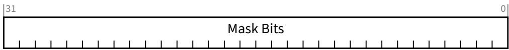


**表 7-46 MSI Mask Bits 寄存器**

| 位位置 | 寄存器说明 | 属性 |
|---|---|---|
| 31:0 | Mask 位(Mask Bits) — 对于每个被置位的 Mask 位,Function (功能)被禁止发送与之关联的消息。<br>默认值为 0。 | RW |

此寄存器为可选。仅当 Per-Vector Masking Capable 位置位时才存在该寄存器(见 § 第 7.7.1.2 节)。该寄存器在能力结构中的偏移量取决于 64-bit Address Capable 位的值(见 § 第 7.7.1.2 节)。

有关此寄存器的其他要求,请参见 § 第 7.7.1.7 节。

</td>
</tr>
</tbody>
</table>

---

<a id="sec-7-7-1-7"></a>
## 7.7.1.7 Mask Bits Register for MSI (Offset 0Ch or 10h) | MSI Mask Bits 寄存器(偏移 0Ch 或 10h)

<a id="sec-7-7-1-8"></a>
## 7.7.1.8 Pending Bits Register for MSI (Offset 10h or 14h) | MSI Pending Bits 寄存器(偏移 10h 或 14h)


<div style="overflow-x: auto; max-width: 100%;">
<table>
<thead>
<tr>
<th width="50%">🇬🇧 English</th>
<th width="50%" style="background-color:#e8e8e8">🏆 中文</th>
</tr>
</thead>
<tbody>
<tr>
<td>

[figures/chapter_07/fig_1096_1.png]

**Figure 7-55 Pending Bits Register for MSI**

**Table 7-47 Pending Bits Register for MSI**

| Bit Location | Register Description | Attributes |
|---|---|---|
| 31:0 | Pending Bits - For each Pending bit that is Set, the Function has a pending associated message.<br>Default is 0. | RO |

The MSI-X Capability structure is illustrated in § Figure 7-56. More than one MSI-X Capability structure per Function is prohibited, but a Function is permitted to have both an MSI Capability structure and an MSI-X Capability structure.

In contrast to the MSI Capability structure, which directly contains all of the control/status information for the Function's vectors, the MSI-X Capability structure instead points to an MSI-X Table structure and an MSI-X PBA structure (Pending Bit Array structure), each residing in Memory Space (see § Figure 7-57 and § Figure 7-58).

Each structure is mapped by a Base Address Register (BAR) belonging to the Function, located beginning at 10h in Configuration Space, or an entry in the Enhanced Allocation capability. A BAR Indicator register (BIR) indicates which BAR (or BEI when using Enhanced Allocation), and a QWORD-aligned Offset indicates where the structure begins relative to the base address associated with the BAR. The BAR is permitted to be either 32-bit or 64-bit, but must map Memory Space. A Function is permitted to map both structures with the same BAR, or to map each structure with a different BAR.

The MSI-X Table structure, illustrated in § Figure 7-57, typically contains multiple entries, each consisting of several fields: Message Address, Message Upper Address, Message Data, and Vector Control. Each entry is capable of specifying a unique vector.

The Pending Bit Array (PBA) structure, illustrated in § Figure 7-58, contains the Function's Pending Bits, one per Table entry, organized as a packed array of bits within QWORDs. The last QWORD will not necessarily be fully populated.

[figures/chapter_07/fig_1096_2.png]

**Figure 7-56 MSI-X Capability Structure**

</td>
<td style="background-color:#e8e8e8">

[figures/chapter_07/fig_1096_1.png]

**图 7-55 MSI Pending Bits 寄存器**

> 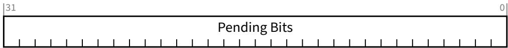


**表 7-47 MSI Pending Bits 寄存器**

| 位位置 | 寄存器说明 | 属性 |
|---|---|---|
| 31:0 | Pending 位(Pending Bits) — 对于每个被置位的 Pending 位,Function (功能)存在一个挂起的关联消息。<br>默认值为 0。 | RO |

MSI-X 能力结构如 § 图 7-56 所示。每个 Function 禁止具有多个 MSI-X 能力结构,但允许一个 Function 同时具有 MSI 能力结构和 MSI-X 能力结构。

与直接包含 Function 所有向量控制/状态信息的 MSI 能力结构不同,MSI-X 能力结构指向一个 MSI-X Table 结构和一个 MSI-X PBA 结构(Pending Bit Array 结构,挂起位数组结构),它们均驻留在内存空间中(见 § 图 7-57 和 § 图 7-58)。

每个结构由属于该 Function 的一个基址寄存器(BAR)映射,该 BAR 从配置空间 10h 处开始,或由 Enhanced Allocation 能力中的一个条目映射。BAR 指示寄存器(BIR)指示使用的是哪个 BAR(使用 Enhanced Allocation 时为 BEI),而 QWORD 对齐的偏移量指示该结构相对于 BAR 所关联基址的起始位置。BAR 允许为 32 位或 64 位,但必须映射内存空间。Function 允许使用同一个 BAR 映射两个结构,或使用不同的 BAR 分别映射每个结构。

MSI-X Table 结构(见 § 图 7-57)通常包含多个条目,每个条目由多个字段组成:Message Address、Message Upper Address、Message Data 和 Vector Control。每个条目都能够指定一个唯一的向量。

挂起位数组(Pending Bit Array, PBA)结构(见 § 图 7-58)包含 Function 的 Pending 位,每个 Table 条目对应一位,以 QWORD 中的位数组形式组织。最后一个 QWORD 不一定会被完全填充。

[figures/chapter_07/fig_1096_2.png]

**图 7-56 MSI-X 能力结构**

> 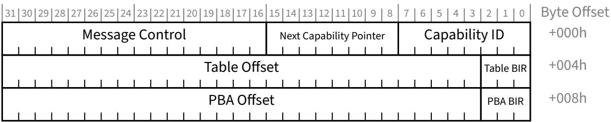


</td>
</tr>
</tbody>
</table>
</div>


---

<a id="sec-7-7-2"></a>
## 7.7.2 MSI-X Capability and Table Structure | MSI-X 能力结构与表结构

<table>
<thead>
<tr>
<th width="50%">🇬🇧 English</th>
<th width="50%" style="background-color:#e8e8e8">🏆 中文</th>
</tr>
</thead>
<tbody>
<tr>
<td>

[figures/chapter_07/fig_1097_1.png]

**Figure 7-57 MSI-X Table Structure**

[figures/chapter_07/fig_1097_2.png]

**Figure 7-58 MSI-X PBA Structure**

To request service using a given MSI-X Table entry, a Function performs a DWORD Memory Write transaction using the contents of the Message Data field entry for data, the contents of the Message Upper Address field for the upper 32 bits of address, and the contents of the Message Address field entry for the lower 32 bits of address. A memory read transaction from the address targeted by the MSI-X message produces undefined results.

</td>
<td style="background-color:#e8e8e8">

[figures/chapter_07/fig_1097_1.png]

**图 7-57 MSI-X Table 结构**

> 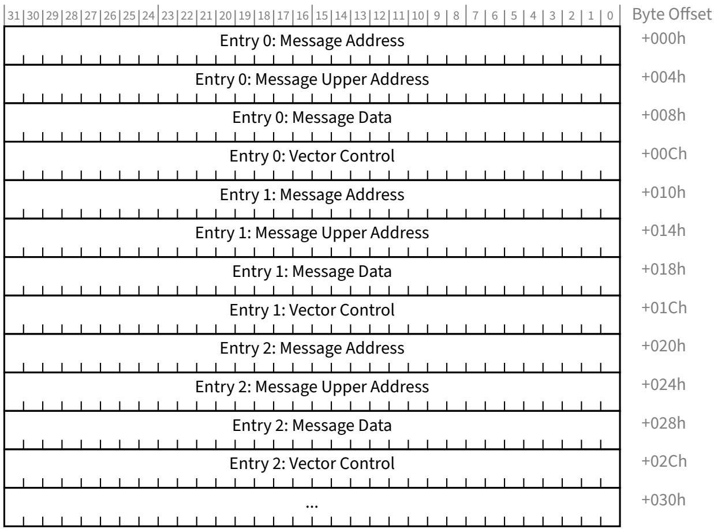


[figures/chapter_07/fig_1097_2.png]

**图 7-58 MSI-X PBA 结构**

> 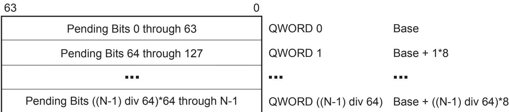


若要使用某个给定的 MSI-X Table 条目来请求服务,Function 执行一次 DWORD Memory Write 事务,其中:数据使用 Message Data 字段条目的内容,地址的高 32 位使用 Message Upper Address 字段条目的内容,地址的低 32 位使用 Message Address 字段条目的内容。对 MSI-X 消息所寻址的地址执行内存读事务将产生未定义的结果。

</td>
</tr>
</tbody>
</table>

---


<div style="overflow-x: auto; max-width: 100%;">
<table>
<thead>
<tr>
<th width="50%">🇬🇧 English</th>
<th width="50%" style="background-color:#e8e8e8">🏆 中文</th>
</tr>
</thead>
<tbody>
<tr>
<td>

If a Base Address Register or entry in the Enhanced Allocation capability that maps address space for the MSI-X Table or MSI-X PBA also maps other usable address space that is not associated with MSI-X structures, locations (e.g., for CSRs) used in the other address space must not share any naturally aligned 4-KB address range with one where either MSI-X structure resides. This allows system software where applicable to use different processor attributes for MSI-X structures and the other address space. (Some processor architectures do not support having different processor attributes associated with the same naturally aligned 4-KB physical address range.) The MSI-X Table and MSI-X PBA are permitted to co-reside within a naturally aligned 4-KB address range, though they must not overlap with each other.

With SR-IOV devices, alignment requirements like those in the preceeding paragraph still apply, but they must be based on the System Page Size value from the PF's SR-IOV Extended Capability instead using a fixed 4-KB value.

For all accesses to MSI-X Table and MSI-X PBA fields, software must use aligned full DWORD or aligned full QWORD transactions; otherwise, the result is undefined.

MSI-X Table entries and Pending bits are each numbered 0 through N-1, where N-1 is indicated by the Table Size field in the Message Control Register for MSI-X. For a given arbitrary MSI-X Table entry k, its starting address can be calculated with the formula:

> **IMPLEMENTATION NOTE:**
>
> **DEDICATED BARS AND ADDRESS RANGE ISOLATION**
>
> To enable system software to map MSI-X structures onto different processor pages for improved access control, it is recommended that a Function dedicate separate Base Address Registers for the MSI-X Table and MSI-X PBA, or else provide more than the minimum required isolation with address ranges.
>
> If dedicated separate Base Address Registers is not feasible, it is recommended that a Function dedicate a single Base Address Register for the MSI-X Table and MSI-X PBA.
>
> If a dedicated Base Address Register is not feasible, it is recommended that a Function isolate the MSI-X structures from the non-MSI-X structures with aligned 8 KB ranges rather than the mandatory aligned 4 KB ranges.
>
> For example, if a Base Address Register needs to map 2 KB for an MSI-X Table containing 128 entries, 16 bytes for an MSI-X PBA containing 128 bits, and 64 bytes for registers not related to MSI-X, the following is an acceptable implementation. The Base Address Register requests 8 KB of total address space, maps the first 64 bytes for the non MSI-X registers, maps the MSI-X Table beginning at an offset of 4 KB, and maps the MSI-X PBA beginning at an offset of 6 KB.
>
> A preferable implementation for a shared Base Address Register is for it to request 16 KB of total address space, map the first 64 bytes for the non MSI-X registers, map the MSI-X Table beginning at an offset of 8 KB, and map the MSI-X PBA beginning at an offset of 12 KB.

> **IMPLEMENTATION NOTE:**
>
> **MSI-X MEMORY SPACE STRUCTURES IN READ/WRITE MEMORY**
>
> The MSI-X Table and MSI-X PBA structures are defined such that they can reside in general purpose read/write memory on a device, for ease of implementation and added flexibility. To achieve this, none of the contained fields are required to be read-only, and there are also restrictions on transaction alignment and sizes.

</td>
<td style="background-color:#e8e8e8">

如果用于映射 MSI-X Table 或 MSI-X PBA 地址空间的基址寄存器(BAR)或 Enhanced Allocation 能力中的条目,还映射了与 MSI-X 结构无关的其他可用地址空间,则该其他地址空间中使用到的位置(例如 CSR)不得与任一 MSI-X 结构所在的自然对齐 4-KB 地址范围重叠。这允许系统软件(在适用情况下)对 MSI-X 结构和其他地址空间使用不同的处理器属性。(某些处理器架构不支持在同一自然对齐 4-KB 物理地址范围上关联不同的处理器属性。)MSI-X Table 和 MSI-X PBA 允许共存于同一自然对齐 4-KB 地址范围内,但彼此之间不得重叠。

对于 SR-IOV 设备,前述段落所述的对齐要求仍然适用,但必须基于 PF 的 SR-IOV Extended Capability 中的 System Page Size 值,而不是使用固定的 4-KB 值。

对于 MSI-X Table 和 MSI-X PBA 字段的所有访问,软件必须使用对齐的完整 DWORD 或对齐的完整 QWORD 事务;否则结果未定义。

MSI-X Table 条目和 Pending 位均编号为 0 到 N-1,其中 N-1 由 MSI-X Message Control 寄存器中的 Table Size 字段指示。对于任意给定的 MSI-X Table 条目 k,其起始地址可按以下公式计算:

> **实现说明(IMPLEMENTATION NOTE):**
>
> **专用 BAR 与地址范围隔离(DEDICATED BARS AND ADDRESS RANGE ISOLATION)**
>
> 为了使系统软件能够将 MSI-X 结构映射到不同的处理器页面上以改进访问控制,建议 Function 为 MSI-X Table 和 MSI-X PBA 分别使用独立的基址寄存器(BAR),或者提供高于最小要求的地址范围隔离。
>
> 如果为 MSI-X Table 和 MSI-X PBA 分别使用独立的 BAR 不可行,建议 Function 为 MSI-X Table 和 MSI-X PBA 共同使用一个专用基址寄存器。
>
> 如果使用专用基址寄存器仍不可行,建议 Function 使用对齐的 8 KB 地址范围(而非强制要求的对齐 4 KB 地址范围)将 MSI-X 结构与非 MSI-X 结构隔离开。
>
> 例如,如果某个 BAR 需要为包含 128 个条目的 MSI-X Table 映射 2 KB,为包含 128 位的 MSI-X PBA 映射 16 字节,并为与 MSI-X 无关的寄存器映射 64 字节,则以下实现是可接受的:该 BAR 申请 8 KB 总地址空间,将前 64 字节映射给非 MSI-X 寄存器,将 MSI-X Table 映射到 4 KB 偏移处开始,将 MSI-X PBA 映射到 6 KB 偏移处开始。
>
> 对于共享基址寄存器的更优实现是:申请 16 KB 总地址空间,将前 64 字节映射给非 MSI-X 寄存器,将 MSI-X Table 映射到 8 KB 偏移处开始,将 MSI-X PBA 映射到 12 KB 偏移处开始。

> **实现说明(IMPLEMENTATION NOTE):**
>
> **读写内存中的 MSI-X 内存空间结构(MSI-X MEMORY SPACE STRUCTURES IN READ/WRITE MEMORY)**
>
> MSI-X Table 和 MSI-X PBA 结构的定义允许其驻留在设备上的通用读写内存中,以便于实现并增加灵活性。为此,其中包含的字段都不要求是只读的,同时对事务对齐和大小也存在限制。

</td>
</tr>
</tbody>
</table>
</div>


---

<table>
<thead>
<tr>
<th width="50%">🇬🇧 English</th>
<th width="50%" style="background-color:#e8e8e8">🏆 中文</th>
</tr>
</thead>
<tbody>
<tr>
<td>

**Equation 7-1 MSI-X Starting Address**

```
entry starting address = Table base + k × 16
```

For the associated Pending bit k, its address for QWORD access and bit number within that QWORD can be calculated with the formulas:

**Equation 7-2 MSI-X PBA QWORD Access**

```
QWORD address = PBA base + (k div 64) × 8
QWORD bit# = k mod 64
```

Software that chooses to read Pending bit K with DWORD accesses can use these formulas:

**Equation 7-3 MSI-X PBA DWORD Access**

```
DWORD address = PBA base + (k div 32) × 4
DWORD bit# = k mod 32
```

Each field in the MSI-X Capability, MSI-X Table, and MSI-X PBA structures is further described in the following sections.

Within the MSI-X Capability structure, Reserved registers and bits always return 0 when read, and write operations have no effect. Within the MSI-X Table and PBA structures, Reserved fields have special rules.

The MSI-X Capability Header enumerates the MSI-X Capability structure in the PCI Configuration Space Capability list. § Figure 7-56 details allocation of register fields in the MSI-X Capability Header; § Table 7-48 provides the respective bit definitions.

[figures/chapter_07/fig_1099_1.png]

**Figure 7-59 MSI-X Capability Header**

</td>
<td style="background-color:#e8e8e8">

**公式 7-1 MSI-X 起始地址**

```
entry starting address = Table base + k × 16
```

对于关联的 Pending 位 k,其在 QWORD 访问中的地址以及该 QWORD 中的位号可按以下公式计算:

**公式 7-2 MSI-X PBA QWORD 访问**

```
QWORD address = PBA base + (k div 64) × 8
QWORD bit# = k mod 64
```

选择使用 DWORD 访问读取 Pending 位 K 的软件可使用以下公式:

**公式 7-3 MSI-X PBA DWORD 访问**

```
DWORD address = PBA base + (k div 32) × 4
DWORD bit# = k mod 32
```

MSI-X Capability、MSI-X Table 和 MSI-X PBA 结构中的每个字段将在后续章节中进一步描述。

在 MSI-X Capability 结构中,保留寄存器和位在读取时始终返回 0,写操作无效。在 MSI-X Table 和 PBA 结构中,保留字段具有特殊规则。

MSI-X Capability Header 在 PCI Configuration Space 能力列表中登记 MSI-X 能力结构。§ 图 7-56 详细说明了 MSI-X Capability Header 中寄存器字段的分配;§ 表 7-48 给出了相应的位定义。

[figures/chapter_07/fig_1099_1.png]

**图 7-59 MSI-X Capability Header**

> 


</td>
</tr>
</tbody>
</table>

---

<a id="sec-7-7-2-1"></a>
## 7.7.2.1 MSI-X Capability Header (Offset 00h) | MSI-X Capability Header(偏移 00h)


<div style="overflow-x: auto; max-width: 100%;">
<table>
<thead>
<tr>
<th width="50%">🇬🇧 English</th>
<th width="50%" style="background-color:#e8e8e8">🏆 中文</th>
</tr>
</thead>
<tbody>
<tr>
<td>

**Table 7-48 MSI-X Capability Header**

| Bit Location | Register Description | Attributes |
|---|---|---|
| 7:0 | Capability ID - Indicates the MSI-X Capability structure. This field must return a Capability ID of 11h indicating that this is an MSI-X Capability structure. | RO |
| 15:8 | Next Capability Pointer - This field contains the offset to the next PCI Capability structure or 00h if no other items exist in the linked list of Capabilities. | RO |

By default, MSI-X is disabled. If MSI and MSI-X are both disabled, the Function requests servicing via INTx interrupts (if supported). System software can enable MSI-X by Setting bit 15 of this register. System software is permitted to modify the Message Control register's read-write bits and fields. A device driver is not permitted to modify the Message Control register's read-write bits and fields.

[figures/chapter_07/fig_1100_1.png]

**Figure 7-60 Message Control Register for MSI-X**

**Table 7-49 Message Control Register for MSI-X**

| Bit Location | Register Description | Attributes |
|---|---|---|
| 10:0 | Table Size - System software reads this field to determine the MSI-X Table Size N, which is encoded as N-1. For example, a returned value of 000 0000 0011b indicates a table size of 4. | RO |
| 13:11 | Reserved Reserved - Always returns 0 on a read, and a write operation has no effect. | RsvdP |
| 14 | Function Mask - If Set, all of the vectors associated with the Function are masked, regardless of their per-vector Mask bit values.<br>If Clear, each vector's Mask bit determines whether the vector is masked or not.<br>Setting or Clearing the MSI-X Function Mask bit has no effect on the value of the per-vector Mask bits.<br>Default value of this bit is 0b. | RW |
| 15 | MSI-X Enable - If Set and the MSI Enable bit in the Message Control Register for MSI (see § Section 7.7.1.2 ) is Clear, the Function is permitted to use MSI-X to request service and is prohibited from using INTx interrupts (if implemented). System configuration software Sets this bit to enable MSI-X.<br>If Clear, the Function is prohibited from using MSI-X to request service.<br>Software changing this bit during active operation may result in the Function dropping pending interrupt conditions or failing to recognize new interrupt conditions. See § Section 6.1.4.5 .<br>Default value of this bit is 0b. | RW |

</td>
<td style="background-color:#e8e8e8">

**表 7-48 MSI-X Capability Header**

| 位位置 | 寄存器说明 | 属性 |
|---|---|---|
| 7:0 | Capability ID — 指示 MSI-X 能力结构。此字段必须返回 Capability ID 11h,表明这是一个 MSI-X 能力结构。 | RO |
| 15:8 | Next Capability Pointer — 此字段包含指向下一个 PCI Capability 结构的偏移量;如果能力链表(linked list of Capabilities)中不存在其他项,则此字段为 00h。 | RO |

默认情况下,MSI-X 处于禁用状态。如果 MSI 和 MSI-X 均被禁用,则 Function 通过 INTx 中断(若支持)请求服务。系统软件可通过置位此寄存器的第 15 位来启用 MSI-X。系统软件允许修改 Message Control 寄存器的可读写位和字段。设备驱动程序不允许修改 Message Control 寄存器的可读写位和字段。

[figures/chapter_07/fig_1100_1.png]

**图 7-60 MSI-X Message Control 寄存器**

**表 7-49 MSI-X Message Control 寄存器**

| 位位置 | 寄存器说明 | 属性 |
|---|---|---|
| 10:0 | Table Size — 系统软件读取此字段以确定 MSI-X Table 大小 N,该值以 N-1 编码。例如,返回值 000 0000 0011b 表示表大小为 4。 | RO |
| 13:11 | 保留(Reserved) — 读取时始终返回 0,写操作无效。 | RsvdP |
| 14 | Function Mask — 如果置位,则该 Function 关联的所有向量均被屏蔽,无论其每向量 Mask 位的值如何。<br>如果清零,则每个向量的 Mask 位决定该向量是否被屏蔽。<br>置位或清零 MSI-X Function Mask 位对每向量 Mask 位的值没有影响。<br>此位的默认值为 0b。 | RW |
| 15 | MSI-X Enable — 如果置位并且 MSI Message Control 寄存器(见 § 第 7.7.1.2 节)中的 MSI Enable 位被清零,则允许 Function 使用 MSI-X 请求服务,且禁止使用 INTx 中断(若已实现)。系统配置软件置位此位以启用 MSI-X。<br>如果清零,则 Function 禁止使用 MSI-X 请求服务。<br>软件在运行过程中更改此位可能导致 Function 丢失挂起的中断条件,或无法识别新的中断条件。见 § 第 6.1.4.5 节。<br>此位的默认值为 0b。 | RW |

</td>
</tr>
</tbody>
</table>
</div>


---

<a id="sec-7-7-2-2"></a>
## 7.7.2.2 Message Control Register for MSI-X (Offset 02h) | MSI-X Message Control 寄存器(偏移 02h)

<table>
<thead>
<tr>
<th width="50%">🇬🇧 English</th>
<th width="50%" style="background-color:#e8e8e8">🏆 中文</th>
</tr>
</thead>
<tbody>
<tr>
<td>

[figures/chapter_07/fig_1101_1.png]

**Figure 7-61 Table Offset/Table BIR Register for MSI-X**

**Table 7-50 Table Offset/Table BIR Register for MSI-X**

| Bit Location | Register Description | Attributes |
|---|---|---|
| 2:0 | Table BIR - Indicates which one of a Function's Base Address Registers, located beginning at 10h in Configuration Space, or entry in the Enhanced Allocation capability with a matching BAR Equivalent Indicator (BEI), is used to map the Function's MSI-X Table into Memory Space.<br>Defined encodings are:<br>0b000: Base Address Register 10h<br>0b001: Base Address Register 14h<br>0b010: Base Address Register 18h<br>0b011: Base Address Register 1Ch<br>0b100: Base Address Register 20h<br>0b101: Base Address Register 24h<br>0b110: Reserved<br>0b111: Reserved<br>For a 64-bit Base Address Register, the Table BIR indicates the lower DWORD. For Functions with Type 1 Configuration Space headers, BIR values 2 through 5 are also Reserved. | RO |
| 31:3 | Table Offset - Used as an offset from the address contained by one of the Function's Base Address Registers to point to the base of the MSI-X Table. The lower 3 Table BIR bits are masked off (set to zero) by software to form a 32-bit QWORD-aligned offset.<br>For VFs, the Table Offset value is relative to the VF's Memory address space. | RO |

[figures/chapter_07/fig_1101_2.png]

**Figure 7-62 PBA Offset/PBA BIR Register for MSI-X**

</td>
<td style="background-color:#e8e8e8">

[figures/chapter_07/fig_1101_1.png]

**图 7-61 MSI-X Table Offset/Table BIR 寄存器**

> 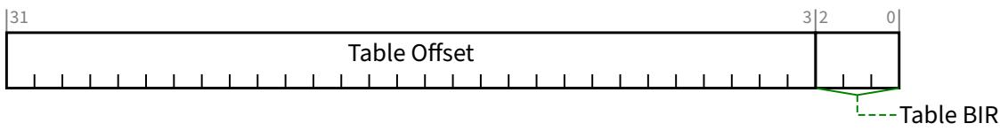


**表 7-50 MSI-X Table Offset/Table BIR 寄存器**

| 位位置 | 寄存器说明 | 属性 |
|---|---|---|
| 2:0 | Table BIR — 指示使用 Function 的哪一个基址寄存器(BAR)(位于配置空间 10h 处开始)或 Enhanced Allocation 能力中具有匹配 BAR Equivalent Indicator (BEI) 的条目,将该 Function 的 MSI-X Table 映射到内存空间。<br>已定义编码如下:<br>0b000:基址寄存器 10h<br>0b001:基址寄存器 14h<br>0b010:基址寄存器 18h<br>0b011:基址寄存器 1Ch<br>0b100:基址寄存器 20h<br>0b101:基址寄存器 24h<br>0b110:保留<br>0b111:保留<br>对于 64 位基址寄存器,Table BIR 指示低 32 位 DWORD。对于具有 Type 1 配置空间头部的 Function,BIR 值 2 到 5 也为保留。 | RO |
| 31:3 | Table Offset — 用作 Function 某个基址寄存器所含地址的偏移量,以指向 MSI-X Table 的基址。Table BIR 的低 3 位被软件屏蔽(置零),以形成 32 位 QWORD 对齐的偏移量。<br>对于 VF,Table Offset 值相对于 VF 的内存地址空间。 | RO |

[figures/chapter_07/fig_1101_2.png]

**图 7-62 MSI-X PBA Offset/PBA BIR 寄存器**

> 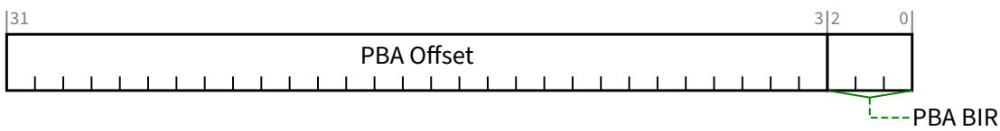


</td>
</tr>
</tbody>
</table>

---

<a id="sec-7-7-2-3"></a>
## 7.7.2.3 Table Offset/Table BIR Register for MSI-X (Offset 04h) | MSI-X Table Offset/Table BIR 寄存器(偏移 04h)

<a id="sec-7-7-2-4"></a>
## 7.7.2.4 PBA Offset/PBA BIR Register for MSI-X (Offset 08h) | MSI-X PBA Offset/PBA BIR 寄存器(偏移 08h)


<div style="overflow-x: auto; max-width: 100%;">
<table>
<thead>
<tr>
<th width="50%">🇬🇧 English</th>
<th width="50%" style="background-color:#e8e8e8">🏆 中文</th>
</tr>
</thead>
<tbody>
<tr>
<td>

**Table 7-51 PBA Offset/PBA BIR Register for MSI-X**

| Bit Location | Register Description | Attributes |
|---|---|---|
| 2:0 | PBA BIR - Indicates which one of a Function's Base Address Registers, located beginning at 10h in Configuration Space, or entry in the Enhanced Allocation capability with a matching BEI, is used to map the Function's MSI-X PBA into Memory Space.<br>The PBA BIR value definitions are identical to those for the Table BIR. | RO |
| 31:3 | PBA Offset - Used as an offset from the address contained by one of the Function's Base Address Registers to point to the base of the MSI-X PBA. The lower 3 PBA BIR bits are masked off (set to zero) by software to form a 32-bit QWORD-aligned offset.<br>For VFs, the PBA Offset value is relative to the VF's Memory address space. | RO |

[figures/chapter_07/fig_1102_1.png]

**Figure 7-63 Message Address Register for MSI-X Table Entries**

**Table 7-52 Message Address Register for MSI-X Table Entries**

| Bit Location | Register Description | Attributes |
|---|---|---|
| 1:0 | Reserved - For proper DWORD alignment, software must always write zeros to these two bits; otherwise the result is undefined.<br>Default value of this field is 00b.<br>These bits are permitted to be read-only or read-write. | RO or RW |
| 31:2 | Message Address - System-specified message lower address.<br>For MSI-X messages, the contents of this field from an MSI-X Table entry specifies the lower portion of the DWORD-aligned address for the Memory Write transaction.<br>Default value of this field is undefined. | RW |

</td>
<td style="background-color:#e8e8e8">

**表 7-51 MSI-X PBA Offset/PBA BIR 寄存器**

| 位位置 | 寄存器说明 | 属性 |
|---|---|---|
| 2:0 | PBA BIR — 指示使用 Function 的哪一个基址寄存器(BAR)(位于配置空间 10h 处开始)或 Enhanced Allocation 能力中具有匹配 BEI 的条目,将该 Function 的 MSI-X PBA 映射到内存空间。<br>PBA BIR 的值定义与 Table BIR 相同。 | RO |
| 31:3 | PBA Offset — 用作 Function 某个基址寄存器所含地址的偏移量,以指向 MSI-X PBA 的基址。PBA BIR 的低 3 位被软件屏蔽(置零),以形成 32 位 QWORD 对齐的偏移量。<br>对于 VF,PBA Offset 值相对于 VF 的内存地址空间。 | RO |

[figures/chapter_07/fig_1102_1.png]

**图 7-63 MSI-X Table 条目 Message Address 寄存器**

> 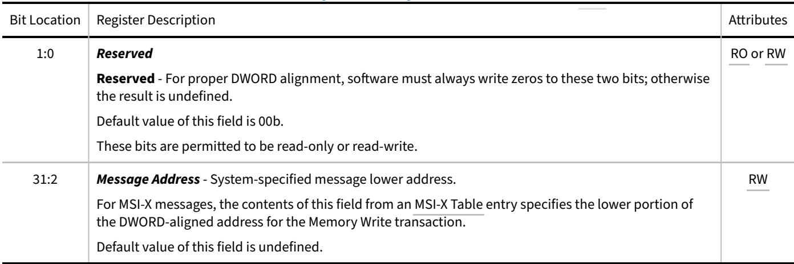


**表 7-52 MSI-X Table 条目 Message Address 寄存器**

| 位位置 | 寄存器说明 | 属性 |
|---|---|---|
| 1:0 | 保留(Reserved) — 为保证正确的 DWORD 对齐,软件必须始终向这两位写零;否则结果未定义。<br>此字段的默认值为 00b。<br>这些位允许为只读或读写。 | RO 或 RW |
| 31:2 | Message Address — 系统指定的消息低位地址。<br>对于 MSI-X 消息,MSI-X Table 条目中此字段的内容指定 Memory Write 事务的 DWORD 对齐地址的低位部分。<br>此字段的默认值未定义。 | RW |

</td>
</tr>
</tbody>
</table>
</div>


---

<a id="sec-7-7-2-5"></a>
## 7.7.2.5 Message Address Register for MSI-X Table Entries | MSI-X Table 条目 Message Address 寄存器

<table>
<thead>
<tr>
<th width="50%">🇬🇧 English</th>
<th width="50%" style="background-color:#e8e8e8">🏆 中文</th>
</tr>
</thead>
<tbody>
<tr>
<td>

[figures/chapter_07/fig_1103_1.png]

**Figure 7-64 Message Upper Address Register for MSI-X Table Entries**

**Table 7-53 Message Upper Address Register for MSI-X Table Entries**

| Bit Location | Register Description | Attributes |
|---|---|---|
| 31:0 | Message Upper Address - System-specified message upper address bits.<br>If this field is zero, 32-bit address messages are used. If this field is non-zero, 64-bit address messages are used.<br>Default value of this field is undefined. | RW |

[figures/chapter_07/fig_1103_2.png]

**Figure 7-65 Message Data Register for MSI-X Table Entries**

**Table 7-54 Message Data Register for MSI-X Table Entries**

| Bit Location | Register Description | Attributes |
|---|---|---|
| 31:0 | Message Data - System-specified message data.<br>For MSI-X messages, the contents of this field from an MSI-X Table entry specifies the 32-bit data payload of the DWORD Memory Write transaction. All 4 Byte Enables are Set.<br>In contrast to message data used for MSI messages, the low-order message data bits in MSI-X messages are not modified by the Function.<br>This field is read-write.<br>Default value of this field is undefined. | RW |

If a Function implements a TPH Requester Extended Capability structure and an MSI-X Capability structure, the Function can optionally use the Vector Control Register for MSI-X Table Entries in each entry to store a Steering Tag. See § Section 6.17 .

</td>
<td style="background-color:#e8e8e8">

[figures/chapter_07/fig_1103_1.png]

**图 7-64 MSI-X Table 条目 Message Upper Address 寄存器**

**表 7-53 MSI-X Table 条目 Message Upper Address 寄存器**

| 位位置 | 寄存器说明 | 属性 |
|---|---|---|
| 31:0 | Message Upper Address — 系统指定的消息高位地址位。<br>如果此字段为零,则使用 32 位地址消息;如果此字段非零,则使用 64 位地址消息。<br>此字段的默认值未定义。 | RW |

[figures/chapter_07/fig_1103_2.png]

**图 7-65 MSI-X Table 条目 Message Data 寄存器**

**表 7-54 MSI-X Table 条目 Message Data 寄存器**

| 位位置 | 寄存器说明 | 属性 |
|---|---|---|
| 31:0 | Message Data — 系统指定的消息数据。<br>对于 MSI-X 消息,MSI-X Table 条目中此字段的内容指定 DWORD Memory Write 事务的 32 位数据净荷。所有 4 个字节使能(Byte Enable)均被置位。<br>与 MSI 消息使用的消息数据不同,MSI-X 消息中低位消息数据位不会被 Function 修改。<br>此字段可读写。<br>此字段的默认值未定义。 | RW |

如果 Function 同时实现了 TPH Requester Extended Capability 结构和 MSI-X Capability 结构,则该 Function 可选择使用每个 MSI-X Table 条目中的 Vector Control 寄存器来存储 Steering Tag。见 § 第 6.17 节。

</td>
</tr>
</tbody>
</table>

---

<a id="sec-7-7-2-6"></a>
## 7.7.2.6 Message Upper Address Register for MSI-X Table Entries | MSI-X Table 条目 Message Upper Address 寄存器


<div style="overflow-x: auto; max-width: 100%;">
<table>
<thead>
<tr>
<th width="50%">🇬🇧 English</th>
<th width="50%" style="background-color:#e8e8e8">🏆 中文</th>
</tr>
</thead>
<tbody>
<tr>
<td>

[figures/chapter_07/fig_1103_1.png]

**Figure 7-64 Message Upper Address Register for MSI-X Table Entries**

**Table 7-53 Message Upper Address Register for MSI-X Table Entries**

| Bit Location | Register Description | Attributes |
|---|---|---|
| 31:0 | Message Upper Address - System-specified message upper address bits.<br>If this field is zero, 32-bit address messages are used. If this field is non-zero, 64-bit address messages are used.<br>Default value of this field is undefined. | RW |

[figures/chapter_07/fig_1103_2.png]

**Figure 7-65 Message Data Register for MSI-X Table Entries**

**Table 7-54 Message Data Register for MSI-X Table Entries**

| Bit Location | Register Description | Attributes |
|---|---|---|
| 31:0 | Message Data - System-specified message data.<br>For MSI-X messages, the contents of this field from an MSI-X Table entry specifies the 32-bit data payload of the DWORD Memory Write transaction. All 4 Byte Enables are Set.<br>In contrast to message data used for MSI messages, the low-order message data bits in MSI-X messages are not modified by the Function.<br>This field is read-write.<br>Default value of this field is undefined. | RW |

If a Function implements a TPH Requester Extended Capability structure and an MSI-X Capability structure, the Function can optionally use the Vector Control Register for MSI-X Table Entries in each entry to store a Steering Tag. See § Section 6.17 .

</td>
<td style="background-color:#e8e8e8">

[figures/chapter_07/fig_1103_1.png]

**图 7-64 MSI-X Table 条目 Message Upper Address 寄存器**

**表 7-53 MSI-X Table 条目 Message Upper Address 寄存器**

| 位位置 | 寄存器说明 | 属性 |
|---|---|---|
| 31:0 | Message Upper Address — 系统指定的消息高位地址位。<br>如果此字段为零,则使用 32 位地址消息;如果此字段非零,则使用 64 位地址消息。<br>此字段的默认值未定义。 | RW |

[figures/chapter_07/fig_1103_2.png]

**图 7-65 MSI-X Table 条目 Message Data 寄存器**

**表 7-54 MSI-X Table 条目 Message Data 寄存器**

| 位位置 | 寄存器说明 | 属性 |
|---|---|---|
| 31:0 | Message Data — 系统指定的消息数据。<br>对于 MSI-X 消息,MSI-X Table 条目中此字段的内容指定 DWORD Memory Write 事务的 32 位数据净荷。所有 4 个字节使能(Byte Enable)均被置位。<br>与 MSI 消息使用的消息数据不同,MSI-X 消息中低位消息数据位不会被 Function 修改。<br>此字段可读写。<br>此字段的默认值未定义。 | RW |

如果 Function 同时实现了 TPH Requester Extended Capability 结构和 MSI-X Capability 结构,则该 Function 可选择使用每个 MSI-X Table 条目中的 Vector Control 寄存器来存储 Steering Tag。见 § 第 6.17 节。

</td>
</tr>
</tbody>
</table>
</div>


---


---

<a id="sec-7-7-2-7"></a>
## 7.7.2.7 Message Data Register for MSI-X Table Entries | MSI-X 表条目的消息数据寄存器

<table>
<thead>
<tr>
<th width="50%">🇬🇧 English</th>
<th width="50%" style="background-color:#e8e8e8">🏆 中文</th>
</tr>
</thead>
<tbody>
<tr>
<td>

7.7.2.7 Message Data Register for MSI-X Table Entries §

</td>
<td style="background-color:#e8e8e8">

7.7.2.7 MSI-X 表条目的消息数据寄存器 §

</td>
</tr>
</tbody>
</table>

[⬆️ 返回目录](#-本章目录-table-of-contents)

---

<a id="sec-7-7-2-8"></a>
## 7.7.2.8 Vector Control Register for MSI-X Table Entries | MSI-X 表条目的向量控制寄存器

<table>
<thead>
<tr>
<th width="50%">🇬🇧 English</th>
<th width="50%" style="background-color:#e8e8e8">🏆 中文</th>
</tr>
</thead>
<tbody>
<tr>
<td>

7.7.2.8 Vector Control Register for MSI-X Table Entries §

</td>
<td style="background-color:#e8e8e8">

7.7.2.8 MSI-X 表条目的向量控制寄存器 §

</td>
</tr>
</tbody>
</table>

[⬆️ 返回目录](#-本章目录-table-of-contents)

---

<!-- 📄 Page 1104 -->
---

<a id="fig-7-66"></a>

> **Figure 7-66.** Vector Control Register for MSI-X Table Entries | MSI-X 表条目的向量控制寄存器
> 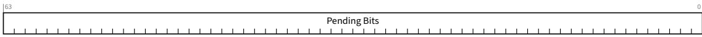

**Table 7-55. Vector Control Register for MSI-X Table Entries | 表 7-55. MSI-X 表条目的向量控制寄存器**

| Bit Location | Register Description | Attributes |
|--------------|----------------------|------------|
| 0 | Mask Bit - When this bit is Set, the Function is prohibited from sending a message using this MSI-X Table entry. However, any other MSI-X Table entries programmed with the same vector will still be capable of sending an equivalent message unless they are also masked.<br>Default value of this bit is 1b (entry is masked) | RW |
| 15:1 | Reserved<br>Reserved - By default, the value of these bits must be 0. However, for potential future use, software must preserve the value of these Reserved bits when modifying the value of other Vector Control bits. If software modifies the value of these Reserved bits, the result is undefined.<br>These bits are permitted to be RsvdP or read-write. | RW or RsvdP |
| 23:16 | ST Lower - If the Function implements a TPH Requester Extended Capability structure, and the ST Table Location indicates a value of 10b, then this field contains the lower 8 bits of a Steering Tag and must be read-write.<br>Otherwise, this field is permitted to be read-write or RsvdP, and for potential future use, software must preserve the value of these Reserved bits when modifying the value of other Vector Control bits, or the result is undefined.<br>Default value of this field is 00h. | RW/RsvdP |
| 31:24 | ST Upper - If the Function implements a TPH Requester Extended Capability structure, and the ST Table Location indicates a value of 10b, and the Extended TPH Requester Supported bit is Set, then this field contains the upper 8 bits of a Steering Tag and must be read-write.<br>Otherwise, this field is permitted to be read-write or RsvdP, and for potential future use, software must preserve the value of these Reserved bits when modifying the value of other Vector Control bits, or the result is undefined.<br>Default value of this field is 00h. | RW/RsvdP |


<div style="overflow-x: auto; max-width: 100%;">
<table>
<thead>
<tr>
<th width="50%">🇬🇧 English</th>
<th width="50%" style="background-color:#e8e8e8">🏆 中文</th>
</tr>
</thead>
<tbody>
<tr>
<td>

[See Figure 7-66 and Table 7-55 above]

</td>
<td style="background-color:#e8e8e8">

（参见上方图 7-66 和表 7-55）

向量控制寄存器布局如下：

- **位 0**：Mask Bit（屏蔽位）— 当该位被置位时，禁止该 Function (功能) 通过此 MSI-X 表条目发送消息。但是，使用相同向量编程的其他 MSI-X 表条目仍能够发送等效消息，除非它们也被屏蔽。
  - 默认值为 1b（条目被屏蔽）
  - 属性：RW
- **位 15:1**：Reserved（保留）
  - 默认情况下，这些位的值必须为 0。但是，为了将来可能的用途，在修改其他 Vector Control (向量控制) 位的值时，软件必须保留这些保留位的值。如果软件修改了这些保留位的值，则结果是未定义的。
  - 这些位允许为 RsvdP 或读写。
  - 属性：RW 或 RsvdP
- **位 23:16**：ST Lower（ST 低位）— 如果该 Function 实现了 TPH Requester Extended Capability (TPH 请求者扩展能力) 结构，且 ST Table Location 指示的值为 10b，则此字段包含 Steering Tag (转向标签) 的低 8 位，且必须为可读写。
  - 否则，该字段允许为可读写或 RsvdP，并且为了将来可能的用途，在修改其他向量控制位的值时，软件必须保留这些保留位的值，否则结果是未定义的。
  - 默认值为 00h。
  - 属性：RW/RsvdP
- **位 31:24**：ST Upper（ST 高位）— 如果该 Function 实现了 TPH Requester Extended Capability 结构，且 ST Table Location 指示的值为 10b，且 Extended TPH Requester Supported 位被置位，则此字段包含 Steering Tag 的高 8 位，且必须为可读写。
  - 否则，该字段允许为可读写或 RsvdP，并且为了将来可能的用途，在修改其他向量控制位的值时，软件必须保留这些保留位的值，否则结果是未定义的。
  - 默认值为 00h。
  - 属性：RW/RsvdP

</td>
</tr>
</tbody>
</table>
</div>


[⬆️ 返回目录](#-本章目录-table-of-contents)

---

<a id="sec-7-7-2-9"></a>
## 7.7.2.9 Pending Bits Register for MSI-X PBA Entries | MSI-X PBA 条目的挂起位寄存器

<table>
<thead>
<tr>
<th width="50%">🇬🇧 English</th>
<th width="50%" style="background-color:#e8e8e8">🏆 中文</th>
</tr>
</thead>
<tbody>
<tr>
<td>

7.7.2.9 Pending Bits Register for MSI-X PBA Entries §

</td>
<td style="background-color:#e8e8e8">

7.7.2.9 MSI-X PBA 条目的挂起位寄存器 §

</td>
</tr>
</tbody>
</table>

[⬆️ 返回目录](#-本章目录-table-of-contents)

---

<a id="fig-7-67"></a>

<!-- 📄 Page 1105 -->
---

**Table 7-56. Pending Bits Register for MSI-X PBA Entries | 表 7-56. MSI-X PBA 条目的挂起位寄存器**

| Bit Location | Register Description | Attributes |
|--------------|----------------------|------------|
| 63:0 | Pending Bits - For each Pending Bit that is Set, the Function has a pending message for the associated MSI-X Table entry.<br>Pending bits that have no associated MSI-X Table entry are Reserved. By default, the value of Reserved Pending bits must be 0b.<br>Software should never write, and should only read Pending Bits. If software writes to Pending Bits, the result is undefined.<br>Default value of each Pending Bit is 0b.<br>These bits are permitted to be read-only or read-write. | RO or RW |

<table>
<thead>
<tr>
<th width="50%">🇬🇧 English</th>
<th width="50%" style="background-color:#e8e8e8">🏆 中文</th>
</tr>
</thead>
<tbody>
<tr>
<td>

[See Figure 7-67 and Table 7-56 above]

</td>
<td style="background-color:#e8e8e8">

（参见上方图 7-67 和表 7-56）

- **位 63:0**：Pending Bits（挂起位）— 对于每个被置位的 Pending Bit，Function 对于关联的 MSI-X 表条目有一条挂起的消息。
  - 没有关联 MSI-X 表条目的 Pending 位为保留位。默认情况下，保留 Pending 位的值必须为 0b。
  - 软件不应写入，而应只读 Pending 位。如果软件写入 Pending 位，则结果是未定义的。
  - 每个 Pending Bit 的默认值为 0b。
  - 这些位允许为只读或可读写。
  - 属性：RO 或 RW

</td>
</tr>
</tbody>
</table>

[⬆️ 返回目录](#-本章目录-table-of-contents)

---

<a id="sec-7-7-3"></a>
## 7.7.3 Secondary PCI Express Extended Capability | 次级 PCI Express 扩展能力


<div style="overflow-x: auto; max-width: 100%;">
<table>
<thead>
<tr>
<th width="50%">🇬🇧 English</th>
<th width="50%" style="background-color:#e8e8e8">🏆 中文</th>
</tr>
</thead>
<tbody>
<tr>
<td>

The Secondary PCI Express Extended Capability structure must be implemented in any Function or RCRB where any of the following are true:

- The Supported Link Speeds Vector field indicates that the Link supports Link Speeds of 8.0 GT/s or higher (see Section 7.5.3.18 or Section 7.9.9.2).
- Any bit in the Lower SKP OS Generation Supported Speeds Vector field is Set (see Section 7.5.3.18).
- When Lane based errors are reported in the Lane Error Status register (discussed in Section 4.2.7).

To support future additions to this capability, this capability is permitted in any Function or RCRB associated with a Link.

For a Multi-Function Device associated with an Upstream Port, this capability is permitted only in Function 0 of the Device.

7.7.3 Secondary PCI Express Extended Capability §

</td>
<td style="background-color:#e8e8e8">

在满足以下任一条件的任何 Function 或 RCRB 中，必须实现 Secondary PCI Express Extended Capability (次级 PCI Express 扩展能力) 结构：

- Supported Link Speeds Vector (支持链路速度向量) 字段表明该 Link (链路) 支持 8.0 GT/s 或更高的链路速度（参见 § 7.5.3.18 或 § 7.9.9.2）。
- Lower SKP OS Generation Supported Speeds Vector (低 SKP OS 生成支持速度向量) 字段中任何位被置位（参见 § 7.5.3.18）。
- 在 Lane Error Status (通道错误状态) 寄存器中报告 Lane based error (基于通道的错误) 时（在 § 4.2.7 中讨论）。

为了支持将来对该能力的扩展，允许在与某条链路关联的任何 Function 或 RCRB 中实现该能力。

对于与 Upstream Port (上游端口) 关联的 Multi-Function Device (多功能设备)，该能力仅允许在设备的 Function 0 中实现。

7.7.3 次级 PCI Express 扩展能力 §

</td>
</tr>
</tbody>
</table>
</div>


[⬆️ 返回目录](#-本章目录-table-of-contents)

---

<!-- 📄 Page 1106 -->
---

<a id="fig-7-68"></a>

> **Figure 7-68.** Secondary PCI Express Extended Capability Structure | 次级 PCI Express 扩展能力结构
> 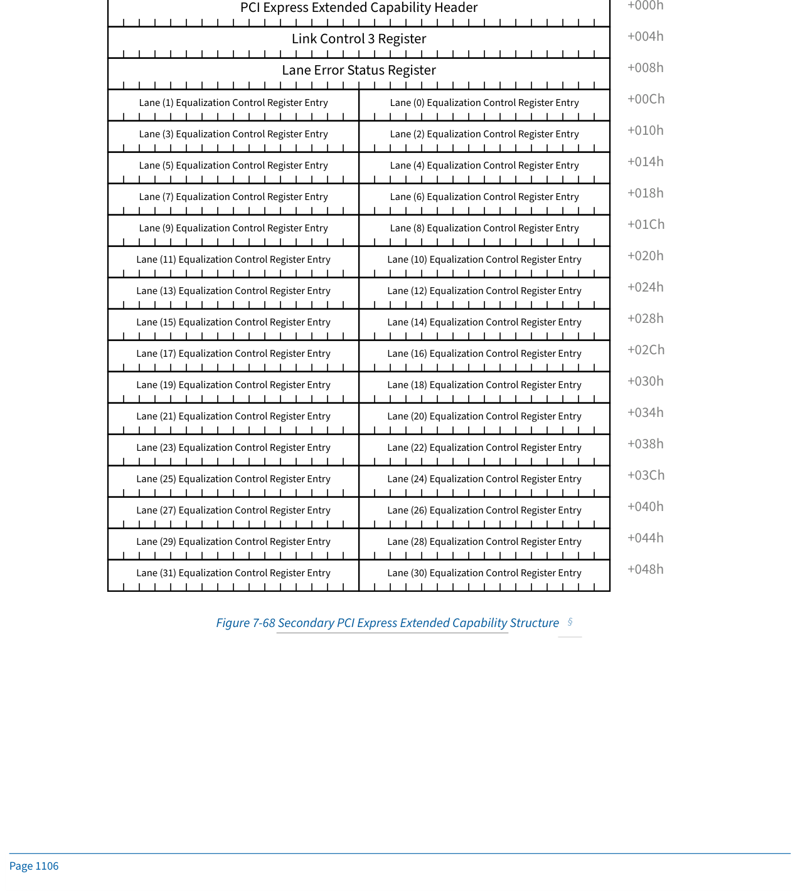

<table>
<thead>
<tr>
<th width="50%">🇬🇧 English</th>
<th width="50%" style="background-color:#e8e8e8">🏆 中文</th>
</tr>
</thead>
<tbody>
<tr>
<td>

[See Figure 7-68 above]

The Secondary PCI Express Extended Capability structure layout:

| Byte Offset | Register/Field |
|-------------|----------------|
| +000h | PCI Express Extended Capability Header |
| +004h | Link Control 3 Register |
| +008h | Lane Error Status Register |
| +00Ch | Lane (0) Equalization Control Register Entry |
| +010h | Lane (1) Equalization Control Register Entry |
| +014h | Lane (2) Equalization Control Register Entry |
| +018h | Lane (3) Equalization Control Register Entry |
| +01Ch | Lane (4) Equalization Control Register Entry |
| +020h | Lane (5) Equalization Control Register Entry |
| +024h | Lane (6) Equalization Control Register Entry |
| +028h | Lane (7) Equalization Control Register Entry |
| +02Ch | Lane (8) Equalization Control Register Entry |
| +030h | Lane (9) Equalization Control Register Entry |
| +034h | Lane (10) Equalization Control Register Entry |
| +038h | Lane (11) Equalization Control Register Entry |
| +03Ch | Lane (12) Equalization Control Register Entry |
| +040h | Lane (13) Equalization Control Register Entry |
| +044h | Lane (14) Equalization Control Register Entry |
| +048h | Lane (15) Equalization Control Register Entry |
| ... | ... (continues through Lane 31) |

</td>
<td style="background-color:#e8e8e8">

（参见上方图 7-68）

次级 PCI Express 扩展能力结构布局：

| 字节偏移 | 寄存器/字段 |
|-------------|----------------|
| +000h | PCI Express 扩展能力 Header (头) |
| +004h | Link Control 3 寄存器 (链路控制 3 寄存器) |
| +008h | Lane Error Status 寄存器 (通道错误状态寄存器) |
| +00Ch | Lane (0) Equalization Control 寄存器条目 (通道 0 均衡控制寄存器条目) |
| +010h | Lane (1) Equalization Control 寄存器条目 |
| +014h | Lane (2) Equalization Control 寄存器条目 |
| +018h | Lane (3) Equalization Control 寄存器条目 |
| +01Ch | Lane (4) Equalization Control 寄存器条目 |
| +020h | Lane (5) Equalization Control 寄存器条目 |
| +024h | Lane (6) Equalization Control 寄存器条目 |
| +028h | Lane (7) Equalization Control 寄存器条目 |
| +02Ch | Lane (8) Equalization Control 寄存器条目 |
| +030h | Lane (9) Equalization Control 寄存器条目 |
| +034h | Lane (10) Equalization Control 寄存器条目 |
| +038h | Lane (11) Equalization Control 寄存器条目 |
| +03Ch | Lane (12) Equalization Control 寄存器条目 |
| +040h | Lane (13) Equalization Control 寄存器条目 |
| +044h | Lane (14) Equalization Control 寄存器条目 |
| +048h | Lane (15) Equalization Control 寄存器条目 |
| ... | ...（延续至 Lane 31） |

</td>
</tr>
</tbody>
</table>

[⬆️ 返回目录](#-本章目录-table-of-contents)

---

<!-- 📄 Page 1107 -->
---

<a id="fig-7-69"></a>

> **Figure 7-69.** Secondary PCI Express Extended Capability Header | 次级 PCI Express 扩展能力头
> 

<a id="sec-7-7-3-1"></a>
## 7.7.3.1 Secondary PCI Express Extended Capability Header (Offset 00h) | 次级 PCI Express 扩展能力头（偏移 00h）

**Table 7-57. Secondary PCI Express Extended Capability Header | 表 7-57. 次级 PCI Express 扩展能力头**

| Bit Location | Register Description | Attributes |
|--------------|----------------------|------------|
| 15:0 | PCI Express Extended Capability ID - This field is a PCI-SIG defined ID number that indicates the nature and format of the Extended Capability.<br>PCI Express Extended Capability ID for the Secondary PCI Express Extended Capability is 0019h. | RO |
| 19:16 | Capability Version - This field is a PCI-SIG defined version number that indicates the version of the Capability structure present.<br>Must be 1h for this version of the specification. | RO |
| 31:20 | Next Capability Offset - This field contains the offset to the next PCI Express Extended Capability structure or 000h if no other items exist in the linked list of Capabilities. | RO |

<table>
<thead>
<tr>
<th width="50%">🇬🇧 English</th>
<th width="50%" style="background-color:#e8e8e8">🏆 中文</th>
</tr>
</thead>
<tbody>
<tr>
<td>

7.7.3.1 Secondary PCI Express Extended Capability Header (Offset 00h) §

[See Figure 7-69 and Table 7-57 above]

</td>
<td style="background-color:#e8e8e8">

7.7.3.1 次级 PCI Express 扩展能力头（偏移 00h）§

（参见上方图 7-69 和表 7-57）

- **位 15:0**：PCI Express Extended Capability ID（PCI Express 扩展能力 ID）— 该字段是由 PCI-SIG 定义的 ID 号，用于指示扩展能力的性质和格式。
  - 次级 PCI Express 扩展能力的 PCI Express 扩展能力 ID 为 0019h。
  - 属性：RO
- **位 19:16**：Capability Version（能力版本）— 该字段是由 PCI-SIG 定义的版本号，用于指示所呈现的能力结构的版本。
  - 对于本规范版本必须为 1h。
  - 属性：RO
- **位 31:20**：Next Capability Offset（下一能力偏移）— 该字段包含指向下一个 PCI Express 扩展能力结构的偏移，若链接的能力列表中没有其他项，则为 000h。
  - 属性：RO

</td>
</tr>
</tbody>
</table>

[⬆️ 返回目录](#-本章目录-table-of-contents)

---

<a id="sec-7-7-3-2"></a>
## 7.7.3.2 Link Control 3 Register (Offset 04h) | 链路控制 3 寄存器（偏移 04h）

<a id="fig-7-70"></a>

**Table 7-58. Link Control 3 Register | 表 7-58. 链路控制 3 寄存器**

| Bit Location | Register Description | Attributes |
|--------------|----------------------|------------|
| 0 | Perform Equalization - When this bit is 1b and a 1b is written to the Retrain Link bit with the Target Link Speed field set to 8.0 GT/s or higher, the Downstream Port must perform Link Equalization. Refer to Section 4.2.4 and Section 4.2.7.4.2 for details.<br>This bit is RW for Downstream Ports and for Upstream Ports when Crosslink Supported is 1b (see Section 7.5.3.18). This bit is not applicable and is RsvdP for Upstream Ports when the Crosslink Supported bit is 0b.<br>The default value is 0b.<br>If the Port does not support 8.0 GT/s, this bit is permitted to be hardwired to 0b. | RW/RsvdP |

<table>
<thead>
<tr>
<th width="50%">🇬🇧 English</th>
<th width="50%" style="background-color:#e8e8e8">🏆 中文</th>
</tr>
</thead>
<tbody>
<tr>
<td>

7.7.3.2 Link Control 3 Register (Offset 04h) §

[See Figure 7-70 and Table 7-58 above]

</td>
<td style="background-color:#e8e8e8">

7.7.3.2 链路控制 3 寄存器（偏移 04h）§

（参见上方图 7-70 和表 7-58）

- **位 0**：Perform Equalization（执行均衡）— 当此位为 1b 并且在 Target Link Speed (目标链路速度) 字段设置为 8.0 GT/s 或更高时向 Retrain Link (重训练链路) 位写入 1b，则 Downstream Port (下游端口) 必须执行 Link Equalization (链路均衡)。有关详细信息，请参见 § 4.2.4 和 § 4.2.7.4.2。
  - 对于 Downstream Port 以及当 Crosslink Supported (交叉链路支持) 为 1b 时的 Upstream Port，此位为 RW（参见 § 7.5.3.18）。当 Crosslink Supported 位为 0b 时，此位不适用并为 RsvdP (保留，保留为 Post 零)。
  - 默认值为 0b。
  - 如果 Port 不支持 8.0 GT/s，则允许将此位硬连线为 0b。
  - 属性：RW/RsvdP

</td>
</tr>
</tbody>
</table>

[⬆️ 返回目录](#-本章目录-table-of-contents)

---

<!-- 📄 Page 1108 -->
---


<div style="overflow-x: auto; max-width: 100%;">
<table>
<thead>
<tr>
<th width="50%">🇬🇧 English</th>
<th width="50%" style="background-color:#e8e8e8">🏆 中文</th>
</tr>
</thead>
<tbody>
<tr>
<td>

[Table 7-58 continued - Link Control 3 Register bits 1-31]

| Bit Location | Register Description | Attributes |
|--------------|----------------------|------------|
| 1 | Link Equalization Request Interrupt Enable - When Set, this bit enables the generation of an interrupt to indicate that the Link Equalization Request 8.0 GT/s bit, the Link Equalization Request 16.0 GT/s bit, or the Link Equalization Request 32.0 GT/s bit has been set.<br>This bit is RW for Downstream Ports and for Upstream Ports when Crosslink Supported is 1b (see Section 7.5.3.18). This bit is not applicable and is RsvdP for Upstream Ports when the Crosslink Supported bit is 0b.<br>The default value for this bit is 0b.<br>If the Port does not support 8.0 GT/s, this bit is permitted to be hardwired to 0b. | RW/RsvdP |
| 2:8 | RsvdP | RsvdP |
| 9:15 | Enable Lower SKP OS Generation Vector - When the Link is in L0 and the bit in this field corresponding to the Current Link Speed is Set, SKP Ordered Sets are scheduled at the rate defined for SRNS, overriding the rate required based on the clock tolerance architecture. See Section 4.2.8 and Section 4.2.8.4 for additional requirements.<br>Bit definitions within this field are:<br>- Bit 0: 2.5 GT/s<br>- Bit 1: 5.0 GT/s<br>- Bit 2: 8.0 GT/s<br>- Bit 3: 16.0 GT/s<br>- Bit 4: 32.0 GT/s<br>- Bit 5: 64.0 GT/s<br>- Bits 7:6: RsvdP<br>Each unreserved bit in this field must be RW if the corresponding bit in the Lower SKP OS Generation Supported Speeds Vector is Set, otherwise the bit must be RW or hardwired to 0.<br>Behavior is undefined if a bit is Set in this field and the corresponding bit in the Lower SKP OS Generation Supported Speeds Vector is not Set.<br>The default value of this field is 000 0000b. | RW/RsvdP |
| 16:31 | RsvdP | RsvdP |

</td>
<td style="background-color:#e8e8e8">

[表 7-58 续 - 链路控制 3 寄存器 位 1-31]

- **位 1**：Link Equalization Request Interrupt Enable（链路均衡请求中断使能）— 当置位时，此位使能生成中断，以指示 Link Equalization Request 8.0 GT/s 位、Link Equalization Request 16.0 GT/s 位或 Link Equalization Request 32.0 GT/s 位已被置位。
  - 对于 Downstream Port 以及当 Crosslink Supported 为 1b 时的 Upstream Port，此位为 RW（参见 § 7.5.3.18）。当 Crosslink Supported 位为 0b 时，此位不适用并为 RsvdP。
  - 默认值为 0b。
  - 如果 Port 不支持 8.0 GT/s，则允许将此位硬连线为 0b。
  - 属性：RW/RsvdP
- **位 2:8**：RsvdP（保留）
  - 属性：RsvdP
- **位 9:15**：Enable Lower SKP OS Generation Vector（使能低 SKP OS 生成向量）— 当 Link 处于 L0 状态且此字段中与 Current Link Speed (当前链路速度) 对应的位被置位时，SKP 有序集 (SKP Ordered Sets) 按 SRNS (Separate Reference clock with Independent Spread Spectrum, 独立扩频的独立参考时钟) 定义的速率调度，覆盖基于时钟容差架构所要求的速率。有关其他要求，请参见 § 4.2.8 和 § 4.2.8.4。
  - 此字段内的位定义如下：
    - 位 0：2.5 GT/s
    - 位 1：5.0 GT/s
    - 位 2：8.0 GT/s
    - 位 3：16.0 GT/s
    - 位 4：32.0 GT/s
    - 位 5：64.0 GT/s
    - 位 7:6：RsvdP
  - 如果 Lower SKP OS Generation Supported Speeds Vector 中对应的位被置位，则此字段中的每个未保留位必须为 RW，否则该位必须为 RW 或硬连线为 0。
  - 如果此字段中某位置位，而 Lower SKP OS Generation Supported Speeds Vector 中对应位未置位，则行为未定义。
  - 此字段的默认值为 000 0000b。
  - 属性：RW/RsvdP
- **位 16:31**：RsvdP（保留）
  - 属性：RsvdP

</td>
</tr>
</tbody>
</table>
</div>


[⬆️ 返回目录](#-本章目录-table-of-contents)

---

<a id="sec-7-7-3-3"></a>
## 7.7.3.3 Lane Error Status Register (Offset 08h) | 通道错误状态寄存器（偏移 08h）

<table>
<thead>
<tr>
<th width="50%">🇬🇧 English</th>
<th width="50%" style="background-color:#e8e8e8">🏆 中文</th>
</tr>
</thead>
<tbody>
<tr>
<td>

The Lane Error Status Register consists of a 32-bit vector, where each bit indicates if the Lane with the corresponding Lane number detected an error. This Lane number is the default Lane number which is invariant to Link width and Lane reversal negotiation that occurs during Link training.

7.7.3.3 Lane Error Status Register (Offset 08h) §

</td>
<td style="background-color:#e8e8e8">

Lane Error Status Register (通道错误状态寄存器) 由一个 32 位的向量组成，其中每个位指示具有相应 Lane (通道) 号的 Lane 是否检测到错误。此 Lane 号是默认的 Lane 号，独立于链路训练期间发生的链路宽度和 Lane reversal (通道反转) 协商。

7.7.3.3 通道错误状态寄存器（偏移 08h）§

</td>
</tr>
</tbody>
</table>

[⬆️ 返回目录](#-本章目录-table-of-contents)

---

<!-- 📄 Page 1109 -->
---

<a id="fig-7-71"></a>

> **Figure 7-71.** Lane Error Status Register | 通道错误状态寄存器

> 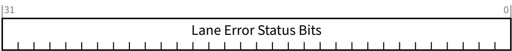

> 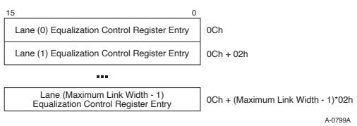

**Table 7-59. Lane Error Status Register | 表 7-59. 通道错误状态寄存器**

| Bit Location | Register Description | Attributes |
|--------------|----------------------|------------|
| 31:0 | Lane Error Status Bits - Each bit indicates if the corresponding Lane detected a Lane-based error. A value of 1b indicates that a Lane based-error was detected on the corresponding Lane Number (see Section 4.2.2.3.3, Section 4.2.7, and Section 4.2.8.2 for details).<br>The default value of each bit is 0b.<br>For Ports that are narrower than 32 Lanes, the unused upper bits [31: Maximum Link Width] are RsvdZ.<br>For Ports that do not support 8.0 GT/s and do not set these bits based on 8b/10b errors (optional, see Section 4.2.7), this field is permitted to be hardwired to 0. | RW1CS |

<table>
<thead>
<tr>
<th width="50%">🇬🇧 English</th>
<th width="50%" style="background-color:#e8e8e8">🏆 中文</th>
</tr>
</thead>
<tbody>
<tr>
<td>

[See Figure 7-71 and Table 7-59 above]

</td>
<td style="background-color:#e8e8e8">

（参见上方图 7-71 和表 7-59）

- **位 31:0**：Lane Error Status Bits（通道错误状态位）— 每个位指示相应 Lane 是否检测到 Lane-based error (基于通道的错误)。值 1b 表示在相应 Lane 号上检测到 Lane based-error（有关详细信息，请参见 § 4.2.2.3.3、§ 4.2.7 和 § 4.2.8.2）。
  - 每个位的默认值为 0b。
  - 对于宽度小于 32 个 Lane 的 Port，未使用的高位 [31: 最大链路宽度] 为 RsvdZ (保留，保留为零)。
  - 对于不支持 8.0 GT/s 且不根据 8b/10b 错误设置这些位的 Port（可选，参见 § 4.2.7），此字段允许硬连线为 0。
  - 属性：RW1CS (读写 1 清除状态)

</td>
</tr>
</tbody>
</table>

[⬆️ 返回目录](#-本章目录-table-of-contents)

---

<a id="sec-7-7-3-4"></a>
## 7.7.3.4 Lane Equalization Control Register (Offset 0Ch) | 通道均衡控制寄存器（偏移 0Ch）


<div style="overflow-x: auto; max-width: 100%;">
<table>
<thead>
<tr>
<th width="50%">🇬🇧 English</th>
<th width="50%" style="background-color:#e8e8e8">🏆 中文</th>
</tr>
</thead>
<tbody>
<tr>
<td>

The Lane Equalization Control Register consists of control fields required for per-Lane 8.0 GT/s equalization and the number of entries in this register are sized by Maximum Link Width (see Section 7.5.3.6). Each entry contains the values for the Lane with the corresponding default Lane number which is invariant to Link width and Lane reversal negotiation that occurs during Link training.

If the Port does not support 8.0 GT/s, this register is permitted to be hardwired to 0.

7.7.3.4 Lane Equalization Control Register (Offset 0Ch) §

</td>
<td style="background-color:#e8e8e8">

Lane Equalization Control Register (通道均衡控制寄存器) 包含每通道 8.0 GT/s Equalization (均衡) 所需的控制字段，该寄存器中的条目数由 Maximum Link Width (最大链路宽度) 决定（参见 § 7.5.3.6）。每个条目包含具有相应默认 Lane 号的 Lane 的值，该默认值独立于链路训练期间发生的链路宽度和通道反转协商。

如果 Port 不支持 8.0 GT/s，则允许将此寄存器硬连线为 0。

7.7.3.4 通道均衡控制寄存器（偏移 0Ch）§

</td>
</tr>
</tbody>
</table>
</div>


[⬆️ 返回目录](#-本章目录-table-of-contents)

---

<a id="fig-7-72"></a>

<a id="fig-7-73"></a>

**Table 7-60. Lane Equalization Control Register Entry | 表 7-60. 通道均衡控制寄存器条目**

| Bit Location | Register Description | Attributes |
|--------------|----------------------|------------|
| 3:0 | Downstream Port 8.0 GT/s Transmitter Preset - Transmitter preset value used for 8.0 GT/s equalization by this Port when the Port is operating as a Downstream Port. This field is ignored when the Port is operating as an Upstream Port. See Chapter 8 for details. The field encodings are defined in Section 4.2.4.2.<br>For an Upstream Port if Crosslink Supported is 0b, this field is RsvdP. Otherwise, this field is HwInit. See Section 7.5.3.18.<br>The default value is 1111b. | HwInit/RsvdP (see description) |

<!-- 📄 Page 1110 -->
---

| Bit Location | Register Description | Attributes |
|--------------|----------------------|------------|
| 6:4 | Downstream Port 8.0 GT/s Receiver Preset Hint - Receiver preset hint value that may be used as a suggested setting for 8.0 GT/s receiver equalization by this Port when the Port is operating as a Downstream Port. This field is ignored when the Port is operating as an Upstream Port. See Chapter 8 for details. The field encodings are defined in Section 4.2.4.2.<br>For an Upstream Port if Crosslink Supported is 0b, this field is RsvdP. Otherwise, this field is HwInit. See Section 7.5.3.18.<br>The default value is 111b. | HwInit/RsvdP (see description) |
| 7 | RsvdP | RsvdP |
| 11:8 | Upstream Port 8.0 GT/s Transmitter Preset - Field contains the Transmitter preset value sent or received during 8.0 GT/s Link Equalization. Field usage varies as follows:<br>**Case A - Downstream Port, Crosslink Supported: Any**<br>Field contains the value sent on the associated Lane during Recovery.RcvrCfg. Field is HwInit.<br>**Case B - Upstream Port, Crosslink Supported: 0b**<br>Field is intended for debug and diagnostics. It contains the value captured from the associated Lane during Link Equalization.<br>This value MUST@FLIT be captured from EQ TS2 or equalization requests with Use_Preset Set are received.<br>This value should not be affected by equalization requests with Use_Preset Clear.<br>Field is RO.<br>Note: When crosslinks are supported, case C (below) applies and this captured information is not visible to software. Vendors are encouraged to provide an alternate mechanism to obtain this information.<br>**Case C - Upstream Port, Crosslink Supported: 1b**<br>Field is not used or affected by the current Link Equalization.<br>Field value will be used if a future crosslink negotiation switches the Operating Port Direction so that case A (above) applies.<br>Field is HwInit.<br>See Section 4.2.4 and Chapter 8 for details. The field encodings are defined in Section 4.2.4.2.<br>The default value is 1111b. | HwInit/RO (see description) |
| 15 | RsvdP | RsvdP |

<!-- 📄 Page 1111 -->
---

| Bit Location | Register Description | Attributes |
|--------------|----------------------|------------|
| 14:12 | Upstream Port 8.0 GT/s Receiver Preset Hint - Field contains the Receiver preset hint value sent or received during 8.0 GT/s Link Equalization. Field usage varies as follows:<br>**Case A - Downstream Port, Crosslink Supported: Any**<br>Field contains the value sent on the associated Lane during Recovery.RcvrCfg. Field is HwInit.<br>**Case B - Upstream Port, Crosslink Supported: 0b**<br>Field is intended for debug and diagnostics. It contains the value captured from the associated Lane during Link Equalization.<br>This value MUST@FLIT be captured from EQ TS2 or equalization requests with Use_Preset Set are received.<br>This value should not be affected by equalization requests with Use_Preset Clear.<br>Field is RO.<br>Note: When crosslinks are supported, case C (below) applies and this captured information is not visible to software. Vendors are encouraged to provide an alternate mechanism to obtain this information.<br>**Case C - Upstream Port, Crosslink Supported: 1b**<br>Field is not used or affected by the current Link Equalization.<br>Field value will be used if a future crosslink negotiation switches the Operating Port Direction so that case A (above) applies.<br>Field is HwInit.<br>See Section 4.2.4 and Chapter 8 for details. The field encodings are defined in Section 4.2.4.2.<br>The default value is 111b. | HwInit/RO (see description) |

<table>
<thead>
<tr>
<th width="50%">🇬🇧 English</th>
<th width="50%" style="background-color:#e8e8e8">🏆 中文</th>
</tr>
</thead>
<tbody>
<tr>
<td>

[See Figure 7-72, Figure 7-73, and Table 7-60 above]

</td>
<td style="background-color:#e8e8e8">

（参见上方图 7-72、图 7-73 和表 7-60）

通道均衡控制寄存器条目字段说明：

- **位 3:0**：Downstream Port 8.0 GT/s Transmitter Preset（下游端口 8.0 GT/s 发送器预设值）— 当 Port 作为 Downstream Port 运行时，此 Port 在 8.0 GT/s Equalization 中使用的 Transmitter Preset (发送器预设值)。当 Port 作为 Upstream Port 运行时，此字段被忽略。有关详细信息，请参见第 8 章。字段编码在 § 4.2.4.2 中定义。
  - 对于 Upstream Port，如果 Crosslink Supported 为 0b，则此字段为 RsvdP。否则，此字段为 HwInit (硬件初始化)。参见 § 7.5.3.18。
  - 默认值为 1111b。
  - 属性：HwInit/RsvdP（见描述）
- **位 6:4**：Downstream Port 8.0 GT/s Receiver Preset Hint（下游端口 8.0 GT/s 接收器预设提示）— 当 Port 作为 Downstream Port 运行时，此 Port 可能用作 8.0 GT/s 接收器均衡建议设置的 Receiver Preset Hint (接收器预设提示)。当 Port 作为 Upstream Port 运行时，此字段被忽略。有关详细信息，请参见第 8 章。字段编码在 § 4.2.4.2 中定义。
  - 对于 Upstream Port，如果 Crosslink Supported 为 0b，则此字段为 RsvdP。否则，此字段为 HwInit。参见 § 7.5.3.18。
  - 默认值为 111b。
  - 属性：HwInit/RsvdP（见描述）
- **位 7**：RsvdP（保留）
  - 属性：RsvdP
- **位 11:8**：Upstream Port 8.0 GT/s Transmitter Preset（上游端口 8.0 GT/s 发送器预设值）— 该字段包含 8.0 GT/s Link Equalization 期间发送或接收的 Transmitter Preset 值。字段使用因情况而异：
  - **情况 A - Downstream Port，Crosslink Supported：任意**
    - 字段包含在 Recovery.RcvrCfg (恢复接收器配置) 期间通过关联 Lane 发送的值。字段为 HwInit。
  - **情况 B - Upstream Port，Crosslink Supported：0b**
    - 该字段用于调试和诊断。它包含在 Link Equalization 期间从关联 Lane 捕获的值。
    - 当收到 EQ TS2 或带有 Use_Preset 置位的均衡请求时，必须捕获此值（MUST@FLIT）。
    - 此值不应受 Use_Preset 清除的均衡请求影响。
    - 字段为 RO。
    - 注意：当支持 crosslink (交叉链路) 时，适用情况 C（以下），并且此捕获的信息对软件不可见。鼓励供应商提供获取此信息的替代机制。
  - **情况 C - Upstream Port，Crosslink Supported：1b**
    - 该字段不被当前 Link Equalization 使用或影响。
    - 如果未来的 crosslink 协商切换 Operating Port Direction (运行端口方向) 使其适用情况 A（以上），将使用该字段值。
    - 字段为 HwInit。
  - 有关详细信息，请参见 § 4.2.4 和第 8 章。字段编码在 § 4.2.4.2 中定义。
  - 默认值为 1111b。
  - 属性：HwInit/RO（见描述）
- **位 15**：RsvdP（保留）
  - 属性：RsvdP
- **位 14:12**：Upstream Port 8.0 GT/s Receiver Preset Hint（上游端口 8.0 GT/s 接收器预设提示）— 该字段包含 8.0 GT/s Link Equalization 期间发送或接收的 Receiver Preset Hint 值。字段使用因情况而异：
  - **情况 A - Downstream Port，Crosslink Supported：任意**
    - 字段包含在 Recovery.RcvrCfg 期间通过关联 Lane 发送的值。字段为 HwInit。
  - **情况 B - Upstream Port，Crosslink Supported：0b**
    - 该字段用于调试和诊断。它包含在 Link Equalization 期间从关联 Lane 捕获的值。
    - 当收到 EQ TS2 或带有 Use_Preset 置位的均衡请求时，必须捕获此值（MUST@FLIT）。
    - 此值不应受 Use_Preset 清除的均衡请求影响。
    - 字段为 RO。
    - 注意：当支持 crosslink 时，适用情况 C（以下），并且此捕获的信息对软件不可见。鼓励供应商提供获取此信息的替代机制。
  - **情况 C - Upstream Port，Crosslink Supported：1b**
    - 该字段不被当前 Link Equalization 使用或影响。
    - 如果未来的 crosslink 协商切换运行端口方向使其适用情况 A（以上），将使用该字段值。
    - 字段为 HwInit。
  - 有关详细信息，请参见 § 4.2.4 和第 8 章。字段编码在 § 4.2.4.2 中定义。
  - 默认值为 111b。
  - 属性：HwInit/RO（见描述）

</td>
</tr>
</tbody>
</table>

[⬆️ 返回目录](#-本章目录-table-of-contents)

---

<a id="sec-7-7-4"></a>
## 7.7.4 Data Link Feature Extended Capability | 数据链路特性扩展能力


<div style="overflow-x: auto; max-width: 100%;">
<table>
<thead>
<tr>
<th width="50%">🇬🇧 English</th>
<th width="50%" style="background-color:#e8e8e8">🏆 中文</th>
</tr>
</thead>
<tbody>
<tr>
<td>

The Data Link Feature Capability is an optional Extended Capability that is required for Downstream Ports that support one or more of the associated features. Since the Scaled Flow Control Feature is required for Ports that support 16.0 GT/s, this capability is required for Downstream Ports that support 16.0 GT/s (see Section 3.4.2). It is optional in other Downstream Ports. It is optional in Functions associated with an Upstream Port. In Multi-Function Devices associated with an Upstream Port, this capability is individually optional for each non-VF Function, and all implemented instances of this capability must report identical information in all fields of this capability. It is not applicable in Functions that are not associated with a Port (e.g., RCiEPs, Root Complex Event Collectors). The Data Link Feature Extended Capability is shown in Figure 7-74.

7.7.4 Data Link Feature Extended Capability §

</td>
<td style="background-color:#e8e8e8">

Data Link Feature Capability (数据链路特性能力) 是一种可选的 Extended Capability (扩展能力)，对于支持一个或多个关联特性的 Downstream Port 是必需的。由于 Scaled Flow Control Feature (缩放流控特性) 是支持 16.0 GT/s 的 Port 所需的，因此支持 16.0 GT/s 的 Downstream Port 必须实现此能力（参见 § 3.4.2）。在其他 Downstream Port 中为可选。在与 Upstream Port 关联的 Function 中为可选。在与 Upstream Port 关联的 Multi-Function Device 中，此能力对每个非 VF Function 单独可选，且此能力的所有已实现实例必须在该能力的所有字段中报告相同的信息。在不与 Port 关联的 Function 中不适用（例如 RCiEP、Root Complex Event Collector (根复合体事件收集器)）。Data Link Feature Extended Capability (数据链路特性扩展能力) 如 § 图 7-74 所示。

7.7.4 数据链路特性扩展能力 §

</td>
</tr>
</tbody>
</table>
</div>


[⬆️ 返回目录](#-本章目录-table-of-contents)

---

<!-- 📄 Page 1112 -->
---

<a id="fig-7-74"></a>

> **Figure 7-74.** Data Link Feature Extended Capability | 数据链路特性扩展能力
> 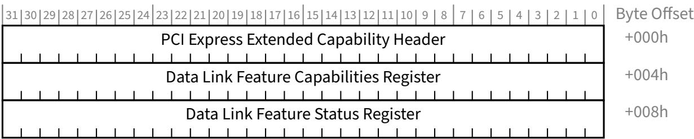

<table>
<thead>
<tr>
<th width="50%">🇬🇧 English</th>
<th width="50%" style="background-color:#e8e8e8">🏆 中文</th>
</tr>
</thead>
<tbody>
<tr>
<td>

[See Figure 7-74 above]

Data Link Feature Extended Capability structure layout:

| Byte Offset | Register/Field |
|-------------|----------------|
| +000h | PCI Express Extended Capability Header |
| +004h | Data Link Feature Capabilities Register |
| +008h | Data Link Feature Status Register |

</td>
<td style="background-color:#e8e8e8">

（参见上方图 7-74）

数据链路特性扩展能力结构布局：

| 字节偏移 | 寄存器/字段 |
|-------------|----------------|
| +000h | PCI Express 扩展能力 Header (头) |
| +004h | 数据链路特性能力寄存器 |
| +008h | 数据链路特性状态寄存器 |

</td>
</tr>
</tbody>
</table>

[⬆️ 返回目录](#-本章目录-table-of-contents)

---

<a id="sec-7-7-4-1"></a>
## 7.7.4.1 Data Link Feature Extended Capability Header (Offset 00h) | 数据链路特性扩展能力头（偏移 00h）

<table>
<thead>
<tr>
<th width="50%">🇬🇧 English</th>
<th width="50%" style="background-color:#e8e8e8">🏆 中文</th>
</tr>
</thead>
<tbody>
<tr>
<td>

Figure 7-75 details allocation of register fields in the Data Link Feature Extended Capability Header; Table 7-63 provides the respective bit definitions.

7.7.4.1 Data Link Feature Extended Capability Header (Offset 00h) §

</td>
<td style="background-color:#e8e8e8">

§ 图 7-75 详细说明了数据链路特性扩展能力头中寄存器字段的分配；§ 表 7-63 提供了相应的位定义。

7.7.4.1 数据链路特性扩展能力头（偏移 00h）§

</td>
</tr>
</tbody>
</table>

[⬆️ 返回目录](#-本章目录-table-of-contents)

---

<a id="fig-7-75"></a>

**Table 7-63. Data Link Feature Extended Capability Header | 表 7-63. 数据链路特性扩展能力头**

| Bit Location | Description | Attributes |
|--------------|-------------|------------|
| 15:0 | PCI Express Extended Capability ID - This field is a PCI-SIG defined ID number that indicates the nature and format of the Extended Capability.<br>Extended Capability ID for Data Link Feature is 0025h. | RO |
| 19:16 | Capability Version - This field is a PCI-SIG defined version number that indicates the version of the Capability structure present.<br>Must be 1h for this version of the specification. | RO |
| 31:20 | Next Capability Offset - This field contains the offset to the next PCI Express Capability structure or 000h if no other items exist in the linked list of Capabilities.<br>For Extended Capabilities implemented in Configuration Space, this offset is relative to the beginning of PCI-compatible Configuration Space and thus must always be either 000h (for terminating list of Capabilities) or greater than 0FFh.<br>The bottom 2 bits of this offset are Reserved and must be implemented as 00b although software must mask them to allow for future uses of these bits. | RO |

<table>
<thead>
<tr>
<th width="50%">🇬🇧 English</th>
<th width="50%" style="background-color:#e8e8e8">🏆 中文</th>
</tr>
</thead>
<tbody>
<tr>
<td>

[See Figure 7-75 and Table 7-63 above]

</td>
<td style="background-color:#e8e8e8">

（参见上方图 7-75 和表 7-63）

- **位 15:0**：PCI Express Extended Capability ID（PCI Express 扩展能力 ID）— 该字段是由 PCI-SIG 定义的 ID 号，用于指示扩展能力的性质和格式。
  - 数据链路特性的扩展能力 ID 为 0025h。
  - 属性：RO
- **位 19:16**：Capability Version（能力版本）— 该字段是由 PCI-SIG 定义的版本号，用于指示所呈现的能力结构的版本。
  - 对于本规范版本必须为 1h。
  - 属性：RO
- **位 31:20**：Next Capability Offset（下一能力偏移）— 该字段包含指向下一个 PCI Express 能力结构的偏移，若链接的能力列表中没有其他项，则为 000h。
  - 对于在配置空间中实现的扩展能力，此偏移相对于 PCI 兼容配置空间的起始位置，因此必须始终为 000h（用于终止能力列表）或大于 0FFh。
  - 此偏移的低 2 位为保留位，必须实现为 00b，但软件必须屏蔽它们以允许将来使用这些位。
  - 属性：RO

</td>
</tr>
</tbody>
</table>

[⬆️ 返回目录](#-本章目录-table-of-contents)

---

<!-- 📄 Page 1113 -->
---

<a id="sec-7-7-4-2"></a>
## 7.7.4.2 Data Link Feature Capabilities Register (Offset 04h) | 数据链路特性能力寄存器（偏移 04h）

<table>
<thead>
<tr>
<th width="50%">🇬🇧 English</th>
<th width="50%" style="background-color:#e8e8e8">🏆 中文</th>
</tr>
</thead>
<tbody>
<tr>
<td>

Figure 7-76 details allocation of register fields in the Data Link Feature Capabilities register; Table 7-64 provides the respective bit definitions.

When this Port sends a Data Link Feature DLLP, the Feature Support field in Symbols 1, 2, and 3 of that DLLP contains bits [22:16], [15:8], and [7:0] of this register respectively (See Figure 3-14).

7.7.4.2 Data Link Feature Capabilities Register (Offset 04h) §

</td>
<td style="background-color:#e8e8e8">

§ 图 7-76 详细说明了数据链路特性能力寄存器中寄存器字段的分配；§ 表 7-64 提供了相应的位定义。

当此 Port 发送 Data Link Feature DLLP (数据链路特性 DLLP) 时，该 DLLP 的符号 1、2 和 3 中的 Feature Support (特性支持) 字段分别包含此寄存器的位 [22:16]、[15:8] 和 [7:0]（参见 § 图 3-14）。

7.7.4.2 数据链路特性能力寄存器（偏移 04h）§

</td>
</tr>
</tbody>
</table>

[⬆️ 返回目录](#-本章目录-table-of-contents)

---

<a id="fig-7-76"></a>

> **Figure 7-76.** Data Link Feature Capabilities Register | 数据链路特性能力寄存器
> 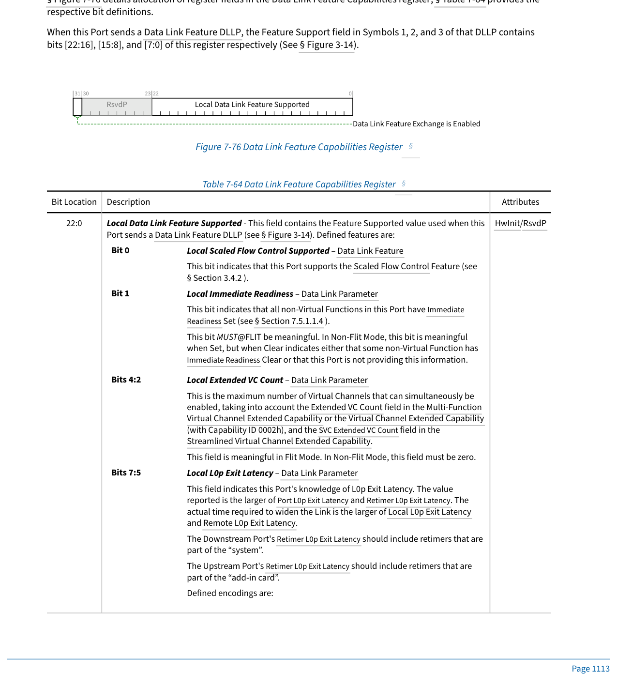

**Table 7-64. Data Link Feature Capabilities Register | 表 7-64. 数据链路特性能力寄存器**

| Bit Location | Description | Attributes |
|--------------|-------------|------------|
| 22:0 | Local Data Link Feature Supported - This field contains the Feature Supported value used when this Port sends a Data Link Feature DLLP (see Figure 3-14). Defined features are:<br>**Local Scaled Flow Control Supported – Data Link Feature**<br>This bit indicates that this Port supports the Scaled Flow Control Feature (see Section 3.4.2).<br>**Local Immediate Readiness – Data Link Parameter**<br>This bit indicates that all non-Virtual Functions in this Port have Immediate Readiness Set (see Section 7.5.1.1.4).<br>This bit MUST@FLIT be meaningful. In Non-Flit Mode, this bit is meaningful when Set, but when Clear indicates either that some non-Virtual Function has Immediate Readiness Clear or that this Port is not providing this information.<br>**Local Extended VC Count – Data Link Parameter**<br>This is the maximum number of Virtual Channels that can simultaneously be enabled, taking into account the Extended VC Count field in the Multi-Function Virtual Channel Extended Capability or the Virtual Channel Extended Capability (with Capability ID 0002h), and the SVC Extended VC Count field in the Streamlined Virtual Channel Extended Capability.<br>This field is meaningful in Flit Mode. In Non-Flit Mode, this field must be zero.<br>**Local L0p Exit Latency – Data Link Parameter**<br>This field indicates this Port's knowledge of L0p Exit Latency. The value reported is the larger of Port L0p Exit Latency and Retimer L0p Exit Latency. The actual time required to widen the Link is the larger of Local L0p Exit Latency and Remote L0p Exit Latency.<br>The Downstream Port's Retimer L0p Exit Latency should include retimers that are part of the "system".<br>The Upstream Port's Retimer L0p Exit Latency should include retimers that are part of the "add-in card". | HwInit/RsvdP |

<!-- 📄 Page 1114 -->
---

| Bit Location | Description | Attributes |
|--------------|-------------|------------|
| 22:8 (continued) | Defined encodings for Bits 22:8 are:<br>- 000b: Less than 1μs<br>- 001b: 1 μs to less than 2 μs<br>- 010b: 2 μs to less than 4 μs<br>- 011b: 4 μs to less than 8 μs<br>- 100b: 8 μs to less than 16 μs<br>- 101b: 16 μs to less than 32 μs<br>- 110b: 32 μs-64 μs<br>- 111b: More than 64 μs<br>Bit 0 corresponds to Local Scaled Flow Control Supported.<br>Bit 1 corresponds to Local Immediate Readiness.<br>This field is meaningful in Flit Mode. In Non-Flit Mode, this field must be zero.<br>Other bits in this field are RsvdP. | RsvdP |
| 23:30 | RsvdP | RsvdP |
| 31 | Data Link Feature Exchange is Enabled - If Set, indicates that this Port will enter the DL_Feature negotiation state (see Section 3.2.1). | HwInit |


<div style="overflow-x: auto; max-width: 100%;">
<table>
<thead>
<tr>
<th width="50%">🇬🇧 English</th>
<th width="50%" style="background-color:#e8e8e8">🏆 中文</th>
</tr>
</thead>
<tbody>
<tr>
<td>

[See Figure 7-76 and Table 7-64 above]

</td>
<td style="background-color:#e8e8e8">

（参见上方图 7-76 和表 7-64）

- **位 22:0**：Local Data Link Feature Supported（本地数据链路特性支持）— 该字段包含此 Port 发送 Data Link Feature DLLP 时使用的 Feature Supported 值（参见 § 图 3-14）。已定义的特性包括：
  - **Local Scaled Flow Control Supported（本地支持缩放流控）— 数据链路特性**
    - 此位指示此 Port 支持 Scaled Flow Control Feature（缩放流控特性）（参见 § 3.4.2）。
  - **Local Immediate Readiness（本地立即就绪）— 数据链路参数**
    - 此位指示此 Port 中的所有非 Virtual Function 都设置了 Immediate Readiness（立即就绪）（参见 § 7.5.1.1.4）。
    - 此位在 Flit Mode (Flit 模式) 下必须是有意义的（MUST@FLIT）。在 Non-Flit Mode (非 Flit 模式) 下，此位在置位时有意义，但在清除时指示某些非 Virtual Function 已清除立即就绪或此 Port 未提供此信息。
  - **Local Extended VC Count（本地扩展 VC 计数）— 数据链路参数**
    - 这是可以同时启用的 Virtual Channel (虚拟通道) 的最大数量，考虑了多功能虚拟通道扩展能力或虚拟通道扩展能力（能力 ID 0002h）中的 Extended VC Count 字段，以及 Streamlined Virtual Channel (精简虚拟通道) 扩展能力中的 SVC Extended VC Count 字段。
    - 此字段在 Flit 模式下有意义。在非 Flit 模式下，此字段必须为零。
  - **Local L0p Exit Latency（本地 L0p 退出延迟）— 数据链路参数**
    - 此字段指示此 Port 对 L0p Exit Latency (L0p 退出延迟) 的了解程度。报告的值是 Port L0p 退出延迟和 Retimer L0p 退出延迟 中的较大值。widening the Link (扩宽链路) 实际所需的时间是 Local L0p 退出延迟和 Remote L0p 退出延迟 中的较大值。
    - Downstream Port 的 Retimer L0p 退出延迟应包括属于 "系统" 的 retimer。
    - Upstream Port 的 Retimer L0p 退出延迟应包括属于 "附加卡 (add-in card)" 的 retimer。
    - 已定义的编码（位 22:8）如下：
      - 000b：小于 1 μs
      - 001b：1 μs 至小于 2 μs
      - 010b：2 μs 至小于 4 μs
      - 011b：4 μs 至小于 8 μs
      - 100b：8 μs 至小于 16 μs
      - 101b：16 μs 至小于 32 μs
      - 110b：32 μs-64 μs
      - 111b：大于 64 μs
    - 位 0 对应 Local Scaled Flow Control Supported。
    - 位 1 对应 Local Immediate Readiness。
    - 此字段在 Flit 模式下有意义。在非 Flit 模式下，此字段必须为零。
    - 该字段中的其他位为 RsvdP。
  - 属性：HwInit/RsvdP
- **位 23:30**：RsvdP（保留）
  - 属性：RsvdP
- **位 31**：Data Link Feature Exchange is Enabled（数据链路特性交换已使能）— 如果置位，则指示此 Port 将进入 DL_Feature negotiation (DL_Feature 协商) 状态（参见 § 3.2.1）。
  - 属性：HwInit

</td>
</tr>
</tbody>
</table>
</div>


[⬆️ 返回目录](#-本章目录-table-of-contents)

---

<a id="fig-7-77"></a>

> **Figure 7-77.** Data Link Feature Status Register | 数据链路特性状态寄存器
> 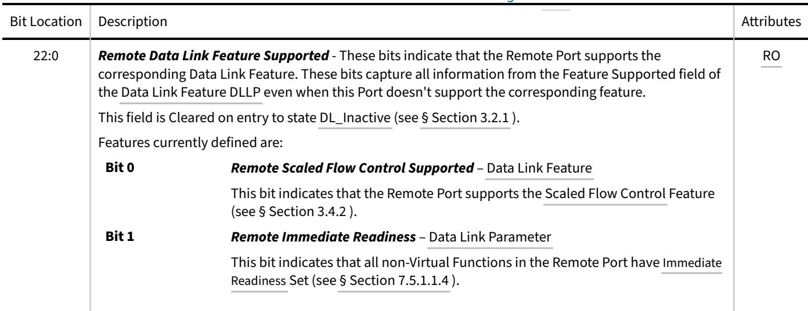

**Table 7-65. Data Link Feature Status Register | 表 7-65. 数据链路特性状态寄存器**

| Bit Location | Description | Attributes |
|--------------|-------------|------------|
| 22:0 | Remote Data Link Feature Supported - These bits indicate that the Remote Port supports the corresponding Data Link Feature. These bits capture all information from the Feature Supported field of the Data Link Feature DLLP even when this Port doesn't support the corresponding feature.<br>This field is Cleared on entry to state DL_Inactive (see Section 3.2.1).<br>Features currently defined are:<br>**Remote Scaled Flow Control Supported – Data Link Feature**<br>This bit indicates that the Remote Port supports the Scaled Flow Control Feature (see Section 3.4.2).<br>**Remote Immediate Readiness – Data Link Parameter**<br>This bit indicates that all non-Virtual Functions in the Remote Port have Immediate Readiness Set (see Section 7.5.1.1.4). | RO |
| 23:30 | RsvdZ | RsvdZ |
| 31 | Remote Data Link Feature Supported Valid | (per spec) |

<table>
<thead>
<tr>
<th width="50%">🇬🇧 English</th>
<th width="50%" style="background-color:#e8e8e8">🏆 中文</th>
</tr>
</thead>
<tbody>
<tr>
<td>

Figure 7-77 details allocation of register fields in the Data Link Feature Status Register; Table 7-65 provides the respective bit definitions.

</td>
<td style="background-color:#e8e8e8">

§ 图 7-77 详细说明了数据链路特性状态寄存器中寄存器字段的分配；§ 表 7-65 提供了相应的位定义。

- **位 22:0**：Remote Data Link Feature Supported（远端数据链路特性支持）— 这些位指示 Remote Port (远端端口) 支持相应的 Data Link Feature。即使此 Port 不支持相应的特性，这些位也会从 Data Link Feature DLLP 的 Feature Supported 字段中捕获所有信息。
  - 在进入 DL_Inactive 状态时，此字段被清除（参见 § 3.2.1）。
  - 当前定义的特性包括：
    - **Remote Scaled Flow Control Supported（远端支持缩放流控）— 数据链路特性**
      - 此位指示 Remote Port 支持 Scaled Flow Control Feature（缩放流控特性）（参见 § 3.4.2）。
    - **Remote Immediate Readiness（远端立即就绪）— 数据链路参数**
      - 此位指示 Remote Port 中的所有非 Virtual Function 都设置了 Immediate Readiness（立即就绪）（参见 § 7.5.1.1.4）。
  - 属性：RO
- **位 23:30**：RsvdZ（保留为零）
  - 属性：RsvdZ
- **位 31**：Remote Data Link Feature Supported Valid（远端数据链路特性支持有效）

</td>
</tr>
</tbody>
</table>

[⬆️ 返回目录](#-本章目录-table-of-contents)

---


---

<a id="sec-7-7-4-3"></a>
## 7.7.4.3 Data Link Feature Status Register (Offset 08h) | 数据链路特性状态寄存器(偏移量 08h)


<div style="overflow-x: auto; max-width: 100%;">
<table>
<thead>
<tr>
<th width="50%">🇬🇧 English</th>
<th width="50%" style="background-color:#e8e8e8">🏆 中文</th>
</tr>
</thead>
<tbody>
<tr>
<td>

Bits 4:2

Bits 7:5

- 000b
- 001b
- 010b
- 011b
- 100b
- 101b
- 110b
- 111b

Bits 22:8

Bit Location

Description

Attributes

In Flit Mode (Flit 模式), this bit is always meaningful. In Non-Flit Mode (非 Flit 模式), this bit is meaningful when Set, but when Clear indicates either that some non-Virtual Function (VF) has Immediate Readiness Clear or that the Remote Port is not providing this information.

**Extended VC Count – Data Link Parameter**

This is the maximum number of Virtual Channels (VC, 虚通道) that can simultaneously be enabled, taking into account the Extended VC Count field in the Multi-Function Virtual Channel Extended Capability or the Virtual Channel Extended Capability (with Capability ID 0002h), and the SVC Extended VC Count field in the Streamlined Virtual Channel Extended Capability.

This field is meaningful in Flit Mode. In Non-Flit Mode, this field must be zero.

**Remote L0p Exit Latency – Data Link Parameter**

This field indicates the remote Port's L0p Exit Latency. The value reported indicates the length of time the remote Port requires to complete widening a Link (链路) using L0p. If the remote Port does not support L0p, this field must contain 000b.

Defined encodings are:

- 000b — Less than 1 μs
- 001b — 1 μs to less than 2 μs
- 010b — 2 μs to less than 4 μs
- 011b — 4 μs to less than 8 μs
- 100b — 8 μs to less than 16 μs
- 101b — 16 μs to less than 32 μs
- 110b — 32 μs–64 μs
- 111b — More than 64 μs
- Reserved

Default is 00 0000h.

**Bit 31** — Remote Data Link Feature Supported Valid — This bit indicates that the Port has received a Data Link Feature DLLP in state DL_Feature (see § Section 3.2.1) and that the Remote Data Link Feature Supported field is meaningful. This bit is Cleared on entry to state DL_Inactive (see § Section 3.2.1).

Default is 0b.

Attribute: RO

</td>
<td style="background-color:#e8e8e8">

Bits 4:2

Bits 7:5

- 000b
- 001b
- 010b
- 011b
- 100b
- 101b
- 110b
- 111b

Bits 22:8

位位置 (Bit Location)

描述 (Description)

属性 (Attributes)

在 Flit 模式 (Flit Mode) 下,该位始终有意义。在非 Flit 模式 (Non-Flit Mode) 下,该位在置位 (Set) 时有意义,但清零 (Clear) 时则表示某个非虚拟功能 (VF) 的 Immediate Readiness 为 Clear,或者远端端口 (Remote Port) 未提供此信息。

**Extended VC Count —— 数据链路参数**

这是在考虑多功能虚通道扩展能力结构或虚通道扩展能力结构(Capability ID 为 0002h)中的 Extended VC Count 字段,以及流线型虚通道扩展能力结构中的 SVC Extended VC Count 字段后,可以同时使能的虚通道 (Virtual Channel, VC) 的最大数量。

该字段在 Flit 模式下有意义。在非 Flit 模式下,该字段必须为零。

**Remote L0p Exit Latency —— 数据链路参数**

该字段指示远端端口的 L0p 退出延迟 (L0p Exit Latency)。所报告的值表示远端端口使用 L0p 完成链路展宽 (widening a Link) 所需的时间长度。如果远端端口不支持 L0p,则该字段必须为 000b。

已定义的编码如下:

- 000b — 小于 1 μs
- 001b — 1 μs 至小于 2 μs
- 010b — 2 μs 至小于 4 μs
- 011b — 4 μs 至小于 8 μs
- 100b — 8 μs 至小于 16 μs
- 101b — 16 μs 至小于 32 μs
- 110b — 32 μs 至 64 μs
- 111b — 大于 64 μs
- 保留 (Reserved)

默认值:00 0000h。

**位 31** — Remote Data Link Feature Supported Valid(远端数据链路特性支持有效)—— 该位表示端口已在 DL_Feature 状态下接收到 Data Link Feature DLLP(参见 § Section 3.2.1),且 Remote Data Link Feature Supported 字段有意义。在进入 DL_Inactive 状态时(参见 § Section 3.2.1),该位被清零。

默认值:0b。

属性:RO

</td>
</tr>
</tbody>
</table>
</div>


[⬆️ 返回目录](#-本章目录-table-of-contents)

---

<a id="sec-7-7-5"></a>
## 7.7.5 Physical Layer 16.0 GT/s Extended Capability | 物理层 16.0 GT/s 扩展能力结构

<table>
<thead>
<tr>
<th width="50%">🇬🇧 English</th>
<th width="50%" style="background-color:#e8e8e8">🏆 中文</th>
</tr>
</thead>
<tbody>
<tr>
<td>

The Physical Layer 16.0 GT/s Extended Capability structure must be implemented in:

- A Function associated with a Downstream Port where the Supported Link Speeds Vector field indicates support for a Link speed of 16.0 GT/s.
- A Function of a single-Function Device associated with an Upstream Port where the Supported Link Speeds Vector field indicates support for a Link speed of 16.0 GT/s.
- Function 0 (and only Function 0) of a Multi-Function Device associated with an Upstream Port where the Supported Link Speeds Vector field indicates support for a Link speed of 16.0 GT/s.

This capability is permitted to be implemented in any of the Functions listed above even if the 16.0 GT/s Link speed is not supported. Implementing this capability is strongly recommended for 8.0 GT/s only Flit Mode components. In Non-Flit Mode, when the 16.0 GT/s Link speed is not supported and in Flit Mode, when the 8.0 GT/s Link speed is not supported, the behavior of registers other than the Capability Header is undefined. In Flit Mode, operating at 8.0 GT/s, the Capability Header, 16.0 GT/s Local Data Parity Register, 16.0 GT/s First Retimer Data Parity Register, and 16.0 GT/s Second Retimer Data Parity Register are meaningful.

§ Figure 7-79 details allocation of register fields in the Physical Layer 16.0 GT/s Extended Capability structure.

> **Figure 7-78.** Physical Layer 16.0 GT/s Extended Capability
> 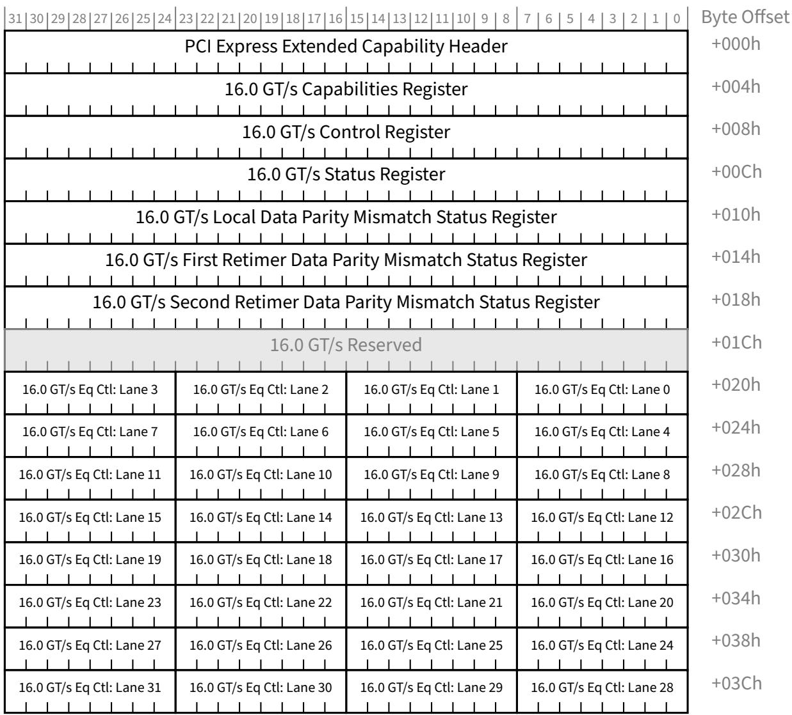

</td>
<td style="background-color:#e8e8e8">

物理层 16.0 GT/s 扩展能力结构 (Physical Layer 16.0 GT/s Extended Capability) 必须在以下情况中实现:

- 与某个下游端口 (Downstream Port) 相关联的 Function 中,且其 Supported Link Speeds Vector 字段指示支持 16.0 GT/s 的链路速度。
- 与某个上游端口 (Upstream Port) 相关联的单功能设备 (single-Function Device) 的某个 Function 中,且其 Supported Link Speeds Vector 字段指示支持 16.0 GT/s 的链路速度。
- 与某个上游端口相关联的多功能设备 (Multi-Function Device) 的 Function 0(且仅为 Function 0)中,且其 Supported Link Speeds Vector 字段指示支持 16.0 GT/s 的链路速度。

即使在不支持 16.0 GT/s 链路速度的情况下,也允许在上述任一 Function 中实现该能力结构。强烈建议仅支持 8.0 GT/s 的 Flit 模式组件实现该能力结构。在非 Flit 模式下,当不支持 16.0 GT/s 链路速度时,以及在 Flit 模式下,当不支持 8.0 GT/s 链路速度时,除 Capability Header 之外的寄存器的行为是未定义的。在 Flit 模式下以 8.0 GT/s 工作时,Capability Header、16.0 GT/s Local Data Parity Register、16.0 GT/s First Retimer Data Parity Register 和 16.0 GT/s Second Retimer Data Parity Register 是有意义的。

§ Figure 7-79 详细说明了物理层 16.0 GT/s 扩展能力结构中各寄存器的字段分配。


</td>
</tr>
</tbody>
</table>

[⬆️ 返回目录](#-本章目录-table-of-contents)

---

<!-- 📄 Page 1117 -->
---

<a id="sec-7-7-5-1"></a>
## 7.7.5.1 Physical Layer 16.0 GT/s Extended Capability Header (Offset 00h) | 物理层 16.0 GT/s 扩展能力结构头(偏移量 00h)


<div style="overflow-x: auto; max-width: 100%;">
<table>
<thead>
<tr>
<th width="50%">🇬🇧 English</th>
<th width="50%" style="background-color:#e8e8e8">🏆 中文</th>
</tr>
</thead>
<tbody>
<tr>
<td>

```
 0        15      16      19      20                31
+--------+--------+--------+-------------------+
| PCI Express Extended | Cap   | Next Capability  |
| Capability ID        | Ver   | Offset           |
|        0026h         |       |                   |
+--------+--------+--------+-------------------+
```

**Figure 7-79.** Physical Layer 16.0 GT/s Extended Capability Header

> 


**Table 7-66.** Physical Layer 16.0 GT/s Extended Capability Header

| Bit Location | Register Description | Attributes |
|--------------|----------------------|------------|
| 15:0 | PCI Express Extended Capability ID — This field is a PCI-SIG defined ID number that indicates the nature and format of the Extended Capability. The Extended Capability ID for the Physical Layer 16.0 GT/s Capability is 0026h. | RO |
| 19:16 | Capability Version — This field is a PCI-SIG defined version number that indicates the version of the Capability structure present. Must be 1h for this version of the specification. | RO |
| 31:20 | Next Capability Offset — This field contains the offset to the next PCI Express Capability structure or 000h if no other items exist in the linked list of Capabilities. For Extended Capabilities implemented in Configuration Space, this offset is relative to the beginning of PCI-compatible Configuration Space and thus must always be either 000h (for terminating list of Capabilities) or greater than 0FFh. | RO |

</td>
<td style="background-color:#e8e8e8">

```
 0        15      16      19      20                31
+--------+--------+--------+-------------------+
| PCI Express 扩展     | Cap   | 下一能力偏移      |
| 能力 ID              | Ver   | (Next Capability |
|        0026h         |       | Offset)          |
+--------+--------+--------+-------------------+
```

**图 7-79.** 物理层 16.0 GT/s 扩展能力结构头

**表 7-66.** 物理层 16.0 GT/s 扩展能力结构头

| 位位置 (Bit Location) | 寄存器描述 (Register Description) | 属性 (Attributes) |
|--------------|----------------------|------------|
| 15:0 | PCI Express 扩展能力 ID (PCI Express Extended Capability ID) —— 该字段是由 PCI-SIG 定义的 ID 编号,用于指示扩展能力的性质和格式。物理层 16.0 GT/s 能力的扩展能力 ID 为 0026h。 | RO |
| 19:16 | 能力版本 (Capability Version) —— 该字段是由 PCI-SIG 定义的版本号,用于指示当前所实现的能力结构的版本。在本规范的本版本中,该字段必须为 1h。 | RO |
| 31:20 | 下一能力偏移 (Next Capability Offset) —— 该字段包含指向下一个 PCI Express 能力结构的偏移量;如果链表中不存在其他项,则该字段为 000h。对于在配置空间中实现的扩展能力,该偏移是相对于 PCI 兼容配置空间起点的偏移,因此必须始终为 000h(用于终止能力链表)或大于 0FFh。 | RO |


</td>
</tr>
</tbody>
</table>
</div>


[⬆️ 返回目录](#-本章目录-table-of-contents)

---

<a id="sec-7-7-5-2"></a>
## 7.7.5.2 16.0 GT/s Capabilities Register (Offset 04h) | 16.0 GT/s 能力寄存器(偏移量 04h)

<table>
<thead>
<tr>
<th width="50%">🇬🇧 English</th>
<th width="50%" style="background-color:#e8e8e8">🏆 中文</th>
</tr>
</thead>
<tbody>
<tr>
<td>

```
 0                       31
+--------------------------+
|         RsvdP            |
+--------------------------+
```

**Figure 7-80.** 16.0 GT/s Capabilities Register

> 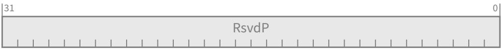


**Table 7-67.** 16.0 GT/s Capabilities Register

| Bit Location | Register Description | Attributes |
|--------------|----------------------|------------|
| 31:0 | RsvdP | RsvdP |

</td>
<td style="background-color:#e8e8e8">

```
 0                       31
+--------------------------+
|         保留 (RsvdP)     |
+--------------------------+
```

**图 7-80.** 16.0 GT/s 能力寄存器

**表 7-67.** 16.0 GT/s 能力寄存器

| 位位置 (Bit Location) | 寄存器描述 (Register Description) | 属性 (Attributes) |
|--------------|----------------------|------------|
| 31:0 | 保留 (RsvdP) | RsvdP |


</td>
</tr>
</tbody>
</table>

[⬆️ 返回目录](#-本章目录-table-of-contents)

---

<!-- 📄 Page 1118 -->
---

<a id="sec-7-7-5-3"></a>
## 7.7.5.3 16.0 GT/s Control Register (Offset 08h) | 16.0 GT/s 控制寄存器(偏移量 08h)

<table>
<thead>
<tr>
<th width="50%">🇬🇧 English</th>
<th width="50%" style="background-color:#e8e8e8">🏆 中文</th>
</tr>
</thead>
<tbody>
<tr>
<td>

```
 0                       31
+--------------------------+
|         RsvdP            |
+--------------------------+
```

**Figure 7-81.** 16.0 GT/s Control Register

> 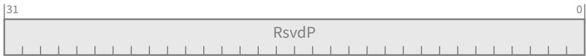


**Table 7-68.** 16.0 GT/s Control Register

| Bit Location | Register Description | Attributes |
|--------------|----------------------|------------|
| 31:0 | RsvdP | RsvdP |

</td>
<td style="background-color:#e8e8e8">

```
 0                       31
+--------------------------+
|         保留 (RsvdP)     |
+--------------------------+
```

**图 7-81.** 16.0 GT/s 控制寄存器

**表 7-68.** 16.0 GT/s 控制寄存器

| 位位置 (Bit Location) | 寄存器描述 (Register Description) | 属性 (Attributes) |
|--------------|----------------------|------------|
| 31:0 | 保留 (RsvdP) | RsvdP |


</td>
</tr>
</tbody>
</table>

[⬆️ 返回目录](#-本章目录-table-of-contents)

---

<a id="sec-7-7-5-4"></a>
## 7.7.5.4 16.0 GT/s Status Register (Offset 0Ch) | 16.0 GT/s 状态寄存器(偏移量 0Ch)


<div style="overflow-x: auto; max-width: 100%;">
<table>
<thead>
<tr>
<th width="50%">🇬🇧 English</th>
<th width="50%" style="background-color:#e8e8e8">🏆 中文</th>
</tr>
</thead>
<tbody>
<tr>
<td>

```
 0   1                2                3                4                5                       31
+---+----------------+----------------+----------------+----------------+-------------------------+
|   | EQ 16.0 Phase1 | EQ 16.0 Phase2 | EQ 16.0 Phase3 | Link EQ Req   |        RsvdZ            |
| C |    Successful  |    Successful  |    Successful  |   16.0 GT/s   |                         |
+---+----------------+----------------+----------------+----------------+-------------------------+
```

**Figure 7-82.** 16.0 GT/s Status Register

> 


**Table 7-69.** 16.0 GT/s Status Register

| Bit Location | Register Description | Attributes |
|--------------|----------------------|------------|
| 0 | **Equalization 16.0 GT/s Complete** — When Set, this bit indicates that the 16.0 GT/s Transmitter Equalization procedure has completed. Details of the Transmitter Equalization process and when this bit needs to be set to 1b is provided in § Section 4.2.7.4.2. The default value of this bit is 0b. For a Multi-Function Upstream Port, this bit must be implemented in Function 0 and RsvdZ in other Functions. | ROS/RsvdZ |
| 1 | **Equalization 16.0 GT/s Phase 1 Successful** — When set to 1b, this bit indicates that Phase 1 of the 16.0 GT/s Transmitter Equalization procedure has successfully completed. Details of the Transmitter Equalization process and when this bit needs to be set to 1b is provided in § Section 4.2.7.4.2. The default value of this bit is 0b. For a Multi-Function Upstream Port, this bit must be implemented in Function 0 and RsvdZ in other Functions. | ROS/RsvdZ |

</td>
<td style="background-color:#e8e8e8">

```
 0   1                2                3                4                5                       31
+---+----------------+----------------+----------------+----------------+-------------------------+
|   | 16.0 均衡      | 16.0 均衡      | 16.0 均衡      | 链路均衡请求   |        RsvdZ            |
|完 | Phase1 成功    | Phase2 成功    | Phase3 成功    |  16.0 GT/s     |                         |
+---+----------------+----------------+----------------+----------------+-------------------------+
```

**图 7-82.** 16.0 GT/s 状态寄存器

**表 7-69.** 16.0 GT/s 状态寄存器

| 位位置 (Bit Location) | 寄存器描述 (Register Description) | 属性 (Attributes) |
|--------------|----------------------|------------|
| 0 | **16.0 GT/s 均衡完成 (Equalization 16.0 GT/s Complete)** —— 当置位时,该位表示 16.0 GT/s 发送器均衡 (Transmitter Equalization) 流程已完成。有关发送器均衡过程的详细信息以及何时将该位置为 1b,请参见 § Section 4.2.7.4.2。该位的默认值为 0b。对于多功能上游端口 (Multi-Function Upstream Port),该位必须在 Function 0 中实现,并在其他 Function 中实现为 RsvdZ。 | ROS/RsvdZ |
| 1 | **16.0 GT/s Phase 1 均衡成功 (Equalization 16.0 GT/s Phase 1 Successful)** —— 当设置为 1b 时,该位表示 16.0 GT/s 发送器均衡流程的 Phase 1 已成功完成。有关发送器均衡过程的详细信息以及何时将该位置为 1b,请参见 § Section 4.2.7.4.2。该位的默认值为 0b。对于多功能上游端口,该位必须在 Function 0 中实现,并在其他 Function 中实现为 RsvdZ。 | ROS/RsvdZ |


</td>
</tr>
</tbody>
</table>
</div>


[⬆️ 返回目录](#-本章目录-table-of-contents)

---

<!-- 📄 Page 1119 -->
---

<table>
<thead>
<tr>
<th width="50%">🇬🇧 English</th>
<th width="50%" style="background-color:#e8e8e8">🏆 中文</th>
</tr>
</thead>
<tbody>
<tr>
<td>

| Bit Location | Register Description | Attributes |
|--------------|----------------------|------------|
| 2 | **Equalization 16.0 GT/s Phase 2 Successful** — When set to 1b, this bit indicates that Phase 2 of the 16.0 GT/s Transmitter Equalization procedure has successfully completed. Details of the Transmitter Equalization process and when this bit needs to be set to 1b is provided in § Section 4.2.7.4.2. The default value of this bit is 0b. For a Multi-Function Upstream Port, this bit must be implemented in Function 0 and RsvdZ in other Functions. | ROS/RsvdZ |
| 3 | **Equalization 16.0 GT/s Phase 3 Successful** — When set to 1b, this bit indicates that Phase 3 of the 16.0 GT/s Transmitter Equalization procedure has successfully completed. Details of the Transmitter Equalization process and when this bit needs to be set to 1b is provided in § Section 4.2.7.4.2. The default value of this bit is 0b. For a Multi-Function Upstream Port, this bit must be implemented in Function 0 and RsvdZ in other Functions. | ROS/RsvdZ |
| 4 | **Link Equalization Request 16.0 GT/s** — This bit is Set by hardware to request the 16.0 GT/s Link equalization process to be performed on the Link. Refer to § Section 4.2.4 and § Section 4.2.7.4.2 for details. The default value of this bit is 0b. For a Multi-Function Upstream Port, this bit must be implemented in Function 0 and RsvdZ in other Functions. | RW1CS/RsvdZ |

</td>
<td style="background-color:#e8e8e8">

| 位位置 (Bit Location) | 寄存器描述 (Register Description) | 属性 (Attributes) |
|--------------|----------------------|------------|
| 2 | **16.0 GT/s Phase 2 均衡成功 (Equalization 16.0 GT/s Phase 2 Successful)** —— 当设置为 1b 时,该位表示 16.0 GT/s 发送器均衡流程的 Phase 2 已成功完成。有关发送器均衡过程的详细信息以及何时将该位置为 1b,请参见 § Section 4.2.7.4.2。该位的默认值为 0b。对于多功能上游端口,该位必须在 Function 0 中实现,并在其他 Function 中实现为 RsvdZ。 | ROS/RsvdZ |
| 3 | **16.0 GT/s Phase 3 均衡成功 (Equalization 16.0 GT/s Phase 3 Successful)** —— 当设置为 1b 时,该位表示 16.0 GT/s 发送器均衡流程的 Phase 3 已成功完成。有关发送器均衡过程的详细信息以及何时将该位置为 1b,请参见 § Section 4.2.7.4.2。该位的默认值为 0b。对于多功能上游端口,该位必须在 Function 0 中实现,并在其他 Function 中实现为 RsvdZ。 | ROS/RsvdZ |
| 4 | **16.0 GT/s 链路均衡请求 (Link Equalization Request 16.0 GT/s)** —— 该位由硬件置位,以请求在该链路上执行 16.0 GT/s 链路均衡 (Link Equalization) 流程。有关详细信息,请参见 § Section 4.2.4 和 § Section 4.2.7.4.2。该位的默认值为 0b。对于多功能上游端口,该位必须在 Function 0 中实现,并在其他 Function 中实现为 RsvdZ。 | RW1CS/RsvdZ |

</td>
</tr>
</tbody>
</table>

[⬆️ 返回目录](#-本章目录-table-of-contents)

---

<a id="sec-7-7-5-5"></a>
## 7.7.5.5 16.0 GT/s Local Data Parity Mismatch Status Register (Offset 10h) | 16.0 GT/s 本地数据奇偶校验不匹配状态寄存器(偏移量 10h)


<div style="overflow-x: auto; max-width: 100%;">
<table>
<thead>
<tr>
<th width="50%">🇬🇧 English</th>
<th width="50%" style="background-color:#e8e8e8">🏆 中文</th>
</tr>
</thead>
<tbody>
<tr>
<td>

The Local Data Parity Mismatch Status register is a 32-bit vector where each bit indicates if the local receiver detected a Data Parity mismatch on the Lane with the corresponding Lane number. This Lane number is the default Lane number which is invariant to Link width and Lane reversal negotiation that occurs during Link training.

This register collects parity errors for 16.0 GT/s and higher data rates as well as 8.0 GT/s data rate in Flit Mode. When tracking errors for a specific Link Speed, software should clear this register on speed changes.

```
 0                       31
+--------------------------+
| Local Data Parity        |
| Mismatch Status          |
+--------------------------+
```

**Figure 7-83.** 16.0 GT/s Local Data Parity Mismatch Status Register

**Table 7-70.** 16.0 GT/s Local Data Parity Mismatch Status Register

| Bit Location | Register Description | Attributes |
|--------------|----------------------|------------|
| 31:0 | **Local Data Parity Mismatch Status** — Each bit indicates if the corresponding Lane detected a Data Parity mismatch. A value of 1b indicates that a mismatch was detected on the corresponding Lane Number. See § Section 4.2.8.2 for more information. The default value of each bit is 0b. For Ports that are narrower than 32 Lanes, the unused upper bits [31: Maximum Link Width] are RsvdZ. | RW1CS/RsvdZ |

</td>
<td style="background-color:#e8e8e8">

本地数据奇偶校验不匹配状态寄存器 (Local Data Parity Mismatch Status register) 是一个 32 位向量,其中每一位指示本地接收器是否在对应通道号 (Lane number) 的通道 (Lane) 上检测到数据奇偶校验 (Data Parity) 不匹配。此通道号是默认通道号,该编号在链路训练期间发生的链路宽度和通道反转 (Lane reversal) 协商中保持不变。

该寄存器收集 16.0 GT/s 及更高数据速率以及 Flit 模式下 8.0 GT/s 数据速率的奇偶校验错误。在跟踪特定链路速度的错误时,软件应在速度切换时清零该寄存器。

```
 0                       31
+--------------------------+
| 本地数据奇偶校验         |
| 不匹配状态               |
+--------------------------+
```

**图 7-83.** 16.0 GT/s 本地数据奇偶校验不匹配状态寄存器

**表 7-70.** 16.0 GT/s 本地数据奇偶校验不匹配状态寄存器

| 位位置 (Bit Location) | 寄存器描述 (Register Description) | 属性 (Attributes) |
|--------------|----------------------|------------|
| 31:0 | **本地数据奇偶校验不匹配状态 (Local Data Parity Mismatch Status)** —— 每一位指示对应的通道是否检测到数据奇偶校验不匹配。值 1b 表示在对应的通道号上检测到不匹配。更多信息请参见 § Section 4.2.8.2。每位的默认值为 0b。对于宽度小于 32 个通道的端口,未使用的高位 [31:Maximum Link Width] 为 RsvdZ。 | RW1CS/RsvdZ |

</td>
</tr>
</tbody>
</table>
</div>


[⬆️ 返回目录](#-本章目录-table-of-contents)

---

<!-- 📄 Page 1120 -->
---

<a id="sec-7-7-5-6"></a>
## 7.7.5.6 16.0 GT/s First Retimer Data Parity Mismatch Status Register (Offset 14h) | 16.0 GT/s 第一个重定时器数据奇偶校验不匹配状态寄存器(偏移量 14h)

<table>
<thead>
<tr>
<th width="50%">🇬🇧 English</th>
<th width="50%" style="background-color:#e8e8e8">🏆 中文</th>
</tr>
</thead>
<tbody>
<tr>
<td>

The First Retimer Data Parity Status register is a 32-bit vector where each bit indicates if the first Retimer of a Path (see § Figure 4-62 for more information) detected a Data Parity mismatch on the Lane with the corresponding Lane number. This Lane number is the default Lane number which is invariant to Link width and Lane reversal negotiation that occurs during Link training.

This register collects parity errors for 16.0 GT/s and higher data rates as well as 8.0 GT/s data rate in Flit Mode. When tracking errors for a specific Link Speed, software should clear this register on speed changes.

```
 0                       31
+--------------------------+
| First Retimer Data       |
| Parity Mismatch Status   |
+--------------------------+
```

**Figure 7-84.** 16.0 GT/s First Retimer Data Parity Mismatch Status Register

> 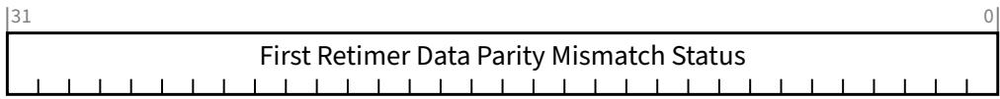


**Table 7-71.** 16.0 GT/s First Retimer Data Parity Mismatch Status Register

| Bit Location | Register Description | Attributes |
|--------------|----------------------|------------|
| 31:0 | **First Retimer Data Parity Mismatch Status** — Each bit indicates if the corresponding Lane detected a Data Parity mismatch. A value of 1b indicates that a mismatch was detected on the corresponding Lane Number. See § Section 4.2.8.2 for more information. The default value of each bit is 0b. The value of this field is undefined when no Retimers are present. For Ports that are narrower than 32 Lanes, the unused upper bits [31: Maximum Link Width] are RsvdZ. | RW1CS/RsvdZ |

The 16.0 GT/s Second Retimer Data Parity Mismatch Status Register is a 32-bit vector where each bit indicates if the second Retimer of a Path (see § Figure 4-62 for more information) detected a Data Parity mismatch on the Lane with the corresponding Lane number. This Lane number is the default Lane number which is invariant to Link width and Lane reversal negotiation that occurs during Link training.

This register collects parity errors for 16.0 GT/s and higher data rates as well as 8.0 GT/s data rate in Flit Mode. When tracking errors for a specific Link Speed, software should clear this register on speed changes.

```
 0                       31
+--------------------------+
| Second Retimer Data      |
| Parity Mismatch Status   |
+--------------------------+
```

**Figure 7-85.** 16.0 GT/s Second Retimer Data Parity Mismatch Status Register

> 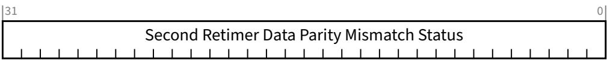


</td>
<td style="background-color:#e8e8e8">

第一个重定时器 (Retimer) 数据奇偶校验状态寄存器 (First Retimer Data Parity Status register) 是一个 32 位向量,其中每一位指示一个路径 (Path) 的第一个重定时器(更多信息请参见 § Figure 4-62)是否在对应通道号的通道上检测到数据奇偶校验不匹配。此通道号是默认通道号,该编号在链路训练期间发生的链路宽度和通道反转协商中保持不变。

该寄存器收集 16.0 GT/s 及更高数据速率以及 Flit 模式下 8.0 GT/s 数据速率的奇偶校验错误。在跟踪特定链路速度的错误时,软件应在速度切换时清零该寄存器。

```
 0                       31
+--------------------------+
| 第一个重定时器数据       |
| 奇偶校验不匹配状态       |
+--------------------------+
```

**图 7-84.** 16.0 GT/s 第一个重定时器数据奇偶校验不匹配状态寄存器

**表 7-71.** 16.0 GT/s 第一个重定时器数据奇偶校验不匹配状态寄存器

| 位位置 (Bit Location) | 寄存器描述 (Register Description) | 属性 (Attributes) |
|--------------|----------------------|------------|
| 31:0 | **第一个重定时器数据奇偶校验不匹配状态 (First Retimer Data Parity Mismatch Status)** —— 每一位指示对应的通道是否检测到数据奇偶校验不匹配。值 1b 表示在对应的通道号上检测到不匹配。更多信息请参见 § Section 4.2.8.2。每位的默认值为 0b。当不存在重定时器 (Retimer) 时,该字段的值是未定义的。对于宽度小于 32 个通道的端口,未使用的高位 [31:Maximum Link Width] 为 RsvdZ。 | RW1CS/RsvdZ |

16.0 GT/s 第二个重定时器数据奇偶校验不匹配状态寄存器 (Second Retimer Data Parity Mismatch Status Register) 是一个 32 位向量,其中每一位指示一个路径的第二个重定时器(更多信息请参见 § Figure 4-62)是否在对应通道号的通道上检测到数据奇偶校验不匹配。此通道号是默认通道号,该编号在链路训练期间发生的链路宽度和通道反转协商中保持不变。

该寄存器收集 16.0 GT/s 及更高数据速率以及 Flit 模式下 8.0 GT/s 数据速率的奇偶校验错误。在跟踪特定链路速度的错误时,软件应在速度切换时清零该寄存器。

```
 0                       31
+--------------------------+
| 第二个重定时器数据       |
| 奇偶校验不匹配状态       |
+--------------------------+
```

**图 7-85.** 16.0 GT/s 第二个重定时器数据奇偶校验不匹配状态寄存器


</td>
</tr>
</tbody>
</table>

[⬆️ 返回目录](#-本章目录-table-of-contents)

---

<a id="sec-7-7-5-7"></a>
## 7.7.5.7 16.0 GT/s Second Retimer Data Parity Mismatch Status Register (Offset 18h) | 16.0 GT/s 第二个重定时器数据奇偶校验不匹配状态寄存器(偏移量 18h)


<div style="overflow-x: auto; max-width: 100%;">
<table>
<thead>
<tr>
<th width="50%">🇬🇧 English</th>
<th width="50%" style="background-color:#e8e8e8">🏆 中文</th>
</tr>
</thead>
<tbody>
<tr>
<td>

**Table 7-72.** 16.0 GT/s Second Retimer Data Parity Mismatch Status Register

| Bit Location | Register Description | Attributes |
|--------------|----------------------|------------|
| 31:0 | **Second Retimer Data Parity Mismatch Status** — Each bit indicates if the corresponding Lane detected a Data Parity mismatch. A value of 1b indicates that a mismatch was detected on the corresponding Lane Number. See § Section 4.2.8.2 for more information. The default value of each bit is 0b. The value of this field is undefined when no Retimers are present or only one Retimer is present. For Ports that are narrower than 32 Lanes, the unused upper bits [31: Maximum Link Width] are RsvdZ. | RW1CS/RsvdZ |

</td>
<td style="background-color:#e8e8e8">

**表 7-72.** 16.0 GT/s 第二个重定时器数据奇偶校验不匹配状态寄存器

| 位位置 (Bit Location) | 寄存器描述 (Register Description) | 属性 (Attributes) |
|--------------|----------------------|------------|
| 31:0 | **第二个重定时器数据奇偶校验不匹配状态 (Second Retimer Data Parity Mismatch Status)** —— 每一位指示对应的通道是否检测到数据奇偶校验不匹配。值 1b 表示在对应的通道号上检测到不匹配。更多信息请参见 § Section 4.2.8.2。每位的默认值为 0b。当不存在重定时器或仅存在一个重定时器时,该字段的值是未定义的。对于宽度小于 32 个通道的端口,未使用的高位 [31:Maximum Link Width] 为 RsvdZ。 | RW1CS/RsvdZ |

</td>
</tr>
</tbody>
</table>
</div>


[⬆️ 返回目录](#-本章目录-table-of-contents)

---

<!-- 📄 Page 1121 -->
---

<a id="sec-7-7-5-8"></a>
## 7.7.5.8 Physical Layer 16.0 GT/s Reserved (Offset 1Ch) | 物理层 16.0 GT/s 保留(偏移量 1Ch)

<table>
<thead>
<tr>
<th width="50%">🇬🇧 English</th>
<th width="50%" style="background-color:#e8e8e8">🏆 中文</th>
</tr>
</thead>
<tbody>
<tr>
<td>

This register is RsvdP.

</td>
<td style="background-color:#e8e8e8">

该寄存器为 RsvdP(保留)。

</td>
</tr>
</tbody>
</table>

[⬆️ 返回目录](#-本章目录-table-of-contents)

---

<a id="sec-7-7-5-9"></a>
## 7.7.5.9 16.0 GT/s Lane Equalization Control Register (Offsets 20h to 3Ch) | 16.0 GT/s 通道均衡控制寄存器(偏移量 20h 至 3Ch)


<div style="overflow-x: auto; max-width: 100%;">
<table>
<thead>
<tr>
<th width="50%">🇬🇧 English</th>
<th width="50%" style="background-color:#e8e8e8">🏆 中文</th>
</tr>
</thead>
<tbody>
<tr>
<td>

The Equalization Control register consists of control fields required for per-Lane 16.0 GT/s equalization. It contains entries for at least the number of Lanes defined by the Maximum Link Width (see § Section 7.5.3.6 or § Section 7.9.9.2), must be implemented in whole DW granularity (e.g., if the Maximum Link Width is x1, the register will still contain entries for 4 Lanes with the entries for Lanes 1, 2 and 3 being undefined), and it is permitted to contain up to 32 entries regardless of the Maximum Link Width. The value of entries beyond the Maximum Link Width is undefined.

Each entry contains the values for the Lane with the corresponding default Lane number which is invariant to Link width and Lane reversal negotiation that occurs during Link training.

```
 0      3      4      7
+------+------+
| DSP  | USP  |
| Preset| Preset|
+------+------+
```

**Figure 7-86.** 16.0 GT/s Lane Equalization Control Register Entry

> 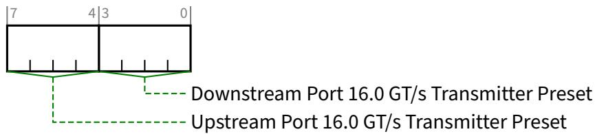


**Table 7-73.** 16.0 GT/s Lane Equalization Control Register Entry

| Bit Location | Register Description | Attributes |
|--------------|----------------------|------------|
| 3:0 | **Downstream Port 16.0 GT/s Transmitter Preset** — Transmitter Preset used for 16.0 GT/s equalization by this Port when the Port is operating as a Downstream Port. This field is ignored when the Port is operating as an Upstream Port. See § Chapter 8 for details. The field encodings are defined in § Section 4.2.4.2. For an Upstream Port if Crosslink Supported is 0b, this field is RsvdP. Otherwise, this field is HwInit. See § Section 7.5.3.18. The default value is 1111b. | HwInit/RsvdP (see description) |

</td>
<td style="background-color:#e8e8e8">

均衡控制 (Equalization Control) 寄存器包含逐通道 (per-Lane) 的 16.0 GT/s 均衡所需的控制字段。它至少包含由 Maximum Link Width 定义数量的通道条目(参见 § Section 7.5.3.6 或 § Section 7.9.9.2),必须以完整的 DW 粒度实现(例如,如果 Maximum Link Width 为 x1,则该寄存器仍将包含 4 个通道的条目,其中通道 1、2 和 3 的条目是未定义的),并且无论 Maximum Link Width 为多少,允许最多包含 32 个条目。超过 Maximum Link Width 的条目值是未定义的。

每个条目包含具有对应默认通道号的通道值,该通道号在链路训练期间发生的链路宽度和通道反转协商中保持不变。

```
 0      3      4      7
+------+------+
| 下游端口 | 上游端口 |
| 发送器   | 发送器   |
| 预设     | 预设     |
+------+------+
```

**图 7-86.** 16.0 GT/s 通道均衡控制寄存器条目

**表 7-73.** 16.0 GT/s 通道均衡控制寄存器条目

| 位位置 (Bit Location) | 寄存器描述 (Register Description) | 属性 (Attributes) |
|--------------|----------------------|------------|
| 3:0 | **下游端口 16.0 GT/s 发送器预设 (Downstream Port 16.0 GT/s Transmitter Preset)** —— 当该端口作为下游端口 (Downstream Port) 运行时,此字段为该端口用于 16.0 GT/s 均衡的发送器预设 (Transmitter Preset)。当端口作为上游端口 (Upstream Port) 运行时,该字段被忽略。有关详细信息,请参见 § Chapter 8。该字段的编码在 § Section 4.2.4.2 中定义。对于上游端口,如果 Crosslink Supported 为 0b,则该字段为 RsvdP;否则,该字段为 HwInit。参见 § Section 7.5.3.18。默认值为 1111b。 | HwInit/RsvdP(参见描述) |


</td>
</tr>
</tbody>
</table>
</div>


[⬆️ 返回目录](#-本章目录-table-of-contents)

---

<!-- 📄 Page 1122 -->
---

<table>
<thead>
<tr>
<th width="50%">🇬🇧 English</th>
<th width="50%" style="background-color:#e8e8e8">🏆 中文</th>
</tr>
</thead>
<tbody>
<tr>
<td>

| Bit Location | Register Description | Attributes |
|--------------|----------------------|------------|
| 7:4 | **Upstream Port 16.0 GT/s Transmitter Preset** — Field contains the Transmit Preset value sent or received during 16.0 GT/s Link Equalization. Field usage varies as follows: | HwInit/RO (see description) |

| Case | Operating Port Direction | Crosslink Supported | Usage |
|------|-------------------------|---------------------|-------|
| A | Downstream Port | Any | Field contains the value sent on the associated Lane during Recovery.RcvrCfg. Field is HwInit. |
| B | Upstream Port | 0b | Field is intended for debug and diagnostics. It contains the value captured from the associated Lane during Link Equalization. This value MUST@FLIT be captured from 128b/130b EQ TS2 or equalization requests with Use_Preset Set are received. This value should not be affected by equalization requests with Use_Preset Clear. Field is RO. When crosslinks are supported, case C (below) applies and this captured information is not visible to software. Vendors are encouraged to provide an alternate mechanism to obtain this information. |
| C | Upstream Port | 1b | Field is not used or affected by the current Link Equalization. Field value will be used if a future crosslink negotiation switches the Operating Port Direction so that case A (above) applies. Field is HwInit. |

See § Section 4.2.4 and § Chapter 8 for details. The field encodings are defined in § Section 4.2.4.2.

The default value is 1111b.

</td>
<td style="background-color:#e8e8e8">

| 位位置 (Bit Location) | 寄存器描述 (Register Description) | 属性 (Attributes) |
|--------------|----------------------|------------|
| 7:4 | **上游端口 16.0 GT/s 发送器预设 (Upstream Port 16.0 GT/s Transmitter Preset)** —— 该字段包含在 16.0 GT/s 链路均衡 (Link Equalization) 期间发送或接收的发送预设 (Transmit Preset) 值。该字段的用法因情况而异,如下所示: | HwInit/RO(参见描述) |

| 情况 (Case) | 端口运行方向 (Operating Port Direction) | Crosslink Supported | 用法 (Usage) |
|------|-------------------------|---------------------|-------|
| A | 下游端口 (Downstream Port) | 任意 (Any) | 字段包含在 Recovery.RcvrCfg 期间在相关通道上发送的值。该字段为 HwInit。 |
| B | 上游端口 (Upstream Port) | 0b | 该字段用于调试和诊断。它包含在链路均衡期间从相关通道捕获的值。当从 128b/130b EQ TS2 中捕获该值,或接收到 Use_Preset 置位的均衡请求时,该值 MUST@FLIT 被捕获。该值不应受到 Use_Preset 清零的均衡请求的影响。该字段为 RO。当支持 crosslink 时,适用情况 C(如下),并且此捕获的信息对软件不可见。鼓励供应商提供另一种机制来获取此信息。 |
| C | 上游端口 (Upstream Port) | 1b | 该字段不被当前链路均衡使用或影响。如果未来的 crosslink 协商将端口运行方向切换为适用情况 A(如上),则会使用该字段值。该字段为 HwInit。 |

有关详细信息,请参见 § Section 4.2.4 和 § Chapter 8。该字段的编码在 § Section 4.2.4.2 中定义。

默认值为 1111b。

</td>
</tr>
</tbody>
</table>

[⬆️ 返回目录](#-本章目录-table-of-contents)

---

<a id="sec-7-7-6-intro"></a>
## 7.7.6 Physical Layer 32.0 GT/s Extended Capability (Introduction) | 物理层 32.0 GT/s 扩展能力结构(介绍)

<table>
<thead>
<tr>
<th width="50%">🇬🇧 English</th>
<th width="50%" style="background-color:#e8e8e8">🏆 中文</th>
</tr>
</thead>
<tbody>
<tr>
<td>

The Physical Layer 32.0 GT/s Extended Capability structure must be implemented in Ports where one or more of the following features are supported:

- The Supported Link Speeds Vector field indicates support for a Link speed of 32.0 GT/s.
- The Function supports sending and/or receiving Modified TS1/TS2 Ordered Sets.

When implemented, this structure must be implemented in:

- A Function associated with a Downstream Port

</td>
<td style="background-color:#e8e8e8">

物理层 32.0 GT/s 扩展能力结构 (Physical Layer 32.0 GT/s Extended Capability) 必须在支持以下一项或多项功能的端口中实现:

- Supported Link Speeds Vector 字段指示支持 32.0 GT/s 的链路速度。
- Function 支持发送和/或接收 Modified TS1/TS2 有序集 (Ordered Sets)。

实现时,该结构必须在以下位置实现:

- 与下游端口 (Downstream Port) 相关联的 Function

</td>
</tr>
</tbody>
</table>

[⬆️ 返回目录](#-本章目录-table-of-contents)

---

---

<a id="sec-7-7-6"></a>
## 7.7.6 Physical Layer 32.0 GT/s Extended Capability | 物理层 32.0 GT/s 扩展能力


<div style="overflow-x: auto; max-width: 100%;">
<table>
<thead>
<tr>
<th width="50%">🇬🇧 English</th>
<th width="50%" style="background-color:#e8e8e8">🏆 中文</th>
</tr>
</thead>
<tbody>
<tr>
<td>

<!-- 📄 Page 1123 -->
---

- A Function of a single-Function Device associated with an Upstream Port
- Function 0 (and only Function 0) of a Multi-Function Device associated with an Upstream Port

This capability is permitted to be implemented in any of the Functions listed above even if the 32.0 GT/s Link speed is not supported. When the 32.0 GT/s Link speed is not supported, the behavior of registers other than the Capability Header is undefined.

Figure 7-87 details allocation of register fields in the Physical Layer 32.0 GT/s Extended Capability structure.

Note that parity errors for 32.0 GT/s are recorded in 16.0 GT/s Local Data Parity Mismatch Status Register, 16.0 GT/s First Retimer Data Parity Mismatch Status Register, and 16.0 GT/s Second Retimer Data Parity Mismatch Status Register. When tracking errors for a specific Link Speed, software should clear those registers on speed changes.

</td>
<td style="background-color:#e8e8e8">

<!-- 📄 Page 1123 -->
---

- 与上游端口（Upstream Port）相关联的单功能设备（single-Function Device）中的某一功能（Function）
- 与上游端口相关联的多功能设备（Multi-Function Device）中的 Function 0（且仅有 Function 0）

即使不支持 32.0 GT/s 链路速率,也允许在上述任一功能中实现此能力。当不支持 32.0 GT/s 链路速率时,除 Capability Header 之外的寄存器行为是未定义的。

图 7-87 详细展示了物理层 32.0 GT/s 扩展能力结构中寄存器字段的分配。

注意,32.0 GT/s 的奇偶校验错误记录在 16.0 GT/s Local Data Parity Mismatch Status 寄存器、16.0 GT/s First Retimer Data Parity Mismatch Status 寄存器和 16.0 GT/s Second Retimer Data Parity Mismatch Status 寄存器中。在针对特定链路速度跟踪错误时,软件应在速度切换时清除这些寄存器。

</td>
</tr>
</tbody>
</table>
</div>


[⬆️ 返回目录](#-本章目录-table-of-contents)

---

**Figure 7-87. Physical Layer 32.0 GT/s Extended Capability | 图 7-87. 物理层 32.0 GT/s 扩展能力**

| Byte Offset | Description | 字节偏移 | 说明 |
|-------------|-------------|----------|------|
| +000h | PCI Express Extended Capability Header | +000h | PCI Express 扩展能力头 |
| +004h | 32.0 GT/s Capabilities Register | +004h | 32.0 GT/s 能力寄存器 |
| +008h | 32.0 GT/s Control Register | +008h | 32.0 GT/s 控制寄存器 |
| +00Ch | 32.0 GT/s Status Register | +00Ch | 32.0 GT/s 状态寄存器 |
| +010h | Received Modified TS Data 1 Register | +010h | 接收 Modified TS 数据 1 寄存器 |
| +014h | Received Modified TS Data 2 Register | +014h | 接收 Modified TS 数据 2 寄存器 |
| +018h | Transmitted Modified TS Data 1 Register | +018h | 发送 Modified TS 数据 1 寄存器 |
| +01Ch | Transmitted Modified TS Data 2 Register | +01Ch | 发送 Modified TS 数据 2 寄存器 |
| +020h | 32.0 GT/s Eq Ctl: Lane 0 | +020h | 32.0 GT/s 均衡控制：通道 0 |
| +024h | 32.0 GT/s Eq Ctl: Lane 1 | +024h | 32.0 GT/s 均衡控制：通道 1 |
| +028h | 32.0 GT/s Eq Ctl: Lane 2 | +028h | 32.0 GT/s 均衡控制：通道 2 |
| +02Ch | 32.0 GT/s Eq Ctl: Lane 3 | +02Ch | 32.0 GT/s 均衡控制：通道 3 |
| +030h | 32.0 GT/s Eq Ctl: Lane 4 | +030h | 32.0 GT/s 均衡控制：通道 4 |
| +034h | 32.0 GT/s Eq Ctl: Lane 5 | +034h | 32.0 GT/s 均衡控制：通道 5 |
| +038h | 32.0 GT/s Eq Ctl: Lane 6 | +038h | 32.0 GT/s 均衡控制：通道 6 |
| +03Ch | 32.0 GT/s Eq Ctl: Lane 7 | +03Ch | 32.0 GT/s 均衡控制：通道 7 |
| +040h | 32.0 GT/s Eq Ctl: Lane 8 | +040h | 32.0 GT/s 均衡控制：通道 8 |
| +044h | 32.0 GT/s Eq Ctl: Lane 9 | +044h | 32.0 GT/s 均衡控制：通道 9 |
| +048h | 32.0 GT/s Eq Ctl: Lane 10 | +048h | 32.0 GT/s 均衡控制：通道 10 |
| +04Ch | 32.0 GT/s Eq Ctl: Lane 11 | +04Ch | 32.0 GT/s 均衡控制：通道 11 |
| +050h | 32.0 GT/s Eq Ctl: Lane 12 | +050h | 32.0 GT/s 均衡控制：通道 12 |
| +054h | 32.0 GT/s Eq Ctl: Lane 13 | +054h | 32.0 GT/s 均衡控制：通道 13 |
| +058h | 32.0 GT/s Eq Ctl: Lane 14 | +058h | 32.0 GT/s 均衡控制：通道 14 |
| +05Ch | 32.0 GT/s Eq Ctl: Lane 15 | +05Ch | 32.0 GT/s 均衡控制：通道 15 |
| +060h | 32.0 GT/s Eq Ctl: Lane 16 | +060h | 32.0 GT/s 均衡控制：通道 16 |
| +064h | 32.0 GT/s Eq Ctl: Lane 17 | +064h | 32.0 GT/s 均衡控制：通道 17 |
| +068h | 32.0 GT/s Eq Ctl: Lane 18 | +068h | 32.0 GT/s 均衡控制：通道 18 |
| +06Ch | 32.0 GT/s Eq Ctl: Lane 19 | +06Ch | 32.0 GT/s 均衡控制：通道 19 |
| +070h | 32.0 GT/s Eq Ctl: Lane 20 | +070h | 32.0 GT/s 均衡控制：通道 20 |
| +074h | 32.0 GT/s Eq Ctl: Lane 21 | +074h | 32.0 GT/s 均衡控制：通道 21 |
| +078h | 32.0 GT/s Eq Ctl: Lane 22 | +078h | 32.0 GT/s 均衡控制：通道 22 |
| +07Ch | 32.0 GT/s Eq Ctl: Lane 23 | +07Ch | 32.0 GT/s 均衡控制：通道 23 |
| +080h | 32.0 GT/s Eq Ctl: Lane 24 | +080h | 32.0 GT/s 均衡控制：通道 24 |
| +084h | 32.0 GT/s Eq Ctl: Lane 25 | +084h | 32.0 GT/s 均衡控制：通道 25 |
| +088h | 32.0 GT/s Eq Ctl: Lane 26 | +088h | 32.0 GT/s 均衡控制：通道 26 |
| +08Ch | 32.0 GT/s Eq Ctl: Lane 27 | +08Ch | 32.0 GT/s 均衡控制：通道 27 |
| +090h | 32.0 GT/s Eq Ctl: Lane 28 | +090h | 32.0 GT/s 均衡控制：通道 28 |
| +094h | 32.0 GT/s Eq Ctl: Lane 29 | +094h | 32.0 GT/s 均衡控制：通道 29 |
| +098h | 32.0 GT/s Eq Ctl: Lane 30 | +098h | 32.0 GT/s 均衡控制：通道 30 |
| +09Ch | 32.0 GT/s Eq Ctl: Lane 31 | +09Ch | 32.0 GT/s 均衡控制：通道 31 |

---

<a id="sec-7-7-6-1"></a>
## 7.7.6.1 Physical Layer 32.0 GT/s Extended Capability Header (Offset 00h) | 物理层 32.0 GT/s 扩展能力头（偏移 00h）

<table>
<thead>
<tr>
<th width="50%">🇬🇧 English</th>
<th width="50%" style="background-color:#e8e8e8">🏆 中文</th>
</tr>
</thead>
<tbody>
<tr>
<td>

<!-- 📄 Page 1124 -->
---

Bit layout of the register:

- Bits 15:0 — PCI Express Extended Capability ID (002Ah)
- Bits 19:16 — Capability Version
- Bits 31:20 — Next Capability Offset

</td>
<td style="background-color:#e8e8e8">

<!-- 📄 Page 1124 -->
---

该寄存器的位布局如下：

- 位 15:0 — PCI Express 扩展能力 ID（002Ah）
- 位 19:16 — 能力版本
- 位 31:20 — 下一能力偏移

</td>
</tr>
</tbody>
</table>

[⬆️ 返回目录](#-本章目录-table-of-contents)

---

**Figure 7-88. Physical Layer 32.0 GT/s Extended Capability Header | 图 7-88. 物理层 32.0 GT/s 扩展能力头**

**Table 7-75. Physical Layer 32.0 GT/s Extended Capability Header | 表 7-75. 物理层 32.0 GT/s 扩展能力头**

| Bit Location | Register Description | Attributes |
|--------------|----------------------|------------|
| 15:0 | **PCI Express Extended Capability ID** - This field is a PCI-SIG defined ID number that indicates the nature and format of the Extended Capability. The Extended Capability ID for the Physical Layer 32.0 GT/s Capability is 002Ah. | RO |
| 19:16 | **Capability Version** - This field is a PCI-SIG defined version number that indicates the version of the Capability structure present. Must be 1h for this version of the specification. | RO |
| 31:20 | **Next Capability Offset** - This field contains the offset to the next PCI Express Capability structure or 000h if no other items exist in the linked list of Capabilities. For Extended Capabilities implemented in Configuration Space, this offset is relative to the beginning of PCI-compatible Configuration Space and thus must always be either 000h (for terminating list of Capabilities) or greater than 0FFh. | RO |

| 位位置 | 寄存器描述 | 属性 |
|--------|-----------|------|
| 15:0 | **PCI Express Extended Capability ID（PCI Express 扩展能力 ID）** - 此字段是 PCI-SIG 定义的 ID 编号,用于指示扩展能力的性质和格式。物理层 32.0 GT/s 能力的扩展能力 ID 为 002Ah。 | RO |
| 19:16 | **Capability Version（能力版本）** - 此字段是 PCI-SIG 定义的版本号,用于指示所提供能力结构的版本。对于此版本的规范,必须为 1h。 | RO |
| 31:20 | **Next Capability Offset（下一能力偏移）** - 此字段包含指向下一个 PCI Express 能力结构的偏移量,如果链接的能力列表中不存在其他项,则为 000h。对于在配置空间中实现的扩展能力,此偏移相对于 PCI 兼容配置空间的开头,因此必须始终为 000h（终止能力列表）或大于 0FFh。 | RO |

---

<a id="sec-7-7-6-2"></a>
## 7.7.6.2 32.0 GT/s Capabilities Register (Offset 04h) | 32.0 GT/s 能力寄存器（偏移 04h）


<div style="overflow-x: auto; max-width: 100%;">
<table>
<thead>
<tr>
<th width="50%">🇬🇧 English</th>
<th width="50%" style="background-color:#e8e8e8">🏆 中文</th>
</tr>
</thead>
<tbody>
<tr>
<td>

<!-- 📄 Page 1124 -->
---

Bit layout of the register:

- Bit 0 — Equalization Bypass to Highest NRZ Rate Supported
- Bit 1 — No Equalization Needed Supported
- Bits 7:2 — RsvdP
- Bit 8 — Modified TS Usage Mode 0 Supported - PCI Express
- Bit 9 — Modified TS Usage Mode 1 Supported - Training Set Message
- Bit 10 — Modified TS Usage Mode 2 Supported - Alternate Protocol
- Bits 15:11 — Modified TS Reserved Usage Modes
- Bits 31:16 — RsvdP

</td>
<td style="background-color:#e8e8e8">

<!-- 📄 Page 1124 -->
---

该寄存器的位布局如下：

- 位 0 — Equalization Bypass to Highest NRZ Rate Supported（支持旁路均衡直接跳至最高 NRZ 速率）
- 位 1 — No Equalization Needed Supported（支持不需要均衡）
- 位 7:2 — RsvdP（保留）
- 位 8 — Modified TS Usage Mode 0 Supported - PCI Express（支持 Modified TS 使用模式 0 - PCI Express）
- 位 9 — Modified TS Usage Mode 1 Supported - Training Set Message（支持 Modified TS 使用模式 1 - 训练集消息）
- 位 10 — Modified TS Usage Mode 2 Supported - Alternate Protocol（支持 Modified TS 使用模式 2 - 备用协议）
- 位 15:11 — Modified TS Reserved Usage Modes（Modified TS 保留使用模式）
- 位 31:16 — RsvdP（保留）

</td>
</tr>
</tbody>
</table>
</div>


[⬆️ 返回目录](#-本章目录-table-of-contents)

---

**Figure 7-89. 32.0 GT/s Capabilities Register | 图 7-89. 32.0 GT/s 能力寄存器**

**Table 7-76. 32.0 GT/s Capabilities Register | 表 7-76. 32.0 GT/s 能力寄存器**

| Bit Location | Register Description | Attributes |
|--------------|----------------------|------------|
| 0 | **Equalization Bypass to Highest NRZ Rate Supported** - When Set, this Port supports controlling whether the Port negotiates to skip equalization for speeds other than the highest common supported speed. See Section 4.2.4 for details. Must be 1b for Ports that support 32.0 GT/s or higher data rates. | HwInit |
| 1 | **No Equalization Needed Supported** - When Set, this Port supports controlling whether or not Equalization is needed. | HwInit |
| 8 | **Modified TS Usage Mode 0 Supported - PCI Express** - This bit indicates that this Port supports PCI Express (Modified TS Usage 000b). This bit must be 1b. | RO |
| 9 | **Modified TS Usage Mode 1 Supported - Training Set Message** - This bit indicates that this Port supports sending and recieving vendor specific Training Set Messages (Modified TS Usage 001b). See Section 4.2.5.2 for details. | HwInit |
| 10 | **Modified TS Usage Mode 2 Supported - Alternate Protocol** - This bit indicates that this Port supports negotiating to use alternate protocols (Modified TS Usage 010b). See Section 4.2.5.2 for details. | HwInit |
| 15:11 | **Modified TS Reserved Usage Modes** - Reserved bits for future Usage Modes defined by the PCISIG. Must be 0 0000b. | RO |

| 位位置 | 寄存器描述 | 属性 |
|--------|-----------|------|
| 0 | **Equalization Bypass to Highest NRZ Rate Supported（支持旁路均衡直接跳至最高 NRZ 速率）** - 置位时,此端口支持控制是否协商跳过对低于最高共同支持速度的速度进行均衡。有关详细信息,请参见第 4.2.4 节。对于支持 32.0 GT/s 或更高数据速率的端口,必须为 1b。 | HwInit |
| 1 | **No Equalization Needed Supported（支持不需要均衡）** - 置位时,此端口支持控制是否需要均衡。 | HwInit |
| 8 | **Modified TS Usage Mode 0 Supported - PCI Express（支持 Modified TS 使用模式 0 - PCI Express）** - 此位指示此端口支持 PCI Express（Modified TS Usage 000b）。此位必须为 1b。 | RO |
| 9 | **Modified TS Usage Mode 1 Supported - Training Set Message（支持 Modified TS 使用模式 1 - 训练集消息）** - 此位指示此端口支持发送和接收厂商特定的训练集消息（Modified TS Usage 001b）。有关详细信息,请参见第 4.2.5.2 节。 | HwInit |
| 10 | **Modified TS Usage Mode 2 Supported - Alternate Protocol（支持 Modified TS 使用模式 2 - 备用协议）** - 此位指示此端口支持协商使用备用协议（Modified TS Usage 010b）。有关详细信息,请参见第 4.2.5.2 节。 | HwInit |
| 15:11 | **Modified TS Reserved Usage Modes（Modified TS 保留使用模式）** - 为 PCISIG 将来定义的使用模式保留的位。必须为 0 0000b。 | RO |

---

<a id="sec-7-7-6-3"></a>
## 7.7.6.3 32.0 GT/s Control Register (Offset 08h) | 32.0 GT/s 控制寄存器（偏移 08h）

<table>
<thead>
<tr>
<th width="50%">🇬🇧 English</th>
<th width="50%" style="background-color:#e8e8e8">🏆 中文</th>
</tr>
</thead>
<tbody>
<tr>
<td>

<!-- 📄 Page 1125 -->
---

Bit layout of the register:

- Bit 0 — Equalization Bypass to Highest NRZ Rate Disable
- Bit 1 — No Equalization Needed Disable
- Bits 7:2 — RsvdP
- Bits 10:8 — Modified TS Usage Mode Selected
- Bits 31:11 — RsvdP

</td>
<td style="background-color:#e8e8e8">

<!-- 📄 Page 1125 -->
---

该寄存器的位布局如下：

- 位 0 — Equalization Bypass to Highest NRZ Rate Disable（禁用旁路均衡直接跳至最高 NRZ 速率）
- 位 1 — No Equalization Needed Disable（禁用不需要均衡）
- 位 7:2 — RsvdP（保留）
- 位 10:8 — Modified TS Usage Mode Selected（已选 Modified TS 使用模式）
- 位 31:11 — RsvdP（保留）

</td>
</tr>
</tbody>
</table>

[⬆️ 返回目录](#-本章目录-table-of-contents)

---

**Figure 7-90. 32.0 GT/s Control Register | 图 7-90. 32.0 GT/s 控制寄存器**

**Table 7-77. 32.0 GT/s Control Register | 表 7-77. 32.0 GT/s 控制寄存器**

| Bit Location | Register Description | Attributes |
|--------------|----------------------|------------|
| 0 | **Equalization Bypass to Highest NRZ Rate Disable** - When Clear, this Port is permitted to indicate during Link Training that it wishes to train to the highest common link NRZ data rate and skip equalization of intermediate data rates. See Section 4.2.4 for details. If Equalization Bypass to Highest NRZ Rate Supported is Set, this bit is RWS with a default value of 0b. If Equalization Bypass to Highest NRZ Rate Supported is Clear, this bit is permitted to be hardwired to 0b. | RWS/RO |
| 1 | **No Equalization Needed Disable** - When Clear, this Port is permitted to indicate that it does not require equalization. When Set, this Port must always indicate that it requires equalization. See Section 4.2.4 for details. If No Equalization Needed Supported is Set, this bit is RWS with a default value of 0b. If No Equalization Needed Supported is Clear, this bit is permitted to be hardwired to 0b. | RWS/RO |
| 10:8 | **Modified TS Usage Mode Selected** - Thie field indicates which Usage Mode will be used by this Downstream Port the next time the Link enters L0 LTSSM State. See Section 4.2.5.2 for details. Behavior is undefined if this field indicates a Usage Mode that is not supported (i.e., associated Modified TS Usage Mode Supported bit is Clear). Unused bits in this field are permitted to be hardwired to 0b. If the only supported usage mode is PCI Express, this field is permitted to be hardwired to 000b. This field is present in Downstream Ports. In Upstream Ports, this field is RsvdP. Default is 000b. | RWS/RO/RsvdP |

| 位位置 | 寄存器描述 | 属性 |
|--------|-----------|------|
| 0 | **Equalization Bypass to Highest NRZ Rate Disable（禁用旁路均衡直接跳至最高 NRZ 速率）** - 清零时,允许此端口在链路训练期间指示其希望训练到最高共同链路 NRZ 数据速率,并跳过对中间数据速率的均衡。有关详细信息,请参见第 4.2.4 节。如果 Equalization Bypass to Highest NRZ Rate Supported 置位,则此位为 RWS,默认值为 0b。如果 Equalization Bypass to Highest NRZ Rate Supported 清零,则允许将此位硬连线为 0b。 | RWS/RO |
| 1 | **No Equalization Needed Disable（禁用不需要均衡）** - 清零时,允许此端口指示其不需要均衡。置位时,此端口必须始终指示其需要均衡。有关详细信息,请参见第 4.2.4 节。如果 No Equalization Needed Supported 置位,则此位为 RWS,默认值为 0b。如果 No Equalization Needed Supported 清零,则允许将此位硬连线为 0b。 | RWS/RO |
| 10:8 | **Modified TS Usage Mode Selected（已选 Modified TS 使用模式）** - 此字段指示此下游端口在链路下次进入 L0 LTSSM 状态（LTSSM State）时将使用的使用模式。有关详细信息,请参见第 4.2.5.2 节。如果此字段指示的是不受支持的使用模式（即关联的 Modified TS Usage Mode Supported 位清零）,则行为未定义。允许将此字段中未使用的位硬连线为 0b。如果唯一支持的使用模式是 PCI Express,则允许将此字段硬连线为 000b。此字段出现在下游端口中。在上游端口中,此字段为 RsvdP。默认值为 000b。 | RWS/RO/RsvdP |

---

<a id="sec-7-7-6-4"></a>
## 7.7.6.4 32.0 GT/s Status Register (Offset 0Ch) | 32.0 GT/s 状态寄存器（偏移 0Ch）


<div style="overflow-x: auto; max-width: 100%;">
<table>
<thead>
<tr>
<th width="50%">🇬🇧 English</th>
<th width="50%" style="background-color:#e8e8e8">🏆 中文</th>
</tr>
</thead>
<tbody>
<tr>
<td>

<!-- 📄 Page 1126 -->
---

Bit layout of the register:

- Bit 0 — Equalization 32.0 GT/s Complete
- Bit 1 — Equalization 32.0 GT/s Phase 1 Successful
- Bit 2 — Equalization 32.0 GT/s Phase 2 Successful
- Bit 3 — Equalization 32.0 GT/s Phase 3 Successful
- Bit 4 — Link Equalization Request 32.0 GT/s
- Bit 5 — Modified TS Received
- Bits 7:6 — Received Enhanced Link Behavior Control
- Bit 8 — Transmitter Precoding On
- Bit 9 — Transmitter Precode Request
- Bit 10 — No Equalization Needed Received
- Bits 31:11 — RsvdZ

</td>
<td style="background-color:#e8e8e8">

<!-- 📄 Page 1126 -->
---

该寄存器的位布局如下：

- 位 0 — Equalization 32.0 GT/s Complete（32.0 GT/s 均衡完成）
- 位 1 — Equalization 32.0 GT/s Phase 1 Successful（32.0 GT/s 均衡阶段 1 成功）
- 位 2 — Equalization 32.0 GT/s Phase 2 Successful（32.0 GT/s 均衡阶段 2 成功）
- 位 3 — Equalization 32.0 GT/s Phase 3 Successful（32.0 GT/s 均衡阶段 3 成功）
- 位 4 — Link Equalization Request 32.0 GT/s（32.0 GT/s 链路均衡请求）
- 位 5 — Modified TS Received（已接收 Modified TS）
- 位 7:6 — Received Enhanced Link Behavior Control（已接收增强链路行为控制）
- 位 8 — Transmitter Precoding On（发送器预编码开启）
- 位 9 — Transmitter Precode Request（发送器预编码请求）
- 位 10 — No Equalization Needed Received（已接收不需要均衡）
- 位 31:11 — RsvdZ（保留）

</td>
</tr>
</tbody>
</table>
</div>


[⬆️ 返回目录](#-本章目录-table-of-contents)

---

**Figure 7-91. 32.0 GT/s Status Register | 图 7-91. 32.0 GT/s 状态寄存器**

**Table 7-78. 32.0 GT/s Status Register | 表 7-78. 32.0 GT/s 状态寄存器**

| Bit Location | Register Description | Attributes |
|--------------|----------------------|------------|
| 0 | **Equalization 32.0 GT/s Complete** - When Set, this bit indicates that the 32.0 GT/s Transmitter Equalization procedure has completed. Details of the Transmitter Equalization process and when this bit needs to be set to 1b is provided in Section 4.2.7.4.2. The default value of this bit is 0b. For a Multi-Function Upstream Port, this bit must be implemented in Function 0 and RsvdZ in other Functions. | ROS/RsvdZ |
| 1 | **Equalization 32.0 GT/s Phase 1 Successful** - When set to 1b, this bit indicates that Phase 1 of the 32.0 GT/s Transmitter Equalization procedure has successfully completed. Details of the Transmitter Equalization process and when this bit needs to be set to 1b is provided in Section 4.2.7.4.2. The default value of this bit is 0b. For a Multi-Function Upstream Port, this bit must be implemented in Function 0 and RsvdZ in other Functions. | ROS/RsvdZ |
| 2 | **Equalization 32.0 GT/s Phase 2 Successful** - When set to 1b, this bit indicates that Phase 2 of the 32.0 GT/s Transmitter Equalization procedure has successfully completed. Details of the Transmitter Equalization process and when this bit needs to be set to 1b is provided in Section 4.2.7.4.2. The default value of this bit is 0b. For a Multi-Function Upstream Port, this bit must be implemented in Function 0 and RsvdZ in other Functions. | ROS/RsvdZ |
| 3 | **Equalization 32.0 GT/s Phase 3 Successful** - When set to 1b, this bit indicates that Phase 3 of the 32.0 GT/s Transmitter Equalization procedure has successfully completed. Details of the Transmitter Equalization process and when this bit needs to be set to 1b is provided in Section 4.2.7.4.2. The default value of this bit is 0b. For a Multi-Function Upstream Port, this bit must be implemented in Function 0 and RsvdZ in other Functions. | ROS/RsvdZ |
| 4 | **Link Equalization Request 32.0 GT/s** - This bit is Set by hardware to request the 32.0 GT/s Link equalization process to be performed on the Link. Refer to Section 4.2.4 and Section 4.2.7.4.2 for details. The default value of this bit is 0b. For a Multi-Function Upstream Port, this bit must be implemented in Function 0 and RsvdZ in other Functions. | RW1CS/RsvdZ |
| 5 | **Modified TS Received** - If Set, Received Modified TS Data 1 Register and Received Modified TS Data 2 Register contain meaningful data. This bit is Cleared when the Link is Down. This bit is Set when the Modified TS1/TS2 Ordered Set is received (See Section 4.2.7.3.3). Default is 0b. | RO |
| 7:6 | **Received Enhanced Link Behavior Control** - This field contains the Enhanced Link Behavior Control bits from the most recent TS1 or TS2 received in the Polling or Configuration states. See Section 4.2.5.1, Table 4-25 and Table 4-26. This field is Cleared on DL_Down. Default is 00b. | RO |
| 8 | **Transmitter Precoding On** - This field indicates whether the Receiver asked this transmitter to enable Precoding. See Section 4.2.2.5. This bit is cleared on DL_Down. Default is 0b. | RO |
| 9 | **Transmitter Precode Request** - When Set, this Port will request the transmitter to use Precoding by setting the Transmitter Precode Request bit in the TS1s/TS2s it transmits prior to entry to Recovery.Speed (see Section 4.2.2.5). Default is Implementation Specific. | RO |
| 10 | **No Equalization Needed Received** - When Set, this Port either received a Modified TS1/TS2 with the No Equalization Needed bit Set or received a non-modified TS1/TS2 was received with the No Equalization Needed encoding (also reported in the Received Enhanced Link Behavior Control field). Default is 0b. | RO |

| 位位置 | 寄存器描述 | 属性 |
|--------|-----------|------|
| 0 | **Equalization 32.0 GT/s Complete（32.0 GT/s 均衡完成）** - 置位时,此位表示 32.0 GT/s 发送器均衡过程已完成。有关发送器均衡过程的详细信息以及何时需要将此位置 1b,请参见第 4.2.7.4.2 节。此位的默认值为 0b。对于多功能上游端口,此位必须在 Function 0 中实现,在其他功能中为 RsvdZ。 | ROS/RsvdZ |
| 1 | **Equalization 32.0 GT/s Phase 1 Successful（32.0 GT/s 均衡阶段 1 成功）** - 置 1b 时,此位表示 32.0 GT/s 发送器均衡过程的阶段 1 已成功完成。有关发送器均衡过程的详细信息以及何时需要将此位置 1b,请参见第 4.2.7.4.2 节。此位的默认值为 0b。对于多功能上游端口,此位必须在 Function 0 中实现,在其他功能中为 RsvdZ。 | ROS/RsvdZ |
| 2 | **Equalization 32.0 GT/s Phase 2 Successful（32.0 GT/s 均衡阶段 2 成功）** - 置 1b 时,此位表示 32.0 GT/s 发送器均衡过程的阶段 2 已成功完成。有关发送器均衡过程的详细信息以及何时需要将此位置 1b,请参见第 4.2.7.4.2 节。此位的默认值为 0b。对于多功能上游端口,此位必须在 Function 0 中实现,在其他功能中为 RsvdZ。 | ROS/RsvdZ |
| 3 | **Equalization 32.0 GT/s Phase 3 Successful（32.0 GT/s 均衡阶段 3 成功）** - 置 1b 时,此位表示 32.0 GT/s 发送器均衡过程的阶段 3 已成功完成。有关发送器均衡过程的详细信息以及何时需要将此位置 1b,请参见第 4.2.7.4.2 节。此位的默认值为 0b。对于多功能上游端口,此位必须在 Function 0 中实现,在其他功能中为 RsvdZ。 | ROS/RsvdZ |
| 4 | **Link Equalization Request 32.0 GT/s（32.0 GT/s 链路均衡请求）** - 此位由硬件置位,以请求在链路上执行 32.0 GT/s 链路均衡过程。有关详细信息,请参见第 4.2.4 节和第 4.2.7.4.2 节。此位的默认值为 0b。对于多功能上游端口,此位必须在 Function 0 中实现,在其他功能中为 RsvdZ。 | RW1CS/RsvdZ |
| 5 | **Modified TS Received（已接收 Modified TS）** - 置位时,Received Modified TS Data 1 寄存器和 Received Modified TS Data 2 寄存器包含有意义的数据。当链路 Down 时,此位清零。当接收到 Modified TS1/TS2 Ordered Set 时,此位置位（参见第 4.2.7.3.3 节）。默认值为 0b。 | RO |
| 7:6 | **Received Enhanced Link Behavior Control（已接收增强链路行为控制）** - 此字段包含在 Polling 或 Configuration 状态中接收到的最新 TS1 或 TS2 中的增强链路行为控制位。有关详细信息,请参见第 4.2.5.1 节、表 4-25 和表 4-26。在 DL_Down 时,此字段清零。默认值为 00b。 | RO |
| 8 | **Transmitter Precoding On（发送器预编码开启）** - 此字段指示接收器是否要求此发送器启用预编码（Precoding）。参见第 4.2.2.5 节。在 DL_Down 时,此位清零。默认值为 0b。 | RO |
| 9 | **Transmitter Precode Request（发送器预编码请求）** - 置位时,此端口将在进入 Recovery.Speed 之前发送的 TS1/TS2 中设置 Transmitter Precode Request 位,以请求发送器使用预编码（参见第 4.2.2.5 节）。默认值为实现特定（Implementation Specific）。 | RO |
| 10 | **No Equalization Needed Received（已接收不需要均衡）** - 置位时,此端口要么接收到 No Equalization Needed 位置位的 Modified TS1/TS2,要么接收到带有 No Equalization Needed 编码的非 Modified TS1/TS2（也在 Received Enhanced Link Behavior Control 字段中报告）。默认值为 0b。 | RO |

---

<a id="sec-7-7-6-5"></a>
## 7.7.6.5 Received Modified TS Data 1 Register (Offset 10h) | 接收 Modified TS 数据 1 寄存器（偏移 10h）

<table>
<thead>
<tr>
<th width="50%">🇬🇧 English</th>
<th width="50%" style="background-color:#e8e8e8">🏆 中文</th>
</tr>
</thead>
<tbody>
<tr>
<td>

<!-- 📄 Page 1128 -->
---

This register contains the values received in the Modified TS1/TS2 Ordered Set (see Table 4-27).

If PCI Express (Usage Mode 0) is the only one supported by a Port, this register is permitted to be hardwired to 0000 0000h.

Bit layout of the register:

- Bits 2:0 — Received Modified TS Usage Mode
- Bits 15:3 — Received Modified TS Information 1
- Bits 31:16 — Received Modified TS Vendor ID

</td>
<td style="background-color:#e8e8e8">

<!-- 📄 Page 1128 -->
---

此寄存器包含在 Modified TS1/TS2 Ordered Set 中接收的值（参见表 4-27）。

如果某端口仅支持 PCI Express（使用模式 0）,则允许将此寄存器硬连线为 0000 0000h。

该寄存器的位布局如下：

- 位 2:0 — Received Modified TS Usage Mode（已接收 Modified TS 使用模式）
- 位 15:3 — Received Modified TS Information 1（已接收 Modified TS 信息 1）
- 位 31:16 — Received Modified TS Vendor ID（已接收 Modified TS 厂商 ID）

</td>
</tr>
</tbody>
</table>

[⬆️ 返回目录](#-本章目录-table-of-contents)

---

**Figure 7-92. Received Modified TS Data 1 Register | 图 7-92. 接收 Modified TS 数据 1 寄存器**

**Table 7-79. Received Modified TS Data 1 Register | 表 7-79. 接收 Modified TS 数据 1 寄存器**

| Bit Location | Description | Attributes |
|--------------|-------------|------------|
| 2:0 | **Received Modified TS Usage Mode** - If Modified TS Received is Set, this field contains the Modified TS Usage field from the Modified TS1/TS2 Ordered Set (see Section 4.2.7.3.6). If Modified TS Received is Clear, this field contains 000b. Unused bits in this field are permitted to be hardwired to 0b. If PCI Express (Usage Mode 0) is the only one supported, this field is permitted to be hardwired to 000b. Default is 000b. | RO |
| 15:3 | **Received Modified TS Information 1** - If Modified TS Received is Set, this field contains the Modified TS Information 1 field from the Modified TS1/TS2 Ordered Set (see Section 4.2.7.3.6). If Modified TS Received is Clear, this field contains 0 0000 0000 0000b. Bits 15:8 contain the value of Symbol 9. Bits 7:3 contain bits 7:3 of Symbol 8. If PCI Express (Usage Mode 0) is the only one supported, this field is permitted to be hardwired to 0 0000 0000 0000b. Default is 0 0000 0000 0000b. | RO |
| 31:16 | **Received Modified TS Vendor ID** - If Modified TS Received is Set, this field contains the Training Set Message Vendor ID or Alternate Protocol Vendor ID field from the Modified TS1/TS2 Ordered Set received (see Section 4.2.7.3.6). If Modified TS Received is Clear, this field contains 0000h. Bits 15:8 contain the value of Symbol 11. Bits 7:0 contain the value of Symbol 10. If PCI Express (Usage Mode 0) is the only one supported, this field is permitted to be hardwired to 0000h. Default is 0000h. | RO |

| 位位置 | 描述 | 属性 |
|--------|------|------|
| 2:0 | **Received Modified TS Usage Mode（已接收 Modified TS 使用模式）** - 如果 Modified TS Received 置位,此字段包含 Modified TS1/TS2 Ordered Set 中的 Modified TS Usage 字段（参见第 4.2.7.3.6 节）。如果 Modified TS Received 清零,此字段为 000b。允许将此字段中未使用的位硬连线为 0b。如果仅支持 PCI Express（使用模式 0）,则允许将此字段硬连线为 000b。默认值为 000b。 | RO |
| 15:3 | **Received Modified TS Information 1（已接收 Modified TS 信息 1）** - 如果 Modified TS Received 置位,此字段包含 Modified TS1/TS2 Ordered Set 中的 Modified TS Information 1 字段（参见第 4.2.7.3.6 节）。如果 Modified TS Received 清零,此字段为 0 0000 0000 0000b。位 15:8 包含 Symbol 9 的值。位 7:3 包含 Symbol 8 的位 7:3。如果仅支持 PCI Express（使用模式 0）,则允许将此字段硬连线为 0 0000 0000 0000b。默认值为 0 0000 0000 0000b。 | RO |
| 31:16 | **Received Modified TS Vendor ID（已接收 Modified TS 厂商 ID）** - 如果 Modified TS Received 置位,此字段包含已接收的 Modified TS1/TS2 Ordered Set 中的 Training Set Message Vendor ID 或 Alternate Protocol Vendor ID 字段（参见第 4.2.7.3.6 节）。如果 Modified TS Received 清零,此字段为 0000h。位 15:8 包含 Symbol 11 的值。位 7:0 包含 Symbol 10 的值。如果仅支持 PCI Express（使用模式 0）,则允许将此字段硬连线为 0000h。默认值为 0000h。 | RO |

---

<a id="sec-7-7-6-6"></a>
## 7.7.6.6 Received Modified TS Data 2 Register (Offset 14h) | 接收 Modified TS 数据 2 寄存器（偏移 14h）


<div style="overflow-x: auto; max-width: 100%;">
<table>
<thead>
<tr>
<th width="50%">🇬🇧 English</th>
<th width="50%" style="background-color:#e8e8e8">🏆 中文</th>
</tr>
</thead>
<tbody>
<tr>
<td>

<!-- 📄 Page 1129 -->
---

This register contains the values received in Symbols 12 through 14 of the Modified TS1/TS2 (see Table 4-27).

If Modified TS Usage Mode 1 Supported - Training Set Message and Modified TS Usage Mode 2 Supported - Alternate Protocol are both Clear, this register is permitted to be hardwired to 0000 0000h.

Bit layout of the register:

- Bits 23:0 — Received Modified TS Information 2
- Bits 25:24 — Alternate Protocol Negotiation Status
- Bits 31:26 — RsvdP

Alternate Protocol Negotiation Status encodings:
- 00b — Alternate Protocol Negotiation not supported
- 01b — Alternate Protocol Negotiation disabled
- 10b — Alternate Protocol Negotiation failed
- 11b — Alternate Protocol Negotiation succeeded

</td>
<td style="background-color:#e8e8e8">

<!-- 📄 Page 1129 -->
---

此寄存器包含 Modified TS1/TS2 中 Symbol 12 到 14 中接收的值（参见表 4-27）。

如果 Modified TS Usage Mode 1 Supported - Training Set Message 和 Modified TS Usage Mode 2 Supported - Alternate Protocol 都清零,则允许将此寄存器硬连线为 0000 0000h。

该寄存器的位布局如下：

- 位 23:0 — Received Modified TS Information 2（已接收 Modified TS 信息 2）
- 位 25:24 — Alternate Protocol Negotiation Status（备用协议协商状态）
- 位 31:26 — RsvdP（保留）

Alternate Protocol Negotiation Status 编码：
- 00b — 不支持备用协议协商
- 01b — 备用协议协商已禁用
- 10b — 备用协议协商失败
- 11b — 备用协议协商成功

</td>
</tr>
</tbody>
</table>
</div>


[⬆️ 返回目录](#-本章目录-table-of-contents)

---

**Figure 7-93. Received Modified TS Data 2 Register | 图 7-93. 接收 Modified TS 数据 2 寄存器**

**Table 7-80. Received Modified TS Data 2 Register | 表 7-80. 接收 Modified TS 数据 2 寄存器**

| Bit Location | Description | Attributes |
|--------------|-------------|------------|
| 23:0 | **Received Modified TS Information 2** - If Modified TS Received is Set, this field contains the Modified TS Information 2 field from the received Modified TS1/TS2 Ordered Set (Section 4.2.7.3.6). If Modified TS Received is Clear, this field contains 00 0000h. Bits 23:16 contain the value of Symbol 14. Bits 16:8 contain the value of Symbol 13. Bits 7:0 contain the value of Symbol 12. If PCI Express (Usage Mode 0) is the only one supported, this field is permitted to be hardwired to 00 0000h. Default is 00 0000h. | RO |
| 25:24 | **Alternate Protocol Negotiation Status** - Indicates the status of the Alternate Protocol Negotiation. Encodings are: 00b = Alternate Protocol Negotiation not supported; 01b = Alternate Protocol Negotiation disabled; 10b = Alternate Protocol Negotiation failed - Alternate Protocol Negotiation was attempted and did not locate a protocol that was supported on both ends of the Link; 11b = Alternate Protocol Negotiation succeeded - Alternate Protocol Negotiation located one or more protocols that were supported on both ends of the Link and the Downstream Port selected one of those protocols for use. If 11b, Alternate Protocol Negotiation completed successfully. If not 11b, Alternate Protocol Negotiation has not completed successfully. If Modified TS Usage Mode 1 Supported - Training Set Message and Modified TS Usage Mode 2 Supported - Alternate Protocol are both Clear, this field is permitted to be hardwired to 00b. If Modified TS Usage Mode 2 Supported - Alternate Protocol is Clear, this field is hardwired to 00b. If Modified TS Usage Mode 2 Supported - Alternate Protocol is Set and Modified TS Usage Mode Selected does not equal 2, this field must return a non-11b value. This field is cleared to 00b on entering Detect. Default is 00b. | RO |

| 位位置 | 描述 | 属性 |
|--------|------|------|
| 23:0 | **Received Modified TS Information 2（已接收 Modified TS 信息 2）** - 如果 Modified TS Received 置位,此字段包含已接收的 Modified TS1/TS2 Ordered Set 中的 Modified TS Information 2 字段（参见第 4.2.7.3.6 节）。如果 Modified TS Received 清零,此字段为 00 0000h。位 23:16 包含 Symbol 14 的值。位 16:8 包含 Symbol 13 的值。位 7:0 包含 Symbol 12 的值。如果仅支持 PCI Express（使用模式 0）,则允许将此字段硬连线为 00 0000h。默认值为 00 0000h。 | RO |
| 25:24 | **Alternate Protocol Negotiation Status（备用协议协商状态）** - 指示备用协议协商的状态。编码如下：00b = 不支持备用协议协商；01b = 备用协议协商已禁用；10b = 备用协议协商失败——尝试进行备用协议协商,但未找到链路两端都支持的协议；11b = 备用协议协商成功——备用协议协商找到一个或多个链路两端都支持的协议,且下游端口已选择其中一个协议使用。如果为 11b,则备用协议协商已成功完成。如果不是 11b,则备用协议协商未成功完成。如果 Modified TS Usage Mode 1 Supported - Training Set Message 和 Modified TS Usage Mode 2 Supported - Alternate Protocol 都清零,则允许将此字段硬连线为 00b。如果 Modified TS Usage Mode 2 Supported - Alternate Protocol 清零,则此字段硬连线为 00b。如果 Modified TS Usage Mode 2 Supported - Alternate Protocol 置位且 Modified TS Usage Mode Selected 不等于 2,则此字段必须返回非 11b 值。此字段在进入 Detect 时清零为 00b。默认值为 00b。 | RO |

---

<a id="sec-7-7-6-7"></a>
## 7.7.6.7 Transmitted Modified TS Data 1 Register (Offset 18h) | 发送 Modified TS 数据 1 寄存器（偏移 18h）

<table>
<thead>
<tr>
<th width="50%">🇬🇧 English</th>
<th width="50%" style="background-color:#e8e8e8">🏆 中文</th>
</tr>
</thead>
<tbody>
<tr>
<td>

<!-- 📄 Page 1130 -->
---

This register contains the values transmitted in the Modified TS1/TS2 Ordered Set (see Table 4-27).

If PCI Express (Usage Mode 0) is the only one supported by a Port, this register is permitted to be hardwired to 0000 0000h.

Bit layout of the register:

- Bits 2:0 — Transmitted Modified TS Usage Mode
- Bits 15:3 — Transmitted Modified TS Information 1
- Bits 31:16 — Transmitted Modified TS Vendor ID

</td>
<td style="background-color:#e8e8e8">

<!-- 📄 Page 1130 -->
---

此寄存器包含 Modified TS1/TS2 Ordered Set 中发送的值（参见表 4-27）。

如果某端口仅支持 PCI Express（使用模式 0）,则允许将此寄存器硬连线为 0000 0000h。

该寄存器的位布局如下：

- 位 2:0 — Transmitted Modified TS Usage Mode（已发送 Modified TS 使用模式）
- 位 15:3 — Transmitted Modified TS Information 1（已发送 Modified TS 信息 1）
- 位 31:16 — Transmitted Modified TS Vendor ID（已发送 Modified TS 厂商 ID）

</td>
</tr>
</tbody>
</table>

[⬆️ 返回目录](#-本章目录-table-of-contents)

---

**Figure 7-94. Transmitted Modified TS Data 1 Register | 图 7-94. 发送 Modified TS 数据 1 寄存器**

**Table 7-81. Transmitted Modified TS Data 1 Register | 表 7-81. 发送 Modified TS 数据 1 寄存器**

| Bit Location | Description | Attributes |
|--------------|-------------|------------|
| 2:0 | **Transmitted Modified TS Usage Mode** - If Modified TS Received is Set, this field contains the Modified TS Usage field from the Modified TS2 Ordered Set transmitted during the Configuration.Complete LTSSM State (see Section 4.2.7.3.6). Unused bits in this field are permitted to be hardwired to 0b. If PCI Express (Usage Mode 0) is the only one supported, this field is permitted to be hardwired to 000b. Default is 000b. | RO |
| 15:3 | **Transmitted Modified TS Information 1** - If Modified TS Received is Set, this field contains the Modified TS Information 1 field from Modified TS2 Ordered Set transmitted during the Configuration.Complete LTSSM State (see Section 4.2.7.3.6). Bits 15:8 contain the value of Symbol 9. Bits 7:3 contain bits 7:3 of Symbol 8. If PCI Express (Usage Mode 0) is the only one supported, this field is permitted to be hardwired to 0 0000 0000 0000b. Default is 0 0000 0000 0000b. | RO |
| 31:16 | **Transmitted Modified TS Vendor ID** - If Modified TS Received is Set, this field contains the Training Set Message Vendor ID or Alternate Protocol Vendor ID field from the Modified TS2 Ordered Set transmitted during the Configuration.Complete LTSSM State (see Section 4.2.7.3.6). Bits 15:8 contain the value of Symbol 11. Bits 7:0 contain the value of Symbol 10. If PCI Express (Usage Mode 0) is the only one supported, this field is permitted to be hardwired to 0000h. Default is 0000h. | RO |

| 位位置 | 描述 | 属性 |
|--------|------|------|
| 2:0 | **Transmitted Modified TS Usage Mode（已发送 Modified TS 使用模式）** - 如果 Modified TS Received 置位,此字段包含 Configuration.Complete LTSSM 状态期间发送的 Modified TS2 Ordered Set 中的 Modified TS Usage 字段（参见第 4.2.7.3.6 节）。允许将此字段中未使用的位硬连线为 0b。如果仅支持 PCI Express（使用模式 0）,则允许将此字段硬连线为 000b。默认值为 000b。 | RO |
| 15:3 | **Transmitted Modified TS Information 1（已发送 Modified TS 信息 1）** - 如果 Modified TS Received 置位,此字段包含 Configuration.Complete LTSSM 状态期间发送的 Modified TS2 Ordered Set 中的 Modified TS Information 1 字段（参见第 4.2.7.3.6 节）。位 15:8 包含 Symbol 9 的值。位 7:3 包含 Symbol 8 的位 7:3。如果仅支持 PCI Express（使用模式 0）,则允许将此字段硬连线为 0 0000 0000 0000b。默认值为 0 0000 0000 0000b。 | RO |
| 31:16 | **Transmitted Modified TS Vendor ID（已发送 Modified TS 厂商 ID）** - 如果 Modified TS Received 置位,此字段包含 Configuration.Complete LTSSM 状态期间发送的 Modified TS2 Ordered Set 中的 Training Set Message Vendor ID 或 Alternate Protocol Vendor ID 字段（参见第 4.2.7.3.6 节）。位 15:8 包含 Symbol 11 的值。位 7:0 包含 Symbol 10 的值。如果仅支持 PCI Express（使用模式 0）,则允许将此字段硬连线为 0000h。默认值为 0000h。 | RO |

---

<a id="sec-7-7-6-8"></a>
## 7.7.6.8 Transmitted Modified TS Data 2 Register (Offset 1Ch) | 发送 Modified TS 数据 2 寄存器（偏移 1Ch）


<div style="overflow-x: auto; max-width: 100%;">
<table>
<thead>
<tr>
<th width="50%">🇬🇧 English</th>
<th width="50%" style="background-color:#e8e8e8">🏆 中文</th>
</tr>
</thead>
<tbody>
<tr>
<td>

<!-- 📄 Page 1131 -->
---

This register contains the values received in Symbols 12 through 14 of the Modified TS1/TS2 (see Table 4-27).

If Modified TS Usage Mode 1 Supported - Training Set Message and Modified TS Usage Mode 2 Supported - Alternate Protocol are both Clear, this register is permitted to be hardwired to 0000 0000h.

Bit layout of the register:

- Bits 23:0 — Transmitted Modified TS Information 2
- Bits 25:24 — Alternate Protocol Negotiation Status
- Bits 31:26 — RsvdP

Alternate Protocol Negotiation Status encodings:
- 00b — Alternate Protocol Negotiation not supported
- 01b — Alternate Protocol Negotiation disabled
- 10b — Alternate Protocol Negotiation failed
- 11b — Alternate Protocol Negotiation succeeded

The 32.0 GT/s Equalization Control register consists of control fields required for per-Lane 32.0 GT/s equalization. It contains entries for at least the number of Lanes defined by the Maximum Link Width (see Section 7.5.3.6 or Section 7.9.9.2), must be implemented in whole DW granularity (e.g., if the Maximum Link Width is x1, the register will still contain entries for 4 Lanes with the entries for Lanes 1, 2 and 3 being undefined), and it is permitted to contain up to 32 entries regardless of the Maximum Link Width. The value of entries beyond the Maximum Link Width is undefined.

</td>
<td style="background-color:#e8e8e8">

<!-- 📄 Page 1131 -->
---

此寄存器包含 Modified TS1/TS2 中 Symbol 12 到 14 中接收的值（参见表 4-27）。

如果 Modified TS Usage Mode 1 Supported - Training Set Message 和 Modified TS Usage Mode 2 Supported - Alternate Protocol 都清零,则允许将此寄存器硬连线为 0000 0000h。

该寄存器的位布局如下：

- 位 23:0 — Transmitted Modified TS Information 2（已发送 Modified TS 信息 2）
- 位 25:24 — Alternate Protocol Negotiation Status（备用协议协商状态）
- 位 31:26 — RsvdP（保留）

Alternate Protocol Negotiation Status 编码：
- 00b — 不支持备用协议协商
- 01b — 备用协议协商已禁用
- 10b — 备用协议协商失败
- 11b — 备用协议协商成功

32.0 GT/s Equalization Control 寄存器由每通道 32.0 GT/s 均衡所需的控制字段组成。它至少包含由 Maximum Link Width 定义的通道数量条目（参见第 7.5.3.6 节或第 7.9.9.2 节）,必须以整 DW 粒度实现（例如,如果 Maximum Link Width 为 x1,寄存器仍将包含 4 个通道的条目,其中通道 1、2 和 3 的条目未定义）,并且无论 Maximum Link Width 如何,允许最多包含 32 个条目。超过 Maximum Link Width 的条目值是未定义的。

</td>
</tr>
</tbody>
</table>
</div>


[⬆️ 返回目录](#-本章目录-table-of-contents)

---

**Figure 7-95. Transmitted Modified TS Data 2 Register | 图 7-95. 发送 Modified TS 数据 2 寄存器**

**Table 7-82. Transmitted Modified TS Data 2 Register | 表 7-82. 发送 Modified TS 数据 2 寄存器**

| Bit Location | Description | Attributes |
|--------------|-------------|------------|
| 23:0 | **Transmitted Modified TS Information 2** - If Modified TS Received is Set, this field contains the Modified TS Information 2 field from the Modified TS2 Ordered Set transmitted during the Configuration.Complete LTSSM State (see Section 4.2.7.3.6). Bits 23:16 contain the value of Symbol 14. Bits 16:8 contain the value of Symbol 13. Bits 7:0 contain the value of Symbol 12. If PCI Express (Usage Mode 0) is the only one supported, this field is permitted to be hardwired to 00 0000h. Default is 00 0000h. | RO |
| 25:24 | **Alternate Protocol Negotiation Status** - Indicates the status of the Alternate Protocol Negotiation. Encodings are: 00b = Alternate Protocol Negotiation not supported; 01b = Alternate Protocol Negotiation disabled; 10b = Alternate Protocol Negotiation failed - Alternate Protocol Negotiation was attempted and did not locate a protocol that was supported on both ends of the Link; 11b = Alternate Protocol Negotiation succeeded - Alternate Protocol Negotiation located one or more protocols that were supported on both ends of the Link and the Downstream Port selected one of those protocols for use. If 11b, Alternate Protocol Negotiation completed successfully. If not 11b, Alternate Protocol Negotiation has not completed successfully. If Modified TS Usage Mode 1 Supported - Training Set Message and Modified TS Usage Mode 2 Supported - Alternate Protocol are both Clear, this field is permitted to be hardwired to 00b. If Modified TS Usage Mode 2 Supported - Alternate Protocol is Clear, this field is hardwired to 00b. If Modified TS Usage Mode 2 Supported - Alternate Protocol is Set and Modified TS Usage Mode Selected does not equal 2, this field must return a non-11b value. This field is cleared to 00b on Detect. Default is 00b. | RO |

| 位位置 | 描述 | 属性 |
|--------|------|------|
| 23:0 | **Transmitted Modified TS Information 2（已发送 Modified TS 信息 2）** - 如果 Modified TS Received 置位,此字段包含 Configuration.Complete LTSSM 状态期间发送的 Modified TS2 Ordered Set 中的 Modified TS Information 2 字段（参见第 4.2.7.3.6 节）。位 23:16 包含 Symbol 14 的值。位 16:8 包含 Symbol 13 的值。位 7:0 包含 Symbol 12 的值。如果仅支持 PCI Express（使用模式 0）,则允许将此字段硬连线为 00 0000h。默认值为 00 0000h。 | RO |
| 25:24 | **Alternate Protocol Negotiation Status（备用协议协商状态）** - 指示备用协议协商的状态。编码如下：00b = 不支持备用协议协商；01b = 备用协议协商已禁用；10b = 备用协议协商失败——尝试进行备用协议协商,但未找到链路两端都支持的协议；11b = 备用协议协商成功——备用协议协商找到一个或多个链路两端都支持的协议,且下游端口已选择其中一个协议使用。如果为 11b,则备用协议协商已成功完成。如果不是 11b,则备用协议协商未成功完成。如果 Modified TS Usage Mode 1 Supported - Training Set Message 和 Modified TS Usage Mode 2 Supported - Alternate Protocol 都清零,则允许将此字段硬连线为 00b。如果 Modified TS Usage Mode 2 Supported - Alternate Protocol 清零,则此字段硬连线为 00b。如果 Modified TS Usage Mode 2 Supported - Alternate Protocol 置位且 Modified TS Usage Mode Selected 不等于 2,则此字段必须返回非 11b 值。此字段在 Detect 时清零为 00b。默认值为 00b。 | RO |

---

<a id="sec-7-7-6-9"></a>
## 7.7.6.9 32.0 GT/s Lane Equalization Control Register (Offset 20h) | 32.0 GT/s 通道均衡控制寄存器(偏移 20h)

<table>
<thead>
<tr>
<th width="50%">🇬🇧 English</th>
<th width="50%" style="background-color:#e8e8e8">🏆 中文</th>
</tr>
</thead>
<tbody>
<tr>
<td>

Each entry contains the values for the Lane with the corresponding default Lane number which is invariant to Link width and Lane reversal negotiation that occurs during Link training.

| Bit | Field |
|---|---|
| 3:0 | Downstream Port 32.0 GT/s Transmitter Preset |
| 7:4 | Upstream Port 32.0 GT/s Transmitter Preset |

**Figure 7-96 32.0 GT/s Lane Equalization Control Register Entry**

**Table 7-83 32.0 GT/s Lane Equalization Control Register Entry**

| Bit Location | Register Description | Attributes |
|---|---|---|
| 3:0 | **Downstream Port 32.0 GT/s Transmitter Preset** - Transmitter Preset used for 32.0 GT/s equalization by this Port when the Port is operating as a Downstream Port. This field is ignored when the Port is operating as an Upstream Port. See § Chapter 8. for details. The field encodings are defined in § Section 4.2.4.2.<br><br>For an Upstream Port if Crosslink Supported is 0b, this field is RsvdP. Otherwise, this field is HwInit. See § Section 7.5.3.18.<br><br>The default value is 1111b. | HwInit/RsvdP (see description) |
| 7:4 | **Upstream Port 32.0 GT/s Transmitter Preset** - Field contains the Transmit Preset value sent or received during 32.0 GT/s Link Equalization. Field usage varies as follows: | HwInit/RO (see description) |

| Operating Port Direction | Crosslink Supported | Usage |
|---|---|---|
| A: Downstream Port | Any | Field contains the value sent on the associated Lane during Recovery.RcvrCfg. Field is HwInit. |
| B: Upstream Port | 0b | Field is intended for debug and diagnostics. It contains the value captured from the associated Lane during Link Equalization. This value MUST@FLIT be captured from 128b/130b EQ TS2 or equalization requests with Use_Preset Set are received. This value should not be affected by equalization requests with Use_Preset Clear. Field is RO.<br><br>When crosslinks are supported, case C (below) applies and this captured information is not visible to software. Vendors are encouraged to provide an alternate mechanism to obtain this information. |
| C: Upstream Port | 1b | Field is not used or affected by the current Link Equalization. Field value will be used if a future crosslink negotiation switches the Operating Port Direction so that case A (above) applies. Field is HwInit. |

</td>
<td style="background-color:#e8e8e8">

每个条目 (Entry) 包含对应默认通道 (Lane) 编号的通道值,该默认通道编号不受链路训练过程中发生的链路宽度 (Link Width) 和通道反转 (Lane Reversal) 协商的影响。

| 位 | 字段 |
|---|---|
| 3:0 | Downstream Port 32.0 GT/s 发送器预设 (Transmitter Preset) |
| 7:4 | Upstream Port 32.0 GT/s 发送器预设 (Transmitter Preset) |

**图 7-96 32.0 GT/s 通道均衡控制寄存器条目**

**表 7-83 32.0 GT/s 通道均衡控制寄存器条目**

| 位位置 | 寄存器描述 | 属性 |
|---|---|---|
| 3:0 | **Downstream Port 32.0 GT/s Transmitter Preset(下游端口 32.0 GT/s 发送器预设)** - 当该端口作为下游端口 (Downstream Port) 运行时,该字段为该端口在 32.0 GT/s 均衡过程中使用的发送器预设 (Transmitter Preset)。当该端口作为上游端口 (Upstream Port) 运行时,该字段被忽略。详见第 8 章。字段编码在第 4.2.4.2 节定义。<br><br>对于上游端口,若 Crosslink Supported 为 0b,则该字段为 RsvdP;否则,该字段为 HwInit。详见第 7.5.3.18 节。<br><br>默认值为 1111b。 | HwInit/RsvdP(见描述) |
| 7:4 | **Upstream Port 32.0 GT/s Transmitter Preset(上游端口 32.0 GT/s 发送器预设)** - 该字段包含 32.0 GT/s 链路均衡 (Link Equalization) 期间发送或接收的发送预设值。字段使用方式因情况而异,如下所示: | HwInit/RO(见描述) |

| 工作端口方向 | Crosslink Supported | 用法 |
|---|---|---|
| A:Downstream Port | 任意 | 字段包含在 Recovery.RcvrCfg 期间关联通道上发送的值。字段为 HwInit。 |
| B:Upstream Port | 0b | 该字段用于调试和诊断。它包含链路均衡期间从关联通道捕获的值。该值 MUST@FLIT 在接收到 128b/130b EQ TS2 或 Use_Preset 置位的均衡请求时被捕获。该值不应受到 Use_Preset 清零的均衡请求的影响。字段为 RO。<br><br>当支持交叉链路 (Crosslink) 时,适用下文的 C 情形,捕获的信息对软件不可见。鼓励供应商提供替代机制以获取该信息。 |
| C:Upstream Port | 1b | 该字段不被当前链路均衡使用或影响。将来若交叉链路协商切换工作端口方向使情形 A(上文)适用,则将使用该字段值。字段为 HwInit。 |

</td>
</tr>
</tbody>
</table>

---

<!-- 📄 Page 1133 -->
---

<a id="sec-7-7-6-9-cont"></a>
## 7.7.6.9 (continued) | 7.7.6.9 (续)


<div style="overflow-x: auto; max-width: 100%;">
<table>
<thead>
<tr>
<th width="50%">🇬🇧 English</th>
<th width="50%" style="background-color:#e8e8e8">🏆 中文</th>
</tr>
</thead>
<tbody>
<tr>
<td>

See § Section 4.2.4 and § Chapter 8. for details. The field encodings are defined in § Section 4.2.4.2.

The default value is 1111b.

The Physical Layer 64.0 GT/s Extended Capability structure must be implemented in Ports where one or more of the following features are supported:

- The Supported Link Speeds Vector field indicates support for a Link speed of 64.0 GT/s.

When implemented, this structure must be implemented in:

- A Function associated with a Downstream Port
- A Function of a single-Function Device associated with an Upstream Port
- Function 0 (and only Function 0) of a Multi-Function Device associated with an Upstream Port

This capability is permitted to be implemented in any of the Functions listed above even if the 64.0 GT/s Link speed is not supported. When the 64.0 GT/s Link speed is not supported, the behavior of registers other than the Capability Header is undefined.

§ Figure 7-97 details allocation of register fields in the Physical Layer 64.0 GT/s Extended Capability structure.

Note that parity errors for 64.0 GT/s are recorded in 16.0 GT/s Local Data Parity Mismatch Status Register, 16.0 GT/s First Retimer Data Parity Mismatch Status Register, and 16.0 GT/s Second Retimer Data Parity Mismatch Status Register. When tracking errors for a specific Link Speed, software should clear those registers on speed changes.

| Byte Offset | Register |
|---|---|
| +000h | Physical Layer 64.0 GT/s Extended Capability Header |
| +004h | 64.0 GT/s Capabilities Register |
| +008h | 64.0 GT/s Control Register |
| +00Ch | 64.0 GT/s Status Register |
| +010h | 64.0 GT/s Eq Ctl: Lane 0 |
| +014h | 64.0 GT/s Eq Ctl: Lane 1 |
| +018h | 64.0 GT/s Eq Ctl: Lane 2 |
| +01Ch | 64.0 GT/s Eq Ctl: Lane 3 |
| (additional Lanes 4-15 at +020h through +04Ch, not shown in detail here) | 64.0 GT/s Eq Ctl: Lane 4 through Lane 15 |

**Figure 7-97 Physical Layer 64.0 GT/s Extended Capability**

</td>
<td style="background-color:#e8e8e8">

详见第 4.2.4 节和第 8 章。字段编码在第 4.2.4.2 节定义。

默认值为 1111b。

物理层 64.0 GT/s 扩展能力 (Extended Capability) 结构必须在支持以下一项或多项特性的端口中实现:

- Supported Link Speeds Vector 字段指示支持 64.0 GT/s 的链路速度。

实现时,该结构必须在以下位置实现:

- 与下游端口关联的功能 (Function)
- 与上游端口关联的单功能设备 (single-Function Device) 的功能
- 与上游端口关联的多功能设备 (Multi-Function Device) 的 Function 0(且仅 Function 0)

即使不支持 64.0 GT/s 链路速度,也允许在上述任意功能中实现该能力。当不支持 64.0 GT/s 链路速度时,除 Capability Header 之外的其他寄存器的行为是未定义的。

§ 图 7-97 详细说明了物理层 64.0 GT/s 扩展能力结构中寄存器字段的分配。

请注意,64.0 GT/s 的奇偶校验错误记录在 16.0 GT/s Local Data Parity Mismatch Status Register、16.0 GT/s First Retimer Data Parity Mismatch Status Register 和 16.0 GT/s Second Retimer Data Parity Mismatch Status Register 中。在跟踪特定链路速度的错误时,软件应在速度变化时清除这些寄存器。

| 字节偏移 | 寄存器 |
|---|---|
| +000h | Physical Layer 64.0 GT/s Extended Capability Header |
| +004h | 64.0 GT/s Capabilities Register |
| +008h | 64.0 GT/s Control Register |
| +00Ch | 64.0 GT/s Status Register |
| +010h | 64.0 GT/s Eq Ctl: Lane 0 |
| +014h | 64.0 GT/s Eq Ctl: Lane 1 |
| +018h | 64.0 GT/s Eq Ctl: Lane 2 |
| +01Ch | 64.0 GT/s Eq Ctl: Lane 3 |
| (+020h 至 +04Ch 的 Lane 4 至 Lane 15,此处未详细列出) | 64.0 GT/s Eq Ctl: Lane 4 至 Lane 15 |

**图 7-97 物理层 64.0 GT/s 扩展能力**

</td>
</tr>
</tbody>
</table>
</div>


---

<a id="sec-7-7-7"></a>
## 7.7.7 Physical Layer 64.0 GT/s Extended Capability | 7.7.7 物理层 64.0 GT/s 扩展能力

<table>
<thead>
<tr>
<th width="50%">🇬🇧 English</th>
<th width="50%" style="background-color:#e8e8e8">🏆 中文</th>
</tr>
</thead>
<tbody>
<tr>
<td>

> **Figure 7-97** Physical Layer 64.0 GT/s Extended Capability
> 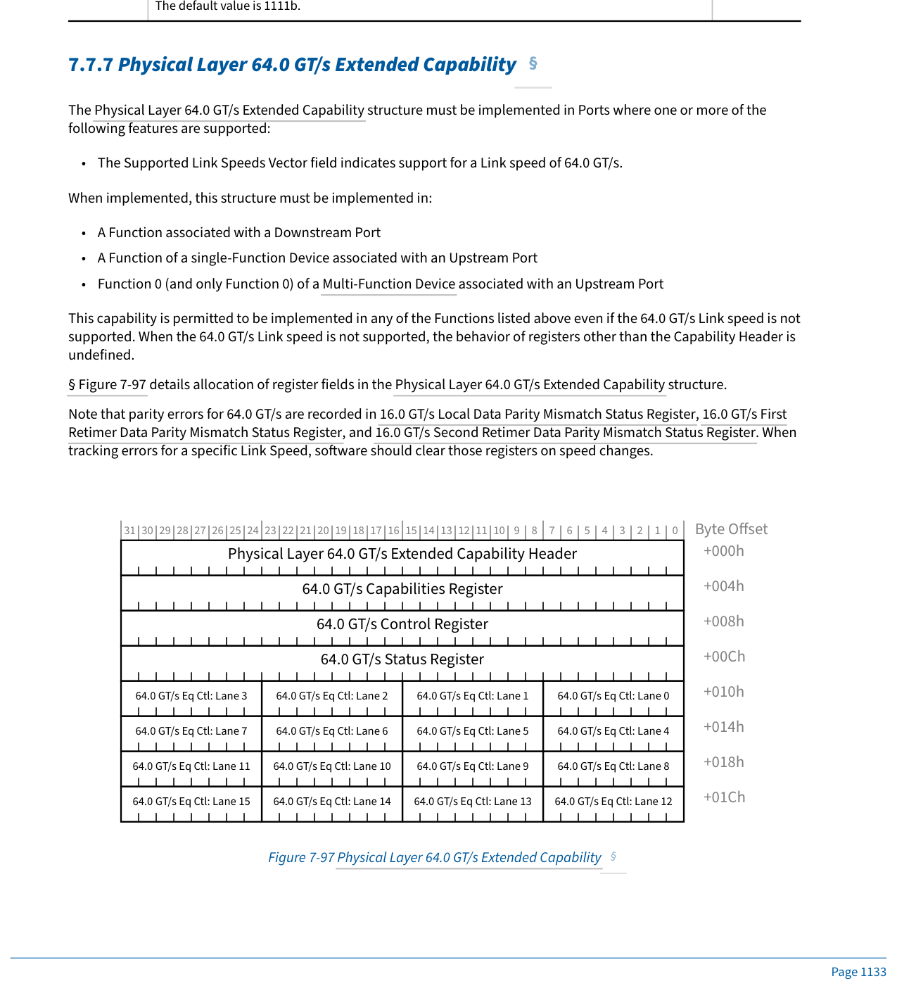

| Bits 0-15 | Bits 16-19 | Bits 20-31 |
|---|---|---|
| PCI Express Extended Capability ID = 0031h | Capability Version | Next Capability Offset |

**Figure 7-98 Physical Layer 64.0 GT/s Extended Capability Header**

**Table 7-85 Physical Layer 64.0 GT/s Extended Capability Header**

</td>
<td style="background-color:#e8e8e8">


| 位 0-15 | 位 16-19 | 位 20-31 |
|---|---|---|
| PCI Express Extended Capability ID = 0031h | Capability Version | Next Capability Offset |

**图 7-98 物理层 64.0 GT/s 扩展能力 Header**

> 


**表 7-85 物理层 64.0 GT/s 扩展能力 Header**

</td>
</tr>
</tbody>
</table>

---

<!-- 📄 Page 1134 -->
---

<a id="sec-7-7-7-1"></a>
## 7.7.7.1 Physical Layer 64.0 GT/s Extended Capability Header (Offset 00h) | 7.7.7.1 物理层 64.0 GT/s 扩展能力 Header(偏移 00h)


<div style="overflow-x: auto; max-width: 100%;">
<table>
<thead>
<tr>
<th width="50%">🇬🇧 English</th>
<th width="50%" style="background-color:#e8e8e8">🏆 中文</th>
</tr>
</thead>
<tbody>
<tr>
<td>

| Bit Location | Register Description | Attributes |
|---|---|---|
| 15:0 | **PCI Express Extended Capability ID** - This field is a PCI-SIG defined ID number that indicates the nature and format of the Extended Capability.<br><br>The Extended Capability ID for the Physical Layer 64.0 GT/s Capability is 0031h. | RO |
| 19:16 | **Capability Version** - This field is a PCI-SIG defined version number that indicates the version of the Capability structure present.<br><br>Must be 1h for this version of the specification. | RO |
| 31:20 | **Next Capability Offset** - This field contains the offset to the next PCI Express Capability structure or 000h if no other items exist in the linked list of Capabilities.<br><br>For Extended Capabilities implemented in Configuration Space, this offset is relative to the beginning of PCI-compatible Configuration Space and thus must always be either 000h (for terminating list of Capabilities) or greater than 0FFh. | RO |

</td>
<td style="background-color:#e8e8e8">

| 位位置 | 寄存器描述 | 属性 |
|---|---|---|
| 15:0 | **PCI Express Extended Capability ID** - 该字段是 PCI-SIG 定义的 ID 号,用于指示扩展能力 (Extended Capability) 的性质和格式。<br><br>物理层 64.0 GT/s 能力的扩展能力 ID 为 0031h。 | RO |
| 19:16 | **Capability Version** - 该字段是 PCI-SIG 定义的版本号,用于指示当前能力 (Capability) 结构的版本。<br><br>对于本版本规范,必须为 1h。 | RO |
| 31:20 | **Next Capability Offset** - 该字段包含指向下一个 PCI Express 能力结构的偏移量;若链表 (linked list) 中没有其他项,则为 000h。<br><br>对于在配置空间 (Configuration Space) 中实现的扩展能力,该偏移量相对于 PCI 兼容配置空间 (PCI-compatible Configuration Space) 的起点,因此必须始终为 000h(用于终止能力链表)或大于 0FFh。 | RO |

</td>
</tr>
</tbody>
</table>
</div>


---

<a id="sec-7-7-7-2"></a>
## 7.7.7.2 64.0 GT/s Capabilities Register (Offset 04h) | 7.7.7.2 64.0 GT/s 能力寄存器(偏移 04h)

<table>
<thead>
<tr>
<th width="50%">🇬🇧 English</th>
<th width="50%" style="background-color:#e8e8e8">🏆 中文</th>
</tr>
</thead>
<tbody>
<tr>
<td>

| Bits 0-31 |
|---|
| RsvdP |

**Figure 7-99 64.0 GT/s Capabilities Register**

**Table 7-86 64.0 GT/s Capabilities Register**

| Bit Location | Register Description | Attributes |
|---|---|---|
| 31:0 | Reserved | RsvdP |

</td>
<td style="background-color:#e8e8e8">

| 位 0-31 |
|---|
| RsvdP |

**图 7-99 64.0 GT/s 能力寄存器**

> 


**表 7-86 64.0 GT/s 能力寄存器**

| 位位置 | 寄存器描述 | 属性 |
|---|---|---|
| 31:0 | 保留 | RsvdP |

</td>
</tr>
</tbody>
</table>

---

<!-- 📄 Page 1135 -->
---

<a id="sec-7-7-7-3"></a>
## 7.7.7.3 64.0 GT/s Control Register (Offset 08h) | 7.7.7.3 64.0 GT/s 控制寄存器(偏移 08h)

<table>
<thead>
<tr>
<th width="50%">🇬🇧 English</th>
<th width="50%" style="background-color:#e8e8e8">🏆 中文</th>
</tr>
</thead>
<tbody>
<tr>
<td>

| Bits 0-31 |
|---|
| RsvdP |

**Figure 7-100 64.0 GT/s Control Register**

**Table 7-87 64.0 GT/s Control Register**

| Bit Location | Register Description | Attributes |
|---|---|---|
| 31:0 | Reserved | RsvdP |

</td>
<td style="background-color:#e8e8e8">

| 位 0-31 |
|---|
| RsvdP |

**图 7-100 64.0 GT/s 控制寄存器**

> 


**表 7-87 64.0 GT/s 控制寄存器**

| 位位置 | 寄存器描述 | 属性 |
|---|---|---|
| 31:0 | 保留 | RsvdP |

</td>
</tr>
</tbody>
</table>

---

<a id="sec-7-7-7-4"></a>
## 7.7.7.4 64.0 GT/s Status Register (Offset 0Ch) | 7.7.7.4 64.0 GT/s 状态寄存器(偏移 0Ch)


<div style="overflow-x: auto; max-width: 100%;">
<table>
<thead>
<tr>
<th width="50%">🇬🇧 English</th>
<th width="50%" style="background-color:#e8e8e8">🏆 中文</th>
</tr>
</thead>
<tbody>
<tr>
<td>

| Bits | Field |
|---|---|
| 0 | Equalization 64.0 GT/s Complete |
| 1 | Equalization 64.0 GT/s Phase 1 Successful |
| 2 | Equalization 64.0 GT/s Phase 2 Successful |
| 3 | Equalization 64.0 GT/s Phase 3 Successful |
| 4 | Link Equalization Request 64.0 GT/s |
| 5 | Transmitter Precoding On |
| 6 | Transmitter Precode Request |
| 7 | No Equalization Needed Received |
| 8-31 | RsvdZ |

**Figure 7-101 64.0 GT/s Status Register**

**Table 7-88 64.0 GT/s Status Register**

</td>
<td style="background-color:#e8e8e8">

| 位 | 字段 |
|---|---|
| 0 | Equalization 64.0 GT/s Complete |
| 1 | Equalization 64.0 GT/s Phase 1 Successful |
| 2 | Equalization 64.0 GT/s Phase 2 Successful |
| 3 | Equalization 64.0 GT/s Phase 3 Successful |
| 4 | Link Equalization Request 64.0 GT/s |
| 5 | Transmitter Precoding On |
| 6 | Transmitter Precode Request |
| 7 | No Equalization Needed Received |
| 8-31 | RsvdZ |

**图 7-101 64.0 GT/s 状态寄存器**

**表 7-88 64.0 GT/s 状态寄存器**

</td>
</tr>
</tbody>
</table>
</div>


---

<!-- 📄 Page 1136 -->
---

<a id="sec-7-7-7-4-fields"></a>
## 7.7.7.4 64.0 GT/s Status Register (Offset 0Ch) - Field Definitions | 7.7.7.4 64.0 GT/s 状态寄存器(偏移 0Ch) — 字段定义

<table>
<thead>
<tr>
<th width="50%">🇬🇧 English</th>
<th width="50%" style="background-color:#e8e8e8">🏆 中文</th>
</tr>
</thead>
<tbody>
<tr>
<td>

| Bit Location | Register Description | Attributes |
|---|---|---|
| 0 | **Equalization 64.0 GT/s Complete** - When Set, this bit indicates that the 64.0 GT/s Transmitter Equalization procedure has completed. Details of the Transmitter Equalization process and when this bit needs to be set to 1b is provided in § Section 4.2.7.4.2.<br><br>The default value of this bit is 0b.<br><br>For a Multi-Function Upstream Port, this bit must be implemented in Function 0 and RsvdZ in other Functions. | ROS/RsvdZ |
| 1 | **Equalization 64.0 GT/s Phase 1 Successful** - When set to 1b, this bit indicates that Phase 1 of the 64.0 GT/s Transmitter Equalization procedure has successfully completed. Details of the Transmitter Equalization process and when this bit needs to be set to 1b is provided in § Section 4.2.7.4.2.<br><br>The default value of this bit is 0b.<br><br>For a Multi-Function Upstream Port, this bit must be implemented in Function 0 and RsvdZ in other Functions. | ROS/RsvdZ |
| 2 | **Equalization 64.0 GT/s Phase 2 Successful** - When set to 1b, this bit indicates that Phase 2 of the 64.0 GT/s Transmitter Equalization procedure has successfully completed. Details of the Transmitter Equalization process and when this bit needs to be set to 1b is provided in § Section 4.2.7.4.2.<br><br>The default value of this bit is 0b.<br><br>For a Multi-Function Upstream Port, this bit must be implemented in Function 0 and RsvdZ in other Functions. | ROS/RsvdZ |
| 3 | **Equalization 64.0 GT/s Phase 3 Successful** - When set to 1b, this bit indicates that Phase 3 of the 64.0 GT/s Transmitter Equalization procedure has successfully completed. Details of the Transmitter Equalization process and when this bit needs to be set to 1b is provided in § Section 4.2.7.4.2.<br><br>The default value of this bit is 0b.<br><br>For a Multi-Function Upstream Port, this bit must be implemented in Function 0 and RsvdZ in other Functions. | ROS/RsvdZ |
| 4 | **Link Equalization Request 64.0 GT/s** - This bit is Set by hardware to request the 64.0 GT/s Link equalization process to be performed on the Link. Refer to § Section 4.2.4 and § Section 4.2.7.4.2 for details.<br><br>The default value of this bit is 0b.<br><br>For a Multi-Function Upstream Port, this bit must be implemented in Function 0 and RsvdZ in other Functions. | RW1CS/RsvdZ |
| 5 | **Transmitter Precoding On** - This field indicates whether the Receiver asked this transmitter to enable Precoding. See § Section 4.2.3.1.4. This bit is cleared on DL_Down.<br><br>Default is 0b. | RO |
| 6 | **Transmitter Precode Request** - When Set, this Port will request the transmitter to use Precoding by setting the Transmitter Precode Request bit in the TS1s/TS2s it transmits prior to entry to Recovery.Speed (see § Section 4.2.3.1.4).<br><br>Default is Implementation Specific. | RO |
| 7 | **No Equalization Needed Received** - When Set, this Port either received a Modified TS1/TS2 with the No Equalization Needed bit Set or received a non-modified TS1/TS2 was received with the No Equalization Needed encoding (also reported in the Received Enhanced Link Behavior Control field).<br><br>Default is 0b. | RO |
| 31:8 | Reserved | RsvdZ |

</td>
<td style="background-color:#e8e8e8">

| 位位置 | 寄存器描述 | 属性 |
|---|---|---|
| 0 | **Equalization 64.0 GT/s Complete(64.0 GT/s 均衡完成)** - 当置位时,该位指示 64.0 GT/s 发送器均衡 (Transmitter Equalization) 过程已完成。发送器均衡过程的细节及该位需要在何时被置为 1b,详见第 4.2.7.4.2 节。<br><br>该位的默认值为 0b。<br><br>对于多功能上游端口 (Multi-Function Upstream Port),该位必须在 Function 0 中实现,在其他功能中为 RsvdZ。 | ROS/RsvdZ |
| 1 | **Equalization 64.0 GT/s Phase 1 Successful(64.0 GT/s 均衡阶段 1 成功)** - 当置为 1b 时,该位指示 64.0 GT/s 发送器均衡过程的阶段 1 已成功完成。发送器均衡过程的细节及该位需要在何时被置为 1b,详见第 4.2.7.4.2 节。<br><br>该位的默认值为 0b。<br><br>对于多功能上游端口,该位必须在 Function 0 中实现,在其他功能中为 RsvdZ。 | ROS/RsvdZ |
| 2 | **Equalization 64.0 GT/s Phase 2 Successful(64.0 GT/s 均衡阶段 2 成功)** - 当置为 1b 时,该位指示 64.0 GT/s 发送器均衡过程的阶段 2 已成功完成。发送器均衡过程的细节及该位需要在何时被置为 1b,详见第 4.2.7.4.2 节。<br><br>该位的默认值为 0b。<br><br>对于多功能上游端口,该位必须在 Function 0 中实现,在其他功能中为 RsvdZ。 | ROS/RsvdZ |
| 3 | **Equalization 64.0 GT/s Phase 3 Successful(64.0 GT/s 均衡阶段 3 成功)** - 当置为 1b 时,该位指示 64.0 GT/s 发送器均衡过程的阶段 3 已成功完成。发送器均衡过程的细节及该位需要在何时被置为 1b,详见第 4.2.7.4.2 节。<br><br>该位的默认值为 0b。<br><br>对于多功能上游端口,该位必须在 Function 0 中实现,在其他功能中为 RsvdZ。 | ROS/RsvdZ |
| 4 | **Link Equalization Request 64.0 GT/s(64.0 GT/s 链路均衡请求)** - 该位由硬件置位,以请求在该链路上执行 64.0 GT/s 链路均衡过程。详见第 4.2.4 节和第 4.2.7.4.2 节。<br><br>该位的默认值为 0b。<br><br>对于多功能上游端口,该位必须在 Function 0 中实现,在其他功能中为 RsvdZ。 | RW1CS/RsvdZ |
| 5 | **Transmitter Precoding On(发送器预编码开启)** - 该字段指示接收器是否已请求该发送器启用预编码 (Precoding)。详见第 4.2.3.1.4 节。该位在 DL_Down 时被清零。<br><br>默认为 0b。 | RO |
| 6 | **Transmitter Precode Request(发送器预编码请求)** - 当置位时,该端口将通过在进入 Recovery.Speed 之前发送的 TS1s/TS2s 中设置 Transmitter Precode Request 位,来请求发送器使用预编码(详见第 4.2.3.1.4 节)。<br><br>默认为实现特定 (Implementation Specific)。 | RO |
| 7 | **No Equalization Needed Received(已收到无需均衡指示)** - 当置位时,该端口要么收到了 No Equalization Needed 位置位的 Modified TS1/TS2,要么收到了采用 No Equalization Needed 编码的非修改版 TS1/TS2(同时也会报告在 Received Enhanced Link Behavior Control 字段中)。<br><br>默认为 0b。 | RO |
| 31:8 | 保留 | RsvdZ |

</td>
</tr>
</tbody>
</table>

---

<a id="sec-7-7-7-5"></a>
## 7.7.7.5 64.0 GT/s Lane Equalization Control Register (Offset 10h) | 7.7.7.5 64.0 GT/s 通道均衡控制寄存器(偏移 10h)


<div style="overflow-x: auto; max-width: 100%;">
<table>
<thead>
<tr>
<th width="50%">🇬🇧 English</th>
<th width="50%" style="background-color:#e8e8e8">🏆 中文</th>
</tr>
</thead>
<tbody>
<tr>
<td>

The 64.0 GT/s Equalization Control register consists of control fields required for per-Lane 64.0 GT/s equalization. It contains entries for at least the number of Lanes defined by the Maximum Link Width (see § Section 7.5.3.6 or § Section 7.9.9.2), must be implemented in whole DW granularity (e.g., if the Maximum Link Width is x1, the register will still contain entries for 4 Lanes with the entries for Lanes 1, 2 and 3 being undefined), and it is permitted to contain up to 32 entries regardless of the Maximum Link Width. The value of entries beyond the Maximum Link Width is undefined.

Each entry contains the values for the Lane with the corresponding default Lane number which is invariant to Link width and Lane reversal negotiation that occurs during Link training.

| Bit | Field |
|---|---|
| 3:0 | Downstream Port 64.0 GT/s Transmitter Preset |
| 7:4 | Upstream Port 64.0 GT/s Transmitter Preset |

**Figure 7-102 64.0 GT/s Lane Equalization Control Register Entry**

**Table 7-89 64.0 GT/s Lane Equalization Control Register Entry**

</td>
<td style="background-color:#e8e8e8">

64.0 GT/s 均衡控制 (Equalization Control) 寄存器由逐通道 64.0 GT/s 均衡所需的控制字段组成。它至少包含由最大链路宽度 (Maximum Link Width) 定义的通道数(见第 7.5.3.6 节或第 7.9.9.2 节)的条目,必须以完整的 DW (双字) 粒度实现(例如,若最大链路宽度为 x1,该寄存器仍包含 4 个通道的条目,而 Lane 1、2 和 3 的条目未定义),并且无论最大链路宽度如何,允许最多包含 32 个条目。超出最大链路宽度的条目值未定义。

每个条目包含对应默认通道编号的通道值,该默认通道编号不受链路训练过程中发生的链路宽度和通道反转协商的影响。

| 位 | 字段 |
|---|---|
| 3:0 | Downstream Port 64.0 GT/s 发送器预设 |
| 7:4 | Upstream Port 64.0 GT/s 发送器预设 |

**图 7-102 64.0 GT/s 通道均衡控制寄存器条目**

**表 7-89 64.0 GT/s 通道均衡控制寄存器条目**

</td>
</tr>
</tbody>
</table>
</div>


---

<!-- 📄 Page 1137 -->
---

<a id="sec-7-7-7-5-fields"></a>
## 7.7.7.5 64.0 GT/s Lane Equalization Control Register - Field Definitions | 7.7.7.5 64.0 GT/s 通道均衡控制寄存器 — 字段定义

<table>
<thead>
<tr>
<th width="50%">🇬🇧 English</th>
<th width="50%" style="background-color:#e8e8e8">🏆 中文</th>
</tr>
</thead>
<tbody>
<tr>
<td>

| Bit Location | Register Description | Attributes |
|---|---|---|
| 3:0 | **Downstream Port 64.0 GT/s Transmitter Preset** - Transmitter Preset used for 64.0 GT/s equalization by this Port when the Port is operating as a Downstream Port. This field is ignored when the Port is operating as an Upstream Port. See § Chapter 8. for details. The field encodings are defined in § Table 4-23.<br><br>For an Upstream Port if Crosslink Supported is 0b, this field is RsvdP. Otherwise, this field is HwInit. See § Section 7.5.3.18.<br><br>The default value is 1111b. | HwInit/RsvdP (see description) |
| 7:4 | **Upstream Port 64.0 GT/s Transmitter Preset** - Field contains the Transmit Preset value sent or received during 64.0 GT/s Link Equalization. Field usage varies as follows: | HwInit/RO (see description) |

| Operating Port Direction | Crosslink Supported | Usage |
|---|---|---|
| A: Downstream Port | Any | Field contains the value sent on the associated Lane during Recovery.RcvrCfg. Field is HwInit. |
| B: Upstream Port | 0b | Field is intended for debug and diagnostics. It contains the value captured from the associated Lane during Link Equalization. This value must be captured from 128b/130b EQ TS2 or equalization requests with Use_Preset Set are received. This value should not be affected by equalization requests with Use_Preset Clear. Field is RO.<br><br>When crosslinks are supported, case C (below) applies and this captured information is not visible to software. Vendors are encouraged to provide an alternate mechanism to obtain this information. |
| C: Upstream Port | 1b | Field is not used or affected by the current Link Equalization. Field value will be used if a future crosslink negotiation switches the Operating Port Direction so that case A (above) applies. Field is HwInit. |

See § Section 4.2.4 and § Chapter 8. for details. The field encodings are defined in § Table 4-23.

The default value is 1111b.

</td>
<td style="background-color:#e8e8e8">

| 位位置 | 寄存器描述 | 属性 |
|---|---|---|
| 3:0 | **Downstream Port 64.0 GT/s Transmitter Preset(下游端口 64.0 GT/s 发送器预设)** - 当该端口作为下游端口运行时,该字段为该端口在 64.0 GT/s 均衡过程中使用的发送器预设。当该端口作为上游端口运行时,该字段被忽略。详见第 8 章。字段编码在表 4-23 中定义。<br><br>对于上游端口,若 Crosslink Supported 为 0b,则该字段为 RsvdP;否则,该字段为 HwInit。详见第 7.5.3.18 节。<br><br>默认值为 1111b。 | HwInit/RsvdP(见描述) |
| 7:4 | **Upstream Port 64.0 GT/s Transmitter Preset(上游端口 64.0 GT/s 发送器预设)** - 该字段包含 64.0 GT/s 链路均衡期间发送或接收的发送预设值。字段使用方式因情况而异,如下所示: | HwInit/RO(见描述) |

| 工作端口方向 | Crosslink Supported | 用法 |
|---|---|---|
| A:Downstream Port | 任意 | 字段包含在 Recovery.RcvrCfg 期间关联通道上发送的值。字段为 HwInit。 |
| B:Upstream Port | 0b | 该字段用于调试和诊断。它包含链路均衡期间从关联通道捕获的值。该值必须在接收到 128b/130b EQ TS2 或 Use_Preset 置位的均衡请求时被捕获。该值不应受到 Use_Preset 清零的均衡请求的影响。字段为 RO。<br><br>当支持交叉链路时,适用下文的 C 情形,捕获的信息对软件不可见。鼓励供应商提供替代机制以获取该信息。 |
| C:Upstream Port | 1b | 该字段不被当前链路均衡使用或影响。将来若交叉链路协商切换工作端口方向使情形 A(上文)适用,则将使用该字段值。字段为 HwInit。 |

详见第 4.2.4 节和第 8 章。字段编码在表 4-23 中定义。

默认值为 1111b。

</td>
</tr>
</tbody>
</table>

---

<!-- 📄 Page 1138 -->
---

<a id="sec-7-7-8"></a>
## 7.7.8 Flit Logging Extended Capability | 7.7.8 Flit 日志扩展能力


<div style="overflow-x: auto; max-width: 100%;">
<table>
<thead>
<tr>
<th width="50%">🇬🇧 English</th>
<th width="50%" style="background-color:#e8e8e8">🏆 中文</th>
</tr>
</thead>
<tbody>
<tr>
<td>

This capability MUST be implemented in Ports and RCRBs that support Flit Mode. For Functions associated with an Upstream Port, this capability MUST be implemented in Function 0 and MUST not be implemented in any other Function of that Upstream Port.

This capability is only used in Flit Mode. The capability has no effect in Non-Flit Mode.

§ Figure 7-103 details allocation of the register bits in the Flit Logging Extended Capability structure.

| Byte Offset | Register |
|---|---|
| +000h | Flit Logging Extended Capability Header |
| +004h | Flit Error Log 1 Register |
| +008h | Flit Error Log 2 Register |
| +00Ch | Flit Error Counter Control Register |
| +010h | Flit Error Counter Status Register |
| +014h | FBER Measurement Control Register |
| +018h | FBER Measurement Status 1 Register |
| +01Ch | FBER Measurement Status 2 Register |
| +020h | FBER Measurement Status 3 Register |
| +024h | FBER Measurement Status 4 Register |
| +028h | FBER Measurement Status 5 Register |
| +02Ch | FBER Measurement Status 6 Register |
| +030h | FBER Measurement Status 7 Register |
| +034h | FBER Measurement Status 8 Register |
| +038h | FBER Measurement Status 9 Register |
| (last entry at +03Ch) | FBER Measurement Status 10 Register |

**Figure 7-103 Flit Logging Extended Capability Structure**

§ Figure 7-104 details allocation of the register fields in the Flit Logging Extended Capability Header; § Table 7-91 provides the respective bit definitions.

</td>
<td style="background-color:#e8e8e8">

该能力必须在支持 Flit 模式 (Flit Mode) 的端口和 RCRB 中实现。对于与上游端口关联的功能,该能力必须在 Function 0 中实现,并且 MUST 不能在该上游端口的任何其他功能中实现。

该能力仅在 Flit 模式下使用。在非 Flit 模式 (Non-Flit Mode) 下,该能力不起作用。

§ 图 7-103 详细说明了 Flit 日志扩展能力 (Flit Logging Extended Capability) 结构中寄存器位的分配。

| 字节偏移 | 寄存器 |
|---|---|
| +000h | Flit Logging Extended Capability Header |
| +004h | Flit Error Log 1 Register |
| +008h | Flit Error Log 2 Register |
| +00Ch | Flit Error Counter Control Register |
| +010h | Flit Error Counter Status Register |
| +014h | FBER Measurement Control Register |
| +018h | FBER Measurement Status 1 Register |
| +01Ch | FBER Measurement Status 2 Register |
| +020h | FBER Measurement Status 3 Register |
| +024h | FBER Measurement Status 4 Register |
| +028h | FBER Measurement Status 5 Register |
| +02Ch | FBER Measurement Status 6 Register |
| +030h | FBER Measurement Status 7 Register |
| +034h | FBER Measurement Status 8 Register |
| +038h | FBER Measurement Status 9 Register |
| (+03Ch 处的最后一个条目) | FBER Measurement Status 10 Register |

**图 7-103 Flit 日志扩展能力结构**

> 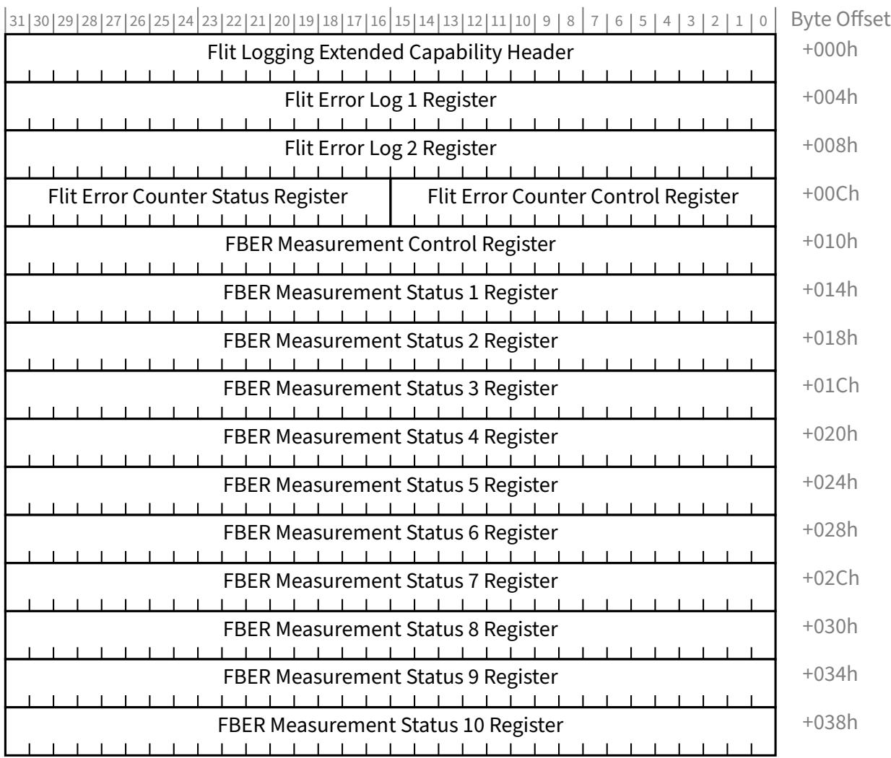


§ 图 7-104 详细说明了 Flit 日志扩展能力 Header 中寄存器字段的分配;§ 表 7-91 给出了相应的位定义。

</td>
</tr>
</tbody>
</table>
</div>


---

<a id="sec-7-7-8-1"></a>
## 7.7.8.1 Flit Logging Extended Capability Header (Offset 00h) | 7.7.8.1 Flit 日志扩展能力 Header(偏移 00h)

<table>
<thead>
<tr>
<th width="50%">🇬🇧 English</th>
<th width="50%" style="background-color:#e8e8e8">🏆 中文</th>
</tr>
</thead>
<tbody>
<tr>
<td>

| Bits 0-15 | Bits 16-19 | Bits 20-31 |
|---|---|---|
| Flit Logging Extended Capability ID = 0032h | Capability Version | Next Capability Offset |

**Figure 7-104 Flit Logging Extended Capability Header**

**Table 7-91 Flit Logging Extended Capability Header**

</td>
<td style="background-color:#e8e8e8">

| 位 0-15 | 位 16-19 | 位 20-31 |
|---|---|---|
| Flit Logging Extended Capability ID = 0032h | Capability Version | Next Capability Offset |

**图 7-104 Flit 日志扩展能力 Header**

> 


**表 7-91 Flit 日志扩展能力 Header**

</td>
</tr>
</tbody>
</table>

---

<!-- 📄 Page 1139 -->
---

<a id="sec-7-7-8-1-fields"></a>
## 7.7.8.1 Flit Logging Extended Capability Header - Field Definitions | 7.7.8.1 Flit 日志扩展能力 Header — 字段定义


<div style="overflow-x: auto; max-width: 100%;">
<table>
<thead>
<tr>
<th width="50%">🇬🇧 English</th>
<th width="50%" style="background-color:#e8e8e8">🏆 中文</th>
</tr>
</thead>
<tbody>
<tr>
<td>

| Bit Location | Register Description | Attributes |
|---|---|---|
| 15:0 | **Flit Logging Extended Capability ID** - This field is a PCI-SIG defined ID number that indicates the nature and format of the Extended Capability.<br><br>The Extended Capability ID for the Flit Logging Extended Capability is 0032h. | RO |
| 19:16 | **Capability Version** - This field is a PCI-SIG defined version number that indicates the version of the Capability structure present.<br><br>Must be 1h for this version of the specification. | RO |
| 31:20 | **Next Capability Offset** - This field contains the offset to the next PCI Express Capability structure or 000h if no other items exist in the linked list of Capabilities.<br><br>For Extended Capabilities implemented in Configuration Space, this offset is relative to the beginning of PCI-compatible Configuration Space and thus must always be either 000h (for terminating list of Capabilities) or greater than 0FFh. | RO |

</td>
<td style="background-color:#e8e8e8">

| 位位置 | 寄存器描述 | 属性 |
|---|---|---|
| 15:0 | **Flit Logging Extended Capability ID(Flit 日志扩展能力 ID)** - 该字段是 PCI-SIG 定义的 ID 号,用于指示扩展能力的性质和格式。<br><br>Flit 日志扩展能力 (Flit Logging Extended Capability) 的扩展能力 ID 为 0032h。 | RO |
| 19:16 | **Capability Version** - 该字段是 PCI-SIG 定义的版本号,用于指示当前能力结构的版本。<br><br>对于本版本规范,必须为 1h。 | RO |
| 31:20 | **Next Capability Offset** - 该字段包含指向下一个 PCI Express 能力结构的偏移量;若链表中没有其他项,则为 000h。<br><br>对于在配置空间中实现的扩展能力,该偏移量相对于 PCI 兼容配置空间的起点,因此必须始终为 000h(用于终止能力链表)或大于 0FFh。 | RO |

</td>
</tr>
</tbody>
</table>
</div>


---

<a id="sec-7-7-8-2"></a>
## 7.7.8.2 Flit Error Log 1 Register (Offset 04h) | 7.7.8.2 Flit 错误日志 1 寄存器(偏移 04h)

<table>
<thead>
<tr>
<th width="50%">🇬🇧 English</th>
<th width="50%" style="background-color:#e8e8e8">🏆 中文</th>
</tr>
</thead>
<tbody>
<tr>
<td>

The Flit Error Log 1 Register and Flit Error Log 2 Register are Link level registers and contain information about the Flit errors corrected and/or detected by the FEC and/or CRC in a received Flit. The Flit Error Log is a FIFO of an implementation specific and unspecified size (size 1 is permitted). These registers contain the oldest log entry. Clearing the Flit Error Log Valid removes the oldest log entry from the FIFO and loads these registers with the next oldest log entry (if there is one). See § Section 4.2.3.1.2, § Section 4.2.3.1.3, § Appendix J., and § Appendix K. for details.

| Bits | Field |
|---|---|
| 0 | Flit Error Log Valid |
| 3:1 | Flit Error Link Width |
| 7:4 | Flit Offset from the Last Logged Flit in Error |
| 12:8 | Consecutive Flit Error after the Last Flit Error |
| 13 | More Entries for Flit Error Log Register are Valid |
| 14 | Unrecognized Flit |
| 15 | FEC Uncorrectable Error in Flit |
| 23:16 | Syndrome Parity for ECC Group 0 |
| 31:24 | Syndrome Check for ECC Group 0 |

**Figure 7-105 Flit Error Log 1 Register**

</td>
<td style="background-color:#e8e8e8">

Flit 错误日志 1 寄存器和 Flit 错误日志 2 寄存器是链路级 (Link level) 寄存器,包含接收 Flit 中由 FEC 和/或 CRC 纠正和/或检测到的 Flit 错误的相关信息。Flit 错误日志是一个 FIFO,其大小为实现特定且未指定(允许大小为 1)。这些寄存器包含最旧的日志条目。清除 Flit Error Log Valid 会从 FIFO 中移除最旧的日志条目,并将这些寄存器加载为下一个最旧的日志条目(若存在)。详见第 4.2.3.1.2 节、第 4.2.3.1.3 节、附录 J 和附录 K。

| 位 | 字段 |
|---|---|
| 0 | Flit Error Log Valid |
| 3:1 | Flit Error Link Width |
| 7:4 | Flit Offset from the Last Logged Flit in Error |
| 12:8 | Consecutive Flit Error after the Last Flit Error |
| 13 | More Entries for Flit Error Log Register are Valid |
| 14 | Unrecognized Flit |
| 15 | FEC Uncorrectable Error in Flit |
| 23:16 | Syndrome Parity for ECC Group 0 |
| 31:24 | Syndrome Check for ECC Group 0 |

**图 7-105 Flit 错误日志 1 寄存器**

> 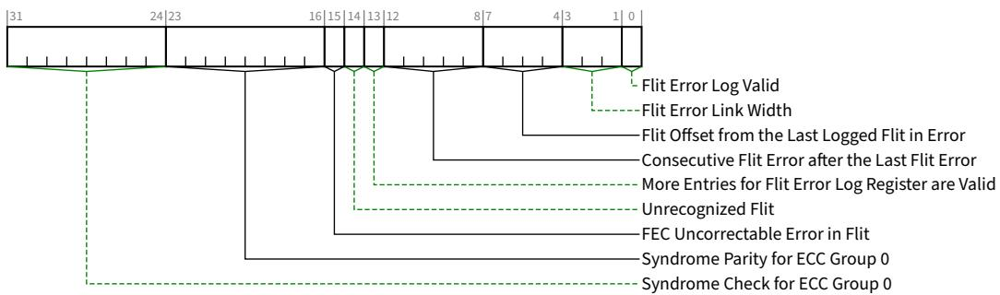


</td>
</tr>
</tbody>
</table>

---

<!-- 📄 Page 1140 -->
---

<a id="sec-7-7-8-2-fields"></a>
## 7.7.8.2 Flit Error Log 1 Register - Field Definitions | 7.7.8.2 Flit 错误日志 1 寄存器 — 字段定义


<div style="overflow-x: auto; max-width: 100%;">
<table>
<thead>
<tr>
<th width="50%">🇬🇧 English</th>
<th width="50%" style="background-color:#e8e8e8">🏆 中文</th>
</tr>
</thead>
<tbody>
<tr>
<td>

| Encoding | Link Width |
|---|---|
| 000b | x1 |
| 001b | x2 |
| 010b | x4 |
| 011b | x8 |
| 100b | x16 |
| Others | Reserved |

**Table 7-92 Flit Error Log 1 Register**

| Bit Location | Register Description | Attributes |
|---|---|---|
| 0 | **Flit Error Log Valid** – This bit is Set to 1b when an error is logged in this register.<br><br>Writing 1b to this bit either clears this bit or, if More Entries for Flit Error Log Register are Valid (i.e., Bit 13) is Set, loads the Flit Error Log 1 Register and Flit Error Log 2 Register with the next oldest log entry<br><br>Default Zero. | RW1CS |
| 3:1 | **Flit Error Link Width** – Link Width when error was logged (taking into account any narrowing due to L0p). Encoding is:<br>x1 / x2 / x4 / x8 / x16 / Reserved<br><br>Default is Zero. | ROS |
| 7:4 | **Flit Offset from the Last Logged Flit in Error** – This is the offset from the last Flit whose error has been recorded in the prior entry of the Flit Error Log Register, if any.<br><br>- If this is the very first error that gets logged or this is the only copy of the Flit Error Log Register, this value must be 0h.<br>- If the previous flit was in error and logged, this value must be 1h.<br>- If the last logged Flit was more than 15 Flits away, this value must be Fh.<br><br>This field only reflects errors that were logged. If the previous flit was in error but was not logged, that error has no effect on this value.<br><br>Default is Zero. | ROS |
| 12:8 | **Consecutive Flit Error after the Last Flit Error** – Initially, this field is Zero. If there are any errors (either correctable or uncorrectable by FEC) in any of the 5 consecutive Flits immediately following the Flit recorded in this log entry, the corresponding bits are set to 1b; otherwise they remain 0b. This field can change value after Flit Error Log Valid is Set and more Flits are received. If More Entries for Flit Error Log Register is Set, some bits of this field may not be meaningful and the actual value of this field needs to be computed from this field and from subsequent log entries.<br><br>Consider consecutive log entries A, B and C, where A is older than B and B is older than C:<br><br>- If Flit Offset from the Last Logged Flit in Error in B is >5, then this field in log entry A is accurate (since there were more than 5 intervening flits between A and B).<br>- If Flit Offset from the Last Logged Flit in Error in B is ≤ 5, then some bits of this field in A must be computed from B (and C, if applicable, depending on the distance between A and C).<br>- If Flit Offset from the Last Logged Flit in Error in B = 2h, then entry A is for two flits earlier. For entry A:<br>&nbsp;&nbsp;◦ Bit 0 represents the intervening Flit (which might have been in error but not logged) and<br>&nbsp;&nbsp;◦ Bits 4:1 are not meaningful and must be computed from B (and C, if applicable, depending on the distance between A and C). Computed bit 1 is 1b (because B exists), and computed bits 4:2 are bits 2:0 of B. | ROS |

</td>
<td style="background-color:#e8e8e8">

| 编码 | 链路宽度 |
|---|---|
| 000b | x1 |
| 001b | x2 |
| 010b | x4 |
| 011b | x8 |
| 100b | x16 |
| 其他 | 保留 |

**表 7-92 Flit 错误日志 1 寄存器**

| 位位置 | 寄存器描述 | 属性 |
|---|---|---|
| 0 | **Flit Error Log Valid(Flit 错误日志有效)** – 当错误被记录到该寄存器时,该位置为 1b。<br><br>向该位写入 1b 要么清除该位,要么(若 More Entries for Flit Error Log Register are Valid,即第 13 位 置位)将 Flit 错误日志 1 寄存器和 Flit 错误日志 2 寄存器加载为下一个最旧的日志条目。<br><br>默认为零。 | RW1CS |
| 3:1 | **Flit Error Link Width(Flit 错误链路宽度)** – 记录错误时的链路宽度(考虑因 L0p 引起的任何收窄)。编码为:<br>x1 / x2 / x4 / x8 / x16 / 保留<br><br>默认为零。 | ROS |
| 7:4 | **Flit Offset from the Last Logged Flit in Error(距上次记录错误 Flit 的偏移量)** – 这是距 Flit 错误日志寄存器前一个条目中(若有)所记录错误 Flit 的偏移量。<br><br>- 若这是记录的第一个错误,或这是 Flit 错误日志寄存器的唯一副本,则该值必须为 0h。<br>- 若前一个 Flit 出错并已被记录,则该值必须为 1h。<br>- 若最近一次记录的 Flit 距离超过 15 个 Flit,则该值必须为 Fh。<br><br>该字段仅反映已被记录的错误。若前一个 Flit 出错但未被记录,则该错误对该值没有影响。<br><br>默认为零。 | ROS |
| 12:8 | **Consecutive Flit Error after the Last Flit Error(上次 Flit 错误之后的连续 Flit 错误)** – 初始时,该字段为零。若紧接本日志条目所记录 Flit 之后的 5 个连续 Flit 中存在任意错误(FEC 可纠正或不可纠正),则对应位被置为 1b;否则保持为 0b。该字段的值在 Flit Error Log Valid 置位且接收到更多 Flit 后可能会变化。若 More Entries for Flit Error Log Register 置位,则该字段的某些位可能没有意义,该字段的实际值需要根据本字段以及后续日志条目计算得出。<br><br>考虑连续的日志条目 A、B 和 C,其中 A 早于 B,B 早于 C:<br><br>- 若 B 中 Flit Offset from the Last Logged Flit in Error >5,则 A 条目中的该字段是准确的(因为 A 和 B 之间有多于 5 个 Flit)。<br>- 若 B 中 Flit Offset from the Last Logged Flit in Error ≤ 5,则 A 中该字段的某些位必须由 B(以及 C,若适用,取决于 A 与 C 之间的距离)计算得到。<br>- 若 B 中 Flit Offset from the Last Logged Flit in Error = 2h,则 A 条目对应早两个 Flit 的位置。对于 A 条目:<br>&nbsp;&nbsp;◦ 第 0 位表示中间的 Flit(其可能出错但未被记录);以及<br>&nbsp;&nbsp;◦ 第 4:1 位没有意义,必须由 B(以及 C,若适用,取决于 A 与 C 之间的距离)计算得到。计算得到的第 1 位为 1b(因为存在 B),计算得到的第 4:2 位为 B 的第 2:0 位。 | ROS |

</td>
</tr>
</tbody>
</table>
</div>


---

<!-- 📄 Page 1141 -->
---

<a id="sec-7-7-8-2-fields-cont"></a>
## 7.7.8.2 Flit Error Log 1 Register - Field Definitions (continued) | 7.7.8.2 Flit 错误日志 1 寄存器 — 字段定义(续)

<table>
<thead>
<tr>
<th width="50%">🇬🇧 English</th>
<th width="50%" style="background-color:#e8e8e8">🏆 中文</th>
</tr>
</thead>
<tbody>
<tr>
<td>

- If in turn, Flit Offset from the Last Logged Flit in Error in C is ≤5, some of the bits in B are not meaningful and must be computed from C (and possibly the next entry D, if applicable and available).

Default is Zero.

| Bit Location | Register Description | Attributes |
|---|---|---|
| 13 | **More Entries for Flit Error Log Register are Valid** – when Set, it indicates that the Port has additional valid copies of the Flit Error Log Register for subsequent Flits. A port that implements only one set of Flit Error Log Register is permitted to hardwire this to Zero.<br><br>If this bit is Set, clearing the Flit Error Log Valid bit loads the next oldest Flit Error Log Register entry. This bit can change value when Flit Error Log Valid bit is Set and an additional error is being logged.<br><br>Default is Zero. | ROS |
| 14 | **Unrecognized Flit** – when Set indicates receipt of a Flit that passes CRC after FEC decode but uses a Reserved encoding in the Flit Usage or Flit Status fields.<br><br>Default is Zero | ROS |
| 15 | **FEC Uncorrectable Error in Flit** – When set to 1b indicates either a CRC mismatch or one of the three FEC groups detecting an error it could not correct | ROS |
| 23:16 | **Syndrome Parity for ECC Group 0** – Synd_Parity in § Chapter 4.<br><br>Default is Zero. | ROS |
| 31:24 | **Syndrome Check for ECC Group 0** – Synd_Check in § Chapter 4.<br><br>Default is Zero. | ROS |

The Flit Error Log 1 Register and Flit Error Log 2 Register are Link level registers and contain information about the Flit errors corrected and/or detected by the FEC and/or CRC in a received Flit.

| Bits | Field |
|---|---|
| 7:0 | Syndrome Parity for ECC Group 1 |
| 15:8 | Syndrome Check for ECC Group 1 |
| 23:16 | Syndrome Parity for ECC Group 2 |
| 31:24 | Syndrome Check for ECC Group 2 |

**Figure 7-106 Flit Error Log 2 Register**

**Table 7-93 Flit Error Log 2 Register**

| Bit Location | Register Description | Attributes |
|---|---|---|
| 7:0 | **Syndrome Parity for ECC Group 1** – Synd_Parity in § Chapter 4.<br><br>Default is Zero. | ROS |

</td>
<td style="background-color:#e8e8e8">

- 反过来,若 C 中 Flit Offset from the Last Logged Flit in Error ≤5,则 B 中的某些位没有意义,必须由 C(以及可能的下一个条目 D,若适用且可用)计算得到。

默认为零。

| 位位置 | 寄存器描述 | 属性 |
|---|---|---|
| 13 | **More Entries for Flit Error Log Register are Valid(Flit 错误日志寄存器存在更多有效条目)** – 置位时,指示该端口针对后续 Flit 拥有额外的有效 Flit 错误日志寄存器副本。仅实现一组 Flit 错误日志寄存器的端口允许将该位硬连线为零。<br><br>若该位置位,则清除 Flit Error Log Valid 位会加载下一个最旧的 Flit 错误日志寄存器条目。当 Flit Error Log Valid 位置位且正在记录另一个错误时,该位的值可能会变化。<br><br>默认为零。 | ROS |
| 14 | **Unrecognized Flit(无法识别的 Flit)** – 置位时指示接收到一个 Flit,该 Flit 在 FEC 解码后通过了 CRC,但其 Flit Usage 或 Flit Status 字段使用了保留编码。<br><br>默认为零。 | ROS |
| 15 | **FEC Uncorrectable Error in Flit(Flit 中的 FEC 不可纠正错误)** – 置为 1b 时,指示出现 CRC 失配,或三个 FEC 组之一检测到无法纠正的错误 | ROS |
| 23:16 | **Syndrome Parity for ECC Group 0(ECC 组 0 的校验子奇偶校验)** – 第 4 章中的 Synd_Parity。<br><br>默认为零。 | ROS |
| 31:24 | **Syndrome Check for ECC Group 0(ECC 组 0 的校验子校验)** – 第 4 章中的 Synd_Check。<br><br>默认为零。 | ROS |

Flit 错误日志 1 寄存器和 Flit 错误日志 2 寄存器是链路级寄存器,包含接收 Flit 中由 FEC 和/或 CRC 纠正和/或检测到的 Flit 错误的相关信息。

| 位 | 字段 |
|---|---|
| 7:0 | Syndrome Parity for ECC Group 1 |
| 15:8 | Syndrome Check for ECC Group 1 |
| 23:16 | Syndrome Parity for ECC Group 2 |
| 31:24 | Syndrome Check for ECC Group 2 |

**图 7-106 Flit 错误日志 2 寄存器**

> 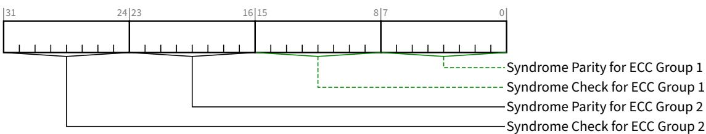


**表 7-93 Flit 错误日志 2 寄存器**

| 位位置 | 寄存器描述 | 属性 |
|---|---|---|
| 7:0 | **Syndrome Parity for ECC Group 1(ECC 组 1 的校验子奇偶校验)** – 第 4 章中的 Synd_Parity。<br><br>默认为零。 | ROS |

</td>
</tr>
</tbody>
</table>

---

---

<a id="sec-7-7-8-3"></a>
## 7.7.8.3 Flit Error Log 2 Register (Offset 08h) | Flit 错误日志 2 寄存器（偏移 08h）

<table>
<thead>
<tr>
<th width="50%">🇬🇧 English</th>
<th width="50%" style="background-color:#e8e8e8">🏆 中文</th>
</tr>
</thead>
<tbody>
<tr>
<td>

**Bit Location** | **Register Description** | **Attributes**
- 15:8 — Syndrome Check for ECC Group 1 – Synd_Check in § Chapter 4. Default is Zero. — ROS
- 23:16 — Syndrome Parity for ECC Group 2 – Synd_Parity in § Chapter 4. Default is Zero. — ROS
- 31:24 — Syndrome Check for ECC Group 2 – Synd_Check in § Chapter 4. Default is Zero. — ROS

</td>
<td style="background-color:#e8e8e8">

**位位置** | **寄存器说明** | **属性**
- 15:8 — ECC 组 1 的 Syndrome Check（Synd_Check），参见 § Chapter 4。默认值为零。— ROS
- 23:16 — ECC 组 2 的 Syndrome Parity（Synd_Parity），参见 § Chapter 4。默认值为零。— ROS
- 31:24 — ECC 组 2 的 Syndrome Check（Synd_Check），参见 § Chapter 4。默认值为零。— ROS

</td>
</tr>
</tbody>
</table>

---

<!-- 📄 Page 1142 -->
---

<a id="sec-7-7-8-4"></a>
## 7.7.8.4 Flit Error Counter Control Register (Offset 0Ch) | Flit 错误计数控制寄存器（偏移 0Ch）


<div style="overflow-x: auto; max-width: 100%;">
<table>
<thead>
<tr>
<th width="50%">🇬🇧 English</th>
<th width="50%" style="background-color:#e8e8e8">🏆 中文</th>
</tr>
</thead>
<tbody>
<tr>
<td>

The Flit Error Counter registers are Link wide and count the number of Flit and/or Ordered Set errors occurring on a Link operating in Flit mode (Flit 模式).

**Figure 7-107 Flit Error Counter Control Register**

- Bit 0: Flit Error Counter Enable
- Bit 1: Flit Error Counter Interrupt Enable
- Bits 3:2: Events to count
- Bits 11:4: Trigger Event on Error Count
- Bits 15:12: RsvdP

**Table 7-94 Flit Error Counter Control Register**

**Bit Location** | **Register Description** | **Attributes**

- **0** — Flit Error Counter Enable – Setting this bit enables and starts the Flit Error Counter in the Link. Clearing this bit stops the Flit Error Counter. Default is Zero. — RW
- **1** — Flit Error Counter Interrupt Enable – Send an interrupt when Interrupt Generated based on Trigger Event Count transitions from 0b to 1b. The interrupt vector is Interrupt Message Number (see § Section 7.5.3.2). Default is Zero. — RW
- **3:2** — Events to count – FEC-correctable Flit (see § Section 4.2.3.4.2), Invalid Flit (see § Section 4.2.3.4.2), or Framing Error (see § Section 4.2.2.3.4 and § Section 4.2.3.2).
  - 00b: FEC-correctable Flit
  - 01b: Invalid Flit
  - 10b: All events in 00b plus:
    - a 1b/1b TS Ordered Set on any Lane with only one valid half (see § Section 4.2.5.1)
    - an invalid Ordered Set on any Lane
  - 11b: (see continuation on next page)
  - Default is Zero. — RW

</td>
<td style="background-color:#e8e8e8">

Flit 错误计数寄存器是链路级（Link wide）寄存器，用于统计工作在 Flit 模式（Flit Mode）下的链路上发生的 Flit 和/或有序集（Ordered Set）错误数量。

**图 7-107 Flit 错误计数控制寄存器**

> 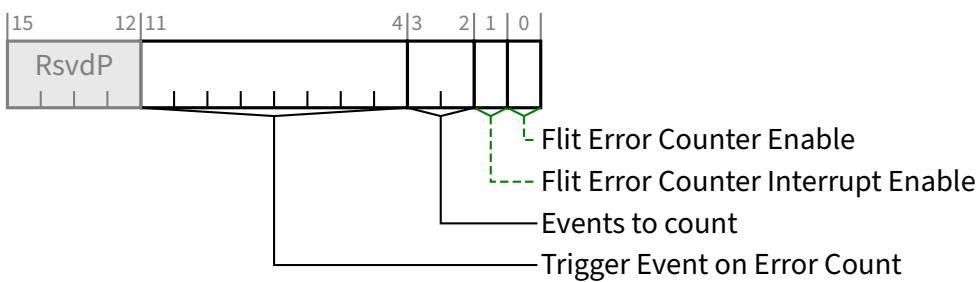


- 位 0：Flit 错误计数器使能（Flit Error Counter Enable）
- 位 1：Flit 错误计数器中断使能（Flit Error Counter Interrupt Enable）
- 位 3:2：统计事件（Events to count）
- 位 11:4：按错误计数触发的触发事件（Trigger Event on Error Count）
- 位 15:12：RsvdP

**表 7-94 Flit 错误计数控制寄存器**

**位位置** | **寄存器说明** | **属性**

- **0** — Flit 错误计数器使能（Flit Error Counter Enable）— 置 1 启用并启动链路中的 Flit 错误计数器。清零则停止 Flit 错误计数器。默认值为零。— RW
- **1** — Flit 错误计数器中断使能（Flit Error Counter Interrupt Enable）— 当基于触发事件计数的"已生成中断"从 0b 跳变为 1b 时发送中断。中断向量为中断消息号（Interrupt Message Number），参见 § Section 7.5.3.2。默认值为零。— RW
- **3:2** — 统计事件（Events to count）— FEC 可纠正 Flit（FEC-correctable Flit，参见 § Section 4.2.3.4.2）、无效 Flit（Invalid Flit，参见 § Section 4.2.3.4.2）或成帧错误（Framing Error，参见 § Section 4.2.2.3.4 和 § Section 4.2.3.2）。
  - 00b：FEC 可纠正 Flit
  - 01b：无效 Flit
  - 10b：00b 中所有事件，外加：
    - 任意通道（Lane）上仅一个有效半部的 1b/1b TS 有序集（参见 § Section 4.2.5.1）
    - 任意通道上的无效有序集
  - 11b：（参见下页续表）
  - 默认值为零。— RW

</td>
</tr>
</tbody>
</table>
</div>


---

<!-- 📄 Page 1143 -->
---

<a id="sec-7-7-8-4-cont"></a>
## 7.7.8.4 Flit Error Counter Control Register (Offset 0Ch) — Continued | Flit 错误计数控制寄存器（偏移 0Ch）— 续

<table>
<thead>
<tr>
<th width="50%">🇬🇧 English</th>
<th width="50%" style="background-color:#e8e8e8">🏆 中文</th>
</tr>
</thead>
<tbody>
<tr>
<td>

**Table 7-94 Flit Error Counter Control Register (continued)**

**Bit Location** | **Register Description** | **Attributes**

- **3:2** (cont.) — Events to count – continued
  - 000b: FEC-correctable Flit
  - 001b: Invalid Flit
  - 010b: All events in 00b plus events described on prior page
  - 011b: All events in 00b plus events described on prior page
  - 100b: All events in 00b plus events described on prior page
  - Others: Reserved
  - Default is Zero. — RW
- **11:4** — Trigger Event on Error Count – Generate an event (interrupt, if enabled) if this field is non-zero and the Flit Error Counter field in Flit Error Counter Status Register exceeds this value. Default is Zero. — RW

**Figure 7-108 Flit Error Counter Status Register**

- Bits 2:0: Link Width when Error Counter Started
- Bit 3: Interrupt Generated based on Trigger Event Count
- Bits 7:4: RsvdZ
- Bits 15:8: Flit Error Counter

**Table 7-95 Flit Error Counter Status Register**

**Bit Location** | **Register Description** | **Attributes**

- **2:0** — Link Width when Error Counter Started – This field tracks the link width when the error counter started or restarted counting. The encodings are as follows:
  - 000b: x1
  - 001b: x2
  - 010b: x4
  - 011b: x8
  - 100b: x16
  - Others: Reserved
  - Default is Zero. — ROS
- **3** — Interrupt Generated based on Trigger Event Count – hardware Sets this bit when an interrupt is generated based on the trigger event. While this bit is Set, no new interrupts will be generated based on the trigger event. Cleared on 0b to 1b transition of Flit Error Counter Enable. Default is Zero. — RW1CS
- **15:8** — Flit Error Counter – Increments by 1 when enabled and a countable event has occurred, as defined in the Flit Error Counter Control Register. Decrements by 1 at a fixed rate, if non-zero, based on Encoding and Link Width as follows (see continuation on next page). — ROS

</td>
<td style="background-color:#e8e8e8">

**表 7-94 Flit 错误计数控制寄存器（续）**

**位位置** | **寄存器说明** | **属性**

- **3:2**（续）— 统计事件（Events to count）— 续
  - 000b：FEC 可纠正 Flit
  - 001b：无效 Flit
  - 010b：00b 中所有事件，外加上页所述事件
  - 011b：00b 中所有事件，外加上页所述事件
  - 100b：00b 中所有事件，外加上页所述事件
  - 其他：保留
  - 默认值为零。— RW
- **11:4** — 按错误计数触发的触发事件（Trigger Event on Error Count）— 若该字段非零，且 Flit 错误计数状态寄存器中的 Flit Error Counter 字段超过此值，则生成一个事件（若已使能则为中断）。默认值为零。— RW

**图 7-108 Flit 错误计数状态寄存器**

> 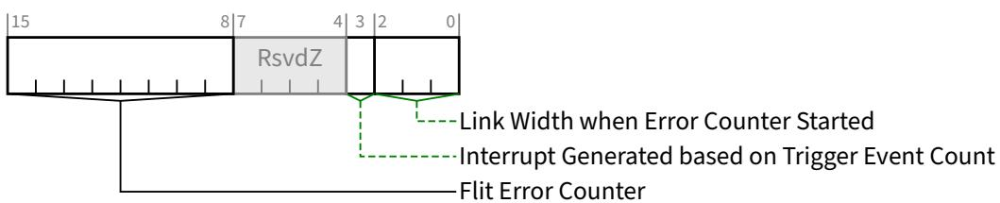


- 位 2:0：错误计数器启动时的链路宽度（Link Width when Error Counter Started）
- 位 3：基于触发事件计数已生成中断（Interrupt Generated based on Trigger Event Count）
- 位 7:4：RsvdZ
- 位 15:8：Flit 错误计数器（Flit Error Counter）

**表 7-95 Flit 错误计数状态寄存器**

**位位置** | **寄存器说明** | **属性**

- **2:0** — 错误计数器启动时的链路宽度（Link Width when Error Counter Started）— 该字段记录错误计数器启动或重新启动计数时的链路宽度。编码如下：
  - 000b：x1
  - 001b：x2
  - 010b：x4
  - 011b：x8
  - 100b：x16
  - 其他：保留
  - 默认值为零。— ROS
- **3** — 基于触发事件计数已生成中断（Interrupt Generated based on Trigger Event Count）— 当基于触发事件生成中断时，硬件将该位置 1。只要该位被置位，就不会再基于触发事件生成新的中断。在 Flit Error Counter Enable 由 0b 跳变为 1b 时清除。默认值为零。— RW1CS
- **15:8** — Flit 错误计数器（Flit Error Counter）— 使能且发生 Flit 错误计数控制寄存器中定义的、可计数的事件时加 1。若非零，则按以下与编码和链路宽度相关的固定速率减 1（详见下页）。— ROS

</td>
</tr>
</tbody>
</table>

---

<!-- 📄 Page 1144 -->
---

<a id="sec-7-7-8-5"></a>
## 7.7.8.5 Flit Error Counter Status Register (Offset 0Eh) | Flit 错误计数状态寄存器（偏移 0Eh）


<div style="overflow-x: auto; max-width: 100%;">
<table>
<thead>
<tr>
<th width="50%">🇬🇧 English</th>
<th width="50%" style="background-color:#e8e8e8">🏆 中文</th>
</tr>
</thead>
<tbody>
<tr>
<td>

**Table 7-95 Flit Error Counter Status Register (continued)**

**Bit Location** | **Register Description** | **Attributes**

- **15:8** (cont.) — Flit Error Counter – Decrements at a fixed rate based on Encoding and Link Width as follows:
  - 1b/1b encoding: (Link Width × 2) UI (±5 ns), i.e., 106
  - 8b/10b encoding: 10/12 × Link Width UI (±5 ns)
  - 128b/130b encoding: 10/12 × Link Width UI (±5 ns)
  - 00b: 1b/1b
  - 01b: 8b/10b
  - 10b: 128b/130b
  - 11b: Reserved
  - Cleared on 0b to 1b transition of Flit Error Counter Enable.
  - Does not roll over.
  - Default is Zero.

The FBER Measurement Control register enables direct FBER measurement with status reported in the FBER Measurement Status Registers. For Retimers, the control is provided through Margin Command in the Control SKP Ordered Set from the Downstream Port (see § Chapter 4).

**Figure 7-109 FBER Measurement Control Register**

- Bit 0: FBER Measurement Enable
- Bit 1: Clear FBER Counters
- Bits 3:2: Granularity of per-Lane Error reported
- Bit 4: Report Longest Burst vs First Burst
- Bits 31:5: RsvdP

**Table 7-96 FBER Measurement Control Register**

**Bit Location** | **Register Description** | **Attributes**

- **0** — FBER Measurement Enable – Setting this bit enables and starts the FBER measurement in the Link. Clearing this bit stops FBER measurement. Default is Zero. — RW
- **1** — Clear FBER Counters – Writing a 1b to this bit clears the FBER counters. This bit always returns Zero when read. — RW
- **3:2** — Granularity of per-Lane Error reported –
  - 00b: count all bit errors corrected by FEC in valid Flits
  - 01b: count all even bit errors in each UI corrected by FEC in valid Flits
  - 10b: count all odd bit errors in each UI corrected by FEC in valid Flits
  - 11b: count only mismatches in the Control SKP OS as a single correctable bit error
  - FBER measurement results are undefined if this field contains 01b or 10b and the Link is not operating in PAM4 (PAM4, 四电平脉冲幅度调制).
  - Default is Zero. — RW

</td>
<td style="background-color:#e8e8e8">

**表 7-95 Flit 错误计数状态寄存器（续）**

**位位置** | **寄存器说明** | **属性**

- **15:8**（续）— Flit 错误计数器（Flit Error Counter）— 按以下与编码和链路宽度相关的固定速率减 1：
  - 1b/1b 编码：(链路宽度 × 2) UI（±5 ns），即 106
  - 8b/10b 编码：10/12 × 链路宽度 UI（±5 ns）
  - 128b/130b 编码：10/12 × 链路宽度 UI（±5 ns）
  - 00b：1b/1b
  - 01b：8b/10b
  - 10b：128b/130b
  - 11b：保留
  - 在 Flit Error Counter Enable 由 0b 跳变为 1b 时清除。
  - 不会回绕。
  - 默认值为零。

FBER 测量控制寄存器使能直接的 FBER（Flit Bit Error Rate，Flit 误码率）测量，结果在 FBER 测量状态寄存器中报告。对于 Retimer，通过下游端口（Downstream Port）在 Control SKP 有序集中下发的 Margin Command 提供控制（参见 § Chapter 4）。

**图 7-109 FBER 测量控制寄存器**

> 


- 位 0：FBER 测量使能（FBER Measurement Enable）
- 位 1：清除 FBER 计数器（Clear FBER Counters）
- 位 3:2：上报的逐通道错误粒度（Granularity of per-Lane Error reported）
- 位 4：上报最长突发还是首次突发（Report Longest Burst vs First Burst）
- 位 31:5：RsvdP

**表 7-96 FBER 测量控制寄存器**

**位位置** | **寄存器说明** | **属性**

- **0** — FBER 测量使能（FBER Measurement Enable）— 置 1 启用并启动链路中的 FBER 测量。清零则停止 FBER 测量。默认值为零。— RW
- **1** — 清除 FBER 计数器（Clear FBER Counters）— 向该位写 1b 清除 FBER 计数器。该位读取时始终返回零。— RW
- **3:2** — 上报的逐通道错误粒度（Granularity of per-Lane Error reported）—
  - 00b：统计有效 Flit 中所有由 FEC 纠正的比特错误
  - 01b：统计有效 Flit 中每个 UI 内由 FEC 纠正的所有偶数比特错误
  - 10b：统计有效 Flit 中每个 UI 内由 FEC 纠正的所有奇数比特错误
  - 11b：仅将 Control SKP OS 中的失配计为单个可纠正比特错误
  - 若该字段为 01b 或 10b，且链路未工作在 PAM4（四电平脉冲幅度调制）模式，则 FBER 测量结果未定义。
  - 默认值为零。— RW

</td>
</tr>
</tbody>
</table>
</div>


---

<!-- 📄 Page 1145 -->
---

<a id="sec-7-7-8-6"></a>
## 7.7.8.6 FBER Measurement Control Register (Offset 10h) | FBER 测量控制寄存器（偏移 10h）

<table>
<thead>
<tr>
<th width="50%">🇬🇧 English</th>
<th width="50%" style="background-color:#e8e8e8">🏆 中文</th>
</tr>
</thead>
<tbody>
<tr>
<td>

**Table 7-96 FBER Measurement Control Register (continued)**

**Bit Location** | **Register Description** | **Attributes**

- **4** — Report Longest Burst vs First Burst – This bit is now deprecated. Behavior is undefined if this bit is Set. Default is Zero. — RW

FBER Measurement Status 1 Register through FBER Measurement Status 10 Register contain a collection of per-Link and per-Lane counters:

- Flit Counter – per-Link
- Invalid Flit Counter – per-Link
- Correctable Error Counters – per-Lane (Adding these together produces a per-Link counter)

A write of 1b to either the Clear FBER Counters or the FBER Measurement Enable bit of the FBER Measurement Control Register resets the value of all of these counters to their default values. All of these counters saturate (i.e., when they reach their maximum value, they do not roll over).

**Figure 7-110 FBER Measurement Status 1 Register**

- Bits 31:0: Flit Counter

**Table 7-97 FBER Measurement Status 1 Register**

**Bit Location** | **Register Description** | **Attributes**

- **31:0** — Flit Counter – meaningful when FBER Measurement Enable is Set. Increments by 1 for every Flit received. Default is Zero. — ROS

**Figure 7-111 FBER Measurement Status 2 Register**

- Bits 15:0: Invalid Flit Counter
- Bits 31:16: RsvdZ

</td>
<td style="background-color:#e8e8e8">

**表 7-96 FBER 测量控制寄存器（续）**

**位位置** | **寄存器说明** | **属性**

- **4** — 上报最长突发还是首次突发（Report Longest Burst vs First Burst）— 该位已弃用。若被置 1，则行为未定义。默认值为零。— RW

FBER 测量状态 1 寄存器至 FBER 测量状态 10 寄存器包含一组逐链路和逐通道的计数器：

- Flit 计数器（Flit Counter）— 逐链路
- 无效 Flit 计数器（Invalid Flit Counter）— 逐链路
- 可纠正错误计数器（Correctable Error Counters）— 逐通道（将其相加可得到逐链路的计数器）

对 FBER 测量控制寄存器中的 Clear FBER Counters 位或 FBER Measurement Enable 位写 1b，会将所有这些计数器重置为其默认值。所有这些计数器均饱和（saturate，即达到最大值时不会回绕）。

**图 7-110 FBER 测量状态 1 寄存器**

> 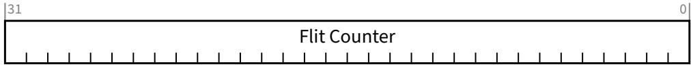


- 位 31:0：Flit 计数器（Flit Counter）

**表 7-97 FBER 测量状态 1 寄存器**

**位位置** | **寄存器说明** | **属性**

- **31:0** — Flit 计数器（Flit Counter）— 仅当 FBER Measurement Enable 被置 1 时有效。每收到一个 Flit 加 1。默认值为零。— ROS

**图 7-111 FBER 测量状态 2 寄存器**

> 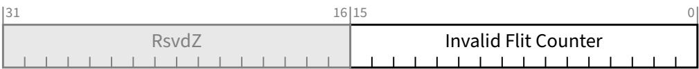


- 位 15:0：无效 Flit 计数器（Invalid Flit Counter）
- 位 31:16：RsvdZ

</td>
</tr>
</tbody>
</table>

---

<!-- 📄 Page 1146 -->
---

<a id="sec-7-7-8-7"></a>
## 7.7.8.7 FBER Measurement Status 1 Register (Offset 14h) | FBER 测量状态 1 寄存器（偏移 14h）

<table>
<thead>
<tr>
<th width="50%">🇬🇧 English</th>
<th width="50%" style="background-color:#e8e8e8">🏆 中文</th>
</tr>
</thead>
<tbody>
<tr>
<td>

*(This section introduces the FBER Measurement Status 1 Register; the field-level details are provided in § 7.7.8.6 continuation above.)*

This section formally registers the FBER Measurement Status 1 Register at Offset 14h. The register content has been defined in the previous section.

</td>
<td style="background-color:#e8e8e8">

*（本节为 FBER 测量状态 1 寄存器命名，其字段级详细说明见上文 § 7.7.8.6 的续表。）*

本节正式登记 FBER 测量状态 1 寄存器，位于偏移 14h。该寄存器内容已在前一节定义。

</td>
</tr>
</tbody>
</table>

---

<a id="sec-7-7-8-8"></a>
## 7.7.8.8 FBER Measurement Status 2 Register (Offset 18h) | FBER 测量状态 2 寄存器（偏移 18h）


<div style="overflow-x: auto; max-width: 100%;">
<table>
<thead>
<tr>
<th width="50%">🇬🇧 English</th>
<th width="50%" style="background-color:#e8e8e8">🏆 中文</th>
</tr>
</thead>
<tbody>
<tr>
<td>

**Table 7-98 FBER Measurement Status 2 Register**

**Bit Location** | **Register Description** | **Attributes**

- **15:0** — Invalid Flit Counter – when FBER Measurement Enable is Set: Increments by 1 for every invalid Flit received. Otherwise, behavior is undefined. Default is 0000h. — ROS

**Figure 7-112 FBER Measurement Status 3 Register**

- Bits 15:0: Lane #0 Correctable Counter
- Bits 31:16: Lane #1 Correctable Counter

**Table 7-99 FBER Measurement Status 3 Register**

**Bit Location** | **Register Description** | **Attributes**

- **15:0** — Lane #0 Correctable Counter – counts Per-Lane Correctable Bit Errors or SKP Parity Mismatches. If FBER Measurement Enable is Set: this 16-bit counter counts the number of FEC-correctable bit errors per Flit (up to 24) or the number of SKP OS Parity mismatch in a Port, as per the value in Granularity of per-Lane Error Reported bit in the FBER Measurement Control Register. This counter does not roll-over. Default is Zero. — RO
- **31:16** — Lane #1 Correctable Counter – Behavior is identical to Lane #0 Correctable Counter. — RO

</td>
<td style="background-color:#e8e8e8">

**表 7-98 FBER 测量状态 2 寄存器**

**位位置** | **寄存器说明** | **属性**

- **15:0** — 无效 Flit 计数器（Invalid Flit Counter）— 当 FBER Measurement Enable 被置 1 时：每收到一个无效 Flit 加 1。否则行为未定义。默认值为 0000h。— ROS

**图 7-112 FBER 测量状态 3 寄存器**

- 位 15:0：通道 #0 可纠正计数器（Lane #0 Correctable Counter）
- 位 31:16：通道 #1 可纠正计数器（Lane #1 Correctable Counter）

**表 7-99 FBER 测量状态 3 寄存器**

**位位置** | **寄存器说明** | **属性**

- **15:0** — 通道 #0 可纠正计数器（Lane #0 Correctable Counter）— 统计逐通道可纠正比特错误或 SKP 奇偶校验失配。若 FBER Measurement Enable 被置 1：该 16 位计数器统计每个 Flit 中 FEC 可纠正比特错误数量（最多 24 个）或端口中 SKP OS 奇偶校验失配数量，具体依 FBER 测量控制寄存器中"上报的逐通道错误粒度"位的值而定。该计数器不回绕。默认值为零。— RO
- **31:16** — 通道 #1 可纠正计数器（Lane #1 Correctable Counter）— 行为与通道 #0 可纠正计数器相同。— RO

</td>
</tr>
</tbody>
</table>
</div>


---

<!-- 📄 Page 1147 -->
---

<a id="sec-7-7-8-9"></a>
## 7.7.8.9 FBER Measurement Status 3 Register (Offset 1Ch) | FBER 测量状态 3 寄存器（偏移 1Ch）

<table>
<thead>
<tr>
<th width="50%">🇬🇧 English</th>
<th width="50%" style="background-color:#e8e8e8">🏆 中文</th>
</tr>
</thead>
<tbody>
<tr>
<td>

*(This section formally registers the FBER Measurement Status 3 Register at Offset 1Ch. Field-level details are defined in § 7.7.8.8.)*

</td>
<td style="background-color:#e8e8e8">

*（本节正式登记 FBER 测量状态 3 寄存器，位于偏移 1Ch。字段级详细说明见 § 7.7.8.8。）*

</td>
</tr>
</tbody>
</table>

---

<a id="sec-7-7-8-10"></a>
## 7.7.8.10 FBER Measurement Status 4 Register (Offset 20h) | FBER 测量状态 4 寄存器（偏移 20h）


<div style="overflow-x: auto; max-width: 100%;">
<table>
<thead>
<tr>
<th width="50%">🇬🇧 English</th>
<th width="50%" style="background-color:#e8e8e8">🏆 中文</th>
</tr>
</thead>
<tbody>
<tr>
<td>

**Figure 7-113 FBER Measurement Status 4 Register**

- Bits 15:0: Lane #2 Correctable Counter
- Bits 31:16: Lane #3 Correctable Counter

**Table 7-100 FBER Measurement Status 4 Register**

**Bit Location** | **Register Description** | **Attributes**

- **15:0** — Lane #2 Correctable Counter – Behavior is identical to Lane #0 Correctable Counter. — RO
- **31:16** — Lane #3 Correctable Counter – Behavior is identical to Lane #0 Correctable Counter. — RO

**Figure 7-114 FBER Measurement Status 5 Register**

- Bits 15:0: Lane #4 Correctable Counter
- Bits 31:16: Lane #5 Correctable Counter

</td>
<td style="background-color:#e8e8e8">

**图 7-113 FBER 测量状态 4 寄存器**

- 位 15:0：通道 #2 可纠正计数器（Lane #2 Correctable Counter）
- 位 31:16：通道 #3 可纠正计数器（Lane #3 Correctable Counter）

**表 7-100 FBER 测量状态 4 寄存器**

**位位置** | **寄存器说明** | **属性**

- **15:0** — 通道 #2 可纠正计数器（Lane #2 Correctable Counter）— 行为与通道 #0 可纠正计数器相同。— RO
- **31:16** — 通道 #3 可纠正计数器（Lane #3 Correctable Counter）— 行为与通道 #0 可纠正计数器相同。— RO

**图 7-114 FBER 测量状态 5 寄存器**

- 位 15:0：通道 #4 可纠正计数器（Lane #4 Correctable Counter）
- 位 31:16：通道 #5 可纠正计数器（Lane #5 Correctable Counter）

</td>
</tr>
</tbody>
</table>
</div>


---

<a id="sec-7-7-8-11"></a>
## 7.7.8.11 FBER Measurement Status 5 Register (Offset 24h) | FBER 测量状态 5 寄存器（偏移 24h）

<table>
<thead>
<tr>
<th width="50%">🇬🇧 English</th>
<th width="50%" style="background-color:#e8e8e8">🏆 中文</th>
</tr>
</thead>
<tbody>
<tr>
<td>

**Table 7-101 FBER Measurement Status 5 Register**

**Bit Location** | **Register Description** | **Attributes**

- **15:0** — Lane #4 Correctable Counter – Behavior is identical to Lane #0 Correctable Counter. — RO
- **31:16** — Lane #5 Correctable Counter – Behavior is identical to Lane #0 Correctable Counter. — RO

**Figure 7-115 FBER Measurement Status 6 Register**

- Bits 15:0: Lane #6 Correctable Counter
- Bits 31:16: Lane #7 Correctable Counter

</td>
<td style="background-color:#e8e8e8">

**表 7-101 FBER 测量状态 5 寄存器**

**位位置** | **寄存器说明** | **属性**

- **15:0** — 通道 #4 可纠正计数器（Lane #4 Correctable Counter）— 行为与通道 #0 可纠正计数器相同。— RO
- **31:16** — 通道 #5 可纠正计数器（Lane #5 Correctable Counter）— 行为与通道 #0 可纠正计数器相同。— RO

**图 7-115 FBER 测量状态 6 寄存器**

- 位 15:0：通道 #6 可纠正计数器（Lane #6 Correctable Counter）
- 位 31:16：通道 #7 可纠正计数器（Lane #7 Correctable Counter）

</td>
</tr>
</tbody>
</table>

---

<!-- 📄 Page 1148 -->
---

<a id="sec-7-7-8-12"></a>
## 7.7.8.12 FBER Measurement Status 6 Register (Offset 28h) | FBER 测量状态 6 寄存器（偏移 28h）


<div style="overflow-x: auto; max-width: 100%;">
<table>
<thead>
<tr>
<th width="50%">🇬🇧 English</th>
<th width="50%" style="background-color:#e8e8e8">🏆 中文</th>
</tr>
</thead>
<tbody>
<tr>
<td>

**Table 7-102 FBER Measurement Status 6 Register**

**Bit Location** | **Register Description** | **Attributes**

- **15:0** — Lane #6 Correctable Counter – Behavior is identical to Lane #0 Correctable Counter. — RO
- **31:16** — Lane #7 Correctable Counter – Behavior is identical to Lane #0 Correctable Counter. — RO

**Figure 7-116 FBER Measurement Status 7 Register**

- Bits 15:0: Lane #8 Correctable Counter
- Bits 31:16: Lane #9 Correctable Counter

</td>
<td style="background-color:#e8e8e8">

**表 7-102 FBER 测量状态 6 寄存器**

**位位置** | **寄存器说明** | **属性**

- **15:0** — 通道 #6 可纠正计数器（Lane #6 Correctable Counter）— 行为与通道 #0 可纠正计数器相同。— RO
- **31:16** — 通道 #7 可纠正计数器（Lane #7 Correctable Counter）— 行为与通道 #0 可纠正计数器相同。— RO

**图 7-116 FBER 测量状态 7 寄存器**

> 


- 位 15:0：通道 #8 可纠正计数器（Lane #8 Correctable Counter）
- 位 31:16：通道 #9 可纠正计数器（Lane #9 Correctable Counter）

</td>
</tr>
</tbody>
</table>
</div>


---

<a id="sec-7-7-8-13"></a>
## 7.7.8.13 FBER Measurement Status 7 Register (Offset 2Ch) | FBER 测量状态 7 寄存器（偏移 2Ch）

<table>
<thead>
<tr>
<th width="50%">🇬🇧 English</th>
<th width="50%" style="background-color:#e8e8e8">🏆 中文</th>
</tr>
</thead>
<tbody>
<tr>
<td>

**Table 7-103 FBER Measurement Status 7 Register**

**Bit Location** | **Register Description** | **Attributes**

- **15:0** — Lane #8 Correctable Counter – Behavior is identical to Lane #0 Correctable Counter. — RO
- **31:16** — Lane #9 Correctable Counter – Behavior is identical to Lane #0 Correctable Counter. — RO

**Figure 7-117 FBER Measurement Status 8 Register**

- Bits 15:0: Lane #10 Correctable Counter
- Bits 31:16: Lane #11 Correctable Counter

</td>
<td style="background-color:#e8e8e8">

**表 7-103 FBER 测量状态 7 寄存器**

**位位置** | **寄存器说明** | **属性**

- **15:0** — 通道 #8 可纠正计数器（Lane #8 Correctable Counter）— 行为与通道 #0 可纠正计数器相同。— RO
- **31:16** — 通道 #9 可纠正计数器（Lane #9 Correctable Counter）— 行为与通道 #0 可纠正计数器相同。— RO

**图 7-117 FBER 测量状态 8 寄存器**

- 位 15:0：通道 #10 可纠正计数器（Lane #10 Correctable Counter）
- 位 31:16：通道 #11 可纠正计数器（Lane #11 Correctable Counter）

</td>
</tr>
</tbody>
</table>

---

<!-- 📄 Page 1149 -->
---

<a id="sec-7-7-8-14"></a>
## 7.7.8.14 FBER Measurement Status 8 Register (Offset 30h) | FBER 测量状态 8 寄存器（偏移 30h）


<div style="overflow-x: auto; max-width: 100%;">
<table>
<thead>
<tr>
<th width="50%">🇬🇧 English</th>
<th width="50%" style="background-color:#e8e8e8">🏆 中文</th>
</tr>
</thead>
<tbody>
<tr>
<td>

**Table 7-104 FBER Measurement Status 8 Register**

**Bit Location** | **Register Description** | **Attributes**

- **15:0** — Lane #10 Correctable Counter – Behavior is identical to Lane #0 Correctable Counter. — RO
- **31:16** — Lane #11 Correctable Counter – Behavior is identical to Lane #0 Correctable Counter. — RO

**Figure 7-118 FBER Measurement Status 9 Register**

- Bits 15:0: Lane #12 Correctable Counter
- Bits 31:16: Lane #13 Correctable Counter

**Table 7-105 FBER Measurement Status 9 Register**

**Bit Location** | **Register Description** | **Attributes**

- **15:0** — Lane #12 Correctable Counter – Behavior is identical to Lane #0 Correctable Counter. — RO
- **31:16** — Lane #13 Correctable Counter – Behavior is identical to Lane #0 Correctable Counter. — RO

</td>
<td style="background-color:#e8e8e8">

**表 7-104 FBER 测量状态 8 寄存器**

**位位置** | **寄存器说明** | **属性**

- **15:0** — 通道 #10 可纠正计数器（Lane #10 Correctable Counter）— 行为与通道 #0 可纠正计数器相同。— RO
- **31:16** — 通道 #11 可纠正计数器（Lane #11 Correctable Counter）— 行为与通道 #0 可纠正计数器相同。— RO

**图 7-118 FBER 测量状态 9 寄存器**

> 


- 位 15:0：通道 #12 可纠正计数器（Lane #12 Correctable Counter）
- 位 31:16：通道 #13 可纠正计数器（Lane #13 Correctable Counter）

**表 7-105 FBER 测量状态 9 寄存器**

**位位置** | **寄存器说明** | **属性**

- **15:0** — 通道 #12 可纠正计数器（Lane #12 Correctable Counter）— 行为与通道 #0 可纠正计数器相同。— RO
- **31:16** — 通道 #13 可纠正计数器（Lane #13 Correctable Counter）— 行为与通道 #0 可纠正计数器相同。— RO

</td>
</tr>
</tbody>
</table>
</div>


---

<!-- 📄 Page 1150 -->
---

<a id="sec-7-7-8-15"></a>
## 7.7.8.15 FBER Measurement Status 9 Register (Offset 34h) | FBER 测量状态 9 寄存器（偏移 34h）

<table>
<thead>
<tr>
<th width="50%">🇬🇧 English</th>
<th width="50%" style="background-color:#e8e8e8">🏆 中文</th>
</tr>
</thead>
<tbody>
<tr>
<td>

**Figure 7-119 FBER Measurement Status 10 Register**

- Bits 15:0: Lane #14 Correctable Counter
- Bits 31:16: Lane #15 Correctable Counter

**Table 7-106 FBER Measurement Status 10 Register**

**Bit Location** | **Register Description** | **Attributes**

- **15:0** — Lane #14 Correctable Counter – Behavior is identical to Lane #0 Correctable Counter. — RO
- **31:16** — Lane #15 Correctable Counter – Behavior is identical to Lane #0 Correctable Counter. — RO

</td>
<td style="background-color:#e8e8e8">

**图 7-119 FBER 测量状态 10 寄存器**

- 位 15:0：通道 #14 可纠正计数器（Lane #14 Correctable Counter）
- 位 31:16：通道 #15 可纠正计数器（Lane #15 Correctable Counter）

**表 7-106 FBER 测量状态 10 寄存器**

**位位置** | **寄存器说明** | **属性**

- **15:0** — 通道 #14 可纠正计数器（Lane #14 Correctable Counter）— 行为与通道 #0 可纠正计数器相同。— RO
- **31:16** — 通道 #15 可纠正计数器（Lane #15 Correctable Counter）— 行为与通道 #0 可纠正计数器相同。— RO

</td>
</tr>
</tbody>
</table>

---

<a id="sec-7-7-8-16"></a>
## 7.7.8.16 FBER Measurement Status 10 Register (Offset 38h) | FBER 测量状态 10 寄存器（偏移 38h）


<div style="overflow-x: auto; max-width: 100%;">
<table>
<thead>
<tr>
<th width="50%">🇬🇧 English</th>
<th width="50%" style="background-color:#e8e8e8">🏆 中文</th>
</tr>
</thead>
<tbody>
<tr>
<td>

The Device 3 Extended Capability structure must be implemented in any Function or RCRB that implements any mechanism that requires the registers in this Extended Capability. It is permitted for this Extended Capability to be implemented in Functions or RCRBs that do not require any of the registers in this Extended Capability.

§ Figure 7-120 details allocation of the register bits in the Device 3 Extended Capability structure.

**Figure 7-120 Device 3 Extended Capability Structure**

- Bytes 0–3 (+000h): PCI Express Extended Capability Header
- Bytes 4–7 (+004h): Device Capabilities 3 Register
- Bytes 8–11 (+008h): Device Control 3 Register
- Bytes 12–15 (+00Ch): Device Status 3 Register

§ Figure 7-121 details allocation of the register fields in the Device 3 Extended Capability Header; § Table 7-107 provides the respective bit definitions.

</td>
<td style="background-color:#e8e8e8">

任何实现了需要本扩展能力结构（Extended Capability）中寄存器的机制的 Function 或 RCRB，都必须实现 Device 3 扩展能力结构。允许在不需要本扩展能力结构中任何寄存器的 Function 或 RCRB 中实现此扩展能力结构。

§ 图 7-120 详细说明了 Device 3 扩展能力结构中寄存器位的分配。

**图 7-120 Device 3 扩展能力结构**

> 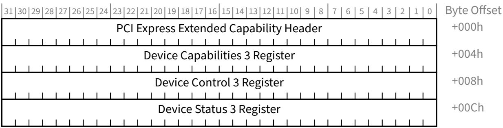


- 字节 0–3（+000h）：PCI Express 扩展能力头（PCI Express Extended Capability Header）
- 字节 4–7（+004h）：Device Capabilities 3 寄存器
- 字节 8–11（+008h）：Device Control 3 寄存器
- 字节 12–15（+00Ch）：Device Status 3 寄存器

§ 图 7-121 详细说明了 Device 3 扩展能力头中寄存器字段的分配；§ 表 7-107 给出相应的位定义。

</td>
</tr>
</tbody>
</table>
</div>


---

---

<a id="sec-7-7-9"></a>
## 7.7.9 Device 3 Extended Capability Structure | Device 3 扩展能力结构

<table>
<thead>
<tr>
<th width="50%">🇬🇧 English</th>
<th width="50%" style="background-color:#e8e8e8">🏆 中文</th>
</tr>
</thead>
<tbody>
<tr>
<td>

7.7.9 Device 3 Extended Capability Structure §

7.7.9.1 Device 3 Extended Capability Header (Offset 00h) §

§

§

§

</td>
<td style="background-color:#e8e8e8">

7.7.9 Device 3 扩展能力结构 §

7.7.9.1 Device 3 扩展能力头 (Offset 00h) §

§

§

§

</td>
</tr>
</tbody>
</table>

[⬆️ 返回目录](#-本章目录-table-of-contents)

---

<!-- 📄 Page 1150 -->
---

<a id="sec-7-7-9-fig-7-121"></a>
### Figure 7-121 / Table 7-107: Device 3 Extended Capability Header | Device 3 扩展能力头


<div style="overflow-x: auto; max-width: 100%;">
<table>
<thead>
<tr>
<th width="50%">🇬🇧 English</th>
<th width="50%" style="background-color:#e8e8e8">🏆 中文</th>
</tr>
</thead>
<tbody>
<tr>
<td>

Figure 7-121 Device 3 Extended Capability Header

| Bits 0-15 | Bits 16-19 | Bits 20-31 |
|---|---|---|
| Device 3 Extended Capability ID = 002Fh | Capability Version | Next Capability Offset |

Table 7-107 Device 3 Extended Capability Header

| Bit Location | Register Description | Attributes |
|---|---|---|
| 15:0 | **Device 3 Extended Capability ID** - Indicates the Device 3 Extended Capability structure. This field must return a Capability ID of 002Fh indicating that this is a Device 3 Extended Capability structure. | RO |
| 19:16 | **Capability Version** - This field is a PCI-SIG defined version number that indicates the version of the Capability structure present. Must be 1h for this version of the specification. | RO |
| 31:20 | **Next Capability Offset** - The offset to the next PCI Extended Capability structure or 000h if no other items exist in the linked list of capabilities. | RO |

</td>
<td style="background-color:#e8e8e8">

图 7-121 Device 3 扩展能力头

| 位 0-15 | 位 16-19 | 位 20-31 |
|---|---|---|
| Device 3 扩展能力 ID = 002Fh | Capability Version (能力版本) | Next Capability Offset (下一能力偏移) |

表 7-107 Device 3 扩展能力头

| 位位置 | 寄存器描述 | 属性 |
|---|---|---|
| 15:0 | **Device 3 扩展能力 ID** — 标识 Device 3 扩展能力结构。本字段必须返回能力 ID 002Fh,表示这是一个 Device 3 扩展能力结构。 | RO |
| 19:16 | **Capability Version(能力版本)** — 该字段是 PCI-SIG 定义的版本号,指示所存在的能力结构的版本。对于本版本的规范,必须为 1h。 | RO |
| 31:20 | **Next Capability Offset(下一能力偏移)** — 指向下一个 PCI 扩展能力结构的偏移,若能力链表无其他项则为 000h。 | RO |

</td>
</tr>
</tbody>
</table>
</div>


[⬆️ 返回目录](#-本章目录-table-of-contents)

---

<a id="sec-7-7-9-2"></a>
## 7.7.9.2 Device Capabilities 3 Register (Offset 04h) | Device 能力 3 寄存器 (偏移 04h)

<table>
<thead>
<tr>
<th width="50%">🇬🇧 English</th>
<th width="50%" style="background-color:#e8e8e8">🏆 中文</th>
</tr>
</thead>
<tbody>
<tr>
<td>

§ Figure 7-122 details the allocation of register bits of the Device Capability 3 register; § Table 7-108 provides the respective bit definitions.

7.7.9.2 Device Capabilities 3 Register (Offset 04h) §

§

§

§

§

Figure 7-122 Device Capabilities 3 Register

| Bit | Name |
|---|---|
| 0 | DMWr Request Routing Supported |
| 1 | 14-Bit Tag Completer Supported |
| 2 | 14-Bit Tag Requester Supported |
| 3 | L0p Supported |
| 4-6 | Port L0p Exit Latency |
| 7-9 | Retimer L0p Exit Latency |
| 10 | UIO Mem RdWr Completer Supported |
| 11 | UIO Mem RdWr Requester Supported |
| 12-31 | RsvdP |

Table 7-108 Device Capabilities 3 Register

| Bit Location | Register Description | Attributes |
|---|---|---|
| 0 | **DMWr Request Routing Supported** – Applicable only to Switch Upstream Ports, Switch Downstream Ports, and Root Ports; must be 0b for other Function types. This bit must be Set if the Port supports this optional capability. See § Section 6.32 for additional details. | HwInit |

</td>
<td style="background-color:#e8e8e8">

§ 图 7-122 详述了 Device 能力 3 寄存器的位分配;§ 表 7-108 提供了相应的位定义。

7.7.9.2 Device 能力 3 寄存器 (偏移 04h) §

§

§

§

§

图 7-122 Device 能力 3 寄存器

| 位 | 名称 |
|---|---|
| 0 | DMWr 请求路由支持 (DMWr Request Routing Supported) |
| 1 | 14-Bit Tag Completer 支持 (14-Bit Tag Completer Supported) |
| 2 | 14-Bit Tag Requester 支持 (14-Bit Tag Requester Supported) |
| 3 | L0p 支持 (L0p Supported) |
| 4-6 | 端口 L0p 退出延迟 (Port L0p Exit Latency) |
| 7-9 | Retimer L0p 退出延迟 (Retimer L0p Exit Latency) |
| 10 | UIO 内存读/写 Completer 支持 (UIO Mem RdWr Completer Supported) |
| 11 | UIO 内存读/写 Requester 支持 (UIO Mem RdWr Requester Supported) |
| 12-31 | RsvdP |

表 7-108 Device 能力 3 寄存器

| 位位置 | 寄存器描述 | 属性 |
|---|---|---|
| 0 | **DMWr 请求路由支持 (DMWr Request Routing Supported)** — 仅适用于交换机上游端口 (Switch Upstream Port)、交换机下游端口 (Switch Downstream Port) 和根端口 (Root Port);对于其他功能类型必须为 0b。如果端口支持此可选能力,则该位必须置位。更多详情请参见 § 第 6.32 节。 | HwInit |

</td>
</tr>
</tbody>
</table>

[⬆️ 返回目录](#-本章目录-table-of-contents)

---

<!-- 📄 Page 1151 -->
---

<a id="sec-7-7-9-2-cont"></a>
### Device Capabilities 3 Register (cont.) | Device 能力 3 寄存器(续)


<div style="overflow-x: auto; max-width: 100%;">
<table>
<thead>
<tr>
<th width="50%">🇬🇧 English</th>
<th width="50%" style="background-color:#e8e8e8">🏆 中文</th>
</tr>
</thead>
<tbody>
<tr>
<td>

Table 7-108 Device Capabilities 3 Register (continued)

| Bit Location | Register Description | Attributes |
|---|---|---|
| 1 | **14-Bit Tag Completer Supported** – If this bit is Set, the Function supports 14-Bit Tag Completer capability; otherwise, the Function does not. See § Section 2.2.6.2 for additional details. This bit MUST@FLIT be Set. For VFs, this bit value must be identical to the associated PF's bit value. | HwInit |
| 2 | **14-Bit Tag Requester Supported** – If this bit is Set, the Function supports 14-Bit Tag Requester capability; otherwise, the Function does not. This bit must not be Set if the 14-Bit Tag Completer Supported bit is Clear. If the Function is an RCiEP, this bit must be Clear if the RC does not support 14-Bit Tag Completer capability for Requests coming from this RCiEP. For VFs, this bit value must equal the VF 14-Bit Tag Requester Supported bit value in the SR-IOV Capabilities Register. See § Section 9.3.3.2.3 for additional details. Note that 14-Bit Tag field generation must be enabled by the 14-Bit Tag Requester Enable bit in the Device Control 3 register of the Requester Function before 14-Bit Tags can be generated by the Requester. See § Section 2.2.6.2 for additional details. | HwInit |
| 3 | **L0p Supported** – If Set, the Port supports L0p. This bit must be clear if Flit Mode Supported is Clear. All Functions associated with an Upstream Port must return the same value of this bit. | HwInit |
| 6:4 | **Port L0p Exit Latency** – indicates this Port's L0p Exit Latency. The value reported indicates the length of time this Port requires to complete widening a link using L0p. If L0p Supported is clear, this field must contain 000b. All Functions associated with an Upstream Port must return the same value of this field. Local L0p Exit Latency is computed as the maximum of Port L0p Exit Latency and Retimer L0p Exit Latency. Local L0p Exit Latency is transmitted in the L0p Exit Latency field of the Data Link Feature DLLP. The effective L0p Exit Latency of a Link is computed as the maximum of Local L0p Exit Latency and Remote L0p Exit Latency. Defined encodings are: <br>• `000b` Less than 1μs <br>• `001b` 1 μs to less than 2 μs <br>• `010b` 2 μs to less than 4 μs <br>• `011b` 4 μs to less than 8 μs <br>• `100b` 8 μs to less than 16 μs <br>• `101b` 16 μs to less than 32 μs <br>• `110b` 32 μs-64 μs <br>• `111b` More than 64 μs | HwInit |
| 9:7 | **Retimer L0p Exit Latency** – indicates this worst case L0p Exit Latency for retimers "associated" with this Port. The value reported indicates the length of time a Retimer requires to complete widening a link using L0p. If L0p Supported is clear, this field must contain 000b. All Functions associated with an Upstream Port must return the same value of this field. Local L0p Exit Latency is computed as the maximum of Port L0p Exit Latency and Retimer L0p Exit Latency. Local L0p Exit Latency is transmitted in the L0p Exit Latency field of the Data Link Feature DLLP. The effective L0p Exit Latency of a Link is computed as the maximum of Local L0p Exit Latency and Remote L0p Exit Latency. Defined encodings are: <br>• `000b` Less than 1μs | HwInit |

</td>
<td style="background-color:#e8e8e8">

表 7-108 Device 能力 3 寄存器(续)

| 位位置 | 寄存器描述 | 属性 |
|---|---|---|
| 1 | **14-Bit Tag Completer 支持(14-Bit Tag Completer Supported)** — 如果该位置位,则该功能支持 14-Bit Tag Completer 能力;否则不支持。更多详情请参见 § 第 2.2.6.2 节。该位 MUST@FLIT 必须置位。对于 VF,此位值必须与关联 PF 的位值相同。 | HwInit |
| 2 | **14-Bit Tag Requester 支持(14-Bit Tag Requester Supported)** — 如果该位置位,则该功能支持 14-Bit Tag Requester 能力;否则不支持。如果 14-Bit Tag Completer 支持位为清零状态,则该位不能置位。如果该功能是 RCiEP,且 RC 不支持来自此 RCiEP 请求的 14-Bit Tag Completer 能力,则该位必须清零。对于 VF,此位值必须等于 SR-IOV 能力寄存器 (SR-IOV Capabilities Register) 中的 VF 14-Bit Tag Requester 支持位值。更多详情请参见 § 第 9.3.3.2.3 节。注意:在 Requester 能够生成 14-Bit Tag 之前,必须通过 Requester 功能的 Device Control 3 寄存器中的 14-Bit Tag Requester 使能位启用 14-Bit Tag 字段生成。更多详情请参见 § 第 2.2.6.2 节。 | HwInit |
| 3 | **L0p 支持(L0p Supported)** — 如果置位,则该端口支持 L0p。如果 Flit 模式支持 (Flit Mode Supported) 为清零,则该位必须清零。与上游端口 (Upstream Port) 关联的所有功能必须返回该位的相同值。 | HwInit |
| 6:4 | **端口 L0p 退出延迟(Port L0p Exit Latency)** — 指示该端口的 L0p 退出延迟 (L0p Exit Latency)。所报告的值表示该端口使用 L0p 完成链路扩宽所需的时间长度。如果 L0p 支持位为清零,则此字段必须为 000b。与上游端口关联的所有功能必须返回此字段的相同值。本地 L0p 退出延迟 (Local L0p Exit Latency) 计算为端口 L0p 退出延迟和 Retimer L0p 退出延迟的最大值。本地 L0p 退出延迟通过数据链路特性 DLLP (Data Link Feature DLLP) 的 L0p Exit Latency 字段传输。链路的有效 L0p 退出延迟计算为本地 L0p 退出延迟和远端 L0p 退出延迟 (Remote L0p Exit Latency) 的最大值。已定义的编码为: <br>• `000b` 小于 1 μs <br>• `001b` 1 μs 至小于 2 μs <br>• `010b` 2 μs 至小于 4 μs <br>• `011b` 4 μs 至小于 8 μs <br>• `100b` 8 μs 至小于 16 μs <br>• `101b` 16 μs 至小于 32 μs <br>• `110b` 32 μs-64 μs <br>• `111b` 大于 64 μs | HwInit |
| 9:7 | **Retimer L0p 退出延迟(Retimer L0p Exit Latency)** — 指示与本端口"关联"的 Retimer 的最坏情况 L0p 退出延迟。所报告的值表示 Retimer 使用 L0p 完成链路扩宽所需的时间长度。如果 L0p 支持位为清零,则此字段必须为 000b。与上游端口关联的所有功能必须返回此字段的相同值。本地 L0p 退出延迟计算为端口 L0p 退出延迟和 Retimer L0p 退出延迟的最大值。本地 L0p 退出延迟通过数据链路特性 DLLP 的 L0p Exit Latency 字段传输。链路的有效 L0p 退出延迟计算为本地 L0p 退出延迟和远端 L0p 退出延迟的最大值。已定义的编码为: <br>• `000b` 小于 1 μs | HwInit |

</td>
</tr>
</tbody>
</table>
</div>


[⬆️ 返回目录](#-本章目录-table-of-contents)

---

<!-- 📄 Page 1152 -->
---

<a id="sec-7-7-9-2-cont-2"></a>
### Device Capabilities 3 Register (cont. 2) | Device 能力 3 寄存器(续 2)

<table>
<thead>
<tr>
<th width="50%">🇬🇧 English</th>
<th width="50%" style="background-color:#e8e8e8">🏆 中文</th>
</tr>
</thead>
<tbody>
<tr>
<td>

Table 7-108 Device Capabilities 3 Register (continued)

| Bit Location | Register Description | Attributes |
|---|---|---|
| 9:7 (cont.) | **Retimer L0p Exit Latency** (continued encodings): <br>• `001b` 1 μs to less than 2 μs <br>• `010b` 2 μs to less than 4 μs <br>• `011b` 4 μs to less than 8 μs <br>• `100b` 8 μs to less than 16 μs <br>• `101b` 16 μs to less than 32 μs <br>• `110b` 32 μs-64 μs <br>• `111b` More than 64 μs | HwInit |
| 10 | **UIO Mem RdWr Completer Supported** – When Set, indicates the Function supports UIO Memory Read and UIO Memory Write as a Completer. | HwInit |
| 11 | **UIO Mem RdWr Requester Supported** – When Set, indicates the Function supports UIO Memory Read and/or UIO Memory Write as a Requester. | HwInit |

§ Figure 7-123 details the allocation of register bits of the Device Control 3 register; § Table 7-109 provides the respective bit definitions.

</td>
<td style="background-color:#e8e8e8">

表 7-108 Device 能力 3 寄存器(续)

| 位位置 | 寄存器描述 | 属性 |
|---|---|---|
| 9:7(续) | **Retimer L0p 退出延迟(续编码):** <br>• `001b` 1 μs 至小于 2 μs <br>• `010b` 2 μs 至小于 4 μs <br>• `011b` 4 μs 至小于 8 μs <br>• `100b` 8 μs 至小于 16 μs <br>• `101b` 16 μs 至小于 32 μs <br>• `110b` 32 μs-64 μs <br>• `111b` 大于 64 μs | HwInit |
| 10 | **UIO 内存读/写 Completer 支持(UIO Mem RdWr Completer Supported)** — 当置位时,指示该功能作为 Completer 支持 UIO 内存读和 UIO 内存写。 | HwInit |
| 11 | **UIO 内存读/写 Requester 支持(UIO Mem RdWr Requester Supported)** — 当置位时,指示该功能作为 Requester 支持 UIO 内存读和/或 UIO 内存写。 | HwInit |

§ 图 7-123 详述了 Device Control 3 寄存器的位分配;§ 表 7-109 提供了相应的位定义。

</td>
</tr>
</tbody>
</table>

[⬆️ 返回目录](#-本章目录-table-of-contents)

---

<a id="sec-7-7-9-3"></a>
## 7.7.9.3 Device Control 3 Register (Offset 08h) | Device 控制 3 寄存器 (偏移 08h)


<div style="overflow-x: auto; max-width: 100%;">
<table>
<thead>
<tr>
<th width="50%">🇬🇧 English</th>
<th width="50%" style="background-color:#e8e8e8">🏆 中文</th>
</tr>
</thead>
<tbody>
<tr>
<td>

7.7.9.3 Device Control 3 Register (Offset 08h) §

**IMPLEMENTATION NOTE:**

**USE OF UIO REQUEST 256B BOUNDARY DISABLE**

UIO is intended to be suitable for routing its Requests directly to memory controllers. For memory architectures that support interleaving, it is intended that a single UIO Request not target multiple memory controllers. When Clear, the UIO Request 256B Boundary Disable bit prevents UIO Requests from crossing naturally aligned 256-byte address boundaries, supporting interleaving granularities of that size and integer multiples of it.

Flit Mode Link efficiency for 256-byte UIO Requests is relatively high, and it increases only a few percent when maximum-sized 4-KB Requests are used. However, for cases where using larger UIO Requests is desired in order to increase Link efficiency and/or lower TLP rates, software may Set the UIO Request 256B Boundary Disable bit to enable larger Requests. Software should only do this if it knows there is no requirement for this Requester to honor 256-byte boundaries.

§

</td>
<td style="background-color:#e8e8e8">

7.7.9.3 Device 控制 3 寄存器 (偏移 08h) §

**实现注意事项 (IMPLEMENTATION NOTE):**

**UIO 请求 256B 边界禁用的使用 (USE OF UIO REQUEST 256B BOUNDARY DISABLE)**

UIO 旨在适合将其请求直接路由到内存控制器。对于支持交叉 (interleaving) 的内存架构,意图是单个 UIO 请求不针对多个内存控制器。当清零时,UIO 请求 256B 边界禁用位 (UIO Request 256B Boundary Disable) 可防止 UIO 请求跨越自然对齐的 256 字节地址边界,从而支持该大小及其整数倍的交叉粒度。

256 字节 UIO 请求的 Flit 模式链路 (Flit Mode Link) 效率相对较高,使用最大 4-KB 请求时仅增加几个百分点。然而,在希望使用较大 UIO 请求以提高链路效率和/或降低 TLP 速率的情况下,软件可以置位 UIO 请求 256B 边界禁用位以启用较大的请求。软件只有在确认该 Requester 无需遵守 256 字节边界要求时,才应执行此操作。

§

</td>
</tr>
</tbody>
</table>
</div>


[⬆️ 返回目录](#-本章目录-table-of-contents)

---

<!-- 📄 Page 1153 -->
---

<a id="sec-7-7-9-3-cont"></a>
### Figure 7-123 / Table 7-109: Device Control 3 Register | Device 控制 3 寄存器

<table>
<thead>
<tr>
<th width="50%">🇬🇧 English</th>
<th width="50%" style="background-color:#e8e8e8">🏆 中文</th>
</tr>
</thead>
<tbody>
<tr>
<td>

Figure 7-123 Device Control 3 Register

| Bit | Name |
|---|---|
| 0 | DMWr Requester Enable |
| 1 | DMWr Egress Blocking |
| 2 | 14-Bit Tag Requester Enable |
| 3 | L0p Enable |
| 4-6 | Target Link Width |
| 7 | UIO Mem RdWr Requester Enable |
| 8 | UIO Request 256B Boundary Disable |
| 9-31 | RsvdP |

Table 7-109 Device Control 3 Register

| Bit Location | Register Description | Attributes |
|---|---|---|
| 0 | **DMWr Requester Enable** - Applicable only to Endpoints, Root Ports and RCRBs; must be hardwired to 0b for other Function types. The Function is allowed to initiate DMWr Requests only if this bit and the Bus Master Enable bit in the Command register are both Set. This bit is required to be RW if the Endpoint or Root Port is capable of initiating DMWr Requests, but otherwise is permitted to be hardwired to 0b. This bit does not serve as a capability bit. This bit is permitted to be RW even if no DMWr Requester capabilities are supported by the Endpoint or Root Port. Default value of this bit is 0b. | RW |
| 1 | **DMWr Egress Blocking** – Applicable and mandatory for Switch Upstream Ports, Switch Downstream Ports, and Root Ports that implement DMWr routing; otherwise must be hardwired to 0b. When this bit is Set, DMWr Requests that target going out this Egress Port must be blocked. See § Section 6.32 . Default value of this bit is 0b. | RW/RO (see description) |
| 2 | **14-Bit Tag Requester Enable** – This bit, in combination with the Extended Tag Field Enable bit and 10-Bit Tag Requester Enable bit, determines how many Tag field bits a Requester is permitted to use. When the 14-Bit Tag Requester Enable bit is Set, the Requester is permitted to use 14-Bit Tags. See § Section 2.2.6.2 for complete details. If software changes the value of this bit while the Function has outstanding Non-Posted Requests, the result is undefined. For VFs, this bit is not supported and is RsvdP. The value in the VF 14-Bit Tag Requester Enable bit in the associated PF's SR-IOV Control Register applies to all its VFs. Non-VF Functions that do not implement 14-Bit Tag Requester capability are permitted to hardwire this bit to 0b. Default value of this bit is 0b. | RW/RO (see description), VF RsvdP |
| 3 | **L0p Enable** – Determines behavior of this Port when sending or responding to Link Management DLLPs of type L0p DLLP. This bit has no effect on Link Management DLLPs where the Link Mgmt Type field is other than L0p DLLP. This bit has no effect if Hardware Autonomous Width Disable is 1b. Default is 1b. | RW |

§

§

</td>
<td style="background-color:#e8e8e8">

图 7-123 Device 控制 3 寄存器

| 位 | 名称 |
|---|---|
| 0 | DMWr Requester 使能 (DMWr Requester Enable) |
| 1 | DMWr Egress 阻塞 (DMWr Egress Blocking) |
| 2 | 14-Bit Tag Requester 使能 (14-Bit Tag Requester Enable) |
| 3 | L0p 使能 (L0p Enable) |
| 4-6 | 目标链路宽度 (Target Link Width) |
| 7 | UIO 内存读/写 Requester 使能 (UIO Mem RdWr Requester Enable) |
| 8 | UIO 请求 256B 边界禁用 (UIO Request 256B Boundary Disable) |
| 9-31 | RsvdP |

表 7-109 Device 控制 3 寄存器

| 位位置 | 寄存器描述 | 属性 |
|---|---|---|
| 0 | **DMWr Requester 使能 (DMWr Requester Enable)** — 仅适用于端点 (Endpoint)、根端口 (Root Port) 和 RCRB;对于其他功能类型必须硬连线为 0b。仅当该位和命令寄存器 (Command register) 中的 Bus Master Enable 位均置位时,功能才被允许发起 DMWr 请求。如果端点或根端口能够发起 DMWr 请求,则该位必须为 RW,否则可允许硬连线为 0b。该位不作为能力位。即使端点或根端口不支持任何 DMWr Requester 能力,该位仍可允许为 RW。该位默认值为 0b。 | RW |
| 1 | **DMWr Egress 阻塞 (DMWr Egress Blocking)** — 对于实现 DMWr 路由的交换机上游端口 (Switch Upstream Port)、交换机下游端口 (Switch Downstream Port) 和根端口 (Root Port) 适用且强制;否则必须硬连线为 0b。当该位置位时,目标从此 Egress 端口出去的 DMWr 请求必须被阻塞。参见 § 第 6.32 节。该位默认值为 0b。 | RW/RO(见描述) |
| 2 | **14-Bit Tag Requester 使能 (14-Bit Tag Requester Enable)** — 该位与 Extended Tag Field Enable 位和 10-Bit Tag Requester Enable 位结合,确定 Requester 允许使用的 Tag 字段位数。当 14-Bit Tag Requester Enable 位置位时,Requester 允许使用 14-Bit Tag。完整详情请参见 § 第 2.2.6.2 节。如果软件在功能存在未完成的 Non-Posted 请求 (Non-Posted Request) 时更改此位的值,则结果未定义。对于 VF,不支持此位且为 RsvdP。关联 PF 的 SR-IOV 控制寄存器 (SR-IOV Control Register) 中的 VF 14-Bit Tag Requester Enable 位的值适用于其所有 VF。未实现 14-Bit Tag Requester 能力的非 VF 功能可允许将该位硬连线为 0b。该位默认值为 0b。 | RW/RO(见描述),VF RsvdP |
| 3 | **L0p 使能 (L0p Enable)** — 决定该端口在发送或响应类型为 L0p DLLP 的链路管理 DLLP (Link Management DLLP) 时的行为。对于 Link Mgmt Type 字段不是 L0p DLLP 的链路管理 DLLP,该位无效。如果 Hardware Autonomous Width Disable 为 1b,则该位无效。默认值为 1b。 | RW |

§

§

</td>
</tr>
</tbody>
</table>

[⬆️ 返回目录](#-本章目录-table-of-contents)

---

<!-- 📄 Page 1154 -->
---

<a id="sec-7-7-9-3-cont-2"></a>
### Device Control 3 Register (cont.) | Device 控制 3 寄存器(续)


<div style="overflow-x: auto; max-width: 100%;">
<table>
<thead>
<tr>
<th width="50%">🇬🇧 English</th>
<th width="50%" style="background-color:#e8e8e8">🏆 中文</th>
</tr>
</thead>
<tbody>
<tr>
<td>

Table 7-109 Device Control 3 Register (continued)

| Bit Location | Register Description | Attributes |
|---|---|---|
| 6:4 | **Target Link Width** – writes to this field initiate a directed L0p Link Width change to the indicated width. Encodings are: <br>• `000b` x1 Link <br>• `001b` x2 Link <br>• `010b` x4 Link <br>• `011b` x8 Link <br>• `100b` x16 Link <br>• `111b` Dynamic – L0p Link Width is determined by the Ports with no architected software intervention <br>• Others Reserved <br><br>This field has no effect on subsequent autonomous Link Width changes. This field has no effect on subsequent Link Width changes due to link reliability. This field does not represent maximum Link Width support. This field is RsvdP if Flit Mode Supported is Clear. This field is permitted in RCRBs. This field has no effect if L0p Enable is Clear. This field has no effect if Hardware Autonomous Width Disable is 1b. Behavior is undefined if this field is set to a reserved encoding or to a width that is greater than the Link width on the most recent entry to L0. Default is 111b. | RW/RsvdP |
| 7 | **UIO Mem RdWr Requester Enable** – The Function is permitted to initiate UIO Memory Read and UIO Memory Write only if this bit and the Bus Master Enable bit in the Command Register are both Set. This bit is required to be RW if UIO Mem RdWr Requester Supported is Set, but otherwise is permitted to be hardwired to 0b. Default value of this bit is 0b. | RW/RO (see description) |
| 8 | **UIO Request 256B Boundary Disable** – When Clear, a UIO Request from this Function must not specify an Address/Length combination that causes a Memory Space access to cross a naturally aligned 256-byte boundary. When Set, a Request from this Function may cross a naturally aligned 256B boundary. The setting of this bit has no impact on the separate requirement that all Memory Requests must not specify an Address/Length combination that causes a Memory Space access to cross a naturally aligned 4-KB boundary (see § Section 2.2.7 ). Mechanisms outside the scope of this specification may enable more advanced boundary policies, such as using larger or smaller boundaries than 256B, or boundaries associated with specific address ranges. However, such policies must never violate the boundary requirements stated in this description. See the Implementation Note: Use of UIO Request 256B Boundary Disable. This bit is permitted to be hardwired to 0b if this Function's UIO Mem RdWr Requester Supported bit is Clear. Default value of this bit is 0b. | RW/RO (see description) |

§ Figure 7-124 details allocation of the register fields in the Device Status 3 Register; § Table 7-110 provides the respective bit definitions.

7.7.9.4 Device Status 3 Register (Offset 0Ch) §

</td>
<td style="background-color:#e8e8e8">

表 7-109 Device 控制 3 寄存器(续)

| 位位置 | 寄存器描述 | 属性 |
|---|---|---|
| 6:4 | **目标链路宽度 (Target Link Width)** — 对此字段的写入启动到所指示宽度的定向 L0p 链路宽度变更。编码为: <br>• `000b` x1 链路 <br>• `001b` x2 链路 <br>• `010b` x4 链路 <br>• `011b` x8 链路 <br>• `100b` x16 链路 <br>• `111b` 动态 (Dynamic) — L0p 链路宽度由端口决定,无需架构化软件干预 <br>• 其他 保留 (Reserved) <br><br>此字段对后续自主链路宽度变更无效。此字段对因链路可靠性引起的后续链路宽度变更无效。此字段不表示最大链路宽度支持。如果 Flit 模式支持 (Flit Mode Supported) 为清零,则此字段为 RsvdP。允许在 RCRB 中使用此字段。如果 L0p Enable 为清零,则此字段无效。如果 Hardware Autonomous Width Disable 为 1b,则此字段无效。如果此字段设置为保留编码或宽度大于最近一次进入 L0 时链路宽度的值,则行为未定义。默认值为 111b。 | RW/RsvdP |
| 7 | **UIO 内存读/写 Requester 使能 (UIO Mem RdWr Requester Enable)** — 仅当该位和命令寄存器 (Command Register) 中的 Bus Master Enable 位均置位时,功能才被允许发起 UIO 内存读和 UIO 内存写。如果 UIO Mem RdWr Requester Supported 位置位,则该位必须为 RW,否则可允许硬连线为 0b。该位默认值为 0b。 | RW/RO(见描述) |
| 8 | **UIO 请求 256B 边界禁用 (UIO Request 256B Boundary Disable)** — 当清零时,来自该功能的 UIO 请求不得指定导致内存空间 (Memory Space) 访问跨越自然对齐的 256 字节边界的地址/长度组合。当置位时,来自该功能的请求可以跨越自然对齐的 256B 边界。该位的设置对以下单独要求没有影响:所有内存请求不得指定导致内存空间访问跨越自然对齐的 4-KB 边界的地址/长度组合(参见 § 第 2.2.7 节)。本规范范围之外的机制可启用更高级的边界策略,例如使用大于或小于 256B 的边界,或与特定地址范围关联的边界。但是,此类策略绝不能违反本描述中所述的边界要求。请参见实现注意事项:使用 UIO 请求 256B 边界禁用。如果此功能的 UIO Mem RdWr Requester Supported 位为清零,则允许将该位硬连线为 0b。该位默认值为 0b。 | RW/RO(见描述) |

§ 图 7-124 详述了 Device 状态 3 寄存器 (Device Status 3 Register) 中寄存器字段的分配;§ 表 7-110 提供了相应的位定义。

7.7.9.4 Device 状态 3 寄存器 (偏移 0Ch) §

</td>
</tr>
</tbody>
</table>
</div>


[⬆️ 返回目录](#-本章目录-table-of-contents)

---

<!-- 📄 Page 1155 -->
---

<a id="sec-7-7-9-4"></a>
## 7.7.9.4 Device Status 3 Register (Offset 0Ch) | Device 状态 3 寄存器 (偏移 0Ch)

<table>
<thead>
<tr>
<th width="50%">🇬🇧 English</th>
<th width="50%" style="background-color:#e8e8e8">🏆 中文</th>
</tr>
</thead>
<tbody>
<tr>
<td>

Figure 7-124 Device Status 3 Register

| Bit | Name |
|---|---|
| 0-2 | Initial Link Width |
| 3 | Segment Captured |
| 4 | Remote L0p Supported |
| 5-31 | RsvdZ |

Table 7-110 Device Status 3 Register

| Bit Location | Register Description | Attributes |
|---|---|---|
| 2:0 | **Initial Link Width** – This field contains the Link Width determined during initial link training. Encodings are: <br>• `000b` x1 Link <br>• `001b` x2 Link <br>• `010b` x4 Link <br>• `011b` x8 Link <br>• `100b` x16 Link <br>• Others Reserved <br><br>Default is determined during initial link training. Note that the current Link Width is visible in the Negotiated Link Width field. | RO |
| 3 | **Segment Captured** – This bit indicates if the Function has captured a valid Segment value from a Configuration Write Request as described in § Section 2.2.6.2 . When the Destination Segment field is captured from a Configuration Write Request in FM this bit must be set to the value of the DSV bit received with the Request. This bit must be cleared when a Configuration Write Request is received in NFM. Note that this bit will be set when every Link on the path from the Function to the RC is in FM. This bit will be clear if any Link between the Function and the RC is in NFM. Functions should only initiate Route by ID Message Requests targeting Hierarchies other than their own when this bit is Set. This bit is permitted to be hardwired to 0b in devices that don't support FM. FM Requesters and Completers within an RC capture their Segment value in an implementation specific way and must then Set this bit. The value in a Switch Downstream Port must be identical to the value in the associated Switch Upstream Port. Default is Zero in Functions that capture their Segment value. | RO |
| 4 | **Remote L0p Supported** – This bit indicates that the remote end of the Link supports L0p. Default is zero. | RO |

</td>
<td style="background-color:#e8e8e8">

图 7-124 Device 状态 3 寄存器

| 位 | 名称 |
|---|---|
| 0-2 | 初始链路宽度 (Initial Link Width) |
| 3 | 已捕获段 (Segment Captured) |
| 4 | 远端 L0p 支持 (Remote L0p Supported) |
| 5-31 | RsvdZ |

表 7-110 Device 状态 3 寄存器

| 位位置 | 寄存器描述 | 属性 |
|---|---|---|
| 2:0 | **初始链路宽度 (Initial Link Width)** — 此字段包含初始链路训练期间确定的链路宽度。编码为: <br>• `000b` x1 链路 <br>• `001b` x2 链路 <br>• `010b` x4 链路 <br>• `011b` x8 链路 <br>• `100b` x16 链路 <br>• 其他 保留 (Reserved) <br><br>默认值由初始链路训练确定。注意,当前链路宽度可在协商链路宽度 (Negotiated Link Width) 字段中查看。 | RO |
| 3 | **已捕获段 (Segment Captured)** — 该位指示该功能是否已从配置写请求 (Configuration Write Request) 中捕获有效的段值,如 § 第 2.2.6.2 节所述。在 FM 中从配置写请求捕获目标段 (Destination Segment) 字段时,该位必须设置为随该请求接收的 DSV 位的值。在 NFM 中接收到配置写请求时,该位必须清零。注意,当从该功能到 RC 的路径上的每条链路都处于 FM 时,该位将置位。如果该功能与 RC 之间的任何链路处于 NFM,则该位将清零。仅当该位置位时,功能才应启动针对非自身层级 (Hierarchy) 的按 ID 路由消息请求 (Route by ID Message Request)。在不支持 FM 的设备中,允许将该位硬连线为 0b。RC 内的 FM Requester 和 Completer 以特定于实现的方式捕获其段值,然后必须置位该位。交换机下游端口 (Switch Downstream Port) 中的值必须与关联的交换机上游端口 (Switch Upstream Port) 中的值相同。在捕获其段值的功能中,默认值为零。 | RO |
| 4 | **远端 L0p 支持 (Remote L0p Supported)** — 该位指示链路的远端支持 L0p。默认值为零。 | RO |

</td>
</tr>
</tbody>
</table>

[⬆️ 返回目录](#-本章目录-table-of-contents)

---

<a id="sec-7-7-10"></a>
## 7.7.10 Lane Margining at the Receiver Extended Capability | 接收器通道裕度扩展能力 (Lane Margining at the Receiver Extended Capability)

<table>
<thead>
<tr>
<th width="50%">🇬🇧 English</th>
<th width="50%" style="background-color:#e8e8e8">🏆 中文</th>
</tr>
</thead>
<tbody>
<tr>
<td>

7.7.10 Lane Margining at the Receiver Extended Capability §

§

§

The Lane Margining at the Receiver Extended Capability structure must be implemented in:

</td>
<td style="background-color:#e8e8e8">

7.7.10 接收器通道裕度扩展能力 §

§

§

接收器通道裕度扩展能力结构必须在下述对象中实现:

</td>
</tr>
</tbody>
</table>

[⬆️ 返回目录](#-本章目录-table-of-contents)

---

<!-- 📄 Page 1156 -->
---

<a id="sec-7-7-10-cont"></a>
### Lane Margining at the Receiver Extended Capability (cont.) | 接收器通道裕度扩展能力(续)


<div style="overflow-x: auto; max-width: 100%;">
<table>
<thead>
<tr>
<th width="50%">🇬🇧 English</th>
<th width="50%" style="background-color:#e8e8e8">🏆 中文</th>
</tr>
</thead>
<tbody>
<tr>
<td>

- A Function associated with a Downstream Port where the Supported Link Speeds Vector field indicates support for a Link speed of 16.0 GT/s or higher.
- A Function of a single-Function Device associated with an Upstream Port where the Supported Link Speeds Vector field indicates support for a Link speed of 16.0 GT/s or higher.
- Function 0 (and only Function 0) of a Multi-Function Device associated with an Upstream Port where the Supported Link Speeds Vector field indicates support for a Link speed of 16.0 GT/s or higher.

§ Figure 7-125 shows the layout of the Margining Extended Capability. This capability contains a pair of per-Port registers followed by a set of per-Lane registers.

The number of per-Lane entries is determined by the Maximum Link Width (see § Section 7.5.3.6 or § Section 7.9.9.2 ). Up to 32 entries are permitted regardless of the Maximum Link Width. The value of entries beyond the Maximum Link Width is undefined.

Each per-Lane entry contains the values for that Lane. Lane numbering uses the default Lane number and is thus invariant to Link width and Lane reversal negotiation that occurs during Link training.

</td>
<td style="background-color:#e8e8e8">

- 与下游端口 (Downstream Port) 关联的功能,其中支持的链路速度向量 (Supported Link Speeds Vector) 字段指示支持 16.0 GT/s 或更高的链路速度。
- 与上游端口 (Upstream Port) 关联的单功能设备 (single-Function Device) 的功能,其中支持的链路速度向量字段指示支持 16.0 GT/s 或更高的链路速度。
- 与上游端口关联的多功能设备 (Multi-Function Device) 的 Function 0(且仅为 Function 0),其中支持的链路速度向量字段指示支持 16.0 GT/s 或更高的链路速度。

§ 图 7-125 显示了裕度扩展能力 (Margining Extended Capability) 的布局。该能力包含一对每端口 (per-Port) 寄存器,后跟一组每通道 (per-Lane) 寄存器。

每通道条目的数量由最大链路宽度 (Maximum Link Width) 决定(参见 § 第 7.5.3.6 节或 § 第 7.9.9.2 节)。无论最大链路宽度如何,最多允许 32 个条目。超出最大链路宽度的条目值未定义。

每个每通道条目包含该通道 (Lane) 的值。通道编号使用默认的通道号,因此不受链路训练期间发生的链路宽度和通道反转 (Lane reversal) 协商的影响。

</td>
</tr>
</tbody>
</table>
</div>


[⬆️ 返回目录](#-本章目录-table-of-contents)

---

<!-- 📄 Page 1157 -->
---

<a id="sec-7-7-10-fig-7-125"></a>
### Figure 7-125: Lane Margining at the Receiver Extended Capability | 接收器通道裕度扩展能力布局

<table>
<thead>
<tr>
<th width="50%">🇬🇧 English</th>
<th width="50%" style="background-color:#e8e8e8">🏆 中文</th>
</tr>
</thead>
<tbody>
<tr>
<td>

Figure 7-125 Lane Margining at the Receiver Extended Capability

| Byte Offset | Register |
|---|---|
| +000h | PCI Express Extended Capability Header |
| +004h | Margining Port Capabilities Register |
| +008h | Margining Port Status Register |
| +00Ch | Margining Lane Control: Lane 0 |
| +010h | Margining Lane Status: Lane 0 |
| +014h | Margining Lane Control: Lane 1 (Optional) |
| +018h | Margining Lane Status: Lane 1 (Optional) |
| +01Ch | Margining Lane Control: Lane 2 (Optional) |
| +020h | Margining Lane Status: Lane 2 (Optional) |
| +024h | Margining Lane Control: Lane 3 (Optional) |
| +028h | Margining Lane Status: Lane 3 (Optional) |
| +02Ch | Margining Lane Control: Lane 4 (Optional) |
| +030h | Margining Lane Status: Lane 4 (Optional) |
| +034h | Margining Lane Control: Lane 5 (Optional) |
| +038h | Margining Lane Status: Lane 5 (Optional) |
| +03Ch | Margining Lane Control: Lane 6 (Optional) |
| +040h | Margining Lane Status: Lane 6 (Optional) |
| +044h | Margining Lane Control: Lane 7 (Optional) |
| +048h | Margining Lane Status: Lane 7 (Optional) |
| +04Ch | Margining Lane Control: Lane 8 (Optional) |
| +050h | Margining Lane Status: Lane 8 (Optional) |
| +054h | Margining Lane Control: Lane 9 (Optional) |
| +058h | Margining Lane Status: Lane 9 (Optional) |
| +05Ch | Margining Lane Control: Lane 10 (Optional) |
| +060h | Margining Lane Status: Lane 10 (Optional) |
| +064h | Margining Lane Control: Lane 11 (Optional) |
| +068h | Margining Lane Status: Lane 11 (Optional) |
| +06Ch | Margining Lane Control: Lane 12 (Optional) |
| +070h | Margining Lane Status: Lane 12 (Optional) |
| +074h | Margining Lane Control: Lane 13 (Optional) |
| +078h | Margining Lane Status: Lane 13 (Optional) |
| +07Ch | Margining Lane Control: Lane 14 (Optional) |
| +080h | Margining Lane Status: Lane 14 (Optional) |
| +084h | Margining Lane Control: Lane 15 (Optional) |

(Figure continues to Lane 31 in the spec layout; entries for Lane 16-31 follow the same pattern at offsets +088h through +084h-region)

</td>
<td style="background-color:#e8e8e8">

图 7-125 接收器通道裕度扩展能力

| 字节偏移 | 寄存器 |
|---|---|
| +000h | PCI Express 扩展能力头 (PCI Express Extended Capability Header) |
| +004h | 裕度端口能力寄存器 (Margining Port Capabilities Register) |
| +008h | 裕度端口状态寄存器 (Margining Port Status Register) |
| +00Ch | 裕度通道控制:通道 0 (Margining Lane Control: Lane 0) |
| +010h | 裕度通道状态:通道 0 (Margining Lane Status: Lane 0) |
| +014h | 裕度通道控制:通道 1(可选) |
| +018h | 裕度通道状态:通道 1(可选) |
| +01Ch | 裕度通道控制:通道 2(可选) |
| +020h | 裕度通道状态:通道 2(可选) |
| +024h | 裕度通道控制:通道 3(可选) |
| +028h | 裕度通道状态:通道 3(可选) |
| +02Ch | 裕度通道控制:通道 4(可选) |
| +030h | 裕度通道状态:通道 4(可选) |
| +034h | 裕度通道控制:通道 5(可选) |
| +038h | 裕度通道状态:通道 5(可选) |
| +03Ch | 裕度通道控制:通道 6(可选) |
| +040h | 裕度通道状态:通道 6(可选) |
| +044h | 裕度通道控制:通道 7(可选) |
| +048h | 裕度通道状态:通道 7(可选) |
| +04Ch | 裕度通道控制:通道 8(可选) |
| +050h | 裕度通道状态:通道 8(可选) |
| +054h | 裕度通道控制:通道 9(可选) |
| +058h | 裕度通道状态:通道 9(可选) |
| +05Ch | 裕度通道控制:通道 10(可选) |
| +060h | 裕度通道状态:通道 10(可选) |
| +064h | 裕度通道控制:通道 11(可选) |
| +068h | 裕度通道状态:通道 11(可选) |
| +06Ch | 裕度通道控制:通道 12(可选) |
| +070h | 裕度通道状态:通道 12(可选) |
| +074h | 裕度通道控制:通道 13(可选) |
| +078h | 裕度通道状态:通道 13(可选) |
| +07Ch | 裕度通道控制:通道 14(可选) |
| +080h | 裕度通道状态:通道 14(可选) |
| +084h | 裕度通道控制:通道 15(可选) |

(在规范布局中该图延续到通道 31;通道 16-31 的条目遵循相同模式,偏移位于 +088h 至 +084h 区间)

</td>
</tr>
</tbody>
</table>

[⬆️ 返回目录](#-本章目录-table-of-contents)

---

<!-- 📄 Page 1158 -->
---

<a id="sec-7-7-10-1"></a>
## 7.7.10.1 Lane Margining at the Receiver Extended Capability Header (Offset 00h) | 接收器通道裕度扩展能力头 (偏移 00h)


<div style="overflow-x: auto; max-width: 100%;">
<table>
<thead>
<tr>
<th width="50%">🇬🇧 English</th>
<th width="50%" style="background-color:#e8e8e8">🏆 中文</th>
</tr>
</thead>
<tbody>
<tr>
<td>

Figure 7-126 Lane Margining at the Receiver Extended Capability Header

| Bits 0-15 | Bits 16-19 | Bits 20-31 |
|---|---|---|
| PCI Express Extended Capability ID = 0027h | Capability Version | Next Capability Offset |

Table 7-111 Lane Margining at the Receiver Extended Capability Header

| Bit Location | Register Description | Attributes |
|---|---|---|
| 15:0 | **PCI Express Extended Capability ID** - This field is a PCI-SIG defined ID number that indicates the nature and format of the Extended Capability. The Extended Capability ID for the Lane Margining at the Receiver Extended Capability is 0027h. | RO |
| 19:16 | **Capability Version** - This field is a PCI-SIG defined version number that indicates the version of the Capability structure present. Must be 1h for this version of the specification. | RO |
| 31:20 | **Next Capability Offset** - This field contains the offset to the next PCI Express Capability structure or 000h if no other items exist in the linked list of Capabilities. For Extended Capabilities implemented in Configuration Space, this offset is relative to the beginning of PCI-compatible Configuration Space and thus must always be either 000h (for terminating list of Capabilities) or greater than 0FFh. | RO |

</td>
<td style="background-color:#e8e8e8">

图 7-126 接收器通道裕度扩展能力头

| 位 0-15 | 位 16-19 | 位 20-31 |
|---|---|---|
| PCI Express 扩展能力 ID = 0027h | Capability Version (能力版本) | Next Capability Offset (下一能力偏移) |

表 7-111 接收器通道裕度扩展能力头

| 位位置 | 寄存器描述 | 属性 |
|---|---|---|
| 15:0 | **PCI Express 扩展能力 ID** — 该字段是 PCI-SIG 定义的 ID 号,指示扩展能力的性质和格式。接收器通道裕度扩展能力的扩展能力 ID 为 0027h。 | RO |
| 19:16 | **Capability Version(能力版本)** — 该字段是 PCI-SIG 定义的版本号,指示所存在的能力结构的版本。对于本版本的规范,必须为 1h。 | RO |
| 31:20 | **Next Capability Offset(下一能力偏移)** — 该字段包含到下一个 PCI Express 能力结构的偏移,若能力链表无其他项则为 000h。对于在配置空间 (Configuration Space) 中实现的扩展能力,该偏移相对于 PCI 兼容配置空间 (PCI-compatible Configuration Space) 的起点,因此必须始终为 000h(用于终止能力列表)或大于 0FFh。 | RO |

</td>
</tr>
</tbody>
</table>
</div>


[⬆️ 返回目录](#-本章目录-table-of-contents)

---

<a id="sec-7-7-10-2"></a>
## 7.7.10.2 Margining Port Capabilities Register (Offset 04h) | 裕度端口能力寄存器 (偏移 04h)

<table>
<thead>
<tr>
<th width="50%">🇬🇧 English</th>
<th width="50%" style="background-color:#e8e8e8">🏆 中文</th>
</tr>
</thead>
<tbody>
<tr>
<td>

7.7.10.2 Margining Port Capabilities Register (Offset 04h) §

§

§

§

§

§

Figure 7-127 Margining Port Capabilities Register

| Bit | Name |
|---|---|
| 0 | Margining uses Driver Software |
| 1-15 | RsvdP |

Table 7-112 Margining Port Capabilities Register

| Bit Location | Register Description | Attributes |
|---|---|---|
| 0 | **Margining uses Driver Software** - If Set, indicates that Margining is partially implemented using Device Driver software. Margining Software Ready indicates when this software is initialized. If Clear, Margining | HwInit |

</td>
<td style="background-color:#e8e8e8">

7.7.10.2 裕度端口能力寄存器 (偏移 04h) §

§

§

§

§

§

图 7-127 裕度端口能力寄存器

| 位 | 名称 |
|---|---|
| 0 | 裕度使用驱动软件 (Margining uses Driver Software) |
| 1-15 | RsvdP |

表 7-112 裕度端口能力寄存器

| 位位置 | 寄存器描述 | 属性 |
|---|---|---|
| 0 | **裕度使用驱动软件 (Margining uses Driver Software)** — 如果置位,指示裕度 (Margining) 部分使用设备驱动 (Device Driver) 软件实现。裕度软件就绪 (Margining Software Ready) 指示该软件何时初始化。如果清零,则裕度 | HwInit |

</td>
</tr>
</tbody>
</table>

[⬆️ 返回目录](#-本章目录-table-of-contents)

---

<!-- 📄 Page 1159 -->
---

<a id="sec-7-7-10-2-cont"></a>
### Margining Port Capabilities Register (cont.) | 裕度端口能力寄存器(续)


<div style="overflow-x: auto; max-width: 100%;">
<table>
<thead>
<tr>
<th width="50%">🇬🇧 English</th>
<th width="50%" style="background-color:#e8e8e8">🏆 中文</th>
</tr>
</thead>
<tbody>
<tr>
<td>

Table 7-112 Margining Port Capabilities Register (continued)

| Bit Location | Register Description | Attributes |
|---|---|---|
| 0 (cont.) | **Margining uses Driver Software** (continued): does not require device driver software. In this case the value read from Margining Software Ready is undefined. | HwInit |

Figure 7-128 Margining Port Status Register

| Bit | Name |
|---|---|
| 0 | Margining Ready |
| 1 | Margining Software Ready |
| 2-15 | RsvdZ |

Table 7-113 Margining Port Status Register

| Bit Location | Register Description | Attributes |
|---|---|---|
| 0 | **Margining Ready** - Indicates when the Margining feature is ready to accept margining commands. Behavior is undefined if this bit is Clear and, for any Lane, any of the Receiver Number, Margin Type, Usage Model, or Margin Payload fields are written (see § Section 7.7.10.4 ). If Margining uses Driver Software is Set, Margining Ready must be Set no later than 100 ms after the later of Margining Software Ready becoming Set or the link training to 16.0 GT/s or higher. If Margining uses Driver Software is Clear, Margining Ready must be Set no later than 100 ms after the Link trains to 16.0 GT/s or higher. Default value is implementation specific. | RO |
| 1 | **Margining Software Ready** - When Margining uses Driver Software is Set, then this bit, when Set, indicates that the required software has performed the required initialization. The value of this bit is undefined if Margining uses Driver Software is Clear. The default value of this bit is implementation specific. | RO |

</td>
<td style="background-color:#e8e8e8">

表 7-112 裕度端口能力寄存器(续)

| 位位置 | 寄存器描述 | 属性 |
|---|---|---|
| 0(续) | **裕度使用驱动软件(续):** 不需要设备驱动软件。在这种情况下,从裕度软件就绪 (Margining Software Ready) 读取的值未定义。 | HwInit |

图 7-128 裕度端口状态寄存器

| 位 | 名称 |
|---|---|
| 0 | 裕度就绪 (Margining Ready) |
| 1 | 裕度软件就绪 (Margining Software Ready) |
| 2-15 | RsvdZ |

表 7-113 裕度端口状态寄存器

| 位位置 | 寄存器描述 | 属性 |
|---|---|---|
| 0 | **裕度就绪 (Margining Ready)** — 指示裕度功能何时就绪以接受裕度命令。如果该位为清零且对任何通道写入了接收器编号 (Receiver Number)、裕度类型 (Margin Type)、使用模式 (Usage Model) 或裕度负载 (Margin Payload) 字段中的任意字段(参见 § 第 7.7.10.4 节),则行为未定义。如果裕度使用驱动软件位置位,则裕度就绪必须在裕度软件就绪置位或链路训练到 16.0 GT/s 或更高速度(取较晚者)之后 100 ms 内置位。如果裕度使用驱动软件位为清零,则裕度就绪必须在链路训练到 16.0 GT/s 或更高速度之后 100 ms 内置位。默认值特定于实现。 | RO |
| 1 | **裕度软件就绪 (Margining Software Ready)** — 当裕度使用驱动软件位置位时,该位置位时指示所需软件已执行所需的初始化。如果裕度使用驱动软件位为清零,则此位的值未定义。此位的默认值特定于实现。 | RO |

</td>
</tr>
</tbody>
</table>
</div>


[⬆️ 返回目录](#-本章目录-table-of-contents)

---

<a id="sec-7-7-10-3"></a>
## 7.7.10.3 Margining Port Status Register (Offset 06h) | 裕度端口状态寄存器 (偏移 06h)

<table>
<thead>
<tr>
<th width="50%">🇬🇧 English</th>
<th width="50%" style="background-color:#e8e8e8">🏆 中文</th>
</tr>
</thead>
<tbody>
<tr>
<td>

7.7.10.3 Margining Port Status Register (Offset 06h) §

The Margining Lane Control Register consists of control fields required for per-Lane margining.

The number of entries in this register are sized by Maximum Link Width (see § Section 7.5.3.6 ).

See § Section 4.2.8.2 for details of this register.

</td>
<td style="background-color:#e8e8e8">

7.7.10.3 裕度端口状态寄存器 (偏移 06h) §

裕度通道控制寄存器 (Margining Lane Control Register) 由每通道裕度 (per-Lane margining) 所需的控制字段组成。

该寄存器中的条目数量由最大链路宽度 (Maximum Link Width) 决定(参见 § 第 7.5.3.6 节)。

有关该寄存器的详细信息,请参见 § 第 4.2.8.2 节。

</td>
</tr>
</tbody>
</table>

[⬆️ 返回目录](#-本章目录-table-of-contents)

---


---

<a id="sec-7-7-10-4"></a>
## 7.7.10.4 Margining Lane Control Register (Offset 08h) | Margining Lane 控制寄存器（偏移 08h）


<div style="overflow-x: auto; max-width: 100%;">
<table>
<thead>
<tr>
<th width="50%">🇬🇧 English</th>
<th width="50%" style="background-color:#e8e8e8">🏆 中文</th>
</tr>
</thead>
<tbody>
<tr>
<td>

> **Figure 7-129.** Lane N: Margining Control Register Entry

> 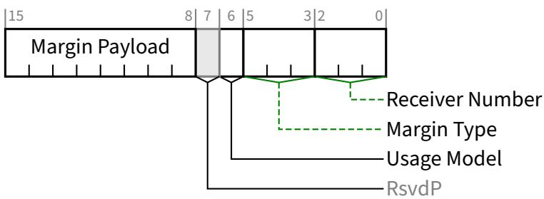

>
> Bit fields:
> - Bits [2:0] Receiver Number
> - Bits [5:3] Margin Type
> - Bit [6] Usage Model
> - Bit [7] RsvdP
> - Bits [15:8] Margin Payload

**Table 7-114. Lane N: Margining Control Register Entry**

| Bit Location | Register Description | Attributes |
|--------------|----------------------|------------|
| 2:0 | Receiver Number - See § Section 4.2.18.1 for details. The default value is 000b. This field must be reset to the default value if the Port goes to DL_Down status. | RW (see description) |
| 5:3 | Margin Type - See § Section 4.2.18.1 for details. The default value is 111b. This field must be reset to the default value if the Port goes to DL_Down status. | RW (see description) |
| 6 | Usage Model - See § Section 4.2.18.1 for details. The default value is 0b. This field must be reset to the default value if the Port goes to DL_Down status. | RW (see description) |
| 15:8 | Margin Payload - See § Section 4.2.18.1 for details. This field's value is used in conjunction with the Margin Type field, as described in § Section 4.2.18.1. The default value is 9Ch. This field must be reset to the default value if the Port goes to DL_Down status. | RW (see description) |

The Margining Lane Status register consists of status fields required for per-Lane margining. The number of entries in this register are sized by Maximum Link Width (see § Section 7.5.3.6). See § Section 4.2.8.2 for details of this register.

</td>
<td style="background-color:#e8e8e8">

> **图 7-129.** 通道 N：Margining 控制寄存器条目
>
> 位字段：
> - 位 [2:0] 接收器编号（Receiver Number）
> - 位 [5:3] Margin 类型（Margin Type）
> - 位 [6] 使用模式（Usage Model）
> - 位 [7] RsvdP
> - 位 [15:8] Margin 负载（Margin Payload）

**表 7-114. 通道 N：Margining 控制寄存器条目**

| 位位置 | 寄存器描述 | 属性 |
|--------|------------|------|
| 2:0 | 接收器编号（Receiver Number）- 详见 § 第 4.2.18.1 节。默认值为 000b。如果端口进入 DL_Down 状态，此字段必须复位为默认值。 | RW（见描述） |
| 5:3 | Margin 类型（Margin Type）- 详见 § 第 4.2.18.1 节。默认值为 111b。如果端口进入 DL_Down 状态，此字段必须复位为默认值。 | RW（见描述） |
| 6 | 使用模式（Usage Model）- 详见 § 第 4.2.18.1 节。默认值为 0b。如果端口进入 DL_Down 状态，此字段必须复位为默认值。 | RW（见描述） |
| 15:8 | Margin 负载（Margin Payload）- 详见 § 第 4.2.18.1 节。此字段值与 Margin Type 字段配合使用，描述见 § 第 4.2.18.1 节。默认值为 9Ch。如果端口进入 DL_Down 状态，此字段必须复位为默认值。 | RW（见描述） |

Margining Lane Status 寄存器由 per-Lane margining 所需的状态字段组成。该寄存器中的条目数由 Maximum Link Width 决定（见 § 第 7.5.3.6 节）。有关该寄存器的详细信息，请参阅 § 第 4.2.8.2 节。


</td>
</tr>
</tbody>
</table>
</div>


---

<a id="sec-7-7-10-5"></a>
## 7.7.10.5 Margining Lane Status Register (Offset 0Ah) | Margining Lane 状态寄存器（偏移 0Ah）

<table>
<thead>
<tr>
<th width="50%">🇬🇧 English</th>
<th width="50%" style="background-color:#e8e8e8">🏆 中文</th>
</tr>
</thead>
<tbody>
<tr>
<td>

<!-- 📄 Page 1161 -->
---

> **Figure 7-130.** Lane N: Margining Lane Status Register Entry

> 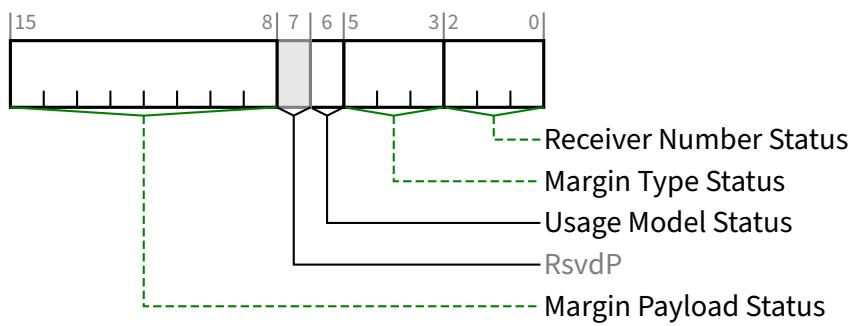

>
> Bit fields:
> - Bits [2:0] Receiver Number Status
> - Bits [5:3] Margin Type Status
> - Bit [6] Usage Model Status
> - Bit [7] RsvdP
> - Bits [15:8] Margin Payload Status

**Table 7-115. Lane N: Margining Lane Status Register Entry**

| Bit Location | Register Description | Attributes |
|--------------|----------------------|------------|
| 2:0 | Receiver Number Status - See § Section 4.2.18.1 for details. The default value is 000b. For Downstream Ports, this field must be reset to the default value if the Port goes to DL_Down status. | RO (see description) |
| 5:3 | Margin Type Status - See § Section 4.2.18.1 for details. The default value is 000b. This field must be reset to the default value if the Port goes to DL_Down status. | RO (see description) |
| 6 | Usage Model Status - See § Section 4.2.18.1 for details. The default value is 0b. This field must be reset to the default value if the Port goes to DL_Down status. | RO (see description) |
| 15:8 | Margin Payload Status - See § Section 4.2.18.1 for details. This field is only meaningful, when the Margin Type is a defined encoding other than 'No Command'. The default value is 00h. This field must be reset to the default value if the Port goes to DL_Down status. | RO (see description) |

</td>
<td style="background-color:#e8e8e8">

<!-- 📄 Page 1161 -->
---

> **图 7-130.** 通道 N：Margining Lane 状态寄存器条目
>
> 位字段：
> - 位 [2:0] 接收器编号状态（Receiver Number Status）
> - 位 [5:3] Margin 类型状态（Margin Type Status）
> - 位 [6] 使用模式状态（Usage Model Status）
> - 位 [7] RsvdP
> - 位 [15:8] Margin 负载状态（Margin Payload Status）

**表 7-115. 通道 N：Margining Lane 状态寄存器条目**

| 位位置 | 寄存器描述 | 属性 |
|--------|------------|------|
| 2:0 | 接收器编号状态（Receiver Number Status）- 详见 § 第 4.2.18.1 节。默认值为 000b。对于下游端口，如果端口进入 DL_Down 状态，此字段必须复位为默认值。 | RO（见描述） |
| 5:3 | Margin 类型状态（Margin Type Status）- 详见 § 第 4.2.18.1 节。默认值为 000b。如果端口进入 DL_Down 状态，此字段必须复位为默认值。 | RO（见描述） |
| 6 | 使用模式状态（Usage Model Status）- 详见 § 第 4.2.18.1 节。默认值为 0b。如果端口进入 DL_Down 状态，此字段必须复位为默认值。 | RO（见描述） |
| 15:8 | Margin 负载状态（Margin Payload Status）- 详见 § 第 4.2.18.1 节。仅当 Margin Type 为除"No Command"之外的已定义编码时，此字段才有意义。默认值为 00h。如果端口进入 DL_Down 状态，此字段必须复位为默认值。 | RO（见描述） |


</td>
</tr>
</tbody>
</table>

---

<a id="sec-7-7-11"></a>
## 7.7.11 ACS Extended Capability | ACS 扩展能力（Access Control Services）


<div style="overflow-x: auto; max-width: 100%;">
<table>
<thead>
<tr>
<th width="50%">🇬🇧 English</th>
<th width="50%" style="background-color:#e8e8e8">🏆 中文</th>
</tr>
</thead>
<tbody>
<tr>
<td>

The ACS Extended Capability is an optional capability that provides enhanced access controls (see § Section 6.12). This capability may be implemented by a Root Port, a Switch Downstream Port, or a Multi-Function Device Function. It is never applicable to a PCI Express to PCI Bridge or Root Complex Event Collector. It is not applicable to a Switch Upstream Port unless that Switch Upstream Port is a Function in a Multi-Function Device.

If an SR-IOV Capable Device other than one in a Root Complex implements internal peer-to-peer transactions, ACS is required, and ACS P2P Egress Control must be supported.

Implementation of ACS in RCiEPs is permitted but not required. It is explicitly permitted that within a single Root Complex, some RCiEPs implement ACS and some do not. It is strongly recommended that Root Complex implementations ensure that all accesses originating from RCiEPs (PFs and VFs) without ACS capability are first subjected to processing by a Translation Agent (TA) in the Root Complex before further decoding and processing. The details are outside the scope of this specification.

</td>
<td style="background-color:#e8e8e8">

ACS（访问控制服务，Access Control Services）扩展能力是一个可选能力，提供增强的访问控制（见 § 第 6.12 节）。此能力可由根端口（Root Port）、交换机下游端口（Switch Downstream Port）或多功能设备的某个功能（Multi-Function Device Function）实现。PCI Express 到 PCI 桥接器或根复合体事件收集器（Root Complex Event Collector）永远不适用 ACS。除非该交换机上游端口（Switch Upstream Port）是多功能设备中的一个功能，否则 ACS 也不适用于交换机上游端口。

如果根复合体之外的 SR-IOV（单根 I/O 虚拟化，Single Root I/O Virtualization）兼容设备实现了内部对等（peer-to-peer）事务，则必须实现 ACS，并且必须支持 ACS P2P Egress Control。

RCiEP 中实现 ACS 是允许的，但不是必需的。明确允许在单个根复合体（Root Complex）内部，某些 RCiEP 实现 ACS 而某些不实现。强烈建议根复合体实现确保所有来自不具备 ACS 能力的 RCiEP（PF 和 VF）的访问，在进一步解码和处理之前首先由根复合体中的转换代理（Translation Agent, TA）处理。其细节不在本规范范围内。

</td>
</tr>
</tbody>
</table>
</div>


---

<a id="sec-7-7-11-1"></a>
## 7.7.11.1 ACS Extended Capability Header (Offset 00h) | ACS 扩展能力头（偏移 00h）

<table>
<thead>
<tr>
<th width="50%">🇬🇧 English</th>
<th width="50%" style="background-color:#e8e8e8">🏆 中文</th>
</tr>
</thead>
<tbody>
<tr>
<td>

<!-- 📄 Page 1162 -->
---

> **Figure 7-131.** ACS Extended Capability

> 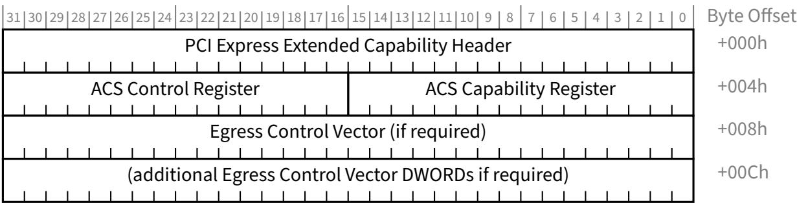

>
> Register layout (Byte Offset / Register):
> - +000h: PCI Express Extended Capability Header
> - +004h: ACS Capability Register
> - +006h: ACS Control Register
> - +008h: Egress Control Vector (if required)
> - +00Ch and beyond: (additional Egress Control Vector DWORDs if required)

> **Figure 7-132.** ACS Extended Capability Header

> 

>
> Bit fields:
> - Bits [15:0] PCI Express Extended Capability ID = 000Dh
> - Bits [19:16] Capability Version
> - Bits [31:20] Next Capability Offset

**Table 7-116. ACS Extended Capability Header**

| Bit Location | Register Description | Attributes |
|--------------|----------------------|------------|
| 15:0 | PCI Express Extended Capability ID - This field is a PCI-SIG defined ID number that indicates the nature and format of the Extended Capability. PCI Express Extended Capability ID for the ACS Extended Capability is 000Dh. | RO |
| 19:16 | Capability Version - This field is a PCI-SIG defined version number that indicates the version of the Capability structure present. Must be 1h for this version of the specification. | RO |
| 31:20 | Next Capability Offset - This field contains the offset to the next PCI Express Extended Capability structure or 000h if no other items exist in the linked list of Capabilities. | RO |

</td>
<td style="background-color:#e8e8e8">

<!-- 📄 Page 1162 -->
---

> **图 7-131.** ACS 扩展能力
>
> 寄存器布局（字节偏移 / 寄存器）：
> - +000h：PCI Express 扩展能力头（PCI Express Extended Capability Header）
> - +004h：ACS 能力寄存器（ACS Capability Register）
> - +006h：ACS 控制寄存器（ACS Control Register）
> - +008h：Egress Control Vector（如需要）
> - +00Ch 及之后：（额外的 Egress Control Vector DWORD，如需要）

> **图 7-132.** ACS 扩展能力头
>
> 位字段：
> - 位 [15:0] PCI Express 扩展能力 ID = 000Dh
> - 位 [19:16] 能力版本（Capability Version）
> - 位 [31:20] 下一能力偏移（Next Capability Offset）

**表 7-116. ACS 扩展能力头**

| 位位置 | 寄存器描述 | 属性 |
|--------|------------|------|
| 15:0 | PCI Express 扩展能力 ID - 此字段是由 PCI-SIG 定义的 ID 号，用于指示扩展能力的性质和格式。ACS 扩展能力的 PCI Express 扩展能力 ID 为 000Dh。 | RO |
| 19:16 | 能力版本（Capability Version）- 此字段是由 PCI-SIG 定义的版本号，用于指示当前存在的能力结构版本。对于本版本的规范，必须为 1h。 | RO |
| 31:20 | 下一能力偏移（Next Capability Offset）- 此字段包含下一个 PCI Express 扩展能力结构的偏移量，若能力链表不存在其他条目则为 000h。 | RO |


</td>
</tr>
</tbody>
</table>

---

<a id="sec-7-7-11-2"></a>
## 7.7.11.2 ACS Capability Register (Offset 04h) | ACS 能力寄存器（偏移 04h）


<div style="overflow-x: auto; max-width: 100%;">
<table>
<thead>
<tr>
<th width="50%">🇬🇧 English</th>
<th width="50%" style="background-color:#e8e8e8">🏆 中文</th>
</tr>
</thead>
<tbody>
<tr>
<td>

<!-- 📄 Page 1163 -->
---

> **Figure 7-133.** ACS Capability Register
>
> Bit fields:
> - Bit [0] ACS Source Validation
> - Bit [1] ACS Translation Blocking
> - Bit [2] ACS P2P Request Redirect
> - Bit [3] ACS P2P Completion Redirect
> - Bit [4] ACS Upstream Forwarding
> - Bit [5] ACS P2P Egress Control
> - Bit [6] ACS Direct Translated P2P
> - Bit [7] ACS Enhanced Capability
> - Bits [15:8] Egress Control Vector Size

**Table 7-117. ACS Capability Register**

| Bit Location | Register Description | Attributes |
|--------------|----------------------|------------|
| 0 | ACS Source Validation - Required for Root Ports and Switch Downstream Ports; must be hardwired to 0b otherwise. If 1b, indicates that the component implements ACS Source Validation. | RO |
| 1 | ACS Translation Blocking - Required for Root Ports and Switch Downstream Ports; must be hardwired to 0b otherwise. If 1b, indicates that the component implements ACS Translation Blocking. | RO |
| 2 | ACS P2P Request Redirect - Required for Root Ports that support peer-to-peer traffic with other Root Ports; required for Switch Downstream Ports; required for Multi-Function Device Functions that support peer-to-peer traffic with other Functions; must be hardwired to 0b otherwise. If 1b, indicates that the component implements ACS P2P Request Redirect. | RO |
| 3 | ACS P2P Completion Redirect - Required for all Functions that support ACS P2P Request Redirect; must be hardwired to 0b otherwise. If 1b, indicates that the component implements ACS P2P Completion Redirect. | RO |
| 4 | ACS Upstream Forwarding - Required for Root Ports if the RC supports Redirected Request Validation; required for Switch Downstream Ports; must be hardwired to 0b otherwise. If 1b, indicates that the component implements ACS Upstream Forwarding. | RO |
| 5 | ACS P2P Egress Control - Except as stated below, optional for Root Ports, Switch Downstream Ports, and Multi-Function Device Functions; otherwise this bit must be hardwired to Zero. If Set, indicates that the component implements ACS P2P Egress Control. For an SR-IOV Device not in a Root Complex, this bit is required to be Set for Functions if peer-to-peer transactions within the Device are supported. | RO |
| 6 | ACS Direct Translated P2P - Required for Root Ports that support Address Translation Services (ATS) and also support peer-to-peer traffic with other Root Ports; required for Switch Downstream Ports; required for Multi-Function Device Functions that support Address Translation Services (ATS) and also support peer-to-peer traffic with other Functions; must be hardwired to 0b otherwise. If 1b, indicates that the component implements ACS Direct Translated P2P. | RO |

</td>
<td style="background-color:#e8e8e8">

<!-- 📄 Page 1163 -->
---

> **图 7-133.** ACS 能力寄存器
>
> 位字段：
> - 位 [0] ACS 源验证（ACS Source Validation）
> - 位 [1] ACS 转换阻塞（ACS Translation Blocking）
> - 位 [2] ACS P2P 请求重定向（ACS P2P Request Redirect）
> - 位 [3] ACS P2P 完成重定向（ACS P2P Completion Redirect）
> - 位 [4] ACS 上行转发（ACS Upstream Forwarding）
> - 位 [5] ACS P2P Egress Control
> - 位 [6] ACS 直传 P2P（ACS Direct Translated P2P）
> - 位 [7] ACS 增强能力（ACS Enhanced Capability）
> - 位 [15:8] Egress Control Vector 大小（Egress Control Vector Size）

**表 7-117. ACS 能力寄存器**

| 位位置 | 寄存器描述 | 属性 |
|--------|------------|------|
| 0 | ACS 源验证（ACS Source Validation）- 根端口和交换机下游端口必须实现；否则必须硬连线为 0b。若为 1b，表示该组件实现了 ACS Source Validation。 | RO |
| 1 | ACS 转换阻塞（ACS Translation Blocking）- 根端口和交换机下游端口必须实现；否则必须硬连线为 0b。若为 1b，表示该组件实现了 ACS Translation Blocking。 | RO |
| 2 | ACS P2P 请求重定向（ACS P2P Request Redirect）- 支持与其他根端口对等通信的根端口必须实现；交换机下游端口必须实现；支持与其他功能对等通信的多功能设备功能必须实现；否则必须硬连线为 0b。若为 1b，表示该组件实现了 ACS P2P Request Redirect。 | RO |
| 3 | ACS P2P 完成重定向（ACS P2P Completion Redirect）- 所有支持 ACS P2P Request Redirect 的功能必须实现；否则必须硬连线为 0b。若为 1b，表示该组件实现了 ACS P2P Completion Redirect。 | RO |
| 4 | ACS 上行转发（ACS Upstream Forwarding）- 若 RC 支持 Redirected Request Validation，则根端口必须实现；交换机下游端口必须实现；否则必须硬连线为 0b。若为 1b，表示该组件实现了 ACS Upstream Forwarding。 | RO |
| 5 | ACS P2P Egress Control - 除下文所述外，对于根端口、交换机下游端口和多功能设备功能为可选项；否则此位必须硬连线为 0。若置位，表示该组件实现了 ACS P2P Egress Control。对于不在根复合体中的 SR-IOV 设备，如果支持设备内部的对等事务，则其功能的该位必须置位。 | RO |
| 6 | ACS 直传 P2P（ACS Direct Translated P2P）- 支持地址转换服务（Address Translation Services, ATS）且支持与其他根端口对等通信的根端口必须实现；交换机下游端口必须实现；支持 ATS 且支持与其他功能对等通信的多功能设备功能必须实现；否则必须硬连线为 0b。若为 1b，表示该组件实现了 ACS Direct Translated P2P。 | RO |

</td>
</tr>
</tbody>
</table>
</div>


<table>
<thead>
<tr>
<th width="50%">🇬🇧 English</th>
<th width="50%" style="background-color:#e8e8e8">🏆 中文</th>
</tr>
</thead>
<tbody>
<tr>
<td>

<!-- 📄 Page 1164 -->
---

**Table 7-117. ACS Capability Register (continued)**

| Bit Location | Register Description | Attributes |
|--------------|----------------------|------------|
| 7 | ACS Enhanced Capability - Required for Root Ports and Switch Downstream Ports that support the ACS Enhanced Capability mechanisms. If Set, indicates that the component supports all of the following mechanisms that are applicable: <ul><li>ACS I/O Request Blocking</li><li>ACS DSP Memory Target Access</li><li>ACS USP Memory Target Access</li><li>ACS Unclaimed Request Redirect</li></ul> | RO |
| 15:8 | Egress Control Vector Size - Encodings 01h-FFh directly indicate the number of applicable bits in the Egress Control Vector; the encoding 00h indicates 256 bits. If the ACS P2P Egress Control bit is 0b, the value of the size field is undefined, and the Egress Control Vector Register is not required to be present. | HwInit |

</td>
<td style="background-color:#e8e8e8">

<!-- 📄 Page 1164 -->
---

**表 7-117. ACS 能力寄存器（续）**

| 位位置 | 寄存器描述 | 属性 |
|--------|------------|------|
| 7 | ACS 增强能力（ACS Enhanced Capability）- 支持 ACS Enhanced Capability 机制的根端口和交换机下游端口必须实现。若置位，表示该组件支持以下所有适用的机制：<ul><li>ACS I/O 请求阻塞（ACS I/O Request Blocking）</li><li>ACS DSP 内存目标访问（ACS DSP Memory Target Access）</li><li>ACS USP 内存目标访问（ACS USP Memory Target Access）</li><li>ACS 未声明请求重定向（ACS Unclaimed Request Redirect）</li></ul> | RO |
| 15:8 | Egress Control Vector 大小（Egress Control Vector Size）- 编码 01h–FFh 直接表示 Egress Control Vector 中适用的位数；编码 00h 表示 256 位。如果 ACS P2P Egress Control 位为 0b，则大小字段的值未定义，且 Egress Control Vector 寄存器不需要存在。 | HwInit |

</td>
</tr>
</tbody>
</table>

---

<a id="sec-7-7-11-3"></a>
## 7.7.11.3 ACS Control Register (Offset 06h) | ACS 控制寄存器（偏移 06h）


<div style="overflow-x: auto; max-width: 100%;">
<table>
<thead>
<tr>
<th width="50%">🇬🇧 English</th>
<th width="50%" style="background-color:#e8e8e8">🏆 中文</th>
</tr>
</thead>
<tbody>
<tr>
<td>

> **Figure 7-134.** ACS Control Register

> 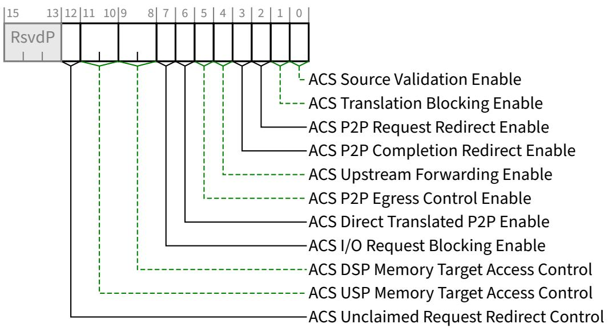

>
> Bit fields:
> - Bit [0] ACS Source Validation Enable
> - Bit [1] ACS Translation Blocking Enable
> - Bit [2] ACS P2P Request Redirect Enable
> - Bit [3] ACS P2P Completion Redirect Enable
> - Bit [4] ACS Upstream Forwarding Enable
> - Bit [5] ACS P2P Egress Control Enable
> - Bit [6] ACS Direct Translated P2P Enable
> - Bit [7] ACS I/O Request Blocking Enable
> - Bits [9:8] ACS DSP Memory Target Access Control
> - Bits [11:10] ACS USP Memory Target Access Control
> - Bit [12] ACS Unclaimed Request Redirect Control
> - Bits [15:13] RsvdP

**Table 7-118. ACS Control Register**

| Bit Location | Register Description | Attributes |
|--------------|----------------------|------------|
| 0 | ACS Source Validation Enable - When Set, the component validates the Bus Number from the Requester ID of Upstream Requests against the secondary/subordinate Bus Numbers. Default value of this bit is 0b. Must be hardwired to 0b if the ACS Source Validation functionality is not implemented. | RW |
| 1 | ACS Translation Blocking Enable - When Set, the component blocks all Upstream Memory Requests whose Address Type (AT) field is not set to the default value. Default value of this bit is 0b. Must be hardwired to 0b if the ACS Translation Blocking functionality is not implemented. | RW |
| 2 | ACS P2P Request Redirect Enable - In conjunction with ACS P2P Egress Control and ACS Direct Translated P2P mechanisms, determines when the component redirects peer-to-peer Requests Upstream (see § Section 6.12.3). Note that with Downstream Ports, this bit only applies to Upstream Requests arriving at the Downstream Port, and whose normal routing targets a different Downstream Port. Default value of this bit is 0b. Must be hardwired to 0b if the ACS P2P Request Redirect functionality is not implemented. | RW |
| 3 | ACS P2P Completion Redirect Enable - Determines when the component redirects peer-to-peer Completions Upstream; applicable only to Completions whose Relaxed Ordering Attribute is clear. Default value of this bit is 0b. Must be hardwired to 0b if the ACS P2P Completion Redirect functionality is not implemented. | RW |
| 4 | ACS Upstream Forwarding Enable - When Set, the component forwards Upstream any Request or Completion TLPs it receives that were redirected Upstream by a component lower in the hierarchy. Note that this bit only applies to Upstream TLPs arriving at a Downstream Port, and whose normal routing targets the same Downstream Port. Default value of this bit is 0b. Must be hardwired to 0b if the ACS Upstream Forwarding functionality is not implemented. | RW |
| 5 | ACS P2P Egress Control Enable - In conjunction with the Egress Control Vector plus the ACS P2P Request Redirect and ACS Direct Translated P2P mechanisms, determines when to allow, disallow, or redirect peer-to-peer Requests (see § Section 6.12.3). Default value of this bit is 0b. Must be hardwired to 0b if the ACS P2P Egress Control functionality is not implemented. | RW |
| 6 | ACS Direct Translated P2P Enable - When Set, overrides the ACS P2P Request Redirect and ACS P2P Egress Control mechanisms with peer-to-peer Memory Requests whose Address Type (AT) field indicates a Translated address (see § Section 6.12.3). This bit is ignored if ACS Translation Blocking Enable is 1b. Default value of this bit is 0b. Must be hardwired to 0b if the ACS Direct Translated P2P functionality is not implemented. | RW |
| 7 | ACS I/O Request Blocking Enable - if Set, Upstream I/O Requests received by the Downstream Port must be handled as ACS Violations. This bit is required for Root Ports and Switch Downstream Ports if the ACS Enhanced Capability bit is Set; otherwise it must be RsvdP. The default value of this bit is 0b. | RW/RsvdP |

</td>
<td style="background-color:#e8e8e8">

> **图 7-134.** ACS 控制寄存器
>
> 位字段：
> - 位 [0] ACS 源验证使能（ACS Source Validation Enable）
> - 位 [1] ACS 转换阻塞使能（ACS Translation Blocking Enable）
> - 位 [2] ACS P2P 请求重定向使能（ACS P2P Request Redirect Enable）
> - 位 [3] ACS P2P 完成重定向使能（ACS P2P Completion Redirect Enable）
> - 位 [4] ACS 上行转发使能（ACS Upstream Forwarding Enable）
> - 位 [5] ACS P2P Egress Control 使能（ACS P2P Egress Control Enable）
> - 位 [6] ACS 直传 P2P 使能（ACS Direct Translated P2P Enable）
> - 位 [7] ACS I/O 请求阻塞使能（ACS I/O Request Blocking Enable）
> - 位 [9:8] ACS DSP 内存目标访问控制（ACS DSP Memory Target Access Control）
> - 位 [11:10] ACS USP 内存目标访问控制（ACS USP Memory Target Access Control）
> - 位 [12] ACS 未声明请求重定向控制（ACS Unclaimed Request Redirect Control）
> - 位 [15:13] RsvdP

**表 7-118. ACS 控制寄存器**

| 位位置 | 寄存器描述 | 属性 |
|--------|------------|------|
| 0 | ACS 源验证使能（ACS Source Validation Enable）- 置位时，组件根据副/从总线号（secondary/subordinate Bus Numbers）验证上行请求（Upstream Requests）的 Requester ID 中的总线号。默认值为 0b。如果未实现 ACS Source Validation 功能，则必须硬连线为 0b。 | RW |
| 1 | ACS 转换阻塞使能（ACS Translation Blocking Enable）- 置位时，组件阻塞所有 AT（地址类型，Address Type）字段未设置为默认值的上行内存请求（Upstream Memory Requests）。默认值为 0b。如果未实现 ACS Translation Blocking 功能，则必须硬连线为 0b。 | RW |
| 2 | ACS P2P 请求重定向使能（ACS P2P Request Redirect Enable）- 与 ACS P2P Egress Control 和 ACS Direct Translated P2P 机制配合，决定组件何时将对等请求重定向到上游（见 § 第 6.12.3 节）。注意，对于下游端口，此位仅适用于到达该下游端口且正常路由目标为另一不同下游端口的上行请求。默认值为 0b。如果未实现 ACS P2P Request Redirect 功能，则必须硬连线为 0b。 | RW |
| 3 | ACS P2P 完成重定向使能（ACS P2P Completion Redirect Enable）- 决定组件何时将对等完成报文（peer-to-peer Completions）重定向到上游；仅适用于 Relaxed Ordering 属性位清零的完成报文<sup>167</sup>。默认值为 0b。如果未实现 ACS P2P Completion Redirect 功能，则必须硬连线为 0b。 | RW |
| 4 | ACS 上行转发使能（ACS Upstream Forwarding Enable）- 置位时，组件将其接收到的、由层级中较低层级组件重定向到上游的任何 Request 或 Completion TLP（事务层包）转发到上游。注意，此位仅适用于到达下游端口且正常路由目标为同一下游端口的上行 TLP。默认值为 0b。如果未实现 ACS Upstream Forwarding 功能，则必须硬连线为 0b。 | RW |
| 5 | ACS P2P Egress Control 使能（ACS P2P Egress Control Enable）- 与 Egress Control Vector 以及 ACS P2P Request Redirect 和 ACS Direct Translated P2P 机制配合，决定何时允许、禁止或重定向对等请求（见 § 第 6.12.3 节）。默认值为 0b。如果未实现 ACS P2P Egress Control 功能，则必须硬连线为 0b。 | RW |
| 6 | ACS 直传 P2P 使能（ACS Direct Translated P2P Enable）- 置位时，对 AT 字段指示已转换地址（Translated address）的对等内存请求，覆盖 ACS P2P Request Redirect 和 ACS P2P Egress Control 机制（见 § 第 6.12.3 节）。如果 ACS Translation Blocking Enable 为 1b，则忽略此位。默认值为 0b。如果未实现 ACS Direct Translated P2P 功能，则必须硬连线为 0b。 | RW |
| 7 | ACS I/O 请求阻塞使能（ACS I/O Request Blocking Enable）- 若置位，则下游端口接收到的上行 I/O 请求必须作为 ACS 违规（ACS Violations）处理。如果 ACS Enhanced Capability 位置位，则根端口和交换机下游端口必须实现此位；否则必须为 RsvdP。此位的默认值为 0b。 | RW/RsvdP |

> <sup>167</sup> 这包括读完成（Read Completions）、AtomicOp 完成以及带或不带数据的其他完成报文。


</td>
</tr>
</tbody>
</table>
</div>


<table>
<thead>
<tr>
<th width="50%">🇬🇧 English</th>
<th width="50%" style="background-color:#e8e8e8">🏆 中文</th>
</tr>
</thead>
<tbody>
<tr>
<td>

<!-- 📄 Page 1166 -->
---

**Table 7-118. ACS Control Register (continued)**

| Bit Location | Register Description | Attributes |
|--------------|----------------------|------------|
| 9:8 | ACS DSP Memory Target Access Control - This field controls how a Downstream Port handles Upstream Memory Requests attempting to access any Memory BAR Space on an applicable Root Port or Switch Downstream Port (including the Ingress Port). See § Section 6.12.1.1. Defined Encodings are: <ul><li>00b - Direct Request access enabled</li><li>01b - Request blocking enabled</li><li>10b - Request redirect enabled</li><li>11b - Reserved</li></ul> This field is required for Root Ports and Switch Downstream Ports if the ACS Enhanced Capability bit is Set and there is applicable Memory BAR Space to protect; otherwise it must be RsvdP. The default value of this field is 00b. | RW/RsvdP |
| 11:10 | ACS USP Memory Target Access Control - This field controls how a Switch Downstream Port handles Upstream Memory Requests attempting to access any Memory BAR Space on the Switch Upstream Port. See § Section 6.12.1.1. Defined Encodings are: <ul><li>00b - Direct Request access enabled</li><li>01b - Request blocking enabled</li><li>10b - Request redirect enabled</li><li>11b - Reserved</li></ul> This field is required for Switch Downstream Ports if the ACS Enhanced Capability bit is Set and there is applicable Memory BAR Space to protect; otherwise it must be RsvdP. The default value of this field is 00b. | RW/RsvdP |
| 12 | ACS Unclaimed Request Redirect Control - Controls how a Switch Downstream Port handles incoming Requests targeting Memory Space within the Memory aperture of the Switch Upstream Port that is not within a Memory aperture or Memory BAR Space of any Downstream Port within the Switch. When Set, the Switch must forward such Requests Upstream out of the Switch. When Clear, the Switch Downstream Port must handle such Requests as an Unsupported Request (UR). This bit is required for Switch Downstream Ports if the ACS Enhanced Capability bit is Set; otherwise it must be RsvdP. The default value of this bit is 0b. | RW/RsvdP |

</td>
<td style="background-color:#e8e8e8">

<!-- 📄 Page 1166 -->
---

**表 7-118. ACS 控制寄存器（续）**

| 位位置 | 寄存器描述 | 属性 |
|--------|------------|------|
| 9:8 | ACS DSP 内存目标访问控制（ACS DSP Memory Target Access Control）- 此字段控制下游端口如何处理试图访问适用的根端口或交换机下游端口（包括入口端口）上任何内存 BAR 空间的上行内存请求。见 § 第 6.12.1.1 节。已定义编码为：<ul><li>00b – 直接请求访问使能（Direct Request access enabled）</li><li>01b – 请求阻塞使能（Request blocking enabled）</li><li>10b – 请求重定向使能（Request redirect enabled）</li><li>11b – 保留（Reserved）</li></ul>如果 ACS Enhanced Capability 位置位且存在适用的内存 BAR 空间需要保护，则根端口和交换机下游端口必须实现此字段；否则必须为 RsvdP。此字段的默认值为 00b。 | RW/RsvdP |
| 11:10 | ACS USP 内存目标访问控制（ACS USP Memory Target Access Control）- 此字段控制交换机下游端口如何处理试图访问交换机上游端口上任何内存 BAR 空间的上行内存请求。见 § 第 6.12.1.1 节。已定义编码为：<ul><li>00b – 直接请求访问使能（Direct Request access enabled）</li><li>01b – 请求阻塞使能（Request blocking enabled）</li><li>10b – 请求重定向使能（Request redirect enabled）</li><li>11b – 保留（Reserved）</li></ul>如果 ACS Enhanced Capability 位置位且存在适用的内存 BAR 空间需要保护，则交换机下游端口必须实现此字段；否则必须为 RsvdP。此字段的默认值为 00b。 | RW/RsvdP |
| 12 | ACS 未声明请求重定向控制（ACS Unclaimed Request Redirect Control）- 控制交换机下游端口如何处理到达的、目标位于交换机上游端口内存孔径（Memory aperture）内但不在交换机内任何下游端口的内存孔径或内存 BAR 空间内的内存空间请求。置位时，交换机必须将这些请求从交换机转发到上游。清零时，交换机下游端口必须将这些请求作为不支持请求（Unsupported Request, UR）处理。如果 ACS Enhanced Capability 位置位，则交换机下游端口必须实现此位；否则必须为 RsvdP。此位的默认值为 0b。 | RW/RsvdP |

</td>
</tr>
</tbody>
</table>

---

<a id="sec-7-7-11-4"></a>
## 7.7.11.4 Egress Control Vector Register (Offset 08h) | Egress Control Vector 寄存器（偏移 08h）


<div style="overflow-x: auto; max-width: 100%;">
<table>
<thead>
<tr>
<th width="50%">🇬🇧 English</th>
<th width="50%" style="background-color:#e8e8e8">🏆 中文</th>
</tr>
</thead>
<tbody>
<tr>
<td>

The Egress Control Vector is a read-write register that contains a bit-array. The number of bits in the register is specified by the Egress Control Vector Size field, and the register spans multiple DWORDs if required. If the ACS P2P Egress Control bit in the ACS Capability Register is 0b, the Egress Control Vector Size field is undefined and the Egress Control Vector Register is not required to be present.

For the general case of an Egress Control Vector spanning multiple DWORDs, the DWORD offset and bit number within that DWORD for a given arbitrary bit K are specified by the formulas<sup>168</sup>:

> **Equation 7-4. Egress Control Vector Access**
> ```
> DWORD offset = 08h + (K div 32) × 4
> DWORD bit#   = K mod 32
> ```

Bits in a DWORD beyond those specified by the Egress Control Vector Size field are RsvdP.

For Root Ports and Switch Downstream Ports, each bit in the bit-array always corresponds to a Port Number. Otherwise, for Functions<sup>169</sup> within a Multi-Function Device, each bit in the bit-array corresponds to one or more Function Numbers, or a Function Group Number. For example, access to Function 2 is controlled by bit number 2 in the bit-array. For both Port Number cases and Function Number cases, the bit corresponding to the Function that implements this Extended Capability structure must be hardwired to 0b.<sup>170</sup>

</td>
<td style="background-color:#e8e8e8">

Egress Control Vector 是一个包含位数组（bit-array）的可读写寄存器。该寄存器中的位数由 Egress Control Vector Size 字段指定，如需要可跨越多个 DWORD。如果 ACS Capability Register 中的 ACS P2P Egress Control 位为 0b，则 Egress Control Vector Size 字段未定义，且 Egress Control Vector 寄存器不需要存在。

对于跨越多个 DWORD 的一般情况，任意位 K 在 DWORD 中的偏移和位号由以下公式<sup>168</sup>指定：

> **公式 7-4. Egress Control Vector 访问**
> ```
> DWORD 偏移 = 08h + (K div 32) × 4
> DWORD 位号 = K mod 32
> ```

DWORD 中超出 Egress Control Vector Size 字段所规定位数的位为 RsvdP。

对于根端口和交换机下游端口，位数组中的每一位始终对应一个端口号（Port Number）。否则，对于多功能设备内的功能<sup>169</sup>，位数组中的每一位对应一个或多个功能号（Function Number）或功能组号（Function Group Number）。例如，对 Function 2 的访问由位数组中的第 2 位控制。无论是端口号情况还是功能号情况，对应于实现此扩展能力结构的功能的该位必须硬连线为 0b。<sup>170</sup>

> <sup>168</sup> Div 为带截断的整数除法。Mod 为整数除法的余数。
> <sup>169</sup> 包括交换机上游端口。
> <sup>170</sup> 对于 ARI 设备，该位必须为 RW。见后续描述。

</td>
</tr>
</tbody>
</table>
</div>


<table>
<thead>
<tr>
<th width="50%">🇬🇧 English</th>
<th width="50%" style="background-color:#e8e8e8">🏆 中文</th>
</tr>
</thead>
<tbody>
<tr>
<td>

<!-- 📄 Page 1167 -->
---

If an ARI (Alternative Routing ID Interpretation) Device implements ACS Function Groups (ACS Function Groups Capability is Set), its Egress Control Vector Size is required to be a power-of-2 from 8 to 256, and all of its implemented Egress Control Vector bits must be RW. With ARI Devices, multiple Functions can be associated with a single bit, so for each Function, its associated bit determines how Requests from it targeting other Functions (if any) associated with the same bit are handled.

If ACS Function Groups are enabled in an ARI Device (ACS Function Groups Enable is Set), the first 8 Egress Control Vector bits in each Function are associated with Function Group Numbers instead of Function Numbers. In this case, access control is enforced between Function Groups instead of Functions, and any implemented Egress Control Vector bits beyond the first 8 are unused.

Independent of whether an ARI Device implements ACS Function Groups, its Egress Control Vector Size is not required to cover the entire Function Number range of all Functions implemented by the Device. If ACS Function Groups are not enabled, Function Numbers are mapped to implemented Egress Control Vector bits by taking the modulo of the Egress Control Vector Size, which is constrained to be a power-of-2.

With RCs, some Port Numbers may refer to internal Ports instead of Root Ports. For Root Ports in such RCs, each bit in the bit-array that corresponds to an internal Port must be hardwired to 0b.

> **Figure 7-135.** Egress Control Vector Register

> 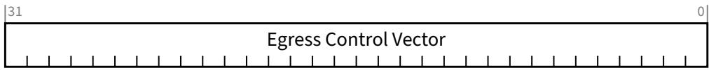

>
> Bit fields:
> - Bits [31:0] Egress Control Vector

**Table 7-119. Egress Control Vector Register**

| Bit Location | Register Description | Attributes |
|--------------|----------------------|------------|
| 31:0 | Egress Control Vector - An N-bit bit-array configured by software, where N is given by the value in the Egress Control Vector Size field. When a given bit is Set, peer-to-peer Requests targeting the associated Port, Function, or Function Group are blocked or redirected (if enabled) (see § Section 6.12.3). Note: Figure 7-135 shows a single DWORD register. This register is always an integral number of DWORDs. Default value of each bit is 0b. | RW |

The following examples illustrate how the vector might be configured:

- For an 8-Port Switch, each Port will have a separate vector indicating which Downstream Egress Ports it may forward Requests to.
  - Port 1 being not allowed to communicate with any other Downstream Ports would be configured as: `1111 1100b` with bit 0 corresponding to the Upstream Port (hardwired to 0b) and bit 1 corresponding to the Ingress Port (hardwired to 0b).
  - Port 2 being allowed to communicate with Ports 3, 5, and 7 would be configured as: `0101 0010b`.
- For a 4-Function device, each Function will have a separate vector that indicates which Function it may forward Requests to.

</td>
<td style="background-color:#e8e8e8">

<!-- 📄 Page 1167 -->
---

如果某个 ARI（替代路由 ID 解释，Alternative Routing ID Interpretation）设备实现了 ACS Function Groups（ACS Function Groups Capability 位置位），则其 Egress Control Vector Size 必须为 8 到 256 之间的 2 的幂，并且其所有已实现的 Egress Control Vector 位必须为 RW。对于 ARI 设备，多个功能可以与单个位关联，因此对于每个功能，其关联位决定来自它的、目标为与同一位关联的其他功能（如果有）的请求如何处理。

如果 ARI 设备中启用了 ACS Function Groups（ACS Function Groups Enable 位置位），则每个功能中的前 8 个 Egress Control Vector 位与 Function Group Number 关联，而非 Function Number。在这种情况下，访问控制是在 Function Group 之间而非功能之间强制实施的，并且前 8 个之外的任何已实现 Egress Control Vector 位均未使用。

无论 ARI 设备是否实现 ACS Function Groups，其 Egress Control Vector Size 都不要求覆盖设备实现的所有功能的整个功能号范围。如果未启用 ACS Function Groups，则功能号通过对 Egress Control Vector Size（被约束为 2 的幂）取模映射到已实现的 Egress Control Vector 位。

对于 RC，某些端口号可能引用内部端口而非根端口。对于此类 RC 中的根端口，位数组中对应内部端口的每一位必须硬连线为 0b。

> **图 7-135.** Egress Control Vector 寄存器
>
> 位字段：
> - 位 [31:0] Egress Control Vector

**表 7-119. Egress Control Vector 寄存器**

| 位位置 | 寄存器描述 | 属性 |
|--------|------------|------|
| 31:0 | Egress Control Vector - 由软件配置的 N 位位数组，其中 N 由 Egress Control Vector Size 字段中的值给出。当某位置位时，目标为关联端口、功能或功能组的对等请求将被阻塞或重定向（如果已使能）（见 § 第 6.12.3 节）。注意：图 7-135 显示单个 DWORD 寄存器。该寄存器始终是 DWORD 的整数倍。每一位的默认值为 0b。 | RW |

以下示例说明了该向量可能的配置方式：

- 对于 8 端口交换机，每个端口都有一个单独的向量，用于指示其可将请求转发到哪些下游 Egress 端口。
  - 端口 1 不允许与任何其他下游端口通信，可配置为：`1111 1100b`，其中位 0 对应上游端口（硬连线为 0b），位 1 对应入口端口（硬连线为 0b）。
  - 端口 2 允许与端口 3、5 和 7 通信，可配置为：`0101 0010b`。
- 对于 4 功能设备，每个功能都有一个单独的向量，用于指示其可将请求转发到哪些功能。


</td>
</tr>
</tbody>
</table>

<table>
<thead>
<tr>
<th width="50%">🇬🇧 English</th>
<th width="50%" style="background-color:#e8e8e8">🏆 中文</th>
</tr>
</thead>
<tbody>
<tr>
<td>

<!-- 📄 Page 1168 -->
---

  - Function 0 being not allowed to communicate with any other Functions would be configured as: `1110b` with bit 0 corresponding to Function 0 (hardwired to 0b).
  - Function 1 being allowed to communicate with Functions 2 and 3 would be configured as: `0001b` with bit 1 corresponding to Function 1 (hardwired to 0b).

</td>
<td style="background-color:#e8e8e8">

<!-- 📄 Page 1168 -->
---

  - 功能 0 不允许与任何其他功能通信，可配置为：`1110b`，其中位 0 对应功能 0（硬连线为 0b）。
  - 功能 1 允许与功能 2 和 3 通信，可配置为：`0001b`，其中位 1 对应功能 1（硬连线为 0b）。

</td>
</tr>
</tbody>
</table>

---

<a id="sec-7-8"></a>
## 7.8 Common PCI and PCIe Capabilities | 通用 PCI 与 PCIe 能力

<table>
<thead>
<tr>
<th width="50%">🇬🇧 English</th>
<th width="50%" style="background-color:#e8e8e8">🏆 中文</th>
</tr>
</thead>
<tbody>
<tr>
<td>

This section, contains a description of common PCI and PCIe capabilities that are individually optional in this but may be required by other PCISIG specifications.

</td>
<td style="background-color:#e8e8e8">

本节包含对本规范中单独可选但其他 PCI-SIG 规范可能要求的通用 PCI 与 PCIe 能力的描述。

</td>
</tr>
</tbody>
</table>

---

<a id="sec-7-8-1"></a>
## 7.8.1 Power Budgeting Extended Capability | 功耗预算（Power Budgeting）扩展能力


<div style="overflow-x: auto; max-width: 100%;">
<table>
<thead>
<tr>
<th width="50%">🇬🇧 English</th>
<th width="50%" style="background-color:#e8e8e8">🏆 中文</th>
</tr>
</thead>
<tbody>
<tr>
<td>

The Power Budgeting Extended Capability allows the system to allocate power to devices that are added to the system at runtime. Through this Capability, a device can report the power it consumes on a variety of power rails, in a variety of device power-management states, in a variety of operating conditions. The system can use this information to ensure that the system is capable of providing the proper power and cooling levels to the device. Failure to indicate proper device power consumption may risk device or system failure.

Implementation of the Power Budgeting Extended Capability is optional for PCI Express devices that are implemented either in a form-factor which does not require Hot-Plug support, or that are integrated on the system board. PCI Express form-factor specifications may require support for power budgeting. Power Budgeting reports device power consumption assuming the device is given appropriate permission (e.g., from Set_Slot_Power_Limit message) and that the external power connections for the device are operating.

The Power Budgeting Extended Capability is permitted to be present in PFs, but VFs must not implement it. If a PF contains the capability, it must report values that cover all associated VFs.

> **Figure 7-136.** Power Budgeting Extended Capability

> 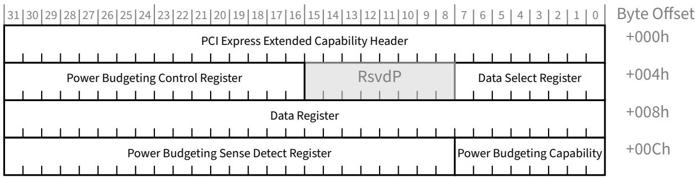

>
> Register layout (Byte Offset / Register):
> - +000h: PCI Express Extended Capability Header
> - +004h: Data Select Register
> - +005h: RsvdP
> - +006h: Power Budgeting Control Register
> - +007h: RsvdP
> - +008h: Data Register
> - +00Ah: Power Budgeting Capability
> - +00Bh: RsvdP
> - +00Ch: Power Budgeting Sense Detect Register

Figure 7-137 details allocation of register fields in the Power Budgeting Extended Capability Header; Table 7-120 provides the respective bit definitions. Refer to § Section 7.6.3 for a description of the PCI Express Extended Capability header. The Extended Capability ID for the Power Budgeting Extended Capability is 0004h.

</td>
<td style="background-color:#e8e8e8">

功耗预算（Power Budgeting）扩展能力允许系统在运行时为新增的设备分配电源。通过此能力，设备可在多种电源轨、多种设备电源管理状态以及多种运行条件下上报其所消耗的电源。系统可利用此信息确保系统能够为设备提供适当的电源和散热水平。未能正确指示设备的功耗可能导致设备或系统故障。

对于以下两类 PCI Express 设备，功耗预算扩展能力的实现是可选的：实现于不需要支持热插拔（Hot-Plug）的外形规格中，或集成在系统板上。PCI Express 外形规格规范可能要求支持功耗预算。功耗预算假定设备已获得适当授权（例如通过 Set_Slot_Power_Limit 消息）且设备的外部电源连接正常工作的前提下，报告设备的功耗。

允许在 PF（物理功能，Physical Function）中实现功耗预算扩展能力，但 VF（虚拟功能，Virtual Function）不得实现。若 PF 包含此能力，则必须上报覆盖所有关联 VF 的数值。

> **图 7-136.** 功耗预算扩展能力
>
> 寄存器布局（字节偏移 / 寄存器）：
> - +000h：PCI Express 扩展能力头（PCI Express Extended Capability Header）
> - +004h：数据选择寄存器（Data Select Register）
> - +005h：RsvdP
> - +006h：功耗预算控制寄存器（Power Budgeting Control Register）
> - +007h：RsvdP
> - +008h：数据寄存器（Data Register）
> - +00Ah：功耗预算能力（Power Budgeting Capability）
> - +00Bh：RsvdP
> - +00Ch：功耗预算检测寄存器（Power Budgeting Sense Detect Register）

图 7-137 详细说明了功耗预算扩展能力头中寄存器字段的分配；表 7-120 提供了相应的位定义。有关 PCI Express 扩展能力头的描述，请参阅 § 第 7.6.3 节。功耗预算扩展能力的扩展能力 ID 为 0004h。


</td>
</tr>
</tbody>
</table>
</div>


---

---

<a id="sec-7-8-1-1"></a>
## 7.8.1.1 Power Budgeting Extended Capability Header (Offset 00h) | 功耗预算扩展能力头(偏移 00h)

<table>
<thead>
<tr>
<th width="50%">🇬🇧 English</th>
<th width="50%" style="background-color:#e8e8e8">🏆 中文</th>
</tr>
</thead>
<tbody>
<tr>
<td>

> **Figure 7-137. Power Budgeting Extended Capability Header | 功耗预算扩展能力头**

| Bits 0-15 | Bits 16-19 | Bits 20-31 |
|-----------|-----------|-----------|
| PCI Express Extended Capability ID (0004h) | Capability Version | Next Capability Offset |

**Table 7-120. Power Budgeting Extended Capability Header | 功耗预算扩展能力头**

| Bit Location | Register Description | Attributes |
|---|---|---|
| 15:0 | PCI Express Extended Capability ID - This field is a PCI-SIG defined ID number that indicates the nature and format of the Extended Capability. Extended Capability ID for the Power Budgeting Extended Capability is 0004h. | RO |
| 19:16 | Capability Version - This field is a PCI-SIG defined version number that indicates the version of the Capability structure present. Must be 1h for this version of the specification. | RO |
| 31:20 | Next Capability Offset - This field contains the offset to the next PCI Express Capability structure or 000h if no other items exist in the linked list of Capabilities. For Extended Capabilities implemented in Configuration Space, this offset is relative to the beginning of PCI-compatible Configuration Space and thus must always be either 000h (for terminating list of Capabilities) or greater than 0FFh. | RO |

The Power Budgeting Data Select Register is an 8-bit read-write register that indexes the Power Budgeting Data reported through the Power Budgeting Data Register and selects the DWORD of Power Budgeting Data that is to appear in the Power Budgeting Data Register. Values for this register start at zero to select the first DWORD of Power Budgeting Data; subsequent DWORDs of Power Budgeting Data are selected by increasing index values. The default value of this register is undefined.

The Power Budgeting Control Register permits system software to enable extended power budgeting and to grant additional power to a Device above that defined by default for the associated form-factor.

</td>
<td style="background-color:#e8e8e8">

> **图 7-137. 功耗预算扩展能力头 (Power Budgeting Extended Capability Header)**

> 


| 位 0-15 | 位 16-19 | 位 20-31 |
|-----------|-----------|-----------|
| PCI Express 扩展能力 ID (0004h) | Capability Version(能力版本) | Next Capability Offset(下一能力偏移) |

**表 7-120. 功耗预算扩展能力头**

| 位位置 | 寄存器描述 | 属性 |
|---|---|---|
| 15:0 | PCI Express 扩展能力 ID — 该字段是 PCI-SIG 定义的 ID 编号,用于指示扩展能力的性质和格式。功耗预算扩展能力的扩展能力 ID 为 0004h。 | RO |
| 19:16 | Capability Version(能力版本) — 该字段是 PCI-SIG 定义的版本号,用于指示当前所实现的能力结构的版本。在本规范的本版本中必须为 1h。 | RO |
| 31:20 | Next Capability Offset(下一能力偏移) — 该字段包含下一个 PCI Express 能力结构的偏移量,若链表中不存在其他项则为 000h。对于在配置空间中实现的扩展能力,该偏移是相对于 PCI 兼容配置空间起始处的偏移,因此必须始终为 000h(表示能力链表结束)或大于 0FFh。 | RO |

Power Budgeting Data Select Register(功耗预算数据选择寄存器)是一个 8 位读写寄存器,用于索引通过 Power Budgeting Data Register(功耗预算数据寄存器)报告的功耗预算数据,并选择将出现在功耗预算数据寄存器中的 DWORD 数据。该寄存器的值从零开始,用于选择第一个功耗预算数据 DWORD;后续的功耗预算数据 DWORD 通过递增索引值进行选择。该寄存器的默认值未定义。

Power Budgeting Control Register(功耗预算控制寄存器)允许系统软件启用扩展功耗预算(Extended Power Budgeting),并向设备授予超出相关外形规格(form-factor)默认值之上的额外功率。

</td>
</tr>
</tbody>
</table>

[⬆️ 返回目录](#-本章目录-table-of-contents)

---

<a id="sec-7-8-1-2"></a>
## 7.8.1.2 Power Budgeting Data Select Register (Offset 04h) | 功耗预算数据选择寄存器(偏移 04h)

<table>
<thead>
<tr>
<th width="50%">🇬🇧 English</th>
<th width="50%" style="background-color:#e8e8e8">🏆 中文</th>
</tr>
</thead>
<tbody>
<tr>
<td>

Refer to § 7.8.1.1 for the description of this register.

</td>
<td style="background-color:#e8e8e8">

有关此寄存器的说明,请参阅 § 7.8.1.1。

</td>
</tr>
</tbody>
</table>

[⬆️ 返回目录](#-本章目录-table-of-contents)

---

<a id="sec-7-8-1-3"></a>
## 7.8.1.3 Power Budgeting Control Register (Offset 06h) | 功耗预算控制寄存器(偏移 06h)


<div style="overflow-x: auto; max-width: 100%;">
<table>
<thead>
<tr>
<th width="50%">🇬🇧 English</th>
<th width="50%" style="background-color:#e8e8e8">🏆 中文</th>
</tr>
</thead>
<tbody>
<tr>
<td>

§ Figure 7-138 details allocation of register fields in the Aux Power Control register; § Table 7-121 provides the respective bit definitions.

> **Figure 7-138. Power Budgeting Control Register | 功耗预算控制寄存器**

| Bit 0 | Bit 1 | Bits 2-4 | Bit 5 | Bits 6-8 | Bits 9-15 |
|---|---|---|---|---|---|
| Extended Power Budgeting Enable | Power Limit Enable | Power Limit PM Sub State | Out of Band Power Limit Enable | Out of Band Power Limit PM Sub State | RsvdP |

**Table 7-121. Power Budgeting Control Register | 功耗预算控制寄存器**

| Bit Location | Register Description | Attributes |
|---|---|---|
| 0 | Extended Power Budgeting Enable – If Set, Power Budgeting is permitted to return non-zero values in the Power Budgeting Data Register bits 31:21. If Clear, those bits must return all zeros for all values of the Power Budgeting Data Select Register. If Set, the Power Budgeting Sense Detect Register is permitted to return non-zero values. If Clear, that register must return all zeros. This bit is hardwired to 0b when Extended Power Budgeting Supported is Clear. Default is zero. | RW |
| 1 | Power Limit Enable – If Set, the Power Limit PM Sub State field is meaningful. The value of this field in the lowest numbered Function with Power Limit Supported Set applies to all Functions of the Device. When present, the value of this bit in all other Functions is ignored by hardware. When Power Limit Supported is Clear, this bit is permitted to be hardwired to zero. It is recommended that system software / firmware configure this field identically in all Functions. Doing so provides a standard mechanism for a device driver to understand its Function's power configuration. Default is zero. | RWS/RsvdP |
| 4:2 | Power Limit PM Sub State – If Power Limit Enable is Set, this field, in conjunction with the Out of Band Power Limit Enable and Out of Band Power Limit PM Sub State fields, indicates the PM Sub State used by the Device. The value of this field in the lowest numbered Function with Power Limit Supported Set applies to all Functions of the Device. When present, the value of this field in all other Functions is ignored by hardware. When Power Limit Supported is Clear, this field is permitted to be hardwired to zero. It is recommended that system software / firmware configure this field identically in all Functions. Doing so provides a standard mechanism for a device driver to understand its Function's power configuration. Default is zero. | RWS/RsvdP |
| 5 | Out of Band Power Limit Enable – If Set, the Out of Band Power Limit PM Sub State field is meaningful. HwInit/RsvdP. When this field is present, all Functions of the Device must contain the same value. When Power Limit Supported is Clear, this bit is permitted to be hardwired to zero. It is permitted that this field change after the Function is Configuration Ready. This could happen, for example, if this field is configured via MCTP over PCIe. Mechanisms used to delay access to this field until it is meaningful are outside the scope of this specification (e.g., using the SFI mechanism or using _DSM calls to grant system software access to the fields). Default is zero. | HwInit/RsvdP |
| 8:6 | Out of Band Power Limit PM Sub State – If Out of Band Power Limit Enable is Set, this field, in conjunction with the Power Limit Enable and Power Limit PM Sub State fields, indicates the PM Sub State used by the Device. When this field is present, all Functions of the Device must contain the same value. When Power Limit Supported is Clear, this bit is permitted to be hardwired to zero. It is permitted that this field change after the Function is Configuration Ready. This could happen, for example, if this field is configured via MCTP over PCIe. Mechanisms used to delay access to this field until it is meaningful are outside the scope of this specification (e.g., using the SFI mechanism or using _DSM calls to grant system software access to the fields). Default is zero. | HwInit/RsvdP |

</td>
<td style="background-color:#e8e8e8">

§ 图 7-138 详细说明了 Aux Power Control 寄存器(辅助电源控制寄存器)中各寄存器字段的分配;§ 表 7-121 给出了相应的位定义。

> **图 7-138. 功耗预算控制寄存器 (Power Budgeting Control Register)**

> 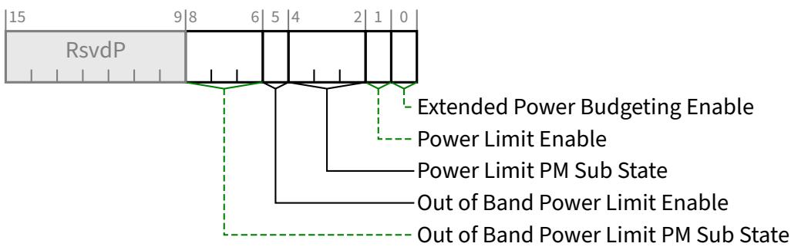


| 位 0 | 位 1 | 位 2-4 | 位 5 | 位 6-8 | 位 9-15 |
|---|---|---|---|---|---|
| Extended Power Budgeting Enable(扩展功耗预算使能) | Power Limit Enable(功率限制使能) | Power Limit PM Sub State(功率限制 PM 子状态) | Out of Band Power Limit Enable(带外功率限制使能) | Out of Band Power Limit PM Sub State(带外功率限制 PM 子状态) | RsvdP(保留) |

**表 7-121. 功耗预算控制寄存器**

| 位位置 | 寄存器描述 | 属性 |
|---|---|---|
| 0 | Extended Power Budgeting Enable(扩展功耗预算使能) — 若置位,允许功耗预算在 Power Budgeting Data Register 的位 31:21 中返回非零值。若清零,则对于 Power Budgeting Data Select Register 的所有值,这些位必须全部返回零。若置位,则允许 Power Budgeting Sense Detect Register 返回非零值;若清零,则该寄存器必须返回全零。当 Extended Power Budgeting Supported 清零时,该位硬连线为 0b。默认值为零。 | RW |
| 1 | Power Limit Enable(功率限制使能) — 若置位,Power Limit PM Sub State 字段才有意义。该字段在启用 Power Limit Supported 的编号最小的 Function 中的值适用于设备的所有 Function。若存在,该位在其他 Function 中的值会被硬件忽略。当 Power Limit Supported 清零时,该位允许硬连线为零。建议系统软件/固件在所有 Function 中将该字段配置为相同的值。这样可以为设备驱动程序提供一种标准机制来理解其 Function 的电源配置。默认值为零。 | RWS/RsvdP |
| 4:2 | Power Limit PM Sub State(功率限制 PM 子状态) — 若 Power Limit Enable 置位,则该字段与 Out of Band Power Limit Enable 和 Out of Band Power Limit PM Sub State 字段一起指示设备所使用的 PM Sub State(电源管理子状态)。该字段在启用 Power Limit Supported 的编号最小的 Function 中的值适用于设备的所有 Function。若存在,该字段在其他 Function 中的值会被硬件忽略。当 Power Limit Supported 清零时,该字段允许硬连线为零。建议系统软件/固件在所有 Function 中将该字段配置为相同的值。这样可以为设备驱动程序提供一种标准机制来理解其 Function 的电源配置。默认值为零。 | RWS/RsvdP |
| 5 | Out of Band Power Limit Enable(带外功率限制使能) — 若置位,Out of Band Power Limit PM Sub State 字段才有意义。HwInit/RsvdP。当该字段存在时,设备的所有 Function 必须包含相同的值。当 Power Limit Supported 清零时,该位允许硬连线为零。允许该字段在 Function 配置就绪(Configuration Ready)之后被修改。例如,这可能发生在该字段通过 PCIe 上的 MCTP 进行配置的情况下。延迟访问该字段直到该字段有意义的机制不在本规范的范围之内(例如,使用 SFI 机制或使用 _DSM 调用授予系统软件对这些字段的访问权限)。默认值为零。 | HwInit/RsvdP |
| 8:6 | Out of Band Power Limit PM Sub State(带外功率限制 PM 子状态) — 若 Out of Band Power Limit Enable 置位,则该字段与 Power Limit Enable 和 Power Limit PM Sub State 字段一起指示设备所使用的 PM Sub State。当该字段存在时,设备的所有 Function 必须包含相同的值。当 Power Limit Supported 清零时,该位允许硬连线为零。允许该字段在 Function 配置就绪之后被修改。例如,这可能发生在该字段通过 PCIe 上的 MCTP 进行配置的情况下。延迟访问该字段直到该字段有意义的机制不在本规范的范围之内(例如,使用 SFI 机制或使用 _DSM 调用授予系统软件对这些字段的访问权限)。默认值为零。 | HwInit/RsvdP |

</td>
</tr>
</tbody>
</table>
</div>


[⬆️ 返回目录](#-本章目录-table-of-contents)

---

<a id="sec-7-8-1-4"></a>
## 7.8.1.4 Power Budgeting Data Register (Offset 08h) | 功耗预算数据寄存器(偏移 08h)

<table>
<thead>
<tr>
<th width="50%">🇬🇧 English</th>
<th width="50%" style="background-color:#e8e8e8">🏆 中文</th>
</tr>
</thead>
<tbody>
<tr>
<td>

This read-only register returns the DWORD of Power Budgeting Data selected by the Power Budgeting Data Select Register. Each DWORD of the Power Budgeting Data describes the power usage of the device in a particular operating condition. Power Budgeting Data for different operating conditions is not required to be returned in any particular order, as long as incrementing the Power Budgeting Data Select Register causes information for a different operating condition to be returned. If the Power Budgeting Data Select Register contains a value greater than or equal to the number of operating conditions for which the device provides power information, this register must return all zeros. The default value of this register is undefined. § Figure 7-139 details allocation of register fields in the Power Budgeting Data Register; § Table 7-122 provides the respective bit definitions.

In earlier versions of this specification, bits 31:21 of this register were RsvdP. In order to ensure that the new uses of these bits do not confuse existing software:

- Extended Power Budgeting entries are hidden when Extended Power Budgeting Enable is Clear (the default). When Extended Power Budgeting Enable is Clear and Power Budgeting Data Select selects an Extended Power Budgeting entry, the Data register must return 0000 0000h.
- Extended Power Budgeting Data entries must be located after non-extended Power Budgeting Data entries (i.e., all entries where bits 31:21 are zero must use a smaller Power Budgeting Data Select value than any entry where bits 31:21 are non-zero).

The Base Power and Data Scale fields describe the power usage of the device; the Power Rail, Type, PM State, and PM Sub State fields describe the conditions under which the device has this power usage.

> **Figure 7-139. Power Budgeting Data Register | 功耗预算数据寄存器**

| Bits 0-7 | Bits 8-9 | Bits 10-12 | Bits 13-14 | Bits 15-17 | Bits 18-20 | Bit 21 | Bits 22-24 | Bits 25-30 | Bit 31 |
|---|---|---|---|---|---|---|---|---|---|
| Base Power | Data Scale[1:0] | PM Sub State | PM State | Type | Power Rail | Data Scale[2] | Connector Number | Connector Type | Extended Power Budgeting Present |

**Table 7-122. Power Budgeting Data Register | 功耗预算数据寄存器**

| Bit Location | Register Description | Attributes |
|---|---|---|
| 7:0 | Base Power - Specifies in watts the base power value in the given operating condition. This value must be multiplied by the data scale to produce the actual power consumption value except if Extended Power Budgeting Enable is Clear, the Data Scale[1:0] field equals 00b (1.0x) and Base Power exceeds EFh, the following alternative encodings are used: F0h: 239 W and ≤250 W Slot Power Limit; F1h: 250 W and ≤275 W Slot Power Limit; F2h: 275 W and ≤300 W Slot Power Limit; F3h: 300 W and ≤325 W Slot Power Limit; F4h: 325 W and ≤350 W Slot Power Limit; F5h: 350 W and ≤375 W Slot Power Limit; F6h: 375 W and ≤400 W Slot Power Limit; F7h: 400 W and ≤425 W Slot Power Limit; F8h: 425 W and ≤450 W Slot Power Limit; F9h: 450 W and ≤475 W Slot Power Limit; FAh: 475 W and ≤500 W Slot Power Limit; FBh: 500 W and ≤525 W Slot Power Limit; FCh: 525 W and ≤550 W Slot Power Limit; FDh: 550 W and ≤575 W Slot Power Limit; FEh: 575 W and ≤600 W Slot Power Limit; FFh: Reserved for values greater than 600 W. | RO |
| 9:8 | Data Scale[1:0] - Specifies the scale to apply to the Base Power value. The power consumption of the device is determined by multiplying the contents of the Base Power field with the value corresponding to the encoding returned by this field, except as noted above. Note that Data Scale[2] and Data Scale[1:0] are not contiguous within this register. Defined encodings are: 00b: 1.0x; 01b: 0.1x; 10b: 0.01x; 11b: 0.001x; 100b: 10x; 101b: 100x; Others: Reserved. | RO |
| 12:10 | PM Sub State - Specifies the power management sub state of the operating condition being described. Defined encodings are: 000b: Default Sub State; 001b - 111b: Device Specific Sub State. | RO |
| 14:13 | PM State - Specifies the power management state of the operating condition being described. Defined encodings are: 00b: D0; 01b: D1; 10b: D2; 11b: D3. A device returns 11b in this field and Auxiliary or PME Aux in the Type field to specify the D3Cold PM State. An encoding of 11b along with any other Type field value specifies the D3Hot state. | RO |
| 17:15 | Type - Specifies the type of the operating condition being described. Defined encodings are: 000b: PME Aux -- Sustained Power consumed in D3Cold when PME_En is Set and Aux Power PM Enable is Clear; 001b: Auxiliary -- Sustained Power consumed in D3Cold when Aux Power PM Enable is Set; 010b: Idle -- Sustained Power consumed when the Function or Device has been idle for 20 seconds or more; 011b: Sustained Power; 100b: Sustained Power in Emergency Power Reduction State (see § Section 6.24); 101b: Maximum Power in Emergency Power Reduction State (see § Section 6.24); 111b: Maximum Power. All other encodings are Reserved. The following measurement definitions apply to this field unless the form-factor specification explicitly states otherwise: (1) Sustained Power means the power consumed when the Device is performing at its maximum throughput, measured as an average over 1 second. (2) Maximum Power means the power consumed when the Device is performing at its maximum throughput, measured over a 100 μs moving window. Note that Maximum Power can easily exceed sustained power by as much as 250%. Maximum Power consumption is frequently associated with changes in Function D-state. | RO |
| 20:18 | Power Rail - Specifies the thermal load or power rail of the operating condition being described. Defined encodings are: 000b: Power (12V); 001b: Power (3.3V); 010b: Power (1.5V or 1.8V); 100b: Power (48V); 101b: Power (5V); 111b: Thermal. All other encodings are Reserved. | RO |
| 21 | Data Scale[2] – Upper bit of Data Scale field. See Data Scale[1:0] for details. This bit must be zero if Extended Power Budgeting Enable is Clear. | RO |
| 24:22 | Connector Number – Up to 8 connectors that supply power are supported on an add-in card (including the edge connector(s)). This field indicates which power connector is associated with this entry. If Power Budgeting Sense Detect Supported is Set, an instance of this field must be implemented for every power connector that the add-in card supports. Connector Numbers represent a single physical connector and are global across the add-in card. Connector Numbers must be consistent across all Functions in a Multi-Function Device. Connector Numbers must match when a single connector contains more than one power rail or when a single connector is associated with more than one Connector Type (e.g., Types 00 0110b and 00 0111b). Connector Number values and the mapping of Connector Number to physical location are outside the scope of this specification. For form-factor specifications that specify connector placement, it is recommended that those specifications define connector numbering based on placement rules. This field must be zero if Extended Power Budgeting Enable is Clear. Software must ignore the value in this field if Extended Power Budgeting Present is Clear. | RO |
| 30:25 | Connector Type – Indicates the connector type. If Power Budgeting Sense Detect Supported is Set, an instance of this field must be implemented for every power connector that the adaptor supports. Values are: 00 0000b: Form-factor defined edge connector; 00 0001b: Non-Connector power provided by the system (e.g., soldered down); 00 0010b: Non-Connector power provided by the option card (e.g., battery); 00 0011b: Non-Connector power not provided by the system or the option card (e.g., power supplied by an external chassis); 00 0100b: CEM 2x3 connector; 00 0101b: CEM 2x4 connector with either 2x3 cable or 2x4 cable (see below); 00 0110b: CEM 2x4 connector with 2x3 cable (see below); 00 0111b: CEM 2x4 connector with 2x4 cable (see below); 00 1000b: CEM 12VHPWR connector, cable has both Sense0 and Sense1 Open; 00 1001b: CEM 12VHPWR connector, cable has Sense0 Grounded and Sense1 Open; 00 1010b: CEM 12VHPWR connector, has Sense0 Open and Sense1 Grounded; 00 1011b: CEM 12VHPWR connector, has both Sense0 and Sense1 Grounded; 00 1100b: CEM 48VHPWR connector, cable has both Sense0 and Sense1 Open; 00 1101b: CEM 48VHPWR connector, cable has Sense0 Grounded and Sense1 Open; 00 1110b: CEM 48VHPWR connector, cable has Sense0 Open and Sense1 Grounded; 00 1111b: CEM 48VHPWR connector, cable has both Sense0 and Sense1 Grounded; 01 0000b: CEM 12V-2x6: 150 W or higher cable present; 01 0001b: CEM 12V-2x6: 300 W or higher cable present; 01 0010b: CEM 12V-2x6: 450 W or higher cable present; 01 0011b: CEM 12V-2x6: 600 W cable present; 01 0100b to 10 1111b: Reserved for PCI-SIG use; 11 0000b to 11 1111b: Vendor Specific Power Connectors. Each CEM 2x4 connector must have either one entry with Connector Type 00 0101b or two entries with Connector Types 00 0110b and 00 0111b. Each 12V-2x6 connector must have an entry for the lowest power cable it supports. Each 12V-2x6 connector must have an entry for every cable that has a different power consumption value. This field must be zero if Extended Power Budgeting Enable is Clear. Software must ignore the value in this field if Extended Power Budgeting Present is Clear. | RO |
| 31 | Extended Power Budgeting Present – Indicates that bits 30:22 contain Extended Power Budgeting Data. This bit must be 0b if Extended Power Budgeting Enable is Clear. | RO |

Except for Type = 000b and 001b, Power Budgeting data for the same operating condition and PM Sub State values represent simultaneous consumption. Functions must report a complete set of Power Budgeting data for each supported operating condition and PM Sub State combination.

Power Budgeting data with different PM Sub State values represent mutually exclusive consumption. For a given operating condition, a Function is in exactly one PM Sub State. When Power Limit Supported is Clear, implementation specific mechanisms are used to determine the current PM Sub State.

A device that implements the Power Budgeting Extended Capability is required to provide data values for D0 Maximum and D0 Sustained PM State and Type combinations for every power rail from which it consumes power; data for the D0 Maximum and D0 Sustained for Thermal must also be provided if these values are different from the sum of the values for an operating condition reported for D0 Maximum and D0 Sustained on the power rails.

Devices that support auxiliary power or PME from auxiliary power must provide data for the appropriate power Type (Auxiliary or PME Aux) on the appropriate Power Rail(s).

- If the reported PME Aux or Auxiliary value is greater than the default for the associated form-factor, the Function is limited to the form-factor values unless either PME_En or Aux Power PM Enable are Set.
- The PME Aux and Auxiliary entries are mutually exclusive. The values of PME_En and Aux Power PM Enable determine which entries are meaningful.

If the reported PME Aux or Auxiliary value is greater than the Aux_Current, the Function is limited by Aux_Current unless Aux Power PM Enable is Set and one of the following is true:

- Power Limit Enable is Set,
- Out of Band Power Limit Enable is Set, or
- the Request D3Cold Aux Power Limit _DSM call was used to request additional power (for details, see [Firmware]).

If a device implements Emergency Power Reduction State, it must report Power Budgeting values for the following (PM State value 00b):

- Maximum Emergency Power Reduction State, PM State D0, all power rails used by the device
- Maximum Emergency Power Reduction State, PM State D0, Thermal (if different from the sum of the preceding values)
- Sustained Emergency Power Reduction State, PM State D0, all power rails used by the device
- Sustained Emergency Power Reduction State, PM State: D0, Thermal (if different from the sum of the preceding values)

</td>
<td style="background-color:#e8e8e8">

该只读寄存器返回由 Power Budgeting Data Select Register 选择的功耗预算数据 DWORD。功耗预算数据的每个 DWORD 描述设备在特定工作条件下的功率使用情况。不同工作条件下的功耗预算数据不需要按任何特定顺序返回,只要递增 Power Budgeting Data Select Register 就会返回不同工作条件下的信息即可。如果 Power Budgeting Data Select Register 包含的值大于或等于设备提供功率信息的工作条件数,则该寄存器必须返回全零。该寄存器的默认值未定义。§ 图 7-139 详细说明了 Power Budgeting Data Register 中各寄存器字段的分配;§ 表 7-122 给出了相应的位定义。

在早期版本的规范中,该寄存器的位 31:21 是 RsvdP。为确保这些位的新用途不会混淆现有软件:

- 当 Extended Power Budgeting Enable 清零(默认值)时,扩展功耗预算条目被隐藏。当 Extended Power Budgeting Enable 清零且 Power Budgeting Data Select 选择了一个扩展功耗预算条目时,Data 寄存器必须返回 0000 0000h。
- 扩展功耗预算数据条目必须位于非扩展功耗预算数据条目之后(即,所有位 31:21 为零的条目必须使用比任何位 31:21 非零的条目更小的 Power Budgeting Data Select 值)。

Base Power(基础功率)和 Data Scale(数据比例)字段描述设备的功率使用情况;Power Rail(电源轨)、Type(类型)、PM State(PM 状态)和 PM Sub State(PM 子状态)字段描述设备具有此功率使用情况的条件。

> **图 7-139. 功耗预算数据寄存器 (Power Budgeting Data Register)**

> 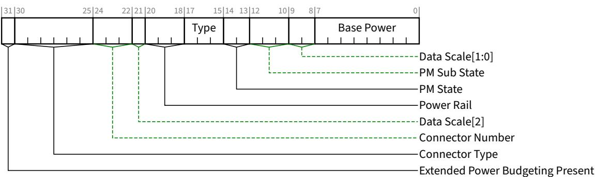


| 位 0-7 | 位 8-9 | 位 10-12 | 位 13-14 | 位 15-17 | 位 18-20 | 位 21 | 位 22-24 | 位 25-30 | 位 31 |
|---|---|---|---|---|---|---|---|---|---|
| Base Power(基础功率) | Data Scale[1:0](数据比例[1:0]) | PM Sub State(PM 子状态) | PM State(PM 状态) | Type(类型) | Power Rail(电源轨) | Data Scale[2](数据比例[2]) | Connector Number(连接器编号) | Connector Type(连接器类型) | Extended Power Budgeting Present(存在扩展功耗预算) |

**表 7-122. 功耗预算数据寄存器**

| 位位置 | 寄存器描述 | 属性 |
|---|---|---|
| 7:0 | Base Power(基础功率) — 以瓦特为单位,指定在给定工作条件下的基础功率值。该值必须乘以 data scale(数据比例)以产生实际功耗值,除非在 Extended Power Budgeting Enable 清零、Data Scale[1:0] 字段等于 00b(1.0x)且 Base Power 超过 EFh 的情况下,使用以下替代编码:F0h:239 W 且 ≤250 W 插槽功率限制;F1h:250 W 且 ≤275 W 插槽功率限制;F2h:275 W 且 ≤300 W 插槽功率限制;F3h:300 W 且 ≤325 W 插槽功率限制;F4h:325 W 且 ≤350 W 插槽功率限制;F5h:350 W 且 ≤375 W 插槽功率限制;F6h:375 W 且 ≤400 W 插槽功率限制;F7h:400 W 且 ≤425 W 插槽功率限制;F8h:425 W 且 ≤450 W 插槽功率限制;F9h:450 W 且 ≤475 W 插槽功率限制;FAh:475 W 且 ≤500 W 插槽功率限制;FBh:500 W 且 ≤525 W 插槽功率限制;FCh:525 W 且 ≤550 W 插槽功率限制;FDh:550 W 且 ≤575 W 插槽功率限制;FEh:575 W 且 ≤600 W 插槽功率限制;FFh:保留,用于大于 600 W 的值。 | RO |
| 9:8 | Data Scale[1:0](数据比例[1:0]) — 指定应用于 Base Power 值的比例。设备的功耗通过将 Base Power 字段的内容与该字段返回编码所对应的值相乘来确定,除上文所述的例外情况外。请注意,Data Scale[2] 和 Data Scale[1:0] 在该寄存器内不连续。已定义的编码为:00b:1.0x;01b:0.1x;10b:0.01x;11b:0.001x;100b:10x;101b:100x;其他:保留。 | RO |
| 12:10 | PM Sub State(PM 子状态) — 指定所描述工作条件的电源管理子状态。已定义的编码为:000b:Default Sub State(默认子状态);001b - 111b:Device Specific Sub State(设备特定子状态)。 | RO |
| 14:13 | PM State(PM 状态) — 指定所描述工作条件的电源管理状态。已定义的编码为:00b:D0;01b:D1;10b:D2;11b:D3。设备在该字段返回 11b 且 Type 字段返回 Auxiliary 或 PME Aux,以指定 D3Cold PM 状态。编码 11b 与任何其他 Type 字段值一起指定 D3Hot 状态。 | RO |
| 17:15 | Type(类型) — 指定所描述工作条件的类型。已定义的编码为:000b:PME Aux — D3Cold 下 PME_En 置位且 Aux Power PM Enable 清零时消耗的持续功率;001b:Auxiliary — D3Cold 下 Aux Power PM Enable 置位时消耗的持续功率;010b:Idle — Function 或 Device 空闲 20 秒或更长时间时消耗的持续功率;011b:Sustained Power(持续功率);100b:紧急功耗降低状态下的持续功率(参见 § 6.24 节);101b:紧急功耗降低状态下的最大功率(参见 § 6.24 节);111b:Maximum Power(最大功率)。所有其他编码均为保留。除非外形规格规范另有明确说明,否则以下测量定义适用于该字段:(1) 持续功率是指设备以其最大吞吐率运行时所消耗的功率,以 1 秒内的平均值测量。(2) 最大功率是指设备以其最大吞吐率运行时所消耗的功率,以 100 μs 移动窗口测量。请注意,最大功率可以轻松超过持续功率多达 250%。最大功耗通常与 Function D 状态的改变相关。 | RO |
| 20:18 | Power Rail(电源轨) — 指定所描述工作条件下的热负载或电源轨。已定义的编码为:000b:Power (12V);001b:Power (3.3V);010b:Power (1.5V 或 1.8V);100b:Power (48V);101b:Power (5V);111b:Thermal(热负载)。所有其他编码均为保留。 | RO |
| 21 | Data Scale[2](数据比例[2]) — Data Scale 字段的高位。详情请参阅 Data Scale[1:0]。如果 Extended Power Budgeting Enable 清零,则该位必须为零。 | RO |
| 24:22 | Connector Number(连接器编号) — 在一块附加卡(包括边缘连接器)上最多支持 8 个供电连接器。该字段指示与该条目相关联的电源连接器。如果 Power Budgeting Sense Detect Supported 置位,则必须为附加卡支持的每个电源连接器实现此字段的一个实例。Connector Number 表示单个物理连接器,在附加卡上是全局的。在多功能设备中,Connector Number 必须在所有 Function 之间保持一致。当单个连接器包含多个电源轨或单个连接器与多个连接器类型(例如,类型 00 0110b 和 00 0111b)相关联时,Connector Number 必须匹配。Connector Number 值以及 Connector Number 到物理位置的映射不在本规范的范围内。对于规定连接器放置位置的外形规格规范,建议这些规范根据放置规则定义连接器编号。如果 Extended Power Budgeting Enable 清零,则该字段必须为零。如果 Extended Power Budgeting Present 清零,则软件必须忽略该字段的值。 | RO |
| 30:25 | Connector Type(连接器类型) — 指示连接器类型。如果 Power Budgeting Sense Detect Supported 置位,则必须为适配器支持的每个电源连接器实现此字段的一个实例。值为:00 0000b:外形规格定义的边缘连接器;00 0001b:由系统提供的非连接器电源(例如,焊接固定);00 0010b:由选件卡提供的非连接器电源(例如,电池);00 0011b:不由系统或选件卡提供的非连接器电源(例如,由外部机箱提供的电源);00 0100b:CEM 2x3 连接器;00 0101b:具有 2x3 电缆或 2x4 电缆的 CEM 2x4 连接器(见下文);00 0110b:具有 2x3 电缆的 CEM 2x4 连接器(见下文);00 0111b:具有 2x4 电缆的 CEM 2x4 连接器(见下文);00 1000b:CEM 12VHPWR 连接器,电缆的 Sense0 和 Sense1 均悬空;00 1001b:CEM 12VHPWR 连接器,电缆的 Sense0 接地且 Sense1 悬空;00 1010b:CEM 12VHPWR 连接器,Sense0 悬空且 Sense1 接地;00 1011b:CEM 12VHPWR 连接器,Sense0 和 Sense1 均接地;00 1100b:CEM 48VHPWR 连接器,电缆的 Sense0 和 Sense1 均悬空;00 1101b:CEM 48VHPWR 连接器,电缆的 Sense0 接地且 Sense1 悬空;00 1110b:CEM 48VHPWR 连接器,电缆的 Sense0 悬空且 Sense1 接地;00 1111b:CEM 48VHPWR 连接器,电缆的 Sense0 和 Sense1 均接地;01 0000b:CEM 12V-2x6:存在 150 W 或更高功率的电缆;01 0001b:CEM 12V-2x6:存在 300 W 或更高功率的电缆;01 0010b:CEM 12V-2x6:存在 450 W 或更高功率的电缆;01 0011b:CEM 12V-2x6:存在 600 W 电缆;01 0100b 至 10 1111b:保留供 PCI-SIG 使用;11 0000b 至 11 1111b:供应商特定电源连接器。每个 CEM 2x4 连接器必须具有一个 Connector Type 为 00 0101b 的条目,或两个 Connector Type 分别为 00 0110b 和 00 0111b 的条目。每个 12V-2x6 连接器必须为其支持的最低功率电缆提供一个条目。每个 12V-2x6 连接器必须为每个具有不同功耗值的电缆提供一个条目。如果 Extended Power Budgeting Enable 清零,则该字段必须为零。如果 Extended Power Budgeting Present 清零,则软件必须忽略该字段的值。 | RO |
| 31 | Extended Power Budgeting Present(存在扩展功耗预算) — 指示位 30:22 包含扩展功耗预算数据。如果 Extended Power Budgeting Enable 清零,则该位必须为 0b。 | RO |

除 Type = 000b 和 001b 外,具有相同工作条件和 PM Sub State 值的功耗预算数据表示同时消耗。Function 必须为每个支持的工作条件和 PM Sub State 组合报告一整套功耗预算数据。

具有不同 PM Sub State 值的功耗预算数据表示互斥消耗。对于给定的工作条件,Function 恰好处于一个 PM Sub State 中。当 Power Limit Supported 清零时,使用实现特定的机制来确定当前 PM Sub State。

实现 Power Budgeting Extended Capability 的设备需要为设备从中消耗功率的每条电源轨提供 D0 Maximum 和 D0 Sustained PM State 与 Type 组合的数据值;如果这些值与为电源轨上 D0 Maximum 和 D0 Sustained 报告的工作条件值的总和不同,则还必须提供 Thermal 的 D0 Maximum 和 D0 Sustained 数据。

支持辅助电源或来自辅助电源的 PME 的设备必须在适当的 Power Rail 上提供相应 power Type(Auxiliary 或 PME Aux)的数据。

- 如果报告的 PME Aux 或 Auxiliary 值大于相关外形规格的默认值,则 Function 受限于外形规格值,除非 PME_En 或 Aux Power PM Enable 置位。
- PME Aux 和 Auxiliary 条目互斥。PME_En 和 Aux Power PM Enable 的值决定哪些条目有意义。

如果报告的 PME Aux 或 Auxiliary 值大于 Aux_Current,则 Function 受限于 Aux_Current,除非 Aux Power PM Enable 置位且以下条件之一为真:

- Power Limit Enable 置位,
- Out of Band Power Limit Enable 置位,或
- 使用 Request D3Cold Aux Power Limit _DSM 调用请求额外功率(详情请参见 [Firmware])。

如果设备实现紧急功耗降低状态(Emergency Power Reduction State),则必须报告以下功耗预算值(PM State 值为 00b):

- Maximum Emergency Power Reduction State,PM State D0,设备使用的所有电源轨
- Maximum Emergency Power Reduction State,PM State D0,Thermal(如果与上述值的总和不同)
- Sustained Emergency Power Reduction State,PM State D0,设备使用的所有电源轨
- Sustained Emergency Power Reduction State,PM State:D0,Thermal(如果与上述值的总和不同)

</td>
</tr>
</tbody>
</table>

[⬆️ 返回目录](#-本章目录-table-of-contents)

---

<a id="sec-7-8-1-5"></a>
## 7.8.1.5 Power Budgeting Capability Register (Offset 0Ch) | 功耗预算能力寄存器(偏移 0Ch)


<div style="overflow-x: auto; max-width: 100%;">
<table>
<thead>
<tr>
<th width="50%">🇬🇧 English</th>
<th width="50%" style="background-color:#e8e8e8">🏆 中文</th>
</tr>
</thead>
<tbody>
<tr>
<td>

This register indicates the power budgeting capabilities of a device. § Figure 7-140 details allocation of register fields in the Power Budgeting Capability Register; § Table 7-123 provides the respective bit definitions.

> **Figure 7-140. Power Budgeting Capability Register | 功耗预算能力寄存器**

| Bit 0 | Bit 1 | Bit 2 | Bit 3 | Bits 4-5 | Bits 6-7 |
|---|---|---|---|---|---|
| System Allocated | Extended Power Budgeting Supported | Power Budgeting Sense Detect Supported | Power Limit Supported | Power Disable Supported | Power Loss Notification Supported |

**Table 7-123. Power Budgeting Capability Register | 功耗预算能力寄存器**

| Bit Location | Register Description | Attributes |
|---|---|---|
| 0 | System Allocated - When Set, this bit indicates that the power budget for the device is included within the system power budget. Reported Power Budgeting Data for this device must be ignored by software for power budgeting decisions if this bit is Set. | HwInit |
| 1 | Extended Power Budgeting Supported – If Set, the Extended Power Budgeting Enable bit is meaningful. | HwInit |
| 2 | Power Budgeting Sense Detect Supported – If Set, the Power Budgeting Sense Detect Register is meaningful. This bit must be Clear if Extended Power Budgeting Supported is Clear. | HwInit |
| 3 | Power Limit Supported – If Set, the Power Limit Enable, Power Limit PM Sub State, Out of Band Power Limit Enable, and Out of Band Power Limit PM Sub State fields are meaningful. This bit must be Clear if Extended Power Budgeting Supported is Clear. | HwInit |
| 5:4 | Power Disable Supported – Indicates the supported use model for optional form-factor defined Power Disable functionality. Encodings are: 00b: Power Disable support not reported; 01b: Power Disable is supported for removal of main power. The timings associated with this mode are optimized to support the use of Power Disable to recover a non-responsive device. 10b: Power Disable with abbreviated assertion time is supported for removal of main power. The timings associated with this mode are optimized to using Power Disable to request the Device enter or exit D3Cold. 11b: Reserved. For Multi-Function Devices associated with an Upstream Port, all Functions that contain this field must return the same value. | HwInit |
| 7:6 | Power Loss Notification Supported – This field indicates Device support for the optional Power Loss Notification feature. Power Loss Notification is an optional form-factor feature that permits the platform to inform an add-in card of an upcoming loss of power and optionally for the add-in card to indicate that it is ready for that power loss. In the M.2 form-factor, Power Loss Notification uses the optional PLN# signal and Power Loss Acknowledgment uses the optional PLA_S2# and PLA_S3# signals. Other form-factors may define different mechanisms. Encodings of this field are: 00b: Power Loss Notification support not reported; 01b: Power Loss Notification supported Power Loss Acknowledgement not supported; 10b: Power Loss Notification supported Power Loss Acknowledgement supported; 11b: Reserved. For Multi-Function Devices associated with an Upstream Port, all Functions that contain this field must return the same value. | HwInit |

</td>
<td style="background-color:#e8e8e8">

该寄存器指示设备的功耗预算能力。§ 图 7-140 详细说明了 Power Budgeting Capability Register 中各寄存器字段的分配;§ 表 7-123 给出了相应的位定义。

> **图 7-140. 功耗预算能力寄存器 (Power Budgeting Capability Register)**

| 位 0 | 位 1 | 位 2 | 位 3 | 位 4-5 | 位 6-7 |
|---|---|---|---|---|---|
| System Allocated(系统已分配) | Extended Power Budgeting Supported(支持扩展功耗预算) | Power Budgeting Sense Detect Supported(支持功耗预算感应检测) | Power Limit Supported(支持功率限制) | Power Disable Supported(支持掉电) | Power Loss Notification Supported(支持功率丢失通知) |

**表 7-123. 功耗预算能力寄存器**

| 位位置 | 寄存器描述 | 属性 |
|---|---|---|
| 0 | System Allocated(系统已分配) — 当置位时,此位指示设备的功率预算已包含在系统功率预算之内。如果此位置位,则软件在为功耗预算决策时必须忽略该设备报告的功耗预算数据。 | HwInit |
| 1 | Extended Power Budgeting Supported(支持扩展功耗预算) — 若置位,则 Extended Power Budgeting Enable 位有意义。 | HwInit |
| 2 | Power Budgeting Sense Detect Supported(支持功耗预算感应检测) — 若置位,则 Power Budgeting Sense Detect Register 有意义。如果 Extended Power Budgeting Supported 清零,则此位必须清零。 | HwInit |
| 3 | Power Limit Supported(支持功率限制) — 若置位,则 Power Limit Enable、Power Limit PM Sub State、Out of Band Power Limit Enable 和 Out of Band Power Limit PM Sub State 字段有意义。如果 Extended Power Budgeting Supported 清零,则此位必须清零。 | HwInit |
| 5:4 | Power Disable Supported(支持掉电) — 指示对外形规格所定义的可选 Power Disable 功能所支持的使用模式。编码为:00b:未报告 Power Disable 支持;01b:支持 Power Disable 用于移除主电源。与此模式相关的时序已优化,以支持使用 Power Disable 来恢复无响应的设备;10b:支持具有简化断言时间的 Power Disable 用于移除主电源。与此模式相关的时序已优化,以便使用 Power Disable 请求设备进入或退出 D3Cold;11b:保留。对于与上游端口相关联的多功能设备,所有包含此字段的 Function 必须返回相同的值。 | HwInit |
| 7:6 | Power Loss Notification Supported(支持功率丢失通知) — 该字段指示设备对可选的 Power Loss Notification 功能的支持。Power Loss Notification 是一种可选的外形规格功能,允许平台通知附加卡即将发生的功率丢失,并可选地允许附加卡指示其已准备好应对该功率丢失。在 M.2 外形规格中,Power Loss Notification 使用可选的 PLN# 信号,Power Loss Acknowledgment 使用可选的 PLA_S2# 和 PLA_S3# 信号。其他外形规格可能定义不同的机制。该字段的编码为:00b:未报告 Power Loss Notification 支持;01b:支持 Power Loss Notification,不支持 Power Loss Acknowledgement;10b:支持 Power Loss Notification,支持 Power Loss Acknowledgement;11b:保留。对于与上游端口相关联的多功能设备,所有包含此字段的 Function 必须返回相同的值。 | HwInit |

</td>
</tr>
</tbody>
</table>
</div>


[⬆️ 返回目录](#-本章目录-table-of-contents)

---

<a id="sec-7-8-1-6"></a>
## 7.8.1.6 Power Budgeting Sense Detect Register (Offset 0Dh) | 功耗预算感应检测寄存器(偏移 0Dh)

<table>
<thead>
<tr>
<th width="50%">🇬🇧 English</th>
<th width="50%" style="background-color:#e8e8e8">🏆 中文</th>
</tr>
</thead>
<tbody>
<tr>
<td>

Whenever the adapter is receiving any power, this register reports, for each implemented power connector, which sense wires are currently detected.

Any adapter that implements a Power Budgeting Extended Capability with Power Budgeting Sense Detect Supported Set, must provide Connector Sense Detect fields for each connector that it supports, and must hardwire the fields for unsupported connectors to all zeros.

This register is RsvdP if Power Budgeting Sense Detect Supported is Clear. This register must return all zeros if Extended Power Budgeting Enable is Clear.

This register is only meaningful in the lowest numbered Function that contains the Power Budgeting Extended Capability. This register is undefined in all other Functions even if the Power Budgeting Sense Detect Supported is Set.

§ Figure 7-141 details allocation of register fields in the Power Budgeting Sense Detect Register; § Table 7-124 provides the respective bit definitions. § Table 7-125 defines the encodings based on Connector Type values.

> **Figure 7-141. Power Budgeting Sense Detect Register | 功耗预算感应检测寄存器**

| Bits 0-2 | Bits 3-5 | Bits 6-8 | Bits 9-11 | Bits 12-14 | Bits 15-17 | Bits 18-20 | Bits 21-23 |
|---|---|---|---|---|---|---|---|
| Connector Number 0 Sense Data | Connector Number 1 Sense Data | Connector Number 2 Sense Data | Connector Number 3 Sense Data | Connector Number 4 Sense Data | Connector Number 5 Sense Data | Connector Number 6 Sense Data | Connector Number 7 Sense Data |

**Table 7-124. Power Budgeting Sense Detect Register | 功耗预算感应检测寄存器**

| Bit Location | Register Description | Attributes |
|---|---|---|
| 2:0 | Connector Number 0 Sense Data | RO |
| 5:3 | Connector Number 1 Sense Data | RO |
| 8:6 | Connector Number 2 Sense Data | RO |
| 11:9 | Connector Number 3 Sense Data | RO |
| 14:12 | Connector Number 4 Sense Data | RO |
| 17:15 | Connector Number 5 Sense Data | RO |
| 20:18 | Connector Number 6 Sense Data | RO |
| 23:21 | Connector Number 7 Sense Data | RO |

**Table 7-125. Power Budgeting Sense Detect Encodings | 功耗预算感应检测编码**

| Connector Type | Encoding | Description |
|---|---|---|
| 00 0000b to 00 0011b | Bit 0: 000b: Cable is not present, Sense not detected; 001b: Cable is present, Sense detected; Others: Reserved. Bit 1: 000b: Main Power Detected. If Auxiliary power is not used, this bit is permitted to be hardwired to 1b. 001b: Aux Power Detected. If auxiliary power is not used, this bit is permitted to be hardwired to 0b. When no dedicated Aux Power pin(s) are defined in the implemented form-factor, this bit has a form-factor specific meaning. Bit 2: 0xxb: Form-factor specific meaning. | Form-factor specific meaning |
| 00 0100b | CEM 2x3 connector. 000b: Cable is not present, Sense not detected; 001b: Cable is present, Sense detected; Others: Reserved. | CEM 2x3 连接器 |
| 00 0101b to 00 0111b | CEM 2x4 connector. 000b: Cable is not present, both Sense0 and Sense1 not detected; 001b: 2x3 cable is present, Sense0 detected, Sense1 not detected; 010b: Reserved condition, Sense0 not detected, Sense1 detected; 011b: 2x4 cable is present, both Sense0 and Sense1 detected; Others: Reserved. | CEM 2x4 连接器 |
| 00 1000b to 00 1011b | CEM 12VHPWR connector. 000b: Cable is not present; 100b: 12VHPWR cable is present, both Sense0 and Sense1 are Open; 101b: 12VHPWR cable is present, Sense0 is Grounded, Sense1 Open; 110b: 12VHPWR cable is present, Sense0 Open, Sense1 Grounded; 111b: 12VHPWR cable is present, both Sense0 and Sense1 Grounded; Others: Reserved. | CEM 12VHPWR 连接器 |
| 00 1100b to 00 1111b | CEM 48VHPWR connector. 000b: Cable is not present; 100b: 48VHPWR cable is present, both Sense0 and Sense1 Open; 101b: 48VHPWR cable is present, Sense0 Grounded, Sense1 Open; 110b: 48VHPWR cable is present, Sense0 Open, Sense1 Grounded; 111b: 48VHPWR cable is present, both Sense0 and Sense1 Grounded; Others: Reserved. | CEM 48VHPWR 连接器 |
| 01 0000b | CEM 12V-2x6 connector, 150 W or higher cable. 000b: Cable is not present; 100b: 150 W 12V-2x6 cable is present; 101b: 300 W 12V-2x6 cable is present; 110b: 450 W 12V-2x6 cable is present; 111b: 600 W 12V-2x6 cable is present; Others: Reserved. | CEM 12V-2x6 连接器,150 W 或更高功率电缆 |
| 01 0001b | CEM 12V-2x6 connector, 300 W or higher cable. 000b: Cable is not present; 100b: Cable is not present or 150 W 12V-2x6 cable is present 171; 101b: 300 W 12V-2x6 cable is present; 110b: 450 W 12V-2x6 cable is present; 111b: 600 W 12V-2x6 cable is present; Others: Reserved. | CEM 12V-2x6 连接器,300 W 或更高功率电缆 |
| 01 0010b | CEM 12V-2x6 connector, 450 W or higher cable. 000b: Cable is not present; 100b: Cable is not present or 150 W 12V-2x6 cable is present 172; 101b: 300 W 12V-2x6 cable is present 173; 110b: 450 W 12V-2x6 cable is present; 111b: 600 W 12V-2x6 cable is present; Others: Reserved. | CEM 12V-2x6 连接器,450 W 或更高功率电缆 |
| 01 0011b | CEM 12V-2x6 connector, 600 W cable. 000b: Cable is not present; 100b: Cable is not present or 150 W 12V-2x6 cable is present 174; 101b: 300 W 12V-2x6 cable is present 175; 110b: 450 W 12V-2x6 cable is present 176; 111b: 600 W 12V-2x6 cable is present; Others: Reserved. | CEM 12V-2x6 连接器,600 W 电缆 |
| 01 0100b to 10 1111h | Reserved for PCI-SIG use | 保留供 PCI-SIG 使用 |
| 11 0000b to 11 1111b | Vendor Specific | 供应商特定 |

</td>
<td style="background-color:#e8e8e8">

只要适配器正在接收任何电源,该寄存器就会针对每个已实现的电源连接器报告当前检测到哪些感应线。

实现 Power Budgeting Extended Capability 且 Power Budgeting Sense Detect Supported 置位的任何适配器,必须为其支持的每个连接器提供 Connector Sense Detect 字段,并且必须将不支持的连接器的字段硬连线为全零。

如果 Power Budgeting Sense Detect Supported 清零,则该寄存器为 RsvdP。如果 Extended Power Budgeting Enable 清零,则该寄存器必须返回全零。

该寄存器只在包含 Power Budgeting Extended Capability 的编号最小的 Function 中才有意义。即使 Power Budgeting Sense Detect Supported 置位,所有其他 Function 中的该寄存器也是未定义的。

§ 图 7-141 详细说明了 Power Budgeting Sense Detect Register 中各寄存器字段的分配;§ 表 7-124 给出了相应的位定义。§ 表 7-125 根据 Connector Type 值定义编码。

> **图 7-141. 功耗预算感应检测寄存器 (Power Budgeting Sense Detect Register)**

> 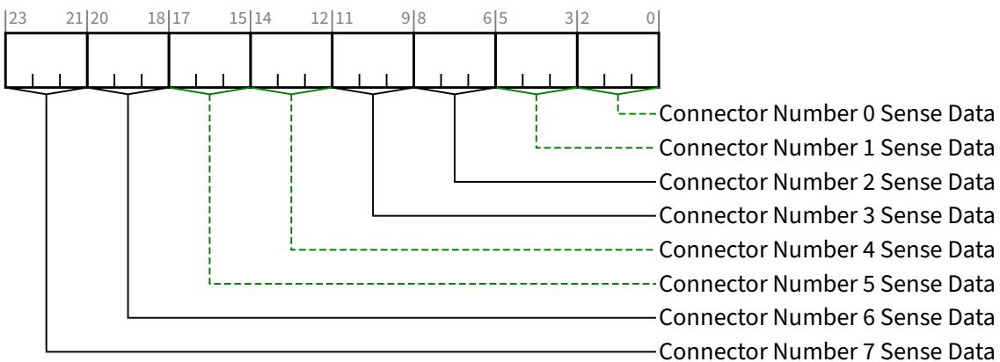


| 位 0-2 | 位 3-5 | 位 6-8 | 位 9-11 | 位 12-14 | 位 15-17 | 位 18-20 | 位 21-23 |
|---|---|---|---|---|---|---|---|
| Connector Number 0 Sense Data(连接器 0 感应数据) | Connector Number 1 Sense Data(连接器 1 感应数据) | Connector Number 2 Sense Data(连接器 2 感应数据) | Connector Number 3 Sense Data(连接器 3 感应数据) | Connector Number 4 Sense Data(连接器 4 感应数据) | Connector Number 5 Sense Data(连接器 5 感应数据) | Connector Number 6 Sense Data(连接器 6 感应数据) | Connector Number 7 Sense Data(连接器 7 感应数据) |

**表 7-124. 功耗预算感应检测寄存器**

| 位位置 | 寄存器描述 | 属性 |
|---|---|---|
| 2:0 | Connector Number 0 Sense Data(连接器 0 感应数据) | RO |
| 5:3 | Connector Number 1 Sense Data(连接器 1 感应数据) | RO |
| 8:6 | Connector Number 2 Sense Data(连接器 2 感应数据) | RO |
| 11:9 | Connector Number 3 Sense Data(连接器 3 感应数据) | RO |
| 14:12 | Connector Number 4 Sense Data(连接器 4 感应数据) | RO |
| 17:15 | Connector Number 5 Sense Data(连接器 5 感应数据) | RO |
| 20:18 | Connector Number 6 Sense Data(连接器 6 感应数据) | RO |
| 23:21 | Connector Number 7 Sense Data(连接器 7 感应数据) | RO |

**表 7-125. 功耗预算感应检测编码**

| 连接器类型 | 编码 | 描述 |
|---|---|---|
| 00 0000b 至 00 0011b | 位 0:000b:电缆不存在,未检测到感应;001b:电缆存在,已检测到感应;其他:保留。位 1:000b:检测到主电源。如果不使用辅助电源,则此位允许硬连线为 1b。001b:检测到辅助电源。如果不使用辅助电源,则此位允许硬连线为 0b。当所实现的外形规格中未定义专用辅助电源引脚时,此位具有外形规格特定的含义。位 2:0xxb:外形规格特定含义。 | 外形规格特定含义 |
| 00 0100b | CEM 2x3 连接器。000b:电缆不存在,未检测到感应;001b:电缆存在,已检测到感应;其他:保留。 | CEM 2x3 连接器 |
| 00 0101b 至 00 0111b | CEM 2x4 连接器。000b:电缆不存在,Sense0 和 Sense1 均未检测到;001b:存在 2x3 电缆,检测到 Sense0,未检测到 Sense1;010b:保留条件,未检测到 Sense0,检测到 Sense1;011b:存在 2x4 电缆,Sense0 和 Sense1 均已检测到;其他:保留。 | CEM 2x4 连接器 |
| 00 1000b 至 00 1011b | CEM 12VHPWR 连接器。000b:电缆不存在;100b:存在 12VHPWR 电缆,Sense0 和 Sense1 均悬空;101b:存在 12VHPWR 电缆,Sense0 接地,Sense1 悬空;110b:存在 12VHPWR 电缆,Sense0 悬空,Sense1 接地;111b:存在 12VHPWR 电缆,Sense0 和 Sense1 均接地;其他:保留。 | CEM 12VHPWR 连接器 |
| 00 1100b 至 00 1111b | CEM 48VHPWR 连接器。000b:电缆不存在;100b:存在 48VHPWR 电缆,Sense0 和 Sense1 均悬空;101b:存在 48VHPWR 电缆,Sense0 接地,Sense1 悬空;110b:存在 48VHPWR 电缆,Sense0 悬空,Sense1 接地;111b:存在 48VHPWR 电缆,Sense0 和 Sense1 均接地;其他:保留。 | CEM 48VHPWR 连接器 |
| 01 0000b | CEM 12V-2x6 连接器,150 W 或更高功率电缆。000b:电缆不存在;100b:存在 150 W 12V-2x6 电缆;101b:存在 300 W 12V-2x6 电缆;110b:存在 450 W 12V-2x6 电缆;111b:存在 600 W 12V-2x6 电缆;其他:保留。 | CEM 12V-2x6 连接器,150 W 或更高功率电缆 |
| 01 0001b | CEM 12V-2x6 连接器,300 W 或更高功率电缆。000b:电缆不存在;100b:电缆不存在或存在 150 W 12V-2x6 电缆 171;101b:存在 300 W 12V-2x6 电缆;110b:存在 450 W 12V-2x6 电缆;111b:存在 600 W 12V-2x6 电缆;其他:保留。 | CEM 12V-2x6 连接器,300 W 或更高功率电缆 |
| 01 0010b | CEM 12V-2x6 连接器,450 W 或更高功率电缆。000b:电缆不存在;100b:电缆不存在或存在 150 W 12V-2x6 电缆 172;101b:存在 300 W 12V-2x6 电缆 173;110b:存在 450 W 12V-2x6 电缆;111b:存在 600 W 12V-2x6 电缆;其他:保留。 | CEM 12V-2x6 连接器,450 W 或更高功率电缆 |
| 01 0011b | CEM 12V-2x6 连接器,600 W 电缆。000b:电缆不存在;100b:电缆不存在或存在 150 W 12V-2x6 电缆 174;101b:存在 300 W 12V-2x6 电缆 175;110b:存在 450 W 12V-2x6 电缆 176;111b:存在 600 W 12V-2x6 电缆;其他:保留。 | CEM 12V-2x6 连接器,600 W 电缆 |
| 01 0100b 至 10 1111h | 保留供 PCI-SIG 使用 | 保留供 PCI-SIG 使用 |
| 11 0000b 至 11 1111b | 供应商特定 | 供应商特定 |

</td>
</tr>
</tbody>
</table>

[⬆️ 返回目录](#-本章目录-table-of-contents)

---

<a id="sec-7-8-2"></a>
## 7.8.2 Latency Tolerance Reporting (LTR) Extended Capability | 延迟容忍报告 (LTR) 扩展能力


<div style="overflow-x: auto; max-width: 100%;">
<table>
<thead>
<tr>
<th width="50%">🇬🇧 English</th>
<th width="50%" style="background-color:#e8e8e8">🏆 中文</th>
</tr>
</thead>
<tbody>
<tr>
<td>

The PCI Express Latency Tolerance Reporting (LTR) Extended Capability is an optional Extended Capability that allows software to provide platform latency information to components with Upstream Ports (Endpoints and Switches), and is required for Switch Upstream Ports and Endpoints if the Function supports the LTR mechanism. It is not applicable to Root Ports, Bridges, or Switch Downstream Ports.

For a Multi-Function Device associated with the Upstream Port of a component that implements the LTR mechanism, this Capability structure must be implemented only in Function 0, and must control the component's Link behavior on behalf of all the Functions of the Device.

RCiEPs implemented as Multi-Function Devices are permitted to implement this Capability structure in more than one Function of the Multi-Function Device.

> **Figure 7-142. LTR Extended Capability Structure | LTR 扩展能力结构**

| Byte Offset | 31 … 16 | 15 … 0 |
|---|---|---|
| +000h | PCI Express Extended Capability Header | |
| +004h | Max Snoop Latency Register | Max No-Snoop Latency Register |

> **Figure 7-143. LTR Extended Capability Header | LTR 扩展能力头**

| Bits 0-15 | Bits 16-19 | Bits 20-31 |
|---|---|---|
| PCI Express Extended Capability ID (0018h) | Capability Version | Next Capability Offset |

**Table 7-126. LTR Extended Capability Header | LTR 扩展能力头**

| Bit Location | Register Description | Attributes |
|---|---|---|
| 15:0 | PCI Express Extended Capability ID - This field is a PCI-SIG defined ID number that indicates the nature and format of the Extended Capability. PCI Express Extended Capability for the LTR Extended Capability is 0018h. | RO |
| 19:16 | Capability Version - This field is a PCI-SIG defined version number that indicates the version of the Capability structure present. Must be 1h for this version of the specification. | RO |
| 31:20 | Next Capability Offset - This field contains the offset to the next PCI Express Extended Capability structure or 000h if no other items exist in the linked list of Capabilities. | RO |

> **Figure 7-144. Max Snoop Latency Register | 最大 Snoop 延迟寄存器**

| Bits 0-9 | Bits 10-12 | Bits 13-15 |
|---|---|---|
| Max Snoop Latency Value | Max Snoop Latency Scale | RsvdP |

</td>
<td style="background-color:#e8e8e8">

PCI Express Latency Tolerance Reporting (LTR) 扩展能力是一种可选的扩展能力,允许软件向具有上游端口(Upstream Port)的组件(端点 (Endpoint) 和交换机 (Switch))提供平台延迟信息,如果 Function 支持 LTR 机制,则交换机上游端口和端点必须实现该能力。该能力不适用于根端口 (Root Port)、桥 (Bridge) 或交换机下游端口 (Downstream Port)。

对于与实现 LTR 机制的组件上游端口相关联的多功能设备,该能力结构必须仅在 Function 0 中实现,并且必须代表设备的所有 Function 控制该组件的链路 (Link) 行为。

实现为多功能设备的 RCiEP 允许在该多功能设备的多个 Function 中实现该能力结构。

> **图 7-142. LTR 扩展能力结构 (LTR Extended Capability Structure)**

> 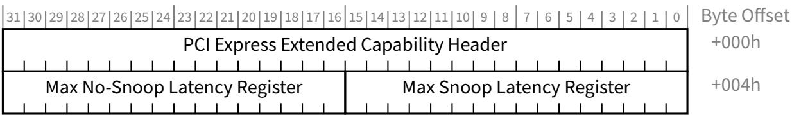


| 字节偏移 | 31 … 16 | 15 … 0 |
|---|---|---|
| +000h | PCI Express 扩展能力头 | |
| +004h | Max Snoop Latency Register(最大 Snoop 延迟寄存器) | Max No-Snoop Latency Register(最大 No-Snoop 延迟寄存器) |

> **图 7-143. LTR 扩展能力头 (LTR Extended Capability Header)**

> 


| 位 0-15 | 位 16-19 | 位 20-31 |
|---|---|---|
| PCI Express 扩展能力 ID (0018h) | Capability Version(能力版本) | Next Capability Offset(下一能力偏移) |

**表 7-126. LTR 扩展能力头**

| 位位置 | 寄存器描述 | 属性 |
|---|---|---|
| 15:0 | PCI Express 扩展能力 ID — 该字段是 PCI-SIG 定义的 ID 编号,用于指示扩展能力的性质和格式。LTR 扩展能力的 PCI Express 扩展能力 ID 为 0018h。 | RO |
| 19:16 | Capability Version(能力版本) — 该字段是 PCI-SIG 定义的版本号,用于指示当前所实现的能力结构的版本。在本规范的本版本中必须为 1h。 | RO |
| 31:20 | Next Capability Offset(下一能力偏移) — 该字段包含下一个 PCI Express 扩展能力结构的偏移量,若链表中不存在其他项则为 000h。 | RO |

> **图 7-144. Max Snoop Latency Register(最大 Snoop 延迟寄存器)**

> 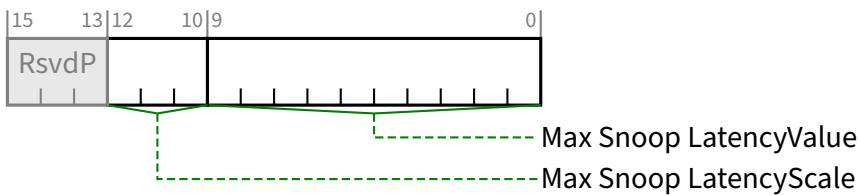


| 位 0-9 | 位 10-12 | 位 13-15 |
|---|---|---|
| Max Snoop Latency Value(最大 Snoop 延迟值) | Max Snoop Latency Scale(最大 Snoop 延迟比例) | RsvdP(保留) |

</td>
</tr>
</tbody>
</table>
</div>


[⬆️ 返回目录](#-本章目录-table-of-contents)

---


---

<a id="sec-7-8-2-1"></a>
## 7.8.2.1 LTR Extended Capability Header (Offset 00h) | LTR 扩展能力头(偏移 00h)

<table>
<thead>
<tr>
<th width="50%">🇬🇧 English</th>
<th width="50%" style="background-color:#e8e8e8">🏆 中文</th>
</tr>
</thead>
<tbody>
<tr>
<td>

7.8.2.1 LTR Extended Capability Header (Offset 00h) §

</td>
<td style="background-color:#e8e8e8">

7.8.2.1 LTR 扩展能力头(偏移 00h) §

</td>
</tr>
</tbody>
</table>

---

<a id="sec-7-8-2-2"></a>
## 7.8.2.2 Max Snoop Latency Register (Offset 04h) | 最大监听延迟寄存器(偏移 04h)

<table>
<thead>
<tr>
<th width="50%">🇬🇧 English</th>
<th width="50%" style="background-color:#e8e8e8">🏆 中文</th>
</tr>
</thead>
<tbody>
<tr>
<td>

7.8.2.2 Max Snoop Latency Register (Offset 04h) §

</td>
<td style="background-color:#e8e8e8">

7.8.2.2 最大监听延迟寄存器(偏移 04h) §

</td>
</tr>
</tbody>
</table>

---

<!-- 📄 Page 1182 -->
---

**Table 7-127. Max Snoop Latency Register | 表 7-127. 最大监听延迟寄存器**

| Bit Location | Register Description | Attributes |
|--------------|----------------------|------------|
| 9:0 | **Max Snoop LatencyValue** - Along with the Max Snoop LatencyScale field, this register specifies the maximum snoop latency that a device is permitted to request. Software should set this to the platform's maximum supported latency or less. It is strongly recommended that any updates to this field are reflected in LTR Message(s) sent by the device within 1 ms.<br>The default value for this field is 00 0000 0000b. | RW |
| 12:10 | **Max Snoop LatencyScale** - This register provides a scale for the value contained within the Max Snoop LatencyValue field. Encoding is the same as the LatencyScale fields in the LTR Message. See § Section 6.18. It is strongly recommended that any updates to this field are reflected in LTR Message(s) sent by the device within 1 ms.<br>The default value for this field is 000b.<br>Hardware operation is undefined if software writes a Not Permitted value to this field. | RW |

| Bit | Field |
|-----|-------|
| 0–9 | Max No-Snoop LatencyValue |
| 10–12 | Max No-Snoop LatencyScale |
| 13–15 | RsvdP |

> **Figure 7-145.** Max No-Snoop Latency Register

**Table 7-128. Max No-Snoop Latency Register | 表 7-128. 最大非监听延迟寄存器**

| Bit Location | Register Description | Attributes |
|--------------|----------------------|------------|
| 9:0 | **Max No-Snoop LatencyValue** - Along with the Max No-Snoop LatencyScale field, this register specifies the maximum no-snoop latency that a device is permitted to request. Software should set this to the platform's maximum supported latency or less. It is strongly recommended that any updates to this field are reflected in LTR Message(s) sent by the device within 1 ms.<br>The default value for this field is 00 0000 0000b. | RW |
| 12:10 | **Max No-Snoop LatencyScale** - This register provides a scale for the value contained within the Max No-Snoop LatencyValue field. Encoding is the same as the LatencyScale fields in the LTR Message. See § Section 6.18. It is strongly recommended that any updates to this field are reflected in LTR Message(s) sent by the device within 1 ms.<br>The default value for this field is 000b.<br>Hardware operation is undefined if software writes a Not Permitted value to this field. | RW |

The L1 PM Substates Extended Capability is an optional Extended Capability, that is required if L1 PM Substates is implemented at a Port. The L1 PM Substates Extended Capability structure is defined as shown in § Figure 7-146.

<a id="sec-7-8-2-3"></a>
## 7.8.2.3 Max No-Snoop Latency Register (Offset 06h) | 最大非监听延迟寄存器(偏移 06h)

<table>
<thead>
<tr>
<th width="50%">🇬🇧 English</th>
<th width="50%" style="background-color:#e8e8e8">🏆 中文</th>
</tr>
</thead>
<tbody>
<tr>
<td>

7.8.2.3 Max No-Snoop Latency Register (Offset 06h) §

</td>
<td style="background-color:#e8e8e8">

7.8.2.3 最大非监听延迟寄存器(偏移 06h) §

</td>
</tr>
</tbody>
</table>

---

<a id="sec-7-8-3"></a>
## 7.8.3 L1 PM Substates Extended Capability | L1 PM 子状态扩展能力

<table>
<thead>
<tr>
<th width="50%">🇬🇧 English</th>
<th width="50%" style="background-color:#e8e8e8">🏆 中文</th>
</tr>
</thead>
<tbody>
<tr>
<td>

7.8.3 L1 PM Substates Extended Capability §

</td>
<td style="background-color:#e8e8e8">

7.8.3 L1 PM 子状态扩展能力 §

</td>
</tr>
</tbody>
</table>

---

<!-- 📄 Page 1183 -->
---

For a Multi-Function Device associated with an Upstream Port implementing L1 PM Substates, this Extended Capability Structure must be implemented only in Function 0, and must control the Upstream Port's Link behavior on behalf of all the Functions of the device.

> **Figure 7-146.** L1 PM Substates Extended Capability

> 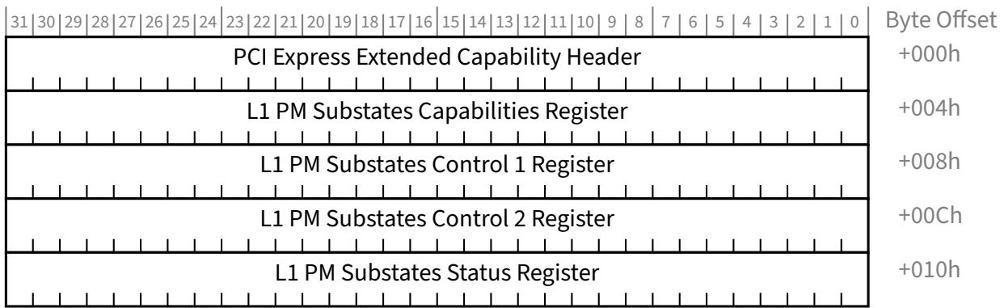


| Byte Offset | Register |
|-------------|----------|
| +000h | PCI Express Extended Capability Header |
| +004h | L1 PM Substates Capabilities Register |
| +008h | L1 PM Substates Control 1 Register |
| +00Ch | L1 PM Substates Control 2 Register |
| +010h | L1 PM Substates Status Register |

| Bits | Field |
|------|-------|
| 0–15 | PCI Express Extended Capability ID = 001Eh |
| 16–19 | Capability Version |
| 20–31 | Next Capability Offset |

> **Figure 7-147.** L1 PM Substates Extended Capability Header

> 


**Table 7-129. L1 PM Substates Extended Capability Header | 表 7-129. L1 PM 子状态扩展能力头**

| Bit Location | Register Description | Attributes |
|--------------|----------------------|------------|
| 15:0 | **PCI Express Extended Capability ID** - This field is a PCI-SIG defined ID number that indicates the nature and format of the Extended Capability.<br>Extended Capability ID for L1 PM Substates is 001Eh. | RO |
| 19:16 | **Capability Version** - This field is a PCI-SIG defined version number that indicates the version of the Capability structure present.<br>This field must be 2h if the L1 PM Substates Status Register is implemented and must be 1h otherwise. | RO |
| 31:20 | **Next Capability Offset** - This field contains the offset to the next PCI Express Capability structure or 000h if no other items exist in the linked list of Capabilities.<br>For Extended Capabilities implemented in Configuration Space, this offset is relative to the beginning of PCI-compatible Configuration Space and thus must always be either 000h (for terminating list of Capabilities) or greater than 0FFh.<br>The bottom 2 bits of this offset are Reserved and must be implemented as 00b although software must mask them to allow for future uses of these bits. | RO |

<a id="sec-7-8-3-1"></a>
## 7.8.3.1 L1 PM Substates Extended Capability Header (Offset 00h) | L1 PM 子状态扩展能力头(偏移 00h)

<table>
<thead>
<tr>
<th width="50%">🇬🇧 English</th>
<th width="50%" style="background-color:#e8e8e8">🏆 中文</th>
</tr>
</thead>
<tbody>
<tr>
<td>

7.8.3.1 L1 PM Substates Extended Capability Header (Offset 00h) §

</td>
<td style="background-color:#e8e8e8">

7.8.3.1 L1 PM 子状态扩展能力头(偏移 00h) §

</td>
</tr>
</tbody>
</table>

---

<!-- 📄 Page 1184 -->
---

**Range of Values for Port T_POWER_ON Scale**

| Encoding | Value |
|----------|-------|
| 00b | 2 μs |
| 01b | 10 μs |
| 10b | 100 μs |
| 11b | Reserved |

| Bits | Field |
|------|-------|
| 0 | PCI-PM L1.2 Supported |
| 1 | PCI-PM L1.1 Supported |
| 2 | ASPM L1.2 Supported |
| 3 | ASPM L1.1 Supported |
| 4 | L1 PM Substates Supported |
| 5 | Link Activation Supported |
| 6–7 | RsvdP |
| 8–15 | Port Common_Mode_Restore_Time |
| 16–17 | Port T_POWER_ON Scale |
| 18 | RsvdP |
| 19–23 | Port T_POWER_ON Value |
| 24–31 | RsvdP |

> **Figure 7-148.** L1 PM Substates Capabilities Register

> 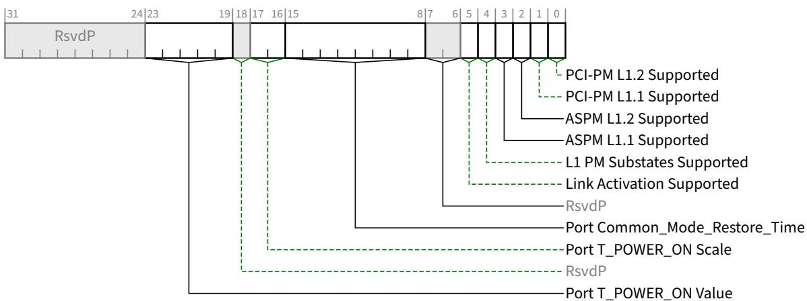


**Table 7-130. L1 PM Substates Capabilities Register | 表 7-130. L1 PM 子状态能力寄存器**

| Bit Location | Register Description | Attributes |
|--------------|----------------------|------------|
| 0 | **PCI-PM L1.2 Supported** - When Set this bit indicates that PCI-PM L1.2 is supported. | HwInit |
| 1 | **PCI-PM L1.1 Supported** - When Set this bit indicates that PCI-PM L1.1 is supported, and must be Set by all Ports implementing L1 PM Substates. | HwInit |
| 2 | **ASPM L1.2 Supported** - When Set this bit indicates that ASPM L1.2 is supported. | HwInit |
| 3 | **ASPM L1.1 Supported** - When Set this bit indicates that ASPM L1.1 is supported. | HwInit |
| 4 | **L1 PM Substates Supported** - When Set this bit indicates that this Port supports L1 PM Substates. | HwInit |
| 5 | **Link Activation Supported** - For Downstream Ports, when Set, this bit indicates that this Port supports Link Activation. See § Section 5.5.6 for details.<br>This bit is of type RsvdP for Upstream Ports. | HwInit/RsvdP |
| 15:8 | **Port Common_Mode_Restore_Time** - Time (in μs) required for this Port to re-establish common mode as described in § Table 5-11.<br>Required for all Ports for which either the PCI-PM L1.2 Supported bit is Set, ASPM L1.2 Supported bit is Set, or both are Set, otherwise this field is of type RsvdP. | HwInit/RsvdP (See description) |
| 17:16 | **Port T_POWER_ON Scale** - Specifies the scale used for the Port T_POWER_ON Value field in the L1 PM Substates Capabilities Register.<br>Range of Values: 00b = 2 μs, 01b = 10 μs, 10b = 100 μs, 11b = Reserved<br>Required for all Ports for which either the PCI-PM L1.2 Supported bit is Set, ASPM L1.2 Supported bit is Set, or both are Set, otherwise this field is of type RsvdP.<br>Default value is 00b. | HwInit/RsvdP |

<a id="sec-7-8-3-2"></a>
## 7.8.3.2 L1 PM Substates Capabilities Register (Offset 04h) | L1 PM 子状态能力寄存器(偏移 04h)

<table>
<thead>
<tr>
<th width="50%">🇬🇧 English</th>
<th width="50%" style="background-color:#e8e8e8">🏆 中文</th>
</tr>
</thead>
<tbody>
<tr>
<td>

7.8.3.2 L1 PM Substates Capabilities Register (Offset 04h) §

</td>
<td style="background-color:#e8e8e8">

7.8.3.2 L1 PM 子状态能力寄存器(偏移 04h) §

</td>
</tr>
</tbody>
</table>

---

<!-- 📄 Page 1185 -->
---

**Table 7-130 (continued). L1 PM Substates Capabilities Register | 表 7-130(续). L1 PM 子状态能力寄存器**

| Bit Location | Register Description | Attributes |
|--------------|----------------------|------------|
| 23:19 | **Port T_POWER_ON Value** - Along with the Port T_POWER_ON Scale field in the L1 PM Substates Capabilities Register sets the time (in μs) that this Port requires the port on the opposite side of Link to wait in L1.2.Exit after sampling CLKREQ# asserted before actively driving the interface.<br>The value of Port T_POWER_ON is calculated by multiplying the value in this field by the scale value in the Port T_POWER_ON Scale field in the L1 PM Substates Capabilities Register.<br>Default value is 0 0101b.<br>Required for all Ports for which either the PCI-PM L1.2 Supported bit is Set, ASPM L1.2 Supported bit is Set, or both are Set, otherwise this field is of type RsvdP. | HwInit/RsvdP |

| Bits | Field |
|------|-------|
| 0 | PCI-PM L1.2 Enable |
| 1 | PCI-PM L1.1 Enable |
| 2 | ASPM L1.2 Enable |
| 3 | ASPM L1.1 Enable |
| 4 | Link Activation Interrupt Enable |
| 5 | Link Activation Control |
| 6–7 | RsvdP |
| 8–15 | Common_Mode_Restore_Time |
| 16–25 | LTR_L1.2_THRESHOLD_Value |
| 26–28 | RsvdP |
| 29–31 | LTR_L1.2_THRESHOLD_Scale |

> **Figure 7-149.** L1 PM Substates Control 1 Register

> 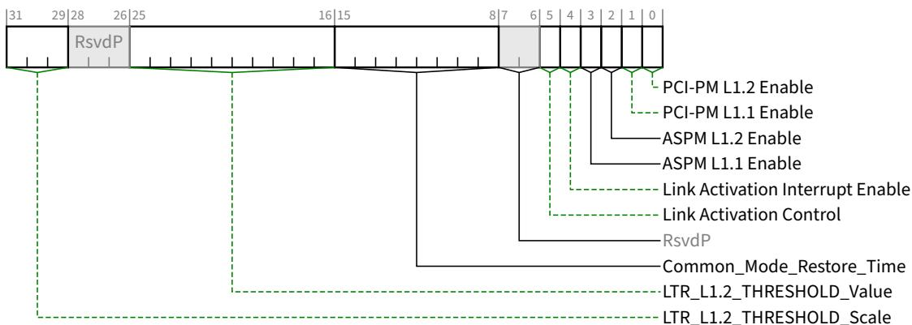


**Table 7-131. L1 PM Substates Control 1 Register | 表 7-131. L1 PM 子状态控制 1 寄存器**

| Bit Location | Register Description | Attributes |
|--------------|----------------------|------------|
| 0 | **PCI-PM L1.2 Enable** - When Set this bit enables PCI-PM L1.2.<br>Required for both Upstream and Downstream Ports. For Ports for which the PCI-PM L1.2 Supported bit is Clear this bit is permitted to be hardwired to 0.<br>For compatibility with possible future extensions, software must not enable L1 PM Substates unless the L1 PM Substates Supported bit in the L1 PM Substates Capabilities Register is Set.<br>Default value is 0b. | RW |
| 1 | **PCI-PM L1.1 Enable** - When Set this bit enables PCI-PM L1.1.<br>Required for both Upstream and Downstream Ports.<br>For compatibility with possible future extensions, software must not enable L1 PM Substates unless the L1 PM Substates Supported bit in the L1 PM Substates Capabilities Register is Set.<br>Default value is 0b. | RW |

<a id="sec-7-8-3-3"></a>
## 7.8.3.3 L1 PM Substates Control 1 Register (Offset 08h) | L1 PM 子状态控制 1 寄存器(偏移 08h)

<table>
<thead>
<tr>
<th width="50%">🇬🇧 English</th>
<th width="50%" style="background-color:#e8e8e8">🏆 中文</th>
</tr>
</thead>
<tbody>
<tr>
<td>

7.8.3.3 L1 PM Substates Control 1 Register (Offset 08h) §

</td>
<td style="background-color:#e8e8e8">

7.8.3.3 L1 PM 子状态控制 1 寄存器(偏移 08h) §

</td>
</tr>
</tbody>
</table>

---

<!-- 📄 Page 1186 -->
---

**Table 7-131 (continued). L1 PM Substates Control 1 Register | 表 7-131(续). L1 PM 子状态控制 1 寄存器**

| Bit Location | Register Description | Attributes |
|--------------|----------------------|------------|
| 2 | **ASPM L1.2 Enable** - When Set this bit enables ASPM L1.2.<br>Required for both Upstream and Downstream Ports.<br>For Ports for which the ASPM L1.2 Supported bit is Clear this bit is permitted to be hardwired to 0.<br>For compatibility with possible future extensions, software must not enable L1 PM Substates unless the L1 PM Substates Supported bit in the L1 PM Substates Capabilities Register is Set.<br>Default value is 0b. | RW |
| 3 | **ASPM L1.1 Enable** - When Set this bit enables ASPM L1.1.<br>Required for both Upstream and Downstream Ports.<br>For Ports for which the ASPM L1.1 Supported bit is Clear this bit is permitted to be hardwired to 0.<br>For compatibility with possible future extensions, software must not enable L1 PM Substates unless the L1 PM Substates Supported bit in the L1 PM Substates Capabilities Register is Set.<br>Default value is 0b. | RW |
| 4 | **Link Activation Interrupt Enable** - When set this bit enables the generation of an interrupt to indicate the completion of the Link Activation process. See § Section 5.5.6 for details.<br>Required for Downstream Ports when the Link Activation Supported bit is Set, otherwise it is permitted to be hardwired to 0b.<br>Must be RsvdP for Upstream Ports.<br>Default value is 0b. | RW/RsvdP |
| 5 | **Link Activation Control** - When this bit is Set, the Port must initiate the Link Activation process. See § Section 5.5.6 for details.<br>Required for Downstream Ports when the Link Activation Supported bit is Set, otherwise it is permitted to be hardwired to 0b.<br>Must be RsvdP for Upstream Ports.<br>Default value is 0b. | RW/RsvdP |
| 15:8 | **Common_Mode_Restore_Time** - Sets value of TCOMMONMODE (in μs), which must be used by the Downstream Port for timing the re-establishment of common mode, as described in § Table 5-11.<br>This field must only be modified when the ASPM L1.2 Enable and PCI-PM L1.2 Enable bits are both Clear. The Port behavior is undefined if this field is modified when either the ASPM L1.2 Enable and/or PCI-PM L1.2 Enable bit(s) are Set.<br>Required for Downstream Ports for which either the PCI-PM L1.2 Supported bit is Set, ASPM L1.2 Supported bit is Set, or both are Set, otherwise this field is of type RsvdP.<br>This field is of type RsvdP for Upstream Ports.<br>Default value is implementation specific. | RW/RsvdP (See Description) |
| 25:16 | **LTR_L1.2_THRESHOLD_Value** - Along with the LTR_L1.2_THRESHOLD_Scale, this field indicates the LTR threshold used to determine if entry into L1 results in L1.1 (if enabled) or L1.2 (if enabled).<br>The default value for this field is 00 0000 0000b.<br>This field must only be modified when the ASPM L1.2 Enable bit is Clear. The Port behavior is undefined if this field is modified when the ASPM L1.2 Enable bit is Set.<br>Required for all Ports for which the ASPM L1.2 Supported bit is Set, otherwise this field is of type RsvdP. | RW/RsvdP (See Description) |
| 31:29 | **LTR_L1.2_THRESHOLD_Scale** - This field provides a scale for the value contained within the LTR_L1.2_THRESHOLD_Value. Encoding is the same as the LatencyScale fields in the LTR Message (see § Section 6.18).<br>The default value for this field is 000b.<br>Hardware operation is undefined if software writes a Not-Permitted value to this field.<br>This field must only be modified when the ASPM L1.2 Enable bit is Clear. The Port behavior is undefined if this field is modified when the ASPM L1.2 Enable bit is Set.<br>Required for all Ports for which the ASPM L1.2 Supported bit is Set, otherwise this field is of type RsvdP. | RW/RsvdP (See description) |

---

<!-- 📄 Page 1187 -->
---

**Range of Values for LTR_L1.2_THRESHOLD_Scale**

| Encoding | Value |
|----------|-------|
| 00b | 2 μs |
| 01b | 10 μs |
| 10b | 100 μs |
| 11b | Reserved |

| Bits | Field |
|------|-------|
| 0–1 | T_POWER_ON Scale |
| 2 | RsvdP |
| 3–7 | T_POWER_ON Value |
| 8–31 | RsvdP |

> **Figure 7-150.** L1 PM Substates Control 2 Register

> 


**Table 7-132. L1 PM Substates Control 2 Register | 表 7-132. L1 PM 子状态控制 2 寄存器**

| Bit Location | Register Description | Attributes |
|--------------|----------------------|------------|
| 1:0 | **T_POWER_ON Scale** - Specifies the scale used for T_POWER_ON Value.<br>Range of Values: 00b = 2 μs, 01b = 10 μs, 10b = 100 μs, 11b = Reserved.<br>Required for all Ports that support L1.2, otherwise this field is of type RsvdP.<br>This field must only be modified when the ASPM L1.2 Enable and PCI-PM L1.2 Enable bits are both Clear. The Port behavior is undefined if this field is modified when either the ASPM L1.2 Enable and/or PCI-PM L1.2 Enable bit(s) are Set.<br>Default value is 00b. | RW/RsvdP |
| 7:3 | **T_POWER_ON Value** - Along with the T_POWER_ON Scale sets the minimum amount of time (in μs) that the Port must wait in L1.2.Exit after sampling CLKREQ# asserted before actively driving the interface.<br>T_POWER_ON is calculated by multiplying the value in this field by the value in the T_POWER_ON Scale field.<br>This field must only be modified when the ASPM L1.2 Enable and PCI-PM L1.2 Enable bits are both Clear. The Port behavior is undefined if this field is modified when either the ASPM L1.2 Enable and/or PCI-PM L1.2 Enable bit(s) are Set.<br>Default value is 0 0101b.<br>Required for all Ports that support L1.2, otherwise this field is of type RsvdP. | RW/RsvdP |

<a id="sec-7-8-3-4"></a>
## 7.8.3.4 L1 PM Substates Control 2 Register (Offset 0Ch) | L1 PM 子状态控制 2 寄存器(偏移 0Ch)

<table>
<thead>
<tr>
<th width="50%">🇬🇧 English</th>
<th width="50%" style="background-color:#e8e8e8">🏆 中文</th>
</tr>
</thead>
<tbody>
<tr>
<td>

7.8.3.4 L1 PM Substates Control 2 Register (Offset 0Ch) §

</td>
<td style="background-color:#e8e8e8">

7.8.3.4 L1 PM 子状态控制 2 寄存器(偏移 0Ch) §

</td>
</tr>
</tbody>
</table>

---

<!-- 📄 Page 1188 -->
---

Hardware must implement this register if the Capability Version in the L1 PM Substates Extended Capability Header is 2h or greater. This register is not present if the Capability Version is 1h.

| Bits | Field |
|------|-------|
| 0 | Link Activation Status |
| 1–31 | RsvdZ |

> **Figure 7-151.** L1 PM Substates Status Register

> 


**Table 7-133. L1 PM Substates Status Register | 表 7-133. L1 PM 子状态寄存器**

| Bit Location | Register Description | Attributes |
|--------------|----------------------|------------|
| 0 | **Link Activation Status** - Indicates the status of Link Activation. See § Section 5.5.6 for details.<br>Required for Downstream Ports when the Link Activation Supported bit is Set, otherwise it is hardwired to 0b.<br>Must be RsvdZ for Upstream Ports.<br>Default value is 0b. | RW1C/RsvdZ |

<a id="sec-7-8-3-5"></a>
## 7.8.3.5 L1 PM Substates Status Register (Offset 10h) | L1 PM 子状态寄存器(偏移 10h)

<table>
<thead>
<tr>
<th width="50%">🇬🇧 English</th>
<th width="50%" style="background-color:#e8e8e8">🏆 中文</th>
</tr>
</thead>
<tbody>
<tr>
<td>

7.8.3.5 L1 PM Substates Status Register (Offset 10h) §

</td>
<td style="background-color:#e8e8e8">

7.8.3.5 L1 PM 子状态寄存器(偏移 10h) §

</td>
</tr>
</tbody>
</table>

---

<a id="sec-7-8-4"></a>
## 7.8.4 Advanced Error Reporting Extended Capability | 高级错误报告扩展能力


<div style="overflow-x: auto; max-width: 100%;">
<table>
<thead>
<tr>
<th width="50%">🇬🇧 English</th>
<th width="50%" style="background-color:#e8e8e8">🏆 中文</th>
</tr>
</thead>
<tbody>
<tr>
<td>

The PCI Express Advanced Error Reporting (AER) Capability is an optional Extended Capability that may be implemented by PCI Express device Functions supporting advanced error control and reporting. The Advanced Error Reporting Extended Capability structure definition has additional interpretation for Root Ports and Root Complex Event Collectors; software must interpret the Device/Port Type field in the PCI Express Capabilities register to determine the availability of additional registers for Root Ports and Root Complex Event Collectors.

In an SR-IOV device, if AER is not implemented in a PF, it must not be implemented in its associated VFs. If AER is implemented in the PF, it is optional in its VFs.

In an SR-IOV device, the Header Log space for a PF is independent of any for its associated VFs and must be implemented with dedicated storage space. VFs that implement AER may share Header Log space among VFs associated with a single PF. Shared Header Log space must have storage for at least one header. See § Section 6.2.4.2.1 for further details.

§ Figure 7-152 and § Figure 7-153 show the PCI Express Advanced Error Reporting Extended Capability structure. In § Figure 7-153, the last 6 DW are optional. Implementations are permitted to implement between 0 and 6 additional DW of Header Log (see Header Log Size for details).

Note that if an error reporting bit field is marked as optional in the error registers, the bits must be implemented or not implemented as a group across the Status, Mask and Severity registers. In other words, a Function is required to implement the same error bit fields in corresponding Status, Mask and Severity registers. Bits corresponding to bit fields that are not implemented must be hardwired to 0, unless otherwise specified.

</td>
<td style="background-color:#e8e8e8">

PCI Express 高级错误报告 (AER, Advanced Error Reporting) 能力是一项可选的扩展能力,可由支持高级错误控制与报告的 PCI Express 设备功能 (Function) 实现。高级错误报告扩展能力结构定义对根端口 (Root Port) 和根复合体事件收集器 (Root Complex Event Collector) 有额外的解释;软件必须解读 PCI Express 能力寄存器中的 Device/Port Type 字段,以确定根端口和根复合体事件收集器的附加寄存器可用性。

在 SR-IOV 设备中,如果 AER 未在 PF 中实现,则不得在其关联的 VF 中实现。如果 AER 在 PF 中实现,则在其 VF 中可选。

在 SR-IOV 设备中,PF 的 Header Log 空间独立于其任何关联 VF 的 Header Log 空间,必须以专用存储空间实现。实现 AER 的 VF 可在与同一 PF 关联的 VF 之间共享 Header Log 空间。共享 Header Log 空间必须至少能够存储一个 Header。有关更多详细信息,请参见 § 第 6.2.4.2.1 节。

§ 图 7-152 和 § 图 7-153 显示了 PCI Express 高级错误报告扩展能力结构。在 § 图 7-153 中,最后 6 个 DW 是可选的。允许实现 0 到 6 个附加 DW 的 Header Log(有关详细信息,请参见 Header Log Size)。

请注意,如果错误报告位字段在错误寄存器中标记为可选,则这些位必须作为一个整体在 Status、Mask 和 Severity 寄存器中实现或不实现。换言之,功能 (Function) 需要在对应的 Status、Mask 和 Severity 寄存器中实现相同的错误位字段。除非另有说明,未实现的位字段所对应的位必须硬连线为 0。

</td>
</tr>
</tbody>
</table>
</div>


---

7.8.3.5 L1 PM Substates Status Register (Offset 10h) §
7.8.4 Advanced Error Reporting Extended Capability §

---

<!-- 📄 Page 1189 -->
---

> **Figure 7-152.** Advanced Error Reporting Extended Capability - Functions that do not support Flit Mode Structure

> 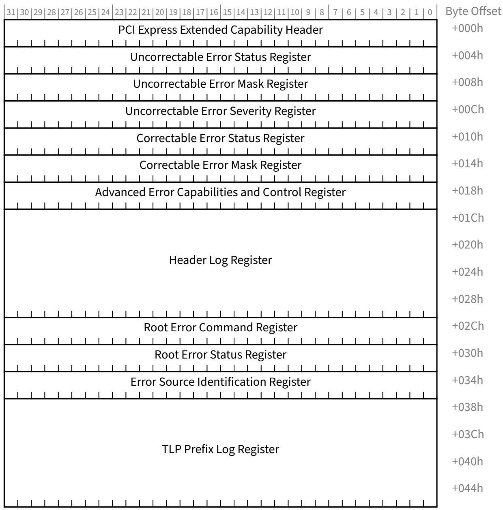


| Byte Offset | Register |
|-------------|----------|
| +000h | PCI Express Extended Capability Header |
| +004h | Uncorrectable Error Status Register |
| +008h | Uncorrectable Error Mask Register |
| +00Ch | Uncorrectable Error Severity Register |
| +010h | Correctable Error Status Register |
| +014h | Correctable Error Mask Register |
| +018h | Advanced Error Capabilities and Control Register |
| +01Ch | Header Log Register |
| +020h | Root Error Command Register |
| +024h | Root Error Status Register |
| +028h | Error Source Identification Register |
| +02Ch | TLP Prefix Log Register |
| +030h | (reserved) |
| +034h | (reserved) |
| +038h | (reserved) |
| +03Ch | (reserved) |
| +040h | (reserved) |
| +044h | (reserved) |

---

<!-- 📄 Page 1190 -->
---

> **Figure 7-153.** Advanced Error Reporting Extended Capability - Functions that support Flit Mode Structure

| Byte Offset | Register |
|-------------|----------|
| +000h | PCI Express Extended Capability Header |
| +004h | Uncorrectable Error Status Register |
| +008h | Uncorrectable Error Mask Register |
| +00Ch | Uncorrectable Error Severity Register |
| +010h | Correctable Error Status Register |
| +014h | Correctable Error Mask Register |
| +018h | Advanced Error Capabilities and Control Register |
| +01Ch | Header Log Register DW1-4 |
| +020h | Root Error Command Register |
| +024h | Root Error Status Register |
| +028h | Error Source Identification Register |
| +02Ch | Header Log Register DW5-14 (text defines implementation requirements) |
| +030h | (reserved) |
| +034h | (reserved) |
| +038h | (reserved) |
| +03Ch | (reserved) |
| +040h | (reserved) |
| +044h | (reserved) |
| +048h | (reserved) |
| +04Ch | (reserved) |
| +050h | (reserved) |
| +054h | (reserved) |
| +058h | (reserved) |
| +05Ch | (reserved) |

---

<!-- 📄 Page 1191 -->
---

§ Figure 7-154 details the allocation of register fields of an Advanced Error Reporting Extended Capability header; § Table 7-134 provides the respective bit definitions.

Refer to § Section 7.6.3 for a description of the PCI Express Extended Capability header. The Extended Capability ID for the Advanced Error Reporting Extended Capability is 0001h.

| Bits | Field |
|------|-------|
| 0–15 | PCI Express Extended Capability ID = 0001h |
| 16–19 | Capability Version |
| 20–31 | Next Capability Offset |

> **Figure 7-154.** Advanced Error Reporting Extended Capability Header

> 


**Table 7-134. Advanced Error Reporting Extended Capability Header | 表 7-134. 高级错误报告扩展能力头**

| Bit Location | Register Description | Attributes |
|--------------|----------------------|------------|
| 15:0 | **PCI Express Extended Capability ID** - This field is a PCI-SIG defined ID number that indicates the nature and format of the Extended Capability.<br>The Extended Capability ID for the Advanced Error Reporting Extended Capability is 0001h. | RO |
| 19:16 | **Capability Version** - This field is a PCI-SIG defined version number that indicates the version of the Capability structure present.<br>This field must be 3h if Flit Mode Supported is Set. This field must be 2h or 3h if End-End TLP Prefix Supported is Set (see § Section 7.5.3.15). Otherwise this field must be 1h, 2h, or 3h. | RO |
| 31:20 | **Next Capability Offset** - This field contains the offset to the next PCI Express Capability structure or 000h if no other items exist in the linked list of Capabilities.<br>For Extended Capabilities implemented in Configuration Space, this offset is relative to the beginning of PCI-compatible Configuration Space and thus must always be either 000h (for terminating list of Capabilities) or greater than 0FFh. | RO |

The Uncorrectable Error Status Register indicates error detection status of individual errors on a PCI Express device Function. An individual error status bit that is Set indicates that a particular error was detected; software may clear an error status by writing a 1b to the respective bit. Refer to § Section 6.2 for further details. Register bits not implemented by the Function are hardwired to 0b. § Figure 7-155 details the allocation of register fields of the Uncorrectable Error Status Register; § Section 7.8.4.2 provides the respective bit definitions.

For SR-IOV devices, applicable errors categorized as non-Function-specific must be logged in PFs and non-IOV Functions, but not logged in VFs. VFs must log only Function-specific errors, so for VFs the intended attribute for applicable non-Function-specific errors is VF ROZ. This is mandatory for some, but is only strongly recommended for others since earlier versions of this specification required them to be RW1CS. Certain other errors are applicable only for Root Port,

<a id="sec-7-8-4-1"></a>
## 7.8.4.1 Advanced Error Reporting Extended Capability Header (Offset 00h) | 高级错误报告扩展能力头(偏移 00h)

<table>
<thead>
<tr>
<th width="50%">🇬🇧 English</th>
<th width="50%" style="background-color:#e8e8e8">🏆 中文</th>
</tr>
</thead>
<tbody>
<tr>
<td>

7.8.4.1 Advanced Error Reporting Extended Capability Header (Offset 00h) §

</td>
<td style="background-color:#e8e8e8">

7.8.4.1 高级错误报告扩展能力头(偏移 00h) §

</td>
</tr>
</tbody>
</table>

---

---

<a id="sec-7-8-4-2"></a>
## 7.8.4.2 Uncorrectable Error Status Register (Offset 04h) | 不可纠正错误状态寄存器（偏移 04h）

<table>
<thead>
<tr>
<th width="50%">🇬🇧 English</th>
<th width="50%" style="background-color:#e8e8e8">🏆 中文</th>
</tr>
</thead>
<tbody>
<tr>
<td>

7.8.4.2 Uncorrectable Error Status Register (Offset 04h) §

</td>
<td style="background-color:#e8e8e8">

7.8.4.2 不可纠正错误状态寄存器（偏移 04h）§

</td>
</tr>
</tbody>
</table>

<!-- 📄 Page 1192 -->
---

<a id="sec-7-8-4-2-fig-7-155"></a>
## Figure 7-155 / Table 7-135 Uncorrectable Error Status Register | 不可纠正错误状态寄存器


<div style="overflow-x: auto; max-width: 100%;">
<table>
<thead>
<tr>
<th width="50%">🇬🇧 English</th>
<th width="50%" style="background-color:#e8e8e8">🏆 中文</th>
</tr>
</thead>
<tbody>
<tr>
<td>

Switch Port, or Function 0 Endpoint Functions, so for VFs their intended attribute is VF ROZ, and they have the same issue with earlier versions of this specification.

**Figure 7-155 Uncorrectable Error Status Register**

| Bit | Description |
|-----|-------------|
| 0 | Undefined |
| 1:3 | RsvdZ |
| 4 | Data Link Protocol Error Status |
| 5 | Surprise Down Error Status |
| 6:11 | RsvdZ |
| 12 | Poisoned TLP Received |
| 13 | Flow Control Protocol Error Status |
| 14 | Completion Timeout Status |
| 15 | Completer Abort Status |
| 16 | Unexpected Completion Status |
| 17 | Receiver Overflow Status |
| 18 | Malformed TLP Status |
| 19 | ECRC Error Status |
| 20 | Unsupported Request Error Status |
| 21 | ACS Violation Status |
| 22 | Uncorrectable Internal Error Status |
| 23 | MC Blocked TLP Status |
| 24 | AtomicOp Egress Blocked Status |
| 25 | TLP Prefix Blocked Error Status |
| 26 | Poisoned TLP Egress Blocked Status |
| 27 | DMWr Request Egress Blocked Status |
| 28 | IDE Check Failed Status |
| 29 | Misrouted IDE TLP Status |
| 30 | PCRC Check Failed Status |
| 31 | TLP Translation Egress Blocked Status |

**Table 7-135 Uncorrectable Error Status Register**

| Bit Location | Register Description | Attributes | Default |
|--------------|----------------------|------------|---------|
| 0 | Undefined - The value read from this bit is undefined. In previous versions of this specification, this bit was used to indicate a Link Training Error. System software must ignore the value read from this bit. System software is permitted to write any value to this bit. | Undefined | Undefined |
| 4 | Data Link Protocol Error Status | RW1CS / VF ROZ | 0b |
| 5 | Surprise Down Error Status (Optional – Note 1) | RW1CS / VF ROZ | 0b |
| 12 | Poisoned TLP Received Status | RW1CS | 0b |
| 13 | Flow Control Protocol Error Status (Optional – Note 1) | RW1CS / VF ROZ | 0b |
| 14 | Completion Timeout Status ¹⁷⁷ | RW1CS | 0b |

</td>
<td style="background-color:#e8e8e8">

交换机 (Switch) 端口或 Function 0 端点 (Endpoint) 函数,因此对于 VF (虚拟功能, Virtual Function),其预期属性为 VF ROZ,并且它们与本规范的早期版本存在相同的问题。

**图 7-155 不可纠正错误状态寄存器**

> 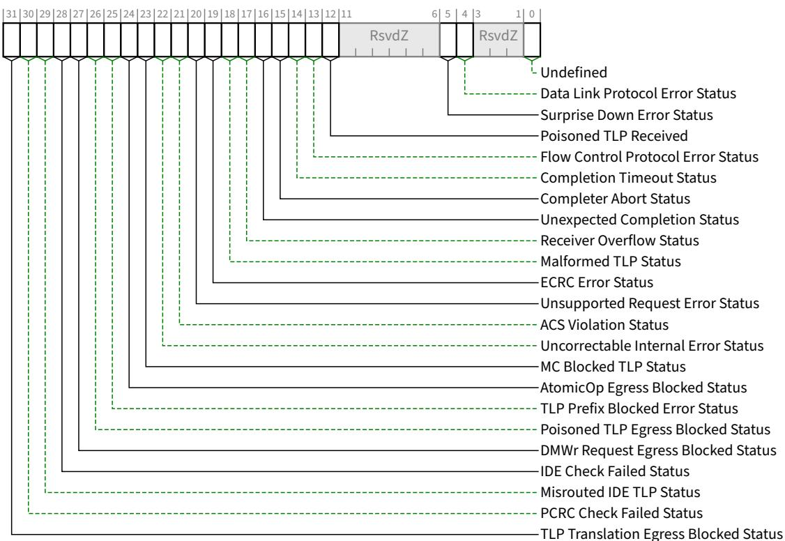


| 位 | 描述 |
|-----|------|
| 0 | 未定义 |
| 1:3 | 保留 (RsvdZ) |
| 4 | 数据链路协议错误状态 |
| 5 | 意外下线错误状态 |
| 6:11 | 保留 (RsvdZ) |
| 12 | 接收到中毒 TLP (Poisoned TLP) |
| 13 | 流控协议错误状态 |
| 14 | 完成超时状态 |
| 15 | 完成方中止状态 |
| 16 | 意外完成状态 |
| 17 | 接收器溢出状态 |
| 18 | 畸形 TLP 状态 |
| 19 | ECRC 错误状态 |
| 20 | 不支持的请求错误状态 |
| 21 | ACS 违规状态 |
| 22 | 不可纠正内部错误状态 |
| 23 | MC 阻塞 TLP 状态 |
| 24 | AtomicOp 出口阻塞状态 |
| 25 | TLP 前缀阻塞错误状态 |
| 26 | 中毒 TLP 出口阻塞状态 |
| 27 | DMWr 请求出口阻塞状态 |
| 28 | IDE 检查失败状态 |
| 29 | 误路由 IDE TLP 状态 |
| 30 | PCRC 检查失败状态 |
| 31 | TLP 转换出口阻塞状态 |

**表 7-135 不可纠正错误状态寄存器**

| 位位置 | 寄存器描述 | 属性 | 默认值 |
|--------|------------|------|--------|
| 0 | 未定义 - 从该位读取的值是未定义的。在本规范的早期版本中,该位用于指示链路训练错误。系统软件必须忽略从该位读取的值。允许系统软件向该位写入任何值。 | 未定义 | 未定义 |
| 4 | 数据链路协议错误状态 | RW1CS / VF ROZ | 0b |
| 5 | 意外下线错误状态（可选 – 注 1） | RW1CS / VF ROZ | 0b |
| 12 | 接收到中毒 TLP 状态 | RW1CS | 0b |
| 13 | 流控协议错误状态（可选 – 注 1） | RW1CS / VF ROZ | 0b |
| 14 | 完成超时状态 ¹⁷⁷ | RW1CS | 0b |

</td>
</tr>
</tbody>
</table>
</div>


[⬆️ 返回目录](#-本章目录-table-of-contents)

---

<!-- 📄 Page 1193 -->
---

<a id="sec-7-8-4-2-tbl-7-135-cont"></a>
## Table 7-135 Uncorrectable Error Status Register (continued) | 表 7-135 不可纠正错误状态寄存器（续）

<table>
<thead>
<tr>
<th width="50%">🇬🇧 English</th>
<th width="50%" style="background-color:#e8e8e8">🏆 中文</th>
</tr>
</thead>
<tbody>
<tr>
<td>

| Bit Location | Register Description | Attributes | Default |
|--------------|----------------------|------------|---------|
| 15 | Completer Abort Status (Optional – Note 1) | RW1CS | 0b |
| 16 | Unexpected Completion Status | RW1CS | 0b |
| 17 | Receiver Overflow Status (Optional – Note 1) | RW1CS / VF ROZ | 0b |
| 18 | Malformed TLP Status | RW1CS / VF ROZ | 0b |
| 19 | ECRC Error Status (Optional – Note 1) | RW1CS / VF ROZ | 0b |
| 20 | Unsupported Request Error Status | RW1CS | 0b |
| 21 | ACS Violation Status (Optional – Note 1) | RW1CS | 0b |
| 22 | Uncorrectable Internal Error Status (Optional) | RW1CS | 0b |
| 23 | MC Blocked TLP Status (Optional – Note 1) | RW1CS | 0b |
| 24 | AtomicOp Egress Blocked Status (Optional – Note 1) | RW1CS / VF ROZ (Note 2) | 0b |
| 25 | TLP Prefix Blocked Error Status (Optional – Note 1) | RW1CS / VF ROZ (Note 2) | 0b |
| 26 | Poisoned TLP Egress Blocked Status (Optional – Note 1) | RW1CS / VF ROZ (Note 2) | 0b |
| 27 | DMWr Request Egress Blocked Status (Optional – Note 1) | RW1CS / VF ROZ (Note 2) | 0b |
| 28 | IDE Check Failed Status (Optional – Note 1) | RW1CS / VF ROZ (Note 2) | 0b |
| 29 | Misrouted IDE TLP Status (Optional – Note 1) | RW1CS / VF ROZ (Note 2) | 0b |
| 30 | PCRC Check Failed Status (Optional – Note 1) | RW1CS / VF ROZ (Note 2) | 0b |
| 31 | TLP Translation Egress Blocked Status (Optional – Note 1) | RW1CS / VF ROZ (Note 2) | 0b |

¹⁷⁷. For Switch Ports, required if the Switch Port issues Non-Posted Requests on its own behalf (vs. only forwarding such Requests generated by other devices). If the Switch Port does not issue such Requests, then the Completion Timeout mechanism is not applicable and this bit must be hardwired to 0b.

</td>
<td style="background-color:#e8e8e8">

| 位位置 | 寄存器描述 | 属性 | 默认值 |
|--------|------------|------|--------|
| 15 | 完成方中止状态（可选 – 注 1） | RW1CS | 0b |
| 16 | 意外完成状态 | RW1CS | 0b |
| 17 | 接收器溢出状态（可选 – 注 1） | RW1CS / VF ROZ | 0b |
| 18 | 畸形 TLP 状态 | RW1CS / VF ROZ | 0b |
| 19 | ECRC 错误状态（可选 – 注 1） | RW1CS / VF ROZ | 0b |
| 20 | 不支持的请求错误状态 | RW1CS | 0b |
| 21 | ACS 违规状态（可选 – 注 1） | RW1CS | 0b |
| 22 | 不可纠正内部错误状态（可选） | RW1CS | 0b |
| 23 | MC 阻塞 TLP 状态（可选 – 注 1） | RW1CS | 0b |
| 24 | AtomicOp 出口阻塞状态（可选 – 注 1） | RW1CS / VF ROZ（注 2） | 0b |
| 25 | TLP 前缀阻塞错误状态（可选 – 注 1） | RW1CS / VF ROZ（注 2） | 0b |
| 26 | 中毒 TLP 出口阻塞状态（可选 – 注 1） | RW1CS / VF ROZ（注 2） | 0b |
| 27 | DMWr 请求出口阻塞状态（可选 – 注 1） | RW1CS / VF ROZ（注 2） | 0b |
| 28 | IDE 检查失败状态（可选 – 注 1） | RW1CS / VF ROZ（注 2） | 0b |
| 29 | 误路由 IDE TLP 状态（可选 – 注 1） | RW1CS / VF ROZ（注 2） | 0b |
| 30 | PCRC 检查失败状态（可选 – 注 1） | RW1CS / VF ROZ（注 2） | 0b |
| 31 | TLP 转换出口阻塞状态（可选 – 注 1） | RW1CS / VF ROZ（注 2） | 0b |

¹⁷⁷. 对于交换机 (Switch) 端口,如果该交换机端口代表自身发出 Non-Posted 请求（非数据,需完成）（而不是仅转发其他设备产生的此类请求）,则需要实现此位。如果该交换机端口不发出此类请求,则完成超时机制不适用,该位必须硬连线 (hardwired) 为 0b。

</td>
</tr>
</tbody>
</table>

[⬆️ 返回目录](#-本章目录-table-of-contents)

---

<!-- 📄 Page 1194 -->
---

<a id="sec-7-8-4-2-notes"></a>
## Notes for Table 7-135 | 表 7-135 注释

<table>
<thead>
<tr>
<th width="50%">🇬🇧 English</th>
<th width="50%" style="background-color:#e8e8e8">🏆 中文</th>
</tr>
</thead>
<tbody>
<tr>
<td>

**Notes:**

1. Must implement if the corresponding Uncorrectable Error Mask bit is implemented. Otherwise, hardwire to 0.
2. VF ROZ is strongly recommended for VF Functions, but for backward compatibility with previous versions of this specification, RW1CS is permitted if the VF implements the corresponding Uncorrectable Error Mask Register bit.

</td>
<td style="background-color:#e8e8e8">

**注释：**

1. 如果对应的不可纠正错误屏蔽位已实现,则必须实现该位。否则,硬连线为 0。
2. 对于 VF 函数,强烈推荐使用 VF ROZ,但为了与本规范的早期版本向后兼容,如果 VF 实现了对应的不可纠正错误屏蔽寄存器位,则允许使用 RW1CS。

</td>
</tr>
</tbody>
</table>

[⬆️ 返回目录](#-本章目录-table-of-contents)

---

<a id="sec-7-8-4-3-intro"></a>
## 7.8.4.3 Uncorrectable Error Mask Register — Introduction | 7.8.4.3 不可纠正错误屏蔽寄存器 — 引言


<div style="overflow-x: auto; max-width: 100%;">
<table>
<thead>
<tr>
<th width="50%">🇬🇧 English</th>
<th width="50%" style="background-color:#e8e8e8">🏆 中文</th>
</tr>
</thead>
<tbody>
<tr>
<td>

The Uncorrectable Error Mask Register controls reporting of individual errors by the device Function to the PCI Express Root Complex via a PCI Express error Message. A masked error (respective bit Set in the mask register) is not recorded or reported in the Header Log, TLP Prefix Log, or First Error Pointer, and is not reported to the PCI Express Root Complex by this Function. Refer to § Section 6.2 for further details. There is a mask bit per error bit of the Uncorrectable Error Status register. Register fields for bits not implemented by the Function are hardwired to 0b. § Figure 7-156 details the allocation of register fields of the Uncorrectable Error Mask Register; § Table 7-136 provides the respective bit definitions.

For VF fields marked as VF RsvdP, the associated PF's setting applies to the VF. For VF fields marked as VF ROZ, the error is not applicable to a VF.

7.8.4.3 Uncorrectable Error Mask Register (Offset 08h) §

</td>
<td style="background-color:#e8e8e8">

不可纠正错误屏蔽寄存器控制设备函数 (Function) 通过 PCI Express 错误消息向 PCI Express 根复合体 (Root Complex) 报告各个错误。被屏蔽的错误（屏蔽寄存器中相应位置 1）不会被记录或报告到包头日志 (Header Log)、TLP 前缀日志 (TLP Prefix Log) 或首次错误指针 (First Error Pointer) 中,并且也不会由该函数向 PCI Express 根复合体报告。有关更多详细信息,请参阅 § 6.2 节。不可纠正错误状态寄存器的每个错误位都有一个对应的屏蔽位。该函数未实现的位对应的寄存器字段被硬连线为 0b。§ 图 7-156 详细说明了不可纠正错误屏蔽寄存器的寄存器字段分配;§ 表 7-136 给出了相应的位定义。

对于标记为 VF RsvdP 的 VF 字段,关联的 PF (物理功能, Physical Function) 的设置适用于该 VF。对于标记为 VF ROZ 的 VF 字段,该错误不适用于 VF。

7.8.4.3 不可纠正错误屏蔽寄存器（偏移 08h）§

</td>
</tr>
</tbody>
</table>
</div>


[⬆️ 返回目录](#-本章目录-table-of-contents)

---

<!-- 📄 Page 1195 -->
---

<a id="sec-7-8-4-3-fig-7-156"></a>
## Figure 7-156 Uncorrectable Error Mask Register | 图 7-156 不可纠正错误屏蔽寄存器

<table>
<thead>
<tr>
<th width="50%">🇬🇧 English</th>
<th width="50%" style="background-color:#e8e8e8">🏆 中文</th>
</tr>
</thead>
<tbody>
<tr>
<td>

**Figure 7-156 Uncorrectable Error Mask Register**

| Bit | Description |
|-----|-------------|
| 0 | Undefined |
| 1:3 | RsvdP |
| 4 | Data Link Protocol Error Mask |
| 5 | Surprise Down Error Mask |
| 6:11 | RsvdP |
| 12 | Poisoned TLP Received Mask |
| 13 | Flow Control Protocol Error Mask |
| 14 | Completion Timeout Mask |
| 15 | Completer Abort Mask |
| 16 | Unexpected Completion Mask |
| 17 | Receiver Overflow Mask |
| 18 | Malformed TLP Mask |
| 19 | ECRC Error Mask |
| 20 | Unsupported Request Error Mask |
| 21 | ACS Violation Mask |
| 22 | Uncorrectable Internal Error Mask |
| 23 | MC Blocked TLP Mask |
| 24 | AtomicOp Egress Blocked Mask |
| 25 | TLP Prefix Blocked Error Mask |
| 26 | Poisoned TLP Egress Blocked Mask |
| 27 | DMWr Request Egress Blocked Mask |
| 28 | IDE Check Failed Mask |
| 29 | Misrouted IDE TLP Mask |
| 30 | PCRC Check Failed Mask |
| 31 | TLP Translation Egress Blocked Mask |

**Table 7-136 Uncorrectable Error Mask Register**

| Bit Location | Register Description | Attributes | Default |
|--------------|----------------------|------------|---------|
| 0 | Undefined - The value read from this bit is undefined. In previous versions of this specification, this bit was used to mask a Link Training Error. System software must ignore the value read from this bit. System software must only write a value of 1b to this bit. | Undefined | Undefined |
| 4 | Data Link Protocol Error Mask | RWS / VF ROZ | 0b |
| 5 | Surprise Down Error Mask (Surprise Down Error Reporting Capable – Note 1) | RWS / VF ROZ | 0b |
| 12 | Poisoned TLP Received Mask | RWS / VF RsvdP | 0b |
| 13 | Flow Control Protocol Error Mask (Optional) | RWS / VF ROZ | 0b |
| 14 | Completion Timeout Mask ¹⁷⁸ | RWS / VF RsvdP | 0b |

¹⁷⁸. For Switch Ports, required if the Switch Port issues Non-Posted Requests on its own behalf (vs. only forwarding such Requests generated by other devices). If the Switch Port does not issue such Requests, then the Completion Timeout mechanism is not applicable and this bit must be hardwired to 0b.

</td>
<td style="background-color:#e8e8e8">

**图 7-156 不可纠正错误屏蔽寄存器**

> 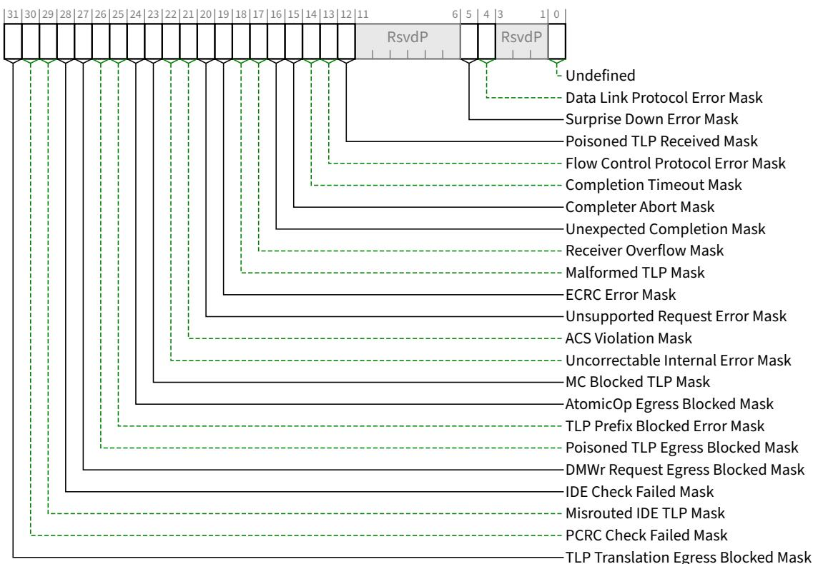


| 位 | 描述 |
|-----|------|
| 0 | 未定义 |
| 1:3 | 保留 (RsvdP) |
| 4 | 数据链路协议错误屏蔽 |
| 5 | 意外下线错误屏蔽 |
| 6:11 | 保留 (RsvdP) |
| 12 | 接收到中毒 TLP 屏蔽 |
| 13 | 流控协议错误屏蔽 |
| 14 | 完成超时屏蔽 |
| 15 | 完成方中止屏蔽 |
| 16 | 意外完成屏蔽 |
| 17 | 接收器溢出屏蔽 |
| 18 | 畸形 TLP 屏蔽 |
| 19 | ECRC 错误屏蔽 |
| 20 | 不支持的请求错误屏蔽 |
| 21 | ACS 违规屏蔽 |
| 22 | 不可纠正内部错误屏蔽 |
| 23 | MC 阻塞 TLP 屏蔽 |
| 24 | AtomicOp 出口阻塞屏蔽 |
| 25 | TLP 前缀阻塞错误屏蔽 |
| 26 | 中毒 TLP 出口阻塞屏蔽 |
| 27 | DMWr 请求出口阻塞屏蔽 |
| 28 | IDE 检查失败屏蔽 |
| 29 | 误路由 IDE TLP 屏蔽 |
| 30 | PCRC 检查失败屏蔽 |
| 31 | TLP 转换出口阻塞屏蔽 |

**表 7-136 不可纠正错误屏蔽寄存器**

| 位位置 | 寄存器描述 | 属性 | 默认值 |
|--------|------------|------|--------|
| 0 | 未定义 - 从该位读取的值是未定义的。在本规范的早期版本中,该位用于屏蔽链路训练错误。系统软件必须忽略从该位读取的值。系统软件只能向该位写入值 1b。 | 未定义 | 未定义 |
| 4 | 数据链路协议错误屏蔽 | RWS / VF ROZ | 0b |
| 5 | 意外下线错误屏蔽（具备意外下线错误报告能力 – 注 1） | RWS / VF ROZ | 0b |
| 12 | 接收到中毒 TLP 屏蔽 | RWS / VF RsvdP | 0b |
| 13 | 流控协议错误屏蔽（可选） | RWS / VF ROZ | 0b |
| 14 | 完成超时屏蔽 ¹⁷⁸ | RWS / VF RsvdP | 0b |

¹⁷⁸. 对于交换机 (Switch) 端口,如果该交换机端口代表自身发出 Non-Posted 请求（而不是仅转发其他设备产生的此类请求）,则需要实现此位。如果该交换机端口不发出此类请求,则完成超时机制不适用,该位必须硬连线为 0b。

</td>
</tr>
</tbody>
</table>

[⬆️ 返回目录](#-本章目录-table-of-contents)

---

<!-- 📄 Page 1196 -->
---

<a id="sec-7-8-4-3-tbl-7-136-cont"></a>
## Table 7-136 Uncorrectable Error Mask Register (continued) | 表 7-136 不可纠正错误屏蔽寄存器（续）


<div style="overflow-x: auto; max-width: 100%;">
<table>
<thead>
<tr>
<th width="50%">🇬🇧 English</th>
<th width="50%" style="background-color:#e8e8e8">🏆 中文</th>
</tr>
</thead>
<tbody>
<tr>
<td>

| Bit Location | Register Description | Attributes | Default |
|--------------|----------------------|------------|---------|
| 15 | Completer Abort Mask (Optional) | RWS / VF RsvdP | 0b |
| 16 | Unexpected Completion Mask | RWS / VF RsvdP | 0b |
| 17 | Receiver Overflow Mask (Optional) | RWS / VF ROZ | 0b |
| 18 | Malformed TLP Mask | RWS / VF ROZ | 0b |
| 19 | ECRC Error Mask (ECRC Check Capable – Note 1) | RWS / VF ROZ | 0b |
| 20 | Unsupported Request Error Mask | RWS / VF RsvdP | 0b |
| 21 | ACS Violation Mask (ACS Extended Capability – Note 2) | RWS / VF RsvdP | 0b |
| 22 | Uncorrectable Internal Error Mask (Optional) | RWS | 1b |
| 23 | MC Blocked TLP Mask (Multicast Extended Capability – Note 2) | RWS | 0b |
| 24 | AtomicOp Egress Blocked Mask (AtomicOp Egress Blocking – Note 3) | RWS / VF ROZ (Note 6) | 0b |
| 25 | TLP Prefix Blocked Error Mask (End-End TLP Prefix Supported – Note 3) | RWS / VF ROZ (Note 6) | 0b |
| 26 | Poisoned TLP Egress Blocked Mask (Poisoned TLP Egress Blocking Supported – Note 3) | RWS / VF ROZ (Note 6) | 1b |
| 27 | DMWr Request Egress Blocked Mask (DMWr Egress Blocking – Note 3) | RWS / VF ROZ (Note 6) | 0b |
| 28 | IDE Check Failed Mask (IDE Extended Capability – Note 4) | RWS / VF ROZ (Note 6) | 0b |
| 29 | Misrouted IDE TLP Mask (IDE Extended Capability – Note 4) | RWS / VF ROZ (Note 6) | 0b |
| 30 | PCRC Check Failed Mask (PCRC Supported – Note 5) | RWS / VF ROZ (Note 6) | 0b |
| 31 | TLP Translation Egress Blocked Mask (Routing elements that translate between FM and NFM in either direction must implement this bit (see § Section 2.2.1.2)) | RWS / VF ROZ (Note 6) | 0b |

**Notes:**

1. When Set in a non-VF Function, this AER mask bit must be implemented. Otherwise, for non-VF Functions, it is optional.
2. When a Function implements this Extended Capability (i.e., ACS/Multicast), that Function must implement this AER mask bit.
3. When Set in a non-VF Function, that Function must implement this AER mask bit.
4. When Function 0 implements the IDE Extended Capability, and if Function 0 implements AER, then Function 0 must implement this AER mask bit.
5. When PCRC Supported is Set in Function 0, and if Function 0 implements AER, then Function 0 must implement this AER mask bit.
6. VF ROZ is strongly recommended for VF Functions, but for backward compatibility with previous versions of this specification, RWS is permitted.

</td>
<td style="background-color:#e8e8e8">

| 位位置 | 寄存器描述 | 属性 | 默认值 |
|--------|------------|------|--------|
| 15 | 完成方中止屏蔽（可选） | RWS / VF RsvdP | 0b |
| 16 | 意外完成屏蔽 | RWS / VF RsvdP | 0b |
| 17 | 接收器溢出屏蔽（可选） | RWS / VF ROZ | 0b |
| 18 | 畸形 TLP 屏蔽 | RWS / VF ROZ | 0b |
| 19 | ECRC 错误屏蔽（具备 ECRC 检查能力 – 注 1） | RWS / VF ROZ | 0b |
| 20 | 不支持的请求错误屏蔽 | RWS / VF RsvdP | 0b |
| 21 | ACS 违规屏蔽（ACS 扩展能力 – 注 2） | RWS / VF RsvdP | 0b |
| 22 | 不可纠正内部错误屏蔽（可选） | RWS | 1b |
| 23 | MC 阻塞 TLP 屏蔽（多播扩展能力 – 注 2） | RWS | 0b |
| 24 | AtomicOp 出口阻塞屏蔽（支持 AtomicOp 出口阻塞 – 注 3） | RWS / VF ROZ（注 6） | 0b |
| 25 | TLP 前缀阻塞错误屏蔽（支持端到端 TLP 前缀 – 注 3） | RWS / VF ROZ（注 6） | 0b |
| 26 | 中毒 TLP 出口阻塞屏蔽（支持中毒 TLP 出口阻塞 – 注 3） | RWS / VF ROZ（注 6） | 1b |
| 27 | DMWr 请求出口阻塞屏蔽（支持 DMWr 出口阻塞 – 注 3） | RWS / VF ROZ（注 6） | 0b |
| 28 | IDE 检查失败屏蔽（IDE 扩展能力 – 注 4） | RWS / VF ROZ（注 6） | 0b |
| 29 | 误路由 IDE TLP 屏蔽（IDE 扩展能力 – 注 4） | RWS / VF ROZ（注 6） | 0b |
| 30 | PCRC 检查失败屏蔽（支持 PCRC – 注 5） | RWS / VF ROZ（注 6） | 0b |
| 31 | TLP 转换出口阻塞屏蔽（在任一方向上在 Flit 模式 (FM) 和非 Flit 模式 (NFM) 之间进行转换的路由元素必须实现此位（见 § 2.2.1.2 节）） | RWS / VF ROZ（注 6） | 0b |

**注释：**

1. 当在非 VF 函数中置 1 时,必须实现此 AER 屏蔽位。否则,对于非 VF 函数,该位是可选的。
2. 当函数实现此扩展能力（即 ACS / 多播）时,该函数必须实现此 AER 屏蔽位。
3. 当在非 VF 函数中置 1 时,该函数必须实现此 AER 屏蔽位。
4. 当 Function 0 实现 IDE 扩展能力,并且 Function 0 实现 AER 时,则 Function 0 必须实现此 AER 屏蔽位。
5. 当 Function 0 中支持 PCRC 位置 1,并且 Function 0 实现 AER 时,则 Function 0 必须实现此 AER 屏蔽位。
6. 对于 VF 函数,强烈推荐使用 VF ROZ,但为了与本规范的早期版本向后兼容,允许使用 RWS。

</td>
</tr>
</tbody>
</table>
</div>


[⬆️ 返回目录](#-本章目录-table-of-contents)

---

<!-- 📄 Page 1197 -->
---

<a id="sec-7-8-4-4-intro"></a>
## 7.8.4.4 Uncorrectable Error Severity Register — Introduction | 7.8.4.4 不可纠正错误严重性寄存器 — 引言

<table>
<thead>
<tr>
<th width="50%">🇬🇧 English</th>
<th width="50%" style="background-color:#e8e8e8">🏆 中文</th>
</tr>
</thead>
<tbody>
<tr>
<td>

The Uncorrectable Error Severity Register controls whether an individual error is reported as a Non-fatal or Fatal error. An error is reported as fatal when the corresponding error bit in the severity register is Set. If the bit is Clear, the corresponding error is considered non-fatal. Refer to § Section 6.2 for further details. Register fields for bits not implemented by the Function are hardwired to an implementation specific value. § Figure 7-157 details the allocation of register fields of the Uncorrectable Error Severity Register; § Table 7-137 provides the respective bit definitions.

For VF fields marked as VF RsvdP, the associated PF's setting applies to the VF. For VF fields marked as VF ROZ, the error is not applicable to a VF.

7.8.4.4 Uncorrectable Error Severity Register (Offset 0Ch) §

</td>
<td style="background-color:#e8e8e8">

不可纠正错误严重性寄存器控制某个错误是作为非致命 (Non-fatal) 还是致命 (Fatal) 错误报告。当严重性寄存器中对应的错误位置 1 时,该错误被报告为致命错误。如果该位清零,则对应的错误被视为非致命错误。有关更多详细信息,请参阅 § 6.2 节。该函数未实现的位对应的寄存器字段被硬连线为实现特定的值。§ 图 7-157 详细说明了不可纠正错误严重性寄存器的寄存器字段分配;§ 表 7-137 给出了相应的位定义。

对于标记为 VF RsvdP 的 VF 字段,关联的 PF 的设置适用于该 VF。对于标记为 VF ROZ 的 VF 字段,该错误不适用于 VF。

7.8.4.4 不可纠正错误严重性寄存器（偏移 0Ch）§

</td>
</tr>
</tbody>
</table>

[⬆️ 返回目录](#-本章目录-table-of-contents)

---

<a id="sec-7-8-4-4-fig-7-157"></a>
## Figure 7-157 / Table 7-137 Uncorrectable Error Severity Register | 图 7-157 / 表 7-137 不可纠正错误严重性寄存器


<div style="overflow-x: auto; max-width: 100%;">
<table>
<thead>
<tr>
<th width="50%">🇬🇧 English</th>
<th width="50%" style="background-color:#e8e8e8">🏆 中文</th>
</tr>
</thead>
<tbody>
<tr>
<td>

**Figure 7-157 Uncorrectable Error Severity Register**

| Bit | Description |
|-----|-------------|
| 0 | Undefined |
| 1:3 | RsvdP |
| 4 | Data Link Protocol Error Severity |
| 5 | Surprise Down Error Severity |
| 6:11 | RsvdP |
| 12 | Poisoned TLP Received Severity |
| 13 | Flow Control Protocol Error Severity |
| 14 | Completion Timeout Error Severity |
| 15 | Completer Abort Error Severity |
| 16 | Unexpected Completion Error Severity |
| 17 | Receiver Overflow Severity |
| 18 | Malformed TLP Severity |
| 19 | ECRC Error Severity |
| 20 | Unsupported Request Error Severity |
| 21 | ACS Violation Severity |
| 22 | Uncorrectable Internal Error Severity |
| 23 | MC Blocked TLP Severity |
| 24 | AtomicOp Egress Blocked Severity |
| 25 | TLP Prefix Blocked Error Severity |
| 26 | Poisoned TLP Egress Blocked Severity |
| 27 | DMWr Request Egress Blocked Severity |
| 28 | IDE Check Failed Severity |
| 29 | Misrouted IDE TLP Severity |
| 30 | PCRC CHeck Failed Severity |
| 31 | TLP Translation Egress Blocked Severity |

**Table 7-137 Uncorrectable Error Severity Register**

| Bit Location | Register Description | Attributes | Default |
|--------------|----------------------|------------|---------|
| 0 | Undefined - The value read from this bit is undefined. In previous versions of this specification, this bit was used to Set the severity of a Link Training Error. System software must ignore the value read from this bit. System software is permitted to write any value to this bit. | Undefined | Undefined |
| 4 | Data Link Protocol Error Severity | RWS / VF ROZ | 1b |
| 5 | Surprise Down Error Severity (Optional – Note 1) | RWS / VF ROZ | 1b |
| 12 | Poisoned TLP Received Severity | RWS / VF RsvdP | 0b |
| 13 | Flow Control Protocol Error Severity (Optional – Note 1) | RWS / VF ROZ | 1b |
| 14 | Completion Timeout Error Severity ¹⁷⁹ | RWS / VF RsvdP | 0b |

¹⁷⁹. For Switch Ports, required if the Switch Port issues Non-Posted Requests on its own behalf (vs. only forwarding such Requests generated by other devices). If the Switch Port does not issue such Requests, then the Completion Timeout mechanism is not applicable and this bit must be hardwired to 0b.

</td>
<td style="background-color:#e8e8e8">

**图 7-157 不可纠正错误严重性寄存器**

> 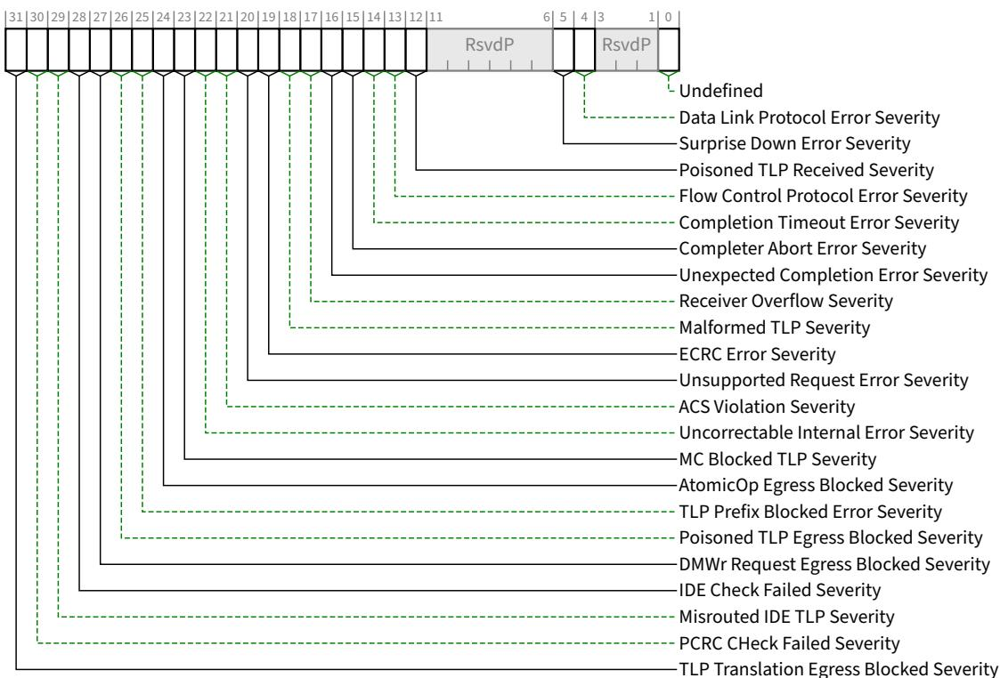


| 位 | 描述 |
|-----|------|
| 0 | 未定义 |
| 1:3 | 保留 (RsvdP) |
| 4 | 数据链路协议错误严重性 |
| 5 | 意外下线错误严重性 |
| 6:11 | 保留 (RsvdP) |
| 12 | 接收到中毒 TLP 严重性 |
| 13 | 流控协议错误严重性 |
| 14 | 完成超时错误严重性 |
| 15 | 完成方中止错误严重性 |
| 16 | 意外完成错误严重性 |
| 17 | 接收器溢出严重性 |
| 18 | 畸形 TLP 严重性 |
| 19 | ECRC 错误严重性 |
| 20 | 不支持的请求错误严重性 |
| 21 | ACS 违规严重性 |
| 22 | 不可纠正内部错误严重性 |
| 23 | MC 阻塞 TLP 严重性 |
| 24 | AtomicOp 出口阻塞严重性 |
| 25 | TLP 前缀阻塞错误严重性 |
| 26 | 中毒 TLP 出口阻塞严重性 |
| 27 | DMWr 请求出口阻塞严重性 |
| 28 | IDE 检查失败严重性 |
| 29 | 误路由 IDE TLP 严重性 |
| 30 | PCRC 检查失败严重性 |
| 31 | TLP 转换出口阻塞严重性 |

**表 7-137 不可纠正错误严重性寄存器**

| 位位置 | 寄存器描述 | 属性 | 默认值 |
|--------|------------|------|--------|
| 0 | 未定义 - 从该位读取的值是未定义的。在本规范的早期版本中,该位用于设置链路训练错误的严重性。系统软件必须忽略从该位读取的值。允许系统软件向该位写入任何值。 | 未定义 | 未定义 |
| 4 | 数据链路协议错误严重性 | RWS / VF ROZ | 1b |
| 5 | 意外下线错误严重性（可选 – 注 1） | RWS / VF ROZ | 1b |
| 12 | 接收到中毒 TLP 严重性 | RWS / VF RsvdP | 0b |
| 13 | 流控协议错误严重性（可选 – 注 1） | RWS / VF ROZ | 1b |
| 14 | 完成超时错误严重性 ¹⁷⁹ | RWS / VF RsvdP | 0b |

¹⁷⁹. 对于交换机 (Switch) 端口,如果该交换机端口代表自身发出 Non-Posted 请求（而不是仅转发其他设备产生的此类请求）,则需要实现此位。如果该交换机端口不发出此类请求,则完成超时机制不适用,该位必须硬连线为 0b。

</td>
</tr>
</tbody>
</table>
</div>


[⬆️ 返回目录](#-本章目录-table-of-contents)

---

<!-- 📄 Page 1198 -->
---

<a id="sec-7-8-4-4-tbl-7-137-cont"></a>
## Table 7-137 Uncorrectable Error Severity Register (continued) | 表 7-137 不可纠正错误严重性寄存器（续）

<table>
<thead>
<tr>
<th width="50%">🇬🇧 English</th>
<th width="50%" style="background-color:#e8e8e8">🏆 中文</th>
</tr>
</thead>
<tbody>
<tr>
<td>

| Bit Location | Register Description | Attributes | Default |
|--------------|----------------------|------------|---------|
| 15 | Completer Abort Error Severity (Optional – Note 1) | RWS / VF RsvdP | 0b |
| 16 | Unexpected Completion Error Severity | RWS / VF RsvdP | 0b |
| 17 | Receiver Overflow Severity (Optional – Note 1) | RWS / VF ROZ | 1b |
| 18 | Malformed TLP Severity | RWS / VF ROZ | 1b |
| 19 | ECRC Error Severity (Optional – Note 1) | RWS / VF ROZ | 0b |
| 20 | Unsupported Request Error Severity | RWS / VF RsvdP | 0b |
| 21 | ACS Violation Severity (Optional – Note 1) | RWS / VF RsvdP | 0b |
| 22 | Uncorrectable Internal Error Severity (Optional – Note 1) | RWS | 1b |
| 23 | MC Blocked TLP Severity (Optional – Note 1) | RWS | 0b |
| 24 | AtomicOp Egress Blocked Severity (Optional – Note 1) | RWS / VF ROZ (Note 2) | 0b |
| 25 | TLP Prefix Blocked Error Severity (Optional – Note 1) | RWS / VF ROZ (Note 2) | 0b |
| 26 | Poisoned TLP Egress Blocked Severity (Optional – Note 1) | RWS / VF ROZ (Note 2) | 0b |
| 27 | DMWr Request Egress Blocked Severity (Optional – Note 1) | RWS / VF ROZ (Note 2) | 0b |
| 28 | IDE Check Failed Severity (Optional – Note 1) | RWS / VF ROZ (Note 2) | 1b |
| 29 | Misrouted IDE TLP Severity (Optional – Note 1) | RWS / VF ROZ (Note 2) | 0b |
| 30 | PCRC CHeck Failed Severity (Optional – Note 1) | RWS | 0b |

¹⁷⁹. For Switch Ports, required if the Switch Port issues Non-Posted Requests on its own behalf (vs. only forwarding such Requests generated by other devices). If the Switch Port does not issue such Requests, then the Completion Timeout mechanism is not applicable and this bit must be hardwired to 0b.

</td>
<td style="background-color:#e8e8e8">

| 位位置 | 寄存器描述 | 属性 | 默认值 |
|--------|------------|------|--------|
| 15 | 完成方中止错误严重性（可选 – 注 1） | RWS / VF RsvdP | 0b |
| 16 | 意外完成错误严重性 | RWS / VF RsvdP | 0b |
| 17 | 接收器溢出严重性（可选 – 注 1） | RWS / VF ROZ | 1b |
| 18 | 畸形 TLP 严重性 | RWS / VF ROZ | 1b |
| 19 | ECRC 错误严重性（可选 – 注 1） | RWS / VF ROZ | 0b |
| 20 | 不支持的请求错误严重性 | RWS / VF RsvdP | 0b |
| 21 | ACS 违规严重性（可选 – 注 1） | RWS / VF RsvdP | 0b |
| 22 | 不可纠正内部错误严重性（可选 – 注 1） | RWS | 1b |
| 23 | MC 阻塞 TLP 严重性（可选 – 注 1） | RWS | 0b |
| 24 | AtomicOp 出口阻塞严重性（可选 – 注 1） | RWS / VF ROZ（注 2） | 0b |
| 25 | TLP 前缀阻塞错误严重性（可选 – 注 1） | RWS / VF ROZ（注 2） | 0b |
| 26 | 中毒 TLP 出口阻塞严重性（可选 – 注 1） | RWS / VF ROZ（注 2） | 0b |
| 27 | DMWr 请求出口阻塞严重性（可选 – 注 1） | RWS / VF ROZ（注 2） | 0b |
| 28 | IDE 检查失败严重性（可选 – 注 1） | RWS / VF ROZ（注 2） | 1b |
| 29 | 误路由 IDE TLP 严重性（可选 – 注 1） | RWS / VF ROZ（注 2） | 0b |
| 30 | PCRC 检查失败严重性（可选 – 注 1） | RWS | 0b |

¹⁷⁹. 对于交换机 (Switch) 端口,如果该交换机端口代表自身发出 Non-Posted 请求（而不是仅转发其他设备产生的此类请求）,则需要实现此位。如果该交换机端口不发出此类请求,则完成超时机制不适用,该位必须硬连线为 0b。

</td>
</tr>
</tbody>
</table>

[⬆️ 返回目录](#-本章目录-table-of-contents)

---

<!-- 📄 Page 1199 -->
---

<a id="sec-7-8-4-4-tbl-7-137-cont2"></a>
## Table 7-137 (continued) and Notes | 表 7-137（续）以及注释


<div style="overflow-x: auto; max-width: 100%;">
<table>
<thead>
<tr>
<th width="50%">🇬🇧 English</th>
<th width="50%" style="background-color:#e8e8e8">🏆 中文</th>
</tr>
</thead>
<tbody>
<tr>
<td>

| Bit Location | Register Description | Attributes | Default |
|--------------|----------------------|------------|---------|
| 31 | TLP Translation Egress Blocked Severity (Optional – Note 1) | RWS / VF ROZ (Note 2) | 0b |

**Notes:**

1. Must implement if the corresponding Uncorrectable Error Mask Register bit is implemented. Otherwise, hardwire to 0.
2. VF ROZ is strongly recommended for VF Functions, but for backward compatibility with previous versions of this specification, RWS is permitted if the VF implements the corresponding Uncorrectable Error Mask Register bit.

</td>
<td style="background-color:#e8e8e8">

| 位位置 | 寄存器描述 | 属性 | 默认值 |
|--------|------------|------|--------|
| 31 | TLP 转换出口阻塞严重性（可选 – 注 1） | RWS / VF ROZ（注 2） | 0b |

**注释：**

1. 如果对应的不可纠正错误屏蔽寄存器位已实现,则必须实现该位。否则,硬连线为 0。
2. 对于 VF 函数,强烈推荐使用 VF ROZ,但为了与本规范的早期版本向后兼容,如果 VF 实现了对应的不可纠正错误屏蔽寄存器位,则允许使用 RWS。

</td>
</tr>
</tbody>
</table>
</div>


[⬆️ 返回目录](#-本章目录-table-of-contents)

---

<a id="sec-7-8-4-5-intro"></a>
## 7.8.4.5 Correctable Error Status Register — Introduction | 7.8.4.5 可纠正错误状态寄存器 — 引言

<table>
<thead>
<tr>
<th width="50%">🇬🇧 English</th>
<th width="50%" style="background-color:#e8e8e8">🏆 中文</th>
</tr>
</thead>
<tbody>
<tr>
<td>

The Correctable Error Status register reports error status of individual correctable error sources on a PCI Express device Function. When an individual error status bit is Set, it indicates that a particular error occurred; software may clear an error status by writing a 1b to the respective bit. Refer to § Section 6.2 for further details. Register bits not implemented by the Function are hardwired to 0b. § Figure 7-158 details the allocation of register fields of the Correctable Error Status register; § Table 7-138 provides the respective bit definitions.

For SR-IOV devices, errors categorized as non-Function-specific must be logged in PFs and non-IOV Functions, but not logged in VFs. VFs must log only Function-specific errors.

7.8.4.5 Correctable Error Status Register (Offset 10h) §

</td>
<td style="background-color:#e8e8e8">

可纠正错误状态寄存器报告 PCI Express 设备函数 (Function) 上各个可纠正错误源的状态。当某个错误状态位置 1 时,表示发生了相应的错误;软件可以通过向对应位写入 1b 来清除错误状态。有关更多详细信息,请参阅 § 6.2 节。该函数未实现的寄存器位被硬连线为 0b。§ 图 7-158 详细说明了可纠正错误状态寄存器的寄存器字段分配;§ 表 7-138 给出了相应的位定义。

对于 SR-IOV (单根 I/O 虚拟化) 设备,归类为非函数特定的错误必须记录在 PF (物理功能, Physical Function) 和非 IOV 函数中,但不应记录在 VF 中。VF 必须仅记录函数特定的错误。

7.8.4.5 可纠正错误状态寄存器（偏移 10h）§

</td>
</tr>
</tbody>
</table>

[⬆️ 返回目录](#-本章目录-table-of-contents)

---

<a id="sec-7-8-4-5-fig-7-158"></a>
## Figure 7-158 / Table 7-138 Correctable Error Status Register | 图 7-158 / 表 7-138 可纠正错误状态寄存器


<div style="overflow-x: auto; max-width: 100%;">
<table>
<thead>
<tr>
<th width="50%">🇬🇧 English</th>
<th width="50%" style="background-color:#e8e8e8">🏆 中文</th>
</tr>
</thead>
<tbody>
<tr>
<td>

**Figure 7-158 Correctable Error Status Register**

| Bit | Description |
|-----|-------------|
| 0 | Receiver Error Status |
| 1:5 | RsvdZ |
| 6 | Bad TLP Status |
| 7 | Bad DLLP Status |
| 8 | REPLAY_NUM Rollover Status |
| 9:11 | RsvdZ |
| 12 | Replay Timer Timeout Status |
| 13 | Advisory Non-Fatal Error Status |
| 14 | Corrected Internal Error Status |
| 15 | Header Log Overflow Status |
| 16:31 | RsvdZ |

**Table 7-138 Correctable Error Status Register**

| Bit Location | Register Description | Attributes | Default |
|--------------|----------------------|------------|---------|
| 0 | Receiver Error Status ¹⁸⁰ | RW1CS / VF ROZ | 0b |

¹⁸⁰. For historical reasons, implementation of this bit is optional. If not implemented, this bit must be RsvdZ, and bit 0 of the Correctable Error Mask Register must also not be implemented. Note that some checking for Receiver Errors is required in all cases (see § Section 4.2.1.1.3, § Section 4.2.5.8, and § Section 4.2.7).

</td>
<td style="background-color:#e8e8e8">

**图 7-158 可纠正错误状态寄存器**

> 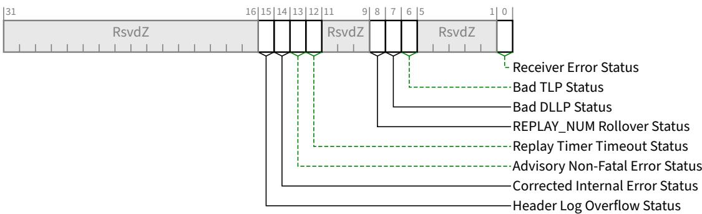


| 位 | 描述 |
|-----|------|
| 0 | 接收器错误状态 |
| 1:5 | 保留 (RsvdZ) |
| 6 | 错误 TLP 状态 |
| 7 | 错误 DLLP 状态 |
| 8 | REPLAY_NUM 翻转状态 |
| 9:11 | 保留 (RsvdZ) |
| 12 | 重放定时器超时状态 |
| 13 | 提示性非致命错误状态 |
| 14 | 已纠正内部错误状态 |
| 15 | 包头日志溢出状态 |
| 16:31 | 保留 (RsvdZ) |

**表 7-138 可纠正错误状态寄存器**

| 位位置 | 寄存器描述 | 属性 | 默认值 |
|--------|------------|------|--------|
| 0 | 接收器错误状态 ¹⁸⁰ | RW1CS / VF ROZ | 0b |

¹⁸⁰. 由于历史原因,该位的实现是可选的。如果未实现,则该位必须为 RsvdZ,并且可纠正错误屏蔽寄存器的位 0 也必须不实现。注意,在所有情况下都需要对接收器错误进行某些检查（见 § 4.2.1.1.3 节、§ 4.2.5.8 节和 § 4.2.7 节）。

</td>
</tr>
</tbody>
</table>
</div>


[⬆️ 返回目录](#-本章目录-table-of-contents)

---

<!-- 📄 Page 1200 -->
---

<a id="sec-7-8-4-5-tbl-7-138-cont"></a>
## Table 7-138 Correctable Error Status Register (continued) | 表 7-138 可纠正错误状态寄存器（续）

<table>
<thead>
<tr>
<th width="50%">🇬🇧 English</th>
<th width="50%" style="background-color:#e8e8e8">🏆 中文</th>
</tr>
</thead>
<tbody>
<tr>
<td>

| Bit Location | Register Description | Attributes | Default |
|--------------|----------------------|------------|---------|
| 6 | Bad TLP Status | RW1CS / VF ROZ | 0b |
| 7 | Bad DLLP Status | RW1CS / VF ROZ | 0b |
| 8 | REPLAY_NUM Rollover Status | RW1CS / VF ROZ | 0b |
| 12 | Replay Timer Timeout Status | RW1CS / VF ROZ | 0b |
| 13 | Advisory Non-Fatal Error Status | RW1CS | 0b |
| 14 | Corrected Internal Error Status (Optional) | RW1CS | 0b |
| 15 | Header Log Overflow Status (Optional) — If the VF implements Header Log sharing (see § Section 6.2.4.2.1), this bit must be hardwired to Zero. | RW1CS / 0b | 0b |

</td>
<td style="background-color:#e8e8e8">

| 位位置 | 寄存器描述 | 属性 | 默认值 |
|--------|------------|------|--------|
| 6 | 错误 TLP 状态 | RW1CS / VF ROZ | 0b |
| 7 | 错误 DLLP 状态 | RW1CS / VF ROZ | 0b |
| 8 | REPLAY_NUM 翻转状态 | RW1CS / VF ROZ | 0b |
| 12 | 重放定时器超时状态 | RW1CS / VF ROZ | 0b |
| 13 | 提示性非致命错误状态 | RW1CS | 0b |
| 14 | 已纠正内部错误状态（可选） | RW1CS | 0b |
| 15 | 包头日志溢出状态（可选）— 如果 VF 实现了包头日志共享（见 § 6.2.4.2.1 节）,则该位必须硬连线为零。 | RW1CS / 0b | 0b |

</td>
</tr>
</tbody>
</table>

[⬆️ 返回目录](#-本章目录-table-of-contents)

---

<a id="sec-7-8-4-6-intro"></a>
## 7.8.4.6 Correctable Error Mask Register — Introduction | 7.8.4.6 可纠正错误屏蔽寄存器 — 引言


<div style="overflow-x: auto; max-width: 100%;">
<table>
<thead>
<tr>
<th width="50%">🇬🇧 English</th>
<th width="50%" style="background-color:#e8e8e8">🏆 中文</th>
</tr>
</thead>
<tbody>
<tr>
<td>

The Correctable Error Mask Register controls reporting of individual correctable errors by this Function to the PCI Express Root Complex via a PCI Express error Message. A masked error (respective bit Set in the mask register) is not reported to the PCI Express Root Complex by this Function. Refer to § Section 6.2 for further details. There is a mask bit per error bit in the Correctable Error Status register. Register fields for bits not implemented by the Function are hardwired to 0b. § Figure 7-159 details the allocation of register fields of the Correctable Error Mask Register; § Table 7-139 provides the respective bit definitions.

For VF fields marked as VF RsvdP, the associated PF's setting applies to the VF.

7.8.4.6 Correctable Error Mask Register (Offset 14h) §

</td>
<td style="background-color:#e8e8e8">

可纠正错误屏蔽寄存器控制该函数通过 PCI Express 错误消息向 PCI Express 根复合体 (Root Complex) 报告各个可纠正错误。被屏蔽的错误（屏蔽寄存器中相应位置 1）不会由该函数向 PCI Express 根复合体报告。有关更多详细信息,请参阅 § 6.2 节。可纠正错误状态寄存器中每个错误位都有一个对应的屏蔽位。该函数未实现的位对应的寄存器字段被硬连线为 0b。§ 图 7-159 详细说明了可纠正错误屏蔽寄存器的寄存器字段分配;§ 表 7-139 给出了相应的位定义。

对于标记为 VF RsvdP 的 VF 字段,关联的 PF 的设置适用于该 VF。

7.8.4.6 可纠正错误屏蔽寄存器（偏移 14h）§

</td>
</tr>
</tbody>
</table>
</div>


[⬆️ 返回目录](#-本章目录-table-of-contents)

---

<!-- 📄 Page 1201 -->
---

<a id="sec-7-8-4-6-fig-7-159"></a>
## Figure 7-159 / Table 7-139 Correctable Error Mask Register | 图 7-159 / 表 7-139 可纠正错误屏蔽寄存器

<table>
<thead>
<tr>
<th width="50%">🇬🇧 English</th>
<th width="50%" style="background-color:#e8e8e8">🏆 中文</th>
</tr>
</thead>
<tbody>
<tr>
<td>

**Figure 7-159 Correctable Error Mask Register**

| Bit | Description |
|-----|-------------|
| 0 | Receiver Error Mask |
| 1:5 | RsvdP |
| 6 | Bad TLP Mask |
| 7 | Bad DLLP Mask |
| 8 | REPLAY_NUM Rollover Mask |
| 9:11 | RsvdP |
| 12 | Replay Timer Timeout Mask |
| 13 | Advisory Non-Fatal Error Mask |
| 14 | Corrected Internal Error Mask |
| 15 | Header Log Overflow Mask |
| 16:31 | RsvdP |

**Table 7-139 Correctable Error Mask Register**

| Bit Location | Register Description | Attributes | Default |
|--------------|----------------------|------------|---------|
| 0 | Receiver Error Mask ¹⁸¹ | RWS / VF RsvdP | 0b |
| 6 | Bad TLP Mask | RWS / VF RsvdP | 0b |
| 7 | Bad DLLP Mask | RWS / VF RsvdP | 0b |
| 8 | REPLAY_NUM Rollover Mask | RWS / VF RsvdP | 0b |
| 12 | Replay Timer Timeout Mask | RWS / VF RsvdP | 0b |
| 13 | Advisory Non-Fatal Error Mask - This bit is Set by default to enable compatibility with software that does not comprehend Role-Based Error Reporting. | RWS / VF RsvdP | 1b |
| 14 | Corrected Internal Error Mask (Optional) | RWS | 1b |
| 15 | Header Log Overflow Mask (Optional) — If the VF implements Header Log sharing (see § Section 6.2.4.2.1), this bit is RsvdP. | RWS / RsvdP | 1b |

¹⁸¹. For historical reasons, implementation of this bit is optional. If not implemented, this bit must be RsvdP, and bit 0 of the Correctable Error Status register must also not be implemented. Note that some checking for Receiver Errors is required in all cases (see Sections 4.2.1.1.3, 4.2.4.7, and 4.2.6).

</td>
<td style="background-color:#e8e8e8">

**图 7-159 可纠正错误屏蔽寄存器**

> 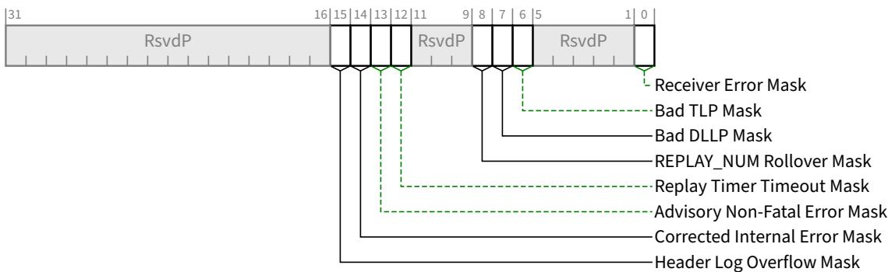


| 位 | 描述 |
|-----|------|
| 0 | 接收器错误屏蔽 |
| 1:5 | 保留 (RsvdP) |
| 6 | 错误 TLP 屏蔽 |
| 7 | 错误 DLLP 屏蔽 |
| 8 | REPLAY_NUM 翻转屏蔽 |
| 9:11 | 保留 (RsvdP) |
| 12 | 重放定时器超时屏蔽 |
| 13 | 提示性非致命错误屏蔽 |
| 14 | 已纠正内部错误屏蔽 |
| 15 | 包头日志溢出屏蔽 |
| 16:31 | 保留 (RsvdP) |

**表 7-139 可纠正错误屏蔽寄存器**

| 位位置 | 寄存器描述 | 属性 | 默认值 |
|--------|------------|------|--------|
| 0 | 接收器错误屏蔽 ¹⁸¹ | RWS / VF RsvdP | 0b |
| 6 | 错误 TLP 屏蔽 | RWS / VF RsvdP | 0b |
| 7 | 错误 DLLP 屏蔽 | RWS / VF RsvdP | 0b |
| 8 | REPLAY_NUM 翻转屏蔽 | RWS / VF RsvdP | 0b |
| 12 | 重放定时器超时屏蔽 | RWS / VF RsvdP | 0b |
| 13 | 提示性非致命错误屏蔽 - 该位默认置 1,以便与不理解基于角色的错误报告 (Role-Based Error Reporting) 的软件保持兼容。 | RWS / VF RsvdP | 1b |
| 14 | 已纠正内部错误屏蔽（可选） | RWS | 1b |
| 15 | 包头日志溢出屏蔽（可选）— 如果 VF 实现了包头日志共享（见 § 6.2.4.2.1 节）,则该位为 RsvdP。 | RWS / RsvdP | 1b |

¹⁸¹. 由于历史原因,该位的实现是可选的。如果未实现,则该位必须为 RsvdP,并且可纠正错误状态寄存器的位 0 也必须不实现。注意,在所有情况下都需要对接收器错误进行某些检查（见 4.2.1.1.3 节、4.2.4.7 节和 4.2.6 节）。

</td>
</tr>
</tbody>
</table>

[⬆️ 返回目录](#-本章目录-table-of-contents)

---

<!-- 📄 Page 1202 -->
---

<a id="sec-7-8-4-7-intro"></a>
## 7.8.4.7 Advanced Error Capabilities and Control Register — Introduction | 7.8.4.7 高级错误能力与控制寄存器 — 引言

<table>
<thead>
<tr>
<th width="50%">🇬🇧 English</th>
<th width="50%" style="background-color:#e8e8e8">🏆 中文</th>
</tr>
</thead>
<tbody>
<tr>
<td>

§ Figure 7-160 details allocation of register fields in the Advanced Error Capabilities and Control register; § Table 7-140 provides the respective bit definitions. Handling of multiple errors is discussed in § Section 6.2.4.2.

For VF fields marked as VF RsvdP, the associated PF's setting applies to the VF. For VF fields marked as VF ROZ, the error is not applicable to a VF.

7.8.4.7 Advanced Error Capabilities and Control Register (Offset 18h) §

</td>
<td style="background-color:#e8e8e8">

§ 图 7-160 详细说明了高级错误能力与控制寄存器的寄存器字段分配;§ 表 7-140 给出了相应的位定义。有关多个错误的处理,请参阅 § 6.2.4.2 节。

对于标记为 VF RsvdP 的 VF 字段,关联的 PF 的设置适用于该 VF。对于标记为 VF ROZ 的 VF 字段,该错误不适用于 VF。

7.8.4.7 高级错误能力与控制寄存器（偏移 18h）§

</td>
</tr>
</tbody>
</table>

[⬆️ 返回目录](#-本章目录-table-of-contents)

---

<a id="sec-7-8-4-7-fig-7-160"></a>
## Figure 7-160 / Table 7-140 Advanced Error Capabilities and Control Register | 图 7-160 / 表 7-140 高级错误能力与控制寄存器


<div style="overflow-x: auto; max-width: 100%;">
<table>
<thead>
<tr>
<th width="50%">🇬🇧 English</th>
<th width="50%" style="background-color:#e8e8e8">🏆 中文</th>
</tr>
</thead>
<tbody>
<tr>
<td>

**Figure 7-160 Advanced Error Capabilities and Control Register**

| Bit | Description |
|-----|-------------|
| 0:4 | First Error Pointer |
| 5 | ECRC Generation Capable |
| 6 | ECRC Generation Enable |
| 7 | ECRC Check Capable |
| 8 | ECRC Check Enable |
| 9 | Multiple Header Recording Capable |
| 10 | Multiple Header Recording Enable |
| 11 | TLP Prefix Log Present |
| 12 | Completion Timeout Prefix/Header Log Capable |
| 13:17 | Header Log Size |
| 18 | Logged TLP was Flit Mode |
| 19:23 | Logged TLP Size |
| 24:31 | RsvdP |

**Table 7-140 Advanced Error Capabilities and Control Register**

| Bit Location | Register Description | Attributes |
|--------------|----------------------|------------|
| 4:0 | First Error Pointer - The First Error Pointer is a field that identifies the bit position of the first error reported in the Uncorrectable Error Status register. Refer to § Section 6.2 for further details. | ROS |
| 5 | ECRC Generation Capable - If Set, this bit indicates that the Function is capable of generating ECRC (see § Section 2.7). | RO |
| 6 | ECRC Generation Enable - When Set, ECRC generation is enabled (see § Section 2.7). Functions that do not implement the associated mechanism are permitted to hardwire this bit to 0b. Default value of this bit is 0b. | RWS / VF RsvdP |
| 7 | ECRC Check Capable - If Set, this bit indicates that the Function is capable of checking ECRC (see § Section 2.7). | RO |
| 8 | ECRC Check Enable - When Set, ECRC checking is enabled (see § Section 2.7). Functions that do not implement the associated mechanism are permitted to hardwire this bit to 0b. Default value of this bit is 0b. | RWS / VF RsvdP |
| 9 | Multiple Header Recording Capable - If Set, this bit indicates that the Function is capable of recording more than one error header. Refer to § Section 6.2 for further details. If the VF implements Header Log sharing (see § Section 6.2.4.2.1), this bit must be hardwired to Zero. | RO / 0b |
| 10 | Multiple Header Recording Enable - When Set, this bit enables the Function to record more than one error header. Functions that do not implement the associated mechanism are permitted to hardwire this bit to 0b. If the VF implements Header Log sharing (see § Section 6.2.4.2.1), this bit is RsvdP. Default value of this bit is 0b. | RWS / RsvdP |
| 11 | TLP Prefix Log Present - If End-End TLP Prefix Supported is Clear, this bit is RsvdP. If Flit Mode Supported is Set, First Error Pointer is valid, and Logged TLP was Flit Mode is Set, this bit must be 0. | ROS / RsvdP |

</td>
<td style="background-color:#e8e8e8">

**图 7-160 高级错误能力与控制寄存器**

> 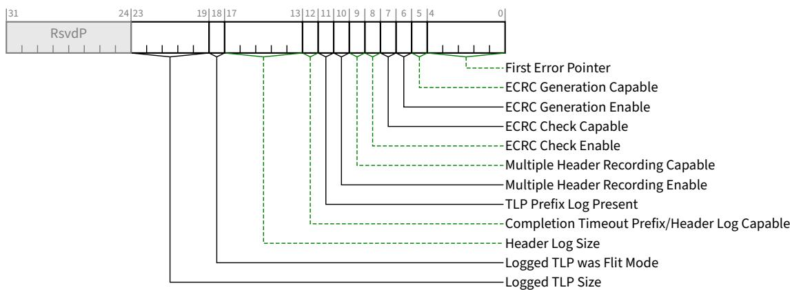


| 位 | 描述 |
|-----|------|
| 0:4 | 首次错误指针 |
| 5 | ECRC 生成能力 |
| 6 | ECRC 生成使能 |
| 7 | ECRC 检查能力 |
| 8 | ECRC 检查使能 |
| 9 | 多包头记录能力 |
| 10 | 多包头记录使能 |
| 11 | TLP 前缀日志存在 |
| 12 | 完成超时前缀/包头日志能力 |
| 13:17 | 包头日志大小 |
| 18 | 记录的 TLP 处于 Flit 模式 |
| 19:23 | 记录的 TLP 大小 |
| 24:31 | 保留 (RsvdP) |

**表 7-140 高级错误能力与控制寄存器**

| 位位置 | 寄存器描述 | 属性 |
|--------|------------|------|
| 4:0 | 首次错误指针 - 首次错误指针是一个字段,用于标识在不可纠正错误状态寄存器中报告的第一个错误的位位置。有关更多详细信息,请参阅 § 6.2 节。 | ROS |
| 5 | ECRC 生成能力 - 如果置 1,则该位表示该函数能够生成 ECRC（见 § 2.7 节）。 | RO |
| 6 | ECRC 生成使能 - 当置 1 时,启用 ECRC 生成（见 § 2.7 节）。允许未实现相关机制的函数将该位硬连线为 0b。该位的默认值为 0b。 | RWS / VF RsvdP |
| 7 | ECRC 检查能力 - 如果置 1,则该位表示该函数能够检查 ECRC（见 § 2.7 节）。 | RO |
| 8 | ECRC 检查使能 - 当置 1 时,启用 ECRC 检查（见 § 2.7 节）。允许未实现相关机制的函数将该位硬连线为 0b。该位的默认值为 0b。 | RWS / VF RsvdP |
| 9 | 多包头记录能力 - 如果置 1,则该位表示该函数能够记录多个错误包头。有关更多详细信息,请参阅 § 6.2 节。如果 VF 实现了包头日志共享（见 § 6.2.4.2.1 节）,则该位必须硬连线为零。 | RO / 0b |
| 10 | 多包头记录使能 - 当置 1 时,该位使该函数能够记录多个错误包头。允许未实现相关机制的函数将该位硬连线为 0b。如果 VF 实现了包头日志共享（见 § 6.2.4.2.1 节）,则该位为 RsvdP。该位的默认值为 0b。 | RWS / RsvdP |
| 11 | TLP 前缀日志存在 - 如果端到端 TLP 前缀支持 (End-End TLP Prefix Supported) 清零,则该位为 RsvdP。如果 Flit 模式支持 (Flit Mode Supported) 置 1、首次错误指针有效,以及记录的 TLP 处于 Flit 模式位置 1,则该位必须为 0。 | ROS / RsvdP |

</td>
</tr>
</tbody>
</table>
</div>


[⬆️ 返回目录](#-本章目录-table-of-contents)

---

<!-- 📄 Page 1203 -->
---

<a id="sec-7-8-4-7-tbl-7-140-cont"></a>
## Table 7-140 (continued) | 表 7-140（续）

<table>
<thead>
<tr>
<th width="50%">🇬🇧 English</th>
<th width="50%" style="background-color:#e8e8e8">🏆 中文</th>
</tr>
</thead>
<tbody>
<tr>
<td>

| Bit Location | Register Description | Attributes |
|--------------|----------------------|------------|
| 11 (cont.) | If this bit is Set and First Error Pointer is valid, the TLP Prefix Log Register (offset 38h to 44h, also known as Header Log Register DW5-8) contains valid Non-Flit Mode End-End TLP Prefix information. If this bit is Clear or First Error Pointer not valid, the TLP Prefix Log Register does not contain End-End TLP Prefix information (the overlapping field, Header Log Register DW5-8, may contain Flit Mode TLP Header information as specified elsewhere in this section). Default value of this bit is 0. If the VF implements Header Log Sharing (see § Section 6.2.4.2.1), this bit must be Zero when the Header Log contains all 1s due to an overflow condition. | (continuation) |
| 12 | Completion Timeout Prefix/Header Log Capable - If Set, this bit indicates that the Function records the prefix/header of Request TLPs that experience a Completion Timeout error. | HwInit |
| 17:13 | Header Log Size - This field indicates the number of DW of Header Log that are implemented. If Flit Mode Supported is Set, see text for requirements. If Flit Mode Supported is Clear and End-End TLP Prefix Supported is Set, this value must either be 0 or must be greater than or equal to 8. If this field is 0 and Flit Mode Supported is Clear, the size of the header log depends on End-End TLP Prefix Supported. If End-End TLP Prefix Supported is Clear, the Header Log is 4 DW, otherwise the Header Log is 8 DW. | HwInit / RsvdP |
| 18 | Logged TLP was Flit Mode -- If Flit Mode Supported is Set, First Error Pointer is valid, and this bit is Set, the logged TLP was captured in Flit Mode otherwise the TLP was captured in Non-Flit Mode. | ROS |
| 23:19 | Logged TLP Size -- If Flit Mode Supported is Set and First Error Pointer is valid, this field contains the number of DW that were logged in the Header Log Register and, if appropriate, the TLP Prefix Log Register. If Flit Mode Supported is Set, First Error Pointer is valid, the VF implements Header Log Sharing (see § Section 6.2.4.2.1), and a Header Log overflow condition occurred, this field must be 0 (in addition to the Header Log containing all 1s). | ROS |

</td>
<td style="background-color:#e8e8e8">

| 位位置 | 寄存器描述 | 属性 |
|--------|------------|------|
| 11（续） | 如果该位置 1 且首次错误指针有效,则 TLP 前缀日志寄存器（偏移 38h 至 44h,也称为包头日志寄存器 DW5-8）包含有效的非 Flit 模式 (Non-Flit Mode) 端到端 TLP 前缀信息。如果该位清零或首次错误指针无效,则 TLP 前缀日志寄存器不包含端到端 TLP 前缀信息（重叠字段包头日志寄存器 DW5-8 可能包含本节其他位置规定的 Flit 模式 (Flit Mode) TLP 包头信息）。该位的默认值为 0。如果 VF 实现了包头日志共享（见 § 6.2.4.2.1 节）,则当包头日志由于溢出条件而全为 1 时,该位必须为零。 | （续） |
| 12 | 完成超时前缀/包头日志能力 - 如果置 1,则该位表示该函数记录经历完成超时错误的请求 TLP 的前缀/包头。 | HwInit |
| 17:13 | 包头日志大小 - 该字段指示已实现的包头日志的 DW 数量。如果 Flit 模式支持置 1,请参阅相关文本的要求。如果 Flit 模式支持清零且端到端 TLP 前缀支持置 1,则该值必须为 0 或必须大于等于 8。如果该字段为 0 且 Flit 模式支持清零,则包头日志的大小取决于端到端 TLP 前缀支持。如果端到端 TLP 前缀支持清零,则包头日志为 4 DW,否则包头日志为 8 DW。 | HwInit / RsvdP |
| 18 | 记录的 TLP 处于 Flit 模式 -- 如果 Flit 模式支持置 1、首次错误指针有效,且该位置 1,则记录的 TLP 是在 Flit 模式下捕获的,否则该 TLP 是在非 Flit 模式下捕获的。 | ROS |
| 23:19 | 记录的 TLP 大小 -- 如果 Flit 模式支持置 1 且首次错误指针有效,则该字段包含已记录到包头日志寄存器,以及（如适用）TLP 前缀日志寄存器中的 DW 数量。如果 Flit 模式支持置 1、首次错误指针有效、VF 实现包头日志共享（见 § 6.2.4.2.1 节）,并且发生了包头日志溢出条件,则该字段必须为 0（除此之外包头日志全为 1）。 | ROS |

</td>
</tr>
</tbody>
</table>

[⬆️ 返回目录](#-本章目录-table-of-contents)

---

<a id="sec-7-8-4-8-intro"></a>
## 7.8.4.8 Header Log Register — Introduction | 7.8.4.8 包头日志寄存器 — 引言


<div style="overflow-x: auto; max-width: 100%;">
<table>
<thead>
<tr>
<th width="50%">🇬🇧 English</th>
<th width="50%" style="background-color:#e8e8e8">🏆 中文</th>
</tr>
</thead>
<tbody>
<tr>
<td>

The Header Log Register contains the header for the TLP corresponding to a detected error; refer to § Section 6.2 for further details. § Section 6.2 also describes the conditions where the packet header is recorded. This register is 16 bytes and adheres to the format of the headers defined throughout this specification.

The header is captured such that, when read using DW accesses, the fields of the header are laid out in the same way the headers are presented in this document. Therefore, byte 0 of the header is located in byte 3 of the Header Log Register, byte 1 of the header is in byte 2 of the Header Log Register and so forth. For 12-byte headers, only bytes 0 through 11 of the Header Log Register are used and values in bytes 12 through 15 are undefined.

See § Section 6.2.4.2.1 for further requirements when VFs share Header Log space.

In certain cases where a Malformed TLP is reported, the Header Log Register may contain TLP Prefix information. See § Section 6.2.4.4 for details.

§ Figure 7-161 details allocation of register fields in the Header Log Register; § Table 7-141 provides the respective bit definitions.

When Flit Mode Supported is Set and the link is operating in Flit Mode, the Header Log Register extends into additional DWs as indicated by the Header Log Size field. Software must parse the Type and OHC fields to determine the size and layout of a TLP recorded in the Header Log Register. Hardware is not required to support logging of TLP Headers larger

7.8.4.8 Header Log Register (Offset 1Ch) §

</td>
<td style="background-color:#e8e8e8">

包头日志寄存器 (Header Log Register) 包含与检测到的错误相对应的 TLP 的包头;有关更多详细信息,请参阅 § 6.2 节。§ 6.2 节还描述了记录包头分组的条件。该寄存器为 16 字节,并遵循本规范中定义的包头格式。

包头以如下方式捕获：当使用 DW 访问读取时,包头的字段排列方式与本文档中呈现包头的方式相同。因此,包头的字节 0 位于包头日志寄存器的字节 3,包头的字节 1 位于包头日志寄存器的字节 2,以此类推。对于 12 字节的包头,仅使用包头日志寄存器的字节 0 至 11,字节 12 至 15 中的值是未定义的。

有关 VF 共享包头日志空间的进一步要求,请参阅 § 6.2.4.2.1 节。

在某些报告畸形 TLP 的情况下,包头日志寄存器可能包含 TLP 前缀信息。有关详细信息,请参阅 § 6.2.4.4 节。

§ 图 7-161 详细说明了包头日志寄存器的寄存器字段分配;§ 表 7-141 给出了相应的位定义。

当 Flit 模式支持置 1 且链路以 Flit 模式工作时,包头日志寄存器会根据包头日志大小字段扩展到更多的 DW。软件必须解析类型 (Type) 和 OHC 字段,以确定包头日志寄存器中记录的 TLP 的大小和布局。硬件不需要支持记录大于以下大小的 TLP 包头：

7.8.4.8 包头日志寄存器（偏移 1Ch）§

</td>
</tr>
</tbody>
</table>
</div>


[⬆️ 返回目录](#-本章目录-table-of-contents)

---

<!-- 📄 Page 1204 -->
---

<a id="sec-7-8-4-8-fig-7-161"></a>
## Figure 7-161 / Table 7-141 Header Log Register | 图 7-161 / 表 7-141 包头日志寄存器

<table>
<thead>
<tr>
<th width="50%">🇬🇧 English</th>
<th width="50%" style="background-color:#e8e8e8">🏆 中文</th>
</tr>
</thead>
<tbody>
<tr>
<td>

than the largest size supported by the Port. Hardware is not required to support logging of OHC types not supported by the Port. TLP Trailers are not logged in the Header Log Register. The required minimum size of the Header Log Register is determined by the largest Header Base Size implemented by the Port (up to the maximum defined of 7 DW - See § Table 2-5), plus the largest number of OHC implemented by the Port (up to the maximum defined of 7 DW). Hardware must hardwire to zero the DW of the Header Log Register beyond those required to log the largest supported TLP Header and the overall length of the Advanced Error Reporting Extended Capability is reduced accordingly. As in Non-Flit Mode, Local TLP Prefixes are not logged.

When the link is operating in Non-Flit Mode, End-End TLP Prefixes are logged in the TLP Prefix Log Register.

**Figure 7-161 Header Log Register** (OM14549A)

| 31:24 | 23:16 | 15:8 | 7:0 |
|-------|-------|------|-----|
| Header Byte 0 | Header Byte 4 | Header Byte 8 | Header Byte 12 |
| Header Byte 1 | Header Byte 5 | Header Byte 9 | Header Byte 13 |
| Header Byte 2 | Header Byte 6 | Header Byte 10 | Header Byte 14 |
| Header Byte 3 | Header Byte 7 | Header Byte 11 | Header Byte 15 |

(Header Log Register 1st DW / 2nd DW / 3rd DW / 4th DW)

**Table 7-141 Header Log Register**

| Bit Location | Register Description | Attributes | Default |
|--------------|----------------------|------------|---------|
| 127:0 | Header of TLP associated with error | ROS | 0 |

</td>
<td style="background-color:#e8e8e8">

端口 (Port) 支持的最大尺寸。硬件不需要支持记录端口不支持的 OHC 类型。TLP 尾部 (TLP Trailers) 不会记录在包头日志寄存器中。包头日志寄存器所需的最小大小由端口实现的最大 Header Base Size（最大为定义的 7 DW — 见 § 表 2-5）加上端口实现的最大 OHC 数量（最大为定义的 7 DW）决定。硬件必须将超出记录最大支持 TLP 包头所需 DW 之外的包头日志寄存器的 DW 硬连线为零,并且高级错误报告扩展能力的总长度相应减少。与非 Flit 模式一样,不记录本地 TLP 前缀 (Local TLP Prefixes)。

当链路以非 Flit 模式工作时,端到端 TLP 前缀 (End-End TLP Prefixes) 记录在 TLP 前缀日志寄存器中。

**图 7-161 包头日志寄存器**（OM14549A）

> 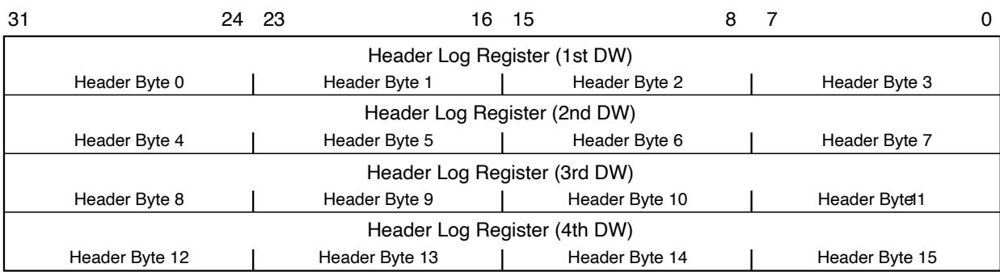


| 31:24 | 23:16 | 15:8 | 7:0 |
|-------|-------|------|-----|
| 包头字节 0 | 包头字节 4 | 包头字节 8 | 包头字节 12 |
| 包头字节 1 | 包头字节 5 | 包头字节 9 | 包头字节 13 |
| 包头字节 2 | 包头字节 6 | 包头字节 10 | 包头字节 14 |
| 包头字节 3 | 包头字节 7 | 包头字节 11 | 包头字节 15 |

（包头日志寄存器 第 1 DW / 第 2 DW / 第 3 DW / 第 4 DW）

**表 7-141 包头日志寄存器**

| 位位置 | 寄存器描述 | 属性 | 默认值 |
|--------|------------|------|--------|
| 127:0 | 与错误关联的 TLP 的包头 | ROS | 0 |

</td>
</tr>
</tbody>
</table>

[⬆️ 返回目录](#-本章目录-table-of-contents)

---

<a id="sec-root-error-cmd-intro"></a>
## Root Error Command Register — Introduction | 根错误命令寄存器 — 引言


<div style="overflow-x: auto; max-width: 100%;">
<table>
<thead>
<tr>
<th width="50%">🇬🇧 English</th>
<th width="50%" style="background-color:#e8e8e8">🏆 中文</th>
</tr>
</thead>
<tbody>
<tr>
<td>

The Root Error Command Register allows further control of Root Complex response to Correctable, Non-Fatal, and Fatal error Messages than the basic Root Complex capability to generate system errors in response to error Messages (either received or internally generated). Bit fields (see § Figure 7-162) enable or disable generation of interrupts (claimed by the Root Port or Root Complex Event Collector) in addition to system error Messages according to the definitions in § Table 7-142.

For both Root Ports and Root Complex Event Collectors, in order for a received error Message or an internally generated error Message to generate an interrupt enabled by this register, the error Message must be enabled for "transmission" by the Root Port or Root Complex Event Collector (see § Section 6.2.4.1 and § Section 6.2.8.1).

For Functions other than Root Ports and Root Complex Event Collectors: when End-End TLP Prefix Supported is Set, this register is RsvdP and when End-End TLP Prefix Supported is Clear, this register is not required to be implemented.

</td>
<td style="background-color:#e8e8e8">

根错误命令寄存器 (Root Error Command Register) 允许对根复合体 (Root Complex) 响应可纠正、非致命和致命错误消息进行进一步控制,超越了基本的根复合体根据错误消息（接收到的或内部生成的）产生系统错误的能力。位字段（见 § 图 7-162）按照 § 表 7-142 中的定义,除了系统错误消息外,还启用或禁用中断（由根端口 (Root Port) 或根复合体事件收集器 (Root Complex Event Collector) 声明）的生成。

对于根端口和根复合体事件收集器,为了使接收到的错误消息或内部生成的错误消息能够产生此寄存器启用的中断,该错误消息必须由根端口或根复合体事件收集器启用为"传输"（见 § 6.2.4.1 节和 § 6.2.8.1 节）。

对于根端口和根复合体事件收集器以外的函数：当端到端 TLP 前缀支持 (End-End TLP Prefix Supported) 置 1 时,该寄存器为 RsvdP;当端到端 TLP 前缀支持清零时,该寄存器不需要实现。

</td>
</tr>
</tbody>
</table>
</div>


[⬆️ 返回目录](#-本章目录-table-of-contents)

---

---

<a id="sec-7-8-4-9"></a>
## 7.8.4.9 Root Error Command Register (Offset 2Ch) | 根错误命令寄存器（偏移 2Ch）

<table>
<thead>
<tr>
<th width="50%">🇬🇧 English</th>
<th width="50%" style="background-color:#e8e8e8">🏆 中文</th>
</tr>
</thead>
<tbody>
<tr>
<td>

```
0      Correctable Error Reporting Enable
1      Non-Fatal Error Reporting Enable
2      Fatal Error Reporting Enable
3-31   RsvdP
```

**Figure 7-162 Root Error Command Register**

**Table 7-142 Root Error Command Register**

| Bit Location | Register Description | Attributes | Default |
|---|---|---|---|
| 0 | Correctable Error Reporting Enable - When Set, this bit enables the generation of an interrupt when a correctable error is reported by any of the Functions in the Hierarchy Domain associated with this Root Port. Root Complex Event Collectors provide support for the above described functionality for RCiEPs. Refer to § Section 6.2 for further details. | RW | 0b |
| 1 | Non-Fatal Error Reporting Enable - When Set, this bit enables the generation of an interrupt when a Non-fatal error is reported by any of the Functions in the Hierarchy Domain associated with this Root Port. Root Complex Event Collectors provide support for the above described functionality for RCiEPs. Refer to § Section 6.2 for further details. | RW | 0b |
| 2 | Fatal Error Reporting Enable - When Set, this bit enables the generation of an interrupt when a Fatal error is reported by any of the Functions in the Hierarchy Domain associated with this Root Port. Root Complex Event Collectors provide support for the above described functionality for RCiEPs. Refer to § Section 6.2 for further details. | RW | 0b |

System error generation in response to PCI Express error Messages may be turned off by system software using the PCI Express Capability structure described in § Section 7.5.3 when advanced error reporting via interrupts is enabled. Refer to § Section 6.2 for further details.

</td>
<td style="background-color:#e8e8e8">

```
0      可纠正错误报告使能（Correctable Error Reporting Enable）
1      非致命错误报告使能（Non-Fatal Error Reporting Enable）
2      致命错误报告使能（Fatal Error Reporting Enable）
3-31   RsvdP（保留）
```

**图 7-162 根错误命令寄存器（Root Error Command Register）**

**表 7-142 根错误命令寄存器（Root Error Command Register）**

| 位位置 | 寄存器描述 | 属性 | 默认值 |
|---|---|---|---|
| 0 | Correctable Error Reporting Enable（可纠正错误报告使能）— 当置位时，该位使能当与该根端口（Root Port）关联的层级域（Hierarchy Domain）中的任意功能（Function）上报可纠正错误（Correctable Error）时产生中断。根复合体事件收集器（Root Complex Event Collector）为 RCiEP 提供上述功能支持。更多细节参见 § 第 6.2 节。 | RW | 0b |
| 1 | Non-Fatal Error Reporting Enable（非致命错误报告使能）— 当置位时，该位使能当与该根端口关联的层级域中的任意功能上报非致命错误（Non-fatal Error）时产生中断。根复合体事件收集器为 RCiEP 提供上述功能支持。更多细节参见 § 第 6.2 节。 | RW | 0b |
| 2 | Fatal Error Reporting Enable（致命错误报告使能）— 当置位时，该位使能当与该根端口关联的层级域中的任意功能上报致命错误（Fatal Error）时产生中断。根复合体事件收集器为 RCiEP 提供上述功能支持。更多细节参见 § 第 6.2 节。 | RW | 0b |

当通过中断实现高级错误报告时，系统软件可使用 § 第 7.5.3 节所述的 PCI Express 能力结构（PCI Express Capability）关闭对 PCI Express 错误消息（Message）的系统错误产生。更多细节参见 § 第 6.2 节。

</td>
</tr>
</tbody>
</table>

[⬆️ 返回目录](#-本章目录-table-of-contents)

---

<a id="sec-7-8-4-10"></a>
## 7.8.4.10 Root Error Status Register (Offset 30h) | 根错误状态寄存器（偏移 30h）


<div style="overflow-x: auto; max-width: 100%;">
<table>
<thead>
<tr>
<th width="50%">🇬🇧 English</th>
<th width="50%" style="background-color:#e8e8e8">🏆 中文</th>
</tr>
</thead>
<tbody>
<tr>
<td>

The Root Error Status Register reports status of error Messages (ERR_COR, ERR_NONFATAL, and ERR_FATAL) received by the Root Port, and of errors detected by the Root Port itself (which are treated conceptually as if the Root Port had sent an error Message to itself). In order to update this register, error Messages received by the Root Port and/or internally generated error Messages must be enabled for "transmission" by the primary interface of the Root Port. ERR_NONFATAL and ERR_FATAL Messages are grouped together as uncorrectable. Each correctable and uncorrectable (Non-fatal and Fatal) error source has a first error bit and a next error bit associated with it respectively. When an error is received by a Root Complex, the respective first error bit is Set and the Requester ID is logged in the Error Source Identification Register. A Set individual error status bit indicates that a particular error category occurred; software may clear an error status by writing a 1b to the respective bit. If software does not clear the first reported error before another error Message is received of the same category (correctable or uncorrectable), the corresponding next error status bit will be set but the Requester ID of the subsequent error Message is discarded. The next error status bits may be cleared by software by writing a 1b to the respective bit as well. Refer to § Section 6.2 for further details. This register is updated regardless of the settings of the Root Control Register and the Root Error Command Register. § Figure 7-163 details allocation of register fields in the Root Error Status Register; § Table 7-143 provides the respective bit definitions. Root Complex Event Collectors provide support for the above-described functionality for RCiEPs (and for the Root Complex Event Collector itself). In order to update this register, error Messages received by the Root Complex Event Collector from its associated RCiEPs and/or internally generated error Messages must be enabled for "transmission" by the Root Complex Event Collector.

For Functions other than Root Ports and Root Complex Event Collectors: when End-End TLP Prefix Supported is Set, this register is RsvdZ and when End-End TLP Prefix Supported is Clear, this register is not required to be implemented.

```
0      ERR_COR Received
1      Multiple ERR_COR Received
2      ERR_FATAL/NONFATAL Received
3      Multiple ERR_FATAL/NONFATAL Received
4      First Uncorrectable Fatal
5      Non-Fatal Error Messages Received
6      Fatal Error Messages Received
7-8    (reserved)
8-9    ERR_COR Subclass
9-26   RsvdZ
27-31  Advanced Error Interrupt Message Number
```

**Figure 7-163 Root Error Status Register**

**Table 7-143 Root Error Status Register**

| Bit Location | Register Description | Attributes |
|---|---|---|
| 0 | ERR_COR Received - Set when a Correctable error Message is received and this bit is not already Set. Default value of this bit is 0b. | RW1CS |
| 1 | Multiple ERR_COR Received - Set when a Correctable error Message is received and ERR_COR Received is already Set. Default value of this bit is 0b. | RW1CS |
| 2 | ERR_FATAL/NONFATAL Received - Set when either a Fatal or a Non-fatal error Message is received and this bit is not already Set. Default value of this bit is 0b. | RW1CS |
| 3 | Multiple ERR_FATAL/NONFATAL Received - Set when either a Fatal or a Non-fatal error is received and ERR_FATAL/NONFATAL Received is already Set. Default value of this bit is 0b. | RW1CS |
| 4 | First Uncorrectable Fatal - Set when the first Uncorrectable error Message received is for a Fatal error. Default value of this field is 0b. | RW1CS |
| 5 | Non-Fatal Error Messages Received - Set when one or more Non-Fatal Uncorrectable error Messages have been received. Default value of this bit is 0b. | RW1CS |
| 6 | Fatal Error Messages Received - Set when one or more Fatal Uncorrectable error Messages have been received. Default value of this bit is 0b. | RW1CS |
| 8:7 | ERR_COR Subclass - If the Function is ERR_COR Subclass capable and the ERR_COR Received bit is not already Set, this field is loaded with the value of the ERR_COR Subclass field in the received ERR_COR Message. See § Section 2.2.8.3. The value in this field is only valid when the ERR_COR Received bit is Set. If the Function is not ERR_COR Subclass capable, this field is Reserved. If the Function is ERR_COR Subclass capable and a SIG_SFW ERR_COR Message is received, system firmware should be signaled using a system-specific mechanism. Default value of this field is 00b. | ROS/RsvdZ |
| 31:27 | Advanced Error Interrupt Message Number - This register indicates which MSI/MSI-X vector is used for the interrupt message generated in association with any of the status bits of this Capability. For MSI, the value in this register indicates the offset between the base Message Data and the interrupt message that is generated. Hardware is required to update this field so that it is correct if the number of MSI Messages assigned to the Function changes when software writes to the Multiple Message Enable field in the Message Control Register for MSI. For MSI-X, the value in this register indicates which MSI-X Table entry is used to generate the interrupt message. The entry must be one of the first 32 entries even if the Function implements more than 32 entries. For a given MSI-X implementation, the entry must remain constant. If both MSI and MSI-X are implemented, they are permitted to use different vectors, though software is permitted to enable only one mechanism at a time. If MSI-X is enabled, the value in this register must indicate the vector for MSI-X. If MSI is enabled or neither is enabled, the value in this register must indicate the vector for MSI. If software enables both MSI and MSI-X at the same time, the value in this register is undefined. | RO |

</td>
<td style="background-color:#e8e8e8">

根错误状态寄存器（Root Error Status Register）报告根端口接收到的错误消息（ERR_COR、ERR_NONFATAL 和 ERR_FATAL）的状态，以及根端口自身检测到的错误（其概念上视为根端口向自身发送了一条错误消息）。为了更新该寄存器，根端口接收到的错误消息和/或内部产生的错误消息必须由根端口的主接口使能其"发送"。ERR_NONFATAL 与 ERR_FATAL 消息被归为不可纠正（uncorrectable）类。每个可纠正与不可纠正（非致命和致命）错误源分别关联一个"首次错误位"（first error bit）和"下次错误位"（next error bit）。当根复合体（Root Complex）接收到一个错误时，对应的首次错误位被置位，且请求者 ID（Requester ID）被记录在错误源标识寄存器（Error Source Identification Register）中。某个错误状态位被置位表示发生了对应类别的错误；软件可通过向相应位写 1b 来清除错误状态。若软件在同类别（可纠正或不可纠正）的下一条错误消息到达之前未清除首次上报的错误，则对应的下次错误状态位会被置位，但后续错误消息的请求者 ID 会被丢弃。下次错误状态位也可由软件通过向相应位写 1b 来清除。更多细节参见 § 第 6.2 节。该寄存器的更新与根控制寄存器（Root Control Register）和根错误命令寄存器的设置无关。§ 图 7-163 详细说明了根错误状态寄存器中寄存器字段的分配；§ 表 7-143 列出了各位定义。根复合体事件收集器为 RCiEP（以及根复合体事件收集器自身）提供上述功能支持。为了更新该寄存器，根复合体事件收集器从其关联的 RCiEP 接收到的错误消息和/或内部产生的错误消息必须由根复合体事件收集器使能其"发送"。

对于根端口和根复合体事件收集器之外的功能：当 End-End TLP Prefix Supported（端到端 TLP 前缀支持）置位时，该寄存器为 RsvdZ（保留并返回零）；当 End-End TLP Prefix Supported 清零时，该寄存器不需要实现。

```
0      ERR_COR 已接收（ERR_COR Received）
1      多个 ERR_COR 已接收（Multiple ERR_COR Received）
2      ERR_FATAL/NONFATAL 已接收（ERR_FATAL/NONFATAL Received）
3      多个 ERR_FATAL/NONFATAL 已接收
4      首次不可纠正致命（First Uncorrectable Fatal）
5      非致命错误消息已接收（Non-Fatal Error Messages Received）
6      致命错误消息已接收（Fatal Error Messages Received）
7-8    （保留）
8-9    ERR_COR 子类（ERR_COR Subclass）
9-26   RsvdZ
27-31  高级错误中断消息编号（Advanced Error Interrupt Message Number）
```

**图 7-163 根错误状态寄存器（Root Error Status Register）**

> 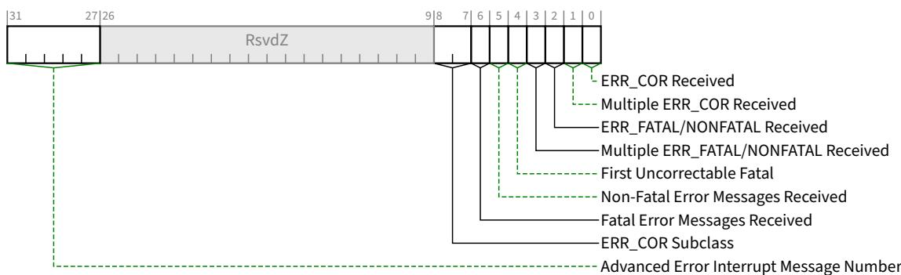


**表 7-143 根错误状态寄存器（Root Error Status Register）**

| 位位置 | 寄存器描述 | 属性 |
|---|---|---|
| 0 | ERR_COR Received（ERR_COR 已接收）— 当接收到可纠正错误消息且该位尚未置位时置位。该位默认值为 0b。 | RW1CS |
| 1 | Multiple ERR_COR Received（多个 ERR_COR 已接收）— 当接收到可纠正错误消息且 ERR_COR Received 已置位时置位。该位默认值为 0b。 | RW1CS |
| 2 | ERR_FATAL/NONFATAL Received（ERR_FATAL/NONFATAL 已接收）— 当接收到致命或非致命错误消息且该位尚未置位时置位。该位默认值为 0b。 | RW1CS |
| 3 | Multiple ERR_FATAL/NONFATAL Received（多个 ERR_FATAL/NONFATAL 已接收）— 当接收到致命或非致命错误且 ERR_FATAL/NONFATAL Received 已置位时置位。该位默认值为 0b。 | RW1CS |
| 4 | First Uncorrectable Fatal（首次不可纠正致命）— 当首次接收到的不可纠正错误消息为致命错误时置位。该字段默认值为 0b。 | RW1CS |
| 5 | Non-Fatal Error Messages Received（非致命错误消息已接收）— 当接收到一条或多条非致命不可纠正错误消息时置位。该位默认值为 0b。 | RW1CS |
| 6 | Fatal Error Messages Received（致命错误消息已接收）— 当接收到一条或多条致命不可纠正错误消息时置位。该位默认值为 0b。 | RW1CS |
| 8:7 | ERR_COR Subclass（ERR_COR 子类）— 若该功能支持 ERR_COR Subclass 且 ERR_COR Received 位尚未置位，则该字段由所接收 ERR_COR 消息中的 ERR_COR Subclass 字段的值装入。参见 § 第 2.2.8.3 节。该字段的值仅在 ERR_COR Received 位置位时有效。若该功能不支持 ERR_COR Subclass，则该字段为保留。若该功能支持 ERR_COR Subclass 且接收到 SIG_SFW ERR_COR 消息，则应使用系统特定机制通知系统固件。该字段默认值为 00b。 | ROS/RsvdZ |
| 31:27 | Advanced Error Interrupt Message Number（高级错误中断消息编号）— 该寄存器指示与该能力（Capability）的任一状态位关联所产生的中断消息所使用的 MSI/MSI-X 向量。对于 MSI，该寄存器中的值表示所产生的消息数据（Message Data）基址与产生的中断消息之间的偏移量。当软件写入 MSI 消息控制寄存器（Message Control Register）中的 Multiple Message Enable 字段改变分配给该功能的 MSI 消息数量时，硬件必须更新该字段以使其保持正确。对于 MSI-X，该寄存器中的值表示用于产生中断消息的 MSI-X 表项。即使该功能实现了超过 32 个表项，该表项也必须是前 32 个表项之一。对于给定的 MSI-X 实现，该表项必须保持不变。若同时实现了 MSI 和 MSI-X，则允许它们使用不同的向量，但软件一次仅可启用其中一种机制。若启用了 MSI-X，则该寄存器的值必须指示 MSI-X 的向量。若启用了 MSI 或两者均未启用，则该寄存器的值必须指示 MSI 的向量。若软件同时启用了 MSI 和 MSI-X，则该寄存器的值未定义。 | RO |

</td>
</tr>
</tbody>
</table>
</div>


[⬆️ 返回目录](#-本章目录-table-of-contents)

---

<!-- 📄 Page 1208 -->
---

<a id="sec-7-8-4-11"></a>
## 7.8.4.11 Error Source Identification Register (Offset 34h) | 错误源标识寄存器（偏移 34h）

<table>
<thead>
<tr>
<th width="50%">🇬🇧 English</th>
<th width="50%" style="background-color:#e8e8e8">🏆 中文</th>
</tr>
</thead>
<tbody>
<tr>
<td>

The Error Source Identification Register identifies the source (Requester ID) of first correctable and uncorrectable (Non-fatal/Fatal) errors reported in the Root Error Status Register. Refer to § Section 6.2 for further details. This register is updated regardless of the settings of the Root Control Register and the Root Error Command Register. § Figure 7-164 details allocation of register fields in the Error Source Identification Register; § Table 7-144 provides the respective bit definitions.

For Functions other than Root Ports and Root Complex Event Collectors: when End-End TLP Prefix Supported is Set, this register is RsvdP and when End-End TLP Prefix Supported is Clear, this register is not required to be implemented.

```
0-15   ERR_COR Source Identification
16-31  ERR_FATAL/NONFATAL Source Identification
```

**Figure 7-164 Error Source Identification Register**

**Table 7-144 Error Source Identification Register**

| Bit Location | Register Description | Attributes |
|---|---|---|
| 15:0 | ERR_COR Source Identification - Loaded with the Requester ID indicated in the received ERR_COR Message when the ERR_COR Received bit is not already set. Default value of this field is 0000h. | ROS |
| 31:16 | ERR_FATAL/NONFATAL Source Identification - Loaded with the Requester ID indicated in the received ERR_FATAL or ERR_NONFATAL Message when the ERR_FATAL/NONFATAL Received bit is not already set. Default value of this field is 0000h. | ROS |

</td>
<td style="background-color:#e8e8e8">

错误源标识寄存器（Error Source Identification Register）标识在根错误状态寄存器中上报的首次可纠正错误及首次不可纠正（非致命/致命）错误的来源（请求者 ID）。更多细节参见 § 第 6.2 节。该寄存器的更新与根控制寄存器和根错误命令寄存器的设置无关。§ 图 7-164 详细说明了错误源标识寄存器中寄存器字段的分配；§ 表 7-144 列出了相应的位定义。

对于根端口和根复合体事件收集器之外的功能：当 End-End TLP Prefix Supported 置位时，该寄存器为 RsvdP（保留，写入无效）；当 End-End TLP Prefix Supported 清零时，该寄存器不需要实现。

```
0-15   ERR_COR 源标识（ERR_COR Source Identification）
16-31  ERR_FATAL/NONFATAL 源标识（ERR_FATAL/NONFATAL Source Identification）
```

**图 7-164 错误源标识寄存器（Error Source Identification Register）**

**表 7-144 错误源标识寄存器（Error Source Identification Register）**

| 位位置 | 寄存器描述 | 属性 |
|---|---|---|
| 15:0 | ERR_COR Source Identification（ERR_COR 源标识）— 当 ERR_COR Received 位尚未置位时，由接收到的 ERR_COR 消息中所指示的请求者 ID 装入。该字段默认值为 0000h。 | ROS |
| 31:16 | ERR_FATAL/NONFATAL Source Identification（ERR_FATAL/NONFATAL 源标识）— 当 ERR_FATAL/NONFATAL Received 位尚未置位时，由接收到的 ERR_FATAL 或 ERR_NONFATAL 消息中所指示的请求者 ID 装入。该字段默认值为 0000h。 | ROS |

</td>
</tr>
</tbody>
</table>

[⬆️ 返回目录](#-本章目录-table-of-contents)

---

<a id="sec-7-8-4-12"></a>
## 7.8.4.12 TLP Prefix Log Register (Offset 38h) | TLP 前缀日志寄存器（偏移 38h）


<div style="overflow-x: auto; max-width: 100%;">
<table>
<thead>
<tr>
<th width="50%">🇬🇧 English</th>
<th width="50%" style="background-color:#e8e8e8">🏆 中文</th>
</tr>
</thead>
<tbody>
<tr>
<td>

The TLP Prefix Log Register captures the End-End TLP Prefix(s) for the TLP corresponding to the detected error; refer to § Section 6.2 for further details. The TLP Prefix Log Register is only meaningful when First Error Pointer is valid and the TLP Prefix Log Present bit is Set (see § Section 7.8.4.7).

The TLP Prefixes are captured such that, when read using DW accesses, the fields of the TLP Prefix are laid out in the same way the fields of the TLP Prefix are described. Therefore, byte 0 of a TLP Prefix is located in byte 3 of the associated TLP Prefix Log Register; byte 1 of a TLP Prefix is located in byte 2; and so forth.

The First TLP Prefix Log Register contains the first End-End TLP Prefix from the TLP (see § Section 6.2.4.4). The Second TLP Prefix Log Register contains the second End-End TLP Prefix and so forth. If the TLP contains fewer than four End-End TLP Prefixes, the remaining TLP Prefix Log Registers contain zero. A TLP that contains more End-End TLP Prefixes than are indicated by the Function's Max End-End TLP Prefixes field must be handled as an error (see § Section 2.2.10.4 for specifics). To allow software to detect this condition, the supported number of End-End TLP Prefixes are logged in this register, the first overflow End-End TLP Prefix is logged in the first DW of the Header Log register and the remaining DWs of the Header Log register are undefined (see § Section 6.2.4.4).

The TLP Prefix Log Registers beyond the number supported by the Function are hardwired to zero. For example, if a Functions, Max End-End TLP Prefixes field contains 10b (indicating 2 DW of buffering) then the third and fourth TLP Prefix Log Registers are hardwired to zero. If the End-End TLP Prefix Supported bit (§ Section 7.5.3.15) is Clear, the TLP Prefix Log Register is not required to be implemented.

For VFs that share Header Log space, this register's contents are undefined when the Header Log contains all 1s due to an overflow condition. See § Section 6.2.4.2.1 for further requirements when VFs share Header Log space.

When Flit Mode Supported is Set and the link is operating in Flit Mode, this register is not present and the Header Log Register extends into this space (see additional DWs as indicated by the Header Log Size field.

When the link is operating in Non-Flit Mode, End-End TLP Prefixes are logged in the TLP Prefix Log Register.

**Figure 7-165 TLP Prefix Log Register**

| | First TLP Prefix Log Register | Second TLP Prefix Log Register | Third TLP Prefix Log Register | Fourth TLP Prefix Log Register |
|---|---|---|---|---|
| Byte 0 | Byte 0 | Byte 0 | Byte 0 | Byte 0 |
| Byte 1 | Byte 1 | Byte 1 | Byte 1 | Byte 1 |
| Byte 2 | Byte 2 | Byte 2 | Byte 2 | Byte 2 |
| Byte 3 | Byte 3 | Byte 3 | Byte 3 | Byte 3 |
| Bits | 31-24 | 23-16 | 15-8 | 7-0 |
| Byte Offset | 3Ch | 40h | 38h | 44h |

**Table 7-145 TLP Prefix Log Register**

| Bit Location | Register Description | Attributes | Default |
|---|---|---|---|
| 127:0 | TLP Prefix Log | ROS | 0 |

</td>
<td style="background-color:#e8e8e8">

TLP 前缀日志寄存器（TLP Prefix Log Register）记录与所检测错误对应的 TLP 的端到端 TLP 前缀（End-End TLP Prefix）；更多细节参见 § 第 6.2 节。TLP 前缀日志寄存器仅在 First Error Pointer（首次错误指针）有效且 TLP Prefix Log Present 位（TLP 前缀日志存在位）置位时才有意义（参见 § 第 7.8.4.7 节）。

TLP 前缀按如下方式捕获：当使用 DW（双字）访问读取时，TLP 前缀的字段布局与 TLP 前缀字段描述方式一致。因此，TLP 前缀的字节 0 位于对应 TLP 前缀日志寄存器的字节 3；TLP 前缀的字节 1 位于字节 2；依此类推。

第一个 TLP 前缀日志寄存器（First TLP Prefix Log Register）包含来自该 TLP 的第一个端到端 TLP 前缀（参见 § 第 6.2.4.4 节）。第二个 TLP 前缀日志寄存器包含第二个端到端 TLP 前缀，依此类推。若 TLP 包含的端到端 TLP 前缀少于四个，则剩余的 TLP 前缀日志寄存器内容为零。包含端到端 TLP 前缀数量超过该功能的 Max End-End TLP Prefixes 字段所指示数量的 TLP 必须按错误处理（具体参见 § 第 2.2.10.4 节）。为允许软件检测该条件，该功能所支持的端到端 TLP 前缀数量记录在该寄存器中，第一个溢出的端到端 TLP 前缀记录在 Header Log 寄存器的第一个 DW 中，Header Log 寄存器的其余 DW 内容未定义（参见 § 第 6.2.4.4 节）。

超过该功能所支持数量的 TLP 前缀日志寄存器硬连线为零。例如，若该功能的 Max End-End TLP Prefixes 字段为 10b（表示 2 DW 缓冲），则第三和第四个 TLP 前缀日志寄存器硬连线为零。若 End-End TLP Prefix Supported 位（§ 第 7.5.3.15 节）清零，则 TLP 前缀日志寄存器不需要实现。

对于共享 Header Log 空间的 VF（虚拟功能），当 Header Log 因溢出而全为 1 时，该寄存器的内容未定义。关于 VF 共享 Header Log 空间时的更多要求，参见 § 第 6.2.4.2.1 节。

当 Flit Mode Supported 置位且链路运行于 Flit 模式（Flit Mode）时，该寄存器不存在，Header Log 寄存器扩展至该空间（其附加 DW 由 Header Log Size 字段指示）。

当链路运行于非 Flit 模式（Non-Flit Mode）时，端到端 TLP 前缀记录在 TLP 前缀日志寄存器中。

**图 7-165 TLP 前缀日志寄存器（TLP Prefix Log Register）**

| | 第一个 TLP 前缀日志寄存器 | 第二个 TLP 前缀日志寄存器 | 第三个 TLP 前缀日志寄存器 | 第四个 TLP 前缀日志寄存器 |
|---|---|---|---|---|
| 字节 0 | 字节 0 | 字节 0 | 字节 0 | 字节 0 |
| 字节 1 | 字节 1 | 字节 1 | 字节 1 | 字节 1 |
| 字节 2 | 字节 2 | 字节 2 | 字节 2 | 字节 2 |
| 字节 3 | 字节 3 | 字节 3 | 字节 3 | 字节 3 |
| 位 | 31-24 | 23-16 | 15-8 | 7-0 |
| 字节偏移 | 3Ch | 40h | 38h | 44h |

**表 7-145 TLP 前缀日志寄存器（TLP Prefix Log Register）**

| 位位置 | 寄存器描述 | 属性 | 默认值 |
|---|---|---|---|
| 127:0 | TLP Prefix Log（TLP 前缀日志） | ROS | 0 |

</td>
</tr>
</tbody>
</table>
</div>


[⬆️ 返回目录](#-本章目录-table-of-contents)

---

<a id="sec-7-8-5"></a>
## 7.8.5 Enhanced Allocation Capability Structure (EA) | 增强分配能力结构（EA）

<table>
<thead>
<tr>
<th width="50%">🇬🇧 English</th>
<th width="50%" style="background-color:#e8e8e8">🏆 中文</th>
</tr>
</thead>
<tbody>
<tr>
<td>

Each function that supports the Enhanced Allocation mechanism must implement the Enhanced Allocation capability structure.

Each field is defined in the following sections. Reserved registers must return 0 when read and write operations must have no effect. Read-only registers return valid data when read, and write operations must have no effect.

</td>
<td style="background-color:#e8e8e8">

支持增强分配（Enhanced Allocation）机制的每个功能必须实现增强分配能力结构。

每个字段在以下小节中定义。保留寄存器读时必须返回 0，且写操作必须无效。只读寄存器读时返回有效数据，且写操作必须无效。

</td>
</tr>
</tbody>
</table>

[⬆️ 返回目录](#-本章目录-table-of-contents)

---

<a id="sec-7-8-5-1"></a>
## 7.8.5.1 Enhanced Allocation Capability First DW (Offset 00h) | 增强分配能力首 DW（偏移 00h）


<div style="overflow-x: auto; max-width: 100%;">
<table>
<thead>
<tr>
<th width="50%">🇬🇧 English</th>
<th width="50%" style="background-color:#e8e8e8">🏆 中文</th>
</tr>
</thead>
<tbody>
<tr>
<td>

The first DW of the Enhanced Allocation capability is illustrated in § Figure 7-166, and is documented in § Table 7-146.

```
0-7    Capability ID
8-15   Next Capability Pointer
16-21  Num Entries
22-31  RsvdP
```

**Figure 7-166 First DW of Enhanced Allocation Capability**

**Table 7-146 First DW of Enhanced Allocation Capability**

| Bit Location | Register Description | Attributes |
|---|---|---|
| 7:0 | Capability ID - Must be set to 14h to indicate Enhanced Allocation capability. This field is read only. | HwInit |
| 15:8 | Next Capability Pointer - Pointer to the next item in the capabilities list. Must be NULL for the final item in the list. This field is read only. | HwInit |
| 21:16 | Num Entries - Number of entries following the first DW of the capability. Value of 00 0000b is permitted and means there are no entries. This field is read only. | HwInit |

</td>
<td style="background-color:#e8e8e8">

增强分配能力的第一个 DW 如 § 图 7-166 所示，并在 § 表 7-146 中说明。

```
0-7    能力 ID（Capability ID）
8-15   下一能力指针（Next Capability Pointer）
16-21  条目数（Num Entries）
22-31  RsvdP
```

**图 7-166 增强分配能力的首 DW（First DW of Enhanced Allocation Capability）**

**表 7-146 增强分配能力的首 DW（First DW of Enhanced Allocation Capability）**

| 位位置 | 寄存器描述 | 属性 |
|---|---|---|
| 7:0 | Capability ID（能力 ID）— 必须设置为 14h，以指示增强分配能力。该字段为只读。 | HwInit |
| 15:8 | Next Capability Pointer（下一能力指针）— 指向能力列表中的下一项。若为列表的最后一项，则必须为 NULL。该字段为只读。 | HwInit |
| 21:16 | Num Entries（条目数）— 该能力首 DW 之后所跟随的条目数。允许取 00 0000b，表示无条目。该字段为只读。 | HwInit |

</td>
</tr>
</tbody>
</table>
</div>


[⬆️ 返回目录](#-本章目录-table-of-contents)

---

<a id="sec-7-8-5-2"></a>
## 7.8.5.2 Enhanced Allocation Capability Second DW (Offset 04h) [Type 1 Functions Only] | 增强分配能力第二 DW（偏移 04h）[仅 Type 1 功能]

<table>
<thead>
<tr>
<th width="50%">🇬🇧 English</th>
<th width="50%" style="background-color:#e8e8e8">🏆 中文</th>
</tr>
</thead>
<tbody>
<tr>
<td>

For Type 1 Functions only, there is a second DW in the capability, preceding the first entry. This second DW must be included in the Enhanced Allocation Capability whenever this capability is implemented in a Type 1 Function. The second DW of the Enhanced Allocation capability is illustrated in § Figure 7-167, and is documented in § Table 7-147.

```
0-7    Fixed Secondary Bus Number
8-15   Fixed Subordinate Bus Number
16-31  RsvdP
```

**Figure 7-167 Second DW of Enhanced Allocation Capability**

**Table 7-147 Second DW of Enhanced Allocation Capability**

| Bit Location | Register Description | Attributes |
|---|---|---|
| 7:0 | Fixed Secondary Bus Number - If at least one Function that uses EA is located behind this Function, then this field must be set to indicate the Bus Number for the secondary interface of this Function. If no Function that uses EA is located behind this Function, then this field must be set to 00h. | HwInit |
| 15:8 | Fixed Subordinate Bus Number - If at least one Function that uses EA is located behind this Function, then this field must be set to indicate the highest Bus Number below this Function. If no Function that uses-EA is located behind this Function, then this field must be set to 00h. | HwInit |

</td>
<td style="background-color:#e8e8e8">

仅对于 Type 1 功能，能力中存在一个位于第一个条目前的第二 DW。每当在 Type 1 功能中实现该能力时，必须包含该第二 DW。增强分配能力的第二 DW 如 § 图 7-167 所示，并在 § 表 7-147 中说明。

```
0-7    固定次级总线号（Fixed Secondary Bus Number）
8-15   固定下级总线号（Fixed Subordinate Bus Number）
16-31  RsvdP
```

**图 7-167 增强分配能力的第二 DW（Second DW of Enhanced Allocation Capability）**

> 


**表 7-147 增强分配能力的第二 DW（Second DW of Enhanced Allocation Capability）**

| 位位置 | 寄存器描述 | 属性 |
|---|---|---|
| 7:0 | Fixed Secondary Bus Number（固定次级总线号）— 若本功能下游至少存在一个使用 EA 的功能，则该字段必须设置为指示本功能次级接口的总线号。若本功能下游不存在使用 EA 的功能，则该字段必须设置为 00h。 | HwInit |
| 15:8 | Fixed Subordinate Bus Number（固定下级总线号）— 若本功能下游至少存在一个使用 EA 的功能，则该字段必须设置为指示本功能下游的最高总线号。若本功能下游不存在使用 EA 的功能，则该字段必须设置为 00h。 | HwInit |

</td>
</tr>
</tbody>
</table>

[⬆️ 返回目录](#-本章目录-table-of-contents)

---

<a id="sec-7-8-5-3"></a>
## 7.8.5.3 Enhanced Allocation Per-Entry Format (Offset 04h or 08h) | 增强分配逐条目格式（偏移 04h 或 08h）


<div style="overflow-x: auto; max-width: 100%;">
<table>
<thead>
<tr>
<th width="50%">🇬🇧 English</th>
<th width="50%" style="background-color:#e8e8e8">🏆 中文</th>
</tr>
</thead>
<tbody>
<tr>
<td>

An Enhanced Allocation Entry consists of a First DW followed by between 2 and 4 DW of Base / MaxOffset information.

- For Type 0 Functions, Enhanced Allocation Entries start at offset 04h of this capability.
- For Type 1 Functions, Enhanced Allocation Entries start at offset 08h of this capability.
- Subsequent Enhanced Allocation Entries immediately follow each other.

The first DW of each entry in the Enhanced Allocation capability is illustrated in § Figure 7-168, and is defined in § Table 7-148.

```
0-2    Entry Size (ES)
3      RsvdP
4-7    BAR Equivalent Indicator (BEI)
8-15   Primary Properties
16-23  Secondary Properties
24-29  RsvdP
30     Writable (W)
31     Enable (E)
```

**Figure 7-168 First DW of Each Entry for Enhanced Allocation Capability**

**Table 7-148 First DW of Each Entry for Enhanced Allocation Capability**

| Bit Location | Register Description | Attributes |
|---|---|---|
| 2:0 | Entry Size (ES) - Number of DW following the initial DW in this entry. When processing this capability, software is required to use the value in this field to determine the size of this entry, and if this entry is not the final entry, the start of the following entry in the capability. This requirement must be strictly followed by software, even if the indicated entry size does not correspond to any entry defined in this specification. Value of 000b indicates only the first DW (containing the Entry Size field) is included in the entry. | HwInit |
| 7:4 | BAR Equivalent Indicator (BEI) - This field indicates the equivalent BAR for this entry. Specific rules for use of this field are given in the text following this table. | HwInit |

BEI Value descriptions:
- 0: Entry is equivalent to BAR at location 10h
- 1: Entry is equivalent to BAR at location 14h
- 2: Entry is equivalent to BAR at location 18h
- 3: Entry is equivalent to BAR at location 1Ch
- 4: Entry is equivalent to BAR at location 20h
- 5: Entry is equivalent to BAR at location 24h
- 6: Permitted to be used by a Function with a Type 1 Configuration Space Header only, optionally used to indicate a resource that is located behind the Function
- 7: Equivalent Not Indicated
- 8: Expansion ROM Base Address
- 9-14: Entry relates to VF BARs 0-5 respectively
- 15: Reserved - Software must treat values in this range as "Equivalent Not Indicated"

| Bit Location | Register Description | Attributes |
|---|---|---|
| 15:8 | Primary Properties - Indicates the entry properties as defined in § Table 7-150. | HwInit |
| 23:16 | Secondary Properties - Optionally used to indicate a different but compatible entry property, using properties as defined in § Table 7-150. | HwInit |
| 30 | Writable (W) - The value 1b indicates that the Base and MaxOffset fields for this entry are RW and that the Field Size bits for this entry are either RW or HwInit. The value 0b indicates those fields are HwInit. See § Table 7-150 for additional requirements on the value of this field. | HwInit |
| 31 | Enable (E) - 1b indicates this entry is enabled, 0b indicates this entry is disabled. If system software disables this entry, the resource indicated must still be associated with this function, and it is not permitted to reallocate this resource to any other entity. This field is permitted to be implemented as HwInit for functions that require the allocation of the associated resource, or as RW for functions that can allow system software to disable this resource, for example if BAR mechanisms are to be used instead of this resource. | RW/HwInit |

</td>
<td style="background-color:#e8e8e8">

增强分配条目（Enhanced Allocation Entry）由一个首 DW 后接 2 至 4 个 DW 的 Base / MaxOffset 信息组成。

- 对于 Type 0 功能，增强分配条目从该能力的偏移 04h 处开始。
- 对于 Type 1 功能，增强分配条目从该能力的偏移 08h 处开始。
- 后续的增强分配条目紧接排列。

增强分配能力中每个条目的首 DW 如 § 图 7-168 所示，并在 § 表 7-148 中定义。

```
0-2    条目大小（Entry Size, ES）
3      RsvdP
4-7    BAR 等效指示符（BAR Equivalent Indicator, BEI）
8-15   主属性（Primary Properties）
16-23  次属性（Secondary Properties）
24-29  RsvdP
30     可写（Writable, W）
31     使能（Enable, E）
```

**图 7-168 增强分配能力中每个条目的首 DW（First DW of Each Entry for Enhanced Allocation Capability）**

> 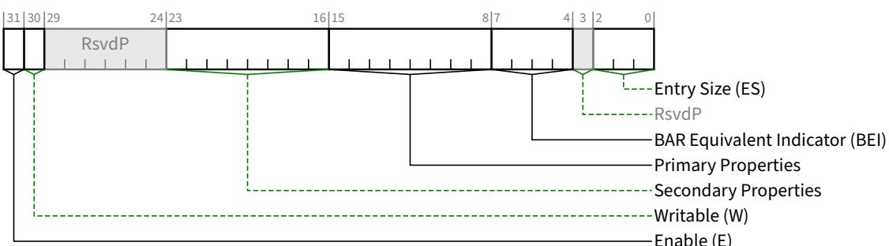


**表 7-148 增强分配能力中每个条目的首 DW（First DW of Each Entry for Enhanced Allocation Capability）**

| 位位置 | 寄存器描述 | 属性 |
|---|---|---|
| 2:0 | Entry Size (ES)（条目大小）— 本条目中初始 DW 之后所跟随的 DW 数。在处理该能力时，软件必须使用该字段的值确定本条目的大小；若本条目并非最后一项，则还需据此确定能力中下一条目的起始位置。即使所指示的条目大小未对应本规范中定义的任何条目，软件也必须严格遵守此要求。值 000b 表示该条目仅包含首 DW（含 Entry Size 字段）。 | HwInit |
| 7:4 | BAR Equivalent Indicator (BEI)（BAR 等效指示符）— 该字段指示本条目所等效的 BAR。该字段使用的具体规则见本表后所述文字。 | HwInit |

BEI 值描述：
- 0：条目等效于位置 10h 处的 BAR
- 1：条目等效于位置 14h 处的 BAR
- 2：条目等效于位置 18h 处的 BAR
- 3：条目等效于位置 1Ch 处的 BAR
- 4：条目等效于位置 20h 处的 BAR
- 5：条目等效于位置 24h 处的 BAR
- 6：仅允许配置空间头为 Type 1 的功能使用，可选地用于指示位于该功能之后的资源
- 7：未指示等效项
- 8：扩展 ROM 基址（Expansion ROM Base Address）
- 9-14：条目分别对应 VF BAR 0-5
- 15：保留 — 软件必须将该范围内的值视为"未指示等效项"

| 位位置 | 寄存器描述 | 属性 |
|---|---|---|
| 15:8 | Primary Properties（主属性）— 指示条目属性，其定义见 § 表 7-150。 | HwInit |
| 23:16 | Secondary Properties（次属性）— 可选用以指示一种不同但兼容的条目属性，属性定义见 § 表 7-150。 | HwInit |
| 30 | Writable (W)（可写）— 1b 指示本条目的 Base 与 MaxOffset 字段为 RW（可读写），且本条目的 Field Size 位为 RW 或 HwInit；0b 指示这些字段为 HwInit。关于本字段值的更多要求参见 § 表 7-150。 | HwInit |
| 31 | Enable (E)（使能）— 1b 指示本条目已使能，0b 指示本条目已禁用。若系统软件禁用本条目，所指示的资源仍必须与该功能关联，且不允许将该资源重新分配给任何其他实体。该字段可实现为 HwInit（针对需要分配其关联资源的功能），也可实现为 RW（针对允许系统软件禁用该资源的功能，例如将改用 BAR 机制）。 | RW/HwInit |

</td>
</tr>
</tbody>
</table>
</div>


[⬆️ 返回目录](#-本章目录-table-of-contents)

---

<a id="sec-7-8-5-3-rules"></a>
## BEI Field Usage Rules | BEI 字段使用规则

<table>
<thead>
<tr>
<th width="50%">🇬🇧 English</th>
<th width="50%" style="background-color:#e8e8e8">🏆 中文</th>
</tr>
</thead>
<tbody>
<tr>
<td>

Rules for use of BEI field:

- A Type 0 Function is permitted to use EA to allocate resources for itself, and such resources must indicate a BEI value of 0-5, 7 or 8.
- A Physical Function (Type 0 Function that supports SR-IOV) is permitted to use EA to allocate resources for its associated Virtual Functions, and such resources must indicate a BEI value of 9-14.
- A Type 1 Function (bridge) is permitted to use EA to allocate resources for itself, and such resources must indicate a BEI value of 0, 1 or 7.
- A Type 1 Function is permitted but not required to indicate resources mapped behind that Function, but if such resources are indicated by the Type 1 Function, the entry must indicate a BEI value of 6.
- For a 64-bit Base Address Register, the BEI indicates the equivalent BAR location for lower DWORD.
- For Memory BARs where the Primary or Secondary Properties is 00h or 01h, it is permitted to assign the same BEI in the range of 0 to 5 once for a range where Base + MaxOffset is below 4 GB, and again for a range where Base + MaxOffset is greater than 4 GB; It is not otherwise permitted to assign the same BEI in the range 0 to 5 for more than one entry.
- For Virtual Function BARs where the Primary or Secondary Properties is 03h or 04h it is permitted to assign the same BEI in the range of 9 to 14 once for a range where Base + MaxOffset is below 4 GB, and again for a range where Base + MaxOffset is greater than 4 GB; It is not otherwise permitted to assign the same BEI in the range 9 to 14 for more than one VF entry.
- For all cases where two entries with the same BEI are permitted, Software must enable use of only one of the two ranges at a time for a given Function.
- It is permitted for an arbitrary number of entries to assign a BEI of 6 or 7.
- At most one entry is permitted with a BEI of 8; if such an entry is present, behavior of the Expansion ROM Base Address Register is changed (see § Section 7.5.1.2.4).
- For Type 1 Functions, BEI values 2 through 5 are reserved.

§ Figure 7-169 illustrates the format of a complete Enhanced Allocation entry for a Type 0 Function. For the Base and MaxOffset fields, bit 1 indicates if the field is a 32b (0) or 64b (1) field.

</td>
<td style="background-color:#e8e8e8">

BEI 字段使用规则：

- 允许 Type 0 功能使用 EA 为自身分配资源，此类资源必须指示 BEI 值为 0-5、7 或 8。
- 允许物理功能（PF，支持 SR-IOV 的 Type 0 功能）使用 EA 为其关联的虚拟功能（VF）分配资源，此类资源必须指示 BEI 值为 9-14。
- 允许 Type 1 功能（桥）使用 EA 为自身分配资源，此类资源必须指示 BEI 值为 0、1 或 7。
- 允许（但非必须）Type 1 功能指示映射于其下游的资源；若 Type 1 功能指示此类资源，则该条目必须指示 BEI 值为 6。
- 对于 64 位基址寄存器（Base Address Register），BEI 指示低 DWORD 所对应的等效 BAR 位置。
- 对于 Primary 或 Secondary Properties 为 00h 或 01h 的内存 BAR，允许在 BEI 范围 0 至 5 内对 Base + MaxOffset 小于 4 GB 的范围分配一次该 BEI，并对 Base + MaxOffset 大于 4 GB 的范围再分配一次该 BEI；除此之外不允许在 0 至 5 范围内对多于一个条目分配相同的 BEI。
- 对于 Primary 或 Secondary Properties 为 03h 或 04h 的虚拟功能 BAR，允许在 BEI 范围 9 至 14 内对 Base + MaxOffset 小于 4 GB 的范围分配一次该 BEI，并对 Base + MaxOffset 大于 4 GB 的范围再分配一次该 BEI；除此之外不允许在 9 至 14 范围内对多于一个 VF 条目分配相同的 BEI。
- 对于所有允许两个条目具有相同 BEI 的情况，软件必须对同一功能同时仅使能使用两个范围之一。
- 允许任意数量的条目分配 BEI 值为 6 或 7。
- 至多一个条目允许使用 BEI 8；若存在此类条目，则扩展 ROM 基址寄存器（Expansion ROM Base Address Register）的行为将发生改变（参见 § 第 7.5.1.2.4 节）。
- 对于 Type 1 功能，BEI 值 2 至 5 为保留。

§ 图 7-169 展示了 Type 0 功能的完整增强分配条目格式。对于 Base 与 MaxOffset 字段，第 1 位指示该字段为 32b（0）还是 64b（1）字段。

</td>
</tr>
</tbody>
</table>

[⬆️ 返回目录](#-本章目录-table-of-contents)

---

**Table 7-150 Enhanced Allocation Entry Field Value Definitions for both the Primary Properties and Secondary Properties Fields**

| Value (h) | Resource Definition | Writeable permitted |
|---|---|---|
| 00 | Memory Space, Non-Prefetchable. | No |
| 01 | Memory Space, Prefetchable. | No |
| 02 | I/O Space. | No |
| 03 | For use only by Physical Functions to indicate resources for Virtual Function use, Memory Space, Prefetchable. | No |
| 04 | For use only by Physical Functions to indicate resources for Virtual Function use, Memory Space, Non-Prefetchable. | No |
| 05 | For use only by Type 1 Functions to indicate Memory, Non-Prefetchable, for Allocation Behind that Bridge. | No |
| 06 | For use only by Type 1 Functions to indicate Memory, Prefetchable, for Allocation Behind that Bridge. | No |
| 07 | For use only by Type 1 Functions to indicate I/O Space for Allocation Behind that Bridge. | No |
| 08-FC | Reserved for future use; System firmware/software must not write to this entry, and must not attempt to interpret this entry or to use this resource. When software reads a Primary Properties value that is within this range, is it strongly recommended that software treat this resource according to the value in the Secondary Properties field, if that field contains a non-reserved value. | Yes |
| FD | Memory Space Resource Unavailable For Use - System firmware/software must not write to this entry, and must not attempt to use the resource described by this entry for any purpose. | No |
| FE | I/O Space Resource Unavailable For Use - System firmware/software must not write to this entry, and must not attempt to use the resource described by this entry for any purpose. | No |
| FF | Entry Unavailable For Use - System firmware/software must not write to this entry, and must not attempt to interpret this entry as indicating any resource. Hardware MUST@FLIT use this value in the Secondary Properties field to indicate that, for proper operation, the hardware requires the use of the resource definition indicated in the Primary Properties field. | No |

---

<!-- 📄 Page 1216 -->
---

<a id="sec-7-8-6"></a>
## 7.8.6 Resizable BAR Extended Capability | 可调整 BAR 扩展能力（Resizable BAR Extended Capability）


<div style="overflow-x: auto; max-width: 100%;">
<table>
<thead>
<tr>
<th width="50%">🇬🇧 English</th>
<th width="50%" style="background-color:#e8e8e8">🏆 中文</th>
</tr>
</thead>
<tbody>
<tr>
<td>

The Resizable BAR Extended Capability is an optional capability that allows hardware to communicate resource sizes, and system software, after determining the optimal size, to communicate this optimal size back to the hardware. Hardware communicates the resource sizes that are acceptable for operation via the Resizable BAR Capability and Control registers. Hardware must support at least one size in the range from 1 MB to 512 GB.

Software determines, through a proprietary mechanism, what the optimal size is for the resource, and programs that size via the BAR Size field of the Resizable BAR Control register. Hardware immediately reflects the size inference in the read-only bits of the appropriate Base Address register. Hardware must Clear any bits that change from RW to read-only, so that subsequent reads return zero. Software must clear the Memory Space Enable bit in the Command register before writing the BAR Size field. After writing the BAR Size field, the contents of the corresponding BAR are undefined. To ensure that it contains a valid address after resizing the BAR, system software must reprogram the BAR, and Set the Memory Space Enable bit (unless the resource is not allocated).

The Resizable BAR Capability and Control registers are permitted to indicate the ability to operate at 4 GB or greater only if the associated BAR is a 64-bit BAR.

This capability is applicable to Functions that have Base Address registers only. The capability is permitted to be present in PFs. Since VFs do not implement standard BARs, the capability must not be present in a VF. The PF's Resizable BAR settings do not affect any settings in the SR-IOV Extended Capability.

It is strongly recommended that a Function not advertise any supported BAR sizes that are larger than the space it would effectively utilize if allocated.

> **IMPLEMENTATION NOTE:**
> **RESIZABLE BAR BACKWARD COMPATIBILITY WITH SOFTWARE**
>
> The Resizable BAR Extended Capability initially supported 20 sizes, ranging from 1 MB to 512 GB, and was later expanded with 16 larger sizes. The hardware requirement to support at least one of the initial sizes ensures backward compatibility with software that comprehends only the initial sizes.

The Resizable BAR Capability structure defines a PCI Express Extended Capability, which is located in PCI Express Extended Configuration Space, that is, above the first 256 bytes, and is shown below in § Figure 7-174. This structure allows devices with this capability to be identified and controlled. A Capability and a Control register is implemented for each BAR that is resizable. Since a maximum of six BARs may be implemented by any Function, the Resizable BAR Capability structure can range from 12 bytes long (for a single BAR) to 52 bytes long (for all six BARs).

```
Byte Offset   0   1   2   3   4   5   6   7   8   9   10  11  12  13  14  15  16  17  18  19  20  21  22  23  24  25  26  27  28  29  30  31
              | PCI Express Extended Capability Header | Resizable BAR Capability Register (0) | Resizable BAR Control Register (0) | Resizable BAR Capability Register (1) | Resizable BAR Control Register (1) | ...
Offset        +000h                                   +004h                                       +008h                                       +00Ch                                       +010h                                       +014h
```

**Figure 7-174 Resizable BAR Extended Capability**

> **IMPLEMENTATION NOTE:**
> **USING THE CAPABILITY DURING RESOURCE ALLOCATION**
>
> System software that allocates resources can use this capability to resize the resources inferred by the Function's BAR's read-only bits. Previous versions of this software determined the resource size by writing FFFF_FFFFh or FFFF_FFFF_FFFF_FFFFh to the BAR, reading back the value, and determining the size by the number of bits that are Set. Following this, the base address is written to the BAR.
>
> System software uses this capability in place of the above mentioned method of determining the resource size, and prior to assigning the base address to the BAR. Potential usable resource sizes are reported by the Function via its Resizable BAR Capability and Control registers. It is intended that the software allocate the largest of the reported sizes that it can, since allocating less address space than the largest reported size can result in lower performance. Software then writes the size to the Resizable BAR Control register for the appropriate BAR for the Function. Following this, the base address is written to the BAR.
>
> For interoperability reasons, it is possible that hardware will set the default size of the BAR to a low size; that is, a size lower than the largest reported in the Resizable BAR Capability and Control registers. Software that does not use this capability to size resources will likely result in sub-optimal resource allocation, where the resources are smaller than desirable, or not allocatable because there is no room for them.
>
> With the Resizable BAR capability, the amount of address space consumed by a device can change. In a resource constrained environment, the allocation of more address space to a device may result in allocation of less of the address space to other memory-mapped hardware, like system RAM. System software responsible for allocating resources in this kind of environment is recommended to distribute the limited address space appropriately.

```
0-15   PCI Express Extended Capability ID (0015h)
16-19  Capability Version
20-31  Next Capability Offset
```

**Figure 7-175 Resizable BAR Extended Capability Header**

**Table 7-151 Resizable BAR Extended Capability Header**

| Bit Location | Register Description | Attributes |
|---|---|---|
| 15:0 | PCI Express Extended Capability ID - This field is a PCI-SIG defined ID number that indicates the nature and format of the extended capability. The PCI Express Extended Capability ID for the Resizable BAR Capability is 0015h. | RO |
| 19:16 | Capability Version - This field is a PCI-SIG defined version number that indicates the version of the capability structure present. Must be 1h for this version of the specification. | RO |
| 31:20 | Next Capability Offset - This field contains the offset to the next PCI Express Extended Capability structure or 000h if no other items exist in the linked list of Capabilities. | RO |

For backward compatibility with software, hardware must Set at least one bit in the range from 4 to 23. See the associated Implementation Note in § Section 7.8.6.

</td>
<td style="background-color:#e8e8e8">

可调整 BAR 扩展能力（Resizable BAR Extended Capability）是一个可选能力，允许硬件通告资源大小，并在系统软件确定最优大小后将该最优大小回传给硬件。硬件通过 Resizable BAR Capability 与 Control 寄存器通告其可接受的资源大小。硬件必须支持 1 MB 至 512 GB 范围内至少一种大小。

软件通过专有机制确定资源的最佳大小，并通过 Resizable BAR Control 寄存器的 BAR Size 字段对该大小进行编程。硬件立即在对应基址寄存器（Base Address Register）的只读位中反映该大小推断。硬件必须将由 RW 变为只读的任何位清零（Clear），以使后续读返回零。软件在写入 BAR Size 字段之前必须清除 Command 寄存器中的 Memory Space Enable 位。写入 BAR Size 字段之后，对应 BAR 的内容未定义。为确保在调整 BAR 大小之后其包含有效地址，系统软件必须重新编程 BAR，并置位 Memory Space Enable 位（除非该资源未分配）。

仅当关联的 BAR 为 64 位 BAR 时，Resizable BAR Capability 与 Control 寄存器才允许指示支持 4 GB 或更大地址空间运行。

该能力仅适用于具有基址寄存器的功能。该能力允许出现在 PF 中。由于 VF 不实现标准 BAR，因此该能力不得出现在 VF 中。PF 的 Resizable BAR 设置不影响 SR-IOV 扩展能力（SR-IOV Extended Capability）中的任何设置。

强烈建议功能不要通告任何大于其在分配时所实际利用空间的支持 BAR 大小。

> **实现注意（IMPLEMENTATION NOTE）：**
> **可调整 BAR 与软件的向后兼容性（RESIZABLE BAR BACKWARD COMPATIBILITY WITH SOFTWARE）**
>
> 可调整 BAR 扩展能力最初支持 20 种大小，范围从 1 MB 到 512 GB，之后又扩展了 16 种更大的大小。硬件要求至少支持一种初始大小，以保证仅能识别初始大小的软件的向后兼容性。

Resizable BAR Capability 结构定义了一个 PCI Express 扩展能力（PCI Express Extended Capability），该结构位于 PCI Express 扩展配置空间（Extended Configuration Space）中（即前 256 字节之上），并在 § 图 7-174 中显示。该结构允许识别与控制具有该能力的设备。每个可调整大小的 BAR 都实现一组 Capability 与 Control 寄存器。由于任何功能最多可实现 6 个 BAR，因此 Resizable BAR Capability 结构长度范围从 12 字节（单个 BAR）到 52 字节（全部 6 个 BAR）。

```
字节偏移     0   1   2   3   4   5   6   7   8   9   10  11  12  13  14  15  16  17  18  19  20  21  22  23  24  25  26  27  28  29  30  31
             | PCI Express 扩展能力头（PCI Express Extended Capability Header）| Resizable BAR Capability 寄存器 (0)| Resizable BAR Control 寄存器 (0)| Resizable BAR Capability 寄存器 (1)| Resizable BAR Control 寄存器 (1)| ...
偏移         +000h                                                       +004h                                   +008h                                   +00Ch                                   +010h                                   +014h
```

**图 7-174 可调整 BAR 扩展能力（Resizable BAR Extended Capability）**

> 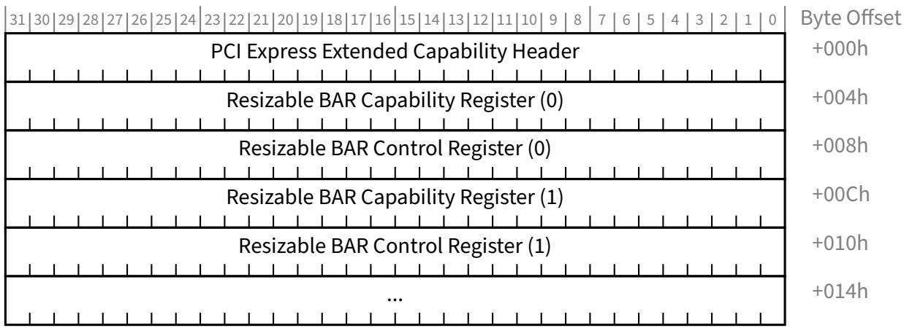


> **实现注意（IMPLEMENTATION NOTE）：**
> **在资源分配过程中使用该能力（USING THE CAPABILITY DURING RESOURCE ALLOCATION）**
>
> 负责资源分配的系统软件可使用该能力来调整由该功能 BAR 的只读位所推断出的资源大小。早期的软件版本通过向 BAR 写入 FFFF_FFFFh 或 FFFF_FFFF_FFFF_FFFFh、读回该值、并根据被置位的位数确定资源大小，然后再向 BAR 写入基址。
>
> 系统软件可使用该能力替代上述确定资源大小的方法，且应在向 BAR 分配基址之前完成。可用的资源大小由该功能通过其 Resizable BAR Capability 与 Control 寄存器报告。预期软件应分配其所支持的、所报告的最大大小，因为分配小于最大报告大小的地址空间可能导致较低的性能。然后软件将该大小写入该功能对应 BAR 的 Resizable BAR Control 寄存器中。随后向 BAR 写入基址。
>
> 出于互操作性的考虑，硬件可能将 BAR 的默认大小设置为较小值（即小于 Resizable BAR Capability 与 Control 寄存器中所报告的最大值）。未使用该能力进行资源大小确定的软件很可能导致次优资源分配——资源小于期望大小，或因没有足够空间而无法分配。
>
> 借助可调整 BAR 能力，设备所占用的地址空间量可以改变。在资源受限的环境中，为某个设备分配更多地址空间可能导致为其他内存映射硬件（如系统 RAM）分配的地址空间减少。建议在此类环境中负责资源分配的系统软件适当分配有限的地址空间。

```
0-15   PCI Express 扩展能力 ID（PCI Express Extended Capability ID, 0015h）
16-19  能力版本（Capability Version）
20-31  下一能力偏移（Next Capability Offset）
```

**图 7-175 可调整 BAR 扩展能力头（Resizable BAR Extended Capability Header）**

> 


**表 7-151 可调整 BAR 扩展能力头（Resizable BAR Extended Capability Header）**

| 位位置 | 寄存器描述 | 属性 |
|---|---|---|
| 15:0 | PCI Express Extended Capability ID（PCI Express 扩展能力 ID）— 该字段为 PCI-SIG 定义的 ID 号，用于指示扩展能力的性质和格式。可调整 BAR 能力的 PCI Express 扩展能力 ID 为 0015h。 | RO |
| 19:16 | Capability Version（能力版本）— 该字段为 PCI-SIG 定义的版本号，指示所提供能力结构的版本。本规范版本中必须为 1h。 | RO |
| 31:20 | Next Capability Offset（下一能力偏移）— 该字段包含指向下一个 PCI Express 扩展能力结构的偏移；若能力链表中不存在其他项，则为 000h。 | RO |

为与软件向后兼容，硬件必须在 4 至 23 范围内至少置位一位。参见 § 第 7.8.6 节中的相关实现注意。

</td>
</tr>
</tbody>
</table>
</div>


[⬆️ 返回目录](#-本章目录-table-of-contents)

---


---

<a id="sec-7-8-6-1"></a>
## 7.8.6.1 Resizable BAR Extended Capability Header (Offset 00h) | 可变大小 BAR 扩展能力头（偏移 00h）

<table>
<thead>
<tr>
<th width="50%">🇬🇧 English</th>
<th width="50%" style="background-color:#e8e8e8">🏆 中文</th>
</tr>
</thead>
<tbody>
<tr>
<td>

[Section header — content covered in § 7.8.6]

</td>
<td style="background-color:#e8e8e8">

[小节标题 —— 内容见 § 7.8.6]

</td>
</tr>
</tbody>
</table>

[⬆️ 返回目录](#-本章目录-table-of-contents)

---

<a id="sec-7-8-6-2"></a>
## 7.8.6.2 Resizable BAR Capability Register | 可变大小 BAR 能力寄存器


<div style="overflow-x: auto; max-width: 100%;">
<table>
<thead>
<tr>
<th width="50%">🇬🇧 English</th>
<th width="50%" style="background-color:#e8e8e8">🏆 中文</th>
</tr>
</thead>
<tbody>
<tr>
<td>

**Figure 7-176 Resizable BAR Capability Register**

```
Bit 0-3:    RsvdP
Bit 4:      Function supports 1 MB BAR
Bit 5:      Function supports 2 MB BAR
Bit 6:      Function supports 4 MB BAR
Bit 7:      Function supports 8 MB BAR
Bit 8:      Function supports 16 MB BAR
Bit 9:      Function supports 32 MB BAR
Bit 10:     Function supports 64 MB BAR
Bit 11:     Function supports 128 MB BAR
Bit 12:     Function supports 256 MB BAR
Bit 13:     Function supports 512 MB BAR
Bit 14:     Function supports 1 GB BAR
Bit 15:     Function supports 2 GB BAR
Bit 16:     Function supports 4 GB BAR
Bit 17:     Function supports 8 GB BAR
Bit 18:     Function supports 16 GB BAR
Bit 19:     Function supports 32 GB BAR
Bit 20:     Function supports 64 GB BAR
Bit 21:     Function supports 128 GB BAR
Bit 22:     Function supports 256 GB BAR
Bit 23:     Function supports 512 GB BAR
Bit 24:     Function supports 1 TB BAR
Bit 25:     Function supports 2 TB BAR
Bit 26:     Function supports 4 TB BAR
Bit 27:     Function supports 8 TB BAR
Bit 28:     Function supports 16 TB BAR
Bit 29:     Function supports 32 TB BAR
Bit 30:     Function supports 64 TB BAR
Bit 31:     Function supports 128 TB BAR
```

</td>
<td style="background-color:#e8e8e8">

**图 7-176 可变大小 BAR 能力寄存器**

> 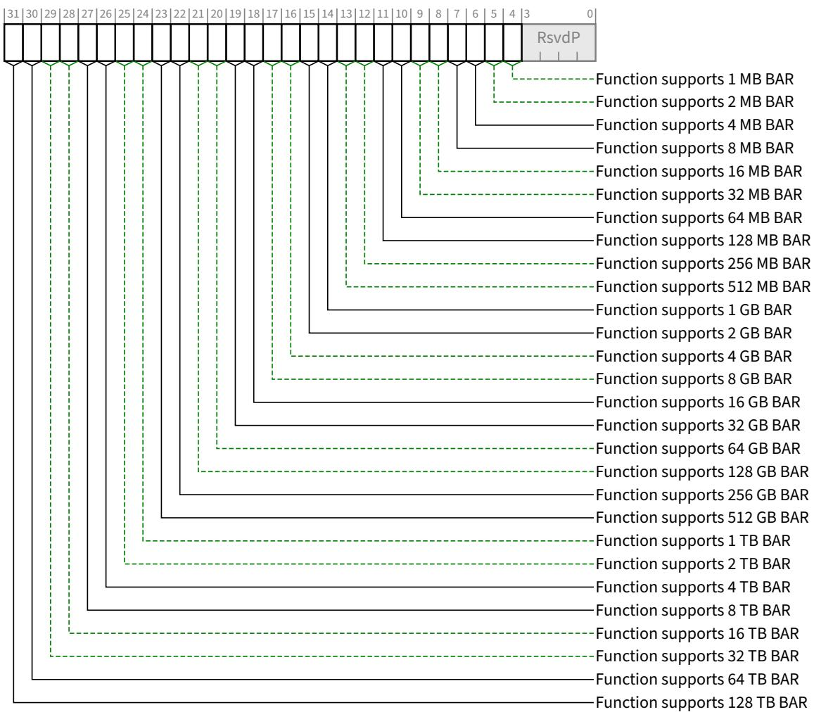


```
位 0-3：    RsvdP
位 4：      支持 1 MB BAR
位 5：      支持 2 MB BAR
位 6：      支持 4 MB BAR
位 7：      支持 8 MB BAR
位 8：      支持 16 MB BAR
位 9：      支持 32 MB BAR
位 10：     支持 64 MB BAR
位 11：     支持 128 MB BAR
位 12：     支持 256 MB BAR
位 13：     支持 512 MB BAR
位 14：     支持 1 GB BAR
位 15：     支持 2 GB BAR
位 16：     支持 4 GB BAR
位 17：     支持 8 GB BAR
位 18：     支持 16 GB BAR
位 19：     支持 32 GB BAR
位 20：     支持 64 GB BAR
位 21：     支持 128 GB BAR
位 22：     支持 256 GB BAR
位 23：     支持 512 GB BAR
位 24：     支持 1 TB BAR
位 25：     支持 2 TB BAR
位 26：     支持 4 TB BAR
位 27：     支持 8 TB BAR
位 28：     支持 16 TB BAR
位 29：     支持 32 TB BAR
位 30：     支持 64 TB BAR
位 31：     支持 128 TB BAR
```

</td>
</tr>
<tr>
<td>

**Table 7-152 Resizable BAR Capability Register**

| Bit Location | Register Description | Attributes |
|--------------|----------------------|------------|
| 4 | Function supports 1 MB BAR - When Set, indicates that the Function supports operating with the BAR sized to 1 MB (2²⁰ bytes) | RO |
| 5 | Function supports 2 MB BAR - When Set, indicates that the Function supports operating with the BAR sized to 2 MB (2²¹ bytes) | RO |
| 6 | Function supports 4 MB BAR - When Set, indicates that the Function supports operating with the BAR sized to 4 MB (2²² bytes) | RO |
| 7 | Function supports 8 MB BAR - When Set, indicates that the Function supports operating with the BAR sized to 8 MB (2²³ bytes) | RO |
| 8 | Function supports 16 MB BAR - When Set, indicates that the Function supports operating with the BAR sized to 16 MB (2²⁴ bytes) | RO |

</td>
<td style="background-color:#e8e8e8">

**表 7-152 可变大小 BAR 能力寄存器**

| 位位置 | 寄存器描述 | 属性 |
|--------|------------|------|
| 4 | 支持 1 MB BAR —— 置位时，表示该 Function 支持将 BAR 大小配置为 1 MB（2²⁰ 字节） | RO |
| 5 | 支持 2 MB BAR —— 置位时，表示该 Function 支持将 BAR 大小配置为 2 MB（2²¹ 字节） | RO |
| 6 | 支持 4 MB BAR —— 置位时，表示该 Function 支持将 BAR 大小配置为 4 MB（2²² 字节） | RO |
| 7 | 支持 8 MB BAR —— 置位时，表示该 Function 支持将 BAR 大小配置为 8 MB（2²³ 字节） | RO |
| 8 | 支持 16 MB BAR —— 置位时，表示该 Function 支持将 BAR 大小配置为 16 MB（2²⁴ 字节） | RO |

</td>
</tr>
</tbody>
</table>
</div>


[⬆️ 返回目录](#-本章目录-table-of-contents)

---

<!-- 📄 Page 1220 -->
---

<table>
<thead>
<tr>
<th width="50%">🇬🇧 English</th>
<th width="50%" style="background-color:#e8e8e8">🏆 中文</th>
</tr>
</thead>
<tbody>
<tr>
<td>

**Table 7-152 Resizable BAR Capability Register (continued)**

| Bit Location | Register Description | Attributes |
|--------------|----------------------|------------|
| 9 | Function supports 32 MB BAR - When Set, indicates that the Function supports operating with the BAR sized to 32 MB (2²⁵ bytes) | RO |
| 10 | Function supports 64 MB BAR - When Set, indicates that the Function supports operating with the BAR sized to 64 MB (2²⁶ bytes) | RO |
| 11 | Function supports 128 MB BAR - When Set, indicates that the Function supports operating with the BAR sized to 128 MB (2²⁷ bytes) | RO |
| 12 | Function supports 256 MB BAR - When Set, indicates that the Function supports operating with the BAR sized to 256 MB (2²⁸ bytes) | RO |
| 13 | Function supports 512 MB BAR - When Set, indicates that the Function supports operating with the BAR sized to 512 MB (2²⁹ bytes) | RO |
| 14 | Function supports 1 GB BAR - When Set, indicates that the Function supports operating with the BAR sized to 1 GB (2³⁰ bytes) | RO |
| 15 | Function supports 2 GB BAR - When Set, indicates that the Function supports operating with the BAR sized to 2 GB (2³¹ bytes) | RO |
| 16 | Function supports 4 GB BAR - When Set, indicates that the Function supports operating with the BAR sized to 4 GB (2³² bytes) | RO |
| 17 | Function supports 8 GB BAR - When Set, indicates that the Function supports operating with the BAR sized to 8 GB (2³³ bytes) | RO |
| 18 | Function supports 16 GB BAR - When Set, indicates that the Function supports operating with the BAR sized to 16 GB (2³⁴ bytes) | RO |
| 19 | Function supports 32 GB BAR - When Set, indicates that the Function supports operating with the BAR sized to 32 GB (2³⁵ bytes) | RO |
| 20 | Function supports 64 GB BAR - When Set, indicates that the Function supports operating with the BAR sized to 64 GB (2³⁶ bytes) | RO |
| 21 | Function supports 128 GB BAR - When Set, indicates that the Function supports operating with the BAR sized to 128 GB (2³⁷ bytes) | RO |
| 22 | Function supports 256 GB BAR - When Set, indicates that the Function supports operating with the BAR sized to 256 GB (2³⁸ bytes) | RO |
| 23 | Function supports 512 GB BAR - When Set, indicates that the Function supports operating with the BAR sized to 512 GB (2³⁹ bytes) | RO |
| 24 | Function supports 1 TB BAR - When Set, indicates that the Function supports operating with the BAR sized to 1 TB (2⁴⁰ bytes) | RO |
| 25 | Function supports 2 TB BAR - When Set, indicates that the Function supports operating with the BAR sized to 2 TB (2⁴¹ bytes) | RO |
| 26 | Function supports 4 TB BAR - When Set, indicates that the Function supports operating with the BAR sized to 4 TB (2⁴² bytes) | RO |

</td>
<td style="background-color:#e8e8e8">

**表 7-152 可变大小 BAR 能力寄存器（续）**

| 位位置 | 寄存器描述 | 属性 |
|--------|------------|------|
| 9 | 支持 32 MB BAR —— 置位时，表示该 Function 支持将 BAR 大小配置为 32 MB（2²⁵ 字节） | RO |
| 10 | 支持 64 MB BAR —— 置位时，表示该 Function 支持将 BAR 大小配置为 64 MB（2²⁶ 字节） | RO |
| 11 | 支持 128 MB BAR —— 置位时，表示该 Function 支持将 BAR 大小配置为 128 MB（2²⁷ 字节） | RO |
| 12 | 支持 256 MB BAR —— 置位时，表示该 Function 支持将 BAR 大小配置为 256 MB（2²⁸ 字节） | RO |
| 13 | 支持 512 MB BAR —— 置位时，表示该 Function 支持将 BAR 大小配置为 512 MB（2²⁹ 字节） | RO |
| 14 | 支持 1 GB BAR —— 置位时，表示该 Function 支持将 BAR 大小配置为 1 GB（2³⁰ 字节） | RO |
| 15 | 支持 2 GB BAR —— 置位时，表示该 Function 支持将 BAR 大小配置为 2 GB（2³¹ 字节） | RO |
| 16 | 支持 4 GB BAR —— 置位时，表示该 Function 支持将 BAR 大小配置为 4 GB（2³² 字节） | RO |
| 17 | 支持 8 GB BAR —— 置位时，表示该 Function 支持将 BAR 大小配置为 8 GB（2³³ 字节） | RO |
| 18 | 支持 16 GB BAR —— 置位时，表示该 Function 支持将 BAR 大小配置为 16 GB（2³⁴ 字节） | RO |
| 19 | 支持 32 GB BAR —— 置位时，表示该 Function 支持将 BAR 大小配置为 32 GB（2³⁵ 字节） | RO |
| 20 | 支持 64 GB BAR —— 置位时，表示该 Function 支持将 BAR 大小配置为 64 GB（2³⁶ 字节） | RO |
| 21 | 支持 128 GB BAR —— 置位时，表示该 Function 支持将 BAR 大小配置为 128 GB（2³⁷ 字节） | RO |
| 22 | 支持 256 GB BAR —— 置位时，表示该 Function 支持将 BAR 大小配置为 256 GB（2³⁸ 字节） | RO |
| 23 | 支持 512 GB BAR —— 置位时，表示该 Function 支持将 BAR 大小配置为 512 GB（2³⁹ 字节） | RO |
| 24 | 支持 1 TB BAR —— 置位时，表示该 Function 支持将 BAR 大小配置为 1 TB（2⁴⁰ 字节） | RO |
| 25 | 支持 2 TB BAR —— 置位时，表示该 Function 支持将 BAR 大小配置为 2 TB（2⁴¹ 字节） | RO |
| 26 | 支持 4 TB BAR —— 置位时，表示该 Function 支持将 BAR 大小配置为 4 TB（2⁴² 字节） | RO |

</td>
</tr>
</tbody>
</table>

[⬆️ 返回目录](#-本章目录-table-of-contents)

---

<!-- 📄 Page 1221 -->
---


<div style="overflow-x: auto; max-width: 100%;">
<table>
<thead>
<tr>
<th width="50%">🇬🇧 English</th>
<th width="50%" style="background-color:#e8e8e8">🏆 中文</th>
</tr>
</thead>
<tbody>
<tr>
<td>

**Table 7-152 Resizable BAR Capability Register (continued)**

| Bit Location | Register Description | Attributes |
|--------------|----------------------|------------|
| 27 | Function supports 8 TB BAR - When Set, indicates that the Function supports operating with the BAR sized to 8 TB (2⁴³ bytes) | RO |
| 28 | Function supports 16 TB BAR - When Set, indicates that the Function supports operating with the BAR sized to 16 TB (2⁴⁴ bytes) | RO |
| 29 | Function supports 32 TB BAR - When Set, indicates that the Function supports operating with the BAR sized to 32 TB (2⁴⁵ bytes) | RO |
| 30 | Function supports 64 TB BAR - When Set, indicates that the Function supports operating with the BAR sized to 64 TB (2⁴⁶ bytes) | RO |
| 31 | Function supports 128 TB BAR - When Set, indicates that the Function supports operating with the BAR sized to 128 TB (2⁴⁷ bytes) | RO |

</td>
<td style="background-color:#e8e8e8">

**表 7-152 可变大小 BAR 能力寄存器（续）**

| 位位置 | 寄存器描述 | 属性 |
|--------|------------|------|
| 27 | 支持 8 TB BAR —— 置位时，表示该 Function 支持将 BAR 大小配置为 8 TB（2⁴³ 字节） | RO |
| 28 | 支持 16 TB BAR —— 置位时，表示该 Function 支持将 BAR 大小配置为 16 TB（2⁴⁴ 字节） | RO |
| 29 | 支持 32 TB BAR —— 置位时，表示该 Function 支持将 BAR 大小配置为 32 TB（2⁴⁵ 字节） | RO |
| 30 | 支持 64 TB BAR —— 置位时，表示该 Function 支持将 BAR 大小配置为 64 TB（2⁴⁶ 字节） | RO |
| 31 | 支持 128 TB BAR —— 置位时，表示该 Function 支持将 BAR 大小配置为 128 TB（2⁴⁷ 字节） | RO |

</td>
</tr>
<tr>
<td>

**Figure 7-177 Resizable BAR Control Register**

```
Bit 0-2:    BAR Index
Bit 3-4:    RsvdP
Bit 5-7:    Number of Resizable BARs
Bit 8-13:   BAR Size
Bit 14-15:  RsvdP
Bit 16:     Function supports 256 TB BAR
Bit 17:     Function supports 512 TB BAR
Bit 18:     Function supports 1 PB BAR
Bit 19:     Function supports 2 PB BAR
Bit 20:     Function supports 4 PB BAR
Bit 21:     Function supports 8 PB BAR
Bit 22:     Function supports 16 PB BAR
Bit 23:     Function supports 32 PB BAR
Bit 24:     Function supports 64 PB BAR
Bit 25:     Function supports 128 PB BAR
Bit 26:     Function supports 256 PB BAR
Bit 27:     Function supports 512 PB BAR
Bit 28:     Function supports 1 EB BAR
Bit 29:     Function supports 2 EB BAR
Bit 30:     Function supports 4 EB BAR
Bit 31:     Function supports 8 EB BAR
```

</td>
<td style="background-color:#e8e8e8">

**图 7-177 可变大小 BAR 控制寄存器**

> 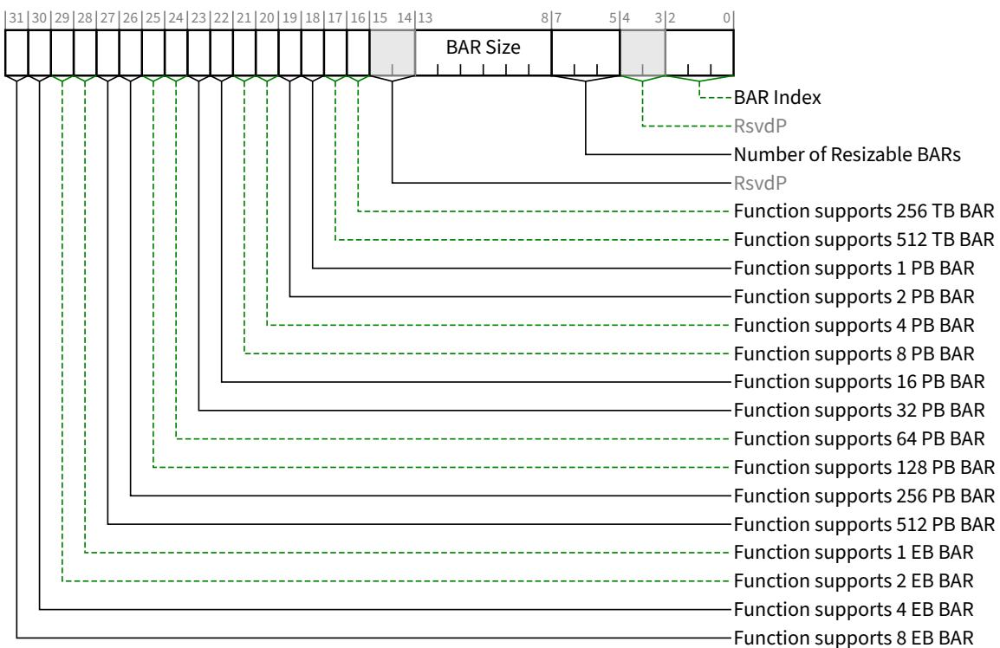


```
位 0-2：    BAR Index（BAR 索引）
位 3-4：    RsvdP
位 5-7：    Number of Resizable BARs（可变大小 BAR 数量）
位 8-13：   BAR Size（BAR 大小）
位 14-15：  RsvdP
位 16：     支持 256 TB BAR
位 17：     支持 512 TB BAR
位 18：     支持 1 PB BAR
位 19：     支持 2 PB BAR
位 20：     支持 4 PB BAR
位 21：     支持 8 PB BAR
位 22：     支持 16 PB BAR
位 23：     支持 32 PB BAR
位 24：     支持 64 PB BAR
位 25：     支持 128 PB BAR
位 26：     支持 256 PB BAR
位 27：     支持 512 PB BAR
位 28：     支持 1 EB BAR
位 29：     支持 2 EB BAR
位 30：     支持 4 EB BAR
位 31：     支持 8 EB BAR
```

</td>
</tr>
<tr>
<td>

**Table 7-153 Resizable BAR Control Register**

| Bit Location | Register Description | Attributes |
|--------------|----------------------|------------|
| 2:0 | BAR Index - This encoded value points to the beginning of the BAR. | RO |

**BAR Index encoding:**

| Encoding | BAR Location |
|----------|--------------|
| 0 | BAR located at offset 10h |
| 1 | BAR located at offset 14h |
| 2 | BAR located at offset 18h |
| 3 | BAR located at offset 1Ch |
| 4 | BAR located at offset 20h |
| 5 | BAR located at offset 24h |
| Others | All other encodings are Reserved. |

For a 64-bit Base Address register, the BAR Index indicates the lower DWORD.

This value indicates which BAR supports a negotiable size.

</td>
<td style="background-color:#e8e8e8">

**表 7-153 可变大小 BAR 控制寄存器**

| 位位置 | 寄存器描述 | 属性 |
|--------|------------|------|
| 2:0 | BAR Index（BAR 索引）—— 此编码值指向 BAR 的起始位置。 | RO |

**BAR Index 编码：**

| 编码 | BAR 位置 |
|------|----------|
| 0 | BAR 位于偏移 10h |
| 1 | BAR 位于偏移 14h |
| 2 | BAR 位于偏移 18h |
| 3 | BAR 位于偏移 1Ch |
| 4 | BAR 位于偏移 20h |
| 5 | BAR 位于偏移 24h |
| 其他 | 所有其他编码均保留。 |

对于 64 位基址寄存器，BAR Index 指向低 32 位 DWORD。

此值指示哪一个 BAR 支持可协商大小。

</td>
</tr>
</tbody>
</table>
</div>


[⬆️ 返回目录](#-本章目录-table-of-contents)

---

<a id="sec-7-8-6-3"></a>
## 7.8.6.3 Resizable BAR Control Register | 可变大小 BAR 控制寄存器

<table>
<thead>
<tr>
<th width="50%">🇬🇧 English</th>
<th width="50%" style="background-color:#e8e8e8">🏆 中文</th>
</tr>
</thead>
<tbody>
<tr>
<td>

**Table 7-153 Resizable BAR Control Register (continued)**

| Bit Location | Register Description | Attributes |
|--------------|----------------------|------------|
| 7:5 | Number of Resizable BARs - Indicates the total number of resizable BARs in the capability structure for the Function. See § Figure 7-174. <br><br> The value of this field must be in the range of 01h to 06h. The field is valid in Resizable BAR Control register (0) (at offset 008h), and is RsvdP for all others. | RO/RsvdP |
| 13:8 | BAR Size - This is an encoded value. <br><br> 1 MB (2²⁰ bytes) <br> 2 MB (2²¹ bytes) <br> 4 MB (2²² bytes) <br> 8 MB (2²³ bytes) <br> … <br> 8 EB (2⁶³ bytes) <br><br> The default value of this field is equal to the default size of the address space that the BAR resource is requesting via the BAR's read-only bits. For backward compatibility with software, the default value must be in the range from 0 to 19. <br><br> When this register field is programmed, the value is immediately reflected in the size of the resource, as encoded in the number of read-only bits in the BAR. <br><br> Software must only write values that correspond to those indicated as supported in the Resizable BAR Capability and Control registers. Writing an unsupported value will produce undefined results. BAR Size bits that never need to be Set in order to indicate every supported size are permitted to be hardwired to 0. | RW |
| 16 | Function supports 256 TB BAR - When Set, indicates that the Function supports operating with the BAR sized to 256 TB (2⁴⁸ bytes) | RO |
| 17 | Function supports 512 TB BAR - When Set, indicates that the Function supports operating with the BAR sized to 512 TB (2⁴⁹ bytes) | RO |
| 18 | Function supports 1 PB BAR - When Set, indicates that the Function supports operating with the BAR sized to 1 PB (2⁵⁰ bytes) | RO |
| 19 | Function supports 2 PB BAR - When Set, indicates that the Function supports operating with the BAR sized to 2 PB (2⁵¹ bytes) | RO |
| 20 | Function supports 4 PB BAR - When Set, indicates that the Function supports operating with the BAR sized to 4 PB (2⁵² bytes) | RO |

</td>
<td style="background-color:#e8e8e8">

**表 7-153 可变大小 BAR 控制寄存器（续）**

| 位位置 | 寄存器描述 | 属性 |
|--------|------------|------|
| 7:5 | Number of Resizable BARs（可变大小 BAR 数量）—— 指示该 Function 能力结构中可变大小 BAR 的总数。参见 § 图 7-174。 <br><br> 此字段的取值范围必须为 01h 至 06h。该字段在 Resizable BAR Control register (0)（位于偏移 008h）中有效，其他位置均为 RsvdP。 | RO/RsvdP |
| 13:8 | BAR Size（BAR 大小）—— 此为编码值。 <br><br> 1 MB（2²⁰ 字节） <br> 2 MB（2²¹ 字节） <br> 4 MB（2²² 字节） <br> 8 MB（2²³ 字节） <br> … <br> 8 EB（2⁶³ 字节） <br><br> 此字段的默认值等于该 BAR 资源通过其只读位所请求的地址空间默认大小。为保持与软件的向后兼容性，默认值必须介于 0 至 19 之间。 <br><br> 对该寄存器字段进行编程时，所配置的值会立即反映到资源大小上，该大小通过 BAR 中只读位的数量进行编码。 <br><br> 软件仅可写入对应于 Resizable BAR Capability 和 Control 寄存器中所支持的值。写入不支持的值将产生未定义的结果。BAR Size 中那些为指示所有支持大小而不需要置位的位可以硬连线为 0。 | RW |
| 16 | 支持 256 TB BAR —— 置位时，表示该 Function 支持将 BAR 大小配置为 256 TB（2⁴⁸ 字节） | RO |
| 17 | 支持 512 TB BAR —— 置位时，表示该 Function 支持将 BAR 大小配置为 512 TB（2⁴⁹ 字节） | RO |
| 18 | 支持 1 PB BAR —— 置位时，表示该 Function 支持将 BAR 大小配置为 1 PB（2⁵⁰ 字节） | RO |
| 19 | 支持 2 PB BAR —— 置位时，表示该 Function 支持将 BAR 大小配置为 2 PB（2⁵¹ 字节） | RO |
| 20 | 支持 4 PB BAR —— 置位时，表示该 Function 支持将 BAR 大小配置为 4 PB（2⁵² 字节） | RO |

</td>
</tr>
</tbody>
</table>

[⬆️ 返回目录](#-本章目录-table-of-contents)

---

<!-- 📄 Page 1223 -->
---


<div style="overflow-x: auto; max-width: 100%;">
<table>
<thead>
<tr>
<th width="50%">🇬🇧 English</th>
<th width="50%" style="background-color:#e8e8e8">🏆 中文</th>
</tr>
</thead>
<tbody>
<tr>
<td>

**Table 7-153 Resizable BAR Control Register (continued)**

| Bit Location | Register Description | Attributes |
|--------------|----------------------|------------|
| 21 | Function supports 8 PB BAR - When Set, indicates that the Function supports operating with the BAR sized to 8 PB (2⁵³ bytes) | RO |
| 22 | Function supports 16 PB BAR - When Set, indicates that the Function supports operating with the BAR sized to 16 PB (2⁵⁴ bytes) | RO |
| 23 | Function supports 32 PB BAR - When Set, indicates that the Function supports operating with the BAR sized to 32 PB (2⁵⁵ bytes) | RO |
| 24 | Function supports 64 PB BAR - When Set, indicates that the Function supports operating with the BAR sized to 64 PB (2⁵⁶ bytes) | RO |
| 25 | Function supports 128 PB BAR - When Set, indicates that the Function supports operating with the BAR sized to 128 PB (2⁵⁷ bytes) | RO |
| 26 | Function supports 256 PB BAR - When Set, indicates that the Function supports operating with the BAR sized to 256 PB (2⁵⁸ bytes) | RO |
| 27 | Function supports 512 PB BAR - When Set, indicates that the Function supports operating with the BAR sized to 512 PB (2⁵⁹ bytes) | RO |
| 28 | Function supports 1 EB BAR - When Set, indicates that the Function supports operating with the BAR sized to 1 EB (2⁶⁰ bytes) | RO |
| 29 | Function supports 2 EB BAR - When Set, indicates that the Function supports operating with the BAR sized to 2 EB (2⁶¹ bytes) | RO |
| 30 | Function supports 4 EB BAR - When Set, indicates that the Function supports operating with the BAR sized to 4 EB (2⁶² bytes) | RO |
| 31 | Function supports 8 EB BAR - When Set, indicates that the Function supports operating with the BAR sized to 8 EB (2⁶³ bytes) | RO |

</td>
<td style="background-color:#e8e8e8">

**表 7-153 可变大小 BAR 控制寄存器（续）**

| 位位置 | 寄存器描述 | 属性 |
|--------|------------|------|
| 21 | 支持 8 PB BAR —— 置位时，表示该 Function 支持将 BAR 大小配置为 8 PB（2⁵³ 字节） | RO |
| 22 | 支持 16 PB BAR —— 置位时，表示该 Function 支持将 BAR 大小配置为 16 PB（2⁵⁴ 字节） | RO |
| 23 | 支持 32 PB BAR —— 置位时，表示该 Function 支持将 BAR 大小配置为 32 PB（2⁵⁵ 字节） | RO |
| 24 | 支持 64 PB BAR —— 置位时，表示该 Function 支持将 BAR 大小配置为 64 PB（2⁵⁶ 字节） | RO |
| 25 | 支持 128 PB BAR —— 置位时，表示该 Function 支持将 BAR 大小配置为 128 PB（2⁵⁷ 字节） | RO |
| 26 | 支持 256 PB BAR —— 置位时，表示该 Function 支持将 BAR 大小配置为 256 PB（2⁵⁸ 字节） | RO |
| 27 | 支持 512 PB BAR —— 置位时，表示该 Function 支持将 BAR 大小配置为 512 PB（2⁵⁹ 字节） | RO |
| 28 | 支持 1 EB BAR —— 置位时，表示该 Function 支持将 BAR 大小配置为 1 EB（2⁶⁰ 字节） | RO |
| 29 | 支持 2 EB BAR —— 置位时，表示该 Function 支持将 BAR 大小配置为 2 EB（2⁶¹ 字节） | RO |
| 30 | 支持 4 EB BAR —— 置位时，表示该 Function 支持将 BAR 大小配置为 4 EB（2⁶² 字节） | RO |
| 31 | 支持 8 EB BAR —— 置位时，表示该 Function 支持将 BAR 大小配置为 8 EB（2⁶³ 字节） | RO |

</td>
</tr>
</tbody>
</table>
</div>


[⬆️ 返回目录](#-本章目录-table-of-contents)

---

<a id="sec-7-8-7"></a>
## 7.8.7 VF Resizable BAR Extended Capability | VF 可变大小 BAR 扩展能力

<table>
<thead>
<tr>
<th width="50%">🇬🇧 English</th>
<th width="50%" style="background-color:#e8e8e8">🏆 中文</th>
</tr>
</thead>
<tbody>
<tr>
<td>

The VF Resizable BAR Extended Capability is permitted to be implemented only in PFs that implement at least one VF BAR, and affects the size and base of a PF's VF BARs. Since VFs do not implement the BARs themselves the capability must not be present in a VF. A PF may implement both a VF Resizable BAR Extended Capability and a Resizable BAR capability, as each capability operates independently.

The VF Resizable BAR Extended Capability is an optional capability that permits PFs to be able to have their VF's BARs resized. The VF Resizable BAR Extended Capability permits hardware to communicate the resource sizes that are acceptable for operation via the VF Resizable BAR Extended Capability and Control registers and system software to communicate the optimal size back to the hardware via the VF BAR Size field of the VF Resizable BAR Control register. Hardware immediately reflects the size inference in the read-only bits of the appropriate VF BAR. The size inferred is the greater of the values decoded from the System Page Size and VF BAR Size fields. Hardware must Clear any bits that change from read-write to read-only, so that subsequent reads return zero. Software must clear the VF MSE bit in the SR-IOV Control Register before writing the VF BAR Size field. After writing the VF BAR Size field, the contents of the corresponding VF BAR are undefined. To ensure that it contains a valid address after resizing the VF BAR, system software must reprogram the VF BAR, and Set the VF MSE bit (unless the resource is not allocated).

</td>
<td style="background-color:#e8e8e8">

VF 可变大小 BAR 扩展能力仅允许在至少实现了一个 VF BAR 的 PF（Physical Function，物理功能）中实现，并影响 PF 的 VF BAR 的大小和基址。由于 VF 自身并不实现 BAR，因此该能力不得出现在 VF 中。PF 可以同时实现 VF 可变大小 BAR 扩展能力和可变大小 BAR 能力，因为两者独立运作。

VF 可变大小 BAR 扩展能力是一种可选能力，允许 PF 调整其 VF 的 BAR 大小。通过 VF 可变大小 BAR 扩展能力寄存器和控制寄存器，硬件可以通告可接受的资源大小；系统软件则可通过 VF 可变大小 BAR 控制寄存器的 VF BAR Size 字段将最佳大小回传给硬件。硬件会立即在相应 VF BAR 的只读位中反映所推断的大小。该推断的大小为从 System Page Size 字段和 VF BAR Size 字段解码得到的值中的较大者。硬件必须将任何由读写变为只读的位清零，以确保后续读操作返回零。软件在写入 VF BAR Size 字段之前，必须先清除 SR-IOV 控制寄存器中的 VF MSE 位。写入 VF BAR Size 字段后，对应 VF BAR 的内容未定义。为确保在调整 VF BAR 大小后其包含有效地址，系统软件必须重新编程 VF BAR 并置位 VF MSE 位（除非该资源未被分配）。

</td>
</tr>
</tbody>
</table>

[⬆️ 返回目录](#-本章目录-table-of-contents)

---

<!-- 📄 Page 1224 -->
---


<div style="overflow-x: auto; max-width: 100%;">
<table>
<thead>
<tr>
<th width="50%">🇬🇧 English</th>
<th width="50%" style="background-color:#e8e8e8">🏆 中文</th>
</tr>
</thead>
<tbody>
<tr>
<td>

The VF Resizable BAR Extended Capability and Control registers are permitted to indicate the ability to operate at 4 GB or greater only if the associated VF BAR is a 64-bit BAR.

It is strongly recommended that a Function not advertise any supported VF BAR size values in this capability that are larger than the space it would effectively utilize if allocated.

The VF Resizable BAR Extended Capability structure defines a PCI Express Extended Capability which is located in PCI Express Extended Configuration Space, that is, above the first 256 bytes, and is shown below in § Figure 7-178. This structure allows PFs with this capability to be identified and controlled. A Capability register and a Control register are implemented for each VF BAR that is resizable. Since a maximum of 6 VF BARs may be implemented by any PF, the VF Resizable BAR Capability structure can range from 12 bytes long (for a single VF BAR) to 52 bytes long (for all 6 VF BARs).

**Figure 7-178 VF Resizable BAR Extended Capability**

```
Byte Offset:     0  1  2  3  4  5  6  7  8  9  10 11 12 13 14 15 16 17 18 19 20 21 22 23 24 25 26 27 28 29 30 31
+000h:           PCI Express Extended Capability Header
+004h:           VF Resizable BAR Capability Register (0)
+008h:           VF Resizable BAR Control Register (0)
+00Ch:           VF Resizable BAR Capability Register (1)
+010h:           VF Resizable BAR Control Register (1)
+014h:           ...
```

</td>
<td style="background-color:#e8e8e8">

只有当关联的 VF BAR 为 64 位 BAR 时，VF 可变大小 BAR 扩展能力和控制寄存器才允许指示其具备在 4 GB 或更大地址空间下工作的能力。

强烈建议 Function 不要在该能力中通告任何大于分配时实际所需空间的支持 VF BAR 大小值。

VF 可变大小 BAR 扩展能力结构定义了一个位于 PCI Express Extended Configuration Space（即前 256 字节之上）的 PCI Express 扩展能力，其结构如 § 图 7-178 所示。该结构允许对具备此能力的 PF 进行识别和控制。每个可调整大小的 VF BAR 都实现一个能力寄存器和一个控制寄存器。由于任一 PF 最多可实现 6 个 VF BAR，因此 VF 可变大小 BAR 能力结构长度范围为 12 字节（单个 VF BAR）至 52 字节（全部 6 个 VF BAR）。

**图 7-178 VF 可变大小 BAR 扩展能力**

> 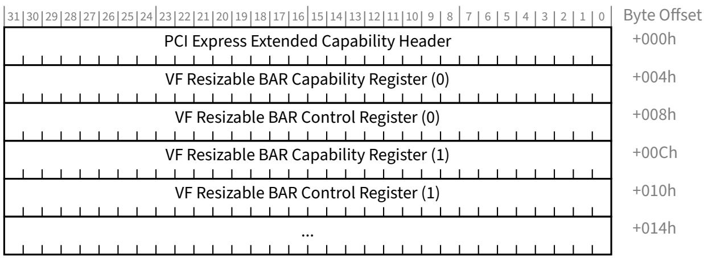


```
字节偏移：       0  1  2  3  4  5  6  7  8  9  10 11 12 13 14 15 16 17 18 19 20 21 22 23 24 25 26 27 28 29 30 31
+000h：          PCI Express 扩展能力头
+004h：          VF 可变大小 BAR 能力寄存器 (0)
+008h：          VF 可变大小 BAR 控制寄存器 (0)
+00Ch：          VF 可变大小 BAR 能力寄存器 (1)
+010h：          VF 可变大小 BAR 控制寄存器 (1)
+014h：          ...
```

</td>
</tr>
<tr>
<td>

> **IMPLEMENTATION NOTE:**
> **USING THE CAPABILITY DURING RESOURCE ALLOCATION**
>
> System software uses this capability in a similar way to the Resizable BAR capability. System software must first configure the System Page Size register (see § Section 9.2.1.1.1 ). Potential usable memory aperture sizes are reported by the PF, and read, from the VF Resizable BAR Extended Capability and Control registers. It is intended that the software allocate the largest of the reported sizes that it can, since allocating less address space than the largest reported size can result in lower performance. Software then writes the size to the VF Resizable BAR Control register for the appropriate VF BAR for the Function. Following this, the base address is written to the VF BAR.
>
> For interoperability reasons, it is possible that hardware will set the default size of the VF BAR to a low size; a size lower than the largest reported in the VF Resizable BAR Capability Register. Software that does not use this capability to size resources will likely result in sub-optimal resource allocation, where the resources are smaller than desirable, or not allocatable because there is no room for them. It is recommended that system software responsible for allocating resources in a resource constrained environment distribute the limited address space to all memory-mapped hardware, including system RAM, appropriately.

</td>
<td style="background-color:#e8e8e8">

> **实现说明：**
> **资源分配过程中能力的使用**
>
> 系统软件以与可变大小 BAR 能力类似的方式使用此能力。系统软件必须首先配置 System Page Size 寄存器（参见 § 第 9.2.1.1.1 节）。潜在可用的内存 aperture 大小由 PF 通过 VF 可变大小 BAR 扩展能力和控制寄存器进行通告和读取。设计上，软件应在可承受范围内分配所报告的最大大小，因为分配小于最大报告值的地址空间可能导致性能下降。然后，软件将该大小写入该 Function 对应 VF BAR 的 VF 可变大小 BAR 控制寄存器中。之后，将基址写入 VF BAR。
>
> 出于互操作性的考虑，硬件可能将 VF BAR 的默认大小设置为较小的值，该值可能小于 VF 可变大小 BAR 能力寄存器中报告的最大值。不使用此能力进行资源大小调整的软件很可能导致资源分配欠佳，使得资源小于期望值，或因地址空间不足而无法分配。建议在资源受限环境中负责分配资源的系统软件，将有限的地址空间合理地分配给包括系统 RAM 在内的所有内存映射硬件。

</td>
</tr>
</tbody>
</table>
</div>


[⬆️ 返回目录](#-本章目录-table-of-contents)

---

<!-- 📄 Page 1225 -->
---

<a id="sec-7-8-7-1"></a>
## 7.8.7.1 VF Resizable BAR Extended Capability Header (Offset 00h) | VF 可变大小 BAR 扩展能力头（偏移 00h）

<table>
<thead>
<tr>
<th width="50%">🇬🇧 English</th>
<th width="50%" style="background-color:#e8e8e8">🏆 中文</th>
</tr>
</thead>
<tbody>
<tr>
<td>

**Figure 7-179 VF Resizable BAR Extended Capability Header**

```
Bit 0-15:    PCI Express Extended Capability ID = 0024h
Bit 16-19:   Capability Version
Bit 20-31:   Next Capability Offset
```

**Table 7-154 VF Resizable BAR Extended Capability Header**

| Bit Location | Register Description | Attributes |
|--------------|----------------------|------------|
| 15:0 | PCI Express Extended Capability ID - This field is a PCI-SIG defined ID number that indicates the nature and format of the extended capability. PCI Express Extended Capability ID for the VF Resizable BAR Extended Capability is 0024h. | RO |
| 19:16 | Capability Version - This field is a PCI-SIG defined version number that indicates the version of the capability structure present. Must be 1h for this version of the specification. | RO |
| 31:20 | Next Capability Offset - This field contains the offset to the next PCI Express Extended Capability structure or 000h if no other items exist in the linked list of capabilities. | RO |

</td>
<td style="background-color:#e8e8e8">

**图 7-179 VF 可变大小 BAR 扩展能力头**

> 


```
位 0-15：    PCI Express 扩展能力 ID = 0024h
位 16-19：   Capability Version（能力版本）
位 20-31：   Next Capability Offset（下一能力偏移）
```

**表 7-154 VF 可变大小 BAR 扩展能力头**

| 位位置 | 寄存器描述 | 属性 |
|--------|------------|------|
| 15:0 | PCI Express 扩展能力 ID —— 此字段是由 PCI-SIG 定义的 ID 编号，用于指示扩展能力的性质和格式。VF 可变大小 BAR 扩展能力的 PCI Express 扩展能力 ID 为 0024h。 | RO |
| 19:16 | Capability Version（能力版本）—— 此字段是由 PCI-SIG 定义的版本号，用于指示所实现的能力结构版本。在本规范的本版本中必须为 1h。 | RO |
| 31:20 | Next Capability Offset（下一能力偏移）—— 此字段包含指向下一个 PCI Express 扩展能力结构的偏移；若能力链表中不存在其他项，则为 000h。 | RO |

</td>
</tr>
</tbody>
</table>

[⬆️ 返回目录](#-本章目录-table-of-contents)

---

<a id="sec-7-8-7-2"></a>
## 7.8.7.2 VF Resizable BAR Capability Register (Offset 04h) | VF 可变大小 BAR 能力寄存器（偏移 04h）

<table>
<thead>
<tr>
<th width="50%">🇬🇧 English</th>
<th width="50%" style="background-color:#e8e8e8">🏆 中文</th>
</tr>
</thead>
<tbody>
<tr>
<td>

The VF Resizable BAR Capability Register field descriptions are the same as the definitions in the Resizable BAR Capability Register in § Table 7-152. Where those descriptions say 'BAR', this register's description is for 'VF BAR'. Where those descriptions say 'Function', this register's description is for 'PF'. Otherwise, the field descriptions, the number of bits, their positions, and their attributes are the same. Consequently § Figure 7-176 similarly allocates the register fields in this register.

</td>
<td style="background-color:#e8e8e8">

VF 可变大小 BAR 能力寄存器的字段描述与 § 表 7-152 中可变大小 BAR 能力寄存器的定义相同。若那些描述中提及 "BAR"，则此处对应 "VF BAR"；若提及 "Function"，则此处对应 "PF"。除此之外，字段描述、位数、位置及属性均相同。因此 § 图 7-176 中的字段分配同样适用于本寄存器。

</td>
</tr>
</tbody>
</table>

[⬆️ 返回目录](#-本章目录-table-of-contents)

---

<a id="sec-7-8-7-3"></a>
## 7.8.7.3 VF Resizable BAR Control Register (Offset 08h) | VF 可变大小 BAR 控制寄存器（偏移 08h）


<div style="overflow-x: auto; max-width: 100%;">
<table>
<thead>
<tr>
<th width="50%">🇬🇧 English</th>
<th width="50%" style="background-color:#e8e8e8">🏆 中文</th>
</tr>
</thead>
<tbody>
<tr>
<td>

The VF Resizable BAR Control register bits 31:16 follow the same definitions as the Resizable BAR Control register in § Table 7-153.

**Figure 7-180 VF Resizable BAR Control Register**

```
Bit 0-2:    VF BAR Index
Bit 3-4:    RsvdP
Bit 5-7:    Number of VF Resizable BARs
Bit 8-13:   VF BAR Size
Bit 14-15:  RsvdP
Bit 16-31:  identical to the Resizable BAR Control Register
```

**Table 7-155 VF Resizable BAR Control Register**

| Bit Location | Register Description | Attributes |
|--------------|----------------------|------------|
| 2:0 | VF BAR Index - This encoded value points to the beginning of this particular VF BAR located in the SR-IOV Extended Capability. | RO |

**VF BAR Index encoding:**

| Encoding | VF BAR Location |
|----------|-----------------|
| 0 | VF BAR located at offset 24h |
| 1 | VF BAR located at offset 28h |
| 2 | VF BAR located at offset 2Ch |
| 3 | VF BAR located at offset 30h |
| 4 | VF BAR located at offset 34h |
| 5 | VF BAR located at offset 38h |
| others | All other encodings are reserved. |

For a 64-bit Base Address register, the VF BAR Index indicates the lower DWORD.

This value indicates which VF BAR supports a negotiable size.

</td>
<td style="background-color:#e8e8e8">

VF 可变大小 BAR 控制寄存器的 31:16 位定义与 § 表 7-153 中可变大小 BAR 控制寄存器的定义相同。

**图 7-180 VF 可变大小 BAR 控制寄存器**

> 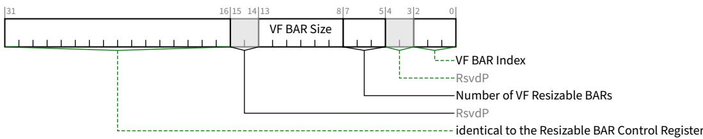


```
位 0-2：    VF BAR Index（VF BAR 索引）
位 3-4：    RsvdP
位 5-7：    Number of VF Resizable BARs（可变大小 VF BAR 数量）
位 8-13：   VF BAR Size（VF BAR 大小）
位 14-15：  RsvdP
位 16-31：  与可变大小 BAR 控制寄存器相同
```

**表 7-155 VF 可变大小 BAR 控制寄存器**

| 位位置 | 寄存器描述 | 属性 |
|--------|------------|------|
| 2:0 | VF BAR Index（VF BAR 索引）—— 此编码值指向位于 SR-IOV 扩展能力中此特定 VF BAR 的起始位置。 | RO |

**VF BAR Index 编码：**

| 编码 | VF BAR 位置 |
|------|-------------|
| 0 | VF BAR 位于偏移 24h |
| 1 | VF BAR 位于偏移 28h |
| 2 | VF BAR 位于偏移 2Ch |
| 3 | VF BAR 位于偏移 30h |
| 4 | VF BAR 位于偏移 34h |
| 5 | VF BAR 位于偏移 38h |
| 其他 | 所有其他编码均保留。 |

对于 64 位基址寄存器，VF BAR Index 指向低 32 位 DWORD。

此值指示哪一个 VF BAR 支持可协商大小。

</td>
</tr>
<tr>
<td>

| Bit Location | Register Description | Attributes |
|--------------|----------------------|------------|
| 7:5 | Number of VF Resizable BARs - Indicates the total number of resizable VF BARs in the capability structure for the Function. See § Figure 7-178. <br><br> The value of this field must be in the range of 01h to 06h. The field is valid in VF Resizable BAR Control register (0) (at offset 08h), and is RsvdP for all others. | RO/RsvdP |
| 13:8 | VF BAR Size - This is an encoded value. <br><br> 1 MB (2²⁰ bytes) <br> 2 MB (2²¹ bytes) <br> 4 MB (2²² bytes) <br> 8 MB (2²³ bytes) <br> … <br> 8 EB (2⁶³ bytes) <br><br> The default value of this field is equal to the default size of the address space that the VF BAR resource is requesting via the VF BAR's read-only bits. <br><br> Software must only write values that correspond to those indicated as supported in the VF Resizable BAR Capability and Control registers. Writing an unsupported value will produce undefined results. <br><br> When this register field is programmed, the value is immediately reflected in the size of the resource, as encoded in the number of read-only bits in the VF BAR. | RW |

</td>
<td style="background-color:#e8e8e8">

| 位位置 | 寄存器描述 | 属性 |
|--------|------------|------|
| 7:5 | Number of VF Resizable BARs（可变大小 VF BAR 数量）—— 指示该 Function 能力结构中可变大小 VF BAR 的总数。参见 § 图 7-178。 <br><br> 此字段的取值范围必须为 01h 至 06h。该字段在 VF Resizable BAR Control register (0)（位于偏移 08h）中有效，其他位置均为 RsvdP。 | RO/RsvdP |
| 13:8 | VF BAR Size（VF BAR 大小）—— 此为编码值。 <br><br> 1 MB（2²⁰ 字节） <br> 2 MB（2²¹ 字节） <br> 4 MB（2²² 字节） <br> 8 MB（2²³ 字节） <br> … <br> 8 EB（2⁶³ 字节） <br><br> 此字段的默认值等于该 VF BAR 资源通过其只读位所请求的地址空间默认大小。 <br><br> 软件仅可写入对应于 VF 可变大小 BAR 能力和控制寄存器中所支持的值。写入不支持的值将产生未定义的结果。 <br><br> 对该寄存器字段进行编程时，所配置的值会立即反映到资源大小上，该大小通过 VF BAR 中只读位的数量进行编码。 | RW |

</td>
</tr>
</tbody>
</table>
</div>


[⬆️ 返回目录](#-本章目录-table-of-contents)

---

<!-- 📄 Page 1227 -->
---

<table>
<thead>
<tr>
<th width="50%">🇬🇧 English</th>
<th width="50%" style="background-color:#e8e8e8">🏆 中文</th>
</tr>
</thead>
<tbody>
<tr>
<td>

| Bit Location | Register Description | Attributes |
|--------------|----------------------|------------|
| 31:16 | These bits are identical to the Resizable BAR Control Register bits [31:16] defined in § Figure 7-177. Where those descriptions say 'BAR', this register's description is for 'VF BAR'. Where those descriptions say 'Function', this register's description is for 'PF'. <br><br> See § Figure 7-177 | (see referenced) |

</td>
<td style="background-color:#e8e8e8">

| 位位置 | 寄存器描述 | 属性 |
|--------|------------|------|
| 31:16 | 这些位与 § 图 7-177 中定义的可变大小 BAR 控制寄存器的 [31:16] 位相同。若那些描述中提及 "BAR"，则此处对应 "VF BAR"；若提及 "Function"，则此处对应 "PF"。 <br><br> 参见 § 图 7-177 | （参见引用寄存器） |

</td>
</tr>
</tbody>
</table>

[⬆️ 返回目录](#-本章目录-table-of-contents)

---

<a id="sec-7-8-8"></a>
## 7.8.8 ARI Extended Capability | ARI 扩展能力


<div style="overflow-x: auto; max-width: 100%;">
<table>
<thead>
<tr>
<th width="50%">🇬🇧 English</th>
<th width="50%" style="background-color:#e8e8e8">🏆 中文</th>
</tr>
</thead>
<tbody>
<tr>
<td>

ARI is an optional capability, except as stated below. This capability must be implemented by each Function in an ARI Device. It is not applicable to a Root Port, a Switch Downstream Port, an RCiEP, or a Root Complex Event Collector.

For SR-IOV devices not in a Root Complex, implementing the ARI Extended Capability in each Function is mandatory.

**Figure 7-181 ARI Extended Capability**

```
Byte Offset:    0  1  2  3  4  5  6  7  8  9  10 11 12 13 14 15 16 17 18 19 20 21 22 23 24 25 26 27 28 29 30 31
+000h:          PCI Express Extended Capability Header
+004h:          ARI Capability Register
+008h:          ARI Control Register
```

**Figure 7-182 ARI Extended Capability Header**

```
Bit 0-15:    PCI Express Extended Capability ID = 000Eh
Bit 16-19:   Capability Version
Bit 20-31:   Next Capability Offset
```

**Table 7-156 ARI Extended Capability Header**

| Bit Location | Register Description | Attributes |
|--------------|----------------------|------------|
| 15:0 | PCI Express Extended Capability ID - This field is a PCI-SIG defined ID number that indicates the nature and format of the extended capability. PCI Express Extended Capability ID for the ARI Extended Capability is 000Eh. | RO |
| 19:16 | Capability Version - This field is a PCI-SIG defined version number that indicates the version of the capability structure present. Must be 1h for this version of the specification. | RO |
| 31:20 | Next Capability Offset - This field contains the offset to the next PCI Express Extended Capability structure or 000h if no other items exist in the linked list of Capabilities. | RO |

</td>
<td style="background-color:#e8e8e8">

ARI（替代路由 ID 解释，Alternative Routing ID Interpretation）是一种可选能力，除下文所述情况外，ARI 设备中的每个 Function 都必须实现此能力。该能力不适用于根端口（Root Port）、交换机下游端口（Switch Downstream Port）、RCiEP 或根复合体事件收集器（Root Complex Event Collector）。

对于不在根复合体（Root Complex）中的 SR-IOV 设备，必须在其每个 Function 中实现 ARI 扩展能力。

**图 7-181 ARI 扩展能力**

> 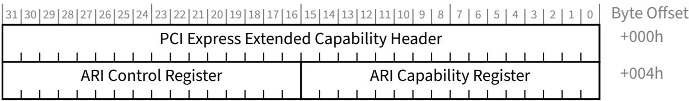


```
字节偏移：      0  1  2  3  4  5  6  7  8  9  10 11 12 13 14 15 16 17 18 19 20 21 22 23 24 25 26 27 28 29 30 31
+000h：         PCI Express 扩展能力头
+004h：         ARI 能力寄存器
+008h：         ARI 控制寄存器
```

**图 7-182 ARI 扩展能力头**

> 


```
位 0-15：    PCI Express 扩展能力 ID = 000Eh
位 16-19：   Capability Version（能力版本）
位 20-31：   Next Capability Offset（下一能力偏移）
```

**表 7-156 ARI 扩展能力头**

| 位位置 | 寄存器描述 | 属性 |
|--------|------------|------|
| 15:0 | PCI Express 扩展能力 ID —— 此字段是由 PCI-SIG 定义的 ID 编号，用于指示扩展能力的性质和格式。ARI 扩展能力的 PCI Express 扩展能力 ID 为 000Eh。 | RO |
| 19:16 | Capability Version（能力版本）—— 此字段是由 PCI-SIG 定义的版本号，用于指示所实现的能力结构版本。在本规范的本版本中必须为 1h。 | RO |
| 31:20 | Next Capability Offset（下一能力偏移）—— 此字段包含指向下一个 PCI Express 扩展能力结构的偏移；若能力链表中不存在其他项，则为 000h。 | RO |

</td>
</tr>
</tbody>
</table>
</div>


[⬆️ 返回目录](#-本章目录-table-of-contents)

---

---

<a id="sec-7-8-8-1"></a>
## 7.8.8.1 ARI Extended Capability Header (Offset 00h) | ARI 扩展能力头（偏移 00h）

<table>
<thead>
<tr>
<th width="50%">🇬🇧 English</th>
<th width="50%" style="background-color:#e8e8e8">🏆 中文</th>
</tr>
</thead>
<tbody>
<tr>
<td>

Reserved for ARI Extended Capability Header.

</td>
<td style="background-color:#e8e8e8">

ARI 扩展能力头保留位。

</td>
</tr>
</tbody>
</table>

---

<!-- 📄 Page 1228 -->
---

<a id="sec-7-8-8-1-fig"></a>
### 7.8.8.1 Figure 7-183 ARI Capability Register | 图 7-183 ARI 能力寄存器

**Figure 7-183. ARI Capability Register | 图 7-183. ARI 能力寄存器**

<table>
<thead>
<tr>
<th>Bits</th>
<th>Field</th>
</tr>
</thead>
<tbody>
<tr>
<td>0</td>
<td>MFVC Function Groups Capability (M)</td>
</tr>
<tr>
<td>1</td>
<td>ACS Function Groups Capability (A)</td>
</tr>
<tr>
<td>2:7</td>
<td>RsvdP</td>
</tr>
<tr>
<td>8:15</td>
<td>Next Function Number</td>
</tr>
</tbody>
</table>

**Table 7-157. ARI Capability Register | 表 7-157. ARI 能力寄存器**

| Bit Location | Register Description | Attributes |
|--------------|----------------------|------------|
| 0 | **MFVC Function Groups Capability (M)** - Applicable only for Function 0; must be Zero for all other Functions. If Set, indicates that the ARI Device supports Function Group level arbitration via its Multi-Function Virtual Channel (MFVC) Capability structure.<br>Any SR-IOV Device that implements the MFVC Extended Capability with the optional Function Arbitration Table and consumes more than one Bus Number must Set this bit in its Function 0. | RO |
| 1 | **ACS Function Groups Capability (A)** - Applicable only for Function 0; must be Zero for all other Functions. If Set, indicates that the ARI Device supports Function Group level granularity for ACS P2P Egress Control via its ACS Capability structures.<br>Any SR-IOV Device that implements the ACS Capability with the optional Egress Control Vector and consumes more than one Bus Number must Set this bit in its Function 0. | RO |
| 15:8 | **Next Function Number** - With non-VFs, this field indicates the Function Number of the next higher numbered Function in the Device, or 00h if there are no higher numbered Functions. Function 0 starts this linked list of Functions.<br>The presence of Shadow Functions does not affect this field.<br>For VFs, this field is undefined since VFs are located using First VF Offset (see § Section 9.3.3.9) and VF Stride (see § Section 9.3.3.10). | RO |

**Table 7-157. ARI Capability Register | 表 7-157. ARI 能力寄存器**

| 位位置 | 寄存器说明 | 属性 |
|--------|-----------|------|
| 0 | **MFVC Function Groups Capability (M)** —— 仅适用于 Function 0；其他所有 Function 必须为 0。置 1 表示 ARI 设备通过其 Multi-Function Virtual Channel（MFVC）能力结构支持 Function Group 级别的仲裁。<br>任何在 MFVC 扩展能力中实现了可选 Function Arbitration Table 并消耗多个 Bus Number 的 SR-IOV 设备必须在其 Function 0 中置 1 此位。 | RO |
| 1 | **ACS Function Groups Capability (A)** —— 仅适用于 Function 0；其他所有 Function 必须为 0。置 1 表示 ARI 设备通过其 ACS 能力结构支持以 Function Group 粒度进行 ACS P2P Egress Control。<br>任何在 ACS 能力中实现了可选 Egress Control Vector 并消耗多个 Bus Number 的 SR-IOV 设备必须在其 Function 0 中置 1 此位。 | RO |
| 15:8 | **Next Function Number** —— 对于非 VF，此字段指示设备中编号次高的下一个 Function 的 Function Number；若不存在更高编号的 Function，则为 00h。Function 0 启动此 Function 链表。<br>Shadow Function 的存在不影响此字段。<br>对于 VF，此字段未定义，因为 VF 是通过 First VF Offset（参见 § 9.3.3.9 节）和 VF Stride（参见 § 9.3.3.10 节）来定位的。 | RO |

---

<a id="sec-7-8-8-2"></a>
## 7.8.8.2 ARI Capability Register (Offset 04h) | ARI 能力寄存器（偏移 04h）

<table>
<thead>
<tr>
<th width="50%">🇬🇧 English</th>
<th width="50%" style="background-color:#e8e8e8">🏆 中文</th>
</tr>
</thead>
<tbody>
<tr>
<td>

Reserved for ARI Capability Register description.

</td>
<td style="background-color:#e8e8e8">

ARI 能力寄存器说明保留位。

</td>
</tr>
</tbody>
</table>

---

<!-- 📄 Page 1229 -->
---

### 7.8.8.2 Figure 7-184 ARI Control Register | 图 7-184 ARI 控制寄存器

**Figure 7-184. ARI Control Register | 图 7-184. ARI 控制寄存器**

<table>
<thead>
<tr>
<th>Bits</th>
<th>Field</th>
</tr>
</thead>
<tbody>
<tr>
<td>0</td>
<td>MFVC Function Groups Enable (M)</td>
</tr>
<tr>
<td>1</td>
<td>ACS Function Groups Enable (A)</td>
</tr>
<tr>
<td>2:3</td>
<td>RsvdP</td>
</tr>
<tr>
<td>4:6</td>
<td>Function Group</td>
</tr>
<tr>
<td>7:15</td>
<td>RsvdP</td>
</tr>
</tbody>
</table>

**Table 7-158. ARI Control Register | 表 7-158. ARI 控制寄存器**

| Bit Location | Register Description | Attributes |
|--------------|----------------------|------------|
| 0 | **MFVC Function Groups Enable (M)** - Applicable only for Function 0; must be hardwired to 0b for all other Functions. When set, the ARI Device must interpret entries in its Function Arbitration Table as Function Group Numbers rather than Function Numbers.<br>Default value of this bit is 0b. Must be hardwired to 0b if the MFVC Function Groups Capability bit is 0b. | RW |
| 1 | **ACS Function Groups Enable (A)** - Applicable only for Function 0; must be hardwired to 0b for all other Functions. When set, each Function in the ARI Device must associate bits within its Egress Control Vector with Function Group Numbers rather than Function Numbers.<br>Default value of this bit is 0b. Must be hardwired to 0b if the ACS Function Groups Capability bit is 0b. | RW |
| 6:4 | **Function Group** - Assigns a Function Group Number to this Function.<br>Default value of this field is 000b. Must be hardwired to 000b if in Function 0, the MFVC Function Groups Capability bit and ACS Function Groups Capability bit are both 0b. | RW |

**Table 7-158. ARI 控制寄存器**

| 位位置 | 寄存器说明 | 属性 |
|--------|-----------|------|
| 0 | **MFVC Function Groups Enable (M)** —— 仅适用于 Function 0；其他所有 Function 必须硬连线为 0b。置 1 时，ARI 设备必须将其 Function Arbitration Table 中的条目解释为 Function Group Number，而非 Function Number。<br>此位默认值为 0b。如果 MFVC Function Groups Capability 位为 0b，则必须硬连线为 0b。 | RW |
| 1 | **ACS Function Groups Enable (A)** —— 仅适用于 Function 0；其他所有 Function 必须硬连线为 0b。置 1 时，ARI 设备中的每个 Function 必须将其 Egress Control Vector 中的位与 Function Group Number 关联，而非 Function Number。<br>此位默认值为 0b。如果 ACS Function Groups Capability 位为 0b，则必须硬连线为 0b。 | RW |
| 6:4 | **Function Group** —— 为本 Function 分配一个 Function Group Number。<br>此字段默认值为 000b。如果在 Function 0 中 MFVC Function Groups Capability 位和 ACS Function Groups Capability 位都为 0b，则必须硬连线为 000b。 | RW |

---

<a id="sec-7-8-8-3"></a>
## 7.8.8.3 ARI Control Register (Offset 06h) | ARI 控制寄存器（偏移 06h）

<table>
<thead>
<tr>
<th width="50%">🇬🇧 English</th>
<th width="50%" style="background-color:#e8e8e8">🏆 中文</th>
</tr>
</thead>
<tbody>
<tr>
<td>

Refer to the ARI Control Register description above (§ 7.8.8.2).

</td>
<td style="background-color:#e8e8e8">

参见上文 ARI 控制寄存器的说明（§ 7.8.8.2）。

</td>
</tr>
</tbody>
</table>

---

<a id="sec-7-8-9"></a>
## 7.8.9 PASID Extended Capability Structure | PASID 扩展能力结构


<div style="overflow-x: auto; max-width: 100%;">
<table>
<thead>
<tr>
<th width="50%">🇬🇧 English</th>
<th width="50%" style="background-color:#e8e8e8">🏆 中文</th>
</tr>
</thead>
<tbody>
<tr>
<td>

The presence of a PASID Extended Capability indicates that one or more Endpoint Functions support sending and receiving TLPs containing a PASID TLP Prefix in NFM or containing OHC with PASID in FM. Separate support and enables are provided for the various optional features.

This capability is only permitted to be implemented in to Endpoints Functions (including RCiEPs). A PF is permitted to implement the PASID capability, but VFs must not implement it. For Root Ports, support and control is outside the scope of this specification.

In earlier revisions of this specification, it was ambiguous whether a single PASID capability or multiple PASID capabilities are supported for an MFD. For backward compatibility, both models are supported. In the PASID Capability and Control register bit definitions, the phrase "applicable Endpoint Function" refers to the following rules:

- If an SFD contains a PASID capability, it must apply to the SFD's single Endpoint Function.
- If an MFD contains a single PASID capability, it must apply to all Endpoint Functions in the MFD, including all VFs regardless of their PF association.

</td>
<td style="background-color:#e8e8e8">

存在 PASID 扩展能力表明一个或多个 Endpoint (端点) Function 支持在 NFM 中发送和接收包含 PASID TLP Prefix 的 TLP，或在 FM 中发送和接收包含带 PASID 的 OHC 的 TLP。各种可选功能分别提供独立的 Support 和 Enable 字段。

此能力仅允许在 Endpoint Function（包括 RCiEP）中实现。允许 PF 实现 PASID 能力，但 VF 不得实现。对于 Root Port (根端口)，其 Support 和 Control 不在本规范范围内。

在早期版本的规范中，MFD 是支持单一 PASID 能力还是多个 PASID 能力并不明确。为向后兼容，两种模型都受支持。在 PASID 能力与控制寄存器的位定义中，"applicable Endpoint Function（适用的 Endpoint Function）"一词指以下规则：

- 如果 SFD 包含 PASID 能力，则它必须适用于 SFD 的唯一 Endpoint Function。
- 如果 MFD 包含单一 PASID 能力，则它必须适用于 MFD 中的所有 Endpoint Function，包括所有 VF（无论其关联到哪个 PF）。

</td>
</tr>
</tbody>
</table>
</div>


---

<!-- 📄 Page 1230 -->
---

<table>
<thead>
<tr>
<th width="50%">🇬🇧 English</th>
<th width="50%" style="background-color:#e8e8e8">🏆 中文</th>
</tr>
</thead>
<tbody>
<tr>
<td>

- If an MFD contains multiple PASID capabilities, each PASID capability that exists must apply only to the Endpoint Function in which it resides, with the exception that if a PF contains a PASID capability, that PASID capability must apply to all VFs associated with that PF.

When a PASID capability applies to multiple Endpoint Functions in a device, the device sends the requesting Function's ID in the Requester ID field of the TLP containing the PASID.

This capability is independent of both the ATS and PRI features defined in § Chapter 10. Endpoint Functions that contain a PASID Extended Capability need not support ATS or PRI. Endpoint Functions that support ATS or PRI need not support PASID.

§ Figure 7-185 details allocation of the register bits in the PASID Extended Capability structure.

</td>
<td style="background-color:#e8e8e8">

- 如果 MFD 包含多个 PASID 能力，则每个存在的 PASID 能力必须仅适用于其所在的 Endpoint Function；但有一个例外：如果某个 PF 包含 PASID 能力，则该 PASID 能力必须适用于与该 PF 关联的所有 VF。

当 PASID 能力适用于设备中的多个 Endpoint Function 时，设备在包含 PASID 的 TLP 的 Requester ID 字段中发送请求 Function 的 ID。

此能力独立于第 10 章中定义的 ATS 和 PRI 特性。包含 PASID 扩展能力的 Endpoint Function 不必支持 ATS 或 PRI。支持 ATS 或 PRI 的 Endpoint Function 不必支持 PASID。

§ 图 7-185 详细说明了 PASID 扩展能力结构中寄存器位的分配。

</td>
</tr>
</tbody>
</table>

### Figure 7-185 PASID Extended Capability Structure | 图 7-185 PASID 扩展能力结构

**Figure 7-185. PASID Extended Capability Structure | 图 7-185. PASID 扩展能力结构**

| Byte Offset | Register |
|-------------|----------|
| +000h | PCI Express Extended Capability Header |
| +004h | PASID Capability Register |
| +006h | PASID Control Register |

> Note: 32-bit register fields are reserved space.

---

<table>
<thead>
<tr>
<th width="50%">🇬🇧 English</th>
<th width="50%" style="background-color:#e8e8e8">🏆 中文</th>
</tr>
</thead>
<tbody>
<tr>
<td>

§ Figure 7-186 details allocation of the register fields in the PASID Extended Capability Header; § Table 7-159 provides the respective bit definitions.

</td>
<td style="background-color:#e8e8e8">

§ 图 7-186 详细说明了 PASID 扩展能力头中寄存器字段的分配；§ 表 7-159 给出了相应的位定义。

</td>
</tr>
</tbody>
</table>

### Figure 7-186 PASID Extended Capability Header | 图 7-186 PASID 扩展能力头

**Figure 7-186. PASID Extended Capability Header | 图 7-186. PASID 扩展能力头**

<table>
<thead>
<tr>
<th>Bits</th>
<th>Field</th>
<th>Value</th>
</tr>
</thead>
<tbody>
<tr>
<td>0:15</td>
<td>PASID Extended Capability ID</td>
<td>001Bh</td>
</tr>
<tr>
<td>16:19</td>
<td>Capability Version</td>
<td></td>
</tr>
<tr>
<td>20:31</td>
<td>Next Capability Offset</td>
<td></td>
</tr>
</tbody>
</table>

**Table 7-159. PASID Extended Capability Header | 表 7-159. PASID 扩展能力头**

| Bit Location | Register Description | Attributes |
|--------------|----------------------|------------|
| 15:0 | **PASID Extended Capability ID** - Indicates the PASID Extended Capability structure. This field must return a Capability ID of 001Bh indicating that this is a PASID Extended Capability structure. | RO |
| 19:16 | **Capability Version** - This field is a PCI-SIG defined version number that indicates the version of the Capability structure present.<br>Must be 1h for this version of the specification. | RO |
| 31:20 | **Next Capability Offset** - The offset to the next PCI Extended Capability structure or 000h if no other items exist in the linked list of capabilities. | RO |

**Table 7-159. PASID 扩展能力头**

| 位位置 | 寄存器说明 | 属性 |
|--------|-----------|------|
| 15:0 | **PASID Extended Capability ID** —— 标识 PASID 扩展能力结构。此字段必须返回 Capability ID 001Bh，表示这是一个 PASID 扩展能力结构。 | RO |
| 19:16 | **Capability Version** —— 此字段是 PCI-SIG 定义的版本号，指示所呈现的能力结构版本。<br>在本规范版本中必须为 1h。 | RO |
| 31:20 | **Next Capability Offset** —— 指向下一个 PCI 扩展能力结构的偏移量；若能力链表无其他项则为 000h。 | RO |

---

<a id="sec-7-8-9-1"></a>
## 7.8.9.1 PASID Extended Capability Header (Offset 00h) | PASID 扩展能力头（偏移 00h）

<table>
<thead>
<tr>
<th width="50%">🇬🇧 English</th>
<th width="50%" style="background-color:#e8e8e8">🏆 中文</th>
</tr>
</thead>
<tbody>
<tr>
<td>

Refer to the PASID Extended Capability Header description above.

</td>
<td style="background-color:#e8e8e8">

参见上文 PASID 扩展能力头的说明。

</td>
</tr>
</tbody>
</table>

---

<!-- 📄 Page 1231 -->
---

<a id="sec-7-8-9-2"></a>
## 7.8.9.2 PASID Capability Register (Offset 04h) | PASID 能力寄存器（偏移 04h）

<table>
<thead>
<tr>
<th width="50%">🇬🇧 English</th>
<th width="50%" style="background-color:#e8e8e8">🏆 中文</th>
</tr>
</thead>
<tbody>
<tr>
<td>

§ Figure 7-187 details the allocation of register bits of the PASID Capability register; § Table 7-160 provides the respective bit definitions.

</td>
<td style="background-color:#e8e8e8">

§ 图 7-187 详细说明了 PASID 能力寄存器中寄存器位的分配；§ 表 7-160 给出了相应的位定义。

</td>
</tr>
</tbody>
</table>

### Figure 7-187 PASID Capability Register | 图 7-187 PASID 能力寄存器

**Figure 7-187. PASID Capability Register | 图 7-187. PASID 能力寄存器**

<table>
<thead>
<tr>
<th>Bits</th>
<th>Field</th>
</tr>
</thead>
<tbody>
<tr>
<td>0</td>
<td>RsvdP</td>
</tr>
<tr>
<td>1</td>
<td>Execute Permission Supported</td>
</tr>
<tr>
<td>2</td>
<td>Privileged Mode Supported</td>
</tr>
<tr>
<td>3</td>
<td>Translated Requests with PASID Supported</td>
</tr>
<tr>
<td>4:7</td>
<td>RsvdP</td>
</tr>
<tr>
<td>8:12</td>
<td>Max PASID Width</td>
</tr>
<tr>
<td>13:15</td>
<td>RsvdP</td>
</tr>
</tbody>
</table>

**Table 7-160. PASID Capability Register | 表 7-160. PASID 能力寄存器**

| Bit Location | Register Description | Attributes |
|--------------|----------------------|------------|
| 1 | **Execute Permission Supported** - If Set, an applicable Endpoint Function supports sending TLPs that have the Execute Requested bit Set.<br>If Clear, the Endpoint Function will never Set the Execute Requested bit.<br>It is strongly recommended that this bit be hardwired to 0b. | RO |
| 2 | **Privileged Mode Supported** - If Set, an applicable Endpoint Function supports operating in Privileged and Non-Privileged modes, and supports sending requests that have the Privileged Mode Requested bit Set.<br>If Clear, the Endpoint Function will never Set the Privileged Mode Requested bit. | RO |
| 3 | **Translated Requests with PASID Supported** – If Set, indicates that an applicable Endpoint Function supports Translated Requests with PASID (see § Section 10.1.3). This bit is only permitted to be Set if the Endpoint Function supports ATS. | RO |
| 12:8 | **Max PASID Width** - Indicates the width of the PASID field supported by an applicable Endpoint Function.<br>The value n indicates support for PASID values 0 through 2n-1 (inclusive). The value 0 indicates support for a single PASID (0). The value 20 indicates support for all PASID values (20 bits). This field must be between 0 and 20 (inclusive). | RO |

**Table 7-160. PASID 能力寄存器**

| 位位置 | 寄存器说明 | 属性 |
|--------|-----------|------|
| 1 | **Execute Permission Supported** —— 置 1 表示适用的 Endpoint Function 支持发送 Execute Requested 位置 1 的 TLP。<br>清 0 时，Endpoint Function 永远不会置 1 Execute Requested 位。<br>强烈建议将此位硬连线为 0b。 | RO |
| 2 | **Privileged Mode Supported** —— 置 1 表示适用的 Endpoint Function 支持在 Privileged 和 Non-Privileged 模式下工作，并支持发送 Privileged Mode Requested 位置 1 的请求。<br>清 0 时，Endpoint Function 永远不会置 1 Privileged Mode Requested 位。 | RO |
| 3 | **Translated Requests with PASID Supported** —— 置 1 表示适用的 Endpoint Function 支持带 PASID 的 Translated Request（已转换请求）（参见 § 10.1.3 节）。仅当 Endpoint Function 支持 ATS 时才允许置 1 此位。 | RO |
| 12:8 | **Max PASID Width** —— 指示适用的 Endpoint Function 所支持的 PASID 字段宽度。<br>值 n 表示支持 PASID 值 0 到 2n-1（含）。值 0 表示支持单个 PASID（0）。值 20 表示支持所有 PASID 值（20 位）。此字段必须介于 0 到 20 之间（含）。 | RO |

---

<a id="sec-7-8-9-3"></a>
## 7.8.9.3 PASID Control Register (Offset 06h) | PASID 控制寄存器（偏移 06h）

<table>
<thead>
<tr>
<th width="50%">🇬🇧 English</th>
<th width="50%" style="background-color:#e8e8e8">🏆 中文</th>
</tr>
</thead>
<tbody>
<tr>
<td>

§ Figure 7-188 details the allocation of register bits of the PASID Control register; § Table 7-161 provides the respective bit definitions.

</td>
<td style="background-color:#e8e8e8">

§ 图 7-188 详细说明了 PASID 控制寄存器中寄存器位的分配；§ 表 7-161 给出了相应的位定义。

</td>
</tr>
</tbody>
</table>

---

<!-- 📄 Page 1232 -->
---

### Figure 7-188 PASID Control Register | 图 7-188 PASID 控制寄存器

**Figure 7-188. PASID Control Register | 图 7-188. PASID 控制寄存器**

<table>
<thead>
<tr>
<th>Bits</th>
<th>Field</th>
</tr>
</thead>
<tbody>
<tr>
<td>0</td>
<td>PASID Enable</td>
</tr>
<tr>
<td>1</td>
<td>Execute Permission Enable</td>
</tr>
<tr>
<td>2</td>
<td>Privileged Mode Enable</td>
</tr>
<tr>
<td>3</td>
<td>Translated Requests with PASID Enable</td>
</tr>
<tr>
<td>4:15</td>
<td>RsvdP</td>
</tr>
</tbody>
</table>

**Table 7-161. PASID Control Register | 表 7-161. PASID 控制寄存器**

| Bit Location | Register Description | Attributes |
|--------------|----------------------|------------|
| 0 | **PASID Enable** - If Set, an applicable Endpoint Function is permitted to send and receive TLPs that contain a PASID TLP Prefix. If Clear, the Endpoint Function is not permitted to do so.<br>Behavior is undefined if an applicable Endpoint Function supports ATS and this bit changes value when the Enable (E) bit in that Function's ATS Control Register is Set (see § Section 10.5.1.3).<br>Default is 0b. | RW |
| 1 | **Execute Permission Enable** - If Set, an applicable Endpoint Function is permitted to send Requests that have the Execute Requested bit Set. If Clear, the Endpoint is not permitted to do so.<br>Behavior is undefined if an applicable Endpoint Function supports ATS and this bit changes value when the Enable bit in that Function's ATS Control Register is Set (see § Section 10.5.1.3).<br>If Execute Permission Supported is Clear, this bit is RsvdP.<br>Default is 0b. | RW/RsvdP (see description) |
| 2 | **Privileged Mode Enable** - If Set, an applicable Endpoint Function is permitted to send Requests that have the Privileged Mode Requested bit Set. If Clear, the Endpoint Function is not permitted to do so.<br>Behavior is undefined if an applicable Endpoint Function supports ATS and this bit changes value when the Enable bit in that Function's ATS Control Register is Set (see § Section 10.5.1.3).<br>If Privileged Mode Supported is Clear, this bit is RsvdP.<br>Default is 0b. | RW/RsvdP (see description) |
| 3 | **Translated Requests with PASID Enable** – When Set, the ATC associated with an applicable Endpoint Function is permitted to issue Translated Requests with a PASID TLP Prefix. If the ATC obtained a translation using a Translation Request with PASID, the corresponding Translated Request must carry a PASID that matches the PASID used to obtain the translation. Similarly, if the ATC obtained a translation using a Translation Request without a PASID, the corresponding Translated Request must not carry a PASID.<br>When Clear, the ATC associated with the Endpoint Function is prohibited from issuing Translated Requests with a PASID.<br>Behavior is undefined if an applicable Endpoint Function supports ATS this bit changes value when the Enable (E) bit in that Function's ATS Control Register is Set (see § Section 10.5.1.3).<br>If Translated Requests with PASID Supported bit is Clear, this bit is RsvdP. See (see § Section 10.1.3) for details.<br>Default is 0b. | RW/RsvdP (see description) |

**Table 7-161. PASID 控制寄存器**

| 位位置 | 寄存器说明 | 属性 |
|--------|-----------|------|
| 0 | **PASID Enable** —— 置 1 时，允许适用的 Endpoint Function 发送和接收包含 PASID TLP Prefix 的 TLP。清 0 时，Endpoint Function 不允许这样做。<br>如果适用的 Endpoint Function 支持 ATS 且此位在该 Function 的 ATS Control Register 的 Enable（E）位置 1 时发生改变，则行为未定义（参见 § 10.5.1.3 节）。<br>默认为 0b。 | RW |
| 1 | **Execute Permission Enable** —— 置 1 时，允许适用的 Endpoint Function 发送 Execute Requested 位置 1 的请求。清 0 时，Endpoint 不允许这样做。<br>如果适用的 Endpoint Function 支持 ATS 且此位在该 Function 的 ATS Control Register 的 Enable 位发生改变时，行为未定义（参见 § 10.5.1.3 节）。<br>如果 Execute Permission Supported 清 0，则此位为 RsvdP。<br>默认为 0b。 | RW/RsvdP（见说明） |
| 2 | **Privileged Mode Enable** —— 置 1 时，允许适用的 Endpoint Function 发送 Privileged Mode Requested 位置 1 的请求。清 0 时，Endpoint Function 不允许这样做。<br>如果适用的 Endpoint Function 支持 ATS 且此位在该 Function 的 ATS Control Register 的 Enable 位发生改变时，行为未定义（参见 § 10.5.1.3 节）。<br>如果 Privileged Mode Supported 清 0，则此位为 RsvdP。<br>默认为 0b。 | RW/RsvdP（见说明） |
| 3 | **Translated Requests with PASID Enable** —— 置 1 时，与适用的 Endpoint Function 关联的 ATC 允许发出带 PASID TLP Prefix 的 Translated Request（已转换请求）。如果 ATC 通过带 PASID 的 Translation Request 获得了转换，则相应的 Translated Request 必须携带与获得该转换所用 PASID 相匹配的 PASID。类似地，如果 ATC 通过不带 PASID 的 Translation Request 获得了转换，则相应的 Translated Request 不得携带 PASID。<br>清 0 时，禁止与 Endpoint Function 关联的 ATC 发出带 PASID 的 Translated Request。<br>如果适用的 Endpoint Function 支持 ATS 且此位在该 Function 的 ATS Control Register 的 Enable（E）位置 1 时发生改变，则行为未定义（参见 § 10.5.1.3 节）。<br>如果 Translated Requests with PASID Supported 位清 0，则此位为 RsvdP。详见（参见 § 10.1.3 节）。<br>默认为 0b。 | RW/RsvdP（见说明） |

---

<!-- 📄 Page 1233 -->
---

<a id="sec-7-8-10"></a>
## 7.8.10 FRS Queueing Extended Capability | FRS 排队扩展能力

<table>
<thead>
<tr>
<th width="50%">🇬🇧 English</th>
<th width="50%" style="background-color:#e8e8e8">🏆 中文</th>
</tr>
</thead>
<tbody>
<tr>
<td>

The FRS Queueing Extended Capability is required for Root Ports and Root Complex Event Collectors that support the optional normative FRS Queueing capability. See § Section 6.22. This extended capability is only permitted in Root Ports and Root Complex Event Collectors.

If this capability is present in a Function, that Function must also implement either MSI, MSI-X, or both.

</td>
<td style="background-color:#e8e8e8">

FRS Queueing 扩展能力对于支持可选规范性 FRS Queueing 能力的 Root Port (根端口) 和 Root Complex Event Collector 是必需的。参见 § 6.22 节。此扩展能力仅允许出现在 Root Port 和 Root Complex Event Collector 中。

如果此能力出现在某个 Function 中，则该 Function 还必须实现 MSI、MSI-X 或两者。

</td>
</tr>
</tbody>
</table>

### Figure 7-189 FRS Queueing Extended Capability | 图 7-189 FRS 排队扩展能力

**Figure 7-189. FRS Queueing Extended Capability | 图 7-189. FRS 排队扩展能力**

| Byte Offset | Register |
|-------------|----------|
| +000h | PCI Express Extended Capability Header |
| +004h | FRS Queueing Capability Register |
| +008h | FRS Queueing Status Register |
| +00Ch | FRS Queueing Control Register |
| +010h | FRS Message Queue Register |

> Note: The full 32-bit byte offset range is reserved for this capability structure.

---

<a id="sec-7-8-10-1"></a>
## 7.8.10.1 FRS Queueing Extended Capability Header (Offset 00h) | FRS 排队扩展能力头（偏移 00h）

<table>
<thead>
<tr>
<th width="50%">🇬🇧 English</th>
<th width="50%" style="background-color:#e8e8e8">🏆 中文</th>
</tr>
</thead>
<tbody>
<tr>
<td>

§ Figure 7-190 details the allocation of register fields in the FRS Queueing Extended Capability Header; § Table 7-162 provides the respective bit definitions.

</td>
<td style="background-color:#e8e8e8">

§ 图 7-190 详细说明了 FRS 排队扩展能力头中寄存器字段的分配；§ 表 7-162 给出了相应的位定义。

</td>
</tr>
</tbody>
</table>

### Figure 7-190 FRS Queueing Extended Capability Header | 图 7-190 FRS 排队扩展能力头

**Figure 7-190. FRS Queueing Extended Capability Header | 图 7-190. FRS 排队扩展能力头**

<table>
<thead>
<tr>
<th>Bits</th>
<th>Field</th>
<th>Value</th>
</tr>
</thead>
<tbody>
<tr>
<td>0:15</td>
<td>PCI Express Extended Capability ID</td>
<td>0021h</td>
</tr>
<tr>
<td>16:19</td>
<td>Capability Version</td>
<td></td>
</tr>
<tr>
<td>20:31</td>
<td>Next Capability Offset</td>
<td></td>
</tr>
</tbody>
</table>

**Table 7-162. FRS Queueing Extended Capability Header | 表 7-162. FRS 排队扩展能力头**

| Bit Location | Register Description | Attributes |
|--------------|----------------------|------------|
| 15:0 | **PCI Express Extended Capability ID** - This field is a PCI-SIG defined ID number that indicates the nature and format of the extended capability.<br>PCI Express Extended Capability ID for the FRS Queueing Extended Capability is 0021h. | RO |
| 19:16 | **Capability Version** - This field is a PCI-SIG defined version number that indicates the version of the capability structure present.<br>Must be 1h for this version of the specification. | RO |
| 31:20 | **Next Capability Offset** - This field contains the offset to the next PCI Express Extended Capability structure or 000h if no other items exist in the linked list of capabilities. | RO |

**Table 7-162. FRS 排队扩展能力头**

| 位位置 | 寄存器说明 | 属性 |
|--------|-----------|------|
| 15:0 | **PCI Express Extended Capability ID** —— 此字段是 PCI-SIG 定义的 ID 号，用于指示扩展能力的性质和格式。<br>FRS 排队扩展能力的 PCI Express Extended Capability ID 为 0021h。 | RO |
| 19:16 | **Capability Version** —— 此字段是 PCI-SIG 定义的版本号，指示所呈现能力结构的版本。<br>在本规范版本中必须为 1h。 | RO |
| 31:20 | **Next Capability Offset** —— 此字段包含指向下一个 PCI Express 扩展能力结构的偏移量；若能力链表中无其他项则为 000h。 | RO |

---

<!-- 📄 Page 1234 -->
---

<a id="sec-7-8-10-2"></a>
## 7.8.10.2 FRS Queueing Capability Register (Offset 04h) | FRS 排队能力寄存器（偏移 04h）

<table>
<thead>
<tr>
<th width="50%">🇬🇧 English</th>
<th width="50%" style="background-color:#e8e8e8">🏆 中文</th>
</tr>
</thead>
<tbody>
<tr>
<td>

§ Figure 7-191 details the allocation of register bits of the FRS Queueing Capability register; § Table 7-163 provides the respective bit definitions.

</td>
<td style="background-color:#e8e8e8">

§ 图 7-191 详细说明了 FRS 排队能力寄存器中寄存器位的分配；§ 表 7-163 给出了相应的位定义。

</td>
</tr>
</tbody>
</table>

### Figure 7-191 FRS Queueing Capability Register | 图 7-191 FRS 排队能力寄存器

**Figure 7-191. FRS Queueing Capability Register | 图 7-191. FRS 排队能力寄存器**

<table>
<thead>
<tr>
<th>Bits</th>
<th>Field</th>
</tr>
</thead>
<tbody>
<tr>
<td>0:11</td>
<td>FRS Queue Max Depth</td>
</tr>
<tr>
<td>12:15</td>
<td>RsvdP</td>
</tr>
<tr>
<td>16:20</td>
<td>FRS Interrupt Message Number</td>
</tr>
<tr>
<td>21:31</td>
<td>RsvdP</td>
</tr>
</tbody>
</table>

**Table 7-163. FRS Queueing Capability Register | 表 7-163. FRS 排队能力寄存器**

| Bit Location | Register Description | Attributes |
|--------------|----------------------|------------|
| 11:0 | **FRS Queue Max Depth** - Indicates the implemented queue depth, with valid values ranging from 001h (queue depth of 1) to FFFh (queue depth of 4095).<br>The value of FRS Message Queue Depth must not exceed this value.<br>The value 000h is Reserved. | HwInit |
| 20:16 | **FRS Interrupt Message Number** - This register indicates which MSI/MSI-X vector is used for the interrupt message generated in association with FRS Message Received or FRS Message Overflow.<br>For MSI, the value in this register indicates the offset between the base Message Data and the interrupt message that is generated. Hardware is required to update this field so that it is correct if the number of MSI Messages assigned to the Function changes when software writes to the Multiple Message Enable field in the Message Control Register for MSI.<br>For MSI-X, the value in this register indicates which MSI-X Table entry is used to generate the interrupt message. The entry must be one of the first 32 entries even if the Function implements more than 32 entries. For a given MSI-X implementation, the entry must remain constant.<br>If both MSI and MSI-X are implemented, they are permitted to use different vectors, though software is permitted to enable only one mechanism at a time. If MSI-X is enabled, the value in this register must indicate the vector for MSI-X. If MSI is enabled or neither is enabled, the value in this register must indicate the vector for MSI. If software enables both MSI and MSI-X at the same time, the value in this register is undefined. | RO |

**Table 7-163. FRS 排队能力寄存器**

| 位位置 | 寄存器说明 | 属性 |
|--------|-----------|------|
| 11:0 | **FRS Queue Max Depth** —— 指示已实现的队列深度，有效值范围为 001h（队列深度 1）到 FFFh（队列深度 4095）。<br>FRS Message Queue Depth 的值不得超过此值。<br>值 000h 为保留。 | HwInit |
| 20:16 | **FRS Interrupt Message Number** —— 此寄存器指示与 FRS Message Received 或 FRS Message Overflow 关联产生中断消息时所用的 MSI/MSI-X vector（向量）。<br>对于 MSI，此寄存器中的值表示基址 Message Data 与所产生中断消息之间的偏移量。当软件写入 MSI 的 Message Control Register 中的 Multiple Message Enable 字段导致分配给该 Function 的 MSI Message 数量变化时，硬件必须更新此字段以使其保持正确。<br>对于 MSI-X，此寄存器中的值指示使用哪个 MSI-X Table 条目来产生中断消息。即使 Function 实现了多于 32 个条目，该条目也必须是前 32 个条目之一。对于给定的 MSI-X 实现，该条目必须保持不变。<br>如果同时实现了 MSI 和 MSI-X，则允许它们使用不同的向量，但软件一次只允许启用一种机制。如果启用了 MSI-X，则此寄存器中的值必须指示 MSI-X 的向量。如果启用了 MSI 或两者都未启用，则此寄存器中的值必须指示 MSI 的向量。如果软件同时启用了 MSI 和 MSI-X，则此寄存器中的值未定义。 | RO |

---

<a id="sec-7-8-10-3"></a>
## 7.8.10.3 FRS Queueing Status Register (Offset 08h) | FRS 排队状态寄存器（偏移 08h）

<table>
<thead>
<tr>
<th width="50%">🇬🇧 English</th>
<th width="50%" style="background-color:#e8e8e8">🏆 中文</th>
</tr>
</thead>
<tbody>
<tr>
<td>

§ Figure 7-192 details the allocation of register bits of the FRS Queueing Status register; § Table 7-164 provides the respective bit definitions.

</td>
<td style="background-color:#e8e8e8">

§ 图 7-192 详细说明了 FRS 排队状态寄存器中寄存器位的分配；§ 表 7-164 给出了相应的位定义。

</td>
</tr>
</tbody>
</table>

### Figure 7-192 FRS Queueing Status Register | 图 7-192 FRS 排队状态寄存器

**Figure 7-192. FRS Queueing Status Register | 图 7-192. FRS 排队状态寄存器**

<table>
<thead>
<tr>
<th>Bits</th>
<th>Field</th>
</tr>
</thead>
<tbody>
<tr>
<td>0</td>
<td>FRS Message Received</td>
</tr>
<tr>
<td>1</td>
<td>FRS Message Overflow</td>
</tr>
<tr>
<td>2:15</td>
<td>RsvdZ</td>
</tr>
</tbody>
</table>

---

<!-- 📄 Page 1235 -->
---

**Table 7-164. FRS Queueing Status Register | 表 7-164. FRS 排队状态寄存器**

| Bit Location | Register Description | Attributes |
|--------------|----------------------|------------|
| 0 | **FRS Message Received** - This bit is Set when a new FRS Message is Received or generated by this Root Port or Root Complex Event Collector.<br>Root Ports must Clear this bit when the Link is DL_Down.<br>Default value of this bit is 0b. | RW1C |
| 1 | **FRS Message Overflow** - This bit is Set if the FRS Message queue is full and a new FRS Message is received or generated by this Root Port or Root Complex Event Collector.<br>Root Ports must Clear this bit when the Link is DL_Down.<br>Default value of this bit is 0b. | RW1C |

**Table 7-164. FRS 排队状态寄存器**

| 位位置 | 寄存器说明 | 属性 |
|--------|-----------|------|
| 0 | **FRS Message Received** —— 当此 Root Port 或 Root Complex Event Collector 接收或生成新的 FRS Message 时，该位置 1。<br>Root Port 必须在 Link 为 DL_Down 时清 0 此位。<br>此位默认值为 0b。 | RW1C |
| 1 | **FRS Message Overflow** —— 如果 FRS Message 队列已满且此 Root Port 或 Root Complex Event Collector 接收到或生成了新的 FRS Message，则该位置 1。<br>Root Port 必须在 Link 为 DL_Down 时清 0 此位。<br>此位默认值为 0b。 | RW1C |

---

### Figure 7-193 FRS Queueing Control Register | 图 7-193 FRS 排队控制寄存器

**Figure 7-193. FRS Queueing Control Register | 图 7-193. FRS 排队控制寄存器**

<table>
<thead>
<tr>
<th>Bits</th>
<th>Field</th>
</tr>
</thead>
<tbody>
<tr>
<td>0</td>
<td>FRS Interrupt Enable</td>
</tr>
<tr>
<td>1:15</td>
<td>RsvdP</td>
</tr>
</tbody>
</table>

**Table 7-165. FRS Queueing Control Register | 表 7-165. FRS 排队控制寄存器**

| Bit Location | Register Description | Attributes |
|--------------|----------------------|------------|
| 0 | **FRS Interrupt Enable** - When Set and MSI or MSI-X is enabled, the Port must issue an MSI/MSI-X interrupt to indicate the 0b to 1b transition of either the FRS Message Received or the FRS Message Overflow bits.<br>Default value of this bit is 0b. | RW |

**Table 7-165. FRS 排队控制寄存器**

| 位位置 | 寄存器说明 | 属性 |
|--------|-----------|------|
| 0 | **FRS Interrupt Enable** —— 当置 1 且 MSI 或 MSI-X 已启用时，Port 必须发出 MSI/MSI-X 中断，以指示 FRS Message Received 或 FRS Message Overflow 位发生 0b 到 1b 的跳变。<br>此位默认值为 0b。 | RW |

---

<table>
<thead>
<tr>
<th width="50%">🇬🇧 English</th>
<th width="50%" style="background-color:#e8e8e8">🏆 中文</th>
</tr>
</thead>
<tbody>
<tr>
<td>

The FRS Message Queue Register contains fields from the oldest FRS message in the queue. It also indicates the number of FRS messages in the queue.

A write of any value that includes byte 0 to this register removes the oldest FRS Message from the queue and updates these fields. A write to this register when the queue is empty has no effect.

</td>
<td style="background-color:#e8e8e8">

FRS Message Queue Register 包含队列中最旧 FRS message 的字段。它还指示队列中的 FRS message 数量。

向此寄存器写入任何包含 byte 0 的值，都会从队列中移除最旧的 FRS Message 并更新这些字段。在队列为空时写入此寄存器无效。

</td>
</tr>
</tbody>
</table>

### Figure 7-194 FRS Message Queue Register | 图 7-194 FRS 消息队列寄存器

**Figure 7-194. FRS Message Queue Register | 图 7-194. FRS 消息队列寄存器**

<table>
<thead>
<tr>
<th>Bits</th>
<th>Field</th>
</tr>
</thead>
<tbody>
<tr>
<td>0:15</td>
<td>FRS Message Queue Function ID</td>
</tr>
<tr>
<td>16:19</td>
<td>FRS Message Queue Reason</td>
</tr>
<tr>
<td>20:31</td>
<td>FRS Message Queue Depth</td>
</tr>
</tbody>
</table>

---


---

<a id="sec-7-8-10-4"></a>
## 7.8.10.4 FRS Queueing Control Register (Offset 0Ah) | FRS 排队控制寄存器 (Offset 0Ah)

<table>
<thead>
<tr>
<th width="50%">🇬🇧 English</th>
<th width="50%" style="background-color:#e8e8e8">🏆 中文</th>
</tr>
</thead>
<tbody>
<tr>
<td>

(参见上一节内容)

</td>
<td style="background-color:#e8e8e8">

(参见上一节内容)

</td>
</tr>
</tbody>
</table>

---

<a id="sec-7-8-10-5"></a>
## 7.8.10.5 FRS Message Queue Register (Offset 0Ch) | FRS 报文队列寄存器 (Offset 0Ch)

<table>
<thead>
<tr>
<th width="50%">🇬🇧 English</th>
<th width="50%" style="background-color:#e8e8e8">🏆 中文</th>
</tr>
</thead>
<tbody>
<tr>
<td>

7.8.10.5 FRS Message Queue Register (Offset 0Ch) §

</td>
<td style="background-color:#e8e8e8">

7.8.10.5 FRS 报文队列寄存器 (Offset 0Ch) §

</td>
</tr>
</tbody>
</table>

---

<!-- 📄 Page 1236 -->
---

**Table 7-166 FRS Message Queue Register | 表 7-166 FRS 报文队列寄存器**

| Bit Location | Register Description | Attributes |
|--------------|----------------------|------------|
| 15:0 | FRS Message Queue Function ID - Recorded from the Requester ID of the oldest FRS Message Received or generated by this Root Port or Root Complex Event Collector and still in the queue. Undefined if FRS Message Queue Depth is 000h. | RO |
| 19:16 | FRS Message Queue Reason - Recorded from the FRS Reason of the oldest FRS Message Received or generated by this Root Port or Root Complex Event Collector and still in the queue. Undefined if FRS Message Queue Depth is 000h. | RO |
| 31:20 | FRS Message Queue Depth - indicates the current number of FRS Messages in the queue. The value of 000h indicates an empty queue. Default value of this field is 000h. | RO |


<div style="overflow-x: auto; max-width: 100%;">
<table>
<thead>
<tr>
<th width="50%">🇬🇧 English</th>
<th width="50%" style="background-color:#e8e8e8">🏆 中文</th>
</tr>
</thead>
<tbody>
<tr>
<td>

| Bit Location | Register Description | Attributes |
|--------------|----------------------|------------|
| 15:0 | FRS Message Queue Function ID - Recorded from the Requester ID (请求者 ID) of the oldest FRS Message Received or generated by this Root Port or Root Complex Event Collector and still in the queue. Undefined if FRS Message Queue Depth is 000h. | RO |
| 19:16 | FRS Message Queue Reason - Recorded from the FRS Reason of the oldest FRS Message Received or generated by this Root Port or Root Complex Event Collector and still in the queue. Undefined if FRS Message Queue Depth is 000h. | RO |
| 31:20 | FRS Message Queue Depth - indicates the current number of FRS Messages in the queue. The value of 000h indicates an empty queue. Default value of this field is 000h. | RO |

</td>
<td style="background-color:#e8e8e8">

| 位位置 | 寄存器描述 | 属性 |
|--------|-----------|------|
| 15:0 | FRS 报文队列 Function ID —— 来自此根端口 (Root Port) 或根复合体事件收集器 (Root Complex Event Collector) 接收或生成、且仍位于队列中的最旧 FRS 报文的 Requester ID。若 FRS 报文队列深度 (FRS Message Queue Depth) 为 000h,则该字段未定义。 | RO |
| 19:16 | FRS 报文队列 Reason —— 来自此根端口 (Root Port) 或根复合体事件收集器 (Root Complex Event Collector) 接收或生成、且仍位于队列中的最旧 FRS 报文的 FRS Reason。若 FRS 报文队列深度为 000h,则该字段未定义。 | RO |
| 31:20 | FRS 报文队列深度 (FRS Message Queue Depth) —— 指示队列中当前 FRS 报文的数量。值 000h 表示空队列。该字段默认值为 000h。 | RO |

</td>
</tr>
</tbody>
</table>
</div>


[⬆️ 返回目录](#-本章目录-table-of-contents)

---

<a id="sec-7-8-11"></a>
## 7.8.11 Flattening Portal Bridge (FPB) Capability | 7.8.11 扁平化门户桥 (FPB) 能力

<table>
<thead>
<tr>
<th width="50%">🇬🇧 English</th>
<th width="50%" style="background-color:#e8e8e8">🏆 中文</th>
</tr>
</thead>
<tbody>
<tr>
<td>

The Flattening Portal Bridge (FPB) Capability is an optional Capability that is required for any bridge Function that implements FPB. The FPB Capability structure is shown in § Figure 7-195.

If a Switch implements FPB then each of its Ports of the Switch must implement an FPB Capability Structure. A Root Complex is permitted to implement the FPB Capability Structure on some or on all of its Root Ports. A Root Complex is permitted to implement the FPB Capability for internal logical busses.

</td>
<td style="background-color:#e8e8e8">

扁平化门户桥 (Flattening Portal Bridge, FPB) 能力是一项可选能力,对于实现 FPB 的任何桥 (Bridge) Function 都需要该能力。FPB 能力结构如 § 图 7-195 所示。

若交换机 (Switch) 实现 FPB,则其每个端口都必须实现一个 FPB 能力结构。允许根复合体 (Root Complex) 在其部分或全部根端口 (Root Port) 上实现 FPB 能力结构。允许根复合体 (Root Complex) 为内部逻辑总线实现 FPB 能力。

</td>
</tr>
</tbody>
</table>

---

**Figure 7-195 FPB Capability Structure | 图 7-195 FPB 能力结构**

> **Figure 7-195.** FPB Capability Structure
> 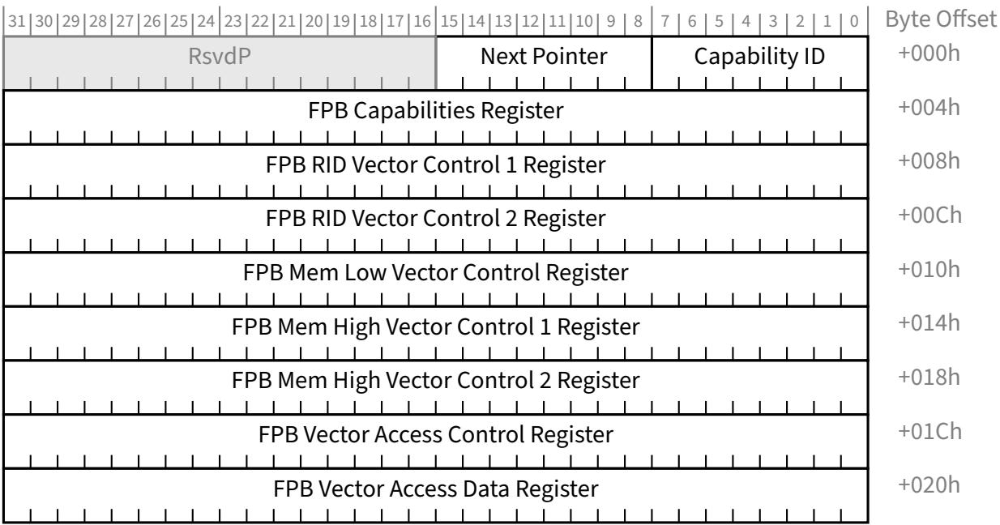


<div style="overflow-x: auto; max-width: 100%;">
<table>
<thead>
<tr>
<th width="50%">🇬🇧 English</th>
<th width="50%" style="background-color:#e8e8e8">🏆 中文</th>
</tr>
</thead>
<tbody>
<tr>
<td>

**Figure 7-195 FPB Capability Structure**

| Byte Offset | 0 | 7 | 8 | 15 | 16 | 31 |
|-------------|---|---|----|----|----|
| +000h | Capability ID | | Next Pointer | | RsvdP | |
| +004h | FPB Capabilities Register | | | | | |
| +008h | FPB RID Vector Control 1 Register | | | | | |
| +00Ch | FPB RID Vector Control 2 Register | | | | | |
| +010h | FPB Mem Low Vector Control Register | | | | | |
| +014h | FPB Mem High Vector Control 1 Register | | | | | |
| +018h | FPB Mem High Vector Control 2 Register | | | | | |
| +01Ch | FPB Vector Access Control Register | | | | | |
| +020h | FPB Vector Access Data Register | | | | | |

</td>
<td style="background-color:#e8e8e8">

**图 7-195 FPB 能力结构**

| 字节偏移 | 0 | 7 | 8 | 15 | 16 | 31 |
|----------|---|---|----|----|----|----|
| +000h | Capability ID | | Next Pointer | | RsvdP | |
| +004h | FPB 能力寄存器 (FPB Capabilities Register) | | | | | |
| +008h | FPB RID 向量控制 1 寄存器 (FPB RID Vector Control 1 Register) | | | | | |
| +00Ch | FPB RID 向量控制 2 寄存器 (FPB RID Vector Control 2 Register) | | | | | |
| +010h | FPB Mem Low 向量控制寄存器 (FPB Mem Low Vector Control Register) | | | | | |
| +014h | FPB Mem High 向量控制 1 寄存器 (FPB Mem High Vector Control 1 Register) | | | | | |
| +018h | FPB Mem High 向量控制 2 寄存器 (FPB Mem High Vector Control 2 Register) | | | | | |
| +01Ch | FPB 向量访问控制寄存器 (FPB Vector Access Control Register) | | | | | |
| +020h | FPB 向量访问数据寄存器 (FPB Vector Access Data Register) | | | | | |

</td>
</tr>
</tbody>
</table>
</div>


[⬆️ 返回目录](#-本章目录-table-of-contents)

---

<!-- 📄 Page 1237 -->
---

<a id="sec-7-8-11-1"></a>
## 7.8.11.1 FPB Capability Header (Offset 00h) | 7.8.11.1 FPB 能力头 (Offset 00h)

**Figure 7-196 FPB Capability Header | 图 7-196 FPB 能力头**

> **Figure 7-196.** FPB Capability Header
> 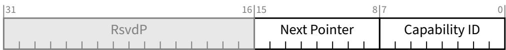

<table>
<thead>
<tr>
<th width="50%">🇬🇧 English</th>
<th width="50%" style="background-color:#e8e8e8">🏆 中文</th>
</tr>
</thead>
<tbody>
<tr>
<td>

| Bit | 0 | 7 | 8 | 15 | 16 | 31 |
|-----|---|---|----|----|----|----|
| Field | Capability ID | | Next Pointer | | RsvdP | |

</td>
<td style="background-color:#e8e8e8">

| 位 | 0 | 7 | 8 | 15 | 16 | 31 |
|----|---|---|----|----|----|----|
| 字段 | Capability ID | | Next Pointer | | RsvdP | |

</td>
</tr>
</tbody>
</table>

---

**Table 7-167 FPB Capability Header | 表 7-167 FPB 能力头**

| Bit Location | Register Description | Attributes |
|--------------|----------------------|------------|
| 7:0 | Capability ID - Must be set to 15h | RO |
| 15:8 | Next Pointer - Pointer to the next item in the capabilities list. Must be 00h for the final item in the list. | RO |

<table>
<thead>
<tr>
<th width="50%">🇬🇧 English</th>
<th width="50%" style="background-color:#e8e8e8">🏆 中文</th>
</tr>
</thead>
<tbody>
<tr>
<td>

| Bit Location | Register Description | Attributes |
|--------------|----------------------|------------|
| 7:0 | Capability ID - Must be set to 15h | RO |
| 15:8 | Next Pointer - Pointer to the next item in the capabilities list. Must be 00h for the final item in the list. | RO |

</td>
<td style="background-color:#e8e8e8">

| 位位置 | 寄存器描述 | 属性 |
|--------|-----------|------|
| 7:0 | Capability ID —— 必须设置为 15h。 | RO |
| 15:8 | Next Pointer —— 指向能力列表中下一项的指针。对于列表中最后一项,必须为 00h。 | RO |

</td>
</tr>
</tbody>
</table>

[⬆️ 返回目录](#-本章目录-table-of-contents)

---

<a id="sec-7-8-11-2"></a>
## 7.8.11.2 FPB Capabilities Register (Offset 04h) | 7.8.11.2 FPB 能力寄存器 (Offset 04h)

<table>
<thead>
<tr>
<th width="50%">🇬🇧 English</th>
<th width="50%" style="background-color:#e8e8e8">🏆 中文</th>
</tr>
</thead>
<tbody>
<tr>
<td>

§ Figure 7-197 details allocation of register fields for FPB Capabilities register and § Table 7-168 describes the requirements for this register.

</td>
<td style="background-color:#e8e8e8">

§ 图 7-197 详细说明了 FPB 能力寄存器中各寄存器的字段分配,§ 表 7-168 描述了该寄存器的要求。

</td>
</tr>
</tbody>
</table>

---

**Figure 7-197 FPB Capabilities Register | 图 7-197 FPB 能力寄存器**

> **Figure 7-197.** FPB Capabilities Register
> 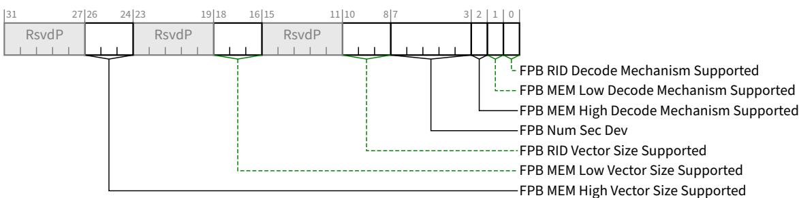


<div style="overflow-x: auto; max-width: 100%;">
<table>
<thead>
<tr>
<th width="50%">🇬🇧 English</th>
<th width="50%" style="background-color:#e8e8e8">🏆 中文</th>
</tr>
</thead>
<tbody>
<tr>
<td>

| Bit | 0 | 1 | 2 | 3 | 7 | 8 | 10 | 11 | 15 | 16 | 18 | 19 | 23 | 24 | 26 | 27 | 31 |
|-----|---|---|---|---|---|---|----|----|----|----|----|----|----|----|----|----|
| Field | FPB RID Decode Mechanism Supported | FPB MEM Low Decode Mechanism Supported | FPB MEM High Decode Mechanism Supported | RsvdP | | FPB Num Sec Dev | | FPB RID Vector Size Supported | | RsvdP | | FPB MEM Low Vector Size Supported | | RsvdP | | FPB MEM High Vector Size Supported | | RsvdP | |

</td>
<td style="background-color:#e8e8e8">

| 位 | 0 | 1 | 2 | 3 | 7 | 8 | 10 | 11 | 15 | 16 | 18 | 19 | 23 | 24 | 26 | 27 | 31 |
|----|---|---|---|---|---|---|----|----|----|----|----|----|----|----|----|----|----|
| 字段 | 支持 FPB RID 解码机制 | 支持 FPB MEM Low 解码机制 | 支持 FPB MEM High 解码机制 | RsvdP | | FPB 二级设备数 (FPB Num Sec Dev) | | 支持的 FPB RID 向量大小 | | RsvdP | | 支持的 FPB MEM Low 向量大小 | | RsvdP | | 支持的 FPB MEM High 向量大小 | | RsvdP | |

</td>
</tr>
</tbody>
</table>
</div>


---

**Table 7-168 FPB Capabilities Register | 表 7-168 FPB 能力寄存器**

| Bit Location | Register Description | Attributes |
|--------------|----------------------|------------|
| 0 | FPB RID Decode Mechanism Supported - If Set, indicates that the FPB RID Vector mechanism is supported. | HwInit |
| 1 | FPB MEM Low Decode Mechanism Supported - If Set, indicates that the FPB MEM Low Vector mechanism is supported. | HwInit |
| 2 | FPB MEM High Decode Mechanism Supported - If Set, indicates that the FPB Mem High mechanism is supported. | HwInit |

<table>
<thead>
<tr>
<th width="50%">🇬🇧 English</th>
<th width="50%" style="background-color:#e8e8e8">🏆 中文</th>
</tr>
</thead>
<tbody>
<tr>
<td>

| Bit Location | Register Description | Attributes |
|--------------|----------------------|------------|
| 0 | FPB RID Decode Mechanism Supported - If Set, indicates that the FPB RID Vector mechanism is supported. | HwInit |
| 1 | FPB MEM Low Decode Mechanism Supported - If Set, indicates that the FPB MEM Low Vector mechanism is supported. | HwInit |
| 2 | FPB MEM High Decode Mechanism Supported - If Set, indicates that the FPB Mem High mechanism is supported. | HwInit |

</td>
<td style="background-color:#e8e8e8">

| 位位置 | 寄存器描述 | 属性 |
|--------|-----------|------|
| 0 | 支持 FPB RID 解码机制 (FPB RID Decode Mechanism Supported) —— 若置位,则表示支持 FPB RID 向量机制。 | HwInit |
| 1 | 支持 FPB MEM Low 解码机制 (FPB MEM Low Decode Mechanism Supported) —— 若置位,则表示支持 FPB MEM Low 向量机制。 | HwInit |
| 2 | 支持 FPB MEM High 解码机制 (FPB MEM High Decode Mechanism Supported) —— 若置位,则表示支持 FPB Mem High 机制。 | HwInit |

</td>
</tr>
</tbody>
</table>

[⬆️ 返回目录](#-本章目录-table-of-contents)

---

<!-- 📄 Page 1238 -->
---


<div style="overflow-x: auto; max-width: 100%;">
<table>
<thead>
<tr>
<th width="50%">🇬🇧 English</th>
<th width="50%" style="background-color:#e8e8e8">🏆 中文</th>
</tr>
</thead>
<tbody>
<tr>
<td>

| Bit Location | Register Description | Attributes |
|--------------|----------------------|------------|
| 7:3 | FPB Num Sec Dev - For Upstream Ports of Switches only, this field indicates the quantity of Device Numbers associated with the Secondary Side of the Upstream Port bridge. The quantity is determined by adding one to the numerical value of this field. Although it is recommended that Switch implementations assign Downstream Ports using all 8 allowed Functions per allocated Device Number, such that all Downstream Ports are assigned within a contiguous range of Device and Function Numbers, it is, however, explicitly permitted to assign Downstream Ports to Function Numbers that are not contiguous within the indicated range of Device Numbers, and system software is required to scan for Switch Downstream Ports at every Function Number within the indicated quantity of Device Numbers associated with the Secondary Side of the Upstream Port. This field is Reserved for Downstream Ports. | HwInit/RsvdP |
| 10:8 | FPB RID Vector Size Supported - Indicates the size of the FPB RID Vector implemented in hardware, and constrains the allowed values software is permitted to write to the FPB RID Vector Granularity field. Defined encodings are: Value 000b = 256 bits (Allowed Granularities in RID units: 8, 64, 256); Value 010b = 1 K bits (8, 64); Value 101b = 8 K bits (8). All other encodings are Reserved. If the FPB RID Decode Mechanism Supported bit is Clear, then the value in this field is undefined and must be ignored by software. | HwInit |
| 18:16 | FPB MEM Low Vector Size Supported - Indicates the size of the FPB MEM Low Vector implemented in hardware, and constrains the allowed values software is permitted to write to the FPB MEM Low Vector Start field. Defined encodings are: Value 000b = 256 bits (Allowed Granularities in MB units: 1, 2, 4, 8, 16); Value 001b = 512 bits (1, 2, 4, 8); Value 010b = 1 K bits (1, 2, 4); Value 011b = 2 K bits (1, 2); Value 100b = 4 K bits (1). All other encodings are Reserved. If the FPB MEM Low Decode Mechanism Supported bit is Clear, then the value in this field is undefined and must be ignored by software. | HwInit |
| 26:24 | FPB MEM High Vector Size Supported - Indicates the size of the FPB MEM High Vector implemented in hardware. Defined encodings are: (see continuation) | HwInit |

</td>
<td style="background-color:#e8e8e8">

| 位位置 | 寄存器描述 | 属性 |
|--------|-----------|------|
| 7:3 | FPB 二级设备数 (FPB Num Sec Dev) —— 仅对交换机的上游端口 (Upstream Port),该字段指示与上游端口桥 Secondary Side 关联的设备号 (Device Number) 数量。数量由本字段数值加 1 确定。虽然推荐交换机实现为每个分配的设备号分配所有 8 个允许的 Function,使得所有下游端口 (Downstream Port) 被分配在一段连续的设备号和 Function 号范围内,但是明确允许将下游端口分配给在所指明的设备号范围内并不连续的 Function 号,且系统软件必须在上游端口 Secondary Side 关联的设备号范围内,逐个 Function 号扫描交换机的下游端口。该字段对下游端口为保留 (Reserved)。 | HwInit/RsvdP |
| 10:8 | 支持的 FPB RID 向量大小 (FPB RID Vector Size Supported) —— 指示硬件实现的 FPB RID 向量大小,并约束软件允许写入 FPB RID 向量粒度 (FPB RID Vector Granularity) 字段的取值。已定义编码:值 000b = 256 位 (允许的粒度,以 RID 为单位:8、64、256);值 010b = 1 K 位 (8、64);值 101b = 8 K 位 (8)。所有其他编码为保留。若 FPB RID 解码机制支持位清零,则该字段的值未定义,必须由软件忽略。 | HwInit |
| 18:16 | 支持的 FPB MEM Low 向量大小 (FPB MEM Low Vector Size Supported) —— 指示硬件实现的 FPB MEM Low 向量大小,并约束软件允许写入 FPB MEM Low 向量起始 (FPB MEM Low Vector Start) 字段的取值。已定义编码:值 000b = 256 位 (允许的粒度,以 MB 为单位:1、2、4、8、16);值 001b = 512 位 (1、2、4、8);值 010b = 1 K 位 (1、2、4);值 011b = 2 K 位 (1、2);值 100b = 4 K 位 (1)。所有其他编码为保留。若 FPB MEM Low 解码机制支持位清零,则该字段的值未定义,必须由软件忽略。 | HwInit |
| 26:24 | 支持的 FPB MEM High 向量大小 (FPB MEM High Vector Size Supported) —— 指示硬件实现的 FPB MEM High 向量大小。已定义编码: (见续) | HwInit |

</td>
</tr>
</tbody>
</table>
</div>


---

<!-- 📄 Page 1239 -->
---

<table>
<thead>
<tr>
<th width="50%">🇬🇧 English</th>
<th width="50%" style="background-color:#e8e8e8">🏆 中文</th>
</tr>
</thead>
<tbody>
<tr>
<td>

(continued) FPB MEM High Vector Size Supported:

| Value | Size |
|-------|------|
| 000b | 256 bits |
| 001b | 512 bits |
| 010b | 1 K bits |
| 011b | 2 K bits |
| 100b | 4 K bits |
| 101b | 8 K bits |

All other encodings are Reserved.
All defined Granularities are allowed for all defined vector sizes.
If the FPB MEM High Decode Mechanism Supported bit is Clear, then the value in this field is undefined and must be ignored by software.

§ Figure 7-198 details allocation of register fields for FPB RID Control 1 register and § Table 7-172 describes the requirements for this register.

</td>
<td style="background-color:#e8e8e8">

(续) FPB MEM High 向量大小:

| 值 | 大小 |
|----|------|
| 000b | 256 位 |
| 001b | 512 位 |
| 010b | 1 K 位 |
| 011b | 2 K 位 |
| 100b | 4 K 位 |
| 101b | 8 K 位 |

所有其他编码为保留。
对于所有已定义的向量大小,均允许所有已定义的粒度。
若 FPB MEM High 解码机制支持位清零,则该字段的值未定义,必须由软件忽略。

§ 图 7-198 详细说明了 FPB RID 控制 1 寄存器中各寄存器的字段分配,§ 表 7-172 描述了该寄存器的要求。

</td>
</tr>
</tbody>
</table>

---

<a id="sec-7-8-11-3"></a>
## 7.8.11.3 FPB RID Vector Control 1 Register (Offset 08h) | 7.8.11.3 FPB RID 向量控制 1 寄存器 (Offset 08h)

**Figure 7-198 FPB RID Vector Control 1 Register | 图 7-198 FPB RID 向量控制 1 寄存器**

> **Figure 7-198.** FPB RID Vector Control 1 Register
> 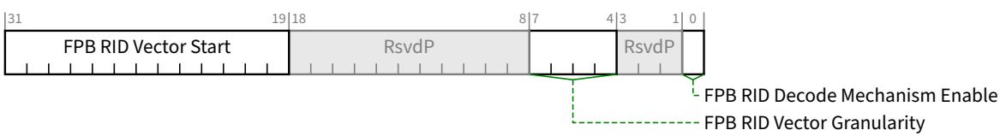

<table>
<thead>
<tr>
<th width="50%">🇬🇧 English</th>
<th width="50%" style="background-color:#e8e8e8">🏆 中文</th>
</tr>
</thead>
<tbody>
<tr>
<td>

| Bit | 0 | 1 | 3 | 4 | 7 | 8 | 18 | 19 | 31 |
|-----|---|---|---|---|---|----|----|----|----|
| Field | FPB RID Decode Mechanism Enable | RsvdP | | FPB RID Vector Granularity | | RsvdP | | FPB RID Vector Start | |

</td>
<td style="background-color:#e8e8e8">

| 位 | 0 | 1 | 3 | 4 | 7 | 8 | 18 | 19 | 31 |
|----|---|---|---|---|---|----|----|----|----|
| 字段 | FPB RID 解码机制使能 | RsvdP | | FPB RID 向量粒度 | | RsvdP | | FPB RID 向量起始 | |

</td>
</tr>
</tbody>
</table>

---

**Table 7-172 FPB RID Vector Control 1 Register | 表 7-172 FPB RID 向量控制 1 寄存器**


<div style="overflow-x: auto; max-width: 100%;">
<table>
<thead>
<tr>
<th width="50%">🇬🇧 English</th>
<th width="50%" style="background-color:#e8e8e8">🏆 中文</th>
</tr>
</thead>
<tbody>
<tr>
<td>

| Bit Location | Register Description | Attributes |
|--------------|----------------------|------------|
| 0 | FPB RID Decode Mechanism Enable - When Set, enables the FPB RID Decode mechanism. If the FPB RID Decode Mechanism Supported bit is Clear, then it is permitted for hardware to implement this bit as RO, and in this case the value in this field is undefined. Default value of this bit is 0b. | RW/RO |
| 7:4 | FPB RID Vector Granularity - The value written by software to this field controls the granularity of the FPB RID Vector and the required alignment of the FPB RID Vector Start field (below). Defined encodings are: Value 0000b = 8 RIDs. (continued) | RW/RO |

</td>
<td style="background-color:#e8e8e8">

| 位位置 | 寄存器描述 | 属性 |
|--------|-----------|------|
| 0 | FPB RID 解码机制使能 (FPB RID Decode Mechanism Enable) —— 当置位时,使能 FPB RID 解码机制。若 FPB RID 解码机制支持位清零,则允许硬件将该位实现为 RO,此时该字段的值未定义。该位的默认值为 0b。 | RW/RO |
| 7:4 | FPB RID 向量粒度 (FPB RID Vector Granularity) —— 软件写入此字段的值控制 FPB RID 向量的粒度,以及下方 FPB RID 向量起始 (FPB RID Vector Start) 字段所要求的对齐方式。已定义编码:值 0000b = 8 RIDs。(续) | RW/RO |

</td>
</tr>
</tbody>
</table>
</div>


---

<!-- 📄 Page 1240 -->
---

<table>
<thead>
<tr>
<th width="50%">🇬🇧 English</th>
<th width="50%" style="background-color:#e8e8e8">🏆 中文</th>
</tr>
</thead>
<tbody>
<tr>
<td>

(continued) FPB RID Vector Granularity: Value 0011b = 64 RIDs; Value 0101b = 256 RIDs. All other encodings are Reserved.

Based on the implemented FPB RID Vector size, hardware is permitted to implement as RW only those bits of this field that can be programmed to non-zero values, in which case the upper order bits are permitted but not required to be hardwired to 0.
If the FPB RID Decode Mechanism Supported bit is Clear, then it is permitted for hardware to implement this field as RO, and the value in this field is undefined.
For Downstream Ports, if the ARI Forwarding Enable bit in the Device Control 2 Register and the FPB RID Decode Mechanism Enable bit are Set, then software must program 0101b into this field, if this field is programmable.
Default value for this field is 0000b.

| 31:19 | FPB RID Vector Start - The value written by software to this field controls the offset at which the FPB RID Vector is applied. The value represents a RID offset in units of 8 RIDs, such that bit 0 of the FPB RID Vector represents the range of RIDs starting from the value represented in this register up to that value plus the FPB RID Vector Granularity minus 1, and bit 1 represents range from this register value plus granularity up to that value plus FPB RID Vector Granularity minus 1, etc. Software must program this field to a value that is naturally aligned (meaning the lower order bits must be 0's) according to the value in the FPB RID Vector Granularity Field as indicated here:

| FPB RID Vector Granularity | Start Alignment Constraint |
|----------------------------|----------------------------|
| 0000b | <no constraint> |
| 0011b | ...00 0b |
| 0101b | ...0000 0b |

All other encodings are Reserved.
If this requirement is violated, the hardware behavior is undefined.
For Downstream Ports, if the ARI Forwarding Enable bit in the Device Control 2 Register and the FPB RID Decode Mechanism Enable bit are Set, then software must program bits 23:19 of this field to a value of 0000 0b, and the hardware behavior is undefined if any other value is programmed.
If the FPB RID Decode Mechanism Supported bit is Clear, then it is permitted for hardware to implement this field as RO, and the value in this field is undefined.
Default value for this field is 0000 0000 0000 0b. | RW/RO |

</td>
<td style="background-color:#e8e8e8">

(续) FPB RID 向量粒度:值 0011b = 64 RIDs;值 0101b = 256 RIDs。所有其他编码为保留。

基于已实现的 FPB RID 向量大小,允许硬件仅将该字段中可被编程为非零值的位实现为 RW,此种情况下高位允许(但非必须)硬连线为 0。
若 FPB RID 解码机制支持位清零,则允许硬件将该字段实现为 RO,且该字段的值未定义。
对于下游端口,若 Device Control 2 寄存器中的 ARI 转发使能位 (ARI Forwarding Enable) 与 FPB RID 解码机制使能位均被置位,则软件必须将该字段编程为 0101b(若该字段可编程)。
该字段默认值为 0000b。

| 31:19 | FPB RID 向量起始 (FPB RID Vector Start) —— 软件写入此字段的值控制 FPB RID 向量所应用的偏移量。该值表示以 8 RIDs 为单位的 RID 偏移量,即 FPB RID 向量的 bit 0 表示从本寄存器所表示的值开始,到该值加上 FPB RID 向量粒度减 1 的 RID 范围;bit 1 表示从该寄存器值加上粒度开始,到该值加上 FPB RID 向量粒度减 1 的 RID 范围;依此类推。软件必须按照 FPB RID 向量粒度字段所指示的、本字段中的值进行自然对齐编程(意味着低位必须为 0):

| FPB RID 向量粒度 | 起始对齐约束 |
|------------------|---------------|
| 0000b | <无约束> |
| 0011b | ...00 0b |
| 0101b | ...0000 0b |

所有其他编码为保留。
若违反此要求,则硬件行为未定义。
对于下游端口,若 Device Control 2 寄存器中的 ARI 转发使能位 (ARI Forwarding Enable) 与 FPB RID 解码机制使能位均被置位,则软件必须将该字段的位 23:19 编程为 0000 0b;若编程为任何其他值,硬件行为未定义。
若 FPB RID 解码机制支持位清零,则允许硬件将该字段实现为 RO,且该字段的值未定义。
该字段默认值为 0000 0000 0000 0b。 | RW/RO |

</td>
</tr>
</tbody>
</table>

---

<a id="sec-7-8-11-4"></a>
## 7.8.11.4 FPB RID Vector Control 2 Register (Offset 0Ch) | 7.8.11.4 FPB RID 向量控制 2 寄存器 (Offset 0Ch)

<table>
<thead>
<tr>
<th width="50%">🇬🇧 English</th>
<th width="50%" style="background-color:#e8e8e8">🏆 中文</th>
</tr>
</thead>
<tbody>
<tr>
<td>

§ Figure 7-199 details allocation of register fields for FPB RID Vector Control 2 register and § Table 7-175 describes the requirements for this register.

</td>
<td style="background-color:#e8e8e8">

§ 图 7-199 详细说明了 FPB RID 向量控制 2 寄存器中各寄存器的字段分配,§ 表 7-175 描述了该寄存器的要求。

</td>
</tr>
</tbody>
</table>

---

<!-- 📄 Page 1241 -->
---

**Figure 7-199 FPB RID Vector Control 2 Register | 图 7-199 FPB RID 向量控制 2 寄存器**

> **Figure 7-199.** FPB RID Vector Control 2 Register
> 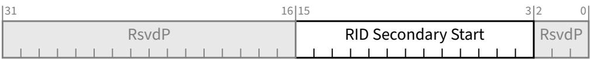

<table>
<thead>
<tr>
<th width="50%">🇬🇧 English</th>
<th width="50%" style="background-color:#e8e8e8">🏆 中文</th>
</tr>
</thead>
<tbody>
<tr>
<td>

| Bit | 0 | 2 | 3 | 15 | 16 | 31 |
|-----|---|---|----|----|----|----|
| Field | RsvdP | | RID Secondary Start | | RsvdP | |

</td>
<td style="background-color:#e8e8e8">

| 位 | 0 | 2 | 3 | 15 | 16 | 31 |
|----|---|---|----|----|----|----|
| 字段 | RsvdP | | RID Secondary Start | | RsvdP | |

</td>
</tr>
</tbody>
</table>

---

**Table 7-175 FPB RID Vector Control 2 Register | 表 7-175 FPB RID 向量控制 2 寄存器**


<div style="overflow-x: auto; max-width: 100%;">
<table>
<thead>
<tr>
<th width="50%">🇬🇧 English</th>
<th width="50%" style="background-color:#e8e8e8">🏆 中文</th>
</tr>
</thead>
<tbody>
<tr>
<td>

| Bit Location | Register Description | Attributes |
|--------------|----------------------|------------|
| 15:3 | RID Secondary Start - The value written by software to this field controls the RID offset at which Type 1 Configuration Requests passing downstream through the bridge must be converted to Type 0. Bits[2:0] of the RID offset are fixed by hardware as 000b and cannot be modified. For Downstream Ports, if the ARI Forwarding Enable bit in the Device Control 2 register is Set, then software must write bits 7:3 of this field to 0 0000b. If the FPB RID Decode Mechanism Supported bit is Clear, then it is permitted for hardware to implement this field as RO, and the value in this field is undefined. Default value for this field is 0000 0000 0000 0b. | RW/RO |

</td>
<td style="background-color:#e8e8e8">

| 位位置 | 寄存器描述 | 属性 |
|--------|-----------|------|
| 15:3 | RID Secondary Start —— 软件写入此字段的值控制 RID 偏移量,在该偏移量处,经桥向下游传递的 Type 1 配置请求 (Configuration Request) 必须被转换为 Type 0。RID 偏移量的位 [2:0] 由硬件固定为 000b 且不可修改。对于下游端口,若 Device Control 2 寄存器中的 ARI 转发使能位 (ARI Forwarding Enable) 被置位,则软件必须将该字段的位 7:3 写入 0 0000b。若 FPB RID 解码机制支持位清零,则允许硬件将该字段实现为 RO,且该字段的值未定义。该字段默认值为 0000 0000 0000 0b。 | RW/RO |

</td>
</tr>
</tbody>
</table>
</div>


[⬆️ 返回目录](#-本章目录-table-of-contents)

---

<a id="sec-7-8-11-5"></a>
## 7.8.11.5 FPB MEM Low Vector Control Register (Offset 10h) | 7.8.11.5 FPB MEM Low 向量控制寄存器 (Offset 10h)

<table>
<thead>
<tr>
<th width="50%">🇬🇧 English</th>
<th width="50%" style="background-color:#e8e8e8">🏆 中文</th>
</tr>
</thead>
<tbody>
<tr>
<td>

§ Figure 7-200 details allocation of register fields for FPB MEM Low Vector Control Register and § Table 7-176 describes the requirements for this register.

</td>
<td style="background-color:#e8e8e8">

§ 图 7-200 详细说明了 FPB MEM Low 向量控制寄存器中各寄存器的字段分配,§ 表 7-176 描述了该寄存器的要求。

</td>
</tr>
</tbody>
</table>

---

**Figure 7-200 FPB MEM Low Vector Control Register | 图 7-200 FPB MEM Low 向量控制寄存器**

> **Figure 7-200.** FPB MEM Low Vector Control Register
> 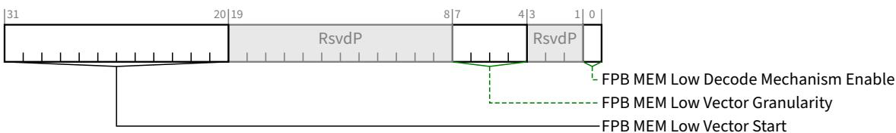

<table>
<thead>
<tr>
<th width="50%">🇬🇧 English</th>
<th width="50%" style="background-color:#e8e8e8">🏆 中文</th>
</tr>
</thead>
<tbody>
<tr>
<td>

| Bit | 0 | 1 | 3 | 4 | 7 | 8 | 19 | 20 | 31 |
|-----|---|---|---|---|---|----|----|----|----|
| Field | FPB MEM Low Decode Mechanism Enable | RsvdP | | FPB MEM Low Vector Granularity | | RsvdP | | FPB MEM Low Vector Start | |

</td>
<td style="background-color:#e8e8e8">

| 位 | 0 | 1 | 3 | 4 | 7 | 8 | 19 | 20 | 31 |
|----|---|---|---|---|---|----|----|----|----|
| 字段 | FPB MEM Low 解码机制使能 | RsvdP | | FPB MEM Low 向量粒度 | | RsvdP | | FPB MEM Low 向量起始 | |

</td>
</tr>
</tbody>
</table>

---

**Table 7-176 FPB MEM Low Vector Control Register | 表 7-176 FPB MEM Low 向量控制寄存器**


<div style="overflow-x: auto; max-width: 100%;">
<table>
<thead>
<tr>
<th width="50%">🇬🇧 English</th>
<th width="50%" style="background-color:#e8e8e8">🏆 中文</th>
</tr>
</thead>
<tbody>
<tr>
<td>

| Bit Location | Register Description | Attributes |
|--------------|----------------------|------------|
| 0 | FPB MEM Low Decode Mechanism Enable - When Set, enables the FPB MEM Low Decode mechanism. If the FPB MEM Low Decode Mechanism Supported bit is Clear, then it is permitted for hardware to implement this bit as RO, and in this case the value in this field is undefined. Default value of this bit is 0b. | RW/RO |
| 7:4 | FPB MEM Low Vector Granularity - The value written by software to this field controls the granularity of the FPB MEM Low Vector, and the required alignment of the FPB MEM Low Vector Start field (below). Defined encodings are: (continued) | RW/RO |

</td>
<td style="background-color:#e8e8e8">

| 位位置 | 寄存器描述 | 属性 |
|--------|-----------|------|
| 0 | FPB MEM Low 解码机制使能 (FPB MEM Low Decode Mechanism Enable) —— 当置位时,使能 FPB MEM Low 解码机制。若 FPB MEM Low 解码机制支持位清零,则允许硬件将该位实现为 RO,此时该字段的值未定义。该位的默认值为 0b。 | RW/RO |
| 7:4 | FPB MEM Low 向量粒度 (FPB MEM Low Vector Granularity) —— 软件写入此字段的值控制 FPB MEM Low 向量的粒度,以及下方 FPB MEM Low 向量起始字段所要求的对齐方式。已定义编码:(续) | RW/RO |

</td>
</tr>
</tbody>
</table>
</div>


---

<!-- 📄 Page 1242 -->
---

<table>
<thead>
<tr>
<th width="50%">🇬🇧 English</th>
<th width="50%" style="background-color:#e8e8e8">🏆 中文</th>
</tr>
</thead>
<tbody>
<tr>
<td>

(continued) FPB MEM Low Vector Granularity:

| Value | Granularity |
|-------|-------------|
| 0000b | 1 MB |
| 0001b | 2 MB |
| 0010b | 4 MB |
| 0011b | 8 MB |
| 0100b | 16 MB |

All other encodings are Reserved.
Based on the implemented FPB MEM Low Vector size, hardware is permitted to implement as RW only those bits of this field that can be programmed to non-zero values, in which case the upper order bits are permitted but not required to be hardwired to 0.
If the FPB MEM Low Decode Mechanism Supported bit is Clear, then it is permitted for hardware to implement this field as RO, and the value in this field is undefined.
Default value for this field is 0000b.

| 31:20 | FPB MEM Low Vector Start - The value written by software to this field sets bits 31:20 of the base address at which the FPB MEM Low Vector is applied. Software must program this field to a value that is naturally aligned (meaning the lower order bits must be 0's) according to the value in the FPB MEM Low Vector Granularity field as indicated here:

| FPB MEM Low Vector Granularity | Constraint |
|--------------------------------|------------|
| 0000b | <no constraint> |
| 0001b | ...0b |
| 0010b | ...00b |
| 0011b | ...000b |
| 0100b | ...0000b |

If this requirement is violated, the hardware behavior is undefined.
If the FPB MEM Low Decode Mechanism Supported bit is Clear, then it is permitted for hardware to implement this field as RO, and the value in this field is undefined.
Default value for this field is 000h. | RW/RO |

</td>
<td style="background-color:#e8e8e8">

(续) FPB MEM Low 向量粒度:

| 值 | 粒度 |
|----|------|
| 0000b | 1 MB |
| 0001b | 2 MB |
| 0010b | 4 MB |
| 0011b | 8 MB |
| 0100b | 16 MB |

所有其他编码为保留。
基于已实现的 FPB MEM Low 向量大小,允许硬件仅将该字段中可被编程为非零值的位实现为 RW,此种情况下高位允许(但非必须)硬连线为 0。
若 FPB MEM Low 解码机制支持位清零,则允许硬件将该字段实现为 RO,且该字段的值未定义。
该字段默认值为 0000b。

| 31:20 | FPB MEM Low 向量起始 (FPB MEM Low Vector Start) —— 软件写入此字段的值设置应用 FPB MEM Low 向量的基地址的位 31:20。软件必须按照 FPB MEM Low 向量粒度字段所指示的、本字段中的值进行自然对齐编程(意味着低位必须为 0):

| FPB MEM Low 向量粒度 | 约束 |
|----------------------|------|
| 0000b | <无约束> |
| 0001b | ...0b |
| 0010b | ...00b |
| 0011b | ...000b |
| 0100b | ...0000b |

若违反此要求,则硬件行为未定义。
若 FPB MEM Low 解码机制支持位清零,则允许硬件将该字段实现为 RO,且该字段的值未定义。
该字段默认值为 000h。 | RW/RO |

</td>
</tr>
</tbody>
</table>

---

<a id="sec-7-8-11-6"></a>
## 7.8.11.6 FPB MEM High Vector Control 1 Register (Offset 14h) | 7.8.11.6 FPB MEM High 向量控制 1 寄存器 (Offset 14h)

<table>
<thead>
<tr>
<th width="50%">🇬🇧 English</th>
<th width="50%" style="background-color:#e8e8e8">🏆 中文</th>
</tr>
</thead>
<tbody>
<tr>
<td>

§ Figure 7-201 details allocation of register fields for FPB MEM High Vector Control 1 Register and § Table 7-179 describes the requirements for this register.

</td>
<td style="background-color:#e8e8e8">

§ 图 7-201 详细说明了 FPB MEM High 向量控制 1 寄存器中各寄存器的字段分配,§ 表 7-179 描述了该寄存器的要求。

</td>
</tr>
</tbody>
</table>

---

<!-- 📄 Page 1243 -->
---

**Figure 7-201 FPB MEM High Vector Control 1 Register | 图 7-201 FPB MEM High 向量控制 1 寄存器**

> **Figure 7-201.** FPB MEM High Vector Control 1 Register
> 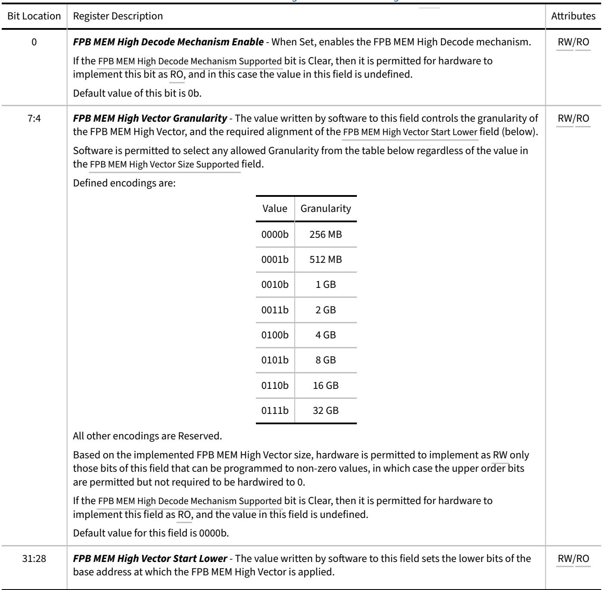

<table>
<thead>
<tr>
<th width="50%">🇬🇧 English</th>
<th width="50%" style="background-color:#e8e8e8">🏆 中文</th>
</tr>
</thead>
<tbody>
<tr>
<td>

| Bit | 0 | 1 | 3 | 4 | 7 | 8 | 27 | 28 | 31 |
|-----|---|---|---|---|---|----|----|----|----|
| Field | FPB MEM High Decode Mechanism Enable | RsvdP | | FPB MEM High Vector Granularity | | RsvdP | | FPB MEM High Vector Start Lower | |

</td>
<td style="background-color:#e8e8e8">

| 位 | 0 | 1 | 3 | 4 | 7 | 8 | 27 | 28 | 31 |
|----|---|---|---|---|---|----|----|----|----|
| 字段 | FPB MEM High 解码机制使能 | RsvdP | | FPB MEM High 向量粒度 | | RsvdP | | FPB MEM High 向量起始低位 | |

</td>
</tr>
</tbody>
</table>

---

**Table 7-179 FPB MEM High Vector Control 1 Register | 表 7-179 FPB MEM High 向量控制 1 寄存器**


<div style="overflow-x: auto; max-width: 100%;">
<table>
<thead>
<tr>
<th width="50%">🇬🇧 English</th>
<th width="50%" style="background-color:#e8e8e8">🏆 中文</th>
</tr>
</thead>
<tbody>
<tr>
<td>

| Bit Location | Register Description | Attributes |
|--------------|----------------------|------------|
| 0 | FPB MEM High Decode Mechanism Enable - When Set, enables the FPB MEM High Decode mechanism. If the FPB MEM High Decode Mechanism Supported bit is Clear, then it is permitted for hardware to implement this bit as RO, and in this case the value in this field is undefined. Default value of this bit is 0b. | RW/RO |
| 7:4 | FPB MEM High Vector Granularity - The value written by software to this field controls the granularity of the FPB MEM High Vector, and the required alignment of the FPB MEM High Vector Start Lower field (below). Software is permitted to select any allowed Granularity from the table below regardless of the value in the FPB MEM High Vector Size Supported field. Defined encodings are:

| Value | Granularity |
|-------|-------------|
| 0000b | 256 MB |
| 0001b | 512 MB |
| 0010b | 1 GB |
| 0011b | 2 GB |
| 0100b | 4 GB |
| 0101b | 8 GB |
| 0110b | 16 GB |
| 0111b | 32 GB |

All other encodings are Reserved.
Based on the implemented FPB MEM High Vector size, hardware is permitted to implement as RW only those bits of this field that can be programmed to non-zero values, in which case the upper order bits are permitted but not required to be hardwired to 0.
If the FPB MEM High Decode Mechanism Supported bit is Clear, then it is permitted for hardware to implement this field as RO, and the value in this field is undefined.
Default value for this field is 0000b. | RW/RO |
| 31:28 | FPB MEM High Vector Start Lower - The value written by software to this field sets the lower bits of the base address at which the FPB MEM High Vector is applied. | RW/RO |

</td>
<td style="background-color:#e8e8e8">

| 位位置 | 寄存器描述 | 属性 |
|--------|-----------|------|
| 0 | FPB MEM High 解码机制使能 (FPB MEM High Decode Mechanism Enable) —— 当置位时,使能 FPB MEM High 解码机制。若 FPB MEM High 解码机制支持位清零,则允许硬件将该位实现为 RO,此时该字段的值未定义。该位的默认值为 0b。 | RW/RO |
| 7:4 | FPB MEM High 向量粒度 (FPB MEM High Vector Granularity) —— 软件写入此字段的值控制 FPB MEM High 向量的粒度,以及下方 FPB MEM High 向量起始低位字段所要求的对齐方式。无论 FPB MEM High 向量大小支持字段的值如何,软件均允许从下表中选择任何允许的粒度。已定义编码:

| 值 | 粒度 |
|----|------|
| 0000b | 256 MB |
| 0001b | 512 MB |
| 0010b | 1 GB |
| 0011b | 2 GB |
| 0100b | 4 GB |
| 0101b | 8 GB |
| 0110b | 16 GB |
| 0111b | 32 GB |

所有其他编码为保留。
基于已实现的 FPB MEM High 向量大小,允许硬件仅将该字段中可被编程为非零值的位实现为 RW,此种情况下高位允许(但非必须)硬连线为 0。
若 FPB MEM High 解码机制支持位清零,则允许硬件将该字段实现为 RO,且该字段的值未定义。
该字段默认值为 0000b。 | RW/RO |
| 31:28 | FPB MEM High 向量起始低位 (FPB MEM High Vector Start Lower) —— 软件写入此字段的值设置应用 FPB MEM High 向量的基地址的低位。 | RW/RO |

</td>
</tr>
</tbody>
</table>
</div>


---

<!-- 📄 Page 1244 -->
---

<table>
<thead>
<tr>
<th width="50%">🇬🇧 English</th>
<th width="50%" style="background-color:#e8e8e8">🏆 中文</th>
</tr>
</thead>
<tbody>
<tr>
<td>

Software must program this field to a value that is naturally aligned (meaning the lower order bits must be 0's) according to the value in the FPB MEM High Vector Granularity Field as indicated here:

| FPB MEM High Vector Granularity | Constraint |
|--------------------------------|------------|
| 0000b | <no constraint> |
| 0001b | ...0b |
| 0010b | ...00b |
| 0011b | ...000b |
| 0100b | ...0000b |
| 0101b | ...0 0000b |
| 0110b | ...00 0000b |
| 0111b | ...000 0000b |

If this requirement is violated, the hardware behavior is undefined.
If the FPB MEM High Decode Mechanism Supported bit is Clear, then it is permitted for hardware to implement this field as RO, and the value in this field is undefined.
Default value for this field is 0h.

§ Figure 7-202 details allocation of register fields for FPB MEM High Vector Control 2 Register and § Table 7-182 describes the requirements for this register.

</td>
<td style="background-color:#e8e8e8">

软件必须按照 FPB MEM High 向量粒度字段所指示的、本字段中的值进行自然对齐编程(意味着低位必须为 0):

| FPB MEM High 向量粒度 | 约束 |
|----------------------|------|
| 0000b | <无约束> |
| 0001b | ...0b |
| 0010b | ...00b |
| 0011b | ...000b |
| 0100b | ...0000b |
| 0101b | ...0 0000b |
| 0110b | ...00 0000b |
| 0111b | ...000 0000b |

若违反此要求,则硬件行为未定义。
若 FPB MEM High 解码机制支持位清零,则允许硬件将该字段实现为 RO,且该字段的值未定义。
该字段默认值为 0h。

§ 图 7-202 详细说明了 FPB MEM High 向量控制 2 寄存器中各寄存器的字段分配,§ 表 7-182 描述了该寄存器的要求。

</td>
</tr>
</tbody>
</table>

---

<a id="sec-7-8-11-7"></a>
## 7.8.11.7 FPB MEM High Vector Control 2 Register (Offset 18h) | 7.8.11.7 FPB MEM High 向量控制 2 寄存器 (Offset 18h)

**Figure 7-202 FPB MEM High Vector Control 2 Register | 图 7-202 FPB MEM High 向量控制 2 寄存器**

> **Figure 7-202.** FPB MEM High Vector Control 2 Register
> 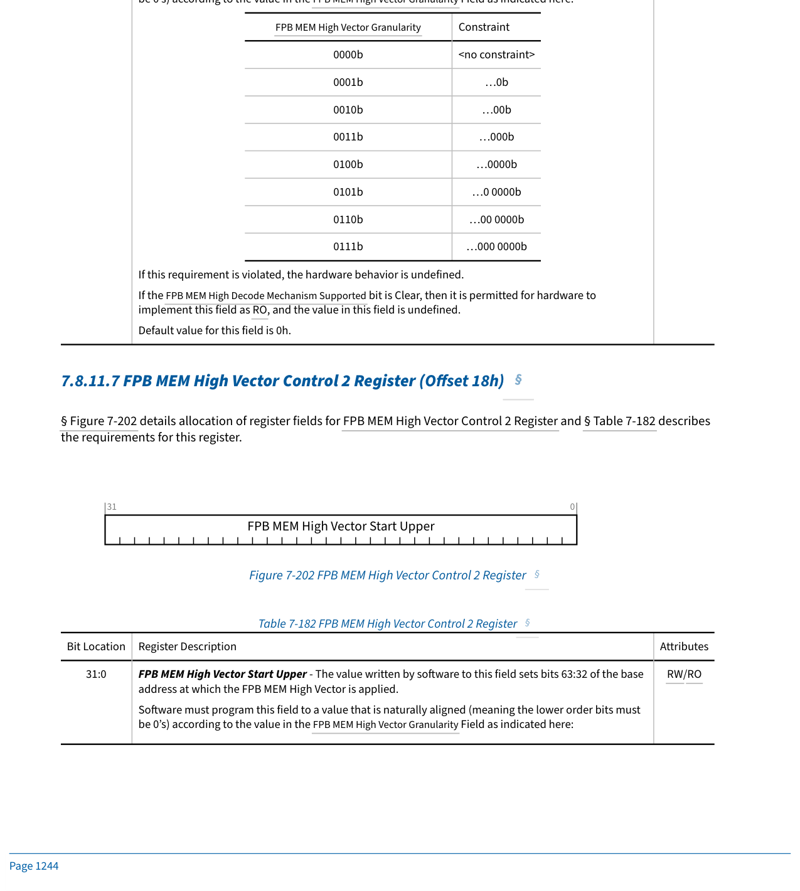

<table>
<thead>
<tr>
<th width="50%">🇬🇧 English</th>
<th width="50%" style="background-color:#e8e8e8">🏆 中文</th>
</tr>
</thead>
<tbody>
<tr>
<td>

| Bit | 0 | 31 |
|-----|----|----|
| Field | FPB MEM High Vector Start Upper | |

</td>
<td style="background-color:#e8e8e8">

| 位 | 0 | 31 |
|----|----|----|
| 字段 | FPB MEM High 向量起始高位 | |

</td>
</tr>
</tbody>
</table>

---

**Table 7-182 FPB MEM High Vector Control 2 Register | 表 7-182 FPB MEM High 向量控制 2 寄存器**

<table>
<thead>
<tr>
<th width="50%">🇬🇧 English</th>
<th width="50%" style="background-color:#e8e8e8">🏆 中文</th>
</tr>
</thead>
<tbody>
<tr>
<td>

| Bit Location | Register Description | Attributes |
|--------------|----------------------|------------|
| 31:0 | FPB MEM High Vector Start Upper - The value written by software to this field sets bits 63:32 of the base address at which the FPB MEM High Vector is applied. Software must program this field to a value that is naturally aligned (meaning the lower order bits must be 0's) according to the value in the FPB MEM High Vector Granularity Field as indicated here: (continued) | RW/RO |

</td>
<td style="background-color:#e8e8e8">

| 位位置 | 寄存器描述 | 属性 |
|--------|-----------|------|
| 31:0 | FPB MEM High 向量起始高位 (FPB MEM High Vector Start Upper) —— 软件写入此字段的值设置应用 FPB MEM High 向量的基地址的位 63:32。软件必须按照 FPB MEM High 向量粒度字段所指示的、本字段中的值进行自然对齐编程(意味着低位必须为 0):(续) | RW/RO |

</td>
</tr>
</tbody>
</table>

---

<!-- 📄 Page 1245 -->
---


<div style="overflow-x: auto; max-width: 100%;">
<table>
<thead>
<tr>
<th width="50%">🇬🇧 English</th>
<th width="50%" style="background-color:#e8e8e8">🏆 中文</th>
</tr>
</thead>
<tbody>
<tr>
<td>

(continued) FPB MEM High Vector Start Upper:

| FPB MEM High Vector Granularity | Constraint |
|--------------------------------|------------|
| 0000b | <no constraint> |
| 0001b | <no constraint> |
| 0010b | <no constraint> |
| 0011b | <no constraint> |
| 0100b | <no constraint> |
| 0101b | ...0b |
| 0110b | ...00b |
| 0111b | ...000b |

If this requirement is violated, the hardware behavior is undefined.
If the FPB MEM High Decode Mechanism Supported bit is Clear, then it is permitted for hardware to implement this field as RO, and the value in this field is undefined.
Default value for this field is 0000 0000h.

§ Figure 7-203 details allocation of register fields for FPB Vector Access Control register and § Table 7-184 describes the requirements for this register.

</td>
<td style="background-color:#e8e8e8">

(续) FPB MEM High 向量起始高位:

| FPB MEM High 向量粒度 | 约束 |
|----------------------|------|
| 0000b | <无约束> |
| 0001b | <无约束> |
| 0010b | <无约束> |
| 0011b | <无约束> |
| 0100b | <无约束> |
| 0101b | ...0b |
| 0110b | ...00b |
| 0111b | ...000b |

若违反此要求,则硬件行为未定义。
若 FPB MEM High 解码机制支持位清零,则允许硬件将该字段实现为 RO,且该字段的值未定义。
该字段默认值为 0000 0000h。

§ 图 7-203 详细说明了 FPB 向量访问控制寄存器中各寄存器的字段分配,§ 表 7-184 描述了该寄存器的要求。

</td>
</tr>
</tbody>
</table>
</div>


---

<a id="sec-7-8-11-8"></a>
## 7.8.11.8 FPB Vector Access Control Register (Offset 1Ch) | 7.8.11.8 FPB 向量访问控制寄存器 (Offset 1Ch)

**Figure 7-203 FPB Vector Access Control Register | 图 7-203 FPB 向量访问控制寄存器**

> **Figure 7-203.** FPB Vector Access Control Register
> 

<table>
<thead>
<tr>
<th width="50%">🇬🇧 English</th>
<th width="50%" style="background-color:#e8e8e8">🏆 中文</th>
</tr>
</thead>
<tbody>
<tr>
<td>

| Bit | 0 | 7 | 8 | 13 | 14 | 15 | 16 | 31 |
|-----|---|---|----|----|----|----|----|----|
| Field | FPB Vector Access Offset | | RsvdP | | FPB Vector Select | | RsvdP | |

</td>
<td style="background-color:#e8e8e8">

| 位 | 0 | 7 | 8 | 13 | 14 | 15 | 16 | 31 |
|----|---|---|----|----|----|----|----|----|
| 字段 | FPB 向量访问偏移 | | RsvdP | | FPB 向量选择 | | RsvdP | |

</td>
</tr>
</tbody>
</table>

---

**Table 7-184 FPB Vector Access Control Register | 表 7-184 FPB 向量访问控制寄存器**


<div style="overflow-x: auto; max-width: 100%;">
<table>
<thead>
<tr>
<th width="50%">🇬🇧 English</th>
<th width="50%" style="background-color:#e8e8e8">🏆 中文</th>
</tr>
</thead>
<tbody>
<tr>
<td>

| Bit Location | Register Description | Attributes |
|--------------|----------------------|------------|
| 7:0 | FPB Vector Access Offset - The value in this field indicates the offset of the DWORD portion of the FPB RID, MEM Low or MEM High, Vector that can be read or written by means of the FPB Vector Access Data register. The selection of RID, MEM Low or MEM High is made by the value written to the FPB Vector Select field. The bits of this field map to the offset according to the value in the corresponding FPB RID, MEM Low, or MEM High Vector Size Supported field as shown here: (continued) | RW/RO |

</td>
<td style="background-color:#e8e8e8">

| 位位置 | 寄存器描述 | 属性 |
|--------|-----------|------|
| 7:0 | FPB 向量访问偏移 (FPB Vector Access Offset) —— 该字段的值指示可通过 FPB 向量访问数据寄存器 (FPB Vector Access Data) 读取或写入的 FPB RID、MEM Low 或 MEM High 向量 DWORD 部分的偏移量。RID、MEM Low 或 MEM High 的选择由写入 FPB 向量选择字段的值决定。该字段的位根据相应 FPB RID、MEM Low 或 MEM High 向量大小支持字段的值,按下表映射到偏移量:(续) | RW/RO |

</td>
</tr>
</tbody>
</table>
</div>


---

<!-- 📄 Page 1246 -->
---

<table>
<thead>
<tr>
<th width="50%">🇬🇧 English</th>
<th width="50%" style="background-color:#e8e8e8">🏆 中文</th>
</tr>
</thead>
<tbody>
<tr>
<td>

(continued) FPB Vector Access Offset mapping:

| FPB Vector Select Encoding | |
|----------------------------|--|
| 00b | RID |
| 01b | MEM Low |
| 10b | MEM High |
| 11b | Reserved |

| Vector Size Supported | Offset Bits | Vector Access Offset |
|------------------------|-------------|---------------------|
| 000b | 2:0 | 2:0 (7:3 unused) |
| 001b | 3:0 | 3:0 (7:4 unused) |
| 010b | 4:0 | 4:0 (7:5 unused) |
| 011b | 5:0 | 5:0 (7:6 unused) |
| 100b | 6:0 | 6:0 (7 unused) |
| 101b | 7:0 | 7:0 |

All other encodings are Reserved.
Bits in this field that are unused per the table above must be written by software as 0b, and are permitted but not required to be implemented as RO.
Default value for this field is 00h.

| 15:14 | FPB Vector Select - The value written to this field selects the Vector to be accessed at the indicated FPB Vector Access Offset. Software must only write this field with values that correspond to supported FPB mechanisms, otherwise the results are undefined. Defined encodings are:

| Encoding | Vector |
|----------|--------|
| 00b | RID |
| 01b | MEM Low |
| 10b | MEM High |
| 11b | Reserved |

Default value for this field is 00b. | RW |

</td>
<td style="background-color:#e8e8e8">

(续) FPB 向量访问偏移映射:

| FPB 向量选择编码 | |
|------------------|--|
| 00b | RID |
| 01b | MEM Low |
| 10b | MEM High |
| 11b | 保留 |

| 向量大小支持 | 偏移位 | 向量访问偏移 |
|--------------|--------|--------------|
| 000b | 2:0 | 2:0 (7:3 未使用) |
| 001b | 3:0 | 3:0 (7:4 未使用) |
| 010b | 4:0 | 4:0 (7:5 未使用) |
| 011b | 5:0 | 5:0 (7:6 未使用) |
| 100b | 6:0 | 6:0 (7 未使用) |
| 101b | 7:0 | 7:0 |

所有其他编码为保留。
对于根据上表未使用的位,软件必须将其写入为 0b,允许(但非必须)实现为 RO。
该字段默认值为 00h。

| 15:14 | FPB 向量选择 (FPB Vector Select) —— 写入此字段的值选择要在指定 FPB 向量访问偏移处访问的向量。软件必须仅以与所支持的 FPB 机制相对应的值写入此字段,否则结果未定义。已定义编码:

| 编码 | 向量 |
|------|------|
| 00b | RID |
| 01b | MEM Low |
| 10b | MEM High |
| 11b | 保留 |

该字段默认值为 00b。 | RW |

</td>
</tr>
</tbody>
</table>

---

<a id="sec-7-8-11-9"></a>
## 7.8.11.9 FPB Vector Access Data Register (Offset 20h) | 7.8.11.9 FPB 向量访问数据寄存器 (Offset 20h)

<table>
<thead>
<tr>
<th width="50%">🇬🇧 English</th>
<th width="50%" style="background-color:#e8e8e8">🏆 中文</th>
</tr>
</thead>
<tbody>
<tr>
<td>

§ Figure 7-204 details allocation of register fields for FPB Vector Access Data Register and § Table 7-186 describes the requirements for this register.

</td>
<td style="background-color:#e8e8e8">

§ 图 7-204 详细说明了 FPB 向量访问数据寄存器中各寄存器的字段分配,§ 表 7-186 描述了该寄存器的要求。

</td>
</tr>
</tbody>
</table>

---

**Figure 7-204 FPB Vector Access Data Register | 图 7-204 FPB 向量访问数据寄存器**

> **Figure 7-204.** FPB Vector Access Data Register
> 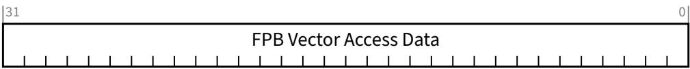

<table>
<thead>
<tr>
<th width="50%">🇬🇧 English</th>
<th width="50%" style="background-color:#e8e8e8">🏆 中文</th>
</tr>
</thead>
<tbody>
<tr>
<td>

| Bit | 0 | 31 |
|-----|----|----|
| Field | FPB Vector Access Data | |

</td>
<td style="background-color:#e8e8e8">

| 位 | 0 | 31 |
|----|----|----|
| 字段 | FPB 向量访问数据 | |

</td>
</tr>
</tbody>
</table>

---

**Table 7-186 FPB Vector Access Data Register | 表 7-186 FPB 向量访问数据寄存器**

<table>
<thead>
<tr>
<th width="50%">🇬🇧 English</th>
<th width="50%" style="background-color:#e8e8e8">🏆 中文</th>
</tr>
</thead>
<tbody>
<tr>
<td>

| Bit Location | Register Description | Attributes |
|--------------|----------------------|------------|
| 31:0 | FPB Vector Access Data - Reads from this register return the DW of data from the FPB Vector at the location determined by the value in the FPB Vector Access Offset Register. Writes to this register replace the (continued) | RW |

</td>
<td style="background-color:#e8e8e8">

| 位位置 | 寄存器描述 | 属性 |
|--------|-----------|------|
| 31:0 | FPB 向量访问数据 (FPB Vector Access Data) —— 从该寄存器读取,返回来自 FPB 向量的、由 FPB 向量访问偏移寄存器 (FPB Vector Access Offset) 中的值所确定位置处的 DW 数据。对该寄存器的写入将替换该位置处来自 FPB 向量的(续) | RW |

</td>
</tr>
</tbody>
</table>

---

<!-- 📄 Page 1247 -->
---

<table>
<thead>
<tr>
<th width="50%">🇬🇧 English</th>
<th width="50%" style="background-color:#e8e8e8">🏆 中文</th>
</tr>
</thead>
<tbody>
<tr>
<td>

(continued) DW of data from the FPB Vector at the location determined by the value in the FPB Vector Access Offset Register.
Behavior of this field is undefined if software programs unsupported values for FPB Vector Select or FPB Vector Access Offset fields, however hardware is required to complete the access to this register normally.
Default value for this field is 0000 0000h.

</td>
<td style="background-color:#e8e8e8">

(续) 由 FPB 向量访问偏移寄存器中的值所确定位置处来自 FPB 向量的 DW 数据。
若软件为 FPB 向量选择或 FPB 向量访问偏移字段编程了不支持的值,则该字段的行为未定义,但硬件需正常完成对该寄存器的访问。
该字段默认值为 0000 0000h。

</td>
</tr>
</tbody>
</table>

[⬆️ 返回目录](#-本章目录-table-of-contents)

---


<div style="overflow-x: auto; max-width: 100%;">
<table>
<thead>
<tr>
<th width="50%">🇬🇧 English</th>
<th width="50%" style="background-color:#e8e8e8">🏆 中文</th>
</tr>
</thead>
<tbody>
<tr>
<td>

This capability is optional. This capability is permitted in Downstream Ports, in Function 0 of an Upstream Port, and in RCRBs. This capability is not permitted in other Functions.
This capability is only used in Flit Mode. The capability has no effect in Non-Flit Mode.
The registers LTSSM Performance Measurement Status 1 Register through LTSSM Performance Measurement Status 5 Register are optional. The number implemented is contained in LTSSM Tracking Register Count. Unimplemented registers do not exist (i.e., the capability becomes shorter than shown in § Figure 7-205).

§ Figure 7-205 details allocation of the register bits in the Flit Performance Measurement Extended Capability structure.

</td>
<td style="background-color:#e8e8e8">

该能力是可选的。该能力允许在下游端口、上游端口的 Function 0 以及 RCRB 中实现。该能力不允许在其他 Function 中实现。
该能力仅在 Flit 模式下使用。在非 Flit 模式下,该能力无效。
LTSSM 性能测量状态 1 寄存器至 LTSSM 性能测量状态 5 寄存器为可选寄存器。所实现的数量由 LTSSM 跟踪寄存器计数 (LTSSM Tracking Register Count) 给出。未实现的寄存器不存在(即能力结构将短于 § 图 7-205 所示)。

§ 图 7-205 详细说明了 Flit 性能测量扩展能力结构中各寄存器的位分配。

</td>
</tr>
</tbody>
</table>
</div>


---

**Figure 7-205 Flit Performance Measurement Extended Capability Structure | 图 7-205 Flit 性能测量扩展能力结构**

> **Figure 7-205.** Flit Performance Measurement Extended Capability Structure
> 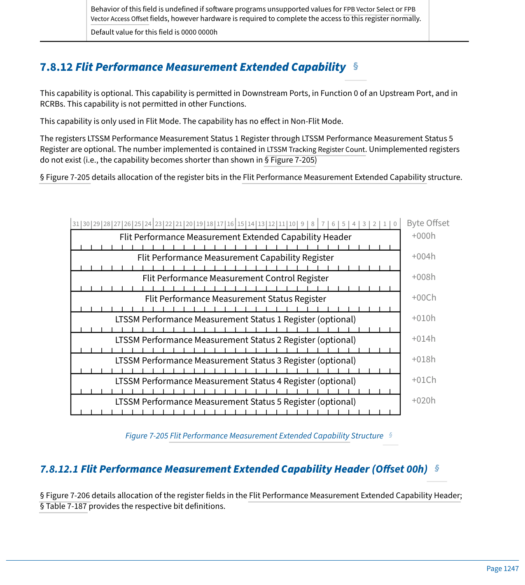

<table>
<thead>
<tr>
<th width="50%">🇬🇧 English</th>
<th width="50%" style="background-color:#e8e8e8">🏆 中文</th>
</tr>
</thead>
<tbody>
<tr>
<td>

| Byte Offset | 0 | 31 |
|-------------|----|----|
| +000h | Flit Performance Measurement Extended Capability Header | |
| +004h | Flit Performance Measurement Capability Register | |
| +008h | Flit Performance Measurement Control Register | |
| +00Ch | Flit Performance Measurement Status Register | |
| +010h | LTSSM Performance Measurement Status 1 Register (optional) | |
| +014h | LTSSM Performance Measurement Status 2 Register (optional) | |
| +018h | LTSSM Performance Measurement Status 3 Register (optional) | |
| +01Ch | LTSSM Performance Measurement Status 4 Register (optional) | |
| +020h | LTSSM Performance Measurement Status 5 Register (optional) | |

</td>
<td style="background-color:#e8e8e8">

| 字节偏移 | 0 | 31 |
|----------|----|----|
| +000h | Flit 性能测量扩展能力头 (Flit Performance Measurement Extended Capability Header) | |
| +004h | Flit 性能测量能力寄存器 (Flit Performance Measurement Capability Register) | |
| +008h | Flit 性能测量控制寄存器 (Flit Performance Measurement Control Register) | |
| +00Ch | Flit 性能测量状态寄存器 (Flit Performance Measurement Status Register) | |
| +010h | LTSSM 性能测量状态 1 寄存器 (可选) | |
| +014h | LTSSM 性能测量状态 2 寄存器 (可选) | |
| +018h | LTSSM 性能测量状态 3 寄存器 (可选) | |
| +01Ch | LTSSM 性能测量状态 4 寄存器 (可选) | |
| +020h | LTSSM 性能测量状态 5 寄存器 (可选) | |

</td>
</tr>
</tbody>
</table>

[⬆️ 返回目录](#-本章目录-table-of-contents)

---

<table>
<thead>
<tr>
<th width="50%">🇬🇧 English</th>
<th width="50%" style="background-color:#e8e8e8">🏆 中文</th>
</tr>
</thead>
<tbody>
<tr>
<td>

§ Figure 7-206 details allocation of the register fields in the Flit Performance Measurement Extended Capability Header; § Table 7-187 provides the respective bit definitions.

</td>
<td style="background-color:#e8e8e8">

§ 图 7-206 详细说明了 Flit 性能测量扩展能力头中各寄存器的字段分配;§ 表 7-187 提供了相应的位定义。

</td>
</tr>
</tbody>
</table>

---

---

<a id="sec-7-8-12"></a>
## 7.8.12 Flit Performance Measurement Extended Capability | Flit 性能测量扩展能力

<table>
<thead>
<tr>
<th width="50%">🇬🇧 English</th>
<th width="50%" style="background-color:#e8e8e8">🏆 中文</th>
</tr>
</thead>
<tbody>
<tr>
<td>

7.8.12 Flit Performance Measurement Extended Capability §

</td>
<td style="background-color:#e8e8e8">

7.8.12 Flit 性能测量扩展能力 §

</td>
</tr>
</tbody>
</table>

---

<a id="sec-7-8-12-1"></a>
## 7.8.12.1 Flit Performance Measurement Extended Capability Header (Offset 00h) | Flit 性能测量扩展能力头（偏移 00h）

<table>
<thead>
<tr>
<th width="50%">🇬🇧 English</th>
<th width="50%" style="background-color:#e8e8e8">🏆 中文</th>
</tr>
</thead>
<tbody>
<tr>
<td>

7.8.12.1 Flit Performance Measurement Extended Capability Header (Offset 00h) §

</td>
<td style="background-color:#e8e8e8">

7.8.12.1 Flit 性能测量扩展能力头（偏移 00h）§

</td>
</tr>
</tbody>
</table>

---

<!-- 📄 Page 1248 -->
---

<a id="sec-7-8-12-1-fig-7-206"></a>
## Figure 7-206 Flit Performance Measurement Extended Capability Header | 图 7-206 Flit 性能测量扩展能力头


<div style="overflow-x: auto; max-width: 100%;">
<table>
<thead>
<tr>
<th width="50%">🇬🇧 English</th>
<th width="50%" style="background-color:#e8e8e8">🏆 中文</th>
</tr>
</thead>
<tbody>
<tr>
<td>

| Bit | Description |
|-----|-------------|
| 15:0 | Flit Performance Measurement Extended Capability ID — 0033h |
| 19:16 | Capability Version |
| 31:20 | Next Capability Offset |

**Figure 7-206 Flit Performance Measurement Extended Capability Header**

**Table 7-187 Flit Performance Measurement Extended Capability Header**

| Bit Location | Register Description | Attributes |
|--------------|----------------------|------------|
| 15:0 | Flit Performance Measurement Extended Capability ID - This field is a PCI-SIG defined ID number that indicates the nature and format of the Extended Capability. The Extended Capability ID for the Flit Performance Measurement Extended Capability is 0033h. | RO |
| 19:16 | Capability Version - This field is a PCI-SIG defined version number that indicates the version of the Capability structure present. Must be 1h for this version of the specification. | RO |
| 31:20 | Next Capability Offset - This field contains the offset to the next PCI Express Capability structure or 000h if no other items exist in the linked list of Capabilities. For Extended Capabilities implemented in Configuration Space, this offset is relative to the beginning of PCI-compatible Configuration Space and thus must always be either 000h (for terminating list of Capabilities) or greater than 0FFh. | RO |

</td>
<td style="background-color:#e8e8e8">

| 位 | 描述 |
|-----|------|
| 15:0 | Flit 性能测量扩展能力 ID — 0033h |
| 19:16 | 能力版本 |
| 31:20 | 下一能力偏移 |

**图 7-206 Flit 性能测量扩展能力头**

> 


**表 7-187 Flit 性能测量扩展能力头**

| 位位置 | 寄存器描述 | 属性 |
|--------|------------|------|
| 15:0 | Flit 性能测量扩展能力 ID - 该字段是 PCI-SIG 定义的 ID 号,用于指示扩展能力的性质和格式。Flit 性能测量扩展能力的扩展能力 ID 为 0033h。 | RO |
| 19:16 | 能力版本 - 该字段是 PCI-SIG 定义的版本号,用于指示当前存在的 Capability 结构的版本。对于本规范版本,必须为 1h。 | RO |
| 31:20 | 下一能力偏移 - 该字段包含到下一个 PCI Express 能力结构的偏移,如果链表中不存在其他项,则为 000h。对于在配置空间中实现的扩展能力,此偏移相对于 PCI 兼容配置空间的起始位置,因此必须始终为 000h(用于终止能力列表)或大于 0FFh。 | RO |

</td>
</tr>
</tbody>
</table>
</div>


[⬆️ 返回目录](#-本章目录-table-of-contents)

---

<a id="sec-7-8-12-1-fig-7-207"></a>
## Figure 7-207 / Table 7-188 Flit Performance Measurement Capability Register | 图 7-207 / 表 7-188 Flit 性能测量能力寄存器

<table>
<thead>
<tr>
<th width="50%">🇬🇧 English</th>
<th width="50%" style="background-color:#e8e8e8">🏆 中文</th>
</tr>
</thead>
<tbody>
<tr>
<td>

| Bit | Description |
|-----|-------------|
| 9:0 | Flit Performance Interrupt Vector |
| 12:10 | LTSSM Tracking Register Count |
| 13:31 | RsvdP |

**Figure 7-207 Flit Performance Measurement Capability Register**

**Table 7-188 Flit Performance Measurement Capability Register**

| Bit Location | Register Description | Attributes |
|--------------|----------------------|------------|
| 9:0 | Flit Performance Interrupt Vector – contains the MSI or MSI-X Vector number used by this mechanism. If both MSI and MSI-X are implemented, this field is permitted to change value based on which one is enabled. Additionally, when MSI is enabled, this field is permitted to change value based on the value of Multiple Message Enable | RO |
| 12:10 | LTSSM Tracking Register Count – Indicates the number of simultaneous LTSSM tracking events that are supported. Value must be between 0 and 5. | HwInit |

</td>
<td style="background-color:#e8e8e8">

| 位 | 描述 |
|-----|------|
| 9:0 | Flit 性能中断向量 |
| 12:10 | LTSSM 跟踪寄存器计数 |
| 13:31 | 保留 (RsvdP) |

**图 7-207 Flit 性能测量能力寄存器**

> 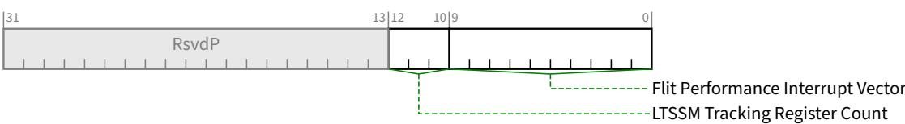


**表 7-188 Flit 性能测量能力寄存器**

| 位位置 | 寄存器描述 | 属性 |
|--------|------------|------|
| 9:0 | Flit 性能中断向量 – 包含此机制使用的 MSI 或 MSI-X 向量号。如果同时实现了 MSI 和 MSI-X,则允许该字段根据启用的中断类型更改其值。此外,当 MSI 启用时,允许该字段根据 Multiple Message Enable 的值更改其值。 | RO |
| 12:10 | LTSSM 跟踪寄存器计数 – 指示支持的同步 LTSSM 跟踪事件数。值必须在 0 到 5 之间。 | HwInit |

</td>
</tr>
</tbody>
</table>

[⬆️ 返回目录](#-本章目录-table-of-contents)

---

<a id="sec-7-8-12-2"></a>
## 7.8.12.2 Flit Performance Measurement Capability Register (Offset 04h) | Flit 性能测量能力寄存器（偏移 04h）

<table>
<thead>
<tr>
<th width="50%">🇬🇧 English</th>
<th width="50%" style="background-color:#e8e8e8">🏆 中文</th>
</tr>
</thead>
<tbody>
<tr>
<td>

7.8.12.2 Flit Performance Measurement Capability Register (Offset 04h) §

</td>
<td style="background-color:#e8e8e8">

7.8.12.2 Flit 性能测量能力寄存器（偏移 04h）§

</td>
</tr>
</tbody>
</table>

---

<!-- 📄 Page 1249 -->
---

<a id="sec-7-8-12-3"></a>
## 7.8.12.3 Flit Performance Measurement Control Register (Offset 08h) | Flit 性能测量控制寄存器（偏移 08h）


<div style="overflow-x: auto; max-width: 100%;">
<table>
<thead>
<tr>
<th width="50%">🇬🇧 English</th>
<th width="50%" style="background-color:#e8e8e8">🏆 中文</th>
</tr>
</thead>
<tbody>
<tr>
<td>

| Bit | Description |
|-----|-------------|
| 0 | Flit Latency Measurement Enable |
| 3:1 | Flit Response Type (001b = Flit to Ack Latency, 010b = Flit to Nak Latency, 100b = Nak to Replay Latency, Others = Reserved) |
| 5:4 | Reserved |
| 10:6 | Number of instances to track |
| 13:11 | Interrupt if delay for any tracked Flit exceeds this encoded value |
| 18:14 | LTSSM State Transition Tracker (Bit 14 = L0 to Recovery, Bit 15 = L0p, Bit 16 = L1.0 to L0, Bit 17 = L1.1 to L0, Bit 18 = L1.2 to L0) |
| 23:19 | Number of instances to track for LTSSM transition (000b = track the worst-case delay, Others = aggregate delay of the number presented here) |
| 26:24 | LTSSM State Transition Tracker Interrupt (000b = no interrupt generated, 001b = 6.4 ms, 010b = 12.8 ms, 011b = 19.2 ms, Others = Reserved) |
| 29:27 | LTSSM State Transition Tracker L12 PM Substate Interrupt |
| 31:30 | RsvdP |

The status register in capability indicates how many events can be simultaneously tracked for the LTSSM state transition tracker. Software must ensure that it does not enable more bits than the Port can enable.

Behavior is undefined if bits 31:1 of this register are changed while Flit Latency Measurement is running (Flit Latency Measurement Enable is 1b and either Flit Response Type is non-zero and Flit Latency Tracking Status is 00b or 01b, or LTSSM State Transition Tracker is non-zero and any of the enabled LTSSM State Transition Tracking Status fields are 00b or 01b).

7.8.12.3 Flit Performance Measurement Control Register (Offset 08h) §

</td>
<td style="background-color:#e8e8e8">

| 位 | 描述 |
|-----|------|
| 0 | Flit 延迟测量使能 |
| 3:1 | Flit 响应类型（001b = Flit 到 Ack 延迟,010b = Flit 到 Nak 延迟,100b = Nak 到 Replay 延迟,其他 = 保留） |
| 5:4 | 保留 |
| 10:6 | 跟踪的实例数 |
| 13:11 | 若任何被跟踪 Flit 的延迟超过此编码值则产生中断 |
| 18:14 | LTSSM 状态转换跟踪器（位 14 = L0 到 Recovery,位 15 = L0p,位 16 = L1.0 到 L0,位 17 = L1.1 到 L0,位 18 = L1.2 到 L0） |
| 23:19 | LTSSM 转换的跟踪实例数（000b = 跟踪最坏延迟,其他 = 此处所提供数量的聚合延迟） |
| 26:24 | LTSSM 状态转换跟踪器中断（000b = 不产生中断,001b = 6.4 ms,010b = 12.8 ms,011b = 19.2 ms,其他 = 保留） |
| 29:27 | LTSSM 状态转换跟踪器 L12 PM 子状态中断 |
| 31:30 | 保留 (RsvdP) |

能力中的状态寄存器指示 LTSSM 状态转换跟踪器可同时跟踪的事件数。软件必须确保启用的位数不超过端口所能启用的数量。

在 Flit 延迟测量正在运行时更改此寄存器的位 31:1 行为未定义（当 Flit 延迟测量使能为 1b 时,且满足以下条件之一：Flit 响应类型非零且 Flit 延迟跟踪状态为 00b 或 01b；或 LTSSM 状态转换跟踪器非零且启用的 LTSSM 状态转换跟踪状态字段中任意一个为 00b 或 01b）。

7.8.12.3 Flit 性能测量控制寄存器（偏移 08h）§

</td>
</tr>
</tbody>
</table>
</div>


[⬆️ 返回目录](#-本章目录-table-of-contents)

---

<a id="sec-7-8-12-3-fig-7-208"></a>
## Figure 7-208 / Table 7-189 Flit Performance Measurement Control Register | 图 7-208 / 表 7-189 Flit 性能测量控制寄存器

<table>
<thead>
<tr>
<th width="50%">🇬🇧 English</th>
<th width="50%" style="background-color:#e8e8e8">🏆 中文</th>
</tr>
</thead>
<tbody>
<tr>
<td>

**Figure 7-208 Flit Performance Measurement Control Register**

**Table 7-189 Flit Performance Measurement Control Register**

| Bit Location | Register Description | Attributes |
|--------------|----------------------|------------|
| 0 | Flit Latency Measurement Enable – Setting this bit to 1b enables and starts measuring the Ack/ Nak/ Replay latency of a Flit. Writing a 0b to this bit when a measurement is in progress stops the measurement and sets Flit Latency Tracking Status to 10b. Writing this bit to 1b when it is already 1b has no effect. Unit of measurement is 8 ns. Default is Zero. | RW |
| 3:1 | Flit Response Type – Setting the associated bit to 1b enables measuring the Nak to Replay, Flit to Nak, or Flit to Ack latency of a Flit, depending on which bit was written. Behavior is undefined if this field changes value while a measurement is in progress. Behavior is undefined if this field contains a Reserved encoding and Flit Latency Measurement Enable is 1b. 001b = Flit to Ack Latency – this measures the time period from sending an original Flit to receiving an Ack for precisely that Flit at the same Link Width. It does not include Flits that were replayed or Flits that were implicitly Ack'ed by receiving the Ack for a subsequent Flit. 010b = Flit to Nak Latency – this measures the time period from sending an original Flit to receiving an Nak for precisely that Flit at the same Link Width. It does not include Flits that were replayed or Flits that were implicitly Nak'ed by receiving a Nak for an earlier Flit. 100b = Nak to Replay Latency – this measures the time period from sending the first Flit containing a Nak for a given sequence number to receiving the first replay of the requested Flit at the same Link Width. Others = Reserved. Default is Zero. | RW |

</td>
<td style="background-color:#e8e8e8">

**图 7-208 Flit 性能测量控制寄存器**

> 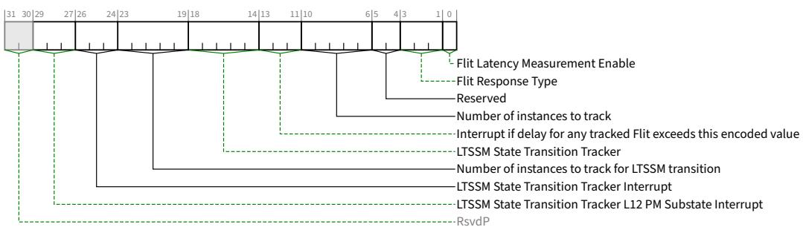


**表 7-189 Flit 性能测量控制寄存器**

| 位位置 | 寄存器描述 | 属性 |
|--------|------------|------|
| 0 | Flit 延迟测量使能 – 将该位置 1b 启用并开始测量 Flit 的 Ack/Nak/Replay 延迟。在测量进行中将该位写 0b 会停止测量并将 Flit 延迟跟踪状态设置为 10b。当该位已为 1b 时再写入 1b 没有效果。测量单位为 8 ns。默认值为零。 | RW |
| 3:1 | Flit 响应类型 – 将关联的位设置为 1b 可启用测量 Flit 的 Nak 到 Replay、Flit 到 Nak 或 Flit 到 Ack 延迟,具体取决于所写的位。在测量进行中更改此字段的值行为未定义。当此字段包含保留编码且 Flit 延迟测量使能为 1b 时,行为未定义。001b = Flit 到 Ack 延迟 – 测量从发送原始 Flit 到在同一链路宽度上接收到针对该 Flit 的 Ack 的时间。不包括重放的 Flit 或通过接收后续 Flit 的 Ack 隐式确认的 Flit。010b = Flit 到 Nak 延迟 – 测量从发送原始 Flit 到在同一链路宽度上接收到针对该 Flit 的 Nak 的时间。不包括重放的 Flit 或通过接收早期 Flit 的 Nak 隐式否认的 Flit。100b = Nak 到 Replay 延迟 – 测量从发送包含针对给定序列号的 Nak 的第一个 Flit 到在同一链路宽度上接收到所请求 Flit 的第一次重放的时间。其他 = 保留。默认值为零。 | RW |

</td>
</tr>
</tbody>
</table>

[⬆️ 返回目录](#-本章目录-table-of-contents)

---

<!-- 📄 Page 1250 -->
---

<a id="sec-7-8-12-3-tbl-7-189-cont"></a>
## Table 7-189 Flit Performance Measurement Control Register (continued) | 表 7-189 Flit 性能测量控制寄存器（续）


<div style="overflow-x: auto; max-width: 100%;">
<table>
<thead>
<tr>
<th width="50%">🇬🇧 English</th>
<th width="50%" style="background-color:#e8e8e8">🏆 中文</th>
</tr>
</thead>
<tbody>
<tr>
<td>

**Table 7-189 Flit Performance Measurement Control Register (continued)**

| Bit Location | Register Description | Attributes |
|--------------|----------------------|------------|
| 5:4 | Reserved – This field is permitted to be implemented as either RsvdP or RW with no effects. If implemented as RW, default is Zero. | RsvdP / RW |
| 10:6 | Number of instances to track. 00000b = track the worst-case delay. Others = track cumulative delay of the indicated number of Flits. Behavior is undefined if this field changes value while a measurement is in progress. When this field is Zero, measurement completes when Flit Latency Measurement Enable is cleared. When this field is non-Zero, measurement completes when the indicated number of Flits have been tracked. Default is Zero. | RW |
| 13:11 | Interrupt if delay for any tracked Flit exceeds this encoded value. 000b – do not generate an interrupt. 001b = 100 ns. 010b = 200 ns. 011b = 300 ns. Others = Reserved. Behavior is undefined if this field changes value while a measurement is in progress. Default is Zero. | RW |
| 18:14 | LTSSM State Transition Tracker – Each bit counts as one independent event: Bit 14 = L0 to Recovery due to a Framing Error / software directed while in L0. Bit 15 = L0p – Electrical Idle to start of Data Stream on Lane on an upconfig. Bit 16 = L1.0 to L0. Bit 17 = L1.1 to L0. Bit 18 = L1.2 to L0. Behavior is undefined if the number of bits set in this field is greater than LTSSM Tracking Register Count. Default is Zero. | RW |
| 23:19 | Number of instances to track for LTSSM transition. 00000b = track the worst-case delay. Others = aggregate delay of the number presented here. Default is Zero. | RW |
| 26:24 | LTSSM State Transition Tracker Interrupt - Interrupt if any of the events covered by the low 3 bits of LTSSM State Transition Tracker (bits 16:14 of this register) exceeds this encoded value: 000b = no interrupt generated. 001b = 6.4 ms. 010b = 12.8 ms. 011b = 19.2 ms. Others = Reserved. Default is Zero. | RW |

</td>
<td style="background-color:#e8e8e8">

**表 7-189 Flit 性能测量控制寄存器（续）**

| 位位置 | 寄存器描述 | 属性 |
|--------|------------|------|
| 5:4 | 保留 – 允许将该字段实现为 RsvdP 或无副作用的 RW。如果实现为 RW,则默认值为零。 | RsvdP / RW |
| 10:6 | 跟踪的实例数。00000b = 跟踪最坏延迟。其他 = 跟踪所指示数量的 Flit 的累积延迟。在测量进行中更改此字段的值行为未定义。当此字段为零时,测量在 Flit 延迟测量使能清零时完成。当此字段为非零时,测量在已跟踪所指示数量的 Flit 时完成。默认值为零。 | RW |
| 13:11 | 若任何被跟踪 Flit 的延迟超过此编码值则产生中断。000b – 不产生中断。001b = 100 ns。010b = 200 ns。011b = 300 ns。其他 = 保留。在测量进行中更改此字段的值行为未定义。默认值为零。 | RW |
| 18:14 | LTSSM 状态转换跟踪器 – 每个位计为一个独立事件：位 14 = 由于帧错误或软件触发在 L0 时从 L0 到 Recovery。位 15 = L0p – 上行配置时,从电气空闲到通道上数据流开始。位 16 = L1.0 到 L0。位 17 = L1.1 到 L0。位 18 = L1.2 到 L0。如果此字段中设置的位数大于 LTSSM 跟踪寄存器计数,则行为未定义。默认值为零。 | RW |
| 23:19 | LTSSM 转换的跟踪实例数。00000b = 跟踪最坏延迟。其他 = 此处所提供数量的聚合延迟。默认值为零。 | RW |
| 26:24 | LTSSM 状态转换跟踪器中断 - 若 LTSSM 状态转换跟踪器低 3 位（本寄存器位 16:14）所覆盖的任何事件超过此编码值则产生中断：000b = 不产生中断。001b = 6.4 ms。010b = 12.8 ms。011b = 19.2 ms。其他 = 保留。默认值为零。 | RW |

</td>
</tr>
</tbody>
</table>
</div>


[⬆️ 返回目录](#-本章目录-table-of-contents)

---

<!-- 📄 Page 1251 -->
---

<a id="sec-7-8-12-3-tbl-7-189-cont-2"></a>
## Table 7-189 Flit Performance Measurement Control Register (continued 2) | 表 7-189 Flit 性能测量控制寄存器（续 2）

<table>
<thead>
<tr>
<th width="50%">🇬🇧 English</th>
<th width="50%" style="background-color:#e8e8e8">🏆 中文</th>
</tr>
</thead>
<tbody>
<tr>
<td>

**Table 7-189 Flit Performance Measurement Control Register (continued)**

| Bit Location | Register Description | Attributes |
|--------------|----------------------|------------|
| 29:27 | LTSSM State Transition Tracker L12 PM Substate Interrupt - Interrupt if any of the events covered by upper 2 bits of LTSSM State Transition Tracker (bits 18:17 of this register) exceeds this value: 000b = no interrupt generated. 001b = 1 sec. 010b = 2 sec. 011b = 3 sec. 100b = 4 sec. 101b = 5 sec. 110b = 10 sec. 111b = Reserved. Default is Zero. | RW |

| Bit | Description |
|-----|-------------|
| 1:0 | Flit Latency Tracking Status (00b = Not started, 01b = Started, 10b = Completed, 11b = Completed with Error) |
| 6:2 | Flit Latency Tracking |
| 7 | Interrupt generated based on trigger event |
| 23:8 | Flit Latency Tracking Counter |
| 31:24 | RsvdZ |

**Figure 7-209 Flit Performance Measurement Status Register**

**Table 7-190 Flit Performance Measurement Status Register**

| Bit Location | Register Description | Attributes |
|--------------|----------------------|------------|
| 1:0 | Flit Latency Tracking Status. 00b = Not started. 01b = Started. 10b = Completed. 11b = Completed with Error (counter overflow). Default is Zero. | RO |
| 6:2 | Flit Latency Tracking – This field indicates the exact number of Flits which have been tracked and recorded in Flit Latency Tracking Counter. This field does not roll over. When Number of instances to track is non-Zero, this field will be less than or equal to Number of instances to track. When Number of instances to track is Zero, this field may contain any value. If Flit Latency Tracking Status is 11b, this field is undefined. Default is Zero. | RO |
| 7 | Interrupt generated based on trigger event – this bit is Set to 1b if an interrupt is generated based on the trigger event count due to Flit Latency Tracking. While this bit is Set to 1b, no new interrupts will be generated based on the trigger event. | RW1C |

7.8.12.4 Flit Performance Measurement Status Register (Offset 0Ch) §

</td>
<td style="background-color:#e8e8e8">

**表 7-189 Flit 性能测量控制寄存器（续）**

| 位位置 | 寄存器描述 | 属性 |
|--------|------------|------|
| 29:27 | LTSSM 状态转换跟踪器 L12 PM 子状态中断 - 若 LTSSM 状态转换跟踪器高位 2 位（本寄存器位 18:17）所覆盖的任何事件超过此值则产生中断：000b = 不产生中断。001b = 1 秒。010b = 2 秒。011b = 3 秒。100b = 4 秒。101b = 5 秒。110b = 10 秒。111b = 保留。默认值为零。 | RW |

| 位 | 描述 |
|-----|------|
| 1:0 | Flit 延迟跟踪状态（00b = 未开始,01b = 已开始,10b = 已完成,11b = 出错完成） |
| 6:2 | Flit 延迟跟踪 |
| 7 | 基于触发事件产生中断 |
| 23:8 | Flit 延迟跟踪计数器 |
| 31:24 | 保留 (RsvdZ) |

**图 7-209 Flit 性能测量状态寄存器**

> 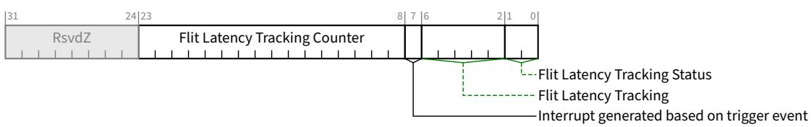


**表 7-190 Flit 性能测量状态寄存器**

| 位位置 | 寄存器描述 | 属性 |
|--------|------------|------|
| 1:0 | Flit 延迟跟踪状态。00b = 未开始。01b = 已开始。10b = 已完成。11b = 出错完成（计数器溢出）。默认值为零。 | RO |
| 6:2 | Flit 延迟跟踪 – 该字段指示已跟踪并记录在 Flit 延迟跟踪计数器中的 Flit 精确数量。该字段不回绕。当跟踪的实例数为非零时,此字段将小于或等于跟踪的实例数。当跟踪的实例数为零时,此字段可包含任何值。如果 Flit 延迟跟踪状态为 11b,则此字段未定义。默认值为零。 | RO |
| 7 | 基于触发事件产生中断 – 当由于 Flit 延迟跟踪基于触发事件计数产生中断时,该位置为 1b。当该位为 1b 时,将不会基于触发事件产生新的中断。 | RW1C |

7.8.12.4 Flit 性能测量状态寄存器（偏移 0Ch）§

</td>
</tr>
</tbody>
</table>

[⬆️ 返回目录](#-本章目录-table-of-contents)

---

<!-- 📄 Page 1252 -->
---

<a id="sec-7-8-12-4-tbl-7-190-cont"></a>
## Table 7-190 Flit Performance Measurement Status Register (continued) | 表 7-190 Flit 性能测量状态寄存器（续）


<div style="overflow-x: auto; max-width: 100%;">
<table>
<thead>
<tr>
<th width="50%">🇬🇧 English</th>
<th width="50%" style="background-color:#e8e8e8">🏆 中文</th>
</tr>
</thead>
<tbody>
<tr>
<td>

**Table 7-190 Flit Performance Measurement Status Register (continued)**

| Bit Location | Register Description | Attributes |
|--------------|----------------------|------------|
| 23:8 | Flit Latency Tracking Counter. If Number of instances to track is non-Zero, this field contains the sum of the latency values measures for the tracked Flits. Software can divide this value by the Flit Latency Tracking field to compute the average latency. If Number of instances to track is Zero, this field contains the largest latency measured for the tracked Flits. If Flit Latency Tracking Status is 11b, this field is undefined. The measurement unit is 8 μs. Default is Zero. | RO |

Up to 5 instances of the following register are supported. Each register instance supports measurement of one LTSSM state transition tracking. If multiple entries are supported the order of association is based on the bits being enabled in the control register. Software must not enable additional bits for LTSSM state transition tracking while measurement of some events in that category is in progress.

| Bit | Description |
|-----|-------------|
| 1:0 | LTSSM State Transition Tracking Status (00b = Not started) |
| 6:2 | LTSSM State Transition Tracking |
| 7 | Interrupt generated based on trigger event count due to LTSSM State Transition Tracking |
| 23:8 | LTSSM State Transition Tracking Counter |
| 31:24 | RsvdZ |

**Figure 7-210 LTSSM Performance Measurement Status Register**

**Table 7-191 LTSSM Performance Measurement Status Register**

| Bit Location | Register Description | Attributes |
|--------------|----------------------|------------|
| 1:0 | LTSSM State Transition Tracking Status. 00b = Not started. | ROS |

**IMPLEMENTATION NOTE:**
**FLIT PERFORMANCE MEASUREMENT OPERATION**

Flit Performance Measurement allows software to measure the Link Latency for the selected Flit types. These measurements reflect the timer period from when the tracked Flit is sent to when the tracking complete Flit is received. It is strongly recommended that these two events be consistent with each other (e.g., measure from when the first bit of a Flit was transmitted to when the first bit of a Flit was received). When performing a measurement, software should disable Link width changes by configuring Target Link Width and Hardware Autonomous Width Disable. Not doing this can result in inaccurate measurement values.

7.8.12.5 LTSSM Performance Measurement Status Register (Offsets 10h to 20h) §

</td>
<td style="background-color:#e8e8e8">

**表 7-190 Flit 性能测量状态寄存器（续）**

| 位位置 | 寄存器描述 | 属性 |
|--------|------------|------|
| 23:8 | Flit 延迟跟踪计数器。如果跟踪的实例数为非零,此字段包含已跟踪 Flit 延迟值的总和。软件可将该值除以 Flit 延迟跟踪字段以计算平均延迟。如果跟踪的实例数为零,此字段包含已跟踪 Flit 的最大延迟。如果 Flit 延迟跟踪状态为 11b,则此字段未定义。测量单位为 8 μs。默认值为零。 | RO |

最多支持以下寄存器的 5 个实例。每个寄存器实例支持对一个 LTSSM 状态转换跟踪的测量。如果支持多个条目,则关联顺序基于控制寄存器中启用的位。当该类别中某些事件的测量正在进行时,软件不得启用 LTSSM 状态转换跟踪的其他位。

| 位 | 描述 |
|-----|------|
| 1:0 | LTSSM 状态转换跟踪状态（00b = 未开始） |
| 6:2 | LTSSM 状态转换跟踪 |
| 7 | 基于 LTSSM 状态转换跟踪的触发事件计数产生中断 |
| 23:8 | LTSSM 状态转换跟踪计数器 |
| 31:24 | 保留 (RsvdZ) |

**图 7-210 LTSSM 性能测量状态寄存器**

> 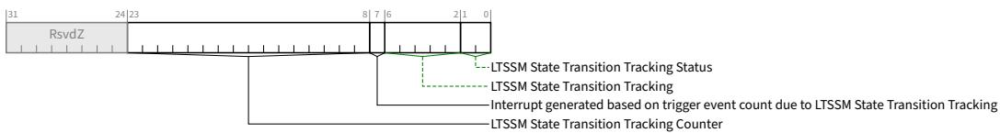


**表 7-191 LTSSM 性能测量状态寄存器**

| 位位置 | 寄存器描述 | 属性 |
|--------|------------|------|
| 1:0 | LTSSM 状态转换跟踪状态。00b = 未开始。 | ROS |

**实现说明：**
**FLIT 性能测量操作**

Flit 性能测量允许软件测量所选 Flit 类型的链路延迟。这些测量反映从发送被跟踪 Flit 到接收到跟踪完成 Flit 的计时周期。强烈建议这两个事件保持一致（例如,从 Flit 第一个比特发送时测量到 Flit 第一个比特接收时）。执行测量时,软件应通过配置 Target Link Width 和 Hardware Autonomous Width Disable 来禁用链路宽度更改。如果不这样做,可能会导致测量值不准确。

7.8.12.5 LTSSM 性能测量状态寄存器（偏移 10h 到 20h）§

</td>
</tr>
</tbody>
</table>
</div>


[⬆️ 返回目录](#-本章目录-table-of-contents)

---

<!-- 📄 Page 1253 -->
---

<a id="sec-7-8-12-5-tbl-7-191-cont"></a>
## Table 7-191 LTSSM Performance Measurement Status Register (continued) | 表 7-191 LTSSM 性能测量状态寄存器（续）

<table>
<thead>
<tr>
<th width="50%">🇬🇧 English</th>
<th width="50%" style="background-color:#e8e8e8">🏆 中文</th>
</tr>
</thead>
<tbody>
<tr>
<td>

**Table 7-191 LTSSM Performance Measurement Status Register (continued)**

| Bit Location | Register Description | Attributes |
|--------------|----------------------|------------|
| 1:0 | LTSSM State Transition Tracking Status (continued). 01b = Started. 10b = Completed. 11b = Error (including counter overflow). Cleared on 0b to 1b transition of Flit Latency Measurement Enable. Default is Zero. | ROS |
| 6:2 | LTSSM State Transition Tracking – number of LTSSM state transitions of the measured type tracked so far. This number does not roll over. Cleared on 0b to 1b transition of Flit Latency Measurement Enable. Default is Zero. | ROS |
| 7 | Interrupt generated based on trigger event count due to LTSSM State Transition Tracking – this bit is Set when an interrupt is generated based on the trigger event. While this bit is Set, no new interrupts will be generated based on the trigger event. Default is Zero. | RW1CS |
| 23:8 | LTSSM State Transition Tracking Counter. The measurement unit is 64 usec. Cleared on 0b to 1b transition of Flit Latency Measurement Enable. Default is Zero. | ROS |

This capability is optional. This capability is permitted in Downstream Ports (下游端口), in Function 0 of an Upstream Port (上游端口), and in RCRBs. This capability is not permitted in other Functions.

This capability is only used in Flit Mode. The capability has no effect in Non-Flit Mode.

</td>
<td style="background-color:#e8e8e8">

**表 7-191 LTSSM 性能测量状态寄存器（续）**

| 位位置 | 寄存器描述 | 属性 |
|--------|------------|------|
| 1:0 | LTSSM 状态转换跟踪状态（续）。01b = 已开始。10b = 已完成。11b = 错误（包括计数器溢出）。在 Flit 延迟测量使能从 0b 到 1b 转换时清零。默认值为零。 | ROS |
| 6:2 | LTSSM 状态转换跟踪 – 截至目前所跟踪测量类型的 LTSSM 状态转换次数。此数字不回绕。在 Flit 延迟测量使能从 0b 到 1b 转换时清零。默认值为零。 | ROS |
| 7 | 基于 LTSSM 状态转换跟踪的触发事件计数产生中断 – 当基于触发事件产生中断时,该位置 1。当该位为 1 时,将不会基于触发事件产生新的中断。默认值为零。 | RW1CS |
| 23:8 | LTSSM 状态转换跟踪计数器。测量单位为 64 微秒。在 Flit 延迟测量使能从 0b 到 1b 转换时清零。默认值为零。 | ROS |

此能力是可选的。此能力允许出现在 Downstream Ports（下游端口）、Upstream Port（上游端口）的 Function 0 中以及 RCRB 中。此能力不允许出现在其他 Function 中。

此能力仅在 Flit 模式 (Flit Mode) 中使用。在非 Flit 模式 (Non-Flit Mode) 中,此能力无效。

</td>
</tr>
</tbody>
</table>

[⬆️ 返回目录](#-本章目录-table-of-contents)

---

<a id="sec-7-8-13"></a>
## 7.8.13 Flit Error Injection Extended Capability | Flit 错误注入扩展能力

<table>
<thead>
<tr>
<th width="50%">🇬🇧 English</th>
<th width="50%" style="background-color:#e8e8e8">🏆 中文</th>
</tr>
</thead>
<tbody>
<tr>
<td>

Figure 7-211 details allocation of the register bits in the Flit Error Injection Extended Capability structure.

7.8.13 Flit Error Injection Extended Capability §

</td>
<td style="background-color:#e8e8e8">

图 7-211 详细说明了 Flit 错误注入扩展能力结构中寄存器位的分配。

7.8.13 Flit 错误注入扩展能力 §

</td>
</tr>
</tbody>
</table>

---

<!-- 📄 Page 1254 -->
---

<a id="sec-7-8-13-fig-7-211"></a>
## Figure 7-211 Flit Error Injection Extended Capability Structure | 图 7-211 Flit 错误注入扩展能力结构


<div style="overflow-x: auto; max-width: 100%;">
<table>
<thead>
<tr>
<th width="50%">🇬🇧 English</th>
<th width="50%" style="background-color:#e8e8e8">🏆 中文</th>
</tr>
</thead>
<tbody>
<tr>
<td>

| Byte Offset | Register |
|-------------|----------|
| +000h | Flit Error Injection Extended Capability Header |
| +004h | Error Injection Capability Register |
| +008h | Flit Error Injection Control 1 Register |
| +00Ch | Flit Error Injection Control 2 Register |
| +010h | Flit Error Injection Status Register |
| +014h | Ordered Set Error Injection Control 1 Register |
| +018h | Ordered Set Error Injection Control 2 Register |
| +01Ch | Ordered Set Error Tx Injection Status Register |
| +020h | Ordered Set Error Rx Injection Status Register |

**Figure 7-211 Flit Error Injection Extended Capability Structure**

Figure 7-212 details allocation of the register fields in the Flit Error Injection Extended Capability Header; Table 7-192 provides the respective bit definitions.

| Bit | Description |
|-----|-------------|
| 15:0 | Flit Error Injection Extended Capability ID — 0034h |
| 19:16 | Capability Version |
| 31:20 | Next Capability Offset |

**Figure 7-212 Flit Error Injection Extended Capability Header**

**Table 7-192 Flit Error Injection Extended Capability Header**

| Bit Location | Register Description | Attributes |
|--------------|----------------------|------------|
| 15:0 | Flit Error Injection Extended Capability ID - This field is a PCI-SIG defined ID number that indicates the nature and format of the Extended Capability. The Extended Capability ID for the Flit Error Injection Extended Capability is 0034h. | RO |
| 19:16 | Capability Version - This field is a PCI-SIG defined version number that indicates the version of the Capability structure present. Must be 1h for this version of the specification. | RO |

7.8.13.1 Flit Error Injection Extended Capability Header (Offset 00h) §

</td>
<td style="background-color:#e8e8e8">

| 字节偏移 | 寄存器 |
|---------|--------|
| +000h | Flit 错误注入扩展能力头 |
| +004h | 错误注入能力寄存器 |
| +008h | Flit 错误注入控制 1 寄存器 |
| +00Ch | Flit 错误注入控制 2 寄存器 |
| +010h | Flit 错误注入状态寄存器 |
| +014h | 有序集错误注入控制 1 寄存器 |
| +018h | 有序集错误注入控制 2 寄存器 |
| +01Ch | 有序集错误 Tx 注入状态寄存器 |
| +020h | 有序集错误 Rx 注入状态寄存器 |

**图 7-211 Flit 错误注入扩展能力结构**

> 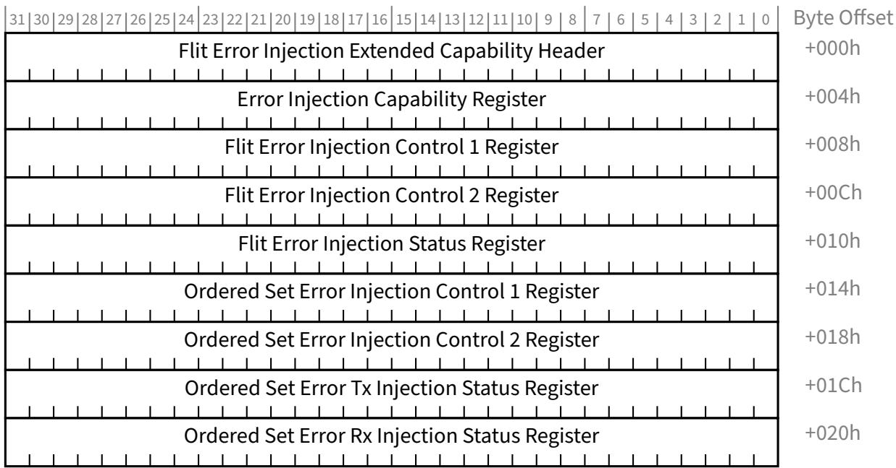


图 7-212 详细说明了 Flit 错误注入扩展能力头中寄存器字段的分配;表 7-192 提供了相应的位定义。

| 位 | 描述 |
|-----|------|
| 15:0 | Flit 错误注入扩展能力 ID — 0034h |
| 19:16 | 能力版本 |
| 31:20 | 下一能力偏移 |

**图 7-212 Flit 错误注入扩展能力头**

> 


**表 7-192 Flit 错误注入扩展能力头**

| 位位置 | 寄存器描述 | 属性 |
|--------|------------|------|
| 15:0 | Flit 错误注入扩展能力 ID - 该字段是 PCI-SIG 定义的 ID 号,用于指示扩展能力的性质和格式。Flit 错误注入扩展能力的扩展能力 ID 为 0034h。 | RO |
| 19:16 | 能力版本 - 该字段是 PCI-SIG 定义的版本号,用于指示当前存在的 Capability 结构的版本。对于本规范版本,必须为 1h。 | RO |

7.8.13.1 Flit 错误注入扩展能力头（偏移 00h）§

</td>
</tr>
</tbody>
</table>
</div>


[⬆️ 返回目录](#-本章目录-table-of-contents)

---

<!-- 📄 Page 1255 -->
---

<a id="sec-7-8-13-1-tbl-7-192-cont"></a>
## Table 7-192 Flit Error Injection Extended Capability Header (continued) | 表 7-192 Flit 错误注入扩展能力头（续）

<table>
<thead>
<tr>
<th width="50%">🇬🇧 English</th>
<th width="50%" style="background-color:#e8e8e8">🏆 中文</th>
</tr>
</thead>
<tbody>
<tr>
<td>

**Table 7-192 Flit Error Injection Extended Capability Header (continued)**

| Bit Location | Register Description | Attributes |
|--------------|----------------------|------------|
| 31:20 | Next Capability Offset - This field contains the offset to the next PCI Express Capability structure or 000h if no other items exist in the linked list of Capabilities. For Extended Capabilities implemented in Configuration Space, this offset is relative to the beginning of PCI-compatible Configuration Space and thus must always be either 000h (for terminating list of Capabilities) or greater than 0FFh. | RO |

| Bit | Description |
|-----|-------------|
| 31:0 | Reserved |

**Figure 7-213 Flit Error Injection Capability Register**

**Table 7-193 Flit Error Injection Capability Register**

| Bit Location | Register Description | Attributes |
|--------------|----------------------|------------|
| 31:0 | Reserved | RsvdP |

Link level, optional register, both on Tx side as well as Rx side. Behavior is undefined if bits 31:1 of this register change value when error injection is running (Flit Error Injection Enable is 1b and Flit Error Injection Status is 00b or 01b).

| Bit | Description |
|-----|-------------|
| 0 | Flit Error Injection Enable |
| 1 | Inject Errors on Transmitted Flits |
| 2 | Inject Errors on Received Flits |
| 15:3 | Flit Error Injection Enable Data Rate (Bit 3 = 2.5 GT/s, Bit 4 = 5.0 GT/s, Bit 5 = 8.0 GT/s, Bit 6 = 16.0 GT/s, Bit 7 = 32.0 GT/s, Bit 8 = 64.0 GT/s, Bits 15:9 = RsvdP) |
| 20:16 | Number of Errors Injected |
| 28:21 | Spacing Between Injected Errors |
| 31:29 | Injection on Flit Type |

**Figure 7-214 Flit Error Injection Control 1 Register**

**Table 7-194 Flit Error Injection Control 1 Register**

| Bit Location | Register Description | Attributes |
|--------------|----------------------|------------|
| 0 | Flit Error Injection Enable – Setting this bit enables and starts the error injection in the Link. Clearing to this bit stops the error injection. | RW |

7.8.13.2 Flit Error Injection Capability Register (Offset 04h) §
7.8.13.3 Flit Error Injection Control 1 Register (Offset 08h) §

</td>
<td style="background-color:#e8e8e8">

**表 7-192 Flit 错误注入扩展能力头（续）**

| 位位置 | 寄存器描述 | 属性 |
|--------|------------|------|
| 31:20 | 下一能力偏移 - 该字段包含到下一个 PCI Express 能力结构的偏移,如果链表中不存在其他项,则为 000h。对于在配置空间中实现的扩展能力,此偏移相对于 PCI 兼容配置空间的起始位置,因此必须始终为 000h（用于终止能力列表）或大于 0FFh。 | RO |

| 位 | 描述 |
|-----|------|
| 31:0 | 保留 |

**图 7-213 Flit 错误注入能力寄存器**

> 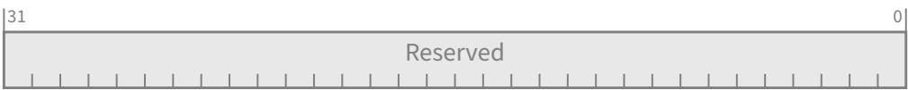


**表 7-193 Flit 错误注入能力寄存器**

| 位位置 | 寄存器描述 | 属性 |
|--------|------------|------|
| 31:0 | 保留 | RsvdP |

链路级、可选寄存器,Tx 侧和 Rx 侧均存在。当错误注入正在运行时（Flit 错误注入使能为 1b 且 Flit 错误注入状态为 00b 或 01b）更改此寄存器位 31:1 的值时,行为未定义。

| 位 | 描述 |
|-----|------|
| 0 | Flit 错误注入使能 |
| 1 | 在发送的 Flit 上注入错误 |
| 2 | 在接收的 Flit 上注入错误 |
| 15:3 | Flit 错误注入使能数据速率（位 3 = 2.5 GT/s,位 4 = 5.0 GT/s,位 5 = 8.0 GT/s,位 6 = 16.0 GT/s,位 7 = 32.0 GT/s,位 8 = 64.0 GT/s,位 15:9 = 保留） |
| 20:16 | 注入错误数 |
| 28:21 | 注入错误之间的间隔 |
| 31:29 | 在 Flit 类型上注入 |

**图 7-214 Flit 错误注入控制 1 寄存器**

> 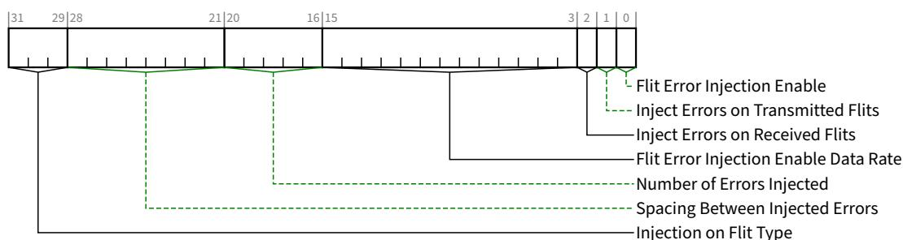


**表 7-194 Flit 错误注入控制 1 寄存器**

| 位位置 | 寄存器描述 | 属性 |
|--------|------------|------|
| 0 | Flit 错误注入使能 – 设置该位可启用并启动链路中的错误注入。清除该位会停止错误注入。 | RW |

7.8.13.2 Flit 错误注入能力寄存器（偏移 04h）§
7.8.13.3 Flit 错误注入控制 1 寄存器（偏移 08h）§

</td>
</tr>
</tbody>
</table>

[⬆️ 返回目录](#-本章目录-table-of-contents)

---

<!-- 📄 Page 1256 -->
---

<a id="sec-7-8-13-3-tbl-7-194-cont"></a>
## Table 7-194 Flit Error Injection Control 1 Register (continued) | 表 7-194 Flit 错误注入控制 1 寄存器（续）


<div style="overflow-x: auto; max-width: 100%;">
<table>
<thead>
<tr>
<th width="50%">🇬🇧 English</th>
<th width="50%" style="background-color:#e8e8e8">🏆 中文</th>
</tr>
</thead>
<tbody>
<tr>
<td>

**Table 7-194 Flit Error Injection Control 1 Register (continued)**

| Bit Location | Register Description | Attributes |
|--------------|----------------------|------------|
| 1 | Inject Errors on Transmitted Flits – Setting this bit to 1b enables error injection in the Transmitted Flits. A Port that does not implement this functionality must hardwire this bit to 0b. Default is Zero. | RW |
| 2 | Inject Errors on Received Flits – Setting this bit enables error injection in the Received Flits. A Port is permitted to not inject the exact error described but mimic an error injection effect to achieve the desired effect such as logging FEC-correctable errors or causing NAKs after CRC check. A Port that does not implement this functionality must hardwire this bit to 0b. Default is Zero. | RW |
| 15:3 | Flit Error Injection Enable Data Rate – These bits enable the Flit error injection for the corresponding data rates when enabled: Bit 3 = 2.5 GT/s, Bit 4 = 5.0 GT/s, Bit 5 = 8.0 GT/s, Bit 6 = 16.0 GT/s, Bit 7 = 32.0 GT/s, Bit 8 = 64.0 GT/s, Bits 15:9 = RsvdP. Default is Zero. | RW / RsvdP |
| 20:16 | Number of Errors Injected – This represents the number of errors to be injected on the Transmitted and/or Received Flits independently. A value of 0 indicates that error injection continues till the injection mechanism is disabled. Default is Zero. | RW |
| 28:21 | Spacing Between Injected Errors – This represents the next Flit on which error will be injected after the current sequence of Flit error injection completes. A non-0 value indicates the exact number of Flits after which the error is injected; a 0 value will inject the errors after a pseudo-random number of Flits between 1 to 127, chosen with equal probability. This is used on the Transmit and/or Received side independently. Default is Zero. | RW |
| 31:29 | Injection on Flit Type – 000b = Inject on any Flit Type. 001b = Inject on any non-IDLE Flit. 010b = Inject only on Payload Flit. 011b = Inject only on NOP Flit. 100b = Inject only on IDLE Flit. 101b = If Error Type Being Injected is 11b, Inject only on a Payload Flit and then subsequently on the same sequence number for the Consecutive Error Injection times. The entire repeat will be considered as one instance of error injection for the purposes of counting towards the number of errors injected. Reserved encoding if Error Type Being Injected is other than 11b. 110b = If Error Type Being Injected is 11b, Inject only on a Payload Flit along with subsequent injection on one selected Payload Flit with the same sequence number for Consecutive Error Injection times. Exactly one sequence number is selected for consecutive error injection | RW |

</td>
<td style="background-color:#e8e8e8">

**表 7-194 Flit 错误注入控制 1 寄存器（续）**

| 位位置 | 寄存器描述 | 属性 |
|--------|------------|------|
| 1 | 在发送的 Flit 上注入错误 – 将该位置 1b 可在发送的 Flit 上启用错误注入。未实现此功能的端口必须将该位硬连线为 0b。默认值为零。 | RW |
| 2 | 在接收的 Flit 上注入错误 – 设置该位可在接收的 Flit 上启用错误注入。允许端口不注入所描述的确切错误,而是模拟错误注入效果以实现所需的效果,例如记录 FEC 可纠正错误或在 CRC 检查后导致 NAK。未实现此功能的端口必须将该位硬连线为 0b。默认值为零。 | RW |
| 15:3 | Flit 错误注入使能数据速率 – 这些位在启用时为相应数据速率启用 Flit 错误注入：位 3 = 2.5 GT/s,位 4 = 5.0 GT/s,位 5 = 8.0 GT/s,位 6 = 16.0 GT/s,位 7 = 32.0 GT/s,位 8 = 64.0 GT/s,位 15:9 = 保留。默认值为零。 | RW / RsvdP |
| 20:16 | 注入错误数 – 表示独立地在发送和/或接收的 Flit 上注入的错误数。值为 0 表示错误注入将持续到注入机制被禁用。默认值为零。 | RW |
| 28:21 | 注入错误之间的间隔 – 表示在当前 Flit 错误注入序列完成之后,将在下一个 Flit 上注入错误。非 0 值表示在该确切数量的 Flit 之后注入错误;值为 0 时,将在 1 到 127 之间的伪随机数量的 Flit 后注入错误,以等概率选择。此项在发送和/或接收侧独立使用。默认值为零。 | RW |
| 31:29 | 在 Flit 类型上注入 – 000b = 在任何 Flit 类型上注入。001b = 在任何非 IDLE Flit 上注入。010b = 仅在 Payload Flit 上注入。011b = 仅在 NOP Flit 上注入。100b = 仅在 IDLE Flit 上注入。101b = 如果正在注入的错误类型为 11b,则仅在 Payload Flit 上注入,随后在 Consecutive Error Injection 次数的相同序列号上注入。整个重复将计为一次错误注入实例,用于计入注入错误数。如果正在注入的错误类型非 11b,则此为保留编码。110b = 如果正在注入的错误类型为 11b,则仅在 Payload Flit 上注入,随后在 Consecutive Error Injection 次数的相同序列号上对一个所选 Payload Flit 注入。连续错误注入恰好选择一个序列号。 | RW |

</td>
</tr>
</tbody>
</table>
</div>


[⬆️ 返回目录](#-本章目录-table-of-contents)

---

<!-- 📄 Page 1257 -->
---

<a id="sec-7-8-13-3-tbl-7-194-cont-2"></a>
## Table 7-194 Flit Error Injection Control 1 Register (continued 2) | 表 7-194 Flit 错误注入控制 1 寄存器（续 2）

<table>
<thead>
<tr>
<th width="50%">🇬🇧 English</th>
<th width="50%" style="background-color:#e8e8e8">🏆 中文</th>
</tr>
</thead>
<tbody>
<tr>
<td>

**Table 7-194 Flit Error Injection Control 1 Register (continued)**

| Bit Location | Register Description | Attributes |
|--------------|----------------------|------------|
| 31:29 (cont.) | among all the outstanding Payload Flits injected with FEC-uncorrectable errors. The entire repeat will be considered as one instance of error injection for the purposes of counting towards the number of errors injected. Reserved encoding if Error Type Being Injected is other than 11b. 111b = Reserved. Default is Zero. | RW |

Link level, optional register, both on Tx side as well as Rx side. Behavior is undefined if this register changes value when error injection is running (Flit Error Injection Enable is 1b and Flit Error Injection Status is 00b or 01b).

| Bit | Description |
|-----|-------------|
| 2:0 | Consecutive Error Injection (00b = No consecutive error injection, 01b = One to six consecutive error injections, 10b = A pseudo-random number between 7 and 15, each selected with equal probability) |
| 4:3 | Error Type Being Injected (00b = Random between FEC-correctable or FEC-uncorrectable, 01b = FEC-Correctable error injected only in one FEC group (rotate across the groups in subsequent injections), 10b = FEC-Correctable error injected in all 3 FEC groups simultaneously, 11b = FEC-Uncorrectable error injected) |
| 11:5 | Error Offset within Flit |
| 19:12 | Error Magnitude |
| 31:20 | RsvdP |

**Figure 7-215 Flit Error Injection Control 2 Register**

**Table 7-195 Flit Error Injection Control 2 Register**

| Bit Location | Register Description | Attributes |
|--------------|----------------------|------------|
| 2:0 | Consecutive Error Injection – The number of consecutive Flits that will be injected with the error, irrespective of the type of Flit on which the error is supposed to be initially injected. For the Injection of Flit Type encoding of 101b and 110b, this field has additional meaning, as described above. Even if multiple consecutive Flits will be injected with an error because of this, the entire sequence will count as one towards the number of errors injected. 00b = No consecutive error injection. 01b = One to six consecutive error injections. 10b = A pseudo-random number between 7 and 15, each selected with equal probability. Default is Zero. | RW |
| 4:3 | Error Type Being Injected – 00b = Random between FEC-correctable or FEC-uncorrectable. 01b = FEC-Correctable error injected only in one FEC group (rotate across the groups in subsequent injections). 10b = FEC-Correctable error injected in all 3 FEC groups simultaneously. 11b = FEC-Uncorrectable error injected. Default is Zero. | RW |
| 11:5 | Error Offset within Flit – For FEC-correctable error(s): Byte offset within FEC-group where error will be injected. If this value is greater than the number of bytes in the FEC group, an error must be injected on any byte in the FEC-group with equal probability using a pseudo-random number generator. | RW |

</td>
<td style="background-color:#e8e8e8">

**表 7-194 Flit 错误注入控制 1 寄存器（续）**

| 位位置 | 寄存器描述 | 属性 |
|--------|------------|------|
| 31:29（续） | 在所有注入了 FEC 不可纠正错误的未完成 Payload Flit 中。整个重复将计为一次错误注入实例,用于计入注入错误数。如果正在注入的错误类型非 11b,则此为保留编码。111b = 保留。默认值为零。 | RW |

链路级、可选寄存器,Tx 侧和 Rx 侧均存在。当错误注入正在运行时（Flit 错误注入使能为 1b 且 Flit 错误注入状态为 00b 或 01b）更改此寄存器的值时,行为未定义。

| 位 | 描述 |
|-----|------|
| 2:0 | 连续错误注入（00b = 无连续错误注入,01b = 一到六次连续错误注入,10b = 7 到 15 之间的伪随机数,每个以等概率选择） |
| 4:3 | 正在注入的错误类型（00b = 在 FEC 可纠正与 FEC 不可纠正之间随机,01b = 仅在一个 FEC 组中注入 FEC 可纠正错误（后续注入中跨组轮换）,10b = 同时在全部 3 个 FEC 组中注入 FEC 可纠正错误,11b = 注入 FEC 不可纠正错误） |
| 11:5 | Flit 内的错误偏移 |
| 19:12 | 错误幅度 |
| 31:20 | 保留 (RsvdP) |

**图 7-215 Flit 错误注入控制 2 寄存器**

> 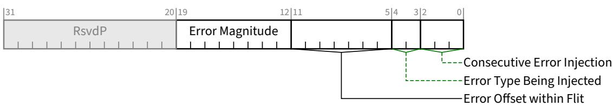


**表 7-195 Flit 错误注入控制 2 寄存器**

| 位位置 | 寄存器描述 | 属性 |
|--------|------------|------|
| 2:0 | 连续错误注入 – 将注入错误的连续 Flit 数,与错误最初应注入的 Flit 类型无关。对于 Flit 类型注入编码 101b 和 110b,此字段具有如上所述的附加含义。即使因此将向多个连续 Flit 注入错误,整个序列仍将计为一次错误注入。00b = 无连续错误注入。01b = 一到六次连续错误注入。10b = 7 到 15 之间的伪随机数,每个以等概率选择。默认值为零。 | RW |
| 4:3 | 正在注入的错误类型 – 00b = 在 FEC 可纠正与 FEC 不可纠正之间随机。01b = 仅在一个 FEC 组中注入 FEC 可纠正错误（后续注入中跨组轮换）。10b = 同时在全部 3 个 FEC 组中注入 FEC 可纠正错误。11b = 注入 FEC 不可纠正错误。默认值为零。 | RW |
| 11:5 | Flit 内的错误偏移 – 对于 FEC 可纠正错误：在 FEC 组内注入错误的字节偏移。如果此值大于 FEC 组中的字节数,则必须使用伪随机数生成器以等概率在 FEC 组内的任意字节上注入错误。 | RW |

</td>
</tr>
</tbody>
</table>

[⬆️ 返回目录](#-本章目录-table-of-contents)

---


---

7.8.13.4 Flit Error Injection Control 2 Register (Offset 0Ch) §
§
§

<!-- 📄 Page 1258 -->
---


<div style="overflow-x: auto; max-width: 100%;">
<table>
<thead>
<tr>
<th width="50%">🇬🇧 English</th>
<th width="50%" style="background-color:#e8e8e8">🏆 中文</th>
</tr>
</thead>
<tbody>
<tr>
<td>

00h
Others
00b
01b
10b
11b
00b
01b
10b
11b
Bit Location
Register Description
Attributes
For uncorrectable error(s): Distance between subsequent injected error bytes with the initial starting position at byte 0. If at least 8 bytes have not been injected with an error, the Port must inject errors in some of the FEC bytes to get to 8 bytes in error.
Default is Zero.
19:12
Error Magnitude – magnitude of error injected in each byte where error has been injected
any pseudo-random non-0 value with equal probability
exact error magnitude
Default is Zero.
RW

</td>
<td style="background-color:#e8e8e8">

00h
其他值
00b
01b
10b
11b
00b
01b
10b
11b
位位置
寄存器描述
属性
针对不可纠正错误:从起始位置字节 0 起,后续被注入错误的字节之间的距离。如果尚未有至少 8 个字节被注入错误,Port 必须在某些 FEC 字节中注入错误,以使错误字节数达到 8。
默认值为零。
19:12
Error Magnitude(错误量级) – 在每个被注入错误的字节中所注入错误的量级
以等概率取任意非 0 的伪随机值
精确的错误量级
默认值为零。
RW

</td>
</tr>
</tbody>
</table>
</div>


[⬆️ 返回目录](#-本章目录-table-of-contents)

---

<a id="fig-7-216"></a>

**Figure 7-216. Flit Error Injection Status Register | 图 7-216 Flit 错误注入状态寄存器**

<table>
<thead>
<tr>
<th width="50%">🇬🇧 English</th>
<th width="50%" style="background-color:#e8e8e8">🏆 中文</th>
</tr>
</thead>
<tbody>
<tr>
<td>

0
1
Flit Error Tx Injection Status
2
3
Flit Error Rx Injection Status
4
31
RsvdZ

</td>
<td style="background-color:#e8e8e8">

0
1
Flit Error Tx Injection Status(Flit 错误 Tx 注入状态)
2
3
Flit Error Rx Injection Status(Flit 错误 Rx 注入状态)
4
31
RsvdZ(保留,置零)

</td>
</tr>
</tbody>
</table>

[⬆️ 返回目录](#-本章目录-table-of-contents)

---

**Table 7-196. Flit Error Injection Status Register | 表 7-196 Flit 错误注入状态寄存器**


<div style="overflow-x: auto; max-width: 100%;">
<table>
<thead>
<tr>
<th width="50%">🇬🇧 English</th>
<th width="50%" style="background-color:#e8e8e8">🏆 中文</th>
</tr>
</thead>
<tbody>
<tr>
<td>

Bit Location
Register Description
Attributes
1:0
Flit Error Tx Injection Status
Not injected any error yet
At least one error is injected, but not completed
Error injection completed
Error case – error injection aborted, either Flit Error Injection Enable was cleared while injection was incomplete or optionally Flit Error Injection Control 1 [31:1] or Flit Error Injection Control 2 was changed while Injection was enabled and not complete.
This field is cleared on the 0b to 1b transition of Flit Error Injection Enable.
Default is Zero.
RO
3:2
Flit Error Rx Injection Status
Not injected any error yet
At least one error is injected, but not completed
Error injection completed
Error case – error injection aborted, either Flit Error Injection Enable was cleared while injection was incomplete or optionally Flit Error Injection Control 1 [31:1] or Flit Error Injection Control 2 was changed while Injection was enabled and not complete.
This field is cleared on the 0b to 1b transition of Flit Error Injection Enable.
Default is Zero.
RO

</td>
<td style="background-color:#e8e8e8">

位位置
寄存器描述
属性
1:0
Flit Error Tx Injection Status(Flit 错误 Tx 注入状态)
尚未注入任何错误
已至少注入一个错误,但未完成
错误注入已完成
错误情形 – 错误注入被中止,可能是因为在注入未完成时 Flit Error Injection Enable 被清零,或可选地在注入已使能但未完成时,Flit Error Injection Control 1[31:1] 或 Flit Error Injection Control 2 被修改。
该字段在 Flit Error Injection Enable 由 0b 跳变为 1b 时被清零。
默认值为零。
RO
3:2
Flit Error Rx Injection Status(Flit 错误 Rx 注入状态)
尚未注入任何错误
已至少注入一个错误,但未完成
错误注入已完成
错误情形 – 错误注入被中止,可能是因为在注入未完成时 Flit Error Injection Enable 被清零,或可选地在注入已使能但未完成时,Flit Error Injection Control 1[31:1] 或 Flit Error Injection Control 2 被修改。
该字段在 Flit Error Injection Enable 由 0b 跳变为 1b 时被清零。
默认值为零。
RO

</td>
</tr>
</tbody>
</table>
</div>


[⬆️ 返回目录](#-本章目录-table-of-contents)

---

7.8.13.5 Flit Error Injection Status Register (Offset 10h) §
§
§

<!-- 📄 Page 1259 -->
---

<table>
<thead>
<tr>
<th width="50%">🇬🇧 English</th>
<th width="50%" style="background-color:#e8e8e8">🏆 中文</th>
</tr>
</thead>
<tbody>
<tr>
<td>

Link level, optional register, both on Tx side as well as Rx side. A Port that does not implement the functionality must hardwire these bits to 0b. Behavior is undefined if bits 63:1 of this register change value when Ordered Set Injection Enable is Set and Ordered Set Error Injection Status is 00b or 01b.
0
Ordered Set Error Injection Enable
1
Inject Errors on Transmitted Ordered Sets
2
Inject Errors on Received Ordered Sets
3
7
Number of Errors injected
8
15
Spacing Between Injected Errors
16
Inject Error on TS0 OS
17
Inject Error on TS1 OS
18
Inject Error on TS2 OS
19
Inject Error on SKP OS
20
Inject Error on EIEOS OS
21
Inject Error on EIOS OS
22
Inject Error on SDS OS
23
Inject Error in Polling State
24
Inject Error in Configuration State
25
Inject Error in L0 state
26
Inject Error in non-EQ Recovery state,
27
Inject Error in Recovery.Equalization Phase 0 and 1
28
Inject Error in Recovery.Equalization Phase 2
29
Inject Error in Recovery.Equalization Phase 3
30
31
RsvdP

</td>
<td style="background-color:#e8e8e8">

链路级(Link level)的可选寄存器,Tx 侧和 Rx 侧均存在。未实现此功能的 Port 必须将这些位硬连线为 0b。当 Ordered Set Injection Enable 被置位且 Ordered Set Error Injection Status 为 00b 或 01b 时,如果本寄存器的 63:1 位发生改变,则行为未定义。
0
Ordered Set Error Injection Enable(Ordered Set 错误注入使能)
1
Inject Errors on Transmitted Ordered Sets(对发送的 Ordered Set 注入错误)
2
Inject Errors on Received Ordered Sets(对接收的 Ordered Set 注入错误)
3
7
Number of Errors injected(注入错误数量)
8
15
Spacing Between Injected Errors(注入错误之间的间隔)
16
Inject Error on TS0 OS(在 TS0 OS 上注入错误)
17
Inject Error on TS1 OS(在 TS1 OS 上注入错误)
18
Inject Error on TS2 OS(在 TS2 OS 上注入错误)
19
Inject Error on SKP OS(在 SKP OS 上注入错误)
20
Inject Error on EIEOS OS(在 EIEOS OS 上注入错误)
21
Inject Error on EIOS OS(在 EIOS OS 上注入错误)
22
Inject Error on SDS OS(在 SDS OS 上注入错误)
23
Inject Error in Polling State(在 Polling 状态注入错误)
24
Inject Error in Configuration State(在 Configuration 状态注入错误)
25
Inject Error in L0 state(在 L0 状态注入错误)
26
Inject Error in non-EQ Recovery state(在非 EQ 的 Recovery 状态注入错误)
27
Inject Error in Recovery.Equalization Phase 0 and 1(在 Recovery.Equalization Phase 0 和 Phase 1 注入错误)
28
Inject Error in Recovery.Equalization Phase 2(在 Recovery.Equalization Phase 2 注入错误)
29
Inject Error in Recovery.Equalization Phase 3(在 Recovery.Equalization Phase 3 注入错误)
30
31
RsvdP(保留,保留置位)

</td>
</tr>
</tbody>
</table>

[⬆️ 返回目录](#-本章目录-table-of-contents)

---

**Figure 7-217. Ordered Set Error Injection Control 1 Register | 图 7-217 Ordered Set 错误注入控制 1 寄存器**

<table>
<thead>
<tr>
<th width="50%">🇬🇧 English</th>
<th width="50%" style="background-color:#e8e8e8">🏆 中文</th>
</tr>
</thead>
<tbody>
<tr>
<td>

Figure 7-217 Ordered Set Error Injection Control 1 Register

</td>
<td style="background-color:#e8e8e8">

图 7-217 Ordered Set 错误注入控制 1 寄存器

</td>
</tr>
</tbody>
</table>

[⬆️ 返回目录](#-本章目录-table-of-contents)

---

**Table 7-197. Ordered Set Error Injection Control 1 Register | 表 7-197 Ordered Set 错误注入控制 1 寄存器**


<div style="overflow-x: auto; max-width: 100%;">
<table>
<thead>
<tr>
<th width="50%">🇬🇧 English</th>
<th width="50%" style="background-color:#e8e8e8">🏆 中文</th>
</tr>
</thead>
<tbody>
<tr>
<td>

Bit Location
Register Description
Attributes
0
Ordered Set Error Injection Enable – Setting this bit enables and starts Error Injection on the Link. Clearing this bit stops the error injection.
Behavior is undefined if Ordered Set Error Injection Enable is Set and Inject Errors on Transmitted Ordered Sets and Inject Errors on Received Ordered Sets are both Clear.
Default is Zero.
RWS
1
Inject Errors on Transmitted Ordered Sets – Setting this bit to 1b enables error injection in the Transmitted Ordered Sets. A Port that does not implement this functionality must hardwire this bit to 0b.
Behavior is undefined if Ordered Set Error Injection Enable, Inject Errors on Transmitted Ordered Sets, and Inject Errors on Received Ordered Sets are all Set.
Default is Zero.
RWS
2
Inject Errors on Received Ordered Sets – Setting this bit enables error injection in the Received Ordered Sets. A Port is permitted to not inject the exact error described but treat the Ordered Set as invalid. A Port that does not implement this functionality must hardwire this bit to 0b.
Behavior is undefined if Ordered Set Error Injection Enable, Inject Errors on Transmitted Ordered Sets, and Inject Errors on Received Ordered Sets are all Set.
Default is Zero.
RWS

</td>
<td style="background-color:#e8e8e8">

位位置
寄存器描述
属性
0
Ordered Set Error Injection Enable(Ordered Set 错误注入使能) – 置位该位使能并启动链路上的错误注入。清除该位则停止错误注入。
若 Ordered Set Error Injection Enable 被置位且 Inject Errors on Transmitted Ordered Sets 和 Inject Errors on Received Ordered Sets 同时被清零,则行为未定义。
默认值为零。
RWS
1
Inject Errors on Transmitted Ordered Sets(对发送的 Ordered Set 注入错误) – 将该位置为 1b 使能在发送的 Ordered Set 中注入错误。未实现此功能的 Port 必须将该位硬连线为 0b。
若 Ordered Set Error Injection Enable、Inject Errors on Transmitted Ordered Sets 与 Inject Errors on Received Ordered Sets 同时被置位,则行为未定义。
默认值为零。
RWS
2
Inject Errors on Received Ordered Sets(对接收的 Ordered Set 注入错误) – 置位该位使能在接收的 Ordered Set 中注入错误。Port 可不注入所述的精确错误,而将 Ordered Set 视为无效。未实现此功能的 Port 必须将该位硬连线为 0b。
若 Ordered Set Error Injection Enable、Inject Errors on Transmitted Ordered Sets 与 Inject Errors on Received Ordered Sets 同时被置位,则行为未定义。
默认值为零。
RWS

</td>
</tr>
</tbody>
</table>
</div>


[⬆️ 返回目录](#-本章目录-table-of-contents)

---

7.8.13.6 Ordered Set Error Injection Control 1 Register (Offset 14h) §
§
§

<!-- 📄 Page 1260 -->
---

<table>
<thead>
<tr>
<th width="50%">🇬🇧 English</th>
<th width="50%" style="background-color:#e8e8e8">🏆 中文</th>
</tr>
</thead>
<tbody>
<tr>
<td>

Bit Location
Register Description
Attributes
7:3
Number of Errors injected – This represents the number of errors to be injected. A value of 0 indicates that error injection continues till the injection mechanism is disabled.
Default is Zero.
RWS
15:8
Spacing Between Injected Errors – This represents the next OS on which error will be injected after the current OS error injection completes. A non-0 value indicates the exact number of OSs after which the error is injected; a 0 value will inject the errors after a pseudo-random number of OSs between 1 to 127, chosen with equal probability. This is used on the Transmit and/or Received side independently.
Default is Zero.
RWS
16
Inject Error on TS0 OS – When Set, injects errors on TS0 OS.
RWS
17
Inject Error on TS1 OS – When Set, injects errors on TS1 OS.
RWS
18
Inject Error on TS2 OS – When Set, injects errors on TS2 OS.
RWS
19
Inject Error on SKP OS – When Set, injects errors on SKP OS.
RWS
20
Inject Error on EIEOS OS – When Set, injects errors on EIEOS OS.
RWS
21
Inject Error on EIOS OS – When Set, injects errors on EIOS OS.
RWS
22
Inject Error on SDS OS – When Set, injects errors on SDS OS.
RWS
23
Inject Error in Polling State – When Set, injects errors in the Polling LTSSM state.
RWS
24
Inject Error in Configuration State – When Set, injects errors in the Configuration LTSSM state.
RWS
25
Inject Error in L0 state – When Set, injects errors in the L0 LTSSM state.
RWS
26
Inject Error in non-EQ Recovery state, – When Set, injects errors in the Recovery LTSSM states except for the Recovery.Equalization substate.
RWS
27
Inject Error in Recovery.Equalization Phase 0 and 1 – When Set, injects errors Recovery.Equalization Phase 0 and Phase 1.
RWS
28
Inject Error in Recovery.Equalization Phase 2 – When Set, injects errors Recovery.Equalization Phase 2.
RWS
29
Inject Error in Recovery.Equalization Phase 3 – When Set, injects errors Recovery.Equalization Phase 3.
RWS

</td>
<td style="background-color:#e8e8e8">

位位置
寄存器描述
属性
7:3
Number of Errors injected(注入错误数量) – 表示将被注入的错误数量。值为 0 时,表示错误注入将持续进行,直到注入机制被禁用。
默认值为零。
RWS
15:8
Spacing Between Injected Errors(注入错误之间的间隔) – 表示在当前 OS 错误注入完成之后,下一个将注入错误的 OS。非 0 值表示在经过该确切数量的 OS 之后再注入错误;值为 0 时,在 1 到 127 之间以等概率选取的伪随机数量的 OS 之后再注入错误。该字段在发送侧和/或接收侧独立使用。
默认值为零。
RWS
16
Inject Error on TS0 OS(在 TS0 OS 上注入错误) – 置位时,在 TS0 OS 上注入错误。
RWS
17
Inject Error on TS1 OS(在 TS1 OS 上注入错误) – 置位时,在 TS1 OS 上注入错误。
RWS
18
Inject Error on TS2 OS(在 TS2 OS 上注入错误) – 置位时,在 TS2 OS 上注入错误。
RWS
19
Inject Error on SKP OS(在 SKP OS 上注入错误) – 置位时,在 SKP OS 上注入错误。
RWS
20
Inject Error on EIEOS OS(在 EIEOS OS 上注入错误) – 置位时,在 EIEOS OS 上注入错误。
RWS
21
Inject Error on EIOS OS(在 EIOS OS 上注入错误) – 置位时,在 EIOS OS 上注入错误。
RWS
22
Inject Error on SDS OS(在 SDS OS 上注入错误) – 置位时,在 SDS OS 上注入错误。
RWS
23
Inject Error in Polling State(在 Polling 状态注入错误) – 置位时,在 Polling LTSSM 状态注入错误。
RWS
24
Inject Error in Configuration State(在 Configuration 状态注入错误) – 置位时,在 Configuration LTSSM 状态注入错误。
RWS
25
Inject Error in L0 state(在 L0 状态注入错误) – 置位时,在 L0 LTSSM 状态注入错误。
RWS
26
Inject Error in non-EQ Recovery state(在非 EQ 的 Recovery 状态注入错误) – 置位时,在 Recovery LTSSM 状态(Recovery.Equalization 子状态除外)注入错误。
RWS
27
Inject Error in Recovery.Equalization Phase 0 and 1(在 Recovery.Equalization Phase 0 和 Phase 1 注入错误) – 置位时,在 Recovery.Equalization Phase 0 和 Phase 1 注入错误。
RWS
28
Inject Error in Recovery.Equalization Phase 2(在 Recovery.Equalization Phase 2 注入错误) – 置位时,在 Recovery.Equalization Phase 2 注入错误。
RWS
29
Inject Error in Recovery.Equalization Phase 3(在 Recovery.Equalization Phase 3 注入错误) – 置位时,在 Recovery.Equalization Phase 3 注入错误。
RWS

</td>
</tr>
</tbody>
</table>

[⬆️ 返回目录](#-本章目录-table-of-contents)

---

**Figure 7-218. Ordered Set Error Injection Control 2 Register | 图 7-218 Ordered Set 错误注入控制 2 寄存器**

<table>
<thead>
<tr>
<th width="50%">🇬🇧 English</th>
<th width="50%" style="background-color:#e8e8e8">🏆 中文</th>
</tr>
</thead>
<tbody>
<tr>
<td>

0
15
Error Injection Bytes
16
31
Lane Number for Error Injection
Figure 7-218 Ordered Set Error Injection Control 2 Register

</td>
<td style="background-color:#e8e8e8">

0
15
Error Injection Bytes(错误注入字节)
16
31
Lane Number for Error Injection(错误注入的 Lane 号)
图 7-218 Ordered Set 错误注入控制 2 寄存器

</td>
</tr>
</tbody>
</table>

[⬆️ 返回目录](#-本章目录-table-of-contents)

---

7.8.13.7 Ordered Set Error Injection Control 2 Register (Offset 18h) §
§

<!-- 📄 Page 1261 -->
---


<div style="overflow-x: auto; max-width: 100%;">
<table>
<thead>
<tr>
<th width="50%">🇬🇧 English</th>
<th width="50%" style="background-color:#e8e8e8">🏆 中文</th>
</tr>
</thead>
<tbody>
<tr>
<td>

00b
01b
10b
11b
Table 7-198 Ordered Set Error Injection Control 2 Register
Bit Location
Register Description
Attributes
15:0
Error Injection Bytes – Individual bytes where errors (any magnitude) will be injected; all 0s indicates a byte will be chosen based on a pseudo-random generator between 1 and 16. For SKP OS, each bit covers 2.5 Bytes instead of one byte
RWS
31:16
Lane Number for Error Injection – A value of 1b in one or more bit positions indicates that the corresponding Lane number will participate in error injection when enabled. Bit 0 of this field corresponds to Lane 0.
RWS

</td>
<td style="background-color:#e8e8e8">

00b
01b
10b
11b
表 7-198 Ordered Set 错误注入控制 2 寄存器
位位置
寄存器描述
属性
15:0
Error Injection Bytes(错误注入字节) – 注入错误(任意量级)的各个字节;全 0 表示将通过伪随机生成器在 1 到 16 之间选择一个字节。对于 SKP OS,每个位覆盖 2.5 个字节,而不是一个字节。
RWS
31:16
Lane Number for Error Injection(错误注入的 Lane 号) – 在一个或多个位位置上为 1b 表示,当使能时,对应编号的 Lane 将参与错误注入。该字段的 bit 0 对应 Lane 0。
RWS

</td>
</tr>
</tbody>
</table>
</div>


[⬆️ 返回目录](#-本章目录-table-of-contents)

---

**Figure 7-219. Ordered Set Tx Error Injection Status Register | 图 7-219 Ordered Set Tx 错误注入状态寄存器**

<table>
<thead>
<tr>
<th width="50%">🇬🇧 English</th>
<th width="50%" style="background-color:#e8e8e8">🏆 中文</th>
</tr>
</thead>
<tbody>
<tr>
<td>

This register contains a set of fields for Tx Ordered Set Error Injection. The description for Tx Injection Status TS0 applies to all fields in this register.
0
1
Tx Injection Status TS0
2
3
Tx Injection Status TS1
4
5
Tx Injection Status TS2
6
7
Tx Injection Status SKP
8
9
Tx Injection Status EIEOS
10
11
Tx Injection Status EIOS
12
13
Tx Injection Status SDS
14
15
Tx Injection Status Polling
16
17
Tx Injection Status Configuration
18
19
Tx Injection Status L0
20
21
Tx Injection Status non-EQ Recovery
22
23
Tx Injection Status Recovery.Equalization Phase 0 and 1
24
25
Tx Injection Status Recovery.Equalization Phase 2
26
27
Tx Injection Status Recovery.Equalization Phase 3
28
31
RsvdZ
Figure 7-219 Ordered Set Tx Error Injection Status Register

</td>
<td style="background-color:#e8e8e8">

该寄存器包含一组用于 Tx Ordered Set 错误注入的字段。Tx Injection Status TS0 的描述适用于本寄存器中的所有字段。
0
1
Tx Injection Status TS0(Tx 注入状态 TS0)
2
3
Tx Injection Status TS1(Tx 注入状态 TS1)
4
5
Tx Injection Status TS2(Tx 注入状态 TS2)
6
7
Tx Injection Status SKP(Tx 注入状态 SKP)
8
9
Tx Injection Status EIEOS(Tx 注入状态 EIEOS)
10
11
Tx Injection Status EIOS(Tx 注入状态 EIOS)
12
13
Tx Injection Status SDS(Tx 注入状态 SDS)
14
15
Tx Injection Status Polling(Tx 注入状态 Polling)
16
17
Tx Injection Status Configuration(Tx 注入状态 Configuration)
18
19
Tx Injection Status L0(Tx 注入状态 L0)
20
21
Tx Injection Status non-EQ Recovery(Tx 注入状态 non-EQ Recovery)
22
23
Tx Injection Status Recovery.Equalization Phase 0 and 1(Tx 注入状态 Recovery.Equalization Phase 0 和 1)
24
25
Tx Injection Status Recovery.Equalization Phase 2(Tx 注入状态 Recovery.Equalization Phase 2)
26
27
Tx Injection Status Recovery.Equalization Phase 3(Tx 注入状态 Recovery.Equalization Phase 3)
28
31
RsvdZ(保留,置零)
图 7-219 Ordered Set Tx 错误注入状态寄存器

</td>
</tr>
</tbody>
</table>

[⬆️ 返回目录](#-本章目录-table-of-contents)

---

**Table 7-199. Ordered Set Tx Error Injection Status Register | 表 7-199 Ordered Set Tx 错误注入状态寄存器**


<div style="overflow-x: auto; max-width: 100%;">
<table>
<thead>
<tr>
<th width="50%">🇬🇧 English</th>
<th width="50%" style="background-color:#e8e8e8">🏆 中文</th>
</tr>
</thead>
<tbody>
<tr>
<td>

Bit Location
Register Description
Attributes
1:0
Tx Injection Status TS0– Each two bit field is encoded as follows:
Not injected any error yet
At least one error is injected, but not completed
Error injection completed
Error case – error injection aborted, either Ordered Set Error Injection Enable was cleared while injection was incomplete or optionally any bit in Ordered Set Error Injection Control 1[31:1] or Ordered Set Injection Control 2 was changed while Injection was enabled and not complete.
This field is cleared on the 0b to 1b transition of Ordered Set Error Injection Enable.
Default is 00b.
ROS
3:2
Tx Injection Status TS1
ROS

</td>
<td style="background-color:#e8e8e8">

位位置
寄存器描述
属性
1:0
Tx Injection Status TS0(Tx 注入状态 TS0) – 每个两位字段的编码如下:
尚未注入任何错误
已至少注入一个错误,但未完成
错误注入已完成
错误情形 – 错误注入被中止,可能是因为在注入未完成时 Ordered Set Error Injection Enable 被清零,或可选地在注入已使能但未完成时,Ordered Set Error Injection Control 1[31:1] 或 Ordered Set Injection Control 2 中的任何位被修改。
该字段在 Ordered Set Error Injection Enable 由 0b 跳变为 1b 时被清零。
默认值为 00b。
ROS
3:2
Tx Injection Status TS1(Tx 注入状态 TS1)
ROS

</td>
</tr>
</tbody>
</table>
</div>


[⬆️ 返回目录](#-本章目录-table-of-contents)

---

7.8.13.8 Ordered Set Error Tx Injection Status Register (Offset 1Ch) §
§
§
§

<!-- 📄 Page 1262 -->
---

<table>
<thead>
<tr>
<th width="50%">🇬🇧 English</th>
<th width="50%" style="background-color:#e8e8e8">🏆 中文</th>
</tr>
</thead>
<tbody>
<tr>
<td>

Bit Location
Register Description
Attributes
5:4
Tx Injection Status TS2
ROS
7:6
Tx Injection Status SKP
ROS
9:8
Tx Injection Status EIEOS
ROS
11:10
Tx Injection Status EIOS
ROS
13:12
Tx Injection Status SDS
ROS
15:14
Tx Injection Status Polling
ROS
17:16
Tx Injection Status Configuration
ROS
19:18
Tx Injection Status L0
ROS
21:20
Tx Injection Status non-EQ Recovery
ROS
23:22
Tx Injection Status Recovery.Equalization Phase 0 and 1
ROS
25:24
Tx Injection Status Recovery.Equalization Phase 2
ROS
27:26
Tx Injection Status Recovery.Equalization Phase 3
ROS

</td>
<td style="background-color:#e8e8e8">

位位置
寄存器描述
属性
5:4
Tx Injection Status TS2(Tx 注入状态 TS2)
ROS
7:6
Tx Injection Status SKP(Tx 注入状态 SKP)
ROS
9:8
Tx Injection Status EIEOS(Tx 注入状态 EIEOS)
ROS
11:10
Tx Injection Status EIOS(Tx 注入状态 EIOS)
ROS
13:12
Tx Injection Status SDS(Tx 注入状态 SDS)
ROS
15:14
Tx Injection Status Polling(Tx 注入状态 Polling)
ROS
17:16
Tx Injection Status Configuration(Tx 注入状态 Configuration)
ROS
19:18
Tx Injection Status L0(Tx 注入状态 L0)
ROS
21:20
Tx Injection Status non-EQ Recovery(Tx 注入状态 non-EQ Recovery)
ROS
23:22
Tx Injection Status Recovery.Equalization Phase 0 and 1(Tx 注入状态 Recovery.Equalization Phase 0 和 1)
ROS
25:24
Tx Injection Status Recovery.Equalization Phase 2(Tx 注入状态 Recovery.Equalization Phase 2)
ROS
27:26
Tx Injection Status Recovery.Equalization Phase 3(Tx 注入状态 Recovery.Equalization Phase 3)
ROS

</td>
</tr>
</tbody>
</table>

[⬆️ 返回目录](#-本章目录-table-of-contents)

---

**Figure 7-220. Ordered Set Rx Error Injection Status Register | 图 7-220 Ordered Set Rx 错误注入状态寄存器**


<div style="overflow-x: auto; max-width: 100%;">
<table>
<thead>
<tr>
<th width="50%">🇬🇧 English</th>
<th width="50%" style="background-color:#e8e8e8">🏆 中文</th>
</tr>
</thead>
<tbody>
<tr>
<td>

This register contains a set of fields for Rx Ordered Set Error Injection. The description for Rx Injection Status TS0 applies to all fields in this register.
0
1
Rx Injection Status TS0
2
3
Rx Injection Status TS1
4
5
Rx Injection Status TS2
6
7
Rx Injection Status SKP
8
9
Rx Injection Status EIEOS
10
11
Rx Injection Status EIOS
12
13
Rx Injection Status SDS
14
15
Rx Injection Status Polling
16
17
Rx Injection Status Configuration
18
19
Rx Injection Status L0
20
21
Rx Injection Status non-EQ Recovery
22
23
Rx Injection Status Recovery.Equalization Phase 0 and 1
24
25
Rx Injection Status Recovery.Equalization Phase 2
26
27
Rx Injection Status Recovery.Equalization Phase 3
28
31
RsvdZ
Figure 7-220 Ordered Set Rx Error Injection Status Register

</td>
<td style="background-color:#e8e8e8">

该寄存器包含一组用于 Rx Ordered Set 错误注入的字段。Rx Injection Status TS0 的描述适用于本寄存器中的所有字段。
0
1
Rx Injection Status TS0(Rx 注入状态 TS0)
2
3
Rx Injection Status TS1(Rx 注入状态 TS1)
4
5
Rx Injection Status TS2(Rx 注入状态 TS2)
6
7
Rx Injection Status SKP(Rx 注入状态 SKP)
8
9
Rx Injection Status EIEOS(Rx 注入状态 EIEOS)
10
11
Rx Injection Status EIOS(Rx 注入状态 EIOS)
12
13
Rx Injection Status SDS(Rx 注入状态 SDS)
14
15
Rx Injection Status Polling(Rx 注入状态 Polling)
16
17
Rx Injection Status Configuration(Rx 注入状态 Configuration)
18
19
Rx Injection Status L0(Rx 注入状态 L0)
20
21
Rx Injection Status non-EQ Recovery(Rx 注入状态 non-EQ Recovery)
22
23
Rx Injection Status Recovery.Equalization Phase 0 and 1(Rx 注入状态 Recovery.Equalization Phase 0 和 1)
24
25
Rx Injection Status Recovery.Equalization Phase 2(Rx 注入状态 Recovery.Equalization Phase 2)
26
27
Rx Injection Status Recovery.Equalization Phase 3(Rx 注入状态 Recovery.Equalization Phase 3)
28
31
RsvdZ(保留,置零)
图 7-220 Ordered Set Rx 错误注入状态寄存器

</td>
</tr>
</tbody>
</table>
</div>


[⬆️ 返回目录](#-本章目录-table-of-contents)

---

**Table 7-200. Ordered Set Rx Error Injection Status Register | 表 7-200 Ordered Set Rx 错误注入状态寄存器**

<table>
<thead>
<tr>
<th width="50%">🇬🇧 English</th>
<th width="50%" style="background-color:#e8e8e8">🏆 中文</th>
</tr>
</thead>
<tbody>
<tr>
<td>

Bit Location
Register Description
Attributes
1:0
Rx Injection Status TS0 – Each two bit field is encoded as follows:
ROS

</td>
<td style="background-color:#e8e8e8">

位位置
寄存器描述
属性
1:0
Rx Injection Status TS0(Rx 注入状态 TS0) – 每个两位字段的编码如下:
ROS

</td>
</tr>
</tbody>
</table>

[⬆️ 返回目录](#-本章目录-table-of-contents)

---

7.8.13.9 Ordered Set Error Rx Injection Status Register (Offset 20h) §
§
§

<!-- 📄 Page 1263 -->
---


<div style="overflow-x: auto; max-width: 100%;">
<table>
<thead>
<tr>
<th width="50%">🇬🇧 English</th>
<th width="50%" style="background-color:#e8e8e8">🏆 中文</th>
</tr>
</thead>
<tbody>
<tr>
<td>

00b
01b
10b
11b
Bit Location
Register Description
Attributes
Not injected any error yet
At least one error is injected, but not completed
Error injection completed
Error case – error injection aborted, either Ordered Set Error Injection Enable was cleared while injection was incomplete or optionally any bit in Ordered Set Error Injection Control 1[31:1] or Ordered Set Injection Control 2 was changed while Injection was enabled and not complete.
This field is cleared on the 0b to 1b transition of Ordered Set Error Injection Enable.
Default is 00b.
3:2
Rx Injection Status TS1
ROS
5:4
Rx Injection Status TS2
ROS
7:6
Rx Injection Status SKP
ROS
9:8
Rx Injection Status EIEOS
ROS
11:10
Rx Injection Status EIOS
ROS
13:12
Rx Injection Status SDS
ROS
15:14
Rx Injection Status Polling
ROS
17:16
Rx Injection Status Configuration
ROS
19:18
Rx Injection Status L0
ROS
21:20
Rx Injection Status non-EQ Recovery
ROS
23:22
Rx Injection Status Recovery.Equalization Phase 0 and 1
ROS
25:24
Rx Injection Status Recovery.Equalization Phase 2
ROS
27:26
Rx Injection Status Recovery.Equalization Phase 3
ROS

</td>
<td style="background-color:#e8e8e8">

00b
01b
10b
11b
位位置
寄存器描述
属性
尚未注入任何错误
已至少注入一个错误,但未完成
错误注入已完成
错误情形 – 错误注入被中止,可能是因为在注入未完成时 Ordered Set Error Injection Enable 被清零,或可选地在注入已使能但未完成时,Ordered Set Error Injection Control 1[31:1] 或 Ordered Set Injection Control 2 中的任何位被修改。
该字段在 Ordered Set Error Injection Enable 由 0b 跳变为 1b 时被清零。
默认值为 00b。
3:2
Rx Injection Status TS1(Rx 注入状态 TS1)
ROS
5:4
Rx Injection Status TS2(Rx 注入状态 TS2)
ROS
7:6
Rx Injection Status SKP(Rx 注入状态 SKP)
ROS
9:8
Rx Injection Status EIEOS(Rx 注入状态 EIEOS)
ROS
11:10
Rx Injection Status EIOS(Rx 注入状态 EIOS)
ROS
13:12
Rx Injection Status SDS(Rx 注入状态 SDS)
ROS
15:14
Rx Injection Status Polling(Rx 注入状态 Polling)
ROS
17:16
Rx Injection Status Configuration(Rx 注入状态 Configuration)
ROS
19:18
Rx Injection Status L0(Rx 注入状态 L0)
ROS
21:20
Rx Injection Status non-EQ Recovery(Rx 注入状态 non-EQ Recovery)
ROS
23:22
Rx Injection Status Recovery.Equalization Phase 0 and 1(Rx 注入状态 Recovery.Equalization Phase 0 和 1)
ROS
25:24
Rx Injection Status Recovery.Equalization Phase 2(Rx 注入状态 Recovery.Equalization Phase 2)
ROS
27:26
Rx Injection Status Recovery.Equalization Phase 3(Rx 注入状态 Recovery.Equalization Phase 3)
ROS

</td>
</tr>
</tbody>
</table>
</div>


[⬆️ 返回目录](#-本章目录-table-of-contents)

---

<a id="sec-7-9"></a>
## 7.9 Additional PCI and PCIe Capabilities | 7.9 其他 PCI 和 PCIe 能力

<table>
<thead>
<tr>
<th width="50%">🇬🇧 English</th>
<th width="50%" style="background-color:#e8e8e8">🏆 中文</th>
</tr>
</thead>
<tbody>
<tr>
<td>

This section, contains a description of additional PCI and PCIe capabilities that are individually optional in this but may be required by other PCISIG specifications.

</td>
<td style="background-color:#e8e8e8">

本节描述本规范中各自独立的可选 PCI 和 PCIe 能力,虽然这些能力在本规范中是可选的,但其他 PCI-SIG 规范可能要求实现。

</td>
</tr>
</tbody>
</table>

[⬆️ 返回目录](#-本章目录-table-of-contents)

---

<a id="sec-7-9-1"></a>
## 7.9.1 Virtual Channel Extended Capability | 7.9.1 虚通道扩展能力


<div style="overflow-x: auto; max-width: 100%;">
<table>
<thead>
<tr>
<th width="50%">🇬🇧 English</th>
<th width="50%" style="background-color:#e8e8e8">🏆 中文</th>
</tr>
</thead>
<tbody>
<tr>
<td>

The Virtual Channel Extended Capability (VC Extended Capability) is an optional Extended Capability required for devices that have Ports (or for individual Functions) that support functionality beyond the default Traffic Class (TC0) over the default Virtual Channel (VC0). This may apply to devices with only one VC that support TC filtering or to devices that support multiple VCs. Note that a PCI Express device that supports only TC0 over VC0 does not require VC Extended Capability and associated registers. § Figure 7-221 provides a high level view of the Virtual Channel Extended Capability structure. This structure controls Virtual Channel assignment for PCI Express Links and may be present in any device (or RCRB) that contains (controls) a Port, or any device that has a Multi-Function Virtual Channel (MFVC) Capability structure. Some registers/fields in the Virtual Channel Extended Capability structure may have different interpretation

</td>
<td style="background-color:#e8e8e8">

虚通道扩展能力(VC Extended Capability)是一项可选的扩展能力,适用于在默认虚通道(VC0)上支持超出默认流量类(TC0)功能的设备 Port(或单个 Function)。这可以适用于仅支持一个 VC 但具有 TC 过滤功能的设备,或支持多个 VC 的设备。请注意,仅在 VC0 上支持 TC0 的 PCI Express 设备不需要 VC 扩展能力及其相关寄存器。§ 图 7-221 提供了虚通道扩展能力结构的高层视图。该结构控制 PCI Express 链路的虚通道分配,可出现在包含(控制)一个 Port 的任何设备(或 RCRB)中,或任何具有多函数虚通道(MFVC)能力结构的设备中。虚通道扩展能力结构中的某些寄存器/字段可能对 Endpoint、Switch 端口、Root Port 和 RCRB 具有不同的解释。

</td>
</tr>
</tbody>
</table>
</div>


[⬆️ 返回目录](#-本章目录-table-of-contents)

---

<!-- 📄 Page 1264 -->
---

<table>
<thead>
<tr>
<th width="50%">🇬🇧 English</th>
<th width="50%" style="background-color:#e8e8e8">🏆 中文</th>
</tr>
</thead>
<tbody>
<tr>
<td>

for Endpoints, Switch Ports, Root Ports and RCRB. Software must interpret the Device/Port Type field in the PCI Express Capabilities register to determine the availability and meaning of these registers/fields.

The number of (extended) Virtual Channels is indicated by the Extended VC Count field in the Port VC Capability Register 1. Software must interpret this field to determine the availability of extended VC Resource registers.

The VC Extended Capability structure is permitted in the Extended Configuration Space of all single-Function devices or in RCRBs.

Each VF uses the Virtual Channel of its associated PF. VFs themselves must not contain any Virtual Channel Capabilities.

A Multi-Function Device at an Upstream Port is permitted to contain a Multi-Function Virtual Channel (MFVC) Capability structure (see § Section 7.9.2 ). If a Multi-Function Device contains an MFVC Capability structure, any or all of its Functions with the exception of VFs are permitted to contain a VC Extended Capability structure. Per-Function VC Extended Capability structures are also permitted for devices inside a Switch that contain only Switch Downstream Port Functions, or for RCiEPs. Otherwise, only Function 0 is permitted to contain a VC Extended Capability structure.

To preserve software backward compatibility, two Extended Capability IDs are permitted for VC Extended Capability structures: 0002h and 0009h. Any VC Extended Capability structure in a device that also contains an MFVC Capability structure must use the Extended Capability ID 0009h. A VC Extended Capability structure in a device that does not contain an MFVC Capability structure must use the Extended Capability ID 0002h.

</td>
<td style="background-color:#e8e8e8">

软件必须解读 PCI Express 能力寄存器中的 Device/Port Type 字段,以确定这些寄存器/字段的可用性与含义。

(扩展)虚通道的数量由 Port VC Capability Register 1 中的 Extended VC Count 字段表示。软件必须解读该字段以确定扩展 VC 资源寄存器的可用性。

VC 扩展能力结构允许出现在所有单 Function 设备的扩展配置空间(Extended Configuration Space)中,或出现在 RCRB 中。

每个 VF 使用其关联 PF 的虚通道。VF 自身不得包含任何虚通道能力。

位于 Upstream Port 的多函数设备允许包含多函数虚通道(MFVC)能力结构(参见 § 7.9.2)。如果多函数设备包含 MFVC 能力结构,则其任何或所有 Function(VF 除外)允许包含 VC 扩展能力结构。仅包含 Switch 下游端口 Function 的 Switch 内部设备或 RCiEP 也允许包含按 Function 的 VC 扩展能力结构。除此之外,仅 Function 0 允许包含 VC 扩展能力结构。

为保持软件向后兼容性,VC 扩展能力结构允许使用两个扩展能力 ID:0002h 和 0009h。同时包含 MFVC 能力结构的设备中的任何 VC 扩展能力结构必须使用扩展能力 ID 0009h。不包含 MFVC 能力结构的设备中的 VC 扩展能力结构必须使用扩展能力 ID 0002h。

</td>
</tr>
</tbody>
</table>

[⬆️ 返回目录](#-本章目录-table-of-contents)

---

**Figure 7-221. Virtual Channel Extended Capability Structure | 图 7-221 虚通道扩展能力结构**


<div style="overflow-x: auto; max-width: 100%;">
<table>
<thead>
<tr>
<th width="50%">🇬🇧 English</th>
<th width="50%" style="background-color:#e8e8e8">🏆 中文</th>
</tr>
</thead>
<tbody>
<tr>
<td>

*n = Extended VC Count
OM14320B
Port VC Capability Register 2
Port VC Capability Register 1
*n (2:0)
PCI Express Extended Capability Header
Port VC Control Register
Port VC Status Register
VC Arb Table
Offset (31:24)
Port Arb Table
Offset (31:24)
Port Arb Table
Offset (31:24)
0
Byte
Offset
31
16 15
04h
08h
00h
0Ch
10h
14h
18h
10h + *n 0Ch
14h + *n 0Ch
18h + *n 0Ch
VAT_Offset
*10h
PAT_Offset(0)
*10h
PAT_Offset(n)
*10h
 VC Resource Status Register (n)
RsvdP
 VC Resource Status Register (0)
RsvdP
VC Arbitration Table
VC Resource Capability Register (0)
VC Resource Control Register (0)
VC Resource Control Register (n)
VC Resource Capability Register (n)
All Devices
Switch ports, Root Ports and RCRB
Port Arbitration Table (0)
Port Arbitration Table (n)
Figure 7-221 Virtual Channel Extended Capability Structure

</td>
<td style="background-color:#e8e8e8">

*n = Extended VC Count(扩展 VC 数量)
OM14320B
Port VC Capability Register 2(Port VC 能力寄存器 2)
Port VC Capability Register 1(Port VC 能力寄存器 1)
*n (2:0)
PCI Express Extended Capability Header(PCI Express 扩展能力头)
Port VC Control Register(Port VC 控制寄存器)
Port VC Status Register(Port VC 状态寄存器)
VC Arb Table(VC 仲裁表)
Offset (31:24)(偏移量 (31:24))
Port Arb Table(端口仲裁表)
Offset (31:24)(偏移量 (31:24))
Port Arb Table(端口仲裁表)
Offset (31:24)(偏移量 (31:24))
0
Byte(字节)
Offset(偏移量)
31
16 15
04h
08h
00h
0Ch
10h
14h
18h
10h + *n 0Ch
14h + *n 0Ch
18h + *n 0Ch
VAT_Offset(VC 仲裁表偏移)
*10h
PAT_Offset(0)(端口仲裁表偏移(0))
*10h
PAT_Offset(n)(端口仲裁表偏移(n))
*10h
VC Resource Status Register (n)(VC 资源状态寄存器 (n))
RsvdP(保留,保留置位)
VC Resource Status Register (0)(VC 资源状态寄存器 (0))
RsvdP(保留,保留置位)
VC Arbitration Table(VC 仲裁表)
VC Resource Capability Register (0)(VC 资源能力寄存器 (0))
VC Resource Control Register (0)(VC 资源控制寄存器 (0))
VC Resource Control Register (n)(VC 资源控制寄存器 (n))
VC Resource Capability Register (n)(VC 资源能力寄存器 (n))
All Devices(所有设备)
Switch ports, Root Ports and RCRB(Switch 端口、Root Port 和 RCRB)
Port Arbitration Table (0)(端口仲裁表 (0))
Port Arbitration Table (n)(端口仲裁表 (n))
图 7-221 虚通道扩展能力结构

</td>
</tr>
</tbody>
</table>
</div>


[⬆️ 返回目录](#-本章目录-table-of-contents)

---

<table>
<thead>
<tr>
<th width="50%">🇬🇧 English</th>
<th width="50%" style="background-color:#e8e8e8">🏆 中文</th>
</tr>
</thead>
<tbody>
<tr>
<td>

The following sections describe the registers/fields of the Virtual Channel Extended Capability structure.

Refer to § Section 7.6.3 for a description of the PCI Express Extended Capability header. A Virtual Channel Extended Capability must use one of two Extended Capability IDs: 0002h or 0009h. Refer to § Section 7.9.1 for rules governing when each should be used. § Figure 7-222 details allocation of register fields in the Virtual Channel Extended Capability Header; § Table 7-201 provides the respective bit definitions.

</td>
<td style="background-color:#e8e8e8">

以下各节描述虚通道扩展能力结构的寄存器/字段。

有关 PCI Express 扩展能力头的描述,请参见 § 7.6.3。虚通道扩展能力必须使用两个扩展能力 ID 之一:0002h 或 0009h。有关何时应使用何种 ID 的规则,请参见 § 7.9.1。§ 图 7-222 详述了虚通道扩展能力头中寄存器字段的分配;§ 表 7-201 给出了相应的位定义。

</td>
</tr>
</tbody>
</table>

[⬆️ 返回目录](#-本章目录-table-of-contents)

---

**Figure 7-222. Virtual Channel Extended Capability Header | 图 7-222 虚通道扩展能力头**

<table>
<thead>
<tr>
<th width="50%">🇬🇧 English</th>
<th width="50%" style="background-color:#e8e8e8">🏆 中文</th>
</tr>
</thead>
<tbody>
<tr>
<td>

0
15
PCI Express Extended Capability ID
0002h or 0009h
16
19
Capability Version
20
31
Next Capability Offset
Figure 7-222 Virtual Channel Extended Capability Header

</td>
<td style="background-color:#e8e8e8">

0
15
PCI Express Extended Capability ID(PCI Express 扩展能力 ID)
0002h 或 0009h
16
19
Capability Version(能力版本)
20
31
Next Capability Offset(下一能力偏移量)
图 7-222 虚通道扩展能力头

</td>
</tr>
</tbody>
</table>

[⬆️ 返回目录](#-本章目录-table-of-contents)

---

7.9.1.1 Virtual Channel Extended Capability Header (Offset 00h) §
§
§

<!-- 📄 Page 1265 -->
---

**Table 7-201. Virtual Channel Extended Capability Header | 表 7-201 虚通道扩展能力头**


<div style="overflow-x: auto; max-width: 100%;">
<table>
<thead>
<tr>
<th width="50%">🇬🇧 English</th>
<th width="50%" style="background-color:#e8e8e8">🏆 中文</th>
</tr>
</thead>
<tbody>
<tr>
<td>

Bit Location
Register Description
Attributes
15:0
PCI Express Extended Capability ID - This field is a PCI-SIG defined ID number that indicates the nature and format of the Extended Capability.
Extended Capability ID for the Virtual Channel Extended Capability is either 0002h or 0009h.
RO
19:16
Capability Version - This field is a PCI-SIG defined version number that indicates the version of the Capability structure present.
Must be 1h for this version of the specification.
RO
31:20
Next Capability Offset - This field contains the offset to the next PCI Express Capability structure or 000h if no other items exist in the linked list of Capabilities.
For Extended Capabilities implemented in Configuration Space, this offset is relative to the beginning of PCI-compatible Configuration Space and thus must always be either 000h (for terminating list of Capabilities) or greater than 0FFh.
RO

</td>
<td style="background-color:#e8e8e8">

位位置
寄存器描述
属性
15:0
PCI Express Extended Capability ID(PCI Express 扩展能力 ID) – 该字段是 PCI-SIG 定义的 ID 编号,用于指示扩展能力的性质和格式。
虚通道扩展能力的扩展能力 ID 为 0002h 或 0009h。
RO
19:16
Capability Version(能力版本) – 该字段是 PCI-SIG 定义的版本号,用于指示所呈现能力结构的版本。
对于本版本的规范,必须为 1h。
RO
31:20
Next Capability Offset(下一能力偏移量) – 该字段包含指向下一 PCI Express 能力结构的偏移量;若链接的能力列表中不存在其他项,则为 000h。
对于在配置空间中实现的扩展能力,该偏移量相对于 PCI 兼容配置空间的起始位置,因此必须始终为 000h(表示能力列表的终止)或大于 0FFh。
RO

</td>
</tr>
</tbody>
</table>
</div>


[⬆️ 返回目录](#-本章目录-table-of-contents)

---

7.9.1.2 Port VC Capability Register 1 (Offset 04h) §
§
§
§

<table>
<thead>
<tr>
<th width="50%">🇬🇧 English</th>
<th width="50%" style="background-color:#e8e8e8">🏆 中文</th>
</tr>
</thead>
<tbody>
<tr>
<td>

The Port VC Capability Register 1 describes the configuration of the Virtual Channels associated with a PCI Express Port. § Figure 7-223 details allocation of register fields in the Port VC Capability Register 1; § Table 7-202 provides the respective bit definitions.

</td>
<td style="background-color:#e8e8e8">

Port VC Capability Register 1 描述与 PCI Express Port 关联的虚通道的配置。§ 图 7-223 详述了 Port VC Capability Register 1 中寄存器字段的分配;§ 表 7-202 给出了相应的位定义。

</td>
</tr>
</tbody>
</table>

[⬆️ 返回目录](#-本章目录-table-of-contents)

---

<!-- 📄 Page 1266 -->
---

**Figure 7-223. Port VC Capability Register 1 | 图 7-223 Port VC 能力寄存器 1**

<table>
<thead>
<tr>
<th width="50%">🇬🇧 English</th>
<th width="50%" style="background-color:#e8e8e8">🏆 中文</th>
</tr>
</thead>
<tbody>
<tr>
<td>

0
2
Extended VC Count
3
RsvdP
4
6
Low Priority Extended VC Count
7
RsvdP
8
9
Reference Clock
10
11
Port Arbitration Table Entry Size
12
31
RsvdP
Figure 7-223 Port VC Capability Register 1

</td>
<td style="background-color:#e8e8e8">

0
2
Extended VC Count(扩展 VC 数量)
3
RsvdP(保留,保留置位)
4
6
Low Priority Extended VC Count(低优先级扩展 VC 数量)
7
RsvdP(保留,保留置位)
8
9
Reference Clock(参考时钟)
10
11
Port Arbitration Table Entry Size(端口仲裁表条目大小)
12
31
RsvdP(保留,保留置位)
图 7-223 Port VC 能力寄存器 1

</td>
</tr>
</tbody>
</table>

[⬆️ 返回目录](#-本章目录-table-of-contents)

---

**Table 7-202. Port VC Capability Register 1 | 表 7-202 Port VC 能力寄存器 1**


<div style="overflow-x: auto; max-width: 100%;">
<table>
<thead>
<tr>
<th width="50%">🇬🇧 English</th>
<th width="50%" style="background-color:#e8e8e8">🏆 中文</th>
</tr>
</thead>
<tbody>
<tr>
<td>

Bit Location
Register Description
Attributes
2:0
Extended VC Count - Indicates the number of (extended) Virtual Channels in addition to the default VC supported by the device. This field is valid for all Functions.
This value indicates the number of (extended) VC Resource Capability, Control, and Status registers that are present in Configuration Space in addition to the required VC Resource registers for the default VC.
The minimum value of this field is 0 (for devices that only support the default VC and only have 1 set of VC Resource Registers for that VC). The maximum value is 7.
RO
6:4
Low Priority Extended VC Count - Indicates the number of (extended) Virtual Channels in addition to the default VC belonging to the low-priority VC (LPVC) group that has the lowest priority with respect to other VC resources in a strict-priority VC Arbitration. This field is valid for all Functions.
The minimum value of this field is 000b and the maximum value is Extended VC Count.
RO

</td>
<td style="background-color:#e8e8e8">

位位置
寄存器描述
属性
2:0
Extended VC Count(扩展 VC 数量) – 指示除设备支持的默认 VC 之外的(扩展)虚通道数量。该字段对所有 Function 有效。
该值指示在配置空间中,除默认 VC 所需的 VC 资源寄存器外,还存在多少(扩展)VC 资源能力、控制和状态寄存器。
该字段的最小值为 0(适用于仅支持默认 VC 且只有该 VC 一套 VC 资源寄存器的设备)。最大值为 7。
RO
6:4
Low Priority Extended VC Count(低优先级扩展 VC 数量) – 指示除默认 VC 外,属于低优先级 VC(LPVC)组的(扩展)虚通道数量,该组在严格优先级 VC 仲裁中相对于其他 VC 资源具有最低优先级。该字段对所有 Function 有效。
该字段的最小值为 000b,最大值为 Extended VC Count。
RO

</td>
</tr>
</tbody>
</table>
</div>


[⬆️ 返回目录](#-本章目录-table-of-contents)

---

<table>
<thead>
<tr>
<th width="50%">🇬🇧 English</th>
<th width="50%" style="background-color:#e8e8e8">🏆 中文</th>
</tr>
</thead>
<tbody>
<tr>
<td>

00b
01b - 11b
00b
01b
10b
11b
Bit 0
Bit Location
Register Description
Attributes
9:8
Reference Clock - Indicates the reference clock for Virtual Channels that support time-based WRR Port Arbitration. This field is valid for RCRBs, Switch Ports, and Root Ports that support peer-to-peer traffic. It is not valid for Root Ports that do not support peer-to-peer traffic, Endpoints, and Switches or Root Complexes not implementing WRR, and must be hardwired to 00b.
Defined encodings are:
100 ns reference clock
Reserved
RO
11:10
Port Arbitration Table Entry Size - Indicates the size (in bits) of Port Arbitration table entry in the Function. This field is valid only for RCRBs, Switch Ports, and Root Ports that support peer-to-peer traffic. It is not valid and must be hardwired to 00b for Root Ports that do not support peer-to-peer traffic and Endpoints.
Defined encodings are:
The size of Port Arbitration table entry is 1 bit.
The size of Port Arbitration table entry is 2 bits.
The size of Port Arbitration table entry is 4 bits.
The size of Port Arbitration table entry is 8 bits.
RO

</td>
<td style="background-color:#e8e8e8">

00b
01b - 11b
00b
01b
10b
11b
Bit 0
位位置
寄存器描述
属性
9:8
Reference Clock(参考时钟) – 指示支持基于时间的 WRR 端口仲裁的虚通道所使用的参考时钟。该字段对支持点对点(peer-to-peer)流量的 RCRB、Switch 端口和 Root Port 有效。对于不支持点对点流量的 Root Port、Endpoint,以及未实现 WRR 的 Switch 或根复合体(RC),该字段无效,且必须硬连线为 00b。
已定义的编码为:
100 ns 参考时钟
保留
RO
11:10
Port Arbitration Table Entry Size(端口仲裁表条目大小) – 指示 Function 中端口仲裁表条目的大小(以位为单位)。该字段仅对支持点对点流量的 RCRB、Switch 端口和 Root Port 有效。对于不支持点对点流量的 Root Port 和 Endpoint,该字段无效且必须硬连线为 00b。
已定义的编码为:
端口仲裁表条目大小为 1 位。
端口仲裁表条目大小为 2 位。
端口仲裁表条目大小为 4 位。
端口仲裁表条目大小为 8 位。
RO

</td>
</tr>
</tbody>
</table>

[⬆️ 返回目录](#-本章目录-table-of-contents)

---

<table>
<thead>
<tr>
<th width="50%">🇬🇧 English</th>
<th width="50%" style="background-color:#e8e8e8">🏆 中文</th>
</tr>
</thead>
<tbody>
<tr>
<td>

The Port VC Capability Register 2 provides further information about the configuration of the Virtual Channels associated with a PCI Express Port. § Figure 7-224 details allocation of register fields in the Port VC Capability Register 2; § Table 7-203 provides the respective bit definitions.

</td>
<td style="background-color:#e8e8e8">

Port VC Capability Register 2 提供有关与 PCI Express Port 关联的虚通道配置的更多信息。§ 图 7-224 详述了 Port VC Capability Register 2 中寄存器字段的分配;§ 表 7-203 给出了相应的位定义。

</td>
</tr>
</tbody>
</table>

[⬆️ 返回目录](#-本章目录-table-of-contents)

---

**Figure 7-224. Port VC Capability Register 2 | 图 7-224 Port VC 能力寄存器 2**

<table>
<thead>
<tr>
<th width="50%">🇬🇧 English</th>
<th width="50%" style="background-color:#e8e8e8">🏆 中文</th>
</tr>
</thead>
<tbody>
<tr>
<td>

0
7
VC Arbitration Capability
8
23
RsvdP
24
31
VC Arbitration Table Offset
Figure 7-224 Port VC Capability Register 2

</td>
<td style="background-color:#e8e8e8">

0
7
VC Arbitration Capability(VC 仲裁能力)
8
23
RsvdP(保留,保留置位)
24
31
VC Arbitration Table Offset(VC 仲裁表偏移量)
图 7-224 Port VC 能力寄存器 2

</td>
</tr>
</tbody>
</table>

[⬆️ 返回目录](#-本章目录-table-of-contents)

---

**Table 7-203. Port VC Capability Register 2 | 表 7-203 Port VC 能力寄存器 2**


<div style="overflow-x: auto; max-width: 100%;">
<table>
<thead>
<tr>
<th width="50%">🇬🇧 English</th>
<th width="50%" style="background-color:#e8e8e8">🏆 中文</th>
</tr>
</thead>
<tbody>
<tr>
<td>

Bit Location
Register Description
Attributes
7:0
VC Arbitration Capability - Indicates the types of VC Arbitration supported by the Function for the LPVC group. This field is valid for all Functions that report a Low Priority Extended VC Count field greater than 0. For all other Functions, this field must be hardwired to 00h.
Each Bit Location within this field corresponds to a VC Arbitration Capability defined below. When more than 1 bit in this field is Set, it indicates that the Port can be configured to provide different VC arbitration services.
Defined bit positions are:
Hardware fixed arbitration scheme, e.g., Round Robin
RO

</td>
<td style="background-color:#e8e8e8">

位位置
寄存器描述
属性
7:0
VC Arbitration Capability(VC 仲裁能力) – 指示 Function 为 LPVC 组所支持的 VC 仲裁类型。该字段对所有上报 Low Priority Extended VC Count 字段大于 0 的 Function 有效。对于所有其他 Function,该字段必须硬连线为 00h。
该字段中的每个位位置对应于下述一种 VC 仲裁能力。当该字段中有多于 1 个位被置位时,表示该 Port 可被配置为提供不同的 VC 仲裁服务。
已定义的位位置为:
硬件固定仲裁方案,例如轮询(Round Robin)
RO

</td>
</tr>
</tbody>
</table>
</div>


[⬆️ 返回目录](#-本章目录-table-of-contents)

---


---

---
<!-- 📄 Page 1267 -->
---

<a id="sec-7-9-1-3"></a>
## 7.9.1.3 Port VC Capability Register 2 (Offset 08h) | 端口 VC 能力寄存器 2 (偏移量 08h)

<table>
<thead>
<tr>
<th width="50%">🇬🇧 English</th>
<th width="50%" style="background-color:#e8e8e8">🏆 中文</th>
</tr>
</thead>
<tbody>
<tr>
<td>

Bit 1
Bit 2
Bit 3
Bits 4-7
Bit Location
Register Description
Attributes
Weighted Round Robin (WRR) arbitration with 32 phases
WRR arbitration with 64 phases
WRR arbitration with 128 phases
Reserved
31:24
VC Arbitration Table Offset - Indicates the location of the VC Arbitration Table. This field is valid for all Functions.
This field contains the zero-based offset of the table in DQWORDS (16 bytes) from the base address of the Virtual Channel Extended Capability structure. A value of 0 indicates that the table is not present.
RO

§ Figure 7-225 details allocation of register fields in the Port VC Control Register; § Table 7-204 provides the respective bit definitions.

0
Load VC Arbitration Table
1
3
VC Arbitration Select
4
All VCs Enabled
5
15
RsvdP

Figure 7-225 Port VC Control Register

</td>
<td style="background-color:#e8e8e8">

位 1
位 2
位 3
位 4-7
位位置
寄存器描述
属性
加权轮询 (WRR) 仲裁,32 个相位
加权轮询 (WRR) 仲裁,64 个相位
加权轮询 (WRR) 仲裁,128 个相位
保留
31:24
VC 仲裁表偏移量 (VC Arbitration Table Offset) — 指示 VC 仲裁表的位置。该字段对所有 Function (功能) 有效。
该字段包含以 DQWORD (16 字节) 为单位的表相对于虚通道扩展能力结构 (Virtual Channel Extended Capability structure) 基址的零基偏移量。值为 0 表示该表不存在。
RO

§ 图 7-225 详细说明了 Port VC Control Register (端口 VC 控制寄存器) 中各寄存器字段的分配;§ 表 7-204 给出了相应的位定义。

0
Load VC Arbitration Table (加载 VC 仲裁表)
1
3
VC Arbitration Select (VC 仲裁选择)
4
All VCs Enabled (使能所有 VC)
5
15
RsvdP

图 7-225 Port VC Control Register (端口 VC 控制寄存器)

</td>
</tr>
</tbody>
</table>

<a id="sec-7-9-1-3-table"></a>

**Table 7-204 Port VC Control Register | 表 7-204 端口 VC 控制寄存器**

| Bit Location | Register Description | Attributes |
|--------------|----------------------|------------|
| 0 | Load VC Arbitration Table - Used by software to update the VC Arbitration Table. This bit is valid for all Functions when the selected VC Arbitration uses the VC Arbitration Table.<br>Software sets this bit to request hardware to apply new values programmed into VC Arbitration Table; clearing this bit has no effect. Software checks the VC Arbitration Table Status bit to confirm that new values stored in the VC Arbitration Table are latched by the VC arbitration logic.<br>This bit always returns 0b when read. | RW |
| 3:1 | VC Arbitration Select - Used by software to configure the VC arbitration by selecting one of the supported VC Arbitration schemes indicated by the VC Arbitration Capability field in the Port VC Capability Register 2. This field is valid for all Functions.<br>The permissible values of this field are numbers corresponding to one of the asserted bits in the VC Arbitration Capability field.<br>This field cannot be modified when more than one VC in the LPVC group is enabled. | RW |
| 4 | All VCs Enabled - Setting this bit indicates that all VCs that will be used by the Port have been enabled. Setting this bit allows hardware to allocate assigned buffer resources across the enabled VCs. | RW |

| 位位置 | 寄存器描述 | 属性 |
|--------|------------|------|
| 0 | Load VC Arbitration Table (加载 VC 仲裁表) — 软件使用该位来更新 VC 仲裁表。当所选 VC 仲裁使用 VC Arbitration Table (VC 仲裁表) 时,该位对所有 Function 有效。<br>软件置位该位以请求硬件应用 VC 仲裁表中编程的新值;清除该位无效。软件通过检查 VC Arbitration Table Status 位来确认 VC 仲裁表中存储的新值是否已被 VC 仲裁逻辑锁存。<br>读该位时始终返回 0b。 | RW |
| 3:1 | VC Arbitration Select (VC 仲裁选择) — 软件通过选择 Port VC Capability Register 2 中 VC Arbitration Capability 字段所指示的支持的 VC 仲裁方案之一来配置 VC 仲裁。该字段对所有 Function 有效。<br>该字段的允许值是与 VC Arbitration Capability 字段中置位位之一相对应的数字。<br>当 LPVC 组中启用的 VC 多于一个时,该字段不可修改。 | RW |
| 4 | All VCs Enabled (使能所有 VC) — 置位该位表示将被端口使用的所有 VC 均已启用。置位该位允许硬件在已启用的 VC 之间分配已分配的缓冲区资源。 | RW |

[⬆️ 返回目录](#-本章目录-table-of-contents)

---

<a id="sec-7-9-1-4"></a>
## 7.9.1.4 Port VC Control Register (Offset 0Ch) | 端口 VC 控制寄存器 (偏移量 0Ch)


<div style="overflow-x: auto; max-width: 100%;">
<table>
<thead>
<tr>
<th width="50%">🇬🇧 English</th>
<th width="50%" style="background-color:#e8e8e8">🏆 中文</th>
</tr>
</thead>
<tbody>
<tr>
<td>

Bit Location
Register Description
Attributes
Setting this bit is optional. If this bit remains Clear and some VC Resources are never enabled, performance may be affected but the Link and all enabled VCs must operate correctly.
Behavior is undefined if this bit is Set and any VC Enable bit in this capability changes value.
Default value of this bit is 0b.
The Port VC Status Register provides status of the configuration of Virtual Channels associated with a Port. § Figure 7-226 details allocation of register fields in the Port VC Status Register; § Table 7-205 provides the respective bit definitions.

0
VC Arbitration Table Status
1
15
RsvdZ

Figure 7-226 Port VC Status Register

</td>
<td style="background-color:#e8e8e8">

位位置
寄存器描述
属性
置位该位是可选的。如果该位保持清除状态且某些 VC 资源永远不被启用,则性能可能受到影响,但链路 (Link) 和所有已启用的 VC 必须正确运行。
如果该位置位且此能力中的任何 VC Enable 位改变了值,则行为未定义。
该位的默认值为 0b。
Port VC Status Register (端口 VC 状态寄存器) 提供与端口关联的虚通道 (Virtual Channels) 配置的状态。§ 图 7-226 详细说明了 Port VC Status Register 中各寄存器字段的分配;§ 表 7-205 给出了相应的位定义。

0
VC Arbitration Table Status (VC 仲裁表状态)
1
15
RsvdZ

图 7-226 Port VC Status Register (端口 VC 状态寄存器)

</td>
</tr>
</tbody>
</table>
</div>


<a id="sec-7-9-1-4-table"></a>

**Table 7-205 Port VC Status Register | 表 7-205 端口 VC 状态寄存器**

| Bit Location | Register Description | Attributes |
|--------------|----------------------|------------|
| 0 | VC Arbitration Table Status - Indicates the coherency status of the VC Arbitration Table. This bit is valid for all Functions when the selected VC uses the VC Arbitration Table.<br>This bit is Set by hardware when any entry of the VC Arbitration Table is written by software. This bit is Cleared by hardware when hardware finishes loading values stored in the VC Arbitration Table after software sets the Load VC Arbitration Table bit in the Port VC Control Register.<br>Default value of this bit is 0b. | RO |

| 位位置 | 寄存器描述 | 属性 |
|--------|------------|------|
| 0 | VC Arbitration Table Status (VC 仲裁表状态) — 指示 VC Arbitration Table 的一致性状态。当所选 VC 使用 VC Arbitration Table 时,该位对所有 Function 有效。<br>当 VC 仲裁表的任何条目被软件写入时,该位由硬件置位。在软件置位 Port VC Control Register 中的 Load VC Arbitration Table 位之后,当硬件完成加载 VC 仲裁表中存储的值时,该位由硬件清除。<br>该位的默认值为 0b。 | RO |

The VC Resource Capability Register describes the capabilities and configuration of a particular Virtual Channel resource. § Figure 7-227 details allocation of register fields in the VC Resource Capability Register; § Table 7-206 provides the respective bit definitions.

VC Resource Capability Register (VC 资源能力寄存器) 描述特定虚通道资源的能力和配置。§ 图 7-227 详细说明了 VC Resource Capability Register 中各寄存器字段的分配;§ 表 7-206 给出了相应的位定义。

[⬆️ 返回目录](#-本章目录-table-of-contents)

---

<!-- 📄 Page 1268 -->
---

---
<!-- 📄 Page 1269 -->
---

<a id="sec-7-9-1-5"></a>
## 7.9.1.5 Port VC Status Register (Offset 0Eh) | 端口 VC 状态寄存器 (偏移量 0Eh)

<a id="sec-7-9-1-6"></a>
## 7.9.1.6 VC Resource Capability Register | VC 资源能力寄存器

<table>
<thead>
<tr>
<th width="50%">🇬🇧 English</th>
<th width="50%" style="background-color:#e8e8e8">🏆 中文</th>
</tr>
</thead>
<tbody>
<tr>
<td>

Bit 0
Bit 1
Bit 2
Bit 3
Bit 4
Bit 5
Bits 6-7
0
7
Port Arbitration Capability
8
13
RsvdP
14
Undefined
15
Reject Snoop Transactions
16
22
Maximum Time Slots
23
RsvdP
24
31
Port Arbitration Table Offset

Figure 7-227 VC Resource Capability Register

</td>
<td style="background-color:#e8e8e8">

位 0
位 1
位 2
位 3
位 4
位 5
位 6-7
0
7
Port Arbitration Capability (端口仲裁能力)
8
13
RsvdP
14
Undefined (未定义)
15
Reject Snoop Transactions (拒绝探测事务)
16
22
Maximum Time Slots (最大时间槽数)
23
RsvdP
24
31
Port Arbitration Table Offset (端口仲裁表偏移量)

图 7-227 VC Resource Capability Register (VC 资源能力寄存器)

</td>
</tr>
</tbody>
</table>

<a id="sec-7-9-1-6-table"></a>

**Table 7-206 VC Resource Capability Register | 表 7-206 VC 资源能力寄存器**

| Bit Location | Register Description | Attributes |
|--------------|----------------------|------------|
| 7:0 | Port Arbitration Capability - Indicates types of Port Arbitration supported by the VC resource. This field is valid for all Switch Ports, Root Ports that support peer-to-peer traffic, and RCRBs, but not for Endpoints or Root Ports that do not support peer-to-peer traffic.<br>Each Bit Location within this field corresponds to a Port Arbitration Capability defined below. When more than 1 bit in this field is Set, it indicates that the VC resource can be configured to provide different arbitration services.<br>Software selects among these capabilities by writing to the Port Arbitration Select field (see § Section 7.9.1.7 ).<br>Defined bit positions are:<br>Non-configurable hardware-fixed arbitration scheme, e.g., Round Robin (RR)<br>Weighted Round Robin (WRR) arbitration with 32 phases<br>WRR arbitration with 64 phases<br>WRR arbitration with 128 phases<br>Time-based WRR with 128 phases<br>WRR arbitration with 256 phases<br>Reserved | RO |
| 14 | Undefined Undefined - The value read from this bit is undefined. In previous versions of this specification, this bit was used to indicate Advanced Packet Switching. System software must ignore the value read from this bit. | RO |
| 15 | Reject Snoop Transactions - When Clear, transactions with or without the No Snoop bit Set within the TLP header are allowed on this VC. When Set, any transaction for which the No Snoop attribute is applicable but is not Set within the TLP header is permitted to be rejected as an Unsupported Request.<br>Refer to § Section 2.2.6.5 for information on where the No Snoop attribute is applicable. This bit is valid for Root Ports and RCRB; it is not valid for Endpoints or Switch Ports. | HwInit |
| 22:16 | Maximum Time Slots - Indicates the maximum number of time slots (minus one) that the VC resource is capable of supporting when it is configured for time-based WRR Port Arbitration. For example, a value 000 0000b in this field indicates the supported maximum number of time slots is 1 and a value of 111 1111b indicates the supported maximum number of time slots is 128. This field is valid for all Switch Ports, Root Ports that support peer-to-peer traffic, and RCRBs, but is not valid for Endpoints or Root Ports that do not support peer-to-peer traffic. In addition, this field is valid only when the Port Arbitration Capability field indicates that the VC resource supports time-based WRR Port Arbitration. | HwInit |

| 位位置 | 寄存器描述 | 属性 |
|--------|------------|------|
| 7:0 | Port Arbitration Capability (端口仲裁能力) — 指示 VC 资源支持的端口仲裁类型。该字段对所有 Switch Port (交换机端口)、支持点对点 (peer-to-peer) 流量的 Root Port (根端口) 和 RCRB 有效,但对不支持点对点流量的 Endpoint (端点) 或 Root Port 无效。<br>该字段中的每个位位置对应下述定义的端口仲裁能力。当该字段中有多于 1 个位置位时,表示 VC 资源可被配置以提供不同的仲裁服务。<br>软件通过对 Port Arbitration Select 字段写入来选择这些能力 (参见 § Section 7.9.1.7)。<br>已定义的位位置如下:<br>不可配置的硬件固定仲裁方案,例如轮询 (Round Robin, RR)<br>加权轮询 (WRR) 仲裁,32 个相位<br>加权轮询 (WRR) 仲裁,64 个相位<br>加权轮询 (WRR) 仲裁,128 个相位<br>基于时间的 WRR,128 个相位<br>加权轮询 (WRR) 仲裁,256 个相位<br>保留 | RO |
| 14 | Undefined (未定义) — 从该位读取的值未定义。在本规范的早期版本中,该位用于指示 Advanced Packet Switching (高级分组交换)。系统软件必须忽略从该位读取的值。 | RO |
| 15 | Reject Snoop Transactions (拒绝探测事务) — 当清除时,在 TLP (事务层包) Header 中设置了或未设置 No Snoop 位的事务都允许在该 VC 上传输。当置位时,对于任何 No Snoop 属性适用但 TLP Header 中未设置该属性的事务,允许作为 Unsupported Request (不支持的请求) 拒绝。<br>有关 No Snoop 属性适用位置的信息,请参阅 § Section 2.2.6.5。该位对 Root Port 和 RCRB 有效;对 Endpoint 或 Switch Port 无效。 | HwInit |
| 22:16 | Maximum Time Slots (最大时间槽数) — 指示当 VC 资源被配置用于基于时间的 WRR 端口仲裁时,所支持的最大时间槽数 (减一)。例如,该字段中值为 000 0000b 表示支持的最大时间槽数为 1,值为 111 1111b 表示支持的最大时间槽数为 128。该字段对所有 Switch Port、支持点对点流量的 Root Port 和 RCRB 有效,但对不支持点对点流量的 Endpoint 或 Root Port 无效。此外,仅当 Port Arbitration Capability 字段指示 VC 资源支持基于时间的 WRR 端口仲裁时,该字段才有效。 | HwInit |

[⬆️ 返回目录](#-本章目录-table-of-contents)

---

<!-- 📄 Page 1270 -->
---


<div style="overflow-x: auto; max-width: 100%;">
<table>
<thead>
<tr>
<th width="50%">🇬🇧 English</th>
<th width="50%" style="background-color:#e8e8e8">🏆 中文</th>
</tr>
</thead>
<tbody>
<tr>
<td>

Bit Location
Register Description
Attributes
31:24
Port Arbitration Table Offset - Indicates the location of the Port Arbitration Table associated with the VC resource. This field is valid for all Switch Ports, Root Ports that support peer-to-peer traffic, and RCRBs, but is not valid for Endpoints or Root Ports that do not support peer-to-peer traffic.
This field contains the zero-based offset of the table in DQWORDS (16 bytes) from the base address of the Virtual Channel Extended Capability structure. A value of 00h indicates that the table is not present.
RO

§ Figure 7-228 details allocation of register fields in the VC Resource Control Register; § Table 7-207 provides the respective bit definitions.

0
7
TC/VC Map
8
15
RsvdP
16
Load Port Arbitration Table
17
19
Port Arbitration Select
20
23
RsvdP
24
26
VC ID
27
29
Shared Flow Control Usage Limit
30
Shared Flow Control Usage Limit Enable
31
VC Enable

Figure 7-228 VC Resource Control Register

</td>
<td style="background-color:#e8e8e8">

位位置
寄存器描述
属性
31:24
Port Arbitration Table Offset (端口仲裁表偏移量) — 指示与 VC 资源关联的 Port Arbitration Table (端口仲裁表) 的位置。该字段对所有 Switch Port、支持点对点流量的 Root Port 和 RCRB 有效,但对不支持点对点流量的 Endpoint 或 Root Port 无效。
该字段包含以 DQWORD (16 字节) 为单位的表相对于 Virtual Channel Extended Capability structure 基址的零基偏移量。值为 00h 表示该表不存在。
RO

§ 图 7-228 详细说明了 VC Resource Control Register 中各寄存器字段的分配;§ 表 7-207 给出了相应的位定义。

0
7
TC/VC Map (TC/VC 映射)
8
15
RsvdP
16
Load Port Arbitration Table (加载端口仲裁表)
17
19
Port Arbitration Select (端口仲裁选择)
20
23
RsvdP
24
26
VC ID (VC 标识)
27
29
Shared Flow Control Usage Limit (共享流控使用限制)
30
Shared Flow Control Usage Limit Enable (共享流控使用限制使能)
31
VC Enable (VC 使能)

图 7-228 VC Resource Control Register (VC 资源控制寄存器)

</td>
</tr>
</tbody>
</table>
</div>


<a id="sec-7-9-1-7"></a>
## 7.9.1.7 VC Resource Control Register | VC 资源控制寄存器

<a id="sec-7-9-1-7-table"></a>

**Table 7-207 VC Resource Control Register | 表 7-207 VC 资源控制寄存器**

| Bit Location | Register Description | Attributes |
|--------------|----------------------|------------|
| 7:0 | TC/VC Map - This field indicates the TCs that are mapped to the VC resource. This field is valid for all Functions.<br>Bit locations within this field correspond to TC values. For example, when bit 7 is Set in this field, TC7 is mapped to this VC resource. When more than 1 bit in this field is Set, it indicates that multiple TCs are mapped to the VC resource.<br>In order to remove one or more TCs from the TC/VC Map of an enabled VC, software must ensure that no new or outstanding transactions with the TC labels are targeted at the given Link.<br>Default value of this field is FFh for the first VC resource and is 00h for other VC resources.<br>Note:<br>Bit 0 of this field is read-only. It must be Set for the default VC0 and Clear for all other enabled VCs. | RW (see the note for exceptions) |
| 16 | Load Port Arbitration Table - When Set, this bit updates the Port Arbitration logic from the Port Arbitration Table for the VC resource. This bit is valid for all Switch Ports, Root Ports that support peer-to-peer traffic, and RCRBs, but is not valid for Endpoints or Root Ports that do not support peer-to-peer traffic. In addition, this bit is only valid when the Port Arbitration Table is used by the selected Port Arbitration scheme (that is indicated by a Set bit in the Port Arbitration Capability field selected by Port Arbitration Select).<br>Software sets this bit to signal hardware to update Port Arbitration logic with new values stored in Port Arbitration Table; clearing this bit has no effect. Software uses the Port Arbitration Table Status bit to confirm whether the new values of Port Arbitration Table are completely latched by the arbitration logic.<br>This bit always returns 0b when read.<br>Default value of this bit is 0b. | RW |

| 位位置 | 寄存器描述 | 属性 |
|--------|------------|------|
| 7:0 | TC/VC Map (TC/VC 映射) — 该字段指示映射到该 VC 资源的 TC (流量类, Traffic Class)。该字段对所有 Function 有效。<br>该字段内的位位置对应 TC 值。例如,当该字段中位 7 置位时,TC7 被映射到该 VC 资源。当该字段中有多个位置位时,表示有多个 TC 被映射到该 VC 资源。<br>为了从已启用 VC 的 TC/VC 映射中移除一个或多个 TC,软件必须确保没有新的或未完成的使用这些 TC 标签的事务被定向到给定的 Link。<br>该字段的默认值为第一个 VC 资源的 FFh,以及其他 VC 资源的 00h。<br>注意:<br>该字段的位 0 是只读的。对于默认 VC0 必须置位,对于所有其他已启用 VC 必须清除。 | RW (参见注释中的例外) |
| 16 | Load Port Arbitration Table (加载端口仲裁表) — 当置位时,该位从 VC 资源的 Port Arbitration Table 更新端口仲裁逻辑。该位对所有 Switch Port、支持点对点流量的 Root Port 和 RCRB 有效,但对不支持点对点流量的 Endpoint 或 Root Port 无效。此外,该位仅当所选端口仲裁方案使用端口仲裁表时 (即 Port Arbitration Select 所选 Port Arbitration Capability 字段中的位置位) 才有效。<br>软件置位该位以通知硬件使用 Port Arbitration Table 中存储的新值更新端口仲裁逻辑;清除该位无效。软件通过 Port Arbitration Table Status 位来确认 Port Arbitration Table 的新值是否已被仲裁逻辑完全锁存。<br>读该位时始终返回 0b。<br>该位的默认值为 0b。 | RW |

[⬆️ 返回目录](#-本章目录-table-of-contents)

---

<!-- 📄 Page 1271 -->
---

<table>
<thead>
<tr>
<th width="50%">🇬🇧 English</th>
<th width="50%" style="background-color:#e8e8e8">🏆 中文</th>
</tr>
</thead>
<tbody>
<tr>
<td>

000b
001b
010b
011b
100b
101b
110b
111b
Bit Location
Register Description
Attributes
19:17
Port Arbitration Select - This field configures the VC resource to provide a particular Port Arbitration service. This field is valid for RCRBs, Root Ports that support peer-to-peer traffic, and Switch Ports, but is not valid for Endpoints or Root Ports that do not support peer-to-peer traffic.
The permissible value of this field is a number corresponding to one of the asserted bits in the Port Arbitration Capability field of the VC resource.
RW
26:24
VC ID - This field assigns a VC ID to the VC resource (see note for exceptions). This field is valid for all Functions.
This field cannot be modified when the VC is already enabled.
Note:
For the first VC resource (default VC), this field is read-only and must be hardwired to 000b.
RW
29:27
Shared Flow Control Usage Limit - this field controls what percentage of the available Shared Flow Control a given FC/VC is permitted to consume.
This limit is applied independently for each Flow Control credit type. For example, if this field contains 101b and Shared Flow Control Usage Limit Enable is Set, a Posted TLP may not pass the Tx Gate if doing so would cause that VC to consume more than 62.5% of the available Shared Posted Header credits or if doing so would cause that VC to consume more than 62.5% of the available Shared Data credits.
If Shared Flow Control Usage Limit Enable is Clear, this field is ignored and this VC is permitted to consume all of the shared credits.
When Shared Flow Control Usage Limit Enable is Set, and this field contains 000b, this VC is not permitted to consume any shared credits.
Behavior is undefined when all VCs have Shared Flow Control Usage Limit Enable Set and the sum of the Shared Flow Control Limit values for all VCs is less than 100%.
Encodings are:
0%
12.5%
25%
37.5%
50%
62.5%
75%
87.5%
Behavior is undefined if this field changes value while VC Enable and Shared Flow Control Usage Limit Enable are both Set.
This field is RsvdP when Flit Mode Supported is Clear.
When Extended VC Count is 0, this field is permitted to be hardwired to any value.
When this field is RW, the default value is implementation specific.
RW / RO / RsvdP
30
Shared Flow Control Usage Limit Enable - When Set, this bit enables use of the Shared Flow Control Usage Limit value above at the transmitter for this Virtual Channel.
Behavior is undefined of the value of this bit changes while VC Enable is Set.
This bit is RsvdP when Flit Mode Supported is Clear.
RW / RO / RsvdP

</td>
<td style="background-color:#e8e8e8">

000b
001b
010b
011b
100b
101b
110b
111b
位位置
寄存器描述
属性
19:17
Port Arbitration Select (端口仲裁选择) — 该字段配置 VC 资源以提供特定的端口仲裁服务。该字段对 RCRB、支持点对点流量的 Root Port 和 Switch Port 有效,但对不支持点对点流量的 Endpoint 或 Root Port 无效。
该字段的允许值是与 VC 资源的 Port Arbitration Capability 字段中置位位之一相对应的数字。
RW
26:24
VC ID (VC 标识) — 该字段为 VC 资源分配一个 VC ID (参见例外情况的注释)。该字段对所有 Function 有效。
当 VC 已启用时,不能修改该字段。
注意:
对于第一个 VC 资源 (默认 VC),该字段是只读的,且必须硬连线为 000b。
RW
29:27
Shared Flow Control Usage Limit (共享流控使用限制) — 该字段控制给定的 FC/VC 可使用可用共享流控 (Shared Flow Control) 的百分比。
该限制针对每种流控信用 (Flow Control credit) 类型独立应用。例如,如果该字段值为 101b 且 Shared Flow Control Usage Limit Enable 置位,则当 Posted TLP 通过 Tx Gate 将导致该 VC 消耗超过 62.5% 的可用 Shared Posted Header 信用,或导致该 VC 消耗超过 62.5% 的可用 Shared Data 信用时,该 Posted TLP 可能无法通过 Tx Gate。
如果 Shared Flow Control Usage Limit Enable 被清除,则忽略该字段,且允许该 VC 消耗所有共享信用。
当 Shared Flow Control Usage Limit Enable 置位且该字段值为 000b 时,不允许该 VC 消耗任何共享信用。
当所有 VC 的 Shared Flow Control Usage Limit Enable 都已置位,且所有 VC 的 Shared Flow Control Limit 值之和小于 100% 时,行为未定义。
编码如下:
0%
12.5%
25%
37.5%
50%
62.5%
75%
87.5%
当 VC Enable 和 Shared Flow Control Usage Limit Enable 都已置位时,如果该字段改变值,则行为未定义。
当 Flit Mode Supported 清除时,该字段为 RsvdP。
当 Extended VC Count 为 0 时,该字段允许被硬连线为任意值。
当该字段为 RW 时,默认值由实现决定。
RW / RO / RsvdP
30
Shared Flow Control Usage Limit Enable (共享流控使用限制使能) — 当置位时,该位使能在该虚通道的发送端使用上述 Shared Flow Control Usage Limit 值。
当 VC Enable 已置位时,如果该位的值发生变化,则行为未定义。
当 Flit Mode Supported 清除时,该位为 RsvdP。
RW / RO / RsvdP

</td>
</tr>
</tbody>
</table>

[⬆️ 返回目录](#-本章目录-table-of-contents)

---

<!-- 📄 Page 1272 -->
---


<div style="overflow-x: auto; max-width: 100%;">
<table>
<thead>
<tr>
<th width="50%">🇬🇧 English</th>
<th width="50%" style="background-color:#e8e8e8">🏆 中文</th>
</tr>
</thead>
<tbody>
<tr>
<td>

Bit Location
Register Description
Attributes
When Extended VC Count is 0, this bit is permitted to be hardwired to 0b.
When this bit is RW, the default value is implementation specific.
31
VC Enable - This bit, when Set, enables a Virtual Channel. The Virtual Channel is disabled when this bit is cleared. This bit is valid for all Functions.
Software must use the VC Negotiation Pending bit to check whether the VC negotiation is complete.
For VC0, the attribute is RO. If no SVC capability is implemented in this Port, this bit's value must be 1b; otherwise, this bit's value must always be the same value as the Use VC/MFVC bit in the SVC Port Status Register. See § Section 6.3.5 .
For other VCs, if no SVC capability is implemented in this Port or if the Use VC/MFVC bit is Set, the default value of this bit is 0b and the attribute is RW; otherwise, this bit must be RO with a value of 0b.
To enable a Virtual Channel in a Port using VC mechanisms, the VC Enable bit for that Virtual Channel must be Set. The corresponding Virtual Channel in the Link partner Port must be enabled as well, and that Virtual Channel may be in SVC, VC, or MFVC capabilities. To disable a Virtual Channel, Virtual Channel must be disabled in both components on the Link. Software must ensure that no traffic is using a Virtual Channel at the time it is disabled. Software must fully disable a Virtual Channel in both components on a Link before re-enabling the Virtual Channel.
When this bit is forced to be RO with a value of 0b due to the Use VC/MFVC bit being Clear, its associated VC is disabled, rendering most of its control registers to be ineffective.
RW/HwInit

§ Figure 7-229 details allocation of register fields in the VC Resource Status Register; § Table 7-208 provides the respective bit definitions.

0
Port Arbitration Table Status
1
VC Negotiation Pending
2
15
RsvdZ

Figure 7-229 VC Resource Status Register

</td>
<td style="background-color:#e8e8e8">

位位置
寄存器描述
属性
当 Extended VC Count 为 0 时,该位允许被硬连线为 0b。
当该位为 RW 时,默认值由实现决定。
31
VC Enable (VC 使能) — 当置位时,该位启用一个虚通道。当该位清除时,该虚通道被禁用。该位对所有 Function 有效。
软件必须使用 VC Negotiation Pending 位检查 VC 协商是否完成。
对于 VC0,属性为 RO。如果该端口未实现 SVC 能力,则该位的值必须为 1b;否则,该位的值必须始终与 SVC Port Status Register 中 Use VC/MFVC 位的值相同。参见 § Section 6.3.5。
对于其他 VC,如果该端口未实现 SVC 能力,或者 Use VC/MFVC 位置位,则该位的默认值为 0b,属性为 RW;否则,该位必须为 RO,且值为 0b。
要使用 VC 机制在端口中启用虚通道,必须置位该虚通道的 VC Enable 位。链路对端端口中的对应虚通道也必须被启用,且该虚通道可以位于 SVC、VC 或 MFVC 能力中。要禁用虚通道,必须在链路上两个组件中同时禁用该虚通道。软件必须确保在禁用虚通道时,没有流量正在使用该虚通道。软件必须在链路上两个组件中完全禁用虚通道后,才能重新启用该虚通道。
当该位因 Use VC/MFVC 位清除而被强制为 RO 且值为 0b 时,其关联的 VC 被禁用,导致其大部分控制寄存器失效。
RW/HwInit

§ 图 7-229 详细说明了 VC Resource Status Register 中各寄存器字段的分配;§ 表 7-208 给出了相应的位定义。

0
Port Arbitration Table Status (端口仲裁表状态)
1
VC Negotiation Pending (VC 协商挂起)
2
15
RsvdZ

图 7-229 VC Resource Status Register (VC 资源状态寄存器)

</td>
</tr>
</tbody>
</table>
</div>


<a id="sec-7-9-1-8"></a>
## 7.9.1.8 VC Resource Status Register | VC 资源状态寄存器

<a id="sec-7-9-1-8-table"></a>

**Table 7-208 VC Resource Status Register | 表 7-208 VC 资源状态寄存器**

| Bit Location | Register Description | Attributes |
|--------------|----------------------|------------|
| 0 | Port Arbitration Table Status - This bit indicates the coherency status of the Port Arbitration Table associated with the VC resource. This bit is valid for RCRBs, Root Ports that support peer-to-peer traffic, and Switch Ports, but is not valid for Endpoints or Root Ports that do not support peer-to-peer traffic. In addition, this bit is valid only when the Port Arbitration Table is used by the selected Port Arbitration for the VC resource.<br>This bit is Set by hardware when any entry of the Port Arbitration Table is written to by software. This bit is Cleared by hardware when hardware finishes loading values stored in the Port Arbitration Table after software sets the Load Port Arbitration Table bit.<br>Default value of this bit is 0b. | RO |
| 1 | VC Negotiation Pending - This bit indicates whether the Virtual Channel negotiation (initialization or disabling) is in pending state. This bit is valid for all Functions.<br>The value of this bit is defined only when the Link is in the DL_Active state and the Virtual Channel is enabled (its VC Enable bit is Set).<br>When this bit is Set by hardware, it indicates that the VC resource has not completed the process of negotiation. This bit is Cleared by hardware after the VC negotiation is complete (on exit from the FC_INIT2 state). For VC0, this bit is permitted to be hardwired to 0b.<br>Before using a Virtual Channel, software must check whether the VC Negotiation Pending bits for that Virtual Channel are Clear in both components on the Link. | RO |

| 位位置 | 寄存器描述 | 属性 |
|--------|------------|------|
| 0 | Port Arbitration Table Status (端口仲裁表状态) — 该位指示与 VC 资源关联的端口仲裁表的一致性状态。该位对 RCRB、支持点对点流量的 Root Port 和 Switch Port 有效,但对不支持点对点流量的 Endpoint 或 Root Port 无效。此外,该位仅当所选端口仲裁为该 VC 资源使用端口仲裁表时才有效。<br>当端口仲裁表的任何条目被软件写入时,该位由硬件置位。在软件置位 Load Port Arbitration Table 位之后,当硬件完成加载端口仲裁表中存储的值时,该位由硬件清除。<br>该位的默认值为 0b。 | RO |
| 1 | VC Negotiation Pending (VC 协商挂起) — 该位指示虚通道协商 (初始化或禁用) 是否处于挂起状态。该位对所有 Function 有效。<br>该位的值仅在 Link 处于 DL_Active 状态且虚通道已启用 (其 VC Enable 位置位) 时才有定义。<br>当该位由硬件置位时,表示 VC 资源尚未完成协商过程。该位在 VC 协商完成后 (从 FC_INIT2 状态退出时) 由硬件清除。对于 VC0,允许将该位硬连线为 0b。<br>在使用虚通道之前,软件必须检查链路上两个组件中该虚通道的 VC Negotiation Pending 位是否都已清除。 | RO |

[⬆️ 返回目录](#-本章目录-table-of-contents)

---

<!-- 📄 Page 1273 -->
---

The VC Arbitration Table is a read-write register array that is used to store the arbitration table for VC Arbitration. This register array is valid for all Functions when the selected VC Arbitration uses a WRR table. Functions that do not support WRR VC arbitration are not required to implement a VC Arbitration Table. If it exists, the VC Arbitration Table is located by the VC Arbitration Table Offset field.

The VC Arbitration Table is a register array with fixed-size entries of 4 bits. § Figure 7-230 depicts the table structure of an example VC Arbitration Table with 32 phases. Each 4-bit table entry corresponds to a phase within a WRR arbitration period. The definition of table entry is depicted in § Table 7-209. The lower 3 bits (bits 0-2) contain the VC ID value, indicating that the corresponding phase within the WRR arbitration period is assigned to the Virtual Channel indicated by the VC ID (must be a valid VC ID that corresponds to an enabled VC).

The highest bit (bit 3) of the table entry is Reserved. The length of the table depends on the selected VC Arbitration as shown in § Table 7-210.

When the VC Arbitration Table is used by the default VC Arbitration method, the default values of the table entries must be all zero to ensure forward progress for the default VC (with VC ID of 0).

VC Arbitration Table (VC 仲裁表) 是一个读/写寄存器数组,用于存储 VC 仲裁的仲裁表。当所选 VC 仲裁使用 WRR 表时,该寄存器数组对所有 Function 有效。不支持 WRR VC 仲裁的 Function 不需要实现 VC Arbitration Table。如果存在,VC Arbitration Table 由 VC Arbitration Table Offset 字段定位。

VC Arbitration Table 是一个固定大小为 4 位条目的寄存器数组。§ 图 7-230 展示了包含 32 个相位的 VC Arbitration Table 的示例表结构。每个 4 位表条目对应 WRR 仲裁周期内的一个相位。表条目的定义如图 § 表 7-209 所示。低 3 位 (位 0-2) 包含 VC ID 值,指示 WRR 仲裁周期内的对应相位被分配给 VC ID 所指示的虚通道 (必须是与已启用 VC 对应的有效 VC ID)。

表条目的最高位 (位 3) 为保留位。表的长度取决于所选的 VC 仲裁,如 § 表 7-210 所示。

当默认 VC 仲裁方法使用 VC Arbitration Table 时,表条目的默认值必须全为 0,以确保默认 VC (VC ID 为 0) 的前向推进。

> **Figure 7-230.** Example VC Arbitration Table with 32 Phases
> 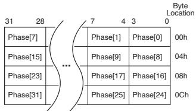

<a id="sec-7-9-1-9-table"></a>

**Table 7-209 Definition of the 4-bit Entries in the VC Arbitration Table | 表 7-209 VC 仲裁表中 4 位条目的定义**

| Bit Location | Description | Attributes |
|--------------|-------------|------------|
| 2:0 | VC ID | RW |
| 3 | RsvdP | RW |

| 位位置 | 描述 | 属性 |
|--------|------|------|
| 2:0 | VC ID (VC 标识) | RW |
| 3 | RsvdP | RW |

<a id="sec-7-9-1-9"></a>
## 7.9.1.9 VC Arbitration Table | VC 仲裁表

[⬆️ 返回目录](#-本章目录-table-of-contents)

---

<!-- 📄 Page 1274 -->
---

**Table 7-210 Length of the VC Arbitration Table | 表 7-210 VC 仲裁表的长度**

| VC Arbitration Select | VC Arbitration Table Length |
|-----------------------|-----------------------------|
| 001b | 32 entries |
| 010b | 64 entries |
| 011b | 128 entries |

| VC Arbitration Select | VC Arbitration Table Length |
|-----------------------|-----------------------------|
| 001b | 32 个条目 |
| 010b | 64 个条目 |
| 011b | 128 个条目 |

The Port Arbitration Table register is a read-write register array that is used to store the WRR or time-based WRR arbitration table for Port Arbitration for the VC resource. This register array is valid for all Switch Ports, Root Ports that support peer-to-peer traffic, and RCRBs, but is not valid for Endpoints or Root Ports that do not support peer-to-peer traffic. It is only present when one or more asserted bits in the Port Arbitration Capability field indicate that the component supports a Port Arbitration scheme that uses a programmable arbitration table. Furthermore, it is only valid when one of the above-mentioned bits in the Port Arbitration Capability field is selected by the Port Arbitration Select field.

The Port Arbitration Table represents one Port arbitration period. § Figure 7-231 shows the structure of an example Port Arbitration Table with 128 phases and 2-bit table entries. Each table entry containing a Port Number corresponds to a phase within a Port arbitration period. For example, a table with 2-bit entries can be used by a Switch component with up to four Ports. A Port Number written to a table entry indicates that the phase within the Port Arbitration period is assigned to the selected PCI Express Port (the Port Number must be a valid one).

Port Arbitration Table (端口仲裁表) 寄存器是一个读/写寄存器数组,用于为 VC 资源存储 WRR 或基于时间的 WRR 端口仲裁表。该寄存器数组对所有 Switch Port、支持点对点流量的 Root Port 和 RCRB 有效,但对不支持点对点流量的 Endpoint 或 Root Port 无效。它仅在 Port Arbitration Capability 字段中有一个或多个置位位指示组件支持使用可编程仲裁表的端口仲裁方案时才存在。此外,它仅在上述 Port Arbitration Capability 字段中的某一位由 Port Arbitration Select 字段选中时才有效。

Port Arbitration Table 表示一个端口仲裁周期。§ 图 7-231 展示了包含 128 个相位和 2 位表条目的 Port Arbitration Table 示例结构。包含端口号的每个表条目对应端口仲裁周期内的一个相位。例如,具有 2 位条目的表可用于具有多达四个端口的 Switch 组件。写入表条目的端口号表示端口仲裁周期内的该相位被分配给所选 PCI Express 端口 (端口号必须是有效的)。

- When the WRR Port Arbitration is used for a VC of any Egress Port, at each arbitration phase, the Port Arbiter serves one transaction from the Ingress Port indicated by the Port Number of the current phase. When finished, it immediately advances to the next phase. A phase is skipped, i.e., the Port Arbiter simply moves to the next phase immediately if the Ingress Port indicated by the phase does not contain any transaction for the VC (note that a phase cannot contain the Egress Port's Port Number).

- When the Time-based WRR Port Arbitration is used for a VC of any given Port, at each arbitration phase aligning to a virtual timeslot, the Port Arbiter serves one transaction from the Ingress Port indicated by the Port Number of the current phase. It advances to the next phase at the next virtual timeslot. A phase indicates an "idle" timeslot, i.e., the Port Arbiter does not serve any transaction during the phase, if:
  - the phase contains the Egress Port's Port Number, or
  - the Ingress Port indicated by the phase does not contain any transaction for the VC.

- The Port Arbitration Table Entry Size field in the Port VC Capability Register 1 determines the table entry size. The length of the table is determined by the Port Arbitration Select field as shown in § Table 7-211.

- When the Port Arbitration Table is used by the default Port Arbitration for the default VC, the default values for the table entries must contain at least one entry for each of the other PCI Express Ports of the component to ensure forward progress for the default VC for each Port. The table may contain RR or RR-like fair Port Arbitration for the default VC.

- 当对任何 Egress Port (出口端口) 的 VC 使用 WRR 端口仲裁时,在每个仲裁相位,端口仲裁器从当前相位端口号指示的 Ingress Port (入口端口) 提供一个事务。完成后,它立即推进到下一个相位。如果相位指示的 Ingress Port 不包含该 VC 的任何事务,则该相位被跳过 (即端口仲裁器立即移动到下一相位) (注意,相位不能包含 Egress Port 的端口号)。

- 当对任何给定端口的 VC 使用基于时间的 WRR 端口仲裁时,在每个与虚拟时隙对齐的仲裁相位,端口仲裁器从当前相位端口号指示的 Ingress Port 提供一个事务。它在下一个虚拟时隙推进到下一相位。在以下情况下,相位指示一个 "idle" (空闲) 时隙,即端口仲裁器在该相位期间不提供任何事务:
  - 该相位包含 Egress Port 的端口号,或
  - 该相位指示的 Ingress Port 不包含该 VC 的任何事务。

- Port VC Capability Register 1 中的 Port Arbitration Table Entry Size 字段决定表条目大小。表的长度由 Port Arbitration Select 字段决定,如 § 表 7-211 所示。

- 当默认 VC 的默认端口仲裁使用 Port Arbitration Table 时,表条目的默认值必须为组件中每个其他 PCI Express Port 至少包含一个条目,以确保每个端口默认 VC 的前向推进。该表可以包含默认 VC 的 RR 或类 RR 公平端口仲裁。

<a id="sec-7-9-1-10"></a>
## 7.9.1.10 Port Arbitration Table | 端口仲裁表

[⬆️ 返回目录](#-本章目录-table-of-contents)

---

<!-- 📄 Page 1275 -->
---

> **Figure 7-231.** Example Port Arbitration Table with 128 Phases and 2-bit Table Entries
> 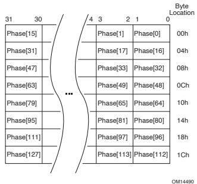

<a id="sec-7-9-1-10-table"></a>

**Table 7-211 Length of Port Arbitration Table | 表 7-211 端口仲裁表的长度**

| Port Arbitration Select | Port Arbitration Table Length |
|-------------------------|-------------------------------|
| 001b | 32 entries |
| 010b | 64 entries |
| 011b | 128 entries |
| 100b | 128 entries |
| 101b | 256 entries |

| Port Arbitration Select | Port Arbitration Table Length |
|-------------------------|-------------------------------|
| 001b | 32 个条目 |
| 010b | 64 个条目 |
| 011b | 128 个条目 |
| 100b | 128 个条目 |
| 101b | 256 个条目 |

The Multi-Function Virtual Channel Extended Capability (MFVC Capability) is an optional Extended Capability that permits enhanced QoS management in a Multi-Function Device, including TC/VC mapping, optional VC arbitration, and optional Function arbitration for Upstream Requests. When implemented, the MFVC Extended Capability structure must be present in the Extended Configuration Space of Function 0 of the Multi-Function Device's Upstream Port. § Figure 7-232 provides a high level view of the MFVC Extended Capability structure. This MFVC Extended Capability structure controls Virtual Channel assignment at the PCI Express Upstream Port of the Multi-Function Device, while a VC Extended Capability structure, if present in a Function, controls the Virtual Channel assignment for that individual Function.

The number of (extended) Virtual Channels is indicated by the MFVC Extended VC Count field in the Port VC Capability Register 1. Software must interpret this field to determine the availability of extended MFVC VC Resource registers.

A Multi-Function Device is permitted to have an MFVC Extended Capability structure even if none of its Functions have a VC Extended Capability structure. However, an MFVC Extended Capability structure is permitted only in Function 0 in the Upstream Port of a Multi-Function Device.

Multi-Function Virtual Channel Extended Capability (多功能虚通道扩展能力, MFVC Capability) 是一种可选的扩展能力,允许在多功能设备 (Multi-Function Device) 中进行增强的 QoS 管理,包括 TC/VC 映射、可选的 VC 仲裁以及用于上游请求的可选功能仲裁。实现时,MFVC Extended Capability structure 必须出现在多功能设备上游端口 (Upstream Port) Function 0 的扩展配置空间中。§ 图 7-232 提供了 MFVC Extended Capability structure 的高级视图。该 MFVC Extended Capability structure 控制多功能设备 PCI Express 上游端口的虚通道分配,而 VC Extended Capability structure (如果存在于 Function 中) 控制该单独 Function 的虚通道分配。

(扩展) 虚通道的数量由 Port VC Capability Register 1 中的 MFVC Extended VC Count 字段指示。软件必须解释该字段以确定扩展 MFVC VC Resource 寄存器的可用性。

多功能设备允许具有 MFVC Extended Capability structure,即使其任何 Function 都没有 VC Extended Capability structure。但是,MFVC Extended Capability structure 仅允许存在于上游端口的 Function 0 中。

<a id="sec-7-9-2"></a>
## 7.9.2 Multi-Function Virtual Channel Extended Capability | 多功能虚通道扩展能力

[⬆️ 返回目录](#-本章目录-table-of-contents)

---

<!-- 📄 Page 1276 -->
---

> **Figure 7-232.** MFVC Capability Structure
> 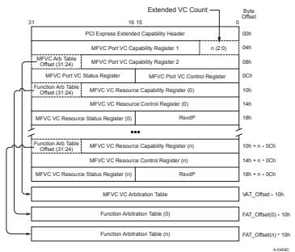

The following sections describe the registers/fields of the MFVC Extended Capability structure.

Refer to § Section 7.6.3 for a description of the PCI Express Extended Capability header. The Extended Capability ID for the MFVC Extended Capability is 0008h. § Figure 7-233 details allocation of register fields in the MFVC Extended Capability header; § Table 7-212 provides the respective bit definitions.

以下各节描述了 MFVC Extended Capability structure 的寄存器/字段。

有关 PCI Express Extended Capability Header 的说明,请参阅 § Section 7.6.3。MFVC Extended Capability 的 Extended Capability ID 为 0008h。§ 图 7-233 详细说明了 MFVC Extended Capability Header 中各寄存器字段的分配;§ 表 7-212 给出了相应的位定义。

> **Figure 7-233.** MFVC Extended Capability Header
> 

<a id="sec-7-9-2-table"></a>

**Table 7-212 MFVC Extended Capability Header | 表 7-212 MFVC 扩展能力头部**

| Bit Location | Register Description | Attributes |
|--------------|----------------------|------------|
| 15:0 | PCI Express Extended Capability ID - This field is a PCI-SIG defined ID number that indicates the nature and format of the Extended Capability.<br>The Extended Capability ID for the MFVC Extended Capability is 0008h. | RO |
| 19:16 | Capability Version - This field is a PCI-SIG defined version number that indicates the version of the Capability structure present.<br>Must be 1h for this version of the specification. | RO |
| 31:20 | Next Capability Offset - This field contains the offset to the next PCI Express Capability structure or 000h if no other items exist in the linked list of Capabilities.<br>For Extended Capabilities implemented in Configuration Space, this offset is relative to the beginning of PCI-compatible Configuration Space and thus must always be either 000h (for terminating list of Capabilities) or greater than 0FFh. | RO |

| 位位置 | 寄存器描述 | 属性 |
|--------|------------|------|
| 15:0 | PCI Express Extended Capability ID (PCI Express 扩展能力 ID) — 该字段是 PCI-SIG 定义的 ID 号,用于指示扩展能力的性质和格式。<br>MFVC Extended Capability 的 Extended Capability ID 为 0008h。 | RO |
| 19:16 | Capability Version (能力版本) — 该字段是 PCI-SIG 定义的版本号,用于指示所表示能力结构的版本。<br>对于本版本的规范,必须为 1h。 | RO |
| 31:20 | Next Capability Offset (下一能力偏移量) — 该字段包含到下一个 PCI Express Capability structure 的偏移量;如果链表中不存在其他项,则为 000h。<br>对于在配置空间中实现的扩展能力,该偏移量相对于 PCI 兼容配置空间 (PCI-compatible Configuration Space) 的起始处,因此必须始终为 000h (用于终止能力列表) 或大于 0FFh。 | RO |

[⬆️ 返回目录](#-本章目录-table-of-contents)

---

---

<a id="sec-7-9-2-1"></a>
## 7.9.2.1 MFVC Extended Capability Header (Offset 00h) | MFVC 扩展能力头 (偏移量 00h)

<table>
<thead>
<tr>
<th width="50%">🇬🇧 English</th>
<th width="50%" style="background-color:#e8e8e8">🏆 中文</th>
</tr>
</thead>
<tbody>
<tr>
<td>

The MFVC Port VC Capability Register 1 describes the configuration of the Virtual Channels associated with a PCI Express Port of the Multi-Function Device. Figure 7-234 details allocation of register fields in the MFVC Port VC Capability Register 1; Table 7-213 provides the respective bit definitions.

```
 0
 2
 Extended VC Count
 3
 RsvdP
 4
 6
 Low Priority Extended VC Count
 7
 RsvdP
 8
 9
 Reference Clock
 10
 11
 Function Arbitration Table Entry Size
 12
 31
 RsvdP
```

Figure 7-234 MFVC Port VC Capability Register 1

</td>
<td style="background-color:#e8e8e8">

MFVC Port VC Capability Register 1 (MFVC 端口 VC 能力寄存器 1) 描述与多功能设备 (Multi-Function Device) 的 PCI Express 端口相关联的虚通道 (Virtual Channels) 的配置。图 7-234 详细说明了 MFVC Port VC Capability Register 1 中各寄存器字段的分配;表 7-213 给出了相应的位定义。

```
 0
 2
 Extended VC Count (扩展 VC 计数)
 3
 RsvdP
 4
 6
 Low Priority Extended VC Count (低优先级扩展 VC 计数)
 7
 RsvdP
 8
 9
 Reference Clock (参考时钟)
 10
 11
 Function Arbitration Table Entry Size (Function 仲裁表条目大小)
 12
 31
 RsvdP
```

图 7-234 MFVC Port VC Capability Register 1 (MFVC 端口 VC 能力寄存器 1)

</td>
</tr>
</tbody>
</table>

<a id="sec-7-9-2-1-table"></a>

**Table 7-213 MFVC Port VC Capability Register 1 | 表 7-213 MFVC 端口 VC 能力寄存器 1**

| Bit Location | Register Description | Attributes |
|--------------|----------------------|------------|
| 2:0 | Extended VC Count - Indicates the number of (extended) Virtual Channels in addition to the default VC supported by the device.<br>This value indicates the number of (extended) MFVC VC Resource Capability, Control, and Status registers that are present in Configuration Space in addition to the required MFVC VC Resource registers for the default VC.<br>The minimum value of this field is 0 (for devices that only support the default VC and only have 1 set of MFVC VC Resource registers for that VC). The maximum value is 7. | RO |
| 6:4 | Low Priority Extended VC Count - Indicates the number of (extended) Virtual Channels in addition to the default VC belonging to the low-priority VC (LPVC) group that has the lowest priority with respect to other VC resources in a strict-priority VC Arbitration.<br>The minimum value of this field is 000b and the maximum value is Extended VC Count. | RO |
| 9:8 | Reference Clock - Indicates the reference clock for Virtual Channels that support time-based WRR Function Arbitration.<br>Defined encodings are:<br>00b = 100 ns reference clock<br>01b - 11b = Reserved | RO |
| 11:10 | Function Arbitration Table Entry Size - Indicates the size (in bits) of Function Arbitration table entry in the device.<br>Defined encodings are:<br>00b = Size of Function Arbitration table entry is 1 bit<br>01b = Size of Function Arbitration table entry is 2 bits<br>10b = Size of Function Arbitration table entry is 4 bits<br>11b = Size of Function Arbitration table entry is 8 bits | RO |

| 位位置 | 寄存器描述 | 属性 |
|--------|------------|------|
| 2:0 | Extended VC Count (扩展 VC 计数) — 指示除默认 VC 之外,设备支持的(扩展)虚通道 (Virtual Channels) 的数量。<br>该值指示除默认 VC 所需 MFVC VC Resource 寄存器之外,配置空间 (Configuration Space) 中存在的(扩展)MFVC VC Resource Capability、Control 和 Status 寄存器的数量。<br>该字段的最小值为 0(针对仅支持默认 VC 且仅具有 1 套该 VC 的 MFVC VC Resource 寄存器的设备)。最大值为 7。 | RO |
| 6:4 | Low Priority Extended VC Count (低优先级扩展 VC 计数) — 指示除默认 VC 之外,属于低优先级 VC (LPVC) 组(在严格优先级 VC 仲裁中具有最低优先级)的(扩展)虚通道的数量。<br>该字段的最小值为 000b,最大值为 Extended VC Count。 | RO |
| 9:8 | Reference Clock (参考时钟) — 指示支持基于时间的 WRR Function 仲裁的虚通道的参考时钟。<br>已定义的编码为:<br>00b = 100 ns 参考时钟<br>01b - 11b = 保留 | RO |
| 11:10 | Function Arbitration Table Entry Size (Function 仲裁表条目大小) — 指示设备中 Function 仲裁表条目的大小(以位为单位)。<br>已定义的编码为:<br>00b = Function 仲裁表条目大小为 1 位<br>01b = Function 仲裁表条目大小为 2 位<br>10b = Function 仲裁表条目大小为 4 位<br>11b = Function 仲裁表条目大小为 8 位 | RO |

[⬆️ 返回目录](#-本章目录-table-of-contents)

---

<!-- 📄 Page 1277 -->
---

<a id="sec-7-9-2-2"></a>
## 7.9.2.2 MFVC Port VC Capability Register 1 (Offset 04h) | MFVC 端口 VC 能力寄存器 1 (偏移量 04h)


<div style="overflow-x: auto; max-width: 100%;">
<table>
<thead>
<tr>
<th width="50%">🇬🇧 English</th>
<th width="50%" style="background-color:#e8e8e8">🏆 中文</th>
</tr>
</thead>
<tbody>
<tr>
<td>

The MFVC Port VC Capability Register 2 provides further information about the configuration of the Virtual Channels associated with a PCI Express Port of the Multi-Function Device. Figure 7-235 details allocation of register fields in the MFVC Port VC Capability Register 2; Table 7-214 provides the respective bit definitions.

```
 0
 7
 VC Arbitration Capability
 8
 23
 RsvdP
 24
 31
 VC Arbitration Table Offset
```

Figure 7-235 MFVC Port VC Capability Register 2

</td>
<td style="background-color:#e8e8e8">

MFVC Port VC Capability Register 2 (MFVC 端口 VC 能力寄存器 2) 提供关于与多功能设备的 PCI Express 端口相关联的虚通道配置的更多信息。图 7-235 详细说明了 MFVC Port VC Capability Register 2 中各寄存器字段的分配;表 7-214 给出了相应的位定义。

```
 0
 7
 VC Arbitration Capability (VC 仲裁能力)
 8
 23
 RsvdP
 24
 31
 VC Arbitration Table Offset (VC 仲裁表偏移量)
```

图 7-235 MFVC Port VC Capability Register 2 (MFVC 端口 VC 能力寄存器 2)

</td>
</tr>
</tbody>
</table>
</div>


<a id="sec-7-9-2-2-table"></a>

**Table 7-214 MFVC Port VC Capability Register 2 | 表 7-214 MFVC 端口 VC 能力寄存器 2**

| Bit Location | Register Description | Attributes |
|--------------|----------------------|------------|
| 7:0 | VC Arbitration Capability - Indicates the types of VC Arbitration supported by the device for the LPVC group. This field is valid for all devices that report a Low Priority Extended VC Count greater than 0.<br>Each Bit Location within this field corresponds to a VC Arbitration Capability defined below. When more than 1 bit in this field is Set, it indicates that the device can be configured to provide different VC arbitration services.<br>Defined bit positions are:<br>Bit 0 = Hardware fixed arbitration scheme, e.g., Round Robin<br>Bit 1 = Weighted Round Robin (WRR) arbitration with 32 phases<br>Bit 2 = WRR arbitration with 64 phases<br>Bit 3 = WRR arbitration with 128 phases<br>Bits 4-7 = Reserved | RO |
| 31:24 | VC Arbitration Table Offset - Indicates the location of the MFVC VC Arbitration Table.<br>This field contains the zero-based offset of the table in DQWORDS (16 bytes) from the base address of the MFVC Extended Capability structure. A value of 00h indicates that the table is not present. | RO |

| 位位置 | 寄存器描述 | 属性 |
|--------|------------|------|
| 7:0 | VC Arbitration Capability (VC 仲裁能力) — 指示设备针对 LPVC 组所支持的 VC 仲裁类型。该字段对所有报告 Low Priority Extended VC Count 大于 0 的设备有效。<br>该字段中的每个位位置对应于下文定义的一种 VC 仲裁能力。当该字段中有多于 1 位置位时,指示该设备可被配置为提供不同的 VC 仲裁服务。<br>已定义的位位置为:<br>位 0 = 硬件固定仲裁方案,例如轮询 (Round Robin)<br>位 1 = 加权轮询 (WRR) 仲裁,32 个相位<br>位 2 = WRR 仲裁,64 个相位<br>位 3 = WRR 仲裁,128 个相位<br>位 4-7 = 保留 | RO |
| 31:24 | VC Arbitration Table Offset (VC 仲裁表偏移量) — 指示 MFVC VC Arbitration Table (MFVC VC 仲裁表) 的位置。<br>该字段包含以 DQWORD (16 字节) 为单位的表相对于 MFVC 扩展能力结构 (MFVC Extended Capability structure) 基址的零基偏移量。值为 00h 表示该表不存在。 | RO |

[⬆️ 返回目录](#-本章目录-table-of-contents)

---

<!-- 📄 Page 1278 -->
---

<a id="sec-7-9-2-3"></a>
## 7.9.2.3 MFVC Port VC Capability Register 2 (Offset 08h) | MFVC 端口 VC 能力寄存器 2 (偏移量 08h)

<table>
<thead>
<tr>
<th width="50%">🇬🇧 English</th>
<th width="50%" style="background-color:#e8e8e8">🏆 中文</th>
</tr>
</thead>
<tbody>
<tr>
<td>

Figure 7-236 details allocation of register fields in the Port VC Control register; Table 7-215 provides the respective bit definitions.

```
 0
 Load VC Arbitration Table
 1
 3
 VC Arbitration Select
 4
 All VCs Enabled
 5
 15
 RsvdP
```

Figure 7-236 MFVC Port VC Control Register

</td>
<td style="background-color:#e8e8e8">

图 7-236 详细说明了 Port VC Control Register (端口 VC 控制寄存器) 中各寄存器字段的分配;表 7-215 给出了相应的位定义。

```
 0
 Load VC Arbitration Table (加载 VC 仲裁表)
 1
 3
 VC Arbitration Select (VC 仲裁选择)
 4
 All VCs Enabled (使能所有 VC)
 5
 15
 RsvdP
```

图 7-236 MFVC Port VC Control Register (MFVC 端口 VC 控制寄存器)

</td>
</tr>
</tbody>
</table>

[⬆️ 返回目录](#-本章目录-table-of-contents)

---

<a id="sec-7-9-2-4"></a>
## 7.9.2.4 MFVC Port VC Control Register (Offset 0Ch) | MFVC 端口 VC 控制寄存器 (偏移量 0Ch)

<table>
<thead>
<tr>
<th width="50%">🇬🇧 English</th>
<th width="50%" style="background-color:#e8e8e8">🏆 中文</th>
</tr>
</thead>
<tbody>
<tr>
<td>

The MFVC Port VC Status Register provides status of the configuration of Virtual Channels associated with a Port of the Multi-Function Device. Figure 7-237 details allocation of register fields in the MFVC Port VC Status Register; Table 7-216 provides the respective bit definitions.

</td>
<td style="background-color:#e8e8e8">

MFVC Port VC Status Register (MFVC 端口 VC 状态寄存器) 提供与多功能设备的端口相关联的虚通道配置的状态。图 7-237 详细说明了 MFVC Port VC Status Register 中各寄存器字段的分配;表 7-216 给出了相应的位定义。

</td>
</tr>
</tbody>
</table>

<a id="sec-7-9-2-4-table"></a>

**Table 7-215 MFVC Port VC Control Register | 表 7-215 MFVC 端口 VC 控制寄存器**

| Bit Location | Register Description | Attributes |
|--------------|----------------------|------------|
| 0 | Load VC Arbitration Table - Used by software to update the MFVC VC Arbitration Table. This bit is valid when the selected VC Arbitration uses the MFVC VC Arbitration Table.<br>Software Sets this bit to request hardware to apply new values programmed into MFVC VC Arbitration Table; Clearing this bit has no effect. Software checks the VC Arbitration Table Status bit in the MFVC Port VC Status register to confirm that new values stored in the MFVC VC Arbitration Table are latched by the VC arbitration logic.<br>This bit always returns 0b when read. | RW |
| 3:1 | VC Arbitration Select - Used by software to configure the VC arbitration by selecting one of the supported VC Arbitration schemes indicated by the VC Arbitration Capability field in the MFVC Port VC Capability Register 2.<br>The permissible values of this field are numbers corresponding to one of the asserted bits in the VC Arbitration Capability field.<br>This field cannot be modified when more than one VC in the LPVC group is enabled. | RW |
| 4 | All VCs Enabled - Setting this bit indicates that all VCs that will be used by the Port have been enabled. Setting this bit allows hardware to allocate assigned buffer resources across the enabled VCs.<br>Setting this bit is optional. If this bit remains Clear and some VC Resources are never enabled, performance may be affected but the Link and all enabled VCs must operate correctly.<br>Behavior is undefined if this bit is Set and any VC Enable bit in this capability changes value.<br>Default value of this bit is 0b. | RW |

| 位位置 | 寄存器描述 | 属性 |
|--------|------------|------|
| 0 | Load VC Arbitration Table (加载 VC 仲裁表) — 软件使用该位来更新 MFVC VC Arbitration Table (MFVC VC 仲裁表)。当所选 VC 仲裁使用 MFVC VC Arbitration Table 时,该位有效。<br>软件置位该位以请求硬件应用 MFVC VC 仲裁表中编程的新值;清除该位无效。软件通过检查 MFVC Port VC Status Register 中的 VC Arbitration Table Status 位来确认 MFVC VC 仲裁表中存储的新值是否已被 VC 仲裁逻辑锁存。<br>读该位时始终返回 0b。 | RW |
| 3:1 | VC Arbitration Select (VC 仲裁选择) — 软件通过选择 MFVC Port VC Capability Register 2 中 VC Arbitration Capability 字段所指示的支持的 VC 仲裁方案之一来配置 VC 仲裁。<br>该字段的允许值是与 VC Arbitration Capability 字段中置位位之一相对应的数字。<br>当 LPVC 组中启用的 VC 多于一个时,该字段不可修改。 | RW |
| 4 | All VCs Enabled (使能所有 VC) — 置位该位表示将被端口使用的所有 VC 均已启用。置位该位允许硬件在已启用的 VC 之间分配已分配的缓冲区资源。<br>置位该位是可选的。如果该位保持清除状态且某些 VC 资源永远不被启用,则性能可能受到影响,但链路 (Link) 和所有已启用的 VC 必须正确运行。<br>如果该位置位且此能力中的任何 VC Enable 位改变了值,则行为未定义。<br>该位的默认值为 0b。 | RW |

[⬆️ 返回目录](#-本章目录-table-of-contents)

---

<!-- 📄 Page 1279 -->
---

<a id="sec-7-9-2-5"></a>
## 7.9.2.5 MFVC Port VC Status Register (Offset 0Eh) | MFVC 端口 VC 状态寄存器 (偏移量 0Eh)

<table>
<thead>
<tr>
<th width="50%">🇬🇧 English</th>
<th width="50%" style="background-color:#e8e8e8">🏆 中文</th>
</tr>
</thead>
<tbody>
<tr>
<td>

```
 0
 VC Arbitration Table Status
 1
 15
 RsvdZ
```

Figure 7-237 MFVC Port VC Status Register

</td>
<td style="background-color:#e8e8e8">

```
 0
 VC Arbitration Table Status (VC 仲裁表状态)
 1
 15
 RsvdZ
```

图 7-237 MFVC Port VC Status Register (MFVC 端口 VC 状态寄存器)

</td>
</tr>
</tbody>
</table>

<a id="sec-7-9-2-5-table"></a>

**Table 7-216 MFVC Port VC Status Register | 表 7-216 MFVC 端口 VC 状态寄存器**

| Bit Location | Register Description | Attributes |
|--------------|----------------------|------------|
| 0 | VC Arbitration Table Status - Indicates the coherency status of the MFVC VC Arbitration Table. This bit is valid when the selected VC uses the MFVC VC Arbitration Table.<br>This bit is Set by hardware when any entry of the MFVC VC Arbitration Table is written by software. This bit is Cleared by hardware when hardware finishes loading values stored in the MFVC VC Arbitration Table after software sets the Load VC Arbitration Table bit in the MFVC Port VC Control Register.<br>Default value of this bit is 0b. | RO |

| 位位置 | 寄存器描述 | 属性 |
|--------|------------|------|
| 0 | VC Arbitration Table Status (VC 仲裁表状态) — 指示 MFVC VC Arbitration Table 的一致性状态。当所选 VC 使用 MFVC VC Arbitration Table 时,该位有效。<br>当 MFVC VC 仲裁表的任何条目被软件写入时,该位由硬件置位。在软件置位 MFVC Port VC Control Register 中的 Load VC Arbitration Table 位之后,当硬件完成加载 MFVC VC 仲裁表中存储的值时,该位由硬件清除。<br>该位的默认值为 0b。 | RO |

[⬆️ 返回目录](#-本章目录-table-of-contents)

---

<!-- 📄 Page 1280 -->
---

<a id="sec-7-9-2-6"></a>
## 7.9.2.6 MFVC VC Resource Capability Register | MFVC VC 资源能力寄存器


<div style="overflow-x: auto; max-width: 100%;">
<table>
<thead>
<tr>
<th width="50%">🇬🇧 English</th>
<th width="50%" style="background-color:#e8e8e8">🏆 中文</th>
</tr>
</thead>
<tbody>
<tr>
<td>

The MFVC VC Resource Capability Register describes the capabilities and configuration of a particular Virtual Channel resource. Figure 7-238 details allocation of register fields in the MFVC VC Resource Capability Register; Table 7-217 provides the respective bit definitions.

```
 0
 7
 Function Arbitration Capability
 8
 15
 RsvdP
 16
 22
 Maximum Time Slots
 23
 RsvdP
 24
 31
 Function Arbitration Table Offset
```

Figure 7-238 MFVC VC Resource Capability Register

</td>
<td style="background-color:#e8e8e8">

MFVC VC Resource Capability Register (MFVC VC 资源能力寄存器) 描述特定虚通道资源的能力和配置。图 7-238 详细说明了 MFVC VC Resource Capability Register 中各寄存器字段的分配;表 7-217 给出了相应的位定义。

```
 0
 7
 Function Arbitration Capability (Function 仲裁能力)
 8
 15
 RsvdP
 16
 22
 Maximum Time Slots (最大时隙数)
 23
 RsvdP
 24
 31
 Function Arbitration Table Offset (Function 仲裁表偏移量)
```

图 7-238 MFVC VC Resource Capability Register (MFVC VC 资源能力寄存器)

</td>
</tr>
</tbody>
</table>
</div>


<a id="sec-7-9-2-6-table"></a>

**Table 7-217 MFVC VC Resource Capability Register | 表 7-217 MFVC VC 资源能力寄存器**

| Bit Location | Register Description | Attributes |
|--------------|----------------------|------------|
| 7:0 | Function Arbitration Capability - Indicates types of Function Arbitration supported by the VC resource.<br>Each Bit Location within this field corresponds to a Function Arbitration Capability defined below. When more than 1 bit in this field is Set, it indicates that the VC resource can be configured to provide different arbitration services.<br>Software selects among these capabilities by writing to the Function Arbitration Select field (see Section 7.9.2.7).<br>Defined bit positions are:<br>Bit 0 = Non-configurable hardware-fixed arbitration scheme, e.g., Round Robin (RR)<br>Bit 1 = Weighted Round Robin (WRR) arbitration with 32 phases<br>Bit 2 = WRR arbitration with 64 phases<br>Bit 3 = WRR arbitration with 128 phases<br>Bit 4 = Time-based WRR with 128 phases<br>Bit 5 = WRR arbitration with 256 phases<br>Bits 6-7 = Reserved | RO |
| 22:16 | Maximum Time Slots - Indicates the maximum number of time slots (minus 1) that the VC resource is capable of supporting when it is configured for time-based WRR Function Arbitration. For example, a value of 000 0000b in this field indicates the supported maximum number of time slots is 1 and a value of 111 1111b indicates the supported maximum number of time slots is 128.<br>This field is valid only when the Function Arbitration Capability indicates that the VC resource supports time-based WRR Function Arbitration. | HwInit |
| 31:24 | Function Arbitration Table Offset - Indicates the location of the Function Arbitration Table associated with the VC resource.<br>This field contains the zero-based offset of the table in DQWORDS (16 bytes) from the base address of the MFVC Extended Capability structure. A value of 00h indicates that the table is not present. | RO |

| 位位置 | 寄存器描述 | 属性 |
|--------|------------|------|
| 7:0 | Function Arbitration Capability (Function 仲裁能力) — 指示 VC 资源所支持的 Function 仲裁类型。<br>该字段中的每个位位置对应于下文定义的一种 Function 仲裁能力。当该字段中有多于 1 位置位时,指示该 VC 资源可被配置为提供不同的仲裁服务。<br>软件通过写入 Function Arbitration Select 字段来选择这些能力之一(参见第 7.9.2.7 节)。<br>已定义的位位置为:<br>位 0 = 不可配置的硬件固定仲裁方案,例如轮询 (RR)<br>位 1 = 加权轮询 (WRR) 仲裁,32 个相位<br>位 2 = WRR 仲裁,64 个相位<br>位 3 = WRR 仲裁,128 个相位<br>位 4 = 基于时间的 WRR,128 个相位<br>位 5 = WRR 仲裁,256 个相位<br>位 6-7 = 保留 | RO |
| 22:16 | Maximum Time Slots (最大时隙数) — 指示 VC 资源配置为基于时间的 WRR Function 仲裁时能够支持的最大时隙数(减 1)。例如,该字段值为 000 0000b 表示所支持的最大时隙数为 1,值为 111 1111b 表示所支持的最大时隙数为 128。<br>仅当 Function Arbitration Capability 指示 VC 资源支持基于时间的 WRR Function 仲裁时,该字段才有效。 | HwInit |
| 31:24 | Function Arbitration Table Offset (Function 仲裁表偏移量) — 指示与 VC 资源相关联的 Function Arbitration Table (Function 仲裁表) 的位置。<br>该字段包含以 DQWORD (16 字节) 为单位的表相对于 MFVC 扩展能力结构 (MFVC Extended Capability structure) 基址的零基偏移量。值为 00h 表示该表不存在。 | RO |

[⬆️ 返回目录](#-本章目录-table-of-contents)

---

<!-- 📄 Page 1281 -->
---

<a id="sec-7-9-2-7"></a>
## 7.9.2.7 MFVC VC Resource Control Register | MFVC VC 资源控制寄存器

<table>
<thead>
<tr>
<th width="50%">🇬🇧 English</th>
<th width="50%" style="background-color:#e8e8e8">🏆 中文</th>
</tr>
</thead>
<tbody>
<tr>
<td>

Figure 7-239 details allocation of register fields in the MFVC VC Resource Control Register; Table 7-218 provides the respective bit definitions.

```
 0
 7
 TC/VC Map
 8
 15
 RsvdP
 16
 Load Function Arbitration Table
 17
 19
 Function Arbitration Select
 20
 23
 RsvdP
 24
 26
 VC ID
 27
 29
 Shared Flow Control Usage Limit
 30
 Shared Flow Control Usage Limit Enable
 31
 VC Enable
```

Figure 7-239 MFVC VC Resource Control Register

</td>
<td style="background-color:#e8e8e8">

图 7-239 详细说明了 MFVC VC Resource Control Register (MFVC VC 资源控制寄存器) 中各寄存器字段的分配;表 7-218 给出了相应的位定义。

```
 0
 7
 TC/VC Map (TC/VC 映射)
 8
 15
 RsvdP
 16
 Load Function Arbitration Table (加载 Function 仲裁表)
 17
 19
 Function Arbitration Select (Function 仲裁选择)
 20
 23
 RsvdP
 24
 26
 VC ID
 27
 29
 Shared Flow Control Usage Limit (共享流控使用限制)
 30
 Shared Flow Control Usage Limit Enable (共享流控使用限制使能)
 31
 VC Enable (VC 使能)
```

图 7-239 MFVC VC Resource Control Register (MFVC VC 资源控制寄存器)

</td>
</tr>
</tbody>
</table>

<a id="sec-7-9-2-7-table"></a>

**Table 7-218 MFVC VC Resource Control Register | 表 7-218 MFVC VC 资源控制寄存器**

| Bit Location | Register Description | Attributes |
|--------------|----------------------|------------|
| 7:0 | TC/VC Map - This field indicates the TCs that are mapped to the VC resource.<br>Bit Locations within this field correspond to TC values. For example, when bit 7 is Set in this field, TC7 is mapped to this VC resource. When more than 1 bit in this field is Set, it indicates that multiple TCs are mapped to the VC resource.<br>In order to remove one or more TCs from the TC/VC Map of an enabled VC, software must ensure that no new or outstanding transactions with the TC labels are targeted at the given Link.<br>Default value of this field is FFh for the first VC resource and is 00h for other VC resources.<br>Note: Bit 0 of this field is read-only. It must be hardwired to 1b for the default VC0 and hardwired to 0b for all other enabled VCs. | RW (see the note for exceptions) |
| 16 | Load Function Arbitration Table - When Set, this bit updates the Function Arbitration logic from the Function Arbitration Table for the VC resource. This bit is only valid when the Function Arbitration Table is used by the selected Function Arbitration scheme (that is indicated by a Set bit in the Function Arbitration Capability field selected by Function Arbitration Select).<br>Software sets this bit to signal hardware to update Function Arbitration logic with new values stored in the Function Arbitration Table; clearing this bit has no effect. Software uses the Function Arbitration Table Status bit to confirm whether the new values of Function Arbitration Table are completely latched by the arbitration logic.<br>This bit always returns 0b when read.<br>Default value of this bit is 0b. | RW |
| 19:17 | Function Arbitration Select - This field configures the VC resource to provide a particular Function Arbitration service.<br>The permissible value of this field is a number corresponding to one of the asserted bits in the Function Arbitration Capability field of the VC resource. | RW |
| 26:24 | VC ID - This field assigns a VC ID to the VC resource (see note for exceptions).<br>This field cannot be modified when the VC is already enabled.<br>Note: For the first VC resource (default VC), this field is a read-only field that must be hardwired to 000b. | RW |
| 29:27 | Shared Flow Control Usage Limit - this field controls what percentage of the available Shared Flow Control a given FC/VC is permitted to consume.<br>This limit is applied independently for each Flow Control credit type. For example, if this field contains 101b and Shared Flow Control Usage Limit Enable is Set, a Posted TLP may not pass the Tx Gate if doing so would cause that VC to consume more than 62.5% of the available Shared Posted Header credits or if doing so would cause that VC to consume more than 62.5% of the available Shared Data credits.<br>If Shared Flow Control Usage Limit Enable is Clear, this field is ignored and this VC is permitted to consume all of the shared credits.<br>When Shared Flow Control Usage Limit Enable is Set, and this field contains 000b, this VC is not permitted to consume any shared credits.<br>Behavior is undefined when all VCs have Shared Flow Control Usage Limit Enable Set and the sum of the Shared Flow Control Limit values for all VCs is less than 100%.<br>Encodings are:<br>000b = 0%<br>001b = 12.5%<br>010b = 25%<br>011b = 37.5%<br>100b = 50%<br>101b = 62.5%<br>110b = 75%<br>111b = 87.5% | RW / RO / RsvdP |

| 位位置 | 寄存器描述 | 属性 |
|--------|------------|------|
| 7:0 | TC/VC Map (TC/VC 映射) — 该字段指示映射到该 VC 资源的 TC。<br>该字段中的位位置对应于 TC 值。例如,当该字段中位 7 置位时,TC7 被映射到该 VC 资源。当该字段中有多于 1 位置位时,指示有多个 TC 被映射到该 VC 资源。<br>为了从已启用 VC 的 TC/VC Map 中移除一个或多个 TC,软件必须确保没有带有这些 TC 标签的新事务或未完成的事务被定向到给定的链路 (Link)。<br>该字段的默认值为第一个 VC 资源为 FFh,其他 VC 资源为 00h。<br>注:该字段的位 0 为只读。对于默认 VC0 必须硬连线为 1b,对于所有其他已启用的 VC 必须硬连线为 0b。 | RW(参见注释中的例外) |
| 16 | Load Function Arbitration Table (加载 Function 仲裁表) — 置位时,该位从 VC 资源的 Function Arbitration Table 更新 Function 仲裁逻辑。仅当所选 Function 仲裁方案使用 Function Arbitration Table 时(由 Function Arbitration Select 所选 Function Arbitration Capability 字段中的置位指示),该位才有效。<br>软件置位该位以通知硬件使用 Function 仲裁表中存储的新值更新 Function 仲裁逻辑;清除该位无效。软件使用 Function Arbitration Table Status 位来确认 Function Arbitration Table 的新值是否已被仲裁逻辑完全锁存。<br>读该位时始终返回 0b。<br>该位的默认值为 0b。 | RW |
| 19:17 | Function Arbitration Select (Function 仲裁选择) — 该字段将 VC 资源配置为提供特定的 Function 仲裁服务。<br>该字段的允许值是与 VC 资源的 Function Arbitration Capability 字段中置位位之一相对应的数字。 | RW |
| 26:24 | VC ID — 该字段为 VC 资源分配一个 VC ID(例外情况参见注释)。<br>当 VC 已启用时,该字段不可修改。<br>注:对于第一个 VC 资源(默认 VC),该字段为只读字段,必须硬连线为 000b。 | RW |
| 29:27 | Shared Flow Control Usage Limit (共享流控使用限制) — 该字段控制允许给定 FC/VC 消耗的可用共享流控 (Shared Flow Control) 百分比。<br>该限制针对每种流控 (Flow Control) 信用 (Credit) 类型独立应用。例如,如果该字段包含 101b 且 Shared Flow Control Usage Limit Enable 置位,则 Posted TLP (有数据,无完成) 在通过 Tx Gate 时可能不被允许,如果这样做将导致该 VC 消耗超过 62.5% 的可用共享 Posted Header 信用,或导致该 VC 消耗超过 62.5% 的可用共享 Data 信用。<br>如果 Shared Flow Control Usage Limit Enable 清除,则该字段被忽略,且该 VC 被允许消耗所有共享信用。<br>当 Shared Flow Control Usage Limit Enable 置位且该字段包含 000b 时,该 VC 不被允许消耗任何共享信用。<br>当所有 VC 都将 Shared Flow Control Usage Limit Enable 置位且所有 VC 的 Shared Flow Control Limit 值之和小于 100% 时,行为未定义。<br>编码为:<br>000b = 0%<br>001b = 12.5%<br>010b = 25%<br>011b = 37.5%<br>100b = 50%<br>101b = 62.5%<br>110b = 75%<br>111b = 87.5% | RW / RO / RsvdP |

[⬆️ 返回目录](#-本章目录-table-of-contents)

---

<!-- 📄 Page 1282 -->
---

<a id="sec-7-9-2-7-continued"></a>
## 7.9.2.7 MFVC VC Resource Control Register (continued) | MFVC VC 资源控制寄存器(续)


<div style="overflow-x: auto; max-width: 100%;">
<table>
<thead>
<tr>
<th width="50%">🇬🇧 English</th>
<th width="50%" style="background-color:#e8e8e8">🏆 中文</th>
</tr>
</thead>
<tbody>
<tr>
<td>

Behavior is undefined if this field changes value while VC Enable and Shared Flow Control Usage Limit Enable are both Set.

This field is RsvdP when Flit Mode Supported is Clear.

When Extended VC Count is 0, this field is permitted to be hardwired to 000b.

When this field is RW, the default value is implementation specific.

**Bit 30 - Shared Flow Control Usage Limit Enable**

When Set, this bit enables use of the Shared Flow Control Usage Limit value above at the transmitter for this Virtual Channel.

Behavior is undefined of the value of this bit changes while VC Enable is Set.

This bit is RsvdP when Flit Mode Supported is Clear.

When Extended VC Count is 0, this bit is permitted to be hardwired to 0b.

When this bit is RW, the default value is implementation specific.

**Bit 31 - VC Enable**

When Set, this bit enables a Virtual Channel. The Virtual Channel is disabled when this bit is cleared.

Software must use the VC Negotiation Pending bit to check whether the VC negotiation is complete.

For VC0, the attribute is RO. If no SVC capability is implemented in this Port, this bit's value must be 1b; otherwise, this bit's value must always be the same value as the Use VC/MFVC bit in the SVC Port Status Register. See Section 6.3.5.

For other VCs, if no SVC capability is implemented in this Port or if the Use VC/MFVC bit is Set, the default value of this bit is 0b and the attribute is RW; otherwise, this bit must be RO with a value of 0b.

To enable a Virtual Channel, in a Port using MFVC mechanisms, the VC Enable bit for that Virtual Channel must be Set. The corresponding Virtual Channel in the Link partner Port must be enabled as well, and that Virtual Channel may be in SVC, VC, or MFVC capabilities. To disable a Virtual Channel, the Virtual Channel must be disabled in both components on the Link. Software must ensure that no traffic is using a Virtual Channel at the time it is disabled. Software must fully disable a Virtual Channel in both components on a Link before re-enabling the Virtual Channel.

When this bit is forced to be RO with a value of 0b due to the Use VC/MFVC bit being Clear, its associated VC is disabled, rendering most of its control registers to be ineffective.

| Attribute | Value |
|-----------|-------|
| 30 | RW / RO / RsvdP |
| 31 | RW/HwInit |

</td>
<td style="background-color:#e8e8e8">

如果该字段在 VC Enable 和 Shared Flow Control Usage Limit Enable 均置位时改变值,则行为未定义。

当 Flit Mode Supported 清除时,该字段为 RsvdP。

当 Extended VC Count 为 0 时,该字段允许硬连线为 000b。

当该字段为 RW 时,默认值为实现特定的。

**位 30 - Shared Flow Control Usage Limit Enable (共享流控使用限制使能)**

置位时,该位使能上述共享流控使用限制值在该虚通道发送器上的使用。

如果该位的值在 VC Enable 置位时改变,则行为未定义。

当 Flit Mode Supported 清除时,该位为 RsvdP。

当 Extended VC Count 为 0 时,该位允许硬连线为 0b。

当该位为 RW 时,默认值为实现特定的。

**位 31 - VC Enable (VC 使能)**

置位时,该位使能一个虚通道。当该位清除时,虚通道被禁用。

软件必须使用 VC Negotiation Pending 位检查 VC 协商是否完成。

对于 VC0,属性为 RO。如果该端口中未实现 SVC 能力,则该位的值必须为 1b;否则,该位的值必须始终与 SVC Port Status Register 中 Use VC/MFVC 位的值相同。参见第 6.3.5 节。

对于其他 VC,如果该端口中未实现 SVC 能力,或者 Use VC/MFVC 位置位,则该位的默认值为 0b,属性为 RW;否则,该位必须为 RO,值为 0b。

要在使用 MFVC 机制的端口中使能一个虚通道,必须置位该虚通道的 VC Enable 位。链路 (Link) 伙伴端口中的相应虚通道也必须被使能,且该虚通道可以位于 SVC、VC 或 MFVC 能力中。要禁用一个虚通道,该虚通道必须在链路两端组件中均被禁用。软件必须确保在禁用虚通道时没有任何流量正在使用该虚通道。软件必须在重新使能虚通道之前,在链路两端组件中完全禁用该虚通道。

当由于 Use VC/MFVC 位被清除而迫使该位为值 0b 的 RO 时,其关联的 VC 被禁用,导致其大部分控制寄存器失效。

| 属性 | 值 |
|------|----|
| 30 | RW / RO / RsvdP |
| 31 | RW/HwInit |

</td>
</tr>
</tbody>
</table>
</div>


Figure 7-240 details allocation of register fields in the MFVC VC Resource Status Register; Table 7-219 provides the respective bit definitions.

```
 0
 Function Arbitration Table Status
 1
 VC Negotiation Pending
 2
 15
 RsvdZ
```

Figure 7-240 MFVC VC Resource Status Register

[⬆️ 返回目录](#-本章目录-table-of-contents)

---

<!-- 📄 Page 1283 -->
---

<a id="sec-7-9-2-8"></a>
## 7.9.2.8 MFVC VC Resource Status Register | MFVC VC 资源状态寄存器

<table>
<thead>
<tr>
<th width="50%">🇬🇧 English</th>
<th width="50%" style="background-color:#e8e8e8">🏆 中文</th>
</tr>
</thead>
<tbody>
<tr>
<td></td>
<td style="background-color:#e8e8e8">

</td>
</tr>
</tbody>
</table>

<a id="sec-7-9-2-8-table"></a>

**Table 7-219 MFVC VC Resource Status Register | 表 7-219 MFVC VC 资源状态寄存器**

| Bit Location | Register Description | Attributes |
|--------------|----------------------|------------|
| 0 | Function Arbitration Table Status - This bit indicates the coherency status of the Function Arbitration Table associated with the VC resource. This bit is valid only when the Function Arbitration Table is used by the selected Function Arbitration for the VC resource.<br>This bit is Set by hardware when any entry of the Function Arbitration Table is written to by software. This bit is Cleared by hardware when hardware finishes loading values stored in the Function Arbitration Table after software sets the Load Function Arbitration Table bit.<br>Default value of this bit is 0b. | RO |
| 1 | VC Negotiation Pending - This bit indicates whether the Virtual Channel negotiation (initialization or disabling) is in pending state.<br>When this bit is Set by hardware, it indicates that the VC resource is still in the process of negotiation. This bit is Cleared by hardware after the VC negotiation is complete. For a non-default Virtual Channel, software may use this bit when enabling or disabling the VC. For the default VC, this bit indicates the status of the process of Flow Control initialization.<br>Before using a Virtual Channel, software must check whether the VC Negotiation Pending bits for that Virtual Channel are Clear in both components on a Link. | RO |

| 位位置 | 寄存器描述 | 属性 |
|--------|------------|------|
| 0 | Function Arbitration Table Status (Function 仲裁表状态) — 该位指示与 VC 资源相关联的 Function Arbitration Table 的一致性状态。仅当所选 Function 仲裁使用该 VC 资源的 Function Arbitration Table 时,该位才有效。<br>当 Function Arbitration Table 的任何条目被软件写入时,该位由硬件置位。在软件置位 Load Function Arbitration Table 位之后,当硬件完成加载 Function Arbitration Table 中存储的值时,该位由硬件清除。<br>该位的默认值为 0b。 | RO |
| 1 | VC Negotiation Pending (VC 协商挂起) — 该位指示虚通道协商(初始化或禁用)是否处于挂起状态。<br>当该位由硬件置位时,指示该 VC 资源仍处于协商过程中。该位在 VC 协商完成后由硬件清除。对于非默认虚通道,软件可在启用或禁用 VC 时使用该位。对于默认 VC,该位指示流控 (Flow Control) 初始化过程的状态。<br>在使用虚通道之前,软件必须检查该虚通道在链路两端组件中的 VC Negotiation Pending 位是否均已清除。 | RO |

[⬆️ 返回目录](#-本章目录-table-of-contents)

---

<!-- 📄 Page 1284 -->
---

<a id="sec-7-9-2-9"></a>
## 7.9.2.9 MFVC VC Arbitration Table | MFVC VC 仲裁表

<table>
<thead>
<tr>
<th width="50%">🇬🇧 English</th>
<th width="50%" style="background-color:#e8e8e8">🏆 中文</th>
</tr>
</thead>
<tbody>
<tr>
<td>

The definition of the MFVC VC Arbitration Table in the MFVC Extended Capability structure is identical to that in the VC Extended Capability structure (see Section 7.9.1.9).

</td>
<td style="background-color:#e8e8e8">

MFVC 扩展能力结构中 MFVC VC Arbitration Table (MFVC VC 仲裁表) 的定义与 VC 扩展能力结构中的定义相同(参见第 7.9.1.9 节)。

</td>
</tr>
</tbody>
</table>

[⬆️ 返回目录](#-本章目录-table-of-contents)

---

<a id="sec-7-9-2-10"></a>
## 7.9.2.10 Function Arbitration Table | Function 仲裁表


<div style="overflow-x: auto; max-width: 100%;">
<table>
<thead>
<tr>
<th width="50%">🇬🇧 English</th>
<th width="50%" style="background-color:#e8e8e8">🏆 中文</th>
</tr>
</thead>
<tbody>
<tr>
<td>

The Function Arbitration Table register in the MFVC Extended Capability structure takes the same form as the Port Arbitration Table register in the VC Extended Capability structure (see Section 7.9.1.10).

The Function Arbitration Table register is a read-write register array that is used to store the WRR or time-based WRR arbitration table for Function Arbitration for the VC resource. It is only present when one or more asserted bits in the Function Arbitration Capability field indicate that the Multi-Function Device supports a Function Arbitration scheme that uses a programmable arbitration table. Furthermore, it is only valid when one of the above-mentioned bits in the Function Arbitration Capability field is selected by the Function Arbitration Select field.

The Function Arbitration Table represents one Function arbitration period. Each table entry containing a Function Number or Function Group Number corresponds to a phase within a Function Arbitration period. The table entry size requirements are as follows:

- The table entry size for non-ARI devices must support enough values to specify all implemented Functions plus at least one value that does not correspond to an implemented Function. For example, a table with 2-bit entries can be used by a Multi-Function Device with up to three Functions.
- The table entry size for ARI Devices must be either 4 bits or 8 bits.
  - If MFVC Function Groups are enabled, each entry maps to a single Function Group. Arbitration between multiple Functions within a Function Group is implementation specific, but must guarantee forward progress. ¹⁸²

¹⁸² If an ARI Device supports MFVC Function Groups capability and ARI-aware software enables it, arbitration is based on Function Groups instead of Functions. See Section 7.8.8.

</td>
<td style="background-color:#e8e8e8">

MFVC 扩展能力结构中 Function Arbitration Table (Function 仲裁表) 寄存器的形式与 VC 扩展能力结构中 Port Arbitration Table (端口仲裁表) 寄存器的形式相同(参见第 7.9.1.10 节)。

Function Arbitration Table 寄存器是一个读-写寄存器数组,用于存储 VC 资源 Function 仲裁的 WRR 或基于时间的 WRR 仲裁表。仅当 Function Arbitration Capability 字段中有一个或多个置位位指示多功能设备 (Multi-Function Device) 支持使用可编程仲裁表的 Function 仲裁方案时,它才会出现。此外,仅当 Function Arbitration Capability 字段中上述位之一被 Function Arbitration Select 字段选中时,它才有效。

Function Arbitration Table 表示一个 Function 仲裁周期。包含 Function Number (Function 编号) 或 Function Group Number (Function 组编号) 的每个表条目对应于 Function 仲裁周期内的一个相位。表条目大小要求如下:

- 对于非 ARI 设备,表条目大小必须支持足够的值以指定所有已实现的 Function 加上至少一个不对应于已实现 Function 的值。例如,具有 2 位条目的表可用于最多具有三个 Function 的多功能设备。
- 对于 ARI 设备 (ARI Devices),表条目大小必须为 4 位或 8 位。
  - 如果启用了 MFVC Function Groups,则每个条目映射到单个 Function 组。Function 组内多个 Function 之间的仲裁是实现特定的,但必须保证前向进度。¹⁸²

¹⁸² 如果 ARI 设备支持 MFVC Function Groups 能力且 ARI 感知的软件启用了该能力,则仲裁将基于 Function 组而不是 Function 进行。参见第 7.8.8 节。

</td>
</tr>
</tbody>
</table>
</div>


[⬆️ 返回目录](#-本章目录-table-of-contents)

---

<!-- 📄 Page 1285 -->
---

<a id="sec-7-9-2-10-continued"></a>
## 7.9.2.10 Function Arbitration Table (continued) | Function 仲裁表(续)

<table>
<thead>
<tr>
<th width="50%">🇬🇧 English</th>
<th width="50%" style="background-color:#e8e8e8">🏆 中文</th>
</tr>
</thead>
<tbody>
<tr>
<td>

- If MFVC Function Groups are not enabled and 4-bit entries are implemented, a given entry maps to all Functions whose Function Number modulo 8 matches its value. Similarly, if 8-bit entries are implemented, a given entry maps to all Functions whose Function Number modulo 128 matches its value. If a given entry maps to multiple Functions, arbitration between those Functions is implementation specific, but must guarantee forward progress.

A Function Number or Function Group Number written to a table entry indicates that the phase within the Function Arbitration period is assigned to the selected Function or Function Group (the Function Number or Function Group Number must be a valid one).

- When the WRR Function Arbitration is used for a VC of the Egress Port of the Multi-Function Device, at each arbitration phase the Function Arbiter serves one transaction from the Function or Function Group indicated by the Function Number or Function Group Number of the current phase. When finished, it immediately advances to the next phase. A phase is skipped, i.e., the Function Arbiter simply moves to the next phase immediately if the Function or Function Group indicated by the phase does not contain any transaction for the VC.
- When the Time-based WRR Function Arbitration is used for a VC of the Egress Port of the Multi-Function Device, at each arbitration phase aligning to a virtual timeslot, the Function Arbiter serves one transaction from the Function or Function Group indicated by the Function Number or Function Group Number of the current phase. It advances to the next phase at the next virtual timeslot. A phase indicates an "idle" timeslot, i.e., the Function Arbiter does not serve any transaction during the phase, if:
  - the phase contains the Number of a Function or a Function Group that does not exist, or
  - the Function or Function Group indicated by the phase does not contain any transaction for the VC.

The Function Arbitration Table Entry Size field in the MFVC Port VC Capability Register 1 determines the table entry size. The length of the table is determined by the Function Arbitration Select field as shown in Table 7-220.

When the Function Arbitration Table is used by the default Function Arbitration for the default VC, the default values for the table entries must contain at least one entry for each of the active Functions or Function Groups in the Multi-Function Device to ensure forward progress for the default VC for the Multi-Function Device's Upstream Port. The table may contain RR or RR-like fair Function Arbitration for the default VC.

**Table 7-220 Length of Function Arbitration Table | 表 7-220 Function 仲裁表长度**

| Function Arbitration Select | Function Arbitration Table Length |
|------------------------------|-----------------------------------|
| 001b | 32 entries |
| 010b | 64 entries |
| 011b | 128 entries |
| 100b | 128 entries |
| 101b | 256 entries |

| Function Arbitration Select | Function Arbitration Table Length |
|------------------------------|-----------------------------------|
| 001b | 32 entries (32 个条目) |
| 010b | 64 entries (64 个条目) |
| 011b | 128 entries (128 个条目) |
| 100b | 128 entries (128 个条目) |
| 101b | 256 entries (256 个条目) |

</td>
<td style="background-color:#e8e8e8">

- 如果未启用 MFVC Function Groups 且实现了 4 位条目,则给定条目映射到其 Function Number 模 8 与该值匹配的所有 Function。类似地,如果实现了 8 位条目,则给定条目映射到其 Function Number 模 128 与该值匹配的所有 Function。如果给定条目映射到多个 Function,则这些 Function 之间的仲裁是实现特定的,但必须保证前向进度。

写入表条目的 Function Number 或 Function Group Number 指示 Function 仲裁周期内的该相位被分配给所选 Function 或 Function 组(Function Number 或 Function Group Number 必须为有效值)。

- 当多功能设备出口端口 (Egress Port) 的 VC 使用 WRR Function 仲裁时,在每个仲裁相位,Function Arbiter (Function 仲裁器) 从当前相位的 Function Number 或 Function Group Number 所指示的 Function 或 Function 组中服务一个事务。完成后,它立即前进到下一个相位。如果该相位指示的 Function 或 Function 组没有该 VC 的任何事务,则跳过该相位,即 Function Arbiter 立即移至下一个相位。
- 当多功能设备出口端口的 VC 使用基于时间的 WRR Function 仲裁时,在每个与虚拟时隙对齐的仲裁相位,Function Arbiter 从当前相位的 Function Number 或 Function Group Number 所指示的 Function 或 Function 组中服务一个事务。它在下一个虚拟时隙前进到下一个相位。如果出现以下情况,则相位表示"空闲"时隙,即 Function Arbiter 在该相位期间不服务任何事务:
  - 该相位包含不存在的 Function 或 Function 组的编号,或
  - 该相位所指示的 Function 或 Function 组没有该 VC 的任何事务。

MFVC Port VC Capability Register 1 中的 Function Arbitration Table Entry Size 字段决定表条目大小。表的长度由 Function Arbitration Select 字段决定,如表 7-220 所示。

当默认 Function 仲裁将 Function Arbitration Table 用于默认 VC 时,表条目的默认值必须至少包含多功能设备中每个活动的 Function 或 Function 组的一个条目,以确保多功能设备上游端口 (Upstream Port) 的默认 VC 的前向进度。该表可以包含用于默认 VC 的 RR 或类似 RR 的公平 Function 仲裁。

</td>
</tr>
</tbody>
</table>

[⬆️ 返回目录](#-本章目录-table-of-contents)

---

<!-- 📄 Page 1290 -->
---

<a id="sec-7-9-3-2"></a>
## 7.9.3 Device Serial Number Extended Capability | 设备序列号扩展能力

<table>
<thead>
<tr>
<th width="50%">🇬🇧 English</th>
<th width="50%" style="background-color:#e8e8e8">🏆 中文</th>
</tr>
</thead>
<tbody>
<tr>
<td>

The Device Serial Number Extended Capability is an optional Extended Capability that may be implemented by any PCI Express device Function. The Device Serial Number is a read-only 64-bit value that is unique for a given PCI Express device. Figure 7-241 details allocation of register fields in the Device Serial Number Extended Capability structure.

It is permitted but not recommended for RCiEPs to implement this Capability.

</td>
<td style="background-color:#e8e8e8">

Device Serial Number Extended Capability (设备序列号扩展能力) 是一种可选的扩展能力,可由任何 PCI Express 设备 Function 实现。Device Serial Number (设备序列号) 是一个只读 64 位值,对于给定的 PCI Express 设备是唯一的。图 7-241 详细说明了 Device Serial Number Extended Capability 结构中各寄存器字段的分配。

允许但不推荐 RCiEP 实现此能力。

</td>
</tr>
</tbody>
</table>

[⬆️ 返回目录](#-本章目录-table-of-contents)

---


---

<a id="sec-7-9-3"></a>
## 7.9.3 Device Serial Number Extended Capability | 设备序列号扩展能力


<div style="overflow-x: auto; max-width: 100%;">
<table>
<thead>
<tr>
<th width="50%">🇬🇧 English</th>
<th width="50%" style="background-color:#e8e8e8">🏆 中文</th>
</tr>
</thead>
<tbody>
<tr>
<td>

7.9.3 Device Serial Number Extended Capability §

§

RCiEPs that implement this Capability are permitted but not required to return the same Device Serial Number value as that reported by other RCiEPs of the same Root Complex (根复合体).

All Multi-Function Devices other than RCiEPs that implement this Capability must implement it for Function 0; other Functions that implement this Capability must return the same Device Serial Number value as that reported by Function 0.

RCiEPs are permitted to implement or not implement this Capability on an individual basis, independent of whether they are part of a Multi-Function Device.

A PCI Express component other than a Root Complex containing multiple Devices such as a PCI Express Switch (交换机) that implements this Capability must return the same Device Serial Number for each device.

The Device Serial Number Extended Capability is permitted to be present in PFs (物理功能). If a PF contains the capability, its value applies to all associated VFs (虚拟功能). VFs are permitted but not recommended to implement this capability. VFs that implement this capability must return the same Device Serial Number value as that reported by their associated PF.

</td>
<td style="background-color:#e8e8e8">

7.9.3 设备序列号扩展能力 §

§

实现此能力的 RCiEP 允许(但非必须)返回与同一根复合体 (Root Complex) 中其他 RCiEP 所报告的设备序列号相同的值。

除 RCiEP 之外,实现此能力的所有多功能设备必须为 Function 0 实现该能力;实现此能力的其他 Function 必须返回与 Function 0 所报告的设备序列号相同的值。

RCiEP 可以根据自身情况决定是否实现此能力,而无需考虑其是否属于多功能设备的一部分。

除根复合体外,包含多个设备的 PCI Express 组件(例如实现此能力的 PCI Express 交换机 (Switch))必须为每个设备返回相同的设备序列号。

设备序列号扩展能力允许出现在 PF 中。若 PF 包含该能力,则其值适用于所有关联的 VF。VF 允许(但不推荐)实现此能力。实现此能力的 VF 必须返回与其关联 PF 所报告的设备序列号相同的值。

</td>
</tr>
</tbody>
</table>
</div>


---

<!-- 📄 Page 1286 -->
---

<a id="sec-7-9-3-fig"></a>

> **Figure 7-241.** Device Serial Number Extended Capability Structure
> 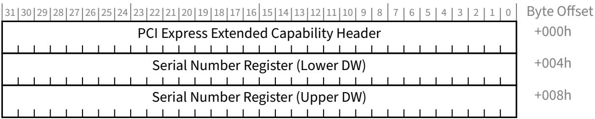

> **图 7-241.** 设备序列号扩展能力结构

<table>
<thead>
<tr>
<th width="50%">🇬🇧 English</th>
<th width="50%" style="background-color:#e8e8e8">🏆 中文</th>
</tr>
</thead>
<tbody>
<tr>
<td>

Figure 7-241 Device Serial Number Extended Capability Structure

§ Figure 7-242 details allocation of register fields in the Device Serial Number Extended Capability Header; § Table 7-221 provides the respective bit definitions. Refer to § Section 7.6.3 for a description of the PCI Express Extended Capability header. The Extended Capability ID for the Device Serial Number Extended Capability is 0003h.

</td>
<td style="background-color:#e8e8e8">

图 7-241 设备序列号扩展能力结构

§ 图 7-242 详细说明了设备序列号扩展能力包头 (Header) 中各寄存器字段的分配;§ 表 7-221 给出了相应的位定义。有关 PCI Express 扩展能力包头的描述,请参见 § 第 7.6.3 节。设备序列号扩展能力的扩展能力 ID 为 0003h。

</td>
</tr>
</tbody>
</table>

---

> **Figure 7-242.** Device Serial Number Extended Capability Header
> 

> **图 7-242.** 设备序列号扩展能力包头

**Table 7-221. Device Serial Number Extended Capability Header | 表 7-221. 设备序列号扩展能力包头**

| Bit Location | Register Description | Attributes |
|--------------|----------------------|------------|
| 15:0 | PCI Express Extended Capability ID - This field is a PCI-SIG defined ID number that indicates the nature and format of the Extended Capability. Extended Capability ID for the Device Serial Number Extended Capability is 0003h. | RO |
| 19:16 | Capability Version - This field is a PCI-SIG defined version number that indicates the version of the Capability structure present. Must be 1h for this version of the specification. | RO |
| 31:20 | Next Capability Offset - This field contains the offset to the next PCI Express Capability structure or 000h if no other items exist in the linked list of Capabilities. For Extended Capabilities implemented in Configuration Space (配置空间), this offset is relative to the beginning of PCI-compatible Configuration Space and thus must always be either 000h (for terminating list of Capabilities) or greater than 0FFh. | RO |

---

<a id="sec-7-9-3-1"></a>
## 7.9.3.1 Device Serial Number Extended Capability Header (Offset 00h) | 设备序列号扩展能力包头(偏移 00h)

<table>
<thead>
<tr>
<th width="50%">🇬🇧 English</th>
<th width="50%" style="background-color:#e8e8e8">🏆 中文</th>
</tr>
</thead>
<tbody>
<tr>
<td>

7.9.3.1 Device Serial Number Extended Capability Header (Offset 00h) §

§

§

§

</td>
<td style="background-color:#e8e8e8">

7.9.3.1 设备序列号扩展能力包头(偏移 00h) §

§

§

§

</td>
</tr>
</tbody>
</table>

---

<!-- 📄 Page 1287 -->
---

<table>
<thead>
<tr>
<th width="50%">🇬🇧 English</th>
<th width="50%" style="background-color:#e8e8e8">🏆 中文</th>
</tr>
</thead>
<tbody>
<tr>
<td>

The Serial Number register is a 64-bit field that contains the IEEE defined 64-bit extended unique identifier [EUI-64].

§ Figure 7-243 details allocation of register fields in the Serial Number register; § Table 7-222 provides the respective bit definitions.

</td>
<td style="background-color:#e8e8e8">

序列号寄存器是一个 64 位字段,包含 IEEE 定义的 64 位扩展唯一标识符 [EUI-64]。

§ 图 7-243 详细说明了序列号寄存器中各寄存器字段的分配;§ 表 7-222 给出了相应的位定义。

</td>
</tr>
</tbody>
</table>

---

> **Figure 7-243.** Serial Number Register
> 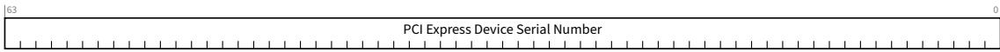

> **图 7-243.** 序列号寄存器

**Table 7-222. Serial Number Register | 表 7-222. 序列号寄存器**

| Bit Location | Register Description | Attributes |
|--------------|----------------------|------------|
| 63:0 | PCI Express Device Serial Number - This field contains the IEEE defined 64-bit Extended Unique Identifier [EUI-64]. This identifier includes a 24-bit company id value assigned by IEEE registration authority and a 40-bit extension identifier assigned by the manufacturer.<br>PCI Express Device Serial Number[07:00] = EUI[63:56]<br>PCI Express Device Serial Number[15:08] = EUI[55:48]<br>PCI Express Device Serial Number[23:16] = EUI[47:40]<br>PCI Express Device Serial Number[31:24] = EUI[39:32]<br>PCI Express Device Serial Number[39:32] = EUI[31:24]<br>PCI Express Device Serial Number[47:40] = EUI[23:16]<br>PCI Express Device Serial Number[55:48] = EUI[15:08]<br>PCI Express Device Serial Number[63:56] = EUI[07:00] | RO |

---

<a id="sec-7-9-3-2"></a>
## 7.9.3.2 Serial Number Register (Offset 04h) | 序列号寄存器(偏移 04h)

<table>
<thead>
<tr>
<th width="50%">🇬🇧 English</th>
<th width="50%" style="background-color:#e8e8e8">🏆 中文</th>
</tr>
</thead>
<tbody>
<tr>
<td>

7.9.3.2 Serial Number Register (Offset 04h) §

</td>
<td style="background-color:#e8e8e8">

7.9.3.2 序列号寄存器(偏移 04h) §

</td>
</tr>
</tbody>
</table>

---

<a id="sec-7-9-4"></a>
## 7.9.4 Vendor-Specific Capability | 厂商特定能力

<table>
<thead>
<tr>
<th width="50%">🇬🇧 English</th>
<th width="50%" style="background-color:#e8e8e8">🏆 中文</th>
</tr>
</thead>
<tbody>
<tr>
<td>

The Vendor-Specific Capability is a capability structure in PCI-compatible Configuration Space (first 256 bytes) as shown in § Figure 7-244.

The Vendor-Specific Capability allows device vendors to use the Capability mechanism for vendor-specific information.

The layout of the information is vendor-specific, except for the first three bytes, as explained below.

A single PCI Express Function is permitted to contain multiple VSEC structures.

</td>
<td style="background-color:#e8e8e8">

厂商特定能力是 PCI 兼容配置空间 (前 256 字节) 中的一种能力结构,如 § 图 7-244 所示。

厂商特定能力允许设备厂商使用能力机制来携带厂商特定信息。

除前三个字节外,信息的布局由厂商自行定义,具体如下所述。

单个 PCI Express Function 允许包含多个 VSEC 结构。

</td>
</tr>
</tbody>
</table>

---

<!-- 📄 Page 1288 -->
---

> **Figure 7-244.** Vendor-Specific Capability
> 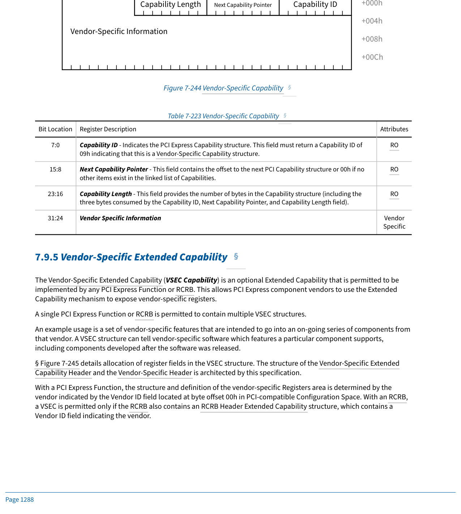

> **图 7-244.** 厂商特定能力

**Table 7-223. Vendor-Specific Capability | 表 7-223. 厂商特定能力**

| Bit Location | Register Description | Attributes |
|--------------|----------------------|------------|
| 7:0 | Capability ID - Indicates the PCI Express Capability structure. This field must return a Capability ID of 09h indicating that this is a Vendor-Specific Capability structure. | RO |
| 15:8 | Next Capability Pointer - This field contains the offset to the next PCI Capability structure or 00h if no other items exist in the linked list of Capabilities. | RO |
| 23:16 | Capability Length - This field provides the number of bytes in the Capability structure (including the three bytes consumed by the Capability ID, Next Capability Pointer, and Capability Length field). | RO |
| 31:24 | Vendor Specific Information | Vendor Specific |

---

<a id="sec-7-9-5"></a>
## 7.9.5 Vendor-Specific Extended Capability | 厂商特定扩展能力


<div style="overflow-x: auto; max-width: 100%;">
<table>
<thead>
<tr>
<th width="50%">🇬🇧 English</th>
<th width="50%" style="background-color:#e8e8e8">🏆 中文</th>
</tr>
</thead>
<tbody>
<tr>
<td>

The Vendor-Specific Extended Capability (VSEC Capability) is an optional Extended Capability that is permitted to be implemented by any PCI Express Function or RCRB. This allows PCI Express component vendors to use the Extended Capability mechanism to expose vendor-specific registers.

A single PCI Express Function or RCRB is permitted to contain multiple VSEC structures.

An example usage is a set of vendor-specific features that are intended to go into an on-going series of components from that vendor. A VSEC structure can tell vendor-specific software which features a particular component supports, including components developed after the software was released.

§ Figure 7-245 details allocation of register fields in the VSEC structure. The structure of the Vendor-Specific Extended Capability Header and the Vendor-Specific Header is architected by this specification.

With a PCI Express Function, the structure and definition of the vendor-specific Registers area is determined by the vendor indicated by the Vendor ID field located at byte offset 00h in PCI-compatible Configuration Space. With an RCRB, a VSEC is permitted only if the RCRB also contains an RCRB Header Extended Capability structure, which contains a Vendor ID field indicating the vendor.

</td>
<td style="background-color:#e8e8e8">

厂商特定扩展能力 (VSEC Capability) 是一种可选的扩展能力,允许由任何 PCI Express Function 或 RCRB 实现。这允许 PCI Express 组件厂商使用扩展能力机制来公开厂商特定的寄存器。

单个 PCI Express Function 或 RCRB 允许包含多个 VSEC 结构。

一个示例用法是:厂商预期在未来一系列组件中持续加入的厂商特定功能集。VSEC 结构可告知厂商特定软件某个特定组件支持哪些功能,包括在软件发布之后开发的组件。

§ 图 7-245 详细说明了 VSEC 结构中各寄存器字段的分配。厂商特定扩展能力包头和厂商特定包头的结构由本规范定义。

对于 PCI Express Function,厂商特定寄存器区域的结构和定义由 PCI 兼容配置空间中字节偏移 00h 处的 Vendor ID 字段所指示的厂商确定。对于 RCRB,仅当 RCRB 同时包含 RCRB Header 扩展能力结构(其中包含指示厂商的 Vendor ID 字段)时,才允许使用 VSEC。

</td>
</tr>
</tbody>
</table>
</div>


---

<!-- 📄 Page 1289 -->
---

> **Figure 7-245.** VSEC Capability Structure
> 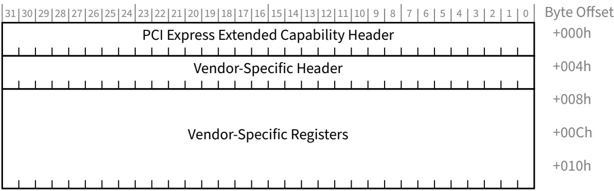

> **图 7-245.** VSEC 能力结构

<table>
<thead>
<tr>
<th width="50%">🇬🇧 English</th>
<th width="50%" style="background-color:#e8e8e8">🏆 中文</th>
</tr>
</thead>
<tbody>
<tr>
<td>

§ Figure 7-246 details allocation of register fields in the Vendor-Specific Extended Capability Header; § Table 7-224 provides the respective bit definitions. Refer to § Section 7.6.3 for a description of the PCI Express Extended Capability Header. The Extended Capability ID for the Vendor-Specific Extended Capability is 000Bh.

</td>
<td style="background-color:#e8e8e8">

§ 图 7-246 详细说明了厂商特定扩展能力包头中各寄存器字段的分配;§ 表 7-224 给出了相应的位定义。有关 PCI Express 扩展能力包头的描述,请参见 § 第 7.6.3 节。厂商特定扩展能力的扩展能力 ID 为 000Bh。

</td>
</tr>
</tbody>
</table>

---

> **Figure 7-246.** Vendor-Specific Extended Capability Header
> 

> **图 7-246.** 厂商特定扩展能力包头

**Table 7-224. Vendor-Specific Extended Capability Header | 表 7-224. 厂商特定扩展能力包头**

| Bit Location | Register Description | Attributes |
|--------------|----------------------|------------|
| 15:0 | PCI Express Extended Capability ID - This field is a PCI-SIG defined ID number that indicates the nature and format of the Extended Capability. Extended Capability ID for the Vendor-Specific Extended Capability is 000Bh. | RO |
| 19:16 | Capability Version - This field is a PCI-SIG defined version number that indicates the version of the Capability structure present. Must be 1h for this version of the specification. | RO |
| 31:20 | Next Capability Offset - This field contains the offset to the next PCI Express Capability structure or 000h if no other items exist in the linked list of Capabilities. For Extended Capabilities implemented in Configuration Space, this offset is relative to the beginning of PCI-compatible Configuration Space and thus must always be either 000h (for terminating list of Capabilities) or greater than 0FFh. | RO |

---

<a id="sec-7-9-5-1"></a>
## 7.9.5.1 Vendor-Specific Extended Capability Header (Offset 00h) | 厂商特定扩展能力包头(偏移 00h)

<table>
<thead>
<tr>
<th width="50%">🇬🇧 English</th>
<th width="50%" style="background-color:#e8e8e8">🏆 中文</th>
</tr>
</thead>
<tbody>
<tr>
<td>

7.9.5.1 Vendor-Specific Extended Capability Header (Offset 00h) §

§

§

§

</td>
<td style="background-color:#e8e8e8">

7.9.5.1 厂商特定扩展能力包头(偏移 00h) §

§

§

§

</td>
</tr>
</tbody>
</table>

---

<!-- 📄 Page 1290 -->
---

<table>
<thead>
<tr>
<th width="50%">🇬🇧 English</th>
<th width="50%" style="background-color:#e8e8e8">🏆 中文</th>
</tr>
</thead>
<tbody>
<tr>
<td>

§ Figure 7-247 details allocation of register fields in the Vendor-Specific Header; § Table 7-225 provides the respective bit definitions.

Vendor-specific software must qualify the associated Vendor ID of the PCI Express Function or RCRB before attempting to interpret the values in the VSEC ID or VSEC Rev fields.

</td>
<td style="background-color:#e8e8e8">

§ 图 7-247 详细说明了厂商特定包头中各寄存器字段的分配;§ 表 7-225 给出了相应的位定义。

厂商特定软件在尝试解读 VSEC ID 或 VSEC Rev 字段中的值之前,必须先确认 PCI Express Function 或 RCRB 的相关 Vendor ID。

</td>
</tr>
</tbody>
</table>

---

> **Figure 7-247.** Vendor-Specific Header
> 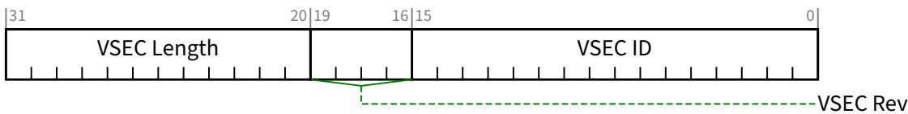

> **图 7-247.** 厂商特定包头

**Table 7-225. Vendor-Specific Header | 表 7-225. 厂商特定包头**

| Bit Location | Register Description | Attributes |
|--------------|----------------------|------------|
| 15:0 | VSEC ID - This field is a vendor-defined ID number that indicates the nature and format of the VSEC structure. Software must qualify the Vendor ID before interpreting this field. | RO |
| 19:16 | VSEC Rev - This field is a vendor-defined version number that indicates the version of the VSEC structure. Software must qualify the Vendor ID and VSEC ID before interpreting this field. | RO |
| 31:20 | VSEC Length - This field indicates the number of bytes in the entire VSEC structure, including the Vendor-Specific Extended Capability Header, the Vendor-Specific Header, and the vendor-specific registers. | RO |

---

<a id="sec-7-9-5-2"></a>
## 7.9.5.2 Vendor-Specific Header (Offset 04h) | 厂商特定包头(偏移 04h)

<table>
<thead>
<tr>
<th width="50%">🇬🇧 English</th>
<th width="50%" style="background-color:#e8e8e8">🏆 中文</th>
</tr>
</thead>
<tbody>
<tr>
<td>

7.9.5.2 Vendor-Specific Header (Offset 04h) §

</td>
<td style="background-color:#e8e8e8">

7.9.5.2 厂商特定包头(偏移 04h) §

</td>
</tr>
</tbody>
</table>

---

<a id="sec-7-9-6"></a>
## 7.9.6 Designated Vendor-Specific Extended Capability (DVSEC) | 指定厂商特定扩展能力 (DVSEC)


<div style="overflow-x: auto; max-width: 100%;">
<table>
<thead>
<tr>
<th width="50%">🇬🇧 English</th>
<th width="50%" style="background-color:#e8e8e8">🏆 中文</th>
</tr>
</thead>
<tbody>
<tr>
<td>

The Designated Vendor-Specific Extended Capability (DVSEC Capability) is an optional Extended Capability that is permitted to be implemented by any PCI Express Function or RCRB. This allows PCI Express component vendors to use the Extended Capability mechanism to expose vendor-specific registers that can be present in components by a variety of vendors.

A single PCI Express Function or RCRB is permitted to contain multiple DVSEC Capability structures.

An example usage is a set of vendor-specific features that are intended to go into an on-going series of components from a collection of vendors. A DVSEC Capability structure can tell vendor-specific software which features a particular component supports, including components developed after the software was released.

§ Figure 7-248 details allocation of register fields in the DVSEC Capability structure. The structure of the PCI Express Extended Capability Header and the Designated Vendor-Specific header is architected by this specification.

The DVSEC Vendor-Specific Register area begins at offset 0Ah.

</td>
<td style="background-color:#e8e8e8">

指定厂商特定扩展能力 (DVSEC Capability) 是一种可选的扩展能力,允许由任何 PCI Express Function 或 RCRB 实现。这允许 PCI Express 组件厂商使用扩展能力机制来公开可能由多家厂商提供的组件中的厂商特定寄存器。

单个 PCI Express Function 或 RCRB 允许包含多个 DVSEC 能力结构。

一个示例用法是:多个厂商预期在未来一系列组件中持续加入的厂商特定功能集。DVSEC 能力结构可告知厂商特定软件某个特定组件支持哪些功能,包括在软件发布之后开发的组件。

§ 图 7-248 详细说明了 DVSEC 能力结构中各寄存器字段的分配。PCI Express 扩展能力包头和指定厂商特定包头的结构由本规范定义。

DVSEC 厂商特定寄存器区域从偏移 0Ah 处开始。

</td>
</tr>
</tbody>
</table>
</div>


---

<!-- 📄 Page 1291 -->
---

> **Figure 7-248.** Designated Vendor-Specific Extended Capability
> 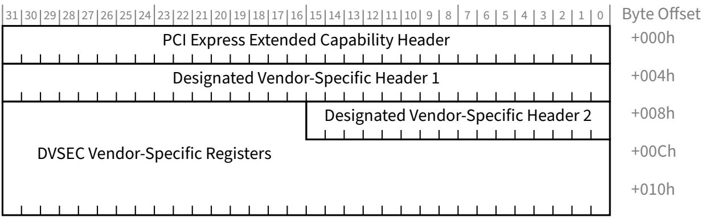

> **图 7-248.** 指定厂商特定扩展能力

<table>
<thead>
<tr>
<th width="50%">🇬🇧 English</th>
<th width="50%" style="background-color:#e8e8e8">🏆 中文</th>
</tr>
</thead>
<tbody>
<tr>
<td>

§ Figure 7-249 details allocation of register fields in the Designated Vendor-Specific Extended Capability Header; § Table 7-226 provides the respective bit definitions. Refer to § Section 7.9.3 for a description of the PCI Express Extended Capability Header. The Extended Capability ID for the Designated Vendor-Specific Extended Capability is 0023h.

</td>
<td style="background-color:#e8e8e8">

§ 图 7-249 详细说明了指定厂商特定扩展能力包头中各寄存器字段的分配;§ 表 7-226 给出了相应的位定义。有关 PCI Express 扩展能力包头的描述,请参见 § 第 7.9.3 节。指定厂商特定扩展能力的扩展能力 ID 为 0023h。

</td>
</tr>
</tbody>
</table>

---

> **Figure 7-249.** Designated Vendor-Specific Extended Capability Header
> 

> **图 7-249.** 指定厂商特定扩展能力包头

**Table 7-226. Designated Vendor-Specific Extended Capability Header | 表 7-226. 指定厂商特定扩展能力包头**

| Bit Location | Register Description | Attributes |
|--------------|----------------------|------------|
| 15:0 | PCI Express Extended Capability ID - This field is a PCI-SIG defined ID number that indicates the nature and format of the Extended Capability. Extended Capability ID for the Designated Vendor-Specific Extended Capability is 0023h. | RO |
| 19:16 | Capability Version - This field is a PCI-SIG defined version number that indicates the version of the Capability structure present. Must be 1h for this version of the specification. | RO |
| 31:20 | Next Capability Offset - This field contains the offset to the next PCI Express Capability structure or 000h if no other items exist in the linked list of Capabilities. For Extended Capabilities implemented in Configuration Space, this offset is relative to the beginning of PCI-compatible Configuration Space and thus must always be either 000h (for terminating list of Capabilities) or greater than 0FFh. | RO |

---

<a id="sec-7-9-6-1"></a>
## 7.9.6.1 Designated Vendor-Specific Extended Capability Header (Offset 00h) | 指定厂商特定扩展能力包头(偏移 00h)

<table>
<thead>
<tr>
<th width="50%">🇬🇧 English</th>
<th width="50%" style="background-color:#e8e8e8">🏆 中文</th>
</tr>
</thead>
<tbody>
<tr>
<td>

7.9.6.1 Designated Vendor-Specific Extended Capability Header (Offset 00h) §

§

§

§

</td>
<td style="background-color:#e8e8e8">

7.9.6.1 指定厂商特定扩展能力包头(偏移 00h) §

§

§

§

</td>
</tr>
</tbody>
</table>

---

<!-- 📄 Page 1292 -->
---

<table>
<thead>
<tr>
<th width="50%">🇬🇧 English</th>
<th width="50%" style="background-color:#e8e8e8">🏆 中文</th>
</tr>
</thead>
<tbody>
<tr>
<td>

§ Figure 7-250 details allocation of register fields in the Designated Vendor-Specific Header 1; § Table 7-227 provides the respective bit definitions.

Vendor-specific software must qualify the DVSEC Vendor ID before attempting to interpret the DVSEC Revision field.

</td>
<td style="background-color:#e8e8e8">

§ 图 7-250 详细说明了指定厂商特定包头 1 中各寄存器字段的分配;§ 表 7-227 给出了相应的位定义。

厂商特定软件在尝试解读 DVSEC Revision 字段之前,必须先确认 DVSEC Vendor ID。

</td>
</tr>
</tbody>
</table>

---

> **Figure 7-250.** Designated Vendor-Specific Header 1
> 

> **图 7-250.** 指定厂商特定包头 1

**Table 7-227. Designated Vendor-Specific Header 1 | 表 7-227. 指定厂商特定包头 1**

| Bit Location | Register Description | Attributes |
|--------------|----------------------|------------|
| 15:0 | DVSEC Vendor ID - This field is the Vendor ID associated with the vendor that defined the contents of this capability. | RO |
| 19:16 | DVSEC Revision - This field is a vendor-defined version number that indicates the version of the DVSEC structure. Software must qualify the DVSEC Vendor ID and DVSEC ID before interpreting this field. | RO |
| 31:20 | DVSEC Length - This field indicates the number of bytes in the entire DVSEC structure, including the PCI Express Extended Capability Header, the DVSEC Header 1, DVSEC Header 2, and DVSEC vendor-specific registers. | RO |

---

<a id="sec-7-9-6-2"></a>
## 7.9.6.2 Designated Vendor-Specific Header 1 (Offset 04h) | 指定厂商特定包头 1(偏移 04h)

<table>
<thead>
<tr>
<th width="50%">🇬🇧 English</th>
<th width="50%" style="background-color:#e8e8e8">🏆 中文</th>
</tr>
</thead>
<tbody>
<tr>
<td>

7.9.6.2 Designated Vendor-Specific Header 1 (Offset 04h) §

</td>
<td style="background-color:#e8e8e8">

7.9.6.2 指定厂商特定包头 1(偏移 04h) §

</td>
</tr>
</tbody>
</table>

---

<a id="sec-7-9-6-3"></a>
## 7.9.6.3 Designated Vendor-Specific Header 2 (Offset 08h) | 指定厂商特定包头 2(偏移 08h)

<table>
<thead>
<tr>
<th width="50%">🇬🇧 English</th>
<th width="50%" style="background-color:#e8e8e8">🏆 中文</th>
</tr>
</thead>
<tbody>
<tr>
<td>

§ Figure 7-251 details allocation of register fields in the Designated Vendor-Specific Header 2; § Table 7-228 provides the respective bit definitions.

Vendor-specific software must qualify the DVSEC Vendor ID before attempting to interpret the DVSEC ID field.

</td>
<td style="background-color:#e8e8e8">

§ 图 7-251 详细说明了指定厂商特定包头 2 中各寄存器字段的分配;§ 表 7-228 给出了相应的位定义。

厂商特定软件在尝试解读 DVSEC ID 字段之前,必须先确认 DVSEC Vendor ID。

</td>
</tr>
</tbody>
</table>

---

><!-- 📄 Page 1293 -->
---

> **Figure 7-251.** Designated Vendor-Specific Header 2
> 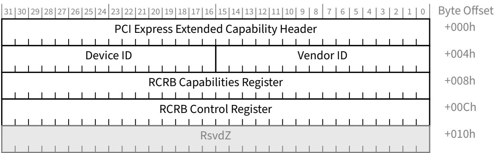

> **图 7-251.** 指定厂商特定包头 2

**Table 7-228. Designated Vendor-Specific Header 2 | 表 7-228. 指定厂商特定包头 2**

| Bit Location | Register Description | Attributes |
|--------------|----------------------|------------|
| 15:0 | DVSEC ID - This field is a vendor-defined ID that indicates the nature and format of the DVSEC structure. Software must qualify the DVSEC Vendor ID before interpreting this field. | RO |

---

<table>
<thead>
<tr>
<th width="50%">🇬🇧 English</th>
<th width="50%" style="background-color:#e8e8e8">🏆 中文</th>
</tr>
</thead>
<tbody>
<tr>
<td>

The PCI Express RCRB Header Extended Capability is an optional Extended Capability that may be implemented in an RCRB to provide a Vendor ID and Device ID for the RCRB and to permit the management of parameters that affect the behavior of Root Complex functionality associated with the RCRB.

</td>
<td style="background-color:#e8e8e8">

PCI Express RCRB Header 扩展能力是一种可选的扩展能力,可以在 RCRB 中实现,以便为该 RCRB 提供 Vendor ID 和 Device ID,并允许管理与该 RCRB 关联的根复合体 (Root Complex) 功能行为的参数。

</td>
</tr>
</tbody>
</table>

---

> **Figure 7-252.** RCRB Header Extended Capability Structure
> 

> **图 7-252.** RCRB Header 扩展能力结构

<table>
<thead>
<tr>
<th width="50%">🇬🇧 English</th>
<th width="50%" style="background-color:#e8e8e8">🏆 中文</th>
</tr>
</thead>
<tbody>
<tr>
<td>

§ Figure 7-253 details allocation of register fields in the RCRB Header Extended Capability Header. § Table 7-229 provides the respective bit definitions. Refer to § Section 7.6.3 for a description of the PCI Express Enhanced Capabilities header. The Extended Capability ID for the RCRB Header Extended Capability is 000Ah.

</td>
<td style="background-color:#e8e8e8">

§ 图 7-253 详细说明了 RCRB Header 扩展能力包头中各寄存器字段的分配;§ 表 7-229 给出了相应的位定义。有关 PCI Express 增强能力包头的描述,请参见 § 第 7.6.3 节。RCRB Header 扩展能力的扩展能力 ID 为 000Ah。

</td>
</tr>
</tbody>
</table>

---

> **Figure 7-253.** RCRB Header Extended Capability Header
> 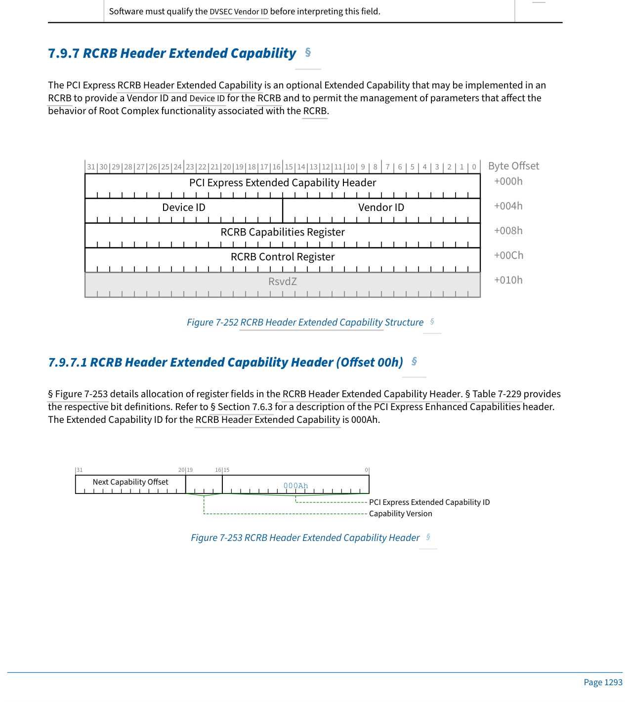

> **图 7-253.** RCRB Header 扩展能力包头

---

---

<a id="sec-7-9-7"></a>
## 7.9.7 RCRB Header Extended Capability | RCRB 头扩展能力

<table>
<thead>
<tr>
<th width="50%">🇬🇧 English</th>
<th width="50%" style="background-color:#e8e8e8">🏆 中文</th>
</tr>
</thead>
<tbody>
<tr>
<td>

<a id="sec-7-9-7-1-2"></a>
### 7.9.7.1 RCRB Header Extended Capability Header (Offset 00h)

</td>
<td style="background-color:#e8e8e8">

<a id="sec-7-9-7-1"></a>
### 7.9.7.1 RCRB 头扩展能力头（偏移 00h）

</td>
</tr>
</tbody>
</table>

<!-- 📄 Page 1294 -->
---

**Table 7-229. RCRB Header Extended Capability Header | 表 7-229. RCRB 头扩展能力头**

| Bit Location | Register Description | Attributes |
|---|---|---|
| 15:0 | PCI Express Extended Capability ID - This field is a PCI-SIG defined ID number that indicates the nature and format of the Extended Capability. Extended Capability ID for the RCRB Header Extended Capability is 000Ah. | RO |
| 19:16 | Capability Version - This field is a PCI-SIG defined version number that indicates the version of the Capability structure present. Must be 1h for this version of the specification. | RO |
| 31:20 | Next Capability Offset - This field contains the offset to the next PCI Express Capability structure or 000h if no other items exist in the linked list of Capabilities. For Extended Capabilities implemented in Configuration Space, this offset is relative to the beginning of PCI-compatible Configuration Space and thus must always be either 000h (for terminating list of Capabilities) or greater than 0FFh. | RO |

| Bit Location | 寄存器描述 | 属性 |
|---|---|---|
| 15:0 | PCI Express Extended Capability ID（PCI Express 扩展能力 ID）— 该字段是 PCI-SIG 定义的 ID 编号，用于指示扩展能力的性质和格式。RCRB Header Extended Capability 的扩展能力 ID 为 000Ah。 | RO |
| 19:16 | Capability Version（能力版本）— 该字段是 PCI-SIG 定义的版本号，用于指示当前 Capability 结构的版本。本规范版本必须为 1h。 | RO |
| 31:20 | Next Capability Offset（下一能力偏移）— 该字段包含指向下一个 PCI Express Capability 结构的偏移，若链接列表中不存在其他项，则为 000h。对于在配置空间中实现的扩展能力，该偏移相对于 PCI 兼容配置空间的起始位置，因此必须为 000h（表示能力列表终止）或大于 0FFh。 | RO |

Figure 7-254 details allocation of register fields in the RCRB Vendor ID and Device ID register; Table 7-230 provides the respective bit definitions.

图 7-254 详细说明了 RCRB Vendor ID and Device ID 寄存器中寄存器字段的分配；表 7-230 给出了相应的位定义。

<table>
<thead>
<tr>
<th width="50%">🇬🇧 English</th>
<th width="50%" style="background-color:#e8e8e8">🏆 中文</th>
</tr>
</thead>
<tbody>
<tr>
<td></td>
<td style="background-color:#e8e8e8">

</td>
</tr>
</tbody>
</table>

> **Figure 7-254.** RCRB Vendor ID and Device ID register
> 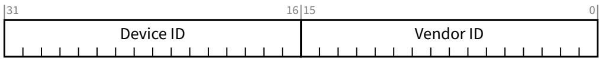


**Table 7-230. RCRB Vendor ID and Device ID register | 表 7-230. RCRB Vendor ID and Device ID 寄存器**

| Bit Location | Register Description | Attributes |
|---|---|---|
| 15:0 | Vendor ID - PCI-SIG assigned. Analogous to the equivalent field in PCI-compatible Configuration Space. This field provides a means to associate an RCRB with a particular vendor. | RO |
| 31:16 | Device ID - Vendor assigned. Analogous to the equivalent field in PCI-compatible Configuration Space. This field provides a means for a vendor to classify a particular RCRB. | RO |

| Bit Location | 寄存器描述 | 属性 |
|---|---|---|
| 15:0 | Vendor ID（供应商 ID）— 由 PCI-SIG 分配。类似于 PCI 兼容配置空间中的相应字段。该字段提供将 RCRB 与特定供应商相关联的方式。 | RO |
| 31:16 | Device ID（设备 ID）— 由供应商分配。类似于 PCI 兼容配置空间中的相应字段。该字段为供应商提供对特定 RCRB 进行分类的方式。 | RO |

Figure 7-255 details allocation of register fields in the RCRB Capabilities register; Table 7-231 provides the respective bit definitions.

图 7-255 详细说明了 RCRB Capabilities 寄存器中寄存器字段的分配；表 7-231 给出了相应的位定义。

<a id="sec-7-9-7-2-2"></a>
### 7.9.7.2 RCRB Vendor ID and Device ID register (Offset 04h)
### 7.9.7.3 RCRB Capabilities register (Offset 08h)

<a id="sec-7-9-7-2"></a>
### 7.9.7.2 RCRB Vendor ID and Device ID 寄存器（偏移 04h）
### 7.9.7.3 RCRB Capabilities 寄存器（偏移 08h）

<!-- 📄 Page 1295 -->
---

<table>
<thead>
<tr>
<th width="50%">🇬🇧 English</th>
<th width="50%" style="background-color:#e8e8e8">🏆 中文</th>
</tr>
</thead>
<tbody>
<tr>
<td></td>
<td style="background-color:#e8e8e8">

</td>
</tr>
</tbody>
</table>

> **Figure 7-255.** RCRB Capabilities register
> 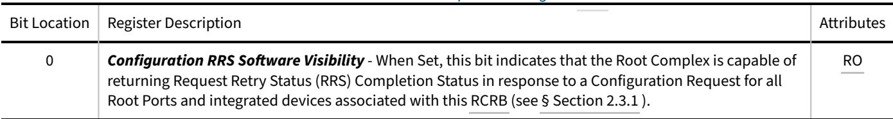


**Table 7-231. RCRB Capabilities register | 表 7-231. RCRB Capabilities 寄存器**

| Bit Location | Register Description | Attributes |
|---|---|---|
| 0 | Configuration RRS Software Visibility - When Set, this bit indicates that the Root Complex is capable of returning Request Retry Status (RRS) Completion Status in response to a Configuration Request for all Root Ports and integrated devices associated with this RCRB (see Section 2.3.1). | RO |

| Bit Location | 寄存器描述 | 属性 |
|---|---|---|
| 0 | Configuration RRS Software Visibility（配置 RRS 软件可见性）— 置位时，该位表示根复合体（Root Complex）能够针对与该 RCRB 关联的所有根端口（Root Port）和集成设备的配置请求（Configuration Request）返回 Request Retry Status (RRS) 完成状态（参见第 2.3.1 节）。 | RO |

Figure 7-256 details allocation of register fields in the RCRB Control register; Table 7-232 provides the respective bit definitions.

图 7-256 详细说明了 RCRB Control 寄存器中寄存器字段的分配；表 7-232 给出了相应的位定义。

<table>
<thead>
<tr>
<th width="50%">🇬🇧 English</th>
<th width="50%" style="background-color:#e8e8e8">🏆 中文</th>
</tr>
</thead>
<tbody>
<tr>
<td></td>
<td style="background-color:#e8e8e8">

</td>
</tr>
</tbody>
</table>

> **Figure 7-256.** RCRB Control register


**Table 7-232. RCRB Control register | 表 7-232. RCRB Control 寄存器**

| Bit Location | Register Description | Attributes |
|---|---|---|
| 0 | Configuration RRS Software Visibility Enable - When Set, this bit enables the Root Complex to return Request Retry Status (RRS) Completion Status in response to a Configuration Request for all Root Ports and integrated devices associated with this RCRB (see Section 2.3.1). RCRBs that do not implement this capability must hardwire this bit to 0b. Default value of this bit is 0b. | RW |

| Bit Location | 寄存器描述 | 属性 |
|---|---|---|
| 0 | Configuration RRS Software Visibility Enable（配置 RRS 软件可见性使能）— 置位时，该位使根复合体能够针对与该 RCRB 关联的所有根端口和集成设备的配置请求返回 Request Retry Status (RRS) 完成状态（参见第 2.3.1 节）。未实现此能力的 RCRB 必须将该位硬连线为 0b。该位的默认值为 0b。 | RW |

The Root Complex Link Declaration Extended Capability is an optional Capability that is permitted to be implemented by Root Ports, RCiEPs, or RCRBs to declare a Root Complex's internal topology.

Root Complex Link Declaration Extended Capability 是一种可选能力，允许由根端口、RCiEP 或 RCRB 实现，以声明根复合体的内部拓扑。

A Root Complex consists of one or more following elements:

根复合体由以下一个或多个元素组成：

- PCI Express Root Port
- A default system Egress Port or an internal sink unit such as memory (represented by an RCRB)
- Internal Data Paths/Links (represented by an RCRB on either side of an internal Link)

- PCI Express 根端口
- 默认系统出口端口或内部汇聚单元（例如内存，由 RCRB 表示）
- 内部数据路径/链路（由内部链路任一侧的 RCRB 表示）

<a id="sec-7-9-7-4-2"></a>
### 7.9.7.4 RCRB Control register (Offset 0Ch)
<a id="sec-7-9-8-2"></a>
## 7.9.8 Root Complex Link Declaration Extended Capability

<a id="sec-7-9-7-4"></a>
### 7.9.7.4 RCRB Control 寄存器（偏移 0Ch）
<a id="sec-7-9-8"></a>
## 7.9.8 Root Complex Link Declaration Extended Capability（根复合体链路声明扩展能力）

<!-- 📄 Page 1296 -->
---

<table>
<thead>
<tr>
<th width="50%">🇬🇧 English</th>
<th width="50%" style="background-color:#e8e8e8">🏆 中文</th>
</tr>
</thead>
<tbody>
<tr>
<td>

- Integrated devices
- Functions

</td>
<td style="background-color:#e8e8e8">

- 集成设备
- 功能（Function）

</td>
</tr>
</tbody>
</table>

A Root Complex Component is a logical aggregation of the above described Root Complex elements. No single element can be part of more than one Root Complex Component. Each Root Complex Component must have a unique Component ID.

根复合体组件（Root Complex Component）是上述根复合体元素的逻辑聚合。任何单个元素不能属于多个根复合体组件。每个根复合体组件必须具有唯一的 Component ID。

A Root Complex is represented either as an opaque Root Complex or as a collection of one or more Root Complex Components.

根复合体可以表示为不透明的根复合体，或者表示为一个或多个根复合体组件的集合。

The Root Complex Link Declaration Extended Capability is permitted to be present in a Root Complex element's Configuration Space or RCRB. It declares Links from the respective element to other elements of the same Root Complex Component or to an element in another Root Complex Component. The Links are required to be declared bidirectional such that each valid data path from one元素 to another has corresponding Link Entries in the Configuration Space (or RCRB) of both elements.

允许在根复合体元素的配置空间或 RCRB 中出现 Root Complex Link Declaration Extended Capability。它声明从相应元素到同一根复合体组件的其他元素，或到另一个根复合体组件中的元素的链路。链路必须以双向方式声明，使得从一个元素到另一个元素的每个有效数据路径在两个元素的配置空间（或 RCRB）中都具有对应的链路条目。

The Root Complex Link Declaration Extended Capability is permitted to also declare an association between a Configuration Space element (Root Port or RCiEP) and an RCRB Header Extended Capability (see Section 7.9.7) contained in an RCRB that affects the behavior of the Configuration Space element. Note that an RCRB Header association is not declared bidirectional; the association is only declared by the Configuration Space element and not by the target RCRB.

Root Complex Link Declaration Extended Capability 还允许声明配置空间元素（根端口或 RCiEP）与 RCRB 中包含的 RCRB Header Extended Capability（参见第 7.9.7 节）之间的关联，该关联会影响配置空间元素的行为。请注意，RCRB 头关联不声明为双向；该关联仅由配置空间元素声明，而不是由目标 RCRB 声明。

The Root Complex Link Declaration Extended Capability, as shown in Figure 7-257, consists of the PCI Express Extended Capability header and Root Complex Element Self Description followed by one or more Root Complex Link Entries.

如图 7-257 所示，Root Complex Link Declaration Extended Capability 由 PCI Express Extended Capability 头和 Root Complex Element Self Description 组成，后跟一个或多个 Root Complex Link Entry。

**IMPLEMENTATION NOTE:**
**TOPOLOGIES TO AVOID**

Topologies that create more than one data path between any two Root Complex elements (either directly or through other Root Complex elements) may not be able to support bandwidth allocation in a standard manner.

**实现说明：**
**应避免的拓扑**

在任何两个根复合体元素之间（直接或通过其他根复合体元素）创建多个数据路径的拓扑可能无法以标准方式支持带宽分配。

The description of how traffic is routed through such a topology is implementation specific, meaning that general purpose-operating systems may not have enough information about such a topology to correctly support bandwidth allocation. In order to circumvent this problem, these operating systems may require that a single RCRB element (of type Internal Link) not declare more than one Link to a Root Complex Component other than the one containing the RCRB element itself.

关于流量如何通过此类拓扑路由的描述是特定于实现的，这意味着通用操作系统可能没有足够的信息来正确支持带宽分配。为了规避此问题，这些操作系统可能要求单个 RCRB 元素（类型为 Internal Link）不向除包含该 RCRB 元素本身的根复合体组件之外的多个根复合体组件声明多于一条链路。

<!-- 📄 Page 1297 -->
---

<table>
<thead>
<tr>
<th width="50%">🇬🇧 English</th>
<th width="50%" style="background-color:#e8e8e8">🏆 中文</th>
</tr>
</thead>
<tbody>
<tr>
<td>

The Extended Capability ID for the Root Complex Link Declaration Extended Capability is 0005h.

</td>
<td style="background-color:#e8e8e8">

Root Complex Link Declaration Extended Capability 的扩展能力 ID 为 0005h。

</td>
</tr>
</tbody>
</table>

> **Figure 7-257.** Root Complex Link Declaration Extended Capability
> 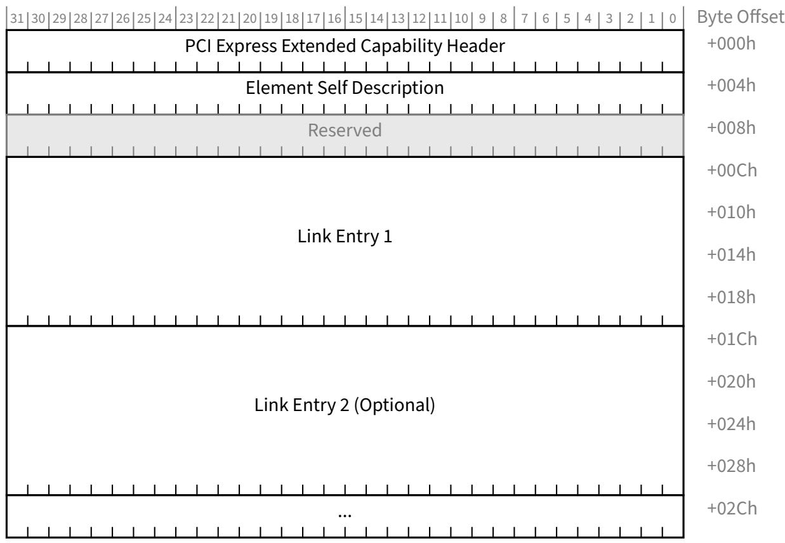


<table>
<thead>
<tr>
<th width="50%">🇬🇧 English</th>
<th width="50%" style="background-color:#e8e8e8">🏆 中文</th>
</tr>
</thead>
<tbody>
<tr>
<td></td>
<td style="background-color:#e8e8e8">

</td>
</tr>
</tbody>
</table>

> **Figure 7-258.** Root Complex Link Declaration Extended Capability Header
> 


<a id="sec-7-9-8-1-2"></a>
### 7.9.8.1 Root Complex Link Declaration Extended Capability Header (Offset 00h)

<a id="sec-7-9-8-1"></a>
### 7.9.8.1 Root Complex Link Declaration Extended Capability Header（偏移 00h）

<!-- 📄 Page 1298 -->
---

**Table 7-233. Root Complex Link Declaration Extended Capability Header | 表 7-233. Root Complex Link Declaration Extended Capability Header**

| Bit Location | Register Description | Attributes |
|---|---|---|
| 15:0 | PCI Express Extended Capability ID - This field is a PCI-SIG defined ID number that indicates the nature and format of the Extended Capability. The Extended Capability ID for the Root Complex Link Declaration Extended Capability is 0005h. | RO |
| 19:16 | Capability Version - This field is a PCI-SIG defined version number that indicates the version of the Capability structure present. Must be 1h for this version of the specification. | RO |
| 31:20 | Next Capability Offset - This field contains the offset to the next PCI Express Capability structure or 000h if no other items exist in the linked list of Capabilities. For Extended Capabilities implemented in Configuration Space, this offset is relative to the beginning of PCI-compatible Configuration Space and thus must always be either 000h (for terminating list of Capabilities) or greater than 0FFh. The bottom 2 bits of this offset are Reserved and must be implemented as 00b although software must mask them to allow for future uses of these bits. | RO |

| Bit Location | 寄存器描述 | 属性 |
|---|---|---|
| 15:0 | PCI Express Extended Capability ID（PCI Express 扩展能力 ID）— 该字段是 PCI-SIG 定义的 ID 编号，用于指示扩展能力的性质和格式。Root Complex Link Declaration Extended Capability 的扩展能力 ID 为 0005h。 | RO |
| 19:16 | Capability Version（能力版本）— 该字段是 PCI-SIG 定义的版本号，用于指示当前 Capability 结构的版本。本规范版本必须为 1h。 | RO |
| 31:20 | Next Capability Offset（下一能力偏移）— 该字段包含指向下一个 PCI Express Capability 结构的偏移，若链接列表中不存在其他项，则为 000h。对于在配置空间中实现的扩展能力，该偏移相对于 PCI 兼容配置空间的起始位置，因此必须为 000h（表示能力列表终止）或大于 0FFh。该偏移的低 2 位为保留位，必须实现为 00b，但软件必须将其屏蔽以允许将来使用这些位。 | RO |

The Element Self Description Register provides information about the Root Complex element containing the Root Complex Link Declaration Extended Capability.

Element Self Description 寄存器提供关于包含 Root Complex Link Declaration Extended Capability 的根复合体元素的信息。

<table>
<thead>
<tr>
<th width="50%">🇬🇧 English</th>
<th width="50%" style="background-color:#e8e8e8">🏆 中文</th>
</tr>
</thead>
<tbody>
<tr>
<td></td>
<td style="background-color:#e8e8e8">

</td>
</tr>
</tbody>
</table>

> **Figure 7-259.** Element Self Description Register
> 


**Table 7-234. Element Self Description Register | 表 7-234. Element Self Description 寄存器**

| Bit Location | Register Description | Attributes |
|---|---|---|
| 3:0 | Element Type - This field indicates the type of the Root Complex Element. Defined encodings are: <br>0h = Configuration Space Element <br>1h = System Egress Port or internal sink (memory) <br>2h = Internal Root Complex Link <br>3h-Fh = Reserved | RO |
| 15:8 | Number of Link Entries - This field indicates the number of Link Entries following the Element Self Description. This field must report a value of 01h or higher. | HwInit |
| 23:16 | Component ID - This field identifies the Root Complex Component that contains this Root Complex Element. Component IDs must start at 01h, as a value of 00h is Reserved. | HwInit |

| Bit Location | 寄存器描述 | 属性 |
|---|---|---|
| 3:0 | Element Type（元素类型）— 该字段指示根复合体元素的类型。已定义的编码为：<br>0h = Configuration Space Element（配置空间元素）<br>1h = System Egress Port or internal sink (memory)（系统出口端口或内部汇聚单元，如内存）<br>2h = Internal Root Complex Link（内部根复合体链路）<br>3h-Fh = Reserved（保留） | RO |
| 15:8 | Number of Link Entries（链路条目数）— 该字段指示紧随 Element Self Description 之后的链路条目数。该字段必须报告为 01h 或更高的值。 | HwInit |
| 23:16 | Component ID（组件 ID）— 该字段标识包含此根复合体元素的根复合体组件。Component ID 必须从 01h 开始，因为值 00h 为保留值。 | HwInit |

<a id="sec-7-9-8-2-2"></a>
### 7.9.8.2 Element Self Description Register (Offset 04h)

<a id="sec-7-9-8-2"></a>
### 7.9.8.2 Element Self Description 寄存器（偏移 04h）

<!-- 📄 Page 1299 -->
---

**Table 7-234 (cont.). Element Self Description Register | 表 7-234（续）. Element Self Description 寄存器**

| Bit Location | Register Description | Attributes |
|---|---|---|
| 31:24 | Port Number - This field specifies the Port Number associated with this element with respect to the Root Complex Component that contains this element. An element with a Port Number of 00h indicates the default Egress Port to configuration software. | HwInit |

| Bit Location | 寄存器描述 | 属性 |
|---|---|---|
| 31:24 | Port Number（端口号）— 该字段指定与此元素关联的端口号，相对于包含此元素的根复合体组件。Port Number 为 00h 的元素表示对配置软件的默认出口端口（Egress Port）。 | HwInit |

Link Entries start at offset 10h of the Root Complex Link Declaration Extended Capability structure. Each Link Entry consists of a Link description followed by a 64-bit Link Address at offset 08h from the start of Link Entry identifying the target element for the declared Link. A Link Entry declares an internal Link to another Root Complex Element.

链路条目从 Root Complex Link Declaration Extended Capability 结构的偏移 10h 开始。每个 Link Entry 由一个 Link description 组成，后跟位于 Link Entry 起始处偏移 08h 处的 64 位 Link Address，用于标识所声明链路的目标元素。Link Entry 声明到另一个根复合体元素的内部链路。

<table>
<thead>
<tr>
<th width="50%">🇬🇧 English</th>
<th width="50%" style="background-color:#e8e8e8">🏆 中文</th>
</tr>
</thead>
<tbody>
<tr>
<td>

The Link Description Register is located at offset 00h from the start of a Link Entry and is defined as follows:

</td>
<td style="background-color:#e8e8e8">

Link Description 寄存器位于 Link Entry 起始处的偏移 00h 处，定义如下：

</td>
</tr>
</tbody>
</table>

> **Figure 7-260.** Link Entry
> 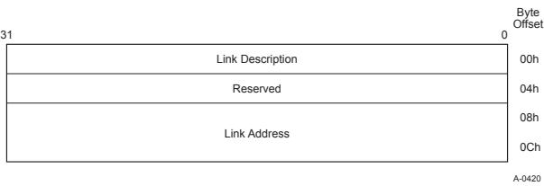


<table>
<thead>
<tr>
<th width="50%">🇬🇧 English</th>
<th width="50%" style="background-color:#e8e8e8">🏆 中文</th>
</tr>
</thead>
<tbody>
<tr>
<td></td>
<td style="background-color:#e8e8e8">

</td>
</tr>
</tbody>
</table>

> **Figure 7-261.** Link Description Register
> 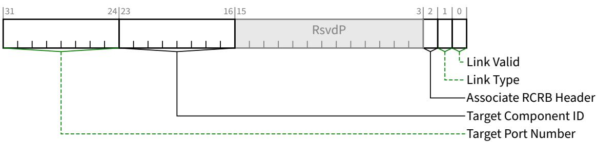


**Table 7-235. Link Description Register | 表 7-235. Link Description 寄存器**

| Bit Location | Register Description | Attributes |
|---|---|---|
| 0 | Link Valid - When Set, this bit indicates that the Link Entry specifies a valid Link. Link Entries that do not have either this bit Set or the Associate RCRB Header bit Set (or both) are ignored by software. | HwInit |
| 1 | Link Type - This bit indicates the target type of the Link and defines the format of the Link Address field. Defined Link Type values are: | HwInit |

| Bit Location | 寄存器描述 | 属性 |
|---|---|---|
| 0 | Link Valid（链路有效）— 置位时，该位表示 Link Entry 指定有效链路。未设置该位或 Associate RCRB Header 位（或两者均未设置）的 Link Entries 将被软件忽略。 | HwInit |
| 1 | Link Type（链路类型）— 该位指示链路的目标类型，并定义 Link Address 字段的格式。已定义的 Link Type 值为： | HwInit |

<a id="sec-7-9-8-3-2"></a>
### 7.9.8.3 Link Entries
<a id="sec-7-9-8-3-1-2"></a>
#### 7.9.8.3.1 Link Description Register

<a id="sec-7-9-8-3"></a>
### 7.9.8.3 Link Entries（链路条目）
<a id="sec-7-9-8-3-1"></a>
#### 7.9.8.3.1 Link Description 寄存器

<!-- 📄 Page 1300 -->
---

**Table 7-235 (cont.). Link Description Register | 表 7-235（续）. Link Description 寄存器**

| Bit Location | Register Description | Attributes |
|---|---|---|
| 1 (0b) | Link points to memory-mapped space 183 (for RCRB). The Link Address specifies the 64-bit base address of the target RCRB. | HwInit |
| 1 (1b) | Link points to Configuration Space (for a Root Port or RCiEP). The Link Address specifies the configuration address (PCI Segment Group, Bus, Device, Function) of the target element. | HwInit |
| 2 | Associate RCRB Header - When Set, this bit indicates that the Link Entry associates the declaring element with an RCRB Header Extended Capability in the target RCRB. Link Entries that do not have either this bit Set or the Link Valid bit Set (or both) are ignored by software. The Link Type bit must be Clear when this bit is Set. | HwInit |
| 23:16 | Target Component ID - This field identifies the Root Complex Component that is targeted by this Link Entry. Components IDs must start at 01h, as a value of 00h is Reserved. | HwInit |
| 31:24 | Target Port Number - This field specifies the Port Number associated with the element targeted by this Link Entry; the Target Port Number is with respect to the Root Complex Component (identified by the Target Component ID) that contains the target element. | HwInit |

| Bit Location | 寄存器描述 | 属性 |
|---|---|---|
| 1 (0b) | 链路指向内存映射空间 183（用于 RCRB）。Link Address 指定目标 RCRB 的 64 位基址。 | HwInit |
| 1 (1b) | 链路指向配置空间（用于根端口或 RCiEP）。Link Address 指定目标元素的配置地址（PCI Segment Group、Bus、Device、Function）。 | HwInit |
| 2 | Associate RCRB Header（关联 RCRB 头）— 置位时，该位表示 Link Entry 将声明元素与目标 RCRB 中的 RCRB Header Extended Capability 相关联。未设置该位或 Link Valid 位（或两者均未设置）的 Link Entries 将被软件忽略。当该位置位时，Link Type 位必须清零。 | HwInit |
| 23:16 | Target Component ID（目标组件 ID）— 该字段标识此 Link Entry 所指向的根复合体组件。Component ID 必须从 01h 开始，因为值 00h 为保留值。 | HwInit |
| 31:24 | Target Port Number（目标端口号）— 该字段指定与此 Link Entry 所指向元素关联的端口号；Target Port Number 相对于包含目标元素的根复合体组件（由 Target Component ID 标识）。 | HwInit |

The Link Address is a HwInit field located at offset 08h from the start of a Link Entry that identifies the target element for the Link Entry. For a Link of Link Type 0 in its Link Description, the Link Address specifies the memory-mapped base address of RCRB. For a Link of Link Type 1 in its Link Description, the Link Address specifies the Configuration Space address of a PCI Express Root Port or an RCiEP.

Link Address 是一个 HwInit 字段，位于 Link Entry 起始处偏移 08h 处，用于标识 Link Entry 的目标元素。对于其 Link Description 中 Link Type 为 0 的链路，Link Address 指定 RCRB 的内存映射基址。对于其 Link Description 中 Link Type 为 1 的链路，Link Address 指定 PCI Express 根端口或 RCiEP 的配置空间地址。

For a Link pointing to a memory-mapped RCRB (Link Type bit = 0), the first DWORD specifies the lower 32 bits of the RCRB base address of the target element as shown below; bits 11:0 are hardwired to 000h and Reserved for future use. The second DWORD specifies the high order 32 bits (63:32) of the RCRB base address of the target element.

对于指向内存映射 RCRB 的链路（Link Type 位 = 0），如下图所示，第一个 DWORD 指定目标元素的 RCRB 基址的低 32 位；位 11:0 硬连线为 000h 并保留以供将来使用。第二个 DWORD 指定目标元素的 RCRB 基址的高 32 位（63:32）。

<table>
<thead>
<tr>
<th width="50%">🇬🇧 English</th>
<th width="50%" style="background-color:#e8e8e8">🏆 中文</th>
</tr>
</thead>
<tbody>
<tr>
<td></td>
<td style="background-color:#e8e8e8">

</td>
</tr>
</tbody>
</table>

> **Figure 7-262.** Link Address for Link Type 0
> 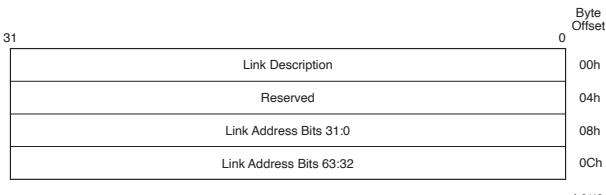


For a Link pointing to the Configuration Space of a Root Complex element (Link Type bit = 1), bits in the first DWORD specify the Bus, Device, and Function Number of the target element. As shown in Figure 7-263, bits 2:0 (N) encode the number of bits n associated with the Bus Number, with N = 000b specifying n = 8 and all other encodings specifying

<a id="sec-7-9-8-3-2-2"></a>
#### 7.9.8.3.2 Link Address
<a id="sec-7-9-8-3-2-1-2"></a>
##### 7.9.8.3.2.1 Link Address for Link Type 0
<a id="sec-7-9-8-3-2-2-2"></a>
##### 7.9.8.3.2.2 Link Address for Link Type 1

对于指向根复合体元素配置空间的链路（Link Type 位 = 1），第一个 DWORD 中的位指定目标元素的 Bus、Device 和 Function Number。如图 7-263 所示，位 2:0（N）编码与 Bus Number 关联的位数 n，其中 N = 000b 指定 n = 8，所有其他编码指定

<a id="sec-7-9-8-3-2"></a>
#### 7.9.8.3.2 Link Address（链路地址）
<a id="sec-7-9-8-3-2-1"></a>
##### 7.9.8.3.2.1 Link Type 0 的 Link Address
<a id="sec-7-9-8-3-2-2"></a>
##### 7.9.8.3.2.2 Link Type 1 的 Link Address

> 183. The memory-mapped space for accessing an RCRB is not the same as Memory Space, and must not overlap with Memory Space.
> 183. 用于访问 RCRB 的内存映射空间与 Memory Space 不同，且不得与 Memory Space 重叠。

<!-- 📄 Page 1301 -->
---


<div style="overflow-x: auto; max-width: 100%;">
<table>
<thead>
<tr>
<th width="50%">🇬🇧 English</th>
<th width="50%" style="background-color:#e8e8e8">🏆 中文</th>
</tr>
</thead>
<tbody>
<tr>
<td>

n = <value of N>. Bits 11:3 are Reserved and hardwired to 0. Bits 14:12 specify the Function Number, and bits 19:15 specify the Device Number. Bits (19 + n):20 specify the Bus Number, with 1 ≤ n ≤ 8.

Bits 31:(20 + n) of the first DWORD together with the second DWORD optionally identify the target element's hierarchy for systems implementing the PCI Express Enhanced Configuration Access Mechanism by specifying bits 63:(20 + n) of the memory-mapped Configuration Space base address of the PCI Express hierarchy associated with the targeted element; single hierarchy systems that do not implement more than one memory mapped Configuration Space are allowed to report a value of zero to indicate default Configuration Space.

A Configuration Space base address [63:(20 + n)] equal to zero indicates that the Configuration Space address defined by bits (19 + n):12 (Bus Number, Device Number, and Function Number) exists in the default PCI Segment Group; any non-zero value indicates a separate Configuration Space base address.

Software must not use n outside the context of evaluating the Bus Number and memory-mapped Configuration Space base address for this specific target element. In particular, n does not necessarily indicate the maximum Bus Number supported by the associated PCI Segment Group.

</td>
<td style="background-color:#e8e8e8">

n = <N 的值>。位 11:3 为保留位，硬连线为 0。位 14:12 指定 Function Number，位 19:15 指定 Device Number。位 (19 + n):20 指定 Bus Number，其中 1 ≤ n ≤ 8。

第一个 DWORD 的位 31:(20 + n) 与第二个 DWORD 一起，通过指定与目标元素关联的 PCI Express 层级（hierarchy）的内存映射配置空间基址的位 63:(20 + n)，可选地标识目标元素的层级（对于实现 PCI Express Enhanced Configuration Access Mechanism 的系统）；不实现多于一个内存映射配置空间的单层级系统允许报告零值以表示默认配置空间。

等于零的 Configuration Space 基址 [63:(20 + n)] 表示由位 (19 + n):12（Bus Number、Device Number 和 Function Number）定义的配置空间地址存在于默认 PCI Segment Group 中；任何非零值都表示单独的 Configuration Space 基址。

软件不得在评估此特定目标元素的 Bus Number 和内存映射配置空间基址的上下文之外使用 n。特别地，n 不一定表示关联 PCI Segment Group 支持的最大 Bus Number。

</td>
</tr>
</tbody>
</table>
</div>


<table>
<thead>
<tr>
<th width="50%">🇬🇧 English</th>
<th width="50%" style="background-color:#e8e8e8">🏆 中文</th>
</tr>
</thead>
<tbody>
<tr>
<td>

> **Figure 7-263.** Link Address for Link Type 1
> 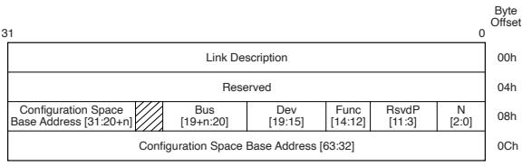

</td>
<td style="background-color:#e8e8e8">


</td>
</tr>
</tbody>
</table>

**Table 7-236. Link Address for Link Type 1 | 表 7-236. Link Type 1 的 Link Address**

| Bit Location | Register Description | Attributes |
|---|---|---|
| 2:0 | N - Encoded number of Bus Number bits | HwInit |
| 14:12 | Function Number | HwInit |
| 19:15 | Device Number | HwInit |
| (19 + n):20 | Bus Number | HwInit |
| 63:(20 + n) | PCI Express Configuration Space Base Address (1 ≤ n ≤ 8) <br> **Note:** A Root Complex that does not implement multiple Configuration Spaces is allowed to report this field as 0. | HwInit |

| Bit Location | 寄存器描述 | 属性 |
|---|---|---|
| 2:0 | N — Bus Number 位数的编码值 | HwInit |
| 14:12 | Function Number（功能号） | HwInit |
| 19:15 | Device Number（设备号） | HwInit |
| (19 + n):20 | Bus Number（总线号） | HwInit |
| 63:(20 + n) | PCI Express Configuration Space Base Address（PCI Express 配置空间基址）（1 ≤ n ≤ 8）<br>**注：** 不实现多个 Configuration Space 的根复合体允许将该字段报告为 0。 | HwInit |

The Root Complex Internal Link Control Extended Capability is an optional Capability that controls an internal Root Complex Link between two distinct Root Complex Components. This Capability is valid for RCRBs that declare an Element Type field as Internal Root Complex Link in the Element Self-Description register of the Root Complex Link Declaration Capability structure.

Root Complex Internal Link Control Extended Capability 是一种可选能力，用于控制两个不同根复合体组件之间的内部根复合体链路。此能力对于在 Root Complex Link Declaration Capability 结构的 Element Self-Description 寄存器中将 Element Type 字段声明为 Internal Root Complex Link 的 RCRB 有效。

The Root Complex Internal Link Control Extended Capability structure is defined as shown in Figure 7-264.

Root Complex Internal Link Control Extended Capability 结构定义如图 7-264 所示。

<a id="sec-7-9-9-2"></a>
## 7.9.9 Root Complex Internal Link Control Extended Capability

<a id="sec-7-9-9"></a>
## 7.9.9 Root Complex Internal Link Control Extended Capability（根复合体内部链路控制扩展能力）

<!-- 📄 Page 1302 -->
---

<table>
<thead>
<tr>
<th width="50%">🇬🇧 English</th>
<th width="50%" style="background-color:#e8e8e8">🏆 中文</th>
</tr>
</thead>
<tbody>
<tr>
<td>

The Extended Capability ID for the Root Complex Internal Link Control Extended Capability is 0006h.

</td>
<td style="background-color:#e8e8e8">

Root Complex Internal Link Control Extended Capability 的扩展能力 ID 为 0006h。

</td>
</tr>
</tbody>
</table>

> **Figure 7-264.** Root Complex Internal Link Control Extended Capability
> 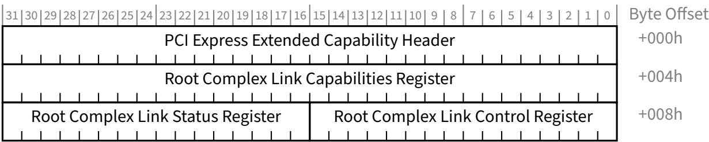


<table>
<thead>
<tr>
<th width="50%">🇬🇧 English</th>
<th width="50%" style="background-color:#e8e8e8">🏆 中文</th>
</tr>
</thead>
<tbody>
<tr>
<td></td>
<td style="background-color:#e8e8e8">

</td>
</tr>
</tbody>
</table>

> **Figure 7-265.** Root Complex Internal Link Control Extended Capability Header
> 


**Table 7-237. Root Complex Internal Link Control Extended Capability Header | 表 7-237. Root Complex Internal Link Control Extended Capability Header**

| Bit Location | Register Description | Attributes |
|---|---|---|
| 15:0 | PCI Express Extended Capability ID - This field is a PCI-SIG defined ID number that indicates the nature and format of the Extended Capability. The Extended Capability ID for the Root Complex Internal Link Control Extended Capability is 0006h. | RO |
| 19:16 | Capability Version - This field is a PCI-SIG defined version number that indicates the version of the Capability structure present. Must be 1h for this version of the specification. | RO |
| 31:20 | Next Capability Offset - This field contains the offset to the next PCI Express Capability structure or 000h if no other items exist in the linked list of Capabilities. For Extended Capabilities implemented in Configuration Space, this offset is relative to the beginning of PCI-compatible Configuration Space and thus must always be either 000h (for terminating list of Capabilities) or greater than 0FFh. The bottom 2 bits of this offset are Reserved and must be implemented as 00b although software must mask them to allow for future uses of these bits. | RO |

| Bit Location | 寄存器描述 | 属性 |
|---|---|---|
| 15:0 | PCI Express Extended Capability ID（PCI Express 扩展能力 ID）— 该字段是 PCI-SIG 定义的 ID 编号，用于指示扩展能力的性质和格式。Root Complex Internal Link Control Extended Capability 的扩展能力 ID 为 0006h。 | RO |
| 19:16 | Capability Version（能力版本）— 该字段是 PCI-SIG 定义的版本号，用于指示当前 Capability 结构的版本。本规范版本必须为 1h。 | RO |
| 31:20 | Next Capability Offset（下一能力偏移）— 该字段包含指向下一个 PCI Express Capability 结构的偏移，若链接列表中不存在其他项，则为 000h。对于在配置空间中实现的扩展能力，该偏移相对于 PCI 兼容配置空间的起始位置，因此必须为 000h（表示能力列表终止）或大于 0FFh。该偏移的低 2 位为保留位，必须实现为 00b，但软件必须将其屏蔽以允许将来使用这些位。 | RO |

The Root Complex Link Capabilities Register identifies capabilities for this Link.

Root Complex Link Capabilities 寄存器标识此链路的能力。

---

<a id="sec-7-9-9-1"></a>
## 7.9.9.1 Root Complex Internal Link Control Extended Capability Header (Offset 00h) | 根复合体内部链路控制扩展能力头(偏移量 00h)

<table>
<thead>
<tr>
<th width="50%">🇬🇧 English</th>
<th width="50%" style="background-color:#e8e8e8">🏆 中文</th>
</tr>
</thead>
<tbody>
<tr>
<td>

Root Complex Internal Link Control Extended Capability Header

</td>
<td style="background-color:#e8e8e8">

根复合体 (Root Complex) 内部链路控制扩展能力头

</td>
</tr>
</tbody>
</table>

---

<a id="sec-7-9-9-2"></a>
## 7.9.9.2 Root Complex Link Capabilities Register (Offset 04h) | 根复合体链路能力寄存器(偏移量 04h)


<div style="overflow-x: auto; max-width: 100%;">
<table>
<thead>
<tr>
<th width="50%">🇬🇧 English</th>
<th width="50%" style="background-color:#e8e8e8">🏆 中文</th>
</tr>
</thead>
<tbody>
<tr>
<td>

0001b
0010b
0011b
0100b
0101b
0110b
0111b
Others
00 0001b
00 0010b
00 0100b
00 1000b
01 0000b
00b
01b
10b
11b
0
3
Max Link Speed
4
9
Maximum Link Width
10
11
Active State Power Management (ASPM) Support
12
14
L0s Exit Latency
15
17
L1 Exit Latency
18
24
Supported Link Speeds Vector
25
31
RsvdP
Figure 7-266 Root Complex Link Capabilities Register
Table 7-238 Root Complex Link Capabilities Register
Bit Location
Register Description
Attributes
3:0
Max Link Speed - This field indicates the maximum Link speed of the associated Link.
The encoded value specifies a bit location in the Supported Link Speeds Vector (in the Root Complex
Link Capabilities Register) that corresponds to the maximum Link speed.
Defined encodings are:
Supported Link Speeds Vector field bit 0
Supported Link Speeds Vector field bit 1
Supported Link Speeds Vector field bit 2
Supported Link Speeds Vector field bit 3
Supported Link Speeds Vector field bit 4
Supported Link Speeds Vector field bit 5
Supported Link Speeds Vector field bit 6
All other encodings are reserved.
A Root Complex that does not support this feature must report 0000b in this field.
RO
9:4
Maximum Link Width - This field indicates the maximum width of the given Link.
Defined encodings are:
x1
x2
x4
x8
x16
All other encodings are Reserved. A Root Complex that does not support this feature must report
00 0000b in this field.
RO
11:10
Active State Power Management (ASPM) Support - This field indicates the level of ASPM supported on
the given Link.
Defined encodings are:
No ASPM Support
L0s Supported
L1 Supported
L0s and L1 Supported
RO

</td>
<td style="background-color:#e8e8e8">

0001b
0010b
0011b
0100b
0101b
0110b
0111b
其他(保留)
00 0001b
00 0010b
00 0100b
00 1000b
01 0000b
00b
01b
10b
11b
0
3
Max Link Speed(最大链路速度)
4
9
Maximum Link Width(最大链路宽度)
10
11
Active State Power Management (ASPM) Support(主动状态电源管理支持)
12
14
L0s Exit Latency(L0s 退出延迟)
15
17
L1 Exit Latency(L1 退出延迟)
18
24
Supported Link Speeds Vector(支持的链路速度向量)
25
31
RsvdP
图 7-266 Root Complex Link Capabilities Register(根复合体链路能力寄存器)
表 7-238 Root Complex Link Capabilities Register(根复合体链路能力寄存器)
位位置
寄存器描述
属性
3:0
Max Link Speed(最大链路速度) — 该字段指示关联链路 (Link) 的最大链路速度。
编码值指定 Supported Link Speeds Vector(支持的链路速度向量,位于 Root Complex Link Capabilities Register 中)中与最大链路速度对应的位位置。
已定义的编码为:
Supported Link Speeds Vector 字段位 0
Supported Link Speeds Vector 字段位 1
Supported Link Speeds Vector 字段位 2
Supported Link Speeds Vector 字段位 3
Supported Link Speeds Vector 字段位 4
Supported Link Speeds Vector 字段位 5
Supported Link Speeds Vector 字段位 6
所有其他编码为保留。
不支持此特性的根复合体 (Root Complex) 必须在该字段中报告 0000b。
RO
9:4
Maximum Link Width(最大链路宽度) — 该字段指示给定链路 (Link) 的最大宽度。
已定义的编码为:
x1
x2
x4
x8
x16
所有其他编码为保留。不支持此特性的根复合体必须在该字段中报告 00 0000b。
RO
11:10
Active State Power Management (ASPM) Support(主动状态电源管理支持) — 该字段指示给定链路上所支持的 ASPM 等级。
已定义的编码为:
No ASPM Support(不支持 ASPM)
L0s Supported(支持 L0s)
L1 Supported(支持 L1)
L0s and L1 Supported(支持 L0s 和 L1)
RO

</td>
</tr>
</tbody>
</table>
</div>


---

<!-- 📄 Page 1304 -->
---

<table>
<thead>
<tr>
<th width="50%">🇬🇧 English</th>
<th width="50%" style="background-color:#e8e8e8">🏆 中文</th>
</tr>
</thead>
<tbody>
<tr>
<td>

000b
001b
010b
011b
100b
101b
110b
111b
000b
001b
010b
011b
100b
101b
110b
111b
Bit 0
Bit 1
Bit 2
Bit 3
Bit 4
Bit 5
Bit 6
Bit Location
Register Description
Attributes
14:12
L0s Exit Latency - This field indicates the L0s exit latency for the given Link. The value reported indicates
the length of time this Port requires to complete transition from L0s to L0. If L0s is not supported, the
value is undefined.
Defined encodings are:
Less than 64 ns
64 ns to less than 128 ns
128 ns to less than 256 ns
256 ns to less than 512 ns
512 ns to less than 1 μs
1 μs to less than 2 μs
2 μs to 4 μs
More than 4 μs
RO
17:15
L1 Exit Latency - This field indicates the L1 exit latency for the given Link. The value reported indicates
the length of time this Port requires to complete transition from ASPM L1 to L0. If ASPM L1 is not
supported, the value is undefined.
Defined encodings are:
Less than 1 μs
1 μs to less than 2 μs
2 μs to less than 4 μs
4 μs to less than 8 μs
8 μs to less than 16 μs
16 μs to less than 32 μs
32 μs to 64 μs
More than 64 μs
RO
24:18
Supported Link Speeds Vector - This field indicates the supported Link speed(s) of the associated Link.
For each bit, a value of 1b indicates that the corresponding Link speed is supported; otherwise, the Link
speed is not supported. See § Section 8.2.1 for further requirements.
Bit definitions within this field are:
2.5 GT/s
5.0 GT/s
8.0 GT/s
16.0 GT/s
32.0 GT/s
64.0 GT/s
RsvdP
RO

</td>
<td style="background-color:#e8e8e8">

000b
001b
010b
011b
100b
101b
110b
111b
000b
001b
010b
011b
100b
101b
110b
111b
位 0
位 1
位 2
位 3
位 4
位 5
位 6
位位置
寄存器描述
属性
14:12
L0s Exit Latency(L0s 退出延迟) — 该字段指示给定链路的 L0s 退出延迟。所报告的值表示此端口 (Port) 完成从 L0s 到 L0 转换所需的时间长度。如果不支持 L0s,则该值未定义。
已定义的编码为:
小于 64 ns
64 ns 至小于 128 ns
128 ns 至小于 256 ns
256 ns 至小于 512 ns
512 ns 至小于 1 μs
1 μs 至小于 2 μs
2 μs 至 4 μs
大于 4 μs
RO
17:15
L1 Exit Latency(L1 退出延迟) — 该字段指示给定链路的 L1 退出延迟。所报告的值表示此端口完成从 ASPM L1 到 L0 转换所需的时间长度。如果不支持 ASPM L1,则该值未定义。
已定义的编码为:
小于 1 μs
1 μs 至小于 2 μs
2 μs 至小于 4 μs
4 μs 至小于 8 μs
8 μs 至小于 16 μs
16 μs 至小于 32 μs
32 μs 至 64 μs
大于 64 μs
RO
24:18
Supported Link Speeds Vector(支持的链路速度向量) — 该字段指示关联链路所支持的链路速度。对于每一位,值为 1b 表示支持相应的链路速度;否则表示不支持该链路速度。更多要求请参见 § 第 8.2.1 节。
该字段内的位定义如下:
2.5 GT/s
5.0 GT/s
8.0 GT/s
16.0 GT/s
32.0 GT/s
64.0 GT/s
RsvdP
RO

</td>
</tr>
</tbody>
</table>

---

<!-- 📄 Page 1305 -->
---


<div style="overflow-x: auto; max-width: 100%;">
<table>
<thead>
<tr>
<th width="50%">🇬🇧 English</th>
<th width="50%" style="background-color:#e8e8e8">🏆 中文</th>
</tr>
</thead>
<tbody>
<tr>
<td>

The Root Complex Link Control Register controls parameters for this internal Link.
0
1
Active State Power Management (ASPM) Control
2
6
RsvdP
7
Extended Synch
8
15
RsvdP
Figure 7-267 Root Complex Link Control Register
IMPLEMENTATION NOTE:
SUPPORTED LINK SPEEDS WITH EARLIER HARDWARE
Hardware components compliant to versions prior to the [PCIe-3.0] did not implement the Supported Link
Speeds Vector field and instead returned 0000 000b in bits 24:18.
For software to determine the supported Link speeds for components where this field is contains 0000 000b,
software can read bits 3:0 of the Root Complex Link Capabilities Register (now defined to be the Max Link Speed
field), and interpret the value as follows:
0001b
2.5 GT/s Link speed supported
0010b
5.0 GT/s and 2.5 GT/s Link speeds supported
For such components, the same encoding is also used for the values for the Current Link Speed field (in the Root
Complex Link Status Register).

</td>
<td style="background-color:#e8e8e8">

Root Complex Link Control Register(根复合体链路控制寄存器)控制此内部链路的参数。
0
1
Active State Power Management (ASPM) Control(主动状态电源管理控制)
2
6
RsvdP
7
Extended Synch(扩展同步)
8
15
RsvdP
图 7-267 Root Complex Link Control Register(根复合体链路控制寄存器)
实现注意事项:
早期硬件支持的链路速度
符合 [PCIe-3.0] 之前版本的硬件组件未实现 Supported Link Speeds Vector(支持的链路速度向量)字段,而是在位 24:18 返回 0000 000b。
对于该字段包含 0000 000b 的组件,软件可读取 Root Complex Link Capabilities Register(根复合体链路能力寄存器,现定义为 Max Link Speed 字段)的位 3:0,并按下表解释其值:
0001b
支持 2.5 GT/s 链路速度
0010b
支持 5.0 GT/s 和 2.5 GT/s 链路速度
对于此类组件,相同的编码也用于 Root Complex Link Status Register(根复合体链路状态寄存器)中 Current Link Speed 字段的值。

</td>
</tr>
</tbody>
</table>
</div>


---

<table>
<thead>
<tr>
<th width="50%">🇬🇧 English</th>
<th width="50%" style="background-color:#e8e8e8">🏆 中文</th>
</tr>
</thead>
<tbody>
<tr>
<td>

IMPLEMENTATION NOTE:
SOFTWARE MANAGEMENT OF LINK SPEEDS WITH FUTURE
HARDWARE
It is strongly encouraged that software primarily utilize the Supported Link Speeds Vector instead of the Max Link
Speed field, so that software can determine the exact set of supported speeds on current and future hardware.
This can avoid software being confused if a future specification defines Links that do not require support for all
slower speeds.

</td>
<td style="background-color:#e8e8e8">

实现注意事项:
未来硬件的链路速度软件管理
强烈建议软件主要使用 Supported Link Speeds Vector(支持的链路速度向量)而非 Max Link Speed(最大链路速度)字段,以便软件能够在当前和未来硬件上确定所支持速度的精确集合。这可以避免在未来规范定义了不需要支持所有较慢速度的链路时,软件产生混淆。

</td>
</tr>
</tbody>
</table>

---

<a id="sec-7-9-9-3"></a>
## 7.9.9.3 Root Complex Link Control Register (Offset 08h) | 根复合体链路控制寄存器(偏移量 08h)


<div style="overflow-x: auto; max-width: 100%;">
<table>
<thead>
<tr>
<th width="50%">🇬🇧 English</th>
<th width="50%" style="background-color:#e8e8e8">🏆 中文</th>
</tr>
</thead>
<tbody>
<tr>
<td>

00b
01b
10b
11b
Table 7-239 Root Complex Link Control Register
Bit Location
Register Description
Attributes
1:0
Active State Power Management (ASPM) Control - This field controls the level of ASPM enabled on the
given Link.
Defined encodings are:
Disabled
L0s Entry Enabled
L1 Entry Enabled
L0s and L1 Entry Enabled
Note: "L0s Entry Enabled" enables the Transmitter to enter L0s. If L0s is supported, the Receiver must be
capable of entering L0s even when the Transmitter is disabled from entering L0s (00b or 10b).
In Flit Mode, L0s is not supported, bit 0 of this field is ignored and has no effect (i.e., encodings 01b and
00b are equivalent as are encodings 11b and 10b).
Default value of this field is implementation specific.
Software must not enable L0s in either direction on a given Link unless components on both sides of the
Link each support L0s, as indicated by their ASPM Support field values. Otherwise, the result is
undefined.
ASPM L1 must be enabled by software in the Upstream component on a Link prior to enabling ASPM L1
in the Downstream component on that Link. When disabling ASPM L1, software must disable ASPM L1 in
the Downstream component on a Link prior to disabling ASPM L1 in the Upstream component on that
Link. ASPM L1 must only be enabled on the Downstream component if both components on a Link
support ASPM L1.
A Root Complex that does not support this feature for the given internal Link must hardwire this field to
00b.
RW
7
Extended Synch - This bit when Set forces the transmission of additional Ordered Sets when exiting the
L0s state (see § Section 4.2.5.6 ) and when in the Recovery state (see § Section 4.2.7.4.1 ). This mode
provides external devices (e.g., logic analyzers) monitoring the Link time to achieve bit and Symbol lock
before the Link enters the L0 state and resumes communication.
A Root Complex that does not support this feature for the given internal Link must hardwire this bit to
0b.
In Flit Mode, this bit is ignored and has no effect since L0s is not supported.
Default value for this bit is 0b.
RW

</td>
<td style="background-color:#e8e8e8">

00b
01b
10b
11b
表 7-239 Root Complex Link Control Register(根复合体链路控制寄存器)
位位置
寄存器描述
属性
1:0
Active State Power Management (ASPM) Control(主动状态电源管理控制) — 该字段控制给定链路上启用的 ASPM 等级。
已定义的编码为:
Disabled(禁用)
L0s Entry Enabled(允许进入 L0s)
L1 Entry Enabled(允许进入 L1)
L0s and L1 Entry Enabled(允许进入 L0s 和 L1)
注:"L0s Entry Enabled"(允许进入 L0s)使发送器 (Transmitter) 能够进入 L0s。如果支持 L0s,则即使发送器被禁止进入 L0s(00b 或 10b),接收器 (Receiver) 也必须能够进入 L0s。
在 Flit 模式下,不支持 L0s,该字段的位 0 被忽略且无效(即编码 01b 与 00b 等效,编码 11b 与 10b 等效)。
该字段的默认值是实现特定的。
除非链路上两侧的组件均支持 L0s(如其 ASPM Support 字段值所示),否则软件不得在任何方向上的给定链路上启用 L0s。否则结果未定义。
软件必须先在链路的上游组件 (Upstream component) 启用 ASPM L1,然后才能在该链路的下游组件 (Downstream component) 启用 ASPM L1。禁用 ASPM L1 时,软件必须先在该链路的下游组件禁用 ASPM L1,然后才能在该链路的上游组件禁用 ASPM L1。仅当链路上的两个组件均支持 ASPM L1 时,才允许在下游组件上启用 ASPM L1。
对于给定内部链路不支持此特性的根复合体,必须将该字段硬连线 (hardwire) 为 00b。
RW
7
Extended Synch(扩展同步) — 该位置位 (Set) 时,强制在退出 L0s 状态(见 § 第 4.2.5.6 节)和处于 Recovery(恢复)状态(见 § 第 4.2.7.4.1 节)时传输额外的有序集 (Ordered Sets)。此模式为监控链路的外部设备(例如逻辑分析仪)提供在链路进入 L0 状态并恢复通信之前实现位和符号锁定的时间。
对于给定内部链路不支持此特性的根复合体,必须将该位硬连线为 0b。
在 Flit 模式下,该位被忽略且无效,因为不支持 L0s。
该位的默认值为 0b。
RW

</td>
</tr>
</tbody>
</table>
</div>


---

<a id="sec-7-9-9-4"></a>
## 7.9.9.4 Root Complex Link Status Register (Offset 0Ah) | 根复合体链路状态寄存器(偏移量 0Ah)

<table>
<thead>
<tr>
<th width="50%">🇬🇧 English</th>
<th width="50%" style="background-color:#e8e8e8">🏆 中文</th>
</tr>
</thead>
<tbody>
<tr>
<td>

The Root Complex Link Status Register provides information about Link specific parameters.

</td>
<td style="background-color:#e8e8e8">

Root Complex Link Status Register(根复合体链路状态寄存器)提供有关链路特定参数的信息。

</td>
</tr>
</tbody>
</table>

---

<!-- 📄 Page 1307 -->
---


<div style="overflow-x: auto; max-width: 100%;">
<table>
<thead>
<tr>
<th width="50%">🇬🇧 English</th>
<th width="50%" style="background-color:#e8e8e8">🏆 中文</th>
</tr>
</thead>
<tbody>
<tr>
<td>

0001b
0010b
0011b
0100b
0101b
0110b
0111b
00 0001b
00 0010b
00 0100b
00 1000b
01 0000b
0
3
Current Link Speed
4
9
Negotiated Link Width
10
15
RsvdZ
Figure 7-268 Root Complex Link Status Register
Table 7-240 Root Complex Link Status Register
Bit Location
Register Description
Attributes
3:0
Current Link Speed - This field indicates the negotiated Link speed of the given Link.
The encoded value specifies a bit location in the Supported Link Speeds Vector (in the Root Complex
Link Capabilities Register) that corresponds to the current Link speed.
Defined encodings are:
Supported Link Speeds Vector field bit 0
Supported Link Speeds Vector field bit 1
Supported Link Speeds Vector field bit 2
Supported Link Speeds Vector field bit 3
Supported Link Speeds Vector field bit 4
Supported Link Speeds Vector field bit 5
Supported Link Speeds Vector field bit 6
All other encodings are Reserved.
The value in this field is undefined when the Link is not up. A Root Complex that does not support this
feature must report 0000b in this field.
RO
9:4
Negotiated Link Width - This field indicates the negotiated width of the given Link. This includes the
Link Width determined during initial link training as well changes that occur after initial link training
(e.g., L0p)
Defined encodings are:
x1
x2
x4
x8
x16
All other encodings are Reserved. The value in this field is undefined when the Link is not up. A Root
Complex that does not support this feature must hardwire this field to 00 0000b.
RO

</td>
<td style="background-color:#e8e8e8">

0001b
0010b
0011b
0100b
0101b
0110b
0111b
00 0001b
00 0010b
00 0100b
00 1000b
01 0000b
0
3
Current Link Speed(当前链路速度)
4
9
Negotiated Link Width(协商链路宽度)
10
15
RsvdZ
图 7-268 Root Complex Link Status Register(根复合体链路状态寄存器)
表 7-240 Root Complex Link Status Register(根复合体链路状态寄存器)
位位置
寄存器描述
属性
3:0
Current Link Speed(当前链路速度) — 该字段指示给定链路的协商后链路速度。
编码值指定 Supported Link Speeds Vector(支持的链路速度向量,位于 Root Complex Link Capabilities Register 中)中与当前链路速度对应的位位置。
已定义的编码为:
Supported Link Speeds Vector 字段位 0
Supported Link Speeds Vector 字段位 1
Supported Link Speeds Vector 字段位 2
Supported Link Speeds Vector 字段位 3
Supported Link Speeds Vector 字段位 4
Supported Link Speeds Vector 字段位 5
Supported Link Speeds Vector 字段位 6
所有其他编码为保留。
当链路未建立时,该字段中的值未定义。不支持此特性的根复合体必须在该字段中报告 0000b。
RO
9:4
Negotiated Link Width(协商链路宽度) — 该字段指示给定链路的协商后宽度。这包括初始链路训练期间确定的链路宽度以及初始链路训练之后发生的更改(例如 L0p)。
已定义的编码为:
x1
x2
x4
x8
x16
所有其他编码为保留。当链路未建立时,该字段中的值未定义。不支持此特性的根复合体必须将该字段硬连线为 00 0000b。
RO

</td>
</tr>
</tbody>
</table>
</div>


---

<a id="sec-7-9-10"></a>
## 7.9.10 Root Complex Event Collector Endpoint Association Extended Capability | 根复合体事件收集器端点关联扩展能力

<table>
<thead>
<tr>
<th width="50%">🇬🇧 English</th>
<th width="50%" style="background-color:#e8e8e8">🏆 中文</th>
</tr>
</thead>
<tbody>
<tr>
<td>

The Root Complex Event Collector Endpoint Association Extended Capability is implemented by Root Complex Event
Collectors. It declares the RCiEPs supported by the Root Complex Event Collector. A Root Complex Event Collector must
implement the Root Complex Event Collector Endpoint Association Extended Capability; no other PCI Express Device
Function is permitted to implement this Capability.
The Root Complex Event Collector Endpoint Association Extended Capability, as shown in § Figure 7-269, consists of the
PCI Express Extended Capability header followed by a DWORD bitmap enumerating RCiEPs on the same Bus, and
optionally an additional range of Bus Numbers that may contain RCiEPs associated with the Root Complex Event
Collector. Functions other than RCiEPs (e.g., Root Ports) contained in the range described by this Capability are not
associated with this Root Complex Event Collector.

</td>
<td style="background-color:#e8e8e8">

Root Complex Event Collector Endpoint Association Extended Capability(根复合体事件收集器端点关联扩展能力)由 Root Complex Event Collector(根复合体事件收集器)实现。它声明该根复合体事件收集器所支持的 RCiEP(RCiEP, Root Complex integrated Endpoint)。根复合体事件收集器必须实现 Root Complex Event Collector Endpoint Association Extended Capability;不允许任何其他 PCI Express Device Function(PCI Express 设备功能)实现此 Capability(能力)。
如 § 图 7-269 所示,Root Complex Event Collector Endpoint Association Extended Capability 由 PCI Express Extended Capability header(PCI Express 扩展能力头)组成,后跟一个 DWORD 位图,用于枚举同一 Bus(总线)上的 RCiEP,并可选地附加一段 Bus Number(总线号)范围,该范围内可能包含与该根复合体事件收集器关联的 RCiEP。此 Capability 所描述范围内的非 RCiEP 功能(例如 Root Port(根端口))与该根复合体事件收集器无关。

</td>
</tr>
</tbody>
</table>

---

<!-- 📄 Page 1308 -->
---


<div style="overflow-x: auto; max-width: 100%;">
<table>
<thead>
<tr>
<th width="50%">🇬🇧 English</th>
<th width="50%" style="background-color:#e8e8e8">🏆 中文</th>
</tr>
</thead>
<tbody>
<tr>
<td>

0
1
2
3
4
5
6
7
8
9
10
11
12
13
14
15
16
17
18
19
20
21
22
23
24
25
26
27
28
29
30
31
Byte Offset
PCI Express Extended Capability Header
Association Bitmap for RCiEPs
RCEC Associated Bus Numbers
+000h
+004h
+008h
Figure 7-269 Root Complex Event Collector Endpoint Association Extended Capability
The Extended Capability ID for the Root Complex Event Collector Endpoint Association Extended Capability is 0007h.
§ Figure 7-270 details allocation of fields in the Root Complex Event Collector Endpoint Association Extended Capability
Header; § Table 7-241 provides the respective bit definitions.
0
15
PCI Express Extended Capability ID
0007h
16
19
Capability Version
20
31
Next Capability Offset
Figure 7-270 Root Complex Event Collector Endpoint Association Extended Capability Header
Table 7-241 Root Complex Event Collector Endpoint Association Extended Capability Header
Bit Location
Register Description
Attributes
15:0
PCI Express Extended Capability ID - This field is a PCI-SIG defined ID number that indicates the nature
and format of the Extended Capability.
The Extended Capability ID for the Root Complex Event Collector Endpoint Association Extended
Capability is 0007h.
RO
19:16
Capability Version - This field is a PCI-SIG defined version number that indicates the version of the
Capability structure present.
Must be 2h if the Extended Capability contains the RCEC Associated Bus Numbers Register (see § Section
7.9.10.3 ). Must be 1h otherwise.
RO

</td>
<td style="background-color:#e8e8e8">

0
1
2
3
4
5
6
7
8
9
10
11
12
13
14
15
16
17
18
19
20
21
22
23
24
25
26
27
28
29
30
31
Byte Offset(字节偏移)
PCI Express Extended Capability Header(PCI Express 扩展能力头)
Association Bitmap for RCiEPs(RCiEP 关联位图)
RCEC Associated Bus Numbers(RCEC 关联总线号)
+000h
+004h
+008h
图 7-269 Root Complex Event Collector Endpoint Association Extended Capability(根复合体事件收集器端点关联扩展能力)
Root Complex Event Collector Endpoint Association Extended Capability 的 Extended Capability ID(扩展能力 ID)为 0007h。
§ 图 7-270 详细说明了 Root Complex Event Collector Endpoint Association Extended Capability Header 中各字段的分配;§ 表 7-241 给出了相应的位定义。
0
15
PCI Express Extended Capability ID(PCI Express 扩展能力 ID)
0007h
16
19
Capability Version(能力版本)
20
31
Next Capability Offset(下一能力偏移量)
图 7-270 Root Complex Event Collector Endpoint Association Extended Capability Header(根复合体事件收集器端点关联扩展能力头)
表 7-241 Root Complex Event Collector Endpoint Association Extended Capability Header(根复合体事件收集器端点关联扩展能力头)
位位置
寄存器描述
属性
15:0
PCI Express Extended Capability ID(PCI Express 扩展能力 ID) — 该字段是 PCI-SIG 定义的 ID 号,用于指示 Extended Capability(扩展能力)的性质和格式。
Root Complex Event Collector Endpoint Association Extended Capability 的 Extended Capability ID 为 0007h。
RO
19:16
Capability Version(能力版本) — 该字段是 PCI-SIG 定义的版本号,用于指示当前 Capability(能力)结构的版本。
如果 Extended Capability 包含 RCEC Associated Bus Numbers Register(见 § 第 7.9.10.3 节),则必须为 2h;否则必须为 1h。
RO

</td>
</tr>
</tbody>
</table>
</div>


---

<a id="sec-7-9-10-1"></a>
## 7.9.10.1 Root Complex Event Collector Endpoint Association Extended Capability Header (Offset 00h) | 根复合体事件收集器端点关联扩展能力头(偏移量 00h)

<table>
<thead>
<tr>
<th width="50%">🇬🇧 English</th>
<th width="50%" style="background-color:#e8e8e8">🏆 中文</th>
</tr>
</thead>
<tbody>
<tr>
<td>

Bit Location
Register Description
Attributes
31:20
Next Capability Offset - This field contains the offset to the next PCI Express Capability structure or 000h
if no other items exist in the linked list of Capabilities.
For Extended Capabilities implemented in Configuration Space, this offset is relative to the beginning of
PCI-compatible Configuration Space and thus must always be either 000h (for terminating list of
Capabilities) or greater than 0FFh.
The bottom 2 bits of this offset are Reserved and must be implemented as 00b although software must
mask them to allow for future uses of these bits.
RO

</td>
<td style="background-color:#e8e8e8">

位位置
寄存器描述
属性
31:20
Next Capability Offset(下一能力偏移量) — 该字段包含下一个 PCI Express Capability(能力)结构的偏移量,如果链接的 Capability 列表中不存在其他项,则为 000h。
对于在 Configuration Space(配置空间)中实现的 Extended Capability(扩展能力),此偏移量相对于 PCI-compatible Configuration Space(PCI 兼容配置空间)的开头,因此必须始终为 000h(用于终止 Capability 列表)或大于 0FFh。
此偏移量的低 2 位为保留位,必须实现为 00b,但软件必须屏蔽它们以便将来使用这些位。
RO

</td>
</tr>
</tbody>
</table>

---

<!-- 📄 Page 1309 -->
---

<a id="sec-7-9-10-2"></a>
## 7.9.10.2 Association Bitmap for RCiEPs (Offset 04h) | RCiEP 关联位图(偏移量 04h)

<table>
<thead>
<tr>
<th width="50%">🇬🇧 English</th>
<th width="50%" style="background-color:#e8e8e8">🏆 中文</th>
</tr>
</thead>
<tbody>
<tr>
<td>

The Association Bitmap for RCiEPs is a read-only register that sets the bits corresponding to the Device Numbers of
RCiEPs associated with the Root Complex Event Collector on the same Bus Number as the Event Collector itself. The bit
corresponding to the Device Number of the Root Complex Event Collector must always be Set.

</td>
<td style="background-color:#e8e8e8">

Association Bitmap for RCiEPs(RCiEP 关联位图)是一个只读寄存器,用于设置与事件收集器所在同一 Bus Number 上的根复合体事件收集器关联的 RCiEP 的 Device Number(设备号)所对应的位。与根复合体事件收集器 Device Number 对应的位必须始终置位。

</td>
</tr>
</tbody>
</table>

---

<a id="sec-7-9-10-3"></a>
## 7.9.10.3 RCEC Associated Bus Numbers Register (Offset 08h) | RCEC 关联总线号寄存器(偏移量 08h)


<div style="overflow-x: auto; max-width: 100%;">
<table>
<thead>
<tr>
<th width="50%">🇬🇧 English</th>
<th width="50%" style="background-color:#e8e8e8">🏆 中文</th>
</tr>
</thead>
<tbody>
<tr>
<td>

The RCEC Associated Bus Numbers Register is a read-only register that indicates an additional range of Bus Numbers
containing RCiEPs associated with this Root Complex Event Collector. It is permitted for Functions other than RCiEPs,
including Root Ports, to appear within the Association Bus Range. Only RCiEPs in the range are associated with this Root
Complex Event Collector. This register is present if the Capability Version is 2h or greater.
This register does not indicate association between an Event Collector and any Virtual Functions within the Association
Bus Range (see § Section 9.2.1.2 ). This register does not indicate association between an Event Collector and any
Function on the same Bus Number as the Event Collector itself, however it is permitted for the Association Bus Range to
include the Bus Number of the Root Complex Event Collector.
0
7
RsvdP
8
15
RCEC Next Bus
16
23
RCEC Last Bus
24
31
RsvdP
Figure 7-271 RCEC Associated Bus Numbers Register
Table 7-242 RCEC Associated Bus Numbers Register
Bit Location
Register Description
Attributes
15:8
RCEC Next Bus - This field contains the lowest additional bus number containing RCiEPs associated with
this Root Complex Event Collector. If all of the Devices associated with this Root Complex Event
Collector are on the same bus as the Event Collector, then this field must be set to FFh.
HwInit
23:16
RCEC Last Bus - This field contains the highest additional bus number containing RCiEPs associated
with this Root Complex Event Collector.
If all of the Devices associated with this Root Complex Event Collector are on the same bus as the Event
Collector, then this field must be set to 00h.
HwInit

</td>
<td style="background-color:#e8e8e8">

RCEC Associated Bus Numbers Register(RCEC 关联总线号寄存器)是一个只读寄存器,用于指示包含与此根复合体事件收集器关联的 RCiEP 的附加总线号范围。允许 Association Bus Range(关联总线范围)内出现除 RCiEP 之外的 Function(包括 Root Port)。只有该范围内的 RCiEP 才与此根复合体事件收集器关联。如果 Capability Version 为 2h 或更高,则存在此寄存器。
此寄存器不指示事件收集器与 Association Bus Range 内的任何 Virtual Function(虚拟功能,见 § 第 9.2.1.2 节)之间的关联。此寄存器不指示事件收集器与事件收集器所在同一 Bus Number 上的任何 Function 之间的关联,但允许 Association Bus Range 包含该根复合体事件收集器的 Bus Number。
0
7
RsvdP
8
15
RCEC Next Bus(RCEC 下一总线)
16
23
RCEC Last Bus(RCEC 上一总线)
24
31
RsvdP
图 7-271 RCEC Associated Bus Numbers Register(RCEC 关联总线号寄存器)
表 7-242 RCEC Associated Bus Numbers Register(RCEC 关联总线号寄存器)
位位置
寄存器描述
属性
15:8
RCEC Next Bus(RCEC 下一总线) — 该字段包含与此根复合体事件收集器关联的 RCiEP 所在的最低附加总线号。如果与此根复合体事件收集器关联的所有 Device 都位于与事件收集器相同的总线上,则该字段必须设置为 FFh。
HwInit
23:16
RCEC Last Bus(RCEC 上一总线) — 该字段包含与此根复合体事件收集器关联的 RCiEP 所在的最高附加总线号。
如果与此根复合体事件收集器关联的所有 Device 都位于与事件收集器相同的总线上,则该字段必须设置为 00h。
HwInit

</td>
</tr>
</tbody>
</table>
</div>


---

<!-- 📄 Page 1310 -->
---

<table>
<thead>
<tr>
<th width="50%">🇬🇧 English</th>
<th width="50%" style="background-color:#e8e8e8">🏆 中文</th>
</tr>
</thead>
<tbody>
<tr>
<td>

IMPLEMENTATION NOTE:
RCEC ASSOCIATED BUS NUMBER COMPATIBILITY WITH
LEGACY SOFTWARE
Legacy software may not support the use of the RCEC Associated Bus Numbers Register as a mechanism to
associate Devices with a RCEC. Such software may see events in the RCEC from Devices on different bus numbers
that it does not consider to be associated with the Root Complex Event Collector. System Software is strongly
encouraged to report all events seen on the Root Complex Event Collector, regardless of whether or not it can
determine association.

</td>
<td style="background-color:#e8e8e8">

实现注意事项:
与传统软件的 RCEC 关联总线号兼容性
传统软件可能不支持使用 RCEC Associated Bus Numbers Register 作为将 Device 与 RCEC 关联的机制。此类软件可能会在 RCEC 中看到来自不同总线号上 Device 的事件,但这些 Device 不被视为与此根复合体事件收集器相关联。强烈建议 System Software(系统软件)报告在根复合体事件收集器上观察到的所有事件,无论它是否能够确定关联性。

</td>
</tr>
</tbody>
</table>

---

<a id="sec-7-9-11"></a>
## 7.9.11 Multicast Extended Capability | 组播扩展能力


<div style="overflow-x: auto; max-width: 100%;">
<table>
<thead>
<tr>
<th width="50%">🇬🇧 English</th>
<th width="50%" style="background-color:#e8e8e8">🏆 中文</th>
</tr>
</thead>
<tbody>
<tr>
<td>

Multicast is an optional normative functionality that is controlled by the Multicast Extended Capability structure. The
Multicast Extended Capability is applicable to Root Ports, RCRBs, Switch Ports, Endpoint Functions, and RCiEPs. It is not
applicable to PCI Express to PCI/PCI-X Bridges.
Multicast support is optional in SR-IOV devices. If a VF implements a Multicast capability, its associated PF must
implement a Multicast capability.
In the cases of a Switch or Root Complex or a component that contains multiple Functions, multiple copies of this
Capability structure are required - one for each Endpoint Function, Switch Port, or Root Port that supports Multicast. To
provide implementation efficiencies, certain fields within each of the Multicast Extended Capability structures within a
component must be programmed the same and results are indeterminate if this is not the case. The fields and registers
that must be configured with the same values include MC_Enable, MC_Num_Group, MC_Base_Address and
MC_Index_Position. These same fields in an Endpoint's Multicast Extended Capability structure must match those
configured into a Multicast Extended Capability structure of the Switch or Root Complex above the Endpoint or in which
the RCiEP is integrated.

</td>
<td style="background-color:#e8e8e8">

Multicast(组播)是一种可选的规范性功能,由 Multicast Extended Capability(组播扩展能力)结构控制。Multicast Extended Capability 适用于 Root Port、RCRB、Switch Port、Endpoint Function 和 RCiEP。它不适用于 PCI Express 到 PCI/PCI-X 的桥接设备 (Bridge)。
SR-IOV(单根 I/O 虚拟化)设备中的 Multicast 支持是可选的。如果 VF(虚拟功能)实现 Multicast capability(组播能力),则其关联的 PF(物理功能)必须实现 Multicast capability。
对于 Switch(交换机)或 Root Complex(根复合体)或包含多个 Function 的组件,需要此 Capability 结构的多个副本——每个支持 Multicast 的 Endpoint Function、Switch Port 或 Root Port 各一个。为了提供实现效率,组件内每个 Multicast Extended Capability 结构中的某些字段必须以相同方式编程,否则结果不确定。必须配置为相同值的字段和寄存器包括 MC_Enable、MC_Num_Group、MC_Base_Address 和 MC_Index_Position。Endpoint 的 Multicast Extended Capability 结构中的这些相同字段必须与 Endpoint 上方的 Switch 或 Root Complex 的 Multicast Extended Capability 结构中配置的字段匹配,或者与 RCiEP 集成所在的 Switch 或 Root Complex 中的字段匹配。

</td>
</tr>
</tbody>
</table>
</div>


---

<!-- 📄 Page 1311 -->
---

<table>
<thead>
<tr>
<th width="50%">🇬🇧 English</th>
<th width="50%" style="background-color:#e8e8e8">🏆 中文</th>
</tr>
</thead>
<tbody>
<tr>
<td>

0
1
2
3
4
5
6
7
8
9
10
11
12
13
14
15
16
17
18
19
20
21
22
23
24
25
26
27
28
29
30
31
Byte Offset
PCI Express Extended Capability Header
Multicast Capability Register
Multicast Control Register
MC_Base_Address Register
MC_Receive Register
MC_Block_All Register
MC_Block_Untranslated Register
MC_Overlay_BAR Register
+000h
+004h
+008h
+00Ch
+010h
+014h
+018h
+01Ch
+020h
+024h
+028h
+02Ch
Figure 7-272 Multicast Extended Capability Structure
§ Figure 7-273 details allocation of the fields in the Multicast Extended Capability Header and § Table 7-243 provides the
respective bit definitions.
0
15
PCI Express Extended Capability ID
0012h
16
19
Capability Version
20
31
Next Capability Offset
Figure 7-273 Multicast Extended Capability Header
Table 7-243 Multicast Extended Capability Header
Bit Location
Register Description
Attributes
15:0
PCI Express Extended Capability ID - This field is a PCI-SIG defined ID number that indicates the nature
and format of the Extended Capability.
RO

</td>
<td style="background-color:#e8e8e8">

0
1
2
3
4
5
6
7
8
9
10
11
12
13
14
15
16
17
18
19
20
21
22
23
24
25
26
27
28
29
30
31
Byte Offset(字节偏移)
PCI Express Extended Capability Header(PCI Express 扩展能力头)
Multicast Capability Register(组播能力寄存器)
Multicast Control Register(组播控制寄存器)
MC_Base_Address Register(MC 基址寄存器)
MC_Receive Register(MC 接收寄存器)
MC_Block_All Register(MC 全部阻止寄存器)
MC_Block_Untranslated Register(MC 阻止未转换寄存器)
MC_Overlay_BAR Register(MC 覆盖 BAR 寄存器)
+000h
+004h
+008h
+00Ch
+010h
+014h
+018h
+01Ch
+020h
+024h
+028h
+02Ch
图 7-272 Multicast Extended Capability Structure(组播扩展能力结构)
§ 图 7-273 详细说明了 Multicast Extended Capability Header(组播扩展能力头)中各字段的分配;§ 表 7-243 给出了相应的位定义。
0
15
PCI Express Extended Capability ID(PCI Express 扩展能力 ID)
0012h
16
19
Capability Version(能力版本)
20
31
Next Capability Offset(下一能力偏移量)
图 7-273 Multicast Extended Capability Header(组播扩展能力头)
表 7-243 Multicast Extended Capability Header(组播扩展能力头)
位位置
寄存器描述
属性
15:0
PCI Express Extended Capability ID(PCI Express 扩展能力 ID) — 该字段是 PCI-SIG 定义的 ID 号,用于指示 Extended Capability(扩展能力)的性质和格式。
RO

</td>
</tr>
</tbody>
</table>

---

<a id="sec-7-9-11-1"></a>
## 7.9.11.1 Multicast Extended Capability Header (Offset 00h) | 组播扩展能力头(偏移量 00h)


<div style="overflow-x: auto; max-width: 100%;">
<table>
<thead>
<tr>
<th width="50%">🇬🇧 English</th>
<th width="50%" style="background-color:#e8e8e8">🏆 中文</th>
</tr>
</thead>
<tbody>
<tr>
<td>

Bit Location
Register Description
Attributes
PCI Express Extended Capability ID for the Multicast Extended Capability is 0012h.
19:16
Capability Version - This field is a PCI-SIG defined version number that indicates the version of the
Capability structure present.
Must be 1h for this version of the specification.
RO
31:20
Next Capability Offset - This field contains the offset to the next PCI Express Extended Capability
structure or 000h if no other items exist in the linked list of Capabilities.
RO

</td>
<td style="background-color:#e8e8e8">

位位置
寄存器描述
属性
Multicast Extended Capability 的 PCI Express Extended Capability ID 为 0012h。
19:16
Capability Version(能力版本) — 该字段是 PCI-SIG 定义的版本号,用于指示当前 Capability(能力)结构的版本。
在本版本的规范中必须为 1h。
RO
31:20
Next Capability Offset(下一能力偏移量) — 该字段包含下一个 PCI Express Extended Capability(扩展能力)结构的偏移量,如果链接的 Capability 列表中不存在其他项,则为 000h。
RO

</td>
</tr>
</tbody>
</table>
</div>


---

<!-- 📄 Page 1312 -->
---

<table>
<thead>
<tr>
<th width="50%">🇬🇧 English</th>
<th width="50%" style="background-color:#e8e8e8">🏆 中文</th>
</tr>
</thead>
<tbody>
<tr>
<td>

§ Figure 7-274 details allocation of the fields in the Multicast Capability Register and § Table 7-244 provides the
respective bit definitions.
0
5
MC_Max_Group
6
7
RsvdP
8
13
MC_Window_Size_Requested
14
RsvdP
15
MC_ECRC_Regeneration_Supported
Figure 7-274 Multicast Capability Register
Table 7-244 Multicast Capability Register
Bit Location
Register Description
Attributes
5:0
MC_Max_Group - Value indicates the maximum number of Multicast Groups that the component
supports, encoded as M-1. A value of 00h indicates that one Multicast Group is supported.
For VFs, this field is RsvdP. The value from the associated PF applies.
RO
VF RsvdP
13:8
MC_Window_Size_Requested - In Endpoints, the log2 of the Multicast Window size requested. RsvdP in
Switch and Root Ports.
For VFs, this field is RsvdP. The value from the associated PF applies.
RO
VF RsvdP
15
MC_ECRC_Regeneration_Supported - If Set, indicates that ECRC regeneration is supported.
This bit must not be Set unless the Function supports Advanced Error Reporting, and the ECRC Check
Capable bit in the Advanced Error Capabilities and Control Register is also Set. However, if ECRC
regeneration is supported, its operation is not contingent upon the setting of the ECRC Check Enable bit in
the Advanced Error Capabilities and Control Register. This bit is applicable to Switch and Root Ports and
is RsvdP in all other Functions.
RO/RsvdP

</td>
<td style="background-color:#e8e8e8">

§ 图 7-274 详细说明了 Multicast Capability Register(组播能力寄存器)中各字段的分配;§ 表 7-244 给出了相应的位定义。
0
5
MC_Max_Group(MC 最大组数)
6
7
RsvdP
8
13
MC_Window_Size_Requested(MC 请求的窗口大小)
14
RsvdP
15
MC_ECRC_Regeneration_Supported(MC 支持 ECRC 重新生成)
图 7-274 Multicast Capability Register(组播能力寄存器)
表 7-244 Multicast Capability Register(组播能力寄存器)
位位置
寄存器描述
属性
5:0
MC_Max_Group(MC 最大组数) — 该值指示组件所支持的 Multicast Group(组播组)最大数量,以 M-1 进行编码。值为 00h 指示支持一个 Multicast Group。
对于 VF,该字段为 RsvdP。适用关联 PF 的值。
RO
VF RsvdP
13:8
MC_Window_Size_Requested(MC 请求的窗口大小) — 在 Endpoint 中,表示请求的 Multicast Window(组播窗口)大小的 log2 值。在 Switch 和 Root Port 中为 RsvdP。
对于 VF,该字段为 RsvdP。适用关联 PF 的值。
RO
VF RsvdP
15
MC_ECRC_Regeneration_Supported(MC 支持 ECRC 重新生成) — 如果置位,指示支持 ECRC(端到端 CRC)重新生成。
除非 Function 支持 Advanced Error Reporting(高级错误报告)且 Advanced Error Capabilities and Control Register(高级错误能力与控制寄存器)中的 ECRC Check Capable 位也被置位,否则不得置位该位。但是,如果支持 ECRC 重新生成,则其操作不依赖于 Advanced Error Capabilities and Control Register 中 ECRC Check Enable 位的设置。该位适用于 Switch 和 Root Port,在所有其他 Function 中为 RsvdP。
RO/RsvdP

</td>
</tr>
</tbody>
</table>

---

<!-- 📄 Page 1313 -->
---

<a id="sec-7-9-11-2"></a>
## 7.9.11.2 Multicast Capability Register (Offset 04h) | 组播能力寄存器(偏移量 04h)


<div style="overflow-x: auto; max-width: 100%;">
<table>
<thead>
<tr>
<th width="50%">🇬🇧 English</th>
<th width="50%" style="background-color:#e8e8e8">🏆 中文</th>
</tr>
</thead>
<tbody>
<tr>
<td>

0
5
MC_Num_Group
6
14
RsvdP
15
MC_Enable
Figure 7-275 Multicast Control Register
Table 7-245 Multicast Control Register
Bit Location
Register Description
Attributes
5:0
MC_Num_Group - Value indicates the number of Multicast Groups configured for use, encoded as N-1.
The default value of 00 0000b indicates that one Multicast Group is configured for use. Behavior is
undefined if value exceeds MC_Max_Group. This parameter indirectly defines the upper limit of the
Multicast address range. This field is ignored if MC_Enable is Clear. Default value is 00 0000b.
For VFs, this field is RsvdP. The value from the associated PF applies.
RW
VF RsvdP
15
MC_Enable - When Set, the Multicast mechanism is enabled for the component. Default value is 0b.
RW
The MC_Base_Address Register contains the MC_Base_Address and the MC_Index_Position. § Figure 7-276 details
allocation of the fields in the MC_Base_Address Register and § Table 7-246 provides the respective bit definitions.
A-0751
0
31
MC_Base_Address [31:12]
MC_Index_Position
RsvdP
MC_Base_Address [63:32]
12 11
6
5
Figure 7-276 MC_Base_Address Register
Table 7-246 MC_Base_Address Register
Bit Location
Register Description
Attributes
5:0
MC_Index_Position - The location of the LSB of the Multicast Group number within the address.
Behavior is undefined if this value is less than 12 and MC_Enable is Set. Default is 0.
For VFs, this field is RsvdP. The value from the associated PF applies.
RW
VF RsvdP

</td>
<td style="background-color:#e8e8e8">

0
5
MC_Num_Group(MC 组数)
6
14
RsvdP
15
MC_Enable(MC 使能)
图 7-275 Multicast Control Register(组播控制寄存器)
表 7-245 Multicast Control Register(组播控制寄存器)
位位置
寄存器描述
属性
5:0
MC_Num_Group(MC 组数) — 该值指示已配置使用的 Multicast Group 数量,以 N-1 进行编码。默认值 00 0000b 指示已配置一个 Multicast Group。如果该值超过 MC_Max_Group,则行为未定义。该参数间接定义 Multicast 地址范围的上限。如果 MC_Enable 清零,则忽略该字段。默认值为 00 0000b。
对于 VF,该字段为 RsvdP。适用关联 PF 的值。
RW
VF RsvdP
15
MC_Enable(MC 使能) — 置位时,为该组件启用 Multicast 机制。默认值为 0b。
RW
MC_Base_Address Register(MC 基址寄存器)包含 MC_Base_Address 和 MC_Index_Position。§ 图 7-276 详细说明了 MC_Base_Address Register 中各字段的分配;§ 表 7-246 给出了相应的位定义。
A-0751
0
31
MC_Base_Address [31:12]
MC_Index_Position(MC 索引位置)
RsvdP
MC_Base_Address [63:32]
12 11
6
5
图 7-276 MC_Base_Address Register(MC 基址寄存器)
表 7-246 MC_Base_Address Register(MC 基址寄存器)
位位置
寄存器描述
属性
5:0
MC_Index_Position(MC 索引位置) — 地址中 Multicast Group 编号的 LSB(最低有效位)的位置。
如果该值小于 12 且 MC_Enable 已置位,则行为未定义。默认值为 0。
对于 VF,该字段为 RsvdP。适用关联 PF 的值。
RW
VF RsvdP

</td>
</tr>
</tbody>
</table>
</div>


---


---

<a id="sec-7-9-11-3"></a>
## 7.9.11.3 Multicast Control Register (Offset 06h) | 多播控制寄存器（偏移 06h）

<table>
<thead>
<tr>
<th width="50%">🇬🇧 English</th>
<th width="50%" style="background-color:#e8e8e8">🏆 中文</th>
</tr>
</thead>
<tbody>
<tr>
<td>

7.9.11.3 Multicast Control Register (Offset 06h)

</td>
<td style="background-color:#e8e8e8">

7.9.11.3 多播控制寄存器（Multicast Control Register，偏移 06h）

</td>
</tr>
</tbody>
</table>

---

<a id="sec-7-9-11-4"></a>
## 7.9.11.4 MC_Base_Address Register (Offset 08h) | MC_Base_Address 寄存器（偏移 08h）

<table>
<thead>
<tr>
<th width="50%">🇬🇧 English</th>
<th width="50%" style="background-color:#e8e8e8">🏆 中文</th>
</tr>
</thead>
<tbody>
<tr>
<td>

7.9.11.4 MC_Base_Address Register (Offset 08h)

</td>
<td style="background-color:#e8e8e8">

7.9.11.4 MC_Base_Address 寄存器（偏移 08h）

</td>
</tr>
</tbody>
</table>

<!-- 📄 Page 1314 -->
---

<table>
<thead>
<tr>
<th width="50%">🇬🇧 English</th>
<th width="50%" style="background-color:#e8e8e8">🏆 中文</th>
</tr>
</thead>
<tbody>
<tr>
<td>

**Bit Location**

**Register Description**

**Attributes**

63:12

MC_Base_Address - The base address of the Multicast address range. The behavior is undefined if MC_Enable is Set and bits in this field corresponding to address bits that contain the Multicast Group number or address bits less than MC_Index_Position are non-zero. Default is 0.

For VFs, this field is RsvdP. The value from the associated PF applies.

RW

VF RsvdP

</td>
<td style="background-color:#e8e8e8">

**位位置**

**寄存器描述**

**属性**

63:12

MC_Base_Address — 多播地址范围的基地址。如果 MC_Enable 被置位，且本字段中对应于包含 Multicast Group 编号的地址位或小于 MC_Index_Position 的地址位为非零，则行为未定义。默认值为 0。

对于 VF，本字段为 RsvdP，其值由所关联的 PF 决定。

RW

VF RsvdP

</td>
</tr>
</tbody>
</table>

---


<div style="overflow-x: auto; max-width: 100%;">
<table>
<thead>
<tr>
<th width="50%">🇬🇧 English</th>
<th width="50%" style="background-color:#e8e8e8">🏆 中文</th>
</tr>
</thead>
<tbody>
<tr>
<td>

The MC_Receive Register provides a bit vector denoting which Multicast groups the Function should accept, or in the case of Switch and Root Complex Ports, forward Multicast TLPs. This register is required in all Functions that implement the MC Capability structure.

§ Figure 7-277 details allocation of the fields in the MC_Receive Register and § Table 7-247 provides the respective bit definitions.

</td>
<td style="background-color:#e8e8e8">

MC_Receive 寄存器提供一个位向量，用于指示该 Function 应接受哪些多播组（Multicast Group）的流量；对于交换机（Switch）和根复合体（Root Complex）端口，则指示应转发哪些多播 TLP。所有实现 MC Capability 结构的 Function 中都必须实现该寄存器。

§ 图 7-277 详述了 MC_Receive 寄存器中各字段的分配，§ 表 7-247 给出了相应的位定义。

</td>
</tr>
</tbody>
</table>

> **Figure 7-277.** MC_Receive Register
> 

</div>


---

**Table 7-247. MC_Receive Register | 表 7-247. MC_Receive 寄存器**

| Bit Location | Register Description | Attributes |
|--------------|----------------------|------------|
| MC_Max_Group:0 | MC_Receive - For each bit that's Set, this Function gets a copy of any Multicast TLPs for the associated Multicast Group. Bits above MC_Num_Group are ignored by hardware. Default value of each bit is 0b. | RW |
| All other bits | Reserved | RsvdP |

---

<table>
<thead>
<tr>
<th width="50%">🇬🇧 English</th>
<th width="50%" style="background-color:#e8e8e8">🏆 中文</th>
</tr>
</thead>
<tbody>
<tr>
<td>

The MC_Block_All Register provides a bit vector denoting which Multicast groups the Function should block. This register is required in all Functions that implement the MC Capability structure.

§ Figure 7-278 details allocation of the fields in the MC_Block_All Register and § Table 7-248 provides the respective bit definitions.

> **Figure 7-278.** MC_Block_All Register
> 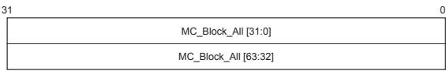

</td>
<td style="background-color:#e8e8e8">

MC_Block_All 寄存器提供一个位向量，用于指示该 Function 应阻止哪些多播组（Multicast Group）的流量。所有实现 MC Capability 结构的 Function 中都必须实现该寄存器。

§ 图 7-278 详述了 MC_Block_All 寄存器中各字段的分配，§ 表 7-248 给出了相应的位定义。


</td>
</tr>
</tbody>
</table>

---

<a id="sec-7-9-11-5"></a>
## 7.9.11.5 MC_Receive Register (Offset 10h) | MC_Receive 寄存器（偏移 10h）

<table>
<thead>
<tr>
<th width="50%">🇬🇧 English</th>
<th width="50%" style="background-color:#e8e8e8">🏆 中文</th>
</tr>
</thead>
<tbody>
<tr>
<td>

7.9.11.5 MC_Receive Register (Offset 10h)

</td>
<td style="background-color:#e8e8e8">

7.9.11.5 MC_Receive 寄存器（偏移 10h）

</td>
</tr>
</tbody>
</table>

---

<a id="sec-7-9-11-6"></a>
## 7.9.11.6 MC_Block_All Register (Offset 18h) | MC_Block_All 寄存器（偏移 18h）

<table>
<thead>
<tr>
<th width="50%">🇬🇧 English</th>
<th width="50%" style="background-color:#e8e8e8">🏆 中文</th>
</tr>
</thead>
<tbody>
<tr>
<td>

7.9.11.6 MC_Block_All Register (Offset 18h)

</td>
<td style="background-color:#e8e8e8">

7.9.11.6 MC_Block_All 寄存器（偏移 18h）

</td>
</tr>
</tbody>
</table>

<!-- 📄 Page 1315 -->
---

**Table 7-248. MC_Block_All Register | 表 7-248. MC_Block_All 寄存器**

| Bit Location | Register Description | Attributes |
|--------------|----------------------|------------|
| MC_Max_Group:0 | MC_Block_All - For each bit that is Set, this Function is blocked from sending TLPs to the associated Multicast Group. Bits above MC_Num_Group are ignored by hardware. Default value of each bit is 0b. | RW |
| All other bits | Reserved | RsvdP |

---


<div style="overflow-x: auto; max-width: 100%;">
<table>
<thead>
<tr>
<th width="50%">🇬🇧 English</th>
<th width="50%" style="background-color:#e8e8e8">🏆 中文</th>
</tr>
</thead>
<tbody>
<tr>
<td>

The MC_Block_Untranslated Register is used to determine whether or not a TLP that includes an Untranslated Address should be blocked. This register is required in all Functions that implement the MC Capability structure. However, an Endpoint Function that does not implement the ATS capability may implement this register as RsvdP.

§ Figure 7-279 details allocation of the fields in the MC_Block_Untranslated Register and § Table 7-249 provides the respective bit definitions.

</td>
<td style="background-color:#e8e8e8">

MC_Block_Untranslated 寄存器用于确定是否应阻止包含未转换地址（Untranslated Address）的 TLP。所有实现 MC Capability 结构的 Function 中都必须实现该寄存器。但是，未实现 ATS 能力的端点（Endpoint）Function 可以将该寄存器实现为 RsvdP。

§ 图 7-279 详述了 MC_Block_Untranslated 寄存器中各字段的分配，§ 表 7-249 给出了相应的位定义。

</td>
</tr>
</tbody>
</table>

> **Figure 7-279.** MC_Block_Untranslated Register
> 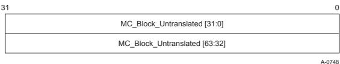

</div>


---

**Table 7-249. MC_Block_Untranslated Register | 表 7-249. MC_Block_Untranslated 寄存器**

| Bit Location | Register Description | Attributes |
|--------------|----------------------|------------|
| MC_Max_Group:0 | MC_Block_Untranslated - For each bit that is Set, this Function is blocked from sending TLPs containing Untranslated Addresses to the associated MCG. Bits above MC_Num_Group are ignored by hardware. Default value of each bit is 0b. | RW |
| All other bits | Reserved | RsvdP |

---

<table>
<thead>
<tr>
<th width="50%">🇬🇧 English</th>
<th width="50%" style="background-color:#e8e8e8">🏆 中文</th>
</tr>
</thead>
<tbody>
<tr>
<td>

The MC_Overlay_BAR Register is required in Switch and Root Complex Ports that support the Multicast Extended Capability and not implemented in Endpoints. Software must interpret the Device/Port Type field in the PCI Express Capabilities Register to determine if the MC_Overlay_BAR Register is present in a Function.

The MC_Overlay_BAR specifies the base address of a window in unicast space onto which Multicast TLPs going out an Egress Port are overlaid by a process of address replacement. This allows a single BAR in an Endpoint attached to the Switch or Root Port to be used for both unicast and Multicast traffic. At a Switch Upstream Port, it allows the Multicast address range, or a portion of it, to be overlayed onto host memory.

§ Figure 7-280 details allocation of the fields in the MC_Overlay_BAR Register and § Table 7-250 provides the respective bit definitions.

</td>
<td style="background-color:#e8e8e8">

MC_Overlay_BAR 寄存器是支持 Multicast 扩展能力的交换机（Switch）和根复合体（Root Complex）端口所必需的，端点（Endpoint）中不实现。软件必须通过解读 PCI Express 能力寄存器（PCI Express Capabilities Register）中的 Device/Port Type 字段来确定 Function 中是否存在 MC_Overlay_BAR 寄存器。

MC_Overlay_BAR 用于指定单播（unicast）地址空间中一个窗口的基地址，从出口端口（Egress Port）出去的多播 TLP 通过地址替换（address replacement）的方式被覆盖到该窗口。这允许连接到交换机或根端口的端点中的单个 BAR 既可用于单播流量，也可用于多播流量。在交换机上游端口（Upstream Port）处，它允许将多播地址范围（或其一部分）覆盖到主机内存上。

§ 图 7-280 详述了 MC_Overlay_BAR 寄存器中各字段的分配，§ 表 7-250 给出了相应的位定义。

</td>
</tr>
</tbody>
</table>

---

<a id="sec-7-9-11-7"></a>
## 7.9.11.7 MC_Block_Untranslated Register (Offset 20h) | MC_Block_Untranslated 寄存器（偏移 20h）

<table>
<thead>
<tr>
<th width="50%">🇬🇧 English</th>
<th width="50%" style="background-color:#e8e8e8">🏆 中文</th>
</tr>
</thead>
<tbody>
<tr>
<td>

7.9.11.7 MC_Block_Untranslated Register (Offset 20h)

</td>
<td style="background-color:#e8e8e8">

7.9.11.7 MC_Block_Untranslated 寄存器（偏移 20h）

</td>
</tr>
</tbody>
</table>

---

<a id="sec-7-9-11-8"></a>
## 7.9.11.8 MC_Overlay_BAR Register (Offset 28h) | MC_Overlay_BAR 寄存器（偏移 28h）

<table>
<thead>
<tr>
<th width="50%">🇬🇧 English</th>
<th width="50%" style="background-color:#e8e8e8">🏆 中文</th>
</tr>
</thead>
<tbody>
<tr>
<td>

7.9.11.8 MC_Overlay_BAR Register (Offset 28h)

</td>
<td style="background-color:#e8e8e8">

7.9.11.8 MC_Overlay_BAR 寄存器（偏移 28h）

</td>
</tr>
</tbody>
</table>

<!-- 📄 Page 1316 -->
---

<table>
<thead>
<tr>
<th width="50%">🇬🇧 English</th>
<th width="50%" style="background-color:#e8e8e8">🏆 中文</th>
</tr>
</thead>
<tbody>
<tr>
<td></td>
<td style="background-color:#e8e8e8">

</td>
</tr>
</tbody>
</table>

> **Figure 7-280.** MC_Overlay_BAR Register
> 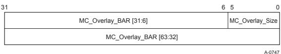


---

**Table 7-250. MC_Overlay_BAR Register | 表 7-250. MC_Overlay_BAR 寄存器**

| Bit Location | Register Description | Attributes |
|--------------|----------------------|------------|
| 5:0 | MC_Overlay_Size - If 6 or greater, specifies the size in bytes of the overlay aperture as a power of 2. If less than 6, disables the overlay mechanism. Default value is 00 0000b. | RW |
| 63:6 | MC_Overlay_BAR - Specifies the base address of the window onto which MC TLPs passing through this Function will be overlaid. Default value is 0. | RW |

---

<a id="sec-7-9-12"></a>
## 7.9.12 Dynamic Power Allocation Extended Capability (DPA Capability) | 动态功率分配扩展能力（DPA 能力）

<table>
<thead>
<tr>
<th width="50%">🇬🇧 English</th>
<th width="50%" style="background-color:#e8e8e8">🏆 中文</th>
</tr>
</thead>
<tbody>
<tr>
<td>

7.9.12 Dynamic Power Allocation Extended Capability (DPA Capability)

The DPA Capability structure is shown in § Figure 7-281.

</td>
<td style="background-color:#e8e8e8">

7.9.12 动态功率分配（Dynamic Power Allocation，DPA）扩展能力（DPA Capability）

DPA Capability 结构如 § 图 7-281 所示。

</td>
</tr>
</tbody>
</table>

> **Figure 7-281.** Dynamic Power Allocation Extended Capability Structure
> 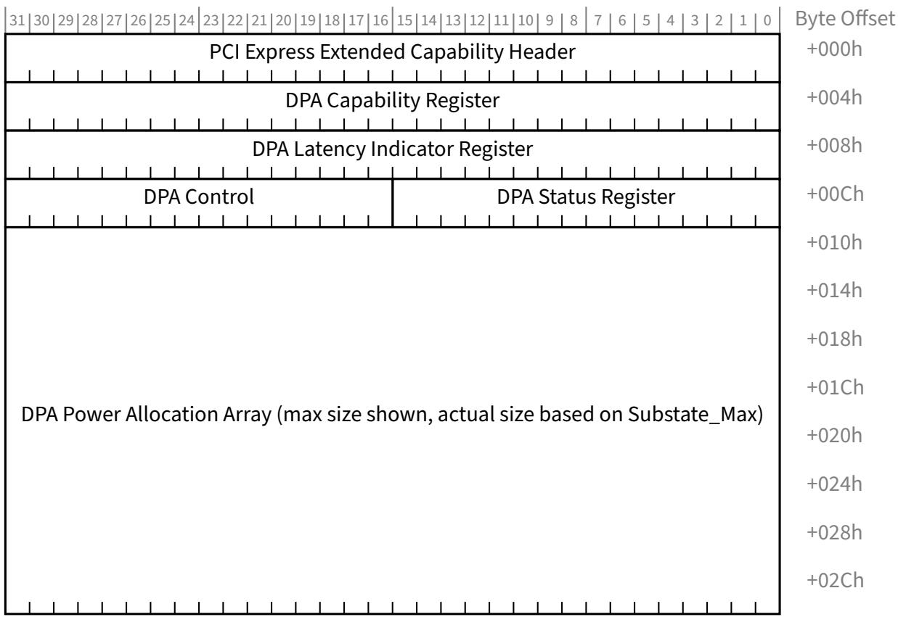


<!-- 📄 Page 1317 -->
---

<a id="sec-7-9-12-1"></a>
## 7.9.12.1 DPA Extended Capability Header (Offset 00h) | DPA 扩展能力头（偏移 00h）

<table>
<thead>
<tr>
<th width="50%">🇬🇧 English</th>
<th width="50%" style="background-color:#e8e8e8">🏆 中文</th>
</tr>
</thead>
<tbody>
<tr>
<td>

7.9.12.1 DPA Extended Capability Header (Offset 00h)

</td>
<td style="background-color:#e8e8e8">

7.9.12.1 DPA 扩展能力头（偏移 00h）

</td>
</tr>
</tbody>
</table>

> **Figure 7-282.** DPA Extended Capability Header
> 


---

**Table 7-251. DPA Extended Capability Header | 表 7-251. DPA 扩展能力头**

| Bit Location | Register Description | Attributes |
|--------------|----------------------|------------|
| 15:0 | PCI Express Extended Capability ID - This field is a PCI-SIG defined ID number that indicates the nature and format of the Extended Capability. PCI Express Extended Capability ID for the DPA Extended Capability is 0016h. | RO |
| 19:16 | Capability Version - This field is a PCI-SIG defined version number that indicates the version of the Capability structure present. Must be 1h for this version of the specification. | RO |
| 31:20 | Next Capability Offset - This field contains the offset to the next PCI Express Extended Capability structure or 000h if no other items exist in the linked list of Capabilities. | RO |

---

<a id="sec-7-9-12-2"></a>
## 7.9.12.2 DPA Capability Register (Offset 04h) | DPA 能力寄存器（偏移 04h）

<table>
<thead>
<tr>
<th width="50%">🇬🇧 English</th>
<th width="50%" style="background-color:#e8e8e8">🏆 中文</th>
</tr>
</thead>
<tbody>
<tr>
<td>

7.9.12.2 DPA Capability Register (Offset 04h)

</td>
<td style="background-color:#e8e8e8">

7.9.12.2 DPA 能力寄存器（偏移 04h）

</td>
</tr>
</tbody>
</table>

> **Figure 7-283.** DPA Capability Register
> 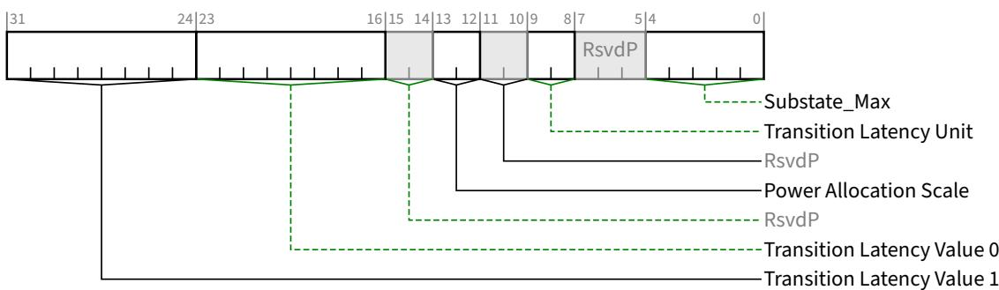


---

**Table 7-252. DPA Capability Register | 表 7-252. DPA 能力寄存器**

| Bit Location | Register Description | Attributes |
|--------------|----------------------|------------|
| 4:0 | Substate_Max - Value indicates the maximum substate number, which is the total number of supported substates minus one. A value of 0 0000b indicates support for one substate. | RO |

<!-- 📄 Page 1318 -->
---


<div style="overflow-x: auto; max-width: 100%;">
<table>
<thead>
<tr>
<th width="50%">🇬🇧 English</th>
<th width="50%" style="background-color:#e8e8e8">🏆 中文</th>
</tr>
</thead>
<tbody>
<tr>
<td>

| Bit Location | Register Description | Attributes |
|--------------|----------------------|------------|
| 9:8 | Transition Latency Unit (Tlunit) - A substate's Transition Latency Value is multiplied by the Transition Latency Unit to determine the maximum Transition Latency for the substate. Defined encodings are: 00b = 1 ms, 01b = 10 ms, 10b = 100 ms, 11b = Reserved | RO |
| 13:12 | Power Allocation Scale (PAS) - The encodings provide the scale to determine power allocation per substate in Watts. The value corresponding to the substate in the Substate Power Allocation field is multiplied by this field to determine the power allocation for the substate. Defined encodings are: 00b = 10.0x, 01b = 1.0x, 10b = 0.1x, 11b = 0.01x | RO |
| 23:16 | Transition Latency Value 0 (Xlcy0) - This value is multiplied by the Transition Latency Unit to determine the maximum Transition Latency for the substate | RO |
| 31:24 | Transition Latency Value 1 (Xlcy1) - This value is multiplied by the Transition Latency Unit to determine the maximum Transition Latency for the substate. | RO |

</td>
<td style="background-color:#e8e8e8">

| 位位置 | 寄存器描述 | 属性 |
|--------|------------|------|
| 9:8 | 转换延迟单位（Transition Latency Unit，TLunit）— 子状态（substate）的转换延迟值与该转换延迟单位相乘，以确定该子状态的最大转换延迟。已定义的编码为：00b = 1 ms，01b = 10 ms，10b = 100 ms，11b = 保留 | RO |
| 13:12 | 功率分配缩放（Power Allocation Scale，PAS）— 该编码提供用于确定每个子状态功率分配（以瓦特为单位）的缩放因子。Substate Power Allocation 字段中子状态对应的值与本字段相乘，以确定该子状态的功率分配。已定义的编码为：00b = 10.0x，01b = 1.0x，10b = 0.1x，11b = 0.01x | RO |
| 23:16 | 转换延迟值 0（Transition Latency Value 0，Xlcy0）— 该值与转换延迟单位相乘，以确定该子状态的最大转换延迟 | RO |
| 31:24 | 转换延迟值 1（Transition Latency Value 1，Xlcy1）— 该值与转换延迟单位相乘，以确定该子状态的最大转换延迟 | RO |

</td>
</tr>
</tbody>
</table>
</div>


---

<a id="sec-7-9-12-3"></a>
## 7.9.12.3 DPA Latency Indicator Register (Offset 08h) | DPA 延迟指示寄存器（偏移 08h）

<table>
<thead>
<tr>
<th width="50%">🇬🇧 English</th>
<th width="50%" style="background-color:#e8e8e8">🏆 中文</th>
</tr>
</thead>
<tbody>
<tr>
<td>

7.9.12.3 DPA Latency Indicator Register (Offset 08h)

> **Figure 7-284.** DPA Latency Indicator Register
> 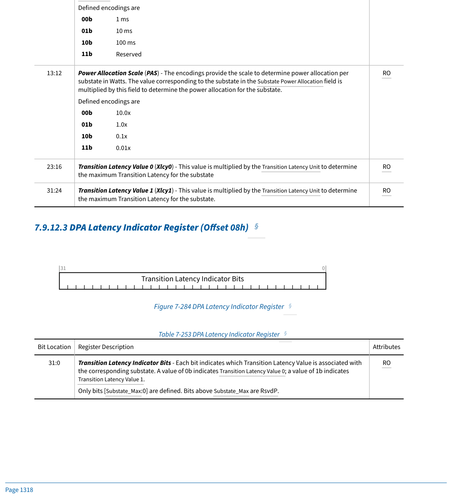

</td>
<td style="background-color:#e8e8e8">

7.9.12.3 DPA 延迟指示寄存器（偏移 08h）


</td>
</tr>
</tbody>
</table>

---

**Table 7-253. DPA Latency Indicator Register | 表 7-253. DPA 延迟指示寄存器**

| Bit Location | Register Description | Attributes |
|--------------|----------------------|------------|
| 31:0 | Transition Latency Indicator Bits - Each bit indicates which Transition Latency Value is associated with the corresponding substate. A value of 0b indicates Transition Latency Value 0; a value of 1b indicates Transition Latency Value 1. Only bits [Substate_Max:0] are defined. Bits above Substate_Max are RsvdP. | RO |

<!-- 📄 Page 1319 -->
---

<a id="sec-7-9-12-4"></a>
## 7.9.12.4 DPA Status Register (Offset 0Ch) | DPA 状态寄存器（偏移 0Ch）

<table>
<thead>
<tr>
<th width="50%">🇬🇧 English</th>
<th width="50%" style="background-color:#e8e8e8">🏆 中文</th>
</tr>
</thead>
<tbody>
<tr>
<td>

7.9.12.4 DPA Status Register (Offset 0Ch)

</td>
<td style="background-color:#e8e8e8">

7.9.12.4 DPA 状态寄存器（偏移 0Ch）

</td>
</tr>
</tbody>
</table>

> **Figure 7-285.** DPA Status Register
> 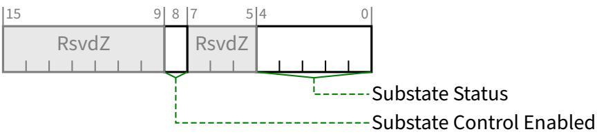


---

**Table 7-254. DPA Status Register | 表 7-254. DPA 状态寄存器**

| Bit Location | Register Description | Attributes |
|--------------|----------------------|------------|
| 4:0 | Substate Status - Indicates current substate for this Function. Default is 0 0000b. | RO |
| 8 | Substate Control Enabled - Used by software to disable the Substate Control field in the DPA Control Register. Hardware sets this bit following a Conventional Reset or FLR. Software clears this bit by writing a 1b to it. Software is unable to set this bit directly. When this bit is Set, the Substate Control field determines the current substate. When this bit is Clear, the Substate Control field has no effect on the current substate. Default value is 1b. | RW1C |

---

<a id="sec-7-9-12-5"></a>
## 7.9.12.5 DPA Control Register (Offset 0Eh) | DPA 控制寄存器（偏移 0Eh）

<table>
<thead>
<tr>
<th width="50%">🇬🇧 English</th>
<th width="50%" style="background-color:#e8e8e8">🏆 中文</th>
</tr>
</thead>
<tbody>
<tr>
<td>

7.9.12.5 DPA Control Register (Offset 0Eh)

</td>
<td style="background-color:#e8e8e8">

7.9.12.5 DPA 控制寄存器（偏移 0Eh）

</td>
</tr>
</tbody>
</table>

> **Figure 7-286.** DPA Control Register
> 


---

**Table 7-255. DPA Control Register | 表 7-255. DPA 控制寄存器**

| Bit Location | Register Description | Attributes |
|--------------|----------------------|------------|
| 4:0 | Substate Control - Used by software to configure the Function substate. Software writes the substate value in this field to initiate a substate transition. When the Substate Control Enabled bit in the DPA Status Register is Set, this field determines the Function substate. When the Substate Control Enabled bit in the DPA Status Register is Clear, this field has no effect on the Function substate. | RW |

<!-- 📄 Page 1320 -->
---

<table>
<thead>
<tr>
<th width="50%">🇬🇧 English</th>
<th width="50%" style="background-color:#e8e8e8">🏆 中文</th>
</tr>
</thead>
<tbody>
<tr>
<td>

Default value is 0 0000b.

</td>
<td style="background-color:#e8e8e8">

默认值为 0 0000b。

</td>
</tr>
</tbody>
</table>

> **Figure 7-287.** DPA Power Allocation Array
> 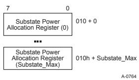


---

<a id="sec-7-9-12-6"></a>
## 7.9.12.6 DPA Power Allocation Array | DPA 功率分配数组

<table>
<thead>
<tr>
<th width="50%">🇬🇧 English</th>
<th width="50%" style="background-color:#e8e8e8">🏆 中文</th>
</tr>
</thead>
<tbody>
<tr>
<td>

7.9.12.6 DPA Power Allocation Array

Each Substate Power Allocation register indicates the power allocation value for its associated substate. The number of Substate Power Allocation registers implemented must be equal to the number of substates supported by Function, which is Substate_Max plus one.

</td>
<td style="background-color:#e8e8e8">

7.9.12.6 DPA 功率分配数组（DPA Power Allocation Array）

每个 Substate Power Allocation 寄存器指示其关联子状态（substate）的功率分配值。所实现的 Substate Power Allocation 寄存器数量必须等于 Function 所支持的子状态数，即 Substate_Max 加 1。

</td>
</tr>
</tbody>
</table>

> **Figure 7-288.** Substate Power Allocation Register (0 to Substate_Max)
> 


---

**Table 7-256. Substate Power Allocation Register (0 to Substate_Max) | 表 7-256. Substate Power Allocation 寄存器（0 至 Substate_Max）**

| Bit Location | Register Description | Attributes |
|--------------|----------------------|------------|
| 7:0 | Substate Power Allocation - The value in this field is multiplied by the Power Allocation Scale to determine power allocation in Watts for the associated substate. | RO |

---

<a id="sec-7-9-13"></a>
## 7.9.13 TPH Requester Extended Capability | TPH 请求者扩展能力


<div style="overflow-x: auto; max-width: 100%;">
<table>
<thead>
<tr>
<th width="50%">🇬🇧 English</th>
<th width="50%" style="background-color:#e8e8e8">🏆 中文</th>
</tr>
</thead>
<tbody>
<tr>
<td>

7.9.13 TPH Requester Extended Capability

The TPH Requester Extended Capability structure is required for all Functions that are capable of generating Request TLPs with TPH. For a Multi-Function Device, this capability must be present in each Function that is capable of generating Request TLPs with TPH.

The capability is optional for PFs and VFs. However, if a VF associated with a given PF contains the capability, all VFs associated with that PF must contain the capability.

For fields in the TPH Requester Capability Register (offset 04h), all VFs associated with a given PF must have the same values in all fields, but the PF's fields may have values different from those in its VFs.

</td>
<td style="background-color:#e8e8e8">

7.9.13 TPH 请求者扩展能力（TPH Requester Extended Capability）

所有能够生成带 TPH 的请求 TLP 的 Function 都必须实现 TPH Requester Extended Capability 结构。对于多功能设备（Multi-Function Device），能够生成带 TPH 的请求 TLP 的每个 Function 都必须包含此能力。

该能力对 PF 和 VF 均为可选。但是，如果某个给定 PF 关联的某个 VF 包含此能力，则与该 PF 关联的所有 VF 都必须包含此能力。

对于 TPH Requester Capability 寄存器（偏移 04h）中的字段，与给定 PF 关联的所有 VF 在所有字段中必须具有相同的值，但 PF 的字段可以具有与其 VF 不同的值。

</td>
</tr>
</tbody>
</table>
</div>


<!-- 📄 Page 1321 -->
---

<table>
<thead>
<tr>
<th width="50%">🇬🇧 English</th>
<th width="50%" style="background-color:#e8e8e8">🏆 中文</th>
</tr>
</thead>
<tbody>
<tr>
<td>

> **Figure 7-289.** TPH Extended Capability Structure
> 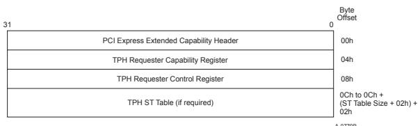

> **Figure 7-290.** TPH Requester Extended Capability Header
> 

</td>
<td style="background-color:#e8e8e8">


</td>
</tr>
</tbody>
</table>

---

**Table 7-257. TPH Requester Extended Capability Header | 表 7-257. TPH 请求者扩展能力头**

| Bit Location | Register Description | Attributes |
|--------------|----------------------|------------|
| 15:0 | PCI Express Extended Capability ID - This field is a PCI-SIG defined ID number that indicates the nature and format of the Extended Capability. PCI Express Extended Capability ID for the TPH Requester Extended Capability is 0017h. | RO |
| 19:16 | Capability Version - This field is a PCI-SIG defined version number that indicates the version of the Capability structure present. Must be 1h for this version of the specification. | RO |
| 31:20 | Next Capability Offset - This field contains the offset to the next PCI Express Extended Capability structure or 000h if no other items exist in the linked list of Capabilities. | RO |

---

<a id="sec-7-9-13-1"></a>
## 7.9.13.1 TPH Requester Extended Capability Header (Offset 00h) | TPH 请求者扩展能力头（偏移 00h）

<table>
<thead>
<tr>
<th width="50%">🇬🇧 English</th>
<th width="50%" style="background-color:#e8e8e8">🏆 中文</th>
</tr>
</thead>
<tbody>
<tr>
<td>

7.9.13.1 TPH Requester Extended Capability Header (Offset 00h)

</td>
<td style="background-color:#e8e8e8">

7.9.13.1 TPH 请求者扩展能力头（偏移 00h）

</td>
</tr>
</tbody>
</table>

> **Figure 7-291.** TPH Requester Capability Register
> 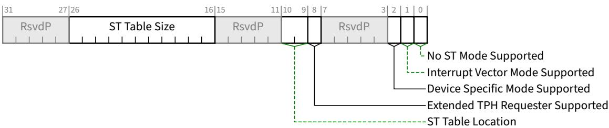


---

[⬆️ 返回目录](#-本章目录-table-of-contents)

---

---

<a id="sec-7-9-13-2"></a>
## 7.9.13.2 TPH Requester Capability Register (Offset 04h) | TPH 请求者能力寄存器（偏移 04h）

<table>
<thead>
<tr>
<th width="50%">🇬🇧 English</th>
<th width="50%" style="background-color:#e8e8e8">🏆 中文</th>
</tr>
</thead>
<tbody>
<tr>
<td>

7.9.13.2 TPH Requester Capability Register (Offset 04h)

</td>
<td style="background-color:#e8e8e8">

7.9.13.2 TPH 请求者能力寄存器（TPH Requester Capability Register，偏移 04h）

</td>
</tr>
</tbody>
</table>

---

<!-- 📄 Page 1322 -->
---

**Table 7-258. TPH Requester Capability Register | 表 7-258. TPH 请求者能力寄存器**

| Bit Location | Register Description | Attributes |
|--------------|----------------------|------------|
| 0 | No ST Mode Supported - If set indicates that the Function supports the No ST Mode of operation. This mode is required to be supported by all Functions that implement this Capability structure. This bit must have a value of 1b. | RO |
| 1 | Interrupt Vector Mode Supported - If set indicates that the Function supports the Interrupt Vector Mode of operation. | RO |
| 2 | Device Specific Mode Supported - If set indicates that the Function supports the Device Specific Mode of operation. | RO |
| 8 | Extended TPH Requester Supported - If Set indicates that the Function is capable of generating Requests with additional TPH information using the TPH TLP Prefix. See § Section 2.2.7.1.1 for additional details. | RO |
| 10:9 | ST Table Location - Value indicates if and where the ST Table is located. Defined Encodings are: 00b = ST Table is not present; 01b = ST Table is located in the TPH Requester Extended Capability structure; 10b = ST Table is located in the MSI-X Table (see § Section 7.7.2); 11b = Reserved. A Function that only supports the No ST Mode of operation must have a value of 00b in this field. A Function may report a value of 10b only if it implements an MSI-X Capability. | RO |
| 26:16 | ST Table Size - Value indicates the maximum number of ST Table entries the Function may use. Software reads this field to determine the ST Table Size N, which is encoded as N-1. For example, a returned value of 000 0000 0011b indicates a table size of four entries. There is an upper limit of 64 entries when the ST Table is located in the TPH Requester Extended Capability structure. When the ST Table is located in the MSI-X Table, this value is limited by the size of the MSI-X Table. This field is only applicable for Functions that implement an ST Table as indicated by the ST Table Location field. Otherwise, the value in this field is undefined. | RO |

<table>
<thead>
<tr>
<th width="50%">🇬🇧 English</th>
<th width="50%" style="background-color:#e8e8e8">🏆 中文</th>
</tr>
</thead>
<tbody>
<tr>
<td></td>
<td style="background-color:#e8e8e8">

</td>
</tr>
</tbody>
</table>

> **Figure 7-292.** TPH Requester Control Register
> 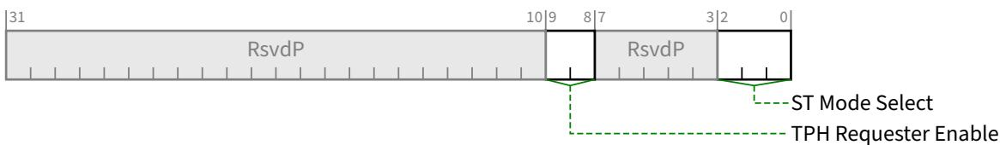


---

<a id="sec-7-9-13-3"></a>
## 7.9.13.3 TPH Requester Control Register (Offset 08h) | TPH 请求者控制寄存器（偏移 08h）

<table>
<thead>
<tr>
<th width="50%">🇬🇧 English</th>
<th width="50%" style="background-color:#e8e8e8">🏆 中文</th>
</tr>
</thead>
<tbody>
<tr>
<td>

7.9.13.3 TPH Requester Control Register (Offset 08h)

</td>
<td style="background-color:#e8e8e8">

7.9.13.3 TPH 请求者控制寄存器（TPH Requester Control Register，偏移 08h）

</td>
</tr>
</tbody>
</table>

---

<!-- 📄 Page 1323 -->
---

**Table 7-259. TPH Requester Control Register | 表 7-259. TPH 请求者控制寄存器**

| Bit Location | Register Description | Attributes |
|--------------|----------------------|------------|
| 2:0 | ST Mode Select - selects the ST Mode of operation. Defined encodings are: 000b = No ST Mode; 001b = Interrupt Vector Mode; 010b = Device Specific Mode; others = reserved for future use. Functions that support only the No ST Mode of operation must hardwire this field to 000b. Function operation is undefined if software enables a mode of operation that does not correspond to a mode supported by the Function. The default value of this field is 000b. See § Section 6.17.3 for details on ST modes of operation. | RW |
| 9:8 | TPH Requester Enable - Controls the ability to issue Request TLPs using either TPH or Extended TPH. Defined encodings are: 00b = Function operating as a Requester is not permitted to issue Requests with TPH or Extended TPH; 01b = Function operating as a Requester is permitted to issue Requests with TPH and is not permitted to issue Requests with Extended TPH; 10b = Reserved; 11b = Function operating as a Requester is permitted to issue Requests with TPH and Extended TPH. Functions that advertise that they do not support Extended TPH are permitted to hardwire bit 9 of this field to 0b. The default value of this field is 00b. | RW |


<div style="overflow-x: auto; max-width: 100%;">
<table>
<thead>
<tr>
<th width="50%">🇬🇧 English</th>
<th width="50%" style="background-color:#e8e8e8">🏆 中文</th>
</tr>
</thead>
<tbody>
<tr>
<td>

The TPH ST Table must be implemented in the TPH Requester Extended Capability structure if the value of the ST Table Location field is 01b. For all other values, the ST Entry registers must not be implemented. Each implemented ST Entry is 16 bits. The number of ST Entry registers implemented must be equal to the number of ST Table entries supported by the Function, which is the value of the ST Table Size field plus one.

</td>
<td style="background-color:#e8e8e8">

若 ST Table Location 字段的值为 01b，则 TPH ST 表必须在 TPH 请求者扩展能力结构内实现。对于其他所有值，ST Entry 寄存器不得实现。每个已实现的 ST Entry 为 16 位。已实现的 ST Entry 寄存器的数量必须等于该 Function 所支持的 ST 表条目数（即 ST Table Size 字段的值加一）。

</td>
</tr>
</tbody>
</table>

> **Figure 7-293.** TPH ST Table
> 

</div>


---

<a id="sec-7-9-13-4"></a>
## 7.9.13.4 TPH ST Table (Starting from Offset 0Ch) | TPH ST 表（起始偏移 0Ch）

<table>
<thead>
<tr>
<th width="50%">🇬🇧 English</th>
<th width="50%" style="background-color:#e8e8e8">🏆 中文</th>
</tr>
</thead>
<tbody>
<tr>
<td>

7.9.13.4 TPH ST Table (Starting from Offset 0Ch)

</td>
<td style="background-color:#e8e8e8">

7.9.13.4 TPH ST 表（TPH ST Table，起始偏移 0Ch）

</td>
</tr>
</tbody>
</table>

---

<!-- 📄 Page 1324 -->
---

<table>
<thead>
<tr>
<th width="50%">🇬🇧 English</th>
<th width="50%" style="background-color:#e8e8e8">🏆 中文</th>
</tr>
</thead>
<tbody>
<tr>
<td></td>
<td style="background-color:#e8e8e8">

</td>
</tr>
</tbody>
</table>

> **Figure 7-294.** TPH ST Table Entry
> 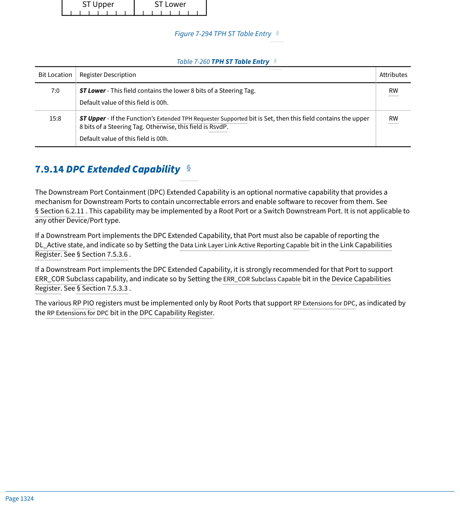


**Table 7-260. TPH ST Table Entry | 表 7-260. TPH ST 表条目**

| Bit Location | Register Description | Attributes |
|--------------|----------------------|------------|
| 7:0 | ST Lower - This field contains the lower 8 bits of a Steering Tag. Default value of this field is 00h. | RW |
| 15:8 | ST Upper - If the Function's Extended TPH Requester Supported bit is Set, then this field contains the upper 8 bits of a Steering Tag. Otherwise, this field is RsvdP. Default value of this field is 00h. | RW |

---

<a id="sec-7-9-14"></a>
## 7.9.14 DPC Extended Capability | DPC 扩展能力


<div style="overflow-x: auto; max-width: 100%;">
<table>
<thead>
<tr>
<th width="50%">🇬🇧 English</th>
<th width="50%" style="background-color:#e8e8e8">🏆 中文</th>
</tr>
</thead>
<tbody>
<tr>
<td>

The Downstream Port Containment (DPC) Extended Capability is an optional normative capability that provides a mechanism for Downstream Ports to contain uncorrectable errors and enable software to recover from them. See § Section 6.2.11. This capability may be implemented by a Root Port or a Switch Downstream Port. It is not applicable to any other Device/Port type.

If a Downstream Port implements the DPC Extended Capability, that Port must also be capable of reporting the DL_Active state, and indicate so by Setting the Data Link Layer Link Active Reporting Capable bit in the Link Capabilities Register. See § Section 7.5.3.6.

If a Downstream Port implements the DPC Extended Capability, it is strongly recommended for that Port to support ERR_COR Subclass capability, and indicate so by Setting the ERR_COR Subclass Capable bit in the Device Capabilities Register. See § Section 7.5.3.3.

The various RP PIO registers must be implemented only by Root Ports that support RP Extensions for DPC, as indicated by the RP Extensions for DPC bit in the DPC Capability Register.

</td>
<td style="background-color:#e8e8e8">

下游端口遏制（Downstream Port Containment, DPC）扩展能力是一种可选的规范性能力，为下游端口（Downstream Port）提供遏制不可纠正错误并使软件得以恢复的机制。参见 § Section 6.2.11。此能力可由根端口（Root Port）或交换机下游端口（Switch Downstream Port）实现，不适用于任何其他 Device/Port 类型。

若一个下游端口实现了 DPC 扩展能力，则该端口必须也能报告 DL_Active 状态，并通过在链路能力寄存器（Link Capabilities Register）中设置数据链路层链路激活上报能力位（Data Link Layer Link Active Reporting Capable bit）来表明这一点。参见 § Section 7.5.3.6。

若一个下游端口实现了 DPC 扩展能力，则强烈建议该端口支持 ERR_COR 子类能力（ERR_COR Subclass capability），并通过在设备能力寄存器（Device Capabilities Register）中设置 ERR_COR 子类能力位（ERR_COR Subclass Capable bit）来表明这一点。参见 § Section 7.5.3.3。

各 RP PIO 寄存器只能由支持 DPC RP 扩展（RP Extensions for DPC）的根端口实现，该能力由 DPC 能力寄存器（DPC Capability Register）中的 DPC RP 扩展位指示。

</td>
</tr>
</tbody>
</table>
</div>


---

<!-- 📄 Page 1325 -->
---

<table>
<thead>
<tr>
<th width="50%">🇬🇧 English</th>
<th width="50%" style="background-color:#e8e8e8">🏆 中文</th>
</tr>
</thead>
<tbody>
<tr>
<td>

> **Figure 7-295.** DPC Extended Capability – Non-Flit Mode
> 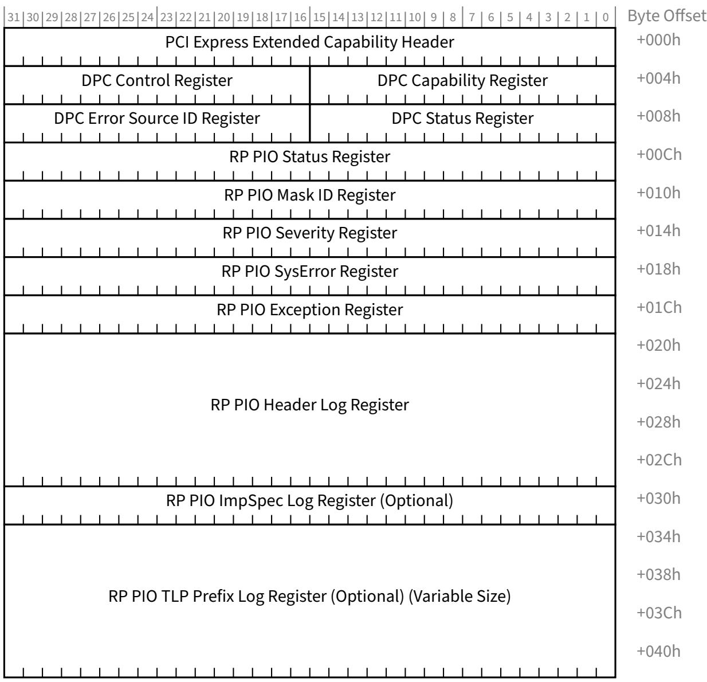

</td>
<td style="background-color:#e8e8e8">


</td>
</tr>
</tbody>
</table>

---

<!-- 📄 Page 1326 -->
---

<table>
<thead>
<tr>
<th width="50%">🇬🇧 English</th>
<th width="50%" style="background-color:#e8e8e8">🏆 中文</th>
</tr>
</thead>
<tbody>
<tr>
<td></td>
<td style="background-color:#e8e8e8">

</td>
</tr>
</tbody>
</table>

> **Figure 7-296.** DPC Extended Capability – Flit Mode
> 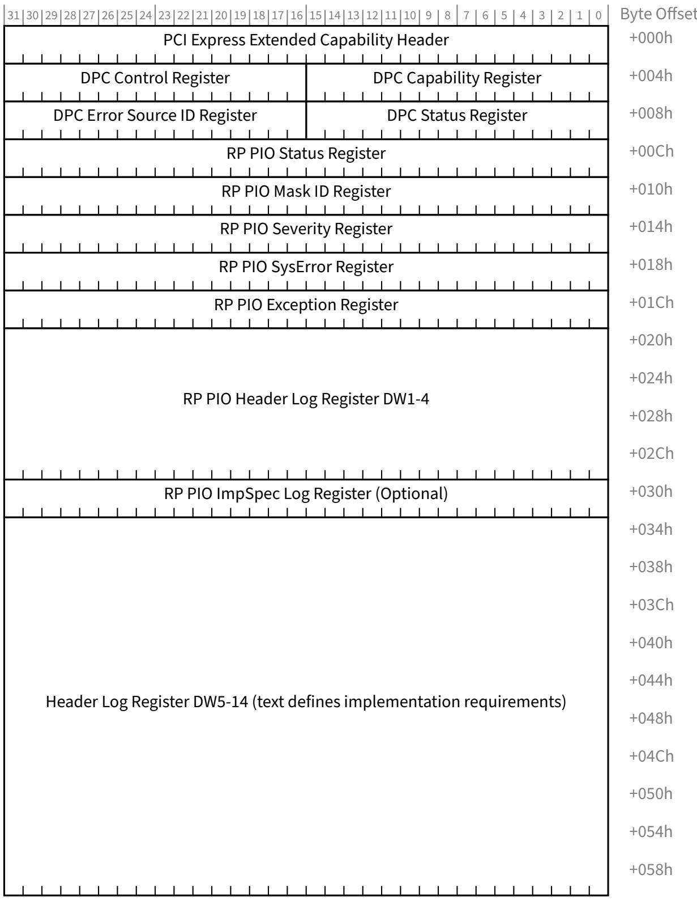


---

<!-- 📄 Page 1327 -->
---

<table>
<thead>
<tr>
<th width="50%">🇬🇧 English</th>
<th width="50%" style="background-color:#e8e8e8">🏆 中文</th>
</tr>
</thead>
<tbody>
<tr>
<td></td>
<td style="background-color:#e8e8e8">

</td>
</tr>
</tbody>
</table>

> **Figure 7-297.** DPC Extended Capability Header
> 


**Table 7-261. DPC Extended Capability Header | 表 7-261. DPC 扩展能力头**

| Bit Location | Register Description | Attributes |
|--------------|----------------------|------------|
| 15:0 | PCI Express Extended Capability ID - This field is a PCI-SIG defined ID number that indicates the nature and format of the extended capability. PCI Express Extended Capability ID for the DPC Extended Capability is 001Dh. | RO |
| 19:16 | Capability Version - This field is a PCI-SIG defined version number that indicates the version of the capability structure present. Must be 1h for this version of the specification. | RO |
| 31:20 | Next Capability Offset - This field contains the offset to the next PCI Express Extended Capability structure or 000h if no other items exist in the linked list of capabilities. | RO |

<table>
<thead>
<tr>
<th width="50%">🇬🇧 English</th>
<th width="50%" style="background-color:#e8e8e8">🏆 中文</th>
</tr>
</thead>
<tbody>
<tr>
<td></td>
<td style="background-color:#e8e8e8">

</td>
</tr>
</tbody>
</table>

> **Figure 7-298.** DPC Capability Register
> 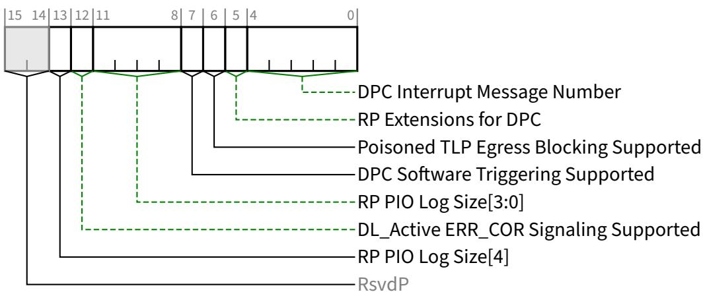


---

<a id="sec-7-9-14-1"></a>
## 7.9.14.1 DPC Extended Capability Header (Offset 00h) | DPC 扩展能力头（偏移 00h）

<table>
<thead>
<tr>
<th width="50%">🇬🇧 English</th>
<th width="50%" style="background-color:#e8e8e8">🏆 中文</th>
</tr>
</thead>
<tbody>
<tr>
<td>

7.9.14.1 DPC Extended Capability Header (Offset 00h)

</td>
<td style="background-color:#e8e8e8">

7.9.14.1 DPC 扩展能力头（DPC Extended Capability Header，偏移 00h）

</td>
</tr>
</tbody>
</table>

---

<a id="sec-7-9-14-2"></a>
## 7.9.14.2 DPC Capability Register (Offset 04h) | DPC 能力寄存器（偏移 04h）

<table>
<thead>
<tr>
<th width="50%">🇬🇧 English</th>
<th width="50%" style="background-color:#e8e8e8">🏆 中文</th>
</tr>
</thead>
<tbody>
<tr>
<td>

7.9.14.2 DPC Capability Register (Offset 04h)

</td>
<td style="background-color:#e8e8e8">

7.9.14.2 DPC 能力寄存器（DPC Capability Register，偏移 04h）

</td>
</tr>
</tbody>
</table>

---

<!-- 📄 Page 1328 -->
---

**Table 7-262. DPC Capability Register | 表 7-262. DPC 能力寄存器**

| Bit Location | Register Description | Attributes |
|--------------|----------------------|------------|
| 4:0 | DPC Interrupt Message Number - This field indicates which MSI/MSI-X vector is used for the interrupt message generated in association with the DPC Capability structure. For MSI, the value in this field indicates the offset between the base Message Data and the interrupt message that is generated. Hardware is required to update this field so that it is correct if the number of MSI Messages assigned to the Function changes when software writes to the Multiple Message Enable field in the Message Control Register for MSI. For MSI-X, the value in this field indicates which MSI-X Table entry is used to generate the interrupt message. The entry must be one of the first 32 entries even if the Function implements more than 32 entries. For a given MSI-X implementation, the entry must remain constant. If both MSI and MSI-X are implemented, they are permitted to use different vectors, though software is permitted to enable only one mechanism at a time. If MSI-X is enabled, the value in this field must indicate the vector for MSI-X. If MSI is enabled or neither is enabled, the value in this field must indicate the vector for MSI. If software enables both MSI and MSI-X at the same time, the value in this field is undefined. | RO |
| 5 | RP Extensions for DPC - If Set, this bit indicates that a Root Port supports a defined set of DPC Extensions that are specific to Root Ports. Switch Downstream Ports must not Set this bit. | RO |
| 6 | Poisoned TLP Egress Blocking Supported - If Set, this bit indicates that the Root Port or Switch Downstream Port supports the ability to block the transmission of a poisoned TLP from its Egress Port. Root Ports that support RP Extensions for DPC must Set this bit. | RO |
| 7 | DPC Software Triggering Supported - If Set, this bit indicates that a Root Port or Switch Downstream Port supports the ability for software to trigger DPC. Root Ports that support RP Extensions for DPC must Set this bit. | RO |
| 11:8 | RP PIO Log Size[3:0] - This field indicates how many DWORDs are allocated for the RP PIO log registers, comprised by the RP PIO Header Log, the RP PIO ImpSpec Log, and RP PIO TLP Prefix Log. If the Root Port does not support RP Extensions for DPC, the value of this field must be Zero. If the Root Port supports RP Extensions for DPC but does not support Flit Mode, the value of this field must be 4 or greater. If the Root Port supports both RP Extensions for DPC and Flit Mode, see § Section 6.2.11.3 for requirements. See § Section 7.9.14.11, § Section 7.9.14.12, and § Section 7.9.14.13. | RO |
| 12 | DL_Active ERR_COR Signaling Supported - If Set, this bit indicates that the Root Port or Switch Downstream Port supports the ability to signal with ERR_COR when the Link transitions to the DL_Active state. Root Ports that support RP Extensions for DPC must Set this bit. | RO |
| 13 | RP PIO Log Size[4] - This bit is an extension of RP PIO Log Size[3:0] for use in Flit Mode. If Flit Mode is not supported, this bit is RsvdP. | RO/RsvdP |

---

<!-- 📄 Page 1329 -->
---

<table>
<thead>
<tr>
<th width="50%">🇬🇧 English</th>
<th width="50%" style="background-color:#e8e8e8">🏆 中文</th>
</tr>
</thead>
<tbody>
<tr>
<td></td>
<td style="background-color:#e8e8e8">

</td>
</tr>
</tbody>
</table>

> **Figure 7-299.** DPC Control Register
> 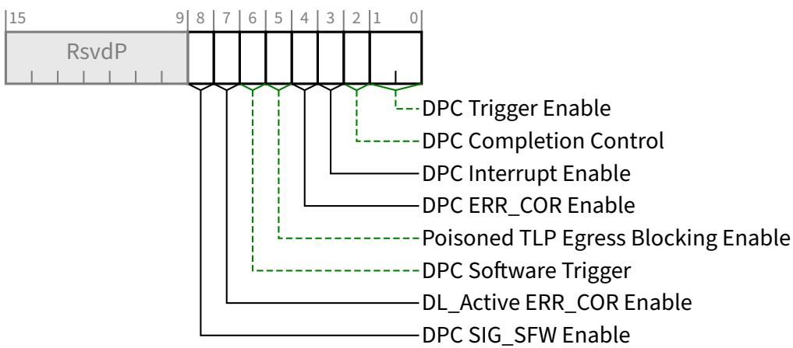


**Table 7-263. DPC Control Register | 表 7-263. DPC 控制寄存器**

| Bit Location | Register Description | Attributes |
|--------------|----------------------|------------|
| 1:0 | DPC Trigger Enable - This field enables DPC and controls the conditions that cause DPC to be triggered. Defined encodings are: 00b = DPC is disabled; 01b = DPC is enabled and is triggered when the Downstream Port detects an unmasked uncorrectable error or when the Downstream Port receives an ERR_FATAL Message; 10b = DPC is enabled and is triggered when the Downstream Port detects an unmasked uncorrectable error or when the Downstream Port receives an ERR_NONFATAL or ERR_FATAL Message; 11b = Reserved. Default value of this field is 00b. | RW |
| 2 | DPC Completion Control - This bit controls the Completion Status for Completions formed during DPC. See § Section 2.9.3. Defined encodings are: 0b = Completer Abort (CA) Completion Status; 1b = Unsupported Request (UR) Completion Status. Default value of this bit is 0b. | RW |
| 3 | DPC Interrupt Enable - When Set, this bit enables the generation of an interrupt to indicate that DPC has been triggered. See § Section 6.2.11.1. Default value of this bit is 0b. | RW |
| 4 | DPC ERR_COR Enable - When Set, this bit enables the sending of an ERR_COR Message to indicate that DPC has been triggered. See § Section 6.2.11.2. Default value of this bit is 0b. | RW |

---

<a id="sec-7-9-14-3"></a>
## 7.9.14.3 DPC Control Register (Offset 06h) | DPC 控制寄存器（偏移 06h）

<table>
<thead>
<tr>
<th width="50%">🇬🇧 English</th>
<th width="50%" style="background-color:#e8e8e8">🏆 中文</th>
</tr>
</thead>
<tbody>
<tr>
<td>

7.9.14.3 DPC Control Register (Offset 06h)

</td>
<td style="background-color:#e8e8e8">

7.9.14.3 DPC 控制寄存器（DPC Control Register，偏移 06h）

</td>
</tr>
</tbody>
</table>

---

<!-- 📄 Page 1330 -->
---

**Table 7-263 (cont.). DPC Control Register | 表 7-263（续）. DPC 控制寄存器**

| Bit Location | Register Description | Attributes |
|--------------|----------------------|------------|
| 5 | Poisoned TLP Egress Blocking Enable - This bit must be RW if the Poisoned TLP Egress Blocking Supported bit is Set; otherwise, it is permitted to be hardwired to 0b. Software must not Set this bit unless the Poisoned TLP Egress Blocking Supported bit is Set. When Set, this bit enables the associated Egress Port to block the transmission of poisoned TLPs. See § Section 2.7.2.1. Default value of this bit is 0b. | RW/RO |
| 6 | DPC Software Trigger - This bit must be RW if the DPC Software Triggering Supported bit is Set; otherwise, it is permitted to be hardwired to 0b. If DPC is enabled and the DPC Trigger Status bit is Clear, when software writes 1b to this bit, DPC is triggered. Otherwise, software writing a 1b to this bit has no effect. It is permitted to write 1b to this bit while simultaneously writing updated values to other fields in this register, notably the DPC Trigger Enable field. For this case, the DPC Software Trigger semantics are based on the updated value of the DPC Trigger Enable field. This bit always returns 0b when read. | RW/RO |
| 7 | DL_Active ERR_COR Enable - This bit must be RW if the DL_Active ERR_COR Signaling Supported bit is Set; otherwise, it is permitted to be hardwired to 0b. Software must not Set this bit unless the DL_Active ERR_COR Signaling Supported bit is Set. When Set, this bit enables the associated Downstream Port to signal with ERR_COR when the Link transitions to the DL_Active state. See § Section 6.2.11.5. Default value of this bit is 0b. | RW/RO |
| 8 | DPC SIG_SFW Enable - This bit must be implemented if the ERR_COR Subclass Capable bit in the Device Capabilities Register is Set; otherwise, it is permitted to be hardwired to 0b. If the ERR_COR Subclass Capable bit is Clear and software Sets this bit, the behavior is undefined. When Set, this bit enables sending an ERR_COR Message to indicate a DPC event that's been enabled for ERR_COR signaling. See § Section 6.2.11.2 and § Section 6.2.11.5. This is an additional and alternative way to enable overall DPC ERR_COR signaling beyond the Correctable Error Reporting Enable bit in the Device Control Register. This bit does not affect a Function's ability to send ERR_COR Messages other than the ECS SIG_SFW subclass. Default value of this bit is 0b. | RW/RO |

---

<!-- 📄 Page 1331 -->
---

<table>
<thead>
<tr>
<th width="50%">🇬🇧 English</th>
<th width="50%" style="background-color:#e8e8e8">🏆 中文</th>
</tr>
</thead>
<tbody>
<tr>
<td></td>
<td style="background-color:#e8e8e8">

</td>
</tr>
</tbody>
</table>

> **Figure 7-300.** DPC Status Register
> 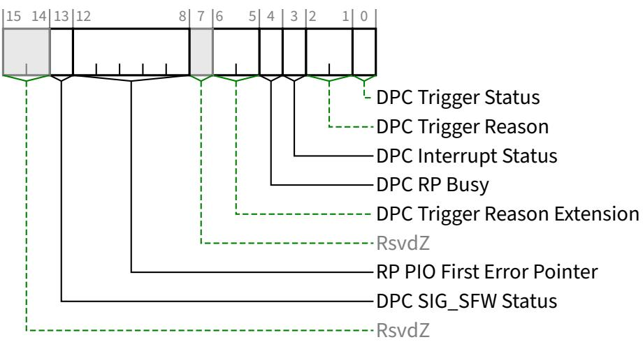


---

<a id="sec-7-9-14-4"></a>
## 7.9.14.4 DPC Status Register (Offset 08h) | DPC 状态寄存器（偏移 08h）

<table>
<thead>
<tr>
<th width="50%">🇬🇧 English</th>
<th width="50%" style="background-color:#e8e8e8">🏆 中文</th>
</tr>
</thead>
<tbody>
<tr>
<td>

7.9.14.4 DPC Status Register (Offset 08h)

</td>
<td style="background-color:#e8e8e8">

7.9.14.4 DPC 状态寄存器（DPC Status Register，偏移 08h）

</td>
</tr>
</tbody>
</table>

---

**Table 7-264. DPC Status Register | 表 7-264. DPC 状态寄存器**

| Bit Location | Register Description | Attributes |
|--------------|----------------------|------------|
| 0 | DPC Trigger Status - When Set, this bit indicates that DPC has been triggered, and by definition the Port is "in DPC". DPC is event triggered. While this bit is Set, hardware must direct the LTSSM to the Disabled State. This bit must be cleared before the LTSSM can be released from the Disabled State, after which the Port is no longer in DPC, and the LTSSM must transition to the Detect State. See § Section 6.2.11 for requirements on how long software must leave the Downstream Port in DPC. Once these requirements are met, software is permitted to clear this bit regardless of the state of other status bits associated with the triggering event. After clearing this bit, software must honor timing requirements defined in § Section 6.6.1 with respect to the first Configuration Read following a Conventional Reset. Default value of this bit is 0b. | RW1CS |
| 2:1 | DPC Trigger Reason - This field indicates why DPC has been triggered. Defined encodings are: 00b = DPC was triggered due to an unmasked uncorrectable error; 01b = DPC was triggered due to receiving an ERR_NONFATAL; 10b = DPC was triggered due to receiving an ERR_FATAL; 11b = DPC was triggered due to a reason that is indicated by the DPC Trigger Reason Extension field. This field is valid only when the DPC Trigger Status bit is Set; otherwise the value of this field is undefined. | ROS |
| 3 | DPC Interrupt Status - This bit is Set if DPC is triggered while the DPC Interrupt Enable bit is Set. This may cause the generation of an interrupt. See § Section 6.2.11.1. Default value of this bit is 0b. | RW1CS |

---

<!-- 📄 Page 1332 -->
---

**Table 7-264 (cont.). DPC Status Register | 表 7-264（续）. DPC 状态寄存器**

| Bit Location | Register Description | Attributes |
|--------------|----------------------|------------|
| 4 | DPC RP Busy - When the DPC Trigger Status bit is Set and this bit is Set, the Root Port is busy with internal activity that must complete before software is permitted to Clear the DPC Trigger Status bit. If software Clears the DPC Trigger Status bit while this bit is Set, the behavior is undefined. This field is valid only when the DPC Trigger Status bit is Set; otherwise the value of this field is undefined. This bit is applicable only for Root Ports that support RP Extensions for DPC, and is Reserved for Switch Downstream Ports. Default value of this bit is undefined. | RO/RsvdZ |
| 6:5 | DPC Trigger Reason Extension - This field serves as an extension to the DPC Trigger Reason field. When that field is valid and has a value of 11b, this field indicates why DPC has been triggered. Defined encodings are: 00b = DPC was triggered due to an RP PIO error; 01b = DPC was triggered due to the DPC Software Trigger bit; 10b = Reserved; 11b = Reserved. This field is valid only when the DPC Trigger Status bit is Set and the value of the DPC Trigger Reason field is 11b; otherwise the value of this field is undefined. | ROS |
| 12:8 | RP PIO First Error Pointer - The value of this field identifies a bit position in the RP PIO Status Register, and this field is considered valid when that bit is Set. When this field is valid, and software writes a 1b to the indicated RP PIO Status bit (thus clearing it), this field must revert to its default value. This field is applicable only for Root Ports that support RP Extensions for DPC, and otherwise is Reserved. If this field is not Reserved, its default value is 1 1111b, indicating a permanently Reserved RP PIO Status bit, thus guaranteeing that this field is not considered valid. | ROS/RsvdZ |
| 13 | DPC SIG_SFW Status - If the Function supports ERR_COR Subclass capability, this bit must be implemented; otherwise, it must be hardwired to 0b. If implemented, this bit is Set when a SIG_SFW ERR_COR Message is sent to signal a DPC event. See § Section 6.2.11.2 and § Section 6.2.11.5. Default value of this bit is 0b. | RW1CS/RsvdZ |

---

<a id="sec-7-9-14-5"></a>
## 7.9.14.5 DPC Error Source ID Register (Offset 0Ah) | DPC 错误源 ID 寄存器（偏移 0Ah）

<table>
<thead>
<tr>
<th width="50%">🇬🇧 English</th>
<th width="50%" style="background-color:#e8e8e8">🏆 中文</th>
</tr>
</thead>
<tbody>
<tr>
<td>

7.9.14.5 DPC Error Source ID Register (Offset 0Ah)

</td>
<td style="background-color:#e8e8e8">

7.9.14.5 DPC 错误源 ID 寄存器（DPC Error Source ID Register，偏移 0Ah）

</td>
</tr>
</tbody>
</table>

> **Figure 7-301.** DPC Error Source ID Register
> 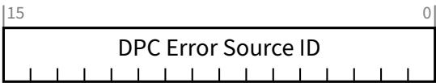


---

<!-- 📄 Page 1333 -->
---

**Table 7-265. DPC Error Source ID Register | 表 7-265. DPC 错误源 ID 寄存器**

| Bit Location | Register Description | Attributes |
|--------------|----------------------|------------|
| 15:0 | DPC Error Source ID - When the DPC Trigger Reason field indicates that DPC was triggered due to the reception of an ERR_NONFATAL or ERR_FATAL, this register contains the Requester ID of the received Message. Otherwise, the value of this register is undefined. | ROS |

<table>
<thead>
<tr>
<th width="50%">🇬🇧 English</th>
<th width="50%" style="background-color:#e8e8e8">🏆 中文</th>
</tr>
</thead>
<tbody>
<tr>
<td>

This register is present only in Root Ports that support RP Extensions for DPC. See § Section 6.2.11.3.

</td>
<td style="background-color:#e8e8e8">

此寄存器仅在支持 DPC RP 扩展（RP Extensions for DPC）的根端口中存在。参见 § Section 6.2.11.3。

</td>
</tr>
</tbody>
</table>

> **Figure 7-302.** RP PIO Status Register
> 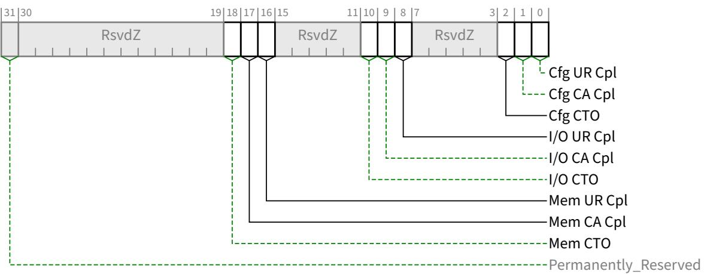


---

**Table 7-266. RP PIO Status Register | 表 7-266. RP PIO 状态寄存器**

| Bit Location | Register Description | Attributes | Default |
|--------------|----------------------|------------|---------|
| 0 | Cfg UR Cpl - Configuration Request received UR Completion | RW1CS | 0b |
| 1 | Cfg CA Cpl - Configuration Request received CA Completion | RW1CS | 0b |
| 2 | Cfg CTO - Configuration Request Completion Timeout | RW1CS | 0b |
| 8 | I/O UR Cpl - I/O Request received UR Completion | RW1CS | 0b |
| 9 | I/O CA Cpl - I/O Request received CA Completion | RW1CS | 0b |
| 10 | I/O CTO - I/O Request Completion Timeout | RW1CS | 0b |
| 16 | Mem UR Cpl - Memory Request received UR Completion | RW1CS | 0b |
| 17 | Mem CA Cpl - Memory Request received CA Completion | RW1CS | 0b |
| 18 | Mem CTO - Memory Request Completion Timeout | RW1CS | 0b |
| 31 | Permanently_Reserved - Permanently Reserved, since the default RP PIO First Error Pointer field value points to it. | RsvdZ | 0b |

---

<a id="sec-7-9-14-6"></a>
## 7.9.14.6 RP PIO Status Register (Offset 0Ch) | RP PIO 状态寄存器（偏移 0Ch）

<table>
<thead>
<tr>
<th width="50%">🇬🇧 English</th>
<th width="50%" style="background-color:#e8e8e8">🏆 中文</th>
</tr>
</thead>
<tbody>
<tr>
<td>

7.9.14.6 RP PIO Status Register (Offset 0Ch)

</td>
<td style="background-color:#e8e8e8">

7.9.14.6 RP PIO 状态寄存器（RP PIO Status Register，偏移 0Ch）

</td>
</tr>
</tbody>
</table>

---

<!-- 📄 Page 1334 -->
---

<table>
<thead>
<tr>
<th width="50%">🇬🇧 English</th>
<th width="50%" style="background-color:#e8e8e8">🏆 中文</th>
</tr>
</thead>
<tbody>
<tr>
<td>

This register is present only in Root Ports that support RP Extensions for DPC. See § Section 6.2.11.3.

</td>
<td style="background-color:#e8e8e8">

此寄存器仅在支持 DPC RP 扩展（RP Extensions for DPC）的根端口中存在。参见 § Section 6.2.11.3。

</td>
</tr>
</tbody>
</table>

> **Figure 7-303.** RP PIO Mask Register
> 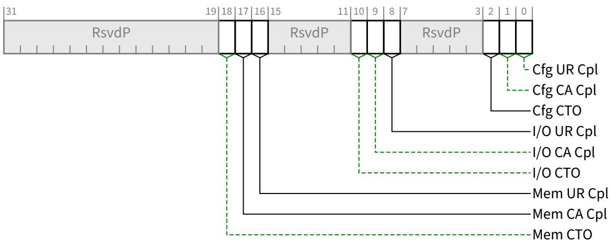


---

**Table 7-267. RP PIO Mask Register | 表 7-267. RP PIO 屏蔽寄存器**

| Bit Location | Register Description | Attributes | Default |
|--------------|----------------------|------------|---------|
| 0 | Cfg UR Cpl - Configuration Request received UR Completion | RWS | 1b |
| 1 | Cfg CA Cpl - Configuration Request received CA Completion | RWS | 1b |
| 2 | Cfg CTO - Configuration Request Completion Timeout | RWS | 1b |
| 8 | I/O UR Cpl - I/O Request received UR Completion | RWS | 1b |
| 9 | I/O CA Cpl - I/O Request received CA Completion | RWS | 1b |
| 10 | I/O CTO - I/O Request Completion Timeout | RWS | 1b |
| 16 | Mem UR Cpl - Memory Request received UR Completion | RWS | 1b |
| 17 | Mem CA Cpl - Memory Request received CA Completion | RWS | 1b |
| 18 | Mem CTO - Memory Request Completion Timeout | RWS | 1b |

<table>
<thead>
<tr>
<th width="50%">🇬🇧 English</th>
<th width="50%" style="background-color:#e8e8e8">🏆 中文</th>
</tr>
</thead>
<tbody>
<tr>
<td>

This register is present only in Root Ports that support RP Extensions for DPC. See § Section 6.2.11.3.

</td>
<td style="background-color:#e8e8e8">

此寄存器仅在支持 DPC RP 扩展（RP Extensions for DPC）的根端口中存在。参见 § Section 6.2.11.3。

</td>
</tr>
</tbody>
</table>

---

[⬆️ 返回目录](#-本章目录-table-of-contents)

---

---

<a id="sec-7-9-14-7"></a>
## 7.9.14.7 RP PIO Mask Register (Offset 10h) | RP PIO 屏蔽寄存器 (偏移 10h)

<!-- 📄 Page 1335 -->
---

<table>
<thead>
<tr>
<th width="50%">🇬🇧 English</th>
<th width="50%" style="background-color:#e8e8e8">🏆 中文</th>
</tr>
</thead>
<tbody>
<tr>
<td>

Reserved for future definition.

</td>
<td style="background-color:#e8e8e8">

保留供未来定义使用。

</td>
</tr>
</tbody>
</table>

[⬆️ 返回目录](#-本章目录-table-of-contents)

---

<a id="sec-7-9-14-8"></a>
## 7.9.14.8 RP PIO Severity Register (Offset 14h) | RP PIO 严重程度寄存器 (偏移 14h)


<div style="overflow-x: auto; max-width: 100%;">
<table>
<thead>
<tr>
<th width="50%">🇬🇧 English</th>
<th width="50%" style="background-color:#e8e8e8">🏆 中文</th>
</tr>
</thead>
<tbody>
<tr>
<td>

**Figure 7-304 RP PIO Severity Register**

> 

**Table 7-268 RP PIO Severity Register**

| Bit Location | Register Description | Attributes | Default |
|---|---|---|---|
| 0 | Cfg UR Cpl - Configuration Request received UR Completion | RWS | 0b |
| 1 | Cfg CA Cpl - Configuration Request received CA Completion | RWS | 0b |
| 2 | Cfg CTO - Configuration Request Completion Timeout | RWS | 0b |
| 8 | I/O UR Cpl - I/O Request received UR Completion | RWS | 0b |
| 9 | I/O CA Cpl - I/O Request received CA Completion | RWS | 0b |
| 10 | I/O CTO - I/O Request Completion Timeout | RWS | 0b |
| 16 | Mem UR Cpl - Memory Request received UR Completion | RWS | 0b |
| 17 | Mem CA Cpl - Memory Request received CA Completion | RWS | 0b |
| 18 | Mem CTO - Memory Request Completion Timeout | RWS | 0b |

This register is present only in Root Ports that support RP Extensions for DPC. See § Section 6.2.11.3.

</td>
<td style="background-color:#e8e8e8">

**图 7-304 RP PIO 严重程度寄存器**


**表 7-268 RP PIO 严重程度寄存器**

| 位位置 | 寄存器描述 | 属性 | 默认值 |
|---|---|---|---|
| 0 | Cfg UR Cpl —— 配置请求接收到 UR 完成报文 | RWS | 0b |
| 1 | Cfg CA Cpl —— 配置请求接收到 CA 完成报文 | RWS | 0b |
| 2 | Cfg CTO —— 配置请求完成超时 | RWS | 0b |
| 8 | I/O UR Cpl —— I/O 请求接收到 UR 完成报文 | RWS | 0b |
| 9 | I/O CA Cpl —— I/O 请求接收到 CA 完成报文 | RWS | 0b |
| 10 | I/O CTO —— I/O 请求完成超时 | RWS | 0b |
| 16 | Mem UR Cpl —— 内存请求接收到 UR 完成报文 | RWS | 0b |
| 17 | Mem CA Cpl —— 内存请求接收到 CA 完成报文 | RWS | 0b |
| 18 | Mem CTO —— 内存请求完成超时 | RWS | 0b |

此寄存器仅存在于支持 DPC 的 RP 扩展 (RP Extensions for DPC) 的根端口 (Root Port) 中。参见 § 第 6.2.11.3 节。


</td>
</tr>
</tbody>
</table>
</div>


[⬆️ 返回目录](#-本章目录-table-of-contents)

---

<a id="sec-7-9-14-9"></a>
## 7.9.14.9 RP PIO SysError Register (Offset 18h) | RP PIO 系统错误寄存器 (偏移 18h)

<!-- 📄 Page 1336 -->
---

<table>
<thead>
<tr>
<th width="50%">🇬🇧 English</th>
<th width="50%" style="background-color:#e8e8e8">🏆 中文</th>
</tr>
</thead>
<tbody>
<tr>
<td>

**Figure 7-305 RP PIO SysError Register**

> 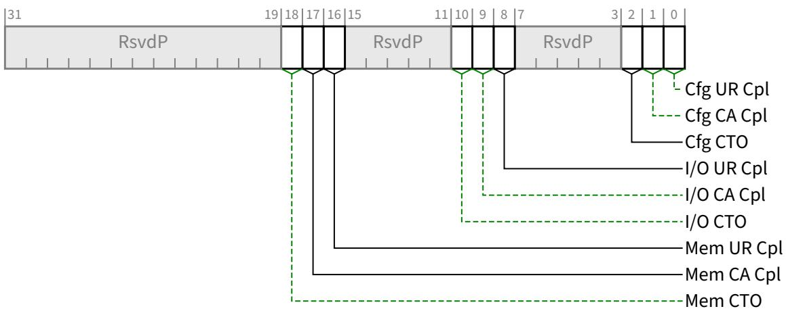

**Table 7-269 RP PIO SysError Register**

| Bit Location | Register Description | Attributes | Default |
|---|---|---|---|
| 0 | Cfg UR Cpl - Configuration Request received UR Completion | RWS | 0b |
| 1 | Cfg CA Cpl - Configuration Request received CA Completion | RWS | 0b |
| 2 | Cfg CTO - Configuration Request Completion Timeout | RWS | 0b |
| 8 | I/O UR Cpl - I/O Request received UR Completion | RWS | 0b |
| 9 | I/O CA Cpl - I/O Request received CA Completion | RWS | 0b |
| 10 | I/O CTO - I/O Request Completion Timeout | RWS | 0b |
| 16 | Mem UR Cpl - Memory Request received UR Completion | RWS | 0b |
| 17 | Mem CA Cpl - Memory Request received CA Completion | RWS | 0b |
| 18 | Mem CTO - Memory Request Completion Timeout | RWS | 0b |

This register is present only in Root Ports that support RP Extensions for DPC. See § Section 6.2.11.3.

</td>
<td style="background-color:#e8e8e8">

**图 7-305 RP PIO 系统错误寄存器**


**表 7-269 RP PIO 系统错误寄存器**

| 位位置 | 寄存器描述 | 属性 | 默认值 |
|---|---|---|---|
| 0 | Cfg UR Cpl —— 配置请求接收到 UR 完成报文 | RWS | 0b |
| 1 | Cfg CA Cpl —— 配置请求接收到 CA 完成报文 | RWS | 0b |
| 2 | Cfg CTO —— 配置请求完成超时 | RWS | 0b |
| 8 | I/O UR Cpl —— I/O 请求接收到 UR 完成报文 | RWS | 0b |
| 9 | I/O CA Cpl —— I/O 请求接收到 CA 完成报文 | RWS | 0b |
| 10 | I/O CTO —— I/O 请求完成超时 | RWS | 0b |
| 16 | Mem UR Cpl —— 内存请求接收到 UR 完成报文 | RWS | 0b |
| 17 | Mem CA Cpl —— 内存请求接收到 CA 完成报文 | RWS | 0b |
| 18 | Mem CTO —— 内存请求完成超时 | RWS | 0b |

此寄存器仅存在于支持 DPC 的 RP 扩展 (RP Extensions for DPC) 的根端口 (Root Port) 中。参见 § 第 6.2.11.3 节。


</td>
</tr>
</tbody>
</table>

[⬆️ 返回目录](#-本章目录-table-of-contents)

---

<a id="sec-7-9-14-10"></a>
## 7.9.14.10 RP PIO Exception Register (Offset 1Ch) | RP PIO 异常寄存器 (偏移 1Ch)

<!-- 📄 Page 1337 -->
---


<div style="overflow-x: auto; max-width: 100%;">
<table>
<thead>
<tr>
<th width="50%">🇬🇧 English</th>
<th width="50%" style="background-color:#e8e8e8">🏆 中文</th>
</tr>
</thead>
<tbody>
<tr>
<td>

**Figure 7-306 RP PIO Exception Register**

> 

**Table 7-270 RP PIO Exception Register**

| Bit Location | Register Description | Attributes | Default |
|---|---|---|---|
| 0 | Cfg UR Cpl - Configuration Request received UR Completion | RWS | 0b |
| 1 | Cfg CA Cpl - Configuration Request received CA Completion | RWS | 0b |
| 2 | Cfg CTO - Configuration Request Completion Timeout | RWS | 0b |
| 8 | I/O UR Cpl - I/O Request received UR Completion | RWS | 0b |
| 9 | I/O CA Cpl - I/O Request received CA Completion | RWS | 0b |
| 10 | I/O CTO - I/O Request Completion Timeout | RWS | 0b |
| 16 | Mem UR Cpl - Memory Request received UR Completion | RWS | 0b |
| 17 | Mem CA Cpl - Memory Request received CA Completion | RWS | 0b |
| 18 | Mem CTO - Memory Request Completion Timeout | RWS | 0b |

This register is implemented only in Root Ports that support RP Extensions for DPC. The RP PIO Header Log Register contains the header from the Request TLP associated with a recorded RP PIO error. Refer to § Section 6.2.11.3 for further details. In Non-Flit Mode, this register is 16 bytes. In Flit Mode, this register is between 52 and 76 bytes and is split into two portions at Offset 20h and Offset 34h. In both Flit Mode and Non-Flit Mode, this register is formatted identically to the Header Log register in AER. See § Section 7.8.4.8.

</td>
<td style="background-color:#e8e8e8">

**图 7-306 RP PIO 异常寄存器**


**表 7-270 RP PIO 异常寄存器**

| 位位置 | 寄存器描述 | 属性 | 默认值 |
|---|---|---|---|
| 0 | Cfg UR Cpl —— 配置请求接收到 UR 完成报文 | RWS | 0b |
| 1 | Cfg CA Cpl —— 配置请求接收到 CA 完成报文 | RWS | 0b |
| 2 | Cfg CTO —— 配置请求完成超时 | RWS | 0b |
| 8 | I/O UR Cpl —— I/O 请求接收到 UR 完成报文 | RWS | 0b |
| 9 | I/O CA Cpl —— I/O 请求接收到 CA 完成报文 | RWS | 0b |
| 10 | I/O CTO —— I/O 请求完成超时 | RWS | 0b |
| 16 | Mem UR Cpl —— 内存请求接收到 UR 完成报文 | RWS | 0b |
| 17 | Mem CA Cpl —— 内存请求接收到 CA 完成报文 | RWS | 0b |
| 18 | Mem CTO —— 内存请求完成超时 | RWS | 0b |

此寄存器仅在支持 DPC 的 RP 扩展 (RP Extensions for DPC) 的根端口 (Root Port) 中实现。RP PIO Header Log 寄存器包含与所记录的 RP PIO 错误相关联的请求 TLP (Request TLP) 的包头 (Header)。详见 § 第 6.2.11.3 节。在非 Flit 模式 (Non-Flit Mode) 下,此寄存器为 16 字节。在 Flit 模式 (Flit Mode) 下,此寄存器大小介于 52 与 76 字节之间,并被拆分为偏移 20h 和偏移 34h 两部分。在 Flit 模式和非 Flit 模式下,此寄存器的格式与 AER 中的 Header Log 寄存器完全相同。参见 § 第 7.8.4.8 节。


</td>
</tr>
</tbody>
</table>
</div>


[⬆️ 返回目录](#-本章目录-table-of-contents)

---

<a id="sec-7-9-14-11"></a>
## 7.9.14.11 RP PIO Header Log Register (Offset 20h) | RP PIO Header Log 寄存器 (偏移 20h)

<!-- 📄 Page 1338 -->
---

<table>
<thead>
<tr>
<th width="50%">🇬🇧 English</th>
<th width="50%" style="background-color:#e8e8e8">🏆 中文</th>
</tr>
</thead>
<tbody>
<tr>
<td>

**Figure 7-307 RP PIO Header Log Register**

> 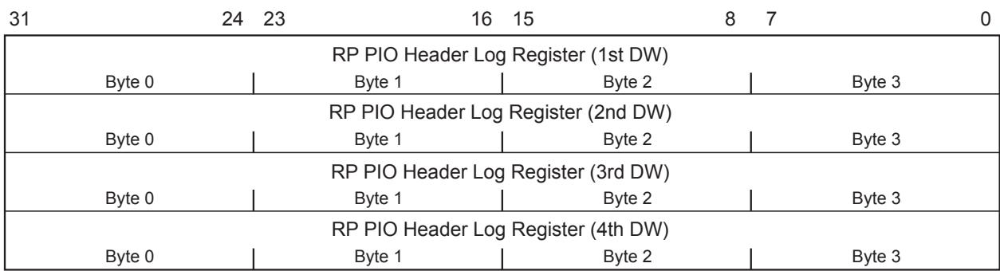

**Table 7-271 RP PIO Header Log Register**

| Bit Location | Register Description | Attributes | Default |
|---|---|---|---|
| 127:0 | TLP Header - of the TLP associated with the error | ROS | 0 |

This register is permitted to be implemented only in Root Ports that support RP Extensions for DPC. The RP PIO ImpSpec Log Register, if implemented, contains implementation specific information associated with the recorded error, e.g., indicating the source of the Request TLP. Space is allocated for this register if the value of the RP PIO Log Size field is 5 or greater. If space is allocated for the register, but the register is not implemented, the bits must be hardwired to 0b.

**Figure 7-308 RP PIO ImpSpec Log Register**


**Table 7-272 RP PIO ImpSpec Log Register**

| Bit Location | Register Description | Attributes | Default |
|---|---|---|---|
| 31:0 | RP PIO ImpSpec Log | ROS | 0 |

This register is permitted to be implemented only in Root Ports that support RP Extensions for DPC.

In Non-Flit Mode, the RP PIO TLP Prefix Log Register contains any End-End TLP Prefixes from the TLP corresponding to a recorded RP PIO error. Refer to § Section 6.2.11.3 for further details.

In Flit Mode, the RP PIO TLP Prefix Log Register does not exist and this configration space is a contination of the RP PIO TLP Header Log Register.

</td>
<td style="background-color:#e8e8e8">

**图 7-307 RP PIO Header Log 寄存器**


**表 7-271 RP PIO Header Log 寄存器**

| 位位置 | 寄存器描述 | 属性 | 默认值 |
|---|---|---|---|
| 127:0 | TLP Header —— 与该错误相关联的 TLP 的包头 | ROS | 0 |

此寄存器仅允许在支持 DPC 的 RP 扩展 (RP Extensions for DPC) 的根端口 (Root Port) 中实现。如果实现 RP PIO ImpSpec Log 寄存器,则其包含与所记录错误相关的实现特定信息,例如指明请求 TLP (Request TLP) 的来源。当 RP PIO Log Size 字段的值大于等于 5 时,会为此寄存器分配空间。如果已为此寄存器分配空间但未实现,则这些位必须硬连线 (hardwired) 为 0b。

**图 7-308 RP PIO ImpSpec Log 寄存器**


**表 7-272 RP PIO ImpSpec Log 寄存器**

| 位位置 | 寄存器描述 | 属性 | 默认值 |
|---|---|---|---|
| 31:0 | RP PIO ImpSpec Log | ROS | 0 |

此寄存器仅允许在支持 DPC 的 RP 扩展 (RP Extensions for DPC) 的根端口 (Root Port) 中实现。

在非 Flit 模式 (Non-Flit Mode) 下,RP PIO TLP Prefix Log 寄存器包含与所记录 RP PIO 错误对应的 TLP 中的所有端到端 TLP 前缀 (End-End TLP Prefixes)。详见 § 第 6.2.11.3 节。

在 Flit 模式 (Flit Mode) 下,不存在 RP PIO TLP Prefix Log 寄存器,该配置空间是 RP PIO TLP Header Log 寄存器的延续。


</td>
</tr>
</tbody>
</table>

[⬆️ 返回目录](#-本章目录-table-of-contents)

---

<a id="sec-7-9-14-12"></a>
## 7.9.14.12 RP PIO ImpSpec Log Register (Offset 30h) | RP PIO ImpSpec Log 寄存器 (偏移 30h)

<table>
<thead>
<tr>
<th width="50%">🇬🇧 English</th>
<th width="50%" style="background-color:#e8e8e8">🏆 中文</th>
</tr>
</thead>
<tbody>
<tr>
<td>

See § Section 7.9.14.11 above for the register description.

</td>
<td style="background-color:#e8e8e8">

寄存器描述见上文 § 第 7.9.14.11 节。

</td>
</tr>
</tbody>
</table>

[⬆️ 返回目录](#-本章目录-table-of-contents)

---

<a id="sec-7-9-14-13"></a>

<!-- 📄 Page 1339 -->
---

## 7.9.14.13 RP PIO TLP Prefix Log Register (Offset 34h) | RP PIO TLP Prefix Log 寄存器 (偏移 34h)


<div style="overflow-x: auto; max-width: 100%;">
<table>
<thead>
<tr>
<th width="50%">🇬🇧 English</th>
<th width="50%" style="background-color:#e8e8e8">🏆 中文</th>
</tr>
</thead>
<tbody>
<tr>
<td>

If the Root Port supports tracking Non-Posted Requests that contain End-End TLP Prefixes, this register must be implemented, and must be of sufficient size to record the maximum number of End-End TLP Prefixes for any tracked Request. See § Section 2.9.3. The allocated size in DWORDs of the RP PIO TLP Prefix Log Register is the RP PIO Log Size minus 5 if the RP PIO Log Size is 9 or less, or 4 if the RP PIO Log Size is greater than 9. The implemented size of the TLP Prefix Log must be less than or equal to the Root Port's Max End-End TLP Prefixes field value. For the case where the Root Port never transmits Non-Posted Requests containing End-End TLP Prefixes, the allocated and implemented size of the TLP Prefix Log is permitted to be 0. Any DWORDs allocated but not implemented must be hardwired to zero.

This register is formatted identically to the TLP Prefix Log register in AER, although this register's allocated size is variable, whereas the register in AER is always 4 DWORDs. See § Section 7.8.4.12. The First TLP Prefix Log register contains the first End-End TLP Prefix from the TLP, the Second TLP Prefix Log register contains the second End-End TLP Prefix, and so forth. If the TLP contains fewer TLP Prefixes than this register accommodates, any remaining TLP Prefix Log registers must contain zero.

**Figure 7-309 RP PIO TLP Prefix Log Register**

> 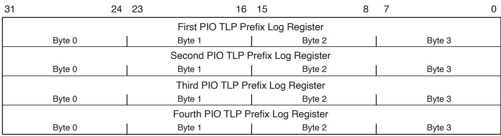

**Table 7-273 RP PIO TLP Prefix Log Register**

| Bit Location | Register Description | Attributes | Default |
|---|---|---|---|
| 127:0 | RP PIO TLP Prefix Log | ROS | 0 |

</td>
<td style="background-color:#e8e8e8">

如果根端口 (Root Port) 支持跟踪包含端到端 TLP 前缀 (End-End TLP Prefixes) 的 Non-Posted 请求,则必须实现此寄存器,且其大小必须足以记录任何被跟踪请求的最大端到端 TLP 前缀数。参见 § 第 2.9.3 节。RP PIO TLP Prefix Log 寄存器以 DWORD 为单位分配的大小为:当 RP PIO Log Size 小于等于 9 时,为 RP PIO Log Size 减 5;当 RP PIO Log Size 大于 9 时,为 RP PIO Log Size 减 4。TLP Prefix Log 的实现大小必须小于或等于根端口 (Root Port) 的 Max End-End TLP Prefixes 字段值。对于根端口 (Root Port) 从不发送包含端到端 TLP 前缀 (End-End TLP Prefixes) 的 Non-Posted 请求的情况,TLP Prefix Log 的分配大小和实现大小均允许为 0。任何已分配但未实现的 DWORD 必须硬连线 (hardwired) 为零。

此寄存器的格式与 AER 中的 TLP Prefix Log 寄存器完全相同,但此寄存器的分配大小是可变的,而 AER 中的寄存器始终为 4 个 DWORD。参见 § 第 7.8.4.12 节。First TLP Prefix Log 寄存器包含 TLP 中的第一个端到端 TLP 前缀 (End-End TLP Prefix),Second TLP Prefix Log 寄存器包含第二个端到端 TLP 前缀,依此类推。如果 TLP 包含的 TLP 前缀数量少于本寄存器所能容纳的数量,则任何剩余的 TLP Prefix Log 寄存器必须为零。

**图 7-309 RP PIO TLP Prefix Log 寄存器**


**表 7-273 RP PIO TLP Prefix Log 寄存器**

| 位位置 | 寄存器描述 | 属性 | 默认值 |
|---|---|---|---|
| 127:0 | RP PIO TLP Prefix Log | ROS | 0 |


</td>
</tr>
</tbody>
</table>
</div>


[⬆️ 返回目录](#-本章目录-table-of-contents)

---

<a id="sec-7-9-15"></a>

<!-- 📄 Page 1340 -->
---

## 7.9.15 Precision Time Measurement Extended Capability (PTM Extended Capability) | 精确时间测量扩展能力 (PTM Extended Capability)

<table>
<thead>
<tr>
<th width="50%">🇬🇧 English</th>
<th width="50%" style="background-color:#e8e8e8">🏆 中文</th>
</tr>
</thead>
<tbody>
<tr>
<td>

The Precision Time Measurement Extended Capability is an optional Extended Capability for discovering and controlling the distribution of a PTM Hierarchy. For Root Complexes, this Capability is required in any Root Port, RCiEP, or RCRB that supports PTM. For Functions associated with an Upstream Port that support PTM, this Capability is required in exactly one Function of that Upstream Port and that Capability controls the PTM behavior of all PTM capable Functions associated with that Upstream Port. For Switch Downstream Ports, PTM behavior is controlled by the same PTM Capability that controls the associated Switch Upstream Port. The PTM Capability is not permitted in Bridges, Switch Downstream Ports, and Root Complex Event Collectors.

For Switches, a single instance of this Capability controls behavior for the entire Switch. If the Upstream Port of the Switch is associated with an MFD, it is not required that the controlling Function be the Function corresponding to the Switch Upstream Port. For a given Switch, if this Capability is present, all Downstream Ports of the Switch must implement the requirements defined in § Section 6.21.3.2.

**Figure 7-310 PTM Extended Capability Structure**

> 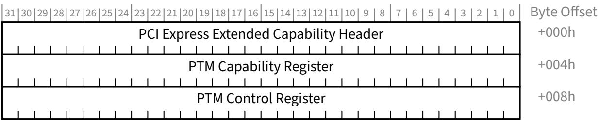

**Figure 7-311 PTM Extended Capability Header**

> 

**Table 7-274 PTM Extended Capability Header**

| Bit Location | Register Description | Attributes |
|---|---|---|
| 15:0 | PCI Express Extended Capability ID - This field is a PCI-SIG defined ID number that indicates the nature and format of the Extended Capability. PCI Express Extended Capability ID for the Precision Time Measurement Capability is 001Fh. | RO |
| 19:16 | Capability Version - This field is a PCI-SIG defined version number that indicates the version of the Capability structure present. Must be 1h for this version of the specification. | RO |
| 31:20 | Next Capability Offset - This field contains the offset to the next PCI Express Extended Capability structure or 000h if no other items exist in the linked list of Capabilities. | RO |

</td>
<td style="background-color:#e8e8e8">

精确时间测量 (Precision Time Measurement, PTM) 扩展能力是一种可选的扩展能力,用于发现和控制 PTM 层级 (PTM Hierarchy) 的分布。对于根复合体 (Root Complex),任何支持 PTM 的根端口 (Root Port)、RCiEP 或 RCRB 都必须具备此能力。对于与支持 PTM 的上游端口 (Upstream Port) 相关联的 Function,此上游端口中必须恰好有一个 Function 具备此能力,且该能力控制与该上游端口相关联的所有具备 PTM 能力的 Function 的 PTM 行为。对于交换机 (Switch) 的下游端口 (Downstream Port),其 PTM 行为由控制该关联交换机上游端口 (Switch Upstream Port) 的同一 PTM 能力来控制。桥 (Bridge)、交换机下游端口 (Switch Downstream Port) 以及根复合体事件收集器 (Root Complex Event Collector) 不允许使用 PTM 能力。

对于交换机 (Switch),此能力的一个单一实例控制整个交换机的行为。如果交换机的上游端口 (Upstream Port) 与 MFD 相关联,则不要求控制 Function 为对应于交换机上游端口 (Switch Upstream Port) 的 Function。对于给定的交换机,如果存在此能力,则该交换机的所有下游端口 (Downstream Port) 必须实现 § 第 6.21.3.2 节中定义的要求。

**图 7-310 PTM 扩展能力结构**


**图 7-311 PTM 扩展能力包头**


**表 7-274 PTM 扩展能力包头**

| 位位置 | 寄存器描述 | 属性 |
|---|---|---|
| 15:0 | PCI Express Extended Capability ID —— 该字段是由 PCI-SIG 定义的 ID 号,用于指示扩展能力的性质和格式。精确时间测量 (PTM) 能力的 PCI Express 扩展能力 ID 为 001Fh。 | RO |
| 19:16 | Capability Version —— 该字段是由 PCI-SIG 定义的版本号,用于指示所存在能力结构的版本。对于本版本的规范,必须为 1h。 | RO |
| 31:20 | Next Capability Offset —— 该字段包含指向下一个 PCI Express 扩展能力结构的偏移地址;如果链表中的能力已无其他项,则为 000h。 | RO |


</td>
</tr>
</tbody>
</table>

[⬆️ 返回目录](#-本章目录-table-of-contents)

---

<a id="sec-7-9-15-1"></a>
## 7.9.15.1 PTM Extended Capability Header (Offset 00h) | PTM 扩展能力包头 (偏移 00h)

<table>
<thead>
<tr>
<th width="50%">🇬🇧 English</th>
<th width="50%" style="background-color:#e8e8e8">🏆 中文</th>
</tr>
</thead>
<tbody>
<tr>
<td>

See § Section 7.9.15 above and § Figure 7-311 / § Table 7-274 for the register description.

</td>
<td style="background-color:#e8e8e8">

寄存器描述见上文 § 第 7.9.15 节及 § 图 7-311 / § 表 7-274。

</td>
</tr>
</tbody>
</table>

[⬆️ 返回目录](#-本章目录-table-of-contents)

---

<a id="sec-7-9-15-2"></a>

<!-- 📄 Page 1341 -->
---

## 7.9.15.2 PTM Capability Register (Offset 04h) | PTM 能力寄存器 (偏移 04h)


<div style="overflow-x: auto; max-width: 100%;">
<table>
<thead>
<tr>
<th width="50%">🇬🇧 English</th>
<th width="50%" style="background-color:#e8e8e8">🏆 中文</th>
</tr>
</thead>
<tbody>
<tr>
<td>

This register describes a Function's support for Precision Time Measurement. Not all fields within this register apply to all Functions capable of implementing PTM.

**Figure 7-312 PTM Capability Register**

> 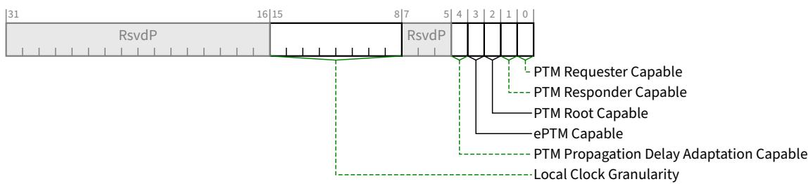

**Table 7-275 PTM Capability Register**

| Bit Location | Register Description | Attributes |
|---|---|---|
| 0 | PTM Requester Capable - Indicates the Function implements the PTM Requester role (see § Section 6.21.3.1). Endpoints and RCiEPs are permitted to Set this bit to indicate that they implement the PTM Requester role. Switch Upstream Ports must Set this bit if the Switch contains one or more of the following: <br/> • A Downstream Port that implements the PTM Responder role. <br/> • An additional Function that implements the PTM Requester role. | HwInit |
| 1 | PTM Responder Capable - Root Ports and RCRBs are permitted to, and Switches supporting PTM must, Set this bit to indicate they implement the PTM Responder role (see § Section 6.21.3.2). If PTM Root Capable is Set, then this bit must be Set. | HwInit |
| 2 | PTM Root Capable - Root Ports, RCRBs, and Switches are permitted to Set this bit if they are capable of being a source of PTM Master Time (see § Section 6.21.1). All other Functions must hardwire this bit to 0b. | HwInit |
| 3 | ePTM Capable - If Set, indicates that this device supports Enhanced Precision Time Measurement (ePTM). This bit MUST@FLIT be Set in all PTM Devices. | HwInit |
| 4 | PTM Propagation Delay Adaptation Capable – When Set, this field indicates the Port supports the PTM Propagation Delay Adaptation Capability, controlled via the PTM Propagation Delay Adaptation Interpretation B bit in the Link Control Register. For a Switch, when Set in the Upstream Port of the Switch, indicates that the Upstream Port and all Downstream Ports of the Switch support the PTM Propagation Delay Adaptation Capability, controlled per Port via the PTM Propagation Delay Adaptation Interpretation B bit in the Link Control Register of each Port. | HwInit |
| 15:8 | Local Clock Granularity - Encodings are: <br/> 0000 0000b: Time Source does not implement a local clock. It simply propagates timing information obtained from further Upstream in the PTM Hierarchy when responding to PTM Request messages. <br/> 0000 0001b to 1111 1110b: Indicates the period of this Time Source's local clock in ns. <br/> 1111 1111b: Indicates the period of this Time Source's local clock is greater than 254 ns. | HwInit/RsvdP |

</td>
<td style="background-color:#e8e8e8">

该寄存器描述 Function 对精确时间测量 (PTM) 的支持情况。该寄存器中的字段并非全部适用于所有能够实现 PTM 的 Function。

**图 7-312 PTM 能力寄存器**


**表 7-275 PTM 能力寄存器**

| 位位置 | 寄存器描述 | 属性 |
|---|---|---|
| 0 | PTM Requester Capable —— 指示该 Function 实现了 PTM Requester 角色 (参见 § 第 6.21.3.1 节)。允许端点 (Endpoint) 和 RCiEP 置位 (Set) 此位以指示其实现了 PTM Requester 角色。如果交换机 (Switch) 包含以下一项或多项,则其上游端口 (Switch Upstream Port) 必须置位 (Set) 此位: <br/> • 实现了 PTM Responder 角色的下游端口 (Downstream Port)。 <br/> • 另一个实现了 PTM Requester 角色的 Function。 | HwInit |
| 1 | PTM Responder Capable —— 允许根端口 (Root Port) 和 RCRB 置位 (Set) 此位,支持 PTM 的交换机 (Switch) 必须置位 (Set) 此位,以指示其实现了 PTM Responder 角色 (参见 § 第 6.21.3.2 节)。如果 PTM Root Capable 被置位 (Set),则此位必须被置位 (Set)。 | HwInit |
| 2 | PTM Root Capable —— 根端口 (Root Port)、RCRB 和交换机 (Switch) 如果能够作为 PTM 主时间 (PTM Master Time) 的源,则允许置位 (Set) 此位 (参见 § 第 6.21.1 节)。所有其他 Function 必须将此位硬连线 (hardwired) 为 0b。 | HwInit |
| 3 | ePTM Capable —— 置位 (Set) 时,指示该设备支持增强型精确时间测量 (Enhanced Precision Time Measurement, ePTM)。在所有 PTM 设备中,此位 MUST@FLIT 被置位 (Set)。 | HwInit |
| 4 | PTM Propagation Delay Adaptation Capable —— 置位 (Set) 时,该字段指示端口 (Port) 支持 PTM 传播延迟适配能力 (PTM Propagation Delay Adaptation Capability),该能力通过 Link Control 寄存器中的 PTM Propagation Delay Adaptation Interpretation B 位进行控制。对于交换机 (Switch),在其上游端口 (Switch Upstream Port) 中置位 (Set) 时,指示该上游端口 (Upstream Port) 和交换机的所有下游端口 (Downstream Port) 均支持 PTM 传播延迟适配能力,该能力通过每个端口 (Port) 的 Link Control 寄存器中的 PTM Propagation Delay Adaptation Interpretation B 位按端口 (Port) 进行控制。 | HwInit |
| 15:8 | Local Clock Granularity —— 编码方式如下: <br/> 0000 0000b:时间源 (Time Source) 未实现本地时钟,仅在响应 PTM 请求消息时转发从 PTM 层级 (PTM Hierarchy) 中更上游获取的定时信息。 <br/> 0000 0001b 至 1111 1110b:指示该时间源 (Time Source) 的本地时钟周期(单位:ns)。 <br/> 1111 1111b:指示该时间源 (Time Source) 的本地时钟周期大于 254 ns。 | HwInit/RsvdP |


</td>
</tr>
</tbody>
</table>
</div>


[⬆️ 返回目录](#-本章目录-table-of-contents)

---

<a id="sec-7-9-15-3"></a>

<!-- 📄 Page 1342 -->
---

## 7.9.15.3 PTM Control Register (Offset 08h) | PTM 控制寄存器 (偏移 08h)

<table>
<thead>
<tr>
<th width="50%">🇬🇧 English</th>
<th width="50%" style="background-color:#e8e8e8">🏆 中文</th>
</tr>
</thead>
<tbody>
<tr>
<td>

If the PTM Root Select bit is Set, this local clock is used to provide PTM Master Time. Otherwise, the Time Source uses this local clock to locally track PTM Master Time received from further Upstream within a PTM Hierarchy.

This field is RsvdP if the PTM Root Capable bit is 0b.

This register controls a Function's participation in the Precision Time Measurement mechanism. Not all fields within this register apply to all Functions capable of implementing PTM.

**Figure 7-313 PTM Control Register**

> 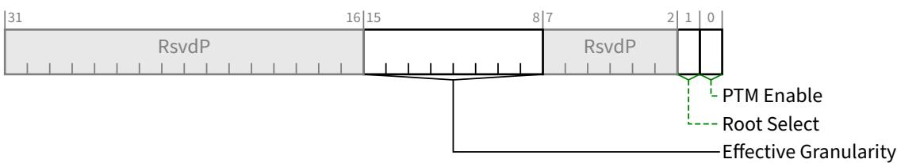

**Table 7-276 PTM Control Register**

| Bit Location | Register Description | Attributes |
|---|---|---|
| 0 | PTM Enable - When Set, this Function is permitted to participate in the PTM mechanism according to its selected role(s) (see § Section 6.21.2). Default value is 0b. | RW |
| 1 | Root Select - When Set, if the PTM Enable bit is also Set, this Time Source is the PTM Root. Within each PTM Hierarchy, it is recommended that system software select only the furthest Upstream Time Source to be the PTM Root. Default value is 0b. If the value of the PTM Root Capable bit is 0b, this bit is permitted to be hardwired to 0b. | RW/RO |
| 15:8 | Effective Granularity - For Functions implementing the PTM Requester Role, this field provides information relating to the expected accuracy of the PTM clock, but does not otherwise affect the PTM mechanism. <br/> For Endpoints, system software must program this field to the value representing the maximum Local Clock Granularity reported by the PTM Root and all intervening PTM Time Sources. <br/> For RCiEPs, system software must set this field to the value reported in the Local Clock Granularity field by the associated PTM Time Source. <br/> Permitted values: <br/> 0000 0000b: Unknown PTM granularity - one or more Switches between this Function and the PTM Root reported a Local Clock Granularity value of 0000 0000b. <br/> 0000 0001b to 1111 1110b: Indicates the effective PTM granularity in ns. <br/> 1111 1111b: Indicates the effective PTM granularity is greater than 254 ns. <br/> Default value is 0000 0000b. If PTM Requester Capable is Clear, this field is permitted to be hardwired to 0000 0000b. | RW/RO |

</td>
<td style="background-color:#e8e8e8">

如果 PTM Root Select 位置位 (Set),则使用该本地时钟提供 PTM 主时间 (PTM Master Time)。否则,时间源 (Time Source) 使用该本地时钟在本地跟踪从 PTM 层级 (PTM Hierarchy) 中更上游接收到的 PTM 主时间 (PTM Master Time)。

如果 PTM Root Capable 位为 0b,则该字段为 RsvdP。

该寄存器控制 Function 对精确时间测量 (PTM) 机制的参与。该寄存器中的字段并非全部适用于所有能够实现 PTM 的 Function。

**图 7-313 PTM 控制寄存器**


**表 7-276 PTM 控制寄存器**

| 位位置 | 寄存器描述 | 属性 |
|---|---|---|
| 0 | PTM Enable —— 置位 (Set) 时,该 Function 允许根据其所选定的角色参与 PTM 机制 (参见 § 第 6.21.2 节)。默认值为 0b。 | RW |
| 1 | Root Select —— 置位 (Set) 时,如果 PTM Enable 位也被置位 (Set),则该时间源 (Time Source) 为 PTM Root。在每个 PTM 层级 (PTM Hierarchy) 中,建议系统软件仅选择最上游的时间源 (Time Source) 作为 PTM Root。默认值为 0b。如果 PTM Root Capable 位的值为 0b,则允许将此位硬连线 (hardwired) 为 0b。 | RW/RO |
| 15:8 | Effective Granularity —— 对于实现 PTM Requester 角色的 Function,该字段提供与 PTM 时钟预期精度相关的信息,但不会以其他方式影响 PTM 机制。 <br/> 对于端点 (Endpoint),系统软件必须将该字段编程为由 PTM Root 及所有中间 PTM 时间源 (Time Source) 所报告的最大本地时钟粒度 (Local Clock Granularity) 所对应的值。 <br/> 对于 RCiEP,系统软件必须将该字段设置为关联的 PTM 时间源 (Time Source) 在 Local Clock Granularity 字段中报告的值。 <br/> 允许值: <br/> 0000 0000b:未知 PTM 粒度 —— 该 Function 与 PTM Root 之间的一个或多个交换机 (Switch) 报告了 Local Clock Granularity 值为 0000 0000b。 <br/> 0000 0001b 至 1111 1110b:指示有效 PTM 粒度(单位:ns)。 <br/> 1111 1111b:指示有效 PTM 粒度大于 254 ns。 <br/> 默认值为 0000 0000b。如果 PTM Requester Capable 为清零 (Clear),则允许将该字段硬连线 (hardwired) 为 0000 0000b。 | RW/RO |


</td>
</tr>
</tbody>
</table>

[⬆️ 返回目录](#-本章目录-table-of-contents)

---

<a id="sec-7-9-16"></a>

<!-- 📄 Page 1343 -->
---

## 7.9.16 Readiness Time Reporting Extended Capability | 就绪时间报告扩展能力


<div style="overflow-x: auto; max-width: 100%;">
<table>
<thead>
<tr>
<th width="50%">🇬🇧 English</th>
<th width="50%" style="background-color:#e8e8e8">🏆 中文</th>
</tr>
</thead>
<tbody>
<tr>
<td>

The Readiness Time Reporting Extended Capability provides an optional mechanism for describing the time required for a Device or Function to become Configuration-Ready. In the indicated situations, software is permitted to issue Requests to the Device or Function after waiting for the time advertised in this capability and need not wait for the (longer) times required elsewhere.

Software is permitted to issue requests upon the earliest of:
- Receiving a Readiness Notifications message (see § Section 6.22).
- Waiting the appropriate time as specified in this document or in applicable specifications including the [PCI] and the [PCI-PM].
- Waiting the time indicated in the associated field of this capability.
- Waiting the time defined by system software or firmware[^184].

Software is permitted to cache values from this capability and to use those cached values as long as the same device operating in the same manner has not changed.

This capability is permitted to be implemented in all Functions.

The capability is optional for PFs and VFs. However, if a VF associated with a given PF contains the capability, all VFs associated with that PF must contain the capability and report the same time values.

For VFs, see § Section 5.10.1). Other Functions must be Configuration-Ready if:
- The Immediate Readiness bit is Clear and at least Reset Time has elapsed after the completion of Conventional Reset
  - If the Immediate Readiness bit is Set, Reset Time does not apply, and is Reserved
- The Function is associated with an Upstream Port and at least DL_Up Time has elapsed after the Downstream Port above that Function reported Data Link Layer Link Active (see § Section 7.5.3.8).
- The Function supports Function Level Reset and at least FLR Time has elapsed after that Function was issued a Function Level Reset.
- Immediate_Readiness_on_Return_to_D0 is Clear and at least D3Hot to D0 Time has elapsed after that Function was directed to the D0 state from D3Hot.
  - If the Immediate_Readiness_on_Return_to_D0 bit is Set, D3Hot to D0 Time does not apply, and is Reserved

When Immediate_Readiness_on_Return_to_D0 is Clear, a Function must be Configuration-Ready when at least D3Hot to D0 Time has elapsed after the Function was directed to the D0 state from D3Hot. In addition, the Function must be in either the D0uninitialized or D0active state, depending on the value of the No_Soft_Reset bit.

[^184]: For example, using ACPI tables to provide the equivalent of this capability.

</td>
<td style="background-color:#e8e8e8">

就绪时间报告 (Readiness Time Reporting) 扩展能力提供了一种可选机制,用于描述设备 (Device) 或 Function 变为配置就绪 (Configuration-Ready) 所需的时间。在所述情况下,软件在等待该能力中所通告的时间后,即允许向设备 (Device) 或 Function 发出请求 (Requests),而无需等待其他位置规定的(更长的)时间。

允许软件在满足以下最早一项条件时发出请求:
- 收到 Readiness Notifications 消息 (参见 § 第 6.22 节)。
- 等待本文档或适用规范 (包括 [PCI] 和 [PCI-PM]) 中规定的相应时间。
- 等待本能力相关字段中指示的时间。
- 等待由系统软件或固件定义的时间[^184]。

允许软件缓存来自该能力的值,并在相同设备以相同方式运行且未发生变化期间一直使用这些缓存值。

允许在所有 Function 中实现该能力。

该能力对于 PF 和 VF 是可选的。然而,如果与给定 PF 关联的某个 VF 包含该能力,则与该 PF 关联的所有 VF 都必须包含该能力,并报告相同的时间值。

对于 VF,参见 § 第 5.10.1 节。其他 Function 在满足下列条件时必须处于配置就绪 (Configuration-Ready) 状态:
- Immediate Readiness 位为清零 (Clear),且常规复位 (Conventional Reset) 完成之后至少已过去 Reset Time(复位时间)
  - 如果 Immediate Readiness 位置位 (Set),则 Reset Time 不适用,且为保留
- Function 与上游端口 (Upstream Port) 相关联,且在该 Function 上游的下游端口 (Downstream Port) 报告数据链路层链路活跃 (Data Link Layer Link Active) 之后至少已过去 DL_Up Time (参见 § 第 7.5.3.8 节)。
- Function 支持功能级复位 (Function Level Reset),且在该 Function 发出功能级复位 (Function Level Reset) 之后至少已过去 FLR Time。
- Immediate_Readiness_on_Return_to_D0 为清零 (Clear),且在该 Function 从 D3Hot 转入 D0 状态后至少已过去 D3Hot to D0 Time。
  - 如果 Immediate_Readiness_on_Return_to_D0 位置位 (Set),则 D3Hot to D0 Time 不适用,且为保留

当 Immediate_Readiness_on_Return_to_D0 为清零 (Clear) 时,在 Function 从 D3Hot 转入 D0 状态后,必须至少经过 D3Hot to D0 Time 后该 Function 才进入配置就绪 (Configuration-Ready) 状态。此外,根据 No_Soft_Reset 位的值,该 Function 必须处于 D0uninitialized 或 D0active 状态。

[^184]: 例如,使用 ACPI 表提供与该能力等效的信息。

</td>
</tr>
</tbody>
</table>
</div>


[⬆️ 返回目录](#-本章目录-table-of-contents)

---

<a id="sec-7-9-16-1"></a>

<!-- 📄 Page 1344 -->
---

## 7.9.16.1 Readiness Time Reporting Extended Capability Header (Offset 00h) | 就绪时间报告扩展能力包头 (偏移 00h)

<table>
<thead>
<tr>
<th width="50%">🇬🇧 English</th>
<th width="50%" style="background-color:#e8e8e8">🏆 中文</th>
</tr>
</thead>
<tbody>
<tr>
<td>

If the above conditions do not apply, Function behavior is not determined by the Readiness Time Reporting Extended Capability, and the Function must respond as defined elsewhere (including, for example, no response or a response with Configuration Retry Status).

The time values reported are determined by implementation specific mechanisms. A Valid bit is defined in this capability to permit a device to defer reporting time values, for example to allow hardware initialization through driver-based mechanisms. If the Valid bit remains Clear and 1 minute has elapsed after device driver(s) have started, software is permitted to assume that no values will be reported.

Registers and fields in the Readiness Time Reporting Extended Capability are shown in § Figure 7-314. Time values are encoded in floating point as shown in § Figure 7-315. The actual time value is Value × Multiplier[Scale]. For example, the value A1Eh represents about 1 second (actually 1.006 sec) and the value 80Ah represents about 10 ms (actually 10.240 ms).

**Figure 7-314 Readiness Time Reporting Extended Capability**

> 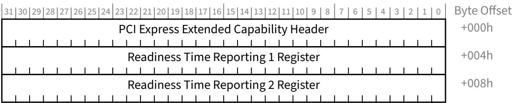

**Figure 7-315 Readiness Time Encoding**

> 

<!-- 📄 Page 1345 -->
---

§ Figure 7-316 and § Table 7-278 detail allocation of fields in the Extended Capability header.

**Figure 7-316 Readiness Time Reporting Extended Capability Header**

> 

**Table 7-278 Readiness Time Reporting Extended Capability Header**

| Bit Location | Register Description | Attributes |
|---|---|---|
| 15:0 | PCI Express Extended Capability ID - This field is a PCI-SIG defined ID number that indicates the nature and format of the Extended Capability. Extended Capability ID for the Readiness Time Reporting Extended Capability is 0022h. | RO |
| 19:16 | Capability Version - This field is a PCI-SIG defined version number that indicates the version of the Capability structure present. Must be 1h for this version of the specification. | RO |
| 31:20 | Next Capability Offset - This field contains the offset to the next PCI Express Capability structure or 000h if no other items exist in the linked list of Capabilities. For Extended Capabilities implemented in Configuration Space, this offset is relative to the beginning of PCI-compatible Configuration Space and thus must always be either 000h (for terminating list of Capabilities) or greater than 0FFh. | RO |

</td>
<td style="background-color:#e8e8e8">

如果上述条件不适用,则 Function 的行为不由就绪时间报告 (Readiness Time Reporting) 扩展能力确定,该 Function 必须按照其他位置定义的方式响应 (包括例如,无响应或返回 Configuration Retry Status 的响应)。

所报告的时间值由实现特定机制决定。该能力中定义了一个 Valid 位,以允许设备延迟报告时间值,例如允许通过基于驱动程序的机制进行硬件初始化。如果 Valid 位保持清零 (Clear),且自设备驱动程序启动后已过去 1 分钟,则软件可假设不会再报告任何值。

就绪时间报告 (Readiness Time Reporting) 扩展能力中的寄存器和字段如 § 图 7-314 所示。时间值按 § 图 7-315 所示的浮点格式编码。实际时间值为 Value × Multiplier[Scale]。例如,值 A1Eh 表示约 1 秒 (实际为 1.006 秒),值 80Ah 表示约 10 ms (实际为 10.240 ms)。

**图 7-314 就绪时间报告扩展能力**


**图 7-315 就绪时间编码**


§ 图 7-316 和 § 表 7-278 详细说明了扩展能力包头中字段的分配。

**图 7-316 就绪时间报告扩展能力包头**


**表 7-278 就绪时间报告扩展能力包头**

| 位位置 | 寄存器描述 | 属性 |
|---|---|---|
| 15:0 | PCI Express Extended Capability ID —— 该字段是由 PCI-SIG 定义的 ID 号,用于指示扩展能力的性质和格式。就绪时间报告 (Readiness Time Reporting) 扩展能力的扩展能力 ID 为 0022h。 | RO |
| 19:16 | Capability Version —— 该字段是由 PCI-SIG 定义的版本号,用于指示所存在能力结构的版本。对于本版本的规范,必须为 1h。 | RO |
| 31:20 | Next Capability Offset —— 该字段包含指向下一个 PCI Express 能力结构的偏移地址;如果链表中的能力已无其他项,则为 000h。对于在配置空间 (Configuration Space) 中实现的扩展能力,该偏移地址相对于 PCI 兼容配置空间 (PCI-compatible Configuration Space) 的起始位置,因此必须始终为 000h (用于终止能力链表) 或大于 0FFh。 | RO |


</td>
</tr>
</tbody>
</table>

[⬆️ 返回目录](#-本章目录-table-of-contents)

---

§ Figure 7-317 and § Table 7-279 detail allocation of fields in the Readiness Time Reporting 1 Register.

**Figure 7-317 Readiness Time Reporting 1 Register**

> 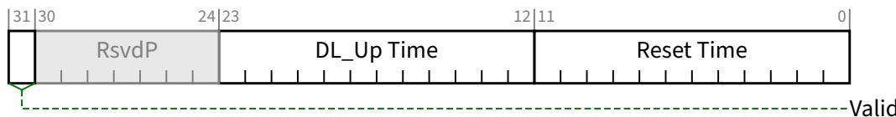

**Table 7-279 Readiness Time Reporting 1 Register**

| Bit Location | Register Description | Attributes |
|---|---|---|
| 11:0 | Reset Time - is the time a non-VF Function requires to become Configuration-Ready after the completion of Conventional Reset. For VF semantics, see § Section 9.3.3.3.1. This field is RsvdP if the Immediate Readiness bit is Set. This field is undefined when the Valid bit is Clear. This field must be less than or equal to the encoded value A1Eh. | HwInit/RsvdP || 11:0 | Reset Time - is the time a non-VF Function requires to become Configuration-Ready after the completion of Conventional Reset. For VF semantics, see § Section 9.3.3.3.1. This field is RsvdP if the Immediate Readiness bit is Set. This field is undefined when the Valid bit is Clear. This field must be less than or equal to the encoded value A1Eh. | HwInit/RsvdP |

---

<a id="sec-7-9-16-2"></a>
## 7.9.16.2 Readiness Time Reporting 1 Register (Offset 04h) | 就绪时间报告 1 寄存器（偏移 04h）


<div style="overflow-x: auto; max-width: 100%;">
<table>
<thead>
<tr>
<th width="50%">🇬🇧 English</th>
<th width="50%" style="background-color:#e8e8e8">🏆 中文</th>
</tr>
</thead>
<tbody>
<tr>
<td>

<!-- 📄 Page 1346 -->
---

| Bit Location | Register Description | Attributes |
|--------------|----------------------|------------|
| 23:12 | **DL_Up Time** - is the time the Function requires to become Configuration-Ready after the Downstream Port above the Function reports Data Link Layer Link Active. <br>This field is RsvdP in Functions that are not associated with an Upstream Port. <br>For VFs, this field is not applicable and is RsvdP. <br>This field is undefined when the Valid bit is Clear. <br>This field must be less than or equal to the encoded value A1Eh. | HwInit/RsvdP <br>VF RsvdP |
| 31 | **Valid** - If Set, indicates that all time values in this capability are valid. If Clear, indicates that the time values in this capability are not yet available. <br>Time values may depend on device configuration. Device specific mechanisms, possibly involving the device driver(s), could be involved in determining time values. <br>If this bit remains Clear and 1 minute has elapsed after all associated device driver(s) have started, software is permitted to assume that this bit will never be set. | HwInit |

Figure 7-318 and Table 7-280 detail allocation of fields in the Readiness Time Reporting 2 Register.

</td>
<td style="background-color:#e8e8e8">

<!-- 📄 Page 1346 -->
---

| 比特位置 | 寄存器描述 | 属性 |
|----------|------------|------|
| 23:12 | **DL_Up Time（DL_Up 时间）** — 是该 Function 在其上游的 Downstream Port 报告数据链路层（Data Link Layer）链路激活（Link Active）之后，达到 Configuration-Ready 状态所需的时间。 <br>对于不与 Upstream Port 关联的 Function，此字段为 RsvdP。 <br>对于 VF，该字段不适用且为 RsvdP。 <br>当 Valid 位为 0 时，此字段未定义。 <br>此字段必须小于或等于编码值 A1Eh。 | HwInit/RsvdP <br>VF RsvdP |
| 31 | **Valid（有效）** — 若置 1，表示本能力结构中的所有时间值有效。若为 0，表示本能力结构中的时间值尚不可用。 <br>时间值可能依赖于设备配置。设备特定的机制（可能涉及设备驱动程序）可能参与确定时间值。 <br>如果该位在所有相关设备驱动程序启动后 1 分钟内仍保持为 0，则软件可假定该位将永远不会被置 1。 | HwInit |

图 7-318 和表 7-280 详细说明了 Readiness Time Reporting 2 寄存器中各字段的分配。

</td>
</tr>
</tbody>
</table>
</div>


[⬆️ 返回目录](#-本章目录-table-of-contents)

---

<a id="sec-7-9-16-fig-318"></a>
## Figure 7-318. Readiness Time Reporting 2 Register | 图 7-318. 就绪时间报告 2 寄存器

<table>
<thead>
<tr>
<th width="50%">🇬🇧 English</th>
<th width="50%" style="background-color:#e8e8e8">🏆 中文</th>
</tr>
</thead>
<tbody>
<tr>
<td>

```
 0          11        23       31
+-----------+---------+--------+
|  FLR Time | D3Hot to| RsvdP  |
|           | D0 Time |        |
+-----------+---------+--------+
```

**Figure 7-318 Readiness Time Reporting 2 Register**

</td>
<td style="background-color:#e8e8e8">

```
 0          11        23       31
+-----------+---------+--------+
|  FLR Time | D3Hot to| 保留   |
|           | D0 Time |        |
+-----------+---------+--------+
```

**图 7-318 就绪时间报告 2 寄存器**

</td>
</tr>
</tbody>
</table>

[⬆️ 返回目录](#-本章目录-table-of-contents)

---

<a id="sec-7-9-16-3"></a>
## 7.9.16.3 Readiness Time Reporting 2 Register (Offset 08h) | 就绪时间报告 2 寄存器（偏移 08h）


<div style="overflow-x: auto; max-width: 100%;">
<table>
<thead>
<tr>
<th width="50%">🇬🇧 English</th>
<th width="50%" style="background-color:#e8e8e8">🏆 中文</th>
</tr>
</thead>
<tbody>
<tr>
<td>

**Table 7-280 Readiness Time Reporting 2 Register**

| Bit Location | Register Description | Attributes |
|--------------|----------------------|------------|
| 11:0 | **FLR Time** - is the time that the Function requires to become Configuration-Ready after it was issued an FLR. <br>This field is RsvdP when the Function Level Reset Capability bit is Clear (see § Section 7.5.3.3). <br>This field is undefined when the Valid bit is Clear. <br>This field must be less than or equal to the encoded value A1Eh. | HwInit/RsvdP |
| 23:12 | **D3Hot to D0 Time** - If Immediate_Readiness_on_Return_to_D0 is Clear, D3Hot to D0 Time is the time that a non-VF Function requires after it is directed from D3Hot to D0 before it is Configuration-Ready and has returned to either D0uninitialized or D0active state. For VF semantics, see § Section 5.10.1. <br>This field is RsvdP if the Immediate_Readiness_on_Return_to_D0 bit is Set. <br>For a VF that does not implement the PCI Power Management Capability, this field is undefined. <br>This field is undefined when the Valid bit is Clear. <br>This field must be less than or equal to the encoded value 80Ah. | HwInit/RsvdP |

</td>
<td style="background-color:#e8e8e8">

**表 7-280 就绪时间报告 2 寄存器**

| 比特位置 | 寄存器描述 | 属性 |
|----------|------------|------|
| 11:0 | **FLR Time（FLR 时间）** — 是该 Function 在被发出 FLR 之后，达到 Configuration-Ready 状态所需的时间。 <br>当 Function Level Reset Capability 位为 0 时（参见 § 第 7.5.3.3 节），此字段为 RsvdP。 <br>当 Valid 位为 0 时，此字段未定义。 <br>此字段必须小于或等于编码值 A1Eh。 | HwInit/RsvdP |
| 23:12 | **D3Hot to D0 Time（D3Hot 到 D0 时间）** — 如果 Immediate_Readiness_on_Return_to_D0 为 0，则 D3Hot 到 D0 时间是非 VF Function 在被指示从 D3Hot 转换到 D0 之后，达到 Configuration-Ready 并返回到 D0uninitialized 或 D0active 状态所需的时间。有关 VF 语义，请参见 § 第 5.10.1 节。 <br>如果 Immediate_Readiness_on_Return_to_D0 位置 1，则此字段为 RsvdP。 <br>对于未实现 PCI Power Management Capability 的 VF，此字段未定义。 <br>当 Valid 位为 0 时，此字段未定义。 <br>此字段必须小于或等于编码值 80Ah。 | HwInit/RsvdP |

</td>
</tr>
</tbody>
</table>
</div>


[⬆️ 返回目录](#-本章目录-table-of-contents)

---

<a id="sec-7-9-17"></a>
## 7.9.17 Hierarchy ID Extended Capability | 层级 ID 扩展能力（Hierarchy ID Extended Capability）

<table>
<thead>
<tr>
<th width="50%">🇬🇧 English</th>
<th width="50%" style="background-color:#e8e8e8">🏆 中文</th>
</tr>
</thead>
<tbody>
<tr>
<td>

<!-- 📄 Page 1347 -->
---

The Hierarchy ID Extended Capability provides an optional mechanism for passing a unique identifier to Functions within a Hierarchy. At most one instance of this capability is permitted in a Function. This capability is not applicable to Bridges, Root Complex Event Collectors, and RCRBs.

This capability takes three forms:

**In Upstream Ports:**

- This capability is permitted any Function associated with an Upstream Port.
- This capability is optional in Switch Upstream Ports. Support in Switch Upstream and Downstream Ports is independently optional.
- This capability is mandatory in Functions that use the Hierarchy ID Message. This includes use by the Function's driver.
- Functions, other than VFs, that have Hierarchy ID Writeable Clear, must report the Message Requester ID, Hierarchy ID, System GUID Authority ID, and System GUID fields from the most recently received Hierarchy ID Message.
- All VFs that have Hierarchy ID Writeable Clear, must report the same Hierarchy ID Valid, Message Requester ID, Hierarchy ID, System GUID Authority ID, and System GUID values as their associated PF.
- PFs must implement this capability if any of their VFs implement this capability.
- Functions that have Hierarchy ID Writeable Set must report the Hierarchy ID Valid, Message Requester ID, Hierarchy ID, System GUID Authority ID, and System GUID values programmed by software.

**In Downstream Ports:**

- This capability is permitted in any Downstream Port. It is recommended that it be implemented in Root Ports.
- When present in a Switch Downstream Port, this capability must be implemented in all Downstream Ports of the Switch. Support in Switch Upstream and Downstream Ports is independently optional.
- In Downstream Ports, the Hierarchy ID, System GUID Authority ID, and System GUID fields are Read / Write and contain the values to send in the Hierarchy ID Message.
- A Hierarchy ID capability is not affected by Hierarchy ID Messages forwarded through the associated Downstream Port.

**In RCiEPs:**

- VFs that have Hierarchy ID Writeable Clear must report the same Message Requester ID, Hierarchy ID, System GUID Authority ID, and System GUID values as their associated PF.
- PFs must implement this capability if any of their VFs implement this capability.
- Functions, other than VFs, that have Hierarchy ID Writeable Clear, must report the same Hierarchy ID Valid, Message Requester ID, Hierarchy ID, System GUID Authority ID, and System GUID values. The source of this information is outside the scope of this specification.
- Functions that have Hierarchy ID Writeable Set must report the Hierarchy ID Valid, Message Requester ID, Hierarchy ID, System GUID Authority ID, and System GUID values programmed by software.

Figure 7-319 details the layout of the Hierarchy ID Extended Capability.

</td>
<td style="background-color:#e8e8e8">

<!-- 📄 Page 1347 -->
---

层级 ID 扩展能力（Hierarchy ID Extended Capability）提供了一种可选机制，用于将唯一标识符传递给层级（Hierarchy）内的 Function。每个 Function 中最多允许此能力的一个实例。该能力不适用于桥（Bridge）、根复合体事件收集器（Root Complex Event Collector）以及 RCRB。

该能力有三种形式：

**在 Upstream Port 中：**

- 任何与 Upstream Port 关联的 Function 都允许实现此能力。
- 在 Switch Upstream Port 中此能力是可选的。Switch 上 Upstream Port 和 Downstream Port 中的支持彼此独立可选。
- 使用 Hierarchy ID Message 的 Function 必须实现此能力。这包括由 Function 的驱动程序使用的情况。
- 除 VF 之外、且 Hierarchy ID Writeable 为 0 的 Function，必须报告从最近接收到的 Hierarchy ID Message 中获取的 Message Requester ID、Hierarchy ID、System GUID Authority ID 和 System GUID 字段。
- 所有 Hierarchy ID Writeable 为 0 的 VF，必须报告与其关联 PF 相同的 Hierarchy ID Valid、Message Requester ID、Hierarchy ID、System GUID Authority ID 和 System GUID 值。
- 如果 PF 的任何 VF 实现了此能力，则 PF 必须实现此能力。
- Hierarchy ID Writeable 为 1 的 Function，必须报告由软件编程的 Hierarchy ID Valid、Message Requester ID、Hierarchy ID、System GUID Authority ID 和 System GUID 值。

**在 Downstream Port 中：**

- 任何 Downstream Port 都允许实现此能力。建议在根端口（Root Port）中实现。
- 当 Switch Downstream Port 中存在此能力时，Switch 的所有 Downstream Port 必须实现此能力。Switch 上 Upstream Port 和 Downstream Port 中的支持彼此独立可选。
- 在 Downstream Port 中，Hierarchy ID、System GUID Authority ID 和 System GUID 字段为读/写（Read/Write），其包含要在 Hierarchy ID Message 中发送的值。
- 层级 ID 能力不受通过其关联 Downstream Port 转发的 Hierarchy ID Message 的影响。

**在 RCiEP 中：**

- Hierarchy ID Writeable 为 0 的 VF，必须报告与其关联 PF 相同的 Message Requester ID、Hierarchy ID、System GUID Authority ID 和 System GUID 值。
- 如果 PF 的任何 VF 实现了此能力，则 PF 必须实现此能力。
- 除 VF 之外、且 Hierarchy ID Writeable 为 0 的 Function，必须报告相同的 Hierarchy ID Valid、Message Requester ID、Hierarchy ID、System GUID Authority ID 和 System GUID 值。此信息的来源不在本规范的范围内。
- Hierarchy ID Writeable 为 1 的 Function，必须报告由软件编程的 Hierarchy ID Valid、Message Requester ID、Hierarchy ID、System GUID Authority ID 和 System GUID 值。

图 7-319 详细说明了 Hierarchy ID 扩展能力的布局。

</td>
</tr>
</tbody>
</table>

[⬆️ 返回目录](#-本章目录-table-of-contents)

---

<a id="sec-7-9-17-fig-319"></a>
## Figure 7-319. Hierarchy ID Extended Capability | 图 7-319. 层级 ID 扩展能力


<div style="overflow-x: auto; max-width: 100%;">
<table>
<thead>
<tr>
<th width="50%">🇬🇧 English</th>
<th width="50%" style="background-color:#e8e8e8">🏆 中文</th>
</tr>
</thead>
<tbody>
<tr>
<td>

```
Byte Offset   0               3
              +---------------+
+000h         | PCI Express Extended Capability Header |
              +---------------+
+004h         | Hierarchy ID Status Register           |
              +---------------+
+008h         | Hierarchy ID Data Register              |
              +---------------+
+00Ch         | Hierarchy ID GUID 1 Register            |
              +---------------+
+010h         | Hierarchy ID GUID 2 Register            |
              +---------------+
+014h         | Hierarchy ID GUID 3 Register            |
              +---------------+
+018h         | Hierarchy ID GUID 4 Register            |
              +---------------+
+01Ch         | Hierarchy ID GUID 5 Register            |
              +---------------+
```

**Figure 7-319 Hierarchy ID Extended Capability**

Figure 7-320 and Table 7-281 detail allocation of fields in the Hierarchy ID Extended Capability Header.

</td>
<td style="background-color:#e8e8e8">

```
字节偏移     0               3
              +---------------+
+000h         | PCI Express 扩展能力头                  |
              +---------------+
+004h         | 层级 ID 状态寄存器                       |
              +---------------+
+008h         | 层级 ID 数据寄存器                       |
              +---------------+
+00Ch         | 层级 ID GUID 1 寄存器                   |
              +---------------+
+010h         | 层级 ID GUID 2 寄存器                   |
              +---------------+
+014h         | 层级 ID GUID 3 寄存器                   |
              +---------------+
+018h         | 层级 ID GUID 4 寄存器                   |
              +---------------+
+01Ch         | 层级 ID GUID 5 寄存器                   |
              +---------------+
```

**图 7-319 层级 ID 扩展能力**

> 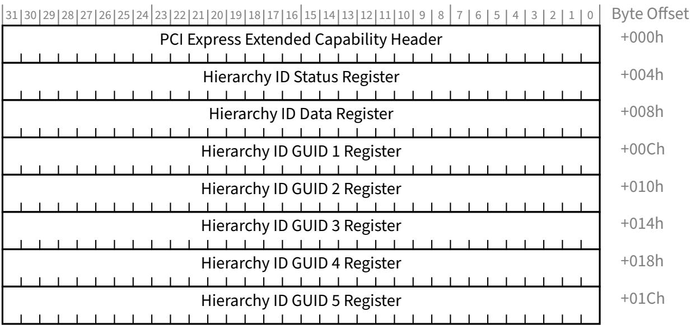


图 7-320 和表 7-281 详细说明了层级 ID 扩展能力头中各字段的分配。

</td>
</tr>
</tbody>
</table>
</div>


[⬆️ 返回目录](#-本章目录-table-of-contents)

---

<a id="sec-7-9-17-fig-320"></a>
## Figure 7-320. Hierarchy ID Extended Capability Header | 图 7-320. 层级 ID 扩展能力头

<table>
<thead>
<tr>
<th width="50%">🇬🇧 English</th>
<th width="50%" style="background-color:#e8e8e8">🏆 中文</th>
</tr>
</thead>
<tbody>
<tr>
<td>

<!-- 📄 Page 1348 -->
---

```
 0           15  16      19  20              31
+-------------+---+-------+------------------+
| Extended    |   | Cap.  | Next Capability  |
| Capability  |   | Vers. | Offset           |
| ID          |   |       |                  |
+-------------+---+-------+------------------+
```

**Figure 7-320 Hierarchy ID Extended Capability Header**

**Table 7-281 Hierarchy ID Extended Capability Header**

| Bit Location | Description | Attributes |
|--------------|-------------|------------|
| 15:0 | **Extended Capability ID** - This field is a PCI-SIG defined ID number that indicates the nature and format of the Extended Capability. <br>PCI Express Extended Capability ID for the Hierarchy ID Extended Capability is 0028h. | RO |
| 19:16 | **Capability Version** - This field is a PCI-SIG defined version number that indicates the version of the Capability structure present. <br>Must be 1h for this version of the specification. | RO |
| 31:20 | **Next Capability Offset** - This field contains the offset to the next PCI Express Extended Capability structure or 000h if no other items exist in the linked list of Capabilities. For Extended Capabilities in configuration space, this offset is relative to the beginning of PCI-compatible Configuration Space and thus must always be either 000h (for terminating the list of Capabilities) or greater than 0FFh. | RO |

</td>
<td style="background-color:#e8e8e8">

<!-- 📄 Page 1348 -->
---

```
 0           15  16      19  20              31
+-------------+---+-------+------------------+
| 扩展能力    |   | 能力  | 下一能力偏移     |
| ID          |   | 版本  |                  |
+-------------+---+-------+------------------+
```

**图 7-320 层级 ID 扩展能力头**

> 


**表 7-281 层级 ID 扩展能力头**

| 比特位置 | 描述 | 属性 |
|----------|------|------|
| 15:0 | **Extended Capability ID（扩展能力 ID）** — 此字段是 PCI-SIG 定义的 ID 编号，用于指示扩展能力的性质和格式。 <br>层级 ID 扩展能力的 PCI Express 扩展能力 ID 为 0028h。 | RO |
| 19:16 | **Capability Version（能力版本）** — 此字段是 PCI-SIG 定义的版本号，用于指示当前能力结构的版本。 <br>对于本版本的规范必须为 1h。 | RO |
| 31:20 | **Next Capability Offset（下一能力偏移）** — 此字段包含到下一个 PCI Express 扩展能力结构的偏移量，如果链接的能力列表中没有其他项则为 000h。对于配置空间中的扩展能力，此偏移相对于 PCI 兼容配置空间的起始位置，因此必须始终为 000h（用于终止能力列表）或大于 0FFh。 | RO |

</td>
</tr>
</tbody>
</table>

[⬆️ 返回目录](#-本章目录-table-of-contents)

---

<a id="sec-7-9-17-1"></a>
## 7.9.17.1 Hierarchy ID Extended Capability Header (Offset 00h) | 层级 ID 扩展能力头（偏移 00h）

<table>
<thead>
<tr>
<th width="50%">🇬🇧 English</th>
<th width="50%" style="background-color:#e8e8e8">🏆 中文</th>
</tr>
</thead>
<tbody>
<tr>
<td>

Refer to Figure 7-320 and Table 7-281 for field allocation details of the Hierarchy ID Extended Capability Header.

</td>
<td style="background-color:#e8e8e8">

有关层级 ID 扩展能力头的字段分配详细信息，请参见图 7-320 和表 7-281。

</td>
</tr>
</tbody>
</table>

[⬆️ 返回目录](#-本章目录-table-of-contents)

---

<a id="sec-7-9-17-fig-321"></a>
## Figure 7-321. Hierarchy ID Status Register | 图 7-321. 层级 ID 状态寄存器


<div style="overflow-x: auto; max-width: 100%;">
<table>
<thead>
<tr>
<th width="50%">🇬🇧 English</th>
<th width="50%" style="background-color:#e8e8e8">🏆 中文</th>
</tr>
</thead>
<tbody>
<tr>
<td>

<!-- 📄 Page 1349 -->
---

```
 0           15  16      27  28  29             30   31
+-------------+---+-------+----+----------------+----+
| Message     |   | RsvdZ |    | Hierarchy ID   | H  | H
| Requester   |   |       |    | Writeable      | V  | I
| ID          |   |       |    |                | F  | D
|             |   |       |    |                | C  |   |
|             |   |       |    |                |    | V  |
+-------------+---+-------+----+----------------+----+
```

**Figure 7-321 Hierarchy ID Status Register**

**Table 7-282 Hierarchy ID Status Register**

| Bit Location | Description | Attributes |
|--------------|-------------|------------|
| 15:0 | **Message Requester ID** - In an Upstream Port, this field contains the Requester ID from the most recently received Hierarchy ID Message. This field is meaningful only if Hierarchy ID Valid is 1b. This value identifies the Downstream Port (within this Hierarchy) that sent the Hierarchy ID Message. This information is not considered part of the Hierarchy ID as it can vary within the Hierarchy (e.g., different Root Ports of one Root Complex), but helps in debug situations to identify the provenance of the Hierarchy ID information. <br>In a Downstream Port, this field is RsvdZ. <br>For RCiEPs, this field is RsvdZ. <br>This field defaults to 0000h. | RO/RsvdZ |
| 28 | **Hierarchy ID Writeable** - This bit is Set to indicate that the Hierarchy ID Data and GUID registers are read/write. This bit is Clear to indicate that the Hierarchy ID and GUID registers are read only. <br>In Downstream Ports this bit is hardwired to 1b. <br>In Upstream Ports, Functions that are not VFs must hardwire this bit to 0b. <br>RCiEPs that are not VFs, must hardwire this bit to either 0b or 1b. <br>VFs in an Upstream Port and Root Complex Integrated VFs are permitted to either: <br>• hardwire this bit to 0b or <br>• implement this bit as read / write with a default value of 0b. | RW/RO |
| 29 | **Hierarchy ID VF Configurable** - This bit indicates that Hierarchy ID Writeable can be configured. <br>If Hierarchy ID Writeable is implemented as read / write, this bit is 1b. Otherwise this bit is 0b. | RO |
| 30 | **Hierarchy ID Pending** - In Downstream Ports this requests the transmittion of a Hierarchy ID Message. Setting it requests transmission of a message based on the Hierarchy Data and GUID registers in this capability. This bit is cleared when either the transmit request is satisfied or the Link enters DL_Down. <br>Behavior is undefined if the Hierarchy Data or GUID registers in this capability are written while this bit is Set. <br>In Downstream Ports, this bit is Read / Write defaulting to 0b. <br>In all other Functions, this bit is RsvdZ. | RW/RsvdZ |

</td>
<td style="background-color:#e8e8e8">

<!-- 📄 Page 1349 -->
---

```
 0           15  16      27  28  29             30   31
+-------------+---+-------+----+----------------+----+
| Message     |   | 保留  |    | 层级 ID        | H  | H
| Requester   |   |       |    | 可写           | V  | I
| ID          |   |       |    |                | F  | D
|             |   |       |    |                | C  |   |
|             |   |       |    |                |    | V  |
+-------------+---+-------+----+----------------+----+
```

**图 7-321 层级 ID 状态寄存器**

> 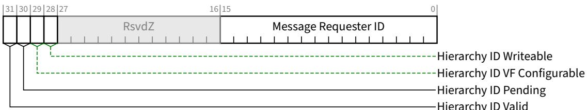


**表 7-282 层级 ID 状态寄存器**

| 比特位置 | 描述 | 属性 |
|----------|------|------|
| 15:0 | **Message Requester ID（消息请求者 ID）** — 在 Upstream Port 中，此字段包含最近接收到的 Hierarchy ID Message 中的 Requester ID。仅当 Hierarchy ID Valid 为 1b 时此字段才有意义。此值标识发送 Hierarchy ID Message 的（本层级内的）Downstream Port。此信息不视为层级 ID 的一部分，因为它在同一层级内可能变化（例如同一根复合体（Root Complex）的不同根端口），但有助于在调试时识别层级 ID 信息的来源。 <br>在 Downstream Port 中，此字段为 RsvdZ。 <br>对于 RCiEP，此字段为 RsvdZ。 <br>此字段默认值为 0000h。 | RO/RsvdZ |
| 28 | **Hierarchy ID Writeable（层级 ID 可写）** — 该位置 1 表示 Hierarchy ID Data 和 GUID 寄存器为读/写。该位为 0 表示 Hierarchy ID 和 GUID 寄存器为只读。 <br>在 Downstream Port 中，该位硬连线为 1b。 <br>在 Upstream Port 中，非 VF 的 Function 必须将该位硬连线为 0b。 <br>非 VF 的 RCiEP 必须将该位硬连线为 0b 或 1b。 <br>Upstream Port 中的 VF 和根复合体集成 VF（Root Complex Integrated VF）可任选以下方式： <br>• 将该位硬连线为 0b； <br>• 将该位实现为读/写，默认值为 0b。 | RW/RO |
| 29 | **Hierarchy ID VF Configurable（层级 ID VF 可配置）** — 此位表示 Hierarchy ID Writeable 可以被配置。 <br>如果 Hierarchy ID Writeable 被实现为读/写，则此位为 1b；否则此位为 0b。 | RO |
| 30 | **Hierarchy ID Pending（层级 ID 待处理）** — 在 Downstream Port 中，此位用于请求发送 Hierarchy ID Message。置 1 时将基于本能力中的 Hierarchy Data 和 GUID 寄存器请求发送消息。当发送请求被满足或链路（Link）进入 DL_Down 时，该位被清零。 <br>当此位被置 1 时，若写入本能力中的 Hierarchy Data 或 GUID 寄存器，则行为未定义。 <br>在 Downstream Port 中，此位为读/写，默认值为 0b。 <br>在其他所有 Function 中，此位为 RsvdZ。 | RW/RsvdZ |

</td>
</tr>
</tbody>
</table>
</div>


[⬆️ 返回目录](#-本章目录-table-of-contents)

---

<a id="sec-7-9-17-2"></a>
## 7.9.17.2 Hierarchy ID Status Register (Offset 04h) | 层级 ID 状态寄存器（偏移 04h）

<table>
<thead>
<tr>
<th width="50%">🇬🇧 English</th>
<th width="50%" style="background-color:#e8e8e8">🏆 中文</th>
</tr>
</thead>
<tbody>
<tr>
<td>

Refer to Figure 7-321 and Table 7-282 for field allocation details of the Hierarchy ID Status Register.

</td>
<td style="background-color:#e8e8e8">

有关层级 ID 状态寄存器的字段分配详细信息，请参见图 7-321 和表 7-282。

</td>
</tr>
</tbody>
</table>

[⬆️ 返回目录](#-本章目录-table-of-contents)

---

<a id="sec-7-9-17-fig-322"></a>
## Figure 7-322. Hierarchy ID Data Register (continued) | 图 7-322. 层级 ID 数据寄存器（续）


<div style="overflow-x: auto; max-width: 100%;">
<table>
<thead>
<tr>
<th width="50%">🇬🇧 English</th>
<th width="50%" style="background-color:#e8e8e8">🏆 中文</th>
</tr>
</thead>
<tbody>
<tr>
<td>

<!-- 📄 Page 1350 -->
---

| Bit Location | Description | Attributes |
|--------------|-------------|------------|
| 31 | **Hierarchy ID Valid** - This bit indicates that the remaining fields in this capability are meaningful. <br>In Downstream Ports, this bit is hardwired to 1b. <br>In all other Functions, the following rules apply: <br>• If Hierarchy ID Writeable is Set, this bit is read/write, default 0b. <br>• If Hierarchy ID Writeable is Clear, this bit is read only, default 0b. <br>&nbsp;&nbsp;◦ In VFs, this bit contains the same value as the associated PF. <br>&nbsp;&nbsp;◦ In Functions other than VFs that are associated with an Upstream Port, this bit is Set when a Hierarchy ID Message is received, and Cleared when the Link is DL_Down. <br>&nbsp;&nbsp;◦ In RCiEPs other than VFs, this bit contains a system provided value. The mechanism for determining this value is outside the scope of this specification. | RW/RO |

Figure 7-322 and Table 7-283 detail allocation of fields in the Hierarchy ID Data Register.

```
 0           7   8        15  16              31
+-------------+---+-------+------------------+
| System GUID |   | RsvdP | Hierarchy ID     |
| Authority   |   |       |                  |
| ID          |   |       |                  |
+-------------+---+-------+------------------+
```

**Figure 7-322 Hierarchy ID Data Register**

**Table 7-283 Hierarchy ID Data Register**

| Bit Location | Description | Attributes |
|--------------|-------------|------------|
| 7:0 | **System GUID Authority ID** - This field corresponds to the System GUID Authority ID field in the Hierarchy ID Message. See § Section 6.25 for details. <br>This field is meaningful only if Hierarchy ID Valid is 1b. <br>If Hierarchy ID Writeable is Set, this field is read-write and contains the value programmed by software. <br>If Hierarchy ID Writeable is Clear, this field is read only. The value is determined using the rules defined in § Section 7.9.17. <br>This field defaults to 00h. | RO/RW |
| 31:16 | **Hierarchy ID** - This field corresponds to the Hierarchy ID field in the Hierarchy ID Message. See § Section 6.25 for details. <br>This field is meaningful only if Hierarchy ID Valid is 1b. <br>If Hierarchy ID Writeable is Set, this field is read-write and contains the value programmed by software. <br>If Hierarchy ID Writeable is Clear, this field is read only. The value is determined using the rules defined in § Section 7.9.17. <br>This field defaults to 0000h. | RO/RW |

</td>
<td style="background-color:#e8e8e8">

<!-- 📄 Page 1350 -->
---

| 比特位置 | 描述 | 属性 |
|----------|------|------|
| 31 | **Hierarchy ID Valid（层级 ID 有效）** — 此位表示本能力中其余字段是否有意义。 <br>在 Downstream Port 中，此位硬连线为 1b。 <br>在其他所有 Function 中，适用以下规则： <br>• 如果 Hierarchy ID Writeable 被置 1，则此位为读/写，默认值为 0b。 <br>• 如果 Hierarchy ID Writeable 为 0，则此位为只读，默认值为 0b。 <br>&nbsp;&nbsp;◦ 在 VF 中，此位包含与关联 PF 相同的值。 <br>&nbsp;&nbsp;◦ 在与 Upstream Port 关联的非 VF Function 中，收到 Hierarchy ID Message 时该位被置 1，当链路为 DL_Down 时该位被清零。 <br>&nbsp;&nbsp;◦ 在非 VF 的 RCiEP 中，此位包含由系统提供的值。用于确定此值的机制不在本规范范围内。 | RW/RO |

图 7-322 和表 7-283 详细说明了层级 ID 数据寄存器中各字段的分配。

```
 0           7   8        15  16              31
+-------------+---+-------+------------------+
| System GUID |   | 保留  | 层级 ID          |
| Authority   |   |       |                  |
| ID          |   |       |                  |
+-------------+---+-------+------------------+
```

**图 7-322 层级 ID 数据寄存器**

> 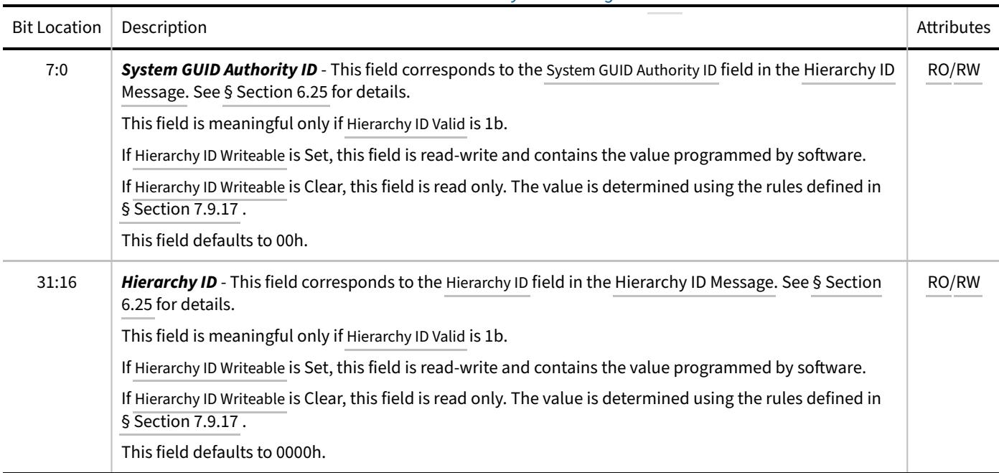


**表 7-283 层级 ID 数据寄存器**

| 比特位置 | 描述 | 属性 |
|----------|------|------|
| 7:0 | **System GUID Authority ID（系统 GUID 授权 ID）** — 此字段对应于 Hierarchy ID Message 中的 System GUID Authority ID 字段。详情参见 § 第 6.25 节。 <br>仅当 Hierarchy ID Valid 为 1b 时此字段才有意义。 <br>如果 Hierarchy ID Writeable 被置 1，则此字段为读/写，并包含由软件编程的值。 <br>如果 Hierarchy ID Writeable 为 0，则此字段为只读。该值使用 § 第 7.9.17 节中定义的规则确定。 <br>此字段默认值为 00h。 | RO/RW |
| 31:16 | **Hierarchy ID（层级 ID）** — 此字段对应于 Hierarchy ID Message 中的 Hierarchy ID 字段。详情参见 § 第 6.25 节。 <br>仅当 Hierarchy ID Valid 为 1b 时此字段才有意义。 <br>如果 Hierarchy ID Writeable 被置 1，则此字段为读/写，并包含由软件编程的值。 <br>如果 Hierarchy ID Writeable 为 0，则此字段为只读。该值使用 § 第 7.9.17 节中定义的规则确定。 <br>此字段默认值为 0000h。 | RO/RW |

</td>
</tr>
</tbody>
</table>
</div>


[⬆️ 返回目录](#-本章目录-table-of-contents)

---

<a id="sec-7-9-17-3"></a>
## 7.9.17.3 Hierarchy ID Data Register (Offset 08h) | 层级 ID 数据寄存器（偏移 08h）

<table>
<thead>
<tr>
<th width="50%">🇬🇧 English</th>
<th width="50%" style="background-color:#e8e8e8">🏆 中文</th>
</tr>
</thead>
<tbody>
<tr>
<td>

Refer to Figure 7-322 and Table 7-283 for field allocation details of the Hierarchy ID Data Register.

</td>
<td style="background-color:#e8e8e8">

有关层级 ID 数据寄存器的字段分配详细信息，请参见图 7-322 和表 7-283。

</td>
</tr>
</tbody>
</table>

[⬆️ 返回目录](#-本章目录-table-of-contents)

---

<a id="sec-7-9-17-fig-323"></a>
## Figure 7-323. Hierarchy ID GUID 1 Register | 图 7-323. 层级 ID GUID 1 寄存器


<div style="overflow-x: auto; max-width: 100%;">
<table>
<thead>
<tr>
<th width="50%">🇬🇧 English</th>
<th width="50%" style="background-color:#e8e8e8">🏆 中文</th>
</tr>
</thead>
<tbody>
<tr>
<td>

<!-- 📄 Page 1351 -->
---

```
 0           15  16              31
+-------------+---+---------------+
| System      |   |  RsvdP        |
| GUID 1      |   |               |
+-------------+---+---------------+
```

**Figure 7-323 Hierarchy ID GUID 1 Register**

**Table 7-284 Hierarchy ID GUID 1 Register**

| Bit Location | Description | Attributes |
|--------------|-------------|------------|
| 15:0 | **System GUID 1** - This field corresponds to bits [143:128] of the System GUID in the Hierarchy ID Message. See § Section 6.25 for details. <br>This field is meaningful only if Hierarchy ID Valid is 1b. <br>If Hierarchy ID Writeable is Set, this field is read-write and contains the value programmed by software. <br>If Hierarchy ID Writeable is Clear, this field is read only. The value is determined using the rules defined in § Section 7.9.17. <br>This field defaults to 0000h. | RO/RW |

</td>
<td style="background-color:#e8e8e8">

<!-- 📄 Page 1351 -->
---

```
 0           15  16              31
+-------------+---+---------------+
| System      |   |  保留         |
| GUID 1      |   |               |
+-------------+---+---------------+
```

**图 7-323 层级 ID GUID 1 寄存器**

**表 7-284 层级 ID GUID 1 寄存器**

| 比特位置 | 描述 | 属性 |
|----------|------|------|
| 15:0 | **System GUID 1（系统 GUID 1）** — 此字段对应于 Hierarchy ID Message 中 System GUID 的 [143:128] 位。详情参见 § 第 6.25 节。 <br>仅当 Hierarchy ID Valid 为 1b 时此字段才有意义。 <br>如果 Hierarchy ID Writeable 被置 1，则此字段为读/写，并包含由软件编程的值。 <br>如果 Hierarchy ID Writeable 为 0，则此字段为只读。该值使用 § 第 7.9.17 节中定义的规则确定。 <br>此字段默认值为 0000h。 | RO/RW |

</td>
</tr>
</tbody>
</table>
</div>


[⬆️ 返回目录](#-本章目录-table-of-contents)

---

<a id="sec-7-9-17-fig-324"></a>
## Figure 7-324. Hierarchy ID GUID 2 Register | 图 7-324. 层级 ID GUID 2 寄存器

<table>
<thead>
<tr>
<th width="50%">🇬🇧 English</th>
<th width="50%" style="background-color:#e8e8e8">🏆 中文</th>
</tr>
</thead>
<tbody>
<tr>
<td>

```
 0                       31
+-------------------------+
|       System GUID 2     |
+-------------------------+
```

**Figure 7-324 Hierarchy ID GUID 2 Register**

**Table 7-285 Hierarchy ID GUID 2 Register**

| Bit Location | Description | Attributes |
|--------------|-------------|------------|
| 31:0 | **System GUID 2** - This field corresponds to bits [127:96] of the System GUID field in the Hierarchy ID Message. See § Section 6.25 for details. <br>This field is meaningful only if Hierarchy ID Valid is 1b. <br>If Hierarchy ID Writeable is Set, this field is read-write and contains the value programmed by software. <br>If Hierarchy ID Writeable is Clear, this field is read only. The value is determined using the rules defined in § Section 7.9.17. <br>This field defaults to 0000 0000h. | RO/RW |

</td>
<td style="background-color:#e8e8e8">

```
 0                       31
+-------------------------+
|       System GUID 2     |
+-------------------------+
```

**图 7-324 层级 ID GUID 2 寄存器**

**表 7-285 层级 ID GUID 2 寄存器**

| 比特位置 | 描述 | 属性 |
|----------|------|------|
| 31:0 | **System GUID 2（系统 GUID 2）** — 此字段对应于 Hierarchy ID Message 中 System GUID 字段的 [127:96] 位。详情参见 § 第 6.25 节。 <br>仅当 Hierarchy ID Valid 为 1b 时此字段才有意义。 <br>如果 Hierarchy ID Writeable 被置 1，则此字段为读/写，并包含由软件编程的值。 <br>如果 Hierarchy ID Writeable 为 0，则此字段为只读。该值使用 § 第 7.9.17 节中定义的规则确定。 <br>此字段默认值为 0000 0000h。 | RO/RW |

</td>
</tr>
</tbody>
</table>

[⬆️ 返回目录](#-本章目录-table-of-contents)

---

<a id="sec-7-9-17-4"></a>
## 7.9.17.4 Hierarchy ID GUID 1 Register (Offset 0Ch) | 层级 ID GUID 1 寄存器（偏移 0Ch）

<table>
<thead>
<tr>
<th width="50%">🇬🇧 English</th>
<th width="50%" style="background-color:#e8e8e8">🏆 中文</th>
</tr>
</thead>
<tbody>
<tr>
<td>

Refer to Figure 7-323 and Table 7-284 for field allocation details of the Hierarchy ID GUID 1 Register.

</td>
<td style="background-color:#e8e8e8">

有关层级 ID GUID 1 寄存器的字段分配详细信息，请参见图 7-323 和表 7-284。

</td>
</tr>
</tbody>
</table>

[⬆️ 返回目录](#-本章目录-table-of-contents)

---

<a id="sec-7-9-17-5"></a>
## 7.9.17.5 Hierarchy ID GUID 2 Register (Offset 10h) | 层级 ID GUID 2 寄存器（偏移 10h）

<table>
<thead>
<tr>
<th width="50%">🇬🇧 English</th>
<th width="50%" style="background-color:#e8e8e8">🏆 中文</th>
</tr>
</thead>
<tbody>
<tr>
<td>

Refer to Figure 7-324 and Table 7-285 for field allocation details of the Hierarchy ID GUID 2 Register.

</td>
<td style="background-color:#e8e8e8">

有关层级 ID GUID 2 寄存器的字段分配详细信息，请参见图 7-324 和表 7-285。

</td>
</tr>
</tbody>
</table>

[⬆️ 返回目录](#-本章目录-table-of-contents)

---

<a id="sec-7-9-17-fig-325"></a>
## Figure 7-325. Hierarchy ID GUID 3 Register | 图 7-325. 层级 ID GUID 3 寄存器


<div style="overflow-x: auto; max-width: 100%;">
<table>
<thead>
<tr>
<th width="50%">🇬🇧 English</th>
<th width="50%" style="background-color:#e8e8e8">🏆 中文</th>
</tr>
</thead>
<tbody>
<tr>
<td>

<!-- 📄 Page 1352 -->
---

```
 0                       31
+-------------------------+
|       System GUID 3     |
+-------------------------+
```

**Figure 7-325 Hierarchy ID GUID 3 Register**

**Table 7-286 Hierarchy ID GUID 3 Register**

| Bit Location | Description | Attributes |
|--------------|-------------|------------|
| 31:0 | **System GUID 3** - This field corresponds to bits [95:64] of the System GUID field in the Hierarchy ID Message. See § Section 6.25 for details. <br>This field is meaningful only if Hierarchy ID Valid is 1b. <br>If Hierarchy ID Writeable is Set, this field is read-write and contains the value programmed by software. <br>If Hierarchy ID Writeable is Clear, this field is read only. The value is determined using the rules defined in § Section 7.9.17. <br>This field defaults to 0000 0000h. | RO/RW |

</td>
<td style="background-color:#e8e8e8">

<!-- 📄 Page 1352 -->
---

```
 0                       31
+-------------------------+
|       System GUID 3     |
+-------------------------+
```

**图 7-325 层级 ID GUID 3 寄存器**

**表 7-286 层级 ID GUID 3 寄存器**

| 比特位置 | 描述 | 属性 |
|----------|------|------|
| 31:0 | **System GUID 3（系统 GUID 3）** — 此字段对应于 Hierarchy ID Message 中 System GUID 字段的 [95:64] 位。详情参见 § 第 6.25 节。 <br>仅当 Hierarchy ID Valid 为 1b 时此字段才有意义。 <br>如果 Hierarchy ID Writeable 被置 1，则此字段为读/写，并包含由软件编程的值。 <br>如果 Hierarchy ID Writeable 为 0，则此字段为只读。该值使用 § 第 7.9.17 节中定义的规则确定。 <br>此字段默认值为 0000 0000h。 | RO/RW |

</td>
</tr>
</tbody>
</table>
</div>


[⬆️ 返回目录](#-本章目录-table-of-contents)

---

<a id="sec-7-9-17-fig-326"></a>
## Figure 7-326. Hierarchy ID GUID 4 Register | 图 7-326. 层级 ID GUID 4 寄存器

<table>
<thead>
<tr>
<th width="50%">🇬🇧 English</th>
<th width="50%" style="background-color:#e8e8e8">🏆 中文</th>
</tr>
</thead>
<tbody>
<tr>
<td>

```
 0                       31
+-------------------------+
|       System GUID 4     |
+-------------------------+
```

**Figure 7-326 Hierarchy ID GUID 4 Register**

**Table 7-287 Hierarchy ID GUID 4 Register**

| Bit Location | Description | Attributes |
|--------------|-------------|------------|
| 31:0 | **System GUID 4** - This field corresponds to bits [63:32] of the System GUID field in the Hierarchy ID Message. See § Section 6.25 for details. <br>This field is meaningful only if Hierarchy ID Valid is 1b. <br>If Hierarchy ID Writeable is Set, this field is read-write and contains the value programmed by software. <br>If Hierarchy ID Writeable is Clear, this field is read only. The value is determined using the rules defined in § Section 7.9.17. <br>This field defaults to 0000 0000h. | RO/RW |

</td>
<td style="background-color:#e8e8e8">

```
 0                       31
+-------------------------+
|       System GUID 4     |
+-------------------------+
```

**图 7-326 层级 ID GUID 4 寄存器**

**表 7-287 层级 ID GUID 4 寄存器**

| 比特位置 | 描述 | 属性 |
|----------|------|------|
| 31:0 | **System GUID 4（系统 GUID 4）** — 此字段对应于 Hierarchy ID Message 中 System GUID 字段的 [63:32] 位。详情参见 § 第 6.25 节。 <br>仅当 Hierarchy ID Valid 为 1b 时此字段才有意义。 <br>如果 Hierarchy ID Writeable 被置 1，则此字段为读/写，并包含由软件编程的值。 <br>如果 Hierarchy ID Writeable 为 0，则此字段为只读。该值使用 § 第 7.9.17 节中定义的规则确定。 <br>此字段默认值为 0000 0000h。 | RO/RW |

</td>
</tr>
</tbody>
</table>

[⬆️ 返回目录](#-本章目录-table-of-contents)

---

<a id="sec-7-9-17-6"></a>
## 7.9.17.6 Hierarchy ID GUID 3 Register (Offset 14h) | 层级 ID GUID 3 寄存器（偏移 14h）

<table>
<thead>
<tr>
<th width="50%">🇬🇧 English</th>
<th width="50%" style="background-color:#e8e8e8">🏆 中文</th>
</tr>
</thead>
<tbody>
<tr>
<td>

Refer to Figure 7-325 and Table 7-286 for field allocation details of the Hierarchy ID GUID 3 Register.

</td>
<td style="background-color:#e8e8e8">

有关层级 ID GUID 3 寄存器的字段分配详细信息，请参见图 7-325 和表 7-286。

</td>
</tr>
</tbody>
</table>

[⬆️ 返回目录](#-本章目录-table-of-contents)

---

<a id="sec-7-9-17-7"></a>
## 7.9.17.7 Hierarchy ID GUID 4 Register (Offset 18h) | 层级 ID GUID 4 寄存器（偏移 18h）

<table>
<thead>
<tr>
<th width="50%">🇬🇧 English</th>
<th width="50%" style="background-color:#e8e8e8">🏆 中文</th>
</tr>
</thead>
<tbody>
<tr>
<td>

Refer to Figure 7-326 and Table 7-287 for field allocation details of the Hierarchy ID GUID 4 Register.

</td>
<td style="background-color:#e8e8e8">

有关层级 ID GUID 4 寄存器的字段分配详细信息，请参见图 7-326 和表 7-287。

</td>
</tr>
</tbody>
</table>

[⬆️ 返回目录](#-本章目录-table-of-contents)

---

<a id="sec-7-9-17-fig-327"></a>
## Figure 7-327. Hierarchy ID GUID 5 Register | 图 7-327. 层级 ID GUID 5 寄存器


<div style="overflow-x: auto; max-width: 100%;">
<table>
<thead>
<tr>
<th width="50%">🇬🇧 English</th>
<th width="50%" style="background-color:#e8e8e8">🏆 中文</th>
</tr>
</thead>
<tbody>
<tr>
<td>

<!-- 📄 Page 1353 -->
---

```
 0                       31
+-------------------------+
|       System GUID 5     |
+-------------------------+
```

**Figure 7-327 Hierarchy ID GUID 5 Register**

**Table 7-288 Hierarchy ID GUID 5 Register**

| Bit Location | Description | Attributes |
|--------------|-------------|------------|
| 31:0 | **System GUID 5** - This field corresponds to bits [31:0] of the System GUID field in the Hierarchy ID Message. See § Section 6.25 for details. <br>This field is meaningful only if Hierarchy ID Valid is 1b. <br>If Hierarchy ID Writeable is Set, this field is read-write and contains the value programmed by software. <br>If Hierarchy ID Writeable is Clear, this field is read only. The value is determined using the rules defined in § Section 7.9.17. <br>This field defaults to 0000 0000h. | RO/RW |

</td>
<td style="background-color:#e8e8e8">

<!-- 📄 Page 1353 -->
---

```
 0                       31
+-------------------------+
|       System GUID 5     |
+-------------------------+
```

**图 7-327 层级 ID GUID 5 寄存器**

**表 7-288 层级 ID GUID 5 寄存器**

| 比特位置 | 描述 | 属性 |
|----------|------|------|
| 31:0 | **System GUID 5（系统 GUID 5）** — 此字段对应于 Hierarchy ID Message 中 System GUID 字段的 [31:0] 位。详情参见 § 第 6.25 节。 <br>仅当 Hierarchy ID Valid 为 1b 时此字段才有意义。 <br>如果 Hierarchy ID Writeable 被置 1，则此字段为读/写，并包含由软件编程的值。 <br>如果 Hierarchy ID Writeable 为 0，则此字段为只读。该值使用 § 第 7.9.17 节中定义的规则确定。 <br>此字段默认值为 0000 0000h。 | RO/RW |

</td>
</tr>
</tbody>
</table>
</div>


[⬆️ 返回目录](#-本章目录-table-of-contents)

---

<a id="sec-7-9-18-vpd-intro"></a>
## 7.9.18 Vital Product Data (VPD) Capability | 重要产品数据（VPD）能力

<table>
<thead>
<tr>
<th width="50%">🇬🇧 English</th>
<th width="50%" style="background-color:#e8e8e8">🏆 中文</th>
</tr>
</thead>
<tbody>
<tr>
<td>

Support of VPD is optional. All Functions are permitted to contain the capability. This includes all Functions of a Multi-Function Device associated with an Upstream Port as well as RCiEPs. This also includes PFs and VFs.

Vital Product Data (VPD) is information that uniquely identifies hardware and, potentially, software elements of a system. The VPD can provide the system with information on various Field Replaceable Units such as part number, serial number, and other detailed information. The objective from a system point of view is to make this information available to the system owner and service personnel. VPD typically resides in a storage device (for example, a serial EEPROM) associated with the Function.

VFs and PFs that implement the VPD Capability must ensure that there can be no "data leakage" between VFs and/or PFs via the VPD Capability.

Details of the VPD Data is defined in § Section 6.27.

Access to the VPD is provided using the Capabilities List in Configuration Space. The VPD Capability structure is shown in Figure 7-328.

</td>
<td style="background-color:#e8e8e8">

对 VPD 的支持是可选的。允许所有 Function 包含该能力。这包括与 Upstream Port 关联的多功能设备（Multi-Function Device）的所有 Function 以及 RCiEP。这同样包括 PF 和 VF。

重要产品数据（VPD, Vital Product Data）是用于唯一标识系统中的硬件以及可能的软件元素的信息。VPD 可向系统提供有关各种现场可更换单元（FRU, Field Replaceable Unit）的信息，例如部件编号、序列号以及其他详细信息。从系统角度看，其目标是将此信息提供给系统所有者和服务人员。VPD 通常驻留在与该 Function 关联的存储设备（例如串行 EEPROM）中。

实现 VPD 能力的 VF 和 PF 必须确保不会通过 VPD 能力在 VF 和/或 PF 之间发生"数据泄漏"。

VPD 数据的详细信息在 § 第 6.27 节中定义。

对 VPD 的访问通过配置空间（Configuration Space）中的能力列表（Capabilities List）提供。VPD 能力结构如图 7-328 所示。

</td>
</tr>
</tbody>
</table>

[⬆️ 返回目录](#-本章目录-table-of-contents)

---


---

<a id="sec-7-9-17-8"></a>
## 7.9.17.8 Hierarchy ID GUID 5 Register (Offset 1Ch) | 层级 ID GUID 5 寄存器 (偏移 1Ch)

<table>
<thead>
<tr>
<th width="50%">🇬🇧 English</th>
<th width="50%" style="background-color:#e8e8e8">🏆 中文</th>
</tr>
</thead>
<tbody>
<tr>
<td>

7.9.17.8 Hierarchy ID GUID 5 Register (Offset 1Ch) §

</td>
<td style="background-color:#e8e8e8">

7.9.17.8 层级 ID GUID 5 寄存器 (偏移 1Ch) §

</td>
</tr>
</tbody>
</table>

[⬆️ 返回目录](#-本章目录-table-of-contents)

---

<a id="sec-7-9-18"></a>
## 7.9.18 Vital Product Data Capability (VPD Capability) | 重要产品数据能力 (VPD Capability)

<table>
<thead>
<tr>
<th width="50%">🇬🇧 English</th>
<th width="50%" style="background-color:#e8e8e8">🏆 中文</th>
</tr>
</thead>
<tbody>
<tr>
<td>

7.9.18 Vital Product Data Capability (VPD Capability) §
§
§

</td>
<td style="background-color:#e8e8e8">

7.9.18 重要产品数据能力 (VPD Capability) §
§
§

</td>
</tr>
</tbody>
</table>

[⬆️ 返回目录](#-本章目录-table-of-contents)

---

<!-- 📄 Page 1354 -->
---

<table>
<thead>
<tr>
<th width="50%">🇬🇧 English</th>
<th width="50%" style="background-color:#e8e8e8">🏆 中文</th>
</tr>
</thead>
<tbody>
<tr>
<td>

0
1
2
3
4
5
6
7
8
9
10
11
12
13
14
15
16
17
18
19
20
21
22
23
24
25
26
27
28
29
30
31
Byte Offset
Capability ID
Next Capability Pointer
VPD Address Register
VPD Data Register
+000h
+004h
Figure 7-328 VPD Capability Structure

</td>
<td style="background-color:#e8e8e8">

0
1
2
3
4
5
6
7
8
9
10
11
12
13
14
15
16
17
18
19
20
21
22
23
24
25
26
27
28
29
30
31
字节偏移
Capability ID
Next Capability Pointer
VPD Address 寄存器
VPD Data 寄存器
+000h
+004h
图 7-328 VPD 能力结构

</td>
</tr>
</tbody>
</table>

[⬆️ 返回目录](#-本章目录-table-of-contents)

---


<div style="overflow-x: auto; max-width: 100%;">
<table>
<thead>
<tr>
<th width="50%">🇬🇧 English</th>
<th width="50%" style="background-color:#e8e8e8">🏆 中文</th>
</tr>
</thead>
<tbody>
<tr>
<td>

The following protocols are used transfer data between the VPD Data field and the VPD storage component.

• To read VPD information:
1. Issue single write to the VPD Address Register writing the flag bit (F) to 0b and VPD Address with the address to read.
2. The hardware device will set F to 1b when 4 bytes of data from the storage component have been transferred to VPD Data.
3. Software can monitor F and, after it becomes 1b, read the VPD information from VPD Data.
Behavior is undefined if either the VPD Address or VPD Data is written, prior to the flag bit becoming 1b.

• To write VPD information to the read/write portion of the VPD space:
1. Write the data to VPD Data
2. Then issue a single write to the VPD Address Register with F set to 1b and VPD Address set to the address where the VPD Data is to be stored.
3. The software then monitors F and when it is set to 0b (by device hardware), the VPD Data (all 4 bytes) has been transferred from VPD Data to the storage component.
If either the VPD Address or VPD Data is written, prior to F being becoming 0b, the results of the write operation to the storage component are unpredictable.
Behavior is undefined if a read or write of the storage component is requested and VPD Address is outside the range of the storage component.

The VPD (both the read only items and the read/write fields) is stored information and will have no direct control of any device operations.

The VPD Address Register is used to request a read or write of the VPD storage component.

</td>
<td style="background-color:#e8e8e8">

以下协议用于在 VPD Data 字段与 VPD 存储组件之间传输数据。

• 读取 VPD 信息:
1. 向 VPD Address 寄存器发起单次写入,将标志位 (F) 写为 0b,并将 VPD Address 写为要读取的地址。
2. 当来自存储组件的 4 字节数据已传输到 VPD Data 时,硬件设备会将 F 置为 1b。
3. 软件可以监控 F,在 F 变为 1b 之后,从 VPD Data 读取 VPD 信息。
如果在标志位变为 1b 之前对 VPD Address 或 VPD Data 进行写入,则行为未定义。

• 将 VPD 信息写入 VPD 空间的读/写部分:
1. 将数据写入 VPD Data。
2. 然后向 VPD Address 寄存器发起单次写入,F 置为 1b,VPD Address 置为 VPD Data 要存储的目标地址。
3. 随后软件监控 F,当 F 被设备硬件清为 0b 时,表示 VPD Data(全部 4 字节)已从 VPD Data 传输到存储组件。
如果在 F 变为 0b 之前对 VPD Address 或 VPD Data 进行写入,则对存储组件的写入操作结果不可预测。
如果请求对存储组件进行读或写时,VPD Address 超出存储组件的地址范围,则行为未定义。

VPD(包括只读项和读/写字段)是被存储的信息,不会对任何设备操作进行直接控制。

VPD Address 寄存器用于请求对 VPD 存储组件进行读或写。

</td>
</tr>
</tbody>
</table>
</div>


[⬆️ 返回目录](#-本章目录-table-of-contents)

---

<a id="sec-7-9-18-1"></a>
## 7.9.18.1 VPD Address Register | VPD Address 寄存器

<table>
<thead>
<tr>
<th width="50%">🇬🇧 English</th>
<th width="50%" style="background-color:#e8e8e8">🏆 中文</th>
</tr>
</thead>
<tbody>
<tr>
<td>

7.9.18.1 VPD Address Register §
§

</td>
<td style="background-color:#e8e8e8">

7.9.18.1 VPD Address 寄存器 §
§

</td>
</tr>
</tbody>
</table>

[⬆️ 返回目录](#-本章目录-table-of-contents)

---

<!-- 📄 Page 1355 -->
---

<table>
<thead>
<tr>
<th width="50%">🇬🇧 English</th>
<th width="50%" style="background-color:#e8e8e8">🏆 中文</th>
</tr>
</thead>
<tbody>
<tr>
<td>

0
14
VPD Address
15
F

</td>
<td style="background-color:#e8e8e8">

0
14
VPD Address
15
F

</td>
</tr>
</tbody>
</table>

> **Figure 7-329.** VPD Address Register
> 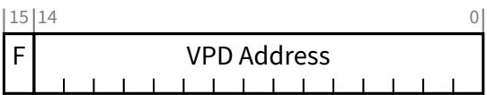


[⬆️ 返回目录](#-本章目录-table-of-contents)

---

**Table 7-289. VPD Address Register | 表 7-289. VPD Address 寄存器**

| Bit Location | Description | Attributes |
|--------------|-------------|------------|
| 14:0 | VPD Address - DWORD-aligned byte address of the VPD to be accessed. Behavior is undefined if the lowest 2 bits of this field are non-zero. The lowest two bits of the field must be either RW, or RO with a value of 00b. The remaining bits of the field must be RW.<br>Default is implementation specific. | RW/RO (see description) |
| 15 | F - The F bit is always written along with VPD Address. The value of F indicates the direction of transfer being requested (0b = read, 1b = write). When the transfer is complete, the F bit value changes to indicate completion (1b = read complete, 0b = write complete).<br>Default is implementation specific. | RW |

[⬆️ 返回目录](#-本章目录-table-of-contents)

---

<table>
<thead>
<tr>
<th width="50%">🇬🇧 English</th>
<th width="50%" style="background-color:#e8e8e8">🏆 中文</th>
</tr>
</thead>
<tbody>
<tr>
<td>

0
31
VPD Data

</td>
<td style="background-color:#e8e8e8">

0
31
VPD Data

</td>
</tr>
</tbody>
</table>

> **Figure 7-330.** VPD Data Register


[⬆️ 返回目录](#-本章目录-table-of-contents)

---

**Table 7-290. VPD Data Register | 表 7-290. VPD Data 寄存器**

| Bit Location | Description | Attributes |
|--------------|-------------|------------|
| 31:0 | VPD Data - VPD Data can be read through this register. The least significant byte of this register (at offset 04h in this capability structure) corresponds to the byte of VPD at the address specified by VPD Address. Behavior is undefined for any read or write of this register with Byte Enables other than 1111b.<br>Default is implementation specific. | RW |

[⬆️ 返回目录](#-本章目录-table-of-contents)

---

<table>
<thead>
<tr>
<th width="50%">🇬🇧 English</th>
<th width="50%" style="background-color:#e8e8e8">🏆 中文</th>
</tr>
</thead>
<tbody>
<tr>
<td>

The Native PCIe Enclosure Management Extended (NPEM) Capability is an optional extended capability that is permitted to be implemented by Root Ports, Switch Downstream Ports, and Endpoints.

</td>
<td style="background-color:#e8e8e8">

原生 PCIe 机框管理扩展 (Native PCIe Enclosure Management Extended, NPEM) 能力是一个可选的扩展能力,允许由根端口 (Root Port)、交换机下游端口 (Switch Downstream Port) 以及端点 (Endpoint) 实现。

</td>
</tr>
</tbody>
</table>

[⬆️ 返回目录](#-本章目录-table-of-contents)

---

<a id="sec-7-9-18-2"></a>
## 7.9.18.2 VPD Data Register | VPD Data 寄存器

<table>
<thead>
<tr>
<th width="50%">🇬🇧 English</th>
<th width="50%" style="background-color:#e8e8e8">🏆 中文</th>
</tr>
</thead>
<tbody>
<tr>
<td>

7.9.18.2 VPD Data Register §

</td>
<td style="background-color:#e8e8e8">

7.9.18.2 VPD Data 寄存器 §

</td>
</tr>
</tbody>
</table>

[⬆️ 返回目录](#-本章目录-table-of-contents)

---

<a id="sec-7-9-19"></a>
## 7.9.19 Native PCIe Enclosure Management Extended Capability (NPEM Extended Capability) | 原生 PCIe 机框管理扩展能力 (NPEM 扩展能力)

<table>
<thead>
<tr>
<th width="50%">🇬🇧 English</th>
<th width="50%" style="background-color:#e8e8e8">🏆 中文</th>
</tr>
</thead>
<tbody>
<tr>
<td>

7.9.19 Native PCIe Enclosure Management Extended Capability (NPEM Extended Capability) §
§
§
§
§

</td>
<td style="background-color:#e8e8e8">

7.9.19 原生 PCIe 机框管理扩展能力 (NPEM 扩展能力) §
§
§
§
§

</td>
</tr>
</tbody>
</table>

[⬆️ 返回目录](#-本章目录-table-of-contents)

---

<!-- 📄 Page 1356 -->
---

<table>
<thead>
<tr>
<th width="50%">🇬🇧 English</th>
<th width="50%" style="background-color:#e8e8e8">🏆 中文</th>
</tr>
</thead>
<tbody>
<tr>
<td>

0
1
2
3
4
5
6
7
8
9
10
11
12
13
14
15
16
17
18
19
20
21
22
23
24
25
26
27
28
29
30
31
Byte Offset
PCI Express Extended Capability Header
NPEM Capability Register
NPEM Control Register
NPEM Status Register
+000h
+004h
+008h
+00Ch

</td>
<td style="background-color:#e8e8e8">

0
1
2
3
4
5
6
7
8
9
10
11
12
13
14
15
16
17
18
19
20
21
22
23
24
25
26
27
28
29
30
31
字节偏移
PCI Express 扩展能力头 (Extended Capability Header)
NPEM Capability 寄存器
NPEM Control 寄存器
NPEM Status 寄存器
+000h
+004h
+008h
+00Ch

</td>
</tr>
</tbody>
</table>

> **Figure 7-331.** NPEM Extended Capability
> 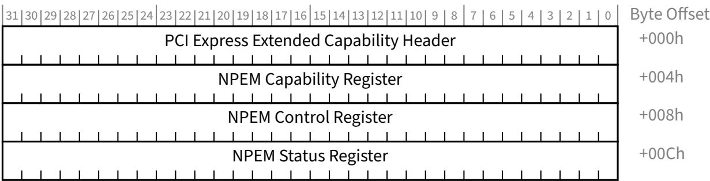


[⬆️ 返回目录](#-本章目录-table-of-contents)

---

<table>
<thead>
<tr>
<th width="50%">🇬🇧 English</th>
<th width="50%" style="background-color:#e8e8e8">🏆 中文</th>
</tr>
</thead>
<tbody>
<tr>
<td>

0
15
PCI Express Extended Capability ID
0029h
16
19
Capability Version
20
31
Next Capability Offset

</td>
<td style="background-color:#e8e8e8">

0
15
PCI Express 扩展能力 ID (Extended Capability ID)
0029h
16
19
能力版本 (Capability Version)
20
31
下一能力偏移 (Next Capability Offset)

</td>
</tr>
</tbody>
</table>

> **Figure 7-332.** NPEM Extended Capability Header
> 


[⬆️ 返回目录](#-本章目录-table-of-contents)

---

**Table 7-291. NPEM Extended Capability Header | 表 7-291. NPEM 扩展能力头**

| Bit Location | Register Description | Attributes |
|--------------|----------------------|------------|
| 15:0 | PCI Express Extended Capability ID - This field is a PCI-SIG defined ID number that indicates the nature and format of the extended capability. PCI Express Extended Capability ID for the NPEM Extended Capability is 0029h. | RO |
| 19:16 | Capability Version - This field is a PCI-SIG defined version number that indicates the version of the capability structure present. Must be 1h for this version of the specification. | RO |
| 31:20 | Next Capability Offset - This field contains the offset to the next PCI Express Extended Capability structure or 000h if no other items exist in the linked list of capabilities. | RO |

[⬆️ 返回目录](#-本章目录-table-of-contents)

---

<table>
<thead>
<tr>
<th width="50%">🇬🇧 English</th>
<th width="50%" style="background-color:#e8e8e8">🏆 中文</th>
</tr>
</thead>
<tbody>
<tr>
<td>

The NPEM Capability Register contains an overall NPEM Capable bit and a bit map of states supported in the implementation. Implementations are required to support OK, Locate, Fail, and Rebuild states if NPEM Capable bit is Set. All other states are optional.

</td>
<td style="background-color:#e8e8e8">

NPEM Capability 寄存器包含一个总的 NPEM Capable 位,以及实现所支持状态的位图。如果 NPEM Capable 位被置位,则实现必须支持 OK、Locate、Fail 和 Rebuild 状态。其他所有状态都是可选的。

</td>
</tr>
</tbody>
</table>

[⬆️ 返回目录](#-本章目录-table-of-contents)

---

<a id="sec-7-9-19-1"></a>
## 7.9.19.1 NPEM Extended Capability Header (Offset 00h) | NPEM 扩展能力头 (偏移 00h)

<table>
<thead>
<tr>
<th width="50%">🇬🇧 English</th>
<th width="50%" style="background-color:#e8e8e8">🏆 中文</th>
</tr>
</thead>
<tbody>
<tr>
<td>

7.9.19.1 NPEM Extended Capability Header (Offset 00h) §

</td>
<td style="background-color:#e8e8e8">

7.9.19.1 NPEM 扩展能力头 (偏移 00h) §

</td>
</tr>
</tbody>
</table>

[⬆️ 返回目录](#-本章目录-table-of-contents)

---

<a id="sec-7-9-19-2"></a>
## 7.9.19.2 NPEM Capability Register (Offset 04h) | NPEM Capability 寄存器 (偏移 04h)

<table>
<thead>
<tr>
<th width="50%">🇬🇧 English</th>
<th width="50%" style="background-color:#e8e8e8">🏆 中文</th>
</tr>
</thead>
<tbody>
<tr>
<td>

7.9.19.2 NPEM Capability Register (Offset 04h) §
§
§
§

</td>
<td style="background-color:#e8e8e8">

7.9.19.2 NPEM Capability 寄存器 (偏移 04h) §
§
§
§

</td>
</tr>
</tbody>
</table>

[⬆️ 返回目录](#-本章目录-table-of-contents)

---

<!-- 📄 Page 1357 -->
---


<div style="overflow-x: auto; max-width: 100%;">
<table>
<thead>
<tr>
<th width="50%">🇬🇧 English</th>
<th width="50%" style="background-color:#e8e8e8">🏆 中文</th>
</tr>
</thead>
<tbody>
<tr>
<td>

0
NPEM Capable
1
NPEM Reset Capable
2
NPEM OK Capable
3
NPEM Locate Capable
4
NPEM Fail Capable
5
NPEM Rebuild Capable
6
NPEM PFA Capable
7
NPEM Hot Spare Capable
8
NPEM In A Critical Array Capable
9
NPEM In A Failed Array Capable
10
NPEM Invalid Device Type Capable
11
NPEM Disabled Capable
12
23
RsvdP
24
31
Enclosure-specific Capabilities

</td>
<td style="background-color:#e8e8e8">

0
NPEM Capable
1
NPEM Reset Capable
2
NPEM OK Capable
3
NPEM Locate Capable
4
NPEM Fail Capable
5
NPEM Rebuild Capable
6
NPEM PFA Capable
7
NPEM Hot Spare Capable
8
NPEM In A Critical Array Capable
9
NPEM In A Failed Array Capable
10
NPEM Invalid Device Type Capable
11
NPEM Disabled Capable
12
23
RsvdP
24
31
Enclosure-specific Capabilities(机框专用能力)

</td>
</tr>
</tbody>
</table>

> **Figure 7-333.** NPEM Capability Register
> 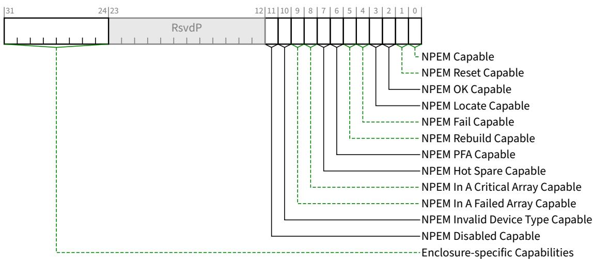

</div>


[⬆️ 返回目录](#-本章目录-table-of-contents)

---

**Table 7-292. NPEM Capability Register | 表 7-292. NPEM Capability 寄存器**

| Bit Location | Register Description | Attributes |
|--------------|----------------------|------------|
| 0 | NPEM Capable - When Set, this bit indicates that the enclosure has NPEM functionality. | HwInit |
| 1 | NPEM Reset Capable - A value of 1b indicates support for the optional NPEM Reset mechanism described in § Section 6.28. This capability is independently optional. | HwInit |
| 2 | NPEM OK Capable - When Set, this bit indicates that enclosure has the ability to indicate the NPEM OK state. This bit must be Set if NPEM Capable is also Set. | HwInit |
| 3 | NPEM Locate Capable - When Set, this bit indicates that enclosure has the ability to indicate the NPEM Locate state. This bit must be Set if NPEM Capable is also Set. | HwInit |
| 4 | NPEM Fail Capable - When Set, this bit indicates that enclosure has the ability to indicate the NPEM Fail state. This bit must be Set if NPEM Capable is also Set. | HwInit |
| 5 | NPEM Rebuild Capable - When Set, this bit indicates that enclosure has the ability to indicate the NPEM Rebuild state. This bit must be Set if NPEM Capable is also Set. | HwInit |
| 6 | NPEM PFA Capable - When Set, this bit indicates that enclosure has the ability to indicate the NPEM PFA state. This capability is independently optional. | HwInit |
| 7 | NPEM Hot Spare Capable - When Set, this bit indicates that enclosure has the ability to indicate the NPEM Hot Spare state. This capability is independently optional. | HwInit |
| 8 | NPEM In A Critical Array Capable - When Set, this bit indicates that enclosure has the ability to indicate the NPEM In A Critical Array state. This capability is independently optional. | HwInit |
| 9 | NPEM In A Failed Array Capable - When Set, this bit indicates that enclosure has the ability to indicate the NPEM In A Failed Array state. This capability is independently optional. | HwInit |
| 10 | NPEM Invalid Device Type Capable - When Set, this bit indicates that enclosure has the ability to indicate the NPEM_Invalid_Device_Type state. This capability is independently optional. | HwInit |
| § | | |
| § | | |

[⬆️ 返回目录](#-本章目录-table-of-contents)

---

<!-- 📄 Page 1358 -->
---

**Table 7-292. NPEM Capability Register (continued) | 表 7-292. NPEM Capability 寄存器 (续)**

| Bit Location | Register Description | Attributes |
|--------------|----------------------|------------|
| 11 | NPEM Disabled Capable - When Set, this bit indicates that enclosure has the ability to indicate the NPEM_Disabled state. This capability is independently optional. | HwInit |
| 31:24 | Enclosure-specific Capabilities - The definition of enclosure-specific bits is outside the scope of this specification. | HwInit |

[⬆️ 返回目录](#-本章目录-table-of-contents)

---

<table>
<thead>
<tr>
<th width="50%">🇬🇧 English</th>
<th width="50%" style="background-color:#e8e8e8">🏆 中文</th>
</tr>
</thead>
<tbody>
<tr>
<td>

The NPEM Control Register contains an overall NPEM Enable bit and a bit map of states that software controls.

Use of Enclosure-specific bits is outside the scope of this specification.

All writes to this register, including writes that do not change the register value, are NPEM commands and should eventually result in a command completion indication in the NPEM Status Register.

</td>
<td style="background-color:#e8e8e8">

NPEM Control 寄存器包含一个总的 NPEM Enable 位,以及软件所控制状态的位图。

机框专用位的使用超出本规范的范围。

对该寄存器的所有写入(包括不改变寄存器值的写入)都是 NPEM 命令,并最终应在 NPEM Status 寄存器中产生命令完成指示。

</td>
</tr>
</tbody>
</table>

[⬆️ 返回目录](#-本章目录-table-of-contents)

---

<a id="sec-7-9-19-3"></a>
## 7.9.19.3 NPEM Control Register (Offset 08h) | NPEM Control 寄存器 (偏移 08h)


<div style="overflow-x: auto; max-width: 100%;">
<table>
<thead>
<tr>
<th width="50%">🇬🇧 English</th>
<th width="50%" style="background-color:#e8e8e8">🏆 中文</th>
</tr>
</thead>
<tbody>
<tr>
<td>

0
NPEM Enable
1
NPEM Initiate Reset
2
NPEM OK Control
3
NPEM Locate Control
4
NPEM Fail Control
5
NPEM Rebuild Control
6
NPEM PFA Control
7
NPEM Hot Spare Control
8
NPEM In A Critical Array Control
9
NPEM In A Failed Array Control
10
NPEM Invalid Device Type Control
11
NPEM Disabled Control
12
23
RsvdP
24
31
Enclosure-specific Controls

</td>
<td style="background-color:#e8e8e8">

0
NPEM Enable
1
NPEM Initiate Reset
2
NPEM OK Control
3
NPEM Locate Control
4
NPEM Fail Control
5
NPEM Rebuild Control
6
NPEM PFA Control
7
NPEM Hot Spare Control
8
NPEM In A Critical Array Control
9
NPEM In A Failed Array Control
10
NPEM Invalid Device Type Control
11
NPEM Disabled Control
12
23
RsvdP
24
31
Enclosure-specific Controls(机框专用控制)

</td>
</tr>
</tbody>
</table>

> **Figure 7-334.** NPEM Control Register
> 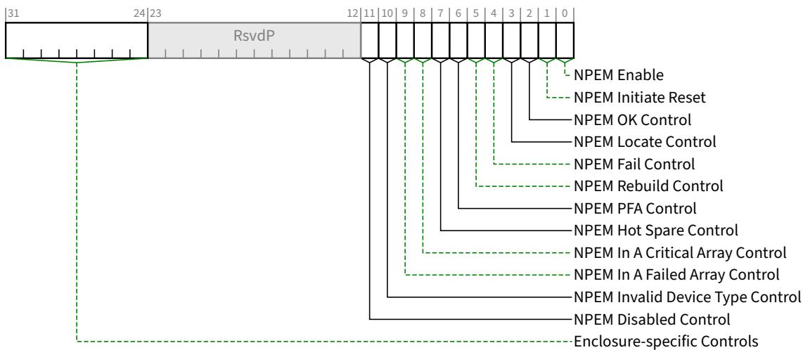

</div>


[⬆️ 返回目录](#-本章目录-table-of-contents)

---

**Table 7-293. NPEM Control Register | 表 7-293. NPEM Control 寄存器**

| Bit Location | Register Description | Attributes |
|--------------|----------------------|------------|
| 0 | NPEM Enable - When Set, this bit enables the NPEM capability. When Clear, this bit disables the NPEM capability. Default value of this bit is 0b.<br>When enabled, this capability operates as defined in this specification. When disabled, the other bits in this capability have no effect and any associated indications are outside the scope of this specification. | RW |
| 1 | NPEM Initiate Reset - If NPEM Reset Capable bit is 1b, then a write of 1b to this bit initiates NPEM Reset. If NPEM Reset Capable bit is 0b, then this bit is permitted to be read-only with a value of 0b.<br>The value read by software from this bit must always be 0b. | RW/RO |
| 2 | NPEM OK Control - When Set, this bit specifies that the NPEM OK indication be turned ON. When Clear, this bit specifies that the NPEM OK indication be turned OFF. | RW/RO |

[⬆️ 返回目录](#-本章目录-table-of-contents)

---

<a id="sec-7-9-19-3-detail"></a>
## 7.9.19.3 NPEM Control Register (Offset 08h) - continued | NPEM Control 寄存器 (偏移 08h) - 续

<table>
<thead>
<tr>
<th width="50%">🇬🇧 English</th>
<th width="50%" style="background-color:#e8e8e8">🏆 中文</th>
</tr>
</thead>
<tbody>
<tr>
<td>

7.9.19.3 NPEM Control Register (Offset 08h) §
§
§

</td>
<td style="background-color:#e8e8e8">

7.9.19.3 NPEM Control 寄存器 (偏移 08h) §
§
§

</td>
</tr>
</tbody>
</table>

[⬆️ 返回目录](#-本章目录-table-of-contents)

---

<!-- 📄 Page 1359 -->
---

**Table 7-293. NPEM Control Register (continued) | 表 7-293. NPEM Control 寄存器 (续)**

| Bit Location | Register Description | Attributes |
|--------------|----------------------|------------|
| 2 (cont.) | If NPEM OK Capable bit in NPEM Capability Register is 0b, this bit is permitted to be read-only with a value of 0b. Default value of this bit is 0b. | RW/RO |
| 3 | NPEM Locate Control - When Set, this bit specifies that the NPEM Locate indication be turned ON. When Clear, this bit specifies that the NPEM Locate indication be turned OFF.<br>If NPEM Locate Capable bit in the NPEM Capability Register is 0b, this bit is permitted to be read-only with a value of 0b. Default value of this bit is 0b. | RW/RO |
| 4 | NPEM Fail Control - When Set, this bit specifies that the NPEM Fail indication be turned ON. When Clear, this bit specifies that the NPEM Fail indication be turned OFF.<br>If NPEM Fail Capable bit in NPEM Capability Register is 0b, this bit is permitted to be read-only with a value of 0b. Default value of this bit is 0b. | RW/RO |
| 5 | NPEM Rebuild Control - When Set, this bit specifies that the NPEM Rebuild indication be turned ON. When Clear, this bit specifies that the NPEM Rebuild indication be turned OFF.<br>If NPEM Rebuild Capable bit in NPEM Capability Register is 0b, this bit is permitted to be read-only with a value of 0b. Default value of this bit is 0b. | RW/RO |
| 6 | NPEM PFA Control - When Set, this bit specifies that the NPEM PFA indication be turned ON. When Clear, this bit specifies that the NPEM PFA indication be turned OFF.<br>If NPEM PFA Capable bit in NPEM Capability Register is 0b, this bit is permitted to be read-only with a value of 0b. Default value of this bit is 0b. | RW/RO |
| 7 | NPEM Hot Spare Control - When Set, this bit specifies that the NPEM Hot Spare indication be turned ON. When Clear, this bit specifies that the NPEM Hot Spare indication be turned OFF.<br>If NPEM Hot Spare Capable bit in NPEM Capability Register is 0b, this bit is permitted to be read-only with a value of 0b. Default value of this bit is 0b. | RW/RO |
| 8 | NPEM In A Critical Array Control - When Set, this bit specifies that the NPEM In A Critical Array indication be turned ON. When Clear, this bit specifies that the NPEM In A Ciritical Array indication be turned OFF.<br>If NPEM In A Critical Array Capable bit in NPEM Capability Register is 0b, this bit is permitted to be read-only with a value of 0b. Default value of this bit is 0b. | RW/RO |
| 9 | NPEM In A Failed Array Control - When Set, this bit specifies that the NPEM In A Failed Array indication be turned ON. When Clear, this bit specifies that the NPEM In A Failed Array indication be turned OFF.<br>If NPEM In A Failed Array Capable bit in NPEM Capability Register is 0b, this bit is permitted to be read-only with a value of 0b. Default value of this bit is 0b. | RW/RO |
| 10 | NPEM Invalid Device Type Control - When Set, this bit specifies that the NPEM Invaild Device Type indication be turned ON. When Clear, this bit specifies that the NPEM Invalid Device Type indication be turned OFF. | RW/RO |

[⬆️ 返回目录](#-本章目录-table-of-contents)

---

<!-- 📄 Page 1360 -->
---

**Table 7-293. NPEM Control Register (continued) | 表 7-293. NPEM Control 寄存器 (续)**

| Bit Location | Register Description | Attributes |
|--------------|----------------------|------------|
| 10 (cont.) | If NPEM Invalid Device Type Capable bit in NPEM Capability Register is 0b, this bit is permitted to be read-only with a value of 0b. Default value of this bit is 0b. | RW/RO |
| 11 | NPEM Disabled Control - When Set, this bit specifies that the NPEM Disabled indication be turned ON. When Clear, this bit specifies that the NPEM Disabled indication be turned OFF.<br>If NPEM Disabled Capable bit in NPEM Capability Register is 0b, this bit is permitted to be read-only with a value of 0b. Default value of this bit is 0b. | RW/RO |
| 31:24 | Enclosure-specific Controls - The definition of enclosure-specific bits is outside the scope of this specification. Enclosure-specific software is permitted to change the value of this field. Other software must preserve the existing value when writing this register. Default value of this field is 00h. | RW/RO |

[⬆️ 返回目录](#-本章目录-table-of-contents)

---

<table>
<thead>
<tr>
<th width="50%">🇬🇧 English</th>
<th width="50%" style="background-color:#e8e8e8">🏆 中文</th>
</tr>
</thead>
<tbody>
<tr>
<td>

0
NPEM Command Completed
1
23
RsvdZ
24
31
Enclosure-specific Status

</td>
<td style="background-color:#e8e8e8">

0
NPEM Command Completed
1
23
RsvdZ
24
31
Enclosure-specific Status(机框专用状态)

</td>
</tr>
</tbody>
</table>

> **Figure 7-335.** NPEM Status Register
> 


[⬆️ 返回目录](#-本章目录-table-of-contents)

---

**Table 7-294. NPEM Status Register | 表 7-294. NPEM Status 寄存器**

| Bit Location | Register Description | Attributes |
|--------------|----------------------|------------|
| 0 | NPEM Command Completed - This bit is Set when an NPEM command has completed, and the NPEM controller is ready to accept a subsequent command.<br>This bit is permitted to be hardwired to 1b if the enclosure is able to accept writes that update any portion of the NPEM Control register without any delay between successive writes.<br>Default value of this bit is 0b.<br>Software must wait for an NPEM command to complete before issuing the next NPEM command. However, if this bit is not set within 1 second limit on command execution, software is permitted to repeat the NPEM command or issue the next NPEM command. If software issues a write before the Port has completed processing of the previous command and before the 1 second time limit has expired, the Port is permitted to either accept or discard the write. Such a write is considered a programming error, and could result in a discrepancy between the NPEM Control Register and the enclosure element state. To recover from such a programming error and return the enclosure to a consistent state, software must issue a write to the NPEM Control Register which conforms to the NPEM command completion rules. | RW1C / RO |
| 31:24 | Enclosure-specific Status - The definition of enclosure specific bits is outside the scope of this specification. Enclosure specific software is permitted to write non-zero values to this field. Other software must write 00h to this field. | RsvdZ/RO/RW1C |

[⬆️ 返回目录](#-本章目录-table-of-contents)

---

<a id="sec-7-9-19-4"></a>
## 7.9.19.4 NPEM Status Register (Offset 0Ch) | NPEM Status 寄存器 (偏移 0Ch)

<table>
<thead>
<tr>
<th width="50%">🇬🇧 English</th>
<th width="50%" style="background-color:#e8e8e8">🏆 中文</th>
</tr>
</thead>
<tbody>
<tr>
<td>

7.9.19.4 NPEM Status Register (Offset 0Ch) §
§
§

</td>
<td style="background-color:#e8e8e8">

7.9.19.4 NPEM Status 寄存器 (偏移 0Ch) §
§
§

</td>
</tr>
</tbody>
</table>

[⬆️ 返回目录](#-本章目录-table-of-contents)

---

<!-- 📄 Page 1361 -->
---

<table>
<thead>
<tr>
<th width="50%">🇬🇧 English</th>
<th width="50%" style="background-color:#e8e8e8">🏆 中文</th>
</tr>
</thead>
<tbody>
<tr>
<td>

The default value of this field is enclosure-specific.
This field is permitted to be hardwired to 00h.

The Alternate Protocol Extended Capability structure is optional in components that implement Alternate Protocol Negotiation. It is only permitted in:
• A Function associated with a Downstream Port.
• Function 0 (and only Function 0) of a Device associated with an Upstream Port.
§ Figure 7-336 details allocation of register fields in the Alternate Protocol Extended Capability structure.

</td>
<td style="background-color:#e8e8e8">

该字段的默认值是机框专用的。
该字段允许硬连线为 00h。

Alternate Protocol 扩展能力结构在实现了 Alternate Protocol Negotiation 的组件中是可选的。它仅允许出现在:
• 与下游端口 (Downstream Port) 关联的 Function 中。
• 与上游端口 (Upstream Port) 关联的 Device 的 Function 0(且仅为 Function 0)。
§ 图 7-336 详细说明了 Alternate Protocol 扩展能力结构中各寄存器的字段分配。

</td>
</tr>
</tbody>
</table>

[⬆️ 返回目录](#-本章目录-table-of-contents)

---

<a id="sec-7-9-20"></a>
## 7.9.20 Alternate Protocol Extended Capability | Alternate Protocol 扩展能力

<table>
<thead>
<tr>
<th width="50%">🇬🇧 English</th>
<th width="50%" style="background-color:#e8e8e8">🏆 中文</th>
</tr>
</thead>
<tbody>
<tr>
<td>

7.9.20 Alternate Protocol Extended Capability §

</td>
<td style="background-color:#e8e8e8">

7.9.20 Alternate Protocol 扩展能力 §

</td>
</tr>
</tbody>
</table>

[⬆️ 返回目录](#-本章目录-table-of-contents)

---

<a id="sec-7-9-20-1"></a>
## 7.9.20.1 Alternate Protocol Extended Capability Header (Offset 00h) | Alternate Protocol 扩展能力头 (偏移 00h)

<table>
<thead>
<tr>
<th width="50%">🇬🇧 English</th>
<th width="50%" style="background-color:#e8e8e8">🏆 中文</th>
</tr>
</thead>
<tbody>
<tr>
<td>

7.9.20.1 Alternate Protocol Extended Capability Header (Offset 00h) §
§
§
§

</td>
<td style="background-color:#e8e8e8">

7.9.20.1 Alternate Protocol 扩展能力头 (偏移 00h) §
§
§
§

</td>
</tr>
</tbody>
</table>

[⬆️ 返回目录](#-本章目录-table-of-contents)

---


<div style="overflow-x: auto; max-width: 100%;">
<table>
<thead>
<tr>
<th width="50%">🇬🇧 English</th>
<th width="50%" style="background-color:#e8e8e8">🏆 中文</th>
</tr>
</thead>
<tbody>
<tr>
<td>

0
1
2
3
4
5
6
7
8
9
10
11
12
13
14
15
16
17
18
19
20
21
22
23
24
25
26
27
28
29
30
31
Byte Offset
PCI Express Extended Capability Header
Alternate Protocol Capabilities Register
Alternate Protocol Control Register
Alternate Protocol Data 1 Register
Alternate Protocol Data 2 Register
+000h
+004h
+008h
+00Ch
+010h

</td>
<td style="background-color:#e8e8e8">

0
1
2
3
4
5
6
7
8
9
10
11
12
13
14
15
16
17
18
19
20
21
22
23
24
25
26
27
28
29
30
31
字节偏移
PCI Express 扩展能力头 (Extended Capability Header)
Alternate Protocol Capabilities 寄存器
Alternate Protocol Control 寄存器
Alternate Protocol Data 1 寄存器
Alternate Protocol Data 2 寄存器
+000h
+004h
+008h
+00Ch
+010h

</td>
</tr>
</tbody>
</table>

> **Figure 7-336.** Alternate Protocol Extended Capability
> 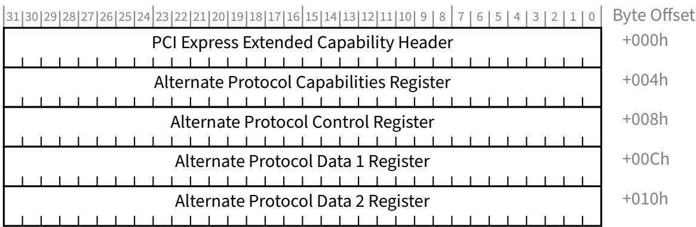

</div>


[⬆️ 返回目录](#-本章目录-table-of-contents)

---

<table>
<thead>
<tr>
<th width="50%">🇬🇧 English</th>
<th width="50%" style="background-color:#e8e8e8">🏆 中文</th>
</tr>
</thead>
<tbody>
<tr>
<td>

> **Figure 7-337.** Alternate Protocol Extended Capability Header
> 

0
15
PCI Express Extended Capability ID
002Bh
16
19
Capability Version
20
31
Next Capability Offset

</td>
<td style="background-color:#e8e8e8">


0
15
PCI Express 扩展能力 ID (Extended Capability ID)
002Bh
16
19
能力版本 (Capability Version)
20
31
下一能力偏移 (Next Capability Offset)


</td>
</tr>
</tbody>
</table>

[⬆️ 返回目录](#-本章目录-table-of-contents)

---

**Table 7-295. Alternate Protocol Extended Capability Header | 表 7-295. Alternate Protocol 扩展能力头**

| Bit Location | Register Description | Attributes |
|--------------|----------------------|------------|
| 15:0 | PCI Express Extended Capability ID - This field is a PCI-SIG defined ID number that indicates the nature and format of the Extended Capability. | RO |

[⬆️ 返回目录](#-本章目录-table-of-contents)

---

<!-- 📄 Page 1362 -->
---

**Table 7-295. Alternate Protocol Extended Capability Header (continued) | 表 7-295. Alternate Protocol 扩展能力头 (续)**

| Bit Location | Register Description | Attributes |
|--------------|----------------------|------------|
| 15:0 (cont.) | The Extended Capability ID for the Alternate Protocol Capability is 002Bh. | RO |
| 19:16 | Capability Version - This field is a PCI-SIG defined version number that indicates the version of the Capability structure present. Must be 1h for this version of the specification. | RO |
| 31:20 | Next Capability Offset - This field contains the offset to the next PCI Express Capability structure or 000h if no other items exist in the linked list of Capabilities. For Extended Capabilities implemented in Configuration Space, this offset is relative to the beginning of PCI-compatible Configuration Space and thus must always be either 000h (for terminating list of Capabilities) or greater than 0FFh. | RO |

[⬆️ 返回目录](#-本章目录-table-of-contents)

---

<table>
<thead>
<tr>
<th width="50%">🇬🇧 English</th>
<th width="50%" style="background-color:#e8e8e8">🏆 中文</th>
</tr>
</thead>
<tbody>
<tr>
<td>

0
7
Alternate Protocol Count
8
Alternate Protocol Selective Enable Supported
9
31
RsvdP

</td>
<td style="background-color:#e8e8e8">

0
7
Alternate Protocol Count
8
Alternate Protocol Selective Enable Supported
9
31
RsvdP

</td>
</tr>
</tbody>
</table>

> **Figure 7-338.** Alternate Protocol Capabilities Register
> 


[⬆️ 返回目录](#-本章目录-table-of-contents)

---

**Table 7-296. Alternate Protocol Capabilities Register | 表 7-296. Alternate Protocol Capabilities 寄存器**

| Bit Location | Register Description | Attributes |
|--------------|----------------------|------------|
| 7:0 | Alternate Protocol Count - Indicates the number of Alternate Protocols or protocols that support Training Set Messages on one or more Lanes of this Link.<br>The value of this field must be greater than or equal to 0. | HwInit |
| 8 | Alternate Protocol Selective Enable Supported - If Set, the Alternate Protocol Selective Enable Mask Register is present. If Clear, the Alternate Protocol Selective Enable Mask Register is not present and Alternate Protocol Negotiation is controlled soley by the Alternate Protocol Negotiation Global Enable bit.<br>In Upstream Ports, this bit is hardwired to 0b.<br>In Downstream Ports, this bit is HwInit with an implementation specific default value. | RO/HwInit |

[⬆️ 返回目录](#-本章目录-table-of-contents)

---

<table>
<thead>
<tr>
<th width="50%">🇬🇧 English</th>
<th width="50%" style="background-color:#e8e8e8">🏆 中文</th>
</tr>
</thead>
<tbody>
<tr>
<td>

0
7
Alternate Protocol Index Select
8
Alternate Protocol Negotiation Global Enable
9
31
RsvdP

</td>
<td style="background-color:#e8e8e8">

0
7
Alternate Protocol Index Select
8
Alternate Protocol Negotiation Global Enable
9
31
RsvdP

</td>
</tr>
</tbody>
</table>

> **Figure 7-339.** Alternate Protocol Control Register
> 


[⬆️ 返回目录](#-本章目录-table-of-contents)

---

<a id="sec-7-9-20-2"></a>
## 7.9.20.2 Alternate Protocol Capabilities Register (Offset 04h) | Alternate Protocol Capabilities 寄存器 (偏移 04h)

<table>
<thead>
<tr>
<th width="50%">🇬🇧 English</th>
<th width="50%" style="background-color:#e8e8e8">🏆 中文</th>
</tr>
</thead>
<tbody>
<tr>
<td>

7.9.20.2 Alternate Protocol Capabilities Register (Offset 04h) §

</td>
<td style="background-color:#e8e8e8">

7.9.20.2 Alternate Protocol Capabilities 寄存器 (偏移 04h) §

</td>
</tr>
</tbody>
</table>

[⬆️ 返回目录](#-本章目录-table-of-contents)

---

---

<a id="sec-7-9-20-3"></a>
## 7.9.20.3 Alternate Protocol Control Register (Offset 08h) | 替代协议控制寄存器（偏移量 08h）

<table>
<thead>
<tr>
<th width="50%">🇬🇧 English</th>
<th width="50%" style="background-color:#e8e8e8">🏆 中文</th>
</tr>
</thead>
<tbody>
<tr>
<td>

§

§

§

</td>
<td style="background-color:#e8e8e8">

§

§

§

</td>
</tr>
</tbody>
</table>

<!-- 📄 Page 1363 -->
---

**Table 7-297. Alternate Protocol Control Register | 表 7-297. 替代协议控制寄存器**

| Bit Location | Register Description | Attributes |
|--------------|----------------------|------------|
| 7:0 | Alternate Protocol Index Select - This field determines which Lane and which Alternate Protocol of that Lane is visible in Alternate Protocol Data 1 Register and Alternate Protocol Data 2 Register. The default value of this field is 00h. Unused bits in this field are permitted to be hardwired to 0b. If Alternate Protocol Count is 01h, this field is permitted to be hardwired to 00h. Behavior is undefined if this field is greater than Alternate Protocol Count. Specific Alternate Protocol Index Select values are permitted to be disabled without renumbering other protocol index values. Disabled entries return an Alternate Protocol Vendor ID of FFFFh. | RW |
| 8 | Alternate Protocol Negotiation Global Enable - When this bit is Set, Alternate Protocol Negotiation is enabled for this Link. When this bit is Clear, Alternate Protocol Negotiation is disabled for this Link. This bit is RW for Downstream Ports. It is HwInit for Upstream Ports. Default is 0b. | RW/HwInit (see description) |

<a id="sec-7-9-20-4"></a>
## 7.9.20.4 Alternate Protocol Data 1 Register (Offset 0Ch) | 替代协议数据 1 寄存器（偏移量 0Ch）

<table>
<thead>
<tr>
<th width="50%">🇬🇧 English</th>
<th width="50%" style="background-color:#e8e8e8">🏆 中文</th>
</tr>
</thead>
<tbody>
<tr>
<td>

§

§

§

</td>
<td style="background-color:#e8e8e8">

§

§

§

</td>
</tr>
</tbody>
</table>

<!-- 📄 Page 1364 -->
---

> **Figure 7-340. Alternate Protocol Data 1 Register | 替代协议数据 1 寄存器**
> 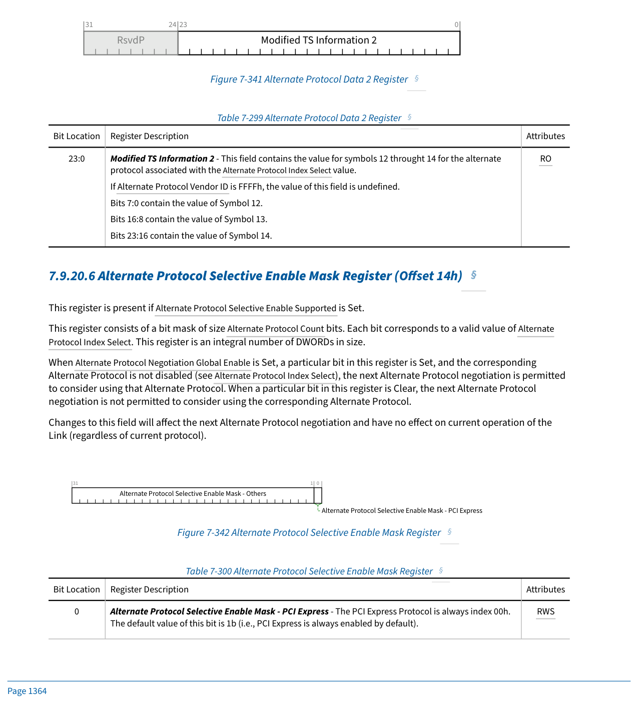

**Table 7-298. Alternate Protocol Data 1 Register | 表 7-298. 替代协议数据 1 寄存器**

| Bit Location | Register Description | Attributes |
|--------------|----------------------|------------|
| 2:0 | Alternate Protocol Usage Information - This field contains the Modified TS Usage associated alternate protocol associated with the Alternate Protocol Index Select value. If Alternate Protocol Vendor ID is FFFFh, the value of this field is undefined. | RO |
| 15:5 | Alternate Protocol Details - This field contains the Alternate Protocol Details associated alternate protocol associated with the Alternate Protocol Index Select value. If Alternate Protocol Vendor ID is FFFFh, the value of this field is undefined. | RO |
| 31:16 | Alternate Protocol Vendor ID - This field contains the Vendor ID associated alternate protocol associated with the Alternate Protocol Index Select value. Bits 7:0 of this field contain bits 7:0 of Vendor ID (Symbol 10). Bits 15:8 of this field contain bits 15:8 of Vendor ID (Symbol 11). If Alternate Protocol Index Select is greater than or equal to Alternate Protocol Count, this field contains FFFFh. If Alternate Protocol Index Select is associated with a disabled alternate protocol, this field contains FFFFh. | RO |

<a id="sec-7-9-20-5"></a>
## 7.9.20.5 Alternate Protocol Data 2 Register (Offset 10h) | 替代协议数据 2 寄存器（偏移量 10h）

<table>
<thead>
<tr>
<th width="50%">🇬🇧 English</th>
<th width="50%" style="background-color:#e8e8e8">🏆 中文</th>
</tr>
</thead>
<tbody>
<tr>
<td>

§

</td>
<td style="background-color:#e8e8e8">

§

</td>
</tr>
</tbody>
</table>

> **Figure 7-341. Alternate Protocol Data 2 Register | 替代协议数据 2 寄存器**

**Table 7-299. Alternate Protocol Data 2 Register | 表 7-299. 替代协议数据 2 寄存器**

| Bit Location | Register Description | Attributes |
|--------------|----------------------|------------|
| 23:0 | Modified TS Information 2 - This field contains the value for symbols 12 throught 14 for the alternate protocol associated with the Alternate Protocol Index Select value. If Alternate Protocol Vendor ID is FFFFh, the value of this field is undefined. Bits 7:0 contain the value of Symbol 12. Bits 16:8 contain the value of Symbol 13. Bits 23:16 contain the value of Symbol 14. | RO |

<a id="sec-7-9-20-6"></a>
## 7.9.20.6 Alternate Protocol Selective Enable Mask Register (Offset 14h) | 替代协议选择性使能掩码寄存器（偏移量 14h）

<table>
<thead>
<tr>
<th width="50%">🇬🇧 English</th>
<th width="50%" style="background-color:#e8e8e8">🏆 中文</th>
</tr>
</thead>
<tbody>
<tr>
<td>

§

§

§

§

</td>
<td style="background-color:#e8e8e8">

§

§

§

§

</td>
</tr>
</tbody>
</table>

<!-- 📄 Page 1365 -->
---

This register is present if Alternate Protocol Selective Enable Supported is Set.

This register consists of a bit mask of size Alternate Protocol Count bits. Each bit corresponds to a valid value of Alternate Protocol Index Select. This register is an integral number of DWORDs in size.

When Alternate Protocol Negotiation Global Enable is Set, a particular bit in this register is Set, and the corresponding Alternate Protocol is not disabled (see Alternate Protocol Index Select), the next Alternate Protocol negotiation is permitted to consider using that Alternate Protocol. When a particular bit in this register is Clear, the next Alternate Protocol negotiation is not permitted to consider using the corresponding Alternate Protocol.

Changes to this field will affect the next Alternate Protocol negotiation and have no effect on current operation of the Link (regardless of current protocol).

> **Figure 7-342. Alternate Protocol Selective Enable Mask Register | 替代协议选择性使能掩码寄存器**
> 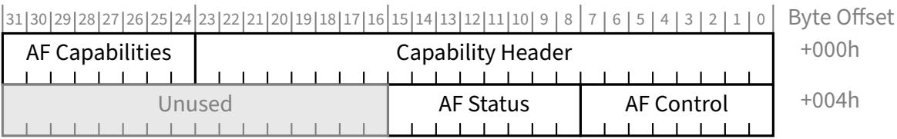

**Table 7-300. Alternate Protocol Selective Enable Mask Register | 表 7-300. 替代协议选择性使能掩码寄存器**

| Bit Location | Register Description | Attributes |
|--------------|----------------------|------------|
| 0 | Alternate Protocol Selective Enable Mask - PCI Express - The PCI Express Protocol is always index 00h. The default value of this bit is 1b (i.e., PCI Express is always enabled by default). | RWS |
| 31:1 | Alternate Protocol Selective Enable Mask - Others - Other bits in this register represent protocols other than PCI Express. The default values of these "other" bits is implementation specific. The width of this field is shown here as 32 bits. The actual width depends on Alternate Protocol Count. Bits in this field corresponding to disabled Alternate Protocol Index values are permitted to be hardwired to 0b. Bits in this field corresponding to Alternate Protocol Index Select values above Alternate Protocol Count are permitted to be hardwired to 0b. | RWS |

<a id="sec-7-9-21"></a>
## 7.9.21 Conventional PCI Advanced Features Capability (AF) | Conventional PCI 高级功能能力结构 (AF)

<table>
<thead>
<tr>
<th width="50%">🇬🇧 English</th>
<th width="50%" style="background-color:#e8e8e8">🏆 中文</th>
</tr>
</thead>
<tbody>
<tr>
<td>

This capability is optional. It is permitted only in Conventional PCI Functions that are integrated into a Root Complex (根复合体). A Function may contain at most one instance of this capability.

§ Figure 7-343 shows the layout of this capability.

Note: Due to document production limitations, this figure shows an 8 byte capability while the actual capability is only 6 bytes long. Bytes 6 and 7 in the figure are not part of the capability.

</td>
<td style="background-color:#e8e8e8">

此能力结构是可选的。仅允许在集成于根复合体 (Root Complex) 中的 Conventional PCI 功能中使用。一个功能最多只能包含此能力结构的一个实例。

§ 图 7-343 展示了此能力结构的布局。

注：由于文档制作限制，此图显示为 8 字节的能力结构，而实际能力结构仅为 6 字节长。图中的第 6 和第 7 字节不属于该能力结构。

</td>
</tr>
</tbody>
</table>

> **Figure 7-343. Conventional PCI Advanced Features Capability (AF) | Conventional PCI 高级功能能力结构 (AF)**
> 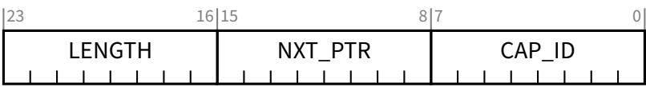

<a id="sec-7-9-21-1"></a>
## 7.9.21.1 Advanced Features Capability Header (Offset 00h) | 高级功能能力结构头部（偏移量 00h）

<table>
<thead>
<tr>
<th width="50%">🇬🇧 English</th>
<th width="50%" style="background-color:#e8e8e8">🏆 中文</th>
</tr>
</thead>
<tbody>
<tr>
<td>

§

§

§

</td>
<td style="background-color:#e8e8e8">

§

§

§

</td>
</tr>
</tbody>
</table>

<!-- 📄 Page 1366 -->
---

> **Figure 7-344. Advanced Features Capability Header | 高级功能能力结构头部**
> 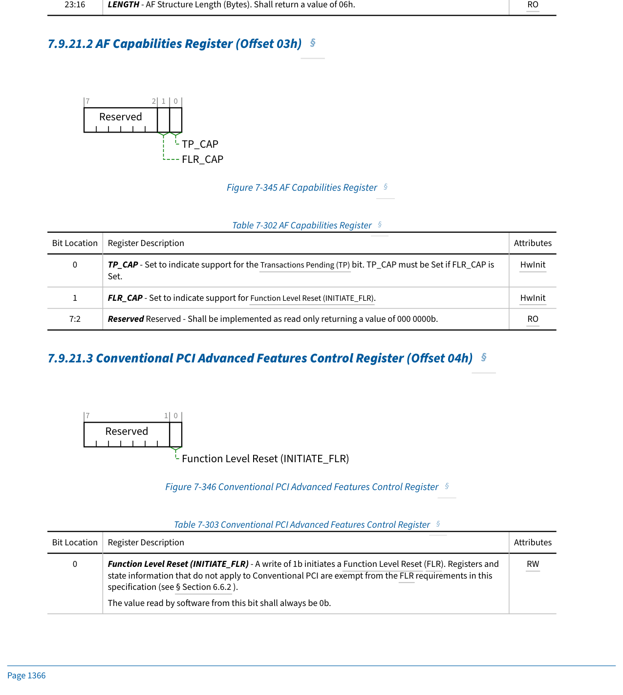

**Table 7-301. Advanced Features Capability Header | 表 7-301. 高级功能能力结构头部**

| Bit Location | Register Description | Attributes |
|--------------|----------------------|------------|
| 7:0 | CAP_ID - The value of 13h in this field identifies the Function as being AF capable. | RO |
| 15:8 | NXT_PTR - Pointer to the next item in the capabilities list. Must be 00h for the final item in the list. | RO |
| 23:16 | LENGTH - AF Structure Length (Bytes). Shall return a value of 06h. | RO |

<a id="sec-7-9-21-2"></a>
## 7.9.21.2 AF Capabilities Register (Offset 03h) | AF 能力寄存器（偏移量 03h）

<table>
<thead>
<tr>
<th width="50%">🇬🇧 English</th>
<th width="50%" style="background-color:#e8e8e8">🏆 中文</th>
</tr>
</thead>
<tbody>
<tr>
<td>

§

</td>
<td style="background-color:#e8e8e8">

§

</td>
</tr>
</tbody>
</table>

> **Figure 7-345. AF Capabilities Register | AF 能力寄存器**

**Table 7-302. AF Capabilities Register | 表 7-302. AF 能力寄存器**

| Bit Location | Register Description | Attributes |
|--------------|----------------------|------------|
| 0 | TP_CAP - Set to indicate support for the Transactions Pending (TP) bit. TP_CAP must be Set if FLR_CAP is Set. | HwInit |
| 1 | FLR_CAP - Set to indicate support for Function Level Reset (INITIATE_FLR). | HwInit |
| 7:2 | Reserved - Shall be implemented as read only returning a value of 000 0000b. | RO |

<a id="sec-7-9-21-3"></a>
## 7.9.21.3 Conventional PCI Advanced Features Control Register (Offset 04h) | Conventional PCI 高级功能控制寄存器（偏移量 04h）

<table>
<thead>
<tr>
<th width="50%">🇬🇧 English</th>
<th width="50%" style="background-color:#e8e8e8">🏆 中文</th>
</tr>
</thead>
<tbody>
<tr>
<td>

§

§

§

§

</td>
<td style="background-color:#e8e8e8">

§

§

§

§

</td>
</tr>
</tbody>
</table>

<!-- 📄 Page 1367 -->
---

> **Figure 7-346. Conventional PCI Advanced Features Control Register | Conventional PCI 高级功能控制寄存器**
> 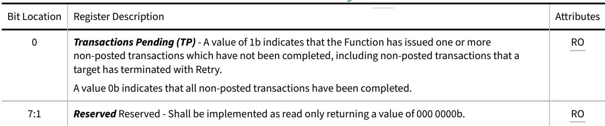

**Table 7-303. Conventional PCI Advanced Features Control Register | 表 7-303. Conventional PCI 高级功能控制寄存器**

| Bit Location | Register Description | Attributes |
|--------------|----------------------|------------|
| 0 | Function Level Reset (INITIATE_FLR) - A write of 1b initiates a Function Level Reset (FLR). Registers and state information that do not apply to Conventional PCI are exempt from the FLR requirements in this specification (see § Section 6.6.2). The value read by software from this bit shall always be 0b. | RW |
| 7:1 | Reserved - Shall be implemented as read only returning a value of 000 0000b. | RO |

<a id="sec-7-9-21-4"></a>
## 7.9.21.4 AF Status Register (Offset 05h) | AF 状态寄存器（偏移量 05h）

<table>
<thead>
<tr>
<th width="50%">🇬🇧 English</th>
<th width="50%" style="background-color:#e8e8e8">🏆 中文</th>
</tr>
</thead>
<tbody>
<tr>
<td>

§

</td>
<td style="background-color:#e8e8e8">

§

</td>
</tr>
</tbody>
</table>

> **Figure 7-347. AF Status Register | AF 状态寄存器**

**Table 7-304. AF Status Register | 表 7-304. AF 状态寄存器**

| Bit Location | Register Description | Attributes |
|--------------|----------------------|------------|
| 0 | Transactions Pending (TP) - A value of 1b indicates that the Function has issued one or more non-posted transactions which have not been completed, including non-posted transactions that a target has terminated with Retry. A value 0b indicates that all non-posted transactions have been completed. | RO |
| 7:1 | Reserved - Shall be implemented as read only returning a value of 000 0000b. | RO |

<a id="sec-7-9-22"></a>
## 7.9.22 SFI Extended Capability | SFI 扩展能力结构

<table>
<thead>
<tr>
<th width="50%">🇬🇧 English</th>
<th width="50%" style="background-color:#e8e8e8">🏆 中文</th>
</tr>
</thead>
<tbody>
<tr>
<td>

§

§

</td>
<td style="background-color:#e8e8e8">

§

§

</td>
</tr>
</tbody>
</table>

<!-- 📄 Page 1368 -->
---

The SFI (System Firmware Intermediary) Extended Capability is an optional capability that provides system firmware with enhanced control over primarily hot-plug mechanisms, and enables system firmware to operate as an intermediary between certain events and the operating system (see § Section 6.7.4). This capability may be implemented by a Root Port or a Switch Downstream Port. It is not applicable to any other Device/Port type.

If a Downstream Port implements the SFI Extended Capability, that Port must support ERR_COR Subclass capability, and indicate so by Setting the ERR_COR Subclass Capable bit in the Device Capabilities Register. See see § Section 7.5.3.3.

> **Figure 7-348. SFI Extended Capability | SFI 扩展能力结构**
> 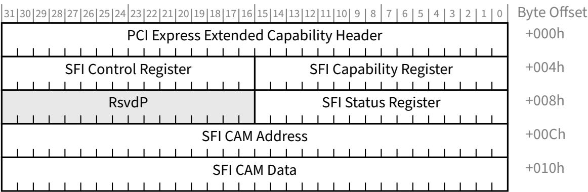

<a id="sec-7-9-22-1"></a>
## 7.9.22.1 SFI Extended Capability Header (Offset 00h) | SFI 扩展能力结构头部（偏移量 00h）

<table>
<thead>
<tr>
<th width="50%">🇬🇧 English</th>
<th width="50%" style="background-color:#e8e8e8">🏆 中文</th>
</tr>
</thead>
<tbody>
<tr>
<td>

§

§

§

</td>
<td style="background-color:#e8e8e8">

§

§

§

</td>
</tr>
</tbody>
</table>

§ Figure 7-349 and § Table 7-305 detail allocation of fields in the Extended Capability header.

<!-- 📄 Page 1369 -->
---

> **Figure 7-349. SFI Extended Capability Header | SFI 扩展能力结构头部**
> 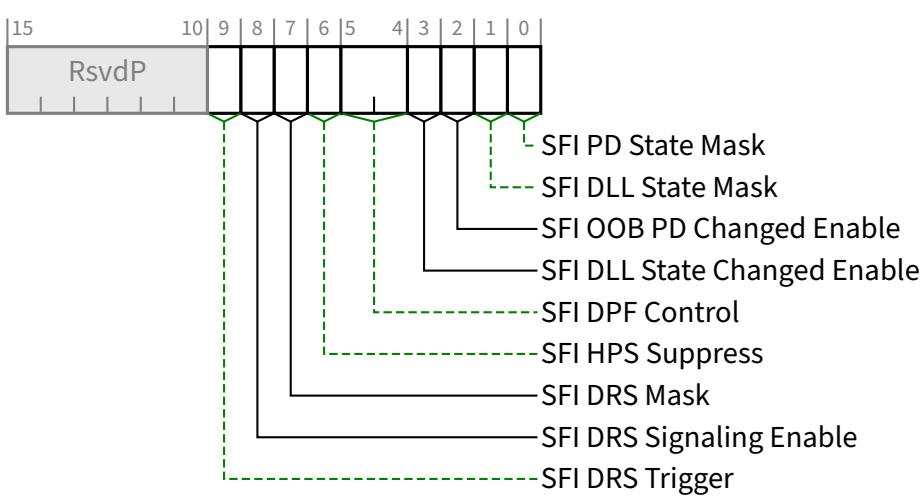

**Table 7-305. SFI Extended Capability Header | 表 7-305. SFI 扩展能力结构头部**

| Bit Location | Register Description | Attributes |
|--------------|----------------------|------------|
| 15:0 | PCI Express Extended Capability ID - This field is a PCI-SIG defined ID number that indicates the nature and format of the Extended Capability. Extended Capability ID for the SFI Extended Capability is 002Ch. | RO |
| 19:16 | Capability Version - This field is a PCI-SIG defined version number that indicates the version of the Capability structure present. Must be 1h for this version of the specification. | RO |
| 31:20 | Next Capability Offset - This field contains the offset to the next PCI Express Capability structure or 000h if no other items exist in the linked list of Capabilities. For Extended Capabilities implemented in Configuration Space, this offset is relative to the beginning of PCI-compatible Configuration Space and thus must always be either 000h (for terminating list of Capabilities) or greater than 0FFh. | RO |

<a id="sec-7-9-22-2"></a>
## 7.9.22.2 SFI Capability Register (Offset 04h) | SFI 能力寄存器（偏移量 04h）

<table>
<thead>
<tr>
<th width="50%">🇬🇧 English</th>
<th width="50%" style="background-color:#e8e8e8">🏆 中文</th>
</tr>
</thead>
<tbody>
<tr>
<td>

§

</td>
<td style="background-color:#e8e8e8">

§

</td>
</tr>
</tbody>
</table>

> **Figure 7-350. SFI Capability Register | SFI 能力寄存器**

**Table 7-306. SFI Capability Register | 表 7-306. SFI 能力寄存器**

| Bit Location | Register Description | Attributes |
|--------------|----------------------|------------|
| 0 | SFI OOB PD Supported - When Set, this bit indicates that this slot supports reporting the out-of-band presence detect state. If this Downstream Port has no implemented slot (as indicated by the Slot Implemented bit in the PCI Express Capabilities Register), then the value of this bit must be 0b. | HwInit |
| 15:1 | RsvdP | |

<a id="sec-7-9-22-3"></a>
## 7.9.22.3 SFI Control Register (Offset 06h) | SFI 控制寄存器（偏移量 06h）

<table>
<thead>
<tr>
<th width="50%">🇬🇧 English</th>
<th width="50%" style="background-color:#e8e8e8">🏆 中文</th>
</tr>
</thead>
<tbody>
<tr>
<td>

§

§

§

§

</td>
<td style="background-color:#e8e8e8">

§

§

§

§

</td>
</tr>
</tbody>
</table>

<!-- 📄 Page 1370 -->
---

> **Figure 7-351. SFI Control Register | SFI 控制寄存器**
> 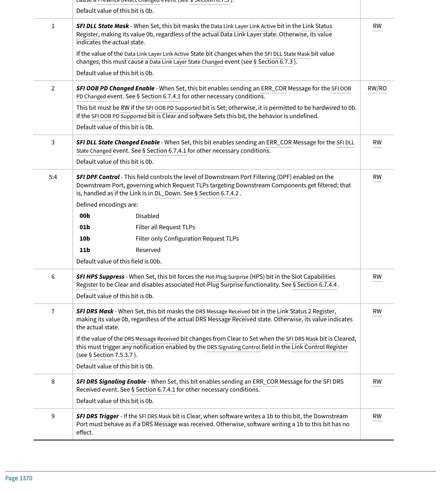

**Table 7-307. SFI Control Register | 表 7-307. SFI 控制寄存器**

| Bit Location | Register Description | Attributes |
|--------------|----------------------|------------|
| 0 | SFI PD State Mask - When Set, this bit masks the Presence Detect State bit in the Slot Status Register, making its value 0b, regardless of the actual presence detect state. Otherwise, its value indicates the actual state. If the value of the Presence Detect State bit changes when the SFI PD State Mask bit value changes, this must cause a Presence Detect Changed event (see § Section 6.7.3). Default value of this bit is 0b. | RW |
| 1 | SFI DLL State Mask - When Set, this bit masks the Data Link Layer Link Active bit in the Link Status Register, making its value 0b, regardless of the actual Data Link Layer state. Otherwise, its value indicates the actual state. If the value of the Data Link Layer Link Active State bit changes when the SFI DLL State Mask bit value changes, this must cause a Data Link Layer State Changed event (see § Section 6.7.3). Default value of this bit is 0b. | RW |
| 2 | SFI OOB PD Changed Enable - When Set, this bit enables sending an ERR_COR Message for the SFI OOB PD Changed event. See § Section 6.7.4.1 for other necessary conditions. This bit must be RW if the SFI OOB PD Supported bit is Set; otherwise, it is permitted to be hardwired to 0b. If the SFI OOB PD Supported bit is Clear and software Sets this bit, the behavior is undefined. Default value of this bit is 0b. | RW/RO |
| 3 | SFI DLL State Changed Enable - When Set, this bit enables sending an ERR_COR Message for the SFI DLL State Changed event. See § Section 6.7.4.1 for other necessary conditions. Default value of this bit is 0b. | RW |
| 5:4 | SFI DPF Control - This field controls the level of Downstream Port Filtering (DPF) enabled on the Downstream Port, governing which Request TLPs targeting Downstream Components get filtered; that is, handled as if the Link is in DL_Down. See § Section 6.7.4.2. Defined encodings are: 00b Disabled, 01b Filter all Request TLPs, 10b Filter only Configuration Request TLPs, 11b Reserved. Default value of this field is 00b. | RW |
| 6 | SFI HPS Suppress - When Set, this bit forces the Hot-Plug Surprise (HPS) bit in the Slot Capabilities Register to be Clear and disables associated Hot-Plug Surprise functionality. See § Section 6.7.4.4. Default value of this bit is 0b. | RW |
| 7 | SFI DRS Mask - When Set, this bit masks the DRS Message Received bit in the Link Status 2 Register, making its value 0b, regardless of the actual DRS Message Received state. Otherwise, its value indicates the actual state. If the value of the DRS Message Received bit changes from Clear to Set when the SFI DRS Mask bit is Cleared, this must trigger any notification enabled by the DRS Signaling Control field in the Link Control Register (see § Section 7.5.3.7). Default value of this bit is 0b. | RW |
| 8 | SFI DRS Signaling Enable - When Set, this bit enables sending an ERR_COR Message for the SFI DRS Received event. See § Section 6.7.4.1 for other necessary conditions. Default value of this bit is 0b. | RW |
| 9 | SFI DRS Trigger - If the SFI DRS Mask bit is Clear, when software writes a 1b to this bit, the Downstream Port must behave as if a DRS Message was received. Otherwise, software writing a 1b to this bit has no effect. | RW |
| 15:10 | RsvdP | |

<!-- 📄 Page 1371 -->
---

| Bit Location | Register Description | Attributes |
|--------------|----------------------|------------|
| (continued) | It is permitted to write 1b to this bit while simultaneously writing updated values to other fields in this register, notably the SFI DRS Mask bit. For this case, the SFI DRS Trigger semantics are based on the updated value of the SFI DRS Mask bit. This bit always returns 0b when read. | |

> **Figure 7-352. SFI Status Register | SFI 状态寄存器**
> 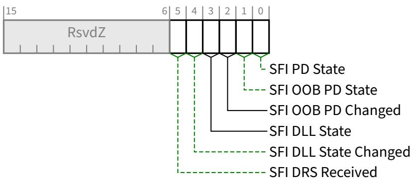

**Table 7-308. SFI Status Register | 表 7-308. SFI 状态寄存器**

| Bit Location | Register Description | Attributes |
|--------------|----------------------|------------|
| 0 | SFI PD State - This bit always indicates the actual presence detect state associated with the Presence Detect State bit in the Slot Status Register, even when the value of that bit is being masked by the SFI PD State Mask bit. | RO |
| 1 | SFI OOB PD State - This bit indicates the out-of-band presence detect state, independent of the in-band presence detect state. This bit must be implemented if the SFI OOB PD Supported bit is Set; otherwise, it is permitted to be hardwired to 0b. | RO |
| 2 | SFI OOB PD Changed - This bit is Set when the value reported in the SFI OOB PD State bit is changed. | RW1C |
| 3 | SFI DLL State - This bit always indicates the actual link state associated with the Data Link Layer Link Active bit in the Link Status Register, even when the value of that bit is being masked by the SFI DLL State Mask bit. | RO |
| 4 | SFI DLL State Changed - This bit is Set when the value reported in the SFI DLL State bit is changed. | RW1C |
| 5 | SFI DRS Received - This bit always indicates the actual state associated with the DRS Message Received bit in the Link Status 2 Register, even when the value of that bit is being masked by the SFI PD State Mask bit. Clearing the SFI DRS Received bit (by writing a 1b to it) must also cause the actual state associated with the DRS Message Received bit to be Cleared. | RW1C |
| 15:6 | RsvdZ | |

---

<a id="sec-7-9-22-4"></a>
## 7.9.22.4 SFI Status Register (Offset 08h) | SFI 状态寄存器 (偏移 08h)

<table>
<thead>
<tr>
<th width="50%">🇬🇧 English</th>
<th width="50%" style="background-color:#e8e8e8">🏆 中文</th>
</tr>
</thead>
<tbody>
<tr>
<td>

7.9.22.4 SFI Status Register (Offset 08h) §
§
§

</td>
<td style="background-color:#e8e8e8">

7.9.22.4 SFI 状态寄存器 (偏移 08h) §
§
§

</td>
</tr>
</tbody>
</table>

[⬆️ 返回目录](#-本章目录-table-of-contents)

---

<!-- 📄 Page 1372 -->
---

<table>
<thead>
<tr>
<th width="50%">🇬🇧 English</th>
<th width="50%" style="background-color:#e8e8e8">🏆 中文</th>
</tr>
</thead>
<tbody>
<tr>
<td>

> **Figure 7-353. SFI CAM Address Register**
> 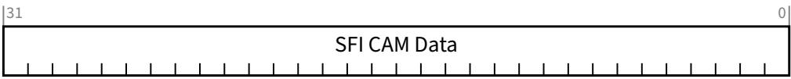

</td>
<td style="background-color:#e8e8e8">


</td>
</tr>
</tbody>
</table>

[⬆️ 返回目录](#-本章目录-table-of-contents)

---

**Table 7-309 SFI CAM Address Register | 表 7-309 SFI CAM 地址寄存器**

| Bit Location | Register Description | Attributes |
|--------------|----------------------|------------|
| 27:0 | SFI CAM Address - This field specifies the target Bus, Device, and Function Numbers, along with the Extended Register Number and Register Number, in the format specified by § Table 7-1. | RW |
| 31:28 | RsvdP | RsvdP |

<table>
<thead>
<tr>
<th width="50%">🇬🇧 English</th>
<th width="50%" style="background-color:#e8e8e8">🏆 中文</th>
</tr>
</thead>
<tbody>
<tr>
<td>

> **Figure 7-354. SFI CAM Data Register**

</td>
<td style="background-color:#e8e8e8">


</td>
</tr>
</tbody>
</table>

[⬆️ 返回目录](#-本章目录-table-of-contents)

---

**Table 7-310 SFI CAM Data Register | 表 7-310 SFI CAM 数据寄存器**

| Bit Location | Register Description | Attributes |
|--------------|----------------------|------------|
| 31:0 | SFI CAM Data - When this field is read, the SFI CAM generates and transmits a Configuration Read Request on the Link below this Port. When this field is written, the SFI CAM generates and transmits a Configuration Write Request on the Link below this Port. In both cases, the target of the Configuration Request is determined by the value of the SFI CAM Address Register. See § Section 6.7.4.3 . | RW |


<div style="overflow-x: auto; max-width: 100%;">
<table>
<thead>
<tr>
<th width="50%">🇬🇧 English</th>
<th width="50%" style="background-color:#e8e8e8">🏆 中文</th>
</tr>
</thead>
<tbody>
<tr>
<td>

The Subsystem ID and Subsystem Vendor ID Capability is an optional capability used to uniquely identify the add-in card or subsystem where the PCI device resides. It provides a mechanism for add-in card vendors to distinguish their add-in cards from one another even though the add-in cards may have the same PCI bridge on them (and, therefore, the same Vendor ID and Device ID). The format of the capability is shown in § Figure 7-355. The fields are described in § Table 7-311 and § Table 7-312.

This capability is only permitted in Functions with Type 1 Configuration Space Headers.

</td>
<td style="background-color:#e8e8e8">

Subsystem ID 和 Subsystem Vendor ID Capability(子系统 ID 与子系统厂商 ID 能力)是一种可选能力,用于唯一标识 PCI 设备所在的扩展卡或子系统。它为扩展卡厂商提供了一种机制,使其能够区分各自的扩展卡,即使这些扩展卡可能搭载相同的 PCI 桥(因此具有相同的 Vendor ID 和 Device ID)。该能力的格式如 § Figure 7-355 所示,字段说明见 § Table 7-311 和 § Table 7-312。

该能力仅允许在具有 Type 1 配置空间头部的 Function(功能)中使用。

</td>
</tr>
</tbody>
</table>
</div>


[⬆️ 返回目录](#-本章目录-table-of-contents)

---

<a id="sec-7-9-22-5"></a>
## 7.9.22.5 SFI CAM Address Register (Offset 0Ch) | SFI CAM 地址寄存器 (偏移 0Ch)

<table>
<thead>
<tr>
<th width="50%">🇬🇧 English</th>
<th width="50%" style="background-color:#e8e8e8">🏆 中文</th>
</tr>
</thead>
<tbody>
<tr>
<td>

7.9.22.5 SFI CAM Address Register (Offset 0Ch) §

</td>
<td style="background-color:#e8e8e8">

7.9.22.5 SFI CAM 地址寄存器 (偏移 0Ch) §

</td>
</tr>
</tbody>
</table>

[⬆️ 返回目录](#-本章目录-table-of-contents)

---

<a id="sec-7-9-22-6"></a>
## 7.9.22.6 SFI CAM Data Register (Offset 10h) | SFI CAM 数据寄存器 (偏移 10h)

<table>
<thead>
<tr>
<th width="50%">🇬🇧 English</th>
<th width="50%" style="background-color:#e8e8e8">🏆 中文</th>
</tr>
</thead>
<tbody>
<tr>
<td>

7.9.22.6 SFI CAM Data Register (Offset 10h) §

</td>
<td style="background-color:#e8e8e8">

7.9.22.6 SFI CAM 数据寄存器 (偏移 10h) §

</td>
</tr>
</tbody>
</table>

[⬆️ 返回目录](#-本章目录-table-of-contents)

---

<a id="sec-7-9-23"></a>
## 7.9.23 Subsystem ID and Subsystem Vendor ID Capability | Subsystem ID 与 Subsystem Vendor ID 能力

<table>
<thead>
<tr>
<th width="50%">🇬🇧 English</th>
<th width="50%" style="background-color:#e8e8e8">🏆 中文</th>
</tr>
</thead>
<tbody>
<tr>
<td>

7.9.23 Subsystem ID and Subsystem Vendor ID Capability §
§
§
§
§

</td>
<td style="background-color:#e8e8e8">

7.9.23 Subsystem ID 与 Subsystem Vendor ID 能力 §
§
§
§
§

</td>
</tr>
</tbody>
</table>

[⬆️ 返回目录](#-本章目录-table-of-contents)

---

<!-- 📄 Page 1373 -->
---

<table>
<thead>
<tr>
<th width="50%">🇬🇧 English</th>
<th width="50%" style="background-color:#e8e8e8">🏆 中文</th>
</tr>
</thead>
<tbody>
<tr>
<td>

> **Figure 7-355. Subsystem ID and Subsystem Vendor ID Capability**
> 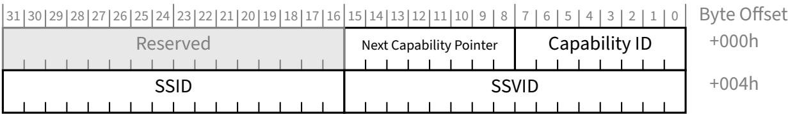

</td>
<td style="background-color:#e8e8e8">


</td>
</tr>
</tbody>
</table>

[⬆️ 返回目录](#-本章目录-table-of-contents)

---

<table>
<thead>
<tr>
<th width="50%">🇬🇧 English</th>
<th width="50%" style="background-color:#e8e8e8">🏆 中文</th>
</tr>
</thead>
<tbody>
<tr>
<td>

> **Figure 7-356. Subsystem ID and Subsystem Vendor ID Capability Header**
> 

</td>
<td style="background-color:#e8e8e8">


</td>
</tr>
</tbody>
</table>

[⬆️ 返回目录](#-本章目录-table-of-contents)

---

**Table 7-311 Subsystem ID and Subsystem Vendor ID Capability Header | 表 7-311 Subsystem ID 与 Subsystem Vendor ID 能力头部**

| Bit Location | Register Description | Attributes |
|--------------|----------------------|------------|
| 7:0 | Capability ID - Indicates the PCI Express Capability structure. This field must return a Capability ID of 0Dh indicating that this is a Subsystem ID and Subsystem Vendor ID Capability structure. | RO |
| 15:8 | Next Capability Pointer - This field contains the offset to the next PCI Capability structure or 00h if no other items exist in the linked list of Capabilities. | RO |
| 31:16 | RsvdP | RsvdP |

<table>
<thead>
<tr>
<th width="50%">🇬🇧 English</th>
<th width="50%" style="background-color:#e8e8e8">🏆 中文</th>
</tr>
</thead>
<tbody>
<tr>
<td>

> **Figure 7-357. Subsystem ID and Subsystem Vendor ID Capability Data**
> 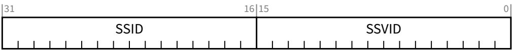

</td>
<td style="background-color:#e8e8e8">


</td>
</tr>
</tbody>
</table>

[⬆️ 返回目录](#-本章目录-table-of-contents)

---

**Table 7-312 Subsystem ID and Subsystem Vendor ID Capability Data | 表 7-312 Subsystem ID 与 Subsystem Vendor ID 能力数据**

| Bit Location | Register Description | Attributes |
|--------------|----------------------|------------|
| 15:0 | SSVID - The SSVID identifies the manufacturer of the add-in card or subsystem. The SSVID is assigned by PCI-SIG to insure uniqueness (the Vendor ID is used as the SSVID also). This field is read-only. | HwInit |
| 31:16 | SSID - The SSID identifies the particular add-in card or subsystem and is assigned by the vendor. This field is read-only. | HwInit |

<a id="sec-7-9-23-1"></a>
## 7.9.23.1 Subsystem ID and Subsystem Vendor ID Capability Header (Offset 00h) | Subsystem ID 与 Subsystem Vendor ID 能力头部 (偏移 00h)

<table>
<thead>
<tr>
<th width="50%">🇬🇧 English</th>
<th width="50%" style="background-color:#e8e8e8">🏆 中文</th>
</tr>
</thead>
<tbody>
<tr>
<td>

7.9.23.1 Subsystem ID and Subsystem Vendor ID Capability Header (Offset 00h) §

</td>
<td style="background-color:#e8e8e8">

7.9.23.1 Subsystem ID 与 Subsystem Vendor ID 能力头部 (偏移 00h) §

</td>
</tr>
</tbody>
</table>

[⬆️ 返回目录](#-本章目录-table-of-contents)

---

<a id="sec-7-9-23-2"></a>
## 7.9.23.2 Subsystem ID and Subsystem Vendor ID Capability Data (Offset 04h) | Subsystem ID 与 Subsystem Vendor ID 能力数据 (偏移 04h)

<table>
<thead>
<tr>
<th width="50%">🇬🇧 English</th>
<th width="50%" style="background-color:#e8e8e8">🏆 中文</th>
</tr>
</thead>
<tbody>
<tr>
<td>

7.9.23.2 Subsystem ID and Subsystem Vendor ID Capability Data (Offset 04h) §
§
§
§
§
§

</td>
<td style="background-color:#e8e8e8">

7.9.23.2 Subsystem ID 与 Subsystem Vendor ID 能力数据 (偏移 04h) §
§
§
§
§
§

</td>
</tr>
</tbody>
</table>

[⬆️ 返回目录](#-本章目录-table-of-contents)

---

<!-- 📄 Page 1374 -->
---

<table>
<thead>
<tr>
<th width="50%">🇬🇧 English</th>
<th width="50%" style="background-color:#e8e8e8">🏆 中文</th>
</tr>
</thead>
<tbody>
<tr>
<td>

The Data Object Exchange (DOE) Extended Capability is an optional Extended Capability for discovering and controlling a mechanism for the exchange of data objects (see § Section 6.30 ). It is permitted for a Function to implement more than one instance of this Extended Capability.

§ Figure 7-358 illustrates the Data Object Exchange Extended Capability structure.

</td>
<td style="background-color:#e8e8e8">

Data Object Exchange (DOE, 数据对象交换)扩展能力是一种可选的扩展能力,用于发现和控制数据对象交换机制(参见 § Section 6.30)。允许某个 Function 实现该扩展能力的多份实例。

§ Figure 7-358 描述了 Data Object Exchange 扩展能力的结构。

</td>
</tr>
</tbody>
</table>

[⬆️ 返回目录](#-本章目录-table-of-contents)

---

<table>
<thead>
<tr>
<th width="50%">🇬🇧 English</th>
<th width="50%" style="background-color:#e8e8e8">🏆 中文</th>
</tr>
</thead>
<tbody>
<tr>
<td>

> **Figure 7-358. Data Object Exchange Extended Capability**
> 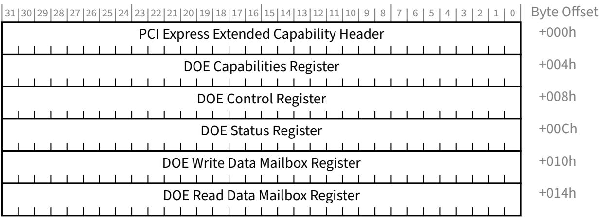

</td>
<td style="background-color:#e8e8e8">


</td>
</tr>
</tbody>
</table>

[⬆️ 返回目录](#-本章目录-table-of-contents)

---

<table>
<thead>
<tr>
<th width="50%">🇬🇧 English</th>
<th width="50%" style="background-color:#e8e8e8">🏆 中文</th>
</tr>
</thead>
<tbody>
<tr>
<td>

> **Figure 7-359. DOE Extended Capability Header**
> 

</td>
<td style="background-color:#e8e8e8">


</td>
</tr>
</tbody>
</table>

[⬆️ 返回目录](#-本章目录-table-of-contents)

---

**Table 7-313 DOE Extended Capability Header | 表 7-313 DOE 扩展能力头部**

| Bit Location | Register Description | Attributes |
|--------------|----------------------|------------|
| 15:0 | PCI Express Extended Capability ID – This field is a PCI-SIG defined ID number that indicates the nature and format of the Extended Capability. The Extended Capability ID for the Data Object Exchange Extended Capability is 002Eh. | RO |
| 19:16 | Capability Version – This field is a PCI-SIG defined version number that indicates the version of the Capability structure present. Must be 2h for this version of the specification. New implementations compliant to the older version of this specification must indicate Capability Version 1h. | RO |
| 31:20 | Next Capability Offset – This field contains the offset to the next PCI Express Extended Capability structure or 000h if no other items exist in the linked list of Capabilities. | RO |

<a id="sec-7-9-24"></a>
## 7.9.24 Data Object Exchange Extended Capability | Data Object Exchange 扩展能力

<table>
<thead>
<tr>
<th width="50%">🇬🇧 English</th>
<th width="50%" style="background-color:#e8e8e8">🏆 中文</th>
</tr>
</thead>
<tbody>
<tr>
<td>

7.9.24 Data Object Exchange Extended Capability §

</td>
<td style="background-color:#e8e8e8">

7.9.24 Data Object Exchange 扩展能力 §

</td>
</tr>
</tbody>
</table>

[⬆️ 返回目录](#-本章目录-table-of-contents)

---

<a id="sec-7-9-24-1"></a>
## 7.9.24.1 DOE Extended Capability Header (Offset 00h) | DOE 扩展能力头部 (偏移 00h)

<table>
<thead>
<tr>
<th width="50%">🇬🇧 English</th>
<th width="50%" style="background-color:#e8e8e8">🏆 中文</th>
</tr>
</thead>
<tbody>
<tr>
<td>

7.9.24.1 DOE Extended Capability Header (Offset 00h) §
§
§
§

</td>
<td style="background-color:#e8e8e8">

7.9.24.1 DOE 扩展能力头部 (偏移 00h) §
§
§
§

</td>
</tr>
</tbody>
</table>

[⬆️ 返回目录](#-本章目录-table-of-contents)

---

<!-- 📄 Page 1375 -->
---

<table>
<thead>
<tr>
<th width="50%">🇬🇧 English</th>
<th width="50%" style="background-color:#e8e8e8">🏆 中文</th>
</tr>
</thead>
<tbody>
<tr>
<td>

> **Figure 7-360. DOE Capabilities Register**
> 

</td>
<td style="background-color:#e8e8e8">


</td>
</tr>
</tbody>
</table>

[⬆️ 返回目录](#-本章目录-table-of-contents)

---

**Table 7-314 DOE Capabilities Register | 表 7-314 DOE 能力寄存器**

| Bit Location | Register Description | Attributes |
|--------------|----------------------|------------|
| 0 | DOE Interrupt Support – When Set, this bit indicates DOE support of software notification of DOE events using MSI/MSI-X. | HwInit |
| 11:1 | DOE Interrupt Message Number - When the DOE Interrupt Support bit is Set, this field indicates which MSI/MSI-X vector is used for the interrupt message generated in association with DOE. For MSI, the value in this field indicates the offset between the base Message Data and the interrupt message that is generated. Hardware is required to update this field so that it is correct if the number of MSI Messages assigned to the Function changes when software writes to the Multiple Message Enable field in the Message Control Register for MSI. For MSI-X, the value in this field indicates which MSI-X Table entry is used to generate the interrupt message. For a given MSI-X implementation, the entry must remain constant. If both MSI and MSI-X are implemented, they are permitted to use different vectors, though software is permitted to enable only one mechanism at a time. If MSI-X is enabled, the value in this field must indicate the vector for MSI-X. If MSI is enabled or neither is enabled, the value in this field must indicate the vector for MSI. If software enables both MSI and MSI-X at the same time, the value in this field is undefined. When the DOE Interrupt Support bit is Clear the value in this field is undefined. | RO |
| 12 | DOE Attention Mechanism Support – This bit, when Set, indicates the DOE instance supports the optional DOE Attention mechanism. | HwInit |
| 13 | DOE Async Message Support – This bit, when Set, indicates the DOE instance supports the optional DOE Async Message mechanism. | HwInit |
| 31:14 | RsvdP | RsvdP |

<a id="sec-7-9-24-2"></a>
## 7.9.24.2 DOE Capabilities Register (Offset 04h) | DOE 能力寄存器 (偏移 04h)

<table>
<thead>
<tr>
<th width="50%">🇬🇧 English</th>
<th width="50%" style="background-color:#e8e8e8">🏆 中文</th>
</tr>
</thead>
<tbody>
<tr>
<td>

7.9.24.2 DOE Capabilities Register (Offset 04h) §
§
§

</td>
<td style="background-color:#e8e8e8">

7.9.24.2 DOE 能力寄存器 (偏移 04h) §
§
§

</td>
</tr>
</tbody>
</table>

[⬆️ 返回目录](#-本章目录-table-of-contents)

---

<!-- 📄 Page 1376 -->
---

<table>
<thead>
<tr>
<th width="50%">🇬🇧 English</th>
<th width="50%" style="background-color:#e8e8e8">🏆 中文</th>
</tr>
</thead>
<tbody>
<tr>
<td>

> **Figure 7-361. DOE Control Register**
> 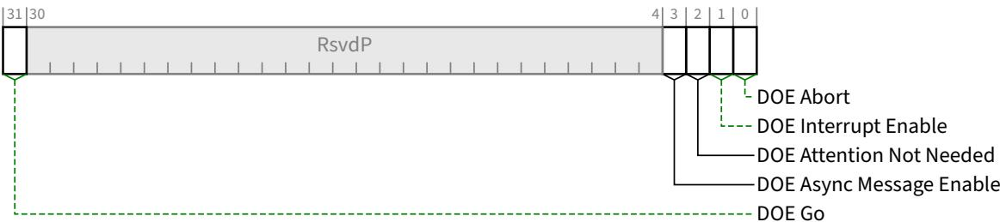

</td>
<td style="background-color:#e8e8e8">


</td>
</tr>
</tbody>
</table>

[⬆️ 返回目录](#-本章目录-table-of-contents)

---

**Table 7-315 DOE Control Register | 表 7-315 DOE 控制寄存器**

| Bit Location | Register Description | Attributes |
|--------------|----------------------|------------|
| 0 | DOE Abort – A write of 1b to this bit must cause all data object transfer operations associated with this DOE instance to be aborted. Reads from this bit must always return 0b. | RW (see description) |
| 1 | DOE Interrupt Enable – When this bit is Set, the DOE Interrupt Support bit is Set, and MSI/MSI-X is enabled, the DOE instance must issue an MSI/MSI-X interrupt as defined in § Section 6.30.3 . When DOE Interrupt Support is Clear, this bit is permitted to be Reserved. Default value of this bit is 0b. | RW/RsvdP |
| 2 | DOE Attention Not Needed – When DOE Attention Mechanism Support is Set, this bit when Set enables the DOE instance to enter and stay in a state where it is not immediately available for use. When this bit is Clear the DOE instance must remain in a responsive state. When DOE Attention Mechanism Support is Clear, this bit is permitted to be Reserved. Default value of this bit is 0b. | RW/RsvdP |
| 3 | DOE Async Message Enable – If DOE Async Message Support is Set, this bit, when Set, enables the use of the DOE Async Message mechanism. When DOE Async Message Support is Clear, this bit is permitted to be Reserved. Default value of this bit is 0b. | RW/RsvdP |
| 30:4 | RsvdP | RsvdP |
| 31 | DOE Go – A write of 1b to this bit indicates to the DOE instance that it can start consuming the data object transferred through the DOE Write Data Mailbox Register. Behavior is undefined if the DOE Go bit is Set before the entire data object has been written to the DOE Write Data Mailbox Register. Behavior is undefined if the DOE Go bit is written with 1b when the DOE Busy bit is Set. Reads from this bit must always return 0b. | RW (see description) |

<a id="sec-7-9-24-3"></a>
## 7.9.24.3 DOE Control Register (Offset 08h) | DOE 控制寄存器 (偏移 08h)

<table>
<thead>
<tr>
<th width="50%">🇬🇧 English</th>
<th width="50%" style="background-color:#e8e8e8">🏆 中文</th>
</tr>
</thead>
<tbody>
<tr>
<td>

7.9.24.3 DOE Control Register (Offset 08h) §
§
§

</td>
<td style="background-color:#e8e8e8">

7.9.24.3 DOE 控制寄存器 (偏移 08h) §
§
§

</td>
</tr>
</tbody>
</table>

[⬆️ 返回目录](#-本章目录-table-of-contents)

---

<!-- 📄 Page 1377 -->
---

<table>
<thead>
<tr>
<th width="50%">🇬🇧 English</th>
<th width="50%" style="background-color:#e8e8e8">🏆 中文</th>
</tr>
</thead>
<tbody>
<tr>
<td>

> **Figure 7-362. DOE Status Register**
> 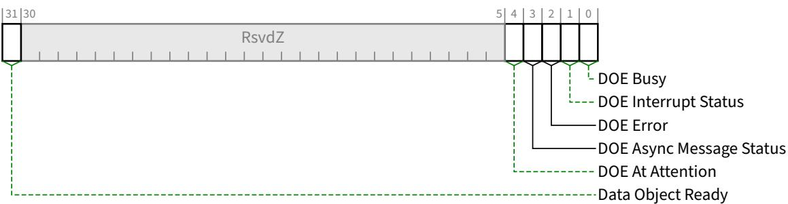

</td>
<td style="background-color:#e8e8e8">


</td>
</tr>
</tbody>
</table>

[⬆️ 返回目录](#-本章目录-table-of-contents)

---

**Table 7-316 DOE Status Register | 表 7-316 DOE 状态寄存器**

| Bit Location | Register Description | Attributes |
|--------------|----------------------|------------|
| 0 | DOE Busy — When Set, this bit indicates the DOE instance is temporarily unable to receive a new data object through the DOE Write Data Mailbox Register. The DOE instance must Set this bit when processing a received data object, and Clear this bit when it is able to receive a new data object. The DOE instance must Set this bit following an abort or reset if, as a result of the abort/reset, it is temporarily unable to receive a data object, and then must Clear this bit when it is able to receive a new data object. | RO |
| 1 | DOE Interrupt Status – If DOE Interrupt Support is Set, then this bit must be Set when an interrupt-triggering event occurs. If DOE Interrupt Support is Clear, this bit is Reserved. Default value of this bit is 0b. | RW1C/RsvdZ |
| 2 | DOE Error – This bit, when Set, indicates that there has been an internal error associated with a data object received, or that a data object has been received for which the DOE instance is unable to provide a response. The DOE instance must Clear this bit, if it is not already Clear, when 1b is written to the DOE Abort bit in the DOE Control Register. Writing 1b to the DOE Abort bit is the only mechanism for software to Clear this bit. The transition of this bit from Clear to Set is an interrupt triggering event. Default value of this bit is 0b. | RO |
| 3 | DOE Async Message Status – If DOE Async Message Support is Set, this bit, when Set, indicates the DOE instance has one or more asynchronous messages to transfer. The transition of this bit from Clear to Set is an interrupt triggering event. If DOE Async Message Support is Clear, this bit is Reserved. Default value of this bit is 0b. | RO/RsvdZ |
| 4 | DOE At Attention – When DOE Attention Mechanism Support is Set, this bit, when Set, indicates the DOE interface is presently in a state of readiness. The transition of this bit from Clear to Set is an interrupt triggering event. | RO |
| 30:5 | RsvdZ | RsvdZ |
| 31 | Data Object Ready – When Set, this bit indicates the DOE instance has a data object available to be read by system firmware/software. | RO |

<a id="sec-7-9-24-4"></a>
## 7.9.24.4 DOE Status Register (Offset 0Ch) | DOE 状态寄存器 (偏移 0Ch)

<table>
<thead>
<tr>
<th width="50%">🇬🇧 English</th>
<th width="50%" style="background-color:#e8e8e8">🏆 中文</th>
</tr>
</thead>
<tbody>
<tr>
<td>

7.9.24.4 DOE Status Register (Offset 0Ch) §
§
§

</td>
<td style="background-color:#e8e8e8">

7.9.24.4 DOE 状态寄存器 (偏移 0Ch) §
§
§

</td>
</tr>
</tbody>
</table>

[⬆️ 返回目录](#-本章目录-table-of-contents)

---

<!-- 📄 Page 1378 -->
---


<div style="overflow-x: auto; max-width: 100%;">
<table>
<thead>
<tr>
<th width="50%">🇬🇧 English</th>
<th width="50%" style="background-color:#e8e8e8">🏆 中文</th>
</tr>
</thead>
<tbody>
<tr>
<td>

| Bit Location | Register Description | Attributes |
|--------------|----------------------|------------|
| 4 | DOE At Attention (continued) – When DOE Attention Mechanism Support is Clear, this bit is Reserved. | RO |
| 31 | Data Object Ready (continued) – If there is no additional data object ready for transfer, the DOE instance must clear this bit after the entire data object has been transferred, as indicated by software writing to the DOE Read Data Mailbox Register after reading the final DW of the data object. The DOE instance must clear this bit, if not already clear, upon a write of 1b to the DOE Abort bit in the DOE Control Register. The transition of this bit from Clear to Set is an interrupt triggering event. Default value of this bit is 0b. | RO |

</td>
<td style="background-color:#e8e8e8">

| Bit Location | Register Description | Attributes |
|--------------|----------------------|------------|
| 4 | DOE At Attention(续) – 当 DOE Attention Mechanism Support 位为 Clear 时,该位为 Reserved。 | RO |
| 31 | Data Object Ready(续) – 如果没有其他数据对象准备传输,则在软件读取完数据对象最后一个 DW 后写入 DOE Read Data Mailbox Register 时,DOE 实例必须清除该位。当对 DOE Control Register 中的 DOE Abort 位写入 1b 时,如果该位尚未清除,DOE 实例也必须清除它。该位由 Clear 到 Set 的跳变是中断触发事件。该位的默认值为 0b。 | RO |

</td>
</tr>
</tbody>
</table>
</div>


[⬆️ 返回目录](#-本章目录-table-of-contents)

---

<table>
<thead>
<tr>
<th width="50%">🇬🇧 English</th>
<th width="50%" style="background-color:#e8e8e8">🏆 中文</th>
</tr>
</thead>
<tbody>
<tr>
<td>

> **Figure 7-363. DOE Write Data Mailbox Register**
> 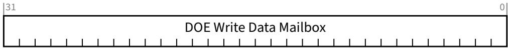

</td>
<td style="background-color:#e8e8e8">


</td>
</tr>
</tbody>
</table>

[⬆️ 返回目录](#-本章目录-table-of-contents)

---

**Table 7-317 DOE Write Data Mailbox Register | 表 7-317 DOE 写数据邮箱寄存器**

| Bit Location | Register Description | Attributes |
|--------------|----------------------|------------|
| 31:0 | DOE Write Data Mailbox – The DOE instance receives data objects via writes to this register. A successfully completed write to this register adds one DW to the incoming data object. Setting the DOE Go bit in the DOE Control Register indicates to the DOE Instance that the final DW of the data object has been written to this register. Reads of this register must return all 0's. | RW (see description) |

<a id="sec-7-9-24-5"></a>
## 7.9.24.5 DOE Write Data Mailbox Register (Offset 10h) | DOE 写数据邮箱寄存器 (偏移 10h)

<table>
<thead>
<tr>
<th width="50%">🇬🇧 English</th>
<th width="50%" style="background-color:#e8e8e8">🏆 中文</th>
</tr>
</thead>
<tbody>
<tr>
<td>

7.9.24.5 DOE Write Data Mailbox Register (Offset 10h) §

</td>
<td style="background-color:#e8e8e8">

7.9.24.5 DOE 写数据邮箱寄存器 (偏移 10h) §

</td>
</tr>
</tbody>
</table>

[⬆️ 返回目录](#-本章目录-table-of-contents)

---

<a id="sec-7-9-24-6"></a>
## 7.9.24.6 DOE Read Data Mailbox Register (Offset 14h) | DOE 读数据邮箱寄存器 (偏移 14h)

<table>
<thead>
<tr>
<th width="50%">🇬🇧 English</th>
<th width="50%" style="background-color:#e8e8e8">🏆 中文</th>
</tr>
</thead>
<tbody>
<tr>
<td>

7.9.24.6 DOE Read Data Mailbox Register (Offset 14h) §
§
§
§

</td>
<td style="background-color:#e8e8e8">

7.9.24.6 DOE 读数据邮箱寄存器 (偏移 14h) §
§
§
§

</td>
</tr>
</tbody>
</table>

[⬆️ 返回目录](#-本章目录-table-of-contents)

---

<!-- 📄 Page 1379 -->
---

<table>
<thead>
<tr>
<th width="50%">🇬🇧 English</th>
<th width="50%" style="background-color:#e8e8e8">🏆 中文</th>
</tr>
</thead>
<tbody>
<tr>
<td>

> **Figure 7-364. DOE Read Data Mailbox Register**
> 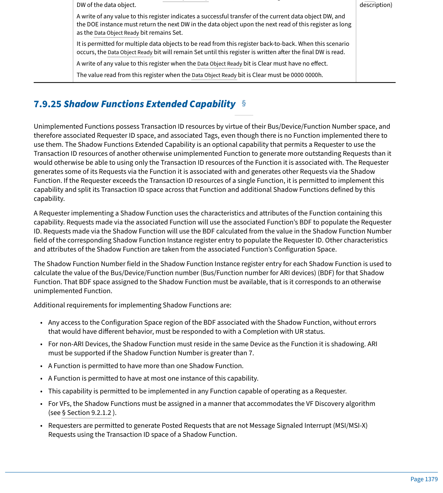

</td>
<td style="background-color:#e8e8e8">


</td>
</tr>
</tbody>
</table>

[⬆️ 返回目录](#-本章目录-table-of-contents)

---

**Table 7-318 DOE Read Data Mailbox Register | 表 7-318 DOE 读数据邮箱寄存器**

| Bit Location | Register Description | Attributes |
|--------------|----------------------|------------|
| 31:0 | DOE Read Data Mailbox – If the Data Object Ready bit is Set, a read of this register returns the current DW of the data object. A write of any value to this register indicates a successful transfer of the current data object DW, and the DOE instance must return the next DW in the data object upon the next read of this register as long as the Data Object Ready bit remains Set. It is permitted for multiple data objects to be read from this register back-to-back. When this scenario occurs, the Data Object Ready bit will remain Set until this register is written after the final DW is read. A write of any value to this register when the Data Object Ready bit is Clear must have no effect. The value read from this register when the Data Object Ready bit is Clear must be 0000 0000h. | RW (see description) |


<div style="overflow-x: auto; max-width: 100%;">
<table>
<thead>
<tr>
<th width="50%">🇬🇧 English</th>
<th width="50%" style="background-color:#e8e8e8">🏆 中文</th>
</tr>
</thead>
<tbody>
<tr>
<td>

Unimplemented Functions possess Transaction ID resources by virtue of their Bus/Device/Function Number space, and therefore associated Requester ID space, and associated Tags, even though there is no Function implemented there to use them. The Shadow Functions Extended Capability is an optional capability that permits a Requester to use the Transaction ID resources of another otherwise unimplemented Function to generate more outstanding Requests than it would otherwise be able to using only the Transaction ID resources of the Function it is associated with. The Requester generates some of its Requests via the Function it is associated with and generates other Requests via the Shadow Function. If the Requester exceeds the Transaction ID resources of a single Function, it is permitted to implement this capability and split its Transaction ID space across that Function and additional Shadow Functions defined by this capability.

A Requester implementing a Shadow Function uses the characteristics and attributes of the Function containing this capability. Requests made via the associated Function will use the associated Function's BDF to populate the Requester ID. Requests made via the Shadow Function will use the BDF calculated from the value in the Shadow Function Number field of the corresponding Shadow Function Instance register entry to populate the Requester ID. Other characteristics and attributes of the Shadow Function are taken from the associated Function's Configuration Space.

The Shadow Function Number field in the Shadow Function Instance register entry for each Shadow Function is used to calculate the value of the Bus/Device/Function number (Bus/Function number for ARI devices) (BDF) for that Shadow Function. That BDF space assigned to the Shadow Function must be available, that is it corresponds to an otherwise unimplemented Function.

</td>
<td style="background-color:#e8e8e8">

未实现的 Function 凭借其 Bus/Device/Function Number(总线/设备/功能号)空间,以及由此关联的 Requester ID(请求者 ID)空间和 Tag(标签),拥有 Transaction ID(事务 ID)资源,即使这些 Function 实际上并未实现,不会使用这些资源。Shadow Functions Extended Capability(影子功能扩展能力)是一种可选能力,它允许 Requester(请求者)使用另一个未实现 Function 的 Transaction ID 资源,从而生成比仅使用其关联 Function 自身 Transaction ID 资源更多的未完成请求。Requester 通过其关联 Function 发起部分请求,通过 Shadow Function(影子功能)发起其他请求。如果 Requester 超出单个 Function 的 Transaction ID 资源,可实现此能力并将其 Transaction ID 空间拆分到该 Function 和由本能力定义的附加 Shadow Function 之间。

实现 Shadow Function 的 Requester 使用包含此能力的 Function 的特性和属性。通过关联 Function 发出的请求将使用关联 Function 的 BDF 来填充 Requester ID。通过 Shadow Function 发出的请求将使用从对应 Shadow Function Instance 寄存器的 Shadow Function Number 字段计算所得的 BDF 来填充 Requester ID。Shadow Function 的其他特性和属性取自关联 Function 的配置空间。

每个 Shadow Function 的 Shadow Function Instance 寄存器条目中的 Shadow Function Number 字段用于计算该 Shadow Function 的 Bus/Device/Function 号(ARI 设备为 Bus/Function 号)(BDF)。分配给该 Shadow Function 的 BDF 空间必须可用,即对应于一个未实现的 Function。

</td>
</tr>
</tbody>
</table>
</div>


[⬆️ 返回目录](#-本章目录-table-of-contents)

---

<table>
<thead>
<tr>
<th width="50%">🇬🇧 English</th>
<th width="50%" style="background-color:#e8e8e8">🏆 中文</th>
</tr>
</thead>
<tbody>
<tr>
<td>

Additional requirements for implementing Shadow Functions are:

- Any access to the Configuration Space region of the BDF associated with the Shadow Function, without errors that would have different behavior, must be responded to with a Completion with UR status.
- For non-ARI Devices, the Shadow Function must reside in the same Device as the Function it is shadowing. ARI must be supported if the Shadow Function Number is greater than 7.
- A Function is permitted to have more than one Shadow Function.
- A Function is permitted to have at most one instance of this capability.
- This capability is permitted to be implemented in any Function capable of operating as a Requester.
- For VFs, the Shadow Functions must be assigned in a manner that accommodates the VF Discovery algorithm (see § Section 9.2.1.2 ).
- Requesters are permitted to generate Posted Requests that are not Message Signaled Interrupt (MSI/MSI-X) Requests using the Transaction ID space of a Shadow Function.

</td>
<td style="background-color:#e8e8e8">

实现 Shadow Function 的其他要求如下:

- 对 Shadow Function 关联的 BDF 配置空间区域进行的任何访问,在没有会导致不同行为的错误时,必须以 UR(Unsupported Request,不支持的请求)状态的 Completion(完成报文)响应。
- 对于非 ARI 设备,Shadow Function 必须驻留于其影子所对应的 Function 所在的同一 Device 中。如果 Shadow Function Number 大于 7,则必须支持 ARI。
- 允许一个 Function 具有多个 Shadow Function。
- 允许一个 Function 最多具有本能力的一个实例。
- 允许在任何能够作为 Requester 工作的 Function 中实现本能力。
- 对于 VF,Shadow Function 的分配方式必须与 VF 发现算法相适应(参见 § Section 9.2.1.2)。
- 允许 Requester 使用 Shadow Function 的 Transaction ID 空间生成不是消息信号中断(MSI/MSI-X)请求的 Posted Requests(有数据,无完成请求)。

</td>
</tr>
</tbody>
</table>

[⬆️ 返回目录](#-本章目录-table-of-contents)

---

<a id="sec-7-9-25-2"></a>
## 7.9.25 Shadow Functions Extended Capability | Shadow Functions 扩展能力

<table>
<thead>
<tr>
<th width="50%">🇬🇧 English</th>
<th width="50%" style="background-color:#e8e8e8">🏆 中文</th>
</tr>
</thead>
<tbody>
<tr>
<td>

7.9.25 Shadow Functions Extended Capability §
§

</td>
<td style="background-color:#e8e8e8">

7.9.25 Shadow Functions 扩展能力 §
§

</td>
</tr>
</tbody>
</table>

[⬆️ 返回目录](#-本章目录-table-of-contents)

---

<!-- 📄 Page 1380 -->
---


<div style="overflow-x: auto; max-width: 100%;">
<table>
<thead>
<tr>
<th width="50%">🇬🇧 English</th>
<th width="50%" style="background-color:#e8e8e8">🏆 中文</th>
</tr>
</thead>
<tbody>
<tr>
<td>

- Requesters are not permitted to generate Message Signaled Interrupt (MSI/MSI-X) Requests using the Transaction ID space of a Shadow Function.
- Functions utilizing Shadow Functions must be aware that accesses utilizing the Shadow Function's Transaction ID resources appear to the rest of the system with the same semantics as if the access was from any independent Function and deal with those implications.
- The software for the Translation Agent is responsible for maintaining the integrity of address translation resources. Behavior is undefined if address translation resources are not updated before the Shadow Function's Requester makes a Request.
- Translation Requests issued by a Shadow Function are cached in the ATC associated with the main Function. When enabled, Functions are permitted to use translations across the "main" and Shadow Functions regardless of which Function issued the associated Translation Request. See § Section 10.2 .
- The software for handling Page Request Messages is responsible for coordinating usage across Shadow Functions. See § Section 10.4.1 and § Section 10.5.2.5 .
- Behavior is undefined if software enabling FPB configures a Shadow Function to use the same Requester ID as another Function.
- For a Multi-Function Device that supports ACS P2P Egress Control, any enabled Shadow Functions must be taken into account when configuring the Egress Control Vector to allow P2P traffic between the Requester and its Shadow Functions, and other Functions in the Device.

</td>
<td style="background-color:#e8e8e8">

- 不允许 Requester 使用 Shadow Function 的 Transaction ID 空间生成消息信号中断(MSI/MSI-X)请求。
- 使用 Shadow Function 的 Function 必须意识到,使用 Shadow Function 的 Transaction ID 资源进行的访问对系统其余部分呈现的语义与来自任何独立 Function 的访问相同,必须处理这些影响。
- Translation Agent(转换代理)的软件负责维护地址转换资源的完整性。如果 Shadow Function 的 Requester 发起请求之前地址转换资源未更新,则行为是未定义的。
- 由 Shadow Function 发出的 Translation Request(转换请求)缓存在与主 Function 关联的 ATC(Address Translation Cache,地址转换缓存)中。启用后,允许 Function 在"主"Function 与 Shadow Function 之间共用转换结果,无论该 Translation Request 由哪个 Function 发出。参见 § Section 10.2。
- 处理 Page Request Message(页请求消息)的软件负责协调跨 Shadow Function 的使用。参见 § Section 10.4.1 和 § Section 10.5.2.5。
- 如果启用 FPB 的软件将 Shadow Function 配置为使用与其他 Function 相同的 Requester ID,则行为是未定义的。
- 对于支持 ACS P2P Egress Control(ACS 对等出口控制)的多功能设备,在配置 Egress Control Vector(出口控制向量)以允许 Requester 与其 Shadow Function 以及设备中其他 Function 之间的 P2P 流量时,必须考虑所有已使能的 Shadow Function。

</td>
</tr>
</tbody>
</table>
</div>


[⬆️ 返回目录](#-本章目录-table-of-contents)

---

<table>
<thead>
<tr>
<th width="50%">🇬🇧 English</th>
<th width="50%" style="background-color:#e8e8e8">🏆 中文</th>
</tr>
</thead>
<tbody>
<tr>
<td>

Multiple Shadow Functions for a Function are permitted to be assigned by this Capability. The Number of Shadow Functions field in the Shadow Functions Capability register defines the number of Shadow Functions assigned and the number of Shadow Function Instance register entries in the Capability and therefore the length of the Capability structure.

§ Figure 7-365 shows the Shadow Functions Extended Capability structure.

</td>
<td style="background-color:#e8e8e8">

本能力允许为一个 Function 分配多个 Shadow Function。Shadow Functions Capability 寄存器中的 Number of Shadow Functions 字段定义所分配的 Shadow Function 数量,以及本能力中 Shadow Function Instance 寄存器条目的数量,从而决定能力结构的长度。

§ Figure 7-365 展示了 Shadow Functions 扩展能力的结构。

</td>
</tr>
</tbody>
</table>

[⬆️ 返回目录](#-本章目录-table-of-contents)

---

<table>
<thead>
<tr>
<th width="50%">🇬🇧 English</th>
<th width="50%" style="background-color:#e8e8e8">🏆 中文</th>
</tr>
</thead>
<tbody>
<tr>
<td>

> **IMPLEMENTATION NOTE:**
> **SHADOW FUNCTION NUMBER PROGRAMMING**
>
> The value programmed into the Shadow Function Number field should place the Shadow Function on the same Bus Number as the Function declaring it. Otherwise, ACS Source Validation might not operate appropriately, Completions targeting the Shadow Function might not be routed correctly, or other misbehaviors might occur.

</td>
<td style="background-color:#e8e8e8">

> **实现说明:**
> **SHADOW FUNCTION NUMBER 编程**
>
> 编程到 Shadow Function Number 字段中的值应将 Shadow Function 置于与声明它的 Function 相同的 Bus Number 上。否则,ACS Source Validation 可能无法正常工作,发往 Shadow Function 的 Completion 可能无法被正确路由,或可能出现其他异常行为。

</td>
</tr>
</tbody>
</table>

[⬆️ 返回目录](#-本章目录-table-of-contents)

---

<!-- 📄 Page 1381 -->
---

<table>
<thead>
<tr>
<th width="50%">🇬🇧 English</th>
<th width="50%" style="background-color:#e8e8e8">🏆 中文</th>
</tr>
</thead>
<tbody>
<tr>
<td>

N = the value of the Number of Shadow Functions field.

</td>
<td style="background-color:#e8e8e8">

N = Number of Shadow Functions 字段的值。

</td>
</tr>
</tbody>
</table>

[⬆️ 返回目录](#-本章目录-table-of-contents)

---

<table>
<thead>
<tr>
<th width="50%">🇬🇧 English</th>
<th width="50%" style="background-color:#e8e8e8">🏆 中文</th>
</tr>
</thead>
<tbody>
<tr>
<td>

> **Figure 7-365. Shadow Functions Extended Capability Structure**
> 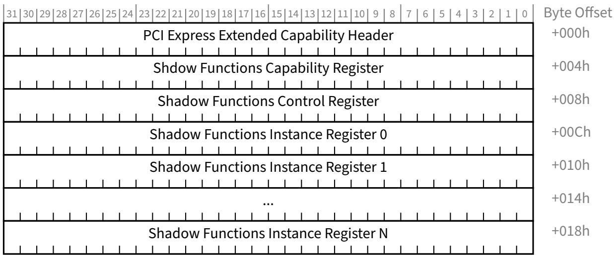

</td>
<td style="background-color:#e8e8e8">


</td>
</tr>
</tbody>
</table>

[⬆️ 返回目录](#-本章目录-table-of-contents)

---

<table>
<thead>
<tr>
<th width="50%">🇬🇧 English</th>
<th width="50%" style="background-color:#e8e8e8">🏆 中文</th>
</tr>
</thead>
<tbody>
<tr>
<td>

§ Figure 7-366 details allocation of the register fields in the Shadow Functions Extended Capability Header; § Table 7-319 provides the respective bit definitions.

</td>
<td style="background-color:#e8e8e8">

§ Figure 7-366 详细说明了 Shadow Functions 扩展能力头部寄存器字段的分配;§ Table 7-319 给出相应的位定义。

</td>
</tr>
</tbody>
</table>

[⬆️ 返回目录](#-本章目录-table-of-contents)

---

<table>
<thead>
<tr>
<th width="50%">🇬🇧 English</th>
<th width="50%" style="background-color:#e8e8e8">🏆 中文</th>
</tr>
</thead>
<tbody>
<tr>
<td>

> **Figure 7-366. Shadow Functions Extended Capability Header**
> 

</td>
<td style="background-color:#e8e8e8">


</td>
</tr>
</tbody>
</table>

[⬆️ 返回目录](#-本章目录-table-of-contents)

---

**Table 7-319 Shadow Functions Extended Capability Header | 表 7-319 Shadow Functions 扩展能力头部**

| Bit Location | Register Description | Attributes |
|--------------|----------------------|------------|
| 15:0 | Shadow Functions Extended Capability ID - Indicates the Shadow Functions Extended Capability structure. This field must return a Capability ID of 002Dh indicating that this is a Shadow Functions Extended Capability structure. | RO |
| 19:16 | Capability Version - This field is a PCI-SIG defined version number that indicates the version of the Capability structure present. Must be 1h for this version of the specification. | RO |
| 31:20 | Next Capability Offset - The offset to the next PCI Extended Capability structure or 000h if no other items exist in the linked list of capabilities. | RO |

[⬆️ 返回目录](#-本章目录-table-of-contents)

---


---

<a id="sec-7-9-25-1"></a>
## 7.9.25.1 Shadow Functions Extended Capability Header (Offset 00h) | Shadow Functions 扩展能力头（偏移 00h）

<table>
<thead>
<tr>
<th width="50%">🇬🇧 English</th>
<th width="50%" style="background-color:#e8e8e8">🏆 中文</th>
</tr>
</thead>
<tbody>
<tr>
<td>

Shadow Functions Extended Capability Header (Offset 00h)

</td>
<td style="background-color:#e8e8e8">

Shadow Functions 扩展能力头（偏移 00h）

</td>
</tr>
</tbody>
</table>

[⬆️ 返回目录](#-本章目录-table-of-contents)

---

<a id="sec-7-9-25"></a>
## 7.9.25 Shadow Functions Capability | Shadow Functions 能力

<table>
<thead>
<tr>
<th width="50%">🇬🇧 English</th>
<th width="50%" style="background-color:#e8e8e8">🏆 中文</th>
</tr>
</thead>
<tbody>
<tr>
<td>

[figures/chapter_07/fig_1382_1.png]

Figure 7-367 details the allocation of register bits of the Shadow Functions Capability register; Table 7-320 provides the respective bit definitions.

</td>
<td style="background-color:#e8e8e8">

[figures/chapter_07/fig_1382_1.png]

图 7-367 详述了 Shadow Functions Capability 寄存器的位分配；表 7-320 给出了相应的位定义。

</td>
</tr>
</tbody>
</table>

**Figure 7-367. Shadow Functions Capability Register | 图 7-367. Shadow Functions 能力寄存器**

**Table 7-320. Shadow Functions Capability Register | 表 7-320. Shadow Functions 能力寄存器**

| Bit Location | Register Description | Attributes |
|--------------|----------------------|------------|
| 7:0 | Number of Shadow Functions – This is one less than the number of Shadow Functions implemented by this Function. This defines the number of Shadow Function Instance register entries that are in the Capability, and therefore the length of the Capability structure.<br>The default value for this field is 00h. | HwInit |
| 31:8 | RsvdP | RsvdP |

[figures/chapter_07/fig_1382_1.png](figures/chapter_07/fig_1382_1.png)

[⬆️ 返回目录](#-本章目录-table-of-contents)

---

<table>
<thead>
<tr>
<th width="50%">🇬🇧 English</th>
<th width="50%" style="background-color:#e8e8e8">🏆 中文</th>
</tr>
</thead>
<tbody>
<tr>
<td>

Figure 7-368 details the allocation of register bits of the Shadow Functions Control register; Table 7-321 provides the respective bit definitions.

</td>
<td style="background-color:#e8e8e8">

图 7-368 详述了 Shadow Functions Control 寄存器的位分配；表 7-321 给出了相应的位定义。

</td>
</tr>
</tbody>
</table>

**Figure 7-368. Shadow Functions Control Register | 图 7-368. Shadow Functions 控制寄存器**

**Table 7-321. Shadow Functions Control Register | 表 7-321. Shadow Functions 控制寄存器**

| Bit Location | Register Description | Attributes |
|--------------|----------------------|------------|
| 0 | Shadow Functions Enable - When Set, permits the Requester to generate Requests using the Transaction ID resources of all of the Shadow Functions defined by this Capability. See Section 7.9.25 for limitations on the type of Requests permitted.<br>When Clear, the Requester is not permitted to generate Requests using the Transaction ID resources of any of the Shadow Functions defined by this Capability.<br>Behavior is undefined when this bit is Set in Functions with the Phantom Functions Enabled bit Set.<br>Behavior is undefined if the value of this bit is changed while the Function has outstanding Non-Posted Requests.<br>Default is 0b. | RW |
| 31:1 | RsvdP | RsvdP |

[figures/chapter_07/fig_1382_1.png](figures/chapter_07/fig_1382_1.png)

[⬆️ 返回目录](#-本章目录-table-of-contents)

---

<a id="sec-7-9-25-2"></a>
## 7.9.25.2 Shadow Functions Capability Register (Offset 04h) | Shadow Functions 能力寄存器（偏移 04h）

<table>
<thead>
<tr>
<th width="50%">🇬🇧 English</th>
<th width="50%" style="background-color:#e8e8e8">🏆 中文</th>
</tr>
</thead>
<tbody>
<tr>
<td>

Shadow Functions Capability Register (Offset 04h)

</td>
<td style="background-color:#e8e8e8">

Shadow Functions 能力寄存器（偏移 04h）

</td>
</tr>
</tbody>
</table>

[⬆️ 返回目录](#-本章目录-table-of-contents)

---

<a id="sec-7-9-25-3"></a>
## 7.9.25.3 Shadow Functions Control Register (Offset 08h) | Shadow Functions 控制寄存器（偏移 08h）

<table>
<thead>
<tr>
<th width="50%">🇬🇧 English</th>
<th width="50%" style="background-color:#e8e8e8">🏆 中文</th>
</tr>
</thead>
<tbody>
<tr>
<td>

Shadow Functions Control Register (Offset 08h)

</td>
<td style="background-color:#e8e8e8">

Shadow Functions 控制寄存器（偏移 08h）

</td>
</tr>
</tbody>
</table>

[⬆️ 返回目录](#-本章目录-table-of-contents)

---

<a id="sec-7-9-25-4"></a>
## 7.9.25.4 Shadow Functions Instance Register Entry | Shadow Functions 实例寄存器项

<table>
<thead>
<tr>
<th width="50%">🇬🇧 English</th>
<th width="50%" style="background-color:#e8e8e8">🏆 中文</th>
</tr>
</thead>
<tbody>
<tr>
<td>

Figure 7-369 details the allocation of register bits of the Shadow Functions Control register; Table 7-322 provides the respective bit definitions.

</td>
<td style="background-color:#e8e8e8">

图 7-369 详述了 Shadow Functions Control 寄存器的位分配；表 7-322 给出了相应的位定义。

</td>
</tr>
</tbody>
</table>

**Figure 7-369. Shadow Functions Instance Register Entry | 图 7-369. Shadow Functions 实例寄存器项**

**Table 7-322. Shadow Functions Instance Register Entry | 表 7-322. Shadow Functions 实例寄存器项**

| Bit Location | Register Description | Attributes |
|--------------|----------------------|------------|
| 15:0 | Shadow Function Number - This is the Bus/Device/Function offset (Bus/Function offset for ARI Devices) of the Shadow Function. Add this value to BDF of the Function with this capability using unsigned, 16-bit arithmetic, ignoring any carry. | HwInit |
| 31:16 | RsvdP | RsvdP |

[figures/chapter_07/fig_1382_1.png](figures/chapter_07/fig_1382_1.png)

[⬆️ 返回目录](#-本章目录-table-of-contents)

---

<a id="sec-7-9-26"></a>
## 7.9.26 IDE Extended Capability | IDE 扩展能力


<div style="overflow-x: auto; max-width: 100%;">
<table>
<thead>
<tr>
<th width="50%">🇬🇧 English</th>
<th width="50%" style="background-color:#e8e8e8">🏆 中文</th>
</tr>
</thead>
<tbody>
<tr>
<td>

All Ports that implement IDE (完整性与数据加密, Integrity and Data Encryption) must implement the IDE Extended Capability. The IDE Extended Capability must consist of the IDE Extended Capability Header, the IDE Capability Register, and the IDE Control Register, followed by zero to 8 Link IDE register blocks, followed by zero to 255 Selective IDE register blocks (see Figure 7-370). All Ports that implement IDE must implement the IDE Extended Capability. The IDE Extended Capability must consist of the IDE Extended Capability Header, the IDE Capability Register, and the IDE Control Register, followed by zero to 8 Link IDE register blocks, followed by zero to 255 Selective IDE register blocks (see Figure 7-370).

It is permitted to implement this extended capability in Functions associated with Downstream Ports, and in Function 0 associated with an Upstream Port. Multi-Function Devices associated with Upstream Ports, including cases where one or more Functions represent the Upstream Port of a Switch (交换机), must be implemented such that Function 0 implements this extended capability representing the Multi-Function Device as a whole.

</td>
<td style="background-color:#e8e8e8">

所有实现 IDE (完整性与数据加密, Integrity and Data Encryption) 的端口必须实现 IDE 扩展能力。IDE 扩展能力必须由 IDE 扩展能力头、IDE 能力寄存器、IDE 控制寄存器组成，其后跟随 0 到 8 个 Link IDE 寄存器块，再其后跟随 0 到 255 个 Selective IDE 寄存器块（见图 7-370）。所有实现 IDE 的端口必须实现 IDE 扩展能力。IDE 扩展能力必须由 IDE 扩展能力头、IDE 能力寄存器、IDE 控制寄存器组成，其后跟随 0 到 8 个 Link IDE 寄存器块，再其后跟随 0 到 255 个 Selective IDE 寄存器块（见图 7-370）。

允许在以下位置实现此扩展能力：与下游端口 (Downstream Port) 关联的功能中，以及与上游端口 (Upstream Port) 关联的 Function 0 中。与上游端口关联的多功能设备（包括一个或多个功能表示交换机 (Switch) 上游端口的情况）必须按如下方式实现：Function 0 实现此扩展能力以代表整个多功能设备。

</td>
</tr>
</tbody>
</table>
</div>


**Figure 7-370. IDE Extended Capability Structure | 图 7-370. IDE 扩展能力结构**

[figures/chapter_07/fig_1383_1.png](figures/chapter_07/fig_1383_1.png)

[⬆️ 返回目录](#-本章目录-table-of-contents)

---

<a id="sec-7-9-26-1"></a>
## 7.9.26.1 IDE Extended Capability Header (Offset 00h) | IDE 扩展能力头（偏移 00h）

<table>
<thead>
<tr>
<th width="50%">🇬🇧 English</th>
<th width="50%" style="background-color:#e8e8e8">🏆 中文</th>
</tr>
</thead>
<tbody>
<tr>
<td>

The Extended Capability ID for the Integrity and Data Encryption (IDE) Exchange Extended Capability is 0030h.

</td>
<td style="background-color:#e8e8e8">

完整性数据加密 (Integrity and Data Encryption, IDE) 交换扩展能力的扩展能力 ID 为 0030h。

</td>
</tr>
</tbody>
</table>

**Figure 7-371. IDE Extended Capability Header | 图 7-371. IDE 扩展能力头**

**Table 7-323. IDE Extended Capability Header | 表 7-323. IDE 扩展能力头**

| Bit Location | Register Description | Attributes |
|--------------|----------------------|------------|
| 15:0 | PCI Express Extended Capability ID – This field is a PCI-SIG defined ID number that indicates the nature and format of the Extended Capability.<br>The Extended Capability ID for the Integrity and Data Encryption (IDE) Exchange Extended Capability is 0030h. | HwInit |
| 19:16 | Capability Version – This field is a PCI-SIG defined version number that indicates the version of the Capability structure present.<br>Must be 1h for this version of the specification. | HwInit |
| 31:20 | Next Capability Offset – This field contains the offset to the next PCI Express Extended Capability structure or 000h if no other items exist in the linked list of Capabilities. | HwInit |

[figures/chapter_07/fig_1383_1.png](figures/chapter_07/fig_1383_1.png)

[⬆️ 返回目录](#-本章目录-table-of-contents)

---

<a id="sec-7-9-26-2"></a>
## 7.9.26.2 IDE Capability Register (Offset 04h) | IDE 能力寄存器（偏移 04h）

<table>
<thead>
<tr>
<th width="50%">🇬🇧 English</th>
<th width="50%" style="background-color:#e8e8e8">🏆 中文</th>
</tr>
</thead>
<tbody>
<tr>
<td>

Figure 7-372 details the allocation of register bits of the IDE Capability Register; Table 7-324 provides the respective bit definitions.

</td>
<td style="background-color:#e8e8e8">

图 7-372 详述了 IDE 能力寄存器的位分配；表 7-324 给出了相应的位定义。

</td>
</tr>
</tbody>
</table>

**Figure 7-372. IDE Capability Register | 图 7-372. IDE 能力寄存器**

**Table 7-324. IDE Capability Register | 表 7-324. IDE 能力寄存器**

| Bit Location | Register Description | Attributes |
|--------------|----------------------|------------|
| 0 | Link IDE Stream Supported – When Set, indicates that the Port supports Link IDE Streams, and that one or more Link IDE Stream Registers block(s) immediately follow the IDE Control Register, per the value in the Number of TCs Supported for Link IDE field.<br>When Clear, there must be no Link IDE Stream Register blocks present. | HwInit / RsvdP |
| 1 | Selective IDE Streams Supported – When Set, indicates that the Port support Selective IDE Streams, and that one or more Selective IDE Stream Register block(s) are implemented, per the value in the Number of Selective IDE Streams Supported field.<br>When Clear, there must be no Selective IDE Stream Register blocks present. | HwInit / RsvdP |
| 2 | Flow-Through IDE Stream Supported – For a Switch or Root Port, when Set indicates support for passing Selective IDE Streams to all other Switch or Root Ports.<br>If this bit is Set and both Link IDE Stream Supported and Selective IDE Streams Supported are Clear, then no Link IDE register blocks or Selective IDE register blocks are required.<br>Reserved for Endpoints. | HwInit / RsvdP |
| 3 | Partial Header Encryption Supported – If Link IDE Stream Supported or Selective IDE Streams Supported are Set, then this bit, when Set, indicates the Port supports partial header encryption.<br>Undefined if Link IDE Stream Supported and Selective IDE Streams Supported are both Clear. | HwInit |
| 4 | Aggregation Supported – If Link IDE Stream Supported or Selective IDE Streams Supported are Set, then this bit, when Set, indicates the Port supports aggregation.<br>Undefined if Link IDE Stream Supported and Selective IDE Streams Supported are both Clear. | HwInit |
| 5 | PCRC Supported – When Set, indicates that the Port supports the generation and checking of PCRC. | HwInit |
| 6 | IDE_KM Protocol Supported – When Set, indicates that the Port supports the IDE_KM protocol in the responder role as defined in Section 6.33.3 | HwInit |
| 7 | Selective IDE for Configuration Requests Supported – For a Root Port, Switch Upstream Port, or Endpoint Upstream Port, if Selective IDE Streams Supported is Set, then this bit, if Set, indicates that the Port supports the assocation of Configuration Requests with Selective IDE Streams.<br>For a Switch Upstream Port, when Set, this bit indicates the Switch supports Selective IDE for Configuration Requests targeting all Functions of the Switch.<br>This bit is Reserved for Switch Downstream Ports.<br>If Selective IDE Streams Supported is Clear, this bit is Reserved. | HwInit / RsvdP |
| 12:8 | Supported Algorithms – Indicates the supported algorithms for securing IDE TLPs, encoded as:<br>0 0000b = AES-GCM 256 key size, 96b MAC<br>Others = Reserved | HwInit |
| 15:13 | Number of TCs Supported for Link IDE – If Link IDE Stream Supported is Set, indicates the number of TCs supported for Link IDE Streams encoded as:<br>000b = One TC supported<br>001b = 2 TCs supported<br>010b = 3 TCs supported<br>011b = 4 TCs supported<br>100b = 5 TCs supported<br>101b = 6 TCs supported<br>110b = 7 TCs supported<br>111b = 8 TCs supported<br>If Link IDE Stream Supported is Clear, this field is undefined. | HwInit |
| 23:16 | Number of Selective IDE Streams Supported – If Selective IDE Streams Supported is Set then this field indicates number of Selective IDE Streams Supported such that 0=1 Stream.<br>A corresponding number of Selective IDE Stream Register Block(s) must be implemented. If Link IDE Stream Supported is Clear, then these blocks must immediately follow the IDE Control Register. If Link IDE Stream Supported is Set, then these blocks must immediately follow the Link IDE Stream Control and Status Registers.<br>If Selective IDE Streams Supported is Clear, this field is undefined. | HwInit / RsvdP |
| 24 | TEE-Limited Stream Supported – When Set, indicates that the TEE-Limited Stream control mechanism is supported.<br>If Selective IDE Streams Supported is Clear, this bit is Reserved. | HwInit / RsvdP |
| 31:25 | RsvdP | RsvdP |

[figures/chapter_07/fig_1385_1.png](figures/chapter_07/fig_1385_1.png)

[⬆️ 返回目录](#-本章目录-table-of-contents)

---

<a id="sec-7-9-26-3"></a>
## 7.9.26.3 IDE Control Register (Offset 08h) | IDE 控制寄存器（偏移 08h）

<table>
<thead>
<tr>
<th width="50%">🇬🇧 English</th>
<th width="50%" style="background-color:#e8e8e8">🏆 中文</th>
</tr>
</thead>
<tbody>
<tr>
<td>

Figure 7-373 details the allocation of register bits of the IDE Control Register; Table 7-325 provides the respective bit definitions.

</td>
<td style="background-color:#e8e8e8">

图 7-373 详述了 IDE 控制寄存器的位分配；表 7-325 给出了相应的位定义。

</td>
</tr>
</tbody>
</table>

**Figure 7-373. IDE Control Register | 图 7-373. IDE 控制寄存器**

**Table 7-325. IDE Control Register | 表 7-325. IDE 控制寄存器**

| Bit Location | Register Description | Attributes |
|--------------|----------------------|------------|
| 2 | Flow-Through IDE Stream Enabled – For Switch Ports and Root Ports, Enables the Port for flow-through operation of TLPs associated with Selective IDE Streams.<br>Reserved for Upstream Ports associated with Endpoints. | RW / RsvdP |
| 31:3 | RsvdP | RsvdP |

[figures/chapter_07/fig_1387_1.png](figures/chapter_07/fig_1387_1.png)

[⬆️ 返回目录](#-本章目录-table-of-contents)

---

<a id="sec-7-9-26-4"></a>
## 7.9.26.4 Link IDE Register Block | Link IDE 寄存器块

<table>
<thead>
<tr>
<th width="50%">🇬🇧 English</th>
<th width="50%" style="background-color:#e8e8e8">🏆 中文</th>
</tr>
</thead>
<tbody>
<tr>
<td>

A Link IDE register block must consist of one Link IDE Stream Control Register followed by one Link IDE Stream Status Register. If the Link IDE Stream Supported bit in the IDE Capability Register is Set, then this register block must be instantiated once for each Traffic Class (TC) supported as indicated in the Number of TCs Supported for Link IDE field.

</td>
<td style="background-color:#e8e8e8">

Link IDE 寄存器块必须由一个 Link IDE Stream Control 寄存器和一个 Link IDE Stream Status 寄存器组成。如果 IDE 能力寄存器中的 Link IDE Stream Supported 位被置位，则该寄存器块必须为 Number of TCs Supported for Link IDE 字段所指示的每个流量类 (Traffic Class, TC) 实例化一次。

</td>
</tr>
</tbody>
</table>

[⬆️ 返回目录](#-本章目录-table-of-contents)

---

<a id="sec-7-9-26-4-1"></a>
## 7.9.26.4.1 Link IDE Stream Control Register | Link IDE Stream 控制寄存器

<table>
<thead>
<tr>
<th width="50%">🇬🇧 English</th>
<th width="50%" style="background-color:#e8e8e8">🏆 中文</th>
</tr>
</thead>
<tbody>
<tr>
<td>

Figure 7-374 details the allocation of register bits of the Link IDE Stream Control Register; Table 7-326 provides the respective bit definitions.

</td>
<td style="background-color:#e8e8e8">

图 7-374 详述了 Link IDE Stream Control 寄存器的位分配；表 7-326 给出了相应的位定义。

</td>
</tr>
</tbody>
</table>

**Figure 7-374. Link IDE Stream Control Register | 图 7-374. Link IDE Stream 控制寄存器**

**Table 7-326. Link IDE Stream Control Register | 表 7-326. Link IDE Stream 控制寄存器**

| Bit Location | Register Description | Attributes |
|--------------|----------------------|------------|
| 0 | Link IDE Stream Enable – When Set, enables Link IDE Stream such that IDE operation will start when triggered by means of the IDE_KM protocol (see Section 6.33.3). When Cleared, must immediately transition the Stream to Insecure.<br>Software must not modify the PCRC Enable bit while this bit is Set; otherwise, the result is undefined.<br>It is permitted for the default value to be 1b if and only if implementation specific means can ensure that the Link IDE Stream will default into a state where operation in the Secure state is possible, otherwise the default value must be 0b. | RW |
| 3:2 | Tx Aggregation Mode NPR – If Aggregation Supported is Set then this field selects the level of aggregation for Transmitted Non-Posted Requests for this Stream, encoded as:<br>00b = No aggregation<br>01b = Up to 2 Non-Posted Requests<br>10b = Up to 4 Non-Posted Requests<br>11b = Up to 8 Non-Posted Requests<br>Reserved If Aggregation Supported is Clear.<br>Default value is 00b | RW / RsvdP |
| 5:4 | Tx Aggregation Mode PR – If Aggregation Supported is Set then this field selects the level of aggregation for Transmitted Posted Requests for this Stream, encoded as:<br>00b = No aggregation<br>01b = Up to 2 Posted Requests<br>10b = Up to 4 Posted Requests<br>11b = Up to 8 Posted Requests<br>Reserved If Aggregation Supported is Clear.<br>Default value is 00b | RW / RsvdP |
| 7:6 | Tx Aggregation Mode CPL – If Aggregation Supported is Set then this field selects the level of aggregation for Trasmitted Completions for this Stream, encoded as:<br>00b = No aggregation<br>01b = Up to 2 Completions<br>10b = Up to 4 Completions<br>11b = Up to 8 Completions<br>Reserved If Aggregation Supported is Clear.<br>Default value is 00b | RW / RsvdP |
| 8 | PCRC Enable – When Set, Transmitted IDE TLPs associated with this Stream that include P content must include PCRC, and Received TLPs must be checked for PCRC failure.<br>Reserved if PCRC Supported is Clear.<br>Default value is 0b. | RW / RsvdP |
| 13:10 | Partial Header Encryption Mode – Selects the mode to be used for partial header encryption of IDE TLPs for this IDE Stream. Must be programmed to the same value in both the Partner Ports. Must be configured while Link IDE Stream Enable is Clear. When Link IDE Stream Enable is Set, the setting is sampled, and this field becomes RO with reads returning the sampled value.<br>0000b = No partial header encryption<br>0001b = Address[17:2] Encrypted, and, if present, the First DW BE and Last DW BE fields<br>0010b = Address[25:2] Encrypted, and, if present, the First DW BE and Last DW BE fields<br>0011b = Address[33:2] Encrypted, and, if present, the First DW BE and Last DW BE fields<br>0100b = Address[41:2] Encrypted, and, if present, the First DW BE and Last DW BE fields<br>Others = Reserved<br>If Partial Header Encryption Supported is Clear, this field is Reserved. | RW / RO / RsvdP |
| 18:14 | Selected Algorithm – Selects the algorithm to be used for securing IDE TLPs for this IDE Stream. Must be programmed to the same value in both the Upstream and Downstream Ports. Must be configured while Link IDE Stream Enable is Clear. When Link IDE Stream Enable is Set, the setting is sampled, and this field becomes RO with reads returning the sampled value.<br>0 0000b = AES-GCM 256 key size, 96b MAC<br>Others = Reserved | RW / RO |
| 21:19 | TC – System firmware/software must program this field to indicate the TC associated with this Link IDE Register block.<br>Default value is 000b | RW / RsvdP |
| 31:24 | Stream ID – Indicates the Stream ID associated with this Link IDE Stream. Software must program the same Stream ID into both Ports associated with a given Link IDE Stream. Default value is 00h. | RW |

[figures/chapter_07/fig_1387_1.png](figures/chapter_07/fig_1387_1.png)

[⬆️ 返回目录](#-本章目录-table-of-contents)

---

<a id="sec-7-9-26-4-2"></a>
## 7.9.26.4.2 Link IDE Stream Status Register | Link IDE Stream 状态寄存器

<table>
<thead>
<tr>
<th width="50%">🇬🇧 English</th>
<th width="50%" style="background-color:#e8e8e8">🏆 中文</th>
</tr>
</thead>
<tbody>
<tr>
<td>

Figure 7-375 details the allocation of register bits of the Link IDE Stream Status Register; Table 7-327 provides the respective bit definitions.

</td>
<td style="background-color:#e8e8e8">

图 7-375 详述了 Link IDE Stream Status 寄存器的位分配；表 7-327 给出了相应的位定义。

</td>
</tr>
</tbody>
</table>

**Figure 7-375. Link IDE Stream Status Register | 图 7-375. Link IDE Stream 状态寄存器**

**Table 7-327. Link IDE Stream Status Register | 表 7-327. Link IDE Stream 状态寄存器**

| Bit Location | Register Description | Attributes |
|--------------|----------------------|------------|
| 3:0 | Link IDE Stream State – When Link IDE Stream Enable is Set, this field indicates the state of the Port. Encodings:<br>0000b = Insecure<br>Others = Secure<br>Reserved – Software must handle reserved values as indicating unknown state<br>When Link IDE Stream Enable is Clear, the value of this field must be 0000b. | RO |
| 30:4 | RsvdZ | RsvdZ |
| 31 | Received IDE Fail Message – When Set, indicates that one or more IDE Fail Message(s) have been Received for this Stream. | RW1C |

[figures/chapter_07/fig_1389_1.png](figures/chapter_07/fig_1389_1.png)

[⬆️ 返回目录](#-本章目录-table-of-contents)

---

<a id="sec-7-9-26-5"></a>
## 7.9.26.5 Selective IDE Stream Register Block | Selective IDE Stream 寄存器块


<div style="overflow-x: auto; max-width: 100%;">
<table>
<thead>
<tr>
<th width="50%">🇬🇧 English</th>
<th width="50%" style="background-color:#e8e8e8">🏆 中文</th>
</tr>
</thead>
<tbody>
<tr>
<td>

A Selective IDE Stream register block must consist of one Selective IDE Stream Capability Register, followed by one Selective IDE Stream Control Register, followed by one Selective IDE Stream Status Register, followed by one Selective IDE RID Association register Block, followed by zero or more Selective IDE Address Association Register Block(s). If the Selective IDE Streams Supported bit in the IDE Capability Register is Set, then this register block must be instantiated once for each Selective IDE Stream supported as indicated in the Number of Selective IDE Streams Supported field.

</td>
<td style="background-color:#e8e8e8">

Selective IDE Stream 寄存器块必须由一个 Selective IDE Stream Capability 寄存器、一个 Selective IDE Stream Control 寄存器、一个 Selective IDE Stream Status 寄存器、一个 Selective IDE RID Association 寄存器块以及零个或多个 Selective IDE Address Association 寄存器块组成。如果 IDE 能力寄存器中的 Selective IDE Streams Supported 位被置位，则该寄存器块必须为 Number of Selective IDE Streams Supported 字段所指示的每个 Selective IDE Stream 实例化一次。

</td>
</tr>
</tbody>
</table>
</div>


**Figure 7-376. Selective IDE Stream Capability Register | 图 7-376. Selective IDE Stream 能力寄存器**

**Table 7-328. Selective IDE Stream Capability Register | 表 7-328. Selective IDE Stream 能力寄存器**

| Bit Location | Register Description | Attributes |
|--------------|----------------------|------------|
| 3:0 | Number of Address Association Register Blocks – Indicates the number of Selective IDE Address Association register blocks for this Selective IDE Stream.<br>The number of Selective IDE Address Association register blocks for a given IDE Stream is hardware implementation specific, and is permitted to be any number between 0 and 15. | RO |
| 31:4 | RsvdP | RsvdP |

[figures/chapter_07/fig_1390_1.png](figures/chapter_07/fig_1390_1.png)

[⬆️ 返回目录](#-本章目录-table-of-contents)

---

**Figure 7-377. Selective IDE Stream Control Register | 图 7-377. Selective IDE Stream 控制寄存器**

[figures/chapter_07/fig_1390_1.png](figures/chapter_07/fig_1390_1.png)

[⬆️ 返回目录](#-本章目录-table-of-contents)

---


---

<a id="sec-7-9-26-5-1"></a>
## 7.9.26.5.1 Selective IDE Stream Capability Register | 选择性 IDE 流能力寄存器

<table>
<thead>
<tr>
<th width="50%">🇬🇧 English</th>
<th width="50%" style="background-color:#e8e8e8">🏆 中文</th>
</tr>
</thead>
<tbody>
<tr>
<td>

(Register definition is referenced from the Selective IDE Stream Extended Capability structure; this sub-section introduces the Capability register layout. Refer to the Selective IDE Stream Extended Capability structure for the overall arrangement.)

</td>
<td style="background-color:#e8e8e8">

(寄存器定义引用自 Selective IDE Stream 扩展能力结构；本小节介绍 Capability 寄存器的布局。整体安排请参阅 Selective IDE Stream 扩展能力结构。)

</td>
</tr>
</tbody>
</table>

[⬆️ 返回目录](#-本章目录-table-of-contents)

---

<a id="sec-7-9-26-5-2"></a>
## 7.9.26.5.2 Selective IDE Stream Control Register | 选择性 IDE 流控制寄存器

<!-- 📄 Page 1391 -->
---


<div style="overflow-x: auto; max-width: 100%;">
<table>
<thead>
<tr>
<th width="50%">🇬🇧 English</th>
<th width="50%" style="background-color:#e8e8e8">🏆 中文</th>
</tr>
</thead>
<tbody>
<tr>
<td>

**Table 7-329. Selective IDE Stream Control Register**

| Bit Location | Register Description | Attributes |
|--------------|---------------------|------------|
| 0 | Selective IDE Stream Enable – When Set, enables this IDE Stream such that IDE operation will start when triggered by means of the IDE_KM protocol (see § Section 6.33.3 ). When Cleared, must immediately transition the Stream to Insecure. Software must configure the following before Setting this bit, and must not modify them while this bit is Set; otherwise, the result is undefined:<br>• Selected Algorithm (below)<br>• PCRC Enable<br>• Requester ID Limit in IDE RID Association Register 1<br>• Requester ID Base, and Segment Base if applicable, in IDE RID Association Register 2<br>• V bit in IDE RID Association Register 2<br>If this bit is Set when the V bit is Clear, the IDE Stream must transition to Insecure.<br>When Cleared, must immediately transition the Stream to Insecure.<br>It is strongly recommended that the IDE Address Association Registers, and the Default Stream bit (if applicable), also be programmed prior to Setting this bit.<br>Default value is 0b. | RW |
| 3:2 | Tx Aggregation Mode NPR – If Aggregation Supported is Set then this field selects the level of aggregation for Transmitted Non-Posted Requests for this Stream, encoded as:<br>00b – No aggregation<br>01b – Up to 2 Non-Posted Requests<br>10b – Up to 4 Non-Posted Requests<br>11b – Up to 8 Non-Posted Requests<br>00b – Reserved If Aggregation Supported is Clear.<br>01b – Reserved If Aggregation Supported is Clear.<br>10b – Reserved If Aggregation Supported is Clear.<br>11b – Reserved If Aggregation Supported is Clear.<br>Default value is 00b | RW / RsvdP |
| 5:4 | Tx Aggregation Mode PR – If Aggregation Supported is Set then this field selects the level of aggregation for Transmitted Posted Requests for this Stream, encoded as:<br>00b – No aggregation<br>01b – Up to 2 Posted Requests<br>10b – Up to 4 Posted Requests<br>11b – Up to 8 Posted Requests<br>00b – Reserved If Aggregation Supported is Clear.<br>01b – Reserved If Aggregation Supported is Clear.<br>10b – Reserved If Aggregation Supported is Clear.<br>11b – Reserved If Aggregation Supported is Clear.<br>Default value is 00b | RW / RsvdP |
| 7:6 | Tx Aggregation Mode CPL – If Aggregation Supported is Set then this field selects the level of aggregation for Trasmitted Completions for this Stream, encoded as:<br>00b – No aggregation<br>01b – Up to 2 Completions<br>10b – Up to 4 Completions<br>11b – Up to 8 Completions<br>00b – Reserved If Aggregation Supported is Clear.<br>01b – Reserved If Aggregation Supported is Clear.<br>10b – Reserved If Aggregation Supported is Clear.<br>11b – Reserved If Aggregation Supported is Clear.<br>Default value is 00b | RW / RsvdP |

</td>
<td style="background-color:#e8e8e8">

**表 7-329. 选择性 IDE 流控制寄存器 (Selective IDE Stream Control Register)**

| 位位置 | 寄存器描述 | 属性 |
|--------|------------|------|
| 0 | Selective IDE Stream Enable(选择性 IDE 流使能)— 置 1 时,使能此 IDE 流,使得 IDE 操作在通过 IDE_KM 协议触发时启动(见 § Section 6.33.3 )。清零时,必须立即将流迁移到 Insecure(不安全)状态。软件必须在置位此位之前配置以下内容,且在此位置 1 期间不得修改,否则结果是未定义的:<br>• Selected Algorithm(见下文)<br>• PCRC Enable<br>• IDE RID Association Register 1 中的 Requester ID Limit<br>• IDE RID Association Register 2 中的 Requester ID Base,以及 Segment Base(若适用)<br>• IDE RID Association Register 2 中的 V 位<br>如果 V 位为 0 时此位被置 1,则 IDE 流必须迁移到 Insecure 状态。<br>当清零时,必须立即将流迁移到 Insecure 状态。<br>强烈建议在置位此位之前也编程 IDE Address Association Registers 以及 Default Stream 位(若适用)。<br>默认值为 0b。 | RW |
| 3:2 | Tx Aggregation Mode NPR(发送聚合模式 — Non-Posted 请求)— 如果 Aggregation Supported 置 1,则此字段为此流的发送 Non-Posted 请求选择聚合级别,编码如下:<br>00b — 无聚合<br>01b — 最多 2 个 Non-Posted 请求<br>10b — 最多 4 个 Non-Posted 请求<br>11b — 最多 8 个 Non-Posted 请求<br>00b — 若 Aggregation Supported 为 0 则保留。<br>01b — 若 Aggregation Supported 为 0 则保留。<br>10b — 若 Aggregation Supported 为 0 则保留。<br>11b — 若 Aggregation Supported 为 0 则保留。<br>默认值为 00b | RW / RsvdP |
| 5:4 | Tx Aggregation Mode PR(发送聚合模式 — Posted 请求)— 如果 Aggregation Supported 置 1,则此字段为此流的发送 Posted 请求选择聚合级别,编码如下:<br>00b — 无聚合<br>01b — 最多 2 个 Posted 请求<br>10b — 最多 4 个 Posted 请求<br>11b — 最多 8 个 Posted 请求<br>00b — 若 Aggregation Supported 为 0 则保留。<br>01b — 若 Aggregation Supported 为 0 则保留。<br>10b — 若 Aggregation Supported 为 0 则保留。<br>11b — 若 Aggregation Supported 为 0 则保留。<br>默认值为 00b | RW / RsvdP |
| 7:6 | Tx Aggregation Mode CPL(发送聚合模式 — 完成报文)— 如果 Aggregation Supported 置 1,则此字段为此流的发送 Completion 选择聚合级别,编码如下:<br>00b — 无聚合<br>01b — 最多 2 个 Completion<br>10b — 最多 4 个 Completion<br>11b — 最多 8 个 Completion<br>00b — 若 Aggregation Supported 为 0 则保留。<br>01b — 若 Aggregation Supported 为 0 则保留。<br>10b — 若 Aggregation Supported 为 0 则保留。<br>11b — 若 Aggregation Supported 为 0 则保留。<br>默认值为 00b | RW / RsvdP |

</td>
</tr>
</tbody>
</table>
</div>


[⬆️ 返回目录](#-本章目录-table-of-contents)

---

<a id="sec-7-9-26-5-2-cont"></a>
## 7.9.26.5.2 Selective IDE Stream Control Register (continued) | 选择性 IDE 流控制寄存器(续)

<!-- 📄 Page 1392 -->
---

<table>
<thead>
<tr>
<th width="50%">🇬🇧 English</th>
<th width="50%" style="background-color:#e8e8e8">🏆 中文</th>
</tr>
</thead>
<tbody>
<tr>
<td>

**Table 7-329. Selective IDE Stream Control Register (continued)**

| Bit Location | Register Description | Attributes |
|--------------|---------------------|------------|
| 8 | PCRC Enable – When Set, Transmitted IDE TLPs associated with this Stream that include P content must include PCRC, and Received TLPs must be checked for PCRC failure.<br>Reserved if PCRC Supported is Clear.<br>Default value is 0b. | RW / RsvdP |
| 9 | Selective IDE for Configuration Requests Enable –<br>For Root Ports, if Selective IDE for Configuration Requests Supported is Set, then this bit, when Set, must cause the Port to transmit as IDE TLPs associated with this Selective IDE Stream all Configuration Requests for which the destination RID is greater than or equal to the RID Base and less than or equal to the RID Limit in the Selective IDE RID Association Register Block.<br>For Ports other than Root Ports, this bit is Reserved.<br>If Selective IDE for Configuration Requests Supported is Clear, this bit is Reserved.<br>Default value is 0b. | RW / RsvdP |
| 13:10 | Partial Header Encryption Mode – Selects the mode to be used for partial header encryption of IDE TLPs for this IDE Stream. Must be programmed to the same value in both the Partner Ports. Must be configured while Selective IDE Stream Enable is Clear. When Selective IDE Stream Enable is Set, the setting is sampled, and this field becomes RO with reads returning the sampled value.<br>0000b – No partial header encryption<br>0001b – Address[17:2] Encrypted, and, if present, the First DW BE and Last DW BE fields<br>0010b – Address[25:2] Encrypted, and, if present, the First DW BE and Last DW BE fields<br>0011b – Address[33:2] Encrypted, and, if present, the First DW BE and Last DW BE fields<br>0100b – Address[41:2] Encrypted, and, if present, the First DW BE and Last DW BE fields<br>Others – Reserved<br>If Partial Header Encryption Supported is Clear, this field is Reserved. | RW / RO / RsvdP |
| 18:14 | Selected Algorithm – Selects the algorithm to be used for securing IDE TLPs for this IDE Stream. Must be programmed to the same value in both Partner Ports. Must be configured while Selective IDE Stream Enable is Clear. When Selective IDE Stream Enable is Set, the setting is sampled, and this field becomes RO with reads returning the sampled value.<br>0 0000b – AES-GCM 256 key size, 96b MAC<br>Others – Reserved | RW / RO |
| 21:19 | TC – System firmware/software must program this field to indicate the TC associated with this Selective IDE Register block.<br>Default value is 000b | RW |
| 22 | Default Stream – When Set, TLPs using the Traffic Class indicated in the TC field are associated with this Stream, unless the TLP matches some other Selective IDE Stream for the indicated TC. A Default Stream must have the hierarchy domain's Root Port as its Partner Port; otherwise, the result is undefined<br>It is not permitted to configure more than one Default Stream to be associated with the same TC. If this is done, hardware must select one of the Streams to be associated with the TC – the selection is implementation specific.<br>Applicable for Endpoint Upstream Ports only. Reserved for other Port types.<br>Default value is 0b. | RW / RsvdP |
| 23 | TEE-Limited Stream – When Set, requires that, for Requests, only those that have the T bit Set are permitted to be associated with this Stream. | RW / RO / RsvdP |

</td>
<td style="background-color:#e8e8e8">

**表 7-329. 选择性 IDE 流控制寄存器 (Selective IDE Stream Control Register)(续)**

| 位位置 | 寄存器描述 | 属性 |
|--------|------------|------|
| 8 | PCRC Enable(PCRC 使能)— 置 1 时,与此流关联且包含 P 内容的发送 IDE TLP 必须包含 PCRC,且对接收的 TLP 必须检查 PCRC 错误。<br>若 PCRC Supported 为 0 则保留。<br>默认值为 0b。 | RW / RsvdP |
| 9 | Selective IDE for Configuration Requests Enable(选择性 IDE 配置请求使能)—<br>对于 Root Port(根端口),若 Selective IDE for Configuration Requests Supported 置 1,则当此位置 1 时,必须使端口将所有目标 RID 大于等于 RID Base 且小于等于 Selective IDE RID Association Register Block 中 RID Limit 的 Configuration Request(配置请求),作为与此 Selective IDE 流关联的 IDE TLP 进行发送。<br>对于非 Root Port,此位保留。<br>若 Selective IDE for Configuration Requests Supported 为 0,则此位保留。<br>默认值为 0b。 | RW / RsvdP |
| 13:10 | Partial Header Encryption Mode(部分包头加密模式)— 选择用于此 IDE 流的 IDE TLP 的部分包头加密模式。必须在两个 Partner Port 中编程为相同的值。必须在 Selective IDE Stream Enable 为 0 时配置。当 Selective IDE Stream Enable 置 1 时,该设置被采样,该字段变为 RO,读取返回采样值。<br>0000b — 无部分包头加密<br>0001b — Address[17:2] 加密,且若存在则 First DW BE 和 Last DW BE 字段也加密<br>0010b — Address[25:2] 加密,且若存在则 First DW BE 和 Last DW BE 字段也加密<br>0011b — Address[33:2] 加密,且若存在则 First DW BE 和 Last DW BE 字段也加密<br>0100b — Address[41:2] 加密,且若存在则 First DW BE 和 Last DW BE 字段也加密<br>Others — 保留<br>若 Partial Header Encryption Supported 为 0,则此字段保留。 | RW / RO / RsvdP |
| 18:14 | Selected Algorithm(所选算法)— 选择用于保护此 IDE 流的 IDE TLP 的算法。必须在两个 Partner Port 中编程为相同的值。必须在 Selective IDE Stream Enable 为 0 时配置。当 Selective IDE Stream Enable 置 1 时,该设置被采样,该字段变为 RO,读取返回采样值。<br>0 0000b — AES-GCM 256 密钥长度,96b MAC<br>Others — 保留 | RW / RO |
| 21:19 | TC(流量类)— 系统固件/软件必须编程此字段以指示与此 Selective IDE 寄存器块关联的 TC。<br>默认值为 000b | RW |
| 22 | Default Stream(默认流)— 置 1 时,使用 TC 字段指示的流量类的 TLP 将与此流关联,除非该 TLP 与指定 TC 的其他 Selective IDE 流匹配。Default Stream 必须将层级域的 Root Port 作为其 Partner Port;否则结果是未定义的。<br>不允许将多于一个 Default Stream 配置为与同一 TC 关联。如果这样做,硬件必须选择其中一个流与该 TC 关联——选择是实现特定的。<br>仅适用于 Endpoint(端点)Upstream Port。其他端口类型保留。<br>默认值为 0b。 | RW / RsvdP |
| 23 | TEE-Limited Stream(TEE 限制流)— 置 1 时,要求仅允许 T 位置 1 的请求与此流关联。 | RW / RO / RsvdP |

</td>
</tr>
</tbody>
</table>

[⬆️ 返回目录](#-本章目录-table-of-contents)

---

<a id="sec-7-9-26-5-2-finish"></a>
## 7.9.26.5.2 Selective IDE Stream Control Register (continued) | 选择性 IDE 流控制寄存器(续)

<!-- 📄 Page 1393 -->
---


<div style="overflow-x: auto; max-width: 100%;">
<table>
<thead>
<tr>
<th width="50%">🇬🇧 English</th>
<th width="50%" style="background-color:#e8e8e8">🏆 中文</th>
</tr>
</thead>
<tbody>
<tr>
<td>

**Table 7-329. Selective IDE Stream Control Register (continued)**

| Bit Location | Register Description | Attributes |
|--------------|---------------------|------------|
| 23 (cont.) | TEE-Limited Stream – Must be configured while Selective IDE Stream Enable is Clear, during which time this bit is RW. When Selective IDE Stream Enable is Set set to 1b, the setting is sampled, and this field bit becomes RO with reads returning the sampled value, during the time when Selective IDE Stream Enable remains Set.<br>Reserved if TEE-Limited Stream Supported is Clear.<br>Default value is 0b. | RW / RO / RsvdP |
| 31:24 | Stream ID – Indicates the Stream ID associated with this Selective IDE Stream. Software must program the same Stream ID into both Ports associated with a given Selective IDE Stream. Default value is 00h. | RW |

</td>
<td style="background-color:#e8e8e8">

**表 7-329. 选择性 IDE 流控制寄存器 (Selective IDE Stream Control Register)(续)**

| 位位置 | 寄存器描述 | 属性 |
|--------|------------|------|
| 23(续) | TEE-Limited Stream(TEE 限制流)— 必须在 Selective IDE Stream Enable 为 0 时配置,此时该位为 RW。当 Selective IDE Stream Enable 置 1 后,该设置被采样,该字段位变为 RO,在 Selective IDE Stream Enable 保持置 1 期间读取返回采样值。<br>若 TEE-Limited Stream Supported 为 0 则保留。<br>默认值为 0b。 | RW / RO / RsvdP |
| 31:24 | Stream ID(流 ID)— 指示与此 Selective IDE 流关联的 Stream ID。软件必须将与同一 Selective IDE 流关联的两个端口编程为相同的 Stream ID。默认值为 00h。 | RW |

</td>
</tr>
</tbody>
</table>
</div>


[⬆️ 返回目录](#-本章目录-table-of-contents)

---

<a id="sec-7-9-26-5-3"></a>
## 7.9.26.5.3 Selective IDE Stream Status Register | 选择性 IDE 流状态寄存器

<table>
<thead>
<tr>
<th width="50%">🇬🇧 English</th>
<th width="50%" style="background-color:#e8e8e8">🏆 中文</th>
</tr>
</thead>
<tbody>
<tr>
<td>

> **Figure 7-378.** Selective IDE Stream Status Register
> 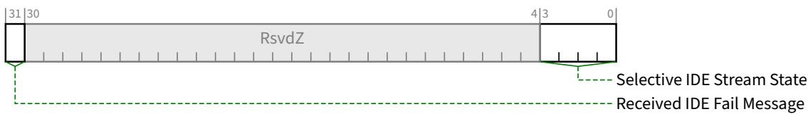

> **Figure 7-378 (Register Layout).** Selective IDE Stream Status Register
>
> | Bits 31 | Bits 30:4 | Bits 3:0 |
> |---------|-----------|----------|
> | Received IDE Fail Message | RsvdZ | Selective IDE Stream State |

**Table 7-330. Selective IDE Stream Status Register**

| Bit Location | Register Description | Attributes |
|--------------|---------------------|------------|
| 3:0 | Selective IDE Stream State – When Selective IDE Stream Enable is Set, this field indicates the state of the Port. Encodings:<br>0000b – Insecure<br>0001b – Secure<br>0010b – Reserved – Software must handle reserved values as indicating unknown state<br>Others – Reserved – Software must handle reserved values as indicating unknown state<br>When Selective IDE Stream Enable is Clear, the value of this field must be 0000b. | RO |
| 31 | Received IDE Fail Message – When Set, indicates that one or more IDE Fail Message(s) have been Received for this Stream. | RW1C |

</td>
<td style="background-color:#e8e8e8">


> **图 7-378(寄存器布局)。** 选择性 IDE 流状态寄存器
>
> | 位 31 | 位 30:4 | 位 3:0 |
> |-------|---------|--------|
> | Received IDE Fail Message(已接收 IDE 失败消息) | RsvdZ | Selective IDE Stream State(选择性 IDE 流状态) |

**表 7-330. 选择性 IDE 流状态寄存器 (Selective IDE Stream Status Register)**

| 位位置 | 寄存器描述 | 属性 |
|--------|------------|------|
| 3:0 | Selective IDE Stream State(选择性 IDE 流状态)— 当 Selective IDE Stream Enable 置 1 时,此字段指示端口的状态。编码:<br>0000b — Insecure(不安全)<br>0001b — Secure(安全)<br>0010b — 保留 — 软件必须将保留值视为指示未知状态<br>Others — 保留 — 软件必须将保留值视为指示未知状态<br>当 Selective IDE Stream Enable 为 0 时,此字段的值必须为 0000b。 | RO |
| 31 | Received IDE Fail Message(已接收 IDE 失败消息)— 置 1 时,指示已为此流接收到一条或多条 IDE Fail Message。 | RW1C |


</td>
</tr>
</tbody>
</table>

[⬆️ 返回目录](#-本章目录-table-of-contents)

---

<a id="sec-7-9-26-5-4"></a>
## 7.9.26.5.4 Selective IDE RID Association Register Block | 选择性 IDE RID 关联寄存器块

<!-- 📄 Page 1394 -->
---

<table>
<thead>
<tr>
<th width="50%">🇬🇧 English</th>
<th width="50%" style="background-color:#e8e8e8">🏆 中文</th>
</tr>
</thead>
<tbody>
<tr>
<td>

A Selective IDE RID Association register must consist of one IDE RID Association Register 1 followed by one IDE RID Association Register 2.

</td>
<td style="background-color:#e8e8e8">

一个 Selective IDE RID Association 寄存器必须由一个 IDE RID Association Register 1 后跟一个 IDE RID Association Register 2 组成。

</td>
</tr>
</tbody>
</table>

[⬆️ 返回目录](#-本章目录-table-of-contents)

---

<a id="sec-7-9-26-5-4-1"></a>
## 7.9.26.5.4.1 IDE RID Association Register 1 | IDE RID 关联寄存器 1


<div style="overflow-x: auto; max-width: 100%;">
<table>
<thead>
<tr>
<th width="50%">🇬🇧 English</th>
<th width="50%" style="background-color:#e8e8e8">🏆 中文</th>
</tr>
</thead>
<tbody>
<tr>
<td>

> **Figure 7-379 (Register Layout).** IDE RID Association Register 1 (Offset +00h)
>
> | Bits 31:24 | Bits 23:8 | Bits 7:0 |
> |-----------|-----------|----------|
> | RsvdP | RID Limit | RsvdP |

**Table 7-331. IDE RID Association Register 1 (Offset +00h)**

| Bit Location | Register Description | Attributes |
|--------------|---------------------|------------|
| 23:8 | RID Limit – Indicates the highest value RID in the range associated with this Stream ID at the IDE Partner Port.<br>The Segment Number associated with this field is contained in Segment Base in the IDE RID Association Register 2. | RW |

</td>
<td style="background-color:#e8e8e8">

> **图 7-379(寄存器布局)。** IDE RID 关联寄存器 1 (Offset +00h)
>
> | 位 31:24 | 位 23:8 | 位 7:0 |
> |----------|---------|--------|
> | RsvdP | RID Limit(RID 上限) | RsvdP |

**表 7-331. IDE RID 关联寄存器 1 (Offset +00h)**

| 位位置 | 寄存器描述 | 属性 |
|--------|------------|------|
| 23:8 | RID Limit(RID 上限)— 指示在 IDE Partner Port 与此 Stream ID 关联的范围内最高的 RID 值。<br>与此字段关联的 Segment Number 包含在 IDE RID Association Register 2 的 Segment Base 中。 | RW |

</td>
</tr>
</tbody>
</table>

> **Figure 7-379.** IDE RID Association Register 1 (Offset +00h)
> 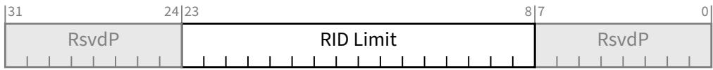

</div>


[⬆️ 返回目录](#-本章目录-table-of-contents)

---

<a id="sec-7-9-26-5-4-2"></a>
## 7.9.26.5.4.2 IDE RID Association Register 2 | IDE RID 关联寄存器 2

<table>
<thead>
<tr>
<th width="50%">🇬🇧 English</th>
<th width="50%" style="background-color:#e8e8e8">🏆 中文</th>
</tr>
</thead>
<tbody>
<tr>
<td>

> **Figure 7-380 (Register Layout).** IDE RID Association Register 2 (Offset +04h)
>
> | Bits 31:24 | Bits 23:8 | Bits 7:1 | Bit 0 |
> |-----------|-----------|---------|-------|
> | Segment Base | RID Base | RsvdP | Valid (V) |

**Table 7-332. IDE RID Association Register 2 (Offset +04h)**

| Bit Location | Register Description | Attributes |
|--------------|---------------------|------------|
| 0 | Valid (V) – When Set, indicates the Segment Base, RID Base and RID Limit fields have been programmed.<br>Default is 0b | RW |
| 23:8 | RID Base – Indicates the lowest value RID in the range associated with this Stream ID at the IDE Partner Port.<br>The Segment Number associated with this field is contained in Segment Base. | RW |
| 31:24 | Segment Base – In Flit Mode, Indicates the Segment value associated with this Stream ID at the IDE Partner Port.<br>Reserved if Flit Mode is not supported.<br>If this Selective IDE Stream is within an FM subtree whose Segment Captured bits are Clear, software must set this field to 00h, regardless of the Segment Number value associated with the subtree's RP.<br>Default value is 00h. | RW / RsvdP |

</td>
<td style="background-color:#e8e8e8">


> **图 7-380(寄存器布局)。** IDE RID 关联寄存器 2 (Offset +04h)

> 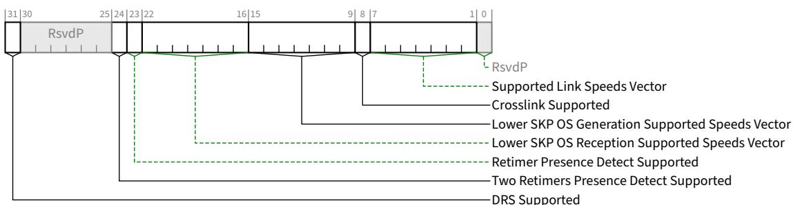

>
> | 位 31:24 | 位 23:8 | 位 7:1 | 位 0 |
> |----------|---------|---------|------|
> | Segment Base(Segment 基址) | RID Base(RID 基址) | RsvdP | Valid (V)(有效位) |

**表 7-332. IDE RID 关联寄存器 2 (Offset +04h)**

| 位位置 | 寄存器描述 | 属性 |
|--------|------------|------|
| 0 | Valid (V)(有效位)— 置 1 时,指示 Segment Base、RID Base 和 RID Limit 字段已被编程。<br>默认为 0b | RW |
| 23:8 | RID Base(RID 基址)— 指示在 IDE Partner Port 与此 Stream ID 关联的范围内最低的 RID 值。<br>与此字段关联的 Segment Number 包含在 Segment Base 中。 | RW |
| 31:24 | Segment Base(Segment 基址)— 在 Flit Mode(Flit 模式)下,指示在 IDE Partner Port 与此 Stream ID 关联的 Segment 值。<br>如果不支持 Flit Mode 则保留。<br>如果此 Selective IDE Stream 位于 Segment Captured 位为 0 的 FM 子树内,软件必须将此字段设置为 00h,与子树 RP 关联的 Segment Number 值无关。<br>默认值为 00h。 | RW / RsvdP |

</td>
</tr>
</tbody>
</table>

[⬆️ 返回目录](#-本章目录-table-of-contents)

---

<a id="sec-7-9-26-5-5"></a>
## 7.9.26.5.5 Selective IDE Address Association Register Block | 选择性 IDE 地址关联寄存器块

<!-- 📄 Page 1395 -->
---

<table>
<thead>
<tr>
<th width="50%">🇬🇧 English</th>
<th width="50%" style="background-color:#e8e8e8">🏆 中文</th>
</tr>
</thead>
<tbody>
<tr>
<td>

A Selective IDE Address Association register must consist of one IDE Address Association Register 1, followed by one IDE Address Association Register 2, followed by one IDE Address Association Register 3.

</td>
<td style="background-color:#e8e8e8">

一个 Selective IDE Address Association 寄存器必须由一个 IDE Address Association Register 1 后跟一个 IDE Address Association Register 2 再跟一个 IDE Address Association Register 3 组成。

</td>
</tr>
</tbody>
</table>

[⬆️ 返回目录](#-本章目录-table-of-contents)

---

<a id="sec-7-9-26-5-5-1"></a>
## 7.9.26.5.5.1 IDE Address Association Register 1 | IDE 地址关联寄存器 1


<div style="overflow-x: auto; max-width: 100%;">
<table>
<thead>
<tr>
<th width="50%">🇬🇧 English</th>
<th width="50%" style="background-color:#e8e8e8">🏆 中文</th>
</tr>
</thead>
<tbody>
<tr>
<td>

> **Figure 7-381 (Register Layout).** IDE Address Association Register 1 (Offset +00h)
>
> | Bits 31:20 | Bits 19:8 | Bits 7:1 | Bit 0 |
> |-----------|-----------|---------|-------|
> | Memory Limit Lower | Memory Base Lower | RsvdP | V (Valid) |

**Table 7-333. IDE Address Association Register 1 (Offset +00h)**

| Bit Location | Register Description | Attributes |
|--------------|---------------------|------------|
| 31:20 | Memory Limit Lower – Corresponds to Address bits [31:20]. Address bits [19:0] are implicitly F_FFFFh. | RW |
| 19:8 | Memory Base Lower – Corresponds to Address bits [31:20]. Address[19:0] bits are implicitly 0_0000h. | RW |
| 0 | V (Valid) – When Set, indicates this IDE Stream Association Block is valid, that the address range defined by Memory Base and Memory Limit corresponding to a range of memory addresses assigned to the IDE Partner Port, and that all Transmitted Address Routed TLPs within this address range must be associated with this IDE Stream, subject to rules stated in § Section 6.33.4 .<br>Hardware behavior is undefined if overlapping address ranges are assigned for different IDE Streams.<br>Default is 0b | RW |

</td>
<td style="background-color:#e8e8e8">

> **图 7-381(寄存器布局)。** IDE 地址关联寄存器 1 (Offset +00h)
>
> | 位 31:20 | 位 19:8 | 位 7:1 | 位 0 |
> |----------|---------|---------|------|
> | Memory Limit Lower(内存下限低位) | Memory Base Lower(内存基址低位) | RsvdP | V (Valid)(有效位) |

**表 7-333. IDE 地址关联寄存器 1 (Offset +00h)**

| 位位置 | 寄存器描述 | 属性 |
|--------|------------|------|
| 31:20 | Memory Limit Lower(内存下限低位)— 对应地址位 [31:20]。地址位 [19:0] 隐含为 F_FFFFh。 | RW |
| 19:8 | Memory Base Lower(内存基址低位)— 对应地址位 [31:20]。地址位 [19:0] 隐含为 0_0000h。 | RW |
| 0 | V (Valid)(有效位)— 置 1 时,指示此 IDE Stream Association Block 有效,由 Memory Base 和 Memory Limit 定义的地址范围对应分配给 IDE Partner Port 的一段内存地址范围,且该地址范围内的所有发送地址路由 TLP 必须与此 IDE 流关联,前提是遵循 § Section 6.33.4 中所述的规则。<br>如果为不同的 IDE Stream 分配了重叠的地址范围,硬件行为未定义。<br>默认为 0b | RW |

</td>
</tr>
</tbody>
</table>

> **Figure 7-381.** IDE Address Association Register 1 (Offset +00h)
> 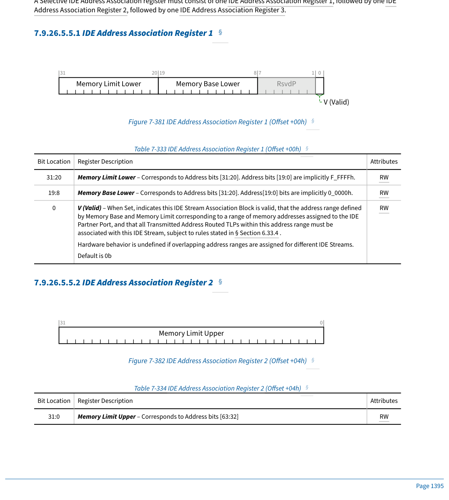

</div>


[⬆️ 返回目录](#-本章目录-table-of-contents)

---

<a id="sec-7-9-26-5-5-2"></a>
## 7.9.26.5.5.2 IDE Address Association Register 2 | IDE 地址关联寄存器 2

<table>
<thead>
<tr>
<th width="50%">🇬🇧 English</th>
<th width="50%" style="background-color:#e8e8e8">🏆 中文</th>
</tr>
</thead>
<tbody>
<tr>
<td>

> **Figure 7-382 (Register Layout).** IDE Address Association Register 2 (Offset +04h)
>
> | Bits 31:0 |
> |-----------|
> | Memory Limit Upper |

**Table 7-334. IDE Address Association Register 2 (Offset +04h)**

| Bit Location | Register Description | Attributes |
|--------------|---------------------|------------|
| 31:0 | Memory Limit Upper – Corresponds to Address bits [63:32] | RW |

</td>
<td style="background-color:#e8e8e8">


> **图 7-382(寄存器布局)。** IDE 地址关联寄存器 2 (Offset +04h)
>
> | 位 31:0 |
> |---------|
> | Memory Limit Upper(内存上限高位) |

**表 7-334. IDE 地址关联寄存器 2 (Offset +04h)**

| 位位置 | 寄存器描述 | 属性 |
|--------|------------|------|
| 31:0 | Memory Limit Upper(内存上限高位)— 对应地址位 [63:32] | RW |

</td>
</tr>
</tbody>
</table>

[⬆️ 返回目录](#-本章目录-table-of-contents)

---

<a id="sec-7-9-26-5-5-3"></a>
## 7.9.26.5.5.3 IDE Address Association Register 3 | IDE 地址关联寄存器 3


<div style="overflow-x: auto; max-width: 100%;">
<table>
<thead>
<tr>
<th width="50%">🇬🇧 English</th>
<th width="50%" style="background-color:#e8e8e8">🏆 中文</th>
</tr>
</thead>
<tbody>
<tr>
<td>

> **Figure 7-383 (Register Layout).** IDE Address Association Register 3 (Offset +04h)
>
> | Bits 31:0 |
> |-----------|
> | Memory Base Upper |

**Table 7-335. IDE Address Association Register 3 (Offset +04h)**

| Bit Location | Register Description | Attributes |
|--------------|---------------------|------------|
| 31:0 | Memory Base Upper – Corresponds to Address bits [63:32] | RW |

</td>
<td style="background-color:#e8e8e8">

> **图 7-383(寄存器布局)。** IDE 地址关联寄存器 3 (Offset +04h)
>
> | 位 31:0 |
> |---------|
> | Memory Base Upper(内存基址高位) |

**表 7-335. IDE 地址关联寄存器 3 (Offset +04h)**

| 位位置 | 寄存器描述 | 属性 |
|--------|------------|------|
| 31:0 | Memory Base Upper(内存基址高位)— 对应地址位 [63:32] | RW |

</td>
</tr>
</tbody>
</table>

> **Figure 7-383.** IDE Address Association Register 3 (Offset +04h)
> 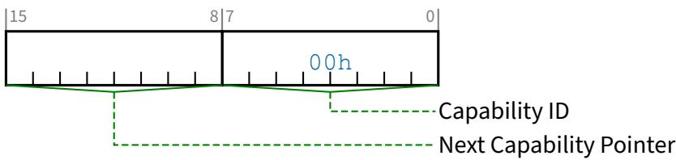

</div>


[⬆️ 返回目录](#-本章目录-table-of-contents)

---

<a id="sec-7-9-27"></a>
## 7.9.27 Null Capability | 空能力

<!-- 📄 Page 1396 -->
---

<table>
<thead>
<tr>
<th width="50%">🇬🇧 English</th>
<th width="50%" style="background-color:#e8e8e8">🏆 中文</th>
</tr>
</thead>
<tbody>
<tr>
<td>

The Null Capability is a capability structure in PCI-compatible Configuration Space (first 256 bytes) as shown in § Figure 7-384.

The Null Capability contains no registers. This capability is present in the linked list (Next Capability Pointer), but should otherwise be ignored by software. The layout of the information is shown in § Figure 7-384.

A single PCI Express Function is permitted to contain multiple Null Capability structures.

> **Figure 7-384 (Register Layout).** Null Capability
>
> | Bits 15:8 | Bits 7:0 |
> |-----------|----------|
> | Next Capability Pointer | Capability ID = 00h |

**Table 7-336. Null Capability**

| Bit Location | Register Description | Attributes |
|--------------|---------------------|------------|
| 7:0 | Capability ID - Indicates the PCI Express Capability structure. This field must return a Capability ID of 00h indicating that this is a Null Capability structure. | RO |
| 15:8 | Next Capability Pointer - This field contains the offset to the next PCI Capability structure or 00h if no other items exist in the linked list of Capabilities. | RO |

</td>
<td style="background-color:#e8e8e8">

Null Capability(空能力)是位于 PCI 兼容配置空间(前 256 字节)中的一种能力结构,如 § Figure 7-384 所示。

Null Capability 不包含任何寄存器。该能力出现在链表(Next Capability Pointer)中,但软件应忽略其内容。信息的布局如 § Figure 7-384 所示。

允许单个 PCI Express Function(功能)包含多个 Null Capability 结构。

> **图 7-384.** 空能力 (Null Capability)
> 

> **图 7-384(寄存器布局)。** 空能力
>
> | 位 15:8 | 位 7:0 |
> |---------|---------|
> | Next Capability Pointer(下一能力指针) | Capability ID = 00h |

**表 7-336. 空能力 (Null Capability)**

| 位位置 | 寄存器描述 | 属性 |
|--------|------------|------|
| 7:0 | Capability ID(能力 ID)— 指示 PCI Express Capability 结构。此字段必须返回 00h 的 Capability ID,以指示这是一个 Null Capability 结构。 | RO |
| 15:8 | Next Capability Pointer(下一能力指针)— 此字段包含指向下一个 PCI Capability 结构的偏移,若链表中不存在其他项则为 00h。 | RO |

</td>
</tr>
</tbody>
</table>

[⬆️ 返回目录](#-本章目录-table-of-contents)

---

<a id="sec-7-9-28"></a>
## 7.9.28 Null Extended Capability | 空扩展能力

<!-- 📄 Page 1397 -->
---


<div style="overflow-x: auto; max-width: 100%;">
<table>
<thead>
<tr>
<th width="50%">🇬🇧 English</th>
<th width="50%" style="background-color:#e8e8e8">🏆 中文</th>
</tr>
</thead>
<tbody>
<tr>
<td>

The Null Extended Capability is an optional Extended Capability that is permitted to be implemented by any PCI Express Function or RCRB. This capability contains no registers. This capability is present in the linked list (Next Capability Offset) but should otherwise be ignored by software.

A single PCI Express Function or RCRB is permitted to contain multiple Null Extended Capability structures.

§ Figure 7-385 details allocation of register fields in the Null Extended Capability; § Table 7-337 provides the respective bit definitions. The Extended Capability ID for the Null Extended Capability is 0000h.

> **Figure 7-385 (Register Layout).** Null Extended Capability
>
> | Bits 31:20 | Bits 19:16 | Bits 15:0 |
> |-----------|------------|-----------|
> | Next Capability Offset | Capability Version | PCI Express Extended Capability ID = 0000h |

**Table 7-337. Null Extended Capability**

| Bit Location | Register Description | Attributes |
|--------------|---------------------|------------|
| 15:0 | PCI Express Extended Capability ID - This field is a PCI-SIG defined ID number that indicates the nature and format of the Extended Capability.<br>Extended Capability ID for the Null Extended Capability is 0000h. | RO |
| 19:16 | Capability Version - This field is a PCI-SIG defined version number that indicates the version of the Capability structure present.<br>This field is permitted to contain any value. | RO |
| 31:20 | Next Capability Offset - This field contains the offset to the next PCI Express Capability structure or 000h if no other items exist in the linked list of Capabilities.<br>For Extended Capabilities implemented in Configuration Space, this offset is relative to the beginning of PCI-compatible Configuration Space and thus must always be either 000h (for terminating list of Capabilities) or greater than 0FFh. | RO |

The Streamlined Virtual Channel (SVC) Extended Capability is an optional Extended Capability required for Ports that support capabilities associated with this structure, including UIO. It is permitted, but not required, for Functions in a Port to implement the SVC Extended Capability as well as the MFVC Extended Capability and/or VC Capabilities. See § Section 6.3.5 .

UIO requires the use of the SVC capability and is not supported by the VC or MFVC capabilities. UIO is supported only in Flit Mode, but in Non-Flit Mode the SVC capability can be used by non-UIO traffic.

For an Upstream Port, the SVC Extended Capability structure is permitted to be implemented only in Function 0, and that instance applies to all Functions associated with that Port. The SVC Extended Capability structure is permitted to be implemented in any Downstream Port, or in an RCRB. If the SVC Extended Capability structure is implemented in a USP

</td>
<td style="background-color:#e8e8e8">

Null Extended Capability(空扩展能力)是一种可选的扩展能力,允许由任何 PCI Express Function 或 RCRB 实现。该能力不包含任何寄存器。该能力出现在链表(Next Capability Offset)中,但软件应忽略其内容。

允许单个 PCI Express Function 或 RCRB 包含多个 Null Extended Capability 结构。

§ Figure 7-385 详述了 Null Extended Capability 中各寄存器字段的分配;§ Table 7-337 给出了相应的位定义。Null Extended Capability 的 Extended Capability ID 为 0000h。

> **图 7-385(寄存器布局)。** 空扩展能力
>
> | 位 31:20 | 位 19:16 | 位 15:0 |
> |----------|----------|---------|
> | Next Capability Offset(下一能力偏移) | Capability Version(能力版本) | PCI Express Extended Capability ID = 0000h |

**表 7-337. 空扩展能力 (Null Extended Capability)**

| 位位置 | 寄存器描述 | 属性 |
|--------|------------|------|
| 15:0 | PCI Express Extended Capability ID(PCI Express 扩展能力 ID)— 此字段是由 PCI-SIG 定义的 ID 编号,用于指示扩展能力的性质和格式。<br>Null Extended Capability 的 Extended Capability ID 为 0000h。 | RO |
| 19:16 | Capability Version(能力版本)— 此字段是由 PCI-SIG 定义的版本号,用于指示所呈现的能力结构的版本。<br>此字段允许包含任意值。 | RO |
| 31:20 | Next Capability Offset(下一能力偏移)— 此字段包含指向下一个 PCI Express Capability 结构的偏移,若链表中不存在其他项则为 000h。<br>对于在配置空间中实现的扩展能力,此偏移相对于 PCI 兼容配置空间的起始处,因此必须始终为 000h(用于终止能力列表)或大于 0FFh。 | RO |

Streamlined Virtual Channel(SVC,精简虚通道)Extended Capability 是一种可选的扩展能力,对于支持与此结构相关的能力(包括 UIO)的端口是必需的。允许(但不要求)端口中的功能同时实现 SVC Extended Capability 与 MFVC Extended Capability 和/或 VC Capabilities。参见 § Section 6.3.5 。

UIO 要求使用 SVC 能力,且 VC 或 MFVC 能力不支持 UIO。UIO 仅在 Flit Mode(Flit 模式)下受支持,但在 Non-Flit Mode(非 Flit 模式)下,SVC 能力可被非 UIO 流量使用。

对于 Upstream Port(上游端口),SVC Extended Capability 结构允许仅在 Function 0 中实现,且该实例适用于与该端口关联的所有功能。SVC Extended Capability 结构允许在任何 Downstream Port(下游端口)或 RCRB 中实现。如果 SVC Extended Capability 结构在 USP 中实现

</td>
</tr>
</tbody>
</table>

> **Figure 7-385.** Null Extended Capability
> 

</div>


[⬆️ 返回目录](#-本章目录-table-of-contents)

---

---

7.9.29 Streamlined Virtual Channel Extended Capability (SVC) §
§
§

<!-- 📄 Page 1398 -->
---

<a id="sec-7-9-29"></a>
## 7.9.29 Streamlined Virtual Channel Extended Capability (SVC) | 精简虚通道扩展能力 (SVC)

<table>
<thead>
<tr>
<th width="50%">🇬🇧 English</th>
<th width="50%" style="background-color:#e8e8e8">🏆 中文</th>
</tr>
</thead>
<tbody>
<tr>
<td>

containing one or more Switch USP Functions, it must be implemented in all associated Switch DSP Functions. A Root Complex is permitted to implement the Extended Capability structure in some Root Ports and not others.

The number of (extended) Virtual Channels is indicated by the SVC Extended VC Count field in the SVC Port VC Capability Register 1. Software must interpret this field to determine the availability of extended SVC Resource registers.

</td>
<td style="background-color:#e8e8e8">

如果某个 交换机 (Switch) 包含一个或多个 USP (上游端口) Function,则其所有关联的 DSP (下游端口) Function 中都必须实现该扩展能力结构。根复合体 (Root Complex) 允许在某些 Root Port 上实现该扩展能力结构,而在其他 Root Port 上不实现。

(扩展的)虚通道 (Virtual Channel) 数量由 SVC Port VC Capability Register 1 中的 SVC Extended VC Count 字段指示。软件必须解释该字段以确定扩展 SVC Resource 寄存器的可用性。

</td>
</tr>
</tbody>
</table>

---

**Figure 7-386. Streamlined Virtual Channel Extended Capability Structure | 图 7-386. 精简虚通道扩展能力结构**

> 7-386 图展示了精简虚通道扩展能力 (Streamlined Virtual Channel Extended Capability) 结构的布局。

<a id="sec-7-9-29-1"></a>
## 7.9.29.1 Streamlined Virtual Channel Extended Capability Header (Offset 00h) | 精简虚通道扩展能力头 (偏移量 00h)

<table>
<thead>
<tr>
<th width="50%">🇬🇧 English</th>
<th width="50%" style="background-color:#e8e8e8">🏆 中文</th>
</tr>
</thead>
<tbody>
<tr>
<td>

Figure 7-387 details allocation of register fields in the Streamlined Virtual Channel Extended Capability Header; Table 7-338 provides the respective bit definitions.

</td>
<td style="background-color:#e8e8e8">

图 7-387 详细说明了精简虚通道扩展能力头 (Streamlined Virtual Channel Extended Capability Header) 中寄存器字段的分配;表 7-338 给出了相应的位定义。

</td>
</tr>
</tbody>
</table>

**Figure 7-387. Streamlined Virtual Channel Extended Capability Header | 图 7-387. 精简虚通道扩展能力头**

```
0                                                                              15
+--------------------------------------------------+
|     PCI Express Extended Capability ID          |   0035h
+--------------------------------------------------+
16            19                       20                                       31
+----------------+--------------------------------------------------+
|  Capability    |        Next Capability Offset                     |
|   Version      |                                                  |
+----------------+--------------------------------------------------+
```

**Table 7-338. Streamlined Virtual Channel Extended Capability Header | 表 7-338. 精简虚通道扩展能力头**

| Bit Location | Register Description | Attributes |
|--------------|----------------------|------------|
| 15:0 | **PCI Express Extended Capability ID** - This field is a PCI-SIG defined ID number that indicates the nature and format of the Extended Capability. Extended Capability ID for the Streamlined Virtual Channel Extended Capability is 0035h. | RO |
| 19:16 | **Capability Version** - This field is a PCI-SIG defined version number that indicates the version of the Capability structure present. Must be 1h for this version of the specification. | RO |
| 31:20 | **Next Capability Offset** - This field contains the offset to the next PCI Express Capability structure or 000h if no other items exist in the linked list of Capabilities. | RO |


<div style="overflow-x: auto; max-width: 100%;">
<table>
<thead>
<tr>
<th width="50%">🇬🇧 English</th>
<th width="50%" style="background-color:#e8e8e8">🏆 中文</th>
</tr>
</thead>
<tbody>
<tr>
<td>

For Extended Capabilities implemented in Configuration Space, this offset is relative to the beginning of PCI-compatible Configuration Space and thus must always be either 000h (for terminating list of Capabilities) or greater than 0FFh.

The SVC Port Capability Register 1 describes the configuration of the Virtual Channels associated with a PCI Express Port.

Figure 7-388 details allocation of register fields in the SVC Port Capability Register 1; Table 7-339 provides the respective bit definitions.

</td>
<td style="background-color:#e8e8e8">

对于在配置空间 (Configuration Space) 中实现的扩展能力,该偏移量相对于 PCI 兼容 (PCI-Compatible) 配置空间的起始地址,因此必须始终为 000h(用于终止能力链表)或大于 0FFh。

SVC Port Capability Register 1 描述与一个 PCI Express 端口 (Port) 关联的虚通道 (Virtual Channel) 的配置。

图 7-388 详细说明了 SVC Port Capability Register 1 中寄存器字段的分配;表 7-339 给出了相应的位定义。

</td>
</tr>
</tbody>
</table>
</div>


---

<a id="sec-7-9-29-2"></a>
## 7.9.29.2 SVC Port Capability Register 1 (Offset 04h) | SVC 端口能力寄存器 1 (偏移量 04h)

**Figure 7-388. SVC Port Capability Register 1 | 图 7-388. SVC 端口能力寄存器 1**

```
0           2                  3                                                   31
+-----------+-------------------------------------------------------+
| SVC Ext.  |                                                       |
|  VC Count |                      RsvdP                           |
+-----------+-------------------------------------------------------+
```

**Table 7-339. SVC Port Capability Register 1 | 表 7-339. SVC 端口能力寄存器 1**

| Bit Location | Register Description | Attributes |
|--------------|----------------------|------------|
| 2:0 | **SVC Extended VC Count** – Indicates the number of Virtual Channels supported in addition to VC0. This value indicates the number of SVC Resource Capability, Control, and Status registers present in this structure in addition to those for VC0. The minimum value of this field is 0, for devices that only support the default VC. | HwInit |
| 31:3 | This register is RsvdP. | |

<table>
<thead>
<tr>
<th width="50%">🇬🇧 English</th>
<th width="50%" style="background-color:#e8e8e8">🏆 中文</th>
</tr>
</thead>
<tbody>
<tr>
<td>

Table 7-340 details allocation of register fields in the SVC Port Control Register; Table 7-340 provides the respective bit definitions.

</td>
<td style="background-color:#e8e8e8">

表 7-340 详细说明了 SVC Port Control Register 中寄存器字段的分配;表 7-340 给出了相应的位定义。

</td>
</tr>
</tbody>
</table>

---

<a id="sec-7-9-29-3"></a>
## 7.9.29.3 SVC Port Capability Register 2 (Offset 08h) | SVC 端口能力寄存器 2 (偏移量 08h)

<a id="sec-7-9-29-4"></a>
## 7.9.29.4 SVC Port Control Register (Offset 0Ch) | SVC 端口控制寄存器 (偏移量 0Ch)

**Figure 7-389. SVC Port Control Register | 图 7-389. SVC 端口控制寄存器**

```
0                       1                                                         31
+------+--------------------------------------------------------------------------+
| VC   |                                                                          |
| Enab.|                            RsvdP                                        |
|Compl.|                                                                          |
+------+--------------------------------------------------------------------------+
```

**Table 7-340. SVC Port Control Register | 表 7-340. SVC 端口控制寄存器**

| Bit Location | Register Description | Attributes |
|--------------|----------------------|------------|
| 0 | **VC Enablement Completed** – Setting this bit indicates that software has completed enabling all VCs that are to be used by the Port. Setting this bit is optional. If this bit remains Clear, the Port and all enabled VCs must operate correctly. Default value of this bit is 0b. | RW |
| 31:1 | Reserved (RsvdP). | |

<table>
<thead>
<tr>
<th width="50%">🇬🇧 English</th>
<th width="50%" style="background-color:#e8e8e8">🏆 中文</th>
</tr>
</thead>
<tbody>
<tr>
<td>

Table 7-341 details allocation of register fields in the SVC Port Status Register; Table 7-341 provides the respective bit definitions.

</td>
<td style="background-color:#e8e8e8">

表 7-341 详细说明了 SVC Port Status Register 中寄存器字段的分配;表 7-341 给出了相应的位定义。

</td>
</tr>
</tbody>
</table>

---

<!-- 📄 Page 1400 -->
---

**Figure 7-390. SVC Port Status Register | 图 7-390. SVC 端口状态寄存器**

```
0                       1                                                         31
+--------+------------------------------------------------------------------------+
| Use VC/|                                                                        |
|  MFVC  |                            RsvdP                                      |
+--------+------------------------------------------------------------------------+
```

**Table 7-341. SVC Port Status Register | 表 7-341. SVC 端口状态寄存器**

| Bit Location | Register Description | Attributes |
|--------------|----------------------|------------|
| 0 | **Use VC/MFVC** – This bit enables or disables multiple specific VCs in SVC, VC, and MFVC capabilities as required for Section 6.3.5. When this bit is Set, the VC Enable bit for VC0 in each VC/MFVC capability (VC Resource Control Register or MFVC VC Resource Control Register) must be Set, and the SVC VC Enable bit for each VC in its SVC Resource Control Register must be Clear. When this bit is Cleared, the VC Enable bit for each VC resource in each VC/MFVC capability (VC Resource Control Register or MFVC VC Resource Control Register) must immediately be Cleared, and the SVC VC Enable bit for VC0 in its SVC Resource Control Register must immediately be Set. If this Port implements any VC or MFVC capabilities, this bit must have a default value of 1b, and if Cleared, it must remain Clear until the next Conventional Reset. If this Port implements no VC or MFVC capabilities, this bit must be 0b. | RW1C/HwInit |

---

<a id="sec-7-9-29-5"></a>
## 7.9.29.5 SVC Port Status Register (Offset 10h) | SVC 端口状态寄存器 (偏移量 10h)


<div style="overflow-x: auto; max-width: 100%;">
<table>
<thead>
<tr>
<th width="50%">🇬🇧 English</th>
<th width="50%" style="background-color:#e8e8e8">🏆 中文</th>
</tr>
</thead>
<tbody>
<tr>
<td>

Encoded values for the SVC VC Protocols Supported field:

- **0000b**: Supports same TLP Types and protocols as VC0
- **0001b**: Supports same TLP Types and protocols as VC0, except for those that are restricted by this document to using only VC0
- **0010b**: It is permitted to enable UIO on this VC resource; it is not permitted to use non-UIO TLP Types on this VC resource.
- **0011b**: It is permitted to enable UIO on this VC resource, or to use as a 0001b VC resource, but not both at the same time.
- **0100b to 1110b**: Reserved
- **1111b**: Vendor-defined use (outside the scope of this specification)

Figure 7-391 details allocation of register fields in the SVC Resource Capability Register; Table 7-342 provides the respective bit definitions.

</td>
<td style="background-color:#e8e8e8">

SVC VC Protocols Supported 字段的编码值:

- **0000b**: 支持与 VC0 相同的 TLP 类型和协议
- **0001b**: 支持与 VC0 相同的 TLP 类型和协议,例外是本规范限制只能使用 VC0 的那些类型
- **0010b**: 允许在该 VC 资源上启用 UIO;不允许在该 VC 资源上使用非 UIO TLP 类型。
- **0011b**: 允许在该 VC 资源上启用 UIO,或作为 0001b VC 资源使用,但不能同时使用两者。
- **0100b 至 1110b**: 保留
- **1111b**: 厂商自定义使用(超出本规范范围)

图 7-391 详细说明了 SVC Resource Capability Register 中寄存器字段的分配;表 7-342 给出了相应的位定义。

</td>
</tr>
</tbody>
</table>
</div>


---

<!-- 📄 Page 1401 -->
---

<a id="sec-7-9-29-6"></a>
## 7.9.29.6 SVC Resource Capability Register | SVC 资源能力寄存器

**Figure 7-391. SVC Resource Capability Register | 图 7-391. SVC 资源能力寄存器**

```
0                       7        8                  11    12         14    15                                 31
+-----------------------+--------+-----------------------+-------------+-------------------------------------+
|       RsvdP           |        | SVC VC Protocols      |  SVC VC ID  |              RsvdP                  |
+-----------------------+--------+-----------------------+-------------+-------------------------------------+
```

**Table 7-342. SVC Resource Capability Register | 表 7-342. SVC 资源能力寄存器**

| Bit Location | Register Description | Attributes |
|--------------|----------------------|------------|
| 11:8 | **SVC VC Protocols Supported** – Indicates UIO and non-UIO Transaction support for this VC, encoded as: <br>• 0000b - Supports same TLP Types and protocols as VC0 <br>• 0001b - Supports same TLP Types and protocols as VC0, except for those that are restricted by this document to using only VC0 <br>• 0010b - It is permitted to enable UIO on this VC resource; it is not permitted to use non-UIO TLP Types on this VC resource. <br>• 0011b - It is permitted to enable UIO on this VC resource, or to use as a 0001b VC resource, but not both at the same time. <br>• 0100b to 1110b - Reserved <br>• 1111b - Vendor-defined use (outside the scope of this specification) <br>For VC0, must be 0000b. For VC3, if UIO is supported, must be 0010b or 0011b. For VC4, if UIO and VC4 are supported, must be 0010b or 0011b. | HwInit/RsvdP |
| 14:12 | **SVC VC ID** – This field indicates the VC ID to the VC resource. For the first of SVC Resource Capability Register, this field must be 000b. For other SVC Resource Capability Registers, this field may contain any non-zero value. This field value must be unique across all SVC Resource Capability Registers. | HwInit/RsvdP |

<table>
<thead>
<tr>
<th width="50%">🇬🇧 English</th>
<th width="50%" style="background-color:#e8e8e8">🏆 中文</th>
</tr>
</thead>
<tbody>
<tr>
<td>

Figure 7-392 details allocation of register fields in the SVC Resource Control Register; Table 7-343 provides the respective bit definitions.

</td>
<td style="background-color:#e8e8e8">

图 7-392 详细说明了 SVC Resource Control Register 中寄存器字段的分配;表 7-343 给出了相应的位定义。

</td>
</tr>
</tbody>
</table>

---

<a id="sec-7-9-29-7"></a>
## 7.9.29.7 SVC Resource Control Register | SVC 资源控制寄存器

**Figure 7-392. SVC Resource Control Register | 图 7-392. SVC 资源控制寄存器**

```
0                       7        8                  11    12                            26    27       29    30         31
+-----------------------+--------+-----------------------+--------------------------------+---+----------+--------+----------+
|    SVC TC/VC Map      |        | SVC VC Protocol       |              RsvdP              |   |SVC Shared| SVC Sh.|  SVC VC  |
|                       |        |     Selected          |                                |   | FC Usage |  FC Us.|  Enable  |
|                       |        |                       |                                |   |  Limit   | Lim En.|          |
+-----------------------+--------+-----------------------+--------------------------------+---+----------+--------+----------+
```

**Table 7-343. SVC Resource Control Register | 表 7-343. SVC 资源控制寄存器**

| Bit Location | Register Description | Attributes |
|--------------|----------------------|------------|
| 7:0 | **SVC TC/VC Map** – This field indicates the TCs that are mapped to the VC resource. This field is valid for all Functions. Bit locations within this field correspond to TC values. In order to remove one or more TCs from the TC/VC Map of an enabled VC, software must ensure that no new or outstanding Requests with the TC labels are targeted at the given Link. Bit 0 of this field must be read-only. It must be Set for the default VC0 and Clear for all other enabled VCs. Default value of this field must be consistent with Table 2-46. | RW / RO |
| 11:8 | **SVC VC Protocol Selected** – Determines the TLP Types and Protocols to be used with this VC, encoded as: <br>• 0000b - TLP Types and protocols as VC0 (required for VC0 and permitted only for VC0) <br>• 0001b - TLP Types and protocols as VC0, except for those that are restricted by this document to using only VC0 <br>• 0010b - UIO TLP Types and protocols <br>• 0011b to 1110b - Reserved <br>• 1111b - Vendor-defined use (outside the scope of this specification) <br>For VC0, must be hardwired to 0000b. Default value is implementation specific. | RW / RO / RsvdP |
| 29:27 | **SVC Shared Flow Control Usage Limit** – This field controls what percentage of the available Shared Flow Control a given FC/VC is permitted to consume. This limit is applied independently for each Flow Control credit type. For example, if this field contains 101b and SVC Shared Flow Control Usage Limit Enable is Set, a Posted TLP may not pass the Tx Gate if doing so would cause that VC to consume more than 62.5% of the available Shared Posted Header credits or if doing so would cause that VC to consume more than 62.5% of the available Shared Data credits. If SVC Shared Flow Control Usage Limit Enable is Clear, this field must be ignored, and this VC is permitted to consume all of the shared credits, unless the Transmitter has implementation-specific policy mechanisms to constrain shared credit use. When SVC Shared Flow Control Usage Limit Enable is Set, and this field contains 000b, this VC is not permitted to consume any shared credits. Behavior is undefined when all VCs have SVC Shared Flow Control Usage Limit Enable Set and the sum of the SVC Shared Flow Control Limit values for all VCs is less than 100%. Encodings are: <br>• 000b - 0% <br>• 001b - 12.5% <br>• 010b - 25% <br>• 011b - 37.5% <br>• 100b - 50% <br>• 101b - 62.5% <br>• 110b - 75% <br>• 111b - 87.5% <br>Behavior is undefined if this field changes value while SVC VC Enable and SVC Shared Flow Control Usage Limit Enable are both Set. When SVC Extended VC Count is 0, this field is permitted to be hardwired to any value. When this field is RW, the default value is implementation specific. | RW / RO / RsvdP |
| 30 | **SVC Shared Flow Control Usage Limit Enable** – When Set, this bit enables use of control of Shared Flow Control consumption at the transmitter for this Virtual Channel. Behavior is undefined of the value of this bit changes while SVC VC Enable is Set. This bit is RsvdP when Flit Mode Supported is Clear. When SVC Extended VC Count is 0, this bit is permitted to be hardwired to 0b. When this bit is RW, the default value is implementation specific. | RW / RO / RsvdP |
| 31 | **SVC VC Enable** – This bit, when Set, enables this Virtual Channel. The Virtual Channel is disabled when this bit is cleared. Software must use the SVC VC Negotiation Pending bit to check whether the VC negotiation is complete. For VC0, the attribute is RO, and this bit must always have the opposite value from the Use VC/MFVC bit in the SVC Port Status Register. See Section 6.3.5. For other VCs, the default value of this bit is 0b and the attribute is RW. To enable a Virtual Channel in a Port using SVC mechanisms, the SVC VC Enable bit for that Virtual Channel must be Set. The corresponding Virtual Channel in the Link partner Port must be enabled as well, and that Virtual Channel may be in an SVC, VC, or MFVC capability. To disable a Virtual Channel, the Virtual Channel must be disabled in both components on the Link. Software must ensure that no traffic is using a Virtual Channel at the time it is disabled. Software must fully disable a Virtual Channel in both components on a Link before re-enabling the Virtual Channel. | RW / RO |

---

<!-- 📄 Page 1402 -->
---

<table>
<thead>
<tr>
<th width="50%">🇬🇧 English</th>
<th width="50%" style="background-color:#e8e8e8">🏆 中文</th>
</tr>
</thead>
<tbody>
<tr>
<td>

Table 7-344 details allocation of register fields in the VC Resource Status Register; Table 7-344 provides the respective bit definitions.

</td>
<td style="background-color:#e8e8e8">

表 7-344 详细说明了 SVC Resource Status Register 中寄存器字段的分配;表 7-344 给出了相应的位定义。

</td>
</tr>
</tbody>
</table>

---

<!-- 📄 Page 1403 -->
---

<a id="sec-7-9-29-8"></a>
## 7.9.29.8 SVC Resource Status Register | SVC 资源状态寄存器

**Figure 7-393. SVC Resource Status Register | 图 7-393. SVC 资源状态寄存器**

```
0                       1                                                         31
+-----------------------+----------------------------------------------------------+
|       RsvdP           |        SVC VC Negotiation Pending          |    RsvdP   |
+-----------------------+----------------------------------------------------------+
```

<!-- 📄 Page 1404 -->
---

**Table 7-344. SVC Resource Status Register | 表 7-344. SVC 资源状态寄存器**

| Bit Location | Register Description | Attributes |
|--------------|----------------------|------------|
| 1 | **SVC VC Negotiation Pending** – This bit indicates whether the Virtual Channel negotiation (initialization or disabling) is in pending state. This bit is valid for all Functions. The value of this bit is defined only when the Link is in the DL_Active state and the corresponding SVC VC Enable bit is Set. This bit is Set by hardware to indicate that the VC resource has not completed the process of negotiation. This bit is Cleared by hardware after the VC negotiation is complete (on exit from the FC_INIT2 state). For VC0, this bit is permitted to be hardwired to 0b. Before using a Virtual Channel, software must check whether the SVC VC Negotiation Pending bits for that Virtual Channel are Clear in both components on the Link. | RO |

---

<a id="sec-7-9-30"></a>
## 7.9.30 MMIO Register Block Locator Extended Capability (MRBL) | MMIO 寄存器块定位器扩展能力 (MRBL)


<div style="overflow-x: auto; max-width: 100%;">
<table>
<thead>
<tr>
<th width="50%">🇬🇧 English</th>
<th width="50%" style="background-color:#e8e8e8">🏆 中文</th>
</tr>
</thead>
<tbody>
<tr>
<td>

The MMIO Register Block Locator Extended Capability (MRBL) is an optional Extended Capability for discovering register blocks in Memory Space that can be used to exchange various types of data structures between system software and a Function (See Section 6.35 Section 6.35).

It is permitted to implement the MRBL Extended Capability in any type of Function. A single PCI Express Function is permitted to contain at most one instance of this capability.

The number of register blocks included the MRBL structure is described in the MRBL Capabilities Register (Section 7.9.30.2 Section 7.9.30.2). A Function that implements the MRBL Extended Capability shall support at least one MRBL Locator Register (Section 7.9.30.3).

Each register block is described by a MRBL Locator Register (Section 7.9.30.3) to specify the location and type of the registers within Memory Space. Each register block must be contained within the address range covered by the associated BAR. Figure 7-394 illustrates the MRBL Extended Capability structure.

</td>
<td style="background-color:#e8e8e8">

MMIO 寄存器块定位器扩展能力 (MMIO Register Block Locator Extended Capability, MRBL) 是一项可选的扩展能力,用于发现内存空间 (Memory Space) 中的寄存器块,这些寄存器块可用于在系统软件和 Function 之间交换各种类型的数据结构(参见第 6.35 节 第 6.35 节)。

允许在任何类型的 Function 中实现 MRBL 扩展能力。单个 PCI Express Function 允许包含至多一个该能力的实例。

MRBL 结构中包含的寄存器块数量在 MRBL Capabilities Register 中描述(第 7.9.30.2 节 第 7.9.30.2 节)。实现 MRBL 扩展能力的 Function 应至少支持一个 MRBL Locator Register(第 7.9.30.3 节)。

每个寄存器块由一个 MRBL Locator Register(第 7.9.30.3 节)描述,以指定内存空间中寄存器的位置和类型。每个寄存器块必须包含在关联的 BAR (基址寄存器, Base Address Register) 所覆盖的地址范围内。图 7-394 说明了 MRBL 扩展能力结构。

</td>
</tr>
</tbody>
</table>
</div>


---

**Figure 7-394. MRBL Extended Capability | 图 7-394. MRBL 扩展能力**

```
Byte Offset       Contents
+--------+
+000h    |  PCI Express Extended Capability Header
+004h    |  MRBL Capabilities Register
+008h    |  MRBL Locator Register (Register Block 1)
+00Ch    |  MRBL Locator Register (Register Block 2)
+010h    |  ...
+014h
+018h
+--------+
```

<table>
<thead>
<tr>
<th width="50%">🇬🇧 English</th>
<th width="50%" style="background-color:#e8e8e8">🏆 中文</th>
</tr>
</thead>
<tbody>
<tr>
<td>

Figure 7-395 details allocation of register fields in the MRBL Extended Capability Header; Table 7-345 provides the respective bit definitions. Refer to Section 7.6.3 for a description of the PCI Express Extended Capability Header. The Extended Capability ID for the MRBL Extended Capability is 0036h.

</td>
<td style="background-color:#e8e8e8">

图 7-395 详细说明了 MRBL Extended Capability Header 中寄存器字段的分配;表 7-345 给出了相应的位定义。有关 PCI Express 扩展能力头的描述,请参见第 7.6.3 节。MRBL 扩展能力的扩展能力 ID 为 0036h。

</td>
</tr>
</tbody>
</table>

---

<!-- 📄 Page 1405 -->
---

<a id="sec-7-9-30-1"></a>
## 7.9.30.1 MRBL Extended Capability Header (Offset 00h) | MRBL 扩展能力头 (偏移量 00h)

**Figure 7-395. MRBL Extended Capability Header | 图 7-395. MRBL 扩展能力头**

```
0                                                                              15
+--------------------------------------------------+
|     PCI Express Extended Capability ID          |   0036h
+--------------------------------------------------+
16            19                       20                                       31
+----------------+--------------------------------------------------+
|  Capability    |        Next Capability Offset                     |
|   Version      |                                                  |
+----------------+--------------------------------------------------+
```

**Table 7-345. MRBL Extended Capability Header | 表 7-345. MRBL 扩展能力头**

| Bit Location | Register Description | Attributes |
|--------------|----------------------|------------|
| 15:0 | **PCI Express Extended Capability ID** - This field is a PCI-SIG defined ID number that indicates the nature and format of the Extended Capability. Extended Capability ID for the MMIO Register Block Locator Extended Capability is 0036h. | RO |
| 19:16 | **Capability Version** - This field is a PCI-SIG defined version number that indicates the version of the Capability structure present. Must be 1h for this version of the specification. | RO |
| 31:20 | **Next Capability Offset** - This field contains the offset to the next PCI Express Capability structure or 000h if no other items exist in the linked list of Capabilities. For Extended Capabilities implemented in Configuration Space, this offset is relative to the beginning of PCI-compatible Configuration Space and thus must always be either 000h (for terminating list of Capabilities) or greater than 0FFh. | RO |

<table>
<thead>
<tr>
<th width="50%">🇬🇧 English</th>
<th width="50%" style="background-color:#e8e8e8">🏆 中文</th>
</tr>
</thead>
<tbody>
<tr>
<td>

Figure 7-396 details allocation of register fields in the MRBL Capabilities Register; Table 7-346 provides the respective bit definitions.

</td>
<td style="background-color:#e8e8e8">

图 7-396 详细说明了 MRBL Capabilities Register 中寄存器字段的分配;表 7-346 给出了相应的位定义。

</td>
</tr>
</tbody>
</table>

---

<a id="sec-7-9-30-2"></a>
## 7.9.30.2 MRBL Capabilities Register (Offset 04h) | MRBL 能力寄存器 (偏移量 04h)

**Figure 7-396. MRBL Capabilities Register | 图 7-396. MRBL 能力寄存器**

```
0                                                                              11                                    31
+--------------------------------------------------------------------------------------------------------+
|                              MRBL Structure Length                                                     |
+--------------------------------------------------------------------------------------------------------+
```

<!-- 📄 Page 1406 -->
---

**Table 7-346. MRBL Capabilities Register | 表 7-346. MRBL 能力寄存器**

| Bit Location | Register Description | Attributes |
|--------------|----------------------|------------|
| 11:0 | **MRBL Structure Length** – This field indicates the overall size of the MRBL Extended Capability in bytes: 08h + (n*08h) where n is the number of MRBL Locator Registers implemented. | HWInit |

<table>
<thead>
<tr>
<th width="50%">🇬🇧 English</th>
<th width="50%" style="background-color:#e8e8e8">🏆 中文</th>
</tr>
</thead>
<tbody>
<tr>
<td>

Figure 7-397 details allocation of register fields in the MRBL Locator Register; Table 7-347 provides the respective bit definitions.

</td>
<td style="background-color:#e8e8e8">

图 7-397 详细说明了 MRBL Locator Register 中寄存器字段的分配;表 7-347 给出了相应的位定义。

</td>
</tr>
</tbody>
</table>

---

<a id="sec-7-9-30-3"></a>
## 7.9.30.3 MRBL Locator Register (Offset Varies) | MRBL 定位寄存器 (偏移量可变)

**Figure 7-397. MRBL Locator Register | 图 7-397. MRBL 定位寄存器**

```
0                       2                  3        7        8                          15    16                              31
+-----------------------+-----------------------+--------+-----------------------------+---------------------------------------+
|    Register BIR       |        RsvdP          |                Register Block ID      |     Register Block Offset Low         |
+-----------------------+-----------------------+--------+-----------------------------+---------------------------------------+
32                                                                                      63
+--------------------------------------------------------------------------------------+
|                            Register Block Offset High                                |
+--------------------------------------------------------------------------------------+
```

**Table 7-347. MRBL Locator Register | 表 7-347. MRBL 定位寄存器**

| Bit Location | Register Description | Attributes |
|--------------|----------------------|------------|
| 2:0 | **Register BIR** – Indicates which one of a Function's Base Address Registers, or entry in the Enhanced Allocation capability with a matching BAR Equivalent Indicator (BEI), is used for this register block. Defined encodings are: <br>• 00h - Base Address Register 10h <br>• 01h - Base Address Register 14h <br>• 02h - Base Address Register 18h <br>• 03h - Base Address Register 1Ch <br>• 04h - Base Address Register 20h <br>• 05h - Base Address Register 24h <br>• 06h - Reserved <br>• 07h - Reserved <br>For a 64-bit Base Address Register, the Register BIR indicates the lower DWORD. For Functions with Type 1 Configuration Space headers, BIR values 2 through 5 are Reserved. | HWInit |
| 15:8 | **Register Block ID** – Identifies the type of registers contained in this register block. Defined encodings are: <br>• 00h - Empty/invalid register block <br>• 01h - MMIO Capabilities Register Block (MCAP) (Section 6.35.1) <br>• 02h-FEh - Reserved <br>• FFh - MMIO Designated Vendor-Specific Register Block (MDVS) (Section 6.35.2) | HWInit |
| 31:16 | **Register Block Offset Low** – Contains bits [31:16] of the register block address offset within the BAR/BEI indicated by Register BIR. Offset bits [15:0] are 0000h. The value in this field must be ignored if Register Block ID is 00h. | HWInit |
| 63:32 | **Register Block Offset High** – Contains bits [63:32] of the register block address offset within the BAR/BEI indicated by Register BIR. The value in this field must be ignored if Register Block ID is 00h. | HWInit |

---

<!-- 📄 Page 1407 -->
---

<table>
<thead>
<tr>
<th width="50%">🇬🇧 English</th>
<th width="50%" style="background-color:#e8e8e8">🏆 中文</th>
</tr>
</thead>
<tbody>
<tr>
<td>

(Continued from MRBL Locator Register description – Register Block Offset High field detail.)

</td>
<td style="background-color:#e8e8e8">

(接 MRBL 定位寄存器描述 – Register Block Offset High 字段细节。)

</td>
</tr>
</tbody>
</table>


---

<!-- 📄 Page 1408 -->
---

---

## 📑 本章目录 (Table of Contents) — Auto-Generated

- [7. Software Initialization and Configuration § | 7. 软件初始化与配置 §](#sec-7)
- [7.1 Configuration Topology § | 7.1 配置拓扑 §](#sec-7-1)
- [7.2 PCI Express Configuration Mechanisms § | 7.2 PCI Express 配置机制 §](#sec-7-2)
- [7.2.1 PCI-compatible Configuration Mechanism § | 7.2.1 PCI 兼容配置机制 §](#sec-7-2-1)
- [7.2.2 PCI Express Enhanced Configuration Access Mechanism (ECAM) § | 7.2.2 PCI Express 增强配置访问机制 (ECAM) §](#sec-7-2-2)
- [7.2.2.1 Host Bridge Requirements § | 7.2.2.1 主桥 (Host Bridge) 要求 §](#sec-7-2-2-1)
- [7.2.2.2 PCI Express Device Requirements § | 7.2.2.2 PCI Express 设备要求 §](#sec-7-2-2-2)
- [7.2.3 Root Complex Register Block (RCRB) § | 7.2.3 根复合体寄存器块 (RCRB) §](#sec-7-2-3)
- [7.3 Configuration Transaction Rules § | 7.3 配置事务规则 §](#sec-7-3)
- [7.3.1 Device Number § | 7.3.1 设备号 (Device Number) §](#sec-7-3-1)
- [7.3.2 Configuration Transaction Addressing | 配置事务寻址](#sec-7-3-2)
- [7.3.3 Configuration Request Routing Rules | 配置请求路由规则](#sec-7-3-3)
- [7.3.4 PCI Special Cycles | PCI 特殊周期](#sec-7-3-4)
- [7.4 Configuration Register Types | 配置寄存器类型](#sec-7-4)
- [7.5 PCI and PCIe Capabilities Required by the Base Spec for all Ports | 基础规范要求所有端口支持的 PCI 和 PCIe 能力](#sec-7-5)
- [7.5.1 PCI-Compatible Configuration Registers | PCI 兼容配置寄存器](#sec-7-5-1)
- [7.5.1.1 Type 0/1 Common Configuration Space | Type 0/1 公共配置空间](#sec-7-5-1-1)
- [7.5.1.1.1 Vendor ID Register (Offset 00h) | Vendor ID 寄存器（偏移 00h）](#sec-7-5-1-1-1)
- [7.5.1.1.2 Device ID Register (Offset 02h) | Device ID 寄存器（偏移 02h）](#sec-7-5-1-1-2)
- [7.5.1.1.3 Command Register (Offset 04h) | Command 寄存器（偏移 04h）](#sec-7-5-1-1-3)
- [7.5.1.1.4 Status Register (Offset 06h) | Status 寄存器（偏移 06h）](#sec-7-5-1-1-4)
- [7.5.1.1.4 Status Register (Offset 06h) | 状态寄存器（偏移量 06h）](#sec-7-5-1-1-4)
- [7.5.1.1.5 Revision ID Register (Offset 08h) | 修订版本 ID 寄存器（偏移量 08h）](#sec-7-5-1-1-5)
- [7.5.1.1.6 Class Code Register (Offset 09h) | 类别代码寄存器（偏移量 09h）](#sec-7-5-1-1-6)
- [7.5.1.1.7 Cache Line Size Register (Offset 0Ch) | Cache 行大小寄存器（偏移量 0Ch）](#sec-7-5-1-1-7)
- [7.5.1.1.8 Latency Timer Register (Offset 0Dh) | 延迟定时器寄存器（偏移量 0Dh）](#sec-7-5-1-1-8)
- [7.5.1.1.9 Header Type Register (Offset 0Eh) | 头类型寄存器（偏移量 0Eh）](#sec-7-5-1-1-9)
- [7.5.1.1.10 BIST Register (Offset 0Fh) | BIST 寄存器（偏移量 0Fh）](#sec-7-5-1-1-10)
- [7.5.1.1.11 Capabilities Pointer (Offset 34h) | 能力指针（偏移量 34h）](#sec-7-5-1-1-11)
- [7.5.1.1.12 Interrupt Line Register (Offset 3Ch) | 中断线寄存器（偏移量 3Ch）](#sec-7-5-1-1-12)
- [7.5.1.1.13 Interrupt Pin Register (Offset 3Dh) | 中断引脚寄存器（偏移量 3Dh）](#sec-7-5-1-1-13)
- [7.5.1.1.14 Error Control/Status Register Summary | 错误控制/状态寄存器总结](#sec-7-5-1-1-14)
- [7.5.1.1.14 Error Registers | 错误寄存器](#sec-7-5-1-1-14)
- [7.5.1.2 Type 0 Configuration Space Header | Type 0 配置空间头](#sec-7-5-1-2)
- [7.5.1.2.1 Base Address Registers (Offset 10h - 24h) | 基址寄存器 (BAR) (偏移 10h - 24h)](#sec-7-5-1-2-1)
- [7.5.1.2.2 Cardbus CIS Pointer Register (Offset 28h) | Cardbus CIS 指针寄存器 (偏移 28h)](#sec-7-5-1-2-2)
- [7.5.1.2.3 Subsystem Vendor ID Register/Subsystem ID Register (Offset 2Ch/2Eh) | 子系统供应商 ID 寄存器/子系统 ID 寄存器 (偏移 2Ch/2Eh)](#sec-7-5-1-2-3)
- [7.5.1.2.4 Expansion ROM Base Address Register (Offset 30h) | 扩展 ROM 基址寄存器 (偏移 30h)](#sec-7-5-1-2-4)
- [7.5.1.2.5 Min_Gnt Register/Max_Lat Register (Offset 3Eh/3Fh) | Min_Gnt 寄存器/Max_Lat 寄存器 (偏移 3Eh/3Fh)](#sec-7-5-1-2-5)
- [7.5.1.3 Type 1 Configuration Space Header | Type 1 配置空间头](#sec-7-5-1-3)
- [7.5.1.3.1 Type 1 Base Address Registers (Offset 10h-14h) | Type 1 基址寄存器 (偏移 10h-14h)](#sec-7-5-1-3-1)
- [7.5.1.3.7 Secondary Status Register (Offset 1Eh) | Secondary Status 寄存器 (偏移 1Eh)](#sec-7-5-1-3-7)
- [7.5.1.3.8 Memory Base Register/Memory Limit Register (Offset 20h/22h) | Memory Base 寄存器 / Memory Limit 寄存器 (偏移 20h/22h)](#sec-7-5-1-3-8)
- [7.5.1.3.10 Prefetchable Base Upper 32 Bits/Prefetchable Limit Upper 32 Bits Registers (Offset 28h/2Ch) | Prefetchable Base Upper 32 Bits / Prefetchable Limit Upper 32 Bits 寄存器 (偏移 28h/2Ch)](#sec-7-5-1-3-10)
- [7.5.1.3.11 I/O Base Upper 16 Bits/I/O Limit Upper 16 Bits Registers (Offset 30h/32h) | I/O Base Upper 16 Bits / I/O Limit Upper 16 Bits 寄存器 (偏移 30h/32h)](#sec-7-5-1-3-11)
- [7.5.1.3.12 Expansion ROM Base Address Register (Offset 38h) | Expansion ROM 基址寄存器 (偏移 38h)](#sec-7-5-1-3-12)
- [7.5.1.3.13 Bridge Control Register (Offset 3Eh) | Bridge Control 寄存器 (偏移 3Eh)](#sec-7-5-1-3-13)
- [7.5.1.4 PCI Power Management Capability Structure | PCI 电源管理能力结构](#sec-7-5-1-4)
- [7.5.2 PCI Power Management Capability Structure | PCI 电源管理能力结构](#sec-7-5-2)
- [7.5.2.1 Power Management Capabilities Register (Offset 00h) | 电源管理能力寄存器（偏移量 00h）](#sec-7-5-2-1)
- [7.5.2.2 Power Management Control/Status Register (Offset 04h) | 电源管理控制/状态寄存器（偏移量 04h）](#sec-7-5-2-2)
- [7.5.2.3 Power Management Data Register (Offset 07h) | 电源管理数据寄存器（偏移量 07h）](#sec-7-5-2-3)
- [7.5.3 PCI Express Capability Structure | PCI Express 能力结构](#sec-7-5-3)
- [7.5.3.1 PCI Express Capability List Register (Offset 00h) | PCI Express 能力列表寄存器（偏移量 00h）](#sec-7-5-3-1)
- [7.5.3.2 PCI Express Capabilities Register (Offset 02h) | PCI Express 能力寄存器（偏移量 02h）](#sec-7-5-3-2)
- [7.5.3.3 Device Capabilities Register (Offset 04h) | 设备能力寄存器 (Device Capabilities Register) (偏移量 04h)](#sec-7-5-3-3)
- [7.5.3.4 Device Control Register (Offset 08h) | 设备控制寄存器 (Device Control Register) (偏移量 08h)](#sec-7-5-3-4)
- [7.5.3.5 Device Status Register (Offset 0Ah) | 设备状态寄存器 (Device Status Register) (偏移量 0Ah)](#sec-7-5-3-5)
- [7.5.3.6 Link Capabilities Register (Offset 0Ch) | 链路能力寄存器 (Link Capabilities Register) (偏移量 0Ch)](#sec-7-5-3-6)
- [7.5.3.7 Link Control Register (Offset 10h) | 链路控制寄存器（偏移 10h）](#sec-7-5-3-7)
- [7.5.3.8 Link Status Register (Offset 12h) | 链路状态寄存器（偏移 12h）](#sec-7-5-3-8)
- [7.5.3.9 Slot Capabilities Register (Offset 14h) | 插槽能力寄存器（偏移 14h）](#sec-7-5-3-9)
- [7.5.3.10 Slot Control Register | 插槽控制寄存器 (Offset 18h)](#sec-7-5-3-10)
- [7.5.3.11 Slot Status Register | 插槽状态寄存器 (Offset 1Ah)](#sec-7-5-3-11)
- [7.5.3.12 Root Control Register | 根复合体控制寄存器 (Offset 1Ch)](#sec-7-5-3-12)
- [7.5.3.13 Root Capabilities Register | 根复合体能力寄存器 (Offset 1Eh)](#sec-7-5-3-13)
- [7.5.3.14 Root Status Register | 根复合体状态寄存器 (Offset 20h)](#sec-7-5-3-14)
- [7.5.3.15 Device Capabilities 2 Register | 设备能力 2 寄存器 (Offset 24h)](#sec-7-5-3-15)
- [7.5.3.16 Device Control 2 Register (Offset 28h) | Device Control 2 寄存器(偏移 28h)](#sec-7-5-3-16)
- [7.5.3.17 Device Status 2 Register (Offset 2Ah) | Device Status 2 寄存器(偏移 2Ah)](#sec-7-5-3-17)
- [7.5.3.18 Link Capabilities 2 Register (Offset 2Ch) | Link Capabilities 2 寄存器(偏移 2Ch)](#sec-7-5-3-18)
- [7.5.3.19 Link Control 2 Register (Offset 30h) | Link Control 2 寄存器(偏移 30h)](#sec-7-5-3-19)
- [7.5.3.20 Link Status 2 Register (Offset 32h) | Link Status 2 寄存器(偏移 32h)](#sec-7-5-3-20)
- [7.5.3.21 Slot Capabilities 2 Register (Offset 34h) | Slot Capabilities 2 寄存器 (偏移 34h)](#sec-7-5-3-21)
- [7.6 PCI Express Extended Capabilities | PCI Express 扩展能力](#sec-7-6)
- [7.6.1 Extended Capabilities in Configuration Space | 配置空间中的扩展能力](#sec-7-6-1)
- [7.6.2 Extended Capabilities in the Root Complex Register Block | 根复合体寄存器块中的扩展能力](#sec-7-6-2)
- [7.6.3 PCI Express Extended Capability Header | PCI Express 扩展能力头](#sec-7-6-3)
- [7.7 PCI and PCIe Capabilities Required by the Base Spec in Some Situations | 基础规范在某些情况下要求的 PCI 和 PCIe 能力](#sec-7-7)
- [7.7.1 MSI Capability Structures | MSI 能力结构](#sec-7-7-1)
- [7.7.1.1 MSI Capability Header (Offset 00h) | MSI 能力头 (偏移 00h)](#sec-7-7-1-1)
- [7.7.1.2 Message Control Register for MSI (Offset 02h) | MSI 的消息控制寄存器 (偏移 02h)](#sec-7-7-1-2)
- [7.7.1.3 Message Address Register for MSI (Offset 04h) | MSI 的消息地址寄存器 (偏移 04h)](#sec-7-7-1-3)
- [7.7.1.4 Message Upper Address Register for MSI (Offset 08h) | MSI 的消息高地址寄存器 (偏移 08h)](#sec-7-7-1-4)
- [7.7.1.5 Message Data Register for MSI (Offset 08h or 0Ch) | MSI 的消息数据寄存器 (偏移 08h 或 0Ch)](#sec-7-7-1-5)
- [7.7.1.6 Extended Message Data Register for MSI (Optional) | MSI 扩展消息数据寄存器(可选)](#sec-7-7-1-6)
- [7.7.1.7 Mask Bits Register for MSI (Offset 0Ch or 10h) | MSI Mask Bits 寄存器(偏移 0Ch 或 10h)](#sec-7-7-1-7)
- [7.7.1.8 Pending Bits Register for MSI (Offset 10h or 14h) | MSI Pending Bits 寄存器(偏移 10h 或 14h)](#sec-7-7-1-8)
- [7.7.2 MSI-X Capability and Table Structure | MSI-X 能力结构与表结构](#sec-7-7-2)
- [7.7.2.1 MSI-X Capability Header (Offset 00h) | MSI-X Capability Header(偏移 00h)](#sec-7-7-2-1)
- [7.7.2.2 Message Control Register for MSI-X (Offset 02h) | MSI-X Message Control 寄存器(偏移 02h)](#sec-7-7-2-2)
- [7.7.2.3 Table Offset/Table BIR Register for MSI-X (Offset 04h) | MSI-X Table Offset/Table BIR 寄存器(偏移 04h)](#sec-7-7-2-3)
- [7.7.2.4 PBA Offset/PBA BIR Register for MSI-X (Offset 08h) | MSI-X PBA Offset/PBA BIR 寄存器(偏移 08h)](#sec-7-7-2-4)
- [7.7.2.5 Message Address Register for MSI-X Table Entries | MSI-X Table 条目 Message Address 寄存器](#sec-7-7-2-5)
- [7.7.2.6 Message Upper Address Register for MSI-X Table Entries | MSI-X Table 条目 Message Upper Address 寄存器](#sec-7-7-2-6)
- [7.7.2.7 Message Data Register for MSI-X Table Entries | MSI-X 表条目的消息数据寄存器](#sec-7-7-2-7)
- [7.7.2.8 Vector Control Register for MSI-X Table Entries | MSI-X 表条目的向量控制寄存器](#sec-7-7-2-8)
- [7.7.2.9 Pending Bits Register for MSI-X PBA Entries | MSI-X PBA 条目的挂起位寄存器](#sec-7-7-2-9)
- [7.7.3 Secondary PCI Express Extended Capability | 次级 PCI Express 扩展能力](#sec-7-7-3)
- [7.7.3.1 Secondary PCI Express Extended Capability Header (Offset 00h) | 次级 PCI Express 扩展能力头（偏移 00h）](#sec-7-7-3-1)
- [7.7.3.2 Link Control 3 Register (Offset 04h) | 链路控制 3 寄存器（偏移 04h）](#sec-7-7-3-2)
- [7.7.3.3 Lane Error Status Register (Offset 08h) | 通道错误状态寄存器（偏移 08h）](#sec-7-7-3-3)
- [7.7.3.4 Lane Equalization Control Register (Offset 0Ch) | 通道均衡控制寄存器（偏移 0Ch）](#sec-7-7-3-4)
- [7.7.4 Data Link Feature Extended Capability | 数据链路特性扩展能力](#sec-7-7-4)
- [7.7.4.1 Data Link Feature Extended Capability Header (Offset 00h) | 数据链路特性扩展能力头（偏移 00h）](#sec-7-7-4-1)
- [7.7.4.2 Data Link Feature Capabilities Register (Offset 04h) | 数据链路特性能力寄存器（偏移 04h）](#sec-7-7-4-2)
- [7.7.4.3 Data Link Feature Status Register (Offset 08h) | 数据链路特性状态寄存器(偏移量 08h)](#sec-7-7-4-3)
- [7.7.5 Physical Layer 16.0 GT/s Extended Capability | 物理层 16.0 GT/s 扩展能力结构](#sec-7-7-5)
- [7.7.5.1 Physical Layer 16.0 GT/s Extended Capability Header (Offset 00h) | 物理层 16.0 GT/s 扩展能力结构头(偏移量 00h)](#sec-7-7-5-1)
- [7.7.5.2 16.0 GT/s Capabilities Register (Offset 04h) | 16.0 GT/s 能力寄存器(偏移量 04h)](#sec-7-7-5-2)
- [7.7.5.3 16.0 GT/s Control Register (Offset 08h) | 16.0 GT/s 控制寄存器(偏移量 08h)](#sec-7-7-5-3)
- [7.7.5.4 16.0 GT/s Status Register (Offset 0Ch) | 16.0 GT/s 状态寄存器(偏移量 0Ch)](#sec-7-7-5-4)
- [7.7.5.5 16.0 GT/s Local Data Parity Mismatch Status Register (Offset 10h) | 16.0 GT/s 本地数据奇偶校验不匹配状态寄存器(偏移量 10h)](#sec-7-7-5-5)
- [7.7.5.6 16.0 GT/s First Retimer Data Parity Mismatch Status Register (Offset 14h) | 16.0 GT/s 第一个重定时器数据奇偶校验不匹配状态寄存器(偏移量 14h)](#sec-7-7-5-6)
- [7.7.5.7 16.0 GT/s Second Retimer Data Parity Mismatch Status Register (Offset 18h) | 16.0 GT/s 第二个重定时器数据奇偶校验不匹配状态寄存器(偏移量 18h)](#sec-7-7-5-7)
- [7.7.5.8 Physical Layer 16.0 GT/s Reserved (Offset 1Ch) | 物理层 16.0 GT/s 保留(偏移量 1Ch)](#sec-7-7-5-8)
- [7.7.5.9 16.0 GT/s Lane Equalization Control Register (Offsets 20h to 3Ch) | 16.0 GT/s 通道均衡控制寄存器(偏移量 20h 至 3Ch)](#sec-7-7-5-9)
- [7.7.6 Physical Layer 32.0 GT/s Extended Capability | 物理层 32.0 GT/s 扩展能力](#sec-7-7-6)
- [7.7.6.1 Physical Layer 32.0 GT/s Extended Capability Header (Offset 00h) | 物理层 32.0 GT/s 扩展能力头（偏移 00h）](#sec-7-7-6-1)
- [7.7.6.2 32.0 GT/s Capabilities Register (Offset 04h) | 32.0 GT/s 能力寄存器（偏移 04h）](#sec-7-7-6-2)
- [7.7.6.3 32.0 GT/s Control Register (Offset 08h) | 32.0 GT/s 控制寄存器（偏移 08h）](#sec-7-7-6-3)
- [7.7.6.4 32.0 GT/s Status Register (Offset 0Ch) | 32.0 GT/s 状态寄存器（偏移 0Ch）](#sec-7-7-6-4)
- [7.7.6.5 Received Modified TS Data 1 Register (Offset 10h) | 接收 Modified TS 数据 1 寄存器（偏移 10h）](#sec-7-7-6-5)
- [7.7.6.6 Received Modified TS Data 2 Register (Offset 14h) | 接收 Modified TS 数据 2 寄存器（偏移 14h）](#sec-7-7-6-6)
- [7.7.6.7 Transmitted Modified TS Data 1 Register (Offset 18h) | 发送 Modified TS 数据 1 寄存器（偏移 18h）](#sec-7-7-6-7)
- [7.7.6.8 Transmitted Modified TS Data 2 Register (Offset 1Ch) | 发送 Modified TS 数据 2 寄存器（偏移 1Ch）](#sec-7-7-6-8)
- [7.7.6.9 32.0 GT/s Lane Equalization Control Register (Offset 20h) | 32.0 GT/s 通道均衡控制寄存器(偏移 20h)](#sec-7-7-6-9)
- [7.7.7 Physical Layer 64.0 GT/s Extended Capability | 7.7.7 物理层 64.0 GT/s 扩展能力](#sec-7-7-7)
- [7.7.7.1 Physical Layer 64.0 GT/s Extended Capability Header (Offset 00h) | 7.7.7.1 物理层 64.0 GT/s 扩展能力 Header(偏移 00h)](#sec-7-7-7-1)
- [7.7.7.2 64.0 GT/s Capabilities Register (Offset 04h) | 7.7.7.2 64.0 GT/s 能力寄存器(偏移 04h)](#sec-7-7-7-2)
- [7.7.7.3 64.0 GT/s Control Register (Offset 08h) | 7.7.7.3 64.0 GT/s 控制寄存器(偏移 08h)](#sec-7-7-7-3)
- [7.7.7.4 64.0 GT/s Status Register (Offset 0Ch) | 7.7.7.4 64.0 GT/s 状态寄存器(偏移 0Ch)](#sec-7-7-7-4)
- [7.7.7.5 64.0 GT/s Lane Equalization Control Register (Offset 10h) | 7.7.7.5 64.0 GT/s 通道均衡控制寄存器(偏移 10h)](#sec-7-7-7-5)
- [7.7.8 Flit Logging Extended Capability | 7.7.8 Flit 日志扩展能力](#sec-7-7-8)
- [7.7.8.1 Flit Logging Extended Capability Header (Offset 00h) | 7.7.8.1 Flit 日志扩展能力 Header(偏移 00h)](#sec-7-7-8-1)
- [7.7.8.2 Flit Error Log 1 Register (Offset 04h) | 7.7.8.2 Flit 错误日志 1 寄存器(偏移 04h)](#sec-7-7-8-2)
- [7.7.8.3 Flit Error Log 2 Register (Offset 08h) | Flit 错误日志 2 寄存器（偏移 08h）](#sec-7-7-8-3)
- [7.7.8.4 Flit Error Counter Control Register (Offset 0Ch) | Flit 错误计数控制寄存器（偏移 0Ch）](#sec-7-7-8-4)
- [7.7.8.5 Flit Error Counter Status Register (Offset 0Eh) | Flit 错误计数状态寄存器（偏移 0Eh）](#sec-7-7-8-5)
- [7.7.8.6 FBER Measurement Control Register (Offset 10h) | FBER 测量控制寄存器（偏移 10h）](#sec-7-7-8-6)
- [7.7.8.7 FBER Measurement Status 1 Register (Offset 14h) | FBER 测量状态 1 寄存器（偏移 14h）](#sec-7-7-8-7)
- [7.7.8.8 FBER Measurement Status 2 Register (Offset 18h) | FBER 测量状态 2 寄存器（偏移 18h）](#sec-7-7-8-8)
- [7.7.8.9 FBER Measurement Status 3 Register (Offset 1Ch) | FBER 测量状态 3 寄存器（偏移 1Ch）](#sec-7-7-8-9)
- [7.7.8.10 FBER Measurement Status 4 Register (Offset 20h) | FBER 测量状态 4 寄存器（偏移 20h）](#sec-7-7-8-10)
- [7.7.8.11 FBER Measurement Status 5 Register (Offset 24h) | FBER 测量状态 5 寄存器（偏移 24h）](#sec-7-7-8-11)
- [7.7.8.12 FBER Measurement Status 6 Register (Offset 28h) | FBER 测量状态 6 寄存器（偏移 28h）](#sec-7-7-8-12)
- [7.7.8.13 FBER Measurement Status 7 Register (Offset 2Ch) | FBER 测量状态 7 寄存器（偏移 2Ch）](#sec-7-7-8-13)
- [7.7.8.14 FBER Measurement Status 8 Register (Offset 30h) | FBER 测量状态 8 寄存器（偏移 30h）](#sec-7-7-8-14)
- [7.7.8.15 FBER Measurement Status 9 Register (Offset 34h) | FBER 测量状态 9 寄存器（偏移 34h）](#sec-7-7-8-15)
- [7.7.8.16 FBER Measurement Status 10 Register (Offset 38h) | FBER 测量状态 10 寄存器（偏移 38h）](#sec-7-7-8-16)
- [7.7.9 Device 3 Extended Capability Structure | Device 3 扩展能力结构](#sec-7-7-9)
- [7.7.9.2 Device Capabilities 3 Register (Offset 04h) | Device 能力 3 寄存器 (偏移 04h)](#sec-7-7-9-2)
- [7.7.9.3 Device Control 3 Register (Offset 08h) | Device 控制 3 寄存器 (偏移 08h)](#sec-7-7-9-3)
- [7.7.9.4 Device Status 3 Register (Offset 0Ch) | Device 状态 3 寄存器 (偏移 0Ch)](#sec-7-7-9-4)
- [7.7.10 Lane Margining at the Receiver Extended Capability | 接收器通道裕度扩展能力 (Lane Margining at the Receiver Extended Capability)](#sec-7-7-10)
- [7.7.10.1 Lane Margining at the Receiver Extended Capability Header (Offset 00h) | 接收器通道裕度扩展能力头 (偏移 00h)](#sec-7-7-10-1)
- [7.7.10.2 Margining Port Capabilities Register (Offset 04h) | 裕度端口能力寄存器 (偏移 04h)](#sec-7-7-10-2)
- [7.7.10.3 Margining Port Status Register (Offset 06h) | 裕度端口状态寄存器 (偏移 06h)](#sec-7-7-10-3)
- [7.7.10.4 Margining Lane Control Register (Offset 08h) | Margining Lane 控制寄存器（偏移 08h）](#sec-7-7-10-4)
- [7.7.10.5 Margining Lane Status Register (Offset 0Ah) | Margining Lane 状态寄存器（偏移 0Ah）](#sec-7-7-10-5)
- [7.7.11 ACS Extended Capability | ACS 扩展能力（Access Control Services）](#sec-7-7-11)
- [7.7.11.1 ACS Extended Capability Header (Offset 00h) | ACS 扩展能力头（偏移 00h）](#sec-7-7-11-1)
- [7.7.11.2 ACS Capability Register (Offset 04h) | ACS 能力寄存器（偏移 04h）](#sec-7-7-11-2)
- [7.7.11.3 ACS Control Register (Offset 06h) | ACS 控制寄存器（偏移 06h）](#sec-7-7-11-3)
- [7.7.11.4 Egress Control Vector Register (Offset 08h) | Egress Control Vector 寄存器（偏移 08h）](#sec-7-7-11-4)
- [7.8 Common PCI and PCIe Capabilities | 通用 PCI 与 PCIe 能力](#sec-7-8)
- [7.8.1 Power Budgeting Extended Capability | 功耗预算（Power Budgeting）扩展能力](#sec-7-8-1)
- [7.8.1.1 Power Budgeting Extended Capability Header (Offset 00h) | 功耗预算扩展能力头(偏移 00h)](#sec-7-8-1-1)
- [7.8.1.2 Power Budgeting Data Select Register (Offset 04h) | 功耗预算数据选择寄存器(偏移 04h)](#sec-7-8-1-2)
- [7.8.1.3 Power Budgeting Control Register (Offset 06h) | 功耗预算控制寄存器(偏移 06h)](#sec-7-8-1-3)
- [7.8.1.4 Power Budgeting Data Register (Offset 08h) | 功耗预算数据寄存器(偏移 08h)](#sec-7-8-1-4)
- [7.8.1.5 Power Budgeting Capability Register (Offset 0Ch) | 功耗预算能力寄存器(偏移 0Ch)](#sec-7-8-1-5)
- [7.8.1.6 Power Budgeting Sense Detect Register (Offset 0Dh) | 功耗预算感应检测寄存器(偏移 0Dh)](#sec-7-8-1-6)
- [7.8.2 Latency Tolerance Reporting (LTR) Extended Capability | 延迟容忍报告 (LTR) 扩展能力](#sec-7-8-2)
- [7.8.2.1 LTR Extended Capability Header (Offset 00h) | LTR 扩展能力头(偏移 00h)](#sec-7-8-2-1)
- [7.8.2.2 Max Snoop Latency Register (Offset 04h) | 最大监听延迟寄存器(偏移 04h)](#sec-7-8-2-2)
- [7.8.2.3 Max No-Snoop Latency Register (Offset 06h) | 最大非监听延迟寄存器(偏移 06h)](#sec-7-8-2-3)
- [7.8.3 L1 PM Substates Extended Capability | L1 PM 子状态扩展能力](#sec-7-8-3)
- [7.8.3.1 L1 PM Substates Extended Capability Header (Offset 00h) | L1 PM 子状态扩展能力头(偏移 00h)](#sec-7-8-3-1)
- [7.8.3.2 L1 PM Substates Capabilities Register (Offset 04h) | L1 PM 子状态能力寄存器(偏移 04h)](#sec-7-8-3-2)
- [7.8.3.3 L1 PM Substates Control 1 Register (Offset 08h) | L1 PM 子状态控制 1 寄存器(偏移 08h)](#sec-7-8-3-3)
- [7.8.3.4 L1 PM Substates Control 2 Register (Offset 0Ch) | L1 PM 子状态控制 2 寄存器(偏移 0Ch)](#sec-7-8-3-4)
- [7.8.3.5 L1 PM Substates Status Register (Offset 10h) | L1 PM 子状态寄存器(偏移 10h)](#sec-7-8-3-5)
- [7.8.4 Advanced Error Reporting Extended Capability | 高级错误报告扩展能力](#sec-7-8-4)
- [7.8.4.1 Advanced Error Reporting Extended Capability Header (Offset 00h) | 高级错误报告扩展能力头(偏移 00h)](#sec-7-8-4-1)
- [7.8.4.2 Uncorrectable Error Status Register (Offset 04h) | 不可纠正错误状态寄存器（偏移 04h）](#sec-7-8-4-2)
- [7.8.4.9 Root Error Command Register (Offset 2Ch) | 根错误命令寄存器（偏移 2Ch）](#sec-7-8-4-9)
- [7.8.4.10 Root Error Status Register (Offset 30h) | 根错误状态寄存器（偏移 30h）](#sec-7-8-4-10)
- [7.8.4.11 Error Source Identification Register (Offset 34h) | 错误源标识寄存器（偏移 34h）](#sec-7-8-4-11)
- [7.8.4.12 TLP Prefix Log Register (Offset 38h) | TLP 前缀日志寄存器（偏移 38h）](#sec-7-8-4-12)
- [7.8.5 Enhanced Allocation Capability Structure (EA) | 增强分配能力结构（EA）](#sec-7-8-5)
- [7.8.5.1 Enhanced Allocation Capability First DW (Offset 00h) | 增强分配能力首 DW（偏移 00h）](#sec-7-8-5-1)
- [7.8.5.2 Enhanced Allocation Capability Second DW (Offset 04h) [Type 1 Functions Only] | 增强分配能力第二 DW（偏移 04h）[仅 Type 1 功能]](#sec-7-8-5-2)
- [7.8.5.3 Enhanced Allocation Per-Entry Format (Offset 04h or 08h) | 增强分配逐条目格式（偏移 04h 或 08h）](#sec-7-8-5-3)
- [7.8.6 Resizable BAR Extended Capability | 可调整 BAR 扩展能力（Resizable BAR Extended Capability）](#sec-7-8-6)
- [7.8.6.1 Resizable BAR Extended Capability Header (Offset 00h) | 可变大小 BAR 扩展能力头（偏移 00h）](#sec-7-8-6-1)
- [7.8.6.2 Resizable BAR Capability Register | 可变大小 BAR 能力寄存器](#sec-7-8-6-2)
- [7.8.6.3 Resizable BAR Control Register | 可变大小 BAR 控制寄存器](#sec-7-8-6-3)
- [7.8.7 VF Resizable BAR Extended Capability | VF 可变大小 BAR 扩展能力](#sec-7-8-7)
- [7.8.7.1 VF Resizable BAR Extended Capability Header (Offset 00h) | VF 可变大小 BAR 扩展能力头（偏移 00h）](#sec-7-8-7-1)
- [7.8.7.2 VF Resizable BAR Capability Register (Offset 04h) | VF 可变大小 BAR 能力寄存器（偏移 04h）](#sec-7-8-7-2)
- [7.8.7.3 VF Resizable BAR Control Register (Offset 08h) | VF 可变大小 BAR 控制寄存器（偏移 08h）](#sec-7-8-7-3)
- [7.8.8 ARI Extended Capability | ARI 扩展能力](#sec-7-8-8)
- [7.8.8.1 ARI Extended Capability Header (Offset 00h) | ARI 扩展能力头（偏移 00h）](#sec-7-8-8-1)
- [7.8.8.2 ARI Capability Register (Offset 04h) | ARI 能力寄存器（偏移 04h）](#sec-7-8-8-2)
- [7.8.8.3 ARI Control Register (Offset 06h) | ARI 控制寄存器（偏移 06h）](#sec-7-8-8-3)
- [7.8.9 PASID Extended Capability Structure | PASID 扩展能力结构](#sec-7-8-9)
- [7.8.9.1 PASID Extended Capability Header (Offset 00h) | PASID 扩展能力头（偏移 00h）](#sec-7-8-9-1)
- [7.8.9.2 PASID Capability Register (Offset 04h) | PASID 能力寄存器（偏移 04h）](#sec-7-8-9-2)
- [7.8.9.3 PASID Control Register (Offset 06h) | PASID 控制寄存器（偏移 06h）](#sec-7-8-9-3)
- [7.8.10 FRS Queueing Extended Capability | FRS 排队扩展能力](#sec-7-8-10)
- [7.8.10.1 FRS Queueing Extended Capability Header (Offset 00h) | FRS 排队扩展能力头（偏移 00h）](#sec-7-8-10-1)
- [7.8.10.2 FRS Queueing Capability Register (Offset 04h) | FRS 排队能力寄存器（偏移 04h）](#sec-7-8-10-2)
- [7.8.10.3 FRS Queueing Status Register (Offset 08h) | FRS 排队状态寄存器（偏移 08h）](#sec-7-8-10-3)
- [7.8.10.4 FRS Queueing Control Register (Offset 0Ah) | FRS 排队控制寄存器 (Offset 0Ah)](#sec-7-8-10-4)
- [7.8.10.5 FRS Message Queue Register (Offset 0Ch) | FRS 报文队列寄存器 (Offset 0Ch)](#sec-7-8-10-5)
- [7.8.11 Flattening Portal Bridge (FPB) Capability | 7.8.11 扁平化门户桥 (FPB) 能力](#sec-7-8-11)
- [7.8.11.1 FPB Capability Header (Offset 00h) | 7.8.11.1 FPB 能力头 (Offset 00h)](#sec-7-8-11-1)
- [7.8.11.2 FPB Capabilities Register (Offset 04h) | 7.8.11.2 FPB 能力寄存器 (Offset 04h)](#sec-7-8-11-2)
- [7.8.11.3 FPB RID Vector Control 1 Register (Offset 08h) | 7.8.11.3 FPB RID 向量控制 1 寄存器 (Offset 08h)](#sec-7-8-11-3)
- [7.8.11.4 FPB RID Vector Control 2 Register (Offset 0Ch) | 7.8.11.4 FPB RID 向量控制 2 寄存器 (Offset 0Ch)](#sec-7-8-11-4)
- [7.8.11.5 FPB MEM Low Vector Control Register (Offset 10h) | 7.8.11.5 FPB MEM Low 向量控制寄存器 (Offset 10h)](#sec-7-8-11-5)
- [7.8.11.6 FPB MEM High Vector Control 1 Register (Offset 14h) | 7.8.11.6 FPB MEM High 向量控制 1 寄存器 (Offset 14h)](#sec-7-8-11-6)
- [7.8.11.7 FPB MEM High Vector Control 2 Register (Offset 18h) | 7.8.11.7 FPB MEM High 向量控制 2 寄存器 (Offset 18h)](#sec-7-8-11-7)
- [7.8.11.8 FPB Vector Access Control Register (Offset 1Ch) | 7.8.11.8 FPB 向量访问控制寄存器 (Offset 1Ch)](#sec-7-8-11-8)
- [7.8.11.9 FPB Vector Access Data Register (Offset 20h) | 7.8.11.9 FPB 向量访问数据寄存器 (Offset 20h)](#sec-7-8-11-9)
- [7.8.12 Flit Performance Measurement Extended Capability | Flit 性能测量扩展能力](#sec-7-8-12)
- [7.8.12.1 Flit Performance Measurement Extended Capability Header (Offset 00h) | Flit 性能测量扩展能力头（偏移 00h）](#sec-7-8-12-1)
- [7.8.12.2 Flit Performance Measurement Capability Register (Offset 04h) | Flit 性能测量能力寄存器（偏移 04h）](#sec-7-8-12-2)
- [7.8.12.3 Flit Performance Measurement Control Register (Offset 08h) | Flit 性能测量控制寄存器（偏移 08h）](#sec-7-8-12-3)
- [7.8.13 Flit Error Injection Extended Capability | Flit 错误注入扩展能力](#sec-7-8-13)
- [7.9 Additional PCI and PCIe Capabilities | 7.9 其他 PCI 和 PCIe 能力](#sec-7-9)
- [7.9.1 Virtual Channel Extended Capability | 7.9.1 虚通道扩展能力](#sec-7-9-1)
- [7.9.1.3 Port VC Capability Register 2 (Offset 08h) | 端口 VC 能力寄存器 2 (偏移量 08h)](#sec-7-9-1-3)
- [7.9.1.4 Port VC Control Register (Offset 0Ch) | 端口 VC 控制寄存器 (偏移量 0Ch)](#sec-7-9-1-4)
- [7.9.1.5 Port VC Status Register (Offset 0Eh) | 端口 VC 状态寄存器 (偏移量 0Eh)](#sec-7-9-1-5)
- [7.9.1.6 VC Resource Capability Register | VC 资源能力寄存器](#sec-7-9-1-6)
- [7.9.1.7 VC Resource Control Register | VC 资源控制寄存器](#sec-7-9-1-7)
- [7.9.1.8 VC Resource Status Register | VC 资源状态寄存器](#sec-7-9-1-8)
- [7.9.1.9 VC Arbitration Table | VC 仲裁表](#sec-7-9-1-9)
- [7.9.1.10 Port Arbitration Table | 端口仲裁表](#sec-7-9-1-10)
- [7.9.2 Multi-Function Virtual Channel Extended Capability | 多功能虚通道扩展能力](#sec-7-9-2)
- [7.9.2.1 MFVC Extended Capability Header (Offset 00h) | MFVC 扩展能力头 (偏移量 00h)](#sec-7-9-2-1)
- [7.9.2.2 MFVC Port VC Capability Register 1 (Offset 04h) | MFVC 端口 VC 能力寄存器 1 (偏移量 04h)](#sec-7-9-2-2)
- [7.9.2.3 MFVC Port VC Capability Register 2 (Offset 08h) | MFVC 端口 VC 能力寄存器 2 (偏移量 08h)](#sec-7-9-2-3)
- [7.9.2.4 MFVC Port VC Control Register (Offset 0Ch) | MFVC 端口 VC 控制寄存器 (偏移量 0Ch)](#sec-7-9-2-4)
- [7.9.2.5 MFVC Port VC Status Register (Offset 0Eh) | MFVC 端口 VC 状态寄存器 (偏移量 0Eh)](#sec-7-9-2-5)
- [7.9.2.6 MFVC VC Resource Capability Register | MFVC VC 资源能力寄存器](#sec-7-9-2-6)
- [7.9.2.7 MFVC VC Resource Control Register | MFVC VC 资源控制寄存器](#sec-7-9-2-7)
- [7.9.2.8 MFVC VC Resource Status Register | MFVC VC 资源状态寄存器](#sec-7-9-2-8)
- [7.9.2.9 MFVC VC Arbitration Table | MFVC VC 仲裁表](#sec-7-9-2-9)
- [7.9.2.10 Function Arbitration Table | Function 仲裁表](#sec-7-9-2-10)
- [7.9.3 Device Serial Number Extended Capability | 设备序列号扩展能力](#sec-7-9-3)
- [7.9.3 Device Serial Number Extended Capability | 设备序列号扩展能力](#sec-7-9-3)
- [7.9.3.1 Device Serial Number Extended Capability Header (Offset 00h) | 设备序列号扩展能力包头(偏移 00h)](#sec-7-9-3-1)
- [7.9.3.2 Serial Number Register (Offset 04h) | 序列号寄存器(偏移 04h)](#sec-7-9-3-2)
- [7.9.4 Vendor-Specific Capability | 厂商特定能力](#sec-7-9-4)
- [7.9.5 Vendor-Specific Extended Capability | 厂商特定扩展能力](#sec-7-9-5)
- [7.9.5.1 Vendor-Specific Extended Capability Header (Offset 00h) | 厂商特定扩展能力包头(偏移 00h)](#sec-7-9-5-1)
- [7.9.5.2 Vendor-Specific Header (Offset 04h) | 厂商特定包头(偏移 04h)](#sec-7-9-5-2)
- [7.9.6 Designated Vendor-Specific Extended Capability (DVSEC) | 指定厂商特定扩展能力 (DVSEC)](#sec-7-9-6)
- [7.9.6.1 Designated Vendor-Specific Extended Capability Header (Offset 00h) | 指定厂商特定扩展能力包头(偏移 00h)](#sec-7-9-6-1)
- [7.9.6.2 Designated Vendor-Specific Header 1 (Offset 04h) | 指定厂商特定包头 1(偏移 04h)](#sec-7-9-6-2)
- [7.9.6.3 Designated Vendor-Specific Header 2 (Offset 08h) | 指定厂商特定包头 2(偏移 08h)](#sec-7-9-6-3)
- [7.9.7 RCRB Header Extended Capability | RCRB 头扩展能力](#sec-7-9-7)
- [7.9.8 Root Complex Link Declaration Extended Capability](#sec-7-9-8)
- [7.9.8 Root Complex Link Declaration Extended Capability（根复合体链路声明扩展能力）](#sec-7-9-8)
- [7.9.9 Root Complex Internal Link Control Extended Capability](#sec-7-9-9)
- [7.9.9 Root Complex Internal Link Control Extended Capability（根复合体内部链路控制扩展能力）](#sec-7-9-9)
- [7.9.9.1 Root Complex Internal Link Control Extended Capability Header (Offset 00h) | 根复合体内部链路控制扩展能力头(偏移量 00h)](#sec-7-9-9-1)
- [7.9.9.2 Root Complex Link Capabilities Register (Offset 04h) | 根复合体链路能力寄存器(偏移量 04h)](#sec-7-9-9-2)
- [7.9.9.3 Root Complex Link Control Register (Offset 08h) | 根复合体链路控制寄存器(偏移量 08h)](#sec-7-9-9-3)
- [7.9.9.4 Root Complex Link Status Register (Offset 0Ah) | 根复合体链路状态寄存器(偏移量 0Ah)](#sec-7-9-9-4)
- [7.9.10 Root Complex Event Collector Endpoint Association Extended Capability | 根复合体事件收集器端点关联扩展能力](#sec-7-9-10)
- [7.9.10.1 Root Complex Event Collector Endpoint Association Extended Capability Header (Offset 00h) | 根复合体事件收集器端点关联扩展能力头(偏移量 00h)](#sec-7-9-10-1)
- [7.9.10.2 Association Bitmap for RCiEPs (Offset 04h) | RCiEP 关联位图(偏移量 04h)](#sec-7-9-10-2)
- [7.9.10.3 RCEC Associated Bus Numbers Register (Offset 08h) | RCEC 关联总线号寄存器(偏移量 08h)](#sec-7-9-10-3)
- [7.9.11 Multicast Extended Capability | 组播扩展能力](#sec-7-9-11)
- [7.9.11.1 Multicast Extended Capability Header (Offset 00h) | 组播扩展能力头(偏移量 00h)](#sec-7-9-11-1)
- [7.9.11.2 Multicast Capability Register (Offset 04h) | 组播能力寄存器(偏移量 04h)](#sec-7-9-11-2)
- [7.9.11.3 Multicast Control Register (Offset 06h) | 多播控制寄存器（偏移 06h）](#sec-7-9-11-3)
- [7.9.11.4 MC_Base_Address Register (Offset 08h) | MC_Base_Address 寄存器（偏移 08h）](#sec-7-9-11-4)
- [7.9.11.5 MC_Receive Register (Offset 10h) | MC_Receive 寄存器（偏移 10h）](#sec-7-9-11-5)
- [7.9.11.6 MC_Block_All Register (Offset 18h) | MC_Block_All 寄存器（偏移 18h）](#sec-7-9-11-6)
- [7.9.11.7 MC_Block_Untranslated Register (Offset 20h) | MC_Block_Untranslated 寄存器（偏移 20h）](#sec-7-9-11-7)
- [7.9.11.8 MC_Overlay_BAR Register (Offset 28h) | MC_Overlay_BAR 寄存器（偏移 28h）](#sec-7-9-11-8)
- [7.9.12 Dynamic Power Allocation Extended Capability (DPA Capability) | 动态功率分配扩展能力（DPA 能力）](#sec-7-9-12)
- [7.9.12.1 DPA Extended Capability Header (Offset 00h) | DPA 扩展能力头（偏移 00h）](#sec-7-9-12-1)
- [7.9.12.2 DPA Capability Register (Offset 04h) | DPA 能力寄存器（偏移 04h）](#sec-7-9-12-2)
- [7.9.12.3 DPA Latency Indicator Register (Offset 08h) | DPA 延迟指示寄存器（偏移 08h）](#sec-7-9-12-3)
- [7.9.12.4 DPA Status Register (Offset 0Ch) | DPA 状态寄存器（偏移 0Ch）](#sec-7-9-12-4)
- [7.9.12.5 DPA Control Register (Offset 0Eh) | DPA 控制寄存器（偏移 0Eh）](#sec-7-9-12-5)
- [7.9.12.6 DPA Power Allocation Array | DPA 功率分配数组](#sec-7-9-12-6)
- [7.9.13 TPH Requester Extended Capability | TPH 请求者扩展能力](#sec-7-9-13)
- [7.9.13.1 TPH Requester Extended Capability Header (Offset 00h) | TPH 请求者扩展能力头（偏移 00h）](#sec-7-9-13-1)
- [7.9.13.2 TPH Requester Capability Register (Offset 04h) | TPH 请求者能力寄存器（偏移 04h）](#sec-7-9-13-2)
- [7.9.13.3 TPH Requester Control Register (Offset 08h) | TPH 请求者控制寄存器（偏移 08h）](#sec-7-9-13-3)
- [7.9.13.4 TPH ST Table (Starting from Offset 0Ch) | TPH ST 表（起始偏移 0Ch）](#sec-7-9-13-4)
- [7.9.14 DPC Extended Capability | DPC 扩展能力](#sec-7-9-14)
- [7.9.14.1 DPC Extended Capability Header (Offset 00h) | DPC 扩展能力头（偏移 00h）](#sec-7-9-14-1)
- [7.9.14.2 DPC Capability Register (Offset 04h) | DPC 能力寄存器（偏移 04h）](#sec-7-9-14-2)
- [7.9.14.3 DPC Control Register (Offset 06h) | DPC 控制寄存器（偏移 06h）](#sec-7-9-14-3)
- [7.9.14.4 DPC Status Register (Offset 08h) | DPC 状态寄存器（偏移 08h）](#sec-7-9-14-4)
- [7.9.14.5 DPC Error Source ID Register (Offset 0Ah) | DPC 错误源 ID 寄存器（偏移 0Ah）](#sec-7-9-14-5)
- [7.9.14.6 RP PIO Status Register (Offset 0Ch) | RP PIO 状态寄存器（偏移 0Ch）](#sec-7-9-14-6)
- [7.9.14.7 RP PIO Mask Register (Offset 10h) | RP PIO 屏蔽寄存器 (偏移 10h)](#sec-7-9-14-7)
- [7.9.14.8 RP PIO Severity Register (Offset 14h) | RP PIO 严重程度寄存器 (偏移 14h)](#sec-7-9-14-8)
- [7.9.14.9 RP PIO SysError Register (Offset 18h) | RP PIO 系统错误寄存器 (偏移 18h)](#sec-7-9-14-9)
- [7.9.14.10 RP PIO Exception Register (Offset 1Ch) | RP PIO 异常寄存器 (偏移 1Ch)](#sec-7-9-14-10)
- [7.9.14.11 RP PIO Header Log Register (Offset 20h) | RP PIO Header Log 寄存器 (偏移 20h)](#sec-7-9-14-11)
- [7.9.14.12 RP PIO ImpSpec Log Register (Offset 30h) | RP PIO ImpSpec Log 寄存器 (偏移 30h)](#sec-7-9-14-12)
- [7.9.15.1 PTM Extended Capability Header (Offset 00h) | PTM 扩展能力包头 (偏移 00h)](#sec-7-9-15-1)
- [7.9.16.2 Readiness Time Reporting 1 Register (Offset 04h) | 就绪时间报告 1 寄存器（偏移 04h）](#sec-7-9-16-2)
- [7.9.16.3 Readiness Time Reporting 2 Register (Offset 08h) | 就绪时间报告 2 寄存器（偏移 08h）](#sec-7-9-16-3)
- [7.9.17 Hierarchy ID Extended Capability | 层级 ID 扩展能力（Hierarchy ID Extended Capability）](#sec-7-9-17)
- [7.9.17.1 Hierarchy ID Extended Capability Header (Offset 00h) | 层级 ID 扩展能力头（偏移 00h）](#sec-7-9-17-1)
- [7.9.17.2 Hierarchy ID Status Register (Offset 04h) | 层级 ID 状态寄存器（偏移 04h）](#sec-7-9-17-2)
- [7.9.17.3 Hierarchy ID Data Register (Offset 08h) | 层级 ID 数据寄存器（偏移 08h）](#sec-7-9-17-3)
- [7.9.17.4 Hierarchy ID GUID 1 Register (Offset 0Ch) | 层级 ID GUID 1 寄存器（偏移 0Ch）](#sec-7-9-17-4)
- [7.9.17.5 Hierarchy ID GUID 2 Register (Offset 10h) | 层级 ID GUID 2 寄存器（偏移 10h）](#sec-7-9-17-5)
- [7.9.17.6 Hierarchy ID GUID 3 Register (Offset 14h) | 层级 ID GUID 3 寄存器（偏移 14h）](#sec-7-9-17-6)
- [7.9.17.7 Hierarchy ID GUID 4 Register (Offset 18h) | 层级 ID GUID 4 寄存器（偏移 18h）](#sec-7-9-17-7)
- [7.9.17.8 Hierarchy ID GUID 5 Register (Offset 1Ch) | 层级 ID GUID 5 寄存器 (偏移 1Ch)](#sec-7-9-17-8)
- [7.9.18 Vital Product Data Capability (VPD Capability) | 重要产品数据能力 (VPD Capability)](#sec-7-9-18)
- [7.9.18.1 VPD Address Register | VPD Address 寄存器](#sec-7-9-18-1)
- [7.9.18.2 VPD Data Register | VPD Data 寄存器](#sec-7-9-18-2)
- [7.9.19 Native PCIe Enclosure Management Extended Capability (NPEM Extended Capability) | 原生 PCIe 机框管理扩展能力 (NPEM 扩展能力)](#sec-7-9-19)
- [7.9.19.1 NPEM Extended Capability Header (Offset 00h) | NPEM 扩展能力头 (偏移 00h)](#sec-7-9-19-1)
- [7.9.19.2 NPEM Capability Register (Offset 04h) | NPEM Capability 寄存器 (偏移 04h)](#sec-7-9-19-2)
- [7.9.19.3 NPEM Control Register (Offset 08h) | NPEM Control 寄存器 (偏移 08h)](#sec-7-9-19-3)
- [7.9.19.4 NPEM Status Register (Offset 0Ch) | NPEM Status 寄存器 (偏移 0Ch)](#sec-7-9-19-4)
- [7.9.20 Alternate Protocol Extended Capability | Alternate Protocol 扩展能力](#sec-7-9-20)
- [7.9.20.1 Alternate Protocol Extended Capability Header (Offset 00h) | Alternate Protocol 扩展能力头 (偏移 00h)](#sec-7-9-20-1)
- [7.9.20.2 Alternate Protocol Capabilities Register (Offset 04h) | Alternate Protocol Capabilities 寄存器 (偏移 04h)](#sec-7-9-20-2)
- [7.9.20.3 Alternate Protocol Control Register (Offset 08h) | 替代协议控制寄存器（偏移量 08h）](#sec-7-9-20-3)
- [7.9.20.4 Alternate Protocol Data 1 Register (Offset 0Ch) | 替代协议数据 1 寄存器（偏移量 0Ch）](#sec-7-9-20-4)
- [7.9.20.5 Alternate Protocol Data 2 Register (Offset 10h) | 替代协议数据 2 寄存器（偏移量 10h）](#sec-7-9-20-5)
- [7.9.20.6 Alternate Protocol Selective Enable Mask Register (Offset 14h) | 替代协议选择性使能掩码寄存器（偏移量 14h）](#sec-7-9-20-6)
- [7.9.21 Conventional PCI Advanced Features Capability (AF) | Conventional PCI 高级功能能力结构 (AF)](#sec-7-9-21)
- [7.9.21.1 Advanced Features Capability Header (Offset 00h) | 高级功能能力结构头部（偏移量 00h）](#sec-7-9-21-1)
- [7.9.21.2 AF Capabilities Register (Offset 03h) | AF 能力寄存器（偏移量 03h）](#sec-7-9-21-2)
- [7.9.21.3 Conventional PCI Advanced Features Control Register (Offset 04h) | Conventional PCI 高级功能控制寄存器（偏移量 04h）](#sec-7-9-21-3)
- [7.9.21.4 AF Status Register (Offset 05h) | AF 状态寄存器（偏移量 05h）](#sec-7-9-21-4)
- [7.9.22 SFI Extended Capability | SFI 扩展能力结构](#sec-7-9-22)
- [7.9.22.1 SFI Extended Capability Header (Offset 00h) | SFI 扩展能力结构头部（偏移量 00h）](#sec-7-9-22-1)
- [7.9.22.2 SFI Capability Register (Offset 04h) | SFI 能力寄存器（偏移量 04h）](#sec-7-9-22-2)
- [7.9.22.3 SFI Control Register (Offset 06h) | SFI 控制寄存器（偏移量 06h）](#sec-7-9-22-3)
- [7.9.22.4 SFI Status Register (Offset 08h) | SFI 状态寄存器 (偏移 08h)](#sec-7-9-22-4)
- [7.9.22.5 SFI CAM Address Register (Offset 0Ch) | SFI CAM 地址寄存器 (偏移 0Ch)](#sec-7-9-22-5)
- [7.9.22.6 SFI CAM Data Register (Offset 10h) | SFI CAM 数据寄存器 (偏移 10h)](#sec-7-9-22-6)
- [7.9.23 Subsystem ID and Subsystem Vendor ID Capability | Subsystem ID 与 Subsystem Vendor ID 能力](#sec-7-9-23)
- [7.9.23.1 Subsystem ID and Subsystem Vendor ID Capability Header (Offset 00h) | Subsystem ID 与 Subsystem Vendor ID 能力头部 (偏移 00h)](#sec-7-9-23-1)
- [7.9.23.2 Subsystem ID and Subsystem Vendor ID Capability Data (Offset 04h) | Subsystem ID 与 Subsystem Vendor ID 能力数据 (偏移 04h)](#sec-7-9-23-2)
- [7.9.24 Data Object Exchange Extended Capability | Data Object Exchange 扩展能力](#sec-7-9-24)
- [7.9.24.1 DOE Extended Capability Header (Offset 00h) | DOE 扩展能力头部 (偏移 00h)](#sec-7-9-24-1)
- [7.9.24.2 DOE Capabilities Register (Offset 04h) | DOE 能力寄存器 (偏移 04h)](#sec-7-9-24-2)
- [7.9.24.3 DOE Control Register (Offset 08h) | DOE 控制寄存器 (偏移 08h)](#sec-7-9-24-3)
- [7.9.24.4 DOE Status Register (Offset 0Ch) | DOE 状态寄存器 (偏移 0Ch)](#sec-7-9-24-4)
- [7.9.24.5 DOE Write Data Mailbox Register (Offset 10h) | DOE 写数据邮箱寄存器 (偏移 10h)](#sec-7-9-24-5)
- [7.9.24.6 DOE Read Data Mailbox Register (Offset 14h) | DOE 读数据邮箱寄存器 (偏移 14h)](#sec-7-9-24-6)
- [7.9.25 Shadow Functions Extended Capability | Shadow Functions 扩展能力](#sec-7-9-25)
- [7.9.25.1 Shadow Functions Extended Capability Header (Offset 00h) | Shadow Functions 扩展能力头（偏移 00h）](#sec-7-9-25-1)
- [7.9.25 Shadow Functions Capability | Shadow Functions 能力](#sec-7-9-25)
- [7.9.25.2 Shadow Functions Capability Register (Offset 04h) | Shadow Functions 能力寄存器（偏移 04h）](#sec-7-9-25-2)
- [7.9.25.3 Shadow Functions Control Register (Offset 08h) | Shadow Functions 控制寄存器（偏移 08h）](#sec-7-9-25-3)
- [7.9.25.4 Shadow Functions Instance Register Entry | Shadow Functions 实例寄存器项](#sec-7-9-25-4)
- [7.9.26 IDE Extended Capability | IDE 扩展能力](#sec-7-9-26)
- [7.9.26.1 IDE Extended Capability Header (Offset 00h) | IDE 扩展能力头（偏移 00h）](#sec-7-9-26-1)
- [7.9.26.2 IDE Capability Register (Offset 04h) | IDE 能力寄存器（偏移 04h）](#sec-7-9-26-2)
- [7.9.26.3 IDE Control Register (Offset 08h) | IDE 控制寄存器（偏移 08h）](#sec-7-9-26-3)
- [7.9.26.4 Link IDE Register Block | Link IDE 寄存器块](#sec-7-9-26-4)
- [7.9.26.4.1 Link IDE Stream Control Register | Link IDE Stream 控制寄存器](#sec-7-9-26-4-1)
- [7.9.26.4.2 Link IDE Stream Status Register | Link IDE Stream 状态寄存器](#sec-7-9-26-4-2)
- [7.9.26.5 Selective IDE Stream Register Block | Selective IDE Stream 寄存器块](#sec-7-9-26-5)
- [7.9.26.5.1 Selective IDE Stream Capability Register | 选择性 IDE 流能力寄存器](#sec-7-9-26-5-1)
- [7.9.26.5.2 Selective IDE Stream Control Register | 选择性 IDE 流控制寄存器](#sec-7-9-26-5-2)
- [7.9.26.5.3 Selective IDE Stream Status Register | 选择性 IDE 流状态寄存器](#sec-7-9-26-5-3)
- [7.9.26.5.4 Selective IDE RID Association Register Block | 选择性 IDE RID 关联寄存器块](#sec-7-9-26-5-4)
- [7.9.26.5.4.1 IDE RID Association Register 1 | IDE RID 关联寄存器 1](#sec-7-9-26-5-4-1)
- [7.9.26.5.4.2 IDE RID Association Register 2 | IDE RID 关联寄存器 2](#sec-7-9-26-5-4-2)
- [7.9.26.5.5 Selective IDE Address Association Register Block | 选择性 IDE 地址关联寄存器块](#sec-7-9-26-5-5)
- [7.9.26.5.5.1 IDE Address Association Register 1 | IDE 地址关联寄存器 1](#sec-7-9-26-5-5-1)
- [7.9.26.5.5.2 IDE Address Association Register 2 | IDE 地址关联寄存器 2](#sec-7-9-26-5-5-2)
- [7.9.26.5.5.3 IDE Address Association Register 3 | IDE 地址关联寄存器 3](#sec-7-9-26-5-5-3)
- [7.9.27 Null Capability | 空能力](#sec-7-9-27)
- [7.9.28 Null Extended Capability | 空扩展能力](#sec-7-9-28)
- [7.9.29 Streamlined Virtual Channel Extended Capability (SVC) | 精简虚通道扩展能力 (SVC)](#sec-7-9-29)
- [7.9.29.1 Streamlined Virtual Channel Extended Capability Header (Offset 00h) | 精简虚通道扩展能力头 (偏移量 00h)](#sec-7-9-29-1)
- [7.9.29.2 SVC Port Capability Register 1 (Offset 04h) | SVC 端口能力寄存器 1 (偏移量 04h)](#sec-7-9-29-2)
- [7.9.29.3 SVC Port Capability Register 2 (Offset 08h) | SVC 端口能力寄存器 2 (偏移量 08h)](#sec-7-9-29-3)
- [7.9.29.4 SVC Port Control Register (Offset 0Ch) | SVC 端口控制寄存器 (偏移量 0Ch)](#sec-7-9-29-4)
- [7.9.29.5 SVC Port Status Register (Offset 10h) | SVC 端口状态寄存器 (偏移量 10h)](#sec-7-9-29-5)
- [7.9.29.6 SVC Resource Capability Register | SVC 资源能力寄存器](#sec-7-9-29-6)
- [7.9.29.7 SVC Resource Control Register | SVC 资源控制寄存器](#sec-7-9-29-7)
- [7.9.29.8 SVC Resource Status Register | SVC 资源状态寄存器](#sec-7-9-29-8)
- [7.9.30 MMIO Register Block Locator Extended Capability (MRBL) | MMIO 寄存器块定位器扩展能力 (MRBL)](#sec-7-9-30)
- [7.9.30.1 MRBL Extended Capability Header (Offset 00h) | MRBL 扩展能力头 (偏移量 00h)](#sec-7-9-30-1)
- [7.9.30.2 MRBL Capabilities Register (Offset 04h) | MRBL 能力寄存器 (偏移量 04h)](#sec-7-9-30-2)
- [7.9.30.3 MRBL Locator Register (Offset Varies) | MRBL 定位寄存器 (偏移量可变)](#sec-7-9-30-3)

