# 📘 第 8 章　Electrical Sub-Block (Chapter 8. Electrical Sub-Block)

**PCI Express® Base Specification — Revision 6.2, Version 1.0 — January 25, 2024**

> 📄 **Source pages**: 1409–1522 (PDF 1-indexed) | 📁 **File**: `chapter_08_raw.md`
> 🎨 **Format**: 中英对照双语 · 图表原始保留 · 中文背景色灰色 · GitHub Flavored Markdown
> 📚 **Template**: CXL 3.2 Spec translation (CXL_zh/)

---


## 📑 章节索引 (Sections)

| # | Section | 小节 | Page |
|:-:|:--------|:-----|:----:|
|  | 8.1 | [电气规范介绍 (Electrical Specification In…](#sec-8-1) | [](#sec-8-1) | p.1409 |
|  | 8.2 | [互操作性准则 (Interoperability Criteria)](#sec-8-2) | [](#sec-8-2) | p.1409 |
|  | 8.2.1 | [数据速率 (Data Rates)](#sec-8-2-1) | [](#sec-8-2-1) | p.1409 |
|  | 8.2.2 | [Refclk 架构 (Refclk Architectures)](#sec-8-2-2) | [](#sec-8-2-2) | p.1409 |
|  | 8.3 | [发送器规范 (Transmitter Specification)](#sec-8-3) | [](#sec-8-3) | p.1410 |
|  | 8.3.1 | [发送器特性测量设置 (Measurement Setup for Ch…](#sec-8-3-1) | [](#sec-8-3-1) | p.1410 |
|  | 8.3.1.1 | [引出通道和复制通道 (Breakout and Replica Cha…](#sec-8-3-1-1) | [](#sec-8-3-1-1) | p.1411 |
|  | 8.3.2 | [电压电平定义 (Voltage Level Definitions)](#sec-8-3-2) | [](#sec-8-3-2) | p.1411 |
|  | 8.3.3 | [Tx 电压参数 (Tx Voltage Parameters)](#sec-8-3-3) | [](#sec-8-3-3) | p.1412 |
|  | 8.3.3.1 | [2.5 和 5.0 GT/s 发送器均衡 (2.5 and 5.0 G…](#sec-8-3-3-1) | [](#sec-8-3-3-1) | p.1412 |
|  | 8.3.3.2 | [8.0、16.0、32.0 和 64.0 GT/s 发送器均衡 (8.…](#sec-8-3-3-2) | [](#sec-8-3-3-2) | p.1412 |
|  | 8.3.3.3 | [8.0、16.0、32.0 和 64.0 GT/s 的 Tx 均衡预设…](#sec-8-3-3-3) | [](#sec-8-3-3-3) | p.1414 |
|  | 8.3.3.4 | [测量 2.5 GT/s 和 5.0 GT/s 的 Tx 均衡 (Mea…](#sec-8-3-3-4) | [](#sec-8-3-3-4) | p.1416 |
|  | 8.3.3.5 | [测量 8.0、16.0、32.0 和 64.0 GT/s 的预设 (M…](#sec-8-3-3-5) | [](#sec-8-3-3-5) | p.1416 |
|  | 8.3.3.6 | [Method for Measuring VTX-DIFF-PP at…](#sec-8-3-3-6) | [2.5 GT/s 和 5.0 GT/s 下 VTX-DIFF…](#sec-8-3-3-6) | p.1417 |
|  | 8.3.3.7 | [Method for Measuring VTX-DIFF-PP at…](#sec-8-3-3-7) | [8.0、16.0、32.0 和 64.0 GT/s 下 VT…](#sec-8-3-3-7) | p.1417 |
|  | 8.3.3.8 | [Coefficient Range and Tolerance for…](#sec-8-3-3-8) | [8.0、16.0、32.0 和 64.0 GT/s 的系数范…](#sec-8-3-3-8) | p.1418 |
|  | 8.3.3.9 | [EIEOS and VTX-EIEOS-FS and VTX-EIEO…](#sec-8-3-3-9) | [EIEOS 与 VTX-EIEOS-FS、VTX-EIEOS…](#sec-8-3-3-9) | p.1421 |
|  | 8.3.3.10 | [Reduced Swing Signaling](#sec-8-3-3-10) | [缩减摆幅信号](#sec-8-3-3-10) | p.1422 |
|  | 8.3.3.11 | [Effective Tx Package Loss at 8.0, 1…](#sec-8-3-3-11) | [8.0、16.0、32.0 和 64.0 GT/s 下 Tx…](#sec-8-3-3-11) | p.1422 |
|  | 8.3.3.12 | [Transmitter Signal-to Noise and Dis…](#sec-8-3-3-12) | [64.0 GT/s 下发送器信噪失真比 (SNDRTX)](#sec-8-3-3-12) | p.1424 |
|  | 8.3.3.13 | [Transmitter Ratio of Level Mismatch…](#sec-8-3-3-13) | [64.0 GT/s 下发送器电平失配比 (RLM-TX)](#sec-8-3-3-13) | p.1425 |
|  | 8.3.4 | [Transmitter Margining](#sec-8-3-4) | [发送器余量 (Margining)](#sec-8-3-4) | p.1426 |
|  | 8.3.5 | [Tx Jitter Parameters](#sec-8-3-5) | [Tx 抖动参数](#sec-8-3-5) | p.1427 |
| 8.3.5.1 | Post Processing Steps to Extract Ji… |  | p.1427 |
| 8.3.5.2 | Applying CTLE or De-embedding § |  | p.1427 |
| 8.3.5.3 | Independent Refclk Measurement and … |  | p.1427 |
| 8.3.5.1 | 提取抖动的后处理步骤 § |  | p.1427 |
| 8.3.5.2 | 应用 CTLE 或去嵌入 § |  | p.1427 |
| 8.3.5.3 | 独立 Refclk 测量与后处理 § |  | p.1427 |
| 8.3.5.3 | Independent Refclk Measurement and … | 独立 Refclk 测量与后处理 (续) | p.1428 |
| 8.3.5.4 | Embedded and Non-Embedded Refclk Me… |  | p.1428 |
| 8.3.5.5 | Behavioral CDR Characteristics § |  | p.1428 |
| 8.3.5.4 | 内嵌与非内嵌 Refclk 测量与后处理 § |  | p.1428 |
| 8.3.5.5 | 行为 CDR 特性 § |  | p.1428 |
| 8.3.5.5 | Behavioral CDR Characteristics (con… | 行为 CDR 特性 (续) | p.1429 |
| 8.3.5.5 | Behavioral CDR Characteristics — Fi… | 行为 CDR 特性 — 图 8-15 | p.1430 |
| 8.3.5.5 | Behavioral CDR Characteristics — Fi… | 行为 CDR 特性 — 图 8-16 与公式 8-10/8-… | p.1431 |
| 8.3.5.5 | Behavioral CDR Characteristics — Eq… | 行为 CDR 特性 — 公式 8-12 与图 8-17 | p.1432 |
| 8.3.5.5 | Behavioral CDR Characteristics — Eq… | 行为 CDR 特性 — 公式 8-13 | p.1433 |
|  | 8.3.5.6 | [Data Dependent and Uncorrelated Jit…](#sec-8-3-5-6) | [数据相关与非相关抖动 / 数据相关抖动](#sec-8-3-5-6) | p.1434 |
|  | 8.3.5.6 | [Data Dependent and Uncorrelated Jit…](#sec-8-3-5-6) | [](#sec-8-3-5-6) | p.1434 |
| 8.3.5.7 | Data Dependent Jitter § |  | p.1434 |
|  | 8.3.5.6 | [数据相关与非相关抖动 §](#sec-8-3-5-6) | [](#sec-8-3-5-6) | p.1434 |
| 8.3.5.7 | 数据相关抖动 § |  | p.1434 |
| 8.3.5.7 | Data Dependent Jitter — Figure 8-18… | 数据相关抖动 — 图 8-18 | p.1435 |
| 8.3.5.8 | Uncorrelated Total Jitter and Deter… |  | p.1435 |
| 8.3.5.9 | Random Jitter (TTX-RJ) (informative… |  | p.1435 |
| 8.3.5.10 | Uncorrelated Total and Deterministi… |  | p.1435 |
| 8.3.5.8 | 非相关总抖动和确定性抖动 (Dual Dirac 模型) (TTX-U… |  | p.1435 |
| 8.3.5.9 | 随机抖动 (TTX-RJ) (信息性) § |  | p.1435 |
| 8.3.5.10 | 非相关总 PWJ 与确定性 PWJ (TTX-UPW-TJ 与 TTX… |  | p.1435 |
| 8.3.5.10 | Uncorrelated Total and Deterministi… | 非相关总与确定性 PWJ — 图 8-20 与 8-21 | p.1436 |
|  | 8.3.6 | [Data Rate Dependent Parameters](#sec-8-3-6) | [速率相关参数](#sec-8-3-6) | p.1437 |
|  | 8.3.6 | [Data Rate Dependent Parameters (con…](#sec-8-3-6) | [速率相关参数 (续) — 表 8-6 (续)](#sec-8-3-6) | p.1438 |
|  | 8.3.6 | [Data Rate Dependent Parameters (con…](#sec-8-3-6) | [速率相关参数 (续) — 表 8-6 (续 2)](#sec-8-3-6) | p.1439 |
|  | 8.3.6 | [Data Rate Dependent Parameters — Ta…](#sec-8-3-6) | [速率相关参数 — 表 8-6 (结尾) 与注释](#sec-8-3-6) | p.1440 |
|  | 8.3.7 | [2.5、5.0、8.0、16.0 和 32.0 GT/s 的 Tx 与…](#sec-8-3-7) | [](#sec-8-3-7) | p.1440 |
|  | 8.3.7 | [图 8-23 共模回波损耗掩码 (Figure 8-23 Common…](#sec-8-3-7) | [](#sec-8-3-7) | p.1440 |
|  | 8.3.8 | [64.0 GT/s 的 Tx 与 Rx 回波损耗 (Tx and Rx…](#sec-8-3-8) | [](#sec-8-3-8) | p.1440 |
|  | 8.3.9 | [发送器 PLL 带宽与峰值 (Transmitter PLL Band…](#sec-8-3-9) | [](#sec-8-3-9) | p.1440 |
|  | 8.3.9.1 | [2.5 GT/s 和 5.0 GT/s Tx PLL 带宽与峰值 (2…](#sec-8-3-9-1) | [](#sec-8-3-9-1) | p.1440 |
|  | 8.3.9.2 | [8.0 GT/s、16.0 GT/s、32.0 GT/s 和 64.0…](#sec-8-3-9-2) | [](#sec-8-3-9-2) | p.1440 |
|  | 8.3.9.3 | [串联电容 (Series Capacitors)](#sec-8-3-9-3) | [](#sec-8-3-9-3) | p.1440 |
|  | 8.3.10 | [与数据速率无关的 Tx 参数 (Data Rate Independe…](#sec-8-3-10) | [](#sec-8-3-10) | p.1440 |
|  | 8.3.10 | [(续) 与数据速率无关的 Tx 参数 (续表)](#sec-8-3-10) | [](#sec-8-3-10) | p.1440 |
|  | 8.4 | [接收器规范 (Receiver Specifications)](#sec-8-4) | [](#sec-8-4) | p.1440 |
|  | 8.4.1 | [接收器压力眼图规范 (Receiver Stressed Eye Sp…](#sec-8-4-1) | [](#sec-8-4-1) | p.1440 |
|  | 8.4.1.1 | [引出通道与复制通道 (Breakout and Replica Cha…](#sec-8-4-1-1) | [](#sec-8-4-1-1) | p.1440 |
|  | 8.4.1.2 | [校准通道插入损耗特性 (Calibration Channel Ins…](#sec-8-4-1-2) | [](#sec-8-4-1-2) | p.1440 |
|  | 8.4.1.2 | [校准通道插入损耗特性 (续)](#sec-8-4-1-2) | [](#sec-8-4-1-2) | p.1440 |
|  | 8.4.1.3 | [后处理流程 (Post Processing Procedures)](#sec-8-4-1-3) | [](#sec-8-4-1-3) | p.1440 |
|  | 8.4.1.4 | [Behavioral Rx Package Models](#sec-8-4-1-4) | [行为级 Rx 封装模型](#sec-8-4-1-4) | p.1440 |
|  | 8.4.2.2.1 | [Sj Mask](#sec-8-4-2-2-1) | [Sj 模板](#sec-8-4-2-2-1) | p.1471 |
|  | 8.4.2.3 | [Receiver Refclk Modes](#sec-8-4-2-3) | [接收器 Refclk 模式](#sec-8-4-2-3) | p.1479 |
|  | 8.4.2.3.1 | [Common Refclk Mode](#sec-8-4-2-3-1) | [公共 Refclk 模式](#sec-8-4-2-3-1) | p.1479 |
|  | 8.4.2.3.2 | [Independent Refclk Mode](#sec-8-4-2-3-2) | [独立 Refclk 模式](#sec-8-4-2-3-2) | p.1480 |
|  | 8.4.3 | [Common Receiver Parameters](#sec-8-4-3) | [公共接收器参数](#sec-8-4-3) | p.1480 |
|  | 8.4.3.1 | [5.0 GT/s Exit From Idle Detect (EFI…](#sec-8-4-3-1) | [5.0 GT/s 退出空闲检测 (EFI)](#sec-8-4-3-1) | p.1483 |
|  | 8.4.3.2 | [Receiver Return Loss](#sec-8-4-3-2) | [接收器回损](#sec-8-4-3-2) | p.1483 |
|  | 8.4.4 | [Lane Margining at the Receiver - El…](#sec-8-4-4) | [接收器处通道余量测量 - 电气要求](#sec-8-4-4) | p.1483 |
|  | 8.4.5 | [Low Frequency and Miscellaneous Sig…](#sec-8-4-5) | [低频及其它信号要求](#sec-8-4-5) | p.1487 |
|  | 8.4.5.1 | [ESD Standards](#sec-8-4-5-1) | [ESD 标准](#sec-8-4-5-1) | p.1487 |
|  | 8.4.5.2 | [Channel AC Coupling Capacitors](#sec-8-4-5-2) | [通道 AC 耦合电容](#sec-8-4-5-2) | p.1487 |
|  | 8.4.5.3 | [Short Circuit Requirements](#sec-8-4-5-3) | [短路要求](#sec-8-4-5-3) | p.1487 |
|  | 8.4.5.4 | [Transmitter and Receiver Terminatio…](#sec-8-4-5-4) | [发送器与接收器端接](#sec-8-4-5-4) | p.1488 |
|  | 8.4.5.5 | [Electrical Idle](#sec-8-4-5-5) | [电气空闲](#sec-8-4-5-5) | p.1488 |
|  | 8.4.5.6 | [DC Common Mode Voltage](#sec-8-4-5-6) | [DC 共模电压](#sec-8-4-5-6) | p.1488 |
|  | 8.4.5.7 | [Receiver Detection](#sec-8-4-5-7) | [接收器检测](#sec-8-4-5-7) | p.1489 |
|  | 8.5 | [Channel Tolerancing](#sec-8-5) | [通道容差](#sec-8-5) | p.1489 |
|  | 8.5.1 | [Channel Compliance Testing](#sec-8-5-1) | [通道一致性测试](#sec-8-5-1) | p.1489 |
|  | 8.5.1.1 | [Behavioral Transmitter and Receiver…](#sec-8-5-1-1) | [行为级发送器与接收器封装模型](#sec-8-5-1-1) | p.1491 |
|  | 8.5.1.2 | [Measuring Package Performance (16.0…](#sec-8-5-1-2) | [封装性能测量(仅适用于 16.0 GT/s)](#sec-8-5-1-2) | p.1501 |
|  | 8.5.1.3 | [Simulation Tool Requirements](#sec-8-5-1-3) | [仿真工具要求](#sec-8-5-1-3) | p.1501 |
|  | 8.5.1.3.1 | [Simulation Tool Chain Inputs](#sec-8-5-1-3-1) | [仿真工具链输入](#sec-8-5-1-3-1) | p.1502 |
|  | 8.5.1.3.2 | [Processing Steps](#sec-8-5-1-3-2) | [处理步骤](#sec-8-5-1-3-2) | p.1503 |
|  | 8.5.1.3.3 | [Simulation Tool Outputs](#sec-8-5-1-3-3) | [仿真工具输出](#sec-8-5-1-3-3) | p.1503 |
|  | 8.5.1.3.4 | [Open Source Simulation Tool](#sec-8-5-1-3-4) | [开源仿真工具](#sec-8-5-1-3-4) | p.1503 |
|  | 8.5.1.4 | [Behavioral Transmitter Parameters](#sec-8-5-1-4) | [行为级发送器参数](#sec-8-5-1-4) | p.1503 |
|  | 8.5.1.4.1 | [Deriving Voltage and Jitter Paramet…](#sec-8-5-1-4-1) | [电压与抖动参数推导](#sec-8-5-1-4-1) | p.1503 |
|  | 8.5.1.4.2 | [Optimizing Tx/Rx Equalization (8.0,…](#sec-8-5-1-4-2) | [优化 Tx/Rx 均衡(仅限 8.0、16.0、32.0 和…](#sec-8-5-1-4-2) | p.1505 |
|  | 8.5.1.4.3 | [Pass/Fail Eye Characteristics](#sec-8-5-1-4-3) | [Pass/Fail 眼图特性](#sec-8-5-1-4-3) | p.1505 |
|  | 8.5.1.4.4 | [Characterizing Channel Common Mode …](#sec-8-5-1-4-4) | [通道共模噪声特性](#sec-8-5-1-4-4) | p.1508 |
|  | 8.5.1.4.5 | [Verifying VCH-IDLE-DET-DIFF-pp](#sec-8-5-1-4-5) | [验证 VCH-IDLE-DET-DIFF-pp](#sec-8-5-1-4-5) | p.1509 |
|  | 8.6 | [Refclk Specifications](#sec-8-6) | [Refclk 规范](#sec-8-6) | p.1509 |
|  | 8.6.1 | [Refclk Test Setup](#sec-8-6-1) | [Refclk 测试设置](#sec-8-6-1) | p.1509 |
|  | 8.6.2 | [REFCLK AC Specifications](#sec-8-6-2) | [REFCLK AC 规范](#sec-8-6-2) | p.1510 |
|  | 8.6.3 | [Data Rate Independent Refclk Parame…](#sec-8-6-3) | [与数据速率无关的 Refclk 参数](#sec-8-6-3) | p.1514 |
|  | 8.6.3.1 | [Low Frequency Refclk Jitter Limits](#sec-8-6-3-1) | [低频 Refclk 抖动限值](#sec-8-6-3-1) | p.1514 |
|  | 8.6.4 | [Refclk Architectures Supported](#sec-8-6-4) | [支持的 Refclk 架构](#sec-8-6-4) | p.1515 |
|  | 8.6.5 | [Filtering Functions Applied to Raw …](#sec-8-6-5) | [应用于原始数据的滤波函数](#sec-8-6-5) | p.1515 |
|  | 8.6.5.1 | [PLL Filter Transfer Function Exampl…](#sec-8-6-5-1) | [PLL 滤波传递函数示例](#sec-8-6-5-1) | p.1516 |
|  | 8.6.5.2 | [CDR Transfer Function Examples](#sec-8-6-5-2) | [CDR 传递函数示例](#sec-8-6-5-2) | p.1516 |
|  | 8.6.6 | [Common Refclk Rx Architecture (CC)](#sec-8-6-6) | [共参考时钟接收器架构 (CC)](#sec-8-6-6) | p.1517 |
|  | 8.6.6.1 | [Determining the Number of PLL BW an…](#sec-8-6-6-1) | [确定 PLL 带宽和峰化组合数](#sec-8-6-6-1) | p.1517 |
|  | 8.6.6.2 | [CDR and PLL BW and Peaking Limits f…](#sec-8-6-6-2) | [共参考时钟的 CDR 与 PLL 带宽和峰化限值](#sec-8-6-6-2) | p.1518 |
|  | 8.6.7 | [Jitter Limits for Refclk Architectu…](#sec-8-6-7) | [Refclk 架构的抖动限值](#sec-8-6-7) | p.1520 |
|  | 8.6.8 | [Form Factor Requirements for RefClo…](#sec-8-6-8) | [外形规格对 RefClock 架构的要求](#sec-8-6-8) | p.1521 |

## 🖼 本章图表 (Figures)

| Figure | Title | 图标题 | Page |
|:------:|:------|:-------|:----:|
| 1 | Tx Test Board for Non-Embedded… |  | p.1410 |
| 2 | Tx Test board for Embedded Ref… |  | p.1410 |
| 3 | Single-ended and Differential … |  | p.1412 |
| 4 | Tx Equalization FIR Representa… |  | p.1413 |
| 5 | Tx Equalization FIR Representa… |  | p.1414 |
| 6 | Definition of Tx Voltage Level… |  | p.1415 |
| 7 | Methodology for measuring Tx e… |  | p.1417 |
| 8 | VTX-DIFF-PP and VTX-DIFF-PP-LO… |  | p.1418 |
| 9 | Transmit Equalization Coeffici… |  | p.1419 |
| 10 | Transmit Equalization Coeffici… |  | p.1420 |
| 11 | Measuring VTX-EIEOS-FS and VTX… |  | p.1422 |
| 12 | Compliance Pattern and Resulti… |  | p.1423 |
| 13 | 2.5 and 5.0 GT/s Transmitter M… |  | p.1427 |
| 22 | Tx, Rx Differential Return Los… |  | p.1440 |
| 23 | Tx, Rx Common Mode Return Loss… |  | p.1440 |
| 24 | 64.0 GT/s Tx, Rx Differential … |  | p.1440 |
| 25 | 64.0 GT/s Tx, Rx Common Mode R… |  | p.1440 |
| 26 | Rx Test board Topology for 16.… |  | p.1440 |
| 27 | Example Calibration Channel IL… |  | p.1440 |
| 28 | Example 16.0 GT/s Calibration … |  | p.1440 |
| 29 | Stackup for Example 16.0 GT/s … |  | p.1440 |
| 30 | CEM Connector Drill Hole Pad S… |  | p.1440 |
| 31 | Pad Stack for SMA Drill Holes |  | p.1440 |
| 32 | Example 32.0 GT/s Calibration … |  | p.1440 |
| 33 | Stack-up for Example 32.0 GT/s… |  | p.1440 |
| 35 | Loss Curves for 8.0 GT/s Behav… |  | p.1459 |
| 36 | Loss Curves for 16.0 GT/s Beha… |  | p.1459 |
| 37 | Loss Curves for 32.0 GT/s Beha… |  | p.1461 |
| 38 | Loss Curves for 64.0 GT/s Beha… |  | p.1463 |
| 39 | Variables Definition and Diagr… |  | p.1464 |
| 40 | Diagram for 2-tap DFE |  | p.1464 |
| 41 | Layout for Calibrating the Str… |  | p.1468 |
| 42 | Layout for Calibrating the Str… |  | p.1469 |
| 43 | Sj Mask for Receivers Operatin… |  | p.1472 |
| 45 | Sj Mask for Receivers Operatin… |  | p.1473 |
| 46 | Sj Mask for Receivers Operatin… |  | p.1474 |
| 47 | Sj Mask for Receivers Operatin… |  | p.1475 |
| 48 | Sj Mask for Receivers Operatin… |  | p.1476 |
| 49 | Sj Mask for Receivers Operatin… |  | p.1477 |
| 50 | Sj Masks for Receivers Operati… |  | p.1478 |
| 51 | Layout for Jitter Testing Comm… |  | p.1479 |
| 52 | Layout for Jitter Testing for … |  | p.1480 |
| 53 | Exit from Idle Voltage and Tim… |  | p.1483 |
| 54 | Allowed Ranges for Maximum NRZ… |  | p.1484 |
| 55 | Allowed Ranges for Maximum PAM… |  | p.1485 |
| 56 | Flow Diagram for Channel Toler… |  | p.1490 |
| 57 | Flow Diagram for Channel Toler… |  | p.1490 |
| 58 | Tx/Rx Behavioral Package Model… |  | p.1491 |
| 59 | Behavioral Tx and Rx S-Port De… |  | p.1492 |
| 60 | SDD21 Plots for Root and Non-R… |  | p.1492 |
| 61 | Insertion Loss for Root Refere… |  | p.1493 |
| 62 | Return Loss for Root Reference… |  | p.1493 |
| 63 | NEXT for Root Reference Packag… |  | p.1494 |
| 64 | FEXT for Root Reference Packag… |  | p.1494 |
| 65 | Insertion Loss for Non-Root Re… |  | p.1495 |
| 66 | Return Loss for Non-Root Refer… |  | p.1495 |
| 67 | NEXT for Non-Root Reference Pa… |  | p.1496 |
| 68 | FEXT for Non-Root Reference Pa… |  | p.1496 |
| 69 | Insertion Loss for Root Refere… |  | p.1497 |
| 70 | Return Loss for Root Reference… |  | p.1497 |
| 71 | NEXT for Root Reference Packag… |  | p.1498 |
| 72 | FEXT for Root Reference Packag… |  | p.1498 |
| 73 | Insertion Loss for Non-Root Re… |  | p.1499 |
| 74 | Return Loss for Non-Root Refer… |  | p.1499 |
| 75 | NEXT for Non-Root Reference Pa… |  | p.1500 |
| 76 | FEXT for Non-Root Reference Pa… |  | p.1500 |
| 77 | 32.0 and 64.0 GT/s Reference P… |  | p.1501 |
| 78 | Example Derivation of 8.0 GT/s… |  | p.1503 |
| 79 | EH, EW Mask |  | p.1506 |
| 80 | Oscilloscope Refclk Test Setup… |  | p.1510 |
| 81 | Single-Ended Measurement Point… |  | p.1512 |
| 82 | Single-Ended Measurement Point… |  | p.1512 |
| 83 | Single-Ended Measurement Point… |  | p.1513 |
| 84 | Differential Measurement Point… |  | p.1513 |
| 85 | Differential Measurement Point… |  | p.1513 |
| 86 | Differential Measurement Point… |  | p.1514 |

## 📊 本章表格 (Tables)

| Table | Title | 表标题 | Page |
|:-----:|:------|:-------|:----:|
| 1 | Tx Preset Ratios and Correspon… | 8.0、16.0 和 32.0 GT/s 的 Tx 预设比率… | p.1415 |
| 2 | Tx Preset Ratios and Correspon… | 64.0 GT/s 的 Tx 预设比率及对应系数值 | p.1416 |
| 4 | Recommended De-embedding Cutof… | 推荐的去嵌入截止频率 | p.1427 |
| 4 | Recommended De-embedding Cutof… | 推荐的去嵌入截止频率 | p.1427 |
| 5 | Tx Measurement and Post Proces… | 不同 Refclk 下的 Tx 测量与后处理 | p.1428 |
| 5 | Tx Measurement and Post Proces… | 不同 Refclk 下的 Tx 测量与后处理 | p.1428 |
| 6 | Data Rate Dependent Transmitte… | 速率相关发送器参数 | p.1437 |
| 7 | Data Rate Independent Tx Param… | 与数据速率无关的 Tx 参数 | p.1440 |
| 8 | Calibration Channel IL Limits | 校准通道 IL 限制 | p.1440 |
| 11 | Stressed Jitter Eye Parameters | 表 8-11 压力抖动眼图参数 | p.1469 |
| 12 | Common Receiver Parameters | 表 8-12 公共接收器参数 | p.1481 |
| 13 | Lane Margining | 表 8-13 通道余量 | p.1485 |
| 14 | Package Model Capacitance Valu… | 封装模型电容值 | p.1491 |
| 15 | Jitter/Voltage Parameters for … |  | p.1503 |
| 15 | 通道容差测试的抖动/电压参数 |  | p.1503 |
| 15 | Jitter/Voltage Parameters for … | 通道容差测试的抖动/电压参数(续) | p.1504 |
| 15 | Jitter/Voltage Parameters for … | 通道容差测试的抖动/电压参数(续) | p.1505 |
| 16 | Channel Tolerancing Eye Mask V… |  | p.1506 |
| 16 | 通道容差测试的眼图模板数值 |  | p.1506 |
| 16 | Channel Tolerancing Eye Mask V… | 通道容差测试的眼图模板数值 | p.1506 |
| 16 | Channel Tolerancing Eye Mask V… | 通道容差测试的眼图模板数值(续) | p.1507 |
| 16 | Channel Tolerancing Eye Mask V… | 通道容差测试的眼图模板数值(续) | p.1508 |
| 17 | EIEOS Signaling Parameters | EIEOS 信号参数 | p.1509 |
| 18 | REFCLK DC Specifications and A… | REFCLK DC 规范与 AC 时序要求 | p.1510 |
| 18 | REFCLK DC Specifications and A… | REFCLK DC 规范与 AC 时序要求(续) | p.1511 |
| 19 | Data Rate Independent Refclk P… | 与数据速率无关的 Refclk 参数 | p.1514 |

---

---

<a id="sec-8-intro"></a>
# 📘 第 8 章　电气子块 (Chapter 8. Electrical Sub-Block)

> 📄 **Source pages**: 1409–1417 | 📁 **File**: `chapter_08_aa.md`
> 🎨 **Format**: 中英对照双语 · 图表原始保留 · 中文背景色灰色 · GitHub Flavored Markdown

---

<!-- 📄 Page 1409 -->
---

<a id="sec-8-overview"></a>
<a id="sec-8-0"></a>
## 8. 电气子块 (Electrical Sub-Block)


<div style="overflow-x: auto; max-width: 100%;">
<table>
<thead>
<tr>
<th width="50%">🇬🇧 English</th>
<th width="50%" style="background-color:#e8e8e8">🏆 中文</th>
</tr>
</thead>
<tbody>
<tr>
<td>

Key attributes of the Electrical Specification Include:

- Support for NRZ signaling at 2.5, 5.0, 8.0, 16.0, 32.0 GT/s, and PAM4 signaling at 64.0 GT/s data rates
- Support for common and separate independent reference clock architectures
- Support for Spread Spectrum clocking
- Reduced swing mode for lower power Link operation
- In-band receiver detection and electrical idle detection
- Channel compliance methodology
- Adaptive transmitter equalization and reference receiver equalization allowing closed eye channel support at 8.0, 16.0, and 32.0 GT/s, and 64.0 GT/s
- Lane margining
- AC coupled channel

</td>
<td style="background-color:#e8e8e8">

电气规范 (Electrical Specification) 的主要特性包括：

- 支持 2.5、5.0、8.0、16.0、32.0 GT/s 的 NRZ (非归零编码) 信号，以及 64.0 GT/s 的 PAM4 (四电平脉冲幅度调制) 信号
- 支持公共参考时钟和独立参考时钟架构
- 支持扩频时钟 (Spread Spectrum Clocking)
- 低摆幅 (Reduced Swing) 模式，用于低功耗链路 (Link) 运行
- 带内 (In-Band) 接收器 (Receiver) 检测和电气空闲 (Electrical Idle) 检测
- 通道 (Channel) 一致性 (Compliance) 测试方法
- 自适应发送器 (Transmitter) 均衡 (Equalization) 和参考接收器均衡，支持在 8.0、16.0、32.0 GT/s 和 64.0 GT/s 下闭合眼图 (Closed Eye) 通道
- 通道 (Lane) 余量 (Margining)
- AC 耦合通道

</td>
</tr>
</tbody>
</table>
</div>


---

<table>
<thead>
<tr>
<th width="50%">🇬🇧 English</th>
<th width="50%" style="background-color:#e8e8e8">🏆 中文</th>
</tr>
</thead>
<tbody>
<tr>
<td>

Please note that throughout this specification, the term GT/s is used to refer to the number of encoded bits transferred in a second on a direction of a lane. In PAM4 signaling, two bits are encoded in one UI with four voltage levels (§ Section 4.2.3.1.1). Consequently, the Nyquist frequency is 16 GHz for both 32.0 GT/s NRZ and 64.0 GT/s PAM4.

Because of four voltage levels and reduced amplitude for each voltage level, 64.0 GT/s PAM4 signaling is sensitive to noise and burst errors. The Bit Error Rate (BER), also referred as First Bit Error Rate (FBER) in (§ Chapter 4.) for 64.0 GT/s is 10-6. FBER refers to Bit Error Rate without accounting for any burst error. For 2.5, 5.0, 8.0, 16.0, and 32.0 GT/s data rates, BER of 10-12 implicitly assumes FBER of 10-12 and do not account for any types of burst error.

The 6.0 version of the PCI Express Electrical Specification is organized into separate sections for the Transmitter, Receiver, the Channel, and the Refclk. In this version most parameters have been regularized such that a common set of parameters is used to define compliance at all data rates.

A device must support 2.5 GT/s and is not permitted to skip support for any data rates between 2.5 GT/s and the highest supported rate.

PCIe supports two Refclk data architectures: Common Refclk, and Independent Refclk. These are described in detail in (§ Section 8.6). A PCIe device may support one or more of these architectures.

</td>
<td style="background-color:#e8e8e8">

请注意，在本规范全文中，术语 GT/s 用于表示一秒钟内在一个通道 (Lane) 方向上传输的已编码比特数。在 PAM4 信号中，两个比特通过四个电平编码在一个 UI (Unit Interval, 单位间隔) 中(参见 § 4.2.3.1.1)。因此,32.0 GT/s NRZ 和 64.0 GT/s PAM4 的奈奎斯特频率 (Nyquist Frequency) 都是 16 GHz。

由于采用四个电平且每个电平的幅度降低,64.0 GT/s PAM4 信号对噪声和突发错误 (Burst Error) 较为敏感。64.0 GT/s 的误码率 (Bit Error Rate, BER)，在第 4 章中也称为首位误码率 (First Bit Error Rate, FBER)，为 10-6。FBER 指的是未考虑任何突发错误的误码率。对于 2.5、5.0、8.0、16.0 和 32.0 GT/s 数据速率,10-12 的 BER 隐含假定 FBER 为 10-12,且不考虑任何类型的突发错误。

PCI Express 电气规范的 6.0 版本按发送器 (Transmitter)、接收器 (Receiver)、通道 (Channel) 和参考时钟 (Refclk) 分别组织成独立小节。在本版本中，大多数参数已被规范化，以便使用同一组参数在所有数据速率下定义一致性 (Compliance)。

设备必须支持 2.5 GT/s,且不允许跳过 2.5 GT/s 与其最高支持速率之间任何数据速率的支持。

PCIe 支持两种 Refclk 数据架构:公共 Refclk (Common Refclk) 和独立 Refclk (Independent Refclk)。这些架构的详细说明见 § 8.6。PCIe 设备可以支持其中一种或多种架构。

</td>
</tr>
</tbody>
</table>

---

<a id="sec-8-1"></a>
## 8.1 电气规范介绍 (Electrical Specification Introduction)

<table>
<thead>
<tr>
<th width="50%">🇬🇧 English</th>
<th width="50%" style="background-color:#e8e8e8">🏆 中文</th>
</tr>
</thead>
<tbody>
<tr>
<td>

Refer to the list of key attributes and the introductory paragraphs above (§ Section 8).

</td>
<td style="background-color:#e8e8e8">

请参阅上述第 8 章的关键特性列表及介绍性段落(参见 § 8)。

</td>
</tr>
</tbody>
</table>

---

<a id="sec-8-2"></a>
## 8.2 互操作性准则 (Interoperability Criteria)

<a id="sec-8-2-1"></a>
### 8.2.1 数据速率 (Data Rates)

<table>
<thead>
<tr>
<th width="50%">🇬🇧 English</th>
<th width="50%" style="background-color:#e8e8e8">🏆 中文</th>
</tr>
</thead>
<tbody>
<tr>
<td>

A device must support 2.5 GT/s and is not permitted to skip support for any data rates between 2.5 GT/s and the highest supported rate.

</td>
<td style="background-color:#e8e8e8">

设备必须支持 2.5 GT/s,且不允许跳过 2.5 GT/s 与其最高支持速率之间任何数据速率的支持。

</td>
</tr>
</tbody>
</table>

---

<a id="sec-8-2-2"></a>
### 8.2.2 Refclk 架构 (Refclk Architectures)

<table>
<thead>
<tr>
<th width="50%">🇬🇧 English</th>
<th width="50%" style="background-color:#e8e8e8">🏆 中文</th>
</tr>
</thead>
<tbody>
<tr>
<td>

PCIe supports two Refclk data architectures: Common Refclk, and Independent Refclk. These are described in detail in (§ Section 8.6). A PCIe device may support one or more of these architectures.

</td>
<td style="background-color:#e8e8e8">

PCIe 支持两种 Refclk 数据架构:公共 Refclk (Common Refclk) 和独立 Refclk (Independent Refclk)。这些架构的详细说明见 § 8.6。PCIe 设备可以支持其中一种或多种架构。

</td>
</tr>
</tbody>
</table>

---

<!-- 📄 Page 1410 -->
---


<div style="overflow-x: auto; max-width: 100%;">
<table>
<thead>
<tr>
<th width="50%">🇬🇧 English</th>
<th width="50%" style="background-color:#e8e8e8">🏆 中文</th>
</tr>
</thead>
<tbody>
<tr>
<td>

The PCI Express electrical specification references all measurements to the device's pin. However, the pin of a device under test (DUT) is not generally accessible, and the closest accessible point is usually a pair of microwave-type coaxial connectors separated from the DUT pins by several inches of PCB trace, called the breakout channel on a silicon test board. On a test board with many Lanes the minimum breakout channel length is constrained by the need to route to many coaxial connectors. Typically, this limitation holds true for both the Tx and the Rx pins. (§ Figure 8-1) illustrates a typical test connection to a DUT, showing a single Tx Lane breakout.

A low jitter Refclk source is used when the silicon supports using an external reference clock in order that the jitter measurements for the DUT include only contributions from the Transmitter.

When testing a Transmitter it is desirable to have as many other PCI Express Lanes sending or receiving the compliance pattern as is feasible. Similarly, if the device supports other I/O it should also be sending or receiving on these interfaces. The goal is to have the Tx test environment replicate that found in a real system as closely as possible.

</td>
<td style="background-color:#e8e8e8">

PCI Express 电气规范将所有测量都参照设备的引脚 (Pin)。然而，被测设备 (Device Under Test, DUT) 的引脚通常不可直接访问，最接近的可访问点通常是一对微波型同轴连接器 (Coaxial Connector)，它们与 DUT 引脚之间隔着数英寸的 PCB 走线，称为硅测试板上的引出通道 (Breakout Channel)。在具有许多通道的测试板上，最小引出通道长度受限于需要布线到多个同轴连接器。典型情况下，此限制对 Tx (发送) 和 Rx (接收) 引脚都适用。§ 图 8-1 展示了一个典型的 DUT 测试连接，显示单个 Tx 通道的引出。

当芯片支持使用外部参考时钟时，会使用低抖动 (Low Jitter) Refclk 源，以便 DUT 的抖动测量只包含发送器 (Transmitter) 的贡献。

在测试发送器 (Transmitter) 时，理想情况下应让尽可能多的其他 PCI Express 通道发送或接收一致性测试码型 (Compliance Pattern)。类似地，如果设备支持其他 I/O,这些接口也应同时在收发。目标是使 Tx 测试环境尽可能贴近真实系统。

</td>
</tr>
</tbody>
</table>
</div>


---

> **Figure 8-1.** Tx Test Board for Non-Embedded Refclk
> 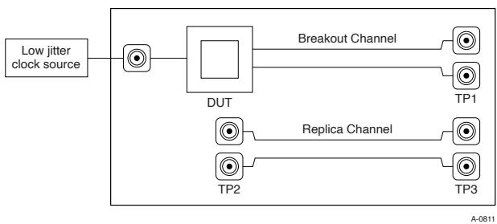
>
> 图 8-1. 非嵌入式 Refclk 下的 Tx 测试板

<table>
<thead>
<tr>
<th width="50%">🇬🇧 English</th>
<th width="50%" style="background-color:#e8e8e8">🏆 中文</th>
</tr>
</thead>
<tbody>
<tr>
<td>

The 6.0 version of the Tx specification also includes explicit support for Transmitters utilizing embedded Refclks. In this case the Tx under test is not driven with a low jitter clock source, and both the Tx data and Tx Refclk out must be sampled simultaneously by means of a 2-port measurement as shown in (§ Figure 8-2). For more details consult (§ Section 8.3.5.3). When an implementation is tested that is configured for the independent reference clock architecture only the data is sampled for both the Non-Embedded and Embedded reference clock cases.

</td>
<td style="background-color:#e8e8e8">

Tx 规范的 6.0 版本还明确支持采用嵌入式 Refclk 的发送器 (Transmitter)。在这种情况下，被测 Tx 不使用低抖动时钟源驱动,Tx 数据和 Tx Refclk 输出必须通过双端口测量同时进行采样，如图 8-2 所示。更多详细信息请参阅 § 8.3.5.3。当被测实现被配置为独立参考时钟架构时，在非嵌入式和嵌入式参考时钟两种情况下都只对数据进行采样。

</td>
</tr>
</tbody>
</table>

---

> **Figure 8-2.** Tx Test board for Embedded Refclk
> 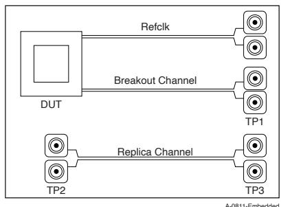
>
> 图 8-2. 嵌入式 Refclk 下的 Tx 测试板

<a id="sec-8-3"></a>
## 8.3 发送器规范 (Transmitter Specification)

<a id="sec-8-3-1"></a>
### 8.3.1 发送器特性测量设置 (Measurement Setup for Characterizing Transmitters)

---

<!-- 📄 Page 1411 -->
---


<div style="overflow-x: auto; max-width: 100%;">
<table>
<thead>
<tr>
<th width="50%">🇬🇧 English</th>
<th width="50%" style="background-color:#e8e8e8">🏆 中文</th>
</tr>
</thead>
<tbody>
<tr>
<td>

In order to specify a Transmitter with a uniform set of Tx parameters it is necessary to establish a one-to-one correspondence between what is measurable at TP1 and the corresponding Tx voltage or jitter at the pin. This may be achieved by means of a breakout channel and a replica channel. The replica channel reproduces the electrical characteristics of the breakout channel as closely as possible, matching its length, layer transitions, etc., making it possible to de-embed Tx measurements to the pin of the DUT. All voltage parameters are de-embedded to the pins unless otherwise specified. While the specification does not define precise electrical characteristics for the replica and breakout channels, it is advisable to adhere to the following guidelines:

- Breakout channels should be the same length for each Lane and routed on as few layers as possible, thereby reducing the number of replica channels that need to be built and measured.
- Each routing layer on a test board should have a separate breakout channel where the via and pad structures of the breakout and replica channels on respective layers match as closely as possible.
- Breakout and replica channels should be designed to have an insertion loss of less than 2 dB at the Nyquist frequency for the signaling rate (4 dB at Nyquist if the maximum signaling rate is 16.0 GT/s, 32.0 GT/s, and 64.0 GT/s) and a return loss of greater than 15 dB to Nyquist when measured from either TP2 or TP3, which may require use of low loss dielectric, wide signal traces and back-drilling of break-out vias or use of micro-via technology.
- The impedance targets for the breakout channel are 100 Ω differential and 50 Ω single-ended. For best accuracy the actual breakout channel impedance should be within ±5% of these values. For larger deviations a more complex de-embedding technique may be required.

</td>
<td style="background-color:#e8e8e8">

为了使用统一的 Tx 参数集来规定发送器 (Transmitter)，有必要在 TP1 处可测量的值与 DUT 引脚处对应的 Tx 电压或抖动之间建立一一对应关系。这可以通过引出通道 (Breakout Channel) 和复制通道 (Replica Channel) 来实现。复制通道尽可能准确地再现引出通道的电气特性，匹配其长度、层切换等，从而可以将 Tx 测量反嵌 (De-embed) 到 DUT 的引脚。除非另有规定，所有电压参数都反嵌到引脚。虽然本规范没有为复制通道和引出通道定义精确的电气特性，但建议遵守以下准则:

- 每个通道 (Lane) 的引出通道应保持相同长度，并尽量在尽可能少的层上走线，从而减少需要构建和测量的复制通道数量。
- 测试板上的每个走线层应有单独的引出通道，各层上引出通道和复制通道的过孔 (Via) 和焊盘 (Pad) 结构应尽可能匹配。
- 引出通道和复制通道应设计为在信号速率的奈奎斯特频率 (Nyquist Frequency) 处插入损耗 (Insertion Loss) 小于 2 dB(若最高信号速率为 16.0 GT/s、32.0 GT/s 和 64.0 GT/s,则奈奎斯特频率处小于 4 dB)，从 TP2 或 TP3 测量至奈奎斯特频率的回波损耗 (Return Loss) 大于 15 dB。这可能需要使用低损耗介质、宽信号走线以及对引出过孔进行背钻 (Back-Drilling)，或采用微孔 (Micro-Via) 工艺。
- 引出通道的阻抗目标为差分 100 Ω 和单端 50 Ω。为获得最佳精度，实际引出通道阻抗应保持在这些值的 ±5% 以内。偏差更大时，可能需要采用更复杂的反嵌技术。

</td>
</tr>
</tbody>
</table>
</div>


---

<a id="sec-8-3-1-1"></a>
#### 8.3.1.1 引出通道和复制通道 (Breakout and Replica Channels)

<table>
<thead>
<tr>
<th width="50%">🇬🇧 English</th>
<th width="50%" style="background-color:#e8e8e8">🏆 中文</th>
</tr>
</thead>
<tbody>
<tr>
<td>

A differential voltage is defined by taking the voltage difference between two conductors. In this specification, a differential signal or differential pair is comprised of a voltage on a positive conductor, VD+, and a negative conductor, VD-. The differential voltage (VDIFF) is defined as the difference of the positive conductor voltage and the negative conductor voltage (VDIFF = VD+ - VD-). The Common Mode Voltage (VCM) is defined as the average or mean voltage present on the same differential pair (VCM = [VD+ + VD-]/2). This document's electrical specifications often refer to common mode peak-to-peak measurements or peak measurements, which are defined by the following equations.

VDIFFp-p = (2* max | VD+ - VD-|) (This applies to a symmetric differential swing)

**Equation 8-1 VDIFFp-p**

VTX-AC-CM-PP = max(VD+ + VD-)/2 - min(VD+ + VD-)/2

**Equation 8-2 VTX-AC-CM-PP**

**Note:** The maximum value is calculated on a per unit interval evaluation with unit interval boundaries determined by the behavioral CDR. The maximum function as described is implicit for all peak-to-peak and peak common mode equations throughout the rest of this chapter.

In this section, DC is defined as all frequency components below FDC = 30 kHz. AC is defined as all frequency components at or above FDC = 30 kHz. These definitions pertain to all voltage and current specifications.

</td>
<td style="background-color:#e8e8e8">

差分电压定义为两个导体之间的电压差。在本规范中，差分信号或差分对由正导体 VD+ 和负导体 VD- 上的电压组成。差分电压 (VDIFF) 定义为正导体电压减去负导体电压 (VDIFF = VD+ - VD-)。共模电压 (Common Mode Voltage, VCM) 定义为同一差分对上出现的平均或均值电压 (VCM = [VD+ + VD-]/2)。本文的电气规范经常引用共模峰峰值测量或峰值测量，其定义见以下公式。

VDIFFp-p = (2* max | VD+ - VD-|)(适用于对称差分摆幅)

**公式 8-1 VDIFFp-p**

VTX-AC-CM-PP = max(VD+ + VD-)/2 - min(VD+ + VD-)/2

**公式 8-2 VTX-AC-CM-PP**

**注:** 最大值按单位间隔 (UI) 求值计算，单位间隔的边界由行为 CDR 确定。所述的最大值函数隐含地适用于本章其余部分中所有峰峰值和峰值共模公式。

在本节中,DC 定义为低于 FDC = 30 kHz 的所有频率分量。AC 定义为大于等于 FDC = 30 kHz 的所有频率分量。这些定义适用于所有电压和电流规范。

</td>
</tr>
</tbody>
</table>

---

<a id="sec-8-3-2"></a>
### 8.3.2 电压电平定义 (Voltage Level Definitions)

---

<!-- 📄 Page 1412 -->
---

<table>
<thead>
<tr>
<th width="50%">🇬🇧 English</th>
<th width="50%" style="background-color:#e8e8e8">🏆 中文</th>
</tr>
</thead>
<tbody>
<tr>
<td>

An example waveform is shown in (§ Figure 8-3). In this waveform the differential voltage (defined as D+ - D-) is approximately 800 mVPP, and the single-ended voltage for both D+ and D- is approximately 400 mVPP for each. Note that while the center crossing point for both D+ and D- is nominally at 200 mV, the corresponding crossover point for the differential voltage is at 0.0 V.

</td>
<td style="background-color:#e8e8e8">

示例波形如图 8-3 所示。在该波形中，差分电压(定义为 D+ - D-)约为 800 mVPP,D+ 和 D- 各自的单端电压约为 400 mVPP。请注意，虽然 D+ 和 D- 的中心交叉点名义上在 200 mV,但差分电压的相应过零点在 0.0 V。

</td>
</tr>
</tbody>
</table>

---

> **Figure 8-3.** Single-ended and Differential Levels
> 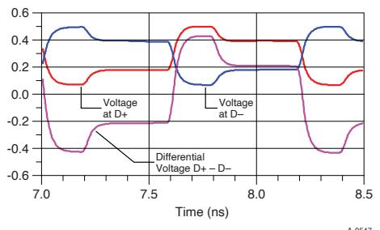
>
> 图 8-3. 单端和差分电平

---

<a id="sec-8-3-3"></a>
### 8.3.3 Tx 电压参数 (Tx Voltage Parameters)


<div style="overflow-x: auto; max-width: 100%;">
<table>
<thead>
<tr>
<th width="50%">🇬🇧 English</th>
<th width="50%" style="background-color:#e8e8e8">🏆 中文</th>
</tr>
</thead>
<tbody>
<tr>
<td>

Tx voltage parameters include equalization coefficients, equalization presets, and min/max voltage swings.

Tx equalization at 2.5 and 5.0 GT/s is only de-emphasis. Tx equalization de-emphasis values at 2.5 and 5.0 GT/s are measured using the average ratio of transition to non-transition average eye amplitude at the 0.5 UI location using 500 repetitions of the compliance pattern.

Tx voltage swing and equalization presets at 8.0, 16.0, 32.0, and 64.0 GT/s are measured by means of a low frequency pattern within the compliance pattern. The pattern consists of a sequence of 64 zeros followed by 64 ones, for 8.0, 16.0, and 32.0 GT/s and it consists of a sequence of 64 voltage level 0's followed by 64 voltage level 3's for 64.0 GT/s. The low frequency pattern permits an accurate measurement of voltage since ISI effects will have decayed and the signal will have approached a steady state. 8.0, 16.0, 32.0, and 64.0 GT/s transmitters must implement a coefficient-based equalization mode in order to support fine grained control over Tx equalization resolution. Additionally, a Transmitter must support a specified number of presets that give a coarser control over Tx equalization resolution. Both coefficient space and preset space are controllable via messaging from the Receiver via an equalization procedure. The equalization procedure operates on the same physical path as normal signaling and is implemented via extensions to the existing protocol Link layer.

All 8.0, 16.0, 32.0, and 64.0 GT/s Transmitters must implement support for the equalization procedure, whereas 8.0, 16.0, 32.0, and 64.0 GT/s Receivers may optionally make use of requests for the Transmitter on the Link partner to update Transmitter equalization. Details of the equalization procedure may be found in the Physical Layer Logical Block chapter.

Tx equalization coefficients for 8.0, 16.0, and 32.0 GT/s are based on the following FIR filter relationship as shown in (§ Figure 8-4). Equalization coefficients are subject to constraints limiting their max swing to ±unity with c-1 and c+1 being zero or negative. The inclusion of the unity condition means that only two of the three coefficients need to be specified to fully define v_outn. In this specification for 8.0, 16.0, and 32.0 GT/s the two coefficients so specified are c-1 and c+1, where c0 is implied. Note that the coefficient magnitude is not the same as the Tx voltage swing magnitude.

</td>
<td style="background-color:#e8e8e8">

Tx 电压参数包括均衡 (Equalization) 系数、均衡预设 (Preset) 和最大/最小电压摆幅。

2.5 GT/s 和 5.0 GT/s 的 Tx 均衡只有去加重 (De-emphasis)。2.5 GT/s 和 5.0 GT/s 的 Tx 均衡去加重值，使用 500 次重复的一致性测试码型 (Compliance Pattern)，在 0.5 UI 位置处通过转换与非转换的平均眼图幅度之比来测量。

8.0、16.0、32.0 和 64.0 GT/s 的 Tx 电压摆幅和均衡预设 (Preset) 通过一致性测试码型中的低频码型来测量。对于 8.0、16.0 和 32.0 GT/s,该码型由 64 个 0 后跟 64 个 1 的序列组成;对于 64.0 GT/s,由 64 个电平 0 后跟 64 个电平 3 的序列组成。低频码型可实现精确的电压测量，因为 ISI (码间干扰) 效应已经衰减，信号已接近稳态。8.0、16.0、32.0 和 64.0 GT/s 发送器 (Transmitter) 必须实现基于系数的均衡模式，以支持对 Tx 均衡分辨率的细粒度控制。此外，发送器必须支持指定数量的预设 (Preset)，以对 Tx 均衡分辨率进行较粗粒度的控制。系数空间和预设空间都可以通过接收器 (Receiver) 经由均衡过程发送的消息来控制。均衡过程在正常信号使用的同一物理通道上运行，通过扩展现有协议的链路 (Link) 层实现。

所有 8.0、16.0、32.0 和 64.0 GT/s 发送器 (Transmitter) 必须实现对均衡过程的支持;而 8.0、16.0、32.0 和 64.0 GT/s 接收器 (Receiver) 可以选择性地使用对链路伙伴 (Link Partner) 上发送器的请求来更新发送器均衡。均衡过程的详细信息可在物理层逻辑块章节中找到。

8.0、16.0 和 32.0 GT/s 的 Tx 均衡系数基于以下 FIR 滤波器关系，如图 8-4 所示。均衡系数受限于将其最大摆幅约束为 ±1 的条件，其中 c-1 和 c+1 为零或负值。引入单位一条件意味着只需要指定三个系数中的两个即可完全定义 v_outn。在 8.0、16.0 和 32.0 GT/s 的本规范中，所指定的两个系数为 c-1 和 c+1,其中 c0 是隐含的。注意，系数的幅值与 Tx 电压摆幅的幅值并不相同。

</td>
</tr>
</tbody>
</table>
</div>


---

<a id="sec-8-3-3-1"></a>
#### 8.3.3.1 2.5 和 5.0 GT/s 发送器均衡 (2.5 and 5.0 GT/s Transmitter Equalization)

<a id="sec-8-3-3-2"></a>
#### 8.3.3.2 8.0、16.0、32.0 和 64.0 GT/s 发送器均衡 (8.0, 16.0, 32.0, and 64.0 GT/s Transmitter Equalization)

---

<!-- 📄 Page 1413 -->
---

<table>
<thead>
<tr>
<th width="50%">🇬🇧 English</th>
<th width="50%" style="background-color:#e8e8e8">🏆 中文</th>
</tr>
</thead>
<tbody>
<tr>
<td>

Tx equalization coefficients for 64.0 GT/s are based on the following FIR filter relationship as shown in (§ Figure 8-5). Equalization coefficients are subject to constraints limiting their max swing to ±unity with c-2 being zero or positive, c-1 and c+1 being zero or negative.

</td>
<td style="background-color:#e8e8e8">

64.0 GT/s 的 Tx 均衡系数基于以下 FIR 滤波器关系，如图 8-5 所示。均衡系数受限于将其最大摆幅约束为 ±1 的条件，其中 c-2 为零或正值,c-1 和 c+1 为零或负值。

</td>
</tr>
</tbody>
</table>

---

> **Figure 8-4.** Tx Equalization FIR Representation for 8.0, 16.0, and 32.0 GT/s
> 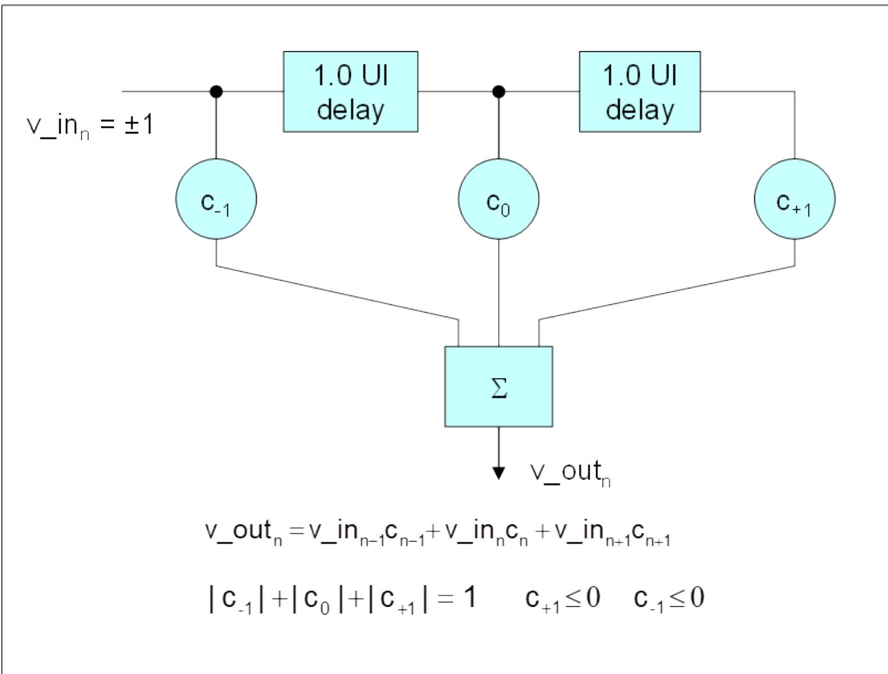
>
> 图 8-4. 8.0、16.0 和 32.0 GT/s 的 Tx 均衡 FIR 表示

---

<!-- 📄 Page 1414 -->
---

> **Figure 8-5.** Tx Equalization FIR Representation for 64.0 GT/s
> 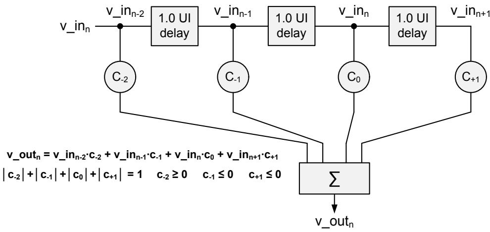
>
> 图 8-5. 64.0 GT/s 的 Tx 均衡 FIR 表示

---

<a id="sec-8-3-3-3"></a>
#### 8.3.3.3 8.0、16.0、32.0 和 64.0 GT/s 的 Tx 均衡预设 (Tx Equalization Presets for 8.0, 16.0, 32.0, and 64.0 GT/s)


<div style="overflow-x: auto; max-width: 100%;">
<table>
<thead>
<tr>
<th width="50%">🇬🇧 English</th>
<th width="50%" style="background-color:#e8e8e8">🏆 中文</th>
</tr>
</thead>
<tbody>
<tr>
<td>

When operating at 8.0 GT/s, 16.0 GT/s and 32.0 GT/s the Tx must support the full range of presets given in (§ Table 8-1). When operating at 64.0 GT/s, the Tx must support the full range of presets given in (§ Table 8-2). The data rate dependent encoding of presets has been defined in (§ Section 4.2.4.2). Presets are defined in terms of ratios, relating the pre-cursor and post-cursor equalization voltages. The pre-cursors (Vc1) and (Vc2) are referred to as pre-shoots, while the post-cursor (Vb) is referred to as de-emphasis. This convention permits the specification to retain the existing 2.5 GT/s and 5.0 GT/s definitions for Tx equalization, where only de-emphasis is defined, and it allows pre-shoots and de-emphasis to be defined such that each is independent of the other. The tolerances in (§ Table 8-1) also apply to 2.5 and 5.0 GT/s de-emphasis. The maximum swing, Vd, is also shown to illustrate that, when c+1, c-2, and c-1 are non-zero, the swing of Va does not reach the maximum as defined by Vd. (§ Figure 8-6) is shown as an example of transmitter equalization, but it is not intended to represent the signal as it would appear for measurement purposes. The high frequency nature of PCIe signaling makes measurement of single UI pulse heights impractical.

The presets defined in (§ Table 8-1) and (§ Table 8-2) are numbered to match the designations in (§ Table 4-23).

</td>
<td style="background-color:#e8e8e8">

在 8.0 GT/s、16.0 GT/s 和 32.0 GT/s 运行时,Tx 必须支持表 8-1 中给出的全部预设 (Preset) 范围。在 64.0 GT/s 运行时,Tx 必须支持表 8-2 中给出的全部预设范围。预设的数据速率相关编码已在 § 4.2.4.2 中定义。预设以比率的形式定义，关联前游标和后游标均衡电压。前游标 (Vc1) 和 (Vc2) 称为预冲 (Pre-shoot)，后游标 (Vb) 称为去加重 (De-emphasis)。这种约定使本规范能够保留 2.5 GT/s 和 5.0 GT/s 现有的 Tx 均衡定义(只定义去加重)，并允许独立地定义预冲和去加重。表 8-1 中的容差同样适用于 2.5 和 5.0 GT/s 的去加重。同时给出了最大摆幅 Vd,以说明当 c+1、c-2 和 c-1 非零时,Va 的摆幅不会达到 Vd 所定义的最大值。图 8-6 作为发送器均衡的示例给出，但它并不表示实际测量中可能观察到的信号。PCIe 信号的高频特性使得对单个 UI 脉冲高度的测量难以实现。

表 8-1 和表 8-2 中定义的预设编号与 § 表 4-23 中的编号一致。

</td>
</tr>
</tbody>
</table>
</div>


---

<!-- 📄 Page 1415 -->
---

> **Figure 8-6.** Definition of Tx Voltage Levels and Equalization Ratios
> 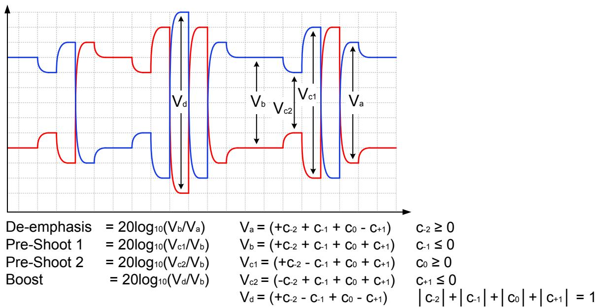
>
> 图 8-6. Tx 电压电平和均衡比定义

---

<table>
<thead>
<tr>
<th width="50%">🇬🇧 English</th>
<th width="50%" style="background-color:#e8e8e8">🏆 中文</th>
</tr>
</thead>
<tbody>
<tr>
<td>

(§ Table 8-1) lists the values for presets at 8.0 GT/s, 16.0 GT/s and 32.0 GT/s. All preset values must be supported for full swing signaling.

</td>
<td style="background-color:#e8e8e8">

表 8-1 列出了 8.0 GT/s、16.0 GT/s 和 32.0 GT/s 的预设值。在满摆幅信号下，必须支持所有预设值。

</td>
</tr>
</tbody>
</table>

---

**Table 8-1. Tx Preset Ratios and Corresponding Coefficient Values for 8.0, 16.0, and 32.0 GT/s | 表 8-1. 8.0、16.0 和 32.0 GT/s 的 Tx 预设比率及对应系数值**

| Preset # | Preshoot 2 (dB) | Preshoot 1 (dB) | De-emphasis (dB) | c-2 | c-1 | c+1 | Va/Vd | Vb/Vd | Vc1/Vd | Vc2/Vd |
|----------|-----------------|-----------------|------------------|-----|-----|-----|-------|-------|--------|--------|
| P4 | 0.0 | 0.0 ±1 dB | 0.0 ±1 dB | 0.000 | 0.000 | 0.000 | 1.000 | 1.000 | 1.000 | 1.000 |
| P1 | 0.0 | 0.0 ±1 dB | -3.5 ±1 dB | 0.000 | 0.000 | -0.167 | 1.000 | 0.666 | 0.666 | 0.666 |
| P0 | 0.0 | 0.0 ±1 dB | -6.0 ±1.5 dB | 0.000 | 0.000 | -0.250 | 1.000 | 0.500 | 0.500 | 0.500 |
| P9 | 0.0 | 3.5 ±1 dB | 0.0 ±1 dB | 0.000 | -0.167 | 0.000 | 0.666 | 0.666 | 1.000 | 0.666 |
| P8 | 0.0 | 3.5 ±1 dB | -3.5 ±1 dB | 0.000 | -0.125 | -0.125 | 0.750 | 0.500 | 0.750 | 0.500 |
| P7 | 0.0 | 3.5 ±1 dB | -6.0 ±1.5 dB | 0.000 | -0.100 | -0.200 | 0.800 | 0.400 | 0.600 | 0.400 |
| P5 | 0.0 | 1.9 ±1 dB | 0.0 ±1 dB | 0.000 | -0.100 | 0.000 | 0.800 | 0.800 | 1.000 | 0.800 |
| P6 | 0.0 | 2.5 ±1 dB | 0.0 ±1 dB | 0.000 | -0.125 | 0.000 | 0.750 | 0.750 | 1.000 | 0.750 |
| P3 | 0.0 | 0.0 ±1 dB | -2.5 ±1 dB | 0.000 | 0.000 | -0.125 | 1.000 | 0.750 | 0.750 | 0.750 |
| P2 | 0.0 | 0.0 ±1 dB | -4.4 ±1.5 dB | 0.000 | 0.000 | -0.200 | 1.000 | 0.600 | 0.600 | 0.600 |
| P10 | 0.0 | 0.0 ±1 dB | Note 2 | 0.000 | 0.000 | Note 2 | 1.000 | Note 2 | Note 2 | Note 2 |

---

<!-- 📄 Page 1416 -->
---


<div style="overflow-x: auto; max-width: 100%;">
<table>
<thead>
<tr>
<th width="50%">🇬🇧 English</th>
<th width="50%" style="background-color:#e8e8e8">🏆 中文</th>
</tr>
</thead>
<tbody>
<tr>
<td>

**Notes:**

1. Reduced swing signaling must implement presets P4, P1, P9, P5, P6, and P3. Full swing signaling must implement all the above presets.

2. P10 boost limits are not fixed, since its de-emphasis level is a function of the LF level that the Tx advertises during training (see (§ Section 4.2.4.1)). P10 is used for testing the boost limit of Transmitter at full swing. P1 is used for testing the boost limit of Transmitter at reduced swing.

(§ Table 8-2) lists the values for presets at 64.0 GT/s. All preset values must be supported for full swing signaling.

</td>
<td style="background-color:#e8e8e8">

**注:**

1. 低摆幅 (Reduced Swing) 信号必须实现预设 P4、P1、P9、P5、P6 和 P3。满摆幅信号必须实现以上所有预设。

2. P10 的增益 (Boost) 上限不固定，因为其去加重电平取决于 Tx 在训练期间通告的低频 (LF) 电平(参见 § 4.2.4.1)。P10 用于在满摆幅下测试发送器 (Transmitter) 的增益上限。P1 用于在低摆幅下测试发送器的增益上限。

表 8-2 列出了 64.0 GT/s 的预设值。在满摆幅信号下，必须支持所有预设值。

</td>
</tr>
</tbody>
</table>
</div>


---

**Table 8-2. Tx Preset Ratios and Corresponding Coefficient Values for 64.0 GT/s | 表 8-2. 64.0 GT/s 的 Tx 预设比率及对应系数值**

| Preset # | Preshoot 2 (dB) | Preshoot 1 (dB) | De-emphasis (dB) | c-2 | c-1 | c+1 | Va/Vd | Vb/Vd | Vc1/Vd | Vc2/Vd |
|----------|-----------------|-----------------|------------------|-----|-----|-----|-------|-------|--------|--------|
| Q0 | 0.0 ±0.5 dB | 0.0 ±0.5 dB | 0.0 ±0.5 dB | 0.000 | 0.000 | 0.000 | 1.000 | 1.000 | 1.000 | 1.000 |
| Q1 | 0.0 ±0.5 dB | 1.6 ±0.5 dB | 0.0 ±0.5 dB | 0.000 | -0.083 | 0.000 | 0.834 | 0.834 | 1.000 | 0.834 |
| Q2 | 0.0 ±0.5 dB | 3.5 ±0.5 dB | 0.0 ±0.5 dB | 0.000 | -0.167 | 0.000 | 0.666 | 0.666 | 1.000 | 0.666 |
| Q3 | 0.0 ±0.5 dB | 0.0 ±0.5 dB | -1.6 ±0.5 dB | 0.000 | 0.000 | -0.083 | 1.000 | 0.834 | 0.834 | 0.834 |
| Q4 | 0.0 ±0.5 dB | 0.0 ±0.5 dB | -3.5 ±0.5 dB | 0.000 | 0.000 | -0.167 | 1.000 | 0.666 | 0.666 | 0.666 |
| Q5 | -1.3 ±0.5 dB | 4.7 ±1.0 dB | 0.0 ±0.5 dB | 0.042 | -0.208 | 0.000 | 0.584 | 0.584 | 1.000 | 0.500 |
| Q6 | -1.6 ±0.5 dB | 3.5 ±0.5 dB | -3.5 ±0.5 dB | 0.042 | -0.125 | -0.125 | 0.750 | 0.500 | 0.750 | 0.416 |
| Q7 | -2.9 ±0.5 dB | 4.7 ±1.0 dB | 0.0 ±0.5 dB | 0.083 | -0.208 | 0.000 | 0.584 | 0.584 | 1.000 | 0.418 |
| Q8 | -3.5 ±0.5 dB | 6.0 ±1.0 dB | 0.0 ±0.5 dB | 0.083 | -0.250 | 0.000 | 0.500 | 0.500 | 1.000 | 0.334 |
| Q9 | -4.4 ±1.0 dB | 6.9 ±1.0 dB | -1.6 ±0.5 dB | 0.083 | -0.250 | -0.042 | 0.500 | 0.416 | 0.916 | 0.250 |
| Q10 | 0.0 ±0.5 dB | 0.0 ±0.5 dB | Note 2 | 0.000 | 0.000 | Note 2 | 1.000 | Note 2 | Note 2 | Note 2 |

---

<table>
<thead>
<tr>
<th width="50%">🇬🇧 English</th>
<th width="50%" style="background-color:#e8e8e8">🏆 中文</th>
</tr>
</thead>
<tbody>
<tr>
<td>

**Notes:**

1. Reduced swing signaling must implement presets Q0, Q1, Q2, Q3, and Q4. Full swing signaling must implement all the above presets.

2. Q10 boost limits are not fixed, since its de-emphasis level is a function of the LF level that the Tx advertises during training. Q10 is used for testing the boost limit of Transmitter at full swing. Q4 is used for testing the boost limit of Transmitter at reduced swing.

Tx equalization de-emphasis values at 2.5 and 5.0 GT/s are measured using the average ratio of transition to non-transition eye heights at the 0.5 UI location using 500 repetitions of the compliance pattern.

(§ Figure 8-7) illustrate the methodology for measuring Tx equalization coefficients and presets. For a Tx preset to be measured, the DUT Tx transmits a Compliance Pattern with the corresponding Tx equalization coefficients. The

</td>
<td style="background-color:#e8e8e8">

**注:**

1. 低摆幅 (Reduced Swing) 信号必须实现预设 Q0、Q1、Q2、Q3 和 Q4。满摆幅信号必须实现以上所有预设。

2. Q10 的增益 (Boost) 上限不固定，因为其去加重电平取决于 Tx 在训练期间通告的低频 (LF) 电平。Q10 用于在满摆幅下测试发送器 (Transmitter) 的增益上限。Q4 用于在低摆幅下测试发送器的增益上限。

2.5 和 5.0 GT/s 的 Tx 均衡去加重值，使用 500 次重复的一致性测试码型 (Compliance Pattern)，在 0.5 UI 位置处通过转换与非转换眼图高度之比来测量。

图 8-7 展示了测量 Tx 均衡系数和预设 (Preset) 的方法。对于待测量的 Tx 预设,DUT Tx 用对应的 Tx 均衡系数发送一致性测试码型 (Compliance Pattern)。

</td>
</tr>
</tbody>
</table>

---

<a id="sec-8-3-3-4"></a>
#### 8.3.3.4 测量 2.5 GT/s 和 5.0 GT/s 的 Tx 均衡 (Measuring Tx Equalization for 2.5 GT/s and 5.0 GT/s)

<a id="sec-8-3-3-5"></a>
#### 8.3.3.5 测量 8.0、16.0、32.0 和 64.0 GT/s 的预设 (Measuring Presets at 8.0, 16.0, 32.0, and 64.0 GT/s)

---

<!-- 📄 Page 1417 -->
---


<div style="overflow-x: auto; max-width: 100%;">
<table>
<thead>
<tr>
<th width="50%">🇬🇧 English</th>
<th width="50%" style="background-color:#e8e8e8">🏆 中文</th>
</tr>
</thead>
<tbody>
<tr>
<td>

equalized Compliance Pattern is captured by a real-time oscilloscope and the post-processing software extracts an equalized step response waveform. The DUT Tx also transmits a Compliance Pattern with no Tx equalization. The unequalized Compliance Pattern is captured by the real-time oscilloscope and the post-processing software applies Tx equalization coefficients c-2, c-1, c0, and c+1 to construct an equalized step response waveform. The Tx preset coefficients are the best fit Tx equalization coefficients c-2, c-1, c0, and c+1 that minimize the Mean Square Error (MSE) between the measured equalized step response waveform and the reconstructed equalized step response waveform.

</td>
<td style="background-color:#e8e8e8">

均衡后的一致性测试码型由实时示波器捕获，后处理软件提取出均衡后的阶跃响应波形。DUT Tx 还会发送一个无 Tx 均衡的一致性测试码型。未均衡的一致性测试码型由实时示波器捕获，后处理软件对其施加 Tx 均衡系数 c-2、c-1、c0 和 c+1,以构建出均衡后的阶跃响应波形。Tx 预设系数即为最佳拟合的 Tx 均衡系数 c-2、c-1、c0、c+1,它们能使测量的均衡阶跃响应波形与重建的均衡阶跃响应波形之间的均方误差 (MSE) 最小化。

</td>
</tr>
</tbody>
</table>
</div>


---

> **Figure 8-7.** Methodology for measuring Tx equalization coefficients and presets
> 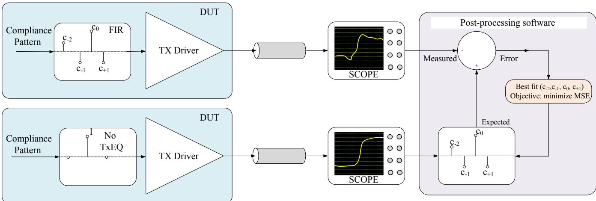
>
> 图 8-7. Tx 均衡系数和预设的测量方法

---

<table>
<thead>
<tr>
<th width="50%">🇬🇧 English</th>
<th width="50%" style="background-color:#e8e8e8">🏆 中文</th>
</tr>
</thead>
<tbody>
<tr>
<td>

VTX-DIFF-PP (VTX-DIFF-PP-LOW for reduced swing) at 2.5 GTs and 5.0 GT/s are measured using the average transition eye amplitude at the 0.5 UI location using 500 repetitions of the compliance pattern.

The range for a Transmitter's output voltage swing, (specified by Vd) with no equalization is defined by VTX-DIFF-PP (VTX-DIFF-PP-LOW for reduced swing), and is obtained by setting c-2, c-1 and c+1 to zero and measuring the peak-peak voltage on the 64-ones (64 PAM4 voltage level 3's at 64.0 GT/s)/64-zeros (64 PAM4 voltage level 0's at 64.0 GT/s) segment of the compliance pattern. The resulting signal effectively measures at the die pad, minus any low frequency package loss. ISI and switching effects are minimized by restricting the portion of the curve over which voltage is measured to the last few UI of each half cycle, as illustrated in (§ Figure 8-8). High frequency noise is mitigated by averaging over 500 repetitions of the compliance pattern.

</td>
<td style="background-color:#e8e8e8">

2.5 GT/s 和 5.0 GT/s 下的 VTX-DIFF-PP(低摆幅下为 VTX-DIFF-PP-LOW)，使用 500 次重复的一致性测试码型 (Compliance Pattern)，在 0.5 UI 位置处通过平均转换眼图幅度来测量。

发送器 (Transmitter) 在无均衡时的输出电压摆幅范围(由 Vd 规定)定义为 VTX-DIFF-PP(低摆幅下为 VTX-DIFF-PP-LOW)，其测量方法是将 c-2、c-1 和 c+1 设为零，在一致性测试码型的 64 个 1(64.0 GT/s 下为 64 个 PAM4 电平 3)/64 个 0(64.0 GT/s 下为 64 个 PAM4 电平 0)段上测量峰峰值电压。所得到的信号实际上是在芯片焊盘 (Die Pad) 上测量，减去任何低频封装损耗。通过将电压测量范围限制在每个半周期的最后几个 UI 上来最小化 ISI 和开关效应的影响，如图 8-8 所示。通过对 500 次重复的一致性测试码型求平均来抑制高频噪声。

</td>
</tr>
</tbody>
</table>

---

[⬆️ 返回目录](#sec-8-intro)

---


---

<a id="sec-8-3-3-6"></a>
## 8.3.3.6 Method for Measuring VTX-DIFF-PP at 2.5 GT/s and 5.0 GT/s | 2.5 GT/s 和 5.0 GT/s 下 VTX-DIFF-PP 的测量方法

<table>
<thead>
<tr>
<th width="50%">🇬🇧 English</th>
<th width="50%" style="background-color:#e8e8e8">🏆 中文</th>
</tr>
</thead>
<tbody>
<tr>
<td>

*[This sub-section continues from prior content; see § 8.3.3.6 for the full text in earlier chunk.]*

</td>
<td style="background-color:#e8e8e8">

*[本小节承接前述内容，完整文本参见先前 chunk 中的 § 8.3.3.6。]*

</td>
</tr>
</tbody>
</table>

[⬆️ 返回目录](#sec-8-0)

---

<a id="sec-8-3-3-7"></a>
## 8.3.3.7 Method for Measuring VTX-DIFF-PP at 8.0, 16.0, 32.0, and 64.0 GT/s | 8.0、16.0、32.0 和 64.0 GT/s 下 VTX-DIFF-PP 的测量方法

<table>
<thead>
<tr>
<th width="50%">🇬🇧 English</th>
<th width="50%" style="background-color:#e8e8e8">🏆 中文</th>
</tr>
</thead>
<tbody>
<tr>
<td>

*[This sub-section continues from prior content; see § 8.3.3.7 for the full text in earlier chunk.]*

</td>
<td style="background-color:#e8e8e8">

*[本小节承接前述内容，完整文本参见先前 chunk 中的 § 8.3.3.7。]*

</td>
</tr>
</tbody>
</table>

[⬆️ 返回目录](#sec-8-0)

---

<!-- 📄 Page 1418 -->
---

<a id="sec-8-3-3-7-fig"></a>
## Figure 8-8 VTX-DIFF-PP and VTX-DIFF-PP-LOW Measurement | 图 8-8 VTX-DIFF-PP 与 VTX-DIFF-PP-LOW 测量

<table>
<thead>
<tr>
<th width="50%">🇬🇧 English</th>
<th width="50%" style="background-color:#e8e8e8">🏆 中文</th>
</tr>
</thead>
<tbody>
<tr>
<td></td>
<td style="background-color:#e8e8e8">

</td>
</tr>
</tbody>
</table>

> **Figure 8-8.** VTX-DIFF-PP and VTX-DIFF-PP-LOW Measurement
> 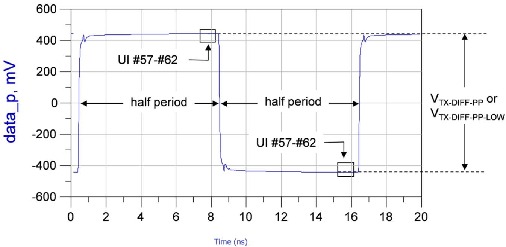


[⬆️ 返回目录](#sec-8-0)

---

<a id="sec-8-3-3-7-constraints"></a>
## Coefficient Constraints for 8.0, 16.0, 32.0, and 64.0 GT/s | 8.0、16.0、32.0 和 64.0 GT/s 的系数约束


<div style="overflow-x: auto; max-width: 100%;">
<table>
<thead>
<tr>
<th width="50%">🇬🇧 English</th>
<th width="50%" style="background-color:#e8e8e8">🏆 中文</th>
</tr>
</thead>
<tbody>
<tr>
<td>

8.0, 16.0, 32.0, and 64.0 GT/s Transmitters are required to inform the Receiver of their coefficient range and tolerance. Coefficient range and tolerance are constrained by the following requirements.

- Coefficients must support all eleven presets and their respective tolerances as defined in § Table 8-1 and § Table 8-2
- All Transmitters must meet the full swing signaling VTX-EIEOS-FS limits.
- Transmitters may optionally support reduced swing, and if they do, they must meet the VTX-EIEOS-RS limits.
- The coefficients must meet the boost and resolution (VTX-BOOST-FS, VTX-BOOST-RS and EQTX-COEFF-RES) limits defined in § Table 8-6.

When the above constraints are applied the resulting coefficient space for 8.0, 16.0, and 32.0 GT/s with pre-shoot2 coefficient c-2 = 0 may be mapped onto a triangular matrix, an example of which is shown in § Figure 8-9. The matrix may be interpreted as follows: pre-shoot1 and de-emphasis coefficients are mapped onto the Y-axis and X-axes, respectively. In both cases the maximum granularity of 1/24 is assumed. Each matrix cell, corresponding to a valid combination of pre-shoot1 and de-emphasis coefficients, has three entries corresponding to pre-shoot1 (PS1), de-emphasis (DE), and boost (as shown in the upper left-hand corner). Diagonal elements are defined by the maximum boost ratio. Those cells highlighted in blue are presets required for reduced swing, while cells in either blue or orange represent presets required for full swing signaling. Note that this figure is informative only and is not intended to imply any specific Tx implementation or to alter requirements for nominal preset equalization values and allowed ranges.

</td>
<td style="background-color:#e8e8e8">

8.0、16.0、32.0 和 64.0 GT/s 的发送器 (Transmitter) 需要将其系数范围与容差 (Tolerance) 告知接收器 (Receiver)。系数范围与容差受到以下要求约束:

- 系数必须支持 § Table 8-1 与 § Table 8-2 中定义的全部 11 个预设 (Preset) 及其相应容差。
- 所有发送器必须满足满摆幅 (Full Swing) 信号的 VTX-EIEOS-FS 限制。
- 发送器可选择性地支持缩减摆幅 (Reduced Swing)，若支持，则必须满足 VTX-EIEOS-RS 限制。
- 系数必须满足 § Table 8-6 中定义的提升量 (Boost) 与分辨率限制 (VTX-BOOST-FS、VTX-BOOST-RS 与 EQTX-COEFF-RES)。

在应用上述约束后,8.0、16.0 与 32.0 GT/s 且 pre-shoot2 系数 c-2 = 0 时所得到的系数空间可以映射到一个三角矩阵上，示例如 § Figure 8-9 所示。该矩阵的解读方式如下:pre-shoot1 与去加重 (De-emphasis) 系数分别映射到 Y 轴和 X 轴。两者的最大粒度均假设为 1/24。矩阵中每个单元格对应一组有效的 pre-shoot1 与去加重组合，并含三项数值，分别对应 pre-shoot1 (PS1)、去加重 (DE) 和提升量(Boost)(如左上角所示)。对角线元素由最大提升比定义。蓝色高亮单元格为缩减摆幅所需的预设，蓝色或橙色单元格为满摆幅信号所需的预设。请注意，本图仅供参考，并不暗示任何特定的 Tx 实现，也不改变对各预设标称均衡值与允许范围的要求。

</td>
</tr>
</tbody>
</table>
</div>


[⬆️ 返回目录](#sec-8-0)

---

<a id="sec-8-3-3-8"></a>
## 8.3.3.8 Coefficient Range and Tolerance for 8.0, 16.0, 32.0, and 64.0 GT/s | 8.0、16.0、32.0 和 64.0 GT/s 的系数范围与容差

<table>
<thead>
<tr>
<th width="50%">🇬🇧 English</th>
<th width="50%" style="background-color:#e8e8e8">🏆 中文</th>
</tr>
</thead>
<tbody>
<tr>
<td>

8.3.3.8 Coefficient Range and Tolerance for 8.0, 16.0, 32.0, and 64.0 GT/s §

</td>
<td style="background-color:#e8e8e8">

8.3.3.8 8.0、16.0、32.0 和 64.0 GT/s 的系数范围与容差 §

</td>
</tr>
</tbody>
</table>

[⬆️ 返回目录](#sec-8-0)

---

<!-- 📄 Page 1419 -->
---

<a id="fig-8-9"></a>
## Figure 8-9 Transmit Equalization Coefficient Space Triangular Matrix Example for 8.0, 16.0, and 32.0 GT/s | 图 8-9 8.0、16.0 和 32.0 GT/s 发送均衡系数空间三角矩阵示例


<div style="overflow-x: auto; max-width: 100%;">
<table>
<thead>
<tr>
<th width="50%">🇬🇧 English</th>
<th width="50%" style="background-color:#e8e8e8">🏆 中文</th>
</tr>
</thead>
<tbody>
<tr>
<td>

>
> *Matrix axes:* PS1 (pre-shoot1, Y-axis), DE (de-emphasis, X-axis), BOOST. Second pre-cursor C-2 = 0/24 (PS2 = 0 dB). Cells highlighted in blue are presets required for reduced swing; cells in blue or orange represent presets required for full swing signaling. Presets shown: P0, P1, P2, P3, P4, P5, P6, P7, P8, P9. Boundaries shown: Full Swing Limit / Max Reduced Swing Limit, Min Reduced Swing Limit.*

</td>
<td style="background-color:#e8e8e8">

>
> *矩阵坐标轴:* PS1(pre-shoot1,Y 轴)、DE(去加重,X 轴)、BOOST。第二前游标 C-2 = 0/24(PS2 = 0 dB)。蓝色高亮单元格为缩减摆幅所需的预设，蓝色或橙色单元格为满摆幅信号所需的预设。所示预设:P0、P1、P2、P3、P4、P5、P6、P7、P8、P9。所示边界:满摆幅限制 / 最大缩减摆幅限制、最小缩减摆幅限制。

</td>
</tr>
</tbody>
</table>

> **Figure 8-9.** Transmit Equalization Coefficient Space Triangular Matrix Example for 8.0, 16.0, and 32.0 GT/s
> 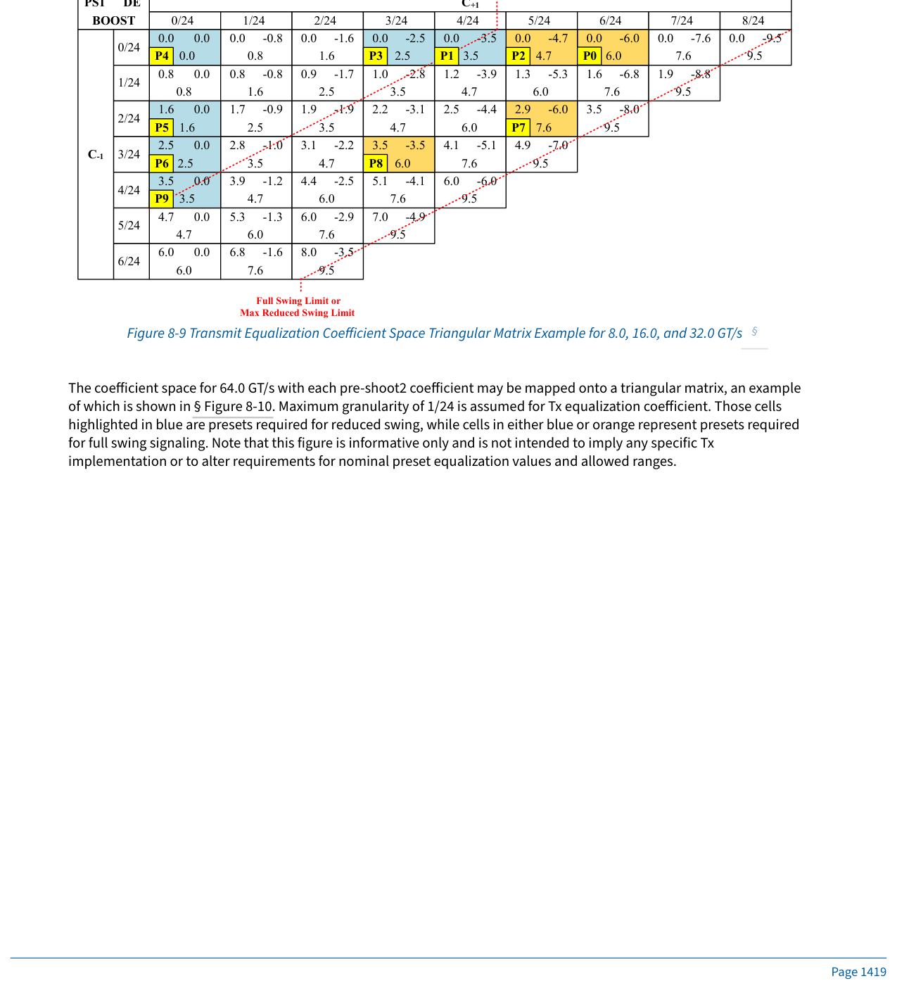

</div>


[⬆️ 返回目录](#sec-8-0)

---

<a id="sec-8-3-3-8-64gt"></a>
## 64.0 GT/s Coefficient Space Mapping | 64.0 GT/s 系数空间映射

<table>
<thead>
<tr>
<th width="50%">🇬🇧 English</th>
<th width="50%" style="background-color:#e8e8e8">🏆 中文</th>
</tr>
</thead>
<tbody>
<tr>
<td>

The coefficient space for 64.0 GT/s with each pre-shoot2 coefficient may be mapped onto a triangular matrix, an example of which is shown in § Figure 8-10. Maximum granularity of 1/24 is assumed for Tx equalization coefficient. Those cells highlighted in blue are presets required for reduced swing, while cells in either blue or orange represent presets required for full swing signaling. Note that this figure is informative only and is not intended to imply any specific Tx implementation or to alter requirements for nominal preset equalization values and allowed ranges.

</td>
<td style="background-color:#e8e8e8">

64.0 GT/s 时，对于每个 pre-shoot2 系数的系数空间均可映射到三角矩阵上，示例如 § Figure 8-10 所示。Tx 均衡系数的最大粒度假设为 1/24。蓝色高亮单元格为缩减摆幅所需的预设，蓝色或橙色单元格为满摆幅信号所需的预设。请注意，本图仅供参考，并不意味着任何特定的 Tx 实现，也不改变对各预设标称均衡值与允许范围的要求。

</td>
</tr>
</tbody>
</table>

[⬆️ 返回目录](#sec-8-0)

---

<!-- 📄 Page 1420 -->
---

<a id="fig-8-10"></a>
## Figure 8-10 Transmit Equalization Coefficient Space Triangular Matrix Example for 64.0 GT/s | 图 8-10 64.0 GT/s 发送均衡系数空间三角矩阵示例

<table>
<thead>
<tr>
<th width="50%">🇬🇧 English</th>
<th width="50%" style="background-color:#e8e8e8">🏆 中文</th>
</tr>
</thead>
<tbody>
<tr>
<td>

>
> *Three triangular matrices are shown for second pre-cursor values C-2 = 0/24, 1/24, and 2/24. Matrix axes:* PS2 (pre-shoot2), PS1 (pre-shoot1), DE (de-emphasis), BOOST. *Presets shown: Q0, Q1, Q2, Q3, Q4, Q5, Q6, Q7, Q8, Q9.* Boundaries shown: Full Swing Limit / Max Reduced Swing Limit, Min Reduced Swing Limit.

</td>
<td style="background-color:#e8e8e8">

>
> *图中给出三个第二前游标值 C-2 = 0/24、1/24 和 2/24 对应的三角矩阵。矩阵坐标轴:* PS2(pre-shoot2)、PS1(pre-shoot1)、DE(去加重)、BOOST。*所示预设:Q0、Q1、Q2、Q3、Q4、Q5、Q6、Q7、Q8、9。* 所示边界:满摆幅限制 / 最大缩减摆幅限制、最小缩减摆幅限制。

</td>
</tr>
</tbody>
</table>

> **Figure 8-10.** Transmit Equalization Coefficient Space Triangular Matrix Example for 64.0 GT/s
> 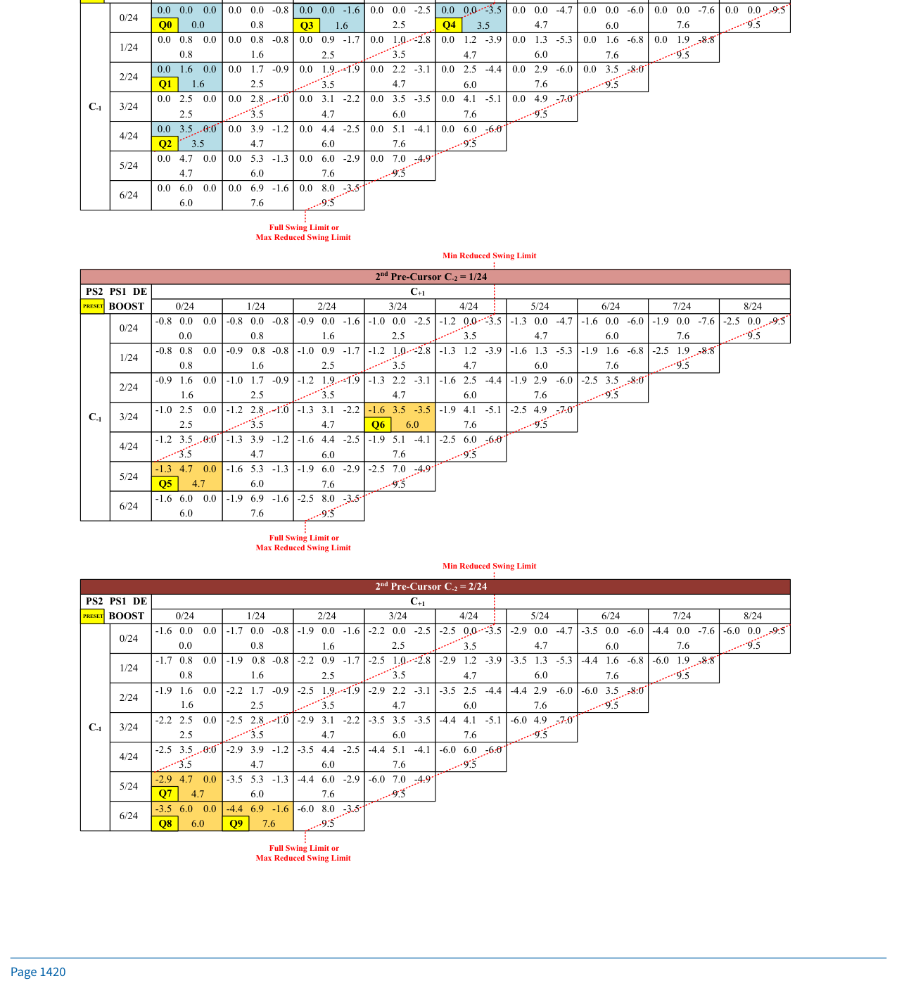


[⬆️ 返回目录](#sec-8-0)

---

<!-- 📄 Page 1421 -->
---

<a id="sec-8-3-3-9"></a>
## 8.3.3.9 EIEOS and VTX-EIEOS-FS and VTX-EIEOS-RS Limits | EIEOS 与 VTX-EIEOS-FS、VTX-EIEOS-RS 限制


<div style="overflow-x: auto; max-width: 100%;">
<table>
<thead>
<tr>
<th width="50%">🇬🇧 English</th>
<th width="50%" style="background-color:#e8e8e8">🏆 中文</th>
</tr>
</thead>
<tbody>
<tr>
<td>

EIEOS signaling is defined for 5.0, 8.0, 16.0, 32.0, and 64.0 GT/s only. At 5.0 GT/s the K28.7 Symbol is used. VTX-EIEOS-FS and VTX-EIEOS-RS are measured using the EIEOS sequence contained within the compliance pattern for 8.0, 16.0, 32.0, and 64.0 GT/s. At 8.0 GT/s the EIEOS pattern consists of eight consecutive ones followed by the same number of consecutive zeros, where the pattern is repeated for a total of 128 UI. At 16.0 GT/s the EIEOS pattern consists of 16 consecutive ones followed by the same number of consecutive zeros, where the pattern is repeated for a total of 128 UI. At 32.0 GT/s the EIEOS pattern consists of 32 consecutive ones followed by the same number of consecutive zeros, where the pattern is repeated for a total of 128 UI. At 32.0 GT/s the pattern is repeated for two consecutive blocks. At 64.0 GT/s the EIEOS pattern consists of 32 UI consecutive voltage level 3's followed by 32 UI consecutive voltage level 0's (see § Section 4.2.5.3).

A transmitter sends an EIEOS to cause an exit of Electrical Idle at the Receiver. This pattern guarantees the Receiver will properly detect the EI Exit condition with its squelch exit detect circuit, something not otherwise guaranteed by scrambled data. The Tx EIEOS launch voltage is defined by VTX-EIEOS-FS for full swing signaling and by VTX-EIEOS-RS for reduced swing signaling. VTX-EIEOS-RS is smaller than VTX-EIEOS-FS to reflect the fact that reduced swing is typically supported only for lower loss channels where there is less attenuation at the EIEOS signaling rate.

For full swing signaling VTX-EIEOS-FS is measured with a preset number P10 for 8.0, 16.0, and 32.0 GT/s, and with a preset number Q10 for 64.0 GT/s. This is equivalent to a maximum nominal boost of 9.5 dB and represents the maximum boost attainable in coefficient space. When a tolerance of ±1.5 dB is factored in this yields the minimum boost limit of 8.0 dB appearing in § Table 8-6. For reduced swing signaling VTX-EIEOS-RS is measured with preset P1 for 8.0, 16.0, and 32.0 GT/s, and with a preset number Q4 for 64.0 GT/s.

A Transmitter is not always permitted to generate the maximum boost level noted above. A Transmitter that cannot drive significantly more than 800 mVPP is limited by the need to meet VTX-EIEOS-FS. The Tx must reject any adjustments to its presets or coefficients that would violate the VTX-EIEOS-FS or VTX-EIEOS-RS limits. The EIEOS voltage limits are imposed to guarantee the EIEOS threshold of 175 mVPP at the Rx pin.

§ Figure 8-11 illustrates the de-emphasis peak as observed at the pin of a Tx for VTX-EIEOS-FS. At the far end of a lossy channel the de-emphasis peak will be attenuated; this is why the measurement interval includes only the middle five UI at 8.0 GT/s, UI number 5-14 at 16.0 GT/s, and UI number 9-28 at 32.0 and 64.0 GT/s. The voltage is averaged over this interval for both the negative and positive halves of the waveform over 500 repetitions of the compliance pattern. VTX-EIEOS-FS and VTX-EIEOS-RS are defined as the difference between the negative and positive waveform segment averages. UI boundaries are defined with respect to the edge of the recovered data clock.

</td>
<td style="background-color:#e8e8e8">

EIEOS 信号仅在 5.0、8.0、16.0、32.0 和 64.0 GT/s 速率下定义。在 5.0 GT/s 速率下使用 K28.7 符号 (Symbol)。VTX-EIEOS-FS 和 VTX-EIEOS-RS 在 8.0、16.0、32.0 和 64.0 GT/s 速率下使用一致性测试码型 (Compliance Pattern) 中所包含的 EIEOS 序列进行测量。在 8.0 GT/s 速率下,EIEOS 码型由 8 个连续的 1 后接相同数量的连续 0 组成，并重复为总共 128 UI (Unit Interval,单位间隔)。在 16.0 GT/s 速率下,EIEOS 码型由 16 个连续的 1 后接相同数量的连续 0 组成，并重复为总共 128 UI。在 32.0 GT/s 速率下,EIEOS 码型由 32 个连续的 1 后接相同数量的连续 0 组成，并重复为总共 128 UI;在 32.0 GT/s 时该码型会在两个连续块上重复。在 64.0 GT/s 速率下,EIEOS 码型由 32 UI 连续的电压电平 3 后接 32 UI 连续的电压电平 0 组成(参见 § Section 4.2.5.3)。

发送器发送 EIEOS 以触发接收器 (Receiver) 退出电气空闲 (Electrical Idle)。该码型保证接收器能够借助其静噪退出检测电路 (Squelch Exit Detect Circuit) 正确检测 EI 退出条件，这是加扰数据所不能保证的。Tx 的 EIEOS 发射电压在满摆幅信号下由 VTX-EIEOS-FS 定义，在缩减摆幅信号下由 VTX-EIEOS-RS 定义。VTX-EIEOS-RS 小于 VTX-EIEOS-FS,这是因为缩减摆幅通常仅在低损耗通道上支持，在该条件下 EIEOS 信号速率上的衰减更小。

满摆幅信号下,VTX-EIEOS-FS 在 8.0、16.0、32.0 GT/s 时使用预设 P10 测量，在 64.0 GT/s 时使用预设 Q10 测量。这等效于 9.5 dB 的最大标称提升量，代表系数空间中可达到的最大提升。考虑 ±1.5 dB 的容差后，可得 § Table 8-6 中给出的 8.0 dB 最小提升限制。缩减摆幅信号下,VTX-EIEOS-RS 在 8.0、16.0、32.0 GT/s 时使用预设 P1 测量，在 64.0 GT/s 时使用预设 Q4 测量。

发送器并不总是允许生成上述最大提升量。无法驱动远大于 800 mVPP 的发送器受限于 VTX-EIEOS-FS 的要求。Tx 必须拒绝任何会导致违反 VTX-EIEOS-FS 或 VTX-EIEOS-RS 限制的预设或系数调整。EIEOS 电压限制是为保证 Rx 引脚上 175 mVPP 的 EIEOS 阈值而设定的。

§ Figure 8-11 展示了在 Tx 引脚上观察到的 VTX-EIEOS-FS 去加重峰值。在有损通道的远端，去加重峰值会被衰减;这就是为什么测量区间在 8.0 GT/s 时仅包含中间 5 个 UI,在 16.0 GT/s 时仅包含 UI 5-14,在 32.0 和 64.0 GT/s 时仅包含 UI 9-28。在一致性码型的 500 次重复内，对该区间内波形正、负两半部分的电压取平均。VTX-EIEOS-FS 和 VTX-EIEOS-RS 定义为负、正两段波形均值的差。UI 边界根据恢复数据时钟 (Recovered Data Clock) 的边沿定义。

</td>
</tr>
</tbody>
</table>
</div>


[⬆️ 返回目录](#sec-8-0)

---

<!-- 📄 Page 1422 -->
---

<a id="fig-8-11"></a>
## Figure 8-11 Measuring VTX-EIEOS-FS and VTX-EIEOS-RS at 8.0 GT/s | 图 8-11 在 8.0 GT/s 下测量 VTX-EIEOS-FS 和 VTX-EIEOS-RS

<table>
<thead>
<tr>
<th width="50%">🇬🇧 English</th>
<th width="50%" style="background-color:#e8e8e8">🏆 中文</th>
</tr>
</thead>
<tbody>
<tr>
<td>

> **Figure 8-11.** Measuring VTX-EIEOS-FS and VTX-EIEOS-RS at 8.0 GT/s
> 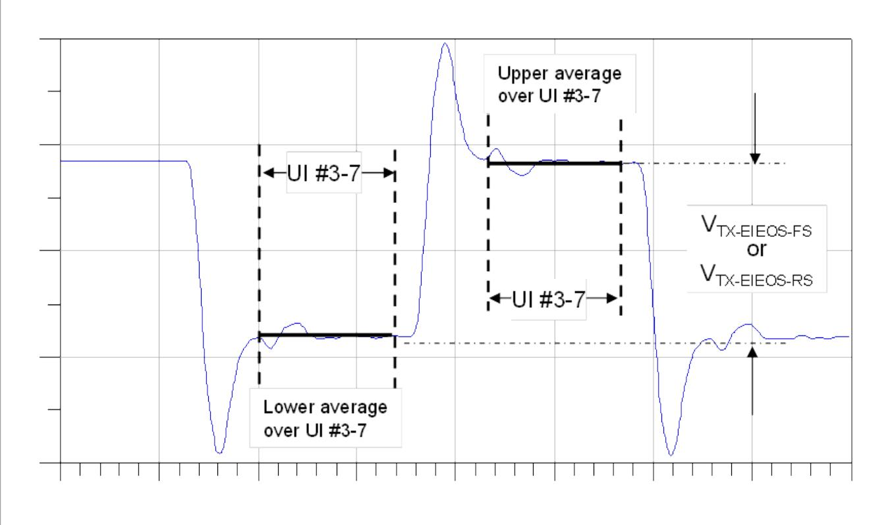

</td>
<td style="background-color:#e8e8e8">

> **图 8-11.** 8.0 GT/s 时测量 VTX-EIEOS-FS 和 VTX-EIEOS-RS
> 

</td>
</tr>
</tbody>
</table>

[⬆️ 返回目录](#sec-8-0)

---

<a id="sec-8-3-3-10"></a>
## 8.3.3.10 Reduced Swing Signaling | 缩减摆幅信号


<div style="overflow-x: auto; max-width: 100%;">
<table>
<thead>
<tr>
<th width="50%">🇬🇧 English</th>
<th width="50%" style="background-color:#e8e8e8">🏆 中文</th>
</tr>
</thead>
<tbody>
<tr>
<td>

PCI Express Transmitters may optionally support a reduced swing signaling. It is left as an implementation option to define the maximum reduced swing voltage value for VTX-DIFF-PP-LOW anywhere up to the maximum full swing voltage. The minimum for VTX-DIFF-PP-LOW is captured indirectly by the constraint imposed by VTX-EIEOS-RS, so there is no need to define a separate minimum limit for VTX-DIFF-PP-LOW. Reduced swing limits the range of presets and the maximum boost. The boost for reduced swing must be in the region shown in § Figure 8-9 and § Figure 8-10 between the Max reduced swing limit and minimum reduced swing boost limit.

Form factors are permitted to disallow, optionally allow, or require Reduced Swing Signaling, depending on the channel requirements for the form factor. When Reduced Swing Signaling is allowed or required it is required that form factor specifications provide any additional details necessary to support interoperability.

</td>
<td style="background-color:#e8e8e8">

PCI Express 发送器可选择性地支持缩减摆幅 (Reduced Swing) 信号。最大缩减摆幅电压值 VTX-DIFF-PP-LOW 可由实现方自行定义，最高可达最大满摆幅电压。VTX-DIFF-PP-LOW 的最小值由 VTX-EIEOS-RS 所施加的约束间接捕获，因此无需为 VTX-DIFF-PP-LOW 单独定义最小限制。缩减摆幅限制了预设范围与最大提升量。缩减摆幅的提升量必须位于 § Figure 8-9 和 § Figure 8-10 中最大缩减摆幅限制与最小缩减摆幅提升量限制之间的区域。

根据外形规格 (Form Factor) 的通道要求，允许禁止、可选允许或要求采用缩减摆幅信号。当允许或要求采用缩减摆幅信号时，要求外形规格规范提供支持互操作所需的任何附加细节。

</td>
</tr>
</tbody>
</table>
</div>


[⬆️ 返回目录](#sec-8-0)

---

<a id="sec-8-3-3-11"></a>
## 8.3.3.11 Effective Tx Package Loss at 8.0, 16.0, 32.0, and 64.0 GT/s | 8.0、16.0、32.0 和 64.0 GT/s 下 Tx 有效封装损耗

<table>
<thead>
<tr>
<th width="50%">🇬🇧 English</th>
<th width="50%" style="background-color:#e8e8e8">🏆 中文</th>
</tr>
</thead>
<tbody>
<tr>
<td>

Package loss (including silicon driver bandwidth) is represented by the ps21TX parameter. Since both package IL and driver bandwidth affect the signal as observed at the Tx pin, the ps21TX parameter has the advantage of representing both of these effects, while permitting the measurement to be made at a point (TP1) that can easily be probed. It is necessary to include a package loss parameter in the Tx specification, since the voltage swing parameters (VTX-DIFF-PP and VTX-DIFF-PP-LOW) are defined at an equivalent pulse frequency of 1/128 UI and purposely do not capture high frequency driver or package loss effects.

</td>
<td style="background-color:#e8e8e8">

封装损耗(包括硅片驱动器带宽)由 ps21TX 参数表示。由于封装插损 (IL) 与驱动器带宽均会影响在 Tx 引脚上观察到的信号,ps21TX 参数的优势在于能同时表示这两种效应，同时允许在易于探测的位置(TP1)进行测量。Tx 规范中有必要纳入封装损耗参数，因为电压摆幅参数(VTX-DIFF-PP 和 VTX-DIFF-PP-LOW)是在等效脉冲频率 1/128 UI 上定义的，故意未涵盖高频驱动器或封装损耗效应。

</td>
</tr>
</tbody>
</table>

[⬆️ 返回目录](#sec-8-0)

---

<!-- 📄 Page 1423 -->
---

<a id="sec-8-3-3-11-root"></a>
## Root Package vs Non-Root Package ps21TX at 16.0 and 32.0 GT/s | 16.0 和 32.0 GT/s 下 Root Package 与 Non-Root Package 的 ps21TX


<div style="overflow-x: auto; max-width: 100%;">
<table>
<thead>
<tr>
<th width="50%">🇬🇧 English</th>
<th width="50%" style="background-color:#e8e8e8">🏆 中文</th>
</tr>
</thead>
<tbody>
<tr>
<td>

At 16.0 GT/s and 32.0 GT/s, separate ps21TX parameters are defined for packages containing Root Ports (Root Package) and for all other packages (Non-Root Package), based on the assumption that the former tend to be large and require socketing, while the latter are smaller and usually not socketed.

The ps21TX parameter is informative for 16.0 GT/s Root Package devices and for Non-Root Package devices that only support PCI Express standard form factors (i.e., CEM, M.2, etc.). The ps21TX parameter is normative for all 8.0, 32.0, and 64.0 GT/s devices and for 16.0 GT/s Non-Root Package devices that support captive channels. (See § Table 8-3 below).

</td>
<td style="background-color:#e8e8e8">

在 16.0 GT/s 和 32.0 GT/s 时，针对包含根端口 (Root Port) 的封装(Root Package)与所有其他封装(Non-Root Package)分别定义了 ps21TX 参数，这是基于以下假设:前者通常体积较大并需要插座连接，而后者体积较小且通常不通过插座连接。

对于 16.0 GT/s 的 Root Package 器件以及仅支持 PCI Express 标准外形规格(如 CEM、M.2 等)的 Non-Root Package 器件,ps21TX 参数为参考性 (Informative) 参数。对于所有 8.0、32.0 和 64.0 GT/s 器件，以及支持固定通道 (Captive Channel) 的 16.0 GT/s Non-Root Package 器件,ps21TX 参数为规范性 (Normative) 参数(参见下方的 § Table 8-3)。

</td>
</tr>
</tbody>
</table>
</div>


[⬆️ 返回目录](#sec-8-0)

---

<a id="table-8-3"></a>
## Table 8-3 Cases that the Reference Packages and ps21TX Parameter are Normative | 表 8-3 参考封装与 ps21TX 参数的规范性 (Normative) 情形

**Table 8-3.** Cases that the Reference Packages and ps21TX Parameter are Normative | 表 8-3 参考封装与 ps21TX 参数属于规范性的情形

| | 8.0, 32.0, and 64.0 GT/s | 8.0, 32.0, and 64.0 GT/s | 16.0 GT/s | 16.0 GT/s |
|---|---|---|---|---|
| | **Root Package Device** | **Non-Root Package Device** | **Root Package Device** | **Non-Root Package Device** |
| Device supports captive channels | Normative (规范性) | Normative (规范性) | Informative (参考性) | Normative (规范性) |
| Device does not support captive channels | Normative (规范性) | Normative (规范性) | Informative (参考性) | Informative (参考性) |

[⬆️ 返回目录](#sec-8-0)

---

<a id="sec-8-3-3-11-formfactor"></a>
## Form Factor Compliance Note | 外形规格合规说明

<table>
<thead>
<tr>
<th width="50%">🇬🇧 English</th>
<th width="50%" style="background-color:#e8e8e8">🏆 中文</th>
</tr>
</thead>
<tbody>
<tr>
<td>

All implementations of PCI Express standard form factors must still meet form factor requirements. Devices for which the ps21TX parameter is informative, as defined above must provide a package model for use in channel compliance if they do not meet the informative ps21TX parameter.

Package loss is measured by comparing the 64-zeros/64-ones voltage swing (V111) against a 1010 pattern (V101). Tx package loss measurement is made with c-2, c-1, and c+1 set to zero. Measurements shall be made averaging over 500 repetitions of the compliance pattern.

</td>
<td style="background-color:#e8e8e8">

所有 PCI Express 标准外形规格的实现仍必须满足外形规格要求。如上定义的 ps21TX 参数为参考性的器件，若其不能达到参考性 ps21TX 参数值，则必须提供用于通道一致性 (Channel Compliance) 的封装模型。

封装损耗通过比较 64 个 0/64 个 1 电压摆幅(V111)与 1010 码型(V101)进行测量。Tx 封装损耗测量在 c-2、c-1 和 c+1 均设为零的条件下进行。测量应在 500 次一致性码型重复上取平均。

</td>
</tr>
</tbody>
</table>

[⬆️ 返回目录](#sec-8-0)

---

<a id="fig-8-12"></a>
## Figure 8-12 Compliance Pattern and Resulting Package Loss Test Waveform | 图 8-12 一致性码型与对应的封装损耗测试波形

<table>
<thead>
<tr>
<th width="50%">🇬🇧 English</th>
<th width="50%" style="background-color:#e8e8e8">🏆 中文</th>
</tr>
</thead>
<tbody>
<tr>
<td></td>
<td style="background-color:#e8e8e8">

</td>
</tr>
</tbody>
</table>

> **Figure 8-12.** Compliance Pattern and Resulting Package Loss Test Waveform
> 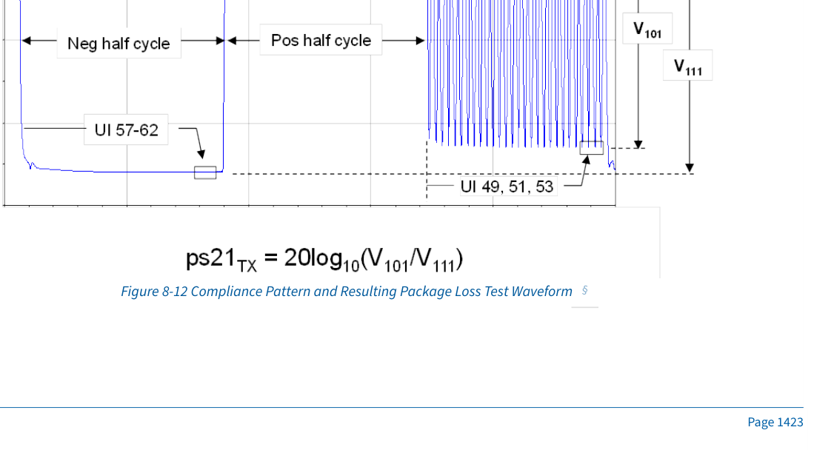


[⬆️ 返回目录](#sec-8-0)

---

<!-- 📄 Page 1424 -->
---

<a id="sec-8-3-3-11-measurement"></a>
## V101 and V111 Measurement Procedure | V101 与 V111 的测量流程


<div style="overflow-x: auto; max-width: 100%;">
<table>
<thead>
<tr>
<th width="50%">🇬🇧 English</th>
<th width="50%" style="background-color:#e8e8e8">🏆 中文</th>
</tr>
</thead>
<tbody>
<tr>
<td>

Measurement of V101 and V111 is made towards the end of each interval to minimize ISI and low frequency effects. V101 is defined as the peak-peak voltage between minima and maxima of the clock pattern. V111 is defined as the average voltage difference between the positive and negative levels of the two half cycles. The measurement should be averaged over 500 repetitions of the compliance pattern.

At 32.0 GT/s only the ps21TX parameter is calculated by filtering the captured voltage waveforms normally used for ps21TX measurements as follows:

- V111 is measured from a filtered voltage waveform with a first order (20 dB/decade) low pass filter with a -3 dB corner frequency at 1 GHz applied.
- V101 is measured from a filtered voltage waveform with a first order (20 dB/decade) high pass filter with a -3 dB corner frequency at 7 GHz applied.

Since the Nyquist frequency for 64.0 GT/s PAM4 signaling is 16.0 GHz, no additional measurement is necessary for 64.0 GT/s ps21TX spec compliance. For a PCIe 6.0 device that supports maximum data rate of 64.0 GT/s, the ps21TX spec parameter measured for 32.0 GT/s must be lower than the ps21TX spec values provided under the 64.0 GT/s column in § Table 8-6.

</td>
<td style="background-color:#e8e8e8">

V101 与 V111 的测量在每个区间末端进行，以最小化码间干扰 (ISI) 与低频效应。V101 定义为时钟码型最小值与最大值之间的峰峰值电压。V111 定义为两个半周期正、负电平的电压差平均值。测量应在 500 次一致性码型重复上取平均。

在 32.0 GT/s 时,ps21TX 参数通过对通常用于 ps21TX 测量的捕获电压波形进行如下滤波后计算得到:

- V111 由应用了一阶(20 dB/decade)、-3 dB 截止频率为 1 GHz 的低通滤波器的电压波形测得。
- V101 由应用了一阶(20 dB/decade)、-3 dB 截止频率为 7 GHz 的高通滤波器的电压波形测得。

由于 64.0 GT/s PAM4 信号的奈奎斯特 (Nyquist) 频率为 16.0 GHz,64.0 GT/s 的 ps21TX 规范合规性无需额外测量。对于支持 64.0 GT/s 最高数据速率的 PCIe 6.0 器件，在 32.0 GT/s 下测得的 ps21TX 规范参数必须低于 § Table 8-6 中 64.0 GT/s 列所给出的 ps21TX 规范值。

</td>
</tr>
</tbody>
</table>
</div>


[⬆️ 返回目录](#sec-8-0)

---

<a id="sec-8-3-3-12"></a>
## 8.3.3.12 Transmitter Signal-to Noise and Distortion Ratio (SNDRTX) for 64.0 GT/s | 64.0 GT/s 下发送器信噪失真比 (SNDRTX)

<table>
<thead>
<tr>
<th width="50%">🇬🇧 English</th>
<th width="50%" style="background-color:#e8e8e8">🏆 中文</th>
</tr>
</thead>
<tbody>
<tr>
<td>

Signal-to-noise and distortion ratio (SNDR) is measured at the transmitter output using the Compliance Pattern (see § Section 4.2.14) with preset Q0 (no Tx equalization), and the lanes not under test also transmitting the Compliance Pattern with preset Q0. The recorded waveform must have a minimum of 250 repetitions of the compliance pattern. Measurements should be made with a 4th order Bessel-Thomson filter with a roll-off from DC value by 3 dB at 33 GHz to minimize the impact of scope high-frequency noise. The minimum scope bandwidth is 50 GHz.

A linear fit to the captured waveform and the linear fit pulse response, p(k), and error vector, e(k), are computed. The standard deviation of e(k) is denoted by σe. The linear fit pulse response p(k) and the error vector e(k) shall be computed with the pulse length of Np = 600 and pulse delay Dp = 4. For these computations, the number of samples per PAM4 symbol, M, must be equal to or greater than 32 and resampling can be used to meet this requirement. The standard deviation of e(k) is obtained from the measured PRBS portion of the compliance pattern.

The parameter σn measures the uncorrelated RMS amplitude noise of each symbol level (including random noise and uncorrelated bounded noise effects), while not including ISI and jitter effects. Noise for each of the four PAM4 voltage levels, σL, is measured by using the PAM4 symbol 61 of the 64-UI long slow pattern for the corresponding voltage level that appears once in every repeat of the Compliance Pattern. When measuring σL, an adjustment for uncorrelated random noise contributed by the instrumentation such as uncorrelated random scope noise shall be applied. Equivalent oscilloscope settings used for noise characterization shall be consistent with the oscilloscope settings used for waveform capture when calculating SNDR. For each voltage level L (where L = 0,1,2,3), the σL measurement is the result of eight independent measurements on eight evenly spaced sample points within the Unit Interval of symbol 61 in the run of 64 identical symbols. Each of the eight measurements denoted as σL,i (where i=1..8) is calculated by using the following equations.

</td>
<td style="background-color:#e8e8e8">

信噪失真比 (Signal-to-Noise and Distortion Ratio, SNDR) 在发送器输出端使用一致性码型 (Compliance Pattern,参见 § Section 4.2.14) 进行测量，采用预设 Q0(无 Tx 均衡)，未测量的通道也以预设 Q0 发射一致性码型。所记录的波形必须至少包含 250 次一致性码型重复。测量应使用 4 阶贝塞尔-汤姆森 (Bessel-Thomson) 滤波器，在 33 GHz 处自 DC 值下降 3 dB,以最小化示波器高频噪声的影响。示波器最小带宽为 50 GHz。

对捕获波形进行线性拟合，并计算线性拟合脉冲响应 p(k) 与误差向量 e(k)。e(k) 的标准差记为 σe。线性拟合脉冲响应 p(k) 与误差向量 e(k) 应使用脉冲长度 Np = 600 与脉冲延迟 Dp = 4 计算。在这些计算中，每个 PAM4 符号的采样数 M 必须大于等于 32,允许重采样以满足此要求。e(k) 的标准差从一致性码型的 PRBS 部分测量得到。

参数 σn 测量每个符号电平的不相关 RMS 幅度噪声(包括随机噪声与不相关有界噪声效应)，而不包括 ISI 与抖动 (Jitter) 效应。四个 PAM4 电压电平中每个电平的噪声 σL 通过使用 64-UI 长慢码型 (Slow Pattern) 中的 PAM4 符号 61 进行测量，该符号在一致性码型的每次重复中各出现一次。测量 σL 时，应对仪器(如不相关随机示波器噪声)所贡献的不相关随机噪声进行修正。用于噪声特性化的示波器设置应与计算 SNDR 时用于波形捕获的示波器设置一致。对于每个电压电平 L(L = 0,1,2,3),σL 测量结果为对 64 个相同符号连续段中符号 61 的 UI 内 8 个等间隔采样点进行的 8 次独立测量。记为 σL,i(其中 i=1..8)的 8 次测量中的每一次均按以下公式计算。

</td>
</tr>
</tbody>
</table>

[⬆️ 返回目录](#sec-8-0)

---

<a id="eq-8-3"></a>
## Equation 8-3 σL,i | 公式 8-3 σL,i

<table>
<thead>
<tr>
<th width="50%">🇬🇧 English</th>
<th width="50%" style="background-color:#e8e8e8">🏆 中文</th>
</tr>
</thead>
<tbody>
<tr>
<td>

$$\sigma_{L,i}^{2} = \frac{1}{N_k} \sum_{k=1}^{N_k} (V_{L,i,k} - \mu_{L,i})^2$$

**Equation 8-3 σL,i**

</td>
<td style="background-color:#e8e8e8">

$$\sigma_{L,i}^{2} = \frac{1}{N_k} \sum_{k=1}^{N_k} (V_{L,i,k} - \mu_{L,i})^2$$

**公式 8-3 σL,i**

</td>
</tr>
</tbody>
</table>

[⬆️ 返回目录](#sec-8-0)

---

<!-- 📄 Page 1425 -->
---

<a id="eq-8-4"></a>
## Equation 8-4 μL,i | 公式 8-4 μL,i

<table>
<thead>
<tr>
<th width="50%">🇬🇧 English</th>
<th width="50%" style="background-color:#e8e8e8">🏆 中文</th>
</tr>
</thead>
<tbody>
<tr>
<td>

$$\mu_{L,i} = \frac{1}{N_k} \sum_{k=1}^{N_k} V_{L,i,k}$$

**Equation 8-4 μL,i**

In the above equations, Nk is the number of repetitions of the compliance pattern in the recorded waveform, VL,i,k is the waveform voltage at the ith data sample location within the 61st symbol UI in the kth repetition of the compliance pattern for each voltage level, and μL,i is the mean of Nk waveform voltage samples for the ith data sample location for the corresponding voltage level.

σL is obtained via the following equation:

</td>
<td style="background-color:#e8e8e8">

$$\mu_{L,i} = \frac{1}{N_k} \sum_{k=1}^{N_k} V_{L,i,k}$$

**公式 8-4 μL,i**

在上述公式中,Nk 为所记录波形中一致性码型的重复次数;VL,i,k 为一致性码型第 k 次重复中第 61 个符号 UI 内第 i 个数据采样点处、对应电压电平的波形电压;μL,i 为对应电压电平第 i 个数据采样点处 Nk 个波形电压采样的均值。

σL 由下式得到:

</td>
</tr>
</tbody>
</table>

[⬆️ 返回目录](#sec-8-0)

---

<a id="eq-8-5"></a>
## Equation 8-5 σL | 公式 8-5 σL

<table>
<thead>
<tr>
<th width="50%">🇬🇧 English</th>
<th width="50%" style="background-color:#e8e8e8">🏆 中文</th>
</tr>
</thead>
<tbody>
<tr>
<td>

$$\sigma_L = \sqrt{\frac{\sum_{i=1}^{8} \sigma_{L,i}^{2}}{8}}$$

**Equation 8-5 σL**

σn is the average of the four σL measurements, one for each PAM4 voltage level, denoted as

</td>
<td style="background-color:#e8e8e8">

$$\sigma_L = \sqrt{\frac{\sum_{i=1}^{8} \sigma_{L,i}^{2}}{8}}$$

**公式 8-5 σL**

σn 为四个 PAM4 电压电平各一次 σL 测量的平均值，记为:

</td>
</tr>
</tbody>
</table>

[⬆️ 返回目录](#sec-8-0)

---

<a id="eq-8-6"></a>
## Equation 8-6 σn | 公式 8-6 σn

<table>
<thead>
<tr>
<th width="50%">🇬🇧 English</th>
<th width="50%" style="background-color:#e8e8e8">🏆 中文</th>
</tr>
</thead>
<tbody>
<tr>
<td>

$$\sigma_n = \frac{1}{4}(\sigma_0 + \sigma_1 + \sigma_2 + \sigma_3)$$

**Equation 8-6 σn**

The Tx SNDR is defined by the following Equation, where pmax is the maximum value of p(k).

</td>
<td style="background-color:#e8e8e8">

$$\sigma_n = \frac{1}{4}(\sigma_0 + \sigma_1 + \sigma_2 + \sigma_3)$$

**公式 8-6 σn**

Tx SNDR 由下式定义，其中 pmax 为 p(k) 的最大值。

</td>
</tr>
</tbody>
</table>

[⬆️ 返回目录](#sec-8-0)

---

<a id="eq-8-7"></a>
## Equation 8-7 SNDR | 公式 8-7 SNDR

<table>
<thead>
<tr>
<th width="50%">🇬🇧 English</th>
<th width="50%" style="background-color:#e8e8e8">🏆 中文</th>
</tr>
</thead>
<tbody>
<tr>
<td>

$$SNDR = 10 \times \log_{10}\left(\frac{p_{max}^2}{\sigma_e^2 + \sigma_n^2}\right)$$

**Equation 8-7 SNDR**

</td>
<td style="background-color:#e8e8e8">

$$SNDR = 10 \times \log_{10}\left(\frac{p_{max}^2}{\sigma_e^2 + \sigma_n^2}\right)$$

**公式 8-7 SNDR**

</td>
</tr>
</tbody>
</table>

[⬆️ 返回目录](#sec-8-0)

---

<a id="sec-8-3-3-13"></a>
## 8.3.3.13 Transmitter Ratio of Level Mismatch (RLM-TX) for 64.0 GT/s | 64.0 GT/s 下发送器电平失配比 (RLM-TX)

<table>
<thead>
<tr>
<th width="50%">🇬🇧 English</th>
<th width="50%" style="background-color:#e8e8e8">🏆 中文</th>
</tr>
</thead>
<tbody>
<tr>
<td>

Transmitter linearity is defined as a function of the mean signal levels (V0, V1, V2, and V3) transmitted for PAM4 2-bit symbols (see § Section 4.2.3.1.1). The ratio of level mismatch, RLM, is defined as shown below:

</td>
<td style="background-color:#e8e8e8">

发送器线性度定义为 PAM4 2-bit 符号发射的平均信号电平(V0、V1、V2 和 V3)的函数(参见 § Section 4.2.3.1.1)。电平失配比 (Ratio of Level Mismatch, RLM) 定义如下:

</td>
</tr>
</tbody>
</table>

[⬆️ 返回目录](#sec-8-0)

---

<!-- 📄 Page 1426 -->
---

<a id="eq-8-8"></a>
## Equation 8-8 RLM | 公式 8-8 RLM

<table>
<thead>
<tr>
<th width="50%">🇬🇧 English</th>
<th width="50%" style="background-color:#e8e8e8">🏆 中文</th>
</tr>
</thead>
<tbody>
<tr>
<td>

```
Vmid = (V0 + V3) / 2
ES1 = (V1 − Vmid) / (V0 − Vmid)
ES2 = (V2 − Vmid) / (V3 − Vmid)
RLM = min((3 × ES1), (3 × ES2), (2 − 3 × ES1), (2 − 3 × ES2))
```

**Equation 8-8 RLM**

The mean signal levels (VL where L = 0, 1, 2, and 3) described above are measured by following the same procedure described in § Section 8.3.3.12 and by using the following equation.

</td>
<td style="background-color:#e8e8e8">

```
Vmid = (V0 + V3) / 2
ES1 = (V1 − Vmid) / (V0 − Vmid)
ES2 = (V2 − Vmid) / (V3 − Vmid)
RLM = min((3 × ES1), (3 × ES2), (2 − 3 × ES1), (2 − 3 × ES2))
```

**公式 8-8 RLM**

上述平均信号电平(VL,L = 0、1、2、3)按 § Section 8.3.3.12 所述的相同流程并通过下式测量。

</td>
</tr>
</tbody>
</table>

[⬆️ 返回目录](#sec-8-0)

---

<a id="eq-8-9"></a>
## Equation 8-9 VL | 公式 8-9 VL

<table>
<thead>
<tr>
<th width="50%">🇬🇧 English</th>
<th width="50%" style="background-color:#e8e8e8">🏆 中文</th>
</tr>
</thead>
<tbody>
<tr>
<td>

$$V_L = \frac{\sum_{i=1}^{8} \mu_{L,i}}{8}$$

**Equation 8-9 VL**

</td>
<td style="background-color:#e8e8e8">

$$V_L = \frac{\sum_{i=1}^{8} \mu_{L,i}}{8}$$

**公式 8-9 VL**

</td>
</tr>
</tbody>
</table>

[⬆️ 返回目录](#sec-8-0)

---

<a id="sec-8-3-4"></a>
## 8.3.4 Transmitter Margining | 发送器余量 (Margining)


<div style="overflow-x: auto; max-width: 100%;">
<table>
<thead>
<tr>
<th width="50%">🇬🇧 English</th>
<th width="50%" style="background-color:#e8e8e8">🏆 中文</th>
</tr>
</thead>
<tbody>
<tr>
<td>

Transmitters shall implement a margining procedure that allows the Tx launch voltage to be adjusted. Margining is enabled by programming a register set. Due to the larger range of Transmitter equalization, 8.0, 16.0, 32.0, and 64.0 GT/s Tx margining is subject to additional constraints: Tx margining at these speeds shall not require any coefficient or preset resolution finer than can be generated with 1/24 coefficient resolution defined for normal operation, and shall not require more Tx accuracy or capability than is required to support normal operation. It is acceptable that Vb fall below the limit set by VTX-EIEOS-FS or VTX-EIEOS-RS, although proper end to-end operation is no longer guaranteed. Transmitter equalization accuracy requirements do not need to be met during margining. A Transmitter is not required to change the FS/LF values it sends in TS1 Ordered Sets during margining from the values used in normal operation.

There are 8 encoded values for transmit margin from 000b to 111b. Encoding 000b represents the normal operating range. For all supported data rates and Tx signalling mode (full swing or reduced swing), encoding 001b must produce a VTX-DIFF-PP compliant with the specification limits. At least three additional encodings with monotonically decreasing values for VTX-DIFF-PP must be supported for each data rate and Tx swing mode. For full swing signalling there must be at least one encoding with index 100b or higher that produces a VTX-DIFF-PP between 200 and 400 mV. For reduced swing signalling there must be at least one encoding with value 100b or higher that produces a VTX-DIFF-PP between 100 and 200 mV.

</td>
<td style="background-color:#e8e8e8">

发送器应实现一种可调整 Tx 发射电压的余量 (Margining) 流程。余量通过编程寄存器组启用。由于发送器均衡范围较大,8.0、16.0、32.0 和 64.0 GT/s 的 Tx 余量受到额外约束:这些速率下的 Tx 余量不得要求任何比正常操作定义的 1/24 系数分辨率更细的系数或预设分辨率，也不得要求比支持正常操作所需的更高的 Tx 精度或能力。允许 Vb 低于 VTX-EIEOS-FS 或 VTX-EIEOS-RS 所设定的限制，但此时不再保证正常的端到端操作。发送器均衡精度要求在余量过程中无需满足。发送器在余量过程中无需改变其在 TS1 有序集 (TS1 Ordered Set) 中发送的 FS/LF 值，使其与正常操作中所用值不同。

发送器余量有 8 个编码值，从 000b 到 111b。编码 000b 表示正常工作范围。对于所有支持的数据速率与 Tx 信号模式(满摆幅或缩减摆幅)，编码 001b 必须产生符合规范限制的 VTX-DIFF-PP。每个数据速率与 Tx 摆幅模式下必须至少支持另外 3 个 VTX-DIFF-PP 单调递减的编码。对于满摆幅信号，必须至少有一个索引为 100b 或更高的编码，产生 200 mV 到 400 mV 之间的 VTX-DIFF-PP。对于缩减摆幅信号，必须至少有一个值为 100b 或更高的编码，产生 100 mV 到 200 mV 之间的 VTX-DIFF-PP。

</td>
</tr>
</tbody>
</table>
</div>


[⬆️ 返回目录](#sec-8-0)

---

<!-- 📄 Page 1427 -->
---

<a id="fig-8-13"></a>
## Figure 8-13 2.5 and 5.0 GT/s Transmitter Margining Voltage Levels and Codes | 图 8-13 2.5 和 5.0 GT/s 发送器余量电压电平与编码

<table>
<thead>
<tr>
<th width="50%">🇬🇧 English</th>
<th width="50%" style="background-color:#e8e8e8">🏆 中文</th>
</tr>
</thead>
<tbody>
<tr>
<td>

> **Figure 8-13.** 2.5 and 5.0 GT/s Transmitter Margining Voltage Levels and Codes
> 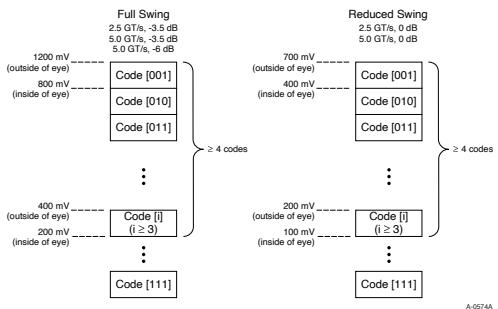
>
> *Margining codes (4 codes: 001, 010, 011, i where i ≥ 3) with corresponding voltage levels:*
> - *Full Swing (A-0574A): 2.5 GT/s at -3.5 dB, 5.0 GT/s at -3.5 dB, 5.0 GT/s at -6 dB — voltage levels at 1200 mV (outside of eye), 800 mV (inside of eye), 400 mV (outside of eye), 200 mV (inside of eye).*
> - *Reduced Swing: 2.5 GT/s at 0 dB, 5.0 GT/s at 0 dB — voltage levels at 700 mV (outside of eye), 400 mV (inside of eye), 200 mV (outside of eye), 100 mV (inside of eye).*

</td>
<td style="background-color:#e8e8e8">

>
> *余量编码(共 4 个编码:001、010、011、i(i ≥ 3))及对应电压电平:*
> - *满摆幅 (Full Swing, A-0574A):2.5 GT/s -3.5 dB、5.0 GT/s -3.5 dB、5.0 GT/s -6 dB — 电压电平为 1200 mV(眼图外)、800 mV(眼图内)、400 mV(眼图外)、200 mV(眼图内)。*
> - *缩减摆幅 (Reduced Swing):2.5 GT/s 0 dB、5.0 GT/s 0 dB — 电压电平为 700 mV(眼图外)、400 mV(眼图内)、200 mV(眼图外)、100 mV(眼图内)。*


</td>
</tr>
</tbody>
</table>

[⬆️ 返回目录](#sec-8-0)

---

<a id="sec-8-3-4-jitter"></a>
## Transmitter Jitter Measurement (preliminary for 8.3.5) | 发送器抖动测量(8.3.5 前的预备内容)


<div style="overflow-x: auto; max-width: 100%;">
<table>
<thead>
<tr>
<th width="50%">🇬🇧 English</th>
<th width="50%" style="background-color:#e8e8e8">🏆 中文</th>
</tr>
</thead>
<tbody>
<tr>
<td>

Jitter limits are defined identically for all data rates, although their respective values will vary with data rate. Jitter is measured at the zero-crossing point at full speed using the Compliance Pattern for 2.5, 5.0, 8.0, and 16.0 GT/s. When measuring jitter, the preset yielding the lowest jitter value should be selected. At 32.0 GT/s, the Tx under test must transmit Jitter Measurement Pattern (see § Section 4.2.13) with no Tx equalization. At 64.0 GT/s, the Tx under test must transmit Jitter Measurement Pattern (see § Section 4.2.16) with no Tx equalization for measuring the uncorrelated total jitter and deterministic jitter for all twelve transitions between the four PAM4 voltage levels. At 64.0 GT/s, the Tx under test must transmit High Swing Toggle Pattern (see § Section 4.2.17) with no Tx equalization for measuring the uncorrelated total pulse width jitter and deterministic pulse width jitter for the transitions between voltage level 0 and voltage level 3. When measuring a particular Tx Lane, it is necessary to ensure that all other PCI Express Lanes are transmitting Compliance Pattern in order to capture Tx die and package crosstalk effects. When measuring Tx jitter, it is required for the DUT to drive as many of its outputs as would occur during normal operation in a system environment. The minimum oscilloscope bandwidth for Tx jitter measurements at 32.0 and 64.0 GT/s is 50 GHz. The jitter measurements at 64.0 GT/s should be made with a 4th order Bessel-Thomson filter with a roll-off from DC value by 3 dB at 33 GHz to minimize the impact of scope high-frequency noise.

Measured Tx jitter is referenced to the Tx pin, and depending on what type of jitter is being measured and what reference clock architecture is being tested, is subsequently referenced to a recovered data clock, an embedded reference clock captured simultaneously with the data, or to a data edge. Data captured at TP1 requires post processing in order to remove the effects of the breakout channel and to regenerate a data clock (when an embedded reference clock is not captured simultaneously with the data).

Direct probing at a Transmitter's pins is not generally feasible, so data is instead measured at TP1 of the breakout channel. By means of the replica channel it is possible to determine the loss vs. frequency characteristics of the breakout channel and de-embed this channel, resulting in measurements that are effectively referenced to the DUT's pins. Note that since de-embedding amplifies HF noise there is a practical frequency cutoff limit to de-embedding. As de-embedding amplifies HF channel and measurement noise, an HF cutoff limit must be applied to de-embedding, depending on data rate as shown in § Table 8-4.

</td>
<td style="background-color:#e8e8e8">

所有数据速率的抖动 (Jitter) 限制定义方式相同，只是各自的数值随数据速率变化。抖动在满速下的过零点进行测量,2.5、5.0、8.0、16.0 GT/s 使用一致性码型 (Compliance Pattern)。测量抖动时，应选择产生最低抖动值的预设。在 32.0 GT/s 时，被测 Tx 必须发送抖动测量码型 (Jitter Measurement Pattern,参见 § Section 4.2.13) 且不进行 Tx 均衡。在 64.0 GT/s 时，被测 Tx 必须发送抖动测量码型(参见 § Section 4.2.16)且不进行 Tx 均衡，以测量四个 PAM4 电压电平之间 12 种跃迁的不相关总抖动和确定性抖动。在 64.0 GT/s 时，被测 Tx 必须发送高摆幅切换码型 (High Swing Toggle Pattern,参见 § Section 4.2.17)且不进行 Tx 均衡，以测量电压电平 0 与电压电平 3 之间跃迁的不相关总脉宽抖动和确定性脉宽抖动。测量某个 Tx 通道 (Lane) 时，必须确保所有其他 PCI Express 通道正在发送一致性码型，以捕获 Tx 芯片和封装的串扰效应。测量 Tx 抖动时，要求被测设备 (DUT) 驱动的输出数量与系统环境下正常工作时一致。32.0 和 64.0 GT/s 下 Tx 抖动测量的最小示波器带宽为 50 GHz。64.0 GT/s 的抖动测量应使用 4 阶贝塞尔-汤姆森 (Bessel-Thomson) 滤波器，在 33 GHz 处自 DC 值下降 3 dB,以最小化示波器高频噪声的影响。

测得的 Tx 抖动以 Tx 引脚为基准，根据被测抖动类型与被测参考时钟架构，可进一步以恢复数据时钟、与数据同时捕获的嵌入式参考时钟或数据边沿为基准。在 TP1 捕获的数据需要后处理以去除分接通道 (Breakout Channel) 的影响，并在未与数据同时捕获嵌入式参考时钟时重新生成数据时钟。

直接在发送器引脚上探测通常不可行，因此改为在分接通道的 TP1 上测量数据。通过复制通道 (Replica Channel) 可以确定分接通道的损耗-频率特性，并对该通道去嵌入 (De-embed)，从而使测量结果等效地以 DUT 引脚为基准。注意，由于去嵌入会放大高频噪声，去嵌入存在一个实际的高频截止限制。由于去嵌入会放大高频通道与测量噪声，必须对去嵌入施加一个高频截止限制，该限制根据 § Table 8-4 中所列数据速率而异。

</td>
</tr>
</tbody>
</table>
</div>


[⬆️ 返回目录](#sec-8-0)

---


---

# 📘 第 8 章　Electrical Sub-Block (电气子块)

> 📄 **Source pages**: 1428–1440 | 📁 **File**: `chapter_08_ac.md`
> 🎨 **Format**: 中英对照双语 · 图表原始保留 · 中文背景色灰色 · GitHub Flavored Markdown

---

<a id="sec-8-3-5"></a>
## 8.3.5 Tx Jitter Parameters | Tx 抖动参数

<table>
<thead>
<tr>
<th width="50%">🇬🇧 English</th>
<th width="50%" style="background-color:#e8e8e8">🏆 中文</th>
</tr>
</thead>
<tbody>
<tr>
<td>

### 8.3.5.1 Post Processing Steps to Extract Jitter §
### 8.3.5.2 Applying CTLE or De-embedding §

**Table 8-4. Recommended De-embedding Cutoff Frequency | 表 8-4. 推荐的去嵌入截止频率**

| Data Rate | HF Cutoff limit for de-embedding |
|-----------|--------------------------------|
| 8.0 GT/s  | 8 GHz - 12 GHz                  |
| 16.0 GT/s | 20 GHz                         |

Jitter is decomposed into data dependent and uncorrelated terms. This separation process effectively separates the jitter caused by package effects from that caused by silicon effects such as PLL jitter and power supply noise that cannot be mitigated by equalization. As a result, the uncorrelated jitter terms define jitter as it would appear at the die pad.

As an alternative to de-embedding at 16.0 GT/s the -12 dB CTLE in the reference equalizer can be applied to the data measured at TP1 for measuring all uncorrelated jitter parameters (not DDJ).

It is recommended that s-parameters for de-embedding are measured to at least 3 times the Nyquist frequency with a frequency step size of 10 MHz.

If both de-embedding and CTLE approaches are used and given different answers only the lower values for the uncorrelated jitter parameters are used.

For 32.0 GT/s, Jitter Measurement Pattern (see § Section 4.2.13) with no Tx equalization is used to minimize the breakout channel ISI impact and avoid pessimism in jitter measurement from de-embedding and associated high frequency scope noise amplification. For further reduction of channel loss impact on jitter at 32.0 GT/s, any CTLE curve in the reference equalizer or no CTLE curve can be applied to the data measured at TP1 for measuring all uncorrelated jitter parameters (not DDJ). The CTLE or no CTLE curve that gives the lowest result for TTX-UPW-TJ is used.

For 64.0 GT/s, the Jitter Measurement Pattern (see § Section 4.2.16) with no Tx equalization is used for measuring the uncorrelated total jitter and the uncorrelated deterministic jitter for all twelve transitions between the four PAM4 voltage levels. The 64.0 GT/s Jitter Measurement Pattern is 52-UI long and all 12 PAM4 transitions repeat four times within the pattern resulting in 48 edge transitions. Jitter must be measured on each of the 48 edges individually and then averaged. The Q-scale associated with the 64.0 GT/s Jitter Measurement Pattern for BER of 10-6 is 4.8759. For mitigating channel ISI impact on jitter at 64.0 GT/s, any CTLE curve in the reference equalizer or no CTLE curve can be applied to the data measured at TP1 for measuring all uncorrelated jitter parameters (not DDJ). The CTLE or no CTLE curve that gives the lowest result for the average TTX-RJ of the 48 edges is used. The uncorrelated jitter parameters for all 48 transitions must be measured and corrected for the scope noise impact. The average uncorrelated total jitter and the average uncorrelated deterministic jitter are obtained by averaging the jitter parameters of all 48 edge transitions.

For 64.0 GT/s, the High Swing Toggle Pattern (see § Section 4.2.17) with no Tx equalization is used for measuring the uncorrelated total pulse width jitter and deterministic pulse width jitter for transitions between voltage level 0 and voltage level 3. The Q-scale associated with the 64.0 GT/s High Swing Toggle Pattern for BER of 10-6 is 4.8916. The High Swing Toggle Pattern minimizes the breakout channel ISI impact and avoids pessimism in jitter measurement from de-embedding and associated high frequency scope noise amplification. For further reduction of channel loss impact on pulse width jitter at 64.0 GT/s, any CTLE curve in the reference equalizer or no CTLE curve can be applied to the data measured at TP1 for measuring all uncorrelated jitter parameters (not DDJ). The CTLE or no CTLE curve that gives the lowest result for TTX-UPW-TJ is used. The uncorrelated pulse width jitter parameters must be corrected for the scope noise impact.

A Transmitter may operate in the Independent Refclk (IR) mode, in which case the Transmitter may not provide a Refclk output. In this case a single-port jitter measurement is required. The post processing algorithm must employ the appropriate model CDR for the reference clock architecture being tested.

### 8.3.5.3 Independent Refclk Measurement and Post Processing §

</td>
<td style="background-color:#e8e8e8">

### 8.3.5.1 提取抖动的后处理步骤 §
### 8.3.5.2 应用 CTLE 或去嵌入 §

**Table 8-4. Recommended De-embedding Cutoff Frequency | 表 8-4. 推荐的去嵌入截止频率**

| Data Rate | HF Cutoff limit for de-embedding |
|-----------|--------------------------------|
| 8.0 GT/s  | 8 GHz - 12 GHz                  |
| 16.0 GT/s | 20 GHz                         |

抖动 (Jitter) 被分解为数据相关 (data dependent) 和非相关 (uncorrelated) 两部分。该分离过程可将封装效应引起的抖动与硅片效应 (例如 PLL 抖动和电源噪声，这类抖动无法通过均衡 (Equalization) 缓解) 引起的抖动有效分离。因此，非相关抖动项定义了芯片焊盘 (die pad) 处呈现的抖动。

作为 16.0 GT/s 下执行去嵌入 (De-embedding) 的替代方案，可以将参考均衡器中 -12 dB 的 CTLE (Continuous Time Linear Equalizer,连续时间线性均衡器) 应用于在 TP1 测得的数据，以测量所有非相关抖动参数 (不含 DDJ)。

建议去嵌入所用的 s 参数至少在 3 倍奈奎斯特 (Nyquist) 频率下测量，频率步进为 10 MHz。

若同时使用去嵌入和 CTLE 两种方法，且结果不同，则采用非相关抖动参数中较低的一组。

对于 32.0 GT/s,使用 Jitter Measurement Pattern (见 § Section 4.2.13) 且不施加 Tx 均衡，以最小化分出通道 (breakout channel) ISI 的影响，并避免去嵌入及相关高频示波器噪声放大导致抖动测量结果过于悲观。为进一步降低 32.0 GT/s 通道损耗对抖动的影响，可将参考均衡器中的任意 CTLE 曲线或不带 CTLE 的曲线应用于在 TP1 测得的数据，以测量所有非相关抖动参数 (不含 DDJ)。采用对 TTX-UPW-TJ 给出最低结果的 CTLE 曲线或不带 CTLE 的曲线。

对于 64.0 GT/s,使用 Jitter Measurement Pattern (见 § Section 4.2.16) 且不施加 Tx 均衡，用于测量四个 PAM4 电压电平之间全部 12 种跃迁的非相关总抖动和非相关确定性抖动。64.0 GT/s Jitter Measurement Pattern 长度为 52 UI,全部 12 种 PAM4 跃迁在该码型中重复 4 次，共计 48 个边沿跃迁。必须对 48 个边沿分别测量抖动后再取平均。对应 BER 为 10-6 的 64.0 GT/s Jitter Measurement Pattern 的 Q-scale 为 4.8759。为缓解 64.0 GT/s 通道 ISI 对抖动的影响，可将参考均衡器中的任意 CTLE 曲线或不带 CTLE 的曲线应用于在 TP1 测得的数据，以测量所有非相关抖动参数 (不含 DDJ)。采用对 48 个边沿平均 TTX-RJ 给出最低结果的 CTLE 曲线或不带 CTLE 的曲线。所有 48 个跃迁的非相关抖动参数都必须测量并修正示波器噪声影响。平均非相关总抖动和平均非相关确定性抖动通过对全部 48 个边沿跃迁的抖动参数求平均得到。

对于 64.0 GT/s,使用 High Swing Toggle Pattern (见 § Section 4.2.17) 且不施加 Tx 均衡，用于测量电压电平 0 与电压电平 3 之间跃迁的非相关总脉宽抖动和确定性脉宽抖动。对应 BER 为 10-6 的 64.0 GT/s High Swing Toggle Pattern 的 Q-scale 为 4.8916。High Swing Toggle Pattern 可最小化分出通道 ISI 影响，避免去嵌入及相关高频示波器噪声放大导致抖动测量结果过于悲观。为进一步降低 64.0 GT/s 通道损耗对脉宽抖动的影响，可将参考均衡器中的任意 CTLE 曲线或不带 CTLE 的曲线应用于在 TP1 测得的数据，以测量所有非相关抖动参数 (不含 DDJ)。采用对 TTX-UPW-TJ 给出最低结果的 CTLE 曲线或不带 CTLE 的曲线。非相关脉宽抖动参数必须修正示波器噪声影响。

发送器 (Transmitter) 可以运行在 Independent Refclk (IR) 模式，此时发送器可能不提供 Refclk 输出。这种情况下需要单端口抖动测量。后处理算法必须针对被测参考时钟架构使用相应的模型 CDR。

### 8.3.5.3 独立 Refclk 测量与后处理 §

</td>
</tr>
</tbody>
</table>

[⬆️ 返回目录](#sec-8-0)

---

<!-- 📄 Page 1428 -->
---

<a id="sec-8-3-5-3-cont"></a>
## 8.3.5.3 Independent Refclk Measurement and Post Processing (cont.) | 独立 Refclk 测量与后处理 (续)


<div style="overflow-x: auto; max-width: 100%;">
<table>
<thead>
<tr>
<th width="50%">🇬🇧 English</th>
<th width="50%" style="background-color:#e8e8e8">🏆 中文</th>
</tr>
</thead>
<tbody>
<tr>
<td>

When the transmitting PCIe device is driven from an external source to its Refclk pin it permits the Tx under test to be driven with a clean Refclk as shown in § Figure 8-1.

The specification now explicitly supports the complete matrix of Refclk options, including where the Refclk is embedded, where the reference clock is external, where the reference clock is available at the DUT's pins, and where the reference clock is not available at the DUT's pins. § Table 8-5 lists the post processing requirements for each of the four possible combinations. Embedded Refclk with Refclk available at the DUT's pin represents a special case where any jitter common to both the Refclk and the data must be removed via a two-port measurement.

If the DUT supports multiple Refclk modes, as described in § Table 8-5 then the Tx needs to be tested in each of the Refclk modes it supports.

**Table 8-5. Tx Measurement and Post Processing For Different Refclks | 表 8-5. 不同 Refclk 下的 Tx 测量与后处理**

| | Embedded Refclk | Non-Embedded Refclk |
|---|---|---|
| Refclk available at DUT pin and not testing SRIS mode | 2-port measurement, CC CDR, PLL1 and 10 ns transport delay² | 1-port measurement, CC CDR, clean external Refclk |
| Refclk not available at DUT pin or testing SRIS mode | 1-port measurement, SRIS CDR | 1-port measurement, CC CDR, clean external Refclk |

**Notes:**

1. PLL characteristics are defined in Refclk section for each data rate.
2. Refer to § Section 8.6.6 for a discussion of the transport delay

A behavioral CDR filter is applied to reject low frequency jitter that would normally be tracked by the CDR in a Receiver. As such, the behavioral CDR represents a bounding function for actual CDR implementations. Roll-off characteristics of the behavioral CDR are dependent on whether the corresponding DUT supports an embedded vs. non-embedded Refclk, is operating in CC or IR mode, and whether the Refclk pin is available for probing (see § Table 8-5). In all cases the behavioral CDR represents a high pass filter function where the corner frequency depends on the Tx data rate. § Figure 8-14 shows the CC first-order CDR transfer functions for an f3dB of 1.5 MHz, 5.0 MHz, and 10 MHz that corresponds to 2.5 GT/s, 5.0 GT/s, and 8.0 GT/s, respectively. The 10 MHz behavioral CDR is also used for CC Transmitter and CC Reference Clock testing for 16.0 GT/s and, optionally, for Receiver Stressed Eye calibration when 32.0 GT/s is not supported.

### 8.3.5.4 Embedded and Non-Embedded Refclk Measurement and Post Processing §
### 8.3.5.5 Behavioral CDR Characteristics §

</td>
<td style="background-color:#e8e8e8">

当发送端 PCIe 器件的 Refclk 引脚由外部源驱动时，可使被测 Tx 由一个干净的 Refclk 驱动，如 § Figure 8-1 所示。

本规范现在显式支持 Refclk 选项的完整矩阵，包括 Refclk 内嵌、参考时钟外置、参考时钟在 DUT 引脚上可用以及参考时钟在 DUT 引脚上不可用四种情况。§ Table 8-5 列出了这四种可能组合下对应的后处理要求。Refclk 内嵌且 Refclk 在 DUT 引脚上可用代表一种特殊情形，此时 Refclk 与数据共有的任何抖动必须通过双端口测量予以去除。

若 DUT 支持多种 Refclk 模式，如 § Table 8-5 所述，则 Tx 需在其支持的每种 Refclk 模式下分别进行测试。

**Table 8-5. Tx Measurement and Post Processing For Different Refclks | 表 8-5. 不同 Refclk 下的 Tx 测量与后处理**

| | Embedded Refclk (内嵌 Refclk) | Non-Embedded Refclk (非内嵌 Refclk) |
|---|---|---|
| Refclk available at DUT pin and not testing SRIS mode (Refclk 在 DUT 引脚上可用且不测试 SRIS 模式) | 2-port measurement, CC CDR, PLL1 and 10 ns transport delay² (双端口测量,CC CDR,PLL1 与 10 ns 传输延迟²) | 1-port measurement, CC CDR, clean external Refclk (单端口测量,CC CDR,干净外部 Refclk) |
| Refclk not available at DUT pin or testing SRIS mode (Refclk 在 DUT 引脚上不可用或测试 SRIS 模式) | 1-port measurement, SRIS CDR (单端口测量,SRIS CDR) | 1-port measurement, CC CDR, clean external Refclk (单端口测量,CC CDR,干净外部 Refclk) |

**Notes (注释):**

1. PLL characteristics are defined in Refclk section for each data rate. (各数据速率的 PLL 特性在 Refclk 章节中定义。)
2. Refer to § Section 8.6.6 for a discussion of the transport delay (传输延迟的讨论请参见 § Section 8.6.6。)

行为 CDR (Behavioral CDR) 滤波器用于抑制接收器 (Receiver) 中 CDR 通常会跟踪的低频抖动。因此，行为 CDR 体现了对实际 CDR 实现的一种包络函数。行为 CDR 的滚降特性取决于相应 DUT 是支持内嵌还是非内嵌 Refclk、运行于 CC 还是 IR 模式，以及 Refclk 引脚是否可供探测 (见 § Table 8-5)。在所有情形下，行为 CDR 体现为一个高通滤波器函数，其转折频率取决于 Tx 数据速率。§ Figure 8-14 显示了 CC 一阶 CDR 传递函数,f3dB 分别为 1.5 MHz、5.0 MHz 和 10 MHz,依次对应 2.5 GT/s、5.0 GT/s 和 8.0 GT/s。10 MHz 行为 CDR 还用于 16.0 GT/s 的 CC 发送器 (CC Transmitter) 和 CC 参考时钟测试;在不支持 32.0 GT/s 时，也可选择用于接收器 (Receiver) 压力眼图 (Stressed Eye) 校准。

### 8.3.5.4 内嵌与非内嵌 Refclk 测量与后处理 §
### 8.3.5.5 行为 CDR 特性 §

</td>
</tr>
</tbody>
</table>
</div>


[⬆️ 返回目录](#sec-8-0)

---

<!-- 📄 Page 1429 -->
---

<a id="sec-8-3-5-4-cont"></a>
## 8.3.5.5 Behavioral CDR Characteristics (cont.) | 行为 CDR 特性 (续)

<table>
<thead>
<tr>
<th width="50%">🇬🇧 English</th>
<th width="50%" style="background-color:#e8e8e8">🏆 中文</th>
</tr>
</thead>
<tbody>
<tr>
<td>

> **Figure 8-14. First Order CC Behavioral CDR Transfer Functions | 一阶 CC 行为 CDR 传递函数**
> 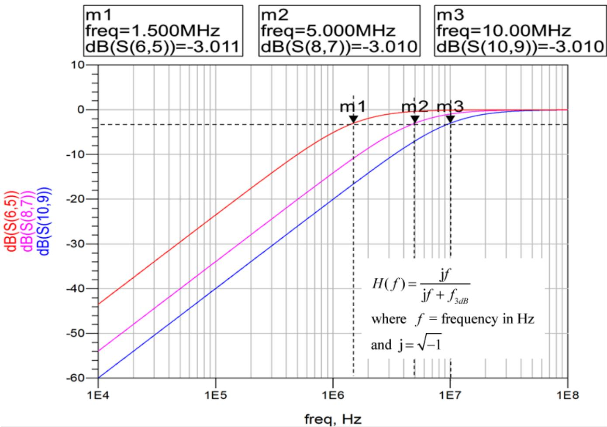

§ Figure 8-15 illustrates second order CDR transfer functions corresponding to 2.5 GT/s and 5.0 GT/s. These functions are defined by a ζ of 0.707 and an f3dB of 1.5 MHz and 5.0 MHz, respectively. Behavioral transfer functions for 8.0 GT/s, 16.0 GT/s, 32.0 GT/s, and 64.0 GT/s approximate the piecewise linear sinusoidal jitter (Sj) masks shown in § Section 8.4.2.2.1. SRIS capable Transmitters must be evaluated using these behavioral transfer functions.

**Note:** The common clock (CC) and independent reference clock (IR) architectures are not interoperable - although it is possible to design a single Receiver that meets both sets of electrical requirements.

</td>
<td style="background-color:#e8e8e8">

§ Figure 8-15 展示了对应 2.5 GT/s 和 5.0 GT/s 的二阶 CDR 传递函数。这些函数分别由 ζ = 0.707、f3dB = 1.5 MHz 和 5.0 MHz 共同定义。8.0 GT/s、16.0 GT/s、32.0 GT/s 和 64.0 GT/s 的行为传递函数近似于 § Section 8.4.2.2.1 所示的分段线性正弦抖动 (Sinusoidal Jitter, Sj) 模板。支持 SRIS 的发送器 (Transmitter) 必须使用这些行为传递函数进行评估。

**注:** 共同时钟 (Common Clock, CC) 和独立参考时钟 (Independent Reference Clock, IR) 架构之间不可互操作 — 尽管可以设计出同时满足两套电气要求的单一接收器 (Receiver)。


</td>
</tr>
</tbody>
</table>

[⬆️ 返回目录](#sec-8-0)

---

<!-- 📄 Page 1430 -->
---

<a id="sec-8-3-5-5-fig-8-15"></a>
## 8.3.5.5 Behavioral CDR Characteristics — Figure 8-15 | 行为 CDR 特性 — 图 8-15

<table>
<thead>
<tr>
<th width="50%">🇬🇧 English</th>
<th width="50%" style="background-color:#e8e8e8">🏆 中文</th>
</tr>
</thead>
<tbody>
<tr>
<td>

> **Figure 8-15. 2nd Order Behavioral SRIS CDR Transfer Functions for 2.5 GT/s and 5.0 GT/s | 2.5 GT/s 与 5.0 GT/s 的二阶行为 SRIS CDR 传递函数**
> 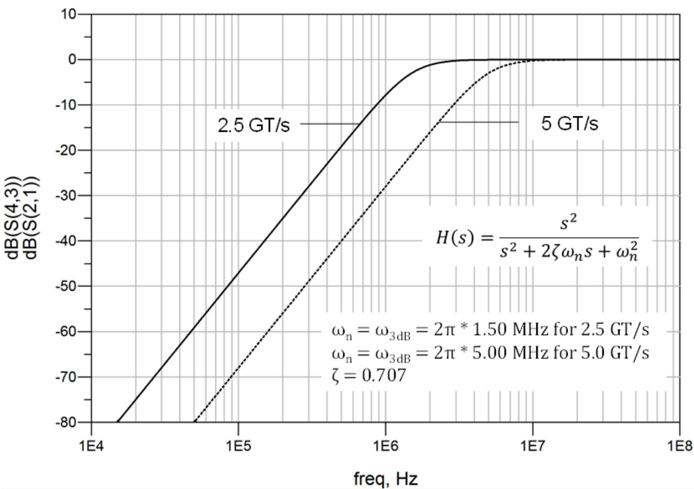

</td>
<td style="background-color:#e8e8e8">

> **图 8-15.** 2.5 GT/s 与 5.0 GT/s 的二阶行为 SRIS CDR 传递函数
> 

</td>
</tr>
</tbody>
</table>

[⬆️ 返回目录](#sec-8-0)

---

<!-- 📄 Page 1431 -->
---

<a id="sec-8-3-5-5-fig-8-16"></a>
## 8.3.5.5 Behavioral CDR Characteristics — Figure 8-16 & Equation 8-10/8-11 | 行为 CDR 特性 — 图 8-16 与公式 8-10/8-11


<div style="overflow-x: auto; max-width: 100%;">
<table>
<thead>
<tr>
<th width="50%">🇬🇧 English</th>
<th width="50%" style="background-color:#e8e8e8">🏆 中文</th>
</tr>
</thead>
<tbody>
<tr>
<td>

> **Figure 8-16. Behavioral SRIS CDR Function for 8.0 GT/s, and SRIS and CC CDR for 16.0 and 32.0 GT/s | 8.0 GT/s 行为 SRIS CDR,以及 16.0/32.0 GT/s 的 SRIS 和 CC CDR**
> 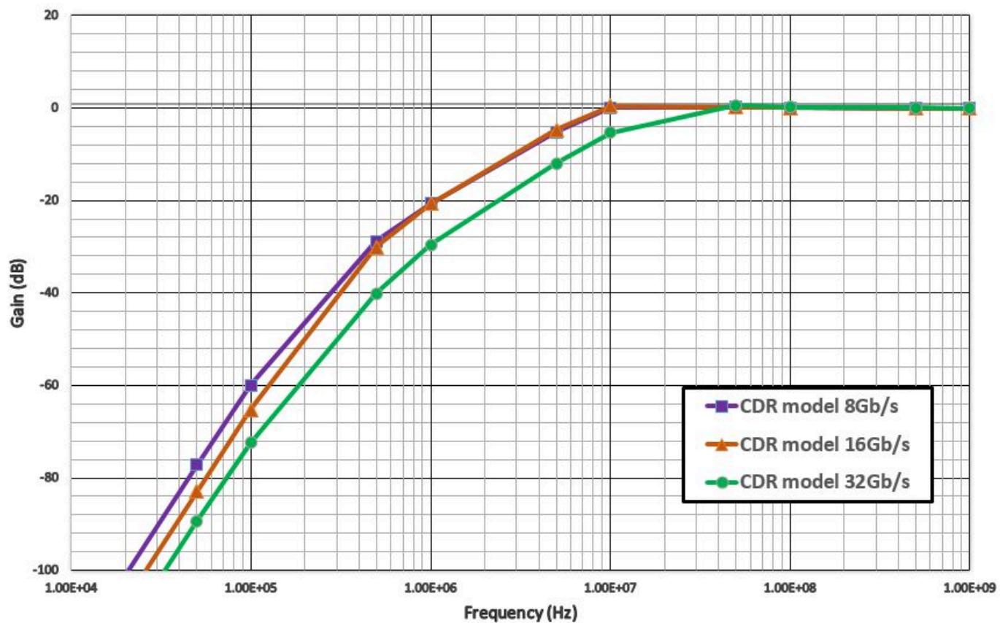

**H(s) =**

$$H(s) = \frac{s^2}{s^2 + sA + B} \times \frac{s^2 + 2\zeta_2 \omega_0 s + \omega_0^2}{s^2 + 2\zeta_1 \omega_0 s + \omega_0^2} \times \frac{s}{s + \omega_1}$$

- ζ₁ = 1/√2
- ζ₂ = 1
- ω₀ = 10⁷ × 2π
- ω₁ = 4 × 10⁵ × 2π

**Equation 8-10. Behavioral SRIS CDR at 8.0 GT/s and SRIS and CC Behavioral CDR at 16.0 GT/s | 8.0 GT/s 行为 SRIS CDR,以及 16.0 GT/s 的 SRIS 和 CC 行为 CDR**

- A = 10⁷ × 2π
- B = 2.2 × 10¹² × (2π)²

**Equation 8-11. SRIS Behavioral CDR Parameters at 8.0 GT/s | 8.0 GT/s 的 SRIS 行为 CDR 参数**


</td>
<td style="background-color:#e8e8e8">

**H(s) =**

$$H(s) = \frac{s^2}{s^2 + sA + B} \times \frac{s^2 + 2\zeta_2 \omega_0 s + \omega_0^2}{s^2 + 2\zeta_1 \omega_0 s + \omega_0^2} \times \frac{s}{s + \omega_1}$$

- ζ₁ = 1/√2
- ζ₂ = 1
- ω₀ = 10⁷ × 2π
- ω₁ = 4 × 10⁵ × 2π

**Equation 8-10. Behavioral SRIS CDR at 8.0 GT/s and SRIS and CC Behavioral CDR at 16.0 GT/s | 8.0 GT/s 行为 SRIS CDR,以及 16.0 GT/s 的 SRIS 和 CC 行为 CDR**

- A = 10⁷ × 2π
- B = 2.2 × 10¹² × (2π)²

**Equation 8-11. SRIS Behavioral CDR Parameters at 8.0 GT/s | 8.0 GT/s 的 SRIS 行为 CDR 参数**

</td>
</tr>
</tbody>
</table>
</div>


[⬆️ 返回目录](#sec-8-0)

---

<!-- 📄 Page 1432 -->
---

<a id="sec-8-3-5-5-eq-8-12-fig-8-17"></a>
## 8.3.5.5 Behavioral CDR Characteristics — Equation 8-12 & Figure 8-17 | 行为 CDR 特性 — 公式 8-12 与图 8-17

<table>
<thead>
<tr>
<th width="50%">🇬🇧 English</th>
<th width="50%" style="background-color:#e8e8e8">🏆 中文</th>
</tr>
</thead>
<tbody>
<tr>
<td>

- A = 9.5 × 10⁶ × 2π
- B = 4.36 × 10¹² × (2π)²

**Equation 8-12. SRIS and CC Behavioral CDR Parameters at 16.0 GT/s | 16.0 GT/s 的 SRIS 和 CC 行为 CDR 参数**

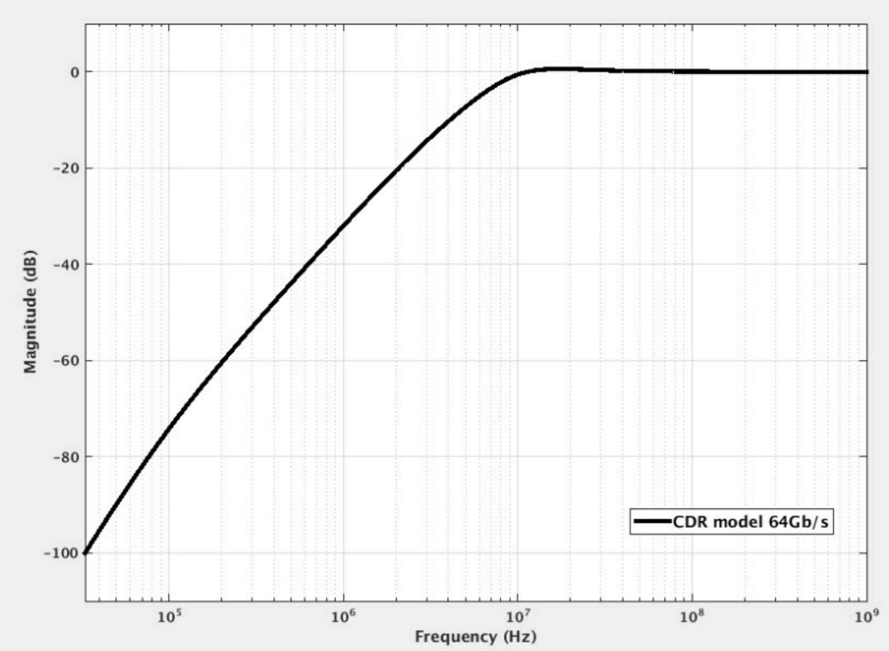
> **Figure 8-17. Behavioral SRIS and CC CDR for 64.0 GT/s | 64.0 GT/s 的行为 SRIS 和 CC CDR**
> 

</td>
<td style="background-color:#e8e8e8">

- A = 9.5 × 10⁶ × 2π
- B = 4.36 × 10¹² × (2π)²

**Equation 8-12. SRIS and CC Behavioral CDR Parameters at 16.0 GT/s | 16.0 GT/s 的 SRIS 和 CC 行为 CDR 参数**

</td>
</tr>
</tbody>
</table>

[⬆️ 返回目录](#sec-8-0)

---

<!-- 📄 Page 1433 -->
---

<a id="sec-8-3-5-5-eq-8-13"></a>
## 8.3.5.5 Behavioral CDR Characteristics — Equation 8-13 | 行为 CDR 特性 — 公式 8-13


<div style="overflow-x: auto; max-width: 100%;">
<table>
<thead>
<tr>
<th width="50%">🇬🇧 English</th>
<th width="50%" style="background-color:#e8e8e8">🏆 中文</th>
</tr>
</thead>
<tbody>
<tr>
<td>

**H(s) =**

$$H(s) = \frac{s^2}{(s + \omega_0)(s + \omega_1)} \times \frac{s^2 + 2\zeta_2 \omega_0 s + \omega_0^2}{s^2 + 2\zeta_1 \omega_0 s + \omega_0^2} \times \frac{s}{s + \omega_{LF}}$$

- ζ₁ = 1/√2
- ζ₂ = 1

**32.0 GT/s**
- ω₀ = 20 × 10⁶ × 2π
- ω₁ = 1.1 × 10⁶ × 2π
- ωLF = 160 × 10³ × 2π

**64.0 GT/s**
- ω₀ = 10 × 10⁶ × 2π
- ω₁ = 3.88 × 10⁶ × 2π
- ωLF = 87 × 10³ × 2π

**Equation 8-13. SRIS and CC Behavioral CDR Parameters at 32.0 and 64.0 GT/s | 32.0 GT/s 和 64.0 GT/s 的 SRIS 和 CC 行为 CDR 参数**

</td>
<td style="background-color:#e8e8e8">

**H(s) =**

$$H(s) = \frac{s^2}{(s + \omega_0)(s + \omega_1)} \times \frac{s^2 + 2\zeta_2 \omega_0 s + \omega_0^2}{s^2 + 2\zeta_1 \omega_0 s + \omega_0^2} \times \frac{s}{s + \omega_{LF}}$$

- ζ₁ = 1/√2
- ζ₂ = 1

**32.0 GT/s**
- ω₀ = 20 × 10⁶ × 2π
- ω₁ = 1.1 × 10⁶ × 2π
- ωLF = 160 × 10³ × 2π

**64.0 GT/s**
- ω₀ = 10 × 10⁶ × 2π
- ω₁ = 3.88 × 10⁶ × 2π
- ωLF = 87 × 10³ × 2π

**Equation 8-13. SRIS and CC Behavioral CDR Parameters at 32.0 and 64.0 GT/s | 32.0 GT/s 和 64.0 GT/s 的 SRIS 和 CC 行为 CDR 参数**

</td>
</tr>
</tbody>
</table>
</div>


[⬆️ 返回目录](#sec-8-0)

---

<!-- 📄 Page 1434 -->
---

<a id="sec-8-3-5-6"></a>
## 8.3.5.6 Data Dependent and Uncorrelated Jitter / 8.3.5.7 Data Dependent Jitter | 数据相关与非相关抖动 / 数据相关抖动

<table>
<thead>
<tr>
<th width="50%">🇬🇧 English</th>
<th width="50%" style="background-color:#e8e8e8">🏆 中文</th>
</tr>
</thead>
<tbody>
<tr>
<td>

Measured at TP1 and de-embedded back to the pin, a Transmitter's jitter contains both data dependent and uncorrelated components. The data dependent components occur principally due to package loss and reflection. Uncorrelated jitter sources include PLL jitter, power supply noise, and crosstalk. The specification separates jitter into uncorrelated and data dependent bins, because such a separation matches well with the Tx and Rx equalization capabilities. Uncorrelated jitter is not mitigated by Tx or Rx equalization and represents timing margin that cannot be recovered via equalization. It is important that margin recoverable by means of equalization (data dependent) is not budgeted as non-recoverable jitter.

Once data dependent jitter has been removed from the Tx measurement it becomes possible to resolve the remaining jitter into Tj and deterministic jitter (Dual Dirac Model) (DJDD) components. High frequency jitter (which is subject to jitter amplification in the channel) is accounted for by separate TTX-UPW-DJDD and TTX-UPW-TJ parameters.

While DDJ is not explicitly defined as a parameter in the specification, it is necessary to separate DDJ in order to eliminate package loss effects and reference the jitter parameters of interest to the Tx die pad. Separation of jitter into data dependent and uncorrelated components may be achieved by averaging techniques; for example, by having the Tx repeatedly drive the compliance test pattern which is a repeating pattern.

§ Figure 8-18 illustrates the relation between Tx data, recovered clock, and the data's PDF. Data dependent jitter is defined as the time delta between the PDF's mean for each zero-crossing point and the corresponding recovered clock edge. A sufficient number of repeated patterns must be accumulated to yield stable mean values and PDF profiles for each transition. These PDFs are then utilized to extract uncorrelated jitter parameters.

### 8.3.5.6 Data Dependent and Uncorrelated Jitter §
### 8.3.5.7 Data Dependent Jitter §

</td>
<td style="background-color:#e8e8e8">

在 TP1 测量并去嵌入 (de-embedded) 回芯片引脚后，发送器 (Transmitter) 的抖动既包含数据相关分量，也包含非相关分量。数据相关分量主要源自封装损耗和反射。非相关抖动源包括 PLL 抖动、电源噪声和串扰。本规范将抖动划分为非相关和数据相关两类，是因为这种划分与 Tx 和 Rx 的均衡能力高度匹配。非相关抖动无法通过 Tx 或 Rx 均衡缓解，代表了不可通过均衡恢复的时序裕量。重要的是，不能将通过均衡 (数据相关) 可恢复的裕量作为不可恢复抖动进行预算。

从 Tx 测量中移除数据相关抖动后，即可将剩余抖动进一步分解为 Tj 和确定性抖动 (Dual Dirac 模型) (DJDD) 分量。高频抖动 (在通道中会被抖动放大) 通过单独的 TTX-UPW-DJDD 和 TTX-UPW-TJ 参数加以描述。

虽然本规范并未将 DDJ 明确定义为参数，但仍需分离 DDJ,以消除封装损耗影响，并将相关抖动参数参考回 Tx 芯片焊盘 (die pad)。将抖动分离为数据相关和非相关分量可借助平均技术实现;例如，让 Tx 重复驱动作为重复码型的一致性测试码型 (compliance test pattern)。

§ Figure 8-18 展示了 Tx 数据、恢复时钟以及数据 PDF 之间的关系。数据相关抖动定义为每个过零点的 PDF 均值与对应恢复时钟边沿之间的时间差。必须累积足够多次重复码型，以得到每次跃迁的稳定均值和 PDF 形态。随后利用这些 PDF 提取非相关抖动参数。

### 8.3.5.6 数据相关与非相关抖动 §
### 8.3.5.7 数据相关抖动 §

</td>
</tr>
</tbody>
</table>

[⬆️ 返回目录](#sec-8-0)

---

<!-- 📄 Page 1435 -->
---

<a id="sec-8-3-5-7-fig-8-18"></a>
## 8.3.5.7 Data Dependent Jitter — Figure 8-18 / 8.3.5.8/9/10 | 数据相关抖动 — 图 8-18


<div style="overflow-x: auto; max-width: 100%;">
<table>
<thead>
<tr>
<th width="50%">🇬🇧 English</th>
<th width="50%" style="background-color:#e8e8e8">🏆 中文</th>
</tr>
</thead>
<tbody>
<tr>
<td>

**A-0820**

- Data from Tx
- Data PDF
- Recovered Data Clock
- DDJ1, DDJ2, DDJ3

> **Figure 8-18. Relation Between Data Edge PDFs and Recovered Data Clock | 数据边沿 PDF 与恢复数据时钟之间的关系**
> 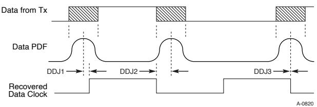

Uncorrelated Total Jitter (UTJ) and uncorrelated deterministic jitter (Dual Dirac model) (UDJDD) are referenced to a recovered data clock generated by means of a CDR tracking function. Uncorrelated jitter may be derived after removing the DDJ component from each PDF and combining the PDFs for all edges in the pattern. By appropriately converting the PDF to a Q-scale it is possible to obtain the graphical relation shown in § Figure 8-19, from which TTX-UTJ and TTX-UDJDD may be derived. In § Figure 8-19 note that the two PDF curves are identical but that the fitted slopes, defined by 1/RJLH and 1/RJRH, may differ.

**A-0821A**
- Q = 0
- Q = 7
- Data clock crossing (×2)
- 1.0 UI – TTX-UTJ
- 1.0 UI – TTX-UDJ-DD
- 1.0 UI
- 1/RJLH
- 1/RJRH

> **Figure 8-19. Derivation of TTX-UTJ and TTX-UDJDD | TTX-UTJ 与 TTX-UDJDD 的推导**
> 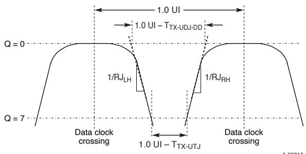

Random jitter is uncorrelated with respect to data dependent jitter. TTX-RJ may be obtained by subtracting TTX-UDJDD from TTX-UTJ and is included in the specification as an informative parameter only. It is typically used as a benchmark to characterize PLL performance.

Pulse width jitter is defined as an edge to edge phenomenon on consecutive edges nominally 1.0 UI apart. § Figure 8-20 illustrates how PWJ is defined, showing that it is typically present on both data edges of consecutive UI. To accurately quantify PWJ it is first necessary to remove the ISI contributions to PWJ. The shaded areas on either side of the unjittered edges represent the maximum amount of jitter about that edge. Note the jitter for one edge is assumed to be independent from the other.

### 8.3.5.8 Uncorrelated Total Jitter and Deterministic Jitter (Dual Dirac Model) (TTX-UTJ and TTX-UDJDD) §
### 8.3.5.9 Random Jitter (TTX-RJ) (informative) §
### 8.3.5.10 Uncorrelated Total and Deterministic PWJ (TTX-UPW-TJ and TTX-UPW-DJDD) §

</td>
<td style="background-color:#e8e8e8">

**A-0820**

- Data from Tx (来自 Tx 的数据)
- Data PDF (数据 PDF)
- Recovered Data Clock (恢复的数据时钟)
- DDJ1, DDJ2, DDJ3

非相关总抖动 (Uncorrelated Total Jitter, UTJ) 和非相关确定性抖动 (Dual Dirac 模型) (UDJDD) 参考通过 CDR 跟踪功能产生的恢复数据时钟。从每个 PDF 中移除 DDJ 分量，并将码型中所有边沿的 PDF 合并后，即可推导出非相关抖动。通过将 PDF 适当转换为 Q 尺度 (Q-scale)，即可得到 § Figure 8-19 所示的图形关系，并由此推导出 TTX-UTJ 和 TTX-UDJDD。需要注意的是,§ Figure 8-19 中两条 PDF 曲线相同，但由 1/RJLH 和 1/RJRH 定义的拟合斜率可能不同。

**A-0821A**
- Q = 0
- Q = 7
- Data clock crossing (数据时钟过零点)(×2)
- 1.0 UI – TTX-UTJ
- 1.0 UI – TTX-UDJ-DD
- 1.0 UI
- 1/RJLH
- 1/RJRH

随机抖动 (Random Jitter) 与数据相关抖动互不相关。TTX-RJ 可由 TTX-UTJ 减去 TTX-UDJDD 得到，在本规范中仅作为信息性参数 (informative) 给出。它通常用作表征 PLL 性能的基准。

脉宽抖动 (Pulse Width Jitter, PWJ) 定义为相邻两个边沿之间的边对边 (edge-to-edge) 现象，标称间隔为 1.0 UI。§ Figure 8-20 说明了 PWJ 的定义方式，显示其通常同时出现在连续 UI 的两个数据边沿上。为准确量化 PWJ,首先必须去除 ISI 对 PWJ 的贡献。无抖动边沿两侧的阴影区域表示该边沿抖动的最大值。需要注意的是，一个边沿的抖动假定与另一个边沿相互独立。

### 8.3.5.8 非相关总抖动和确定性抖动 (Dual Dirac 模型) (TTX-UTJ 与 TTX-UDJDD) §
### 8.3.5.9 随机抖动 (TTX-RJ) (信息性) §
### 8.3.5.10 非相关总 PWJ 与确定性 PWJ (TTX-UPW-TJ 与 TTX-UPW-DJDD) §


</td>
</tr>
</tbody>
</table>
</div>


[⬆️ 返回目录](#sec-8-0)

---

<!-- 📄 Page 1436 -->
---

<a id="sec-8-3-5-10-fig-8-20-21"></a>
## 8.3.5.10 Uncorrelated Total and Deterministic PWJ — Figures 8-20 & 8-21 | 非相关总与确定性 PWJ — 图 8-20 与 8-21

<table>
<thead>
<tr>
<th width="50%">🇬🇧 English</th>
<th width="50%" style="background-color:#e8e8e8">🏆 中文</th>
</tr>
</thead>
<tbody>
<tr>
<td>

An equivalent description of PWJ may be obtained by referencing to a fixed leading edge and having jitter contributions from both edges appear at the trailing edge. This approach yields a single PDF as shown below. Each 1 UI wide pulse in the pattern will have a different median for this PDF which is caused by ISI and F/2 jitter. The average of the medians for 1 UI wide pulses at odd and even UI numbers within the pattern are calculated, and the odd and even PDF's are normalized to the appropriate average of medians and summed to form an odd UI PDF and an even UI PDF. The final PDF is calculated from the sum of the summed odd and even UI PDFs. The key idea here is that the final PDF for uncorrelated PWJ should include F/2 or odd/even UI jitter

> **Figure 8-20. PWJ Relative to Consecutive Edges 1 UI Apart | 相对于间隔 1 UI 的相邻边沿的 PWJ**
> 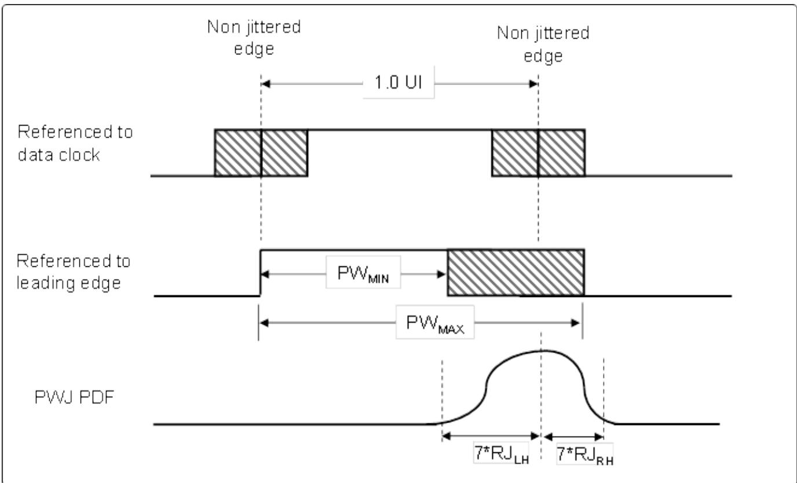

The PDF of jitter around each non-jittered edge may be converted into the Q-scale (see § Figure 8-21) from which TTX-UPW-TJ and TTX-UPW-DJDD may be derived in a manner analogous to TTX-UTJ and TTX-UDJDD. Note that the PDF may not be symmetric, and the tail of interest is RJLH, since it represents pulse compression.

**A-0823A**
- Q = 0
- Q = 7
- 1.0 UI
- TTX-UPW-DJDD
- TTX-UPW-TJ
- 1 UI – TTX-UPW-TJ/2

> **Figure 8-21. Definition of TTX-UPW-DJDD and TTX-UPW-TJ Data Rate Dependent Transmitter Parameters | TTX-UPW-DJDD 与 TTX-UPW-TJ 的定义 — 速率相关发送器参数**
> 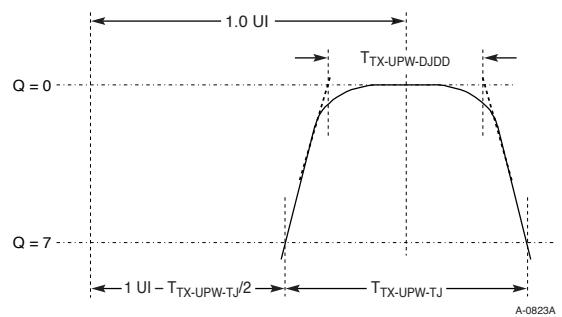

</td>
<td style="background-color:#e8e8e8">

PWJ 的等价描述可通过参考固定的引导边 (leading edge) 并将两个边沿的抖动贡献同时体现在后随边 (trailing edge) 上得到。该方法产生如下图所示的单一 PDF。码型中每个 1 UI 宽脉冲在该 PDF 下将具有不同的中位数，这是由 ISI 和 F/2 抖动引起的。对码型中奇数 UI 和偶数 UI 位置上 1 UI 宽脉冲的中位数分别取平均，再将奇、偶 PDF 按对应中位数平均值归一化后相加，得到奇 UI PDF 和偶 UI PDF。最终的 PDF 由奇 UI 与偶 UI PDF 之和计算得到。其核心思想是:非相关 PWJ 的最终 PDF 应当包含 F/2 或奇/偶 UI 抖动。

每个无抖动边沿周围的抖动 PDF 可转换为 Q 尺度 (见 § Figure 8-21)，并以与 TTX-UTJ 和 TTX-UDJDD 推导类似的方式推导出 TTX-UPW-TJ 和 TTX-UPW-DJDD。需要注意的是,PDF 可能并非对称，而我们关心的尾部分布为 RJLH,因为它代表脉冲压缩。

**A-0823A**
- Q = 0
- Q = 7
- 1.0 UI
- TTX-UPW-DJDD
- TTX-UPW-TJ
- 1 UI – TTX-UPW-TJ/2


</td>
</tr>
</tbody>
</table>

[⬆️ 返回目录](#sec-8-0)

---

<!-- 📄 Page 1437 -->
---

<a id="sec-8-3-6"></a>
## 8.3.6 Data Rate Dependent Parameters | 速率相关参数


<div style="overflow-x: auto; max-width: 100%;">
<table>
<thead>
<tr>
<th width="50%">🇬🇧 English</th>
<th width="50%" style="background-color:#e8e8e8">🏆 中文</th>
</tr>
</thead>
<tbody>
<tr>
<td>

**Note:** the jitter margins for 2.5 GT/s and 5.0 GT/s were previously defined at the device's pins. For 2.5 GT/s the jitter was defined via a single parameter that lumped DDJ, UDJDD, UTJ, PWJ-DDJ and PWJ-TJ into a single quantity. Consequently, it is necessary to first remove the DDj jitter component. Since there was no previous UDj-UTj separation TTX-UTJ and TTX-UDJDD are set equal to each other. Similarly, there was no UTj-PWj separation, so it is necessary to assume that the entirety of the uncorrelated jitter is PWJ that occurs oppositely on consecutive edges of a 1 UI wide pulse.

For 5.0 GT/s a similar removal of DDj must be performed to obtain UTj. However, [PCIe-3.0] for 5.0 GT/s did specify Rj, so a distinct value for TTX-UDJDD can be obtained. Similarly, [PCIe-3.0] for 5.0 GT/s defined a minimum pulse width, assumed to be 100% Dj, from which TTX-UPW-TJ and TTX-UPW-DJDD may be derived. For 64.0 GT/s PAM4 signaling, the voltage parameters such as differential peak-to-peak Tx voltage swing correspond to the swing between PAM4 voltage level 0 and voltage level 3.

</td>
<td style="background-color:#e8e8e8">

**注:** 2.5 GT/s 和 5.0 GT/s 的抖动裕量此前在器件引脚处定义。对于 2.5 GT/s,抖动由一个参数统一表示，该参数将 DDJ、UDJDD、UTJ、PWJ-DDJ 和 PWJ-TJ 合并为单一量。因此，必须首先移除 DDj 抖动分量。由于此前没有 UDj-UTj 的分离,TTX-UTJ 与 TTX-UDJDD 设置为相等。同样，此前没有 UTj-PWj 的分离，因此必须假设全部非相关抖动均作为 PWJ 出现在 1 UI 宽脉冲相邻边沿的两侧。

对于 5.0 GT/s,必须执行类似的 DDj 移除以得到 UTj。然而 [PCIe-3.0] 规范针对 5.0 GT/s 规定了 Rj,因此可以得到 TTX-UDJDD 的一个具体数值。同样,[PCIe-3.0] 针对 5.0 GT/s 规定了最小脉宽 (假定为 100% Dj)，并由此可推导出 TTX-UPW-TJ 和 TTX-UPW-DJDD。对于 64.0 GT/s 的 PAM4 信号，差分峰峰值 Tx 电压摆幅等电压参数对应 PAM4 电压电平 0 与电压电平 3 之间的摆幅。

</td>
</tr>
</tbody>
</table>
</div>


[⬆️ 返回目录](#sec-8-0)

---

**Table 8-6. Data Rate Dependent Transmitter Parameters | 表 8-6. 速率相关发送器参数**

| Symbol | Parameter description | 2.5 GT/s | 5.0 GT/s | 8.0 GT/s | 16.0 GT/s | 32.0 GT/s | 64.0 GT/s | Units | Notes |
|--------|----------------------|----------|----------|----------|-----------|-----------|-----------|-------|-------|
| UI (Tx) | Unit Interval | (min) 399.88 / (max) 400.12 (300 PPM) | (min) 199.94 / (max) 200.06 (300 PPM) | (min) 124.9625 / (max) 125.0375 (300 PPM) | (min) 62.48125 / (max) 62.51875 (300 PPM) | (min) 31.246875 / (max) 31.253125 (100 PPM) | (min) 31.246875 / (max) 31.253125 (100 PPM) | ps | Does not include SSC variations |
| BWTX-PKG-PLL1 | Tx PLL bandwidth corresponding to PKGTX-PLL1 | (min) 1.5 / (max) 22.0 | (min) 8.0 / (max) 16.0 | (min) 0.5 / (max) 4.0 | (min) 0.5 / (max) 4.0 | (min) 0.5 / (max) 1.8 | (min) 0.5 / (max) 1.0 | MHz | Second order PLL jitter transfer bounding function. Notes 1, 2, 9. |
| BWTX-PKG-PLL2 | Tx PLL bandwidth corresponding to PKGTX-PLL2 | N/A | (min) 5.0 / (max) 16.0 | (min) 0.5 / (max) 5.0 | (min) 0.5 / (max) 5.0 | N/A | N/A | MHz | 2.5 and 32.0 GT/s specify only one combination of PLL BW and jitter. Notes 1, 2, 9. |
| PKGTX-PLL1 | Tx PLL peaking corresponding to BWTX-PKG-PLL1 | (max) 3.0 | (max) 3.0 | (max) 2.0 | (max) 2.0 | (max) 2.0 | (max) 2.0 | dB | Second order PLL jitter transfer bounding function. Notes 1, 2. |
| PKGTX-PLL2 | Tx PLL peaking corresponding to BWTX-PKG-PLL2 | N/A | (max) 1.0 | (max) 1.0 | (max) 1.0 | N/A | N/A | dB | 2.5 and 32.0 GT/s specify only one combination of PLL BW and jitter. Notes 1, 2. |
| VTX-DIFF-PP | Differential peak-peak Tx voltage swing for full swing operation | (min) 800 / (max) 1000 | (min) 800 / (max) 1000 | (min) 800 / (max) 1000 | (min) 800 / (max) 1000 | (min) 800 / (max) 1000 | (min) 800 / (max) 1000 | mVPP | As measured with compliance test load. Defined as 2 × \|VTXD+ − VTXD-\|. Note 3. |
| VTX-DIFF-PP-LOW | Differential peak-peak Tx voltage swing for low swing operation | (min) 400 / (max) 1000 | (min) 400 / (max) 1000 | (min) 400 / (max) 1000 | (min) 400 / (max) 1000 | (min) 400 / (max) 1000 | (min) 400 / (max) 1000 | mVPP | As measured with compliance test load. Defined as 2 × \|VTXD+ − VTXD-\|. Note 3. |

[⬆️ 返回目录](#sec-8-0)

---

<!-- 📄 Page 1438 -->
---

<a id="sec-8-3-6-cont"></a>
## 8.3.6 Data Rate Dependent Parameters (cont.) — Table 8-6 (cont.) | 速率相关参数 (续) — 表 8-6 (续)

<table>
<thead>
<tr>
<th width="50%">🇬🇧 English</th>
<th width="50%" style="background-color:#e8e8e8">🏆 中文</th>
</tr>
</thead>
<tbody>
<tr>
<td>

**Table 8-6 (continued). Data Rate Dependent Transmitter Parameters | 表 8-6 (续). 速率相关发送器参数**

| Symbol | Parameter description | 2.5 GT/s | 5.0 GT/s | 8.0 GT/s | 16.0 GT/s | 32.0 GT/s | 64.0 GT/s | Units | Notes |
|--------|----------------------|----------|----------|----------|-----------|-----------|-----------|-------|-------|
| VTX-EIEOS-FS | Minimum voltage swing during EIEOS for full swing signaling | N/A | N/A | 250 (min) | 250 (min) | 250 (min) | 250 (min) | mVPP | Note 4 |
| VTX-EIEOS-RS | Minimum voltage swing during EIEOS for reduced swing signaling | N/A | N/A | 232 (min) | 232 (min) | 232 (min) | 232 (min) | mVPP | Note 4 |
| ps21TX-ROOT-DEVICE | Pseudo package loss of a device containing root port | N/A | N/A | (max) 3.0 | (max) 5.0 | (max) 8.5 | (max) 7.5 | dB | Note 5. |
| ps21TX-NON-ROOT-DEVICE | Pseudo package loss for all devices not containing root ports | N/A | N/A | (max) 3.0 | (max) 3.0 | (max) 3.7 | (max) 3.7 | dB | Note 5. |
| ILfitTX-ROOT-DEVICE | Fitted insertion loss at Nyquist | N/A | N/A | N/A | N/A | (max) 9.0 | (max) 8.0 | dB | Note 8 |
| ILfitTX-NON-ROOT-DEVICE | Fitted insertion loss at Nyquist | N/A | N/A | N/A | N/A | (max) 4.0 | (max) 4.0 | dB | Note 8 |
| VTX-BOOST-FS | Maximum nominal Tx boost ratio for full swing | N/A | N/A | 8.0 | 8.0 (min) | 8.0 (min) | 8.0 (min) | dB | Nominal boost beyond 8.0 dB is limited to guarantee that ps21TX limits are satisfied. |
| VTX-BOOST-RS | Maximum nominal Tx boost ratio for reduced swing | N/A | N/A | 2.5 | ~2.5 (min) | ~2.5 (min) | ~2.5 (min) | dB | Assumes ±1.0 dB tolerance from diagonal elements in § Figure 8-9. |
| EQTX-COEFF-RES | Tx coefficient resolution | N/A | N/A | 1/(min) 63 / 1/(max) 24 | 1/(min) 63 / 1/(max) 24 | 1/(min) 63 / 1/(max) 24 | 1/(min) 63 / 1/(max) 24 | N/A | |

</td>
<td style="background-color:#e8e8e8">

**Table 8-6 (continued). Data Rate Dependent Transmitter Parameters | 表 8-6 (续). 速率相关发送器参数**

| Symbol | Parameter description | 2.5 GT/s | 5.0 GT/s | 8.0 GT/s | 16.0 GT/s | 32.0 GT/s | 64.0 GT/s | Units | Notes |
|--------|----------------------|----------|----------|----------|-----------|-----------|-----------|-------|-------|
| VTX-EIEOS-FS | Minimum voltage swing during EIEOS for full swing signaling | N/A | N/A | 250 (min) | 250 (min) | 250 (min) | 250 (min) | mVPP | Note 4 |
| VTX-EIEOS-RS | Minimum voltage swing during EIEOS for reduced swing signaling | N/A | N/A | 232 (min) | 232 (min) | 232 (min) | 232 (min) | mVPP | Note 4 |
| ps21TX-ROOT-DEVICE | Pseudo package loss of a device containing root port | N/A | N/A | (max) 3.0 | (max) 5.0 | (max) 8.5 | (max) 7.5 | dB | Note 5. |
| ps21TX-NON-ROOT-DEVICE | Pseudo package loss for all devices not containing root ports | N/A | N/A | (max) 3.0 | (max) 3.0 | (max) 3.7 | (max) 3.7 | dB | Note 5. |
| ILfitTX-ROOT-DEVICE | Fitted insertion loss at Nyquist | N/A | N/A | N/A | N/A | (max) 9.0 | (max) 8.0 | dB | Note 8 |
| ILfitTX-NON-ROOT-DEVICE | Fitted insertion loss at Nyquist | N/A | N/A | N/A | N/A | (max) 4.0 | (max) 4.0 | dB | Note 8 |
| VTX-BOOST-FS | Maximum nominal Tx boost ratio for full swing | N/A | N/A | 8.0 | 8.0 (min) | 8.0 (min) | 8.0 (min) | dB | Nominal boost beyond 8.0 dB is limited to guarantee that ps21TX limits are satisfied. |
| VTX-BOOST-RS | Maximum nominal Tx boost ratio for reduced swing | N/A | N/A | 2.5 | ~2.5 (min) | ~2.5 (min) | ~2.5 (min) | dB | Assumes ±1.0 dB tolerance from diagonal elements in § Figure 8-9. |
| EQTX-COEFF-RES | Tx coefficient resolution | N/A | N/A | 1/(min) 63 / 1/(max) 24 | 1/(min) 63 / 1/(max) 24 | 1/(min) 63 / 1/(max) 24 | 1/(min) 63 / 1/(max) 24 | N/A | |

</td>
</tr>
</tbody>
</table>

[⬆️ 返回目录](#sec-8-0)

---

<!-- 📄 Page 1439 -->
---

<a id="sec-8-3-6-cont-2"></a>
## 8.3.6 Data Rate Dependent Parameters (cont.) — Table 8-6 (cont. 2) | 速率相关参数 (续) — 表 8-6 (续 2)


<div style="overflow-x: auto; max-width: 100%;">
<table>
<thead>
<tr>
<th width="50%">🇬🇧 English</th>
<th width="50%" style="background-color:#e8e8e8">🏆 中文</th>
</tr>
</thead>
<tbody>
<tr>
<td>

**Table 8-6 (continued). Data Rate Dependent Transmitter Parameters | 表 8-6 (续). 速率相关发送器参数**

| Symbol | Parameter description | 2.5 GT/s | 5.0 GT/s | 8.0 GT/s | 16.0 GT/s | 32.0 GT/s | 64.0 GT/s | Units | Notes |
|--------|----------------------|----------|----------|----------|-----------|-----------|-----------|-------|-------|
| VTX-DE-RATIO-3.5dB | Tx de-emphasis ratio for 2.5 and 5.0 GT/s | (min) 2.5 / (max) 4.5 | (min) 2.5 / (max) 4.5 | N/A | N/A | N/A | N/A | dB | |
| VTX-DE-RATIO-6dB | Tx de-emphasis ratio for 5.0 GT/s | N/A | (min) 4.5 / (max) 7.5 | N/A | N/A | N/A | N/A | dB | |
| TTX-UTJ | Tx uncorrelated total jitter | (max) 100 | (max) 50 | (max) 27.55 | (max) 11.8 | (max) 6.25 | (max) 4.00 at 10⁻⁶ | ps PP at 10⁻¹² | See § Section 8.3.5.8 for details. |
| TTX-UTJ-SRIS | Tx uncorrelated total jitter when testing for the IR clock mode with SSC | (max) 100 | (max) 66.51 | (max) 33.83 | (max) 15.85 | (max) 7.15 | (max) 4.389 at 10⁻⁶ | ps PP at 10⁻¹² | See § Section 8.3.5.8 for details. |
| TTX-UDJDD | Tx uncorrelated Dj for non-embedded Refclk | (max) 100 | (max) 30 | (max) 12 | (max) 6.25 | (max) 3.125 | (max) 1.563 | ps PP | See § Section 8.3.5.8 for details. |
| TTX-UPW-TJ | Total uncorrelated pulse width jitter | N/A | (max) 40 | (max) 24 | (max) 12.5 | (max) 6.25 | (max) 4.00 at 10⁻⁶ | ps PP at 10⁻¹² | See § Section 8.3.5.8 for details. |
| TTX-RJ | Tx Random jitter | N/A | 1.4 - 3.6 | 1.17 - 1.97 | 0.40 - 0.84 | 0.23 - 0.45 | 0.26 - 0.42 | ps RMS | Informative parameter only. Range of Rj possible with zero to maximum allowed TTX-UDJDD. |
| TTX-UPW-DJDD | Deterministic DjDD uncorrelated pulse width jitter | N/A | (max) 40 | (max) 10 | (max) 5 | (max) 2.5 | (max) 1.25 | ps PP | See § Section 8.3.5.8 for details. |
| RLM-TX | Level Separation Mismatch Ratio | N/A | N/A | N/A | N/A | N/A | (min) 0.95 | | See § Section 8.3.3.13 for details |
| SNDRTX | Signal-to-Noise-Distortion Ratio | NA | NA | NA | NA | NA | (min) 34 | dB | See § Section 8.3.3.12 for details |
| VTX-AC-CM-PP | Tx AC peak-peak common mode voltage over 0.03-500 MHz range | (max) 150 | (max) 100 | (max) 50 | (max) 50 | (max) 50 | (max) 25 | mVPP | Tx ACCM noise measurement analysis is done without any de-embedding. |

</td>
<td style="background-color:#e8e8e8">

**Table 8-6 (续). 速率相关发送器参数 | 表 8-6 (续). 速率相关发送器参数**

| Symbol | Parameter description | 2.5 GT/s | 5.0 GT/s | 8.0 GT/s | 16.0 GT/s | 32.0 GT/s | 64.0 GT/s | Units | Notes |
|--------|----------------------|----------|----------|----------|-----------|-----------|-----------|-------|-------|
| VTX-DE-RATIO-3.5dB | Tx de-emphasis ratio for 2.5 and 5.0 GT/s | (min) 2.5 / (max) 4.5 | (min) 2.5 / (max) 4.5 | N/A | N/A | N/A | N/A | dB | |
| VTX-DE-RATIO-6dB | Tx de-emphasis ratio for 5.0 GT/s | N/A | (min) 4.5 / (max) 7.5 | N/A | N/A | N/A | N/A | dB | |
| TTX-UTJ | Tx uncorrelated total jitter | (max) 100 | (max) 50 | (max) 27.55 | (max) 11.8 | (max) 6.25 | (max) 4.00 at 10⁻⁶ | ps PP at 10⁻¹² | See § Section 8.3.5.8 for details. |
| TTX-UTJ-SRIS | Tx uncorrelated total jitter when testing for the IR clock mode with SSC | (max) 100 | (max) 66.51 | (max) 33.83 | (max) 15.85 | (max) 7.15 | (max) 4.389 at 10⁻⁶ | ps PP at 10⁻¹² | See § Section 8.3.5.8 for details. |
| TTX-UDJDD | Tx uncorrelated Dj for non-embedded Refclk | (max) 100 | (max) 30 | (max) 12 | (max) 6.25 | (max) 3.125 | (max) 1.563 | ps PP | See § Section 8.3.5.8 for details. |
| TTX-UPW-TJ | Total uncorrelated pulse width jitter | N/A | (max) 40 | (max) 24 | (max) 12.5 | (max) 6.25 | (max) 4.00 at 10⁻⁶ | ps PP at 10⁻¹² | See § Section 8.3.5.8 for details. |
| TTX-RJ | Tx Random jitter | N/A | 1.4 - 3.6 | 1.17 - 1.97 | 0.40 - 0.84 | 0.23 - 0.45 | 0.26 - 0.42 | ps RMS | Informative parameter only. Range of Rj possible with zero to maximum allowed TTX-UDJDD. |
| TTX-UPW-DJDD | Deterministic DjDD uncorrelated pulse width jitter | N/A | (max) 40 | (max) 10 | (max) 5 | (max) 2.5 | (max) 1.25 | ps PP | See § Section 8.3.5.8 for details. |
| RLM-TX | Level Separation Mismatch Ratio | N/A | N/A | N/A | N/A | N/A | (min) 0.95 | | See § Section 8.3.3.13 for details |
| SNDRTX | Signal-to-Noise-Distortion Ratio | NA | NA | NA | NA | NA | (min) 34 | dB | See § Section 8.3.3.12 for details |
| VTX-AC-CM-PP | Tx AC peak-peak common mode voltage over 0.03-500 MHz range | (max) 150 | (max) 100 | (max) 50 | (max) 50 | (max) 50 | (max) 25 | mVPP | Tx ACCM noise measurement analysis is done without any de-embedding. |

</td>
</tr>
</tbody>
</table>
</div>


[⬆️ 返回目录](#sec-8-0)

---

<!-- 📄 Page 1440 -->
---

<a id="sec-8-3-6-notes"></a>
## 8.3.6 Data Rate Dependent Parameters — Table 8-6 (final) & Notes | 速率相关参数 — 表 8-6 (结尾) 与注释

<table>
<thead>
<tr>
<th width="50%">🇬🇧 English</th>
<th width="50%" style="background-color:#e8e8e8">🏆 中文</th>
</tr>
</thead>
<tbody>
<tr>
<td>

**Table 8-6 (continued). Data Rate Dependent Transmitter Parameters | 表 8-6 (续). 速率相关发送器参数**

| Symbol | Parameter description | 2.5 GT/s | 5.0 GT/s | 8.0 GT/s | 16.0 GT/s | 32.0 GT/s | 64.0 GT/s | Units | Notes |
|--------|----------------------|----------|----------|----------|-----------|-----------|-----------|-------|-------|
| VTX-AC-CM-PP-filtered | Tx AC peak-peak common mode voltage filtered with a simple low-pass filter (-3 dB roll-off at Nyquist frequency) | (max) 150 | (max) 150 | (max) 150 | (max) 150 | (max) 150 | (max) 75 | mVPP | Tx ACCM noise measurement analysis is done without any de-embedding. |
| LTX-SKEW | Lane-to-Lane Output Skew | (max) 2.5 | (max) 2.0 | (max) 1.5 | (max) 1.25 | (max) 1.25 | (max) 1.25 | ns | Between any two Lanes within a single Transmitter. |
| RLTX-DIFF | Tx package plus die differential return loss | See § Figure 8-24 | See § Figure 8-24 | | | | | dB | Note 6 |
| RLTX-CM | Tx package plus die common mode return loss | See § Figure 8-23 | See § Figure 8-25 | | | | | dB | Note 6 |

**Notes:**

1. A single combination of PLL BW and peaking is specified for 2.5, 32.0, and 64.0 GT/s implementations. For other data rates, two combinations of PLL BW and peaking are specified to permit designers to make a tradeoff between the two parameters.
2. The Tx PLL Bandwidth must lie between the min and max ranges given in the above table. PLL peaking must lie below the value listed above. Note: the PLL B/W extends from zero up to the value(s) specified in the above table. The PLL BW is defined at the point where its transfer function crosses the -3dB point.
3. See § Section 8.3.3.6 and § Section 8.3.3.7 for measurement details.
4. VTX-EIEOS-FS and VTX-EIEOS-RS are measured at the device pin and include package loss. Voltage limits comprehend both full swing and reduced swing modes. A Transmitter must advertise a value for LF during TS1 at 8.0, 16.0, 32.0, and 64.0 GT/s that ensures that these parameters are met.
5. The numbers above consider measurement error. For some Tx package/driver combinations ps21TX may be greater than 0 dB. The channel compliance methodology at 2.5 and 5.0 GT/s assumes the 8.0 GT/s package model.
6. The DUT must be powered up and DC isolated, and its data+/data- outputs must be in the low-Z state at a static value.
7. The reference plane for all parameters at 2.5 and 5.0 GT/s is the package pins.
8. These are design parameter requirements - a specific test methodology for them is not defined.
9. For PCIe 6.0 devices that do not support 32.0 and 64.0 GT/s have the option to use 2 MHz as min of BWTX-PKG-PLL1 and BWTX-PKG-PLL2 for both 8.0 and 16.0 GT/s. The corresponding TTX-UTJ max value is 31.25 ps at 8.0 GT/s and 12.5 ps at 16.0 GT/s. The range of TTX-RJ is 1.4-2.2 ps at 8.0 GT/s and 0.45-0.89 ps at 16.0 GT/s. Such devices also have the option to use 1st-order, 10 MHz CDR filter for testing Tx, Reference clock, and CC Rx.

Return loss measurements for the Tx and Rx are essentially identical, so both are included in the Transmitter section. Return loss measurements are made at the end of the respective breakout channels and require that the breakout

</td>
<td style="background-color:#e8e8e8">

**Table 8-6 (续). 速率相关发送器参数 | 表 8-6 (续). 速率相关发送器参数**

| Symbol | Parameter description | 2.5 GT/s | 5.0 GT/s | 8.0 GT/s | 16.0 GT/s | 32.0 GT/s | 64.0 GT/s | Units | Notes |
|--------|----------------------|----------|----------|----------|-----------|-----------|-----------|-------|-------|
| VTX-AC-CM-PP-filtered | Tx AC peak-peak common mode voltage filtered with a simple low-pass filter (-3 dB roll-off at Nyquist frequency) | (max) 150 | (max) 150 | (max) 150 | (max) 150 | (max) 150 | (max) 75 | mVPP | Tx ACCM noise measurement analysis is done without any de-embedding. |
| LTX-SKEW | Lane-to-Lane Output Skew | (max) 2.5 | (max) 2.0 | (max) 1.5 | (max) 1.25 | (max) 1.25 | (max) 1.25 | ns | Between any two Lanes within a single Transmitter. |
| RLTX-DIFF | Tx package plus die differential return loss | See § Figure 8-24 | See § Figure 8-24 | | | | | dB | Note 6 |
| RLTX-CM | Tx package plus die common mode return loss | See § Figure 8-23 | See § Figure 8-25 | | | | | dB | Note 6 |

**Notes (注释):**

1. A single combination of PLL BW and peaking is specified for 2.5, 32.0, and 64.0 GT/s implementations. For other data rates, two combinations of PLL BW and peaking are specified to permit designers to make a tradeoff between the two parameters. (2.5、32.0 和 64.0 GT/s 实现仅指定 PLL BW 与峰化的一种组合;其他数据速率则指定 PLL BW 与峰化的两种组合，允许设计者在两参数间进行权衡。)
2. The Tx PLL Bandwidth must lie between the min and max ranges given in the above table. PLL peaking must lie below the value listed above. Note: the PLL B/W extends from zero up to the value(s) specified in the above table. The PLL BW is defined at the point where its transfer function crosses the -3dB point. (Tx PLL 带宽必须落在上表所列 min 与 max 范围之间;PLL 峰化必须低于上表所列值。注:PLL 带宽从 0 一直延伸至上表所列值。PLL BW 定义为其传递函数穿越 -3dB 点的位置。)
3. See § Section 8.3.3.6 and § Section 8.3.3.7 for measurement details. (测量细节请参见 § Section 8.3.3.6 与 § Section 8.3.3.7。)
4. VTX-EIEOS-FS and VTX-EIEOS-RS are measured at the device pin and include package loss. Voltage limits comprehend both full swing and reduced swing modes. A Transmitter must advertise a value for LF during TS1 at 8.0, 16.0, 32.0, and 64.0 GT/s that ensures that these parameters are met. (VTX-EIEOS-FS 与 VTX-EIEOS-RS 在器件引脚处测量，包含封装损耗。电压限值同时涵盖全摆幅与减幅模式。发送器必须在 8.0、16.0、32.0 和 64.0 GT/s 的 TS1 中通告一个 LF 值，以保证满足这些参数要求。)
5. The numbers above consider measurement error. For some Tx package/driver combinations ps21TX may be greater than 0 dB. The channel compliance methodology at 2.5 and 5.0 GT/s assumes the 8.0 GT/s package model. (上述数值已考虑测量误差。对于某些 Tx 封装/驱动器组合,ps21TX 可能大于 0 dB。2.5 GT/s 和 5.0 GT/s 的通道一致性方法假设采用 8.0 GT/s 封装模型。)
6. The DUT must be powered up and DC isolated, and its data+/data- outputs must be in the low-Z state at a static value. (DUT 必须上电并直流隔离，其 data+/data- 输出必须处于低阻 (low-Z) 状态下的某一静态值。)
7. The reference plane for all parameters at 2.5 and 5.0 GT/s is the package pins. (2.5 GT/s 和 5.0 GT/s 下所有参数的参考平面均为封装引脚。)
8. These are design parameter requirements - a specific test methodology for them is not defined. (这些为设计参数要求 — 未为其定义具体测试方法。)
9. For PCIe 6.0 devices that do not support 32.0 and 64.0 GT/s have the option to use 2 MHz as min of BWTX-PKG-PLL1 and BWTX-PKG-PLL2 for both 8.0 and 16.0 GT/s. The corresponding TTX-UTJ max value is 31.25 ps at 8.0 GT/s and 12.5 ps at 16.0 GT/s. The range of TTX-RJ is 1.4-2.2 ps at 8.0 GT/s and 0.45-0.89 ps at 16.0 GT/s. Such devices also have the option to use 1st-order, 10 MHz CDR filter for testing Tx, Reference clock, and CC Rx. (对于不支持 32.0 和 64.0 GT/s 的 PCIe 6.0 器件，可在 8.0 GT/s 和 16.0 GT/s 下选择将 BWTX-PKG-PLL1 与 BWTX-PKG-PLL2 的最小值设为 2 MHz。对应的 TTX-UTJ 最大值为 31.25 ps (8.0 GT/s) 和 12.5 ps (16.0 GT/s);TTX-RJ 范围为 1.4-2.2 ps (8.0 GT/s) 和 0.45-0.89 ps (16.0 GT/s)。此类器件还可选择使用 1 阶 10 MHz CDR 滤波器来测试 Tx、参考时钟以及 CC Rx。)

Return loss measurements for the Tx and Rx are essentially identical, so both are included in the Transmitter section. Return loss measurements are made at the end of the respective breakout channels and require that the breakout

</td>
</tr>
</tbody>
</table>

[⬆️ 返回目录](#sec-8-0)

---


---

<a id="sec-8-3-7"></a>
## 8.3.7 2.5、5.0、8.0、16.0 和 32.0 GT/s 的 Tx 与 Rx 回波损耗 (Tx and Rx Return Loss for 2.5, 5.0, 8.0, 16.0, and 32.0 GT/s)

<table>
<thead>
<tr>
<th width="50%">🇬🇧 English</th>
<th width="50%" style="background-color:#e8e8e8">🏆 中文</th>
</tr>
</thead>
<tbody>
<tr>
<td>

channel's contribution to RL be de-embedded, thereby associating the return loss with the Tx or Rx pin. Return loss measurements are made with a reference impedance of 50 ohms. § Figure 8-22 defines the pass/fail mask for differential return loss for 2.5, 5.0, 8.0, 16.0, and 32.0 GT/s. Both differential and common mode are defined over a frequency range of 50 MHz to 16.0 GHz.

</td>
<td style="background-color:#e8e8e8">

需要将通道对回波损耗 (RL) 的贡献进行去嵌入 (de-embedded)，从而将回波损耗与 Tx 或 Rx 引脚关联。回波损耗测量以 50 Ω 为参考阻抗。§ Figure 8-22 定义了 2.5、5.0、8.0、16.0 和 32.0 GT/s 下差分回波损耗的通过/失效掩码 (pass/fail mask)。差分和共模回波损耗均在 50 MHz 至 16.0 GHz 的频率范围内定义。

</td>
</tr>
</tbody>
</table>

> **Figure 8-22.** Tx, Rx Differential Return Loss Mask with 50 Ohm Reference
> 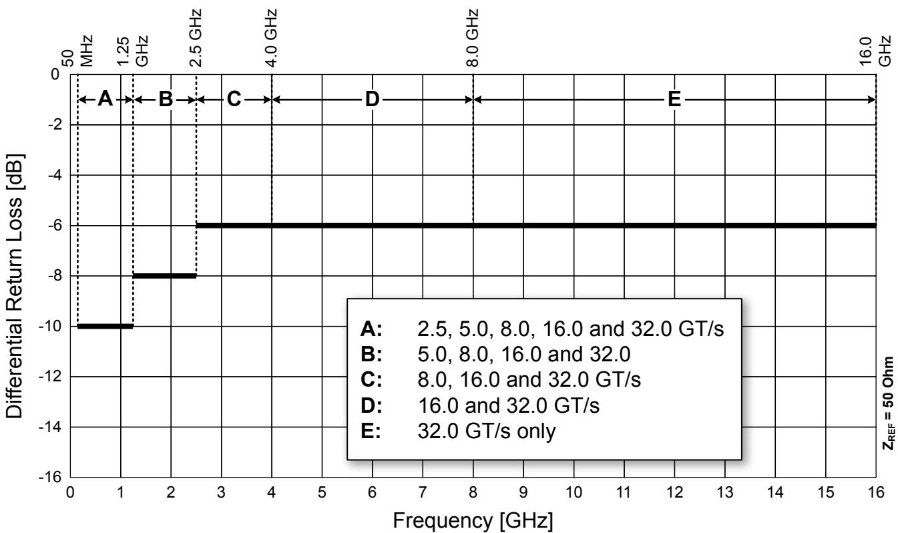

[⬆️ 返回目录](#sec-8-0)

---

<a id="sec-8-3-7-fig-8-23"></a>
### 8.3.7 图 8-23 共模回波损耗掩码 (Figure 8-23 Common Mode Return Loss Mask)

<table>
<thead>
<tr>
<th width="50%">🇬🇧 English</th>
<th width="50%" style="background-color:#e8e8e8">🏆 中文</th>
</tr>
</thead>
<tbody>
<tr>
<td>

The pass/fail mask for common mode return loss is shown in § Figure 8-23 for 2.5, 5.0, 8.0, 16.0, and 32.0 GT/s. Return loss measurements require that both the Tx and Rx are powered up and that their respective termination circuits are enabled.

Microprobing the package may be required to measure RL accurately. §

</td>
<td style="background-color:#e8e8e8">

§ Figure 8-23 给出了 2.5、5.0、8.0、16.0 和 32.0 GT/s 下的共模回波损耗通过/失效掩码。回波损耗测量要求 Tx 和 Rx 都上电，且各自的端接电路都已使能。

为了准确测量 RL,可能需要对封装 (package) 进行微探针测试 (Microprobing)。§

</td>
</tr>
</tbody>
</table>

> **Figure 8-23.** Tx, Rx Common Mode Return Loss Mask with 50 Ohm Reference
> 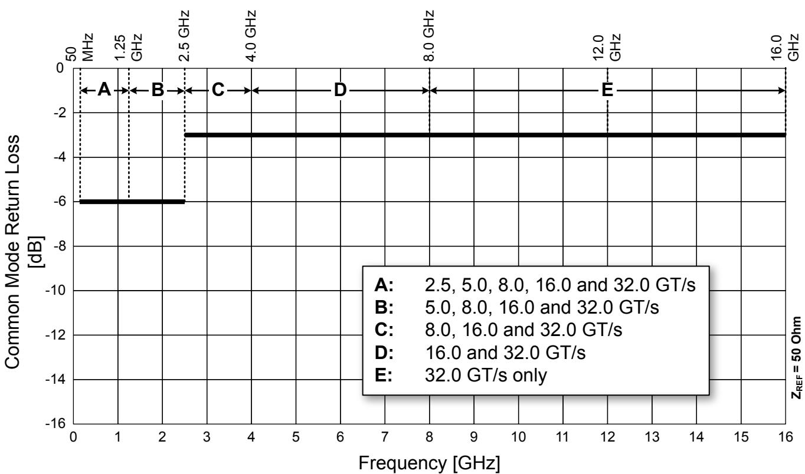

[⬆️ 返回目录](#sec-8-0)

---

<a id="sec-8-3-8"></a>
## 8.3.8 64.0 GT/s 的 Tx 与 Rx 回波损耗 (Tx and Rx Return Loss for 64.0 GT/s)

<table>
<thead>
<tr>
<th width="50%">🇬🇧 English</th>
<th width="50%" style="background-color:#e8e8e8">🏆 中文</th>
</tr>
</thead>
<tbody>
<tr>
<td>

§ Figure 8-24 defines the pass/fail mask for differential return loss for 64.0 GT/s with a single-ended reference impedance of 50 ohms. §

</td>
<td style="background-color:#e8e8e8">

§ Figure 8-24 定义了 64.0 GT/s 下差分回波损耗的通过/失效掩码，其单端参考阻抗为 50 Ω。§

</td>
</tr>
</tbody>
</table>

> **Figure 8-24.** 64.0 GT/s Tx, Rx Differential Return Loss Mask with 50 Ohm Reference
> 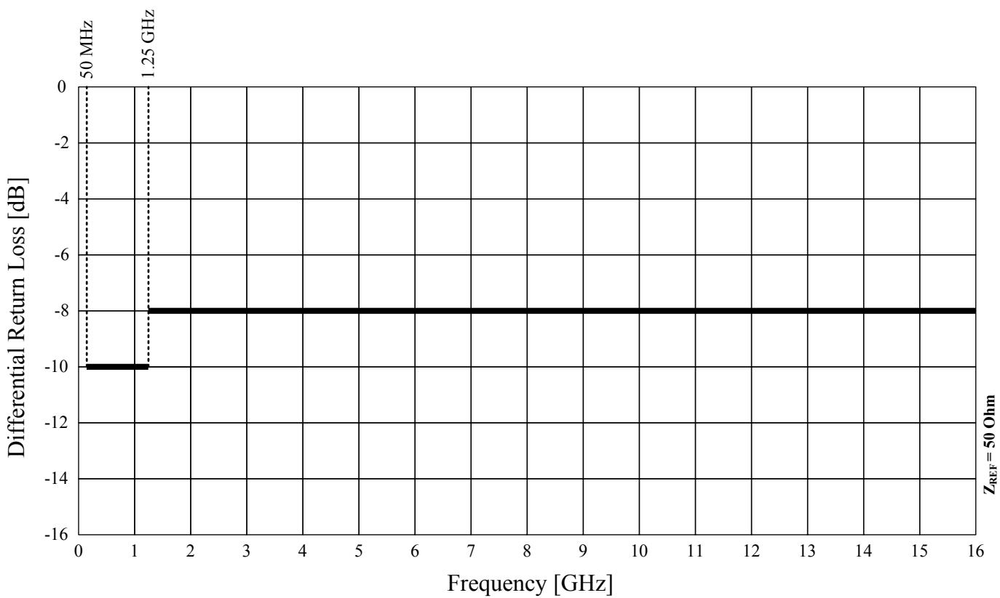

<table>
<thead>
<tr>
<th width="50%">🇬🇧 English</th>
<th width="50%" style="background-color:#e8e8e8">🏆 中文</th>
</tr>
</thead>
<tbody>
<tr>
<td>

§ Figure 8-25 defines the pass/fail mask for 64.0 GT/s common mode return loss with a single-ended reference impedance of 50 ohms. Return loss measurements require that both the Tx and Rx are powered up and that their respective termination circuits are enabled. Microprobing the package may be required to measure RL accurately. §

</td>
<td style="background-color:#e8e8e8">

§ Figure 8-25 定义了 64.0 GT/s 下共模回波损耗的通过/失效掩码，其单端参考阻抗为 50 Ω。回波损耗测量要求 Tx 和 Rx 都上电，且各自的端接电路都已使能。为了准确测量 RL,可能需要对封装进行微探针测试。§

</td>
</tr>
</tbody>
</table>

> **Figure 8-25.** 64.0 GT/s Tx, Rx Common Mode Return Loss Mask with 50 Ohm Reference
> 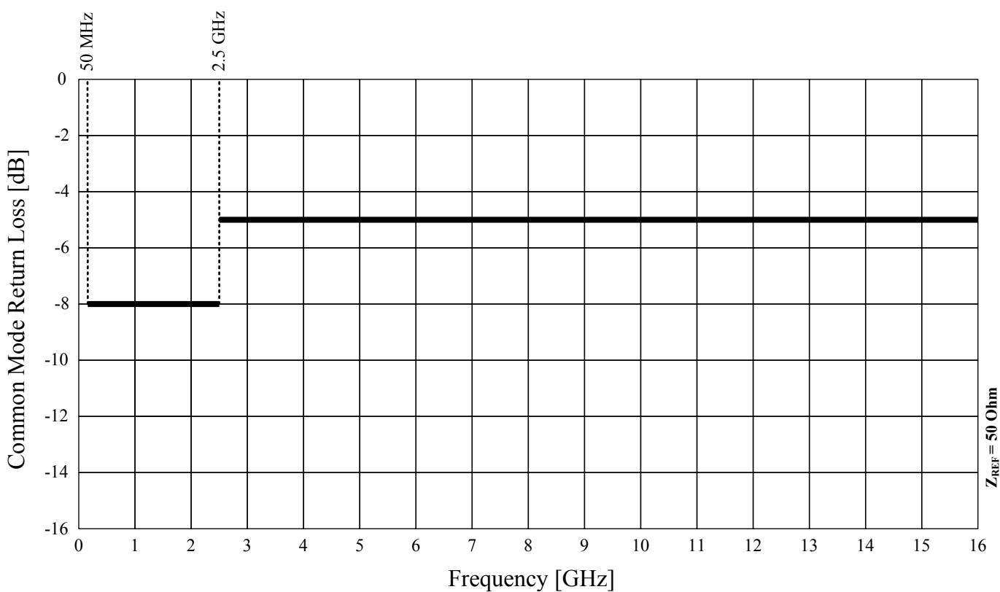

[⬆️ 返回目录](#sec-8-0)

---

<a id="sec-8-3-9"></a>
## 8.3.9 发送器 PLL 带宽与峰值 (Transmitter PLL Bandwidth and Peaking)

<table>
<thead>
<tr>
<th width="50%">🇬🇧 English</th>
<th width="50%" style="background-color:#e8e8e8">🏆 中文</th>
</tr>
</thead>
<tbody>
<tr>
<td>

PLL bandwidth and peaking are defined for both the Transmitter and Receiver in order to place an upper limit on the amount of Refclk jitter that is propagated to the transmitted data and to the CDR. Defining PLL BW and peaking limits also guarantees a minimum degree of Tx/Rx jitter tracking in those systems utilizing a Common Refclk Rx architecture.

</td>
<td style="background-color:#e8e8e8">

PLL 带宽和峰值在发送器 (Transmitter) 和接收器 (Receiver) 两侧都进行定义，目的是对传播到发送数据和 CDR 的 REFCLK 抖动量设定一个上限。定义 PLL 带宽和峰值限制还保证了在采用 Common Refclk Rx 架构的系统中,Tx/Rx 抖动跟踪达到最低程度。

</td>
</tr>
</tbody>
</table>

<a id="sec-8-3-9-1"></a>
### 8.3.9.1 2.5 GT/s 和 5.0 GT/s Tx PLL 带宽与峰值 (2.5 GT/s and 5.0 GT/s Tx PLL Bandwidth and Peaking)


<div style="overflow-x: auto; max-width: 100%;">
<table>
<thead>
<tr>
<th width="50%">🇬🇧 English</th>
<th width="50%" style="background-color:#e8e8e8">🏆 中文</th>
</tr>
</thead>
<tbody>
<tr>
<td>

The 2.5 GT/s PLL characteristics have been moved from the 3.0 CEM spec to the Electrical Base Spec. A single PLL bandwidth range from 1.5 to 22 MHz is given, which is identical to that defined in the CEM spec. No range of peaking was given in the CEM spec for the 2.5 GT/s PLL. However, for the Electrical Base Spec a peaking range of 0.01 dB to 3 dB is now defined. It is necessary to place a non-zero lower limit on the peaking, both to define a corner case as well as to maintain a common mathematical expression for the PLL transfer function in terms of ωn and ζ.

Two sets of bandwidth and peaking are defined for 5.0 GT/s: 8-16 MHz with 3 dB of peaking and 5.0-16.0 MHz with 1 dB of peaking. This gives the designer the option of trading off between a low peaking PLL design vs. a low bandwidth design.

</td>
<td style="background-color:#e8e8e8">

2.5 GT/s 的 PLL 特性已从 3.0 CEM 规范迁移到电气基础规范 (Electrical Base Spec)。给定的 PLL 带宽范围为 1.5 至 22 MHz,与 CEM 规范中定义的一致。CEM 规范中并未给出 2.5 GT/s PLL 的峰值范围。然而，在电气基础规范中现在定义了 0.01 dB 到 3 dB 的峰值范围。有必要对峰值设置一个非零的下限，既是为了定义一个角点情况 (corner case)，也是为了用 ωn 和 ζ 保持 PLL 传递函数的统一数学表达。

5.0 GT/s 定义了两组带宽和峰值:8-16 MHz 配 3 dB 峰值，以及 5.0-16.0 MHz 配 1 dB 峰值。这为设计者在低峰值 PLL 设计与低带宽设计之间提供了折衷选择。

</td>
</tr>
</tbody>
</table>
</div>


<a id="sec-8-3-9-2"></a>
### 8.3.9.2 8.0 GT/s、16.0 GT/s、32.0 GT/s 和 64.0 GT/s Tx PLL 带宽与峰值 (8.0 GT/s, 16.0 GT/s, 32.0 GT/s, and 64.0 GT/s Tx PLL Bandwidth and Peaking)

<table>
<thead>
<tr>
<th width="50%">🇬🇧 English</th>
<th width="50%" style="background-color:#e8e8e8">🏆 中文</th>
</tr>
</thead>
<tbody>
<tr>
<td>

The Tx and Rx PLL bandwidth for 8.0 and 16.0 GT/s is 0.5-5 MHz with 1.0 dB of peaking or 0.5-4 MHz with 2.0 dB of peaking. The Tx and Rx PLL bandwidth for 32.0 GT/s is 0.5 to 1.8 MHz with 2.0 dB of peaking. The Tx and Rx PLL bandwidth for 64.0 GT/s is 0.5 to 1.0 MHz with 2.0 dB of peaking. The 8.0 GT/s PLL BW range is substantially lower than the PLL bandwidths specified for 5.0 GT/s or 2.5 GT/s to reduce the amount of Refclk jitter at the sample latch of the Receiver. A non-zero value of 0.01 dB is given for the lower limit of the peaking to define all the peaking corners.

</td>
<td style="background-color:#e8e8e8">

8.0 和 16.0 GT/s 下的 Tx 和 Rx PLL 带宽为 0.5-5 MHz 配 1.0 dB 峰值，或 0.5-4 MHz 配 2.0 dB 峰值。32.0 GT/s 下的 Tx 和 Rx PLL 带宽为 0.5 到 1.8 MHz,配 2.0 dB 峰值。64.0 GT/s 下的 Tx 和 Rx PLL 带宽为 0.5 到 1.0 MHz,配 2.0 dB 峰值。8.0 GT/s 的 PLL 带宽范围明显低于 5.0 GT/s 或 2.5 GT/s 规定的 PLL 带宽，目的是减少到达接收器采样锁存器的 REFCLK 抖动量。峰值的下限被设定为非零值 0.01 dB,以定义所有的峰值角点。

</td>
</tr>
</tbody>
</table>

<a id="sec-8-3-9-3"></a>
### 8.3.9.3 串联电容 (Series Capacitors)


<div style="overflow-x: auto; max-width: 100%;">
<table>
<thead>
<tr>
<th width="50%">🇬🇧 English</th>
<th width="50%" style="background-color:#e8e8e8">🏆 中文</th>
</tr>
</thead>
<tbody>
<tr>
<td>

PCI Express requires series capacitors to provide a DC block between Tx and Rx. The min/max capacitance spread has been decreased from that of the 2.5 and 5.0 GT/s standards, while the maximum value has been slightly increased. This change is necessary to minimize DC wander effects due to data scrambling implemented at 8.0 GT/s, 16.0 GT/s, 32.0 GT/s, and 64.0 GT/s. Note that 2.5 GT/s and 5.0 GT/s signaling must also propagate through these larger value capacitors, but the small increase in capacitor size has no adverse impact on either 2.5 GT/s or 5.0 GT/s signaling or low frequency in-band signaling such as Receiver detect.

</td>
<td style="background-color:#e8e8e8">

PCI Express 要求使用串联电容以在 Tx 和 Rx 之间提供直流阻断 (DC block)。相对于 2.5 和 5.0 GT/s 标准，最小/最大电容的扩展范围已收窄，同时最大值略有提高。这一变化对于最小化因 8.0 GT/s、16.0 GT/s、32.0 GT/s 和 64.0 GT/s 启用数据加扰 (data scrambling) 而产生的 DC 漂移 (DC wander) 效应是必要的。需要注意的是,2.5 GT/s 和 5.0 GT/s 信号也必须通过这些较大容值的电容传播，但电容值的小幅增加对 2.5 GT/s 或 5.0 GT/s 信号以及诸如接收器检测 (Receiver detect) 之类的低频带内 (in-band) 信号均无不利影响。

</td>
</tr>
</tbody>
</table>
</div>


[⬆️ 返回目录](#sec-8-0)

---

<a id="sec-8-3-10"></a>
## 8.3.10 与数据速率无关的 Tx 参数 (Data Rate Independent Tx Parameters)

<table>
<thead>
<tr>
<th width="50%">🇬🇧 English</th>
<th width="50%" style="background-color:#e8e8e8">🏆 中文</th>
</tr>
</thead>
<tbody>
<tr>
<td>

The following table (Table 8-7) defines Tx parameters that are independent of data rate. The complete parameter list and corresponding values, units, and notes are provided in the table below. §

</td>
<td style="background-color:#e8e8e8">

下表 (Table 8-7) 定义了与数据速率无关的 Tx 参数。完整的参数列表以及对应的取值、单位和注释见下表。§

</td>
</tr>
</tbody>
</table>

**Table 8-7. Data Rate Independent Tx Parameters | 表 8-7. 与数据速率无关的 Tx 参数**

| Symbol | Parameter | Description | Value | Units | Notes |
|--------|-----------|-------------|-------|-------|-------|
| VTX-DC-CM | Tx DC peak-peak common mode voltage | Tx DC 峰峰值共模电压 | (min) 0 / (max) 3.6 | V | Total single-ended voltage a Tx can supply under any conditions with respect to ground. See also the ITX-SHORT. See Note 1. |
| VTX-CM-DC-ACTIVE-IDLE-DELTA | Absolute delta of DC Common Mode Voltage during L0 and Electrical Idle | L0 状态与电气空闲 (Electrical Idle) 状态之间 DC 共模电压的绝对差值 | (min) 0 / (max) 100 | mV | \|VTX-CM-DC [during L0] - VTX-CM-Idle-DC [during Electrical Idle]\| ≤ 100 mV<br>VTX-CM-DC = DC(avg) of \|VTX-D+ + VTX-D-\| /2<br>VTX-CM-Idle-DC = DC(avg) of \|VTX-D+ + VTX-D-\| /2 [Electrical Idle] |
| VTX-CM-DC-LINE-DELTA | Absolute Delta of DC Common Mode Voltage between D+ and D- | D+ 与 D- 之间 DC 共模电压的绝对差值 | (min) 0 / (max) 25 | mV | \|VTX-CM-DC-D+ [during L0] - VTX-CM-DC-D- [during L0]\| ≤ 25 mV<br>VTX-CM-DC-D+ = DC(avg) of \|VTX-D+ [during L0]\|<br>VTX-CM-DC-D- = DC(avg) of \|VTX-D- [during L0]\| |
| VTX-IDLE-DIFF-AC-p | Electrical Idle Differential Peak Output Voltage | 电气空闲差分峰值输出电压 | (min) 0 / (max) 20 | mV | VTX-IDLE-DIFF-AC-p = \|VTX-Idle-D+ - VTx-Idle-D-\| ≤ 20 mV. Voltage must be band pass filtered to remove any DC component and HF noise. The bandpass is constructed from two first-order filters, the high pass and low pass 3 dB bandwidths are 10 kHz and 1.25 GHz, respectively. |
| VTX-IDLE-DIFF-DC | DC Electrical Idle Differential Output Voltage | 直流电气空闲差分输出电压 | (min) 0 / (max) 5 | mV | VTX-IDLE-DIFF-DC = \|VTX-Idle-D+ - VTx-Idle-D-\| ≤ 5 mV. Voltage must be low pass filtered to remove any AC component. The low pass filter is first-order with a 3 dB bandwidth of 10 kHz. |
| VTX-RCV-DETECT | The amount of voltage change allowed during Receiver Detection | 接收器检测 (Receiver Detection) 期间允许的电压变化量 | (max) 600 | mV | The total amount of voltage change in a positive direction that a Transmitter can apply to sense whether a low impedance Receiver is present. Note: Receivers display substantially different impedance for VIN < 0 vs. VIN > 0. |

[⬆️ 返回目录](#sec-8-0)

---

<a id="sec-8-3-10-cont"></a>
### 8.3.10 (续) 与数据速率无关的 Tx 参数 (续表)

<table>
<thead>
<tr>
<th width="50%">🇬🇧 English</th>
<th width="50%" style="background-color:#e8e8e8">🏆 中文</th>
</tr>
</thead>
<tbody>
<tr>
<td>

The following table (continued from Table 8-7) defines additional data rate independent Tx parameters, including timing, AC coupling capacitor, and DC impedance parameters. §

</td>
<td style="background-color:#e8e8e8">

下表 (Table 8-7 续) 定义了其他与数据速率无关的 Tx 参数，包括时序、AC 耦合电容和直流阻抗等参数。§

</td>
</tr>
</tbody>
</table>

**Table 8-7 (continued). Data Rate Independent Tx Parameters | 表 8-7 (续). 与数据速率无关的 Tx 参数**

| Symbol | Parameter | Description | Value | Units | Notes |
|--------|-----------|-------------|-------|-------|-------|
| TTX-IDLE-MIN | Minimum time spent in Electrical Idle | Tx 处于电气空闲 (Electrical Idle) 的最短时间 | 20 (min) | ns | The time a Tx must spend in Electrical Idle before transitioning to another state. |
| TTX-IDLE-SET-TO-IDLE | Maximum time to transition to a valid Electrical Idle after sending an EIOS | 发送 EIOS 之后,过渡到有效电气空闲状态的最长时间 | (max) 8 | ns | After sending the required number of EIOSs, the Transmitter must meet all Electrical Idle specifications within this time. This is measured from the end of the last UI of the last EIOS to the Transmitter in Electrical Idle. |
| TTX-IDLE-TO-DIFF-DATA | Maximum time to transition to valid diff signaling after leaving Electrical Idle | 离开电气空闲状态后,过渡到有效差分信号的最长时间 | (max) 8 | ns | Maximum time to transition to valid diff signaling after leaving Electrical Idle. This is considered a debounce time to the Tx. |
| TCROSSLINK | Crosslink random timeout | Crosslink 随机超时 | (max) 1.0 | ms | This random timeout helps resolve potential conflicts in the crosslink configuration. |
| CTX | AC Coupling Capacitor | AC 耦合电容 | (min) 176 / (max) 265 | nF | All Transmitters shall be AC coupled. The AC coupling is required either within the media or within the transmitting component itself. |
| ZTX-DIFF-DC | DC differential Tx impedance | Tx 直流差分阻抗 | (max) 120 | Ω | Low impedance defined during signaling. The minimum value is bounded by RLTX-DIFF. |
| ITX-SHORT | Tx short circuit current | Tx 短路电流 | (max) 90 | mA | Tx short circuit current. Note 1. |

**Notes:**

1. ITX-SHORT and VTX-DC-CM stipulate the maximum current/voltage levels that a Transmitter can generate and therefore define the worst case transients that a Receiver must tolerate.

**注释:**

1. ITX-SHORT 和 VTX-DC-CM 规定了发送器 (Transmitter) 产生的最大电流/电压电平,因此定义了接收器 (Receiver) 必须容忍的最坏情况瞬态。

[⬆️ 返回目录](#sec-8-0)

---

<a id="sec-8-4"></a>
## 8.4 接收器规范 (Receiver Specifications)

<table>
<thead>
<tr>
<th width="50%">🇬🇧 English</th>
<th width="50%" style="background-color:#e8e8e8">🏆 中文</th>
</tr>
</thead>
<tbody>
<tr>
<td>

All Receiver speeds are tested by means of a stressed eye applied over a calibration channel that approximates the near worst-case loss characteristics encountered in an actual channel. The recovered eye is defined at the input to the Receiver's latch. For 2.5 GT/s and 5.0 GT/s this point is equivalent to the Rx pins; for 8.0 GT/s, 16.0 GT/s, 32.0 GT/s, and 64.0 GT/s it is equivalent to the signal at the Rx die pad after behavioral Rx equalization has been applied.

</td>
<td style="background-color:#e8e8e8">

所有速率的接收器 (Receiver) 都通过施加在近似最坏情况损耗的校准通道 (calibration channel) 上的压力眼图 (stressed eye) 进行测试。恢复眼图定义在接收器锁存器 (Receiver's latch) 的输入端。对于 2.5 GT/s 和 5.0 GT/s,该点等效于 Rx 引脚;对于 8.0 GT/s、16.0 GT/s、32.0 GT/s 和 64.0 GT/s,该点等效于应用行为级 Rx 均衡后 Rx 芯片焊盘 (die pad) 处的信号。

</td>
</tr>
</tbody>
</table>

<a id="sec-8-4-1"></a>
### 8.4.1 接收器压力眼图规范 (Receiver Stressed Eye Specification)


<div style="overflow-x: auto; max-width: 100%;">
<table>
<thead>
<tr>
<th width="50%">🇬🇧 English</th>
<th width="50%" style="background-color:#e8e8e8">🏆 中文</th>
</tr>
</thead>
<tbody>
<tr>
<td>

The closest practical measurement points to the Rx DUT are the coaxial connectors at the end of a breakout channel, while the Rx reference point of interest is the pin of the Rx. By constructing a replica channel that closely matches the electrical characteristics of the breakout channel it is possible to measure the signal as it would appear at the DUT's pin, if the DUT were an ideal termination. Impedance targets for the Rx breakout and replica channels are 85 Ω differential and 42.5 Ω single-ended, and the impedance tolerance should be maintained within ±5% or better. Note that the impedance target for the Tx test breakout and replica channels is still 100 Ω differential and 50 Ω single-ended.

</td>
<td style="background-color:#e8e8e8">

距离 Rx DUT 最近的实际测量点是引出通道 (breakout channel) 末端的同轴连接器，而 Rx 的关注参考点是 Rx 引脚。通过构建一个与引出通道电气特性紧密匹配的复制通道 (replica channel)，可以在 DUT 视为理想端接的情况下，测量 DUT 引脚处应当出现的信号。Rx 引出通道和复制通道的阻抗目标为差分 85 Ω 和单端 42.5 Ω,阻抗容差应保持在 ±5% 或更优。需要注意的是,Tx 测试引出通道和复制通道的阻抗目标仍然为差分 100 Ω 和单端 50 Ω。

</td>
</tr>
</tbody>
</table>
</div>


<a id="sec-8-4-1-1"></a>
#### 8.4.1.1 引出通道与复制通道 (Breakout and Replica Channels)

<table>
<thead>
<tr>
<th width="50%">🇬🇧 English</th>
<th width="50%" style="background-color:#e8e8e8">🏆 中文</th>
</tr>
</thead>
<tbody>
<tr>
<td>

In § Figure 8-26 the stressed eye is observed at TP2 with the signal sources connected to the calibration channel. A calibration channel will be required for each data rate. Once the stressed eye has been calibrated, the signal source is applied to the DUT. Note that TP1-TP2 encompasses all the components between the signal source and the equivalent of the DUT pin, thereby capturing all non-ideal characteristics in the overall insertion loss due to cabling and replica/breakout channel, excluding Rx package. The AC and DC loss from generator to TP1 are assumed to be zero or must be otherwise de-embedded. The VRX-LAUNCH (differential voltage swing) and Tx Equalization of the Signal Generator are calibrated at TP3 as shown in § Figure 8-26. Some Signal Generators do factory calibration with a cable and trying to de-embed to TP1 for these calibrations can cause inaccuracies. Only the loss from TP3 onward is counted in overall calibration channel loss.

</td>
<td style="background-color:#e8e8e8">

在 § Figure 8-26 中，信号源连接到校准通道时，在 TP2 处观测压力眼图。每个数据速率都需要一个校准通道。压力眼图校准完成后，将信号源施加到 DUT。需要注意的是,TP1-TP2 涵盖了信号源与 DUT 引脚等效点之间的所有组件，从而捕获由于线缆以及复制/引出通道 (不包括 Rx 封装) 引入的所有非理想特性对总插入损耗的影响。从信号源到 TP1 的交流和直流损耗假定为零，或必须进行去嵌入。信号源的 VRX-LAUNCH (差分电压摆幅) 和 Tx 均衡在 TP3 处校准，如 § Figure 8-26 所示。某些信号源在出厂校准时附带线缆，此时若尝试去嵌入到 TP1 可能会引入误差。在总校准通道损耗中，只计算从 TP3 开始的损耗。

</td>
</tr>
</tbody>
</table>

> **Figure 8-26.** Rx Test board Topology for 16.0 and 32.0 GT/s
> 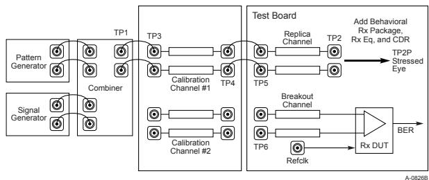

[⬆️ 返回目录](#sec-8-0)

---

<a id="sec-8-4-1-2"></a>
#### 8.4.1.2 校准通道插入损耗特性 (Calibration Channel Insertion Loss Characteristics)


<div style="overflow-x: auto; max-width: 100%;">
<table>
<thead>
<tr>
<th width="50%">🇬🇧 English</th>
<th width="50%" style="background-color:#e8e8e8">🏆 中文</th>
</tr>
</thead>
<tbody>
<tr>
<td>

Calibration channels, each with a specified differential insertion loss at one of the PCIe data rates, provide the means of generating prescribed amounts of ISI that approximates a worst-case channel. For each data rate a single calibration channel loss mask is defined by means of two pairs of IL limits at a high and a low frequency. It is not acceptable to generate IL by means other than physical channel (PCB traces, cables, switches, small compensation delays, etc. are acceptable), such as specialized filters. The Calibration Channel needs to include all physical loss after TP3 as shown in § Figure 8-26 within the IL mask. §

</td>
<td style="background-color:#e8e8e8">

校准通道 (calibration channel) 各自在对应的 PCIe 数据速率下具有规定的差分插入损耗，提供了一种产生接近最坏情况 ISI 的手段。对于每个数据速率，通过对一个高频和一个低频点各设置一对 IL 限制来定义单一的校准通道损耗掩码。必须使用物理通道 (PCB 走线、电缆、开关、小的补偿延迟等是可接受的) 来产生 IL,不允许使用专用滤波器等非物理通道。校准通道必须包含 TP3 之后 § Figure 8-26 中所示的所有物理损耗，并使其落在 IL 掩码范围内。§

</td>
</tr>
</tbody>
</table>
</div>


> **Figure 8-27.** Example Calibration Channel IL Mask Excluding Rx Package for 8.0 GT/s
> 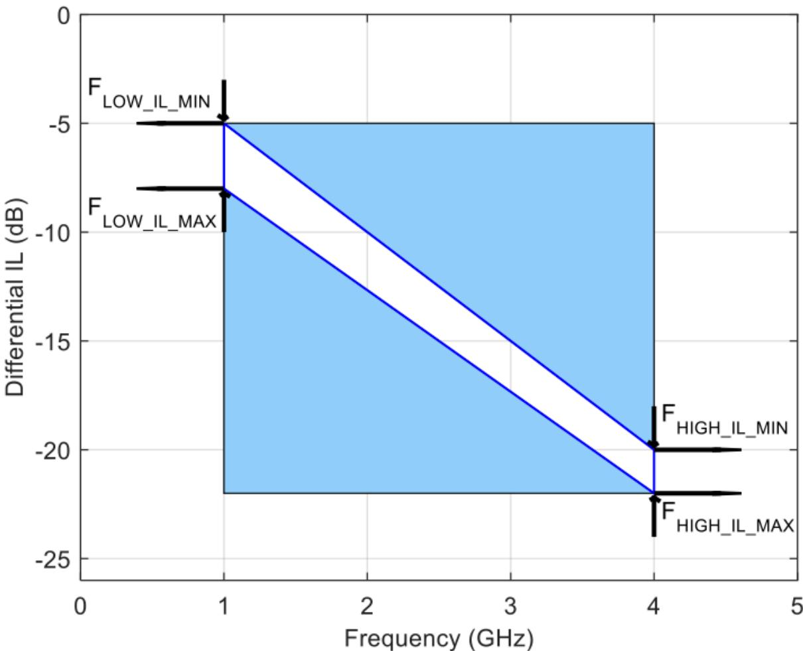

[⬆️ 返回目录](#sec-8-0)

---

**Table 8-8. Calibration Channel IL Limits | 表 8-8. 校准通道 IL 限制**

| Data Rate | FLOW-IL-MIN | FLOW-IL-MAX | FHIGH-IL-MIN | FHIGH-IL-MAX |
|-----------|-------------|-------------|--------------|--------------|
| 2.5 GT/s | 4.5 dB @ 1 GHz | 5.0 dB @ 1 GHz | 4.7 dB @ 1.25 GHz | 5.2 dB @ 1.25 GHz |
| 5.0 GT/s | 4.5 dB @ 1 GHz | 5.0 dB @ 1 GHz | 10.0 dB @ 2.5 GHz | 11.0 dB @ 2.5 GHz |
| 8.0 GT/s | 5 dB @ 1 GHz | 8 dB @ 1 GHz | 20 dB @ 4 GHz | 22 dB @ 4 GHz |
| 16.0 GT/s Root Port | 4.2 dB @ 1 GHz | 5.2 dB @ 1 GHz | 22.5 dB @ 8 GHz | 23.5 dB @ 8 GHz |
| 16.0 GT/s Non-Root Port | 4.2 dB @ 1 GHz | 5.2 dB @ 1 GHz | 24.5 dB @ 8 GHz | 25.5 dB @ 8 GHz |
| 32.0 GT/s Root Port | 3.2 dB @ 1 GHz | 4.2 dB @ 1 GHz | 26.5 dB @ 16 GHz | 27.5 dB @ 16 GHz |
| 32.0 GT/s Non-Root Port | 3.9 dB @ 1 GHz | 4.9 dB @ 1 GHz | 31.5 dB @ 16 GHz | 32.5 dB @ 16 GHz |
| 64.0 GT/s Root Port | 3.0 dB @ 1 GHz | 4.0 dB @ 1 GHz | 23.5 dB @ 16 GHz | 24.5 dB @ 16 GHz |
| 64.0 GT/s Non-Root Port | 3.6 dB @ 1 GHz | 4.6 dB @ 1 GHz | 27.5 dB @ 16 GHz | 28.5 dB @ 16 GHz |

**Notes:**

- Calibration channel plus Rx package is 28 dB nominally (informative) for 16.0 GT/s.
- Calibration channel plus Rx package is 36 dB nominally (informative) for 32.0 GT/s.
- Calibration channel plus Rx package is 32 dB nominally (informative) for 64.0 GT/s.
- Different reference packages are defined for devices containing Root Ports and all other device types at 16.0 GT/s, 32.0 GT/s, and 64.0 GT/s.
- It is recommended that some validation be done with shorter channels at 16.0 GT/s, 32.0 GT/s, and 64.0 GT/s.
- For 32.0 GT/s, a material at least as good as a Megtron-6 class material with loss of approximately 1.0 dB/inch at 16 GHz at typical room conditions must be used.
- For 64.0 GT/s, a material at least as good as a Megtron-6 class material with loss of approximately 1.0 dB/inch at 16 GHz under worst-case temperature and humidity conditions must be used to achieve system routing length of 13" for 1-connector server topologies.

**注释:**

- 对于 16.0 GT/s,校准通道加 Rx 封装的标称损耗为 28 dB(参考性)。
- 对于 32.0 GT/s,校准通道加 Rx 封装的标称损耗为 36 dB(参考性)。
- 对于 64.0 GT/s,校准通道加 Rx 封装的标称损耗为 32 dB(参考性)。
- 在 16.0 GT/s、32.0 GT/s 和 64.0 GT/s 下,含有根端口 (Root Port) 的设备与其他设备类型定义有不同的参考封装。
- 建议在 16.0 GT/s、32.0 GT/s 和 64.0 GT/s 下使用较短的通道进行一些验证。
- 对于 32.0 GT/s,必须使用至少与 Megtron-6 同等级的材料,在典型室温条件下 16 GHz 处损耗约为 1.0 dB/inch。
- 对于 64.0 GT/s,必须在最坏情况的温度和湿度条件下使用至少与 Megtron-6 同等级的材料(16 GHz 处损耗约为 1.0 dB/inch),以在 1 连接器服务器拓扑中实现 13 英寸的系统布线长度。

[⬆️ 返回目录](#sec-8-0)

---

<a id="sec-8-4-1-2-cont"></a>
#### 8.4.1.2 校准通道插入损耗特性 (续)

<table>
<thead>
<tr>
<th width="50%">🇬🇧 English</th>
<th width="50%" style="background-color:#e8e8e8">🏆 中文</th>
</tr>
</thead>
<tbody>
<tr>
<td>

The impedance targets for the Rx tolerancing interconnect environment are 100 Ω differential and 50 Ω single-ended for the 2.5, 5.0, and 8.0 GT/s channels and 85 Ω differential and 42.5 Ω single-ended for the 16.0 GT/s, 32.0 GT/s, and 64.0 GT/s channels; the impedance tolerance should be maintained within ±5% or better.

The calibration channel for 16.0 GT/s must meet the following return loss mask when measured from either end of the calibration channel:

- ≤ -12 dB for < 4 GHz
- ≤ -8 dB for ≥ 4 GHz and < 12 GHz
- ≤ -6 dB for ≥ 12 GHz and ≤ 16 GHz

The calibration channel for 32.0 GT/s and 64.0 GT/s must meet the following return loss mask when measured from either end of the calibration channel:

- ≤ -12 dB for < 4 GHz
- ≤ -10 dB for ≥ 4 GHz and < 16 GHz
- ≤ -6 dB for ≥ 16 GHz and ≤ 32 GHz

</td>
<td style="background-color:#e8e8e8">

Rx 容差互连环境的阻抗目标为:对于 2.5、5.0 和 8.0 GT/s 通道，差分 100 Ω、单端 50 Ω;对于 16.0 GT/s、32.0 GT/s 和 64.0 GT/s 通道，差分 85 Ω、单端 42.5 Ω;阻抗容差应保持在 ±5% 或更优。

16.0 GT/s 校准通道在从其任一端测量时，必须满足以下回波损耗掩码:

- < 4 GHz 时 ≤ -12 dB
- ≥ 4 GHz 且 < 12 GHz 时 ≤ -8 dB
- ≥ 12 GHz 且 ≤ 16 GHz 时 ≤ -6 dB

32.0 GT/s 和 64.0 GT/s 校准通道在从其任一端测量时，必须满足以下回波损耗掩码:

- < 4 GHz 时 ≤ -12 dB
- ≥ 4 GHz 且 < 16 GHz 时 ≤ -10 dB
- ≥ 16 GHz 且 ≤ 32 GHz 时 ≤ -6 dB

</td>
</tr>
</tbody>
</table>


<div style="overflow-x: auto; max-width: 100%;">
<table>
<thead>
<tr>
<th width="50%">🇬🇧 English</th>
<th width="50%" style="background-color:#e8e8e8">🏆 中文</th>
</tr>
</thead>
<tbody>
<tr>
<td>

A calibration channel consists of a differential pair of PCB traces terminated at both ends by coaxial connectors. For 16.0 GT/s, 32.0 GT/s, and 64.0 GT/s the calibration channel includes a 4.0 (16.0 GT/s), 5.0 (32.0 GT/s), or 6.0 (64.0 GT/s) Card Electromechanical Specification compliant connector and edge finger placed at least 4 dB at Nyquist away from the coaxial connectors where the signal generator is connected. The calibration channel's electrical characteristics are defined in terms of differential insertion loss masks as shown in § Figure 8-27, where SDD21 is measured between TP3 (See § Figure 8-26) and TP2. Connections between TP4-TP5 represent cabling and are included in the SDD21 measurement. Loss before TP3 is effectively calibrated out by calibrating differential voltage swing and TX EQ at TP3 and is not included in the SDD21 measurement.

</td>
<td style="background-color:#e8e8e8">

校准通道由一对比 PCB 走线构成的差分对组成，两端由同轴连接器端接。对于 16.0 GT/s、32.0 GT/s 和 64.0 GT/s,校准通道包括一个符合 Card Electromechanical Specification 的连接器 (16.0 GT/s 为 4.0 dB、32.0 GT/s 为 5.0 dB、64.0 GT/s 为 6.0 dB) 以及金手指 (edge finger)，金手指在奈奎斯特 (Nyquist) 频率处的损耗距离信号源所连接的同轴连接器至少 4 dB。校准通道的电气特性通过差分插入损耗掩码来定义，如 § Figure 8-27 所示，其中 SDD21 在 TP3 (见 § Figure 8-26) 和 TP2 之间测量。TP4-TP5 之间的连接代表线缆，包含在 SDD21 测量中。TP3 之前的损耗通过在 TP3 校准差分电压摆幅和 TX EQ 来有效扣除，不计入 SDD21 测量中。

</td>
</tr>
</tbody>
</table>
</div>


<table>
<thead>
<tr>
<th width="50%">🇬🇧 English</th>
<th width="50%" style="background-color:#e8e8e8">🏆 中文</th>
</tr>
</thead>
<tbody>
<tr>
<td>

While the 8.0 GT/s, 16.0 GT/s, 32.0 GT/s, and 64.0 GT/s S-parameter masks do not extend below 1.0 GHz, all calibration channels must be well behaved below 1.0 GHz and must not have a DC resistance in excess of 7.5 ohms, as measured by the sum of the resistances of the D+ and D- traces. This limitation on DC resistance guarantees that the calibration channel low frequency characteristic is consistent with the extrapolations of the SDD21 masks to DC. The calibration loss targets for devices containing Root Ports and other devices are different because the reference package models have different losses. For 16.0 GT/s, 32.0 GT/s, and 64.0 GT/s the insertion loss range FHIGH-IL-MIN to FHIGH-IL-MAX is the nominal loss. The calibration channel must have a series of loss options covering a range from at least 2 dB below FHIGH-IL-MIN to 3 dB above FHIGH-IL-MAX (for example for the non-root case this means a loss range from -22.5 to -28.5 dB) with loss delta between consecutive options of 0.5 dB or less.

</td>
<td style="background-color:#e8e8e8">

虽然 8.0 GT/s、16.0 GT/s、32.0 GT/s 和 64.0 GT/s 的 S 参数掩码未延伸至 1.0 GHz 以下，但所有校准通道在 1.0 GHz 以下必须表现良好，且其直流电阻 (D+ 和 D- 走线电阻之和测量) 不得超过 7.5 Ω。对直流电阻的这一限制保证了校准通道的低频特性与 SDD21 掩码向 DC 方向外推的结果相一致。含有根端口 (Root Port) 的设备与其他设备的校准损耗目标不同，因为参考封装模型的损耗不同。对于 16.0 GT/s、32.0 GT/s 和 64.0 GT/s,插入损耗范围 FHIGH-IL-MIN 到 FHIGH-IL-MAX 为标称损耗。校准通道必须提供一系列损耗档位，覆盖范围至少从低于 FHIGH-IL-MIN 2 dB 到高于 FHIGH-IL-MAX 3 dB(例如对于非根端口情况，意味着损耗范围为 -22.5 到 -28.5 dB)，相邻档位之间的损耗步进不超过 0.5 dB。

</td>
</tr>
</tbody>
</table>

[⬆️ 返回目录](#sec-8-0)

---

<a id="sec-imp-16gt"></a>
### 实现说明:16.0 GT/S 校准通道参考设计 (IMPLEMENTATION NOTE: 16.0 GT/S CALIBRATION CHANNEL REFERENCE DESIGN)

<table>
<thead>
<tr>
<th width="50%">🇬🇧 English</th>
<th width="50%" style="background-color:#e8e8e8">🏆 中文</th>
</tr>
</thead>
<tbody>
<tr>
<td>

This section gives an example of a 16.0 GT/s calibration channel that was built and tested to meet the requirements in this specification. A high-level block diagram of the calibration channel is shown in § Figure 8-28. Note that this example fixture covers a wider loss range then required by the specification and can cover both root and non-root cases. The test fixture includes four PCBs:

</td>
<td style="background-color:#e8e8e8">

本节给出一个 16.0 GT/s 校准通道的示例，该通道已构建并经过测试，满足本规范中的要求。校准通道的高层框图如 § Figure 8-28 所示。需要注意的是，该示例夹具覆盖的损耗范围比规范要求更宽，可以同时覆盖根端口 (Root Port) 和非根端口两种情况。该测试夹具包括四块 PCB:

</td>
</tr>
</tbody>
</table>


<div style="overflow-x: auto; max-width: 100%;">
<table>
<thead>
<tr>
<th width="50%">🇬🇧 English</th>
<th width="50%" style="background-color:#e8e8e8">🏆 中文</th>
</tr>
</thead>
<tbody>
<tr>
<td>

**16.0 GT/s Rx Calibration Base Boards**

Sixteen differential pairs (85 Ohm Nominal Impedance) routed from SMA connectors to a CEM through-hole connector. There are three different base boards to achieve the following insertion loss ranges – The insertion loss of the differential pairs for the base board is varied as follows @ 8.0 GHz in 0.5 dB steps.

- Low-Loss Base Board: 4-11.5 dB
- Mid-Loss Base Board: 12-19.5 dB
- High-Loss Base Board: 20-27.5 dB

All traces are routed as microstrip on the bottom layer. The SMA connectors and CEM connectors are optimized with layout techniques at 8.0 GHz.

**16.0 GT/s Rx Calibration Riser Board**

Sixteen differential pairs (85 Ohm Nominal Impedance) routed from SMA connectors to Gold Edge Fingers. The insertion loss of the differential pairs is fixed at 4 dB nominal @ 8.0 GHz for all sixteen pairs. All traces are routed as microstrip on the bottom layer. The SMA connectors and CEM connectors are optimized with layout techniques at 8.0 GHz. §

</td>
<td style="background-color:#e8e8e8">

**16.0 GT/s Rx 校准基板 (Base Boards)**

16 对差分线 (标称阻抗 85 Ω)，从 SMA 连接器走线到 CEM 通孔连接器。共有三种不同的基板以实现以下插入损耗范围 — 基板差分对的插入损耗在 8.0 GHz 处以 0.5 dB 为步进变化:

- 低损耗基板 (Low-Loss Base Board):4-11.5 dB
- 中损耗基板 (Mid-Loss Base Board):12-19.5 dB
- 高损耗基板 (High-Loss Base Board):20-27.5 dB

所有走线都以底层 (bottom layer) 微带线 (microstrip) 形式布线。SMA 连接器和 CEM 连接器在 8.0 GHz 频率下通过版图技术进行优化。

**16.0 GT/s Rx 校准转接板 (Riser Board)**

16 对差分线 (标称阻抗 85 Ω)，从 SMA 连接器走线到金手指 (Gold Edge Fingers)。所有 16 对差分线的插入损耗在 8.0 GHz 处固定为标称 4 dB。所有走线都以底层微带线形式布线。SMA 连接器和 CEM 连接器在 8.0 GHz 频率下通过版图技术进行优化。§

</td>
</tr>
</tbody>
</table>
</div>


> **Figure 8-28.** Example 16.0 GT/s Calibration Channel
> 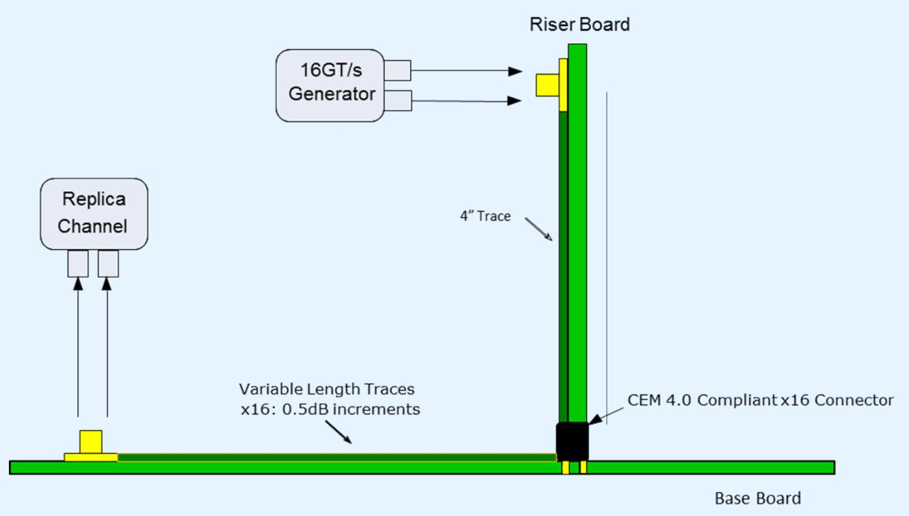

<table>
<thead>
<tr>
<th width="50%">🇬🇧 English</th>
<th width="50%" style="background-color:#e8e8e8">🏆 中文</th>
</tr>
</thead>
<tbody>
<tr>
<td>

The stackup for both boards is shown in § Figure 8-29 where 65% is the estimated copper fill percentage. § Figure 8-29 includes stackups for both nominal 85 Ω and 100 Ω stackups - the 85 Ω stackup is used for the calibration channel example.

The pad stack for the CEM connector drill holes is shown in § Figure 8-30 and the pad stack for the SMA drill holes is shown in § Figure 8-31. §

</td>
<td style="background-color:#e8e8e8">

两块板的叠层 (stackup) 如 § Figure 8-29 所示，其中 65% 为估计的铜填充率。§ Figure 8-29 同时给出了标称 85 Ω 和 100 Ω 两种叠层，其中 85 Ω 叠层用于本校准通道示例。

CEM 连接器钻孔的焊盘叠层 (pad stack) 如 § Figure 8-30 所示,SMA 钻孔的焊盘叠层如 § Figure 8-31 所示。§

</td>
</tr>
</tbody>
</table>

> **Figure 8-29.** Stackup for Example 16.0 GT/s Calibration Channel
> 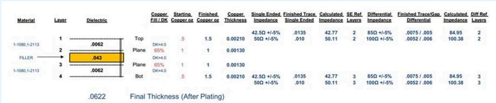

> **Figure 8-30.** CEM Connector Drill Hole Pad Stack
> 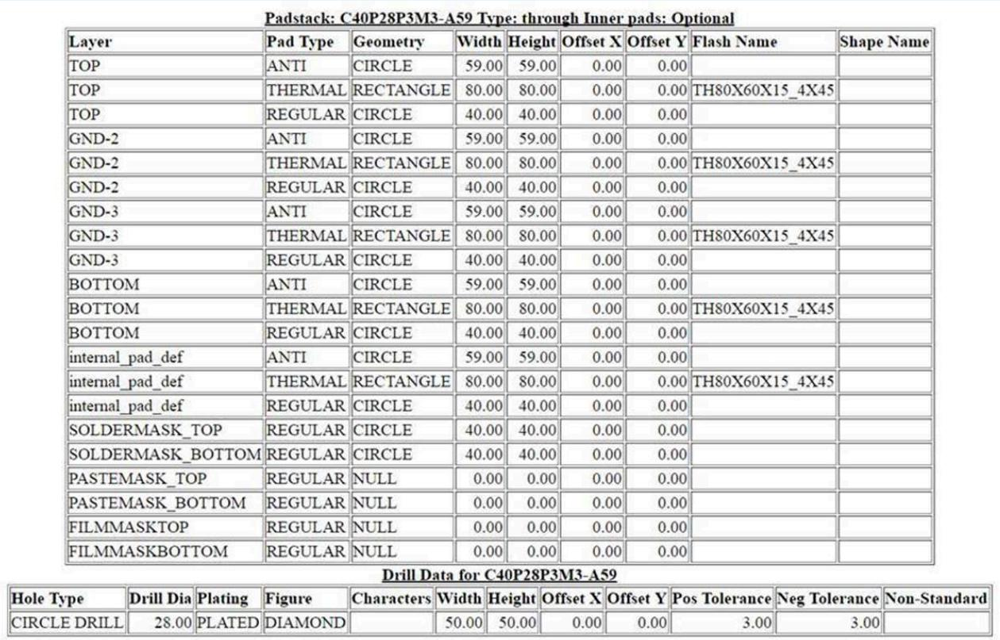

> **Figure 8-31.** Pad Stack for SMA Drill Holes
> 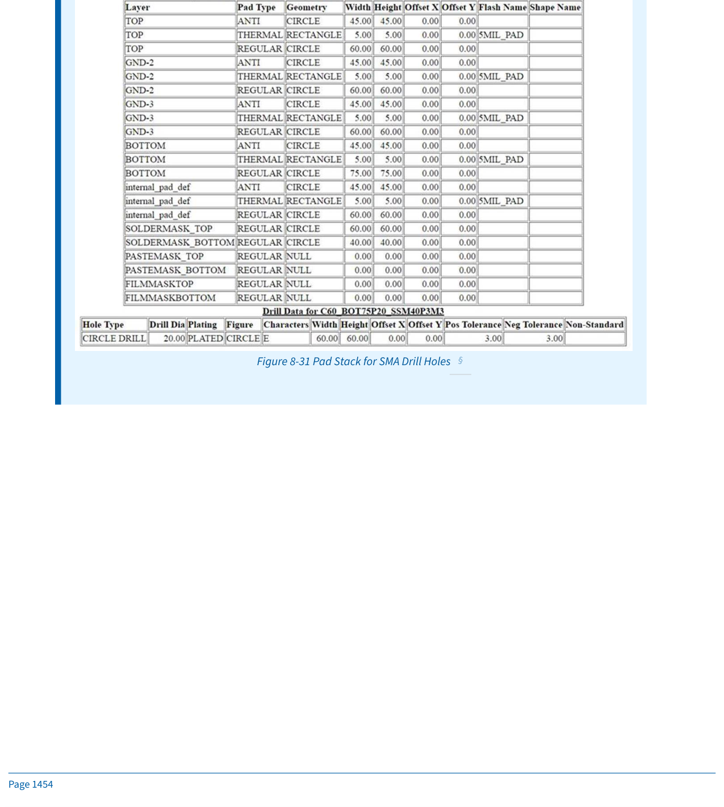

[⬆️ 返回目录](#sec-8-0)

---

<a id="sec-imp-32gt"></a>
### 实现说明:32.0 GT/S 校准通道参考设计 (IMPLEMENTATION NOTE: 32.0 GT/S CALIBRATION CHANNEL REFERENCE DESIGN)

<table>
<thead>
<tr>
<th width="50%">🇬🇧 English</th>
<th width="50%" style="background-color:#e8e8e8">🏆 中文</th>
</tr>
</thead>
<tbody>
<tr>
<td>

This section gives an example of a 32.0 GT/s calibration channel that was built and tested to meet the requirements in this specification. A high-level block diagram of the calibration channel is shown in § Figure 8-32. Note this example fixture covers a wider loss range then required by the specification and can cover both root and non-root cases. The test fixture includes two PCBs:

</td>
<td style="background-color:#e8e8e8">

本节给出一个 32.0 GT/s 校准通道的示例，该通道已构建并经过测试，满足本规范中的要求。校准通道的高层框图如 § Figure 8-32 所示。需要注意的是，该示例夹具覆盖的损耗范围比规范要求更宽，可以同时覆盖根端口和非根端口两种情况。该测试夹具包括两块 PCB:

</td>
</tr>
</tbody>
</table>


<div style="overflow-x: auto; max-width: 100%;">
<table>
<thead>
<tr>
<th width="50%">🇬🇧 English</th>
<th width="50%" style="background-color:#e8e8e8">🏆 中文</th>
</tr>
</thead>
<tbody>
<tr>
<td>

**32.0 GT/s Rx Calibration Base Boards**

Sixteen differential pairs (85 Ohm Nominal Impedance) routed on a Megtron-6 PCB from MMPX connectors to a CEM surface mount connector. There are three different base boards to achieve the following insertion loss ranges - The insertion loss of the differential pairs for the base board is varied as follows @ 16.0 GHz in 0.5 dB steps.

- Low-Loss Base Board: 4.0-11.5 dB
- Mid-Loss Base Board: 12.0-19.5 dB
- High-Loss Base Board: 20.0-27.5 dB

All traces are routed as microstrip on the top layer. The MMPX connectors and CEM connectors are optimized with layout techniques at 16.0 GHz.

For information on MMPX connectors refer to Huber+Suhner microminiature connectors.

**32.0 GT/s Rx Calibration Riser Board**

Sixteen differential pairs (85 Ohm Nominal Impedance) routed on a Megtron-6 PCB from MMPX connectors to Gold Edge Fingers. The insertion loss of the differential pairs is fixed at 8 dB nominal @ 16.0 GHz for all sixteen pairs. All traces are routed as microstrip on the top layer. The MMPX connectors and CEM connectors are optimized with layout techniques at 16.0 GHz. §

</td>
<td style="background-color:#e8e8e8">

**32.0 GT/s Rx 校准基板**

16 对差分线 (标称阻抗 85 Ω)，在 Megtron-6 PCB 上从 MMPX 连接器走线到 CEM 表面贴装连接器。共有三种不同的基板以实现以下插入损耗范围 — 基板差分对的插入损耗在 16.0 GHz 处以 0.5 dB 为步进变化:

- 低损耗基板:4.0-11.5 dB
- 中损耗基板:12.0-19.5 dB
- 高损耗基板:20.0-27.5 dB

所有走线都以顶层 (top layer) 微带线形式布线。MMPX 连接器和 CEM 连接器在 16.0 GHz 频率下通过版图技术进行优化。

有关 MMPX 连接器的信息，请参阅 Huber+Suhner 微型连接器。

**32.0 GT/s Rx 校准转接板**

16 对差分线 (标称阻抗 85 Ω)，在 Megtron-6 PCB 上从 MMPX 连接器走线到金手指。所有 16 对差分线的插入损耗在 16.0 GHz 处固定为标称 8 dB。所有走线都以顶层微带线形式布线。MMPX 连接器和 CEM 连接器在 16.0 GHz 频率下通过版图技术进行优化。§

</td>
</tr>
</tbody>
</table>
</div>


> **Figure 8-32.** Example 32.0 GT/s Calibration Channel
> 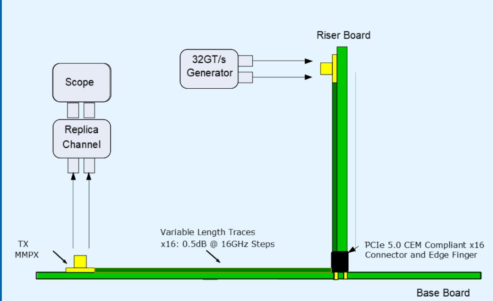

<table>
<thead>
<tr>
<th width="50%">🇬🇧 English</th>
<th width="50%" style="background-color:#e8e8e8">🏆 中文</th>
</tr>
</thead>
<tbody>
<tr>
<td>

The stack-up for both 85 Ohm boards is shown in § Figure 8-33 where 65% is the estimated copper fill percentage. 64.0 GT/s Calibration channel reference design may be added in Rev 0.9. §

</td>
<td style="background-color:#e8e8e8">

两块 85 Ω 板的叠层如 § Figure 8-33 所示，其中 65% 为估计的铜填充率。64.0 GT/s 校准通道的参考设计可能会在 Rev 0.9 中加入。§

</td>
</tr>
</tbody>
</table>

> **Figure 8-33.** Stack-up for Example 32.0 GT/s Calibration Channel
> 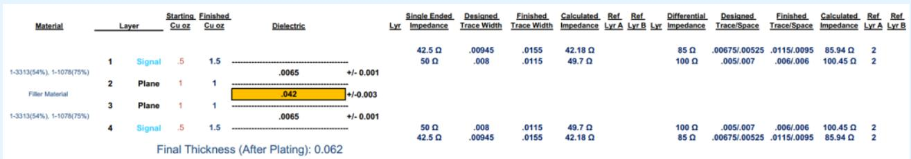

[⬆️ 返回目录](#sec-8-0)

---

<a id="sec-8-4-1-3"></a>
#### 8.4.1.3 后处理流程 (Post Processing Procedures)

<table>
<thead>
<tr>
<th width="50%">🇬🇧 English</th>
<th width="50%" style="background-color:#e8e8e8">🏆 中文</th>
</tr>
</thead>
<tbody>
<tr>
<td>

The Receiver test requires that the stressed eye characteristics be measured at TP2 (which is accessible) and then post-processed to yield a signal as it would appear at test point two post-processed (TP2P) (which is not accessible) for 8.0, 16.0, 32.0, and 64.0 GT/s. TP2P defines a reference point that comprehends the effects of the behavioral Rx package plus Rx equalization and represents the only location where a meaningful EH and EW limits can be defined. §

</td>
<td style="background-color:#e8e8e8">

接收器 (Receiver) 测试要求在 TP2 (可访问) 处测量压力眼图特性，然后通过后处理推导出在测试点 TP2P (不可访问) 处应当出现的信号，该流程适用于 8.0、16.0、32.0 和 64.0 GT/s。TP2P 定义了一个参考点，涵盖了行为级 Rx 封装和 Rx 均衡的综合效果，是唯一可以定义有意义的 EH 和 EW 限制的位置。§

</td>
</tr>
</tbody>
</table>


<div style="overflow-x: auto; max-width: 100%;">
<table>
<thead>
<tr>
<th width="50%">🇬🇧 English</th>
<th width="50%" style="background-color:#e8e8e8">🏆 中文</th>
</tr>
</thead>
<tbody>
<tr>
<td>

Behavioral Rx package models are included as part of the post processing to allow the calibrated eye to comprehend package insertion loss. A separate pair of package models is defined for 8.0, 16.0, 32.0, and 64.0 GT/s eye calibration. At 8.0 GT/s, separate package models are defined for TX and RX ports to reflect the smaller CPAD capacitance typical in most receiver implementations. At 16.0, 32.0, and 64.0 GT/s, separate package models are defined for devices containing Root Ports and all other devices. This is necessary to allow a reasonable channel solution space and assumes that devices containing Root Complexes are usually large and socketed, while all other devices tend to be unsocketed and smaller. The 16.0 GT/s Root and Non-Root behavioral Rx package models have been constructed to represent respective package loss characteristics for high loss, but not worst-case loss, packages. The 32.0 and 64.0 GT/s Root and Non-Root behavioral Rx package models have been constructed to represent package loss characteristics for worst case packages.

</td>
<td style="background-color:#e8e8e8">

行为级 Rx 封装模型作为后处理的一部分被纳入，使得校准后的眼图能够涵盖封装的插入损耗。8.0、16.0、32.0 和 64.0 GT/s 的眼图校准各自定义了一对独立的封装模型。在 8.0 GT/s 下，为 TX 和 RX 端口分别定义了独立的封装模型，以反映大多数接收器实现中典型的较小 CPAD 电容。在 16.0、32.0 和 64.0 GT/s 下，为含有根端口 (Root Port) 的设备与所有其他设备分别定义了独立的封装模型。这是为了使通道解决方案空间合理化，其假设是:含有根复合体 (Root Complex) 的设备通常较大且为插座式 (socketed)，而所有其他设备通常较小且为非插座式 (unsocketed)。16.0 GT/s 根端口和非根端口行为级 Rx 封装模型构建为分别代表高损耗(但非最坏情况损耗)封装的损耗特性。32.0 和 64.0 GT/s 根端口和非根端口行为级 Rx 封装模型构建为分别代表最坏情况封装的损耗特性。

</td>
</tr>
</tbody>
</table>
</div>


<table>
<thead>
<tr>
<th width="50%">🇬🇧 English</th>
<th width="50%" style="background-color:#e8e8e8">🏆 中文</th>
</tr>
</thead>
<tbody>
<tr>
<td>

The 8.0, 32.0, and 64.0 GT/s stressed eye test for all devices and the 16.0 GT/s stressed eye test for Non-Root Package devices that support captive channels are required to use the appropriate behavioral package (see § Section 8.3.3.11). For all other device types, if the actual Rx package performance is worse than that of the behavioral package, then the actual package models are permitted to be used. If the actual package models are used, the calibration channel must be adjusted such that the total channel loss including the embedded actual package remains at 28 dB nominal. Note that form factor overall requirements still need to be met. The Rx package performance is assessed using the methodology defined in § Section 8.5.1.2.

</td>
<td style="background-color:#e8e8e8">

针对所有设备的 8.0、32.0 和 64.0 GT/s 压力眼图测试，以及支持 captive channel 的非根端口封装 (Non-Root Package) 设备的 16.0 GT/s 压力眼图测试，均要求使用相应的行为级封装模型(见 § Section 8.3.3.11)。对于所有其他设备类型，如果实际 Rx 封装的性能劣于行为级封装的性能，则允许使用实际封装模型。如果使用实际封装模型，则必须调整校准通道，使包含嵌入实际封装在内的总通道损耗保持在 28 dB 标称值。还需要注意的是，仍然必须满足外形规格 (form factor) 的整体要求。Rx 封装的性能评估采用 § Section 8.5.1.2 中定义的方法。

</td>
</tr>
</tbody>
</table>


<div style="overflow-x: auto; max-width: 100%;">
<table>
<thead>
<tr>
<th width="50%">🇬🇧 English</th>
<th width="50%" style="background-color:#e8e8e8">🏆 中文</th>
</tr>
</thead>
<tbody>
<tr>
<td>

Details of the behavioral Rx packages are provided in § Section 8.5.1.1 of the Channel Tolerancing section. S-parameter models for the behavioral Rx package models are available as design collateral. The reference impedance at the pad side of the packages model is assumed to be 2 × 50 Ω.

Post processing shall include a behavioral CDR model with a data rate dependent transfer function. A first order CDR transfer function is utilized for Receivers operating with a CC Refclk architecture except for 32.0 GT/s and 64.0 GT/s. For Receivers operating in IR Refclk mode an alternate CDR transfer function is required. For a given data rate the behavioral CDR used for Rx testing is the same as the corresponding CDR used for Tx testing. For details on behavioral CDR functions refer to § Section 8.3.5.5.

</td>
<td style="background-color:#e8e8e8">

行为级 Rx 封装的详细信息在通道容差 (Channel Tolerancing) 一节的 § Section 8.5.1.1 中提供。行为级 Rx 封装模型的 S 参数模型作为设计资料 (design collateral) 提供。封装模型焊盘侧的参考阻抗假定为 2 × 50 Ω。

后处理必须包含一个具有数据速率相关传递函数的行为级 CDR 模型。除 32.0 GT/s 和 64.0 GT/s 外，使用 CC Refclk 架构的接收器 (Receiver) 采用一阶 CDR 传递函数。对于在 IR Refclk 模式下工作的接收器，需要使用另一种 CDR 传递函数。对于给定的数据速率,Rx 测试所用的行为级 CDR 与对应 Tx 测试所用的 CDR 相同。有关行为级 CDR 函数的详细信息，请参阅 § Section 8.3.5.5。

</td>
</tr>
</tbody>
</table>
</div>


<table>
<thead>
<tr>
<th width="50%">🇬🇧 English</th>
<th width="50%" style="background-color:#e8e8e8">🏆 中文</th>
</tr>
</thead>
<tbody>
<tr>
<td>

The combination of worst-case channel, behavioral Rx package, and Tx jitter at 2.5 and 5.0 GT/s will yield open eyes, when the appropriate Tx presets are set. Therefore, there is no need to define a behavioral Rx equalization or to adjust the Tx equalization setting. Actual implementations of 2.5 and 5.0 GT/s receivers may, of course, include equalization.

As measured at TP2, stressed eyes at 8.0, 16.0, 32.0, and 64.0 GT/s will usually be closed, making direct measurement of the stressed eye jitter parameters unfeasible. This problem is overcome by employing a behavioral Receiver equalizer that implements both CTLE and a 1-tap DFE (8.0 GT/s) or a 2-tap DFE (16.0 GT/s) or a 3-tap DFE (32.0 GT/s) or a 16-tap DFE (64.0 GT/s).

</td>
<td style="background-color:#e8e8e8">

在设定合适的 Tx 预设 (Preset) 时,2.5 和 5.0 GT/s 下最坏情况通道、行为级 Rx 封装和 Tx 抖动的组合将产生张开的眼图。因此，无需定义行为级 Rx 均衡，也不需要调整 Tx 均衡设置。2.5 和 5.0 GT/s 接收器的实际实现当然可以包含均衡。

在 TP2 处测量时,8.0、16.0、32.0 和 64.0 GT/s 的压力眼图通常是闭合的，使得直接测量压力眼图的抖动参数不可行。该问题通过采用行为级接收器均衡器 (behavioral Receiver equalizer) 加以解决，该均衡器同时实现 CTLE 和 1-tap DFE (8.0 GT/s)、2-tap DFE (16.0 GT/s)、3-tap DFE (32.0 GT/s) 或 16-tap DFE (64.0 GT/s)。

</td>
</tr>
</tbody>
</table>

<table>
<thead>
<tr>
<th width="50%">🇬🇧 English</th>
<th width="50%" style="background-color:#e8e8e8">🏆 中文</th>
</tr>
</thead>
<tbody>
<tr>
<td>

Rx equalization algorithms of CTLE and DFE are only intended to be a means for obtaining an open eye in the presence of calibration channel ISI plus the other signal impairment terms and for channel compliance. The behavioral Rx equalization algorithms are not intended to serve as a guideline for implementing actual Receiver equalization. For example, additional DFE taps can have significant benefit in actual implementations where the CTLE may differ from the

</td>
<td style="background-color:#e8e8e8">

CTLE 和 DFE 的 Rx 均衡算法仅用作在校准通道 ISI 及其他信号损伤项共同存在时获得张开眼图，以及进行通道一致性 (channel compliance) 测试的手段。行为级 Rx 均衡算法并不打算用作实现实际接收器 (Receiver) 均衡的指导。例如，在实际实现中，额外的 DFE 抽头可以带来显著益处，而 CTLE 也可能与

</td>
</tr>
</tbody>
</table>

[⬆️ 返回目录](#sec-8-0)

---


---

<a id="sec-8-4-1-4"></a>
## 8.4.1.4 Behavioral Rx Package Models | 行为级 Rx 封装模型

<table>
<thead>
<tr>
<th width="50%">🇬🇧 English</th>
<th width="50%" style="background-color:#e8e8e8">🏆 中文</th>
</tr>
</thead>
<tbody>
<tr>
<td>

8.4.1.4 Behavioral Rx Package Models §

</td>
<td style="background-color:#e8e8e8">

8.4.1.4 行为级 Rx 封装模型 §

</td>
</tr>
</tbody>
</table>

---

<table>
<thead>
<tr>
<th width="50%">🇬🇧 English</th>
<th width="50%" style="background-color:#e8e8e8">🏆 中文</th>
</tr>
</thead>
<tbody>
<tr>
<td>

8.4.1.5 Behavioral CDR Model §

</td>
<td style="background-color:#e8e8e8">

8.4.1.5 行为级 CDR (时钟数据恢复) 模型 §

</td>
</tr>
</tbody>
</table>

---

<table>
<thead>
<tr>
<th width="50%">🇬🇧 English</th>
<th width="50%" style="background-color:#e8e8e8">🏆 中文</th>
</tr>
</thead>
<tbody>
<tr>
<td>

8.4.1.6 No Behavioral Rx Equalization for 2.5 and 5.0 GT/s §

</td>
<td style="background-color:#e8e8e8">

8.4.1.6 2.5 和 5.0 GT/s 下无行为级 Rx 均衡 §

</td>
</tr>
</tbody>
</table>

---

<table>
<thead>
<tr>
<th width="50%">🇬🇧 English</th>
<th width="50%" style="background-color:#e8e8e8">🏆 中文</th>
</tr>
</thead>
<tbody>
<tr>
<td>

8.4.1.7 Behavioral Rx Equalization for 8.0, 16.0, 32.0, and 64.0 GT/s §

</td>
<td style="background-color:#e8e8e8">

8.4.1.7 8.0、16.0、32.0 和 64.0 GT/s 下的行为级 Rx 均衡 §

</td>
</tr>
</tbody>
</table>

---

<!-- 📄 Page 1458 -->
---


<div style="overflow-x: auto; max-width: 100%;">
<table>
<thead>
<tr>
<th width="50%">🇬🇧 English</th>
<th width="50%" style="background-color:#e8e8e8">🏆 中文</th>
</tr>
</thead>
<tbody>
<tr>
<td>

behaviorial equalizer and/or CTLE selection may not always be optimal. Channel loss characteristics can vary significantly with temperature and humidity and a real Receiver must be able to continue to function at the target BER through such variations.

8.0 and 16.0 GT/s behavioral Rx equalization defines a 1st order CTLE with fixed LF and HF poles, and an adjustable DC gain (ADC) specified according to the family of curves shown in § Figure 8-35. For the 8.0 GT/s rates ADC is adjustable over a minimum range of -6 to -12 dB in steps of 1.0 dB.

H(s) = ωP2 ×

(s + ωP1 × ADC)

((s + ωP1) × (s + ωP2))

ωP1 = pole 1 = 2π × 2 GHz

ωP2 = pole 2 = 2π × 8 GHz

ADC = dc gain

Figure 8-34 Transfer Function for 8.0 GT/s Behavioral CTLE

The following diagram illustrates the gain vs. frequency behavior of the CTLE as ADC is varied over its minimum to maximum range in 1.0 dB steps.

8.4.1.8 Behavioral CTLE (8.0 and 16.0 GT/s) §

§

</td>
<td style="background-color:#e8e8e8">

行为级均衡器和/或 CTLE (连续时间线性均衡器) 选型可能并不总是最优的。通道 (Channel) 损耗特性会随温度和湿度显著变化，真实的接收器 (Receiver) 必须在这些变化中仍能在目标 BER (误码率) 下正常工作。

8.0 和 16.0 GT/s 的行为级 Rx 均衡定义了一个一阶 CTLE,其低频极点 (LF Pole) 和高频极点 (HF Pole) 固定，直流增益 (ADC) 可调，按 § Figure 8-35 中所示的曲线族来规定。对于 8.0 GT/s,ADC 的可调范围最小为 -6 至 -12 dB,步进为 1.0 dB。

H(s) = ωP2 ×

(s + ωP1 × ADC)

((s + ωP1) × (s + ωP2))

ωP1 = 极点 1 = 2π × 2 GHz

ωP2 = 极点 2 = 2π × 8 GHz

ADC = 直流增益

Figure 8-34 8.0 GT/s 行为级 CTLE 的传递函数

下图展示了 CTLE 在 ADC 以 1.0 dB 步进从最小到最大变化时的增益-频率特性。

8.4.1.8 行为级 CTLE (8.0 和 16.0 GT/s) §

§

</td>
</tr>
</tbody>
</table>
</div>


---

<!-- 📄 Page 1459 -->
---

<table>
<thead>
<tr>
<th width="50%">🇬🇧 English</th>
<th width="50%" style="background-color:#e8e8e8">🏆 中文</th>
</tr>
</thead>
<tbody>
<tr>
<td>

> **Figure 8-35.** Loss Curves for 8.0 GT/s Behavioral CTLE
> 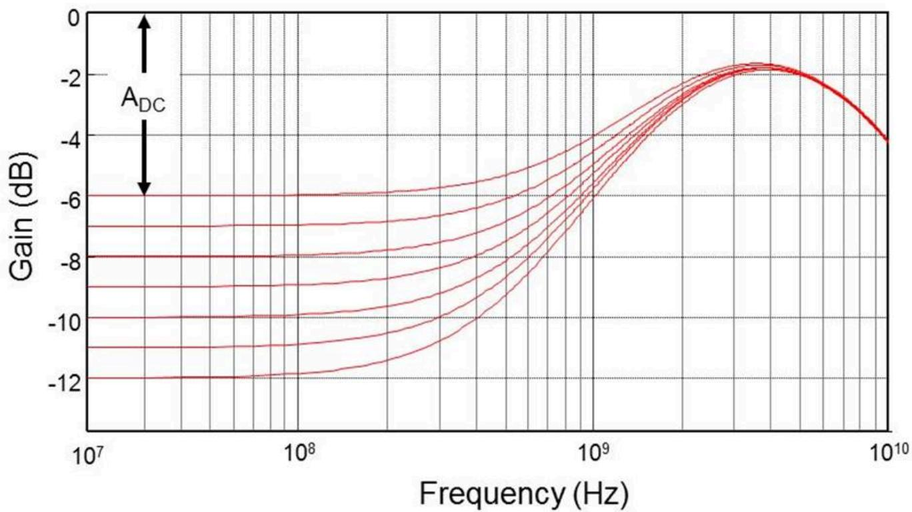

</td>
<td style="background-color:#e8e8e8">

> **图 8-35.** 8.0 GT/s 行为 CTLE 损耗曲线
> 

</td>
</tr>
</tbody>
</table>

---

<table>
<thead>
<tr>
<th width="50%">🇬🇧 English</th>
<th width="50%" style="background-color:#e8e8e8">🏆 中文</th>
</tr>
</thead>
<tbody>
<tr>
<td></td>
<td style="background-color:#e8e8e8">

</td>
</tr>
</tbody>
</table>

> **Figure 8-36.** Loss Curves for 16.0 GT/s Behavioral CTLE
> 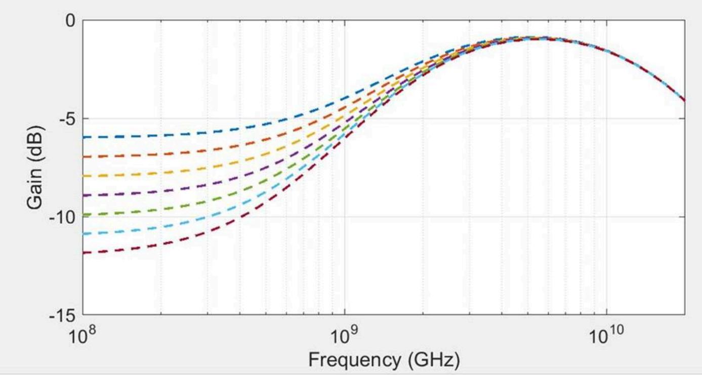


---

<table>
<thead>
<tr>
<th width="50%">🇬🇧 English</th>
<th width="50%" style="background-color:#e8e8e8">🏆 中文</th>
</tr>
</thead>
<tbody>
<tr>
<td>

§

§

</td>
<td style="background-color:#e8e8e8">

§

§

</td>
</tr>
</tbody>
</table>

---

<!-- 📄 Page 1460 -->
---


<div style="overflow-x: auto; max-width: 100%;">
<table>
<thead>
<tr>
<th width="50%">🇬🇧 English</th>
<th width="50%" style="background-color:#e8e8e8">🏆 中文</th>
</tr>
</thead>
<tbody>
<tr>
<td>

A Receiver operating at 16.0 GT/s utilizes a similar set of CTLE curves with different pole locations. The difference is that ωp1 =pole 1= 2π* 2 GHz and ωp2 = pole2 = 2π * 16.0 GHz. The range for ADC remains the same as that for 8.0 GT/s.

32.0 GT/s behavioral Rx equalization defines a 2nd order CTLE with fixed poles, and an adjustable DC gain (ADC) specified according to the family of curves shown in § Figure 8-37. The ADC is adjustable over a range of -5 to -15 dB in steps of 1.0 dB.

H(s) =

(ωP1 × ωP3 × ωP4) / ωZ1

×

((s + ωZ1)(s + ωP2 × ADC))

((s + ωP1)(s + ωP2)(s + ωP3)(s + ωP4))

ωx = 2π × Fx

FP1 = 1.65 × FZ1

FP2 = 9.5 GHz

FP3 = 28 GHz

FP4 = 28 GHz

FZ1 = 450 MHz

FZ2 = mag(DC gain) × FP2

Equation 8-14 Behavioral CTLE at 32.0 GT/s

§ Figure 8-37 illustrates the gain vs. frequency behavior of the CTLE as ADC is varied over its minimum to maximum range in 1.0 dB steps. Note that the maximum frequency of the CTLE curves is 200 GHz which ensures accuracy in the time-domain post-processing simulation tools.

8.4.1.9 Behavioral CTLE (32.0 and 64.0 GT/s) §

§

</td>
<td style="background-color:#e8e8e8">

运行在 16.0 GT/s 的接收器使用一组类似但极点位置不同的 CTLE 曲线。其差异在于 ωp1 = 极点 1 = 2π* 2 GHz,而 ωp2 = 极点 2 = 2π * 16.0 GHz。ADC 的可调范围与 8.0 GT/s 相同。

32.0 GT/s 的行为级 Rx 均衡定义了一个二阶 CTLE,其极点固定，直流增益 (ADC) 可调，按 § Figure 8-37 中所示的曲线族来规定。ADC 的可调范围为 -5 至 -15 dB,步进为 1.0 dB。

H(s) =

(ωP1 × ωP3 × ωP4) / ωZ1

×

((s + ωZ1)(s + ωP2 × ADC))

((s + ωP1)(s + ωP2)(s + ωP3)(s + ωP4))

ωx = 2π × Fx

FP1 = 1.65 × FZ1

FP2 = 9.5 GHz

FP3 = 28 GHz

FP4 = 28 GHz

FZ1 = 450 MHz

FZ2 = |直流增益| × FP2

公式 8-14 32.0 GT/s 下的行为级 CTLE

§ Figure 8-37 展示了 CTLE 在 ADC 以 1.0 dB 步进从最小到最大变化时的增益-频率特性。注意 CTLE 曲线的最大频率为 200 GHz,这可保证时域后处理仿真工具的精度。

8.4.1.9 行为级 CTLE (32.0 和 64.0 GT/s) §

§

</td>
</tr>
</tbody>
</table>
</div>


---

<!-- 📄 Page 1461 -->
---

<table>
<thead>
<tr>
<th width="50%">🇬🇧 English</th>
<th width="50%" style="background-color:#e8e8e8">🏆 中文</th>
</tr>
</thead>
<tbody>
<tr>
<td>

> **Figure 8-37.** Loss Curves for 32.0 GT/s Behavioral CTLE
> 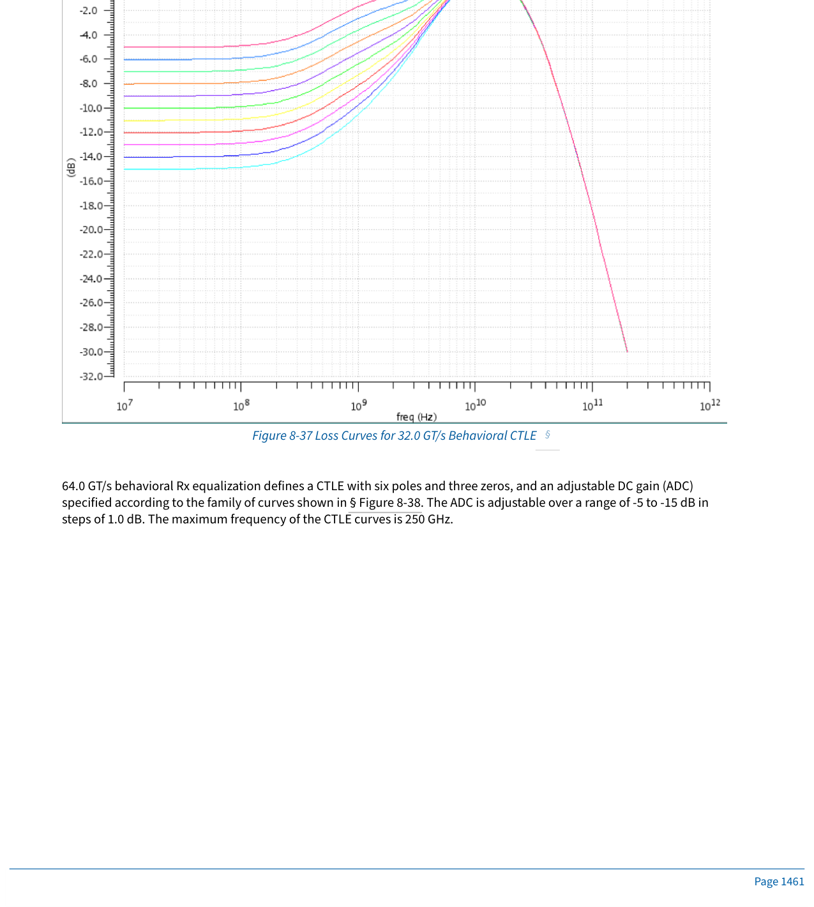

</td>
<td style="background-color:#e8e8e8">

> **图 8-37.** 32.0 GT/s 行为 CTLE 损耗曲线
> 

</td>
</tr>
</tbody>
</table>

---

<table>
<thead>
<tr>
<th width="50%">🇬🇧 English</th>
<th width="50%" style="background-color:#e8e8e8">🏆 中文</th>
</tr>
</thead>
<tbody>
<tr>
<td>

64.0 GT/s behavioral Rx equalization defines a CTLE with six poles and three zeros, and an adjustable DC gain (ADC) specified according to the family of curves shown in § Figure 8-38. The ADC is adjustable over a range of -5 to -15 dB in steps of 1.0 dB. The maximum frequency of the CTLE curves is 250 GHz.

§

</td>
<td style="background-color:#e8e8e8">

64.0 GT/s 的行为级 Rx 均衡定义了一个具有 6 个极点和 3 个零点的 CTLE,其直流增益 (ADC) 可调，按 § Figure 8-38 中所示的曲线族来规定。ADC 的可调范围为 -5 至 -15 dB,步进为 1.0 dB。CTLE 曲线的最大频率为 250 GHz。

§

</td>
</tr>
</tbody>
</table>

---

<!-- 📄 Page 1462 -->
---

<table>
<thead>
<tr>
<th width="50%">🇬🇧 English</th>
<th width="50%" style="background-color:#e8e8e8">🏆 中文</th>
</tr>
</thead>
<tbody>
<tr>
<td>

H(s) =

(ωp1 × ωp3 × ωp4 × ωp5 × ωp6) / (ωz1 × ωz3)

×

((s + ωz1) × (s + ωp2 × ADC) × (s + ωz3))

((s + ωp1) × (s + ωp2) × (s + ωp3) × (s + ωp4) × (s + ωp5) × (s + ωp6))

ωx = 2π × Fx

FP1 = 1.30 × Fz1

FP2 = 7.7 GHz

FP3 = 22.0 GHz

FP4 = 28.0 GHz

FP5 = 32.0 GHz

FP6 = 32.0 GHz

FZ1 = 250 MHz

FZ2 = mag(DC gain) × FP2

FZ3 = 7.7 GHz

Equation 8-15 Behavioral CTLE at 64.0 GT/s §

</td>
<td style="background-color:#e8e8e8">

H(s) =

(ωp1 × ωp3 × ωp4 × ωp5 × ωp6) / (ωz1 × ωz3)

×

((s + ωz1) × (s + ωp2 × ADC) × (s + ωz3))

((s + ωp1) × (s + ωp2) × (s + ωp3) × (s + ωp4) × (s + ωp5) × (s + ωp6))

ωx = 2π × Fx

FP1 = 1.30 × Fz1

FP2 = 7.7 GHz

FP3 = 22.0 GHz

FP4 = 28.0 GHz

FP5 = 32.0 GHz

FP6 = 32.0 GHz

FZ1 = 250 MHz

FZ2 = |直流增益| × FP2

FZ3 = 7.7 GHz

公式 8-15 64.0 GT/s 下的行为级 CTLE §

</td>
</tr>
</tbody>
</table>

---

<!-- 📄 Page 1463 -->
---

<table>
<thead>
<tr>
<th width="50%">🇬🇧 English</th>
<th width="50%" style="background-color:#e8e8e8">🏆 中文</th>
</tr>
</thead>
<tbody>
<tr>
<td></td>
<td style="background-color:#e8e8e8">

</td>
</tr>
</tbody>
</table>

> **Figure 8-38.** Loss Curves for 64.0 GT/s Behavioral CTLE
> 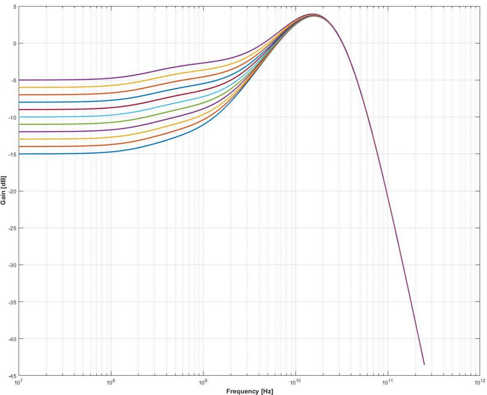


---


<div style="overflow-x: auto; max-width: 100%;">
<table>
<thead>
<tr>
<th width="50%">🇬🇧 English</th>
<th width="50%" style="background-color:#e8e8e8">🏆 中文</th>
</tr>
</thead>
<tbody>
<tr>
<td>

At 8.0 GT/s the combination of a 1st order CTLE and a one-tap DFE algorithm is required for calibrating the stressed eye when employing the max length calibration channel. The DFE may be represented by the following equation and flow diagram. For 8.0 GT/s and 16.0 GT/s the limits on d1 are ±30 mV. For 32.0 GT/s the limit on d1 is defined as a ratio of the tap magnitude (h1) to the cursor strength (h0). The h1/h0 ratio must be less than or equal to 0.8. Note that the h1/h0 limit of 0.8 is only to bound the behavior of the reference receiver and does not indicate that real implementations will be safe from error bursts due to large h1/h0 causing undetected data errors if the h1/h0 ratio is below 0.8. Implementers must do their own analysis for their specific designs on the largest safe h1/h0 ratio. Note that an optional precoding mechanism is provided at 32.0 GT/s that receivers can optionally enable to reduce the risk of DFE related error bursts in high transition data patterns causing silent data corruption. For 16.0 GT/s the limits on d2 are ±20 mV. For 32.0 GT/s the limits on d2 and d3 are ±20 mV.

8.4.1.10 Behavioral DFE (8.0, 16.0, 32.0, and 64.0 GT/s Only) §

§

</td>
<td style="background-color:#e8e8e8">

在 8.0 GT/s 下，使用最大长度校准通道 (Channel) 校准压力眼图 (Stressed Eye) 时，需要组合使用一阶 CTLE 和单抽头 DFE (判决反馈均衡器) 算法。DFE 可用以下公式和流程图表示。对于 8.0 GT/s 和 16.0 GT/s,d1 的限值为 ±30 mV。对于 32.0 GT/s,d1 的限值定义为抽头幅度 (h1) 与光标强度 (h0) 之比。h1/h0 比值必须小于或等于 0.8。注意 h1/h0 = 0.8 的限值仅用于约束参考接收器的行为，并不代表实际实现即使 h1/h0 低于 0.8 就能避免因 h1/h0 过大而引起未检测到的数据错误的突发错误。实现者必须针对其特定设计自行分析最大安全的 h1/h0 比值。注意 32.0 GT/s 提供了一种可选的预编码 (Precoding) 机制，接收器可选择启用，以降低高翻转数据码型下 DFE 相关突发错误导致静默数据损坏的风险。对于 16.0 GT/s,d2 的限值为 ±20 mV。对于 32.0 GT/s,d2 和 d3 的限值均为 ±20 mV。

8.4.1.10 行为级 DFE (仅限 8.0、16.0、32.0 和 64.0 GT/s) §

§

</td>
</tr>
</tbody>
</table>
</div>


---

<!-- 📄 Page 1464 -->
---

<table>
<thead>
<tr>
<th width="50%">🇬🇧 English</th>
<th width="50%" style="background-color:#e8e8e8">🏆 中文</th>
</tr>
</thead>
<tbody>
<tr>
<td>

> **Figure 8-39.** Variables Definition and Diagram for 1-tap DFE
> 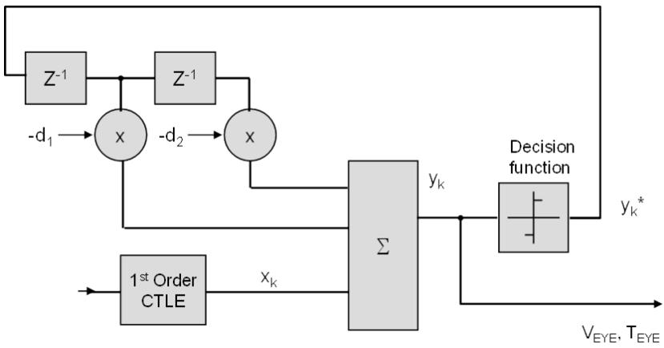

</td>
<td style="background-color:#e8e8e8">

> **图 8-39.** 1-tap DFE 的变量定义与示意图
> 

</td>
</tr>
</tbody>
</table>

---

<table>
<thead>
<tr>
<th width="50%">🇬🇧 English</th>
<th width="50%" style="background-color:#e8e8e8">🏆 中文</th>
</tr>
</thead>
<tbody>
<tr>
<td>

16.0 GT/s Receiver tolerancing utilizes a CTLE and a 2-tap behavioral DFE as illustrated below. Other than the inclusion of the second tap, it is identical to the 1-tap DFE shown above. The 32.0 GT/s Receiver tolerancing utilizes a CTLE and a 3-tap behavior DFE.

</td>
<td style="background-color:#e8e8e8">

16.0 GT/s 接收器的容差分析使用 CTLE 加 2 抽头行为级 DFE,如下图所示。除了增加第二个抽头外，它与上面所示的 1 抽头 DFE 完全相同。32.0 GT/s 接收器的容差分析使用 CTLE 加 3 抽头行为级 DFE。

</td>
</tr>
</tbody>
</table>

---

<table>
<thead>
<tr>
<th width="50%">🇬🇧 English</th>
<th width="50%" style="background-color:#e8e8e8">🏆 中文</th>
</tr>
</thead>
<tbody>
<tr>
<td></td>
<td style="background-color:#e8e8e8">

</td>
</tr>
</tbody>
</table>

> **Figure 8-40.** Diagram for 2-tap DFE
> 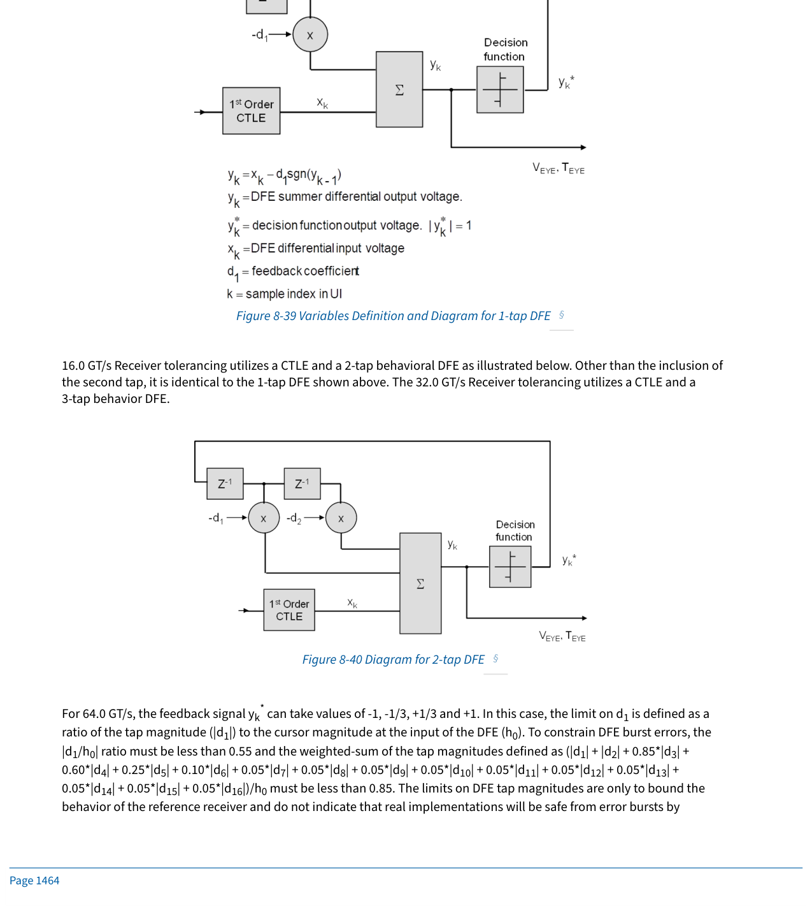


---


<div style="overflow-x: auto; max-width: 100%;">
<table>
<thead>
<tr>
<th width="50%">🇬🇧 English</th>
<th width="50%" style="background-color:#e8e8e8">🏆 中文</th>
</tr>
</thead>
<tbody>
<tr>
<td>

For 64.0 GT/s, the feedback signal yk* can take values of -1, -1/3, +1/3 and +1. In this case, the limit on d1 is defined as a ratio of the tap magnitude (|d1|) to the cursor magnitude at the input of the DFE (h0). To constrain DFE burst errors, the |d1/h0| ratio must be less than 0.55 and the weighted-sum of the tap magnitudes defined as (|d1| + |d2| + 0.85*|d3| + 0.60*|d4| + 0.25*|d5| + 0.10*|d6| + 0.05*|d7| + 0.05*|d8| + 0.05*|d9| + 0.05*|d10| + 0.05*|d11| + 0.05*|d12| + 0.05*|d13| + 0.05*|d14| + 0.05*|d15| + 0.05*|d16|)/h0 must be less than 0.85. The limits on DFE tap magnitudes are only to bound the behavior of the reference receiver and do not indicate that real implementations will be safe from error bursts by

§

§

</td>
<td style="background-color:#e8e8e8">

对于 64.0 GT/s,反馈信号 yk* 可取值为 -1、-1/3、+1/3 和 +1。在这种情况下,d1 的限值定义为抽头幅度 (|d1|) 与 DFE 输入端光标幅度 (h0) 之比。为限制 DFE 突发错误,|d1/h0| 比值必须小于 0.55,且由 (|d1| + |d2| + 0.85*|d3| + 0.60*|d4| + 0.25*|d5| + 0.10*|d6| + 0.05*|d7| + 0.05*|d8| + 0.05*|d9| + 0.05*|d10| + 0.05*|d11| + 0.05*|d12| + 0.05*|d13| + 0.05*|d14| + 0.05*|d15| + 0.05*|d16|)/h0 定义的抽头幅度加权和必须小于 0.85。DFE 抽头幅度的限值仅用于约束参考接收器的行为，并不意味着通过

§

§

</td>
</tr>
</tbody>
</table>
</div>


---

<!-- 📄 Page 1465 -->
---

<table>
<thead>
<tr>
<th width="50%">🇬🇧 English</th>
<th width="50%" style="background-color:#e8e8e8">🏆 中文</th>
</tr>
</thead>
<tbody>
<tr>
<td>

ensuring the DFE tap magnitude limits specified for the reference receiver. Implementers must do their own analysis for their specific designs on the largest safe DFE tap magnitudes.

Rx testing at 16.0, 32.0, and 64.0 GT/s requires only a single stressed voltage/stressed jitter test per data rate. When testing a Receiver, it is required to have other PCI Express Lanes on the DUT sending or receiving data. Similarly, if the device supports other I/O, it should also be sending or receiving on these interfaces. The goal is to have the Rx test environment replicate the noise environment found in a real system as closely as possible.

The goal of calibrating a stressed voltage/jitter eye is to present the Receiver under test with simultaneously worst case margins whose distortion characteristics are like an eye produced by a real channel. Much of the distortion consists of the ISI produced by the calibration channel. Incremental changes of Rj and differential voltage are allowed to adjust the EW and EH, respectively at 8.0 GT/s. Incremental changes of Sj, VRX-DIFF-INT, and differential voltage swing from nominal values may be used to adjust the EW and EH at 16.0, 32.0, and 64.0 GT/s. Refer to § Table 8-11 for initial values of various stress parameters for all data rates.

The reference point where EH/EW is defined corresponds to input to the Receiver latch at 8.0, 16.0, 32.0, and 64.0 GT/s. Since this point is not physically accessible it is necessary to construct its equivalent by means of a post-processing procedure. A two million unit interval data record of compliance pattern or a step that has been averaged 1024 times at TP2 is first post processed to mathematically include the additional signal distortion caused by the behavioral Receiver package. If a compliance pattern waveform is used then all stresses except VRX-CM-INT are turned on if a step is used then all stresses are turned off. Then the resulting signal is recovered by means of Rx equalization, and a behavioral CDR function, resulting in an equivalent eye. The requirements for the waveform post processing tool used for the EH/EW calibration are described further in § Section 8.4.2.1.1. If the receiver calibration eye margin simulation tool uses a step response, the Rj, Sj, and VRx-DIFF-INT are input parameters to the simulation tool. If the receiver calibration eye margin simulation tool uses compliance pattern waveform, the Rj, Sj, and VRx-DIFF-INT are inputs to the waveform. In either case, the stress parameters must be calibrated.

As the calibration procedure of the signal generator output contains steps where the generator is connected directly to measurement instrumentation, the transition time of the output waveform can be very fast. Therefore, it is important that the bandwidth of instrumentation used to calibrate the generator be matched appropriately to the edge rate of the generator output. This specification requires the use of a generator for 16.0 GT/s testing whose outputs have a rise time of 14 ps-19 ps (20% / 80%) which also requires a minimum oscilloscope bandwidth of 25 GHz. This oscilloscope bandwidth is also the minimum required bandwidth for transmitter measurements at 16.0 GT/s. For 32.0 and 64.0 GT/s testing the specification requires the use of a generator whose outputs have a rise time of 7.5 - 15.0 ps (20%/80% measured with P4) which requires a minimum oscilloscope bandwidth of 50 GHz. This oscilloscope bandwidth is also the minimum required for transmitter measurements at 32.0 and 64.0 GT/s. A minimum oscilloscope sampling rate that captures at least 4 samples per unit interval is required for all data rates.

For the eye calibration process, the Tx equalization is fixed to the preset that gives the optimal eye area with the post processing tool being used for calibration. Once the testing procedure is under way the Tx preset may be adjusted to yield the best eye margins with the DUT. During EH/EW calibration Sj is initially set to 100 MHz with a nominal amplitude of 0.1 UI for 8.0, 16.0, and 32.0 GT/s, with a nominal amplitude of 0.05 UI for 64.0 GT/s. The 100 MHz Sj amplitude will be swept during the stressed eye calibration. Tx EQ and differential voltage swing calibration are done at TP3 as shown in § Figure 8-26. The coaxial cable from TP1 to TP3 is considered part of the generator and not included in the channel insertion loss measurements for 32.0 GT/s and 64.0 GT/s stressed eye calibration, but the coaxial cable is included in the total channel insertion loss measurement at 16.0 GT/s to keep consistency with the 16.0 GT/s measurement methodology adopted in PCIe 4.0. For calibration at 16.0 GT/s the following process is used to calibrate the eye:

8.4.2 Stressed Eye Test §

8.4.2.1 Procedure for Calibrating a Stressed EH/EW Eye §

</td>
<td style="background-color:#e8e8e8">

为参考接收器规定的 DFE 抽头幅度限值就能使实际实现避免突发错误。实现者必须针对其特定设计自行分析最大安全的 DFE 抽头幅度。

16.0、32.0 和 64.0 GT/s 的 Rx 测试在每个速率下仅需一次压力电压/压力抖动 (Stressed Voltage/Stressed Jitter) 测试。在测试接收器时，要求 DUT 上的其他 PCI Express 通道 (Lane) 正在发送或接收数据。类似地，如果该设备支持其他 I/O,这些接口也应同时处于发送或接收状态。目标是使 Rx 测试环境尽可能真实地复现实际系统中的噪声环境。

压力电压/抖动眼图 (Stressed Voltage/Jitter Eye) 校准的目标是向被测接收器同时呈现最差余量，其失真特性与真实通道产生的眼图相似。大部分失真来自校准通道产生的 ISI (码间干扰)。在 8.0 GT/s 下，允许通过微调 Rj 和差分电压来分别调整 EW (眼宽) 和 EH (眼高)。在 16.0、32.0 和 64.0 GT/s 下，可通过微调 Sj、VRX-DIFF-INT 和差分电压摆幅 (相对标称值) 来调整 EW 和 EH。所有速率下各压力参数的初始值参见 § Table 8-11。

EH/EW 定义的参考点对应于 8.0、16.0、32.0 和 64.0 GT/s 下接收器锁存器的输入。由于该点在物理上无法直接测量，必须通过后处理 (Post-Processing) 程序构建其等效值。首先在 TP2 处将一段 2 百万单位间隔 (UI) 的一致性测试码型 (Compliance Pattern) 数据记录，或一段平均 1024 次的阶跃信号进行后处理，在数学上加入行为级接收器封装带来的额外信号失真。如果使用一致性测试码型波形，则除 VRX-CM-INT 外的所有压力均打开;如果使用阶跃信号，则所有压力均关闭。然后通过 Rx 均衡和行为级 CDR (时钟数据恢复) 函数恢复信号，从而得到等效眼图。用于 EH/EW 校准的波形后处理工具的要求在 § Section 8.4.2.1.1 中进一步说明。如果接收器校准的眼图余量仿真工具使用阶跃响应，则 Rj、Sj 和 VRx-DIFF-INT 是该仿真工具的输入参数。如果接收器校准的眼图余量仿真工具使用一致性测试码型波形，则 Rj、Sj 和 VRx-DIFF-INT 是该波形的输入参数。无论哪种情况，压力参数都必须经过校准。

由于信号发生器输出的校准流程中包含将发生器直接连接到测量仪器的步骤，输出波形的跳变时间可能非常快。因此，用于校准发生器的仪器带宽必须与发生器输出的边沿速率适当匹配。本规范要求用于 16.0 GT/s 测试的发生器输出上升时间为 14 ps-19 ps (20% / 80%)，这同时要求示波器的最小带宽为 25 GHz。该示波器带宽也是 16.0 GT/s 发送器测量的最低带宽要求。对于 32.0 和 64.0 GT/s 测试，本规范要求发生器输出的上升时间为 7.5 - 15.0 ps (20%/80%,用 P4 测量)，这要求示波器的最小带宽为 50 GHz。该示波器带宽也是 32.0 和 64.0 GT/s 发送器测量的最低带宽要求。在所有速率下，示波器的最小采样率必须保证每单位间隔至少采集 4 个采样点。

在眼图校准过程中,Tx 均衡被固定为在使用中的后处理工具下能给出最佳眼图面积的预设 (Preset)。一旦测试流程开始，可调整 Tx 预设 (Preset) 以使 DUT 获得最佳眼图余量。在 EH/EW 校准期间,Sj 在 8.0、16.0 和 32.0 GT/s 下初始设为 100 MHz、标称幅度 0.1 UI,在 64.0 GT/s 下标称幅度 0.05 UI。在压力眼图校准过程中将对 100 MHz Sj 的幅度进行扫描。Tx EQ 和差分电压摆幅的校准在 TP3 处进行，如图 § Figure 8-26 所示。在 32.0 GT/s 和 64.0 GT/s 的压力眼图校准中，从 TP1 到 TP3 的同轴电缆被视为发生器的一部分，不计入通道插损测量;但在 16.0 GT/s 下，同轴电缆计入总通道插损测量，以保持与 PCIe 4.0 中采用的 16.0 GT/s 测量方法的一致性。16.0 GT/s 的眼图校准按以下流程进行:

8.4.2 压力眼图测试 §

8.4.2.1 压力 EH/EW 眼图校准流程 §

</td>
</tr>
</tbody>
</table>

---

<!-- 📄 Page 1466 -->
---


<div style="overflow-x: auto; max-width: 100%;">
<table>
<thead>
<tr>
<th width="50%">🇬🇧 English</th>
<th width="50%" style="background-color:#e8e8e8">🏆 中文</th>
</tr>
</thead>
<tbody>
<tr>
<td>

1. Calibrate the stress values to the nominal values in § Table 8-11.

2. Select an initial test channel length that gives a loss at TP2P at 8 GHz of 27 dB±0.5 dB.

3. Measure the eye diagram for each TX EQ preset using the nominal TX Eq for the preset +/- 0.1 dB and select the TX EQ preset that gives the largest eye area.

For all EH, EW and eye area measurements performed in receiver calibration the ADC in the reference receiver CTLE is varied over its minimum to maximum range in 0.25 dB steps. This is done to improve repeatability and accuracy in automated Rx calibration software and is only done for stressed eye calibration (not for channel compliance, etc.)

4. Increase the calibration channel loss to the next available length/loss and measure the new eye diagram at the selected preset. Continue to increase the length/loss until either the height or width have fallen below the targets in § Table 8-11 then the previous calibration channel length/loss is selected. If neither the height or width have fallen below the targets and the TP3 (§ Figure 8-26) to TP2P loss at 8 GHz has reached 30.0 dB then advance to the next step.

5. For the selected calibration channel length/loss, measure the eye diagram for each TX EQ preset and select the preset that gives the largest eye area. Note that this may be a different preset than step 3 due to the length/loss change.

6. Adjust Sj, VRX-DIFF-INT, and Voltage Swing to make final adjustments to the eye by sweeping them through the following ranges:

   a. Sj 5 to 10 ps PP.

   b. VRX-DIFF-INT 10 to 25 mV at TP2.

   c. Differential Voltage Swing 720 to 800 mV PP at TP1.

7. If the final Sj value is less then 0.1 UI then the Rj level is reduced so the eye width meets the target eye width with 0.1 UI of 100 MHz Sj.

8. If there are multiple combinations of Sj, VRX-DIFF-INT, and Voltage Swing that give valid solutions first pick the combination that is closest to the target eye width (18.75 ps). If there are multiple Sj, VRX-DIFF-INT, and Voltage Swing combinations that are equally close to the target eye width then pick the one with Sj closest to nominal.

The selected values must give a mean eye height and width (over at least 5 measurements exact number of measurements needed for stable values will depend on lab set-up and tools) within the following ranges at BER E-12:

   a. Eye height 15 mV +/- 1.5 mV

   b. Eye width 18.75 ps +/- 0.5 ps

For calibration at 32.0 GT/s the following process is used to calibrate the eye:

1. Measure the eye diagram for each TX EQ preset using the nominal TX Eq for the preset +/- 0.3 dB and select the TX EQ preset that gives the largest eye area.

For all EH, EW and eye area measurements performed in receiver calibration the ADC in the reference receiver CTLE is varied over its minimum to maximum range in 1.0 dB steps. Measure the eye diagram varying the following parameters with the maximum indicated step size for each variable parameter:

   a. Calibrate the stress values to the initial values in § Table 8-11. The Rj stress is kept constant.

   b. Channel loss from TP3 to TP2P varied from 34.0 to 37.0 dB with a maximum 0.5 dB step size. Note that if your actual channel loss comes out to slightly above 37 or slightly below 34 that these cases are excluded (loss must be between 34.0 and 37.0 dB)

   c. Sj varied from 1 to 5 ps PP with a maximum 0.25 ps step size with Sj measured at TP3

</td>
<td style="background-color:#e8e8e8">

1. 将压力值校准到 § Table 8-11 中的标称值。

2. 选择一个初始测试通道长度，使其在 8 GHz 频率下 TP2P 处的损耗为 27 dB±0.5 dB。

3. 对每个 TX EQ 预设 (Preset)，使用该预设的标称 TX Eq +/- 0.1 dB 测量眼图，并选择给出最大眼图面积的 TX EQ 预设。

在校准接收器时所执行的所有 EH、EW 和眼图面积测量中，参考接收器 CTLE 的 ADC 在其最小到最大范围内以 0.25 dB 步进进行扫描。这样做是为了提高自动 Rx 校准软件的可重复性和精度，且仅在压力眼图校准时执行 (不用于通道一致性测试等)。

4. 将校准通道损耗增加到下一个可用的长度/损耗，并在所选预设下测量新眼图。继续增加长度/损耗，直到高度或宽度低于 § Table 8-11 中的目标值，此时选择前一个校准通道长度/损耗。如果高度和宽度均未低于目标值，且 TP3 (§ Figure 8-26) 到 TP2P 在 8 GHz 处的损耗已达到 30.0 dB,则进入下一步。

5. 对所选的校准通道长度/损耗，测量每个 TX EQ 预设的眼图，并选择给出最大眼图面积的预设。注意，由于长度/损耗的变化，所选预设可能与步骤 3 不同。

6. 通过在以下范围内扫描 Sj、VRX-DIFF-INT 和电压摆幅，对眼图进行最终调整:

   a. Sj 5 至 10 ps PP。

   b. VRX-DIFF-INT 在 TP2 处 10 至 25 mV。

   c. 差分电压摆幅 在 TP1 处 720 至 800 mV PP。

7. 如果最终 Sj 值小于 0.1 UI,则降低 Rj 电平，以使眼宽在 0.1 UI 的 100 MHz Sj 下达到目标眼宽。

8. 如果存在多种 Sj、VRX-DIFF-INT 和电压摆幅的组合均给出有效解，首先选择最接近目标眼宽 (18.75 ps) 的组合。如果有多个与目标眼宽同等接近的组合，则选择 Sj 最接近标称值的组合。

所选值必须在 BER E-12 下，在以下范围内给出至少 5 次测量的平均眼高和眼宽 (稳定值所需的确切测量次数将取决于实验室设置和工具):

   a. 眼高 15 mV +/- 1.5 mV

   b. 眼宽 18.75 ps +/- 0.5 ps

32.0 GT/s 下的眼图校准按以下流程进行:

1. 对每个 TX EQ 预设，使用该预设的标称 TX Eq +/- 0.3 dB 测量眼图，并选择给出最大眼图面积的 TX EQ 预设。

在校准接收器时所执行的所有 EH、EW 和眼图面积测量中，参考接收器 CTLE 的 ADC 在其最小到最大范围内以 1.0 dB 步进进行扫描。按以下参数及其最大步长测量眼图:

   a. 将压力值校准到 § Table 8-11 中的初始值。Rj 压力保持恒定。

   b. TP3 到 TP2P 之间的通道损耗变化范围为 34.0 至 37.0 dB,最大步长 0.5 dB。注意，如果实际通道损耗略高于 37 或略低于 34,这些情况将被排除 (损耗必须介于 34.0 和 37.0 dB 之间)。

   c. Sj 变化范围为 1 至 5 ps PP,最大步长 0.25 ps,Sj 在 TP3 处测量。

</td>
</tr>
</tbody>
</table>
</div>


---

<!-- 📄 Page 1467 -->
---

<table>
<thead>
<tr>
<th width="50%">🇬🇧 English</th>
<th width="50%" style="background-color:#e8e8e8">🏆 中文</th>
</tr>
</thead>
<tbody>
<tr>
<td>

   d. VRX-DIFF-INT 5 to 30 mV at TP2 with a maximum 2.5 mV step size

2. If the final Sj value is less then 0.1 UI then the Rj level is reduced so the eye width meets the target eye width with 0.1 UI of 100 MHz Sj.

3. If there are multiple combinations of Sj, VRX-DIFF-INT, and channel loss that give valid solutions first pick the combination with the highest channel loss. If there are multiple combinations that work with the highest channel loss, then select the combination that is closest to the target eye height (15.0 mV). The selected values must give a mean eye height and width (over at least 5 measurements exact number of measurements needed for stable values will depend on lab set-up and tools) within the following ranges at BER E-12. A specific method for finding the combination of stress values that meet these criteria is outside the scope of this specification. If and only if no stress combinations can be found, then the voltage swing may also be varied from 720 to 800 mV:

Note that because the first tiebreaker is highest loss - most approaches will start with the highest allowed channel loss.

   a. Eye height 15 mV +/- 1.5 mV

   b. Eye width 9.375 ps +/- 0.5 ps

For calibration at 64.0 GT/s the following process is used to calibrate the eye:

1. Measure the PAM4 eye diagrams for each TX EQ preset of Q0-Q9 using the nominal TX Eq for the preset +/- 0.3 dB and select the TX EQ preset that gives the largest top eye area.

For all EH, EW and eye area measurements performed in receiver calibration the ADC in the reference receiver CTLE is varied over its minimum to maximum range in 1.0 dB steps. Measure the eye diagrams varying the following parameters with the maximum indicated step size for each variable parameter:

   a. Calibrate the stress values to the initial values in § Table 8-11. The Rj stress is kept constant.

   b. Channel loss from TP3 to TP2P varied from 30.0 to 33.0 dB with a maximum 0.5 dB step size. Note that if your actual channel loss comes out to slightly above 33 or slightly below 30 that these cases are excluded (loss must be between 30.0 and 33.0 dB)

   c. Sj varied from 1 to 3 ps PP with a maximum 0.25 ps step size with Sj measured at TP3

   d. VRX-DIFF-INT 5 to 25 mV at TP2 with a maximum 2.0 mV step size

2. If the final Sj value is less than 0.05 UI then the Rj level is reduced so the eye width meets the target eye width with 0.05 UI of 100 MHz Sj.

3. If there are multiple combinations of Sj, VRX-DIFF-INT, and channel loss that give valid solutions first pick the combination with the highest channel loss. If there are multiple combinations that work with the highest channel loss, then select the combination that is closest to the target top eye height (6.0 mV). The selected values must give a mean eye height and width (over at least 5 measurements exact number of measurements needed for stable values will depend on lab set-up and tools) within the following ranges at BER of 10-6. A specific method for finding the combination of stress values that meet these criteria is outside the scope of this specification. If and only if no stress combinations can be found, then the voltage swing between PAM4 voltage level 0 and level 3 may also be varied from 720 to 800 mV:

Note that because the first tiebreaker is highest loss - most approaches will start with the highest allowed channel loss.

   a. Top eye height 6 mV +/- 0.5 mV

   b. Top eye width 3.125 ps +/- 0.3 ps

</td>
<td style="background-color:#e8e8e8">

   d. VRX-DIFF-INT 在 TP2 处 5 至 30 mV,最大步长 2.5 mV。

2. 如果最终 Sj 值小于 0.1 UI,则降低 Rj 电平，以使眼宽在 0.1 UI 的 100 MHz Sj 下达到目标眼宽。

3. 如果存在多种 Sj、VRX-DIFF-INT 和通道损耗的组合均给出有效解，首先选择通道损耗最高的组合。如果在最高通道损耗下仍有多种组合均有效，则选择最接近目标眼高 (15.0 mV) 的组合。所选值必须在 BER E-12 下，在以下范围内给出至少 5 次测量的平均眼高和眼宽 (稳定值所需的确切测量次数将取决于实验室设置和工具)。寻找满足这些条件的压力值组合的具体方法不在本规范范围内。当且仅当找不到任何有效的压力组合时，电压摆幅也可在 720 至 800 mV 范围内变化:

注意，由于首要决胜准则是最高损耗，大多数方法会从允许的最高通道损耗开始。

   a. 眼高 15 mV +/- 1.5 mV

   b. 眼宽 9.375 ps +/- 0.5 ps

64.0 GT/s 下的眼图校准按以下流程进行:

1. 对 Q0-Q9 的每个 TX EQ 预设，使用该预设的标称 TX Eq +/- 0.3 dB 测量 PAM4 (四电平脉冲幅度调制) 眼图，并选择给出最大顶端眼图面积的 TX EQ 预设。

在校准接收器时所执行的所有 EH、EW 和眼图面积测量中，参考接收器 CTLE 的 ADC 在其最小到最大范围内以 1.0 dB 步进进行扫描。按以下参数及其最大步长测量眼图:

   a. 将压力值校准到 § Table 8-11 中的初始值。Rj 压力保持恒定。

   b. TP3 到 TP2P 之间的通道损耗变化范围为 30.0 至 33.0 dB,最大步长 0.5 dB。注意，如果实际通道损耗略高于 33 或略低于 30,这些情况将被排除 (损耗必须介于 30.0 和 33.0 dB 之间)。

   c. Sj 变化范围为 1 至 3 ps PP,最大步长 0.25 ps,Sj 在 TP3 处测量。

   d. VRX-DIFF-INT 在 TP2 处 5 至 25 mV,最大步长 2.0 mV。

2. 如果最终 Sj 值小于 0.05 UI,则降低 Rj 电平，以使眼宽在 0.05 UI 的 100 MHz Sj 下达到目标眼宽。

3. 如果存在多种 Sj、VRX-DIFF-INT 和通道损耗的组合均给出有效解，首先选择通道损耗最高的组合。如果在最高通道损耗下仍有多种组合均有效，则选择最接近目标顶端眼高 (6.0 mV) 的组合。所选值必须在 BER 10-6 下，在以下范围内给出至少 5 次测量的平均眼高和眼宽 (稳定值所需的确切测量次数将取决于实验室设置和工具)。寻找满足这些条件的压力值组合的具体方法不在本规范范围内。当且仅当找不到任何有效的压力组合时,PAM4 (四电平脉冲幅度调制) 电压电平 0 与电平 3 之间的电压摆幅也可在 720 至 800 mV 范围内变化:

注意，由于首要决胜准则是最高损耗，大多数方法会从允许的最高通道损耗开始。

   a. 顶端眼高 6 mV +/- 0.5 mV

   b. 顶端眼宽 3.125 ps +/- 0.3 ps

</td>
</tr>
</tbody>
</table>

---

<!-- 📄 Page 1468 -->
---


<div style="overflow-x: auto; max-width: 100%;">
<table>
<thead>
<tr>
<th width="50%">🇬🇧 English</th>
<th width="50%" style="background-color:#e8e8e8">🏆 中文</th>
</tr>
</thead>
<tbody>
<tr>
<td>

For calibration at 64.0 GT/s, if the Differential Noise and/or Common Mode Noise are generated using an external source, any broadband differential noise introduced by the noise source should be characterized and added to the step response based calibration procedure through inclusion of SNDR in the modeling of the BERT transmitter.

Based upon the data rate at which the Rx is being tested, Rj or Sj and differential interference sources are adjusted to fall within the VRX-ST and TRX-ST limits. The EH and EW ranges are designed to account for post processing or measurement errors. § Figure 8-41 shows the process for calibrating the stressed jitter eye at 8.0 GT/s.

</td>
<td style="background-color:#e8e8e8">

对于 64.0 GT/s 的校准，如果差分噪声和/或共模噪声由外部源产生，则应对该噪声源引入的任何宽带差分噪声进行特征化，并通过在 BERT (误码率测试仪) 发送器建模中加入 SNDR (信噪失真比) 纳入基于阶跃响应的校准流程。

根据被测 Rx 的数据速率，调整 Rj 或 Sj 以及差分干扰源，使其落在 VRX-ST 和 TRX-ST 限值范围内。EH 和 EW 范围的设计已考虑后处理或测量误差。§ Figure 8-41 展示了 8.0 GT/s 下压力抖动眼图的校准流程。

</td>
</tr>
</tbody>
</table>
</div>


---

<table>
<thead>
<tr>
<th width="50%">🇬🇧 English</th>
<th width="50%" style="background-color:#e8e8e8">🏆 中文</th>
</tr>
</thead>
<tbody>
<tr>
<td>

> **Figure 8-41.** Layout for Calibrating the Stressed Jitter Eye at 8.0 GT/s
> 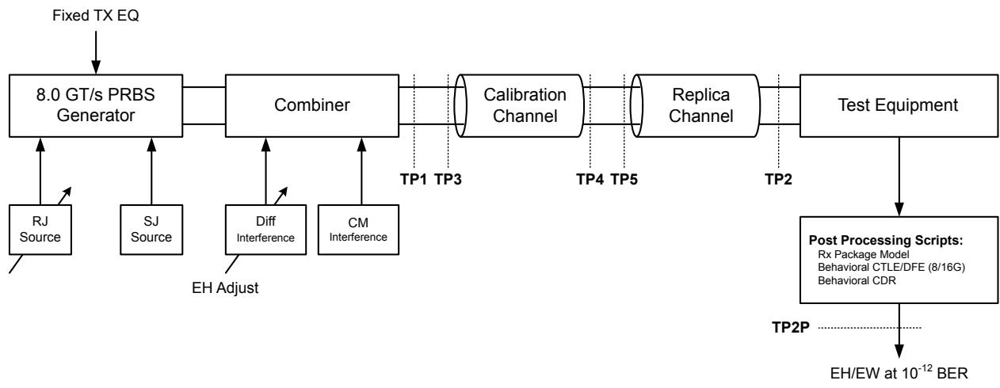

Layout (TP1 → TP5/TP4 flow):

- TP1: 8.0 GT/s PRBS Generator → Fixed TX EQ
- RJ Source, SJ Source, Combiner
- Diff Interference, CM Interference
- Calibration Channel → TP3
- Replica Channel → Test Equipment → TP2
- Post Processing Scripts: Rx Package Model, Behavioral CTLE/DFE (8/16G), Behavioral CDR
- TP2P: EH/EW at 10^-12 BER (EH Adjust)
- TP5, TP4

</td>
<td style="background-color:#e8e8e8">

布局 (TP1 → TP5/TP4 流程):

- TP1: 8.0 GT/s PRBS (伪随机二进制序列) 发生器 → 固定 TX EQ
- RJ 源、SJ 源、合路器 (Combiner)
- 差分干扰、共模干扰
- 校准通道 → TP3
- 复制通道 → 测试设备 → TP2
- 后处理脚本:Rx 封装模型、行为级 CTLE/DFE (8/16G)、行为级 CDR
- TP2P:10^-12 BER 下的 EH/EW (EH 调整)
- TP5、TP4


</td>
</tr>
</tbody>
</table>

---

<table>
<thead>
<tr>
<th width="50%">🇬🇧 English</th>
<th width="50%" style="background-color:#e8e8e8">🏆 中文</th>
</tr>
</thead>
<tbody>
<tr>
<td>

§ Figure 8-42 shows the process for calibrating the stressed jitter eye common for 16.0, 32.0, and 64.0 GT/s data rates. The PRBS Generator provides the required data rate and the eye is calibrated to the data rate specific target EH and EW at the corresponding BER.

§

</td>
<td style="background-color:#e8e8e8">

§ Figure 8-42 展示了 16.0、32.0 和 64.0 GT/s 数据速率共用的压力抖动眼图校准流程。PRBS (伪随机二进制序列) 发生器提供所需的数据速率，眼图在对应的 BER 下按该速率特定的目标 EH 和 EW 进行校准。

§

</td>
</tr>
</tbody>
</table>

---

<!-- 📄 Page 1469 -->
---


<div style="overflow-x: auto; max-width: 100%;">
<table>
<thead>
<tr>
<th width="50%">🇬🇧 English</th>
<th width="50%" style="background-color:#e8e8e8">🏆 中文</th>
</tr>
</thead>
<tbody>
<tr>
<td>

Layout (TP1 → TP5/TP4 flow):

- TP1: PRBS Generator → Fixed TX EQ
- RJ Source, SJ Source, Combiner
- Diff Interference, CM Interference
- CEM Connector → Calibration Channel → TP3
- Replica Channel → Test Equipment → TP2
- Post Processing Scripts: Rx Package Model, Behavioral CTLE/DFE, Behavioral CDR
- TP2P: Target EH/EW at BER (Small EH Adjust, Small EW Adjust)
- TP5, TP4: EH or EW Adjust

</td>
<td style="background-color:#e8e8e8">

布局 (TP1 → TP5/TP4 流程):

- TP1: PRBS (伪随机二进制序列) 发生器 → 固定 TX EQ
- RJ 源、SJ 源、合路器 (Combiner)
- 差分干扰、共模干扰
- CEM (卡缘连接器) 连接器 → 校准通道 → TP3
- 复制通道 → 测试设备 → TP2
- 后处理脚本:Rx 封装模型、行为级 CTLE/DFE、行为级 CDR
- TP2P:BER 下的目标 EH/EW (小 EH 调整、小 EW 调整)
- TP5、TP4:EH 或 EW 调整

</td>
</tr>
</tbody>
</table>

> **Figure 8-42.** Layout for Calibrating the Stressed Jitter Eye at 16.0, 32.0, and 64.0 GT/s
> 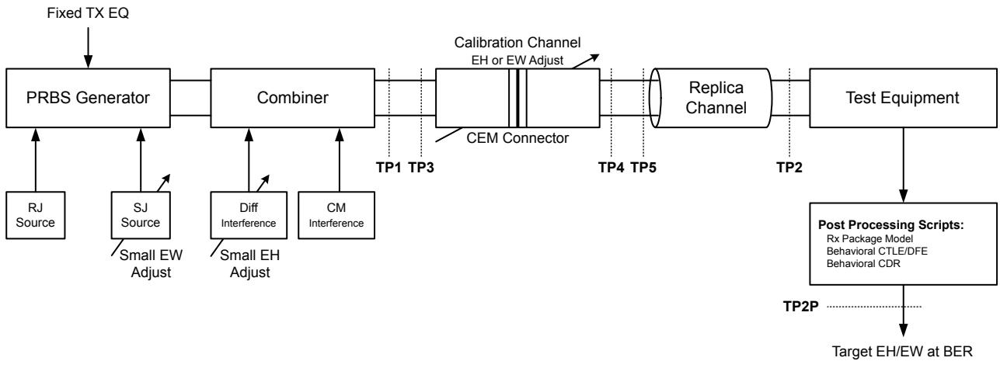

</div>


---

**Table 8-11. Stressed Jitter Eye Parameters | 表 8-11 压力抖动眼图参数**

| Symbol | Parameter | 2.5 GT/s | 5.0 GT/s | 8.0 GT/s | 16.0 GT/s | 32.0 GT/s | 64.0 GT/s | Units | Details |
|--------|-----------|----------|----------|----------|-----------|-----------|-----------|-------|---------|
| VRX-LAUNCH | Generator launch voltage | 800 to 1200 | 800 to 1200 | 800 to 1200 | 800 | 800 | 800 | mV PP | Note 1 |
| TRX-UI | Unit Interval | 400 | 200 | 125 | 62.5 | 31.25 | 31.25 | ps |  |
| TRX-ST | Target Eye width (Top Eye for PAM4) | 0.4 | 0.32 | 0.30 | 0.30 | 0.30 | 0.10 | UI | Note 3, 4, 8, 10 |
| VRX-ST | Target Eye height (Top Eye for PAM4) | 175 | 100 | 25 | 15 | 15 | 6 | mV PP | Note 2, 4, 8, 9 |
| TRX-ST-SJ | Swept Sj | N/A | 75 ps (max) | See Note 11 | See § Section 8.4.2.2.1 | See § Section 8.4.2.2.1 | See § Section 8.4.2.2.1 | ps | Note 5 |
| TRX-ST-RJ | Random Jitter | N/A | 3.4 (max) | 3.0 | 1.0 | 0.5 | 0.25 | ps RMS | Note 6, 7 |
| VRX-DIFF-INT | Differential noise | N/A | N/A | 14 | 14 | 20 | 15 | mV PP | Note 7, 12. Adjust to set EH. Frequency = 2.1 GHz |
| VRX-CM-INT | Common mode noise | 150 | 150 | 150 | 150 | 150 | 75 | mV PP | Note 8 |
| VSSC-RES | SSC Residual | N/A | 75 | N/A | 500 | N/A | N/A | ps | Note 11, 13 |

**Notes: 注释**

---

<!-- 📄 Page 1470 -->
---

**Table 8-11 (continued). Notes | 表 8-11 (续) 注释**

<table>
<thead>
<tr>
<th width="50%">🇬🇧 English</th>
<th width="50%" style="background-color:#e8e8e8">🏆 中文</th>
</tr>
</thead>
<tbody>
<tr>
<td>

**Symbol / Parameter** | 2.5 GT/s | 5.0 GT/s | 8.0 GT/s | 16.0 GT/s | 32.0 GT/s | 64.0 GT/s | **Units** | **Details**

1. VRX-LAUNCH may be adjusted to meet VRX-ST as long as the outside eye voltage at TP2 does not exceed 1300 mVPP for calibration at 2.5, 5.0, and 8.0 GT/s. VRX-LAUNCH is adjusted from 800 to 720 mV for 16.0, 32.0, and 64.0 GT/s calibration with 800 mV as the nominal value.

2. Voltages shown for 2.5 GT/s and 5.0 GT/s are at the Rx pins.

3. Eye widths shown for 2.5 GT/s and 5.0 GT/s are at the Rx pins.

4. VRX-ST and TRX-ST are referenced to TP2P for 8.0, 16.0, 32.0, and 64.0 GT/s and TP2 for 2.5 and 5.0 GT/s. For 8.0, 16.0, 32.0, and 64.0 GT/s behavioral equalization are applied to the data at TP2. At 64.0 GT/s, VRX-ST and TRX-ST correspond to top eye height and eye width at 10-6 BER.

5. TRX-ST-SJ may be measured at either TP1 or TP2. Only 8.0, 16.0, 32.0 and 64.0 GT/s receivers are tested with Sj mask.

6. TRX-ST-RJ may be adjusted to meet the target value for TRX-ST at 8.0 GT/s. Rj is measured at TP1 to prevent data-channel interaction from adversely affecting the accuracy of the Rj calibration. Rj is applied over the following range: The low frequency limit may be between 1.5 and 10 MHz, and the upper limit is 1.0 GHz.

7. Both TRX-ST-RJ and VRX-DIFF-INT are limited to prevent the stressed eye from containing excessive amounts of jitter or noise distortion that are unrepresentative of a real channel. Too many of these distortion components produces a signal that cannot be equalized by an actual Receiver.

8. Defined as a single tone at 120 MHz. Measurement made at TP2 without post-processing. Common mode is turned off during TRX-ST and VRX-ST calibration and then turned on for the stressed eye jitter test.

9. For 2.5 GT/s and 5.0 GT/s Rx calibration variable channel loss is used to achieve the target eye height.

10. For 2.5 GT/s Rx calibration 100 MHz Sj is used to achieve the target eye width.

11. For 33 kHz SSC residual for common clock architecture testing only when testing at 5 GT/s.

12. Frequency for VRX-DIFF-INT is chosen to be slightly above the first pole of the reference CTLE.

13. Applied for CC testing only as a triangular phase modulation with a frequency between 30 kHz to 33 kHz when testing at 16.0 GT/s with no 32.0 GT/s and no 64.0 GT/s support and when the Sj mask of § Figure 8-50 and a first order CDR transfer function are used.

</td>
<td style="background-color:#e8e8e8">

**符号 / 参数** | 2.5 GT/s | 5.0 GT/s | 8.0 GT/s | 16.0 GT/s | 32.0 GT/s | 64.0 GT/s | **单位** | **详情**

1. 在 2.5、5.0 和 8.0 GT/s 校准时，只要 TP2 处外部眼图电压不超过 1300 mVPP,即可调整 VRX-LAUNCH 以满足 VRX-ST。对于 16.0、32.0 和 64.0 GT/s 校准,VRX-LAUNCH 在 800 至 720 mV 范围内调整，其中 800 mV 为标称值。

2. 2.5 GT/s 和 5.0 GT/s 所示的电压位于 Rx 引脚处。

3. 2.5 GT/s 和 5.0 GT/s 所示的眼宽位于 Rx 引脚处。

4. 对于 8.0、16.0、32.0 和 64.0 GT/s,VRX-ST 和 TRX-ST 参考 TP2P;对于 2.5 和 5.0 GT/s,参考 TP2。对于 8.0、16.0、32.0 和 64.0 GT/s,在 TP2 数据上应用行为级均衡。在 64.0 GT/s 下,VRX-ST 和 TRX-ST 对应于 10-6 BER 下的顶端眼高和眼宽。

5. TRX-ST-SJ 可在 TP1 或 TP2 处测量。仅 8.0、16.0、32.0 和 64.0 GT/s 接收器使用 Sj 模板进行测试。

6. 在 8.0 GT/s 下，可调整 TRX-ST-RJ 以满足 TRX-ST 的目标值。Rj 在 TP1 处测量，以防止数据-通道交互对 Rj 校准精度产生不利影响。Rj 在以下范围内施加:低频限值可在 1.5 至 10 MHz 之间，上限为 1.0 GHz。

7. TRX-ST-RJ 和 VRX-DIFF-INT 均受到限制，以防止压力眼图包含过多不代表真实通道的抖动或噪声失真。这些失真分量过多会产生实际接收器无法均衡的信号。

8. 定义为 120 MHz 的单音信号。测量在 TP2 处进行且不经过后处理。在 TRX-ST 和 VRX-ST 校准期间共模关闭，在压力眼图抖动测试时再打开。

9. 对于 2.5 GT/s 和 5.0 GT/s 的 Rx 校准，使用可变通道损耗来达到目标眼高。

10. 对于 2.5 GT/s 的 Rx 校准，使用 100 MHz Sj 来达到目标眼宽。

11. 仅在 5 GT/s 下测试时，才针对共同时钟架构测试使用 33 kHz SSC 残余。

12. VRX-DIFF-INT 的频率选择为略高于参考 CTLE 的第一极点。

13. 仅在 16.0 GT/s 下测试 (不支持 32.0 GT/s 和 64.0 GT/s) 且使用 § Figure 8-50 的 Sj 模板以及一阶 CDR 传递函数时，才针对 CC 测试施加频率介于 30 kHz 至 33 kHz 之间的三角波相位调制。

</td>
</tr>
</tbody>
</table>

---


<div style="overflow-x: auto; max-width: 100%;">
<table>
<thead>
<tr>
<th width="50%">🇬🇧 English</th>
<th width="50%" style="background-color:#e8e8e8">🏆 中文</th>
</tr>
</thead>
<tbody>
<tr>
<td>

A waveform post processing tool or a channel compliance methodology tool may be used for Rx stressed eye calibration at 16.0, 32.0, or 64.0 GT/s. If a waveform post processing tool is used to calibrate the EH/EW for the RX stressed eye testing, the tool must be consistent with the channel compliance methodology tool based on a consistency test defined as follows:

- The test channel is the long Rx calibration channel with the Root reference package applied in post-processing to give a total loss of 28.0 dB at 8 GHz (16.0 GT/s), 36.0 dB at 16 GHz (32.0 GT/s), or 32.0 dB at 16 GHz (64.0 GT/s). This means that the physical channel loss is 23.0 dB (16.0 GT/s), 27.0 dB (32.0 GT/s), or 24.0 dB (64.0 GT/s).

- All measurements are done at TP2.

- A step pattern with 512 ones and zeros is captured through the test channel by averaging 1024 times on a real time oscilloscope. The step is saved with an x-axis resolution of 1 ps or less to be used as the transmit waveform for the channel compliance methdology. The step pattern is captured for each preset using the nominal Tx EQ for each preset.

8.4.2.1.1 Post Processing Tool Requirements §

</td>
<td style="background-color:#e8e8e8">

在 16.0、32.0 或 64.0 GT/s 的 Rx 压力眼图校准中，可使用波形后处理工具或通道一致性测试方法工具。如果使用波形后处理工具来校准 RX 压力眼图测试的 EH/EW,则该工具必须与基于如下一致性测试的通道一致性测试方法工具保持一致:

- 测试通道是长 Rx 校准通道，在后处理中应用 Root 参考封装，使总损耗在 8 GHz 处 (16.0 GT/s) 为 28.0 dB,在 16 GHz 处 (32.0 GT/s) 为 36.0 dB,或在 16 GHz 处 (64.0 GT/s) 为 32.0 dB。也就是说物理通道损耗为 23.0 dB (16.0 GT/s)、27.0 dB (32.0 GT/s) 或 24.0 dB (64.0 GT/s)。

- 所有测量均在 TP2 处进行。

- 在测试通道上，通过实时示波器平均 1024 次采集一段具有 512 个 1 和 0 的阶跃码型。阶跃以 1 ps 或更小的 x 轴分辨率保存，作为通道一致性测试方法的发送波形。每个预设均使用其标称 Tx EQ 采集阶跃码型。

8.4.2.1.1 后处理工具要求 §

</td>
</tr>
</tbody>
</table>
</div>


---

<!-- 📄 Page 1471 -->
---

<table>
<thead>
<tr>
<th width="50%">🇬🇧 English</th>
<th width="50%" style="background-color:#e8e8e8">🏆 中文</th>
</tr>
</thead>
<tbody>
<tr>
<td>

- The channel compliance methodology is run with no Tx EQ applied in simulation using the nominal stress values for Rx stressed eye calibration for each of the captured steps. The Tx EQ preset that produced the largest eye area is selected for exact eye height and width calibration.

- The channel compliance methodology is used with the selected Tx EQ preset to produce an EH/EW of

  - 15 mV and 0.3 UI @ 10-12 BER (16.0 GT/s),
  - 15 mV and 0.3 UI @ 10-12 BER (32.0 GT/s), or
  - top eye height of 6.0 mV and top eye width of 0.1 UI @ 10-6 BER (64.0 GT/s)

  by adjusting the Sj, VRX-DIFF-INT and voltage swing at the Transmitter output.

- A pattern generator is calibrated to have the same jitter stress levels and Tx Swing as those used in the channel compliance simulations that produced the target eye height and eye width.

- 2 million unit interval waveforms with compliance pattern are captured at each Tx EQ at the end of the channel. The Tx EQ is calibrated to the nominal values for each preset at the pattern generator output before doing the captures.

- For the preset that gives the largest eye area with the waveform post procesing tool the EH and EW (@ 10-12 BER for 8.0, 16.0, and 32.0 GT/s and @ 10-6 BER for 64.0 GT/s) & must match the target EH and EW from the channel compliance methodology within +/- 15%.

Once a calibrated EH and EW have been obtained, the cables are moved to connect the Rx DUT to the far end of calibration channel. For the testing of the Rx DUT, the BERT Tx must transmit Modified Compliance Pattern. The Tx equalization may then be optimized with the assumption that the DUT Rx will also optimize its equalization. Sj is set to an initial value of 0.1 UI at 100 MHz and the Receiver CDR must achieve lock. For 64.0 GT/s, Sj is set to an initial value of 0.05 UI at 100 MHz and the Receiver CDR must achieve lock. At 8.0, 16.0, 32.0, and 64.0 GT/s the 100 MHz Sj initial tone is removed and then the appropriate swept Sj profile is tested. At 16.0, 32.0, and 64.0 GT/s an additional Sj tone at 210 MHz is present for all testing. At 16.0 and 32.0 GT/s, the amplitude of this additional tone is equal to the amplitude of the 100 MHz Sj required to achieve the target eye width minus 0.1 UI. If the calibration Sj level was less than 0.1 UI then no additional tone at 210 MHz is used. At 64.0 GT/s, the amplitude of this additional tone is equal to the amplitude of the 100 MHz Sj required to achieve the target eye width minus 0.05 UI. If the calibration Sj level was less than 0.05 UI then no additional tone at 210 MHz is used. Different Sj profiles are used, depending on data rate and whether the Rx under test operates in the CC mode or the IR Refclk mode. See § Table 8-11.

The SJ (pp value) profiles shown in § Figure 8-43, § Figure 8-44, § Figure 8-45, § Figure 8-46, § Figure 8-47, § Figure 8-48, and § Figure 8-49 consist of swept tones at 33 kHz and from 400 kHz to 100 MHz, representing the swept Sj frequency range. For 8.0 and 16.0 GT/s SRIS mode with 5000 ppm SSC, the magnitude of the 33 kHz spur is 25 ns pp. For 32.0 and 64.0 GT/s SRIS mode with 3000 ppm SSC, the magnitude of the 33 kHz spur is 15 ns pp. A Receiver must meet the target BER (10-6 for 64.0 GT/s and 10-12 for all other data rates) over the entire swept Sj frequency range. It is not necessary to test a Receiver over the entire Sj frequency range, but a sufficient number of frequency points should be tested to guarantee that the Rx does not fail the target BER at some resonance frequency. The 33 kHz frequency point must be tested and treated as another frequency point. The 33 kHz frequency will not be kept on during other frequency measurements. Note that no SSC is applied at the source. Swept Sj is required only for testing Receivers at 8.0, 16.0, 32.0, and 64.0 GT/s. Receiver operation at 2.5 GT/s and 5.0 GT/s is tested using a single 33 kHz Sj tone.

8.4.2.2 Procedure for Testing Rx DUT §

</td>
<td style="background-color:#e8e8e8">

- 通道一致性测试方法在仿真中运行，对每个采集到的阶跃使用 Rx 压力眼图校准的标称压力值，且不施加 Tx EQ。选择产生最大眼图面积的 Tx EQ 预设进行精确的眼高和眼宽校准。

- 使用所选 Tx EQ 预设运行通道一致性测试方法，通过调整发送器 (Transmitter) 输出端的 Sj、VRX-DIFF-INT 和电压摆幅，得到以下 EH/EW:

  - 15 mV 和 0.3 UI @ 10-12 BER (16.0 GT/s),
  - 15 mV 和 0.3 UI @ 10-12 BER (32.0 GT/s)，或
  - 顶端眼高 6.0 mV,顶端眼宽 0.1 UI @ 10-6 BER (64.0 GT/s)。

- 将码型发生器校准至与通道一致性测试仿真中所用相同的抖动压力电平和 Tx 摆幅 (Tx Swing)，以达到目标眼高和眼宽。

- 在通道末端，以每个 Tx EQ 采集 2 百万单位间隔的、带有一致性测试码型 (Compliance Pattern) 的波形。在采集前，在码型发生器输出端将 Tx EQ 校准到每个预设的标称值。

- 对于在波形后处理工具下给出最大眼图面积的预设，其 EH 和 EW (8.0、16.0 和 32.0 GT/s 下为 @ 10-12 BER,64.0 GT/s 下为 @ 10-6 BER) 必须与通道一致性测试方法得到的目标 EH 和 EW 相差在 +/- 15% 以内。

一旦获得了校准后的 EH 和 EW,就将电缆移至将 Rx DUT 连接到校准通道的远端。在测试 Rx DUT 时,BERT (误码率测试仪) Tx 必须发送 Modified Compliance Pattern (修正的一致性测试码型)。然后可在假设 DUT Rx 也会优化其均衡的前提下优化 Tx 均衡。Sj 设为 100 MHz 处 0.1 UI 的初始值，接收器 CDR (时钟数据恢复) 必须完成锁定。对于 64.0 GT/s,Sj 设为 100 MHz 处 0.05 UI 的初始值，接收器 CDR 必须完成锁定。在 8.0、16.0、32.0 和 64.0 GT/s 下，移除 100 MHz Sj 初始音，然后测试相应的扫频 Sj 模板。在 16.0、32.0 和 64.0 GT/s 下，所有测试过程中还存在一个 210 MHz 的额外 Sj 音。在 16.0 和 32.0 GT/s 下，该额外音的幅度等于达到目标眼宽所需 100 MHz Sj 的幅度减去 0.1 UI。如果校准 Sj 电平小于 0.1 UI,则不使用 210 MHz 处的额外音。在 64.0 GT/s 下，该额外音的幅度等于达到目标眼宽所需 100 MHz Sj 的幅度减去 0.05 UI。如果校准 Sj 电平小于 0.05 UI,则不使用 210 MHz 处的额外音。根据数据速率以及被测 Rx 是运行在 CC 模式还是 IR Refclk 模式，使用不同的 Sj 模板。参见 § Table 8-11。

§ Figure 8-43、§ Figure 8-44、§ Figure 8-45、§ Figure 8-46、§ Figure 8-47、§ Figure 8-48 和 § Figure 8-49 中所示的 SJ (pp 值) 模板由 33 kHz 和 400 kHz 至 100 MHz 范围内的扫频音组成，代表扫频 Sj 频率范围。对于带 5000 ppm SSC 的 8.0 和 16.0 GT/s SRIS 模式,33 kHz 杂散幅度为 25 ns pp。对于带 3000 ppm SSC 的 32.0 和 64.0 GT/s SRIS 模式,33 kHz 杂散幅度为 15 ns pp。接收器必须在整个扫频 Sj 频率范围内达到目标 BER (64.0 GT/s 为 10-6,其他所有速率为 10-12)。无需在整个 Sj 频率范围内测试接收器，但应测试足够多的频率点以保证 Rx 不会在某些谐振频率下未达到目标 BER。33 kHz 频率点必须测试并视为另一个频率点。33 kHz 频率在其他频率测量期间将不持续开启。注意，源端不施加 SSC。扫频 Sj 仅在对 8.0、16.0、32.0 和 64.0 GT/s 的接收器测试时是必需的。2.5 GT/s 和 5.0 GT/s 的接收器使用单一的 33 kHz Sj 音进行测试。

8.4.2.2 Rx DUT 测试流程 §

</td>
</tr>
</tbody>
</table>

---


---

<a id="sec-8-4-2-2-1"></a>
## 8.4.2.2.1 Sj Mask | Sj 模板

<table>
<thead>
<tr>
<th width="50%">🇬🇧 English</th>
<th width="50%" style="background-color:#e8e8e8">🏆 中文</th>
</tr>
</thead>
<tbody>
<tr>
<td>

<!-- 📄 Page 1472 -->
---

Receivers operating at 8.0 GT/s in the IR mode use the Sj mask profile shown in § Figure 8-43. The magnitude of the 33 kHz spur is 25 ns pp, or 200 UIpp. The equation of the swept Sj curve is shown on § Figure 8-43.

</td>
<td style="background-color:#e8e8e8">

<!-- 📄 Page 1472 -->
---

在 IR (Independent Refclk, 独立参考时钟) 模式下以 8.0 GT/s 工作的接收器 (Receiver) 使用 § Figure 8-43 中所示的 Sj 模板。33 kHz 杂散分量的幅值为 25 ns pp,即 200 UIpp。扫描 Sj 曲线的方程如 § Figure 8-43 所示。

</td>
</tr>
</tbody>
</table>

> **Figure 8-43.** Sj Mask for Receivers Operating in IR mode at 8.0 GT/s
> 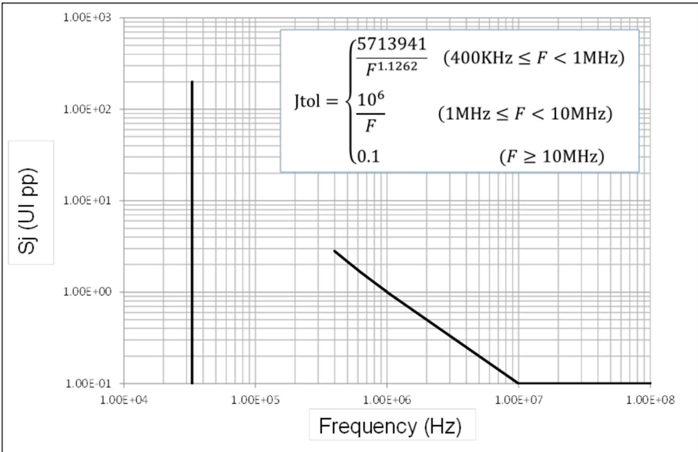

---

<table>
<thead>
<tr>
<th width="50%">🇬🇧 English</th>
<th width="50%" style="background-color:#e8e8e8">🏆 中文</th>
</tr>
</thead>
<tbody>
<tr>
<td>

Figure 8-43 Sj Mask for Receivers Operating in IR mode at 8.0 GT/s
Receivers operating at 16.0 GT/s in the Independent Refclk (IR) mode use the Sj mask profile shown in § Figure 8-44. The magnitude of the 33 kHz spur is 25 ns pp, or 400 UIpp. The equation of the swept Sj curve is shown on the § Figure 8-44.

</td>
<td style="background-color:#e8e8e8">

图 8-43:以 8.0 GT/s 在 IR 模式下工作的接收器的 Sj 模板
在 IR (独立参考时钟) 模式下以 16.0 GT/s 工作的接收器使用 § Figure 8-44 中所示的 Sj 模板。33 kHz 杂散分量的幅值为 25 ns pp,即 400 UIpp。扫描 Sj 曲线的方程如 § Figure 8-44 所示。

</td>
</tr>
</tbody>
</table>

---


<div style="overflow-x: auto; max-width: 100%;">
<table>
<thead>
<tr>
<th width="50%">🇬🇧 English</th>
<th width="50%" style="background-color:#e8e8e8">🏆 中文</th>
</tr>
</thead>
<tbody>
<tr>
<td>

<!-- 📄 Page 1473 -->
---

Figure 8-44 Sj Mask for Receivers Operating in SRIS mode at 16.0 GT/s
Receivers operating at 16.0 GT/s in the Common Clock (CC) Refclk mode use the Sj mask profile shown in § Figure 8-45. The magnitude of the 33 kHz spur is 1 ns pp, or 16 UIpp. The equation of the swept Sj curve is shown on the § Figure 8-45. Devices that do not support 32.0 GT/s have the option to use the Sj mask defined in § Figure 8-50. In this case, a 500 ps-pp triangular SSC modulation has to be applied at the source for both channel calibration and RX compliance, as specified in § Table 8-11.

</td>
<td style="background-color:#e8e8e8">

<!-- 📄 Page 1473 -->
---

图 8-44:以 16.0 GT/s 在 SRIS 模式下工作的接收器的 Sj 模板
在 CC (Common Clock, 公共时钟) Refclk 模式下以 16.0 GT/s 工作的接收器使用 § Figure 8-45 中所示的 Sj 模板。33 kHz 杂散分量的幅值为 1 ns pp,即 16 UIpp。扫描 Sj 曲线的方程如 § Figure 8-45 所示。不支持 32.0 GT/s 的器件可选择使用 § Figure 8-50 中定义的 Sj 模板。在这种情况下，必须在源端施加 500 ps-pp 三角波 SSC (扩频时钟) 调制，用于通道 (Channel) 校准和 RX 一致性 (Compliance) 测试，如 § Table 8-11 所规定。

</td>
</tr>
</tbody>
</table>
</div>


> **Figure 8-45.** Sj Mask for Receivers Operating in CC mode at 16.0 GT/s
> 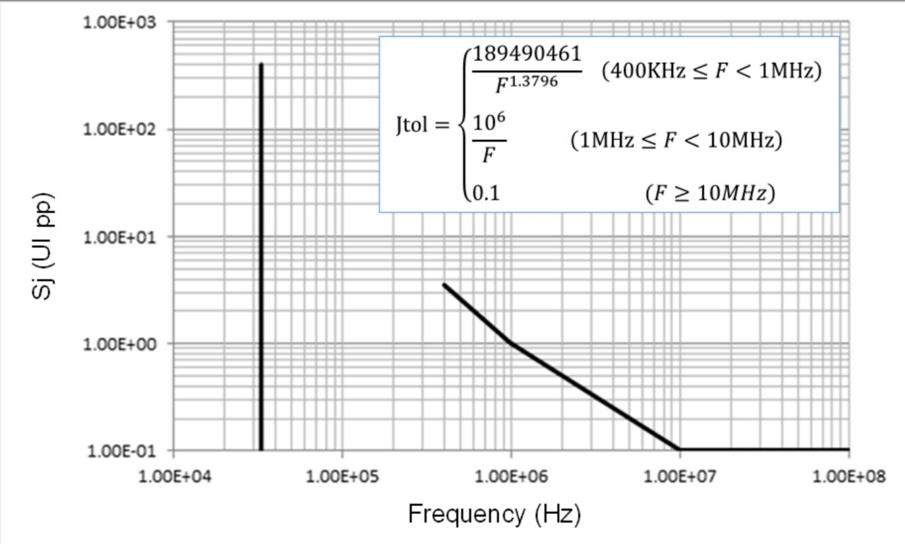

---

<table>
<thead>
<tr>
<th width="50%">🇬🇧 English</th>
<th width="50%" style="background-color:#e8e8e8">🏆 中文</th>
</tr>
</thead>
<tbody>
<tr>
<td>

<!-- 📄 Page 1474 -->
---

Figure 8-45 Sj Mask for Receivers Operating in CC mode at 16.0 GT/s
Receivers operating at 32.0 GT/s in the IR mode use the Sj mask profile shown in § Figure 8-46. The magnitude of the 33 kHz spur is 15 ns pp, or 480 UIpp. The equation of the swept Sj curve is shown on the § Figure 8-46.

</td>
<td style="background-color:#e8e8e8">

<!-- 📄 Page 1474 -->
---

图 8-45:以 16.0 GT/s 在 CC 模式下工作的接收器的 Sj 模板
在 IR 模式下以 32.0 GT/s 工作的接收器使用 § Figure 8-46 中所示的 Sj 模板。33 kHz 杂散分量的幅值为 15 ns pp,即 480 UIpp。扫描 Sj 曲线的方程如 § Figure 8-46 所示。

</td>
</tr>
</tbody>
</table>

> **Figure 8-46.** Sj Mask for Receivers Operating in SRIS mode at 32.0 GT/s
> 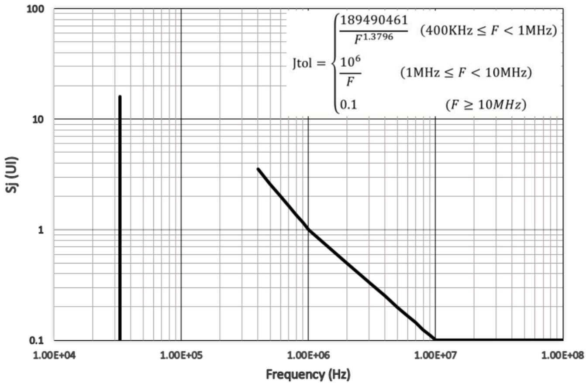

---

<table>
<thead>
<tr>
<th width="50%">🇬🇧 English</th>
<th width="50%" style="background-color:#e8e8e8">🏆 中文</th>
</tr>
</thead>
<tbody>
<tr>
<td>

<!-- 📄 Page 1475 -->
---

Figure 8-46 Sj Mask for Receivers Operating in SRIS mode at 32.0 GT/s
Receivers operating at 32.0 GT/s in the CC Refclk mode use the Sj mask profile shown in § Figure 8-47. The magnitude of the 33 kHz spur is 1 ns pp, or 32 UIpp. The equation of the swept Sj curve is shown on the § Figure 8-47.

</td>
<td style="background-color:#e8e8e8">

<!-- 📄 Page 1475 -->
---

图 8-46:以 32.0 GT/s 在 SRIS 模式下工作的接收器的 Sj 模板
在 CC Refclk 模式下以 32.0 GT/s 工作的接收器使用 § Figure 8-47 中所示的 Sj 模板。33 kHz 杂散分量的幅值为 1 ns pp,即 32 UIpp。扫描 Sj 曲线的方程如 § Figure 8-47 所示。

</td>
</tr>
</tbody>
</table>

> **Figure 8-47.** Sj Mask for Receivers Operating in CC mode at 32.0 GT/s
> 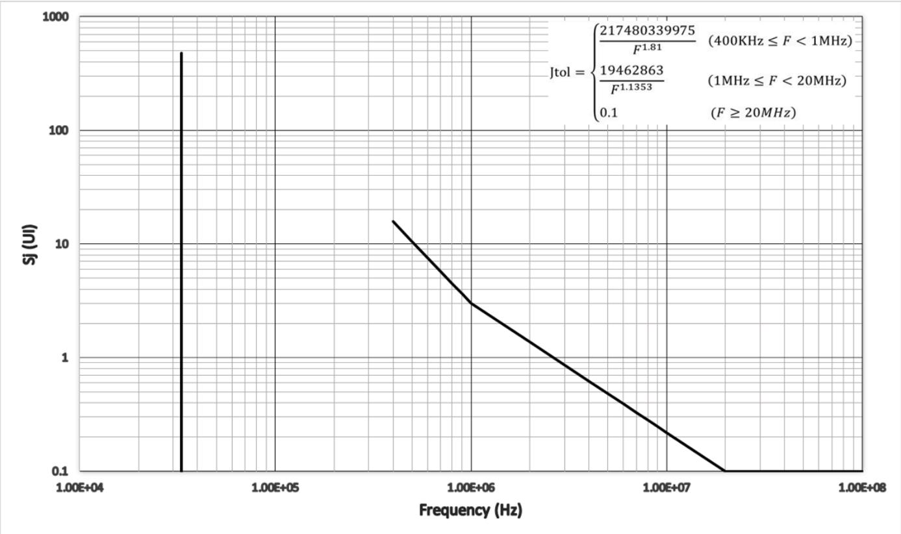

---

<table>
<thead>
<tr>
<th width="50%">🇬🇧 English</th>
<th width="50%" style="background-color:#e8e8e8">🏆 中文</th>
</tr>
</thead>
<tbody>
<tr>
<td>

<!-- 📄 Page 1476 -->
---

Figure 8-47 Sj Mask for Receivers Operating in CC mode at 32.0 GT/s
Receivers operating at 64.0 GT/s in the IR mode use the Sj mask profile shown in § Figure 8-48. The magnitude of the 33 kHz spur is 15 ns pp, or 480 UI pp. The equation of the swept Sj curve is shown on the § Figure 8-48.

</td>
<td style="background-color:#e8e8e8">

<!-- 📄 Page 1476 -->
---

图 8-47:以 32.0 GT/s 在 CC 模式下工作的接收器的 Sj 模板
在 IR 模式下以 64.0 GT/s 工作的接收器使用 § Figure 8-48 中所示的 Sj 模板。33 kHz 杂散分量的幅值为 15 ns pp,即 480 UI pp。扫描 Sj 曲线的方程如 § Figure 8-48 所示。

</td>
</tr>
</tbody>
</table>

> **Figure 8-48.** Sj Mask for Receivers Operating in SRIS mode at 64.0 GT/s
> 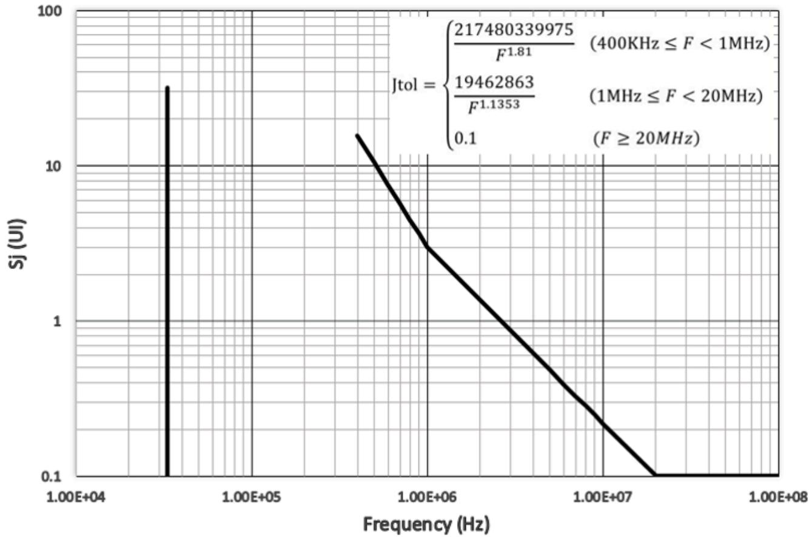

---

<table>
<thead>
<tr>
<th width="50%">🇬🇧 English</th>
<th width="50%" style="background-color:#e8e8e8">🏆 中文</th>
</tr>
</thead>
<tbody>
<tr>
<td>

<!-- 📄 Page 1477 -->
---

Figure 8-48 Sj Mask for Receivers Operating in SRIS mode at 64.0 GT/s
Receivers operating at 64.0 GT/s in the CC Refclk mode use the Sj mask profile shown in § Figure 8-49. The magnitude of the 33 kHz spur is 1 ns pp, or 32 UIpp. The equation of the swept Sj curve is shown on the § Figure 8-49.

</td>
<td style="background-color:#e8e8e8">

<!-- 📄 Page 1477 -->
---

图 8-48:以 64.0 GT/s 在 SRIS 模式下工作的接收器的 Sj 模板
在 CC Refclk 模式下以 64.0 GT/s 工作的接收器使用 § Figure 8-49 中所示的 Sj 模板。33 kHz 杂散分量的幅值为 1 ns pp,即 32 UIpp。扫描 Sj 曲线的方程如 § Figure 8-49 所示。

</td>
</tr>
</tbody>
</table>

> **Figure 8-49.** Sj Mask for Receivers Operating in CC mode at 64.0 GT/s
> 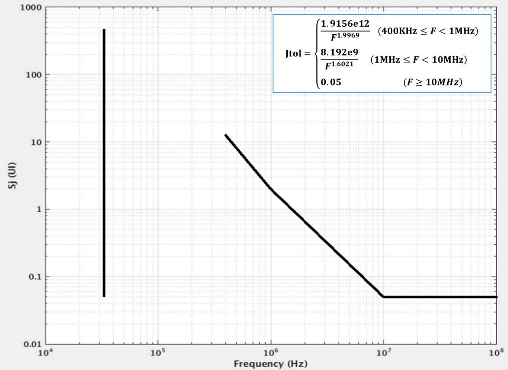

---


<div style="overflow-x: auto; max-width: 100%;">
<table>
<thead>
<tr>
<th width="50%">🇬🇧 English</th>
<th width="50%" style="background-color:#e8e8e8">🏆 中文</th>
</tr>
</thead>
<tbody>
<tr>
<td>

<!-- 📄 Page 1478 -->
---

Figure 8-49 Sj Mask for Receivers Operating in CC mode at 64.0 GT/s
Receivers operating in the CC Refclk mode at 8.0 GT/s shall utilize the Sj profile shown in § Figure 8-50. The testing procedure is identical to that used for the IR mode, except that the clock topology differs. See § Section 8.4.2.3 for details. Receivers operating at 16.0 GT/s in the CC Refclk mode in devices that do not support 32.0 GT/s also have the option to use the Sj mask profile shown in § Figure 8-50, with additional residual SSC applied per § Table 8-11.

</td>
<td style="background-color:#e8e8e8">

<!-- 📄 Page 1478 -->
---

图 8-49:以 64.0 GT/s 在 CC 模式下工作的接收器的 Sj 模板
在 CC Refclk 模式下以 8.0 GT/s 工作的接收器应使用 § Figure 8-50 中所示的 Sj 模板。测试方法与 IR 模式相同，只是时钟拓扑不同。详见 § Section 8.4.2.3。在不支持 32.0 GT/s 的器件中,CC Refclk 模式下以 16.0 GT/s 工作的接收器也可以选择使用 § Figure 8-50 中所示的 Sj 模板，根据 § Table 8-11 附加残余 SSC 调制。

</td>
</tr>
</tbody>
</table>
</div>


> **Figure 8-50.** Sj Masks for Receivers Operating in CC Mode at 8.0 GT/s
> 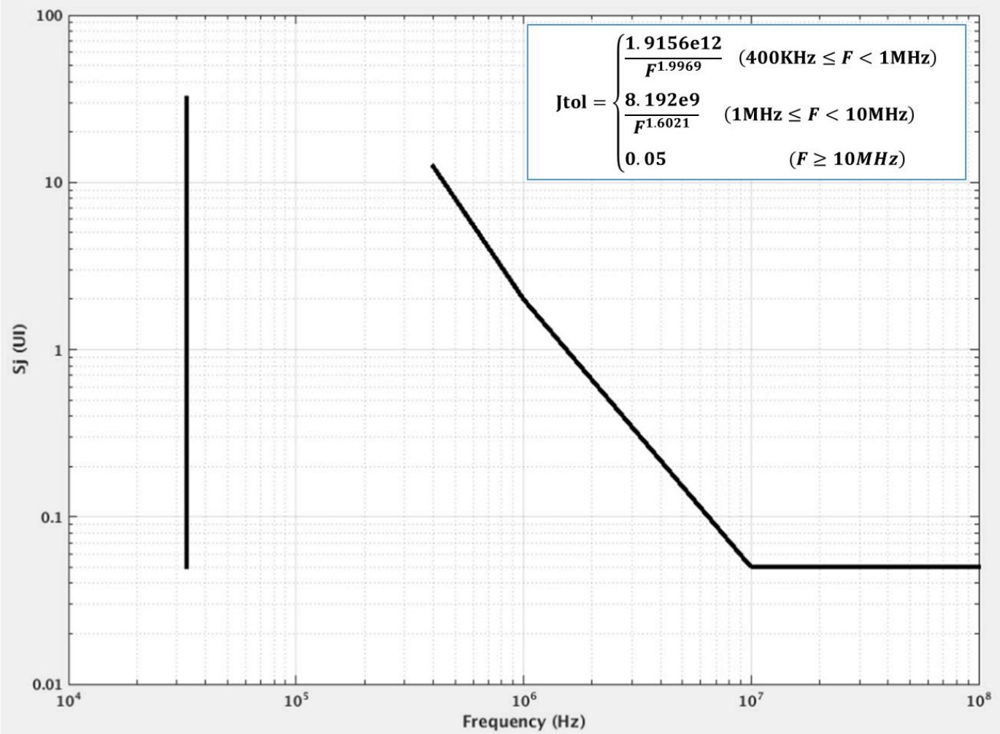

---

<table>
<thead>
<tr>
<th width="50%">🇬🇧 English</th>
<th width="50%" style="background-color:#e8e8e8">🏆 中文</th>
</tr>
</thead>
<tbody>
<tr>
<td>

<!-- 📄 Page 1479 -->
---

A Rx is permitted to support one or both of two clock modes: CC and IR although only one clock mode may be operational at a given time. Receivers can support more than one Refclk mode by selecting a mode at power-up or by means of strapping pins, etc.

</td>
<td style="background-color:#e8e8e8">

<!-- 📄 Page 1479 -->
---

接收器可以支持 CC 和 IR 这两种时钟模式中的一种或两种，但在任一给定时刻只能运行其中一种时钟模式。接收器可以通过在上电时选择模式或通过配置引脚 (strapping pins) 等方式来支持多种 Refclk 模式。

</td>
</tr>
</tbody>
</table>

---

<a id="sec-8-4-2-3"></a>
## 8.4.2.3 Receiver Refclk Modes | 接收器 Refclk 模式

<table>
<thead>
<tr>
<th width="50%">🇬🇧 English</th>
<th width="50%" style="background-color:#e8e8e8">🏆 中文</th>
</tr>
</thead>
<tbody>
<tr>
<td>

§ Figure 8-51 shows the Refclk connection for a receiver in the Common Clock Refclk mode. A single Refclk source drives both the Generator and the DUT. This test utilizes the Sj mask specified in § Section 8.4.2.2.1.

</td>
<td style="background-color:#e8e8e8">

§ Figure 8-51 显示了 CC Refclk 模式下接收器的 Refclk 连接。单一 Refclk 源同时驱动 Generator (信号发生器) 和 DUT (被测设备)。本测试使用 § Section 8.4.2.2.1 中规定的 Sj 模板。

</td>
</tr>
</tbody>
</table>

> **Figure 8-51.** Layout for Jitter Testing Common Refclk Rx at 16.0 GT/s
> 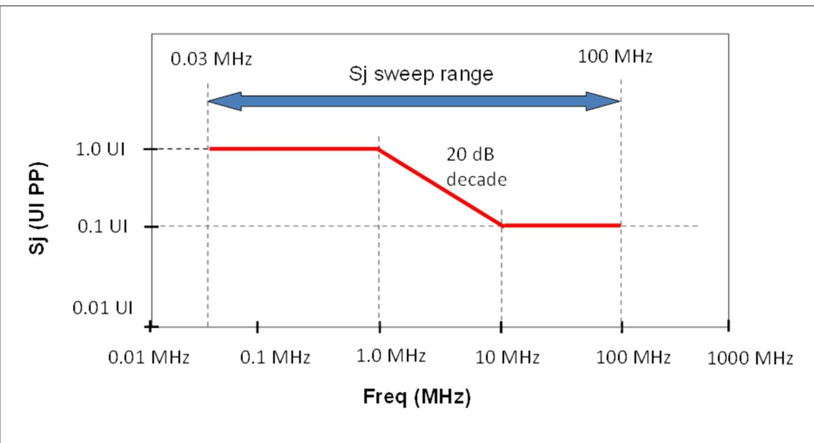

---

<a id="sec-8-4-2-3-1"></a>
## 8.4.2.3.1 Common Refclk Mode | 公共 Refclk 模式

<table>
<thead>
<tr>
<th width="50%">🇬🇧 English</th>
<th width="50%" style="background-color:#e8e8e8">🏆 中文</th>
</tr>
</thead>
<tbody>
<tr>
<td>

<!-- 📄 Page 1480 -->
---

Figure 8-51 Layout for Jitter Testing Common Refclk Rx at 16.0 GT/s

</td>
<td style="background-color:#e8e8e8">

<!-- 📄 Page 1480 -->
---

图 8-51:16.0 GT/s 公共 Refclk 接收器抖动测试布局

</td>
</tr>
</tbody>
</table>

> **Figure 8-52.** Layout for Jitter Testing for Independent Refclk Rx at 16.0 GT/s

> 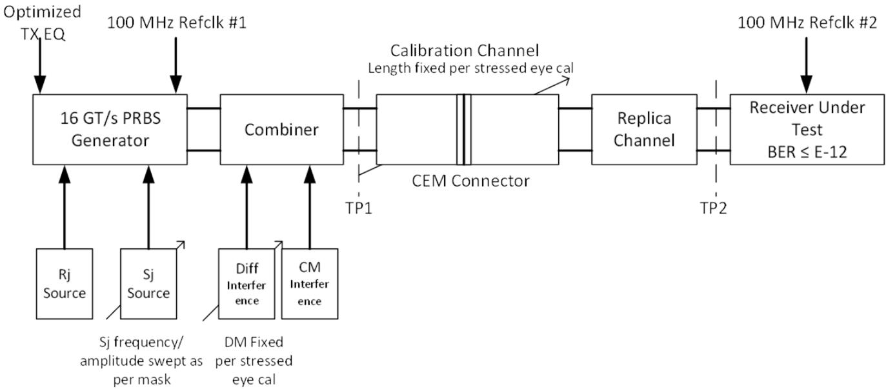

> 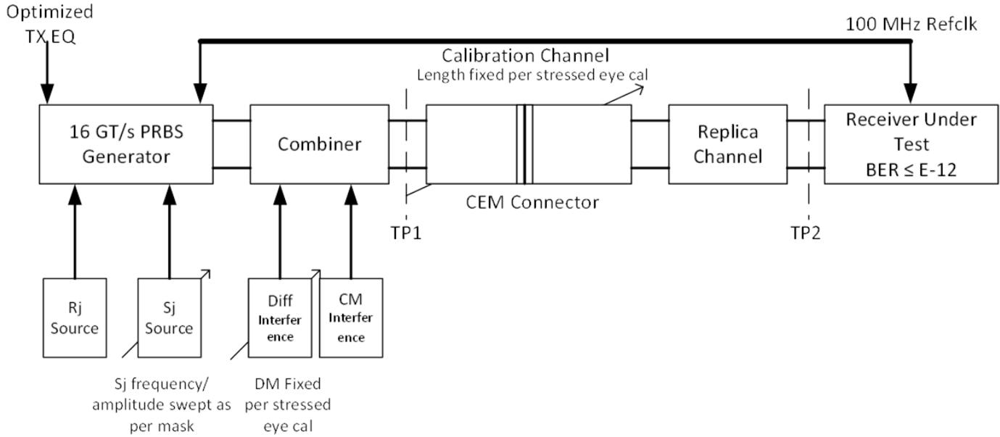

---

<a id="sec-8-4-2-3-2"></a>
## 8.4.2.3.2 Independent Refclk Mode | 独立 Refclk 模式

<table>
<thead>
<tr>
<th width="50%">🇬🇧 English</th>
<th width="50%" style="background-color:#e8e8e8">🏆 中文</th>
</tr>
</thead>
<tbody>
<tr>
<td>

§ Figure 8-52 illustrates the configuration for testing a Receiver in the IR Refclk mode. A Refclk source with SSC is required for the DUT. The test utilizes the Sj mask specified in § Section 8.4.2.2.1. The generator must be able to produce a large 33 KHz Sj tone while Sj is swept as shown in § Section 8.4.2.2.1.

</td>
<td style="background-color:#e8e8e8">

§ Figure 8-52 展示了在 IR Refclk 模式下测试接收器的配置。DUT 需要一个带 SSC 的 Refclk 源。本测试使用 § Section 8.4.2.2.1 中规定的 Sj 模板。Generator 必须能够产生较大的 33 kHz Sj 音调分量，同时 Sj 按 § Section 8.4.2.2.1 所示进行扫描。

</td>
</tr>
</tbody>
</table>

---

<a id="sec-8-4-3"></a>
## 8.4.3 Common Receiver Parameters | 公共接收器参数

<table>
<thead>
<tr>
<th width="50%">🇬🇧 English</th>
<th width="50%" style="background-color:#e8e8e8">🏆 中文</th>
</tr>
</thead>
<tbody>
<tr>
<td>

<!-- 📄 Page 1481 -->
---

§ Table 8-12 lists the common Receiver parameters that are not directly associated with stressed eye tolerancing. Values are separately defined for the four data rates.

</td>
<td style="background-color:#e8e8e8">

<!-- 📄 Page 1481 -->
---

§ Table 8-12 列出了与压力眼图容差测试无直接关联的公共接收器参数。这些值针对四种数据速率分别定义。

</td>
</tr>
</tbody>
</table>

**Table 8-12. Common Receiver Parameters | 表 8-12 公共接收器参数**

| Symbol | Parameter | 2.5 GT/s value | 5.0 GT/s value | 8.0 GT/s value | 16.0 GT/s value | 32.0 GT/s value | 64.0 GT/s value | Units | Notes |
|---|---|---|---|---|---|---|---|---|---|
| UI (Rx) | Unit Interval | (min) 399.88<br>(max) 400.12<br>(300 PPM) | (min) 199.94<br>(max) 200.06<br>(300 PPM) | (min) 124.9625<br>(max) 125.0375<br>(300 PPM) | (min) 62.48125<br>(max) 62.51875<br>(300 PPM) | (min) 31.246875<br>(max) 31.253125<br>(100 PPM) | (min) 31.246875<br>(max) 31.253125<br>(100 PPM) | ps | UI tolerance does not include SSC effects |
| BWRX-PKG-PLL1 | Rx PLL bandwidth corresponding to PKGRX-PLL1 | (max) 22 | (min) 1.5<br>(max) 16.0 | (min) 8<br>(max) 4.0 | (min) 0.5<br>(max) 4.0 | (min) 0.5<br>(max) 1.8 | (min) 0.5<br>(max) 1.0 | MHz | Second order PLL transfer bounding function. See Note 1. |
| BWRX-PKG-PLL2 | Rx PLL bandwidth corresponding to PKGRX-PLL2 | Not Specified | (max) 16.0 | (min) 5.0<br>(max) 5.0 | (min) 0.5<br>(max) 5.0 | (min) 0.5 | N/A | N/A | MHz | Second order PLL transfer bounding function. See Note 1. |
| PKGRX-PLL1 | Maximum Rx PLL peaking corresponding to BWRX-PKG-PLL1 | (max) 3.0 | 3.0 | 2.0 | 2.0 | 2.0 | 2.0 | dB | Second order PLL transfer bounding function. See Note 1. |
| PKGRX-PLL2 | Maximum Rx PLL peaking corresponding to BWRX-PKG-PLL2 | Not specified | 1.0 | 1.0 | 1.0 | N/A | N/A | dB | Second order PLL transfer bounding function. See Note 1. |
| RLRX-DIFF | Differential receiver return loss | See § Figure 8-22 | | | See § Figure 8-24 | | | dB | Note 2 |
| RLRX-CM | Common mode receiver return loss | See § Figure 8-23 | | | See § Figure 8-25 | | | dB | Note 2 |
| TRX-GND-FLOAT | Rx termination float time | (max) 500 | (max) 500 | (max) 500 | (max) 500 | (max) 500 | (max) 500 | μs | Note 5 |
| VRX-CM-AC-P | Rx AC common Mode Voltage | (max) 150 | (max) 150 | (max) 75 | (max) 75 | (max) 75 | (max) 37.5 | mVP | Measured at Rx pins into a pair of 50 Ω terminations to ground |
| ZRX-DC | Receiver DC single ended impedance | (min) 40<br>(max) 60 | (min) 40<br>(max) 60 | Not specified | Not specified | Not specified | Not specified | Ω | DC impedance limits are needed to guarantee Receiver detect. For 8.0, 16.0, 32.0, and 64.0 GT/s it is bounded by RLRX-CM. See Note 3. |

---


<div style="overflow-x: auto; max-width: 100%;">
<table>
<thead>
<tr>
<th width="50%">🇬🇧 English</th>
<th width="50%" style="background-color:#e8e8e8">🏆 中文</th>
</tr>
</thead>
<tbody>
<tr>
<td>

<!-- 📄 Page 1482 -->
---

| Symbol | Parameter | 2.5 GT/s value | 5.0 GT/s value | 8.0 GT/s value | 16.0 GT/s value | 32.0 GT/s value | 64.0 GT/s value | Units | Notes |
|---|---|---|---|---|---|---|---|---|---|
| ZRX-HIGH-IMP-DC-POS | DC input CM input impedance for V ≥ 0 during Reset or power-down | ≥10K (0-200 mV)<br>≥20K (> 200 mV) | ≥10K (0-200 mV)<br>≥20K (> 200 mV) | ≥10K (0-200 mV)<br>≥20K (> 200 mV) | ≥10K (0-200 mV)<br>≥20K (> 200 mV) | ≥10K (0-200 mV)<br>≥20K (> 200 mV) | ≥10K (0-200 mV)<br>≥20K (> 200 mV) | Ω | Voltage measured wrt. ground. Parameters may not scale with process technology. See Note 4. |
| ZRX-HIGH-IMP-DC-NEG | DC input CM input impedance for V < 0 during Reset or power-down | 1.0K (min) | 1.0K (min) | 1.0K (min) | 1.0K (min) | 1.0K (min) | 1.0K (min) | Ω | Voltage measured over the range of -150 mV to 0 mV wrt. ground. Parameters may not scale with process technology. See Note 4. |
| VRX-IDLE-DET-DIFF-PP | Electrical Idle Detect threshold | (min) 65<br>(max) 175 | (min) 65<br>(max) 175 | (min) 65<br>(max) 175 | (min) 65<br>(max) 175 | (min) 65<br>(max) 175 | (min) 65<br>(max) 175 | mV | VRX-IDLE-DET-DIFFp-p = 2 × |VRX-D+ − VRX-D-| |
| TRX-IDLE-DET-DIFF-ENTERTIME | Unexpected Electrical Idle Enter Detect Threshold Integration Time | (max) 10 | (max) 10 | (max) 10 | (max) 10 | (max) 10 | (max) 10 | ms | An unexpected Electrical Idle (VRX-DIFF-PP < VRX-IDLE-DET-DIFFp-p) must be recognized no longer than TRX-IDLE-DET-DIFF-ENTER-TIME to signal an unexpected idle condition. |
| LRX-SKEW | Lane to Lane skew | (max) 20 | (max) 8 | (max) 6 | (max) 5 | (max) 5 | (max) 5 | ns | Across all Lanes on a Port. LRX-SKEW comprehends Lane-Lane variations due to channel and repeater delay differences. |

</td>
<td style="background-color:#e8e8e8">

<!-- 📄 Page 1482 -->
---

| 符号 | 参数 | 2.5 GT/s 值 | 5.0 GT/s 值 | 8.0 GT/s 值 | 16.0 GT/s 值 | 32.0 GT/s 值 | 64.0 GT/s 值 | 单位 | 备注 |
|---|---|---|---|---|---|---|---|---|---|
| ZRX-HIGH-IMP-DC-POS | 复位或断电期间 V ≥ 0 时的 DC 输入共模阻抗 | ≥10K (0-200 mV)<br>≥20K (> 200 mV) | ≥10K (0-200 mV)<br>≥20K (> 200 mV) | ≥10K (0-200 mV)<br>≥20K (> 200 mV) | ≥10K (0-200 mV)<br>≥20K (> 200 mV) | ≥10K (0-200 mV)<br>≥20K (> 200 mV) | ≥10K (0-200 mV)<br>≥20K (> 200 mV) | Ω | 电压以地为参考测量。参数可能不随工艺技术按比例缩放。参见注 4。 |
| ZRX-HIGH-IMP-DC-NEG | 复位或断电期间 V < 0 时的 DC 输入共模阻抗 | 1.0K (min) | 1.0K (min) | 1.0K (min) | 1.0K (min) | 1.0K (min) | 1.0K (min) | Ω | 电压在 -150 mV 至 0 mV (相对地) 范围内测量。参数可能不随工艺技术按比例缩放。参见注 4。 |
| VRX-IDLE-DET-DIFF-PP | 电气空闲 (Electrical Idle) 检测阈值 | (min) 65<br>(max) 175 | (min) 65<br>(max) 175 | (min) 65<br>(max) 175 | (min) 65<br>(max) 175 | (min) 65<br>(max) 175 | (min) 65<br>(max) 175 | mV | VRX-IDLE-DET-DIFFp-p = 2 × |VRX-D+ − VRX-D-| |
| TRX-IDLE-DET-DIFF-ENTERTIME | 异常电气空闲进入检测阈值积分时间 | (max) 10 | (max) 10 | (max) 10 | (max) 10 | (max) 10 | (max) 10 | ms | 异常电气空闲 (VRX-DIFF-PP < VRX-IDLE-DET-DIFFp-p) 必须在不超过 TRX-IDLE-DET-DIFF-ENTER-TIME 的时间内被识别，以发出异常空闲状态信号。 |
| LRX-SKEW | 通道 (Lane) 间偏移 | (max) 20 | (max) 8 | (max) 6 | (max) 5 | (max) 5 | (max) 5 | ns | 跨端口 (Port) 上的所有通道。LRX-SKEW 涵盖由通道和中继器 (Repeater) 延迟差异所引起的通道间变化。 |

</td>
</tr>
</tbody>
</table>
</div>


---

<table>
<thead>
<tr>
<th width="50%">🇬🇧 English</th>
<th width="50%" style="background-color:#e8e8e8">🏆 中文</th>
</tr>
</thead>
<tbody>
<tr>
<td>

**Notes:**

1. Two combinations of PLL BW and peaking are specified at 5.0 GT/s to permit designers to make tradeoffs between the two parameters. If the PLL's min BW is >= 8 MHz, then up to 3.0 dB of peaking is permitted. If the PLL's min BW is relaxed to ≥ 5.0 MHz, then a tighter peaking value of 1.0 dB must be met. Note: a PLL BW extends from zero up to the value(s) defined as the min or max in the above table. For 2.5 GT/s a single PLL bandwidth and peaking value of 1.5-22 MHz and 3.0 dB are defined.

2. Measurements must be made for both common mode and differential return loss. In both cases the DUT must be powered up and DC isolated, and its D+/D- inputs must be in the low-Z state.

</td>
<td style="background-color:#e8e8e8">

**注释:**

1. 在 5.0 GT/s 下规定了两组 PLL 带宽和峰化值的组合，以便设计者在两个参数之间进行权衡。如果 PLL 的最小带宽 ≥ 8 MHz,则允许最多 3.0 dB 的峰化。如果 PLL 的最小带宽放宽到 ≥ 5.0 MHz,则必须满足更严格的 1.0 dB 峰化值。注:PLL 带宽从零延伸到上表中定义为 min 或 max 的值。对于 2.5 GT/s,定义了 1.5-22 MHz 的单一 PLL 带宽和 3.0 dB 的峰化值。

2. 测量必须同时针对共模和差分回损。在这两种情况下,DUT 必须上电且 DC 隔离，其 D+/D- 输入必须处于低阻 (low-Z) 状态。

</td>
</tr>
</tbody>
</table>

---


<div style="overflow-x: auto; max-width: 100%;">
<table>
<thead>
<tr>
<th width="50%">🇬🇧 English</th>
<th width="50%" style="background-color:#e8e8e8">🏆 中文</th>
</tr>
</thead>
<tbody>
<tr>
<td>

<!-- 📄 Page 1483 -->
---

3. The Rx DC single ended impedance must be present when the Receiver terminations are first enabled to ensure that the Receiver Detect occurs properly. Compensation of this impedance is permitted to start immediately and the Rx Common Mode Impedance (constrained by RLRX-CM to 50 Ω ±20%) must be within the specified range by the time Detect is entered.

4. ZRX-HIGH-IMP-DC-NEG and ZRX-HIGH-IMP-DC-POS are defined respectively for negative and positive voltages at the input of the Receiver. Transmitter designers need to comprehend the large difference between >0 and <0 Rx impedances when designing Receiver detect circuits.

5. Defines the time for the Receiver's input pads to settle to new common-mode on 2.5/5.0 GT/s transition to 8.0, 16.0, 32.0, and 64.0 GT/s.

</td>
<td style="background-color:#e8e8e8">

<!-- 📄 Page 1483 -->
---

3. 当接收器端接 (Termination) 首次使能时,Rx DC 单端阻抗必须存在，以确保接收器检测 (Receiver Detect) 正确发生。允许立即开始对此阻抗进行补偿，且 Rx 共模阻抗 (由 RLRX-CM 约束为 50 Ω ±20%) 必须在进入 Detect 状态时处于规定范围内。

4. ZRX-HIGH-IMP-DC-NEG 和 ZRX-HIGH-IMP-DC-POS 分别针对接收器输入端的负电压和正电压定义。发送器 (Transmitter) 设计者在设计接收器检测电路时，需要理解 >0 和 <0 接收器阻抗之间的巨大差异。

5. 定义了从 2.5/5.0 GT/s 切换到 8.0、16.0、32.0 和 64.0 GT/s 时，接收器输入焊盘稳定到新共模电压所需的时间。

</td>
</tr>
</tbody>
</table>
</div>


---

<table>
<thead>
<tr>
<th width="50%">🇬🇧 English</th>
<th width="50%" style="background-color:#e8e8e8">🏆 中文</th>
</tr>
</thead>
<tbody>
<tr>
<td>

It is difficult to scale the capabilities of the EFI detect circuits with data rate, and for this reason the 5.0, 8.0, 16.0, 32.0, and 64.0 GT/s specification defines different data patterns in the FTS and the TS1 and TS2 Ordered Sets than are defined for 2.5 GT/s operation. In particular, repeated K28.7 patterns are defined to guarantee sufficient voltage and time requirements, as illustrated in the figure below. Concatenated EIE Symbols yield alternating one/zero run lengths of five UI each.

</td>
<td style="background-color:#e8e8e8">

EFI 检测电路的能力难以随数据速率按比例缩放，因此 5.0、8.0、16.0、32.0 和 64.0 GT/s 规范在 FTS (快速训练序列) 和 TS1、TS2 有序集 (Ordered Set) 中定义了不同于 2.5 GT/s 操作的数据码型。具体而言，定义了重复的 K28.7 码型以保证足够的电压和时间要求，如下图所示。串联的 EIE 符号产生交替的、每个为 5 个 UI 的 1/0 游程长度。

</td>
</tr>
</tbody>
</table>

> **Figure 8-53.** Exit from Idle Voltage and Time Margins
> 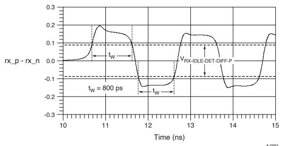

---

<a id="sec-8-4-3-1"></a>
## 8.4.3.1 5.0 GT/s Exit From Idle Detect (EFI) | 5.0 GT/s 退出空闲检测 (EFI)

<table>
<thead>
<tr>
<th width="50%">🇬🇧 English</th>
<th width="50%" style="background-color:#e8e8e8">🏆 中文</th>
</tr>
</thead>
<tbody>
<tr>
<td>

The measurement methodology and frequency binning for differential and common mode Rx RL is identical to that for the Tx. For details refer to § Figure 8-22, § Figure 8-24, § Figure 8-23, and § Figure 8-25.

</td>
<td style="background-color:#e8e8e8">

差分和共模 Rx RL (回损) 的测量方法和频率分箱与 Tx 相同。详情参见 § Figure 8-22、§ Figure 8-24、§ Figure 8-23 和 § Figure 8-25。

</td>
</tr>
</tbody>
</table>

---

<a id="sec-8-4-3-2"></a>
## 8.4.3.2 Receiver Return Loss | 接收器回损


<div style="overflow-x: auto; max-width: 100%;">
<table>
<thead>
<tr>
<th width="50%">🇬🇧 English</th>
<th width="50%" style="background-color:#e8e8e8">🏆 中文</th>
</tr>
</thead>
<tbody>
<tr>
<td>

PCI Express components including Retimers that support the 16.0 GT/s or higher rate are required to support Lane margining at the Receiver when operating at 16.0 GT/s or higher. Lane Margining enables system software to get the margin information of a given Lane while the Link is in L0 state. For NRZ signaling, the margin information includes both voltage and time, in either direction from the current Receiver position. For PAM4 signaling, the margin information includes both voltage and time for all the three eyes. The margin feature is not permitted to require any additional external hardware to function. Support of Lane margining for voltage is optional at 16.0 GT/s and required at 32.0 GT/s or higher. Support of independent timing margin to the left or to the right is optional for all data rates. Support of independent voltage margin for up or for down is optional for all data rates that support voltage margining.

</td>
<td style="background-color:#e8e8e8">

支持 16.0 GT/s 或更高速率的 PCI Express 组件(包括 Retimer (重定时器))在以 16.0 GT/s 或更高速率工作时，必须支持接收器处的通道 (Lane) 余量 (Margining) 测量。通道余量测量使系统软件能够在链路 (Link) 处于 L0 状态时获取给定通道的余量信息。对于 NRZ (非归零编码) 信号，余量信息包括相对于当前接收器位置的电压和时间两个方向。对于 PAM4 信号，余量信息包括三个眼图的电压和时间。该余量测量功能不得要求任何额外的外部硬件即可工作。16.0 GT/s 下对电压余量测量的支持是可选的，而 32.0 GT/s 或更高时是必需的。对于所有数据速率，左/右独立时间余量测量是可选的。对于所有支持电压余量测量的数据速率，上/下独立电压余量测量是可选的。

</td>
</tr>
</tbody>
</table>
</div>


---

<a id="sec-8-4-4"></a>
## 8.4.4 Lane Margining at the Receiver - Electrical Requirements | 接收器处通道余量测量 - 电气要求

<table>
<thead>
<tr>
<th width="50%">🇬🇧 English</th>
<th width="50%" style="background-color:#e8e8e8">🏆 中文</th>
</tr>
</thead>
<tbody>
<tr>
<td>

<!-- 📄 Page 1484 -->
---

For simplicity, the margin commands and requirements described in § Section 4.2.18 are described in terms of moving the data sample location - but the actual margining method is implementation specific. For example - the timing margin could be implemented on the actual data sampler or an independent error sampler. Further the timing margin can be achieved by injecting an appropriate amount of stress/jitter to the data sample location, or by moving the data/error sample location. The parameters in § Table 8-13 are reported for 16.0, 32.0, or 64.0 GT/s and all are allowed to be different for each of those data rates, though some are required to be different for NRZ vs. PAM4 data rates.

</td>
<td style="background-color:#e8e8e8">

<!-- 📄 Page 1484 -->
---

为简单起见,§ Section 4.2.18 中描述的余量命令和要求以移动数据采样位置的方式描述，但实际的余量测量方法是实现相关的。例如，时间余量可以在实际数据采样器或独立错误采样器上实现。此外，时间余量可以通过向数据采样位置注入适当量的压力/抖动，或通过移动数据/错误采样位置来实现。§ Table 8-13 中的参数针对 16.0、32.0 或 64.0 GT/s 报告，允许在每种数据速率下不同，虽然有些在 NRZ 和 PAM4 数据速率之间必须不同。

</td>
</tr>
</tbody>
</table>

> **Figure 8-54.** Allowed Ranges for Maximum NRZ Timing and Voltage Margin
> 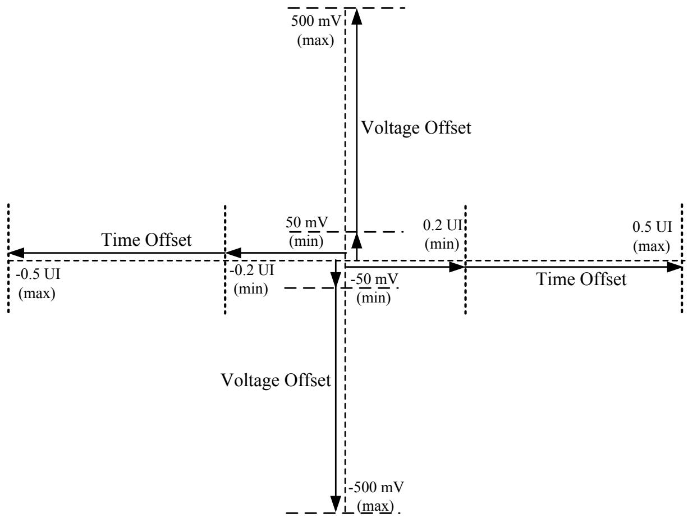

---

<table>
<thead>
<tr>
<th width="50%">🇬🇧 English</th>
<th width="50%" style="background-color:#e8e8e8">🏆 中文</th>
</tr>
</thead>
<tbody>
<tr>
<td>

<!-- 📄 Page 1485 -->
---

For NRZ: 0.5 UI (max), 0.2 UI (min), -0.2 UI (min), -0.5 UI (max), 50 mV (min), 500 mV (max), -50 mV (min), -500 mV (max).
For PAM4 (3 eyes): 0.35 UI (max), 0.1 UI (min), -0.1 UI (min), -0.35 UI (max), 17 mV (min), 167 mV (max), -17 mV (min), -167 mV (max).

</td>
<td style="background-color:#e8e8e8">

<!-- 📄 Page 1485 -->
---

对于 NRZ:0.5 UI (最大),0.2 UI (最小),-0.2 UI (最小),-0.5 UI (最大),50 mV (最小),500 mV (最大),-50 mV (最小),-500 mV (最大)。
对于 PAM4 (3 个眼图):0.35 UI (最大),0.1 UI (最小),-0.1 UI (最小),-0.35 UI (最大),17 mV (最小),167 mV (最大),-17 mV (最小),-167 mV (最大)。

</td>
</tr>
</tbody>
</table>

> **Figure 8-55.** Allowed Ranges for Maximum PAM4 Timing and Voltage Margins
> 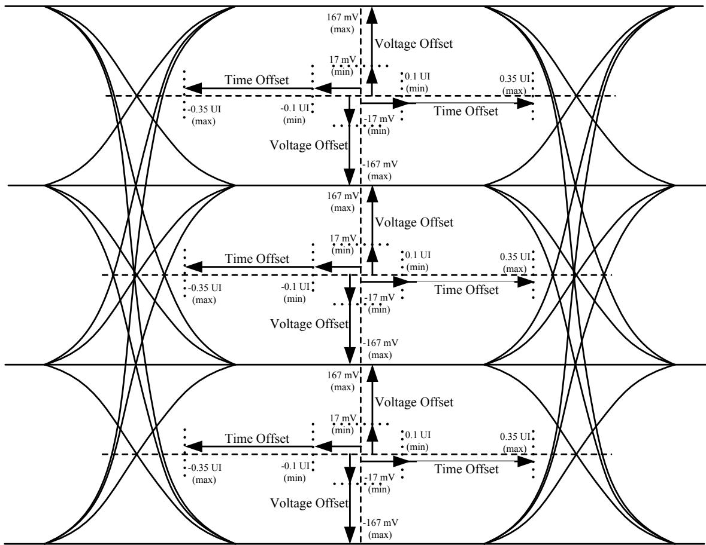

---


<div style="overflow-x: auto; max-width: 100%;">
<table>
<thead>
<tr>
<th width="50%">🇬🇧 English</th>
<th width="50%" style="background-color:#e8e8e8">🏆 中文</th>
</tr>
</thead>
<tbody>
<tr>
<td>

**Table 8-13. Lane Margining | 表 8-13 通道余量**

| Parameter Name | Min | Max | Description |
|---|---|---|---|
| MNumTimingSteps | 6 | 63 | Number of time steps from default (to either left or right), range must be at least +/-0.2 UI. Timing offset must increase monotonically. The number of steps in both positive (toward the end of the unit interval) and negative (toward the beginning of the unit interval) must be identical. |
| MMaxTimingOffset | 20% | 50% | Offset from default at maximum step value as percentage of a nominal UI. A 0 value may be reported if the vendor chooses not to report the offset. |
| MNumVoltageSteps | 32 | 127 | Number of voltage steps from default (either up or down), minimum range +/-50 mV as measured by the reference equalizer. Voltage offset must increase monotonically. The number of steps in both positive and negative direction from the default sample location must be identical. |

</td>
<td style="background-color:#e8e8e8">

**表 8-13. 通道余量 | 通道余量 (Lane Margining)**

| 参数名称 | 最小值 | 最大值 | 描述 |
|---|---|---|---|
| MNumTimingSteps | 6 | 63 | 距离默认 (向左或向右) 的时间步数，范围必须至少为 +/-0.2 UI。时间偏移必须单调递增。正向 (向单位间隔结束) 和负向 (向单位间隔开始) 的步数必须相同。 |
| MMaxTimingOffset | 20% | 50% | 在最大步值处相对于默认的偏移，占标称 UI 的百分比。如果厂商选择不报告该偏移，可以报告 0 值。 |
| MNumVoltageSteps | 32 | 127 | 距离默认 (向上或向下) 的电压步数，由参考均衡器测量的最小范围为 +/-50 mV。电压偏移必须单调递增。从默认采样位置向正向和负向的步数必须相同。 |

</td>
</tr>
</tbody>
</table>
</div>


---

<table>
<thead>
<tr>
<th width="50%">🇬🇧 English</th>
<th width="50%" style="background-color:#e8e8e8">🏆 中文</th>
</tr>
</thead>
<tbody>
<tr>
<td>

<!-- 📄 Page 1486 -->
---

| Parameter Name | Min | Max | Description |
|---|---|---|---|
| MMaxVoltageOffset | 5% | 50% | Offset from default at maximum step value as percentage of one volt. A 0 value may be reported if the vendor chooses not to report the offset when MVoltageSupported is 1b. This value is undefined if MVoltageSupported is 0b. |
| MNumTimingStepsPAM4 | 10 | 63 | Number of time steps from default (to either left or right), range must be at least +/-0.1 UI. Timing offset must increase monotonically. The number of steps in both positive (toward the end of the unit interval) and negative (toward the beginning of the unit interval) must be identical. |
| MMaxTimingOffsetPAM4 | 10% | 35% | Offset from default at maximum step value as percentage of a nominal UI. A 0 value may be reported if the vendor chooses not to report the offset. |
| MNumVoltageStepsPAM4 | 64 | 127 | Number of voltage steps from default (either up or down), minimum range +/-17 mV as measured by the reference equalizer. Voltage offset must increase monotonically. The number of steps in both positive and negative direction from the default sample location must be identical. |
| MMaxVoltageOffsetPAM4 | 5% | 50% | Offset from default at maximum step value as percentage of one third volt. |
| MSamplingRateVoltage | 0 | 63 | The ratio of bits tested to bits received during voltage margining. A value of 0 is a ratio of 1:64 (1 bit of every 64 bits received), and a value of 63 is a ratio of 64:64 (all bits received). |
| MSamplingRateTiming | 0 | 63 | The ratio of bits tested to bits received during timing margining. A value of 0 is a ratio of 1:64 (1 bit of every 64 bits received), and a value of 63 is a ratio of 64:64 (all bits received). |
| MVoltageSupported | 0 | 1 | 1b indicates that voltage margining is supported. |
| MIndLeftRightTiming | 0 | 1 | 1b indicates independent left/right timing margin supported. |
| MIndUpDownVoltage | 0 | 1 | 1b independent up and down voltage margining supported. |
| MIndErrorSampler | 0 | 1 | 1b Margining will not produce errors (change in the error rate) in data stream (i.e. error sampler is independent). 0b Margining may produce errors in the data stream. |
| MMaxLanes | 0 | 31 | Maximum number of Lanes minus 1 that can be margined at the same time. It is recommended that this value be greater than or equal to the number of Lanes in the Link minus 1. Encoding Behavior is undefined if software attempts to margin more than MMaxLanes+1 at the same time. |

</td>
<td style="background-color:#e8e8e8">

<!-- 📄 Page 1486 -->
---

| 参数名称 | 最小值 | 最大值 | 描述 |
|---|---|---|---|
| MMaxVoltageOffset | 5% | 50% | 在最大步值处相对于默认的偏移，占 1 伏的百分比。如果 MVoltageSupported 为 1b 时厂商选择不报告该偏移，可以报告 0 值。如果 MVoltageSupported 为 0b,该值未定义。 |
| MNumTimingStepsPAM4 | 10 | 63 | 距离默认 (向左或向右) 的时间步数，范围必须至少为 +/-0.1 UI。时间偏移必须单调递增。正向和负向的步数必须相同。 |
| MMaxTimingOffsetPAM4 | 10% | 35% | 在最大步值处相对于默认的偏移，占标称 UI 的百分比。如果厂商选择不报告该偏移，可以报告 0 值。 |
| MNumVoltageStepsPAM4 | 64 | 127 | 距离默认 (向上或向下) 的电压步数，由参考均衡器测量的最小范围为 +/-17 mV。电压偏移必须单调递增。从默认采样位置向正向和负向的步数必须相同。 |
| MMaxVoltageOffsetPAM4 | 5% | 50% | 在最大步值处相对于默认的偏移，占 1/3 伏的百分比。 |
| MSamplingRateVoltage | 0 | 63 | 电压余量测量期间测试位数与接收位数之比。值为 0 表示 1:64 (每 64 个接收位中测试 1 位)，值为 63 表示 64:64 (所有接收位)。 |
| MSamplingRateTiming | 0 | 63 | 时间余量测量期间测试位数与接收位数之比。值为 0 表示 1:64 (每 64 个接收位中测试 1 位)，值为 63 表示 64:64 (所有接收位)。 |
| MVoltageSupported | 0 | 1 | 1b 表示支持电压余量测量。 |
| MIndLeftRightTiming | 0 | 1 | 1b 表示支持独立的左/右时间余量测量。 |
| MIndUpDownVoltage | 0 | 1 | 1b 表示支持独立的向上和向下电压余量测量。 |
| MIndErrorSampler | 0 | 1 | 1b 余量测量不会在数据流中产生错误 (错误率变化) (即错误采样器独立)。0b 余量测量可能会在数据流中产生错误。 |
| MMaxLanes | 0 | 31 | 可同时进行余量测量的最大通道数减 1。建议该值大于或等于链路中通道数减 1。如果软件尝试同时对超过 MMaxLanes+1 个通道进行余量测量，则编码行为未定义。 |

</td>
</tr>
</tbody>
</table>

---


<div style="overflow-x: auto; max-width: 100%;">
<table>
<thead>
<tr>
<th width="50%">🇬🇧 English</th>
<th width="50%" style="background-color:#e8e8e8">🏆 中文</th>
</tr>
</thead>
<tbody>
<tr>
<td>

<!-- 📄 Page 1487 -->
---

| Parameter Name | Min | Max | Description |
|---|---|---|---|
| MMaxLanes | 0 | 31 | Note: This value is permitted to exceed the number of Lanes in the Link minus 1. |
| MSampleReportingMethod | 0 | 1 | Indicates whether sampling rates (MSamplingRateVoltage and MSamplingRateTiming) are supported (1) or a sample count is supported (0). One of the two methods is supported by each device. |
| MErrorCount | 0 | 63 | If MIndErrorSampler is 1b this is a count of the actual bit errors since margining started. If MIndErrorSampler is 0b this is the actual count of the logical errors since margining started. See the Physical Layer Logical Block chapter for the definition of what errors are counted. The count saturates at 63. |
| MSampleCount | 0 | 127 | Value = 3*log2 (number of bits margined). Where number of bits margined is a count of the actual number of bits tested during margining. The count stops when margining stops. The count saturates at 127 (after approximately 5.54 × 10^12 bits). The count resets to zero when a new margin command is received. |

</td>
<td style="background-color:#e8e8e8">

<!-- 📄 Page 1487 -->
---

| 参数名称 | 最小值 | 最大值 | 描述 |
|---|---|---|---|
| MMaxLanes | 0 | 31 | 注:该值允许超过链路中通道数减 1。 |
| MSampleReportingMethod | 0 | 1 | 指示是否支持采样率 (MSamplingRateVoltage 和 MSamplingRateTiming) (1) 或支持采样计数 (0)。每个设备支持两种方法中的一种。 |
| MErrorCount | 0 | 63 | 如果 MIndErrorSampler 为 1b,这是自余量测量开始以来的实际位错误计数。如果 MIndErrorSampler 为 0b,这是自余量测量开始以来的实际逻辑错误计数。有关计数的错误定义，请参见物理层逻辑块章节。计数饱和值为 63。 |
| MSampleCount | 0 | 127 | 值 = 3 × log2 (余量测量的位数)。其中余量测量的位数是余量测量期间测试的实际位数。计数在余量测量停止时停止。计数饱和值为 127 (大约 5.54 × 10^12 位之后)。收到新的余量命令时，计数重置为零。 |

</td>
</tr>
</tbody>
</table>
</div>


---

<a id="sec-8-4-5"></a>
## 8.4.5 Low Frequency and Miscellaneous Signaling Requirements | 低频及其它信号要求

<table>
<thead>
<tr>
<th width="50%">🇬🇧 English</th>
<th width="50%" style="background-color:#e8e8e8">🏆 中文</th>
</tr>
</thead>
<tbody>
<tr>
<td>

All PCI Express signal and power supply pins must be tested for ESD protection levels to the Human Body Model (HBM) and the Charged Device Model (CDM) standards in accordance with [ESDA-JEDEC-JS-001-2010] (for HBM) and in accordance with [JEDEC-JESD22-C101] (for CDM). Pins must meet or exceed the minimum levels recommended in [JEDEC-JEP155-JEP157] (HBM/CDM) or JEDEC approved superseding documents.

</td>
<td style="background-color:#e8e8e8">

所有 PCI Express 信号引脚和电源引脚都必须按照 [ESDA-JEDEC-JS-001-2010] (HBM) 和 [JEDEC-JESD22-C101] (CDM) 进行人体模型 (Human Body Model, HBM) 和带电器件模型 (Charged Device Model, CDM) 标准的 ESD 保护等级测试。引脚必须达到或超过 [JEDEC-JEP155-JEP157] (HBM/CDM) 中推荐的最低等级，或 JEDEC 批准的后续文件。

</td>
</tr>
</tbody>
</table>

---

<a id="sec-8-4-5-1"></a>
## 8.4.5.1 ESD Standards | ESD 标准


<div style="overflow-x: auto; max-width: 100%;">
<table>
<thead>
<tr>
<th width="50%">🇬🇧 English</th>
<th width="50%" style="background-color:#e8e8e8">🏆 中文</th>
</tr>
</thead>
<tbody>
<tr>
<td>

Each Lane of a PCI Express Link must be AC coupled. The minimum and maximum values for the capacitance are given in § Table 8-7. Capacitors must be placed on the Transmitter side of an interface that permits adapters to be plugged and unplugged. In a topology where everything is located on a single substrate, the capacitors may be located anywhere along the channel. External capacitors are assumed because the values required are too large to feasibly construct on-chip.

All Transmitters and Receivers must support surprise hot insertion/removal without damage to the component. The Transmitter and Receiver must be capable of withstanding sustained short circuit to ground of D+ and D-.

</td>
<td style="background-color:#e8e8e8">

PCI Express 链路的每条通道 (Lane) 必须进行 AC 耦合。电容的最小和最大值在 § Table 8-7 中给出。在允许适配器 (Adapter) 插拔的接口中，电容必须放置在发送器 (Transmitter) 侧。在所有器件都位于单一基板的拓扑中，电容可以放置在通道 (Channel) 上的任何位置。由于所需电容值过大，在芯片上实现不可行，因此采用外部电容。

所有发送器和接收器必须支持意外的热插拔 (Surprise Hot Plug) 而不损坏组件。发送器和接收器必须能承受 D+ 和 D- 对地的持续短路。

</td>
</tr>
</tbody>
</table>
</div>


---


---

<a id="sec-8-4-5-2"></a>
## 8.4.5.2 Channel AC Coupling Capacitors | 通道 AC 耦合电容

<table>
<thead>
<tr>
<th width="50%">🇬🇧 English</th>
<th width="50%" style="background-color:#e8e8e8">🏆 中文</th>
</tr>
</thead>
<tbody>
<tr>
<td>

8.4.5.2 Channel AC Coupling Capacitors §

</td>
<td style="background-color:#e8e8e8">

8.4.5.2 通道 AC 耦合电容 §

</td>
</tr>
</tbody>
</table>

---

<a id="sec-8-4-5-3"></a>
## 8.4.5.3 Short Circuit Requirements | 短路要求


<div style="overflow-x: auto; max-width: 100%;">
<table>
<thead>
<tr>
<th width="50%">🇬🇧 English</th>
<th width="50%" style="background-color:#e8e8e8">🏆 中文</th>
</tr>
</thead>
<tbody>
<tr>
<td>

8.4.5.3 Short Circuit Requirements §

- The Transmitter is required to meet RLTX-DIFF and RLTX-CM (see § Figure 8-22, § Figure 8-24, § Figure 8-23 and § Figure 8-25) any time functional differential signals are being transmitted.
- The Transmitter is required only to meet ITX-SHORT (see § Table 8-7 any time functional differential signals are not being transmitted.
- Note: The differential impedance during this same time is not defined.
- The Receiver is required to meet RLRX-DIFF and RLRX-CM (see § Table 8-12) during all LTSSM states excluding only times during when the device is powered down, Fundamental Reset is asserted, or when explicitly specified.
- The Receiver is required to meet ZRX-HIGH-IMP-DC-NEG and ZRX-HIGH-IMP-DC-POS (see § Table 8-12) any time adequate power is not provided to the Receiver, Fundamental Reset is asserted, or when explicitly specified.

</td>
<td style="background-color:#e8e8e8">

8.4.5.3 短路要求 §

- 发送器 (Transmitter) 在任何传输功能性差分信号的时间内，都必须满足 RLTX-DIFF 与 RLTX-CM 的要求(参见 § Figure 8-22、§ Figure 8-24、§ Figure 8-23 和 § Figure 8-25)。
- 发送器 (Transmitter) 在任何未传输功能性差分信号的时间内，只需满足 ITX-SHORT 的要求(参见 § Table 8-7)。
- 注意:在此同一时段内的差分阻抗未予定义。
- 接收器 (Receiver) 在所有 LTSSM 状态期间都必须满足 RLRX-DIFF 与 RLRX-CM 的要求(参见 § Table 8-12)，唯一例外是设备断电、Fundamental Reset 断言，或被明确指定的其他时段。
- 接收器 (Receiver) 在以下任何时段都必须满足 ZRX-HIGH-IMP-DC-NEG 和 ZRX-HIGH-IMP-DC-POS 的要求(参见 § Table 8-12):接收器供电不足、Fundamental Reset 断言，或被明确指定的其他时段。

</td>
</tr>
</tbody>
</table>
</div>


---

<!-- 📄 Page 1488 -->
---

<a id="sec-8-4-5-4"></a>
## 8.4.5.4 Transmitter and Receiver Termination | 发送器与接收器端接

<table>
<thead>
<tr>
<th width="50%">🇬🇧 English</th>
<th width="50%" style="background-color:#e8e8e8">🏆 中文</th>
</tr>
</thead>
<tbody>
<tr>
<td>

8.4.5.4 Transmitter and Receiver Termination §

</td>
<td style="background-color:#e8e8e8">

8.4.5.4 发送器 (Transmitter) 与接收器 (Receiver) 端接 §

</td>
</tr>
</tbody>
</table>

---

<a id="sec-8-4-5-5"></a>
## 8.4.5.5 Electrical Idle | 电气空闲


<div style="overflow-x: auto; max-width: 100%;">
<table>
<thead>
<tr>
<th width="50%">🇬🇧 English</th>
<th width="50%" style="background-color:#e8e8e8">🏆 中文</th>
</tr>
</thead>
<tbody>
<tr>
<td>

8.4.5.5 Electrical Idle §

Electrical Idle is a steady state condition where the Transmitter D+ and D- voltages are held constant at the same value. Electrical Idle is primarily used in power saving and inactive states (e.g., Disabled).

Before a Transmitter enters Electrical Idle, it must always send the required number of EIOSs except for the LTSSM substates explicitly exempted from this requirement. After sending the last Symbol of the last of the required number of EIOSs, the Transmitter must be in a valid Electrical Idle state within the time as specified by TTX-IDLE-SET-TO-IDLE in § Table 8-7.

The successful reception of an EIOS occurs based on the rules defined in the Physical Layer Logical Block chapter. It should be noted that in substates (e.g., Loopback.Active for a Loopback Follower) where multiple consecutive EIOSs are expected, the Receiver must receive the appropriate number of EIOS sequences comprising of COM, IDL, IDL, IDL.

The low impedance common mode and differential Receiver termination values (see § Table 8-7 and § Table 8-12) must be met in Electrical Idle. The Transmitter can be in either a low or high impedance mode during Electrical Idle.

Any time a Transmitter enters Electrical Idle it must remain in Electrical Idle for a minimum of TTX-IDLE-MIN. The Receiver should expect the last EIOS followed by a minimum amount of time in Electrical Idle (TTX-IDLE-MIN) to arm its Electrical Idle Exit detector.

When the Transmitter transitions from Electrical Idle to a valid differential signal level it must meet the output return loss specifications described in § Figure 8-22, § Figure 8-24, § Figure 8-23, and § Figure 8-25.

Electrical Idle Exit shall not occur if a signal smaller than VRX-IDLE-DET-DIFFp-p minimum is detected at a Receiver. Electrical Idle Exit shall occur if a signal larger than VRX-IDLE-DET-DIFFp-p maximum is detected at a Receiver. Electrical Idle may be detected on the received signal regardless of its frequency components, or it may be detected only when the received signal is switching at a frequency of 125 MHz or higher.

</td>
<td style="background-color:#e8e8e8">

8.4.5.5 电气空闲 (Electrical Idle) §

电气空闲 (Electrical Idle) 是一种稳态条件，此时发送器 (Transmitter) 的 D+ 和 D- 电压保持为相同的恒定值。电气空闲主要用于省电和非激活状态(例如 Disabled 状态)。

在发送器进入电气空闲之前，除被显式豁免的 LTSSM 子状态外，它必须始终发送所要求数量的 EIOS。在发送完最后一组所要求数量 EIOS 的最后一个 Symbol 之后，发送器必须在 § Table 8-7 中规定的 TTX-IDLE-SET-TO-IDLE 时间内进入有效的电气空闲状态。

EIOS 的成功接收依据《Physical Layer Logical Block》一章中定义的规则进行。需要注意的是，在期望多个连续 EIOS 的子状态中(例如 Loopback Follower 的 Loopback.Active 子状态)，接收器 (Receiver) 必须接收到由 COM、IDL、IDL、IDL 组成的规定数量的 EIOS 序列。

低阻抗共模与差分接收器端接值(参见 § Table 8-7 与 § Table 8-12)必须在电气空闲期间被满足。在电气空闲期间，发送器可处于低阻抗或高阻抗模式中的任一模式。

每当发送器进入电气空闲时，必须保持电气空闲至少 TTX-IDLE-MIN 的时间。接收器应预期在最后一个 EIOS 之后，电气空闲的持续时间至少为 TTX-IDLE-MIN,以便触发其电气空闲退出检测器。

当发送器从电气空闲过渡到有效差分信号电平时，必须满足 § Figure 8-22、§ Figure 8-24、§ Figure 8-23 和 § Figure 8-25 中所描述的输出回损 (return loss) 规范。

若接收器 (Receiver) 检测到的信号小于 VRX-IDLE-DET-DIFFp-p 最小值，则不得发生电气空闲退出。若检测到的信号大于 VRX-IDLE-DET-DIFFp-p 最大值，则必须发生电气空闲退出。电气空闲可针对接收信号的所有频率分量进行检测，也可仅在接收信号以 125 MHz 或更高频率切换时检测。

</td>
</tr>
</tbody>
</table>
</div>


---

<a id="sec-8-4-5-6"></a>
## 8.4.5.6 DC Common Mode Voltage | DC 共模电压

<table>
<thead>
<tr>
<th width="50%">🇬🇧 English</th>
<th width="50%" style="background-color:#e8e8e8">🏆 中文</th>
</tr>
</thead>
<tbody>
<tr>
<td>

8.4.5.6 DC Common Mode Voltage §

The Receiver DC common mode voltage is nominally 0 V when operating at 2.5 GT/s or 5.0 GT/s.

Transmitter DC common mode voltage is held at the same value during all states unless otherwise specified. The range of allowed Transmitter DC common mode values is specified in § Table 8-7 (VTX-DC-CM).

</td>
<td style="background-color:#e8e8e8">

8.4.5.6 DC 共模电压 §

当工作于 2.5 GT/s 或 5.0 GT/s 时，接收器 (Receiver) 的 DC 共模电压标称值为 0 V。

除非另有规定，发送器 (Transmitter) 的 DC 共模电压在所有状态期间保持为同一值。所允许的发送器 DC 共模电压范围规定于 § Table 8-7(VTX-DC-CM)。

</td>
</tr>
</tbody>
</table>

---

<!-- 📄 Page 1489 -->
---

<a id="sec-8-4-5-7"></a>
## 8.4.5.7 Receiver Detection | 接收器检测


<div style="overflow-x: auto; max-width: 100%;">
<table>
<thead>
<tr>
<th width="50%">🇬🇧 English</th>
<th width="50%" style="background-color:#e8e8e8">🏆 中文</th>
</tr>
</thead>
<tbody>
<tr>
<td>

8.4.5.7 Receiver Detection §

The Receiver Detection circuit is implemented as part of a Transmitter and must correctly detect whether a load impedance equivalent to a DC impedance implied by the ZRX-DC parameter (40 Ω-60 Ω) is present. Note: Support for Rx detect, which only occurs at 2.5 GT/s, is the reason why 2.5 GT/s Receivers impedance at DC is specified.

The recommended behavior of the Receiver Detection sequence is described below:

Step 1. A Transmitter must start at a stable voltage prior to the detect common mode shift.

Step 2. A Transmitter changes the common mode voltage on D+ and D- consistent with meeting the VTX-RCV-DETECT parameter and consistent with detection of Receiver high impedance which is bounded by parameters ZRX-HIGH-IMP-DC-POS, ZRX-HIGH-IMP-DC-NEG in § Table 8-12. Receiver is detected based on the rate that the lines change to the new voltage.

a. The Receiver is not present if the voltage at the Transmitter charges at a rate dictated only by the Transmitter impedance and the capacitance of the interconnect and series capacitor.

b. The Receiver is present if the voltage at the Transmitter charges at a rate dictated by the Transmitter impedance, the series capacitor, the interconnect capacitance, and the Receiver termination.

If the Receiver Detection circuit performs the detect sequence on each conductor of the differential pair (both D+ and D-) and detects a load impedance greater than ZRX-DC on either conductor, the Receiver Detection circuit shall interpret this as no termination load present and respond as if neither load were present.

It is required that the detect sequence be performed on both conductors of a differential pair.

</td>
<td style="background-color:#e8e8e8">

8.4.5.7 接收器检测 (Receiver Detection) §

接收器检测 (Receiver Detection) 电路作为发送器 (Transmitter) 的一部分实现，必须正确地检测是否存在与 ZRX-DC 参数(40 Ω-60 Ω)所暗示的 DC 阻抗等效的负载阻抗。注意:仅在 2.5 GT/s 才会发生 Rx detect 支持，这就是为何 2.5 GT/s 接收器在 DC 下的阻抗被加以规定的原因。

推荐的接收器检测序列行为描述如下:

步骤 1. 发送器必须在 detect 共模切换之前从稳定的电压开始。

步骤 2. 发送器改变 D+ 和 D- 上的共模电压，使其既满足 VTX-RCV-DETECT 参数，也与 § Table 8-12 中 ZRX-HIGH-IMP-DC-POS、ZRX-HIGH-IMP-DC-NEG 参数所界定的接收器高阻抗检测相一致。接收器检测基于线路变化到新电压的速率。

a. 若发送器端电压的充电速率仅由发送器阻抗以及互连与串联电容的电容所决定，则表示接收器不存在。

b. 若发送器端电压的充电速率由发送器阻抗、串联电容、互连电容以及接收器端接共同决定，则表示接收器存在。

若接收器检测电路在差分对的每一根导体(D+ 与 D-)上都执行 detect 序列，并在任何一根导体上检测到大于 ZRX-DC 的负载阻抗，则接收器检测电路应将其解释为不存在任何端接负载，并如同两根导体上的负载均不存在那样做出响应。

要求在差分对的两根导体上都执行 detect 序列。

</td>
</tr>
</tbody>
</table>
</div>


---

<a id="sec-8-5"></a>
## 8.5 Channel Tolerancing | 通道容差

<table>
<thead>
<tr>
<th width="50%">🇬🇧 English</th>
<th width="50%" style="background-color:#e8e8e8">🏆 中文</th>
</tr>
</thead>
<tbody>
<tr>
<td>

8.5 Channel Tolerancing §

This section of the specification is relevant only for those cases where a platform design comprehends the relevant channel between Transmitter device pins and Receiver device pins. These types of platform designs are called "captive channels". Designs that are not captive channels shall refer to the appropriate form factor (CEM is one example) specification, since in this case the form factor specification takes precedence over this specification and splits the channel between two different types of components.

The key components and processes of channel tolerancing are illustrated in § Figure 8-56 and § Figure 8-57. The major difference lies in the complexity of the Behavioral Tx and Rx equalization, which depends on the data rate. 2.5 and 5.0 GT/s utilize fixed Tx presets and assume no Rx equalization, whereas 8.0, 16.0, 32.0, and 64.0 GT/s assume multi-valued, adjustable Tx presets and a combination of Rx DFE and CTLE.

</td>
<td style="background-color:#e8e8e8">

8.5 通道容差 (Channel Tolerancing) §

本规范的此部分仅在平台设计涵盖从发送器 (Transmitter) 设备引脚到接收器 (Receiver) 设备引脚之间相关通道的情况下才适用。这类平台设计称为"绑定通道 (captive channels)"。非绑定通道的设计应参考相应的外形规格规范(例如 CEM)，因为在这种情况下，外形规格规范的优先级高于本规范，并将通道拆分到两种不同类型的组件之间。

通道容差的关键组件与流程在 § Figure 8-56 与 § Figure 8-57 中加以说明。其主要差异在于行为级 Tx 与 Rx 均衡的复杂度，后者取决于数据速率。2.5 与 5.0 GT/s 使用固定的 Tx 预设 (Preset)，并假设无 Rx 均衡;而 8.0、16.0、32.0 与 64.0 GT/s 则假设为多值、可调的 Tx 预设 (Preset) 与 Rx 端 DFE (判决反馈均衡器) 和 CTLE (连续时间线性均衡器) 的组合。

</td>
</tr>
</tbody>
</table>

---

<a id="sec-8-5-1"></a>
## 8.5.1 Channel Compliance Testing | 通道一致性测试

<table>
<thead>
<tr>
<th width="50%">🇬🇧 English</th>
<th width="50%" style="background-color:#e8e8e8">🏆 中文</th>
</tr>
</thead>
<tbody>
<tr>
<td>

8.5.1 Channel Compliance Testing §

</td>
<td style="background-color:#e8e8e8">

8.5.1 通道一致性测试 (Channel Compliance Testing) §

</td>
</tr>
</tbody>
</table>

---

<!-- 📄 Page 1490 -->
---

> **Figure 8-56.** Flow Diagram for Channel Tolerancing at 2.5 and 5.0 GT/s
> 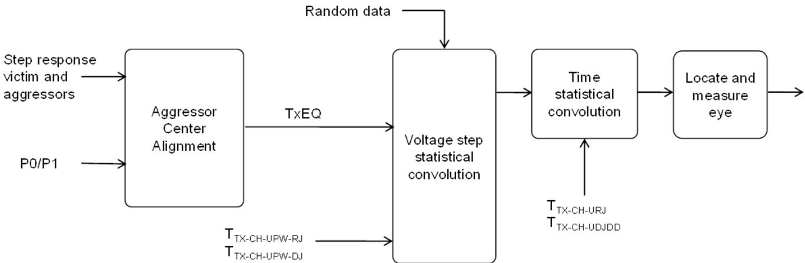

**Table 8-56.** Flow Diagram for Channel Tolerancing at 2.5 and 5.0 GT/s | 表 8-56. 2.5 GT/s 与 5.0 GT/s 通道容差流程图

<table>
<thead>
<tr>
<th width="50%">🇬🇧 English</th>
<th width="50%" style="background-color:#e8e8e8">🏆 中文</th>
</tr>
</thead>
<tbody>
<tr>
<td>

The basic channel compliance approach is to first acquire the channel's characteristics, usually by means of s-parameters or equivalent model. Behavioral Tx and Rx package models are then appended to the channel model to yield a die pad to die pad topology. The model shall include both victim path and a sufficient number of aggressor paths to accurately capture channel crosstalk effects. Using the Tx voltage and jitter limits defined in the Transmitter specification section it is possible to transform these parameters to what would appear at the die pad of a Tx.

</td>
<td style="background-color:#e8e8e8">

基本的通道一致性方法首先是获取通道的特性，通常通过 S 参数 (s-parameters) 或等效模型实现。然后将行为级 Tx 和 Rx 封装模型附加到通道模型之上，以形成从 die pad 到 die pad 的拓扑。该模型必须同时包含受害路径与足够数量的串扰源路径，以准确捕获通道串扰效应。利用发送器规范部分所定义的 Tx 电压与抖动限值，可将这些参数变换为出现在 Tx die pad 处的值。

</td>
</tr>
</tbody>
</table>

---

> **Figure 8-57.** Flow Diagram for Channel Tolerancing at 8.0 and 16.0 GT/s
> 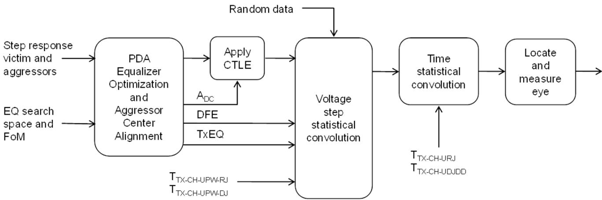

**Table 8-57.** Flow Diagram for Channel Tolerancing at 8.0 and 16.0 GT/s | 表 8-57. 8.0 GT/s 与 16.0 GT/s 通道容差流程图


<div style="overflow-x: auto; max-width: 100%;">
<table>
<thead>
<tr>
<th width="50%">🇬🇧 English</th>
<th width="50%" style="background-color:#e8e8e8">🏆 中文</th>
</tr>
</thead>
<tbody>
<tr>
<td>

The resulting model is analyzed via simulation, yielding voltage and jitter at a point equivalent to the input latch of the Receiver. The signal observed at the Receiver's latch is referenced to a recovered data clock from which an eye diagram may be constructed.

For 8.0, 16.0, 32.0, and 64.0 GT/s testing the simulation process must properly account for Tx and Rx equalization optimization as must be supported by a minimum capability Tx/Rx pair. This means the simulation process must be able to select the optimum values for the Tx presets or coefficients and Rx equalization settings based upon:

- a 1st order CTLE and a 1-tap DFE for 8.0 GT/s,
- a 1st order CTLE and a 2-tap DFE for 16.0 GT/s,

</td>
<td style="background-color:#e8e8e8">

所得模型通过仿真加以分析，在等同于接收器 (Receiver) 输入锁存器的位置上得出电压与抖动。接收器锁存器处观察到的信号以恢复出的数据时钟为参考，可由此构建眼图。

对于 8.0、16.0、32.0 与 64.0 GT/s 的测试，仿真过程必须正确地反映 Tx 与 Rx 均衡优化，且必须由具备最低能力的 Tx/Rx 对提供支持。这意味着仿真过程必须能够基于以下条件选择最佳的 Tx 预设 (Preset) 或系数值，以及 Rx 均衡设置:

- 8.0 GT/s:1 阶 CTLE 与 1 tap DFE;
- 16.0 GT/s:1 阶 CTLE 与 2 tap DFE;

</td>
</tr>
</tbody>
</table>
</div>


---

<!-- 📄 Page 1491 -->
---

<table>
<thead>
<tr>
<th width="50%">🇬🇧 English</th>
<th width="50%" style="background-color:#e8e8e8">🏆 中文</th>
</tr>
</thead>
<tbody>
<tr>
<td>

- a 2nd order CTLE and a 3-tap DFE for 32.0 GT/s, and
- a CTLE transfer function with six poles and three zeros and a 16-tap DFE for 64.0 GT/s.

Behavioral package models are defined in this specification to represent the combined die and package loss that is expected to interoperate with the targeted range of channels. Note that at 16.0 GT/s, the behavioral packages represent a high, but not worst-case, loss for many devices. (see § Section 8.3.3.11 and § Section 8.4.1.5 )

A separate pair of package models are defined for 8.0, 16.0, 32.0, and 64.0 GT/s. At 8.0 GT/s, separate package models are defined for TX and RX ports to reflect the smaller CPAD capacitance typical in most receiver implementations. At 16.0, 32.0, and 64.0 GT/s, separate package models are defined for devices containing Root Ports and all other devices to reflect the large and socketed nature of most devices containing Root Complexes. Channel testing for all three data rates typically requires testing in both directions.

The package models are included with the specification as design collateral. Each model for 8.0 and 16.0 GT/s comprehends CPIN and CPAD parasitic capacitances plus a differential t-line element as illustrated in § Figure 8-58.

> **Figure 8-58.** Tx/Rx Behavioral Package Models
> 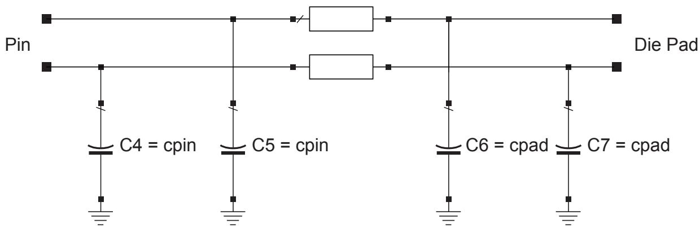

The CPIN and CPAD values used in the package model generation are provided for informative purposes only.

</td>
<td style="background-color:#e8e8e8">

- 32.0 GT/s:2 阶 CTLE 与 3 tap DFE;
- 64.0 GT/s:具有 6 极 3 零的 CTLE 传递函数，以及 16 tap DFE。

行为级封装模型在本规范中加以定义，以表示预期可与目标通道范围互通的综合 die 与封装损耗。注意，在 16.0 GT/s 时，行为级封装对许多设备表示的是较高(但非最差情况)的损耗。(参见 § Section 8.3.3.11 和 § Section 8.4.1.5。)

为 8.0、16.0、32.0 与 64.0 GT/s 分别定义了一对封装模型。在 8.0 GT/s 时，为 TX 与 RX 端口分别定义了独立的封装模型，以反映大多数接收器实现中较小的 CPAD 电容。在 16.0、32.0 与 64.0 GT/s 时，为包含根端口 (Root Port) 的设备与所有其他设备分别定义封装模型，以反映大多数包含根复合体 (Root Complex) 的设备的大型插座化特性。对于这三种数据速率，通道测试通常要求在两个方向上分别进行。

封装模型作为设计资料随本规范一同提供。8.0 GT/s 与 16.0 GT/s 的每个模型都涵盖 CPIN 与 CPAD 寄生电容，并包含一个差分传输线 (t-line) 单元，如图 § Figure 8-58 所示。

用于生成封装模型的 CPIN 与 CPAD 值仅供参考。


</td>
</tr>
</tbody>
</table>

---

**Table 8-14. Package Model Capacitance Values | 表 8-14. 封装模型电容值**

|        | 8.0 GT/s Tx | 8.0 GT/s Rx | 16.0 GT/s |
|--------|-------------|-------------|-----------|
| CPIN   | 0.25 pF     | 0.25 pF     | 0.25 pF   |
| CPAD   | 1.0 pF      | 0.8 pF      | 0.5 pF    |

<table>
<thead>
<tr>
<th width="50%">🇬🇧 English</th>
<th width="50%" style="background-color:#e8e8e8">🏆 中文</th>
</tr>
</thead>
<tbody>
<tr>
<td>

For ease of incorporation into the post processing flow the 8.0 and 16.0 behavioral package models are specified as 4-port s-parameter files. The files are specified with port designations, frequency range and granularity as listed below. The reference impedance for the s-parameters is 50 Ω. File format is Touchstone.

</td>
<td style="background-color:#e8e8e8">

为便于纳入后处理流程,8.0 GT/s 与 16.0 GT/s 的行为级封装模型规定为 4 端口 S 参数 (s-parameter) 文件。文件按如下所列的端口标识、频率范围与粒度加以规定。S 参数的参考阻抗为 50 Ω。文件格式为 Touchstone。

</td>
</tr>
</tbody>
</table>

---

<a id="sec-8-5-1-1"></a>
## 8.5.1.1 Behavioral Transmitter and Receiver Package Models | 行为级发送器与接收器封装模型

<table>
<thead>
<tr>
<th width="50%">🇬🇧 English</th>
<th width="50%" style="background-color:#e8e8e8">🏆 中文</th>
</tr>
</thead>
<tbody>
<tr>
<td>

8.5.1.1 Behavioral Transmitter and Receiver Package Models §

</td>
<td style="background-color:#e8e8e8">

8.5.1.1 行为级发送器 (Transmitter) 与接收器 (Receiver) 封装模型 §

</td>
</tr>
</tbody>
</table>

---

<!-- 📄 Page 1492 -->
---

> **Figure 8-59.** Behavioral Tx and Rx S-Port Designation for 8.0 and 16.0 GT/s Packages
> 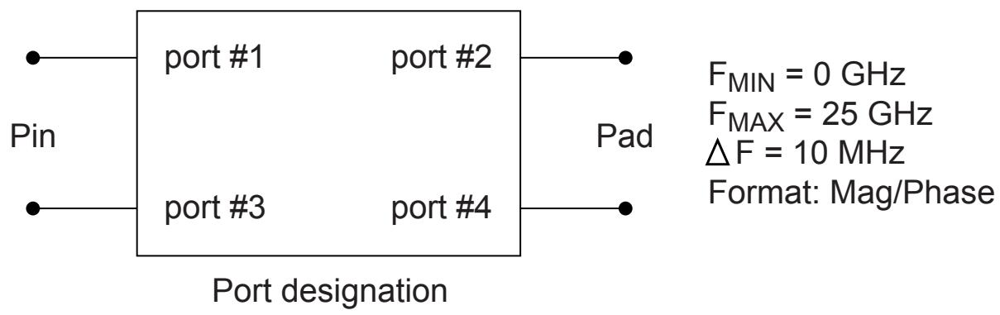

> **Figure 8-60.** SDD21 Plots for Root and Non-Root Packages for 16.0 GT/s
> 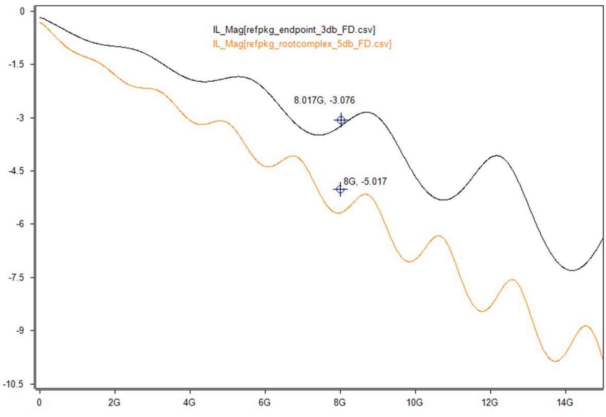

<table>
<thead>
<tr>
<th width="50%">🇬🇧 English</th>
<th width="50%" style="background-color:#e8e8e8">🏆 中文</th>
</tr>
</thead>
<tbody>
<tr>
<td>

For 32.0 and 64.0 GT/s the package models are based on real package and socket models for the root package and package and BGA models for the non-root package.

For 32.0 GT/s, reference package models the die capacitive loads are included in the models. For 64.0 GT/s, the effective die cap has been replaced by the S-parameter representation of an on-die network that represents the insertion and

</td>
<td style="background-color:#e8e8e8">

对于 32.0 与 64.0 GT/s,封装模型基于根封装的实际封装与插座模型，以及非根封装的封装与 BGA 模型。

对于 32.0 GT/s,参考封装模型在模型内包含 die 的电容性负载。对于 64.0 GT/s,有效 die 电容已由片上网络 (on-die network) 的 S 参数表示所替代，该片上网络表示典型设计片上 pad 的插入损耗与回损 (return loss) 特性。

</td>
</tr>
</tbody>
</table>

---

<!-- 📄 Page 1493 -->
---


<div style="overflow-x: auto; max-width: 100%;">
<table>
<thead>
<tr>
<th width="50%">🇬🇧 English</th>
<th width="50%" style="background-color:#e8e8e8">🏆 中文</th>
</tr>
</thead>
<tbody>
<tr>
<td>

return loss characteristics of on-die pad for a typical design. The reference impedance for the 32.0 and 64.0 GT/s reference package model s-parameters is 50 Ω. Figures below show 32.0 and 64.8 GT/s reference package insertion loss, return loss, FEXT, and NEXT S-parameter plots based on 50 Ω impedance. To account for the on-die inductive coil DC loss of about 3 Ω, the Tx and Rx DC termination should be set to 47 Ω in 64.0 GT/s channel compliance simulations.

</td>
<td style="background-color:#e8e8e8">

对于典型设计，片上 pad 的回损 (return loss) 特性。32.0 GT/s 与 64.0 GT/s 参考封装模型 S 参数的参考阻抗为 50 Ω。下列各图展示了基于 50 Ω 阻抗的 32.0 GT/s 与 64.0 GT/s 参考封装的插入损耗、回损、FEXT 与 NEXT S 参数曲线。为考虑片上电感线圈约 3 Ω 的 DC 损耗，在 64.0 GT/s 通道一致性仿真中应将 Tx 和 Rx 的 DC 端接设置为 47 Ω。

</td>
</tr>
</tbody>
</table>

> **Figure 8-61.** Insertion Loss for Root Reference Package for 32.0 GT/s
> 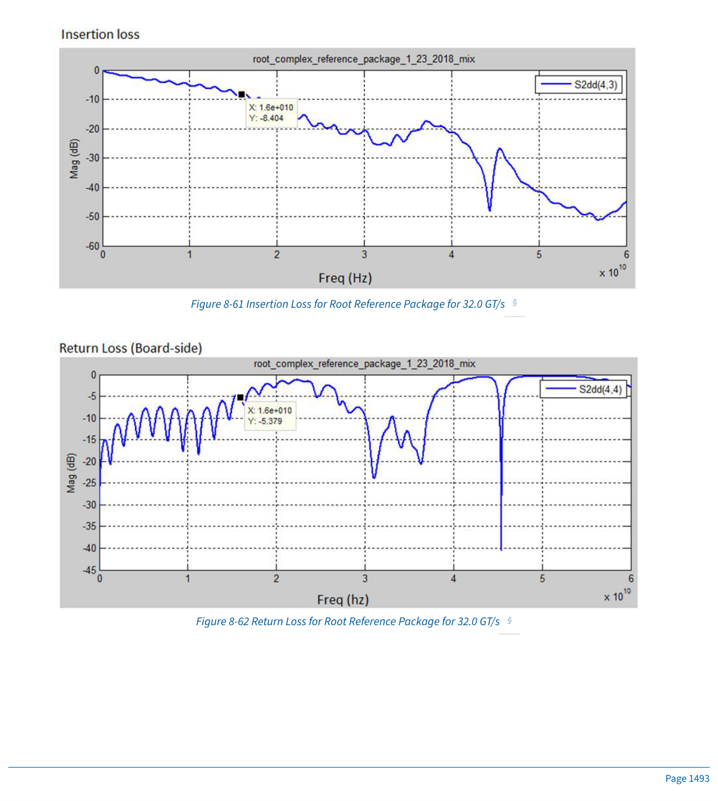

> **Figure 8-62.** Return Loss for Root Reference Package for 32.0 GT/s

</div>


---

<!-- 📄 Page 1494 -->
---

> **Figure 8-63.** NEXT for Root Reference Package (Worst-Case) for 32.0 GT/s
> 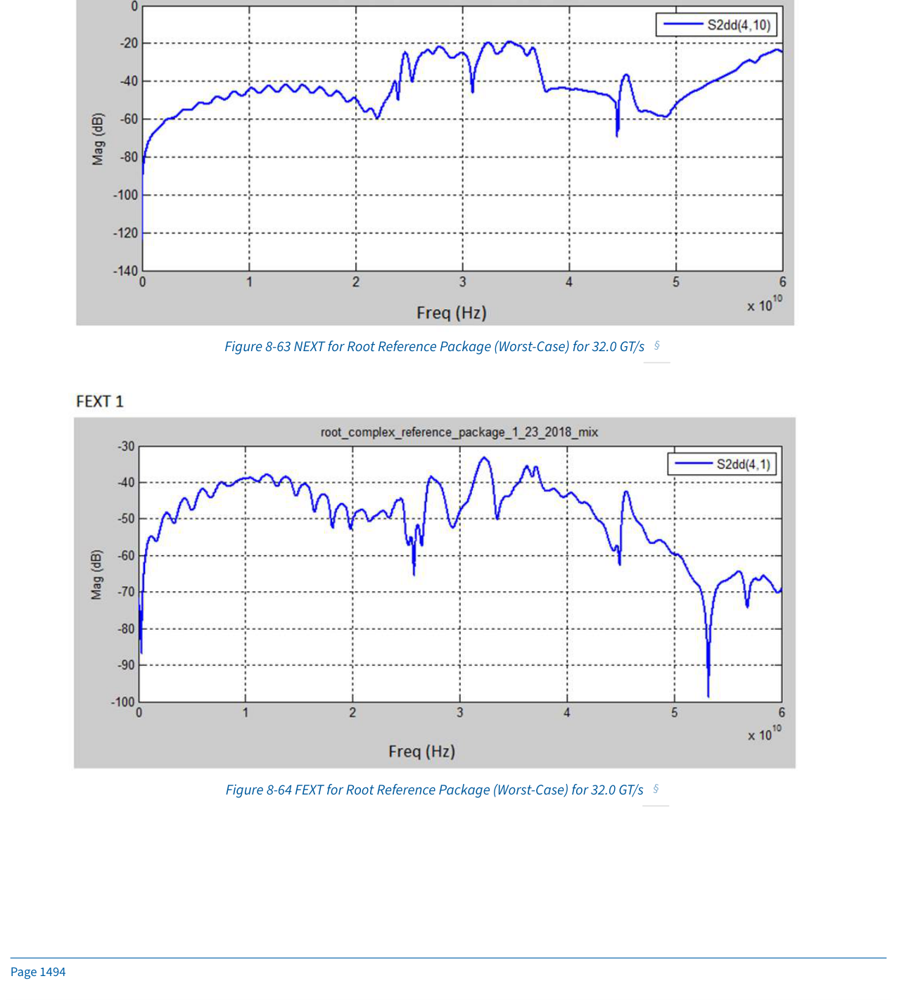

> **Figure 8-64.** FEXT for Root Reference Package (Worst-Case) for 32.0 GT/s

---

<!-- 📄 Page 1495 -->
---

> **Figure 8-65.** Insertion Loss for Non-Root Reference Package for 32.0 GT/s
> 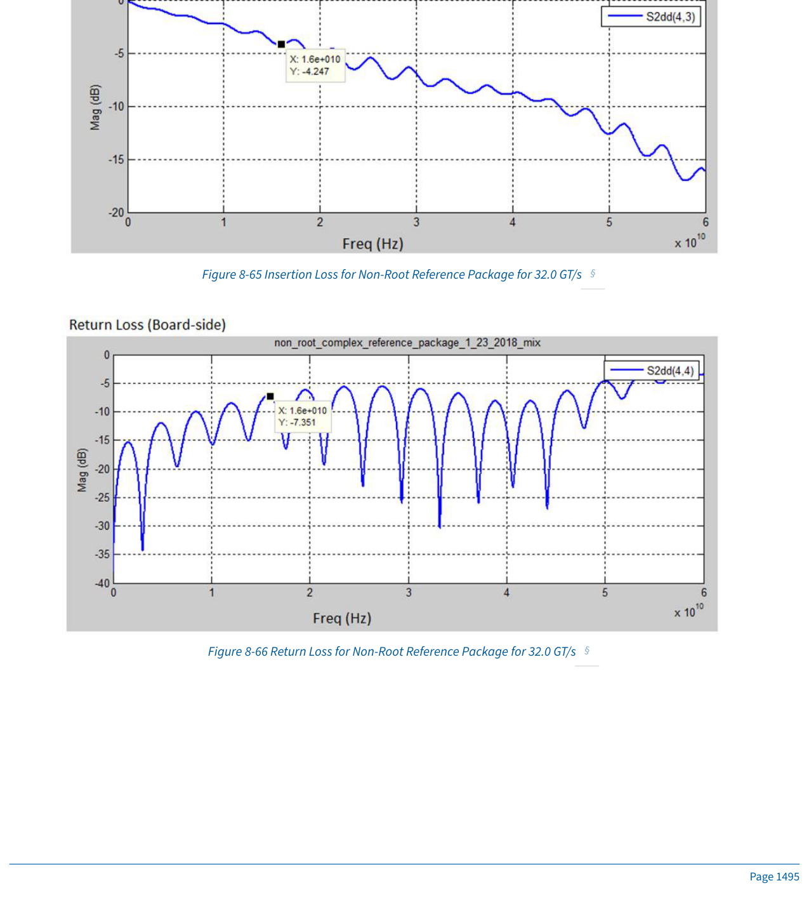

> **Figure 8-66.** Return Loss for Non-Root Reference Package for 32.0 GT/s

---

<!-- 📄 Page 1496 -->
---

> **Figure 8-67.** NEXT for Non-Root Reference Package (Worst-Case) for 32.0 GT/s
> 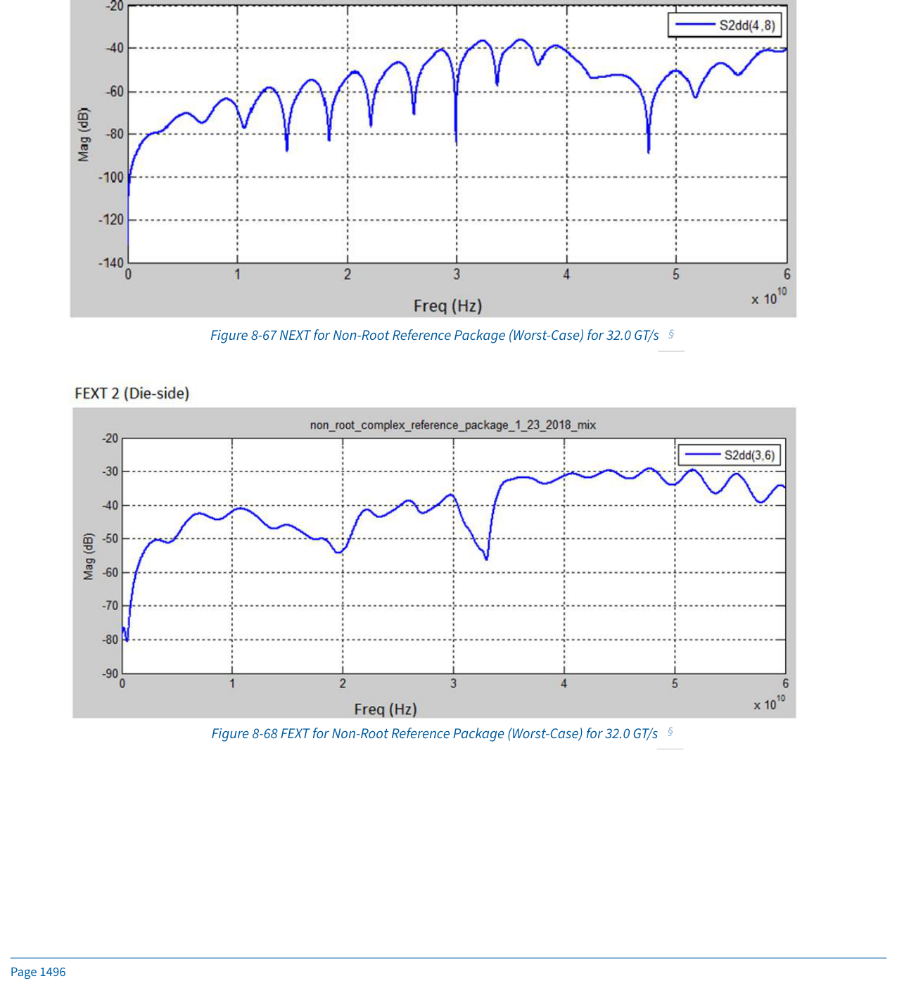

> **Figure 8-68.** FEXT for Non-Root Reference Package (Worst-Case) for 32.0 GT/s

---

<!-- 📄 Page 1497 -->
---

> **Figure 8-69.** Insertion Loss for Root Reference Package for 64.0 GT/s
> 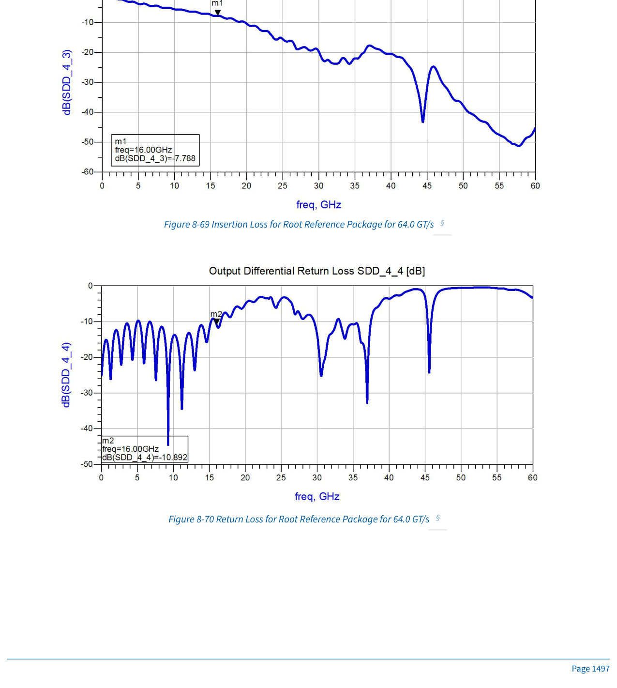

> **Figure 8-70.** Return Loss for Root Reference Package for 64.0 GT/s

---

<!-- 📄 Page 1498 -->
---

> **Figure 8-71.** NEXT for Root Reference Package (Worst Case) for 64.0 GT/s
> 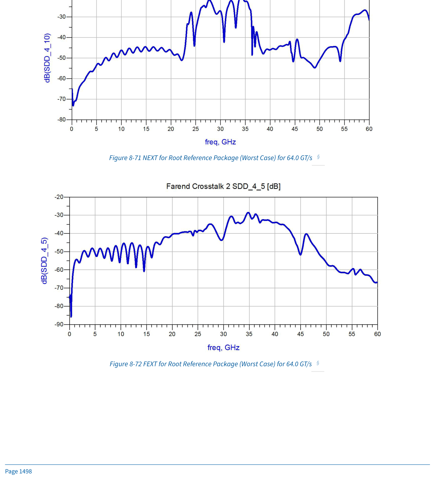

> **Figure 8-72.** FEXT for Root Reference Package (Worst Case) for 64.0 GT/s

---

<!-- 📄 Page 1499 -->
---

> **Figure 8-73.** Insertion Loss for Non-Root Reference Package for 64.0 GT/s
> 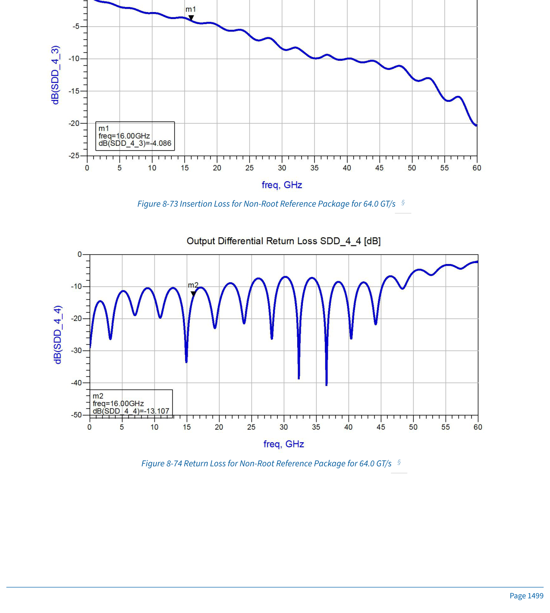

> **Figure 8-74.** Return Loss for Non-Root Reference Package for 64.0 GT/s

---

<!-- 📄 Page 1500 -->
---

> **Figure 8-75.** NEXT for Non-Root Reference Package (Worst Case) for 64.0 GT/s
> 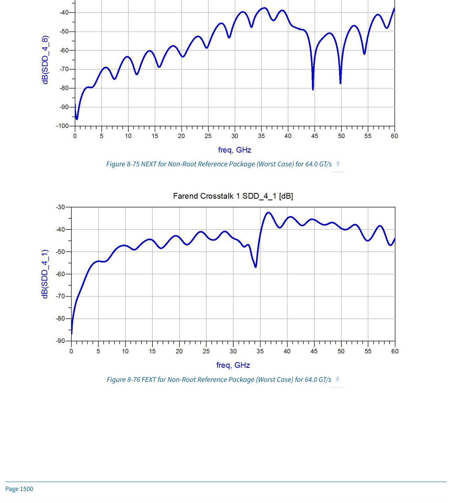

> **Figure 8-76.** FEXT for Non-Root Reference Package (Worst Case) for 64.0 GT/s

---

<!-- 📄 Page 1501 -->
---

> **Figure 8-77.** 32.0 and 64.0 GT/s Reference Package Port Connections for Pin to Pin Channel Evaluation
> 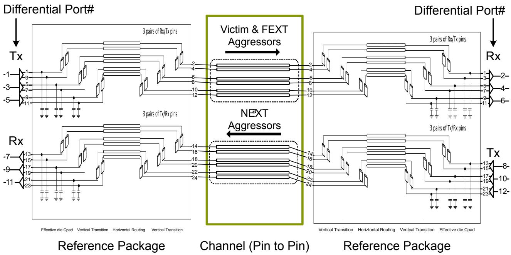

<table>
<thead>
<tr>
<th width="50%">🇬🇧 English</th>
<th width="50%" style="background-color:#e8e8e8">🏆 中文</th>
</tr>
</thead>
<tbody>
<tr>
<td>

§ Figure 8-77 shows the port connections for using the 32.0 and 64.0 GT/s reference packages to evaluate a pin to pin channel using the channel compliance methodology. Both directions (root transmitting and non-root transmitting) must be evaluated. The lane labeled channel 3 to channel 4 is intended as the worst-case victim channel and must be evaluated in both directions. Other channels in the reference package model are intended only for use as cross-talk aggressors (not victim channels).

</td>
<td style="background-color:#e8e8e8">

§ Figure 8-77 显示了使用 32.0 GT/s 与 64.0 GT/s 参考封装，按通道一致性方法评估 pin to pin 通道时的端口连接。两个方向(根端发送与非根端发送)都必须进行评估。标记为 channel 3 到 channel 4 的通道被定义为最差情况的受害通道，必须在两个方向上都进行评估。参考封装模型中的其他通道仅作为串扰源(非受害通道)使用。

</td>
</tr>
</tbody>
</table>

---

<a id="sec-8-5-1-2"></a>
## 8.5.1.2 Measuring Package Performance (16.0 GT/s only) | 封装性能测量(仅适用于 16.0 GT/s)


<div style="overflow-x: auto; max-width: 100%;">
<table>
<thead>
<tr>
<th width="50%">🇬🇧 English</th>
<th width="50%" style="background-color:#e8e8e8">🏆 中文</th>
</tr>
</thead>
<tbody>
<tr>
<td>

8.5.1.2 Measuring Package Performance (16.0 GT/s only) §

Package insertion loss at 16.0 GT/s is an informative spec parameter. Some implementations at 16.0 GT/s (see § Section 8.3.3.11) are allowed to have packages that exceed reference packages in insertion loss and/or cross-talk. Actual package performance must be assessed by performing channel compliance with reference channels provided with the specification on the PCI-SIG website. A set of channel compliance simulations are run on the reference channels with one of the reference packages being replaced by the package that is being evaluated. If the eye height or eye width is smaller for any of the channels with the package that is being evaluated, then the package is considered to have worse performance than the reference package. An implementation with a package that has worse performance than the reference package must use the implementation package model in the channel compliance methodology and may optionally use the implementation package in the Receiver stressed eye calibration. Note that form factor and channel compliance (for a captive channel) overall requirements still need to be met regardless of package characteristics.

</td>
<td style="background-color:#e8e8e8">

8.5.1.2 封装性能测量(仅适用于 16.0 GT/s) §

16.0 GT/s 下的封装插入损耗是一项参考性规范参数。16.0 GT/s 下的某些实现(参见 § Section 8.3.3.11)允许使用在插入损耗和/或串扰方面超过参考封装的封装。实际封装性能必须通过使用 PCI-SIG 网站上随规范提供的参考通道进行通道一致性评估。在参考通道上运行一组通道一致性仿真，其中用一个被评估的封装替换一个参考封装。若被评估封装所对应的任一通道的眼高 (eye height) 或眼宽 (eye width) 较小，则认为该封装的性能劣于参考封装。对于封装性能劣于参考封装的实现，必须在通道一致性方法中使用该实现封装模型，并可选择在接收器 (Receiver) 受压眼图 (stressed eye) 校准中使用该实现封装。注意，无论封装特性如何，外形规格和通道一致性(对于绑定通道)的总体要求仍须得到满足。

</td>
</tr>
</tbody>
</table>
</div>


---

<a id="sec-8-5-1-3"></a>
## 8.5.1.3 Simulation Tool Requirements | 仿真工具要求

<table>
<thead>
<tr>
<th width="50%">🇬🇧 English</th>
<th width="50%" style="background-color:#e8e8e8">🏆 中文</th>
</tr>
</thead>
<tbody>
<tr>
<td>

8.5.1.3 Simulation Tool Requirements §

Channel tolerancing is implemented by means of simulation, where the pass/fail criteria are defined in terms of a time domain eye diagram. The simulation tool must accept a prescribed set of inputs, including the channel under

</td>
<td style="background-color:#e8e8e8">

8.5.1.3 仿真工具要求 §

通道容差通过仿真加以实现，其通过/失败标准按时域眼图加以定义。仿真工具必须接受一组规定的输入，包括待评估通道，然后

</td>
</tr>
</tbody>
</table>

---

<!-- 📄 Page 1502 -->
---


<div style="overflow-x: auto; max-width: 100%;">
<table>
<thead>
<tr>
<th width="50%">🇬🇧 English</th>
<th width="50%" style="background-color:#e8e8e8">🏆 中文</th>
</tr>
</thead>
<tbody>
<tr>
<td>

consideration and then simulate based upon a set of post processing requirements. This specification does not stipulate the use of any specific tool for simulating channels. However, any simulation tool must meet the following requirements.

- Channel characteristics defined as S-parameters or equivalent model. The model must include the victim differential Lane plus as many aggressors as required to accurately capture crosstalk. In most cases this will be between 2 and 4 additional differential Lanes. Note that 32.0 and 64.0 GT/s are most likely to require additional aggressors to accurately capture worst-case cross-talk and most likely to require several NEXT aggressors to capture crosstalk accurately.
- Behavioral Root and Non-Root package models. The models will be included as part of the specification in the form of s-parameter files (see § Section 8.5.1.1).
- Transmitter Jitter and voltage: The voltage and jitter parameters input to the simulator may be directly obtained from a combination of the Transmitter and Refclk jitter. Since these parameters are fixed the simulation tool may choose to hard code their values.
- Transmitter and Receiver Termination Impedance: The simulator shall use a 2 × 50 Ω termination for both the Transmitter and Receiver. This value matches the assumptions which are implicit in generating and measuring the stressed eye for Rx tolerancing.
- Time domain representation of the end-to-end connectivity: Included are the behavioral Tx and Rx packages and the channel under test.
- Tx voltage and jitter: Voltage and jitter parameters defined for the Transmitter but have been recalculated to properly comprehend high and low frequency jitter components, and also include Refclk jitter contributions.
- Behavioral Transmitter Equalization: The simulator shall replicate the Transmitter equailzation capabilities defined in the Transmitter section.
- Behavioral Rx CTLE: The simulation tool shall implement a behavioral CTLE that replicates the CTLE function employed for Rx tolerancing.
- Behavioral DFE: The simulation tool shall implement a 1-tap (8.0 GT/s), a 2-tap (16.0 GT/s), a 3 tap DFE (32.0 GT/s), and a 16-tap DFE (64.0 GT/s), where the dynamic range for the feedback coefficient is defined in § Section 8.4.1.10.
- Optimizing Tx equalization and Rx DFE/CTLE settings: The simulation tool shall implement an optimization algorithm that selects the combination of Tx equalization and Rx CTLE and DFE settings that yields a maximum value for the eye height (at the data sample point) multiplied by the eye width at the far end of the channel. For details refer to § Section 8.4.1.8.
- Statistical Treatment of jitter: In order to avoid overestimating the effect of channel-data and channel-jitter interactions, the tool shall use a statistical analysis of these parameters to generate voltage/jitter eye margins.

Output eye parameters: The simulator shall generate a statistically defined output that displays the eye width and eye height. EH will be measured as the peak eye height at the data sample location, while EW shall be measured at the zero-crossing line. Additionally the simulator shall have the capability to adjust the data sample point by ±0.1 UI from the mean center of the UI for 8.0 and 16.0 GT/s as shown in § Figure 8-79. For 32.0 GT/s the simulator shall adjust the sample point up to 0.30 UI to the left of the mean center of the UI sample position in 0.05 UI increments, computing the

</td>
<td style="background-color:#e8e8e8">

根据一组后处理要求进行仿真。本规范不规定用于通道仿真的任何具体工具。然而，任何仿真工具都必须满足以下要求。

- 通道特性以 S 参数或等效模型定义。该模型必须包含受害差分通道 (Lane) 以及准确捕获串扰所需的足够多串扰源通道。在大多数情况下，需要 2 到 4 个额外的差分通道。注意,32.0 GT/s 与 64.0 GT/s 最有可能需要额外的串扰源通道以准确捕获最差情况串扰，并最有可能需要多个 NEXT 串扰源以准确捕获串扰。
- 行为级根 (Root) 与非根 (Non-Root) 封装模型。这些模型将以 S 参数文件的形式作为规范的一部分(参见 § Section 8.5.1.1)。
- 发送器抖动与电压:输入到仿真器的电压与抖动参数可直接由发送器 (Transmitter) 与 Refclk 抖动组合得出。由于这些参数固定，仿真工具可选择将其值硬编码。
- 发送器与接收器端接阻抗:仿真器应对发送器与接收器均使用 2 × 50 Ω 的端接。该值与生成和测量 Rx 容差受压眼图 (stressed eye) 时所隐含的假设一致。
- 端到端连通性的时域表示:包括行为级 Tx 和 Rx 封装以及待测通道。
- Tx 电压与抖动:为发送器定义的电压与抖动参数，但已重新计算以正确理解高频与低频抖动分量，并包含 Refclk 抖动贡献。
- 行为级发送器均衡 (Equalization):仿真器应复现发送器部分所定义的发送器均衡能力。
- 行为级 Rx CTLE:仿真工具应实现一种行为级 CTLE,复现 Rx 容差中所使用的 CTLE 功能。
- 行为级 DFE:仿真工具应分别实现 1 tap(8.0 GT/s)、2 tap(16.0 GT/s)、3 tap(32.0 GT/s)与 16 tap(64.0 GT/s)的 DFE,其中反馈系数的动态范围规定于 § Section 8.4.1.10。
- Tx 均衡与 Rx DFE/CTLE 设置优化:仿真工具应实现一种优化算法，选择可在通道远端得到最大眼高(数据采样点处)乘以眼宽的 Tx 均衡与 Rx CTLE/DFE 设置组合。详情请参见 § Section 8.4.1.8。
- 抖动的统计处理:为避免高估通道-数据与通道-抖动相互作用的影响，该工具应使用对这些参数的统计分析来生成电压/抖动眼图裕量。

输出眼图参数:仿真器应生成一个统计定义的输出，显示眼宽 (eye width, EW) 与眼高 (eye height, EH)。眼高 EH 测量为数据采样位置处的峰值眼高，眼宽 EW 测量于过零点处。此外，仿真器应具备将数据采样点从 UI 均值中心调整 ±0.1 UI 的能力(对应 8.0 GT/s 与 16.0 GT/s)，如图 § Figure 8-79 所示。对于 32.0 GT/s,仿真器应以 0.05 UI 为步进，将采样点最多调整到 UI 采样位置均值中心左侧 0.30 UI 处，计算

</td>
</tr>
</tbody>
</table>
</div>


---

<a id="sec-8-5-1-3-1"></a>
## 8.5.1.3.1 Simulation Tool Chain Inputs | 仿真工具链输入

<table>
<thead>
<tr>
<th width="50%">🇬🇧 English</th>
<th width="50%" style="background-color:#e8e8e8">🏆 中文</th>
</tr>
</thead>
<tbody>
<tr>
<td>

8.5.1.3.1 Simulation Tool Chain Inputs §

</td>
<td style="background-color:#e8e8e8">

8.5.1.3.1 仿真工具链输入 §

</td>
</tr>
</tbody>
</table>

---


---

---
<!-- 📄 Page 1503 -->
---

<a id="sec-8-5-1-3-2"></a>
## 8.5.1.3.2 Processing Steps | 处理步骤

<table>
<thead>
<tr>
<th width="50%">🇬🇧 English</th>
<th width="50%" style="background-color:#e8e8e8">🏆 中文</th>
</tr>
</thead>
<tbody>
<tr>
<td>

8.5.1.3.2 Processing Steps §

DFE coefficients for each sample location and selecting the result producing the maximum value for the eye height (at the data sample point) multiplied by the eye width. For 64.0 GT/s the simulator shall adjust the sample point up to 0.30 UI to the left of the mean center of the UI sample position in 0.015 UI increments, computing the DFE coefficients for each sample location and selecting the result producing the maximum value for the eye height (at the data sample point) multiplied by the eye width.

</td>
<td style="background-color:#e8e8e8">

8.5.1.3.2 处理步骤 §

针对每个采样位置计算 DFE (判决反馈均衡器) 系数，并选取使眼高(在数据采样点处)乘以眼宽取得最大值的计算结果。对于 64.0 GT/s,仿真器应以 0.015 UI 为步进，将采样点向 UI 采样位置平均中心左侧调整最多 0.30 UI,对每个采样位置计算 DFE 系数，并选取使眼高(在数据采样点处)乘以眼宽取得最大值的计算结果。

</td>
</tr>
</tbody>
</table>

---

<a id="sec-8-5-1-3-3"></a>
## 8.5.1.3.3 Simulation Tool Outputs | 仿真工具输出

<table>
<thead>
<tr>
<th width="50%">🇬🇧 English</th>
<th width="50%" style="background-color:#e8e8e8">🏆 中文</th>
</tr>
</thead>
<tbody>
<tr>
<td>

8.5.1.3.3 Simulation Tool Outputs §

An open source simulation tool shall be provided with the specification as design collateral. The tool will provide a turnkey capability, where the user provides the channel characteristics at the Receiver's die pad as step responses, and the tool calculates a statistical eye showing pass/fail.

</td>
<td style="background-color:#e8e8e8">

8.5.1.3.3 仿真工具输出 §

本规范应随附一个开源仿真工具，作为设计参考资源。该工具将提供一站式(turnkey)能力:用户在接收器 (Receiver) 焊盘 (die pad) 处提供以阶跃响应表示的通道特性，工具即计算并给出通过/失败的统计眼图。

</td>
</tr>
</tbody>
</table>

---

<a id="sec-8-5-1-3-4"></a>
## 8.5.1.3.4 Open Source Simulation Tool | 开源仿真工具

<table>
<thead>
<tr>
<th width="50%">🇬🇧 English</th>
<th width="50%" style="background-color:#e8e8e8">🏆 中文</th>
</tr>
</thead>
<tbody>
<tr>
<td>

8.5.1.3.4 Open Source Simulation Tool §

</td>
<td style="background-color:#e8e8e8">

8.5.1.3.4 开源仿真工具 §

</td>
</tr>
</tbody>
</table>

---

<a id="sec-8-5-1-4"></a>
## 8.5.1.4 Behavioral Transmitter Parameters | 行为级发送器参数

<table>
<thead>
<tr>
<th width="50%">🇬🇧 English</th>
<th width="50%" style="background-color:#e8e8e8">🏆 中文</th>
</tr>
</thead>
<tbody>
<tr>
<td>

8.5.1.4 Behavioral Transmitter Parameters §

</td>
<td style="background-color:#e8e8e8">

8.5.1.4 行为级发送器 (Transmitter) 参数 §

</td>
</tr>
</tbody>
</table>

---

<a id="sec-8-5-1-4-1"></a>
## 8.5.1.4.1 Deriving Voltage and Jitter Parameters | 电压与抖动参数推导


<div style="overflow-x: auto; max-width: 100%;">
<table>
<thead>
<tr>
<th width="50%">🇬🇧 English</th>
<th width="50%" style="background-color:#e8e8e8">🏆 中文</th>
</tr>
</thead>
<tbody>
<tr>
<td>

8.5.1.4.1 Deriving Voltage and Jitter Parameters §

This section is for informative purposes. The voltage and jitter parameters may be derived from the Transmitter voltage and jitter parameters but are referenced to the die pad. This is necessary to allow the channel simulation to include a behavioral Tx package and drive the package from the die pads. Additionally, the Tj terms must be decomposed into separate Rj and DjDD terms.

- VTX-CH-FS-NO-EQ and VTX-CH-RS-NO-EQ: These two parameters define the minimum peak-peak voltage corresponding to Vd in § Figure 8-6.
- The jitter parameters are derived based on the following set of equations. Algebraic manipulation is used to extract the Rj implicitly defined by the combination of Tj and DjDD terms. The following numbers are based on 8.0 GT/s Tx jitter parameters based on values specified in § Table 8-6. The same approach is used to extract jitter parameters for 2.5, 5.0, 16.0, 32.0, and 64.0 GT/s where it is assumed that maximum data rate supported by the PCIe 6.0 device is 64.0 GT/s and the jitter values in § Table 8-6 are used in the extraction process.

</td>
<td style="background-color:#e8e8e8">

8.5.1.4.1 电压与抖动参数推导 §

本节为信息性内容。电压与抖动参数可由发送器 (Transmitter) 的电压与抖动参数推导得到，但参考点为芯片焊盘 (die pad)。这是为了使通道仿真能够包含一个行为级 Tx 封装，并从芯片焊盘驱动该封装。此外,Tj 项必须分解为独立的 Rj 与 DjDD 项。

- VTX-CH-FS-NO-EQ 与 VTX-CH-RS-NO-EQ:这两个参数定义了 § Figure 8-6 中对应 Vd 的最小峰峰值电压。
- 抖动参数根据以下公式组推导。利用代数变换可从 Tj 与 DjDD 项的组合中提取隐含的 Rj。下列数值基于 § Table 8-6 中规定的 8.0 GT/s Tx 抖动参数。提取 2.5、5.0、16.0、32.0 和 64.0 GT/s 抖动参数时采用相同方法，其中假设 PCIe 6.0 设备支持的最大数据速率为 64.0 GT/s,并在提取过程中使用 § Table 8-6 中的抖动值。

</td>
</tr>
</tbody>
</table>
</div>


---

**A-0840A**

```
jit_hfrj_nui = (TTX-UTJ – TTX-UDJ-DD)/14.06 = 1.11ps
TTX-CH-UPW-RJ = (TTX-UPWJ-TJ – TTXUPWJ-DJDD)/14.06 = 1.00ps
TTX-CH-UPW-DJ = TTXUPWJ-DJDD = 10.0ps
TTX-CH-URJ = sqrt(jit_hfrj_nui**2 – (TTX-CH-UPW-RJ*0.707)**2 + TREFCLK-RMS**2) = 1.31ps
TTX-CH-UDJDD = TTX-UDJ-DD – (TTXUPWJ-DJDD)/2 = 7.00ps
```

> **Figure 8-78.** Example Derivation of 8.0 GT/s Jitter Parameters for § Table 8-15
> 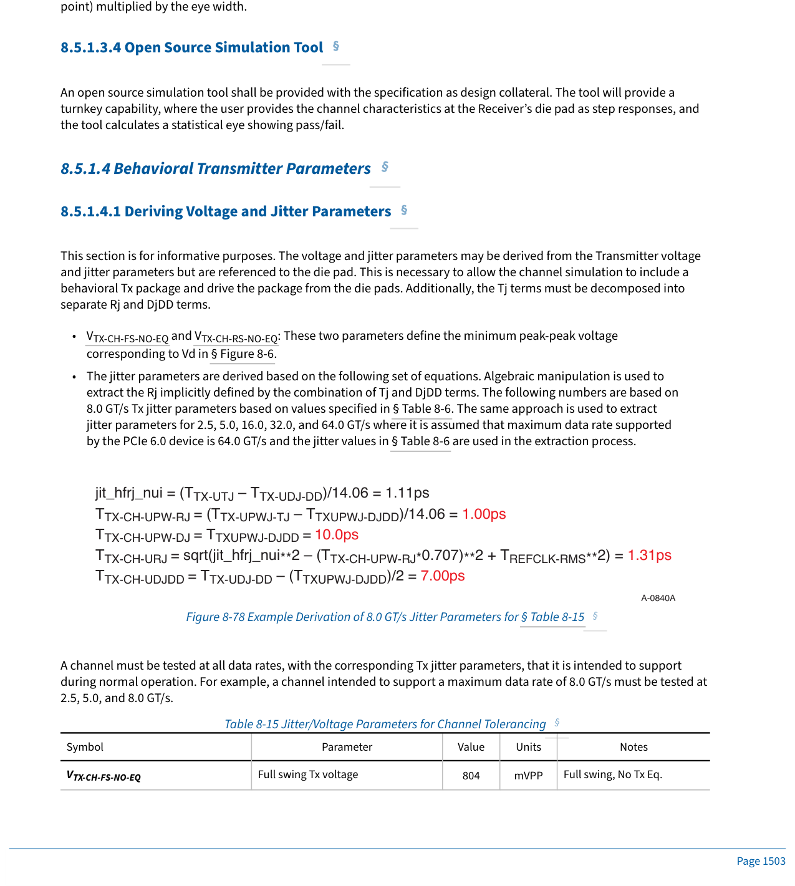

---

<table>
<thead>
<tr>
<th width="50%">🇬🇧 English</th>
<th width="50%" style="background-color:#e8e8e8">🏆 中文</th>
</tr>
</thead>
<tbody>
<tr>
<td>

A channel must be tested at all data rates, with the corresponding Tx jitter parameters, that it is intended to support during normal operation. For example, a channel intended to support a maximum data rate of 8.0 GT/s must be tested at 2.5, 5.0, and 8.0 GT/s.

**Table 8-15. Jitter/Voltage Parameters for Channel Tolerancing**

| Symbol | Parameter | Value | Units | Notes |
|--------|-----------|-------|-------|-------|
| VTX-CH-FS-NO-EQ | Full swing Tx voltage | 804 | mVPP | Full swing, No Tx Eq. |

</td>
<td style="background-color:#e8e8e8">

通道必须在正常运行期间所支持的所有数据速率下、使用对应的 Tx 抖动参数进行测试。例如，旨在支持最高 8.0 GT/s 数据速率的通道，必须在 2.5、5.0 和 8.0 GT/s 下进行测试。

**Table 8-15. 通道容差测试的抖动/电压参数**

| 符号 (Symbol) | 参数 (Parameter) | 数值 (Value) | 单位 (Units) | 备注 (Notes) |
|--------|-----------|-------|-------|-------|
| VTX-CH-FS-NO-EQ | 满摆幅 Tx 电压 | 804 | mVPP | 满摆幅，无 Tx 均衡 |

</td>
</tr>
</tbody>
</table>

---

<!-- 📄 Page 1504 -->
---

**Table 8-15. Jitter/Voltage Parameters for Channel Tolerancing (continued) | 表 8-15. 通道容差测试的抖动/电压参数(续)**

| Symbol | Parameter | Value | Units | Notes |
|--------|-----------|-------|-------|-------|
| VTX-CH-RS-NO-EQ | Reduced swing Tx voltage | 402 | mVPP | Reduced swing, No Tx Eq. |

**2.5 GT/s Jitter Parameters and Voltage Parameters | 2.5 GT/s 抖动参数与电压参数**

| Symbol | Parameter | Value | Units | Notes |
|--------|-----------|-------|-------|-------|
| TTX-CH-URJ-2.5G | Tx uncorrelated Rj | 3.45 | ps RMS | See Note 1 |
| TTX-CH-UDJDD-2.5G | Tx uncorrelated DjDD | 20 | ps PP |  |
| TTX-CH-UPW-RJ-2.5G | Uncorrelated PW Rj | 1.42 | ps RMS | See Note 2 |
| TTX-CH-UPW-DJ-2.5G | PW DDj | 80 | ps PP |  |
| TTX-DIEPAD-EDGERATE-2.5G | Signal edge rate at behavioral Tx die pad | 140 | ps | Measured 10% to 90% using a gaussian lowpass filter to shape the edge. See Note 3. |

**5.0 GT/s Jitter Parameters and Voltage Parameters | 5.0 GT/s 抖动参数与电压参数**

| Symbol | Parameter | Value | Units | Notes |
|--------|-----------|-------|-------|-------|
| TTX-CH-URJ-5G | Tx uncorrelated Rj | 3.45 | ps RMS | See Note 1 |
| TTX-CH-UDJDD-5G | Tx uncorrelated DjDD | 20- | ps PP |  |
| TTX-CH-UPW-RJ-5G | Uncorrelated PW Rj | 1.42 | ps RMS |  |
| TTX-CH-UPW-DJ-5G | PW DDj | 40 | ps PP | See Note 2. |
| TTX-DIEPAD-EDGERATE-5G | Signal edge rate at behavioral Tx die pad | 70 | ps | Measured 10% to 90% using a gaussian lowpass filter to shape the edge. See Note 3. |

**8.0 GT/s Jitter Parameters and Voltage Parameters | 8.0 GT/s 抖动参数与电压参数**

| Symbol | Parameter | Value | Units | Notes |
|--------|-----------|-------|-------|-------|
| TTX-CH-URJ-8G | Tx uncorrelated Rj | 1.31 | ps RMS | No DDj of HF jitter. See Note 1. |
| TTX-CH-UDJDD-8G | Tx uncorrelated DjDD | 7.0 | ps PP | No DDj of HF jitter |
| TTX-CH-UPW-RJ-8G | Uncorrelated PW Rj | 1.0 | ps RMS |  |
| TTX-CH-UPW-DJ-8G | PW DDj | 10 | ps PP | See Note 2. |
| TTX-DIEPAD-EDGERATE-8G | Signal edge rate at behavioral Tx die pad | 43.75 | ps | Measured 10% to 90% using a gaussian lowpass filter to shape the edge. See Note 3. |

**16.0 GT/s Jitter Parameters and Voltage Parameters | 16.0 GT/s 抖动参数与电压参数**

| Symbol | Parameter | Value | Units | Notes |
|--------|-----------|-------|-------|-------|
| TTX-CH-URJ-16G | Tx uncorrelated Rj | 0.71 | ps RMS | See Note 1. |
| TTX-CH-UDJDD-16G | Tx uncorrelated DjDD | 3.75 | ps PP |  |
| TTX-CH-UPW-RJ-16G | Uncorrelated PW Rj | 0.54 | ps RMS |  |
| TTX-CH-UPW-DJ-16G | PW DDj | 5.0 | ps PP | See Note 2. |
| TTX-DIEPAD-EDGERATE-16G | Signal edge rate at behavioral Tx die pad | 21.875 | ps | Measured 10% to 90% using a gaussian lowpass filter to shape the edge. See Note 3. |

---

<!-- 📄 Page 1505 -->
---

**Table 8-15. Jitter/Voltage Parameters for Channel Tolerancing (continued) | 表 8-15. 通道容差测试的抖动/电压参数(续)**

**32.0 GT/s Jitter Parameters and Voltage Parameters | 32.0 GT/s 抖动参数与电压参数**

| Symbol | Parameter | Value | Units | Notes |
|--------|-----------|-------|-------|-------|
| TTX-CH-URJ-32G | Tx uncorrelated Rj | 0.276 | ps RMS | See Note 1. |
| TTX-CH-UDJDD-32G | Tx uncorrelated DjDD | 1.875 | ps PP |  |
| TTX-CH-UPW-RJ-32G | Uncorrelated PW Rj | 0.27 | ps RMS |  |
| TTX-CH-UPW-DJ-32G | PW DDj | 2.5 | ps PP | See Note 2. |
| TTX-DIEPAD-EDGERATE-32G | Signal edge rate at behavioral Tx die pad | 10.94 | ps | Measured 10% to 90% using a gaussian lowpass filter to shape the edge. See Note 3. |

**64.0 GT/s Jitter Parameters and Voltage Parameters | 64.0 GT/s 抖动参数与电压参数**

| Symbol | Parameter | Value | Units | Notes |
|--------|-----------|-------|-------|-------|
| TTX-CH-URJ-64G | Tx uncorrelated Rj | 0.215 | ps RMS | See Note 1. |
| TTX-CH-UDJDD-64G | Tx uncorrelated DjDD | 0.938 | ps PP |  |
| TTX-CH-UPW-RJ-64G | Uncorrelated PW Rj | 0.289 | ps RMS |  |
| TTX-CH-UPW-DJ-64G | PW DDj | 1.25 | ps PP | See Note 2. |
| TTX-DIEPAD-EDGERATE-64G | Signal edge rate at behavioral Tx die pad | 10.94 | ps | Measured 10% to 90% using a gaussian lowpass filter to shape the edge. See Note 3. |

**Notes | 注释:**
1. Includes low frequency (non F/2) Rj components from the Transmitter and Rj from the Refclk.
2. Applied on a per edge basis as a dual Dirac model.
3. Does not include parasitic die pad capacitance. See § Figure 8-58 for details of behavioral package.

**注释(中文):**
1. 包含来自发送器 (Transmitter) 的低频(非 F/2)Rj 分量以及来自参考时钟 (REFCLK) 的 Rj。
2. 以每条边为基准按双 Dirac 模型施加。
3. 不包含焊盘寄生电容。行为级封装的细节参见 § Figure 8-58。

---

<a id="sec-8-5-1-4-2"></a>
## 8.5.1.4.2 Optimizing Tx/Rx Equalization (8.0, 16.0, 32.0, and 64.0 GT/s only) | 优化 Tx/Rx 均衡(仅限 8.0、16.0、32.0 和 64.0 GT/s)

<table>
<thead>
<tr>
<th width="50%">🇬🇧 English</th>
<th width="50%" style="background-color:#e8e8e8">🏆 中文</th>
</tr>
</thead>
<tbody>
<tr>
<td>

8.5.1.4.2 Optimizing Tx/Rx Equalization (8.0, 16.0, 32.0, and 64.0 GT/s only) §

The behavioral receiver selects the combination of Transmitter Equalization, CTLE, DFE and sample location (32.0 and 64.0 GT/s only) that produces the optimal eye area (eye width multiplied by eye height).

</td>
<td style="background-color:#e8e8e8">

8.5.1.4.2 优化 Tx/Rx 均衡(仅限 8.0、16.0、32.0 和 64.0 GT/s)§

行为级接收器在发送器均衡、CTLE (连续时间线性均衡器)、DFE (判决反馈均衡器)以及采样位置(仅 32.0 和 64.0 GT/s)的组合中，选取能够产生最佳眼图面积(眼宽乘以眼高)的组合。

</td>
</tr>
</tbody>
</table>

---

<a id="sec-8-5-1-4-3"></a>
## 8.5.1.4.3 Pass/Fail Eye Characteristics | Pass/Fail 眼图特性


<div style="overflow-x: auto; max-width: 100%;">
<table>
<thead>
<tr>
<th width="50%">🇬🇧 English</th>
<th width="50%" style="background-color:#e8e8e8">🏆 中文</th>
</tr>
</thead>
<tbody>
<tr>
<td>

8.5.1.4.3 Pass/Fail Eye Characteristics §

The output of the simulation tool shall be in the form of pass/fail characteristics as defined by an eye mask as shown in § Figure 8-79. EH and EW must meet respectively the voltage and jitter parameters defined in § Table 8-16. Eye margins are defined at the die pad of the Receiver after the appropriate Tx and Rx equalization algorithms have been applied. In the case where the channel is being designed for a specific pair of silicon devices and the package models of these silicon devices including cross-talk aggressors are known the actual device packages may be used instead of the reference packages in running the pad to pad channel pass/fail compliance simulations.

</td>
<td style="background-color:#e8e8e8">

8.5.1.4.3 Pass/Fail 眼图特性 §

仿真工具的输出应为通过/失败特性的形式，如 § Figure 8-79 所示的眼图模板 (eye mask) 所定义。EH 和 EW 必须分别满足 § Table 8-16 中规定的电压与抖动参数。眼图裕量在应用了相应的 Tx 与 Rx 均衡算法之后的接收器焊盘处定义。当通道是为某一对特定硅器件进行设计、且这些硅器件的封装模型(包括串扰 aggressor)已知时，在进行 pad-to-pad 通道通过/失败一致性仿真时，可使用实际器件封装代替参考封装。

</td>
</tr>
</tbody>
</table>
</div>


---

<!-- 📄 Page 1506 -->
---

> **A-0841A**
>
> **Figure 8-79.** EH, EW Mask
> 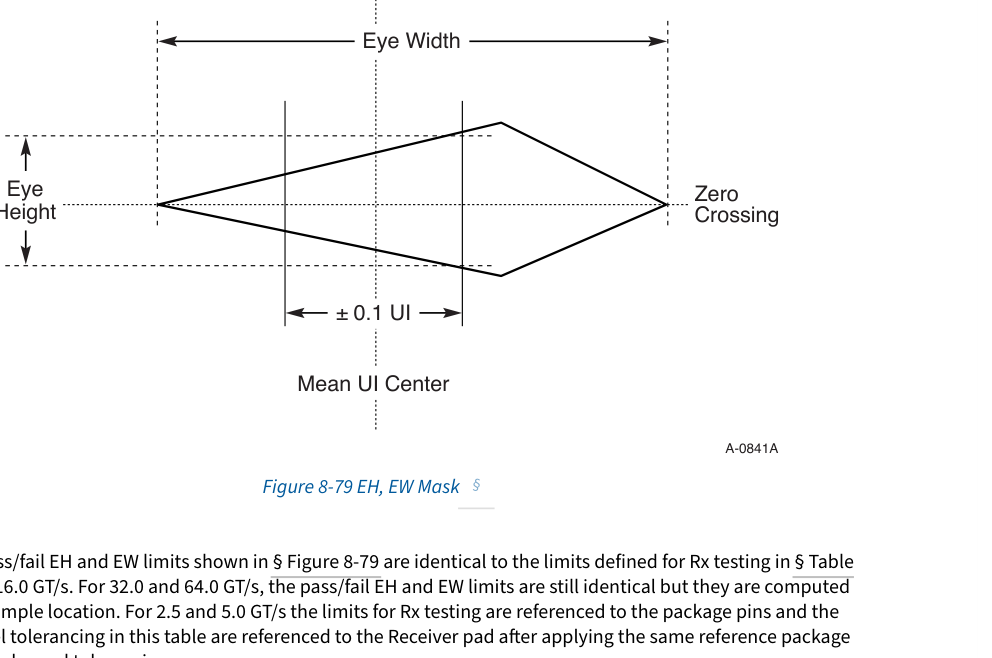
>
> Eye Width ± 0.1 UI
> Mean UI Center Zero Crossing
> Eye Height

>
> 眼宽 ± 0.1 UI
> UI 平均中心零交叉
> 眼高

---

<table>
<thead>
<tr>
<th width="50%">🇬🇧 English</th>
<th width="50%" style="background-color:#e8e8e8">🏆 中文</th>
</tr>
</thead>
<tbody>
<tr>
<td>

Note that the pass/fail EH and EW limits shown in § Figure 8-79 are identical to the limits defined for Rx testing in § Table 8-11 for 8.0 and 16.0 GT/s. For 32.0 and 64.0 GT/s, the pass/fail EH and EW limits are still identical but they are computed at the optimal sample location. For 2.5 and 5.0 GT/s the limits for Rx testing are referenced to the package pins and the limits for channel tolerancing in this table are referenced to the Receiver pad after applying the same reference package used for 8.0 GT/s channel tolerancing.

**Table 8-16. Channel Tolerancing Eye Mask Values**

</td>
<td style="background-color:#e8e8e8">

注意,§ Figure 8-79 中所示的 Pass/Fail EH 与 EW 限值与 § Table 8-11 中为 8.0 与 16.0 GT/s Rx 测试所定义的限值完全相同。对于 32.0 和 64.0 GT/s,Pass/Fail EH 与 EW 限值仍然相同，但它们在最佳采样位置处计算。对于 2.5 和 5.0 GT/s,Rx 测试的限值以封装引脚为参考点;而本表中通道容差测试的限值，在施加了与 8.0 GT/s 通道容差测试所用的相同参考封装后，以接收器焊盘为参考点。

**Table 8-16. 通道容差测试的眼图模板数值**

</td>
</tr>
</tbody>
</table>

---

**Table 8-16. Channel Tolerancing Eye Mask Values | 表 8-16. 通道容差测试的眼图模板数值**

**2.5 GT/s Eye Margins | 2.5 GT/s 眼图裕量**

| Symbol | Parameter | Value | Units | Comments |
|--------|-----------|-------|-------|----------|
| VRX-CH-EH-2.5G | Eye height | <130 (min) | mVPP | Eye height at BER=10-12. Note 1 |
| TRX-CH-EW-2.5G | Eye width at zero-crossing | <0.35 (min) | UI | Eye width at BER=10-12 |
| TRX-DS-OFFSET-2.5G | Peak EH offset from UI center | ±0.1 | UI | See § Figure 8-79 for details. |

**5.0 GT/s Eye Margins | 5.0 GT/s 眼图裕量**

| Symbol | Parameter | Value | Units | Comments |
|--------|-----------|-------|-------|----------|
| VRX-CH-EH-5G | Eye height | < 85 (min) | mVPP | Eye height at BER=10-12. Note 1 |
| TRX-CH-EW-5G | Eye width at zero-crossing | <0.30 (min) | UI | Eye width at BER=10-12 |
| TRX-DS-OFFSET-5G | Peak EH offset from UI center | ±0.1 | UI | See § Figure 8-79 for details. |

**8.0 GT/s Eye Margins | 8.0 GT/s 眼图裕量**

---

<!-- 📄 Page 1507 -->
---

**Table 8-16. Channel Tolerancing Eye Mask Values (continued) | 表 8-16. 通道容差测试的眼图模板数值(续)**

**8.0 GT/s Eye Margins (continued) | 8.0 GT/s 眼图裕量(续)**

| Symbol | Parameter | Value | Units | Comments |
|--------|-----------|-------|-------|----------|
| VRX-CH-EH-8G | Eye height | 25 (min) | mVPP | Eye height at BER=10-12. Note 1. |
| TRX-CH-EW-8G | Eye width at zero-crossing | 0.3 (min) | UI | Eye width at BER=10-12 |
| TRX-DS-OFFSET-8G | Peak EH offset from UI center | ±0.1 | UI | See § Figure 8-79 for details. |
| VRX-DFE-D1-8G | Range for DFE d1 coefficient | ±30 | mV |  |

**16.0 GT/s Eye Margins | 16.0 GT/s 眼图裕量**

| Symbol | Parameter | Value | Units | Comments |
|--------|-----------|-------|-------|----------|
| VRX-CH-EH-16G | Eye height | 15 (min) | mVPP | Eye height at BER=10-12. Note 1. |
| TRX-CH-EW-16G | Eye width at zero-crossing | 0.3 (min) | UI | Eye width at BER=10-12 |
| TRX-DS-OFFSET-16G | Peak EH offset from UI center | ±0.1 | UI | See § Figure 8-79 for details. |
| VRX-DFE-D1-16G | Range for DFE d1 coefficient | ±30 | mV |  |
| VRX-DFE-D2-16G | Range for DFE d2 coefficient | ±20 | mV |  |

**32.0 GT/s Eye Margins | 32.0 GT/s 眼图裕量**

| Symbol | Parameter | Value | Units | Comments |
|--------|-----------|-------|-------|----------|
| VRX-CH-EH-32G | Eye height | 15 (min) | mVPP | Eye height at BER=10-12. Note 1. |
| TRX-CH-EW-32G | Eye width at zero-crossing | 0.3 (min) | UI | Eye width at BER=10-12 |
| TRX-DS-OFFSET-32G | Peak EH offset from UI center | N/A | UI | See § Figure 8-79 for details. |
| TRX-SAMPLE-OFFSET-32G | Max sample location offset to the left from UI center | 0.30 | UI | Note 2 |
| TRX-SAMPLE-GRANULARITY-32G | Granularity for sample location offset | 0.05 | UI | Note 2 |
| VRX-DFE-D1-32G | Range for DFE d1 coefficient | \|d1\| / d0 (cursor amplitude) ≤ 0.8 |  |  |
| VRX-DFE-D2-32G | Range for DFE d2 coefficient | ±20 | mV |  |
| VRX-DFE-D3-32G | Range for DFE d3 coefficient | ±20 | mV |  |

**64.0 GT/s Eye Margins | 64.0 GT/s 眼图裕量**

---

<!-- 📄 Page 1508 -->
---

**Table 8-16. Channel Tolerancing Eye Mask Values (continued) | 表 8-16. 通道容差测试的眼图模板数值(续)**

**64.0 GT/s Eye Margins (continued) | 64.0 GT/s 眼图裕量(续)**

| Symbol | Parameter | Value | Units | Comments |
|--------|-----------|-------|-------|----------|
| VRX-CH-TOP-EH-64G | Top Eye height | 6 (min) | mVPP | Eye height at BER=10-6. Note 1. |
| TRX-CH-TOP-EW-64G | Top Eye width at zero-crossing | 0.1 (min) | UI | Eye width at BER=10-6 |
| TRX-DS-OFFSET-64G | Peak EH offset from UI center | N/A | UI |  |
| TRX-SAMPLE-OFFSET-64G | Max sample location offset to the left from UI center | 0.30 | UI | Note 2 |
| TRX-SAMPLE-GRANULARITY-64G | Granularity for sample location offset | 0.015 | UI | Note 2 |
| VRX-DFE-D1-64G | Range for DFE d1 coefficient | \|d1\| / d0 (cursor amplitude) < 0.55 |  |  |
| VRX-DFE-TAPS-WEIGHTED-SUM-64G | Range for weighted sum of absolute values of DFE d1-d16 coefficients (\|d1\| + \|d2\| + 0.85 × \|d3\| + 0.6 × \|d4\| + 0.25 × \|d5\| + 0.1 × \|d6\| + 0.05 × { \|d7\| + \|d8\| + \|d9\| + \|d10\| + \|d11\| + \|d12\| + \|d13\| + \|d14\| + \|d15\| + \|d16\| }) / \|d0\| < 0.85 |  | mV |  |

**Notes | 注释:**
1. VRX-CH-EH is defined as max EH within an aperture of ±0.1 UI from mean UI center.
2. The optimal eye area is computed at each offset from mean UI center -0.30 UI to mean UI center with the specified granularity.

**注释(中文):**
1. VRX-CH-EH 定义为在 UI 平均中心 ±0.1 UI 孔径范围内的最大 EH 值。
2. 最佳眼图面积在从 UI 平均中心 -0.30 UI 到 UI 平均中心的每个偏移位置、按指定步进计算得到。

---

<a id="sec-8-5-1-4-4"></a>
## 8.5.1.4.4 Characterizing Channel Common Mode Noise | 通道共模噪声特性


<div style="overflow-x: auto; max-width: 100%;">
<table>
<thead>
<tr>
<th width="50%">🇬🇧 English</th>
<th width="50%" style="background-color:#e8e8e8">🏆 中文</th>
</tr>
</thead>
<tbody>
<tr>
<td>

8.5.1.4.4 Characterizing Channel Common Mode Noise §

A channel must meet the common mode requirements as they are defined in the receiver specification. In general, it is not possible to accurately simulate all the channel's common mode noise contributions due to the large number of mechanisms that can generate CM noise, including the Transmitter. Typically channel common mode noise is a budgeted parameter, and the limits defined below assume a budgeting process. The channel's CM limit is defined as the amount of CM noise that a channel can add and still meet the Rx CM limits assuming the worst-case Tx CM.

Note that the Tx and channel CM noise parameters cannot simply be added to obtain the Rx CM limit. This is due to the fact that a channel will attenuate some of high frequency Tx CM noise while propagating Tx LF CM noise through with little loss. The channel may also contribute both high and low frequency CM components of its own.

</td>
<td style="background-color:#e8e8e8">

8.5.1.4.4 通道共模噪声特性 §

通道必须满足接收器规范中规定的共模要求。一般来说，由于能够产生 CM 噪声的机制很多(包括发送器)，无法准确地仿真出通道的全部共模噪声贡献。典型情况下，通道共模噪声是预算分配式(budgeted)参数，以下所定义的限值假设了一个预算分配过程。通道的 CM 限值定义为:在最坏情况 Tx CM 的假设下，通道所能额外贡献、并仍能满足 Rx CM 限值的 CM 噪声量。

请注意,Tx 与通道的 CM 噪声参数不能简单相加得到 Rx CM 限值。这是因为通道会衰减一部分 Tx 高频 CM 噪声，而以很小的损耗透传 Tx 低频 CM 噪声;此外，通道自身也可能贡献其自身的高、低频 CM 分量。

</td>
</tr>
</tbody>
</table>
</div>


---

<!-- 📄 Page 1509 -->
---

<a id="sec-8-5-1-4-5"></a>
## 8.5.1.4.5 Verifying VCH-IDLE-DET-DIFF-pp | 验证 VCH-IDLE-DET-DIFF-pp

<table>
<thead>
<tr>
<th width="50%">🇬🇧 English</th>
<th width="50%" style="background-color:#e8e8e8">🏆 中文</th>
</tr>
</thead>
<tbody>
<tr>
<td>

8.5.1.4.5 Verifying VCH-IDLE-DET-DIFF-pp §

VCH-IDLE-DET-DIFF-pp is defined to guarantee that, when a Transmitter issues an EIEOS sequence, the Receiver is guaranteed to detect it. Potentially larger Transmitter equalization boost ratios at 8.0, 16.0, 32.0, and 64.0 GT/s necessitate that this parameter be verified; this procedure was not necessary for 2.5 or 5.0 GT/s, where the max Transmitter equalization boost is smaller. Defining the launch and detect voltages at the Tx/Rx die pad permits VCH-IDLE-DET-DIFF-pp to be verified with the same channel and Tx/Rx package models used to determine eye margins. It is also acceptable to simulate from Tx pin to Rx pin (excluding the Tx and Rx behavioral package models), in which case the EIEOS and idle detect parameters defined in the Tx and Rx sections are applicable.

Long channels, where VTX-EIEOS-FS is applicable, are characterized by driving the channel under test with the EIEOS pattern and -11.0 dB de-emphasis and zero dB preshoot. For short channels, where VTX-EIEOS-RS is applicable, -4.5 dB of de-emphasis and zero dB of preshoot are applied.

</td>
<td style="background-color:#e8e8e8">

8.5.1.4.5 验证 VCH-IDLE-DET-DIFF-pp §

VCH-IDLE-DET-DIFF-pp 的定义旨在保证:当发送器 (Transmitter) 发出 EIEOS 序列时，接收器 (Receiver) 必定能检测到它。在 8.0、16.0、32.0 和 64.0 GT/s 下，发送器均衡的预加重比例可能更大，因此必须验证该参数;而对于 2.5 或 5.0 GT/s,发送器均衡的预加重最大值较小，因此无需此验证流程。在 Tx/Rx 焊盘上定义 launch 与 detect 电压，使得 VCH-IDLE-DET-DIFF-pp 可使用与眼图裕量测定相同的通道与 Tx/Rx 封装模型加以验证。也可以从 Tx 引脚到 Rx 引脚(不包括 Tx 和 Rx 行为级封装模型)进行仿真，此时适用 Tx 与 Rx 章节中定义的 EIEOS 与 idle detect 参数。

长通道(适用 VTX-EIEOS-FS)的特征化方法为:用 EIEOS 码型驱动被测通道，并施加 -11.0 dB 去加重 (De-emphasis) 和 0 dB preshoot。短通道(适用 VTX-EIEOS-RS)则施加 -4.5 dB 去加重 (De-emphasis) 和 0 dB preshoot。

</td>
</tr>
</tbody>
</table>

---

**Table 8-17. EIEOS Signaling Parameters | 表 8-17. EIEOS 信号参数**

| Parameter | Description | Value | Units | Comments |
|-----------|-------------|-------|-------|----------|
| VCH-IDLE-EXIT-pp | Idle detect voltage seen at the Rx die pad | 172 | mVPP | Assuming Rx RTERM of 2 × 50 Ω |
| VCH-EIEOS-FS-Vb | PP voltage during Vb interval at behavioral Tx die pad for full swing signaling | 255 | mVPP | Assuming Tx RS of 2 × 50 Ω |
| VCH-EIEOS-RS-Vb | PP voltage during Vb interval at behavioral Tx die pad for reduced swing signaling | 237 | mVPP | Assuming Tx RS of 2 × 50 Ω |

---

<a id="sec-8-6"></a>
## 8.6 Refclk Specifications | Refclk 规范


<div style="overflow-x: auto; max-width: 100%;">
<table>
<thead>
<tr>
<th width="50%">🇬🇧 English</th>
<th width="50%" style="background-color:#e8e8e8">🏆 中文</th>
</tr>
</thead>
<tbody>
<tr>
<td>

8.6 Refclk Specifications §

This version of the specification consolidates and streamlines the Refclk requirements. The 2.5 GT/s Refclk parameters are moved from the CEM spec to this spec so that all Refclk parameters for all data rates (2.5, 5.0, 8.0, 16.0, 32.0, and 64.0 GT/s) are now contained in this section.

The test setup for the Refclk assumes that only the Refclk generator itself is present. Provision is made in the test setup to account for signal degradation that occurs between the pins of the Refclk generator and the Transmitter or Receiver in an actual system. The above described setup emulates the worst case signal degradation that is likely to occur at the pins of a PCI Express device. Note that the Refclk signal is tested into a load that represents the series (open) termination appearing at the Refclk input pins of a PCIe device for all requirements except 32.0 and 64.0 GT/s reference clock jitter. For 32.0 and 64.0 GT/s, the reference clock jitter is measured with an oscilloscope, and is tested with the reference clock terminated by 50 Ohm terminations without a channel.

</td>
<td style="background-color:#e8e8e8">

8.6 Refclk (参考时钟) 规范 §

本规范版本对 Refclk (参考时钟) 要求进行了整合与精简。2.5 GT/s Refclk 参数已从 CEM 规范移入本规范，如此所有数据速率(2.5、5.0、8.0、16.0、32.0 和 64.0 GT/s)的 Refclk 参数全部包含在本节中。

Refclk 的测试设置假设仅有 Refclk 发生器本身存在。测试设置中已作出规定，以考虑在实际系统中 Refclk 发生器引脚与发送器或接收器之间可能出现的信号劣化。上述设置模拟了在 PCI Express 设备引脚处可能出现的最坏情况信号劣化。请注意，除 32.0 和 64.0 GT/s 参考时钟抖动之外的所有要求中,Refclk 信号均测试进入一个表示 PCIe 设备 Refclk 输入引脚上所呈现的串联(开路)端接的负载。对于 32.0 和 64.0 GT/s,参考时钟抖动使用示波器测量，且在参考时钟以 50 Ω 端接、不经过通道的情况下测试。

</td>
</tr>
</tbody>
</table>
</div>


---

<a id="sec-8-6-1"></a>
## 8.6.1 Refclk Test Setup | Refclk 测试设置

<table>
<thead>
<tr>
<th width="50%">🇬🇧 English</th>
<th width="50%" style="background-color:#e8e8e8">🏆 中文</th>
</tr>
</thead>
<tbody>
<tr>
<td>

8.6.1 Refclk Test Setup §

</td>
<td style="background-color:#e8e8e8">

8.6.1 Refclk (参考时钟) 测试设置 §

</td>
</tr>
</tbody>
</table>

---

<!-- 📄 Page 1510 -->
---

> **Figure 8-80.** Oscilloscope Refclk Test Setup for All Cases Except Jitter at 32.0 and 64.0 GT/s
> 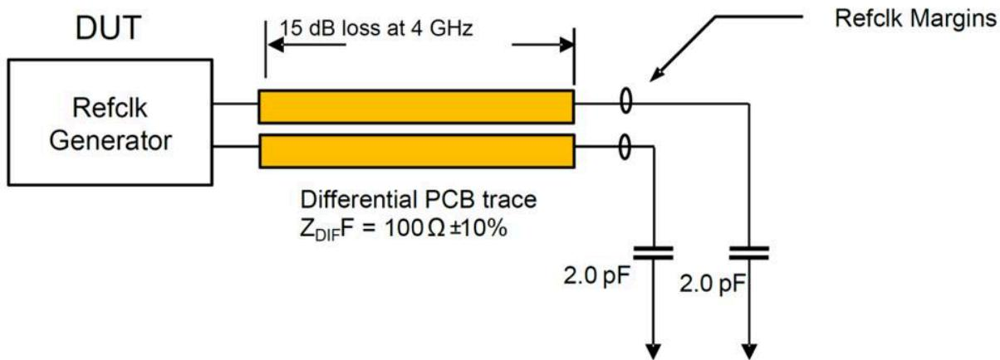

---

<table>
<thead>
<tr>
<th width="50%">🇬🇧 English</th>
<th width="50%" style="background-color:#e8e8e8">🏆 中文</th>
</tr>
</thead>
<tbody>
<tr>
<td>

All specifications in § Table 8-18 are to be measured using a test configuration as described in Note 11 with a circuit as shown in § Figure 8-80.

</td>
<td style="background-color:#e8e8e8">

§ Table 8-18 中的所有规范均应按照 Note 11 所述的测试配置，使用 § Figure 8-80 所示的电路进行测量。

</td>
</tr>
</tbody>
</table>

---

**Table 8-18. REFCLK DC Specifications and AC Timing Requirements | 表 8-18. REFCLK DC 规范与 AC 时序要求**

| Symbol | Parameter | 100 MHz Input Min | 100 MHz Input Max | Unit | Note |
|--------|-----------|-------------------|-------------------|------|------|
| Rising Edge Rate | Rising Edge Rate | 0.6 | 4.0 | V/ns | 2, 3 |
| Falling Edge Rate | Falling Edge Rate | 0.6 | 4.0 | V/ns | 2, 3 |
| VIH | Differential Input High Voltage | +150 |  | mV | 2 |
| VIL | Differential Input Low Voltage | -150 |  | mV | 2 |
| VCROSS | Absolute crossing point voltage | +250 | +550 | mV | 1, 4, 5 |
| VCROSS DELTA | Variation of VCROSS over all rising clock edges | +140 |  | mV | 1, 4, 9 |
| VRB | Ring-back Voltage Margin | -100 | +100 | mV | 2, 12 |
| TSTABLE | Time before VRB is allowed | 500 |  | ps | 2, 12 |
| TPERIOD AVG | Average Clock Period Accuracy | -300 | +2800 | ppm | 2, 10, 13 |
| TPERIOD AVG_32G_64G_CC | Average Clock Period Accuracy for devices that support 32.0 and 64.0 GT/s in CC Mode at any speed | -100 | +2600 | ppm | 2, 10, 13 |

---

<a id="sec-8-6-2"></a>
## 8.6.2 REFCLK AC Specifications | REFCLK AC 规范

<table>
<thead>
<tr>
<th width="50%">🇬🇧 English</th>
<th width="50%" style="background-color:#e8e8e8">🏆 中文</th>
</tr>
</thead>
<tbody>
<tr>
<td>

8.6.2 REFCLK AC Specifications §

</td>
<td style="background-color:#e8e8e8">

8.6.2 REFCLK AC 规范 §

</td>
</tr>
</tbody>
</table>

---

<!-- 📄 Page 1511 -->
---

**Table 8-18. REFCLK DC Specifications and AC Timing Requirements (continued) | 表 8-18. REFCLK DC 规范与 AC 时序要求(续)**

| Symbol | Parameter | 100 MHz Input Min | 100 MHz Input Max | Unit | Note |
|--------|-----------|-------------------|-------------------|------|------|
| TPERIOD AVG_32G_64G_SRIS | Average Clock Period Accuracy for devices that support 32.0 and 64.0 GT/s in SRIS Mode at any speed | -100 | +1600 | ppm | 2, 10, 13 |
| TPERIOD ABS | Absolute Period (including Jitter and Spread Spectrum modulation) | 9.847 | 10.203 | ns | 2, 6 |
| TPERIOD ABS_32G_64G_CC | Absolute Period (including Jitter and Spread Spectrum modulation) for devices that support 32.0 and 64.0 GT/s in CC Mode at any speed | 9.849 | 10.201 | ns | 2, 6 |
| TPERIOD ABS_32G_64G_SRIS | Absolute Period (including Jitter and Spread Spectrum modulation) for devices that support 32.0 and 64.0 GT/s in SRIS Mode at any speed | 9.849 | 10.181 | ns | 2, 6 |
| TCCJITTER | Cycle to Cycle jitter | 150 |  | ps | 2 |
| VMAX | Absolute Max input voltage | +1.15 |  | V | 1, 7 |
| VMIN | Absolute Min input voltage | -0.3 |  | V | 1, 8 |
| Duty Cycle | Duty Cycle | 40 | 60 | % | 2 |
| Rise-Fall Matching | Rising edge rate (REFCLK+) to falling edge rate (REFCLK-) matching | 20 |  | % | 1, 14 |
| ZC-DC | Clock source DC impedance | 40 | 60 | Ω | 1, 11 |

**Notes | 注释:**
1. Measurement taken from single ended waveform.
2. Measurement taken from differential waveform.
3. Measured from -150 mV to +150 mV on the differential waveform (derived from REFCLK+ minus REFCLK-). The signal must be monotonic through the measurement region for rise and fall time. The 300 mV measurement window is centered on the differential zero-crossing. See § Figure 8-85.
4. Measured at crossing point where the instantaneous voltage value of the rising edge of REFCLK+ equals the falling edge of REFCLK-. See § Figure 8-81.
5. Refers to the total variation from the lowest crossing point to the highest, regardless of which edge is crossing. Refers to all crossing points for this measurement. See § Figure 8-81.
6. Defines as the absolute minimum or maximum instantaneous period. This includes cycle to cycle jitter, relative PPM tolerance, and spread spectrum modulation. See § Figure 8-84.
7. Defined as the maximum instantaneous voltage including overshoot. See § Figure 8-81.
8. Defined as the minimum instantaneous voltage including undershoot. See § Figure 8-81.
9. Defined as the total variation of all crossing voltages of Rising REFCLK+ and Falling REFCLK-. This is the maximum allowed variance in VCROSS for any system. See § Figure 8-82.
10. Note deleted.
11. REFCLK+ and REFCLK- are to be measured at the load capacitors CL. Single ended probes must be used for measurements requiring single ended measurements. Either single ended probes with math or differential probe can be used for differential measurements. Test load CL = 2 pF.
12. TSTABLE is the time the differential clock must maintain a minimum ±150 mV differential voltage after rising/falling edges before it is allowed to droop back into the VRB ±100 mV differential range. See § Figure 8-86.

**注释(中文):**
1. 测量取自单端波形。
2. 测量取自差分波形。
3. 在差分波形(由 REFCLK+ 减去 REFCLK- 得到)上自 -150 mV 至 +150 mV 测量。信号在上升/下降时间的测量区间内必须单调。300 mV 测量窗口以差分过零点为中心。参见 § Figure 8-85。
4. 在 REFCLK+ 上升沿的瞬时电压等于 REFCLK- 下降沿的瞬时电压的交叉点处测量。参见 § Figure 8-81。
5. 指从最低交叉点到最高交叉点的总变化量,不论是哪一条边发生交叉。本测量涵盖所有交叉点。参见 § Figure 8-81。
6. 定义为绝对最小或最大瞬时周期。这包括 cycle-to-cycle 抖动、相对 PPM 容差和扩频调制。参见 § Figure 8-84。
7. 定义为包含过冲 (overshoot) 的最大瞬时电压。参见 § Figure 8-81。
8. 定义为包含下冲 (undershoot) 的最小瞬时电压。参见 § Figure 8-81。
9. 定义为 REFCLK+ 上升沿与 REFCLK- 下降沿的所有交叉电压的总变化量。这是任何系统所允许的最大 VCROSS 偏差。参见 § Figure 8-82。
10. 注释已删除。
11. REFCLK+ 与 REFCLK- 应在负载电容 CL 处测量。需要单端测量时必须使用单端探头。差分测量可使用带运算功能的单端探头,也可使用差分探头。测试负载 CL = 2 pF。
12. TSTABLE 是差分时钟在上升/下降沿之后、回落至 VRB ±100 mV 差分范围之前,必须保持最小 ±150 mV 差分电压的持续时间。参见 § Figure 8-86。

---

<!-- 📄 Page 1512 -->
---

**Table 8-18 Notes (continued) | 表 8-18 注释(续)**

13. PPM refers to parts per million and is a DC absolute period accuracy specification. 1 PPM is 1/1,000,000th of 100.000000 MHz exactly or 100 Hz. For example, for 300 PPM, then we have an error budget of 100 Hz/PPM × 300 PPM = 30 kHz. The period is to be measured with a frequency counter with measurement window set to 100 ms or greater.
14. Matching applies to rising edge rate for REFCLK+ and falling edge rate for REFCLK-. It is measured using a ±75 mV window centered on the median cross point where REFCLK+ rising meets REFCLK- falling. The median cross point is used to calculate the voltage thresholds the oscilloscope is to use for the edge rate calculations. The Rise Edge Rate of REFCLK+ should be compared to the Fall Edge Rate of REFCLK-; the maximum allowed difference should not exceed 20% of the slowest edge rate. See § Figure 8-83.

**注释(中文):**
13. PPM 指百万分之一,是一项 DC 绝对周期精度规范。1 PPM 正好为 100.000000 MHz 的 1/1,000,000,即 100 Hz。例如,对于 300 PPM,误差预算为 100 Hz/PPM × 300 PPM = 30 kHz。周期应使用频率计数器测量,测量窗口设置为 100 ms 或更长。
14. 匹配 (Matching) 适用于 REFCLK+ 的上升沿速率与 REFCLK- 的下降沿速率。其测量使用以 REFCLK+ 上升沿与 REFCLK- 下降沿相遇的中位交叉点为中心、±75 mV 的窗口。中位交叉点用于计算示波器进行边沿速率计算时所用的电压阈值。REFCLK+ 的上升沿速率应与 REFCLK- 的下降沿速率相比较;最大允许偏差不得超过较慢边沿速率的 20%。参见 § Figure 8-83。

---

> **Figure 8-81.** Single-Ended Measurement Points for Absolute Cross Point and Swing
> 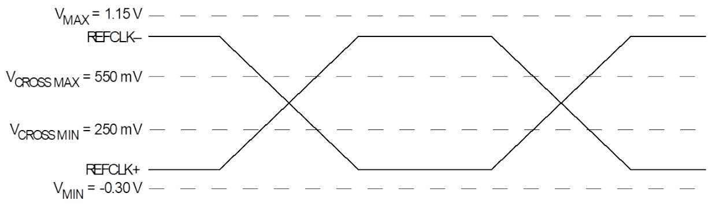

---

> **Figure 8-82.** Single-Ended Measurement Points for Delta Cross Point
> 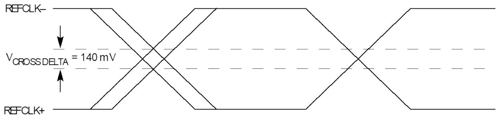

---

<!-- 📄 Page 1513 -->
---

> **Figure 8-83.** Single-Ended Measurement Points for Rise and Fall Time Matching
> 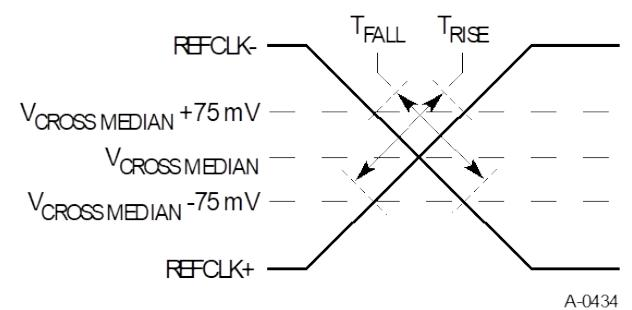

---

> **Figure 8-84.** Differential Measurement Points for Duty Cycle and Period
> 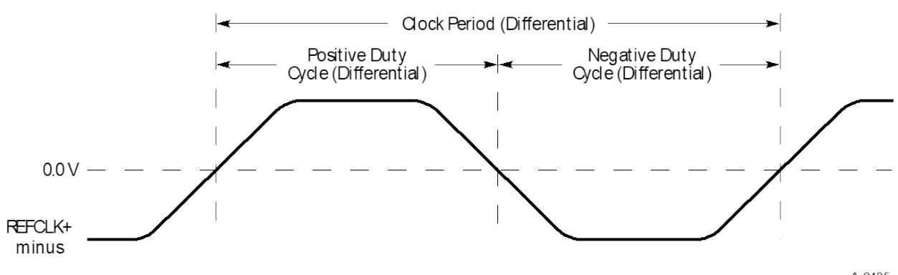

---

> **Figure 8-85.** Differential Measurement Points for Rise and Fall Time
> 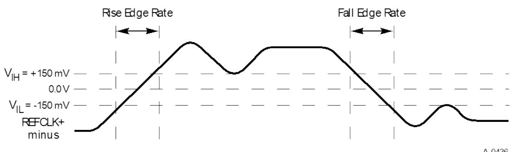

---

<!-- 📄 Page 1514 -->
---

> **Figure 8-86.** Differential Measurement Points for Ringback
> 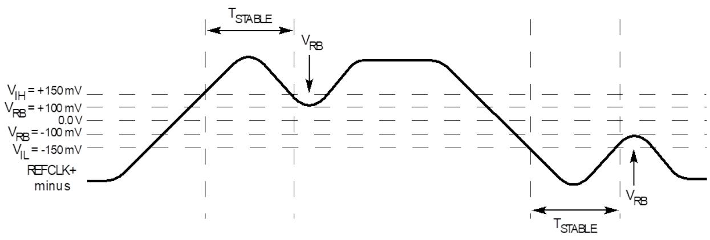

---

<table>
<thead>
<tr>
<th width="50%">🇬🇧 English</th>
<th width="50%" style="background-color:#e8e8e8">🏆 中文</th>
</tr>
</thead>
<tbody>
<tr>
<td>

A number of Refclk parameters are data rate independent and are listed in the table below. TTRANSPORT-DELAY is defined in § Section 8.6.6 and illustrated in § Figure 8-89. It is relevant only for the Common Refclk architecture. For the SRIS mode the source of the SSC modulation is implementation dependent.

</td>
<td style="background-color:#e8e8e8">

若干 Refclk (参考时钟) 参数与数据速率无关，列于下表。TTRANSPORT-DELAY 在 § Section 8.6.6 中定义，并在 § Figure 8-89 中示意。它仅与 Common Refclk 架构相关。对于 SRIS 模式,SSC 调制的来源与具体实现相关。

</td>
</tr>
</tbody>
</table>

---

**Table 8-19. Data Rate Independent Refclk Parameters | 表 8-19. 与数据速率无关的 Refclk 参数**

| Symbol | Description | Limits | Units | Notes |
|--------|-------------|--------|-------|-------|
| FREFCLK | Refclk Frequency | 99.97 (min) / 100.03 (max) | MHz |  |
| FREFCLK_32G_64G | Refclk Frequency for devices that support 32.0 and 64.0 GT/s | 99.99 (min) / 100.01 (max) | MHz |  |
| FSSC | SSC frequency range | 30 (min) / 33 (max) | kHz | 3 |
| TSSC-FREQ-DEVIATION | SSC deviation | -0.5 (min) / 0.0 (max) | % | 3 |
| TSSC-FREQ-DEVIATION_32G_64G_SRIS | SSC deviation for devices that support 32.0 and 64.0 GT/s and SRIS when operating in SRIS mode at all speeds | -0.3 (min) / 0.0 (max) | % | 3 |
| TTRANSPORT-DELAY | Tx-Rx transport delay | 12 (max) | ns | 1, 4 |
| TSSC-MAX-FREQ-SLEW | Max SSC df/dt | 1250 | ppm/μs | 2, 3 |

**Notes | 注释:**
1. Parameter is relevant only for Common Refclk architecture.
2. Measurement is made over 0.5 μs time interval with a 1st order LPF with an fc of 60x the modulation frequency.

**注释(中文):**
1. 该参数仅与 Common Refclk 架构相关。
2. 测量在 0.5 μs 时间窗口内进行,使用一阶 LPF,其截止频率 fc 为调制频率的 60 倍。


---

<a id="sec-8-6-3"></a>
## 8.6.3 Data Rate Independent Refclk Parameters | 与数据速率无关的 Refclk 参数

<table>
<thead>
<tr>
<th width="50%">🇬🇧 English</th>
<th width="50%" style="background-color:#e8e8e8">🏆 中文</th>
</tr>
</thead>
<tbody>
<tr>
<td>

| Symbol | Description | Limits | Units | Notes |
|--------|-------------|--------|-------|-------|

3. When testing a device configured for the IR reference clock architecture the SSC related parameters must be tested with the Tx output data instead of the reference clock.

4. There are form factors (for example topologies including long cables) that may exceed the transport delay limit. Extra jitter from the large transport delay must be accounted for by these form factor specifications.

</td>
<td style="background-color:#e8e8e8">

| 符号 (Symbol) | 描述 (Description) | 限值 (Limits) | 单位 (Units) | 备注 (Notes) |
|---|---|---|---|---|

3. 在测试配置为 IR 参考时钟架构的设备时,SSC 相关参数必须使用 Tx (发送器) 输出数据而非参考时钟进行测试。

4. 存在一些外形规格 (Form Factor)(例如包含长线缆的拓扑)可能超出传输延迟限值，这些外形规格规范必须考虑由较大传输延迟引入的额外抖动。

</td>
</tr>
</tbody>
</table>

[⬆️ 返回目录](#sec-8-0)

---

<a id="sec-8-6-3-1"></a>
## 8.6.3.1 Low Frequency Refclk Jitter Limits | 低频 Refclk 抖动限值

<!-- 📄 Page 1515 -->
---

<table>
<thead>
<tr>
<th width="50%">🇬🇧 English</th>
<th width="50%" style="background-color:#e8e8e8">🏆 中文</th>
</tr>
</thead>
<tbody>
<tr>
<td>

Refclks supporting SSC must meet an additional jitter limit over a range of low frequencies. Low frequency Refclk jitter limits are defined as a continuous, piece-wise linear graph from 30 kHz to 500 kHz as shown below. Unfiltered Refclk phase jitter must fall below this graph over the frequency range of interest.

**Figure 8-87.** Limits for phase jitter from the Reference with 5000 ppm SSC

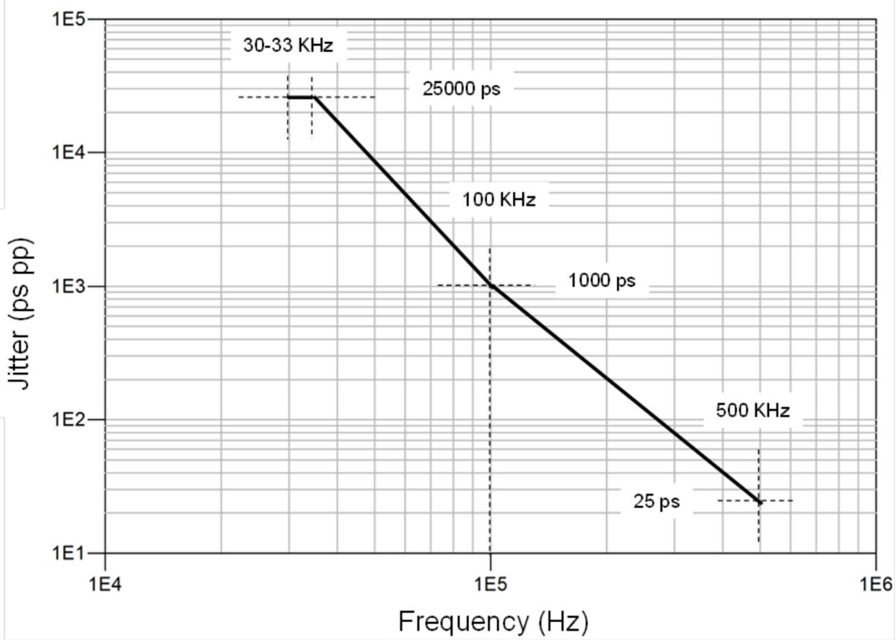

</td>
<td style="background-color:#e8e8e8">

支持 SSC (扩频时钟) 的 Refclk 必须在一定低频范围内满足额外的抖动限值。低频 Refclk 抖动限值定义为一个从 30 kHz 到 500 kHz 的连续分段线性图，如下图所示。未滤波的 Refclk 相位抖动在所关注的频率范围内必须低于此图所规定的限值。

**图 8-87.** 参考时钟在 5000 ppm SSC 下的相位抖动限值


</td>
</tr>
</tbody>
</table>

[⬆️ 返回目录](#sec-8-0)

---

<a id="sec-8-6-4"></a>
## 8.6.4 Refclk Architectures Supported | 支持的 Refclk 架构


<div style="overflow-x: auto; max-width: 100%;">
<table>
<thead>
<tr>
<th width="50%">🇬🇧 English</th>
<th width="50%" style="background-color:#e8e8e8">🏆 中文</th>
</tr>
</thead>
<tbody>
<tr>
<td>

Two Refclk architectures are supported: Common Refclk (CC) and Independent Refclk (IR). The CC clock architecture is described in terms of its topology and its corresponding jitter transfer function based on PLL and CDR characteristics. Finally, the corresponding Refclk jitter limits are given for each data rate. The jitter transfer function and corresponding jitter limits are not defined for the IR clock architecture. It is up to the implementer to trade off reference clock jitter and PLL characteristics to ensure that Transmitter (发送器) requirements are met in the IR clocking mode.

</td>
<td style="background-color:#e8e8e8">

支持两种 Refclk 架构:Common Refclk (CC, 共参考时钟) 和 Independent Refclk (IR, 独立参考时钟)。CC 时钟架构按其拓扑结构以及基于 PLL 和 CDR 特性所对应的抖动传递函数进行描述。最后，针对每种数据速率给出相应的 Refclk 抖动限值。IR 时钟架构不定义抖动传递函数及相应的抖动限值，由实现者自行权衡参考时钟抖动与 PLL 特性，以确保在 IR 时钟模式下满足发送器 (Transmitter) 的要求。

</td>
</tr>
</tbody>
</table>
</div>


[⬆️ 返回目录](#sec-8-0)

---

<a id="sec-8-6-5"></a>
## 8.6.5 Filtering Functions Applied to Raw Data | 应用于原始数据的滤波函数

<!-- 📄 Page 1516 -->
---

<table>
<thead>
<tr>
<th width="50%">🇬🇧 English</th>
<th width="50%" style="background-color:#e8e8e8">🏆 中文</th>
</tr>
</thead>
<tbody>
<tr>
<td>

Two types of filtering are applied to the raw Refclk data. The first, edge filtering, minimizes the measurement-induced jitter due to the finite sampling rate of the test equipment. The second, replicates the jitter filtering that is inherent in the combination of Tx/Rx PLLs, the Rx CDR and (where applicable) the transport delay. The combination of the preceding filter functions yields the effective Refclk jitter as it appears at the sample latch of the Receiver (接收器).

Note that the PLL and CDR filter functions represent minimally capable approximations to actual Receiver implementations and are not intended to define actual PLL or CDR implementations.

</td>
<td style="background-color:#e8e8e8">

对原始 Refclk 数据应用两类滤波。第一类是边沿滤波 (edge filtering)，用于最小化由测试设备有限采样率引起的测量抖动。第二类滤波复现了 Tx/Rx PLL、Rx CDR 以及 (在适用处) 传输延迟所固有的抖动滤波特性。上述滤波函数的组合给出了在接收器 (Receiver) 采样锁存器处出现的有效 Refclk 抖动。

需要注意的是,PLL 和 CDR 滤波函数只是对实际接收器实现的一种最小能力近似，并不用于定义实际的 PLL 或 CDR 实现。

</td>
</tr>
</tbody>
</table>

[⬆️ 返回目录](#sec-8-0)

---

<a id="sec-8-6-5-1"></a>
## 8.6.5.1 PLL Filter Transfer Function Example | PLL 滤波传递函数示例


<div style="overflow-x: auto; max-width: 100%;">
<table>
<thead>
<tr>
<th width="50%">🇬🇧 English</th>
<th width="50%" style="background-color:#e8e8e8">🏆 中文</th>
</tr>
</thead>
<tbody>
<tr>
<td>

All PLLs are behaviorally modeled with a second order transfer function, H(s), as defined in § Figure 8-89. The parameters defining the transfer function include the damping factor ζ and the natural frequency ωn.

The relation between the 2nd order PLL (lowpass) natural frequency, ωn and the 3 dB point ω3dB, is given by the following expression:

$$\frac{\omega_{3dB}}{\omega_n} = \sqrt{\sqrt{\frac{2\zeta^2 + 1}{2}} + 1} + 2\zeta^2 + 1$$

**Equation 8-16.** Relationship between 2nd order PLL natural frequency and 3 dB point

The following plot of a 2nd order PLL illustrates the transfer function with an f3dB of 5.0 MHz and 1.0 dB of peaking. This corresponds to ζ = 1.15, and ωn = 11.55 Mrad/sec.

</td>
<td style="background-color:#e8e8e8">

所有 PLL 都使用二阶传递函数 H(s) 进行行为级建模，定义见 § Figure 8-89。定义该传递函数的参数包括阻尼因子 ζ 和自然频率 ωn。

二阶 PLL (低通) 自然频率 ωn 与 3 dB 截止点 ω3dB 之间的关系由下式给出:

$$\frac{\omega_{3dB}}{\omega_n} = \sqrt{\sqrt{\frac{2\zeta^2 + 1}{2}} + 1} + 2\zeta^2 + 1$$

**式 8-16.** 二阶 PLL 自然频率与 3 dB 截止点之间的关系

下图为二阶 PLL 的传递函数示例，展示 f3dB 为 5.0 MHz 且峰化 (peaking) 为 1.0 dB 时的特性，对应 ζ = 1.15,ωn = 11.55 Mrad/sec。

</td>
</tr>
</tbody>
</table>
</div>


[⬆️ 返回目录](#sec-8-0)

---

<a id="fig-8-88"></a>
### Figure 8-88 | 图 8-88

<table>
<thead>
<tr>
<th width="50%">🇬🇧 English</th>
<th width="50%" style="background-color:#e8e8e8">🏆 中文</th>
</tr>
</thead>
<tbody>
<tr>
<td>

**Figure 8-88.** 5 MHz PLL Transfer Function Example

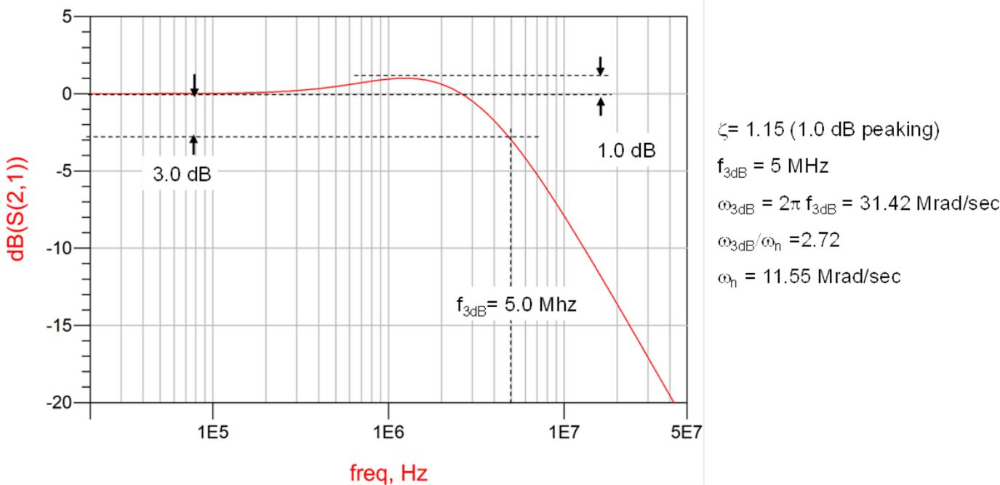

</td>
<td style="background-color:#e8e8e8">

**图 8-88.** 5 MHz PLL 传递函数示例


</td>
</tr>
</tbody>
</table>

---

<a id="sec-8-6-5-2"></a>
## 8.6.5.2 CDR Transfer Function Examples | CDR 传递函数示例

<!-- 📄 Page 1517 -->
---

<table>
<thead>
<tr>
<th width="50%">🇬🇧 English</th>
<th width="50%" style="background-color:#e8e8e8">🏆 中文</th>
</tr>
</thead>
<tbody>
<tr>
<td>

Depending on the Refclk architecture and data rate, either a first or higher order transfer function shall be used as a behavioral CDR bounding limit.

For behavioral CDR functions refer to § Section 8.3.5.5

</td>
<td style="background-color:#e8e8e8">

根据 Refclk 架构和数据速率的不同，应使用一阶或更高阶的传递函数作为 CDR 行为级的边界限值。

有关 CDR 行为级函数，请参阅 § Section 8.3.5.5。

</td>
</tr>
</tbody>
</table>

[⬆️ 返回目录](#sec-8-0)

---

<a id="sec-8-6-6"></a>
## 8.6.6 Common Refclk Rx Architecture (CC) | 共参考时钟接收器架构 (CC)


<div style="overflow-x: auto; max-width: 100%;">
<table>
<thead>
<tr>
<th width="50%">🇬🇧 English</th>
<th width="50%" style="background-color:#e8e8e8">🏆 中文</th>
</tr>
</thead>
<tbody>
<tr>
<td>

This architecture utilizes a single Refclk source that is distributed to both the Tx and Rx. Most of the SSC jitter sourced by the Refclk is propagated equally through Tx and Rx PLLs, and so intrinsically tracks LF jitter. This is particularly true for SSC which tends to be low frequency. § Figure 8-89 illustrates the Common Refclk Rx architecture, showing key jitter, delay, and PLL and CDR transfer function sources for all data rates except 32.0 and 64.0 GT/s. At 32.0 and 64.0 GT/s the only difference in the figure is the Behavioral CDR transfer function as defined in § Section 8.3.5.5. The amount of jitter appearing at the CDR is then defined by the difference function between the Tx and Rx PLLs multiplied by the CDR highpass characteristic.

</td>
<td style="background-color:#e8e8e8">

该架构使用单一 Refclk 源，并同时分配给 Tx 和 Rx。由 Refclk 引入的大部分 SSC 抖动通过 Tx 和 Rx PLL 时被等量传递，因此天然地跟踪 LF (低频) 抖动，这对于频率通常较低的 SSC 而言尤为明显。§ Figure 8-89 描述了共参考时钟接收器架构，展示了除 32.0 和 64.0 GT/s 之外所有数据速率下的关键抖动、延迟以及 PLL 和 CDR 传递函数来源。在 32.0 和 64.0 GT/s 下，图中唯一的差异在于 CDR 行为级传递函数，其定义见 § Section 8.3.5.5。CDR 端所呈现的抖动量由 Tx 和 Rx PLL 之间的差分函数乘以 CDR 高通特性决定。

</td>
</tr>
</tbody>
</table>
</div>


[⬆️ 返回目录](#sec-8-0)

---

<a id="fig-8-89"></a>
### Figure 8-89 | 图 8-89

<table>
<thead>
<tr>
<th width="50%">🇬🇧 English</th>
<th width="50%" style="background-color:#e8e8e8">🏆 中文</th>
</tr>
</thead>
<tbody>
<tr>
<td>

**Figure 8-89.** Common Refclk Rx Architecture for all Data Rates Except 32.0 and 64.0 GT/s

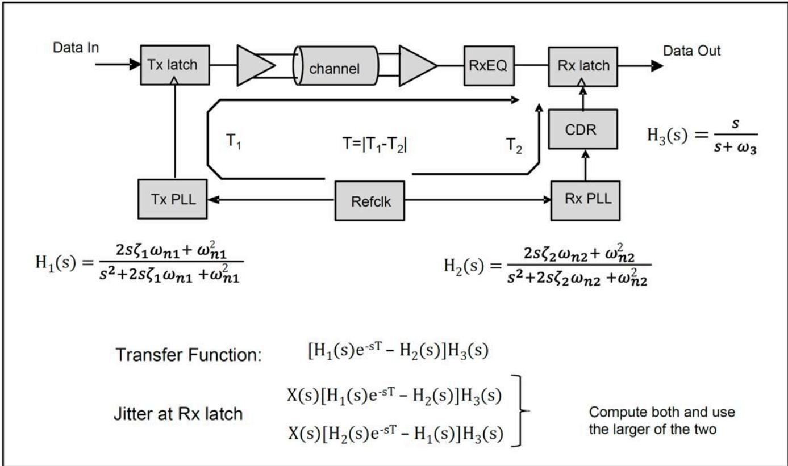

</td>
<td style="background-color:#e8e8e8">

**图 8-89.** 除 32.0 和 64.0 GT/s 外所有数据速率的共参考时钟接收器架构


</td>
</tr>
</tbody>
</table>

---

<a id="sec-8-6-6-1"></a>
## 8.6.6.1 Determining the Number of PLL BW and Peaking Combinations | 确定 PLL 带宽和峰化组合数

<!-- 📄 Page 1518 -->
---


<div style="overflow-x: auto; max-width: 100%;">
<table>
<thead>
<tr>
<th width="50%">🇬🇧 English</th>
<th width="50%" style="background-color:#e8e8e8">🏆 中文</th>
</tr>
</thead>
<tbody>
<tr>
<td>

Based on the above clock architecture, it is possible to define a difference function that corresponds to the worst case mismatch between Tx and Rx PLLs. Second order PLL transfer functions are assumed (even though most PLL transfer functions are 3rd order or higher), since a 2nd order function tends to yield a slightly conservative difference function vis-a-vis most actual PLL implementations.

In the Common Refclk Rx architecture it is also necessary to comprehend a maximum Transmitter to Receiver transport delay difference. This delay delta is illustrated in § Figure 8-89 and represents the delay difference between the Transmitter data and recovered Receiver clock as seen at the inputs to the receiver's data latch.

A Tx or Rx PLL is defined by the combination of min/max bandwidth and peaking, making for a total of four possible limits. In the CC architecture both the Tx and Rx PLLs contribute to the jitter transfer function. At 2.5 GT/s only one set of BW/peaking limits is defined. If the combinations for the Tx and Rx PLLs limits are defined by the sets (ATX, BTX, CTX, DTX), (ARX, BRX, CRX, DRX) then it's easily demonstrated that there are a total of ten ways of selecting one element from each set. The delay term e^(-sT) can be applied to either H1(s) or H2(s), adding another six possibilities. Only six, as opposed to ten, terms are added when the delay term is considered because terms like ATX, ARX, are identical to ARX, ATX.

At 5.0 GT/s and higher data rates, two possible sets of limits of PLL bandwidth and peaking are defined, which may be defined by the sets (ATX, BTX, CTX, DTX) and (ERX, FRX, GRX, HRX). In this case the number of unique 2-element combinations from the above 4-element sets is 36, which increases to 64 when the delay term is considered.

</td>
<td style="background-color:#e8e8e8">

基于上述时钟架构，可以定义一个与 Tx 和 Rx PLL 之间最坏失配情况相对应的差分函数。这里假设使用二阶 PLL 传递函数 (尽管大多数 PLL 传递函数是三阶或更高阶)，这是因为二阶函数相对于大多数实际 PLL 实现倾向于给出略偏保守的差分函数。

在共参考时钟接收器架构中，还需要考虑发送器到接收器之间的最大传输延迟差。该延迟差在 § Figure 8-89 中示意，表示发送器数据与恢复出的接收器时钟在接收器数据锁存器输入端呈现的延迟差。

一个 Tx 或 Rx PLL 由带宽和峰化的最小/最大组合定义，因此共有四个可能的限值。在 CC 架构中,Tx 和 Rx PLL 共同贡献于抖动传递函数。在 2.5 GT/s 下，仅定义一组带宽/峰化限值。若 Tx 和 Rx PLL 限值组合分别由集合 (ATX, BTX, CTX, DTX) 和 (ARX, BRX, CRX, DRX) 定义，则可证明从每个集合中各选一个元素共有 10 种选法。延迟项 e^(-sT) 可作用于 H1(s) 或 H2(s)，又增加了 6 种可能性。考虑延迟项时只新增 6 项而非 10 项，是因为像 ATX, ARX 这样的组合与 ARX, ATX 是等价的。

在 5.0 GT/s 及以上数据速率下，定义了两组 PLL 带宽和峰化限值集合，可用集合 (ATX, BTX, CTX, DTX) 和 (ERX, FRX, GRX, HRX) 表示。此时，上述 4 元素集合中两元素唯一组合数为 36,当考虑延迟项时增加到 64。

</td>
</tr>
</tbody>
</table>
</div>


[⬆️ 返回目录](#sec-8-0)

---

<a id="sec-8-6-6-2"></a>
## 8.6.6.2 CDR and PLL BW and Peaking Limits for Common Refclk | 共参考时钟的 CDR 与 PLL 带宽和峰化限值

<!-- 📄 Page 1519 -->
---

<table>
<thead>
<tr>
<th width="50%">🇬🇧 English</th>
<th width="50%" style="background-color:#e8e8e8">🏆 中文</th>
</tr>
</thead>
<tbody>
<tr>
<td>

The Common Refclk architecture filter function is dependent on the difference function defined by the BW and peaking of Tx and the Rx PLLs, plus the CDR high-pass characteristic. It is necessary to consider all corner case combinations of Tx and Rx PLL peaking and bandwidth plus the CDR characteristics at their minimum and maximum peaking values.

This procedure must be applied to all six data rates.

§ Figure 8-90 lists the PLL BW and CDR BW/peaking values that need to be applied as filter functions for 2.5 GT/s data rates. It is necessary to assign a min and a max value for peaking for the 2.5 GT/s PLL. The values of 0.01 dB and 3.0 dB represent best estimates of realistic PLL implementations.

The minimum peaking for 2.5 and 5.0 GT/s has been reduced to 0.01 dB to bring it into line with the 8.0 and 16.0 GT/s cases. Note that the Rx CDR is 1st order, so its natural frequency, ωn can be directly obtained from its BW, unlike the 2nd order CDRs, where ωn is a function of both BW and peaking. For 32.0 GT/s, a 2nd-order CDR filter with 20 MHz BW described by § Equation 8-13 must be used.

**Figure 8-90.** Common Refclk PLL and CDR Characteristics for 2.5 GT/s

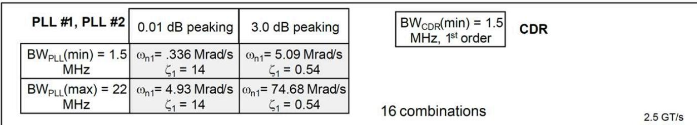

PLL and CDR jitter and peaking characteristics for 5.0, 8.0, and 16.0 GT/s yield a larger number of possible combinations because two sets of PLL BW and peaking limits are given. This choice to support two sets of BW and peaking was made to give designers as much latitude as possible when designing PLL circuits.

**Figure 8-91.** Common Refclk PLL and CDR Characteristics for 5.0 GT/s

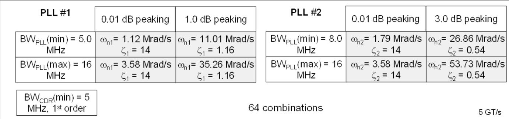

</td>
<td style="background-color:#e8e8e8">

共参考时钟架构的滤波函数取决于由 Tx 和 Rx PLL 的带宽 (BW) 及峰化所定义的差分函数，再加上 CDR 的高通特性。需要考虑 Tx 和 Rx PLL 峰化及带宽的所有边界组合，以及 CDR 特性在其最小和最大峰化处的取值。

该流程必须应用于全部六种数据速率。

§ Figure 8-90 列出在 2.5 GT/s 数据速率下作为滤波函数应用的 PLL 带宽和 CDR 带宽/峰化值。需要为 2.5 GT/s PLL 指定峰化的最小值和最大值,0.01 dB 和 3.0 dB 是对实际 PLL 实现的最佳估计值。

2.5 和 5.0 GT/s 的最小峰化值已降低至 0.01 dB,以与 8.0 和 16.0 GT/s 的情况保持一致。需要注意的是,Rx CDR 是一阶的，因此其自然频率 ωn 可由其带宽直接求得;而二阶 CDR 则不同，其 ωn 同时是带宽和峰化的函数。对于 32.0 GT/s,必须使用 § Equation 8-13 所描述的带宽为 20 MHz 的二阶 CDR 滤波器。

**图 8-90.** 2.5 GT/s 的共参考时钟 PLL 与 CDR 特性


5.0、8.0 和 16.0 GT/s 的 PLL 与 CDR 抖动和峰化特性由于提供两组 PLL 带宽和峰化限值，因而产生更多可能的组合。提供两组带宽和峰化限值是为了在设计 PLL 电路时给予设计者尽可能大的灵活度。

**图 8-91.** 5.0 GT/s 的共参考时钟 PLL 与 CDR 特性


</td>
</tr>
</tbody>
</table>

[⬆️ 返回目录](#sec-8-0)

---

<a id="fig-8-92"></a>
### Figure 8-92 | 图 8-92

<!-- 📄 Page 1520 -->
---

<table>
<thead>
<tr>
<th width="50%">🇬🇧 English</th>
<th width="50%" style="background-color:#e8e8e8">🏆 中文</th>
</tr>
</thead>
<tbody>
<tr>
<td>

**Figure 8-92.** Common Refclk PLL and CDR Characteristics for 8.0 and 16.0 GT/s

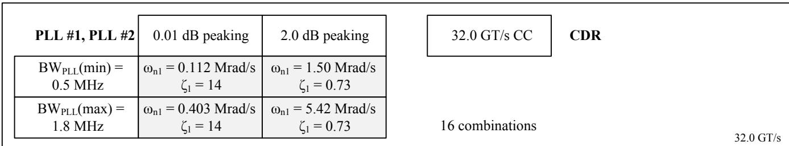

</td>
<td style="background-color:#e8e8e8">

**图 8-92.** 8.0 和 16.0 GT/s 的共参考时钟 PLL 与 CDR 特性


</td>
</tr>
</tbody>
</table>

---

<a id="fig-8-93"></a>
### Figure 8-93 | 图 8-93


<div style="overflow-x: auto; max-width: 100%;">
<table>
<thead>
<tr>
<th width="50%">🇬🇧 English</th>
<th width="50%" style="background-color:#e8e8e8">🏆 中文</th>
</tr>
</thead>
<tbody>
<tr>
<td>

**Figure 8-93.** Common Refclk PLL and CDR Characteristics for 32.0 GT/s

| Parameter | Value |
|-----------|-------|
| BWPLL(min) | 0.5 MHz |
| BWPLL(max) | 1.8 MHz |
| PLL #1, PLL #2 | 0.01 dB peaking / 2.0 dB peaking |
| ωn1 / ζ1 (0.01 dB) | 0.112 Mrad/s / 14 |
| ωn1 / ζ1 (2.0 dB) | 1.50 Mrad/s / 0.73 |
| ωn1 / ζ1 (0.01 dB) | 0.403 Mrad/s / 14 |
| ωn1 / ζ1 (2.0 dB) | 5.42 Mrad/s / 0.73 |
| 32.0 GT/s CC CDR | 16 combinations |
| 32.0 GT/s |  |

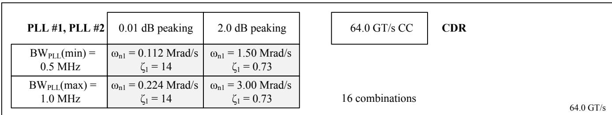

</td>
<td style="background-color:#e8e8e8">

**图 8-93.** 32.0 GT/s 的共参考时钟 PLL 与 CDR 特性

| 参数 | 取值 |
|---|---|
| BWPLL(min) | 0.5 MHz |
| BWPLL(max) | 1.8 MHz |
| PLL #1, PLL #2 | 0.01 dB 峰化 / 2.0 dB 峰化 |
| ωn1 / ζ1 (0.01 dB) | 0.112 Mrad/s / 14 |
| ωn1 / ζ1 (2.0 dB) | 1.50 Mrad/s / 0.73 |
| ωn1 / ζ1 (0.01 dB) | 0.403 Mrad/s / 14 |
| ωn1 / ζ1 (2.0 dB) | 5.42 Mrad/s / 0.73 |
| 32.0 GT/s CC CDR | 16 种组合 |
| 32.0 GT/s |  |


</td>
</tr>
</tbody>
</table>
</div>


---

<a id="fig-8-94"></a>
### Figure 8-94 | 图 8-94

<table>
<thead>
<tr>
<th width="50%">🇬🇧 English</th>
<th width="50%" style="background-color:#e8e8e8">🏆 中文</th>
</tr>
</thead>
<tbody>
<tr>
<td>

**Figure 8-94.** Common Refclk PLL and CDR Characteristics for 64.0 GT/s

| Parameter | Value |
|-----------|-------|
| BWPLL(min) | 0.5 MHz |
| BWPLL(max) | 1.0 MHz |
| PLL #1, PLL #2 | 0.01 dB peaking / 2.0 dB peaking |
| ωn1 / ζ1 (0.01 dB) | 0.112 Mrad/s / 14 |
| ωn1 / ζ1 (2.0 dB) | 1.50 Mrad/s / 0.73 |
| ωn1 / ζ1 (0.01 dB) | 0.224 Mrad/s / 14 |
| ωn1 / ζ1 (2.0 dB) | 3.00 Mrad/s / 0.73 |
| 64.0 GT/s CC CDR | 16 combinations |
| 64.0 GT/s |  |

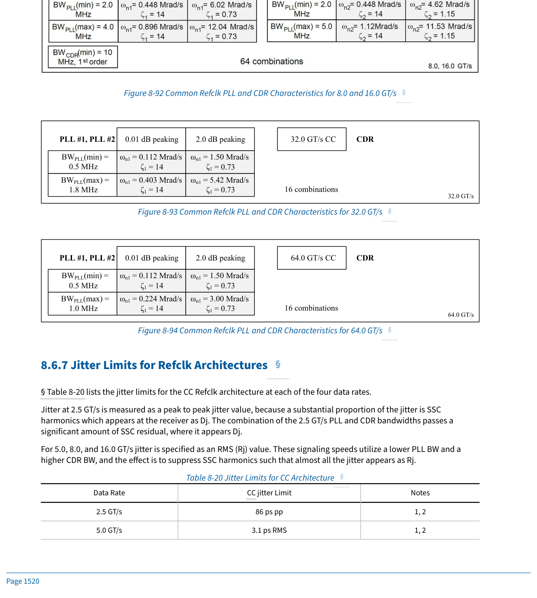

</td>
<td style="background-color:#e8e8e8">

**图 8-94.** 64.0 GT/s 的共参考时钟 PLL 与 CDR 特性

| 参数 | 取值 |
|---|---|
| BWPLL(min) | 0.5 MHz |
| BWPLL(max) | 1.0 MHz |
| PLL #1, PLL #2 | 0.01 dB 峰化 / 2.0 dB 峰化 |
| ωn1 / ζ1 (0.01 dB) | 0.112 Mrad/s / 14 |
| ωn1 / ζ1 (2.0 dB) | 1.50 Mrad/s / 0.73 |
| ωn1 / ζ1 (0.01 dB) | 0.224 Mrad/s / 14 |
| ωn1 / ζ1 (2.0 dB) | 3.00 Mrad/s / 0.73 |
| 64.0 GT/s CC CDR | 16 种组合 |
| 64.0 GT/s |  |


</td>
</tr>
</tbody>
</table>

---

<a id="sec-8-6-7"></a>
## 8.6.7 Jitter Limits for Refclk Architectures | Refclk 架构的抖动限值


<div style="overflow-x: auto; max-width: 100%;">
<table>
<thead>
<tr>
<th width="50%">🇬🇧 English</th>
<th width="50%" style="background-color:#e8e8e8">🏆 中文</th>
</tr>
</thead>
<tbody>
<tr>
<td>

§ Table 8-20 lists the jitter limits for the CC Refclk architecture at each of the four data rates.

Jitter at 2.5 GT/s is measured as a peak to peak jitter value, because a substantial proportion of the jitter is SSC harmonics which appear at the receiver as Dj. The combination of the 2.5 GT/s PLL and CDR bandwidths passes a significant amount of SSC residual, where it appears as Dj.

For 5.0, 8.0, and 16.0 GT/s, jitter is specified as an RMS (Rj) value. These signaling speeds utilize a lower PLL BW and a higher CDR BW, and the effect is to suppress SSC harmonics such that almost all the jitter appears as Rj.

**Table 8-20.** Jitter Limits for CC Architecture

| Data Rate | CC jitter Limit | Notes |
|-----------|-----------------|-------|
| 2.5 GT/s | 86 ps pp | 1, 2 |
| 5.0 GT/s | 3.1 ps RMS | 1, 2 |

</td>
<td style="background-color:#e8e8e8">

§ Table 8-20 列出 CC Refclk 架构在四种数据速率下的抖动限值。

2.5 GT/s 下的抖动以峰峰值 (peak to peak) 抖动值衡量，因为其中很大一部分抖动是 SSC 谐波分量，在接收器端表现为 Dj。2.5 GT/s 下 PLL 和 CDR 带宽的组合使相当一部分 SSC 残余抖动通过，并以 Dj 形式出现。

对于 5.0、8.0 和 16.0 GT/s,抖动以 RMS (Rj, 随机抖动) 值规定。这些信号速率采用较低的 PLL 带宽和较高的 CDR 带宽，其效果是抑制 SSC 谐波，使几乎所有抖动都以 Rj 形式出现。

**表 8-20.** CC 架构的抖动限值

| 数据速率 (Data Rate) | CC 抖动限值 (CC jitter Limit) | 备注 (Notes) |
|---|---|---|
| 2.5 GT/s | 86 ps pp | 1, 2 |
| 5.0 GT/s | 3.1 ps RMS | 1, 2 |

</td>
</tr>
</tbody>
</table>
</div>


[⬆️ 返回目录](#sec-8-0)

---

<a id="tbl-8-20-continued"></a>
### Table 8-20 (continued) | 表 8-20 (续)

<!-- 📄 Page 1521 -->
---

<table>
<thead>
<tr>
<th width="50%">🇬🇧 English</th>
<th width="50%" style="background-color:#e8e8e8">🏆 中文</th>
</tr>
</thead>
<tbody>
<tr>
<td>

| Data Rate | CC jitter Limit | Notes |
|-----------|-----------------|-------|
| 8.0 GT/s | 1.0 ps RMS | 1, 2 |
| 16.0 GT/s | 0.5 ps RMS | 1, 2, 3, 4 |
| 32.0 GT/s | 0.15 ps RMS | 1, 2, 3, 5 |
| 64.0 GT/s | 0.1 ps RMS | 1, 2, 3, 6 |

**Notes:**

1. The Refclk jitter is measured after applying the filter function in § Figure 8-89.
2. Jitter measurements shall be made with a capture of at least 100,000 clock cycles captured by a real time oscilloscope (RTO) with a sample rate of 20 GS/s or greater. Broadband oscilloscope noise must be minimized in the measurement. The measured PP jitter is used (no extrapolation) for RTO measurements. Alternately - Jitter measurements may be used with a Phase Noise Analyzer (PNA) extending (flat) and integrating and folding the frequency content up to an offset from the carrier frequency of at least 200 MHz (at 300 MHz absolute frequency) below the Nyquist frequency. For PNA measurements for the 2.5 GT/s data rate the RMS jitter is converted to peak to peak jitter using a multiplication factor of 8.83. In the case where real time oscilloscope and PNA measurements have both been done and produce different results the RTO result must be used.
3. For the 16.0, 32.0, and 64.0 GT/s CC measurements, SSC spurs from the fundamental and harmonics are removed up to a cutoff frequency of 2 MHz, taking care to minimize removal of any non-SSC content.
4. Note that 0.7 ps RMS is to be used in channel simulations to account for additional noise in a real system.
5. Note that 0.25 ps RMS is to be used in channel simulations to account for additional noise in a real system.
6. Note that 0.15 ps RMS is to be used in channel simulations to account for additional noise in a real system.

</td>
<td style="background-color:#e8e8e8">

| 数据速率 (Data Rate) | CC 抖动限值 (CC jitter Limit) | 备注 (Notes) |
|---|---|---|
| 8.0 GT/s | 1.0 ps RMS | 1, 2 |
| 16.0 GT/s | 0.5 ps RMS | 1, 2, 3, 4 |
| 32.0 GT/s | 0.15 ps RMS | 1, 2, 3, 5 |
| 64.0 GT/s | 0.1 ps RMS | 1, 2, 3, 6 |

**备注:**

1. Refclk 抖动是在应用 § Figure 8-89 中滤波函数后进行测量。
2. 抖动测量应使用实时示波器 (RTO) 捕获至少 100,000 个时钟周期，采样率不低于 20 GS/s。测量中必须尽量减小示波器的宽带噪声。RTO 测量时直接使用测得的 PP 抖动值 (不外推)。另一种方法是使用相位噪声分析仪 (PNA) 进行测量，对载波频率偏移至少 200 MHz (在 300 MHz 绝对频率处) 以下直至奈奎斯特频率的频率内容进行扩展 (平坦)、积分和折叠。对于 2.5 GT/s 数据速率的 PNA 测量,RMS 抖动通过 8.83 的系数转换为峰峰值抖动。若同时使用实时示波器和 PNA 进行测量并得出不同结果，则必须以 RTO 结果为准。
3. 对于 16.0、32.0 和 64.0 GT/s 的 CC 测量，需在 2 MHz 截止频率以内去除基波和谐波的 SSC 杂散，同时需注意尽量减少对任何非 SSC 成分的去除。
4. 注意在信道仿真中应使用 0.7 ps RMS,以反映实际系统中存在的额外噪声。
5. 注意在信道仿真中应使用 0.25 ps RMS,以反映实际系统中存在的额外噪声。
6. 注意在信道仿真中应使用 0.15 ps RMS,以反映实际系统中存在的额外噪声。

</td>
</tr>
</tbody>
</table>

[⬆️ 返回目录](#sec-8-0)

---

<a id="sec-8-6-8"></a>
## 8.6.8 Form Factor Requirements for RefClock Architectures | 外形规格对 RefClock 架构的要求

<!-- 📄 Page 1522 -->
---


<div style="overflow-x: auto; max-width: 100%;">
<table>
<thead>
<tr>
<th width="50%">🇬🇧 English</th>
<th width="50%" style="background-color:#e8e8e8">🏆 中文</th>
</tr>
</thead>
<tbody>
<tr>
<td>

Each form factor specification must include the following table (see § Table 8-21) to provide a clear summary of the clocking architecture requirements for devices that support the form factor specification. For each clocking architecture the table indicates whether that architecture is required, optional, or not allowed for this form factor. Note that this refers to the operation of the device not the underlying silicon capabilities.

A form factor must provide the CLKREQ# signal if it supports L1 PM Substates. Form factor specifications must indicate if the CLKREQ# signal is required, optional, or not allowed.

**Table 8-21.** Form Factor Clocking Architecture Requirements

| Clock Architecture | System Board (Motherboard) | Add-in Card (Module) | Retimer |
|--------------------|----------------------------|----------------------|---------|
| Common | ** | ** | ** |
| SRNS | ** | ** | ** |
| SRIS | ** | ** | ** |

** Each entry in the table must be filled in with one of: Required, Optional, or Not Allowed.

If the Common Reference Clock architecture is required or optional for the form factor, then there must be an additional table (see § Table 8-22) providing details for the common clock. Each entry in the table is marked required, optional, not allowed, or NA. "Clock Source" indicates the source of the common reference clock, if applicable. "SSC" indicates whether the clock source is spread.

**Table 8-22.** Form Factor Common Clock Architecture Details

| Common Clock Details | System Board (Motherboard) | Add-in Card (Module) | Retimer |
|----------------------|----------------------------|----------------------|---------|
| Clock Source |  |  |  |
| SSC |  |  |  |

If a form factor has clocking requirements that cannot be provided in this simple one or two table form then careful consideration must be given to ensure that the form factor requirements are supported by this specification.

As an example the populated tables are shown for a hypothetical form factor that requires all components use the common clock architecture and does not allow the use of any other clocking architecture (see § Table 8-23 and § Table 8-24). The common clock source is required to be provided by the motherboard component and may optionally have SSC. L1 PM Substates are not supported and therefore CLKREQ# is not defined as a connector signal for this example form factor.

**Table 8-23.** Form Factor Clocking Architecture Requirements Example

| Clock Architecture | System Board (Motherboard) | Add-in Card (Module) | Retimer |
|--------------------|----------------------------|----------------------|---------|
| Common | Required | Required | Required |
| SRNS | Not Allowed | Not Allowed | Not Allowed |
| SRIS | Not Allowed | Not Allowed | Not Allowed |

**Table 8-24.** Form Factor Common Clock Architecture Details Example

| Common Clock Details | System Board (Motherboard) | Add-in Card (Module) | Retimer |
|----------------------|----------------------------|----------------------|---------|
| Clock Source | Required | Not Allowed | Not Allowed |
| SSC | Optional | N/A | N/A |

It is important for form factor specifications to recognize that the CLKREQ# signal is required if L1 PM Substates are to be supported, and that for L1 PM Substates the CLKREQ# signal is used even if there is no common reference clock.

If a form factor has clocking requirements that cannot be provided in this simple one or two table form then careful consideration must be given to ensure that the form factor requirements are supported by this specification.

</td>
<td style="background-color:#e8e8e8">

每个外形规格 (Form Factor) 规范必须包含下表 (见 § Table 8-21)，以清晰地总结支持该外形规格的设备对时钟架构的要求。对于每种时钟架构，该表指明该架构在该外形规格中是必需 (Required)、可选 (Optional) 还是不允许 (Not Allowed)。需要注意的是，这指的是设备的运行情况，而非底层硅片能力。

如果外形规格支持 L1 PM Substates (L1 电源管理子状态)，则必须提供 CLKREQ# 信号。外形规格规范必须指明 CLKREQ# 信号是必需、可选还是不允许。

**表 8-21.** 外形规格时钟架构要求

| 时钟架构 (Clock Architecture) | 系统板 (主板) | 插卡 (模块) | 重定时器 (Retimer) |
|---|---|---|---|
| Common (共时钟) | ** | ** | ** |
| SRNS | ** | ** | ** |
| SRIS | ** | ** | ** |

** 表中每项必须填写为:Required (必需)、Optional (可选) 或 Not Allowed (不允许) 三者之一。

如果共参考时钟 (Common Reference Clock) 架构对外形规格而言是必需或可选，则必须增加一个附加表 (见 § Table 8-22) 提供共时钟的详细信息。表中每项标记为必需、可选、不允许或 NA。"Clock Source" 指明共参考时钟的来源 (如适用)。"SSC" 指明时钟源是否使用扩频 (Spread Spectrum)。

**表 8-22.** 外形规格共时钟架构详细信息

| 共时钟详情 (Common Clock Details) | 系统板 (主板) | 插卡 (模块) | 重定时器 (Retimer) |
|---|---|---|---|
| Clock Source (时钟源) |  |  |  |
| SSC (扩频) |  |  |  |

若某外形规格具有无法通过这一两张简单表格表达的时钟要求，则必须谨慎考虑以确保外形规格要求能够被本规范所支持。

作为示例，下面给出一个假想外形规格的填充后表格，该外形规格要求所有组件使用共时钟架构且不允许使用任何其他时钟架构 (见 § Table 8-23 和 § Table 8-24)。共时钟源由主板组件提供，且可选择支持 SSC。该示例外形规格不支持 L1 PM Substates,因此未将 CLKREQ# 定义为连接器信号。

**表 8-23.** 外形规格时钟架构要求示例

| 时钟架构 (Clock Architecture) | 系统板 (主板) | 插卡 (模块) | 重定时器 (Retimer) |
|---|---|---|---|
| Common (共时钟) | Required (必需) | Required (必需) | Required (必需) |
| SRNS | Not Allowed (不允许) | Not Allowed (不允许) | Not Allowed (不允许) |
| SRIS | Not Allowed (不允许) | Not Allowed (不允许) | Not Allowed (不允许) |

**表 8-24.** 外形规格共时钟架构详细信息示例

| 共时钟详情 (Common Clock Details) | 系统板 (主板) | 插卡 (模块) | 重定时器 (Retimer) |
|---|---|---|---|
| Clock Source (时钟源) | Required (必需) | Not Allowed (不允许) | Not Allowed (不允许) |
| SSC (扩频) | Optional (可选) | N/A | N/A |

外形规格规范应认识到:若要支持 L1 PM Substates,则必须提供 CLKREQ# 信号;并且对于 L1 PM Substates,即使没有共参考时钟，也会使用 CLKREQ# 信号。

若某外形规格具有无法通过这一两张简单表格表达的时钟要求，则必须谨慎考虑以确保外形规格要求能够被本规范所支持。

</td>
</tr>
</tbody>
</table>
</div>


[⬆️ 返回目录](#sec-8-0)

---


---

## 📑 本章目录 (Table of Contents) — Auto-Generated

- [8.1 电气规范介绍 (Electrical Specification Introduction)](#sec-8-1)
- [8.2 互操作性准则 (Interoperability Criteria)](#sec-8-2)
- [8.3 发送器规范 (Transmitter Specification)](#sec-8-3)
- [8.3.3.6 Method for Measuring VTX-DIFF-PP at 2.5 GT/s and 5.0 GT/s | 2.5 GT/s 和 5.0 GT/s 下 VTX-DIFF-PP 的测量方法](#sec-8-3-3-6)
- [8.3.3.7 Method for Measuring VTX-DIFF-PP at 8.0, 16.0, 32.0, and 64.0 GT/s | 8.0、16.0、32.0 和 64.0 GT/s 下 VTX-DIFF-PP 的测量方法](#sec-8-3-3-7)
- [8.3.3.8 Coefficient Range and Tolerance for 8.0, 16.0, 32.0, and 64.0 GT/s | 8.0、16.0、32.0 和 64.0 GT/s 的系数范围与容差](#sec-8-3-3-8)
- [8.3.3.9 EIEOS and VTX-EIEOS-FS and VTX-EIEOS-RS Limits | EIEOS 与 VTX-EIEOS-FS、VTX-EIEOS-RS 限制](#sec-8-3-3-9)
- [8.3.3.10 Reduced Swing Signaling | 缩减摆幅信号](#sec-8-3-3-10)
- [8.3.3.11 Effective Tx Package Loss at 8.0, 16.0, 32.0, and 64.0 GT/s | 8.0、16.0、32.0 和 64.0 GT/s 下 Tx 有效封装损耗](#sec-8-3-3-11)
- [8.3.3.12 Transmitter Signal-to Noise and Distortion Ratio (SNDRTX) for 64.0 GT/s | 64.0 GT/s 下发送器信噪失真比 (SNDRTX)](#sec-8-3-3-12)
- [8.3.3.13 Transmitter Ratio of Level Mismatch (RLM-TX) for 64.0 GT/s | 64.0 GT/s 下发送器电平失配比 (RLM-TX)](#sec-8-3-3-13)
- [8.3.4 Transmitter Margining | 发送器余量 (Margining)](#sec-8-3-4)
- [8.3.5 Tx Jitter Parameters | Tx 抖动参数](#sec-8-3-5)
- [8.3.5.6 Data Dependent and Uncorrelated Jitter / 8.3.5.7 Data Dependent Jitter | 数据相关与非相关抖动 / 数据相关抖动](#sec-8-3-5-6)
- [8.3.6 Data Rate Dependent Parameters | 速率相关参数](#sec-8-3-6)
- [8.3.7 2.5、5.0、8.0、16.0 和 32.0 GT/s 的 Tx 与 Rx 回波损耗 (Tx and Rx Return Loss for 2.5, 5.0, 8.0, 16.0, and 32.0 GT/s)](#sec-8-3-7)
- [8.3.8 64.0 GT/s 的 Tx 与 Rx 回波损耗 (Tx and Rx Return Loss for 64.0 GT/s)](#sec-8-3-8)
- [8.3.9 发送器 PLL 带宽与峰值 (Transmitter PLL Bandwidth and Peaking)](#sec-8-3-9)
- [8.3.10 与数据速率无关的 Tx 参数 (Data Rate Independent Tx Parameters)](#sec-8-3-10)
- [8.4 接收器规范 (Receiver Specifications)](#sec-8-4)
- [8.4.1.4 Behavioral Rx Package Models | 行为级 Rx 封装模型](#sec-8-4-1-4)
- [8.4.2.2.1 Sj Mask | Sj 模板](#sec-8-4-2-2-1)
- [8.4.2.3 Receiver Refclk Modes | 接收器 Refclk 模式](#sec-8-4-2-3)
- [8.4.2.3.1 Common Refclk Mode | 公共 Refclk 模式](#sec-8-4-2-3-1)
- [8.4.2.3.2 Independent Refclk Mode | 独立 Refclk 模式](#sec-8-4-2-3-2)
- [8.4.3 Common Receiver Parameters | 公共接收器参数](#sec-8-4-3)
- [8.4.3.1 5.0 GT/s Exit From Idle Detect (EFI) | 5.0 GT/s 退出空闲检测 (EFI)](#sec-8-4-3-1)
- [8.4.3.2 Receiver Return Loss | 接收器回损](#sec-8-4-3-2)
- [8.4.4 Lane Margining at the Receiver - Electrical Requirements | 接收器处通道余量测量 - 电气要求](#sec-8-4-4)
- [8.4.5 Low Frequency and Miscellaneous Signaling Requirements | 低频及其它信号要求](#sec-8-4-5)
- [8.4.5.1 ESD Standards | ESD 标准](#sec-8-4-5-1)
- [8.4.5.2 Channel AC Coupling Capacitors | 通道 AC 耦合电容](#sec-8-4-5-2)
- [8.4.5.3 Short Circuit Requirements | 短路要求](#sec-8-4-5-3)
- [8.4.5.4 Transmitter and Receiver Termination | 发送器与接收器端接](#sec-8-4-5-4)
- [8.4.5.5 Electrical Idle | 电气空闲](#sec-8-4-5-5)
- [8.4.5.6 DC Common Mode Voltage | DC 共模电压](#sec-8-4-5-6)
- [8.4.5.7 Receiver Detection | 接收器检测](#sec-8-4-5-7)
- [8.5 Channel Tolerancing | 通道容差](#sec-8-5)
- [8.5.1 Channel Compliance Testing | 通道一致性测试](#sec-8-5-1)
- [8.5.1.1 Behavioral Transmitter and Receiver Package Models | 行为级发送器与接收器封装模型](#sec-8-5-1-1)
- [8.5.1.2 Measuring Package Performance (16.0 GT/s only) | 封装性能测量(仅适用于 16.0 GT/s)](#sec-8-5-1-2)
- [8.5.1.3 Simulation Tool Requirements | 仿真工具要求](#sec-8-5-1-3)
- [8.5.1.3.1 Simulation Tool Chain Inputs | 仿真工具链输入](#sec-8-5-1-3-1)
- [8.5.1.3.2 Processing Steps | 处理步骤](#sec-8-5-1-3-2)
- [8.5.1.3.3 Simulation Tool Outputs | 仿真工具输出](#sec-8-5-1-3-3)
- [8.5.1.3.4 Open Source Simulation Tool | 开源仿真工具](#sec-8-5-1-3-4)
- [8.5.1.4 Behavioral Transmitter Parameters | 行为级发送器参数](#sec-8-5-1-4)
- [8.5.1.4.1 Deriving Voltage and Jitter Parameters | 电压与抖动参数推导](#sec-8-5-1-4-1)
- [8.5.1.4.2 Optimizing Tx/Rx Equalization (8.0, 16.0, 32.0, and 64.0 GT/s only) | 优化 Tx/Rx 均衡(仅限 8.0、16.0、32.0 和 64.0 GT/s)](#sec-8-5-1-4-2)
- [8.5.1.4.3 Pass/Fail Eye Characteristics | Pass/Fail 眼图特性](#sec-8-5-1-4-3)
- [8.5.1.4.4 Characterizing Channel Common Mode Noise | 通道共模噪声特性](#sec-8-5-1-4-4)
- [8.5.1.4.5 Verifying VCH-IDLE-DET-DIFF-pp | 验证 VCH-IDLE-DET-DIFF-pp](#sec-8-5-1-4-5)
- [8.6 Refclk Specifications | Refclk 规范](#sec-8-6)
- [8.6.1 Refclk Test Setup | Refclk 测试设置](#sec-8-6-1)
- [8.6.2 REFCLK AC Specifications | REFCLK AC 规范](#sec-8-6-2)
- [8.6.3 Data Rate Independent Refclk Parameters | 与数据速率无关的 Refclk 参数](#sec-8-6-3)
- [8.6.3.1 Low Frequency Refclk Jitter Limits | 低频 Refclk 抖动限值](#sec-8-6-3-1)
- [8.6.4 Refclk Architectures Supported | 支持的 Refclk 架构](#sec-8-6-4)
- [8.6.5 Filtering Functions Applied to Raw Data | 应用于原始数据的滤波函数](#sec-8-6-5)
- [8.6.5.1 PLL Filter Transfer Function Example | PLL 滤波传递函数示例](#sec-8-6-5-1)
- [8.6.5.2 CDR Transfer Function Examples | CDR 传递函数示例](#sec-8-6-5-2)
- [8.6.6 Common Refclk Rx Architecture (CC) | 共参考时钟接收器架构 (CC)](#sec-8-6-6)
- [8.6.6.1 Determining the Number of PLL BW and Peaking Combinations | 确定 PLL 带宽和峰化组合数](#sec-8-6-6-1)
- [8.6.6.2 CDR and PLL BW and Peaking Limits for Common Refclk | 共参考时钟的 CDR 与 PLL 带宽和峰化限值](#sec-8-6-6-2)
- [8.6.7 Jitter Limits for Refclk Architectures | Refclk 架构的抖动限值](#sec-8-6-7)
- [8.6.8 Form Factor Requirements for RefClock Architectures | 外形规格对 RefClock 架构的要求](#sec-8-6-8)
