# 📘 第 9 章　Single Root I/O Virtualization and Sharing (Chapter 9. Single Root I/O Virtualization and Sharing)

**PCI Express® Base Specification — Revision 6.2, Version 1.0 — January 25, 2024**

> 📄 **Source pages**: 1523–1558 (PDF 1-indexed) | 📁 **File**: `chapter_09_raw.md`
> 🎨 **Format**: 中英对照双语 · 图表原始保留 · 中文背景色灰色 · GitHub Flavored Markdown
> 📚 **Template**: CXL 3.2 Spec translation (CXL_zh/)

---

## 📑 本章目录 (Table of Contents)

> 由合并阶段自动生成。请使用浏览器/GitHub 渲染时,各小节标题链接跳转。

## 🖼 本章图表 (Figures)

> 所有图已抽取为 PNG 存放在 `figures/chapter_09/`。

## 📊 本章表格 (Tables)

> 各章表格以标准 Markdown 表格形式嵌入正文。

---

---

# 📘 第 9 章　Single Root I/O Virtualization and Sharing (单根 I/O 虚拟化与共享 (SR-IOV)) (Chapter 9. Single Root I/O Virtualization and Sharing)

> 📄 **Source pages**: 1523–1558 | 📁 **File**: `chapter_09.md`
> 🎨 **Format**: 中英对照双语 · 图表原始保留 · 中文背景色灰色 · GitHub Flavored Markdown

---

## 9. Single Root I/O Virtualization and Sharing § | 单根 I/O 虚拟化与共享 (SR-IOV) §

<table>
<thead>
<tr>
<th width="50%">🇬🇧 English</th>
<th width="50%" style="background-color:#e8e8e8">🇨🇳 中文</th>
</tr>
</thead>
<tbody>
<tr>
<td>

Within the industry, significant effort has been expended to increase the effective hardware resource utilization (i.e., application execution) through the use of virtualization technology. Single Root I/O Virtualization and Sharing (SR-IOV) enables multiple System Images (SI) to share PCI hardware resources.

To illustrate how this technology can be used to increase effective resource utilization, consider the generic platform configuration illustrated in § Figure 9-1.

> **Figure 9-1.** Generic Platform Configuration
> 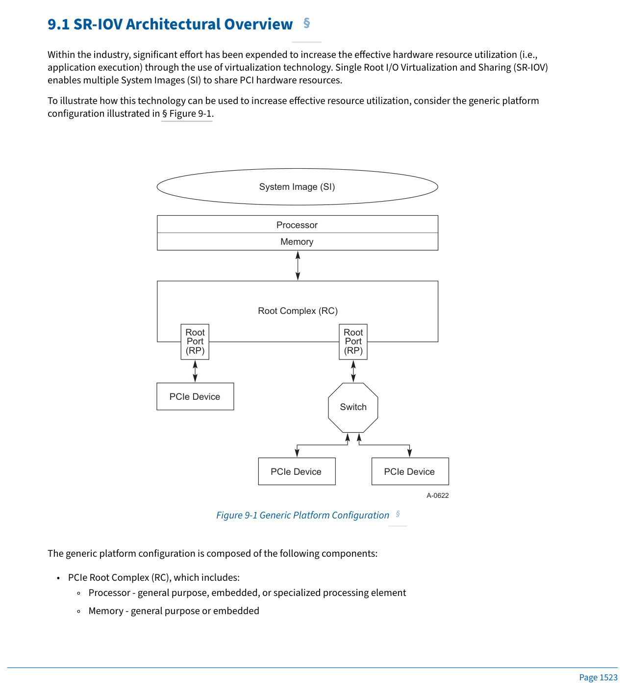

The generic platform configuration is composed of the following components:

- PCIe Root Complex (RC), which includes:
  - Processor - general purpose, embedded, or specialized processing element
  - Memory - general purpose or embedded

</td>
<td style="background-color:#e8e8e8">

在业界,人们投入了大量努力,通过使用虚拟化技术来提高有效的硬件资源利用率(即应用执行效率)。单根 I/O 虚拟化与共享 (Single Root I/O Virtualization and Sharing, SR-IOV) 使多个系统映像 (System Image, SI) 能够共享 PCI 硬件资源。

为了说明如何使用该技术来提高有效的资源利用率,请考虑 § Figure 9-1 中所示的通用平台配置。

> **Figure 9-1.** 通用平台配置 (Generic Platform Configuration)
> 

通用平台配置由以下组件组成:

- PCIe 根复合体 (Root Complex, RC),其中包括:
  - 处理器 (Processor)——通用、嵌入式或专用处理单元
  - 内存 (Memory)——通用或嵌入式内存

</td>
</tr>
</tbody>
</table>

[⬆️ 返回目录](#-本章目录-table-of-contents)

---

## 9.1 SR-IOV Architectural Overview § | SR-IOV 架构概述 §

<table>
<thead>
<tr>
<th width="50%">🇬🇧 English</th>
<th width="50%" style="background-color:#e8e8e8">🇨🇳 中文</th>
</tr>
</thead>
<tbody>
<tr>
<td>

- Root Complex Integrated Endpoints (RCiEPs)
- PCIe Root Ports (RP) - Each RP represents a separate hierarchy.
- PCIe Switch - provides I/O fan-out and connectivity
  - PCIe Device - multiple I/O device types, (e.g., network, storage, etc.)
  - System Image - software such an operating system that is used to execute applications or trusted services, (e.g., a shared or non-shared I/O device driver).

In order to increase the effective hardware resource utilization without requiring hardware modifications, multiple SI can be executed. Software termed a Virtualization Intermediary (VI) is interposed between the hardware and the SI as illustrated in § Figure 9-2.

> **Figure 9-2.** Generic Platform Configuration with a VI and Multiple SI
> 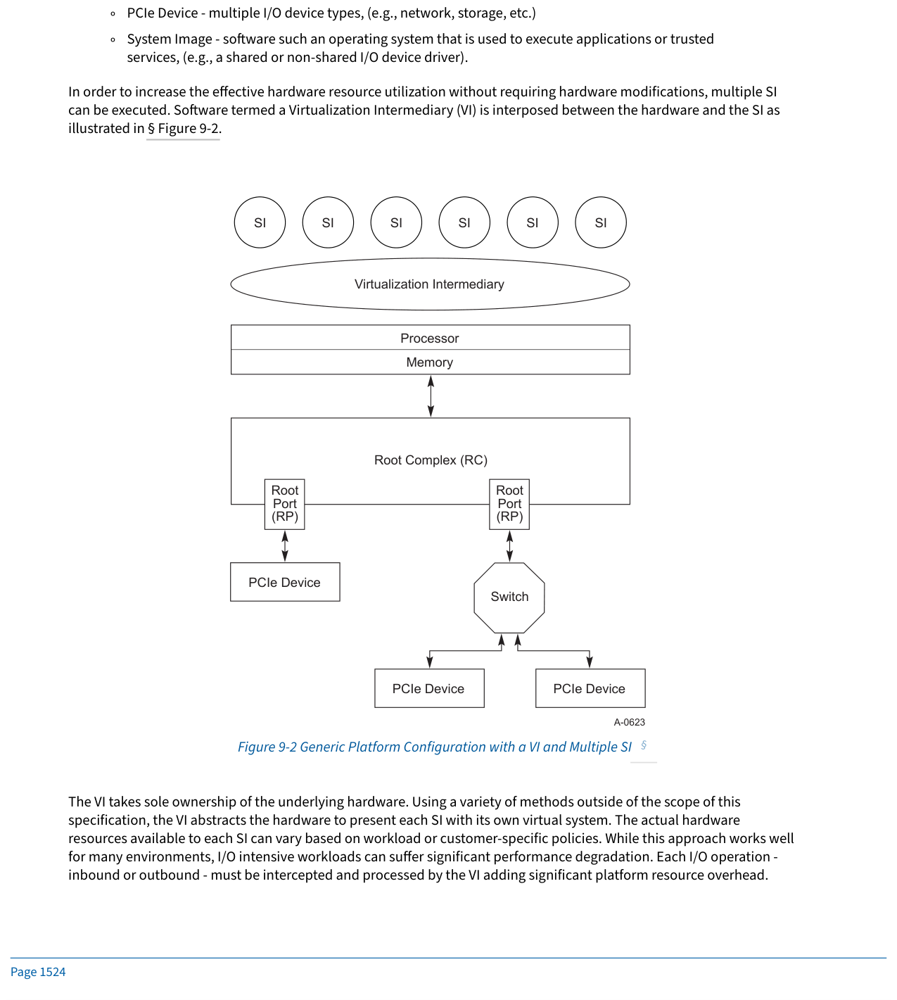

The VI takes sole ownership of the underlying hardware. Using a variety of methods outside of the scope of this specification, the VI abstracts the hardware to present each SI with its own virtual system. The actual hardware resources available to each SI can vary based on workload or customer-specific policies. While this approach works well for many environments, I/O intensive workloads can suffer significant performance degradation. Each I/O operation - inbound or outbound - must be intercepted and processed by the VI adding significant platform resource overhead.

</td>
<td style="background-color:#e8e8e8">

- 根复合体集成端点 (Root Complex Integrated Endpoint, RCiEP)
- PCIe 根端口 (Root Port, RP)——每个 RP 代表一个独立的层级 (Hierarchy)。
- PCIe 交换机 (Switch)——提供 I/O 扇出和连接
  - PCIe 设备 (Device)——多种 I/O 设备类型(例如网络、存储等)
  - 系统映像 (System Image, SI)——用于执行应用程序或受信任服务的软件(例如操作系统),包括共享或非共享的 I/O 设备驱动程序。

为了在不修改硬件的情况下提高有效的硬件资源利用率,可以运行多个 SI。如 § Figure 9-2 所示,被称为虚拟化中介 (Virtualization Intermediary, VI) 的软件被插入在硬件和 SI 之间。

> **Figure 9-2.** 带有 VI 和多个 SI 的通用平台配置 (Generic Platform Configuration with a VI and Multiple SI)
> 

VI 独占底层硬件的所有权。VI 使用本规范范围之外的各种方法抽象硬件,为每个 SI 提供其自己的虚拟系统。可供每个 SI 使用的实际硬件资源可以根据工作负载或客户特定策略而有所不同。虽然此方法在许多环境中效果良好,但 I/O 密集型工作负载可能会遭受显著的性能下降。每个 I/O 操作(入站或出站)都必须由 VI 拦截并处理,这会增加显著的平台资源开销。

</td>
</tr>
</tbody>
</table>

[⬆️ 返回目录](#-本章目录-table-of-contents)

---

## 9.1 SR-IOV Architectural Overview (cont.) § | SR-IOV 架构概述(续) §

<table>
<thead>
<tr>
<th width="50%">🇬🇧 English</th>
<th width="50%" style="background-color:#e8e8e8">🇨🇳 中文</th>
</tr>
</thead>
<tbody>
<tr>
<td>

SR-IOV provides tools to reduce these platform resources overheads. The benefits of SR-IOV are:

- The ability to eliminate VI involvement in main data movement actions - DMA, Memory space access, interrupt processing, etc. Elimination of VI interception and processing of each I/O operation can provide significant application and platform performance improvements.
- Standardized method to control SR-IOV resource configuration and management through Single Root PCI Manager (SR-PCIM).
  - Due to a variety of implementation options - system firmware, VI, operating system, I/O drivers, etc. - SR-PCIM implementation is outside the scope of this specification.
- The ability to reduce the hardware requirements and associated cost with provisioning potentially a significant number of I/O Functions within a device.
- The ability to integrate SR-IOV with other I/O virtualization technologies such as Address Translation Services (ATS), Address Translation and Protection Table (ATPT) technologies, and interrupt remapping technologies to create robust, complete I/O virtualization solutions.

§ Figure 9-3 illustrates an example SR-IOV capable platform.

> **Figure 9-3.** Generic Platform Configuration with SR-IOV and IOV Enablers
> 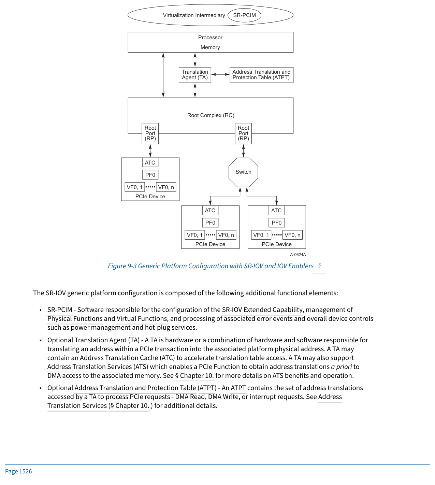

</td>
<td style="background-color:#e8e8e8">

SR-IOV 提供了减少这些平台资源开销的工具。SR-IOV 的好处包括:

- 能够消除 VI 在主要数据移动操作中的参与——DMA、内存空间访问、中断处理等。消除 VI 对每个 I/O 操作的拦截和处理可以提供显著的应用程序和平台性能改进。
- 通过单根 PCI 管理器 (Single Root PCI Manager, SR-PCIM) 控制 SR-IOV 资源配置和管理的标准化方法。
  - 由于存在多种实现选项(系统固件、VI、操作系统、I/O 驱动程序等),SR-PCIM 的实现不在本规范的范围内。
- 能够减少硬件需求和相关成本,因为可以在单个设备中配置数量可观的 I/O 功能 (Function)。
- 能够将 SR-IOV 与其他 I/O 虚拟化技术(例如地址转换服务 (Address Translation Services, ATS)、地址转换与保护表 (Address Translation and Protection Table, ATPT) 技术以及中断重映射技术)集成,以构建健壮、完整的 I/O 虚拟化解决方案。

§ Figure 9-3 展示了一个支持 SR-IOV 的平台示例。

> **Figure 9-3.** 带有 SR-IOV 和 IOV 启用器的通用平台配置 (Generic Platform Configuration with SR-IOV and IOV Enablers)
> 

</td>
</tr>
</tbody>
</table>

[⬆️ 返回目录](#-本章目录-table-of-contents)

---

<<<PAGE_BREAK>>> page_1527

## 9.1 SR-IOV Components (cont.) § | SR-IOV 组件(续) §

<table>
<thead>
<tr>
<th width="50%">🇬🇧 English</th>
<th width="50%" style="background-color:#e8e8e8">🇨🇳 中文</th>
</tr>
</thead>
<tbody>
<tr>
<td>

The SR-IOV generic platform configuration is composed of the following additional functional elements:

- **SR-PCIM** - Software responsible for the configuration of the SR-IOV Extended Capability, management of Physical Functions and Virtual Functions, and processing of associated error events and overall device controls such as power management and hot-plug services.
- **Optional Translation Agent (TA)** - A TA is hardware or a combination of hardware and software responsible for translating an address within a PCIe transaction into the associated platform physical address. A TA may contain an Address Translation Cache (ATC) to accelerate translation table access. A TA may also support Address Translation Services (ATS) which enables a PCIe Function to obtain address translations a priori to DMA access to the associated memory. See § Chapter 10. for more details on ATS benefits and operation.
- **Optional Address Translation and Protection Table (ATPT)** - An ATPT contains the set of address translations accessed by a TA to process PCIe requests - DMA Read, DMA Write, or interrupt requests. See Address Translation Services (§ Chapter 10. ) for additional details.
  - In PCIe, interrupts are treated as memory write operations. Through the combination of a Requester Identifier and the address contained within a PCIe transaction, an interrupt can be routed to any target (e.g., a processor core) transparent to the associated I/O Function.
  - DMA Read and Write requests are translated through a combination of the Routing ID and the address contained within a PCIe transaction.

</td>
<td style="background-color:#e8e8e8">

SR-IOV 通用平台配置由以下附加功能元素组成:

- **SR-PCIM**——负责配置 SR-IOV 扩展能力结构 (SR-IOV Extended Capability)、管理物理功能 (Physical Function, PF) 和虚拟功能 (Virtual Function, VF)、处理相关错误事件以及电源管理和热插拔服务等整体设备控制的软件。
- **可选的转换代理 (Translation Agent, TA)**——TA 是硬件或硬件与软件的组合,负责将 PCIe 事务中的地址转换为关联的平台物理地址。TA 可以包含地址转换缓存 (Address Translation Cache, ATC) 以加速转换表访问。TA 还可以支持地址转换服务 (Address Translation Services, ATS),该服务使 PCIe 功能 (Function) 能够在 DMA 访问相关内存之前预先获取地址转换。有关 ATS 的更多详细信息,请参见 § 第 10 章。
- **可选的地址转换与保护表 (Address Translation and Protection Table, ATPT)**——ATPT 包含 TA 用于处理 PCIe 请求(DMA 读、DMA 写或中断请求)时所访问的一组地址转换。有关更多详细信息,请参见地址转换服务(§ 第 10 章)。
  - 在 PCIe 中,中断被视为内存写操作。通过请求者标识符 (Requester Identifier) 与 PCIe 事务中包含的地址的组合,中断可以路由到任何目标(例如处理器核心),对关联的 I/O 功能透明。
  - DMA 读和写请求通过路由 ID (Routing ID) 与 PCIe 事务中包含的地址的组合进行转换。

</td>
</tr>
</tbody>
</table>

[⬆️ 返回目录](#-本章目录-table-of-contents)

---

## 9.1 SR-IOV Components (cont. 2) § | SR-IOV 组件(续 2) §

<table>
<thead>
<tr>
<th width="50%">🇬🇧 English</th>
<th width="50%" style="background-color:#e8e8e8">🇨🇳 中文</th>
</tr>
</thead>
<tbody>
<tr>
<td>

- **Optional Address Translation Cache (ATC)** - An ATC can exist in two locations within a platform - within the TA which can be integrated within or sit above an RC - or within a PCIe Device. Within an RC, the ATC enables accelerated translation look ups to occur. Within a Device, the ATC is populated through ATS technology. PCIe transactions that indicate they contain translated addresses may bypass the platform's ATC in order to improve performance without compromising the benefits associated with ATPT technology. See Address Translation Services (§ Chapter 10. ) for additional details.
- **Optional Access Control Services (ACS)** - ACS defines a set of control points within a PCI Express topology to determine whether a TLP should be routed normally, blocked, or redirected. In a system that supports SR-IOV, ACS may be used to prevent device Functions assigned to the VI or different SIs from communicating with one another or a peer device. Redirection may permit a Translation Agent to translate Upstream memory TLP addresses before a peer-to-peer forwarding decision is made. Selective blocking may be provided by the optional ACS P2P Egress Control. ACS is subject to interaction with ATS. See § Section 6.12 for additional details.
- **Physical Function (PF)** - A PF is a PCIe Function that supports the SR-IOV Extended Capability and is accessible to an SR-PCIM, a VI, or an SI.
- **Virtual Function (VF)** - A VF is a "light-weight" PCIe Function that is directly accessible by an SI.
  - Minimally, resources associated with the main data movement of the Function are available to the SI. Configuration resources should be restricted to a trusted software component such as a VI or SR-PCIM.
  - A VF can be serially shared by different SI, (i.e., a VF can be assigned to one SI and then reset and assigned to another SI).
  - A VF can be optionally migrated from one PF to another PF. The migration process itself is outside the scope of this specification but is facilitated through configuration controls defined within this specification.
- All VFs associated with a PF must be the same device type as the PF, (e.g., the same network device type or the same storage device type).

To compare and contrast a PCIe Device with a PCIe SR-IOV capable device, examine the following set of figures. § Figure 9-4 illustrates an example PCIe-compliant Device.

</td>
<td style="background-color:#e8e8e8">

- **可选的地址转换缓存 (Address Translation Cache, ATC)**——ATC 可以存在于平台中的两个位置:TA 内(可以集成在 RC 内或位于 RC 之上),或 PCIe 设备内。在 RC 内,ATC 启用加速的转换查找。在设备内,ATC 通过 ATS 技术填充。指示其包含已转换地址的 PCIe 事务可以绕过平台的 ATC,以提高性能而不会损害与 ATPT 技术相关的好处。有关更多详细信息,请参见地址转换服务(§ 第 10 章)。
- **可选的访问控制服务 (Access Control Services, ACS)**——ACS 在 PCI Express 拓扑中定义了一组控制点,以确定 TLP 是正常路由、被阻止还是被重定向。在支持 SR-IOV 的系统中,ACS 可用于防止分配给 VI 或不同 SI 的设备功能相互之间或与对等设备通信。重定向允许转换代理在对等转发决策作出之前转换上游 (Upstream) 内存 TLP 地址。可选择性地通过可选的 ACS P2P Egress Control 提供阻止。ACS 与 ATS 存在交互。请参阅 § 第 6.12 节了解更多详细信息。
- **物理功能 (Physical Function, PF)**——PF 是支持 SR-IOV 扩展能力结构 (SR-IOV Extended Capability) 的 PCIe 功能,可由 SR-PCIM、VI 或 SI 访问。
- **虚拟功能 (Virtual Function, VF)**——VF 是 SI 直接访问的"轻量级"PCIe 功能。
  - 最起码,功能主要数据移动相关的资源对 SI 可用。配置资源应限制于受信任的软件组件(例如 VI 或 SR-PCIM)。
  - VF 可以由不同的 SI 串行共享(即,可以将 VF 分配给一个 SI,然后重置并分配给另一个 SI)。
  - VF 可以选择性地从一个 PF 迁移到另一个 PF。迁移过程本身不在本规范的范围内,但通过本规范中定义的配置控制来促成。
- 与 PF 关联的所有 VF 必须与 PF 是相同的设备类型(例如相同的网络设备类型或相同的存储设备类型)。

要比较和对比 PCIe 设备和支持 PCIe SR-IOV 的设备,请查看以下一组图。§ Figure 9-4 展示了一个符合 PCIe 的设备示例。

</td>
</tr>
</tbody>
</table>

[⬆️ 返回目录](#-本章目录-table-of-contents)

---

<<<PAGE_BREAK>>> page_1528

## 9.1.1 Example Multi-Function Device § | 9.1.1 多功能设备示例 §

<table>
<thead>
<tr>
<th width="50%">🇬🇧 English</th>
<th width="50%" style="background-color:#e8e8e8">🇨🇳 中文</th>
</tr>
</thead>
<tbody>
<tr>
<td>

> **Figure 9-4.** Example Multi-Function Device
> 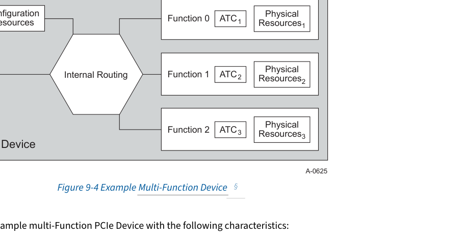

This figure illustrates an example multi-Function PCIe Device with the following characteristics:

- The PCIe Device shares a common PCIe Link. The Link and PCIe functionality shared by all Functions is managed through Function 0.
  - While this figure illustrates only three Functions, with the use of the Alternative Routing Identifier (ARI) capability, a PCIe Device can support up to 256 Functions.
  - All Functions use a single Bus Number captured through the PCI enumeration process.
- In this example, each PCIe Function supports the ATS capability and therefore has an associated ATC to manage ATS obtained translated addresses.
- Each PCIe Function has a set of unique physical resources including a separate configuration space and BAR.
- Each PCIe Function can be assigned to an SI. To prevent one SI from impacting another, all PCIe configuration operations should be intercepted and processed by the VI.

As this figure illustrates, the hardware resources scale with the number of Functions provisioned. Depending upon the complexity and size of the device, the incremental cost per Function will vary. To reduce the incremental hardware cost, a device can be constructed using SR-IOV to support a single PF and multiple VFs as illustrated in § Figure 9-5.

</td>
<td style="background-color:#e8e8e8">

> **Figure 9-4.** 多功能设备示例 (Example Multi-Function Device)
> 

此图展示了一个多功能 PCIe 设备的示例,具有以下特征:

- PCIe 设备共享一个公共的 PCIe 链路 (Link)。所有功能共享的链路和 PCIe 功能通过 Function 0 进行管理。
  - 虽然此图仅说明了三个功能,但通过使用替代路由标识符 (Alternative Routing Identifier, ARI) 能力,PCIe 设备最多可以支持 256 个功能。
  - 所有功能都使用通过 PCI 枚举 (Enumeration) 过程捕获的单个总线号 (Bus Number)。
- 在本例中,每个 PCIe 功能都支持 ATS 能力,因此具有关联的 ATC 来管理通过 ATS 获取的已转换地址。
- 每个 PCIe 功能都有一组唯一的物理资源,包括单独的配置空间和 BAR。
- 每个 PCIe 功能可以分配给一个 SI。为了防止一个 SI 影响另一个 SI,所有 PCIe 配置操作应由 VI 拦截并处理。

如图所示,硬件资源随所配置的功能数量而扩展。根据设备的复杂性和大小,每个功能的增量成本会有所不同。为了降低增量硬件成本,可以使用 SR-IOV 构造一个设备,以支持单个 PF 和多个 VF,如图 § Figure 9-5 所示。

</td>
</tr>
</tbody>
</table>

[⬆️ 返回目录](#-本章目录-table-of-contents)

---

<<<PAGE_BREAK>>> page_1529

## 9.1.2 Example SR-IOV Single PF Capable Device § | 9.1.2 单 PF SR-IOV 设备示例 §

<table>
<thead>
<tr>
<th width="50%">🇬🇧 English</th>
<th width="50%" style="background-color:#e8e8e8">🇨🇳 中文</th>
</tr>
</thead>
<tbody>
<tr>
<td>

> **Figure 9-5.** Example SR-IOV Single PF Capable Device
> 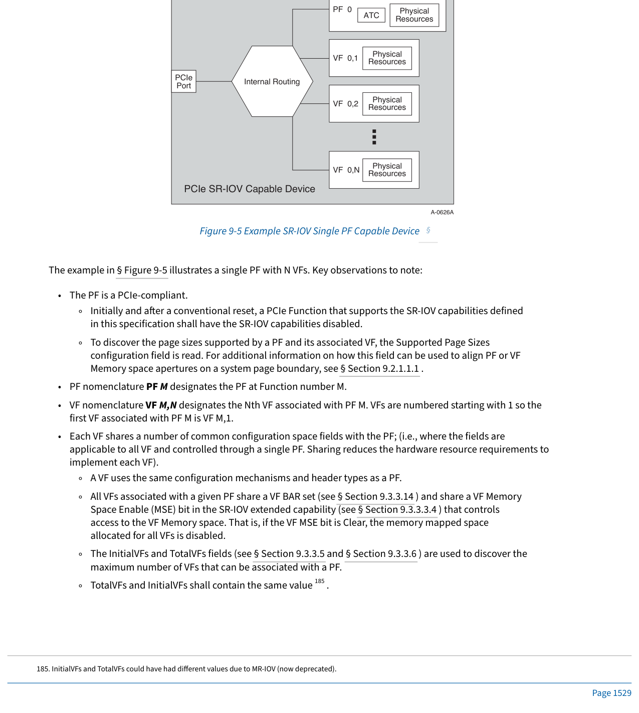

The example in § Figure 9-5 illustrates a single PF with N VFs. Key observations to note:

- The PF is a PCIe-compliant.
  - Initially and after a conventional reset, a PCIe Function that supports the SR-IOV capabilities defined in this specification shall have the SR-IOV capabilities disabled.
  - To discover the page sizes supported by a PF and its associated VF, the Supported Page Sizes configuration field is read. For additional information on how this field can be used to align PF or VF Memory space apertures on a system page boundary, see § Section 9.2.1.1.1 .
- PF nomenclature PF M designates the PF at Function number M.
- VF nomenclature VF M,N designates the Nth VF associated with PF M. VFs are numbered starting with 1 so the first VF associated with PF M is VF M,1.
- Each VF shares a number of common configuration space fields with the PF; (i.e., where the fields are applicable to all VF and controlled through a single PF. Sharing reduces the hardware resource requirements to implement each VF).
  - A VF uses the same configuration mechanisms and header types as a PF.
  - All VFs associated with a given PF share a VF BAR set (see § Section 9.3.3.14 ) and share a VF Memory Space Enable (MSE) bit in the SR-IOV extended capability (see § Section 9.3.3.3.4 ) that controls access to the VF Memory space. That is, if the VF MSE bit is Clear, the memory mapped space allocated for all VFs is disabled.
  - The InitialVFs and TotalVFs fields (see § Section 9.3.3.5 and § Section 9.3.3.6 ) are used to discover the maximum number of VFs that can be associated with a PF.
  - TotalVFs and InitialVFs shall contain the same value185.

</td>
<td style="background-color:#e8e8e8">

> **Figure 9-5.** 单 PF SR-IOV 设备示例 (Example SR-IOV Single PF Capable Device)
> 

§ Figure 9-5 中的示例展示了一个包含 N 个 VF 的单个 PF。需要注意的关键观察点:

- PF 符合 PCIe 规范。
  - 初始时以及常规复位 (Conventional Reset) 之后,支持本规范中定义的 SR-IOV 功能的 PCIe 功能应禁用 SR-IOV 功能。
  - 要发现 PF 及其关联 VF 所支持的页大小,请读取"支持的页大小 (Supported Page Sizes)"配置字段。有关如何使用此字段将 PF 或 VF 内存空间窗口对齐到系统页边界的更多信息,请参见 § 第 9.2.1.1.1 节。
- PF 命名法 PF M 表示位于功能号 M 处的 PF。
- VF 命名法 VF M,N 表示与 PF M 关联的第 N 个 VF。VF 从 1 开始编号,因此与 PF M 关联的第一个 VF 是 VF M,1。
- 每个 VF 与 PF 共享许多公共的配置空间字段(即,这些字段适用于所有 VF 并由单个 PF 控制。共享减少了实现每个 VF 所需的硬件资源)。
  - VF 使用与 PF 相同的配置机制和头部类型。
  - 与给定 PF 关联的所有 VF 共享一组 VF BAR(见 § 第 9.3.3.14 节),并共享 SR-IOV 扩展能力结构中用于控制 VF 内存空间访问的 VF 内存空间使能 (VF Memory Space Enable, MSE) 位(见 § 第 9.3.3.3.4 节)。也就是说,如果 VF MSE 位被清零 (Clear),则为所有 VF 分配的内存映射空间将被禁用。
  - InitialVFs 和 TotalVFs 字段(见 § 第 9.3.3.5 节和 § 第 9.3.3.6 节)用于发现可与 PF 关联的最大 VF 数量。
  - TotalVFs 和 InitialVFs 应包含相同的值185。

</td>
</tr>
</tbody>
</table>

[⬆️ 返回目录](#-本章目录-table-of-contents)

---

>>> [185. InitialVFs and TotalVFs could have had different values due to MR-IOV (now deprecated).]()

<<<PAGE_BREAK>>> page_1530

## 9.1.3 SR-IOV Single PF Capable Device (cont.) § | 9.1.3 SR-IOV 单 PF 设备(续) §

<table>
<thead>
<tr>
<th width="50%">🇬🇧 English</th>
<th width="50%" style="background-color:#e8e8e8">🇨🇳 中文</th>
</tr>
</thead>
<tbody>
<tr>
<td>

- Each Function, PF, and VF is assigned a unique Routing ID. The Routing ID for each PF is constructed as per § Section 2.2.4.2 . The Routing ID for each VF is determined using the Routing ID of its associated PF and fields in that PF's SR-IOV Extended Capability.
- All PCIe and SR-IOV configuration access is assumed to be through a trusted software component such as a VI or an SR-PCIM.
- Each VF contains a non-shared set of physical resources required to deliver Function-specific services, (e.g., resources such as work queues, data buffers, etc.) These resources can be directly accessed by an SI without requiring VI or SR-PCIM intervention.
- One or more VF may be assigned to each SI. Assignment policies are outside the scope of this specification.
- While this example illustrates a single ATC within the PF, the presence of any ATC is optional. In addition, this specification does not preclude an implementation from supporting an ATC per VF within the Device.
- Internal routing is implementation specific.
- While many potential usage models exist regarding PF operation, a common usage model is to use the PF to bootstrap the device or platform strictly under the control of a VI. Once the SR-IOV Extended Capability is configured enabling VF to be assigned to individual SI, the PF takes on a more supervisory role. For example, the PF can be used to manage device-specific functionality such as internal resource allocation to each VF, VF arbitration to shared resources such as the PCIe Link or the Function-specific Link (e.g., a network or storage Link), etc. These policy, management, and resource allocation operations are outside the scope of this specification.

Another example usage model is illustrated in § Figure 9-6. In this example, the device supports multiple PFs each with its own set of VFs.

</td>
<td style="background-color:#e8e8e8">

- 每个功能 (Function)、PF 和 VF 都被分配一个唯一的路由 ID (Routing ID)。每个 PF 的路由 ID 根据 § 第 2.2.4.2 节构造。每个 VF 的路由 ID 使用其关联 PF 的路由 ID 和该 PF 的 SR-IOV 扩展能力结构中的字段确定。
- 所有 PCIe 和 SR-IOV 配置访问都假定通过受信任的软件组件(例如 VI 或 SR-PCIM)进行。
- 每个 VF 包含一组非共享的物理资源,这些资源是提供特定于功能的服务所必需的(例如工作队列、数据缓冲区等资源)。这些资源可由 SI 直接访问,无需 VI 或 SR-PCIM 介入。
- 可以将一个或多个 VF 分配给每个 SI。分配策略不在本规范的范围内。
- 虽然本例展示了 PF 内单个 ATC,但任何 ATC 的存在都是可选的。此外,本规范并不排除实现在设备内为每个 VF 支持一个 ATC。
- 内部路由是特定于实现的。
- 虽然关于 PF 操作存在许多潜在的使用模型,但一种常见的使用模型是使用 PF 在 VI 的严格控制下引导设备或平台。一旦配置了 SR-IOV 扩展能力结构,使 VF 能够分配给各个 SI,PF 就会承担更多的监督角色。例如,PF 可用于管理设备特定功能,例如向每个 VF 分配内部资源、VF 对共享资源(例如 PCIe 链路或功能特定链路,例如网络或存储链路)的仲裁等。这些策略、管理和资源分配操作不在本规范的范围内。

§ Figure 9-6 展示了另一个示例使用模型。在本例中,设备支持多个 PF,每个 PF 都具有自己的一组 VF。

</td>
</tr>
</tbody>
</table>

[⬆️ 返回目录](#-本章目录-table-of-contents)

---

<<<PAGE_BREAK>>> page_1531

## 9.1.4 Example SR-IOV Multi-PF Capable Device § | 9.1.4 多 PF SR-IOV 设备示例 §

<table>
<thead>
<tr>
<th width="50%">🇬🇧 English</th>
<th width="50%" style="background-color:#e8e8e8">🇨🇳 中文</th>
</tr>
</thead>
<tbody>
<tr>
<td>

> **Figure 9-6.** Example SR-IOV Multi-PF Capable Device
> 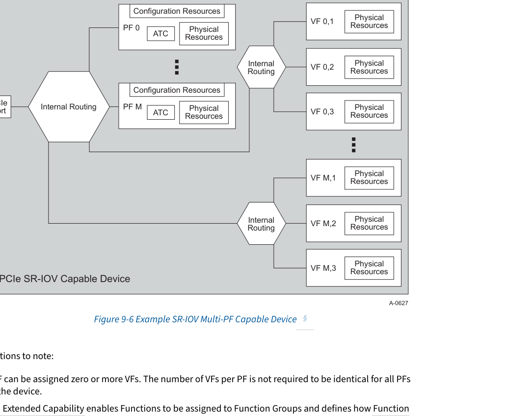

Key observations to note:

- Each PF can be assigned zero or more VFs. The number of VFs per PF is not required to be identical for all PFs within the device.
- The ARI Extended Capability enables Functions to be assigned to Function Groups and defines how Function Group arbitration can be configured. PFs and VFs can be assigned to Function Groups and take advantage of the associated arbitration capabilities. Within each Function Group, though, arbitration remains implementation specific.
- Internal routing between PFs and VFs is implementation specific.
- For some usage models, all PFs may be the same device type; (e.g., all PFs deliver the same network device or all deliver the same storage device functionality). For other usage models, each PF may represent a different device type; (e.g., in § Figure 9-6, one PF might represent a network device while another represents an encryption device).
  - In situations where there is a usage model dependency between device types, such as for each VF that is a network device type, each SI also requires a VF that is an encryption device type. The SR-IOV Extended Capability provides a method to indicate these dependencies. The policies used to construct these dependencies as well as assign dependent sets of VF to a given SI are outside the scope of this specification.

</td>
<td style="background-color:#e8e8e8">

> **Figure 9-6.** 多 PF SR-IOV 设备示例 (Example SR-IOV Multi-PF Capable Device)
> 

需要注意的关键观察点:

- 每个 PF 可以分配零个或多个 VF。设备内所有 PF 的每个 PF 的 VF 数量不需要相同。
- ARI 扩展能力结构 (ARI Extended Capability) 允许将功能分配到功能组 (Function Group),并定义如何配置功能组仲裁。PF 和 VF 可以分配到功能组,并利用相关的仲裁能力。但是,在每个功能组内,仲裁仍然是特定于实现的。
- PF 和 VF 之间的内部路由是特定于实现的。
- 对于某些使用模型,所有 PF 可能是相同的设备类型(例如,所有 PF 都提供相同的网络设备或都提供相同的存储设备功能)。对于其他使用模型,每个 PF 可能代表不同的设备类型(例如,在 § Figure 9-6 中,一个 PF 可能代表网络设备,而另一个代表加密设备)。
  - 在设备类型之间存在使用模型依赖关系的情况下,例如对于作为网络设备类型的每个 VF,每个 SI 还需要一个作为加密设备类型的 VF。SR-IOV 扩展能力结构提供了一种指示这些依赖关系的方法。用于构造这些依赖关系以及将相关 VF 集分配给给定 SI 的策略不在本规范的范围内。

</td>
</tr>
</tbody>
</table>

[⬆️ 返回目录](#-本章目录-table-of-contents)

---

<<<PAGE_BREAK>>> page_1532

## 9.1.5 SR-IOV Function, PF, and VF Mix § | 9.1.5 SR-IOV 功能、PF 和 VF 组合 §

<table>
<thead>
<tr>
<th width="50%">🇬🇧 English</th>
<th width="50%" style="background-color:#e8e8e8">🇨🇳 中文</th>
</tr>
</thead>
<tbody>
<tr>
<td>

As seen in the prior example, the number of PF and VF can vary based on usage model requirements. To support a wide range of options, an SR-IOV Device can support the following number and mix of PF and VF:

- Using the Alternative Routing Identifier (ARI) capability, a device may support up to 256 PFs. Function Number assignment is implementation specific and may be sparse throughout the 256 Function Number space.
- A PF can only be associated with the Device's captured Bus Number as illustrated in § Figure 9-7.
- SR-IOV Devices may consume more than one Bus Number. A VF can be associated with any Bus Number within the Device's Bus Number range - the captured Bus Number plus any additional Bus Numbers configured by software. See § Section 9.2.1.2 for details.
  - Use of multiple Bus Numbers enables a device to support a very large number of VFs - up to the size of the Routing ID space minus the bits used to identify intervening busses.
  - If software does not configure sufficient additional Bus Numbers, then the VFs implemented for the additional Bus Numbers may not be visible.

> **IMPLEMENTATION NOTE:**
> **FUNCTION CO-LOCATION**
> The ARI Extended Capability enables a Device to support up to 256 Functions - Functions, PFs, or VFs in any combination - associated with the captured Bus Number. If a usage model does not require more than 256 Functions, implementations are strongly encouraged to co-locate all Functions, PFs, and VFs within the captured Bus Number and not require additional Bus Numbers to access VFs.

</td>
<td style="background-color:#e8e8e8">

如前面的示例所示,PF 和 VF 的数量可以根据使用模型的要求而变化。为了支持广泛的选项,SR-IOV 设备可以支持以下数量和组合的 PF 和 VF:

- 使用替代路由标识符 (Alternative Routing Identifier, ARI) 能力,设备最多可以支持 256 个 PF。功能号 (Function Number) 的分配是特定于实现的,并且在 256 个功能号空间中可能稀疏分布。
- PF 只能与设备的捕获总线号 (captured Bus Number) 关联,如图 § Figure 9-7 所示。
- SR-IOV 设备可能消耗多个总线号。VF 可以与设备总线号范围内的任何总线号关联——即捕获的总线号加上软件配置的任何附加总线号。详见 § 第 9.2.1.2 节。
  - 使用多个总线号使设备能够支持大量的 VF——最多可达路由 ID 空间的大小减去用于标识中间总线的位数。
  - 如果软件未配置足够的附加总线号,则为附加总线号实现的 VF 可能不可见。

> **实现注意 (IMPLEMENTATION NOTE):**
> **功能同位 (FUNCTION CO-LOCATION)**
> ARI 扩展能力结构使设备能够支持最多 256 个功能——功能、PF 或 VF 的任意组合——这些功能与捕获的总线号相关联。如果使用模型不需要超过 256 个功能,则强烈建议实现将所有功能、PF 和 VF 同位 (co-locate) 于捕获的总线号内,并且不需要额外的总线号来访问 VF。

</td>
</tr>
</tbody>
</table>

[⬆️ 返回目录](#-本章目录-table-of-contents)

---

<<<PAGE_BREAK>>> page_1533

## 9.1.6 Example SR-IOV Device with Multiple Bus Numbers § | 9.1.6 跨多总线号的 SR-IOV 设备示例 §

<table>
<thead>
<tr>
<th width="50%">🇬🇧 English</th>
<th width="50%" style="background-color:#e8e8e8">🇨🇳 中文</th>
</tr>
</thead>
<tbody>
<tr>
<td>

> **Figure 9-7.** Example SR-IOV Device with Multiple Bus Numbers
> 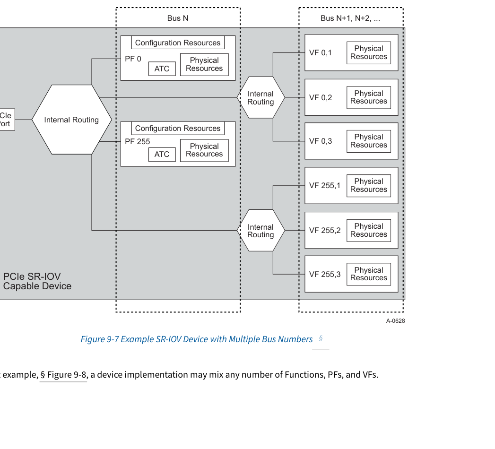

In this last example, § Figure 9-8, a device implementation may mix any number of Functions, PFs, and VFs.

</td>
<td style="background-color:#e8e8e8">

> **Figure 9-7.** 跨多总线号的 SR-IOV 设备示例 (Example SR-IOV Device with Multiple Bus Numbers)
> 

在最后一个示例 § Figure 9-8 中,设备实现可以混合任意数量的功能、PF 和 VF。

</td>
</tr>
</tbody>
</table>

[⬆️ 返回目录](#-本章目录-table-of-contents)

---

<<<PAGE_BREAK>>> page_1534

## 9.1.7 Example SR-IOV Device with a Mixture of Function Types § | 9.1.7 混合功能类型的 SR-IOV 设备示例 §

<table>
<thead>
<tr>
<th width="50%">🇬🇧 English</th>
<th width="50%" style="background-color:#e8e8e8">🇨🇳 中文</th>
</tr>
</thead>
<tbody>
<tr>
<td>

> **Figure 9-8.** Example SR-IOV Device with a Mixture of Function Types
> 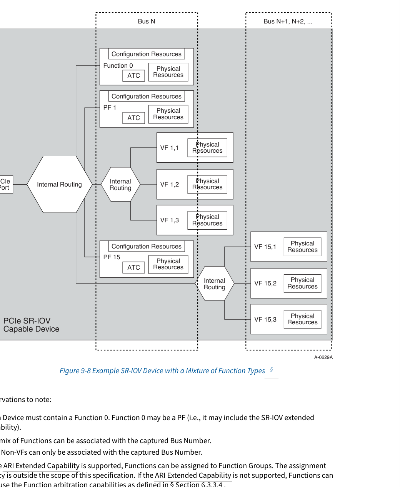

Key observations to note:

- Each Device must contain a Function 0. Function 0 may be a PF (i.e., it may include the SR-IOV extended capability).
- Any mix of Functions can be associated with the captured Bus Number.
  - Non-VFs can only be associated with the captured Bus Number.
- If the ARI Extended Capability is supported, Functions can be assigned to Function Groups. The assignment policy is outside the scope of this specification. If the ARI Extended Capability is not supported, Functions can still use the Function arbitration capabilities as defined in § Section 6.3.3.4 .

</td>
<td style="background-color:#e8e8e8">

> **Figure 9-8.** 混合功能类型的 SR-IOV 设备示例 (Example SR-IOV Device with a Mixture of Function Types)
> 

需要注意的关键观察点:

- 每个设备必须包含一个 Function 0。Function 0 可以是 PF(即,它可以包括 SR-IOV 扩展能力结构)。
- 任何功能组合都可以与捕获的总线号相关联。
  - 非 VF 只能与捕获的总线号相关联。
- 如果支持 ARI 扩展能力结构,则可以将功能分配到功能组。分配策略不在本规范的范围内。如果不支持 ARI 扩展能力结构,则功能仍可以使用 § 第 6.3.3.4 节中定义的功能仲裁能力。

The following sections describe how software determines that a Device is SR-IOV capable and subsequently identifies VF resources through Virtual Function Configuration Space.

This section describes the fields that must be configured before enabling a PF's IOV Capabilities. The VFs are enabled by Setting the PF's VF Enable bit (see § Section 9.3.3.3.1 ) in the SR-IOV extended capability.

The NumVFs field (see § Section 9.3.3.7 ) defines the number of VFs that are enabled when VF Enable is Set in the associated PF.

This section describes how the VF BARs are configured to map memory space. VFs do not support I/O Space and thus VF BARs shall not indicate I/O Space.

The System Page Size field (see § Section 9.3.3.13 ) defines the page size the system will use to map the VF's PCIe memory addresses when the PF's IOV Capabilities are enabled. The System Page Size field is used by the PF to align the Memory space aperture defined by each VF BAR to a system page boundary. The value chosen for the System Page Size must be one of the Supported Page Sizes (see § Section 9.3.3.12 ) in the SR-IOV extended capability.

The behavior of VF BARs is the same as the normal PCI Memory Space BARs (see § Section 7.5.1.2.1 ), except that a VF BAR describes the aperture for each VF, whereas a PCI BAR describes the aperture for a single Function. The attributes for some of the bits in the VF BARs are affected by the VF Resizable BAR Extended Capability (see § Section 7.8.7 ) if it is implemented.

- The behavior described in § Section 7.5.1.2.1 for determining the memory aperture of a Function's BAR applies to each VF BAR. That is, the size of the memory aperture required for each VF BAR can be determined by writing all "1"s and then reading the VF BAR. The results read back must be interpreted as described in § Section 7.5.1.2.1 .
- The behavior for assigning the starting memory space address of each BAR associated with the first VF is also as described in § Section 7.5.1.2.1 . That is, the address written into each VF BAR is used by the Device for the starting address of the first VF.
- The difference between VF BARs and BARs described in § Section 7.5.1.2.1 is that for each VF BAR, the memory space associated with the second and higher VFs is derived from the starting address of the first VF and the memory space aperture. For any given VFv, the starting address of its Memory space aperture for any implemented BARb) is calculated according to the following formula:

  BARb VFv starting address = VF BARb + (v - 1) x (VF BARb aperture size)

  where VF BARb aperture size is the size of VF BARb as determined by the usual BAR probing algorithm as described in § Section 9.3.3.14 .

</td>
<td style="background-color:#e8e8e8">

- 如果支持 ARI 扩展能力结构,则可以将功能分配到功能组。分配策略不在本规范的范围内。如果不支持 ARI 扩展能力结构,则功能仍可以使用 § 第 6.3.3.4 节中定义的功能仲裁能力。

以下各节描述了软件如何确定设备支持 SR-IOV,然后通过虚拟功能配置空间识别 VF 资源。

本节描述了在启用 PF 的 IOV 功能之前必须配置的字段。通过在 SR-IOV 扩展能力结构中置位 (Set) PF 的 VF 使能 (VF Enable) 位(见 § 第 9.3.3.3.1 节)来启用 VF。

NumVFs 字段(见 § 第 9.3.3.7 节)定义了在关联 PF 中 VF Enable 被置位时启用的 VF 数量。

本节描述了如何配置 VF BAR 以映射内存空间。VF 不支持 I/O 空间 (I/O Space),因此 VF BAR 不应指示 I/O 空间。

系统页大小 (System Page Size) 字段(见 § 第 9.3.3.13 节)定义了在启用 PF 的 IOV 功能时系统用于映射 VF 的 PCIe 内存地址的页大小。系统页大小字段供 PF 用于将每个 VF BAR 定义的内存空间窗口对齐到系统页边界。为系统页大小选择的值必须是 SR-IOV 扩展能力结构中支持的页大小 (Supported Page Sizes)(见 § 第 9.3.3.12 节)之一。

VF BAR 的行为与普通 PCI 内存空间 BAR 相同(见 § 第 7.5.1.2.1 节),只是 VF BAR 描述每个 VF 的窗口,而 PCI BAR 描述单个功能的窗口。VF BAR 中某些位的属性受 VF 可调整 BAR 扩展能力结构 (VF Resizable BAR Extended Capability)(见 § 第 7.8.7 节)的影响(如果已实现)。

- § 第 7.5.1.2.1 节中描述的确定功能 BAR 内存窗口的行为适用于每个 VF BAR。也就是说,可以通过写入全"1"然后读取 VF BAR 来确定每个 VF BAR 所需的内存窗口大小。回读的结果必须按照 § 第 7.5.1.2.1 节中的描述进行解释。
- 为与第一个 VF 关联的每个 BAR 分配起始内存空间地址的行为也如 § 第 7.5.1.2.1 节中所述。也就是说,写入每个 VF BAR 的地址由设备用作第一个 VF 的起始地址。
- VF BAR 与 § 第 7.5.1.2.1 节中描述的 BAR 之间的区别在于,对于每个 VF BAR,与第二个及更高编号 VF 关联的内存空间由第一个 VF 的起始地址和内存空间窗口导出。对于任何给定的 VFv,其任何已实现 BARb 的内存空间窗口的起始地址按以下公式计算:

  BARb VFv 起始地址 = VF BARb + (v - 1) x (VF BARb 窗口大小)

  其中 VF BARb 窗口大小是通过 § 第 9.3.3.14 节中描述的常用 BAR 探测算法确定的 VF BARb 的大小。

</td>
</tr>
</tbody>
</table>

[⬆️ 返回目录](#-本章目录-table-of-contents)

---

## 9.2 SR-IOV Initialization and Resource Allocation § | 9.2 SR-IOV 初始化和资源分配 §

<table>
<thead>
<tr>
<th width="50%">🇬🇧 English</th>
<th width="50%" style="background-color:#e8e8e8">🇨🇳 中文</th>
</tr>
</thead>
<tbody>
<tr>
<td>

### 9.2.1 SR-IOV Resource Discovery § | 9.2.1 SR-IOV 资源发现 §

#### 9.2.1.1 Configuring SR-IOV Capabilities § | 9.2.1.1 配置 SR-IOV 功能 §

#### 9.2.1.1.1 Configuring the VF BAR Mechanisms § | 9.2.1.1.1 配置 VF BAR 机制 §

</td>
<td style="background-color:#e8e8e8">

### 9.2.1 SR-IOV 资源发现 §

#### 9.2.1.1 配置 SR-IOV 功能 §

#### 9.2.1.1.1 配置 VF BAR 机制 §

</td>
</tr>
</tbody>
</table>

[⬆️ 返回目录](#-本章目录-table-of-contents)

---

<<<PAGE_BREAK>>> page_1536

## 9.2.1.1.1 Configuring the VF BAR Mechanisms (cont.) § | 9.2.1.1.1 配置 VF BAR 机制(续) §

<table>
<thead>
<tr>
<th width="50%">🇬🇧 English</th>
<th width="50%" style="background-color:#e8e8e8">🇨🇳 中文</th>
</tr>
</thead>
<tbody>
<tr>
<td>

VF memory space is not enabled until both VF Enable and VF MSE have been Set (see § Section 9.3.3.3.1 and § Section 9.3.3.3.4 ). Note that changing System Page Size (see § Section 9.3.3.13 ) may affect the VF BAR aperture size.

§ Figure 9-9 shows an example of the PF and VF Memory space apertures.

> **Figure 9-9.** BAR Space Example for Single BAR Device
> 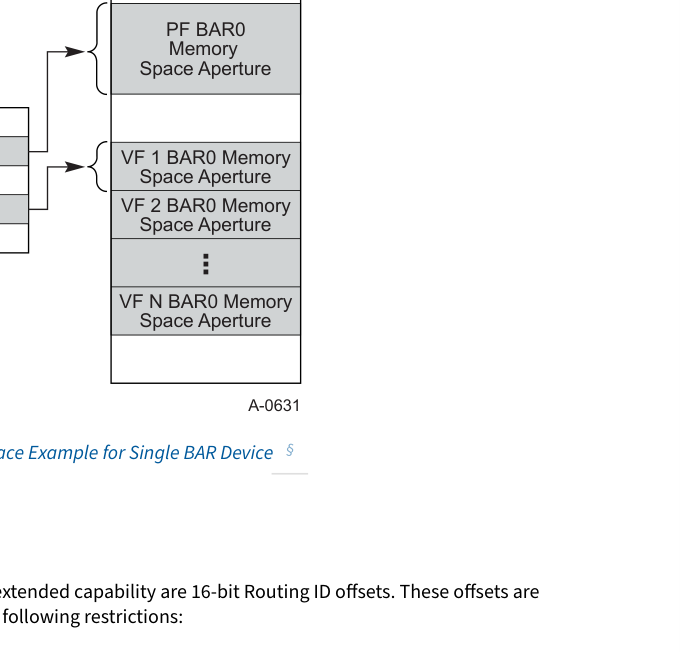

The First VF Offset and VF Stride fields in the SR-IOV extended capability are 16-bit Routing ID offsets. These offsets are used to compute the Routing IDs for the VFs with the following restrictions:

- The value in NumVFs in a PF (§ Section 9.3.3.7 ) may affect the values in First VF Offset (§ Section 9.3.3.9 ) and VF Stride (§ Section 9.3.3.10 ) of that PF.
- The value in ARI Capable Hierarchy (§ Section 9.3.3.3.5 ) in the lowest-numbered PF of the Device (for example PF0) may affect the values in First VF Offset and VF Stride in all PFs of the Device.
- NumVFs of a PF may only be changed when VF Enable (§ Section 9.3.3.3.1 ) of that PF is Clear.
- ARI Capable Hierarchy (§ Section 9.3.3.3.5 ) may only be changed when VF Enable is Clear in all PFs of a Device.

#### 9.2.1.2 VF Discovery § | 9.2.1.2 VF 发现 §

> **IMPLEMENTATION NOTE:**
> **NUMVFS AND ARI CAPABLE HIERARCHY**
> After configuring NumVFs and ARI Capable Hierarchy where applicable, software may read First VF Offset and VF Stride to determine how many Bus Numbers would be consumed by the PF's VFs. The additional Bus Numbers, if any, are not actually used until VF Enable is Set.

</td>
<td style="background-color:#e8e8e8">

VF 内存空间在 VF Enable 和 VF MSE 都被置位之前不会启用(见 § 第 9.3.3.3.1 节和 § 第 9.3.3.3.4 节)。请注意,更改系统页大小 (System Page Size)(见 § 第 9.3.3.13 节)可能会影响 VF BAR 窗口大小。

§ Figure 9-9 展示了 PF 和 VF 内存空间窗口的示例。

> **Figure 9-9.** 单 BAR 设备的 BAR 空间示例 (BAR Space Example for Single BAR Device)
> 

SR-IOV 扩展能力结构中的 First VF Offset 和 VF Stride 字段是 16 位路由 ID 偏移量。这些偏移量用于计算 VF 的路由 ID,但有以下限制:

- PF 中 NumVFs 的值(§ 第 9.3.3.7 节)可能会影响该 PF 的 First VF Offset(§ 第 9.3.3.9 节)和 VF Stride(§ 第 9.3.3.10 节)的值。
- 设备中编号最小的 PF(例如 PF0)中的 ARI Capable Hierarchy(§ 第 9.3.3.3.5 节)的值可能会影响设备中所有 PF 的 First VF Offset 和 VF Stride 的值。
- 只能在 PF 的 VF Enable(§ 第 9.3.3.3.1 节)被清零 (Clear) 时更改该 PF 的 NumVFs。
- 只能在设备所有 PF 的 VF Enable 都被清零时更改 ARI Capable Hierarchy(§ 第 9.3.3.3.5 节)。

#### 9.2.1.2 VF 发现 §

> **实现注意 (IMPLEMENTATION NOTE):**
> **NUMVFS 和 ARI CAPABLE HIERARCHY**
> 在适当的情况下配置 NumVFs 和 ARI Capable Hierarchy 后,软件可以读取 First VF Offset 和 VF Stride 来确定 PF 的 VF 将消耗多少总线号。附加的总线号(如果有)在 VF Enable 被置位之前实际上不会被使用。

</td>
</tr>
</tbody>
</table>

[⬆️ 返回目录](#-本章目录-table-of-contents)

---

<<<PAGE_BREAK>>> page_1537

## 9.2.1.2 VF Discovery (cont.) § | 9.2.1.2 VF 发现(续) §

<table>
<thead>
<tr>
<th width="50%">🇬🇧 English</th>
<th width="50%" style="background-color:#e8e8e8">🇨🇳 中文</th>
</tr>
</thead>
<tbody>
<tr>
<td>

§ Table 9-1 describes the algorithm used to determine the Routing ID associated with each VF.

**Table 9-1. VF Routing ID Algorithm | 表 9-1. VF 路由 ID 算法**

| VF Number | VF Routing ID |
|-----------|---------------|
| VF 1 | (PF Routing ID + First VF Offset) Modulo 216 |
| VF 2 | (PF Routing ID + First VF Offset + VF Stride) Modulo 216 |
| VF 3 | (PF Routing ID + First VF Offset + 2 * VF Stride) Modulo 216 |
| … | … |
| VF N | (PF Routing ID + First VF Offset + (N-1) * VF Stride) Modulo 216 |
| … | … |
| VF NumVFs (last one) | (PF Routing ID + First VF Offset + (NumVFs-1) * VF Stride) Modulo 216 |

All arithmetic used in this Routing ID computation is 16-bit unsigned dropping all carries.

All VFs and PFs must have distinct Routing IDs. The Routing ID of any PF or VF must not overlap with the Routing ID of any other PF or VF given any valid setting of NumVFs across all PFs of a device.

VF Stride and First VF Offset are constants. Except as stated earlier in this section, their values may not be affected by settings in this or other Functions of the Device.

VFs may reside on different Bus Number(s) than the associated PF. This can occur if, for example, First VF Offset has the value 0100h. A VF shall not be located on a Bus Number that is numerically smaller than its associated PF. A VF that is located on the same Bus Number as its associated PF shall not be located on a Device Number that is numerically smaller than the PF186.

VFs of an SR-IOV RCiEP Device are associated with the same Root Complex Event Collector (if any) as their PF. Such VFs are not reported in the Root Complex Event Collector Endpoint Association Extended Capability of the Root Complex Event Collector.

As per § Section 2.2.6.2 , SR-IOV capable Devices that are associated with an Upstream Port capture the Bus Number from any Type 0 Configuration Write Request. SR-IOV capable Devices do not capture the Bus Number from any Type 1 Configuration Write Requests. SR-IOV capable RCiEPs use an implementation specific mechanism to assign their Bus Numbers.

Note: Bus Numbers are a constrained resource. Devices are strongly encouraged to avoid leaving "holes" in their Bus Number usage to avoid wasting Bus Numbers.

All PFs must be located on the Device's captured Bus Number.

</td>
<td style="background-color:#e8e8e8">

§ Table 9-1 描述了用于确定与每个 VF 关联的路由 ID 的算法。

**Table 9-1. VF 路由 ID 算法 (VF Routing ID Algorithm)**

| VF 编号 | VF 路由 ID |
|-----------|---------------|
| VF 1 | (PF 路由 ID + First VF Offset) 模 216 |
| VF 2 | (PF 路由 ID + First VF Offset + VF Stride) 模 216 |
| VF 3 | (PF 路由 ID + First VF Offset + 2 * VF Stride) 模 216 |
| … | … |
| VF N | (PF 路由 ID + First VF Offset + (N-1) * VF Stride) 模 216 |
| … | … |
| VF NumVFs(最后一个) | (PF 路由 ID + First VF Offset + (NumVFs-1) * VF Stride) 模 216 |

此路由 ID 计算中使用的所有算术运算均为 16 位无符号运算,丢弃所有进位。

所有 VF 和 PF 必须具有不同的路由 ID。对于设备所有 PF 的任何有效 NumVFs 设置,任何 PF 或 VF 的路由 ID 都不得与任何其他 PF 或 VF 的路由 ID 重叠。

VF Stride 和 First VF Offset 是常量。除本节前面所述外,它们的值可能不受本设备或其他功能中设置的影响。

VF 可以驻留在与关联 PF 不同的总线号上。例如,如果 First VF Offset 的值为 0100h,则可能发生这种情况。VF 不得位于数字上小于其关联 PF 的总线号上。与其关联 PF 位于同一总线号上的 VF 不得位于数字上小于 PF 的设备号 (Device Number) 上186。

SR-IOV RCiEP 设备的 VF 与其 PF 关联到同一根复合体事件收集器 (Root Complex Event Collector)(如果有)。此类 VF 不会在根复合体事件收集器的根复合体事件收集器端点关联扩展能力结构中报告。

根据 § 第 2.2.6.2 节,与上游端口 (Upstream Port) 关联的支持 SR-IOV 的设备从任何 Type 0 配置写请求中捕获总线号。支持 SR-IOV 的设备不从任何 Type 1 配置写请求中捕获总线号。支持 SR-IOV 的 RCiEP 使用特定于实现的机制来分配其总线号。

注意:总线号是受约束的资源。强烈建议设备避免在其总线号使用中留下"空缺",以避免浪费总线号。

所有 PF 必须位于设备的捕获总线号上。

</td>
</tr>
</tbody>
</table>

>>> [186. SR-IOV Devices immediately below a Downstream Port always have a Device Number of 0 and thus always satisfy this condition.]()

[⬆️ 返回目录](#-本章目录-table-of-contents)

---

<<<PAGE_BREAK>>> page_1538

## 9.2.1.2 VF Discovery (cont. 2) § | 9.2.1.2 VF 发现(续 2) §

<table>
<thead>
<tr>
<th width="50%">🇬🇧 English</th>
<th width="50%" style="background-color:#e8e8e8">🇨🇳 中文</th>
</tr>
</thead>
<tbody>
<tr>
<td>

Software should configure Switch Secondary and Subordinate Bus Number fields to route enough Bus Numbers to the Device. If sufficient Bus Numbers are not available, software should reduce a Device's Bus Number requirements by not enabling SR-IOV and/or reducing NumVFs for some or all PFs of the Device prior to enabling SR-IOV.

After VF Enable is Set in some PF n, the Device must Enable VF n,1 through VF n,m (inclusive) where m is the smaller of InitialVFs and NumVFs. A Device receiving a Type 0 Configuration Request targeting an Enabled VF located on the captured Bus Number must process the Request normally. A Device receiving a Type 1 Configuration Request targeting an Enabled VF not located on the captured Bus Number must process the Request normally. A Device receiving a Type 1 Configuration Request targeting the Device's captured Bus Number must follow the rules for handling Unsupported Requests. Additionally, if VF MSE is Set, each Enabled VF must respond to PCIe Memory transactions addressing the memory space associated with that VF.

Functions that are not enabled (i.e., Functions for VFs above m) do not exist in the PCI Express fabric. As per § Section 2.3.1 , addressing Functions that do not exist will result in Unsupported Request (UR) being returned. This includes Functions on additional Bus Numbers.

PCI Devices may have vendor-specific dependencies between Functions. For example, Functions 0 and 1 might provide different mechanisms for controlling the same underlying hardware. In such situations, the Device programming model might require that these dependent Functions be assigned to SIs as a set.

> **IMPLEMENTATION NOTE:**
> **VFS SPANNING MULTIPLE BUS NUMBERS**
> As an example, consider an SR-IOV Device that supports a single PF. Initially, only PF 0 is visible. Software Sets ARI Capable Hierarchy. From the SR-IOV Extended Capability it determines: InitialVFs is 600, First VF Offset is 1 and VF Stride is 1.
> - If software sets NumVFs in the range [0 … 255], then the Device uses a single Bus Number.
> - If software sets NumVFs in the range [256 … 511], then the Device uses two Bus Numbers.
> - If software sets NumVFs in the range [512 … 600], then the Device uses three Bus Numbers.
>
> PF 0 and VF 0,1 through VF 0,255 are always on the first (captured) Bus Number. VF 0,256 through VF 0,511 are always on the second Bus Number (captured Bus Number plus 1). VF 0,512 through VF 0,600 are always on the third Bus Number (captured Bus Number plus 2).

> **IMPLEMENTATION NOTE:**
> **MULTI-FUNCTION DEVICES WITH PFS AND SWITCH FUNCTIONS**
> SR-IOV devices may consume multiple bus numbers. Additional bus numbers beyond the first one are consecutive and immediately follow the first bus number assigned to the device. If an SR-IOV device also contains PCI-PCI Bridges (with Type 1 Configuration Space Headers), the SR-IOV usage must be accounted for when programming the Secondary Bus Number for those Bridges. Software should determine the last Bus Number used by VFs first and then configure any co-located Bridges to use Bus Numbers above that value.

#### 9.2.1.3 Function Dependency Lists § | 9.2.1.3 功能依赖列表 §

</td>
<td style="background-color:#e8e8e8">

软件应配置交换机的 Secondary 和 Subordinate Bus Number 字段,以将足够的总线号路由到设备。如果没有足够的总线号,软件应通过不启用 SR-IOV 和/或在启用 SR-IOV 之前减少设备某些或所有 PF 的 NumVFs 来降低设备的总线号需求。

在某些 PF n 中置位 VF Enable 后,设备必须启用 VF n,1 至 VF n,m(含),其中 m 是 InitialVFs 和 NumVFs 中的较小值。接收到针对位于捕获总线号上的已启用 VF 的 Type 0 配置请求的设备必须正常处理该请求。接收到针对未位于捕获总线号上的已启用 VF 的 Type 1 配置请求的设备必须正常处理该请求。接收到针对设备捕获总线号的 Type 1 配置请求的设备必须遵循处理不支持请求 (Unsupported Request) 的规则。此外,如果 VF MSE 被置位,则每个已启用的 VF 必须响应寻址与该 VF 关联的内存空间的 PCIe 内存事务。

未启用的功能(即编号大于 m 的 VF 对应的功能)在 PCI Express Fabric 中不存在。根据 § 第 2.3.1 节,寻址不存在的功能将导致返回不支持请求 (Unsupported Request, UR)。这包括附加总线号上的功能。

PCI 设备的功能之间可能存在特定于供应商的依赖关系。例如,Function 0 和 Function 1 可能提供用于控制同一底层硬件的不同机制。在这种情况下,设备的编程模型可能要求将这些依赖功能作为一个集合分配给 SI。

> **实现注意 (IMPLEMENTATION NOTE):**
> **跨多总线号的 VF (VFS SPANNING MULTIPLE BUS NUMBERS)**
> 例如,考虑一个支持单个 PF 的 SR-IOV 设备。最初,仅 PF 0 可见。软件置位 ARI Capable Hierarchy。从 SR-IOV 扩展能力结构中确定:InitialVFs 为 600,First VF Offset 为 1,VF Stride 为 1。
> - 如果软件将 NumVFs 设置在 [0 … 255] 范围内,则设备使用单个总线号。
> - 如果软件将 NumVFs 设置在 [256 … 511] 范围内,则设备使用两个总线号。
> - 如果软件将 NumVFs 设置在 [512 … 600] 范围内,则设备使用三个总线号。
>
> PF 0 和 VF 0,1 至 VF 0,255 始终位于第一个(捕获)总线号上。VF 0,256 至 VF 0,511 始终位于第二个总线号(捕获总线号加 1)上。VF 0,512 至 VF 0,600 始终位于第三个总线号(捕获总线号加 2)上。

> **实现注意 (IMPLEMENTATION NOTE):**
> **具有 PF 和交换机功能的多功能设备 (MULTI-FUNCTION DEVICES WITH PFS AND SWITCH FUNCTIONS)**
> SR-IOV 设备可能消耗多个总线号。第一个之后的附加总线号是连续的,并紧跟在分配给设备的第一个总线号之后。如果 SR-IOV 设备还包含 PCI-PCI 桥(具有 Type 1 配置空间头部),则在编程这些桥的 Secondary Bus Number 时必须考虑 SR-IOV 的使用情况。软件应先确定 VF 使用的最后一个总线号,然后配置任何同位的桥以使用高于该值的总线号。

#### 9.2.1.3 功能依赖列表 §

</td>
</tr>
</tbody>
</table>

[⬆️ 返回目录](#-本章目录-table-of-contents)

---

<<<PAGE_BREAK>>> page_1539

## 9.2.1.3 Function Dependency Lists (cont.) § | 9.2.1.3 功能依赖列表(续) §

<table>
<thead>
<tr>
<th width="50%">🇬🇧 English</th>
<th width="50%" style="background-color:#e8e8e8">🇨🇳 中文</th>
</tr>
</thead>
<tbody>
<tr>
<td>

Function Dependency Lists are used to describe these dependencies (or to indicate that there are no Function dependencies). Software should assign PFs and VFs to SIs such that the dependencies are satisfied.

See § Section 9.3.3.8 for details.

PFs and VFs support either MSI, MSI-X interrupts, or both if interrupt resources are allocated. VFs shall not implement INTx. MSI and MSI-X interrupts are described in § Section 6.1.4 .

For MSI-X interrupts, special address range isolation requirements apply for the MSI-X structures in PF and VF MMIO regions. See in § Section 7.7.2 .

This section describes how reset mechanisms defined in § Section 6.6 affect Devices that support SR-IOV. It also describes the mechanisms used to reset a single VF and a single PF with its associated VFs.

A Conventional Reset to a Device that supports SR-IOV shall cause all Functions (including both PFs and VFs) to be reset to their original, power-on state as per the rules in § Section 6.6.1 . § Section 9.3 describes the behavior for the fields defined.

Note: Conventional Reset clears VF Enable in the PF. Thus, VFs no longer exist after a Conventional Reset.

VFs must support Function Level Reset (FLR).

Note: Software may use FLR to reset a VF. FLR to a VF affects a VF's state but does not affect its existence in PCI Configuration Space or PCI Bus address space. The VFs BARn values (see § Section 9.3.3.14 ) and VF MSE (see § Section 9.3.3.3.4 ) in the PF's SR-IOV extended capability, and the VF Resizable BAR capability values (see § Section 7.8.7 ) are unaffected by FLRs issued to the VF.

PFs must support FLR.

FLR to a PF resets the PF state as well as the SR-IOV extended capability including VF Enable which means that VFs no longer exist.

If VF Enable is Cleared after having been Set, all of the VFs associated with the PF no longer exist and must no longer issue PCIe transactions or respond to Configuration Space or Memory Space accesses. VFs must not retain any architected state after VF Enable has been Cleared (including sticky bits). For security, unarchitected VF state configured through the VF must be cleared or randomized, with the exception of persistent storage data.

#### 9.2.1.4 Interrupt Resource Allocation § | 9.2.1.4 中断资源分配 §

### 9.2.2 SR-IOV Reset Mechanisms § | 9.2.2 SR-IOV 复位机制 §

#### 9.2.2.1 SR-IOV Conventional Reset § | 9.2.2.1 SR-IOV 常规复位 §

#### 9.2.2.2 FLR That Targets a VF § | 9.2.2.2 针对 VF 的 FLR §

#### 9.2.2.3 FLR That Targets a PF § | 9.2.2.3 针对 PF 的 FLR §

### 9.2.3 IOV Re-initialization and Reallocation § | 9.2.3 IOV 重新初始化和重新分配 §

</td>
<td style="background-color:#e8e8e8">

功能依赖列表用于描述这些依赖关系(或指示不存在功能依赖关系)。软件应将 PF 和 VF 分配给 SI,以满足这些依赖关系。

详见 § 第 9.3.3.8 节。

PF 和 VF 支持 MSI、MSI-X 中断,或两者都支持(如果分配了中断资源)。VF 不得实现 INTx。MSI 和 MSI-X 中断在 § 第 6.1.4 节中描述。

对于 MSI-X 中断,PF 和 VF MMIO 区域中的 MSI-X 结构适用特殊的地址范围隔离要求。请参见 § 第 7.7.2 节。

本节描述 § 第 6.6 节中定义的复位机制如何影响支持 SR-IOV 的设备。它还描述了用于复位单个 VF 和单个 PF 及其关联 VF 的机制。

对支持 SR-IOV 的设备进行常规复位 (Conventional Reset) 应使所有功能(包括 PF 和 VF)根据 § 第 6.6.1 节中的规则复位到其原始上电状态。§ 第 9.3 节描述了已定义字段的行为。

注意:常规复位会清除 PF 中的 VF Enable。因此,常规复位后 VF 不再存在。

VF 必须支持功能级复位 (Function Level Reset, FLR)。

注意:软件可以使用 FLR 复位 VF。对 VF 的 FLR 会影响 VF 的状态,但不会影响其在 PCI 配置空间或 PCI 总线地址空间中的存在性。PF 的 SR-IOV 扩展能力结构中的 VF BARn 值(见 § 第 9.3.3.14 节)和 VF MSE(见 § 第 9.3.3.3.4 节),以及 VF 可调整 BAR 能力值(见 § 第 7.8.7 节)不受对 VF 发出的 FLR 的影响。

PF 必须支持 FLR。

对 PF 的 FLR 会复位 PF 状态以及 SR-IOV 扩展能力结构,包括 VF Enable,这意味着 VF 不再存在。

如果在 VF Enable 被置位后清零 VF Enable,则与该 PF 关联的所有 VF 不再存在,并且不得再发出 PCIe 事务或响配置空间或内存空间访问。VF 在 VF Enable 被清零后不得保留任何已定义的状态(包括粘滞位 sticky bit)。出于安全考虑,通过 VF 配置的未定义 VF 状态必须被清除或随机化,但持久存储数据除外。

#### 9.2.1.4 中断资源分配 §

### 9.2.2 SR-IOV 复位机制 §

#### 9.2.2.1 SR-IOV 常规复位 §

#### 9.2.2.2 针对 VF 的 FLR §

#### 9.2.2.3 针对 PF 的 FLR §

### 9.2.3 IOV 重新初始化和重新分配 §

</td>
</tr>
</tbody>
</table>

[⬆️ 返回目录](#-本章目录-table-of-contents)

---

<<<PAGE_BREAK>>> page_1540

## 9.2.3 IOV Re-initialization and Reallocation (cont.) § | 9.2.3 IOV 重新初始化和重新分配(续) §

<table>
<thead>
<tr>
<th width="50%">🇬🇧 English</th>
<th width="50%" style="background-color:#e8e8e8">🇨🇳 中文</th>
</tr>
</thead>
<tbody>
<tr>
<td>

Unarchitected VF state configured through the PF or SR-PCIM interface is permitted to persist across VF instances. Architected VF state configured through the PF or SR-PCIM interface is permitted to be restored to earlier values or set to new values. That is, when VF Enabled is Set again, instances of VFs are permitted to have a different set of architected capabilities and/or their attributes (e.g., MSI-X Table size) from previous instances.

This section provides SR-IOV-added requirements for implementing PFs and VFs.

PFs are discoverable in configuration space, as with all Functions. PFs contain the SR-IOV Extended Capability described in § Section 9.3.3 . PFs are used to discover, configure, and manage the VFs associated with the PF and for other things described in this specification.

PFs that support SR-IOV shall implement the SR-IOV Extended Capability as defined in the following sections. VFs shall implement configuration space fields and capabilities as defined in the following sections.

The SR-IOV Extended Capability defined here is a PCIe extended capability that must be implemented in each PF that supports SR-IOV. This Capability is used to describe and control a PF's SR-IOV Capabilities.

For Multi-Function Devices, each PF that supports SR-IOV shall provide the Capability structure defined in this section. This Capability structure may be present in any Function with a Type 0 Configuration Space Header. This Capability must not be present in Functions with a Type 1 Configuration Space Header.

§ Figure 9-10 shows the SR-IOV Extended Capability structure.

## 9.3 Configuration § | 9.3 配置 §

### 9.3.1 SR-IOV Configuration Overview § | 9.3.1 SR-IOV 配置概述 §

### 9.3.2 Configuration Space § | 9.3.2 配置空间 §

### 9.3.3 SR-IOV Extended Capability § | 9.3.3 SR-IOV 扩展能力结构 §

</td>
<td style="background-color:#e8e8e8">

通过 PF 或 SR-PCIM 接口配置的未定义 VF 状态允许跨 VF 实例持续存在。通过 PF 或 SR-PCIM 接口配置的已定义 VF 状态允许恢复到较早的值或设置为新值。也就是说,当再次置位 VF Enabled 时,允许 VF 实例具有与先前实例不同的已定义能力集和/或其属性(例如 MSI-X 表大小)。

本节提供了实现 PF 和 VF 的 SR-IOV 附加要求。

与所有功能一样,PF 可在配置空间中发现。PF 包含 § 第 9.3.3 节中描述的 SR-IOV 扩展能力结构。PF 用于发现、配置和管理与 PF 关联的 VF 以及本规范中描述的其他内容。

支持 SR-IOV 的 PF 应按以下各节中的定义实现 SR-IOV 扩展能力结构。VF 应按以下各节中的定义实现配置空间字段和能力。

此处定义的 SR-IOV 扩展能力结构是必须在支持 SR-IOV 的每个 PF 中实现的 PCIe 扩展能力结构。该能力结构用于描述和控制 PF 的 SR-IOV 能力。

对于多功能设备,每个支持 SR-IOV 的 PF 应提供本节中定义的能力结构。此能力结构可以出现在具有 Type 0 配置空间头部的任何功能中。该能力结构不得出现在具有 Type 1 配置空间头部的功能中。

§ Figure 9-10 展示了 SR-IOV 扩展能力结构。

## 9.3 配置 §

### 9.3.1 SR-IOV 配置概述 §

### 9.3.2 配置空间 §

### 9.3.3 SR-IOV 扩展能力结构 §

</td>
</tr>
</tbody>
</table>

[⬆️ 返回目录](#-本章目录-table-of-contents)

---

<<<PAGE_BREAK>>> page_1541

## 9.3.3 SR-IOV Extended Capability (Figure 9-10) § | 9.3.3 SR-IOV 扩展能力结构(Figure 9-10) §

<table>
<thead>
<tr>
<th width="50%">🇬🇧 English</th>
<th width="50%" style="background-color:#e8e8e8">🇨🇳 中文</th>
</tr>
</thead>
<tbody>
<tr>
<td>

> **Figure 9-10.** SR-IOV Extended Capability
> 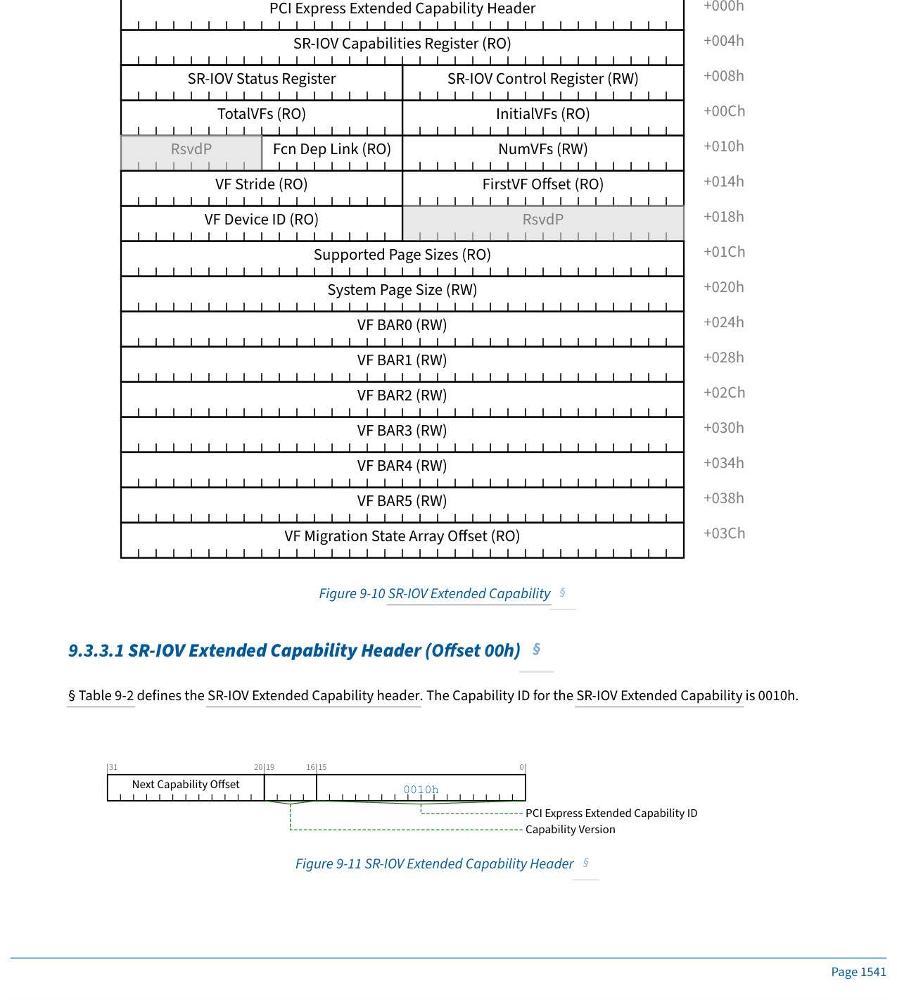

§ Table 9-2 defines the SR-IOV Extended Capability header. The Capability ID for the SR-IOV Extended Capability is 0010h.

> **Figure 9-11.** SR-IOV Extended Capability Header
> 

#### 9.3.3.1 SR-IOV Extended Capability Header (Offset 00h) § | 9.3.3.1 SR-IOV 扩展能力结构头部(偏移 00h) §

</td>
<td style="background-color:#e8e8e8">

> **Figure 9-10.** SR-IOV 扩展能力结构 (SR-IOV Extended Capability)
> 

§ Table 9-2 定义了 SR-IOV 扩展能力结构头部。SR-IOV 扩展能力结构的能力 ID 为 0010h。

> **Figure 9-11.** SR-IOV 扩展能力结构头部 (SR-IOV Extended Capability Header)
> 

#### 9.3.3.1 SR-IOV 扩展能力结构头部(偏移 00h) §

</td>
</tr>
</tbody>
</table>

[⬆️ 返回目录](#-本章目录-table-of-contents)

---

<<<PAGE_BREAK>>> page_1542

## 9.3.3.1 SR-IOV Extended Capability Header (Table 9-2) § | 9.3.3.1 SR-IOV 扩展能力结构头部(Table 9-2) §

<table>
<thead>
<tr>
<th width="50%">🇬🇧 English</th>
<th width="50%" style="background-color:#e8e8e8">🇨🇳 中文</th>
</tr>
</thead>
<tbody>
<tr>
<td>

**Table 9-2. SR-IOV Extended Capability Header | 表 9-2. SR-IOV 扩展能力结构头部**

| Bit Location | Register Description | Attributes |
|--------------|----------------------|------------|
| 15:0 | PCI Express Extended Capability ID - This field is a PCI-SIG defined ID number that indicates the nature and format of the Extended Capability. The Extended Capability ID for the SR-IOV Extended Capability is 0010h. | RO |
| 19:16 | Capability Version - This field is a PCI-SIG defined version number that indicates the version of the Capability structure present. Must be 1h for this version of the specification. | RO |
| 31:20 | Next Capability Offset - This field contains the offset to the next PCI Express Capability structure or 000h if no other items exist in the linked list of Capabilities. For Extended Capabilities implemented in Configuration Space, this offset is relative to the beginning of PCI-compatible Configuration Space and thus must always be either 000h (for terminating list of Capabilities) or greater than 0FFh. | RO |

§ Table 9-3 defines the layout of the SR-IOV Capabilities field.

> **Figure 9-12.** SR-IOV Capabilities Register
> 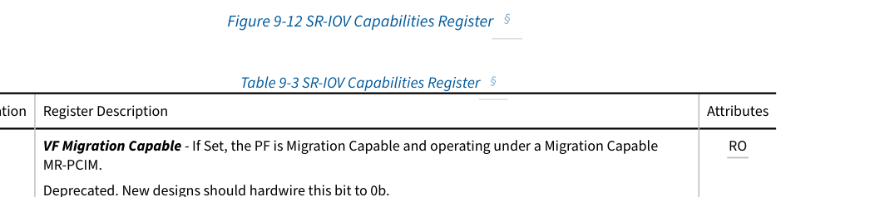

#### 9.3.3.2 SR-IOV Capabilities Register (04h) § | 9.3.3.2 SR-IOV 能力寄存器(04h) §

</td>
<td style="background-color:#e8e8e8">

**Table 9-2. SR-IOV 扩展能力结构头部 (SR-IOV Extended Capability Header)**

| 位位置 | 寄存器描述 | 属性 |
|--------------|----------------------|------------|
| 15:0 | PCI Express 扩展能力结构 ID (PCI Express Extended Capability ID)——此字段是 PCI-SIG 定义的 ID 号,用于指示扩展能力结构的性质和格式。SR-ROV 扩展能力结构的扩展能力结构 ID 为 0010h。 | RO |
| 19:16 | 能力版本 (Capability Version)——此字段是 PCI-SIG 定义的版本号,用于指示存在的能力结构版本。本规范版本必须为 1h。 | RO |
| 31:20 | 下一能力结构偏移 (Next Capability Offset)——此字段包含到下一个 PCI Express 能力结构的偏移;如果链接的能力结构列表中没有其他项,则为 000h。对于在配置空间中实现的扩展能力结构,此偏移相对于 PCI 兼容配置空间的开始,因此必须始终为 000h(用于终止能力结构列表)或大于 0FFh。 | RO |

§ Table 9-3 定义了 SR-IOV 能力字段的布局。

> **Figure 9-12.** SR-IOV 能力寄存器 (SR-IOV Capabilities Register)
> 

#### 9.3.3.2 SR-IOV 能力寄存器(04h) §

</td>
</tr>
</tbody>
</table>

[⬆️ 返回目录](#-本章目录-table-of-contents)

---

<<<PAGE_BREAK>>> page_1542

## 9.3.3.2 SR-IOV Capabilities Register (Table 9-3) § | 9.3.3.2 SR-IOV 能力寄存器(Table 9-3) §

<table>
<thead>
<tr>
<th width="50%">🇬🇧 English</th>
<th width="50%" style="background-color:#e8e8e8">🇨🇳 中文</th>
</tr>
</thead>
<tbody>
<tr>
<td>

**Table 9-3. SR-IOV Capabilities Register | 表 9-3. SR-IOV 能力寄存器**

| Bit Location | Register Description | Attributes |
|--------------|----------------------|------------|
| 0 | VF Migration Capable - If Set, the PF is Migration Capable and operating under a Migration Capable MR-PCIM. Deprecated. New designs should hardwire this bit to 0b. | RO |
| 1 | ARI Capable Hierarchy Preserved - PCI Express Endpoint: If Set, the ARI Capable Hierarchy bit is preserved across certain power state transitions. RCiEP: Not applicable - this bit MUST@FLIT be hardwired to 0b. | RO |
| 2 | VF 10-Bit Tag Requester Supported - If Set, all VFs associated with this PF must support 10-Bit Tag Requester capability. If Clear, VFs must not support 10-Bit Tag Requester capability. If the 10-Bit Tag Requester Supported bit in the PF's Device Capabilities 2 register is Clear, this bit must be Clear. | HwInit |

</td>
<td style="background-color:#e8e8e8">

**Table 9-3. SR-IOV 能力寄存器 (SR-IOV Capabilities Register)**

| 位位置 | 寄存器描述 | 属性 |
|--------------|----------------------|------------|
| 0 | VF 迁移能力 (VF Migration Capable)——如果置位,则 PF 具有迁移能力并在具有迁移能力的 MR-PCIM 下运行。已弃用。新设计应将此位硬连线为 0b。 | RO |
| 1 | ARI 能力层级保留 (ARI Capable Hierarchy Preserved)——PCI Express 端点:如果置位,则 ARI Capable Hierarchy 位在某些电源状态转换期间被保留。RCiEP:不适用——此位 MUST@FLIT 必须硬连线为 0b。 | RO |
| 2 | VF 10 位标签请求者支持 (VF 10-Bit Tag Requester Supported)——如果置位,则与此 PF 关联的所有 VF 必须支持 10 位标签请求者能力。如果清零,则 VF 不得支持 10 位标签请求者能力。如果 PF 的设备能力 2 寄存器中的 10 位标签请求者支持位被清零,则此位必须被清零。 | HwInit |

</td>
</tr>
</tbody>
</table>

[⬆️ 返回目录](#-本章目录-table-of-contents)

---

<<<PAGE_BREAK>>> page_1543

## 9.3.3.2 SR-IOV Capabilities Register (cont.) § | 9.3.3.2 SR-IOV 能力寄存器(续) §

<table>
<thead>
<tr>
<th width="50%">🇬🇧 English</th>
<th width="50%" style="background-color:#e8e8e8">🇨🇳 中文</th>
</tr>
</thead>
<tbody>
<tr>
<td>

| Bit Location | Register Description | Attributes |
|--------------|----------------------|------------|
| 3 | VF 14-Bit Tag Requester Supported - If Set, all VFs associated with this PF must support 14-Bit Tag Requester capability. If Clear, VFs must not support 14-Bit Tag Requester capability. If the 14-Bit Tag Requester Supported bit in the PF's Device Capabilities 3 register is Clear, this bit must be Clear. | HwInit |
| 31:21 | VF Migration Interrupt Message Number - Indicates the MSI/MSI-X vector used for migration interrupts. The value in this field is undefined if VF Migration Capable is Clear. VF Migration is a feature associated with the deprecated MR-IOV. New designs should hardwire this field to 0. | RO |

VF Migration Capable is Set to indicate that the PF supports VF Migration. If Clear, the PF does not support VF Migration. VF Migration is a feature associated with the deprecated [MR-IOV]. This bit should be hardwired to 0b in new designs.

ARI Capable Hierarchy Preserved is Set to indicate that the PF preserves the ARI Capable Hierarchy bit across certain power state transitions (see § Section 9.3.3.3.5 ). Components must either Set this bit or Set the No_Soft_Reset bit (see § Section 5.10.2 ). It is recommended that components set this bit even if they also set No_Soft_Reset.

ARI Capable Hierarchy Preserved is only present in the lowest-numbered PF of a Device (for example PF0). ARI Capable Hierarchy Preserved is Read Only Zero in other PFs of a Device.

ARI Capable Hierarchy Preserved does not apply to RCiEPs, and its value is undefined (see § Section 9.3.3.3 ).

If a PF and/or its associated VFs support UIO as a Completer, 14-bit Tags must be supported.

Otherwise, if a PF supports one or both larger-Tag Requester capabilities, its associated VFs are permitted to support the associated larger-Tag Requester capabilities as well, but this is optional. Especially for usage models where the bulk of the traffic is spread across several VFs concurrently, it may not be necessary for individual VFs to use larger Tags so they can support >256 outstanding Non-Posted Requests each.

For a given PF, it is required that either all or none of its associated VFs support larger-Tag Requester capabilities. This avoids unnecessary implementation and management complexity. See VF 14-Bit Tag Requester Supported and VF 10-Bit Tag Requester Supported.

VFs that support larger-Tag Requester capabilities have additional requirements and recommendations beyond other Function types in order to simplify error handling and reduce the possibility of larger-Tag related errors with one VF impacting other traffic.

#### 9.3.3.2.1 VF Migration Capable § | 9.3.3.2.1 VF 迁移能力 §

#### 9.3.3.2.2 ARI Capable Hierarchy Preserved § | 9.3.3.2.2 ARI 能力层级保留 §

#### 9.3.3.2.3 VF Larger-Tag Requester Support § | 9.3.3.2.3 VF 大标签请求者支持 §

</td>
<td style="background-color:#e8e8e8">

| 位位置 | 寄存器描述 | 属性 |
|--------------|----------------------|------------|
| 3 | VF 14 位标签请求者支持 (VF 14-Bit Tag Requester Supported)——如果置位,则与此 PF 关联的所有 VF 必须支持 14 位标签请求者能力。如果清零,则 VF 不得支持 14 位标签请求者能力。如果 PF 的设备能力 3 寄存器中的 14 位标签请求者支持位被清零,则此位必须被清零。 | HwInit |
| 31:21 | VF 迁移中断消息号 (VF Migration Interrupt Message Number)——指示用于迁移中断的 MSI/MSI-X 向量。如果 VF Migration Capable 被清零,则此字段中的值未定义。VF 迁移是与已弃用的 MR-IOV 关联的功能。新设计应将此字段硬连线为 0。 | RO |

VF Migration Capable 被置位以指示 PF 支持 VF 迁移。如果清零,则 PF 不支持 VF 迁移。VF 迁移是与已弃用的 [MR-IOV] 关联的功能。在新设计中,此位应硬连线为 0b。

ARI Capable Hierarchy Preserved 被置位以指示 PF 在某些电源状态转换期间保留 ARI Capable Hierarchy 位(见 § 第 9.3.3.3.5 节)。组件必须置位此位或置位 No_Soft_Reset 位(见 § 第 5.10.2 节)。建议组件即使在设置 No_Soft_Reset 时也置位此位。

ARI Capable Hierarchy Preserved 仅出现在设备中编号最小的 PF(例如 PF0)中。在设备的其他 PF 中,ARI Capable Hierarchy Preserved 为只读 0。

ARI Capable Hierarchy Preserved 不适用于 RCiEP,其值未定义(见 § 第 9.3.3.3 节)。

如果 PF 和/或其关联的 VF 支持 UIO 作为完成者,则必须支持 14 位标签。

否则,如果 PF 支持一个或两个大标签请求者能力,则其关联的 VF 也允许支持关联的大标签请求者能力,但这是可选的。特别是对于流量分布在多个 VF 上的使用模型,各个 VF 可能不需要使用大标签,以便它们可以各自支持 >256 个未完成的 Non-Posted 请求。

对于给定的 PF,要求其所有关联的 VF 都支持大标签请求者能力,或者都不支持。这避免了不必要的实现和管理复杂性。请参见 VF 14 位标签请求者支持和 VF 10 位标签请求者支持。

支持大标签请求者能力的 VF 具有超出其他功能类型的额外要求和建议,以简化错误处理并减少大标签相关错误影响其他流量的可能性。

#### 9.3.3.2.1 VF 迁移能力 §

#### 9.3.3.2.2 ARI 能力层级保留 §

#### 9.3.3.2.3 VF 大标签请求者支持 §

</td>
</tr>
</tbody>
</table>

[⬆️ 返回目录](#-本章目录-table-of-contents)

---

<<<PAGE_BREAK>>> page_1544

## 9.3.3.2.3 VF Larger-Tag Requester Support (cont.) § | 9.3.3.2.3 VF 大标签请求者支持(续) §

<table>
<thead>
<tr>
<th width="50%">🇬🇧 English</th>
<th width="50%" style="background-color:#e8e8e8">🇨🇳 中文</th>
</tr>
</thead>
<tbody>
<tr>
<td>

- If one of the VF larger-Tag Requester Enable bits in the SR-IOV Control Register is Set, then each VF must use the associated larger Tags for all Non-Posted Requests that it generates. If both bits are Set at the same time, the result is undefined.
- As documented in § Table 2-11, the permitted range with 10-bit Tags enabled is 256 to 1023, and the recommended range with 14-bit Tags enabled is 1024 to 16383. The keep-out range for 10-bit Tags is Tag[9:8] being 00b, and the recommended keep-out range for 14-bit Tags is Tag[13:10] being 0000b.
- For each outstanding larger-Tag Request, if the VF receives a Completion that matches the outstanding Request other than all Tag bits in the implemented keep-out Tag bit range being zero, then the Tag is invalid, and it is strongly recommended that the VF prevent that Request from (eventually) generating a Completion Timeout error, and instead handle the error via a device-specific mechanism that avoids data corruption.

It is strongly recommended that software not configure Unexpected Completion errors to be handled as Uncorrectable Errors. This avoids them triggering System Errors or hardware error containment mechanisms like Downstream Port Containment (DPC).

VF Migration is associated with the now deprecated MR-IOV. New designs should hardwire this field to 0.

> **IMPLEMENTATION NOTE:**
> **NO VF LARGER-TAG COMPLETER SUPPORTED BITS**
> There are no VF 14-bit or VF 10-Bit Tag Completer Supported bits. If a PF supports one or both larger-Tag Completer capabilities, then all of its associated VFs are required support the associated Tag Completer capabilities as stated in 14-Bit Tag Completer Supported and 10-Bit Tag Completer Supported. This helps avoid the complexity of PCIe hierarchies where some Completers support larger-Tag capability and some do not.

#### 9.3.3.2.4 VF Migration Interrupt Message Number § | 9.3.3.2.4 VF 迁移中断消息号 §

#### 9.3.3.3 SR-IOV Control Register (Offset 08h) § | 9.3.3.3 SR-IOV 控制寄存器(偏移 08h) §

</td>
<td style="background-color:#e8e8e8">

- 如果 SR-IOV 控制寄存器中的 VF 大标签请求者使能位之一被置位,则每个 VF 必须对生成的所有 Non-Posted 请求使用关联的大标签。如果两个位同时被置位,则结果未定义。
- 如 § Table 2-11 中所述,启用 10 位标签时的允许范围为 256 到 1023,启用 14 位标签时的建议范围为 1024 到 16383。10 位标签的禁用范围是 Tag[9:8] 为 00b,14 位标签的建议禁用范围是 Tag[13:10] 为 0000b。
- 对于每个未完成的大标签请求,如果 VF 收到的完成报文与未完成的请求匹配,但所实现的禁用标签位范围内的所有标签位都为零,则该标签无效,强烈建议 VF 防止该请求(最终)生成完成超时 (Completion Timeout) 错误,而是通过避免数据损坏的设备特定机制来处理该错误。

强烈建议软件不要将意外完成 (Unexpected Completion) 错误配置为按不可纠正错误 (Uncorrectable Error) 处理。这避免了它们触发系统错误或硬件错误遏制机制(例如下游端口遏制 (Downstream Port Containment, DPC))。

VF 迁移与现已弃用的 MR-IOV 关联。新设计应将此字段硬连线为 0。

> **实现注意 (IMPLEMENTATION NOTE):**
> **没有 VF 大标签完成者支持位 (NO VF LARGER-TAG COMPLETER SUPPORTED BITS)**
> 没有 VF 14 位或 VF 10 位标签完成者支持位。如果 PF 支持一个或两个大标签完成者能力,则如 14 位标签完成者支持和 10 位标签完成者支持中所述,其所有关联的 VF 都需要支持关联的标签完成者能力。这有助于避免某些完成者支持大标签能力而某些不支持的 PCIe 层级的复杂性。

#### 9.3.3.2.4 VF 迁移中断消息号 §

#### 9.3.3.3 SR-IOV 控制寄存器(偏移 08h) §

</td>
</tr>
</tbody>
</table>

[⬆️ 返回目录](#-本章目录-table-of-contents)

---

<<<PAGE_BREAK>>> page_1545

## 9.3.3.3 SR-IOV Control Register (Figure 9-13) § | 9.3.3.3 SR-IOV 控制寄存器(Figure 9-13) §

<table>
<thead>
<tr>
<th width="50%">🇬🇧 English</th>
<th width="50%" style="background-color:#e8e8e8">🇨🇳 中文</th>
</tr>
</thead>
<tbody>
<tr>
<td>

> **Figure 9-13.** SR-IOV Control Register
> 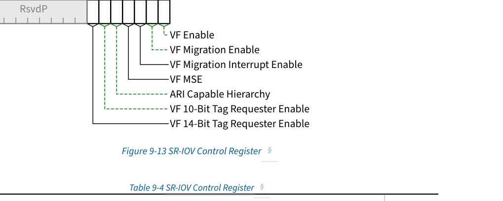

**Table 9-4. SR-IOV Control Register | 表 9-4. SR-IOV 控制寄存器**

| Bit Location | Register Description | Attributes |
|--------------|----------------------|------------|
| 0 | VF Enable - Enables/Disables VFs. Default value is 0b. | RW |
| 1 | VF Migration Enable - Enables/Disables VF Migration Support. Default value is 0b. See § Section 9.3.3.3.2 . | RW or RO (see description) |
| 2 | VF Migration Interrupt Enable - Enables/Disables VF Migration State Change Interrupt. Default value is 0b. | RW |
| 3 | VF MSE - Memory Space Enable for Virtual Functions. Default value is 0b. | RW |
| 4 | ARI Capable Hierarchy - PCI Express Endpoint: This bit must be RW in the lowest-numbered PF of the Device and hardwired to 0b in all other PFs. If the value of this bit is 1b, the Device is permitted to locate VFs in Function Numbers 8 to 255 of the captured Bus Number. Otherwise, the Device must locate VFs as if it were a non-ARI Device. This bit is not affected by FLR of any PF or VF. Default value is 0b. RCiEP: Not applicable - this bit must be hardwired to 0b. Within the Root Complex, VFs are always permitted to be assigned to any Function Number allowed by First VF Offset and VF Stride rules (see § Section 9.3.3.9 and § Section 9.3.3.10 ). | RW or RO (see description) |

</td>
<td style="background-color:#e8e8e8">

> **Figure 9-13.** SR-IOV 控制寄存器 (SR-IOV Control Register)
> 

**Table 9-4. SR-IOV 控制寄存器 (SR-IOV Control Register)**

| 位位置 | 寄存器描述 | 属性 |
|--------------|----------------------|------------|
| 0 | VF 使能 (VF Enable)——启用/禁用 VF。默认值为 0b。 | RW |
| 1 | VF 迁移使能 (VF Migration Enable)——启用/禁用 VF 迁移支持。默认值为 0b。请参见 § 第 9.3.3.3.2 节。 | RW 或 RO(参见描述) |
| 2 | VF 迁移中断使能 (VF Migration Interrupt Enable)——启用/禁用 VF 迁移状态变化中断。默认值为 0b。 | RW |
| 3 | VF MSE——虚拟功能的内存空间使能。默认值为 0b。 | RW |
| 4 | ARI 能力层级 (ARI Capable Hierarchy)——PCI Express 端点:此位在设备中编号最小的 PF 中必须为 RW,在所有其他 PF 中硬连线为 0b。如果此位的值为 1b,则设备允许将 VF 定位到捕获总线号的功能号 8 到 255。否则,设备必须像非 ARI 设备一样定位 VF。此位不受任何 PF 或 VF 的 FLR 的影响。默认值为 0b。RCiEP:不适用——此位必须硬连线为 0b。在根复合体内,始终允许将 VF 分配给 First VF Offset 和 VF Stride 规则所允许的任何功能号(请参见 § 第 9.3.3.9 节和 § 第 9.3.3.10 节)。 | RW 或 RO(参见描述) |

</td>
</tr>
</tbody>
</table>

[⬆️ 返回目录](#-本章目录-table-of-contents)

---

<<<PAGE_BREAK>>> page_1546

## 9.3.3.3 SR-IOV Control Register (cont.) § | 9.3.3.3 SR-IOV 控制寄存器(续) §

<table>
<thead>
<tr>
<th width="50%">🇬🇧 English</th>
<th width="50%" style="background-color:#e8e8e8">🇨🇳 中文</th>
</tr>
</thead>
<tbody>
<tr>
<td>

| Bit Location | Register Description | Attributes |
|--------------|----------------------|------------|
| 5 | VF 10-Bit Tag Requester Enable - If Set, all VFs must use 10-Bit Tags for all Non-Posted Requests they generate. If Clear, VFs must not use 10-Bit Tags for Non-Posted Requests they generate. See VF Larger-Tag Requester Support. This bit must not be Set if the VF 14-Bit Tag Requester Enable bit is Set; otherwise the result is undefined. If software changes the value of this bit while any VFs have outstanding Non-Posted Requests, the result is undefined. If the VF 10-Bit Tag Requester Supported bit in the SR-IOV Capabilities register is Clear, this bit is permitted to be hardwired to 0b. Default value is 0b. | RW or RO |
| 6 | VF 14-Bit Tag Requester Enable - If Set, all VFs must use 14-Bit Tags for all Non-Posted Requests they generate. If Clear, VFs must not use 14-Bit Tags for Non-Posted Requests they generate. See VF Larger-Tag Requester Support. This bit must not be Set if the VF 10-Bit Tag Requester Enable bit is Set; otherwise the result is undefined. If software changes the value of this bit while any VFs have outstanding Non-Posted Requests, the result is undefined. If the VF 14-Bit Tag Requester Supported bit in the SR-IOV Capabilities register is Clear, this bit is permitted to be hardwired to 0b. Default value is 0b. | RW or RO |

</td>
<td style="background-color:#e8e8e8">

| 位位置 | 寄存器描述 | 属性 |
|--------------|----------------------|------------|
| 5 | VF 10 位标签请求者使能 (VF 10-Bit Tag Requester Enable)——如果置位,则所有 VF 必须对它们生成的所有 Non-Posted 请求使用 10 位标签。如果清零,则 VF 不得对它们生成的 Non-Posted 请求使用 10 位标签。请参见 VF 大标签请求者支持。如果 VF 14 位标签请求者使能位被置位,则不得置位此位;否则结果未定义。如果在任何 VF 有未完成的 Non-Posted 请求时软件更改此位的值,则结果未定义。如果 SR-IOV 能力寄存器中的 VF 10 位标签请求者支持位被清零,则允许将此位硬连线为 0b。默认值为 0b。 | RW 或 RO |
| 6 | VF 14 位标签请求者使能 (VF 14-Bit Tag Requester Enable)——如果置位,则所有 VF 必须对它们生成的所有 Non-Posted 请求使用 14 位标签。如果清零,则 VF 不得对它们生成的 Non-Posted 请求使用 14 位标签。请参见 VF 大标签请求者支持。如果 VF 10 位标签请求者使能位被置位,则不得置位此位;否则结果未定义。如果在任何 VF 有未完成的 Non-Posted 请求时软件更改此位的值,则结果未定义。如果 SR-IOV 能力寄存器中的 VF 14 位标签请求者支持位被清零,则允许将此位硬连线为 0b。默认值为 0b。 | RW 或 RO |

</td>
</tr>
</tbody>
</table>

[⬆️ 返回目录](#-本章目录-table-of-contents)

---

<<<PAGE_BREAK>>> page_1546

## 9.3.3.3.1 VF Enable § | 9.3.3.3.1 VF 使能 §

<table>
<thead>
<tr>
<th width="50%">🇬🇧 English</th>
<th width="50%" style="background-color:#e8e8e8">🇨🇳 中文</th>
</tr>
</thead>
<tbody>
<tr>
<td>

VF Enable manages the assignment of VFs to the associated PF. If VF Enable is Set, the VFs associated with the PF are accessible in the PCI Express fabric. When Set, VFs respond to and may issue PCI Express transactions following the rules for PCI Express Endpoint Functions.

If VF Enable is Clear, VFs are disabled and not visible in the PCI Express fabric; requests to these VFs shall receive UR and these VFs shall not issue PCI Express transactions.

To allow components to perform internal initialization, after changing the VF Enable bit from Cleared to Set, the system is not permitted to issue Requests to the VFs which are enabled by that VF Enable bit until one of the following is true:

- At least 100 ms has passed
- An FRS Message has been received from the PF with a Reason Code of VF Enabled
- At least VF Enable Time has passed. VF Enable Time is either (1) the Reset Time value in the Readiness Time Reporting capability associated with the VF, or (2) a value determined by system software / firmware187.

The Root Complex and/or system software must allow at least 1.0 s after Setting the VF Enable bit, before it may determine that a VF which fails to return a Successful Completion Status for a valid Configuration Request is broken.

After Setting the VF Enable bit, the VFs enabled by that VF Enable bit are permitted to return a Configuration RRS status in response to Configuration Requests up to the 1.0 s limit, if they are not ready to provide a Successful Completion Status for a valid Configuration Request. After a PF transmits an FRS Message with a Reason Code of VF Enabled, no VF associated with that PF is permitted to return Configuration RRS in response to a Configuration Request without an intervening VF disable or other valid reset condition. After returning a Successful Completion to any Request, no VF is permitted to return Configuration RRS in response to a Configuration Request without an intervening VF disable or other valid reset condition.

Since VFs don't have an MSE bit (MSE in VFs is controlled by the VF MSE bit in the SR-IOV Extended Capability in the PF), it's possible for software to issue a Memory Request before the VF is ready to handle it. Therefore, Memory Requests must not be issued to a VF until at least one of the following conditions has been met:

- The VF has responded successfully (without returning RRS) to a Configuration Request.
- After issuing an FLR to the VF, at least one of the following is true:

</td>
<td style="background-color:#e8e8e8">

VF Enable 管理 VF 到关联 PF 的分配。如果 VF Enable 被置位,则与 PF 关联的 VF 在 PCI Express Fabric 中可访问。置位后,VF 遵循 PCI Express 端点功能的规则响应和发出 PCI Express 事务。

如果 VF Enable 被清零,则 VF 被禁用且在 PCI Express Fabric 中不可见;对这些 VF 的请求应收到 UR,并且这些 VF 不得发出 PCI Express 事务。

为了允许组件执行内部初始化,在将 VF Enable 位从清零更改为置位后,在满足以下条件之一之前,系统不得向该 VF Enable 位启用的 VF 发出请求:

- 至少已过去 100 ms
- 已从 PF 收到原因代码 (Reason Code) 为 VF Enabled 的 FRS 消息
- 至少已过去 VF Enable Time。VF Enable Time 是(1)与 VF 关联的就绪时间报告 (Readiness Time Reporting) 能力结构中的 Reset Time 值,或(2)由系统软件/固件确定的值187。

根复合体和/或系统软件必须在置位 VF Enable 位后至少允许 1.0 秒,然后才能确定无法为有效配置请求返回成功完成状态 (Successful Completion Status) 的 VF 已损坏。

置位 VF Enable 位后,由该 VF Enable 位启用的 VF 允许在 1.0 秒限制内对配置请求返回配置 RRS 状态(如果它们尚未准备好为有效配置请求提供成功完成状态)。在 PF 发送原因代码为 VF Enabled 的 FRS 消息后,与该 PF 关联的任何 VF 都不得在没有中间 VF 禁用或其他有效复位条件的情况下响应配置请求返回配置 RRS。在对任何请求返回成功完成后,任何 VF 都不得在没有中间 VF 禁用或其他有效复位条件的情况下响应配置请求返回配置 RRS。

由于 VF 没有 MSE 位(VF 中的 MSE 由 PF 的 SR-IOV 扩展能力结构中的 VF MSE 位控制),软件有可能在 VF 准备好处理内存请求之前发出内存请求。因此,在满足以下至少一个条件之前,不得向 VF 发出内存请求:

- VF 已成功(未返回 RRS)响应了配置请求。
- 在向 VF 发出 FLR 后,以下条件之一为真:

</td>
</tr>
</tbody>
</table>

>>> [187. For example, ACPI tables.]()

[⬆️ 返回目录](#-本章目录-table-of-contents)

---

<<<PAGE_BREAK>>> page_1547

## 9.3.3.3.1 VF Enable (cont.) § | 9.3.3.3.1 VF 使能(续) §

<table>
<thead>
<tr>
<th width="50%">🇬🇧 English</th>
<th width="50%" style="background-color:#e8e8e8">🇨🇳 中文</th>
</tr>
</thead>
<tbody>
<tr>
<td>

  - At least 1.0 s has passed since the FLR was issued.
  - The VF supports FRS and, after the FLR was issued, an FRS Message has been received from the VF with a Reason Code of FLR Completed.
  - At least FLR Time has passed since the FLR was issued. FLR Time is either (1) the FLR Time value in the Readiness Time Reporting capability associated with the VF or (2) a value determined by system software / firmware153.
- After Setting VF Enable in a PF, at least one of the following is true:
  - At least 1.0 s has passed since VF Enable was Set.
  - The PF supports FRS and, after VF Enable was Set, an FRS Message has been received from the PF with a Reason Code of VF Enabled.
  - At least VF Enable Time has passed since VF Enable was Set. VF Enable Time is either (1) the Reset Time value in the Readiness Time Reporting capability associated with the VF or (2) a value determined by system software / firmware188.

The VF is permitted to silently drop Memory Requests after an FLR has been issued to the VF or VF Enable has been Set in the associated PF's SR-IOV Extended Capability until the VF responds successfully to any Request (excluding the returning of RRS in response to a Configuration Request).

Clearing VF Enable effectively destroys the VFs. Setting VF Enable effectively creates VFs. Setting VF Enable after it has previously been Cleared shall result in a new set of VFs. If the PF is in the D0 power state, the new VFs are in the D0uninitialized state. If the PF is in a lower power state behavior is undefined (see Sections 9.6.1 and 9.6.2).

When Clearing VF Enable, a PF that supports FRS shall send an FRS Message with FRS Reason VF Disabled to indicate when this operation is complete. The PF is not permitted to send this Message if there are outstanding Non-Posted Requests issued by the PF or any of the VFs associated with the PF. The FRS Message may only be sent after these Requests have completed (or timed out).

After VF Enable is Cleared no field in the SR-IOV Extended Capability may be accessed until either:

- At least 1.0 s has elapsed after VF Enable was Cleared.
- The PF supports FRS and after VF Enable was Cleared, an FRS Message has been received from the PF with a Reason Code of VF Disabled.

§ Section 9.3.3.7 NumVFs, § Section 9.3.3.5 InitialVFs, § Section 9.3.3.6 TotalVFs, § Section 9.3.3.9 First VF Offset, § Section 9.3.3.13 System Page Size, and § Section 9.3.3.14 VF BARx describe additional semantics associated with this field.

#### 9.3.3.3.2 VF Migration Enable § | 9.3.3.3.2 VF 迁移使能 §

#### 9.3.3.3.3 VF Migration Interrupt Enable § | 9.3.3.3.3 VF 迁移中断使能 §

</td>
<td style="background-color:#e8e8e8">

  - 自发出 FLR 以来已过去至少 1.0 秒。
  - VF 支持 FRS,并且在发出 FLR 后,已从 VF 收到原因代码为 FLR Completed 的 FRS 消息。
  - 自发出 FLR 以来已过去至少 FLR Time。FLR Time 是(1)与 VF 关联的就绪时间报告能力结构中的 FLR Time 值,或(2)由系统软件/固件确定的值153。
- 在 PF 中置位 VF Enable 后,以下条件之一为真:
  - 自置位 VF Enable 以来已过去至少 1.0 秒。
  - PF 支持 FRS,并且在置位 VF Enable 之后,已从 PF 收到原因代码为 VF Enabled 的 FRS 消息。
  - 自置位 VF Enable 以来已过去至少 VF Enable Time。VF Enable Time 是(1)与 VF 关联的就绪时间报告能力结构中的 Reset Time 值,或(2)由系统软件/固件确定的值188。

在向 VF 发出 FLR 之后,或在关联 PF 的 SR-IOV 扩展能力结构中置位 VF Enable 之后,直到 VF 成功响应任何请求(不包括响应配置请求返回 RRS),允许 VF 静默丢弃内存请求。

清零 VF Enable 实际上会销毁 VF。置位 VF Enable 实际上会创建 VF。在先前已清零后置位 VF Enable 将产生一组新的 VF。如果 PF 处于 D0 电源状态,则新 VF 处于 D0uninitialized 状态。如果 PF 处于较低的电源状态,则行为未定义(请参见第 9.6.1 和 9.6.2 节)。

清零 VF Enable 时,支持 FRS 的 PF 应发送具有 FRS Reason VF Disabled 的 FRS 消息以指示此操作何时完成。如果 PF 或与 PF 关联的任何 VF 有未完成的 Non-Posted 请求,则 PF 不得发送此消息。FRS 消息只能在这些请求完成(或超时)后才能发送。

清零 VF Enable 后,在满足以下任一条件之前,不得访问 SR-IOV 扩展能力结构中的任何字段:

- 自清零 VF Enable 以来已过去至少 1.0 秒。
- PF 支持 FRS 并且在清零 VF Enable 之后,已从 PF 收到原因代码为 VF Disabled 的 FRS 消息。

§ 第 9.3.3.7 节 NumVFs、§ 第 9.3.3.5 节 InitialVFs、§ 第 9.3.3.6 节 TotalVFs、§ 第 9.3.3.9 节 First VF Offset、§ 第 9.3.3.13 节 System Page Size 和 § 第 9.3.3.14 节 VF BARx 描述了与此字段相关的其他语义。

#### 9.3.3.3.2 VF 迁移使能 §

#### 9.3.3.3.3 VF 迁移中断使能 §

</td>
</tr>
</tbody>
</table>

>>> [188. For example, ACPI tables.]()

[⬆️ 返回目录](#-本章目录-table-of-contents)

---

<<<PAGE_BREAK>>> page_1548

## 9.3.3.3.4 VF MSE (Memory Space Enable) § | 9.3.3.3.4 VF MSE(内存空间使能) §

<table>
<thead>
<tr>
<th width="50%">🇬🇧 English</th>
<th width="50%" style="background-color:#e8e8e8">🇨🇳 中文</th>
</tr>
</thead>
<tbody>
<tr>
<td>

VF MSE controls memory space enable for all Active VFs associated with this PF, as with the Memory Space Enable bit in a Function's PCI Command register. The default value for this bit is 0b.

When VF Enable is Set, VF memory space will respond only when VF MSE is Set. VFs shall follow the same error reporting rules as defined in the [PCIe] if an attempt is made to access a Virtual Function's memory space when VF Enable is Set and VF MSE is Clear.

For Devices associated with an Upstream Port, ARI Capable Hierarchy is a hint to the Device that ARI has been enabled in the Root Port or Switch Downstream Port immediately above the Device. Software should set this bit to match the ARI Forwarding Enable bit in the Root Port or Switch Downstream Port immediately above the Device.

ARI Capable Hierarchy is only present in the lowest-numbered PF of a Device (for example PF0) and affects all PFs of the Device. ARI Capable Hierarchy is Read Only Zero in other PFs of a Device.

A Device may use the setting of ARI Capable Hierarchy to determine the values for First VF Offset (see § Section 9.3.3.9 ) and VF Stride (see § Section 9.3.3.10 ). The effect of changing ARI Capable Hierarchy is undefined if VF Enable is Set in any PF.

This bit must be set to its default value upon Conventional Reset. This bit is not affected by FLR of any PF or VF. If either ARI Capable Hierarchy Preserved is Set (see § Section 9.3.3.2.2 ) or No_Soft_Reset is Set (see § Section 5.10.2 ), a power state transition of this PF from D3Hot to D0 does not affect the value of this bit (see § Section 5.10.2 ).

ARI Capable Hierarchy does not apply to RCiEPs.

> **IMPLEMENTATION NOTE:**
> **VF MSE AND VF ENABLE**
> VF memory space will respond with Unsupported Request when VF Enable is Clear. Thus, VF MSE is "don't care" when VF Enable is Clear; however, software may choose to Set VF MSE after programming the VF BARn registers, prior to Setting VF Enable.

#### 9.3.3.3.5 ARI Capable Hierarchy § | 9.3.3.3.5 ARI 能力层级 §

> **IMPLEMENTATION NOTE:**
> **ARI CAPABLE HIERARCHY**
> For a Device associated with an Upstream Port, that Device has no way of knowing whether ARI has been enabled. If ARI is enabled, the Device can conserve Bus Numbers by assigning VFs to Function Numbers greater than 7 on the captured Bus Number. ARI is defined in § Section 6.13 .
> Since RCiEPs are not associated with an Upstream Port, ARI does not apply, and VFs may be assigned to any Function Number within the Root Complex permitted by First VF Offset and VF Stride (see § Section 9.3.3.8 and § Section 9.3.3.9 ).

</td>
<td style="background-color:#e8e8e8">

VF MSE 控制与该 PF 关联的所有活动 VF 的内存空间使能,与功能的 PCI Command 寄存器中的内存空间使能位类似。此位的默认值为 0b。

当 VF Enable 被置位时,只有当 VF MSE 也被置位时,VF 内存空间才会响应。如果在 VF Enable 置位而 VF MSE 清零时尝试访问虚拟功能的内存空间,则 VF 应遵循 [PCIe] 中定义的相同错误报告规则。

对于与上游端口关联的设备,ARI Capable Hierarchy 是对设备的提示,表明已在设备正上方的根端口或交换机下游端口 (Switch Downstream Port) 中启用了 ARI。软件应设置此位以匹配设备正上方的根端口或交换机下游端口中的 ARI Forwarding Enable 位。

ARI Capable Hierarchy 仅出现在设备中编号最小的 PF(例如 PF0)中,并影响设备的所有 PF。在设备的其他 PF 中,ARI Capable Hierarchy 为只读 0。

设备可以使用 ARI Capable Hierarchy 的设置来确定 First VF Offset(见 § 第 9.3.3.9 节)和 VF Stride(见 § 第 9.3.3.10 节)的值。如果在任何 PF 中置位了 VF Enable,则更改 ARI Capable Hierarchy 的效果未定义。

此位在常规复位时必须设置为其默认值。此位不受任何 PF 或 VF 的 FLR 的影响。如果 ARI Capable Hierarchy Preserved 被置位(见 § 第 9.3.3.2.2 节)或 No_Soft_Reset 被置位(见 § 第 5.10.2 节),则此 PF 从 D3Hot 到 D0 的电源状态转换不会影响此位的值(见 § 第 5.10.2 节)。

ARI Capable Hierarchy 不适用于 RCiEP。

> **实现注意 (IMPLEMENTATION NOTE):**
> **VF MSE 和 VF ENABLE**
> 当 VF Enable 被清零时,VF 内存空间将响应不支持请求 (Unsupported Request)。因此,当 VF Enable 被清零时,VF MSE 是"无关项";但是,软件可以选择在编程 VF BARn 寄存器之后、置位 VF Enable 之前置位 VF MSE。

#### 9.3.3.3.5 ARI 能力层级 §

> **实现注意 (IMPLEMENTATION NOTE):**
> **ARI 能力层级 (ARI CAPABLE HIERARCHY)**
> 对于与上游端口关联的设备,该设备无法知道 ARI 是否已启用。如果启用了 ARI,则设备可以通过将 VF 分配到捕获总线号上大于 7 的功能号来节省总线号。ARI 在 § 第 6.13 节中定义。
> 由于 RCiEP 不与上游端口关联,因此 ARI 不适用,并且 VF 可以分配到 First VF Offset 和 VF Stride 所允许的根复合体内的任何功能号(见 § 第 9.3.3.8 节和 § 第 9.3.3.9 节)。

</td>
</tr>
</tbody>
</table>

[⬆️ 返回目录](#-本章目录-table-of-contents)

---

<<<PAGE_BREAK>>> page_1549

## 9.3.3.4 SR-IOV Status Register (Offset 0Ah) § | 9.3.3.4 SR-IOV 状态寄存器(偏移 0Ah) §

<table>
<thead>
<tr>
<th width="50%">🇬🇧 English</th>
<th width="50%" style="background-color:#e8e8e8">🇨🇳 中文</th>
</tr>
</thead>
<tbody>
<tr>
<td>

§ Table 9-5 defines the layout of the SR-IOV Status field.

> **Figure 9-14.** SR-IOV Status
> 

**Table 9-5. SR-IOV Status | 表 9-5. SR-IOV 状态**

| Bit Location | Register Description | Attributes |
|--------------|----------------------|------------|
| 0 | VF Migration Status - VF Migration is associated with the now-deprecated [MR-IOV]. New designs should hardwire this bit to 0b. | RW1C |

VF Migration is associated with the now-deprecated [MR-IOV]. New designs should hardwire this bit to 0b.

#### 9.3.3.4.1 VF Migration Status § | 9.3.3.4.1 VF 迁移状态 §

VF Migration is associated with the now deprecated MR-IOV. New designs should encode this field as HwInit with a value equal to TotalVFs.

#### 9.3.3.5 InitialVFs (Offset 0Ch) § | 9.3.3.5 InitialVFs(偏移 0Ch) §

TotalVFs indicates the maximum number of VFs that are associated with the PF.

The minimum value of TotalVFs is 0.

This field is HwInit and must contain the same value as InitialVFs.

#### 9.3.3.6 TotalVFs (Offset 0Eh) § | 9.3.3.6 TotalVFs(偏移 0Eh) §

NumVFs controls the number of VFs that are visible. SR-PCIM sets NumVFs as part of the process of creating VFs. This number of VFs shall be visible in the PCI Express fabric after both NumVFs is set to a valid value and VF Enable is Set.

The results are undefined if NumVFs is set to a value greater than TotalVFs.

NumVFs may only be written while VF Enable is Clear. If NumVFs is written when VF Enable is Set, the results are undefined.

The initial value of NumVFs is undefined.

#### 9.3.3.7 NumVFs (Offset 10h) § | 9.3.3.7 NumVFs(偏移 10h) §

</td>
<td style="background-color:#e8e8e8">

§ Table 9-5 定义了 SR-IOV 状态字段的布局。

> **Figure 9-14.** SR-IOV 状态 (SR-IOV Status)
> 

**Table 9-5. SR-IOV 状态 (SR-IOV Status)**

| 位位置 | 寄存器描述 | 属性 |
|--------------|----------------------|------------|
| 0 | VF 迁移状态 (VF Migration Status)——VF 迁移与现已弃用的 [MR-IOV] 关联。新设计应将此位硬连线为 0b。 | RW1C |

VF 迁移与现已弃用的 [MR-IOV] 关联。新设计应将此位硬连线为 0b。

#### 9.3.3.4.1 VF 迁移状态 §

VF 迁移与现已弃用的 MR-IOV 关联。新设计应将此字段编码为 HwInit,值等于 TotalVFs。

#### 9.3.3.5 InitialVFs(偏移 0Ch) §

TotalVFs 指示与 PF 关联的最大 VF 数。

TotalVFs 的最小值为 0。

此字段为 HwInit,必须包含与 InitialVFs 相同的值。

#### 9.3.3.6 TotalVFs(偏移 0Eh) §

NumVFs 控制可见的 VF 数量。SR-PCIM 在创建 VF 的过程中设置 NumVFs。在将 NumVFs 设置为有效值并且 VF Enable 被置位之后,该数量的 VF 将在 PCI Express Fabric 中可见。

如果将 NumVFs 设置为大于 TotalVFs 的值,则结果未定义。

只能在 VF Enable 被清零时写入 NumVFs。如果在 VF Enable 被置位时写入 NumVFs,则结果未定义。

NumVFs 的初始值未定义。

#### 9.3.3.7 NumVFs(偏移 10h) §

</td>
</tr>
</tbody>
</table>

[⬆️ 返回目录](#-本章目录-table-of-contents)

---

<<<PAGE_BREAK>>> page_1550

## 9.3.3.8 Function Dependency Link (Offset 12h) § | 9.3.3.8 功能依赖链接(偏移 12h) §

<table>
<thead>
<tr>
<th width="50%">🇬🇧 English</th>
<th width="50%" style="background-color:#e8e8e8">🇨🇳 中文</th>
</tr>
</thead>
<tbody>
<tr>
<td>

The programming model for a Device may have vendor-specific dependencies between sets of Functions. The Function Dependency Link field is used to describe these dependencies.

This field describes dependencies between PFs. VF dependencies are the same as the dependencies of their associated PFs.

If a PF is independent from other PFs of a Device, this field shall contain its own Function Number.

If a PF is dependent on other PFs of a Device, this field shall contain the Function Number of the next PF in the same Function Dependency List. The last PF in a Function Dependency List shall contain the Function Number of the first PF in the Function Dependency List.

If PFp and PFq are in the same Function Dependency List, then any SI that is assigned VFp,n shall also be assigned to VFq,n.

</td>
<td style="background-color:#e8e8e8">

设备的编程模型可能在功能集之间具有特定于供应商的依赖关系。功能依赖链接 (Function Dependency Link) 字段用于描述这些依赖关系。

此字段描述 PF 之间的依赖关系。VF 依赖关系与其关联 PF 的依赖关系相同。

如果 PF 独立于设备的其他 PF,则此字段应包含其自己的功能号。

如果 PF 依赖于设备的其他 PF,则此字段应包含同一功能依赖列表中下一个 PF 的功能号。功能依赖列表中的最后一个 PF 应包含该功能依赖列表中第一个 PF 的功能号。

如果 PFp 和 PFq 位于同一功能依赖列表中,则分配了 VFp,n 的任何 SI 也应分配 VFq,n。

</td>
</tr>
</tbody>
</table>

[⬆️ 返回目录](#-本章目录-table-of-contents)

---

<<<PAGE_BREAK>>> page_1551

## 9.3.3.8 Function Dependency Link (cont.) § | 9.3.3.8 功能依赖链接(续) §

<table>
<thead>
<tr>
<th width="50%">🇬🇧 English</th>
<th width="50%" style="background-color:#e8e8e8">🇨🇳 中文</th>
</tr>
</thead>
<tbody>
<tr>
<td>

> **IMPLEMENTATION NOTE:**
> **FUNCTION DEPENDENCY LINK EXAMPLE**
> Consider the following scenario:
>
> | SR-IOV Field | PF 0 | PF 1 | PF 2 |
> |---|---|---|---|
> | Function Dependency Link | 1 | 0 | 2 |
> | NumVFs | 4 | 4 | 6 |
> | First VF Offset | 4 | 4 | 4 |
> | VF Stride | 3 | 3 | 3 |
>
> | Function Number | Description | Independent |
> |---|---|---|
> | 0 | PF 0 | No |
> | 1 | PF 1 | No |
> | 2 | PF 2 | Yes |
> | 3 | Function not present | - |
> | 4 | VF 0,1 (aka PF 0 VF 1) | No |
> | 5 | VF 1,1 (aka PF 1 VF 1) | No |
> | 6 | VF 2,1 (aka PF 2 VF 1) | Yes |
> | 7 | VF 0,2 | No |
> | 8 | VF 1,2 | No |
> | 9 | VF 2,2 | Yes |
> | 10 | VF 0,3 | No |
> | 11 | VF 1,3 | No |
> | 12 | VF 2,3 | Yes |
> | 13 | VF 0,4 | No |
> | 14 | VF 1,4 | No |
> | 15 | VF 2,4 | Yes |
> | 16 to 17 | Functions not present | - |
> | 18 | VF 2,5 | Yes |
> | 19 to 20 | Functions not present | - |
> | 21 | VF 2,6 | Yes |

</td>
<td style="background-color:#e8e8e8">

> **实现注意 (IMPLEMENTATION NOTE):**
> **功能依赖链接示例 (FUNCTION DEPENDENCY LINK EXAMPLE)**
> 考虑以下场景:
>
> | SR-IOV 字段 | PF 0 | PF 1 | PF 2 |
> |---|---|---|---|
> | 功能依赖链接 | 1 | 0 | 2 |
> | NumVFs | 4 | 4 | 6 |
> | First VF Offset | 4 | 4 | 4 |
> | VF Stride | 3 | 3 | 3 |
>
> | 功能号 | 描述 | 独立 |
> |---|---|---|
> | 0 | PF 0 | 否 |
> | 1 | PF 1 | 否 |
> | 2 | PF 2 | 是 |
> | 3 | 功能不存在 | - |
> | 4 | VF 0,1(即 PF 0 的 VF 1) | 否 |
> | 5 | VF 1,1(即 PF 1 的 VF 1) | 否 |
> | 6 | VF 2,1(即 PF 2 的 VF 1) | 是 |
> | 7 | VF 0,2 | 否 |
> | 8 | VF 1,2 | 否 |
> | 9 | VF 2,2 | 是 |
> | 10 | VF 0,3 | 否 |
> | 11 | VF 1,3 | 否 |
> | 12 | VF 2,3 | 是 |
> | 13 | VF 0,4 | 否 |
> | 14 | VF 1,4 | 否 |
> | 15 | VF 2,4 | 是 |
> | 16 至 17 | 功能不存在 | - |
> | 18 | VF 2,5 | 是 |
> | 19 至 20 | 功能不存在 | - |
> | 21 | VF 2,6 | 是 |

</td>
</tr>
</tbody>
</table>

[⬆️ 返回目录](#-本章目录-table-of-contents)

---

<<<PAGE_BREAK>>> page_1552

## 9.3.3.8 Function Dependency Link (cont. 2) § | 9.3.3.8 功能依赖链接(续 2) §

<table>
<thead>
<tr>
<th width="50%">🇬🇧 English</th>
<th width="50%" style="background-color:#e8e8e8">🇨🇳 中文</th>
</tr>
</thead>
<tbody>
<tr>
<td>

| Function Number | Description | Independent |
|---|---|---|
| 22 to 255 | Functions not present | - |

In this example, Functions 4 and 5 must be assigned to the same SI. Similarly, Functions 7 and 8, 10 and 11, and 13 and 14 must be assigned together. If PFs are assigned to SIs, Functions 0 and 1 must be assigned together as well. Functions 2, 6, 9, 12, 15, 18, and 21 are independent and may be assigned to SIs in any fashion.

All PFs in a Function Dependency List shall have the same values for the InitialVFs and TotalVFs fields.

SR-PCIM shall ensure that all PFs in a Function Dependency List have the same values for the NumVFs and VF Enable fields before any VF in that Function Dependency List is assigned to an SI.

VF Mapping operations occur independently for every VF. SR-PCIM shall not assign a VF to an SI until it can assign all dependent VFs.

Similarly, SR-PCIM shall not remove a VF from an SI until it can remove all dependent VFs.

#### 9.3.3.9 First VF Offset (Offset 14h) § | 9.3.3.9 First VF Offset(偏移 14h) §

First VF Offset is a constant and defines the Routing ID offset of the first VF that is associated with the PF that contains this Capability structure. The first VF's 16-bit Routing ID is calculated by adding the contents of this field to the Routing ID of the PF containing this field ignoring any carry, using unsigned, 16-bit arithmetic.

A VF shall not be located on a Bus Number that is numerically smaller than its associated PF.

This field may change value when the lowest-numbered PF's ARI Capable Hierarchy value changes or when this PF's NumVFs value changes.

Note: First VF Offset is unused if NumVFs is 0. If NumVFs is greater than 0, First VF Offset must not be zero.

#### 9.3.3.10 VF Stride (Offset 16h) § | 9.3.3.10 VF Stride(偏移 16h) §

VF Stride defines the Routing ID offset from one VF to the next one for all VFs associated with the PF that contains this Capability structure. The next VF's 16-bit Routing ID is calculated by adding the contents of this field to the Routing ID of the current VF, ignoring any carry, using unsigned 16-bit arithmetic.

This field may change value when the lowest-numbered PF's ARI Capable Hierarchy value changes or when this PF's NumVFs value changes.

Note: VF Stride is unused if NumVFs is 0 or 1. If NumVFs is greater than 1, VF Stride must not be zero.

#### 9.3.3.11 VF Device ID (Offset 1Ah) § | 9.3.3.11 VF Device ID(偏移 1Ah) §

This field contains the Device ID that should be presented for every VF to the SI.

VF Device ID may be different from the PF Device ID. A VF Device ID must be managed by the vendor. The vendor must ensure that the chosen VF Device ID does not result in the use of an incompatible device driver.

</td>
<td style="background-color:#e8e8e8">

| 功能号 | 描述 | 独立 |
|---|---|---|
| 22 至 255 | 功能不存在 | - |

在此示例中,Function 4 和 5 必须分配给同一 SI。类似地,Function 7 和 8、10 和 11 以及 13 和 14 必须一起分配。如果将 PF 分配给 SI,则 Function 0 和 1 也必须一起分配。Function 2、6、9、12、15、18 和 21 是独立的,可以以任何方式分配给 SI。

功能依赖列表中的所有 PF 的 InitialVFs 和 TotalVFs 字段应具有相同的值。

SR-PCIM 应确保在将功能依赖列表中的任何 VF 分配给 SI 之前,功能依赖列表中的所有 PF 的 NumVFs 和 VF Enable 字段具有相同的值。

VF 映射操作独立地针对每个 VF 进行。在 SR-PCIM 可以分配所有依赖 VF 之前,不得将 VF 分配给 SI。

类似地,在 SR-PCIM 可以移除所有依赖 VF 之前,不得从 SI 移除 VF。

#### 9.3.3.9 First VF Offset(偏移 14h) §

First VF Offset 是一个常量,定义了与此 Capability 结构所属 PF 关联的第一个 VF 的路由 ID 偏移量。第一个 VF 的 16 位路由 ID 是通过将此字段的内容添加到包含此字段的 PF 的路由 ID 来计算的,忽略任何进位,使用 16 位无符号算术。

VF 不得位于数字上小于其关联 PF 的总线号上。

当编号最小的 PF 的 ARI Capable Hierarchy 值更改或此 PF 的 NumVFs 值更改时,此字段的值可能会更改。

注意:如果 NumVFs 为 0,则 First VF Offset 不使用。如果 NumVFs 大于 0,则 First VF Offset 必须不为零。

#### 9.3.3.10 VF Stride(偏移 16h) §

VF Stride 定义了从当前 PF 所包含 Capability 关联的所有 VF 中一个 VF 到下一个 VF 的路由 ID 偏移量。下一个 VF 的 16 位路由 ID 是通过将此字段的内容添加到当前 VF 的路由 ID 来计算的,忽略任何进位,使用 16 位无符号算术。

当编号最小的 PF 的 ARI Capable Hierarchy 值更改或此 PF 的 NumVFs 值更改时,此字段的值可能会更改。

注意:如果 NumVFs 为 0 或 1,则 VF Stride 不使用。如果 NumVFs 大于 1,则 VF Stride 必须不为零。

#### 9.3.3.11 VF Device ID(偏移 1Ah) §

此字段包含应向 SI 呈现的每个 VF 的 Device ID。

VF Device ID 可能不同于 PF Device ID。VF Device ID 必须由供应商管理。供应商必须确保所选的 VF Device ID 不会导致使用不兼容的设备驱动程序。

</td>
</tr>
</tbody>
</table>

[⬆️ 返回目录](#-本章目录-table-of-contents)

---

<<<PAGE_BREAK>>> page_1553

## 9.3.3.12 Supported Page Sizes (Offset 1Ch) § | 9.3.3.12 支持的页大小(偏移 1Ch) §

<table>
<thead>
<tr>
<th width="50%">🇬🇧 English</th>
<th width="50%" style="background-color:#e8e8e8">🇨🇳 中文</th>
</tr>
</thead>
<tbody>
<tr>
<td>

This field indicates the page sizes supported by the PF. This PF supports a page size of 2n+12 if bit n is Set. For example, if bit 0 is Set, the PF supports 4-KB page sizes. PFs are required to support 4-KB, 8-KB, 64-KB, 256-KB, 1-MB, and 4-MB page sizes. All other page sizes are optional.

The page size describes the minimum alignment requirements for VF BAR resources as described in § Section 9.3.3.13 .

#### 9.3.3.13 System Page Size (Offset 20h) § | 9.3.3.13 系统页大小(偏移 20h) §

This field defines the page size the system will use to map the VFs' memory addresses. Software must set the value of the System Page Size to one of the page sizes set in the Supported Page Sizes field (see § Section 9.3.3.12 ). As with Supported Page Sizes, if bit n is Set in System Page Size, the VFs associated with this PF are required to support a page size of 2n+12. For example, if bit 1 is Set, the system is using an 8-KB page size. The results are undefined if System Page Size is zero. The results are undefined if more than one bit is Set in System Page Size. The results are undefined if a bit is Set in System Page Size that is not Set in Supported Page Sizes.

When System Page Size is set, the VF associated with this PF is required to align all BAR resources on a System Page Size boundary. Each VF BARn or VF BARn pair (see § Section 9.3.3.14 ) shall be aligned on a System Page Size boundary. Each VF BARn or VF BARn pair defining a non-zero address space shall be sized to consume an integer multiple of System Page Size bytes. All data structures requiring page size alignment within a VF shall be aligned on a System Page Size boundary.

VF Enable must be zero when System Page Size is written. The results are undefined if System Page Size is written when VF Enable is Set.

Default value is 0000 0001h (i.e., 4 KB).

> **IMPLEMENTATION NOTE:**
> **NON-PREFETCHABLE ADDRESS SPACE**
> Non-prefetchable address space is limited to addresses below 4 GB. Pre-fetch address space in 32-bit systems is also limited. Vendors are strongly encouraged to utilize the System Page Size feature to conserve address space while also supporting systems with larger pages.

#### 9.3.3.14 VF BAR0 (Offset 24h), VF BAR1 (Offset 28h), VF BAR2 (Offset 2Ch), VF BAR3 (Offset 30h), VF BAR4 (Offset 34h), VF BAR5 (Offset 38h) § | 9.3.3.14 VF BAR0(偏移 24h)、VF BAR1(偏移 28h)、VF BAR2(偏移 2Ch)、VF BAR3(偏移 30h)、VF BAR4(偏移 34h)、VF BAR5(偏移 38h) §

These fields must define the VF's Base Address Registers (BARs). These fields behave as normal PCI BARs, as described in § Section 7.5.1 . They can be sized by writing all 1s and reading back the contents of the BARs as described in § Section 7.5.1.2.1 , complying with the low order bits that define the BAR type fields.

These fields may have their attributes affected by the VF Resizable BAR Extended Capability (see § Section 7.8.7 ) if it is implemented.

The amount of address space decoded by each BAR shall be an integral multiple of System Page Size.

Each VF BARn, when "sized" by writing 1s and reading back the contents, describes the amount of address space consumed and alignment required by a single Virtual Function, per BAR. When written with an actual address value, and

</td>
<td style="background-color:#e8e8e8">

此字段指示 PF 支持的页大小。如果位 n 被置位,则此 PF 支持 2n+12 的页大小。例如,如果位 0 被置位,则 PF 支持 4 KB 的页大小。PF 需要支持 4 KB、8 KB、64 KB、256 KB、1 MB 和 4 MB 的页大小。所有其他页大小都是可选的。

页大小描述了 § 第 9.3.3.13 节中描述的 VF BAR 资源的最小对齐要求。

#### 9.3.3.13 系统页大小(偏移 20h) §

此字段定义系统将用于映射 VF 内存地址的页大小。软件必须将系统页大小的值设置为"支持的页大小 (Supported Page Sizes)"字段(见 § 第 9.3.3.12 节)中设置的页大小之一。与"支持的页大小"一样,如果系统页大小中位 n 被置位,则与此 PF 关联的 VF 需要支持 2n+12 的页大小。例如,如果位 1 被置位,则系统使用 8 KB 的页大小。如果系统页大小为零,则结果未定义。如果系统页大小中多个位被置位,则结果未定义。如果系统页大小中置位的位未在"支持的页大小"中置位,则结果未定义。

设置系统页大小时,与此 PF 关联的 VF 需要将所有 BAR 资源对齐到系统页大小边界。每个 VF BARn 或 VF BARn 对(见 § 第 9.3.3.14 节)应对齐到系统页大小边界。定义非零地址空间的每个 VF BARn 或 VF BARn 对的大小应为系统页大小字节数的整数倍。VF 中需要页大小对齐的所有数据结构都应对齐到系统页大小边界。

写入系统页大小时,VF Enable 必须为零。如果在 VF Enable 被置位时写入系统页大小,则结果未定义。

默认值为 0000 0001h(即 4 KB)。

> **实现注意 (IMPLEMENTATION NOTE):**
> **不可预取地址空间 (NON-PREFETCHABLE ADDRESS SPACE)**
> 不可预取地址空间限制为低于 4 GB 的地址。在 32 位系统中,预取地址空间也有限制。强烈建议供应商利用"系统页大小"功能节省地址空间,同时支持具有较大页面的系统。

#### 9.3.3.14 VF BAR0(偏移 24h)、VF BAR1(偏移 28h)、VF BAR2(偏移 2Ch)、VF BAR3(偏移 30h)、VF BAR4(偏移 34h)、VF BAR5(偏移 38h) §

这些字段必须定义 VF 的基址寄存器 (Base Address Register, BAR)。这些字段的行为与 § 第 7.5.1 节中描述的普通 PCI BAR 相同。它们可以通过写入全 1 并读回 BAR 的内容来调整大小,如 § 第 7.5.1.2.1 节所述,符合定义 BAR 类型字段的低位。

如果实现了 VF 可调整 BAR 扩展能力结构 (VF Resizable BAR Extended Capability)(见 § 第 7.8.7 节),则这些字段的属性可能会受到影响。

每个 BAR 解码的地址空间量应为系统页大小的整数倍。

每个 VF BARn 在通过写入 1 并读回内容"调整大小"时,描述单个虚拟功能按 BAR 消耗的地址空间量和所需的对齐方式。当用实际地址值写入时,

</td>
</tr>
</tbody>
</table>

[⬆️ 返回目录](#-本章目录-table-of-contents)

---

<<<PAGE_BREAK>>> page_1554

## 9.3.3.14 VF BARx (cont.) § | 9.3.3.14 VF BARx(续) §

<table>
<thead>
<tr>
<th width="50%">🇬🇧 English</th>
<th width="50%" style="background-color:#e8e8e8">🇨🇳 中文</th>
</tr>
</thead>
<tbody>
<tr>
<td>

VF Enable and VF MSE are Set, the BAR maps NumVFs BARs. In other words, the base address is the address of the first VF BARn associated with this PF and all subsequent VF BARn address ranges follow as described below.

VF BARs shall only support 32-bit and 64-bit memory space. PCI I/O Space is not supported in VFs. Bit 0 of any implemented VF BARx must be RO 0b except for a VF BARx used to map the upper 32 bits of a 64-bit memory VF BAR pair.

The alignment requirement and size read is for a single VF, but when VF Enable is Set and VF MSE is Set, the BAR contains the base address for all (NumVFs) VF BARn.

The algorithm to determine the amount of address space mapped by a VF BARn differs from the standard BAR algorithm as follows:

1. Resize the BAR via the VF Resizable BAR Extended Capability (see § Section 7.8.7 ) if it is implemented.
2. After reading the low order bits to determine if the BAR is a 32-bit BAR or 64-bit BAR pair, determine the size and alignment requirements by writing all 1s to VF BARn (or VF BARn and VF BARn+1 for a 64-bit BAR pair) and reading back the contents of the BAR or BAR pair. Convert the bit mask returned by the read(s) to a size and alignment value as described in § Section 7.5.1.2.1 . This value is the size and alignment for a single VF.
3. Multiply the value from step 2 by the value set in NumVFs to determine the total amount of space the BAR or BAR pair will map after VF Enable and VF MSE are Set.

For each VF BARn field, n corresponds to one of the VFs BAR spaces. § Table 9-8 shows the relationship between n and a Function's BAR.

**Table 9-8. BAR Offsets | 表 9-8. BAR 偏移**

| n | BAR Offset in a Type 0 Header |
|---|-------------------------------|
| 0 | 10h |
| 1 | 14h |
| 2 | 18h |
| 3 | 1Ch |
| 4 | 20h |
| 5 | 24h |

The contents of all VF BARn registers are indeterminate after System Page Size is changed.

VF Migration is associated with the now deprecated [MR-IOV]. New designs should hardwire this register to 0000 0000h.

This section's material in previous versions of this specification has been integrated into § Section 7.5.1 .

This section's material in previous versions of this specification has been integrated into § Section 7.5.3 .

#### 9.3.3.15 VF Migration State Array Offset (Deprecated) (Offset 3Ch) § | 9.3.3.15 VF 迁移状态数组偏移(已弃用)(偏移 3Ch) §

### 9.3.4 PF/VF Configuration Space Header § | 9.3.4 PF/VF 配置空间头部 §

### 9.3.5 PCI Express Capability Changes § | 9.3.5 PCI Express 能力结构变化 §

</td>
<td style="background-color:#e8e8e8">

VF Enable 和 VF MSE 被置位,BAR 映射 NumVFs 个 BAR。换句话说,基址是与此 PF 关联的第一个 VF BARn 的地址,所有后续的 VF BARn 地址范围如下所述。

VF BAR 仅支持 32 位和 64 位内存空间。VF 不支持 PCI I/O 空间。任何已实现的 VF BARx 的位 0 必须为 RO 0b,但用于映射 64 位内存 VF BAR 对的高 32 位的 VF BARx 除外。

读取的对齐要求和大小针对单个 VF,但当 VF Enable 被置位且 VF MSE 被置位时,BAR 包含所有 (NumVFs) VF BARn 的基址。

用于确定 VF BARn 映射地址空间量的算法与标准 BAR 算法的不同之处如下:

1. 如果已实现 VF 可调整 BAR 扩展能力结构 (VF Resizable BAR Extended Capability)(见 § 第 7.8.7 节),则通过该能力调整 BAR。
2. 在读取低位以确定 BAR 是 32 位 BAR 还是 64 位 BAR 对之后,通过将全 1 写入 VF BARn(或 64 位 BAR 对的 VF BARn 和 VF BARn+1)并读回 BAR 或 BAR 对的内容来确定大小和对齐要求。根据 § 第 7.5.1.2.1 节将读操作返回的位掩码转换为大小和对齐值。此值为单个 VF 的大小和对齐。
3. 将步骤 2 中的值乘以 NumVFs 中设置的值,以确定在置位 VF Enable 和 VF MSE 后 BAR 或 BAR 对将映射的总空间量。

对于每个 VF BARn 字段,n 对应于 VF 的 BAR 空间之一。§ Table 9-8 展示了 n 与功能 BAR 之间的关系。

**Table 9-8. BAR 偏移 (BAR Offsets)**

| n | Type 0 头部中的 BAR 偏移 |
|---|-------------------------------|
| 0 | 10h |
| 1 | 14h |
| 2 | 18h |
| 3 | 1Ch |
| 4 | 20h |
| 5 | 24h |

更改系统页大小后,所有 VF BARn 寄存器的内容是不确定的。

VF 迁移与现已弃用的 [MR-IOV] 关联。新设计应将此寄存器硬连线为 0000 0000h。

本节中以前版本规范的内容已整合到 § 第 7.5.1 节中。

本节中以前版本规范的内容已整合到 § 第 7.5.3 节中。

#### 9.3.3.15 VF 迁移状态数组偏移(已弃用)(偏移 3Ch) §

### 9.3.4 PF/VF 配置空间头部 §

### 9.3.5 PCI Express 能力结构变化 §

</td>
</tr>
</tbody>
</table>

[⬆️ 返回目录](#-本章目录-table-of-contents)

---

<<<PAGE_BREAK>>> page_1555

## 9.3.6 PCI Standard Capabilities § | 9.3.6 PCI 标准能力结构 §

<table>
<thead>
<tr>
<th width="50%">🇬🇧 English</th>
<th width="50%" style="background-color:#e8e8e8">🇨🇳 中文</th>
</tr>
</thead>
<tbody>
<tr>
<td>

SR-IOV usage of PCI Standard Capabilities is described in § Table 9-9. Items marked n/a are not applicable to PFs or VFs.

**Table 9-9. SR-IOV Usage of PCI Standard Capabilities | 表 9-9. SR-IOV 对 PCI 标准能力结构的使用**

| Capability ID | Description | PF Attributes | VF Attributes |
|---------------|-------------|---------------|---------------|
| 00h | Null Capability | Base | Base |
| 01h | PCI Power Management Interface | Base | Optional. See § Section 5.10 . |
| 02h | AGP | n/a | n/a |
| 03h | VPD | Base | Optional. See § Section 7.9.18 . |
| 04h | Slot Identification | n/a | n/a |
| 05h | MSI | Base | See § Section 9.2.1.4 . |
| 06h | CompactPCI Hot Swap | n/a | n/a |
| 07h | PCI-X | n/a | n/a |
| 08h | HyperTransport | n/a | n/a |
| 09h | Vendor-specific | Base | Base |
| 0Ah | Debug Port | Base | Base |
| 0Bh | CompactPCI Central Resource Control | n/a | n/a |
| 0Ch | PCI Hot Plug | Base | n/a |
| 0Dh | PCI Bridge Subsystem ID | n/a | n/a |
| 0Eh | AGP 8x | n/a | n/a |
| 0Fh | Secure Device | n/a | n/a |
| 10h | PCI Express | Base | See § Section 9.3.5 . |
| 11h | MSI-X | See § Section 9.2.1.4 . | See § Section 9.2.1.4 . |
| 12h | Serial ATA Data/Index Configuration | Base | n/a |
| 13h | Advanced Features | n/a | n/a |
| 14h | Enhanced Allocation | Base | Must not implement. |
| 15h | Flattening Portal Bridge (FPB) | n/a | n/a |

</td>
<td style="background-color:#e8e8e8">

§ Table 9-9 描述了 SR-IOV 对 PCI 标准能力结构的使用。标记为 n/a 的项不适用于 PF 或 VF。

**Table 9-9. SR-IOV 对 PCI 标准能力结构的使用 (SR-IOV Usage of PCI Standard Capabilities)**

| 能力 ID | 描述 | PF 属性 | VF 属性 |
|---------------|-------------|---------------|---------------|
| 00h | 空能力结构 (Null Capability) | Base | Base |
| 01h | PCI 电源管理接口 (PCI Power Management Interface) | Base | 可选。请参见 § 第 5.10 节。 |
| 02h | AGP | n/a | n/a |
| 03h | VPD | Base | 可选。请参见 § 第 7.9.18 节。 |
| 04h | 插槽标识 (Slot Identification) | n/a | n/a |
| 05h | MSI | Base | 请参见 § 第 9.2.1.4 节。 |
| 06h | CompactPCI 热插拔 (CompactPCI Hot Swap) | n/a | n/a |
| 07h | PCI-X | n/a | n/a |
| 08h | HyperTransport | n/a | n/a |
| 09h | 供应商特定 (Vendor-specific) | Base | Base |
| 0Ah | 调试端口 (Debug Port) | Base | Base |
| 0Bh | CompactPCI 中央资源控制 (CompactPCI Central Resource Control) | n/a | n/a |
| 0Ch | PCI 热插拔 (PCI Hot Plug) | Base | n/a |
| 0Dh | PCI 桥子系统 ID (PCI Bridge Subsystem ID) | n/a | n/a |
| 0Eh | AGP 8x | n/a | n/a |
| 0Fh | 安全设备 (Secure Device) | n/a | n/a |
| 10h | PCI Express | Base | 请参见 § 第 9.3.5 节。 |
| 11h | MSI-X | 请参见 § 第 9.2.1.4 节。 | 请参见 § 第 9.2.1.4 节。 |
| 12h | 串行 ATA 数据/索引配置 (Serial ATA Data/Index Configuration) | Base | n/a |
| 13h | 高级功能 (Advanced Features) | n/a | n/a |
| 14h | 增强分配 (Enhanced Allocation) | Base | 不得实现。 |
| 15h | 扁平化门户桥 (FPB) | n/a | n/a |

</td>
</tr>
</tbody>
</table>

[⬆️ 返回目录](#-本章目录-table-of-contents)

---

## 9.3.7 PCI Express Extended Capabilities Changes § | 9.3.7 PCI Express 扩展能力结构变化 §

<table>
<thead>
<tr>
<th width="50%">🇬🇧 English</th>
<th width="50%" style="background-color:#e8e8e8">🇨🇳 中文</th>
</tr>
</thead>
<tbody>
<tr>
<td>

SR-IOV usage of PCI Express Extended Capabilities is described in § Table 9-10. Items marked n/a are not applicable to PFs or VFs (e.g., for capabilities only present in Root Complexes, only present in Function 0, or only for managing a Port).

</td>
<td style="background-color:#e8e8e8">

§ Table 9-10 描述了 SR-IOV 对 PCI Express 扩展能力结构的使用。标记为 n/a 的项不适用于 PF 或 VF(例如,仅在根复合体中存在、仅在 Function 0 中存在或仅用于管理端口的能力结构)。

</td>
</tr>
</tbody>
</table>

[⬆️ 返回目录](#-本章目录-table-of-contents)

---

<<<PAGE_BREAK>>> page_1556

## 9.3.7 PCI Express Extended Capabilities Changes (Table 9-10) § | 9.3.7 PCI Express 扩展能力结构变化(Table 9-10) §

<table>
<thead>
<tr>
<th width="50%">🇬🇧 English</th>
<th width="50%" style="background-color:#e8e8e8">🇨🇳 中文</th>
</tr>
</thead>
<tbody>
<tr>
<td>

**Table 9-10. SR-IOV Usage of PCI Express Extended Capabilities | 表 9-10. SR-IOV 对 PCI Express 扩展能力结构的使用**

| Extended Capability ID | Description | PF Attributes | VF Attributes |
|----------------------|-------------|---------------|---------------|
| 0000h | Null Capability | Base | Base |
| 0001h | Advanced Error Reporting Extended Capability (AER) | Base | See capability description |
| 0002h | Virtual Channel Extended Capability (02h) | Base | Must not implement. See capability description |
| 0003h | Device Serial Number Extended Capability | Base | See capability description |
| 0004h | Power Budgeting Extended Capability | Base | Must not implement. See capability description |
| 0005h | Root Complex Link Declaration Extended Capability | n/a | n/a |
| 0006h | Root Complex Internal Link Control Extended Capability | n/a | n/a |
| 0007h | Root Complex Event Collector Endpoint Association Extended Capability | n/a | n/a |
| 0008h | Multi-Function Virtual Channel Extended Capability | Base | n/a; only present in Function 0 |
| 0009h | Virtual Channel Extended Capability (09h) | Base | Must not implement. See capability description |
| 000Ah | RCRB Header Extended Capability | n/a | n/a |
| 000Bh | Vendor-specific Extended Capability | Base | Base |
| 000Ch | Deprecated; formerly used for the Configuration Access Correlation Extended Capability | n/a | n/a |
| 000Dh | ACS Extended Capability | See capability description | See capability description |
| 000Eh | ARI Extended Capability (ARI) | See capability description | See capability description |
| 000Fh | ATS Extended Capability | See capability description | See capability description |
| 0010h | SR-IOV Extended Capability | See capability description | Must not implement. See capability description |
| 0011h | Deprecated; formerly used for the MR-IOV Extended Capability (MR-IOV) | n/a | n/a |
| 0012h | Multicast Extended Capability | See capability description | See capability description |
| 0013h | Page Request Extended Capability (PRI) | See capability description | See capability description |
| 0014h | Reserved for AMD | Base | Base |
| 0015h | Resizable BAR Extended Capability | Base | Must not implement. See capability description |

</td>
<td style="background-color:#e8e8e8">

**Table 9-10. SR-IOV 对 PCI Express 扩展能力结构的使用 (SR-IOV Usage of PCI Express Extended Capabilities)**

| 扩展能力 ID | 描述 | PF 属性 | VF 属性 |
|----------------------|-------------|---------------|---------------|
| 0000h | 空能力结构 (Null Capability) | Base | Base |
| 0001h | 高级错误报告扩展能力结构 (AER) | Base | 请参见能力结构描述 |
| 0002h | 虚通道扩展能力结构 (02h) | Base | 不得实现。请参见能力结构描述 |
| 0003h | 设备序列号扩展能力结构 | Base | 请参见能力结构描述 |
| 0004h | 功率预算扩展能力结构 | Base | 不得实现。请参见能力结构描述 |
| 0005h | 根复合体链路声明扩展能力结构 | n/a | n/a |
| 0006h | 根复合体内部链路控制扩展能力结构 | n/a | n/a |
| 0007h | 根复合体事件收集器端点关联扩展能力结构 | n/a | n/a |
| 0008h | 多功能虚通道扩展能力结构 | Base | n/a;仅在 Function 0 中存在 |
| 0009h | 虚通道扩展能力结构 (09h) | Base | 不得实现。请参见能力结构描述 |
| 000Ah | RCRB 头部扩展能力结构 | n/a | n/a |
| 000Bh | 供应商特定扩展能力结构 | Base | Base |
| 000Ch | 已弃用;以前用于配置访问相关性扩展能力结构 | n/a | n/a |
| 000Dh | ACS 扩展能力结构 | 请参见能力结构描述 | 请参见能力结构描述 |
| 000Eh | ARI 扩展能力结构 (ARI) | 请参见能力结构描述 | 请参见能力结构描述 |
| 000Fh | ATS 扩展能力结构 | 请参见能力结构描述 | 请参见能力结构描述 |
| 0010h | SR-IOV 扩展能力结构 | 请参见能力结构描述 | 不得实现。请参见能力结构描述 |
| 0011h | 已弃用;以前用于 MR-IOV 扩展能力结构 (MR-IOV) | n/a | n/a |
| 0012h | 多播扩展能力结构 | 请参见能力结构描述 | 请参见能力结构描述 |
| 0013h | 页请求扩展能力结构 (PRI) | 请参见能力结构描述 | 请参见能力结构描述 |
| 0014h | 为 AMD 保留 | Base | Base |
| 0015h | 可调整 BAR 扩展能力结构 | Base | 不得实现。请参见能力结构描述 |

</td>
</tr>
</tbody>
</table>

[⬆️ 返回目录](#-本章目录-table-of-contents)

---

<<<PAGE_BREAK>>> page_1557

## 9.3.7 PCI Express Extended Capabilities (cont.) § | 9.3.7 PCI Express 扩展能力结构(续) §

<table>
<thead>
<tr>
<th width="50%">🇬🇧 English</th>
<th width="50%" style="background-color:#e8e8e8">🇨🇳 中文</th>
</tr>
</thead>
<tbody>
<tr>
<td>

**Table 9-10 (cont.). SR-IOV Usage of PCI Express Extended Capabilities | 表 9-10(续). SR-IOV 对 PCI Express 扩展能力结构的使用**

| Extended Capability ID | Description | PF Attributes | VF Attributes |
|----------------------|-------------|---------------|---------------|
| 0016h | Dynamic Power Allocation Extended Capability (DPA) | See capability description | Must not implement. See capability description |
| 0017h | TPH Requester Extended Capability (TPH) | See capability description | See capability description |
| 0018h | LTR Extended Capability | Base | n/a; only present in Function 0 |
| 0019h | Secondary PCI Express Extended Capability | Base | n/a; only present in Function 0 |
| 001Ah | PMUX Extended Capability | Base | n/a; only for managing a Port |
| 001Bh | PASID Extended Capability | Base | Must not implement |
| 001Ch | Deprecated; formerly used for the LN Requester Extended Capability | n/a | n/a |
| 001Dh | DPC Extended Capability | n/a; only for managing a Port | n/a; only for managing a Port |
| 001Eh | L1 PM Substates Extended Capability | Base | n/a; only present in Function 0 |
| 001Fh | Precision Time Measurement Extended Capability (PTM) | Base | n/a; only for managing a Port |
| 0020h | PCI Express over M-PHY Extended Capability (M-PCIe) | Base | n/a; only for managing a Port |
| 0021h | FRS Queueing Extended Capability | n/a | n/a |
| 0022h | Readiness Time Reporting Extended Capability | Base | See capability description |
| 0023h | Designated vendor-specific Extended Capability | Base | Base |
| 0024h | VF Resizable BAR Extended Capability | See capability description | Must not implement. See capability description |
| 0025h | Data Link Feature Extended Capability | Base | n/a; only for managing a Port |
| 0026h | Physical Layer 16.0 GT/s Extended Capability | Base | n/a; only for managing a Port |
| 0027h | Lane Margining at the Receiver Extended Capability | Base | n/a; only for managing a Port |
| 0028h | Hierarchy ID Extended Capability | Base | Base |
| 0029h | Native PCIe Enclosure Management Extended Capability (NPEM) | Base | n/a; only for managing a Port |
| 002Ah | Physical Layer 32.0 GT/s Extended Capability | Base | Must not implement |
| 002Bh | Alternate Protocol Extended Capability | Base | Must not implement |
| 002Ch | SFI Extended Capability (System Firmware Intermediary) | Base | Must not implement |
| 002Dh | Shadow Functions Extended Capability | Base | Base |
| 002Eh | Data Object Exchange Extended Capability | Base | Base |
| 002Fh | Device 3 Extended Capability | Base | Base |
| 0030h | IDE Extended Capability | Base | n/a; only present in Function 0 |

</td>
<td style="background-color:#e8e8e8">

**Table 9-10(续). SR-IOV 对 PCI Express 扩展能力结构的使用 (SR-IOV Usage of PCI Express Extended Capabilities)**

| 扩展能力 ID | 描述 | PF 属性 | VF 属性 |
|----------------------|-------------|---------------|---------------|
| 0016h | 动态功率分配扩展能力结构 (DPA) | 请参见能力结构描述 | 不得实现。请参见能力结构描述 |
| 0017h | TPH 请求者扩展能力结构 (TPH) | 请参见能力结构描述 | 请参见能力结构描述 |
| 0018h | LTR 扩展能力结构 | Base | n/a;仅在 Function 0 中存在 |
| 0019h | 二级 PCI Express 扩展能力结构 | Base | n/a;仅在 Function 0 中存在 |
| 001Ah | PMUX 扩展能力结构 | Base | n/a;仅用于管理端口 |
| 001Bh | PASID 扩展能力结构 | Base | 不得实现 |
| 001Ch | 已弃用;以前用于 LN 请求者扩展能力结构 | n/a | n/a |
| 001Dh | DPC 扩展能力结构 | n/a;仅用于管理端口 | n/a;仅用于管理端口 |
| 001Eh | L1 PM 子状态扩展能力结构 | Base | n/a;仅在 Function 0 中存在 |
| 001Fh | 精确时间测量扩展能力结构 (PTM) | Base | n/a;仅用于管理端口 |
| 0020h | 基于 M-PHY 的 PCI Express 扩展能力结构 (M-PCIe) | Base | n/a;仅用于管理端口 |
| 0021h | FRS 排队扩展能力结构 | n/a | n/a |
| 0022h | 就绪时间报告扩展能力结构 | Base | 请参见能力结构描述 |
| 0023h | 指定供应商特定扩展能力结构 | Base | Base |
| 0024h | VF 可调整 BAR 扩展能力结构 | 请参见能力结构描述 | 不得实现。请参见能力结构描述 |
| 0025h | 数据链路功能扩展能力结构 | Base | n/a;仅用于管理端口 |
| 0026h | 物理层 16.0 GT/s 扩展能力结构 | Base | n/a;仅用于管理端口 |
| 0027h | 接收器通道裕度扩展能力结构 | Base | n/a;仅用于管理端口 |
| 0028h | 层级 ID 扩展能力结构 | Base | Base |
| 0029h | 本机 PCIe 机箱管理扩展能力结构 (NPEM) | Base | n/a;仅用于管理端口 |
| 002Ah | 物理层 32.0 GT/s 扩展能力结构 | Base | 不得实现 |
| 002Bh | 替代协议扩展能力结构 | Base | 不得实现 |
| 002Ch | SFI 扩展能力结构 (System Firmware Intermediary) | Base | 不得实现 |
| 002Dh | 影子功能扩展能力结构 | Base | Base |
| 002Eh | 数据对象交换扩展能力结构 | Base | Base |
| 002Fh | 设备 3 扩展能力结构 | Base | Base |
| 0030h | IDE 扩展能力结构 | Base | n/a;仅在 Function 0 中存在 |

</td>
</tr>
</tbody>
</table>

[⬆️ 返回目录](#-本章目录-table-of-contents)

---

<<<PAGE_BREAK>>> page_1558

## 9.3.7 PCI Express Extended Capabilities (final) § | 9.3.7 PCI Express 扩展能力结构(终) §

<table>
<thead>
<tr>
<th width="50%">🇬🇧 English</th>
<th width="50%" style="background-color:#e8e8e8">🇨🇳 中文</th>
</tr>
</thead>
<tbody>
<tr>
<td>

**Table 9-10 (final). SR-IOV Usage of PCI Express Extended Capabilities | 表 9-10(终). SR-IOV 对 PCI Express 扩展能力结构的使用**

| Extended Capability ID | Description | PF Attributes | VF Attributes |
|----------------------|-------------|---------------|---------------|
| 0031h | Physical Layer 64.0 GT/s Extended Capability | Base | Must not implement |
| 0032h | Flit Logging Extended Capability | Base | Must not implement |
| 0033h | Flit Performance Measurement Extended Capability | Base | Must not implement |
| 0034h | Flit Error Injection Extended Capability | Base | Must not implement |
| 0035h | Streamlined Virtual Channel Extended Capability (SVC) | Base | Must not implement. See capability description |
| 0036h | MMIO Register Block Locator Extended Capability (MRBL) | Base | Base |

---

## End of Chapter 9 | 第 9 章结束

</td>
<td style="background-color:#e8e8e8">

**Table 9-10(终). SR-IOV 对 PCI Express 扩展能力结构的使用 (SR-IOV Usage of PCI Express Extended Capabilities)**

| 扩展能力 ID | 描述 | PF 属性 | VF 属性 |
|----------------------|-------------|---------------|---------------|
| 0031h | 物理层 64.0 GT/s 扩展能力结构 | Base | 不得实现 |
| 0032h | Flit 日志记录扩展能力结构 | Base | 不得实现 |
| 0033h | Flit 性能测量扩展能力结构 | Base | 不得实现 |
| 0034h | Flit 错误注入扩展能力结构 | Base | 不得实现 |
| 0035h | 精简虚通道扩展能力结构 (SVC) | Base | 不得实现。请参见能力结构描述 |
| 0036h | MMIO 寄存器块定位符扩展能力结构 (MRBL) | Base | Base |

---

## 第 9 章结束 | End of Chapter 9

</td>
</tr>
</tbody>
</table>

[⬆️ 返回目录](#-本章目录-table-of-contents)

---

---

---

## 📑 本章目录 (Table of Contents) — Auto-Generated

- [9. Single Root I/O Virtualization and Sharing § | 单根 I/O 虚拟化与共享 (SR-IOV) §](#sec-9-0)
- [9.1 SR-IOV Architectural Overview § | SR-IOV 架构概述 §](#sec-9-1)
- [9.1 SR-IOV Components (cont.) § | SR-IOV 组件(续) §](#sec-9-1-1)
- [9.1 SR-IOV Components (cont. 2) § | SR-IOV 组件(续 2) §](#sec-9-1-2)
- [9.1.1 Example Multi-Function Device § | 9.1.1 多功能设备示例 §](#sec-9-1-3)
- [9.1.2 Example SR-IOV Single PF Capable Device § | 9.1.2 单 PF SR-IOV 设备示例 §](#sec-9-1-4)
- [9.1.3 SR-IOV Single PF Capable Device (cont.) § | 9.1.3 SR-IOV 单 PF 设备(续) §](#sec-9-1-5)
- [9.1.4 Example SR-IOV Multi-PF Capable Device § | 9.1.4 多 PF SR-IOV 设备示例 §](#sec-9-1-6)
- [9.1.5 SR-IOV Function, PF, and VF Mix § | 9.1.5 SR-IOV 功能、PF 和 VF 组合 §](#sec-9-1-7)
- [9.1.6 Example SR-IOV Device with Multiple Bus Numbers § | 9.1.6 跨多总线号的 SR-IOV 设备示例 §](#sec-9-1-8)
- [9.1.7 Example SR-IOV Device with a Mixture of Function Types § | 9.1.7 混合功能类型的 SR-IOV 设备示例 §](#sec-9-1-9)
- [9.2 SR-IOV Initialization and Resource Allocation § | 9.2 SR-IOV 初始化和资源分配 §](#sec-9-2)
- [9.3 Configuration § | 9.3 配置 §](#sec-9-3)
- [9.3.3.3.1 VF Enable § | 9.3.3.3.1 VF 使能 §](#sec-9-3-3-3-1)
- [9.3.3.3.4 VF MSE (Memory Space Enable) § | 9.3.3.3.4 VF MSE(内存空间使能) §](#sec-9-3-3-3-4)
- [9.3.3.4 SR-IOV Status Register (Offset 0Ah) § | 9.3.3.4 SR-IOV 状态寄存器(偏移 0Ah) §](#sec-9-3-3-4)
- [9.3.3.8 Function Dependency Link (Offset 12h) § | 9.3.3.8 功能依赖链接(偏移 12h) §](#sec-9-3-3-8)
- [9.3.3.12 Supported Page Sizes (Offset 1Ch) § | 9.3.3.12 支持的页大小(偏移 1Ch) §](#sec-9-3-3-12)
- [9.3.6 PCI Standard Capabilities § | 9.3.6 PCI 标准能力结构 §](#sec-9-3-6)
- [9.3.7 PCI Express Extended Capabilities Changes § | 9.3.7 PCI Express 扩展能力结构变化 §](#sec-9-3-7)
