# 📘 第 10 章　Address Translation Services (Chapter 10. Address Translation Services)

**PCI Express® Base Specification — Revision 6.2, Version 1.0 — January 25, 2024**

> 📄 **Source pages**: 1559–1608 (PDF 1-indexed) | 📁 **File**: `chapter_10_raw.md`
> 🎨 **Format**: 中英对照双语 · 图表原始保留 · 中文背景色灰色 · GitHub Flavored Markdown
> 📚 **Template**: CXL 3.2 Spec translation (CXL_zh/)

---

## 📑 本章目录 (Table of Contents)

> 由合并阶段自动生成。请使用浏览器/GitHub 渲染时,各小节标题链接跳转。

## 🖼 本章图表 (Figures)

> 所有图已抽取为 PNG 存放在 `figures/chapter_10/`。

## 📊 本章表格 (Tables)

> 各章表格以标准 Markdown 表格形式嵌入正文。

---

---

# 10. Address Translation Services (ATS) § | 10. 地址转换服务 (ATS) §

<table>
<thead>
<tr>
<th width="50%">🇬🇧 English</th>
<th width="50%" style="background-color:#e8e8e8">🇨🇳 中文</th>
</tr>
</thead>
<tbody>
<tr>
<td>

Most contemporary system architectures make provisions for translating addresses from DMA (bus mastering) I/O Functions. In many implementations, it has been common practice to assume that the physical address space seen by the CPU and by an I/O Function is equivalent. While in others, this is not the case. The address programmed into an I/O Function is a "handle" that is processed by the Root Complex (RC). The result of this processing is often a translation to a physical memory address within the central complex. Typically, the processing includes access rights checking to insure that the DMA Function is allowed to access the referenced memory location(s).

The purposes for having DMA address translation vary and include:
- Limiting the destructiveness of a "broken" or misprogrammed DMA I/O Function
- Providing for scatter/gather
- Ability to redirect message-signaled interrupts (e.g., MSI or MSI-X) to different address ranges without requiring coordination with the underlying I/O Function
- Address space conversion (32-bit I/O Function to larger system address space)
- Virtualization support

Irrespective of the motivation, the presence of DMA address translation in the host system has certain performance implications for DMA accesses.

Depending on the implementation, DMA access time can be significantly lengthened due to the time required to resolve the actual physical address. If an implementation requires access to a main-memory-resident translation table, the access time can be significantly longer than the time for an untranslated access. Additionally, if each transaction requires multiple memory accesses (e.g., for a table walk), then the memory transaction rate (i.e., overhead) associated with DMA can be high.

To mitigate these impacts, designs often include address translation caches in the entity that performs the address translation. In a CPU, the address translation cache is most commonly referred to as a translation look-aside buffer (TLB). For an I/O TA, the term address translation cache or ATC is used to differentiate it from the translation cache used by the CPU.

While there are some similarities between TLB and ATC, there are important differences. A TLB serves the needs of a CPU that is nominally running one thread at a time. The ATC, however, is generally processing requests from multiple I/O Functions, each of which can be considered a separate thread. This difference makes sizing an ATC difficult depending upon cost models and expected technology reuse across a wide range of system configurations.

The mechanisms described in this specification allow an I/O Device to participate in the translation process and provide an ATC for its own memory accesses. The benefits of having an ATC within a Device include:
- Ability to alleviate TA resource pressure by distributing address translation caching responsibility (reduced probability of "thrashing" within the TA)
- Enable ATC Devices to have less performance dependency on a system's ATC size
- Potential to ensure optimal access latency by sending pretranslated requests to central complex

This specification will provide the interoperability that allows PCIe Devices to be used in conjunction with a TA, but the TA and its Address Translation and Protection Table (ATPT) are treated as implementation specific and are outside the

</td>
<td style="background-color:#e8e8e8">

现代大多数系统架构都为来自 DMA (总线主控) I/O 功能的地址转换提供支持。在许多实现中,通常假设 CPU 和 I/O 功能看到的物理地址空间是等价的;而在其他情况下,这种假设并不成立。I/O 功能中编程的地址是一个"句柄",由根复合体 (Root Complex, RC) 进行处理。该处理的结果通常是转换为中央复合体内的物理内存地址。处理过程一般会包括访问权限检查,以确保 DMA 功能被允许访问所引用的内存位置。

引入 DMA 地址转换的目的多种多样,包括:
- 限制"损坏"或误编程的 DMA I/O 功能的破坏性
- 支持 scatter/gather(分散/聚集)
- 能够将消息信号中断(如 MSI 或 MSI-X)重定向到不同的地址范围,而无需与底层 I/O 功能协调
- 地址空间转换(32 位 I/O 功能扩展到更大的系统地址空间)
- 虚拟化支持

无论出于何种动机,主机系统中存在的 DMA 地址转换都会对 DMA 访问的性能产生一定影响。

具体影响取决于实现方式,实际物理地址解析所需的时间可能会显著延长 DMA 访问时间。如果实现需要访问驻留在主存中的转换表,则访问时间可能远长于未转换访问的时间。此外,如果每个事务需要多次内存访问(例如用于表遍历),则与 DMA 相关的内存事务率(即开销)可能很高。

为缓解这些影响,设计中通常会在执行地址转换的实体中包含地址转换缓存。在 CPU 中,地址转换缓存通常称为快表 (Translation Look-aside Buffer, TLB)。对于 I/O 转换代理 (Translation Agent, TA),使用术语"地址转换缓存"或 ATC 来与 CPU 使用的转换缓存相区分。

虽然 TLB 和 ATC 之间存在一些相似之处,但二者有重要区别。TLB 服务于一个名义上同时只运行一个线程的 CPU。而 ATC 通常处理来自多个 I/O 功能的请求,每个功能可视为一个独立线程。这种差异使得根据成本模型和跨多种系统配置的预期技术复用进行 ATC 容量规划变得困难。

本规范中描述的机制允许 I/O 设备参与转换过程,并为其自身的内存访问提供 ATC。设备内集成 ATC 的好处包括:
- 通过分散地址转换缓存责任,减轻 TA 的资源压力(降低 TA 内"抖动"的概率)
- 使支持 ATC 的设备对系统 ATC 容量大小的性能依赖性降低
- 通过向中央复合体发送预转换请求,有望确保最佳访问延迟

本规范将提供允许 PCIe 设备与 TA 协同使用的互操作性,但 TA 及其地址转换与保护表 (Address Translation and Protection Table, ATPT) 被视为实现特定的内容,不在

</td>
</tr>
</tbody>
</table>

[⬆️ 返回目录](#-本章目录-table-of-contents)

---

## 10.1 ATS Architectural Overview § | 10.1 ATS 架构概述 §

table>
<thead>
<tr>
<th width="50%">🇬🇧 English</th>
<th width="50%" style="background-color:#e8e8e8">🇨🇳 中文</th>
</tr>
</thead>
<tbody>
<tr>
<td>

scope of this specification. While it may be possible to implement ATS within other PCIe Components, this specification is confined to PCIe Devices and PCIe Root Complex Integrated Endpoints (RCiEPs).

§ Figure 10-1 illustrates an example platform with a TA and ATPT, along with a set of PCIe Devices and RC Integrated Endpoints with integrated ATC. A TA and an ATPT are implementation specific and can be distinct or integrated components within a given system design.

> **Figure 10-1.** Example Illustrating a Platform with TA, ATPT, and ATC Elements
> 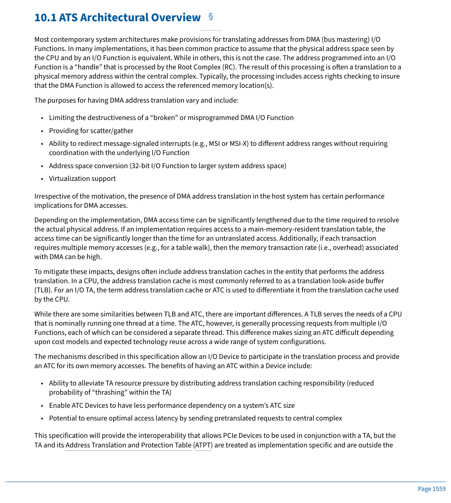

The ATS chapter provides a new set of TLP and associated semantics. ATS uses a request-completion protocol between a Device and a Root Complex (RC) to provide translation services. In addition, a new AT field is defined within the Memory Read and Memory Write TLP. The new AT field enables an RC to determine whether a given request has been translated or not via the ATS protocol.

§ Figure 10-2 illustrates the basic flow of an ATS Translation Request operation.

> **Figure 10-2.** Example ATS Translation Request/Completion Exchange
> 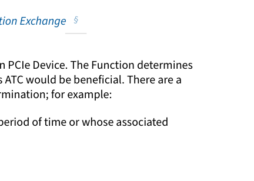

In this example, a Function-specific work request is received by a single-Function PCIe Device. The Function determines through an implementation specific method that caching a translation within its ATC would be beneficial. There are a number of considerations a Function or software can use in making such a determination; for example:
- Memory address ranges that will be frequently accessed over an extended period of time or whose associated buffer content is subject to a significant update rate

</td>
<td style="background-color:#e8e8e8">

本规范的范围内。虽然在其它 PCIe 组件内实现 ATS 也许是可行的,但本规范仅限于 PCIe 设备和 PCIe 根复合体集成端点 (Root Complex Integrated Endpoint, RCiEP)。

§ 图 10-1 展示了一个包含 TA 和 ATPT 以及一组 PCIe 设备和带集成 ATC 的 RC 集成端点的示例平台。TA 和 ATPT 是实现特定的,在给定的系统设计中可以是独立的组件,也可以是集成的组件。

ATS 章节引入了一组新的 TLP 及相关语义。ATS 使用设备与根复合体 (RC) 之间的请求-完成协议来提供转换服务。此外,在 Memory Read 和 Memory Write TLP 中定义了一个新的 AT 字段。新的 AT 字段使 RC 能够通过 ATS 协议确定给定请求是否已经被转换。

§ 图 10-2 展示了 ATS 转换请求操作的基本流程。

在此示例中,单功能 PCIe 设备收到一个功能特定的工作请求。该功能通过某种实现特定的方法判断,在其 ATC 中缓存一个转换是有益的。功能或软件在进行这种判断时可以考虑多种因素;例如:
- 长时间内频繁访问的内存地址范围,或相关缓冲区内容更新速率较高的地址范围

</td>
</tr>
</tbody>
</table>

[⬆️ 返回目录](#-本章目录-table-of-contents)

---

### 10.1.1 Address Translation Services (ATS) Overview § | 10.1.1 地址转换服务 (ATS) 概述 §

<table>
<thead>
<tr>
<th width="50%">🇬🇧 English</th>
<th width="50%" style="background-color:#e8e8e8">🇨🇳 中文</th>
</tr>
</thead>
<tbody>
<tr>
<td>

189 All references within this chapter to a Device apply equally to a PCIe Device or a Root Complex Integrated Endpoint. ATS does not delineate between these two types in terms of requirements, semantics, configuration, error handling, etc. From a software perspective, an ATS-capable Root Complex Integrated Endpoint must behave the same as an ATS-capable non-integrated Device.

- Memory address ranges, such as work and completion queue structures, data buffers for low-latency communications, graphics frame buffers, host memory that is used to cache Function-specific content, and so forth

Given the variability in designs and access patterns, there is no single criteria that can be applied.

The Function generates an ATS Translation Request which is sent upstream through the PCIe hierarchy to the RC which then forwards it to the TA. An ATS Translation Request uses the same routing and ordering rules as defined in this specification. Further, multiple ATS Translation Requests can be outstanding at any given time; i.e., one may pipeline multiple requests on one or more TC. Each TC represents a unique ordering domain and defines the domain that must be used by the associated ATS Translation Completion.

Upon receipt of an ATS Translation Request, the TA performs the following basic steps:
1. Validates that the Function has been configured to issue ATS Translation Requests.
2. Determines whether the Function may access the memory indicated by the ATS Translation Request and has the associated access rights.
3. Determines whether a translation can be provided to the Function. If yes, the TA issues a translation to the Function.
   a. ATS is required to support a variety of page sizes to accommodate a range of ATPT and processor implementations.
      i. Page sizes are required to be a power of two and naturally aligned.
      ii. The minimum supported page size is 4096 bytes. ATS capable components are required to support this minimum page size.
   b. A Function must be informed of the minimum translation or invalidate size it will be required to support to provide the Function an opportunity to optimize its resource utilization. The smallest minimum translation size must be 4096 bytes.
4. The TA communicates the success or failure of the request to the RC which generates an ATS Translation Completion and transmits via a Response TLP through a RP to the Function.
   a. An RC is required to generate at least one ATS Translation Completion per ATS Translation Request; i.e., there is minimally a 1:1 correspondence independent of the success or failure of the request.
      i. A successful translation can result in one or two ATS Translation Completion TLPs per request. The Translation Completion indicates the range of translation covered.
      ii. An RC may pipeline multiple ATS Translation Completions; i.e., an RC may return multiple ATS Translation Completions and these ATS Translation Completions may be in any order relative to ATS Translation Requests.
      iii. The RC is required to transmit the ATS Translation Completion using the same TC (Traffic Class) as the corresponding ATS Translation Request.
   b. The requested address may not be valid. The RC is required to issue a Translation Completion indicating that the requested address is not accessible.

When the Function receives the ATS Translation Completion and either updates its ATC to reflect the translation or notes that a translation does not exist. The Function proceeds with processing its work request and generates subsequent requests using either a translated address or an untranslated address based on the results of the Completion.
a. Similar to Read Completions, a Function is required to allocate resource space for each completion(s) without causing backpressure on the PCIe Link.
b. A Function is required to discard Translation Completions that might be "stale". Stale Translation Completions can occur for a variety of reasons.

</td>
<td style="background-color:#e8e8e8">

189 本章中所有对"设备"的引用同样适用于 PCIe 设备或根复合体集成端点。在要求、语义、配置、错误处理等方面,ATS 不区分这两种类型。从软件的角度看,支持 ATS 的根复合体集成端点必须与支持 ATS 的非集成设备行为相同。

- 内存地址范围,例如工作和完成队列结构、低延迟通信的数据缓冲区、图形帧缓冲区、用于缓存功能特定内容的主机内存等

鉴于设计和访问模式的多样性,无法应用单一的标准来判断。

该功能生成一个 ATS 转换请求,该请求通过 PCIe 层级向上游发送至 RC,RC 再将其转发给 TA。ATS 转换请求使用本规范中定义的相同路由和排序规则。此外,任意时刻可以有多个 ATS 转换请求处于未完成状态;即可以在一个或多个 TC 上流水线处理多个请求。每个 TC 表示一个唯一的排序域,并定义了关联的 ATS 转换完成必须使用的域。

TA 在收到 ATS 转换请求后,执行以下基本步骤:
1. 验证该功能已被配置为可发出 ATS 转换请求。
2. 确定该功能是否可以访问 ATS 转换请求所指示的内存,并具备相应的访问权限。
3. 确定是否可以向该功能提供转换。如果可以,TA 向该功能发出一个转换。
   a. ATS 需要支持多种页大小,以适应各种 ATPT 和处理器实现。
      i. 页大小必须是 2 的幂且自然对齐。
      ii. 最小支持的页大小为 4096 字节。支持 ATS 的组件必须支持该最小页大小。
   b. 必须通知功能其需要支持的最小转换或无效化大小,以便该功能有机会优化其资源利用率。最小的最小转换大小必须为 4096 字节。
4. TA 将请求成功或失败的结果通知 RC,RC 生成 ATS 转换完成并通过响应 TLP 经由 RP 发送给功能。
   a. RC 必须为每个 ATS 转换请求生成至少一个 ATS 转换完成;即,无论请求成功或失败,至少存在 1:1 的对应关系。
      i. 一次成功的转换可能产生一个或两个 ATS 转换完成 TLP。转换完成指示所覆盖的转换范围。
      ii. RC 允许流水线处理多个 ATS 转换完成;即,RC 可以返回多个 ATS 转换完成,这些 ATS 转换完成相对于 ATS 转换请求可以按任意顺序出现。
      iii. RC 必须使用与对应 ATS 转换请求相同的 TC(流量类)发送 ATS 转换完成。
   b. 请求的地址可能无效。RC 必须发出一个转换完成,表明所请求的地址不可访问。

当功能收到 ATS 转换完成时,它会更新其 ATC 以反映该转换,或者记录该转换不存在。然后,功能继续处理其工作请求,并根据完成的结果使用转换后地址或未转换地址生成后续请求。
a. 与读完成类似,功能必须为每个完成分配资源空间,且不会在 PCIe 链路上产生反压。
b. 功能必须丢弃可能"过期"的转换完成。过期转换完成可能由多种原因引起。

</td>
</tr>
</tbody>
</table>

[⬆️ 返回目录](#-本章目录-table-of-contents)

---

<<<PAGE_BREAK>>> page_1559

<<<PAGE_BREAK>>> page_1560

<<<PAGE_BREAK>>> page_1561

### 10.1.2 Page Request Interface Extension § | 10.1.2 页请求接口扩展 §

table>
<thead>
<tr>
<th width="50%">🇬🇧 English</th>
<th width="50%" style="background-color:#e8e8e8">🇨🇳 中文</th>
</tr>
</thead>
<tbody>
<tr>
<td>

As one can surmise, ATS Translation Request and Translation Completion processing is conceptually similar and, in many respects, identical to PCIe Read Request and Read Completion processing. This is intentional to reduce design complexity and to simplify integration of ATS into existing and new PCIe-based solutions. Keeping this in mind, ATS requires the following:
- ATS capable components must interoperate with [PCIe-1.1] compliant components.
- ATS is enabled through a new Capability and associated configuration structure. To enable ATS, software must detect this Capability and enable the Function to issue ATS TLP. If a Function is not enabled, the Function is required not to issue ATS Translation Requests and is required to issue all DMA Read and Write Requests with the TLP AT field set to "untranslated".
- ATS TLPs are routed using either address-based or ID-based routing.
- ATS TLPs are required to use the same ordering rules as specified in this specification.
- ATS TLPs are required to flow unmodified through [PCIe-1.1] compliant Switches.
- A Function is permitted to intermix translated and untranslated requests.
- ATS transactions are required not to rely upon the address field of a memory request to communicate additional information beyond its current use as defined by the PCI-SIG.

In contrast to the prior example, § Figure 10-3 illustrates an example Multi-Function Device. In this example Device, there are three Functions. Key points to note in § Figure 10-3 are:
- Each ATC is associated with a single Function. Each ATS-capable Function must be able to source and sink at least one of each ATS Translation Request or Translation Completion type.
- Each ATC is configured and accessed on a per Function basis. A Multi-Function Device is not required to implement ATS on every Function.
- If the ATC implementation shares resources among a set of Functions, then the logical behavior is required to be consistent with fully independent ATC implementations.

> **Figure 10-3.** Example Multi-Function Device with ATC per Function
> 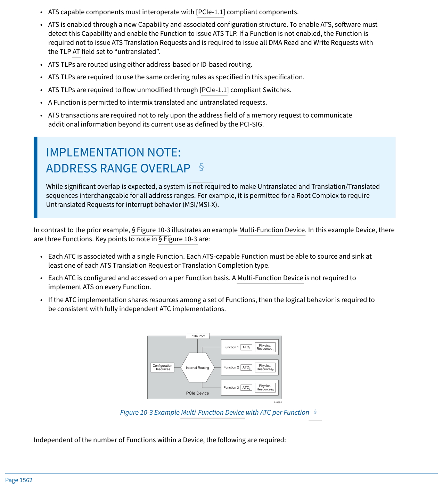

Independent of the number of Functions within a Device, the following are required:

> **IMPLEMENTATION NOTE:**
> **ADDRESS RANGE OVERLAP**
> While significant overlap is expected, a system is not required to make Untranslated and Translation/Translated sequences interchangeable for all address ranges. For example, it is permitted for a Root Complex to require Untranslated Requests for interrupt behavior (MSI/MSI-X).

</td>
<td style="background-color:#e8e8e8">

可以推断,ATS 转换请求和转换完成的处理在概念上类似于 PCIe 读请求和读完成处理,在许多方面完全相同。这是有意为之,以降低设计复杂度,并简化 ATS 集成到现有和新的基于 PCIe 的解决方案中。牢记这一点,ATS 要求如下:
- 支持 ATS 的组件必须与符合 [PCIe-1.1] 的组件互操作。
- 通过一个新的 Capability 和相关配置结构启用 ATS。要启用 ATS,软件必须检测该 Capability 并使该功能能够发出 ATS TLP。如果某个功能未被启用,则该功能不得发出 ATS 转换请求,且必须将所有 DMA 读和写请求的 TLP AT 字段设置为"untranslated"。
- ATS TLP 通过基于地址或基于 ID 的路由进行路由。
- ATS TLP 必须使用本规范中指定的相同排序规则。
- ATS TLP 必须不经修改地流经符合 [PCIe-1.1] 的交换机 (Switch)。
- 允许一个功能混合使用已转换和未转换请求。
- ATS 事务不得依赖内存请求的地址字段来传达除 PCI-SIG 当前定义用途之外的任何附加信息。

与前面的示例不同,§ 图 10-3 展示了一个多功能设备的示例。在此示例设备中,有三个功能。需要注意 § 图 10-3 中的关键点:
- 每个 ATC 与单个功能相关联。每个支持 ATS 的功能必须能够发出和接收至少一种 ATS 转换请求或转换完成类型。
- 每个 ATC 按功能粒度进行配置和访问。并不要求多功能设备在每个功能上都实现 ATS。
- 如果 ATC 实现在一组功能之间共享资源,则其逻辑行为必须与完全独立的 ATC 实现一致。

无论设备内的功能数量如何,以下要求都必须满足:

> **实现说明 (IMPLEMENTATION NOTE):**
> **地址范围重叠 (ADDRESS RANGE OVERLAP)**
> 虽然预计会有大量重叠,但系统不要求在所有地址范围内都使未转换和转换/已转换序列可互换。例如,允许根复合体对中断行为(MSI/MSI-X)要求使用未转换请求。

</td>
</tr>
</tbody>
</table>

[⬆️ 返回目录](#-本章目录-table-of-contents)

---

### 10.1.2 Page Request Interface Extension (continued) § | 10.1.2 页请求接口扩展 (续) §

<table>
<thead>
<tr>
<th width="50%">🇬🇧 English</th>
<th width="50%" style="background-color:#e8e8e8">🇨🇳 中文</th>
</tr>
</thead>
<tbody>
<tr>
<td>

- A Function is required not to issue any TLP with the AT field set unless the address within the TLP was obtained through the ATS Translation Request and Translation Completion protocol.
- Each ATC is required to only be populated using the ATS protocol; i.e., each entry within the ATC must be filled via an ATS Translation Completion in response to the Function issuing an ATS Translation Request for a given address.
- Each ATC cannot be modified except through the ATS protocol. That is:
   - Host system software cannot modify the ATC other than through the protocols defined in this specification except to invalidate one or more translations in an ATC. A Device or Function reset would be an example of an operation performed by software to change the contents of the ATC, but a reset is only allowed to invalidate entries not modify their contents.
   - It must not be possible for host system software to use software executing on the Device to modify the ATC.

When a TA determines that a Function should no longer maintain a translation within its ATC, the TA initiates the ATS invalidation protocol. The invalidation protocol consists of a single Invalidation Request and one or more Invalidate Completions.

As § Figure 10-4 illustrates, there are essentially three steps in the ATS Invalidation protocol:
1. The system software updates an entry in the tables used by the TA. After the table is changed, the TA determines that a translation should be invalidated in an ATC and initiates an Invalidation Request TLP which is transmitted from the RP to the example single-Function Device. The Invalidate Request communicates an untranslated address range, the TC, and an RP unique tag which is used to correlate Invalidate Completions with the Invalidation Request.
2. The Function receives the Invalidate Request and invalidates all matching ATC entries. A Function is not required to immediately flush all pending requests upon receipt of an Invalidate Request. If transactions are in a queue waiting to be sent, it is not necessary for the Function to expunge requests from the queue even if those transactions use an address that is being invalidated.
   a. A Function is required not to indicate the invalidation has completed until all outstanding Read Requests or Translation Requests that reference the associated translated address have been retired or nullified.
   b. A Function is required to ensure that the Invalidate Completion indication to the RC will arrive at the RC after any previously posted writes that use the "stale" address.
3. When a Function has ascertained that all uses of the translated address are complete, it issues one or more ATS Invalidate Completions.

</td>
<td style="background-color:#e8e8e8">

- 除非 TLP 中的地址是通过 ATS 转换请求和转换完成协议获得的,否则功能不得发出任何 AT 字段已设置的 TLP。
- 每个 ATC 必须仅通过 ATS 协议填充;即,ATC 中的每个条目必须通过响应该功能对给定地址发出的 ATS 转换请求的 ATS 转换完成来填充。
- 每个 ATC 不得通过 ATS 协议以外的方式修改。即:
   - 主机系统软件不得通过本规范中定义的协议以外的方式修改 ATC,只能使 ATC 中一个或多个转换无效。设备或功能复位是软件用来更改 ATC 内容的操作示例,但复位只能用于使条目无效,而不能修改其内容。
   - 不允许主机系统软件利用设备上执行的软件来修改 ATC。

当 TA 确定某个功能不应再在其 ATC 中保留某个转换时,TA 启动 ATS 无效化协议。无效化协议由单个无效化请求和一个或多个无效化完成组成。

正如 § 图 10-4 所示,ATS 无效化协议基本上包含三个步骤:
1. 系统软件更新 TA 所使用表中的一个条目。表变更后,TA 确定应在某个 ATC 中使一个转换无效,并启动一个无效化请求 TLP,该 TLP 从 RP 发送到示例单功能设备。无效化请求传达一个未转换地址范围、TC,以及一个 RP 唯一标签,该标签用于将无效化完成与无效化请求相关联。
2. 功能收到无效化请求并使所有匹配的 ATC 条目无效。功能无需在收到无效化请求时立即刷新所有挂起的请求。如果事务正在队列中等待发送,即使这些事务使用的地址正在被无效化,功能也无需从队列中删除这些请求。
   a. 功能在引用关联已转换地址的所有未完成读请求或转换请求已被退役或作废之前,不得声明无效化已完成。
   b. 功能必须确保发往 RC 的无效化完成指示将在使用"过期"地址的任何先前发布的写入之后到达 RC。
3. 当功能确认转换地址的所有使用均已完成时,它发出一个或多个 ATS 无效化完成。

</td>
</tr>
</tbody>
</table>

> **Figure 10-4.** Invalidation Protocol with a Single Invalidation Request and Completion
> 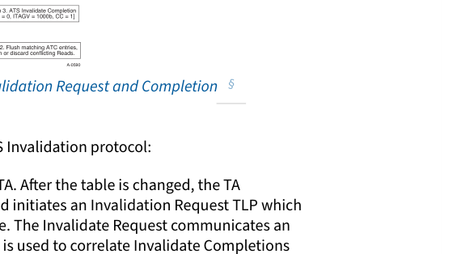

[⬆️ 返回目录](#-本章目录-table-of-contents)

---

### 10.1.2 Page Request Interface Extension (continued 2) § | 10.1.2 页请求接口扩展 (续二) §

table>
<thead>
<tr>
<th width="50%">🇬🇧 English</th>
<th width="50%" style="background-color:#e8e8e8">🇨🇳 中文</th>
</tr>
</thead>
<tbody>
<tr>
<td>

a. An Invalidate Completion is issued for each TC that may have referenced the range invalidated. These completions act as a flush mechanism to ensure the hierarchy is cleansed of any in-flight transactions which may contain references to the translated address.
   i. The number of Completions required is communicated within each Invalidate Completion. A TA or RC implementation can maintain a counter to ensure that all Invalidate Completions are received before considering the translation to no longer be in use.
   ii. If more than one Invalidation Complete is sent, the Invalidate Completion sent in each TC must be identical in the fields detailed in § Section 10.3.2.
b. An Invalidate Completion contains the ITAG from Invalidate Request to enable the RC to correlate Invalidate Requests and Completions.

> **Figure 10-5.** Single Invalidate Request with Multiple Invalidate Completions
> 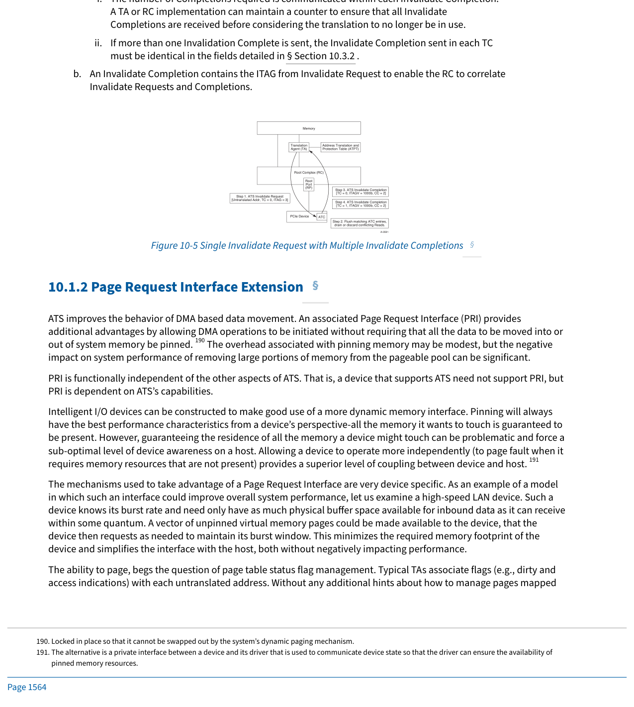

ATS improves the behavior of DMA based data movement. An associated Page Request Interface (PRI) provides additional advantages by allowing DMA operations to be initiated without requiring that all the data to be moved into or out of system memory be pinned.190 The overhead associated with pinning memory may be modest, but the negative impact on system performance of removing large portions of memory from the pageable pool can be significant.

PRI is functionally independent of the other aspects of ATS. That is, a device that supports ATS need not support PRI, but PRI is dependent on ATS's capabilities.

Intelligent I/O devices can be constructed to make good use of a more dynamic memory interface. Pinning will always have the best performance characteristics from a device's perspective-all the memory it wants to touch is guaranteed to be present. However, guaranteeing the residence of all the memory a device might touch can be problematic and force a sub-optimal level of device awareness on a host.191 Allowing a device to operate more independently (to page fault when it requires memory resources that are not present) provides a superior level of coupling between device and host.

The mechanisms used to take advantage of a Page Request Interface are very device specific. As an example of a model in which such an interface could improve overall system performance, let us examine a high-speed LAN device. Such a device knows its burst rate and need only have as much physical buffer space available for inbound data as it can receive within some quantum. A vector of unpinned virtual memory pages could be made available to the device, that the device then requests as needed to maintain its burst window. This minimizes the required memory footprint of the device and simplifies the interface with the host, both without negatively impacting performance.

The ability to page, begs the question of page table status flag management. Typical TAs associate flags (e.g., dirty and access indications) with each untranslated address. Without any additional hints about how to manage pages mapped

</td>
<td style="background-color:#e8e8e8">

a. 对于可能引用了被无效化范围的每个 TC,都发出一个无效化完成。这些完成充当一种刷新机制,以确保层级中清除所有可能包含对已转换地址引用的在途事务。
   i. 所需完成数在每个无效化完成中传达。TA 或 RC 实现可以维护一个计数器,以确保在考虑转换不再使用之前已收到所有无效化完成。
   ii. 如果发送了多个无效化完成,则在每个 TC 中发送的无效化完成在 § 第 10.3.2 节中详述的字段上必须相同。
b. 无效化完成包含来自无效化请求的 ITAG,以使 RC 能够将无效化请求和完成相关联。

ATS 改善了基于 DMA 的数据移动行为。关联的页请求接口 (Page Request Interface, PRI) 提供了额外优势,允许启动 DMA 操作而无需要求所有要移入或移出系统内存的数据都被钉住 (pinned)。190 与钉住内存相关的开销可能不大,但将大块内存从可分页池中移除对系统性能的负面影响可能很显著。

PRI 在功能上独立于 ATS 的其他方面。即,支持 ATS 的设备无需支持 PRI,但 PRI 依赖于 ATS 的能力。

智能 I/O 设备可以构建为更好地利用更动态的内存接口。从设备的角度看,钉住始终具有最佳的性能特征——它想要访问的所有内存保证存在。然而,保证设备可能访问的所有内存驻留可能存在问题,并迫使主机对设备的感知处于次优水平。191 允许设备更独立地运行(在需要不在场的内存资源时触发缺页)提供了设备和主机之间更优的耦合。

利用页请求接口的机制非常特定于设备。作为此类接口可以改善整体系统性能的模型示例,让我们考察一个高速 LAN 设备。这样的设备知道其突发速率,只需拥有足够容纳其在某个量程内能接收的入站数据的物理缓冲区空间。一组未钉住的虚拟内存页可供设备使用,设备根据需要请求这些页以维持其突发窗口。这最小化了设备所需的内存占用,并简化了与主机的接口,同时不会对性能产生负面影响。

分页的能力引出了页表状态标志管理的问题。典型 TA 会为每个未转换地址关联标志(例如 dirty 和 access 指示)。在没有关于如何管理映射到功能的页的额外提示时,

</td>
</tr>
</tbody>
</table>

[⬆️ 返回目录](#-本章目录-table-of-contents)

---

### 10.1.3 Process Address Space ID (PASID) § | 10.1.3 进程地址空间 ID (PASID) §

<table>
<thead>
<tr>
<th width="50%">🇬🇧 English</th>
<th width="50%" style="background-color:#e8e8e8">🇨🇳 中文</th>
</tr>
</thead>
<tbody>
<tr>
<td>

190 Locked in place so that it cannot be swapped out by the system's dynamic paging mechanism.
191 The alternative is a private interface between a device and its driver that is used to communicate device state so that the driver can ensure the availability of pinned memory resources.

to a Function, such TAs would need to conservatively assume that when they grant a Function permission to read or write a page, that Function will use the permission. Such writable pages would need to be marked as dirty before their translated addresses are made available to a Function.

This conservative dirty-on-write-permission-grant behavior is generally not a significant issue for Functions that do not support paging, where pages are pinned and the cost of saving a clean page to memory will seldom be paid. However, Functions that support the Page Request Interface could pay a significant penalty if all writable pages are treated as dirty, since such Functions operate without pinning their accessible memory footprints and may issue speculative page requests for performance. The cost of saving clean pages (instead of just discarding them) in such systems can diminish the value of otherwise attractive paging techniques. This can cause significant performance issues and risk functional issues in circumstances where the backing store is unable to be written, such as a CD-ROM.

The No Write (NW flag in Translation Requests indicates that a Function is willing to restrict its usage to only reading the page, independent of the access rights that would otherwise have been granted.

If a device chooses to request only read access by issuing a Translation Request with the NW flag Set and later determines that it needs to write to the page, then the device must issue a new Translation Request.

Upon receiving a Translation Request with the NW flag Clear, TAs are permitted to mark the associated pages dirty. Functions MUST@FLIT not issue such Requests unless they have been given explicit write permission. An example of write permission is where the host issues a command to a Function to load data from a storage device and write that data into memory.

Certain TLPs can optionally be associated with a Process Address Space ID (PASID). This value is conveyed using the PASID TLP Prefix (NFM) or OHC-A (FM). The PASID TLP Prefix is defined in § Section 6.20.

PASID is permitted for the following types of TLPs:
- Memory Requests (including AtomicOp Requests) with Address Type (AT) of Untranslated or Translated
- Address Translation Requests (i.e., MRd with AT=01b)
- Page Request Messages
- ATS Invalidation Request Messages
- PRG Response Messages
- Address routed messages in Flit Mode

Usage of PASID for Untranslated Memory Requests is defined in § Section 6.20. This section describes PASID for the remaining TLPs.

Each Function has an independent set of PASID values. The PASID field is 20 bits wide, although typically the number of active PASID values will be significantly lower than 2^20. PASID values may be allocated sparsely. If the usable width is constrained by the TA or the ATC, the unused upper bits of the PASID value must be 0b. All 2^usable_width PASID values are usable. Function hardware is not permitted to assume there are "reserved" PASID values.

An ATC may optionally support Translated Requests with PASID. The Translated Requests with PASID feature is enabled when the Translated Requests with PASID Enable bit is Set. When Translated Requests with PASID Enable is Set, an ATC is permitted to issue Translated Requests with a PASID. When enabled, if the ATC obtained a translation using a Translation Request with PASID, the corresponding Translated Request must carry the same PASID as the Translation Request, the Privileged Mode Requested bit must match the Privileged Mode Access bit in the Translation Response, and the Execute Requested bit is permitted to be Set only if the Execute Permitted bit in the Translation Response was Set. Similarly, if the ATC obtained a translation using a Translation Request without a PASID, the corresponding Translated Request must not carry a PASID. If these rules are not followed the resulting system behavior is undefined.

</td>
<td style="background-color:#e8e8e8">

190 锁定在适当位置,以使其不能被系统的动态分页机制换出。
191 另一种方法是在设备及其驱动程序之间使用一个私有接口来传达设备状态,以便驱动程序可以确保钉住内存资源的可用性。

这些 TA 必须保守地假设:当它们授予某个功能对页的读或写权限时,该功能将使用该权限。在将转换后的地址提供给该功能之前,这些可写页必须被标记为 dirty。

对于不支持分页的功能(其页被钉住,且很少付出将干净页保存到内存的代价)而言,这种在授予写权限时即标记为 dirty 的保守行为通常不是大问题。但是,对于支持页请求接口的功能,如果所有可写页都被视为 dirty,则可能付出显著代价,因为这些功能在不钉住其可访问内存占用区的情况下运行,并且可能为性能而发出推测性页请求。在此类系统中保存干净页(而不是直接丢弃)的成本会削弱分页技术原本的价值。这可能导致显著的性能问题,并在某些情形下(例如 CD-ROM 无法写入其后备存储时)存在功能性问题。

No Write 标志(转换请求中的 NW 标志)表示功能愿意将其使用限制为仅读取该页,无论本应被授予的访问权限如何。

如果设备通过发出 NW 标志置位的转换请求来仅请求读访问,并随后确定需要写入该页,则设备必须发出一个新的转换请求。

当收到 NW 标志清零的转换请求时,TA 允许将关联页标记为 dirty。除非功能已被授予明确的写权限,否则功能 **MUST@FLIT** 不发出此类请求。写权限的一个示例是主机向功能发出命令以从存储设备加载数据并将该数据写入内存。

某些 TLP 可选择性地与进程地址空间 ID (Process Address Space ID, PASID) 关联。该值通过 PASID TLP Prefix(NFM)或 OHC-A(FM)传递。PASID TLP Prefix 在 § 第 6.20 节中定义。

以下类型的 TLP 允许使用 PASID:
- 地址类型 (AT) 为 Untranslated 或 Translated 的内存请求(包括 AtomicOp 请求)
- 地址转换请求(即 AT=01b 的 MRd)
- 页请求消息
- ATS 无效化请求消息
- PRG 响应消息
- Flit 模式下的地址路由消息

未转换内存请求的 PASID 使用在 § 第 6.20 节中定义。本节描述其余 TLP 的 PASID 用法。

每个功能具有独立的 PASID 值集合。PASID 字段宽度为 20 位,尽管活动 PASID 值的数量通常远小于 2^20。PASID 值可以稀疏分配。如果可用宽度受 TA 或 ATC 限制,则 PASID 值未使用的高位必须为 0b。所有 2^usable_width 个 PASID 值都可用。不允许功能硬件假设存在"保留"PASID 值。

ATC 可选择性地支持带 PASID 的已转换请求。当 Translated Requests with PASID Enable 位置位时,启用带 PASID 的已转换请求功能。启用后,如果 ATC 通过带 PASID 的转换请求获得转换,则对应的已转换请求必须携带与转换请求相同的 PASID,Privileged Mode Requested 位必须与转换响应中的 Privileged Mode Access 位匹配,Execute Requested 位仅在转换响应中 Execute Permitted 位置位时才允许置位。类似地,如果 ATC 通过不带 PASID 的转换请求获得转换,则对应的已转换请求不得携带 PASID。如果不遵守这些规则,由此产生的系统行为未定义。

</td>
</tr>
</tbody>
</table>

[⬆️ 返回目录](#-本章目录-table-of-contents)

---

### 10.1.4 ATS Memory Attributes § | 10.1.4 ATS 内存属性 §

table>
<thead>
<tr>
<th width="50%">🇬🇧 English</th>
<th width="50%" style="background-color:#e8e8e8">🇨🇳 中文</th>
</tr>
</thead>
<tbody>
<tr>
<td>

ATS Memory Attributes (AMAs) provide hints for performing memory operations such as cache management. The AMAs may be supplied to an Endpoint device by a Translation Completion and stored in the ATC. If the ATS Memory Attributes Enable bit is Set, the Endpoint function retrieves the AMAs from the ATC and is permitted to provide AMAs with Memory Read/Write TLPs using the TPH TLP Prefix. This serves as a performance optimization by preventing the TA from having to perform a look-up. The TA and ATC are permitted to support AMAs. If the ATC does not support AMAs but the TA does, then the TA is permitted to perform a lookup to obtain AMAs when processing Memory Read/Write TLPs received from the Endpoint device. A TA that supports AMAs is permitted to always return AMAs in all ATS Translation Completions to all Endpoints.

A TA does translations. An ATC can cache those translations. If an ATC is separated from the TA by PCIe, the memory request from an ATC will need to be able to indicate if the address in the transaction is translated or not. The modifications to the memory transactions are described in this section, as are the transactions that are used to communicate translations between a remote ATC and a central TA.

When Shadow Functions are enabled, the TA must treat identically all Requests from the "main" Function and its Shadows (See Section 7.9.21). This usually involves ensuring that system software configures the translation tables used by the TA provide identical answers for the "main" Function and its Shadows. Depending on the architecture of a specific TA, more work may be required (e.g., managing dirty bits, ensuring caches are consistent, etc.). Such work is outside the scope of this specification.

</td>
<td style="background-color:#e8e8e8">

ATS 内存属性 (ATS Memory Attributes, AMA) 为执行内存操作(如缓存管理)提供提示。AMA 可以由转换完成提供给端点设备,并存储在 ATC 中。如果 ATS Memory Attributes Enable 位置位,则端点功能从 ATC 检索 AMA,并允许使用 TPH TLP Prefix 在内存读/写 TLP 中提供 AMA。这作为一种性能优化,避免了 TA 必须执行查找。TA 和 ATC 允许支持 AMA。如果 ATC 不支持 AMA 而 TA 支持,则 TA 在处理从端点设备接收的内存读/写 TLP 时允许执行查找以获取 AMA。支持 AMA 的 TA 允许始终在发送给所有端点的所有 ATS 转换完成中返回 AMA。

TA 执行转换。ATC 可以缓存这些转换。如果 ATC 与 TA 之间通过 PCIe 隔离,则来自 ATC 的内存请求需要能够指示事务中的地址是否已转换。本节描述对内存事务的修改,以及用于在远程 ATC 和中央 TA 之间传达转换的事务。

当启用影子功能 (Shadow Function) 时,TA 必须以相同方式处理来自"主"功能及其影子的所有请求(参见第 7.9.21 节)。这通常涉及确保系统软件配置 TA 使用的转换表,为"主"功能及其影子提供相同的答案。根据特定 TA 的架构,可能需要做更多的工作(例如管理 dirty 位、确保缓存一致性等)。此类工作不在本规范范围内。

</td>
</tr>
</tbody>
</table>

[⬆️ 返回目录](#-本章目录-table-of-contents)

---

## 10.2 ATS Translation Services § | 10.2 ATS 转换服务 §

<table>
<thead>
<tr>
<th width="50%">🇬🇧 English</th>
<th width="50%" style="background-color:#e8e8e8">🇨🇳 中文</th>
</tr>
</thead>
<tbody>
<tr>
<td>

A Function with an ATC can send Memory Requests that contain either translated or untranslated addresses. The Address Type (AT) field is used to indicate the type of address that is present in the request header (see § Figure 10-6, § Figure 10-7, § Figure 10-8, and § Figure 10-9).

In NFM, the AT field in the Requests is a redefinition of a reserved field in earlier version of this specification. Functions that do not implement an ATC will continue to set the AT field to its defined reserved value (00b). Functions that implement an ATC will set the AT field as listed in § Table 10-1.

</td>
<td style="background-color:#e8e8e8">

带 ATC 的功能可以发送包含已转换或未转换地址的内存请求。地址类型 (Address Type, AT) 字段用于指示请求头中存在的地址类型(参见 § 图 10-6、§ 图 10-7、§ 图 10-8 和 § 图 10-9)。

在 NFM 中,请求中的 AT 字段是对本规范早期版本中保留字段的重新定义。未实现 ATC 的功能将继续把 AT 字段设置为其定义的保留值(00b)。实现 ATC 的功能将按 § 表 10-1 所列设置 AT 字段。

</td>
</tr>
</tbody>
</table>

> **Figure 10-6.** Memory Request Header with 64-bit Address Highlighting AT field
> 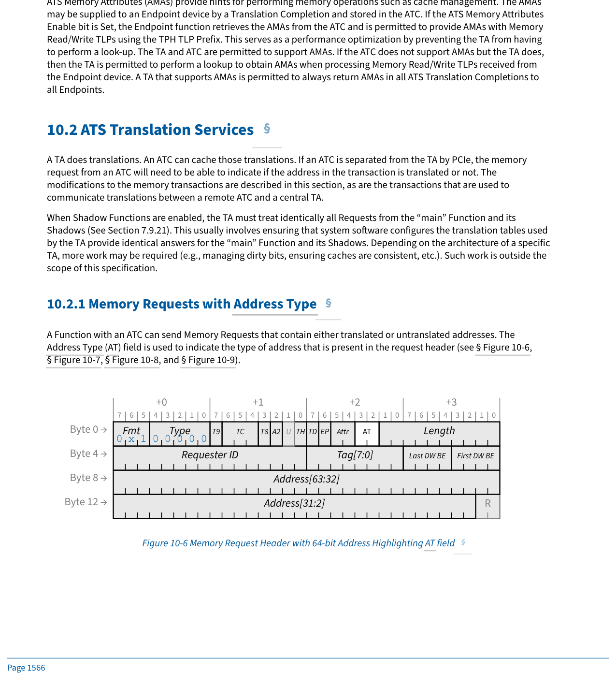

> **Figure 10-7.** Memory Request Header with 32-bit Address Highlighting AT field
> 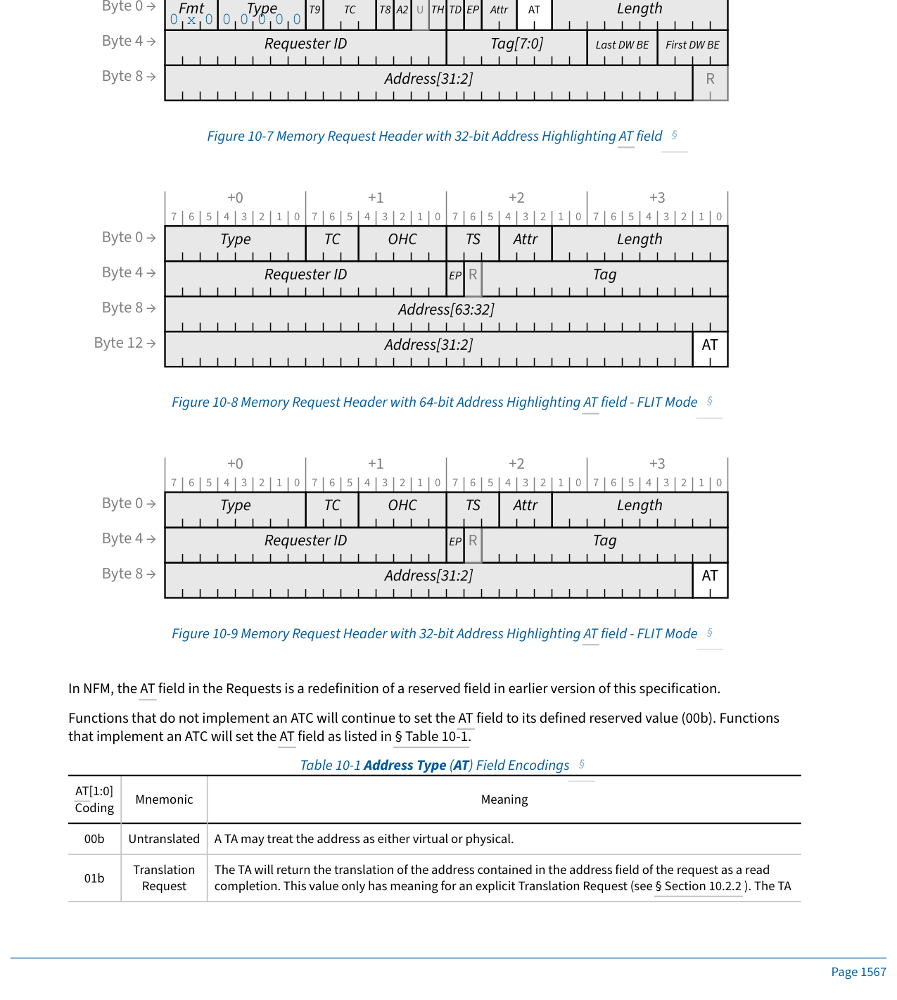

> **Figure 10-8.** Memory Request Header with 64-bit Address Highlighting AT field - FLIT Mode
> 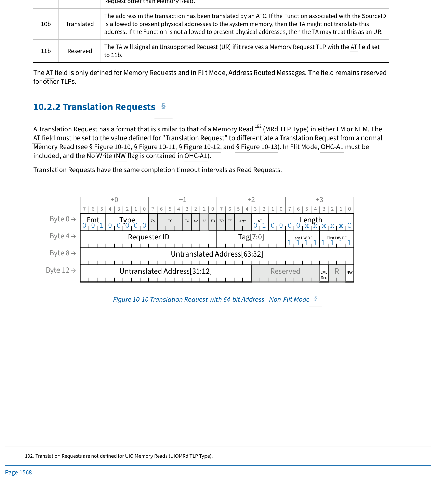

> **Figure 10-9.** Memory Request Header with 32-bit Address Highlighting AT field - FLIT Mode
> 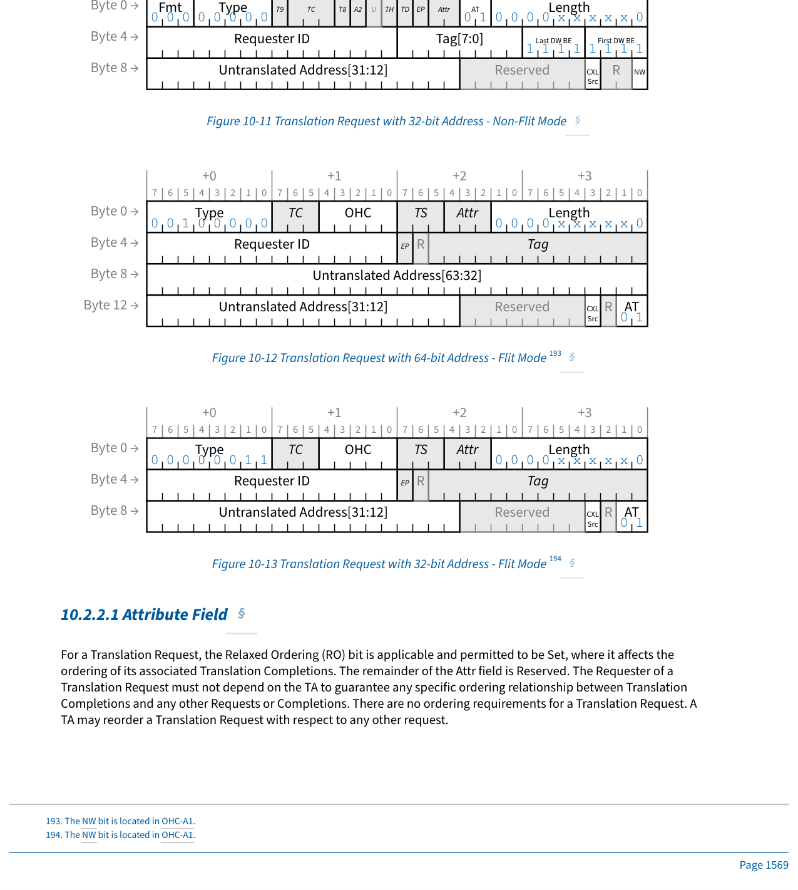

[⬆️ 返回目录](#-本章目录-table-of-contents)

---

<<<PAGE_BREAK>>> page_1562

<<<PAGE_BREAK>>> page_1563

<<<PAGE_BREAK>>> page_1564

<<<PAGE_BREAK>>> page_1565

<<<PAGE_BREAK>>> page_1566

<<<PAGE_BREAK>>> page_1567

### 10.2.1 Memory Requests with Address Type § | 10.2.1 带地址类型的内存请求 §

table>
<thead>
<tr>
<th width="50%">🇬🇧 English</th>
<th width="50%" style="background-color:#e8e8e8">🇨🇳 中文</th>
</tr>
</thead>
<tbody>
<tr>
<td>

**Table 10-1. Address Type (AT) Field Encodings | 表 10-1 地址类型 (AT) 字段编码**

| AT[1:0] | Coding | Mnemonic | Meaning |
|---------|--------|----------|---------|
| 00b | Untranslated | Untranslated | A TA may treat the address as either virtual or physical. |
| 01b | Translation Request | Translation Request | The TA will return the translation of the address contained in the address field of the request as a read completion. This value only has meaning for an explicit Translation Request (see § Section 10.2.2). The TA will signal an Unsupported Request (UR) if it receives a TLP with the AT field set to 01b in a Memory Request other than Memory Read. |
| 10b | Translated | Translated | The address in the transaction has been translated by an ATC. If the Function associated with the SourceID is allowed to present physical addresses to the system memory, then the TA might not translate this address. If the Function is not allowed to present physical addresses, then the TA may treat this as an UR. |
| 11b | Reserved | Reserved | The TA will signal an Unsupported Request (UR) if it receives a Memory Request TLP with the AT field set to 11b. |

The AT field is only defined for Memory Requests and in Flit Mode, Address Routed Messages. The field remains reserved for other TLPs.

</td>
<td style="background-color:#e8e8e8">

**Table 10-1. Address Type (AT) Field Encodings | 表 10-1 地址类型 (AT) 字段编码**

| AT[1:0] | 编码 | 助记符 | 含义 |
|---------|--------|----------|---------|
| 00b | Untranslated | 未转换 | TA 可以将该地址视为虚拟地址或物理地址。 |
| 01b | Translation Request | 转换请求 | TA 将把请求地址字段中包含的地址的转换作为读完成返回。该值仅对显式转换请求有意义(参见 § 第 10.2.2 节)。如果 TA 在非内存读的内存请求中收到 AT 字段设置为 01b 的 TLP,将发出 Unsupported Request (UR) 信号。 |
| 10b | Translated | 已转换 | 事务中的地址已由 ATC 转换。如果与 SourceID 关联的功能被允许向系统内存呈现物理地址,则 TA 可能不会转换此地址。如果该功能不被允许呈现物理地址,则 TA 可以将其视为 UR。 |
| 11b | Reserved | 保留 | 如果 TA 收到 AT 字段设置为 11b 的内存请求 TLP,将发出 Unsupported Request (UR) 信号。 |

AT 字段仅对内存请求以及 Flit 模式下的地址路由消息有定义。对于其他 TLP,该字段仍为保留。

</td>
</tr>
</tbody>
</table>

[⬆️ 返回目录](#-本章目录-table-of-contents)

---

### 10.2.2 Translation Requests § | 10.2.2 转换请求 §

<table>
<thead>
<tr>
<th width="50%">🇬🇧 English</th>
<th width="50%" style="background-color:#e8e8e8">🇨🇳 中文</th>
</tr>
</thead>
<tbody>
<tr>
<td>

A Translation Request has a format that is similar to that of a Memory Read192 (MRd TLP Type) in either FM or NFM. The AT field must be set to the value defined for "Translation Request" to differentiate a Translation Request from a normal Memory Read (see § Figure 10-10, § Figure 10-11, § Figure 10-12, and § Figure 10-13). In Flit Mode, OHC-A1 must be included, and the No Write (NW flag is contained in OHC-A1).

Translation Requests have the same completion timeout intervals as Read Requests.

193

194

For a Translation Request, the Relaxed Ordering (RO) bit is applicable and permitted to be Set, where it affects the ordering of its associated Translation Completions. The remainder of the Attr field is Reserved. The Requester of a Translation Request must not depend on the TA to guarantee any specific ordering relationship between Translation Completions and any other Requests or Completions. There are no ordering requirements for a Translation Request. A TA may reorder a Translation Request with respect to any other request.

193 The NW bit is located in OHC-A1.
194 The NW bit is located in OHC-A1.

</td>
<td style="background-color:#e8e8e8">

转换请求的格式在 FM 或 NFM 中均类似于内存读192(MRd TLP 类型)。AT 字段必须设置为"Translation Request"所定义的值,以将转换请求与普通内存读区分开(参见 § 图 10-10、§ 图 10-11、§ 图 10-12 和 § 图 10-13)。在 Flit 模式下,必须包含 OHC-A1,且 No Write (NW 标志)包含在 OHC-A1 中。

转换请求的完成超时间隔与读请求相同。

对于转换请求,Relaxed Ordering (RO) 位适用并允许置位,此时它会影响其关联的转换完成的排序。Attr 字段的其余部分保留。转换请求的请求者不得依赖 TA 来保证转换完成与任何其他请求或完成之间的任何特定排序关系。转换请求没有排序要求。TA 可以相对于任何其他请求重新排序转换请求。

193 NW 位位于 OHC-A1 中。
194 NW 位位于 OHC-A1 中。

</td>
</tr>
</tbody>
</table>

> **Figure 10-12.** Translation Request with 64-bit Address - Flit Mode
> 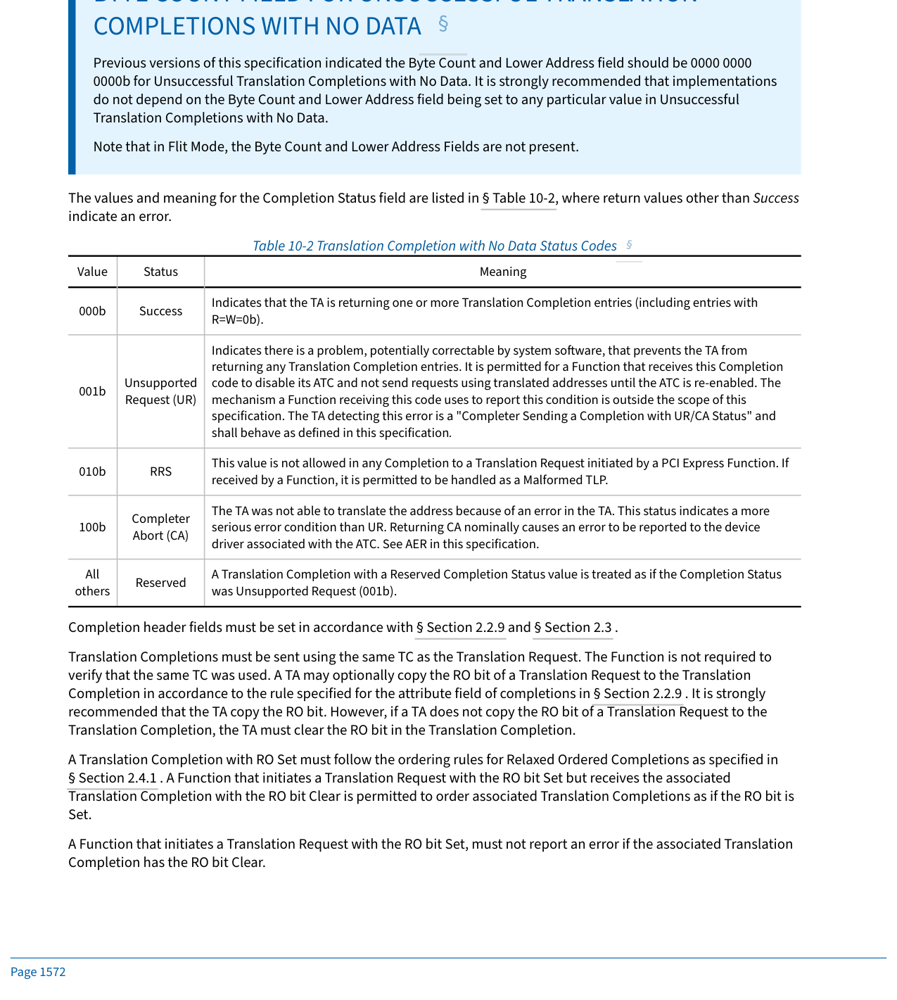

> **Figure 10-13.** Translation Request with 32-bit Address - Flit Mode
> 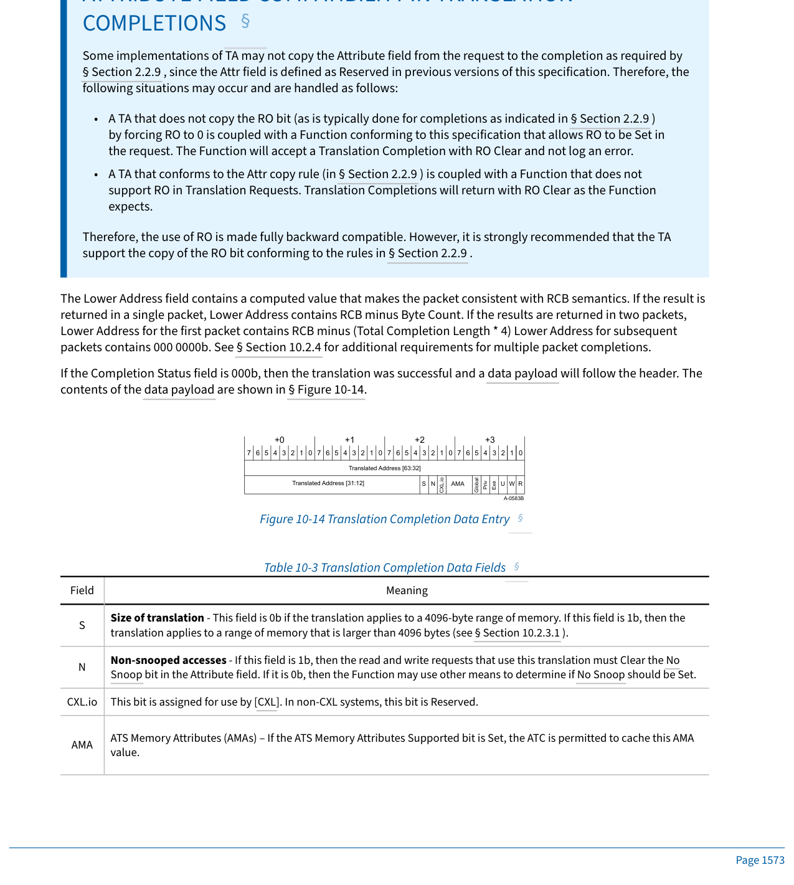

[⬆️ 返回目录](#-本章目录-table-of-contents)

---

#### 10.2.2.1 Attribute Field § | 10.2.2.1 属性字段 §

table>
<thead>
<tr>
<th width="50%">🇬🇧 English</th>
<th width="50%" style="background-color:#e8e8e8">🇨🇳 中文</th>
</tr>
</thead>
<tbody>
<tr>
<td>

The Length field is set to indicate how many translations may be returned in response to this request. Each translation is 8 bytes in length and represents one or more STUs (Smallest Translation Unit). The maximum setting for the Length field is the RCB of the Root Port as determined by Read Completion Boundary (RCB) in the Link Control Register. The Length field in a Translation Request must always indicate an even number of DWORDs. If Length is set to indicate a value greater than allowed, or if the least-significant bit of the Length field is non-zero, then the resulting handling by the TA is undefined.195

If the Length field has a value greater than two, then the Function is requesting translations for a range of memory greater than a single STU. The additional translations, if provided, are assumed to be for sequentially-increasing, equal-sized, STU-aligned regions, starting at the requested address.

The Tag field has the same meaning as in a Memory Read Request.

A Translation Request includes either a 32-bit or a 64-bit Untranslated Address field. This field indicates the address to be translated. The TA will make decisions about the validity of the request, based on the address in the translation request. The TA is permitted to return fewer translations than requested, but it will not return more.

When multiple translations are requested, the TA will not return a translation if the range of that translation does not overlap the implied range of the Translation Request (this would only apply to translations after the initial value). The implied range of the Translation Request is [2^STU+12 * (Length/2)] bytes.

The Untranslated Address field in the Translation Request is any address in the range of the first STU. Address bits 11:0 are not present in the Translation Request and are implied to be zero. If a Requester has Page Aligned Request Set (see § Section 7.8.9.2), it must ensure that bits 11:2 are zero. If a Requester has Page Aligned Request Clear, it is permitted to supply any value for bits 11:2.196 The TA must ignore bits 11:2 as well as any low-order bits not required to determine the translation.

For example, if using 64-bit addressing for a Function with the Page Aligned Request bit Set that is programmed with an STU of 1 (i.e., 8192-byte pages), bits 63:13 are significant, bit 12 is ignored by the TA and bits 11:0 are implied to be zero.

> **IMPLEMENTATION NOTE:**
> **TRANSLATION REQUEST ORDERING**
> Because no ordering can be assumed between Translation Requests and other types of Requests, a Translation Request does not make an effective flushing/ordering primitive.

</td>
<td style="background-color:#e8e8e8">

Length 字段设置以指示可作为此请求的响应返回的转换数。每个转换长度为 8 字节,表示一个或多个 STU(最小转换单元,Smallest Translation Unit)。Length 字段的最大设置值为根端口的 RCB,由链路控制寄存器中的读完成边界 (Read Completion Boundary, RCB) 决定。转换请求中的 Length 字段必须始终表示偶数个 DWORD。如果 Length 设置为大于允许值的值,或 Length 字段的最低有效位非零,则 TA 对此的处理未定义。195

如果 Length 字段的值大于 2,则功能正在为大于单个 STU 的内存范围请求转换。额外转换(若提供)假定为从请求地址开始的、顺序递增的、等大小、STU 对齐的区域。

Tag 字段的含义与内存读请求中的含义相同。

转换请求包含 32 位或 64 位的未转换地址字段。该字段指示要转换的地址。TA 将根据转换请求中的地址对请求的有效性做出判断。TA 允许返回少于请求数量的转换,但不会返回更多。

当请求多个转换时,如果某个转换的范围与转换请求的隐含范围不重叠(这仅适用于初始值之后的转换),TA 不会返回该转换。转换请求的隐含范围为 [2^STU+12 * (Length/2)] 字节。

转换请求中的未转换地址字段是第一个 STU 范围内任意地址。地址位 11:0 不出现在转换请求中,隐含为零。如果请求者的 Page Aligned Request 已设置(参见 § 第 7.8.9.2 节),则必须确保位 11:2 为零。如果请求者的 Page Aligned Request 已清零,则允许为位 11:2 提供任意值。196 TA 必须忽略位 11:2 以及确定转换不需要的任何低位。

例如,对于 Page Aligned Request 位置位且 STU 编程为 1(即 8192 字节页)的功能使用 64 位寻址时,位 63:13 有效,位 12 被 TA 忽略,位 11:0 隐含为零。

> **实现说明 (IMPLEMENTATION NOTE):**
> **转换请求排序 (TRANSLATION REQUEST ORDERING)**
> 由于在转换请求与其他类型请求之间无法假设任何排序关系,转换请求并不构成有效的刷新/排序原语。

</td>
</tr>
</tbody>
</table>

[⬆️ 返回目录](#-本章目录-table-of-contents)

---

#### 10.2.2.2 Length Field § | 10.2.2.2 Length 字段 §

<table>
<thead>
<tr>
<th width="50%">🇬🇧 English</th>
<th width="50%" style="background-color:#e8e8e8">🇨🇳 中文</th>
</tr>
</thead>
<tbody>
<tr>
<td>

195 Due to ambiguous text in earlier versions of this document, it should be assumed that an unrecoverable error condition may occur.
196 Note: The Page Aligned Request bit was added in Revision 1.1 of the ATS Specification.

</td>
<td style="background-color:#e8e8e8">

195 由于本规范早期版本中含糊的措辞,应假设可能发生不可恢复的错误情况。
196 注:Page Aligned Request 位在 ATS 规范第 1.1 版中新增。

</td>
</tr>
</tbody>
</table>

[⬆️ 返回目录](#-本章目录-table-of-contents)

---

<<<PAGE_BREAK>>> page_1568

<<<PAGE_BREAK>>> page_1569

<<<PAGE_BREAK>>> page_1570

<<<PAGE_BREAK>>> page_1571

#### 10.2.2.3 Tag Field § | 10.2.2.3 Tag 字段 §

<table>
<thead>
<tr>
<th width="50%">🇬🇧 English</th>
<th width="50%" style="background-color:#e8e8e8">🇨🇳 中文</th>
</tr>
</thead>
<tbody>
<tr>
<td>

The Tag field has the same meaning as in a Memory Read Request.

A Translation Request includes either a 32-bit or a 64-bit Untranslated Address field. This field indicates the address to be translated. The TA will make decisions about the validity of the request, based on the address in the translation request. The TA is permitted to return fewer translations than requested, but it will not return more.

When multiple translations are requested, the TA will not return a translation if the range of that translation does not overlap the implied range of the Translation Request (this would only apply to translations after the initial value). The implied range of the Translation Request is [2^STU+12 * (Length/2)] bytes.

The Untranslated Address field in the Translation Request is any address in the range of the first STU. Address bits 11:0 are not present in the Translation Request and are implied to be zero. If a Requester has Page Aligned Request Set (see § Section 7.8.9.2), it must ensure that bits 11:2 are zero. If a Requester has Page Aligned Request Clear, it is permitted to supply any value for bits 11:2. The TA must ignore bits 11:2 as well as any low-order bits not required to determine the translation.

For example, if using 64-bit addressing for a Function with the Page Aligned Request bit Set that is programmed with an STU of 1 (i.e., 8192-byte pages), bits 63:13 are significant, bit 12 is ignored by the TA and bits 11:0 are implied to be zero.

> **IMPLEMENTATION NOTE:**
> **TRANSLATION REQUEST ORDERING**
> Because no ordering can be assumed between Translation Requests and other types of Requests, a Translation Request does not make an effective flushing/ordering primitive.

</td>
<td style="background-color:#e8e8e8">

Tag 字段的含义与内存读请求中的含义相同。

转换请求包含 32 位或 64 位的未转换地址字段。该字段指示要转换的地址。TA 将根据转换请求中的地址对请求的有效性做出判断。TA 允许返回少于请求数量的转换,但不会返回更多。

当请求多个转换时,如果某个转换的范围与转换请求的隐含范围不重叠(这仅适用于初始值之后的转换),TA 不会返回该转换。转换请求的隐含范围为 [2^STU+12 * (Length/2)] 字节。

转换请求中的未转换地址字段是第一个 STU 范围内任意地址。地址位 11:0 不出现在转换请求中,隐含为零。如果请求者的 Page Aligned Request 已设置(参见 § 第 7.8.9.2 节),则必须确保位 11:2 为零。如果请求者的 Page Aligned Request 已清零,则允许为位 11:2 提供任意值。TA 必须忽略位 11:2 以及确定转换不需要的任何低位。

例如,对于 Page Aligned Request 位置位且 STU 编程为 1(即 8192 字节页)的功能使用 64 位寻址时,位 63:13 有效,位 12 被 TA 忽略,位 11:0 隐含为零。

> **实现说明 (IMPLEMENTATION NOTE):**
> **转换请求排序 (TRANSLATION REQUEST ORDERING)**
> 由于在转换请求与其他类型请求之间无法假设任何排序关系,转换请求并不构成有效的刷新/排序原语。

</td>
</tr>
</tbody>
</table>

[⬆️ 返回目录](#-本章目录-table-of-contents)

---

#### 10.2.2.4 Untranslated Address Field § | 10.2.2.4 未转换地址字段 §

table>
<thead>
<tr>
<th width="50%">🇬🇧 English</th>
<th width="50%" style="background-color:#e8e8e8">🇨🇳 中文</th>
</tr>
</thead>
<tbody>
<tr>
<td>

The No Write flag, when Set, indicates that the Function is requesting read-only access for this translation.197

The TA may ignore the No Write Flag, however, if the TA responds with a translation marked as read-only then the Function must not issue Memory Write transactions using that translation. In this case, the Function may issue another translation request with the No Write flag Clear, which may result in a new translation completion with or without the W (Write) bit Set.

Upon receiving a Translation Request with the NW flag Clear, TAs are permitted to mark the associated pages dirty. Functions MUST@FLIT not issue such Requests unless they have been given explicit write permission.

In Flit Mode, the NW bit is part of OHC-A1.

</td>
<td style="background-color:#e8e8e8">

当 No Write 标志置位时,表示该功能正在为该转换请求只读访问权限。197

TA 可以忽略 No Write 标志;然而,如果 TA 以标记为只读的转换响应,则该功能不得使用该转换发出内存写事务。在这种情况下,该功能可以发出另一个 No Write 标志清零的转换请求,该请求可能产生带有或不带 W(写)位置位的新转换完成。

当收到 NW 标志清零的转换请求时,TA 允许将关联页标记为 dirty。除非功能已被授予明确的写权限,否则功能 **MUST@FLIT** 不发出此类请求。

在 Flit 模式下,NW 位是 OHC-A1 的一部分。

</td>
</tr>
</tbody>
</table>

[⬆️ 返回目录](#-本章目录-table-of-contents)

---

#### 10.2.2.5 No Write (NW) Flag § | 10.2.2.5 No Write (NW) 标志 §

<table>
<thead>
<tr>
<th width="50%">🇬🇧 English</th>
<th width="50%" style="background-color:#e8e8e8">🇨🇳 中文</th>
</tr>
</thead>
<tbody>
<tr>
<td>

197 Note: The No Write Flag was added in Revision 1.1 of the ATS Specification.

If a Translation Request has a PASID, the Untranslated Address Field is an address within the process address space indicated by the PASID field.

If a Translation Request has a PASID with either the Privileged Mode Requested or Execute Requested bit Set, these may be used in constructing the Translation Completion Data Entry.

The PASID Extended Capability indicates whether a Function supports and is enabled to send and receive TLPs with the PASID.

This bit is assigned for use by [CXL]. In non-CXL systems, this bit is Reserved.

</td>
<td style="background-color:#e8e8e8">

197 注:No Write 标志在 ATS 规范第 1.1 版中新增。

如果转换请求具有 PASID,则未转换地址字段是 PASID 字段所指示的进程地址空间内的地址。

如果转换请求具有 PASID 且 Privileged Mode Requested 或 Execute Requested 位置位,则可使用这些位来构造转换完成数据条目。

PASID Extended Capability 指示功能是否支持并已启用以发送和接收带 PASID 的 TLP。

此位分配给 [CXL] 使用。在非 CXL 系统中,该位保留。

</td>
</tr>
</tbody>
</table>

[⬆️ 返回目录](#-本章目录-table-of-contents)

---

#### 10.2.2.6 PASID on Translation Request § | 10.2.2.6 转换请求中的 PASID §

table>
<thead>
<tr>
<th width="50%">🇬🇧 English</th>
<th width="50%" style="background-color:#e8e8e8">🇨🇳 中文</th>
</tr>
</thead>
<tbody>
<tr>
<td>

A Translation Completion (either a Cpl or a CplD) is sent by a TA for each Translation Request. This specification describes the meaning of fields in Translation Completions. Fields not defined in this chapter have the same meanings proscribed for Read Completions in Chapter 2. For a Translation Completion, the Relaxed Ordering (RO) bit is applicable and permitted to be Set if the corresponding Translation Request RO bit was set. The remainder of the Attr field is Reserved.

If the TA was not able to perform the requested translation, a Completion with no data (Cpl) must be returned.

The values and meaning for the Completion Status field are listed in § Table 10-2, where return values other than Success indicate an error.

</td>
<td style="background-color:#e8e8e8">

TA 为每个转换请求发送一个转换完成(Cpl 或 CplD)。本规范描述转换完成中字段的含义。本章未定义的字段具有第 2 章中为读完成规定的相同含义。对于转换完成,如果对应转换请求的 RO 位已设置,则 Relaxed Ordering (RO) 位适用并允许置位。Attr 字段的其余部分保留。

如果 TA 无法执行所请求的转换,则必须返回无数据完成 (Cpl)。

完成状态字段的值和含义列于 § 表 10-2 中,除 Success 外的返回值均表示错误。

</td>
</tr>
</tbody>
</table>

[⬆️ 返回目录](#-本章目录-table-of-contents)

---

#### 10.2.2.7 CXL Src § | 10.2.2.7 CXL Src §

<table>
<thead>
<tr>
<th width="50%">🇬🇧 English</th>
<th width="50%" style="background-color:#e8e8e8">🇨🇳 中文</th>
</tr>
</thead>
<tbody>
<tr>
<td>

A Translation Completion (either a Cpl or a CplD) is sent by a TA for each Translation Request. This specification describes the meaning of fields in Translation Completions. Fields not defined in this chapter have the same meanings proscribed for Read Completions in Chapter 2. For a Translation Completion, the Relaxed Ordering (RO) bit is applicable and permitted to be Set if the corresponding Translation Request RO bit was set. The remainder of the Attr field is Reserved.

If the TA was not able to perform the requested translation, a Completion with no data (Cpl) must be returned.

</td>
<td style="background-color:#e8e8e8">

TA 为每个转换请求发送一个转换完成(Cpl 或 CplD)。本规范描述转换完成中字段的含义。本章未定义的字段具有第 2 章中为读完成规定的相同含义。对于转换完成,如果对应转换请求的 RO 位已设置,则 Relaxed Ordering (RO) 位适用并允许置位。Attr 字段的其余部分保留。

如果 TA 无法执行所请求的转换,则必须返回无数据完成 (Cpl)。

</td>
</tr>
</tbody>
</table>

[⬆️ 返回目录](#-本章目录-table-of-contents)

---

### 10.2.3 Translation Completion § | 10.2.3 转换完成 §

<table>
<thead>
<tr>
<th width="50%">🇬🇧 English</th>
<th width="50%" style="background-color:#e8e8e8">🇨🇳 中文</th>
</tr>
</thead>
<tbody>
<tr>
<td>

**Table 10-2. Translation Completion with No Data Status Codes | 表 10-2 无数据转换完成状态码**

| Value | Status | Meaning |
|-------|--------|---------|
| 000b | Success | Indicates that the TA is returning one or more Translation Completion entries (including entries with R=W=0b). |
| 001b | Unsupported Request (UR) | Indicates there is a problem, potentially correctable by system software, that prevents the TA from returning any Translation Completion entries. It is permitted for a Function that receives this Completion code to disable its ATC and not send requests using translated addresses until the ATC is re-enabled. The mechanism a Function receiving this code uses to report this condition is outside the scope of this specification. The TA detecting this error is a "Completer Sending a Completion with UR/CA Status" and shall behave as defined in this specification. |
| 010b | RRS | This value is not allowed in any Completion to a Translation Request initiated by a PCI Express Function. If received by a Function, it is permitted to be handled as a Malformed TLP. |
| 100b | Completer Abort (CA) | The TA was not able to translate the address because of an error in the TA. This status indicates a more serious error condition than UR. Returning CA nominally causes an error to be reported to the device driver associated with the ATC. See AER in this specification. |
| All others | Reserved | A Translation Completion with a Reserved Completion Status value is treated as if the Completion Status was Unsupported Request (001b). |

Completion header fields must be set in accordance with § Section 2.2.9 and § Section 2.3.

Translation Completions must be sent using the same TC as the Translation Request. The Function is not required to verify that the same TC was used. A TA may optionally copy the RO bit of a Translation Request to the Translation Completion in accordance to the rule specified for the attribute field of completions in § Section 2.2.9. It is strongly recommended that the TA copy the RO bit. However, if a TA does not copy the RO bit of a Translation Request to the Translation Completion, the TA must clear the RO bit in the Translation Completion.

A Translation Completion with RO Set must follow the ordering rules for Relaxed Ordered Completions as specified in § Section 2.4.1. A Function that initiates a Translation Request with the RO bit Set but receives the associated Translation Completion with the RO bit Clear is permitted to order associated Translation Completions as if the RO bit is Set.

A Function that initiates a Translation Request with the RO bit Set, must not report an error if the associated Translation Completion has the RO bit Clear.

> **IMPLEMENTATION NOTE:**
> **BYTE COUNT FIELD FOR UNSUCCESSFUL TRANSLATION COMPLETIONS WITH NO DATA**
> Previous versions of this specification indicated the Byte Count and Lower Address field should be 0000 0000 0000b for Unsuccessful Translation Completions with No Data. It is strongly recommended that implementations do not depend on the Byte Count and Lower Address field being set to any particular value in Unsuccessful Translation Completions with No Data.
> Note that in Flit Mode, the Byte Count and Lower Address Fields are not present.

The Lower Address field contains a computed value that makes the packet consistent with RCB semantics. If the result is returned in a single packet, Lower Address contains RCB minus Byte Count. If the results are returned in two packets, Lower Address for the first packet contains RCB minus (Total Completion Length * 4) Lower Address for subsequent packets contains 000 0000b. See § Section 10.2.4 for additional requirements for multiple packet completions.

If the Completion Status field is 000b, then the translation was successful and a data payload will follow the header. The contents of the data payload are shown in § Figure 10-14.

</td>
<td style="background-color:#e8e8e8">

**Table 10-2. Translation Completion with No Data Status Codes | 表 10-2 无数据转换完成状态码**

| 值 | 状态 | 含义 |
|-------|--------|---------|
| 000b | Success(成功) | 表示 TA 正在返回一个或多个转换完成条目(包括 R=W=0b 的条目)。 |
| 001b | Unsupported Request (UR,不支持的请求) | 表示存在问题(可能由系统软件纠正),阻止 TA 返回任何转换完成条目。允许收到此完成代码的功能禁用其 ATC,并在使用已转换地址发送请求之前不重新启用 ATC。功能收到此代码时报告此情况所采用的机制不在本规范范围内。检测到此错误的 TA 是"发送带有 UR/CA 状态完成的完成者",应按本规范定义的方式行为。 |
| 010b | RRS | 此值不允许出现在由 PCI Express 功能发起的转换请求的任何完成中。如果功能接收到,可将其作为格式错误的 TLP 处理。 |
| 100b | Completer Abort (CA,完成者中止) | 由于 TA 内部错误,TA 无法转换该地址。此状态表示比 UR 更严重的错误情况。返回 CA 通常会导致向与 ATC 关联的设备驱动程序报告错误。参见本规范中的 AER。 |
| 所有其他值 | Reserved(保留) | 具有保留完成状态值的转换完成被视为完成状态为 Unsupported Request (001b)。 |

完成头字段必须按照 § 第 2.2.9 节和 § 第 2.3 节进行设置。

转换完成必须使用与转换请求相同的 TC 发送。功能无需验证是否使用了相同的 TC。TA 可以选择将转换请求的 RO 位复制到转换完成中,具体规则遵循 § 第 2.2.9 节中完成属性字段的规定。强烈建议 TA 复制 RO 位。但是,如果 TA 不将转换请求的 RO 位复制到转换完成,则 TA 必须将转换完成中的 RO 位清零。

RO 位置位的转换完成必须遵循 § 第 2.4.1 节中规定的 Relaxed Ordered 完成的排序规则。发起转换请求时 RO 位置位但收到关联转换完成 RO 位清零的功能,允许将关联的转换完成排序如同 RO 位置位一样。

发起转换请求时 RO 位置位的功能,如果关联的转换完成的 RO 位清零,不得报告错误。

> **实现说明 (IMPLEMENTATION NOTE):**
> **无数据不成功转换完成的字节计数字段 (BYTE COUNT FIELD FOR UNSUCCESSFUL TRANSLATION COMPLETIONS WITH NO DATA)**
> 本规范的早期版本指出,对于无数据的不成功转换完成,Byte Count 和 Lower Address 字段应为 0000 0000 0000b。强烈建议实现不要依赖无数据的不成功转换完成中 Byte Count 和 Lower Address 字段设置为任何特定值。
> 注:在 Flit 模式下,不存在 Byte Count 和 Lower Address 字段。

Lower Address 字段包含一个计算值,使报文与 RCB 语义一致。如果结果在单个报文中返回,则 Lower Address 包含 RCB 减去 Byte Count。如果结果在两个报文中返回,则第一个报文的 Lower Address 包含 RCB 减去(总完成长度 * 4),后续报文的 Lower Address 包含 000 0000b。有关多报文完成的其他要求,见 § 第 10.2.4 节。

如果完成状态字段为 000b,则转换成功,头之后将跟随数据有效负载。数据有效负载的内容如 § 图 10-14 所示。

</td>
</tr>
</tbody>
</table>

[⬆️ 返回目录](#-本章目录-table-of-contents)

---

### 10.2.3 Translation Completion Data Fields § | 10.2.3 转换完成数据字段 §

table>
<thead>
<tr>
<th width="50%">🇬🇧 English</th>
<th width="50%" style="background-color:#e8e8e8">🇨🇳 中文</th>
</tr>
</thead>
<tbody>
<tr>
<td>

**Table 10-3. Translation Completion Data Fields | 表 10-3 转换完成数据字段**

| Field | Meaning |
|-------|---------|
| S | Size of translation - This field is 0b if the translation applies to a 4096-byte range of memory. If this field is 1b, then the translation applies to a range of memory that is larger than 4096 bytes (see § Section 10.2.3.1). |
| N | Non-snooped accesses - If this field is 1b, then the read and write requests that use this translation must Clear the No Snoop bit in the Attribute field. If it is 0b, then the Function may use other means to determine if No Snoop should be Set. |
| CXL.io | This bit is assigned for use by [CXL]. In non-CXL systems, this bit is Reserved. |
| AMA | ATS Memory Attributes (AMAs) – If the ATS Memory Attributes Supported bit is Set, the ATC is permitted to cache this AMA value. |

> **IMPLEMENTATION NOTE:**
> **ATTRIBUTE FIELD COMPATIBILITY IN TRANSLATION COMPLETIONS**
> Some implementations of TA may not copy the Attribute field from the request to the completion as required by § Section 2.2.9, since the Attr field is defined as Reserved in previous versions of this specification. Therefore, the following situations may occur and are handled as follows:
> - A TA that does not copy the RO bit (as is typically done for completions as indicated in § Section 2.2.9) by forcing RO to 0 is coupled with a Function conforming to this specification that allows RO to be Set in the request. The Function will accept a Translation Completion with RO Clear and not log an error.
> - A TA that conforms to the Attr copy rule (in § Section 2.2.9) is coupled with a Function that does not support RO in Translation Requests. Translation Completions will return with RO Clear as the Function expects.
> Therefore, the use of RO is made fully backward compatible. However, it is strongly recommended that the TA support the copy of the RO bit conforming to the rules in § Section 2.2.9.

**AMA Encodings | AMA 编码**

| Bits | Field | Meaning |
|------|-------|---------|
| 000b - 111b | AMA | ATS Memory Attribute values (implementation specific). The default value is 000b. |
| - | Global | Global Mapping - If this bit is Set, the ATC is permitted to cache this mapping entry in all PASIDs. If Clear, the ATC is permitted to cache this mapping entry only in the PASID associated with the requesting PASID. This bit may only be Set if the associated Translation Request had a PASID. |
| - | Exe | Execute Permitted - If this bit is Set, the requesting Function is permitted to execute code contained in the associated memory range. This bit may be Set only if the associated Translation Request had the Execute Requested bit Set. If this bit is Set, R must also be Set. |
| - | Priv | Privileged Mode Access - If this bit is Set, R, W and Exe refer to permissions associated with Privileged Mode entities. If this bit is Clear, R, W and Exe refer to permissions associated with Non-Privileged Mode entities. This bit may only be Set if the associated Translation Request had the Privileged Mode Requested bit Set. |
| - | U | Untranslated access only - When this field is Set, the indicated range may only be accessed using untranslated addresses, and the Translated Address field of this Translation Completion Data Entry may not be used in a subsequent Read/Write Request with AT set to Translated. This value may be cached if R or W is Set. Future revisions of this specification are expected to deprecate the U bit. |

</td>
<td style="background-color:#e8e8e8">

**Table 10-3. Translation Completion Data Fields | 表 10-3 转换完成数据字段**

| 字段 | 含义 |
|-------|---------|
| S | 转换大小 - 如果转换适用于 4096 字节的内存范围,则此字段为 0b。如果此字段为 1b,则转换适用于大于 4096 字节的内存范围(参见 § 第 10.2.3.1 节)。 |
| N | 非监听访问 - 如果此字段为 1b,则使用此转换的读和写请求必须将属性字段中的 No Snoop 位清零。如果为 0b,则功能可以使用其他方式确定是否应置位 No Snoop。 |
| CXL.io | 此位分配给 [CXL] 使用。在非 CXL 系统中,该位保留。 |
| AMA | ATS 内存属性 (AMAs) – 如果 ATS Memory Attributes Supported 位置位,则允许 ATC 缓存此 AMA 值。 |

> **实现说明 (IMPLEMENTATION NOTE):**
> **转换完成中属性字段的兼容性 (ATTRIBUTE FIELD COMPATIBILITY IN TRANSLATION COMPLETIONS)**
> 某些 TA 实现可能不会按照 § 第 2.2.9 节的要求将属性字段从请求复制到完成,因为 Attr 字段在本规范的早期版本中定义为保留。因此,可能出现以下情况并按如下方式处理:
> - 不复制 RO 位(如 § 第 2.2.9 节所示,完成通常如此)的 TA 通过强制将 RO 置 0 与符合本规范的功能耦合,该功能允许在请求中置位 RO。功能将接受 RO 清零的转换完成,并且不记录错误。
> - 符合 Attr 复制规则(在 § 第 2.2.9 节中)的 TA 与不支持转换请求中 RO 的功能耦合。转换完成将按功能的预期返回 RO 清零。
> 因此,RO 的使用完全向后兼容。但是,强烈建议 TA 支持符合 § 第 2.2.9 节规则的 RO 位复制。

**AMA 编码 | AMA Encodings**

| 位 | 字段 | 含义 |
|------|-------|---------|
| 000b - 111b | AMA | ATS 内存属性值(实现特定)。默认值为 000b。 |
| - | Global | 全局映射 - 如果此位置位,则允许 ATC 在所有 PASID 中缓存此映射条目。如果清零,则仅允许 ATC 在与请求 PASID 关联的 PASID 中缓存此映射条目。仅当关联的转换请求具有 PASID 时,此位才可置位。 |
| - | Exe | 允许执行 - 如果此位置位,则请求功能被允许执行关联内存范围内包含的代码。仅当关联的转换请求中 Execute Requested 位置位时,此位才可置位。如果此位置位,则 R 也必须置位。 |
| - | Priv | 特权模式访问 - 如果此位置位,则 R、W 和 Exe 指的是与特权模式实体关联的权限。如果此位清零,则 R、W 和 Exe 指的是与非特权模式实体关联的权限。仅当关联的转换请求中 Privileged Mode Requested 位置位时,此位才可置位。 |
| - | U | 仅未转换访问 - 当此字段置位时,所指示的范围只能使用未转换地址访问,并且此转换完成数据条目的 Translated Address 字段不能用于后续 AT 设置为 Translated 的读/写请求。如果 R 或 W 置位,则可缓存此值。本规范的后续版本预计将弃用 U 位。 |

</td>
</tr>
</tbody>
</table>

[⬆️ 返回目录](#-本章目录-table-of-contents)

---

#### 10.2.3.1 Translated Address Field § | 10.2.3.1 已转换地址字段 §

<table>
<thead>
<tr>
<th width="50%">🇬🇧 English</th>
<th width="50%" style="background-color:#e8e8e8">🇨🇳 中文</th>
</tr>
</thead>
<tbody>
<tr>
<td>

If the R and W fields are both Clear, or if U is Set, then the Translated Address field may not be used by the Function for any purpose.

If either the R or W field is Set, and the U field is Clear, then the Translated Address field contains an address that can be used by the Function in a Memory Request with the AT field set to Translated and the Function may cache the Translated Address. When cached, the R and W fields must be stored with the same value as the Translation Completion entry. The address that is cached must be a subset of the address range indicated in the Translation Completion (the subset may include the entire range).

While the Translated Address is cached in the Function's ATC, it shall not be possible for the Function to modify the entry other than to delete it. The entry must be deleted from the ATC when an Invalidation Request is received that has an indicated range that overlaps any portion of the cached address.

A Function is not allowed to make an entry into its ATC unless the entry is in a Translation Completion and the E (Enable) field within the ATS Capability is Set. Entries in an ATC cache that are written before the E field is Set must not be used in Memory Request. They must either be invalidated when the E field is Set or ignored and not used.

</td>
<td style="background-color:#e8e8e8">

如果 R 和 W 字段均清零,或 U 置位,则该功能不得出于任何目的使用 Translated Address 字段。

如果 R 或 W 字段之一置位,且 U 字段清零,则 Translated Address 字段包含一个地址,该功能可在 AT 字段设置为 Translated 的内存请求中使用该地址,并且该功能可以缓存此已转换地址。缓存时,R 和 W 字段必须与转换完成条目的值相同存储。所缓存的地址必须是转换完成中指示的地址范围的子集(子集可以包括整个范围)。

在 Translated Address 缓存在功能的 ATC 中时,功能不得修改该条目,只能将其删除。当收到其指示范围与所缓存地址的任何部分重叠的无效化请求时,必须从 ATC 中删除该条目。

除非条目位于转换完成中且 ATS Capability 中的 E(Enable)字段已置位,否则功能不允许向其 ATC 写入条目。在 E 字段置位之前写入 ATC 缓存的条目不得用于内存请求。必须在 E 字段置位时使其无效,或忽略并不予使用。

</td>
</tr>
</tbody>
</table>

[⬆️ 返回目录](#-本章目录-table-of-contents)

---

#### 10.2.3.2 Translation Range Size (S) Field § | 10.2.3.2 转换范围大小 (S) 字段 §

table>
<thead>
<tr>
<th width="50%">🇬🇧 English</th>
<th width="50%" style="background-color:#e8e8e8">🇨🇳 中文</th>
</tr>
</thead>
<tbody>
<tr>
<td>

If S is Set, then the translation applies to a range that is larger than 4096 bytes. If S = 1b, then bit 12 of the Translated Address is used to indicate whether or not the range is larger than 8192 bytes. If bit 12 is 0b, then the range size is 8192 bytes, but it is larger than 8192 bytes if Set. If S = 1b and bit 12 = 1b, then bit 13 is used to determine if the range is larger than 16384 bytes or not. If bit 13 is 0b, then the range size is 16384 bytes, but it is larger than 16384 bytes if Set.

Low-order address bits are consumed in sequence to indicate the size of the range associated with the translation. Note: This encoding method is also used to indicate the size of the memory range being invalidated.

Examples for different translation sizes are shown in § Table 10-5.

**Table 10-5. Examples of Translation Size Using S Field | 表 10-5 使用 S 字段的转换大小示例**

| Address Bits | S | Translation Range Size in Bytes |
|--------------|---|-------------------------------|
| 63:32 * | (bits 31..12) | (size) |
| (row 1: 4K) | 0 | 4K |
| (row 2: 8K) | 1 | 8K |
| (row 3: 16K) | 1 | 16K |
| (row 4: 2M) | 1 (with appropriate high bits) | 2M |
| (row 5: 1G) | 1 (with appropriate high bits) | 1G |
| (row 6: 4G) | 1 (with appropriate high bits) | 4G |

\* Upper address bits are used to indicate the size for ranges larger than 4 GB.

The size field is set to indicate the range size in multiples of 4096 bytes regardless of the setting of STU. For example, if STU is set to indicate that the minimum translation is 8192 bytes, then S should be Set on all translation returned in a Translation Completion and in all Invalidate Requests. If STU is set to indicate a 16384-byte minimum, then S and bit 12 would both be Set in all translation and invalidate ranges.

If S is Set and bits 63:12 are all 1b, then the behavior is undefined. If S is Set and bit 63 is 0b, and bits 62:12 are all 1b, then the request is to invalidate all translations.

If a Function receives a Translation Completion with a Translation Size field smaller than the Function's programmed STU value, it shall treat the Translation Completion as if it had Completion Status UR.

</td>
<td style="background-color:#e8e8e8">

如果 S 置位,则转换适用于大于 4096 字节的范围。如果 S = 1b,则使用 Translated Address 的第 12 位指示范围是否大于 8192 字节。如果第 12 位为 0b,则范围大小为 8192 字节,但如果置位则大于 8192 字节。如果 S = 1b 且第 12 位 = 1b,则使用第 13 位确定范围是否大于 16384 字节。如果第 13 位为 0b,则范围大小为 16384 字节,但如果置位则大于 16384 字节。

低位地址位按顺序使用,以指示与转换关联的范围大小。注:此编码方法也用于指示正在无效化的内存范围的大小。

不同转换大小的示例如 § 表 10-5 所示。

**Table 10-5. Examples of Translation Size Using S Field | 表 10-5 使用 S 字段的转换大小示例**

| 地址位 | S | 转换范围大小(字节) |
|--------------|---|-------------------------------|
| 63:32 * | (位 31..12) | (大小) |
| (第 1 行:4K) | 0 | 4K |
| (第 2 行:8K) | 1 | 8K |
| (第 3 行:16K) | 1 | 16K |
| (第 4 行:2M) | 1(及适当的高位) | 2M |
| (第 5 行:1G) | 1(及适当的高位) | 1G |
| (第 6 行:4G) | 1(及适当的高位) | 4G |

\* 高位地址位用于指示大于 4 GB 范围的大小。

无论 STU 设置如何,size 字段均设置为以 4096 字节的倍数表示范围大小。例如,如果 STU 设置为指示最小转换为 8192 字节,则在转换完成中返回的所有转换以及所有无效化请求中,S 都应置位。如果 STU 设置为指示 16384 字节的最小值,则 S 和位 12 在所有转换和无效化范围中都应置位。

如果 S 置位且位 63:12 全部为 1b,则行为未定义。如果 S 置位且位 63 为 0b,且位 62:12 全部为 1b,则该请求为使所有转换无效。

如果功能收到转换完成,其中转换大小字段小于该功能编程的 STU 值,则应将该转换完成视为完成状态为 UR。

</td>
</tr>
</tbody>
</table>

[⬆️ 返回目录](#-本章目录-table-of-contents)

---

#### 10.2.3.3 Non-snooped (N) Field § | 10.2.3.3 非监听 (N) 字段 §

<table>
<thead>
<tr>
<th width="50%">🇬🇧 English</th>
<th width="50%" style="background-color:#e8e8e8">🇨🇳 中文</th>
</tr>
</thead>
<tbody>
<tr>
<td>

This field is Set to indicate that Read and Write Requests that target memory in the range of this translation must Clear the No Snoop Attribute bit in the Request header. When this field is 0b, the Function is allowed to Set the No Snoop Attribute bit in a Function-specific manner.

Note: When this field is Cleared, the Function is not allowed to Set No Snoop in a Memory Request if the Enable No Snoop field in the Device Control register is Cleared.

The N bit may be cached by the ATC if either R or W is Set.

When U is Set, the meaning of this field is undefined, and the TA may set this field to any value. A translation has a single value for the N field that is not affected by privilege level. An ATC is permitted to cache the N field without regard to the value of the Priv bit.

Future revisions of this specification are expected to deprecate the U bit.

</td>
<td style="background-color:#e8e8e8">

此字段置位以指示针对此转换范围内内存的读和写请求必须将请求头中的 No Snoop 属性位清零。当此字段为 0b 时,允许该功能以功能特定的方式置位 No Snoop 属性位。

注:当此字段清零时,如果 Device Control 寄存器中的 Enable No Snoop 字段被清零,则该功能不允许在内存请求中置位 No Snoop。

如果 R 或 W 置位,ATC 可缓存 N 位。

当 U 置位时,此字段的含义未定义,TA 可将此字段设置为任何值。转换对 N 字段具有单一值,该值不受特权级别影响。允许 ATC 缓存 N 字段,无论 Priv 位的值如何。

本规范的后续版本预计将弃用 U 位。

</td>
</tr>
</tbody>
</table>

[⬆️ 返回目录](#-本章目录-table-of-contents)

---

#### 10.2.3.4 Untranslated Access Only (U) Field § | 10.2.3.4 仅未转换访问 (U) 字段 §

table>
<thead>
<tr>
<th width="50%">🇬🇧 English</th>
<th width="50%" style="background-color:#e8e8e8">🇨🇳 中文</th>
</tr>
</thead>
<tbody>
<tr>
<td>

This field is Set when the Function is not allowed to access the implied range of memory using a translated address (the range is implied by the untranslated address in the Translation Request and the offset of the translation in the Translation Completion). The Function may use untranslated addresses to access the range as long as the accesses are allowed by the R and W fields. The Function may cache this translation value if either R or W is Set. If the U field is Set, the Translated Address field in the translation is not necessarily a valid memory address and the Function may not use the value in a Read or Write Request with AT set to Translated.

Note: One of the possible uses of this field is to avoid unnecessary invalidations. If a Function uses translated requests for some portions of memory, but not others, then the U field can be used on the portions for which translated requests are not used. When a translation changes if the U field is Set, then it will not necessarily be required that an Invalidate Request be sent to the Function. An example of this use is a Function with a ring buffer that is used for commands. The ring buffer may be allocated for a long period of time and have very high re-use (locality). For this reason, it is useful for the Function to use translated addresses in its memory request that target the command buffer. The same Function might access data buffers that have poor locality and low reuse. Accesses to the data buffers might best be handled by using untranslated Requests. Setting the U field for the data buffer translations ensures that the Function will not attempt to use a translated value to access the data buffer so, when the data buffer mappings are changed, no Invalidation Request is required. When U is Set and either R or W is Set, the ATC is permitted to cache U, R, W Exe, and Priv, as well as the Translation Range Size (see § Section 10.2.3.2). An Invalidation Request is required if these values change.

</td>
<td style="background-color:#e8e8e8">

当不允许该功能使用已转换地址访问隐含的内存范围(该范围由转换请求中的未转换地址和转换完成中转换的偏移量隐含)时,此字段置位。只要访问被 R 和 W 字段允许,该功能可以使用未转换地址访问该范围。如果 R 或 W 置位,该功能可以缓存此转换值。如果 U 字段置位,则转换中的 Translated Address 字段不一定是有效的内存地址,并且该功能不得在 AT 设置为 Translated 的读或写请求中使用该值。

注:此字段的一种可能用途是避免不必要的无效化。如果某个功能对内存的某些部分使用已转换请求,而对其他部分不使用,则可以在不使用已转换请求的部分上使用 U 字段。当转换更改时,如果 U 字段置位,则不必向该功能发送 Invalidate 请求。此用法的一个示例是具有用于命令的环形缓冲区的功能。环形缓冲区可能被分配较长一段时间并具有非常高的重用(局部性)。因此,该功能使用已转换地址在其针对命令缓冲区的内存请求中是有用的。同一功能可能访问局部性较差且重用率低的数据缓冲区。对数据缓冲区的访问最好通过使用未转换请求来处理。为数据缓冲区转换设置 U 字段可确保该功能不会尝试使用已转换值访问数据缓冲区,因此当数据缓冲区映射更改时,不需要无效化请求。当 U 置位且 R 或 W 之一置位时,ATC 允许缓存 U、R、W、Exe 和 Priv,以及转换范围大小(参见 § 第 10.2.3.2 节)。如果这些值发生更改,则需要无效化请求。

</td>
</tr>
</tbody>
</table>

[⬆️ 返回目录](#-本章目录-table-of-contents)

---

#### 10.2.3.5 Read (R) and Write (W) Fields § | 10.2.3.5 读 (R) 和写 (W) 字段 §

<table>
<thead>
<tr>
<th width="50%">🇬🇧 English</th>
<th width="50%" style="background-color:#e8e8e8">🇨🇳 中文</th>
</tr>
</thead>
<tbody>
<tr>
<td>

These fields indicate if the returned translation value may be used in a read or write memory request. The ATC is not permitted to issue a non-zero length read request using the translation value if the R field is Cleared. The ATC is not permitted to issue a write request using the translation value if the W field is Cleared. The ATC may not issue any type of request using the translation value if neither the R nor W fields are Set. If both R and W fields are Cleared, the range of the translation is still indicated, but the meaning of the other values in the translation is undefined.

Note: The range of a Translation entry is indicated even if R = W = 0b in order to allow a "hole" in the Translation Completion. For example, if the Translation Request has a Length of six DWs, then up to three translations could be included in the Translation Completion. The first and third translations may have Set R or W but the second could have R = W = 0b. To avoid ambiguity about the size of the indicated gap, the range of the gap is indicated in the Translation Completion even if R = W = 0b.

The R = 0b, W = 0b state is used to indicate that the ATC is not permitted to use address field in the translation to form a translated address value for a subsequent request.

When the host changes a translation in the TA from not valid to valid, the host is not required to send an invalidation indication to the ATC. As such the ATC will not be notified of such changes and thus the ATC is not permitted to cache a translation value of R = W = 0b.

When the host changes permissions associated with a translation in the TA, to grant additional permission (e.g., R = 1,W = 0b to R = W = 1b), the host is not required to send an invalidation indication to the ATC. As such, the ATC will not be notified of such changes. When the ATC requires permissions greater than the cached ATC entry, the ATC is permitted to request a fresh translation.

When the host changes permissions associated with a translation in the TA, to remove permission (e.g., R = W = 1b to R = 1b, W = 0b), the host is required to send an invalidation indication to the ATC. The subsequent invalidation completion tells the host that the ATC has stopped using the previously granted permissions.

If no table entry is found for the requested address, the TA must return a CplD with a single translation value with R = W = 0b.

Note: Implementations should not assume that receiving a translation response with the R or W bits Set (independent of the value of the U bit) implies that a subsequent read or write request with the same untranslated address will succeed. Although it may be possible for a device and its controlling software to ensure this property, the method for doing so is outside the scope of this specification.

When ACS Direct Translated P2P is enabled, Translated and Untranslated requests may take different paths between Requester and Completer. As such, PCI Express Ordering between Translated and Untranslated requests is not guaranteed. For transaction sequences that require ordering, Functions should avoid using a mixture of Translated and Untranslated Requests.

The Priv bit is used to qualify R and W. If Priv is Set, R and W indicate permissions granted to Privileged Mode entities in the Function. If Priv is Clear, R and W indicate permissions granted to Non-Privileged Mode entities in the Function. The R and W values for the two privilege levels are independent. The ATC must not assume any correlation between the Privileged Mode and Non-Privileged Mode permissions associated with a translation.

</td>
<td style="background-color:#e8e8e8">

这些字段指示返回的转换值是否可用于读或写内存请求。如果 R 字段清零,则 ATC 不得使用该转换值发出非零长度读请求。如果 W 字段清零,则 ATC 不得使用该转换值发出写请求。如果 R 和 W 字段均未置位,则 ATC 不得使用该转换值发出任何类型的请求。如果 R 和 W 字段均清零,则仍指示转换范围,但转换中其他值的含义未定义。

注:即使 R = W = 0b,也会指示转换条目的范围,以允许在转换完成中留出"空隙"。例如,如果转换请求的 Length 为 6 个 DW,则转换完成中最多可包含三个转换。第一个和第三个转换可以具有置位的 R 或 W,但第二个可以具有 R = W = 0b。为避免关于所指示空隙大小的不明确性,即使 R = W = 0b,空隙的范围也会在转换完成中指示。

R = 0b、W = 0b 状态用于指示 ATC 不得使用转换中的地址字段为后续请求形成已转换地址值。

当主机将 TA 中的转换从无效更改为有效时,主机不需要向 ATC 发送无效化指示。因此,ATC 不会收到此类更改的通知,从而 ATC 不得缓存 R = W = 0b 的转换值。

当主机更改 TA 中与转换关联的权限以授予额外权限(例如,从 R = 1,W = 0b 更改为 R = W = 1b)时,主机不需要向 ATC 发送无效化指示。因此,ATC 不会收到此类更改的通知。当 ATC 需要超过缓存 ATC 条目所具有的权限时,ATC 允许请求新的转换。

当主机更改 TA 中与转换关联的权限以移除权限(例如,从 R = W = 1b 更改为 R = 1b,W = 0b)时,主机必须向 ATC 发送无效化指示。随后的无效化完成告诉主机 ATC 已停止使用先前授予的权限。

如果未找到所请求地址的表条目,则 TA 必须返回包含 R = W = 0b 的单个转换值的 CplD。

注:实现不应假设收到 R 或 W 位置位(与 U 位的值无关)的转换响应意味着使用相同未转换地址的后续读或写请求将会成功。虽然设备和其控制软件可以确保此属性,但实现此属性的方法不在本规范范围内。

当启用 ACS Direct Translated P2P 时,已转换和未转换请求在请求者和完成者之间可能采用不同路径。因此,不保证已转换和未转换请求之间的 PCI Express 排序。对于需要排序的事务序列,功能应避免混合使用已转换和未转换请求。

Priv 位用于限定 R 和 W。如果 Priv 置位,则 R 和 W 表示授予该功能中特权模式实体的权限。如果 Priv 清零,则 R 和 W 表示授予该功能中非特权模式实体的权限。两个特权级别的 R 和 W 值是独立的。ATC 不得假设与转换关联的特权模式和非特权模式权限之间存在任何相关性。

</td>
</tr>
</tbody>
</table>

[⬆️ 返回目录](#-本章目录-table-of-contents)

---

<<<PAGE_BREAK>>> page_1572

<<<PAGE_BREAK>>> page_1573

<<<PAGE_BREAK>>> page_1574

<<<PAGE_BREAK>>> page_1575

<<<PAGE_BREAK>>> page_1576

<<<PAGE_BREAK>>> page_1577

#### 10.2.3.6 Execute Permitted (Exe) § | 10.2.3.6 允许执行 (Exe) §

table>
<thead>
<tr>
<th width="50%">🇬🇧 English</th>
<th width="50%" style="background-color:#e8e8e8">🇨🇳 中文</th>
</tr>
</thead>
<tbody>
<tr>
<td>

If Exe is Set, the requesting Function is permitted to execute code in the implied range of memory. If Exe is Clear, the requesting Function is not permitted to execute code in the implied range of memory.

The definition of what it means for a Function to execute code is outside the scope of this specification. Various system components may have different instruction sets. Behavior within the requesting Function when it attempts to execute code that is not permitted by this bit is outside the scope of this specification.

The Exe bit may only be Set the TA supports Execute permissions, the associated Translation Request had an effective value of 1b for the Execute Requested bit198 and R is Set in the Translation Completion Data Entry. Otherwise, the Exe bit must be Clear.

This value may be cached if R is Set.

</td>
<td style="background-color:#e8e8e8">

如果 Exe 置位,则请求功能被允许在隐含的内存范围内执行代码。如果 Exe 清零,则请求功能不被允许在隐含的内存范围内执行代码。

关于"功能执行代码"含义的定义不在本规范范围内。各种系统组件可能具有不同的指令集。当请求功能尝试执行此位不允许的代码时,请求功能内的行为不在本规范范围内。

仅当 TA 支持执行权限、关联的转换请求中 Execute Requested 位的有效值为 1b198且 Translation Completion Data Entry 中 R 置位时,Exe 位才可置位。否则,Exe 位必须清零。

如果 R 置位,则此值可被缓存。

</td>
</tr>
</tbody>
</table>

[⬆️ 返回目录](#-本章目录-table-of-contents)

---

#### 10.2.3.7 Privileged Mode Access (Priv) § | 10.2.3.7 特权模式访问 (Priv) §

<table>
<thead>
<tr>
<th width="50%">🇬🇧 English</th>
<th width="50%" style="background-color:#e8e8e8">🇨🇳 中文</th>
</tr>
</thead>
<tbody>
<tr>
<td>

The Priv bit is used to qualify the Exe bit. If Priv is Set, the Exe bit indicates permission granted to Privileged Mode entities in the Function. If Priv is Clear, the Exe bit indicates permission granted to Non-Privileged Mode entities in the Function. The Exe bit values for the two privilege levels are independent. The ATC must not assume any correlation between the Privileged Mode and Non-Privileged Mode permissions associated with a translation.

Functions may optionally check that:
- If the Execute Requested bit is Clear in a Translation Request, the Exe bits in the associated Translation Completion Data Entries are also Clear.
- If Exe is Set, R is also Set.

If either optional check fails, the Function shall signal Unexpected Completion (UC). These checks are independently optional.

If Priv is Set, R, W, and Exe refer to permissions granted to entities operating in Privileged Mode in the requesting Function. If Priv is Clear, R, W, and Exe refer to permissions granted to entities operating in Non-Privileged Mode in the requesting Function.

The meaning of Privileged Mode and Non-Privileged Mode and what it means for an entity to be operating as in Privileged Mode or in Non-Privileged Mode depends on the protection model of the system and is outside the scope of this specification.

Behavior is outside the scope of this specification when an entity in the requesting Function attempts to access memory that it is not permitted to access.

The Priv bit may only be Set if the TA supports Privileged Mode and the associated Translation Request had a PASID TLP Prefix (NFM) or OHC-A1 with an effective value of 1b for the Privileged Mode Requested199 bit. Otherwise, the Priv bit must be Clear.

The Privileged and Non-Privileged Mode versions of R, W and Exe are independent. An ATC may cache either or both versions of R, W and Exe. An ATC that receives a translation with R=W=0b for one privilege level may not assume anything about what it might receive for the other privilege level.

This value may be cached if R or W is Set. This value must be cached when the corresponding R, W, or Exe values are cached.

Note: Since the Priv bit is Set only when the requesting Function Sets the Privileged Mode Requested bit, Functions that never set that bit should always receive the Priv bit Clear and thus don't need to cache it.

Functions may optionally check that when the Privileged Mode Requested bit is Clear in a Translation Request, the Priv bits in the associated Translation Completion Data Entries are also Clear. If this optional check fails, the Function shall signal Unexpected Completion (UC).

</td>
<td style="background-color:#e8e8e8">

Priv 位用于限定 Exe 位。如果 Priv 置位,则 Exe 位表示授予该功能中特权模式实体的权限。如果 Priv 清零,则 Exe 位表示授予该功能中非特权模式实体的权限。两个特权级别的 Exe 位值是独立的。ATC 不得假设与转换关联的特权模式和非特权模式权限之间存在任何相关性。

功能可选择性地检查以下条件:
- 如果转换请求中 Execute Requested 位清零,则关联的转换完成数据条目中 Exe 位也清零。
- 如果 Exe 置位,则 R 也置位。

如果任一可选检查失败,则该功能应发出 Unexpected Completion (UC) 信号。这些检查彼此独立可选。

如果 Priv 置位,则 R、W 和 Exe 指的是授予请求功能中以特权模式运行的实体的权限。如果 Priv 清零,则 R、W 和 Exe 指的是授予请求功能中以非特权模式运行的实体的权限。

特权模式和非特权模式的含义,以及实体以特权模式或非特权模式运行的含义,取决于系统的保护模型,不在本规范范围内。

当请求功能中的实体尝试访问其不被允许访问的内存时,其行为不在本规范范围内。

仅当 TA 支持特权模式且关联的转换请求具有 PASID TLP Prefix(NFM)或 OHC-A1,其 Privileged Mode Requested199 位的有效值为 1b 时,Priv 位才可置位。否则,Priv 位必须清零。

R、W 和 Exe 的特权和非特权模式版本是独立的。ATC 可以缓存 R、W 和 Exe 的任一版本或两者。ATC 在一个特权级别收到 R=W=0b 的转换时,不得假设其在另一特权级别可能收到什么。

如果 R 或 W 置位,则此值可被缓存。当对应的 R、W 或 Exe 值被缓存时,此值必须被缓存。

注:由于 Priv 位仅在请求功能置位 Privileged Mode Requested 位时才置位,因此永不复位该位的功能应始终收到 Priv 位清零,因此不需要缓存该位。

功能可选择性地检查:当转换请求中 Privileged Mode Requested 位清零时,关联的转换完成数据条目中 Priv 位也清零。如果此可选检查失败,则该功能应发出 Unexpected Completion (UC) 信号。

</td>
</tr>
</tbody>
</table>

[⬆️ 返回目录](#-本章目录-table-of-contents)

---

#### 10.2.3.8 Global Mapping (Global) § | 10.2.3.8 全局映射 (Global) §

table>
<thead>
<tr>
<th width="50%">🇬🇧 English</th>
<th width="50%" style="background-color:#e8e8e8">🇨🇳 中文</th>
</tr>
</thead>
<tbody>
<tr>
<td>

If Global is Set, the requesting Function is permitted to create a Global Mapping entry in the ATC for this translation. If Global is Clear, the requesting Function is not permitted to create a Global Mapping entry in the ATC for this translation. Global Mapping entries apply to all PASIDs of the Function. They permit the ATC to reduce the number of translation requests needed and to reduce the memory needed for caching the results.

A Function is permitted to ignore this bit and always create non-Global Mapping entries in the ATC. This could result in multiple translations being requested for the same Untranslated Address under different PASIDs.

Functions that use this bit must also have the Global Invalidate Supported bit Set (see § Section 10.5.1.2).

> **IMPLEMENTATION NOTE:**
> **EXECUTE PERMISSION AND PRIVILEGE MODE ENFORCEMENT**
> The requesting Function determines whether a particular Memory Request needs Execute permission or is associated with a Privileged Mode or Non-Privileged Mode entity. The ATC implements the protection checks indicated by the Exe and Priv bits.

</td>
<td style="background-color:#e8e8e8">

如果 Global 置位,则请求功能被允许为此转换在 ATC 中创建全局映射条目。如果 Global 清零,则请求功能不被允许为此转换在 ATC 中创建全局映射条目。全局映射条目适用于该功能的所有 PASID。它们允许 ATC 减少所需的转换请求数量,并减少缓存结果所需的内存。

允许功能忽略此位,并始终在 ATC 中创建非全局映射条目。这可能导致在不同 PASID 下为同一未转换地址请求多个转换。

使用此位的功能还必须将 Global Invalidate Supported 位置位(参见 § 第 10.5.1.2 节)。

> **实现说明 (IMPLEMENTATION NOTE):**
> **执行权限和特权模式强制 (EXECUTE PERMISSION AND PRIVILEGE MODE ENFORCEMENT)**
> 请求功能决定特定内存请求是否需要执行权限,或是否与特权模式或非特权模式实体关联。ATC 实现由 Exe 和 Priv 位指示的保护检查。

</td>
</tr>
</tbody>
</table>

[⬆️ 返回目录](#-本章目录-table-of-contents)

---

#### 10.2.3.9 ATS Memory Attributes § | 10.2.3.9 ATS 内存属性 §

<table>
<thead>
<tr>
<th width="50%">🇬🇧 English</th>
<th width="50%" style="background-color:#e8e8e8">🇨🇳 中文</th>
</tr>
</thead>
<tbody>
<tr>
<td>

AMA values are associated with the Completer and are implementation specific. AMA values are opaque to the Requester, the Requester's ATC and the TA.

The method for detecting support of, and for enabling, the AMA mechanism in a TA is implementation specific. When the AMA mechanism is not enabled in both the Requester and the TA, the default AMA value is 000b. Behavior of the Completer for this case is implementation specific.

> **IMPLEMENTATION NOTE:**
> **TLP LENGTH, ADDRESS, AND BYTE OFFSET VALUES FOR TRANSLATION REQUEST COMPLETIONS**
> The intention behind the rules for Translation Completions containing multiple translations is to make the TLPs look similar to those contained in a Memory Read Completion.
> For single TLP Translation Completions, the goal is to make the Completion look as though it is a Memory Read Completion that ends on an RCB. As such, the Length and Byte Count will indicate the same value, and the Lower Address will contain the value that makes the TLP appear to end on an RCB.
> To intermediate components (which do not track the transaction) this TLP will be indistinguishable from a Memory Read Completion ending on an RCB.
> For Translation Completions consisting of two TLPs, the goal is to make the Completion look as though it is a Memory Read Completion that crosses an RCB. As Such, the first Completion TLP will contain Lower Address & Length values which make the TLP appear to end on an RCB. The Byte Count of the first TLP will indicate the total length of all the Translation Completions sent in this transaction. For the second TLP, the Length and Byte Count fields will indicate the same value, and the Lower Address value will be 0.

To intermediate components (which do not track the transaction) this Completion transaction will be indistinguishable from a Memory Read Completion that crosses an RCB.

Note that the Length field is measures DWORDs, whereas the Lower Address and Byte Offset fields are measured in Bytes.

Provided the TLPs are properly formatted, A TA may choose to split the Translation Completion between any 2 Translation Completion Data Entries. Because an ATC cannot request more translations than can fit within a single RCB, the architectural maximum number of Translation Completion Data Entries can be sent in a single Completion TLP.

</td>
<td style="background-color:#e8e8e8">

AMA 值与完成者关联,且是实现特定的。AMA 值对请求者、请求者的 ATC 和 TA 是不透明的。

检测 TA 中 AMA 机制支持与否以及启用该机制的方法是实现特定的。当请求者和 TA 均未启用 AMA 机制时,默认 AMA 值为 000b。此情况下完成者的行为是实现特定的。

> **实现说明 (IMPLEMENTATION NOTE):**
> **转换请求完成的 TLP 长度、地址和字节偏移值 (TLP LENGTH, ADDRESS, AND BYTE OFFSET VALUES FOR TRANSLATION REQUEST COMPLETIONS)**
> 包含多个转换的转换完成规则背后的意图是使 TLP 看起来与内存读完成中包含的 TLP 相似。
> 对于单 TLP 转换完成,目标是使完成看起来像在 RCB 处结束的内存读完成。因此,Length 和 Byte Count 指示相同的值,Lower Address 包含使 TLP 看起来在 RCB 处结束的值。
> 对于中间组件(不跟踪该事务)而言,该 TLP 将与在 RCB 处结束的内存读完成无法区分。
> 对于由两个 TLP 组成的转换完成,目标是使完成看起来像跨越 RCB 的内存读完成。因此,第一个完成 TLP 将包含使 TLP 看起来在 RCB 处结束的 Lower Address 和 Length 值。第一个 TLP 的 Byte Count 将指示此事务中发送的所有转换完成的总长度。对于第二个 TLP,Length 和 Byte Count 字段指示相同的值,Lower Address 值为 0。

对于中间组件(不跟踪该事务)而言,该完成事务将与跨越 RCB 的内存读完成无法区分。

请注意,Length 字段以 DWORD 为单位,而 Lower Address 和 Byte Offset 字段以字节为单位。

在 TLP 格式正确的前提下,TA 可以选择在任意 2 个转换完成数据条目之间分割转换完成。由于 ATC 不能请求超过单个 RCB 可容纳的转换数,因此单个完成 TLP 中可发送的转换完成数据条目的架构最大数量。

</td>
</tr>
</tbody>
</table>

> **Figure 10-15.** Example Translation Completion with 1 TLP
> 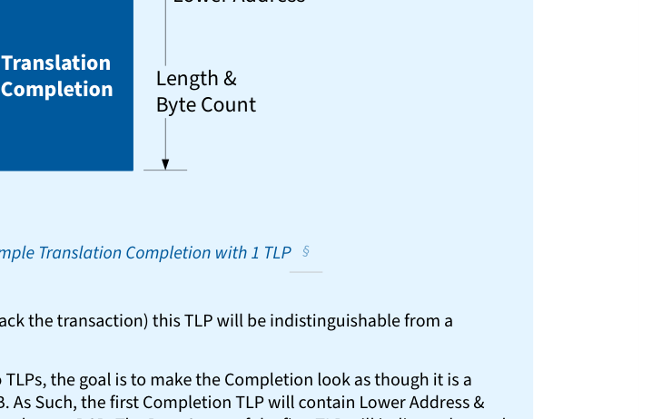

> **Figure 10-16.** Example Translation Completion with 2 TLPs
> 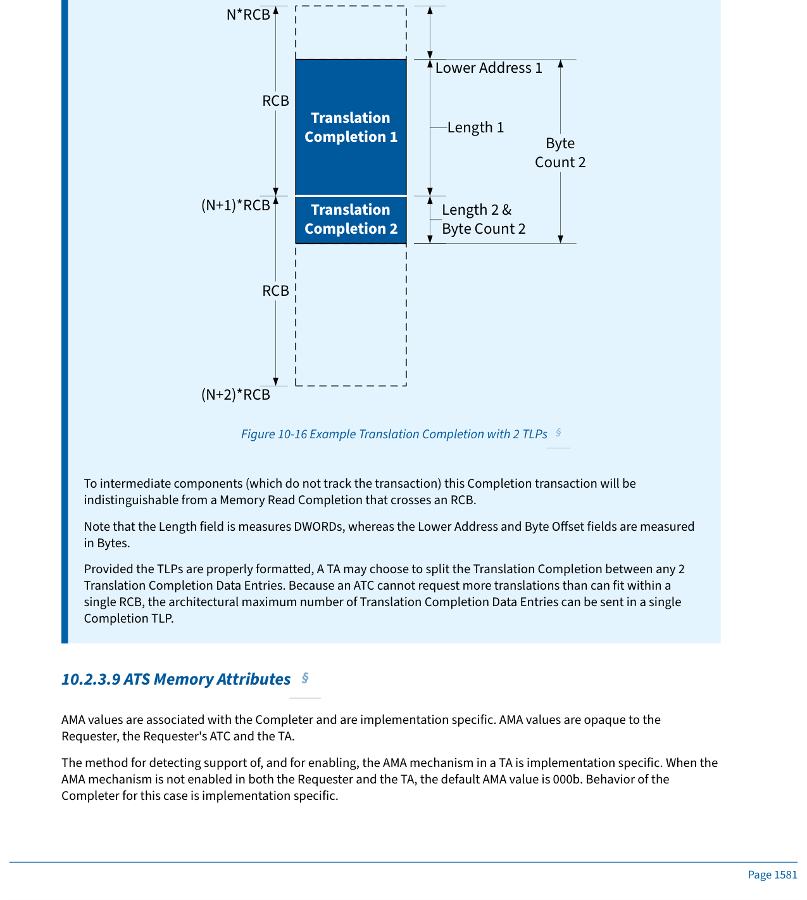

[⬆️ 返回目录](#-本章目录-table-of-contents)

---

### 10.2.4 Completions with Multiple Translations § | 10.2.4 包含多个转换的完成 §

table>
<thead>
<tr>
<th width="50%">🇬🇧 English</th>
<th width="50%" style="background-color:#e8e8e8">🇨🇳 中文</th>
</tr>
</thead>
<tbody>
<tr>
<td>

An ATC that supports AMA, caches AMA values along with other ATC information (Translated Address, Read, Write permission etc.) If the AMA value changes, for a page that could be cached in an ATC, software must issue an ATS Invalidation covering that page to ensure the ATC flushes the stale AMA value.

An ATC is allowed to request that the TA provide translations for a virtually contiguous range of addresses. It does this by setting the Length field in the Translation Request to a value that is two times the number of requested translations as long as the request size (Total Completion Length * 4) is not larger than Read Completion Boundary (RCB) in the Link Control Register.

If multiple translations are requested, the TA may return one or more translations as long as the number of translations does not exceed the number of requested translations. It is not an error for the TA to return fewer translations than requested and no error indication is sent unless there is an error in accessing the data.

If the Translation Completion contains multiple translations, all translations must have the same indicated size. Also, successive translations must apply to the virtual address range that abuts the previous translation in the same completion.

If a translation has both R = 0b and W = 0b, the TA must still set the Size field and the lower bits of the Translated Address field used to encode the completion size to appropriate values.

Each translation in a Translation Completion will have some overlap with the implied memory range of the Translation Request (see § Section 10.2.2).

A successful Translation Completion must consist of one or two CplDs. Each CplD must contain an integral number of Translations (i.e., Length must be a multiple of 2).

The TA is permitted to choose:
- the number of translations it returns for each Translation Request (e.g., Byte Count of the first or only CplD)
- if it returns more than one translation, whether it uses one or two CplDs
- if it returns two CplDs, how many translations are returned in each CplD

The Byte Count and Length fields in each CplD is used to convey these choices to the ATC. The Lower Address field should not be needed by the ATC (its value is computed as defined in Section 10.2.3 to satisfy RCB rules but the field otherwise conveys no additional information).
- If a Translation Completion CplD has a Byte Count that is greater than four times the Length field, then this is the first of two CplDs for the transaction.
- If a Translation Completion CplD has a Byte Count that is equal to four times the Length field, then this is the second or only CplD for the request.

Note: There are multiple reasons that the TA may truncate the results of the completion. For example, the request might ask for a range of addresses, not all of which are defined. This could occur if the first translation is valid but located at the end of a page of translations. The TA, in looking up the next page of translations, may find that the page is not valid so the addresses are not valid. The range of addresses that are valid would be returned and no error indicated. When truncating a Translation Completion the TA is not allowed to pad the response with invalid entries (R = 0b, W = 0b).

Note: There are multiple reasons that the TA may break a Translation Completion into multiple TLPs. As an example, if the virtual address of the Translation Completion resolves to a table access that crosses an implementation specific address boundary, the completion to the TA may be broken into two completions. Rather than require that the TA accumulate the results, the TA is permitted to send each portion of the Translation Completion to a Function when it is received from memory.

</td>
<td style="background-color:#e8e8e8">

支持 AMA 的 ATC 缓存 AMA 值以及其他 ATC 信息(已转换地址、读、写权限等)。如果对于可能缓存在 ATC 中的页,AMA 值发生变化,则软件必须发出覆盖该页的 ATS 无效化操作,以确保 ATC 清除过期的 AMA 值。

ATC 允许请求 TA 为虚拟连续的地址范围提供转换。它通过将转换请求中的 Length 字段设置为请求转换数的两倍来实现,前提是请求大小(总完成长度 * 4)不大于链路控制寄存器中的读完成边界 (RCB)。

如果请求多个转换,TA 可以返回一个或多个转换,只要转换数不超过请求的转换数。TA 返回的转换少于请求数不算错误,并且除非访问数据时出错,否则不会发送错误指示。

如果转换完成包含多个转换,则所有转换必须具有相同指示的大小。此外,后续转换必须适用于与同一完成中前一个转换相邻的虚拟地址范围。

如果某个转换同时具有 R = 0b 和 W = 0b,则 TA 必须仍将 Size 字段和用于编码完成大小的 Translated Address 字段低位设置为适当的值。

转换完成中的每个转换将与转换请求的隐含内存范围存在某种重叠(参见 § 第 10.2.2 节)。

成功的转换完成必须由一个或两个 CplD 组成。每个 CplD 必须包含整数个转换(即,Length 必须是 2 的倍数)。

允许 TA 选择:
- 它为每个转换请求返回的转换数(例如,第一个或唯一 CplD 的 Byte Count)
- 如果它返回多个转换,则使用一个还是两个 CplD
- 如果它返回两个 CplD,则每个 CplD 中返回多少转换

每个 CplD 中的 Byte Count 和 Length 字段用于向 ATC 传达这些选择。ATC 应不需要 Lower Address 字段(其值按第 10.2.3 节定义计算以满足 RCB 规则,但该字段不传达其他附加信息)。
- 如果转换完成 CplD 的 Byte Count 大于 Length 字段的四倍,则这是该事务的两个 CplD 中的第一个。
- 如果转换完成 CplD 的 Byte Count 等于 Length 字段的四倍,则这是该请求的第二个或唯一 CplD。

注:TA 可能截断完成结果的原因有多种。例如,请求可能要求一个地址范围,其中并非所有地址都已定义。如果第一个转换有效但位于转换页的末尾,则可能发生这种情况。TA 在查找下一页转换时,可能发现该页无效,因此地址无效。将返回有效地址范围,且不指示错误。在截断转换完成时,TA 不允许用无效条目(R = 0b,W = 0b)填充响应。

注:TA 可能将转换完成拆分为多个 TLP 的原因有多种。例如,如果转换完成的虚拟地址解析为跨越实现特定地址边界的表访问,则对 TA 的完成可能拆分为两个完成。与其要求 TA 累积结果,不如允许 TA 在从内存接收到转换完成的每个部分时将其发送给功能。

</td>
</tr>
</tbody>
</table>

[⬆️ 返回目录](#-本章目录-table-of-contents)

---

## 10.3 ATS Invalidation § | 10.3 ATS 无效化 §

<table>
<thead>
<tr>
<th width="50%">🇬🇧 English</th>
<th width="50%" style="background-color:#e8e8e8">🇨🇳 中文</th>
</tr>
</thead>
<tbody>
<tr>
<td>

ATS uses the messages shown in this section to maintain consistency between the TA and the ATC. This specification assumes there is a single TA associated with each ATC. The TA (in conjunction with its associated software) must ensure that the address translations cached in the ATC are not stale by issuing Invalidate Requests.

When a translation is changed in the TA and that translation might be contained within an ATC in a Function, the TA (in conjunction with its associated software) must send an Invalidate Request to the ATC to maintain proper synchronization between the ATPT and the ATC. An Invalidate Request is used to clear a specific subset of the address range from the ATC. Invalidate Requests are constrained to cover power of 2 multiple of 4096-byte pages.

The format of an Invalidate Request is shown in § Figure 10-18 and § Figure 10-19.

The Invalidate Request is a MsgD transaction with 64 bits of data. Invalidate Request messages may be sent in any TC.

Invalidation Request Messages optionally include a PASID (see § Section 10.3.8)
- In Non-Flit Mode, PASID is included when a PASID TLP Prefix is present. The Execute Requested and Privileged Mode Requested bits in this PASID TLP Prefix are Reserved.
- In Flit Mode, PASID is included when OHC-A4 is present and the PV is Set. PASID is not included if either OHC-A4 is not present or if PV is Clear. OHC-A4 also contains Destination Segment if DSV is Set200.

</td>
<td style="background-color:#e8e8e8">

ATS 使用本节所示的消息维持 TA 与 ATC 之间的一致性。本规范假设每个 ATC 关联一个 TA。TA(连同其关联软件)必须通过发出 Invalidate 请求来确保缓存在 ATC 中的地址转换不会过期。

当 TA 中的转换发生更改,且该转换可能包含在某个功能的 ATC 中时,TA(连同其关联软件)必须向 ATC 发送 Invalidate 请求以保持 ATPT 与 ATC 之间的正确同步。Invalidate 请求用于从 ATC 中清除地址范围的特定子集。Invalidate 请求被限制为覆盖 2 的幂倍数个 4096 字节页。

Invalidate 请求的格式如 § 图 10-18 和 § 图 10-19 所示。

Invalidate 请求是带 64 位数据的 MsgD 事务。Invalidate 请求消息可在任意 TC 中发送。

无效化请求消息可选地包含 PASID(参见 § 第 10.3.8 节)
- 在非 Flit 模式下,当存在 PASID TLP Prefix 时包含 PASID。该 PASID TLP Prefix 中的 Execute Requested 和 Privileged Mode Requested 位保留。
- 在 Flit 模式下,当 OHC-A4 存在且 PV 置位时包含 PASID。如果 OHC-A4 不存在或 PV 清零,则不包含 PASID。如果 DSV 置位,OHC-A4 还包含目标段200。

</td>
</tr>
</tbody>
</table>

> **Figure 10-18.** Invalidate Request Message - Non-Flit Mode
> 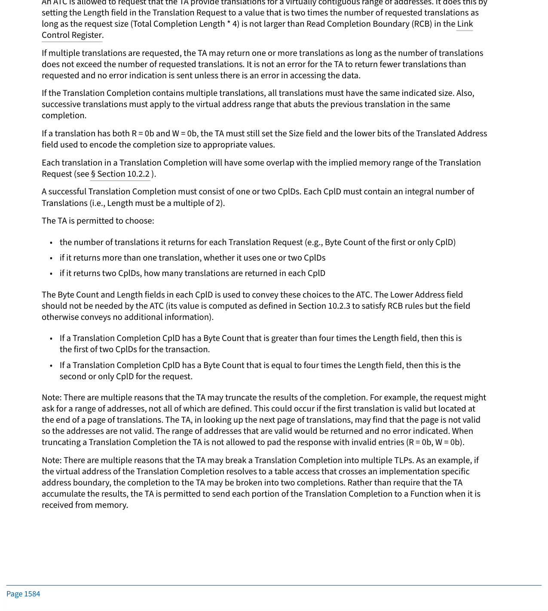

> **Figure 10-19.** Invalidate Request Message - Flit Mode
> 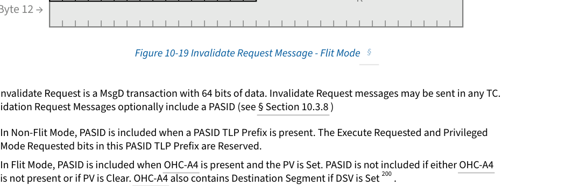

[⬆️ 返回目录](#-本章目录-table-of-contents)

---

### 10.3.1 Invalidate Request § | 10.3.1 无效化请求 §

table>
<thead>
<tr>
<th width="50%">🇬🇧 English</th>
<th width="50%" style="background-color:#e8e8e8">🇨🇳 中文</th>
</tr>
</thead>
<tbody>
<tr>
<td>

200 Invalidation Request Messages are issued by the TA through a specific RP. Since everything below a given RP is part of the same segment, the Destination Segment field in the message is not required unless needed by the RC to determine the appropriate RP.

The ITag field is used by the TA to uniquely identify Invalidate Requests it issues. A TA must ensure that once an ITag is used, it is not reused for the same Destination ID until either released by the corresponding Invalidate Completions or by a vendor-specific timeout mechanism (see below). A TA is permitted to use the same ITag value for Invalidate Requests that target different Destination IDs. See the Invalidation Queue Depth field in the ATS Extended Capability for additional considerations.

The address range specified in an Invalidate Request may span one or more STU 4096-byte pages. Invalidation ranges are required to be naturally aligned and should not be smaller than STU 4096-byte pages. Upon receiving an Invalidate Request with a range less than STU an ATC may either (1) signal an Unsupported Request (not recommended) or (2) round the range of the request up to a value greater than or equal to the STU.

The content of the payload is the untranslated address range to be invalidated. The payload format is shown in § Figure 10-20.

> **Figure 10-20.** Invalidate Request Message Body
> 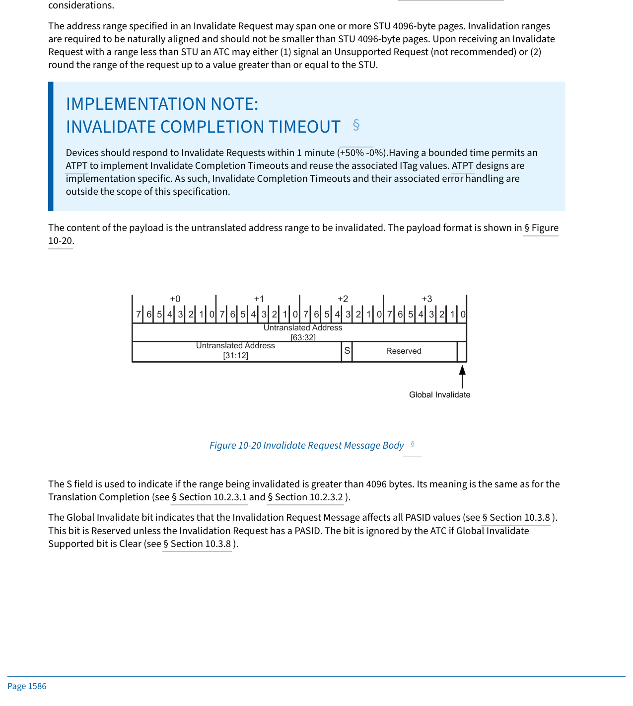

The S field is used to indicate if the range being invalidated is greater than 4096 bytes. Its meaning is the same as for the Translation Completion (see § Section 10.2.3.1 and § Section 10.2.3.2).

The Global Invalidate bit indicates that the Invalidation Request Message affects all PASID values (see § Section 10.3.8). This bit is Reserved unless the Invalidation Request has a PASID. The bit is ignored by the ATC if Global Invalidate Supported bit is Clear (see § Section 10.3.8).

> **IMPLEMENTATION NOTE:**
> **INVALIDATE COMPLETION TIMEOUT**
> Devices should respond to Invalidate Requests within 1 minute (+50% -0%).Having a bounded time permits an ATPT to implement Invalidate Completion Timeouts and reuse the associated ITag values. ATPT designs are implementation specific. As such, Invalidate Completion Timeouts and their associated error handling are outside the scope of this specification.

</td>
<td style="background-color:#e8e8e8">

200 无效化请求消息由 TA 通过特定 RP 发出。由于给定 RP 以下的所有内容都属于同一段,因此消息中的目标段字段不是必需的,除非 RC 需要它来确定适当的 RP。

ITag 字段由 TA 用于唯一标识其发出的 Invalidate 请求。TA 必须确保一旦使用了某个 ITag,在通过相应 Invalidate 完成或供应商特定的超时机制(见下文)释放之前,不会针对同一目标 ID 重复使用它。TA 允许将同一 ITag 值用于针对不同目标 ID 的 Invalidate 请求。其他注意事项请参见 ATS Extended Capability 中的 Invalidation Queue Depth 字段。

Invalidate 请求中指定的地址范围可跨越一个或多个 STU 4096 字节页。无效化范围必须自然对齐,且不应小于 STU 4096 字节页。在收到范围小于 STU 的 Invalidate 请求时,ATC 可以(1)发出 Unsupported Request 信号(不推荐)或(2)将请求范围向上舍入为大于或等于 STU 的值。

有效负载的内容是要无效化的未转换地址范围。有效负载格式如 § 图 10-20 所示。

S 字段用于指示正在无效化的范围是否大于 4096 字节。其含义与转换完成相同(参见 § 第 10.2.3.1 节和 § 第 10.2.3.2 节)。

Global Invalidate 位指示无效化请求消息影响所有 PASID 值(参见 § 第 10.3.8 节)。除非无效化请求具有 PASID,否则此位保留。如果 Global Invalidate Supported 位清零,则 ATC 忽略此位(参见 § 第 10.3.8 节)。

> **实现说明 (IMPLEMENTATION NOTE):**
> **无效化完成超时 (INVALIDATE COMPLETION TIMEOUT)**
> 设备应在 1 分钟(+50% -0%)内响应 Invalidate 请求。具有有界时间允许 ATPT 实现 Invalidate 完成超时并重用关联的 ITag 值。ATPT 设计是实现特定的。因此,Invalidate 完成超时及其关联的错误处理不在本规范范围内。

</td>
</tr>
</tbody>
</table>

[⬆️ 返回目录](#-本章目录-table-of-contents)

---

<<<PAGE_BREAK>>> page_1578

<<<PAGE_BREAK>>> page_1579

<<<PAGE_BREAK>>> page_1580

<<<PAGE_BREAK>>> page_1581

<<<PAGE_BREAK>>> page_1582

<<<PAGE_BREAK>>> page_1583

<<<PAGE_BREAK>>> page_1584

<<<PAGE_BREAK>>> page_1585

<<<PAGE_BREAK>>> page_1586

### 10.3.2 Invalidate Completion § | 10.3.2 无效化完成 §

<table>
<thead>
<tr>
<th width="50%">🇬🇧 English</th>
<th width="50%" style="background-color:#e8e8e8">🇨🇳 中文</th>
</tr>
</thead>
<tbody>
<tr>
<td>

When a Function completes an Invalidate operation, it will send one or more Invalidate Completion messages to the TA. These messages must be tagged with information extracted from the Invalidate Request to enable the TA to associate the Invalidate Completions with the Invalidate Request.

The format of the Invalidate Completion message is shown in § Figure 10-21 and § Figure 10-22.

> **IMPLEMENTATION NOTE:**
> **INVALIDATION REQUESTS AND FUNCTION LEVEL RESET & DEVICE POWER STATE TRANSITIONS**
> Invalidation requests received while a Function is undergoing Function Level Reset, or is in (or transitioning to) non-D0 device state, may be dropped by the Function. Similarly, invalidation requests already received but pending at the time of receiving initiate FLR or D-state transition request may be dropped the Function.
> System software can avoid ATS invalidation race conditions on Function Level Reset and Device Power State transitions in a variety of ways. For example:
> 1. When disabling ATS on a Function, system software quiesces ATS invalidations to the Function (i.e., either responses are received for all invalidation requests issued to the Function, or any pending invalidation requests to the Function have timed out).
> 2. Software ensures no invalidations are issued to a Function when its ATS capability is disabled.
> 3. Before initiating the FLR (or Device power state transitions), software disables ATS as described in item 1. above.

The Invalidate Completion message is a Msg transaction routed by ID. The Requester ID field of the Invalidate Completion message is set to the Requester ID of the Function containing the ATC. The Device ID field of the Invalidate Completion is set to the Requester ID of the TA. The ATC may derive the Requester ID of the TA from the Requester ID field of the corresponding Invalidate Request. Alternatively, since the ATC is only associated with a single TA, the ATC may sample and store the Requester ID from the first Invalidate Request following a Fundamental Reset or FLR. Subsequent Invalidate Completion messages may use this value to set the Device ID field of Invalidate Completion messages.

In Flit Mode, Invalidation Completion messages optionally contain OHC-A4 when a Destination Segment is needed (e.g., the TA and the ATC are in different segments). The PASID is Reserved. PV must be 0b.

The Completion Count (CC) field indicates the number of individual Invalidate Completion messages that must be sent for the associated Invalidate Request. Setting the CC field to 0 indicates that eight responses must be sent. The TA is responsible for collecting all the responses associated with a given Tag before considering the corresponding Invalidate Request to be complete.

Invalidate Completion messages may be sent on any TC, independent of the TC the originating Invalidate Request was received. This enables implementations to utilize the Invalidate Completion to push outstanding transactions to the TA to guarantee the required invalidation semantics are met. Implementations that utilize a single Upstream TC are required to send a single Invalidate Completion in the utilized TC.

The ITag Vector field is used to indicate which Invalidate Request has been completed. Each of the 32 possible ITag field values from the Invalidation Request is represented by a single bit in the ITag Vector field. The least significant bit (bit 0; i.e., the right-most bit in the schematic representation of the Invalidate Completion message shown in § Figure 10-21 and § Figure 10-22) of the ITag Vector field corresponds to the ITag field value of 0. The most significant bit (bit 31) of the ITag Vector field corresponds to the ITag field value of 31. Implementations are allowed to coalesce multiple Invalidate Completions by setting multiple ITag Vector bits in a single message provided the following conditions are met:
- The Invalidate Completions flow in the same TC.
- The Invalidate Completions have the same CC value.
- All fragments of an Invalidate Completion must have identical Request ID, CC, and ITag Vector fields.

A TA that receives an Invalidation Completion for an ITag that has no outstanding Invalidation Request shall report this error using implementation specific mechanisms. One possible such mechanism is to report the Invalidation Completion as an Unexpected Completion (UC).

Functions that do not support ATS will treat an Invalidate Request as UR.

</td>
<td style="background-color:#e8e8e8">

当功能完成 Invalidate 操作时,它将向 TA 发送一个或多个 Invalidate 完成消息。这些消息必须使用从 Invalidate 请求中提取的信息标记,以使 TA 能够将 Invalidate 完成与 Invalidate 请求相关联。

Invalidate 完成消息的格式如 § 图 10-21 和 § 图 10-22 所示。

> **实现说明 (IMPLEMENTATION NOTE):**
> **无效化请求与功能级复位及设备电源状态转换 (INVALIDATION REQUESTS AND FUNCTION LEVEL RESET & DEVICE POWER STATE TRANSITIONS)**
> 在功能正在执行功能级复位或处于(或正在转换到)非 D0 设备状态时收到的无效化请求可能被该功能丢弃。类似地,在收到启动 FLR 或 D 状态转换请求时已经收到但挂起的无效化请求也可能被该功能丢弃。
> 系统软件可以通过多种方式避免在功能级复位和设备电源状态转换时出现 ATS 无效化竞争条件。例如:
> 1. 在功能上禁用 ATS 时,系统软件使对该功能的 ATS 无效化静默(即,要么已收到对该功能发出的所有无效化请求的响应,要么对该功能的任何挂起无效化请求已超时)。
> 2. 软件确保在功能的 ATS 功能被禁用时,不会向该功能发出无效化。
> 3. 在启动 FLR(或设备电源状态转换)之前,软件按上述第 1 项所述禁用 ATS。

Invalidate 完成消息是由 ID 路由的 Msg 事务。Invalidate 完成消息的 Requester ID 字段设置为包含 ATC 的功能的 Requester ID。Invalidate 完成的 Device ID 字段设置为 TA 的 Requester ID。ATC 可以从相应 Invalidate 请求的 Requester ID 字段导出 TA 的 Requester ID。或者,由于 ATC 仅与单个 TA 关联,ATC 可以在 Fundamental Reset 或 FLR 之后从第一个 Invalidate 请求中采样并存储 Requester ID。后续 Invalidate 完成消息可以使用此值来设置 Invalidate 完成消息的 Device ID 字段。

在 Flit 模式下,当需要目标段时(例如,TA 和 ATC 处于不同段),Invalidation 完成消息可选地包含 OHC-A4。PASID 保留。PV 必须为 0b。

完成计数 (Completion Count, CC) 字段指示关联的 Invalidate 请求必须发送的单个 Invalidate 完成消息的数量。将 CC 字段设置为 0 指示必须发送八个响应。TA 负责在考虑相应 Invalidate 请求完成之前收集与给定 Tag 关联的所有响应。

Invalidate 完成消息可在任意 TC 上发送,与发起 Invalidate 请求接收的 TC 无关。这使实现能够利用 Invalidate 完成将未完成事务推送到 TA,以保证满足所需的无效化语义。使用单个上游 TC 的实现需要在所使用的 TC 中发送单个 Invalidate 完成。

ITag Vector 字段用于指示哪个 Invalidate 请求已完成。Invalidation 请求中 32 个可能的 ITag 字段值中的每一个由 ITag Vector 字段中的单个位表示。ITag Vector 字段的最低有效位(位 0;即 § 图 10-21 和 § 图 10-22 中 Invalidate 完成消息示意图表示中最右边的位)对应于 ITag 字段值 0。ITag Vector 字段的最高有效位(位 31)对应于 ITag 字段值 31。允许实现通过在单个消息中设置多个 ITag Vector 位来合并多个 Invalidate 完成,前提是满足以下条件:
- Invalidate 完成在同一 TC 中流动。
- Invalidate 完成具有相同的 CC 值。
- Invalidate 完成的所有片段必须具有相同的 Request ID、CC 和 ITag Vector 字段。

TA 如果收到针对某个没有未完成 Invalidation 请求的 ITag 的 Invalidation 完成,则应使用实现特定的机制报告此错误。一种可能的机制是将 Invalidation 完成报告为 Unexpected Completion (UC)。

不支持 ATS 的功能会将 Invalidate 请求视为 UR。

</td>
</tr>
</tbody>
</table>

> **Figure 10-21.** Invalidate Completion Message Format - Non-Flit Mode
> 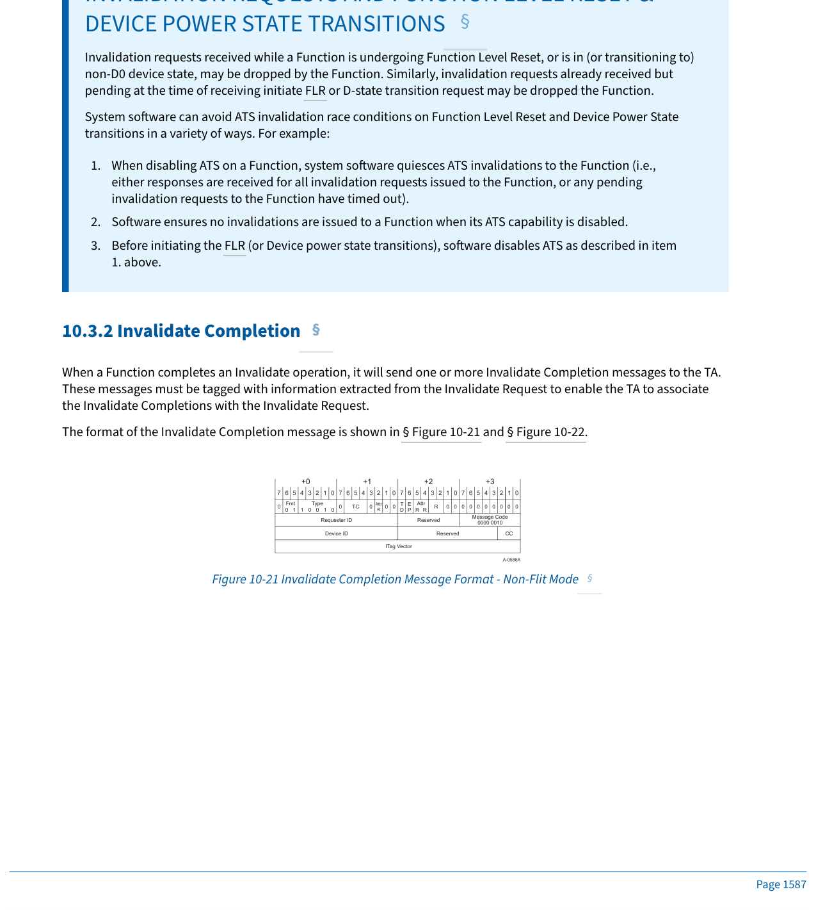

> **Figure 10-22.** Invalidate Completion Message - Flit Mode
> 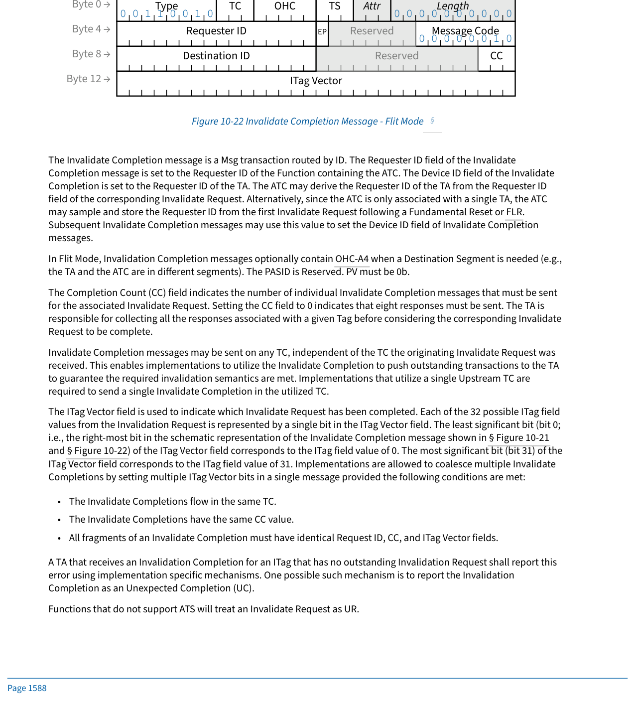

[⬆️ 返回目录](#-本章目录-table-of-contents)

---

### 10.3.3 Invalidate Completion Semantics § | 10.3.3 无效化完成语义 §

table>
<thead>
<tr>
<th width="50%">🇬🇧 English</th>
<th width="50%" style="background-color:#e8e8e8">🇨🇳 中文</th>
</tr>
</thead>
<tbody>
<tr>
<td>

Functions supporting ATS are required to send an Invalidate Completion in response to a Invalidate Request independent of whether the Bus Master Enable bit is Set or not. Note that the above conditions must be satisfied even when Bus Master Enable is Cleared. The method for a device to achieve this is implementation dependent.

Before an ATC can return an Invalidate Completion for a given Invalidate Request, it must ensure the following conditions are satisfied with respect to stale addresses:
- All new Translated Memory Requests initiated by the Function (or its Shadows) will not utilize stale address translations.
- All expected Completions for Translated Memory Requests initiated by the Function (or its Shadows) and referencing stale addresses must be received.
- All expected Translation Completions for Translation Requests initiated by the Function (or its Shadows) and referencing stale addresses must be received or tagged to be discarded.
- All outstanding non-UIO Posted Translated Memory Requests initiated by the Function (or its Shadows) and referencing stale addresses must be ensured to be transmitted ahead of the associated Invalidate Completion(s).

The ATC is required to send a copy of the Invalidate Completion message in each TC in which a non-UIO Posted Translated Memory Request has been issued but not known to have been pushed to observability on the fabric through the TA. The CC field must be set to the same value in each copy of the Invalidate Completion message indicating number of copies sent. The TA is responsible for collecting all sent responses before considering the invalidation to be complete.

The ATC must send at least one Invalidation Completion message.

The ATC must not send copies of the Invalidation Completion message in UIO VCs (Posted Message TLPs are not defined for UIO VCs). When all traffic affected by an ATS Invalidation Request is UIO, it is implementation specific how the ATC picks a non-UIO TC to use for the Invalidation Completion message.

A TA must ensure forward progress of Requests without dependence on receiving Invalidation Completions.

Invalidate Completion Messages must contain the Requester ID used in the associated Invalidate Request.

When Shadow Functions are enabled, it is sufficient to issue a single Invalidate Request message targeting either the Function or one of its Shadows. It is recommended that system software issue an Invalidate Request Message to the "main" Function instead of a Shadow Function. Since IDO is Clear, the Invalidation Completion resulting from that Invalidation Request will push to the TA any earlier Posted Writes for both the Function and its Shadows.

Invalidation Completion behavior is independent of whether the associated Invalidate Request was issued to the Function or one of its Shadows.

> **IMPLEMENTATION NOTE:**
> **BUS MASTER ENABLE CHANGE**
> When Bus Master Enable changes from Set to Clear, no further memory requests should be queued. It is possible that queued write requests are present when BME is Cleared. These requests could block an Invalidate Completion. These requests must be either sent or dropped. This will ensure that all outstanding write transactions that are potentially dependent upon the outstanding invalidation are complete.

</td>
<td style="background-color:#e8e8e8">

支持 ATS 的功能需要响应 Invalidate 请求发送 Invalidate 完成,无论 Bus Master Enable 位是否置位。请注意,即使 Bus Master Enable 清零,也必须满足上述条件。设备实现此目的的方法依赖于实现。

在 ATC 可以针对给定 Invalidate 请求返回 Invalidate 完成之前,它必须确保关于过期地址的以下条件得到满足:
- 由该功能(或其影子)发起的所有新的已转换内存请求将不使用过期的地址转换。
- 必须接收由该功能(或其影子)发起且引用过期地址的已转换内存请求的所有预期完成。
- 必须接收或标记为丢弃由该功能(或其影子)发起且引用过期地址的转换请求的所有预期转换完成。
- 必须确保由该功能(或其影子)发起且引用过期地址的所有未完成的非 UIO Posted 已转换内存请求已在关联 Invalidate 完成之前发送。

ATC 必须在已发出但尚未知是否已通过 TA 推送到 Fabric 可观察性的每个 TC 中发送一份 Invalidate 完成消息副本,其中已发出非 UIO Posted 已转换内存请求。CC 字段必须在每份 Invalidate 完成消息副本中设置为相同值,以指示已发送的副本数。TA 负责在考虑无效化完成之前收集所有已发送的响应。

ATC 必须至少发送一个 Invalidation 完成消息。

ATC 不得在 UIO VC 中发送 Invalidation 完成消息副本(UIO VC 未定义 Posted 消息 TLP)。当受 ATS Invalidation 请求影响的所有流量均为 UIO 时,ATC 选择用于 Invalidation 完成消息的非 UIO TC 的方式是实现特定的。

TA 必须确保请求的前进进度,而不依赖于接收 Invalidation 完成。

Invalidate 完成消息必须包含关联 Invalidate 请求中使用的 Requester ID。

启用影子功能时,只需发出针对该功能或其中一个影子的单个 Invalidate 请求消息即可。建议系统软件向"主"功能而不是影子功能发出 Invalidate 请求消息。由于 IDO 清零,来自该 Invalidation 请求的 Invalidation 完成将把该功能及其影子的任何早期 Posted 写入推送到 TA。

Invalidation 完成行为独立于关联的 Invalidate 请求是发给该功能还是其影子之一。

> **实现说明 (IMPLEMENTATION NOTE):**
> **总线主控使能更改 (BUS MASTER ENABLE CHANGE)**
> 当 Bus Master Enable 从置位更改为清零时,不应再排队更多内存请求。BME 清零时可能存在已排队的写请求。这些请求可能会阻塞 Invalidate 完成。这些请求必须被发送或丢弃。这将确保可能依赖于未完成无效化的所有未完成写事务已完成。

</td>
</tr>
</tbody>
</table>

[⬆️ 返回目录](#-本章目录-table-of-contents)

---

### 10.3.4 Request Acceptance Rules § | 10.3.4 请求接受规则 §

<table>
<thead>
<tr>
<th width="50%">🇬🇧 English</th>
<th width="50%" style="background-color:#e8e8e8">🇨🇳 中文</th>
</tr>
</thead>
<tbody>
<tr>
<td>

In accord with the request acceptance rules enumerated in this section, a Function is not allowed to create a dependency in which the acceptance of a posted transaction is dependent upon the transmission of a posted transaction. Given Invalidate Requests and Invalidate Completions both are posted transactions, Functions must not make the acceptance of an Invalidate Request dependent upon the transmission of an Invalidate Completion. The method for achieving this is implementation specific.

A Function with an ATS capability in its configuration space must be able to accept Invalidate Requests and send Invalidate Completions even if ATS is not enabled.

Due to the variety of caching architectures and queuing strategies, implementations may vary greatly with respect to invalidation latency and throughput. It is possible that a TA may generate Invalidate Requests at a rate that exceeds the average ATC service rate. When this happens, the credit based flow control mechanisms will throttle the TA issue rate. A side effect of this is congestion spreading to other channels and Links through the credit based flow control mechanism. Depending on the frequency and duration of this congestion, performance may suffer. It is strongly recommended that TA and its associated software implement higher level flow control mechanisms.

> **IMPLEMENTATION NOTE:**
> **IMPLIED TC FLUSHING**
> When making the decision as to which TC to send Invalidate Completions, an ATC may infer, in an implementation specific manner, that an issued posted write has been pushed to the TA. For example, a Function that has sent a read transaction to a destination above the TA and received its corresponding response may infer that any preceding posted writes issued in the same TC have been pushed to the TA.
> Independent of this optimization, the ATC is required to send at least one Invalidation Completion.

</td>
<td style="background-color:#e8e8e8">

根据本节列举的请求接受规则,功能不得创建这样一个依赖关系:已发布事务的接受依赖于已发布事务的发送。鉴于 Invalidate 请求和 Invalidate 完成均为已发布事务,功能不得将 Invalidate 请求的接受依赖于 Invalidate 完成的发送。实现此目的的方法是实现特定的。

其配置空间中具有 ATS 功能的功能必须能够接受 Invalidate 请求并发送 Invalidate 完成,即使 ATS 未启用。

由于各种缓存架构和排队策略的差异,实现可能在无效化延迟和吞吐率方面差异很大。可能存在 TA 以超过平均 ATC 服务速率的速率生成 Invalidate 请求的情况。当发生这种情况时,基于信用的流控机制将限制 TA 的发出速率。这的一个副作用是拥塞通过基于信用的流控机制扩散到其他通道和链路。取决于此拥塞的频率和持续时间,性能可能受到影响。强烈建议 TA 及其关联软件实现更高级别的流控机制。

> **实现说明 (IMPLEMENTATION NOTE):**
> **隐含 TC 刷新 (IMPLIED TC FLUSHING)**
> 在决定将 Invalidate 完成发送到哪个 TC 时,ATC 可以以实现特定的方式推断已发出的 posted 写入已被推送到 TA。例如,已向上 TA 之上目标发送读事务并收到相应响应的功能可以推断在同一 TC 中发出的任何先前 posted 写入已被推送到 TA。
> 独立于此优化,ATC 必须至少发送一个 Invalidation 完成。

</td>
</tr>
</tbody>
</table>

[⬆️ 返回目录](#-本章目录-table-of-contents)

---

### 10.3.5 Invalidate Flow Control § | 10.3.5 无效化流控 §

table>
<thead>
<tr>
<th width="50%">🇬🇧 English</th>
<th width="50%" style="background-color:#e8e8e8">🇨🇳 中文</th>
</tr>
</thead>
<tbody>
<tr>
<td>

> **IMPLEMENTATION NOTE:**
> **INVALIDATE QUEUE DEPTH**
> An ATC is only associated with a single TA. Each TA is limited to a total of 32 outstanding invalidations to any given ATC. This limits the number of outstanding Invalidation Requests active to a single ATC to 32. To avoid a post-to-post dependency, an ATC is required to accept up to 32 Invalidation Requests.
> An ATC may choose to implement a maximally sized input queue holding Invalidate Requests. Alternatively, an ATC may choose to implement a maximally sized output queue holding Invalidate Completions. Note that queuing Invalidate Completions requires significantly less state per entry resulting in a potentially more efficient implementation than input queue buffering.
> Note that the choice of whether to implement input queuing or output queuing (or a hybrid of both) has no impact on ensuring deadlock free behavior. But implementation choices with regard to queuing may have a significant impact on performance (see § Section 10.3.5).

To assist with the implementation of Invalidate Flow Control, an ATC must publish the number of Invalidate Requests it can buffer before back pressuring the Link. This field applies to all invalidations serviced by the Function, independent of the size of the invalidation. This value is communicated in the Invalidate Queue Depth field in the ATS capability structure (see § Section 7.8.9). A value of 0 0000b indicates that invalidate flow control is not necessary to this Function.

Each Function is required to implement sufficient queuing to ensure it can hold the maximum number of outstanding Invalidation Requests from a TA (using either input or output queuing). However, with an SR-IOV device, all VFs associated with a PF share a single Invalidation Request queue in the PF. To implement Invalidation flow control, the TA must ensure that the total number of outstanding Invalidate Requests targeting the shared PF queue does not exceed the value in the PF's Invalidate Queue Depth field.

</td>
<td style="background-color:#e8e8e8">

> **实现说明 (IMPLEMENTATION NOTE):**
> **无效化队列深度 (INVALIDATE QUEUE DEPTH)**
> ATC 仅与单个 TA 关联。每个 TA 限制对任何给定 ATC 的未完成无效化总数为 32。这限制了对单个 ATC 有效的未完成 Invalidation 请求数为 32。为避免 post-to-post 依赖,ATC 必须接受最多 32 个 Invalidation 请求。
> ATC 可以选择实现容纳 Invalidate 请求的最大输入队列。或者,ATC 可以选择实现容纳 Invalidate 完成的最大输出队列。请注意,对 Invalidate 完成进行排队所需的每个条目状态显著少于输入队列缓冲,因此可能比输入队列缓冲更高效。
> 请注意,选择实现输入排队还是输出排队(或两者的混合)对确保无死锁行为没有影响。但排队相关的实现选择可能会对性能产生重大影响(参见 § 第 10.3.5 节)。

为辅助实现 Invalidate 流控,ATC 必须发布其在反压链路之前可缓冲的 Invalidate 请求数。此字段适用于该功能服务的所有无效化,与无效化的大小无关。该值通过 ATS 能力结构中的 Invalidate Queue Depth 字段传达(参见 § 第 7.8.9 节)。值 0 0000b 指示此功能不需要无效化流控。

每个功能必须实现足够的排队,以确保其可以容纳来自 TA 的最大未完成 Invalidation 请求数(使用输入或输出排队)。但是,对于 SR-IOV 设备,与 PF 关联的所有 VF 共享 PF 中的单个 Invalidation 请求队列。为实现 Invalidation 流控,TA 必须确保针对共享 PF 队列的未完成 Invalidate 请求总数不超过 PF 的 Invalidate Queue Depth 字段中的值。

</td>
</tr>
</tbody>
</table>

[⬆️ 返回目录](#-本章目录-table-of-contents)

---

### 10.3.6 Invalidate Ordering Semantics § | 10.3.6 无效化排序语义 §

<table>
<thead>
<tr>
<th width="50%">🇬🇧 English</th>
<th width="50%" style="background-color:#e8e8e8">🇨🇳 中文</th>
</tr>
</thead>
<tbody>
<tr>
<td>

Invalidate Requests and Translation Completions may be sent using different TC and are, therefore, unordered with respect to each other (from the Link's perspective). An ATC must ensure that the proper invalidation behavior is maintained when an Invalidate Request bypasses a Translation Completion to an overlapping region.

An ATC must "snoop" its outstanding translation request queue against all arriving Invalidate Requests. When snooping a request for a N*STU sized translation (N is a power of 2), the ATC must snoop the range of addresses starting at the STU aligned region containing the specified address and ending (N-1) STU size pages later.

If an Invalidate Request overlaps the address range in an outstanding Translation Request, the Translation Request must be tagged as invalid and the results of its corresponding Translation Response must be discarded prior to transmission of the Invalidate Completion. If the Translation Response is received before the Invalidate Completion is sent, an implementation is free to issue requests utilizing the translation result provided the Invalidate Completion Semantics (see § Section 10.3.3) are satisfied.

> **IMPLEMENTATION NOTE:**
> **INVALIDATE FLOW CONTROL**
> A Function may indicate that invalidate flow control is not required when one or more of the following is true:
> 1. The Function can handle invalidations at the maximum arrival rate of Invalidate Requests.
> 2. The Function will not or very rarely cause Link backpressure (performance loss is negligible).
> 3. The Function can fully buffer the maximum number of incoming invalidations without back pressuring the Link.

</td>
<td style="background-color:#e8e8e8">

Invalidate 请求和转换完成可以使用不同的 TC 发送,因此(从链路的角度)彼此无序。ATC 必须确保在 Invalidate 请求绕过转换完成到达重叠区域时,保持正确的无效化行为。

ATC 必须针对所有到达的 Invalidate 请求"监听"其未完成转换请求队列。在监听 N*STU 大小转换的请求时(N 为 2 的幂),ATC 必须监听从包含指定地址的 STU 对齐区域开始,到 (N-1) 个 STU 大小页之后结束的地址范围。

如果 Invalidate 请求与未完成转换请求中的地址范围重叠,则必须将转换请求标记为无效,并且必须在发送 Invalidate 完成之前丢弃其对应转换响应的结果。如果在发送 Invalidate 完成之前收到转换响应,则只要满足 Invalidate 完成语义(参见 § 第 10.3.3 节),实现可以自由地使用转换结果发出请求。

> **实现说明 (IMPLEMENTATION NOTE):**
> **无效化流控 (INVALIDATE FLOW CONTROL)**
> 当以下一项或多项为真时,功能可指示不需要无效化流控:
> 1. 该功能可以以 Invalidate 请求的最大到达速率处理无效化。
> 2. 该功能不会或极少引起链路反压(性能损失可忽略)。
> 3. 该功能可以完全缓冲最大数量的传入无效化,而不反压链路。

</td>
</tr>
</tbody>
</table>

[⬆️ 返回目录](#-本章目录-table-of-contents)

---

### 10.3.7 Implicit Invalidation Events § | 10.3.7 隐式无效化事件 §

table>
<thead>
<tr>
<th width="50%">🇬🇧 English</th>
<th width="50%" style="background-color:#e8e8e8">🇨🇳 中文</th>
</tr>
</thead>
<tbody>
<tr>
<td>

The following events will cause the invalidation of all ATC entries:
- Conventional Reset (all forms)
- Function Level Reset
- E field in ATS Capability changes from Clear to Set

The following events will cause the invalidation of all non-Global Mapping ATC entries that were requested using a specific PASID:
- Stopping the use of a PASID as defined in this specification.

No explicit Invalidate Completion message is sent when these implied invalidate events occur.

> **IMPLEMENTATION NOTE:**
> **REQUEST RANGE OVERLAP IN INVALIDATIONS**
> In the description above, N is the number of STU sized translations that were requested in the Translation Request. This is equal to (Length field in Translation Request)/2.
> As an example:
> STU is 00 0010b indicating 16384-byte pages.
> An outstanding Translation Request has a Length field of 00 0000 0100b indicating two translations covering a range of 32768 bytes.
> The high-order 48 bits of the Translation Request are 0000 0FFF FFFFh.
> The low-order 16 bits of the address in the request are 11xx xxxx xxxx xxxxb indicating that the translation request covers a range that overlaps a 32768-byte boundary (in fact, the request crosses a 16-TB boundary).
> If two translations are returned, they would cover the two STU sized regions at 0000 0FFF FFFF C000h and 0000 1000 0000 0000h.
> An Invalidate Request is received with the high-order 48 bits of 0000 1000 0000h and the low-order 16 bits of 0001 1xxx xxxx xxxxb.
> The ATC must detect that a translation associated with a portion of the Translation Request is now invalidated and the Translation Completion associated with the invalidated region must be discarded (for simplification, the ATC is allowed to discard all of the Translation Completion).
> It should be noted that, processing of the Invalidate Requests is simplified if Translation Requests do not cross alignment boundaries of the request. The Translation Request from the above example is not aligned to a 32768-byte boundary. If it were broken into two requests, it would be simpler to associate the range of the Invalidate Request with the address in the Translation Request. Breaking the Translation Requests into aligned requests is not a requirement.

</td>
<td style="background-color:#e8e8e8">

以下事件将导致所有 ATC 条目无效化:
- 常规复位(所有形式)
- 功能级复位
- ATS Capability 中的 E 字段从清零更改为置位

以下事件将导致使用特定 PASID 请求的所有非全局映射 ATC 条目无效化:
- 按照本规范定义停止使用 PASID。

发生这些隐式无效化事件时,不会发送显式的 Invalidate 完成消息。

> **实现说明 (IMPLEMENTATION NOTE):**
> **无效化中请求范围重叠 (REQUEST RANGE OVERLAP IN INVALIDATIONS)**
> 在上述描述中,N 是转换请求中请求的 STU 大小转换数。这等于(转换请求中的 Length 字段)/2。
> 示例:
> STU 为 00 0010b,表示 16384 字节页。
> 一个未完成的转换请求的 Length 字段为 00 0000 0100b,表示两个转换,覆盖 32768 字节范围。
> 转换请求的高 48 位为 0000 0FFF FFFFh。
> 请求中地址的低 16 位为 11xx xxxx xxxx xxxxb,表示转换请求覆盖的范围与 32768 字节边界重叠(实际上,该请求跨越 16-TB 边界)。
> 如果返回两个转换,它们将覆盖 0000 0FFF FFFF C000h 和 0000 1000 0000 0000h 处的两个 STU 大小区域。
> 收到 Invalidate 请求,其高 48 位为 0000 1000 0000h,低 16 位为 0001 1xxx xxxx xxxxb。
> ATC 必须检测到与转换请求一部分关联的转换现已无效,并且必须丢弃与无效区域关联的转换完成(为简化起见,允许 ATC 丢弃所有转换完成)。
> 应当注意,如果转换请求不跨越请求的对齐边界,则 Invalidate 请求的处理将被简化。上例中的转换请求未与 32768 字节边界对齐。如果将其拆分为两个请求,则将 Invalidate 请求的范围与转换请求中的地址相关联将更简单。将转换请求拆分为对齐请求不是必需的。

</td>
</tr>
</tbody>
</table>

[⬆️ 返回目录](#-本章目录-table-of-contents)

---

### 10.3.8 PASID and Global Invalidate § | 10.3.8 PASID 与全局无效化 §

<table>
<thead>
<tr>
<th width="50%">🇬🇧 English</th>
<th width="50%" style="background-color:#e8e8e8">🇨🇳 中文</th>
</tr>
</thead>
<tbody>
<tr>
<td>

The requirements in this section apply to Functions that support the PASID. For Invalidation Requests that have a PASID, the ATC shall:
- Optionally signal Unsupported Request (UR) if the associated PASID value is greater than or equal to 2^Max PASID Width. This error may be signaled anytime an out of range PASID value is present, even when the PASID value is ignored (see below).
- Return an Invalidation Completion if PASID Enable is Clear.
- If the Function supports Global Invalidate (see § Section 7.8.9.2):
  - If the Global Invalidate bit in the Request is Set, invalidate Global and non-Global Mapping entries in the ATC within the indicated memory range associated with any PASID value and return an Invalidation Completion. The PASID value in the PASID is ignored.
  - If the Global Invalidate bit in the Request is Clear, invalidate only non-Global Mapping entries in the ATC within the indicated memory range that were requested using the associated PASID value and return an Invalidation Completion.
- Global Mapping entries in the ATC for some or all of the indicated memory range may be retained.
- If the Function does not support Global Invalidate (see § Section 7.8.9.2), invalidate entries in the ATC within the indicated memory range that were requested using the associated PASID value and return an Invalidation Completion.
- If no matching entries are present in the ATC, invalidate no ATC entries and return an Invalidation Completion.

For Invalidation Requests that do not have a PASID, the ATC shall:
- Invalidate ATC entries within the indicate memory range that were requested without a PASID value.
- Invalidate ATC entries at all addresses that were requested with any PASID value.

> **IMPLEMENTATION NOTE:**
> **IMPLICIT INVALIDATION AND PASID**
> Software may not change any of the PASID enable bits when the E field in the ATS Capability is Set. The invalidation that occurs when software Sets the E field also invalidates ATC entries with an associated PASID value.

</td>
<td style="background-color:#e8e8e8">

本节中的要求适用于支持 PASID 的功能。对于具有 PASID 的 Invalidation 请求,ATC 应:
- 如果关联 PASID 值大于或等于 2^Max PASID Width,则可选地发出 Unsupported Request (UR) 信号。即使 PASID 值被忽略(见下文),只要存在超出范围的 PASID 值,也可以随时发出此错误。
- 如果 PASID Enable 清零,则返回 Invalidation 完成。
- 如果该功能支持 Global Invalidate(参见 § 第 7.8.9.2 节):
  - 如果请求中的 Global Invalidate 位置位,则使 ATC 中与任何 PASID 值关联的指示内存范围内的全局和非全局映射条目无效,并返回 Invalidation 完成。PASID 中的 PASID 值被忽略。
  - 如果请求中的 Global Invalidate 位清零,则仅使 ATC 中使用关联 PASID 值请求的指示内存范围内的非全局映射条目无效,并返回 Invalidation 完成。
- 可以在 ATC 中针对指示内存范围的部分或全部保留全局映射条目。
- 如果该功能不支持 Global Invalidate(参见 § 第 7.8.9.2 节),则使 ATC 中使用关联 PASID 值请求的指示内存范围内的条目无效,并返回 Invalidation 完成。
- 如果 ATC 中没有匹配的条目,则不使任何 ATC 条目无效,并返回 Invalidation 完成。

对于没有 PASID 的 Invalidation 请求,ATC 应:
- 使在指示内存范围内未使用 PASID 值请求的 ATC 条目无效。
- 使在所有地址处使用任何 PASID 值请求的 ATC 条目无效。

> **实现说明 (IMPLEMENTATION NOTE):**
> **隐式无效化与 PASID (IMPLICIT INVALIDATION AND PASID)**
> 当 ATS Capability 中的 E 字段已置位时,软件不得更改任何 PASID 使能位。软件置位 E 字段时发生的无效化也会使具有关联 PASID 值的 ATC 条目无效。

</td>
</tr>
</tbody>
</table>

[⬆️ 返回目录](#-本章目录-table-of-contents)

---

<<<PAGE_BREAK>>> page_1587

<<<PAGE_BREAK>>> page_1588

<<<PAGE_BREAK>>> page_1589

<<<PAGE_BREAK>>> page_1590

<<<PAGE_BREAK>>> page_1591

<<<PAGE_BREAK>>> page_1592

## 10.4 Page Request Services § | 10.4 页请求服务 §

table>
<thead>
<tr>
<th width="50%">🇬🇧 English</th>
<th width="50%" style="background-color:#e8e8e8">🇨🇳 中文</th>
</tr>
</thead>
<tbody>
<tr>
<td>

The general model for a page request is as follows:
1. A Function determines that it requires access to a page for which an ATS translation is not available.
2. The Function causes the associated Page Request Interface to send a Page Request Message to its RC. A Page Request Message contains a page address and a Page Request Group (PRG) index. The PRG index is used to identify the transaction and is used to match requests with responses.
3. When the RC determines its response to the request (which will typically be to make the requested page resident), it sends a PRG Response Message back to the requesting Function.
4. The Function can then employ ATS to request a translation for the requested page(s).

A Page Request Message is a PCIe Message Request that is Routed to the Root Complex with a Message Code of 4 (0000 0100b). The mechanism employed at the RC to buffer requests is implementation specific. The only requirement is that an RC not silently discard requests.

All Page Request Messages and PRG Response Messages travel in PCIe Traffic Class 0. A Page Request Message or PRG Response Message with a Traffic Class other than 0 shall be treated as Malformed TLPs by the RC or endpoint that receives the same. Intermediate routing elements (e.g., Switches) shall not detect this error.

The Relaxed Ordering and ID-Based Ordering bits in the Attr field of Page Request Messages and PRG Response messages may be used. The No Snoop bit in the Attr field is reserved.

The page request service allows grouping of page requests into Page Request Groups (PRGs). A PRG can contain one or more page requests. All pages in a PRG are responded to en mass by the host. Individual pages within a PRG are requested with independent Page Request Messages and are recognized as belonging to a common PRG by sharing the same PRG index. The last request of a PRG is marked as such within its Page Request Message. One request credit is consumed per page request (not per PRG).

A PRG Response Message is a PCIe Message Request that is Routed by ID back to the requesting Function. It is used by system software to alert a Function that the page request(s) associated with the corresponding PRG has (have) been satisfied. The page request mechanism does not guarantee any request completion order and all requests are inherently independent of all other concurrently outstanding requests. If a Function requires that a particular request be completed before another request, the initial request will need to complete before the subsequent request is issued. It is valid for a Function to speculatively request a page without ascertaining its residence state and/or to issue multiple concurrently outstanding requests for the same page.

A Page Request Interface is allocated a specific number of page request message credits. An RC (system software) can divide the available credits in any manner deemed appropriate. Any measures the host chooses to employ to ensure that credits are correctly metered by Page Request Interfaces (a Page Request Interface is not using more than its allocation) is an implementation choice. A Page Request Interface is not allowed to oversubscribe the available number of requests (doing so can result in the page request mechanism being disabled if the buffer limit is exceeded at the root).

A Page Request Interface's page request allocation is static. It is determined when the Page Request Interface is enabled and can only be changed by disabling and then re-enabling the interface.

A Function uses a Page Request Message to send page requests to its associated host. A page request indicates a page needed by the Function. The Page Request Interface associated with a Function is given a specific Page Request allocation. A Page Request Interface shall not issue page requests that exceed its page request allocation.

A page request contains the untranslated address of the page that is needed, the access permissions needed for that page, and a PRG index. A PRG Index is a 9-bit scalar that is assigned by the Function to identify the associated page request. Multiple pages may be requested using a single PRG index. When more than a single page is to be associated with a given PRG, the Last flag in the Page Request Record is cleared in all the requests except the last request associated with a given PRG (the flag is set in the last request). Page requests are responded to en mass. No response is possible (except for a Response Failure error) until the last request of a PRG has been received by the root. The number of PRGs that a Function can have outstanding at any given time is less than or equal to the associated Page Request Interface's Outstanding Page Request Allocation. It is valid for a request group to contain multiple requests for the same page and for multiple outstanding PRGs to request the same page.

</td>
<td style="background-color:#e8e8e8">

页请求的一般模型如下:
1. 功能确定它需要对某个页的访问权限,而该页没有可用的 ATS 转换。
2. 功能使关联的页请求接口向其 RC 发送页请求消息。页请求消息包含页地址和页请求组 (PRG) 索引。PRG 索引用于标识事务,并用于将请求与响应进行匹配。
3. 当 RC 决定其对请求的响应(通常将是使所请求的页驻留)时,它会向请求功能回送一个 PRG 响应消息。
4. 然后,该功能可以使用 ATS 请求所请求页的转换。

页请求消息是路由到根复合体的 PCIe 消息请求,其消息代码为 4(0000 0100b)。RC 用于缓冲请求的机制是实现特定的。唯一的要求是 RC 不得静默丢弃请求。

所有页请求消息和 PRG 响应消息均在 PCIe 流量类 0 中传输。流量类不为 0 的页请求消息或 PRG 响应消息应由接收它的 RC 或端点视为格式错误的 TLP。中间路由元素(例如,交换机)不应检测此错误。

页请求消息和 PRG 响应消息的 Attr 字段中的 Relaxed Ordering 和基于 ID 的排序位可以使用。Attr 字段中的 No Snoop 位保留。

页请求服务允许将页请求分组为页请求组 (PRG)。一个 PRG 可以包含一个或多个页请求。PRG 中的所有页均由主机一次性响应。PRG 中的各个页通过独立的页请求消息请求,并通过共享同一 PRG 索引被识别为属于同一 PRG。PRG 的最后一个请求在其页请求消息中标记为最后一个。每个页请求消耗一个请求信用(而非每个 PRG)。

PRG 响应消息是由 ID 路由回请求功能的 PCIe 消息请求。系统软件使用它来通知功能与相应 PRG 关联的页请求已得到满足。页请求机制不保证任何请求完成顺序,所有请求本质上独立于所有其他并发未完成请求。如果功能要求特定请求在另一请求之前完成,则必须在发出后续请求之前完成初始请求。功能可以在未确定驻留状态的情况下推测性地请求页,和/或对同一页发出多个并发未完成请求,这是有效的。

页请求接口被分配特定数量的页请求消息信用。RC(系统软件)可以以任何认为合适的方式划分可用信用。主机选择采用任何措施来确保页请求接口正确计量信用(页请求接口未使用超过其分配的信用)是一种实现选择。页请求接口不得超额订阅可用请求数(这样做可能导致在根处超过缓冲区限制时页请求机制被禁用)。

页请求接口的页请求分配是静态的。它在页请求接口被启用时确定,只能通过先禁用再重新启用接口来更改。

功能使用页请求消息向其关联主机发送页请求。页请求指示功能所需的页。与功能关联的页请求接口被赋予特定的页请求分配。页请求接口不得发出超过其页请求分配的页请求。

页请求包含所需页的未转换地址、该页所需的访问权限以及 PRG 索引。PRG 索引是由功能分配的 9 位标量,用于标识关联的页请求。可以使用单个 PRG 索引请求多个页。当多个页与给定 PRG 关联时,除与给定 PRG 关联的最后一个请求外,所有请求的页请求记录中的 Last 标志清零(在最后一个请求中该标志置位)。页请求被一次性响应。除非已收到 PRG 的最后一个请求,否则无法进行响应(Response Failure 错误除外)。功能在任何给定时间可以拥有的未完成 PRG 数量小于或等于关联页请求接口的未完成页请求分配。请求组可以包含对同一页的多个请求,多个未完成 PRG 可以请求同一页,这是有效的。

</td>
</tr>
</tbody>
</table>

[⬆️ 返回目录](#-本章目录-table-of-contents)

---

### 10.4.1 Page Request Message § | 10.4.1 页请求消息 §

<table>
<thead>
<tr>
<th width="50%">🇬🇧 English</th>
<th width="50%" style="background-color:#e8e8e8">🇨🇳 中文</th>
</tr>
</thead>
<tbody>
<tr>
<td>

A Page Request Interface applies to the "main" Function and its enabled Shadow Functions (where the "main" is the Function that contains both the Page Request Extended Capability and the Shadow Function Extended Capability). All Page Request Messages of a single PRG must have the same Requester ID. When Shadow Functions are enabled, it is recommended that Page Request Messages use the Requester ID of the "main" Function.

The first two DWs of a Page Request Message contain a standard PCIe message header. The second two DWs of the message contain page request specific data fields.

**Table 10-6. Page Request Message Data Fields | 表 10-6 页请求消息数据字段**

| Field | Meaning |
|-------|---------|
| R | Read Access Requested - This field, when Set, indicates that the requesting Function seeks read access to the associated page. When Clear, this field indicates that the requesting Function will not read the associated page. The R field must be Set for Page Requests with a PASID and that have the Execute Requested bit Set. If R and W are both Clear and L is Set, this is a Stop Marker (see § Section 10.4.1.2.1). |
| W | Write Access Requested - This field, when Set, indicates that the requesting Function seeks write access and/or zero-length read access to the associated page. When Clear, this field indicates that the requesting Function will not write to the associated page. Upon receiving a Page Request Message with the W field Set, the host is permitted to mark the associated page dirty. Thus, Functions must not issue such Requests unless the Function has been given explicit write permission. If R and W are both Clear and L is Set, this is a Stop Marker (see § Section 10.4.1.2.1). |

</td>
<td style="background-color:#e8e8e8">

页请求接口适用于"主"功能及其已启用的影子功能(其中"主"是同时包含 Page Request Extended Capability 和 Shadow Function Extended Capability 的功能)。单个 PRG 的所有页请求消息必须具有相同的 Requester ID。启用影子功能时,建议页请求消息使用"主"功能的 Requester ID。

页请求消息的前两个 DW 包含标准 PCIe 消息头。消息的后两个 DW 包含页请求特定的数据字段。

**Table 10-6. Page Request Message Data Fields | 表 10-6 页请求消息数据字段**

| 字段 | 含义 |
|-------|---------|
| R | 读访问请求 - 此字段置位时,表示请求功能寻求对关联页的读访问。清零时,表示请求功能将不读取关联页。对于具有 PASID 且 Execute Requested 位置位的页请求,R 字段必须置位。如果 R 和 W 均清零且 L 置位,则为停止标记(参见 § 第 10.4.1.2.1 节)。 |
| W | 写访问请求 - 此字段置位时,表示请求功能寻求对关联页的写访问和/或零长度读访问。清零时,表示请求功能将不写入关联页。在收到 W 字段置位的页请求消息时,主机允许将关联页标记为 dirty。因此,除非功能已被授予明确的写权限,否则功能不得发出此类请求。如果 R 和 W 均清零且 L 置位,则为停止标记(参见 § 第 10.4.1.2.1 节)。 |

</td>
</tr>
</tbody>
</table>

> **Figure 10-23.** Page Request Message - Non-Flit Mode
> 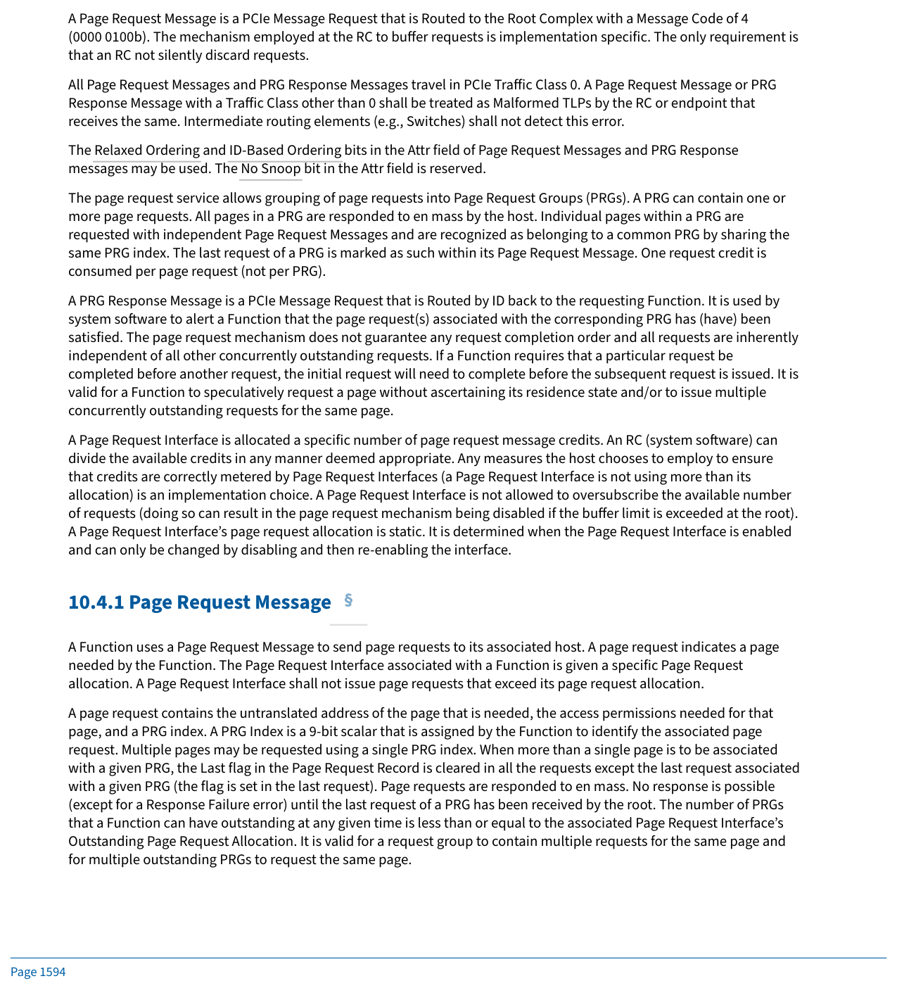

> **Figure 10-24.** Page Request Message - Flit Mode
> 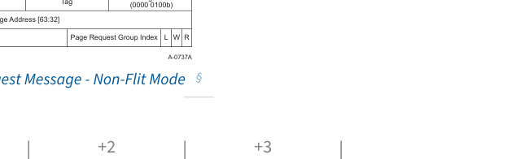

[⬆️ 返回目录](#-本章目录-table-of-contents)

---

#### 10.4.1.1 PASID Usage § | 10.4.1.1 PASID 使用 §

table>
<thead>
<tr>
<th width="50%">🇬🇧 English</th>
<th width="50%" style="background-color:#e8e8e8">🇨🇳 中文</th>
</tr>
</thead>
<tbody>
<tr>
<td>

| L | Last Request in PRG - This field, when Set, indicates that the associated page request is the last request of the associated PRG. A PRG can have a single entry, in which case the PRG consists of a single request in which this field is Set. When Clear, this field indicates that additional page requests will be posted using this record's PRG Index. If R and W are both Clear and L is Set, this is a Stop Marker (see § Section 10.4.1.2.1). |
| Page Request Group Index | Page Request Group Index - This field contains a Function supplied identifier for the associated page request. A Function need not employ the entire available range of PRG index values. A host shall never respond with a PRG Index that has not been previously issued by the Function and that is not currently an outstanding request PRG Index (except when issuing a Response Failure, in which case the host need not preserve the associated request's PRG Index value in the error response). |
| Page Address | Page Address - This field contains the untranslated address of the page to be loaded. For pages larger than 4096 bytes, the least significant bits of this field are ignored. For example, the least significant bit of this field is ignored when an 8096-byte page is being requested. |

The PASID Extended Capability indicates whether a Function supports PASID TLP Prefixes (NFM) or OHC-A1 with PASID (FM), and whether it is enabled to send and receive them.

Functions that support PASID are permitted to send a PASID on Page Request Messages. The PASID field contains the process address space of the page being requested and the Execute Requested and Privileged Mode Requested bits indicate the access being requested. In FM, the NW bit and the Last DW BW / 1st DW BE fields in the OHC-A1 are Reserved.

If one Page Request Message in a PRG has a PASID, all Page Request Messages in that PRG must contain identical PASID values. Behavior is undefined when the PASID values are inconsistent.

Functions that support PASID and have the PRG Response PASID Required bit Set (see § Section 10.5.2.3), expect that PRG Response Messages will contain a PASID if the associated Page Request Message had a PASID. For such PRG Response Messages, the Execute Requested and Privileged Mode Requested bits are reserved and the PASID field contains the PASID from the associated Page Request Message.

There are rules for stopping and starting the use of a PASID.

This section describes additional rules that apply to Functions that have issued Page Request Messages in a PASID that is being stopped. No additional rules are required to start the usage of the Page Request Interface for a PASID.

When stopping the use of a particular PASID, a Stop Marker Message may be optionally used to avoid waiting for PRG Response Messages before the Function indicates that the stop request for a particular PASID has completed.

> **IMPLEMENTATION NOTE:**
> **LAST BIT AND RELAXED ORDERING**
> If multiple page requests are associated with a single PRG index, the last page request of a PRG should have the Relaxed Ordering attribute bit Clear in addition to having the Last flag Set. All other page request messages may have the Relaxed Ordering attribute bit set to any value.

</td>
<td style="background-color:#e8e8e8">

| L | PRG 中最后一个请求 - 此字段置位时,表示关联页请求是关联 PRG 的最后一个请求。PRG 可以具有单个条目,在这种情况下,PRG 由单个请求组成,且此字段已置位。清零时,此字段表示将使用此记录的 PRG 索引发布其他页请求。如果 R 和 W 均清零且 L 置位,则为停止标记(参见 § 第 10.4.1.2.1 节)。 |
| Page Request Group Index | 页请求组索引 - 此字段包含功能为关联页请求提供的标识符。功能无需使用 PRG 索引值的整个可用范围。除非在发出 Response Failure 时主机无需在错误响应中保留关联请求的 PRG 索引值,否则主机不得以未由功能先前发出且当前不是未完成请求 PRG 索引的 PRG 索引进行响应。 |
| Page Address | 页地址 - 此字段包含要加载的页的未转换地址。对于大于 4096 字节的页,此字段的最低有效位被忽略。例如,在请求 8192 字节页时,此字段的最低有效位被忽略。 |

PASID Extended Capability 指示功能是否支持 PASID TLP Prefix(NFM)或带 PASID 的 OHC-A1(FM),以及是否已启用以发送和接收它们。

支持 PASID 的功能允许在页请求消息上发送 PASID。PASID 字段包含所请求页的进程地址空间,Execute Requested 和 Privileged Mode Requested 位指示所请求的访问。在 FM 中,OHC-A1 中的 NW 位和 Last DW BW / 1st DW BE 字段保留。

如果 PRG 中的一个页请求消息具有 PASID,则该 PRG 中的所有页请求消息必须包含相同的 PASID 值。当 PASID 值不一致时,行为未定义。

支持 PASID 且 PRG Response PASID Required 位置位(参见 § 第 10.5.2.3 节)的功能,期望在关联的页请求消息具有 PASID 时,PRG 响应消息将包含 PASID。对于此类 PRG 响应消息,Execute Requested 和 Privileged Mode Requested 位保留,PASID 字段包含来自关联页请求消息的 PASID。

存在停止和开始使用 PASID 的规则。

本节描述适用于已在正在停止的 PASID 中发出页请求消息的功能的附加规则。对于为 PASID 启动页请求接口的使用,不需要其他规则。

停止使用特定 PASID 时,可以可选地使用停止标记消息 (Stop Marker Message),以避免在功能指示特定 PASID 的停止请求已完成之前等待 PRG 响应消息。

> **实现说明 (IMPLEMENTATION NOTE):**
> **LAST 位与 RELAXED ORDERING (LAST BIT AND RELAXED ORDERING)**
> 如果多个页请求与单个 PRG 索引关联,则 PRG 的最后一个页请求应将 Relaxed Ordering 属性位清零,以及将 Last 标志置位。所有其他页请求消息可以将 Relaxed Ordering 属性位设置为任何值。

</td>
</tr>
</tbody>
</table>

[⬆️ 返回目录](#-本章目录-table-of-contents)

---

#### 10.4.1.2 Managing PASID Usage on PRG Requests § | 10.4.1.2 在 PRG 请求上管理 PASID 使用 §

<table>
<thead>
<tr>
<th width="50%">🇬🇧 English</th>
<th width="50%" style="background-color:#e8e8e8">🇨🇳 中文</th>
</tr>
</thead>
<tbody>
<tr>
<td>

To stop without using a Stop Marker Message, the Function shall:
1. Stop queueing new Page Request Messages for this PASID.
2. Finish transmitting any multi-page Page Request Messages for this PASID (i.e., send the Page Request Message with the L bit Set).
3. Wait for PRG Response Messages associated any outstanding Page Request Messages for the PASID.
4. Indicate that the PASID has stopped using a device specific mechanism. This mechanism must indicate that a Stop Marker Message will not be generated.

To stop with the use of a Stop Marker Message the Function shall:
1. Stop queueing new Page Request Messages for this PASID.
2. Finish transmitting any multi-page Page Request Messages for this PASID (i.e., send the Page Request Message with the L bit Set).
3. Internally mark all outstanding Page Request Messages for this PASID as stale. PRG Response Messages associated with these requests will return Page Request Allocation credits and PRG Index values but are otherwise ignored.201
4. Indicate that the PASID has stopped using a device specific mechanism. This mechanism must indicate that a Stop Marker Message will be generated.
5. Send a Stop Marker Message to indicate to the host that all subsequent Page Request Messages for this PASID are for a new use of the PASID value.

Note: Steps 4 and 5 may be performed in either order, or in parallel.

</td>
<td style="background-color:#e8e8e8">

要不使用停止标记消息停止,功能应:
1. 停止为此 PASID 排队新的页请求消息。
2. 完成此 PASID 的任何多页页请求消息的发送(即,发送 L 位置位的页请求消息)。
3. 等待与此 PASID 的任何未完成页请求消息关联的 PRG 响应消息。
4. 使用设备特定机制指示 PASID 已停止使用。此机制必须指示不会生成停止标记消息。

要使用停止标记消息停止,功能应:
1. 停止为此 PASID 排队新的页请求消息。
2. 完成此 PASID 的任何多页页请求消息的发送(即,发送 L 位置位的页请求消息)。
3. 在内部将此 PASID 的所有未完成页请求消息标记为过期。与这些请求关联的 PRG 响应消息将返回页请求分配信用和 PRG 索引值,但除此之外将被忽略。201
4. 使用设备特定机制指示 PASID 已停止使用。此机制必须指示将生成停止标记消息。
5. 发送停止标记消息以向主机指示此 PASID 的所有后续页请求消息用于该 PASID 值的新用途。

注:步骤 4 和 5 可以按任意顺序或并行执行。

</td>
</tr>
</tbody>
</table>

[⬆️ 返回目录](#-本章目录-table-of-contents)

---

##### 10.4.1.2.1 Stop Marker Messages § | 10.4.1.2.1 停止标记消息 §

table>
<thead>
<tr>
<th width="50%">🇬🇧 English</th>
<th width="50%" style="background-color:#e8e8e8">🇨🇳 中文</th>
</tr>
</thead>
<tbody>
<tr>
<td>

A Stop Marker Message indicates that a Function has stopped using the Page Request Interface and has transmitted all pending Page Request Messages for a specific PASID. Stop Marker Messages are strongly ordered with respect to Page Request Messages and serve to push Page Request Messages toward the Host. When the Host receives the Stop Marker Message, this indicates that all Page Request Messages associated with the PASID being stopped have been delivered and that any subsequent Page Request Message with the same PASID value are associated with a new incarnation of that PASID value.

Stop Marker Messages do not have a response. They do not have a PRG Index and do not consume Page Request allocation (see § Section 10.5.2.5).

The Stop Marker Message bit layout is shown in § Figure 10-25.

> **Figure 10-25.** Stop Marker Message - Non-Flit Mode
> 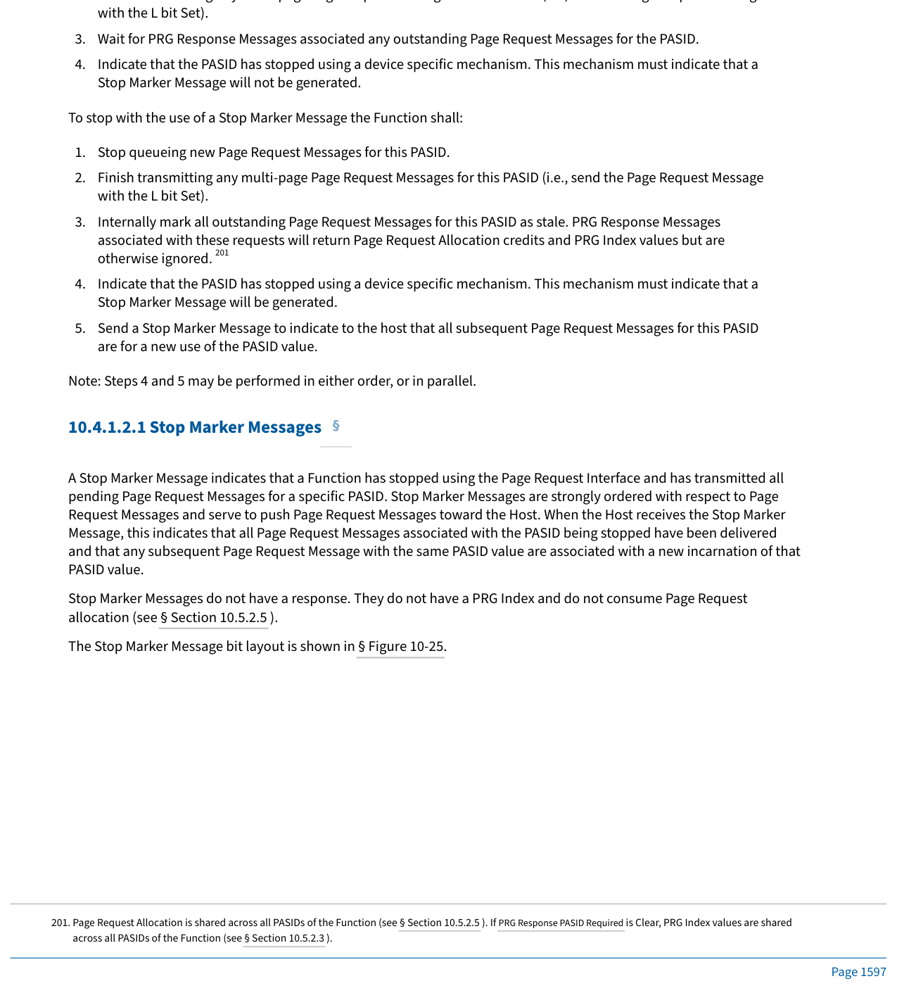

> **Figure 10-26.** Stop Marker Message - Flit Mode
> 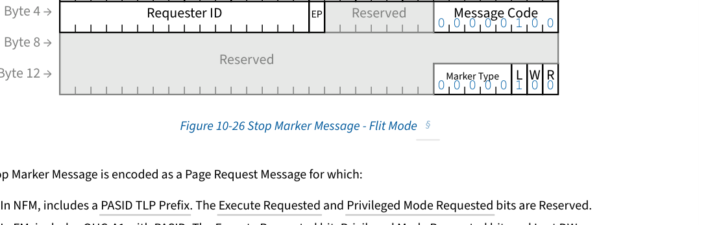

A Stop Marker Message is encoded as a Page Request Message for which:
- In NFM, includes a PASID TLP Prefix. The Execute Requested and Privileged Mode Requested bits are Reserved.
- In FM, includes OHC-A1 with PASID. The Execute Requested bit, Privileged Mode Requested bit, and Last DW BW / 1st DW BE fields in the OHC-A1 are Reserved.
- The L, W and R fields contain 1b, 0b and 0b respectively.
- The Untranslated Address field and upper bits of the PRG Index field are Reserved.
- The Marker Type field contains 0 0000b to indicate that this is a Stop Marker Message.
- The Traffic Class must be 0.
- The Relaxed Ordering attribute bit must be Clear.
- The ID-Based Ordering attribute bit may be Set.

Behavior is undefined if a Stop Marker Message is received and any of the following are true:
- Marker Type not equal to 0 0000b.
- No PASID TLP Prefix is present (NFM).
- The PASID value does not match an outstanding stop request.
- An incomplete Page Request Message for the PASID is outstanding (i.e., for some PRG Index, the most recently received Page Request Message did not have the L bit Set).

</td>
<td style="background-color:#e8e8e8">

停止标记消息 (Stop Marker Message) 指示功能已停止使用页请求接口,并已发送针对特定 PASID 的所有挂起页请求消息。停止标记消息相对于页请求消息是强排序的,并用于将页请求消息推送到主机。当主机收到停止标记消息时,这表示与正在停止的 PASID 关联的所有页请求消息均已传送,并且具有相同 PASID 值的任何后续页请求消息与该 PASID 值的新实例相关联。

停止标记消息没有响应。它们没有 PRG 索引,不消耗页请求分配(参见 § 第 10.5.2.5 节)。

停止标记消息的位布局如 § 图 10-25 所示。

停止标记消息编码为页请求消息,其中:
- 在 NFM 中,包括 PASID TLP Prefix。Execute Requested 和 Privileged Mode Requested 位保留。
- 在 FM 中,包括带 PASID 的 OHC-A1。OHC-A1 中的 Execute Requested 位、Privileged Mode Requested 位和 Last DW BW / 1st DW BE 字段保留。
- L、W 和 R 字段分别包含 1b、0b 和 0b。
- Untranslated Address 字段和 PRG Index 字段的高位保留。
- Marker Type 字段包含 0 0000b,指示这是停止标记消息。
- 流量类必须为 0。
- Relaxed Ordering 属性位必须清零。
- 基于 ID 的排序属性位可置位。

如果收到停止标记消息且以下任一为真,则行为未定义:
- Marker Type 不等于 0 0000b。
- 不存在 PASID TLP Prefix(NFM)。
- PASID 值与未完成停止请求不匹配。
- PASID 的未完成页请求消息不完整(即,对于某些 PRG 索引,最近收到的页请求消息未设置 L 位)。

</td>
</tr>
</tbody>
</table>

[⬆️ 返回目录](#-本章目录-table-of-contents)

---

<<<PAGE_BREAK>>> page_1593

<<<PAGE_BREAK>>> page_1594

<<<PAGE_BREAK>>> page_1595

<<<PAGE_BREAK>>> page_1596

<<<PAGE_BREAK>>> page_1597

<<<PAGE_BREAK>>> page_1598

### 10.4.2 Page Request Group Response Message § | 10.4.2 页请求组响应消息 §

<table>
<thead>
<tr>
<th width="50%">🇬🇧 English</th>
<th width="50%" style="background-color:#e8e8e8">🇨🇳 中文</th>
</tr>
</thead>
<tbody>
<tr>
<td>

System hardware and/or software communicate with a Function's page request interface via PRG Response Messages. A PRG Response Message is used by a host to signal the completion of a PRG, or the catastrophic failure of the interface. A single PRG Response Message is issued in response to a PRG, independent of the number of page requests associated with the PRG. There is no mechanism for indicating a partial request completion or partial request failure. If any of the pages associated with a given PRG cannot be satisfied, then the request is considered to have failed and the reason for the failure is supplied in the PRG Response Message. The host has no obligation to partially satisfy a multi-page request. If one of the requested pages cannot be made resident, then the entire request can, but need not, be discarded. That is, the residence of pages that share a PRG with a failed page request, but that are not associated with the failure, is indeterminate from the Function's perspective.

There are four possible Page Request failures:
1. The requested page is not a valid Untranslated Address.
2. PASID support exists, the Page Request has a PASID, and either PASID usage is not enabled for this request, the PASID value is not valid, or the Execute Requested bit is Set when R is Clear.202
3. The requested page does not have the requested access attributes (including Execute permission and/or Privileged Mode access when those bits are present).
4. The system is, for an unspecified reason, unable to respond to the request. This response is terminal (the host may no longer respond to any page requests and may not supply any further replies to the Function until the Function's page request interface has been reset). For example, a request that violates a Function's assigned request limit or overflows the RC's buffering capability may cause this type of failure.

A Function's response to Page Request failure cases 1, 2, and 3 above is implementation dependent. The failure is not necessarily persistent, that is, a failed request may, in some instances succeed if re-issued. The range of possibilities precludes the precise specification of a generalized failure behavior, though on a per Function basis, the response to a failure will be an implementation dependent behavior.

All responses are sent to their associated Functions via PRG Response Messages. A Function must be capable of sinking multiple consecutive messages without losing any information. To avoid deadlock, a Function must able to process PRG Response Messages for all of the Function's outstanding Page Request Messages without depending on the Function sending or receiving any other TLP.203 A PRG Response Message is an ID routed PCIe message. The only Page Request Interface specific fields in this message are the Response Code and PRG. All other fields are standard PCIe message fields. (Note: these messages are routed based on the ID in bytes 8 and 9; with bytes 4 and 5 containing the host's Requester ID.)

Receipt of a PRG Response Message that contains a PRG Index that is not currently outstanding at a Function shall result in the UPRGI flag in the Page Request Extended Capability being Set, contingent upon the TLP otherwise being error free. Because of ambiguous language in earlier versions of this specification, it is permitted (though discouraged) to handle this case as an Unsupported Request (UR) or Unexpected Completion (UC) by the Function containing the Page Request Extended Capability, but otherwise no other error is permitted to be logged or signaled.

In order to prevent overflow, it is recommended to size Page Request queuing appropriately so that it does not overflow under expected behavior. If an overflow condition occurs, it is permitted to recover and resynchronize Page Request accounting as follows:
- The TA, upon detecting the overflow condition, stops accepting all incoming Page Requests for the queue and generates Page Request Group Responses with a Response Code of Success to Page Requests with L=1.

**Table 10-7. PRG Response Message Data Fields | 表 10-7 PRG 响应消息数据字段**

| Field | Meaning |
|-------|---------|
| Page Request Group Index | Page Request Group Index - This field contains a Function supplied index to which the RC is responding. A given PRG Index will receive exactly one response per instance of PRG (with the possible exception of a Response Failure). |
| Response Code | Response Code - This field contains the response type of the associated PRG. The encodings are presented in § Section 10.4.2.1. |

</td>
<td style="background-color:#e8e8e8">

系统硬件和/或软件通过 PRG 响应消息与功能的页请求接口通信。主机使用 PRG 响应消息来发出 PRG 完成或接口灾难性失败的信号。针对 PRG 发出单个 PRG 响应消息,与该 PRG 关联的页请求数量无关。没有任何机制用于指示部分请求完成或部分请求失败。如果与给定 PRG 关联的任何页无法满足,则认为该请求已失败,且失败原因在 PRG 响应消息中提供。主机没有义务部分满足多页请求。如果所请求的页之一无法驻留,则整个请求可以(但不必)被丢弃。即,与失败的页请求共享 PRG 但与失败无关的页的驻留从功能的角度看是不确定的。

存在四种可能的页请求失败:
1. 所请求的页不是有效的未转换地址。
2. 存在 PASID 支持,页请求具有 PASID,且以下任一为真:此请求未启用 PASID 使用,PASID 值无效,或当 R 清零时 Execute Requested 位置位。202
3. 所请求的页不具有所请求的访问属性(包括 Execute 权限和/或特权模式访问,当这些位存在时)。
4. 系统因未指定的原因无法响应该请求。此响应是终态的(主机不再响应任何页请求,且在功能的页请求接口被重置之前不再向该功能提供任何进一步回复)。例如,违反功能的已分配请求限制或使 RC 缓冲能力溢出的请求可能导致此类失败。

功能对上述页请求失败情况 1、2 和 3 的响应依赖于实现。失败不一定是持久的,即,失败的请求在某些情况下如果重新发出可能会成功。可能性范围排除通用化失败行为的精确规范,但在逐功能的基础上,对失败的响应将是依赖于实现的行为。

所有响应均通过 PRG 响应消息发送给其关联功能。功能必须能够接收多个连续消息而不会丢失任何信息。为避免死锁,功能必须能够处理该功能所有未完成页请求消息的 PRG 响应消息,而不依赖于该功能发送或接收任何其他 TLP。203 PRG 响应消息是 ID 路由的 PCIe 消息。此消息中仅有的页请求接口特定字段是 Response Code 和 PRG。所有其他字段均为标准 PCIe 消息字段。(注:这些消息根据字节 8 和 9 中的 ID 进行路由;字节 4 和 5 包含主机的 Requester ID。)

如果收到 PRG 响应消息,其包含的 PRG 索引在功能处当前不是未完成的,则应在 TLP 本身无误的条件下,在 Page Request Extended Capability 中设置 UPRGI 标志。由于本规范早期版本中含糊的措辞,允许(但不鼓励)由包含 Page Request Extended Capability 的功能将此情况作为 Unsupported Request (UR) 或 Unexpected Completion (UC) 处理,但除此之外不允许记录或发出其他错误。

为防止溢出,建议适当调整页请求队列的大小,使其在预期行为下不会溢出。如果发生溢出情况,允许按如下方式恢复和重新同步页请求计数:
- TA 在检测到溢出情况时,停止接受队列的所有传入页请求,并为 L=1 的页请求生成 Response Code 为 Success 的页请求组响应。

**Table 10-7. PRG Response Message Data Fields | 表 10-7 PRG 响应消息数据字段**

| 字段 | 含义 |
|-------|---------|
| Page Request Group Index | 页请求组索引 - 此字段包含 RC 正在响应的功能提供的索引。给定 PRG 索引将针对每个 PRG 实例接收恰好一个响应(可能存在 Response Failure 的例外)。 |
| Response Code | 响应代码 - 此字段包含关联 PRG 的响应类型。编码见 § 第 10.4.2.1 节。 |

</td>
</tr>
</tbody>
</table>

> **Figure 10-27.** PRG Response Message - Non-Flit Mode
> 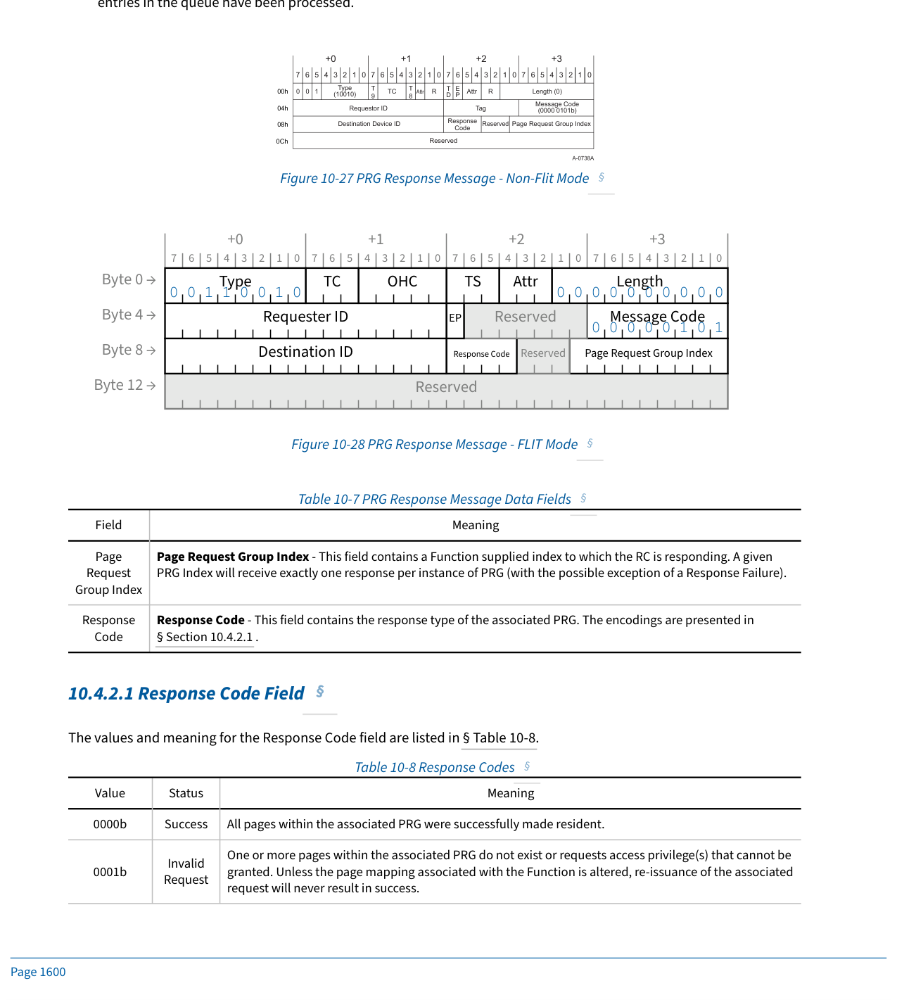

> **Figure 10-28.** PRG Response Message - FLIT Mode
> 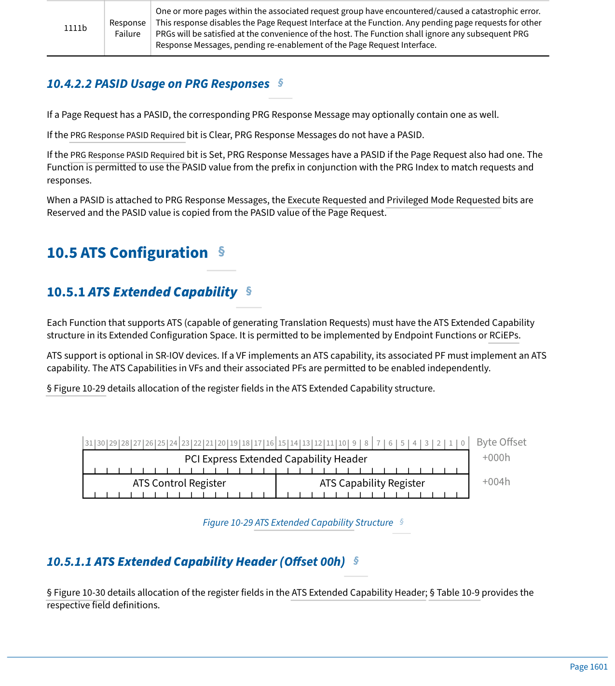

[⬆️ 返回目录](#-本章目录-table-of-contents)

---

#### 10.4.2.1 Response Code Field § | 10.4.2.1 响应代码字段 §

table>
<thead>
<tr>
<th width="50%">🇬🇧 English</th>
<th width="50%" style="background-color:#e8e8e8">🇨🇳 中文</th>
</tr>
</thead>
<tbody>
<tr>
<td>

**Table 10-8. Response Codes | 表 10-8 响应代码**

| Value | Status | Meaning |
|-------|--------|---------|
| 0000b | Success | All pages within the associated PRG were successfully made resident. |
| 0001b | Invalid Request | One or more pages within the associated PRG do not exist or requests access privilege(s) that cannot be granted. Unless the page mapping associated with the Function is altered, re-issuance of the associated request will never result in success. |
| 1110b:0010b | Unused | Unused Response Code values. A Function receiving such a message shall process it as if the message contained a Response Code of Response Failure. |
| 1111b | Response Failure | One or more pages within the associated request group have encountered/caused a catastrophic error. This response disables the Page Request Interface at the Function. Any pending page requests for other PRGs will be satisfied at the convenience of the host. The Function shall ignore any subsequent PRG Response Messages, pending re-enablement of the Page Request Interface. |

If a Page Request has a PASID, the corresponding PRG Response Message may optionally contain one as well.

If the PRG Response PASID Required bit is Clear, PRG Response Messages do not have a PASID.

If the PRG Response PASID Required bit is Set, PRG Response Messages have a PASID if the Page Request also had one. The Function is permitted to use the PASID value from the prefix in conjunction with the PRG Index to match requests and responses.

When a PASID is attached to PRG Response Messages, the Execute Requested and Privileged Mode Requested bits are Reserved and the PASID value is copied from the PASID value of the Page Request.

</td>
<td style="background-color:#e8e8e8">

**Table 10-8. Response Codes | 表 10-8 响应代码**

| 值 | 状态 | 含义 |
|-------|--------|---------|
| 0000b | Success(成功) | 关联 PRG 中的所有页均已成功驻留。 |
| 0001b | Invalid Request(无效请求) | 关联 PRG 中的一个或多个页不存在,或请求无法授予的访问权限。除非与该功能关联的页映射被更改,否则重新发出关联请求永远不会成功。 |
| 1110b:0010b | Unused(未使用) | 未使用的 Response Code 值。收到此类消息的功能应将其视为包含 Response Code 为 Response Failure 的消息进行处理。 |
| 1111b | Response Failure(响应失败) | 关联请求组中的一个或多个页遇到/导致灾难性错误。此响应禁用该功能的页请求接口。其他 PRG 的任何挂起页请求将由主机自行决定满足。功能应忽略任何后续 PRG 响应消息,等待页请求接口重新启用。 |

如果页请求具有 PASID,则对应的 PRG 响应消息也可以可选地包含一个。

如果 PRG Response PASID Required 位清零,则 PRG 响应消息没有 PASID。

如果 PRG Response PASID Required 位置位,则当页请求也具有 PASID 时,PRG 响应消息具有 PASID。允许该功能使用来自 Prefix 的 PASID 值与 PRG 索引一起匹配请求和响应。

当 PASID 附加到 PRG 响应消息时,Execute Requested 和 Privileged Mode Requested 位保留,且 PASID 值从页请求的 PASID 值复制。

</td>
</tr>
</tbody>
</table>

[⬆️ 返回目录](#-本章目录-table-of-contents)

---

#### 10.4.2.2 PASID Usage on PRG Responses § | 10.4.2.2 PRG 响应中的 PASID 使用 §

<table>
<thead>
<tr>
<th width="50%">🇬🇧 English</th>
<th width="50%" style="background-color:#e8e8e8">🇨🇳 中文</th>
</tr>
</thead>
<tbody>
<tr>
<td>

Each Function that supports ATS (capable of generating Translation Requests) must have the ATS Extended Capability structure in its Extended Configuration Space. It is permitted to be implemented by Endpoint Functions or RCiEPs. ATS support is optional in SR-IOV devices. If a VF implements an ATS capability, its associated PF must implement an ATS capability. The ATS Capabilities in VFs and their associated PFs are permitted to be enabled independently.

§ Figure 10-29 details allocation of the register fields in the ATS Extended Capability structure.

</td>
<td style="background-color:#e8e8e8">

每个支持 ATS(能够生成转换请求)的功能必须在其扩展配置空间中具有 ATS Extended Capability 结构。允许由端点功能或 RCiEP 实现。SR-IOV 设备中可选支持 ATS。如果 VF 实现 ATS 能力,则其关联的 PF 必须实现 ATS 能力。VF 及其关联 PF 中的 ATS Capability 允许独立启用。

§ 图 10-29 详述了 ATS Extended Capability 结构中寄存器字段的分配。

</td>
</tr>
</tbody>
</table>

[⬆️ 返回目录](#-本章目录-table-of-contents)

---

## 10.5 ATS Configuration § | 10.5 ATS 配置 §

table>
<thead>
<tr>
<th width="50%">🇬🇧 English</th>
<th width="50%" style="background-color:#e8e8e8">🇨🇳 中文</th>
</tr>
</thead>
<tbody>
<tr>
<td>

> **Figure 10-30.** ATS Extended Capability Header
> 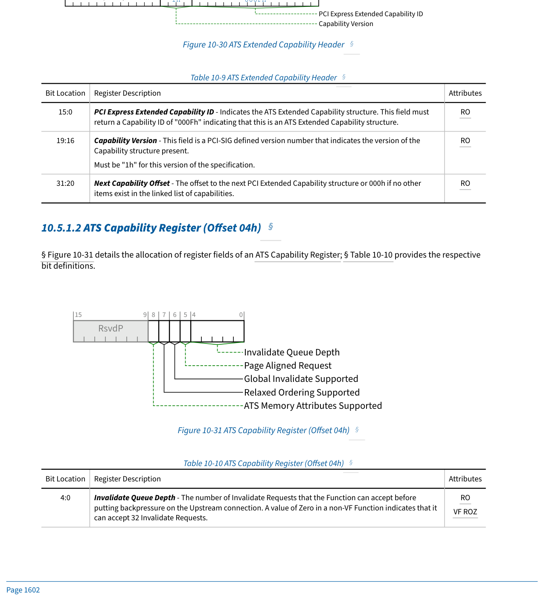

**Table 10-9. ATS Extended Capability Header | 表 10-9 ATS Extended Capability 头**

| Bit Location | Register Description | Attributes |
|--------------|----------------------|------------|
| 15:0 | PCI Express Extended Capability ID - Indicates the ATS Extended Capability structure. This field must return a Capability ID of "000Fh" indicating that this is an ATS Extended Capability structure. | RO |
| 19:16 | Capability Version - This field is a PCI-SIG defined version number that indicates the version of the Capability structure present. Must be "1h" for this version of the specification. | RO |
| 31:20 | Next Capability Offset - The offset to the next PCI Extended Capability structure or 000h if no other items exist in the linked list of capabilities. | RO |

**Table 10-10. ATS Capability Register (Offset 04h) | 表 10-10 ATS Capability 寄存器 (Offset 04h)**

| Bit Location | Register Description | Attributes |
|--------------|----------------------|------------|
| 4:0 | Invalidate Queue Depth - The number of Invalidate Requests that the Function can accept before putting backpressure on the Upstream connection. A value of Zero in a non-VF Function indicates that it can accept 32 Invalidate Requests. | RO, VF ROZ |

</td>
<td style="background-color:#e8e8e8">

**Table 10-9. ATS Extended Capability Header | 表 10-9 ATS Extended Capability 头**

| 位位置 | 寄存器描述 | 属性 |
|--------------|----------------------|------------|
| 15:0 | PCI Express Extended Capability ID - 指示 ATS Extended Capability 结构。此字段必须返回 Capability ID 为 "000Fh",指示这是 ATS Extended Capability 结构。 | RO |
| 19:16 | Capability Version - 此字段是 PCI-SIG 定义的版本号,指示存在的 Capability 结构的版本。对于本规范的此版本,必须为 "1h"。 | RO |
| 31:20 | Next Capability Offset - 下一个 PCI Extended Capability 结构的偏移量,或 000h(如果链接的 capability 列表中没有其他项)。 | RO |

**Table 10-10. ATS Capability Register (Offset 04h) | 表 10-10 ATS Capability 寄存器 (Offset 04h)**

| 位位置 | 寄存器描述 | 属性 |
|--------------|----------------------|------------|
| 4:0 | Invalidate Queue Depth - 功能在上游连接上产生反压之前可以接受的 Invalidate 请求数。非 VF 功能中的零值表示它可以接受 32 个 Invalidate 请求。 | RO, VF ROZ |

</td>
</tr>
</tbody>
</table>

[⬆️ 返回目录](#-本章目录-table-of-contents)

---

### 10.5.1 ATS Extended Capability § | 10.5.1 ATS Extended Capability §

<table>
<thead>
<tr>
<th width="50%">🇬🇧 English</th>
<th width="50%" style="background-color:#e8e8e8">🇨🇳 中文</th>
</tr>
</thead>
<tbody>
<tr>
<td>

**Table 10-10 (continued). ATS Capability Register (Offset 04h) | 表 10-10 (续) ATS Capability 寄存器 (Offset 04h)**

| Bit Location | Register Description | Attributes |
|--------------|----------------------|------------|
| 4:0 (cont) | For VFs, this field must be hardwired to Zero. VFs share the queue of the associated PF. See § Section 10.3.5. | - |
| 5 | Page Aligned Request - If Set, indicates the Untranslated Address is always aligned to a 4096 byte boundary. This field permits software to distinguish between implementations compatible with this specification and those compatible with an earlier version of this specification in which a Requester was permitted to supply anything in bits [11:2]. It is strongly recommended that this bit be Set. | RO |
| 6 | Global Invalidate Supported - If Set, the Function supports Invalidation Requests that have the Global Invalidate bit Set. If Clear, the Function ignores the Global Invalidate bit in all Invalidate Requests (see § Section 10.3.8). It is strongly recommended that this bit be Clear. This bit must be hardwired to Zero if the Function does not support PASID. | RO |
| 7 | Relaxed Ordering Supported - If Set, indicates this Function is permitted to Set the RO bit in Translation Requests when Enable Relaxed Ordering bit is Set. | RO |
| 8 | ATS Memory Attributes Supported – If Set, the Function supports using AMA values from ATS Translation Completions in the Function ATC. When Clear, the Function ignores the AMA field in ATS Translation Completions. | RO |

**Table 10-11. ATS Control Register | 表 10-11 ATS Control 寄存器**

| Bit Location | Register Description | Attributes |
|--------------|----------------------|------------|
| 4:0 | Smallest Translation Unit (STU) - This value indicates to the Function the minimum number of 4096-byte blocks that is indicated in a Translation Completions or Invalidate Requests. This is a power of 2 multiplier and the number of blocks is 2^STU. A value of 0 0000b indicates one block and a value of 1 1111b indicates 2^31 blocks (or 8 TB total) | RW, VF ROZ |

</td>
<td style="background-color:#e8e8e8">

**Table 10-10 (续). ATS Capability Register (Offset 04h) | 表 10-10 (续) ATS Capability 寄存器 (Offset 04h)**

| 位位置 | 寄存器描述 | 属性 |
|--------------|----------------------|------------|
| 4:0 (续) | 对于 VF,此字段必须硬连线为零。VF 共享关联 PF 的队列。参见 § 第 10.3.5 节。 | - |
| 5 | Page Aligned Request - 置位时,指示 Untranslated Address 始终与 4096 字节边界对齐。此字段允许软件区分与本规范兼容的实现和与本规范早期版本(其中允许请求者提供位 [11:2] 中的任何值)兼容的实现。强烈建议置位此位。 | RO |
| 6 | Global Invalidate Supported - 置位时,该功能支持具有 Global Invalidate 位置位的 Invalidation 请求。清零时,该功能忽略所有 Invalidate 请求中的 Global Invalidate 位(参见 § 第 10.3.8 节)。强烈建议清零此位。如果该功能不支持 PASID,则此位必须硬连线为零。 | RO |
| 7 | Relaxed Ordering Supported - 置位时,指示当 Enable Relaxed Ordering 位置位时,允许该功能在转换请求中置位 RO 位。 | RO |
| 8 | ATS Memory Attributes Supported – 置位时,该功能支持在功能 ATC 中使用来自 ATS 转换完成的 AMA 值。清零时,该功能忽略 ATS 转换完成中的 AMA 字段。 | RO |

**Table 10-11. ATS Control Register | 表 10-11 ATS Control 寄存器**

| 位位置 | 寄存器描述 | 属性 |
|--------------|----------------------|------------|
| 4:0 | Smallest Translation Unit (STU) - 此值向功能指示在转换完成或 Invalidate 请求中指示的最小 4096 字节块数。这是 2 的幂乘数,块数为 2^STU。值 0 0000b 指示一个块,值 1 1111b 指示 2^31 块(即总共 8 TB) | RW, VF ROZ |

</td>
</tr>
</tbody>
</table>

> **Figure 10-32.** ATS Capability Register (Offset 04h) - continued
> 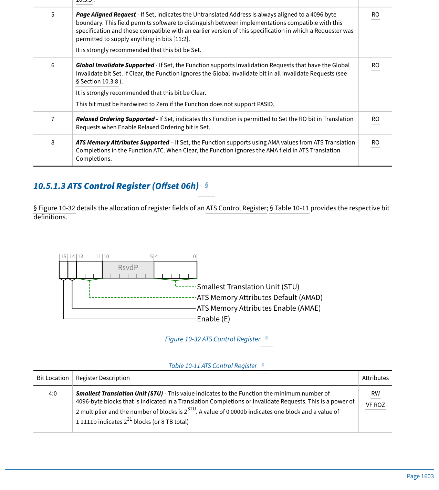

[⬆️ 返回目录](#-本章目录-table-of-contents)

---

#### 10.5.1.1 ATS Extended Capability Header (Offset 00h) § | 10.5.1.1 ATS Extended Capability 头 (Offset 00h) §

table>
<thead>
<tr>
<th width="50%">🇬🇧 English</th>
<th width="50%" style="background-color:#e8e8e8">🇨🇳 中文</th>
</tr>
</thead>
<tbody>
<tr>
<td>

**Table 10-11 (continued). ATS Control Register | 表 10-11 (续) ATS Control 寄存器**

| Bit Location | Register Description | Attributes |
|--------------|----------------------|------------|
| 4:0 (cont) | For VFs, this field must be hardwired to Zero. The associated PF's value applies. Default value is 0 0000b. | - |
| 13:11 | ATS Memory Attributes Default (AMAD) – When Set, as a performance optimization, and when AMAE is Set, the Requester is permitted to provide only non-default AMA values in Requests using the TPH TLP Prefix. AMAD values are 000b-111b. This field is permitted to be hardwired to 000b if ATS Memory Attributes Supported is Clear. Default value is 000b. | RW/RO |
| 14 | ATS Memory Attributes Enable (AMAE) - When Set, the Requester is permitted to provide AMA values in Requests using the TPH TLP Prefix. This bit is permitted to be hardwired to 0b if the ATS Memory Attributes Supported bit is Clear. Default value is 0b. | RW/RO |
| 15 | Enable (E) - When Set, the Function is enabled to cache translations. Behavior is undefined if this Endpoint Function supports PASID, this bit is Set and any bit in the associated PASID Control Register is changed (see § Section 7.8.9.3). Default value is 0b. | RW |

</td>
<td style="background-color:#e8e8e8">

**Table 10-11 (续). ATS Control Register | 表 10-11 (续) ATS Control 寄存器**

| 位位置 | 寄存器描述 | 属性 |
|--------------|----------------------|------------|
| 4:0 (续) | 对于 VF,此字段必须硬连线为零。适用关联 PF 的值。默认值为 0 0000b。 | - |
| 13:11 | ATS Memory Attributes Default (AMAD) – 置位时,作为性能优化,且当 AMAE 置位时,允许请求者使用 TPH TLP Prefix 在请求中仅提供非默认 AMA 值。AMAD 值为 000b-111b。如果 ATS Memory Attributes Supported 清零,则允许将此字段硬连线为 000b。默认值为 000b。 | RW/RO |
| 14 | ATS Memory Attributes Enable (AMAE) - 置位时,允许请求者使用 TPH TLP Prefix 在请求中提供 AMA 值。如果 ATS Memory Attributes Supported 位清零,则允许将此位硬连线为 0b。默认值为 0b。 | RW/RO |
| 15 | Enable (E) - 置位时,该功能被启用以缓存转换。如果此端点功能支持 PASID、此位置位且关联 PASID Control 寄存器中的任何位被更改(参见 § 第 7.8.9.3 节),则行为未定义。默认值为 0b。 | RW |

</td>
</tr>
</tbody>
</table>

[⬆️ 返回目录](#-本章目录-table-of-contents)

---

#### 10.5.1.2 ATS Capability Register (Offset 04h) § | 10.5.1.2 ATS Capability 寄存器 (Offset 04h) §

<table>
<thead>
<tr>
<th width="50%">🇬🇧 English</th>
<th width="50%" style="background-color:#e8e8e8">🇨🇳 中文</th>
</tr>
</thead>
<tbody>
<tr>
<td>

A Page Request Extended Capability Structure is used to configure the Page Request Interface mechanism. A Multi-Function Device or RCiEP Device may implement a Page Request Interface and the associated capability on any Endpoint Function within the Device. For SR-IOV devices, a single Page Request Interface is permitted for the PF and is shared between the PF and its associated VFs, in which case the PF implements this capability and its VFs must not. Every Page Request Interface mechanism operates independently.

For an SR-IOV device, even though the Page Request Interface is shared between its PFs and VFs, it sends the requesting Function's ID (PF or VF) in the Requester ID field of the Page Request Message, and the requesting Function's ID must be in the Destination Device ID field of the resulting PRG Response Message.

**Table 10-13. Page Request Extended Capability Header | 表 10-13 页请求扩展能力头**

| Bit Location | Register Description | Attributes |
|--------------|----------------------|------------|
| 15:0 | PCI Express Extended Capability ID - Indicates that the associated extended capability structure is a Page Request Extended Capability. This field must return a Capability ID of "0013h". | RO |
| 19:16 | Capability Version - This field is a PCI-SIG defined version number that indicates the version of the Capability structure present. Must be "1h" for this version of the specification. | RO |
| 31:20 | Next Capability Offset - The offset to the next PCI Extended Capability structure or 000h if no other items exist in the linked list of capabilities. | RO |

**Table 10-14. Page Request Control Register | 表 10-14 页请求控制寄存器**

| Bit Location | Register Description | Attributes |
|--------------|----------------------|------------|
| 0 | Enable (E) - This field, when set, indicates that the Page Request Interface is allowed to make page requests. If this field is Clear, the Page Request Interface is not allowed to issue page requests. If both this field and the Stopped field are Clear, then the Page Request Interface will not issue new page requests, but has outstanding page requests that have been transmitted or are queued for transmission. When the Page Request Interface is transitioned from not-Enabled to Enabled, its status flags (Stopped, Response Failure, and Unexpected Page Request Group Index (UPRGI) flags) are cleared. Enabling a Page Request Interface that has not successfully Stopped has indeterminate results. Default value is 0b. | RW |
| 1 | Reset (R) - When the Enable field is clear, or is being cleared in the same register update that sets this field, writing a 1b to this field, clears the associated implementation dependent page request credit counter and pending request state for the associated Page Request Interface. No action is initiated if this field is written to 0b or if this field is written with any value while the Enable field is Set. Reads of this field return 0b | RW |

</td>
<td style="background-color:#e8e8e8">

Page Request Extended Capability Structure 用于配置页请求接口机制。多功能设备或 RCiEP 设备可以在设备内的任何端点功能上实现页请求接口和关联能力。对于 SR-IOV 设备,允许为 PF 设置单个页请求接口,并由 PF 及其关联 VF 共享,在这种情况下,PF 实现此能力,其 VF 不得实现。每个页请求接口机制独立操作。

对于 SR-IOV 设备,即使页请求接口由其 PF 和 VF 共享,它也会在页请求消息的 Requester ID 字段中发送请求功能的 ID(PF 或 VF),并且请求功能的 ID 必须位于结果 PRG 响应消息的 Destination Device ID 字段中。

**Table 10-13. Page Request Extended Capability Header | 表 10-13 页请求扩展能力头**

| 位位置 | 寄存器描述 | 属性 |
|--------------|----------------------|------------|
| 15:0 | PCI Express Extended Capability ID - 指示关联的扩展能力结构是 Page Request Extended Capability。此字段必须返回 Capability ID 为 "0013h"。 | RO |
| 19:16 | Capability Version - 此字段是 PCI-SIG 定义的版本号,指示存在的 Capability 结构的版本。对于本规范的此版本,必须为 "1h"。 | RO |
| 31:20 | Next Capability Offset - 下一个 PCI Extended Capability 结构的偏移量,或 000h(如果链接的 capability 列表中没有其他项)。 | RO |

**Table 10-14. Page Request Control Register | 表 10-14 页请求控制寄存器**

| 位位置 | 寄存器描述 | 属性 |
|--------------|----------------------|------------|
| 0 | Enable (E) - 此字段置位时,指示允许页请求接口发出页请求。如果此字段清零,则不允许页请求接口发出页请求。如果此字段和 Stopped 字段均清零,则页请求接口将不发出新的页请求,但具有已发送或排队等待发送的未完成页请求。当页请求接口从未启用转换到已启用时,其状态标志(Stopped、Response Failure 和 Unexpected Page Request Group Index (UPRGI) 标志)被清除。启用尚未成功 Stopped 的页请求接口具有不确定的结果。默认值为 0b。 | RW |
| 1 | Reset (R) - 当 Enable 字段清零,或正在与置位此字段的同一寄存器更新中清零时,向此字段写入 1b 会清除关联的依赖于实现的页请求信用计数器和关联页请求接口的挂起请求状态。如果此字段被写入 0b,或在 Enable 字段已置位时使用任何值写入此字段,则不启动任何操作。读取此字段返回 0b | RW |

</td>
</tr>
</tbody>
</table>

> **Figure 10-34.** Page Request Extended Capability Structure
> 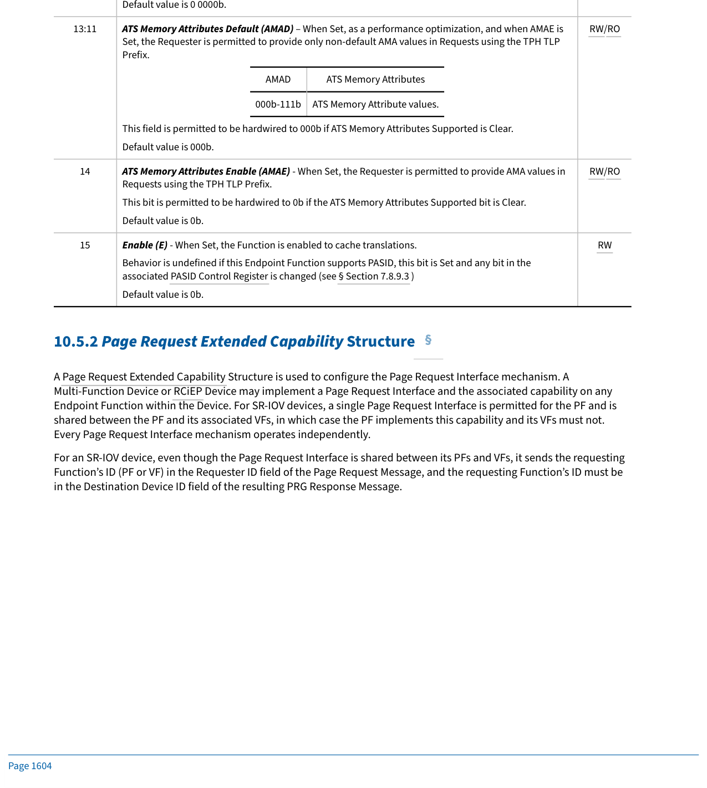

> **Figure 10-35.** Page Request Extended Capability Header
> 

> **Figure 10-36.** Page Request Control Register
> 

[⬆️ 返回目录](#-本章目录-table-of-contents)

---

#### 10.5.1.3 ATS Control Register (Offset 06h) § | 10.5.1.3 ATS Control 寄存器 (Offset 06h) §

table>
<thead>
<tr>
<th width="50%">🇬🇧 English</th>
<th width="50%" style="background-color:#e8e8e8">🇨🇳 中文</th>
</tr>
</thead>
<tbody>
<tr>
<td>

**Table 10-15. Page Request Status Register | 表 10-15 页请求状态寄存器**

| Bit Location | Register Description | Attributes |
|--------------|----------------------|------------|
| 0 | Response Failure (RF) - This field, when Set, indicates that the Function has received a PRG Response Message indicating a Response Failure. The Function expects no further responses from the host (any received are ignored). This field is Set by the Function and Cleared when a one is written to the field. For SR-IOV, this field is Set in the PF if any associated Function (PF or VF) receives a PRG Response Message indicating Response Failure. Default value is 0b. | RW1C |
| 1 | Unexpected Page Request Group Index (UPRGI) - This field, when Set, indicates that the Function has received a PRG Response Message containing a PRG index that has no matching request. This field is Set by the Function and cleared when a one is written to the field. For SR-IOV, this field is Set in the PF if any associated Function (PF or VF) receives a PRG Response Message that does has no matching request. Default value is 0b. | RW1C |
| 8 | Stopped (S) - When this field is Set, the associated page request interface has stopped issuing additional page requests and that all previously issued Page Requests have completed. When this field is Clear the associated page request interface either has not stopped or has stopped issuing new Page Requests but has outstanding Page Requests. This field is only meaningful if Enable is Clear. If Enable is Set, this field is undefined. When the Enable field is Cleared, after having been previously Set, the interface transitions to the stopping state and Clears this field. After all page requests currently outstanding at the Function(s) have completed, this field is Set and the interface enters the disabled state. If there were no outstanding page requests, this field may be Set immediately when Enable is Cleared. Resetting the interface will cause an immediate transition to the disabled state. While in the stopping state, receipt of a Response Failure message will result in the immediate transition to the disabled state (Setting this field). For SR-IOV, this field is Set only when all associated Functions (PF and VFs) have stopped issuing page requests. Default value is 1b. | RO |
| 15 | PRG Response PASID Required - If Set, the Function expects a PASID on PRG Response Messages when the corresponding Page Requests had a PASID. If Clear, the Function does not expect PASID on any PRG Response Message. Function behavior is undefined if this bit is Clear and the Function receives a PRG Response Message with a PASID. Function behavior is undefined if this bit is Set and the Function receives a PRG Response Message with no PASID when the corresponding Page Requests had a PASID. This bit is RsvdZ if the Function does not support PASID. | RO |

</td>
<td style="background-color:#e8e8e8">

**Table 10-15. Page Request Status Register | 表 10-15 页请求状态寄存器**

| 位位置 | 寄存器描述 | 属性 |
|--------------|----------------------|------------|
| 0 | Response Failure (RF) - 此字段置位时,指示该功能已收到指示 Response Failure 的 PRG 响应消息。该功能预期不再有来自主机的响应(任何收到的都将被忽略)。此字段由功能置位,并在向该字段写入 1 时清零。对于 SR-IOV,如果任何关联功能(PF 或 VF)收到指示 Response Failure 的 PRG 响应消息,则此字段在 PF 中置位。默认值为 0b。 | RW1C |
| 1 | Unexpected Page Request Group Index (UPRGI) - 此字段置位时,指示该功能已收到包含无匹配请求的 PRG 索引的 PRG 响应消息。此字段由功能置位,并在向该字段写入 1 时清零。对于 SR-IOV,如果任何关联功能(PF 或 VF)收到没有匹配请求的 PRG 响应消息,则此字段在 PF 中置位。默认值为 0b。 | RW1C |
| 8 | Stopped (S) - 此字段置位时,关联的页请求接口已停止发出额外页请求,且所有先前发出的页请求已完成。当此字段清零时,关联的页请求接口尚未停止,或已停止发出新页请求但有未完成页请求。仅当 Enable 清零时,此字段才有意义。如果 Enable 置位,则此字段未定义。当 Enable 字段在之前已置位之后被清零时,接口转换到 stopping 状态并清零此字段。在功能处当前未完成的所有页请求完成之后,此字段被置位,接口进入 disabled 状态。如果没有未完成的页请求,则此字段可以在 Enable 清零时立即置位。重置接口将导致立即转换到 disabled 状态。在 stopping 状态下,收到 Response Failure 消息将导致立即转换到 disabled 状态(置位此字段)。对于 SR-IOV,仅当所有关联功能(PF 和 VF)已停止发出页请求时,才置位此字段。默认值为 1b。 | RO |
| 15 | PRG Response PASID Required - 置位时,当对应页请求具有 PASID 时,该功能期望 PRG 响应消息上具有 PASID。清零时,该功能不期望任何 PRG 响应消息上具有 PASID。如果此位清零且该功能收到带 PASID 的 PRG 响应消息,则功能行为未定义。如果此位置位且该功能在对应页请求具有 PASID 时收到无 PASID 的 PRG 响应消息,则功能行为未定义。如果该功能不支持 PASID,则此位为 RsvdZ。 | RO |

</td>
</tr>
</tbody>
</table>

[⬆️ 返回目录](#-本章目录-table-of-contents)

---

### 10.5.2 Page Request Extended Capability Structure § | 10.5.2 页请求扩展能力结构 §

<table>
<thead>
<tr>
<th width="50%">🇬🇧 English</th>
<th width="50%" style="background-color:#e8e8e8">🇨🇳 中文</th>
</tr>
</thead>
<tbody>
<tr>
<td>

This register contains the number of outstanding page request messages the associated Page Request Interface physically supports. This is the upper limit on the number of pages that can be usefully allocated to the Page Request Interface.

This register is Read Only.

This register contains the number of outstanding page request messages the associated Page Request Interface is allowed to issue (have outstanding at any given instance).

The number of PRGs a Page Request Interface has outstanding is less than or equal to the number of request messages it has issued. For example, if system software allocates 1000 messages to a Page Request Interface then a single PRG could use all 1000 of the possible requests. Conversely, at one request per PRG the Page Request Interface would run out of PRG indices (of which there are only 512) before it consumes all its page request credits. A Page Request Interface must pre-allocate its request availability for any given PRG, that is, all the requests required by a given PRG must be available before any of the requests may be issued.

When Shadow functions are enabled, this allocation applies to the Function containing this capability and its enabled Shadow Functions (See Section 7.9.21).

This register is Read/Write. Behavior is undefined if this register is changed while the Enable flag is set. Behavior is undefined if this register is written with a value larger than Outstanding Page Request Capacity. Default value is 0.

When PASID is supported, the Request Allocation remains associated with the Function and is shared across the Function as well as all PASIDs of the Function.

Stopping a PASID does not affect any allocation used by that PASID. The system should continue to respond with PRG Response Messages in order to return Page Request and PRG Index resources to the Function (see § Section 10.4.2.1).

Stop Marker Messages consume buffering but are not included in this allocation (see § Section 10.4.1.2.1). Systems should provide additional buffering for Stop Marker Messages and should limit the number of outstanding Stop Marker Messages to avoid overrunning this additional buffering.

</td>
<td style="background-color:#e8e8e8">

此寄存器包含关联页请求接口在物理上支持的未完成页请求消息数。这是有用地分配给页请求接口的页数上限。

此寄存器为只读。

此寄存器包含关联页请求接口被允许发出(在任意给定实例具有未完成)的未完成页请求消息数。

页请求接口具有的未完成 PRG 数小于或等于其已发出的请求消息数。例如,如果系统软件为页请求接口分配 1000 条消息,则单个 PRG 可以使用全部 1000 个可能的请求。反之,每个 PRG 一个请求,页请求接口将在消耗其所有页请求信用之前耗尽 PRG 索引(只有 512 个)。页请求接口必须为其任何给定 PRG 预分配其请求可用性,即,在发出任何请求之前,给定 PRG 所需的所有请求必须可用。

启用影子功能时,此分配适用于包含此能力的功能及其已启用的影子功能(参见第 7.9.21 节)。

此寄存器为读/写。如果在 Enable 标志置位时更改此寄存器,则行为未定义。如果此寄存器写入的值大于 Outstanding Page Request Capacity,则行为未定义。默认值为 0。

支持 PASID 时,Request Allocation 仍与功能关联,并在功能以及该功能的所有 PASID 之间共享。

停止 PASID 不会影响该 PASID 使用的任何分配。系统应继续以 PRG 响应消息进行响应,以将页请求和 PRG 索引资源返回给功能(参见 § 第 10.4.2.1 节)。

停止标记消息消耗缓冲,但不包含在此分配中(参见 § 第 10.4.1.2.1 节)。系统应为停止标记消息提供额外的缓冲,并应限制未完成停止标记消息的数量,以避免超出此额外缓冲。

</td>
</tr>
</tbody>
</table>

[⬆️ 返回目录](#-本章目录-table-of-contents)

---

#### 10.5.2.1 Page Request Extended Capability Header (Offset 00h) § | 10.5.2.1 页请求扩展能力头 (Offset 00h) §

table>
<thead>
<tr>
<th width="50%">🇬🇧 English</th>
<th width="50%" style="background-color:#e8e8e8">🇨🇳 中文</th>
</tr>
</thead>
<tbody>
<tr>
<td>

> **Figure 10-38.** Page Request Extended Capability Structure (registers continued)
> 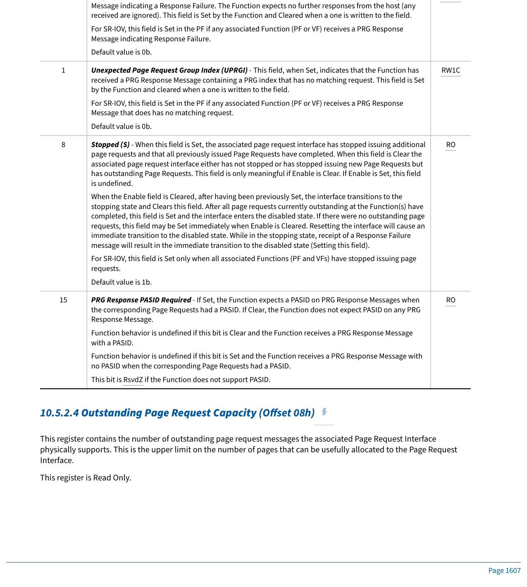

This section describes the Outstanding Page Request Capacity and Outstanding Page Request Allocation registers of the Page Request Extended Capability structure.

The Outstanding Page Request Capacity register (Offset 08h) contains the number of outstanding page request messages the associated Page Request Interface physically supports. This is the upper limit on the number of pages that can be usefully allocated to the Page Request Interface. This register is Read Only.

The Outstanding Page Request Allocation register (Offset 0Ch) contains the number of outstanding page request messages the associated Page Request Interface is allowed to issue.

The number of PRGs a Page Request Interface has outstanding is less than or equal to the number of request messages it has issued. For example, if system software allocates 1000 messages to a Page Request Interface then a single PRG could use all 1000 of the possible requests. Conversely, at one request per PRG the Page Request Interface would run out of PRG indices (of which there are only 512) before it consumes all its page request credits. A Page Request Interface must pre-allocate its request availability for any given PRG, that is, all the requests required by a given PRG must be available before any of the requests may be issued.

When Shadow functions are enabled, this allocation applies to the Function containing this capability and its enabled Shadow Functions (See Section 7.9.21).

This register is Read/Write. Behavior is undefined if this register is changed while the Enable flag is set. Behavior is undefined if this register is written with a value larger than Outstanding Page Request Capacity. Default value is 0.

When PASID is supported, the Request Allocation remains associated with the Function and is shared across the Function as well as all PASIDs of the Function.

Stopping a PASID does not affect any allocation used by that PASID. The system should continue to respond with PRG Response Messages in order to return Page Request and PRG Index resources to the Function (see § Section 10.4.2.1).

Stop Marker Messages consume buffering but are not included in this allocation (see § Section 10.4.1.2.1). Systems should provide additional buffering for Stop Marker Messages and should limit the number of outstanding Stop Marker Messages to avoid overrunning this additional buffering.

</td>
<td style="background-color:#e8e8e8">

本节描述页请求扩展能力结构的 Outstanding Page Request Capacity 和 Outstanding Page Request Allocation 寄存器。

Outstanding Page Request Capacity 寄存器(Offset 08h)包含关联页请求接口在物理上支持的未完成页请求消息数。这是有用地分配给页请求接口的页数上限。此寄存器为只读。

Outstanding Page Request Allocation 寄存器(Offset 0Ch)包含关联页请求接口被允许发出的未完成页请求消息数。

页请求接口具有的未完成 PRG 数小于或等于其已发出的请求消息数。例如,如果系统软件为页请求接口分配 1000 条消息,则单个 PRG 可以使用全部 1000 个可能的请求。反之,每个 PRG 一个请求,页请求接口将在消耗其所有页请求信用之前耗尽 PRG 索引(只有 512 个)。页请求接口必须为其任何给定 PRG 预分配其请求可用性,即,在发出任何请求之前,给定 PRG 所需的所有请求必须可用。

启用影子功能时,此分配适用于包含此能力的功能及其已启用的影子功能(参见第 7.9.21 节)。

此寄存器为读/写。如果在 Enable 标志置位时更改此寄存器,则行为未定义。如果此寄存器写入的值大于 Outstanding Page Request Capacity,则行为未定义。默认值为 0。

支持 PASID 时,Request Allocation 仍与功能关联,并在功能以及该功能的所有 PASID 之间共享。

停止 PASID 不会影响该 PASID 使用的任何分配。系统应继续以 PRG 响应消息进行响应,以将页请求和 PRG 索引资源返回给功能(参见 § 第 10.4.2.1 节)。

停止标记消息消耗缓冲,但不包含在此分配中(参见 § 第 10.4.1.2.1 节)。系统应为停止标记消息提供额外的缓冲,并应限制未完成停止标记消息的数量,以避免超出此额外缓冲。

</td>
</tr>
</tbody>
</table>

[⬆️ 返回目录](#-本章目录-table-of-contents)

---

#### 10.5.2.2 Page Request Control Register (Offset 04h) § | 10.5.2.2 页请求控制寄存器 (Offset 04h) §

<table>
<thead>
<tr>
<th width="50%">🇬🇧 English</th>
<th width="50%" style="background-color:#e8e8e8">🇨🇳 中文</th>
</tr>
</thead>
<tbody>
<tr>
<td>

The Stop Marker Message bit layout is shown in § Figure 10-25 (see § Section 10.4.1.2.1).

When stopping the use of a particular PASID, a Stop Marker Message may be optionally used to avoid waiting for PRG Response Messages before the Function indicates that the stop request for a particular PASID has completed.

A Function uses a Page Request Message to send page requests to its associated host. A page request indicates a page needed by the Function.

A Page Request Interface applies to the "main" Function and its enabled Shadow Functions (where the "main" is the Function that contains both the Page Request Extended Capability and the Shadow Function Extended Capability). All Page Request Messages of a single PRG must have the same Requester ID. When Shadow Functions are enabled, it is recommended that Page Request Messages use the Requester ID of the "main" Function.

A PRG Response Message is a PCIe Message Request that is Routed by ID back to the requesting Function. It is used by system software to alert a Function that the page request(s) associated with the corresponding PRG has (have) been satisfied. The page request mechanism does not guarantee any request completion order and all requests are inherently independent of all other concurrently outstanding requests.

When a Function completes an Invalidate operation, it will send one or more Invalidate Completion messages to the TA. These messages must be tagged with information extracted from the Invalidate Request to enable the TA to associate the Invalidate Completions with the Invalidate Request.

For an SR-IOV device, even though the Page Request Interface is shared between its PFs and VFs, it sends the requesting Function's ID (PF or VF) in the Requester ID field of the Page Request Message, and the requesting Function's ID must be in the Destination Device ID field of the resulting PRG Response Message.

</td>
<td style="background-color:#e8e8e8">

停止标记消息的位布局如 § 图 10-25 所示(参见 § 第 10.4.1.2.1 节)。

停止使用特定 PASID 时,可以可选地使用停止标记消息 (Stop Marker Message),以避免在功能指示特定 PASID 的停止请求已完成之前等待 PRG 响应消息。

功能使用页请求消息向其关联主机发送页请求。页请求指示功能所需的页。

页请求接口适用于"主"功能及其已启用的影子功能(其中"主"是同时包含 Page Request Extended Capability 和 Shadow Function Extended Capability 的功能)。单个 PRG 的所有页请求消息必须具有相同的 Requester ID。启用影子功能时,建议页请求消息使用"主"功能的 Requester ID。

PRG 响应消息是由 ID 路由回请求功能的 PCIe 消息请求。系统软件使用它来通知功能与相应 PRG 关联的页请求已得到满足。页请求机制不保证任何请求完成顺序,所有请求本质上独立于所有其他并发未完成请求。

当功能完成 Invalidate 操作时,它将向 TA 发送一个或多个 Invalidate 完成消息。这些消息必须使用从 Invalidate 请求中提取的信息标记,以使 TA 能够将 Invalidate 完成与 Invalidate 请求相关联。

对于 SR-IOV 设备,即使页请求接口由其 PF 和 VF 共享,它也会在页请求消息的 Requester ID 字段中发送请求功能的 ID(PF 或 VF),并且请求功能的 ID 必须位于结果 PRG 响应消息的 Destination Device ID 字段中。

</td>
</tr>
</tbody>
</table>

> **Figure 10-39.** Stop Marker Message - Flit Mode (reference)
> 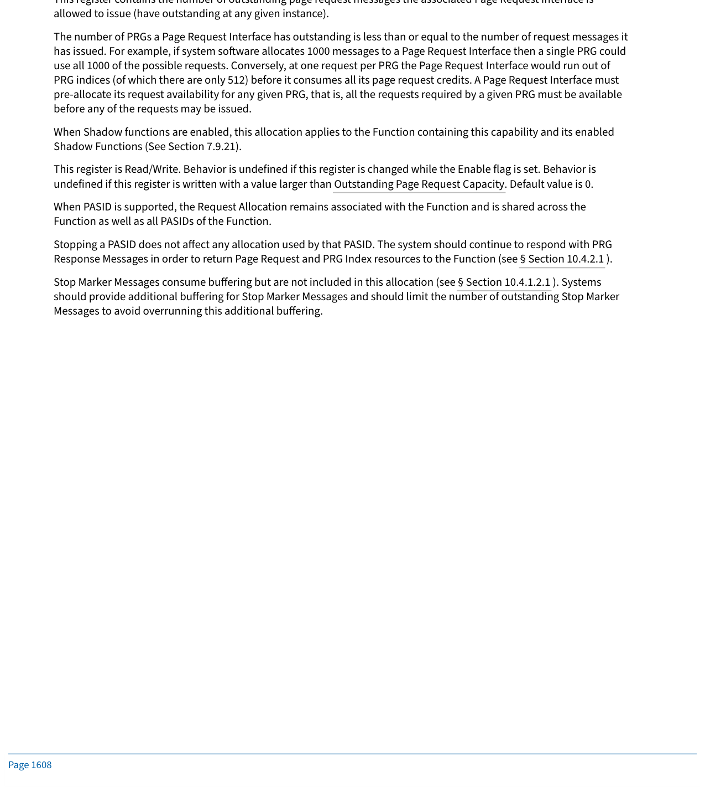

[⬆️ 返回目录](#-本章目录-table-of-contents)

---

<<<PAGE_BREAK>>> page_1599

<<<PAGE_BREAK>>> page_1600

<<<PAGE_BREAK>>> page_1601

<<<PAGE_BREAK>>> page_1602

<<<PAGE_BREAK>>> page_1603

<<<PAGE_BREAK>>> page_1604

<<<PAGE_BREAK>>> page_1605

<<<PAGE_BREAK>>> page_1606

<<<PAGE_BREAK>>> page_1607

<<<PAGE_BREAK>>> page_1608

---

## 📑 本章目录 (Table of Contents) — Auto-Generated

- [10.1 ATS Architectural Overview § | 10.1 ATS 架构概述 §](#sec-10-1)
- [10.2 ATS Translation Services § | 10.2 ATS 转换服务 §](#sec-10-2)
- [10.3 ATS Invalidation § | 10.3 ATS 无效化 §](#sec-10-3)
- [10.4 Page Request Services § | 10.4 页请求服务 §](#sec-10-4)
- [10.5 ATS Configuration § | 10.5 ATS 配置 §](#sec-10-5)
