# 📘 第 12 章　Architectural Out-of-Band Management (Chapter 12. Architectural Out-of-Band Management)

**PCI Express® Base Specification — Revision 6.2, Version 1.0 — January 25, 2024**

> 📄 **Source pages**: 1659–1702 (PDF 1-indexed) | 📁 **File**: `chapter_12_raw.md`
> 🎨 **Format**: 中英对照双语 · 图表原始保留 · 中文背景色灰色 · GitHub Flavored Markdown
> 📚 **Template**: CXL 3.2 Spec translation (CXL_zh/)

---

## 📑 本章目录 (Table of Contents)

> 由合并阶段自动生成。请使用浏览器/GitHub 渲染时,各小节标题链接跳转。

## 🖼 本章图表 (Figures)

> 所有图已抽取为 PNG 存放在 `figures/chapter_12/`。

## 📊 本章表格 (Tables)

> 各章表格以标准 Markdown 表格形式嵌入正文。

---

---

# 📘 第 12 章　Architectural Out-of-Band Management (架构带外管理)

> 📄 **Source pages**: 1659–1702 | 📁 **File**: `chapter_12.md`
> 🎨 **Format**: 中英对照双语 · 图表原始保留 · 中文背景色灰色 · GitHub Flavored Markdown

---

<<<PAGE_BREAK>>> page_1659

"Sidebands" are physical interfaces other than the high-speed Lanes connecting two Ports, typically used for
out-of-band platform management functionality. Out-of-band (OOB) management refers to the ability to communicate
with peripheral subsystems, such as adapters and components, without interacting with firmware/software running on
the host CPU(s).
This chapter provides a "toolkit" with a variety of potentially applicable technology ingredients, including, for example
[SMBus] addressing, discrete signaling consolidation and Flexible I/O signal function negotiation, and how to utilize
enhanced interfaces such as [I3C-Basic] and managed USB 2.0. The intent of centralizing this content in this document is
to yield major improvements in capability and consistency to the physical, electrical, and logical domains for both
systems and existing or new future form factor specifications or revisions.
The following table provides relative comparisons of typical architectural out-of-band interfaces and basic use guidance.
Bandwidth is shown as the theoretical interface speed and is not indicative of practical throughput. The term Isolated
Control Plane means that the interface does not involve the Link. For example, PCIe Vendor-Defined Messages (VDMs) are
typically used for out-of-band management that does not involve firmware/software running on the host CPU(s) but
does traverse Links. Some applications choose to isolate such traffic for reasons including host bandwidth or security.

## 12. Architectural Out-of-Band Management | 架构带外管理

<table>
<thead>
<tr>
<th width="50%">🇬🇧 English</th>
<th width="50%" style="background-color:#e8e8e8">🇨🇳 中文</th>
</tr>
</thead>
<tbody>
<tr>
<td>

"边带 (Sideband)"是指连接两个端口 (Port) 的高速通道 (Lane) 之外的其他物理接口,通常用于带外 (Out-of-Band, OOB) 平台管理功能。带外管理是指在不与运行在主机 CPU 上的固件/软件交互的情况下,与外设子系统(如适配器和组件)进行通信的能力。

本章提供了一份"工具包",包含多种潜在适用的技术要素,例如 [SMBus] 寻址、离散信号整合、灵活 I/O (Flexible I/O) 信号功能协商,以及如何利用 [I3C-Basic] 和托管 USB 2.0 等增强型接口。在本规范中集中这些内容的目的是在系统以及现有或新的未来外形规格 (Form Factor) 规范或修订版的物理、电气和逻辑域方面实现能力和一致性方面的重大改进。

下表提供了典型架构带外接口的相对比较和基本使用指导。带宽显示为理论接口速度,并不代表实际吞吐率。术语"隔离控制面 (Isolated Control Plane)"是指该接口不涉及链路 (Link)。例如,PCIe 厂商定义消息 (Vendor-Defined Messages, VDM) 通常用于不涉及运行在主机 CPU 上的固件/软件、但会穿越链路的带外管理。某些应用出于主机带宽或安全等原因选择隔离此类流量。

</td>
<td style="background-color:#e8e8e8">

"边带 (Sideband)"是指连接两个端口 (Port) 的高速通道 (Lane) 之外的其他物理接口,通常用于带外 (Out-of-Band, OOB) 平台管理功能。带外管理是指在不与运行在主机 CPU 上的固件/软件交互的情况下,与外设子系统(如适配器和组件)进行通信的能力。

本章提供了一份"工具包",包含多种潜在适用的技术要素,例如 [SMBus] 寻址、离散信号整合、灵活 I/O (Flexible I/O) 信号功能协商,以及如何利用 [I3C-Basic] 和托管 USB 2.0 等增强型接口。在本规范中集中这些内容的目的是在系统以及现有或新的未来外形规格 (Form Factor) 规范或修订版的物理、电气和逻辑域方面实现能力和一致性方面的重大改进。

下表提供了典型架构带外接口的相对比较和基本使用指导。带宽显示为理论接口速度,并不代表实际吞吐率。术语"隔离控制面 (Isolated Control Plane)"是指该接口不涉及链路 (Link)。例如,PCIe 厂商定义消息 (Vendor-Defined Messages, VDM) 通常用于不涉及运行在主机 CPU 上的固件/软件、但会穿越链路的带外管理。某些应用出于主机带宽或安全等原因选择隔离此类流量。

</td>
</tr>
</tbody>
</table>

[⬆️ 返回目录](#-本章目录-table-of-contents)

---

## Table 12-1 Relative Comparisons of Typical Architectural Out-of-Band Interfaces | 表 12-1 典型架构带外接口的相对比较

**Table 12-1. Relative Comparisons of Typical Architectural Out-of-Band Interfaces | 表 12-1 典型架构带外接口的相对比较**

| General Out-of-Band Interface Usage | Transfer Rate | Isolated Control Plane | Example Applications |
|---|---|---|---|
| Discrete/Physical Signals | Signal propagation delay | Y | PERST# (PCIe 复位信号), PRSNTNT# (存在检测), PWRBRK# (电源降级信号), PWRDIS (电源禁用) |
| Serialized/Virtual Signals (e.g., PESTI) | ≈250 Kb/s | Y | Real-time virtual signals, OOB Controls/status (实时虚拟信号,带外控制/状态) |
| [SMBus] or [I2C] (I2C 集成电路总线) | 100, 400, 1000 Kb/s | Y | EEPROM, I/O Expanders, Sensors, MCTP, Security (EEPROM、I/O 扩展器、传感器、MCTP、安全) |
| [I3C-Basic] | 12.5 Mb/s SDR mode | Y | Hub Control, MCTP (集线器控制、MCTP) |
| USB 2.0 | 480 Mb/s | Y | Serial, Ethernet (NC-SI and TCP/IP), Mass Storage, MCTP, Security, Bridges to SPI, [I2C], and [I3C] (串口、以太网、NC-SI、TCP/IP、大容量存储、MCTP、安全、到 SPI/I2C/I3C 的桥接) |
| PCIe VDM | Link-specific | N | MCTP |

[⬆️ 返回目录](#-本章目录-table-of-contents)

---

## 12.1 Introduction | 引言

table>
<thead>
<tr>
<th width="50%">🇬🇧 English</th>
<th width="50%" style="background-color:#e8e8e8">🇨🇳 中文</th>
</tr>
</thead>
<tbody>
<tr>
<td>

Sideband signals refer to all signals that cross a defined interface, other than those associated with the high-speed Link
itself. Sideband signals impact platforms such as through added cost, additional conductors and circuits for optional
signals that might be rarely or never used. This negatively impacts cross compatibility and establishes legacy constraints
that might impede more efficient solutions. Although sideband signals typically travel in parallel with the Link, sideband
signals often interact with components other than the two that implement the Ports at each end of the Link.

</td>
<td style="background-color:#e8e8e8">

边带信号 (Sideband) 是指穿越已定义接口的所有信号,不包括与高速链路 (Link) 本身相关的那些信号。边带信号会对平台产生影响,例如增加成本、为可能很少或从未使用的可选信号增加导线和电路。这会负面影响跨兼容性,并形成可能阻碍更高效解决方案的传统约束。虽然边带信号通常与链路并行传输,但边带信号经常与实现链路两端端口的两个组件之外的其他组件进行交互。

</td>
</tr>
</tbody>
</table>

[⬆️ 返回目录](#-本章目录-table-of-contents)

---

<<<PAGE_BREAK>>> page_1660

## 12.2 Framework for Sidebands | 边带框架

<table>
<thead>
<tr>
<th width="50%">🇬🇧 English</th>
<th width="50%" style="background-color:#e8e8e8">🇨🇳 中文</th>
</tr>
</thead>
<tbody>
<tr>
<td>

The architectural framework defined here provides:
- A partial catalog of sideband signals already in common use for defined form factors.
- Reference physical topologies representing how sideband signals are used at the platform level.
- Extensible mechanisms for sideband capability discovery and control.
- Roles and responsibilities of various platform elements in relation to sideband signals.

The goal of the framework is to simplify the definition and evolution of form factors and platforms by providing form
factor agnostic consistency and structure to sideband signal handling.

This section describes three methods of sideband handling for form factor and other interface specifications to use as
tools. These include fixed function interfaces using discrete sidebands, Flexible I/O (Flex I/O) and Peripheral Sideband
Tunneling Interfaces (PESTI). Each of these mechanisms are utilized where appropriate with the following sections
providing specific guidance.

</td>
<td style="background-color:#e8e8e8">

此处定义的架构框架提供:
- 已在已定义外形规格中常用的边带信号的部分目录。
- 表示边带信号在平台级别如何使用的参考物理拓扑。
- 边带能力发现和控制的可扩展机制。
- 各种平台元素在边带信号方面的角色和职责。

该框架的目标是通过为边带信号处理提供与外形规格无关的一致性和结构,简化外形规格和平台的定义与演进。

本节描述了三种边带处理方法,可作为外形规格和其他接口规范使用的工具。这些方法包括使用离散边带的固定功能接口、灵活 I/O (Flexible I/O, Flex I/O) 和外设边带隧道接口 (Peripheral Sideband Tunneling Interface, PESTI)。这些机制在适当的地方被使用,后续章节提供具体指导。

</td>
</tr>
</tbody>
</table>

[⬆️ 返回目录](#-本章目录-table-of-contents)

---

## 12.3 Sideband Signaling Mechanisms | 边带信令机制

table>
<thead>
<tr>
<th width="50%">🇬🇧 English</th>
<th width="50%" style="background-color:#e8e8e8">🇨🇳 中文</th>
</tr>
</thead>
<tbody>
<tr>
<td>

Discrete sideband signals are physical wires and/or pins that have diverse functions such as those related to platform
power up (e.g., PERST#), Link control (e.g., CLKREQ#), or non-Link functionality (e.g., 2-wire). These physical wires can
be transmitted using different methods (e.g., copper, optical). Discrete sideband signals are not limited to digital,
two-state or a single functional purpose or direction. Considerations for incorporating discrete sideband signals include
architectural needs (e.g., PERST#), low latency needs, (e.g., PWRBRK), or fault domain minimization control (e.g.,
PWRDIS). Form factor specifications are permitted decide to incorporate such signal types when weighing functionality
against interconnect size and cost.

In general, vendor specific platform requirements drive fan-in or fan-out requirements for each signal (e.g., whether
CLKREQ# is independent for each function).

Examples of discrete signals incorporated in multiple form factors:
- **PERST#** - PCIe Reset (and similar component reset mechanisms) is a signal that causes a component to
  execute a Fundamental Reset. See § Section 6.6.1 for details.
- **PRSNT#** - Presence (and similar component presence mechanisms) is a class of signal that provides an
  indication of the presence of the adapter, component, or cable, and optionally the insertion or removal of an
  adapter, component or cable. See § Section 6.7.1 for details.
- **PWRDIS** – Power Disable (and similar component power disable mechanisms) is a signal that causes an
  adapter or component to disable use of its own power. See § Section 6.7.3.3 for details.
- **PWRBRK#** – Emergency Power Reduction (and similar adapter or component emergency power reduction
  mechanisms) is a signal that causes an adapter or component to reduce its own power consumption to a safe
  level. See § Section 6.24 for details.
- **CLKREQ#** – Clock Request (and similar platform clock request mechanisms) is a signal that causes a platform to
  provide reference clock (REFCLK) to the adapter or component. See § Section 8.6.8 for details.
- **WAKE#** – Wake Up (and similar platform wakeup mechanisms) is a signal that causes a sleeping platform to
  restore main power to the adapter or component. See § Section 5.3.3.2 for details.

An example of a signal with alternative solutions:

</td>
<td style="background-color:#e8e8e8">

离散边带信号是具有多种功能的物理导线和/或引脚,例如与平台上电 (如 PERST#)、链路控制 (如 CLKREQ#) 或非链路功能 (如 2-Wire,两线制) 相关的功能。这些物理导线可以使用不同的方法传输(例如铜缆、光纤)。离散边带信号不限于数字、两态或单一功能用途或方向。纳入离散边带信号的考虑因素包括架构需求 (如 PERST#)、低延迟需求 (如 PWRBRK#) 或故障域最小化控制 (如 PWRDIS)。在权衡功能与互连尺寸和成本时,允许外形规格规范决定是否纳入此类信号类型。

一般来说,厂商特定的平台需求决定了每个信号的扇入或扇出需求(例如,CLKREQ# 是否独立于每个功能)。

在多种外形规格中纳入的离散信号示例:
- **PERST#** - PCIe 复位 (以及类似的组件复位机制) 是一个使组件执行基本复位 (Fundamental Reset) 的信号。详见 § 6.6.1。
- **PRSNT#** - 存在检测 (以及类似的组件存在机制) 是一类信号,用于指示适配器、组件或线缆的存在,并可选地指示适配器、组件或线缆的插入或移除。详见 § 6.7.1。
- **PWRDIS** - 电源禁用 (以及类似的组件电源禁用机制) 是一个使适配器或组件禁用其自身电源的信号。详见 § 6.7.3.3。
- **PWRBRK#** - 紧急电源降级 (以及类似的适配器或组件紧急电源降级机制) 是一个使适配器或组件将其自身功耗降至安全水平的信号。详见 § 6.24。
- **CLKREQ#** - 时钟请求 (以及类似的平台时钟请求机制) 是一个使平台向适配器或组件提供参考时钟 (REFCLK) 的信号。详见 § 8.6.8。
- **WAKE#** - 唤醒 (以及类似的平台唤醒机制) 是一个使休眠平台恢复向适配器或组件提供主电源的信号。详见 § 5.3.3.2。

一个具有替代解决方案的信号示例:

</td>
</tr>
</tbody>
</table>

[⬆️ 返回目录](#-本章目录-table-of-contents)

---

## 12.3.1 Discrete Sidebands | 离散边带

<table>
<thead>
<tr>
<th width="50%">🇬🇧 English</th>
<th width="50%" style="background-color:#e8e8e8">🇨🇳 中文</th>
</tr>
</thead>
<tbody>
<tr>
<td>

Discrete sideband signals are physical wires and/or pins that have diverse functions such as those related to platform
power up (e.g., PERST#), Link control (e.g., CLKREQ#), or non-Link functionality (e.g., 2-wire). These physical wires can
be transmitted using different methods (e.g., copper, optical). Discrete sideband signals are not limited to digital,
two-state or a single functional purpose or direction. Considerations for incorporating discrete sideband signals include
architectural needs (e.g., PERST#), low latency needs, (e.g., PWRBRK), or fault domain minimization control (e.g.,
PWRDIS). Form factor specifications are permitted decide to incorporate such signal types when weighing functionality
against interconnect size and cost.

</td>
<td style="background-color:#e8e8e8">

离散边带信号是具有多种功能的物理导线和/或引脚,例如与平台上电 (如 PERST#)、链路控制 (如 CLKREQ#) 或非链路功能 (如 2-Wire,两线制) 相关的功能。这些物理导线可以使用不同的方法传输(例如铜缆、光纤)。离散边带信号不限于数字、两态或单一功能用途或方向。纳入离散边带信号的考虑因素包括架构需求 (如 PERST#)、低延迟需求 (如 PWRBRK#) 或故障域最小化控制 (如 PWRDIS)。在权衡功能与互连尺寸和成本时,允许外形规格规范决定是否纳入此类信号类型。

</td>
</tr>
</tbody>
</table>

[⬆️ 返回目录](#-本章目录-table-of-contents)

---

<<<PAGE_BREAK>>> page_1661

## SMRST# – SMBus Reset (and similar component reset mechanisms) | SMRST# – SMBus 复位(及类似组件复位机制)

table>
<thead>
<tr>
<th width="50%">🇬🇧 English</th>
<th width="50%" style="background-color:#e8e8e8">🇨🇳 中文</th>
</tr>
</thead>
<tbody>
<tr>
<td>

**SMRST#** – SMBus Reset is a discrete sideband for recovering SMBus hang or stuck busy type conditions without
interfering with the form factor's primary workload. This signal is a good candidate for exclusion or
serialization, since it is high latency and may be rarely or ever used. It is common practice for applications that
do not have a discrete SMRST# signal to use bus reset methods such as SMBus clock low reset or by executing
SCL pulses followed by a STOP condition.

</td>
<td style="background-color:#e8e8e8">

**SMRST#** – SMBus 复位是一种离散边带,用于恢复 SMBus 挂起或卡在繁忙状态的状况,而不干扰外形规格的主要工作负载。该信号是排除或序列化的良好候选,因为它延迟较高且可能很少或从未使用。对于没有离散 SMRST# 信号的应用程序,通常的做法是使用总线复位方法,例如 SMBus 时钟低复位或执行 SCL 脉冲后跟 STOP 条件。

</td>
</tr>
</tbody>
</table>

[⬆️ 返回目录](#-本章目录-table-of-contents)

---

## 12.3.2 Flex I/O Sidebands | 灵活 I/O (Flex I/O) 边带

<table>
<thead>
<tr>
<th width="50%">🇬🇧 English</th>
<th width="50%" style="background-color:#e8e8e8">🇨🇳 中文</th>
</tr>
</thead>
<tbody>
<tr>
<td>

Flexible input/output signals/interfaces (Flex I/O) utilize the concept where interface pins are permitted to be flexibly
(re)purposed following discovery and determination of mutual capabilities and applying rules that guarantee safe and
backward compatibility, where applicable, across the electrical and logical domains. When represented as a signal, form
factor specifications should use the FLEXIO-[N:0] nomenclature.

Flex I/O interfaces provide the following benefits:
- Improved hardware interface utilization compared to fixed function pins.
- Opportunity to continually leverage evolving high-speed management interfaces.
- Flexibility to include, at present or future, value-added out-of-band functionality between platforms and
  peripheral subsystems, such as adapters or components.

Flex I/O signal/interface engagement requires these steps, with guidelines described below:
1. Default State
2. Discovery
3. Compatibility Check
4. Control Negotiation

A Flex I/O interface pin is permitted to default to:
1. Unused: Unconnected (electrical open) or with a specific termination as dictated by a specific form factor or
   connector/cable specification.
2. Pre-Wired/Inert: This is where a pin/interface is wired with a predetermined circuit and connectivity but does
   not perform the intended functionality until after negotiation is complete. Voltage bias before negotiation is
   allowed. An example is a form factor specific required Flex I/O signal connected to platform logic that defaults
   to tristate/high impedance with a platform-side pullup resistor to the platform side's +3.3 V auxiliary power
   rail. Then after negotiation is complete, the signal is allowed to be used for its intended purpose. Form factor

</td>
<td style="background-color:#e8e8e8">

灵活输入/输出信号/接口 (Flex I/O) 采用了以下概念:在发现并确定相互能力之后,并应用保证在电气和逻辑域中安全及向后兼容的规则(在适用的情况下),允许灵活地(重新)指定接口引脚的用途。当表示为信号时,外形规格规范应使用 FLEXIO-[N:0] 命名。

Flex I/O 接口提供以下好处:
- 与固定功能引脚相比,提高了硬件接口利用率。
- 有机会持续利用不断演进的高速管理接口。
- 灵活性,可在现在或将来在平台和外设子系统(如适配器或组件)之间包含增值的带外功能。

Flex I/O 信号/接口启用需要以下步骤,具体指导如下所述:
1. 默认状态 (Default State)
2. 发现 (Discovery)
3. 兼容性检查 (Compatibility Check)
4. 控制协商 (Control Negotiation)

Flex I/O 接口引脚允许默认为:
1. **未使用 (Unused)**:未连接(电气开路)或具有特定的外形规格或连接器/线缆规范所规定的特定终端。
2. **预接线/惰性 (Pre-Wired/Inert)**:引脚/接口以预定电路和连接方式接线,但在协商完成之前不执行预期功能。允许协商前的电压偏置。一个例子是外形规格特定所需的 Flex I/O 信号连接到平台逻辑,默认情况下为三态/高阻抗,平台侧通过上拉电阻连接到平台侧的 +3.3 V 辅助电源轨。协商完成后,允许将该信号用于其预期目的。外形规格

</td>
</tr>
</tbody>
</table>

[⬆️ 返回目录](#-本章目录-table-of-contents)

---

> **Figure 12-1.** Example PESTI Application
> 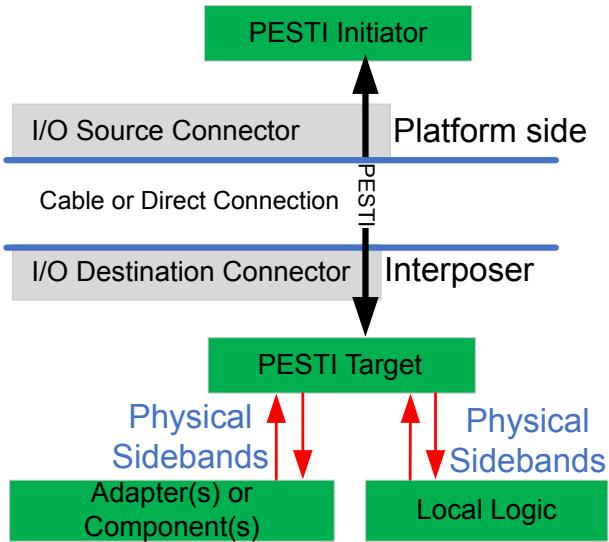

---

> **IMPLEMENTATION NOTE:** **FLEX I/O PINS ARE NOT CALLED RESERVED** | **实施说明: Flex I/O 引脚不称为保留 (RESERVED)**
>
> Flex I/O signals are purposefully not called Reserved (RSVD) pins, which are typically specified to include no
> defined usage within a specific form factor specification version. RSVD pins typically call out both the platform
> and adapter sides to not connect any functional circuit, except high frequency filters such as on the CEM
> connector. | Flex I/O 信号被有意不称为保留 (Reserved, RSVD) 引脚,后者通常被规定在特定外形规格版本中不包含已定义的用途。RSVD 引脚通常规定平台和适配器两侧均不连接任何功能电路,但 CEM 连接器上的高频滤波器等除外。

[⬆️ 返回目录](#-本章目录-table-of-contents)

---

## 12.3.2.1 Flex I/O Default State Guidelines | 12.3.2.1 Flex I/O 默认状态指南

table>
<thead>
<tr>
<th width="50%">🇬🇧 English</th>
<th width="50%" style="background-color:#e8e8e8">🇨🇳 中文</th>
</tr>
</thead>
<tbody>
<tr>
<td>

specifications must ensure that any allowed default circuit conditions are electrically safe and do not impose
logical domain constraints. An example is a cross power domain electrical stress or leakage condition.
3. **Switchable Function**: This is where a pin/interface defaults to a pre-defined function (often a legacy function),
   but then is electrically or logically switchable to an alternate function. An example is a form factor interface
   that defaults to JTAG functionality, with all the associated requirements such as default terminations and
   connectivity. Then following a positive discovery and compatibility check (defined below), a control
   disengages the default functionality and then engages the intended alternate functionality.

When used, Flex I/O capabilities are required to be described in FRU Information (See § Section 12.6). Form factor
specified usages of Flex I/O signal(s) or interface(s) must be provided for discovery purposes via form factor specified
FRU Information descriptors. Examples include, but are not limited to, pin number, pin functionality, supported power
domain(s), bus topology and any signal integrity attributes deemed necessary to achieve the intended functionality. The
[CEM-6.0] provides an example.

Failure to conform to the following guidance could result in undefined behaviors or effects not limited to electrical
damage.
1. The platform must compare the adapter's advertised Flex I/O capabilities with the platform side interface
   capabilities and policy, if applicable, before attempting to perform any of these actions:
   a. Change from a pin or circuit default state.
   b. Communicate new control settings.
   c. Utilize Flex I/O pin functionality in any way, such as toggling Flex I/O connected GPIO.
2. Mismatch: If a Flex I/O pin or interface functionality mismatch is detected between a platform capability or
   policy and interposer, adapter, or component, then the above three actions must be avoided.
3. Single-ended Flex I/O functionality on differentially optimized signals is allowed. Implementers must be aware
   of potential effects between such single ended signals, such as crosstalk being an unintended signal aggressor
   on a victim, impedance mismatches and other unintended effects along the signaling paths.
4. Differential interfaces utilizing single-ended optimized Flex I/O signals is prohibited due to differences, such as
   target impedance, improper GND shielding, board routing, connector design, etc.
5. Flex I/O usage and signal engagement may be applicable to one or more specific peripheral supported power
   states (such as Main power state only versus Auxiliary power and Main power states). If a peripheral advertises
   more than one supported power state, it is allowed to have a control command (if such a command is
   advertised as supported) for selecting a subset of power states that the peripheral must adhere in reference to
   specific Flex I/O interface(s). It is the responsibility of the peripheral to provide the necessary cross power
   domain isolation to avoid inadvertent behaviors.
6. Flex I/O usages are permitted to be independent of an adapter's or component's Link state.
7. Single-ended signal voltage negotiation for Flex I/O pins is outside the scope of this specification.
8. Using Flex I/O pins as power supply rails is prohibited, due to possible ill effects such as an incorrect or
   malicious software setting causing electrical stress or damage.

</td>
<td style="background-color:#e8e8e8">

规范必须确保任何允许的默认电路条件在电气上是安全的,并且不对逻辑域施加约束。跨电源域电气应力或漏电条件就是一个例子。
3. **可切换功能 (Switchable Function)**:引脚/接口默认为预定义功能(通常是传统功能),但随后可以通过电气或逻辑方式切换到备用功能。一个例子是外形规格接口默认为 JTAG 功能,具有所有相关要求,如默认终端和连接性。然后在完成积极的发现和兼容性检查(定义如下)后,控制解除默认功能,然后启用预期的备用功能。

使用时,Flex I/O 能力必须在 FRU 信息 (Field Replaceable Unit Information) 中描述(参见 § 12.6)。Flex I/O 信号或接口的外形规格指定用途必须通过外形规格指定的 FRU 信息描述符提供,以用于发现目的。示例包括但不限于引脚号、引脚功能、支持的电源域、总线拓扑以及为实现预期功能所需的任何信号完整性属性。[CEM-6.0] 提供了一个示例。

未遵守以下指导可能会导致未定义的行为或影响,不仅限于电气损坏。
1. 平台在尝试执行以下任何操作之前,必须将适配器通告的 Flex I/O 能力与平台侧接口能力和策略(如果适用)进行比较:
   a. 改变引脚或电路的默认状态。
   b. 传达新的控制设置。
   c. 以任何方式利用 Flex I/O 引脚功能,例如切换 Flex I/O 连接的 GPIO。
2. **不匹配 (Mismatch)**:如果在平台能力或策略与中间板 (Interposer)、适配器或组件之间检测到 Flex I/O 引脚或接口功能不匹配,则必须避免上述三个操作。
3. 在差分优化信号上允许单端 Flex I/O 功能。实施者必须注意此类单端信号之间的潜在影响,例如串扰作为非预期的信号干扰源对受害信号的影响、阻抗失配以及信令路径上的其他非预期影响。
4. 禁止在差分接口上使用单端优化的 Flex I/O 信号,原因包括目标阻抗、不当的 GND 屏蔽、板布线、连接器设计等的差异。
5. Flex I/O 的使用和信号启用可适用于一个或多个特定的外设支持的电源状态(例如仅主电源状态与辅助电源和主电源状态)。如果外设通告多个支持的电源状态,则允许具有控制命令(如果该命令被通告为受支持)以选择外设必须遵守的电源状态子集,参考特定的 Flex I/O 接口。由外设负责提供必要的跨电源域隔离,以避免意外行为。
6. Flex I/O 使用允许独立于适配器或组件的链路状态。
7. Flex I/O 引脚的单端信号电压协商不在本规范的范围内。
8. 禁止将 Flex I/O 引脚用作电源轨,因为不正确或恶意的软件设置可能会导致电气应力或损坏等不良影响。

</td>
</tr>
</tbody>
</table>

[⬆️ 返回目录](#-本章目录-table-of-contents)

---

<<<PAGE_BREAK>>> page_1662

## 12.3.2.2 Flex I/O Discovery Phase Guidelines | 12.3.2.2 Flex I/O 发现阶段指南

<table>
<thead>
<tr>
<th width="50%">🇬🇧 English</th>
<th width="50%" style="background-color:#e8e8e8">🇨🇳 中文</th>
</tr>
</thead>
<tbody>
<tr>
<td>

Failure to conform to the following guidance could result in undefined behaviors or effects not limited to electrical
damage. See § Section 12.7 for the control/command protocol detail. Dynamic reconfiguration of Flex I/O is left to the
implementer.

There are four scenarios for how Flex I/O controls assume their intended functionality:
1. Pre-wired circuit with configurable direction, purpose, signaling or protocol: This scenario occurs when an
   interface is pre-wired before any negotiated functionality. The interface must remain inactive until supported
   uses are discovered, and the requisite compatibility and policy check are complete, and the appropriate
   negotiations or controls are executed. Upon completing the negotiation, communication is permitted to
   commence from either side, as applicable.
2. Only platform side control is necessary: Following a successful discovery and compatibility check, engaging an
   interface might only require platform side control. For example, [CEM] supports legacy JTAG terminations by
   default. Upon discovery of a Flex I/O USB capability and compatible platform support, the platform must
   change from the default JTAG pin functions to USB 2.0. Note that this can be done with one control since no
   special break-before-make is needed to be electrically safe and USB 2.0 specification compliant.
3. Only peripheral or adapter side control is required: Commanding an adapter to perform specific engage or
   disengage operations must use a to-be-defined MCTP-based control method.
4. Both the platform and adapter side controls are necessary: Commanding a peripheral subsystem to perform
   specific engage and/or disengage operations must use a to-be-defined MCTP-based control method.
   Commanding the system side to perform specific engage and/or disengage operations is permitted to use
   implementation specific controls, such as a multiplexor select. It is important to use the engage and disengage
   order and other guidelines below.

</td>
<td style="background-color:#e8e8e8">

未遵守以下指导可能会导致未定义的行为或影响,不仅限于电气损坏。有关控制/命令协议的详细信息,请参见 § 12.7。Flex I/O 的动态重配置由实施者自行处理。

Flex I/O 控制如何承担其预期功能有四种场景:
1. **具有可配置方向、目的、信令或协议的预接线电路**:此场景发生在协商任何功能之前接口已经预接线。在发现受支持的用途、完成必要的兼容性和策略检查以及执行适当的协商或控制之前,接口必须保持不活动状态。协商完成后,允许根据需要从任一侧开始通信。
2. **仅需要平台侧控制**:在成功发现和兼容性检查之后,启用接口可能仅需要平台侧控制。例如,[CEM] 默认支持传统 JTAG 终端。在发现 Flex I/O USB 能力和兼容的平台支持后,平台必须将默认的 JTAG 引脚功能更改为 USB 2.0。请注意,这可以通过一个控制完成,因为不需要特殊的先断后接即可保证电气安全并符合 USB 2.0 规范。
3. **仅需要外设或适配器侧控制**:命令适配器执行特定的启用或禁用操作必须使用待定义的基于 MCTP 的控制方法。
4. **需要平台和适配器侧双重控制**:命令外设子系统执行特定的启用和/或禁用操作必须使用待定义的基于 MCTP 的控制方法。允许使用特定于实现的控制(例如多路复用器选择)来命令系统侧执行特定的启用和/或禁用操作。使用以下启用和禁用顺序以及其他指南非常重要。

</td>
</tr>
</tbody>
</table>

[⬆️ 返回目录](#-本章目录-table-of-contents)

---

## 12.3.2.3 Flex I/O Compatibility Check Guidelines | 12.3.2.3 Flex I/O 兼容性检查指南

table>
<thead>
<tr>
<th width="50%">🇬🇧 English</th>
<th width="50%" style="background-color:#e8e8e8">🇨🇳 中文</th>
</tr>
</thead>
<tbody>
<tr>
<td>

This section covers the compatibility check step for Flex I/O interfaces.

1. The platform must compare the adapter's advertised Flex I/O capabilities with the platform side interface
   capabilities and policy, if applicable, before attempting to perform any of these actions:
   a. Change from a pin or circuit default state.
   b. Communicate new control settings.
   c. Utilize Flex I/O pin functionality in any way, such as toggling Flex I/O connected GPIO.
2. Mismatch: If a Flex I/O pin or interface functionality mismatch is detected between a platform capability or
   policy and interposer, adapter, or component, then the above three actions must be avoided.

</td>
<td style="background-color:#e8e8e8">

本节介绍 Flex I/O 接口的兼容性检查步骤。

1. 平台在尝试执行以下任何操作之前,必须将适配器通告的 Flex I/O 能力与平台侧接口能力和策略(如果适用)进行比较:
   a. 改变引脚或电路的默认状态。
   b. 传达新的控制设置。
   c. 以任何方式利用 Flex I/O 引脚功能,例如切换 Flex I/O 连接的 GPIO。
2. **不匹配 (Mismatch)**:如果在平台能力或策略与中间板 (Interposer)、适配器或组件之间检测到 Flex I/O 引脚或接口功能不匹配,则必须避免上述三个操作。

</td>
</tr>
</tbody>
</table>

[⬆️ 返回目录](#-本章目录-table-of-contents)

---

## 12.3.2.4 Flex I/O Control Negotiation Guidelines | 12.3.2.4 Flex I/O 控制协商指南

<table>
<thead>
<tr>
<th width="50%">🇬🇧 English</th>
<th width="50%" style="background-color:#e8e8e8">🇨🇳 中文</th>
</tr>
</thead>
<tbody>
<tr>
<td>

1. **Engagement Order**: "Engaging" a Flex I/O is defined as enabling desired interface circuitry, connectivity and/or
   starting communication. Caution should be taken when electrically engaging an interface. Where applicable,
   the following order is advised.
   - First: Platform side. This is the PCI Express Link downstream facing port side.
   - Second: Interposer, adapter, or component side. This is the PCI Express Link upstream facing port
     side.
2. **Disengagement Order**: "Disengaging" a Flex I/O is defined as disabling or reverting to default interface
   circuitry, severing connectivity and/or ceasing communication. Where applicable, the following order is
   advised.
   - First: Interposer, adapter, or component side. This is the PCI Express Link upstream facing port side.
   - Second: Platform side. This is the PCI Express Link downstream facing port side.
3. **Re-configuration Order**: Reconfiguration might be desired between two functions or from an active Flex I/O
   interface type back to default state. The "break-before-make" paradigm is recommended by using the
   disengagement, followed by engagement order prescribed above. The duration between the break and the
   make steps is form factor specific. An example is to ensure that a higher voltage function is sufficiently drained
   before engaging a lower voltage function that might be intolerant to the higher voltage.
4. **Forced Disengagement**: Flex I/O functions are required to disengage upon the power state of the platform,
   interposer, adapter, or component dropping below the minimum negotiated power level or outside of the
   specified electrical operating conditions.

</td>
<td style="background-color:#e8e8e8">

1. **启用顺序 (Engagement Order)**:"启用" Flex I/O 定义为启用所需的接口电路、连接和/或启动通信。在电气上启用接口时应谨慎。在适用的情况下,建议采用以下顺序。
   - 首先:平台侧。这是 PCI Express 链路下游面向端口侧。
   - 其次:中间板 (Interposer)、适配器或组件侧。这是 PCI Express 链路上游面向端口侧。
2. **禁用顺序 (Disengagement Order)**:"禁用" Flex I/O 定义为禁用或恢复为默认接口电路、中断连接和/或停止通信。在适用的情况下,建议采用以下顺序。
   - 首先:中间板 (Interposer)、适配器或组件侧。这是 PCI Express 链路上游面向端口侧。
   - 其次:平台侧。这是 PCI Express 链路下游面向端口侧。
3. **重新配置顺序 (Re-configuration Order)**:可能需要在两个功能之间或从活动的 Flex I/O 接口类型重新配置回默认状态。建议使用"先断后接 (break-before-make)"模式,即按上述顺序先禁用后启用。断开和接通步骤之间的持续时间因外形规格而异。一个例子是确保在启用可能不耐受较高电压的较低电压功能之前,较高电压功能已被充分放电。
4. **强制禁用 (Forced Disengagement)**:当平台、中间板 (Interposer)、适配器或组件的电源状态降至低于协商的最低电源电平或超出规定的电气工作条件时,需要禁用 Flex I/O 功能。

</td>
</tr>
</tbody>
</table>

[⬆️ 返回目录](#-本章目录-table-of-contents)

---

<<<PAGE_BREAK>>> page_1663

## 12.3.2.5 General Flex I/O Control Guidelines | 12.3.2.5 Flex I/O 一般控制指南

table>
<thead>
<tr>
<th width="50%">🇬🇧 English</th>
<th width="50%" style="background-color:#e8e8e8">🇨🇳 中文</th>
</tr>
</thead>
<tbody>
<tr>
<td>

5. **Flex I/O Run-time Reconfiguration**: Run-time reconfiguration of Flex I/O is allowed when adhering to the
   guidelines stated within this specification. The logical domain handling of run-time change in Flex I/O
   functionality is implementation specific.
6. **Reset Flex I/O back to defaults**: If a Flex I/O signal changes functionality when main power is enabled, it must
   go back to its default state upon loss of the main power. If Flex I/O functionality changes when only auxiliary
   power is applied, it must go back to default upon loss of auxiliary power. Adapter or component use of
   non-volatile information to automatically revert Flex I/O to a previous state is prohibited.

</td>
<td style="background-color:#e8e8e8">

5. **Flex I/O 运行时重新配置**:在遵守本规范中规定的指南时,允许 Flex I/O 的运行时重新配置。Flex I/O 功能运行时变化的逻辑域处理因实现而异。
6. **将 Flex I/O 复位回默认值**:如果 Flex I/O 信号在启用主电源时改变功能,则在主电源丢失时必须返回其默认状态。如果 Flex I/O 功能在仅应用辅助电源时发生变化,则在辅助电源丢失时必须返回默认状态。禁止适配器或组件使用非易失性信息自动将 Flex I/O 恢复到之前的状态。

</td>
</tr>
</tbody>
</table>

[⬆️ 返回目录](#-本章目录-table-of-contents)

---

## 12.3.3 Peripheral Sideband Tunnelling Interface (PESTI) Sidebands | 12.3.3 外设边带隧道接口 (PESTI) 边带

<table>
<thead>
<tr>
<th width="50%">🇬🇧 English</th>
<th width="50%" style="background-color:#e8e8e8">🇨🇳 中文</th>
</tr>
</thead>
<tbody>
<tr>
<td>

Peripheral Sideband Tunnelling Protocol (PESTI) is a single wire, half-duplex, bidirectional Universal Asynchronous
Receive Transmit (UART) communication channel with a protocol that enables optional discovery and optional,
real-time, virtual wire tunnelling between platform and peripheral agents. PESTI enables the minimization of the
number of discrete sidebands signals, while extending functionality via scalable, form factor specific, extensible, and
real-time virtual wires. PESTI is point-to-point with fanout support that utilizes a bus snooping and bus switching
command method. PESTI provides message integrity detection support. PESTI protocol leverages common UART
framing to create a simple, low logic, low cost out-of-band payload and signal tunnel. PESTI communication is based on
a command and response method (no interrupt) where the peripheral/target is permitted to only transmit data upon
request by the initiator. In some applications, PESTI protocol is permitted to occur on top of a traditionally static
presence signal, thereby not incurring any extra signal cost for this interface.

This specification describes the base physical and protocol layers, from which form factor specifications are permitted to
customize for specific attributes and virtual wire purposes. § Figure 12-11 shows a typical PESTI example for tunnelling
virtual wired through a PCI Express Cable for managing the discrete sidebands on an interposer, adapter, or component.

PESTI is not intended to duplicate or replace what can be done over other non-real time interfaces. PESTI also does not
currently support higher level protocols inclusive of message encryption.

</td>
<td style="background-color:#e8e8e8">

外设边带隧道协议 (Peripheral Sideband Tunnelling Protocol, PESTI) 是一种单线、半双工、双向的通用异步收发器 (Universal Asynchronous Receive Transmit, UART) 通信通道,其协议支持平台和外设代理之间的可选发现和可选的实时虚拟线缆隧道。PESTI 允许最小化离散边带信号的数量,同时通过可扩展的、外形规格特定的、可扩展的和实时的虚拟线缆扩展功能。PESTI 是点对点的,具有扇出支持,使用总线侦听和总线切换命令方法。PESTI 提供消息完整性检测支持。PESTI 协议利用通用 UART 帧格式创建一种简单的、低逻辑、低成本的带外有效负载和信号隧道。PESTI 通信基于命令和响应方法(无中断),其中外设/目标仅在发起者请求时才被允许传输数据。在某些应用中,允许 PESTI 协议在传统的静态存在信号之上发生,从而不会为此接口产生任何额外的信号成本。

本规范描述了基本物理层和协议层,外形规格规范可以在此基础上针对特定属性和虚拟线缆用途进行定制。§ 图 12-11 显示了一个典型的 PESTI 示例,通过 PCI Express 线缆隧道传输虚拟线缆,用于管理中间板 (Interposer)、适配器或组件上的离散边带。

PESTI 并不打算重复或取代其他非实时接口可以完成的工作。PESTI 目前还不支持包括消息加密在内的更高级别的协议。

</td>
</tr>
</tbody>
</table>

> **NOTE: Open Compute Project Modular-PESTI** | **注意:开放计算项目模块化 PESTI**
>
> The Open Compute Project also supports the identical "Modular-PESTI" [https://www.opencompute.org/wiki/Server/DC-MHS] interface and protocol. | 开放计算项目 (Open Compute Project) 也支持相同的"模块化 PESTI (Modular-PESTI)" [https://www.opencompute.org/wiki/Server/DC-MHS] 接口和协议。

[⬆️ 返回目录](#-本章目录-table-of-contents)

---

## 12.3.3.1 PESTI Introduction | 12.3.3.1 PESTI 简介

table>
<thead>
<tr>
<th width="50%">🇬🇧 English</th>
<th width="50%" style="background-color:#e8e8e8">🇨🇳 中文</th>
</tr>
</thead>
<tbody>
<tr>
<td>

PESTI utilizes UART framing, operates directly at 3.3 V logic levels, and is a single, half-duplex signal:
- +3.3 Volt LVCMOS (open drain)
- 250,000 BAUD +/- 2%
- 8-O-1 (8 data bits, Odd Parity, 1 stop bit)
- Half-duplex

</td>
<td style="background-color:#e8e8e8">

PESTI 利用 UART 帧格式,直接在 3.3 V 逻辑电平下运行,是单线、半双工信号:
- +3.3 伏 LVCMOS (开漏)
- 250,000 波特 +/- 2%
- 8-O-1 (8 个数据位、奇校验、1 个停止位)
- 半双工

</td>
</tr>
</tbody>
</table>

[⬆️ 返回目录](#-本章目录-table-of-contents)

---

> **Figure 12-2.** UART Data Framing
> 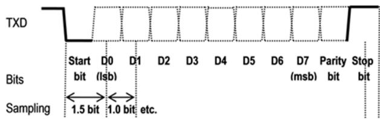

---

<<<PAGE_BREAK>>> page_1664

## 12.3.3.2 PESTI Physical Interface | 12.3.3.2 PESTI 物理接口

<table>
<thead>
<tr>
<th width="50%">🇬🇧 English</th>
<th width="50%" style="background-color:#e8e8e8">🇨🇳 中文</th>
</tr>
</thead>
<tbody>
<tr>
<td>

The circuit shown in § Figure 12-3 is such that an unpowered (V_3P3_Target = 0 Volts) component holds the PESTI wire
low indicating simple presence. Once the component has power and can respond to a command, the target General
Purpose Input/Output (GPIO) sourcing the gate of the P-FET will be driven low. Once V_3P3_Target is engaged by turning
the P-channel FET on, a rising edge of the PESTI signal is observed at the initiator. For this mechanism to operate as
intended, the default state of the target GPIO must be an input (high impedance).

</td>
<td style="background-color:#e8e8e8">

§ 图 12-3 中所示的电路使得未上电 (V_3P3_Target = 0 伏) 的组件将 PESTI 线拉低,表示简单的存在性。一旦组件上电并能够响应命令,目标通用输入/输出 (GPIO) 驱动 P-FET 栅极将为低电平。一旦通过打开 P 沟道 FET 来激活 V_3P3_Target,就会在发起者处观察到 PESTI 信号的上升沿。为了使该机制按预期工作,目标 GPIO 的默认状态必须是输入(高阻抗)。

</td>
</tr>
</tbody>
</table>

[⬆️ 返回目录](#-本章目录-table-of-contents)

---

## 12.3.3.3 PESTI Electrical Circuit | 12.3.3.3 PESTI 电气电路

<table>
<thead>
<tr>
<th width="50%">🇬🇧 English</th>
<th width="50%" style="background-color:#e8e8e8">🇨🇳 中文</th>
</tr>
</thead>
<tbody>
<tr>
<td>

When used as simple presence, the initiator side circuit must remain the same as shown in § Figure 12-3. The adapter or
component side circuit can be simplified to a pulldown resistor with a maximum value of 2.27 Kohm +5% tolerance and
minimum nominal value of 200 ohm -5% tolerance.

</td>
<td style="background-color:#e8e8e8">

当用作简单的存在性检测时,发起者侧电路必须与 § 图 12-3 中所示保持相同。适配器或组件侧电路可以简化为一个下拉电阻,最大值为 2.27 Kohm (+5% 容差),最小标称值为 200 ohm (-5% 容差)。

</td>
</tr>
</tbody>
</table>

[⬆️ 返回目录](#-本章目录-table-of-contents)

---

> **Figure 12-3.** PESTI Circuit Diagram
> 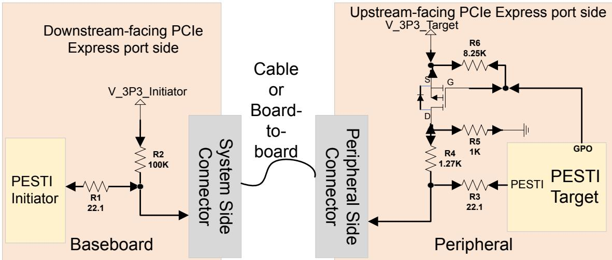

---

> **IMPLEMENTATION NOTE: ELECTRICAL COMPONENT SELECTION FACTORS** | **实施说明:电气元件选择因素**
>
> Referring to § Figure 12-3 above, R1 and R3 are recommended series termination resistor values. The values
> might require adjustment to the driver and transmission line characteristics. | 参考上面的 § 图 12-3,R1 和 R3 是建议的串联终端电阻值。这些值可能需要根据驱动器和传输线特性进行调整。
>
> R2 must be selected considering: | 选择 R2 时必须考虑:
> - Select the maximum value to minimize the current sourced into an unpowered target. | 选择最大值以最小化流入未上电目标的电流。
> - Logic high=1 must be guaranteed to meet the baseboard initiator logic Vin High Minimum when cable/
>   PESTI target is not attached/present. | 必须保证逻辑高=1,以便在线缆/PESTI 目标未连接/不存在时满足基板发起者逻辑的 Vin High Minimum。
>
> R4/R5 must be selected considering: | 选择 R4/R5 时必须考虑:
> - R4 and R5 (pull-down) and R2 (pull-up) must guarantee a logic low=0 at the baseboard initiator logic if
>   detection of an unpowered target is desired. | 如果需要检测未上电目标,则 R4 和 R5(下拉)和 R2(上拉)必须保证基板发起者逻辑处的逻辑低=0。
> - R4 value provides the rise time to a logic high at the initiator or target for an open-drain interface. | R4 值为开漏接口在发起者或目标处提供逻辑高的上升时间。
> - R5 provides a path to GND for the current sourced by R2 on the source board to drain or bleed voltage
>   accumulation at an unpowered target. | R5 为源板上由 R2 提供的电流提供到 GND 的路径,以释放或泄放未上电目标处的电压累积。

[⬆️ 返回目录](#-本章目录-table-of-contents)

---

<<<PAGE_BREAK>>> page_1665

## 12.3.3.4 PESTI DC Specifications | 12.3.3.4 PESTI 直流规范

<table>
<thead>
<tr>
<th width="50%">🇬🇧 English</th>
<th width="50%" style="background-color:#e8e8e8">🇨🇳 中文</th>
</tr>
</thead>
<tbody>
<tr>
<td>

For non-hot-plug applications, PESTI is permitted to double as the presence signal, thereby incurring no added pin cost.
Doing so for hot-plug applications is discouraged due to potential ambiguity or delay in determining a physical presence
change versus an unresponsive target. PESTI is permitted to be utilized to indirectly tunnel physical presence status of
hot-plug capable downstream targets.

The following table lists the PESTI DC specifications.

</td>
<td style="background-color:#e8e8e8">

对于非热插拔应用,允许 PESTI 兼作存在性信号,因此不会增加额外的引脚成本。不建议在热插拔应用中这样做,因为在确定物理存在性变化与无响应目标之间可能存在歧义或延迟。允许使用 PESTI 间接隧道传输具有热插拔能力的下游目标的物理存在性状态。

下表列出了 PESTI 直流规范。

</td>
</tr>
</tbody>
</table>

**Table 12-2. PESTI DC Specifications | 表 12-2 PESTI 直流规范**

| Symbol | Parameter | Min | Max | Units | Comments |
|---|---|---|---|---|---|
| VDD | Bus Voltage | 3.135 | 3.465 | V | 3.3 +/-5% |
| VIH | HIGH level input voltage | 2.0 | | V | 3.3 V LVCMOS |
| VIL | LOW level input voltage | | 0.8 | V | 3.3 V LVCMOS |

[⬆️ 返回目录](#-本章目录-table-of-contents)

---

## 12.3.3.5 PESTI Target Detection | 12.3.3.5 PESTI 目标检测

<table>
<thead>
<tr>
<th width="50%">🇬🇧 English</th>
<th width="50%" style="background-color:#e8e8e8">🇨🇳 中文</th>
</tr>
</thead>
<tbody>
<tr>
<td>

Presence of a PESTI target is characterized by a rising edge of PESTI. The default input state of PESTI at an initiator is
HIGH=1 indicating that there is no adapter or component present. If the PESTI signal is observed as static low for more
than tDBREAK (See § Table 12-5), that target adapter or component is indicating simple presence. A rising edge of the
PESTI signal indicates to the initiator that a target is ready to receive and process commands.

A UART BREAK event is when the wire is being driven/held low for a time greater than the entire frame length. Example:
At 250 KBAUD, the PESTI frame length is nominally 4 μs * 11-bit positions which is 44 μs. PLD logic is permitted to detect
a BREAK condition by starting a timer at the falling edge of the signal. A valid BREAK assertion does not require a falling
edge to be detected. In some cases, target UART receiver logic is permitted to not implement a BREAK detect status
register. Depending upon the UART implementation, a BREAK event is permitted to present itself in status registers as an
abnormal frame with a data value = 00h that has both a Parity Error (PE) and a Framing Error (FE: Stop bit = 0).

A valid PESTI frame is characterized by a Start bit of LOW=0, Stop bit of HIGH=1, and an odd number of ones (including
Parity).

Target Detection Rules:
1. An initiator must not attempt communication while PESTI is held low (simple presence) by the target.
2. A PESTI target must not release BREAK until it is ready to respond to the payload request command.
3. Minimum low (BREAK) assertion width required to guarantee detection at the initiator is tDBREAK.
4. An adapter or component is permitted to request a re-start of the discovery process by asserting and releasing
   BREAK at any time prior to the transition to the active phase (see § Section 12.3.3.6.2).

The PESTI circuit shown in § Figure 12-3 guarantees that BREAK will be asserted from the time that platform input power
is applied to the time that the target is powered and ready to respond to a command.

</td>
<td style="background-color:#e8e8e8">

PESTI 目标的存在性以 PESTI 的上升沿为特征。发起者处 PESTI 的默认输入状态为 HIGH=1,表示没有适配器或组件存在。如果观察到 PESTI 信号保持为静态低电平超过 tDBREAK (参见 § 表 12-5),则该目标适配器或组件正在指示简单的存在性。PESTI 信号的上升沿向发起者表明目标已准备好接收和处理命令。

UART BREAK 事件是指线被驱动/保持为低电平的时间超过整个帧长度。例如:在 250 KBAUD 时,PESTI 帧长度标称为 4 μs * 11 位位置 = 44 μs。允许 PLD 逻辑通过在信号的下降沿启动定时器来检测 BREAK 条件。有效的 BREAK 断言不需要检测下降沿。在某些情况下,允许目标 UART 接收器逻辑不实现 BREAK 检测状态寄存器。根据 UART 实现,BREAK 事件可以作为异常帧(数据值 = 00h,具有奇偶校验错误 (PE) 和帧错误 (FE: 停止位 = 0))在状态寄存器中呈现。

有效的 PESTI 帧的特征是起始位为 LOW=0,停止位为 HIGH=1,并且 1 的个数为奇数(包括奇偶校验位)。

**目标检测规则:**
1. 发起者在 PESTI 被目标保持为低电平(简单存在性)时不得尝试通信。
2. PESTI 目标在准备好响应有效负载请求命令之前不得释放 BREAK。
3. 为保证在发起者处检测到,所需的最小低电平(BREAK)断言宽度为 tDBREAK。
4. 允许适配器或组件在任何时候在过渡到活动阶段之前(参见 § 12.3.3.6.2)通过断言和释放 BREAK 来请求重新启动发现过程。

§ 图 12-3 中所示的 PESTI 电路保证 BREAK 将从平台输入电源上电之时起被断言,直到目标上电并准备好响应命令为止。

</td>
</tr>
</tbody>
</table>

[⬆️ 返回目录](#-本章目录-table-of-contents)

---

## 12.3.3.6 PESTI Protocol Commands | 12.3.3.6 PESTI 协议命令

table>
<thead>
<tr>
<th width="50%">🇬🇧 English</th>
<th width="50%" style="background-color:#e8e8e8">🇨🇳 中文</th>
</tr>
</thead>
<tbody>
<tr>
<td>

PESTI compliant targets must support the following command.
- **Discovery Payload Request**: Data Byte Value = 00h

Following PESTI target presence detection, the initiator will transmit the payload request command to the target. The
target response is to transmit the contents of its discovery payload for capture by the initiator. See § Table 12-6 for
payload requirements. The command is permitted to be sent autonomously by a PLD or under the direction of Systems
Management Firmware (SMFW). See § Section 12.3.3.9 for initiator interface registers accessible to SMFW.

</td>
<td style="background-color:#e8e8e8">

PESTI 兼容目标必须支持以下命令。
- **发现有效负载请求 (Discovery Payload Request)**:数据字节值 = 00h

在 PESTI 目标存在性检测之后,发起者将向目标发送有效负载请求命令。目标响应是传输其发现有效负载的内容以供发起者捕获。有关有效负载要求,请参见 § 表 12-6。该命令可以由 PLD 自动发送,也可以在系统管理固件 (Systems Management Firmware, SMFW) 的指导下发送。有关 SMFW 可访问的发起者接口寄存器,请参见 § 12.3.3.9。

</td>
</tr>
</tbody>
</table>

[⬆️ 返回目录](#-本章目录-table-of-contents)

---

<<<PAGE_BREAK>>> page_1666

## 12.3.3.6.1 Discovery Payload Request (DPR) | 12.3.3.6.1 发现有效负载请求 (DPR)

<table>
<thead>
<tr>
<th width="50%">🇬🇧 English</th>
<th width="50%" style="background-color:#e8e8e8">🇨🇳 中文</th>
</tr>
</thead>
<tbody>
<tr>
<td>

PESTI compliant targets must support the following command.
- **Virtual Wire Exchange**: Data Byte Value = 01h

Once a target's attributes (number, type, and order of virtual wires) have been identified by parsing the payload, an
exchange of virtual wires between initiator and target is permitted to commence. This phase of the protocol is known as
the active phase. Virtual wires are optional, and a target is not required to support any virtual wire bytes in or out
following the VWE command.

If a PESTI target does not support virtual wires, it must respond with an acknowledge data byte (value = 00h) after
receiving the VWE command.

The acknowledge feature can be utilized as a health monitor of the target. Alternatively, SMFW is permitted to disable
the active phase by clearing APEN=0 (see § Section 12.3.3.9) to disable communication to a target after the discovery
phase.

The MUX switch control command must be supported in PESTI fanout control components only.
- **MUX/switch control**: Data Byte Value = 02h

See § Section 12.3.3.14 for additional details.

</td>
<td style="background-color:#e8e8e8">

PESTI 兼容目标必须支持以下命令。
- **虚拟线缆交换 (Virtual Wire Exchange)**:数据字节值 = 01h

一旦通过解析有效负载识别出目标的属性(虚拟线缆的数量、类型和顺序),就允许在发起者和目标之间开始虚拟线缆交换。该协议阶段称为活动阶段。虚拟线缆是可选的,并且在 VWE 命令之后目标不需要支持任何虚拟线缆字节的输入或输出。

如果 PESTI 目标不支持虚拟线缆,则必须在收到 VWE 命令后以确认数据字节(值 = 00h)响应。

确认功能可用作目标的健康监视器。或者,SMFW 可以通过清除 APEN=0 (参见 § 12.3.3.9) 来禁用活动阶段,从而在发现阶段之后禁用与目标的通信。

MUX 开关控制命令必须仅在 PESTI 扇出控制组件中支持。
- **MUX/开关控制 (MUX/switch control)**:数据字节值 = 02h

有关其他详细信息,请参见 § 12.3.3.14。

</td>
</tr>
</tbody>
</table>

[⬆️ 返回目录](#-本章目录-table-of-contents)

---

## 12.3.3.6.2 PESTI Virtual Wire Exchange (VWE) | 12.3.3.6.2 PESTI 虚拟线缆交换 (VWE)

table>
<thead>
<tr>
<th width="50%">🇬🇧 English</th>
<th width="50%" style="background-color:#e8e8e8">🇨🇳 中文</th>
</tr>
</thead>
<tbody>
<tr>
<td>

A PESTI transaction sequence is defined as a series of data bytes exchanged between an initiator and a target. A
sequence begins with the initiator transmitting one or more data bytes to the target. The sequence ends when the
initiator receives the expected number of data bytes from the target. During the active phase, a target is required to
recognize that a sequence is being terminated prior to its completion. The conditions for requiring termination of a
sequence are architecture and implementation specific.

**During Initiator Transmission:**
In place of a valid data frame, the initiator is permitted to assert a BREAK condition to cancel a sequence that is in
progress. The initiator must not interrupt a data frame after the Start bit has been sent. If an event occurs that requires
an abort after a Start bit has been transmitted, the initiator must not assert BREAK until tTIDLE (See § Table 12-5) after the
previous Stop bit has been transmitted. When this sequence is observed by a target, it must ignore previous data bytes
in that sequence and prepare for the start of the next sequence.

**During Target Transmission:**
The initiator abort assertion is permitted to occur at any point within a target transmitted frame. It is permitted to also
occur during the active phase turn around period between initiator transmit and target transmit. In this case, it would be
asserted following the Stop bit of the final byte transmitted by the initiator. The assertion width (tABREAK: See § Table
12-5) is guaranteed to be detected by a target that samples the PESTI logic state prior to transmitting any Start bit in the
sequence. When an abort is detected, a target must not attempt to transmit any additional bytes and prepare itself for a
new sequence start from the initiator.

</td>
<td style="background-color:#e8e8e8">

PESTI 事务序列定义为在发起者和目标之间交换的一系列数据字节。序列从发起者向目标传输一个或多个数据字节开始。当发起者从目标接收到预期数量的数据字节时,序列结束。在活动阶段,目标需要识别序列在完成之前被终止的情况。需要终止序列的条件因架构和实现而异。

**发起者传输期间:**
发起者允许断言 BREAK 条件以取消正在进行的序列,以代替有效的数据帧。发起者不得在发送起始位后中断数据帧。如果在发送起始位后发生需要中止的事件,则发起者必须在上一个停止位发送后等待 tTIDLE (参见 § 表 12-5) 才能断言 BREAK。当目标观察到该序列时,必须忽略该序列中以前的数据字节并为下一个序列的开始做好准备。

**目标传输期间:**
发起者中止断言允许在目标传输帧内的任何点发生。它也允许在活动阶段的发起者传输和目标传输之间的周转期内发生。在这种情况下,它将在发起者传输的最后一个字节的停止位之后被断言。在序列中传输任何起始位之前对 PESTI 逻辑状态进行采样的目标保证可以检测到断言宽度 (tABREAK: 参见 § 表 12-5)。当检测到中止时,目标必须尝试不传输任何其他字节并为来自发起者的新序列开始做好准备。

</td>
</tr>
</tbody>
</table>

[⬆️ 返回目录](#-本章目录-table-of-contents)

---

<<<PAGE_BREAK>>> page_1667

## 12.3.3.6.3 PESTI Fanout MUX Control | 12.3.3.6.3 PESTI 扇出 MUX 控制

<table>
<thead>
<tr>
<th width="50%">🇬🇧 English</th>
<th width="50%" style="background-color:#e8e8e8">🇨🇳 中文</th>
</tr>
</thead>
<tbody>
<tr>
<td>

To minimize initiator logic, a single UART instance is permitted to be shared (multiplexed) among several targets.
Multiplexing requires that targets be serviced in a round-robin rotation. Round-robin servicing has a limitation that
responses cannot be captured from multiple targets simultaneously. However, an initiator is permitted to implement
logic to transmit a command to several targets in parallel.

A broadcast sequence is characterized by the first byte of the sequence beginning with a data byte value of FFh. The
second byte of the sequence is the command. An initiator must not use the broadcast command to request data or an
acknowledge from any target. A target must not respond to the broadcast command with data or an acknowledge back
to the initiator.

An example application is the Power Brake (e.g., PWRBRK#) sideband signal is permitted to be a virtual wire used to
rapidly reduce power consumption of multiple adapters or components. PESTI initiators that implement a shared UART
must support broadcast of a Power Brake event.

</td>
<td style="background-color:#e8e8e8">

为了最小化发起者逻辑,允许在多个目标之间共享(多路复用)单个 UART 实例。多路复用要求以轮询方式为目标提供服务。轮询服务有一个限制,即不能同时从多个目标捕获响应。然而,允许发起者实现向多个目标并行传输命令的逻辑。

广播序列的特征是序列的第一个字节以数据字节值 FFh 开始。序列的第二个字节是命令。发起者不得使用广播命令从任何目标请求数据或确认。目标不得以数据或确认响应广播命令返回给发起者。

一个示例应用是 Power Brake(例如 PWRBRK#)边带信号允许作为虚拟线缆,用于快速降低多个适配器或组件的功耗。实现共享 UART 的 PESTI 发起者必须支持 Power Brake 事件的广播。

</td>
</tr>
</tbody>
</table>

[⬆️ 返回目录](#-本章目录-table-of-contents)

---

## 12.3.3.7 PESTI Initiator Abort | 12.3.3.7 PESTI 发起者中止

table>
<thead>
<tr>
<th width="50%">🇬🇧 English</th>
<th width="50%" style="background-color:#e8e8e8">🇨🇳 中文</th>
</tr>
</thead>
<tbody>
<tr>
<td>

§ Table 12-3 defines the initiator register bits enable control and status indicators for each connected PESTI wire.

</td>
<td style="background-color:#e8e8e8">

§ 表 12-3 定义了每个连接的 PESTI 线的发起者寄存器位使能控制和状态指示符。

</td>
</tr>
</tbody>
</table>

[⬆️ 返回目录](#-本章目录-table-of-contents)

---

> **Figure 12-4.** PESTI Broadcast Command
> 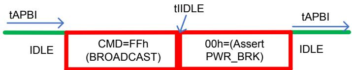

---

## 12.3.3.8 PESTI Broadcast | 12.3.3.8 PESTI 广播

<table>
<thead>
<tr>
<th width="50%">🇬🇧 English</th>
<th width="50%" style="background-color:#e8e8e8">🇨🇳 中文</th>
</tr>
</thead>
<tbody>
<tr>
<td>

Round-robin servicing naturally staggers PWR_BRK de-assertion during a virtual wire exchange which is a common
platform preference to avoid excessive inrush current from high power loads. Additional delay between PWRBRK#
de-assertion to multiple targets is implementation specific and controlled via SMFW and initiator logic that feeds into
the appropriate PESTI channel.

An initiator is permitted to issue broadcast commands back-to-back without waiting for a response.

</td>
<td style="background-color:#e8e8e8">

轮询服务自然会在虚拟线缆交换期间错开 PWR_BRK 取消断言,这是避免来自大功率负载的过大浪涌电流的常见平台偏好。对多个目标的 PWRBRK# 取消断言之间的额外延迟是实现特定的,并通过 SMFW 和馈入适当 PESTI 通道的发起者逻辑进行控制。

允许发起者连续发出广播命令而无需等待响应。

</td>
</tr>
</tbody>
</table>

[⬆️ 返回目录](#-本章目录-table-of-contents)

---

## 12.3.3.9 PESTI Initiator Control and Status Registers | 12.3.3.9 PESTI 发起者控制和状态寄存器

<table>
<thead>
<tr>
<th width="50%">🇬🇧 English</th>
<th width="50%" style="background-color:#e8e8e8">🇨🇳 中文</th>
</tr>
</thead>
<tbody>
<tr>
<td>

The following table defines the PESTI initiator control and status registers.

</td>
<td style="background-color:#e8e8e8">

下表定义了 PESTI 发起者控制和状态寄存器。

</td>
</tr>
</tbody>
</table>

**Table 12-3. PESTI Initiator Control and Status Registers | 表 12-3 PESTI 发起者控制和状态寄存器**

| Field Name | Description | Attributes |
|---|---|---|
| **DISCOVERY_STATUS[1:0]** (a.k.a. DSTAT) | **00b**: No BREAK detected; PESTI wire is static HIGH=1 (Default) | RO |
| | **01b**: PESTI wire is static LOW=0 (simple presence). | |
| | **10b**: Discovery payload has been received with a good checksum. | |
| | **11b**: BREAK release detected, but payload has not been successfully received. | |
| | Initiator implementation requires the following behavior: | |
| | • Once a BREAK release is detected, the allowable DSTAT values must exclude 00b until the next fundamental PLD reset or cycle of platform input power. | |
| | • If APEN=1b and DSTAT=10b, then the target component is in the active phase and a BREAK condition on the PESTI wire must not transition DSTAT to a value of 01b. If APEN=0b, then a BREAK asserted by the target will result in DSTAT=01b. See § Section 12.3.3.13 for more information. | |
| **DISCOVERY_PAYLOAD_ENABLE** (a.k.a. DPEN) | **0b**: (Default) Initiator will not send payload request command. | RW |
| | **1b**: Initiator will send payload request command, with retries, until DSTAT=10b. | |
| | Initiator logic implementation requires that a transition of DPEN from LOW=0 to HIGH=1 by SMFW must clear any "Discovery Complete" flag indicated by DSTAT=10b. As a result, DSTAT would transition to 11b and the DPR command would be transmitted to the target. | |
| **ACTIVE_PHASE_ENABLE** (a.k.a. APEN) | **0b**: Initiator will not enter the virtual wire exchange phase for that PESTI instance. | RW |
| | **1b**: (Default) Initiator will enter the active phase if DSTAT[1:0]=10b | |
| **ACTIVE_PHASE_ERROR** (a.k.a. APERR) | **0b**: (Default) Response RX error (i.e., parity, framing) or timeout has not occurred. | RW1C |
| | **1b**: Response RX timeout or data error has occurred since last cleared (sticky). | |
| | SMFW must write a '1' to this bit to clear the error once it has been acknowledged. | |
| **ACTIVE_PHASE_STAT** (a.k.a. ASTAT) | **0b**: (Default) Target component is in the discovery phase. | RO |
| | **1b**: The Initiator and Target communication is in the active phase | |
| | Completion of discovery is characterized by both of the following being true. 1. Discovery payload has been captured by the Initiator without any errors. 2. APEN=1 | |

**Table 12-4. PESTI Discovery Status State Transitions | 表 12-4 PESTI 发现状态状态转换**

| DSTAT Current State | DSTAT Future State | State Input |
|---|---|---|
| xxb (Any State) | 00b (Absent) | Power on Reset (POR) |
| 00b (Absent) | 01b (PRSNT#) | BREAK asserted following POR de-assertion or an unpowered adapter or component is present or a static presence |
| 01b (PRSNT#) | 11b (PESTI Presence) | BREAK release by the target, simple presence or PESTI component removal prior to target BREAK release while platform power is on. |
| 11b (PESTI Presence) | 10b (Payload Good) | Discovery Payload received without any errors |
| 10b (Payload Good) | 11b (PESTI Presence) | BREAK assertion and release by target if not in active phase. Payload Good is protected/locked during the active phase against target resets. This transition also occurs if DPEN is toggled from 0 to 1 while the component is still in the discovery phase (APEN=0.) |

[⬆️ 返回目录](#-本章目录-table-of-contents)

---

<<<PAGE_BREAK>>> page_1668

## 12.3.3.10 PESTI AC Specifications | 12.3.3.10 PESTI 交流规范

<table>
<thead>
<tr>
<th width="50%">🇬🇧 English</th>
<th width="50%" style="background-color:#e8e8e8">🇨🇳 中文</th>
</tr>
</thead>
<tbody>
<tr>
<td>

PESTI AC specifications are listed in the following table.

</td>
<td style="background-color:#e8e8e8">

PESTI 交流规范列于下表中。

</td>
</tr>
</tbody>
</table>

**Table 12-5. PESTI AC Specifications | 表 12-5 PESTI 交流规范**

| Symbol | Parameter | Min | Max | Units | Comments |
|---|---|---|---|---|---|
| tBAUD | BAUD rate | 245000 | 255000 | Hz | 250000 +/- 2% |
| tFRAME | Start +8b Data +Parity +Stop | 42.7 | 45.3 | μs | 1/tBAUD * 11 bits |
| tF | Fall Time | - | 120 | ns | Same as 1 MHz [SMBus] (VIH,MIN + 0.15 V) to (VIL,MAX – 0.15 V) |
| tR | Rise Time | - | 120 | ns | Same as 1 MHz [SMBus] (VIL,MAX – 0.15 V) to (VIH,MIN + 0.15 V) |
| tSPIKE | Noise Spike suppression time | 0 | 50 | ns | Same as 400 kHz [SMBus]. Noise suppression is recommended. |
| tABREAK | Initiator Abort BREAK assertion time | 50 | 55 | μs | Synchronous to a normal START of frame when the initiator is transmitting. Asynchronous to START when the target is transmitting. |
| tDBREAK | Target Discovery BREAK assertion time | 50 | - | μs | PESTI target BREAK can persist |
| tBPAUSE | Broadcast Pause | 20 | - | μs | Pause to allow fanout snooper completion of channel enables |
| tIIDLE | Initiator End of STOP to START | 0 | - | ns | STOP is typically sampled at the midpoint of the bit, so there is approximately 2 μs of time to the next START. |
| tTIDLE | Target End of STOP to START | - | 1000 | ns | This is required for the target to sample for initiator abort prior to START of target TX. |
| tMARK | End of BREAK to START time | 3.88 | 4.12 | μs | MARK time is 1 BAUD period between end of initiator abort BREAK and START of new command |
| tDPTAR | Discovery Phase Turnaround Time | 100 | - | ns | MAX not specified. It is bound by payload size and tDPRTO. |
| tAPTAR | Active Phase Turnaround Time | 0.1 | 200 | μs | Between Target RX and Target TX of a response. MAX reduces time to sample initiator BREAK/Abort signal just before START. Target MCU should not have trouble meeting minimum time required to allow the initiator to prepare for RX following TX. |
| tDPRTO | Discovery payload receive timeout | - | 250 | ms | Allows for 150 ms tDPTAR + 2048-byte payload size. |
| tAPRTO | Active Phase receive timeout | - | 500 | μs | Includes margin beyond tAPTARMAX + 8*tFRAMEMAX + 7*tTIDLEMAX = 389 μs |
| tAPBI | Active phase bus IDLE time | 10 | - | μs | Between initiator RX from target and initiator TX to same target |
| tMSC_WDT | Mux Switch Control Watchdog Timeout | 100 | - | ms | Time for a snooper to detect a stuck bus following a downstream channel select operation |

[⬆️ 返回目录](#-本章目录-table-of-contents)

---

<<<PAGE_BREAK>>> page_1669

## 12.3.3.11 PESTI Discovery Phase | 12.3.3.11 PESTI 发现阶段

<table>
<thead>
<tr>
<th width="50%">🇬🇧 English</th>
<th width="50%" style="background-color:#e8e8e8">🇨🇳 中文</th>
</tr>
</thead>
<tbody>
<tr>
<td>

A PESTI target is required to support the DPR command when simple presence is not implemented. Payload format
requirements enable the initiator implementation to be common and target agnostic. The discovery payload is typically
consumed by the initiator logic (e.g., SIZE, CHECKSUM) and SMFW. The payload contents can be scaled to meet vendor
requirements.

</td>
<td style="background-color:#e8e8e8">

当未实现简单的存在性时,PESTI 目标需要支持 DPR 命令。有效负载格式要求使发起者的实现能够通用且与目标无关。发现有效负载通常由发起者逻辑(例如 SIZE、CHECKSUM) 和 SMFW 使用。有效负载内容可以扩展以满足供应商需求。

</td>
</tr>
</tbody>
</table>

[⬆️ 返回目录](#-本章目录-table-of-contents)

---

> **Figure 12-6.** PESTI Discovery Command and Response Format
> 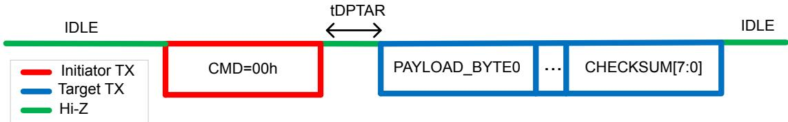

---

> **Figure 12-5.** PESTI Protocol Phases
> 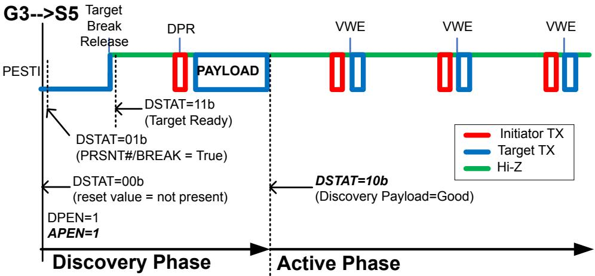

---

**Discovery Rules**

Following the BREAK de-assertion by a PESTI target, the initiator must transmit the discovery request command to that
target if DPEN=1.
- Turnaround time from target command received to start of response transmission has a minimum requirement of tDPTAR.
- A target must complete the discovery payload response within the payload RX timeout of tDPRTO.
- If a target BREAK condition is observed by the initiator with APEN=0, DSTAT[1:0] must be transitioned by logic to 11b (Discovery not complete) until a new payload is received successfully.
- The initiator must not transmit the VWE command unless a successful discovery payload is received and APEN=1.
  - Success means within the RX timeout period (tDPRTO) with no byte parity or framing errors and a verified checksum.
- While DPEN=1, an initiator must continuously attempt to retrieve a discovery payload from a PESTI target that is present.
  - Example: Round-robin servicing by a single initiator UART to multiple targets:
    - If the discovery payload is not successfully received after an initial attempt plus two retries per target, the next target in the round-robin rotation will be serviced. When servicing returns to the target, the discovery request command is sent again as a set (initial + two retries) until successful.
    - If a target is unresponsive, the minimum time between successive transmissions of the DPR command from initiator to any target is tDPRTO. Retries described in the example above are applicable to round-robin implementations only and not a requirement of this specification and is left to the initiator implementation.

[⬆️ 返回目录](#-本章目录-table-of-contents)

---

<<<PAGE_BREAK>>> page_1670

**Discovery Payload**

The minimum required payload (8 bytes) is shown in § Table 12-6 for the case when simple presence is not implemented.
The payload size must be a multiple of eight bytes including the checksum.

**Table 12-6. PESTI Discovery Payload | 表 12-6 PESTI 发现有效负载**

| Byte/Bit | 7 | 6 | 5 | 4 | 3 | 2 | 1 | 0 |
|---|---|---|---|---|---|---|---|---|
| 00h | **PAYLOAD_FORMAT_VERSION [7:0]** | | | | | | | |
| 01h | **DISCOVERY_PAYLOAD_SIZE [7:0]** | | | | | | | |
| 02h | **VENDOR_ID [15:8]** | | | | | | | |
| 03h | **VENDOR_ID [7:0]** | | | | | | | |
| 04h | **DEVICE_CLASS [7:0]** | | | | | | | |
| 05h | **DEVICE_ID [15:8]** | | | | | | | |
| 06h | **DEVICE_ID [7:0]** | | | | | | | |
| 07h | RSVD | RSVD | RSVD | RSVD | RSVD | RSVD | **PEC_SUPPORT** | **VENDOR_ID_FORMAT** |
| 08h to (N-1)h | Optional Vendor Specific Region (Varies) + **Padding (0 – 7 Bytes)*** | | | | | | | |
| Nh | **Checksum** | | | | | | | |

**Notes:**
- **Required region
- ***Minimum value of N=1, Maximum value of N=2040

**Field Definitions:**

- **PAYLOAD_FORMAT_VERSION[7:0]**: Indicates the payload format version. This field must be 02h. 01h is used by the Open Compute Project.
- **DISCOVERY_PAYLOAD_SIZE[7:0]**: Indicates the total static payload size. The value of this bit field represents (payload total # of bytes / 8) - 1.
- **VENDOR_ID[15:0]**: Utilize the PCI-SIG assigned Vendor ID, when available. If the vendor does not have a PCI-SIG Vendor ID (which applies to PESTI included subsystems such as a power converter board or a cable), then set VENDOR_ID_FORMAT = 1.
- **DEVICE_CLASS[7:0]**: Indicates the device class of the PESTI target peripheral. Note that a given form factor is permitted to define specific module classes.
- **DEVICE_ID[15:0]**: Vendor specific with intent to represent a unique type of device. Not intended for unit specific information such as a serial number.
- **VENDOR_ID_FORMAT**: 0 = PCI-SIG assigned Vendor ID of the company delivering the adapter or component with the PESTI target; 1 = Non-PCI-SIG assigned Vendor ID, e.g., Open Compute Project assigned.
- **PEC_SUPPORT**: 1 means that the target supports packet error byte checking (PEC) on command, write data, and read data returned to the PESTI initiator.
- **RSVD**: Reserved for future use.
- **Vendor Specific Region**: Optional, implementation specific and is recommended to contain its own sub-payload version.
- **CHECKSUM[7:0]**: CRC-8 with polynomial=0x07, Seed=0x00 is required in the discovery payload.

[⬆️ 返回目录](#-本章目录-table-of-contents)

---

<<<PAGE_BREAK>>> page_1671

## 12.3.3.12 PESTI Active Phase | 12.3.3.12 PESTI 活动阶段

<table>
<thead>
<tr>
<th width="50%">🇬🇧 English</th>
<th width="50%" style="background-color:#e8e8e8">🇨🇳 中文</th>
</tr>
</thead>
<tbody>
<tr>
<td>

Once a PESTI is transitioned to the active phase, the initiator autonomously exchanges hardware controlled virtual wires
with each target component. The HW controlled virtual wire inputs and outputs are target DEVICE CLASS[15:0] specific.
The number of bytes in and out and their respective usages are fixed per device class.

If the number of virtual wire bytes out is zero, the initiator will skip transmitting Virtual Wire Output (VWOUT_0) and wait
to receive any Virtual Wire Input (VWIN_N) bytes. If the number of virtual wire bytes is zero, then an acknowledge target
response of 00h is required from the target, whenever one is expected at the initiator. SMFW is permitted to clear
APEN=0 so that the VWE command is not transmitted, and the bus will remain idle until the next power on reset or
re-entry to the discovery phase.

</td>
<td style="background-color:#e8e8e8">

一旦 PESTI 过渡到活动阶段,发起者将自主地与每个目标组件交换硬件控制的虚拟线缆。硬件控制的虚拟线缆输入和输出特定于目标 DEVICE CLASS[15:0]。输入和输出的字节数及其各自的用途按设备类别固定。

如果虚拟线缆输出字节数为零,则发起者将跳过传输虚拟线缆输出 (Virtual Wire Output, VWOUT_0) 并等待接收任何虚拟线缆输入 (Virtual Wire Input, VWIN_N) 字节。如果虚拟线缆字节数为零,则每当在发起者处预期时,需要目标的确认响应 00h。SMFW 可以清除 APEN=0,以便不传输 VWE 命令,并且总线将保持空闲,直到下次开机重置或重新进入发现阶段。

</td>
</tr>
</tbody>
</table>

[⬆️ 返回目录](#-本章目录-table-of-contents)

---

> **Figure 12-7.** Single Byte PESTI Virtual Wire Exchange
> 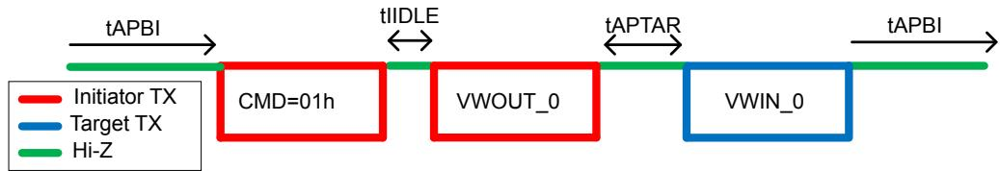

---

> **Figure 12-8.** Multi-byte PESTI Virtual Wire Exchange
> 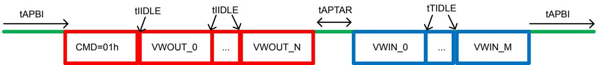

---

**Active Phase Rules**

1. Minimum PESTI idle period between initiator RX of the previous target response & TX of the next target command is tAPBI.
2. While ASTAT=1, DSTAT must remain 10b (Discovery Complete).
3. A target assertion of BREAK while ASTAT=1 must result in APERR=1.
4. A target must wait a minimum of tAPTAR before transmitting a VWE response.
5. A target must complete a response to the initiator within the RX timeout of tAPRTO.
6. The maximum period between commands sent from an initiator to that same target is not bound by this specification. The active phase of any component is under the control of SMFW and can be disabled.
7. If target supports virtual wire OUTs only, the target must respond with 00h back to the initiator as confirmation of receiving the OUTs.
8. SMFW is permitted to clear APEN to disable the active phase for a component.
9. Asymmetrical number of out and in bytes is permitted.

The method to route virtual wires to/from internal platform logic or other entities and the PESTI is outside the scope of
this document. The usage of the virtual wires (internal commands/policies or connections to local physical signals) by
the target is also outside the scope of this document.

[⬆️ 返回目录](#-本章目录-table-of-contents)

---

**Example VWIRE Bit Mapping Definition**

Below is an example of how a form factor, such as an interposer to a [CEM] slot, is permitted to map legacy wires onto
virtual wires over PESTI.

**Table 12-7. Example VWIRE_OUT_0 (Initiator to Target) | 表 12-7 VWIRE_OUT_0 示例(发起者到目标)**

| 7 | 6 | 5 | 4 | 3 | 2 | 1 | 0 |
|---|---|---|---|---|---|---|---|
| RSVD | RSVD | RSVD | RSVD | RSVD | RSVD | S0_RUN | PWR_BRK |

- PWR_BRK: Active high (1=Assert, 0=De-assert) virtual wire
- S0_RUN: Active high (1=True, 0=False) virtual wire indicating platform power state is in ACPI S0.
- Others: Reserved for Future Use

**Table 12-8. Example VWIRE_IN_0 (Target to Initiator) | 表 12-8 VWIRE_IN_0 示例(目标到发起者)**

| 7 | 6 | 5 | 4 | 3 | 2 | 1 | 0 |
|---|---|---|---|---|---|---|---|
| RSVD | RSVD | RSVD | RSVD | RSVD | RSVD | RSVD | WAKE |

- WAKE: Active high (1=Assert, 0=De-assert) virtual wire indicating the target component request to enter the ACPI S0_RUN state.
- Others: Reserved for Future Use

[⬆️ 返回目录](#-本章目录-table-of-contents)

---

**Packet Error Checking**

Packet Error Checking (PEC) is optional in the initiator and target. PEC is recommended in the active phase when
information integrity is critical to the application (e.g., an errant control may cause more ill effects than a bit flip on an
analog read that gets averaged out over time). A target's PEC support is described in a discovery payload bit. PEC utilizes
CRC-8. Enabling PEC adds to active phase latency.

When supported by the target and set by the initiator, the one-byte command (CMD) bit 7 indicates to the target that the
PEC byte is being delivered following with the command byte.

Example: CMD=81h, VWOUT_0, PEC, Turnaround, VWIN_0, PEC

[⬆️ 返回目录](#-本章目录-table-of-contents)

---

<<<PAGE_BREAK>>> page_1672

If the target indicates no PEC support in the discovery payload, then the initiator must not set bit 7 in the CMD nor
deliver an extra PEC byte following the command. This is because following the turnaround, the target may drive
contention on against the incoming PEC byte.

If the CMD to target has bit 7 set indicating PEC:
1. The initiator must supply the PEC byte.
2. If the PEC check at the target fails, then the target must drop the command and, if applicable, receive payload. A method to indicate from target to initiator that a PEC failure occurred is out of scope of this specification.
3. The target must append a PEC byte to the end of the active phase payload response (just as it does for the discovery payload).
4. If the initiator calculates a bad PEC on the target response message, the initiator must drop the response. Further handling, such as retries, is implementation specific.

For commands such as CMD=00h for get discovery payload, PEC is optional, since the 1-byte command has parity.

**Example Supported Commands with and without PEC**
- 01h = Put 1 Virtual Wire Byte, Get 1 Virtual Wire Byte
- 81h = Put 1 Virtual Wire Byte with PEC, Get 1 Virtual Wire Byte with PEC

[⬆️ 返回目录](#-本章目录-table-of-contents)

---

## 12.3.3.13 PESTI Target Reset and Fault Handling | 12.3.3.13 PESTI 目标复位和故障处理

table>
<thead>
<tr>
<th width="50%">🇬🇧 English</th>
<th width="50%" style="background-color:#e8e8e8">🇨🇳 中文</th>
</tr>
</thead>
<tbody>
<tr>
<td>

If the target resets during the discovery phase prior to the entry to the active phase (e.g., APEN=0), the DSTAT value
would revert to 11b (Payload not received.) The initiator would autonomously send the payload request command if
DPEN=1. The target component would not be transitioned to the active phase until DSTAT=10b. If discovery had not
previously completed or DPEN=0, the component would not be discovered and would not transition to the active phase.

If the target resets during the active phase, it must be observed as temporary unresponsiveness at the initiator. This
would be reflected in the ACTIVE_PHASE_ERROR (APERR) register bit if any RX timeout or parity error occurred.
Following target reset, a BREAK assertion and release would be observed by the initiator. During the active phase
(DSTAT[1:0]=10b & APEN=1), DSTAT must be locked. Locking the discovery status and payload data is required so that FW
can safely consume the contents at any warm or cold reset. Since discovery has already occurred, the initiator would
resume sending the virtual wire exchange command and the target would not observe a discovery request command.

Once a component has transitioned to the active phase, the only method to unlock the discovery payload and status is
by SMFW clearing, then setting DPEN.

</td>
<td style="background-color:#e8e8e8">

如果目标在进入活动阶段之前的发现阶段(例如 APEN=0)期间复位,则 DSTAT 值将恢复为 11b(未收到有效负载)。如果 DPEN=1,发起者将自动发送有效负载请求命令。目标组件在 DSTAT=10b 之前不会过渡到活动阶段。如果发现之前未完成或 DPEN=0,则不会发现该组件并且不会过渡到活动阶段。

如果目标在活动阶段期间复位,则必须将其视为发起者处的临时无响应。如果发生任何 RX 超时或奇偶校验错误,这将反映在 ACTIVE_PHASE_ERROR (APERR) 寄存器位中。目标复位后,发起者将观察到 BREAK 断言和释放。在活动阶段 (DSTAT[1:0]=10b & APEN=1) 期间,DSTAT 必须被锁定。锁定发现状态和有效负载数据是必需的,以便 FW 可以在任何热复位或冷复位时安全地使用内容。由于发现已经发生,发起者将继续发送虚拟线缆交换命令,目标将不会观察到发现请求命令。

一旦组件过渡到活动阶段,解锁发现有效负载和状态的唯一方法是由 SMFW 清除然后设置 DPEN。

</td>
</tr>
</tbody>
</table>

[⬆️ 返回目录](#-本章目录-table-of-contents)

---

## 12.3.3.14 PESTI Fan-Out | 12.3.3.14 PESTI 扇出

<table>
<thead>
<tr>
<th width="50%">🇬🇧 English</th>
<th width="50%" style="background-color:#e8e8e8">🇨🇳 中文</th>
</tr>
</thead>
<tbody>
<tr>
<td>

Applications where the ability to fan-out a PESTI bus to multiple targets exist. Since the number N is not a priori known
by the motherboard, and pre-plumbing for a maximum quantity requires additional interconnects, PESTI fan-out
support helps scale the ability to support PESTI type features.

This specification version includes the scope of fanout from between 2 to 8 downstream buses. Although out of scope,
nesting of multiple tiers of fan-out within a single hierarchy is possible with additional command codes and circuitry. In
all fanout cases, it is left to the designer to understand the latency effects of fanout width (and depth). Two methods are
shown where the MUX method is for typical fanout needs and the Switch method is targeted for applications that require
the ability to broadcast commands simultaneously with all targets.

Two fanout methods of operation include the MUX and Switch methods (see circuits below):
- **MUX method**: Typical 1-to-many fanout. Broadcast commands are not supported.
- **Switch method**: For applications requiring broadcast commands to all attached targets.

Two modes of operation for a fanout controller include Target Mode and Snoop Mode:
- **Target Mode (Default):**
  - Controller acts as a target supporting discovery and active phases.
  - Only the fanout controller is permitted to be attached to the initiator bus.
    - MUX Method: No channels are selected.
    - Switch Method: Fanout controller on Ch0 is always enabled; all others default disabled.
  - Must support =1 status command for the initiator reading information from the fanout controlling PESTI target such as:
    - The current MUX/switch settings
    - If an issue was observed such as a closed switch bus hang watchdog timeout
    - Live status of downstream subsegments (when the MUX or switch is open for a particular subsegment)
- **Snoop Mode:**
  - Fanout controller must enter snoop mode any time any other target(s) are attached to a bus.
  - Is permitted to process broadcast commands if application relevant.
  - Listen/Process only special fanout control commands (MUX Select or Switch channel enable), thereby ignoring discovery and target mode active phase commands intended for other targets.

Example MUX Select commands are permitted to include:
- Go to Target Mode and de-select all subsegments.
- Select specific subsegment(s) as connected, which can be comprised of 1, all or select groups.

</td>
<td style="background-color:#e8e8e8">

存在需要将 PESTI 总线扇出到多个目标的应用。由于主板事先不知道数量 N,并且为最大数量预先布线需要额外的互连,因此 PESTI 扇出支持有助于扩展支持 PESTI 类型功能的能力。

本规范版本包括 2 到 8 个下游总线的扇出范围。尽管不在范围内,但通过附加的命令代码和电路,可以在单个层级内嵌套多层扇出。在所有扇出情况下,由设计人员了解扇出宽度(和深度)的延迟影响。图中显示了两种方法,其中 MUX 方法用于典型的扇出需求,而 Switch 方法针对需要能够同时向所有目标广播命令的应用。

两种扇出操作方法包括 MUX 和 Switch 方法(见以下电路):
- **MUX 方法**:典型的 1 对多扇出。不支持广播命令。
- **Switch 方法**:用于需要向所有连接的目标广播命令的应用。

扇出控制器的两种操作模式包括目标模式 (Target Mode) 和侦听模式 (Snoop Mode):
- **目标模式 (默认)**:
  - 控制器充当支持发现和活动阶段的目标。
  - 仅允许将扇出控制器连接到发起者总线。
    - MUX 方法:未选择任何通道。
    - Switch 方法:始终启用 Ch0 上的扇出控制器;所有其他默认禁用。
  - 必须支持 =1 状态命令,供发起者从扇出控制 PESTI 目标读取信息,例如:
    - 当前的 MUX/开关设置
    - 是否观察到问题,例如关闭的开关总线挂起看门狗超时
    - 下游子段的实时状态(当特定子段的 MUX 或开关打开时)
- **侦听模式 (Snoop Mode)**:
  - 扇出控制器必须在任何其他目标连接到总线时进入侦听模式。
  - 如果与应用相关,允许处理广播命令。
  - 仅侦听/处理特殊的扇出控制命令 (MUX 选择或开关通道启用),从而忽略针对其他目标的发现和目标模式活动阶段命令。

示例 MUX 选择命令可包括:
- 转到目标模式并取消选择所有子段。
- 选择特定的子段作为已连接,可以由 1、全部或选定的组组成。

</td>
</tr>
</tbody>
</table>

[⬆️ 返回目录](#-本章目录-table-of-contents)

---

> **Figure 12-9.** PESTI Fan-out Methods
> 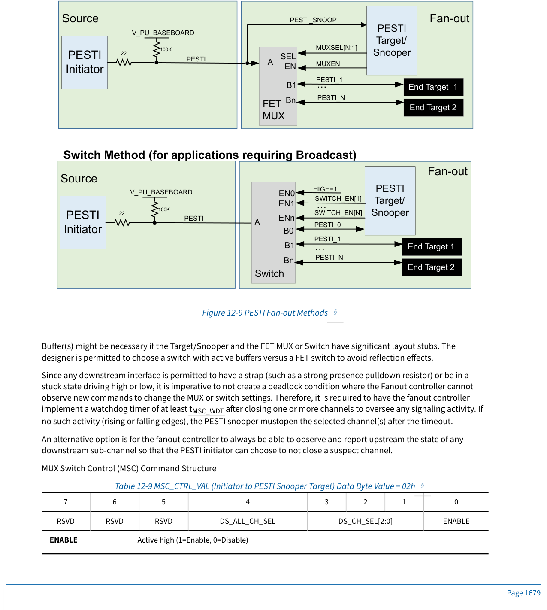

---

<<<PAGE_BREAK>>> page_1673

Buffer(s) might be necessary if the Target/Snooper and the FET MUX or Switch have significant layout stubs. The
designer is permitted to choose a switch with active buffers versus a FET switch to avoid reflection effects.

Since any downstream interface is permitted to have a strap (such as a strong presence pulldown resistor) or be in a
stuck state driving high or low, it is imperative to not create a deadlock condition where the Fanout controller cannot
observe new commands to change the MUX or switch settings. Therefore, it is required to have the fanout controller
implement a watchdog timer of at least tMSC_WDT after closing one or more channels to oversee any signaling activity. If
no such activity (rising or falling edges), the PESTI snooper must open the selected channel(s) after the timeout.

An alternative option is for the fanout controller to always be able to observe and report upstream the state of any
downstream sub-channel so that the PESTI initiator can choose to not close a suspect channel.

**MUX Switch Control (MSC) Command Structure**

**Table 12-9. MSC_CTRL_VAL (Initiator to PESTI Snooper Target) Data Byte Value = 02h | 表 12-9 MSC_CTRL_VAL(发起者到 PESTI 侦听者目标) 数据字节值 = 02h**

| 7 | 6 | 5 | 4 | 3 | 2 | 1 | 0 |
|---|---|---|---|---|---|---|---|
| RSVD | RSVD | RSVD | RSVD | DS_ALL_CH_SEL | DS_CH_SEL[2:0] | | ENABLE |

- **ENABLE**: Active high (1=Enable, 0=Disable). When the mux or switch is disabled, only the snooper target can receive communication from the initiator. All downstream MUX or switch channels must be disabled.
- **DS_CH_SEL[2:0]**: Hex representation of downstream channel select (0…7 decimal). This bitfield is only used if ENABLE = 1b and DS_ALL_CH_SEL = 0b.
- **DS_ALL_CH_SEL**: When set to 1b, then all downstream channels are connected. Used for broadcast commands only. This bitfield is only valid if ENABLE = 1b. When this bitfield is set to 1b then DS_CH_SEL bitfield must be set to 000b.
- **RSVD**: Reserved for Future Use.

**Table 12-10. MSC_STAT_VAL (PESTI Snooper Target to Initiator) | 表 12-10 MSC_STAT_VAL(PESTI 侦听者目标到发起者)**

| 7 | 6 | 5 | 4 | 3 | 2 | 1 | 0 |
|---|---|---|---|---|---|---|---|
| RSVD | NOT_ACK | RSVD | RSVD | RSVD | RSVD | RSVD | RSVD |

- **NOT_ACK**: 0b = Success, 1b = Error
- **RSVD**: Reserved for Future Use.

> **Figure 12-10.** PESTI Mux Switch Control Format
> 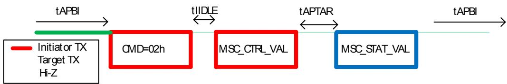

---

**Fanout Rules:**

1. PESTI snoopers must not be nested. Only a single fanout level is supported.
2. A PESTI snooper fanout target must default to all downstream PESTI channels disabled during the discovery phase.
3. A PESTI snooper must not respond to a discovery payload request command = 00h when any downstream channel is selected.
4. A PESTI snooper must not respond to any virtual wire exchange using command 01h when any downstream channel is selected.
5. Except for when broadcast commands are supported and transmitted, only a single downstream channel of a Switch can be selected at any given time.
6. Non-snooper targets must ignore argument(s) following the MSC command = 02h.
7. On any PESTI that a fanout switch is present, the initiator must begin any broadcast with the following sequence:
   - Broadcast start value = FFh
   - Wait for tBPAUSE (Broadcast Pause)
   - Resume with typical broadcast sequence of FFh (repeated) followed by the broadcasted command value(s).
8. A fanout switch snooper must enable all downstream channels at any start of a broadcast indicated by 0xFF as the first, or repeated, data byte of a sequence.
9. Once the broadcast sequence is complete, the initiator must utilize the MSC command to select a single downstream channel of any switch or MUX prior to resuming typical communication.

[⬆️ 返回目录](#-本章目录-table-of-contents)

---

## 12.3.3.15 PESTI Security Considerations | 12.3.3.15 PESTI 安全注意事项

table>
<thead>
<tr>
<th width="50%">🇬🇧 English</th>
<th width="50%" style="background-color:#e8e8e8">🇨🇳 中文</th>
</tr>
</thead>
<tbody>
<tr>
<td>

Although PESTI is a basic, low-level data communication channel the following threats are identified with possible
mitigations, although the specific mitigations are implementation specific.

**Threats**

1. Physical implant/signal re-routing: Assurance, where applicable, that the PESTI target is on the same HW (or
   same target) as other management interfaces. Security Protocols and Data Model (SPDM) types of security
   capabilities are the likely current method used to address this treat.
2. Physical implant, man-in-the-middle snooping or alteration of payloads or virtual wires in flight. Potentially
   mitigated with encrypted payloads most likely using SPDM defined methods.

</td>
<td style="background-color:#e8e8e8">

尽管 PESTI 是一种基本的低级数据通信通道,但识别出以下威胁和可能的缓解措施,尽管具体的缓解措施是实现特定的。

**威胁**

1. 物理植入/信号重新路由:在适用的情况下,确保 PESTI 目标与其他管理接口在同一硬件(或同一目标)上。安全协议和数据模型 (Security Protocols and Data Model, SPDM) 类型的安全能力可能是当前用于解决此威胁的可能方法。
2. 物理植入、中间人侦听或传输中有效负载或虚拟线缆的更改。可以使用加密的有效负载来缓解,最有可能使用 SPDM 定义的方法。

</td>
</tr>
</tbody>
</table>

[⬆️ 返回目录](#-本章目录-table-of-contents)

---

<<<PAGE_BREAK>>> page_1674

## 12.4 Managed USB 2.0 | 12.4 托管 USB 2.0

<table>
<thead>
<tr>
<th width="50%">🇬🇧 English</th>
<th width="50%" style="background-color:#e8e8e8">🇨🇳 中文</th>
</tr>
</thead>
<tbody>
<tr>
<td>

Numerous use cases exist for USB 2.0 as a plug-and-play, out of band management interface, such as:
- Adapter or component firmware update, telemetry, debug, and security operations such as attestation,
  recovery, and measurement.
- MCTP direct to an adapter or component.
- TCP/IP or Network Controller-Sideband Interface (NC-SI) traffic.
- Bridge to common low-level interfaces such as GPIOs, UARTs, SPI, I3C and JTAG.

USB Rules:
1. The USB Host must be on the platform side of the form factor interface.
2. USB 2.0 high speed and full speed modes are supported.
3. USB 2.0 low speed and USB 1.1 mode devices are prohibited when directly connected to the form factor
   interface but are allowed when attached to a downstream port of a device side USB hub.
4. USB 2.0 low speed is prohibited due to USB 2.0's support of larger packet sizes as well as common handling of
   Flex I/O default terminations and D+ pullup-based attach detection (e.g., CEM JTAG vs USB Flex I/O alternate
   function rules).
5. USB 2.0 voltage through form factor interfaces must be 3.3 V to support standard discrete components such as
   bridges and hubs and to provide maximum signaling margin for long busses. Voltage translation when
   connecting USB 2.0 to components that do not support 3.3 V is implementation specific.

</td>
<td style="background-color:#e8e8e8">

USB 2.0 作为即插即用、带外管理接口有许多用例,例如:
- 适配器或组件固件更新、遥测、调试以及安全操作(例如证明、恢复和测量)。
- 直接与适配器或组件的 MCTP。
- TCP/IP 或网络控制器边带接口 (Network Controller-Sideband Interface, NC-SI) 流量。
- 桥接到常见的低级接口,如 GPIO、UART、SPI、I3C 和 JTAG。

**USB 规则:**
1. USB 主机必须位于外形规格接口的平台侧。
2. 支持 USB 2.0 高速和全速模式。
3. 当直接连接到外形规格接口时,禁止使用 USB 2.0 低速和 USB 1.1 模式设备,但当连接到设备侧 USB 集线器的下游端口时允许使用。
4. 由于 USB 2.0 支持更大的数据包大小以及对 Flex I/O 默认终端和基于 D+ 上拉的附件检测的常见处理(例如 CEM JTAG 与 USB Flex I/O 替代功能规则),因此禁止使用 USB 2.0 低速。
5. 通过外形规格接口的 USB 2.0 电压必须为 3.3 V,以支持桥接器和集线器等标准离散元件,并为长总线提供最大的信令裕度。将 USB 2.0 连接到不支持 3.3 V 的组件时的电压转换是实现特定的。

</td>
</tr>
</tbody>
</table>

[⬆️ 返回目录](#-本章目录-table-of-contents)

---

> **Figure 12-11.** [CEM] form factor example circuit for repurposing legacy JTAG to USB 2.0 mode
> 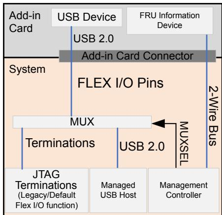

---

<<<PAGE_BREAK>>> page_1675

## 12.5 2-Wire Interface | 12.5 两线制 (2-Wire) 接口

table>
<thead>
<tr>
<th width="50%">🇬🇧 English</th>
<th width="50%" style="background-color:#e8e8e8">🇨🇳 中文</th>
</tr>
</thead>
<tbody>
<tr>
<td>

[I2C] and [SMBus] are long standing and useful bus interfaces that are expected to be fully supported for the foreseeable
future. Form factor specifications dictate the electrical particulars, such as the reference voltage, power domain,
peripheral capacitive loading and define such an interface as being required, optional or unsupported. Although the
SMBUS specification is stable in terms of revisions, especially at the electrical level, it is always encouraged that form
factor specifications attempt to reference the latest versions of the [SMBus] specification when possible. [SMBus-3.2]
version 3.2 is the preferred minimum version at the time of this writing due to support for the Default Target Address
feature, while using inclusive terminology. The remainder of this specification refers to [SMBus] and not [I2C]. However,
[I2C] compliant components that are not [SMBus] compliant, such as an EEPROM or MUX, are permitted at the designer's
discretion.

MIPI [I3C-Basic] is an additional protocol option that shares the same physical 2-wire interface as the [SMBus] interface.
This specification defines a backward-compatible method of discovering and enabling the optional [I3C-Basic] mode on
the existing 2-wire interface. The [I3C-Basic] architecture includes an optional intermediary component known as 2-wire
Hub (see § Section 12.5.3.3) to addresses specific [SMBus] challenges related to asynchronous communications.
[I3C-Basic] defines the protocol, including its electrical characteristics. The recommended PCI Architecture to allow
interoperability with legacy adapters is for the platform to use the 2-wire Hub which provides a method for a transition
between [I2C] / [SMBus] and I3C. Legacy [SMBus] and [I3C-Basic] have different electrical requirements which needs to be
considered in the platform design. The [I3C-Basic] provides a common electrical requirement definition across all
PCIe form-factor connectors (interfaces).

**Common Interface and Signal Names**

Historically, the [SMBus] interface and signal names were used in various form factor specifications. With the addition of
optional I3C interface on the same pins, the following generic terms should be utilized, when referring to either [SMBus]
or I3C:
1. "2-wire interface"
2. Signal names "SCL" for the serial clock wire and "SDA" for the serial data wire

Throughout this section, the generic term 2-wire interface references either [SMBus], [I2C], or [I3C-Basic].

</td>
<td style="background-color:#e8e8e8">

[I2C] 和 [SMBus] 是长期存在且有用的总线接口,预计在可预见的未来将得到全面支持。外形规格规范规定了电气细节,例如参考电压、电源域、外设电容负载,并将此类接口定义为必需、可选或不受支持。尽管 SMBUS 规范在修订方面是稳定的,尤其是在电气层面,但始终鼓励外形规格规范在可能时尝试参考最新版本的 [SMBus] 规范。[SMBus-3.2] 版本 3.2 在撰写本文时是首选最低版本,因为它支持默认目标地址功能,同时使用包容性术语。本规范的其余部分涉及 [SMBus] 而非 [I2C]。但是,允许不符合 [SMBus] 但符合 [I2C] 的组件(例如 EEPROM 或 MUX)由设计者自行决定。

MIPI [I3C-Basic] 是一种附加的协议选项,与 [SMBus] 接口共享相同的物理 2 线接口。本规范定义了一种向后兼容的方法,用于在现有 2 线接口上发现和启用可选的 [I3C-Basic] 模式。[I3C-Basic] 架构包括一个称为 2 线 Hub (2-wire Hub) 的可选中间组件(参见 § 12.5.3.3),以解决与异步通信相关的特定 [SMBus] 挑战。[I3C-Basic] 定义了协议及其电气特性。允许与传统适配器互操作的推荐 PCI 架构是平台使用 2 线 Hub,它提供 [I2C] / [SMBus] 和 I3C 之间的转换方法。传统 [SMBus] 和 [I3C-Basic] 具有不同的电气要求,需要在平台设计中加以考虑。[I3C-Basic] 提供了跨所有 PCIe 外形规格连接器(接口)的通用电气要求定义。

**通用接口和信号名称**

从历史上看,[SMBus] 接口和信号名称已在各种外形规格规范中使用。在同一引脚上添加了可选的 I3C 接口后,在引用 [SMBus] 或 I3C 时应使用以下通用术语:
1. "2 线接口 (2-wire interface)"
2. 信号名称:串行时钟线为 "SCL",串行数据线为 "SDA"

在本节中,通用术语"2 线接口 (2-wire interface)"指 [SMBus]、[I2C] 或 [I3C-Basic] 中的任何一个。

</td>
</tr>
</tbody>
</table>

[⬆️ 返回目录](#-本章目录-table-of-contents)

---

## 12.5.1 2-Wire Interface Use Cases | 12.5.1 2 线接口用例

<table>
<thead>
<tr>
<th width="50%">🇬🇧 English</th>
<th width="50%" style="background-color:#e8e8e8">🇨🇳 中文</th>
</tr>
</thead>
<tbody>
<tr>
<td>

The following table lists the 2-wire interface example usages.

</td>
<td style="background-color:#e8e8e8">

下表列出了 2 线接口示例用法。

</td>
</tr>
</tbody>
</table>

**Table 12-11. 2-wire Interface Example Usages | 表 12-11 2 线接口示例用法**

| Functionality | Typical Applications |
|---|---|
| Field Replaceable Unit (FRU) Information | Discovery of Hardware inventory, capabilities such as bus topologies, features supported, etc. |
| Security | Attestation of HW/FW, Root of Trust for Measurement, Root of Trust for Update, Root of Trust for Recovery, Data Encryption |
| Configuration / Controls | Flex I/O, Link subdivision |
| Update | Peripheral Subsystem Firmware |
| Health | Error Causes, Crash Dump Logs, Temperature, External Link States |
| Telemetry | Power, Throughput |

[⬆️ 返回目录](#-本章目录-table-of-contents)

---

## 12.5.2 2-Wire Addressing | 12.5.2 2 线寻址

<table>
<thead>
<tr>
<th width="50%">🇬🇧 English</th>
<th width="50%" style="background-color:#e8e8e8">🇨🇳 中文</th>
</tr>
</thead>
<tbody>
<tr>
<td>

To ease topology and component discovery operations, § Table 12-12 lists common SMBus default target addresses
recommended to be used by all PCI Express-based form factors, when such component exist. Components supporting
both SMBus and I3C modes must stop responding to their original SMBus address(es) upon transitioning to I3C mode, as
described in § Section 12.5.4.2.

§ Table 12-12 identifies the recommended addresses for specific SMBus usages. Note that a card carrier is defined as one
with a connector edge based on a form factor that includes connector slots based on one or more instances of the same
or different form factor, sometimes referred to as passenger slots. An example is a [CEM] card carrier containing one or
more M.2 form factor slots.

</td>
<td style="background-color:#e8e8e8">

为了简化拓扑和组件发现操作,§ 表 12-12 列出了所有基于 PCI Express 的外形规格(在存在此类组件时)推荐使用的常见 SMBus 默认目标地址。同时支持 SMBus 和 I3C 模式的组件必须在过渡到 I3C 模式时停止响应其原始 SMBus 地址,如 § 12.5.4.2 所述。

§ 表 12-12 确定了特定 SMBus 用法的推荐地址。请注意,载卡 (card carrier) 被定义为具有基于外形规格的连接器边缘的外形规格,其包括基于一个或多个相同或不同外形规格的连接器插槽,有时称为乘客插槽。一个例子是包含一个或多个 M.2 外形规格插槽的 [CEM] 载卡。

</td>
</tr>
</tbody>
</table>

> **IMPLEMENTATION NOTE: RECOMMENDED 2-WIRE INTERFACE ADDRESSES** | **实施说明:推荐的 2 线接口地址**
>
> All implementations are recommended to use the addresses in § Table 12-12 for the listed usages to ease
> discovery. For all usages, any address other than the ones listed in § Table 12-12 are permitted.
> Platform makers should avoid these listed addresses on the same subsegments.
> For maximum backward compatibility, platform makers should not include any component addresses on the
> same (sub)-segment that connects to the form factor.
> The addresses shown have synergy with other industry standards such as [NVM-Express]. | 建议所有实现使用 § 表 12-12 中列出的地址,以便简化发现。对于所有用途,允许使用 § 表 12-12 中未列出的任何地址。平台制造商应避免在相同的子段上使用这些列出的地址。为了最大程度的向后兼容性,平台制造商不应在连接到外形规格的相同(子)段上包含任何组件地址。所示地址与其他行业标准(例如 [NVM-Express])具有协同作用。

[⬆️ 返回目录](#-本章目录-table-of-contents)

---

<<<PAGE_BREAK>>> page_1676

**Table 12-12. Baseline SMBus Recommended Default Target Addresses | 表 12-12 基线 SMBus 推荐的默认目标地址**

| Default Target Address: Binary with x indicating R/W (Hex 8-bit/Hex 7-bit) | Recommended Usages |
|---|---|
| 1010 010xb (A4h/52h) | Recommended for FRU Information Device on a card carrier 1 |
| 1010 011xb (A6h/53h) | Recommended for FRU Information Device on a PCI Express-based adapter or component 1 |
| 0011 101xb (3Ah/1Dh) | Recommended for Primary MCTP-compliant Management Target 2 |
| 1101 010xb (D4h/6Ah) | Recommended for Secondary MCTP-compliant Management Target 3 |
| 1110 100xb (E8h/74h) | Recommended for Addressable SMBus MUX, if applicable |
| 1110 000xb (E0h/70h) | Recommended for 2-wire Hub 4 |

**Notes:**
1. The FRU Information Device is a typically an optional element. Form factor specified features that need out-of-band discovery descriptors must make the FRU Information Device required and available in the appropriate earliest discoverable power state (auxiliary and/or main power).
2. Primary MCTP target: This target must operate when main power is applied. This interface is permitted to operate when only auxiliary power is applied.
3. Secondary MCTP target: This target is permitted to operate when auxiliary and/or main power is applied.
4. 2-wire Hubs must default to the static address listed and are then permitted to be changed via register programming or via [I3C-Basic] Dynamic Addressing.

Interposer discovery details are left to the implementer, with designer care needed to avoid address conflicts if the
2-wire interface extends into standard form factors.

[⬆️ 返回目录](#-本章目录-table-of-contents)

---

<<<PAGE_BREAK>>> page_1677

> **Figure 12-12.** Example of 2-wire, 8-bit addressing for a card carrier with N end form factors in SMBus mode
> 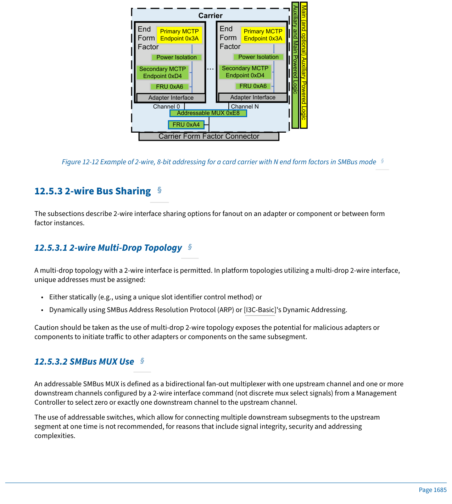

---

## 12.5.3 2-wire Bus Sharing | 12.5.3 2 线总线共享

table>
<thead>
<tr>
<th width="50%">🇬🇧 English</th>
<th width="50%" style="background-color:#e8e8e8">🇨🇳 中文</th>
</tr>
</thead>
<tbody>
<tr>
<td>

The subsections describe 2-wire interface sharing options for fanout on an adapter or component or between form
factor instances.

A multi-drop topology with a 2-wire interface is permitted. In platform topologies utilizing a multi-drop 2-wire interface,
unique addresses must be assigned:
- Either statically (e.g., using a unique slot identifier control method) or
- Dynamically using SMBus Address Resolution Protocol (ARP) or [I3C-Basic]'s Dynamic Addressing.

Caution should be taken as the use of multi-drop 2-wire topology exposes the potential for malicious adapters or
components to initiate traffic to other adapters or components on the same subsegment.

An addressable SMBus MUX is defined as a bidirectional fan-out multiplexer with one upstream channel and one or more
downstream channels configured by a 2-wire interface command (not discrete mux select signals) from a Management
Controller to select zero or exactly one downstream channel to the upstream channel.

The use of addressable switches, which allow for connecting multiple downstream subsegments to the upstream
segment at one time is not recommended, for reasons that include signal integrity, security and addressing
complexities.

</td>
<td style="background-color:#e8e8e8">

以下小节描述了适配器或组件上或外形规格实例之间用于扇出的 2 线接口共享选项。

允许使用 2 线接口的多点拓扑。在使用多点 2 线接口的平台拓扑中,必须分配唯一地址:
- 静态分配(例如,使用唯一的插槽标识符控制方法),或
- 使用 SMBus 地址解析协议 (Address Resolution Protocol, ARP) 或 [I3C-Basic] 的动态寻址动态分配。

应谨慎行事,因为使用多点 2 线拓扑会暴露恶意适配器或组件在同一子段上向其他适配器或组件发起流量的可能性。

可寻址 SMBus MUX 定义为双向扇出多路复用器,具有一个上游通道和一个或多个下游通道,由管理控制器通过 2 线接口命令(不是离散 mux 选择信号)配置,以选择零个或恰好一个下游通道到上游通道。

不建议使用可寻址交换机(允许一次将多个下游子段连接到上游段),原因包括信号完整性、安全性和寻址复杂性。

</td>
</tr>
</tbody>
</table>

[⬆️ 返回目录](#-本章目录-table-of-contents)

---

## 12.5.3.1 2-wire Multi-Drop Topology | 12.5.3.1 2 线多点拓扑

<table>
<thead>
<tr>
<th width="50%">🇬🇧 English</th>
<th width="50%" style="background-color:#e8e8e8">🇨🇳 中文</th>
</tr>
</thead>
<tbody>
<tr>
<td>

A multi-drop topology is one in which multiple devices share the same 2-wire bus. In platform topologies utilizing a multi-drop 2-wire interface, unique addresses must be assigned, either statically or dynamically using SMBus ARP or [I3C-Basic]'s Dynamic Addressing.

</td>
<td style="background-color:#e8e8e8">

多点拓扑是指多个设备共享同一 2 线总线的拓扑。在使用多点 2 线接口的平台拓扑中,必须分配唯一地址,可以静态分配,也可以使用 SMBus ARP 或 [I3C-Basic] 的动态寻址动态分配。

</td>
</tr>
</tbody>
</table>

[⬆️ 返回目录](#-本章目录-table-of-contents)

---

## 12.5.3.2 SMBus MUX Use | 12.5.3.2 SMBus MUX 使用

<table>
<thead>
<tr>
<th width="50%">🇬🇧 English</th>
<th width="50%" style="background-color:#e8e8e8">🇨🇳 中文</th>
</tr>
</thead>
<tbody>
<tr>
<td>

It may be beneficial to use a 2-wire Hub component for reasons including:
a. Bus capacitance isolation.
b. Fanout of I3C and SMBus components with I3C in-band interrupt aggregation across all downstream channels.
c. Voltage translation and power domain isolation.
d. Using offload capabilities such as SMBus agents to send and receive asynchronous SMBus messages, such as
   those utilized by MCTP.

An example use of such a 2-wire Hub is presented in § Figure 12-13. This architecture is recommended to address the
interoperability challenges existing with simple MUX components, as described in § Section 12.5.3.2. SMBus endpoints
can initiate asynchronous messages even if they do not support I3C mode of operation. I3C mode, which is typically
available with such 2-wire Hubs, allows protocol and voltage transition to enable coexistence of SMBus and I3C
components.

</td>
<td style="background-color:#e8e8e8">

出于以下原因,使用 2 线 Hub 组件可能是有益的:
a. 总线电容隔离。
b. 在所有下游通道上使用 I3C 带内中断聚合来扇出 I3C 和 SMBus 组件。
c. 电压转换和电源域隔离。
d. 使用卸载功能(例如 SMBus 代理)发送和接收异步 SMBus 消息,例如 MCTP 使用的那些。

§ 图 12-13 中展示了这种 2 线 Hub 的一个示例用法。建议使用此架构来解决 § 12.5.3.2 中描述的简单 MUX 组件存在的互操作性挑战。即使 SMBus 端点不支持 I3C 操作模式,它们也可以发起异步消息。I3C 模式(通常可用于此类 2 线 Hub)允许协议和电压转换,以实现 SMBus 和 I3C 组件的共存。

</td>
</tr>
</tbody>
</table>

> **IMPLEMENTATION NOTE: SECURITY CONCERNS WITH SMBUS MUXES** | **实施说明:SMBus MUX 的安全问题**
>
> Platform implementations utilizing 2-wire switches/MUXes are recommended to mitigate against security risks of
> errant or malicious adapters or components that could initiate peer-to-peer traffic to other adapters,
> components, or other platform adapters or components on the same 2-wire segment.
> Platform designers are recommended to consider that switches/MUXes interrupt the continuity of the shared bus
> breaking the arbitration and acknowledgment mechanisms of SMBus. This creates major challenges for
> implementations utilizing multi-initiator protocols, such as MCTP, especially when:
> - MCTP messages initiated by downstream components are spread over long periods of time (e.g., as per
>   [PLDM-Firmware-Update]), or
> - asynchronous communication happens (e.g., asynchronous event or alert reporting as
>   [PLDM-Platform-Monitoring-Control]), or
> - response times may be difficult to predict, or response messages delayed (e.g., due to complex
>   computations, such as cryptographic ones required for the SPDM attestation flows defined in [SPDM]).
>
> Additional challenges in the above scenarios exist when switches/MUXes interrupt the continuity of the shared
> bus and:
> 1. the platform uses MCTP bridging (management controller is not the source of the MCTP communication
>    and thus has more difficulty to predict the MCTP request/response patterns) or
> 2. downstream port enabling/disabling is not synchronized with SMBus transactions (e.g., truncating the
>    MCTP packets).
>
> Platforms utilizing MCTP protocol in such scenarios are recommended to use a 2-wire Hub component instead
> (see the next section). Switching to [I3C-Basic] mode may be another alternative to address such challenges but
> only possible if all downstream components support [I3C-Basic] (I3C is a single-initiator protocol even when
> running MCTP and it also allows explicit control of I3C in-band interrupts). | 建议使用 2 线开关/MUX 的平台实现针对可能的对等流量发起的错误或恶意适配器或组件的安全风险进行缓解,这些对等流量可能会在同一 2 线段上发送到其他适配器、组件或其他平台适配器或组件。建议平台设计人员考虑开关/MUX 中断共享总线的连续性,从而破坏 SMBus 的仲裁和确认机制。这给使用多发起者协议(例如 MCTP)的实现带来了重大挑战,尤其是在以下情况下:
> - 由下游组件发起的 MCTP 消息分布在很长的时间段内(例如根据 [PLDM-Firmware-Update]),或
> - 发生异步通信(例如 [PLDM-Platform-Monitoring-Control] 的异步事件或警报报告),或
> - 响应时间可能难以预测,或响应消息延迟(例如由于复杂计算,例如 [SPDM] 中定义的 SPDM 证明流所需的加密计算)。
>
> 在上述情况下,当开关/MUX 中断共享总线的连续性时,还存在其他挑战:
> 1. 平台使用 MCTP 桥接(管理控制器不是 MCTP 通信的来源,因此更难预测 MCTP 请求/响应模式),或
> 2. 下游端口启用/禁用与 SMBus 事务不同步(例如截断 MCTP 数据包)。
>
> 建议在此类场景中使用 MCTP 协议的平台改用 2 线 Hub 组件(请参见下一节)。切换到 [I3C-Basic] 模式可能是解决此类挑战的另一种替代方案,但前提是所有下游组件都支持 [I3C-Basic] (I3C 是一种单发起者协议,即使在运行 MCTP 时也是如此,并且它还允许显式控制 I3C 带内中断)。

[⬆️ 返回目录](#-本章目录-table-of-contents)

---

<<<PAGE_BREAK>>> page_1678

> **Figure 12-13.** Example of 2-wire Hub Use
> 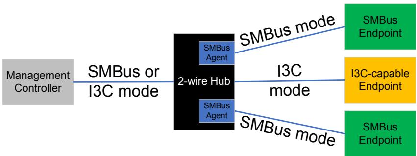

---

## 12.5.3.3 2-wire Hub Use | 12.5.3.3 2 线 Hub 使用

table>
<thead>
<tr>
<th width="50%">🇬🇧 English</th>
<th width="50%" style="background-color:#e8e8e8">🇨🇳 中文</th>
</tr>
</thead>
<tbody>
<tr>
<td>

2-wire Hub components should be discovered using the I3C DCR value of 0xC2. See the allocation at [I3C-DCR].

It should be recognized by implementers and form factor specifications that the high signaling rates drive for
subsegment capacitance that is significantly lower than the SMBUS specification. This can limit the achievable bus
speed or require utilizing intermediary logic such as I3C hubs when considering entire channel characteristics.

</td>
<td style="background-color:#e8e8e8">

应使用 I3C DCR 值 0xC2 发现 2 线 Hub 组件。有关分配,请参见 [I3C-DCR]。

实施者和外形规格规范应认识到,高信令速率要求子段电容明显低于 SMBUS 规范。这可能会限制可实现的总线速度,或者在考虑整个通道特性时需要使用 I3C hub 等中间逻辑。

</td>
</tr>
</tbody>
</table>

[⬆️ 返回目录](#-本章目录-table-of-contents)

---

## 12.5.4 [I3C-Basic] Support on Existing SMBus Signals | 12.5.4 现有 SMBus 信号上的 [I3C-Basic] 支持

<table>
<thead>
<tr>
<th width="50%">🇬🇧 English</th>
<th width="50%" style="background-color:#e8e8e8">🇨🇳 中文</th>
</tr>
</thead>
<tbody>
<tr>
<td>

Most PCI Express-based platforms have supported [SMBus] as an optional 2-wire interface (i.e., Serial Clock and Serial
Data) for adapter or component management purposes. This section defines [I3C-Basic] as an additional option where
the [I3C-Basic] interface shares the same 2 wires as the SMBus interface.

While [SMBus] was defined with different electrical requirements for different form-factors, [I3C-Basic] is defined with
one interoperable set of behaviors for PCI Express. This section defines the behaviors that:
- Determine which interface is active
- Define the electrical requirements for PCI Express [I3C-Basic]

Key attributes of [I3C-Basic] support on existing [SMBus] signals are the following:
- Supports the MIPI™ Alliance Specification for I3C Basic, Version 1.0 available at [I3C-Basic] (See Implementation
  Note Optional I3C Features).
- Sideband 2-wire bus reliant use cases should be defined using either [SMBus] only or both [SMBus] and
  [I3C-Basic].
- If optional I3C Basic is supported, then I3C Data shares the same signal as SMBus Data, and I3C Clock share the
  same signal as SMBus Clock.
- If optional I3C Basic is supported, SMBus voltage levels must also be tolerated for backwards compatibility.
- I3C operating voltage must utilize 1.8 V signaling as defined in [I3C-Basic]. The rationale is for maximum bus
  length and allowed capacitance which eases implementations in large platforms.

</td>
<td style="background-color:#e8e8e8">

大多数基于 PCI Express 的平台已支持 [SMBus] 作为可选的 2 线接口(即串行时钟和串行数据),用于适配器或组件管理。本节将 [I3C-Basic] 定义为附加选项,其中 [I3C-Basic] 接口与 SMBus 接口共享相同的 2 线。

虽然 [SMBus] 是针对不同外形规格以不同的电气要求定义的,但 [I3C-Basic] 是针对 PCI Express 以一套可互操作的行为定义的。本节定义了以下行为:
- 确定哪个接口处于活动状态
- 定义 PCI Express [I3C-Basic] 的电气要求

现有 [SMBus] 信号上 [I3C-Basic] 支持的关键属性如下:
- 支持可在 [I3C-Basic] 获得的 MIPI™ 联盟 I3C Basic 规范 1.0 版(请参阅实施说明可选 I3C 功能)。
- 依赖 2 线总线的边带用例应仅使用 [SMBus] 或同时使用 [SMBus] 和 [I3C-Basic] 来定义。
- 如果支持可选的 I3C Basic,则 I3C Data 与 SMBus Data 共享相同的信号,I3C Clock 与 SMBus Clock 共享相同的信号。
- 如果支持可选的 I3C Basic,则还必须容忍 SMBus 电压电平以实现向后兼容性。
- I3C 工作电压必须使用 [I3C-Basic] 中定义的 1.8 V 信令。理由是获得最大总线长度和允许的电容,从而简化大型平台中的实现。

</td>
</tr>
</tbody>
</table>

> **IMPLEMENTATION NOTE: OPTIONAL I3C FEATURES** | **实施说明:可选 I3C 功能**
>
> The following I3C features from [I3C-Basic-1.1.1] should be supported if I3C is supported:
> - The Target Reset pattern (RSTACT) with Common Command Code 0x2A (Broadcast) and 0x9A (Direct).
>   - This allows the host to perform a I3C peripheral reset without having to go back to SMBus mode.
> - Asynchronous Timing Control (Mode 0) (support determined if GETXTIME CCC is acknowledged)
>   - This aids in scenarios needing real time communication by providing a timestamp.
> - Grouped addressing (support determined through GETCAPS CCC)
>   - This allows broadcast request to multiple I3C Basic components using a single message.
> - SETBUSCON CCC
>   - [I3C-Basic] recommends using SETBUSCON to inform I3C Targets of the specific use of the Bus, and
>     that vendor specific CCCs will be used. Can also inform I3C Targets of the version of the
>     specification that the Controller supports. | 如果支持 I3C,则应支持 [I3C-Basic-1.1.1] 的以下 I3C 功能:
>     - 公共命令代码为 0x2A(广播)和 0x9A(直接)的目标复位模式 (RSTACT)。这允许主机执行 I3C 外设复位,无需返回 SMBus 模式。
>     - 异步时序控制 (Mode 0)(如果 GETXTIME CCC 被确认,则确定支持)。这通过提供时间戳来帮助需要实时通信的场景。
>     - 分组寻址(通过 GETCAPS CCC 确定支持)。这允许使用单个消息向多个 I3C Basic 组件广播请求。
>     - SETBUSCON CCC。[I3C-Basic] 建议使用 SETBUSCON 通知 I3C 目标总线的特定用途,并将使用特定于供应商的 CCC。还可以通知 I3C 目标控制器支持的规范版本。

[⬆️ 返回目录](#-本章目录-table-of-contents)

---

## 12.5.4.1 I3C Basic Overview | 12.5.4.1 I3C Basic 概述

table>
<thead>
<tr>
<th width="50%">🇬🇧 English</th>
<th width="50%" style="background-color:#e8e8e8">🇨🇳 中文</th>
</tr>
</thead>
<tbody>
<tr>
<td>

The goal of the I3C Basic adapter or component discovery flow as shown in § Figure 12-14 is to enable an I3C Basic
capable host and I3C Basic capable components to establish I3C Basic communication while allowing backward
compatibility with legacy [SMBus] components. If one side of communication supports both [SMBus] and I3C Basic and
the other side supports SMBus only, then SMBus protocol and voltage is used. If there is a mix of I3C Basic and SMBus
components that are active on the same bus, then only [SMBus] protocol and voltage is used. Mixed Fast Mode is
prohibited. This flow should be initiated after any power rail state change.

The discovery flow uses reserved address 1111 110xb (FCh 8-bit/7Eh 7-bit) to determine if there are components that
support I3C Basic on the bus. Address 7Eh (7-bit) is reserved in the [SMBus] specification and cannot be assigned to any
SMBus component. Address 7Eh (7-bit) is defined for I3C Basic and every I3C Basic component will respond as per the
I3C Basic Specification. Any time a component that supports both SMBus and I3C Basic receives a cycle for address 7Eh
(7-bit), it should disable SMBus (not drive or stretch the clock, nor ACK SMBus addresses) until reset to help the host
determine if there are SMBus only components on the bus. If only I3C Basic components are detected and the host
chooses to use I3C Basic, then the component requires a transition time from 3.3 V to the I3C Basic voltage within the
time Tsmb2i3c (see § Table 12-14). A reset by driving a system management hardware mechanism (e.g., a hardware reset
or power removal) if supported by a given form factor or driving the clock low for a specified period reverts the interface
to SMBus at 3.3 V signaling within the time Ti3c2smb (see § Table 12-14). An I3C Basic Target Reset issued by the host
resets the I3C Basic interface but does not impact the signaling voltage. See § Figure 12-14 for more details of this flow.

</td>
<td style="background-color:#e8e8e8">

§ 图 12-14 中所示的 I3C Basic 适配器或组件发现流程的目标是使支持 I3C Basic 的主机和支持 I3C Basic 的组件能够建立 I3C Basic 通信,同时允许与传统的 [SMBus] 组件向后兼容。如果通信的一侧同时支持 [SMBus] 和 I3C Basic,另一侧仅支持 SMBus,则使用 SMBus 协议和电压。如果同一总线上同时存在 I3C Basic 和 SMBus 组件处于活动状态,则仅使用 [SMBus] 协议和电压。禁止混合快速模式。此流程应在任何电源轨状态更改后启动。

发现流程使用保留地址 1111 110xb (FCh 8 位/7Eh 7 位) 来确定总线上是否有支持 I3C Basic 的组件。地址 7Eh(7 位)在 [SMBus] 规范中保留,不能分配给任何 SMBus 组件。地址 7Eh(7 位)是为 I3C Basic 定义的,每个 I3C Basic 组件将根据 I3C Basic 规范进行响应。任何同时支持 SMBus 和 I3C Basic 的组件在收到地址 7Eh(7 位)的周期时,都应禁用 SMBus(不驱动或拉伸时钟,也不确认 SMBus 地址)直到复位,以帮助主机确定总线上是否仅存在 SMBus 组件。如果仅检测到 I3C Basic 组件,并且主机选择使用 I3C Basic,则组件需要在 Tsmb2i3c 时间(参见 § 表 12-14)内完成从 3.3 V 到 I3C Basic 电压的转换。如果给定外形规格支持通过驱动系统管理硬件机制(例如硬件复位或断电)进行复位,或在指定期间将时钟驱动为低电平,则该接口将在 Ti3c2smb 时间(参见 § 表 12-14)内恢复为 3.3 V 信令的 SMBus。由主机发出的 I3C Basic 目标复位会复位 I3C Basic 接口,但不会影响信令电压。有关此流程的更多详细信息,请参见 § 图 12-14。

</td>
</tr>
</tbody>
</table>

[⬆️ 返回目录](#-本章目录-table-of-contents)

---

<<<PAGE_BREAK>>> page_1679

> **Figure 12-14.** SMBus to I3C Transition Flow
> 

---

## 12.5.4.2 I3C Basic Discovery and Mode Changing | 12.5.4.2 I3C Basic 发现和模式更改

<table>
<thead>
<tr>
<th width="50%">🇬🇧 English</th>
<th width="50%" style="background-color:#e8e8e8">🇨🇳 中文</th>
</tr>
</thead>
<tbody>
<tr>
<td>

The discovery flow uses reserved address 1111 110xb (FCh 8-bit/7Eh 7-bit) to determine if there are components that
support I3C Basic on the bus. This address is also used in the discovery flow to determine if there are SMBus only
devices on the bus. The host can use this to determine whether to use I3C Basic or SMBus protocol.

</td>
<td style="background-color:#e8e8e8">

发现流程使用保留地址 1111 110xb (FCh 8 位/7Eh 7 位) 来确定总线上是否有支持 I3C Basic 的组件。该地址也用于发现流程中,以确定总线上是否仅有 SMBus 设备。主机可以使用它来确定是使用 I3C Basic 还是 SMBus 协议。

</td>
</tr>
</tbody>
</table>

> **Figure 12-15.** Component Timing Diagram for Transition to I3C Signaling Voltage
> 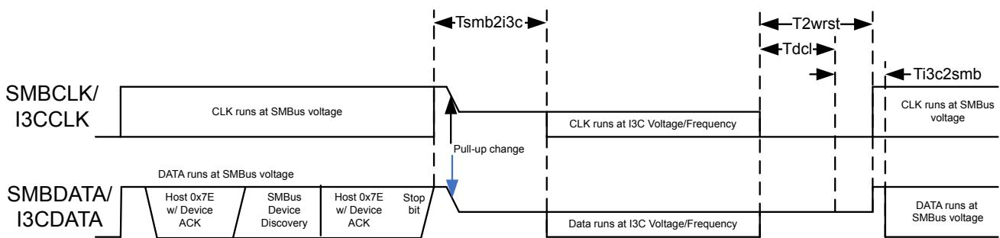

---

## 12.5.4.3 I3C Basic DC and AC Signal Requirements | 12.5.4.3 I3C Basic 直流和交流信号要求

<table>
<thead>
<tr>
<th width="50%">🇬🇧 English</th>
<th width="50%" style="background-color:#e8e8e8">🇨🇳 中文</th>
</tr>
</thead>
<tbody>
<tr>
<td>

The I3C Basic operating voltage and capacitance for SCL and SDA is defined in § Table 12-13.
For more information on logic levels or bus timings, refer to [I3C-Basic].

</td>
<td style="background-color:#e8e8e8">

SCL 和 SDA 的 I3C Basic 工作电压和电容在 § 表 12-13 中定义。
有关逻辑电平或总线时序的更多信息,请参阅 [I3C-Basic]。

</td>
</tr>
</tbody>
</table>

**Table 12-13. I3C Basic Logic Signaling DC Specification | 表 12-13 I3C Basic 逻辑信令直流规范**

| Symbol | Parameter | Min | Nominal | Max | Unit | Notes |
|---|---|---|---|---|---|---|
| Vddi3c | I3C Basic Operating Voltage | 1.65 | 1.80 | 1.95 | V | |
| Ci3c | Total adapter and component capacitance for I3C support | 20 | | | pF | 1 |

**Notes:**
1. Total capacitance the platform board will see from the adapter including all connector, board routing, component package wires, and component on die parasitic effects when the target component(s) is/are in I3C Basic mode. The capacitance of SMBus components on the I3C Basic interface even if not operational is also included.

§ Table 12-14 defines the component maximum transition times between [SMBus] and I3C. During Tsmb2i3c, the host
will transition the pull-ups from Vddsmb to Vddi3c and the component will transition to Vddi3c based signaling. During
Ti3c2smb, the host will transition the pull-ups from Vddi3c to Vddsmb and the component will transition to Vddsmb based
signaling.

**Table 12-14. I3C Timing Requirements | 表 12-14 I3C 时序要求**

| Symbol | Parameter | Min | Max | Unit | Notes |
|---|---|---|---|---|---|
| Tsmb2i3c | Component transition time from SMBus to I3C Basic | 20 | | ms | 1, 2 |
| Tdcl | Component Clock low reset time | 25 | 35 | ms | 2, 3 |
| Ti3c2smb | Component transition time from I3C Basic to SMBus | 20 | | ms | 2, 3 |
| T2wrst | Host clock low timeout | 50 | | ms | |

**Notes:**
1. The host must wait a minimum of Tsmb2i3c before sending I3C commands.
2. No SMBus or I3C transmissions must occur during Tsmb2i3c, Tdcl, and Ti3c2smb.
3. The host must wait a minimum of Tdcl+Ti3c2smb before sending SMBus commands.

[⬆️ 返回目录](#-本章目录-table-of-contents)

---

<<<PAGE_BREAK>>> page_1680

## 12.6 Field Replacement Unit (FRU) Information | 12.6 现场可更换单元 (FRU) 信息

<table>
<thead>
<tr>
<th width="50%">🇬🇧 English</th>
<th width="50%" style="background-color:#e8e8e8">🇨🇳 中文</th>
</tr>
</thead>
<tbody>
<tr>
<td>

FRU Information is data that describes an adapter or component. FRU Information includes data about the adapter or
component such as:
- Inventory information (e.g., serial number, model number, etc.).
- Capability information (e.g., power consumption, performance, etc.).
- Information required by the host to configure the adapter or component (e.g., supported connector
  subdivision combinations, clocking modes supported, etc.).

FRU Information may be made available to a Baseboard Management Controller or service processor using the following
mechanisms:
- Over the 2-wire interface with use of the protocol defined in § Section 12.6.1.
- Over 2-wire interface, USB, or PCIe VDMs with use of the MCTP protocol.

In-band access of FRU Information via a method such as Management Message Passthrough (MMPT) or Memory-Mapped
BMC Interface (MMBI) [MMBI] is outside the scope of this chapter.

FRU Information is contained in a FRU Information Device. The following list contains requirements and
recommendations for FRU Information Devices regardless of the operating mode being [SMBus]/[I2C] or [I3C]:
1. A 2-wire discoverable Field Replaceable Unit (FRU) Information Device must be implemented as a required
   element when dictated by form-factor specifications such as to support specific features.
2. The FRU Information Device is permitted to be any implementation that meets the requirements in this
   specification (e.g., a physical integrated circuit or virtually emulated by firmware).
3. The FRU Information Device is recommended to be protected from write operations that may corrupt or
   replace FRU Information. The exception is when the FRU Information is accessed via MCTP or while in a
   manufacturing mode. An adapter or component is permitted to update the FRU Information in conjunction with
   a firmware update.
4. The FRU Information Device must support at least 8 full writes.

</td>
<td style="background-color:#e8e8e8">

FRU 信息是描述适配器或组件的数据。FRU 信息包括有关适配器或组件的数据,例如:
- 清单信息(例如序列号、型号等)。
- 能力信息(例如功耗、性能等)。
- 主机配置适配器或组件所需的信息(例如支持的连接器细分组合、支持的时钟模式等)。

FRU 信息可以通过以下机制提供给基板管理控制器 (Baseboard Management Controller) 或服务处理器:
- 通过 2 线接口,使用 § 12.6.1 中定义的协议。
- 通过 2 线接口、USB 或 PCIe VDM,使用 MCTP 协议。

通过管理消息传递 (Management Message Passthrough, MMPT) 或内存映射 BMC 接口 (Memory-Mapped BMC Interface, MMBI) [MMBI] 等方法对 FRU 信息进行带内访问不在本章的范围内。

FRU 信息包含在 FRU 信息设备中。以下列表包含 FRU 信息设备的要求和建议,无论操作模式是 [SMBus]/[I2C] 还是 [I3C]:
1. 当外形规格规范要求支持特定功能时,必须将 2 线可发现的现场可更换单元 (Field Replaceable Unit, FRU) 信息设备实现为必需元素。
2. 允许 FRU 信息设备是任何满足本规范要求的实现(例如物理集成电路或由固件虚拟仿真)。
3. 建议保护 FRU 信息设备免受可能损坏或替换 FRU 信息的写操作的影响。例外情况是通过 MCTP 访问 FRU 信息或处于制造模式时。允许适配器或组件结合固件更新来更新 FRU 信息。
4. FRU 信息设备必须至少支持 8 次完整写入。

</td>
</tr>
</tbody>
</table>

[⬆️ 返回目录](#-本章目录-table-of-contents)

---

## 12.6.1 FRU Information Device Requirements | 12.6.1 FRU 信息设备要求

table>
<thead>
<tr>
<th width="50%">🇬🇧 English</th>
<th width="50%" style="background-color:#e8e8e8">🇨🇳 中文</th>
</tr>
</thead>
<tbody>
<tr>
<td>

5. The FRU Information Device must be accessible in any of the following power states:
   a. Main power only.
   b. Main power and auxiliary power if auxiliary power is supported.
   c. Auxiliary power only if auxiliary power is supported.
6. If auxiliary power is supplied, then the availability and transitions of main power must not disrupt FRU
   Information Device access.
7. The FRU Information Device must be accessible on the 2-wire interface within 1 second after power becomes
   valid and must remain accessible while power is valid unless otherwise specified.
8. Clock-low timeout-based reset recovery must be supported per the [SMBus] Specification or [I3C-Basic]
   section of this specification. The FRU Information Device must be accessible on the 2-wire bus within 1 second
   after the de-assertion of clock-low timeout-based reset. It is recommended to reset the current address pointer
   due to clock-low reset.

</td>
<td style="background-color:#e8e8e8">

5. FRU 信息设备必须可在以下任何电源状态下访问:
   a. 仅主电源。
   b. 如果支持辅助电源,则主电源和辅助电源。
   c. 如果支持辅助电源,则仅辅助电源。
6. 如果提供辅助电源,则主电源的可用性和转换不得中断 FRU 信息设备的访问。
7. FRU 信息设备必须在电源有效后 1 秒内可在 2 线接口上访问,并且只要电源有效就必须保持可访问,除非另有规定。
8. 必须根据 [SMBus] 规范或本规范的 [I3C-Basic] 部分支持基于时钟低超时的复位恢复。FRU 信息设备必须在基于时钟低超时的复位去断言后 1 秒内可在 2 线总线上访问。建议由于时钟低复位而复位当前地址指针。

</td>
</tr>
</tbody>
</table>

[⬆️ 返回目录](#-本章目录-table-of-contents)

---

<<<PAGE_BREAK>>> page_1681

## 12.6.1.1 FRU Information Device Requirements Specific to SMBus/I2C Mode | 12.6.1.1 特定于 SMBus/I2C 模式的 FRU 信息设备要求

<table>
<thead>
<tr>
<th width="50%">🇬🇧 English</th>
<th width="50%" style="background-color:#e8e8e8">🇨🇳 中文</th>
</tr>
</thead>
<tbody>
<tr>
<td>

This section describes the FRU Information Device requirements and recommendations when using SMBus/I2C read and
write transactions.
1. The FRU Information Device must use a 7-bit target address.
2. FRU Information Device capacity must be an even power of 2 in the range of 256 Bytes up to 64 KB.
3. The FRU Information Device must support at least 400 kHz operation in SMBus/I2C mode. The adapter or
   component should limit bus capacitance. The appropriately tuned pullup resistors are the platform's
   responsibility. The adapter or component should have no or weak pullup resistors only.
4. FRU Information Device accesses must use 2-byte addresses for read or write offsets. One-byte offsets supplied
   by the platform during random reads should be zero extended to two-byte offsets. See § Figure 12-17.
5. The FRU Information Device must maintain a current address pointer. The current address pointer must auto
   increment to the next byte after each byte that is read. Refer to the "Current Address Read" and "Current
   Sequential Read" in § Figure 12-17. A read of the last byte of the last memory page of the FRU Information
   Device must cause the current read pointer to roll over to the first byte of the first memory page of the FRU
   Information Device. For example, for a 256-byte FRU Information Device, a read of the last byte of the FRU
   Information Device at offset FFh causes the current address pointer to roll over to 00h. The current address
   pointer must be cleared to 0h upon a power cycle of the FRU Information Device.
6. Any controller on the adapter or component must not initiate traffic to the FRU Information Device on the
   same adapter or component unless the FRU Information Device is hidden from host view (e.g., by detaching the
   FRU Information Device from the system-facing 2-wire interface). For example, the FRU Information Device
   must be hidden from host view during a firmware update that includes new FRU Information. While the FRU
   Information Device is disconnected from the form-factor connecter, accesses to the FRU Information Device via
   the 2-wire bus must be Not Acknowledged.
7. If the FRU Information over the 2-wire interface is initially provided using a discrete SMBus/I2C FRU
   Information Device (e.g., a physical EEPROM), the component must be detached from the 2-wire interface
   when entering I3C mode. If the FRU Information Device is being emulated by a programmable component,
   such as a microcontroller, then when switching to I3C mode, the virtual FRU Information Device SMBus
   address must be logically disabled. As mixed fast mode is not supported, designs must not assume that the I3C
   bus frequency and short SCL high time allows for SMBus/I2C devices with 50 ns glitch filters to coexist.
8. Placing the FRU Information Device behind a 2-wire MUX or hub is prohibited due to possible variability in
   discovery method.

</td>
<td style="background-color:#e8e8e8">

本节介绍使用 SMBus/I2C 读写事务时 FRU 信息设备的要求和建议。
1. FRU 信息设备必须使用 7 位目标地址。
2. FRU 信息设备容量必须为 256 字节到 64 KB 范围内 2 的偶数次幂。
3. FRU 信息设备必须在 SMBus/I2C 模式下支持至少 400 kHz 操作。适配器或组件应限制总线电容。适当调谐的上拉电阻是平台的责任。适配器或组件应没有或仅具有弱上拉电阻。
4. FRU 信息设备访问必须使用 2 字节地址作为读或写偏移量。在随机读取期间由平台提供的单字节偏移量应零扩展为两字节偏移量。参见 § 图 12-17。
5. FRU 信息设备必须维护当前地址指针。在读取每个字节后,当前地址指针必须自动递增到下一个字节。请参阅 § 图 12-17 中的"当前地址读取"和"当前顺序读取"。读取 FRU 信息设备最后一页的最后一个字节必须导致当前读取指针回绕到 FRU 信息设备第一页的第一个字节。例如,对于 256 字节的 FRU 信息设备,在偏移 FFh 处读取 FRU 信息设备的最后一个字节会导致当前地址指针回绕到 00h。FRU 信息设备断电后,当前地址指针必须清零。
6. 适配器或组件上的任何控制器不得在同一适配器或组件上向 FRU 信息设备发起流量,除非 FRU 信息设备对主机隐藏(例如,通过将 FRU 信息设备从面向系统的 2 线接口分离)。例如,在包含新 FRU 信息的固件更新期间,FRU 信息设备必须对主机隐藏。当 FRU 信息设备与外形规格连接器断开连接时,通过 2 线总线对 FRU 信息设备的访问必须未被确认 (NACK)。
7. 如果 2 线接口上的 FRU 信息最初是使用离散 SMBus/I2C FRU 信息设备(例如物理 EEPROM)提供的,则组件在进入 I3C 模式时必须与 2 线接口分离。如果 FRU 信息设备由可编程组件(例如微控制器)仿真,则在切换到 I3C 模式时,虚拟 FRU 信息设备 SMBus 地址必须在逻辑上被禁用。由于不支持混合快速模式,设计不得假设 I3C 总线频率和短 SCL 高电平时间允许具有 50 ns 毛刺滤波器的 SMBus/I2C 设备共存。
8. 禁止将 FRU 信息设备放在 2 线 MUX 或 Hub 之后,因为发现方法可能存在差异。

</td>
</tr>
</tbody>
</table>

[⬆️ 返回目录](#-本章目录-table-of-contents)

---

<<<PAGE_BREAK>>> page_1682

> **Figure 12-16.** SMBus/I2C-based FRU Information Device Writes with Two-Byte Addressing
> 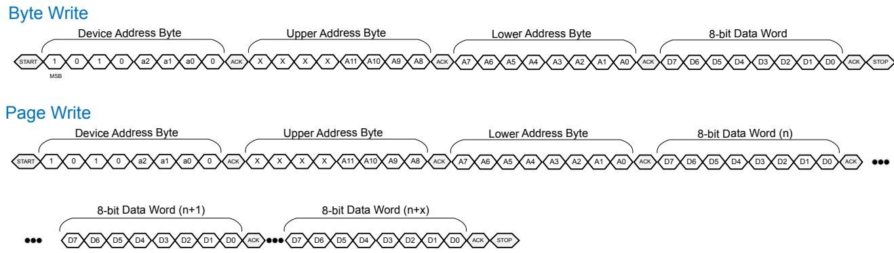

---

> **Figure 12-17.** FRU Information Device Reads with Two-Byte Addressing
> 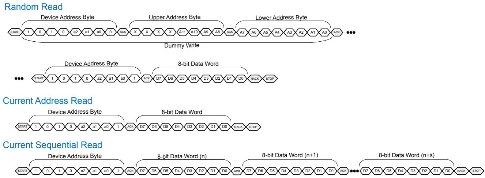

---

## 12.6.1.2 [SMBus]/[I2C] Access Protocol | 12.6.1.2 [SMBus]/[I2C] 访问协议

table>
<thead>
<tr>
<th width="50%">🇬🇧 English</th>
<th width="50%" style="background-color:#e8e8e8">🇨🇳 中文</th>
</tr>
</thead>
<tbody>
<tr>
<td>

The following figures describe the proper logical sequence of supported FRU Information Device read and write
commands when in SMBus/I2C mode. Note that the address example is specific to 4 KB component.

</td>
<td style="background-color:#e8e8e8">

下图描述了在 SMBus/I2C 模式下支持的 FRU 信息设备读写命令的正确逻辑顺序。请注意,地址示例特定于 4 KB 组件。

</td>
</tr>
</tbody>
</table>

[⬆️ 返回目录](#-本章目录-table-of-contents)

---

## 12.6.2 FRU Information Format | 12.6.2 FRU 信息格式

<table>
<thead>
<tr>
<th width="50%">🇬🇧 English</th>
<th width="50%" style="background-color:#e8e8e8">🇨🇳 中文</th>
</tr>
</thead>
<tbody>
<tr>
<td>

This section defines the format of the FRU Information stored in the FRU Information Device. The FRU Information
format must comply with the requirements defined in the IPMI Platform Management FRU Information Storage
Definition ([IPMI-FRU]).

In addition to CRC-based data integrity, assurance of data authenticity is permitted to support an optional cryptographic
signature of the FRU Information Device. It is recommended that the FRU Information be covered by a digital signature
of the adapter's or component's firmware and validated when the firmware is updated. If the content is validated during
adapter or component firmware initialization, care must be taken to ensure the component and information are
available to system management firmware as needed, such as when only auxiliary power is supplied.

</td>
<td style="background-color:#e8e8e8">

本节定义存储在 FRU 信息设备中的 FRU 信息的格式。FRU 信息格式必须遵守 IPMI 平台管理 FRU 信息存储定义 ([IPMI-FRU]) 中定义的要求。

除了基于 CRC 的数据完整性外,允许通过支持 FRU 信息设备的可选加密签名来保证数据真实性。建议 FRU 信息由适配器或组件固件的数字签名覆盖,并在固件更新时进行验证。如果在适配器或组件固件初始化期间验证内容,则必须注意确保组件和信息在需要时可供系统管理固件使用,例如仅提供辅助电源时。

</td>
</tr>
</tbody>
</table>

[⬆️ 返回目录](#-本章目录-table-of-contents)

---

<<<PAGE_BREAK>>> page_1683

The IPMI Platform Management FRU Information Storage Definition ([IPMI-FRU]) allows more than 1 MultiRecord to be in
a single FRU Information Device. The follow table describes the specific MultiRecord format that applies to all PCI
Express adapters or components.

**Table 12-15. PCI-SIG MultiRecord | 表 12-15 PCI-SIG MultiRecord**

| Bytes | Factory Default | Description |
|---|---|---|
| **PCI-SIG MultiRecord Header** | | |
| 0h | 0C0h | PCI-SIG Record Type ID: This field indicates the IPMI Record Type ID of the PCI-SIG MultiRecord. This field must be set to a value of C0h. |
| 1h | 2h or 82h | Record Format: This field indicates the format of this MultiRecord. Bit 7: When Set, this bit indicates that this is the last MultiRecord in the list. Bits 6:0: This field indicates the MultiRecord format version. This field must be set to a value of 2h. |
| 2h | Implementation Specific | Record Length (RLEN): This field indicates the length of the PCI-SIG MultiRecord Body in bytes (i.e., the bytes of the MultiRecord excluding the 5-byte MultiRecord header that is common to all MultiRecords). |
| 3h | Implementation Specific | Record Checksum: This field is used to give the PCI-SIG MultiRecord Body a zero checksum (i.e., the modulo 256 sum of bytes from byte offset 5h to the end of this MultiRecord plus this checksum byte equals 0h). |
| 4h | Implementation Specific | Header Checksum: This field is used to give the PCI-SIG MultiRecord Header a zero checksum (i.e., the modulo 256 sum of offset 0h of the PCI-SIG MultiRecord Header through this checksum byte equals 0h). |
| **PCI-SIG MultiRecord Body** | | |
| 7h:5h | E8FFh | [PCI-SIG IANA Private Enterprise Number]: This field indicates the PCI-SIG's IANA Private Enterprise Number. This field must be set to a value of E8FFh (i.e., 59,647). |
| 8h | 0h | Version Number: This field indicates the version number of this MultiRecord. This field must be 0h in this version of the specification. |
| 9h | Implementation Specific | Number of Descriptors: This field indicates the number of descriptors in this MultiRecord. The value of 0h is reserved. |
| Implementation Specific | Implementation Specific | Descriptor 0: This field contains the first descriptor in this MultiRecord. |
| Implementation Specific | Implementation Specific | Descriptor 1: This field contains the second descriptor in this MultiRecord if Number of Descriptors is greater than one; otherwise, this field is not present. |
| ... | ... | ... |

**Table 12-16. PCI-SIG MultiRecord Descriptor | 表 12-16 PCI-SIG MultiRecord 描述符**

| Bytes | Factory Default | Description |
|---|---|---|
| 1h:0h | Implementation Specific | Descriptor Type: This field indicates the type of this descriptor. |
| | | Bits 15:13: Reserved |
| | | Bits 11:8: Group ID |
| | | 0h = PCI Express Base Specification |
| | | 1h = PCI Express CEM Specification |
| | | 2h = PCI Express M.2 Specification |
| | | 3h = PCI Express SFF-8639 Module |
| | | 4h = PCI Firmware |
| | | 5h = PCI Express OCuLink |
| | | 6h = PCI Express External Cabling |
| | | 7h = PCI Express CopprLink Internal Cable |
| | | 8h = PCI Express CopprLink External Cable |
| | | Others = Reserved |
| | | Bits 7:0: Sub-Type (Defined by Group ID owner) |
| 2h | Implementation Specific | Descriptor Version Number: This field indicates the version number of this descriptor. This field must be 0h. |
| 3h | Implementation Specific | Descriptor Length: This field indicates the number of bytes in this descriptor. Length |
| N-1: 4h | Implementation Specific | Descriptor Data: This field contains the type-specific data associated with this descriptor where N is the total length in bytes of this descriptor. |

Each Group ID owner can define a list of sub-types with associated Descriptor Data. The Sub-Type field in the PCI-SIG
MultiRecord Descriptor is 8 bits allowing for 256 sub-types.

Descriptor Data can be anything defined by the Group ID owner but should follow IPMI FRU conventions and should be
kept as small as possible.

Types of FRU Information that are common across many form factors are defined in PCI-SIG MultiRecord Descriptors in
this specification as part of Group ID 0h. Types of FRU Information that are not common across many form factors are
defined in PCI-SIG MultiRecord Descriptors in other specifications as part of Group IDs other than 0h.

[⬆️ 返回目录](#-本章目录-table-of-contents)

---

<<<PAGE_BREAK>>> page_1684

## 12.6.3 Common PCI-SIG MultiRecord Descriptors | 12.6.3 通用 PCI-SIG MultiRecord 描述符

table>
<thead>
<tr>
<th width="50%">🇬🇧 English</th>
<th width="50%" style="background-color:#e8e8e8">🇨🇳 中文</th>
</tr>
</thead>
<tbody>
<tr>
<td>

This section defines the PCI-SIG MultiRecord Descriptor sub-types for the PCI Express Base Specification group (i.e.,
Group ID 0h). These descriptors are common across many PCI Express-based adapters and components.

</td>
<td style="background-color:#e8e8e8">

本节定义 PCI Express 基础规范组(即组 ID 0h)的 PCI-SIG MultiRecord 描述符子类型。这些描述符在许多基于 PCI Express 的适配器和组件中是通用的。

</td>
</tr>
</tbody>
</table>

**Table 12-18. Descriptor Sub-Types for Group ID 0h | 表 12-18 组 ID 0h 的描述符子类型**

| Descriptor Sub-Type | Description |
|---|---|
| 00h | Connector Subdivision |
| All other encodings | Reserved |

[⬆️ 返回目录](#-本章目录-table-of-contents)

---

## 12.6.3.1 Connector Subdivision (Group ID 0h, Sub-Type 0h) | 12.6.3.1 连接器细分(组 ID 0h,子类型 0h)

<table>
<thead>
<tr>
<th width="50%">🇬🇧 English</th>
<th width="50%" style="background-color:#e8e8e8">🇨🇳 中文</th>
</tr>
</thead>
<tbody>
<tr>
<td>

In some use cases, the host requires the ability to discover connector subdivision combinations of an adapter's or
component's upstream-facing connector so that the host can configure the subdivision of the Downstream Port
connected to the adapter or component. A couple of examples include:
a. Two x8 Ports on an adapter with a x16 upstream-facing connector.
b. Four M.2 x4 connectors on a CEM card carrier with a x16 upstream-facing connector.

This section defines the FRU descriptors that describe the adapter's or component's supported connector subdivision
combination(s). If only one connector subdivision combination is supported, then no Connector Subdivision
Combinations Descriptor (refer to § Table 12-19) is required. If more than one connector subdivision combination is
supported and the implementation supports the PCI-SIG MultiRecord, then a Connector Subdivision Combinations
Descriptor with an instance of the Connector Subdivision Descriptor (refer to § Table 12-20) for each supported
connector subdivision combination must be present.

The Connector Subdivision Descriptor at the lowest offset in the Connector Subdivision Combinations Descriptor should
include the most common expected usage and must be the default Connector Subdivision Descriptor. This is unless a
form factor specific method is applied (e.g., the DUALPORTEN# sideband signal defined by the [SFF-8639]) or the host
commands the form factor to select an alternate Connector Subdivision Descriptor using a mechanism outside the
scope of this specification. The default Connector Subdivision Descriptor is defined as the adapter configuration if no
control function is sent to select an alternate mode of operation. The adapter or component must revert to the default
Connector Subdivision Descriptor only on a Cold Reset.

Each Lane on the upstream-facing connector within each connector subdivision combination that is connected to a Port
or another connector on the adapter or component must be described within a single Connector Subdivision Descriptor.
Lanes on the upstream-facing connector that are not connected to a Port or another connector on the adapter or
component must not be included in the Connector Subdivision Combinations Descriptor. The Lanes associated with a
Connector Subdivision Descriptor may be organized as a single subdivision or multiple subdivisions. Each subdivision
within each Connector Subdivision Descriptor must be listed in ascending order starting from the adapter's or
component's lowest-numbered Lane.

The lowest-numbered Lane must always be with respect to the adapter or component's designated lane 0 without lane
reversal. The starting lane number of any subdivision within a Connector Subdivision Descriptor must be less than or
equal (if the subdivision width is x1) to the ending lane number of the respective subdivision.

The details of how connector subdivision information is passed from an out-of-band agent (e.g., a Baseboard
Management Controller) responsible for reading this information to the platform entity (e.g., the platform BIOS)
responsible for configuring the appropriate Downstream Port(s) is implementation specific.

It is recommended that adapters include the Connector Subdivision Combinations Descriptor, even if only a single width
configuration is supported, because it enables system firmware to determine degraded link width conditions in
situations where an adapter advertises a value in the Maximum Link Width field in the Link Capabilities Register that is
less than or greater than the physical adapter connector edge connectivity (e.g., a x8 capable component on an adapter
that only connects x4 to the adapter card edge).

</td>
<td style="background-color:#e8e8e8">

在某些用例中,主机需要能够发现适配器或组件的上游面向连接器的连接器细分组合,以便主机可以配置连接到适配器或组件的下游端口的细分。一些例子包括:
a. 在具有 x16 上游面向连接器的适配器上的两个 x8 端口。
b. 在具有 x16 上游面向连接器的 CEM 载卡上的四个 M.2 x4 连接器。

本节定义描述适配器或组件支持的连接器细分组合的 FRU 描述符。如果仅支持一个连接器细分组合,则不需要连接器细分组合描述符(请参阅 § 表 12-19)。如果支持多个连接器细分组合并且实现支持 PCI-SIG MultiRecord,则必须存在一个连接器细分组合描述符,其中包含每个支持的连接器细分组合的连接器细分描述符(请参阅 § 表 12-20)的一个实例。

连接器细分组合描述符中最低偏移处的连接器细分描述符应包括最常见的预期用途,并且必须是默认连接器细分描述符。除非应用了特定于外形规格的方法(例如 [SFF-8639] 定义的 DUALPORTEN# 边带信号),或者主机命令外形规格使用本规范范围之外的机制选择备用连接器细分描述符。默认连接器细分描述符定义为如果没有发送控制功能来选择备用操作模式时的适配器配置。适配器或组件必须仅在冷复位 (Cold Reset) 时恢复为默认连接器细分描述符。

每个连接器细分组合中连接到端口或适配器或组件上另一个连接器的上游面向连接器上的每个通道 (Lane) 必须在单个连接器细分描述符中描述。适配器或组件上未连接到端口或另一个连接器的上游面向连接器上的通道不得包含在连接器细分组合描述符中。与连接器细分描述符关联的通道可以组织为单个细分或多个细分。每个连接器细分描述符中的每个细分必须按升序列出,从适配器或组件的最低编号通道开始。

最低编号的通道必须始终相对于适配器或组件指定的车道 0 而不进行通道反转。连接器细分描述符中任何细分的起始通道号必须小于或等于(如果细分宽度为 x1)相应细分的结束通道号。

如何将连接器细分信息从负责读取此信息的带外代理(例如基板管理控制器)传递给负责配置适当下游端口的平台实体(例如平台 BIOS)的细节是实现特定的。

建议适配器包含连接器细分组合描述符,即使仅支持单一宽度配置,因为它使系统固件能够在适配器在链路能力寄存器的最大链路宽度字段中通告的值小于或大于物理适配器连接器边缘连接性的情况下确定降级链路宽度条件(例如,适配器上仅将 x4 连接到适配器卡边的 x8 容量组件)。

</td>
</tr>
</tbody>
</table>

[⬆️ 返回目录](#-本章目录-table-of-contents)

---

<<<PAGE_BREAK>>> page_1685

**Table 12-19. Connector Subdivision Combinations Descriptor | 表 12-19 连接器细分组合描述符**

| Byte Offset(s) | Factory Default | Description |
|---|---|---|
| 1h:0h | 0001h | Descriptor Type: This field indicates the type of this descriptor. |
| | | Bits 15:12: Reserved |
| | | Bits 11:8: Group ID = 0h (PCI Express Base Specification) |
| | | Bits 7:0: Sub-Type = 00h (Connector Subdivision) |
| 2h | 01h | Descriptor Version Number: This field indicates the version number of this descriptor. This field must be 0h. |
| 3h | 04h | Header Length: This field indicates the length of the header portion of this descriptor (meaning from offset 0h until but not including the Connector Subdivision 0 field). This serves the purpose of being able to insert future bytes after the Descriptor Length and before the Connector Subdivision list if new useful attributes arise. |
| 4h | Implementation Specific | Descriptor Length: This field indicates the length of this descriptor in bytes. |
| Implementation Specific | Implementation Specific | Connector Subdivision 0: This field contains the first connector subdivision. |
| Implementation Specific | Implementation Specific | Connector Subdivision 1: This field contains the second connector subdivision, if applicable. If there is only one connector subdivision, then this field is not present. |
| ... | ... | ... |

[⬆️ 返回目录](#-本章目录-table-of-contents)

---

**Table 12-20. Connector Subdivision Descriptor | 表 12-20 连接器细分描述符**

| Byte Offset(s) | Factory Default | Description |
|---|---|---|
| 0h | Implementation Specific | Descriptor Length: This field indicates the length of this descriptor in bytes. |
| 1h | Implementation Specific | Number of Subdivisions: This field indicates the number of subdivisions in this descriptor. The permitted range of values is from 1 (e.g., 1 subdivision of maximum supported width) to the number of individual lanes used at the maximum supported width. All other values are Reserved. As an example, a x16 capable adapter can have values from 1 (e.g., one subdivision of x16 width) to 16 (e.g., 16 subdivisions of x1 width). |
| 2h | Implementation Specific | Subdivision 0: This field indicates the starting and ending lanes of the first subdivision of this descriptor. |
| | | Bits 7:4: Starting Lane is the lowest-numbered Lane of the first subdivision of this descriptor. |
| | | Bits 3:0: Ending Lane is the highest numbered Lane of the first subdivision of this descriptor. |
| 3h | Implementation Specific | Subdivision 1: This field indicates the starting and ending lanes of the second subdivision of this descriptor. |
| | | Bits 7:4: Starting Lane is the lowest-numbered Lane of the second subdivision of this descriptor. |
| | | Bits 3:0: Ending Lane is the highest numbered Lane of the second subdivision of this descriptor. |
| ... | ... | ... |

[⬆️ 返回目录](#-本章目录-table-of-contents)

---

**Example Connector Subdivision Combinations Descriptor for an Adapter Supporting 3 Connector Subdivision Descriptors:**

- 1 Port of x16 Lanes, 2 Ports of x8 Lanes each, 4 Ports of x4 Lanes each
- Connector Subdivision Descriptor: 0 (the default)
  - Number of Subdivisions: 1
  - Starting Lane of the first subdivision: 0; Ending Lane of the first subdivision: 15
- Connector Subdivision Descriptor: 1
  - Number of Subdivisions: 2
  - Starting Lane of the first subdivision: 0; Ending Lane of the first subdivision: 7
  - Starting Lane of second subdivision: 8; Ending Lane of second subdivision: 15
- Connector Subdivision Descriptor: 2
  - Number of Subdivisions: 4
  - Starting Lane of the first subdivision: 0; Ending Lane of the first subdivision: 3
  - Starting Lane of second subdivision: 4; Ending Lane of second subdivision: 7
  - Starting Lane of third subdivision: 8; Ending Lane of third subdivision: 11
  - Starting Lane of forth subdivision: 12; Ending Lane of forth subdivision: 15

[⬆️ 返回目录](#-本章目录-table-of-contents)

---

<<<PAGE_BREAK>>> page_1686

## 12.7 Out-of-Band Control Mechanism | 12.7 带外控制机制

table>
<thead>
<tr>
<th width="50%">🇬🇧 English</th>
<th width="50%" style="background-color:#e8e8e8">🇨🇳 中文</th>
</tr>
</thead>
<tbody>
<tr>
<td>

After inventory and discovery of the features of an interposer, adapter or component, control function(s) may be
required. Control commands are recommended to utilize the Management Control Transport Protocol (MCTP). The
rationale is to move control functions into a well-supported higher-level protocol versus low level register-based
solutions, fixed components like I2C I/O expanders or discrete wires.

Additional out-of-band control methods are allowed, such as a USB to UART or Ethernet bridges, but should be
described within the FRU attributes.

Definition of specific targeted control functions are the responsibility of form factor specifications. There are two types
of control targets, where an adapter or component is permitted to include a primary and/or secondary target. In this
context, target refers to the physical address and not MCTP Endpoint IDs (EIDs).

1. **Primary MCTP Target** – The primary MCTP target is for control functions of the adapter or major component,
   primarily when the component or adapter has main power supplied (i.e., it is not typically supported when
   only auxiliary power is supplied).
2. **Secondary MCTP Target** – The secondary target is for control functions when the primary target is offline (such
   as when only auxiliary power is supplied) or for control functions that do not involve the primary target.
   Examples include controlling Flex I/O functions or setting a desired connector subdivision mode before the
   primary target is powered or out of reset. Although a primary target might be typical for most peripheral
   subsystems, a secondary target might exist if such out-of-band control functions are necessary. The FRU
   information is recommended to convey the presence and address of the secondary MCTP target.

Forcing control functions to revert to default are implementation specific in terms of when main power is lost,
Fundamental Reset, auxiliary power removal or when explicitly changed by the platform (e.g., control settings are
permitted to persist via non-volatile storage).

</td>
<td style="background-color:#e8e8e8">

在对中间板 (Interposer)、适配器或组件的功能进行清点和发现之后,可能需要控制功能。建议控制命令使用管理控制传输协议 (Management Control Transport Protocol, MCTP)。其原因是为了将控制功能迁移到受良好支持的高级协议中,而不是基于低级寄存器的解决方案、I2C I/O 扩展器等固定组件或离散线路。

允许使用其他带外控制方法,例如 USB 到 UART 或以太网桥接器,但应在 FRU 属性中进行描述。

特定目标控制功能的定义是外形规格规范的责任。有两种类型的控制目标,其中允许适配器或组件包括主要和/或次要目标。在此上下文中,目标是指物理地址,而不是 MCTP 端点 ID (Endpoint IDs, EID)。

1. **主要 MCTP 目标** - 主要 MCTP 目标用于适配器或主要组件的控制功能,主要在组件或适配器提供主电源时(即,通常在仅提供辅助电源时不受支持)。
2. **次要 MCTP 目标** - 次要目标用于主要目标离线时(例如仅提供辅助电源时)或用于不涉及主要目标的控制功能。示例包括在主要目标上电或退出复位之前控制 Flex I/O 功能或设置所需的连接器细分模式。尽管主要目标对于大多数外设子系统可能是典型的,但如果需要此类带外控制功能,则可能存在次要目标。建议 FRU 信息传达次要 MCTP 目标的存在和地址。

强制控制功能恢复为默认值是实现特定的,具体取决于主电源丢失、基本复位 (Fundamental Reset)、辅助电源移除或由平台显式更改时(例如,允许通过非易失性存储保持控制设置)。

</td>
</tr>
</tbody>
</table>

> **IMPLEMENTATION NOTE: MCTP-BASED CONTROL MECHANISM** | **实施说明:基于 MCTP 的控制机制**
>
> A future revision of this specification will define the MCTP-based control mechanism. | 本规范的未来修订版将定义基于 MCTP 的控制机制。

[⬆️ 返回目录](#-本章目录-table-of-contents)

---

<<<PAGE_BREAK>>> page_1687

## 12.8 Retimer Management | 12.8 Retimer (重定时器) 管理

<table>
<thead>
<tr>
<th width="50%">🇬🇧 English</th>
<th width="50%" style="background-color:#e8e8e8">🇨🇳 中文</th>
</tr>
</thead>
<tbody>
<tr>
<td>

With increasing interface speeds and varied PCIe topologies, Retimers are expected to be more prevalent. Retimer
configuration typically utilizes an SMBus-based dedicated configuration EEPROM with non-standard addressing or
required out of band connectivity for in-system updates. Thus, Retimer management is left to the implementer.

</td>
<td style="background-color:#e8e8e8">

随着接口速度的提高和 PCIe 拓扑的多样化,Retimer (重定时器) 预计会变得更加普遍。Retimer 配置通常利用基于 SMBus 的专用配置 EEPROM,具有非标准寻址或需要带外连接以进行系统内更新。因此,Retimer 管理由实施者自行决定。

</td>
</tr>
</tbody>
</table>

[⬆️ 返回目录](#-本章目录-table-of-contents)

---

## 12.9 Internal Cable Management | 12.9 内部线缆管理

<table>
<thead>
<tr>
<th width="50%">🇬🇧 English</th>
<th width="50%" style="background-color:#e8e8e8">🇨🇳 中文</th>
</tr>
</thead>
<tbody>
<tr>
<td>

Internal Cable Management guidance is defined for usage with [CopprLink].

</td>
<td style="background-color:#e8e8e8">

内部线缆管理指南被定义为与 [CopprLink] 一起使用。

</td>
</tr>
</tbody>
</table>

[⬆️ 返回目录](#-本章目录-table-of-contents)

---

> **Figure 12-18.** Example Tiers Involving Sidebands
> 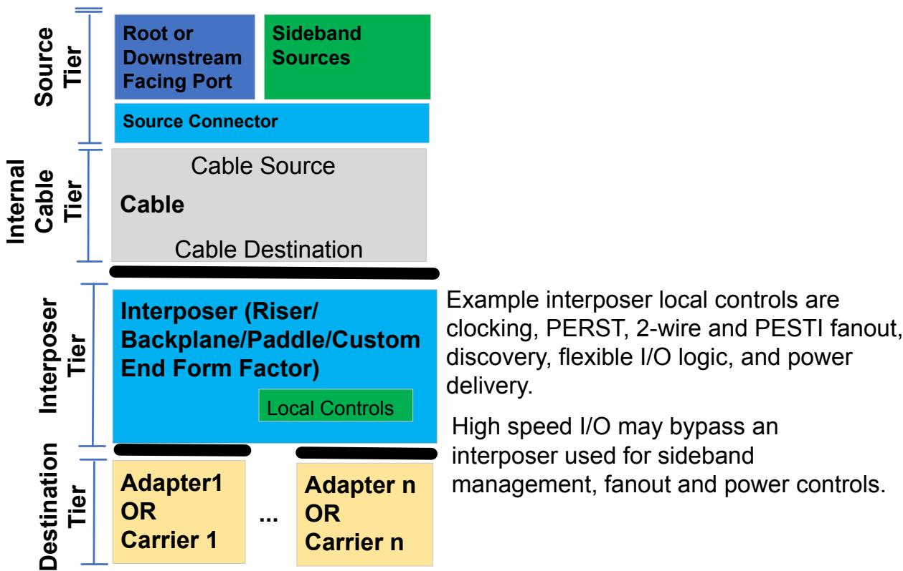

---

<<<PAGE_BREAK>>> page_1702

---

---

## 📑 本章目录 (Table of Contents) — Auto-Generated

- [12. Architectural Out-of-Band Management | 架构带外管理](#sec-12-0)
- [Table 12-1 Relative Comparisons of Typical Architectural Out-of-Band Interfaces | 表 12-1 典型架构带外接口的相对比较](#sec-12-0-1)
- [12.1 Introduction | 引言](#sec-12-1)
- [12.2 Framework for Sidebands | 边带框架](#sec-12-2)
- [12.3 Sideband Signaling Mechanisms | 边带信令机制](#sec-12-3)
- [12.3.1 Discrete Sidebands | 离散边带](#sec-12-3-1)
- [SMRST# – SMBus Reset (and similar component reset mechanisms) | SMRST# – SMBus 复位(及类似组件复位机制)](#sec-12-3-1-1)
- [12.3.2 Flex I/O Sidebands | 灵活 I/O (Flex I/O) 边带](#sec-12-3-2)
- [12.3.2.1 Flex I/O Default State Guidelines | 12.3.2.1 Flex I/O 默认状态指南](#sec-12-3-2-1)
- [12.3.2.2 Flex I/O Discovery Phase Guidelines | 12.3.2.2 Flex I/O 发现阶段指南](#sec-12-3-2-2)
- [12.3.2.3 Flex I/O Compatibility Check Guidelines | 12.3.2.3 Flex I/O 兼容性检查指南](#sec-12-3-2-3)
- [12.3.2.4 Flex I/O Control Negotiation Guidelines | 12.3.2.4 Flex I/O 控制协商指南](#sec-12-3-2-4)
- [12.3.2.5 General Flex I/O Control Guidelines | 12.3.2.5 Flex I/O 一般控制指南](#sec-12-3-2-5)
- [12.3.3 Peripheral Sideband Tunnelling Interface (PESTI) Sidebands | 12.3.3 外设边带隧道接口 (PESTI) 边带](#sec-12-3-3)
- [12.3.3.1 PESTI Introduction | 12.3.3.1 PESTI 简介](#sec-12-3-3-1)
- [12.3.3.2 PESTI Physical Interface | 12.3.3.2 PESTI 物理接口](#sec-12-3-3-2)
- [12.3.3.3 PESTI Electrical Circuit | 12.3.3.3 PESTI 电气电路](#sec-12-3-3-3)
- [12.3.3.4 PESTI DC Specifications | 12.3.3.4 PESTI 直流规范](#sec-12-3-3-4)
- [12.3.3.5 PESTI Target Detection | 12.3.3.5 PESTI 目标检测](#sec-12-3-3-5)
- [12.3.3.6 PESTI Protocol Commands | 12.3.3.6 PESTI 协议命令](#sec-12-3-3-6)
- [12.3.3.6.1 Discovery Payload Request (DPR) | 12.3.3.6.1 发现有效负载请求 (DPR)](#sec-12-3-3-6-1)
- [12.3.3.6.2 PESTI Virtual Wire Exchange (VWE) | 12.3.3.6.2 PESTI 虚拟线缆交换 (VWE)](#sec-12-3-3-6-2)
- [12.3.3.6.3 PESTI Fanout MUX Control | 12.3.3.6.3 PESTI 扇出 MUX 控制](#sec-12-3-3-6-3)
- [12.3.3.7 PESTI Initiator Abort | 12.3.3.7 PESTI 发起者中止](#sec-12-3-3-7)
- [12.3.3.8 PESTI Broadcast | 12.3.3.8 PESTI 广播](#sec-12-3-3-8)
- [12.3.3.9 PESTI Initiator Control and Status Registers | 12.3.3.9 PESTI 发起者控制和状态寄存器](#sec-12-3-3-9)
- [12.3.3.10 PESTI AC Specifications | 12.3.3.10 PESTI 交流规范](#sec-12-3-3-10)
- [12.3.3.11 PESTI Discovery Phase | 12.3.3.11 PESTI 发现阶段](#sec-12-3-3-11)
- [12.3.3.12 PESTI Active Phase | 12.3.3.12 PESTI 活动阶段](#sec-12-3-3-12)
- [12.3.3.13 PESTI Target Reset and Fault Handling | 12.3.3.13 PESTI 目标复位和故障处理](#sec-12-3-3-13)
- [12.3.3.14 PESTI Fan-Out | 12.3.3.14 PESTI 扇出](#sec-12-3-3-14)
- [12.3.3.15 PESTI Security Considerations | 12.3.3.15 PESTI 安全注意事项](#sec-12-3-3-15)
- [12.4 Managed USB 2.0 | 12.4 托管 USB 2.0](#sec-12-4)
- [12.5 2-Wire Interface | 12.5 两线制 (2-Wire) 接口](#sec-12-5)
- [12.5.1 2-Wire Interface Use Cases | 12.5.1 2 线接口用例](#sec-12-5-1)
- [12.5.2 2-Wire Addressing | 12.5.2 2 线寻址](#sec-12-5-2)
- [12.5.3 2-wire Bus Sharing | 12.5.3 2 线总线共享](#sec-12-5-3)
- [12.5.3.1 2-wire Multi-Drop Topology | 12.5.3.1 2 线多点拓扑](#sec-12-5-3-1)
- [12.5.3.2 SMBus MUX Use | 12.5.3.2 SMBus MUX 使用](#sec-12-5-3-2)
- [12.5.3.3 2-wire Hub Use | 12.5.3.3 2 线 Hub 使用](#sec-12-5-3-3)
- [12.5.4 [I3C-Basic] Support on Existing SMBus Signals | 12.5.4 现有 SMBus 信号上的 [I3C-Basic] 支持](#sec-12-5-4)
- [12.5.4.1 I3C Basic Overview | 12.5.4.1 I3C Basic 概述](#sec-12-5-4-1)
- [12.5.4.2 I3C Basic Discovery and Mode Changing | 12.5.4.2 I3C Basic 发现和模式更改](#sec-12-5-4-2)
- [12.5.4.3 I3C Basic DC and AC Signal Requirements | 12.5.4.3 I3C Basic 直流和交流信号要求](#sec-12-5-4-3)
- [12.6 Field Replacement Unit (FRU) Information | 12.6 现场可更换单元 (FRU) 信息](#sec-12-6)
- [12.6.1 FRU Information Device Requirements | 12.6.1 FRU 信息设备要求](#sec-12-6-1)
- [12.6.1.1 FRU Information Device Requirements Specific to SMBus/I2C Mode | 12.6.1.1 特定于 SMBus/I2C 模式的 FRU 信息设备要求](#sec-12-6-1-1)
- [12.6.1.2 [SMBus]/[I2C] Access Protocol | 12.6.1.2 [SMBus]/[I2C] 访问协议](#sec-12-6-1-2)
- [12.6.2 FRU Information Format | 12.6.2 FRU 信息格式](#sec-12-6-2)
- [12.6.3 Common PCI-SIG MultiRecord Descriptors | 12.6.3 通用 PCI-SIG MultiRecord 描述符](#sec-12-6-3)
- [12.6.3.1 Connector Subdivision (Group ID 0h, Sub-Type 0h) | 12.6.3.1 连接器细分(组 ID 0h,子类型 0h)](#sec-12-6-3-1)
- [12.7 Out-of-Band Control Mechanism | 12.7 带外控制机制](#sec-12-7)
- [12.8 Retimer Management | 12.8 Retimer (重定时器) 管理](#sec-12-8)
- [12.9 Internal Cable Management | 12.9 内部线缆管理](#sec-12-9)
